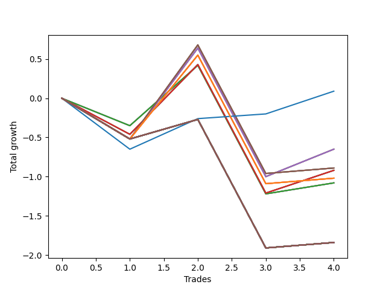

# Long Wallace 013 
- Symbol: SPY_Unlimited
- Date Range: 03/23/2022 - 07/08/2022
- Trading Period: 7:20-12:30
- Number of Trades: 4



| Name | Win Percent | Profit | Avg Profit / Trade | Avg Time / Trade |      | Name | Win Percent | Profit | Avg Profit / Trade | Avg Time / Trade |
| ---- | ----------- | ------ | ------------------ | ---------------- | ---- | ---- | ----------- | ------ | ------------------ | ---------------- |
| Sorted By <br> Profit | | | | | | Sorted By <br> Win Percentage ||||
| Seventy-Three | 75.00 | 45.00 | 11.25 | 10:50 |     | Seventy-Three | 75.00 | 45.00 | 11.25 | 10:50 |
| Sixty-Six | 50.00 | -325.00 | -81.25 | 22:42 |     | Sixty-Six | 50.00 | -325.00 | -81.25 | 22:42 |
| Fifty-Eight | 50.00 | -325.00 | -81.25 | 22:42 |     | Fifty-Eight | 50.00 | -325.00 | -81.25 | 22:42 |
| Fifty | 50.00 | -325.00 | -81.25 | 22:42 |     | Fifty | 50.00 | -325.00 | -81.25 | 22:42 |
| Forty-Two | 50.00 | -325.00 | -81.25 | 22:42 |     | Forty-Two | 50.00 | -325.00 | -81.25 | 22:42 |
| Two | 50.00 | -325.00 | -81.25 | 22:42 |     | Two | 50.00 | -325.00 | -81.25 | 22:42 |
| Sixty-Seven | 50.00 | -445.00 | -111.25 | 28:22 |     | Sixty-Seven | 50.00 | -445.00 | -111.25 | 28:22 |
| Fifty-Nine | 50.00 | -445.00 | -111.25 | 28:22 |     | Fifty-Nine | 50.00 | -445.00 | -111.25 | 28:22 |
| Fifty-One | 50.00 | -445.00 | -111.25 | 28:22 |     | Fifty-One | 50.00 | -445.00 | -111.25 | 28:22 |
| Forty-Three | 50.00 | -445.00 | -111.25 | 28:22 |     | Forty-Three | 50.00 | -445.00 | -111.25 | 28:22 |
| Three | 50.00 | -445.00 | -111.25 | 28:22 |     | Three | 50.00 | -445.00 | -111.25 | 28:22 |
| Sixty-Five | 50.00 | -460.00 | -115.00 | 22:12 |     | Sixty-Five | 50.00 | -460.00 | -115.00 | 22:12 |
| Fifty-Seven | 50.00 | -460.00 | -115.00 | 22:12 |     | Fifty-Seven | 50.00 | -460.00 | -115.00 | 22:12 |
| Forty-Nine | 50.00 | -460.00 | -115.00 | 22:12 |     | Forty-Nine | 50.00 | -460.00 | -115.00 | 22:12 |
| Forty-One | 50.00 | -460.00 | -115.00 | 22:12 |     | Forty-One | 50.00 | -460.00 | -115.00 | 22:12 |
| One | 50.00 | -460.00 | -115.00 | 22:12 |     | One | 50.00 | -460.00 | -115.00 | 22:12 |
| One Hundred Twenty-Six | 50.00 | -510.00 | -127.50 | 25:31 |     | One Hundred Twenty-Six | 50.00 | -510.00 | -127.50 | 25:31 |
| One Hundred Twenty-One | 50.00 | -510.00 | -127.50 | 25:31 |     | One Hundred Twenty-One | 50.00 | -510.00 | -127.50 | 25:31 |
| One Hundred Sixteen | 50.00 | -510.00 | -127.50 | 25:31 |     | One Hundred Sixteen | 50.00 | -510.00 | -127.50 | 25:31 |
| One Hundred Eleven | 50.00 | -510.00 | -127.50 | 25:31 |     | One Hundred Eleven | 50.00 | -510.00 | -127.50 | 25:31 |
| Eighty-One | 50.00 | -510.00 | -127.50 | 25:31 |     | Eighty-One | 50.00 | -510.00 | -127.50 | 25:31 |
| Sixty-Four | 50.00 | -540.00 | -135.00 | 16:12 |     | Sixty-Four | 50.00 | -540.00 | -135.00 | 16:12 |
| Fifty-Six | 50.00 | -540.00 | -135.00 | 16:12 |     | Fifty-Six | 50.00 | -540.00 | -135.00 | 16:12 |
| Forty-Eight | 50.00 | -540.00 | -135.00 | 16:12 |     | Forty-Eight | 50.00 | -540.00 | -135.00 | 16:12 |
| Forty | 50.00 | -540.00 | -135.00 | 16:12 |     | Forty | 50.00 | -540.00 | -135.00 | 16:12 |
| Zero | 50.00 | -540.00 | -135.00 | 16:12 |     | Zero | 50.00 | -540.00 | -135.00 | 16:12 |
| One Hundred Thirty | 50.00 | -920.00 | -230.00 | 29:55 |     | One Hundred Thirty | 50.00 | -920.00 | -230.00 | 29:55 |
| One Hundred Twenty-Nine | 50.00 | -920.00 | -230.00 | 29:55 |     | One Hundred Twenty-Nine | 50.00 | -920.00 | -230.00 | 29:55 |
| One Hundred Twenty-Eight | 50.00 | -920.00 | -230.00 | 29:55 |     | One Hundred Twenty-Eight | 50.00 | -920.00 | -230.00 | 29:55 |
| One Hundred Twenty-Seven | 50.00 | -920.00 | -230.00 | 29:55 |     | One Hundred Twenty-Seven | 50.00 | -920.00 | -230.00 | 29:55 |
| One Hundred Twenty-Five | 50.00 | -920.00 | -230.00 | 29:55 |     | One Hundred Twenty-Five | 50.00 | -920.00 | -230.00 | 29:55 |
| One Hundred Twenty-Four | 50.00 | -920.00 | -230.00 | 29:55 |     | One Hundred Twenty-Four | 50.00 | -920.00 | -230.00 | 29:55 |
| One Hundred Twenty-Three | 50.00 | -920.00 | -230.00 | 29:55 |     | One Hundred Twenty-Three | 50.00 | -920.00 | -230.00 | 29:55 |
| One Hundred Twenty-Two | 50.00 | -920.00 | -230.00 | 29:55 |     | One Hundred Twenty-Two | 50.00 | -920.00 | -230.00 | 29:55 |
| One Hundred Twenty | 50.00 | -920.00 | -230.00 | 29:55 |     | One Hundred Twenty | 50.00 | -920.00 | -230.00 | 29:55 |
| One Hundred Ninteen | 50.00 | -920.00 | -230.00 | 29:55 |     | One Hundred Ninteen | 50.00 | -920.00 | -230.00 | 29:55 |
| One Hundred Eighteen | 50.00 | -920.00 | -230.00 | 29:55 |     | One Hundred Eighteen | 50.00 | -920.00 | -230.00 | 29:55 |
| One Hundred Seventeen | 50.00 | -920.00 | -230.00 | 29:55 |     | One Hundred Seventeen | 50.00 | -920.00 | -230.00 | 29:55 |
| One Hundred Fifteen | 50.00 | -920.00 | -230.00 | 29:55 |     | One Hundred Fifteen | 50.00 | -920.00 | -230.00 | 29:55 |
| One Hundred Fourteen | 50.00 | -920.00 | -230.00 | 29:55 |     | One Hundred Fourteen | 50.00 | -920.00 | -230.00 | 29:55 |
| One Hundred Thirteen | 50.00 | -920.00 | -230.00 | 29:55 |     | One Hundred Thirteen | 50.00 | -920.00 | -230.00 | 29:55 |
| One Hundred Twelve | 50.00 | -920.00 | -230.00 | 29:55 |     | One Hundred Twelve | 50.00 | -920.00 | -230.00 | 29:55 |
| Eighty-Five | 50.00 | -920.00 | -230.00 | 29:55 |     | Eighty-Five | 50.00 | -920.00 | -230.00 | 29:55 |
| Eighty-Four | 50.00 | -920.00 | -230.00 | 29:55 |     | Eighty-Four | 50.00 | -920.00 | -230.00 | 29:55 |
| Eighty-Three | 50.00 | -920.00 | -230.00 | 29:55 |     | Eighty-Three | 50.00 | -920.00 | -230.00 | 29:55 |
| Eighty-Two | 50.00 | -920.00 | -230.00 | 29:55 |     | Eighty-Two | 50.00 | -920.00 | -230.00 | 29:55 |
| Seventy-One | 50.00 | -920.00 | -230.00 | 29:55 |     | Seventy-One | 50.00 | -920.00 | -230.00 | 29:55 |
| Seventy | 50.00 | -920.00 | -230.00 | 29:55 |     | Seventy | 50.00 | -920.00 | -230.00 | 29:55 |
| Sixty-Nine | 50.00 | -920.00 | -230.00 | 29:55 |     | Sixty-Nine | 50.00 | -920.00 | -230.00 | 29:55 |
| Sixty-Eight | 50.00 | -920.00 | -230.00 | 29:55 |     | Sixty-Eight | 50.00 | -920.00 | -230.00 | 29:55 |
| Sixty-Three | 50.00 | -920.00 | -230.00 | 29:55 |     | Sixty-Three | 50.00 | -920.00 | -230.00 | 29:55 |
| Sixty-Two | 50.00 | -920.00 | -230.00 | 29:55 |     | Sixty-Two | 50.00 | -920.00 | -230.00 | 29:55 |
| Sixty-One | 50.00 | -920.00 | -230.00 | 29:55 |     | Sixty-One | 50.00 | -920.00 | -230.00 | 29:55 |
| Sixty | 50.00 | -920.00 | -230.00 | 29:55 |     | Sixty | 50.00 | -920.00 | -230.00 | 29:55 |
| Fifty-Five | 50.00 | -920.00 | -230.00 | 29:55 |     | Fifty-Five | 50.00 | -920.00 | -230.00 | 29:55 |
| Fifty-Four | 50.00 | -920.00 | -230.00 | 29:55 |     | Fifty-Four | 50.00 | -920.00 | -230.00 | 29:55 |
| Fifty-Three | 50.00 | -920.00 | -230.00 | 29:55 |     | Fifty-Three | 50.00 | -920.00 | -230.00 | 29:55 |
| Fifty-Two | 50.00 | -920.00 | -230.00 | 29:55 |     | Fifty-Two | 50.00 | -920.00 | -230.00 | 29:55 |
| Forty-Seven | 50.00 | -920.00 | -230.00 | 29:55 |     | Forty-Seven | 50.00 | -920.00 | -230.00 | 29:55 |
| Forty-Six | 50.00 | -920.00 | -230.00 | 29:55 |     | Forty-Six | 50.00 | -920.00 | -230.00 | 29:55 |
| Forty-Five | 50.00 | -920.00 | -230.00 | 29:55 |     | Forty-Five | 50.00 | -920.00 | -230.00 | 29:55 |
| Forty-Four | 50.00 | -920.00 | -230.00 | 29:55 |     | Forty-Four | 50.00 | -920.00 | -230.00 | 29:55 |
| Seven | 50.00 | -920.00 | -230.00 | 29:55 |     | Seven | 50.00 | -920.00 | -230.00 | 29:55 |
| Six | 50.00 | -920.00 | -230.00 | 29:55 |     | Six | 50.00 | -920.00 | -230.00 | 29:55 |
| Five | 50.00 | -920.00 | -230.00 | 29:55 |     | Five | 50.00 | -920.00 | -230.00 | 29:55 |
| Four | 50.00 | -920.00 | -230.00 | 29:55 |     | Four | 50.00 | -920.00 | -230.00 | 29:55 |

## NO STOPLOSS

### Test Zero
* Sell when price hits the middle line of the 20p bollinger
* No Stoploss
* Results:
```
Total Trades: 4
Percent Up: 50.00
Percent Down: 50.00
Total Points Moved Up: -1.08
Potential Profit: -540.00
Total Points Ups: 0.91 Count Ups: 2
Total Points Downs: -1.99 Count Downs: 2
```

<details><summary>Trades</summary>

<code>In: 2022-03-23 10:23:00		Out: 2022-03-23 10:38:15		Total Position Time: 15:15		Total Move Up: -0.35		Total to Date: -0.35</code> <br />
<code>In: 2022-03-25 08:29:00		Out: 2022-03-25 08:36:40		Total Position Time: 07:40		Total Move Up: 0.77		Total to Date: 0.42</code> <br />
<code>In: 2022-03-28 08:27:00		Out: 2022-03-28 08:56:55		Total Position Time: 29:55		Total Move Up: -1.64		Total to Date: -1.22</code> <br />
<code>In: 2022-06-08 09:41:00		Out: 2022-06-08 09:53:00		Total Position Time: 12:00		Total Move Up: 0.14		Total to Date: -1.08</code> <br />


</details>

### Test One
* Sell when the price hits the upper line of the 20p 1std bollinger
* No Stoploss
* Results:
```
Total Trades: 4
Percent Up: 50.00
Percent Down: 50.00
Total Points Moved Up: -0.92
Potential Profit: -460.00
Total Points Ups: 1.18 Count Ups: 2
Total Points Downs: -2.10 Count Downs: 2
```

<details><summary>Trades</summary>

<code>In: 2022-03-23 10:23:00		Out: 2022-03-23 10:51:45		Total Position Time: 28:45		Total Move Up: -0.46		Total to Date: -0.46</code> <br />
<code>In: 2022-03-25 08:29:00		Out: 2022-03-25 08:41:05		Total Position Time: 12:05		Total Move Up: 0.89		Total to Date: 0.43</code> <br />
<code>In: 2022-03-28 08:27:00		Out: 2022-03-28 08:56:55		Total Position Time: 29:55		Total Move Up: -1.64		Total to Date: -1.21</code> <br />
<code>In: 2022-06-08 09:41:00		Out: 2022-06-08 09:59:05		Total Position Time: 18:05		Total Move Up: 0.29		Total to Date: -0.92</code> <br />


</details>

### Test Two
* Sell when the price hits the upper line of the 20p 2std bollinger
* No Stoploss
* Results:
```
Total Trades: 4
Percent Up: 50.00
Percent Down: 50.00
Total Points Moved Up: -0.65
Potential Profit: -325.00
Total Points Ups: 1.51 Count Ups: 2
Total Points Downs: -2.16 Count Downs: 2
```

<details><summary>Trades</summary>

<code>In: 2022-03-23 10:23:00		Out: 2022-03-23 10:52:55		Total Position Time: 29:55		Total Move Up: -0.52		Total to Date: -0.52</code> <br />
<code>In: 2022-03-25 08:29:00		Out: 2022-03-25 08:41:45		Total Position Time: 12:45		Total Move Up: 1.16		Total to Date: 0.64</code> <br />
<code>In: 2022-03-28 08:27:00		Out: 2022-03-28 08:56:55		Total Position Time: 29:55		Total Move Up: -1.64		Total to Date: -1.00</code> <br />
<code>In: 2022-06-08 09:41:00		Out: 2022-06-08 09:59:15		Total Position Time: 18:15		Total Move Up: 0.35		Total to Date: -0.65</code> <br />


</details>

### Test Three
* Sell when price hits the middle line of the 50p bollinger
* No Stoploss
* Results:
```
Total Trades: 4
Percent Up: 50.00
Percent Down: 50.00
Total Points Moved Up: -0.89
Potential Profit: -445.00
Total Points Ups: 1.27 Count Ups: 2
Total Points Downs: -2.16 Count Downs: 2
```

<details><summary>Trades</summary>

<code>In: 2022-03-23 10:23:00		Out: 2022-03-23 10:52:55		Total Position Time: 29:55		Total Move Up: -0.52		Total to Date: -0.52</code> <br />
<code>In: 2022-03-25 08:29:00		Out: 2022-03-25 08:52:45		Total Position Time: 23:45		Total Move Up: 1.20		Total to Date: 0.68</code> <br />
<code>In: 2022-03-28 08:27:00		Out: 2022-03-28 08:56:55		Total Position Time: 29:55		Total Move Up: -1.64		Total to Date: -0.96</code> <br />
<code>In: 2022-06-08 09:41:00		Out: 2022-06-08 10:10:55		Total Position Time: 29:55		Total Move Up: 0.07		Total to Date: -0.89</code> <br />


</details>

### Test Four
* Sell when the price hits the upper line of the 50p 1std bollinger
* No Stoploss
* Results:
```
Total Trades: 4
Percent Up: 50.00
Percent Down: 50.00
Total Points Moved Up: -1.84
Potential Profit: -920.00
Total Points Ups: 0.32 Count Ups: 2
Total Points Downs: -2.16 Count Downs: 2
```

<details><summary>Trades</summary>

<code>In: 2022-03-23 10:23:00		Out: 2022-03-23 10:52:55		Total Position Time: 29:55		Total Move Up: -0.52		Total to Date: -0.52</code> <br />
<code>In: 2022-03-25 08:29:00		Out: 2022-03-25 08:58:55		Total Position Time: 29:55		Total Move Up: 0.25		Total to Date: -0.27</code> <br />
<code>In: 2022-03-28 08:27:00		Out: 2022-03-28 08:56:55		Total Position Time: 29:55		Total Move Up: -1.64		Total to Date: -1.91</code> <br />
<code>In: 2022-06-08 09:41:00		Out: 2022-06-08 10:10:55		Total Position Time: 29:55		Total Move Up: 0.07		Total to Date: -1.84</code> <br />


</details>

### Test Five
* Sell when the price hits the upper line of the 50p 2std bollinger
* No Stoploss
* Results:
```
Total Trades: 4
Percent Up: 50.00
Percent Down: 50.00
Total Points Moved Up: -1.84
Potential Profit: -920.00
Total Points Ups: 0.32 Count Ups: 2
Total Points Downs: -2.16 Count Downs: 2
```

<details><summary>Trades</summary>

<code>In: 2022-03-23 10:23:00		Out: 2022-03-23 10:52:55		Total Position Time: 29:55		Total Move Up: -0.52		Total to Date: -0.52</code> <br />
<code>In: 2022-03-25 08:29:00		Out: 2022-03-25 08:58:55		Total Position Time: 29:55		Total Move Up: 0.25		Total to Date: -0.27</code> <br />
<code>In: 2022-03-28 08:27:00		Out: 2022-03-28 08:56:55		Total Position Time: 29:55		Total Move Up: -1.64		Total to Date: -1.91</code> <br />
<code>In: 2022-06-08 09:41:00		Out: 2022-06-08 10:10:55		Total Position Time: 29:55		Total Move Up: 0.07		Total to Date: -1.84</code> <br />


</details>

### Test Six
* Sell when the price hits the middle line of the 1std VWAP
* No Stoploss
* Results:
```
Total Trades: 4
Percent Up: 50.00
Percent Down: 50.00
Total Points Moved Up: -1.84
Potential Profit: -920.00
Total Points Ups: 0.32 Count Ups: 2
Total Points Downs: -2.16 Count Downs: 2
```

<details><summary>Trades</summary>

<code>In: 2022-03-23 10:23:00		Out: 2022-03-23 10:52:55		Total Position Time: 29:55		Total Move Up: -0.52		Total to Date: -0.52</code> <br />
<code>In: 2022-03-25 08:29:00		Out: 2022-03-25 08:58:55		Total Position Time: 29:55		Total Move Up: 0.25		Total to Date: -0.27</code> <br />
<code>In: 2022-03-28 08:27:00		Out: 2022-03-28 08:56:55		Total Position Time: 29:55		Total Move Up: -1.64		Total to Date: -1.91</code> <br />
<code>In: 2022-06-08 09:41:00		Out: 2022-06-08 10:10:55		Total Position Time: 29:55		Total Move Up: 0.07		Total to Date: -1.84</code> <br />


</details>

### Test Seven
* Sell when the price hits the upper line of the 1std VWAP
* No Stoploss
* Results:
```
Total Trades: 4
Percent Up: 50.00
Percent Down: 50.00
Total Points Moved Up: -1.84
Potential Profit: -920.00
Total Points Ups: 0.32 Count Ups: 2
Total Points Downs: -2.16 Count Downs: 2
```

<details><summary>Trades</summary>

<code>In: 2022-03-23 10:23:00		Out: 2022-03-23 10:52:55		Total Position Time: 29:55		Total Move Up: -0.52		Total to Date: -0.52</code> <br />
<code>In: 2022-03-25 08:29:00		Out: 2022-03-25 08:58:55		Total Position Time: 29:55		Total Move Up: 0.25		Total to Date: -0.27</code> <br />
<code>In: 2022-03-28 08:27:00		Out: 2022-03-28 08:56:55		Total Position Time: 29:55		Total Move Up: -1.64		Total to Date: -1.91</code> <br />
<code>In: 2022-06-08 09:41:00		Out: 2022-06-08 10:10:55		Total Position Time: 29:55		Total Move Up: 0.07		Total to Date: -1.84</code> <br />


</details>

## STOPLOSS OF 5

### Test Forty
* Sell when price hits the middle line of the 20p bollinger
* Stoploss is 5 points
* Results:
```
Total Trades: 4
Percent Up: 50.00
Percent Down: 50.00
Total Points Moved Up: -1.08
Potential Profit: -540.00
Total Points Ups: 0.91 Count Ups: 2
Total Points Downs: -1.99 Count Downs: 2
```

<details><summary>Trades</summary>

<code>In: 2022-03-23 10:23:00		Out: 2022-03-23 10:38:15		Total Position Time: 15:15		Total Move Up: -0.35		Total to Date: -0.35</code> <br />
<code>In: 2022-03-25 08:29:00		Out: 2022-03-25 08:36:40		Total Position Time: 07:40		Total Move Up: 0.77		Total to Date: 0.42</code> <br />
<code>In: 2022-03-28 08:27:00		Out: 2022-03-28 08:56:55		Total Position Time: 29:55		Total Move Up: -1.64		Total to Date: -1.22</code> <br />
<code>In: 2022-06-08 09:41:00		Out: 2022-06-08 09:53:00		Total Position Time: 12:00		Total Move Up: 0.14		Total to Date: -1.08</code> <br />


</details>

### Test Forty-One
* Sell when the price hits the upper line of the 20p 1std bollinger
* Stoploss is 5 points
* Results:
```
Total Trades: 4
Percent Up: 50.00
Percent Down: 50.00
Total Points Moved Up: -0.92
Potential Profit: -460.00
Total Points Ups: 1.18 Count Ups: 2
Total Points Downs: -2.10 Count Downs: 2
```

<details><summary>Trades</summary>

<code>In: 2022-03-23 10:23:00		Out: 2022-03-23 10:51:45		Total Position Time: 28:45		Total Move Up: -0.46		Total to Date: -0.46</code> <br />
<code>In: 2022-03-25 08:29:00		Out: 2022-03-25 08:41:05		Total Position Time: 12:05		Total Move Up: 0.89		Total to Date: 0.43</code> <br />
<code>In: 2022-03-28 08:27:00		Out: 2022-03-28 08:56:55		Total Position Time: 29:55		Total Move Up: -1.64		Total to Date: -1.21</code> <br />
<code>In: 2022-06-08 09:41:00		Out: 2022-06-08 09:59:05		Total Position Time: 18:05		Total Move Up: 0.29		Total to Date: -0.92</code> <br />


</details>

### Test Forty-Two
* Sell when the price hits the upper line of the 20p 2std bollinger
* Stoploss is 5 points
* Results:
```
Total Trades: 4
Percent Up: 50.00
Percent Down: 50.00
Total Points Moved Up: -0.65
Potential Profit: -325.00
Total Points Ups: 1.51 Count Ups: 2
Total Points Downs: -2.16 Count Downs: 2
```

<details><summary>Trades</summary>

<code>In: 2022-03-23 10:23:00		Out: 2022-03-23 10:52:55		Total Position Time: 29:55		Total Move Up: -0.52		Total to Date: -0.52</code> <br />
<code>In: 2022-03-25 08:29:00		Out: 2022-03-25 08:41:45		Total Position Time: 12:45		Total Move Up: 1.16		Total to Date: 0.64</code> <br />
<code>In: 2022-03-28 08:27:00		Out: 2022-03-28 08:56:55		Total Position Time: 29:55		Total Move Up: -1.64		Total to Date: -1.00</code> <br />
<code>In: 2022-06-08 09:41:00		Out: 2022-06-08 09:59:15		Total Position Time: 18:15		Total Move Up: 0.35		Total to Date: -0.65</code> <br />


</details>

### Test Forty-Three
* Sell when price hits the middle line of the 50p bollinger
* Stoploss is 5 points
* Results:
```
Total Trades: 4
Percent Up: 50.00
Percent Down: 50.00
Total Points Moved Up: -0.89
Potential Profit: -445.00
Total Points Ups: 1.27 Count Ups: 2
Total Points Downs: -2.16 Count Downs: 2
```

<details><summary>Trades</summary>

<code>In: 2022-03-23 10:23:00		Out: 2022-03-23 10:52:55		Total Position Time: 29:55		Total Move Up: -0.52		Total to Date: -0.52</code> <br />
<code>In: 2022-03-25 08:29:00		Out: 2022-03-25 08:52:45		Total Position Time: 23:45		Total Move Up: 1.20		Total to Date: 0.68</code> <br />
<code>In: 2022-03-28 08:27:00		Out: 2022-03-28 08:56:55		Total Position Time: 29:55		Total Move Up: -1.64		Total to Date: -0.96</code> <br />
<code>In: 2022-06-08 09:41:00		Out: 2022-06-08 10:10:55		Total Position Time: 29:55		Total Move Up: 0.07		Total to Date: -0.89</code> <br />


</details>

### Test Forty-Four
* Sell when the price hits the upper line of the 50p 1std bollinger
* Stoploss is 5 points
* Results:
```
Total Trades: 4
Percent Up: 50.00
Percent Down: 50.00
Total Points Moved Up: -1.84
Potential Profit: -920.00
Total Points Ups: 0.32 Count Ups: 2
Total Points Downs: -2.16 Count Downs: 2
```

<details><summary>Trades</summary>

<code>In: 2022-03-23 10:23:00		Out: 2022-03-23 10:52:55		Total Position Time: 29:55		Total Move Up: -0.52		Total to Date: -0.52</code> <br />
<code>In: 2022-03-25 08:29:00		Out: 2022-03-25 08:58:55		Total Position Time: 29:55		Total Move Up: 0.25		Total to Date: -0.27</code> <br />
<code>In: 2022-03-28 08:27:00		Out: 2022-03-28 08:56:55		Total Position Time: 29:55		Total Move Up: -1.64		Total to Date: -1.91</code> <br />
<code>In: 2022-06-08 09:41:00		Out: 2022-06-08 10:10:55		Total Position Time: 29:55		Total Move Up: 0.07		Total to Date: -1.84</code> <br />


</details>

### Test Forty-Five
* Sell when the price hits the upper line of the 50p 2std bollinger
* Stoploss is 5 points
* Results:
```
Total Trades: 4
Percent Up: 50.00
Percent Down: 50.00
Total Points Moved Up: -1.84
Potential Profit: -920.00
Total Points Ups: 0.32 Count Ups: 2
Total Points Downs: -2.16 Count Downs: 2
```

<details><summary>Trades</summary>

<code>In: 2022-03-23 10:23:00		Out: 2022-03-23 10:52:55		Total Position Time: 29:55		Total Move Up: -0.52		Total to Date: -0.52</code> <br />
<code>In: 2022-03-25 08:29:00		Out: 2022-03-25 08:58:55		Total Position Time: 29:55		Total Move Up: 0.25		Total to Date: -0.27</code> <br />
<code>In: 2022-03-28 08:27:00		Out: 2022-03-28 08:56:55		Total Position Time: 29:55		Total Move Up: -1.64		Total to Date: -1.91</code> <br />
<code>In: 2022-06-08 09:41:00		Out: 2022-06-08 10:10:55		Total Position Time: 29:55		Total Move Up: 0.07		Total to Date: -1.84</code> <br />


</details>

### Test Forty-Six
* Sell when the price hits the middle line of the 1std VWAP
* Stoploss is 5 points
* Results:
```
Total Trades: 4
Percent Up: 50.00
Percent Down: 50.00
Total Points Moved Up: -1.84
Potential Profit: -920.00
Total Points Ups: 0.32 Count Ups: 2
Total Points Downs: -2.16 Count Downs: 2
```

<details><summary>Trades</summary>

<code>In: 2022-03-23 10:23:00		Out: 2022-03-23 10:52:55		Total Position Time: 29:55		Total Move Up: -0.52		Total to Date: -0.52</code> <br />
<code>In: 2022-03-25 08:29:00		Out: 2022-03-25 08:58:55		Total Position Time: 29:55		Total Move Up: 0.25		Total to Date: -0.27</code> <br />
<code>In: 2022-03-28 08:27:00		Out: 2022-03-28 08:56:55		Total Position Time: 29:55		Total Move Up: -1.64		Total to Date: -1.91</code> <br />
<code>In: 2022-06-08 09:41:00		Out: 2022-06-08 10:10:55		Total Position Time: 29:55		Total Move Up: 0.07		Total to Date: -1.84</code> <br />


</details>

### Test Forty-Seven
* Sell when the price hits the upper line of the 1std VWAP
* Stoploss is 5 points
* Results:
```
Total Trades: 4
Percent Up: 50.00
Percent Down: 50.00
Total Points Moved Up: -1.84
Potential Profit: -920.00
Total Points Ups: 0.32 Count Ups: 2
Total Points Downs: -2.16 Count Downs: 2
```

<details><summary>Trades</summary>

<code>In: 2022-03-23 10:23:00		Out: 2022-03-23 10:52:55		Total Position Time: 29:55		Total Move Up: -0.52		Total to Date: -0.52</code> <br />
<code>In: 2022-03-25 08:29:00		Out: 2022-03-25 08:58:55		Total Position Time: 29:55		Total Move Up: 0.25		Total to Date: -0.27</code> <br />
<code>In: 2022-03-28 08:27:00		Out: 2022-03-28 08:56:55		Total Position Time: 29:55		Total Move Up: -1.64		Total to Date: -1.91</code> <br />
<code>In: 2022-06-08 09:41:00		Out: 2022-06-08 10:10:55		Total Position Time: 29:55		Total Move Up: 0.07		Total to Date: -1.84</code> <br />


</details>

## TRAIL STOP OF 5

### Test Forty-Eight
* Sell when price hits the middle line of the 20p bollinger
* Trailing Stop is 5 points
* Results:
```
Total Trades: 4
Percent Up: 50.00
Percent Down: 50.00
Total Points Moved Up: -1.08
Potential Profit: -540.00
Total Points Ups: 0.91 Count Ups: 2
Total Points Downs: -1.99 Count Downs: 2
```

<details><summary>Trades</summary>

<code>In: 2022-03-23 10:23:00		Out: 2022-03-23 10:38:15		Total Position Time: 15:15		Total Move Up: -0.35		Total to Date: -0.35</code> <br />
<code>In: 2022-03-25 08:29:00		Out: 2022-03-25 08:36:40		Total Position Time: 07:40		Total Move Up: 0.77		Total to Date: 0.42</code> <br />
<code>In: 2022-03-28 08:27:00		Out: 2022-03-28 08:56:55		Total Position Time: 29:55		Total Move Up: -1.64		Total to Date: -1.22</code> <br />
<code>In: 2022-06-08 09:41:00		Out: 2022-06-08 09:53:00		Total Position Time: 12:00		Total Move Up: 0.14		Total to Date: -1.08</code> <br />


</details>

### Test Forty-Nine
* Sell when the price hits the upper line of the 20p 1std bollinger
* Trailing Stop is 5 points
* Results:
```
Total Trades: 4
Percent Up: 50.00
Percent Down: 50.00
Total Points Moved Up: -0.92
Potential Profit: -460.00
Total Points Ups: 1.18 Count Ups: 2
Total Points Downs: -2.10 Count Downs: 2
```

<details><summary>Trades</summary>

<code>In: 2022-03-23 10:23:00		Out: 2022-03-23 10:51:45		Total Position Time: 28:45		Total Move Up: -0.46		Total to Date: -0.46</code> <br />
<code>In: 2022-03-25 08:29:00		Out: 2022-03-25 08:41:05		Total Position Time: 12:05		Total Move Up: 0.89		Total to Date: 0.43</code> <br />
<code>In: 2022-03-28 08:27:00		Out: 2022-03-28 08:56:55		Total Position Time: 29:55		Total Move Up: -1.64		Total to Date: -1.21</code> <br />
<code>In: 2022-06-08 09:41:00		Out: 2022-06-08 09:59:05		Total Position Time: 18:05		Total Move Up: 0.29		Total to Date: -0.92</code> <br />


</details>

### Test Fifty
* Sell when the price hits the upper line of the 20p 2std bollinger
* Trailing Stop is 5 points
* Results:
```
Total Trades: 4
Percent Up: 50.00
Percent Down: 50.00
Total Points Moved Up: -0.65
Potential Profit: -325.00
Total Points Ups: 1.51 Count Ups: 2
Total Points Downs: -2.16 Count Downs: 2
```

<details><summary>Trades</summary>

<code>In: 2022-03-23 10:23:00		Out: 2022-03-23 10:52:55		Total Position Time: 29:55		Total Move Up: -0.52		Total to Date: -0.52</code> <br />
<code>In: 2022-03-25 08:29:00		Out: 2022-03-25 08:41:45		Total Position Time: 12:45		Total Move Up: 1.16		Total to Date: 0.64</code> <br />
<code>In: 2022-03-28 08:27:00		Out: 2022-03-28 08:56:55		Total Position Time: 29:55		Total Move Up: -1.64		Total to Date: -1.00</code> <br />
<code>In: 2022-06-08 09:41:00		Out: 2022-06-08 09:59:15		Total Position Time: 18:15		Total Move Up: 0.35		Total to Date: -0.65</code> <br />


</details>

### Test Fifty-One
* Sell when price hits the middle line of the 50p bollinger
* Trailing Stop is 5 points
* Results:
```
Total Trades: 4
Percent Up: 50.00
Percent Down: 50.00
Total Points Moved Up: -0.89
Potential Profit: -445.00
Total Points Ups: 1.27 Count Ups: 2
Total Points Downs: -2.16 Count Downs: 2
```

<details><summary>Trades</summary>

<code>In: 2022-03-23 10:23:00		Out: 2022-03-23 10:52:55		Total Position Time: 29:55		Total Move Up: -0.52		Total to Date: -0.52</code> <br />
<code>In: 2022-03-25 08:29:00		Out: 2022-03-25 08:52:45		Total Position Time: 23:45		Total Move Up: 1.20		Total to Date: 0.68</code> <br />
<code>In: 2022-03-28 08:27:00		Out: 2022-03-28 08:56:55		Total Position Time: 29:55		Total Move Up: -1.64		Total to Date: -0.96</code> <br />
<code>In: 2022-06-08 09:41:00		Out: 2022-06-08 10:10:55		Total Position Time: 29:55		Total Move Up: 0.07		Total to Date: -0.89</code> <br />


</details>

### Test Fifty-Two
* Sell when the price hits the upper line of the 50p 1std bollinger
* Trailing Stop is 5 points
* Results:
```
Total Trades: 4
Percent Up: 50.00
Percent Down: 50.00
Total Points Moved Up: -1.84
Potential Profit: -920.00
Total Points Ups: 0.32 Count Ups: 2
Total Points Downs: -2.16 Count Downs: 2
```

<details><summary>Trades</summary>

<code>In: 2022-03-23 10:23:00		Out: 2022-03-23 10:52:55		Total Position Time: 29:55		Total Move Up: -0.52		Total to Date: -0.52</code> <br />
<code>In: 2022-03-25 08:29:00		Out: 2022-03-25 08:58:55		Total Position Time: 29:55		Total Move Up: 0.25		Total to Date: -0.27</code> <br />
<code>In: 2022-03-28 08:27:00		Out: 2022-03-28 08:56:55		Total Position Time: 29:55		Total Move Up: -1.64		Total to Date: -1.91</code> <br />
<code>In: 2022-06-08 09:41:00		Out: 2022-06-08 10:10:55		Total Position Time: 29:55		Total Move Up: 0.07		Total to Date: -1.84</code> <br />


</details>

### Test Fifty-Three
* Sell when the price hits the upper line of the 50p 2std bollinger
* Trailing Stop is 5 points
* Results:
```
Total Trades: 4
Percent Up: 50.00
Percent Down: 50.00
Total Points Moved Up: -1.84
Potential Profit: -920.00
Total Points Ups: 0.32 Count Ups: 2
Total Points Downs: -2.16 Count Downs: 2
```

<details><summary>Trades</summary>

<code>In: 2022-03-23 10:23:00		Out: 2022-03-23 10:52:55		Total Position Time: 29:55		Total Move Up: -0.52		Total to Date: -0.52</code> <br />
<code>In: 2022-03-25 08:29:00		Out: 2022-03-25 08:58:55		Total Position Time: 29:55		Total Move Up: 0.25		Total to Date: -0.27</code> <br />
<code>In: 2022-03-28 08:27:00		Out: 2022-03-28 08:56:55		Total Position Time: 29:55		Total Move Up: -1.64		Total to Date: -1.91</code> <br />
<code>In: 2022-06-08 09:41:00		Out: 2022-06-08 10:10:55		Total Position Time: 29:55		Total Move Up: 0.07		Total to Date: -1.84</code> <br />


</details>

### Test Fifty-Four
* Sell when the price hits the middle line of the 1std VWAP
* Trailing Stop is 5 points
* Results:
```
Total Trades: 4
Percent Up: 50.00
Percent Down: 50.00
Total Points Moved Up: -1.84
Potential Profit: -920.00
Total Points Ups: 0.32 Count Ups: 2
Total Points Downs: -2.16 Count Downs: 2
```

<details><summary>Trades</summary>

<code>In: 2022-03-23 10:23:00		Out: 2022-03-23 10:52:55		Total Position Time: 29:55		Total Move Up: -0.52		Total to Date: -0.52</code> <br />
<code>In: 2022-03-25 08:29:00		Out: 2022-03-25 08:58:55		Total Position Time: 29:55		Total Move Up: 0.25		Total to Date: -0.27</code> <br />
<code>In: 2022-03-28 08:27:00		Out: 2022-03-28 08:56:55		Total Position Time: 29:55		Total Move Up: -1.64		Total to Date: -1.91</code> <br />
<code>In: 2022-06-08 09:41:00		Out: 2022-06-08 10:10:55		Total Position Time: 29:55		Total Move Up: 0.07		Total to Date: -1.84</code> <br />


</details>

### Test Fifty-Five
* Sell when the price hits the upper line of the 1std VWAP
* Trailing Stop is 5 points
* Results:
```
Total Trades: 4
Percent Up: 50.00
Percent Down: 50.00
Total Points Moved Up: -1.84
Potential Profit: -920.00
Total Points Ups: 0.32 Count Ups: 2
Total Points Downs: -2.16 Count Downs: 2
```

<details><summary>Trades</summary>

<code>In: 2022-03-23 10:23:00		Out: 2022-03-23 10:52:55		Total Position Time: 29:55		Total Move Up: -0.52		Total to Date: -0.52</code> <br />
<code>In: 2022-03-25 08:29:00		Out: 2022-03-25 08:58:55		Total Position Time: 29:55		Total Move Up: 0.25		Total to Date: -0.27</code> <br />
<code>In: 2022-03-28 08:27:00		Out: 2022-03-28 08:56:55		Total Position Time: 29:55		Total Move Up: -1.64		Total to Date: -1.91</code> <br />
<code>In: 2022-06-08 09:41:00		Out: 2022-06-08 10:10:55		Total Position Time: 29:55		Total Move Up: 0.07		Total to Date: -1.84</code> <br />


</details>

## STOPLOSS OF 10

### Test Fifty-Six
* Sell when price hits the middle line of the 20p bollinger
* Stoploss is 10 points
* Results:
```
Total Trades: 4
Percent Up: 50.00
Percent Down: 50.00
Total Points Moved Up: -1.08
Potential Profit: -540.00
Total Points Ups: 0.91 Count Ups: 2
Total Points Downs: -1.99 Count Downs: 2
```

<details><summary>Trades</summary>

<code>In: 2022-03-23 10:23:00		Out: 2022-03-23 10:38:15		Total Position Time: 15:15		Total Move Up: -0.35		Total to Date: -0.35</code> <br />
<code>In: 2022-03-25 08:29:00		Out: 2022-03-25 08:36:40		Total Position Time: 07:40		Total Move Up: 0.77		Total to Date: 0.42</code> <br />
<code>In: 2022-03-28 08:27:00		Out: 2022-03-28 08:56:55		Total Position Time: 29:55		Total Move Up: -1.64		Total to Date: -1.22</code> <br />
<code>In: 2022-06-08 09:41:00		Out: 2022-06-08 09:53:00		Total Position Time: 12:00		Total Move Up: 0.14		Total to Date: -1.08</code> <br />


</details>

### Test Fifty-Seven
* Sell when the price hits the upper line of the 20p 1std bollinger
* Stoploss is 10 points
* Results:
```
Total Trades: 4
Percent Up: 50.00
Percent Down: 50.00
Total Points Moved Up: -0.92
Potential Profit: -460.00
Total Points Ups: 1.18 Count Ups: 2
Total Points Downs: -2.10 Count Downs: 2
```

<details><summary>Trades</summary>

<code>In: 2022-03-23 10:23:00		Out: 2022-03-23 10:51:45		Total Position Time: 28:45		Total Move Up: -0.46		Total to Date: -0.46</code> <br />
<code>In: 2022-03-25 08:29:00		Out: 2022-03-25 08:41:05		Total Position Time: 12:05		Total Move Up: 0.89		Total to Date: 0.43</code> <br />
<code>In: 2022-03-28 08:27:00		Out: 2022-03-28 08:56:55		Total Position Time: 29:55		Total Move Up: -1.64		Total to Date: -1.21</code> <br />
<code>In: 2022-06-08 09:41:00		Out: 2022-06-08 09:59:05		Total Position Time: 18:05		Total Move Up: 0.29		Total to Date: -0.92</code> <br />


</details>

### Test Fifty-Eight
* Sell when the price hits the upper line of the 20p 2std bollinger
* Stoploss is 10 points
* Results:
```
Total Trades: 4
Percent Up: 50.00
Percent Down: 50.00
Total Points Moved Up: -0.65
Potential Profit: -325.00
Total Points Ups: 1.51 Count Ups: 2
Total Points Downs: -2.16 Count Downs: 2
```

<details><summary>Trades</summary>

<code>In: 2022-03-23 10:23:00		Out: 2022-03-23 10:52:55		Total Position Time: 29:55		Total Move Up: -0.52		Total to Date: -0.52</code> <br />
<code>In: 2022-03-25 08:29:00		Out: 2022-03-25 08:41:45		Total Position Time: 12:45		Total Move Up: 1.16		Total to Date: 0.64</code> <br />
<code>In: 2022-03-28 08:27:00		Out: 2022-03-28 08:56:55		Total Position Time: 29:55		Total Move Up: -1.64		Total to Date: -1.00</code> <br />
<code>In: 2022-06-08 09:41:00		Out: 2022-06-08 09:59:15		Total Position Time: 18:15		Total Move Up: 0.35		Total to Date: -0.65</code> <br />


</details>

### Test Fifty-Nine
* Sell when price hits the middle line of the 50p bollinger
* Stoploss is 10 points
* Results:
```
Total Trades: 4
Percent Up: 50.00
Percent Down: 50.00
Total Points Moved Up: -0.89
Potential Profit: -445.00
Total Points Ups: 1.27 Count Ups: 2
Total Points Downs: -2.16 Count Downs: 2
```

<details><summary>Trades</summary>

<code>In: 2022-03-23 10:23:00		Out: 2022-03-23 10:52:55		Total Position Time: 29:55		Total Move Up: -0.52		Total to Date: -0.52</code> <br />
<code>In: 2022-03-25 08:29:00		Out: 2022-03-25 08:52:45		Total Position Time: 23:45		Total Move Up: 1.20		Total to Date: 0.68</code> <br />
<code>In: 2022-03-28 08:27:00		Out: 2022-03-28 08:56:55		Total Position Time: 29:55		Total Move Up: -1.64		Total to Date: -0.96</code> <br />
<code>In: 2022-06-08 09:41:00		Out: 2022-06-08 10:10:55		Total Position Time: 29:55		Total Move Up: 0.07		Total to Date: -0.89</code> <br />


</details>

### Test Sixty
* Sell when the price hits the upper line of the 50p 1std bollinger
* Stoploss is 10 points
* Results:
```
Total Trades: 4
Percent Up: 50.00
Percent Down: 50.00
Total Points Moved Up: -1.84
Potential Profit: -920.00
Total Points Ups: 0.32 Count Ups: 2
Total Points Downs: -2.16 Count Downs: 2
```

<details><summary>Trades</summary>

<code>In: 2022-03-23 10:23:00		Out: 2022-03-23 10:52:55		Total Position Time: 29:55		Total Move Up: -0.52		Total to Date: -0.52</code> <br />
<code>In: 2022-03-25 08:29:00		Out: 2022-03-25 08:58:55		Total Position Time: 29:55		Total Move Up: 0.25		Total to Date: -0.27</code> <br />
<code>In: 2022-03-28 08:27:00		Out: 2022-03-28 08:56:55		Total Position Time: 29:55		Total Move Up: -1.64		Total to Date: -1.91</code> <br />
<code>In: 2022-06-08 09:41:00		Out: 2022-06-08 10:10:55		Total Position Time: 29:55		Total Move Up: 0.07		Total to Date: -1.84</code> <br />


</details>

### Test Sixty-One
* Sell when the price hits the upper line of the 50p 2std bollinger
* Stoploss is 10 points
* Results:
```
Total Trades: 4
Percent Up: 50.00
Percent Down: 50.00
Total Points Moved Up: -1.84
Potential Profit: -920.00
Total Points Ups: 0.32 Count Ups: 2
Total Points Downs: -2.16 Count Downs: 2
```

<details><summary>Trades</summary>

<code>In: 2022-03-23 10:23:00		Out: 2022-03-23 10:52:55		Total Position Time: 29:55		Total Move Up: -0.52		Total to Date: -0.52</code> <br />
<code>In: 2022-03-25 08:29:00		Out: 2022-03-25 08:58:55		Total Position Time: 29:55		Total Move Up: 0.25		Total to Date: -0.27</code> <br />
<code>In: 2022-03-28 08:27:00		Out: 2022-03-28 08:56:55		Total Position Time: 29:55		Total Move Up: -1.64		Total to Date: -1.91</code> <br />
<code>In: 2022-06-08 09:41:00		Out: 2022-06-08 10:10:55		Total Position Time: 29:55		Total Move Up: 0.07		Total to Date: -1.84</code> <br />


</details>

### Test Sixty-Two
* Sell when the price hits the middle line of the 1std VWAP
* Stoploss is 10 points
* Results:
```
Total Trades: 4
Percent Up: 50.00
Percent Down: 50.00
Total Points Moved Up: -1.84
Potential Profit: -920.00
Total Points Ups: 0.32 Count Ups: 2
Total Points Downs: -2.16 Count Downs: 2
```

<details><summary>Trades</summary>

<code>In: 2022-03-23 10:23:00		Out: 2022-03-23 10:52:55		Total Position Time: 29:55		Total Move Up: -0.52		Total to Date: -0.52</code> <br />
<code>In: 2022-03-25 08:29:00		Out: 2022-03-25 08:58:55		Total Position Time: 29:55		Total Move Up: 0.25		Total to Date: -0.27</code> <br />
<code>In: 2022-03-28 08:27:00		Out: 2022-03-28 08:56:55		Total Position Time: 29:55		Total Move Up: -1.64		Total to Date: -1.91</code> <br />
<code>In: 2022-06-08 09:41:00		Out: 2022-06-08 10:10:55		Total Position Time: 29:55		Total Move Up: 0.07		Total to Date: -1.84</code> <br />


</details>

### Test Sixty-Three
* Sell when the price hits the upper line of the 1std VWAP
* Stoploss is 10 points
* Results:
```
Total Trades: 4
Percent Up: 50.00
Percent Down: 50.00
Total Points Moved Up: -1.84
Potential Profit: -920.00
Total Points Ups: 0.32 Count Ups: 2
Total Points Downs: -2.16 Count Downs: 2
```

<details><summary>Trades</summary>

<code>In: 2022-03-23 10:23:00		Out: 2022-03-23 10:52:55		Total Position Time: 29:55		Total Move Up: -0.52		Total to Date: -0.52</code> <br />
<code>In: 2022-03-25 08:29:00		Out: 2022-03-25 08:58:55		Total Position Time: 29:55		Total Move Up: 0.25		Total to Date: -0.27</code> <br />
<code>In: 2022-03-28 08:27:00		Out: 2022-03-28 08:56:55		Total Position Time: 29:55		Total Move Up: -1.64		Total to Date: -1.91</code> <br />
<code>In: 2022-06-08 09:41:00		Out: 2022-06-08 10:10:55		Total Position Time: 29:55		Total Move Up: 0.07		Total to Date: -1.84</code> <br />


</details>

## TRAIL STOP OF 10

### Test Sixty-Four
* Sell when price hits the middle line of the 20p bollinger
* Trailing Stop is 10 points
* Results:
```
Total Trades: 4
Percent Up: 50.00
Percent Down: 50.00
Total Points Moved Up: -1.08
Potential Profit: -540.00
Total Points Ups: 0.91 Count Ups: 2
Total Points Downs: -1.99 Count Downs: 2
```

<details><summary>Trades</summary>

<code>In: 2022-03-23 10:23:00		Out: 2022-03-23 10:38:15		Total Position Time: 15:15		Total Move Up: -0.35		Total to Date: -0.35</code> <br />
<code>In: 2022-03-25 08:29:00		Out: 2022-03-25 08:36:40		Total Position Time: 07:40		Total Move Up: 0.77		Total to Date: 0.42</code> <br />
<code>In: 2022-03-28 08:27:00		Out: 2022-03-28 08:56:55		Total Position Time: 29:55		Total Move Up: -1.64		Total to Date: -1.22</code> <br />
<code>In: 2022-06-08 09:41:00		Out: 2022-06-08 09:53:00		Total Position Time: 12:00		Total Move Up: 0.14		Total to Date: -1.08</code> <br />


</details>

### Test Sixty-Five
* Sell when the price hits the upper line of the 20p 1std bollinger
* Trailing Stop is 10 points
* Results:
```
Total Trades: 4
Percent Up: 50.00
Percent Down: 50.00
Total Points Moved Up: -0.92
Potential Profit: -460.00
Total Points Ups: 1.18 Count Ups: 2
Total Points Downs: -2.10 Count Downs: 2
```

<details><summary>Trades</summary>

<code>In: 2022-03-23 10:23:00		Out: 2022-03-23 10:51:45		Total Position Time: 28:45		Total Move Up: -0.46		Total to Date: -0.46</code> <br />
<code>In: 2022-03-25 08:29:00		Out: 2022-03-25 08:41:05		Total Position Time: 12:05		Total Move Up: 0.89		Total to Date: 0.43</code> <br />
<code>In: 2022-03-28 08:27:00		Out: 2022-03-28 08:56:55		Total Position Time: 29:55		Total Move Up: -1.64		Total to Date: -1.21</code> <br />
<code>In: 2022-06-08 09:41:00		Out: 2022-06-08 09:59:05		Total Position Time: 18:05		Total Move Up: 0.29		Total to Date: -0.92</code> <br />


</details>

### Test Sixty-Six
* Sell when the price hits the upper line of the 20p 2std bollinger
* Trailing Stop is 10 points
* Results:
```
Total Trades: 4
Percent Up: 50.00
Percent Down: 50.00
Total Points Moved Up: -0.65
Potential Profit: -325.00
Total Points Ups: 1.51 Count Ups: 2
Total Points Downs: -2.16 Count Downs: 2
```

<details><summary>Trades</summary>

<code>In: 2022-03-23 10:23:00		Out: 2022-03-23 10:52:55		Total Position Time: 29:55		Total Move Up: -0.52		Total to Date: -0.52</code> <br />
<code>In: 2022-03-25 08:29:00		Out: 2022-03-25 08:41:45		Total Position Time: 12:45		Total Move Up: 1.16		Total to Date: 0.64</code> <br />
<code>In: 2022-03-28 08:27:00		Out: 2022-03-28 08:56:55		Total Position Time: 29:55		Total Move Up: -1.64		Total to Date: -1.00</code> <br />
<code>In: 2022-06-08 09:41:00		Out: 2022-06-08 09:59:15		Total Position Time: 18:15		Total Move Up: 0.35		Total to Date: -0.65</code> <br />


</details>

### Test Sixty-Seven
* Sell when price hits the middle line of the 50p bollinger
* Trailing Stop is 10 points
* Results:
```
Total Trades: 4
Percent Up: 50.00
Percent Down: 50.00
Total Points Moved Up: -0.89
Potential Profit: -445.00
Total Points Ups: 1.27 Count Ups: 2
Total Points Downs: -2.16 Count Downs: 2
```

<details><summary>Trades</summary>

<code>In: 2022-03-23 10:23:00		Out: 2022-03-23 10:52:55		Total Position Time: 29:55		Total Move Up: -0.52		Total to Date: -0.52</code> <br />
<code>In: 2022-03-25 08:29:00		Out: 2022-03-25 08:52:45		Total Position Time: 23:45		Total Move Up: 1.20		Total to Date: 0.68</code> <br />
<code>In: 2022-03-28 08:27:00		Out: 2022-03-28 08:56:55		Total Position Time: 29:55		Total Move Up: -1.64		Total to Date: -0.96</code> <br />
<code>In: 2022-06-08 09:41:00		Out: 2022-06-08 10:10:55		Total Position Time: 29:55		Total Move Up: 0.07		Total to Date: -0.89</code> <br />


</details>

### Test Sixty-Eight
* Sell when the price hits the upper line of the 50p 1std bollinger
* Trailing Stop is 10 points
* Results:
```
Total Trades: 4
Percent Up: 50.00
Percent Down: 50.00
Total Points Moved Up: -1.84
Potential Profit: -920.00
Total Points Ups: 0.32 Count Ups: 2
Total Points Downs: -2.16 Count Downs: 2
```

<details><summary>Trades</summary>

<code>In: 2022-03-23 10:23:00		Out: 2022-03-23 10:52:55		Total Position Time: 29:55		Total Move Up: -0.52		Total to Date: -0.52</code> <br />
<code>In: 2022-03-25 08:29:00		Out: 2022-03-25 08:58:55		Total Position Time: 29:55		Total Move Up: 0.25		Total to Date: -0.27</code> <br />
<code>In: 2022-03-28 08:27:00		Out: 2022-03-28 08:56:55		Total Position Time: 29:55		Total Move Up: -1.64		Total to Date: -1.91</code> <br />
<code>In: 2022-06-08 09:41:00		Out: 2022-06-08 10:10:55		Total Position Time: 29:55		Total Move Up: 0.07		Total to Date: -1.84</code> <br />


</details>

### Test Sixty-Nine
* Sell when the price hits the upper line of the 50p 2std bollinger
* Trailing Stop is 10 points
* Results:
```
Total Trades: 4
Percent Up: 50.00
Percent Down: 50.00
Total Points Moved Up: -1.84
Potential Profit: -920.00
Total Points Ups: 0.32 Count Ups: 2
Total Points Downs: -2.16 Count Downs: 2
```

<details><summary>Trades</summary>

<code>In: 2022-03-23 10:23:00		Out: 2022-03-23 10:52:55		Total Position Time: 29:55		Total Move Up: -0.52		Total to Date: -0.52</code> <br />
<code>In: 2022-03-25 08:29:00		Out: 2022-03-25 08:58:55		Total Position Time: 29:55		Total Move Up: 0.25		Total to Date: -0.27</code> <br />
<code>In: 2022-03-28 08:27:00		Out: 2022-03-28 08:56:55		Total Position Time: 29:55		Total Move Up: -1.64		Total to Date: -1.91</code> <br />
<code>In: 2022-06-08 09:41:00		Out: 2022-06-08 10:10:55		Total Position Time: 29:55		Total Move Up: 0.07		Total to Date: -1.84</code> <br />


</details>

### Test Seventy
* Sell when the price hits the middle line of the 1std VWAP
* Trailing Stop is 10 points
* Results:
```
Total Trades: 4
Percent Up: 50.00
Percent Down: 50.00
Total Points Moved Up: -1.84
Potential Profit: -920.00
Total Points Ups: 0.32 Count Ups: 2
Total Points Downs: -2.16 Count Downs: 2
```

<details><summary>Trades</summary>

<code>In: 2022-03-23 10:23:00		Out: 2022-03-23 10:52:55		Total Position Time: 29:55		Total Move Up: -0.52		Total to Date: -0.52</code> <br />
<code>In: 2022-03-25 08:29:00		Out: 2022-03-25 08:58:55		Total Position Time: 29:55		Total Move Up: 0.25		Total to Date: -0.27</code> <br />
<code>In: 2022-03-28 08:27:00		Out: 2022-03-28 08:56:55		Total Position Time: 29:55		Total Move Up: -1.64		Total to Date: -1.91</code> <br />
<code>In: 2022-06-08 09:41:00		Out: 2022-06-08 10:10:55		Total Position Time: 29:55		Total Move Up: 0.07		Total to Date: -1.84</code> <br />


</details>

### Test Seventy-One
* Sell when the price hits the upper line of the 1std VWAP
* Trailing Stop is 10 points
* Results:
```
Total Trades: 4
Percent Up: 50.00
Percent Down: 50.00
Total Points Moved Up: -1.84
Potential Profit: -920.00
Total Points Ups: 0.32 Count Ups: 2
Total Points Downs: -2.16 Count Downs: 2
```

<details><summary>Trades</summary>

<code>In: 2022-03-23 10:23:00		Out: 2022-03-23 10:52:55		Total Position Time: 29:55		Total Move Up: -0.52		Total to Date: -0.52</code> <br />
<code>In: 2022-03-25 08:29:00		Out: 2022-03-25 08:58:55		Total Position Time: 29:55		Total Move Up: 0.25		Total to Date: -0.27</code> <br />
<code>In: 2022-03-28 08:27:00		Out: 2022-03-28 08:56:55		Total Position Time: 29:55		Total Move Up: -1.64		Total to Date: -1.91</code> <br />
<code>In: 2022-06-08 09:41:00		Out: 2022-06-08 10:10:55		Total Position Time: 29:55		Total Move Up: 0.07		Total to Date: -1.84</code> <br />


</details>

## SPECIAL EXIT CONDITIONS 

### Test Seventy-Three
* Sell when the linear regression slope changes to negative
* No Stoploss
* Results:
```
Total Trades: 4
Percent Up: 75.00
Percent Down: 25.00
Total Points Moved Up: 0.09
Potential Profit: 45.00
Total Points Ups: 0.74 Count Ups: 3
Total Points Downs: -0.65 Count Downs: 1
```

<details><summary>Trades</summary>

<code>In: 2022-03-23 10:23:00		Out: 2022-03-23 10:41:05		Total Position Time: 18:05		Total Move Up: -0.65		Total to Date: -0.65</code> <br />
<code>In: 2022-03-25 08:29:00		Out: 2022-03-25 08:32:05		Total Position Time: 03:05		Total Move Up: 0.39		Total to Date: -0.26</code> <br />
<code>In: 2022-03-28 08:27:00		Out: 2022-03-28 08:31:05		Total Position Time: 04:05		Total Move Up: 0.06		Total to Date: -0.20</code> <br />
<code>In: 2022-06-08 09:41:00		Out: 2022-06-08 09:59:05		Total Position Time: 18:05		Total Move Up: 0.29		Total to Date: 0.09</code> <br />


</details>

## TAKE PROFIT

### Test Eighty-One
* Take Profit of 1 Point
* No Stoploss
* Results:
```
Total Trades: 4
Percent Up: 50.00
Percent Down: 50.00
Total Points Moved Up: -1.02
Potential Profit: -510.00
Total Points Ups: 1.14 Count Ups: 2
Total Points Downs: -2.16 Count Downs: 2
```

<details><summary>Trades</summary>

<code>In: 2022-03-23 10:23:00		Out: 2022-03-23 10:52:55		Total Position Time: 29:55		Total Move Up: -0.52		Total to Date: -0.52</code> <br />
<code>In: 2022-03-25 08:29:00		Out: 2022-03-25 08:41:20		Total Position Time: 12:20		Total Move Up: 1.07		Total to Date: 0.55</code> <br />
<code>In: 2022-03-28 08:27:00		Out: 2022-03-28 08:56:55		Total Position Time: 29:55		Total Move Up: -1.64		Total to Date: -1.09</code> <br />
<code>In: 2022-06-08 09:41:00		Out: 2022-06-08 10:10:55		Total Position Time: 29:55		Total Move Up: 0.07		Total to Date: -1.02</code> <br />


</details>

### Test Eighty-Two
* Take Profit of 2 Point
* No Stoploss
* Results:
```
Total Trades: 4
Percent Up: 50.00
Percent Down: 50.00
Total Points Moved Up: -1.84
Potential Profit: -920.00
Total Points Ups: 0.32 Count Ups: 2
Total Points Downs: -2.16 Count Downs: 2
```

<details><summary>Trades</summary>

<code>In: 2022-03-23 10:23:00		Out: 2022-03-23 10:52:55		Total Position Time: 29:55		Total Move Up: -0.52		Total to Date: -0.52</code> <br />
<code>In: 2022-03-25 08:29:00		Out: 2022-03-25 08:58:55		Total Position Time: 29:55		Total Move Up: 0.25		Total to Date: -0.27</code> <br />
<code>In: 2022-03-28 08:27:00		Out: 2022-03-28 08:56:55		Total Position Time: 29:55		Total Move Up: -1.64		Total to Date: -1.91</code> <br />
<code>In: 2022-06-08 09:41:00		Out: 2022-06-08 10:10:55		Total Position Time: 29:55		Total Move Up: 0.07		Total to Date: -1.84</code> <br />


</details>

### Test Eighty-Three
* Take Profit of 3 Point
* No Stoploss
* Results:
```
Total Trades: 4
Percent Up: 50.00
Percent Down: 50.00
Total Points Moved Up: -1.84
Potential Profit: -920.00
Total Points Ups: 0.32 Count Ups: 2
Total Points Downs: -2.16 Count Downs: 2
```

<details><summary>Trades</summary>

<code>In: 2022-03-23 10:23:00		Out: 2022-03-23 10:52:55		Total Position Time: 29:55		Total Move Up: -0.52		Total to Date: -0.52</code> <br />
<code>In: 2022-03-25 08:29:00		Out: 2022-03-25 08:58:55		Total Position Time: 29:55		Total Move Up: 0.25		Total to Date: -0.27</code> <br />
<code>In: 2022-03-28 08:27:00		Out: 2022-03-28 08:56:55		Total Position Time: 29:55		Total Move Up: -1.64		Total to Date: -1.91</code> <br />
<code>In: 2022-06-08 09:41:00		Out: 2022-06-08 10:10:55		Total Position Time: 29:55		Total Move Up: 0.07		Total to Date: -1.84</code> <br />


</details>

### Test Eighty-Four
* Take Profit of 4 Point
* No Stoploss
* Results:
```
Total Trades: 4
Percent Up: 50.00
Percent Down: 50.00
Total Points Moved Up: -1.84
Potential Profit: -920.00
Total Points Ups: 0.32 Count Ups: 2
Total Points Downs: -2.16 Count Downs: 2
```

<details><summary>Trades</summary>

<code>In: 2022-03-23 10:23:00		Out: 2022-03-23 10:52:55		Total Position Time: 29:55		Total Move Up: -0.52		Total to Date: -0.52</code> <br />
<code>In: 2022-03-25 08:29:00		Out: 2022-03-25 08:58:55		Total Position Time: 29:55		Total Move Up: 0.25		Total to Date: -0.27</code> <br />
<code>In: 2022-03-28 08:27:00		Out: 2022-03-28 08:56:55		Total Position Time: 29:55		Total Move Up: -1.64		Total to Date: -1.91</code> <br />
<code>In: 2022-06-08 09:41:00		Out: 2022-06-08 10:10:55		Total Position Time: 29:55		Total Move Up: 0.07		Total to Date: -1.84</code> <br />


</details>

### Test Eighty-Five
* Take Profit of 5 Point
* No Stoploss
* Results:
```
Total Trades: 4
Percent Up: 50.00
Percent Down: 50.00
Total Points Moved Up: -1.84
Potential Profit: -920.00
Total Points Ups: 0.32 Count Ups: 2
Total Points Downs: -2.16 Count Downs: 2
```

<details><summary>Trades</summary>

<code>In: 2022-03-23 10:23:00		Out: 2022-03-23 10:52:55		Total Position Time: 29:55		Total Move Up: -0.52		Total to Date: -0.52</code> <br />
<code>In: 2022-03-25 08:29:00		Out: 2022-03-25 08:58:55		Total Position Time: 29:55		Total Move Up: 0.25		Total to Date: -0.27</code> <br />
<code>In: 2022-03-28 08:27:00		Out: 2022-03-28 08:56:55		Total Position Time: 29:55		Total Move Up: -1.64		Total to Date: -1.91</code> <br />
<code>In: 2022-06-08 09:41:00		Out: 2022-06-08 10:10:55		Total Position Time: 29:55		Total Move Up: 0.07		Total to Date: -1.84</code> <br />


</details>

## TAKE PROFIT Stoploss of Five

### Test One Hundred Eleven
* Take Profit of 1 Point
* Stoploss is 5 points
* Results:
```
Total Trades: 4
Percent Up: 50.00
Percent Down: 50.00
Total Points Moved Up: -1.02
Potential Profit: -510.00
Total Points Ups: 1.14 Count Ups: 2
Total Points Downs: -2.16 Count Downs: 2
```

<details><summary>Trades</summary>

<code>In: 2022-03-23 10:23:00		Out: 2022-03-23 10:52:55		Total Position Time: 29:55		Total Move Up: -0.52		Total to Date: -0.52</code> <br />
<code>In: 2022-03-25 08:29:00		Out: 2022-03-25 08:41:20		Total Position Time: 12:20		Total Move Up: 1.07		Total to Date: 0.55</code> <br />
<code>In: 2022-03-28 08:27:00		Out: 2022-03-28 08:56:55		Total Position Time: 29:55		Total Move Up: -1.64		Total to Date: -1.09</code> <br />
<code>In: 2022-06-08 09:41:00		Out: 2022-06-08 10:10:55		Total Position Time: 29:55		Total Move Up: 0.07		Total to Date: -1.02</code> <br />


</details>

### Test One Hundred Twelve
* Take Profit of 2 Point
* Stoploss is 5 points
* Results:
```
Total Trades: 4
Percent Up: 50.00
Percent Down: 50.00
Total Points Moved Up: -1.84
Potential Profit: -920.00
Total Points Ups: 0.32 Count Ups: 2
Total Points Downs: -2.16 Count Downs: 2
```

<details><summary>Trades</summary>

<code>In: 2022-03-23 10:23:00		Out: 2022-03-23 10:52:55		Total Position Time: 29:55		Total Move Up: -0.52		Total to Date: -0.52</code> <br />
<code>In: 2022-03-25 08:29:00		Out: 2022-03-25 08:58:55		Total Position Time: 29:55		Total Move Up: 0.25		Total to Date: -0.27</code> <br />
<code>In: 2022-03-28 08:27:00		Out: 2022-03-28 08:56:55		Total Position Time: 29:55		Total Move Up: -1.64		Total to Date: -1.91</code> <br />
<code>In: 2022-06-08 09:41:00		Out: 2022-06-08 10:10:55		Total Position Time: 29:55		Total Move Up: 0.07		Total to Date: -1.84</code> <br />


</details>

### Test One Hundred Thirteen
* Take Profit of 3 Point
* Stoploss is 5 points
* Results:
```
Total Trades: 4
Percent Up: 50.00
Percent Down: 50.00
Total Points Moved Up: -1.84
Potential Profit: -920.00
Total Points Ups: 0.32 Count Ups: 2
Total Points Downs: -2.16 Count Downs: 2
```

<details><summary>Trades</summary>

<code>In: 2022-03-23 10:23:00		Out: 2022-03-23 10:52:55		Total Position Time: 29:55		Total Move Up: -0.52		Total to Date: -0.52</code> <br />
<code>In: 2022-03-25 08:29:00		Out: 2022-03-25 08:58:55		Total Position Time: 29:55		Total Move Up: 0.25		Total to Date: -0.27</code> <br />
<code>In: 2022-03-28 08:27:00		Out: 2022-03-28 08:56:55		Total Position Time: 29:55		Total Move Up: -1.64		Total to Date: -1.91</code> <br />
<code>In: 2022-06-08 09:41:00		Out: 2022-06-08 10:10:55		Total Position Time: 29:55		Total Move Up: 0.07		Total to Date: -1.84</code> <br />


</details>

### Test One Hundred Fourteen
* Take Profit of 4 Point
* Stoploss is 5 points
* Results:
```
Total Trades: 4
Percent Up: 50.00
Percent Down: 50.00
Total Points Moved Up: -1.84
Potential Profit: -920.00
Total Points Ups: 0.32 Count Ups: 2
Total Points Downs: -2.16 Count Downs: 2
```

<details><summary>Trades</summary>

<code>In: 2022-03-23 10:23:00		Out: 2022-03-23 10:52:55		Total Position Time: 29:55		Total Move Up: -0.52		Total to Date: -0.52</code> <br />
<code>In: 2022-03-25 08:29:00		Out: 2022-03-25 08:58:55		Total Position Time: 29:55		Total Move Up: 0.25		Total to Date: -0.27</code> <br />
<code>In: 2022-03-28 08:27:00		Out: 2022-03-28 08:56:55		Total Position Time: 29:55		Total Move Up: -1.64		Total to Date: -1.91</code> <br />
<code>In: 2022-06-08 09:41:00		Out: 2022-06-08 10:10:55		Total Position Time: 29:55		Total Move Up: 0.07		Total to Date: -1.84</code> <br />


</details>

### Test One Hundred Fifteen
* Take Profit of 5 Point
* Stoploss is 5 points
* Results:
```
Total Trades: 4
Percent Up: 50.00
Percent Down: 50.00
Total Points Moved Up: -1.84
Potential Profit: -920.00
Total Points Ups: 0.32 Count Ups: 2
Total Points Downs: -2.16 Count Downs: 2
```

<details><summary>Trades</summary>

<code>In: 2022-03-23 10:23:00		Out: 2022-03-23 10:52:55		Total Position Time: 29:55		Total Move Up: -0.52		Total to Date: -0.52</code> <br />
<code>In: 2022-03-25 08:29:00		Out: 2022-03-25 08:58:55		Total Position Time: 29:55		Total Move Up: 0.25		Total to Date: -0.27</code> <br />
<code>In: 2022-03-28 08:27:00		Out: 2022-03-28 08:56:55		Total Position Time: 29:55		Total Move Up: -1.64		Total to Date: -1.91</code> <br />
<code>In: 2022-06-08 09:41:00		Out: 2022-06-08 10:10:55		Total Position Time: 29:55		Total Move Up: 0.07		Total to Date: -1.84</code> <br />


</details>

## TAKE PROFIT Trailstop of Five

### Test One Hundred Sixteen
* Take Profit of 1 Point
* Trailing stop is 5 points
* Results:
```
Total Trades: 4
Percent Up: 50.00
Percent Down: 50.00
Total Points Moved Up: -1.02
Potential Profit: -510.00
Total Points Ups: 1.14 Count Ups: 2
Total Points Downs: -2.16 Count Downs: 2
```

<details><summary>Trades</summary>

<code>In: 2022-03-23 10:23:00		Out: 2022-03-23 10:52:55		Total Position Time: 29:55		Total Move Up: -0.52		Total to Date: -0.52</code> <br />
<code>In: 2022-03-25 08:29:00		Out: 2022-03-25 08:41:20		Total Position Time: 12:20		Total Move Up: 1.07		Total to Date: 0.55</code> <br />
<code>In: 2022-03-28 08:27:00		Out: 2022-03-28 08:56:55		Total Position Time: 29:55		Total Move Up: -1.64		Total to Date: -1.09</code> <br />
<code>In: 2022-06-08 09:41:00		Out: 2022-06-08 10:10:55		Total Position Time: 29:55		Total Move Up: 0.07		Total to Date: -1.02</code> <br />


</details>

### Test One Hundred Seventeen
* Take Profit of 2 Point
* Trailing stop is 5 points
* Results:
```
Total Trades: 4
Percent Up: 50.00
Percent Down: 50.00
Total Points Moved Up: -1.84
Potential Profit: -920.00
Total Points Ups: 0.32 Count Ups: 2
Total Points Downs: -2.16 Count Downs: 2
```

<details><summary>Trades</summary>

<code>In: 2022-03-23 10:23:00		Out: 2022-03-23 10:52:55		Total Position Time: 29:55		Total Move Up: -0.52		Total to Date: -0.52</code> <br />
<code>In: 2022-03-25 08:29:00		Out: 2022-03-25 08:58:55		Total Position Time: 29:55		Total Move Up: 0.25		Total to Date: -0.27</code> <br />
<code>In: 2022-03-28 08:27:00		Out: 2022-03-28 08:56:55		Total Position Time: 29:55		Total Move Up: -1.64		Total to Date: -1.91</code> <br />
<code>In: 2022-06-08 09:41:00		Out: 2022-06-08 10:10:55		Total Position Time: 29:55		Total Move Up: 0.07		Total to Date: -1.84</code> <br />


</details>

### Test One Hundred Eighteen
* Take Profit of 3 Point
* Trailing stop is 5 points
* Results:
```
Total Trades: 4
Percent Up: 50.00
Percent Down: 50.00
Total Points Moved Up: -1.84
Potential Profit: -920.00
Total Points Ups: 0.32 Count Ups: 2
Total Points Downs: -2.16 Count Downs: 2
```

<details><summary>Trades</summary>

<code>In: 2022-03-23 10:23:00		Out: 2022-03-23 10:52:55		Total Position Time: 29:55		Total Move Up: -0.52		Total to Date: -0.52</code> <br />
<code>In: 2022-03-25 08:29:00		Out: 2022-03-25 08:58:55		Total Position Time: 29:55		Total Move Up: 0.25		Total to Date: -0.27</code> <br />
<code>In: 2022-03-28 08:27:00		Out: 2022-03-28 08:56:55		Total Position Time: 29:55		Total Move Up: -1.64		Total to Date: -1.91</code> <br />
<code>In: 2022-06-08 09:41:00		Out: 2022-06-08 10:10:55		Total Position Time: 29:55		Total Move Up: 0.07		Total to Date: -1.84</code> <br />


</details>

### Test One Hundred Ninteen
* Take Profit of 4 Point
* Trailing stop is 5 points
* Results:
```
Total Trades: 4
Percent Up: 50.00
Percent Down: 50.00
Total Points Moved Up: -1.84
Potential Profit: -920.00
Total Points Ups: 0.32 Count Ups: 2
Total Points Downs: -2.16 Count Downs: 2
```

<details><summary>Trades</summary>

<code>In: 2022-03-23 10:23:00		Out: 2022-03-23 10:52:55		Total Position Time: 29:55		Total Move Up: -0.52		Total to Date: -0.52</code> <br />
<code>In: 2022-03-25 08:29:00		Out: 2022-03-25 08:58:55		Total Position Time: 29:55		Total Move Up: 0.25		Total to Date: -0.27</code> <br />
<code>In: 2022-03-28 08:27:00		Out: 2022-03-28 08:56:55		Total Position Time: 29:55		Total Move Up: -1.64		Total to Date: -1.91</code> <br />
<code>In: 2022-06-08 09:41:00		Out: 2022-06-08 10:10:55		Total Position Time: 29:55		Total Move Up: 0.07		Total to Date: -1.84</code> <br />


</details>

### Test One Hundred Twenty
* Take Profit of 5 Point
* Trailing stop is 5 points
* Results:
```
Total Trades: 4
Percent Up: 50.00
Percent Down: 50.00
Total Points Moved Up: -1.84
Potential Profit: -920.00
Total Points Ups: 0.32 Count Ups: 2
Total Points Downs: -2.16 Count Downs: 2
```

<details><summary>Trades</summary>

<code>In: 2022-03-23 10:23:00		Out: 2022-03-23 10:52:55		Total Position Time: 29:55		Total Move Up: -0.52		Total to Date: -0.52</code> <br />
<code>In: 2022-03-25 08:29:00		Out: 2022-03-25 08:58:55		Total Position Time: 29:55		Total Move Up: 0.25		Total to Date: -0.27</code> <br />
<code>In: 2022-03-28 08:27:00		Out: 2022-03-28 08:56:55		Total Position Time: 29:55		Total Move Up: -1.64		Total to Date: -1.91</code> <br />
<code>In: 2022-06-08 09:41:00		Out: 2022-06-08 10:10:55		Total Position Time: 29:55		Total Move Up: 0.07		Total to Date: -1.84</code> <br />


</details>

## TAKE PROFIT Stoploss of Ten

### Test One Hundred Twenty-One
* Take Profit of 1 Point
* Stoploss is 10 points
* Results:
```
Total Trades: 4
Percent Up: 50.00
Percent Down: 50.00
Total Points Moved Up: -1.02
Potential Profit: -510.00
Total Points Ups: 1.14 Count Ups: 2
Total Points Downs: -2.16 Count Downs: 2
```

<details><summary>Trades</summary>

<code>In: 2022-03-23 10:23:00		Out: 2022-03-23 10:52:55		Total Position Time: 29:55		Total Move Up: -0.52		Total to Date: -0.52</code> <br />
<code>In: 2022-03-25 08:29:00		Out: 2022-03-25 08:41:20		Total Position Time: 12:20		Total Move Up: 1.07		Total to Date: 0.55</code> <br />
<code>In: 2022-03-28 08:27:00		Out: 2022-03-28 08:56:55		Total Position Time: 29:55		Total Move Up: -1.64		Total to Date: -1.09</code> <br />
<code>In: 2022-06-08 09:41:00		Out: 2022-06-08 10:10:55		Total Position Time: 29:55		Total Move Up: 0.07		Total to Date: -1.02</code> <br />


</details>

### Test One Hundred Twenty-Two
* Take Profit of 2 Point
* Stoploss is 10 points
* Results:
```
Total Trades: 4
Percent Up: 50.00
Percent Down: 50.00
Total Points Moved Up: -1.84
Potential Profit: -920.00
Total Points Ups: 0.32 Count Ups: 2
Total Points Downs: -2.16 Count Downs: 2
```

<details><summary>Trades</summary>

<code>In: 2022-03-23 10:23:00		Out: 2022-03-23 10:52:55		Total Position Time: 29:55		Total Move Up: -0.52		Total to Date: -0.52</code> <br />
<code>In: 2022-03-25 08:29:00		Out: 2022-03-25 08:58:55		Total Position Time: 29:55		Total Move Up: 0.25		Total to Date: -0.27</code> <br />
<code>In: 2022-03-28 08:27:00		Out: 2022-03-28 08:56:55		Total Position Time: 29:55		Total Move Up: -1.64		Total to Date: -1.91</code> <br />
<code>In: 2022-06-08 09:41:00		Out: 2022-06-08 10:10:55		Total Position Time: 29:55		Total Move Up: 0.07		Total to Date: -1.84</code> <br />


</details>

### Test One Hundred Twenty-Three
* Take Profit of 3 Point
* Stoploss is 10 points
* Results:
```
Total Trades: 4
Percent Up: 50.00
Percent Down: 50.00
Total Points Moved Up: -1.84
Potential Profit: -920.00
Total Points Ups: 0.32 Count Ups: 2
Total Points Downs: -2.16 Count Downs: 2
```

<details><summary>Trades</summary>

<code>In: 2022-03-23 10:23:00		Out: 2022-03-23 10:52:55		Total Position Time: 29:55		Total Move Up: -0.52		Total to Date: -0.52</code> <br />
<code>In: 2022-03-25 08:29:00		Out: 2022-03-25 08:58:55		Total Position Time: 29:55		Total Move Up: 0.25		Total to Date: -0.27</code> <br />
<code>In: 2022-03-28 08:27:00		Out: 2022-03-28 08:56:55		Total Position Time: 29:55		Total Move Up: -1.64		Total to Date: -1.91</code> <br />
<code>In: 2022-06-08 09:41:00		Out: 2022-06-08 10:10:55		Total Position Time: 29:55		Total Move Up: 0.07		Total to Date: -1.84</code> <br />


</details>

### Test One Hundred Twenty-Four
* Take Profit of 4 Point
* Stoploss is 10 points
* Results:
```
Total Trades: 4
Percent Up: 50.00
Percent Down: 50.00
Total Points Moved Up: -1.84
Potential Profit: -920.00
Total Points Ups: 0.32 Count Ups: 2
Total Points Downs: -2.16 Count Downs: 2
```

<details><summary>Trades</summary>

<code>In: 2022-03-23 10:23:00		Out: 2022-03-23 10:52:55		Total Position Time: 29:55		Total Move Up: -0.52		Total to Date: -0.52</code> <br />
<code>In: 2022-03-25 08:29:00		Out: 2022-03-25 08:58:55		Total Position Time: 29:55		Total Move Up: 0.25		Total to Date: -0.27</code> <br />
<code>In: 2022-03-28 08:27:00		Out: 2022-03-28 08:56:55		Total Position Time: 29:55		Total Move Up: -1.64		Total to Date: -1.91</code> <br />
<code>In: 2022-06-08 09:41:00		Out: 2022-06-08 10:10:55		Total Position Time: 29:55		Total Move Up: 0.07		Total to Date: -1.84</code> <br />


</details>

### Test One Hundred Twenty-Five
* Take Profit of 5 Point
* Stoploss is 10 points
* Results:
```
Total Trades: 4
Percent Up: 50.00
Percent Down: 50.00
Total Points Moved Up: -1.84
Potential Profit: -920.00
Total Points Ups: 0.32 Count Ups: 2
Total Points Downs: -2.16 Count Downs: 2
```

<details><summary>Trades</summary>

<code>In: 2022-03-23 10:23:00		Out: 2022-03-23 10:52:55		Total Position Time: 29:55		Total Move Up: -0.52		Total to Date: -0.52</code> <br />
<code>In: 2022-03-25 08:29:00		Out: 2022-03-25 08:58:55		Total Position Time: 29:55		Total Move Up: 0.25		Total to Date: -0.27</code> <br />
<code>In: 2022-03-28 08:27:00		Out: 2022-03-28 08:56:55		Total Position Time: 29:55		Total Move Up: -1.64		Total to Date: -1.91</code> <br />
<code>In: 2022-06-08 09:41:00		Out: 2022-06-08 10:10:55		Total Position Time: 29:55		Total Move Up: 0.07		Total to Date: -1.84</code> <br />


</details>

## TAKE PROFIT Trailstop of Ten

### Test One Hundred Twenty-Six
* Take Profit of 1 Point
* Trailing stop is 10 points
* Results:
```
Total Trades: 4
Percent Up: 50.00
Percent Down: 50.00
Total Points Moved Up: -1.02
Potential Profit: -510.00
Total Points Ups: 1.14 Count Ups: 2
Total Points Downs: -2.16 Count Downs: 2
```

<details><summary>Trades</summary>

<code>In: 2022-03-23 10:23:00		Out: 2022-03-23 10:52:55		Total Position Time: 29:55		Total Move Up: -0.52		Total to Date: -0.52</code> <br />
<code>In: 2022-03-25 08:29:00		Out: 2022-03-25 08:41:20		Total Position Time: 12:20		Total Move Up: 1.07		Total to Date: 0.55</code> <br />
<code>In: 2022-03-28 08:27:00		Out: 2022-03-28 08:56:55		Total Position Time: 29:55		Total Move Up: -1.64		Total to Date: -1.09</code> <br />
<code>In: 2022-06-08 09:41:00		Out: 2022-06-08 10:10:55		Total Position Time: 29:55		Total Move Up: 0.07		Total to Date: -1.02</code> <br />


</details>

### Test One Hundred Twenty-Seven
* Take Profit of 2 Point
* Trailing stop is 10 points
* Results:
```
Total Trades: 4
Percent Up: 50.00
Percent Down: 50.00
Total Points Moved Up: -1.84
Potential Profit: -920.00
Total Points Ups: 0.32 Count Ups: 2
Total Points Downs: -2.16 Count Downs: 2
```

<details><summary>Trades</summary>

<code>In: 2022-03-23 10:23:00		Out: 2022-03-23 10:52:55		Total Position Time: 29:55		Total Move Up: -0.52		Total to Date: -0.52</code> <br />
<code>In: 2022-03-25 08:29:00		Out: 2022-03-25 08:58:55		Total Position Time: 29:55		Total Move Up: 0.25		Total to Date: -0.27</code> <br />
<code>In: 2022-03-28 08:27:00		Out: 2022-03-28 08:56:55		Total Position Time: 29:55		Total Move Up: -1.64		Total to Date: -1.91</code> <br />
<code>In: 2022-06-08 09:41:00		Out: 2022-06-08 10:10:55		Total Position Time: 29:55		Total Move Up: 0.07		Total to Date: -1.84</code> <br />


</details>

### Test One Hundred Twenty-Eight
* Take Profit of 3 Point
* Trailing stop is 10 points
* Results:
```
Total Trades: 4
Percent Up: 50.00
Percent Down: 50.00
Total Points Moved Up: -1.84
Potential Profit: -920.00
Total Points Ups: 0.32 Count Ups: 2
Total Points Downs: -2.16 Count Downs: 2
```

<details><summary>Trades</summary>

<code>In: 2022-03-23 10:23:00		Out: 2022-03-23 10:52:55		Total Position Time: 29:55		Total Move Up: -0.52		Total to Date: -0.52</code> <br />
<code>In: 2022-03-25 08:29:00		Out: 2022-03-25 08:58:55		Total Position Time: 29:55		Total Move Up: 0.25		Total to Date: -0.27</code> <br />
<code>In: 2022-03-28 08:27:00		Out: 2022-03-28 08:56:55		Total Position Time: 29:55		Total Move Up: -1.64		Total to Date: -1.91</code> <br />
<code>In: 2022-06-08 09:41:00		Out: 2022-06-08 10:10:55		Total Position Time: 29:55		Total Move Up: 0.07		Total to Date: -1.84</code> <br />


</details>

### Test One Hundred Twenty-Nine
* Take Profit of 4 Point
* Trailing stop is 10 points
* Results:
```
Total Trades: 4
Percent Up: 50.00
Percent Down: 50.00
Total Points Moved Up: -1.84
Potential Profit: -920.00
Total Points Ups: 0.32 Count Ups: 2
Total Points Downs: -2.16 Count Downs: 2
```

<details><summary>Trades</summary>

<code>In: 2022-03-23 10:23:00		Out: 2022-03-23 10:52:55		Total Position Time: 29:55		Total Move Up: -0.52		Total to Date: -0.52</code> <br />
<code>In: 2022-03-25 08:29:00		Out: 2022-03-25 08:58:55		Total Position Time: 29:55		Total Move Up: 0.25		Total to Date: -0.27</code> <br />
<code>In: 2022-03-28 08:27:00		Out: 2022-03-28 08:56:55		Total Position Time: 29:55		Total Move Up: -1.64		Total to Date: -1.91</code> <br />
<code>In: 2022-06-08 09:41:00		Out: 2022-06-08 10:10:55		Total Position Time: 29:55		Total Move Up: 0.07		Total to Date: -1.84</code> <br />


</details>

### Test One Hundred Thirty
* Take Profit of 5 Point
* Trailing stop is 10 points
* Results:
```
Total Trades: 4
Percent Up: 50.00
Percent Down: 50.00
Total Points Moved Up: -1.84
Potential Profit: -920.00
Total Points Ups: 0.32 Count Ups: 2
Total Points Downs: -2.16 Count Downs: 2
```

<details><summary>Trades</summary>

<code>In: 2022-03-23 10:23:00		Out: 2022-03-23 10:52:55		Total Position Time: 29:55		Total Move Up: -0.52		Total to Date: -0.52</code> <br />
<code>In: 2022-03-25 08:29:00		Out: 2022-03-25 08:58:55		Total Position Time: 29:55		Total Move Up: 0.25		Total to Date: -0.27</code> <br />
<code>In: 2022-03-28 08:27:00		Out: 2022-03-28 08:56:55		Total Position Time: 29:55		Total Move Up: -1.64		Total to Date: -1.91</code> <br />
<code>In: 2022-06-08 09:41:00		Out: 2022-06-08 10:10:55		Total Position Time: 29:55		Total Move Up: 0.07		Total to Date: -1.84</code> <br />


</details>