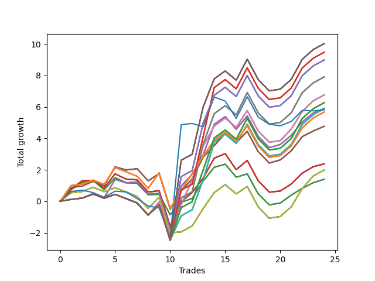

# Long Wallace 014 
- Symbol: SPY_Unlimited
- Date Range: 03/23/2022 - 07/08/2022
- Trading Period: 7:20-12:30
- Number of Trades: 24



| Name | Win Percent | Profit | Avg Profit / Trade | Avg Time / Trade |      | Name | Win Percent | Profit | Avg Profit / Trade | Avg Time / Trade |
| ---- | ----------- | ------ | ------------------ | ---------------- | ---- | ---- | ----------- | ------ | ------------------ | ---------------- |
| Sorted By <br> Profit | | | | | | Sorted By <br> Win Percentage ||||
| One Hundred Thirty | 66.67 | 5015.00 | 208.96 | 29:07 |     | Sixty-Six | 70.83 | 2955.00 | 123.12 | 21:49 |
| One Hundred Twenty-Five | 66.67 | 5015.00 | 208.96 | 29:07 |     | Fifty-Eight | 70.83 | 2955.00 | 123.12 | 21:49 |
| One Hundred Twenty | 66.67 | 5015.00 | 208.96 | 29:07 |     | Fifty | 70.83 | 2955.00 | 123.12 | 21:49 |
| One Hundred Fifteen | 66.67 | 5015.00 | 208.96 | 29:07 |     | Forty-Two | 70.83 | 2955.00 | 123.12 | 21:49 |
| Eighty-Five | 66.67 | 5015.00 | 208.96 | 29:07 |     | Two | 70.83 | 2955.00 | 123.12 | 21:49 |
| One Hundred Twenty-Eight | 66.67 | 4740.00 | 197.50 | 27:48 |     | Sixty-Seven | 70.83 | 2385.00 | 99.37 | 22:28 |
| One Hundred Twenty-Three | 66.67 | 4740.00 | 197.50 | 27:48 |     | Fifty-Nine | 70.83 | 2385.00 | 99.37 | 22:28 |
| One Hundred Eighteen | 66.67 | 4740.00 | 197.50 | 27:48 |     | Fifty-One | 70.83 | 2385.00 | 99.37 | 22:28 |
| One Hundred Thirteen | 66.67 | 4740.00 | 197.50 | 27:48 |     | Forty-Three | 70.83 | 2385.00 | 99.37 | 22:28 |
| Eighty-Three | 66.67 | 4740.00 | 197.50 | 27:48 |     | Three | 70.83 | 2385.00 | 99.37 | 22:28 |
| One Hundred Twenty-Nine | 66.67 | 4495.00 | 187.29 | 29:03 |     | One Hundred Thirty | 66.67 | 5015.00 | 208.96 | 29:07 |
| One Hundred Twenty-Four | 66.67 | 4495.00 | 187.29 | 29:03 |     | One Hundred Twenty-Five | 66.67 | 5015.00 | 208.96 | 29:07 |
| One Hundred Ninteen | 66.67 | 4495.00 | 187.29 | 29:03 |     | One Hundred Twenty | 66.67 | 5015.00 | 208.96 | 29:07 |
| One Hundred Fourteen | 66.67 | 4495.00 | 187.29 | 29:03 |     | One Hundred Fifteen | 66.67 | 5015.00 | 208.96 | 29:07 |
| Eighty-Four | 66.67 | 4495.00 | 187.29 | 29:03 |     | Eighty-Five | 66.67 | 5015.00 | 208.96 | 29:07 |
| Sixty-Nine | 66.67 | 3955.00 | 164.79 | 26:58 |     | One Hundred Twenty-Eight | 66.67 | 4740.00 | 197.50 | 27:48 |
| Sixty-One | 66.67 | 3955.00 | 164.79 | 26:58 |     | One Hundred Twenty-Three | 66.67 | 4740.00 | 197.50 | 27:48 |
| Fifty-Three | 66.67 | 3955.00 | 164.79 | 26:58 |     | One Hundred Eighteen | 66.67 | 4740.00 | 197.50 | 27:48 |
| Forty-Five | 66.67 | 3955.00 | 164.79 | 26:58 |     | One Hundred Thirteen | 66.67 | 4740.00 | 197.50 | 27:48 |
| Five | 66.67 | 3955.00 | 164.79 | 26:58 |     | Eighty-Three | 66.67 | 4740.00 | 197.50 | 27:48 |
| Sixty-Eight | 66.67 | 3385.00 | 141.04 | 25:57 |     | One Hundred Twenty-Nine | 66.67 | 4495.00 | 187.29 | 29:03 |
| Sixty | 66.67 | 3385.00 | 141.04 | 25:57 |     | One Hundred Twenty-Four | 66.67 | 4495.00 | 187.29 | 29:03 |
| Fifty-Two | 66.67 | 3385.00 | 141.04 | 25:57 |     | One Hundred Ninteen | 66.67 | 4495.00 | 187.29 | 29:03 |
| Forty-Four | 66.67 | 3385.00 | 141.04 | 25:57 |     | One Hundred Fourteen | 66.67 | 4495.00 | 187.29 | 29:03 |
| Four | 66.67 | 3385.00 | 141.04 | 25:57 |     | Eighty-Four | 66.67 | 4495.00 | 187.29 | 29:03 |
| One Hundred Twenty-Seven | 66.67 | 3135.00 | 130.63 | 27:17 |     | Sixty-Nine | 66.67 | 3955.00 | 164.79 | 26:58 |
| One Hundred Twenty-Two | 66.67 | 3135.00 | 130.63 | 27:17 |     | Sixty-One | 66.67 | 3955.00 | 164.79 | 26:58 |
| One Hundred Seventeen | 66.67 | 3135.00 | 130.63 | 27:17 |     | Fifty-Three | 66.67 | 3955.00 | 164.79 | 26:58 |
| One Hundred Twelve | 66.67 | 3135.00 | 130.63 | 27:17 |     | Forty-Five | 66.67 | 3955.00 | 164.79 | 26:58 |
| Eighty-Two | 66.67 | 3135.00 | 130.63 | 27:17 |     | Five | 66.67 | 3955.00 | 164.79 | 26:58 |
| Sixty-Six | 70.83 | 2955.00 | 123.12 | 21:49 |     | Sixty-Eight | 66.67 | 3385.00 | 141.04 | 25:57 |
| Fifty-Eight | 70.83 | 2955.00 | 123.12 | 21:49 |     | Sixty | 66.67 | 3385.00 | 141.04 | 25:57 |
| Fifty | 70.83 | 2955.00 | 123.12 | 21:49 |     | Fifty-Two | 66.67 | 3385.00 | 141.04 | 25:57 |
| Forty-Two | 70.83 | 2955.00 | 123.12 | 21:49 |     | Forty-Four | 66.67 | 3385.00 | 141.04 | 25:57 |
| Two | 70.83 | 2955.00 | 123.12 | 21:49 |     | Four | 66.67 | 3385.00 | 141.04 | 25:57 |
| Seventy-One | 66.67 | 2945.00 | 122.71 | 26:32 |     | One Hundred Twenty-Seven | 66.67 | 3135.00 | 130.63 | 27:17 |
| Sixty-Three | 66.67 | 2945.00 | 122.71 | 26:32 |     | One Hundred Twenty-Two | 66.67 | 3135.00 | 130.63 | 27:17 |
| Fifty-Five | 66.67 | 2945.00 | 122.71 | 26:32 |     | One Hundred Seventeen | 66.67 | 3135.00 | 130.63 | 27:17 |
| Forty-Seven | 66.67 | 2945.00 | 122.71 | 26:32 |     | One Hundred Twelve | 66.67 | 3135.00 | 130.63 | 27:17 |
| Seven | 66.67 | 2945.00 | 122.71 | 26:32 |     | Eighty-Two | 66.67 | 3135.00 | 130.63 | 27:17 |
| Seventy-Three | 41.67 | 2910.00 | 121.25 | 12:27 |     | Seventy-One | 66.67 | 2945.00 | 122.71 | 26:32 |
| One Hundred Twenty-Six | 66.67 | 2840.00 | 118.33 | 23:14 |     | Sixty-Three | 66.67 | 2945.00 | 122.71 | 26:32 |
| One Hundred Twenty-One | 66.67 | 2840.00 | 118.33 | 23:14 |     | Fifty-Five | 66.67 | 2945.00 | 122.71 | 26:32 |
| One Hundred Sixteen | 66.67 | 2840.00 | 118.33 | 23:14 |     | Forty-Seven | 66.67 | 2945.00 | 122.71 | 26:32 |
| One Hundred Eleven | 66.67 | 2840.00 | 118.33 | 23:14 |     | Seven | 66.67 | 2945.00 | 122.71 | 26:32 |
| Eighty-One | 66.67 | 2840.00 | 118.33 | 23:14 |     | One Hundred Twenty-Six | 66.67 | 2840.00 | 118.33 | 23:14 |
| Sixty-Seven | 70.83 | 2385.00 | 99.37 | 22:28 |     | One Hundred Twenty-One | 66.67 | 2840.00 | 118.33 | 23:14 |
| Fifty-Nine | 70.83 | 2385.00 | 99.37 | 22:28 |     | One Hundred Sixteen | 66.67 | 2840.00 | 118.33 | 23:14 |
| Fifty-One | 70.83 | 2385.00 | 99.37 | 22:28 |     | One Hundred Eleven | 66.67 | 2840.00 | 118.33 | 23:14 |
| Forty-Three | 70.83 | 2385.00 | 99.37 | 22:28 |     | Eighty-One | 66.67 | 2840.00 | 118.33 | 23:14 |
| Three | 70.83 | 2385.00 | 99.37 | 22:28 |     | Sixty-Five | 66.67 | 1190.00 | 49.58 | 17:57 |
| Sixty-Five | 66.67 | 1190.00 | 49.58 | 17:57 |     | Fifty-Seven | 66.67 | 1190.00 | 49.58 | 17:57 |
| Fifty-Seven | 66.67 | 1190.00 | 49.58 | 17:57 |     | Forty-Nine | 66.67 | 1190.00 | 49.58 | 17:57 |
| Forty-Nine | 66.67 | 1190.00 | 49.58 | 17:57 |     | Forty-One | 66.67 | 1190.00 | 49.58 | 17:57 |
| Forty-One | 66.67 | 1190.00 | 49.58 | 17:57 |     | One | 66.67 | 1190.00 | 49.58 | 17:57 |
| One | 66.67 | 1190.00 | 49.58 | 17:57 |     | Seventy | 66.67 | 995.00 | 41.46 | 23:04 |
| Seventy | 66.67 | 995.00 | 41.46 | 23:04 |     | Sixty-Two | 66.67 | 995.00 | 41.46 | 23:04 |
| Sixty-Two | 66.67 | 995.00 | 41.46 | 23:04 |     | Fifty-Four | 66.67 | 995.00 | 41.46 | 23:04 |
| Fifty-Four | 66.67 | 995.00 | 41.46 | 23:04 |     | Forty-Six | 66.67 | 995.00 | 41.46 | 23:04 |
| Forty-Six | 66.67 | 995.00 | 41.46 | 23:04 |     | Six | 66.67 | 995.00 | 41.46 | 23:04 |
| Six | 66.67 | 995.00 | 41.46 | 23:04 |     | Sixty-Four | 66.67 | 700.00 | 29.17 | 11:05 |
| Sixty-Four | 66.67 | 700.00 | 29.17 | 11:05 |     | Fifty-Six | 66.67 | 700.00 | 29.17 | 11:05 |
| Fifty-Six | 66.67 | 700.00 | 29.17 | 11:05 |     | Forty-Eight | 66.67 | 700.00 | 29.17 | 11:05 |
| Forty-Eight | 66.67 | 700.00 | 29.17 | 11:05 |     | Forty | 66.67 | 700.00 | 29.17 | 11:05 |
| Forty | 66.67 | 700.00 | 29.17 | 11:05 |     | Zero | 66.67 | 700.00 | 29.17 | 11:05 |
| Zero | 66.67 | 700.00 | 29.17 | 11:05 |     | Seventy-Three | 41.67 | 2910.00 | 121.25 | 12:27 |

## NO STOPLOSS

### Test Zero
* Sell when price hits the middle line of the 20p bollinger
* No Stoploss
* Results:
```
Total Trades: 24
Percent Up: 66.67
Percent Down: 33.33
Total Points Moved Up: 1.40
Potential Profit: 700.00
Total Points Ups: 7.18 Count Ups: 16
Total Points Downs: -5.78 Count Downs: 8
```

<details><summary>Trades</summary>

<code>In: 2022-03-23 09:14:00		Out: 2022-03-23 09:19:25		Total Position Time: 05:25		Total Move Up: 0.74		Total to Date: 0.74</code> <br />
<code>In: 2022-03-23 09:47:00		Out: 2022-03-23 09:53:00		Total Position Time: 06:00		Total Move Up: 0.45		Total to Date: 1.19</code> <br />
<code>In: 2022-03-23 10:28:00		Out: 2022-03-23 10:38:15		Total Position Time: 10:15		Total Move Up: 0.14		Total to Date: 1.33</code> <br />
<code>In: 2022-03-25 08:14:00		Out: 2022-03-25 08:36:40		Total Position Time: 22:40		Total Move Up: -0.60		Total to Date: 0.73</code> <br />
<code>In: 2022-03-25 08:29:00		Out: 2022-03-25 08:36:40		Total Position Time: 07:40		Total Move Up: 0.77		Total to Date: 1.50</code> <br />
<code>In: 2022-03-31 09:16:00		Out: 2022-03-31 09:32:25		Total Position Time: 16:25		Total Move Up: -0.32		Total to Date: 1.18</code> <br />
<code>In: 2022-03-31 09:23:00		Out: 2022-03-31 09:32:25		Total Position Time: 09:25		Total Move Up: -0.04		Total to Date: 1.14</code> <br />
<code>In: 2022-04-18 08:26:00		Out: 2022-04-18 08:54:55		Total Position Time: 28:55		Total Move Up: -0.72		Total to Date: 0.42</code> <br />
<code>In: 2022-04-20 09:14:00		Out: 2022-04-20 09:30:50		Total Position Time: 16:50		Total Move Up: 0.02		Total to Date: 0.44</code> <br />
<code>In: 2022-04-29 07:22:00		Out: 2022-04-29 07:44:45		Total Position Time: 22:45		Total Move Up: -1.30		Total to Date: -0.86</code> <br />
<code>In: 2022-05-04 11:36:00		Out: 2022-05-04 11:36:40		Total Position Time: 00:40		Total Move Up: 0.80		Total to Date: -0.06</code> <br />
<code>In: 2022-05-13 11:07:00		Out: 2022-05-13 11:19:15		Total Position Time: 12:15		Total Move Up: 0.24		Total to Date: 0.18</code> <br />
<code>In: 2022-05-17 11:24:00		Out: 2022-05-17 11:27:25		Total Position Time: 03:25		Total Move Up: 1.11		Total to Date: 1.29</code> <br />
<code>In: 2022-05-19 10:51:00		Out: 2022-05-19 10:52:45		Total Position Time: 01:45		Total Move Up: 0.87		Total to Date: 2.16</code> <br />
<code>In: 2022-05-25 09:29:00		Out: 2022-05-25 09:38:55		Total Position Time: 09:55		Total Move Up: 0.20		Total to Date: 2.36</code> <br />
<code>In: 2022-06-06 08:15:00		Out: 2022-06-06 08:31:35		Total Position Time: 16:35		Total Move Up: -0.83		Total to Date: 1.53</code> <br />
<code>In: 2022-06-08 08:05:00		Out: 2022-06-08 08:10:05		Total Position Time: 05:05		Total Move Up: 0.21		Total to Date: 1.74</code> <br />
<code>In: 2022-06-08 09:29:00		Out: 2022-06-08 09:53:00		Total Position Time: 24:00		Total Move Up: -1.27		Total to Date: 0.47</code> <br />
<code>In: 2022-06-15 07:35:00		Out: 2022-06-15 07:58:55		Total Position Time: 23:55		Total Move Up: -0.70		Total to Date: -0.23</code> <br />
<code>In: 2022-06-27 10:45:00		Out: 2022-06-27 10:51:15		Total Position Time: 06:15		Total Move Up: 0.12		Total to Date: -0.11</code> <br />
<code>In: 2022-06-27 10:48:00		Out: 2022-06-27 10:51:15		Total Position Time: 03:15		Total Move Up: 0.50		Total to Date: 0.39</code> <br />
<code>In: 2022-06-29 08:25:00		Out: 2022-06-29 08:28:25		Total Position Time: 03:25		Total Move Up: 0.43		Total to Date: 0.82</code> <br />
<code>In: 2022-07-05 08:04:00		Out: 2022-07-05 08:08:25		Total Position Time: 04:25		Total Move Up: 0.36		Total to Date: 1.18</code> <br />
<code>In: 2022-07-08 09:44:00		Out: 2022-07-08 09:48:45		Total Position Time: 04:45		Total Move Up: 0.22		Total to Date: 1.40</code> <br />


</details>

### Test One
* Sell when the price hits the upper line of the 20p 1std bollinger
* No Stoploss
* Results:
```
Total Trades: 24
Percent Up: 66.67
Percent Down: 33.33
Total Points Moved Up: 2.38
Potential Profit: 1190.00
Total Points Ups: 9.31 Count Ups: 16
Total Points Downs: -6.93 Count Downs: 8
```

<details><summary>Trades</summary>

<code>In: 2022-03-23 09:14:00		Out: 2022-03-23 09:30:20		Total Position Time: 16:20		Total Move Up: 0.78		Total to Date: 0.78</code> <br />
<code>In: 2022-03-23 09:47:00		Out: 2022-03-23 09:59:10		Total Position Time: 12:10		Total Move Up: 0.52		Total to Date: 1.30</code> <br />
<code>In: 2022-03-23 10:28:00		Out: 2022-03-23 10:51:45		Total Position Time: 23:45		Total Move Up: 0.03		Total to Date: 1.33</code> <br />
<code>In: 2022-03-25 08:14:00		Out: 2022-03-25 08:41:05		Total Position Time: 27:05		Total Move Up: -0.48		Total to Date: 0.85</code> <br />
<code>In: 2022-03-25 08:29:00		Out: 2022-03-25 08:41:05		Total Position Time: 12:05		Total Move Up: 0.89		Total to Date: 1.74</code> <br />
<code>In: 2022-03-31 09:16:00		Out: 2022-03-31 09:40:45		Total Position Time: 24:45		Total Move Up: -0.33		Total to Date: 1.41</code> <br />
<code>In: 2022-03-31 09:23:00		Out: 2022-03-31 09:40:45		Total Position Time: 17:45		Total Move Up: -0.05		Total to Date: 1.36</code> <br />
<code>In: 2022-04-18 08:26:00		Out: 2022-04-18 08:55:55		Total Position Time: 29:55		Total Move Up: -0.77		Total to Date: 0.59</code> <br />
<code>In: 2022-04-20 09:14:00		Out: 2022-04-20 09:30:55		Total Position Time: 16:55		Total Move Up: 0.08		Total to Date: 0.67</code> <br />
<code>In: 2022-04-29 07:22:00		Out: 2022-04-29 07:51:55		Total Position Time: 29:55		Total Move Up: -2.26		Total to Date: -1.59</code> <br />
<code>In: 2022-05-04 11:36:00		Out: 2022-05-04 11:41:35		Total Position Time: 05:35		Total Move Up: 1.56		Total to Date: -0.03</code> <br />
<code>In: 2022-05-13 11:07:00		Out: 2022-05-13 11:20:00		Total Position Time: 13:00		Total Move Up: 0.59		Total to Date: 0.56</code> <br />
<code>In: 2022-05-17 11:24:00		Out: 2022-05-17 11:37:35		Total Position Time: 13:35		Total Move Up: 0.92		Total to Date: 1.48</code> <br />
<code>In: 2022-05-19 10:51:00		Out: 2022-05-19 10:54:25		Total Position Time: 03:25		Total Move Up: 1.26		Total to Date: 2.74</code> <br />
<code>In: 2022-05-25 09:29:00		Out: 2022-05-25 09:44:25		Total Position Time: 15:25		Total Move Up: 0.29		Total to Date: 3.03</code> <br />
<code>In: 2022-06-06 08:15:00		Out: 2022-06-06 08:39:15		Total Position Time: 24:15		Total Move Up: -1.02		Total to Date: 2.01</code> <br />
<code>In: 2022-06-08 08:05:00		Out: 2022-06-08 08:11:10		Total Position Time: 06:10		Total Move Up: 0.59		Total to Date: 2.60</code> <br />
<code>In: 2022-06-08 09:29:00		Out: 2022-06-08 09:58:55		Total Position Time: 29:55		Total Move Up: -1.30		Total to Date: 1.30</code> <br />
<code>In: 2022-06-15 07:35:00		Out: 2022-06-15 08:04:55		Total Position Time: 29:55		Total Move Up: -0.72		Total to Date: 0.58</code> <br />
<code>In: 2022-06-27 10:45:00		Out: 2022-06-27 11:03:15		Total Position Time: 18:15		Total Move Up: 0.07		Total to Date: 0.65</code> <br />
<code>In: 2022-06-27 10:48:00		Out: 2022-06-27 11:03:15		Total Position Time: 15:15		Total Move Up: 0.45		Total to Date: 1.10</code> <br />
<code>In: 2022-06-29 08:25:00		Out: 2022-06-29 08:32:20		Total Position Time: 07:20		Total Move Up: 0.69		Total to Date: 1.79</code> <br />
<code>In: 2022-07-05 08:04:00		Out: 2022-07-05 08:16:40		Total Position Time: 12:40		Total Move Up: 0.41		Total to Date: 2.20</code> <br />
<code>In: 2022-07-08 09:44:00		Out: 2022-07-08 10:09:40		Total Position Time: 25:40		Total Move Up: 0.18		Total to Date: 2.38</code> <br />


</details>

### Test Two
* Sell when the price hits the upper line of the 20p 2std bollinger
* No Stoploss
* Results:
```
Total Trades: 24
Percent Up: 70.83
Percent Down: 29.17
Total Points Moved Up: 5.91
Potential Profit: 2955.00
Total Points Ups: 12.20 Count Ups: 17
Total Points Downs: -6.29 Count Downs: 7
```

<details><summary>Trades</summary>

<code>In: 2022-03-23 09:14:00		Out: 2022-03-23 09:43:55		Total Position Time: 29:55		Total Move Up: 0.12		Total to Date: 0.12</code> <br />
<code>In: 2022-03-23 09:47:00		Out: 2022-03-23 10:16:55		Total Position Time: 29:55		Total Move Up: 0.08		Total to Date: 0.20</code> <br />
<code>In: 2022-03-23 10:28:00		Out: 2022-03-23 10:54:25		Total Position Time: 26:25		Total Move Up: 0.24		Total to Date: 0.44</code> <br />
<code>In: 2022-03-25 08:14:00		Out: 2022-03-25 08:41:45		Total Position Time: 27:45		Total Move Up: -0.21		Total to Date: 0.23</code> <br />
<code>In: 2022-03-25 08:29:00		Out: 2022-03-25 08:41:45		Total Position Time: 12:45		Total Move Up: 1.16		Total to Date: 1.39</code> <br />
<code>In: 2022-03-31 09:16:00		Out: 2022-03-31 09:44:20		Total Position Time: 28:20		Total Move Up: -0.22		Total to Date: 1.17</code> <br />
<code>In: 2022-03-31 09:23:00		Out: 2022-03-31 09:44:20		Total Position Time: 21:20		Total Move Up: 0.06		Total to Date: 1.23</code> <br />
<code>In: 2022-04-18 08:26:00		Out: 2022-04-18 08:55:55		Total Position Time: 29:55		Total Move Up: -0.77		Total to Date: 0.46</code> <br />
<code>In: 2022-04-20 09:14:00		Out: 2022-04-20 09:31:05		Total Position Time: 17:05		Total Move Up: 0.06		Total to Date: 0.52</code> <br />
<code>In: 2022-04-29 07:22:00		Out: 2022-04-29 07:51:55		Total Position Time: 29:55		Total Move Up: -2.26		Total to Date: -1.74</code> <br />
<code>In: 2022-05-04 11:36:00		Out: 2022-05-04 11:43:45		Total Position Time: 07:45		Total Move Up: 2.70		Total to Date: 0.96</code> <br />
<code>In: 2022-05-13 11:07:00		Out: 2022-05-13 11:31:20		Total Position Time: 24:20		Total Move Up: 0.76		Total to Date: 1.72</code> <br />
<code>In: 2022-05-17 11:24:00		Out: 2022-05-17 11:40:00		Total Position Time: 16:00		Total Move Up: 1.23		Total to Date: 2.95</code> <br />
<code>In: 2022-05-19 10:51:00		Out: 2022-05-19 10:55:15		Total Position Time: 04:15		Total Move Up: 1.94		Total to Date: 4.89</code> <br />
<code>In: 2022-05-25 09:29:00		Out: 2022-05-25 09:45:20		Total Position Time: 16:20		Total Move Up: 0.50		Total to Date: 5.39</code> <br />
<code>In: 2022-06-06 08:15:00		Out: 2022-06-06 08:43:00		Total Position Time: 28:00		Total Move Up: -0.81		Total to Date: 4.58</code> <br />
<code>In: 2022-06-08 08:05:00		Out: 2022-06-08 08:14:00		Total Position Time: 09:00		Total Move Up: 0.85		Total to Date: 5.43</code> <br />
<code>In: 2022-06-08 09:29:00		Out: 2022-06-08 09:58:55		Total Position Time: 29:55		Total Move Up: -1.30		Total to Date: 4.13</code> <br />
<code>In: 2022-06-15 07:35:00		Out: 2022-06-15 08:04:55		Total Position Time: 29:55		Total Move Up: -0.72		Total to Date: 3.41</code> <br />
<code>In: 2022-06-27 10:45:00		Out: 2022-06-27 11:13:35		Total Position Time: 28:35		Total Move Up: 0.20		Total to Date: 3.61</code> <br />
<code>In: 2022-06-27 10:48:00		Out: 2022-06-27 11:13:35		Total Position Time: 25:35		Total Move Up: 0.58		Total to Date: 4.19</code> <br />
<code>In: 2022-06-29 08:25:00		Out: 2022-06-29 08:34:40		Total Position Time: 09:40		Total Move Up: 0.86		Total to Date: 5.05</code> <br />
<code>In: 2022-07-05 08:04:00		Out: 2022-07-05 08:17:55		Total Position Time: 13:55		Total Move Up: 0.56		Total to Date: 5.61</code> <br />
<code>In: 2022-07-08 09:44:00		Out: 2022-07-08 10:11:10		Total Position Time: 27:10		Total Move Up: 0.30		Total to Date: 5.91</code> <br />


</details>

### Test Three
* Sell when price hits the middle line of the 50p bollinger
* No Stoploss
* Results:
```
Total Trades: 24
Percent Up: 70.83
Percent Down: 29.17
Total Points Moved Up: 4.77
Potential Profit: 2385.00
Total Points Ups: 10.89 Count Ups: 17
Total Points Downs: -6.12 Count Downs: 7
```

<details><summary>Trades</summary>

<code>In: 2022-03-23 09:14:00		Out: 2022-03-23 09:30:30		Total Position Time: 16:30		Total Move Up: 0.88		Total to Date: 0.88</code> <br />
<code>In: 2022-03-23 09:47:00		Out: 2022-03-23 10:16:55		Total Position Time: 29:55		Total Move Up: 0.08		Total to Date: 0.96</code> <br />
<code>In: 2022-03-23 10:28:00		Out: 2022-03-23 10:54:30		Total Position Time: 26:30		Total Move Up: 0.31		Total to Date: 1.27</code> <br />
<code>In: 2022-03-25 08:14:00		Out: 2022-03-25 08:43:55		Total Position Time: 29:55		Total Move Up: -0.28		Total to Date: 0.99</code> <br />
<code>In: 2022-03-25 08:29:00		Out: 2022-03-25 08:52:45		Total Position Time: 23:45		Total Move Up: 1.20		Total to Date: 2.19</code> <br />
<code>In: 2022-03-31 09:16:00		Out: 2022-03-31 09:45:10		Total Position Time: 29:10		Total Move Up: -0.20		Total to Date: 1.99</code> <br />
<code>In: 2022-03-31 09:23:00		Out: 2022-03-31 09:45:10		Total Position Time: 22:10		Total Move Up: 0.08		Total to Date: 2.07</code> <br />
<code>In: 2022-04-18 08:26:00		Out: 2022-04-18 08:55:55		Total Position Time: 29:55		Total Move Up: -0.77		Total to Date: 1.30</code> <br />
<code>In: 2022-04-20 09:14:00		Out: 2022-04-20 09:32:40		Total Position Time: 18:40		Total Move Up: 0.46		Total to Date: 1.76</code> <br />
<code>In: 2022-04-29 07:22:00		Out: 2022-04-29 07:51:55		Total Position Time: 29:55		Total Move Up: -2.26		Total to Date: -0.50</code> <br />
<code>In: 2022-05-04 11:36:00		Out: 2022-05-04 11:41:15		Total Position Time: 05:15		Total Move Up: 1.16		Total to Date: 0.66</code> <br />
<code>In: 2022-05-13 11:07:00		Out: 2022-05-13 11:31:20		Total Position Time: 24:20		Total Move Up: 0.76		Total to Date: 1.42</code> <br />
<code>In: 2022-05-17 11:24:00		Out: 2022-05-17 11:40:05		Total Position Time: 16:05		Total Move Up: 1.39		Total to Date: 2.81</code> <br />
<code>In: 2022-05-19 10:51:00		Out: 2022-05-19 10:52:40		Total Position Time: 01:40		Total Move Up: 0.73		Total to Date: 3.54</code> <br />
<code>In: 2022-05-25 09:29:00		Out: 2022-05-25 09:49:05		Total Position Time: 20:05		Total Move Up: 0.77		Total to Date: 4.31</code> <br />
<code>In: 2022-06-06 08:15:00		Out: 2022-06-06 08:44:55		Total Position Time: 29:55		Total Move Up: -0.59		Total to Date: 3.72</code> <br />
<code>In: 2022-06-08 08:05:00		Out: 2022-06-08 08:11:20		Total Position Time: 06:20		Total Move Up: 0.73		Total to Date: 4.45</code> <br />
<code>In: 2022-06-08 09:29:00		Out: 2022-06-08 09:58:55		Total Position Time: 29:55		Total Move Up: -1.30		Total to Date: 3.15</code> <br />
<code>In: 2022-06-15 07:35:00		Out: 2022-06-15 08:04:55		Total Position Time: 29:55		Total Move Up: -0.72		Total to Date: 2.43</code> <br />
<code>In: 2022-06-27 10:45:00		Out: 2022-06-27 11:13:35		Total Position Time: 28:35		Total Move Up: 0.20		Total to Date: 2.63</code> <br />
<code>In: 2022-06-27 10:48:00		Out: 2022-06-27 11:13:35		Total Position Time: 25:35		Total Move Up: 0.58		Total to Date: 3.21</code> <br />
<code>In: 2022-06-29 08:25:00		Out: 2022-06-29 08:35:10		Total Position Time: 10:10		Total Move Up: 0.90		Total to Date: 4.11</code> <br />
<code>In: 2022-07-05 08:04:00		Out: 2022-07-05 08:32:15		Total Position Time: 28:15		Total Move Up: 0.36		Total to Date: 4.47</code> <br />
<code>In: 2022-07-08 09:44:00		Out: 2022-07-08 10:11:05		Total Position Time: 27:05		Total Move Up: 0.30		Total to Date: 4.77</code> <br />


</details>

### Test Four
* Sell when the price hits the upper line of the 50p 1std bollinger
* No Stoploss
* Results:
```
Total Trades: 24
Percent Up: 66.67
Percent Down: 33.33
Total Points Moved Up: 6.77
Potential Profit: 3385.00
Total Points Ups: 13.24 Count Ups: 16
Total Points Downs: -6.47 Count Downs: 8
```

<details><summary>Trades</summary>

<code>In: 2022-03-23 09:14:00		Out: 2022-03-23 09:43:55		Total Position Time: 29:55		Total Move Up: 0.12		Total to Date: 0.12</code> <br />
<code>In: 2022-03-23 09:47:00		Out: 2022-03-23 10:16:55		Total Position Time: 29:55		Total Move Up: 0.08		Total to Date: 0.20</code> <br />
<code>In: 2022-03-23 10:28:00		Out: 2022-03-23 10:57:55		Total Position Time: 29:55		Total Move Up: 0.27		Total to Date: 0.47</code> <br />
<code>In: 2022-03-25 08:14:00		Out: 2022-03-25 08:43:55		Total Position Time: 29:55		Total Move Up: -0.28		Total to Date: 0.19</code> <br />
<code>In: 2022-03-25 08:29:00		Out: 2022-03-25 08:58:55		Total Position Time: 29:55		Total Move Up: 0.25		Total to Date: 0.44</code> <br />
<code>In: 2022-03-31 09:16:00		Out: 2022-03-31 09:45:55		Total Position Time: 29:55		Total Move Up: -0.27		Total to Date: 0.17</code> <br />
<code>In: 2022-03-31 09:23:00		Out: 2022-03-31 09:52:55		Total Position Time: 29:55		Total Move Up: -0.28		Total to Date: -0.11</code> <br />
<code>In: 2022-04-18 08:26:00		Out: 2022-04-18 08:55:55		Total Position Time: 29:55		Total Move Up: -0.77		Total to Date: -0.88</code> <br />
<code>In: 2022-04-20 09:14:00		Out: 2022-04-20 09:36:45		Total Position Time: 22:45		Total Move Up: 0.85		Total to Date: -0.03</code> <br />
<code>In: 2022-04-29 07:22:00		Out: 2022-04-29 07:51:55		Total Position Time: 29:55		Total Move Up: -2.26		Total to Date: -2.29</code> <br />
<code>In: 2022-05-04 11:36:00		Out: 2022-05-04 11:42:00		Total Position Time: 06:00		Total Move Up: 2.07		Total to Date: -0.22</code> <br />
<code>In: 2022-05-13 11:07:00		Out: 2022-05-13 11:32:00		Total Position Time: 25:00		Total Move Up: 1.58		Total to Date: 1.36</code> <br />
<code>In: 2022-05-17 11:24:00		Out: 2022-05-17 11:44:30		Total Position Time: 20:30		Total Move Up: 2.16		Total to Date: 3.52</code> <br />
<code>In: 2022-05-19 10:51:00		Out: 2022-05-19 10:54:25		Total Position Time: 03:25		Total Move Up: 1.26		Total to Date: 4.78</code> <br />
<code>In: 2022-05-25 09:29:00		Out: 2022-05-25 09:58:55		Total Position Time: 29:55		Total Move Up: 0.51		Total to Date: 5.29</code> <br />
<code>In: 2022-06-06 08:15:00		Out: 2022-06-06 08:44:55		Total Position Time: 29:55		Total Move Up: -0.59		Total to Date: 4.70</code> <br />
<code>In: 2022-06-08 08:05:00		Out: 2022-06-08 08:15:05		Total Position Time: 10:05		Total Move Up: 1.07		Total to Date: 5.77</code> <br />
<code>In: 2022-06-08 09:29:00		Out: 2022-06-08 09:58:55		Total Position Time: 29:55		Total Move Up: -1.30		Total to Date: 4.47</code> <br />
<code>In: 2022-06-15 07:35:00		Out: 2022-06-15 08:04:55		Total Position Time: 29:55		Total Move Up: -0.72		Total to Date: 3.75</code> <br />
<code>In: 2022-06-27 10:45:00		Out: 2022-06-27 11:14:55		Total Position Time: 29:55		Total Move Up: 0.11		Total to Date: 3.86</code> <br />
<code>In: 2022-06-27 10:48:00		Out: 2022-06-27 11:17:10		Total Position Time: 29:10		Total Move Up: 0.73		Total to Date: 4.59</code> <br />
<code>In: 2022-06-29 08:25:00		Out: 2022-06-29 08:53:10		Total Position Time: 28:10		Total Move Up: 1.12		Total to Date: 5.71</code> <br />
<code>In: 2022-07-05 08:04:00		Out: 2022-07-05 08:33:05		Total Position Time: 29:05		Total Move Up: 0.68		Total to Date: 6.39</code> <br />
<code>In: 2022-07-08 09:44:00		Out: 2022-07-08 10:13:55		Total Position Time: 29:55		Total Move Up: 0.38		Total to Date: 6.77</code> <br />


</details>

### Test Five
* Sell when the price hits the upper line of the 50p 2std bollinger
* No Stoploss
* Results:
```
Total Trades: 24
Percent Up: 66.67
Percent Down: 33.33
Total Points Moved Up: 7.91
Potential Profit: 3955.00
Total Points Ups: 14.38 Count Ups: 16
Total Points Downs: -6.47 Count Downs: 8
```

<details><summary>Trades</summary>

<code>In: 2022-03-23 09:14:00		Out: 2022-03-23 09:43:55		Total Position Time: 29:55		Total Move Up: 0.12		Total to Date: 0.12</code> <br />
<code>In: 2022-03-23 09:47:00		Out: 2022-03-23 10:16:55		Total Position Time: 29:55		Total Move Up: 0.08		Total to Date: 0.20</code> <br />
<code>In: 2022-03-23 10:28:00		Out: 2022-03-23 10:57:55		Total Position Time: 29:55		Total Move Up: 0.27		Total to Date: 0.47</code> <br />
<code>In: 2022-03-25 08:14:00		Out: 2022-03-25 08:43:55		Total Position Time: 29:55		Total Move Up: -0.28		Total to Date: 0.19</code> <br />
<code>In: 2022-03-25 08:29:00		Out: 2022-03-25 08:58:55		Total Position Time: 29:55		Total Move Up: 0.25		Total to Date: 0.44</code> <br />
<code>In: 2022-03-31 09:16:00		Out: 2022-03-31 09:45:55		Total Position Time: 29:55		Total Move Up: -0.27		Total to Date: 0.17</code> <br />
<code>In: 2022-03-31 09:23:00		Out: 2022-03-31 09:52:55		Total Position Time: 29:55		Total Move Up: -0.28		Total to Date: -0.11</code> <br />
<code>In: 2022-04-18 08:26:00		Out: 2022-04-18 08:55:55		Total Position Time: 29:55		Total Move Up: -0.77		Total to Date: -0.88</code> <br />
<code>In: 2022-04-20 09:14:00		Out: 2022-04-20 09:43:55		Total Position Time: 29:55		Total Move Up: 0.66		Total to Date: -0.22</code> <br />
<code>In: 2022-04-29 07:22:00		Out: 2022-04-29 07:51:55		Total Position Time: 29:55		Total Move Up: -2.26		Total to Date: -2.48</code> <br />
<code>In: 2022-05-04 11:36:00		Out: 2022-05-04 11:43:45		Total Position Time: 07:45		Total Move Up: 2.70		Total to Date: 0.22</code> <br />
<code>In: 2022-05-13 11:07:00		Out: 2022-05-13 11:36:55		Total Position Time: 29:55		Total Move Up: 0.38		Total to Date: 0.60</code> <br />
<code>In: 2022-05-17 11:24:00		Out: 2022-05-17 11:48:40		Total Position Time: 24:40		Total Move Up: 3.03		Total to Date: 3.63</code> <br />
<code>In: 2022-05-19 10:51:00		Out: 2022-05-19 10:55:15		Total Position Time: 04:15		Total Move Up: 1.94		Total to Date: 5.57</code> <br />
<code>In: 2022-05-25 09:29:00		Out: 2022-05-25 09:58:55		Total Position Time: 29:55		Total Move Up: 0.51		Total to Date: 6.08</code> <br />
<code>In: 2022-06-06 08:15:00		Out: 2022-06-06 08:44:55		Total Position Time: 29:55		Total Move Up: -0.59		Total to Date: 5.49</code> <br />
<code>In: 2022-06-08 08:05:00		Out: 2022-06-08 08:17:35		Total Position Time: 12:35		Total Move Up: 1.43		Total to Date: 6.92</code> <br />
<code>In: 2022-06-08 09:29:00		Out: 2022-06-08 09:58:55		Total Position Time: 29:55		Total Move Up: -1.30		Total to Date: 5.62</code> <br />
<code>In: 2022-06-15 07:35:00		Out: 2022-06-15 08:04:55		Total Position Time: 29:55		Total Move Up: -0.72		Total to Date: 4.90</code> <br />
<code>In: 2022-06-27 10:45:00		Out: 2022-06-27 11:14:55		Total Position Time: 29:55		Total Move Up: 0.11		Total to Date: 5.01</code> <br />
<code>In: 2022-06-27 10:48:00		Out: 2022-06-27 11:17:55		Total Position Time: 29:55		Total Move Up: 0.62		Total to Date: 5.63</code> <br />
<code>In: 2022-06-29 08:25:00		Out: 2022-06-29 08:54:55		Total Position Time: 29:55		Total Move Up: 1.28		Total to Date: 6.91</code> <br />
<code>In: 2022-07-05 08:04:00		Out: 2022-07-05 08:33:55		Total Position Time: 29:55		Total Move Up: 0.62		Total to Date: 7.53</code> <br />
<code>In: 2022-07-08 09:44:00		Out: 2022-07-08 10:13:55		Total Position Time: 29:55		Total Move Up: 0.38		Total to Date: 7.91</code> <br />


</details>

### Test Six
* Sell when the price hits the middle line of the 1std VWAP
* No Stoploss
* Results:
```
Total Trades: 24
Percent Up: 66.67
Percent Down: 33.33
Total Points Moved Up: 1.99
Potential Profit: 995.00
Total Points Ups: 8.46 Count Ups: 16
Total Points Downs: -6.47 Count Downs: 8
```

<details><summary>Trades</summary>

<code>In: 2022-03-23 09:14:00		Out: 2022-03-23 09:16:05		Total Position Time: 02:05		Total Move Up: 0.54		Total to Date: 0.54</code> <br />
<code>In: 2022-03-23 09:47:00		Out: 2022-03-23 10:16:55		Total Position Time: 29:55		Total Move Up: 0.08		Total to Date: 0.62</code> <br />
<code>In: 2022-03-23 10:28:00		Out: 2022-03-23 10:57:55		Total Position Time: 29:55		Total Move Up: 0.27		Total to Date: 0.89</code> <br />
<code>In: 2022-03-25 08:14:00		Out: 2022-03-25 08:43:55		Total Position Time: 29:55		Total Move Up: -0.28		Total to Date: 0.61</code> <br />
<code>In: 2022-03-25 08:29:00		Out: 2022-03-25 08:58:55		Total Position Time: 29:55		Total Move Up: 0.25		Total to Date: 0.86</code> <br />
<code>In: 2022-03-31 09:16:00		Out: 2022-03-31 09:45:55		Total Position Time: 29:55		Total Move Up: -0.27		Total to Date: 0.59</code> <br />
<code>In: 2022-03-31 09:23:00		Out: 2022-03-31 09:52:55		Total Position Time: 29:55		Total Move Up: -0.28		Total to Date: 0.31</code> <br />
<code>In: 2022-04-18 08:26:00		Out: 2022-04-18 08:55:55		Total Position Time: 29:55		Total Move Up: -0.77		Total to Date: -0.46</code> <br />
<code>In: 2022-04-20 09:14:00		Out: 2022-04-20 09:36:05		Total Position Time: 22:05		Total Move Up: 0.71		Total to Date: 0.25</code> <br />
<code>In: 2022-04-29 07:22:00		Out: 2022-04-29 07:51:55		Total Position Time: 29:55		Total Move Up: -2.26		Total to Date: -2.01</code> <br />
<code>In: 2022-05-04 11:36:00		Out: 2022-05-04 11:36:10		Total Position Time: 00:10		Total Move Up: 0.06		Total to Date: -1.95</code> <br />
<code>In: 2022-05-13 11:07:00		Out: 2022-05-13 11:36:55		Total Position Time: 29:55		Total Move Up: 0.38		Total to Date: -1.57</code> <br />
<code>In: 2022-05-17 11:24:00		Out: 2022-05-17 11:27:25		Total Position Time: 03:25		Total Move Up: 1.11		Total to Date: -0.46</code> <br />
<code>In: 2022-05-19 10:51:00		Out: 2022-05-19 10:52:55		Total Position Time: 01:55		Total Move Up: 1.01		Total to Date: 0.55</code> <br />
<code>In: 2022-05-25 09:29:00		Out: 2022-05-25 09:58:55		Total Position Time: 29:55		Total Move Up: 0.51		Total to Date: 1.06</code> <br />
<code>In: 2022-06-06 08:15:00		Out: 2022-06-06 08:44:55		Total Position Time: 29:55		Total Move Up: -0.59		Total to Date: 0.47</code> <br />
<code>In: 2022-06-08 08:05:00		Out: 2022-06-08 08:10:50		Total Position Time: 05:50		Total Move Up: 0.47		Total to Date: 0.94</code> <br />
<code>In: 2022-06-08 09:29:00		Out: 2022-06-08 09:58:55		Total Position Time: 29:55		Total Move Up: -1.30		Total to Date: -0.36</code> <br />
<code>In: 2022-06-15 07:35:00		Out: 2022-06-15 08:04:55		Total Position Time: 29:55		Total Move Up: -0.72		Total to Date: -1.08</code> <br />
<code>In: 2022-06-27 10:45:00		Out: 2022-06-27 11:14:55		Total Position Time: 29:55		Total Move Up: 0.11		Total to Date: -0.97</code> <br />
<code>In: 2022-06-27 10:48:00		Out: 2022-06-27 11:17:55		Total Position Time: 29:55		Total Move Up: 0.62		Total to Date: -0.35</code> <br />
<code>In: 2022-06-29 08:25:00		Out: 2022-06-29 08:35:35		Total Position Time: 10:35		Total Move Up: 1.16		Total to Date: 0.81</code> <br />
<code>In: 2022-07-05 08:04:00		Out: 2022-07-05 08:33:10		Total Position Time: 29:10		Total Move Up: 0.80		Total to Date: 1.61</code> <br />
<code>In: 2022-07-08 09:44:00		Out: 2022-07-08 10:13:55		Total Position Time: 29:55		Total Move Up: 0.38		Total to Date: 1.99</code> <br />


</details>

### Test Seven
* Sell when the price hits the upper line of the 1std VWAP
* No Stoploss
* Results:
```
Total Trades: 24
Percent Up: 66.67
Percent Down: 33.33
Total Points Moved Up: 5.89
Potential Profit: 2945.00
Total Points Ups: 12.36 Count Ups: 16
Total Points Downs: -6.47 Count Downs: 8
```

<details><summary>Trades</summary>

<code>In: 2022-03-23 09:14:00		Out: 2022-03-23 09:43:55		Total Position Time: 29:55		Total Move Up: 0.12		Total to Date: 0.12</code> <br />
<code>In: 2022-03-23 09:47:00		Out: 2022-03-23 10:16:55		Total Position Time: 29:55		Total Move Up: 0.08		Total to Date: 0.20</code> <br />
<code>In: 2022-03-23 10:28:00		Out: 2022-03-23 10:57:55		Total Position Time: 29:55		Total Move Up: 0.27		Total to Date: 0.47</code> <br />
<code>In: 2022-03-25 08:14:00		Out: 2022-03-25 08:43:55		Total Position Time: 29:55		Total Move Up: -0.28		Total to Date: 0.19</code> <br />
<code>In: 2022-03-25 08:29:00		Out: 2022-03-25 08:58:55		Total Position Time: 29:55		Total Move Up: 0.25		Total to Date: 0.44</code> <br />
<code>In: 2022-03-31 09:16:00		Out: 2022-03-31 09:45:55		Total Position Time: 29:55		Total Move Up: -0.27		Total to Date: 0.17</code> <br />
<code>In: 2022-03-31 09:23:00		Out: 2022-03-31 09:52:55		Total Position Time: 29:55		Total Move Up: -0.28		Total to Date: -0.11</code> <br />
<code>In: 2022-04-18 08:26:00		Out: 2022-04-18 08:55:55		Total Position Time: 29:55		Total Move Up: -0.77		Total to Date: -0.88</code> <br />
<code>In: 2022-04-20 09:14:00		Out: 2022-04-20 09:43:55		Total Position Time: 29:55		Total Move Up: 0.66		Total to Date: -0.22</code> <br />
<code>In: 2022-04-29 07:22:00		Out: 2022-04-29 07:51:55		Total Position Time: 29:55		Total Move Up: -2.26		Total to Date: -2.48</code> <br />
<code>In: 2022-05-04 11:36:00		Out: 2022-05-04 11:41:35		Total Position Time: 05:35		Total Move Up: 1.56		Total to Date: -0.92</code> <br />
<code>In: 2022-05-13 11:07:00		Out: 2022-05-13 11:36:55		Total Position Time: 29:55		Total Move Up: 0.38		Total to Date: -0.54</code> <br />
<code>In: 2022-05-17 11:24:00		Out: 2022-05-17 11:40:25		Total Position Time: 16:25		Total Move Up: 1.91		Total to Date: 1.37</code> <br />
<code>In: 2022-05-19 10:51:00		Out: 2022-05-19 10:56:05		Total Position Time: 05:05		Total Move Up: 2.39		Total to Date: 3.76</code> <br />
<code>In: 2022-05-25 09:29:00		Out: 2022-05-25 09:58:55		Total Position Time: 29:55		Total Move Up: 0.51		Total to Date: 4.27</code> <br />
<code>In: 2022-06-06 08:15:00		Out: 2022-06-06 08:44:55		Total Position Time: 29:55		Total Move Up: -0.59		Total to Date: 3.68</code> <br />
<code>In: 2022-06-08 08:05:00		Out: 2022-06-08 08:16:30		Total Position Time: 11:30		Total Move Up: 1.22		Total to Date: 4.90</code> <br />
<code>In: 2022-06-08 09:29:00		Out: 2022-06-08 09:58:55		Total Position Time: 29:55		Total Move Up: -1.30		Total to Date: 3.60</code> <br />
<code>In: 2022-06-15 07:35:00		Out: 2022-06-15 08:04:55		Total Position Time: 29:55		Total Move Up: -0.72		Total to Date: 2.88</code> <br />
<code>In: 2022-06-27 10:45:00		Out: 2022-06-27 11:14:55		Total Position Time: 29:55		Total Move Up: 0.11		Total to Date: 2.99</code> <br />
<code>In: 2022-06-27 10:48:00		Out: 2022-06-27 11:17:55		Total Position Time: 29:55		Total Move Up: 0.62		Total to Date: 3.61</code> <br />
<code>In: 2022-06-29 08:25:00		Out: 2022-06-29 08:54:55		Total Position Time: 29:55		Total Move Up: 1.28		Total to Date: 4.89</code> <br />
<code>In: 2022-07-05 08:04:00		Out: 2022-07-05 08:33:55		Total Position Time: 29:55		Total Move Up: 0.62		Total to Date: 5.51</code> <br />
<code>In: 2022-07-08 09:44:00		Out: 2022-07-08 10:13:55		Total Position Time: 29:55		Total Move Up: 0.38		Total to Date: 5.89</code> <br />


</details>

## STOPLOSS OF 5

### Test Forty
* Sell when price hits the middle line of the 20p bollinger
* Stoploss is 5 points
* Results:
```
Total Trades: 24
Percent Up: 66.67
Percent Down: 33.33
Total Points Moved Up: 1.40
Potential Profit: 700.00
Total Points Ups: 7.18 Count Ups: 16
Total Points Downs: -5.78 Count Downs: 8
```

<details><summary>Trades</summary>

<code>In: 2022-03-23 09:14:00		Out: 2022-03-23 09:19:25		Total Position Time: 05:25		Total Move Up: 0.74		Total to Date: 0.74</code> <br />
<code>In: 2022-03-23 09:47:00		Out: 2022-03-23 09:53:00		Total Position Time: 06:00		Total Move Up: 0.45		Total to Date: 1.19</code> <br />
<code>In: 2022-03-23 10:28:00		Out: 2022-03-23 10:38:15		Total Position Time: 10:15		Total Move Up: 0.14		Total to Date: 1.33</code> <br />
<code>In: 2022-03-25 08:14:00		Out: 2022-03-25 08:36:40		Total Position Time: 22:40		Total Move Up: -0.60		Total to Date: 0.73</code> <br />
<code>In: 2022-03-25 08:29:00		Out: 2022-03-25 08:36:40		Total Position Time: 07:40		Total Move Up: 0.77		Total to Date: 1.50</code> <br />
<code>In: 2022-03-31 09:16:00		Out: 2022-03-31 09:32:25		Total Position Time: 16:25		Total Move Up: -0.32		Total to Date: 1.18</code> <br />
<code>In: 2022-03-31 09:23:00		Out: 2022-03-31 09:32:25		Total Position Time: 09:25		Total Move Up: -0.04		Total to Date: 1.14</code> <br />
<code>In: 2022-04-18 08:26:00		Out: 2022-04-18 08:54:55		Total Position Time: 28:55		Total Move Up: -0.72		Total to Date: 0.42</code> <br />
<code>In: 2022-04-20 09:14:00		Out: 2022-04-20 09:30:50		Total Position Time: 16:50		Total Move Up: 0.02		Total to Date: 0.44</code> <br />
<code>In: 2022-04-29 07:22:00		Out: 2022-04-29 07:44:45		Total Position Time: 22:45		Total Move Up: -1.30		Total to Date: -0.86</code> <br />
<code>In: 2022-05-04 11:36:00		Out: 2022-05-04 11:36:40		Total Position Time: 00:40		Total Move Up: 0.80		Total to Date: -0.06</code> <br />
<code>In: 2022-05-13 11:07:00		Out: 2022-05-13 11:19:15		Total Position Time: 12:15		Total Move Up: 0.24		Total to Date: 0.18</code> <br />
<code>In: 2022-05-17 11:24:00		Out: 2022-05-17 11:27:25		Total Position Time: 03:25		Total Move Up: 1.11		Total to Date: 1.29</code> <br />
<code>In: 2022-05-19 10:51:00		Out: 2022-05-19 10:52:45		Total Position Time: 01:45		Total Move Up: 0.87		Total to Date: 2.16</code> <br />
<code>In: 2022-05-25 09:29:00		Out: 2022-05-25 09:38:55		Total Position Time: 09:55		Total Move Up: 0.20		Total to Date: 2.36</code> <br />
<code>In: 2022-06-06 08:15:00		Out: 2022-06-06 08:31:35		Total Position Time: 16:35		Total Move Up: -0.83		Total to Date: 1.53</code> <br />
<code>In: 2022-06-08 08:05:00		Out: 2022-06-08 08:10:05		Total Position Time: 05:05		Total Move Up: 0.21		Total to Date: 1.74</code> <br />
<code>In: 2022-06-08 09:29:00		Out: 2022-06-08 09:53:00		Total Position Time: 24:00		Total Move Up: -1.27		Total to Date: 0.47</code> <br />
<code>In: 2022-06-15 07:35:00		Out: 2022-06-15 07:58:55		Total Position Time: 23:55		Total Move Up: -0.70		Total to Date: -0.23</code> <br />
<code>In: 2022-06-27 10:45:00		Out: 2022-06-27 10:51:15		Total Position Time: 06:15		Total Move Up: 0.12		Total to Date: -0.11</code> <br />
<code>In: 2022-06-27 10:48:00		Out: 2022-06-27 10:51:15		Total Position Time: 03:15		Total Move Up: 0.50		Total to Date: 0.39</code> <br />
<code>In: 2022-06-29 08:25:00		Out: 2022-06-29 08:28:25		Total Position Time: 03:25		Total Move Up: 0.43		Total to Date: 0.82</code> <br />
<code>In: 2022-07-05 08:04:00		Out: 2022-07-05 08:08:25		Total Position Time: 04:25		Total Move Up: 0.36		Total to Date: 1.18</code> <br />
<code>In: 2022-07-08 09:44:00		Out: 2022-07-08 09:48:45		Total Position Time: 04:45		Total Move Up: 0.22		Total to Date: 1.40</code> <br />


</details>

### Test Forty-One
* Sell when the price hits the upper line of the 20p 1std bollinger
* Stoploss is 5 points
* Results:
```
Total Trades: 24
Percent Up: 66.67
Percent Down: 33.33
Total Points Moved Up: 2.38
Potential Profit: 1190.00
Total Points Ups: 9.31 Count Ups: 16
Total Points Downs: -6.93 Count Downs: 8
```

<details><summary>Trades</summary>

<code>In: 2022-03-23 09:14:00		Out: 2022-03-23 09:30:20		Total Position Time: 16:20		Total Move Up: 0.78		Total to Date: 0.78</code> <br />
<code>In: 2022-03-23 09:47:00		Out: 2022-03-23 09:59:10		Total Position Time: 12:10		Total Move Up: 0.52		Total to Date: 1.30</code> <br />
<code>In: 2022-03-23 10:28:00		Out: 2022-03-23 10:51:45		Total Position Time: 23:45		Total Move Up: 0.03		Total to Date: 1.33</code> <br />
<code>In: 2022-03-25 08:14:00		Out: 2022-03-25 08:41:05		Total Position Time: 27:05		Total Move Up: -0.48		Total to Date: 0.85</code> <br />
<code>In: 2022-03-25 08:29:00		Out: 2022-03-25 08:41:05		Total Position Time: 12:05		Total Move Up: 0.89		Total to Date: 1.74</code> <br />
<code>In: 2022-03-31 09:16:00		Out: 2022-03-31 09:40:45		Total Position Time: 24:45		Total Move Up: -0.33		Total to Date: 1.41</code> <br />
<code>In: 2022-03-31 09:23:00		Out: 2022-03-31 09:40:45		Total Position Time: 17:45		Total Move Up: -0.05		Total to Date: 1.36</code> <br />
<code>In: 2022-04-18 08:26:00		Out: 2022-04-18 08:55:55		Total Position Time: 29:55		Total Move Up: -0.77		Total to Date: 0.59</code> <br />
<code>In: 2022-04-20 09:14:00		Out: 2022-04-20 09:30:55		Total Position Time: 16:55		Total Move Up: 0.08		Total to Date: 0.67</code> <br />
<code>In: 2022-04-29 07:22:00		Out: 2022-04-29 07:51:55		Total Position Time: 29:55		Total Move Up: -2.26		Total to Date: -1.59</code> <br />
<code>In: 2022-05-04 11:36:00		Out: 2022-05-04 11:41:35		Total Position Time: 05:35		Total Move Up: 1.56		Total to Date: -0.03</code> <br />
<code>In: 2022-05-13 11:07:00		Out: 2022-05-13 11:20:00		Total Position Time: 13:00		Total Move Up: 0.59		Total to Date: 0.56</code> <br />
<code>In: 2022-05-17 11:24:00		Out: 2022-05-17 11:37:35		Total Position Time: 13:35		Total Move Up: 0.92		Total to Date: 1.48</code> <br />
<code>In: 2022-05-19 10:51:00		Out: 2022-05-19 10:54:25		Total Position Time: 03:25		Total Move Up: 1.26		Total to Date: 2.74</code> <br />
<code>In: 2022-05-25 09:29:00		Out: 2022-05-25 09:44:25		Total Position Time: 15:25		Total Move Up: 0.29		Total to Date: 3.03</code> <br />
<code>In: 2022-06-06 08:15:00		Out: 2022-06-06 08:39:15		Total Position Time: 24:15		Total Move Up: -1.02		Total to Date: 2.01</code> <br />
<code>In: 2022-06-08 08:05:00		Out: 2022-06-08 08:11:10		Total Position Time: 06:10		Total Move Up: 0.59		Total to Date: 2.60</code> <br />
<code>In: 2022-06-08 09:29:00		Out: 2022-06-08 09:58:55		Total Position Time: 29:55		Total Move Up: -1.30		Total to Date: 1.30</code> <br />
<code>In: 2022-06-15 07:35:00		Out: 2022-06-15 08:04:55		Total Position Time: 29:55		Total Move Up: -0.72		Total to Date: 0.58</code> <br />
<code>In: 2022-06-27 10:45:00		Out: 2022-06-27 11:03:15		Total Position Time: 18:15		Total Move Up: 0.07		Total to Date: 0.65</code> <br />
<code>In: 2022-06-27 10:48:00		Out: 2022-06-27 11:03:15		Total Position Time: 15:15		Total Move Up: 0.45		Total to Date: 1.10</code> <br />
<code>In: 2022-06-29 08:25:00		Out: 2022-06-29 08:32:20		Total Position Time: 07:20		Total Move Up: 0.69		Total to Date: 1.79</code> <br />
<code>In: 2022-07-05 08:04:00		Out: 2022-07-05 08:16:40		Total Position Time: 12:40		Total Move Up: 0.41		Total to Date: 2.20</code> <br />
<code>In: 2022-07-08 09:44:00		Out: 2022-07-08 10:09:40		Total Position Time: 25:40		Total Move Up: 0.18		Total to Date: 2.38</code> <br />


</details>

### Test Forty-Two
* Sell when the price hits the upper line of the 20p 2std bollinger
* Stoploss is 5 points
* Results:
```
Total Trades: 24
Percent Up: 70.83
Percent Down: 29.17
Total Points Moved Up: 5.91
Potential Profit: 2955.00
Total Points Ups: 12.20 Count Ups: 17
Total Points Downs: -6.29 Count Downs: 7
```

<details><summary>Trades</summary>

<code>In: 2022-03-23 09:14:00		Out: 2022-03-23 09:43:55		Total Position Time: 29:55		Total Move Up: 0.12		Total to Date: 0.12</code> <br />
<code>In: 2022-03-23 09:47:00		Out: 2022-03-23 10:16:55		Total Position Time: 29:55		Total Move Up: 0.08		Total to Date: 0.20</code> <br />
<code>In: 2022-03-23 10:28:00		Out: 2022-03-23 10:54:25		Total Position Time: 26:25		Total Move Up: 0.24		Total to Date: 0.44</code> <br />
<code>In: 2022-03-25 08:14:00		Out: 2022-03-25 08:41:45		Total Position Time: 27:45		Total Move Up: -0.21		Total to Date: 0.23</code> <br />
<code>In: 2022-03-25 08:29:00		Out: 2022-03-25 08:41:45		Total Position Time: 12:45		Total Move Up: 1.16		Total to Date: 1.39</code> <br />
<code>In: 2022-03-31 09:16:00		Out: 2022-03-31 09:44:20		Total Position Time: 28:20		Total Move Up: -0.22		Total to Date: 1.17</code> <br />
<code>In: 2022-03-31 09:23:00		Out: 2022-03-31 09:44:20		Total Position Time: 21:20		Total Move Up: 0.06		Total to Date: 1.23</code> <br />
<code>In: 2022-04-18 08:26:00		Out: 2022-04-18 08:55:55		Total Position Time: 29:55		Total Move Up: -0.77		Total to Date: 0.46</code> <br />
<code>In: 2022-04-20 09:14:00		Out: 2022-04-20 09:31:05		Total Position Time: 17:05		Total Move Up: 0.06		Total to Date: 0.52</code> <br />
<code>In: 2022-04-29 07:22:00		Out: 2022-04-29 07:51:55		Total Position Time: 29:55		Total Move Up: -2.26		Total to Date: -1.74</code> <br />
<code>In: 2022-05-04 11:36:00		Out: 2022-05-04 11:43:45		Total Position Time: 07:45		Total Move Up: 2.70		Total to Date: 0.96</code> <br />
<code>In: 2022-05-13 11:07:00		Out: 2022-05-13 11:31:20		Total Position Time: 24:20		Total Move Up: 0.76		Total to Date: 1.72</code> <br />
<code>In: 2022-05-17 11:24:00		Out: 2022-05-17 11:40:00		Total Position Time: 16:00		Total Move Up: 1.23		Total to Date: 2.95</code> <br />
<code>In: 2022-05-19 10:51:00		Out: 2022-05-19 10:55:15		Total Position Time: 04:15		Total Move Up: 1.94		Total to Date: 4.89</code> <br />
<code>In: 2022-05-25 09:29:00		Out: 2022-05-25 09:45:20		Total Position Time: 16:20		Total Move Up: 0.50		Total to Date: 5.39</code> <br />
<code>In: 2022-06-06 08:15:00		Out: 2022-06-06 08:43:00		Total Position Time: 28:00		Total Move Up: -0.81		Total to Date: 4.58</code> <br />
<code>In: 2022-06-08 08:05:00		Out: 2022-06-08 08:14:00		Total Position Time: 09:00		Total Move Up: 0.85		Total to Date: 5.43</code> <br />
<code>In: 2022-06-08 09:29:00		Out: 2022-06-08 09:58:55		Total Position Time: 29:55		Total Move Up: -1.30		Total to Date: 4.13</code> <br />
<code>In: 2022-06-15 07:35:00		Out: 2022-06-15 08:04:55		Total Position Time: 29:55		Total Move Up: -0.72		Total to Date: 3.41</code> <br />
<code>In: 2022-06-27 10:45:00		Out: 2022-06-27 11:13:35		Total Position Time: 28:35		Total Move Up: 0.20		Total to Date: 3.61</code> <br />
<code>In: 2022-06-27 10:48:00		Out: 2022-06-27 11:13:35		Total Position Time: 25:35		Total Move Up: 0.58		Total to Date: 4.19</code> <br />
<code>In: 2022-06-29 08:25:00		Out: 2022-06-29 08:34:40		Total Position Time: 09:40		Total Move Up: 0.86		Total to Date: 5.05</code> <br />
<code>In: 2022-07-05 08:04:00		Out: 2022-07-05 08:17:55		Total Position Time: 13:55		Total Move Up: 0.56		Total to Date: 5.61</code> <br />
<code>In: 2022-07-08 09:44:00		Out: 2022-07-08 10:11:10		Total Position Time: 27:10		Total Move Up: 0.30		Total to Date: 5.91</code> <br />


</details>

### Test Forty-Three
* Sell when price hits the middle line of the 50p bollinger
* Stoploss is 5 points
* Results:
```
Total Trades: 24
Percent Up: 70.83
Percent Down: 29.17
Total Points Moved Up: 4.77
Potential Profit: 2385.00
Total Points Ups: 10.89 Count Ups: 17
Total Points Downs: -6.12 Count Downs: 7
```

<details><summary>Trades</summary>

<code>In: 2022-03-23 09:14:00		Out: 2022-03-23 09:30:30		Total Position Time: 16:30		Total Move Up: 0.88		Total to Date: 0.88</code> <br />
<code>In: 2022-03-23 09:47:00		Out: 2022-03-23 10:16:55		Total Position Time: 29:55		Total Move Up: 0.08		Total to Date: 0.96</code> <br />
<code>In: 2022-03-23 10:28:00		Out: 2022-03-23 10:54:30		Total Position Time: 26:30		Total Move Up: 0.31		Total to Date: 1.27</code> <br />
<code>In: 2022-03-25 08:14:00		Out: 2022-03-25 08:43:55		Total Position Time: 29:55		Total Move Up: -0.28		Total to Date: 0.99</code> <br />
<code>In: 2022-03-25 08:29:00		Out: 2022-03-25 08:52:45		Total Position Time: 23:45		Total Move Up: 1.20		Total to Date: 2.19</code> <br />
<code>In: 2022-03-31 09:16:00		Out: 2022-03-31 09:45:10		Total Position Time: 29:10		Total Move Up: -0.20		Total to Date: 1.99</code> <br />
<code>In: 2022-03-31 09:23:00		Out: 2022-03-31 09:45:10		Total Position Time: 22:10		Total Move Up: 0.08		Total to Date: 2.07</code> <br />
<code>In: 2022-04-18 08:26:00		Out: 2022-04-18 08:55:55		Total Position Time: 29:55		Total Move Up: -0.77		Total to Date: 1.30</code> <br />
<code>In: 2022-04-20 09:14:00		Out: 2022-04-20 09:32:40		Total Position Time: 18:40		Total Move Up: 0.46		Total to Date: 1.76</code> <br />
<code>In: 2022-04-29 07:22:00		Out: 2022-04-29 07:51:55		Total Position Time: 29:55		Total Move Up: -2.26		Total to Date: -0.50</code> <br />
<code>In: 2022-05-04 11:36:00		Out: 2022-05-04 11:41:15		Total Position Time: 05:15		Total Move Up: 1.16		Total to Date: 0.66</code> <br />
<code>In: 2022-05-13 11:07:00		Out: 2022-05-13 11:31:20		Total Position Time: 24:20		Total Move Up: 0.76		Total to Date: 1.42</code> <br />
<code>In: 2022-05-17 11:24:00		Out: 2022-05-17 11:40:05		Total Position Time: 16:05		Total Move Up: 1.39		Total to Date: 2.81</code> <br />
<code>In: 2022-05-19 10:51:00		Out: 2022-05-19 10:52:40		Total Position Time: 01:40		Total Move Up: 0.73		Total to Date: 3.54</code> <br />
<code>In: 2022-05-25 09:29:00		Out: 2022-05-25 09:49:05		Total Position Time: 20:05		Total Move Up: 0.77		Total to Date: 4.31</code> <br />
<code>In: 2022-06-06 08:15:00		Out: 2022-06-06 08:44:55		Total Position Time: 29:55		Total Move Up: -0.59		Total to Date: 3.72</code> <br />
<code>In: 2022-06-08 08:05:00		Out: 2022-06-08 08:11:20		Total Position Time: 06:20		Total Move Up: 0.73		Total to Date: 4.45</code> <br />
<code>In: 2022-06-08 09:29:00		Out: 2022-06-08 09:58:55		Total Position Time: 29:55		Total Move Up: -1.30		Total to Date: 3.15</code> <br />
<code>In: 2022-06-15 07:35:00		Out: 2022-06-15 08:04:55		Total Position Time: 29:55		Total Move Up: -0.72		Total to Date: 2.43</code> <br />
<code>In: 2022-06-27 10:45:00		Out: 2022-06-27 11:13:35		Total Position Time: 28:35		Total Move Up: 0.20		Total to Date: 2.63</code> <br />
<code>In: 2022-06-27 10:48:00		Out: 2022-06-27 11:13:35		Total Position Time: 25:35		Total Move Up: 0.58		Total to Date: 3.21</code> <br />
<code>In: 2022-06-29 08:25:00		Out: 2022-06-29 08:35:10		Total Position Time: 10:10		Total Move Up: 0.90		Total to Date: 4.11</code> <br />
<code>In: 2022-07-05 08:04:00		Out: 2022-07-05 08:32:15		Total Position Time: 28:15		Total Move Up: 0.36		Total to Date: 4.47</code> <br />
<code>In: 2022-07-08 09:44:00		Out: 2022-07-08 10:11:05		Total Position Time: 27:05		Total Move Up: 0.30		Total to Date: 4.77</code> <br />


</details>

### Test Forty-Four
* Sell when the price hits the upper line of the 50p 1std bollinger
* Stoploss is 5 points
* Results:
```
Total Trades: 24
Percent Up: 66.67
Percent Down: 33.33
Total Points Moved Up: 6.77
Potential Profit: 3385.00
Total Points Ups: 13.24 Count Ups: 16
Total Points Downs: -6.47 Count Downs: 8
```

<details><summary>Trades</summary>

<code>In: 2022-03-23 09:14:00		Out: 2022-03-23 09:43:55		Total Position Time: 29:55		Total Move Up: 0.12		Total to Date: 0.12</code> <br />
<code>In: 2022-03-23 09:47:00		Out: 2022-03-23 10:16:55		Total Position Time: 29:55		Total Move Up: 0.08		Total to Date: 0.20</code> <br />
<code>In: 2022-03-23 10:28:00		Out: 2022-03-23 10:57:55		Total Position Time: 29:55		Total Move Up: 0.27		Total to Date: 0.47</code> <br />
<code>In: 2022-03-25 08:14:00		Out: 2022-03-25 08:43:55		Total Position Time: 29:55		Total Move Up: -0.28		Total to Date: 0.19</code> <br />
<code>In: 2022-03-25 08:29:00		Out: 2022-03-25 08:58:55		Total Position Time: 29:55		Total Move Up: 0.25		Total to Date: 0.44</code> <br />
<code>In: 2022-03-31 09:16:00		Out: 2022-03-31 09:45:55		Total Position Time: 29:55		Total Move Up: -0.27		Total to Date: 0.17</code> <br />
<code>In: 2022-03-31 09:23:00		Out: 2022-03-31 09:52:55		Total Position Time: 29:55		Total Move Up: -0.28		Total to Date: -0.11</code> <br />
<code>In: 2022-04-18 08:26:00		Out: 2022-04-18 08:55:55		Total Position Time: 29:55		Total Move Up: -0.77		Total to Date: -0.88</code> <br />
<code>In: 2022-04-20 09:14:00		Out: 2022-04-20 09:36:45		Total Position Time: 22:45		Total Move Up: 0.85		Total to Date: -0.03</code> <br />
<code>In: 2022-04-29 07:22:00		Out: 2022-04-29 07:51:55		Total Position Time: 29:55		Total Move Up: -2.26		Total to Date: -2.29</code> <br />
<code>In: 2022-05-04 11:36:00		Out: 2022-05-04 11:42:00		Total Position Time: 06:00		Total Move Up: 2.07		Total to Date: -0.22</code> <br />
<code>In: 2022-05-13 11:07:00		Out: 2022-05-13 11:32:00		Total Position Time: 25:00		Total Move Up: 1.58		Total to Date: 1.36</code> <br />
<code>In: 2022-05-17 11:24:00		Out: 2022-05-17 11:44:30		Total Position Time: 20:30		Total Move Up: 2.16		Total to Date: 3.52</code> <br />
<code>In: 2022-05-19 10:51:00		Out: 2022-05-19 10:54:25		Total Position Time: 03:25		Total Move Up: 1.26		Total to Date: 4.78</code> <br />
<code>In: 2022-05-25 09:29:00		Out: 2022-05-25 09:58:55		Total Position Time: 29:55		Total Move Up: 0.51		Total to Date: 5.29</code> <br />
<code>In: 2022-06-06 08:15:00		Out: 2022-06-06 08:44:55		Total Position Time: 29:55		Total Move Up: -0.59		Total to Date: 4.70</code> <br />
<code>In: 2022-06-08 08:05:00		Out: 2022-06-08 08:15:05		Total Position Time: 10:05		Total Move Up: 1.07		Total to Date: 5.77</code> <br />
<code>In: 2022-06-08 09:29:00		Out: 2022-06-08 09:58:55		Total Position Time: 29:55		Total Move Up: -1.30		Total to Date: 4.47</code> <br />
<code>In: 2022-06-15 07:35:00		Out: 2022-06-15 08:04:55		Total Position Time: 29:55		Total Move Up: -0.72		Total to Date: 3.75</code> <br />
<code>In: 2022-06-27 10:45:00		Out: 2022-06-27 11:14:55		Total Position Time: 29:55		Total Move Up: 0.11		Total to Date: 3.86</code> <br />
<code>In: 2022-06-27 10:48:00		Out: 2022-06-27 11:17:10		Total Position Time: 29:10		Total Move Up: 0.73		Total to Date: 4.59</code> <br />
<code>In: 2022-06-29 08:25:00		Out: 2022-06-29 08:53:10		Total Position Time: 28:10		Total Move Up: 1.12		Total to Date: 5.71</code> <br />
<code>In: 2022-07-05 08:04:00		Out: 2022-07-05 08:33:05		Total Position Time: 29:05		Total Move Up: 0.68		Total to Date: 6.39</code> <br />
<code>In: 2022-07-08 09:44:00		Out: 2022-07-08 10:13:55		Total Position Time: 29:55		Total Move Up: 0.38		Total to Date: 6.77</code> <br />


</details>

### Test Forty-Five
* Sell when the price hits the upper line of the 50p 2std bollinger
* Stoploss is 5 points
* Results:
```
Total Trades: 24
Percent Up: 66.67
Percent Down: 33.33
Total Points Moved Up: 7.91
Potential Profit: 3955.00
Total Points Ups: 14.38 Count Ups: 16
Total Points Downs: -6.47 Count Downs: 8
```

<details><summary>Trades</summary>

<code>In: 2022-03-23 09:14:00		Out: 2022-03-23 09:43:55		Total Position Time: 29:55		Total Move Up: 0.12		Total to Date: 0.12</code> <br />
<code>In: 2022-03-23 09:47:00		Out: 2022-03-23 10:16:55		Total Position Time: 29:55		Total Move Up: 0.08		Total to Date: 0.20</code> <br />
<code>In: 2022-03-23 10:28:00		Out: 2022-03-23 10:57:55		Total Position Time: 29:55		Total Move Up: 0.27		Total to Date: 0.47</code> <br />
<code>In: 2022-03-25 08:14:00		Out: 2022-03-25 08:43:55		Total Position Time: 29:55		Total Move Up: -0.28		Total to Date: 0.19</code> <br />
<code>In: 2022-03-25 08:29:00		Out: 2022-03-25 08:58:55		Total Position Time: 29:55		Total Move Up: 0.25		Total to Date: 0.44</code> <br />
<code>In: 2022-03-31 09:16:00		Out: 2022-03-31 09:45:55		Total Position Time: 29:55		Total Move Up: -0.27		Total to Date: 0.17</code> <br />
<code>In: 2022-03-31 09:23:00		Out: 2022-03-31 09:52:55		Total Position Time: 29:55		Total Move Up: -0.28		Total to Date: -0.11</code> <br />
<code>In: 2022-04-18 08:26:00		Out: 2022-04-18 08:55:55		Total Position Time: 29:55		Total Move Up: -0.77		Total to Date: -0.88</code> <br />
<code>In: 2022-04-20 09:14:00		Out: 2022-04-20 09:43:55		Total Position Time: 29:55		Total Move Up: 0.66		Total to Date: -0.22</code> <br />
<code>In: 2022-04-29 07:22:00		Out: 2022-04-29 07:51:55		Total Position Time: 29:55		Total Move Up: -2.26		Total to Date: -2.48</code> <br />
<code>In: 2022-05-04 11:36:00		Out: 2022-05-04 11:43:45		Total Position Time: 07:45		Total Move Up: 2.70		Total to Date: 0.22</code> <br />
<code>In: 2022-05-13 11:07:00		Out: 2022-05-13 11:36:55		Total Position Time: 29:55		Total Move Up: 0.38		Total to Date: 0.60</code> <br />
<code>In: 2022-05-17 11:24:00		Out: 2022-05-17 11:48:40		Total Position Time: 24:40		Total Move Up: 3.03		Total to Date: 3.63</code> <br />
<code>In: 2022-05-19 10:51:00		Out: 2022-05-19 10:55:15		Total Position Time: 04:15		Total Move Up: 1.94		Total to Date: 5.57</code> <br />
<code>In: 2022-05-25 09:29:00		Out: 2022-05-25 09:58:55		Total Position Time: 29:55		Total Move Up: 0.51		Total to Date: 6.08</code> <br />
<code>In: 2022-06-06 08:15:00		Out: 2022-06-06 08:44:55		Total Position Time: 29:55		Total Move Up: -0.59		Total to Date: 5.49</code> <br />
<code>In: 2022-06-08 08:05:00		Out: 2022-06-08 08:17:35		Total Position Time: 12:35		Total Move Up: 1.43		Total to Date: 6.92</code> <br />
<code>In: 2022-06-08 09:29:00		Out: 2022-06-08 09:58:55		Total Position Time: 29:55		Total Move Up: -1.30		Total to Date: 5.62</code> <br />
<code>In: 2022-06-15 07:35:00		Out: 2022-06-15 08:04:55		Total Position Time: 29:55		Total Move Up: -0.72		Total to Date: 4.90</code> <br />
<code>In: 2022-06-27 10:45:00		Out: 2022-06-27 11:14:55		Total Position Time: 29:55		Total Move Up: 0.11		Total to Date: 5.01</code> <br />
<code>In: 2022-06-27 10:48:00		Out: 2022-06-27 11:17:55		Total Position Time: 29:55		Total Move Up: 0.62		Total to Date: 5.63</code> <br />
<code>In: 2022-06-29 08:25:00		Out: 2022-06-29 08:54:55		Total Position Time: 29:55		Total Move Up: 1.28		Total to Date: 6.91</code> <br />
<code>In: 2022-07-05 08:04:00		Out: 2022-07-05 08:33:55		Total Position Time: 29:55		Total Move Up: 0.62		Total to Date: 7.53</code> <br />
<code>In: 2022-07-08 09:44:00		Out: 2022-07-08 10:13:55		Total Position Time: 29:55		Total Move Up: 0.38		Total to Date: 7.91</code> <br />


</details>

### Test Forty-Six
* Sell when the price hits the middle line of the 1std VWAP
* Stoploss is 5 points
* Results:
```
Total Trades: 24
Percent Up: 66.67
Percent Down: 33.33
Total Points Moved Up: 1.99
Potential Profit: 995.00
Total Points Ups: 8.46 Count Ups: 16
Total Points Downs: -6.47 Count Downs: 8
```

<details><summary>Trades</summary>

<code>In: 2022-03-23 09:14:00		Out: 2022-03-23 09:16:05		Total Position Time: 02:05		Total Move Up: 0.54		Total to Date: 0.54</code> <br />
<code>In: 2022-03-23 09:47:00		Out: 2022-03-23 10:16:55		Total Position Time: 29:55		Total Move Up: 0.08		Total to Date: 0.62</code> <br />
<code>In: 2022-03-23 10:28:00		Out: 2022-03-23 10:57:55		Total Position Time: 29:55		Total Move Up: 0.27		Total to Date: 0.89</code> <br />
<code>In: 2022-03-25 08:14:00		Out: 2022-03-25 08:43:55		Total Position Time: 29:55		Total Move Up: -0.28		Total to Date: 0.61</code> <br />
<code>In: 2022-03-25 08:29:00		Out: 2022-03-25 08:58:55		Total Position Time: 29:55		Total Move Up: 0.25		Total to Date: 0.86</code> <br />
<code>In: 2022-03-31 09:16:00		Out: 2022-03-31 09:45:55		Total Position Time: 29:55		Total Move Up: -0.27		Total to Date: 0.59</code> <br />
<code>In: 2022-03-31 09:23:00		Out: 2022-03-31 09:52:55		Total Position Time: 29:55		Total Move Up: -0.28		Total to Date: 0.31</code> <br />
<code>In: 2022-04-18 08:26:00		Out: 2022-04-18 08:55:55		Total Position Time: 29:55		Total Move Up: -0.77		Total to Date: -0.46</code> <br />
<code>In: 2022-04-20 09:14:00		Out: 2022-04-20 09:36:05		Total Position Time: 22:05		Total Move Up: 0.71		Total to Date: 0.25</code> <br />
<code>In: 2022-04-29 07:22:00		Out: 2022-04-29 07:51:55		Total Position Time: 29:55		Total Move Up: -2.26		Total to Date: -2.01</code> <br />
<code>In: 2022-05-04 11:36:00		Out: 2022-05-04 11:36:10		Total Position Time: 00:10		Total Move Up: 0.06		Total to Date: -1.95</code> <br />
<code>In: 2022-05-13 11:07:00		Out: 2022-05-13 11:36:55		Total Position Time: 29:55		Total Move Up: 0.38		Total to Date: -1.57</code> <br />
<code>In: 2022-05-17 11:24:00		Out: 2022-05-17 11:27:25		Total Position Time: 03:25		Total Move Up: 1.11		Total to Date: -0.46</code> <br />
<code>In: 2022-05-19 10:51:00		Out: 2022-05-19 10:52:55		Total Position Time: 01:55		Total Move Up: 1.01		Total to Date: 0.55</code> <br />
<code>In: 2022-05-25 09:29:00		Out: 2022-05-25 09:58:55		Total Position Time: 29:55		Total Move Up: 0.51		Total to Date: 1.06</code> <br />
<code>In: 2022-06-06 08:15:00		Out: 2022-06-06 08:44:55		Total Position Time: 29:55		Total Move Up: -0.59		Total to Date: 0.47</code> <br />
<code>In: 2022-06-08 08:05:00		Out: 2022-06-08 08:10:50		Total Position Time: 05:50		Total Move Up: 0.47		Total to Date: 0.94</code> <br />
<code>In: 2022-06-08 09:29:00		Out: 2022-06-08 09:58:55		Total Position Time: 29:55		Total Move Up: -1.30		Total to Date: -0.36</code> <br />
<code>In: 2022-06-15 07:35:00		Out: 2022-06-15 08:04:55		Total Position Time: 29:55		Total Move Up: -0.72		Total to Date: -1.08</code> <br />
<code>In: 2022-06-27 10:45:00		Out: 2022-06-27 11:14:55		Total Position Time: 29:55		Total Move Up: 0.11		Total to Date: -0.97</code> <br />
<code>In: 2022-06-27 10:48:00		Out: 2022-06-27 11:17:55		Total Position Time: 29:55		Total Move Up: 0.62		Total to Date: -0.35</code> <br />
<code>In: 2022-06-29 08:25:00		Out: 2022-06-29 08:35:35		Total Position Time: 10:35		Total Move Up: 1.16		Total to Date: 0.81</code> <br />
<code>In: 2022-07-05 08:04:00		Out: 2022-07-05 08:33:10		Total Position Time: 29:10		Total Move Up: 0.80		Total to Date: 1.61</code> <br />
<code>In: 2022-07-08 09:44:00		Out: 2022-07-08 10:13:55		Total Position Time: 29:55		Total Move Up: 0.38		Total to Date: 1.99</code> <br />


</details>

### Test Forty-Seven
* Sell when the price hits the upper line of the 1std VWAP
* Stoploss is 5 points
* Results:
```
Total Trades: 24
Percent Up: 66.67
Percent Down: 33.33
Total Points Moved Up: 5.89
Potential Profit: 2945.00
Total Points Ups: 12.36 Count Ups: 16
Total Points Downs: -6.47 Count Downs: 8
```

<details><summary>Trades</summary>

<code>In: 2022-03-23 09:14:00		Out: 2022-03-23 09:43:55		Total Position Time: 29:55		Total Move Up: 0.12		Total to Date: 0.12</code> <br />
<code>In: 2022-03-23 09:47:00		Out: 2022-03-23 10:16:55		Total Position Time: 29:55		Total Move Up: 0.08		Total to Date: 0.20</code> <br />
<code>In: 2022-03-23 10:28:00		Out: 2022-03-23 10:57:55		Total Position Time: 29:55		Total Move Up: 0.27		Total to Date: 0.47</code> <br />
<code>In: 2022-03-25 08:14:00		Out: 2022-03-25 08:43:55		Total Position Time: 29:55		Total Move Up: -0.28		Total to Date: 0.19</code> <br />
<code>In: 2022-03-25 08:29:00		Out: 2022-03-25 08:58:55		Total Position Time: 29:55		Total Move Up: 0.25		Total to Date: 0.44</code> <br />
<code>In: 2022-03-31 09:16:00		Out: 2022-03-31 09:45:55		Total Position Time: 29:55		Total Move Up: -0.27		Total to Date: 0.17</code> <br />
<code>In: 2022-03-31 09:23:00		Out: 2022-03-31 09:52:55		Total Position Time: 29:55		Total Move Up: -0.28		Total to Date: -0.11</code> <br />
<code>In: 2022-04-18 08:26:00		Out: 2022-04-18 08:55:55		Total Position Time: 29:55		Total Move Up: -0.77		Total to Date: -0.88</code> <br />
<code>In: 2022-04-20 09:14:00		Out: 2022-04-20 09:43:55		Total Position Time: 29:55		Total Move Up: 0.66		Total to Date: -0.22</code> <br />
<code>In: 2022-04-29 07:22:00		Out: 2022-04-29 07:51:55		Total Position Time: 29:55		Total Move Up: -2.26		Total to Date: -2.48</code> <br />
<code>In: 2022-05-04 11:36:00		Out: 2022-05-04 11:41:35		Total Position Time: 05:35		Total Move Up: 1.56		Total to Date: -0.92</code> <br />
<code>In: 2022-05-13 11:07:00		Out: 2022-05-13 11:36:55		Total Position Time: 29:55		Total Move Up: 0.38		Total to Date: -0.54</code> <br />
<code>In: 2022-05-17 11:24:00		Out: 2022-05-17 11:40:25		Total Position Time: 16:25		Total Move Up: 1.91		Total to Date: 1.37</code> <br />
<code>In: 2022-05-19 10:51:00		Out: 2022-05-19 10:56:05		Total Position Time: 05:05		Total Move Up: 2.39		Total to Date: 3.76</code> <br />
<code>In: 2022-05-25 09:29:00		Out: 2022-05-25 09:58:55		Total Position Time: 29:55		Total Move Up: 0.51		Total to Date: 4.27</code> <br />
<code>In: 2022-06-06 08:15:00		Out: 2022-06-06 08:44:55		Total Position Time: 29:55		Total Move Up: -0.59		Total to Date: 3.68</code> <br />
<code>In: 2022-06-08 08:05:00		Out: 2022-06-08 08:16:30		Total Position Time: 11:30		Total Move Up: 1.22		Total to Date: 4.90</code> <br />
<code>In: 2022-06-08 09:29:00		Out: 2022-06-08 09:58:55		Total Position Time: 29:55		Total Move Up: -1.30		Total to Date: 3.60</code> <br />
<code>In: 2022-06-15 07:35:00		Out: 2022-06-15 08:04:55		Total Position Time: 29:55		Total Move Up: -0.72		Total to Date: 2.88</code> <br />
<code>In: 2022-06-27 10:45:00		Out: 2022-06-27 11:14:55		Total Position Time: 29:55		Total Move Up: 0.11		Total to Date: 2.99</code> <br />
<code>In: 2022-06-27 10:48:00		Out: 2022-06-27 11:17:55		Total Position Time: 29:55		Total Move Up: 0.62		Total to Date: 3.61</code> <br />
<code>In: 2022-06-29 08:25:00		Out: 2022-06-29 08:54:55		Total Position Time: 29:55		Total Move Up: 1.28		Total to Date: 4.89</code> <br />
<code>In: 2022-07-05 08:04:00		Out: 2022-07-05 08:33:55		Total Position Time: 29:55		Total Move Up: 0.62		Total to Date: 5.51</code> <br />
<code>In: 2022-07-08 09:44:00		Out: 2022-07-08 10:13:55		Total Position Time: 29:55		Total Move Up: 0.38		Total to Date: 5.89</code> <br />


</details>

## TRAIL STOP OF 5

### Test Forty-Eight
* Sell when price hits the middle line of the 20p bollinger
* Trailing Stop is 5 points
* Results:
```
Total Trades: 24
Percent Up: 66.67
Percent Down: 33.33
Total Points Moved Up: 1.40
Potential Profit: 700.00
Total Points Ups: 7.18 Count Ups: 16
Total Points Downs: -5.78 Count Downs: 8
```

<details><summary>Trades</summary>

<code>In: 2022-03-23 09:14:00		Out: 2022-03-23 09:19:25		Total Position Time: 05:25		Total Move Up: 0.74		Total to Date: 0.74</code> <br />
<code>In: 2022-03-23 09:47:00		Out: 2022-03-23 09:53:00		Total Position Time: 06:00		Total Move Up: 0.45		Total to Date: 1.19</code> <br />
<code>In: 2022-03-23 10:28:00		Out: 2022-03-23 10:38:15		Total Position Time: 10:15		Total Move Up: 0.14		Total to Date: 1.33</code> <br />
<code>In: 2022-03-25 08:14:00		Out: 2022-03-25 08:36:40		Total Position Time: 22:40		Total Move Up: -0.60		Total to Date: 0.73</code> <br />
<code>In: 2022-03-25 08:29:00		Out: 2022-03-25 08:36:40		Total Position Time: 07:40		Total Move Up: 0.77		Total to Date: 1.50</code> <br />
<code>In: 2022-03-31 09:16:00		Out: 2022-03-31 09:32:25		Total Position Time: 16:25		Total Move Up: -0.32		Total to Date: 1.18</code> <br />
<code>In: 2022-03-31 09:23:00		Out: 2022-03-31 09:32:25		Total Position Time: 09:25		Total Move Up: -0.04		Total to Date: 1.14</code> <br />
<code>In: 2022-04-18 08:26:00		Out: 2022-04-18 08:54:55		Total Position Time: 28:55		Total Move Up: -0.72		Total to Date: 0.42</code> <br />
<code>In: 2022-04-20 09:14:00		Out: 2022-04-20 09:30:50		Total Position Time: 16:50		Total Move Up: 0.02		Total to Date: 0.44</code> <br />
<code>In: 2022-04-29 07:22:00		Out: 2022-04-29 07:44:45		Total Position Time: 22:45		Total Move Up: -1.30		Total to Date: -0.86</code> <br />
<code>In: 2022-05-04 11:36:00		Out: 2022-05-04 11:36:40		Total Position Time: 00:40		Total Move Up: 0.80		Total to Date: -0.06</code> <br />
<code>In: 2022-05-13 11:07:00		Out: 2022-05-13 11:19:15		Total Position Time: 12:15		Total Move Up: 0.24		Total to Date: 0.18</code> <br />
<code>In: 2022-05-17 11:24:00		Out: 2022-05-17 11:27:25		Total Position Time: 03:25		Total Move Up: 1.11		Total to Date: 1.29</code> <br />
<code>In: 2022-05-19 10:51:00		Out: 2022-05-19 10:52:45		Total Position Time: 01:45		Total Move Up: 0.87		Total to Date: 2.16</code> <br />
<code>In: 2022-05-25 09:29:00		Out: 2022-05-25 09:38:55		Total Position Time: 09:55		Total Move Up: 0.20		Total to Date: 2.36</code> <br />
<code>In: 2022-06-06 08:15:00		Out: 2022-06-06 08:31:35		Total Position Time: 16:35		Total Move Up: -0.83		Total to Date: 1.53</code> <br />
<code>In: 2022-06-08 08:05:00		Out: 2022-06-08 08:10:05		Total Position Time: 05:05		Total Move Up: 0.21		Total to Date: 1.74</code> <br />
<code>In: 2022-06-08 09:29:00		Out: 2022-06-08 09:53:00		Total Position Time: 24:00		Total Move Up: -1.27		Total to Date: 0.47</code> <br />
<code>In: 2022-06-15 07:35:00		Out: 2022-06-15 07:58:55		Total Position Time: 23:55		Total Move Up: -0.70		Total to Date: -0.23</code> <br />
<code>In: 2022-06-27 10:45:00		Out: 2022-06-27 10:51:15		Total Position Time: 06:15		Total Move Up: 0.12		Total to Date: -0.11</code> <br />
<code>In: 2022-06-27 10:48:00		Out: 2022-06-27 10:51:15		Total Position Time: 03:15		Total Move Up: 0.50		Total to Date: 0.39</code> <br />
<code>In: 2022-06-29 08:25:00		Out: 2022-06-29 08:28:25		Total Position Time: 03:25		Total Move Up: 0.43		Total to Date: 0.82</code> <br />
<code>In: 2022-07-05 08:04:00		Out: 2022-07-05 08:08:25		Total Position Time: 04:25		Total Move Up: 0.36		Total to Date: 1.18</code> <br />
<code>In: 2022-07-08 09:44:00		Out: 2022-07-08 09:48:45		Total Position Time: 04:45		Total Move Up: 0.22		Total to Date: 1.40</code> <br />


</details>

### Test Forty-Nine
* Sell when the price hits the upper line of the 20p 1std bollinger
* Trailing Stop is 5 points
* Results:
```
Total Trades: 24
Percent Up: 66.67
Percent Down: 33.33
Total Points Moved Up: 2.38
Potential Profit: 1190.00
Total Points Ups: 9.31 Count Ups: 16
Total Points Downs: -6.93 Count Downs: 8
```

<details><summary>Trades</summary>

<code>In: 2022-03-23 09:14:00		Out: 2022-03-23 09:30:20		Total Position Time: 16:20		Total Move Up: 0.78		Total to Date: 0.78</code> <br />
<code>In: 2022-03-23 09:47:00		Out: 2022-03-23 09:59:10		Total Position Time: 12:10		Total Move Up: 0.52		Total to Date: 1.30</code> <br />
<code>In: 2022-03-23 10:28:00		Out: 2022-03-23 10:51:45		Total Position Time: 23:45		Total Move Up: 0.03		Total to Date: 1.33</code> <br />
<code>In: 2022-03-25 08:14:00		Out: 2022-03-25 08:41:05		Total Position Time: 27:05		Total Move Up: -0.48		Total to Date: 0.85</code> <br />
<code>In: 2022-03-25 08:29:00		Out: 2022-03-25 08:41:05		Total Position Time: 12:05		Total Move Up: 0.89		Total to Date: 1.74</code> <br />
<code>In: 2022-03-31 09:16:00		Out: 2022-03-31 09:40:45		Total Position Time: 24:45		Total Move Up: -0.33		Total to Date: 1.41</code> <br />
<code>In: 2022-03-31 09:23:00		Out: 2022-03-31 09:40:45		Total Position Time: 17:45		Total Move Up: -0.05		Total to Date: 1.36</code> <br />
<code>In: 2022-04-18 08:26:00		Out: 2022-04-18 08:55:55		Total Position Time: 29:55		Total Move Up: -0.77		Total to Date: 0.59</code> <br />
<code>In: 2022-04-20 09:14:00		Out: 2022-04-20 09:30:55		Total Position Time: 16:55		Total Move Up: 0.08		Total to Date: 0.67</code> <br />
<code>In: 2022-04-29 07:22:00		Out: 2022-04-29 07:51:55		Total Position Time: 29:55		Total Move Up: -2.26		Total to Date: -1.59</code> <br />
<code>In: 2022-05-04 11:36:00		Out: 2022-05-04 11:41:35		Total Position Time: 05:35		Total Move Up: 1.56		Total to Date: -0.03</code> <br />
<code>In: 2022-05-13 11:07:00		Out: 2022-05-13 11:20:00		Total Position Time: 13:00		Total Move Up: 0.59		Total to Date: 0.56</code> <br />
<code>In: 2022-05-17 11:24:00		Out: 2022-05-17 11:37:35		Total Position Time: 13:35		Total Move Up: 0.92		Total to Date: 1.48</code> <br />
<code>In: 2022-05-19 10:51:00		Out: 2022-05-19 10:54:25		Total Position Time: 03:25		Total Move Up: 1.26		Total to Date: 2.74</code> <br />
<code>In: 2022-05-25 09:29:00		Out: 2022-05-25 09:44:25		Total Position Time: 15:25		Total Move Up: 0.29		Total to Date: 3.03</code> <br />
<code>In: 2022-06-06 08:15:00		Out: 2022-06-06 08:39:15		Total Position Time: 24:15		Total Move Up: -1.02		Total to Date: 2.01</code> <br />
<code>In: 2022-06-08 08:05:00		Out: 2022-06-08 08:11:10		Total Position Time: 06:10		Total Move Up: 0.59		Total to Date: 2.60</code> <br />
<code>In: 2022-06-08 09:29:00		Out: 2022-06-08 09:58:55		Total Position Time: 29:55		Total Move Up: -1.30		Total to Date: 1.30</code> <br />
<code>In: 2022-06-15 07:35:00		Out: 2022-06-15 08:04:55		Total Position Time: 29:55		Total Move Up: -0.72		Total to Date: 0.58</code> <br />
<code>In: 2022-06-27 10:45:00		Out: 2022-06-27 11:03:15		Total Position Time: 18:15		Total Move Up: 0.07		Total to Date: 0.65</code> <br />
<code>In: 2022-06-27 10:48:00		Out: 2022-06-27 11:03:15		Total Position Time: 15:15		Total Move Up: 0.45		Total to Date: 1.10</code> <br />
<code>In: 2022-06-29 08:25:00		Out: 2022-06-29 08:32:20		Total Position Time: 07:20		Total Move Up: 0.69		Total to Date: 1.79</code> <br />
<code>In: 2022-07-05 08:04:00		Out: 2022-07-05 08:16:40		Total Position Time: 12:40		Total Move Up: 0.41		Total to Date: 2.20</code> <br />
<code>In: 2022-07-08 09:44:00		Out: 2022-07-08 10:09:40		Total Position Time: 25:40		Total Move Up: 0.18		Total to Date: 2.38</code> <br />


</details>

### Test Fifty
* Sell when the price hits the upper line of the 20p 2std bollinger
* Trailing Stop is 5 points
* Results:
```
Total Trades: 24
Percent Up: 70.83
Percent Down: 29.17
Total Points Moved Up: 5.91
Potential Profit: 2955.00
Total Points Ups: 12.20 Count Ups: 17
Total Points Downs: -6.29 Count Downs: 7
```

<details><summary>Trades</summary>

<code>In: 2022-03-23 09:14:00		Out: 2022-03-23 09:43:55		Total Position Time: 29:55		Total Move Up: 0.12		Total to Date: 0.12</code> <br />
<code>In: 2022-03-23 09:47:00		Out: 2022-03-23 10:16:55		Total Position Time: 29:55		Total Move Up: 0.08		Total to Date: 0.20</code> <br />
<code>In: 2022-03-23 10:28:00		Out: 2022-03-23 10:54:25		Total Position Time: 26:25		Total Move Up: 0.24		Total to Date: 0.44</code> <br />
<code>In: 2022-03-25 08:14:00		Out: 2022-03-25 08:41:45		Total Position Time: 27:45		Total Move Up: -0.21		Total to Date: 0.23</code> <br />
<code>In: 2022-03-25 08:29:00		Out: 2022-03-25 08:41:45		Total Position Time: 12:45		Total Move Up: 1.16		Total to Date: 1.39</code> <br />
<code>In: 2022-03-31 09:16:00		Out: 2022-03-31 09:44:20		Total Position Time: 28:20		Total Move Up: -0.22		Total to Date: 1.17</code> <br />
<code>In: 2022-03-31 09:23:00		Out: 2022-03-31 09:44:20		Total Position Time: 21:20		Total Move Up: 0.06		Total to Date: 1.23</code> <br />
<code>In: 2022-04-18 08:26:00		Out: 2022-04-18 08:55:55		Total Position Time: 29:55		Total Move Up: -0.77		Total to Date: 0.46</code> <br />
<code>In: 2022-04-20 09:14:00		Out: 2022-04-20 09:31:05		Total Position Time: 17:05		Total Move Up: 0.06		Total to Date: 0.52</code> <br />
<code>In: 2022-04-29 07:22:00		Out: 2022-04-29 07:51:55		Total Position Time: 29:55		Total Move Up: -2.26		Total to Date: -1.74</code> <br />
<code>In: 2022-05-04 11:36:00		Out: 2022-05-04 11:43:45		Total Position Time: 07:45		Total Move Up: 2.70		Total to Date: 0.96</code> <br />
<code>In: 2022-05-13 11:07:00		Out: 2022-05-13 11:31:20		Total Position Time: 24:20		Total Move Up: 0.76		Total to Date: 1.72</code> <br />
<code>In: 2022-05-17 11:24:00		Out: 2022-05-17 11:40:00		Total Position Time: 16:00		Total Move Up: 1.23		Total to Date: 2.95</code> <br />
<code>In: 2022-05-19 10:51:00		Out: 2022-05-19 10:55:15		Total Position Time: 04:15		Total Move Up: 1.94		Total to Date: 4.89</code> <br />
<code>In: 2022-05-25 09:29:00		Out: 2022-05-25 09:45:20		Total Position Time: 16:20		Total Move Up: 0.50		Total to Date: 5.39</code> <br />
<code>In: 2022-06-06 08:15:00		Out: 2022-06-06 08:43:00		Total Position Time: 28:00		Total Move Up: -0.81		Total to Date: 4.58</code> <br />
<code>In: 2022-06-08 08:05:00		Out: 2022-06-08 08:14:00		Total Position Time: 09:00		Total Move Up: 0.85		Total to Date: 5.43</code> <br />
<code>In: 2022-06-08 09:29:00		Out: 2022-06-08 09:58:55		Total Position Time: 29:55		Total Move Up: -1.30		Total to Date: 4.13</code> <br />
<code>In: 2022-06-15 07:35:00		Out: 2022-06-15 08:04:55		Total Position Time: 29:55		Total Move Up: -0.72		Total to Date: 3.41</code> <br />
<code>In: 2022-06-27 10:45:00		Out: 2022-06-27 11:13:35		Total Position Time: 28:35		Total Move Up: 0.20		Total to Date: 3.61</code> <br />
<code>In: 2022-06-27 10:48:00		Out: 2022-06-27 11:13:35		Total Position Time: 25:35		Total Move Up: 0.58		Total to Date: 4.19</code> <br />
<code>In: 2022-06-29 08:25:00		Out: 2022-06-29 08:34:40		Total Position Time: 09:40		Total Move Up: 0.86		Total to Date: 5.05</code> <br />
<code>In: 2022-07-05 08:04:00		Out: 2022-07-05 08:17:55		Total Position Time: 13:55		Total Move Up: 0.56		Total to Date: 5.61</code> <br />
<code>In: 2022-07-08 09:44:00		Out: 2022-07-08 10:11:10		Total Position Time: 27:10		Total Move Up: 0.30		Total to Date: 5.91</code> <br />


</details>

### Test Fifty-One
* Sell when price hits the middle line of the 50p bollinger
* Trailing Stop is 5 points
* Results:
```
Total Trades: 24
Percent Up: 70.83
Percent Down: 29.17
Total Points Moved Up: 4.77
Potential Profit: 2385.00
Total Points Ups: 10.89 Count Ups: 17
Total Points Downs: -6.12 Count Downs: 7
```

<details><summary>Trades</summary>

<code>In: 2022-03-23 09:14:00		Out: 2022-03-23 09:30:30		Total Position Time: 16:30		Total Move Up: 0.88		Total to Date: 0.88</code> <br />
<code>In: 2022-03-23 09:47:00		Out: 2022-03-23 10:16:55		Total Position Time: 29:55		Total Move Up: 0.08		Total to Date: 0.96</code> <br />
<code>In: 2022-03-23 10:28:00		Out: 2022-03-23 10:54:30		Total Position Time: 26:30		Total Move Up: 0.31		Total to Date: 1.27</code> <br />
<code>In: 2022-03-25 08:14:00		Out: 2022-03-25 08:43:55		Total Position Time: 29:55		Total Move Up: -0.28		Total to Date: 0.99</code> <br />
<code>In: 2022-03-25 08:29:00		Out: 2022-03-25 08:52:45		Total Position Time: 23:45		Total Move Up: 1.20		Total to Date: 2.19</code> <br />
<code>In: 2022-03-31 09:16:00		Out: 2022-03-31 09:45:10		Total Position Time: 29:10		Total Move Up: -0.20		Total to Date: 1.99</code> <br />
<code>In: 2022-03-31 09:23:00		Out: 2022-03-31 09:45:10		Total Position Time: 22:10		Total Move Up: 0.08		Total to Date: 2.07</code> <br />
<code>In: 2022-04-18 08:26:00		Out: 2022-04-18 08:55:55		Total Position Time: 29:55		Total Move Up: -0.77		Total to Date: 1.30</code> <br />
<code>In: 2022-04-20 09:14:00		Out: 2022-04-20 09:32:40		Total Position Time: 18:40		Total Move Up: 0.46		Total to Date: 1.76</code> <br />
<code>In: 2022-04-29 07:22:00		Out: 2022-04-29 07:51:55		Total Position Time: 29:55		Total Move Up: -2.26		Total to Date: -0.50</code> <br />
<code>In: 2022-05-04 11:36:00		Out: 2022-05-04 11:41:15		Total Position Time: 05:15		Total Move Up: 1.16		Total to Date: 0.66</code> <br />
<code>In: 2022-05-13 11:07:00		Out: 2022-05-13 11:31:20		Total Position Time: 24:20		Total Move Up: 0.76		Total to Date: 1.42</code> <br />
<code>In: 2022-05-17 11:24:00		Out: 2022-05-17 11:40:05		Total Position Time: 16:05		Total Move Up: 1.39		Total to Date: 2.81</code> <br />
<code>In: 2022-05-19 10:51:00		Out: 2022-05-19 10:52:40		Total Position Time: 01:40		Total Move Up: 0.73		Total to Date: 3.54</code> <br />
<code>In: 2022-05-25 09:29:00		Out: 2022-05-25 09:49:05		Total Position Time: 20:05		Total Move Up: 0.77		Total to Date: 4.31</code> <br />
<code>In: 2022-06-06 08:15:00		Out: 2022-06-06 08:44:55		Total Position Time: 29:55		Total Move Up: -0.59		Total to Date: 3.72</code> <br />
<code>In: 2022-06-08 08:05:00		Out: 2022-06-08 08:11:20		Total Position Time: 06:20		Total Move Up: 0.73		Total to Date: 4.45</code> <br />
<code>In: 2022-06-08 09:29:00		Out: 2022-06-08 09:58:55		Total Position Time: 29:55		Total Move Up: -1.30		Total to Date: 3.15</code> <br />
<code>In: 2022-06-15 07:35:00		Out: 2022-06-15 08:04:55		Total Position Time: 29:55		Total Move Up: -0.72		Total to Date: 2.43</code> <br />
<code>In: 2022-06-27 10:45:00		Out: 2022-06-27 11:13:35		Total Position Time: 28:35		Total Move Up: 0.20		Total to Date: 2.63</code> <br />
<code>In: 2022-06-27 10:48:00		Out: 2022-06-27 11:13:35		Total Position Time: 25:35		Total Move Up: 0.58		Total to Date: 3.21</code> <br />
<code>In: 2022-06-29 08:25:00		Out: 2022-06-29 08:35:10		Total Position Time: 10:10		Total Move Up: 0.90		Total to Date: 4.11</code> <br />
<code>In: 2022-07-05 08:04:00		Out: 2022-07-05 08:32:15		Total Position Time: 28:15		Total Move Up: 0.36		Total to Date: 4.47</code> <br />
<code>In: 2022-07-08 09:44:00		Out: 2022-07-08 10:11:05		Total Position Time: 27:05		Total Move Up: 0.30		Total to Date: 4.77</code> <br />


</details>

### Test Fifty-Two
* Sell when the price hits the upper line of the 50p 1std bollinger
* Trailing Stop is 5 points
* Results:
```
Total Trades: 24
Percent Up: 66.67
Percent Down: 33.33
Total Points Moved Up: 6.77
Potential Profit: 3385.00
Total Points Ups: 13.24 Count Ups: 16
Total Points Downs: -6.47 Count Downs: 8
```

<details><summary>Trades</summary>

<code>In: 2022-03-23 09:14:00		Out: 2022-03-23 09:43:55		Total Position Time: 29:55		Total Move Up: 0.12		Total to Date: 0.12</code> <br />
<code>In: 2022-03-23 09:47:00		Out: 2022-03-23 10:16:55		Total Position Time: 29:55		Total Move Up: 0.08		Total to Date: 0.20</code> <br />
<code>In: 2022-03-23 10:28:00		Out: 2022-03-23 10:57:55		Total Position Time: 29:55		Total Move Up: 0.27		Total to Date: 0.47</code> <br />
<code>In: 2022-03-25 08:14:00		Out: 2022-03-25 08:43:55		Total Position Time: 29:55		Total Move Up: -0.28		Total to Date: 0.19</code> <br />
<code>In: 2022-03-25 08:29:00		Out: 2022-03-25 08:58:55		Total Position Time: 29:55		Total Move Up: 0.25		Total to Date: 0.44</code> <br />
<code>In: 2022-03-31 09:16:00		Out: 2022-03-31 09:45:55		Total Position Time: 29:55		Total Move Up: -0.27		Total to Date: 0.17</code> <br />
<code>In: 2022-03-31 09:23:00		Out: 2022-03-31 09:52:55		Total Position Time: 29:55		Total Move Up: -0.28		Total to Date: -0.11</code> <br />
<code>In: 2022-04-18 08:26:00		Out: 2022-04-18 08:55:55		Total Position Time: 29:55		Total Move Up: -0.77		Total to Date: -0.88</code> <br />
<code>In: 2022-04-20 09:14:00		Out: 2022-04-20 09:36:45		Total Position Time: 22:45		Total Move Up: 0.85		Total to Date: -0.03</code> <br />
<code>In: 2022-04-29 07:22:00		Out: 2022-04-29 07:51:55		Total Position Time: 29:55		Total Move Up: -2.26		Total to Date: -2.29</code> <br />
<code>In: 2022-05-04 11:36:00		Out: 2022-05-04 11:42:00		Total Position Time: 06:00		Total Move Up: 2.07		Total to Date: -0.22</code> <br />
<code>In: 2022-05-13 11:07:00		Out: 2022-05-13 11:32:00		Total Position Time: 25:00		Total Move Up: 1.58		Total to Date: 1.36</code> <br />
<code>In: 2022-05-17 11:24:00		Out: 2022-05-17 11:44:30		Total Position Time: 20:30		Total Move Up: 2.16		Total to Date: 3.52</code> <br />
<code>In: 2022-05-19 10:51:00		Out: 2022-05-19 10:54:25		Total Position Time: 03:25		Total Move Up: 1.26		Total to Date: 4.78</code> <br />
<code>In: 2022-05-25 09:29:00		Out: 2022-05-25 09:58:55		Total Position Time: 29:55		Total Move Up: 0.51		Total to Date: 5.29</code> <br />
<code>In: 2022-06-06 08:15:00		Out: 2022-06-06 08:44:55		Total Position Time: 29:55		Total Move Up: -0.59		Total to Date: 4.70</code> <br />
<code>In: 2022-06-08 08:05:00		Out: 2022-06-08 08:15:05		Total Position Time: 10:05		Total Move Up: 1.07		Total to Date: 5.77</code> <br />
<code>In: 2022-06-08 09:29:00		Out: 2022-06-08 09:58:55		Total Position Time: 29:55		Total Move Up: -1.30		Total to Date: 4.47</code> <br />
<code>In: 2022-06-15 07:35:00		Out: 2022-06-15 08:04:55		Total Position Time: 29:55		Total Move Up: -0.72		Total to Date: 3.75</code> <br />
<code>In: 2022-06-27 10:45:00		Out: 2022-06-27 11:14:55		Total Position Time: 29:55		Total Move Up: 0.11		Total to Date: 3.86</code> <br />
<code>In: 2022-06-27 10:48:00		Out: 2022-06-27 11:17:10		Total Position Time: 29:10		Total Move Up: 0.73		Total to Date: 4.59</code> <br />
<code>In: 2022-06-29 08:25:00		Out: 2022-06-29 08:53:10		Total Position Time: 28:10		Total Move Up: 1.12		Total to Date: 5.71</code> <br />
<code>In: 2022-07-05 08:04:00		Out: 2022-07-05 08:33:05		Total Position Time: 29:05		Total Move Up: 0.68		Total to Date: 6.39</code> <br />
<code>In: 2022-07-08 09:44:00		Out: 2022-07-08 10:13:55		Total Position Time: 29:55		Total Move Up: 0.38		Total to Date: 6.77</code> <br />


</details>

### Test Fifty-Three
* Sell when the price hits the upper line of the 50p 2std bollinger
* Trailing Stop is 5 points
* Results:
```
Total Trades: 24
Percent Up: 66.67
Percent Down: 33.33
Total Points Moved Up: 7.91
Potential Profit: 3955.00
Total Points Ups: 14.38 Count Ups: 16
Total Points Downs: -6.47 Count Downs: 8
```

<details><summary>Trades</summary>

<code>In: 2022-03-23 09:14:00		Out: 2022-03-23 09:43:55		Total Position Time: 29:55		Total Move Up: 0.12		Total to Date: 0.12</code> <br />
<code>In: 2022-03-23 09:47:00		Out: 2022-03-23 10:16:55		Total Position Time: 29:55		Total Move Up: 0.08		Total to Date: 0.20</code> <br />
<code>In: 2022-03-23 10:28:00		Out: 2022-03-23 10:57:55		Total Position Time: 29:55		Total Move Up: 0.27		Total to Date: 0.47</code> <br />
<code>In: 2022-03-25 08:14:00		Out: 2022-03-25 08:43:55		Total Position Time: 29:55		Total Move Up: -0.28		Total to Date: 0.19</code> <br />
<code>In: 2022-03-25 08:29:00		Out: 2022-03-25 08:58:55		Total Position Time: 29:55		Total Move Up: 0.25		Total to Date: 0.44</code> <br />
<code>In: 2022-03-31 09:16:00		Out: 2022-03-31 09:45:55		Total Position Time: 29:55		Total Move Up: -0.27		Total to Date: 0.17</code> <br />
<code>In: 2022-03-31 09:23:00		Out: 2022-03-31 09:52:55		Total Position Time: 29:55		Total Move Up: -0.28		Total to Date: -0.11</code> <br />
<code>In: 2022-04-18 08:26:00		Out: 2022-04-18 08:55:55		Total Position Time: 29:55		Total Move Up: -0.77		Total to Date: -0.88</code> <br />
<code>In: 2022-04-20 09:14:00		Out: 2022-04-20 09:43:55		Total Position Time: 29:55		Total Move Up: 0.66		Total to Date: -0.22</code> <br />
<code>In: 2022-04-29 07:22:00		Out: 2022-04-29 07:51:55		Total Position Time: 29:55		Total Move Up: -2.26		Total to Date: -2.48</code> <br />
<code>In: 2022-05-04 11:36:00		Out: 2022-05-04 11:43:45		Total Position Time: 07:45		Total Move Up: 2.70		Total to Date: 0.22</code> <br />
<code>In: 2022-05-13 11:07:00		Out: 2022-05-13 11:36:55		Total Position Time: 29:55		Total Move Up: 0.38		Total to Date: 0.60</code> <br />
<code>In: 2022-05-17 11:24:00		Out: 2022-05-17 11:48:40		Total Position Time: 24:40		Total Move Up: 3.03		Total to Date: 3.63</code> <br />
<code>In: 2022-05-19 10:51:00		Out: 2022-05-19 10:55:15		Total Position Time: 04:15		Total Move Up: 1.94		Total to Date: 5.57</code> <br />
<code>In: 2022-05-25 09:29:00		Out: 2022-05-25 09:58:55		Total Position Time: 29:55		Total Move Up: 0.51		Total to Date: 6.08</code> <br />
<code>In: 2022-06-06 08:15:00		Out: 2022-06-06 08:44:55		Total Position Time: 29:55		Total Move Up: -0.59		Total to Date: 5.49</code> <br />
<code>In: 2022-06-08 08:05:00		Out: 2022-06-08 08:17:35		Total Position Time: 12:35		Total Move Up: 1.43		Total to Date: 6.92</code> <br />
<code>In: 2022-06-08 09:29:00		Out: 2022-06-08 09:58:55		Total Position Time: 29:55		Total Move Up: -1.30		Total to Date: 5.62</code> <br />
<code>In: 2022-06-15 07:35:00		Out: 2022-06-15 08:04:55		Total Position Time: 29:55		Total Move Up: -0.72		Total to Date: 4.90</code> <br />
<code>In: 2022-06-27 10:45:00		Out: 2022-06-27 11:14:55		Total Position Time: 29:55		Total Move Up: 0.11		Total to Date: 5.01</code> <br />
<code>In: 2022-06-27 10:48:00		Out: 2022-06-27 11:17:55		Total Position Time: 29:55		Total Move Up: 0.62		Total to Date: 5.63</code> <br />
<code>In: 2022-06-29 08:25:00		Out: 2022-06-29 08:54:55		Total Position Time: 29:55		Total Move Up: 1.28		Total to Date: 6.91</code> <br />
<code>In: 2022-07-05 08:04:00		Out: 2022-07-05 08:33:55		Total Position Time: 29:55		Total Move Up: 0.62		Total to Date: 7.53</code> <br />
<code>In: 2022-07-08 09:44:00		Out: 2022-07-08 10:13:55		Total Position Time: 29:55		Total Move Up: 0.38		Total to Date: 7.91</code> <br />


</details>

### Test Fifty-Four
* Sell when the price hits the middle line of the 1std VWAP
* Trailing Stop is 5 points
* Results:
```
Total Trades: 24
Percent Up: 66.67
Percent Down: 33.33
Total Points Moved Up: 1.99
Potential Profit: 995.00
Total Points Ups: 8.46 Count Ups: 16
Total Points Downs: -6.47 Count Downs: 8
```

<details><summary>Trades</summary>

<code>In: 2022-03-23 09:14:00		Out: 2022-03-23 09:16:05		Total Position Time: 02:05		Total Move Up: 0.54		Total to Date: 0.54</code> <br />
<code>In: 2022-03-23 09:47:00		Out: 2022-03-23 10:16:55		Total Position Time: 29:55		Total Move Up: 0.08		Total to Date: 0.62</code> <br />
<code>In: 2022-03-23 10:28:00		Out: 2022-03-23 10:57:55		Total Position Time: 29:55		Total Move Up: 0.27		Total to Date: 0.89</code> <br />
<code>In: 2022-03-25 08:14:00		Out: 2022-03-25 08:43:55		Total Position Time: 29:55		Total Move Up: -0.28		Total to Date: 0.61</code> <br />
<code>In: 2022-03-25 08:29:00		Out: 2022-03-25 08:58:55		Total Position Time: 29:55		Total Move Up: 0.25		Total to Date: 0.86</code> <br />
<code>In: 2022-03-31 09:16:00		Out: 2022-03-31 09:45:55		Total Position Time: 29:55		Total Move Up: -0.27		Total to Date: 0.59</code> <br />
<code>In: 2022-03-31 09:23:00		Out: 2022-03-31 09:52:55		Total Position Time: 29:55		Total Move Up: -0.28		Total to Date: 0.31</code> <br />
<code>In: 2022-04-18 08:26:00		Out: 2022-04-18 08:55:55		Total Position Time: 29:55		Total Move Up: -0.77		Total to Date: -0.46</code> <br />
<code>In: 2022-04-20 09:14:00		Out: 2022-04-20 09:36:05		Total Position Time: 22:05		Total Move Up: 0.71		Total to Date: 0.25</code> <br />
<code>In: 2022-04-29 07:22:00		Out: 2022-04-29 07:51:55		Total Position Time: 29:55		Total Move Up: -2.26		Total to Date: -2.01</code> <br />
<code>In: 2022-05-04 11:36:00		Out: 2022-05-04 11:36:10		Total Position Time: 00:10		Total Move Up: 0.06		Total to Date: -1.95</code> <br />
<code>In: 2022-05-13 11:07:00		Out: 2022-05-13 11:36:55		Total Position Time: 29:55		Total Move Up: 0.38		Total to Date: -1.57</code> <br />
<code>In: 2022-05-17 11:24:00		Out: 2022-05-17 11:27:25		Total Position Time: 03:25		Total Move Up: 1.11		Total to Date: -0.46</code> <br />
<code>In: 2022-05-19 10:51:00		Out: 2022-05-19 10:52:55		Total Position Time: 01:55		Total Move Up: 1.01		Total to Date: 0.55</code> <br />
<code>In: 2022-05-25 09:29:00		Out: 2022-05-25 09:58:55		Total Position Time: 29:55		Total Move Up: 0.51		Total to Date: 1.06</code> <br />
<code>In: 2022-06-06 08:15:00		Out: 2022-06-06 08:44:55		Total Position Time: 29:55		Total Move Up: -0.59		Total to Date: 0.47</code> <br />
<code>In: 2022-06-08 08:05:00		Out: 2022-06-08 08:10:50		Total Position Time: 05:50		Total Move Up: 0.47		Total to Date: 0.94</code> <br />
<code>In: 2022-06-08 09:29:00		Out: 2022-06-08 09:58:55		Total Position Time: 29:55		Total Move Up: -1.30		Total to Date: -0.36</code> <br />
<code>In: 2022-06-15 07:35:00		Out: 2022-06-15 08:04:55		Total Position Time: 29:55		Total Move Up: -0.72		Total to Date: -1.08</code> <br />
<code>In: 2022-06-27 10:45:00		Out: 2022-06-27 11:14:55		Total Position Time: 29:55		Total Move Up: 0.11		Total to Date: -0.97</code> <br />
<code>In: 2022-06-27 10:48:00		Out: 2022-06-27 11:17:55		Total Position Time: 29:55		Total Move Up: 0.62		Total to Date: -0.35</code> <br />
<code>In: 2022-06-29 08:25:00		Out: 2022-06-29 08:35:35		Total Position Time: 10:35		Total Move Up: 1.16		Total to Date: 0.81</code> <br />
<code>In: 2022-07-05 08:04:00		Out: 2022-07-05 08:33:10		Total Position Time: 29:10		Total Move Up: 0.80		Total to Date: 1.61</code> <br />
<code>In: 2022-07-08 09:44:00		Out: 2022-07-08 10:13:55		Total Position Time: 29:55		Total Move Up: 0.38		Total to Date: 1.99</code> <br />


</details>

### Test Fifty-Five
* Sell when the price hits the upper line of the 1std VWAP
* Trailing Stop is 5 points
* Results:
```
Total Trades: 24
Percent Up: 66.67
Percent Down: 33.33
Total Points Moved Up: 5.89
Potential Profit: 2945.00
Total Points Ups: 12.36 Count Ups: 16
Total Points Downs: -6.47 Count Downs: 8
```

<details><summary>Trades</summary>

<code>In: 2022-03-23 09:14:00		Out: 2022-03-23 09:43:55		Total Position Time: 29:55		Total Move Up: 0.12		Total to Date: 0.12</code> <br />
<code>In: 2022-03-23 09:47:00		Out: 2022-03-23 10:16:55		Total Position Time: 29:55		Total Move Up: 0.08		Total to Date: 0.20</code> <br />
<code>In: 2022-03-23 10:28:00		Out: 2022-03-23 10:57:55		Total Position Time: 29:55		Total Move Up: 0.27		Total to Date: 0.47</code> <br />
<code>In: 2022-03-25 08:14:00		Out: 2022-03-25 08:43:55		Total Position Time: 29:55		Total Move Up: -0.28		Total to Date: 0.19</code> <br />
<code>In: 2022-03-25 08:29:00		Out: 2022-03-25 08:58:55		Total Position Time: 29:55		Total Move Up: 0.25		Total to Date: 0.44</code> <br />
<code>In: 2022-03-31 09:16:00		Out: 2022-03-31 09:45:55		Total Position Time: 29:55		Total Move Up: -0.27		Total to Date: 0.17</code> <br />
<code>In: 2022-03-31 09:23:00		Out: 2022-03-31 09:52:55		Total Position Time: 29:55		Total Move Up: -0.28		Total to Date: -0.11</code> <br />
<code>In: 2022-04-18 08:26:00		Out: 2022-04-18 08:55:55		Total Position Time: 29:55		Total Move Up: -0.77		Total to Date: -0.88</code> <br />
<code>In: 2022-04-20 09:14:00		Out: 2022-04-20 09:43:55		Total Position Time: 29:55		Total Move Up: 0.66		Total to Date: -0.22</code> <br />
<code>In: 2022-04-29 07:22:00		Out: 2022-04-29 07:51:55		Total Position Time: 29:55		Total Move Up: -2.26		Total to Date: -2.48</code> <br />
<code>In: 2022-05-04 11:36:00		Out: 2022-05-04 11:41:35		Total Position Time: 05:35		Total Move Up: 1.56		Total to Date: -0.92</code> <br />
<code>In: 2022-05-13 11:07:00		Out: 2022-05-13 11:36:55		Total Position Time: 29:55		Total Move Up: 0.38		Total to Date: -0.54</code> <br />
<code>In: 2022-05-17 11:24:00		Out: 2022-05-17 11:40:25		Total Position Time: 16:25		Total Move Up: 1.91		Total to Date: 1.37</code> <br />
<code>In: 2022-05-19 10:51:00		Out: 2022-05-19 10:56:05		Total Position Time: 05:05		Total Move Up: 2.39		Total to Date: 3.76</code> <br />
<code>In: 2022-05-25 09:29:00		Out: 2022-05-25 09:58:55		Total Position Time: 29:55		Total Move Up: 0.51		Total to Date: 4.27</code> <br />
<code>In: 2022-06-06 08:15:00		Out: 2022-06-06 08:44:55		Total Position Time: 29:55		Total Move Up: -0.59		Total to Date: 3.68</code> <br />
<code>In: 2022-06-08 08:05:00		Out: 2022-06-08 08:16:30		Total Position Time: 11:30		Total Move Up: 1.22		Total to Date: 4.90</code> <br />
<code>In: 2022-06-08 09:29:00		Out: 2022-06-08 09:58:55		Total Position Time: 29:55		Total Move Up: -1.30		Total to Date: 3.60</code> <br />
<code>In: 2022-06-15 07:35:00		Out: 2022-06-15 08:04:55		Total Position Time: 29:55		Total Move Up: -0.72		Total to Date: 2.88</code> <br />
<code>In: 2022-06-27 10:45:00		Out: 2022-06-27 11:14:55		Total Position Time: 29:55		Total Move Up: 0.11		Total to Date: 2.99</code> <br />
<code>In: 2022-06-27 10:48:00		Out: 2022-06-27 11:17:55		Total Position Time: 29:55		Total Move Up: 0.62		Total to Date: 3.61</code> <br />
<code>In: 2022-06-29 08:25:00		Out: 2022-06-29 08:54:55		Total Position Time: 29:55		Total Move Up: 1.28		Total to Date: 4.89</code> <br />
<code>In: 2022-07-05 08:04:00		Out: 2022-07-05 08:33:55		Total Position Time: 29:55		Total Move Up: 0.62		Total to Date: 5.51</code> <br />
<code>In: 2022-07-08 09:44:00		Out: 2022-07-08 10:13:55		Total Position Time: 29:55		Total Move Up: 0.38		Total to Date: 5.89</code> <br />


</details>

## STOPLOSS OF 10

### Test Fifty-Six
* Sell when price hits the middle line of the 20p bollinger
* Stoploss is 10 points
* Results:
```
Total Trades: 24
Percent Up: 66.67
Percent Down: 33.33
Total Points Moved Up: 1.40
Potential Profit: 700.00
Total Points Ups: 7.18 Count Ups: 16
Total Points Downs: -5.78 Count Downs: 8
```

<details><summary>Trades</summary>

<code>In: 2022-03-23 09:14:00		Out: 2022-03-23 09:19:25		Total Position Time: 05:25		Total Move Up: 0.74		Total to Date: 0.74</code> <br />
<code>In: 2022-03-23 09:47:00		Out: 2022-03-23 09:53:00		Total Position Time: 06:00		Total Move Up: 0.45		Total to Date: 1.19</code> <br />
<code>In: 2022-03-23 10:28:00		Out: 2022-03-23 10:38:15		Total Position Time: 10:15		Total Move Up: 0.14		Total to Date: 1.33</code> <br />
<code>In: 2022-03-25 08:14:00		Out: 2022-03-25 08:36:40		Total Position Time: 22:40		Total Move Up: -0.60		Total to Date: 0.73</code> <br />
<code>In: 2022-03-25 08:29:00		Out: 2022-03-25 08:36:40		Total Position Time: 07:40		Total Move Up: 0.77		Total to Date: 1.50</code> <br />
<code>In: 2022-03-31 09:16:00		Out: 2022-03-31 09:32:25		Total Position Time: 16:25		Total Move Up: -0.32		Total to Date: 1.18</code> <br />
<code>In: 2022-03-31 09:23:00		Out: 2022-03-31 09:32:25		Total Position Time: 09:25		Total Move Up: -0.04		Total to Date: 1.14</code> <br />
<code>In: 2022-04-18 08:26:00		Out: 2022-04-18 08:54:55		Total Position Time: 28:55		Total Move Up: -0.72		Total to Date: 0.42</code> <br />
<code>In: 2022-04-20 09:14:00		Out: 2022-04-20 09:30:50		Total Position Time: 16:50		Total Move Up: 0.02		Total to Date: 0.44</code> <br />
<code>In: 2022-04-29 07:22:00		Out: 2022-04-29 07:44:45		Total Position Time: 22:45		Total Move Up: -1.30		Total to Date: -0.86</code> <br />
<code>In: 2022-05-04 11:36:00		Out: 2022-05-04 11:36:40		Total Position Time: 00:40		Total Move Up: 0.80		Total to Date: -0.06</code> <br />
<code>In: 2022-05-13 11:07:00		Out: 2022-05-13 11:19:15		Total Position Time: 12:15		Total Move Up: 0.24		Total to Date: 0.18</code> <br />
<code>In: 2022-05-17 11:24:00		Out: 2022-05-17 11:27:25		Total Position Time: 03:25		Total Move Up: 1.11		Total to Date: 1.29</code> <br />
<code>In: 2022-05-19 10:51:00		Out: 2022-05-19 10:52:45		Total Position Time: 01:45		Total Move Up: 0.87		Total to Date: 2.16</code> <br />
<code>In: 2022-05-25 09:29:00		Out: 2022-05-25 09:38:55		Total Position Time: 09:55		Total Move Up: 0.20		Total to Date: 2.36</code> <br />
<code>In: 2022-06-06 08:15:00		Out: 2022-06-06 08:31:35		Total Position Time: 16:35		Total Move Up: -0.83		Total to Date: 1.53</code> <br />
<code>In: 2022-06-08 08:05:00		Out: 2022-06-08 08:10:05		Total Position Time: 05:05		Total Move Up: 0.21		Total to Date: 1.74</code> <br />
<code>In: 2022-06-08 09:29:00		Out: 2022-06-08 09:53:00		Total Position Time: 24:00		Total Move Up: -1.27		Total to Date: 0.47</code> <br />
<code>In: 2022-06-15 07:35:00		Out: 2022-06-15 07:58:55		Total Position Time: 23:55		Total Move Up: -0.70		Total to Date: -0.23</code> <br />
<code>In: 2022-06-27 10:45:00		Out: 2022-06-27 10:51:15		Total Position Time: 06:15		Total Move Up: 0.12		Total to Date: -0.11</code> <br />
<code>In: 2022-06-27 10:48:00		Out: 2022-06-27 10:51:15		Total Position Time: 03:15		Total Move Up: 0.50		Total to Date: 0.39</code> <br />
<code>In: 2022-06-29 08:25:00		Out: 2022-06-29 08:28:25		Total Position Time: 03:25		Total Move Up: 0.43		Total to Date: 0.82</code> <br />
<code>In: 2022-07-05 08:04:00		Out: 2022-07-05 08:08:25		Total Position Time: 04:25		Total Move Up: 0.36		Total to Date: 1.18</code> <br />
<code>In: 2022-07-08 09:44:00		Out: 2022-07-08 09:48:45		Total Position Time: 04:45		Total Move Up: 0.22		Total to Date: 1.40</code> <br />


</details>

### Test Fifty-Seven
* Sell when the price hits the upper line of the 20p 1std bollinger
* Stoploss is 10 points
* Results:
```
Total Trades: 24
Percent Up: 66.67
Percent Down: 33.33
Total Points Moved Up: 2.38
Potential Profit: 1190.00
Total Points Ups: 9.31 Count Ups: 16
Total Points Downs: -6.93 Count Downs: 8
```

<details><summary>Trades</summary>

<code>In: 2022-03-23 09:14:00		Out: 2022-03-23 09:30:20		Total Position Time: 16:20		Total Move Up: 0.78		Total to Date: 0.78</code> <br />
<code>In: 2022-03-23 09:47:00		Out: 2022-03-23 09:59:10		Total Position Time: 12:10		Total Move Up: 0.52		Total to Date: 1.30</code> <br />
<code>In: 2022-03-23 10:28:00		Out: 2022-03-23 10:51:45		Total Position Time: 23:45		Total Move Up: 0.03		Total to Date: 1.33</code> <br />
<code>In: 2022-03-25 08:14:00		Out: 2022-03-25 08:41:05		Total Position Time: 27:05		Total Move Up: -0.48		Total to Date: 0.85</code> <br />
<code>In: 2022-03-25 08:29:00		Out: 2022-03-25 08:41:05		Total Position Time: 12:05		Total Move Up: 0.89		Total to Date: 1.74</code> <br />
<code>In: 2022-03-31 09:16:00		Out: 2022-03-31 09:40:45		Total Position Time: 24:45		Total Move Up: -0.33		Total to Date: 1.41</code> <br />
<code>In: 2022-03-31 09:23:00		Out: 2022-03-31 09:40:45		Total Position Time: 17:45		Total Move Up: -0.05		Total to Date: 1.36</code> <br />
<code>In: 2022-04-18 08:26:00		Out: 2022-04-18 08:55:55		Total Position Time: 29:55		Total Move Up: -0.77		Total to Date: 0.59</code> <br />
<code>In: 2022-04-20 09:14:00		Out: 2022-04-20 09:30:55		Total Position Time: 16:55		Total Move Up: 0.08		Total to Date: 0.67</code> <br />
<code>In: 2022-04-29 07:22:00		Out: 2022-04-29 07:51:55		Total Position Time: 29:55		Total Move Up: -2.26		Total to Date: -1.59</code> <br />
<code>In: 2022-05-04 11:36:00		Out: 2022-05-04 11:41:35		Total Position Time: 05:35		Total Move Up: 1.56		Total to Date: -0.03</code> <br />
<code>In: 2022-05-13 11:07:00		Out: 2022-05-13 11:20:00		Total Position Time: 13:00		Total Move Up: 0.59		Total to Date: 0.56</code> <br />
<code>In: 2022-05-17 11:24:00		Out: 2022-05-17 11:37:35		Total Position Time: 13:35		Total Move Up: 0.92		Total to Date: 1.48</code> <br />
<code>In: 2022-05-19 10:51:00		Out: 2022-05-19 10:54:25		Total Position Time: 03:25		Total Move Up: 1.26		Total to Date: 2.74</code> <br />
<code>In: 2022-05-25 09:29:00		Out: 2022-05-25 09:44:25		Total Position Time: 15:25		Total Move Up: 0.29		Total to Date: 3.03</code> <br />
<code>In: 2022-06-06 08:15:00		Out: 2022-06-06 08:39:15		Total Position Time: 24:15		Total Move Up: -1.02		Total to Date: 2.01</code> <br />
<code>In: 2022-06-08 08:05:00		Out: 2022-06-08 08:11:10		Total Position Time: 06:10		Total Move Up: 0.59		Total to Date: 2.60</code> <br />
<code>In: 2022-06-08 09:29:00		Out: 2022-06-08 09:58:55		Total Position Time: 29:55		Total Move Up: -1.30		Total to Date: 1.30</code> <br />
<code>In: 2022-06-15 07:35:00		Out: 2022-06-15 08:04:55		Total Position Time: 29:55		Total Move Up: -0.72		Total to Date: 0.58</code> <br />
<code>In: 2022-06-27 10:45:00		Out: 2022-06-27 11:03:15		Total Position Time: 18:15		Total Move Up: 0.07		Total to Date: 0.65</code> <br />
<code>In: 2022-06-27 10:48:00		Out: 2022-06-27 11:03:15		Total Position Time: 15:15		Total Move Up: 0.45		Total to Date: 1.10</code> <br />
<code>In: 2022-06-29 08:25:00		Out: 2022-06-29 08:32:20		Total Position Time: 07:20		Total Move Up: 0.69		Total to Date: 1.79</code> <br />
<code>In: 2022-07-05 08:04:00		Out: 2022-07-05 08:16:40		Total Position Time: 12:40		Total Move Up: 0.41		Total to Date: 2.20</code> <br />
<code>In: 2022-07-08 09:44:00		Out: 2022-07-08 10:09:40		Total Position Time: 25:40		Total Move Up: 0.18		Total to Date: 2.38</code> <br />


</details>

### Test Fifty-Eight
* Sell when the price hits the upper line of the 20p 2std bollinger
* Stoploss is 10 points
* Results:
```
Total Trades: 24
Percent Up: 70.83
Percent Down: 29.17
Total Points Moved Up: 5.91
Potential Profit: 2955.00
Total Points Ups: 12.20 Count Ups: 17
Total Points Downs: -6.29 Count Downs: 7
```

<details><summary>Trades</summary>

<code>In: 2022-03-23 09:14:00		Out: 2022-03-23 09:43:55		Total Position Time: 29:55		Total Move Up: 0.12		Total to Date: 0.12</code> <br />
<code>In: 2022-03-23 09:47:00		Out: 2022-03-23 10:16:55		Total Position Time: 29:55		Total Move Up: 0.08		Total to Date: 0.20</code> <br />
<code>In: 2022-03-23 10:28:00		Out: 2022-03-23 10:54:25		Total Position Time: 26:25		Total Move Up: 0.24		Total to Date: 0.44</code> <br />
<code>In: 2022-03-25 08:14:00		Out: 2022-03-25 08:41:45		Total Position Time: 27:45		Total Move Up: -0.21		Total to Date: 0.23</code> <br />
<code>In: 2022-03-25 08:29:00		Out: 2022-03-25 08:41:45		Total Position Time: 12:45		Total Move Up: 1.16		Total to Date: 1.39</code> <br />
<code>In: 2022-03-31 09:16:00		Out: 2022-03-31 09:44:20		Total Position Time: 28:20		Total Move Up: -0.22		Total to Date: 1.17</code> <br />
<code>In: 2022-03-31 09:23:00		Out: 2022-03-31 09:44:20		Total Position Time: 21:20		Total Move Up: 0.06		Total to Date: 1.23</code> <br />
<code>In: 2022-04-18 08:26:00		Out: 2022-04-18 08:55:55		Total Position Time: 29:55		Total Move Up: -0.77		Total to Date: 0.46</code> <br />
<code>In: 2022-04-20 09:14:00		Out: 2022-04-20 09:31:05		Total Position Time: 17:05		Total Move Up: 0.06		Total to Date: 0.52</code> <br />
<code>In: 2022-04-29 07:22:00		Out: 2022-04-29 07:51:55		Total Position Time: 29:55		Total Move Up: -2.26		Total to Date: -1.74</code> <br />
<code>In: 2022-05-04 11:36:00		Out: 2022-05-04 11:43:45		Total Position Time: 07:45		Total Move Up: 2.70		Total to Date: 0.96</code> <br />
<code>In: 2022-05-13 11:07:00		Out: 2022-05-13 11:31:20		Total Position Time: 24:20		Total Move Up: 0.76		Total to Date: 1.72</code> <br />
<code>In: 2022-05-17 11:24:00		Out: 2022-05-17 11:40:00		Total Position Time: 16:00		Total Move Up: 1.23		Total to Date: 2.95</code> <br />
<code>In: 2022-05-19 10:51:00		Out: 2022-05-19 10:55:15		Total Position Time: 04:15		Total Move Up: 1.94		Total to Date: 4.89</code> <br />
<code>In: 2022-05-25 09:29:00		Out: 2022-05-25 09:45:20		Total Position Time: 16:20		Total Move Up: 0.50		Total to Date: 5.39</code> <br />
<code>In: 2022-06-06 08:15:00		Out: 2022-06-06 08:43:00		Total Position Time: 28:00		Total Move Up: -0.81		Total to Date: 4.58</code> <br />
<code>In: 2022-06-08 08:05:00		Out: 2022-06-08 08:14:00		Total Position Time: 09:00		Total Move Up: 0.85		Total to Date: 5.43</code> <br />
<code>In: 2022-06-08 09:29:00		Out: 2022-06-08 09:58:55		Total Position Time: 29:55		Total Move Up: -1.30		Total to Date: 4.13</code> <br />
<code>In: 2022-06-15 07:35:00		Out: 2022-06-15 08:04:55		Total Position Time: 29:55		Total Move Up: -0.72		Total to Date: 3.41</code> <br />
<code>In: 2022-06-27 10:45:00		Out: 2022-06-27 11:13:35		Total Position Time: 28:35		Total Move Up: 0.20		Total to Date: 3.61</code> <br />
<code>In: 2022-06-27 10:48:00		Out: 2022-06-27 11:13:35		Total Position Time: 25:35		Total Move Up: 0.58		Total to Date: 4.19</code> <br />
<code>In: 2022-06-29 08:25:00		Out: 2022-06-29 08:34:40		Total Position Time: 09:40		Total Move Up: 0.86		Total to Date: 5.05</code> <br />
<code>In: 2022-07-05 08:04:00		Out: 2022-07-05 08:17:55		Total Position Time: 13:55		Total Move Up: 0.56		Total to Date: 5.61</code> <br />
<code>In: 2022-07-08 09:44:00		Out: 2022-07-08 10:11:10		Total Position Time: 27:10		Total Move Up: 0.30		Total to Date: 5.91</code> <br />


</details>

### Test Fifty-Nine
* Sell when price hits the middle line of the 50p bollinger
* Stoploss is 10 points
* Results:
```
Total Trades: 24
Percent Up: 70.83
Percent Down: 29.17
Total Points Moved Up: 4.77
Potential Profit: 2385.00
Total Points Ups: 10.89 Count Ups: 17
Total Points Downs: -6.12 Count Downs: 7
```

<details><summary>Trades</summary>

<code>In: 2022-03-23 09:14:00		Out: 2022-03-23 09:30:30		Total Position Time: 16:30		Total Move Up: 0.88		Total to Date: 0.88</code> <br />
<code>In: 2022-03-23 09:47:00		Out: 2022-03-23 10:16:55		Total Position Time: 29:55		Total Move Up: 0.08		Total to Date: 0.96</code> <br />
<code>In: 2022-03-23 10:28:00		Out: 2022-03-23 10:54:30		Total Position Time: 26:30		Total Move Up: 0.31		Total to Date: 1.27</code> <br />
<code>In: 2022-03-25 08:14:00		Out: 2022-03-25 08:43:55		Total Position Time: 29:55		Total Move Up: -0.28		Total to Date: 0.99</code> <br />
<code>In: 2022-03-25 08:29:00		Out: 2022-03-25 08:52:45		Total Position Time: 23:45		Total Move Up: 1.20		Total to Date: 2.19</code> <br />
<code>In: 2022-03-31 09:16:00		Out: 2022-03-31 09:45:10		Total Position Time: 29:10		Total Move Up: -0.20		Total to Date: 1.99</code> <br />
<code>In: 2022-03-31 09:23:00		Out: 2022-03-31 09:45:10		Total Position Time: 22:10		Total Move Up: 0.08		Total to Date: 2.07</code> <br />
<code>In: 2022-04-18 08:26:00		Out: 2022-04-18 08:55:55		Total Position Time: 29:55		Total Move Up: -0.77		Total to Date: 1.30</code> <br />
<code>In: 2022-04-20 09:14:00		Out: 2022-04-20 09:32:40		Total Position Time: 18:40		Total Move Up: 0.46		Total to Date: 1.76</code> <br />
<code>In: 2022-04-29 07:22:00		Out: 2022-04-29 07:51:55		Total Position Time: 29:55		Total Move Up: -2.26		Total to Date: -0.50</code> <br />
<code>In: 2022-05-04 11:36:00		Out: 2022-05-04 11:41:15		Total Position Time: 05:15		Total Move Up: 1.16		Total to Date: 0.66</code> <br />
<code>In: 2022-05-13 11:07:00		Out: 2022-05-13 11:31:20		Total Position Time: 24:20		Total Move Up: 0.76		Total to Date: 1.42</code> <br />
<code>In: 2022-05-17 11:24:00		Out: 2022-05-17 11:40:05		Total Position Time: 16:05		Total Move Up: 1.39		Total to Date: 2.81</code> <br />
<code>In: 2022-05-19 10:51:00		Out: 2022-05-19 10:52:40		Total Position Time: 01:40		Total Move Up: 0.73		Total to Date: 3.54</code> <br />
<code>In: 2022-05-25 09:29:00		Out: 2022-05-25 09:49:05		Total Position Time: 20:05		Total Move Up: 0.77		Total to Date: 4.31</code> <br />
<code>In: 2022-06-06 08:15:00		Out: 2022-06-06 08:44:55		Total Position Time: 29:55		Total Move Up: -0.59		Total to Date: 3.72</code> <br />
<code>In: 2022-06-08 08:05:00		Out: 2022-06-08 08:11:20		Total Position Time: 06:20		Total Move Up: 0.73		Total to Date: 4.45</code> <br />
<code>In: 2022-06-08 09:29:00		Out: 2022-06-08 09:58:55		Total Position Time: 29:55		Total Move Up: -1.30		Total to Date: 3.15</code> <br />
<code>In: 2022-06-15 07:35:00		Out: 2022-06-15 08:04:55		Total Position Time: 29:55		Total Move Up: -0.72		Total to Date: 2.43</code> <br />
<code>In: 2022-06-27 10:45:00		Out: 2022-06-27 11:13:35		Total Position Time: 28:35		Total Move Up: 0.20		Total to Date: 2.63</code> <br />
<code>In: 2022-06-27 10:48:00		Out: 2022-06-27 11:13:35		Total Position Time: 25:35		Total Move Up: 0.58		Total to Date: 3.21</code> <br />
<code>In: 2022-06-29 08:25:00		Out: 2022-06-29 08:35:10		Total Position Time: 10:10		Total Move Up: 0.90		Total to Date: 4.11</code> <br />
<code>In: 2022-07-05 08:04:00		Out: 2022-07-05 08:32:15		Total Position Time: 28:15		Total Move Up: 0.36		Total to Date: 4.47</code> <br />
<code>In: 2022-07-08 09:44:00		Out: 2022-07-08 10:11:05		Total Position Time: 27:05		Total Move Up: 0.30		Total to Date: 4.77</code> <br />


</details>

### Test Sixty
* Sell when the price hits the upper line of the 50p 1std bollinger
* Stoploss is 10 points
* Results:
```
Total Trades: 24
Percent Up: 66.67
Percent Down: 33.33
Total Points Moved Up: 6.77
Potential Profit: 3385.00
Total Points Ups: 13.24 Count Ups: 16
Total Points Downs: -6.47 Count Downs: 8
```

<details><summary>Trades</summary>

<code>In: 2022-03-23 09:14:00		Out: 2022-03-23 09:43:55		Total Position Time: 29:55		Total Move Up: 0.12		Total to Date: 0.12</code> <br />
<code>In: 2022-03-23 09:47:00		Out: 2022-03-23 10:16:55		Total Position Time: 29:55		Total Move Up: 0.08		Total to Date: 0.20</code> <br />
<code>In: 2022-03-23 10:28:00		Out: 2022-03-23 10:57:55		Total Position Time: 29:55		Total Move Up: 0.27		Total to Date: 0.47</code> <br />
<code>In: 2022-03-25 08:14:00		Out: 2022-03-25 08:43:55		Total Position Time: 29:55		Total Move Up: -0.28		Total to Date: 0.19</code> <br />
<code>In: 2022-03-25 08:29:00		Out: 2022-03-25 08:58:55		Total Position Time: 29:55		Total Move Up: 0.25		Total to Date: 0.44</code> <br />
<code>In: 2022-03-31 09:16:00		Out: 2022-03-31 09:45:55		Total Position Time: 29:55		Total Move Up: -0.27		Total to Date: 0.17</code> <br />
<code>In: 2022-03-31 09:23:00		Out: 2022-03-31 09:52:55		Total Position Time: 29:55		Total Move Up: -0.28		Total to Date: -0.11</code> <br />
<code>In: 2022-04-18 08:26:00		Out: 2022-04-18 08:55:55		Total Position Time: 29:55		Total Move Up: -0.77		Total to Date: -0.88</code> <br />
<code>In: 2022-04-20 09:14:00		Out: 2022-04-20 09:36:45		Total Position Time: 22:45		Total Move Up: 0.85		Total to Date: -0.03</code> <br />
<code>In: 2022-04-29 07:22:00		Out: 2022-04-29 07:51:55		Total Position Time: 29:55		Total Move Up: -2.26		Total to Date: -2.29</code> <br />
<code>In: 2022-05-04 11:36:00		Out: 2022-05-04 11:42:00		Total Position Time: 06:00		Total Move Up: 2.07		Total to Date: -0.22</code> <br />
<code>In: 2022-05-13 11:07:00		Out: 2022-05-13 11:32:00		Total Position Time: 25:00		Total Move Up: 1.58		Total to Date: 1.36</code> <br />
<code>In: 2022-05-17 11:24:00		Out: 2022-05-17 11:44:30		Total Position Time: 20:30		Total Move Up: 2.16		Total to Date: 3.52</code> <br />
<code>In: 2022-05-19 10:51:00		Out: 2022-05-19 10:54:25		Total Position Time: 03:25		Total Move Up: 1.26		Total to Date: 4.78</code> <br />
<code>In: 2022-05-25 09:29:00		Out: 2022-05-25 09:58:55		Total Position Time: 29:55		Total Move Up: 0.51		Total to Date: 5.29</code> <br />
<code>In: 2022-06-06 08:15:00		Out: 2022-06-06 08:44:55		Total Position Time: 29:55		Total Move Up: -0.59		Total to Date: 4.70</code> <br />
<code>In: 2022-06-08 08:05:00		Out: 2022-06-08 08:15:05		Total Position Time: 10:05		Total Move Up: 1.07		Total to Date: 5.77</code> <br />
<code>In: 2022-06-08 09:29:00		Out: 2022-06-08 09:58:55		Total Position Time: 29:55		Total Move Up: -1.30		Total to Date: 4.47</code> <br />
<code>In: 2022-06-15 07:35:00		Out: 2022-06-15 08:04:55		Total Position Time: 29:55		Total Move Up: -0.72		Total to Date: 3.75</code> <br />
<code>In: 2022-06-27 10:45:00		Out: 2022-06-27 11:14:55		Total Position Time: 29:55		Total Move Up: 0.11		Total to Date: 3.86</code> <br />
<code>In: 2022-06-27 10:48:00		Out: 2022-06-27 11:17:10		Total Position Time: 29:10		Total Move Up: 0.73		Total to Date: 4.59</code> <br />
<code>In: 2022-06-29 08:25:00		Out: 2022-06-29 08:53:10		Total Position Time: 28:10		Total Move Up: 1.12		Total to Date: 5.71</code> <br />
<code>In: 2022-07-05 08:04:00		Out: 2022-07-05 08:33:05		Total Position Time: 29:05		Total Move Up: 0.68		Total to Date: 6.39</code> <br />
<code>In: 2022-07-08 09:44:00		Out: 2022-07-08 10:13:55		Total Position Time: 29:55		Total Move Up: 0.38		Total to Date: 6.77</code> <br />


</details>

### Test Sixty-One
* Sell when the price hits the upper line of the 50p 2std bollinger
* Stoploss is 10 points
* Results:
```
Total Trades: 24
Percent Up: 66.67
Percent Down: 33.33
Total Points Moved Up: 7.91
Potential Profit: 3955.00
Total Points Ups: 14.38 Count Ups: 16
Total Points Downs: -6.47 Count Downs: 8
```

<details><summary>Trades</summary>

<code>In: 2022-03-23 09:14:00		Out: 2022-03-23 09:43:55		Total Position Time: 29:55		Total Move Up: 0.12		Total to Date: 0.12</code> <br />
<code>In: 2022-03-23 09:47:00		Out: 2022-03-23 10:16:55		Total Position Time: 29:55		Total Move Up: 0.08		Total to Date: 0.20</code> <br />
<code>In: 2022-03-23 10:28:00		Out: 2022-03-23 10:57:55		Total Position Time: 29:55		Total Move Up: 0.27		Total to Date: 0.47</code> <br />
<code>In: 2022-03-25 08:14:00		Out: 2022-03-25 08:43:55		Total Position Time: 29:55		Total Move Up: -0.28		Total to Date: 0.19</code> <br />
<code>In: 2022-03-25 08:29:00		Out: 2022-03-25 08:58:55		Total Position Time: 29:55		Total Move Up: 0.25		Total to Date: 0.44</code> <br />
<code>In: 2022-03-31 09:16:00		Out: 2022-03-31 09:45:55		Total Position Time: 29:55		Total Move Up: -0.27		Total to Date: 0.17</code> <br />
<code>In: 2022-03-31 09:23:00		Out: 2022-03-31 09:52:55		Total Position Time: 29:55		Total Move Up: -0.28		Total to Date: -0.11</code> <br />
<code>In: 2022-04-18 08:26:00		Out: 2022-04-18 08:55:55		Total Position Time: 29:55		Total Move Up: -0.77		Total to Date: -0.88</code> <br />
<code>In: 2022-04-20 09:14:00		Out: 2022-04-20 09:43:55		Total Position Time: 29:55		Total Move Up: 0.66		Total to Date: -0.22</code> <br />
<code>In: 2022-04-29 07:22:00		Out: 2022-04-29 07:51:55		Total Position Time: 29:55		Total Move Up: -2.26		Total to Date: -2.48</code> <br />
<code>In: 2022-05-04 11:36:00		Out: 2022-05-04 11:43:45		Total Position Time: 07:45		Total Move Up: 2.70		Total to Date: 0.22</code> <br />
<code>In: 2022-05-13 11:07:00		Out: 2022-05-13 11:36:55		Total Position Time: 29:55		Total Move Up: 0.38		Total to Date: 0.60</code> <br />
<code>In: 2022-05-17 11:24:00		Out: 2022-05-17 11:48:40		Total Position Time: 24:40		Total Move Up: 3.03		Total to Date: 3.63</code> <br />
<code>In: 2022-05-19 10:51:00		Out: 2022-05-19 10:55:15		Total Position Time: 04:15		Total Move Up: 1.94		Total to Date: 5.57</code> <br />
<code>In: 2022-05-25 09:29:00		Out: 2022-05-25 09:58:55		Total Position Time: 29:55		Total Move Up: 0.51		Total to Date: 6.08</code> <br />
<code>In: 2022-06-06 08:15:00		Out: 2022-06-06 08:44:55		Total Position Time: 29:55		Total Move Up: -0.59		Total to Date: 5.49</code> <br />
<code>In: 2022-06-08 08:05:00		Out: 2022-06-08 08:17:35		Total Position Time: 12:35		Total Move Up: 1.43		Total to Date: 6.92</code> <br />
<code>In: 2022-06-08 09:29:00		Out: 2022-06-08 09:58:55		Total Position Time: 29:55		Total Move Up: -1.30		Total to Date: 5.62</code> <br />
<code>In: 2022-06-15 07:35:00		Out: 2022-06-15 08:04:55		Total Position Time: 29:55		Total Move Up: -0.72		Total to Date: 4.90</code> <br />
<code>In: 2022-06-27 10:45:00		Out: 2022-06-27 11:14:55		Total Position Time: 29:55		Total Move Up: 0.11		Total to Date: 5.01</code> <br />
<code>In: 2022-06-27 10:48:00		Out: 2022-06-27 11:17:55		Total Position Time: 29:55		Total Move Up: 0.62		Total to Date: 5.63</code> <br />
<code>In: 2022-06-29 08:25:00		Out: 2022-06-29 08:54:55		Total Position Time: 29:55		Total Move Up: 1.28		Total to Date: 6.91</code> <br />
<code>In: 2022-07-05 08:04:00		Out: 2022-07-05 08:33:55		Total Position Time: 29:55		Total Move Up: 0.62		Total to Date: 7.53</code> <br />
<code>In: 2022-07-08 09:44:00		Out: 2022-07-08 10:13:55		Total Position Time: 29:55		Total Move Up: 0.38		Total to Date: 7.91</code> <br />


</details>

### Test Sixty-Two
* Sell when the price hits the middle line of the 1std VWAP
* Stoploss is 10 points
* Results:
```
Total Trades: 24
Percent Up: 66.67
Percent Down: 33.33
Total Points Moved Up: 1.99
Potential Profit: 995.00
Total Points Ups: 8.46 Count Ups: 16
Total Points Downs: -6.47 Count Downs: 8
```

<details><summary>Trades</summary>

<code>In: 2022-03-23 09:14:00		Out: 2022-03-23 09:16:05		Total Position Time: 02:05		Total Move Up: 0.54		Total to Date: 0.54</code> <br />
<code>In: 2022-03-23 09:47:00		Out: 2022-03-23 10:16:55		Total Position Time: 29:55		Total Move Up: 0.08		Total to Date: 0.62</code> <br />
<code>In: 2022-03-23 10:28:00		Out: 2022-03-23 10:57:55		Total Position Time: 29:55		Total Move Up: 0.27		Total to Date: 0.89</code> <br />
<code>In: 2022-03-25 08:14:00		Out: 2022-03-25 08:43:55		Total Position Time: 29:55		Total Move Up: -0.28		Total to Date: 0.61</code> <br />
<code>In: 2022-03-25 08:29:00		Out: 2022-03-25 08:58:55		Total Position Time: 29:55		Total Move Up: 0.25		Total to Date: 0.86</code> <br />
<code>In: 2022-03-31 09:16:00		Out: 2022-03-31 09:45:55		Total Position Time: 29:55		Total Move Up: -0.27		Total to Date: 0.59</code> <br />
<code>In: 2022-03-31 09:23:00		Out: 2022-03-31 09:52:55		Total Position Time: 29:55		Total Move Up: -0.28		Total to Date: 0.31</code> <br />
<code>In: 2022-04-18 08:26:00		Out: 2022-04-18 08:55:55		Total Position Time: 29:55		Total Move Up: -0.77		Total to Date: -0.46</code> <br />
<code>In: 2022-04-20 09:14:00		Out: 2022-04-20 09:36:05		Total Position Time: 22:05		Total Move Up: 0.71		Total to Date: 0.25</code> <br />
<code>In: 2022-04-29 07:22:00		Out: 2022-04-29 07:51:55		Total Position Time: 29:55		Total Move Up: -2.26		Total to Date: -2.01</code> <br />
<code>In: 2022-05-04 11:36:00		Out: 2022-05-04 11:36:10		Total Position Time: 00:10		Total Move Up: 0.06		Total to Date: -1.95</code> <br />
<code>In: 2022-05-13 11:07:00		Out: 2022-05-13 11:36:55		Total Position Time: 29:55		Total Move Up: 0.38		Total to Date: -1.57</code> <br />
<code>In: 2022-05-17 11:24:00		Out: 2022-05-17 11:27:25		Total Position Time: 03:25		Total Move Up: 1.11		Total to Date: -0.46</code> <br />
<code>In: 2022-05-19 10:51:00		Out: 2022-05-19 10:52:55		Total Position Time: 01:55		Total Move Up: 1.01		Total to Date: 0.55</code> <br />
<code>In: 2022-05-25 09:29:00		Out: 2022-05-25 09:58:55		Total Position Time: 29:55		Total Move Up: 0.51		Total to Date: 1.06</code> <br />
<code>In: 2022-06-06 08:15:00		Out: 2022-06-06 08:44:55		Total Position Time: 29:55		Total Move Up: -0.59		Total to Date: 0.47</code> <br />
<code>In: 2022-06-08 08:05:00		Out: 2022-06-08 08:10:50		Total Position Time: 05:50		Total Move Up: 0.47		Total to Date: 0.94</code> <br />
<code>In: 2022-06-08 09:29:00		Out: 2022-06-08 09:58:55		Total Position Time: 29:55		Total Move Up: -1.30		Total to Date: -0.36</code> <br />
<code>In: 2022-06-15 07:35:00		Out: 2022-06-15 08:04:55		Total Position Time: 29:55		Total Move Up: -0.72		Total to Date: -1.08</code> <br />
<code>In: 2022-06-27 10:45:00		Out: 2022-06-27 11:14:55		Total Position Time: 29:55		Total Move Up: 0.11		Total to Date: -0.97</code> <br />
<code>In: 2022-06-27 10:48:00		Out: 2022-06-27 11:17:55		Total Position Time: 29:55		Total Move Up: 0.62		Total to Date: -0.35</code> <br />
<code>In: 2022-06-29 08:25:00		Out: 2022-06-29 08:35:35		Total Position Time: 10:35		Total Move Up: 1.16		Total to Date: 0.81</code> <br />
<code>In: 2022-07-05 08:04:00		Out: 2022-07-05 08:33:10		Total Position Time: 29:10		Total Move Up: 0.80		Total to Date: 1.61</code> <br />
<code>In: 2022-07-08 09:44:00		Out: 2022-07-08 10:13:55		Total Position Time: 29:55		Total Move Up: 0.38		Total to Date: 1.99</code> <br />


</details>

### Test Sixty-Three
* Sell when the price hits the upper line of the 1std VWAP
* Stoploss is 10 points
* Results:
```
Total Trades: 24
Percent Up: 66.67
Percent Down: 33.33
Total Points Moved Up: 5.89
Potential Profit: 2945.00
Total Points Ups: 12.36 Count Ups: 16
Total Points Downs: -6.47 Count Downs: 8
```

<details><summary>Trades</summary>

<code>In: 2022-03-23 09:14:00		Out: 2022-03-23 09:43:55		Total Position Time: 29:55		Total Move Up: 0.12		Total to Date: 0.12</code> <br />
<code>In: 2022-03-23 09:47:00		Out: 2022-03-23 10:16:55		Total Position Time: 29:55		Total Move Up: 0.08		Total to Date: 0.20</code> <br />
<code>In: 2022-03-23 10:28:00		Out: 2022-03-23 10:57:55		Total Position Time: 29:55		Total Move Up: 0.27		Total to Date: 0.47</code> <br />
<code>In: 2022-03-25 08:14:00		Out: 2022-03-25 08:43:55		Total Position Time: 29:55		Total Move Up: -0.28		Total to Date: 0.19</code> <br />
<code>In: 2022-03-25 08:29:00		Out: 2022-03-25 08:58:55		Total Position Time: 29:55		Total Move Up: 0.25		Total to Date: 0.44</code> <br />
<code>In: 2022-03-31 09:16:00		Out: 2022-03-31 09:45:55		Total Position Time: 29:55		Total Move Up: -0.27		Total to Date: 0.17</code> <br />
<code>In: 2022-03-31 09:23:00		Out: 2022-03-31 09:52:55		Total Position Time: 29:55		Total Move Up: -0.28		Total to Date: -0.11</code> <br />
<code>In: 2022-04-18 08:26:00		Out: 2022-04-18 08:55:55		Total Position Time: 29:55		Total Move Up: -0.77		Total to Date: -0.88</code> <br />
<code>In: 2022-04-20 09:14:00		Out: 2022-04-20 09:43:55		Total Position Time: 29:55		Total Move Up: 0.66		Total to Date: -0.22</code> <br />
<code>In: 2022-04-29 07:22:00		Out: 2022-04-29 07:51:55		Total Position Time: 29:55		Total Move Up: -2.26		Total to Date: -2.48</code> <br />
<code>In: 2022-05-04 11:36:00		Out: 2022-05-04 11:41:35		Total Position Time: 05:35		Total Move Up: 1.56		Total to Date: -0.92</code> <br />
<code>In: 2022-05-13 11:07:00		Out: 2022-05-13 11:36:55		Total Position Time: 29:55		Total Move Up: 0.38		Total to Date: -0.54</code> <br />
<code>In: 2022-05-17 11:24:00		Out: 2022-05-17 11:40:25		Total Position Time: 16:25		Total Move Up: 1.91		Total to Date: 1.37</code> <br />
<code>In: 2022-05-19 10:51:00		Out: 2022-05-19 10:56:05		Total Position Time: 05:05		Total Move Up: 2.39		Total to Date: 3.76</code> <br />
<code>In: 2022-05-25 09:29:00		Out: 2022-05-25 09:58:55		Total Position Time: 29:55		Total Move Up: 0.51		Total to Date: 4.27</code> <br />
<code>In: 2022-06-06 08:15:00		Out: 2022-06-06 08:44:55		Total Position Time: 29:55		Total Move Up: -0.59		Total to Date: 3.68</code> <br />
<code>In: 2022-06-08 08:05:00		Out: 2022-06-08 08:16:30		Total Position Time: 11:30		Total Move Up: 1.22		Total to Date: 4.90</code> <br />
<code>In: 2022-06-08 09:29:00		Out: 2022-06-08 09:58:55		Total Position Time: 29:55		Total Move Up: -1.30		Total to Date: 3.60</code> <br />
<code>In: 2022-06-15 07:35:00		Out: 2022-06-15 08:04:55		Total Position Time: 29:55		Total Move Up: -0.72		Total to Date: 2.88</code> <br />
<code>In: 2022-06-27 10:45:00		Out: 2022-06-27 11:14:55		Total Position Time: 29:55		Total Move Up: 0.11		Total to Date: 2.99</code> <br />
<code>In: 2022-06-27 10:48:00		Out: 2022-06-27 11:17:55		Total Position Time: 29:55		Total Move Up: 0.62		Total to Date: 3.61</code> <br />
<code>In: 2022-06-29 08:25:00		Out: 2022-06-29 08:54:55		Total Position Time: 29:55		Total Move Up: 1.28		Total to Date: 4.89</code> <br />
<code>In: 2022-07-05 08:04:00		Out: 2022-07-05 08:33:55		Total Position Time: 29:55		Total Move Up: 0.62		Total to Date: 5.51</code> <br />
<code>In: 2022-07-08 09:44:00		Out: 2022-07-08 10:13:55		Total Position Time: 29:55		Total Move Up: 0.38		Total to Date: 5.89</code> <br />


</details>

## TRAIL STOP OF 10

### Test Sixty-Four
* Sell when price hits the middle line of the 20p bollinger
* Trailing Stop is 10 points
* Results:
```
Total Trades: 24
Percent Up: 66.67
Percent Down: 33.33
Total Points Moved Up: 1.40
Potential Profit: 700.00
Total Points Ups: 7.18 Count Ups: 16
Total Points Downs: -5.78 Count Downs: 8
```

<details><summary>Trades</summary>

<code>In: 2022-03-23 09:14:00		Out: 2022-03-23 09:19:25		Total Position Time: 05:25		Total Move Up: 0.74		Total to Date: 0.74</code> <br />
<code>In: 2022-03-23 09:47:00		Out: 2022-03-23 09:53:00		Total Position Time: 06:00		Total Move Up: 0.45		Total to Date: 1.19</code> <br />
<code>In: 2022-03-23 10:28:00		Out: 2022-03-23 10:38:15		Total Position Time: 10:15		Total Move Up: 0.14		Total to Date: 1.33</code> <br />
<code>In: 2022-03-25 08:14:00		Out: 2022-03-25 08:36:40		Total Position Time: 22:40		Total Move Up: -0.60		Total to Date: 0.73</code> <br />
<code>In: 2022-03-25 08:29:00		Out: 2022-03-25 08:36:40		Total Position Time: 07:40		Total Move Up: 0.77		Total to Date: 1.50</code> <br />
<code>In: 2022-03-31 09:16:00		Out: 2022-03-31 09:32:25		Total Position Time: 16:25		Total Move Up: -0.32		Total to Date: 1.18</code> <br />
<code>In: 2022-03-31 09:23:00		Out: 2022-03-31 09:32:25		Total Position Time: 09:25		Total Move Up: -0.04		Total to Date: 1.14</code> <br />
<code>In: 2022-04-18 08:26:00		Out: 2022-04-18 08:54:55		Total Position Time: 28:55		Total Move Up: -0.72		Total to Date: 0.42</code> <br />
<code>In: 2022-04-20 09:14:00		Out: 2022-04-20 09:30:50		Total Position Time: 16:50		Total Move Up: 0.02		Total to Date: 0.44</code> <br />
<code>In: 2022-04-29 07:22:00		Out: 2022-04-29 07:44:45		Total Position Time: 22:45		Total Move Up: -1.30		Total to Date: -0.86</code> <br />
<code>In: 2022-05-04 11:36:00		Out: 2022-05-04 11:36:40		Total Position Time: 00:40		Total Move Up: 0.80		Total to Date: -0.06</code> <br />
<code>In: 2022-05-13 11:07:00		Out: 2022-05-13 11:19:15		Total Position Time: 12:15		Total Move Up: 0.24		Total to Date: 0.18</code> <br />
<code>In: 2022-05-17 11:24:00		Out: 2022-05-17 11:27:25		Total Position Time: 03:25		Total Move Up: 1.11		Total to Date: 1.29</code> <br />
<code>In: 2022-05-19 10:51:00		Out: 2022-05-19 10:52:45		Total Position Time: 01:45		Total Move Up: 0.87		Total to Date: 2.16</code> <br />
<code>In: 2022-05-25 09:29:00		Out: 2022-05-25 09:38:55		Total Position Time: 09:55		Total Move Up: 0.20		Total to Date: 2.36</code> <br />
<code>In: 2022-06-06 08:15:00		Out: 2022-06-06 08:31:35		Total Position Time: 16:35		Total Move Up: -0.83		Total to Date: 1.53</code> <br />
<code>In: 2022-06-08 08:05:00		Out: 2022-06-08 08:10:05		Total Position Time: 05:05		Total Move Up: 0.21		Total to Date: 1.74</code> <br />
<code>In: 2022-06-08 09:29:00		Out: 2022-06-08 09:53:00		Total Position Time: 24:00		Total Move Up: -1.27		Total to Date: 0.47</code> <br />
<code>In: 2022-06-15 07:35:00		Out: 2022-06-15 07:58:55		Total Position Time: 23:55		Total Move Up: -0.70		Total to Date: -0.23</code> <br />
<code>In: 2022-06-27 10:45:00		Out: 2022-06-27 10:51:15		Total Position Time: 06:15		Total Move Up: 0.12		Total to Date: -0.11</code> <br />
<code>In: 2022-06-27 10:48:00		Out: 2022-06-27 10:51:15		Total Position Time: 03:15		Total Move Up: 0.50		Total to Date: 0.39</code> <br />
<code>In: 2022-06-29 08:25:00		Out: 2022-06-29 08:28:25		Total Position Time: 03:25		Total Move Up: 0.43		Total to Date: 0.82</code> <br />
<code>In: 2022-07-05 08:04:00		Out: 2022-07-05 08:08:25		Total Position Time: 04:25		Total Move Up: 0.36		Total to Date: 1.18</code> <br />
<code>In: 2022-07-08 09:44:00		Out: 2022-07-08 09:48:45		Total Position Time: 04:45		Total Move Up: 0.22		Total to Date: 1.40</code> <br />


</details>

### Test Sixty-Five
* Sell when the price hits the upper line of the 20p 1std bollinger
* Trailing Stop is 10 points
* Results:
```
Total Trades: 24
Percent Up: 66.67
Percent Down: 33.33
Total Points Moved Up: 2.38
Potential Profit: 1190.00
Total Points Ups: 9.31 Count Ups: 16
Total Points Downs: -6.93 Count Downs: 8
```

<details><summary>Trades</summary>

<code>In: 2022-03-23 09:14:00		Out: 2022-03-23 09:30:20		Total Position Time: 16:20		Total Move Up: 0.78		Total to Date: 0.78</code> <br />
<code>In: 2022-03-23 09:47:00		Out: 2022-03-23 09:59:10		Total Position Time: 12:10		Total Move Up: 0.52		Total to Date: 1.30</code> <br />
<code>In: 2022-03-23 10:28:00		Out: 2022-03-23 10:51:45		Total Position Time: 23:45		Total Move Up: 0.03		Total to Date: 1.33</code> <br />
<code>In: 2022-03-25 08:14:00		Out: 2022-03-25 08:41:05		Total Position Time: 27:05		Total Move Up: -0.48		Total to Date: 0.85</code> <br />
<code>In: 2022-03-25 08:29:00		Out: 2022-03-25 08:41:05		Total Position Time: 12:05		Total Move Up: 0.89		Total to Date: 1.74</code> <br />
<code>In: 2022-03-31 09:16:00		Out: 2022-03-31 09:40:45		Total Position Time: 24:45		Total Move Up: -0.33		Total to Date: 1.41</code> <br />
<code>In: 2022-03-31 09:23:00		Out: 2022-03-31 09:40:45		Total Position Time: 17:45		Total Move Up: -0.05		Total to Date: 1.36</code> <br />
<code>In: 2022-04-18 08:26:00		Out: 2022-04-18 08:55:55		Total Position Time: 29:55		Total Move Up: -0.77		Total to Date: 0.59</code> <br />
<code>In: 2022-04-20 09:14:00		Out: 2022-04-20 09:30:55		Total Position Time: 16:55		Total Move Up: 0.08		Total to Date: 0.67</code> <br />
<code>In: 2022-04-29 07:22:00		Out: 2022-04-29 07:51:55		Total Position Time: 29:55		Total Move Up: -2.26		Total to Date: -1.59</code> <br />
<code>In: 2022-05-04 11:36:00		Out: 2022-05-04 11:41:35		Total Position Time: 05:35		Total Move Up: 1.56		Total to Date: -0.03</code> <br />
<code>In: 2022-05-13 11:07:00		Out: 2022-05-13 11:20:00		Total Position Time: 13:00		Total Move Up: 0.59		Total to Date: 0.56</code> <br />
<code>In: 2022-05-17 11:24:00		Out: 2022-05-17 11:37:35		Total Position Time: 13:35		Total Move Up: 0.92		Total to Date: 1.48</code> <br />
<code>In: 2022-05-19 10:51:00		Out: 2022-05-19 10:54:25		Total Position Time: 03:25		Total Move Up: 1.26		Total to Date: 2.74</code> <br />
<code>In: 2022-05-25 09:29:00		Out: 2022-05-25 09:44:25		Total Position Time: 15:25		Total Move Up: 0.29		Total to Date: 3.03</code> <br />
<code>In: 2022-06-06 08:15:00		Out: 2022-06-06 08:39:15		Total Position Time: 24:15		Total Move Up: -1.02		Total to Date: 2.01</code> <br />
<code>In: 2022-06-08 08:05:00		Out: 2022-06-08 08:11:10		Total Position Time: 06:10		Total Move Up: 0.59		Total to Date: 2.60</code> <br />
<code>In: 2022-06-08 09:29:00		Out: 2022-06-08 09:58:55		Total Position Time: 29:55		Total Move Up: -1.30		Total to Date: 1.30</code> <br />
<code>In: 2022-06-15 07:35:00		Out: 2022-06-15 08:04:55		Total Position Time: 29:55		Total Move Up: -0.72		Total to Date: 0.58</code> <br />
<code>In: 2022-06-27 10:45:00		Out: 2022-06-27 11:03:15		Total Position Time: 18:15		Total Move Up: 0.07		Total to Date: 0.65</code> <br />
<code>In: 2022-06-27 10:48:00		Out: 2022-06-27 11:03:15		Total Position Time: 15:15		Total Move Up: 0.45		Total to Date: 1.10</code> <br />
<code>In: 2022-06-29 08:25:00		Out: 2022-06-29 08:32:20		Total Position Time: 07:20		Total Move Up: 0.69		Total to Date: 1.79</code> <br />
<code>In: 2022-07-05 08:04:00		Out: 2022-07-05 08:16:40		Total Position Time: 12:40		Total Move Up: 0.41		Total to Date: 2.20</code> <br />
<code>In: 2022-07-08 09:44:00		Out: 2022-07-08 10:09:40		Total Position Time: 25:40		Total Move Up: 0.18		Total to Date: 2.38</code> <br />


</details>

### Test Sixty-Six
* Sell when the price hits the upper line of the 20p 2std bollinger
* Trailing Stop is 10 points
* Results:
```
Total Trades: 24
Percent Up: 70.83
Percent Down: 29.17
Total Points Moved Up: 5.91
Potential Profit: 2955.00
Total Points Ups: 12.20 Count Ups: 17
Total Points Downs: -6.29 Count Downs: 7
```

<details><summary>Trades</summary>

<code>In: 2022-03-23 09:14:00		Out: 2022-03-23 09:43:55		Total Position Time: 29:55		Total Move Up: 0.12		Total to Date: 0.12</code> <br />
<code>In: 2022-03-23 09:47:00		Out: 2022-03-23 10:16:55		Total Position Time: 29:55		Total Move Up: 0.08		Total to Date: 0.20</code> <br />
<code>In: 2022-03-23 10:28:00		Out: 2022-03-23 10:54:25		Total Position Time: 26:25		Total Move Up: 0.24		Total to Date: 0.44</code> <br />
<code>In: 2022-03-25 08:14:00		Out: 2022-03-25 08:41:45		Total Position Time: 27:45		Total Move Up: -0.21		Total to Date: 0.23</code> <br />
<code>In: 2022-03-25 08:29:00		Out: 2022-03-25 08:41:45		Total Position Time: 12:45		Total Move Up: 1.16		Total to Date: 1.39</code> <br />
<code>In: 2022-03-31 09:16:00		Out: 2022-03-31 09:44:20		Total Position Time: 28:20		Total Move Up: -0.22		Total to Date: 1.17</code> <br />
<code>In: 2022-03-31 09:23:00		Out: 2022-03-31 09:44:20		Total Position Time: 21:20		Total Move Up: 0.06		Total to Date: 1.23</code> <br />
<code>In: 2022-04-18 08:26:00		Out: 2022-04-18 08:55:55		Total Position Time: 29:55		Total Move Up: -0.77		Total to Date: 0.46</code> <br />
<code>In: 2022-04-20 09:14:00		Out: 2022-04-20 09:31:05		Total Position Time: 17:05		Total Move Up: 0.06		Total to Date: 0.52</code> <br />
<code>In: 2022-04-29 07:22:00		Out: 2022-04-29 07:51:55		Total Position Time: 29:55		Total Move Up: -2.26		Total to Date: -1.74</code> <br />
<code>In: 2022-05-04 11:36:00		Out: 2022-05-04 11:43:45		Total Position Time: 07:45		Total Move Up: 2.70		Total to Date: 0.96</code> <br />
<code>In: 2022-05-13 11:07:00		Out: 2022-05-13 11:31:20		Total Position Time: 24:20		Total Move Up: 0.76		Total to Date: 1.72</code> <br />
<code>In: 2022-05-17 11:24:00		Out: 2022-05-17 11:40:00		Total Position Time: 16:00		Total Move Up: 1.23		Total to Date: 2.95</code> <br />
<code>In: 2022-05-19 10:51:00		Out: 2022-05-19 10:55:15		Total Position Time: 04:15		Total Move Up: 1.94		Total to Date: 4.89</code> <br />
<code>In: 2022-05-25 09:29:00		Out: 2022-05-25 09:45:20		Total Position Time: 16:20		Total Move Up: 0.50		Total to Date: 5.39</code> <br />
<code>In: 2022-06-06 08:15:00		Out: 2022-06-06 08:43:00		Total Position Time: 28:00		Total Move Up: -0.81		Total to Date: 4.58</code> <br />
<code>In: 2022-06-08 08:05:00		Out: 2022-06-08 08:14:00		Total Position Time: 09:00		Total Move Up: 0.85		Total to Date: 5.43</code> <br />
<code>In: 2022-06-08 09:29:00		Out: 2022-06-08 09:58:55		Total Position Time: 29:55		Total Move Up: -1.30		Total to Date: 4.13</code> <br />
<code>In: 2022-06-15 07:35:00		Out: 2022-06-15 08:04:55		Total Position Time: 29:55		Total Move Up: -0.72		Total to Date: 3.41</code> <br />
<code>In: 2022-06-27 10:45:00		Out: 2022-06-27 11:13:35		Total Position Time: 28:35		Total Move Up: 0.20		Total to Date: 3.61</code> <br />
<code>In: 2022-06-27 10:48:00		Out: 2022-06-27 11:13:35		Total Position Time: 25:35		Total Move Up: 0.58		Total to Date: 4.19</code> <br />
<code>In: 2022-06-29 08:25:00		Out: 2022-06-29 08:34:40		Total Position Time: 09:40		Total Move Up: 0.86		Total to Date: 5.05</code> <br />
<code>In: 2022-07-05 08:04:00		Out: 2022-07-05 08:17:55		Total Position Time: 13:55		Total Move Up: 0.56		Total to Date: 5.61</code> <br />
<code>In: 2022-07-08 09:44:00		Out: 2022-07-08 10:11:10		Total Position Time: 27:10		Total Move Up: 0.30		Total to Date: 5.91</code> <br />


</details>

### Test Sixty-Seven
* Sell when price hits the middle line of the 50p bollinger
* Trailing Stop is 10 points
* Results:
```
Total Trades: 24
Percent Up: 70.83
Percent Down: 29.17
Total Points Moved Up: 4.77
Potential Profit: 2385.00
Total Points Ups: 10.89 Count Ups: 17
Total Points Downs: -6.12 Count Downs: 7
```

<details><summary>Trades</summary>

<code>In: 2022-03-23 09:14:00		Out: 2022-03-23 09:30:30		Total Position Time: 16:30		Total Move Up: 0.88		Total to Date: 0.88</code> <br />
<code>In: 2022-03-23 09:47:00		Out: 2022-03-23 10:16:55		Total Position Time: 29:55		Total Move Up: 0.08		Total to Date: 0.96</code> <br />
<code>In: 2022-03-23 10:28:00		Out: 2022-03-23 10:54:30		Total Position Time: 26:30		Total Move Up: 0.31		Total to Date: 1.27</code> <br />
<code>In: 2022-03-25 08:14:00		Out: 2022-03-25 08:43:55		Total Position Time: 29:55		Total Move Up: -0.28		Total to Date: 0.99</code> <br />
<code>In: 2022-03-25 08:29:00		Out: 2022-03-25 08:52:45		Total Position Time: 23:45		Total Move Up: 1.20		Total to Date: 2.19</code> <br />
<code>In: 2022-03-31 09:16:00		Out: 2022-03-31 09:45:10		Total Position Time: 29:10		Total Move Up: -0.20		Total to Date: 1.99</code> <br />
<code>In: 2022-03-31 09:23:00		Out: 2022-03-31 09:45:10		Total Position Time: 22:10		Total Move Up: 0.08		Total to Date: 2.07</code> <br />
<code>In: 2022-04-18 08:26:00		Out: 2022-04-18 08:55:55		Total Position Time: 29:55		Total Move Up: -0.77		Total to Date: 1.30</code> <br />
<code>In: 2022-04-20 09:14:00		Out: 2022-04-20 09:32:40		Total Position Time: 18:40		Total Move Up: 0.46		Total to Date: 1.76</code> <br />
<code>In: 2022-04-29 07:22:00		Out: 2022-04-29 07:51:55		Total Position Time: 29:55		Total Move Up: -2.26		Total to Date: -0.50</code> <br />
<code>In: 2022-05-04 11:36:00		Out: 2022-05-04 11:41:15		Total Position Time: 05:15		Total Move Up: 1.16		Total to Date: 0.66</code> <br />
<code>In: 2022-05-13 11:07:00		Out: 2022-05-13 11:31:20		Total Position Time: 24:20		Total Move Up: 0.76		Total to Date: 1.42</code> <br />
<code>In: 2022-05-17 11:24:00		Out: 2022-05-17 11:40:05		Total Position Time: 16:05		Total Move Up: 1.39		Total to Date: 2.81</code> <br />
<code>In: 2022-05-19 10:51:00		Out: 2022-05-19 10:52:40		Total Position Time: 01:40		Total Move Up: 0.73		Total to Date: 3.54</code> <br />
<code>In: 2022-05-25 09:29:00		Out: 2022-05-25 09:49:05		Total Position Time: 20:05		Total Move Up: 0.77		Total to Date: 4.31</code> <br />
<code>In: 2022-06-06 08:15:00		Out: 2022-06-06 08:44:55		Total Position Time: 29:55		Total Move Up: -0.59		Total to Date: 3.72</code> <br />
<code>In: 2022-06-08 08:05:00		Out: 2022-06-08 08:11:20		Total Position Time: 06:20		Total Move Up: 0.73		Total to Date: 4.45</code> <br />
<code>In: 2022-06-08 09:29:00		Out: 2022-06-08 09:58:55		Total Position Time: 29:55		Total Move Up: -1.30		Total to Date: 3.15</code> <br />
<code>In: 2022-06-15 07:35:00		Out: 2022-06-15 08:04:55		Total Position Time: 29:55		Total Move Up: -0.72		Total to Date: 2.43</code> <br />
<code>In: 2022-06-27 10:45:00		Out: 2022-06-27 11:13:35		Total Position Time: 28:35		Total Move Up: 0.20		Total to Date: 2.63</code> <br />
<code>In: 2022-06-27 10:48:00		Out: 2022-06-27 11:13:35		Total Position Time: 25:35		Total Move Up: 0.58		Total to Date: 3.21</code> <br />
<code>In: 2022-06-29 08:25:00		Out: 2022-06-29 08:35:10		Total Position Time: 10:10		Total Move Up: 0.90		Total to Date: 4.11</code> <br />
<code>In: 2022-07-05 08:04:00		Out: 2022-07-05 08:32:15		Total Position Time: 28:15		Total Move Up: 0.36		Total to Date: 4.47</code> <br />
<code>In: 2022-07-08 09:44:00		Out: 2022-07-08 10:11:05		Total Position Time: 27:05		Total Move Up: 0.30		Total to Date: 4.77</code> <br />


</details>

### Test Sixty-Eight
* Sell when the price hits the upper line of the 50p 1std bollinger
* Trailing Stop is 10 points
* Results:
```
Total Trades: 24
Percent Up: 66.67
Percent Down: 33.33
Total Points Moved Up: 6.77
Potential Profit: 3385.00
Total Points Ups: 13.24 Count Ups: 16
Total Points Downs: -6.47 Count Downs: 8
```

<details><summary>Trades</summary>

<code>In: 2022-03-23 09:14:00		Out: 2022-03-23 09:43:55		Total Position Time: 29:55		Total Move Up: 0.12		Total to Date: 0.12</code> <br />
<code>In: 2022-03-23 09:47:00		Out: 2022-03-23 10:16:55		Total Position Time: 29:55		Total Move Up: 0.08		Total to Date: 0.20</code> <br />
<code>In: 2022-03-23 10:28:00		Out: 2022-03-23 10:57:55		Total Position Time: 29:55		Total Move Up: 0.27		Total to Date: 0.47</code> <br />
<code>In: 2022-03-25 08:14:00		Out: 2022-03-25 08:43:55		Total Position Time: 29:55		Total Move Up: -0.28		Total to Date: 0.19</code> <br />
<code>In: 2022-03-25 08:29:00		Out: 2022-03-25 08:58:55		Total Position Time: 29:55		Total Move Up: 0.25		Total to Date: 0.44</code> <br />
<code>In: 2022-03-31 09:16:00		Out: 2022-03-31 09:45:55		Total Position Time: 29:55		Total Move Up: -0.27		Total to Date: 0.17</code> <br />
<code>In: 2022-03-31 09:23:00		Out: 2022-03-31 09:52:55		Total Position Time: 29:55		Total Move Up: -0.28		Total to Date: -0.11</code> <br />
<code>In: 2022-04-18 08:26:00		Out: 2022-04-18 08:55:55		Total Position Time: 29:55		Total Move Up: -0.77		Total to Date: -0.88</code> <br />
<code>In: 2022-04-20 09:14:00		Out: 2022-04-20 09:36:45		Total Position Time: 22:45		Total Move Up: 0.85		Total to Date: -0.03</code> <br />
<code>In: 2022-04-29 07:22:00		Out: 2022-04-29 07:51:55		Total Position Time: 29:55		Total Move Up: -2.26		Total to Date: -2.29</code> <br />
<code>In: 2022-05-04 11:36:00		Out: 2022-05-04 11:42:00		Total Position Time: 06:00		Total Move Up: 2.07		Total to Date: -0.22</code> <br />
<code>In: 2022-05-13 11:07:00		Out: 2022-05-13 11:32:00		Total Position Time: 25:00		Total Move Up: 1.58		Total to Date: 1.36</code> <br />
<code>In: 2022-05-17 11:24:00		Out: 2022-05-17 11:44:30		Total Position Time: 20:30		Total Move Up: 2.16		Total to Date: 3.52</code> <br />
<code>In: 2022-05-19 10:51:00		Out: 2022-05-19 10:54:25		Total Position Time: 03:25		Total Move Up: 1.26		Total to Date: 4.78</code> <br />
<code>In: 2022-05-25 09:29:00		Out: 2022-05-25 09:58:55		Total Position Time: 29:55		Total Move Up: 0.51		Total to Date: 5.29</code> <br />
<code>In: 2022-06-06 08:15:00		Out: 2022-06-06 08:44:55		Total Position Time: 29:55		Total Move Up: -0.59		Total to Date: 4.70</code> <br />
<code>In: 2022-06-08 08:05:00		Out: 2022-06-08 08:15:05		Total Position Time: 10:05		Total Move Up: 1.07		Total to Date: 5.77</code> <br />
<code>In: 2022-06-08 09:29:00		Out: 2022-06-08 09:58:55		Total Position Time: 29:55		Total Move Up: -1.30		Total to Date: 4.47</code> <br />
<code>In: 2022-06-15 07:35:00		Out: 2022-06-15 08:04:55		Total Position Time: 29:55		Total Move Up: -0.72		Total to Date: 3.75</code> <br />
<code>In: 2022-06-27 10:45:00		Out: 2022-06-27 11:14:55		Total Position Time: 29:55		Total Move Up: 0.11		Total to Date: 3.86</code> <br />
<code>In: 2022-06-27 10:48:00		Out: 2022-06-27 11:17:10		Total Position Time: 29:10		Total Move Up: 0.73		Total to Date: 4.59</code> <br />
<code>In: 2022-06-29 08:25:00		Out: 2022-06-29 08:53:10		Total Position Time: 28:10		Total Move Up: 1.12		Total to Date: 5.71</code> <br />
<code>In: 2022-07-05 08:04:00		Out: 2022-07-05 08:33:05		Total Position Time: 29:05		Total Move Up: 0.68		Total to Date: 6.39</code> <br />
<code>In: 2022-07-08 09:44:00		Out: 2022-07-08 10:13:55		Total Position Time: 29:55		Total Move Up: 0.38		Total to Date: 6.77</code> <br />


</details>

### Test Sixty-Nine
* Sell when the price hits the upper line of the 50p 2std bollinger
* Trailing Stop is 10 points
* Results:
```
Total Trades: 24
Percent Up: 66.67
Percent Down: 33.33
Total Points Moved Up: 7.91
Potential Profit: 3955.00
Total Points Ups: 14.38 Count Ups: 16
Total Points Downs: -6.47 Count Downs: 8
```

<details><summary>Trades</summary>

<code>In: 2022-03-23 09:14:00		Out: 2022-03-23 09:43:55		Total Position Time: 29:55		Total Move Up: 0.12		Total to Date: 0.12</code> <br />
<code>In: 2022-03-23 09:47:00		Out: 2022-03-23 10:16:55		Total Position Time: 29:55		Total Move Up: 0.08		Total to Date: 0.20</code> <br />
<code>In: 2022-03-23 10:28:00		Out: 2022-03-23 10:57:55		Total Position Time: 29:55		Total Move Up: 0.27		Total to Date: 0.47</code> <br />
<code>In: 2022-03-25 08:14:00		Out: 2022-03-25 08:43:55		Total Position Time: 29:55		Total Move Up: -0.28		Total to Date: 0.19</code> <br />
<code>In: 2022-03-25 08:29:00		Out: 2022-03-25 08:58:55		Total Position Time: 29:55		Total Move Up: 0.25		Total to Date: 0.44</code> <br />
<code>In: 2022-03-31 09:16:00		Out: 2022-03-31 09:45:55		Total Position Time: 29:55		Total Move Up: -0.27		Total to Date: 0.17</code> <br />
<code>In: 2022-03-31 09:23:00		Out: 2022-03-31 09:52:55		Total Position Time: 29:55		Total Move Up: -0.28		Total to Date: -0.11</code> <br />
<code>In: 2022-04-18 08:26:00		Out: 2022-04-18 08:55:55		Total Position Time: 29:55		Total Move Up: -0.77		Total to Date: -0.88</code> <br />
<code>In: 2022-04-20 09:14:00		Out: 2022-04-20 09:43:55		Total Position Time: 29:55		Total Move Up: 0.66		Total to Date: -0.22</code> <br />
<code>In: 2022-04-29 07:22:00		Out: 2022-04-29 07:51:55		Total Position Time: 29:55		Total Move Up: -2.26		Total to Date: -2.48</code> <br />
<code>In: 2022-05-04 11:36:00		Out: 2022-05-04 11:43:45		Total Position Time: 07:45		Total Move Up: 2.70		Total to Date: 0.22</code> <br />
<code>In: 2022-05-13 11:07:00		Out: 2022-05-13 11:36:55		Total Position Time: 29:55		Total Move Up: 0.38		Total to Date: 0.60</code> <br />
<code>In: 2022-05-17 11:24:00		Out: 2022-05-17 11:48:40		Total Position Time: 24:40		Total Move Up: 3.03		Total to Date: 3.63</code> <br />
<code>In: 2022-05-19 10:51:00		Out: 2022-05-19 10:55:15		Total Position Time: 04:15		Total Move Up: 1.94		Total to Date: 5.57</code> <br />
<code>In: 2022-05-25 09:29:00		Out: 2022-05-25 09:58:55		Total Position Time: 29:55		Total Move Up: 0.51		Total to Date: 6.08</code> <br />
<code>In: 2022-06-06 08:15:00		Out: 2022-06-06 08:44:55		Total Position Time: 29:55		Total Move Up: -0.59		Total to Date: 5.49</code> <br />
<code>In: 2022-06-08 08:05:00		Out: 2022-06-08 08:17:35		Total Position Time: 12:35		Total Move Up: 1.43		Total to Date: 6.92</code> <br />
<code>In: 2022-06-08 09:29:00		Out: 2022-06-08 09:58:55		Total Position Time: 29:55		Total Move Up: -1.30		Total to Date: 5.62</code> <br />
<code>In: 2022-06-15 07:35:00		Out: 2022-06-15 08:04:55		Total Position Time: 29:55		Total Move Up: -0.72		Total to Date: 4.90</code> <br />
<code>In: 2022-06-27 10:45:00		Out: 2022-06-27 11:14:55		Total Position Time: 29:55		Total Move Up: 0.11		Total to Date: 5.01</code> <br />
<code>In: 2022-06-27 10:48:00		Out: 2022-06-27 11:17:55		Total Position Time: 29:55		Total Move Up: 0.62		Total to Date: 5.63</code> <br />
<code>In: 2022-06-29 08:25:00		Out: 2022-06-29 08:54:55		Total Position Time: 29:55		Total Move Up: 1.28		Total to Date: 6.91</code> <br />
<code>In: 2022-07-05 08:04:00		Out: 2022-07-05 08:33:55		Total Position Time: 29:55		Total Move Up: 0.62		Total to Date: 7.53</code> <br />
<code>In: 2022-07-08 09:44:00		Out: 2022-07-08 10:13:55		Total Position Time: 29:55		Total Move Up: 0.38		Total to Date: 7.91</code> <br />


</details>

### Test Seventy
* Sell when the price hits the middle line of the 1std VWAP
* Trailing Stop is 10 points
* Results:
```
Total Trades: 24
Percent Up: 66.67
Percent Down: 33.33
Total Points Moved Up: 1.99
Potential Profit: 995.00
Total Points Ups: 8.46 Count Ups: 16
Total Points Downs: -6.47 Count Downs: 8
```

<details><summary>Trades</summary>

<code>In: 2022-03-23 09:14:00		Out: 2022-03-23 09:16:05		Total Position Time: 02:05		Total Move Up: 0.54		Total to Date: 0.54</code> <br />
<code>In: 2022-03-23 09:47:00		Out: 2022-03-23 10:16:55		Total Position Time: 29:55		Total Move Up: 0.08		Total to Date: 0.62</code> <br />
<code>In: 2022-03-23 10:28:00		Out: 2022-03-23 10:57:55		Total Position Time: 29:55		Total Move Up: 0.27		Total to Date: 0.89</code> <br />
<code>In: 2022-03-25 08:14:00		Out: 2022-03-25 08:43:55		Total Position Time: 29:55		Total Move Up: -0.28		Total to Date: 0.61</code> <br />
<code>In: 2022-03-25 08:29:00		Out: 2022-03-25 08:58:55		Total Position Time: 29:55		Total Move Up: 0.25		Total to Date: 0.86</code> <br />
<code>In: 2022-03-31 09:16:00		Out: 2022-03-31 09:45:55		Total Position Time: 29:55		Total Move Up: -0.27		Total to Date: 0.59</code> <br />
<code>In: 2022-03-31 09:23:00		Out: 2022-03-31 09:52:55		Total Position Time: 29:55		Total Move Up: -0.28		Total to Date: 0.31</code> <br />
<code>In: 2022-04-18 08:26:00		Out: 2022-04-18 08:55:55		Total Position Time: 29:55		Total Move Up: -0.77		Total to Date: -0.46</code> <br />
<code>In: 2022-04-20 09:14:00		Out: 2022-04-20 09:36:05		Total Position Time: 22:05		Total Move Up: 0.71		Total to Date: 0.25</code> <br />
<code>In: 2022-04-29 07:22:00		Out: 2022-04-29 07:51:55		Total Position Time: 29:55		Total Move Up: -2.26		Total to Date: -2.01</code> <br />
<code>In: 2022-05-04 11:36:00		Out: 2022-05-04 11:36:10		Total Position Time: 00:10		Total Move Up: 0.06		Total to Date: -1.95</code> <br />
<code>In: 2022-05-13 11:07:00		Out: 2022-05-13 11:36:55		Total Position Time: 29:55		Total Move Up: 0.38		Total to Date: -1.57</code> <br />
<code>In: 2022-05-17 11:24:00		Out: 2022-05-17 11:27:25		Total Position Time: 03:25		Total Move Up: 1.11		Total to Date: -0.46</code> <br />
<code>In: 2022-05-19 10:51:00		Out: 2022-05-19 10:52:55		Total Position Time: 01:55		Total Move Up: 1.01		Total to Date: 0.55</code> <br />
<code>In: 2022-05-25 09:29:00		Out: 2022-05-25 09:58:55		Total Position Time: 29:55		Total Move Up: 0.51		Total to Date: 1.06</code> <br />
<code>In: 2022-06-06 08:15:00		Out: 2022-06-06 08:44:55		Total Position Time: 29:55		Total Move Up: -0.59		Total to Date: 0.47</code> <br />
<code>In: 2022-06-08 08:05:00		Out: 2022-06-08 08:10:50		Total Position Time: 05:50		Total Move Up: 0.47		Total to Date: 0.94</code> <br />
<code>In: 2022-06-08 09:29:00		Out: 2022-06-08 09:58:55		Total Position Time: 29:55		Total Move Up: -1.30		Total to Date: -0.36</code> <br />
<code>In: 2022-06-15 07:35:00		Out: 2022-06-15 08:04:55		Total Position Time: 29:55		Total Move Up: -0.72		Total to Date: -1.08</code> <br />
<code>In: 2022-06-27 10:45:00		Out: 2022-06-27 11:14:55		Total Position Time: 29:55		Total Move Up: 0.11		Total to Date: -0.97</code> <br />
<code>In: 2022-06-27 10:48:00		Out: 2022-06-27 11:17:55		Total Position Time: 29:55		Total Move Up: 0.62		Total to Date: -0.35</code> <br />
<code>In: 2022-06-29 08:25:00		Out: 2022-06-29 08:35:35		Total Position Time: 10:35		Total Move Up: 1.16		Total to Date: 0.81</code> <br />
<code>In: 2022-07-05 08:04:00		Out: 2022-07-05 08:33:10		Total Position Time: 29:10		Total Move Up: 0.80		Total to Date: 1.61</code> <br />
<code>In: 2022-07-08 09:44:00		Out: 2022-07-08 10:13:55		Total Position Time: 29:55		Total Move Up: 0.38		Total to Date: 1.99</code> <br />


</details>

### Test Seventy-One
* Sell when the price hits the upper line of the 1std VWAP
* Trailing Stop is 10 points
* Results:
```
Total Trades: 24
Percent Up: 66.67
Percent Down: 33.33
Total Points Moved Up: 5.89
Potential Profit: 2945.00
Total Points Ups: 12.36 Count Ups: 16
Total Points Downs: -6.47 Count Downs: 8
```

<details><summary>Trades</summary>

<code>In: 2022-03-23 09:14:00		Out: 2022-03-23 09:43:55		Total Position Time: 29:55		Total Move Up: 0.12		Total to Date: 0.12</code> <br />
<code>In: 2022-03-23 09:47:00		Out: 2022-03-23 10:16:55		Total Position Time: 29:55		Total Move Up: 0.08		Total to Date: 0.20</code> <br />
<code>In: 2022-03-23 10:28:00		Out: 2022-03-23 10:57:55		Total Position Time: 29:55		Total Move Up: 0.27		Total to Date: 0.47</code> <br />
<code>In: 2022-03-25 08:14:00		Out: 2022-03-25 08:43:55		Total Position Time: 29:55		Total Move Up: -0.28		Total to Date: 0.19</code> <br />
<code>In: 2022-03-25 08:29:00		Out: 2022-03-25 08:58:55		Total Position Time: 29:55		Total Move Up: 0.25		Total to Date: 0.44</code> <br />
<code>In: 2022-03-31 09:16:00		Out: 2022-03-31 09:45:55		Total Position Time: 29:55		Total Move Up: -0.27		Total to Date: 0.17</code> <br />
<code>In: 2022-03-31 09:23:00		Out: 2022-03-31 09:52:55		Total Position Time: 29:55		Total Move Up: -0.28		Total to Date: -0.11</code> <br />
<code>In: 2022-04-18 08:26:00		Out: 2022-04-18 08:55:55		Total Position Time: 29:55		Total Move Up: -0.77		Total to Date: -0.88</code> <br />
<code>In: 2022-04-20 09:14:00		Out: 2022-04-20 09:43:55		Total Position Time: 29:55		Total Move Up: 0.66		Total to Date: -0.22</code> <br />
<code>In: 2022-04-29 07:22:00		Out: 2022-04-29 07:51:55		Total Position Time: 29:55		Total Move Up: -2.26		Total to Date: -2.48</code> <br />
<code>In: 2022-05-04 11:36:00		Out: 2022-05-04 11:41:35		Total Position Time: 05:35		Total Move Up: 1.56		Total to Date: -0.92</code> <br />
<code>In: 2022-05-13 11:07:00		Out: 2022-05-13 11:36:55		Total Position Time: 29:55		Total Move Up: 0.38		Total to Date: -0.54</code> <br />
<code>In: 2022-05-17 11:24:00		Out: 2022-05-17 11:40:25		Total Position Time: 16:25		Total Move Up: 1.91		Total to Date: 1.37</code> <br />
<code>In: 2022-05-19 10:51:00		Out: 2022-05-19 10:56:05		Total Position Time: 05:05		Total Move Up: 2.39		Total to Date: 3.76</code> <br />
<code>In: 2022-05-25 09:29:00		Out: 2022-05-25 09:58:55		Total Position Time: 29:55		Total Move Up: 0.51		Total to Date: 4.27</code> <br />
<code>In: 2022-06-06 08:15:00		Out: 2022-06-06 08:44:55		Total Position Time: 29:55		Total Move Up: -0.59		Total to Date: 3.68</code> <br />
<code>In: 2022-06-08 08:05:00		Out: 2022-06-08 08:16:30		Total Position Time: 11:30		Total Move Up: 1.22		Total to Date: 4.90</code> <br />
<code>In: 2022-06-08 09:29:00		Out: 2022-06-08 09:58:55		Total Position Time: 29:55		Total Move Up: -1.30		Total to Date: 3.60</code> <br />
<code>In: 2022-06-15 07:35:00		Out: 2022-06-15 08:04:55		Total Position Time: 29:55		Total Move Up: -0.72		Total to Date: 2.88</code> <br />
<code>In: 2022-06-27 10:45:00		Out: 2022-06-27 11:14:55		Total Position Time: 29:55		Total Move Up: 0.11		Total to Date: 2.99</code> <br />
<code>In: 2022-06-27 10:48:00		Out: 2022-06-27 11:17:55		Total Position Time: 29:55		Total Move Up: 0.62		Total to Date: 3.61</code> <br />
<code>In: 2022-06-29 08:25:00		Out: 2022-06-29 08:54:55		Total Position Time: 29:55		Total Move Up: 1.28		Total to Date: 4.89</code> <br />
<code>In: 2022-07-05 08:04:00		Out: 2022-07-05 08:33:55		Total Position Time: 29:55		Total Move Up: 0.62		Total to Date: 5.51</code> <br />
<code>In: 2022-07-08 09:44:00		Out: 2022-07-08 10:13:55		Total Position Time: 29:55		Total Move Up: 0.38		Total to Date: 5.89</code> <br />


</details>

## SPECIAL EXIT CONDITIONS 

### Test Seventy-Three
* Sell when the linear regression slope changes to negative
* No Stoploss
* Results:
```
Total Trades: 24
Percent Up: 41.67
Percent Down: 58.33
Total Points Moved Up: 5.82
Potential Profit: 2910.00
Total Points Ups: 12.70 Count Ups: 10
Total Points Downs: -6.88 Count Downs: 14
```

<details><summary>Trades</summary>

<code>In: 2022-03-23 09:14:00		Out: 2022-03-23 09:26:05		Total Position Time: 12:05		Total Move Up: 0.62		Total to Date: 0.62</code> <br />
<code>In: 2022-03-23 09:47:00		Out: 2022-03-23 09:50:05		Total Position Time: 03:05		Total Move Up: 0.09		Total to Date: 0.71</code> <br />
<code>In: 2022-03-23 10:28:00		Out: 2022-03-23 10:41:05		Total Position Time: 13:05		Total Move Up: -0.16		Total to Date: 0.55</code> <br />
<code>In: 2022-03-25 08:14:00		Out: 2022-03-25 08:24:05		Total Position Time: 10:05		Total Move Up: -0.30		Total to Date: 0.25</code> <br />
<code>In: 2022-03-25 08:29:00		Out: 2022-03-25 08:32:05		Total Position Time: 03:05		Total Move Up: 0.39		Total to Date: 0.64</code> <br />
<code>In: 2022-03-31 09:16:00		Out: 2022-03-31 09:17:05		Total Position Time: 01:05		Total Move Up: -0.05		Total to Date: 0.59</code> <br />
<code>In: 2022-03-31 09:23:00		Out: 2022-03-31 09:35:05		Total Position Time: 12:05		Total Move Up: -0.42		Total to Date: 0.17</code> <br />
<code>In: 2022-04-18 08:26:00		Out: 2022-04-18 08:37:05		Total Position Time: 11:05		Total Move Up: -0.47		Total to Date: -0.30</code> <br />
<code>In: 2022-04-20 09:14:00		Out: 2022-04-20 09:27:05		Total Position Time: 13:05		Total Move Up: -0.13		Total to Date: -0.43</code> <br />
<code>In: 2022-04-29 07:22:00		Out: 2022-04-29 07:42:05		Total Position Time: 20:05		Total Move Up: -1.89		Total to Date: -2.32</code> <br />
<code>In: 2022-05-04 11:36:00		Out: 2022-05-04 11:59:05		Total Position Time: 23:05		Total Move Up: 7.19		Total to Date: 4.87</code> <br />
<code>In: 2022-05-13 11:07:00		Out: 2022-05-13 11:18:05		Total Position Time: 11:05		Total Move Up: 0.08		Total to Date: 4.95</code> <br />
<code>In: 2022-05-17 11:24:00		Out: 2022-05-17 11:35:05		Total Position Time: 11:05		Total Move Up: -0.22		Total to Date: 4.73</code> <br />
<code>In: 2022-05-19 10:51:00		Out: 2022-05-19 11:02:05		Total Position Time: 11:05		Total Move Up: 1.90		Total to Date: 6.63</code> <br />
<code>In: 2022-05-25 09:29:00		Out: 2022-05-25 09:36:05		Total Position Time: 07:05		Total Move Up: -0.26		Total to Date: 6.37</code> <br />
<code>In: 2022-06-06 08:15:00		Out: 2022-06-06 08:34:05		Total Position Time: 19:05		Total Move Up: -1.10		Total to Date: 5.27</code> <br />
<code>In: 2022-06-08 08:05:00		Out: 2022-06-08 08:23:05		Total Position Time: 18:05		Total Move Up: 1.38		Total to Date: 6.65</code> <br />
<code>In: 2022-06-08 09:29:00		Out: 2022-06-08 09:58:55		Total Position Time: 29:55		Total Move Up: -1.30		Total to Date: 5.35</code> <br />
<code>In: 2022-06-15 07:35:00		Out: 2022-06-15 07:45:05		Total Position Time: 10:05		Total Move Up: -0.45		Total to Date: 4.90</code> <br />
<code>In: 2022-06-27 10:45:00		Out: 2022-06-27 11:00:05		Total Position Time: 15:05		Total Move Up: -0.10		Total to Date: 4.80</code> <br />
<code>In: 2022-06-27 10:48:00		Out: 2022-06-27 11:00:05		Total Position Time: 12:05		Total Move Up: 0.28		Total to Date: 5.08</code> <br />
<code>In: 2022-06-29 08:25:00		Out: 2022-06-29 08:43:05		Total Position Time: 18:05		Total Move Up: 0.70		Total to Date: 5.78</code> <br />
<code>In: 2022-07-05 08:04:00		Out: 2022-07-05 08:09:05		Total Position Time: 05:05		Total Move Up: -0.03		Total to Date: 5.75</code> <br />
<code>In: 2022-07-08 09:44:00		Out: 2022-07-08 09:53:05		Total Position Time: 09:05		Total Move Up: 0.07		Total to Date: 5.82</code> <br />


</details>

## TAKE PROFIT

### Test Eighty-One
* Take Profit of 1 Point
* No Stoploss
* Results:
```
Total Trades: 24
Percent Up: 66.67
Percent Down: 33.33
Total Points Moved Up: 5.68
Potential Profit: 2840.00
Total Points Ups: 12.15 Count Ups: 16
Total Points Downs: -6.47 Count Downs: 8
```

<details><summary>Trades</summary>

<code>In: 2022-03-23 09:14:00		Out: 2022-03-23 09:31:05		Total Position Time: 17:05		Total Move Up: 1.00		Total to Date: 1.00</code> <br />
<code>In: 2022-03-23 09:47:00		Out: 2022-03-23 10:16:55		Total Position Time: 29:55		Total Move Up: 0.08		Total to Date: 1.08</code> <br />
<code>In: 2022-03-23 10:28:00		Out: 2022-03-23 10:57:55		Total Position Time: 29:55		Total Move Up: 0.27		Total to Date: 1.35</code> <br />
<code>In: 2022-03-25 08:14:00		Out: 2022-03-25 08:43:55		Total Position Time: 29:55		Total Move Up: -0.28		Total to Date: 1.07</code> <br />
<code>In: 2022-03-25 08:29:00		Out: 2022-03-25 08:41:20		Total Position Time: 12:20		Total Move Up: 1.07		Total to Date: 2.14</code> <br />
<code>In: 2022-03-31 09:16:00		Out: 2022-03-31 09:45:55		Total Position Time: 29:55		Total Move Up: -0.27		Total to Date: 1.87</code> <br />
<code>In: 2022-03-31 09:23:00		Out: 2022-03-31 09:52:55		Total Position Time: 29:55		Total Move Up: -0.28		Total to Date: 1.59</code> <br />
<code>In: 2022-04-18 08:26:00		Out: 2022-04-18 08:55:55		Total Position Time: 29:55		Total Move Up: -0.77		Total to Date: 0.82</code> <br />
<code>In: 2022-04-20 09:14:00		Out: 2022-04-20 09:38:05		Total Position Time: 24:05		Total Move Up: 0.99		Total to Date: 1.81</code> <br />
<code>In: 2022-04-29 07:22:00		Out: 2022-04-29 07:51:55		Total Position Time: 29:55		Total Move Up: -2.26		Total to Date: -0.45</code> <br />
<code>In: 2022-05-04 11:36:00		Out: 2022-05-04 11:41:15		Total Position Time: 05:15		Total Move Up: 1.16		Total to Date: 0.71</code> <br />
<code>In: 2022-05-13 11:07:00		Out: 2022-05-13 11:31:30		Total Position Time: 24:30		Total Move Up: 1.05		Total to Date: 1.76</code> <br />
<code>In: 2022-05-17 11:24:00		Out: 2022-05-17 11:27:25		Total Position Time: 03:25		Total Move Up: 1.11		Total to Date: 2.87</code> <br />
<code>In: 2022-05-19 10:51:00		Out: 2022-05-19 10:52:55		Total Position Time: 01:55		Total Move Up: 1.01		Total to Date: 3.88</code> <br />
<code>In: 2022-05-25 09:29:00		Out: 2022-05-25 09:58:55		Total Position Time: 29:55		Total Move Up: 0.51		Total to Date: 4.39</code> <br />
<code>In: 2022-06-06 08:15:00		Out: 2022-06-06 08:44:55		Total Position Time: 29:55		Total Move Up: -0.59		Total to Date: 3.80</code> <br />
<code>In: 2022-06-08 08:05:00		Out: 2022-06-08 08:15:00		Total Position Time: 10:00		Total Move Up: 1.01		Total to Date: 4.81</code> <br />
<code>In: 2022-06-08 09:29:00		Out: 2022-06-08 09:58:55		Total Position Time: 29:55		Total Move Up: -1.30		Total to Date: 3.51</code> <br />
<code>In: 2022-06-15 07:35:00		Out: 2022-06-15 08:04:55		Total Position Time: 29:55		Total Move Up: -0.72		Total to Date: 2.79</code> <br />
<code>In: 2022-06-27 10:45:00		Out: 2022-06-27 11:14:55		Total Position Time: 29:55		Total Move Up: 0.11		Total to Date: 2.90</code> <br />
<code>In: 2022-06-27 10:48:00		Out: 2022-06-27 11:17:55		Total Position Time: 29:55		Total Move Up: 0.62		Total to Date: 3.52</code> <br />
<code>In: 2022-06-29 08:25:00		Out: 2022-06-29 08:35:35		Total Position Time: 10:35		Total Move Up: 1.16		Total to Date: 4.68</code> <br />
<code>In: 2022-07-05 08:04:00		Out: 2022-07-05 08:33:55		Total Position Time: 29:55		Total Move Up: 0.62		Total to Date: 5.30</code> <br />
<code>In: 2022-07-08 09:44:00		Out: 2022-07-08 10:13:55		Total Position Time: 29:55		Total Move Up: 0.38		Total to Date: 5.68</code> <br />


</details>

### Test Eighty-Two
* Take Profit of 2 Point
* No Stoploss
* Results:
```
Total Trades: 24
Percent Up: 66.67
Percent Down: 33.33
Total Points Moved Up: 6.27
Potential Profit: 3135.00
Total Points Ups: 12.74 Count Ups: 16
Total Points Downs: -6.47 Count Downs: 8
```

<details><summary>Trades</summary>

<code>In: 2022-03-23 09:14:00		Out: 2022-03-23 09:43:55		Total Position Time: 29:55		Total Move Up: 0.12		Total to Date: 0.12</code> <br />
<code>In: 2022-03-23 09:47:00		Out: 2022-03-23 10:16:55		Total Position Time: 29:55		Total Move Up: 0.08		Total to Date: 0.20</code> <br />
<code>In: 2022-03-23 10:28:00		Out: 2022-03-23 10:57:55		Total Position Time: 29:55		Total Move Up: 0.27		Total to Date: 0.47</code> <br />
<code>In: 2022-03-25 08:14:00		Out: 2022-03-25 08:43:55		Total Position Time: 29:55		Total Move Up: -0.28		Total to Date: 0.19</code> <br />
<code>In: 2022-03-25 08:29:00		Out: 2022-03-25 08:58:55		Total Position Time: 29:55		Total Move Up: 0.25		Total to Date: 0.44</code> <br />
<code>In: 2022-03-31 09:16:00		Out: 2022-03-31 09:45:55		Total Position Time: 29:55		Total Move Up: -0.27		Total to Date: 0.17</code> <br />
<code>In: 2022-03-31 09:23:00		Out: 2022-03-31 09:52:55		Total Position Time: 29:55		Total Move Up: -0.28		Total to Date: -0.11</code> <br />
<code>In: 2022-04-18 08:26:00		Out: 2022-04-18 08:55:55		Total Position Time: 29:55		Total Move Up: -0.77		Total to Date: -0.88</code> <br />
<code>In: 2022-04-20 09:14:00		Out: 2022-04-20 09:43:55		Total Position Time: 29:55		Total Move Up: 0.66		Total to Date: -0.22</code> <br />
<code>In: 2022-04-29 07:22:00		Out: 2022-04-29 07:51:55		Total Position Time: 29:55		Total Move Up: -2.26		Total to Date: -2.48</code> <br />
<code>In: 2022-05-04 11:36:00		Out: 2022-05-04 11:42:00		Total Position Time: 06:00		Total Move Up: 2.07		Total to Date: -0.41</code> <br />
<code>In: 2022-05-13 11:07:00		Out: 2022-05-13 11:36:55		Total Position Time: 29:55		Total Move Up: 0.38		Total to Date: -0.03</code> <br />
<code>In: 2022-05-17 11:24:00		Out: 2022-05-17 11:40:20		Total Position Time: 16:20		Total Move Up: 2.03		Total to Date: 2.00</code> <br />
<code>In: 2022-05-19 10:51:00		Out: 2022-05-19 10:55:20		Total Position Time: 04:20		Total Move Up: 2.02		Total to Date: 4.02</code> <br />
<code>In: 2022-05-25 09:29:00		Out: 2022-05-25 09:58:55		Total Position Time: 29:55		Total Move Up: 0.51		Total to Date: 4.53</code> <br />
<code>In: 2022-06-06 08:15:00		Out: 2022-06-06 08:44:55		Total Position Time: 29:55		Total Move Up: -0.59		Total to Date: 3.94</code> <br />
<code>In: 2022-06-08 08:05:00		Out: 2022-06-08 08:34:55		Total Position Time: 29:55		Total Move Up: 1.34		Total to Date: 5.28</code> <br />
<code>In: 2022-06-08 09:29:00		Out: 2022-06-08 09:58:55		Total Position Time: 29:55		Total Move Up: -1.30		Total to Date: 3.98</code> <br />
<code>In: 2022-06-15 07:35:00		Out: 2022-06-15 08:04:55		Total Position Time: 29:55		Total Move Up: -0.72		Total to Date: 3.26</code> <br />
<code>In: 2022-06-27 10:45:00		Out: 2022-06-27 11:14:55		Total Position Time: 29:55		Total Move Up: 0.11		Total to Date: 3.37</code> <br />
<code>In: 2022-06-27 10:48:00		Out: 2022-06-27 11:17:55		Total Position Time: 29:55		Total Move Up: 0.62		Total to Date: 3.99</code> <br />
<code>In: 2022-06-29 08:25:00		Out: 2022-06-29 08:54:55		Total Position Time: 29:55		Total Move Up: 1.28		Total to Date: 5.27</code> <br />
<code>In: 2022-07-05 08:04:00		Out: 2022-07-05 08:33:55		Total Position Time: 29:55		Total Move Up: 0.62		Total to Date: 5.89</code> <br />
<code>In: 2022-07-08 09:44:00		Out: 2022-07-08 10:13:55		Total Position Time: 29:55		Total Move Up: 0.38		Total to Date: 6.27</code> <br />


</details>

### Test Eighty-Three
* Take Profit of 3 Point
* No Stoploss
* Results:
```
Total Trades: 24
Percent Up: 66.67
Percent Down: 33.33
Total Points Moved Up: 9.48
Potential Profit: 4740.00
Total Points Ups: 15.95 Count Ups: 16
Total Points Downs: -6.47 Count Downs: 8
```

<details><summary>Trades</summary>

<code>In: 2022-03-23 09:14:00		Out: 2022-03-23 09:43:55		Total Position Time: 29:55		Total Move Up: 0.12		Total to Date: 0.12</code> <br />
<code>In: 2022-03-23 09:47:00		Out: 2022-03-23 10:16:55		Total Position Time: 29:55		Total Move Up: 0.08		Total to Date: 0.20</code> <br />
<code>In: 2022-03-23 10:28:00		Out: 2022-03-23 10:57:55		Total Position Time: 29:55		Total Move Up: 0.27		Total to Date: 0.47</code> <br />
<code>In: 2022-03-25 08:14:00		Out: 2022-03-25 08:43:55		Total Position Time: 29:55		Total Move Up: -0.28		Total to Date: 0.19</code> <br />
<code>In: 2022-03-25 08:29:00		Out: 2022-03-25 08:58:55		Total Position Time: 29:55		Total Move Up: 0.25		Total to Date: 0.44</code> <br />
<code>In: 2022-03-31 09:16:00		Out: 2022-03-31 09:45:55		Total Position Time: 29:55		Total Move Up: -0.27		Total to Date: 0.17</code> <br />
<code>In: 2022-03-31 09:23:00		Out: 2022-03-31 09:52:55		Total Position Time: 29:55		Total Move Up: -0.28		Total to Date: -0.11</code> <br />
<code>In: 2022-04-18 08:26:00		Out: 2022-04-18 08:55:55		Total Position Time: 29:55		Total Move Up: -0.77		Total to Date: -0.88</code> <br />
<code>In: 2022-04-20 09:14:00		Out: 2022-04-20 09:43:55		Total Position Time: 29:55		Total Move Up: 0.66		Total to Date: -0.22</code> <br />
<code>In: 2022-04-29 07:22:00		Out: 2022-04-29 07:51:55		Total Position Time: 29:55		Total Move Up: -2.26		Total to Date: -2.48</code> <br />
<code>In: 2022-05-04 11:36:00		Out: 2022-05-04 11:43:55		Total Position Time: 07:55		Total Move Up: 3.19		Total to Date: 0.71</code> <br />
<code>In: 2022-05-13 11:07:00		Out: 2022-05-13 11:36:55		Total Position Time: 29:55		Total Move Up: 0.38		Total to Date: 1.09</code> <br />
<code>In: 2022-05-17 11:24:00		Out: 2022-05-17 11:48:40		Total Position Time: 24:40		Total Move Up: 3.03		Total to Date: 4.12</code> <br />
<code>In: 2022-05-19 10:51:00		Out: 2022-05-19 10:57:40		Total Position Time: 06:40		Total Move Up: 3.11		Total to Date: 7.23</code> <br />
<code>In: 2022-05-25 09:29:00		Out: 2022-05-25 09:58:55		Total Position Time: 29:55		Total Move Up: 0.51		Total to Date: 7.74</code> <br />
<code>In: 2022-06-06 08:15:00		Out: 2022-06-06 08:44:55		Total Position Time: 29:55		Total Move Up: -0.59		Total to Date: 7.15</code> <br />
<code>In: 2022-06-08 08:05:00		Out: 2022-06-08 08:34:55		Total Position Time: 29:55		Total Move Up: 1.34		Total to Date: 8.49</code> <br />
<code>In: 2022-06-08 09:29:00		Out: 2022-06-08 09:58:55		Total Position Time: 29:55		Total Move Up: -1.30		Total to Date: 7.19</code> <br />
<code>In: 2022-06-15 07:35:00		Out: 2022-06-15 08:04:55		Total Position Time: 29:55		Total Move Up: -0.72		Total to Date: 6.47</code> <br />
<code>In: 2022-06-27 10:45:00		Out: 2022-06-27 11:14:55		Total Position Time: 29:55		Total Move Up: 0.11		Total to Date: 6.58</code> <br />
<code>In: 2022-06-27 10:48:00		Out: 2022-06-27 11:17:55		Total Position Time: 29:55		Total Move Up: 0.62		Total to Date: 7.20</code> <br />
<code>In: 2022-06-29 08:25:00		Out: 2022-06-29 08:54:55		Total Position Time: 29:55		Total Move Up: 1.28		Total to Date: 8.48</code> <br />
<code>In: 2022-07-05 08:04:00		Out: 2022-07-05 08:33:55		Total Position Time: 29:55		Total Move Up: 0.62		Total to Date: 9.10</code> <br />
<code>In: 2022-07-08 09:44:00		Out: 2022-07-08 10:13:55		Total Position Time: 29:55		Total Move Up: 0.38		Total to Date: 9.48</code> <br />


</details>

### Test Eighty-Four
* Take Profit of 4 Point
* No Stoploss
* Results:
```
Total Trades: 24
Percent Up: 66.67
Percent Down: 33.33
Total Points Moved Up: 8.99
Potential Profit: 4495.00
Total Points Ups: 15.46 Count Ups: 16
Total Points Downs: -6.47 Count Downs: 8
```

<details><summary>Trades</summary>

<code>In: 2022-03-23 09:14:00		Out: 2022-03-23 09:43:55		Total Position Time: 29:55		Total Move Up: 0.12		Total to Date: 0.12</code> <br />
<code>In: 2022-03-23 09:47:00		Out: 2022-03-23 10:16:55		Total Position Time: 29:55		Total Move Up: 0.08		Total to Date: 0.20</code> <br />
<code>In: 2022-03-23 10:28:00		Out: 2022-03-23 10:57:55		Total Position Time: 29:55		Total Move Up: 0.27		Total to Date: 0.47</code> <br />
<code>In: 2022-03-25 08:14:00		Out: 2022-03-25 08:43:55		Total Position Time: 29:55		Total Move Up: -0.28		Total to Date: 0.19</code> <br />
<code>In: 2022-03-25 08:29:00		Out: 2022-03-25 08:58:55		Total Position Time: 29:55		Total Move Up: 0.25		Total to Date: 0.44</code> <br />
<code>In: 2022-03-31 09:16:00		Out: 2022-03-31 09:45:55		Total Position Time: 29:55		Total Move Up: -0.27		Total to Date: 0.17</code> <br />
<code>In: 2022-03-31 09:23:00		Out: 2022-03-31 09:52:55		Total Position Time: 29:55		Total Move Up: -0.28		Total to Date: -0.11</code> <br />
<code>In: 2022-04-18 08:26:00		Out: 2022-04-18 08:55:55		Total Position Time: 29:55		Total Move Up: -0.77		Total to Date: -0.88</code> <br />
<code>In: 2022-04-20 09:14:00		Out: 2022-04-20 09:43:55		Total Position Time: 29:55		Total Move Up: 0.66		Total to Date: -0.22</code> <br />
<code>In: 2022-04-29 07:22:00		Out: 2022-04-29 07:51:55		Total Position Time: 29:55		Total Move Up: -2.26		Total to Date: -2.48</code> <br />
<code>In: 2022-05-04 11:36:00		Out: 2022-05-04 11:45:30		Total Position Time: 09:30		Total Move Up: 4.05		Total to Date: 1.57</code> <br />
<code>In: 2022-05-13 11:07:00		Out: 2022-05-13 11:36:55		Total Position Time: 29:55		Total Move Up: 0.38		Total to Date: 1.95</code> <br />
<code>In: 2022-05-17 11:24:00		Out: 2022-05-17 11:53:55		Total Position Time: 29:55		Total Move Up: 3.02		Total to Date: 4.97</code> <br />
<code>In: 2022-05-19 10:51:00		Out: 2022-05-19 11:20:55		Total Position Time: 29:55		Total Move Up: 1.77		Total to Date: 6.74</code> <br />
<code>In: 2022-05-25 09:29:00		Out: 2022-05-25 09:58:55		Total Position Time: 29:55		Total Move Up: 0.51		Total to Date: 7.25</code> <br />
<code>In: 2022-06-06 08:15:00		Out: 2022-06-06 08:44:55		Total Position Time: 29:55		Total Move Up: -0.59		Total to Date: 6.66</code> <br />
<code>In: 2022-06-08 08:05:00		Out: 2022-06-08 08:34:55		Total Position Time: 29:55		Total Move Up: 1.34		Total to Date: 8.00</code> <br />
<code>In: 2022-06-08 09:29:00		Out: 2022-06-08 09:58:55		Total Position Time: 29:55		Total Move Up: -1.30		Total to Date: 6.70</code> <br />
<code>In: 2022-06-15 07:35:00		Out: 2022-06-15 08:04:55		Total Position Time: 29:55		Total Move Up: -0.72		Total to Date: 5.98</code> <br />
<code>In: 2022-06-27 10:45:00		Out: 2022-06-27 11:14:55		Total Position Time: 29:55		Total Move Up: 0.11		Total to Date: 6.09</code> <br />
<code>In: 2022-06-27 10:48:00		Out: 2022-06-27 11:17:55		Total Position Time: 29:55		Total Move Up: 0.62		Total to Date: 6.71</code> <br />
<code>In: 2022-06-29 08:25:00		Out: 2022-06-29 08:54:55		Total Position Time: 29:55		Total Move Up: 1.28		Total to Date: 7.99</code> <br />
<code>In: 2022-07-05 08:04:00		Out: 2022-07-05 08:33:55		Total Position Time: 29:55		Total Move Up: 0.62		Total to Date: 8.61</code> <br />
<code>In: 2022-07-08 09:44:00		Out: 2022-07-08 10:13:55		Total Position Time: 29:55		Total Move Up: 0.38		Total to Date: 8.99</code> <br />


</details>

### Test Eighty-Five
* Take Profit of 5 Point
* No Stoploss
* Results:
```
Total Trades: 24
Percent Up: 66.67
Percent Down: 33.33
Total Points Moved Up: 10.03
Potential Profit: 5015.00
Total Points Ups: 16.50 Count Ups: 16
Total Points Downs: -6.47 Count Downs: 8
```

<details><summary>Trades</summary>

<code>In: 2022-03-23 09:14:00		Out: 2022-03-23 09:43:55		Total Position Time: 29:55		Total Move Up: 0.12		Total to Date: 0.12</code> <br />
<code>In: 2022-03-23 09:47:00		Out: 2022-03-23 10:16:55		Total Position Time: 29:55		Total Move Up: 0.08		Total to Date: 0.20</code> <br />
<code>In: 2022-03-23 10:28:00		Out: 2022-03-23 10:57:55		Total Position Time: 29:55		Total Move Up: 0.27		Total to Date: 0.47</code> <br />
<code>In: 2022-03-25 08:14:00		Out: 2022-03-25 08:43:55		Total Position Time: 29:55		Total Move Up: -0.28		Total to Date: 0.19</code> <br />
<code>In: 2022-03-25 08:29:00		Out: 2022-03-25 08:58:55		Total Position Time: 29:55		Total Move Up: 0.25		Total to Date: 0.44</code> <br />
<code>In: 2022-03-31 09:16:00		Out: 2022-03-31 09:45:55		Total Position Time: 29:55		Total Move Up: -0.27		Total to Date: 0.17</code> <br />
<code>In: 2022-03-31 09:23:00		Out: 2022-03-31 09:52:55		Total Position Time: 29:55		Total Move Up: -0.28		Total to Date: -0.11</code> <br />
<code>In: 2022-04-18 08:26:00		Out: 2022-04-18 08:55:55		Total Position Time: 29:55		Total Move Up: -0.77		Total to Date: -0.88</code> <br />
<code>In: 2022-04-20 09:14:00		Out: 2022-04-20 09:43:55		Total Position Time: 29:55		Total Move Up: 0.66		Total to Date: -0.22</code> <br />
<code>In: 2022-04-29 07:22:00		Out: 2022-04-29 07:51:55		Total Position Time: 29:55		Total Move Up: -2.26		Total to Date: -2.48</code> <br />
<code>In: 2022-05-04 11:36:00		Out: 2022-05-04 11:47:00		Total Position Time: 11:00		Total Move Up: 5.09		Total to Date: 2.61</code> <br />
<code>In: 2022-05-13 11:07:00		Out: 2022-05-13 11:36:55		Total Position Time: 29:55		Total Move Up: 0.38		Total to Date: 2.99</code> <br />
<code>In: 2022-05-17 11:24:00		Out: 2022-05-17 11:53:55		Total Position Time: 29:55		Total Move Up: 3.02		Total to Date: 6.01</code> <br />
<code>In: 2022-05-19 10:51:00		Out: 2022-05-19 11:20:55		Total Position Time: 29:55		Total Move Up: 1.77		Total to Date: 7.78</code> <br />
<code>In: 2022-05-25 09:29:00		Out: 2022-05-25 09:58:55		Total Position Time: 29:55		Total Move Up: 0.51		Total to Date: 8.29</code> <br />
<code>In: 2022-06-06 08:15:00		Out: 2022-06-06 08:44:55		Total Position Time: 29:55		Total Move Up: -0.59		Total to Date: 7.70</code> <br />
<code>In: 2022-06-08 08:05:00		Out: 2022-06-08 08:34:55		Total Position Time: 29:55		Total Move Up: 1.34		Total to Date: 9.04</code> <br />
<code>In: 2022-06-08 09:29:00		Out: 2022-06-08 09:58:55		Total Position Time: 29:55		Total Move Up: -1.30		Total to Date: 7.74</code> <br />
<code>In: 2022-06-15 07:35:00		Out: 2022-06-15 08:04:55		Total Position Time: 29:55		Total Move Up: -0.72		Total to Date: 7.02</code> <br />
<code>In: 2022-06-27 10:45:00		Out: 2022-06-27 11:14:55		Total Position Time: 29:55		Total Move Up: 0.11		Total to Date: 7.13</code> <br />
<code>In: 2022-06-27 10:48:00		Out: 2022-06-27 11:17:55		Total Position Time: 29:55		Total Move Up: 0.62		Total to Date: 7.75</code> <br />
<code>In: 2022-06-29 08:25:00		Out: 2022-06-29 08:54:55		Total Position Time: 29:55		Total Move Up: 1.28		Total to Date: 9.03</code> <br />
<code>In: 2022-07-05 08:04:00		Out: 2022-07-05 08:33:55		Total Position Time: 29:55		Total Move Up: 0.62		Total to Date: 9.65</code> <br />
<code>In: 2022-07-08 09:44:00		Out: 2022-07-08 10:13:55		Total Position Time: 29:55		Total Move Up: 0.38		Total to Date: 10.03</code> <br />


</details>

## TAKE PROFIT Stoploss of Five

### Test One Hundred Eleven
* Take Profit of 1 Point
* Stoploss is 5 points
* Results:
```
Total Trades: 24
Percent Up: 66.67
Percent Down: 33.33
Total Points Moved Up: 5.68
Potential Profit: 2840.00
Total Points Ups: 12.15 Count Ups: 16
Total Points Downs: -6.47 Count Downs: 8
```

<details><summary>Trades</summary>

<code>In: 2022-03-23 09:14:00		Out: 2022-03-23 09:31:05		Total Position Time: 17:05		Total Move Up: 1.00		Total to Date: 1.00</code> <br />
<code>In: 2022-03-23 09:47:00		Out: 2022-03-23 10:16:55		Total Position Time: 29:55		Total Move Up: 0.08		Total to Date: 1.08</code> <br />
<code>In: 2022-03-23 10:28:00		Out: 2022-03-23 10:57:55		Total Position Time: 29:55		Total Move Up: 0.27		Total to Date: 1.35</code> <br />
<code>In: 2022-03-25 08:14:00		Out: 2022-03-25 08:43:55		Total Position Time: 29:55		Total Move Up: -0.28		Total to Date: 1.07</code> <br />
<code>In: 2022-03-25 08:29:00		Out: 2022-03-25 08:41:20		Total Position Time: 12:20		Total Move Up: 1.07		Total to Date: 2.14</code> <br />
<code>In: 2022-03-31 09:16:00		Out: 2022-03-31 09:45:55		Total Position Time: 29:55		Total Move Up: -0.27		Total to Date: 1.87</code> <br />
<code>In: 2022-03-31 09:23:00		Out: 2022-03-31 09:52:55		Total Position Time: 29:55		Total Move Up: -0.28		Total to Date: 1.59</code> <br />
<code>In: 2022-04-18 08:26:00		Out: 2022-04-18 08:55:55		Total Position Time: 29:55		Total Move Up: -0.77		Total to Date: 0.82</code> <br />
<code>In: 2022-04-20 09:14:00		Out: 2022-04-20 09:38:05		Total Position Time: 24:05		Total Move Up: 0.99		Total to Date: 1.81</code> <br />
<code>In: 2022-04-29 07:22:00		Out: 2022-04-29 07:51:55		Total Position Time: 29:55		Total Move Up: -2.26		Total to Date: -0.45</code> <br />
<code>In: 2022-05-04 11:36:00		Out: 2022-05-04 11:41:15		Total Position Time: 05:15		Total Move Up: 1.16		Total to Date: 0.71</code> <br />
<code>In: 2022-05-13 11:07:00		Out: 2022-05-13 11:31:30		Total Position Time: 24:30		Total Move Up: 1.05		Total to Date: 1.76</code> <br />
<code>In: 2022-05-17 11:24:00		Out: 2022-05-17 11:27:25		Total Position Time: 03:25		Total Move Up: 1.11		Total to Date: 2.87</code> <br />
<code>In: 2022-05-19 10:51:00		Out: 2022-05-19 10:52:55		Total Position Time: 01:55		Total Move Up: 1.01		Total to Date: 3.88</code> <br />
<code>In: 2022-05-25 09:29:00		Out: 2022-05-25 09:58:55		Total Position Time: 29:55		Total Move Up: 0.51		Total to Date: 4.39</code> <br />
<code>In: 2022-06-06 08:15:00		Out: 2022-06-06 08:44:55		Total Position Time: 29:55		Total Move Up: -0.59		Total to Date: 3.80</code> <br />
<code>In: 2022-06-08 08:05:00		Out: 2022-06-08 08:15:00		Total Position Time: 10:00		Total Move Up: 1.01		Total to Date: 4.81</code> <br />
<code>In: 2022-06-08 09:29:00		Out: 2022-06-08 09:58:55		Total Position Time: 29:55		Total Move Up: -1.30		Total to Date: 3.51</code> <br />
<code>In: 2022-06-15 07:35:00		Out: 2022-06-15 08:04:55		Total Position Time: 29:55		Total Move Up: -0.72		Total to Date: 2.79</code> <br />
<code>In: 2022-06-27 10:45:00		Out: 2022-06-27 11:14:55		Total Position Time: 29:55		Total Move Up: 0.11		Total to Date: 2.90</code> <br />
<code>In: 2022-06-27 10:48:00		Out: 2022-06-27 11:17:55		Total Position Time: 29:55		Total Move Up: 0.62		Total to Date: 3.52</code> <br />
<code>In: 2022-06-29 08:25:00		Out: 2022-06-29 08:35:35		Total Position Time: 10:35		Total Move Up: 1.16		Total to Date: 4.68</code> <br />
<code>In: 2022-07-05 08:04:00		Out: 2022-07-05 08:33:55		Total Position Time: 29:55		Total Move Up: 0.62		Total to Date: 5.30</code> <br />
<code>In: 2022-07-08 09:44:00		Out: 2022-07-08 10:13:55		Total Position Time: 29:55		Total Move Up: 0.38		Total to Date: 5.68</code> <br />


</details>

### Test One Hundred Twelve
* Take Profit of 2 Point
* Stoploss is 5 points
* Results:
```
Total Trades: 24
Percent Up: 66.67
Percent Down: 33.33
Total Points Moved Up: 6.27
Potential Profit: 3135.00
Total Points Ups: 12.74 Count Ups: 16
Total Points Downs: -6.47 Count Downs: 8
```

<details><summary>Trades</summary>

<code>In: 2022-03-23 09:14:00		Out: 2022-03-23 09:43:55		Total Position Time: 29:55		Total Move Up: 0.12		Total to Date: 0.12</code> <br />
<code>In: 2022-03-23 09:47:00		Out: 2022-03-23 10:16:55		Total Position Time: 29:55		Total Move Up: 0.08		Total to Date: 0.20</code> <br />
<code>In: 2022-03-23 10:28:00		Out: 2022-03-23 10:57:55		Total Position Time: 29:55		Total Move Up: 0.27		Total to Date: 0.47</code> <br />
<code>In: 2022-03-25 08:14:00		Out: 2022-03-25 08:43:55		Total Position Time: 29:55		Total Move Up: -0.28		Total to Date: 0.19</code> <br />
<code>In: 2022-03-25 08:29:00		Out: 2022-03-25 08:58:55		Total Position Time: 29:55		Total Move Up: 0.25		Total to Date: 0.44</code> <br />
<code>In: 2022-03-31 09:16:00		Out: 2022-03-31 09:45:55		Total Position Time: 29:55		Total Move Up: -0.27		Total to Date: 0.17</code> <br />
<code>In: 2022-03-31 09:23:00		Out: 2022-03-31 09:52:55		Total Position Time: 29:55		Total Move Up: -0.28		Total to Date: -0.11</code> <br />
<code>In: 2022-04-18 08:26:00		Out: 2022-04-18 08:55:55		Total Position Time: 29:55		Total Move Up: -0.77		Total to Date: -0.88</code> <br />
<code>In: 2022-04-20 09:14:00		Out: 2022-04-20 09:43:55		Total Position Time: 29:55		Total Move Up: 0.66		Total to Date: -0.22</code> <br />
<code>In: 2022-04-29 07:22:00		Out: 2022-04-29 07:51:55		Total Position Time: 29:55		Total Move Up: -2.26		Total to Date: -2.48</code> <br />
<code>In: 2022-05-04 11:36:00		Out: 2022-05-04 11:42:00		Total Position Time: 06:00		Total Move Up: 2.07		Total to Date: -0.41</code> <br />
<code>In: 2022-05-13 11:07:00		Out: 2022-05-13 11:36:55		Total Position Time: 29:55		Total Move Up: 0.38		Total to Date: -0.03</code> <br />
<code>In: 2022-05-17 11:24:00		Out: 2022-05-17 11:40:20		Total Position Time: 16:20		Total Move Up: 2.03		Total to Date: 2.00</code> <br />
<code>In: 2022-05-19 10:51:00		Out: 2022-05-19 10:55:20		Total Position Time: 04:20		Total Move Up: 2.02		Total to Date: 4.02</code> <br />
<code>In: 2022-05-25 09:29:00		Out: 2022-05-25 09:58:55		Total Position Time: 29:55		Total Move Up: 0.51		Total to Date: 4.53</code> <br />
<code>In: 2022-06-06 08:15:00		Out: 2022-06-06 08:44:55		Total Position Time: 29:55		Total Move Up: -0.59		Total to Date: 3.94</code> <br />
<code>In: 2022-06-08 08:05:00		Out: 2022-06-08 08:34:55		Total Position Time: 29:55		Total Move Up: 1.34		Total to Date: 5.28</code> <br />
<code>In: 2022-06-08 09:29:00		Out: 2022-06-08 09:58:55		Total Position Time: 29:55		Total Move Up: -1.30		Total to Date: 3.98</code> <br />
<code>In: 2022-06-15 07:35:00		Out: 2022-06-15 08:04:55		Total Position Time: 29:55		Total Move Up: -0.72		Total to Date: 3.26</code> <br />
<code>In: 2022-06-27 10:45:00		Out: 2022-06-27 11:14:55		Total Position Time: 29:55		Total Move Up: 0.11		Total to Date: 3.37</code> <br />
<code>In: 2022-06-27 10:48:00		Out: 2022-06-27 11:17:55		Total Position Time: 29:55		Total Move Up: 0.62		Total to Date: 3.99</code> <br />
<code>In: 2022-06-29 08:25:00		Out: 2022-06-29 08:54:55		Total Position Time: 29:55		Total Move Up: 1.28		Total to Date: 5.27</code> <br />
<code>In: 2022-07-05 08:04:00		Out: 2022-07-05 08:33:55		Total Position Time: 29:55		Total Move Up: 0.62		Total to Date: 5.89</code> <br />
<code>In: 2022-07-08 09:44:00		Out: 2022-07-08 10:13:55		Total Position Time: 29:55		Total Move Up: 0.38		Total to Date: 6.27</code> <br />


</details>

### Test One Hundred Thirteen
* Take Profit of 3 Point
* Stoploss is 5 points
* Results:
```
Total Trades: 24
Percent Up: 66.67
Percent Down: 33.33
Total Points Moved Up: 9.48
Potential Profit: 4740.00
Total Points Ups: 15.95 Count Ups: 16
Total Points Downs: -6.47 Count Downs: 8
```

<details><summary>Trades</summary>

<code>In: 2022-03-23 09:14:00		Out: 2022-03-23 09:43:55		Total Position Time: 29:55		Total Move Up: 0.12		Total to Date: 0.12</code> <br />
<code>In: 2022-03-23 09:47:00		Out: 2022-03-23 10:16:55		Total Position Time: 29:55		Total Move Up: 0.08		Total to Date: 0.20</code> <br />
<code>In: 2022-03-23 10:28:00		Out: 2022-03-23 10:57:55		Total Position Time: 29:55		Total Move Up: 0.27		Total to Date: 0.47</code> <br />
<code>In: 2022-03-25 08:14:00		Out: 2022-03-25 08:43:55		Total Position Time: 29:55		Total Move Up: -0.28		Total to Date: 0.19</code> <br />
<code>In: 2022-03-25 08:29:00		Out: 2022-03-25 08:58:55		Total Position Time: 29:55		Total Move Up: 0.25		Total to Date: 0.44</code> <br />
<code>In: 2022-03-31 09:16:00		Out: 2022-03-31 09:45:55		Total Position Time: 29:55		Total Move Up: -0.27		Total to Date: 0.17</code> <br />
<code>In: 2022-03-31 09:23:00		Out: 2022-03-31 09:52:55		Total Position Time: 29:55		Total Move Up: -0.28		Total to Date: -0.11</code> <br />
<code>In: 2022-04-18 08:26:00		Out: 2022-04-18 08:55:55		Total Position Time: 29:55		Total Move Up: -0.77		Total to Date: -0.88</code> <br />
<code>In: 2022-04-20 09:14:00		Out: 2022-04-20 09:43:55		Total Position Time: 29:55		Total Move Up: 0.66		Total to Date: -0.22</code> <br />
<code>In: 2022-04-29 07:22:00		Out: 2022-04-29 07:51:55		Total Position Time: 29:55		Total Move Up: -2.26		Total to Date: -2.48</code> <br />
<code>In: 2022-05-04 11:36:00		Out: 2022-05-04 11:43:55		Total Position Time: 07:55		Total Move Up: 3.19		Total to Date: 0.71</code> <br />
<code>In: 2022-05-13 11:07:00		Out: 2022-05-13 11:36:55		Total Position Time: 29:55		Total Move Up: 0.38		Total to Date: 1.09</code> <br />
<code>In: 2022-05-17 11:24:00		Out: 2022-05-17 11:48:40		Total Position Time: 24:40		Total Move Up: 3.03		Total to Date: 4.12</code> <br />
<code>In: 2022-05-19 10:51:00		Out: 2022-05-19 10:57:40		Total Position Time: 06:40		Total Move Up: 3.11		Total to Date: 7.23</code> <br />
<code>In: 2022-05-25 09:29:00		Out: 2022-05-25 09:58:55		Total Position Time: 29:55		Total Move Up: 0.51		Total to Date: 7.74</code> <br />
<code>In: 2022-06-06 08:15:00		Out: 2022-06-06 08:44:55		Total Position Time: 29:55		Total Move Up: -0.59		Total to Date: 7.15</code> <br />
<code>In: 2022-06-08 08:05:00		Out: 2022-06-08 08:34:55		Total Position Time: 29:55		Total Move Up: 1.34		Total to Date: 8.49</code> <br />
<code>In: 2022-06-08 09:29:00		Out: 2022-06-08 09:58:55		Total Position Time: 29:55		Total Move Up: -1.30		Total to Date: 7.19</code> <br />
<code>In: 2022-06-15 07:35:00		Out: 2022-06-15 08:04:55		Total Position Time: 29:55		Total Move Up: -0.72		Total to Date: 6.47</code> <br />
<code>In: 2022-06-27 10:45:00		Out: 2022-06-27 11:14:55		Total Position Time: 29:55		Total Move Up: 0.11		Total to Date: 6.58</code> <br />
<code>In: 2022-06-27 10:48:00		Out: 2022-06-27 11:17:55		Total Position Time: 29:55		Total Move Up: 0.62		Total to Date: 7.20</code> <br />
<code>In: 2022-06-29 08:25:00		Out: 2022-06-29 08:54:55		Total Position Time: 29:55		Total Move Up: 1.28		Total to Date: 8.48</code> <br />
<code>In: 2022-07-05 08:04:00		Out: 2022-07-05 08:33:55		Total Position Time: 29:55		Total Move Up: 0.62		Total to Date: 9.10</code> <br />
<code>In: 2022-07-08 09:44:00		Out: 2022-07-08 10:13:55		Total Position Time: 29:55		Total Move Up: 0.38		Total to Date: 9.48</code> <br />


</details>

### Test One Hundred Fourteen
* Take Profit of 4 Point
* Stoploss is 5 points
* Results:
```
Total Trades: 24
Percent Up: 66.67
Percent Down: 33.33
Total Points Moved Up: 8.99
Potential Profit: 4495.00
Total Points Ups: 15.46 Count Ups: 16
Total Points Downs: -6.47 Count Downs: 8
```

<details><summary>Trades</summary>

<code>In: 2022-03-23 09:14:00		Out: 2022-03-23 09:43:55		Total Position Time: 29:55		Total Move Up: 0.12		Total to Date: 0.12</code> <br />
<code>In: 2022-03-23 09:47:00		Out: 2022-03-23 10:16:55		Total Position Time: 29:55		Total Move Up: 0.08		Total to Date: 0.20</code> <br />
<code>In: 2022-03-23 10:28:00		Out: 2022-03-23 10:57:55		Total Position Time: 29:55		Total Move Up: 0.27		Total to Date: 0.47</code> <br />
<code>In: 2022-03-25 08:14:00		Out: 2022-03-25 08:43:55		Total Position Time: 29:55		Total Move Up: -0.28		Total to Date: 0.19</code> <br />
<code>In: 2022-03-25 08:29:00		Out: 2022-03-25 08:58:55		Total Position Time: 29:55		Total Move Up: 0.25		Total to Date: 0.44</code> <br />
<code>In: 2022-03-31 09:16:00		Out: 2022-03-31 09:45:55		Total Position Time: 29:55		Total Move Up: -0.27		Total to Date: 0.17</code> <br />
<code>In: 2022-03-31 09:23:00		Out: 2022-03-31 09:52:55		Total Position Time: 29:55		Total Move Up: -0.28		Total to Date: -0.11</code> <br />
<code>In: 2022-04-18 08:26:00		Out: 2022-04-18 08:55:55		Total Position Time: 29:55		Total Move Up: -0.77		Total to Date: -0.88</code> <br />
<code>In: 2022-04-20 09:14:00		Out: 2022-04-20 09:43:55		Total Position Time: 29:55		Total Move Up: 0.66		Total to Date: -0.22</code> <br />
<code>In: 2022-04-29 07:22:00		Out: 2022-04-29 07:51:55		Total Position Time: 29:55		Total Move Up: -2.26		Total to Date: -2.48</code> <br />
<code>In: 2022-05-04 11:36:00		Out: 2022-05-04 11:45:30		Total Position Time: 09:30		Total Move Up: 4.05		Total to Date: 1.57</code> <br />
<code>In: 2022-05-13 11:07:00		Out: 2022-05-13 11:36:55		Total Position Time: 29:55		Total Move Up: 0.38		Total to Date: 1.95</code> <br />
<code>In: 2022-05-17 11:24:00		Out: 2022-05-17 11:53:55		Total Position Time: 29:55		Total Move Up: 3.02		Total to Date: 4.97</code> <br />
<code>In: 2022-05-19 10:51:00		Out: 2022-05-19 11:20:55		Total Position Time: 29:55		Total Move Up: 1.77		Total to Date: 6.74</code> <br />
<code>In: 2022-05-25 09:29:00		Out: 2022-05-25 09:58:55		Total Position Time: 29:55		Total Move Up: 0.51		Total to Date: 7.25</code> <br />
<code>In: 2022-06-06 08:15:00		Out: 2022-06-06 08:44:55		Total Position Time: 29:55		Total Move Up: -0.59		Total to Date: 6.66</code> <br />
<code>In: 2022-06-08 08:05:00		Out: 2022-06-08 08:34:55		Total Position Time: 29:55		Total Move Up: 1.34		Total to Date: 8.00</code> <br />
<code>In: 2022-06-08 09:29:00		Out: 2022-06-08 09:58:55		Total Position Time: 29:55		Total Move Up: -1.30		Total to Date: 6.70</code> <br />
<code>In: 2022-06-15 07:35:00		Out: 2022-06-15 08:04:55		Total Position Time: 29:55		Total Move Up: -0.72		Total to Date: 5.98</code> <br />
<code>In: 2022-06-27 10:45:00		Out: 2022-06-27 11:14:55		Total Position Time: 29:55		Total Move Up: 0.11		Total to Date: 6.09</code> <br />
<code>In: 2022-06-27 10:48:00		Out: 2022-06-27 11:17:55		Total Position Time: 29:55		Total Move Up: 0.62		Total to Date: 6.71</code> <br />
<code>In: 2022-06-29 08:25:00		Out: 2022-06-29 08:54:55		Total Position Time: 29:55		Total Move Up: 1.28		Total to Date: 7.99</code> <br />
<code>In: 2022-07-05 08:04:00		Out: 2022-07-05 08:33:55		Total Position Time: 29:55		Total Move Up: 0.62		Total to Date: 8.61</code> <br />
<code>In: 2022-07-08 09:44:00		Out: 2022-07-08 10:13:55		Total Position Time: 29:55		Total Move Up: 0.38		Total to Date: 8.99</code> <br />


</details>

### Test One Hundred Fifteen
* Take Profit of 5 Point
* Stoploss is 5 points
* Results:
```
Total Trades: 24
Percent Up: 66.67
Percent Down: 33.33
Total Points Moved Up: 10.03
Potential Profit: 5015.00
Total Points Ups: 16.50 Count Ups: 16
Total Points Downs: -6.47 Count Downs: 8
```

<details><summary>Trades</summary>

<code>In: 2022-03-23 09:14:00		Out: 2022-03-23 09:43:55		Total Position Time: 29:55		Total Move Up: 0.12		Total to Date: 0.12</code> <br />
<code>In: 2022-03-23 09:47:00		Out: 2022-03-23 10:16:55		Total Position Time: 29:55		Total Move Up: 0.08		Total to Date: 0.20</code> <br />
<code>In: 2022-03-23 10:28:00		Out: 2022-03-23 10:57:55		Total Position Time: 29:55		Total Move Up: 0.27		Total to Date: 0.47</code> <br />
<code>In: 2022-03-25 08:14:00		Out: 2022-03-25 08:43:55		Total Position Time: 29:55		Total Move Up: -0.28		Total to Date: 0.19</code> <br />
<code>In: 2022-03-25 08:29:00		Out: 2022-03-25 08:58:55		Total Position Time: 29:55		Total Move Up: 0.25		Total to Date: 0.44</code> <br />
<code>In: 2022-03-31 09:16:00		Out: 2022-03-31 09:45:55		Total Position Time: 29:55		Total Move Up: -0.27		Total to Date: 0.17</code> <br />
<code>In: 2022-03-31 09:23:00		Out: 2022-03-31 09:52:55		Total Position Time: 29:55		Total Move Up: -0.28		Total to Date: -0.11</code> <br />
<code>In: 2022-04-18 08:26:00		Out: 2022-04-18 08:55:55		Total Position Time: 29:55		Total Move Up: -0.77		Total to Date: -0.88</code> <br />
<code>In: 2022-04-20 09:14:00		Out: 2022-04-20 09:43:55		Total Position Time: 29:55		Total Move Up: 0.66		Total to Date: -0.22</code> <br />
<code>In: 2022-04-29 07:22:00		Out: 2022-04-29 07:51:55		Total Position Time: 29:55		Total Move Up: -2.26		Total to Date: -2.48</code> <br />
<code>In: 2022-05-04 11:36:00		Out: 2022-05-04 11:47:00		Total Position Time: 11:00		Total Move Up: 5.09		Total to Date: 2.61</code> <br />
<code>In: 2022-05-13 11:07:00		Out: 2022-05-13 11:36:55		Total Position Time: 29:55		Total Move Up: 0.38		Total to Date: 2.99</code> <br />
<code>In: 2022-05-17 11:24:00		Out: 2022-05-17 11:53:55		Total Position Time: 29:55		Total Move Up: 3.02		Total to Date: 6.01</code> <br />
<code>In: 2022-05-19 10:51:00		Out: 2022-05-19 11:20:55		Total Position Time: 29:55		Total Move Up: 1.77		Total to Date: 7.78</code> <br />
<code>In: 2022-05-25 09:29:00		Out: 2022-05-25 09:58:55		Total Position Time: 29:55		Total Move Up: 0.51		Total to Date: 8.29</code> <br />
<code>In: 2022-06-06 08:15:00		Out: 2022-06-06 08:44:55		Total Position Time: 29:55		Total Move Up: -0.59		Total to Date: 7.70</code> <br />
<code>In: 2022-06-08 08:05:00		Out: 2022-06-08 08:34:55		Total Position Time: 29:55		Total Move Up: 1.34		Total to Date: 9.04</code> <br />
<code>In: 2022-06-08 09:29:00		Out: 2022-06-08 09:58:55		Total Position Time: 29:55		Total Move Up: -1.30		Total to Date: 7.74</code> <br />
<code>In: 2022-06-15 07:35:00		Out: 2022-06-15 08:04:55		Total Position Time: 29:55		Total Move Up: -0.72		Total to Date: 7.02</code> <br />
<code>In: 2022-06-27 10:45:00		Out: 2022-06-27 11:14:55		Total Position Time: 29:55		Total Move Up: 0.11		Total to Date: 7.13</code> <br />
<code>In: 2022-06-27 10:48:00		Out: 2022-06-27 11:17:55		Total Position Time: 29:55		Total Move Up: 0.62		Total to Date: 7.75</code> <br />
<code>In: 2022-06-29 08:25:00		Out: 2022-06-29 08:54:55		Total Position Time: 29:55		Total Move Up: 1.28		Total to Date: 9.03</code> <br />
<code>In: 2022-07-05 08:04:00		Out: 2022-07-05 08:33:55		Total Position Time: 29:55		Total Move Up: 0.62		Total to Date: 9.65</code> <br />
<code>In: 2022-07-08 09:44:00		Out: 2022-07-08 10:13:55		Total Position Time: 29:55		Total Move Up: 0.38		Total to Date: 10.03</code> <br />


</details>

## TAKE PROFIT Trailstop of Five

### Test One Hundred Sixteen
* Take Profit of 1 Point
* Trailing stop is 5 points
* Results:
```
Total Trades: 24
Percent Up: 66.67
Percent Down: 33.33
Total Points Moved Up: 5.68
Potential Profit: 2840.00
Total Points Ups: 12.15 Count Ups: 16
Total Points Downs: -6.47 Count Downs: 8
```

<details><summary>Trades</summary>

<code>In: 2022-03-23 09:14:00		Out: 2022-03-23 09:31:05		Total Position Time: 17:05		Total Move Up: 1.00		Total to Date: 1.00</code> <br />
<code>In: 2022-03-23 09:47:00		Out: 2022-03-23 10:16:55		Total Position Time: 29:55		Total Move Up: 0.08		Total to Date: 1.08</code> <br />
<code>In: 2022-03-23 10:28:00		Out: 2022-03-23 10:57:55		Total Position Time: 29:55		Total Move Up: 0.27		Total to Date: 1.35</code> <br />
<code>In: 2022-03-25 08:14:00		Out: 2022-03-25 08:43:55		Total Position Time: 29:55		Total Move Up: -0.28		Total to Date: 1.07</code> <br />
<code>In: 2022-03-25 08:29:00		Out: 2022-03-25 08:41:20		Total Position Time: 12:20		Total Move Up: 1.07		Total to Date: 2.14</code> <br />
<code>In: 2022-03-31 09:16:00		Out: 2022-03-31 09:45:55		Total Position Time: 29:55		Total Move Up: -0.27		Total to Date: 1.87</code> <br />
<code>In: 2022-03-31 09:23:00		Out: 2022-03-31 09:52:55		Total Position Time: 29:55		Total Move Up: -0.28		Total to Date: 1.59</code> <br />
<code>In: 2022-04-18 08:26:00		Out: 2022-04-18 08:55:55		Total Position Time: 29:55		Total Move Up: -0.77		Total to Date: 0.82</code> <br />
<code>In: 2022-04-20 09:14:00		Out: 2022-04-20 09:38:05		Total Position Time: 24:05		Total Move Up: 0.99		Total to Date: 1.81</code> <br />
<code>In: 2022-04-29 07:22:00		Out: 2022-04-29 07:51:55		Total Position Time: 29:55		Total Move Up: -2.26		Total to Date: -0.45</code> <br />
<code>In: 2022-05-04 11:36:00		Out: 2022-05-04 11:41:15		Total Position Time: 05:15		Total Move Up: 1.16		Total to Date: 0.71</code> <br />
<code>In: 2022-05-13 11:07:00		Out: 2022-05-13 11:31:30		Total Position Time: 24:30		Total Move Up: 1.05		Total to Date: 1.76</code> <br />
<code>In: 2022-05-17 11:24:00		Out: 2022-05-17 11:27:25		Total Position Time: 03:25		Total Move Up: 1.11		Total to Date: 2.87</code> <br />
<code>In: 2022-05-19 10:51:00		Out: 2022-05-19 10:52:55		Total Position Time: 01:55		Total Move Up: 1.01		Total to Date: 3.88</code> <br />
<code>In: 2022-05-25 09:29:00		Out: 2022-05-25 09:58:55		Total Position Time: 29:55		Total Move Up: 0.51		Total to Date: 4.39</code> <br />
<code>In: 2022-06-06 08:15:00		Out: 2022-06-06 08:44:55		Total Position Time: 29:55		Total Move Up: -0.59		Total to Date: 3.80</code> <br />
<code>In: 2022-06-08 08:05:00		Out: 2022-06-08 08:15:00		Total Position Time: 10:00		Total Move Up: 1.01		Total to Date: 4.81</code> <br />
<code>In: 2022-06-08 09:29:00		Out: 2022-06-08 09:58:55		Total Position Time: 29:55		Total Move Up: -1.30		Total to Date: 3.51</code> <br />
<code>In: 2022-06-15 07:35:00		Out: 2022-06-15 08:04:55		Total Position Time: 29:55		Total Move Up: -0.72		Total to Date: 2.79</code> <br />
<code>In: 2022-06-27 10:45:00		Out: 2022-06-27 11:14:55		Total Position Time: 29:55		Total Move Up: 0.11		Total to Date: 2.90</code> <br />
<code>In: 2022-06-27 10:48:00		Out: 2022-06-27 11:17:55		Total Position Time: 29:55		Total Move Up: 0.62		Total to Date: 3.52</code> <br />
<code>In: 2022-06-29 08:25:00		Out: 2022-06-29 08:35:35		Total Position Time: 10:35		Total Move Up: 1.16		Total to Date: 4.68</code> <br />
<code>In: 2022-07-05 08:04:00		Out: 2022-07-05 08:33:55		Total Position Time: 29:55		Total Move Up: 0.62		Total to Date: 5.30</code> <br />
<code>In: 2022-07-08 09:44:00		Out: 2022-07-08 10:13:55		Total Position Time: 29:55		Total Move Up: 0.38		Total to Date: 5.68</code> <br />


</details>

### Test One Hundred Seventeen
* Take Profit of 2 Point
* Trailing stop is 5 points
* Results:
```
Total Trades: 24
Percent Up: 66.67
Percent Down: 33.33
Total Points Moved Up: 6.27
Potential Profit: 3135.00
Total Points Ups: 12.74 Count Ups: 16
Total Points Downs: -6.47 Count Downs: 8
```

<details><summary>Trades</summary>

<code>In: 2022-03-23 09:14:00		Out: 2022-03-23 09:43:55		Total Position Time: 29:55		Total Move Up: 0.12		Total to Date: 0.12</code> <br />
<code>In: 2022-03-23 09:47:00		Out: 2022-03-23 10:16:55		Total Position Time: 29:55		Total Move Up: 0.08		Total to Date: 0.20</code> <br />
<code>In: 2022-03-23 10:28:00		Out: 2022-03-23 10:57:55		Total Position Time: 29:55		Total Move Up: 0.27		Total to Date: 0.47</code> <br />
<code>In: 2022-03-25 08:14:00		Out: 2022-03-25 08:43:55		Total Position Time: 29:55		Total Move Up: -0.28		Total to Date: 0.19</code> <br />
<code>In: 2022-03-25 08:29:00		Out: 2022-03-25 08:58:55		Total Position Time: 29:55		Total Move Up: 0.25		Total to Date: 0.44</code> <br />
<code>In: 2022-03-31 09:16:00		Out: 2022-03-31 09:45:55		Total Position Time: 29:55		Total Move Up: -0.27		Total to Date: 0.17</code> <br />
<code>In: 2022-03-31 09:23:00		Out: 2022-03-31 09:52:55		Total Position Time: 29:55		Total Move Up: -0.28		Total to Date: -0.11</code> <br />
<code>In: 2022-04-18 08:26:00		Out: 2022-04-18 08:55:55		Total Position Time: 29:55		Total Move Up: -0.77		Total to Date: -0.88</code> <br />
<code>In: 2022-04-20 09:14:00		Out: 2022-04-20 09:43:55		Total Position Time: 29:55		Total Move Up: 0.66		Total to Date: -0.22</code> <br />
<code>In: 2022-04-29 07:22:00		Out: 2022-04-29 07:51:55		Total Position Time: 29:55		Total Move Up: -2.26		Total to Date: -2.48</code> <br />
<code>In: 2022-05-04 11:36:00		Out: 2022-05-04 11:42:00		Total Position Time: 06:00		Total Move Up: 2.07		Total to Date: -0.41</code> <br />
<code>In: 2022-05-13 11:07:00		Out: 2022-05-13 11:36:55		Total Position Time: 29:55		Total Move Up: 0.38		Total to Date: -0.03</code> <br />
<code>In: 2022-05-17 11:24:00		Out: 2022-05-17 11:40:20		Total Position Time: 16:20		Total Move Up: 2.03		Total to Date: 2.00</code> <br />
<code>In: 2022-05-19 10:51:00		Out: 2022-05-19 10:55:20		Total Position Time: 04:20		Total Move Up: 2.02		Total to Date: 4.02</code> <br />
<code>In: 2022-05-25 09:29:00		Out: 2022-05-25 09:58:55		Total Position Time: 29:55		Total Move Up: 0.51		Total to Date: 4.53</code> <br />
<code>In: 2022-06-06 08:15:00		Out: 2022-06-06 08:44:55		Total Position Time: 29:55		Total Move Up: -0.59		Total to Date: 3.94</code> <br />
<code>In: 2022-06-08 08:05:00		Out: 2022-06-08 08:34:55		Total Position Time: 29:55		Total Move Up: 1.34		Total to Date: 5.28</code> <br />
<code>In: 2022-06-08 09:29:00		Out: 2022-06-08 09:58:55		Total Position Time: 29:55		Total Move Up: -1.30		Total to Date: 3.98</code> <br />
<code>In: 2022-06-15 07:35:00		Out: 2022-06-15 08:04:55		Total Position Time: 29:55		Total Move Up: -0.72		Total to Date: 3.26</code> <br />
<code>In: 2022-06-27 10:45:00		Out: 2022-06-27 11:14:55		Total Position Time: 29:55		Total Move Up: 0.11		Total to Date: 3.37</code> <br />
<code>In: 2022-06-27 10:48:00		Out: 2022-06-27 11:17:55		Total Position Time: 29:55		Total Move Up: 0.62		Total to Date: 3.99</code> <br />
<code>In: 2022-06-29 08:25:00		Out: 2022-06-29 08:54:55		Total Position Time: 29:55		Total Move Up: 1.28		Total to Date: 5.27</code> <br />
<code>In: 2022-07-05 08:04:00		Out: 2022-07-05 08:33:55		Total Position Time: 29:55		Total Move Up: 0.62		Total to Date: 5.89</code> <br />
<code>In: 2022-07-08 09:44:00		Out: 2022-07-08 10:13:55		Total Position Time: 29:55		Total Move Up: 0.38		Total to Date: 6.27</code> <br />


</details>

### Test One Hundred Eighteen
* Take Profit of 3 Point
* Trailing stop is 5 points
* Results:
```
Total Trades: 24
Percent Up: 66.67
Percent Down: 33.33
Total Points Moved Up: 9.48
Potential Profit: 4740.00
Total Points Ups: 15.95 Count Ups: 16
Total Points Downs: -6.47 Count Downs: 8
```

<details><summary>Trades</summary>

<code>In: 2022-03-23 09:14:00		Out: 2022-03-23 09:43:55		Total Position Time: 29:55		Total Move Up: 0.12		Total to Date: 0.12</code> <br />
<code>In: 2022-03-23 09:47:00		Out: 2022-03-23 10:16:55		Total Position Time: 29:55		Total Move Up: 0.08		Total to Date: 0.20</code> <br />
<code>In: 2022-03-23 10:28:00		Out: 2022-03-23 10:57:55		Total Position Time: 29:55		Total Move Up: 0.27		Total to Date: 0.47</code> <br />
<code>In: 2022-03-25 08:14:00		Out: 2022-03-25 08:43:55		Total Position Time: 29:55		Total Move Up: -0.28		Total to Date: 0.19</code> <br />
<code>In: 2022-03-25 08:29:00		Out: 2022-03-25 08:58:55		Total Position Time: 29:55		Total Move Up: 0.25		Total to Date: 0.44</code> <br />
<code>In: 2022-03-31 09:16:00		Out: 2022-03-31 09:45:55		Total Position Time: 29:55		Total Move Up: -0.27		Total to Date: 0.17</code> <br />
<code>In: 2022-03-31 09:23:00		Out: 2022-03-31 09:52:55		Total Position Time: 29:55		Total Move Up: -0.28		Total to Date: -0.11</code> <br />
<code>In: 2022-04-18 08:26:00		Out: 2022-04-18 08:55:55		Total Position Time: 29:55		Total Move Up: -0.77		Total to Date: -0.88</code> <br />
<code>In: 2022-04-20 09:14:00		Out: 2022-04-20 09:43:55		Total Position Time: 29:55		Total Move Up: 0.66		Total to Date: -0.22</code> <br />
<code>In: 2022-04-29 07:22:00		Out: 2022-04-29 07:51:55		Total Position Time: 29:55		Total Move Up: -2.26		Total to Date: -2.48</code> <br />
<code>In: 2022-05-04 11:36:00		Out: 2022-05-04 11:43:55		Total Position Time: 07:55		Total Move Up: 3.19		Total to Date: 0.71</code> <br />
<code>In: 2022-05-13 11:07:00		Out: 2022-05-13 11:36:55		Total Position Time: 29:55		Total Move Up: 0.38		Total to Date: 1.09</code> <br />
<code>In: 2022-05-17 11:24:00		Out: 2022-05-17 11:48:40		Total Position Time: 24:40		Total Move Up: 3.03		Total to Date: 4.12</code> <br />
<code>In: 2022-05-19 10:51:00		Out: 2022-05-19 10:57:40		Total Position Time: 06:40		Total Move Up: 3.11		Total to Date: 7.23</code> <br />
<code>In: 2022-05-25 09:29:00		Out: 2022-05-25 09:58:55		Total Position Time: 29:55		Total Move Up: 0.51		Total to Date: 7.74</code> <br />
<code>In: 2022-06-06 08:15:00		Out: 2022-06-06 08:44:55		Total Position Time: 29:55		Total Move Up: -0.59		Total to Date: 7.15</code> <br />
<code>In: 2022-06-08 08:05:00		Out: 2022-06-08 08:34:55		Total Position Time: 29:55		Total Move Up: 1.34		Total to Date: 8.49</code> <br />
<code>In: 2022-06-08 09:29:00		Out: 2022-06-08 09:58:55		Total Position Time: 29:55		Total Move Up: -1.30		Total to Date: 7.19</code> <br />
<code>In: 2022-06-15 07:35:00		Out: 2022-06-15 08:04:55		Total Position Time: 29:55		Total Move Up: -0.72		Total to Date: 6.47</code> <br />
<code>In: 2022-06-27 10:45:00		Out: 2022-06-27 11:14:55		Total Position Time: 29:55		Total Move Up: 0.11		Total to Date: 6.58</code> <br />
<code>In: 2022-06-27 10:48:00		Out: 2022-06-27 11:17:55		Total Position Time: 29:55		Total Move Up: 0.62		Total to Date: 7.20</code> <br />
<code>In: 2022-06-29 08:25:00		Out: 2022-06-29 08:54:55		Total Position Time: 29:55		Total Move Up: 1.28		Total to Date: 8.48</code> <br />
<code>In: 2022-07-05 08:04:00		Out: 2022-07-05 08:33:55		Total Position Time: 29:55		Total Move Up: 0.62		Total to Date: 9.10</code> <br />
<code>In: 2022-07-08 09:44:00		Out: 2022-07-08 10:13:55		Total Position Time: 29:55		Total Move Up: 0.38		Total to Date: 9.48</code> <br />


</details>

### Test One Hundred Ninteen
* Take Profit of 4 Point
* Trailing stop is 5 points
* Results:
```
Total Trades: 24
Percent Up: 66.67
Percent Down: 33.33
Total Points Moved Up: 8.99
Potential Profit: 4495.00
Total Points Ups: 15.46 Count Ups: 16
Total Points Downs: -6.47 Count Downs: 8
```

<details><summary>Trades</summary>

<code>In: 2022-03-23 09:14:00		Out: 2022-03-23 09:43:55		Total Position Time: 29:55		Total Move Up: 0.12		Total to Date: 0.12</code> <br />
<code>In: 2022-03-23 09:47:00		Out: 2022-03-23 10:16:55		Total Position Time: 29:55		Total Move Up: 0.08		Total to Date: 0.20</code> <br />
<code>In: 2022-03-23 10:28:00		Out: 2022-03-23 10:57:55		Total Position Time: 29:55		Total Move Up: 0.27		Total to Date: 0.47</code> <br />
<code>In: 2022-03-25 08:14:00		Out: 2022-03-25 08:43:55		Total Position Time: 29:55		Total Move Up: -0.28		Total to Date: 0.19</code> <br />
<code>In: 2022-03-25 08:29:00		Out: 2022-03-25 08:58:55		Total Position Time: 29:55		Total Move Up: 0.25		Total to Date: 0.44</code> <br />
<code>In: 2022-03-31 09:16:00		Out: 2022-03-31 09:45:55		Total Position Time: 29:55		Total Move Up: -0.27		Total to Date: 0.17</code> <br />
<code>In: 2022-03-31 09:23:00		Out: 2022-03-31 09:52:55		Total Position Time: 29:55		Total Move Up: -0.28		Total to Date: -0.11</code> <br />
<code>In: 2022-04-18 08:26:00		Out: 2022-04-18 08:55:55		Total Position Time: 29:55		Total Move Up: -0.77		Total to Date: -0.88</code> <br />
<code>In: 2022-04-20 09:14:00		Out: 2022-04-20 09:43:55		Total Position Time: 29:55		Total Move Up: 0.66		Total to Date: -0.22</code> <br />
<code>In: 2022-04-29 07:22:00		Out: 2022-04-29 07:51:55		Total Position Time: 29:55		Total Move Up: -2.26		Total to Date: -2.48</code> <br />
<code>In: 2022-05-04 11:36:00		Out: 2022-05-04 11:45:30		Total Position Time: 09:30		Total Move Up: 4.05		Total to Date: 1.57</code> <br />
<code>In: 2022-05-13 11:07:00		Out: 2022-05-13 11:36:55		Total Position Time: 29:55		Total Move Up: 0.38		Total to Date: 1.95</code> <br />
<code>In: 2022-05-17 11:24:00		Out: 2022-05-17 11:53:55		Total Position Time: 29:55		Total Move Up: 3.02		Total to Date: 4.97</code> <br />
<code>In: 2022-05-19 10:51:00		Out: 2022-05-19 11:20:55		Total Position Time: 29:55		Total Move Up: 1.77		Total to Date: 6.74</code> <br />
<code>In: 2022-05-25 09:29:00		Out: 2022-05-25 09:58:55		Total Position Time: 29:55		Total Move Up: 0.51		Total to Date: 7.25</code> <br />
<code>In: 2022-06-06 08:15:00		Out: 2022-06-06 08:44:55		Total Position Time: 29:55		Total Move Up: -0.59		Total to Date: 6.66</code> <br />
<code>In: 2022-06-08 08:05:00		Out: 2022-06-08 08:34:55		Total Position Time: 29:55		Total Move Up: 1.34		Total to Date: 8.00</code> <br />
<code>In: 2022-06-08 09:29:00		Out: 2022-06-08 09:58:55		Total Position Time: 29:55		Total Move Up: -1.30		Total to Date: 6.70</code> <br />
<code>In: 2022-06-15 07:35:00		Out: 2022-06-15 08:04:55		Total Position Time: 29:55		Total Move Up: -0.72		Total to Date: 5.98</code> <br />
<code>In: 2022-06-27 10:45:00		Out: 2022-06-27 11:14:55		Total Position Time: 29:55		Total Move Up: 0.11		Total to Date: 6.09</code> <br />
<code>In: 2022-06-27 10:48:00		Out: 2022-06-27 11:17:55		Total Position Time: 29:55		Total Move Up: 0.62		Total to Date: 6.71</code> <br />
<code>In: 2022-06-29 08:25:00		Out: 2022-06-29 08:54:55		Total Position Time: 29:55		Total Move Up: 1.28		Total to Date: 7.99</code> <br />
<code>In: 2022-07-05 08:04:00		Out: 2022-07-05 08:33:55		Total Position Time: 29:55		Total Move Up: 0.62		Total to Date: 8.61</code> <br />
<code>In: 2022-07-08 09:44:00		Out: 2022-07-08 10:13:55		Total Position Time: 29:55		Total Move Up: 0.38		Total to Date: 8.99</code> <br />


</details>

### Test One Hundred Twenty
* Take Profit of 5 Point
* Trailing stop is 5 points
* Results:
```
Total Trades: 24
Percent Up: 66.67
Percent Down: 33.33
Total Points Moved Up: 10.03
Potential Profit: 5015.00
Total Points Ups: 16.50 Count Ups: 16
Total Points Downs: -6.47 Count Downs: 8
```

<details><summary>Trades</summary>

<code>In: 2022-03-23 09:14:00		Out: 2022-03-23 09:43:55		Total Position Time: 29:55		Total Move Up: 0.12		Total to Date: 0.12</code> <br />
<code>In: 2022-03-23 09:47:00		Out: 2022-03-23 10:16:55		Total Position Time: 29:55		Total Move Up: 0.08		Total to Date: 0.20</code> <br />
<code>In: 2022-03-23 10:28:00		Out: 2022-03-23 10:57:55		Total Position Time: 29:55		Total Move Up: 0.27		Total to Date: 0.47</code> <br />
<code>In: 2022-03-25 08:14:00		Out: 2022-03-25 08:43:55		Total Position Time: 29:55		Total Move Up: -0.28		Total to Date: 0.19</code> <br />
<code>In: 2022-03-25 08:29:00		Out: 2022-03-25 08:58:55		Total Position Time: 29:55		Total Move Up: 0.25		Total to Date: 0.44</code> <br />
<code>In: 2022-03-31 09:16:00		Out: 2022-03-31 09:45:55		Total Position Time: 29:55		Total Move Up: -0.27		Total to Date: 0.17</code> <br />
<code>In: 2022-03-31 09:23:00		Out: 2022-03-31 09:52:55		Total Position Time: 29:55		Total Move Up: -0.28		Total to Date: -0.11</code> <br />
<code>In: 2022-04-18 08:26:00		Out: 2022-04-18 08:55:55		Total Position Time: 29:55		Total Move Up: -0.77		Total to Date: -0.88</code> <br />
<code>In: 2022-04-20 09:14:00		Out: 2022-04-20 09:43:55		Total Position Time: 29:55		Total Move Up: 0.66		Total to Date: -0.22</code> <br />
<code>In: 2022-04-29 07:22:00		Out: 2022-04-29 07:51:55		Total Position Time: 29:55		Total Move Up: -2.26		Total to Date: -2.48</code> <br />
<code>In: 2022-05-04 11:36:00		Out: 2022-05-04 11:47:00		Total Position Time: 11:00		Total Move Up: 5.09		Total to Date: 2.61</code> <br />
<code>In: 2022-05-13 11:07:00		Out: 2022-05-13 11:36:55		Total Position Time: 29:55		Total Move Up: 0.38		Total to Date: 2.99</code> <br />
<code>In: 2022-05-17 11:24:00		Out: 2022-05-17 11:53:55		Total Position Time: 29:55		Total Move Up: 3.02		Total to Date: 6.01</code> <br />
<code>In: 2022-05-19 10:51:00		Out: 2022-05-19 11:20:55		Total Position Time: 29:55		Total Move Up: 1.77		Total to Date: 7.78</code> <br />
<code>In: 2022-05-25 09:29:00		Out: 2022-05-25 09:58:55		Total Position Time: 29:55		Total Move Up: 0.51		Total to Date: 8.29</code> <br />
<code>In: 2022-06-06 08:15:00		Out: 2022-06-06 08:44:55		Total Position Time: 29:55		Total Move Up: -0.59		Total to Date: 7.70</code> <br />
<code>In: 2022-06-08 08:05:00		Out: 2022-06-08 08:34:55		Total Position Time: 29:55		Total Move Up: 1.34		Total to Date: 9.04</code> <br />
<code>In: 2022-06-08 09:29:00		Out: 2022-06-08 09:58:55		Total Position Time: 29:55		Total Move Up: -1.30		Total to Date: 7.74</code> <br />
<code>In: 2022-06-15 07:35:00		Out: 2022-06-15 08:04:55		Total Position Time: 29:55		Total Move Up: -0.72		Total to Date: 7.02</code> <br />
<code>In: 2022-06-27 10:45:00		Out: 2022-06-27 11:14:55		Total Position Time: 29:55		Total Move Up: 0.11		Total to Date: 7.13</code> <br />
<code>In: 2022-06-27 10:48:00		Out: 2022-06-27 11:17:55		Total Position Time: 29:55		Total Move Up: 0.62		Total to Date: 7.75</code> <br />
<code>In: 2022-06-29 08:25:00		Out: 2022-06-29 08:54:55		Total Position Time: 29:55		Total Move Up: 1.28		Total to Date: 9.03</code> <br />
<code>In: 2022-07-05 08:04:00		Out: 2022-07-05 08:33:55		Total Position Time: 29:55		Total Move Up: 0.62		Total to Date: 9.65</code> <br />
<code>In: 2022-07-08 09:44:00		Out: 2022-07-08 10:13:55		Total Position Time: 29:55		Total Move Up: 0.38		Total to Date: 10.03</code> <br />


</details>

## TAKE PROFIT Stoploss of Ten

### Test One Hundred Twenty-One
* Take Profit of 1 Point
* Stoploss is 10 points
* Results:
```
Total Trades: 24
Percent Up: 66.67
Percent Down: 33.33
Total Points Moved Up: 5.68
Potential Profit: 2840.00
Total Points Ups: 12.15 Count Ups: 16
Total Points Downs: -6.47 Count Downs: 8
```

<details><summary>Trades</summary>

<code>In: 2022-03-23 09:14:00		Out: 2022-03-23 09:31:05		Total Position Time: 17:05		Total Move Up: 1.00		Total to Date: 1.00</code> <br />
<code>In: 2022-03-23 09:47:00		Out: 2022-03-23 10:16:55		Total Position Time: 29:55		Total Move Up: 0.08		Total to Date: 1.08</code> <br />
<code>In: 2022-03-23 10:28:00		Out: 2022-03-23 10:57:55		Total Position Time: 29:55		Total Move Up: 0.27		Total to Date: 1.35</code> <br />
<code>In: 2022-03-25 08:14:00		Out: 2022-03-25 08:43:55		Total Position Time: 29:55		Total Move Up: -0.28		Total to Date: 1.07</code> <br />
<code>In: 2022-03-25 08:29:00		Out: 2022-03-25 08:41:20		Total Position Time: 12:20		Total Move Up: 1.07		Total to Date: 2.14</code> <br />
<code>In: 2022-03-31 09:16:00		Out: 2022-03-31 09:45:55		Total Position Time: 29:55		Total Move Up: -0.27		Total to Date: 1.87</code> <br />
<code>In: 2022-03-31 09:23:00		Out: 2022-03-31 09:52:55		Total Position Time: 29:55		Total Move Up: -0.28		Total to Date: 1.59</code> <br />
<code>In: 2022-04-18 08:26:00		Out: 2022-04-18 08:55:55		Total Position Time: 29:55		Total Move Up: -0.77		Total to Date: 0.82</code> <br />
<code>In: 2022-04-20 09:14:00		Out: 2022-04-20 09:38:05		Total Position Time: 24:05		Total Move Up: 0.99		Total to Date: 1.81</code> <br />
<code>In: 2022-04-29 07:22:00		Out: 2022-04-29 07:51:55		Total Position Time: 29:55		Total Move Up: -2.26		Total to Date: -0.45</code> <br />
<code>In: 2022-05-04 11:36:00		Out: 2022-05-04 11:41:15		Total Position Time: 05:15		Total Move Up: 1.16		Total to Date: 0.71</code> <br />
<code>In: 2022-05-13 11:07:00		Out: 2022-05-13 11:31:30		Total Position Time: 24:30		Total Move Up: 1.05		Total to Date: 1.76</code> <br />
<code>In: 2022-05-17 11:24:00		Out: 2022-05-17 11:27:25		Total Position Time: 03:25		Total Move Up: 1.11		Total to Date: 2.87</code> <br />
<code>In: 2022-05-19 10:51:00		Out: 2022-05-19 10:52:55		Total Position Time: 01:55		Total Move Up: 1.01		Total to Date: 3.88</code> <br />
<code>In: 2022-05-25 09:29:00		Out: 2022-05-25 09:58:55		Total Position Time: 29:55		Total Move Up: 0.51		Total to Date: 4.39</code> <br />
<code>In: 2022-06-06 08:15:00		Out: 2022-06-06 08:44:55		Total Position Time: 29:55		Total Move Up: -0.59		Total to Date: 3.80</code> <br />
<code>In: 2022-06-08 08:05:00		Out: 2022-06-08 08:15:00		Total Position Time: 10:00		Total Move Up: 1.01		Total to Date: 4.81</code> <br />
<code>In: 2022-06-08 09:29:00		Out: 2022-06-08 09:58:55		Total Position Time: 29:55		Total Move Up: -1.30		Total to Date: 3.51</code> <br />
<code>In: 2022-06-15 07:35:00		Out: 2022-06-15 08:04:55		Total Position Time: 29:55		Total Move Up: -0.72		Total to Date: 2.79</code> <br />
<code>In: 2022-06-27 10:45:00		Out: 2022-06-27 11:14:55		Total Position Time: 29:55		Total Move Up: 0.11		Total to Date: 2.90</code> <br />
<code>In: 2022-06-27 10:48:00		Out: 2022-06-27 11:17:55		Total Position Time: 29:55		Total Move Up: 0.62		Total to Date: 3.52</code> <br />
<code>In: 2022-06-29 08:25:00		Out: 2022-06-29 08:35:35		Total Position Time: 10:35		Total Move Up: 1.16		Total to Date: 4.68</code> <br />
<code>In: 2022-07-05 08:04:00		Out: 2022-07-05 08:33:55		Total Position Time: 29:55		Total Move Up: 0.62		Total to Date: 5.30</code> <br />
<code>In: 2022-07-08 09:44:00		Out: 2022-07-08 10:13:55		Total Position Time: 29:55		Total Move Up: 0.38		Total to Date: 5.68</code> <br />


</details>

### Test One Hundred Twenty-Two
* Take Profit of 2 Point
* Stoploss is 10 points
* Results:
```
Total Trades: 24
Percent Up: 66.67
Percent Down: 33.33
Total Points Moved Up: 6.27
Potential Profit: 3135.00
Total Points Ups: 12.74 Count Ups: 16
Total Points Downs: -6.47 Count Downs: 8
```

<details><summary>Trades</summary>

<code>In: 2022-03-23 09:14:00		Out: 2022-03-23 09:43:55		Total Position Time: 29:55		Total Move Up: 0.12		Total to Date: 0.12</code> <br />
<code>In: 2022-03-23 09:47:00		Out: 2022-03-23 10:16:55		Total Position Time: 29:55		Total Move Up: 0.08		Total to Date: 0.20</code> <br />
<code>In: 2022-03-23 10:28:00		Out: 2022-03-23 10:57:55		Total Position Time: 29:55		Total Move Up: 0.27		Total to Date: 0.47</code> <br />
<code>In: 2022-03-25 08:14:00		Out: 2022-03-25 08:43:55		Total Position Time: 29:55		Total Move Up: -0.28		Total to Date: 0.19</code> <br />
<code>In: 2022-03-25 08:29:00		Out: 2022-03-25 08:58:55		Total Position Time: 29:55		Total Move Up: 0.25		Total to Date: 0.44</code> <br />
<code>In: 2022-03-31 09:16:00		Out: 2022-03-31 09:45:55		Total Position Time: 29:55		Total Move Up: -0.27		Total to Date: 0.17</code> <br />
<code>In: 2022-03-31 09:23:00		Out: 2022-03-31 09:52:55		Total Position Time: 29:55		Total Move Up: -0.28		Total to Date: -0.11</code> <br />
<code>In: 2022-04-18 08:26:00		Out: 2022-04-18 08:55:55		Total Position Time: 29:55		Total Move Up: -0.77		Total to Date: -0.88</code> <br />
<code>In: 2022-04-20 09:14:00		Out: 2022-04-20 09:43:55		Total Position Time: 29:55		Total Move Up: 0.66		Total to Date: -0.22</code> <br />
<code>In: 2022-04-29 07:22:00		Out: 2022-04-29 07:51:55		Total Position Time: 29:55		Total Move Up: -2.26		Total to Date: -2.48</code> <br />
<code>In: 2022-05-04 11:36:00		Out: 2022-05-04 11:42:00		Total Position Time: 06:00		Total Move Up: 2.07		Total to Date: -0.41</code> <br />
<code>In: 2022-05-13 11:07:00		Out: 2022-05-13 11:36:55		Total Position Time: 29:55		Total Move Up: 0.38		Total to Date: -0.03</code> <br />
<code>In: 2022-05-17 11:24:00		Out: 2022-05-17 11:40:20		Total Position Time: 16:20		Total Move Up: 2.03		Total to Date: 2.00</code> <br />
<code>In: 2022-05-19 10:51:00		Out: 2022-05-19 10:55:20		Total Position Time: 04:20		Total Move Up: 2.02		Total to Date: 4.02</code> <br />
<code>In: 2022-05-25 09:29:00		Out: 2022-05-25 09:58:55		Total Position Time: 29:55		Total Move Up: 0.51		Total to Date: 4.53</code> <br />
<code>In: 2022-06-06 08:15:00		Out: 2022-06-06 08:44:55		Total Position Time: 29:55		Total Move Up: -0.59		Total to Date: 3.94</code> <br />
<code>In: 2022-06-08 08:05:00		Out: 2022-06-08 08:34:55		Total Position Time: 29:55		Total Move Up: 1.34		Total to Date: 5.28</code> <br />
<code>In: 2022-06-08 09:29:00		Out: 2022-06-08 09:58:55		Total Position Time: 29:55		Total Move Up: -1.30		Total to Date: 3.98</code> <br />
<code>In: 2022-06-15 07:35:00		Out: 2022-06-15 08:04:55		Total Position Time: 29:55		Total Move Up: -0.72		Total to Date: 3.26</code> <br />
<code>In: 2022-06-27 10:45:00		Out: 2022-06-27 11:14:55		Total Position Time: 29:55		Total Move Up: 0.11		Total to Date: 3.37</code> <br />
<code>In: 2022-06-27 10:48:00		Out: 2022-06-27 11:17:55		Total Position Time: 29:55		Total Move Up: 0.62		Total to Date: 3.99</code> <br />
<code>In: 2022-06-29 08:25:00		Out: 2022-06-29 08:54:55		Total Position Time: 29:55		Total Move Up: 1.28		Total to Date: 5.27</code> <br />
<code>In: 2022-07-05 08:04:00		Out: 2022-07-05 08:33:55		Total Position Time: 29:55		Total Move Up: 0.62		Total to Date: 5.89</code> <br />
<code>In: 2022-07-08 09:44:00		Out: 2022-07-08 10:13:55		Total Position Time: 29:55		Total Move Up: 0.38		Total to Date: 6.27</code> <br />


</details>

### Test One Hundred Twenty-Three
* Take Profit of 3 Point
* Stoploss is 10 points
* Results:
```
Total Trades: 24
Percent Up: 66.67
Percent Down: 33.33
Total Points Moved Up: 9.48
Potential Profit: 4740.00
Total Points Ups: 15.95 Count Ups: 16
Total Points Downs: -6.47 Count Downs: 8
```

<details><summary>Trades</summary>

<code>In: 2022-03-23 09:14:00		Out: 2022-03-23 09:43:55		Total Position Time: 29:55		Total Move Up: 0.12		Total to Date: 0.12</code> <br />
<code>In: 2022-03-23 09:47:00		Out: 2022-03-23 10:16:55		Total Position Time: 29:55		Total Move Up: 0.08		Total to Date: 0.20</code> <br />
<code>In: 2022-03-23 10:28:00		Out: 2022-03-23 10:57:55		Total Position Time: 29:55		Total Move Up: 0.27		Total to Date: 0.47</code> <br />
<code>In: 2022-03-25 08:14:00		Out: 2022-03-25 08:43:55		Total Position Time: 29:55		Total Move Up: -0.28		Total to Date: 0.19</code> <br />
<code>In: 2022-03-25 08:29:00		Out: 2022-03-25 08:58:55		Total Position Time: 29:55		Total Move Up: 0.25		Total to Date: 0.44</code> <br />
<code>In: 2022-03-31 09:16:00		Out: 2022-03-31 09:45:55		Total Position Time: 29:55		Total Move Up: -0.27		Total to Date: 0.17</code> <br />
<code>In: 2022-03-31 09:23:00		Out: 2022-03-31 09:52:55		Total Position Time: 29:55		Total Move Up: -0.28		Total to Date: -0.11</code> <br />
<code>In: 2022-04-18 08:26:00		Out: 2022-04-18 08:55:55		Total Position Time: 29:55		Total Move Up: -0.77		Total to Date: -0.88</code> <br />
<code>In: 2022-04-20 09:14:00		Out: 2022-04-20 09:43:55		Total Position Time: 29:55		Total Move Up: 0.66		Total to Date: -0.22</code> <br />
<code>In: 2022-04-29 07:22:00		Out: 2022-04-29 07:51:55		Total Position Time: 29:55		Total Move Up: -2.26		Total to Date: -2.48</code> <br />
<code>In: 2022-05-04 11:36:00		Out: 2022-05-04 11:43:55		Total Position Time: 07:55		Total Move Up: 3.19		Total to Date: 0.71</code> <br />
<code>In: 2022-05-13 11:07:00		Out: 2022-05-13 11:36:55		Total Position Time: 29:55		Total Move Up: 0.38		Total to Date: 1.09</code> <br />
<code>In: 2022-05-17 11:24:00		Out: 2022-05-17 11:48:40		Total Position Time: 24:40		Total Move Up: 3.03		Total to Date: 4.12</code> <br />
<code>In: 2022-05-19 10:51:00		Out: 2022-05-19 10:57:40		Total Position Time: 06:40		Total Move Up: 3.11		Total to Date: 7.23</code> <br />
<code>In: 2022-05-25 09:29:00		Out: 2022-05-25 09:58:55		Total Position Time: 29:55		Total Move Up: 0.51		Total to Date: 7.74</code> <br />
<code>In: 2022-06-06 08:15:00		Out: 2022-06-06 08:44:55		Total Position Time: 29:55		Total Move Up: -0.59		Total to Date: 7.15</code> <br />
<code>In: 2022-06-08 08:05:00		Out: 2022-06-08 08:34:55		Total Position Time: 29:55		Total Move Up: 1.34		Total to Date: 8.49</code> <br />
<code>In: 2022-06-08 09:29:00		Out: 2022-06-08 09:58:55		Total Position Time: 29:55		Total Move Up: -1.30		Total to Date: 7.19</code> <br />
<code>In: 2022-06-15 07:35:00		Out: 2022-06-15 08:04:55		Total Position Time: 29:55		Total Move Up: -0.72		Total to Date: 6.47</code> <br />
<code>In: 2022-06-27 10:45:00		Out: 2022-06-27 11:14:55		Total Position Time: 29:55		Total Move Up: 0.11		Total to Date: 6.58</code> <br />
<code>In: 2022-06-27 10:48:00		Out: 2022-06-27 11:17:55		Total Position Time: 29:55		Total Move Up: 0.62		Total to Date: 7.20</code> <br />
<code>In: 2022-06-29 08:25:00		Out: 2022-06-29 08:54:55		Total Position Time: 29:55		Total Move Up: 1.28		Total to Date: 8.48</code> <br />
<code>In: 2022-07-05 08:04:00		Out: 2022-07-05 08:33:55		Total Position Time: 29:55		Total Move Up: 0.62		Total to Date: 9.10</code> <br />
<code>In: 2022-07-08 09:44:00		Out: 2022-07-08 10:13:55		Total Position Time: 29:55		Total Move Up: 0.38		Total to Date: 9.48</code> <br />


</details>

### Test One Hundred Twenty-Four
* Take Profit of 4 Point
* Stoploss is 10 points
* Results:
```
Total Trades: 24
Percent Up: 66.67
Percent Down: 33.33
Total Points Moved Up: 8.99
Potential Profit: 4495.00
Total Points Ups: 15.46 Count Ups: 16
Total Points Downs: -6.47 Count Downs: 8
```

<details><summary>Trades</summary>

<code>In: 2022-03-23 09:14:00		Out: 2022-03-23 09:43:55		Total Position Time: 29:55		Total Move Up: 0.12		Total to Date: 0.12</code> <br />
<code>In: 2022-03-23 09:47:00		Out: 2022-03-23 10:16:55		Total Position Time: 29:55		Total Move Up: 0.08		Total to Date: 0.20</code> <br />
<code>In: 2022-03-23 10:28:00		Out: 2022-03-23 10:57:55		Total Position Time: 29:55		Total Move Up: 0.27		Total to Date: 0.47</code> <br />
<code>In: 2022-03-25 08:14:00		Out: 2022-03-25 08:43:55		Total Position Time: 29:55		Total Move Up: -0.28		Total to Date: 0.19</code> <br />
<code>In: 2022-03-25 08:29:00		Out: 2022-03-25 08:58:55		Total Position Time: 29:55		Total Move Up: 0.25		Total to Date: 0.44</code> <br />
<code>In: 2022-03-31 09:16:00		Out: 2022-03-31 09:45:55		Total Position Time: 29:55		Total Move Up: -0.27		Total to Date: 0.17</code> <br />
<code>In: 2022-03-31 09:23:00		Out: 2022-03-31 09:52:55		Total Position Time: 29:55		Total Move Up: -0.28		Total to Date: -0.11</code> <br />
<code>In: 2022-04-18 08:26:00		Out: 2022-04-18 08:55:55		Total Position Time: 29:55		Total Move Up: -0.77		Total to Date: -0.88</code> <br />
<code>In: 2022-04-20 09:14:00		Out: 2022-04-20 09:43:55		Total Position Time: 29:55		Total Move Up: 0.66		Total to Date: -0.22</code> <br />
<code>In: 2022-04-29 07:22:00		Out: 2022-04-29 07:51:55		Total Position Time: 29:55		Total Move Up: -2.26		Total to Date: -2.48</code> <br />
<code>In: 2022-05-04 11:36:00		Out: 2022-05-04 11:45:30		Total Position Time: 09:30		Total Move Up: 4.05		Total to Date: 1.57</code> <br />
<code>In: 2022-05-13 11:07:00		Out: 2022-05-13 11:36:55		Total Position Time: 29:55		Total Move Up: 0.38		Total to Date: 1.95</code> <br />
<code>In: 2022-05-17 11:24:00		Out: 2022-05-17 11:53:55		Total Position Time: 29:55		Total Move Up: 3.02		Total to Date: 4.97</code> <br />
<code>In: 2022-05-19 10:51:00		Out: 2022-05-19 11:20:55		Total Position Time: 29:55		Total Move Up: 1.77		Total to Date: 6.74</code> <br />
<code>In: 2022-05-25 09:29:00		Out: 2022-05-25 09:58:55		Total Position Time: 29:55		Total Move Up: 0.51		Total to Date: 7.25</code> <br />
<code>In: 2022-06-06 08:15:00		Out: 2022-06-06 08:44:55		Total Position Time: 29:55		Total Move Up: -0.59		Total to Date: 6.66</code> <br />
<code>In: 2022-06-08 08:05:00		Out: 2022-06-08 08:34:55		Total Position Time: 29:55		Total Move Up: 1.34		Total to Date: 8.00</code> <br />
<code>In: 2022-06-08 09:29:00		Out: 2022-06-08 09:58:55		Total Position Time: 29:55		Total Move Up: -1.30		Total to Date: 6.70</code> <br />
<code>In: 2022-06-15 07:35:00		Out: 2022-06-15 08:04:55		Total Position Time: 29:55		Total Move Up: -0.72		Total to Date: 5.98</code> <br />
<code>In: 2022-06-27 10:45:00		Out: 2022-06-27 11:14:55		Total Position Time: 29:55		Total Move Up: 0.11		Total to Date: 6.09</code> <br />
<code>In: 2022-06-27 10:48:00		Out: 2022-06-27 11:17:55		Total Position Time: 29:55		Total Move Up: 0.62		Total to Date: 6.71</code> <br />
<code>In: 2022-06-29 08:25:00		Out: 2022-06-29 08:54:55		Total Position Time: 29:55		Total Move Up: 1.28		Total to Date: 7.99</code> <br />
<code>In: 2022-07-05 08:04:00		Out: 2022-07-05 08:33:55		Total Position Time: 29:55		Total Move Up: 0.62		Total to Date: 8.61</code> <br />
<code>In: 2022-07-08 09:44:00		Out: 2022-07-08 10:13:55		Total Position Time: 29:55		Total Move Up: 0.38		Total to Date: 8.99</code> <br />


</details>

### Test One Hundred Twenty-Five
* Take Profit of 5 Point
* Stoploss is 10 points
* Results:
```
Total Trades: 24
Percent Up: 66.67
Percent Down: 33.33
Total Points Moved Up: 10.03
Potential Profit: 5015.00
Total Points Ups: 16.50 Count Ups: 16
Total Points Downs: -6.47 Count Downs: 8
```

<details><summary>Trades</summary>

<code>In: 2022-03-23 09:14:00		Out: 2022-03-23 09:43:55		Total Position Time: 29:55		Total Move Up: 0.12		Total to Date: 0.12</code> <br />
<code>In: 2022-03-23 09:47:00		Out: 2022-03-23 10:16:55		Total Position Time: 29:55		Total Move Up: 0.08		Total to Date: 0.20</code> <br />
<code>In: 2022-03-23 10:28:00		Out: 2022-03-23 10:57:55		Total Position Time: 29:55		Total Move Up: 0.27		Total to Date: 0.47</code> <br />
<code>In: 2022-03-25 08:14:00		Out: 2022-03-25 08:43:55		Total Position Time: 29:55		Total Move Up: -0.28		Total to Date: 0.19</code> <br />
<code>In: 2022-03-25 08:29:00		Out: 2022-03-25 08:58:55		Total Position Time: 29:55		Total Move Up: 0.25		Total to Date: 0.44</code> <br />
<code>In: 2022-03-31 09:16:00		Out: 2022-03-31 09:45:55		Total Position Time: 29:55		Total Move Up: -0.27		Total to Date: 0.17</code> <br />
<code>In: 2022-03-31 09:23:00		Out: 2022-03-31 09:52:55		Total Position Time: 29:55		Total Move Up: -0.28		Total to Date: -0.11</code> <br />
<code>In: 2022-04-18 08:26:00		Out: 2022-04-18 08:55:55		Total Position Time: 29:55		Total Move Up: -0.77		Total to Date: -0.88</code> <br />
<code>In: 2022-04-20 09:14:00		Out: 2022-04-20 09:43:55		Total Position Time: 29:55		Total Move Up: 0.66		Total to Date: -0.22</code> <br />
<code>In: 2022-04-29 07:22:00		Out: 2022-04-29 07:51:55		Total Position Time: 29:55		Total Move Up: -2.26		Total to Date: -2.48</code> <br />
<code>In: 2022-05-04 11:36:00		Out: 2022-05-04 11:47:00		Total Position Time: 11:00		Total Move Up: 5.09		Total to Date: 2.61</code> <br />
<code>In: 2022-05-13 11:07:00		Out: 2022-05-13 11:36:55		Total Position Time: 29:55		Total Move Up: 0.38		Total to Date: 2.99</code> <br />
<code>In: 2022-05-17 11:24:00		Out: 2022-05-17 11:53:55		Total Position Time: 29:55		Total Move Up: 3.02		Total to Date: 6.01</code> <br />
<code>In: 2022-05-19 10:51:00		Out: 2022-05-19 11:20:55		Total Position Time: 29:55		Total Move Up: 1.77		Total to Date: 7.78</code> <br />
<code>In: 2022-05-25 09:29:00		Out: 2022-05-25 09:58:55		Total Position Time: 29:55		Total Move Up: 0.51		Total to Date: 8.29</code> <br />
<code>In: 2022-06-06 08:15:00		Out: 2022-06-06 08:44:55		Total Position Time: 29:55		Total Move Up: -0.59		Total to Date: 7.70</code> <br />
<code>In: 2022-06-08 08:05:00		Out: 2022-06-08 08:34:55		Total Position Time: 29:55		Total Move Up: 1.34		Total to Date: 9.04</code> <br />
<code>In: 2022-06-08 09:29:00		Out: 2022-06-08 09:58:55		Total Position Time: 29:55		Total Move Up: -1.30		Total to Date: 7.74</code> <br />
<code>In: 2022-06-15 07:35:00		Out: 2022-06-15 08:04:55		Total Position Time: 29:55		Total Move Up: -0.72		Total to Date: 7.02</code> <br />
<code>In: 2022-06-27 10:45:00		Out: 2022-06-27 11:14:55		Total Position Time: 29:55		Total Move Up: 0.11		Total to Date: 7.13</code> <br />
<code>In: 2022-06-27 10:48:00		Out: 2022-06-27 11:17:55		Total Position Time: 29:55		Total Move Up: 0.62		Total to Date: 7.75</code> <br />
<code>In: 2022-06-29 08:25:00		Out: 2022-06-29 08:54:55		Total Position Time: 29:55		Total Move Up: 1.28		Total to Date: 9.03</code> <br />
<code>In: 2022-07-05 08:04:00		Out: 2022-07-05 08:33:55		Total Position Time: 29:55		Total Move Up: 0.62		Total to Date: 9.65</code> <br />
<code>In: 2022-07-08 09:44:00		Out: 2022-07-08 10:13:55		Total Position Time: 29:55		Total Move Up: 0.38		Total to Date: 10.03</code> <br />


</details>

## TAKE PROFIT Trailstop of Ten

### Test One Hundred Twenty-Six
* Take Profit of 1 Point
* Trailing stop is 10 points
* Results:
```
Total Trades: 24
Percent Up: 66.67
Percent Down: 33.33
Total Points Moved Up: 5.68
Potential Profit: 2840.00
Total Points Ups: 12.15 Count Ups: 16
Total Points Downs: -6.47 Count Downs: 8
```

<details><summary>Trades</summary>

<code>In: 2022-03-23 09:14:00		Out: 2022-03-23 09:31:05		Total Position Time: 17:05		Total Move Up: 1.00		Total to Date: 1.00</code> <br />
<code>In: 2022-03-23 09:47:00		Out: 2022-03-23 10:16:55		Total Position Time: 29:55		Total Move Up: 0.08		Total to Date: 1.08</code> <br />
<code>In: 2022-03-23 10:28:00		Out: 2022-03-23 10:57:55		Total Position Time: 29:55		Total Move Up: 0.27		Total to Date: 1.35</code> <br />
<code>In: 2022-03-25 08:14:00		Out: 2022-03-25 08:43:55		Total Position Time: 29:55		Total Move Up: -0.28		Total to Date: 1.07</code> <br />
<code>In: 2022-03-25 08:29:00		Out: 2022-03-25 08:41:20		Total Position Time: 12:20		Total Move Up: 1.07		Total to Date: 2.14</code> <br />
<code>In: 2022-03-31 09:16:00		Out: 2022-03-31 09:45:55		Total Position Time: 29:55		Total Move Up: -0.27		Total to Date: 1.87</code> <br />
<code>In: 2022-03-31 09:23:00		Out: 2022-03-31 09:52:55		Total Position Time: 29:55		Total Move Up: -0.28		Total to Date: 1.59</code> <br />
<code>In: 2022-04-18 08:26:00		Out: 2022-04-18 08:55:55		Total Position Time: 29:55		Total Move Up: -0.77		Total to Date: 0.82</code> <br />
<code>In: 2022-04-20 09:14:00		Out: 2022-04-20 09:38:05		Total Position Time: 24:05		Total Move Up: 0.99		Total to Date: 1.81</code> <br />
<code>In: 2022-04-29 07:22:00		Out: 2022-04-29 07:51:55		Total Position Time: 29:55		Total Move Up: -2.26		Total to Date: -0.45</code> <br />
<code>In: 2022-05-04 11:36:00		Out: 2022-05-04 11:41:15		Total Position Time: 05:15		Total Move Up: 1.16		Total to Date: 0.71</code> <br />
<code>In: 2022-05-13 11:07:00		Out: 2022-05-13 11:31:30		Total Position Time: 24:30		Total Move Up: 1.05		Total to Date: 1.76</code> <br />
<code>In: 2022-05-17 11:24:00		Out: 2022-05-17 11:27:25		Total Position Time: 03:25		Total Move Up: 1.11		Total to Date: 2.87</code> <br />
<code>In: 2022-05-19 10:51:00		Out: 2022-05-19 10:52:55		Total Position Time: 01:55		Total Move Up: 1.01		Total to Date: 3.88</code> <br />
<code>In: 2022-05-25 09:29:00		Out: 2022-05-25 09:58:55		Total Position Time: 29:55		Total Move Up: 0.51		Total to Date: 4.39</code> <br />
<code>In: 2022-06-06 08:15:00		Out: 2022-06-06 08:44:55		Total Position Time: 29:55		Total Move Up: -0.59		Total to Date: 3.80</code> <br />
<code>In: 2022-06-08 08:05:00		Out: 2022-06-08 08:15:00		Total Position Time: 10:00		Total Move Up: 1.01		Total to Date: 4.81</code> <br />
<code>In: 2022-06-08 09:29:00		Out: 2022-06-08 09:58:55		Total Position Time: 29:55		Total Move Up: -1.30		Total to Date: 3.51</code> <br />
<code>In: 2022-06-15 07:35:00		Out: 2022-06-15 08:04:55		Total Position Time: 29:55		Total Move Up: -0.72		Total to Date: 2.79</code> <br />
<code>In: 2022-06-27 10:45:00		Out: 2022-06-27 11:14:55		Total Position Time: 29:55		Total Move Up: 0.11		Total to Date: 2.90</code> <br />
<code>In: 2022-06-27 10:48:00		Out: 2022-06-27 11:17:55		Total Position Time: 29:55		Total Move Up: 0.62		Total to Date: 3.52</code> <br />
<code>In: 2022-06-29 08:25:00		Out: 2022-06-29 08:35:35		Total Position Time: 10:35		Total Move Up: 1.16		Total to Date: 4.68</code> <br />
<code>In: 2022-07-05 08:04:00		Out: 2022-07-05 08:33:55		Total Position Time: 29:55		Total Move Up: 0.62		Total to Date: 5.30</code> <br />
<code>In: 2022-07-08 09:44:00		Out: 2022-07-08 10:13:55		Total Position Time: 29:55		Total Move Up: 0.38		Total to Date: 5.68</code> <br />


</details>

### Test One Hundred Twenty-Seven
* Take Profit of 2 Point
* Trailing stop is 10 points
* Results:
```
Total Trades: 24
Percent Up: 66.67
Percent Down: 33.33
Total Points Moved Up: 6.27
Potential Profit: 3135.00
Total Points Ups: 12.74 Count Ups: 16
Total Points Downs: -6.47 Count Downs: 8
```

<details><summary>Trades</summary>

<code>In: 2022-03-23 09:14:00		Out: 2022-03-23 09:43:55		Total Position Time: 29:55		Total Move Up: 0.12		Total to Date: 0.12</code> <br />
<code>In: 2022-03-23 09:47:00		Out: 2022-03-23 10:16:55		Total Position Time: 29:55		Total Move Up: 0.08		Total to Date: 0.20</code> <br />
<code>In: 2022-03-23 10:28:00		Out: 2022-03-23 10:57:55		Total Position Time: 29:55		Total Move Up: 0.27		Total to Date: 0.47</code> <br />
<code>In: 2022-03-25 08:14:00		Out: 2022-03-25 08:43:55		Total Position Time: 29:55		Total Move Up: -0.28		Total to Date: 0.19</code> <br />
<code>In: 2022-03-25 08:29:00		Out: 2022-03-25 08:58:55		Total Position Time: 29:55		Total Move Up: 0.25		Total to Date: 0.44</code> <br />
<code>In: 2022-03-31 09:16:00		Out: 2022-03-31 09:45:55		Total Position Time: 29:55		Total Move Up: -0.27		Total to Date: 0.17</code> <br />
<code>In: 2022-03-31 09:23:00		Out: 2022-03-31 09:52:55		Total Position Time: 29:55		Total Move Up: -0.28		Total to Date: -0.11</code> <br />
<code>In: 2022-04-18 08:26:00		Out: 2022-04-18 08:55:55		Total Position Time: 29:55		Total Move Up: -0.77		Total to Date: -0.88</code> <br />
<code>In: 2022-04-20 09:14:00		Out: 2022-04-20 09:43:55		Total Position Time: 29:55		Total Move Up: 0.66		Total to Date: -0.22</code> <br />
<code>In: 2022-04-29 07:22:00		Out: 2022-04-29 07:51:55		Total Position Time: 29:55		Total Move Up: -2.26		Total to Date: -2.48</code> <br />
<code>In: 2022-05-04 11:36:00		Out: 2022-05-04 11:42:00		Total Position Time: 06:00		Total Move Up: 2.07		Total to Date: -0.41</code> <br />
<code>In: 2022-05-13 11:07:00		Out: 2022-05-13 11:36:55		Total Position Time: 29:55		Total Move Up: 0.38		Total to Date: -0.03</code> <br />
<code>In: 2022-05-17 11:24:00		Out: 2022-05-17 11:40:20		Total Position Time: 16:20		Total Move Up: 2.03		Total to Date: 2.00</code> <br />
<code>In: 2022-05-19 10:51:00		Out: 2022-05-19 10:55:20		Total Position Time: 04:20		Total Move Up: 2.02		Total to Date: 4.02</code> <br />
<code>In: 2022-05-25 09:29:00		Out: 2022-05-25 09:58:55		Total Position Time: 29:55		Total Move Up: 0.51		Total to Date: 4.53</code> <br />
<code>In: 2022-06-06 08:15:00		Out: 2022-06-06 08:44:55		Total Position Time: 29:55		Total Move Up: -0.59		Total to Date: 3.94</code> <br />
<code>In: 2022-06-08 08:05:00		Out: 2022-06-08 08:34:55		Total Position Time: 29:55		Total Move Up: 1.34		Total to Date: 5.28</code> <br />
<code>In: 2022-06-08 09:29:00		Out: 2022-06-08 09:58:55		Total Position Time: 29:55		Total Move Up: -1.30		Total to Date: 3.98</code> <br />
<code>In: 2022-06-15 07:35:00		Out: 2022-06-15 08:04:55		Total Position Time: 29:55		Total Move Up: -0.72		Total to Date: 3.26</code> <br />
<code>In: 2022-06-27 10:45:00		Out: 2022-06-27 11:14:55		Total Position Time: 29:55		Total Move Up: 0.11		Total to Date: 3.37</code> <br />
<code>In: 2022-06-27 10:48:00		Out: 2022-06-27 11:17:55		Total Position Time: 29:55		Total Move Up: 0.62		Total to Date: 3.99</code> <br />
<code>In: 2022-06-29 08:25:00		Out: 2022-06-29 08:54:55		Total Position Time: 29:55		Total Move Up: 1.28		Total to Date: 5.27</code> <br />
<code>In: 2022-07-05 08:04:00		Out: 2022-07-05 08:33:55		Total Position Time: 29:55		Total Move Up: 0.62		Total to Date: 5.89</code> <br />
<code>In: 2022-07-08 09:44:00		Out: 2022-07-08 10:13:55		Total Position Time: 29:55		Total Move Up: 0.38		Total to Date: 6.27</code> <br />


</details>

### Test One Hundred Twenty-Eight
* Take Profit of 3 Point
* Trailing stop is 10 points
* Results:
```
Total Trades: 24
Percent Up: 66.67
Percent Down: 33.33
Total Points Moved Up: 9.48
Potential Profit: 4740.00
Total Points Ups: 15.95 Count Ups: 16
Total Points Downs: -6.47 Count Downs: 8
```

<details><summary>Trades</summary>

<code>In: 2022-03-23 09:14:00		Out: 2022-03-23 09:43:55		Total Position Time: 29:55		Total Move Up: 0.12		Total to Date: 0.12</code> <br />
<code>In: 2022-03-23 09:47:00		Out: 2022-03-23 10:16:55		Total Position Time: 29:55		Total Move Up: 0.08		Total to Date: 0.20</code> <br />
<code>In: 2022-03-23 10:28:00		Out: 2022-03-23 10:57:55		Total Position Time: 29:55		Total Move Up: 0.27		Total to Date: 0.47</code> <br />
<code>In: 2022-03-25 08:14:00		Out: 2022-03-25 08:43:55		Total Position Time: 29:55		Total Move Up: -0.28		Total to Date: 0.19</code> <br />
<code>In: 2022-03-25 08:29:00		Out: 2022-03-25 08:58:55		Total Position Time: 29:55		Total Move Up: 0.25		Total to Date: 0.44</code> <br />
<code>In: 2022-03-31 09:16:00		Out: 2022-03-31 09:45:55		Total Position Time: 29:55		Total Move Up: -0.27		Total to Date: 0.17</code> <br />
<code>In: 2022-03-31 09:23:00		Out: 2022-03-31 09:52:55		Total Position Time: 29:55		Total Move Up: -0.28		Total to Date: -0.11</code> <br />
<code>In: 2022-04-18 08:26:00		Out: 2022-04-18 08:55:55		Total Position Time: 29:55		Total Move Up: -0.77		Total to Date: -0.88</code> <br />
<code>In: 2022-04-20 09:14:00		Out: 2022-04-20 09:43:55		Total Position Time: 29:55		Total Move Up: 0.66		Total to Date: -0.22</code> <br />
<code>In: 2022-04-29 07:22:00		Out: 2022-04-29 07:51:55		Total Position Time: 29:55		Total Move Up: -2.26		Total to Date: -2.48</code> <br />
<code>In: 2022-05-04 11:36:00		Out: 2022-05-04 11:43:55		Total Position Time: 07:55		Total Move Up: 3.19		Total to Date: 0.71</code> <br />
<code>In: 2022-05-13 11:07:00		Out: 2022-05-13 11:36:55		Total Position Time: 29:55		Total Move Up: 0.38		Total to Date: 1.09</code> <br />
<code>In: 2022-05-17 11:24:00		Out: 2022-05-17 11:48:40		Total Position Time: 24:40		Total Move Up: 3.03		Total to Date: 4.12</code> <br />
<code>In: 2022-05-19 10:51:00		Out: 2022-05-19 10:57:40		Total Position Time: 06:40		Total Move Up: 3.11		Total to Date: 7.23</code> <br />
<code>In: 2022-05-25 09:29:00		Out: 2022-05-25 09:58:55		Total Position Time: 29:55		Total Move Up: 0.51		Total to Date: 7.74</code> <br />
<code>In: 2022-06-06 08:15:00		Out: 2022-06-06 08:44:55		Total Position Time: 29:55		Total Move Up: -0.59		Total to Date: 7.15</code> <br />
<code>In: 2022-06-08 08:05:00		Out: 2022-06-08 08:34:55		Total Position Time: 29:55		Total Move Up: 1.34		Total to Date: 8.49</code> <br />
<code>In: 2022-06-08 09:29:00		Out: 2022-06-08 09:58:55		Total Position Time: 29:55		Total Move Up: -1.30		Total to Date: 7.19</code> <br />
<code>In: 2022-06-15 07:35:00		Out: 2022-06-15 08:04:55		Total Position Time: 29:55		Total Move Up: -0.72		Total to Date: 6.47</code> <br />
<code>In: 2022-06-27 10:45:00		Out: 2022-06-27 11:14:55		Total Position Time: 29:55		Total Move Up: 0.11		Total to Date: 6.58</code> <br />
<code>In: 2022-06-27 10:48:00		Out: 2022-06-27 11:17:55		Total Position Time: 29:55		Total Move Up: 0.62		Total to Date: 7.20</code> <br />
<code>In: 2022-06-29 08:25:00		Out: 2022-06-29 08:54:55		Total Position Time: 29:55		Total Move Up: 1.28		Total to Date: 8.48</code> <br />
<code>In: 2022-07-05 08:04:00		Out: 2022-07-05 08:33:55		Total Position Time: 29:55		Total Move Up: 0.62		Total to Date: 9.10</code> <br />
<code>In: 2022-07-08 09:44:00		Out: 2022-07-08 10:13:55		Total Position Time: 29:55		Total Move Up: 0.38		Total to Date: 9.48</code> <br />


</details>

### Test One Hundred Twenty-Nine
* Take Profit of 4 Point
* Trailing stop is 10 points
* Results:
```
Total Trades: 24
Percent Up: 66.67
Percent Down: 33.33
Total Points Moved Up: 8.99
Potential Profit: 4495.00
Total Points Ups: 15.46 Count Ups: 16
Total Points Downs: -6.47 Count Downs: 8
```

<details><summary>Trades</summary>

<code>In: 2022-03-23 09:14:00		Out: 2022-03-23 09:43:55		Total Position Time: 29:55		Total Move Up: 0.12		Total to Date: 0.12</code> <br />
<code>In: 2022-03-23 09:47:00		Out: 2022-03-23 10:16:55		Total Position Time: 29:55		Total Move Up: 0.08		Total to Date: 0.20</code> <br />
<code>In: 2022-03-23 10:28:00		Out: 2022-03-23 10:57:55		Total Position Time: 29:55		Total Move Up: 0.27		Total to Date: 0.47</code> <br />
<code>In: 2022-03-25 08:14:00		Out: 2022-03-25 08:43:55		Total Position Time: 29:55		Total Move Up: -0.28		Total to Date: 0.19</code> <br />
<code>In: 2022-03-25 08:29:00		Out: 2022-03-25 08:58:55		Total Position Time: 29:55		Total Move Up: 0.25		Total to Date: 0.44</code> <br />
<code>In: 2022-03-31 09:16:00		Out: 2022-03-31 09:45:55		Total Position Time: 29:55		Total Move Up: -0.27		Total to Date: 0.17</code> <br />
<code>In: 2022-03-31 09:23:00		Out: 2022-03-31 09:52:55		Total Position Time: 29:55		Total Move Up: -0.28		Total to Date: -0.11</code> <br />
<code>In: 2022-04-18 08:26:00		Out: 2022-04-18 08:55:55		Total Position Time: 29:55		Total Move Up: -0.77		Total to Date: -0.88</code> <br />
<code>In: 2022-04-20 09:14:00		Out: 2022-04-20 09:43:55		Total Position Time: 29:55		Total Move Up: 0.66		Total to Date: -0.22</code> <br />
<code>In: 2022-04-29 07:22:00		Out: 2022-04-29 07:51:55		Total Position Time: 29:55		Total Move Up: -2.26		Total to Date: -2.48</code> <br />
<code>In: 2022-05-04 11:36:00		Out: 2022-05-04 11:45:30		Total Position Time: 09:30		Total Move Up: 4.05		Total to Date: 1.57</code> <br />
<code>In: 2022-05-13 11:07:00		Out: 2022-05-13 11:36:55		Total Position Time: 29:55		Total Move Up: 0.38		Total to Date: 1.95</code> <br />
<code>In: 2022-05-17 11:24:00		Out: 2022-05-17 11:53:55		Total Position Time: 29:55		Total Move Up: 3.02		Total to Date: 4.97</code> <br />
<code>In: 2022-05-19 10:51:00		Out: 2022-05-19 11:20:55		Total Position Time: 29:55		Total Move Up: 1.77		Total to Date: 6.74</code> <br />
<code>In: 2022-05-25 09:29:00		Out: 2022-05-25 09:58:55		Total Position Time: 29:55		Total Move Up: 0.51		Total to Date: 7.25</code> <br />
<code>In: 2022-06-06 08:15:00		Out: 2022-06-06 08:44:55		Total Position Time: 29:55		Total Move Up: -0.59		Total to Date: 6.66</code> <br />
<code>In: 2022-06-08 08:05:00		Out: 2022-06-08 08:34:55		Total Position Time: 29:55		Total Move Up: 1.34		Total to Date: 8.00</code> <br />
<code>In: 2022-06-08 09:29:00		Out: 2022-06-08 09:58:55		Total Position Time: 29:55		Total Move Up: -1.30		Total to Date: 6.70</code> <br />
<code>In: 2022-06-15 07:35:00		Out: 2022-06-15 08:04:55		Total Position Time: 29:55		Total Move Up: -0.72		Total to Date: 5.98</code> <br />
<code>In: 2022-06-27 10:45:00		Out: 2022-06-27 11:14:55		Total Position Time: 29:55		Total Move Up: 0.11		Total to Date: 6.09</code> <br />
<code>In: 2022-06-27 10:48:00		Out: 2022-06-27 11:17:55		Total Position Time: 29:55		Total Move Up: 0.62		Total to Date: 6.71</code> <br />
<code>In: 2022-06-29 08:25:00		Out: 2022-06-29 08:54:55		Total Position Time: 29:55		Total Move Up: 1.28		Total to Date: 7.99</code> <br />
<code>In: 2022-07-05 08:04:00		Out: 2022-07-05 08:33:55		Total Position Time: 29:55		Total Move Up: 0.62		Total to Date: 8.61</code> <br />
<code>In: 2022-07-08 09:44:00		Out: 2022-07-08 10:13:55		Total Position Time: 29:55		Total Move Up: 0.38		Total to Date: 8.99</code> <br />


</details>

### Test One Hundred Thirty
* Take Profit of 5 Point
* Trailing stop is 10 points
* Results:
```
Total Trades: 24
Percent Up: 66.67
Percent Down: 33.33
Total Points Moved Up: 10.03
Potential Profit: 5015.00
Total Points Ups: 16.50 Count Ups: 16
Total Points Downs: -6.47 Count Downs: 8
```

<details><summary>Trades</summary>

<code>In: 2022-03-23 09:14:00		Out: 2022-03-23 09:43:55		Total Position Time: 29:55		Total Move Up: 0.12		Total to Date: 0.12</code> <br />
<code>In: 2022-03-23 09:47:00		Out: 2022-03-23 10:16:55		Total Position Time: 29:55		Total Move Up: 0.08		Total to Date: 0.20</code> <br />
<code>In: 2022-03-23 10:28:00		Out: 2022-03-23 10:57:55		Total Position Time: 29:55		Total Move Up: 0.27		Total to Date: 0.47</code> <br />
<code>In: 2022-03-25 08:14:00		Out: 2022-03-25 08:43:55		Total Position Time: 29:55		Total Move Up: -0.28		Total to Date: 0.19</code> <br />
<code>In: 2022-03-25 08:29:00		Out: 2022-03-25 08:58:55		Total Position Time: 29:55		Total Move Up: 0.25		Total to Date: 0.44</code> <br />
<code>In: 2022-03-31 09:16:00		Out: 2022-03-31 09:45:55		Total Position Time: 29:55		Total Move Up: -0.27		Total to Date: 0.17</code> <br />
<code>In: 2022-03-31 09:23:00		Out: 2022-03-31 09:52:55		Total Position Time: 29:55		Total Move Up: -0.28		Total to Date: -0.11</code> <br />
<code>In: 2022-04-18 08:26:00		Out: 2022-04-18 08:55:55		Total Position Time: 29:55		Total Move Up: -0.77		Total to Date: -0.88</code> <br />
<code>In: 2022-04-20 09:14:00		Out: 2022-04-20 09:43:55		Total Position Time: 29:55		Total Move Up: 0.66		Total to Date: -0.22</code> <br />
<code>In: 2022-04-29 07:22:00		Out: 2022-04-29 07:51:55		Total Position Time: 29:55		Total Move Up: -2.26		Total to Date: -2.48</code> <br />
<code>In: 2022-05-04 11:36:00		Out: 2022-05-04 11:47:00		Total Position Time: 11:00		Total Move Up: 5.09		Total to Date: 2.61</code> <br />
<code>In: 2022-05-13 11:07:00		Out: 2022-05-13 11:36:55		Total Position Time: 29:55		Total Move Up: 0.38		Total to Date: 2.99</code> <br />
<code>In: 2022-05-17 11:24:00		Out: 2022-05-17 11:53:55		Total Position Time: 29:55		Total Move Up: 3.02		Total to Date: 6.01</code> <br />
<code>In: 2022-05-19 10:51:00		Out: 2022-05-19 11:20:55		Total Position Time: 29:55		Total Move Up: 1.77		Total to Date: 7.78</code> <br />
<code>In: 2022-05-25 09:29:00		Out: 2022-05-25 09:58:55		Total Position Time: 29:55		Total Move Up: 0.51		Total to Date: 8.29</code> <br />
<code>In: 2022-06-06 08:15:00		Out: 2022-06-06 08:44:55		Total Position Time: 29:55		Total Move Up: -0.59		Total to Date: 7.70</code> <br />
<code>In: 2022-06-08 08:05:00		Out: 2022-06-08 08:34:55		Total Position Time: 29:55		Total Move Up: 1.34		Total to Date: 9.04</code> <br />
<code>In: 2022-06-08 09:29:00		Out: 2022-06-08 09:58:55		Total Position Time: 29:55		Total Move Up: -1.30		Total to Date: 7.74</code> <br />
<code>In: 2022-06-15 07:35:00		Out: 2022-06-15 08:04:55		Total Position Time: 29:55		Total Move Up: -0.72		Total to Date: 7.02</code> <br />
<code>In: 2022-06-27 10:45:00		Out: 2022-06-27 11:14:55		Total Position Time: 29:55		Total Move Up: 0.11		Total to Date: 7.13</code> <br />
<code>In: 2022-06-27 10:48:00		Out: 2022-06-27 11:17:55		Total Position Time: 29:55		Total Move Up: 0.62		Total to Date: 7.75</code> <br />
<code>In: 2022-06-29 08:25:00		Out: 2022-06-29 08:54:55		Total Position Time: 29:55		Total Move Up: 1.28		Total to Date: 9.03</code> <br />
<code>In: 2022-07-05 08:04:00		Out: 2022-07-05 08:33:55		Total Position Time: 29:55		Total Move Up: 0.62		Total to Date: 9.65</code> <br />
<code>In: 2022-07-08 09:44:00		Out: 2022-07-08 10:13:55		Total Position Time: 29:55		Total Move Up: 0.38		Total to Date: 10.03</code> <br />


</details>