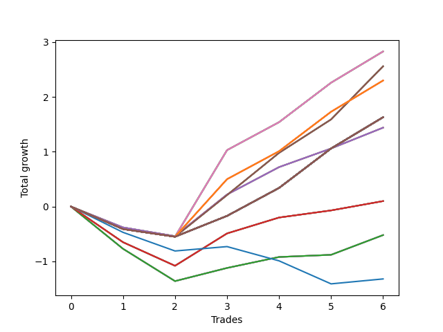

# Long Wallace 016 
- Symbol: SPY_Unlimited
- Date Range: 03/23/2022 - 07/08/2022
- Trading Period: 7:20-12:30
- Number of Trades: 6



| Name | Win Percent | Profit | Avg Profit / Trade | Avg Time / Trade |      | Name | Win Percent | Profit | Avg Profit / Trade | Avg Time / Trade |
| ---- | ----------- | ------ | ------------------ | ---------------- | ---- | ---- | ----------- | ------ | ------------------ | ---------------- |
| Sorted By <br> Profit | | | | | | Sorted By <br> Win Percentage ||||
| Sixty-Eight | 66.67 | 1415.00 | 235.83 | 29:05 |     | Sixty-Eight | 66.67 | 1415.00 | 235.83 | 29:05 |
| Sixty | 66.67 | 1415.00 | 235.83 | 29:05 |     | Sixty | 66.67 | 1415.00 | 235.83 | 29:05 |
| Fifty-Two | 66.67 | 1415.00 | 235.83 | 29:05 |     | Fifty-Two | 66.67 | 1415.00 | 235.83 | 29:05 |
| Forty-Four | 66.67 | 1415.00 | 235.83 | 29:05 |     | Forty-Four | 66.67 | 1415.00 | 235.83 | 29:05 |
| Four | 66.67 | 1415.00 | 235.83 | 29:05 |     | Four | 66.67 | 1415.00 | 235.83 | 29:05 |
| Sixty-Seven | 66.67 | 1280.00 | 213.33 | 24:15 |     | Sixty-Seven | 66.67 | 1280.00 | 213.33 | 24:15 |
| Fifty-Nine | 66.67 | 1280.00 | 213.33 | 24:15 |     | Fifty-Nine | 66.67 | 1280.00 | 213.33 | 24:15 |
| Fifty-One | 66.67 | 1280.00 | 213.33 | 24:15 |     | Fifty-One | 66.67 | 1280.00 | 213.33 | 24:15 |
| Forty-Three | 66.67 | 1280.00 | 213.33 | 24:15 |     | Forty-Three | 66.67 | 1280.00 | 213.33 | 24:15 |
| Three | 66.67 | 1280.00 | 213.33 | 24:15 |     | Three | 66.67 | 1280.00 | 213.33 | 24:15 |
| One Hundred Twenty-Six | 66.67 | 1150.00 | 191.67 | 29:00 |     | One Hundred Twenty-Six | 66.67 | 1150.00 | 191.67 | 29:00 |
| One Hundred Twenty-One | 66.67 | 1150.00 | 191.67 | 29:00 |     | One Hundred Twenty-One | 66.67 | 1150.00 | 191.67 | 29:00 |
| One Hundred Sixteen | 66.67 | 1150.00 | 191.67 | 29:00 |     | One Hundred Sixteen | 66.67 | 1150.00 | 191.67 | 29:00 |
| One Hundred Eleven | 66.67 | 1150.00 | 191.67 | 29:00 |     | One Hundred Eleven | 66.67 | 1150.00 | 191.67 | 29:00 |
| Eighty-One | 66.67 | 1150.00 | 191.67 | 29:00 |     | Eighty-One | 66.67 | 1150.00 | 191.67 | 29:00 |
| One Hundred Thirty | 66.67 | 815.00 | 135.83 | 29:55 |     | One Hundred Thirty | 66.67 | 815.00 | 135.83 | 29:55 |
| One Hundred Twenty-Nine | 66.67 | 815.00 | 135.83 | 29:55 |     | One Hundred Twenty-Nine | 66.67 | 815.00 | 135.83 | 29:55 |
| One Hundred Twenty-Eight | 66.67 | 815.00 | 135.83 | 29:55 |     | One Hundred Twenty-Eight | 66.67 | 815.00 | 135.83 | 29:55 |
| One Hundred Twenty-Seven | 66.67 | 815.00 | 135.83 | 29:55 |     | One Hundred Twenty-Seven | 66.67 | 815.00 | 135.83 | 29:55 |
| One Hundred Twenty-Five | 66.67 | 815.00 | 135.83 | 29:55 |     | One Hundred Twenty-Five | 66.67 | 815.00 | 135.83 | 29:55 |
| One Hundred Twenty-Four | 66.67 | 815.00 | 135.83 | 29:55 |     | One Hundred Twenty-Four | 66.67 | 815.00 | 135.83 | 29:55 |
| One Hundred Twenty-Three | 66.67 | 815.00 | 135.83 | 29:55 |     | One Hundred Twenty-Three | 66.67 | 815.00 | 135.83 | 29:55 |
| One Hundred Twenty-Two | 66.67 | 815.00 | 135.83 | 29:55 |     | One Hundred Twenty-Two | 66.67 | 815.00 | 135.83 | 29:55 |
| One Hundred Twenty | 66.67 | 815.00 | 135.83 | 29:55 |     | One Hundred Twenty | 66.67 | 815.00 | 135.83 | 29:55 |
| One Hundred Ninteen | 66.67 | 815.00 | 135.83 | 29:55 |     | One Hundred Ninteen | 66.67 | 815.00 | 135.83 | 29:55 |
| One Hundred Eighteen | 66.67 | 815.00 | 135.83 | 29:55 |     | One Hundred Eighteen | 66.67 | 815.00 | 135.83 | 29:55 |
| One Hundred Seventeen | 66.67 | 815.00 | 135.83 | 29:55 |     | One Hundred Seventeen | 66.67 | 815.00 | 135.83 | 29:55 |
| One Hundred Fifteen | 66.67 | 815.00 | 135.83 | 29:55 |     | One Hundred Fifteen | 66.67 | 815.00 | 135.83 | 29:55 |
| One Hundred Fourteen | 66.67 | 815.00 | 135.83 | 29:55 |     | One Hundred Fourteen | 66.67 | 815.00 | 135.83 | 29:55 |
| One Hundred Thirteen | 66.67 | 815.00 | 135.83 | 29:55 |     | One Hundred Thirteen | 66.67 | 815.00 | 135.83 | 29:55 |
| One Hundred Twelve | 66.67 | 815.00 | 135.83 | 29:55 |     | One Hundred Twelve | 66.67 | 815.00 | 135.83 | 29:55 |
| Eighty-Five | 66.67 | 815.00 | 135.83 | 29:55 |     | Eighty-Five | 66.67 | 815.00 | 135.83 | 29:55 |
| Eighty-Four | 66.67 | 815.00 | 135.83 | 29:55 |     | Eighty-Four | 66.67 | 815.00 | 135.83 | 29:55 |
| Eighty-Three | 66.67 | 815.00 | 135.83 | 29:55 |     | Eighty-Three | 66.67 | 815.00 | 135.83 | 29:55 |
| Eighty-Two | 66.67 | 815.00 | 135.83 | 29:55 |     | Eighty-Two | 66.67 | 815.00 | 135.83 | 29:55 |
| Seventy-One | 66.67 | 815.00 | 135.83 | 29:55 |     | Seventy-One | 66.67 | 815.00 | 135.83 | 29:55 |
| Seventy | 66.67 | 815.00 | 135.83 | 29:55 |     | Seventy | 66.67 | 815.00 | 135.83 | 29:55 |
| Sixty-Nine | 66.67 | 815.00 | 135.83 | 29:55 |     | Sixty-Nine | 66.67 | 815.00 | 135.83 | 29:55 |
| Sixty-Three | 66.67 | 815.00 | 135.83 | 29:55 |     | Sixty-Three | 66.67 | 815.00 | 135.83 | 29:55 |
| Sixty-Two | 66.67 | 815.00 | 135.83 | 29:55 |     | Sixty-Two | 66.67 | 815.00 | 135.83 | 29:55 |
| Sixty-One | 66.67 | 815.00 | 135.83 | 29:55 |     | Sixty-One | 66.67 | 815.00 | 135.83 | 29:55 |
| Fifty-Five | 66.67 | 815.00 | 135.83 | 29:55 |     | Fifty-Five | 66.67 | 815.00 | 135.83 | 29:55 |
| Fifty-Four | 66.67 | 815.00 | 135.83 | 29:55 |     | Fifty-Four | 66.67 | 815.00 | 135.83 | 29:55 |
| Fifty-Three | 66.67 | 815.00 | 135.83 | 29:55 |     | Fifty-Three | 66.67 | 815.00 | 135.83 | 29:55 |
| Forty-Seven | 66.67 | 815.00 | 135.83 | 29:55 |     | Forty-Seven | 66.67 | 815.00 | 135.83 | 29:55 |
| Forty-Six | 66.67 | 815.00 | 135.83 | 29:55 |     | Forty-Six | 66.67 | 815.00 | 135.83 | 29:55 |
| Forty-Five | 66.67 | 815.00 | 135.83 | 29:55 |     | Forty-Five | 66.67 | 815.00 | 135.83 | 29:55 |
| Seven | 66.67 | 815.00 | 135.83 | 29:55 |     | Seven | 66.67 | 815.00 | 135.83 | 29:55 |
| Six | 66.67 | 815.00 | 135.83 | 29:55 |     | Six | 66.67 | 815.00 | 135.83 | 29:55 |
| Five | 66.67 | 815.00 | 135.83 | 29:55 |     | Five | 66.67 | 815.00 | 135.83 | 29:55 |
| Sixty-Six | 66.67 | 720.00 | 120.00 | 21:43 |     | Sixty-Six | 66.67 | 720.00 | 120.00 | 21:43 |
| Fifty-Eight | 66.67 | 720.00 | 120.00 | 21:43 |     | Fifty-Eight | 66.67 | 720.00 | 120.00 | 21:43 |
| Fifty | 66.67 | 720.00 | 120.00 | 21:43 |     | Fifty | 66.67 | 720.00 | 120.00 | 21:43 |
| Forty-Two | 66.67 | 720.00 | 120.00 | 21:43 |     | Forty-Two | 66.67 | 720.00 | 120.00 | 21:43 |
| Two | 66.67 | 720.00 | 120.00 | 21:43 |     | Two | 66.67 | 720.00 | 120.00 | 21:43 |
| Sixty-Five | 66.67 | 50.00 | 8.33 | 18:23 |     | Sixty-Five | 66.67 | 50.00 | 8.33 | 18:23 |
| Fifty-Seven | 66.67 | 50.00 | 8.33 | 18:23 |     | Fifty-Seven | 66.67 | 50.00 | 8.33 | 18:23 |
| Forty-Nine | 66.67 | 50.00 | 8.33 | 18:23 |     | Forty-Nine | 66.67 | 50.00 | 8.33 | 18:23 |
| Forty-One | 66.67 | 50.00 | 8.33 | 18:23 |     | Forty-One | 66.67 | 50.00 | 8.33 | 18:23 |
| One | 66.67 | 50.00 | 8.33 | 18:23 |     | One | 66.67 | 50.00 | 8.33 | 18:23 |
| Sixty-Four | 66.67 | -260.00 | -43.33 | 14:02 |     | Sixty-Four | 66.67 | -260.00 | -43.33 | 14:02 |
| Fifty-Six | 66.67 | -260.00 | -43.33 | 14:02 |     | Fifty-Six | 66.67 | -260.00 | -43.33 | 14:02 |
| Forty-Eight | 66.67 | -260.00 | -43.33 | 14:02 |     | Forty-Eight | 66.67 | -260.00 | -43.33 | 14:02 |
| Forty | 66.67 | -260.00 | -43.33 | 14:02 |     | Forty | 66.67 | -260.00 | -43.33 | 14:02 |
| Zero | 66.67 | -260.00 | -43.33 | 14:02 |     | Zero | 66.67 | -260.00 | -43.33 | 14:02 |
| Seventy-Three | 33.33 | -660.00 | -110.00 | 08:15 |     | Seventy-Three | 33.33 | -660.00 | -110.00 | 08:15 |

## NO STOPLOSS

### Test Zero
* Sell when price hits the middle line of the 20p bollinger
* No Stoploss
* Results:
```
Total Trades: 6
Percent Up: 66.67
Percent Down: 33.33
Total Points Moved Up: -0.52
Potential Profit: -260.00
Total Points Ups: 0.84 Count Ups: 4
Total Points Downs: -1.36 Count Downs: 2
```

<details><summary>Trades</summary>

<code>In: 2022-03-25 08:16:00		Out: 2022-03-25 08:36:40		Total Position Time: 20:40		Total Move Up: -0.77		Total to Date: -0.77</code> <br />
<code>In: 2022-04-18 08:30:00		Out: 2022-04-18 08:54:55		Total Position Time: 24:55		Total Move Up: -0.59		Total to Date: -1.36</code> <br />
<code>In: 2022-05-13 11:07:00		Out: 2022-05-13 11:19:15		Total Position Time: 12:15		Total Move Up: 0.24		Total to Date: -1.12</code> <br />
<code>In: 2022-05-25 09:29:00		Out: 2022-05-25 09:38:55		Total Position Time: 09:55		Total Move Up: 0.20		Total to Date: -0.92</code> <br />
<code>In: 2022-05-25 09:30:00		Out: 2022-05-25 09:38:55		Total Position Time: 08:55		Total Move Up: 0.04		Total to Date: -0.88</code> <br />
<code>In: 2022-06-06 08:24:00		Out: 2022-06-06 08:31:35		Total Position Time: 07:35		Total Move Up: 0.36		Total to Date: -0.52</code> <br />


</details>

### Test One
* Sell when the price hits the upper line of the 20p 1std bollinger
* No Stoploss
* Results:
```
Total Trades: 6
Percent Up: 66.67
Percent Down: 33.33
Total Points Moved Up: 0.10
Potential Profit: 50.00
Total Points Ups: 1.18 Count Ups: 4
Total Points Downs: -1.08 Count Downs: 2
```

<details><summary>Trades</summary>

<code>In: 2022-03-25 08:16:00		Out: 2022-03-25 08:41:05		Total Position Time: 25:05		Total Move Up: -0.65		Total to Date: -0.65</code> <br />
<code>In: 2022-04-18 08:30:00		Out: 2022-04-18 08:57:10		Total Position Time: 27:10		Total Move Up: -0.43		Total to Date: -1.08</code> <br />
<code>In: 2022-05-13 11:07:00		Out: 2022-05-13 11:20:00		Total Position Time: 13:00		Total Move Up: 0.59		Total to Date: -0.49</code> <br />
<code>In: 2022-05-25 09:29:00		Out: 2022-05-25 09:44:25		Total Position Time: 15:25		Total Move Up: 0.29		Total to Date: -0.20</code> <br />
<code>In: 2022-05-25 09:30:00		Out: 2022-05-25 09:44:25		Total Position Time: 14:25		Total Move Up: 0.13		Total to Date: -0.07</code> <br />
<code>In: 2022-06-06 08:24:00		Out: 2022-06-06 08:39:15		Total Position Time: 15:15		Total Move Up: 0.17		Total to Date: 0.10</code> <br />


</details>

### Test Two
* Sell when the price hits the upper line of the 20p 2std bollinger
* No Stoploss
* Results:
```
Total Trades: 6
Percent Up: 66.67
Percent Down: 33.33
Total Points Moved Up: 1.44
Potential Profit: 720.00
Total Points Ups: 1.98 Count Ups: 4
Total Points Downs: -0.54 Count Downs: 2
```

<details><summary>Trades</summary>

<code>In: 2022-03-25 08:16:00		Out: 2022-03-25 08:41:45		Total Position Time: 25:45		Total Move Up: -0.38		Total to Date: -0.38</code> <br />
<code>In: 2022-04-18 08:30:00		Out: 2022-04-18 08:59:35		Total Position Time: 29:35		Total Move Up: -0.16		Total to Date: -0.54</code> <br />
<code>In: 2022-05-13 11:07:00		Out: 2022-05-13 11:31:20		Total Position Time: 24:20		Total Move Up: 0.76		Total to Date: 0.22</code> <br />
<code>In: 2022-05-25 09:29:00		Out: 2022-05-25 09:45:20		Total Position Time: 16:20		Total Move Up: 0.50		Total to Date: 0.72</code> <br />
<code>In: 2022-05-25 09:30:00		Out: 2022-05-25 09:45:20		Total Position Time: 15:20		Total Move Up: 0.34		Total to Date: 1.06</code> <br />
<code>In: 2022-06-06 08:24:00		Out: 2022-06-06 08:43:00		Total Position Time: 19:00		Total Move Up: 0.38		Total to Date: 1.44</code> <br />


</details>

### Test Three
* Sell when price hits the middle line of the 50p bollinger
* No Stoploss
* Results:
```
Total Trades: 6
Percent Up: 66.67
Percent Down: 33.33
Total Points Moved Up: 2.56
Potential Profit: 1280.00
Total Points Ups: 3.11 Count Ups: 4
Total Points Downs: -0.55 Count Downs: 2
```

<details><summary>Trades</summary>

<code>In: 2022-03-25 08:16:00		Out: 2022-03-25 08:45:55		Total Position Time: 29:55		Total Move Up: -0.41		Total to Date: -0.41</code> <br />
<code>In: 2022-04-18 08:30:00		Out: 2022-04-18 08:59:55		Total Position Time: 29:55		Total Move Up: -0.14		Total to Date: -0.55</code> <br />
<code>In: 2022-05-13 11:07:00		Out: 2022-05-13 11:31:20		Total Position Time: 24:20		Total Move Up: 0.76		Total to Date: 0.21</code> <br />
<code>In: 2022-05-25 09:29:00		Out: 2022-05-25 09:49:05		Total Position Time: 20:05		Total Move Up: 0.77		Total to Date: 0.98</code> <br />
<code>In: 2022-05-25 09:30:00		Out: 2022-05-25 09:49:05		Total Position Time: 19:05		Total Move Up: 0.61		Total to Date: 1.59</code> <br />
<code>In: 2022-06-06 08:24:00		Out: 2022-06-06 08:46:10		Total Position Time: 22:10		Total Move Up: 0.97		Total to Date: 2.56</code> <br />


</details>

### Test Four
* Sell when the price hits the upper line of the 50p 1std bollinger
* No Stoploss
* Results:
```
Total Trades: 6
Percent Up: 66.67
Percent Down: 33.33
Total Points Moved Up: 2.83
Potential Profit: 1415.00
Total Points Ups: 3.38 Count Ups: 4
Total Points Downs: -0.55 Count Downs: 2
```

<details><summary>Trades</summary>

<code>In: 2022-03-25 08:16:00		Out: 2022-03-25 08:45:55		Total Position Time: 29:55		Total Move Up: -0.41		Total to Date: -0.41</code> <br />
<code>In: 2022-04-18 08:30:00		Out: 2022-04-18 08:59:55		Total Position Time: 29:55		Total Move Up: -0.14		Total to Date: -0.55</code> <br />
<code>In: 2022-05-13 11:07:00		Out: 2022-05-13 11:32:00		Total Position Time: 25:00		Total Move Up: 1.58		Total to Date: 1.03</code> <br />
<code>In: 2022-05-25 09:29:00		Out: 2022-05-25 09:58:55		Total Position Time: 29:55		Total Move Up: 0.51		Total to Date: 1.54</code> <br />
<code>In: 2022-05-25 09:30:00		Out: 2022-05-25 09:59:55		Total Position Time: 29:55		Total Move Up: 0.72		Total to Date: 2.26</code> <br />
<code>In: 2022-06-06 08:24:00		Out: 2022-06-06 08:53:55		Total Position Time: 29:55		Total Move Up: 0.57		Total to Date: 2.83</code> <br />


</details>

### Test Five
* Sell when the price hits the upper line of the 50p 2std bollinger
* No Stoploss
* Results:
```
Total Trades: 6
Percent Up: 66.67
Percent Down: 33.33
Total Points Moved Up: 1.63
Potential Profit: 815.00
Total Points Ups: 2.18 Count Ups: 4
Total Points Downs: -0.55 Count Downs: 2
```

<details><summary>Trades</summary>

<code>In: 2022-03-25 08:16:00		Out: 2022-03-25 08:45:55		Total Position Time: 29:55		Total Move Up: -0.41		Total to Date: -0.41</code> <br />
<code>In: 2022-04-18 08:30:00		Out: 2022-04-18 08:59:55		Total Position Time: 29:55		Total Move Up: -0.14		Total to Date: -0.55</code> <br />
<code>In: 2022-05-13 11:07:00		Out: 2022-05-13 11:36:55		Total Position Time: 29:55		Total Move Up: 0.38		Total to Date: -0.17</code> <br />
<code>In: 2022-05-25 09:29:00		Out: 2022-05-25 09:58:55		Total Position Time: 29:55		Total Move Up: 0.51		Total to Date: 0.34</code> <br />
<code>In: 2022-05-25 09:30:00		Out: 2022-05-25 09:59:55		Total Position Time: 29:55		Total Move Up: 0.72		Total to Date: 1.06</code> <br />
<code>In: 2022-06-06 08:24:00		Out: 2022-06-06 08:53:55		Total Position Time: 29:55		Total Move Up: 0.57		Total to Date: 1.63</code> <br />


</details>

### Test Six
* Sell when the price hits the middle line of the 1std VWAP
* No Stoploss
* Results:
```
Total Trades: 6
Percent Up: 66.67
Percent Down: 33.33
Total Points Moved Up: 1.63
Potential Profit: 815.00
Total Points Ups: 2.18 Count Ups: 4
Total Points Downs: -0.55 Count Downs: 2
```

<details><summary>Trades</summary>

<code>In: 2022-03-25 08:16:00		Out: 2022-03-25 08:45:55		Total Position Time: 29:55		Total Move Up: -0.41		Total to Date: -0.41</code> <br />
<code>In: 2022-04-18 08:30:00		Out: 2022-04-18 08:59:55		Total Position Time: 29:55		Total Move Up: -0.14		Total to Date: -0.55</code> <br />
<code>In: 2022-05-13 11:07:00		Out: 2022-05-13 11:36:55		Total Position Time: 29:55		Total Move Up: 0.38		Total to Date: -0.17</code> <br />
<code>In: 2022-05-25 09:29:00		Out: 2022-05-25 09:58:55		Total Position Time: 29:55		Total Move Up: 0.51		Total to Date: 0.34</code> <br />
<code>In: 2022-05-25 09:30:00		Out: 2022-05-25 09:59:55		Total Position Time: 29:55		Total Move Up: 0.72		Total to Date: 1.06</code> <br />
<code>In: 2022-06-06 08:24:00		Out: 2022-06-06 08:53:55		Total Position Time: 29:55		Total Move Up: 0.57		Total to Date: 1.63</code> <br />


</details>

### Test Seven
* Sell when the price hits the upper line of the 1std VWAP
* No Stoploss
* Results:
```
Total Trades: 6
Percent Up: 66.67
Percent Down: 33.33
Total Points Moved Up: 1.63
Potential Profit: 815.00
Total Points Ups: 2.18 Count Ups: 4
Total Points Downs: -0.55 Count Downs: 2
```

<details><summary>Trades</summary>

<code>In: 2022-03-25 08:16:00		Out: 2022-03-25 08:45:55		Total Position Time: 29:55		Total Move Up: -0.41		Total to Date: -0.41</code> <br />
<code>In: 2022-04-18 08:30:00		Out: 2022-04-18 08:59:55		Total Position Time: 29:55		Total Move Up: -0.14		Total to Date: -0.55</code> <br />
<code>In: 2022-05-13 11:07:00		Out: 2022-05-13 11:36:55		Total Position Time: 29:55		Total Move Up: 0.38		Total to Date: -0.17</code> <br />
<code>In: 2022-05-25 09:29:00		Out: 2022-05-25 09:58:55		Total Position Time: 29:55		Total Move Up: 0.51		Total to Date: 0.34</code> <br />
<code>In: 2022-05-25 09:30:00		Out: 2022-05-25 09:59:55		Total Position Time: 29:55		Total Move Up: 0.72		Total to Date: 1.06</code> <br />
<code>In: 2022-06-06 08:24:00		Out: 2022-06-06 08:53:55		Total Position Time: 29:55		Total Move Up: 0.57		Total to Date: 1.63</code> <br />


</details>

## STOPLOSS OF 5

### Test Forty
* Sell when price hits the middle line of the 20p bollinger
* Stoploss is 5 points
* Results:
```
Total Trades: 6
Percent Up: 66.67
Percent Down: 33.33
Total Points Moved Up: -0.52
Potential Profit: -260.00
Total Points Ups: 0.84 Count Ups: 4
Total Points Downs: -1.36 Count Downs: 2
```

<details><summary>Trades</summary>

<code>In: 2022-03-25 08:16:00		Out: 2022-03-25 08:36:40		Total Position Time: 20:40		Total Move Up: -0.77		Total to Date: -0.77</code> <br />
<code>In: 2022-04-18 08:30:00		Out: 2022-04-18 08:54:55		Total Position Time: 24:55		Total Move Up: -0.59		Total to Date: -1.36</code> <br />
<code>In: 2022-05-13 11:07:00		Out: 2022-05-13 11:19:15		Total Position Time: 12:15		Total Move Up: 0.24		Total to Date: -1.12</code> <br />
<code>In: 2022-05-25 09:29:00		Out: 2022-05-25 09:38:55		Total Position Time: 09:55		Total Move Up: 0.20		Total to Date: -0.92</code> <br />
<code>In: 2022-05-25 09:30:00		Out: 2022-05-25 09:38:55		Total Position Time: 08:55		Total Move Up: 0.04		Total to Date: -0.88</code> <br />
<code>In: 2022-06-06 08:24:00		Out: 2022-06-06 08:31:35		Total Position Time: 07:35		Total Move Up: 0.36		Total to Date: -0.52</code> <br />


</details>

### Test Forty-One
* Sell when the price hits the upper line of the 20p 1std bollinger
* Stoploss is 5 points
* Results:
```
Total Trades: 6
Percent Up: 66.67
Percent Down: 33.33
Total Points Moved Up: 0.10
Potential Profit: 50.00
Total Points Ups: 1.18 Count Ups: 4
Total Points Downs: -1.08 Count Downs: 2
```

<details><summary>Trades</summary>

<code>In: 2022-03-25 08:16:00		Out: 2022-03-25 08:41:05		Total Position Time: 25:05		Total Move Up: -0.65		Total to Date: -0.65</code> <br />
<code>In: 2022-04-18 08:30:00		Out: 2022-04-18 08:57:10		Total Position Time: 27:10		Total Move Up: -0.43		Total to Date: -1.08</code> <br />
<code>In: 2022-05-13 11:07:00		Out: 2022-05-13 11:20:00		Total Position Time: 13:00		Total Move Up: 0.59		Total to Date: -0.49</code> <br />
<code>In: 2022-05-25 09:29:00		Out: 2022-05-25 09:44:25		Total Position Time: 15:25		Total Move Up: 0.29		Total to Date: -0.20</code> <br />
<code>In: 2022-05-25 09:30:00		Out: 2022-05-25 09:44:25		Total Position Time: 14:25		Total Move Up: 0.13		Total to Date: -0.07</code> <br />
<code>In: 2022-06-06 08:24:00		Out: 2022-06-06 08:39:15		Total Position Time: 15:15		Total Move Up: 0.17		Total to Date: 0.10</code> <br />


</details>

### Test Forty-Two
* Sell when the price hits the upper line of the 20p 2std bollinger
* Stoploss is 5 points
* Results:
```
Total Trades: 6
Percent Up: 66.67
Percent Down: 33.33
Total Points Moved Up: 1.44
Potential Profit: 720.00
Total Points Ups: 1.98 Count Ups: 4
Total Points Downs: -0.54 Count Downs: 2
```

<details><summary>Trades</summary>

<code>In: 2022-03-25 08:16:00		Out: 2022-03-25 08:41:45		Total Position Time: 25:45		Total Move Up: -0.38		Total to Date: -0.38</code> <br />
<code>In: 2022-04-18 08:30:00		Out: 2022-04-18 08:59:35		Total Position Time: 29:35		Total Move Up: -0.16		Total to Date: -0.54</code> <br />
<code>In: 2022-05-13 11:07:00		Out: 2022-05-13 11:31:20		Total Position Time: 24:20		Total Move Up: 0.76		Total to Date: 0.22</code> <br />
<code>In: 2022-05-25 09:29:00		Out: 2022-05-25 09:45:20		Total Position Time: 16:20		Total Move Up: 0.50		Total to Date: 0.72</code> <br />
<code>In: 2022-05-25 09:30:00		Out: 2022-05-25 09:45:20		Total Position Time: 15:20		Total Move Up: 0.34		Total to Date: 1.06</code> <br />
<code>In: 2022-06-06 08:24:00		Out: 2022-06-06 08:43:00		Total Position Time: 19:00		Total Move Up: 0.38		Total to Date: 1.44</code> <br />


</details>

### Test Forty-Three
* Sell when price hits the middle line of the 50p bollinger
* Stoploss is 5 points
* Results:
```
Total Trades: 6
Percent Up: 66.67
Percent Down: 33.33
Total Points Moved Up: 2.56
Potential Profit: 1280.00
Total Points Ups: 3.11 Count Ups: 4
Total Points Downs: -0.55 Count Downs: 2
```

<details><summary>Trades</summary>

<code>In: 2022-03-25 08:16:00		Out: 2022-03-25 08:45:55		Total Position Time: 29:55		Total Move Up: -0.41		Total to Date: -0.41</code> <br />
<code>In: 2022-04-18 08:30:00		Out: 2022-04-18 08:59:55		Total Position Time: 29:55		Total Move Up: -0.14		Total to Date: -0.55</code> <br />
<code>In: 2022-05-13 11:07:00		Out: 2022-05-13 11:31:20		Total Position Time: 24:20		Total Move Up: 0.76		Total to Date: 0.21</code> <br />
<code>In: 2022-05-25 09:29:00		Out: 2022-05-25 09:49:05		Total Position Time: 20:05		Total Move Up: 0.77		Total to Date: 0.98</code> <br />
<code>In: 2022-05-25 09:30:00		Out: 2022-05-25 09:49:05		Total Position Time: 19:05		Total Move Up: 0.61		Total to Date: 1.59</code> <br />
<code>In: 2022-06-06 08:24:00		Out: 2022-06-06 08:46:10		Total Position Time: 22:10		Total Move Up: 0.97		Total to Date: 2.56</code> <br />


</details>

### Test Forty-Four
* Sell when the price hits the upper line of the 50p 1std bollinger
* Stoploss is 5 points
* Results:
```
Total Trades: 6
Percent Up: 66.67
Percent Down: 33.33
Total Points Moved Up: 2.83
Potential Profit: 1415.00
Total Points Ups: 3.38 Count Ups: 4
Total Points Downs: -0.55 Count Downs: 2
```

<details><summary>Trades</summary>

<code>In: 2022-03-25 08:16:00		Out: 2022-03-25 08:45:55		Total Position Time: 29:55		Total Move Up: -0.41		Total to Date: -0.41</code> <br />
<code>In: 2022-04-18 08:30:00		Out: 2022-04-18 08:59:55		Total Position Time: 29:55		Total Move Up: -0.14		Total to Date: -0.55</code> <br />
<code>In: 2022-05-13 11:07:00		Out: 2022-05-13 11:32:00		Total Position Time: 25:00		Total Move Up: 1.58		Total to Date: 1.03</code> <br />
<code>In: 2022-05-25 09:29:00		Out: 2022-05-25 09:58:55		Total Position Time: 29:55		Total Move Up: 0.51		Total to Date: 1.54</code> <br />
<code>In: 2022-05-25 09:30:00		Out: 2022-05-25 09:59:55		Total Position Time: 29:55		Total Move Up: 0.72		Total to Date: 2.26</code> <br />
<code>In: 2022-06-06 08:24:00		Out: 2022-06-06 08:53:55		Total Position Time: 29:55		Total Move Up: 0.57		Total to Date: 2.83</code> <br />


</details>

### Test Forty-Five
* Sell when the price hits the upper line of the 50p 2std bollinger
* Stoploss is 5 points
* Results:
```
Total Trades: 6
Percent Up: 66.67
Percent Down: 33.33
Total Points Moved Up: 1.63
Potential Profit: 815.00
Total Points Ups: 2.18 Count Ups: 4
Total Points Downs: -0.55 Count Downs: 2
```

<details><summary>Trades</summary>

<code>In: 2022-03-25 08:16:00		Out: 2022-03-25 08:45:55		Total Position Time: 29:55		Total Move Up: -0.41		Total to Date: -0.41</code> <br />
<code>In: 2022-04-18 08:30:00		Out: 2022-04-18 08:59:55		Total Position Time: 29:55		Total Move Up: -0.14		Total to Date: -0.55</code> <br />
<code>In: 2022-05-13 11:07:00		Out: 2022-05-13 11:36:55		Total Position Time: 29:55		Total Move Up: 0.38		Total to Date: -0.17</code> <br />
<code>In: 2022-05-25 09:29:00		Out: 2022-05-25 09:58:55		Total Position Time: 29:55		Total Move Up: 0.51		Total to Date: 0.34</code> <br />
<code>In: 2022-05-25 09:30:00		Out: 2022-05-25 09:59:55		Total Position Time: 29:55		Total Move Up: 0.72		Total to Date: 1.06</code> <br />
<code>In: 2022-06-06 08:24:00		Out: 2022-06-06 08:53:55		Total Position Time: 29:55		Total Move Up: 0.57		Total to Date: 1.63</code> <br />


</details>

### Test Forty-Six
* Sell when the price hits the middle line of the 1std VWAP
* Stoploss is 5 points
* Results:
```
Total Trades: 6
Percent Up: 66.67
Percent Down: 33.33
Total Points Moved Up: 1.63
Potential Profit: 815.00
Total Points Ups: 2.18 Count Ups: 4
Total Points Downs: -0.55 Count Downs: 2
```

<details><summary>Trades</summary>

<code>In: 2022-03-25 08:16:00		Out: 2022-03-25 08:45:55		Total Position Time: 29:55		Total Move Up: -0.41		Total to Date: -0.41</code> <br />
<code>In: 2022-04-18 08:30:00		Out: 2022-04-18 08:59:55		Total Position Time: 29:55		Total Move Up: -0.14		Total to Date: -0.55</code> <br />
<code>In: 2022-05-13 11:07:00		Out: 2022-05-13 11:36:55		Total Position Time: 29:55		Total Move Up: 0.38		Total to Date: -0.17</code> <br />
<code>In: 2022-05-25 09:29:00		Out: 2022-05-25 09:58:55		Total Position Time: 29:55		Total Move Up: 0.51		Total to Date: 0.34</code> <br />
<code>In: 2022-05-25 09:30:00		Out: 2022-05-25 09:59:55		Total Position Time: 29:55		Total Move Up: 0.72		Total to Date: 1.06</code> <br />
<code>In: 2022-06-06 08:24:00		Out: 2022-06-06 08:53:55		Total Position Time: 29:55		Total Move Up: 0.57		Total to Date: 1.63</code> <br />


</details>

### Test Forty-Seven
* Sell when the price hits the upper line of the 1std VWAP
* Stoploss is 5 points
* Results:
```
Total Trades: 6
Percent Up: 66.67
Percent Down: 33.33
Total Points Moved Up: 1.63
Potential Profit: 815.00
Total Points Ups: 2.18 Count Ups: 4
Total Points Downs: -0.55 Count Downs: 2
```

<details><summary>Trades</summary>

<code>In: 2022-03-25 08:16:00		Out: 2022-03-25 08:45:55		Total Position Time: 29:55		Total Move Up: -0.41		Total to Date: -0.41</code> <br />
<code>In: 2022-04-18 08:30:00		Out: 2022-04-18 08:59:55		Total Position Time: 29:55		Total Move Up: -0.14		Total to Date: -0.55</code> <br />
<code>In: 2022-05-13 11:07:00		Out: 2022-05-13 11:36:55		Total Position Time: 29:55		Total Move Up: 0.38		Total to Date: -0.17</code> <br />
<code>In: 2022-05-25 09:29:00		Out: 2022-05-25 09:58:55		Total Position Time: 29:55		Total Move Up: 0.51		Total to Date: 0.34</code> <br />
<code>In: 2022-05-25 09:30:00		Out: 2022-05-25 09:59:55		Total Position Time: 29:55		Total Move Up: 0.72		Total to Date: 1.06</code> <br />
<code>In: 2022-06-06 08:24:00		Out: 2022-06-06 08:53:55		Total Position Time: 29:55		Total Move Up: 0.57		Total to Date: 1.63</code> <br />


</details>

## TRAIL STOP OF 5

### Test Forty-Eight
* Sell when price hits the middle line of the 20p bollinger
* Trailing Stop is 5 points
* Results:
```
Total Trades: 6
Percent Up: 66.67
Percent Down: 33.33
Total Points Moved Up: -0.52
Potential Profit: -260.00
Total Points Ups: 0.84 Count Ups: 4
Total Points Downs: -1.36 Count Downs: 2
```

<details><summary>Trades</summary>

<code>In: 2022-03-25 08:16:00		Out: 2022-03-25 08:36:40		Total Position Time: 20:40		Total Move Up: -0.77		Total to Date: -0.77</code> <br />
<code>In: 2022-04-18 08:30:00		Out: 2022-04-18 08:54:55		Total Position Time: 24:55		Total Move Up: -0.59		Total to Date: -1.36</code> <br />
<code>In: 2022-05-13 11:07:00		Out: 2022-05-13 11:19:15		Total Position Time: 12:15		Total Move Up: 0.24		Total to Date: -1.12</code> <br />
<code>In: 2022-05-25 09:29:00		Out: 2022-05-25 09:38:55		Total Position Time: 09:55		Total Move Up: 0.20		Total to Date: -0.92</code> <br />
<code>In: 2022-05-25 09:30:00		Out: 2022-05-25 09:38:55		Total Position Time: 08:55		Total Move Up: 0.04		Total to Date: -0.88</code> <br />
<code>In: 2022-06-06 08:24:00		Out: 2022-06-06 08:31:35		Total Position Time: 07:35		Total Move Up: 0.36		Total to Date: -0.52</code> <br />


</details>

### Test Forty-Nine
* Sell when the price hits the upper line of the 20p 1std bollinger
* Trailing Stop is 5 points
* Results:
```
Total Trades: 6
Percent Up: 66.67
Percent Down: 33.33
Total Points Moved Up: 0.10
Potential Profit: 50.00
Total Points Ups: 1.18 Count Ups: 4
Total Points Downs: -1.08 Count Downs: 2
```

<details><summary>Trades</summary>

<code>In: 2022-03-25 08:16:00		Out: 2022-03-25 08:41:05		Total Position Time: 25:05		Total Move Up: -0.65		Total to Date: -0.65</code> <br />
<code>In: 2022-04-18 08:30:00		Out: 2022-04-18 08:57:10		Total Position Time: 27:10		Total Move Up: -0.43		Total to Date: -1.08</code> <br />
<code>In: 2022-05-13 11:07:00		Out: 2022-05-13 11:20:00		Total Position Time: 13:00		Total Move Up: 0.59		Total to Date: -0.49</code> <br />
<code>In: 2022-05-25 09:29:00		Out: 2022-05-25 09:44:25		Total Position Time: 15:25		Total Move Up: 0.29		Total to Date: -0.20</code> <br />
<code>In: 2022-05-25 09:30:00		Out: 2022-05-25 09:44:25		Total Position Time: 14:25		Total Move Up: 0.13		Total to Date: -0.07</code> <br />
<code>In: 2022-06-06 08:24:00		Out: 2022-06-06 08:39:15		Total Position Time: 15:15		Total Move Up: 0.17		Total to Date: 0.10</code> <br />


</details>

### Test Fifty
* Sell when the price hits the upper line of the 20p 2std bollinger
* Trailing Stop is 5 points
* Results:
```
Total Trades: 6
Percent Up: 66.67
Percent Down: 33.33
Total Points Moved Up: 1.44
Potential Profit: 720.00
Total Points Ups: 1.98 Count Ups: 4
Total Points Downs: -0.54 Count Downs: 2
```

<details><summary>Trades</summary>

<code>In: 2022-03-25 08:16:00		Out: 2022-03-25 08:41:45		Total Position Time: 25:45		Total Move Up: -0.38		Total to Date: -0.38</code> <br />
<code>In: 2022-04-18 08:30:00		Out: 2022-04-18 08:59:35		Total Position Time: 29:35		Total Move Up: -0.16		Total to Date: -0.54</code> <br />
<code>In: 2022-05-13 11:07:00		Out: 2022-05-13 11:31:20		Total Position Time: 24:20		Total Move Up: 0.76		Total to Date: 0.22</code> <br />
<code>In: 2022-05-25 09:29:00		Out: 2022-05-25 09:45:20		Total Position Time: 16:20		Total Move Up: 0.50		Total to Date: 0.72</code> <br />
<code>In: 2022-05-25 09:30:00		Out: 2022-05-25 09:45:20		Total Position Time: 15:20		Total Move Up: 0.34		Total to Date: 1.06</code> <br />
<code>In: 2022-06-06 08:24:00		Out: 2022-06-06 08:43:00		Total Position Time: 19:00		Total Move Up: 0.38		Total to Date: 1.44</code> <br />


</details>

### Test Fifty-One
* Sell when price hits the middle line of the 50p bollinger
* Trailing Stop is 5 points
* Results:
```
Total Trades: 6
Percent Up: 66.67
Percent Down: 33.33
Total Points Moved Up: 2.56
Potential Profit: 1280.00
Total Points Ups: 3.11 Count Ups: 4
Total Points Downs: -0.55 Count Downs: 2
```

<details><summary>Trades</summary>

<code>In: 2022-03-25 08:16:00		Out: 2022-03-25 08:45:55		Total Position Time: 29:55		Total Move Up: -0.41		Total to Date: -0.41</code> <br />
<code>In: 2022-04-18 08:30:00		Out: 2022-04-18 08:59:55		Total Position Time: 29:55		Total Move Up: -0.14		Total to Date: -0.55</code> <br />
<code>In: 2022-05-13 11:07:00		Out: 2022-05-13 11:31:20		Total Position Time: 24:20		Total Move Up: 0.76		Total to Date: 0.21</code> <br />
<code>In: 2022-05-25 09:29:00		Out: 2022-05-25 09:49:05		Total Position Time: 20:05		Total Move Up: 0.77		Total to Date: 0.98</code> <br />
<code>In: 2022-05-25 09:30:00		Out: 2022-05-25 09:49:05		Total Position Time: 19:05		Total Move Up: 0.61		Total to Date: 1.59</code> <br />
<code>In: 2022-06-06 08:24:00		Out: 2022-06-06 08:46:10		Total Position Time: 22:10		Total Move Up: 0.97		Total to Date: 2.56</code> <br />


</details>

### Test Fifty-Two
* Sell when the price hits the upper line of the 50p 1std bollinger
* Trailing Stop is 5 points
* Results:
```
Total Trades: 6
Percent Up: 66.67
Percent Down: 33.33
Total Points Moved Up: 2.83
Potential Profit: 1415.00
Total Points Ups: 3.38 Count Ups: 4
Total Points Downs: -0.55 Count Downs: 2
```

<details><summary>Trades</summary>

<code>In: 2022-03-25 08:16:00		Out: 2022-03-25 08:45:55		Total Position Time: 29:55		Total Move Up: -0.41		Total to Date: -0.41</code> <br />
<code>In: 2022-04-18 08:30:00		Out: 2022-04-18 08:59:55		Total Position Time: 29:55		Total Move Up: -0.14		Total to Date: -0.55</code> <br />
<code>In: 2022-05-13 11:07:00		Out: 2022-05-13 11:32:00		Total Position Time: 25:00		Total Move Up: 1.58		Total to Date: 1.03</code> <br />
<code>In: 2022-05-25 09:29:00		Out: 2022-05-25 09:58:55		Total Position Time: 29:55		Total Move Up: 0.51		Total to Date: 1.54</code> <br />
<code>In: 2022-05-25 09:30:00		Out: 2022-05-25 09:59:55		Total Position Time: 29:55		Total Move Up: 0.72		Total to Date: 2.26</code> <br />
<code>In: 2022-06-06 08:24:00		Out: 2022-06-06 08:53:55		Total Position Time: 29:55		Total Move Up: 0.57		Total to Date: 2.83</code> <br />


</details>

### Test Fifty-Three
* Sell when the price hits the upper line of the 50p 2std bollinger
* Trailing Stop is 5 points
* Results:
```
Total Trades: 6
Percent Up: 66.67
Percent Down: 33.33
Total Points Moved Up: 1.63
Potential Profit: 815.00
Total Points Ups: 2.18 Count Ups: 4
Total Points Downs: -0.55 Count Downs: 2
```

<details><summary>Trades</summary>

<code>In: 2022-03-25 08:16:00		Out: 2022-03-25 08:45:55		Total Position Time: 29:55		Total Move Up: -0.41		Total to Date: -0.41</code> <br />
<code>In: 2022-04-18 08:30:00		Out: 2022-04-18 08:59:55		Total Position Time: 29:55		Total Move Up: -0.14		Total to Date: -0.55</code> <br />
<code>In: 2022-05-13 11:07:00		Out: 2022-05-13 11:36:55		Total Position Time: 29:55		Total Move Up: 0.38		Total to Date: -0.17</code> <br />
<code>In: 2022-05-25 09:29:00		Out: 2022-05-25 09:58:55		Total Position Time: 29:55		Total Move Up: 0.51		Total to Date: 0.34</code> <br />
<code>In: 2022-05-25 09:30:00		Out: 2022-05-25 09:59:55		Total Position Time: 29:55		Total Move Up: 0.72		Total to Date: 1.06</code> <br />
<code>In: 2022-06-06 08:24:00		Out: 2022-06-06 08:53:55		Total Position Time: 29:55		Total Move Up: 0.57		Total to Date: 1.63</code> <br />


</details>

### Test Fifty-Four
* Sell when the price hits the middle line of the 1std VWAP
* Trailing Stop is 5 points
* Results:
```
Total Trades: 6
Percent Up: 66.67
Percent Down: 33.33
Total Points Moved Up: 1.63
Potential Profit: 815.00
Total Points Ups: 2.18 Count Ups: 4
Total Points Downs: -0.55 Count Downs: 2
```

<details><summary>Trades</summary>

<code>In: 2022-03-25 08:16:00		Out: 2022-03-25 08:45:55		Total Position Time: 29:55		Total Move Up: -0.41		Total to Date: -0.41</code> <br />
<code>In: 2022-04-18 08:30:00		Out: 2022-04-18 08:59:55		Total Position Time: 29:55		Total Move Up: -0.14		Total to Date: -0.55</code> <br />
<code>In: 2022-05-13 11:07:00		Out: 2022-05-13 11:36:55		Total Position Time: 29:55		Total Move Up: 0.38		Total to Date: -0.17</code> <br />
<code>In: 2022-05-25 09:29:00		Out: 2022-05-25 09:58:55		Total Position Time: 29:55		Total Move Up: 0.51		Total to Date: 0.34</code> <br />
<code>In: 2022-05-25 09:30:00		Out: 2022-05-25 09:59:55		Total Position Time: 29:55		Total Move Up: 0.72		Total to Date: 1.06</code> <br />
<code>In: 2022-06-06 08:24:00		Out: 2022-06-06 08:53:55		Total Position Time: 29:55		Total Move Up: 0.57		Total to Date: 1.63</code> <br />


</details>

### Test Fifty-Five
* Sell when the price hits the upper line of the 1std VWAP
* Trailing Stop is 5 points
* Results:
```
Total Trades: 6
Percent Up: 66.67
Percent Down: 33.33
Total Points Moved Up: 1.63
Potential Profit: 815.00
Total Points Ups: 2.18 Count Ups: 4
Total Points Downs: -0.55 Count Downs: 2
```

<details><summary>Trades</summary>

<code>In: 2022-03-25 08:16:00		Out: 2022-03-25 08:45:55		Total Position Time: 29:55		Total Move Up: -0.41		Total to Date: -0.41</code> <br />
<code>In: 2022-04-18 08:30:00		Out: 2022-04-18 08:59:55		Total Position Time: 29:55		Total Move Up: -0.14		Total to Date: -0.55</code> <br />
<code>In: 2022-05-13 11:07:00		Out: 2022-05-13 11:36:55		Total Position Time: 29:55		Total Move Up: 0.38		Total to Date: -0.17</code> <br />
<code>In: 2022-05-25 09:29:00		Out: 2022-05-25 09:58:55		Total Position Time: 29:55		Total Move Up: 0.51		Total to Date: 0.34</code> <br />
<code>In: 2022-05-25 09:30:00		Out: 2022-05-25 09:59:55		Total Position Time: 29:55		Total Move Up: 0.72		Total to Date: 1.06</code> <br />
<code>In: 2022-06-06 08:24:00		Out: 2022-06-06 08:53:55		Total Position Time: 29:55		Total Move Up: 0.57		Total to Date: 1.63</code> <br />


</details>

## STOPLOSS OF 10

### Test Fifty-Six
* Sell when price hits the middle line of the 20p bollinger
* Stoploss is 10 points
* Results:
```
Total Trades: 6
Percent Up: 66.67
Percent Down: 33.33
Total Points Moved Up: -0.52
Potential Profit: -260.00
Total Points Ups: 0.84 Count Ups: 4
Total Points Downs: -1.36 Count Downs: 2
```

<details><summary>Trades</summary>

<code>In: 2022-03-25 08:16:00		Out: 2022-03-25 08:36:40		Total Position Time: 20:40		Total Move Up: -0.77		Total to Date: -0.77</code> <br />
<code>In: 2022-04-18 08:30:00		Out: 2022-04-18 08:54:55		Total Position Time: 24:55		Total Move Up: -0.59		Total to Date: -1.36</code> <br />
<code>In: 2022-05-13 11:07:00		Out: 2022-05-13 11:19:15		Total Position Time: 12:15		Total Move Up: 0.24		Total to Date: -1.12</code> <br />
<code>In: 2022-05-25 09:29:00		Out: 2022-05-25 09:38:55		Total Position Time: 09:55		Total Move Up: 0.20		Total to Date: -0.92</code> <br />
<code>In: 2022-05-25 09:30:00		Out: 2022-05-25 09:38:55		Total Position Time: 08:55		Total Move Up: 0.04		Total to Date: -0.88</code> <br />
<code>In: 2022-06-06 08:24:00		Out: 2022-06-06 08:31:35		Total Position Time: 07:35		Total Move Up: 0.36		Total to Date: -0.52</code> <br />


</details>

### Test Fifty-Seven
* Sell when the price hits the upper line of the 20p 1std bollinger
* Stoploss is 10 points
* Results:
```
Total Trades: 6
Percent Up: 66.67
Percent Down: 33.33
Total Points Moved Up: 0.10
Potential Profit: 50.00
Total Points Ups: 1.18 Count Ups: 4
Total Points Downs: -1.08 Count Downs: 2
```

<details><summary>Trades</summary>

<code>In: 2022-03-25 08:16:00		Out: 2022-03-25 08:41:05		Total Position Time: 25:05		Total Move Up: -0.65		Total to Date: -0.65</code> <br />
<code>In: 2022-04-18 08:30:00		Out: 2022-04-18 08:57:10		Total Position Time: 27:10		Total Move Up: -0.43		Total to Date: -1.08</code> <br />
<code>In: 2022-05-13 11:07:00		Out: 2022-05-13 11:20:00		Total Position Time: 13:00		Total Move Up: 0.59		Total to Date: -0.49</code> <br />
<code>In: 2022-05-25 09:29:00		Out: 2022-05-25 09:44:25		Total Position Time: 15:25		Total Move Up: 0.29		Total to Date: -0.20</code> <br />
<code>In: 2022-05-25 09:30:00		Out: 2022-05-25 09:44:25		Total Position Time: 14:25		Total Move Up: 0.13		Total to Date: -0.07</code> <br />
<code>In: 2022-06-06 08:24:00		Out: 2022-06-06 08:39:15		Total Position Time: 15:15		Total Move Up: 0.17		Total to Date: 0.10</code> <br />


</details>

### Test Fifty-Eight
* Sell when the price hits the upper line of the 20p 2std bollinger
* Stoploss is 10 points
* Results:
```
Total Trades: 6
Percent Up: 66.67
Percent Down: 33.33
Total Points Moved Up: 1.44
Potential Profit: 720.00
Total Points Ups: 1.98 Count Ups: 4
Total Points Downs: -0.54 Count Downs: 2
```

<details><summary>Trades</summary>

<code>In: 2022-03-25 08:16:00		Out: 2022-03-25 08:41:45		Total Position Time: 25:45		Total Move Up: -0.38		Total to Date: -0.38</code> <br />
<code>In: 2022-04-18 08:30:00		Out: 2022-04-18 08:59:35		Total Position Time: 29:35		Total Move Up: -0.16		Total to Date: -0.54</code> <br />
<code>In: 2022-05-13 11:07:00		Out: 2022-05-13 11:31:20		Total Position Time: 24:20		Total Move Up: 0.76		Total to Date: 0.22</code> <br />
<code>In: 2022-05-25 09:29:00		Out: 2022-05-25 09:45:20		Total Position Time: 16:20		Total Move Up: 0.50		Total to Date: 0.72</code> <br />
<code>In: 2022-05-25 09:30:00		Out: 2022-05-25 09:45:20		Total Position Time: 15:20		Total Move Up: 0.34		Total to Date: 1.06</code> <br />
<code>In: 2022-06-06 08:24:00		Out: 2022-06-06 08:43:00		Total Position Time: 19:00		Total Move Up: 0.38		Total to Date: 1.44</code> <br />


</details>

### Test Fifty-Nine
* Sell when price hits the middle line of the 50p bollinger
* Stoploss is 10 points
* Results:
```
Total Trades: 6
Percent Up: 66.67
Percent Down: 33.33
Total Points Moved Up: 2.56
Potential Profit: 1280.00
Total Points Ups: 3.11 Count Ups: 4
Total Points Downs: -0.55 Count Downs: 2
```

<details><summary>Trades</summary>

<code>In: 2022-03-25 08:16:00		Out: 2022-03-25 08:45:55		Total Position Time: 29:55		Total Move Up: -0.41		Total to Date: -0.41</code> <br />
<code>In: 2022-04-18 08:30:00		Out: 2022-04-18 08:59:55		Total Position Time: 29:55		Total Move Up: -0.14		Total to Date: -0.55</code> <br />
<code>In: 2022-05-13 11:07:00		Out: 2022-05-13 11:31:20		Total Position Time: 24:20		Total Move Up: 0.76		Total to Date: 0.21</code> <br />
<code>In: 2022-05-25 09:29:00		Out: 2022-05-25 09:49:05		Total Position Time: 20:05		Total Move Up: 0.77		Total to Date: 0.98</code> <br />
<code>In: 2022-05-25 09:30:00		Out: 2022-05-25 09:49:05		Total Position Time: 19:05		Total Move Up: 0.61		Total to Date: 1.59</code> <br />
<code>In: 2022-06-06 08:24:00		Out: 2022-06-06 08:46:10		Total Position Time: 22:10		Total Move Up: 0.97		Total to Date: 2.56</code> <br />


</details>

### Test Sixty
* Sell when the price hits the upper line of the 50p 1std bollinger
* Stoploss is 10 points
* Results:
```
Total Trades: 6
Percent Up: 66.67
Percent Down: 33.33
Total Points Moved Up: 2.83
Potential Profit: 1415.00
Total Points Ups: 3.38 Count Ups: 4
Total Points Downs: -0.55 Count Downs: 2
```

<details><summary>Trades</summary>

<code>In: 2022-03-25 08:16:00		Out: 2022-03-25 08:45:55		Total Position Time: 29:55		Total Move Up: -0.41		Total to Date: -0.41</code> <br />
<code>In: 2022-04-18 08:30:00		Out: 2022-04-18 08:59:55		Total Position Time: 29:55		Total Move Up: -0.14		Total to Date: -0.55</code> <br />
<code>In: 2022-05-13 11:07:00		Out: 2022-05-13 11:32:00		Total Position Time: 25:00		Total Move Up: 1.58		Total to Date: 1.03</code> <br />
<code>In: 2022-05-25 09:29:00		Out: 2022-05-25 09:58:55		Total Position Time: 29:55		Total Move Up: 0.51		Total to Date: 1.54</code> <br />
<code>In: 2022-05-25 09:30:00		Out: 2022-05-25 09:59:55		Total Position Time: 29:55		Total Move Up: 0.72		Total to Date: 2.26</code> <br />
<code>In: 2022-06-06 08:24:00		Out: 2022-06-06 08:53:55		Total Position Time: 29:55		Total Move Up: 0.57		Total to Date: 2.83</code> <br />


</details>

### Test Sixty-One
* Sell when the price hits the upper line of the 50p 2std bollinger
* Stoploss is 10 points
* Results:
```
Total Trades: 6
Percent Up: 66.67
Percent Down: 33.33
Total Points Moved Up: 1.63
Potential Profit: 815.00
Total Points Ups: 2.18 Count Ups: 4
Total Points Downs: -0.55 Count Downs: 2
```

<details><summary>Trades</summary>

<code>In: 2022-03-25 08:16:00		Out: 2022-03-25 08:45:55		Total Position Time: 29:55		Total Move Up: -0.41		Total to Date: -0.41</code> <br />
<code>In: 2022-04-18 08:30:00		Out: 2022-04-18 08:59:55		Total Position Time: 29:55		Total Move Up: -0.14		Total to Date: -0.55</code> <br />
<code>In: 2022-05-13 11:07:00		Out: 2022-05-13 11:36:55		Total Position Time: 29:55		Total Move Up: 0.38		Total to Date: -0.17</code> <br />
<code>In: 2022-05-25 09:29:00		Out: 2022-05-25 09:58:55		Total Position Time: 29:55		Total Move Up: 0.51		Total to Date: 0.34</code> <br />
<code>In: 2022-05-25 09:30:00		Out: 2022-05-25 09:59:55		Total Position Time: 29:55		Total Move Up: 0.72		Total to Date: 1.06</code> <br />
<code>In: 2022-06-06 08:24:00		Out: 2022-06-06 08:53:55		Total Position Time: 29:55		Total Move Up: 0.57		Total to Date: 1.63</code> <br />


</details>

### Test Sixty-Two
* Sell when the price hits the middle line of the 1std VWAP
* Stoploss is 10 points
* Results:
```
Total Trades: 6
Percent Up: 66.67
Percent Down: 33.33
Total Points Moved Up: 1.63
Potential Profit: 815.00
Total Points Ups: 2.18 Count Ups: 4
Total Points Downs: -0.55 Count Downs: 2
```

<details><summary>Trades</summary>

<code>In: 2022-03-25 08:16:00		Out: 2022-03-25 08:45:55		Total Position Time: 29:55		Total Move Up: -0.41		Total to Date: -0.41</code> <br />
<code>In: 2022-04-18 08:30:00		Out: 2022-04-18 08:59:55		Total Position Time: 29:55		Total Move Up: -0.14		Total to Date: -0.55</code> <br />
<code>In: 2022-05-13 11:07:00		Out: 2022-05-13 11:36:55		Total Position Time: 29:55		Total Move Up: 0.38		Total to Date: -0.17</code> <br />
<code>In: 2022-05-25 09:29:00		Out: 2022-05-25 09:58:55		Total Position Time: 29:55		Total Move Up: 0.51		Total to Date: 0.34</code> <br />
<code>In: 2022-05-25 09:30:00		Out: 2022-05-25 09:59:55		Total Position Time: 29:55		Total Move Up: 0.72		Total to Date: 1.06</code> <br />
<code>In: 2022-06-06 08:24:00		Out: 2022-06-06 08:53:55		Total Position Time: 29:55		Total Move Up: 0.57		Total to Date: 1.63</code> <br />


</details>

### Test Sixty-Three
* Sell when the price hits the upper line of the 1std VWAP
* Stoploss is 10 points
* Results:
```
Total Trades: 6
Percent Up: 66.67
Percent Down: 33.33
Total Points Moved Up: 1.63
Potential Profit: 815.00
Total Points Ups: 2.18 Count Ups: 4
Total Points Downs: -0.55 Count Downs: 2
```

<details><summary>Trades</summary>

<code>In: 2022-03-25 08:16:00		Out: 2022-03-25 08:45:55		Total Position Time: 29:55		Total Move Up: -0.41		Total to Date: -0.41</code> <br />
<code>In: 2022-04-18 08:30:00		Out: 2022-04-18 08:59:55		Total Position Time: 29:55		Total Move Up: -0.14		Total to Date: -0.55</code> <br />
<code>In: 2022-05-13 11:07:00		Out: 2022-05-13 11:36:55		Total Position Time: 29:55		Total Move Up: 0.38		Total to Date: -0.17</code> <br />
<code>In: 2022-05-25 09:29:00		Out: 2022-05-25 09:58:55		Total Position Time: 29:55		Total Move Up: 0.51		Total to Date: 0.34</code> <br />
<code>In: 2022-05-25 09:30:00		Out: 2022-05-25 09:59:55		Total Position Time: 29:55		Total Move Up: 0.72		Total to Date: 1.06</code> <br />
<code>In: 2022-06-06 08:24:00		Out: 2022-06-06 08:53:55		Total Position Time: 29:55		Total Move Up: 0.57		Total to Date: 1.63</code> <br />


</details>

## TRAIL STOP OF 10

### Test Sixty-Four
* Sell when price hits the middle line of the 20p bollinger
* Trailing Stop is 10 points
* Results:
```
Total Trades: 6
Percent Up: 66.67
Percent Down: 33.33
Total Points Moved Up: -0.52
Potential Profit: -260.00
Total Points Ups: 0.84 Count Ups: 4
Total Points Downs: -1.36 Count Downs: 2
```

<details><summary>Trades</summary>

<code>In: 2022-03-25 08:16:00		Out: 2022-03-25 08:36:40		Total Position Time: 20:40		Total Move Up: -0.77		Total to Date: -0.77</code> <br />
<code>In: 2022-04-18 08:30:00		Out: 2022-04-18 08:54:55		Total Position Time: 24:55		Total Move Up: -0.59		Total to Date: -1.36</code> <br />
<code>In: 2022-05-13 11:07:00		Out: 2022-05-13 11:19:15		Total Position Time: 12:15		Total Move Up: 0.24		Total to Date: -1.12</code> <br />
<code>In: 2022-05-25 09:29:00		Out: 2022-05-25 09:38:55		Total Position Time: 09:55		Total Move Up: 0.20		Total to Date: -0.92</code> <br />
<code>In: 2022-05-25 09:30:00		Out: 2022-05-25 09:38:55		Total Position Time: 08:55		Total Move Up: 0.04		Total to Date: -0.88</code> <br />
<code>In: 2022-06-06 08:24:00		Out: 2022-06-06 08:31:35		Total Position Time: 07:35		Total Move Up: 0.36		Total to Date: -0.52</code> <br />


</details>

### Test Sixty-Five
* Sell when the price hits the upper line of the 20p 1std bollinger
* Trailing Stop is 10 points
* Results:
```
Total Trades: 6
Percent Up: 66.67
Percent Down: 33.33
Total Points Moved Up: 0.10
Potential Profit: 50.00
Total Points Ups: 1.18 Count Ups: 4
Total Points Downs: -1.08 Count Downs: 2
```

<details><summary>Trades</summary>

<code>In: 2022-03-25 08:16:00		Out: 2022-03-25 08:41:05		Total Position Time: 25:05		Total Move Up: -0.65		Total to Date: -0.65</code> <br />
<code>In: 2022-04-18 08:30:00		Out: 2022-04-18 08:57:10		Total Position Time: 27:10		Total Move Up: -0.43		Total to Date: -1.08</code> <br />
<code>In: 2022-05-13 11:07:00		Out: 2022-05-13 11:20:00		Total Position Time: 13:00		Total Move Up: 0.59		Total to Date: -0.49</code> <br />
<code>In: 2022-05-25 09:29:00		Out: 2022-05-25 09:44:25		Total Position Time: 15:25		Total Move Up: 0.29		Total to Date: -0.20</code> <br />
<code>In: 2022-05-25 09:30:00		Out: 2022-05-25 09:44:25		Total Position Time: 14:25		Total Move Up: 0.13		Total to Date: -0.07</code> <br />
<code>In: 2022-06-06 08:24:00		Out: 2022-06-06 08:39:15		Total Position Time: 15:15		Total Move Up: 0.17		Total to Date: 0.10</code> <br />


</details>

### Test Sixty-Six
* Sell when the price hits the upper line of the 20p 2std bollinger
* Trailing Stop is 10 points
* Results:
```
Total Trades: 6
Percent Up: 66.67
Percent Down: 33.33
Total Points Moved Up: 1.44
Potential Profit: 720.00
Total Points Ups: 1.98 Count Ups: 4
Total Points Downs: -0.54 Count Downs: 2
```

<details><summary>Trades</summary>

<code>In: 2022-03-25 08:16:00		Out: 2022-03-25 08:41:45		Total Position Time: 25:45		Total Move Up: -0.38		Total to Date: -0.38</code> <br />
<code>In: 2022-04-18 08:30:00		Out: 2022-04-18 08:59:35		Total Position Time: 29:35		Total Move Up: -0.16		Total to Date: -0.54</code> <br />
<code>In: 2022-05-13 11:07:00		Out: 2022-05-13 11:31:20		Total Position Time: 24:20		Total Move Up: 0.76		Total to Date: 0.22</code> <br />
<code>In: 2022-05-25 09:29:00		Out: 2022-05-25 09:45:20		Total Position Time: 16:20		Total Move Up: 0.50		Total to Date: 0.72</code> <br />
<code>In: 2022-05-25 09:30:00		Out: 2022-05-25 09:45:20		Total Position Time: 15:20		Total Move Up: 0.34		Total to Date: 1.06</code> <br />
<code>In: 2022-06-06 08:24:00		Out: 2022-06-06 08:43:00		Total Position Time: 19:00		Total Move Up: 0.38		Total to Date: 1.44</code> <br />


</details>

### Test Sixty-Seven
* Sell when price hits the middle line of the 50p bollinger
* Trailing Stop is 10 points
* Results:
```
Total Trades: 6
Percent Up: 66.67
Percent Down: 33.33
Total Points Moved Up: 2.56
Potential Profit: 1280.00
Total Points Ups: 3.11 Count Ups: 4
Total Points Downs: -0.55 Count Downs: 2
```

<details><summary>Trades</summary>

<code>In: 2022-03-25 08:16:00		Out: 2022-03-25 08:45:55		Total Position Time: 29:55		Total Move Up: -0.41		Total to Date: -0.41</code> <br />
<code>In: 2022-04-18 08:30:00		Out: 2022-04-18 08:59:55		Total Position Time: 29:55		Total Move Up: -0.14		Total to Date: -0.55</code> <br />
<code>In: 2022-05-13 11:07:00		Out: 2022-05-13 11:31:20		Total Position Time: 24:20		Total Move Up: 0.76		Total to Date: 0.21</code> <br />
<code>In: 2022-05-25 09:29:00		Out: 2022-05-25 09:49:05		Total Position Time: 20:05		Total Move Up: 0.77		Total to Date: 0.98</code> <br />
<code>In: 2022-05-25 09:30:00		Out: 2022-05-25 09:49:05		Total Position Time: 19:05		Total Move Up: 0.61		Total to Date: 1.59</code> <br />
<code>In: 2022-06-06 08:24:00		Out: 2022-06-06 08:46:10		Total Position Time: 22:10		Total Move Up: 0.97		Total to Date: 2.56</code> <br />


</details>

### Test Sixty-Eight
* Sell when the price hits the upper line of the 50p 1std bollinger
* Trailing Stop is 10 points
* Results:
```
Total Trades: 6
Percent Up: 66.67
Percent Down: 33.33
Total Points Moved Up: 2.83
Potential Profit: 1415.00
Total Points Ups: 3.38 Count Ups: 4
Total Points Downs: -0.55 Count Downs: 2
```

<details><summary>Trades</summary>

<code>In: 2022-03-25 08:16:00		Out: 2022-03-25 08:45:55		Total Position Time: 29:55		Total Move Up: -0.41		Total to Date: -0.41</code> <br />
<code>In: 2022-04-18 08:30:00		Out: 2022-04-18 08:59:55		Total Position Time: 29:55		Total Move Up: -0.14		Total to Date: -0.55</code> <br />
<code>In: 2022-05-13 11:07:00		Out: 2022-05-13 11:32:00		Total Position Time: 25:00		Total Move Up: 1.58		Total to Date: 1.03</code> <br />
<code>In: 2022-05-25 09:29:00		Out: 2022-05-25 09:58:55		Total Position Time: 29:55		Total Move Up: 0.51		Total to Date: 1.54</code> <br />
<code>In: 2022-05-25 09:30:00		Out: 2022-05-25 09:59:55		Total Position Time: 29:55		Total Move Up: 0.72		Total to Date: 2.26</code> <br />
<code>In: 2022-06-06 08:24:00		Out: 2022-06-06 08:53:55		Total Position Time: 29:55		Total Move Up: 0.57		Total to Date: 2.83</code> <br />


</details>

### Test Sixty-Nine
* Sell when the price hits the upper line of the 50p 2std bollinger
* Trailing Stop is 10 points
* Results:
```
Total Trades: 6
Percent Up: 66.67
Percent Down: 33.33
Total Points Moved Up: 1.63
Potential Profit: 815.00
Total Points Ups: 2.18 Count Ups: 4
Total Points Downs: -0.55 Count Downs: 2
```

<details><summary>Trades</summary>

<code>In: 2022-03-25 08:16:00		Out: 2022-03-25 08:45:55		Total Position Time: 29:55		Total Move Up: -0.41		Total to Date: -0.41</code> <br />
<code>In: 2022-04-18 08:30:00		Out: 2022-04-18 08:59:55		Total Position Time: 29:55		Total Move Up: -0.14		Total to Date: -0.55</code> <br />
<code>In: 2022-05-13 11:07:00		Out: 2022-05-13 11:36:55		Total Position Time: 29:55		Total Move Up: 0.38		Total to Date: -0.17</code> <br />
<code>In: 2022-05-25 09:29:00		Out: 2022-05-25 09:58:55		Total Position Time: 29:55		Total Move Up: 0.51		Total to Date: 0.34</code> <br />
<code>In: 2022-05-25 09:30:00		Out: 2022-05-25 09:59:55		Total Position Time: 29:55		Total Move Up: 0.72		Total to Date: 1.06</code> <br />
<code>In: 2022-06-06 08:24:00		Out: 2022-06-06 08:53:55		Total Position Time: 29:55		Total Move Up: 0.57		Total to Date: 1.63</code> <br />


</details>

### Test Seventy
* Sell when the price hits the middle line of the 1std VWAP
* Trailing Stop is 10 points
* Results:
```
Total Trades: 6
Percent Up: 66.67
Percent Down: 33.33
Total Points Moved Up: 1.63
Potential Profit: 815.00
Total Points Ups: 2.18 Count Ups: 4
Total Points Downs: -0.55 Count Downs: 2
```

<details><summary>Trades</summary>

<code>In: 2022-03-25 08:16:00		Out: 2022-03-25 08:45:55		Total Position Time: 29:55		Total Move Up: -0.41		Total to Date: -0.41</code> <br />
<code>In: 2022-04-18 08:30:00		Out: 2022-04-18 08:59:55		Total Position Time: 29:55		Total Move Up: -0.14		Total to Date: -0.55</code> <br />
<code>In: 2022-05-13 11:07:00		Out: 2022-05-13 11:36:55		Total Position Time: 29:55		Total Move Up: 0.38		Total to Date: -0.17</code> <br />
<code>In: 2022-05-25 09:29:00		Out: 2022-05-25 09:58:55		Total Position Time: 29:55		Total Move Up: 0.51		Total to Date: 0.34</code> <br />
<code>In: 2022-05-25 09:30:00		Out: 2022-05-25 09:59:55		Total Position Time: 29:55		Total Move Up: 0.72		Total to Date: 1.06</code> <br />
<code>In: 2022-06-06 08:24:00		Out: 2022-06-06 08:53:55		Total Position Time: 29:55		Total Move Up: 0.57		Total to Date: 1.63</code> <br />


</details>

### Test Seventy-One
* Sell when the price hits the upper line of the 1std VWAP
* Trailing Stop is 10 points
* Results:
```
Total Trades: 6
Percent Up: 66.67
Percent Down: 33.33
Total Points Moved Up: 1.63
Potential Profit: 815.00
Total Points Ups: 2.18 Count Ups: 4
Total Points Downs: -0.55 Count Downs: 2
```

<details><summary>Trades</summary>

<code>In: 2022-03-25 08:16:00		Out: 2022-03-25 08:45:55		Total Position Time: 29:55		Total Move Up: -0.41		Total to Date: -0.41</code> <br />
<code>In: 2022-04-18 08:30:00		Out: 2022-04-18 08:59:55		Total Position Time: 29:55		Total Move Up: -0.14		Total to Date: -0.55</code> <br />
<code>In: 2022-05-13 11:07:00		Out: 2022-05-13 11:36:55		Total Position Time: 29:55		Total Move Up: 0.38		Total to Date: -0.17</code> <br />
<code>In: 2022-05-25 09:29:00		Out: 2022-05-25 09:58:55		Total Position Time: 29:55		Total Move Up: 0.51		Total to Date: 0.34</code> <br />
<code>In: 2022-05-25 09:30:00		Out: 2022-05-25 09:59:55		Total Position Time: 29:55		Total Move Up: 0.72		Total to Date: 1.06</code> <br />
<code>In: 2022-06-06 08:24:00		Out: 2022-06-06 08:53:55		Total Position Time: 29:55		Total Move Up: 0.57		Total to Date: 1.63</code> <br />


</details>

## SPECIAL EXIT CONDITIONS 

### Test Seventy-Three
* Sell when the linear regression slope changes to negative
* No Stoploss
* Results:
```
Total Trades: 6
Percent Up: 33.33
Percent Down: 66.67
Total Points Moved Up: -1.32
Potential Profit: -660.00
Total Points Ups: 0.17 Count Ups: 2
Total Points Downs: -1.49 Count Downs: 4
```

<details><summary>Trades</summary>

<code>In: 2022-03-25 08:16:00		Out: 2022-03-25 08:24:05		Total Position Time: 08:05		Total Move Up: -0.47		Total to Date: -0.47</code> <br />
<code>In: 2022-04-18 08:30:00		Out: 2022-04-18 08:37:05		Total Position Time: 07:05		Total Move Up: -0.34		Total to Date: -0.81</code> <br />
<code>In: 2022-05-13 11:07:00		Out: 2022-05-13 11:18:05		Total Position Time: 11:05		Total Move Up: 0.08		Total to Date: -0.73</code> <br />
<code>In: 2022-05-25 09:29:00		Out: 2022-05-25 09:36:05		Total Position Time: 07:05		Total Move Up: -0.26		Total to Date: -0.99</code> <br />
<code>In: 2022-05-25 09:30:00		Out: 2022-05-25 09:36:05		Total Position Time: 06:05		Total Move Up: -0.42		Total to Date: -1.41</code> <br />
<code>In: 2022-06-06 08:24:00		Out: 2022-06-06 08:34:05		Total Position Time: 10:05		Total Move Up: 0.09		Total to Date: -1.32</code> <br />


</details>

## TAKE PROFIT

### Test Eighty-One
* Take Profit of 1 Point
* No Stoploss
* Results:
```
Total Trades: 6
Percent Up: 66.67
Percent Down: 33.33
Total Points Moved Up: 2.30
Potential Profit: 1150.00
Total Points Ups: 2.85 Count Ups: 4
Total Points Downs: -0.55 Count Downs: 2
```

<details><summary>Trades</summary>

<code>In: 2022-03-25 08:16:00		Out: 2022-03-25 08:45:55		Total Position Time: 29:55		Total Move Up: -0.41		Total to Date: -0.41</code> <br />
<code>In: 2022-04-18 08:30:00		Out: 2022-04-18 08:59:55		Total Position Time: 29:55		Total Move Up: -0.14		Total to Date: -0.55</code> <br />
<code>In: 2022-05-13 11:07:00		Out: 2022-05-13 11:31:30		Total Position Time: 24:30		Total Move Up: 1.05		Total to Date: 0.50</code> <br />
<code>In: 2022-05-25 09:29:00		Out: 2022-05-25 09:58:55		Total Position Time: 29:55		Total Move Up: 0.51		Total to Date: 1.01</code> <br />
<code>In: 2022-05-25 09:30:00		Out: 2022-05-25 09:59:55		Total Position Time: 29:55		Total Move Up: 0.72		Total to Date: 1.73</code> <br />
<code>In: 2022-06-06 08:24:00		Out: 2022-06-06 08:53:55		Total Position Time: 29:55		Total Move Up: 0.57		Total to Date: 2.30</code> <br />


</details>

### Test Eighty-Two
* Take Profit of 2 Point
* No Stoploss
* Results:
```
Total Trades: 6
Percent Up: 66.67
Percent Down: 33.33
Total Points Moved Up: 1.63
Potential Profit: 815.00
Total Points Ups: 2.18 Count Ups: 4
Total Points Downs: -0.55 Count Downs: 2
```

<details><summary>Trades</summary>

<code>In: 2022-03-25 08:16:00		Out: 2022-03-25 08:45:55		Total Position Time: 29:55		Total Move Up: -0.41		Total to Date: -0.41</code> <br />
<code>In: 2022-04-18 08:30:00		Out: 2022-04-18 08:59:55		Total Position Time: 29:55		Total Move Up: -0.14		Total to Date: -0.55</code> <br />
<code>In: 2022-05-13 11:07:00		Out: 2022-05-13 11:36:55		Total Position Time: 29:55		Total Move Up: 0.38		Total to Date: -0.17</code> <br />
<code>In: 2022-05-25 09:29:00		Out: 2022-05-25 09:58:55		Total Position Time: 29:55		Total Move Up: 0.51		Total to Date: 0.34</code> <br />
<code>In: 2022-05-25 09:30:00		Out: 2022-05-25 09:59:55		Total Position Time: 29:55		Total Move Up: 0.72		Total to Date: 1.06</code> <br />
<code>In: 2022-06-06 08:24:00		Out: 2022-06-06 08:53:55		Total Position Time: 29:55		Total Move Up: 0.57		Total to Date: 1.63</code> <br />


</details>

### Test Eighty-Three
* Take Profit of 3 Point
* No Stoploss
* Results:
```
Total Trades: 6
Percent Up: 66.67
Percent Down: 33.33
Total Points Moved Up: 1.63
Potential Profit: 815.00
Total Points Ups: 2.18 Count Ups: 4
Total Points Downs: -0.55 Count Downs: 2
```

<details><summary>Trades</summary>

<code>In: 2022-03-25 08:16:00		Out: 2022-03-25 08:45:55		Total Position Time: 29:55		Total Move Up: -0.41		Total to Date: -0.41</code> <br />
<code>In: 2022-04-18 08:30:00		Out: 2022-04-18 08:59:55		Total Position Time: 29:55		Total Move Up: -0.14		Total to Date: -0.55</code> <br />
<code>In: 2022-05-13 11:07:00		Out: 2022-05-13 11:36:55		Total Position Time: 29:55		Total Move Up: 0.38		Total to Date: -0.17</code> <br />
<code>In: 2022-05-25 09:29:00		Out: 2022-05-25 09:58:55		Total Position Time: 29:55		Total Move Up: 0.51		Total to Date: 0.34</code> <br />
<code>In: 2022-05-25 09:30:00		Out: 2022-05-25 09:59:55		Total Position Time: 29:55		Total Move Up: 0.72		Total to Date: 1.06</code> <br />
<code>In: 2022-06-06 08:24:00		Out: 2022-06-06 08:53:55		Total Position Time: 29:55		Total Move Up: 0.57		Total to Date: 1.63</code> <br />


</details>

### Test Eighty-Four
* Take Profit of 4 Point
* No Stoploss
* Results:
```
Total Trades: 6
Percent Up: 66.67
Percent Down: 33.33
Total Points Moved Up: 1.63
Potential Profit: 815.00
Total Points Ups: 2.18 Count Ups: 4
Total Points Downs: -0.55 Count Downs: 2
```

<details><summary>Trades</summary>

<code>In: 2022-03-25 08:16:00		Out: 2022-03-25 08:45:55		Total Position Time: 29:55		Total Move Up: -0.41		Total to Date: -0.41</code> <br />
<code>In: 2022-04-18 08:30:00		Out: 2022-04-18 08:59:55		Total Position Time: 29:55		Total Move Up: -0.14		Total to Date: -0.55</code> <br />
<code>In: 2022-05-13 11:07:00		Out: 2022-05-13 11:36:55		Total Position Time: 29:55		Total Move Up: 0.38		Total to Date: -0.17</code> <br />
<code>In: 2022-05-25 09:29:00		Out: 2022-05-25 09:58:55		Total Position Time: 29:55		Total Move Up: 0.51		Total to Date: 0.34</code> <br />
<code>In: 2022-05-25 09:30:00		Out: 2022-05-25 09:59:55		Total Position Time: 29:55		Total Move Up: 0.72		Total to Date: 1.06</code> <br />
<code>In: 2022-06-06 08:24:00		Out: 2022-06-06 08:53:55		Total Position Time: 29:55		Total Move Up: 0.57		Total to Date: 1.63</code> <br />


</details>

### Test Eighty-Five
* Take Profit of 5 Point
* No Stoploss
* Results:
```
Total Trades: 6
Percent Up: 66.67
Percent Down: 33.33
Total Points Moved Up: 1.63
Potential Profit: 815.00
Total Points Ups: 2.18 Count Ups: 4
Total Points Downs: -0.55 Count Downs: 2
```

<details><summary>Trades</summary>

<code>In: 2022-03-25 08:16:00		Out: 2022-03-25 08:45:55		Total Position Time: 29:55		Total Move Up: -0.41		Total to Date: -0.41</code> <br />
<code>In: 2022-04-18 08:30:00		Out: 2022-04-18 08:59:55		Total Position Time: 29:55		Total Move Up: -0.14		Total to Date: -0.55</code> <br />
<code>In: 2022-05-13 11:07:00		Out: 2022-05-13 11:36:55		Total Position Time: 29:55		Total Move Up: 0.38		Total to Date: -0.17</code> <br />
<code>In: 2022-05-25 09:29:00		Out: 2022-05-25 09:58:55		Total Position Time: 29:55		Total Move Up: 0.51		Total to Date: 0.34</code> <br />
<code>In: 2022-05-25 09:30:00		Out: 2022-05-25 09:59:55		Total Position Time: 29:55		Total Move Up: 0.72		Total to Date: 1.06</code> <br />
<code>In: 2022-06-06 08:24:00		Out: 2022-06-06 08:53:55		Total Position Time: 29:55		Total Move Up: 0.57		Total to Date: 1.63</code> <br />


</details>

## TAKE PROFIT Stoploss of Five

### Test One Hundred Eleven
* Take Profit of 1 Point
* Stoploss is 5 points
* Results:
```
Total Trades: 6
Percent Up: 66.67
Percent Down: 33.33
Total Points Moved Up: 2.30
Potential Profit: 1150.00
Total Points Ups: 2.85 Count Ups: 4
Total Points Downs: -0.55 Count Downs: 2
```

<details><summary>Trades</summary>

<code>In: 2022-03-25 08:16:00		Out: 2022-03-25 08:45:55		Total Position Time: 29:55		Total Move Up: -0.41		Total to Date: -0.41</code> <br />
<code>In: 2022-04-18 08:30:00		Out: 2022-04-18 08:59:55		Total Position Time: 29:55		Total Move Up: -0.14		Total to Date: -0.55</code> <br />
<code>In: 2022-05-13 11:07:00		Out: 2022-05-13 11:31:30		Total Position Time: 24:30		Total Move Up: 1.05		Total to Date: 0.50</code> <br />
<code>In: 2022-05-25 09:29:00		Out: 2022-05-25 09:58:55		Total Position Time: 29:55		Total Move Up: 0.51		Total to Date: 1.01</code> <br />
<code>In: 2022-05-25 09:30:00		Out: 2022-05-25 09:59:55		Total Position Time: 29:55		Total Move Up: 0.72		Total to Date: 1.73</code> <br />
<code>In: 2022-06-06 08:24:00		Out: 2022-06-06 08:53:55		Total Position Time: 29:55		Total Move Up: 0.57		Total to Date: 2.30</code> <br />


</details>

### Test One Hundred Twelve
* Take Profit of 2 Point
* Stoploss is 5 points
* Results:
```
Total Trades: 6
Percent Up: 66.67
Percent Down: 33.33
Total Points Moved Up: 1.63
Potential Profit: 815.00
Total Points Ups: 2.18 Count Ups: 4
Total Points Downs: -0.55 Count Downs: 2
```

<details><summary>Trades</summary>

<code>In: 2022-03-25 08:16:00		Out: 2022-03-25 08:45:55		Total Position Time: 29:55		Total Move Up: -0.41		Total to Date: -0.41</code> <br />
<code>In: 2022-04-18 08:30:00		Out: 2022-04-18 08:59:55		Total Position Time: 29:55		Total Move Up: -0.14		Total to Date: -0.55</code> <br />
<code>In: 2022-05-13 11:07:00		Out: 2022-05-13 11:36:55		Total Position Time: 29:55		Total Move Up: 0.38		Total to Date: -0.17</code> <br />
<code>In: 2022-05-25 09:29:00		Out: 2022-05-25 09:58:55		Total Position Time: 29:55		Total Move Up: 0.51		Total to Date: 0.34</code> <br />
<code>In: 2022-05-25 09:30:00		Out: 2022-05-25 09:59:55		Total Position Time: 29:55		Total Move Up: 0.72		Total to Date: 1.06</code> <br />
<code>In: 2022-06-06 08:24:00		Out: 2022-06-06 08:53:55		Total Position Time: 29:55		Total Move Up: 0.57		Total to Date: 1.63</code> <br />


</details>

### Test One Hundred Thirteen
* Take Profit of 3 Point
* Stoploss is 5 points
* Results:
```
Total Trades: 6
Percent Up: 66.67
Percent Down: 33.33
Total Points Moved Up: 1.63
Potential Profit: 815.00
Total Points Ups: 2.18 Count Ups: 4
Total Points Downs: -0.55 Count Downs: 2
```

<details><summary>Trades</summary>

<code>In: 2022-03-25 08:16:00		Out: 2022-03-25 08:45:55		Total Position Time: 29:55		Total Move Up: -0.41		Total to Date: -0.41</code> <br />
<code>In: 2022-04-18 08:30:00		Out: 2022-04-18 08:59:55		Total Position Time: 29:55		Total Move Up: -0.14		Total to Date: -0.55</code> <br />
<code>In: 2022-05-13 11:07:00		Out: 2022-05-13 11:36:55		Total Position Time: 29:55		Total Move Up: 0.38		Total to Date: -0.17</code> <br />
<code>In: 2022-05-25 09:29:00		Out: 2022-05-25 09:58:55		Total Position Time: 29:55		Total Move Up: 0.51		Total to Date: 0.34</code> <br />
<code>In: 2022-05-25 09:30:00		Out: 2022-05-25 09:59:55		Total Position Time: 29:55		Total Move Up: 0.72		Total to Date: 1.06</code> <br />
<code>In: 2022-06-06 08:24:00		Out: 2022-06-06 08:53:55		Total Position Time: 29:55		Total Move Up: 0.57		Total to Date: 1.63</code> <br />


</details>

### Test One Hundred Fourteen
* Take Profit of 4 Point
* Stoploss is 5 points
* Results:
```
Total Trades: 6
Percent Up: 66.67
Percent Down: 33.33
Total Points Moved Up: 1.63
Potential Profit: 815.00
Total Points Ups: 2.18 Count Ups: 4
Total Points Downs: -0.55 Count Downs: 2
```

<details><summary>Trades</summary>

<code>In: 2022-03-25 08:16:00		Out: 2022-03-25 08:45:55		Total Position Time: 29:55		Total Move Up: -0.41		Total to Date: -0.41</code> <br />
<code>In: 2022-04-18 08:30:00		Out: 2022-04-18 08:59:55		Total Position Time: 29:55		Total Move Up: -0.14		Total to Date: -0.55</code> <br />
<code>In: 2022-05-13 11:07:00		Out: 2022-05-13 11:36:55		Total Position Time: 29:55		Total Move Up: 0.38		Total to Date: -0.17</code> <br />
<code>In: 2022-05-25 09:29:00		Out: 2022-05-25 09:58:55		Total Position Time: 29:55		Total Move Up: 0.51		Total to Date: 0.34</code> <br />
<code>In: 2022-05-25 09:30:00		Out: 2022-05-25 09:59:55		Total Position Time: 29:55		Total Move Up: 0.72		Total to Date: 1.06</code> <br />
<code>In: 2022-06-06 08:24:00		Out: 2022-06-06 08:53:55		Total Position Time: 29:55		Total Move Up: 0.57		Total to Date: 1.63</code> <br />


</details>

### Test One Hundred Fifteen
* Take Profit of 5 Point
* Stoploss is 5 points
* Results:
```
Total Trades: 6
Percent Up: 66.67
Percent Down: 33.33
Total Points Moved Up: 1.63
Potential Profit: 815.00
Total Points Ups: 2.18 Count Ups: 4
Total Points Downs: -0.55 Count Downs: 2
```

<details><summary>Trades</summary>

<code>In: 2022-03-25 08:16:00		Out: 2022-03-25 08:45:55		Total Position Time: 29:55		Total Move Up: -0.41		Total to Date: -0.41</code> <br />
<code>In: 2022-04-18 08:30:00		Out: 2022-04-18 08:59:55		Total Position Time: 29:55		Total Move Up: -0.14		Total to Date: -0.55</code> <br />
<code>In: 2022-05-13 11:07:00		Out: 2022-05-13 11:36:55		Total Position Time: 29:55		Total Move Up: 0.38		Total to Date: -0.17</code> <br />
<code>In: 2022-05-25 09:29:00		Out: 2022-05-25 09:58:55		Total Position Time: 29:55		Total Move Up: 0.51		Total to Date: 0.34</code> <br />
<code>In: 2022-05-25 09:30:00		Out: 2022-05-25 09:59:55		Total Position Time: 29:55		Total Move Up: 0.72		Total to Date: 1.06</code> <br />
<code>In: 2022-06-06 08:24:00		Out: 2022-06-06 08:53:55		Total Position Time: 29:55		Total Move Up: 0.57		Total to Date: 1.63</code> <br />


</details>

## TAKE PROFIT Trailstop of Five

### Test One Hundred Sixteen
* Take Profit of 1 Point
* Trailing stop is 5 points
* Results:
```
Total Trades: 6
Percent Up: 66.67
Percent Down: 33.33
Total Points Moved Up: 2.30
Potential Profit: 1150.00
Total Points Ups: 2.85 Count Ups: 4
Total Points Downs: -0.55 Count Downs: 2
```

<details><summary>Trades</summary>

<code>In: 2022-03-25 08:16:00		Out: 2022-03-25 08:45:55		Total Position Time: 29:55		Total Move Up: -0.41		Total to Date: -0.41</code> <br />
<code>In: 2022-04-18 08:30:00		Out: 2022-04-18 08:59:55		Total Position Time: 29:55		Total Move Up: -0.14		Total to Date: -0.55</code> <br />
<code>In: 2022-05-13 11:07:00		Out: 2022-05-13 11:31:30		Total Position Time: 24:30		Total Move Up: 1.05		Total to Date: 0.50</code> <br />
<code>In: 2022-05-25 09:29:00		Out: 2022-05-25 09:58:55		Total Position Time: 29:55		Total Move Up: 0.51		Total to Date: 1.01</code> <br />
<code>In: 2022-05-25 09:30:00		Out: 2022-05-25 09:59:55		Total Position Time: 29:55		Total Move Up: 0.72		Total to Date: 1.73</code> <br />
<code>In: 2022-06-06 08:24:00		Out: 2022-06-06 08:53:55		Total Position Time: 29:55		Total Move Up: 0.57		Total to Date: 2.30</code> <br />


</details>

### Test One Hundred Seventeen
* Take Profit of 2 Point
* Trailing stop is 5 points
* Results:
```
Total Trades: 6
Percent Up: 66.67
Percent Down: 33.33
Total Points Moved Up: 1.63
Potential Profit: 815.00
Total Points Ups: 2.18 Count Ups: 4
Total Points Downs: -0.55 Count Downs: 2
```

<details><summary>Trades</summary>

<code>In: 2022-03-25 08:16:00		Out: 2022-03-25 08:45:55		Total Position Time: 29:55		Total Move Up: -0.41		Total to Date: -0.41</code> <br />
<code>In: 2022-04-18 08:30:00		Out: 2022-04-18 08:59:55		Total Position Time: 29:55		Total Move Up: -0.14		Total to Date: -0.55</code> <br />
<code>In: 2022-05-13 11:07:00		Out: 2022-05-13 11:36:55		Total Position Time: 29:55		Total Move Up: 0.38		Total to Date: -0.17</code> <br />
<code>In: 2022-05-25 09:29:00		Out: 2022-05-25 09:58:55		Total Position Time: 29:55		Total Move Up: 0.51		Total to Date: 0.34</code> <br />
<code>In: 2022-05-25 09:30:00		Out: 2022-05-25 09:59:55		Total Position Time: 29:55		Total Move Up: 0.72		Total to Date: 1.06</code> <br />
<code>In: 2022-06-06 08:24:00		Out: 2022-06-06 08:53:55		Total Position Time: 29:55		Total Move Up: 0.57		Total to Date: 1.63</code> <br />


</details>

### Test One Hundred Eighteen
* Take Profit of 3 Point
* Trailing stop is 5 points
* Results:
```
Total Trades: 6
Percent Up: 66.67
Percent Down: 33.33
Total Points Moved Up: 1.63
Potential Profit: 815.00
Total Points Ups: 2.18 Count Ups: 4
Total Points Downs: -0.55 Count Downs: 2
```

<details><summary>Trades</summary>

<code>In: 2022-03-25 08:16:00		Out: 2022-03-25 08:45:55		Total Position Time: 29:55		Total Move Up: -0.41		Total to Date: -0.41</code> <br />
<code>In: 2022-04-18 08:30:00		Out: 2022-04-18 08:59:55		Total Position Time: 29:55		Total Move Up: -0.14		Total to Date: -0.55</code> <br />
<code>In: 2022-05-13 11:07:00		Out: 2022-05-13 11:36:55		Total Position Time: 29:55		Total Move Up: 0.38		Total to Date: -0.17</code> <br />
<code>In: 2022-05-25 09:29:00		Out: 2022-05-25 09:58:55		Total Position Time: 29:55		Total Move Up: 0.51		Total to Date: 0.34</code> <br />
<code>In: 2022-05-25 09:30:00		Out: 2022-05-25 09:59:55		Total Position Time: 29:55		Total Move Up: 0.72		Total to Date: 1.06</code> <br />
<code>In: 2022-06-06 08:24:00		Out: 2022-06-06 08:53:55		Total Position Time: 29:55		Total Move Up: 0.57		Total to Date: 1.63</code> <br />


</details>

### Test One Hundred Ninteen
* Take Profit of 4 Point
* Trailing stop is 5 points
* Results:
```
Total Trades: 6
Percent Up: 66.67
Percent Down: 33.33
Total Points Moved Up: 1.63
Potential Profit: 815.00
Total Points Ups: 2.18 Count Ups: 4
Total Points Downs: -0.55 Count Downs: 2
```

<details><summary>Trades</summary>

<code>In: 2022-03-25 08:16:00		Out: 2022-03-25 08:45:55		Total Position Time: 29:55		Total Move Up: -0.41		Total to Date: -0.41</code> <br />
<code>In: 2022-04-18 08:30:00		Out: 2022-04-18 08:59:55		Total Position Time: 29:55		Total Move Up: -0.14		Total to Date: -0.55</code> <br />
<code>In: 2022-05-13 11:07:00		Out: 2022-05-13 11:36:55		Total Position Time: 29:55		Total Move Up: 0.38		Total to Date: -0.17</code> <br />
<code>In: 2022-05-25 09:29:00		Out: 2022-05-25 09:58:55		Total Position Time: 29:55		Total Move Up: 0.51		Total to Date: 0.34</code> <br />
<code>In: 2022-05-25 09:30:00		Out: 2022-05-25 09:59:55		Total Position Time: 29:55		Total Move Up: 0.72		Total to Date: 1.06</code> <br />
<code>In: 2022-06-06 08:24:00		Out: 2022-06-06 08:53:55		Total Position Time: 29:55		Total Move Up: 0.57		Total to Date: 1.63</code> <br />


</details>

### Test One Hundred Twenty
* Take Profit of 5 Point
* Trailing stop is 5 points
* Results:
```
Total Trades: 6
Percent Up: 66.67
Percent Down: 33.33
Total Points Moved Up: 1.63
Potential Profit: 815.00
Total Points Ups: 2.18 Count Ups: 4
Total Points Downs: -0.55 Count Downs: 2
```

<details><summary>Trades</summary>

<code>In: 2022-03-25 08:16:00		Out: 2022-03-25 08:45:55		Total Position Time: 29:55		Total Move Up: -0.41		Total to Date: -0.41</code> <br />
<code>In: 2022-04-18 08:30:00		Out: 2022-04-18 08:59:55		Total Position Time: 29:55		Total Move Up: -0.14		Total to Date: -0.55</code> <br />
<code>In: 2022-05-13 11:07:00		Out: 2022-05-13 11:36:55		Total Position Time: 29:55		Total Move Up: 0.38		Total to Date: -0.17</code> <br />
<code>In: 2022-05-25 09:29:00		Out: 2022-05-25 09:58:55		Total Position Time: 29:55		Total Move Up: 0.51		Total to Date: 0.34</code> <br />
<code>In: 2022-05-25 09:30:00		Out: 2022-05-25 09:59:55		Total Position Time: 29:55		Total Move Up: 0.72		Total to Date: 1.06</code> <br />
<code>In: 2022-06-06 08:24:00		Out: 2022-06-06 08:53:55		Total Position Time: 29:55		Total Move Up: 0.57		Total to Date: 1.63</code> <br />


</details>

## TAKE PROFIT Stoploss of Ten

### Test One Hundred Twenty-One
* Take Profit of 1 Point
* Stoploss is 10 points
* Results:
```
Total Trades: 6
Percent Up: 66.67
Percent Down: 33.33
Total Points Moved Up: 2.30
Potential Profit: 1150.00
Total Points Ups: 2.85 Count Ups: 4
Total Points Downs: -0.55 Count Downs: 2
```

<details><summary>Trades</summary>

<code>In: 2022-03-25 08:16:00		Out: 2022-03-25 08:45:55		Total Position Time: 29:55		Total Move Up: -0.41		Total to Date: -0.41</code> <br />
<code>In: 2022-04-18 08:30:00		Out: 2022-04-18 08:59:55		Total Position Time: 29:55		Total Move Up: -0.14		Total to Date: -0.55</code> <br />
<code>In: 2022-05-13 11:07:00		Out: 2022-05-13 11:31:30		Total Position Time: 24:30		Total Move Up: 1.05		Total to Date: 0.50</code> <br />
<code>In: 2022-05-25 09:29:00		Out: 2022-05-25 09:58:55		Total Position Time: 29:55		Total Move Up: 0.51		Total to Date: 1.01</code> <br />
<code>In: 2022-05-25 09:30:00		Out: 2022-05-25 09:59:55		Total Position Time: 29:55		Total Move Up: 0.72		Total to Date: 1.73</code> <br />
<code>In: 2022-06-06 08:24:00		Out: 2022-06-06 08:53:55		Total Position Time: 29:55		Total Move Up: 0.57		Total to Date: 2.30</code> <br />


</details>

### Test One Hundred Twenty-Two
* Take Profit of 2 Point
* Stoploss is 10 points
* Results:
```
Total Trades: 6
Percent Up: 66.67
Percent Down: 33.33
Total Points Moved Up: 1.63
Potential Profit: 815.00
Total Points Ups: 2.18 Count Ups: 4
Total Points Downs: -0.55 Count Downs: 2
```

<details><summary>Trades</summary>

<code>In: 2022-03-25 08:16:00		Out: 2022-03-25 08:45:55		Total Position Time: 29:55		Total Move Up: -0.41		Total to Date: -0.41</code> <br />
<code>In: 2022-04-18 08:30:00		Out: 2022-04-18 08:59:55		Total Position Time: 29:55		Total Move Up: -0.14		Total to Date: -0.55</code> <br />
<code>In: 2022-05-13 11:07:00		Out: 2022-05-13 11:36:55		Total Position Time: 29:55		Total Move Up: 0.38		Total to Date: -0.17</code> <br />
<code>In: 2022-05-25 09:29:00		Out: 2022-05-25 09:58:55		Total Position Time: 29:55		Total Move Up: 0.51		Total to Date: 0.34</code> <br />
<code>In: 2022-05-25 09:30:00		Out: 2022-05-25 09:59:55		Total Position Time: 29:55		Total Move Up: 0.72		Total to Date: 1.06</code> <br />
<code>In: 2022-06-06 08:24:00		Out: 2022-06-06 08:53:55		Total Position Time: 29:55		Total Move Up: 0.57		Total to Date: 1.63</code> <br />


</details>

### Test One Hundred Twenty-Three
* Take Profit of 3 Point
* Stoploss is 10 points
* Results:
```
Total Trades: 6
Percent Up: 66.67
Percent Down: 33.33
Total Points Moved Up: 1.63
Potential Profit: 815.00
Total Points Ups: 2.18 Count Ups: 4
Total Points Downs: -0.55 Count Downs: 2
```

<details><summary>Trades</summary>

<code>In: 2022-03-25 08:16:00		Out: 2022-03-25 08:45:55		Total Position Time: 29:55		Total Move Up: -0.41		Total to Date: -0.41</code> <br />
<code>In: 2022-04-18 08:30:00		Out: 2022-04-18 08:59:55		Total Position Time: 29:55		Total Move Up: -0.14		Total to Date: -0.55</code> <br />
<code>In: 2022-05-13 11:07:00		Out: 2022-05-13 11:36:55		Total Position Time: 29:55		Total Move Up: 0.38		Total to Date: -0.17</code> <br />
<code>In: 2022-05-25 09:29:00		Out: 2022-05-25 09:58:55		Total Position Time: 29:55		Total Move Up: 0.51		Total to Date: 0.34</code> <br />
<code>In: 2022-05-25 09:30:00		Out: 2022-05-25 09:59:55		Total Position Time: 29:55		Total Move Up: 0.72		Total to Date: 1.06</code> <br />
<code>In: 2022-06-06 08:24:00		Out: 2022-06-06 08:53:55		Total Position Time: 29:55		Total Move Up: 0.57		Total to Date: 1.63</code> <br />


</details>

### Test One Hundred Twenty-Four
* Take Profit of 4 Point
* Stoploss is 10 points
* Results:
```
Total Trades: 6
Percent Up: 66.67
Percent Down: 33.33
Total Points Moved Up: 1.63
Potential Profit: 815.00
Total Points Ups: 2.18 Count Ups: 4
Total Points Downs: -0.55 Count Downs: 2
```

<details><summary>Trades</summary>

<code>In: 2022-03-25 08:16:00		Out: 2022-03-25 08:45:55		Total Position Time: 29:55		Total Move Up: -0.41		Total to Date: -0.41</code> <br />
<code>In: 2022-04-18 08:30:00		Out: 2022-04-18 08:59:55		Total Position Time: 29:55		Total Move Up: -0.14		Total to Date: -0.55</code> <br />
<code>In: 2022-05-13 11:07:00		Out: 2022-05-13 11:36:55		Total Position Time: 29:55		Total Move Up: 0.38		Total to Date: -0.17</code> <br />
<code>In: 2022-05-25 09:29:00		Out: 2022-05-25 09:58:55		Total Position Time: 29:55		Total Move Up: 0.51		Total to Date: 0.34</code> <br />
<code>In: 2022-05-25 09:30:00		Out: 2022-05-25 09:59:55		Total Position Time: 29:55		Total Move Up: 0.72		Total to Date: 1.06</code> <br />
<code>In: 2022-06-06 08:24:00		Out: 2022-06-06 08:53:55		Total Position Time: 29:55		Total Move Up: 0.57		Total to Date: 1.63</code> <br />


</details>

### Test One Hundred Twenty-Five
* Take Profit of 5 Point
* Stoploss is 10 points
* Results:
```
Total Trades: 6
Percent Up: 66.67
Percent Down: 33.33
Total Points Moved Up: 1.63
Potential Profit: 815.00
Total Points Ups: 2.18 Count Ups: 4
Total Points Downs: -0.55 Count Downs: 2
```

<details><summary>Trades</summary>

<code>In: 2022-03-25 08:16:00		Out: 2022-03-25 08:45:55		Total Position Time: 29:55		Total Move Up: -0.41		Total to Date: -0.41</code> <br />
<code>In: 2022-04-18 08:30:00		Out: 2022-04-18 08:59:55		Total Position Time: 29:55		Total Move Up: -0.14		Total to Date: -0.55</code> <br />
<code>In: 2022-05-13 11:07:00		Out: 2022-05-13 11:36:55		Total Position Time: 29:55		Total Move Up: 0.38		Total to Date: -0.17</code> <br />
<code>In: 2022-05-25 09:29:00		Out: 2022-05-25 09:58:55		Total Position Time: 29:55		Total Move Up: 0.51		Total to Date: 0.34</code> <br />
<code>In: 2022-05-25 09:30:00		Out: 2022-05-25 09:59:55		Total Position Time: 29:55		Total Move Up: 0.72		Total to Date: 1.06</code> <br />
<code>In: 2022-06-06 08:24:00		Out: 2022-06-06 08:53:55		Total Position Time: 29:55		Total Move Up: 0.57		Total to Date: 1.63</code> <br />


</details>

## TAKE PROFIT Trailstop of Ten

### Test One Hundred Twenty-Six
* Take Profit of 1 Point
* Trailing stop is 10 points
* Results:
```
Total Trades: 6
Percent Up: 66.67
Percent Down: 33.33
Total Points Moved Up: 2.30
Potential Profit: 1150.00
Total Points Ups: 2.85 Count Ups: 4
Total Points Downs: -0.55 Count Downs: 2
```

<details><summary>Trades</summary>

<code>In: 2022-03-25 08:16:00		Out: 2022-03-25 08:45:55		Total Position Time: 29:55		Total Move Up: -0.41		Total to Date: -0.41</code> <br />
<code>In: 2022-04-18 08:30:00		Out: 2022-04-18 08:59:55		Total Position Time: 29:55		Total Move Up: -0.14		Total to Date: -0.55</code> <br />
<code>In: 2022-05-13 11:07:00		Out: 2022-05-13 11:31:30		Total Position Time: 24:30		Total Move Up: 1.05		Total to Date: 0.50</code> <br />
<code>In: 2022-05-25 09:29:00		Out: 2022-05-25 09:58:55		Total Position Time: 29:55		Total Move Up: 0.51		Total to Date: 1.01</code> <br />
<code>In: 2022-05-25 09:30:00		Out: 2022-05-25 09:59:55		Total Position Time: 29:55		Total Move Up: 0.72		Total to Date: 1.73</code> <br />
<code>In: 2022-06-06 08:24:00		Out: 2022-06-06 08:53:55		Total Position Time: 29:55		Total Move Up: 0.57		Total to Date: 2.30</code> <br />


</details>

### Test One Hundred Twenty-Seven
* Take Profit of 2 Point
* Trailing stop is 10 points
* Results:
```
Total Trades: 6
Percent Up: 66.67
Percent Down: 33.33
Total Points Moved Up: 1.63
Potential Profit: 815.00
Total Points Ups: 2.18 Count Ups: 4
Total Points Downs: -0.55 Count Downs: 2
```

<details><summary>Trades</summary>

<code>In: 2022-03-25 08:16:00		Out: 2022-03-25 08:45:55		Total Position Time: 29:55		Total Move Up: -0.41		Total to Date: -0.41</code> <br />
<code>In: 2022-04-18 08:30:00		Out: 2022-04-18 08:59:55		Total Position Time: 29:55		Total Move Up: -0.14		Total to Date: -0.55</code> <br />
<code>In: 2022-05-13 11:07:00		Out: 2022-05-13 11:36:55		Total Position Time: 29:55		Total Move Up: 0.38		Total to Date: -0.17</code> <br />
<code>In: 2022-05-25 09:29:00		Out: 2022-05-25 09:58:55		Total Position Time: 29:55		Total Move Up: 0.51		Total to Date: 0.34</code> <br />
<code>In: 2022-05-25 09:30:00		Out: 2022-05-25 09:59:55		Total Position Time: 29:55		Total Move Up: 0.72		Total to Date: 1.06</code> <br />
<code>In: 2022-06-06 08:24:00		Out: 2022-06-06 08:53:55		Total Position Time: 29:55		Total Move Up: 0.57		Total to Date: 1.63</code> <br />


</details>

### Test One Hundred Twenty-Eight
* Take Profit of 3 Point
* Trailing stop is 10 points
* Results:
```
Total Trades: 6
Percent Up: 66.67
Percent Down: 33.33
Total Points Moved Up: 1.63
Potential Profit: 815.00
Total Points Ups: 2.18 Count Ups: 4
Total Points Downs: -0.55 Count Downs: 2
```

<details><summary>Trades</summary>

<code>In: 2022-03-25 08:16:00		Out: 2022-03-25 08:45:55		Total Position Time: 29:55		Total Move Up: -0.41		Total to Date: -0.41</code> <br />
<code>In: 2022-04-18 08:30:00		Out: 2022-04-18 08:59:55		Total Position Time: 29:55		Total Move Up: -0.14		Total to Date: -0.55</code> <br />
<code>In: 2022-05-13 11:07:00		Out: 2022-05-13 11:36:55		Total Position Time: 29:55		Total Move Up: 0.38		Total to Date: -0.17</code> <br />
<code>In: 2022-05-25 09:29:00		Out: 2022-05-25 09:58:55		Total Position Time: 29:55		Total Move Up: 0.51		Total to Date: 0.34</code> <br />
<code>In: 2022-05-25 09:30:00		Out: 2022-05-25 09:59:55		Total Position Time: 29:55		Total Move Up: 0.72		Total to Date: 1.06</code> <br />
<code>In: 2022-06-06 08:24:00		Out: 2022-06-06 08:53:55		Total Position Time: 29:55		Total Move Up: 0.57		Total to Date: 1.63</code> <br />


</details>

### Test One Hundred Twenty-Nine
* Take Profit of 4 Point
* Trailing stop is 10 points
* Results:
```
Total Trades: 6
Percent Up: 66.67
Percent Down: 33.33
Total Points Moved Up: 1.63
Potential Profit: 815.00
Total Points Ups: 2.18 Count Ups: 4
Total Points Downs: -0.55 Count Downs: 2
```

<details><summary>Trades</summary>

<code>In: 2022-03-25 08:16:00		Out: 2022-03-25 08:45:55		Total Position Time: 29:55		Total Move Up: -0.41		Total to Date: -0.41</code> <br />
<code>In: 2022-04-18 08:30:00		Out: 2022-04-18 08:59:55		Total Position Time: 29:55		Total Move Up: -0.14		Total to Date: -0.55</code> <br />
<code>In: 2022-05-13 11:07:00		Out: 2022-05-13 11:36:55		Total Position Time: 29:55		Total Move Up: 0.38		Total to Date: -0.17</code> <br />
<code>In: 2022-05-25 09:29:00		Out: 2022-05-25 09:58:55		Total Position Time: 29:55		Total Move Up: 0.51		Total to Date: 0.34</code> <br />
<code>In: 2022-05-25 09:30:00		Out: 2022-05-25 09:59:55		Total Position Time: 29:55		Total Move Up: 0.72		Total to Date: 1.06</code> <br />
<code>In: 2022-06-06 08:24:00		Out: 2022-06-06 08:53:55		Total Position Time: 29:55		Total Move Up: 0.57		Total to Date: 1.63</code> <br />


</details>

### Test One Hundred Thirty
* Take Profit of 5 Point
* Trailing stop is 10 points
* Results:
```
Total Trades: 6
Percent Up: 66.67
Percent Down: 33.33
Total Points Moved Up: 1.63
Potential Profit: 815.00
Total Points Ups: 2.18 Count Ups: 4
Total Points Downs: -0.55 Count Downs: 2
```

<details><summary>Trades</summary>

<code>In: 2022-03-25 08:16:00		Out: 2022-03-25 08:45:55		Total Position Time: 29:55		Total Move Up: -0.41		Total to Date: -0.41</code> <br />
<code>In: 2022-04-18 08:30:00		Out: 2022-04-18 08:59:55		Total Position Time: 29:55		Total Move Up: -0.14		Total to Date: -0.55</code> <br />
<code>In: 2022-05-13 11:07:00		Out: 2022-05-13 11:36:55		Total Position Time: 29:55		Total Move Up: 0.38		Total to Date: -0.17</code> <br />
<code>In: 2022-05-25 09:29:00		Out: 2022-05-25 09:58:55		Total Position Time: 29:55		Total Move Up: 0.51		Total to Date: 0.34</code> <br />
<code>In: 2022-05-25 09:30:00		Out: 2022-05-25 09:59:55		Total Position Time: 29:55		Total Move Up: 0.72		Total to Date: 1.06</code> <br />
<code>In: 2022-06-06 08:24:00		Out: 2022-06-06 08:53:55		Total Position Time: 29:55		Total Move Up: 0.57		Total to Date: 1.63</code> <br />


</details>