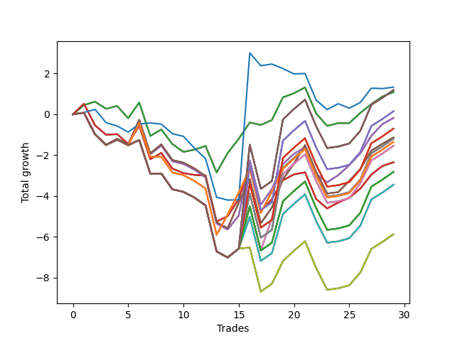

# Long Wallace 019 
- Symbol: SPY_Unlimited
- Date Range: 03/23/2022 - 07/08/2022
- Trading Period: 7:20-12:30
- Number of Trades: 29



| Name | Win Percent | Profit | Avg Profit / Trade | Avg Time / Trade |      | Name | Win Percent | Profit | Avg Profit / Trade | Avg Time / Trade |
| ---- | ----------- | ------ | ------------------ | ---------------- | ---- | ---- | ----------- | ------ | ------------------ | ---------------- |
| Sorted By <br> Profit | | | | | | Sorted By <br> Win Percentage ||||
| Seventy-Three | 41.38 | 665.00 | 22.93 | 12:12 |     | Sixty-Four | 68.97 | 545.00 | 18.79 | 12:13 |
| One Hundred Thirty | 55.17 | 595.00 | 20.52 | 29:15 |     | Fifty-Six | 68.97 | 545.00 | 18.79 | 12:13 |
| One Hundred Twenty-Five | 55.17 | 595.00 | 20.52 | 29:15 |     | Forty-Eight | 68.97 | 545.00 | 18.79 | 12:13 |
| One Hundred Twenty | 55.17 | 595.00 | 20.52 | 29:15 |     | Forty | 68.97 | 545.00 | 18.79 | 12:13 |
| One Hundred Fifteen | 55.17 | 595.00 | 20.52 | 29:15 |     | Zero | 68.97 | 545.00 | 18.79 | 12:13 |
| Eighty-Five | 55.17 | 595.00 | 20.52 | 29:15 |     | One Hundred Twenty-Six | 58.62 | -675.00 | -23.28 | 25:32 |
| Sixty-Four | 68.97 | 545.00 | 18.79 | 12:13 |     | One Hundred Twenty-One | 58.62 | -675.00 | -23.28 | 25:32 |
| Fifty-Six | 68.97 | 545.00 | 18.79 | 12:13 |     | One Hundred Sixteen | 58.62 | -675.00 | -23.28 | 25:32 |
| Forty-Eight | 68.97 | 545.00 | 18.79 | 12:13 |     | One Hundred Eleven | 58.62 | -675.00 | -23.28 | 25:32 |
| Forty | 68.97 | 545.00 | 18.79 | 12:13 |     | Eighty-One | 58.62 | -675.00 | -23.28 | 25:32 |
| Zero | 68.97 | 545.00 | 18.79 | 12:13 |     | Sixty-Five | 58.62 | -1175.00 | -40.52 | 21:25 |
| One Hundred Twenty-Nine | 55.17 | 75.00 | 2.59 | 29:12 |     | Fifty-Seven | 58.62 | -1175.00 | -40.52 | 21:25 |
| One Hundred Twenty-Four | 55.17 | 75.00 | 2.59 | 29:12 |     | Forty-Nine | 58.62 | -1175.00 | -40.52 | 21:25 |
| One Hundred Ninteen | 55.17 | 75.00 | 2.59 | 29:12 |     | Forty-One | 58.62 | -1175.00 | -40.52 | 21:25 |
| One Hundred Fourteen | 55.17 | 75.00 | 2.59 | 29:12 |     | One | 58.62 | -1175.00 | -40.52 | 21:25 |
| Eighty-Four | 55.17 | 75.00 | 2.59 | 29:12 |     | One Hundred Thirty | 55.17 | 595.00 | 20.52 | 29:15 |
| Sixty-Six | 55.17 | -90.00 | -3.10 | 24:05 |     | One Hundred Twenty-Five | 55.17 | 595.00 | 20.52 | 29:15 |
| Fifty-Eight | 55.17 | -90.00 | -3.10 | 24:05 |     | One Hundred Twenty | 55.17 | 595.00 | 20.52 | 29:15 |
| Fifty | 55.17 | -90.00 | -3.10 | 24:05 |     | One Hundred Fifteen | 55.17 | 595.00 | 20.52 | 29:15 |
| Forty-Two | 55.17 | -90.00 | -3.10 | 24:05 |     | Eighty-Five | 55.17 | 595.00 | 20.52 | 29:15 |
| Two | 55.17 | -90.00 | -3.10 | 24:05 |     | One Hundred Twenty-Nine | 55.17 | 75.00 | 2.59 | 29:12 |
| One Hundred Twenty-Eight | 55.17 | -350.00 | -12.07 | 28:58 |     | One Hundred Twenty-Four | 55.17 | 75.00 | 2.59 | 29:12 |
| One Hundred Twenty-Three | 55.17 | -350.00 | -12.07 | 28:58 |     | One Hundred Ninteen | 55.17 | 75.00 | 2.59 | 29:12 |
| One Hundred Eighteen | 55.17 | -350.00 | -12.07 | 28:58 |     | One Hundred Fourteen | 55.17 | 75.00 | 2.59 | 29:12 |
| One Hundred Thirteen | 55.17 | -350.00 | -12.07 | 28:58 |     | Eighty-Four | 55.17 | 75.00 | 2.59 | 29:12 |
| Eighty-Three | 55.17 | -350.00 | -12.07 | 28:58 |     | Sixty-Six | 55.17 | -90.00 | -3.10 | 24:05 |
| Sixty-Seven | 55.17 | -570.00 | -19.66 | 25:51 |     | Fifty-Eight | 55.17 | -90.00 | -3.10 | 24:05 |
| Fifty-Nine | 55.17 | -570.00 | -19.66 | 25:51 |     | Fifty | 55.17 | -90.00 | -3.10 | 24:05 |
| Fifty-One | 55.17 | -570.00 | -19.66 | 25:51 |     | Forty-Two | 55.17 | -90.00 | -3.10 | 24:05 |
| Forty-Three | 55.17 | -570.00 | -19.66 | 25:51 |     | Two | 55.17 | -90.00 | -3.10 | 24:05 |
| Three | 55.17 | -570.00 | -19.66 | 25:51 |     | One Hundred Twenty-Eight | 55.17 | -350.00 | -12.07 | 28:58 |
| Sixty-Nine | 55.17 | -595.00 | -20.52 | 28:58 |     | One Hundred Twenty-Three | 55.17 | -350.00 | -12.07 | 28:58 |
| Sixty-One | 55.17 | -595.00 | -20.52 | 28:58 |     | One Hundred Eighteen | 55.17 | -350.00 | -12.07 | 28:58 |
| Fifty-Three | 55.17 | -595.00 | -20.52 | 28:58 |     | One Hundred Thirteen | 55.17 | -350.00 | -12.07 | 28:58 |
| Forty-Five | 55.17 | -595.00 | -20.52 | 28:58 |     | Eighty-Three | 55.17 | -350.00 | -12.07 | 28:58 |
| Five | 55.17 | -595.00 | -20.52 | 28:58 |     | Sixty-Seven | 55.17 | -570.00 | -19.66 | 25:51 |
| One Hundred Twenty-Six | 58.62 | -675.00 | -23.28 | 25:32 |     | Fifty-Nine | 55.17 | -570.00 | -19.66 | 25:51 |
| One Hundred Twenty-One | 58.62 | -675.00 | -23.28 | 25:32 |     | Fifty-One | 55.17 | -570.00 | -19.66 | 25:51 |
| One Hundred Sixteen | 58.62 | -675.00 | -23.28 | 25:32 |     | Forty-Three | 55.17 | -570.00 | -19.66 | 25:51 |
| One Hundred Eleven | 58.62 | -675.00 | -23.28 | 25:32 |     | Three | 55.17 | -570.00 | -19.66 | 25:51 |
| Eighty-One | 58.62 | -675.00 | -23.28 | 25:32 |     | Sixty-Nine | 55.17 | -595.00 | -20.52 | 28:58 |
| Sixty-Eight | 55.17 | -770.00 | -26.55 | 28:30 |     | Sixty-One | 55.17 | -595.00 | -20.52 | 28:58 |
| Sixty | 55.17 | -770.00 | -26.55 | 28:30 |     | Fifty-Three | 55.17 | -595.00 | -20.52 | 28:58 |
| Fifty-Two | 55.17 | -770.00 | -26.55 | 28:30 |     | Forty-Five | 55.17 | -595.00 | -20.52 | 28:58 |
| Forty-Four | 55.17 | -770.00 | -26.55 | 28:30 |     | Five | 55.17 | -595.00 | -20.52 | 28:58 |
| Four | 55.17 | -770.00 | -26.55 | 28:30 |     | Sixty-Eight | 55.17 | -770.00 | -26.55 | 28:30 |
| Sixty-Five | 58.62 | -1175.00 | -40.52 | 21:25 |     | Sixty | 55.17 | -770.00 | -26.55 | 28:30 |
| Fifty-Seven | 58.62 | -1175.00 | -40.52 | 21:25 |     | Fifty-Two | 55.17 | -770.00 | -26.55 | 28:30 |
| Forty-Nine | 58.62 | -1175.00 | -40.52 | 21:25 |     | Forty-Four | 55.17 | -770.00 | -26.55 | 28:30 |
| Forty-One | 58.62 | -1175.00 | -40.52 | 21:25 |     | Four | 55.17 | -770.00 | -26.55 | 28:30 |
| One | 58.62 | -1175.00 | -40.52 | 21:25 |     | One Hundred Twenty-Seven | 55.17 | -1410.00 | -48.62 | 28:37 |
| One Hundred Twenty-Seven | 55.17 | -1410.00 | -48.62 | 28:37 |     | One Hundred Twenty-Two | 55.17 | -1410.00 | -48.62 | 28:37 |
| One Hundred Twenty-Two | 55.17 | -1410.00 | -48.62 | 28:37 |     | One Hundred Seventeen | 55.17 | -1410.00 | -48.62 | 28:37 |
| One Hundred Seventeen | 55.17 | -1410.00 | -48.62 | 28:37 |     | One Hundred Twelve | 55.17 | -1410.00 | -48.62 | 28:37 |
| One Hundred Twelve | 55.17 | -1410.00 | -48.62 | 28:37 |     | Eighty-Two | 55.17 | -1410.00 | -48.62 | 28:37 |
| Eighty-Two | 55.17 | -1410.00 | -48.62 | 28:37 |     | Seventy-One | 55.17 | -1725.00 | -59.48 | 28:36 |
| Seventy-One | 55.17 | -1725.00 | -59.48 | 28:36 |     | Sixty-Three | 55.17 | -1725.00 | -59.48 | 28:36 |
| Sixty-Three | 55.17 | -1725.00 | -59.48 | 28:36 |     | Fifty-Five | 55.17 | -1725.00 | -59.48 | 28:36 |
| Fifty-Five | 55.17 | -1725.00 | -59.48 | 28:36 |     | Forty-Seven | 55.17 | -1725.00 | -59.48 | 28:36 |
| Forty-Seven | 55.17 | -1725.00 | -59.48 | 28:36 |     | Seven | 55.17 | -1725.00 | -59.48 | 28:36 |
| Seven | 55.17 | -1725.00 | -59.48 | 28:36 |     | Seventy | 55.17 | -2935.00 | -101.21 | 27:18 |
| Seventy | 55.17 | -2935.00 | -101.21 | 27:18 |     | Sixty-Two | 55.17 | -2935.00 | -101.21 | 27:18 |
| Sixty-Two | 55.17 | -2935.00 | -101.21 | 27:18 |     | Fifty-Four | 55.17 | -2935.00 | -101.21 | 27:18 |
| Fifty-Four | 55.17 | -2935.00 | -101.21 | 27:18 |     | Forty-Six | 55.17 | -2935.00 | -101.21 | 27:18 |
| Forty-Six | 55.17 | -2935.00 | -101.21 | 27:18 |     | Six | 55.17 | -2935.00 | -101.21 | 27:18 |
| Six | 55.17 | -2935.00 | -101.21 | 27:18 |     | Seventy-Three | 41.38 | 665.00 | 22.93 | 12:12 |

## NO STOPLOSS

### Test Zero
* Sell when price hits the middle line of the 20p bollinger
* No Stoploss
* Results:
```
Total Trades: 29
Percent Up: 68.97
Percent Down: 31.03
Total Points Moved Up: 1.09
Potential Profit: 545.00
Total Points Ups: 8.09 Count Ups: 20
Total Points Downs: -7.00 Count Downs: 9
```

<details><summary>Trades</summary>

<code>In: 2022-03-23 09:47:00		Out: 2022-03-23 09:53:00		Total Position Time: 06:00		Total Move Up: 0.45		Total to Date: 0.45</code> <br />
<code>In: 2022-03-23 10:06:00		Out: 2022-03-23 10:06:10		Total Position Time: 00:10		Total Move Up: 0.17		Total to Date: 0.62</code> <br />
<code>In: 2022-03-23 10:23:00		Out: 2022-03-23 10:38:15		Total Position Time: 15:15		Total Move Up: -0.35		Total to Date: 0.27</code> <br />
<code>In: 2022-03-23 10:28:00		Out: 2022-03-23 10:38:15		Total Position Time: 10:15		Total Move Up: 0.14		Total to Date: 0.41</code> <br />
<code>In: 2022-03-25 08:14:00		Out: 2022-03-25 08:36:40		Total Position Time: 22:40		Total Move Up: -0.60		Total to Date: -0.19</code> <br />
<code>In: 2022-03-25 08:29:00		Out: 2022-03-25 08:36:40		Total Position Time: 07:40		Total Move Up: 0.77		Total to Date: 0.58</code> <br />
<code>In: 2022-03-28 08:27:00		Out: 2022-03-28 08:56:55		Total Position Time: 29:55		Total Move Up: -1.64		Total to Date: -1.06</code> <br />
<code>In: 2022-03-31 09:28:00		Out: 2022-03-31 09:32:25		Total Position Time: 04:25		Total Move Up: 0.32		Total to Date: -0.74</code> <br />
<code>In: 2022-04-18 08:26:00		Out: 2022-04-18 08:54:55		Total Position Time: 28:55		Total Move Up: -0.72		Total to Date: -1.46</code> <br />
<code>In: 2022-04-18 08:28:00		Out: 2022-04-18 08:54:55		Total Position Time: 26:55		Total Move Up: -0.38		Total to Date: -1.84</code> <br />
<code>In: 2022-04-20 11:38:00		Out: 2022-04-20 11:48:15		Total Position Time: 10:15		Total Move Up: 0.11		Total to Date: -1.73</code> <br />
<code>In: 2022-04-20 11:39:00		Out: 2022-04-20 11:48:15		Total Position Time: 09:15		Total Move Up: 0.18		Total to Date: -1.55</code> <br />
<code>In: 2022-04-29 07:22:00		Out: 2022-04-29 07:44:45		Total Position Time: 22:45		Total Move Up: -1.30		Total to Date: -2.85</code> <br />
<code>In: 2022-05-02 08:06:00		Out: 2022-05-02 08:13:20		Total Position Time: 07:20		Total Move Up: 0.95		Total to Date: -1.90</code> <br />
<code>In: 2022-05-02 08:19:00		Out: 2022-05-02 08:26:05		Total Position Time: 07:05		Total Move Up: 0.70		Total to Date: -1.20</code> <br />
<code>In: 2022-05-04 11:36:00		Out: 2022-05-04 11:36:40		Total Position Time: 00:40		Total Move Up: 0.80		Total to Date: -0.40</code> <br />
<code>In: 2022-05-11 09:32:00		Out: 2022-05-11 09:49:15		Total Position Time: 17:15		Total Move Up: -0.12		Total to Date: -0.52</code> <br />
<code>In: 2022-05-13 11:07:00		Out: 2022-05-13 11:19:15		Total Position Time: 12:15		Total Move Up: 0.24		Total to Date: -0.28</code> <br />
<code>In: 2022-05-17 11:24:00		Out: 2022-05-17 11:27:25		Total Position Time: 03:25		Total Move Up: 1.11		Total to Date: 0.83</code> <br />
<code>In: 2022-05-25 09:29:00		Out: 2022-05-25 09:38:55		Total Position Time: 09:55		Total Move Up: 0.20		Total to Date: 1.03</code> <br />
<code>In: 2022-06-06 08:19:00		Out: 2022-06-06 08:31:35		Total Position Time: 12:35		Total Move Up: 0.29		Total to Date: 1.32</code> <br />
<code>In: 2022-06-08 09:29:00		Out: 2022-06-08 09:53:00		Total Position Time: 24:00		Total Move Up: -1.27		Total to Date: 0.05</code> <br />
<code>In: 2022-06-08 09:34:00		Out: 2022-06-08 09:53:00		Total Position Time: 19:00		Total Move Up: -0.62		Total to Date: -0.57</code> <br />
<code>In: 2022-06-08 09:41:00		Out: 2022-06-08 09:53:00		Total Position Time: 12:00		Total Move Up: 0.14		Total to Date: -0.43</code> <br />
<code>In: 2022-06-09 07:54:00		Out: 2022-06-09 08:10:55		Total Position Time: 16:55		Total Move Up: 0.00		Total to Date: -0.43</code> <br />
<code>In: 2022-06-27 10:48:00		Out: 2022-06-27 10:51:15		Total Position Time: 03:15		Total Move Up: 0.50		Total to Date: 0.07</code> <br />
<code>In: 2022-06-29 08:25:00		Out: 2022-06-29 08:28:25		Total Position Time: 03:25		Total Move Up: 0.43		Total to Date: 0.50</code> <br />
<code>In: 2022-07-05 08:02:00		Out: 2022-07-05 08:08:25		Total Position Time: 06:25		Total Move Up: 0.37		Total to Date: 0.87</code> <br />
<code>In: 2022-07-08 09:44:00		Out: 2022-07-08 09:48:45		Total Position Time: 04:45		Total Move Up: 0.22		Total to Date: 1.09</code> <br />


</details>

### Test One
* Sell when the price hits the upper line of the 20p 1std bollinger
* No Stoploss
* Results:
```
Total Trades: 29
Percent Up: 58.62
Percent Down: 41.38
Total Points Moved Up: -2.35
Potential Profit: -1175.00
Total Points Ups: 8.58 Count Ups: 17
Total Points Downs: -10.93 Count Downs: 12
```

<details><summary>Trades</summary>

<code>In: 2022-03-23 09:47:00		Out: 2022-03-23 09:59:10		Total Position Time: 12:10		Total Move Up: 0.52		Total to Date: 0.52</code> <br />
<code>In: 2022-03-23 10:06:00		Out: 2022-03-23 10:35:55		Total Position Time: 29:55		Total Move Up: -1.06		Total to Date: -0.54</code> <br />
<code>In: 2022-03-23 10:23:00		Out: 2022-03-23 10:51:45		Total Position Time: 28:45		Total Move Up: -0.46		Total to Date: -1.00</code> <br />
<code>In: 2022-03-23 10:28:00		Out: 2022-03-23 10:51:45		Total Position Time: 23:45		Total Move Up: 0.03		Total to Date: -0.97</code> <br />
<code>In: 2022-03-25 08:14:00		Out: 2022-03-25 08:41:05		Total Position Time: 27:05		Total Move Up: -0.48		Total to Date: -1.45</code> <br />
<code>In: 2022-03-25 08:29:00		Out: 2022-03-25 08:41:05		Total Position Time: 12:05		Total Move Up: 0.89		Total to Date: -0.56</code> <br />
<code>In: 2022-03-28 08:27:00		Out: 2022-03-28 08:56:55		Total Position Time: 29:55		Total Move Up: -1.64		Total to Date: -2.20</code> <br />
<code>In: 2022-03-31 09:28:00		Out: 2022-03-31 09:40:45		Total Position Time: 12:45		Total Move Up: 0.31		Total to Date: -1.89</code> <br />
<code>In: 2022-04-18 08:26:00		Out: 2022-04-18 08:55:55		Total Position Time: 29:55		Total Move Up: -0.77		Total to Date: -2.66</code> <br />
<code>In: 2022-04-18 08:28:00		Out: 2022-04-18 08:57:10		Total Position Time: 29:10		Total Move Up: -0.22		Total to Date: -2.88</code> <br />
<code>In: 2022-04-20 11:38:00		Out: 2022-04-20 12:04:20		Total Position Time: 26:20		Total Move Up: -0.09		Total to Date: -2.97</code> <br />
<code>In: 2022-04-20 11:39:00		Out: 2022-04-20 12:04:20		Total Position Time: 25:20		Total Move Up: -0.02		Total to Date: -2.99</code> <br />
<code>In: 2022-04-29 07:22:00		Out: 2022-04-29 07:51:55		Total Position Time: 29:55		Total Move Up: -2.26		Total to Date: -5.25</code> <br />
<code>In: 2022-05-02 08:06:00		Out: 2022-05-02 08:34:10		Total Position Time: 28:10		Total Move Up: 0.26		Total to Date: -4.99</code> <br />
<code>In: 2022-05-02 08:19:00		Out: 2022-05-02 08:34:10		Total Position Time: 15:10		Total Move Up: 0.85		Total to Date: -4.14</code> <br />
<code>In: 2022-05-04 11:36:00		Out: 2022-05-04 11:41:35		Total Position Time: 05:35		Total Move Up: 1.56		Total to Date: -2.58</code> <br />
<code>In: 2022-05-11 09:32:00		Out: 2022-05-11 10:01:55		Total Position Time: 29:55		Total Move Up: -2.16		Total to Date: -4.74</code> <br />
<code>In: 2022-05-13 11:07:00		Out: 2022-05-13 11:20:00		Total Position Time: 13:00		Total Move Up: 0.59		Total to Date: -4.15</code> <br />
<code>In: 2022-05-17 11:24:00		Out: 2022-05-17 11:37:35		Total Position Time: 13:35		Total Move Up: 0.92		Total to Date: -3.23</code> <br />
<code>In: 2022-05-25 09:29:00		Out: 2022-05-25 09:44:25		Total Position Time: 15:25		Total Move Up: 0.29		Total to Date: -2.94</code> <br />
<code>In: 2022-06-06 08:19:00		Out: 2022-06-06 08:39:15		Total Position Time: 20:15		Total Move Up: 0.10		Total to Date: -2.84</code> <br />
<code>In: 2022-06-08 09:29:00		Out: 2022-06-08 09:58:55		Total Position Time: 29:55		Total Move Up: -1.30		Total to Date: -4.14</code> <br />
<code>In: 2022-06-08 09:34:00		Out: 2022-06-08 09:59:05		Total Position Time: 25:05		Total Move Up: -0.47		Total to Date: -4.61</code> <br />
<code>In: 2022-06-08 09:41:00		Out: 2022-06-08 09:59:05		Total Position Time: 18:05		Total Move Up: 0.29		Total to Date: -4.32</code> <br />
<code>In: 2022-06-09 07:54:00		Out: 2022-06-09 08:21:10		Total Position Time: 27:10		Total Move Up: 0.23		Total to Date: -4.09</code> <br />
<code>In: 2022-06-27 10:48:00		Out: 2022-06-27 11:03:15		Total Position Time: 15:15		Total Move Up: 0.45		Total to Date: -3.64</code> <br />
<code>In: 2022-06-29 08:25:00		Out: 2022-06-29 08:32:20		Total Position Time: 07:20		Total Move Up: 0.69		Total to Date: -2.95</code> <br />
<code>In: 2022-07-05 08:02:00		Out: 2022-07-05 08:16:40		Total Position Time: 14:40		Total Move Up: 0.42		Total to Date: -2.53</code> <br />
<code>In: 2022-07-08 09:44:00		Out: 2022-07-08 10:09:40		Total Position Time: 25:40		Total Move Up: 0.18		Total to Date: -2.35</code> <br />


</details>

### Test Two
* Sell when the price hits the upper line of the 20p 2std bollinger
* No Stoploss
* Results:
```
Total Trades: 29
Percent Up: 55.17
Percent Down: 44.83
Total Points Moved Up: -0.18
Potential Profit: -90.00
Total Points Ups: 11.23 Count Ups: 16
Total Points Downs: -11.41 Count Downs: 13
```

<details><summary>Trades</summary>

<code>In: 2022-03-23 09:47:00		Out: 2022-03-23 10:16:55		Total Position Time: 29:55		Total Move Up: 0.08		Total to Date: 0.08</code> <br />
<code>In: 2022-03-23 10:06:00		Out: 2022-03-23 10:35:55		Total Position Time: 29:55		Total Move Up: -1.06		Total to Date: -0.98</code> <br />
<code>In: 2022-03-23 10:23:00		Out: 2022-03-23 10:52:55		Total Position Time: 29:55		Total Move Up: -0.52		Total to Date: -1.50</code> <br />
<code>In: 2022-03-23 10:28:00		Out: 2022-03-23 10:54:25		Total Position Time: 26:25		Total Move Up: 0.24		Total to Date: -1.26</code> <br />
<code>In: 2022-03-25 08:14:00		Out: 2022-03-25 08:41:45		Total Position Time: 27:45		Total Move Up: -0.21		Total to Date: -1.47</code> <br />
<code>In: 2022-03-25 08:29:00		Out: 2022-03-25 08:41:45		Total Position Time: 12:45		Total Move Up: 1.16		Total to Date: -0.31</code> <br />
<code>In: 2022-03-28 08:27:00		Out: 2022-03-28 08:56:55		Total Position Time: 29:55		Total Move Up: -1.64		Total to Date: -1.95</code> <br />
<code>In: 2022-03-31 09:28:00		Out: 2022-03-31 09:44:20		Total Position Time: 16:20		Total Move Up: 0.42		Total to Date: -1.53</code> <br />
<code>In: 2022-04-18 08:26:00		Out: 2022-04-18 08:55:55		Total Position Time: 29:55		Total Move Up: -0.77		Total to Date: -2.30</code> <br />
<code>In: 2022-04-18 08:28:00		Out: 2022-04-18 08:57:55		Total Position Time: 29:55		Total Move Up: -0.13		Total to Date: -2.43</code> <br />
<code>In: 2022-04-20 11:38:00		Out: 2022-04-20 12:07:55		Total Position Time: 29:55		Total Move Up: -0.28		Total to Date: -2.71</code> <br />
<code>In: 2022-04-20 11:39:00		Out: 2022-04-20 12:08:55		Total Position Time: 29:55		Total Move Up: -0.38		Total to Date: -3.09</code> <br />
<code>In: 2022-04-29 07:22:00		Out: 2022-04-29 07:51:55		Total Position Time: 29:55		Total Move Up: -2.26		Total to Date: -5.35</code> <br />
<code>In: 2022-05-02 08:06:00		Out: 2022-05-02 08:35:55		Total Position Time: 29:55		Total Move Up: -0.29		Total to Date: -5.64</code> <br />
<code>In: 2022-05-02 08:19:00		Out: 2022-05-02 08:36:25		Total Position Time: 17:25		Total Move Up: 0.68		Total to Date: -4.96</code> <br />
<code>In: 2022-05-04 11:36:00		Out: 2022-05-04 11:43:45		Total Position Time: 07:45		Total Move Up: 2.70		Total to Date: -2.26</code> <br />
<code>In: 2022-05-11 09:32:00		Out: 2022-05-11 10:01:55		Total Position Time: 29:55		Total Move Up: -2.16		Total to Date: -4.42</code> <br />
<code>In: 2022-05-13 11:07:00		Out: 2022-05-13 11:31:20		Total Position Time: 24:20		Total Move Up: 0.76		Total to Date: -3.66</code> <br />
<code>In: 2022-05-17 11:24:00		Out: 2022-05-17 11:40:00		Total Position Time: 16:00		Total Move Up: 1.23		Total to Date: -2.43</code> <br />
<code>In: 2022-05-25 09:29:00		Out: 2022-05-25 09:45:20		Total Position Time: 16:20		Total Move Up: 0.50		Total to Date: -1.93</code> <br />
<code>In: 2022-06-06 08:19:00		Out: 2022-06-06 08:43:00		Total Position Time: 24:00		Total Move Up: 0.31		Total to Date: -1.62</code> <br />
<code>In: 2022-06-08 09:29:00		Out: 2022-06-08 09:58:55		Total Position Time: 29:55		Total Move Up: -1.30		Total to Date: -2.92</code> <br />
<code>In: 2022-06-08 09:34:00		Out: 2022-06-08 09:59:15		Total Position Time: 25:15		Total Move Up: -0.41		Total to Date: -3.33</code> <br />
<code>In: 2022-06-08 09:41:00		Out: 2022-06-08 09:59:15		Total Position Time: 18:15		Total Move Up: 0.35		Total to Date: -2.98</code> <br />
<code>In: 2022-06-09 07:54:00		Out: 2022-06-09 08:22:35		Total Position Time: 28:35		Total Move Up: 0.49		Total to Date: -2.49</code> <br />
<code>In: 2022-06-27 10:48:00		Out: 2022-06-27 11:13:35		Total Position Time: 25:35		Total Move Up: 0.58		Total to Date: -1.91</code> <br />
<code>In: 2022-06-29 08:25:00		Out: 2022-06-29 08:34:40		Total Position Time: 09:40		Total Move Up: 0.86		Total to Date: -1.05</code> <br />
<code>In: 2022-07-05 08:02:00		Out: 2022-07-05 08:17:55		Total Position Time: 15:55		Total Move Up: 0.57		Total to Date: -0.48</code> <br />
<code>In: 2022-07-08 09:44:00		Out: 2022-07-08 10:11:10		Total Position Time: 27:10		Total Move Up: 0.30		Total to Date: -0.18</code> <br />


</details>

### Test Three
* Sell when price hits the middle line of the 50p bollinger
* No Stoploss
* Results:
```
Total Trades: 29
Percent Up: 55.17
Percent Down: 44.83
Total Points Moved Up: -1.14
Potential Profit: -570.00
Total Points Ups: 11.00 Count Ups: 16
Total Points Downs: -12.14 Count Downs: 13
```

<details><summary>Trades</summary>

<code>In: 2022-03-23 09:47:00		Out: 2022-03-23 10:16:55		Total Position Time: 29:55		Total Move Up: 0.08		Total to Date: 0.08</code> <br />
<code>In: 2022-03-23 10:06:00		Out: 2022-03-23 10:35:55		Total Position Time: 29:55		Total Move Up: -1.06		Total to Date: -0.98</code> <br />
<code>In: 2022-03-23 10:23:00		Out: 2022-03-23 10:52:55		Total Position Time: 29:55		Total Move Up: -0.52		Total to Date: -1.50</code> <br />
<code>In: 2022-03-23 10:28:00		Out: 2022-03-23 10:54:30		Total Position Time: 26:30		Total Move Up: 0.31		Total to Date: -1.19</code> <br />
<code>In: 2022-03-25 08:14:00		Out: 2022-03-25 08:43:55		Total Position Time: 29:55		Total Move Up: -0.28		Total to Date: -1.47</code> <br />
<code>In: 2022-03-25 08:29:00		Out: 2022-03-25 08:52:45		Total Position Time: 23:45		Total Move Up: 1.20		Total to Date: -0.27</code> <br />
<code>In: 2022-03-28 08:27:00		Out: 2022-03-28 08:56:55		Total Position Time: 29:55		Total Move Up: -1.64		Total to Date: -1.91</code> <br />
<code>In: 2022-03-31 09:28:00		Out: 2022-03-31 09:45:10		Total Position Time: 17:10		Total Move Up: 0.44		Total to Date: -1.47</code> <br />
<code>In: 2022-04-18 08:26:00		Out: 2022-04-18 08:55:55		Total Position Time: 29:55		Total Move Up: -0.77		Total to Date: -2.24</code> <br />
<code>In: 2022-04-18 08:28:00		Out: 2022-04-18 08:57:55		Total Position Time: 29:55		Total Move Up: -0.13		Total to Date: -2.37</code> <br />
<code>In: 2022-04-20 11:38:00		Out: 2022-04-20 12:07:55		Total Position Time: 29:55		Total Move Up: -0.28		Total to Date: -2.65</code> <br />
<code>In: 2022-04-20 11:39:00		Out: 2022-04-20 12:08:55		Total Position Time: 29:55		Total Move Up: -0.38		Total to Date: -3.03</code> <br />
<code>In: 2022-04-29 07:22:00		Out: 2022-04-29 07:51:55		Total Position Time: 29:55		Total Move Up: -2.26		Total to Date: -5.29</code> <br />
<code>In: 2022-05-02 08:06:00		Out: 2022-05-02 08:35:55		Total Position Time: 29:55		Total Move Up: -0.29		Total to Date: -5.58</code> <br />
<code>In: 2022-05-02 08:19:00		Out: 2022-05-02 08:38:15		Total Position Time: 19:15		Total Move Up: 1.25		Total to Date: -4.33</code> <br />
<code>In: 2022-05-04 11:36:00		Out: 2022-05-04 11:41:15		Total Position Time: 05:15		Total Move Up: 1.16		Total to Date: -3.17</code> <br />
<code>In: 2022-05-11 09:32:00		Out: 2022-05-11 10:01:55		Total Position Time: 29:55		Total Move Up: -2.16		Total to Date: -5.33</code> <br />
<code>In: 2022-05-13 11:07:00		Out: 2022-05-13 11:31:20		Total Position Time: 24:20		Total Move Up: 0.76		Total to Date: -4.57</code> <br />
<code>In: 2022-05-17 11:24:00		Out: 2022-05-17 11:40:05		Total Position Time: 16:05		Total Move Up: 1.39		Total to Date: -3.18</code> <br />
<code>In: 2022-05-25 09:29:00		Out: 2022-05-25 09:49:05		Total Position Time: 20:05		Total Move Up: 0.77		Total to Date: -2.41</code> <br />
<code>In: 2022-06-06 08:19:00		Out: 2022-06-06 08:46:10		Total Position Time: 27:10		Total Move Up: 0.90		Total to Date: -1.51</code> <br />
<code>In: 2022-06-08 09:29:00		Out: 2022-06-08 09:58:55		Total Position Time: 29:55		Total Move Up: -1.30		Total to Date: -2.81</code> <br />
<code>In: 2022-06-08 09:34:00		Out: 2022-06-08 10:03:55		Total Position Time: 29:55		Total Move Up: -1.07		Total to Date: -3.88</code> <br />
<code>In: 2022-06-08 09:41:00		Out: 2022-06-08 10:10:55		Total Position Time: 29:55		Total Move Up: 0.07		Total to Date: -3.81</code> <br />
<code>In: 2022-06-09 07:54:00		Out: 2022-06-09 08:22:45		Total Position Time: 28:45		Total Move Up: 0.55		Total to Date: -3.26</code> <br />
<code>In: 2022-06-27 10:48:00		Out: 2022-06-27 11:13:35		Total Position Time: 25:35		Total Move Up: 0.58		Total to Date: -2.68</code> <br />
<code>In: 2022-06-29 08:25:00		Out: 2022-06-29 08:35:10		Total Position Time: 10:10		Total Move Up: 0.90		Total to Date: -1.78</code> <br />
<code>In: 2022-07-05 08:02:00		Out: 2022-07-05 08:31:55		Total Position Time: 29:55		Total Move Up: 0.34		Total to Date: -1.44</code> <br />
<code>In: 2022-07-08 09:44:00		Out: 2022-07-08 10:11:05		Total Position Time: 27:05		Total Move Up: 0.30		Total to Date: -1.14</code> <br />


</details>

### Test Four
* Sell when the price hits the upper line of the 50p 1std bollinger
* No Stoploss
* Results:
```
Total Trades: 29
Percent Up: 55.17
Percent Down: 44.83
Total Points Moved Up: -1.54
Potential Profit: -770.00
Total Points Ups: 10.60 Count Ups: 16
Total Points Downs: -12.14 Count Downs: 13
```

<details><summary>Trades</summary>

<code>In: 2022-03-23 09:47:00		Out: 2022-03-23 10:16:55		Total Position Time: 29:55		Total Move Up: 0.08		Total to Date: 0.08</code> <br />
<code>In: 2022-03-23 10:06:00		Out: 2022-03-23 10:35:55		Total Position Time: 29:55		Total Move Up: -1.06		Total to Date: -0.98</code> <br />
<code>In: 2022-03-23 10:23:00		Out: 2022-03-23 10:52:55		Total Position Time: 29:55		Total Move Up: -0.52		Total to Date: -1.50</code> <br />
<code>In: 2022-03-23 10:28:00		Out: 2022-03-23 10:57:55		Total Position Time: 29:55		Total Move Up: 0.27		Total to Date: -1.23</code> <br />
<code>In: 2022-03-25 08:14:00		Out: 2022-03-25 08:43:55		Total Position Time: 29:55		Total Move Up: -0.28		Total to Date: -1.51</code> <br />
<code>In: 2022-03-25 08:29:00		Out: 2022-03-25 08:58:55		Total Position Time: 29:55		Total Move Up: 0.25		Total to Date: -1.26</code> <br />
<code>In: 2022-03-28 08:27:00		Out: 2022-03-28 08:56:55		Total Position Time: 29:55		Total Move Up: -1.64		Total to Date: -2.90</code> <br />
<code>In: 2022-03-31 09:28:00		Out: 2022-03-31 09:57:55		Total Position Time: 29:55		Total Move Up: 0.00		Total to Date: -2.90</code> <br />
<code>In: 2022-04-18 08:26:00		Out: 2022-04-18 08:55:55		Total Position Time: 29:55		Total Move Up: -0.77		Total to Date: -3.67</code> <br />
<code>In: 2022-04-18 08:28:00		Out: 2022-04-18 08:57:55		Total Position Time: 29:55		Total Move Up: -0.13		Total to Date: -3.80</code> <br />
<code>In: 2022-04-20 11:38:00		Out: 2022-04-20 12:07:55		Total Position Time: 29:55		Total Move Up: -0.28		Total to Date: -4.08</code> <br />
<code>In: 2022-04-20 11:39:00		Out: 2022-04-20 12:08:55		Total Position Time: 29:55		Total Move Up: -0.38		Total to Date: -4.46</code> <br />
<code>In: 2022-04-29 07:22:00		Out: 2022-04-29 07:51:55		Total Position Time: 29:55		Total Move Up: -2.26		Total to Date: -6.72</code> <br />
<code>In: 2022-05-02 08:06:00		Out: 2022-05-02 08:35:55		Total Position Time: 29:55		Total Move Up: -0.29		Total to Date: -7.01</code> <br />
<code>In: 2022-05-02 08:19:00		Out: 2022-05-02 08:48:55		Total Position Time: 29:55		Total Move Up: 0.43		Total to Date: -6.58</code> <br />
<code>In: 2022-05-04 11:36:00		Out: 2022-05-04 11:42:00		Total Position Time: 06:00		Total Move Up: 2.07		Total to Date: -4.51</code> <br />
<code>In: 2022-05-11 09:32:00		Out: 2022-05-11 10:01:55		Total Position Time: 29:55		Total Move Up: -2.16		Total to Date: -6.67</code> <br />
<code>In: 2022-05-13 11:07:00		Out: 2022-05-13 11:32:00		Total Position Time: 25:00		Total Move Up: 1.58		Total to Date: -5.09</code> <br />
<code>In: 2022-05-17 11:24:00		Out: 2022-05-17 11:44:30		Total Position Time: 20:30		Total Move Up: 2.16		Total to Date: -2.93</code> <br />
<code>In: 2022-05-25 09:29:00		Out: 2022-05-25 09:58:55		Total Position Time: 29:55		Total Move Up: 0.51		Total to Date: -2.42</code> <br />
<code>In: 2022-06-06 08:19:00		Out: 2022-06-06 08:48:55		Total Position Time: 29:55		Total Move Up: 0.46		Total to Date: -1.96</code> <br />
<code>In: 2022-06-08 09:29:00		Out: 2022-06-08 09:58:55		Total Position Time: 29:55		Total Move Up: -1.30		Total to Date: -3.26</code> <br />
<code>In: 2022-06-08 09:34:00		Out: 2022-06-08 10:03:55		Total Position Time: 29:55		Total Move Up: -1.07		Total to Date: -4.33</code> <br />
<code>In: 2022-06-08 09:41:00		Out: 2022-06-08 10:10:55		Total Position Time: 29:55		Total Move Up: 0.07		Total to Date: -4.26</code> <br />
<code>In: 2022-06-09 07:54:00		Out: 2022-06-09 08:23:55		Total Position Time: 29:55		Total Move Up: 0.15		Total to Date: -4.11</code> <br />
<code>In: 2022-06-27 10:48:00		Out: 2022-06-27 11:17:10		Total Position Time: 29:10		Total Move Up: 0.73		Total to Date: -3.38</code> <br />
<code>In: 2022-06-29 08:25:00		Out: 2022-06-29 08:53:10		Total Position Time: 28:10		Total Move Up: 1.12		Total to Date: -2.26</code> <br />
<code>In: 2022-07-05 08:02:00		Out: 2022-07-05 08:31:55		Total Position Time: 29:55		Total Move Up: 0.34		Total to Date: -1.92</code> <br />
<code>In: 2022-07-08 09:44:00		Out: 2022-07-08 10:13:55		Total Position Time: 29:55		Total Move Up: 0.38		Total to Date: -1.54</code> <br />


</details>

### Test Five
* Sell when the price hits the upper line of the 50p 2std bollinger
* No Stoploss
* Results:
```
Total Trades: 29
Percent Up: 55.17
Percent Down: 44.83
Total Points Moved Up: -1.19
Potential Profit: -595.00
Total Points Ups: 10.95 Count Ups: 16
Total Points Downs: -12.14 Count Downs: 13
```

<details><summary>Trades</summary>

<code>In: 2022-03-23 09:47:00		Out: 2022-03-23 10:16:55		Total Position Time: 29:55		Total Move Up: 0.08		Total to Date: 0.08</code> <br />
<code>In: 2022-03-23 10:06:00		Out: 2022-03-23 10:35:55		Total Position Time: 29:55		Total Move Up: -1.06		Total to Date: -0.98</code> <br />
<code>In: 2022-03-23 10:23:00		Out: 2022-03-23 10:52:55		Total Position Time: 29:55		Total Move Up: -0.52		Total to Date: -1.50</code> <br />
<code>In: 2022-03-23 10:28:00		Out: 2022-03-23 10:57:55		Total Position Time: 29:55		Total Move Up: 0.27		Total to Date: -1.23</code> <br />
<code>In: 2022-03-25 08:14:00		Out: 2022-03-25 08:43:55		Total Position Time: 29:55		Total Move Up: -0.28		Total to Date: -1.51</code> <br />
<code>In: 2022-03-25 08:29:00		Out: 2022-03-25 08:58:55		Total Position Time: 29:55		Total Move Up: 0.25		Total to Date: -1.26</code> <br />
<code>In: 2022-03-28 08:27:00		Out: 2022-03-28 08:56:55		Total Position Time: 29:55		Total Move Up: -1.64		Total to Date: -2.90</code> <br />
<code>In: 2022-03-31 09:28:00		Out: 2022-03-31 09:57:55		Total Position Time: 29:55		Total Move Up: 0.00		Total to Date: -2.90</code> <br />
<code>In: 2022-04-18 08:26:00		Out: 2022-04-18 08:55:55		Total Position Time: 29:55		Total Move Up: -0.77		Total to Date: -3.67</code> <br />
<code>In: 2022-04-18 08:28:00		Out: 2022-04-18 08:57:55		Total Position Time: 29:55		Total Move Up: -0.13		Total to Date: -3.80</code> <br />
<code>In: 2022-04-20 11:38:00		Out: 2022-04-20 12:07:55		Total Position Time: 29:55		Total Move Up: -0.28		Total to Date: -4.08</code> <br />
<code>In: 2022-04-20 11:39:00		Out: 2022-04-20 12:08:55		Total Position Time: 29:55		Total Move Up: -0.38		Total to Date: -4.46</code> <br />
<code>In: 2022-04-29 07:22:00		Out: 2022-04-29 07:51:55		Total Position Time: 29:55		Total Move Up: -2.26		Total to Date: -6.72</code> <br />
<code>In: 2022-05-02 08:06:00		Out: 2022-05-02 08:35:55		Total Position Time: 29:55		Total Move Up: -0.29		Total to Date: -7.01</code> <br />
<code>In: 2022-05-02 08:19:00		Out: 2022-05-02 08:48:55		Total Position Time: 29:55		Total Move Up: 0.43		Total to Date: -6.58</code> <br />
<code>In: 2022-05-04 11:36:00		Out: 2022-05-04 11:43:45		Total Position Time: 07:45		Total Move Up: 2.70		Total to Date: -3.88</code> <br />
<code>In: 2022-05-11 09:32:00		Out: 2022-05-11 10:01:55		Total Position Time: 29:55		Total Move Up: -2.16		Total to Date: -6.04</code> <br />
<code>In: 2022-05-13 11:07:00		Out: 2022-05-13 11:36:55		Total Position Time: 29:55		Total Move Up: 0.38		Total to Date: -5.66</code> <br />
<code>In: 2022-05-17 11:24:00		Out: 2022-05-17 11:48:40		Total Position Time: 24:40		Total Move Up: 3.03		Total to Date: -2.63</code> <br />
<code>In: 2022-05-25 09:29:00		Out: 2022-05-25 09:58:55		Total Position Time: 29:55		Total Move Up: 0.51		Total to Date: -2.12</code> <br />
<code>In: 2022-06-06 08:19:00		Out: 2022-06-06 08:48:55		Total Position Time: 29:55		Total Move Up: 0.46		Total to Date: -1.66</code> <br />
<code>In: 2022-06-08 09:29:00		Out: 2022-06-08 09:58:55		Total Position Time: 29:55		Total Move Up: -1.30		Total to Date: -2.96</code> <br />
<code>In: 2022-06-08 09:34:00		Out: 2022-06-08 10:03:55		Total Position Time: 29:55		Total Move Up: -1.07		Total to Date: -4.03</code> <br />
<code>In: 2022-06-08 09:41:00		Out: 2022-06-08 10:10:55		Total Position Time: 29:55		Total Move Up: 0.07		Total to Date: -3.96</code> <br />
<code>In: 2022-06-09 07:54:00		Out: 2022-06-09 08:23:55		Total Position Time: 29:55		Total Move Up: 0.15		Total to Date: -3.81</code> <br />
<code>In: 2022-06-27 10:48:00		Out: 2022-06-27 11:17:55		Total Position Time: 29:55		Total Move Up: 0.62		Total to Date: -3.19</code> <br />
<code>In: 2022-06-29 08:25:00		Out: 2022-06-29 08:54:55		Total Position Time: 29:55		Total Move Up: 1.28		Total to Date: -1.91</code> <br />
<code>In: 2022-07-05 08:02:00		Out: 2022-07-05 08:31:55		Total Position Time: 29:55		Total Move Up: 0.34		Total to Date: -1.57</code> <br />
<code>In: 2022-07-08 09:44:00		Out: 2022-07-08 10:13:55		Total Position Time: 29:55		Total Move Up: 0.38		Total to Date: -1.19</code> <br />


</details>

### Test Six
* Sell when the price hits the middle line of the 1std VWAP
* No Stoploss
* Results:
```
Total Trades: 29
Percent Up: 55.17
Percent Down: 44.83
Total Points Moved Up: -5.87
Potential Profit: -2935.00
Total Points Ups: 6.27 Count Ups: 16
Total Points Downs: -12.14 Count Downs: 13
```

<details><summary>Trades</summary>

<code>In: 2022-03-23 09:47:00		Out: 2022-03-23 10:16:55		Total Position Time: 29:55		Total Move Up: 0.08		Total to Date: 0.08</code> <br />
<code>In: 2022-03-23 10:06:00		Out: 2022-03-23 10:35:55		Total Position Time: 29:55		Total Move Up: -1.06		Total to Date: -0.98</code> <br />
<code>In: 2022-03-23 10:23:00		Out: 2022-03-23 10:52:55		Total Position Time: 29:55		Total Move Up: -0.52		Total to Date: -1.50</code> <br />
<code>In: 2022-03-23 10:28:00		Out: 2022-03-23 10:57:55		Total Position Time: 29:55		Total Move Up: 0.27		Total to Date: -1.23</code> <br />
<code>In: 2022-03-25 08:14:00		Out: 2022-03-25 08:43:55		Total Position Time: 29:55		Total Move Up: -0.28		Total to Date: -1.51</code> <br />
<code>In: 2022-03-25 08:29:00		Out: 2022-03-25 08:58:55		Total Position Time: 29:55		Total Move Up: 0.25		Total to Date: -1.26</code> <br />
<code>In: 2022-03-28 08:27:00		Out: 2022-03-28 08:56:55		Total Position Time: 29:55		Total Move Up: -1.64		Total to Date: -2.90</code> <br />
<code>In: 2022-03-31 09:28:00		Out: 2022-03-31 09:57:55		Total Position Time: 29:55		Total Move Up: 0.00		Total to Date: -2.90</code> <br />
<code>In: 2022-04-18 08:26:00		Out: 2022-04-18 08:55:55		Total Position Time: 29:55		Total Move Up: -0.77		Total to Date: -3.67</code> <br />
<code>In: 2022-04-18 08:28:00		Out: 2022-04-18 08:57:55		Total Position Time: 29:55		Total Move Up: -0.13		Total to Date: -3.80</code> <br />
<code>In: 2022-04-20 11:38:00		Out: 2022-04-20 12:07:55		Total Position Time: 29:55		Total Move Up: -0.28		Total to Date: -4.08</code> <br />
<code>In: 2022-04-20 11:39:00		Out: 2022-04-20 12:08:55		Total Position Time: 29:55		Total Move Up: -0.38		Total to Date: -4.46</code> <br />
<code>In: 2022-04-29 07:22:00		Out: 2022-04-29 07:51:55		Total Position Time: 29:55		Total Move Up: -2.26		Total to Date: -6.72</code> <br />
<code>In: 2022-05-02 08:06:00		Out: 2022-05-02 08:35:55		Total Position Time: 29:55		Total Move Up: -0.29		Total to Date: -7.01</code> <br />
<code>In: 2022-05-02 08:19:00		Out: 2022-05-02 08:48:55		Total Position Time: 29:55		Total Move Up: 0.43		Total to Date: -6.58</code> <br />
<code>In: 2022-05-04 11:36:00		Out: 2022-05-04 11:36:10		Total Position Time: 00:10		Total Move Up: 0.06		Total to Date: -6.52</code> <br />
<code>In: 2022-05-11 09:32:00		Out: 2022-05-11 10:01:55		Total Position Time: 29:55		Total Move Up: -2.16		Total to Date: -8.68</code> <br />
<code>In: 2022-05-13 11:07:00		Out: 2022-05-13 11:36:55		Total Position Time: 29:55		Total Move Up: 0.38		Total to Date: -8.30</code> <br />
<code>In: 2022-05-17 11:24:00		Out: 2022-05-17 11:27:25		Total Position Time: 03:25		Total Move Up: 1.11		Total to Date: -7.19</code> <br />
<code>In: 2022-05-25 09:29:00		Out: 2022-05-25 09:58:55		Total Position Time: 29:55		Total Move Up: 0.51		Total to Date: -6.68</code> <br />
<code>In: 2022-06-06 08:19:00		Out: 2022-06-06 08:48:55		Total Position Time: 29:55		Total Move Up: 0.46		Total to Date: -6.22</code> <br />
<code>In: 2022-06-08 09:29:00		Out: 2022-06-08 09:58:55		Total Position Time: 29:55		Total Move Up: -1.30		Total to Date: -7.52</code> <br />
<code>In: 2022-06-08 09:34:00		Out: 2022-06-08 10:03:55		Total Position Time: 29:55		Total Move Up: -1.07		Total to Date: -8.59</code> <br />
<code>In: 2022-06-08 09:41:00		Out: 2022-06-08 10:10:55		Total Position Time: 29:55		Total Move Up: 0.07		Total to Date: -8.52</code> <br />
<code>In: 2022-06-09 07:54:00		Out: 2022-06-09 08:23:55		Total Position Time: 29:55		Total Move Up: 0.15		Total to Date: -8.37</code> <br />
<code>In: 2022-06-27 10:48:00		Out: 2022-06-27 11:17:55		Total Position Time: 29:55		Total Move Up: 0.62		Total to Date: -7.75</code> <br />
<code>In: 2022-06-29 08:25:00		Out: 2022-06-29 08:35:35		Total Position Time: 10:35		Total Move Up: 1.16		Total to Date: -6.59</code> <br />
<code>In: 2022-07-05 08:02:00		Out: 2022-07-05 08:31:55		Total Position Time: 29:55		Total Move Up: 0.34		Total to Date: -6.25</code> <br />
<code>In: 2022-07-08 09:44:00		Out: 2022-07-08 10:13:55		Total Position Time: 29:55		Total Move Up: 0.38		Total to Date: -5.87</code> <br />


</details>

### Test Seven
* Sell when the price hits the upper line of the 1std VWAP
* No Stoploss
* Results:
```
Total Trades: 29
Percent Up: 55.17
Percent Down: 44.83
Total Points Moved Up: -3.45
Potential Profit: -1725.00
Total Points Ups: 8.69 Count Ups: 16
Total Points Downs: -12.14 Count Downs: 13
```

<details><summary>Trades</summary>

<code>In: 2022-03-23 09:47:00		Out: 2022-03-23 10:16:55		Total Position Time: 29:55		Total Move Up: 0.08		Total to Date: 0.08</code> <br />
<code>In: 2022-03-23 10:06:00		Out: 2022-03-23 10:35:55		Total Position Time: 29:55		Total Move Up: -1.06		Total to Date: -0.98</code> <br />
<code>In: 2022-03-23 10:23:00		Out: 2022-03-23 10:52:55		Total Position Time: 29:55		Total Move Up: -0.52		Total to Date: -1.50</code> <br />
<code>In: 2022-03-23 10:28:00		Out: 2022-03-23 10:57:55		Total Position Time: 29:55		Total Move Up: 0.27		Total to Date: -1.23</code> <br />
<code>In: 2022-03-25 08:14:00		Out: 2022-03-25 08:43:55		Total Position Time: 29:55		Total Move Up: -0.28		Total to Date: -1.51</code> <br />
<code>In: 2022-03-25 08:29:00		Out: 2022-03-25 08:58:55		Total Position Time: 29:55		Total Move Up: 0.25		Total to Date: -1.26</code> <br />
<code>In: 2022-03-28 08:27:00		Out: 2022-03-28 08:56:55		Total Position Time: 29:55		Total Move Up: -1.64		Total to Date: -2.90</code> <br />
<code>In: 2022-03-31 09:28:00		Out: 2022-03-31 09:57:55		Total Position Time: 29:55		Total Move Up: 0.00		Total to Date: -2.90</code> <br />
<code>In: 2022-04-18 08:26:00		Out: 2022-04-18 08:55:55		Total Position Time: 29:55		Total Move Up: -0.77		Total to Date: -3.67</code> <br />
<code>In: 2022-04-18 08:28:00		Out: 2022-04-18 08:57:55		Total Position Time: 29:55		Total Move Up: -0.13		Total to Date: -3.80</code> <br />
<code>In: 2022-04-20 11:38:00		Out: 2022-04-20 12:07:55		Total Position Time: 29:55		Total Move Up: -0.28		Total to Date: -4.08</code> <br />
<code>In: 2022-04-20 11:39:00		Out: 2022-04-20 12:08:55		Total Position Time: 29:55		Total Move Up: -0.38		Total to Date: -4.46</code> <br />
<code>In: 2022-04-29 07:22:00		Out: 2022-04-29 07:51:55		Total Position Time: 29:55		Total Move Up: -2.26		Total to Date: -6.72</code> <br />
<code>In: 2022-05-02 08:06:00		Out: 2022-05-02 08:35:55		Total Position Time: 29:55		Total Move Up: -0.29		Total to Date: -7.01</code> <br />
<code>In: 2022-05-02 08:19:00		Out: 2022-05-02 08:48:55		Total Position Time: 29:55		Total Move Up: 0.43		Total to Date: -6.58</code> <br />
<code>In: 2022-05-04 11:36:00		Out: 2022-05-04 11:41:35		Total Position Time: 05:35		Total Move Up: 1.56		Total to Date: -5.02</code> <br />
<code>In: 2022-05-11 09:32:00		Out: 2022-05-11 10:01:55		Total Position Time: 29:55		Total Move Up: -2.16		Total to Date: -7.18</code> <br />
<code>In: 2022-05-13 11:07:00		Out: 2022-05-13 11:36:55		Total Position Time: 29:55		Total Move Up: 0.38		Total to Date: -6.80</code> <br />
<code>In: 2022-05-17 11:24:00		Out: 2022-05-17 11:40:25		Total Position Time: 16:25		Total Move Up: 1.91		Total to Date: -4.89</code> <br />
<code>In: 2022-05-25 09:29:00		Out: 2022-05-25 09:58:55		Total Position Time: 29:55		Total Move Up: 0.51		Total to Date: -4.38</code> <br />
<code>In: 2022-06-06 08:19:00		Out: 2022-06-06 08:48:55		Total Position Time: 29:55		Total Move Up: 0.46		Total to Date: -3.92</code> <br />
<code>In: 2022-06-08 09:29:00		Out: 2022-06-08 09:58:55		Total Position Time: 29:55		Total Move Up: -1.30		Total to Date: -5.22</code> <br />
<code>In: 2022-06-08 09:34:00		Out: 2022-06-08 10:03:55		Total Position Time: 29:55		Total Move Up: -1.07		Total to Date: -6.29</code> <br />
<code>In: 2022-06-08 09:41:00		Out: 2022-06-08 10:10:55		Total Position Time: 29:55		Total Move Up: 0.07		Total to Date: -6.22</code> <br />
<code>In: 2022-06-09 07:54:00		Out: 2022-06-09 08:23:55		Total Position Time: 29:55		Total Move Up: 0.15		Total to Date: -6.07</code> <br />
<code>In: 2022-06-27 10:48:00		Out: 2022-06-27 11:17:55		Total Position Time: 29:55		Total Move Up: 0.62		Total to Date: -5.45</code> <br />
<code>In: 2022-06-29 08:25:00		Out: 2022-06-29 08:54:55		Total Position Time: 29:55		Total Move Up: 1.28		Total to Date: -4.17</code> <br />
<code>In: 2022-07-05 08:02:00		Out: 2022-07-05 08:31:55		Total Position Time: 29:55		Total Move Up: 0.34		Total to Date: -3.83</code> <br />
<code>In: 2022-07-08 09:44:00		Out: 2022-07-08 10:13:55		Total Position Time: 29:55		Total Move Up: 0.38		Total to Date: -3.45</code> <br />


</details>

## STOPLOSS OF 5

### Test Forty
* Sell when price hits the middle line of the 20p bollinger
* Stoploss is 5 points
* Results:
```
Total Trades: 29
Percent Up: 68.97
Percent Down: 31.03
Total Points Moved Up: 1.09
Potential Profit: 545.00
Total Points Ups: 8.09 Count Ups: 20
Total Points Downs: -7.00 Count Downs: 9
```

<details><summary>Trades</summary>

<code>In: 2022-03-23 09:47:00		Out: 2022-03-23 09:53:00		Total Position Time: 06:00		Total Move Up: 0.45		Total to Date: 0.45</code> <br />
<code>In: 2022-03-23 10:06:00		Out: 2022-03-23 10:06:10		Total Position Time: 00:10		Total Move Up: 0.17		Total to Date: 0.62</code> <br />
<code>In: 2022-03-23 10:23:00		Out: 2022-03-23 10:38:15		Total Position Time: 15:15		Total Move Up: -0.35		Total to Date: 0.27</code> <br />
<code>In: 2022-03-23 10:28:00		Out: 2022-03-23 10:38:15		Total Position Time: 10:15		Total Move Up: 0.14		Total to Date: 0.41</code> <br />
<code>In: 2022-03-25 08:14:00		Out: 2022-03-25 08:36:40		Total Position Time: 22:40		Total Move Up: -0.60		Total to Date: -0.19</code> <br />
<code>In: 2022-03-25 08:29:00		Out: 2022-03-25 08:36:40		Total Position Time: 07:40		Total Move Up: 0.77		Total to Date: 0.58</code> <br />
<code>In: 2022-03-28 08:27:00		Out: 2022-03-28 08:56:55		Total Position Time: 29:55		Total Move Up: -1.64		Total to Date: -1.06</code> <br />
<code>In: 2022-03-31 09:28:00		Out: 2022-03-31 09:32:25		Total Position Time: 04:25		Total Move Up: 0.32		Total to Date: -0.74</code> <br />
<code>In: 2022-04-18 08:26:00		Out: 2022-04-18 08:54:55		Total Position Time: 28:55		Total Move Up: -0.72		Total to Date: -1.46</code> <br />
<code>In: 2022-04-18 08:28:00		Out: 2022-04-18 08:54:55		Total Position Time: 26:55		Total Move Up: -0.38		Total to Date: -1.84</code> <br />
<code>In: 2022-04-20 11:38:00		Out: 2022-04-20 11:48:15		Total Position Time: 10:15		Total Move Up: 0.11		Total to Date: -1.73</code> <br />
<code>In: 2022-04-20 11:39:00		Out: 2022-04-20 11:48:15		Total Position Time: 09:15		Total Move Up: 0.18		Total to Date: -1.55</code> <br />
<code>In: 2022-04-29 07:22:00		Out: 2022-04-29 07:44:45		Total Position Time: 22:45		Total Move Up: -1.30		Total to Date: -2.85</code> <br />
<code>In: 2022-05-02 08:06:00		Out: 2022-05-02 08:13:20		Total Position Time: 07:20		Total Move Up: 0.95		Total to Date: -1.90</code> <br />
<code>In: 2022-05-02 08:19:00		Out: 2022-05-02 08:26:05		Total Position Time: 07:05		Total Move Up: 0.70		Total to Date: -1.20</code> <br />
<code>In: 2022-05-04 11:36:00		Out: 2022-05-04 11:36:40		Total Position Time: 00:40		Total Move Up: 0.80		Total to Date: -0.40</code> <br />
<code>In: 2022-05-11 09:32:00		Out: 2022-05-11 09:49:15		Total Position Time: 17:15		Total Move Up: -0.12		Total to Date: -0.52</code> <br />
<code>In: 2022-05-13 11:07:00		Out: 2022-05-13 11:19:15		Total Position Time: 12:15		Total Move Up: 0.24		Total to Date: -0.28</code> <br />
<code>In: 2022-05-17 11:24:00		Out: 2022-05-17 11:27:25		Total Position Time: 03:25		Total Move Up: 1.11		Total to Date: 0.83</code> <br />
<code>In: 2022-05-25 09:29:00		Out: 2022-05-25 09:38:55		Total Position Time: 09:55		Total Move Up: 0.20		Total to Date: 1.03</code> <br />
<code>In: 2022-06-06 08:19:00		Out: 2022-06-06 08:31:35		Total Position Time: 12:35		Total Move Up: 0.29		Total to Date: 1.32</code> <br />
<code>In: 2022-06-08 09:29:00		Out: 2022-06-08 09:53:00		Total Position Time: 24:00		Total Move Up: -1.27		Total to Date: 0.05</code> <br />
<code>In: 2022-06-08 09:34:00		Out: 2022-06-08 09:53:00		Total Position Time: 19:00		Total Move Up: -0.62		Total to Date: -0.57</code> <br />
<code>In: 2022-06-08 09:41:00		Out: 2022-06-08 09:53:00		Total Position Time: 12:00		Total Move Up: 0.14		Total to Date: -0.43</code> <br />
<code>In: 2022-06-09 07:54:00		Out: 2022-06-09 08:10:55		Total Position Time: 16:55		Total Move Up: 0.00		Total to Date: -0.43</code> <br />
<code>In: 2022-06-27 10:48:00		Out: 2022-06-27 10:51:15		Total Position Time: 03:15		Total Move Up: 0.50		Total to Date: 0.07</code> <br />
<code>In: 2022-06-29 08:25:00		Out: 2022-06-29 08:28:25		Total Position Time: 03:25		Total Move Up: 0.43		Total to Date: 0.50</code> <br />
<code>In: 2022-07-05 08:02:00		Out: 2022-07-05 08:08:25		Total Position Time: 06:25		Total Move Up: 0.37		Total to Date: 0.87</code> <br />
<code>In: 2022-07-08 09:44:00		Out: 2022-07-08 09:48:45		Total Position Time: 04:45		Total Move Up: 0.22		Total to Date: 1.09</code> <br />


</details>

### Test Forty-One
* Sell when the price hits the upper line of the 20p 1std bollinger
* Stoploss is 5 points
* Results:
```
Total Trades: 29
Percent Up: 58.62
Percent Down: 41.38
Total Points Moved Up: -2.35
Potential Profit: -1175.00
Total Points Ups: 8.58 Count Ups: 17
Total Points Downs: -10.93 Count Downs: 12
```

<details><summary>Trades</summary>

<code>In: 2022-03-23 09:47:00		Out: 2022-03-23 09:59:10		Total Position Time: 12:10		Total Move Up: 0.52		Total to Date: 0.52</code> <br />
<code>In: 2022-03-23 10:06:00		Out: 2022-03-23 10:35:55		Total Position Time: 29:55		Total Move Up: -1.06		Total to Date: -0.54</code> <br />
<code>In: 2022-03-23 10:23:00		Out: 2022-03-23 10:51:45		Total Position Time: 28:45		Total Move Up: -0.46		Total to Date: -1.00</code> <br />
<code>In: 2022-03-23 10:28:00		Out: 2022-03-23 10:51:45		Total Position Time: 23:45		Total Move Up: 0.03		Total to Date: -0.97</code> <br />
<code>In: 2022-03-25 08:14:00		Out: 2022-03-25 08:41:05		Total Position Time: 27:05		Total Move Up: -0.48		Total to Date: -1.45</code> <br />
<code>In: 2022-03-25 08:29:00		Out: 2022-03-25 08:41:05		Total Position Time: 12:05		Total Move Up: 0.89		Total to Date: -0.56</code> <br />
<code>In: 2022-03-28 08:27:00		Out: 2022-03-28 08:56:55		Total Position Time: 29:55		Total Move Up: -1.64		Total to Date: -2.20</code> <br />
<code>In: 2022-03-31 09:28:00		Out: 2022-03-31 09:40:45		Total Position Time: 12:45		Total Move Up: 0.31		Total to Date: -1.89</code> <br />
<code>In: 2022-04-18 08:26:00		Out: 2022-04-18 08:55:55		Total Position Time: 29:55		Total Move Up: -0.77		Total to Date: -2.66</code> <br />
<code>In: 2022-04-18 08:28:00		Out: 2022-04-18 08:57:10		Total Position Time: 29:10		Total Move Up: -0.22		Total to Date: -2.88</code> <br />
<code>In: 2022-04-20 11:38:00		Out: 2022-04-20 12:04:20		Total Position Time: 26:20		Total Move Up: -0.09		Total to Date: -2.97</code> <br />
<code>In: 2022-04-20 11:39:00		Out: 2022-04-20 12:04:20		Total Position Time: 25:20		Total Move Up: -0.02		Total to Date: -2.99</code> <br />
<code>In: 2022-04-29 07:22:00		Out: 2022-04-29 07:51:55		Total Position Time: 29:55		Total Move Up: -2.26		Total to Date: -5.25</code> <br />
<code>In: 2022-05-02 08:06:00		Out: 2022-05-02 08:34:10		Total Position Time: 28:10		Total Move Up: 0.26		Total to Date: -4.99</code> <br />
<code>In: 2022-05-02 08:19:00		Out: 2022-05-02 08:34:10		Total Position Time: 15:10		Total Move Up: 0.85		Total to Date: -4.14</code> <br />
<code>In: 2022-05-04 11:36:00		Out: 2022-05-04 11:41:35		Total Position Time: 05:35		Total Move Up: 1.56		Total to Date: -2.58</code> <br />
<code>In: 2022-05-11 09:32:00		Out: 2022-05-11 10:01:55		Total Position Time: 29:55		Total Move Up: -2.16		Total to Date: -4.74</code> <br />
<code>In: 2022-05-13 11:07:00		Out: 2022-05-13 11:20:00		Total Position Time: 13:00		Total Move Up: 0.59		Total to Date: -4.15</code> <br />
<code>In: 2022-05-17 11:24:00		Out: 2022-05-17 11:37:35		Total Position Time: 13:35		Total Move Up: 0.92		Total to Date: -3.23</code> <br />
<code>In: 2022-05-25 09:29:00		Out: 2022-05-25 09:44:25		Total Position Time: 15:25		Total Move Up: 0.29		Total to Date: -2.94</code> <br />
<code>In: 2022-06-06 08:19:00		Out: 2022-06-06 08:39:15		Total Position Time: 20:15		Total Move Up: 0.10		Total to Date: -2.84</code> <br />
<code>In: 2022-06-08 09:29:00		Out: 2022-06-08 09:58:55		Total Position Time: 29:55		Total Move Up: -1.30		Total to Date: -4.14</code> <br />
<code>In: 2022-06-08 09:34:00		Out: 2022-06-08 09:59:05		Total Position Time: 25:05		Total Move Up: -0.47		Total to Date: -4.61</code> <br />
<code>In: 2022-06-08 09:41:00		Out: 2022-06-08 09:59:05		Total Position Time: 18:05		Total Move Up: 0.29		Total to Date: -4.32</code> <br />
<code>In: 2022-06-09 07:54:00		Out: 2022-06-09 08:21:10		Total Position Time: 27:10		Total Move Up: 0.23		Total to Date: -4.09</code> <br />
<code>In: 2022-06-27 10:48:00		Out: 2022-06-27 11:03:15		Total Position Time: 15:15		Total Move Up: 0.45		Total to Date: -3.64</code> <br />
<code>In: 2022-06-29 08:25:00		Out: 2022-06-29 08:32:20		Total Position Time: 07:20		Total Move Up: 0.69		Total to Date: -2.95</code> <br />
<code>In: 2022-07-05 08:02:00		Out: 2022-07-05 08:16:40		Total Position Time: 14:40		Total Move Up: 0.42		Total to Date: -2.53</code> <br />
<code>In: 2022-07-08 09:44:00		Out: 2022-07-08 10:09:40		Total Position Time: 25:40		Total Move Up: 0.18		Total to Date: -2.35</code> <br />


</details>

### Test Forty-Two
* Sell when the price hits the upper line of the 20p 2std bollinger
* Stoploss is 5 points
* Results:
```
Total Trades: 29
Percent Up: 55.17
Percent Down: 44.83
Total Points Moved Up: -0.18
Potential Profit: -90.00
Total Points Ups: 11.23 Count Ups: 16
Total Points Downs: -11.41 Count Downs: 13
```

<details><summary>Trades</summary>

<code>In: 2022-03-23 09:47:00		Out: 2022-03-23 10:16:55		Total Position Time: 29:55		Total Move Up: 0.08		Total to Date: 0.08</code> <br />
<code>In: 2022-03-23 10:06:00		Out: 2022-03-23 10:35:55		Total Position Time: 29:55		Total Move Up: -1.06		Total to Date: -0.98</code> <br />
<code>In: 2022-03-23 10:23:00		Out: 2022-03-23 10:52:55		Total Position Time: 29:55		Total Move Up: -0.52		Total to Date: -1.50</code> <br />
<code>In: 2022-03-23 10:28:00		Out: 2022-03-23 10:54:25		Total Position Time: 26:25		Total Move Up: 0.24		Total to Date: -1.26</code> <br />
<code>In: 2022-03-25 08:14:00		Out: 2022-03-25 08:41:45		Total Position Time: 27:45		Total Move Up: -0.21		Total to Date: -1.47</code> <br />
<code>In: 2022-03-25 08:29:00		Out: 2022-03-25 08:41:45		Total Position Time: 12:45		Total Move Up: 1.16		Total to Date: -0.31</code> <br />
<code>In: 2022-03-28 08:27:00		Out: 2022-03-28 08:56:55		Total Position Time: 29:55		Total Move Up: -1.64		Total to Date: -1.95</code> <br />
<code>In: 2022-03-31 09:28:00		Out: 2022-03-31 09:44:20		Total Position Time: 16:20		Total Move Up: 0.42		Total to Date: -1.53</code> <br />
<code>In: 2022-04-18 08:26:00		Out: 2022-04-18 08:55:55		Total Position Time: 29:55		Total Move Up: -0.77		Total to Date: -2.30</code> <br />
<code>In: 2022-04-18 08:28:00		Out: 2022-04-18 08:57:55		Total Position Time: 29:55		Total Move Up: -0.13		Total to Date: -2.43</code> <br />
<code>In: 2022-04-20 11:38:00		Out: 2022-04-20 12:07:55		Total Position Time: 29:55		Total Move Up: -0.28		Total to Date: -2.71</code> <br />
<code>In: 2022-04-20 11:39:00		Out: 2022-04-20 12:08:55		Total Position Time: 29:55		Total Move Up: -0.38		Total to Date: -3.09</code> <br />
<code>In: 2022-04-29 07:22:00		Out: 2022-04-29 07:51:55		Total Position Time: 29:55		Total Move Up: -2.26		Total to Date: -5.35</code> <br />
<code>In: 2022-05-02 08:06:00		Out: 2022-05-02 08:35:55		Total Position Time: 29:55		Total Move Up: -0.29		Total to Date: -5.64</code> <br />
<code>In: 2022-05-02 08:19:00		Out: 2022-05-02 08:36:25		Total Position Time: 17:25		Total Move Up: 0.68		Total to Date: -4.96</code> <br />
<code>In: 2022-05-04 11:36:00		Out: 2022-05-04 11:43:45		Total Position Time: 07:45		Total Move Up: 2.70		Total to Date: -2.26</code> <br />
<code>In: 2022-05-11 09:32:00		Out: 2022-05-11 10:01:55		Total Position Time: 29:55		Total Move Up: -2.16		Total to Date: -4.42</code> <br />
<code>In: 2022-05-13 11:07:00		Out: 2022-05-13 11:31:20		Total Position Time: 24:20		Total Move Up: 0.76		Total to Date: -3.66</code> <br />
<code>In: 2022-05-17 11:24:00		Out: 2022-05-17 11:40:00		Total Position Time: 16:00		Total Move Up: 1.23		Total to Date: -2.43</code> <br />
<code>In: 2022-05-25 09:29:00		Out: 2022-05-25 09:45:20		Total Position Time: 16:20		Total Move Up: 0.50		Total to Date: -1.93</code> <br />
<code>In: 2022-06-06 08:19:00		Out: 2022-06-06 08:43:00		Total Position Time: 24:00		Total Move Up: 0.31		Total to Date: -1.62</code> <br />
<code>In: 2022-06-08 09:29:00		Out: 2022-06-08 09:58:55		Total Position Time: 29:55		Total Move Up: -1.30		Total to Date: -2.92</code> <br />
<code>In: 2022-06-08 09:34:00		Out: 2022-06-08 09:59:15		Total Position Time: 25:15		Total Move Up: -0.41		Total to Date: -3.33</code> <br />
<code>In: 2022-06-08 09:41:00		Out: 2022-06-08 09:59:15		Total Position Time: 18:15		Total Move Up: 0.35		Total to Date: -2.98</code> <br />
<code>In: 2022-06-09 07:54:00		Out: 2022-06-09 08:22:35		Total Position Time: 28:35		Total Move Up: 0.49		Total to Date: -2.49</code> <br />
<code>In: 2022-06-27 10:48:00		Out: 2022-06-27 11:13:35		Total Position Time: 25:35		Total Move Up: 0.58		Total to Date: -1.91</code> <br />
<code>In: 2022-06-29 08:25:00		Out: 2022-06-29 08:34:40		Total Position Time: 09:40		Total Move Up: 0.86		Total to Date: -1.05</code> <br />
<code>In: 2022-07-05 08:02:00		Out: 2022-07-05 08:17:55		Total Position Time: 15:55		Total Move Up: 0.57		Total to Date: -0.48</code> <br />
<code>In: 2022-07-08 09:44:00		Out: 2022-07-08 10:11:10		Total Position Time: 27:10		Total Move Up: 0.30		Total to Date: -0.18</code> <br />


</details>

### Test Forty-Three
* Sell when price hits the middle line of the 50p bollinger
* Stoploss is 5 points
* Results:
```
Total Trades: 29
Percent Up: 55.17
Percent Down: 44.83
Total Points Moved Up: -1.14
Potential Profit: -570.00
Total Points Ups: 11.00 Count Ups: 16
Total Points Downs: -12.14 Count Downs: 13
```

<details><summary>Trades</summary>

<code>In: 2022-03-23 09:47:00		Out: 2022-03-23 10:16:55		Total Position Time: 29:55		Total Move Up: 0.08		Total to Date: 0.08</code> <br />
<code>In: 2022-03-23 10:06:00		Out: 2022-03-23 10:35:55		Total Position Time: 29:55		Total Move Up: -1.06		Total to Date: -0.98</code> <br />
<code>In: 2022-03-23 10:23:00		Out: 2022-03-23 10:52:55		Total Position Time: 29:55		Total Move Up: -0.52		Total to Date: -1.50</code> <br />
<code>In: 2022-03-23 10:28:00		Out: 2022-03-23 10:54:30		Total Position Time: 26:30		Total Move Up: 0.31		Total to Date: -1.19</code> <br />
<code>In: 2022-03-25 08:14:00		Out: 2022-03-25 08:43:55		Total Position Time: 29:55		Total Move Up: -0.28		Total to Date: -1.47</code> <br />
<code>In: 2022-03-25 08:29:00		Out: 2022-03-25 08:52:45		Total Position Time: 23:45		Total Move Up: 1.20		Total to Date: -0.27</code> <br />
<code>In: 2022-03-28 08:27:00		Out: 2022-03-28 08:56:55		Total Position Time: 29:55		Total Move Up: -1.64		Total to Date: -1.91</code> <br />
<code>In: 2022-03-31 09:28:00		Out: 2022-03-31 09:45:10		Total Position Time: 17:10		Total Move Up: 0.44		Total to Date: -1.47</code> <br />
<code>In: 2022-04-18 08:26:00		Out: 2022-04-18 08:55:55		Total Position Time: 29:55		Total Move Up: -0.77		Total to Date: -2.24</code> <br />
<code>In: 2022-04-18 08:28:00		Out: 2022-04-18 08:57:55		Total Position Time: 29:55		Total Move Up: -0.13		Total to Date: -2.37</code> <br />
<code>In: 2022-04-20 11:38:00		Out: 2022-04-20 12:07:55		Total Position Time: 29:55		Total Move Up: -0.28		Total to Date: -2.65</code> <br />
<code>In: 2022-04-20 11:39:00		Out: 2022-04-20 12:08:55		Total Position Time: 29:55		Total Move Up: -0.38		Total to Date: -3.03</code> <br />
<code>In: 2022-04-29 07:22:00		Out: 2022-04-29 07:51:55		Total Position Time: 29:55		Total Move Up: -2.26		Total to Date: -5.29</code> <br />
<code>In: 2022-05-02 08:06:00		Out: 2022-05-02 08:35:55		Total Position Time: 29:55		Total Move Up: -0.29		Total to Date: -5.58</code> <br />
<code>In: 2022-05-02 08:19:00		Out: 2022-05-02 08:38:15		Total Position Time: 19:15		Total Move Up: 1.25		Total to Date: -4.33</code> <br />
<code>In: 2022-05-04 11:36:00		Out: 2022-05-04 11:41:15		Total Position Time: 05:15		Total Move Up: 1.16		Total to Date: -3.17</code> <br />
<code>In: 2022-05-11 09:32:00		Out: 2022-05-11 10:01:55		Total Position Time: 29:55		Total Move Up: -2.16		Total to Date: -5.33</code> <br />
<code>In: 2022-05-13 11:07:00		Out: 2022-05-13 11:31:20		Total Position Time: 24:20		Total Move Up: 0.76		Total to Date: -4.57</code> <br />
<code>In: 2022-05-17 11:24:00		Out: 2022-05-17 11:40:05		Total Position Time: 16:05		Total Move Up: 1.39		Total to Date: -3.18</code> <br />
<code>In: 2022-05-25 09:29:00		Out: 2022-05-25 09:49:05		Total Position Time: 20:05		Total Move Up: 0.77		Total to Date: -2.41</code> <br />
<code>In: 2022-06-06 08:19:00		Out: 2022-06-06 08:46:10		Total Position Time: 27:10		Total Move Up: 0.90		Total to Date: -1.51</code> <br />
<code>In: 2022-06-08 09:29:00		Out: 2022-06-08 09:58:55		Total Position Time: 29:55		Total Move Up: -1.30		Total to Date: -2.81</code> <br />
<code>In: 2022-06-08 09:34:00		Out: 2022-06-08 10:03:55		Total Position Time: 29:55		Total Move Up: -1.07		Total to Date: -3.88</code> <br />
<code>In: 2022-06-08 09:41:00		Out: 2022-06-08 10:10:55		Total Position Time: 29:55		Total Move Up: 0.07		Total to Date: -3.81</code> <br />
<code>In: 2022-06-09 07:54:00		Out: 2022-06-09 08:22:45		Total Position Time: 28:45		Total Move Up: 0.55		Total to Date: -3.26</code> <br />
<code>In: 2022-06-27 10:48:00		Out: 2022-06-27 11:13:35		Total Position Time: 25:35		Total Move Up: 0.58		Total to Date: -2.68</code> <br />
<code>In: 2022-06-29 08:25:00		Out: 2022-06-29 08:35:10		Total Position Time: 10:10		Total Move Up: 0.90		Total to Date: -1.78</code> <br />
<code>In: 2022-07-05 08:02:00		Out: 2022-07-05 08:31:55		Total Position Time: 29:55		Total Move Up: 0.34		Total to Date: -1.44</code> <br />
<code>In: 2022-07-08 09:44:00		Out: 2022-07-08 10:11:05		Total Position Time: 27:05		Total Move Up: 0.30		Total to Date: -1.14</code> <br />


</details>

### Test Forty-Four
* Sell when the price hits the upper line of the 50p 1std bollinger
* Stoploss is 5 points
* Results:
```
Total Trades: 29
Percent Up: 55.17
Percent Down: 44.83
Total Points Moved Up: -1.54
Potential Profit: -770.00
Total Points Ups: 10.60 Count Ups: 16
Total Points Downs: -12.14 Count Downs: 13
```

<details><summary>Trades</summary>

<code>In: 2022-03-23 09:47:00		Out: 2022-03-23 10:16:55		Total Position Time: 29:55		Total Move Up: 0.08		Total to Date: 0.08</code> <br />
<code>In: 2022-03-23 10:06:00		Out: 2022-03-23 10:35:55		Total Position Time: 29:55		Total Move Up: -1.06		Total to Date: -0.98</code> <br />
<code>In: 2022-03-23 10:23:00		Out: 2022-03-23 10:52:55		Total Position Time: 29:55		Total Move Up: -0.52		Total to Date: -1.50</code> <br />
<code>In: 2022-03-23 10:28:00		Out: 2022-03-23 10:57:55		Total Position Time: 29:55		Total Move Up: 0.27		Total to Date: -1.23</code> <br />
<code>In: 2022-03-25 08:14:00		Out: 2022-03-25 08:43:55		Total Position Time: 29:55		Total Move Up: -0.28		Total to Date: -1.51</code> <br />
<code>In: 2022-03-25 08:29:00		Out: 2022-03-25 08:58:55		Total Position Time: 29:55		Total Move Up: 0.25		Total to Date: -1.26</code> <br />
<code>In: 2022-03-28 08:27:00		Out: 2022-03-28 08:56:55		Total Position Time: 29:55		Total Move Up: -1.64		Total to Date: -2.90</code> <br />
<code>In: 2022-03-31 09:28:00		Out: 2022-03-31 09:57:55		Total Position Time: 29:55		Total Move Up: 0.00		Total to Date: -2.90</code> <br />
<code>In: 2022-04-18 08:26:00		Out: 2022-04-18 08:55:55		Total Position Time: 29:55		Total Move Up: -0.77		Total to Date: -3.67</code> <br />
<code>In: 2022-04-18 08:28:00		Out: 2022-04-18 08:57:55		Total Position Time: 29:55		Total Move Up: -0.13		Total to Date: -3.80</code> <br />
<code>In: 2022-04-20 11:38:00		Out: 2022-04-20 12:07:55		Total Position Time: 29:55		Total Move Up: -0.28		Total to Date: -4.08</code> <br />
<code>In: 2022-04-20 11:39:00		Out: 2022-04-20 12:08:55		Total Position Time: 29:55		Total Move Up: -0.38		Total to Date: -4.46</code> <br />
<code>In: 2022-04-29 07:22:00		Out: 2022-04-29 07:51:55		Total Position Time: 29:55		Total Move Up: -2.26		Total to Date: -6.72</code> <br />
<code>In: 2022-05-02 08:06:00		Out: 2022-05-02 08:35:55		Total Position Time: 29:55		Total Move Up: -0.29		Total to Date: -7.01</code> <br />
<code>In: 2022-05-02 08:19:00		Out: 2022-05-02 08:48:55		Total Position Time: 29:55		Total Move Up: 0.43		Total to Date: -6.58</code> <br />
<code>In: 2022-05-04 11:36:00		Out: 2022-05-04 11:42:00		Total Position Time: 06:00		Total Move Up: 2.07		Total to Date: -4.51</code> <br />
<code>In: 2022-05-11 09:32:00		Out: 2022-05-11 10:01:55		Total Position Time: 29:55		Total Move Up: -2.16		Total to Date: -6.67</code> <br />
<code>In: 2022-05-13 11:07:00		Out: 2022-05-13 11:32:00		Total Position Time: 25:00		Total Move Up: 1.58		Total to Date: -5.09</code> <br />
<code>In: 2022-05-17 11:24:00		Out: 2022-05-17 11:44:30		Total Position Time: 20:30		Total Move Up: 2.16		Total to Date: -2.93</code> <br />
<code>In: 2022-05-25 09:29:00		Out: 2022-05-25 09:58:55		Total Position Time: 29:55		Total Move Up: 0.51		Total to Date: -2.42</code> <br />
<code>In: 2022-06-06 08:19:00		Out: 2022-06-06 08:48:55		Total Position Time: 29:55		Total Move Up: 0.46		Total to Date: -1.96</code> <br />
<code>In: 2022-06-08 09:29:00		Out: 2022-06-08 09:58:55		Total Position Time: 29:55		Total Move Up: -1.30		Total to Date: -3.26</code> <br />
<code>In: 2022-06-08 09:34:00		Out: 2022-06-08 10:03:55		Total Position Time: 29:55		Total Move Up: -1.07		Total to Date: -4.33</code> <br />
<code>In: 2022-06-08 09:41:00		Out: 2022-06-08 10:10:55		Total Position Time: 29:55		Total Move Up: 0.07		Total to Date: -4.26</code> <br />
<code>In: 2022-06-09 07:54:00		Out: 2022-06-09 08:23:55		Total Position Time: 29:55		Total Move Up: 0.15		Total to Date: -4.11</code> <br />
<code>In: 2022-06-27 10:48:00		Out: 2022-06-27 11:17:10		Total Position Time: 29:10		Total Move Up: 0.73		Total to Date: -3.38</code> <br />
<code>In: 2022-06-29 08:25:00		Out: 2022-06-29 08:53:10		Total Position Time: 28:10		Total Move Up: 1.12		Total to Date: -2.26</code> <br />
<code>In: 2022-07-05 08:02:00		Out: 2022-07-05 08:31:55		Total Position Time: 29:55		Total Move Up: 0.34		Total to Date: -1.92</code> <br />
<code>In: 2022-07-08 09:44:00		Out: 2022-07-08 10:13:55		Total Position Time: 29:55		Total Move Up: 0.38		Total to Date: -1.54</code> <br />


</details>

### Test Forty-Five
* Sell when the price hits the upper line of the 50p 2std bollinger
* Stoploss is 5 points
* Results:
```
Total Trades: 29
Percent Up: 55.17
Percent Down: 44.83
Total Points Moved Up: -1.19
Potential Profit: -595.00
Total Points Ups: 10.95 Count Ups: 16
Total Points Downs: -12.14 Count Downs: 13
```

<details><summary>Trades</summary>

<code>In: 2022-03-23 09:47:00		Out: 2022-03-23 10:16:55		Total Position Time: 29:55		Total Move Up: 0.08		Total to Date: 0.08</code> <br />
<code>In: 2022-03-23 10:06:00		Out: 2022-03-23 10:35:55		Total Position Time: 29:55		Total Move Up: -1.06		Total to Date: -0.98</code> <br />
<code>In: 2022-03-23 10:23:00		Out: 2022-03-23 10:52:55		Total Position Time: 29:55		Total Move Up: -0.52		Total to Date: -1.50</code> <br />
<code>In: 2022-03-23 10:28:00		Out: 2022-03-23 10:57:55		Total Position Time: 29:55		Total Move Up: 0.27		Total to Date: -1.23</code> <br />
<code>In: 2022-03-25 08:14:00		Out: 2022-03-25 08:43:55		Total Position Time: 29:55		Total Move Up: -0.28		Total to Date: -1.51</code> <br />
<code>In: 2022-03-25 08:29:00		Out: 2022-03-25 08:58:55		Total Position Time: 29:55		Total Move Up: 0.25		Total to Date: -1.26</code> <br />
<code>In: 2022-03-28 08:27:00		Out: 2022-03-28 08:56:55		Total Position Time: 29:55		Total Move Up: -1.64		Total to Date: -2.90</code> <br />
<code>In: 2022-03-31 09:28:00		Out: 2022-03-31 09:57:55		Total Position Time: 29:55		Total Move Up: 0.00		Total to Date: -2.90</code> <br />
<code>In: 2022-04-18 08:26:00		Out: 2022-04-18 08:55:55		Total Position Time: 29:55		Total Move Up: -0.77		Total to Date: -3.67</code> <br />
<code>In: 2022-04-18 08:28:00		Out: 2022-04-18 08:57:55		Total Position Time: 29:55		Total Move Up: -0.13		Total to Date: -3.80</code> <br />
<code>In: 2022-04-20 11:38:00		Out: 2022-04-20 12:07:55		Total Position Time: 29:55		Total Move Up: -0.28		Total to Date: -4.08</code> <br />
<code>In: 2022-04-20 11:39:00		Out: 2022-04-20 12:08:55		Total Position Time: 29:55		Total Move Up: -0.38		Total to Date: -4.46</code> <br />
<code>In: 2022-04-29 07:22:00		Out: 2022-04-29 07:51:55		Total Position Time: 29:55		Total Move Up: -2.26		Total to Date: -6.72</code> <br />
<code>In: 2022-05-02 08:06:00		Out: 2022-05-02 08:35:55		Total Position Time: 29:55		Total Move Up: -0.29		Total to Date: -7.01</code> <br />
<code>In: 2022-05-02 08:19:00		Out: 2022-05-02 08:48:55		Total Position Time: 29:55		Total Move Up: 0.43		Total to Date: -6.58</code> <br />
<code>In: 2022-05-04 11:36:00		Out: 2022-05-04 11:43:45		Total Position Time: 07:45		Total Move Up: 2.70		Total to Date: -3.88</code> <br />
<code>In: 2022-05-11 09:32:00		Out: 2022-05-11 10:01:55		Total Position Time: 29:55		Total Move Up: -2.16		Total to Date: -6.04</code> <br />
<code>In: 2022-05-13 11:07:00		Out: 2022-05-13 11:36:55		Total Position Time: 29:55		Total Move Up: 0.38		Total to Date: -5.66</code> <br />
<code>In: 2022-05-17 11:24:00		Out: 2022-05-17 11:48:40		Total Position Time: 24:40		Total Move Up: 3.03		Total to Date: -2.63</code> <br />
<code>In: 2022-05-25 09:29:00		Out: 2022-05-25 09:58:55		Total Position Time: 29:55		Total Move Up: 0.51		Total to Date: -2.12</code> <br />
<code>In: 2022-06-06 08:19:00		Out: 2022-06-06 08:48:55		Total Position Time: 29:55		Total Move Up: 0.46		Total to Date: -1.66</code> <br />
<code>In: 2022-06-08 09:29:00		Out: 2022-06-08 09:58:55		Total Position Time: 29:55		Total Move Up: -1.30		Total to Date: -2.96</code> <br />
<code>In: 2022-06-08 09:34:00		Out: 2022-06-08 10:03:55		Total Position Time: 29:55		Total Move Up: -1.07		Total to Date: -4.03</code> <br />
<code>In: 2022-06-08 09:41:00		Out: 2022-06-08 10:10:55		Total Position Time: 29:55		Total Move Up: 0.07		Total to Date: -3.96</code> <br />
<code>In: 2022-06-09 07:54:00		Out: 2022-06-09 08:23:55		Total Position Time: 29:55		Total Move Up: 0.15		Total to Date: -3.81</code> <br />
<code>In: 2022-06-27 10:48:00		Out: 2022-06-27 11:17:55		Total Position Time: 29:55		Total Move Up: 0.62		Total to Date: -3.19</code> <br />
<code>In: 2022-06-29 08:25:00		Out: 2022-06-29 08:54:55		Total Position Time: 29:55		Total Move Up: 1.28		Total to Date: -1.91</code> <br />
<code>In: 2022-07-05 08:02:00		Out: 2022-07-05 08:31:55		Total Position Time: 29:55		Total Move Up: 0.34		Total to Date: -1.57</code> <br />
<code>In: 2022-07-08 09:44:00		Out: 2022-07-08 10:13:55		Total Position Time: 29:55		Total Move Up: 0.38		Total to Date: -1.19</code> <br />


</details>

### Test Forty-Six
* Sell when the price hits the middle line of the 1std VWAP
* Stoploss is 5 points
* Results:
```
Total Trades: 29
Percent Up: 55.17
Percent Down: 44.83
Total Points Moved Up: -5.87
Potential Profit: -2935.00
Total Points Ups: 6.27 Count Ups: 16
Total Points Downs: -12.14 Count Downs: 13
```

<details><summary>Trades</summary>

<code>In: 2022-03-23 09:47:00		Out: 2022-03-23 10:16:55		Total Position Time: 29:55		Total Move Up: 0.08		Total to Date: 0.08</code> <br />
<code>In: 2022-03-23 10:06:00		Out: 2022-03-23 10:35:55		Total Position Time: 29:55		Total Move Up: -1.06		Total to Date: -0.98</code> <br />
<code>In: 2022-03-23 10:23:00		Out: 2022-03-23 10:52:55		Total Position Time: 29:55		Total Move Up: -0.52		Total to Date: -1.50</code> <br />
<code>In: 2022-03-23 10:28:00		Out: 2022-03-23 10:57:55		Total Position Time: 29:55		Total Move Up: 0.27		Total to Date: -1.23</code> <br />
<code>In: 2022-03-25 08:14:00		Out: 2022-03-25 08:43:55		Total Position Time: 29:55		Total Move Up: -0.28		Total to Date: -1.51</code> <br />
<code>In: 2022-03-25 08:29:00		Out: 2022-03-25 08:58:55		Total Position Time: 29:55		Total Move Up: 0.25		Total to Date: -1.26</code> <br />
<code>In: 2022-03-28 08:27:00		Out: 2022-03-28 08:56:55		Total Position Time: 29:55		Total Move Up: -1.64		Total to Date: -2.90</code> <br />
<code>In: 2022-03-31 09:28:00		Out: 2022-03-31 09:57:55		Total Position Time: 29:55		Total Move Up: 0.00		Total to Date: -2.90</code> <br />
<code>In: 2022-04-18 08:26:00		Out: 2022-04-18 08:55:55		Total Position Time: 29:55		Total Move Up: -0.77		Total to Date: -3.67</code> <br />
<code>In: 2022-04-18 08:28:00		Out: 2022-04-18 08:57:55		Total Position Time: 29:55		Total Move Up: -0.13		Total to Date: -3.80</code> <br />
<code>In: 2022-04-20 11:38:00		Out: 2022-04-20 12:07:55		Total Position Time: 29:55		Total Move Up: -0.28		Total to Date: -4.08</code> <br />
<code>In: 2022-04-20 11:39:00		Out: 2022-04-20 12:08:55		Total Position Time: 29:55		Total Move Up: -0.38		Total to Date: -4.46</code> <br />
<code>In: 2022-04-29 07:22:00		Out: 2022-04-29 07:51:55		Total Position Time: 29:55		Total Move Up: -2.26		Total to Date: -6.72</code> <br />
<code>In: 2022-05-02 08:06:00		Out: 2022-05-02 08:35:55		Total Position Time: 29:55		Total Move Up: -0.29		Total to Date: -7.01</code> <br />
<code>In: 2022-05-02 08:19:00		Out: 2022-05-02 08:48:55		Total Position Time: 29:55		Total Move Up: 0.43		Total to Date: -6.58</code> <br />
<code>In: 2022-05-04 11:36:00		Out: 2022-05-04 11:36:10		Total Position Time: 00:10		Total Move Up: 0.06		Total to Date: -6.52</code> <br />
<code>In: 2022-05-11 09:32:00		Out: 2022-05-11 10:01:55		Total Position Time: 29:55		Total Move Up: -2.16		Total to Date: -8.68</code> <br />
<code>In: 2022-05-13 11:07:00		Out: 2022-05-13 11:36:55		Total Position Time: 29:55		Total Move Up: 0.38		Total to Date: -8.30</code> <br />
<code>In: 2022-05-17 11:24:00		Out: 2022-05-17 11:27:25		Total Position Time: 03:25		Total Move Up: 1.11		Total to Date: -7.19</code> <br />
<code>In: 2022-05-25 09:29:00		Out: 2022-05-25 09:58:55		Total Position Time: 29:55		Total Move Up: 0.51		Total to Date: -6.68</code> <br />
<code>In: 2022-06-06 08:19:00		Out: 2022-06-06 08:48:55		Total Position Time: 29:55		Total Move Up: 0.46		Total to Date: -6.22</code> <br />
<code>In: 2022-06-08 09:29:00		Out: 2022-06-08 09:58:55		Total Position Time: 29:55		Total Move Up: -1.30		Total to Date: -7.52</code> <br />
<code>In: 2022-06-08 09:34:00		Out: 2022-06-08 10:03:55		Total Position Time: 29:55		Total Move Up: -1.07		Total to Date: -8.59</code> <br />
<code>In: 2022-06-08 09:41:00		Out: 2022-06-08 10:10:55		Total Position Time: 29:55		Total Move Up: 0.07		Total to Date: -8.52</code> <br />
<code>In: 2022-06-09 07:54:00		Out: 2022-06-09 08:23:55		Total Position Time: 29:55		Total Move Up: 0.15		Total to Date: -8.37</code> <br />
<code>In: 2022-06-27 10:48:00		Out: 2022-06-27 11:17:55		Total Position Time: 29:55		Total Move Up: 0.62		Total to Date: -7.75</code> <br />
<code>In: 2022-06-29 08:25:00		Out: 2022-06-29 08:35:35		Total Position Time: 10:35		Total Move Up: 1.16		Total to Date: -6.59</code> <br />
<code>In: 2022-07-05 08:02:00		Out: 2022-07-05 08:31:55		Total Position Time: 29:55		Total Move Up: 0.34		Total to Date: -6.25</code> <br />
<code>In: 2022-07-08 09:44:00		Out: 2022-07-08 10:13:55		Total Position Time: 29:55		Total Move Up: 0.38		Total to Date: -5.87</code> <br />


</details>

### Test Forty-Seven
* Sell when the price hits the upper line of the 1std VWAP
* Stoploss is 5 points
* Results:
```
Total Trades: 29
Percent Up: 55.17
Percent Down: 44.83
Total Points Moved Up: -3.45
Potential Profit: -1725.00
Total Points Ups: 8.69 Count Ups: 16
Total Points Downs: -12.14 Count Downs: 13
```

<details><summary>Trades</summary>

<code>In: 2022-03-23 09:47:00		Out: 2022-03-23 10:16:55		Total Position Time: 29:55		Total Move Up: 0.08		Total to Date: 0.08</code> <br />
<code>In: 2022-03-23 10:06:00		Out: 2022-03-23 10:35:55		Total Position Time: 29:55		Total Move Up: -1.06		Total to Date: -0.98</code> <br />
<code>In: 2022-03-23 10:23:00		Out: 2022-03-23 10:52:55		Total Position Time: 29:55		Total Move Up: -0.52		Total to Date: -1.50</code> <br />
<code>In: 2022-03-23 10:28:00		Out: 2022-03-23 10:57:55		Total Position Time: 29:55		Total Move Up: 0.27		Total to Date: -1.23</code> <br />
<code>In: 2022-03-25 08:14:00		Out: 2022-03-25 08:43:55		Total Position Time: 29:55		Total Move Up: -0.28		Total to Date: -1.51</code> <br />
<code>In: 2022-03-25 08:29:00		Out: 2022-03-25 08:58:55		Total Position Time: 29:55		Total Move Up: 0.25		Total to Date: -1.26</code> <br />
<code>In: 2022-03-28 08:27:00		Out: 2022-03-28 08:56:55		Total Position Time: 29:55		Total Move Up: -1.64		Total to Date: -2.90</code> <br />
<code>In: 2022-03-31 09:28:00		Out: 2022-03-31 09:57:55		Total Position Time: 29:55		Total Move Up: 0.00		Total to Date: -2.90</code> <br />
<code>In: 2022-04-18 08:26:00		Out: 2022-04-18 08:55:55		Total Position Time: 29:55		Total Move Up: -0.77		Total to Date: -3.67</code> <br />
<code>In: 2022-04-18 08:28:00		Out: 2022-04-18 08:57:55		Total Position Time: 29:55		Total Move Up: -0.13		Total to Date: -3.80</code> <br />
<code>In: 2022-04-20 11:38:00		Out: 2022-04-20 12:07:55		Total Position Time: 29:55		Total Move Up: -0.28		Total to Date: -4.08</code> <br />
<code>In: 2022-04-20 11:39:00		Out: 2022-04-20 12:08:55		Total Position Time: 29:55		Total Move Up: -0.38		Total to Date: -4.46</code> <br />
<code>In: 2022-04-29 07:22:00		Out: 2022-04-29 07:51:55		Total Position Time: 29:55		Total Move Up: -2.26		Total to Date: -6.72</code> <br />
<code>In: 2022-05-02 08:06:00		Out: 2022-05-02 08:35:55		Total Position Time: 29:55		Total Move Up: -0.29		Total to Date: -7.01</code> <br />
<code>In: 2022-05-02 08:19:00		Out: 2022-05-02 08:48:55		Total Position Time: 29:55		Total Move Up: 0.43		Total to Date: -6.58</code> <br />
<code>In: 2022-05-04 11:36:00		Out: 2022-05-04 11:41:35		Total Position Time: 05:35		Total Move Up: 1.56		Total to Date: -5.02</code> <br />
<code>In: 2022-05-11 09:32:00		Out: 2022-05-11 10:01:55		Total Position Time: 29:55		Total Move Up: -2.16		Total to Date: -7.18</code> <br />
<code>In: 2022-05-13 11:07:00		Out: 2022-05-13 11:36:55		Total Position Time: 29:55		Total Move Up: 0.38		Total to Date: -6.80</code> <br />
<code>In: 2022-05-17 11:24:00		Out: 2022-05-17 11:40:25		Total Position Time: 16:25		Total Move Up: 1.91		Total to Date: -4.89</code> <br />
<code>In: 2022-05-25 09:29:00		Out: 2022-05-25 09:58:55		Total Position Time: 29:55		Total Move Up: 0.51		Total to Date: -4.38</code> <br />
<code>In: 2022-06-06 08:19:00		Out: 2022-06-06 08:48:55		Total Position Time: 29:55		Total Move Up: 0.46		Total to Date: -3.92</code> <br />
<code>In: 2022-06-08 09:29:00		Out: 2022-06-08 09:58:55		Total Position Time: 29:55		Total Move Up: -1.30		Total to Date: -5.22</code> <br />
<code>In: 2022-06-08 09:34:00		Out: 2022-06-08 10:03:55		Total Position Time: 29:55		Total Move Up: -1.07		Total to Date: -6.29</code> <br />
<code>In: 2022-06-08 09:41:00		Out: 2022-06-08 10:10:55		Total Position Time: 29:55		Total Move Up: 0.07		Total to Date: -6.22</code> <br />
<code>In: 2022-06-09 07:54:00		Out: 2022-06-09 08:23:55		Total Position Time: 29:55		Total Move Up: 0.15		Total to Date: -6.07</code> <br />
<code>In: 2022-06-27 10:48:00		Out: 2022-06-27 11:17:55		Total Position Time: 29:55		Total Move Up: 0.62		Total to Date: -5.45</code> <br />
<code>In: 2022-06-29 08:25:00		Out: 2022-06-29 08:54:55		Total Position Time: 29:55		Total Move Up: 1.28		Total to Date: -4.17</code> <br />
<code>In: 2022-07-05 08:02:00		Out: 2022-07-05 08:31:55		Total Position Time: 29:55		Total Move Up: 0.34		Total to Date: -3.83</code> <br />
<code>In: 2022-07-08 09:44:00		Out: 2022-07-08 10:13:55		Total Position Time: 29:55		Total Move Up: 0.38		Total to Date: -3.45</code> <br />


</details>

## TRAIL STOP OF 5

### Test Forty-Eight
* Sell when price hits the middle line of the 20p bollinger
* Trailing Stop is 5 points
* Results:
```
Total Trades: 29
Percent Up: 68.97
Percent Down: 31.03
Total Points Moved Up: 1.09
Potential Profit: 545.00
Total Points Ups: 8.09 Count Ups: 20
Total Points Downs: -7.00 Count Downs: 9
```

<details><summary>Trades</summary>

<code>In: 2022-03-23 09:47:00		Out: 2022-03-23 09:53:00		Total Position Time: 06:00		Total Move Up: 0.45		Total to Date: 0.45</code> <br />
<code>In: 2022-03-23 10:06:00		Out: 2022-03-23 10:06:10		Total Position Time: 00:10		Total Move Up: 0.17		Total to Date: 0.62</code> <br />
<code>In: 2022-03-23 10:23:00		Out: 2022-03-23 10:38:15		Total Position Time: 15:15		Total Move Up: -0.35		Total to Date: 0.27</code> <br />
<code>In: 2022-03-23 10:28:00		Out: 2022-03-23 10:38:15		Total Position Time: 10:15		Total Move Up: 0.14		Total to Date: 0.41</code> <br />
<code>In: 2022-03-25 08:14:00		Out: 2022-03-25 08:36:40		Total Position Time: 22:40		Total Move Up: -0.60		Total to Date: -0.19</code> <br />
<code>In: 2022-03-25 08:29:00		Out: 2022-03-25 08:36:40		Total Position Time: 07:40		Total Move Up: 0.77		Total to Date: 0.58</code> <br />
<code>In: 2022-03-28 08:27:00		Out: 2022-03-28 08:56:55		Total Position Time: 29:55		Total Move Up: -1.64		Total to Date: -1.06</code> <br />
<code>In: 2022-03-31 09:28:00		Out: 2022-03-31 09:32:25		Total Position Time: 04:25		Total Move Up: 0.32		Total to Date: -0.74</code> <br />
<code>In: 2022-04-18 08:26:00		Out: 2022-04-18 08:54:55		Total Position Time: 28:55		Total Move Up: -0.72		Total to Date: -1.46</code> <br />
<code>In: 2022-04-18 08:28:00		Out: 2022-04-18 08:54:55		Total Position Time: 26:55		Total Move Up: -0.38		Total to Date: -1.84</code> <br />
<code>In: 2022-04-20 11:38:00		Out: 2022-04-20 11:48:15		Total Position Time: 10:15		Total Move Up: 0.11		Total to Date: -1.73</code> <br />
<code>In: 2022-04-20 11:39:00		Out: 2022-04-20 11:48:15		Total Position Time: 09:15		Total Move Up: 0.18		Total to Date: -1.55</code> <br />
<code>In: 2022-04-29 07:22:00		Out: 2022-04-29 07:44:45		Total Position Time: 22:45		Total Move Up: -1.30		Total to Date: -2.85</code> <br />
<code>In: 2022-05-02 08:06:00		Out: 2022-05-02 08:13:20		Total Position Time: 07:20		Total Move Up: 0.95		Total to Date: -1.90</code> <br />
<code>In: 2022-05-02 08:19:00		Out: 2022-05-02 08:26:05		Total Position Time: 07:05		Total Move Up: 0.70		Total to Date: -1.20</code> <br />
<code>In: 2022-05-04 11:36:00		Out: 2022-05-04 11:36:40		Total Position Time: 00:40		Total Move Up: 0.80		Total to Date: -0.40</code> <br />
<code>In: 2022-05-11 09:32:00		Out: 2022-05-11 09:49:15		Total Position Time: 17:15		Total Move Up: -0.12		Total to Date: -0.52</code> <br />
<code>In: 2022-05-13 11:07:00		Out: 2022-05-13 11:19:15		Total Position Time: 12:15		Total Move Up: 0.24		Total to Date: -0.28</code> <br />
<code>In: 2022-05-17 11:24:00		Out: 2022-05-17 11:27:25		Total Position Time: 03:25		Total Move Up: 1.11		Total to Date: 0.83</code> <br />
<code>In: 2022-05-25 09:29:00		Out: 2022-05-25 09:38:55		Total Position Time: 09:55		Total Move Up: 0.20		Total to Date: 1.03</code> <br />
<code>In: 2022-06-06 08:19:00		Out: 2022-06-06 08:31:35		Total Position Time: 12:35		Total Move Up: 0.29		Total to Date: 1.32</code> <br />
<code>In: 2022-06-08 09:29:00		Out: 2022-06-08 09:53:00		Total Position Time: 24:00		Total Move Up: -1.27		Total to Date: 0.05</code> <br />
<code>In: 2022-06-08 09:34:00		Out: 2022-06-08 09:53:00		Total Position Time: 19:00		Total Move Up: -0.62		Total to Date: -0.57</code> <br />
<code>In: 2022-06-08 09:41:00		Out: 2022-06-08 09:53:00		Total Position Time: 12:00		Total Move Up: 0.14		Total to Date: -0.43</code> <br />
<code>In: 2022-06-09 07:54:00		Out: 2022-06-09 08:10:55		Total Position Time: 16:55		Total Move Up: 0.00		Total to Date: -0.43</code> <br />
<code>In: 2022-06-27 10:48:00		Out: 2022-06-27 10:51:15		Total Position Time: 03:15		Total Move Up: 0.50		Total to Date: 0.07</code> <br />
<code>In: 2022-06-29 08:25:00		Out: 2022-06-29 08:28:25		Total Position Time: 03:25		Total Move Up: 0.43		Total to Date: 0.50</code> <br />
<code>In: 2022-07-05 08:02:00		Out: 2022-07-05 08:08:25		Total Position Time: 06:25		Total Move Up: 0.37		Total to Date: 0.87</code> <br />
<code>In: 2022-07-08 09:44:00		Out: 2022-07-08 09:48:45		Total Position Time: 04:45		Total Move Up: 0.22		Total to Date: 1.09</code> <br />


</details>

### Test Forty-Nine
* Sell when the price hits the upper line of the 20p 1std bollinger
* Trailing Stop is 5 points
* Results:
```
Total Trades: 29
Percent Up: 58.62
Percent Down: 41.38
Total Points Moved Up: -2.35
Potential Profit: -1175.00
Total Points Ups: 8.58 Count Ups: 17
Total Points Downs: -10.93 Count Downs: 12
```

<details><summary>Trades</summary>

<code>In: 2022-03-23 09:47:00		Out: 2022-03-23 09:59:10		Total Position Time: 12:10		Total Move Up: 0.52		Total to Date: 0.52</code> <br />
<code>In: 2022-03-23 10:06:00		Out: 2022-03-23 10:35:55		Total Position Time: 29:55		Total Move Up: -1.06		Total to Date: -0.54</code> <br />
<code>In: 2022-03-23 10:23:00		Out: 2022-03-23 10:51:45		Total Position Time: 28:45		Total Move Up: -0.46		Total to Date: -1.00</code> <br />
<code>In: 2022-03-23 10:28:00		Out: 2022-03-23 10:51:45		Total Position Time: 23:45		Total Move Up: 0.03		Total to Date: -0.97</code> <br />
<code>In: 2022-03-25 08:14:00		Out: 2022-03-25 08:41:05		Total Position Time: 27:05		Total Move Up: -0.48		Total to Date: -1.45</code> <br />
<code>In: 2022-03-25 08:29:00		Out: 2022-03-25 08:41:05		Total Position Time: 12:05		Total Move Up: 0.89		Total to Date: -0.56</code> <br />
<code>In: 2022-03-28 08:27:00		Out: 2022-03-28 08:56:55		Total Position Time: 29:55		Total Move Up: -1.64		Total to Date: -2.20</code> <br />
<code>In: 2022-03-31 09:28:00		Out: 2022-03-31 09:40:45		Total Position Time: 12:45		Total Move Up: 0.31		Total to Date: -1.89</code> <br />
<code>In: 2022-04-18 08:26:00		Out: 2022-04-18 08:55:55		Total Position Time: 29:55		Total Move Up: -0.77		Total to Date: -2.66</code> <br />
<code>In: 2022-04-18 08:28:00		Out: 2022-04-18 08:57:10		Total Position Time: 29:10		Total Move Up: -0.22		Total to Date: -2.88</code> <br />
<code>In: 2022-04-20 11:38:00		Out: 2022-04-20 12:04:20		Total Position Time: 26:20		Total Move Up: -0.09		Total to Date: -2.97</code> <br />
<code>In: 2022-04-20 11:39:00		Out: 2022-04-20 12:04:20		Total Position Time: 25:20		Total Move Up: -0.02		Total to Date: -2.99</code> <br />
<code>In: 2022-04-29 07:22:00		Out: 2022-04-29 07:51:55		Total Position Time: 29:55		Total Move Up: -2.26		Total to Date: -5.25</code> <br />
<code>In: 2022-05-02 08:06:00		Out: 2022-05-02 08:34:10		Total Position Time: 28:10		Total Move Up: 0.26		Total to Date: -4.99</code> <br />
<code>In: 2022-05-02 08:19:00		Out: 2022-05-02 08:34:10		Total Position Time: 15:10		Total Move Up: 0.85		Total to Date: -4.14</code> <br />
<code>In: 2022-05-04 11:36:00		Out: 2022-05-04 11:41:35		Total Position Time: 05:35		Total Move Up: 1.56		Total to Date: -2.58</code> <br />
<code>In: 2022-05-11 09:32:00		Out: 2022-05-11 10:01:55		Total Position Time: 29:55		Total Move Up: -2.16		Total to Date: -4.74</code> <br />
<code>In: 2022-05-13 11:07:00		Out: 2022-05-13 11:20:00		Total Position Time: 13:00		Total Move Up: 0.59		Total to Date: -4.15</code> <br />
<code>In: 2022-05-17 11:24:00		Out: 2022-05-17 11:37:35		Total Position Time: 13:35		Total Move Up: 0.92		Total to Date: -3.23</code> <br />
<code>In: 2022-05-25 09:29:00		Out: 2022-05-25 09:44:25		Total Position Time: 15:25		Total Move Up: 0.29		Total to Date: -2.94</code> <br />
<code>In: 2022-06-06 08:19:00		Out: 2022-06-06 08:39:15		Total Position Time: 20:15		Total Move Up: 0.10		Total to Date: -2.84</code> <br />
<code>In: 2022-06-08 09:29:00		Out: 2022-06-08 09:58:55		Total Position Time: 29:55		Total Move Up: -1.30		Total to Date: -4.14</code> <br />
<code>In: 2022-06-08 09:34:00		Out: 2022-06-08 09:59:05		Total Position Time: 25:05		Total Move Up: -0.47		Total to Date: -4.61</code> <br />
<code>In: 2022-06-08 09:41:00		Out: 2022-06-08 09:59:05		Total Position Time: 18:05		Total Move Up: 0.29		Total to Date: -4.32</code> <br />
<code>In: 2022-06-09 07:54:00		Out: 2022-06-09 08:21:10		Total Position Time: 27:10		Total Move Up: 0.23		Total to Date: -4.09</code> <br />
<code>In: 2022-06-27 10:48:00		Out: 2022-06-27 11:03:15		Total Position Time: 15:15		Total Move Up: 0.45		Total to Date: -3.64</code> <br />
<code>In: 2022-06-29 08:25:00		Out: 2022-06-29 08:32:20		Total Position Time: 07:20		Total Move Up: 0.69		Total to Date: -2.95</code> <br />
<code>In: 2022-07-05 08:02:00		Out: 2022-07-05 08:16:40		Total Position Time: 14:40		Total Move Up: 0.42		Total to Date: -2.53</code> <br />
<code>In: 2022-07-08 09:44:00		Out: 2022-07-08 10:09:40		Total Position Time: 25:40		Total Move Up: 0.18		Total to Date: -2.35</code> <br />


</details>

### Test Fifty
* Sell when the price hits the upper line of the 20p 2std bollinger
* Trailing Stop is 5 points
* Results:
```
Total Trades: 29
Percent Up: 55.17
Percent Down: 44.83
Total Points Moved Up: -0.18
Potential Profit: -90.00
Total Points Ups: 11.23 Count Ups: 16
Total Points Downs: -11.41 Count Downs: 13
```

<details><summary>Trades</summary>

<code>In: 2022-03-23 09:47:00		Out: 2022-03-23 10:16:55		Total Position Time: 29:55		Total Move Up: 0.08		Total to Date: 0.08</code> <br />
<code>In: 2022-03-23 10:06:00		Out: 2022-03-23 10:35:55		Total Position Time: 29:55		Total Move Up: -1.06		Total to Date: -0.98</code> <br />
<code>In: 2022-03-23 10:23:00		Out: 2022-03-23 10:52:55		Total Position Time: 29:55		Total Move Up: -0.52		Total to Date: -1.50</code> <br />
<code>In: 2022-03-23 10:28:00		Out: 2022-03-23 10:54:25		Total Position Time: 26:25		Total Move Up: 0.24		Total to Date: -1.26</code> <br />
<code>In: 2022-03-25 08:14:00		Out: 2022-03-25 08:41:45		Total Position Time: 27:45		Total Move Up: -0.21		Total to Date: -1.47</code> <br />
<code>In: 2022-03-25 08:29:00		Out: 2022-03-25 08:41:45		Total Position Time: 12:45		Total Move Up: 1.16		Total to Date: -0.31</code> <br />
<code>In: 2022-03-28 08:27:00		Out: 2022-03-28 08:56:55		Total Position Time: 29:55		Total Move Up: -1.64		Total to Date: -1.95</code> <br />
<code>In: 2022-03-31 09:28:00		Out: 2022-03-31 09:44:20		Total Position Time: 16:20		Total Move Up: 0.42		Total to Date: -1.53</code> <br />
<code>In: 2022-04-18 08:26:00		Out: 2022-04-18 08:55:55		Total Position Time: 29:55		Total Move Up: -0.77		Total to Date: -2.30</code> <br />
<code>In: 2022-04-18 08:28:00		Out: 2022-04-18 08:57:55		Total Position Time: 29:55		Total Move Up: -0.13		Total to Date: -2.43</code> <br />
<code>In: 2022-04-20 11:38:00		Out: 2022-04-20 12:07:55		Total Position Time: 29:55		Total Move Up: -0.28		Total to Date: -2.71</code> <br />
<code>In: 2022-04-20 11:39:00		Out: 2022-04-20 12:08:55		Total Position Time: 29:55		Total Move Up: -0.38		Total to Date: -3.09</code> <br />
<code>In: 2022-04-29 07:22:00		Out: 2022-04-29 07:51:55		Total Position Time: 29:55		Total Move Up: -2.26		Total to Date: -5.35</code> <br />
<code>In: 2022-05-02 08:06:00		Out: 2022-05-02 08:35:55		Total Position Time: 29:55		Total Move Up: -0.29		Total to Date: -5.64</code> <br />
<code>In: 2022-05-02 08:19:00		Out: 2022-05-02 08:36:25		Total Position Time: 17:25		Total Move Up: 0.68		Total to Date: -4.96</code> <br />
<code>In: 2022-05-04 11:36:00		Out: 2022-05-04 11:43:45		Total Position Time: 07:45		Total Move Up: 2.70		Total to Date: -2.26</code> <br />
<code>In: 2022-05-11 09:32:00		Out: 2022-05-11 10:01:55		Total Position Time: 29:55		Total Move Up: -2.16		Total to Date: -4.42</code> <br />
<code>In: 2022-05-13 11:07:00		Out: 2022-05-13 11:31:20		Total Position Time: 24:20		Total Move Up: 0.76		Total to Date: -3.66</code> <br />
<code>In: 2022-05-17 11:24:00		Out: 2022-05-17 11:40:00		Total Position Time: 16:00		Total Move Up: 1.23		Total to Date: -2.43</code> <br />
<code>In: 2022-05-25 09:29:00		Out: 2022-05-25 09:45:20		Total Position Time: 16:20		Total Move Up: 0.50		Total to Date: -1.93</code> <br />
<code>In: 2022-06-06 08:19:00		Out: 2022-06-06 08:43:00		Total Position Time: 24:00		Total Move Up: 0.31		Total to Date: -1.62</code> <br />
<code>In: 2022-06-08 09:29:00		Out: 2022-06-08 09:58:55		Total Position Time: 29:55		Total Move Up: -1.30		Total to Date: -2.92</code> <br />
<code>In: 2022-06-08 09:34:00		Out: 2022-06-08 09:59:15		Total Position Time: 25:15		Total Move Up: -0.41		Total to Date: -3.33</code> <br />
<code>In: 2022-06-08 09:41:00		Out: 2022-06-08 09:59:15		Total Position Time: 18:15		Total Move Up: 0.35		Total to Date: -2.98</code> <br />
<code>In: 2022-06-09 07:54:00		Out: 2022-06-09 08:22:35		Total Position Time: 28:35		Total Move Up: 0.49		Total to Date: -2.49</code> <br />
<code>In: 2022-06-27 10:48:00		Out: 2022-06-27 11:13:35		Total Position Time: 25:35		Total Move Up: 0.58		Total to Date: -1.91</code> <br />
<code>In: 2022-06-29 08:25:00		Out: 2022-06-29 08:34:40		Total Position Time: 09:40		Total Move Up: 0.86		Total to Date: -1.05</code> <br />
<code>In: 2022-07-05 08:02:00		Out: 2022-07-05 08:17:55		Total Position Time: 15:55		Total Move Up: 0.57		Total to Date: -0.48</code> <br />
<code>In: 2022-07-08 09:44:00		Out: 2022-07-08 10:11:10		Total Position Time: 27:10		Total Move Up: 0.30		Total to Date: -0.18</code> <br />


</details>

### Test Fifty-One
* Sell when price hits the middle line of the 50p bollinger
* Trailing Stop is 5 points
* Results:
```
Total Trades: 29
Percent Up: 55.17
Percent Down: 44.83
Total Points Moved Up: -1.14
Potential Profit: -570.00
Total Points Ups: 11.00 Count Ups: 16
Total Points Downs: -12.14 Count Downs: 13
```

<details><summary>Trades</summary>

<code>In: 2022-03-23 09:47:00		Out: 2022-03-23 10:16:55		Total Position Time: 29:55		Total Move Up: 0.08		Total to Date: 0.08</code> <br />
<code>In: 2022-03-23 10:06:00		Out: 2022-03-23 10:35:55		Total Position Time: 29:55		Total Move Up: -1.06		Total to Date: -0.98</code> <br />
<code>In: 2022-03-23 10:23:00		Out: 2022-03-23 10:52:55		Total Position Time: 29:55		Total Move Up: -0.52		Total to Date: -1.50</code> <br />
<code>In: 2022-03-23 10:28:00		Out: 2022-03-23 10:54:30		Total Position Time: 26:30		Total Move Up: 0.31		Total to Date: -1.19</code> <br />
<code>In: 2022-03-25 08:14:00		Out: 2022-03-25 08:43:55		Total Position Time: 29:55		Total Move Up: -0.28		Total to Date: -1.47</code> <br />
<code>In: 2022-03-25 08:29:00		Out: 2022-03-25 08:52:45		Total Position Time: 23:45		Total Move Up: 1.20		Total to Date: -0.27</code> <br />
<code>In: 2022-03-28 08:27:00		Out: 2022-03-28 08:56:55		Total Position Time: 29:55		Total Move Up: -1.64		Total to Date: -1.91</code> <br />
<code>In: 2022-03-31 09:28:00		Out: 2022-03-31 09:45:10		Total Position Time: 17:10		Total Move Up: 0.44		Total to Date: -1.47</code> <br />
<code>In: 2022-04-18 08:26:00		Out: 2022-04-18 08:55:55		Total Position Time: 29:55		Total Move Up: -0.77		Total to Date: -2.24</code> <br />
<code>In: 2022-04-18 08:28:00		Out: 2022-04-18 08:57:55		Total Position Time: 29:55		Total Move Up: -0.13		Total to Date: -2.37</code> <br />
<code>In: 2022-04-20 11:38:00		Out: 2022-04-20 12:07:55		Total Position Time: 29:55		Total Move Up: -0.28		Total to Date: -2.65</code> <br />
<code>In: 2022-04-20 11:39:00		Out: 2022-04-20 12:08:55		Total Position Time: 29:55		Total Move Up: -0.38		Total to Date: -3.03</code> <br />
<code>In: 2022-04-29 07:22:00		Out: 2022-04-29 07:51:55		Total Position Time: 29:55		Total Move Up: -2.26		Total to Date: -5.29</code> <br />
<code>In: 2022-05-02 08:06:00		Out: 2022-05-02 08:35:55		Total Position Time: 29:55		Total Move Up: -0.29		Total to Date: -5.58</code> <br />
<code>In: 2022-05-02 08:19:00		Out: 2022-05-02 08:38:15		Total Position Time: 19:15		Total Move Up: 1.25		Total to Date: -4.33</code> <br />
<code>In: 2022-05-04 11:36:00		Out: 2022-05-04 11:41:15		Total Position Time: 05:15		Total Move Up: 1.16		Total to Date: -3.17</code> <br />
<code>In: 2022-05-11 09:32:00		Out: 2022-05-11 10:01:55		Total Position Time: 29:55		Total Move Up: -2.16		Total to Date: -5.33</code> <br />
<code>In: 2022-05-13 11:07:00		Out: 2022-05-13 11:31:20		Total Position Time: 24:20		Total Move Up: 0.76		Total to Date: -4.57</code> <br />
<code>In: 2022-05-17 11:24:00		Out: 2022-05-17 11:40:05		Total Position Time: 16:05		Total Move Up: 1.39		Total to Date: -3.18</code> <br />
<code>In: 2022-05-25 09:29:00		Out: 2022-05-25 09:49:05		Total Position Time: 20:05		Total Move Up: 0.77		Total to Date: -2.41</code> <br />
<code>In: 2022-06-06 08:19:00		Out: 2022-06-06 08:46:10		Total Position Time: 27:10		Total Move Up: 0.90		Total to Date: -1.51</code> <br />
<code>In: 2022-06-08 09:29:00		Out: 2022-06-08 09:58:55		Total Position Time: 29:55		Total Move Up: -1.30		Total to Date: -2.81</code> <br />
<code>In: 2022-06-08 09:34:00		Out: 2022-06-08 10:03:55		Total Position Time: 29:55		Total Move Up: -1.07		Total to Date: -3.88</code> <br />
<code>In: 2022-06-08 09:41:00		Out: 2022-06-08 10:10:55		Total Position Time: 29:55		Total Move Up: 0.07		Total to Date: -3.81</code> <br />
<code>In: 2022-06-09 07:54:00		Out: 2022-06-09 08:22:45		Total Position Time: 28:45		Total Move Up: 0.55		Total to Date: -3.26</code> <br />
<code>In: 2022-06-27 10:48:00		Out: 2022-06-27 11:13:35		Total Position Time: 25:35		Total Move Up: 0.58		Total to Date: -2.68</code> <br />
<code>In: 2022-06-29 08:25:00		Out: 2022-06-29 08:35:10		Total Position Time: 10:10		Total Move Up: 0.90		Total to Date: -1.78</code> <br />
<code>In: 2022-07-05 08:02:00		Out: 2022-07-05 08:31:55		Total Position Time: 29:55		Total Move Up: 0.34		Total to Date: -1.44</code> <br />
<code>In: 2022-07-08 09:44:00		Out: 2022-07-08 10:11:05		Total Position Time: 27:05		Total Move Up: 0.30		Total to Date: -1.14</code> <br />


</details>

### Test Fifty-Two
* Sell when the price hits the upper line of the 50p 1std bollinger
* Trailing Stop is 5 points
* Results:
```
Total Trades: 29
Percent Up: 55.17
Percent Down: 44.83
Total Points Moved Up: -1.54
Potential Profit: -770.00
Total Points Ups: 10.60 Count Ups: 16
Total Points Downs: -12.14 Count Downs: 13
```

<details><summary>Trades</summary>

<code>In: 2022-03-23 09:47:00		Out: 2022-03-23 10:16:55		Total Position Time: 29:55		Total Move Up: 0.08		Total to Date: 0.08</code> <br />
<code>In: 2022-03-23 10:06:00		Out: 2022-03-23 10:35:55		Total Position Time: 29:55		Total Move Up: -1.06		Total to Date: -0.98</code> <br />
<code>In: 2022-03-23 10:23:00		Out: 2022-03-23 10:52:55		Total Position Time: 29:55		Total Move Up: -0.52		Total to Date: -1.50</code> <br />
<code>In: 2022-03-23 10:28:00		Out: 2022-03-23 10:57:55		Total Position Time: 29:55		Total Move Up: 0.27		Total to Date: -1.23</code> <br />
<code>In: 2022-03-25 08:14:00		Out: 2022-03-25 08:43:55		Total Position Time: 29:55		Total Move Up: -0.28		Total to Date: -1.51</code> <br />
<code>In: 2022-03-25 08:29:00		Out: 2022-03-25 08:58:55		Total Position Time: 29:55		Total Move Up: 0.25		Total to Date: -1.26</code> <br />
<code>In: 2022-03-28 08:27:00		Out: 2022-03-28 08:56:55		Total Position Time: 29:55		Total Move Up: -1.64		Total to Date: -2.90</code> <br />
<code>In: 2022-03-31 09:28:00		Out: 2022-03-31 09:57:55		Total Position Time: 29:55		Total Move Up: 0.00		Total to Date: -2.90</code> <br />
<code>In: 2022-04-18 08:26:00		Out: 2022-04-18 08:55:55		Total Position Time: 29:55		Total Move Up: -0.77		Total to Date: -3.67</code> <br />
<code>In: 2022-04-18 08:28:00		Out: 2022-04-18 08:57:55		Total Position Time: 29:55		Total Move Up: -0.13		Total to Date: -3.80</code> <br />
<code>In: 2022-04-20 11:38:00		Out: 2022-04-20 12:07:55		Total Position Time: 29:55		Total Move Up: -0.28		Total to Date: -4.08</code> <br />
<code>In: 2022-04-20 11:39:00		Out: 2022-04-20 12:08:55		Total Position Time: 29:55		Total Move Up: -0.38		Total to Date: -4.46</code> <br />
<code>In: 2022-04-29 07:22:00		Out: 2022-04-29 07:51:55		Total Position Time: 29:55		Total Move Up: -2.26		Total to Date: -6.72</code> <br />
<code>In: 2022-05-02 08:06:00		Out: 2022-05-02 08:35:55		Total Position Time: 29:55		Total Move Up: -0.29		Total to Date: -7.01</code> <br />
<code>In: 2022-05-02 08:19:00		Out: 2022-05-02 08:48:55		Total Position Time: 29:55		Total Move Up: 0.43		Total to Date: -6.58</code> <br />
<code>In: 2022-05-04 11:36:00		Out: 2022-05-04 11:42:00		Total Position Time: 06:00		Total Move Up: 2.07		Total to Date: -4.51</code> <br />
<code>In: 2022-05-11 09:32:00		Out: 2022-05-11 10:01:55		Total Position Time: 29:55		Total Move Up: -2.16		Total to Date: -6.67</code> <br />
<code>In: 2022-05-13 11:07:00		Out: 2022-05-13 11:32:00		Total Position Time: 25:00		Total Move Up: 1.58		Total to Date: -5.09</code> <br />
<code>In: 2022-05-17 11:24:00		Out: 2022-05-17 11:44:30		Total Position Time: 20:30		Total Move Up: 2.16		Total to Date: -2.93</code> <br />
<code>In: 2022-05-25 09:29:00		Out: 2022-05-25 09:58:55		Total Position Time: 29:55		Total Move Up: 0.51		Total to Date: -2.42</code> <br />
<code>In: 2022-06-06 08:19:00		Out: 2022-06-06 08:48:55		Total Position Time: 29:55		Total Move Up: 0.46		Total to Date: -1.96</code> <br />
<code>In: 2022-06-08 09:29:00		Out: 2022-06-08 09:58:55		Total Position Time: 29:55		Total Move Up: -1.30		Total to Date: -3.26</code> <br />
<code>In: 2022-06-08 09:34:00		Out: 2022-06-08 10:03:55		Total Position Time: 29:55		Total Move Up: -1.07		Total to Date: -4.33</code> <br />
<code>In: 2022-06-08 09:41:00		Out: 2022-06-08 10:10:55		Total Position Time: 29:55		Total Move Up: 0.07		Total to Date: -4.26</code> <br />
<code>In: 2022-06-09 07:54:00		Out: 2022-06-09 08:23:55		Total Position Time: 29:55		Total Move Up: 0.15		Total to Date: -4.11</code> <br />
<code>In: 2022-06-27 10:48:00		Out: 2022-06-27 11:17:10		Total Position Time: 29:10		Total Move Up: 0.73		Total to Date: -3.38</code> <br />
<code>In: 2022-06-29 08:25:00		Out: 2022-06-29 08:53:10		Total Position Time: 28:10		Total Move Up: 1.12		Total to Date: -2.26</code> <br />
<code>In: 2022-07-05 08:02:00		Out: 2022-07-05 08:31:55		Total Position Time: 29:55		Total Move Up: 0.34		Total to Date: -1.92</code> <br />
<code>In: 2022-07-08 09:44:00		Out: 2022-07-08 10:13:55		Total Position Time: 29:55		Total Move Up: 0.38		Total to Date: -1.54</code> <br />


</details>

### Test Fifty-Three
* Sell when the price hits the upper line of the 50p 2std bollinger
* Trailing Stop is 5 points
* Results:
```
Total Trades: 29
Percent Up: 55.17
Percent Down: 44.83
Total Points Moved Up: -1.19
Potential Profit: -595.00
Total Points Ups: 10.95 Count Ups: 16
Total Points Downs: -12.14 Count Downs: 13
```

<details><summary>Trades</summary>

<code>In: 2022-03-23 09:47:00		Out: 2022-03-23 10:16:55		Total Position Time: 29:55		Total Move Up: 0.08		Total to Date: 0.08</code> <br />
<code>In: 2022-03-23 10:06:00		Out: 2022-03-23 10:35:55		Total Position Time: 29:55		Total Move Up: -1.06		Total to Date: -0.98</code> <br />
<code>In: 2022-03-23 10:23:00		Out: 2022-03-23 10:52:55		Total Position Time: 29:55		Total Move Up: -0.52		Total to Date: -1.50</code> <br />
<code>In: 2022-03-23 10:28:00		Out: 2022-03-23 10:57:55		Total Position Time: 29:55		Total Move Up: 0.27		Total to Date: -1.23</code> <br />
<code>In: 2022-03-25 08:14:00		Out: 2022-03-25 08:43:55		Total Position Time: 29:55		Total Move Up: -0.28		Total to Date: -1.51</code> <br />
<code>In: 2022-03-25 08:29:00		Out: 2022-03-25 08:58:55		Total Position Time: 29:55		Total Move Up: 0.25		Total to Date: -1.26</code> <br />
<code>In: 2022-03-28 08:27:00		Out: 2022-03-28 08:56:55		Total Position Time: 29:55		Total Move Up: -1.64		Total to Date: -2.90</code> <br />
<code>In: 2022-03-31 09:28:00		Out: 2022-03-31 09:57:55		Total Position Time: 29:55		Total Move Up: 0.00		Total to Date: -2.90</code> <br />
<code>In: 2022-04-18 08:26:00		Out: 2022-04-18 08:55:55		Total Position Time: 29:55		Total Move Up: -0.77		Total to Date: -3.67</code> <br />
<code>In: 2022-04-18 08:28:00		Out: 2022-04-18 08:57:55		Total Position Time: 29:55		Total Move Up: -0.13		Total to Date: -3.80</code> <br />
<code>In: 2022-04-20 11:38:00		Out: 2022-04-20 12:07:55		Total Position Time: 29:55		Total Move Up: -0.28		Total to Date: -4.08</code> <br />
<code>In: 2022-04-20 11:39:00		Out: 2022-04-20 12:08:55		Total Position Time: 29:55		Total Move Up: -0.38		Total to Date: -4.46</code> <br />
<code>In: 2022-04-29 07:22:00		Out: 2022-04-29 07:51:55		Total Position Time: 29:55		Total Move Up: -2.26		Total to Date: -6.72</code> <br />
<code>In: 2022-05-02 08:06:00		Out: 2022-05-02 08:35:55		Total Position Time: 29:55		Total Move Up: -0.29		Total to Date: -7.01</code> <br />
<code>In: 2022-05-02 08:19:00		Out: 2022-05-02 08:48:55		Total Position Time: 29:55		Total Move Up: 0.43		Total to Date: -6.58</code> <br />
<code>In: 2022-05-04 11:36:00		Out: 2022-05-04 11:43:45		Total Position Time: 07:45		Total Move Up: 2.70		Total to Date: -3.88</code> <br />
<code>In: 2022-05-11 09:32:00		Out: 2022-05-11 10:01:55		Total Position Time: 29:55		Total Move Up: -2.16		Total to Date: -6.04</code> <br />
<code>In: 2022-05-13 11:07:00		Out: 2022-05-13 11:36:55		Total Position Time: 29:55		Total Move Up: 0.38		Total to Date: -5.66</code> <br />
<code>In: 2022-05-17 11:24:00		Out: 2022-05-17 11:48:40		Total Position Time: 24:40		Total Move Up: 3.03		Total to Date: -2.63</code> <br />
<code>In: 2022-05-25 09:29:00		Out: 2022-05-25 09:58:55		Total Position Time: 29:55		Total Move Up: 0.51		Total to Date: -2.12</code> <br />
<code>In: 2022-06-06 08:19:00		Out: 2022-06-06 08:48:55		Total Position Time: 29:55		Total Move Up: 0.46		Total to Date: -1.66</code> <br />
<code>In: 2022-06-08 09:29:00		Out: 2022-06-08 09:58:55		Total Position Time: 29:55		Total Move Up: -1.30		Total to Date: -2.96</code> <br />
<code>In: 2022-06-08 09:34:00		Out: 2022-06-08 10:03:55		Total Position Time: 29:55		Total Move Up: -1.07		Total to Date: -4.03</code> <br />
<code>In: 2022-06-08 09:41:00		Out: 2022-06-08 10:10:55		Total Position Time: 29:55		Total Move Up: 0.07		Total to Date: -3.96</code> <br />
<code>In: 2022-06-09 07:54:00		Out: 2022-06-09 08:23:55		Total Position Time: 29:55		Total Move Up: 0.15		Total to Date: -3.81</code> <br />
<code>In: 2022-06-27 10:48:00		Out: 2022-06-27 11:17:55		Total Position Time: 29:55		Total Move Up: 0.62		Total to Date: -3.19</code> <br />
<code>In: 2022-06-29 08:25:00		Out: 2022-06-29 08:54:55		Total Position Time: 29:55		Total Move Up: 1.28		Total to Date: -1.91</code> <br />
<code>In: 2022-07-05 08:02:00		Out: 2022-07-05 08:31:55		Total Position Time: 29:55		Total Move Up: 0.34		Total to Date: -1.57</code> <br />
<code>In: 2022-07-08 09:44:00		Out: 2022-07-08 10:13:55		Total Position Time: 29:55		Total Move Up: 0.38		Total to Date: -1.19</code> <br />


</details>

### Test Fifty-Four
* Sell when the price hits the middle line of the 1std VWAP
* Trailing Stop is 5 points
* Results:
```
Total Trades: 29
Percent Up: 55.17
Percent Down: 44.83
Total Points Moved Up: -5.87
Potential Profit: -2935.00
Total Points Ups: 6.27 Count Ups: 16
Total Points Downs: -12.14 Count Downs: 13
```

<details><summary>Trades</summary>

<code>In: 2022-03-23 09:47:00		Out: 2022-03-23 10:16:55		Total Position Time: 29:55		Total Move Up: 0.08		Total to Date: 0.08</code> <br />
<code>In: 2022-03-23 10:06:00		Out: 2022-03-23 10:35:55		Total Position Time: 29:55		Total Move Up: -1.06		Total to Date: -0.98</code> <br />
<code>In: 2022-03-23 10:23:00		Out: 2022-03-23 10:52:55		Total Position Time: 29:55		Total Move Up: -0.52		Total to Date: -1.50</code> <br />
<code>In: 2022-03-23 10:28:00		Out: 2022-03-23 10:57:55		Total Position Time: 29:55		Total Move Up: 0.27		Total to Date: -1.23</code> <br />
<code>In: 2022-03-25 08:14:00		Out: 2022-03-25 08:43:55		Total Position Time: 29:55		Total Move Up: -0.28		Total to Date: -1.51</code> <br />
<code>In: 2022-03-25 08:29:00		Out: 2022-03-25 08:58:55		Total Position Time: 29:55		Total Move Up: 0.25		Total to Date: -1.26</code> <br />
<code>In: 2022-03-28 08:27:00		Out: 2022-03-28 08:56:55		Total Position Time: 29:55		Total Move Up: -1.64		Total to Date: -2.90</code> <br />
<code>In: 2022-03-31 09:28:00		Out: 2022-03-31 09:57:55		Total Position Time: 29:55		Total Move Up: 0.00		Total to Date: -2.90</code> <br />
<code>In: 2022-04-18 08:26:00		Out: 2022-04-18 08:55:55		Total Position Time: 29:55		Total Move Up: -0.77		Total to Date: -3.67</code> <br />
<code>In: 2022-04-18 08:28:00		Out: 2022-04-18 08:57:55		Total Position Time: 29:55		Total Move Up: -0.13		Total to Date: -3.80</code> <br />
<code>In: 2022-04-20 11:38:00		Out: 2022-04-20 12:07:55		Total Position Time: 29:55		Total Move Up: -0.28		Total to Date: -4.08</code> <br />
<code>In: 2022-04-20 11:39:00		Out: 2022-04-20 12:08:55		Total Position Time: 29:55		Total Move Up: -0.38		Total to Date: -4.46</code> <br />
<code>In: 2022-04-29 07:22:00		Out: 2022-04-29 07:51:55		Total Position Time: 29:55		Total Move Up: -2.26		Total to Date: -6.72</code> <br />
<code>In: 2022-05-02 08:06:00		Out: 2022-05-02 08:35:55		Total Position Time: 29:55		Total Move Up: -0.29		Total to Date: -7.01</code> <br />
<code>In: 2022-05-02 08:19:00		Out: 2022-05-02 08:48:55		Total Position Time: 29:55		Total Move Up: 0.43		Total to Date: -6.58</code> <br />
<code>In: 2022-05-04 11:36:00		Out: 2022-05-04 11:36:10		Total Position Time: 00:10		Total Move Up: 0.06		Total to Date: -6.52</code> <br />
<code>In: 2022-05-11 09:32:00		Out: 2022-05-11 10:01:55		Total Position Time: 29:55		Total Move Up: -2.16		Total to Date: -8.68</code> <br />
<code>In: 2022-05-13 11:07:00		Out: 2022-05-13 11:36:55		Total Position Time: 29:55		Total Move Up: 0.38		Total to Date: -8.30</code> <br />
<code>In: 2022-05-17 11:24:00		Out: 2022-05-17 11:27:25		Total Position Time: 03:25		Total Move Up: 1.11		Total to Date: -7.19</code> <br />
<code>In: 2022-05-25 09:29:00		Out: 2022-05-25 09:58:55		Total Position Time: 29:55		Total Move Up: 0.51		Total to Date: -6.68</code> <br />
<code>In: 2022-06-06 08:19:00		Out: 2022-06-06 08:48:55		Total Position Time: 29:55		Total Move Up: 0.46		Total to Date: -6.22</code> <br />
<code>In: 2022-06-08 09:29:00		Out: 2022-06-08 09:58:55		Total Position Time: 29:55		Total Move Up: -1.30		Total to Date: -7.52</code> <br />
<code>In: 2022-06-08 09:34:00		Out: 2022-06-08 10:03:55		Total Position Time: 29:55		Total Move Up: -1.07		Total to Date: -8.59</code> <br />
<code>In: 2022-06-08 09:41:00		Out: 2022-06-08 10:10:55		Total Position Time: 29:55		Total Move Up: 0.07		Total to Date: -8.52</code> <br />
<code>In: 2022-06-09 07:54:00		Out: 2022-06-09 08:23:55		Total Position Time: 29:55		Total Move Up: 0.15		Total to Date: -8.37</code> <br />
<code>In: 2022-06-27 10:48:00		Out: 2022-06-27 11:17:55		Total Position Time: 29:55		Total Move Up: 0.62		Total to Date: -7.75</code> <br />
<code>In: 2022-06-29 08:25:00		Out: 2022-06-29 08:35:35		Total Position Time: 10:35		Total Move Up: 1.16		Total to Date: -6.59</code> <br />
<code>In: 2022-07-05 08:02:00		Out: 2022-07-05 08:31:55		Total Position Time: 29:55		Total Move Up: 0.34		Total to Date: -6.25</code> <br />
<code>In: 2022-07-08 09:44:00		Out: 2022-07-08 10:13:55		Total Position Time: 29:55		Total Move Up: 0.38		Total to Date: -5.87</code> <br />


</details>

### Test Fifty-Five
* Sell when the price hits the upper line of the 1std VWAP
* Trailing Stop is 5 points
* Results:
```
Total Trades: 29
Percent Up: 55.17
Percent Down: 44.83
Total Points Moved Up: -3.45
Potential Profit: -1725.00
Total Points Ups: 8.69 Count Ups: 16
Total Points Downs: -12.14 Count Downs: 13
```

<details><summary>Trades</summary>

<code>In: 2022-03-23 09:47:00		Out: 2022-03-23 10:16:55		Total Position Time: 29:55		Total Move Up: 0.08		Total to Date: 0.08</code> <br />
<code>In: 2022-03-23 10:06:00		Out: 2022-03-23 10:35:55		Total Position Time: 29:55		Total Move Up: -1.06		Total to Date: -0.98</code> <br />
<code>In: 2022-03-23 10:23:00		Out: 2022-03-23 10:52:55		Total Position Time: 29:55		Total Move Up: -0.52		Total to Date: -1.50</code> <br />
<code>In: 2022-03-23 10:28:00		Out: 2022-03-23 10:57:55		Total Position Time: 29:55		Total Move Up: 0.27		Total to Date: -1.23</code> <br />
<code>In: 2022-03-25 08:14:00		Out: 2022-03-25 08:43:55		Total Position Time: 29:55		Total Move Up: -0.28		Total to Date: -1.51</code> <br />
<code>In: 2022-03-25 08:29:00		Out: 2022-03-25 08:58:55		Total Position Time: 29:55		Total Move Up: 0.25		Total to Date: -1.26</code> <br />
<code>In: 2022-03-28 08:27:00		Out: 2022-03-28 08:56:55		Total Position Time: 29:55		Total Move Up: -1.64		Total to Date: -2.90</code> <br />
<code>In: 2022-03-31 09:28:00		Out: 2022-03-31 09:57:55		Total Position Time: 29:55		Total Move Up: 0.00		Total to Date: -2.90</code> <br />
<code>In: 2022-04-18 08:26:00		Out: 2022-04-18 08:55:55		Total Position Time: 29:55		Total Move Up: -0.77		Total to Date: -3.67</code> <br />
<code>In: 2022-04-18 08:28:00		Out: 2022-04-18 08:57:55		Total Position Time: 29:55		Total Move Up: -0.13		Total to Date: -3.80</code> <br />
<code>In: 2022-04-20 11:38:00		Out: 2022-04-20 12:07:55		Total Position Time: 29:55		Total Move Up: -0.28		Total to Date: -4.08</code> <br />
<code>In: 2022-04-20 11:39:00		Out: 2022-04-20 12:08:55		Total Position Time: 29:55		Total Move Up: -0.38		Total to Date: -4.46</code> <br />
<code>In: 2022-04-29 07:22:00		Out: 2022-04-29 07:51:55		Total Position Time: 29:55		Total Move Up: -2.26		Total to Date: -6.72</code> <br />
<code>In: 2022-05-02 08:06:00		Out: 2022-05-02 08:35:55		Total Position Time: 29:55		Total Move Up: -0.29		Total to Date: -7.01</code> <br />
<code>In: 2022-05-02 08:19:00		Out: 2022-05-02 08:48:55		Total Position Time: 29:55		Total Move Up: 0.43		Total to Date: -6.58</code> <br />
<code>In: 2022-05-04 11:36:00		Out: 2022-05-04 11:41:35		Total Position Time: 05:35		Total Move Up: 1.56		Total to Date: -5.02</code> <br />
<code>In: 2022-05-11 09:32:00		Out: 2022-05-11 10:01:55		Total Position Time: 29:55		Total Move Up: -2.16		Total to Date: -7.18</code> <br />
<code>In: 2022-05-13 11:07:00		Out: 2022-05-13 11:36:55		Total Position Time: 29:55		Total Move Up: 0.38		Total to Date: -6.80</code> <br />
<code>In: 2022-05-17 11:24:00		Out: 2022-05-17 11:40:25		Total Position Time: 16:25		Total Move Up: 1.91		Total to Date: -4.89</code> <br />
<code>In: 2022-05-25 09:29:00		Out: 2022-05-25 09:58:55		Total Position Time: 29:55		Total Move Up: 0.51		Total to Date: -4.38</code> <br />
<code>In: 2022-06-06 08:19:00		Out: 2022-06-06 08:48:55		Total Position Time: 29:55		Total Move Up: 0.46		Total to Date: -3.92</code> <br />
<code>In: 2022-06-08 09:29:00		Out: 2022-06-08 09:58:55		Total Position Time: 29:55		Total Move Up: -1.30		Total to Date: -5.22</code> <br />
<code>In: 2022-06-08 09:34:00		Out: 2022-06-08 10:03:55		Total Position Time: 29:55		Total Move Up: -1.07		Total to Date: -6.29</code> <br />
<code>In: 2022-06-08 09:41:00		Out: 2022-06-08 10:10:55		Total Position Time: 29:55		Total Move Up: 0.07		Total to Date: -6.22</code> <br />
<code>In: 2022-06-09 07:54:00		Out: 2022-06-09 08:23:55		Total Position Time: 29:55		Total Move Up: 0.15		Total to Date: -6.07</code> <br />
<code>In: 2022-06-27 10:48:00		Out: 2022-06-27 11:17:55		Total Position Time: 29:55		Total Move Up: 0.62		Total to Date: -5.45</code> <br />
<code>In: 2022-06-29 08:25:00		Out: 2022-06-29 08:54:55		Total Position Time: 29:55		Total Move Up: 1.28		Total to Date: -4.17</code> <br />
<code>In: 2022-07-05 08:02:00		Out: 2022-07-05 08:31:55		Total Position Time: 29:55		Total Move Up: 0.34		Total to Date: -3.83</code> <br />
<code>In: 2022-07-08 09:44:00		Out: 2022-07-08 10:13:55		Total Position Time: 29:55		Total Move Up: 0.38		Total to Date: -3.45</code> <br />


</details>

## STOPLOSS OF 10

### Test Fifty-Six
* Sell when price hits the middle line of the 20p bollinger
* Stoploss is 10 points
* Results:
```
Total Trades: 29
Percent Up: 68.97
Percent Down: 31.03
Total Points Moved Up: 1.09
Potential Profit: 545.00
Total Points Ups: 8.09 Count Ups: 20
Total Points Downs: -7.00 Count Downs: 9
```

<details><summary>Trades</summary>

<code>In: 2022-03-23 09:47:00		Out: 2022-03-23 09:53:00		Total Position Time: 06:00		Total Move Up: 0.45		Total to Date: 0.45</code> <br />
<code>In: 2022-03-23 10:06:00		Out: 2022-03-23 10:06:10		Total Position Time: 00:10		Total Move Up: 0.17		Total to Date: 0.62</code> <br />
<code>In: 2022-03-23 10:23:00		Out: 2022-03-23 10:38:15		Total Position Time: 15:15		Total Move Up: -0.35		Total to Date: 0.27</code> <br />
<code>In: 2022-03-23 10:28:00		Out: 2022-03-23 10:38:15		Total Position Time: 10:15		Total Move Up: 0.14		Total to Date: 0.41</code> <br />
<code>In: 2022-03-25 08:14:00		Out: 2022-03-25 08:36:40		Total Position Time: 22:40		Total Move Up: -0.60		Total to Date: -0.19</code> <br />
<code>In: 2022-03-25 08:29:00		Out: 2022-03-25 08:36:40		Total Position Time: 07:40		Total Move Up: 0.77		Total to Date: 0.58</code> <br />
<code>In: 2022-03-28 08:27:00		Out: 2022-03-28 08:56:55		Total Position Time: 29:55		Total Move Up: -1.64		Total to Date: -1.06</code> <br />
<code>In: 2022-03-31 09:28:00		Out: 2022-03-31 09:32:25		Total Position Time: 04:25		Total Move Up: 0.32		Total to Date: -0.74</code> <br />
<code>In: 2022-04-18 08:26:00		Out: 2022-04-18 08:54:55		Total Position Time: 28:55		Total Move Up: -0.72		Total to Date: -1.46</code> <br />
<code>In: 2022-04-18 08:28:00		Out: 2022-04-18 08:54:55		Total Position Time: 26:55		Total Move Up: -0.38		Total to Date: -1.84</code> <br />
<code>In: 2022-04-20 11:38:00		Out: 2022-04-20 11:48:15		Total Position Time: 10:15		Total Move Up: 0.11		Total to Date: -1.73</code> <br />
<code>In: 2022-04-20 11:39:00		Out: 2022-04-20 11:48:15		Total Position Time: 09:15		Total Move Up: 0.18		Total to Date: -1.55</code> <br />
<code>In: 2022-04-29 07:22:00		Out: 2022-04-29 07:44:45		Total Position Time: 22:45		Total Move Up: -1.30		Total to Date: -2.85</code> <br />
<code>In: 2022-05-02 08:06:00		Out: 2022-05-02 08:13:20		Total Position Time: 07:20		Total Move Up: 0.95		Total to Date: -1.90</code> <br />
<code>In: 2022-05-02 08:19:00		Out: 2022-05-02 08:26:05		Total Position Time: 07:05		Total Move Up: 0.70		Total to Date: -1.20</code> <br />
<code>In: 2022-05-04 11:36:00		Out: 2022-05-04 11:36:40		Total Position Time: 00:40		Total Move Up: 0.80		Total to Date: -0.40</code> <br />
<code>In: 2022-05-11 09:32:00		Out: 2022-05-11 09:49:15		Total Position Time: 17:15		Total Move Up: -0.12		Total to Date: -0.52</code> <br />
<code>In: 2022-05-13 11:07:00		Out: 2022-05-13 11:19:15		Total Position Time: 12:15		Total Move Up: 0.24		Total to Date: -0.28</code> <br />
<code>In: 2022-05-17 11:24:00		Out: 2022-05-17 11:27:25		Total Position Time: 03:25		Total Move Up: 1.11		Total to Date: 0.83</code> <br />
<code>In: 2022-05-25 09:29:00		Out: 2022-05-25 09:38:55		Total Position Time: 09:55		Total Move Up: 0.20		Total to Date: 1.03</code> <br />
<code>In: 2022-06-06 08:19:00		Out: 2022-06-06 08:31:35		Total Position Time: 12:35		Total Move Up: 0.29		Total to Date: 1.32</code> <br />
<code>In: 2022-06-08 09:29:00		Out: 2022-06-08 09:53:00		Total Position Time: 24:00		Total Move Up: -1.27		Total to Date: 0.05</code> <br />
<code>In: 2022-06-08 09:34:00		Out: 2022-06-08 09:53:00		Total Position Time: 19:00		Total Move Up: -0.62		Total to Date: -0.57</code> <br />
<code>In: 2022-06-08 09:41:00		Out: 2022-06-08 09:53:00		Total Position Time: 12:00		Total Move Up: 0.14		Total to Date: -0.43</code> <br />
<code>In: 2022-06-09 07:54:00		Out: 2022-06-09 08:10:55		Total Position Time: 16:55		Total Move Up: 0.00		Total to Date: -0.43</code> <br />
<code>In: 2022-06-27 10:48:00		Out: 2022-06-27 10:51:15		Total Position Time: 03:15		Total Move Up: 0.50		Total to Date: 0.07</code> <br />
<code>In: 2022-06-29 08:25:00		Out: 2022-06-29 08:28:25		Total Position Time: 03:25		Total Move Up: 0.43		Total to Date: 0.50</code> <br />
<code>In: 2022-07-05 08:02:00		Out: 2022-07-05 08:08:25		Total Position Time: 06:25		Total Move Up: 0.37		Total to Date: 0.87</code> <br />
<code>In: 2022-07-08 09:44:00		Out: 2022-07-08 09:48:45		Total Position Time: 04:45		Total Move Up: 0.22		Total to Date: 1.09</code> <br />


</details>

### Test Fifty-Seven
* Sell when the price hits the upper line of the 20p 1std bollinger
* Stoploss is 10 points
* Results:
```
Total Trades: 29
Percent Up: 58.62
Percent Down: 41.38
Total Points Moved Up: -2.35
Potential Profit: -1175.00
Total Points Ups: 8.58 Count Ups: 17
Total Points Downs: -10.93 Count Downs: 12
```

<details><summary>Trades</summary>

<code>In: 2022-03-23 09:47:00		Out: 2022-03-23 09:59:10		Total Position Time: 12:10		Total Move Up: 0.52		Total to Date: 0.52</code> <br />
<code>In: 2022-03-23 10:06:00		Out: 2022-03-23 10:35:55		Total Position Time: 29:55		Total Move Up: -1.06		Total to Date: -0.54</code> <br />
<code>In: 2022-03-23 10:23:00		Out: 2022-03-23 10:51:45		Total Position Time: 28:45		Total Move Up: -0.46		Total to Date: -1.00</code> <br />
<code>In: 2022-03-23 10:28:00		Out: 2022-03-23 10:51:45		Total Position Time: 23:45		Total Move Up: 0.03		Total to Date: -0.97</code> <br />
<code>In: 2022-03-25 08:14:00		Out: 2022-03-25 08:41:05		Total Position Time: 27:05		Total Move Up: -0.48		Total to Date: -1.45</code> <br />
<code>In: 2022-03-25 08:29:00		Out: 2022-03-25 08:41:05		Total Position Time: 12:05		Total Move Up: 0.89		Total to Date: -0.56</code> <br />
<code>In: 2022-03-28 08:27:00		Out: 2022-03-28 08:56:55		Total Position Time: 29:55		Total Move Up: -1.64		Total to Date: -2.20</code> <br />
<code>In: 2022-03-31 09:28:00		Out: 2022-03-31 09:40:45		Total Position Time: 12:45		Total Move Up: 0.31		Total to Date: -1.89</code> <br />
<code>In: 2022-04-18 08:26:00		Out: 2022-04-18 08:55:55		Total Position Time: 29:55		Total Move Up: -0.77		Total to Date: -2.66</code> <br />
<code>In: 2022-04-18 08:28:00		Out: 2022-04-18 08:57:10		Total Position Time: 29:10		Total Move Up: -0.22		Total to Date: -2.88</code> <br />
<code>In: 2022-04-20 11:38:00		Out: 2022-04-20 12:04:20		Total Position Time: 26:20		Total Move Up: -0.09		Total to Date: -2.97</code> <br />
<code>In: 2022-04-20 11:39:00		Out: 2022-04-20 12:04:20		Total Position Time: 25:20		Total Move Up: -0.02		Total to Date: -2.99</code> <br />
<code>In: 2022-04-29 07:22:00		Out: 2022-04-29 07:51:55		Total Position Time: 29:55		Total Move Up: -2.26		Total to Date: -5.25</code> <br />
<code>In: 2022-05-02 08:06:00		Out: 2022-05-02 08:34:10		Total Position Time: 28:10		Total Move Up: 0.26		Total to Date: -4.99</code> <br />
<code>In: 2022-05-02 08:19:00		Out: 2022-05-02 08:34:10		Total Position Time: 15:10		Total Move Up: 0.85		Total to Date: -4.14</code> <br />
<code>In: 2022-05-04 11:36:00		Out: 2022-05-04 11:41:35		Total Position Time: 05:35		Total Move Up: 1.56		Total to Date: -2.58</code> <br />
<code>In: 2022-05-11 09:32:00		Out: 2022-05-11 10:01:55		Total Position Time: 29:55		Total Move Up: -2.16		Total to Date: -4.74</code> <br />
<code>In: 2022-05-13 11:07:00		Out: 2022-05-13 11:20:00		Total Position Time: 13:00		Total Move Up: 0.59		Total to Date: -4.15</code> <br />
<code>In: 2022-05-17 11:24:00		Out: 2022-05-17 11:37:35		Total Position Time: 13:35		Total Move Up: 0.92		Total to Date: -3.23</code> <br />
<code>In: 2022-05-25 09:29:00		Out: 2022-05-25 09:44:25		Total Position Time: 15:25		Total Move Up: 0.29		Total to Date: -2.94</code> <br />
<code>In: 2022-06-06 08:19:00		Out: 2022-06-06 08:39:15		Total Position Time: 20:15		Total Move Up: 0.10		Total to Date: -2.84</code> <br />
<code>In: 2022-06-08 09:29:00		Out: 2022-06-08 09:58:55		Total Position Time: 29:55		Total Move Up: -1.30		Total to Date: -4.14</code> <br />
<code>In: 2022-06-08 09:34:00		Out: 2022-06-08 09:59:05		Total Position Time: 25:05		Total Move Up: -0.47		Total to Date: -4.61</code> <br />
<code>In: 2022-06-08 09:41:00		Out: 2022-06-08 09:59:05		Total Position Time: 18:05		Total Move Up: 0.29		Total to Date: -4.32</code> <br />
<code>In: 2022-06-09 07:54:00		Out: 2022-06-09 08:21:10		Total Position Time: 27:10		Total Move Up: 0.23		Total to Date: -4.09</code> <br />
<code>In: 2022-06-27 10:48:00		Out: 2022-06-27 11:03:15		Total Position Time: 15:15		Total Move Up: 0.45		Total to Date: -3.64</code> <br />
<code>In: 2022-06-29 08:25:00		Out: 2022-06-29 08:32:20		Total Position Time: 07:20		Total Move Up: 0.69		Total to Date: -2.95</code> <br />
<code>In: 2022-07-05 08:02:00		Out: 2022-07-05 08:16:40		Total Position Time: 14:40		Total Move Up: 0.42		Total to Date: -2.53</code> <br />
<code>In: 2022-07-08 09:44:00		Out: 2022-07-08 10:09:40		Total Position Time: 25:40		Total Move Up: 0.18		Total to Date: -2.35</code> <br />


</details>

### Test Fifty-Eight
* Sell when the price hits the upper line of the 20p 2std bollinger
* Stoploss is 10 points
* Results:
```
Total Trades: 29
Percent Up: 55.17
Percent Down: 44.83
Total Points Moved Up: -0.18
Potential Profit: -90.00
Total Points Ups: 11.23 Count Ups: 16
Total Points Downs: -11.41 Count Downs: 13
```

<details><summary>Trades</summary>

<code>In: 2022-03-23 09:47:00		Out: 2022-03-23 10:16:55		Total Position Time: 29:55		Total Move Up: 0.08		Total to Date: 0.08</code> <br />
<code>In: 2022-03-23 10:06:00		Out: 2022-03-23 10:35:55		Total Position Time: 29:55		Total Move Up: -1.06		Total to Date: -0.98</code> <br />
<code>In: 2022-03-23 10:23:00		Out: 2022-03-23 10:52:55		Total Position Time: 29:55		Total Move Up: -0.52		Total to Date: -1.50</code> <br />
<code>In: 2022-03-23 10:28:00		Out: 2022-03-23 10:54:25		Total Position Time: 26:25		Total Move Up: 0.24		Total to Date: -1.26</code> <br />
<code>In: 2022-03-25 08:14:00		Out: 2022-03-25 08:41:45		Total Position Time: 27:45		Total Move Up: -0.21		Total to Date: -1.47</code> <br />
<code>In: 2022-03-25 08:29:00		Out: 2022-03-25 08:41:45		Total Position Time: 12:45		Total Move Up: 1.16		Total to Date: -0.31</code> <br />
<code>In: 2022-03-28 08:27:00		Out: 2022-03-28 08:56:55		Total Position Time: 29:55		Total Move Up: -1.64		Total to Date: -1.95</code> <br />
<code>In: 2022-03-31 09:28:00		Out: 2022-03-31 09:44:20		Total Position Time: 16:20		Total Move Up: 0.42		Total to Date: -1.53</code> <br />
<code>In: 2022-04-18 08:26:00		Out: 2022-04-18 08:55:55		Total Position Time: 29:55		Total Move Up: -0.77		Total to Date: -2.30</code> <br />
<code>In: 2022-04-18 08:28:00		Out: 2022-04-18 08:57:55		Total Position Time: 29:55		Total Move Up: -0.13		Total to Date: -2.43</code> <br />
<code>In: 2022-04-20 11:38:00		Out: 2022-04-20 12:07:55		Total Position Time: 29:55		Total Move Up: -0.28		Total to Date: -2.71</code> <br />
<code>In: 2022-04-20 11:39:00		Out: 2022-04-20 12:08:55		Total Position Time: 29:55		Total Move Up: -0.38		Total to Date: -3.09</code> <br />
<code>In: 2022-04-29 07:22:00		Out: 2022-04-29 07:51:55		Total Position Time: 29:55		Total Move Up: -2.26		Total to Date: -5.35</code> <br />
<code>In: 2022-05-02 08:06:00		Out: 2022-05-02 08:35:55		Total Position Time: 29:55		Total Move Up: -0.29		Total to Date: -5.64</code> <br />
<code>In: 2022-05-02 08:19:00		Out: 2022-05-02 08:36:25		Total Position Time: 17:25		Total Move Up: 0.68		Total to Date: -4.96</code> <br />
<code>In: 2022-05-04 11:36:00		Out: 2022-05-04 11:43:45		Total Position Time: 07:45		Total Move Up: 2.70		Total to Date: -2.26</code> <br />
<code>In: 2022-05-11 09:32:00		Out: 2022-05-11 10:01:55		Total Position Time: 29:55		Total Move Up: -2.16		Total to Date: -4.42</code> <br />
<code>In: 2022-05-13 11:07:00		Out: 2022-05-13 11:31:20		Total Position Time: 24:20		Total Move Up: 0.76		Total to Date: -3.66</code> <br />
<code>In: 2022-05-17 11:24:00		Out: 2022-05-17 11:40:00		Total Position Time: 16:00		Total Move Up: 1.23		Total to Date: -2.43</code> <br />
<code>In: 2022-05-25 09:29:00		Out: 2022-05-25 09:45:20		Total Position Time: 16:20		Total Move Up: 0.50		Total to Date: -1.93</code> <br />
<code>In: 2022-06-06 08:19:00		Out: 2022-06-06 08:43:00		Total Position Time: 24:00		Total Move Up: 0.31		Total to Date: -1.62</code> <br />
<code>In: 2022-06-08 09:29:00		Out: 2022-06-08 09:58:55		Total Position Time: 29:55		Total Move Up: -1.30		Total to Date: -2.92</code> <br />
<code>In: 2022-06-08 09:34:00		Out: 2022-06-08 09:59:15		Total Position Time: 25:15		Total Move Up: -0.41		Total to Date: -3.33</code> <br />
<code>In: 2022-06-08 09:41:00		Out: 2022-06-08 09:59:15		Total Position Time: 18:15		Total Move Up: 0.35		Total to Date: -2.98</code> <br />
<code>In: 2022-06-09 07:54:00		Out: 2022-06-09 08:22:35		Total Position Time: 28:35		Total Move Up: 0.49		Total to Date: -2.49</code> <br />
<code>In: 2022-06-27 10:48:00		Out: 2022-06-27 11:13:35		Total Position Time: 25:35		Total Move Up: 0.58		Total to Date: -1.91</code> <br />
<code>In: 2022-06-29 08:25:00		Out: 2022-06-29 08:34:40		Total Position Time: 09:40		Total Move Up: 0.86		Total to Date: -1.05</code> <br />
<code>In: 2022-07-05 08:02:00		Out: 2022-07-05 08:17:55		Total Position Time: 15:55		Total Move Up: 0.57		Total to Date: -0.48</code> <br />
<code>In: 2022-07-08 09:44:00		Out: 2022-07-08 10:11:10		Total Position Time: 27:10		Total Move Up: 0.30		Total to Date: -0.18</code> <br />


</details>

### Test Fifty-Nine
* Sell when price hits the middle line of the 50p bollinger
* Stoploss is 10 points
* Results:
```
Total Trades: 29
Percent Up: 55.17
Percent Down: 44.83
Total Points Moved Up: -1.14
Potential Profit: -570.00
Total Points Ups: 11.00 Count Ups: 16
Total Points Downs: -12.14 Count Downs: 13
```

<details><summary>Trades</summary>

<code>In: 2022-03-23 09:47:00		Out: 2022-03-23 10:16:55		Total Position Time: 29:55		Total Move Up: 0.08		Total to Date: 0.08</code> <br />
<code>In: 2022-03-23 10:06:00		Out: 2022-03-23 10:35:55		Total Position Time: 29:55		Total Move Up: -1.06		Total to Date: -0.98</code> <br />
<code>In: 2022-03-23 10:23:00		Out: 2022-03-23 10:52:55		Total Position Time: 29:55		Total Move Up: -0.52		Total to Date: -1.50</code> <br />
<code>In: 2022-03-23 10:28:00		Out: 2022-03-23 10:54:30		Total Position Time: 26:30		Total Move Up: 0.31		Total to Date: -1.19</code> <br />
<code>In: 2022-03-25 08:14:00		Out: 2022-03-25 08:43:55		Total Position Time: 29:55		Total Move Up: -0.28		Total to Date: -1.47</code> <br />
<code>In: 2022-03-25 08:29:00		Out: 2022-03-25 08:52:45		Total Position Time: 23:45		Total Move Up: 1.20		Total to Date: -0.27</code> <br />
<code>In: 2022-03-28 08:27:00		Out: 2022-03-28 08:56:55		Total Position Time: 29:55		Total Move Up: -1.64		Total to Date: -1.91</code> <br />
<code>In: 2022-03-31 09:28:00		Out: 2022-03-31 09:45:10		Total Position Time: 17:10		Total Move Up: 0.44		Total to Date: -1.47</code> <br />
<code>In: 2022-04-18 08:26:00		Out: 2022-04-18 08:55:55		Total Position Time: 29:55		Total Move Up: -0.77		Total to Date: -2.24</code> <br />
<code>In: 2022-04-18 08:28:00		Out: 2022-04-18 08:57:55		Total Position Time: 29:55		Total Move Up: -0.13		Total to Date: -2.37</code> <br />
<code>In: 2022-04-20 11:38:00		Out: 2022-04-20 12:07:55		Total Position Time: 29:55		Total Move Up: -0.28		Total to Date: -2.65</code> <br />
<code>In: 2022-04-20 11:39:00		Out: 2022-04-20 12:08:55		Total Position Time: 29:55		Total Move Up: -0.38		Total to Date: -3.03</code> <br />
<code>In: 2022-04-29 07:22:00		Out: 2022-04-29 07:51:55		Total Position Time: 29:55		Total Move Up: -2.26		Total to Date: -5.29</code> <br />
<code>In: 2022-05-02 08:06:00		Out: 2022-05-02 08:35:55		Total Position Time: 29:55		Total Move Up: -0.29		Total to Date: -5.58</code> <br />
<code>In: 2022-05-02 08:19:00		Out: 2022-05-02 08:38:15		Total Position Time: 19:15		Total Move Up: 1.25		Total to Date: -4.33</code> <br />
<code>In: 2022-05-04 11:36:00		Out: 2022-05-04 11:41:15		Total Position Time: 05:15		Total Move Up: 1.16		Total to Date: -3.17</code> <br />
<code>In: 2022-05-11 09:32:00		Out: 2022-05-11 10:01:55		Total Position Time: 29:55		Total Move Up: -2.16		Total to Date: -5.33</code> <br />
<code>In: 2022-05-13 11:07:00		Out: 2022-05-13 11:31:20		Total Position Time: 24:20		Total Move Up: 0.76		Total to Date: -4.57</code> <br />
<code>In: 2022-05-17 11:24:00		Out: 2022-05-17 11:40:05		Total Position Time: 16:05		Total Move Up: 1.39		Total to Date: -3.18</code> <br />
<code>In: 2022-05-25 09:29:00		Out: 2022-05-25 09:49:05		Total Position Time: 20:05		Total Move Up: 0.77		Total to Date: -2.41</code> <br />
<code>In: 2022-06-06 08:19:00		Out: 2022-06-06 08:46:10		Total Position Time: 27:10		Total Move Up: 0.90		Total to Date: -1.51</code> <br />
<code>In: 2022-06-08 09:29:00		Out: 2022-06-08 09:58:55		Total Position Time: 29:55		Total Move Up: -1.30		Total to Date: -2.81</code> <br />
<code>In: 2022-06-08 09:34:00		Out: 2022-06-08 10:03:55		Total Position Time: 29:55		Total Move Up: -1.07		Total to Date: -3.88</code> <br />
<code>In: 2022-06-08 09:41:00		Out: 2022-06-08 10:10:55		Total Position Time: 29:55		Total Move Up: 0.07		Total to Date: -3.81</code> <br />
<code>In: 2022-06-09 07:54:00		Out: 2022-06-09 08:22:45		Total Position Time: 28:45		Total Move Up: 0.55		Total to Date: -3.26</code> <br />
<code>In: 2022-06-27 10:48:00		Out: 2022-06-27 11:13:35		Total Position Time: 25:35		Total Move Up: 0.58		Total to Date: -2.68</code> <br />
<code>In: 2022-06-29 08:25:00		Out: 2022-06-29 08:35:10		Total Position Time: 10:10		Total Move Up: 0.90		Total to Date: -1.78</code> <br />
<code>In: 2022-07-05 08:02:00		Out: 2022-07-05 08:31:55		Total Position Time: 29:55		Total Move Up: 0.34		Total to Date: -1.44</code> <br />
<code>In: 2022-07-08 09:44:00		Out: 2022-07-08 10:11:05		Total Position Time: 27:05		Total Move Up: 0.30		Total to Date: -1.14</code> <br />


</details>

### Test Sixty
* Sell when the price hits the upper line of the 50p 1std bollinger
* Stoploss is 10 points
* Results:
```
Total Trades: 29
Percent Up: 55.17
Percent Down: 44.83
Total Points Moved Up: -1.54
Potential Profit: -770.00
Total Points Ups: 10.60 Count Ups: 16
Total Points Downs: -12.14 Count Downs: 13
```

<details><summary>Trades</summary>

<code>In: 2022-03-23 09:47:00		Out: 2022-03-23 10:16:55		Total Position Time: 29:55		Total Move Up: 0.08		Total to Date: 0.08</code> <br />
<code>In: 2022-03-23 10:06:00		Out: 2022-03-23 10:35:55		Total Position Time: 29:55		Total Move Up: -1.06		Total to Date: -0.98</code> <br />
<code>In: 2022-03-23 10:23:00		Out: 2022-03-23 10:52:55		Total Position Time: 29:55		Total Move Up: -0.52		Total to Date: -1.50</code> <br />
<code>In: 2022-03-23 10:28:00		Out: 2022-03-23 10:57:55		Total Position Time: 29:55		Total Move Up: 0.27		Total to Date: -1.23</code> <br />
<code>In: 2022-03-25 08:14:00		Out: 2022-03-25 08:43:55		Total Position Time: 29:55		Total Move Up: -0.28		Total to Date: -1.51</code> <br />
<code>In: 2022-03-25 08:29:00		Out: 2022-03-25 08:58:55		Total Position Time: 29:55		Total Move Up: 0.25		Total to Date: -1.26</code> <br />
<code>In: 2022-03-28 08:27:00		Out: 2022-03-28 08:56:55		Total Position Time: 29:55		Total Move Up: -1.64		Total to Date: -2.90</code> <br />
<code>In: 2022-03-31 09:28:00		Out: 2022-03-31 09:57:55		Total Position Time: 29:55		Total Move Up: 0.00		Total to Date: -2.90</code> <br />
<code>In: 2022-04-18 08:26:00		Out: 2022-04-18 08:55:55		Total Position Time: 29:55		Total Move Up: -0.77		Total to Date: -3.67</code> <br />
<code>In: 2022-04-18 08:28:00		Out: 2022-04-18 08:57:55		Total Position Time: 29:55		Total Move Up: -0.13		Total to Date: -3.80</code> <br />
<code>In: 2022-04-20 11:38:00		Out: 2022-04-20 12:07:55		Total Position Time: 29:55		Total Move Up: -0.28		Total to Date: -4.08</code> <br />
<code>In: 2022-04-20 11:39:00		Out: 2022-04-20 12:08:55		Total Position Time: 29:55		Total Move Up: -0.38		Total to Date: -4.46</code> <br />
<code>In: 2022-04-29 07:22:00		Out: 2022-04-29 07:51:55		Total Position Time: 29:55		Total Move Up: -2.26		Total to Date: -6.72</code> <br />
<code>In: 2022-05-02 08:06:00		Out: 2022-05-02 08:35:55		Total Position Time: 29:55		Total Move Up: -0.29		Total to Date: -7.01</code> <br />
<code>In: 2022-05-02 08:19:00		Out: 2022-05-02 08:48:55		Total Position Time: 29:55		Total Move Up: 0.43		Total to Date: -6.58</code> <br />
<code>In: 2022-05-04 11:36:00		Out: 2022-05-04 11:42:00		Total Position Time: 06:00		Total Move Up: 2.07		Total to Date: -4.51</code> <br />
<code>In: 2022-05-11 09:32:00		Out: 2022-05-11 10:01:55		Total Position Time: 29:55		Total Move Up: -2.16		Total to Date: -6.67</code> <br />
<code>In: 2022-05-13 11:07:00		Out: 2022-05-13 11:32:00		Total Position Time: 25:00		Total Move Up: 1.58		Total to Date: -5.09</code> <br />
<code>In: 2022-05-17 11:24:00		Out: 2022-05-17 11:44:30		Total Position Time: 20:30		Total Move Up: 2.16		Total to Date: -2.93</code> <br />
<code>In: 2022-05-25 09:29:00		Out: 2022-05-25 09:58:55		Total Position Time: 29:55		Total Move Up: 0.51		Total to Date: -2.42</code> <br />
<code>In: 2022-06-06 08:19:00		Out: 2022-06-06 08:48:55		Total Position Time: 29:55		Total Move Up: 0.46		Total to Date: -1.96</code> <br />
<code>In: 2022-06-08 09:29:00		Out: 2022-06-08 09:58:55		Total Position Time: 29:55		Total Move Up: -1.30		Total to Date: -3.26</code> <br />
<code>In: 2022-06-08 09:34:00		Out: 2022-06-08 10:03:55		Total Position Time: 29:55		Total Move Up: -1.07		Total to Date: -4.33</code> <br />
<code>In: 2022-06-08 09:41:00		Out: 2022-06-08 10:10:55		Total Position Time: 29:55		Total Move Up: 0.07		Total to Date: -4.26</code> <br />
<code>In: 2022-06-09 07:54:00		Out: 2022-06-09 08:23:55		Total Position Time: 29:55		Total Move Up: 0.15		Total to Date: -4.11</code> <br />
<code>In: 2022-06-27 10:48:00		Out: 2022-06-27 11:17:10		Total Position Time: 29:10		Total Move Up: 0.73		Total to Date: -3.38</code> <br />
<code>In: 2022-06-29 08:25:00		Out: 2022-06-29 08:53:10		Total Position Time: 28:10		Total Move Up: 1.12		Total to Date: -2.26</code> <br />
<code>In: 2022-07-05 08:02:00		Out: 2022-07-05 08:31:55		Total Position Time: 29:55		Total Move Up: 0.34		Total to Date: -1.92</code> <br />
<code>In: 2022-07-08 09:44:00		Out: 2022-07-08 10:13:55		Total Position Time: 29:55		Total Move Up: 0.38		Total to Date: -1.54</code> <br />


</details>

### Test Sixty-One
* Sell when the price hits the upper line of the 50p 2std bollinger
* Stoploss is 10 points
* Results:
```
Total Trades: 29
Percent Up: 55.17
Percent Down: 44.83
Total Points Moved Up: -1.19
Potential Profit: -595.00
Total Points Ups: 10.95 Count Ups: 16
Total Points Downs: -12.14 Count Downs: 13
```

<details><summary>Trades</summary>

<code>In: 2022-03-23 09:47:00		Out: 2022-03-23 10:16:55		Total Position Time: 29:55		Total Move Up: 0.08		Total to Date: 0.08</code> <br />
<code>In: 2022-03-23 10:06:00		Out: 2022-03-23 10:35:55		Total Position Time: 29:55		Total Move Up: -1.06		Total to Date: -0.98</code> <br />
<code>In: 2022-03-23 10:23:00		Out: 2022-03-23 10:52:55		Total Position Time: 29:55		Total Move Up: -0.52		Total to Date: -1.50</code> <br />
<code>In: 2022-03-23 10:28:00		Out: 2022-03-23 10:57:55		Total Position Time: 29:55		Total Move Up: 0.27		Total to Date: -1.23</code> <br />
<code>In: 2022-03-25 08:14:00		Out: 2022-03-25 08:43:55		Total Position Time: 29:55		Total Move Up: -0.28		Total to Date: -1.51</code> <br />
<code>In: 2022-03-25 08:29:00		Out: 2022-03-25 08:58:55		Total Position Time: 29:55		Total Move Up: 0.25		Total to Date: -1.26</code> <br />
<code>In: 2022-03-28 08:27:00		Out: 2022-03-28 08:56:55		Total Position Time: 29:55		Total Move Up: -1.64		Total to Date: -2.90</code> <br />
<code>In: 2022-03-31 09:28:00		Out: 2022-03-31 09:57:55		Total Position Time: 29:55		Total Move Up: 0.00		Total to Date: -2.90</code> <br />
<code>In: 2022-04-18 08:26:00		Out: 2022-04-18 08:55:55		Total Position Time: 29:55		Total Move Up: -0.77		Total to Date: -3.67</code> <br />
<code>In: 2022-04-18 08:28:00		Out: 2022-04-18 08:57:55		Total Position Time: 29:55		Total Move Up: -0.13		Total to Date: -3.80</code> <br />
<code>In: 2022-04-20 11:38:00		Out: 2022-04-20 12:07:55		Total Position Time: 29:55		Total Move Up: -0.28		Total to Date: -4.08</code> <br />
<code>In: 2022-04-20 11:39:00		Out: 2022-04-20 12:08:55		Total Position Time: 29:55		Total Move Up: -0.38		Total to Date: -4.46</code> <br />
<code>In: 2022-04-29 07:22:00		Out: 2022-04-29 07:51:55		Total Position Time: 29:55		Total Move Up: -2.26		Total to Date: -6.72</code> <br />
<code>In: 2022-05-02 08:06:00		Out: 2022-05-02 08:35:55		Total Position Time: 29:55		Total Move Up: -0.29		Total to Date: -7.01</code> <br />
<code>In: 2022-05-02 08:19:00		Out: 2022-05-02 08:48:55		Total Position Time: 29:55		Total Move Up: 0.43		Total to Date: -6.58</code> <br />
<code>In: 2022-05-04 11:36:00		Out: 2022-05-04 11:43:45		Total Position Time: 07:45		Total Move Up: 2.70		Total to Date: -3.88</code> <br />
<code>In: 2022-05-11 09:32:00		Out: 2022-05-11 10:01:55		Total Position Time: 29:55		Total Move Up: -2.16		Total to Date: -6.04</code> <br />
<code>In: 2022-05-13 11:07:00		Out: 2022-05-13 11:36:55		Total Position Time: 29:55		Total Move Up: 0.38		Total to Date: -5.66</code> <br />
<code>In: 2022-05-17 11:24:00		Out: 2022-05-17 11:48:40		Total Position Time: 24:40		Total Move Up: 3.03		Total to Date: -2.63</code> <br />
<code>In: 2022-05-25 09:29:00		Out: 2022-05-25 09:58:55		Total Position Time: 29:55		Total Move Up: 0.51		Total to Date: -2.12</code> <br />
<code>In: 2022-06-06 08:19:00		Out: 2022-06-06 08:48:55		Total Position Time: 29:55		Total Move Up: 0.46		Total to Date: -1.66</code> <br />
<code>In: 2022-06-08 09:29:00		Out: 2022-06-08 09:58:55		Total Position Time: 29:55		Total Move Up: -1.30		Total to Date: -2.96</code> <br />
<code>In: 2022-06-08 09:34:00		Out: 2022-06-08 10:03:55		Total Position Time: 29:55		Total Move Up: -1.07		Total to Date: -4.03</code> <br />
<code>In: 2022-06-08 09:41:00		Out: 2022-06-08 10:10:55		Total Position Time: 29:55		Total Move Up: 0.07		Total to Date: -3.96</code> <br />
<code>In: 2022-06-09 07:54:00		Out: 2022-06-09 08:23:55		Total Position Time: 29:55		Total Move Up: 0.15		Total to Date: -3.81</code> <br />
<code>In: 2022-06-27 10:48:00		Out: 2022-06-27 11:17:55		Total Position Time: 29:55		Total Move Up: 0.62		Total to Date: -3.19</code> <br />
<code>In: 2022-06-29 08:25:00		Out: 2022-06-29 08:54:55		Total Position Time: 29:55		Total Move Up: 1.28		Total to Date: -1.91</code> <br />
<code>In: 2022-07-05 08:02:00		Out: 2022-07-05 08:31:55		Total Position Time: 29:55		Total Move Up: 0.34		Total to Date: -1.57</code> <br />
<code>In: 2022-07-08 09:44:00		Out: 2022-07-08 10:13:55		Total Position Time: 29:55		Total Move Up: 0.38		Total to Date: -1.19</code> <br />


</details>

### Test Sixty-Two
* Sell when the price hits the middle line of the 1std VWAP
* Stoploss is 10 points
* Results:
```
Total Trades: 29
Percent Up: 55.17
Percent Down: 44.83
Total Points Moved Up: -5.87
Potential Profit: -2935.00
Total Points Ups: 6.27 Count Ups: 16
Total Points Downs: -12.14 Count Downs: 13
```

<details><summary>Trades</summary>

<code>In: 2022-03-23 09:47:00		Out: 2022-03-23 10:16:55		Total Position Time: 29:55		Total Move Up: 0.08		Total to Date: 0.08</code> <br />
<code>In: 2022-03-23 10:06:00		Out: 2022-03-23 10:35:55		Total Position Time: 29:55		Total Move Up: -1.06		Total to Date: -0.98</code> <br />
<code>In: 2022-03-23 10:23:00		Out: 2022-03-23 10:52:55		Total Position Time: 29:55		Total Move Up: -0.52		Total to Date: -1.50</code> <br />
<code>In: 2022-03-23 10:28:00		Out: 2022-03-23 10:57:55		Total Position Time: 29:55		Total Move Up: 0.27		Total to Date: -1.23</code> <br />
<code>In: 2022-03-25 08:14:00		Out: 2022-03-25 08:43:55		Total Position Time: 29:55		Total Move Up: -0.28		Total to Date: -1.51</code> <br />
<code>In: 2022-03-25 08:29:00		Out: 2022-03-25 08:58:55		Total Position Time: 29:55		Total Move Up: 0.25		Total to Date: -1.26</code> <br />
<code>In: 2022-03-28 08:27:00		Out: 2022-03-28 08:56:55		Total Position Time: 29:55		Total Move Up: -1.64		Total to Date: -2.90</code> <br />
<code>In: 2022-03-31 09:28:00		Out: 2022-03-31 09:57:55		Total Position Time: 29:55		Total Move Up: 0.00		Total to Date: -2.90</code> <br />
<code>In: 2022-04-18 08:26:00		Out: 2022-04-18 08:55:55		Total Position Time: 29:55		Total Move Up: -0.77		Total to Date: -3.67</code> <br />
<code>In: 2022-04-18 08:28:00		Out: 2022-04-18 08:57:55		Total Position Time: 29:55		Total Move Up: -0.13		Total to Date: -3.80</code> <br />
<code>In: 2022-04-20 11:38:00		Out: 2022-04-20 12:07:55		Total Position Time: 29:55		Total Move Up: -0.28		Total to Date: -4.08</code> <br />
<code>In: 2022-04-20 11:39:00		Out: 2022-04-20 12:08:55		Total Position Time: 29:55		Total Move Up: -0.38		Total to Date: -4.46</code> <br />
<code>In: 2022-04-29 07:22:00		Out: 2022-04-29 07:51:55		Total Position Time: 29:55		Total Move Up: -2.26		Total to Date: -6.72</code> <br />
<code>In: 2022-05-02 08:06:00		Out: 2022-05-02 08:35:55		Total Position Time: 29:55		Total Move Up: -0.29		Total to Date: -7.01</code> <br />
<code>In: 2022-05-02 08:19:00		Out: 2022-05-02 08:48:55		Total Position Time: 29:55		Total Move Up: 0.43		Total to Date: -6.58</code> <br />
<code>In: 2022-05-04 11:36:00		Out: 2022-05-04 11:36:10		Total Position Time: 00:10		Total Move Up: 0.06		Total to Date: -6.52</code> <br />
<code>In: 2022-05-11 09:32:00		Out: 2022-05-11 10:01:55		Total Position Time: 29:55		Total Move Up: -2.16		Total to Date: -8.68</code> <br />
<code>In: 2022-05-13 11:07:00		Out: 2022-05-13 11:36:55		Total Position Time: 29:55		Total Move Up: 0.38		Total to Date: -8.30</code> <br />
<code>In: 2022-05-17 11:24:00		Out: 2022-05-17 11:27:25		Total Position Time: 03:25		Total Move Up: 1.11		Total to Date: -7.19</code> <br />
<code>In: 2022-05-25 09:29:00		Out: 2022-05-25 09:58:55		Total Position Time: 29:55		Total Move Up: 0.51		Total to Date: -6.68</code> <br />
<code>In: 2022-06-06 08:19:00		Out: 2022-06-06 08:48:55		Total Position Time: 29:55		Total Move Up: 0.46		Total to Date: -6.22</code> <br />
<code>In: 2022-06-08 09:29:00		Out: 2022-06-08 09:58:55		Total Position Time: 29:55		Total Move Up: -1.30		Total to Date: -7.52</code> <br />
<code>In: 2022-06-08 09:34:00		Out: 2022-06-08 10:03:55		Total Position Time: 29:55		Total Move Up: -1.07		Total to Date: -8.59</code> <br />
<code>In: 2022-06-08 09:41:00		Out: 2022-06-08 10:10:55		Total Position Time: 29:55		Total Move Up: 0.07		Total to Date: -8.52</code> <br />
<code>In: 2022-06-09 07:54:00		Out: 2022-06-09 08:23:55		Total Position Time: 29:55		Total Move Up: 0.15		Total to Date: -8.37</code> <br />
<code>In: 2022-06-27 10:48:00		Out: 2022-06-27 11:17:55		Total Position Time: 29:55		Total Move Up: 0.62		Total to Date: -7.75</code> <br />
<code>In: 2022-06-29 08:25:00		Out: 2022-06-29 08:35:35		Total Position Time: 10:35		Total Move Up: 1.16		Total to Date: -6.59</code> <br />
<code>In: 2022-07-05 08:02:00		Out: 2022-07-05 08:31:55		Total Position Time: 29:55		Total Move Up: 0.34		Total to Date: -6.25</code> <br />
<code>In: 2022-07-08 09:44:00		Out: 2022-07-08 10:13:55		Total Position Time: 29:55		Total Move Up: 0.38		Total to Date: -5.87</code> <br />


</details>

### Test Sixty-Three
* Sell when the price hits the upper line of the 1std VWAP
* Stoploss is 10 points
* Results:
```
Total Trades: 29
Percent Up: 55.17
Percent Down: 44.83
Total Points Moved Up: -3.45
Potential Profit: -1725.00
Total Points Ups: 8.69 Count Ups: 16
Total Points Downs: -12.14 Count Downs: 13
```

<details><summary>Trades</summary>

<code>In: 2022-03-23 09:47:00		Out: 2022-03-23 10:16:55		Total Position Time: 29:55		Total Move Up: 0.08		Total to Date: 0.08</code> <br />
<code>In: 2022-03-23 10:06:00		Out: 2022-03-23 10:35:55		Total Position Time: 29:55		Total Move Up: -1.06		Total to Date: -0.98</code> <br />
<code>In: 2022-03-23 10:23:00		Out: 2022-03-23 10:52:55		Total Position Time: 29:55		Total Move Up: -0.52		Total to Date: -1.50</code> <br />
<code>In: 2022-03-23 10:28:00		Out: 2022-03-23 10:57:55		Total Position Time: 29:55		Total Move Up: 0.27		Total to Date: -1.23</code> <br />
<code>In: 2022-03-25 08:14:00		Out: 2022-03-25 08:43:55		Total Position Time: 29:55		Total Move Up: -0.28		Total to Date: -1.51</code> <br />
<code>In: 2022-03-25 08:29:00		Out: 2022-03-25 08:58:55		Total Position Time: 29:55		Total Move Up: 0.25		Total to Date: -1.26</code> <br />
<code>In: 2022-03-28 08:27:00		Out: 2022-03-28 08:56:55		Total Position Time: 29:55		Total Move Up: -1.64		Total to Date: -2.90</code> <br />
<code>In: 2022-03-31 09:28:00		Out: 2022-03-31 09:57:55		Total Position Time: 29:55		Total Move Up: 0.00		Total to Date: -2.90</code> <br />
<code>In: 2022-04-18 08:26:00		Out: 2022-04-18 08:55:55		Total Position Time: 29:55		Total Move Up: -0.77		Total to Date: -3.67</code> <br />
<code>In: 2022-04-18 08:28:00		Out: 2022-04-18 08:57:55		Total Position Time: 29:55		Total Move Up: -0.13		Total to Date: -3.80</code> <br />
<code>In: 2022-04-20 11:38:00		Out: 2022-04-20 12:07:55		Total Position Time: 29:55		Total Move Up: -0.28		Total to Date: -4.08</code> <br />
<code>In: 2022-04-20 11:39:00		Out: 2022-04-20 12:08:55		Total Position Time: 29:55		Total Move Up: -0.38		Total to Date: -4.46</code> <br />
<code>In: 2022-04-29 07:22:00		Out: 2022-04-29 07:51:55		Total Position Time: 29:55		Total Move Up: -2.26		Total to Date: -6.72</code> <br />
<code>In: 2022-05-02 08:06:00		Out: 2022-05-02 08:35:55		Total Position Time: 29:55		Total Move Up: -0.29		Total to Date: -7.01</code> <br />
<code>In: 2022-05-02 08:19:00		Out: 2022-05-02 08:48:55		Total Position Time: 29:55		Total Move Up: 0.43		Total to Date: -6.58</code> <br />
<code>In: 2022-05-04 11:36:00		Out: 2022-05-04 11:41:35		Total Position Time: 05:35		Total Move Up: 1.56		Total to Date: -5.02</code> <br />
<code>In: 2022-05-11 09:32:00		Out: 2022-05-11 10:01:55		Total Position Time: 29:55		Total Move Up: -2.16		Total to Date: -7.18</code> <br />
<code>In: 2022-05-13 11:07:00		Out: 2022-05-13 11:36:55		Total Position Time: 29:55		Total Move Up: 0.38		Total to Date: -6.80</code> <br />
<code>In: 2022-05-17 11:24:00		Out: 2022-05-17 11:40:25		Total Position Time: 16:25		Total Move Up: 1.91		Total to Date: -4.89</code> <br />
<code>In: 2022-05-25 09:29:00		Out: 2022-05-25 09:58:55		Total Position Time: 29:55		Total Move Up: 0.51		Total to Date: -4.38</code> <br />
<code>In: 2022-06-06 08:19:00		Out: 2022-06-06 08:48:55		Total Position Time: 29:55		Total Move Up: 0.46		Total to Date: -3.92</code> <br />
<code>In: 2022-06-08 09:29:00		Out: 2022-06-08 09:58:55		Total Position Time: 29:55		Total Move Up: -1.30		Total to Date: -5.22</code> <br />
<code>In: 2022-06-08 09:34:00		Out: 2022-06-08 10:03:55		Total Position Time: 29:55		Total Move Up: -1.07		Total to Date: -6.29</code> <br />
<code>In: 2022-06-08 09:41:00		Out: 2022-06-08 10:10:55		Total Position Time: 29:55		Total Move Up: 0.07		Total to Date: -6.22</code> <br />
<code>In: 2022-06-09 07:54:00		Out: 2022-06-09 08:23:55		Total Position Time: 29:55		Total Move Up: 0.15		Total to Date: -6.07</code> <br />
<code>In: 2022-06-27 10:48:00		Out: 2022-06-27 11:17:55		Total Position Time: 29:55		Total Move Up: 0.62		Total to Date: -5.45</code> <br />
<code>In: 2022-06-29 08:25:00		Out: 2022-06-29 08:54:55		Total Position Time: 29:55		Total Move Up: 1.28		Total to Date: -4.17</code> <br />
<code>In: 2022-07-05 08:02:00		Out: 2022-07-05 08:31:55		Total Position Time: 29:55		Total Move Up: 0.34		Total to Date: -3.83</code> <br />
<code>In: 2022-07-08 09:44:00		Out: 2022-07-08 10:13:55		Total Position Time: 29:55		Total Move Up: 0.38		Total to Date: -3.45</code> <br />


</details>

## TRAIL STOP OF 10

### Test Sixty-Four
* Sell when price hits the middle line of the 20p bollinger
* Trailing Stop is 10 points
* Results:
```
Total Trades: 29
Percent Up: 68.97
Percent Down: 31.03
Total Points Moved Up: 1.09
Potential Profit: 545.00
Total Points Ups: 8.09 Count Ups: 20
Total Points Downs: -7.00 Count Downs: 9
```

<details><summary>Trades</summary>

<code>In: 2022-03-23 09:47:00		Out: 2022-03-23 09:53:00		Total Position Time: 06:00		Total Move Up: 0.45		Total to Date: 0.45</code> <br />
<code>In: 2022-03-23 10:06:00		Out: 2022-03-23 10:06:10		Total Position Time: 00:10		Total Move Up: 0.17		Total to Date: 0.62</code> <br />
<code>In: 2022-03-23 10:23:00		Out: 2022-03-23 10:38:15		Total Position Time: 15:15		Total Move Up: -0.35		Total to Date: 0.27</code> <br />
<code>In: 2022-03-23 10:28:00		Out: 2022-03-23 10:38:15		Total Position Time: 10:15		Total Move Up: 0.14		Total to Date: 0.41</code> <br />
<code>In: 2022-03-25 08:14:00		Out: 2022-03-25 08:36:40		Total Position Time: 22:40		Total Move Up: -0.60		Total to Date: -0.19</code> <br />
<code>In: 2022-03-25 08:29:00		Out: 2022-03-25 08:36:40		Total Position Time: 07:40		Total Move Up: 0.77		Total to Date: 0.58</code> <br />
<code>In: 2022-03-28 08:27:00		Out: 2022-03-28 08:56:55		Total Position Time: 29:55		Total Move Up: -1.64		Total to Date: -1.06</code> <br />
<code>In: 2022-03-31 09:28:00		Out: 2022-03-31 09:32:25		Total Position Time: 04:25		Total Move Up: 0.32		Total to Date: -0.74</code> <br />
<code>In: 2022-04-18 08:26:00		Out: 2022-04-18 08:54:55		Total Position Time: 28:55		Total Move Up: -0.72		Total to Date: -1.46</code> <br />
<code>In: 2022-04-18 08:28:00		Out: 2022-04-18 08:54:55		Total Position Time: 26:55		Total Move Up: -0.38		Total to Date: -1.84</code> <br />
<code>In: 2022-04-20 11:38:00		Out: 2022-04-20 11:48:15		Total Position Time: 10:15		Total Move Up: 0.11		Total to Date: -1.73</code> <br />
<code>In: 2022-04-20 11:39:00		Out: 2022-04-20 11:48:15		Total Position Time: 09:15		Total Move Up: 0.18		Total to Date: -1.55</code> <br />
<code>In: 2022-04-29 07:22:00		Out: 2022-04-29 07:44:45		Total Position Time: 22:45		Total Move Up: -1.30		Total to Date: -2.85</code> <br />
<code>In: 2022-05-02 08:06:00		Out: 2022-05-02 08:13:20		Total Position Time: 07:20		Total Move Up: 0.95		Total to Date: -1.90</code> <br />
<code>In: 2022-05-02 08:19:00		Out: 2022-05-02 08:26:05		Total Position Time: 07:05		Total Move Up: 0.70		Total to Date: -1.20</code> <br />
<code>In: 2022-05-04 11:36:00		Out: 2022-05-04 11:36:40		Total Position Time: 00:40		Total Move Up: 0.80		Total to Date: -0.40</code> <br />
<code>In: 2022-05-11 09:32:00		Out: 2022-05-11 09:49:15		Total Position Time: 17:15		Total Move Up: -0.12		Total to Date: -0.52</code> <br />
<code>In: 2022-05-13 11:07:00		Out: 2022-05-13 11:19:15		Total Position Time: 12:15		Total Move Up: 0.24		Total to Date: -0.28</code> <br />
<code>In: 2022-05-17 11:24:00		Out: 2022-05-17 11:27:25		Total Position Time: 03:25		Total Move Up: 1.11		Total to Date: 0.83</code> <br />
<code>In: 2022-05-25 09:29:00		Out: 2022-05-25 09:38:55		Total Position Time: 09:55		Total Move Up: 0.20		Total to Date: 1.03</code> <br />
<code>In: 2022-06-06 08:19:00		Out: 2022-06-06 08:31:35		Total Position Time: 12:35		Total Move Up: 0.29		Total to Date: 1.32</code> <br />
<code>In: 2022-06-08 09:29:00		Out: 2022-06-08 09:53:00		Total Position Time: 24:00		Total Move Up: -1.27		Total to Date: 0.05</code> <br />
<code>In: 2022-06-08 09:34:00		Out: 2022-06-08 09:53:00		Total Position Time: 19:00		Total Move Up: -0.62		Total to Date: -0.57</code> <br />
<code>In: 2022-06-08 09:41:00		Out: 2022-06-08 09:53:00		Total Position Time: 12:00		Total Move Up: 0.14		Total to Date: -0.43</code> <br />
<code>In: 2022-06-09 07:54:00		Out: 2022-06-09 08:10:55		Total Position Time: 16:55		Total Move Up: 0.00		Total to Date: -0.43</code> <br />
<code>In: 2022-06-27 10:48:00		Out: 2022-06-27 10:51:15		Total Position Time: 03:15		Total Move Up: 0.50		Total to Date: 0.07</code> <br />
<code>In: 2022-06-29 08:25:00		Out: 2022-06-29 08:28:25		Total Position Time: 03:25		Total Move Up: 0.43		Total to Date: 0.50</code> <br />
<code>In: 2022-07-05 08:02:00		Out: 2022-07-05 08:08:25		Total Position Time: 06:25		Total Move Up: 0.37		Total to Date: 0.87</code> <br />
<code>In: 2022-07-08 09:44:00		Out: 2022-07-08 09:48:45		Total Position Time: 04:45		Total Move Up: 0.22		Total to Date: 1.09</code> <br />


</details>

### Test Sixty-Five
* Sell when the price hits the upper line of the 20p 1std bollinger
* Trailing Stop is 10 points
* Results:
```
Total Trades: 29
Percent Up: 58.62
Percent Down: 41.38
Total Points Moved Up: -2.35
Potential Profit: -1175.00
Total Points Ups: 8.58 Count Ups: 17
Total Points Downs: -10.93 Count Downs: 12
```

<details><summary>Trades</summary>

<code>In: 2022-03-23 09:47:00		Out: 2022-03-23 09:59:10		Total Position Time: 12:10		Total Move Up: 0.52		Total to Date: 0.52</code> <br />
<code>In: 2022-03-23 10:06:00		Out: 2022-03-23 10:35:55		Total Position Time: 29:55		Total Move Up: -1.06		Total to Date: -0.54</code> <br />
<code>In: 2022-03-23 10:23:00		Out: 2022-03-23 10:51:45		Total Position Time: 28:45		Total Move Up: -0.46		Total to Date: -1.00</code> <br />
<code>In: 2022-03-23 10:28:00		Out: 2022-03-23 10:51:45		Total Position Time: 23:45		Total Move Up: 0.03		Total to Date: -0.97</code> <br />
<code>In: 2022-03-25 08:14:00		Out: 2022-03-25 08:41:05		Total Position Time: 27:05		Total Move Up: -0.48		Total to Date: -1.45</code> <br />
<code>In: 2022-03-25 08:29:00		Out: 2022-03-25 08:41:05		Total Position Time: 12:05		Total Move Up: 0.89		Total to Date: -0.56</code> <br />
<code>In: 2022-03-28 08:27:00		Out: 2022-03-28 08:56:55		Total Position Time: 29:55		Total Move Up: -1.64		Total to Date: -2.20</code> <br />
<code>In: 2022-03-31 09:28:00		Out: 2022-03-31 09:40:45		Total Position Time: 12:45		Total Move Up: 0.31		Total to Date: -1.89</code> <br />
<code>In: 2022-04-18 08:26:00		Out: 2022-04-18 08:55:55		Total Position Time: 29:55		Total Move Up: -0.77		Total to Date: -2.66</code> <br />
<code>In: 2022-04-18 08:28:00		Out: 2022-04-18 08:57:10		Total Position Time: 29:10		Total Move Up: -0.22		Total to Date: -2.88</code> <br />
<code>In: 2022-04-20 11:38:00		Out: 2022-04-20 12:04:20		Total Position Time: 26:20		Total Move Up: -0.09		Total to Date: -2.97</code> <br />
<code>In: 2022-04-20 11:39:00		Out: 2022-04-20 12:04:20		Total Position Time: 25:20		Total Move Up: -0.02		Total to Date: -2.99</code> <br />
<code>In: 2022-04-29 07:22:00		Out: 2022-04-29 07:51:55		Total Position Time: 29:55		Total Move Up: -2.26		Total to Date: -5.25</code> <br />
<code>In: 2022-05-02 08:06:00		Out: 2022-05-02 08:34:10		Total Position Time: 28:10		Total Move Up: 0.26		Total to Date: -4.99</code> <br />
<code>In: 2022-05-02 08:19:00		Out: 2022-05-02 08:34:10		Total Position Time: 15:10		Total Move Up: 0.85		Total to Date: -4.14</code> <br />
<code>In: 2022-05-04 11:36:00		Out: 2022-05-04 11:41:35		Total Position Time: 05:35		Total Move Up: 1.56		Total to Date: -2.58</code> <br />
<code>In: 2022-05-11 09:32:00		Out: 2022-05-11 10:01:55		Total Position Time: 29:55		Total Move Up: -2.16		Total to Date: -4.74</code> <br />
<code>In: 2022-05-13 11:07:00		Out: 2022-05-13 11:20:00		Total Position Time: 13:00		Total Move Up: 0.59		Total to Date: -4.15</code> <br />
<code>In: 2022-05-17 11:24:00		Out: 2022-05-17 11:37:35		Total Position Time: 13:35		Total Move Up: 0.92		Total to Date: -3.23</code> <br />
<code>In: 2022-05-25 09:29:00		Out: 2022-05-25 09:44:25		Total Position Time: 15:25		Total Move Up: 0.29		Total to Date: -2.94</code> <br />
<code>In: 2022-06-06 08:19:00		Out: 2022-06-06 08:39:15		Total Position Time: 20:15		Total Move Up: 0.10		Total to Date: -2.84</code> <br />
<code>In: 2022-06-08 09:29:00		Out: 2022-06-08 09:58:55		Total Position Time: 29:55		Total Move Up: -1.30		Total to Date: -4.14</code> <br />
<code>In: 2022-06-08 09:34:00		Out: 2022-06-08 09:59:05		Total Position Time: 25:05		Total Move Up: -0.47		Total to Date: -4.61</code> <br />
<code>In: 2022-06-08 09:41:00		Out: 2022-06-08 09:59:05		Total Position Time: 18:05		Total Move Up: 0.29		Total to Date: -4.32</code> <br />
<code>In: 2022-06-09 07:54:00		Out: 2022-06-09 08:21:10		Total Position Time: 27:10		Total Move Up: 0.23		Total to Date: -4.09</code> <br />
<code>In: 2022-06-27 10:48:00		Out: 2022-06-27 11:03:15		Total Position Time: 15:15		Total Move Up: 0.45		Total to Date: -3.64</code> <br />
<code>In: 2022-06-29 08:25:00		Out: 2022-06-29 08:32:20		Total Position Time: 07:20		Total Move Up: 0.69		Total to Date: -2.95</code> <br />
<code>In: 2022-07-05 08:02:00		Out: 2022-07-05 08:16:40		Total Position Time: 14:40		Total Move Up: 0.42		Total to Date: -2.53</code> <br />
<code>In: 2022-07-08 09:44:00		Out: 2022-07-08 10:09:40		Total Position Time: 25:40		Total Move Up: 0.18		Total to Date: -2.35</code> <br />


</details>

### Test Sixty-Six
* Sell when the price hits the upper line of the 20p 2std bollinger
* Trailing Stop is 10 points
* Results:
```
Total Trades: 29
Percent Up: 55.17
Percent Down: 44.83
Total Points Moved Up: -0.18
Potential Profit: -90.00
Total Points Ups: 11.23 Count Ups: 16
Total Points Downs: -11.41 Count Downs: 13
```

<details><summary>Trades</summary>

<code>In: 2022-03-23 09:47:00		Out: 2022-03-23 10:16:55		Total Position Time: 29:55		Total Move Up: 0.08		Total to Date: 0.08</code> <br />
<code>In: 2022-03-23 10:06:00		Out: 2022-03-23 10:35:55		Total Position Time: 29:55		Total Move Up: -1.06		Total to Date: -0.98</code> <br />
<code>In: 2022-03-23 10:23:00		Out: 2022-03-23 10:52:55		Total Position Time: 29:55		Total Move Up: -0.52		Total to Date: -1.50</code> <br />
<code>In: 2022-03-23 10:28:00		Out: 2022-03-23 10:54:25		Total Position Time: 26:25		Total Move Up: 0.24		Total to Date: -1.26</code> <br />
<code>In: 2022-03-25 08:14:00		Out: 2022-03-25 08:41:45		Total Position Time: 27:45		Total Move Up: -0.21		Total to Date: -1.47</code> <br />
<code>In: 2022-03-25 08:29:00		Out: 2022-03-25 08:41:45		Total Position Time: 12:45		Total Move Up: 1.16		Total to Date: -0.31</code> <br />
<code>In: 2022-03-28 08:27:00		Out: 2022-03-28 08:56:55		Total Position Time: 29:55		Total Move Up: -1.64		Total to Date: -1.95</code> <br />
<code>In: 2022-03-31 09:28:00		Out: 2022-03-31 09:44:20		Total Position Time: 16:20		Total Move Up: 0.42		Total to Date: -1.53</code> <br />
<code>In: 2022-04-18 08:26:00		Out: 2022-04-18 08:55:55		Total Position Time: 29:55		Total Move Up: -0.77		Total to Date: -2.30</code> <br />
<code>In: 2022-04-18 08:28:00		Out: 2022-04-18 08:57:55		Total Position Time: 29:55		Total Move Up: -0.13		Total to Date: -2.43</code> <br />
<code>In: 2022-04-20 11:38:00		Out: 2022-04-20 12:07:55		Total Position Time: 29:55		Total Move Up: -0.28		Total to Date: -2.71</code> <br />
<code>In: 2022-04-20 11:39:00		Out: 2022-04-20 12:08:55		Total Position Time: 29:55		Total Move Up: -0.38		Total to Date: -3.09</code> <br />
<code>In: 2022-04-29 07:22:00		Out: 2022-04-29 07:51:55		Total Position Time: 29:55		Total Move Up: -2.26		Total to Date: -5.35</code> <br />
<code>In: 2022-05-02 08:06:00		Out: 2022-05-02 08:35:55		Total Position Time: 29:55		Total Move Up: -0.29		Total to Date: -5.64</code> <br />
<code>In: 2022-05-02 08:19:00		Out: 2022-05-02 08:36:25		Total Position Time: 17:25		Total Move Up: 0.68		Total to Date: -4.96</code> <br />
<code>In: 2022-05-04 11:36:00		Out: 2022-05-04 11:43:45		Total Position Time: 07:45		Total Move Up: 2.70		Total to Date: -2.26</code> <br />
<code>In: 2022-05-11 09:32:00		Out: 2022-05-11 10:01:55		Total Position Time: 29:55		Total Move Up: -2.16		Total to Date: -4.42</code> <br />
<code>In: 2022-05-13 11:07:00		Out: 2022-05-13 11:31:20		Total Position Time: 24:20		Total Move Up: 0.76		Total to Date: -3.66</code> <br />
<code>In: 2022-05-17 11:24:00		Out: 2022-05-17 11:40:00		Total Position Time: 16:00		Total Move Up: 1.23		Total to Date: -2.43</code> <br />
<code>In: 2022-05-25 09:29:00		Out: 2022-05-25 09:45:20		Total Position Time: 16:20		Total Move Up: 0.50		Total to Date: -1.93</code> <br />
<code>In: 2022-06-06 08:19:00		Out: 2022-06-06 08:43:00		Total Position Time: 24:00		Total Move Up: 0.31		Total to Date: -1.62</code> <br />
<code>In: 2022-06-08 09:29:00		Out: 2022-06-08 09:58:55		Total Position Time: 29:55		Total Move Up: -1.30		Total to Date: -2.92</code> <br />
<code>In: 2022-06-08 09:34:00		Out: 2022-06-08 09:59:15		Total Position Time: 25:15		Total Move Up: -0.41		Total to Date: -3.33</code> <br />
<code>In: 2022-06-08 09:41:00		Out: 2022-06-08 09:59:15		Total Position Time: 18:15		Total Move Up: 0.35		Total to Date: -2.98</code> <br />
<code>In: 2022-06-09 07:54:00		Out: 2022-06-09 08:22:35		Total Position Time: 28:35		Total Move Up: 0.49		Total to Date: -2.49</code> <br />
<code>In: 2022-06-27 10:48:00		Out: 2022-06-27 11:13:35		Total Position Time: 25:35		Total Move Up: 0.58		Total to Date: -1.91</code> <br />
<code>In: 2022-06-29 08:25:00		Out: 2022-06-29 08:34:40		Total Position Time: 09:40		Total Move Up: 0.86		Total to Date: -1.05</code> <br />
<code>In: 2022-07-05 08:02:00		Out: 2022-07-05 08:17:55		Total Position Time: 15:55		Total Move Up: 0.57		Total to Date: -0.48</code> <br />
<code>In: 2022-07-08 09:44:00		Out: 2022-07-08 10:11:10		Total Position Time: 27:10		Total Move Up: 0.30		Total to Date: -0.18</code> <br />


</details>

### Test Sixty-Seven
* Sell when price hits the middle line of the 50p bollinger
* Trailing Stop is 10 points
* Results:
```
Total Trades: 29
Percent Up: 55.17
Percent Down: 44.83
Total Points Moved Up: -1.14
Potential Profit: -570.00
Total Points Ups: 11.00 Count Ups: 16
Total Points Downs: -12.14 Count Downs: 13
```

<details><summary>Trades</summary>

<code>In: 2022-03-23 09:47:00		Out: 2022-03-23 10:16:55		Total Position Time: 29:55		Total Move Up: 0.08		Total to Date: 0.08</code> <br />
<code>In: 2022-03-23 10:06:00		Out: 2022-03-23 10:35:55		Total Position Time: 29:55		Total Move Up: -1.06		Total to Date: -0.98</code> <br />
<code>In: 2022-03-23 10:23:00		Out: 2022-03-23 10:52:55		Total Position Time: 29:55		Total Move Up: -0.52		Total to Date: -1.50</code> <br />
<code>In: 2022-03-23 10:28:00		Out: 2022-03-23 10:54:30		Total Position Time: 26:30		Total Move Up: 0.31		Total to Date: -1.19</code> <br />
<code>In: 2022-03-25 08:14:00		Out: 2022-03-25 08:43:55		Total Position Time: 29:55		Total Move Up: -0.28		Total to Date: -1.47</code> <br />
<code>In: 2022-03-25 08:29:00		Out: 2022-03-25 08:52:45		Total Position Time: 23:45		Total Move Up: 1.20		Total to Date: -0.27</code> <br />
<code>In: 2022-03-28 08:27:00		Out: 2022-03-28 08:56:55		Total Position Time: 29:55		Total Move Up: -1.64		Total to Date: -1.91</code> <br />
<code>In: 2022-03-31 09:28:00		Out: 2022-03-31 09:45:10		Total Position Time: 17:10		Total Move Up: 0.44		Total to Date: -1.47</code> <br />
<code>In: 2022-04-18 08:26:00		Out: 2022-04-18 08:55:55		Total Position Time: 29:55		Total Move Up: -0.77		Total to Date: -2.24</code> <br />
<code>In: 2022-04-18 08:28:00		Out: 2022-04-18 08:57:55		Total Position Time: 29:55		Total Move Up: -0.13		Total to Date: -2.37</code> <br />
<code>In: 2022-04-20 11:38:00		Out: 2022-04-20 12:07:55		Total Position Time: 29:55		Total Move Up: -0.28		Total to Date: -2.65</code> <br />
<code>In: 2022-04-20 11:39:00		Out: 2022-04-20 12:08:55		Total Position Time: 29:55		Total Move Up: -0.38		Total to Date: -3.03</code> <br />
<code>In: 2022-04-29 07:22:00		Out: 2022-04-29 07:51:55		Total Position Time: 29:55		Total Move Up: -2.26		Total to Date: -5.29</code> <br />
<code>In: 2022-05-02 08:06:00		Out: 2022-05-02 08:35:55		Total Position Time: 29:55		Total Move Up: -0.29		Total to Date: -5.58</code> <br />
<code>In: 2022-05-02 08:19:00		Out: 2022-05-02 08:38:15		Total Position Time: 19:15		Total Move Up: 1.25		Total to Date: -4.33</code> <br />
<code>In: 2022-05-04 11:36:00		Out: 2022-05-04 11:41:15		Total Position Time: 05:15		Total Move Up: 1.16		Total to Date: -3.17</code> <br />
<code>In: 2022-05-11 09:32:00		Out: 2022-05-11 10:01:55		Total Position Time: 29:55		Total Move Up: -2.16		Total to Date: -5.33</code> <br />
<code>In: 2022-05-13 11:07:00		Out: 2022-05-13 11:31:20		Total Position Time: 24:20		Total Move Up: 0.76		Total to Date: -4.57</code> <br />
<code>In: 2022-05-17 11:24:00		Out: 2022-05-17 11:40:05		Total Position Time: 16:05		Total Move Up: 1.39		Total to Date: -3.18</code> <br />
<code>In: 2022-05-25 09:29:00		Out: 2022-05-25 09:49:05		Total Position Time: 20:05		Total Move Up: 0.77		Total to Date: -2.41</code> <br />
<code>In: 2022-06-06 08:19:00		Out: 2022-06-06 08:46:10		Total Position Time: 27:10		Total Move Up: 0.90		Total to Date: -1.51</code> <br />
<code>In: 2022-06-08 09:29:00		Out: 2022-06-08 09:58:55		Total Position Time: 29:55		Total Move Up: -1.30		Total to Date: -2.81</code> <br />
<code>In: 2022-06-08 09:34:00		Out: 2022-06-08 10:03:55		Total Position Time: 29:55		Total Move Up: -1.07		Total to Date: -3.88</code> <br />
<code>In: 2022-06-08 09:41:00		Out: 2022-06-08 10:10:55		Total Position Time: 29:55		Total Move Up: 0.07		Total to Date: -3.81</code> <br />
<code>In: 2022-06-09 07:54:00		Out: 2022-06-09 08:22:45		Total Position Time: 28:45		Total Move Up: 0.55		Total to Date: -3.26</code> <br />
<code>In: 2022-06-27 10:48:00		Out: 2022-06-27 11:13:35		Total Position Time: 25:35		Total Move Up: 0.58		Total to Date: -2.68</code> <br />
<code>In: 2022-06-29 08:25:00		Out: 2022-06-29 08:35:10		Total Position Time: 10:10		Total Move Up: 0.90		Total to Date: -1.78</code> <br />
<code>In: 2022-07-05 08:02:00		Out: 2022-07-05 08:31:55		Total Position Time: 29:55		Total Move Up: 0.34		Total to Date: -1.44</code> <br />
<code>In: 2022-07-08 09:44:00		Out: 2022-07-08 10:11:05		Total Position Time: 27:05		Total Move Up: 0.30		Total to Date: -1.14</code> <br />


</details>

### Test Sixty-Eight
* Sell when the price hits the upper line of the 50p 1std bollinger
* Trailing Stop is 10 points
* Results:
```
Total Trades: 29
Percent Up: 55.17
Percent Down: 44.83
Total Points Moved Up: -1.54
Potential Profit: -770.00
Total Points Ups: 10.60 Count Ups: 16
Total Points Downs: -12.14 Count Downs: 13
```

<details><summary>Trades</summary>

<code>In: 2022-03-23 09:47:00		Out: 2022-03-23 10:16:55		Total Position Time: 29:55		Total Move Up: 0.08		Total to Date: 0.08</code> <br />
<code>In: 2022-03-23 10:06:00		Out: 2022-03-23 10:35:55		Total Position Time: 29:55		Total Move Up: -1.06		Total to Date: -0.98</code> <br />
<code>In: 2022-03-23 10:23:00		Out: 2022-03-23 10:52:55		Total Position Time: 29:55		Total Move Up: -0.52		Total to Date: -1.50</code> <br />
<code>In: 2022-03-23 10:28:00		Out: 2022-03-23 10:57:55		Total Position Time: 29:55		Total Move Up: 0.27		Total to Date: -1.23</code> <br />
<code>In: 2022-03-25 08:14:00		Out: 2022-03-25 08:43:55		Total Position Time: 29:55		Total Move Up: -0.28		Total to Date: -1.51</code> <br />
<code>In: 2022-03-25 08:29:00		Out: 2022-03-25 08:58:55		Total Position Time: 29:55		Total Move Up: 0.25		Total to Date: -1.26</code> <br />
<code>In: 2022-03-28 08:27:00		Out: 2022-03-28 08:56:55		Total Position Time: 29:55		Total Move Up: -1.64		Total to Date: -2.90</code> <br />
<code>In: 2022-03-31 09:28:00		Out: 2022-03-31 09:57:55		Total Position Time: 29:55		Total Move Up: 0.00		Total to Date: -2.90</code> <br />
<code>In: 2022-04-18 08:26:00		Out: 2022-04-18 08:55:55		Total Position Time: 29:55		Total Move Up: -0.77		Total to Date: -3.67</code> <br />
<code>In: 2022-04-18 08:28:00		Out: 2022-04-18 08:57:55		Total Position Time: 29:55		Total Move Up: -0.13		Total to Date: -3.80</code> <br />
<code>In: 2022-04-20 11:38:00		Out: 2022-04-20 12:07:55		Total Position Time: 29:55		Total Move Up: -0.28		Total to Date: -4.08</code> <br />
<code>In: 2022-04-20 11:39:00		Out: 2022-04-20 12:08:55		Total Position Time: 29:55		Total Move Up: -0.38		Total to Date: -4.46</code> <br />
<code>In: 2022-04-29 07:22:00		Out: 2022-04-29 07:51:55		Total Position Time: 29:55		Total Move Up: -2.26		Total to Date: -6.72</code> <br />
<code>In: 2022-05-02 08:06:00		Out: 2022-05-02 08:35:55		Total Position Time: 29:55		Total Move Up: -0.29		Total to Date: -7.01</code> <br />
<code>In: 2022-05-02 08:19:00		Out: 2022-05-02 08:48:55		Total Position Time: 29:55		Total Move Up: 0.43		Total to Date: -6.58</code> <br />
<code>In: 2022-05-04 11:36:00		Out: 2022-05-04 11:42:00		Total Position Time: 06:00		Total Move Up: 2.07		Total to Date: -4.51</code> <br />
<code>In: 2022-05-11 09:32:00		Out: 2022-05-11 10:01:55		Total Position Time: 29:55		Total Move Up: -2.16		Total to Date: -6.67</code> <br />
<code>In: 2022-05-13 11:07:00		Out: 2022-05-13 11:32:00		Total Position Time: 25:00		Total Move Up: 1.58		Total to Date: -5.09</code> <br />
<code>In: 2022-05-17 11:24:00		Out: 2022-05-17 11:44:30		Total Position Time: 20:30		Total Move Up: 2.16		Total to Date: -2.93</code> <br />
<code>In: 2022-05-25 09:29:00		Out: 2022-05-25 09:58:55		Total Position Time: 29:55		Total Move Up: 0.51		Total to Date: -2.42</code> <br />
<code>In: 2022-06-06 08:19:00		Out: 2022-06-06 08:48:55		Total Position Time: 29:55		Total Move Up: 0.46		Total to Date: -1.96</code> <br />
<code>In: 2022-06-08 09:29:00		Out: 2022-06-08 09:58:55		Total Position Time: 29:55		Total Move Up: -1.30		Total to Date: -3.26</code> <br />
<code>In: 2022-06-08 09:34:00		Out: 2022-06-08 10:03:55		Total Position Time: 29:55		Total Move Up: -1.07		Total to Date: -4.33</code> <br />
<code>In: 2022-06-08 09:41:00		Out: 2022-06-08 10:10:55		Total Position Time: 29:55		Total Move Up: 0.07		Total to Date: -4.26</code> <br />
<code>In: 2022-06-09 07:54:00		Out: 2022-06-09 08:23:55		Total Position Time: 29:55		Total Move Up: 0.15		Total to Date: -4.11</code> <br />
<code>In: 2022-06-27 10:48:00		Out: 2022-06-27 11:17:10		Total Position Time: 29:10		Total Move Up: 0.73		Total to Date: -3.38</code> <br />
<code>In: 2022-06-29 08:25:00		Out: 2022-06-29 08:53:10		Total Position Time: 28:10		Total Move Up: 1.12		Total to Date: -2.26</code> <br />
<code>In: 2022-07-05 08:02:00		Out: 2022-07-05 08:31:55		Total Position Time: 29:55		Total Move Up: 0.34		Total to Date: -1.92</code> <br />
<code>In: 2022-07-08 09:44:00		Out: 2022-07-08 10:13:55		Total Position Time: 29:55		Total Move Up: 0.38		Total to Date: -1.54</code> <br />


</details>

### Test Sixty-Nine
* Sell when the price hits the upper line of the 50p 2std bollinger
* Trailing Stop is 10 points
* Results:
```
Total Trades: 29
Percent Up: 55.17
Percent Down: 44.83
Total Points Moved Up: -1.19
Potential Profit: -595.00
Total Points Ups: 10.95 Count Ups: 16
Total Points Downs: -12.14 Count Downs: 13
```

<details><summary>Trades</summary>

<code>In: 2022-03-23 09:47:00		Out: 2022-03-23 10:16:55		Total Position Time: 29:55		Total Move Up: 0.08		Total to Date: 0.08</code> <br />
<code>In: 2022-03-23 10:06:00		Out: 2022-03-23 10:35:55		Total Position Time: 29:55		Total Move Up: -1.06		Total to Date: -0.98</code> <br />
<code>In: 2022-03-23 10:23:00		Out: 2022-03-23 10:52:55		Total Position Time: 29:55		Total Move Up: -0.52		Total to Date: -1.50</code> <br />
<code>In: 2022-03-23 10:28:00		Out: 2022-03-23 10:57:55		Total Position Time: 29:55		Total Move Up: 0.27		Total to Date: -1.23</code> <br />
<code>In: 2022-03-25 08:14:00		Out: 2022-03-25 08:43:55		Total Position Time: 29:55		Total Move Up: -0.28		Total to Date: -1.51</code> <br />
<code>In: 2022-03-25 08:29:00		Out: 2022-03-25 08:58:55		Total Position Time: 29:55		Total Move Up: 0.25		Total to Date: -1.26</code> <br />
<code>In: 2022-03-28 08:27:00		Out: 2022-03-28 08:56:55		Total Position Time: 29:55		Total Move Up: -1.64		Total to Date: -2.90</code> <br />
<code>In: 2022-03-31 09:28:00		Out: 2022-03-31 09:57:55		Total Position Time: 29:55		Total Move Up: 0.00		Total to Date: -2.90</code> <br />
<code>In: 2022-04-18 08:26:00		Out: 2022-04-18 08:55:55		Total Position Time: 29:55		Total Move Up: -0.77		Total to Date: -3.67</code> <br />
<code>In: 2022-04-18 08:28:00		Out: 2022-04-18 08:57:55		Total Position Time: 29:55		Total Move Up: -0.13		Total to Date: -3.80</code> <br />
<code>In: 2022-04-20 11:38:00		Out: 2022-04-20 12:07:55		Total Position Time: 29:55		Total Move Up: -0.28		Total to Date: -4.08</code> <br />
<code>In: 2022-04-20 11:39:00		Out: 2022-04-20 12:08:55		Total Position Time: 29:55		Total Move Up: -0.38		Total to Date: -4.46</code> <br />
<code>In: 2022-04-29 07:22:00		Out: 2022-04-29 07:51:55		Total Position Time: 29:55		Total Move Up: -2.26		Total to Date: -6.72</code> <br />
<code>In: 2022-05-02 08:06:00		Out: 2022-05-02 08:35:55		Total Position Time: 29:55		Total Move Up: -0.29		Total to Date: -7.01</code> <br />
<code>In: 2022-05-02 08:19:00		Out: 2022-05-02 08:48:55		Total Position Time: 29:55		Total Move Up: 0.43		Total to Date: -6.58</code> <br />
<code>In: 2022-05-04 11:36:00		Out: 2022-05-04 11:43:45		Total Position Time: 07:45		Total Move Up: 2.70		Total to Date: -3.88</code> <br />
<code>In: 2022-05-11 09:32:00		Out: 2022-05-11 10:01:55		Total Position Time: 29:55		Total Move Up: -2.16		Total to Date: -6.04</code> <br />
<code>In: 2022-05-13 11:07:00		Out: 2022-05-13 11:36:55		Total Position Time: 29:55		Total Move Up: 0.38		Total to Date: -5.66</code> <br />
<code>In: 2022-05-17 11:24:00		Out: 2022-05-17 11:48:40		Total Position Time: 24:40		Total Move Up: 3.03		Total to Date: -2.63</code> <br />
<code>In: 2022-05-25 09:29:00		Out: 2022-05-25 09:58:55		Total Position Time: 29:55		Total Move Up: 0.51		Total to Date: -2.12</code> <br />
<code>In: 2022-06-06 08:19:00		Out: 2022-06-06 08:48:55		Total Position Time: 29:55		Total Move Up: 0.46		Total to Date: -1.66</code> <br />
<code>In: 2022-06-08 09:29:00		Out: 2022-06-08 09:58:55		Total Position Time: 29:55		Total Move Up: -1.30		Total to Date: -2.96</code> <br />
<code>In: 2022-06-08 09:34:00		Out: 2022-06-08 10:03:55		Total Position Time: 29:55		Total Move Up: -1.07		Total to Date: -4.03</code> <br />
<code>In: 2022-06-08 09:41:00		Out: 2022-06-08 10:10:55		Total Position Time: 29:55		Total Move Up: 0.07		Total to Date: -3.96</code> <br />
<code>In: 2022-06-09 07:54:00		Out: 2022-06-09 08:23:55		Total Position Time: 29:55		Total Move Up: 0.15		Total to Date: -3.81</code> <br />
<code>In: 2022-06-27 10:48:00		Out: 2022-06-27 11:17:55		Total Position Time: 29:55		Total Move Up: 0.62		Total to Date: -3.19</code> <br />
<code>In: 2022-06-29 08:25:00		Out: 2022-06-29 08:54:55		Total Position Time: 29:55		Total Move Up: 1.28		Total to Date: -1.91</code> <br />
<code>In: 2022-07-05 08:02:00		Out: 2022-07-05 08:31:55		Total Position Time: 29:55		Total Move Up: 0.34		Total to Date: -1.57</code> <br />
<code>In: 2022-07-08 09:44:00		Out: 2022-07-08 10:13:55		Total Position Time: 29:55		Total Move Up: 0.38		Total to Date: -1.19</code> <br />


</details>

### Test Seventy
* Sell when the price hits the middle line of the 1std VWAP
* Trailing Stop is 10 points
* Results:
```
Total Trades: 29
Percent Up: 55.17
Percent Down: 44.83
Total Points Moved Up: -5.87
Potential Profit: -2935.00
Total Points Ups: 6.27 Count Ups: 16
Total Points Downs: -12.14 Count Downs: 13
```

<details><summary>Trades</summary>

<code>In: 2022-03-23 09:47:00		Out: 2022-03-23 10:16:55		Total Position Time: 29:55		Total Move Up: 0.08		Total to Date: 0.08</code> <br />
<code>In: 2022-03-23 10:06:00		Out: 2022-03-23 10:35:55		Total Position Time: 29:55		Total Move Up: -1.06		Total to Date: -0.98</code> <br />
<code>In: 2022-03-23 10:23:00		Out: 2022-03-23 10:52:55		Total Position Time: 29:55		Total Move Up: -0.52		Total to Date: -1.50</code> <br />
<code>In: 2022-03-23 10:28:00		Out: 2022-03-23 10:57:55		Total Position Time: 29:55		Total Move Up: 0.27		Total to Date: -1.23</code> <br />
<code>In: 2022-03-25 08:14:00		Out: 2022-03-25 08:43:55		Total Position Time: 29:55		Total Move Up: -0.28		Total to Date: -1.51</code> <br />
<code>In: 2022-03-25 08:29:00		Out: 2022-03-25 08:58:55		Total Position Time: 29:55		Total Move Up: 0.25		Total to Date: -1.26</code> <br />
<code>In: 2022-03-28 08:27:00		Out: 2022-03-28 08:56:55		Total Position Time: 29:55		Total Move Up: -1.64		Total to Date: -2.90</code> <br />
<code>In: 2022-03-31 09:28:00		Out: 2022-03-31 09:57:55		Total Position Time: 29:55		Total Move Up: 0.00		Total to Date: -2.90</code> <br />
<code>In: 2022-04-18 08:26:00		Out: 2022-04-18 08:55:55		Total Position Time: 29:55		Total Move Up: -0.77		Total to Date: -3.67</code> <br />
<code>In: 2022-04-18 08:28:00		Out: 2022-04-18 08:57:55		Total Position Time: 29:55		Total Move Up: -0.13		Total to Date: -3.80</code> <br />
<code>In: 2022-04-20 11:38:00		Out: 2022-04-20 12:07:55		Total Position Time: 29:55		Total Move Up: -0.28		Total to Date: -4.08</code> <br />
<code>In: 2022-04-20 11:39:00		Out: 2022-04-20 12:08:55		Total Position Time: 29:55		Total Move Up: -0.38		Total to Date: -4.46</code> <br />
<code>In: 2022-04-29 07:22:00		Out: 2022-04-29 07:51:55		Total Position Time: 29:55		Total Move Up: -2.26		Total to Date: -6.72</code> <br />
<code>In: 2022-05-02 08:06:00		Out: 2022-05-02 08:35:55		Total Position Time: 29:55		Total Move Up: -0.29		Total to Date: -7.01</code> <br />
<code>In: 2022-05-02 08:19:00		Out: 2022-05-02 08:48:55		Total Position Time: 29:55		Total Move Up: 0.43		Total to Date: -6.58</code> <br />
<code>In: 2022-05-04 11:36:00		Out: 2022-05-04 11:36:10		Total Position Time: 00:10		Total Move Up: 0.06		Total to Date: -6.52</code> <br />
<code>In: 2022-05-11 09:32:00		Out: 2022-05-11 10:01:55		Total Position Time: 29:55		Total Move Up: -2.16		Total to Date: -8.68</code> <br />
<code>In: 2022-05-13 11:07:00		Out: 2022-05-13 11:36:55		Total Position Time: 29:55		Total Move Up: 0.38		Total to Date: -8.30</code> <br />
<code>In: 2022-05-17 11:24:00		Out: 2022-05-17 11:27:25		Total Position Time: 03:25		Total Move Up: 1.11		Total to Date: -7.19</code> <br />
<code>In: 2022-05-25 09:29:00		Out: 2022-05-25 09:58:55		Total Position Time: 29:55		Total Move Up: 0.51		Total to Date: -6.68</code> <br />
<code>In: 2022-06-06 08:19:00		Out: 2022-06-06 08:48:55		Total Position Time: 29:55		Total Move Up: 0.46		Total to Date: -6.22</code> <br />
<code>In: 2022-06-08 09:29:00		Out: 2022-06-08 09:58:55		Total Position Time: 29:55		Total Move Up: -1.30		Total to Date: -7.52</code> <br />
<code>In: 2022-06-08 09:34:00		Out: 2022-06-08 10:03:55		Total Position Time: 29:55		Total Move Up: -1.07		Total to Date: -8.59</code> <br />
<code>In: 2022-06-08 09:41:00		Out: 2022-06-08 10:10:55		Total Position Time: 29:55		Total Move Up: 0.07		Total to Date: -8.52</code> <br />
<code>In: 2022-06-09 07:54:00		Out: 2022-06-09 08:23:55		Total Position Time: 29:55		Total Move Up: 0.15		Total to Date: -8.37</code> <br />
<code>In: 2022-06-27 10:48:00		Out: 2022-06-27 11:17:55		Total Position Time: 29:55		Total Move Up: 0.62		Total to Date: -7.75</code> <br />
<code>In: 2022-06-29 08:25:00		Out: 2022-06-29 08:35:35		Total Position Time: 10:35		Total Move Up: 1.16		Total to Date: -6.59</code> <br />
<code>In: 2022-07-05 08:02:00		Out: 2022-07-05 08:31:55		Total Position Time: 29:55		Total Move Up: 0.34		Total to Date: -6.25</code> <br />
<code>In: 2022-07-08 09:44:00		Out: 2022-07-08 10:13:55		Total Position Time: 29:55		Total Move Up: 0.38		Total to Date: -5.87</code> <br />


</details>

### Test Seventy-One
* Sell when the price hits the upper line of the 1std VWAP
* Trailing Stop is 10 points
* Results:
```
Total Trades: 29
Percent Up: 55.17
Percent Down: 44.83
Total Points Moved Up: -3.45
Potential Profit: -1725.00
Total Points Ups: 8.69 Count Ups: 16
Total Points Downs: -12.14 Count Downs: 13
```

<details><summary>Trades</summary>

<code>In: 2022-03-23 09:47:00		Out: 2022-03-23 10:16:55		Total Position Time: 29:55		Total Move Up: 0.08		Total to Date: 0.08</code> <br />
<code>In: 2022-03-23 10:06:00		Out: 2022-03-23 10:35:55		Total Position Time: 29:55		Total Move Up: -1.06		Total to Date: -0.98</code> <br />
<code>In: 2022-03-23 10:23:00		Out: 2022-03-23 10:52:55		Total Position Time: 29:55		Total Move Up: -0.52		Total to Date: -1.50</code> <br />
<code>In: 2022-03-23 10:28:00		Out: 2022-03-23 10:57:55		Total Position Time: 29:55		Total Move Up: 0.27		Total to Date: -1.23</code> <br />
<code>In: 2022-03-25 08:14:00		Out: 2022-03-25 08:43:55		Total Position Time: 29:55		Total Move Up: -0.28		Total to Date: -1.51</code> <br />
<code>In: 2022-03-25 08:29:00		Out: 2022-03-25 08:58:55		Total Position Time: 29:55		Total Move Up: 0.25		Total to Date: -1.26</code> <br />
<code>In: 2022-03-28 08:27:00		Out: 2022-03-28 08:56:55		Total Position Time: 29:55		Total Move Up: -1.64		Total to Date: -2.90</code> <br />
<code>In: 2022-03-31 09:28:00		Out: 2022-03-31 09:57:55		Total Position Time: 29:55		Total Move Up: 0.00		Total to Date: -2.90</code> <br />
<code>In: 2022-04-18 08:26:00		Out: 2022-04-18 08:55:55		Total Position Time: 29:55		Total Move Up: -0.77		Total to Date: -3.67</code> <br />
<code>In: 2022-04-18 08:28:00		Out: 2022-04-18 08:57:55		Total Position Time: 29:55		Total Move Up: -0.13		Total to Date: -3.80</code> <br />
<code>In: 2022-04-20 11:38:00		Out: 2022-04-20 12:07:55		Total Position Time: 29:55		Total Move Up: -0.28		Total to Date: -4.08</code> <br />
<code>In: 2022-04-20 11:39:00		Out: 2022-04-20 12:08:55		Total Position Time: 29:55		Total Move Up: -0.38		Total to Date: -4.46</code> <br />
<code>In: 2022-04-29 07:22:00		Out: 2022-04-29 07:51:55		Total Position Time: 29:55		Total Move Up: -2.26		Total to Date: -6.72</code> <br />
<code>In: 2022-05-02 08:06:00		Out: 2022-05-02 08:35:55		Total Position Time: 29:55		Total Move Up: -0.29		Total to Date: -7.01</code> <br />
<code>In: 2022-05-02 08:19:00		Out: 2022-05-02 08:48:55		Total Position Time: 29:55		Total Move Up: 0.43		Total to Date: -6.58</code> <br />
<code>In: 2022-05-04 11:36:00		Out: 2022-05-04 11:41:35		Total Position Time: 05:35		Total Move Up: 1.56		Total to Date: -5.02</code> <br />
<code>In: 2022-05-11 09:32:00		Out: 2022-05-11 10:01:55		Total Position Time: 29:55		Total Move Up: -2.16		Total to Date: -7.18</code> <br />
<code>In: 2022-05-13 11:07:00		Out: 2022-05-13 11:36:55		Total Position Time: 29:55		Total Move Up: 0.38		Total to Date: -6.80</code> <br />
<code>In: 2022-05-17 11:24:00		Out: 2022-05-17 11:40:25		Total Position Time: 16:25		Total Move Up: 1.91		Total to Date: -4.89</code> <br />
<code>In: 2022-05-25 09:29:00		Out: 2022-05-25 09:58:55		Total Position Time: 29:55		Total Move Up: 0.51		Total to Date: -4.38</code> <br />
<code>In: 2022-06-06 08:19:00		Out: 2022-06-06 08:48:55		Total Position Time: 29:55		Total Move Up: 0.46		Total to Date: -3.92</code> <br />
<code>In: 2022-06-08 09:29:00		Out: 2022-06-08 09:58:55		Total Position Time: 29:55		Total Move Up: -1.30		Total to Date: -5.22</code> <br />
<code>In: 2022-06-08 09:34:00		Out: 2022-06-08 10:03:55		Total Position Time: 29:55		Total Move Up: -1.07		Total to Date: -6.29</code> <br />
<code>In: 2022-06-08 09:41:00		Out: 2022-06-08 10:10:55		Total Position Time: 29:55		Total Move Up: 0.07		Total to Date: -6.22</code> <br />
<code>In: 2022-06-09 07:54:00		Out: 2022-06-09 08:23:55		Total Position Time: 29:55		Total Move Up: 0.15		Total to Date: -6.07</code> <br />
<code>In: 2022-06-27 10:48:00		Out: 2022-06-27 11:17:55		Total Position Time: 29:55		Total Move Up: 0.62		Total to Date: -5.45</code> <br />
<code>In: 2022-06-29 08:25:00		Out: 2022-06-29 08:54:55		Total Position Time: 29:55		Total Move Up: 1.28		Total to Date: -4.17</code> <br />
<code>In: 2022-07-05 08:02:00		Out: 2022-07-05 08:31:55		Total Position Time: 29:55		Total Move Up: 0.34		Total to Date: -3.83</code> <br />
<code>In: 2022-07-08 09:44:00		Out: 2022-07-08 10:13:55		Total Position Time: 29:55		Total Move Up: 0.38		Total to Date: -3.45</code> <br />


</details>

## SPECIAL EXIT CONDITIONS 

### Test Seventy-Three
* Sell when the linear regression slope changes to negative
* No Stoploss
* Results:
```
Total Trades: 29
Percent Up: 41.38
Percent Down: 58.62
Total Points Moved Up: 1.33
Potential Profit: 665.00
Total Points Ups: 9.34 Count Ups: 12
Total Points Downs: -8.01 Count Downs: 17
```

<details><summary>Trades</summary>

<code>In: 2022-03-23 09:47:00		Out: 2022-03-23 09:50:05		Total Position Time: 03:05		Total Move Up: 0.09		Total to Date: 0.09</code> <br />
<code>In: 2022-03-23 10:06:00		Out: 2022-03-23 10:08:05		Total Position Time: 02:05		Total Move Up: 0.15		Total to Date: 0.24</code> <br />
<code>In: 2022-03-23 10:23:00		Out: 2022-03-23 10:41:05		Total Position Time: 18:05		Total Move Up: -0.65		Total to Date: -0.41</code> <br />
<code>In: 2022-03-23 10:28:00		Out: 2022-03-23 10:41:05		Total Position Time: 13:05		Total Move Up: -0.16		Total to Date: -0.57</code> <br />
<code>In: 2022-03-25 08:14:00		Out: 2022-03-25 08:24:05		Total Position Time: 10:05		Total Move Up: -0.30		Total to Date: -0.87</code> <br />
<code>In: 2022-03-25 08:29:00		Out: 2022-03-25 08:32:05		Total Position Time: 03:05		Total Move Up: 0.39		Total to Date: -0.48</code> <br />
<code>In: 2022-03-28 08:27:00		Out: 2022-03-28 08:31:05		Total Position Time: 04:05		Total Move Up: 0.06		Total to Date: -0.42</code> <br />
<code>In: 2022-03-31 09:28:00		Out: 2022-03-31 09:35:05		Total Position Time: 07:05		Total Move Up: -0.06		Total to Date: -0.48</code> <br />
<code>In: 2022-04-18 08:26:00		Out: 2022-04-18 08:37:05		Total Position Time: 11:05		Total Move Up: -0.47		Total to Date: -0.95</code> <br />
<code>In: 2022-04-18 08:28:00		Out: 2022-04-18 08:37:05		Total Position Time: 09:05		Total Move Up: -0.13		Total to Date: -1.08</code> <br />
<code>In: 2022-04-20 11:38:00		Out: 2022-04-20 11:52:05		Total Position Time: 14:05		Total Move Up: -0.58		Total to Date: -1.66</code> <br />
<code>In: 2022-04-20 11:39:00		Out: 2022-04-20 11:52:05		Total Position Time: 13:05		Total Move Up: -0.51		Total to Date: -2.17</code> <br />
<code>In: 2022-04-29 07:22:00		Out: 2022-04-29 07:42:05		Total Position Time: 20:05		Total Move Up: -1.89		Total to Date: -4.06</code> <br />
<code>In: 2022-05-02 08:06:00		Out: 2022-05-02 08:17:05		Total Position Time: 11:05		Total Move Up: -0.14		Total to Date: -4.20</code> <br />
<code>In: 2022-05-02 08:19:00		Out: 2022-05-02 08:25:05		Total Position Time: 06:05		Total Move Up: 0.02		Total to Date: -4.18</code> <br />
<code>In: 2022-05-04 11:36:00		Out: 2022-05-04 11:59:05		Total Position Time: 23:05		Total Move Up: 7.19		Total to Date: 3.01</code> <br />
<code>In: 2022-05-11 09:32:00		Out: 2022-05-11 09:44:05		Total Position Time: 12:05		Total Move Up: -0.63		Total to Date: 2.38</code> <br />
<code>In: 2022-05-13 11:07:00		Out: 2022-05-13 11:18:05		Total Position Time: 11:05		Total Move Up: 0.08		Total to Date: 2.46</code> <br />
<code>In: 2022-05-17 11:24:00		Out: 2022-05-17 11:35:05		Total Position Time: 11:05		Total Move Up: -0.22		Total to Date: 2.24</code> <br />
<code>In: 2022-05-25 09:29:00		Out: 2022-05-25 09:36:05		Total Position Time: 07:05		Total Move Up: -0.26		Total to Date: 1.98</code> <br />
<code>In: 2022-06-06 08:19:00		Out: 2022-06-06 08:34:05		Total Position Time: 15:05		Total Move Up: 0.02		Total to Date: 2.00</code> <br />
<code>In: 2022-06-08 09:29:00		Out: 2022-06-08 09:58:55		Total Position Time: 29:55		Total Move Up: -1.30		Total to Date: 0.70</code> <br />
<code>In: 2022-06-08 09:34:00		Out: 2022-06-08 09:59:05		Total Position Time: 25:05		Total Move Up: -0.47		Total to Date: 0.23</code> <br />
<code>In: 2022-06-08 09:41:00		Out: 2022-06-08 09:59:05		Total Position Time: 18:05		Total Move Up: 0.29		Total to Date: 0.52</code> <br />
<code>In: 2022-06-09 07:54:00		Out: 2022-06-09 08:04:05		Total Position Time: 10:05		Total Move Up: -0.22		Total to Date: 0.30</code> <br />
<code>In: 2022-06-27 10:48:00		Out: 2022-06-27 11:00:05		Total Position Time: 12:05		Total Move Up: 0.28		Total to Date: 0.58</code> <br />
<code>In: 2022-06-29 08:25:00		Out: 2022-06-29 08:43:05		Total Position Time: 18:05		Total Move Up: 0.70		Total to Date: 1.28</code> <br />
<code>In: 2022-07-05 08:02:00		Out: 2022-07-05 08:09:05		Total Position Time: 07:05		Total Move Up: -0.02		Total to Date: 1.26</code> <br />
<code>In: 2022-07-08 09:44:00		Out: 2022-07-08 09:53:05		Total Position Time: 09:05		Total Move Up: 0.07		Total to Date: 1.33</code> <br />


</details>

## TAKE PROFIT

### Test Eighty-One
* Take Profit of 1 Point
* No Stoploss
* Results:
```
Total Trades: 29
Percent Up: 58.62
Percent Down: 41.38
Total Points Moved Up: -1.35
Potential Profit: -675.00
Total Points Ups: 10.50 Count Ups: 17
Total Points Downs: -11.85 Count Downs: 12
```

<details><summary>Trades</summary>

<code>In: 2022-03-23 09:47:00		Out: 2022-03-23 10:16:55		Total Position Time: 29:55		Total Move Up: 0.08		Total to Date: 0.08</code> <br />
<code>In: 2022-03-23 10:06:00		Out: 2022-03-23 10:35:55		Total Position Time: 29:55		Total Move Up: -1.06		Total to Date: -0.98</code> <br />
<code>In: 2022-03-23 10:23:00		Out: 2022-03-23 10:52:55		Total Position Time: 29:55		Total Move Up: -0.52		Total to Date: -1.50</code> <br />
<code>In: 2022-03-23 10:28:00		Out: 2022-03-23 10:57:55		Total Position Time: 29:55		Total Move Up: 0.27		Total to Date: -1.23</code> <br />
<code>In: 2022-03-25 08:14:00		Out: 2022-03-25 08:43:55		Total Position Time: 29:55		Total Move Up: -0.28		Total to Date: -1.51</code> <br />
<code>In: 2022-03-25 08:29:00		Out: 2022-03-25 08:41:20		Total Position Time: 12:20		Total Move Up: 1.07		Total to Date: -0.44</code> <br />
<code>In: 2022-03-28 08:27:00		Out: 2022-03-28 08:56:55		Total Position Time: 29:55		Total Move Up: -1.64		Total to Date: -2.08</code> <br />
<code>In: 2022-03-31 09:28:00		Out: 2022-03-31 09:57:55		Total Position Time: 29:55		Total Move Up: 0.00		Total to Date: -2.08</code> <br />
<code>In: 2022-04-18 08:26:00		Out: 2022-04-18 08:55:55		Total Position Time: 29:55		Total Move Up: -0.77		Total to Date: -2.85</code> <br />
<code>In: 2022-04-18 08:28:00		Out: 2022-04-18 08:57:55		Total Position Time: 29:55		Total Move Up: -0.13		Total to Date: -2.98</code> <br />
<code>In: 2022-04-20 11:38:00		Out: 2022-04-20 12:07:55		Total Position Time: 29:55		Total Move Up: -0.28		Total to Date: -3.26</code> <br />
<code>In: 2022-04-20 11:39:00		Out: 2022-04-20 12:08:55		Total Position Time: 29:55		Total Move Up: -0.38		Total to Date: -3.64</code> <br />
<code>In: 2022-04-29 07:22:00		Out: 2022-04-29 07:51:55		Total Position Time: 29:55		Total Move Up: -2.26		Total to Date: -5.90</code> <br />
<code>In: 2022-05-02 08:06:00		Out: 2022-05-02 08:14:55		Total Position Time: 08:55		Total Move Up: 0.99		Total to Date: -4.91</code> <br />
<code>In: 2022-05-02 08:19:00		Out: 2022-05-02 08:36:45		Total Position Time: 17:45		Total Move Up: 1.08		Total to Date: -3.83</code> <br />
<code>In: 2022-05-04 11:36:00		Out: 2022-05-04 11:41:15		Total Position Time: 05:15		Total Move Up: 1.16		Total to Date: -2.67</code> <br />
<code>In: 2022-05-11 09:32:00		Out: 2022-05-11 10:01:55		Total Position Time: 29:55		Total Move Up: -2.16		Total to Date: -4.83</code> <br />
<code>In: 2022-05-13 11:07:00		Out: 2022-05-13 11:31:30		Total Position Time: 24:30		Total Move Up: 1.05		Total to Date: -3.78</code> <br />
<code>In: 2022-05-17 11:24:00		Out: 2022-05-17 11:27:25		Total Position Time: 03:25		Total Move Up: 1.11		Total to Date: -2.67</code> <br />
<code>In: 2022-05-25 09:29:00		Out: 2022-05-25 09:58:55		Total Position Time: 29:55		Total Move Up: 0.51		Total to Date: -2.16</code> <br />
<code>In: 2022-06-06 08:19:00		Out: 2022-06-06 08:48:55		Total Position Time: 29:55		Total Move Up: 0.46		Total to Date: -1.70</code> <br />
<code>In: 2022-06-08 09:29:00		Out: 2022-06-08 09:58:55		Total Position Time: 29:55		Total Move Up: -1.30		Total to Date: -3.00</code> <br />
<code>In: 2022-06-08 09:34:00		Out: 2022-06-08 10:03:55		Total Position Time: 29:55		Total Move Up: -1.07		Total to Date: -4.07</code> <br />
<code>In: 2022-06-08 09:41:00		Out: 2022-06-08 10:10:55		Total Position Time: 29:55		Total Move Up: 0.07		Total to Date: -4.00</code> <br />
<code>In: 2022-06-09 07:54:00		Out: 2022-06-09 08:23:55		Total Position Time: 29:55		Total Move Up: 0.15		Total to Date: -3.85</code> <br />
<code>In: 2022-06-27 10:48:00		Out: 2022-06-27 11:17:55		Total Position Time: 29:55		Total Move Up: 0.62		Total to Date: -3.23</code> <br />
<code>In: 2022-06-29 08:25:00		Out: 2022-06-29 08:35:35		Total Position Time: 10:35		Total Move Up: 1.16		Total to Date: -2.07</code> <br />
<code>In: 2022-07-05 08:02:00		Out: 2022-07-05 08:31:55		Total Position Time: 29:55		Total Move Up: 0.34		Total to Date: -1.73</code> <br />
<code>In: 2022-07-08 09:44:00		Out: 2022-07-08 10:13:55		Total Position Time: 29:55		Total Move Up: 0.38		Total to Date: -1.35</code> <br />


</details>

### Test Eighty-Two
* Take Profit of 2 Point
* No Stoploss
* Results:
```
Total Trades: 29
Percent Up: 55.17
Percent Down: 44.83
Total Points Moved Up: -2.82
Potential Profit: -1410.00
Total Points Ups: 9.32 Count Ups: 16
Total Points Downs: -12.14 Count Downs: 13
```

<details><summary>Trades</summary>

<code>In: 2022-03-23 09:47:00		Out: 2022-03-23 10:16:55		Total Position Time: 29:55		Total Move Up: 0.08		Total to Date: 0.08</code> <br />
<code>In: 2022-03-23 10:06:00		Out: 2022-03-23 10:35:55		Total Position Time: 29:55		Total Move Up: -1.06		Total to Date: -0.98</code> <br />
<code>In: 2022-03-23 10:23:00		Out: 2022-03-23 10:52:55		Total Position Time: 29:55		Total Move Up: -0.52		Total to Date: -1.50</code> <br />
<code>In: 2022-03-23 10:28:00		Out: 2022-03-23 10:57:55		Total Position Time: 29:55		Total Move Up: 0.27		Total to Date: -1.23</code> <br />
<code>In: 2022-03-25 08:14:00		Out: 2022-03-25 08:43:55		Total Position Time: 29:55		Total Move Up: -0.28		Total to Date: -1.51</code> <br />
<code>In: 2022-03-25 08:29:00		Out: 2022-03-25 08:58:55		Total Position Time: 29:55		Total Move Up: 0.25		Total to Date: -1.26</code> <br />
<code>In: 2022-03-28 08:27:00		Out: 2022-03-28 08:56:55		Total Position Time: 29:55		Total Move Up: -1.64		Total to Date: -2.90</code> <br />
<code>In: 2022-03-31 09:28:00		Out: 2022-03-31 09:57:55		Total Position Time: 29:55		Total Move Up: 0.00		Total to Date: -2.90</code> <br />
<code>In: 2022-04-18 08:26:00		Out: 2022-04-18 08:55:55		Total Position Time: 29:55		Total Move Up: -0.77		Total to Date: -3.67</code> <br />
<code>In: 2022-04-18 08:28:00		Out: 2022-04-18 08:57:55		Total Position Time: 29:55		Total Move Up: -0.13		Total to Date: -3.80</code> <br />
<code>In: 2022-04-20 11:38:00		Out: 2022-04-20 12:07:55		Total Position Time: 29:55		Total Move Up: -0.28		Total to Date: -4.08</code> <br />
<code>In: 2022-04-20 11:39:00		Out: 2022-04-20 12:08:55		Total Position Time: 29:55		Total Move Up: -0.38		Total to Date: -4.46</code> <br />
<code>In: 2022-04-29 07:22:00		Out: 2022-04-29 07:51:55		Total Position Time: 29:55		Total Move Up: -2.26		Total to Date: -6.72</code> <br />
<code>In: 2022-05-02 08:06:00		Out: 2022-05-02 08:35:55		Total Position Time: 29:55		Total Move Up: -0.29		Total to Date: -7.01</code> <br />
<code>In: 2022-05-02 08:19:00		Out: 2022-05-02 08:48:55		Total Position Time: 29:55		Total Move Up: 0.43		Total to Date: -6.58</code> <br />
<code>In: 2022-05-04 11:36:00		Out: 2022-05-04 11:42:00		Total Position Time: 06:00		Total Move Up: 2.07		Total to Date: -4.51</code> <br />
<code>In: 2022-05-11 09:32:00		Out: 2022-05-11 10:01:55		Total Position Time: 29:55		Total Move Up: -2.16		Total to Date: -6.67</code> <br />
<code>In: 2022-05-13 11:07:00		Out: 2022-05-13 11:36:55		Total Position Time: 29:55		Total Move Up: 0.38		Total to Date: -6.29</code> <br />
<code>In: 2022-05-17 11:24:00		Out: 2022-05-17 11:40:20		Total Position Time: 16:20		Total Move Up: 2.03		Total to Date: -4.26</code> <br />
<code>In: 2022-05-25 09:29:00		Out: 2022-05-25 09:58:55		Total Position Time: 29:55		Total Move Up: 0.51		Total to Date: -3.75</code> <br />
<code>In: 2022-06-06 08:19:00		Out: 2022-06-06 08:48:55		Total Position Time: 29:55		Total Move Up: 0.46		Total to Date: -3.29</code> <br />
<code>In: 2022-06-08 09:29:00		Out: 2022-06-08 09:58:55		Total Position Time: 29:55		Total Move Up: -1.30		Total to Date: -4.59</code> <br />
<code>In: 2022-06-08 09:34:00		Out: 2022-06-08 10:03:55		Total Position Time: 29:55		Total Move Up: -1.07		Total to Date: -5.66</code> <br />
<code>In: 2022-06-08 09:41:00		Out: 2022-06-08 10:10:55		Total Position Time: 29:55		Total Move Up: 0.07		Total to Date: -5.59</code> <br />
<code>In: 2022-06-09 07:54:00		Out: 2022-06-09 08:23:55		Total Position Time: 29:55		Total Move Up: 0.15		Total to Date: -5.44</code> <br />
<code>In: 2022-06-27 10:48:00		Out: 2022-06-27 11:17:55		Total Position Time: 29:55		Total Move Up: 0.62		Total to Date: -4.82</code> <br />
<code>In: 2022-06-29 08:25:00		Out: 2022-06-29 08:54:55		Total Position Time: 29:55		Total Move Up: 1.28		Total to Date: -3.54</code> <br />
<code>In: 2022-07-05 08:02:00		Out: 2022-07-05 08:31:55		Total Position Time: 29:55		Total Move Up: 0.34		Total to Date: -3.20</code> <br />
<code>In: 2022-07-08 09:44:00		Out: 2022-07-08 10:13:55		Total Position Time: 29:55		Total Move Up: 0.38		Total to Date: -2.82</code> <br />


</details>

### Test Eighty-Three
* Take Profit of 3 Point
* No Stoploss
* Results:
```
Total Trades: 29
Percent Up: 55.17
Percent Down: 44.83
Total Points Moved Up: -0.70
Potential Profit: -350.00
Total Points Ups: 11.44 Count Ups: 16
Total Points Downs: -12.14 Count Downs: 13
```

<details><summary>Trades</summary>

<code>In: 2022-03-23 09:47:00		Out: 2022-03-23 10:16:55		Total Position Time: 29:55		Total Move Up: 0.08		Total to Date: 0.08</code> <br />
<code>In: 2022-03-23 10:06:00		Out: 2022-03-23 10:35:55		Total Position Time: 29:55		Total Move Up: -1.06		Total to Date: -0.98</code> <br />
<code>In: 2022-03-23 10:23:00		Out: 2022-03-23 10:52:55		Total Position Time: 29:55		Total Move Up: -0.52		Total to Date: -1.50</code> <br />
<code>In: 2022-03-23 10:28:00		Out: 2022-03-23 10:57:55		Total Position Time: 29:55		Total Move Up: 0.27		Total to Date: -1.23</code> <br />
<code>In: 2022-03-25 08:14:00		Out: 2022-03-25 08:43:55		Total Position Time: 29:55		Total Move Up: -0.28		Total to Date: -1.51</code> <br />
<code>In: 2022-03-25 08:29:00		Out: 2022-03-25 08:58:55		Total Position Time: 29:55		Total Move Up: 0.25		Total to Date: -1.26</code> <br />
<code>In: 2022-03-28 08:27:00		Out: 2022-03-28 08:56:55		Total Position Time: 29:55		Total Move Up: -1.64		Total to Date: -2.90</code> <br />
<code>In: 2022-03-31 09:28:00		Out: 2022-03-31 09:57:55		Total Position Time: 29:55		Total Move Up: 0.00		Total to Date: -2.90</code> <br />
<code>In: 2022-04-18 08:26:00		Out: 2022-04-18 08:55:55		Total Position Time: 29:55		Total Move Up: -0.77		Total to Date: -3.67</code> <br />
<code>In: 2022-04-18 08:28:00		Out: 2022-04-18 08:57:55		Total Position Time: 29:55		Total Move Up: -0.13		Total to Date: -3.80</code> <br />
<code>In: 2022-04-20 11:38:00		Out: 2022-04-20 12:07:55		Total Position Time: 29:55		Total Move Up: -0.28		Total to Date: -4.08</code> <br />
<code>In: 2022-04-20 11:39:00		Out: 2022-04-20 12:08:55		Total Position Time: 29:55		Total Move Up: -0.38		Total to Date: -4.46</code> <br />
<code>In: 2022-04-29 07:22:00		Out: 2022-04-29 07:51:55		Total Position Time: 29:55		Total Move Up: -2.26		Total to Date: -6.72</code> <br />
<code>In: 2022-05-02 08:06:00		Out: 2022-05-02 08:35:55		Total Position Time: 29:55		Total Move Up: -0.29		Total to Date: -7.01</code> <br />
<code>In: 2022-05-02 08:19:00		Out: 2022-05-02 08:48:55		Total Position Time: 29:55		Total Move Up: 0.43		Total to Date: -6.58</code> <br />
<code>In: 2022-05-04 11:36:00		Out: 2022-05-04 11:43:55		Total Position Time: 07:55		Total Move Up: 3.19		Total to Date: -3.39</code> <br />
<code>In: 2022-05-11 09:32:00		Out: 2022-05-11 10:01:55		Total Position Time: 29:55		Total Move Up: -2.16		Total to Date: -5.55</code> <br />
<code>In: 2022-05-13 11:07:00		Out: 2022-05-13 11:36:55		Total Position Time: 29:55		Total Move Up: 0.38		Total to Date: -5.17</code> <br />
<code>In: 2022-05-17 11:24:00		Out: 2022-05-17 11:48:40		Total Position Time: 24:40		Total Move Up: 3.03		Total to Date: -2.14</code> <br />
<code>In: 2022-05-25 09:29:00		Out: 2022-05-25 09:58:55		Total Position Time: 29:55		Total Move Up: 0.51		Total to Date: -1.63</code> <br />
<code>In: 2022-06-06 08:19:00		Out: 2022-06-06 08:48:55		Total Position Time: 29:55		Total Move Up: 0.46		Total to Date: -1.17</code> <br />
<code>In: 2022-06-08 09:29:00		Out: 2022-06-08 09:58:55		Total Position Time: 29:55		Total Move Up: -1.30		Total to Date: -2.47</code> <br />
<code>In: 2022-06-08 09:34:00		Out: 2022-06-08 10:03:55		Total Position Time: 29:55		Total Move Up: -1.07		Total to Date: -3.54</code> <br />
<code>In: 2022-06-08 09:41:00		Out: 2022-06-08 10:10:55		Total Position Time: 29:55		Total Move Up: 0.07		Total to Date: -3.47</code> <br />
<code>In: 2022-06-09 07:54:00		Out: 2022-06-09 08:23:55		Total Position Time: 29:55		Total Move Up: 0.15		Total to Date: -3.32</code> <br />
<code>In: 2022-06-27 10:48:00		Out: 2022-06-27 11:17:55		Total Position Time: 29:55		Total Move Up: 0.62		Total to Date: -2.70</code> <br />
<code>In: 2022-06-29 08:25:00		Out: 2022-06-29 08:54:55		Total Position Time: 29:55		Total Move Up: 1.28		Total to Date: -1.42</code> <br />
<code>In: 2022-07-05 08:02:00		Out: 2022-07-05 08:31:55		Total Position Time: 29:55		Total Move Up: 0.34		Total to Date: -1.08</code> <br />
<code>In: 2022-07-08 09:44:00		Out: 2022-07-08 10:13:55		Total Position Time: 29:55		Total Move Up: 0.38		Total to Date: -0.70</code> <br />


</details>

### Test Eighty-Four
* Take Profit of 4 Point
* No Stoploss
* Results:
```
Total Trades: 29
Percent Up: 55.17
Percent Down: 44.83
Total Points Moved Up: 0.15
Potential Profit: 75.00
Total Points Ups: 12.29 Count Ups: 16
Total Points Downs: -12.14 Count Downs: 13
```

<details><summary>Trades</summary>

<code>In: 2022-03-23 09:47:00		Out: 2022-03-23 10:16:55		Total Position Time: 29:55		Total Move Up: 0.08		Total to Date: 0.08</code> <br />
<code>In: 2022-03-23 10:06:00		Out: 2022-03-23 10:35:55		Total Position Time: 29:55		Total Move Up: -1.06		Total to Date: -0.98</code> <br />
<code>In: 2022-03-23 10:23:00		Out: 2022-03-23 10:52:55		Total Position Time: 29:55		Total Move Up: -0.52		Total to Date: -1.50</code> <br />
<code>In: 2022-03-23 10:28:00		Out: 2022-03-23 10:57:55		Total Position Time: 29:55		Total Move Up: 0.27		Total to Date: -1.23</code> <br />
<code>In: 2022-03-25 08:14:00		Out: 2022-03-25 08:43:55		Total Position Time: 29:55		Total Move Up: -0.28		Total to Date: -1.51</code> <br />
<code>In: 2022-03-25 08:29:00		Out: 2022-03-25 08:58:55		Total Position Time: 29:55		Total Move Up: 0.25		Total to Date: -1.26</code> <br />
<code>In: 2022-03-28 08:27:00		Out: 2022-03-28 08:56:55		Total Position Time: 29:55		Total Move Up: -1.64		Total to Date: -2.90</code> <br />
<code>In: 2022-03-31 09:28:00		Out: 2022-03-31 09:57:55		Total Position Time: 29:55		Total Move Up: 0.00		Total to Date: -2.90</code> <br />
<code>In: 2022-04-18 08:26:00		Out: 2022-04-18 08:55:55		Total Position Time: 29:55		Total Move Up: -0.77		Total to Date: -3.67</code> <br />
<code>In: 2022-04-18 08:28:00		Out: 2022-04-18 08:57:55		Total Position Time: 29:55		Total Move Up: -0.13		Total to Date: -3.80</code> <br />
<code>In: 2022-04-20 11:38:00		Out: 2022-04-20 12:07:55		Total Position Time: 29:55		Total Move Up: -0.28		Total to Date: -4.08</code> <br />
<code>In: 2022-04-20 11:39:00		Out: 2022-04-20 12:08:55		Total Position Time: 29:55		Total Move Up: -0.38		Total to Date: -4.46</code> <br />
<code>In: 2022-04-29 07:22:00		Out: 2022-04-29 07:51:55		Total Position Time: 29:55		Total Move Up: -2.26		Total to Date: -6.72</code> <br />
<code>In: 2022-05-02 08:06:00		Out: 2022-05-02 08:35:55		Total Position Time: 29:55		Total Move Up: -0.29		Total to Date: -7.01</code> <br />
<code>In: 2022-05-02 08:19:00		Out: 2022-05-02 08:48:55		Total Position Time: 29:55		Total Move Up: 0.43		Total to Date: -6.58</code> <br />
<code>In: 2022-05-04 11:36:00		Out: 2022-05-04 11:45:30		Total Position Time: 09:30		Total Move Up: 4.05		Total to Date: -2.53</code> <br />
<code>In: 2022-05-11 09:32:00		Out: 2022-05-11 10:01:55		Total Position Time: 29:55		Total Move Up: -2.16		Total to Date: -4.69</code> <br />
<code>In: 2022-05-13 11:07:00		Out: 2022-05-13 11:36:55		Total Position Time: 29:55		Total Move Up: 0.38		Total to Date: -4.31</code> <br />
<code>In: 2022-05-17 11:24:00		Out: 2022-05-17 11:53:55		Total Position Time: 29:55		Total Move Up: 3.02		Total to Date: -1.29</code> <br />
<code>In: 2022-05-25 09:29:00		Out: 2022-05-25 09:58:55		Total Position Time: 29:55		Total Move Up: 0.51		Total to Date: -0.78</code> <br />
<code>In: 2022-06-06 08:19:00		Out: 2022-06-06 08:48:55		Total Position Time: 29:55		Total Move Up: 0.46		Total to Date: -0.32</code> <br />
<code>In: 2022-06-08 09:29:00		Out: 2022-06-08 09:58:55		Total Position Time: 29:55		Total Move Up: -1.30		Total to Date: -1.62</code> <br />
<code>In: 2022-06-08 09:34:00		Out: 2022-06-08 10:03:55		Total Position Time: 29:55		Total Move Up: -1.07		Total to Date: -2.69</code> <br />
<code>In: 2022-06-08 09:41:00		Out: 2022-06-08 10:10:55		Total Position Time: 29:55		Total Move Up: 0.07		Total to Date: -2.62</code> <br />
<code>In: 2022-06-09 07:54:00		Out: 2022-06-09 08:23:55		Total Position Time: 29:55		Total Move Up: 0.15		Total to Date: -2.47</code> <br />
<code>In: 2022-06-27 10:48:00		Out: 2022-06-27 11:17:55		Total Position Time: 29:55		Total Move Up: 0.62		Total to Date: -1.85</code> <br />
<code>In: 2022-06-29 08:25:00		Out: 2022-06-29 08:54:55		Total Position Time: 29:55		Total Move Up: 1.28		Total to Date: -0.57</code> <br />
<code>In: 2022-07-05 08:02:00		Out: 2022-07-05 08:31:55		Total Position Time: 29:55		Total Move Up: 0.34		Total to Date: -0.23</code> <br />
<code>In: 2022-07-08 09:44:00		Out: 2022-07-08 10:13:55		Total Position Time: 29:55		Total Move Up: 0.38		Total to Date: 0.15</code> <br />


</details>

### Test Eighty-Five
* Take Profit of 5 Point
* No Stoploss
* Results:
```
Total Trades: 29
Percent Up: 55.17
Percent Down: 44.83
Total Points Moved Up: 1.19
Potential Profit: 595.00
Total Points Ups: 13.33 Count Ups: 16
Total Points Downs: -12.14 Count Downs: 13
```

<details><summary>Trades</summary>

<code>In: 2022-03-23 09:47:00		Out: 2022-03-23 10:16:55		Total Position Time: 29:55		Total Move Up: 0.08		Total to Date: 0.08</code> <br />
<code>In: 2022-03-23 10:06:00		Out: 2022-03-23 10:35:55		Total Position Time: 29:55		Total Move Up: -1.06		Total to Date: -0.98</code> <br />
<code>In: 2022-03-23 10:23:00		Out: 2022-03-23 10:52:55		Total Position Time: 29:55		Total Move Up: -0.52		Total to Date: -1.50</code> <br />
<code>In: 2022-03-23 10:28:00		Out: 2022-03-23 10:57:55		Total Position Time: 29:55		Total Move Up: 0.27		Total to Date: -1.23</code> <br />
<code>In: 2022-03-25 08:14:00		Out: 2022-03-25 08:43:55		Total Position Time: 29:55		Total Move Up: -0.28		Total to Date: -1.51</code> <br />
<code>In: 2022-03-25 08:29:00		Out: 2022-03-25 08:58:55		Total Position Time: 29:55		Total Move Up: 0.25		Total to Date: -1.26</code> <br />
<code>In: 2022-03-28 08:27:00		Out: 2022-03-28 08:56:55		Total Position Time: 29:55		Total Move Up: -1.64		Total to Date: -2.90</code> <br />
<code>In: 2022-03-31 09:28:00		Out: 2022-03-31 09:57:55		Total Position Time: 29:55		Total Move Up: 0.00		Total to Date: -2.90</code> <br />
<code>In: 2022-04-18 08:26:00		Out: 2022-04-18 08:55:55		Total Position Time: 29:55		Total Move Up: -0.77		Total to Date: -3.67</code> <br />
<code>In: 2022-04-18 08:28:00		Out: 2022-04-18 08:57:55		Total Position Time: 29:55		Total Move Up: -0.13		Total to Date: -3.80</code> <br />
<code>In: 2022-04-20 11:38:00		Out: 2022-04-20 12:07:55		Total Position Time: 29:55		Total Move Up: -0.28		Total to Date: -4.08</code> <br />
<code>In: 2022-04-20 11:39:00		Out: 2022-04-20 12:08:55		Total Position Time: 29:55		Total Move Up: -0.38		Total to Date: -4.46</code> <br />
<code>In: 2022-04-29 07:22:00		Out: 2022-04-29 07:51:55		Total Position Time: 29:55		Total Move Up: -2.26		Total to Date: -6.72</code> <br />
<code>In: 2022-05-02 08:06:00		Out: 2022-05-02 08:35:55		Total Position Time: 29:55		Total Move Up: -0.29		Total to Date: -7.01</code> <br />
<code>In: 2022-05-02 08:19:00		Out: 2022-05-02 08:48:55		Total Position Time: 29:55		Total Move Up: 0.43		Total to Date: -6.58</code> <br />
<code>In: 2022-05-04 11:36:00		Out: 2022-05-04 11:47:00		Total Position Time: 11:00		Total Move Up: 5.09		Total to Date: -1.49</code> <br />
<code>In: 2022-05-11 09:32:00		Out: 2022-05-11 10:01:55		Total Position Time: 29:55		Total Move Up: -2.16		Total to Date: -3.65</code> <br />
<code>In: 2022-05-13 11:07:00		Out: 2022-05-13 11:36:55		Total Position Time: 29:55		Total Move Up: 0.38		Total to Date: -3.27</code> <br />
<code>In: 2022-05-17 11:24:00		Out: 2022-05-17 11:53:55		Total Position Time: 29:55		Total Move Up: 3.02		Total to Date: -0.25</code> <br />
<code>In: 2022-05-25 09:29:00		Out: 2022-05-25 09:58:55		Total Position Time: 29:55		Total Move Up: 0.51		Total to Date: 0.26</code> <br />
<code>In: 2022-06-06 08:19:00		Out: 2022-06-06 08:48:55		Total Position Time: 29:55		Total Move Up: 0.46		Total to Date: 0.72</code> <br />
<code>In: 2022-06-08 09:29:00		Out: 2022-06-08 09:58:55		Total Position Time: 29:55		Total Move Up: -1.30		Total to Date: -0.58</code> <br />
<code>In: 2022-06-08 09:34:00		Out: 2022-06-08 10:03:55		Total Position Time: 29:55		Total Move Up: -1.07		Total to Date: -1.65</code> <br />
<code>In: 2022-06-08 09:41:00		Out: 2022-06-08 10:10:55		Total Position Time: 29:55		Total Move Up: 0.07		Total to Date: -1.58</code> <br />
<code>In: 2022-06-09 07:54:00		Out: 2022-06-09 08:23:55		Total Position Time: 29:55		Total Move Up: 0.15		Total to Date: -1.43</code> <br />
<code>In: 2022-06-27 10:48:00		Out: 2022-06-27 11:17:55		Total Position Time: 29:55		Total Move Up: 0.62		Total to Date: -0.81</code> <br />
<code>In: 2022-06-29 08:25:00		Out: 2022-06-29 08:54:55		Total Position Time: 29:55		Total Move Up: 1.28		Total to Date: 0.47</code> <br />
<code>In: 2022-07-05 08:02:00		Out: 2022-07-05 08:31:55		Total Position Time: 29:55		Total Move Up: 0.34		Total to Date: 0.81</code> <br />
<code>In: 2022-07-08 09:44:00		Out: 2022-07-08 10:13:55		Total Position Time: 29:55		Total Move Up: 0.38		Total to Date: 1.19</code> <br />


</details>

## TAKE PROFIT Stoploss of Five

### Test One Hundred Eleven
* Take Profit of 1 Point
* Stoploss is 5 points
* Results:
```
Total Trades: 29
Percent Up: 58.62
Percent Down: 41.38
Total Points Moved Up: -1.35
Potential Profit: -675.00
Total Points Ups: 10.50 Count Ups: 17
Total Points Downs: -11.85 Count Downs: 12
```

<details><summary>Trades</summary>

<code>In: 2022-03-23 09:47:00		Out: 2022-03-23 10:16:55		Total Position Time: 29:55		Total Move Up: 0.08		Total to Date: 0.08</code> <br />
<code>In: 2022-03-23 10:06:00		Out: 2022-03-23 10:35:55		Total Position Time: 29:55		Total Move Up: -1.06		Total to Date: -0.98</code> <br />
<code>In: 2022-03-23 10:23:00		Out: 2022-03-23 10:52:55		Total Position Time: 29:55		Total Move Up: -0.52		Total to Date: -1.50</code> <br />
<code>In: 2022-03-23 10:28:00		Out: 2022-03-23 10:57:55		Total Position Time: 29:55		Total Move Up: 0.27		Total to Date: -1.23</code> <br />
<code>In: 2022-03-25 08:14:00		Out: 2022-03-25 08:43:55		Total Position Time: 29:55		Total Move Up: -0.28		Total to Date: -1.51</code> <br />
<code>In: 2022-03-25 08:29:00		Out: 2022-03-25 08:41:20		Total Position Time: 12:20		Total Move Up: 1.07		Total to Date: -0.44</code> <br />
<code>In: 2022-03-28 08:27:00		Out: 2022-03-28 08:56:55		Total Position Time: 29:55		Total Move Up: -1.64		Total to Date: -2.08</code> <br />
<code>In: 2022-03-31 09:28:00		Out: 2022-03-31 09:57:55		Total Position Time: 29:55		Total Move Up: 0.00		Total to Date: -2.08</code> <br />
<code>In: 2022-04-18 08:26:00		Out: 2022-04-18 08:55:55		Total Position Time: 29:55		Total Move Up: -0.77		Total to Date: -2.85</code> <br />
<code>In: 2022-04-18 08:28:00		Out: 2022-04-18 08:57:55		Total Position Time: 29:55		Total Move Up: -0.13		Total to Date: -2.98</code> <br />
<code>In: 2022-04-20 11:38:00		Out: 2022-04-20 12:07:55		Total Position Time: 29:55		Total Move Up: -0.28		Total to Date: -3.26</code> <br />
<code>In: 2022-04-20 11:39:00		Out: 2022-04-20 12:08:55		Total Position Time: 29:55		Total Move Up: -0.38		Total to Date: -3.64</code> <br />
<code>In: 2022-04-29 07:22:00		Out: 2022-04-29 07:51:55		Total Position Time: 29:55		Total Move Up: -2.26		Total to Date: -5.90</code> <br />
<code>In: 2022-05-02 08:06:00		Out: 2022-05-02 08:14:55		Total Position Time: 08:55		Total Move Up: 0.99		Total to Date: -4.91</code> <br />
<code>In: 2022-05-02 08:19:00		Out: 2022-05-02 08:36:45		Total Position Time: 17:45		Total Move Up: 1.08		Total to Date: -3.83</code> <br />
<code>In: 2022-05-04 11:36:00		Out: 2022-05-04 11:41:15		Total Position Time: 05:15		Total Move Up: 1.16		Total to Date: -2.67</code> <br />
<code>In: 2022-05-11 09:32:00		Out: 2022-05-11 10:01:55		Total Position Time: 29:55		Total Move Up: -2.16		Total to Date: -4.83</code> <br />
<code>In: 2022-05-13 11:07:00		Out: 2022-05-13 11:31:30		Total Position Time: 24:30		Total Move Up: 1.05		Total to Date: -3.78</code> <br />
<code>In: 2022-05-17 11:24:00		Out: 2022-05-17 11:27:25		Total Position Time: 03:25		Total Move Up: 1.11		Total to Date: -2.67</code> <br />
<code>In: 2022-05-25 09:29:00		Out: 2022-05-25 09:58:55		Total Position Time: 29:55		Total Move Up: 0.51		Total to Date: -2.16</code> <br />
<code>In: 2022-06-06 08:19:00		Out: 2022-06-06 08:48:55		Total Position Time: 29:55		Total Move Up: 0.46		Total to Date: -1.70</code> <br />
<code>In: 2022-06-08 09:29:00		Out: 2022-06-08 09:58:55		Total Position Time: 29:55		Total Move Up: -1.30		Total to Date: -3.00</code> <br />
<code>In: 2022-06-08 09:34:00		Out: 2022-06-08 10:03:55		Total Position Time: 29:55		Total Move Up: -1.07		Total to Date: -4.07</code> <br />
<code>In: 2022-06-08 09:41:00		Out: 2022-06-08 10:10:55		Total Position Time: 29:55		Total Move Up: 0.07		Total to Date: -4.00</code> <br />
<code>In: 2022-06-09 07:54:00		Out: 2022-06-09 08:23:55		Total Position Time: 29:55		Total Move Up: 0.15		Total to Date: -3.85</code> <br />
<code>In: 2022-06-27 10:48:00		Out: 2022-06-27 11:17:55		Total Position Time: 29:55		Total Move Up: 0.62		Total to Date: -3.23</code> <br />
<code>In: 2022-06-29 08:25:00		Out: 2022-06-29 08:35:35		Total Position Time: 10:35		Total Move Up: 1.16		Total to Date: -2.07</code> <br />
<code>In: 2022-07-05 08:02:00		Out: 2022-07-05 08:31:55		Total Position Time: 29:55		Total Move Up: 0.34		Total to Date: -1.73</code> <br />
<code>In: 2022-07-08 09:44:00		Out: 2022-07-08 10:13:55		Total Position Time: 29:55		Total Move Up: 0.38		Total to Date: -1.35</code> <br />


</details>

### Test One Hundred Twelve
* Take Profit of 2 Point
* Stoploss is 5 points
* Results:
```
Total Trades: 29
Percent Up: 55.17
Percent Down: 44.83
Total Points Moved Up: -2.82
Potential Profit: -1410.00
Total Points Ups: 9.32 Count Ups: 16
Total Points Downs: -12.14 Count Downs: 13
```

<details><summary>Trades</summary>

<code>In: 2022-03-23 09:47:00		Out: 2022-03-23 10:16:55		Total Position Time: 29:55		Total Move Up: 0.08		Total to Date: 0.08</code> <br />
<code>In: 2022-03-23 10:06:00		Out: 2022-03-23 10:35:55		Total Position Time: 29:55		Total Move Up: -1.06		Total to Date: -0.98</code> <br />
<code>In: 2022-03-23 10:23:00		Out: 2022-03-23 10:52:55		Total Position Time: 29:55		Total Move Up: -0.52		Total to Date: -1.50</code> <br />
<code>In: 2022-03-23 10:28:00		Out: 2022-03-23 10:57:55		Total Position Time: 29:55		Total Move Up: 0.27		Total to Date: -1.23</code> <br />
<code>In: 2022-03-25 08:14:00		Out: 2022-03-25 08:43:55		Total Position Time: 29:55		Total Move Up: -0.28		Total to Date: -1.51</code> <br />
<code>In: 2022-03-25 08:29:00		Out: 2022-03-25 08:58:55		Total Position Time: 29:55		Total Move Up: 0.25		Total to Date: -1.26</code> <br />
<code>In: 2022-03-28 08:27:00		Out: 2022-03-28 08:56:55		Total Position Time: 29:55		Total Move Up: -1.64		Total to Date: -2.90</code> <br />
<code>In: 2022-03-31 09:28:00		Out: 2022-03-31 09:57:55		Total Position Time: 29:55		Total Move Up: 0.00		Total to Date: -2.90</code> <br />
<code>In: 2022-04-18 08:26:00		Out: 2022-04-18 08:55:55		Total Position Time: 29:55		Total Move Up: -0.77		Total to Date: -3.67</code> <br />
<code>In: 2022-04-18 08:28:00		Out: 2022-04-18 08:57:55		Total Position Time: 29:55		Total Move Up: -0.13		Total to Date: -3.80</code> <br />
<code>In: 2022-04-20 11:38:00		Out: 2022-04-20 12:07:55		Total Position Time: 29:55		Total Move Up: -0.28		Total to Date: -4.08</code> <br />
<code>In: 2022-04-20 11:39:00		Out: 2022-04-20 12:08:55		Total Position Time: 29:55		Total Move Up: -0.38		Total to Date: -4.46</code> <br />
<code>In: 2022-04-29 07:22:00		Out: 2022-04-29 07:51:55		Total Position Time: 29:55		Total Move Up: -2.26		Total to Date: -6.72</code> <br />
<code>In: 2022-05-02 08:06:00		Out: 2022-05-02 08:35:55		Total Position Time: 29:55		Total Move Up: -0.29		Total to Date: -7.01</code> <br />
<code>In: 2022-05-02 08:19:00		Out: 2022-05-02 08:48:55		Total Position Time: 29:55		Total Move Up: 0.43		Total to Date: -6.58</code> <br />
<code>In: 2022-05-04 11:36:00		Out: 2022-05-04 11:42:00		Total Position Time: 06:00		Total Move Up: 2.07		Total to Date: -4.51</code> <br />
<code>In: 2022-05-11 09:32:00		Out: 2022-05-11 10:01:55		Total Position Time: 29:55		Total Move Up: -2.16		Total to Date: -6.67</code> <br />
<code>In: 2022-05-13 11:07:00		Out: 2022-05-13 11:36:55		Total Position Time: 29:55		Total Move Up: 0.38		Total to Date: -6.29</code> <br />
<code>In: 2022-05-17 11:24:00		Out: 2022-05-17 11:40:20		Total Position Time: 16:20		Total Move Up: 2.03		Total to Date: -4.26</code> <br />
<code>In: 2022-05-25 09:29:00		Out: 2022-05-25 09:58:55		Total Position Time: 29:55		Total Move Up: 0.51		Total to Date: -3.75</code> <br />
<code>In: 2022-06-06 08:19:00		Out: 2022-06-06 08:48:55		Total Position Time: 29:55		Total Move Up: 0.46		Total to Date: -3.29</code> <br />
<code>In: 2022-06-08 09:29:00		Out: 2022-06-08 09:58:55		Total Position Time: 29:55		Total Move Up: -1.30		Total to Date: -4.59</code> <br />
<code>In: 2022-06-08 09:34:00		Out: 2022-06-08 10:03:55		Total Position Time: 29:55		Total Move Up: -1.07		Total to Date: -5.66</code> <br />
<code>In: 2022-06-08 09:41:00		Out: 2022-06-08 10:10:55		Total Position Time: 29:55		Total Move Up: 0.07		Total to Date: -5.59</code> <br />
<code>In: 2022-06-09 07:54:00		Out: 2022-06-09 08:23:55		Total Position Time: 29:55		Total Move Up: 0.15		Total to Date: -5.44</code> <br />
<code>In: 2022-06-27 10:48:00		Out: 2022-06-27 11:17:55		Total Position Time: 29:55		Total Move Up: 0.62		Total to Date: -4.82</code> <br />
<code>In: 2022-06-29 08:25:00		Out: 2022-06-29 08:54:55		Total Position Time: 29:55		Total Move Up: 1.28		Total to Date: -3.54</code> <br />
<code>In: 2022-07-05 08:02:00		Out: 2022-07-05 08:31:55		Total Position Time: 29:55		Total Move Up: 0.34		Total to Date: -3.20</code> <br />
<code>In: 2022-07-08 09:44:00		Out: 2022-07-08 10:13:55		Total Position Time: 29:55		Total Move Up: 0.38		Total to Date: -2.82</code> <br />


</details>

### Test One Hundred Thirteen
* Take Profit of 3 Point
* Stoploss is 5 points
* Results:
```
Total Trades: 29
Percent Up: 55.17
Percent Down: 44.83
Total Points Moved Up: -0.70
Potential Profit: -350.00
Total Points Ups: 11.44 Count Ups: 16
Total Points Downs: -12.14 Count Downs: 13
```

<details><summary>Trades</summary>

<code>In: 2022-03-23 09:47:00		Out: 2022-03-23 10:16:55		Total Position Time: 29:55		Total Move Up: 0.08		Total to Date: 0.08</code> <br />
<code>In: 2022-03-23 10:06:00		Out: 2022-03-23 10:35:55		Total Position Time: 29:55		Total Move Up: -1.06		Total to Date: -0.98</code> <br />
<code>In: 2022-03-23 10:23:00		Out: 2022-03-23 10:52:55		Total Position Time: 29:55		Total Move Up: -0.52		Total to Date: -1.50</code> <br />
<code>In: 2022-03-23 10:28:00		Out: 2022-03-23 10:57:55		Total Position Time: 29:55		Total Move Up: 0.27		Total to Date: -1.23</code> <br />
<code>In: 2022-03-25 08:14:00		Out: 2022-03-25 08:43:55		Total Position Time: 29:55		Total Move Up: -0.28		Total to Date: -1.51</code> <br />
<code>In: 2022-03-25 08:29:00		Out: 2022-03-25 08:58:55		Total Position Time: 29:55		Total Move Up: 0.25		Total to Date: -1.26</code> <br />
<code>In: 2022-03-28 08:27:00		Out: 2022-03-28 08:56:55		Total Position Time: 29:55		Total Move Up: -1.64		Total to Date: -2.90</code> <br />
<code>In: 2022-03-31 09:28:00		Out: 2022-03-31 09:57:55		Total Position Time: 29:55		Total Move Up: 0.00		Total to Date: -2.90</code> <br />
<code>In: 2022-04-18 08:26:00		Out: 2022-04-18 08:55:55		Total Position Time: 29:55		Total Move Up: -0.77		Total to Date: -3.67</code> <br />
<code>In: 2022-04-18 08:28:00		Out: 2022-04-18 08:57:55		Total Position Time: 29:55		Total Move Up: -0.13		Total to Date: -3.80</code> <br />
<code>In: 2022-04-20 11:38:00		Out: 2022-04-20 12:07:55		Total Position Time: 29:55		Total Move Up: -0.28		Total to Date: -4.08</code> <br />
<code>In: 2022-04-20 11:39:00		Out: 2022-04-20 12:08:55		Total Position Time: 29:55		Total Move Up: -0.38		Total to Date: -4.46</code> <br />
<code>In: 2022-04-29 07:22:00		Out: 2022-04-29 07:51:55		Total Position Time: 29:55		Total Move Up: -2.26		Total to Date: -6.72</code> <br />
<code>In: 2022-05-02 08:06:00		Out: 2022-05-02 08:35:55		Total Position Time: 29:55		Total Move Up: -0.29		Total to Date: -7.01</code> <br />
<code>In: 2022-05-02 08:19:00		Out: 2022-05-02 08:48:55		Total Position Time: 29:55		Total Move Up: 0.43		Total to Date: -6.58</code> <br />
<code>In: 2022-05-04 11:36:00		Out: 2022-05-04 11:43:55		Total Position Time: 07:55		Total Move Up: 3.19		Total to Date: -3.39</code> <br />
<code>In: 2022-05-11 09:32:00		Out: 2022-05-11 10:01:55		Total Position Time: 29:55		Total Move Up: -2.16		Total to Date: -5.55</code> <br />
<code>In: 2022-05-13 11:07:00		Out: 2022-05-13 11:36:55		Total Position Time: 29:55		Total Move Up: 0.38		Total to Date: -5.17</code> <br />
<code>In: 2022-05-17 11:24:00		Out: 2022-05-17 11:48:40		Total Position Time: 24:40		Total Move Up: 3.03		Total to Date: -2.14</code> <br />
<code>In: 2022-05-25 09:29:00		Out: 2022-05-25 09:58:55		Total Position Time: 29:55		Total Move Up: 0.51		Total to Date: -1.63</code> <br />
<code>In: 2022-06-06 08:19:00		Out: 2022-06-06 08:48:55		Total Position Time: 29:55		Total Move Up: 0.46		Total to Date: -1.17</code> <br />
<code>In: 2022-06-08 09:29:00		Out: 2022-06-08 09:58:55		Total Position Time: 29:55		Total Move Up: -1.30		Total to Date: -2.47</code> <br />
<code>In: 2022-06-08 09:34:00		Out: 2022-06-08 10:03:55		Total Position Time: 29:55		Total Move Up: -1.07		Total to Date: -3.54</code> <br />
<code>In: 2022-06-08 09:41:00		Out: 2022-06-08 10:10:55		Total Position Time: 29:55		Total Move Up: 0.07		Total to Date: -3.47</code> <br />
<code>In: 2022-06-09 07:54:00		Out: 2022-06-09 08:23:55		Total Position Time: 29:55		Total Move Up: 0.15		Total to Date: -3.32</code> <br />
<code>In: 2022-06-27 10:48:00		Out: 2022-06-27 11:17:55		Total Position Time: 29:55		Total Move Up: 0.62		Total to Date: -2.70</code> <br />
<code>In: 2022-06-29 08:25:00		Out: 2022-06-29 08:54:55		Total Position Time: 29:55		Total Move Up: 1.28		Total to Date: -1.42</code> <br />
<code>In: 2022-07-05 08:02:00		Out: 2022-07-05 08:31:55		Total Position Time: 29:55		Total Move Up: 0.34		Total to Date: -1.08</code> <br />
<code>In: 2022-07-08 09:44:00		Out: 2022-07-08 10:13:55		Total Position Time: 29:55		Total Move Up: 0.38		Total to Date: -0.70</code> <br />


</details>

### Test One Hundred Fourteen
* Take Profit of 4 Point
* Stoploss is 5 points
* Results:
```
Total Trades: 29
Percent Up: 55.17
Percent Down: 44.83
Total Points Moved Up: 0.15
Potential Profit: 75.00
Total Points Ups: 12.29 Count Ups: 16
Total Points Downs: -12.14 Count Downs: 13
```

<details><summary>Trades</summary>

<code>In: 2022-03-23 09:47:00		Out: 2022-03-23 10:16:55		Total Position Time: 29:55		Total Move Up: 0.08		Total to Date: 0.08</code> <br />
<code>In: 2022-03-23 10:06:00		Out: 2022-03-23 10:35:55		Total Position Time: 29:55		Total Move Up: -1.06		Total to Date: -0.98</code> <br />
<code>In: 2022-03-23 10:23:00		Out: 2022-03-23 10:52:55		Total Position Time: 29:55		Total Move Up: -0.52		Total to Date: -1.50</code> <br />
<code>In: 2022-03-23 10:28:00		Out: 2022-03-23 10:57:55		Total Position Time: 29:55		Total Move Up: 0.27		Total to Date: -1.23</code> <br />
<code>In: 2022-03-25 08:14:00		Out: 2022-03-25 08:43:55		Total Position Time: 29:55		Total Move Up: -0.28		Total to Date: -1.51</code> <br />
<code>In: 2022-03-25 08:29:00		Out: 2022-03-25 08:58:55		Total Position Time: 29:55		Total Move Up: 0.25		Total to Date: -1.26</code> <br />
<code>In: 2022-03-28 08:27:00		Out: 2022-03-28 08:56:55		Total Position Time: 29:55		Total Move Up: -1.64		Total to Date: -2.90</code> <br />
<code>In: 2022-03-31 09:28:00		Out: 2022-03-31 09:57:55		Total Position Time: 29:55		Total Move Up: 0.00		Total to Date: -2.90</code> <br />
<code>In: 2022-04-18 08:26:00		Out: 2022-04-18 08:55:55		Total Position Time: 29:55		Total Move Up: -0.77		Total to Date: -3.67</code> <br />
<code>In: 2022-04-18 08:28:00		Out: 2022-04-18 08:57:55		Total Position Time: 29:55		Total Move Up: -0.13		Total to Date: -3.80</code> <br />
<code>In: 2022-04-20 11:38:00		Out: 2022-04-20 12:07:55		Total Position Time: 29:55		Total Move Up: -0.28		Total to Date: -4.08</code> <br />
<code>In: 2022-04-20 11:39:00		Out: 2022-04-20 12:08:55		Total Position Time: 29:55		Total Move Up: -0.38		Total to Date: -4.46</code> <br />
<code>In: 2022-04-29 07:22:00		Out: 2022-04-29 07:51:55		Total Position Time: 29:55		Total Move Up: -2.26		Total to Date: -6.72</code> <br />
<code>In: 2022-05-02 08:06:00		Out: 2022-05-02 08:35:55		Total Position Time: 29:55		Total Move Up: -0.29		Total to Date: -7.01</code> <br />
<code>In: 2022-05-02 08:19:00		Out: 2022-05-02 08:48:55		Total Position Time: 29:55		Total Move Up: 0.43		Total to Date: -6.58</code> <br />
<code>In: 2022-05-04 11:36:00		Out: 2022-05-04 11:45:30		Total Position Time: 09:30		Total Move Up: 4.05		Total to Date: -2.53</code> <br />
<code>In: 2022-05-11 09:32:00		Out: 2022-05-11 10:01:55		Total Position Time: 29:55		Total Move Up: -2.16		Total to Date: -4.69</code> <br />
<code>In: 2022-05-13 11:07:00		Out: 2022-05-13 11:36:55		Total Position Time: 29:55		Total Move Up: 0.38		Total to Date: -4.31</code> <br />
<code>In: 2022-05-17 11:24:00		Out: 2022-05-17 11:53:55		Total Position Time: 29:55		Total Move Up: 3.02		Total to Date: -1.29</code> <br />
<code>In: 2022-05-25 09:29:00		Out: 2022-05-25 09:58:55		Total Position Time: 29:55		Total Move Up: 0.51		Total to Date: -0.78</code> <br />
<code>In: 2022-06-06 08:19:00		Out: 2022-06-06 08:48:55		Total Position Time: 29:55		Total Move Up: 0.46		Total to Date: -0.32</code> <br />
<code>In: 2022-06-08 09:29:00		Out: 2022-06-08 09:58:55		Total Position Time: 29:55		Total Move Up: -1.30		Total to Date: -1.62</code> <br />
<code>In: 2022-06-08 09:34:00		Out: 2022-06-08 10:03:55		Total Position Time: 29:55		Total Move Up: -1.07		Total to Date: -2.69</code> <br />
<code>In: 2022-06-08 09:41:00		Out: 2022-06-08 10:10:55		Total Position Time: 29:55		Total Move Up: 0.07		Total to Date: -2.62</code> <br />
<code>In: 2022-06-09 07:54:00		Out: 2022-06-09 08:23:55		Total Position Time: 29:55		Total Move Up: 0.15		Total to Date: -2.47</code> <br />
<code>In: 2022-06-27 10:48:00		Out: 2022-06-27 11:17:55		Total Position Time: 29:55		Total Move Up: 0.62		Total to Date: -1.85</code> <br />
<code>In: 2022-06-29 08:25:00		Out: 2022-06-29 08:54:55		Total Position Time: 29:55		Total Move Up: 1.28		Total to Date: -0.57</code> <br />
<code>In: 2022-07-05 08:02:00		Out: 2022-07-05 08:31:55		Total Position Time: 29:55		Total Move Up: 0.34		Total to Date: -0.23</code> <br />
<code>In: 2022-07-08 09:44:00		Out: 2022-07-08 10:13:55		Total Position Time: 29:55		Total Move Up: 0.38		Total to Date: 0.15</code> <br />


</details>

### Test One Hundred Fifteen
* Take Profit of 5 Point
* Stoploss is 5 points
* Results:
```
Total Trades: 29
Percent Up: 55.17
Percent Down: 44.83
Total Points Moved Up: 1.19
Potential Profit: 595.00
Total Points Ups: 13.33 Count Ups: 16
Total Points Downs: -12.14 Count Downs: 13
```

<details><summary>Trades</summary>

<code>In: 2022-03-23 09:47:00		Out: 2022-03-23 10:16:55		Total Position Time: 29:55		Total Move Up: 0.08		Total to Date: 0.08</code> <br />
<code>In: 2022-03-23 10:06:00		Out: 2022-03-23 10:35:55		Total Position Time: 29:55		Total Move Up: -1.06		Total to Date: -0.98</code> <br />
<code>In: 2022-03-23 10:23:00		Out: 2022-03-23 10:52:55		Total Position Time: 29:55		Total Move Up: -0.52		Total to Date: -1.50</code> <br />
<code>In: 2022-03-23 10:28:00		Out: 2022-03-23 10:57:55		Total Position Time: 29:55		Total Move Up: 0.27		Total to Date: -1.23</code> <br />
<code>In: 2022-03-25 08:14:00		Out: 2022-03-25 08:43:55		Total Position Time: 29:55		Total Move Up: -0.28		Total to Date: -1.51</code> <br />
<code>In: 2022-03-25 08:29:00		Out: 2022-03-25 08:58:55		Total Position Time: 29:55		Total Move Up: 0.25		Total to Date: -1.26</code> <br />
<code>In: 2022-03-28 08:27:00		Out: 2022-03-28 08:56:55		Total Position Time: 29:55		Total Move Up: -1.64		Total to Date: -2.90</code> <br />
<code>In: 2022-03-31 09:28:00		Out: 2022-03-31 09:57:55		Total Position Time: 29:55		Total Move Up: 0.00		Total to Date: -2.90</code> <br />
<code>In: 2022-04-18 08:26:00		Out: 2022-04-18 08:55:55		Total Position Time: 29:55		Total Move Up: -0.77		Total to Date: -3.67</code> <br />
<code>In: 2022-04-18 08:28:00		Out: 2022-04-18 08:57:55		Total Position Time: 29:55		Total Move Up: -0.13		Total to Date: -3.80</code> <br />
<code>In: 2022-04-20 11:38:00		Out: 2022-04-20 12:07:55		Total Position Time: 29:55		Total Move Up: -0.28		Total to Date: -4.08</code> <br />
<code>In: 2022-04-20 11:39:00		Out: 2022-04-20 12:08:55		Total Position Time: 29:55		Total Move Up: -0.38		Total to Date: -4.46</code> <br />
<code>In: 2022-04-29 07:22:00		Out: 2022-04-29 07:51:55		Total Position Time: 29:55		Total Move Up: -2.26		Total to Date: -6.72</code> <br />
<code>In: 2022-05-02 08:06:00		Out: 2022-05-02 08:35:55		Total Position Time: 29:55		Total Move Up: -0.29		Total to Date: -7.01</code> <br />
<code>In: 2022-05-02 08:19:00		Out: 2022-05-02 08:48:55		Total Position Time: 29:55		Total Move Up: 0.43		Total to Date: -6.58</code> <br />
<code>In: 2022-05-04 11:36:00		Out: 2022-05-04 11:47:00		Total Position Time: 11:00		Total Move Up: 5.09		Total to Date: -1.49</code> <br />
<code>In: 2022-05-11 09:32:00		Out: 2022-05-11 10:01:55		Total Position Time: 29:55		Total Move Up: -2.16		Total to Date: -3.65</code> <br />
<code>In: 2022-05-13 11:07:00		Out: 2022-05-13 11:36:55		Total Position Time: 29:55		Total Move Up: 0.38		Total to Date: -3.27</code> <br />
<code>In: 2022-05-17 11:24:00		Out: 2022-05-17 11:53:55		Total Position Time: 29:55		Total Move Up: 3.02		Total to Date: -0.25</code> <br />
<code>In: 2022-05-25 09:29:00		Out: 2022-05-25 09:58:55		Total Position Time: 29:55		Total Move Up: 0.51		Total to Date: 0.26</code> <br />
<code>In: 2022-06-06 08:19:00		Out: 2022-06-06 08:48:55		Total Position Time: 29:55		Total Move Up: 0.46		Total to Date: 0.72</code> <br />
<code>In: 2022-06-08 09:29:00		Out: 2022-06-08 09:58:55		Total Position Time: 29:55		Total Move Up: -1.30		Total to Date: -0.58</code> <br />
<code>In: 2022-06-08 09:34:00		Out: 2022-06-08 10:03:55		Total Position Time: 29:55		Total Move Up: -1.07		Total to Date: -1.65</code> <br />
<code>In: 2022-06-08 09:41:00		Out: 2022-06-08 10:10:55		Total Position Time: 29:55		Total Move Up: 0.07		Total to Date: -1.58</code> <br />
<code>In: 2022-06-09 07:54:00		Out: 2022-06-09 08:23:55		Total Position Time: 29:55		Total Move Up: 0.15		Total to Date: -1.43</code> <br />
<code>In: 2022-06-27 10:48:00		Out: 2022-06-27 11:17:55		Total Position Time: 29:55		Total Move Up: 0.62		Total to Date: -0.81</code> <br />
<code>In: 2022-06-29 08:25:00		Out: 2022-06-29 08:54:55		Total Position Time: 29:55		Total Move Up: 1.28		Total to Date: 0.47</code> <br />
<code>In: 2022-07-05 08:02:00		Out: 2022-07-05 08:31:55		Total Position Time: 29:55		Total Move Up: 0.34		Total to Date: 0.81</code> <br />
<code>In: 2022-07-08 09:44:00		Out: 2022-07-08 10:13:55		Total Position Time: 29:55		Total Move Up: 0.38		Total to Date: 1.19</code> <br />


</details>

## TAKE PROFIT Trailstop of Five

### Test One Hundred Sixteen
* Take Profit of 1 Point
* Trailing stop is 5 points
* Results:
```
Total Trades: 29
Percent Up: 58.62
Percent Down: 41.38
Total Points Moved Up: -1.35
Potential Profit: -675.00
Total Points Ups: 10.50 Count Ups: 17
Total Points Downs: -11.85 Count Downs: 12
```

<details><summary>Trades</summary>

<code>In: 2022-03-23 09:47:00		Out: 2022-03-23 10:16:55		Total Position Time: 29:55		Total Move Up: 0.08		Total to Date: 0.08</code> <br />
<code>In: 2022-03-23 10:06:00		Out: 2022-03-23 10:35:55		Total Position Time: 29:55		Total Move Up: -1.06		Total to Date: -0.98</code> <br />
<code>In: 2022-03-23 10:23:00		Out: 2022-03-23 10:52:55		Total Position Time: 29:55		Total Move Up: -0.52		Total to Date: -1.50</code> <br />
<code>In: 2022-03-23 10:28:00		Out: 2022-03-23 10:57:55		Total Position Time: 29:55		Total Move Up: 0.27		Total to Date: -1.23</code> <br />
<code>In: 2022-03-25 08:14:00		Out: 2022-03-25 08:43:55		Total Position Time: 29:55		Total Move Up: -0.28		Total to Date: -1.51</code> <br />
<code>In: 2022-03-25 08:29:00		Out: 2022-03-25 08:41:20		Total Position Time: 12:20		Total Move Up: 1.07		Total to Date: -0.44</code> <br />
<code>In: 2022-03-28 08:27:00		Out: 2022-03-28 08:56:55		Total Position Time: 29:55		Total Move Up: -1.64		Total to Date: -2.08</code> <br />
<code>In: 2022-03-31 09:28:00		Out: 2022-03-31 09:57:55		Total Position Time: 29:55		Total Move Up: 0.00		Total to Date: -2.08</code> <br />
<code>In: 2022-04-18 08:26:00		Out: 2022-04-18 08:55:55		Total Position Time: 29:55		Total Move Up: -0.77		Total to Date: -2.85</code> <br />
<code>In: 2022-04-18 08:28:00		Out: 2022-04-18 08:57:55		Total Position Time: 29:55		Total Move Up: -0.13		Total to Date: -2.98</code> <br />
<code>In: 2022-04-20 11:38:00		Out: 2022-04-20 12:07:55		Total Position Time: 29:55		Total Move Up: -0.28		Total to Date: -3.26</code> <br />
<code>In: 2022-04-20 11:39:00		Out: 2022-04-20 12:08:55		Total Position Time: 29:55		Total Move Up: -0.38		Total to Date: -3.64</code> <br />
<code>In: 2022-04-29 07:22:00		Out: 2022-04-29 07:51:55		Total Position Time: 29:55		Total Move Up: -2.26		Total to Date: -5.90</code> <br />
<code>In: 2022-05-02 08:06:00		Out: 2022-05-02 08:14:55		Total Position Time: 08:55		Total Move Up: 0.99		Total to Date: -4.91</code> <br />
<code>In: 2022-05-02 08:19:00		Out: 2022-05-02 08:36:45		Total Position Time: 17:45		Total Move Up: 1.08		Total to Date: -3.83</code> <br />
<code>In: 2022-05-04 11:36:00		Out: 2022-05-04 11:41:15		Total Position Time: 05:15		Total Move Up: 1.16		Total to Date: -2.67</code> <br />
<code>In: 2022-05-11 09:32:00		Out: 2022-05-11 10:01:55		Total Position Time: 29:55		Total Move Up: -2.16		Total to Date: -4.83</code> <br />
<code>In: 2022-05-13 11:07:00		Out: 2022-05-13 11:31:30		Total Position Time: 24:30		Total Move Up: 1.05		Total to Date: -3.78</code> <br />
<code>In: 2022-05-17 11:24:00		Out: 2022-05-17 11:27:25		Total Position Time: 03:25		Total Move Up: 1.11		Total to Date: -2.67</code> <br />
<code>In: 2022-05-25 09:29:00		Out: 2022-05-25 09:58:55		Total Position Time: 29:55		Total Move Up: 0.51		Total to Date: -2.16</code> <br />
<code>In: 2022-06-06 08:19:00		Out: 2022-06-06 08:48:55		Total Position Time: 29:55		Total Move Up: 0.46		Total to Date: -1.70</code> <br />
<code>In: 2022-06-08 09:29:00		Out: 2022-06-08 09:58:55		Total Position Time: 29:55		Total Move Up: -1.30		Total to Date: -3.00</code> <br />
<code>In: 2022-06-08 09:34:00		Out: 2022-06-08 10:03:55		Total Position Time: 29:55		Total Move Up: -1.07		Total to Date: -4.07</code> <br />
<code>In: 2022-06-08 09:41:00		Out: 2022-06-08 10:10:55		Total Position Time: 29:55		Total Move Up: 0.07		Total to Date: -4.00</code> <br />
<code>In: 2022-06-09 07:54:00		Out: 2022-06-09 08:23:55		Total Position Time: 29:55		Total Move Up: 0.15		Total to Date: -3.85</code> <br />
<code>In: 2022-06-27 10:48:00		Out: 2022-06-27 11:17:55		Total Position Time: 29:55		Total Move Up: 0.62		Total to Date: -3.23</code> <br />
<code>In: 2022-06-29 08:25:00		Out: 2022-06-29 08:35:35		Total Position Time: 10:35		Total Move Up: 1.16		Total to Date: -2.07</code> <br />
<code>In: 2022-07-05 08:02:00		Out: 2022-07-05 08:31:55		Total Position Time: 29:55		Total Move Up: 0.34		Total to Date: -1.73</code> <br />
<code>In: 2022-07-08 09:44:00		Out: 2022-07-08 10:13:55		Total Position Time: 29:55		Total Move Up: 0.38		Total to Date: -1.35</code> <br />


</details>

### Test One Hundred Seventeen
* Take Profit of 2 Point
* Trailing stop is 5 points
* Results:
```
Total Trades: 29
Percent Up: 55.17
Percent Down: 44.83
Total Points Moved Up: -2.82
Potential Profit: -1410.00
Total Points Ups: 9.32 Count Ups: 16
Total Points Downs: -12.14 Count Downs: 13
```

<details><summary>Trades</summary>

<code>In: 2022-03-23 09:47:00		Out: 2022-03-23 10:16:55		Total Position Time: 29:55		Total Move Up: 0.08		Total to Date: 0.08</code> <br />
<code>In: 2022-03-23 10:06:00		Out: 2022-03-23 10:35:55		Total Position Time: 29:55		Total Move Up: -1.06		Total to Date: -0.98</code> <br />
<code>In: 2022-03-23 10:23:00		Out: 2022-03-23 10:52:55		Total Position Time: 29:55		Total Move Up: -0.52		Total to Date: -1.50</code> <br />
<code>In: 2022-03-23 10:28:00		Out: 2022-03-23 10:57:55		Total Position Time: 29:55		Total Move Up: 0.27		Total to Date: -1.23</code> <br />
<code>In: 2022-03-25 08:14:00		Out: 2022-03-25 08:43:55		Total Position Time: 29:55		Total Move Up: -0.28		Total to Date: -1.51</code> <br />
<code>In: 2022-03-25 08:29:00		Out: 2022-03-25 08:58:55		Total Position Time: 29:55		Total Move Up: 0.25		Total to Date: -1.26</code> <br />
<code>In: 2022-03-28 08:27:00		Out: 2022-03-28 08:56:55		Total Position Time: 29:55		Total Move Up: -1.64		Total to Date: -2.90</code> <br />
<code>In: 2022-03-31 09:28:00		Out: 2022-03-31 09:57:55		Total Position Time: 29:55		Total Move Up: 0.00		Total to Date: -2.90</code> <br />
<code>In: 2022-04-18 08:26:00		Out: 2022-04-18 08:55:55		Total Position Time: 29:55		Total Move Up: -0.77		Total to Date: -3.67</code> <br />
<code>In: 2022-04-18 08:28:00		Out: 2022-04-18 08:57:55		Total Position Time: 29:55		Total Move Up: -0.13		Total to Date: -3.80</code> <br />
<code>In: 2022-04-20 11:38:00		Out: 2022-04-20 12:07:55		Total Position Time: 29:55		Total Move Up: -0.28		Total to Date: -4.08</code> <br />
<code>In: 2022-04-20 11:39:00		Out: 2022-04-20 12:08:55		Total Position Time: 29:55		Total Move Up: -0.38		Total to Date: -4.46</code> <br />
<code>In: 2022-04-29 07:22:00		Out: 2022-04-29 07:51:55		Total Position Time: 29:55		Total Move Up: -2.26		Total to Date: -6.72</code> <br />
<code>In: 2022-05-02 08:06:00		Out: 2022-05-02 08:35:55		Total Position Time: 29:55		Total Move Up: -0.29		Total to Date: -7.01</code> <br />
<code>In: 2022-05-02 08:19:00		Out: 2022-05-02 08:48:55		Total Position Time: 29:55		Total Move Up: 0.43		Total to Date: -6.58</code> <br />
<code>In: 2022-05-04 11:36:00		Out: 2022-05-04 11:42:00		Total Position Time: 06:00		Total Move Up: 2.07		Total to Date: -4.51</code> <br />
<code>In: 2022-05-11 09:32:00		Out: 2022-05-11 10:01:55		Total Position Time: 29:55		Total Move Up: -2.16		Total to Date: -6.67</code> <br />
<code>In: 2022-05-13 11:07:00		Out: 2022-05-13 11:36:55		Total Position Time: 29:55		Total Move Up: 0.38		Total to Date: -6.29</code> <br />
<code>In: 2022-05-17 11:24:00		Out: 2022-05-17 11:40:20		Total Position Time: 16:20		Total Move Up: 2.03		Total to Date: -4.26</code> <br />
<code>In: 2022-05-25 09:29:00		Out: 2022-05-25 09:58:55		Total Position Time: 29:55		Total Move Up: 0.51		Total to Date: -3.75</code> <br />
<code>In: 2022-06-06 08:19:00		Out: 2022-06-06 08:48:55		Total Position Time: 29:55		Total Move Up: 0.46		Total to Date: -3.29</code> <br />
<code>In: 2022-06-08 09:29:00		Out: 2022-06-08 09:58:55		Total Position Time: 29:55		Total Move Up: -1.30		Total to Date: -4.59</code> <br />
<code>In: 2022-06-08 09:34:00		Out: 2022-06-08 10:03:55		Total Position Time: 29:55		Total Move Up: -1.07		Total to Date: -5.66</code> <br />
<code>In: 2022-06-08 09:41:00		Out: 2022-06-08 10:10:55		Total Position Time: 29:55		Total Move Up: 0.07		Total to Date: -5.59</code> <br />
<code>In: 2022-06-09 07:54:00		Out: 2022-06-09 08:23:55		Total Position Time: 29:55		Total Move Up: 0.15		Total to Date: -5.44</code> <br />
<code>In: 2022-06-27 10:48:00		Out: 2022-06-27 11:17:55		Total Position Time: 29:55		Total Move Up: 0.62		Total to Date: -4.82</code> <br />
<code>In: 2022-06-29 08:25:00		Out: 2022-06-29 08:54:55		Total Position Time: 29:55		Total Move Up: 1.28		Total to Date: -3.54</code> <br />
<code>In: 2022-07-05 08:02:00		Out: 2022-07-05 08:31:55		Total Position Time: 29:55		Total Move Up: 0.34		Total to Date: -3.20</code> <br />
<code>In: 2022-07-08 09:44:00		Out: 2022-07-08 10:13:55		Total Position Time: 29:55		Total Move Up: 0.38		Total to Date: -2.82</code> <br />


</details>

### Test One Hundred Eighteen
* Take Profit of 3 Point
* Trailing stop is 5 points
* Results:
```
Total Trades: 29
Percent Up: 55.17
Percent Down: 44.83
Total Points Moved Up: -0.70
Potential Profit: -350.00
Total Points Ups: 11.44 Count Ups: 16
Total Points Downs: -12.14 Count Downs: 13
```

<details><summary>Trades</summary>

<code>In: 2022-03-23 09:47:00		Out: 2022-03-23 10:16:55		Total Position Time: 29:55		Total Move Up: 0.08		Total to Date: 0.08</code> <br />
<code>In: 2022-03-23 10:06:00		Out: 2022-03-23 10:35:55		Total Position Time: 29:55		Total Move Up: -1.06		Total to Date: -0.98</code> <br />
<code>In: 2022-03-23 10:23:00		Out: 2022-03-23 10:52:55		Total Position Time: 29:55		Total Move Up: -0.52		Total to Date: -1.50</code> <br />
<code>In: 2022-03-23 10:28:00		Out: 2022-03-23 10:57:55		Total Position Time: 29:55		Total Move Up: 0.27		Total to Date: -1.23</code> <br />
<code>In: 2022-03-25 08:14:00		Out: 2022-03-25 08:43:55		Total Position Time: 29:55		Total Move Up: -0.28		Total to Date: -1.51</code> <br />
<code>In: 2022-03-25 08:29:00		Out: 2022-03-25 08:58:55		Total Position Time: 29:55		Total Move Up: 0.25		Total to Date: -1.26</code> <br />
<code>In: 2022-03-28 08:27:00		Out: 2022-03-28 08:56:55		Total Position Time: 29:55		Total Move Up: -1.64		Total to Date: -2.90</code> <br />
<code>In: 2022-03-31 09:28:00		Out: 2022-03-31 09:57:55		Total Position Time: 29:55		Total Move Up: 0.00		Total to Date: -2.90</code> <br />
<code>In: 2022-04-18 08:26:00		Out: 2022-04-18 08:55:55		Total Position Time: 29:55		Total Move Up: -0.77		Total to Date: -3.67</code> <br />
<code>In: 2022-04-18 08:28:00		Out: 2022-04-18 08:57:55		Total Position Time: 29:55		Total Move Up: -0.13		Total to Date: -3.80</code> <br />
<code>In: 2022-04-20 11:38:00		Out: 2022-04-20 12:07:55		Total Position Time: 29:55		Total Move Up: -0.28		Total to Date: -4.08</code> <br />
<code>In: 2022-04-20 11:39:00		Out: 2022-04-20 12:08:55		Total Position Time: 29:55		Total Move Up: -0.38		Total to Date: -4.46</code> <br />
<code>In: 2022-04-29 07:22:00		Out: 2022-04-29 07:51:55		Total Position Time: 29:55		Total Move Up: -2.26		Total to Date: -6.72</code> <br />
<code>In: 2022-05-02 08:06:00		Out: 2022-05-02 08:35:55		Total Position Time: 29:55		Total Move Up: -0.29		Total to Date: -7.01</code> <br />
<code>In: 2022-05-02 08:19:00		Out: 2022-05-02 08:48:55		Total Position Time: 29:55		Total Move Up: 0.43		Total to Date: -6.58</code> <br />
<code>In: 2022-05-04 11:36:00		Out: 2022-05-04 11:43:55		Total Position Time: 07:55		Total Move Up: 3.19		Total to Date: -3.39</code> <br />
<code>In: 2022-05-11 09:32:00		Out: 2022-05-11 10:01:55		Total Position Time: 29:55		Total Move Up: -2.16		Total to Date: -5.55</code> <br />
<code>In: 2022-05-13 11:07:00		Out: 2022-05-13 11:36:55		Total Position Time: 29:55		Total Move Up: 0.38		Total to Date: -5.17</code> <br />
<code>In: 2022-05-17 11:24:00		Out: 2022-05-17 11:48:40		Total Position Time: 24:40		Total Move Up: 3.03		Total to Date: -2.14</code> <br />
<code>In: 2022-05-25 09:29:00		Out: 2022-05-25 09:58:55		Total Position Time: 29:55		Total Move Up: 0.51		Total to Date: -1.63</code> <br />
<code>In: 2022-06-06 08:19:00		Out: 2022-06-06 08:48:55		Total Position Time: 29:55		Total Move Up: 0.46		Total to Date: -1.17</code> <br />
<code>In: 2022-06-08 09:29:00		Out: 2022-06-08 09:58:55		Total Position Time: 29:55		Total Move Up: -1.30		Total to Date: -2.47</code> <br />
<code>In: 2022-06-08 09:34:00		Out: 2022-06-08 10:03:55		Total Position Time: 29:55		Total Move Up: -1.07		Total to Date: -3.54</code> <br />
<code>In: 2022-06-08 09:41:00		Out: 2022-06-08 10:10:55		Total Position Time: 29:55		Total Move Up: 0.07		Total to Date: -3.47</code> <br />
<code>In: 2022-06-09 07:54:00		Out: 2022-06-09 08:23:55		Total Position Time: 29:55		Total Move Up: 0.15		Total to Date: -3.32</code> <br />
<code>In: 2022-06-27 10:48:00		Out: 2022-06-27 11:17:55		Total Position Time: 29:55		Total Move Up: 0.62		Total to Date: -2.70</code> <br />
<code>In: 2022-06-29 08:25:00		Out: 2022-06-29 08:54:55		Total Position Time: 29:55		Total Move Up: 1.28		Total to Date: -1.42</code> <br />
<code>In: 2022-07-05 08:02:00		Out: 2022-07-05 08:31:55		Total Position Time: 29:55		Total Move Up: 0.34		Total to Date: -1.08</code> <br />
<code>In: 2022-07-08 09:44:00		Out: 2022-07-08 10:13:55		Total Position Time: 29:55		Total Move Up: 0.38		Total to Date: -0.70</code> <br />


</details>

### Test One Hundred Ninteen
* Take Profit of 4 Point
* Trailing stop is 5 points
* Results:
```
Total Trades: 29
Percent Up: 55.17
Percent Down: 44.83
Total Points Moved Up: 0.15
Potential Profit: 75.00
Total Points Ups: 12.29 Count Ups: 16
Total Points Downs: -12.14 Count Downs: 13
```

<details><summary>Trades</summary>

<code>In: 2022-03-23 09:47:00		Out: 2022-03-23 10:16:55		Total Position Time: 29:55		Total Move Up: 0.08		Total to Date: 0.08</code> <br />
<code>In: 2022-03-23 10:06:00		Out: 2022-03-23 10:35:55		Total Position Time: 29:55		Total Move Up: -1.06		Total to Date: -0.98</code> <br />
<code>In: 2022-03-23 10:23:00		Out: 2022-03-23 10:52:55		Total Position Time: 29:55		Total Move Up: -0.52		Total to Date: -1.50</code> <br />
<code>In: 2022-03-23 10:28:00		Out: 2022-03-23 10:57:55		Total Position Time: 29:55		Total Move Up: 0.27		Total to Date: -1.23</code> <br />
<code>In: 2022-03-25 08:14:00		Out: 2022-03-25 08:43:55		Total Position Time: 29:55		Total Move Up: -0.28		Total to Date: -1.51</code> <br />
<code>In: 2022-03-25 08:29:00		Out: 2022-03-25 08:58:55		Total Position Time: 29:55		Total Move Up: 0.25		Total to Date: -1.26</code> <br />
<code>In: 2022-03-28 08:27:00		Out: 2022-03-28 08:56:55		Total Position Time: 29:55		Total Move Up: -1.64		Total to Date: -2.90</code> <br />
<code>In: 2022-03-31 09:28:00		Out: 2022-03-31 09:57:55		Total Position Time: 29:55		Total Move Up: 0.00		Total to Date: -2.90</code> <br />
<code>In: 2022-04-18 08:26:00		Out: 2022-04-18 08:55:55		Total Position Time: 29:55		Total Move Up: -0.77		Total to Date: -3.67</code> <br />
<code>In: 2022-04-18 08:28:00		Out: 2022-04-18 08:57:55		Total Position Time: 29:55		Total Move Up: -0.13		Total to Date: -3.80</code> <br />
<code>In: 2022-04-20 11:38:00		Out: 2022-04-20 12:07:55		Total Position Time: 29:55		Total Move Up: -0.28		Total to Date: -4.08</code> <br />
<code>In: 2022-04-20 11:39:00		Out: 2022-04-20 12:08:55		Total Position Time: 29:55		Total Move Up: -0.38		Total to Date: -4.46</code> <br />
<code>In: 2022-04-29 07:22:00		Out: 2022-04-29 07:51:55		Total Position Time: 29:55		Total Move Up: -2.26		Total to Date: -6.72</code> <br />
<code>In: 2022-05-02 08:06:00		Out: 2022-05-02 08:35:55		Total Position Time: 29:55		Total Move Up: -0.29		Total to Date: -7.01</code> <br />
<code>In: 2022-05-02 08:19:00		Out: 2022-05-02 08:48:55		Total Position Time: 29:55		Total Move Up: 0.43		Total to Date: -6.58</code> <br />
<code>In: 2022-05-04 11:36:00		Out: 2022-05-04 11:45:30		Total Position Time: 09:30		Total Move Up: 4.05		Total to Date: -2.53</code> <br />
<code>In: 2022-05-11 09:32:00		Out: 2022-05-11 10:01:55		Total Position Time: 29:55		Total Move Up: -2.16		Total to Date: -4.69</code> <br />
<code>In: 2022-05-13 11:07:00		Out: 2022-05-13 11:36:55		Total Position Time: 29:55		Total Move Up: 0.38		Total to Date: -4.31</code> <br />
<code>In: 2022-05-17 11:24:00		Out: 2022-05-17 11:53:55		Total Position Time: 29:55		Total Move Up: 3.02		Total to Date: -1.29</code> <br />
<code>In: 2022-05-25 09:29:00		Out: 2022-05-25 09:58:55		Total Position Time: 29:55		Total Move Up: 0.51		Total to Date: -0.78</code> <br />
<code>In: 2022-06-06 08:19:00		Out: 2022-06-06 08:48:55		Total Position Time: 29:55		Total Move Up: 0.46		Total to Date: -0.32</code> <br />
<code>In: 2022-06-08 09:29:00		Out: 2022-06-08 09:58:55		Total Position Time: 29:55		Total Move Up: -1.30		Total to Date: -1.62</code> <br />
<code>In: 2022-06-08 09:34:00		Out: 2022-06-08 10:03:55		Total Position Time: 29:55		Total Move Up: -1.07		Total to Date: -2.69</code> <br />
<code>In: 2022-06-08 09:41:00		Out: 2022-06-08 10:10:55		Total Position Time: 29:55		Total Move Up: 0.07		Total to Date: -2.62</code> <br />
<code>In: 2022-06-09 07:54:00		Out: 2022-06-09 08:23:55		Total Position Time: 29:55		Total Move Up: 0.15		Total to Date: -2.47</code> <br />
<code>In: 2022-06-27 10:48:00		Out: 2022-06-27 11:17:55		Total Position Time: 29:55		Total Move Up: 0.62		Total to Date: -1.85</code> <br />
<code>In: 2022-06-29 08:25:00		Out: 2022-06-29 08:54:55		Total Position Time: 29:55		Total Move Up: 1.28		Total to Date: -0.57</code> <br />
<code>In: 2022-07-05 08:02:00		Out: 2022-07-05 08:31:55		Total Position Time: 29:55		Total Move Up: 0.34		Total to Date: -0.23</code> <br />
<code>In: 2022-07-08 09:44:00		Out: 2022-07-08 10:13:55		Total Position Time: 29:55		Total Move Up: 0.38		Total to Date: 0.15</code> <br />


</details>

### Test One Hundred Twenty
* Take Profit of 5 Point
* Trailing stop is 5 points
* Results:
```
Total Trades: 29
Percent Up: 55.17
Percent Down: 44.83
Total Points Moved Up: 1.19
Potential Profit: 595.00
Total Points Ups: 13.33 Count Ups: 16
Total Points Downs: -12.14 Count Downs: 13
```

<details><summary>Trades</summary>

<code>In: 2022-03-23 09:47:00		Out: 2022-03-23 10:16:55		Total Position Time: 29:55		Total Move Up: 0.08		Total to Date: 0.08</code> <br />
<code>In: 2022-03-23 10:06:00		Out: 2022-03-23 10:35:55		Total Position Time: 29:55		Total Move Up: -1.06		Total to Date: -0.98</code> <br />
<code>In: 2022-03-23 10:23:00		Out: 2022-03-23 10:52:55		Total Position Time: 29:55		Total Move Up: -0.52		Total to Date: -1.50</code> <br />
<code>In: 2022-03-23 10:28:00		Out: 2022-03-23 10:57:55		Total Position Time: 29:55		Total Move Up: 0.27		Total to Date: -1.23</code> <br />
<code>In: 2022-03-25 08:14:00		Out: 2022-03-25 08:43:55		Total Position Time: 29:55		Total Move Up: -0.28		Total to Date: -1.51</code> <br />
<code>In: 2022-03-25 08:29:00		Out: 2022-03-25 08:58:55		Total Position Time: 29:55		Total Move Up: 0.25		Total to Date: -1.26</code> <br />
<code>In: 2022-03-28 08:27:00		Out: 2022-03-28 08:56:55		Total Position Time: 29:55		Total Move Up: -1.64		Total to Date: -2.90</code> <br />
<code>In: 2022-03-31 09:28:00		Out: 2022-03-31 09:57:55		Total Position Time: 29:55		Total Move Up: 0.00		Total to Date: -2.90</code> <br />
<code>In: 2022-04-18 08:26:00		Out: 2022-04-18 08:55:55		Total Position Time: 29:55		Total Move Up: -0.77		Total to Date: -3.67</code> <br />
<code>In: 2022-04-18 08:28:00		Out: 2022-04-18 08:57:55		Total Position Time: 29:55		Total Move Up: -0.13		Total to Date: -3.80</code> <br />
<code>In: 2022-04-20 11:38:00		Out: 2022-04-20 12:07:55		Total Position Time: 29:55		Total Move Up: -0.28		Total to Date: -4.08</code> <br />
<code>In: 2022-04-20 11:39:00		Out: 2022-04-20 12:08:55		Total Position Time: 29:55		Total Move Up: -0.38		Total to Date: -4.46</code> <br />
<code>In: 2022-04-29 07:22:00		Out: 2022-04-29 07:51:55		Total Position Time: 29:55		Total Move Up: -2.26		Total to Date: -6.72</code> <br />
<code>In: 2022-05-02 08:06:00		Out: 2022-05-02 08:35:55		Total Position Time: 29:55		Total Move Up: -0.29		Total to Date: -7.01</code> <br />
<code>In: 2022-05-02 08:19:00		Out: 2022-05-02 08:48:55		Total Position Time: 29:55		Total Move Up: 0.43		Total to Date: -6.58</code> <br />
<code>In: 2022-05-04 11:36:00		Out: 2022-05-04 11:47:00		Total Position Time: 11:00		Total Move Up: 5.09		Total to Date: -1.49</code> <br />
<code>In: 2022-05-11 09:32:00		Out: 2022-05-11 10:01:55		Total Position Time: 29:55		Total Move Up: -2.16		Total to Date: -3.65</code> <br />
<code>In: 2022-05-13 11:07:00		Out: 2022-05-13 11:36:55		Total Position Time: 29:55		Total Move Up: 0.38		Total to Date: -3.27</code> <br />
<code>In: 2022-05-17 11:24:00		Out: 2022-05-17 11:53:55		Total Position Time: 29:55		Total Move Up: 3.02		Total to Date: -0.25</code> <br />
<code>In: 2022-05-25 09:29:00		Out: 2022-05-25 09:58:55		Total Position Time: 29:55		Total Move Up: 0.51		Total to Date: 0.26</code> <br />
<code>In: 2022-06-06 08:19:00		Out: 2022-06-06 08:48:55		Total Position Time: 29:55		Total Move Up: 0.46		Total to Date: 0.72</code> <br />
<code>In: 2022-06-08 09:29:00		Out: 2022-06-08 09:58:55		Total Position Time: 29:55		Total Move Up: -1.30		Total to Date: -0.58</code> <br />
<code>In: 2022-06-08 09:34:00		Out: 2022-06-08 10:03:55		Total Position Time: 29:55		Total Move Up: -1.07		Total to Date: -1.65</code> <br />
<code>In: 2022-06-08 09:41:00		Out: 2022-06-08 10:10:55		Total Position Time: 29:55		Total Move Up: 0.07		Total to Date: -1.58</code> <br />
<code>In: 2022-06-09 07:54:00		Out: 2022-06-09 08:23:55		Total Position Time: 29:55		Total Move Up: 0.15		Total to Date: -1.43</code> <br />
<code>In: 2022-06-27 10:48:00		Out: 2022-06-27 11:17:55		Total Position Time: 29:55		Total Move Up: 0.62		Total to Date: -0.81</code> <br />
<code>In: 2022-06-29 08:25:00		Out: 2022-06-29 08:54:55		Total Position Time: 29:55		Total Move Up: 1.28		Total to Date: 0.47</code> <br />
<code>In: 2022-07-05 08:02:00		Out: 2022-07-05 08:31:55		Total Position Time: 29:55		Total Move Up: 0.34		Total to Date: 0.81</code> <br />
<code>In: 2022-07-08 09:44:00		Out: 2022-07-08 10:13:55		Total Position Time: 29:55		Total Move Up: 0.38		Total to Date: 1.19</code> <br />


</details>

## TAKE PROFIT Stoploss of Ten

### Test One Hundred Twenty-One
* Take Profit of 1 Point
* Stoploss is 10 points
* Results:
```
Total Trades: 29
Percent Up: 58.62
Percent Down: 41.38
Total Points Moved Up: -1.35
Potential Profit: -675.00
Total Points Ups: 10.50 Count Ups: 17
Total Points Downs: -11.85 Count Downs: 12
```

<details><summary>Trades</summary>

<code>In: 2022-03-23 09:47:00		Out: 2022-03-23 10:16:55		Total Position Time: 29:55		Total Move Up: 0.08		Total to Date: 0.08</code> <br />
<code>In: 2022-03-23 10:06:00		Out: 2022-03-23 10:35:55		Total Position Time: 29:55		Total Move Up: -1.06		Total to Date: -0.98</code> <br />
<code>In: 2022-03-23 10:23:00		Out: 2022-03-23 10:52:55		Total Position Time: 29:55		Total Move Up: -0.52		Total to Date: -1.50</code> <br />
<code>In: 2022-03-23 10:28:00		Out: 2022-03-23 10:57:55		Total Position Time: 29:55		Total Move Up: 0.27		Total to Date: -1.23</code> <br />
<code>In: 2022-03-25 08:14:00		Out: 2022-03-25 08:43:55		Total Position Time: 29:55		Total Move Up: -0.28		Total to Date: -1.51</code> <br />
<code>In: 2022-03-25 08:29:00		Out: 2022-03-25 08:41:20		Total Position Time: 12:20		Total Move Up: 1.07		Total to Date: -0.44</code> <br />
<code>In: 2022-03-28 08:27:00		Out: 2022-03-28 08:56:55		Total Position Time: 29:55		Total Move Up: -1.64		Total to Date: -2.08</code> <br />
<code>In: 2022-03-31 09:28:00		Out: 2022-03-31 09:57:55		Total Position Time: 29:55		Total Move Up: 0.00		Total to Date: -2.08</code> <br />
<code>In: 2022-04-18 08:26:00		Out: 2022-04-18 08:55:55		Total Position Time: 29:55		Total Move Up: -0.77		Total to Date: -2.85</code> <br />
<code>In: 2022-04-18 08:28:00		Out: 2022-04-18 08:57:55		Total Position Time: 29:55		Total Move Up: -0.13		Total to Date: -2.98</code> <br />
<code>In: 2022-04-20 11:38:00		Out: 2022-04-20 12:07:55		Total Position Time: 29:55		Total Move Up: -0.28		Total to Date: -3.26</code> <br />
<code>In: 2022-04-20 11:39:00		Out: 2022-04-20 12:08:55		Total Position Time: 29:55		Total Move Up: -0.38		Total to Date: -3.64</code> <br />
<code>In: 2022-04-29 07:22:00		Out: 2022-04-29 07:51:55		Total Position Time: 29:55		Total Move Up: -2.26		Total to Date: -5.90</code> <br />
<code>In: 2022-05-02 08:06:00		Out: 2022-05-02 08:14:55		Total Position Time: 08:55		Total Move Up: 0.99		Total to Date: -4.91</code> <br />
<code>In: 2022-05-02 08:19:00		Out: 2022-05-02 08:36:45		Total Position Time: 17:45		Total Move Up: 1.08		Total to Date: -3.83</code> <br />
<code>In: 2022-05-04 11:36:00		Out: 2022-05-04 11:41:15		Total Position Time: 05:15		Total Move Up: 1.16		Total to Date: -2.67</code> <br />
<code>In: 2022-05-11 09:32:00		Out: 2022-05-11 10:01:55		Total Position Time: 29:55		Total Move Up: -2.16		Total to Date: -4.83</code> <br />
<code>In: 2022-05-13 11:07:00		Out: 2022-05-13 11:31:30		Total Position Time: 24:30		Total Move Up: 1.05		Total to Date: -3.78</code> <br />
<code>In: 2022-05-17 11:24:00		Out: 2022-05-17 11:27:25		Total Position Time: 03:25		Total Move Up: 1.11		Total to Date: -2.67</code> <br />
<code>In: 2022-05-25 09:29:00		Out: 2022-05-25 09:58:55		Total Position Time: 29:55		Total Move Up: 0.51		Total to Date: -2.16</code> <br />
<code>In: 2022-06-06 08:19:00		Out: 2022-06-06 08:48:55		Total Position Time: 29:55		Total Move Up: 0.46		Total to Date: -1.70</code> <br />
<code>In: 2022-06-08 09:29:00		Out: 2022-06-08 09:58:55		Total Position Time: 29:55		Total Move Up: -1.30		Total to Date: -3.00</code> <br />
<code>In: 2022-06-08 09:34:00		Out: 2022-06-08 10:03:55		Total Position Time: 29:55		Total Move Up: -1.07		Total to Date: -4.07</code> <br />
<code>In: 2022-06-08 09:41:00		Out: 2022-06-08 10:10:55		Total Position Time: 29:55		Total Move Up: 0.07		Total to Date: -4.00</code> <br />
<code>In: 2022-06-09 07:54:00		Out: 2022-06-09 08:23:55		Total Position Time: 29:55		Total Move Up: 0.15		Total to Date: -3.85</code> <br />
<code>In: 2022-06-27 10:48:00		Out: 2022-06-27 11:17:55		Total Position Time: 29:55		Total Move Up: 0.62		Total to Date: -3.23</code> <br />
<code>In: 2022-06-29 08:25:00		Out: 2022-06-29 08:35:35		Total Position Time: 10:35		Total Move Up: 1.16		Total to Date: -2.07</code> <br />
<code>In: 2022-07-05 08:02:00		Out: 2022-07-05 08:31:55		Total Position Time: 29:55		Total Move Up: 0.34		Total to Date: -1.73</code> <br />
<code>In: 2022-07-08 09:44:00		Out: 2022-07-08 10:13:55		Total Position Time: 29:55		Total Move Up: 0.38		Total to Date: -1.35</code> <br />


</details>

### Test One Hundred Twenty-Two
* Take Profit of 2 Point
* Stoploss is 10 points
* Results:
```
Total Trades: 29
Percent Up: 55.17
Percent Down: 44.83
Total Points Moved Up: -2.82
Potential Profit: -1410.00
Total Points Ups: 9.32 Count Ups: 16
Total Points Downs: -12.14 Count Downs: 13
```

<details><summary>Trades</summary>

<code>In: 2022-03-23 09:47:00		Out: 2022-03-23 10:16:55		Total Position Time: 29:55		Total Move Up: 0.08		Total to Date: 0.08</code> <br />
<code>In: 2022-03-23 10:06:00		Out: 2022-03-23 10:35:55		Total Position Time: 29:55		Total Move Up: -1.06		Total to Date: -0.98</code> <br />
<code>In: 2022-03-23 10:23:00		Out: 2022-03-23 10:52:55		Total Position Time: 29:55		Total Move Up: -0.52		Total to Date: -1.50</code> <br />
<code>In: 2022-03-23 10:28:00		Out: 2022-03-23 10:57:55		Total Position Time: 29:55		Total Move Up: 0.27		Total to Date: -1.23</code> <br />
<code>In: 2022-03-25 08:14:00		Out: 2022-03-25 08:43:55		Total Position Time: 29:55		Total Move Up: -0.28		Total to Date: -1.51</code> <br />
<code>In: 2022-03-25 08:29:00		Out: 2022-03-25 08:58:55		Total Position Time: 29:55		Total Move Up: 0.25		Total to Date: -1.26</code> <br />
<code>In: 2022-03-28 08:27:00		Out: 2022-03-28 08:56:55		Total Position Time: 29:55		Total Move Up: -1.64		Total to Date: -2.90</code> <br />
<code>In: 2022-03-31 09:28:00		Out: 2022-03-31 09:57:55		Total Position Time: 29:55		Total Move Up: 0.00		Total to Date: -2.90</code> <br />
<code>In: 2022-04-18 08:26:00		Out: 2022-04-18 08:55:55		Total Position Time: 29:55		Total Move Up: -0.77		Total to Date: -3.67</code> <br />
<code>In: 2022-04-18 08:28:00		Out: 2022-04-18 08:57:55		Total Position Time: 29:55		Total Move Up: -0.13		Total to Date: -3.80</code> <br />
<code>In: 2022-04-20 11:38:00		Out: 2022-04-20 12:07:55		Total Position Time: 29:55		Total Move Up: -0.28		Total to Date: -4.08</code> <br />
<code>In: 2022-04-20 11:39:00		Out: 2022-04-20 12:08:55		Total Position Time: 29:55		Total Move Up: -0.38		Total to Date: -4.46</code> <br />
<code>In: 2022-04-29 07:22:00		Out: 2022-04-29 07:51:55		Total Position Time: 29:55		Total Move Up: -2.26		Total to Date: -6.72</code> <br />
<code>In: 2022-05-02 08:06:00		Out: 2022-05-02 08:35:55		Total Position Time: 29:55		Total Move Up: -0.29		Total to Date: -7.01</code> <br />
<code>In: 2022-05-02 08:19:00		Out: 2022-05-02 08:48:55		Total Position Time: 29:55		Total Move Up: 0.43		Total to Date: -6.58</code> <br />
<code>In: 2022-05-04 11:36:00		Out: 2022-05-04 11:42:00		Total Position Time: 06:00		Total Move Up: 2.07		Total to Date: -4.51</code> <br />
<code>In: 2022-05-11 09:32:00		Out: 2022-05-11 10:01:55		Total Position Time: 29:55		Total Move Up: -2.16		Total to Date: -6.67</code> <br />
<code>In: 2022-05-13 11:07:00		Out: 2022-05-13 11:36:55		Total Position Time: 29:55		Total Move Up: 0.38		Total to Date: -6.29</code> <br />
<code>In: 2022-05-17 11:24:00		Out: 2022-05-17 11:40:20		Total Position Time: 16:20		Total Move Up: 2.03		Total to Date: -4.26</code> <br />
<code>In: 2022-05-25 09:29:00		Out: 2022-05-25 09:58:55		Total Position Time: 29:55		Total Move Up: 0.51		Total to Date: -3.75</code> <br />
<code>In: 2022-06-06 08:19:00		Out: 2022-06-06 08:48:55		Total Position Time: 29:55		Total Move Up: 0.46		Total to Date: -3.29</code> <br />
<code>In: 2022-06-08 09:29:00		Out: 2022-06-08 09:58:55		Total Position Time: 29:55		Total Move Up: -1.30		Total to Date: -4.59</code> <br />
<code>In: 2022-06-08 09:34:00		Out: 2022-06-08 10:03:55		Total Position Time: 29:55		Total Move Up: -1.07		Total to Date: -5.66</code> <br />
<code>In: 2022-06-08 09:41:00		Out: 2022-06-08 10:10:55		Total Position Time: 29:55		Total Move Up: 0.07		Total to Date: -5.59</code> <br />
<code>In: 2022-06-09 07:54:00		Out: 2022-06-09 08:23:55		Total Position Time: 29:55		Total Move Up: 0.15		Total to Date: -5.44</code> <br />
<code>In: 2022-06-27 10:48:00		Out: 2022-06-27 11:17:55		Total Position Time: 29:55		Total Move Up: 0.62		Total to Date: -4.82</code> <br />
<code>In: 2022-06-29 08:25:00		Out: 2022-06-29 08:54:55		Total Position Time: 29:55		Total Move Up: 1.28		Total to Date: -3.54</code> <br />
<code>In: 2022-07-05 08:02:00		Out: 2022-07-05 08:31:55		Total Position Time: 29:55		Total Move Up: 0.34		Total to Date: -3.20</code> <br />
<code>In: 2022-07-08 09:44:00		Out: 2022-07-08 10:13:55		Total Position Time: 29:55		Total Move Up: 0.38		Total to Date: -2.82</code> <br />


</details>

### Test One Hundred Twenty-Three
* Take Profit of 3 Point
* Stoploss is 10 points
* Results:
```
Total Trades: 29
Percent Up: 55.17
Percent Down: 44.83
Total Points Moved Up: -0.70
Potential Profit: -350.00
Total Points Ups: 11.44 Count Ups: 16
Total Points Downs: -12.14 Count Downs: 13
```

<details><summary>Trades</summary>

<code>In: 2022-03-23 09:47:00		Out: 2022-03-23 10:16:55		Total Position Time: 29:55		Total Move Up: 0.08		Total to Date: 0.08</code> <br />
<code>In: 2022-03-23 10:06:00		Out: 2022-03-23 10:35:55		Total Position Time: 29:55		Total Move Up: -1.06		Total to Date: -0.98</code> <br />
<code>In: 2022-03-23 10:23:00		Out: 2022-03-23 10:52:55		Total Position Time: 29:55		Total Move Up: -0.52		Total to Date: -1.50</code> <br />
<code>In: 2022-03-23 10:28:00		Out: 2022-03-23 10:57:55		Total Position Time: 29:55		Total Move Up: 0.27		Total to Date: -1.23</code> <br />
<code>In: 2022-03-25 08:14:00		Out: 2022-03-25 08:43:55		Total Position Time: 29:55		Total Move Up: -0.28		Total to Date: -1.51</code> <br />
<code>In: 2022-03-25 08:29:00		Out: 2022-03-25 08:58:55		Total Position Time: 29:55		Total Move Up: 0.25		Total to Date: -1.26</code> <br />
<code>In: 2022-03-28 08:27:00		Out: 2022-03-28 08:56:55		Total Position Time: 29:55		Total Move Up: -1.64		Total to Date: -2.90</code> <br />
<code>In: 2022-03-31 09:28:00		Out: 2022-03-31 09:57:55		Total Position Time: 29:55		Total Move Up: 0.00		Total to Date: -2.90</code> <br />
<code>In: 2022-04-18 08:26:00		Out: 2022-04-18 08:55:55		Total Position Time: 29:55		Total Move Up: -0.77		Total to Date: -3.67</code> <br />
<code>In: 2022-04-18 08:28:00		Out: 2022-04-18 08:57:55		Total Position Time: 29:55		Total Move Up: -0.13		Total to Date: -3.80</code> <br />
<code>In: 2022-04-20 11:38:00		Out: 2022-04-20 12:07:55		Total Position Time: 29:55		Total Move Up: -0.28		Total to Date: -4.08</code> <br />
<code>In: 2022-04-20 11:39:00		Out: 2022-04-20 12:08:55		Total Position Time: 29:55		Total Move Up: -0.38		Total to Date: -4.46</code> <br />
<code>In: 2022-04-29 07:22:00		Out: 2022-04-29 07:51:55		Total Position Time: 29:55		Total Move Up: -2.26		Total to Date: -6.72</code> <br />
<code>In: 2022-05-02 08:06:00		Out: 2022-05-02 08:35:55		Total Position Time: 29:55		Total Move Up: -0.29		Total to Date: -7.01</code> <br />
<code>In: 2022-05-02 08:19:00		Out: 2022-05-02 08:48:55		Total Position Time: 29:55		Total Move Up: 0.43		Total to Date: -6.58</code> <br />
<code>In: 2022-05-04 11:36:00		Out: 2022-05-04 11:43:55		Total Position Time: 07:55		Total Move Up: 3.19		Total to Date: -3.39</code> <br />
<code>In: 2022-05-11 09:32:00		Out: 2022-05-11 10:01:55		Total Position Time: 29:55		Total Move Up: -2.16		Total to Date: -5.55</code> <br />
<code>In: 2022-05-13 11:07:00		Out: 2022-05-13 11:36:55		Total Position Time: 29:55		Total Move Up: 0.38		Total to Date: -5.17</code> <br />
<code>In: 2022-05-17 11:24:00		Out: 2022-05-17 11:48:40		Total Position Time: 24:40		Total Move Up: 3.03		Total to Date: -2.14</code> <br />
<code>In: 2022-05-25 09:29:00		Out: 2022-05-25 09:58:55		Total Position Time: 29:55		Total Move Up: 0.51		Total to Date: -1.63</code> <br />
<code>In: 2022-06-06 08:19:00		Out: 2022-06-06 08:48:55		Total Position Time: 29:55		Total Move Up: 0.46		Total to Date: -1.17</code> <br />
<code>In: 2022-06-08 09:29:00		Out: 2022-06-08 09:58:55		Total Position Time: 29:55		Total Move Up: -1.30		Total to Date: -2.47</code> <br />
<code>In: 2022-06-08 09:34:00		Out: 2022-06-08 10:03:55		Total Position Time: 29:55		Total Move Up: -1.07		Total to Date: -3.54</code> <br />
<code>In: 2022-06-08 09:41:00		Out: 2022-06-08 10:10:55		Total Position Time: 29:55		Total Move Up: 0.07		Total to Date: -3.47</code> <br />
<code>In: 2022-06-09 07:54:00		Out: 2022-06-09 08:23:55		Total Position Time: 29:55		Total Move Up: 0.15		Total to Date: -3.32</code> <br />
<code>In: 2022-06-27 10:48:00		Out: 2022-06-27 11:17:55		Total Position Time: 29:55		Total Move Up: 0.62		Total to Date: -2.70</code> <br />
<code>In: 2022-06-29 08:25:00		Out: 2022-06-29 08:54:55		Total Position Time: 29:55		Total Move Up: 1.28		Total to Date: -1.42</code> <br />
<code>In: 2022-07-05 08:02:00		Out: 2022-07-05 08:31:55		Total Position Time: 29:55		Total Move Up: 0.34		Total to Date: -1.08</code> <br />
<code>In: 2022-07-08 09:44:00		Out: 2022-07-08 10:13:55		Total Position Time: 29:55		Total Move Up: 0.38		Total to Date: -0.70</code> <br />


</details>

### Test One Hundred Twenty-Four
* Take Profit of 4 Point
* Stoploss is 10 points
* Results:
```
Total Trades: 29
Percent Up: 55.17
Percent Down: 44.83
Total Points Moved Up: 0.15
Potential Profit: 75.00
Total Points Ups: 12.29 Count Ups: 16
Total Points Downs: -12.14 Count Downs: 13
```

<details><summary>Trades</summary>

<code>In: 2022-03-23 09:47:00		Out: 2022-03-23 10:16:55		Total Position Time: 29:55		Total Move Up: 0.08		Total to Date: 0.08</code> <br />
<code>In: 2022-03-23 10:06:00		Out: 2022-03-23 10:35:55		Total Position Time: 29:55		Total Move Up: -1.06		Total to Date: -0.98</code> <br />
<code>In: 2022-03-23 10:23:00		Out: 2022-03-23 10:52:55		Total Position Time: 29:55		Total Move Up: -0.52		Total to Date: -1.50</code> <br />
<code>In: 2022-03-23 10:28:00		Out: 2022-03-23 10:57:55		Total Position Time: 29:55		Total Move Up: 0.27		Total to Date: -1.23</code> <br />
<code>In: 2022-03-25 08:14:00		Out: 2022-03-25 08:43:55		Total Position Time: 29:55		Total Move Up: -0.28		Total to Date: -1.51</code> <br />
<code>In: 2022-03-25 08:29:00		Out: 2022-03-25 08:58:55		Total Position Time: 29:55		Total Move Up: 0.25		Total to Date: -1.26</code> <br />
<code>In: 2022-03-28 08:27:00		Out: 2022-03-28 08:56:55		Total Position Time: 29:55		Total Move Up: -1.64		Total to Date: -2.90</code> <br />
<code>In: 2022-03-31 09:28:00		Out: 2022-03-31 09:57:55		Total Position Time: 29:55		Total Move Up: 0.00		Total to Date: -2.90</code> <br />
<code>In: 2022-04-18 08:26:00		Out: 2022-04-18 08:55:55		Total Position Time: 29:55		Total Move Up: -0.77		Total to Date: -3.67</code> <br />
<code>In: 2022-04-18 08:28:00		Out: 2022-04-18 08:57:55		Total Position Time: 29:55		Total Move Up: -0.13		Total to Date: -3.80</code> <br />
<code>In: 2022-04-20 11:38:00		Out: 2022-04-20 12:07:55		Total Position Time: 29:55		Total Move Up: -0.28		Total to Date: -4.08</code> <br />
<code>In: 2022-04-20 11:39:00		Out: 2022-04-20 12:08:55		Total Position Time: 29:55		Total Move Up: -0.38		Total to Date: -4.46</code> <br />
<code>In: 2022-04-29 07:22:00		Out: 2022-04-29 07:51:55		Total Position Time: 29:55		Total Move Up: -2.26		Total to Date: -6.72</code> <br />
<code>In: 2022-05-02 08:06:00		Out: 2022-05-02 08:35:55		Total Position Time: 29:55		Total Move Up: -0.29		Total to Date: -7.01</code> <br />
<code>In: 2022-05-02 08:19:00		Out: 2022-05-02 08:48:55		Total Position Time: 29:55		Total Move Up: 0.43		Total to Date: -6.58</code> <br />
<code>In: 2022-05-04 11:36:00		Out: 2022-05-04 11:45:30		Total Position Time: 09:30		Total Move Up: 4.05		Total to Date: -2.53</code> <br />
<code>In: 2022-05-11 09:32:00		Out: 2022-05-11 10:01:55		Total Position Time: 29:55		Total Move Up: -2.16		Total to Date: -4.69</code> <br />
<code>In: 2022-05-13 11:07:00		Out: 2022-05-13 11:36:55		Total Position Time: 29:55		Total Move Up: 0.38		Total to Date: -4.31</code> <br />
<code>In: 2022-05-17 11:24:00		Out: 2022-05-17 11:53:55		Total Position Time: 29:55		Total Move Up: 3.02		Total to Date: -1.29</code> <br />
<code>In: 2022-05-25 09:29:00		Out: 2022-05-25 09:58:55		Total Position Time: 29:55		Total Move Up: 0.51		Total to Date: -0.78</code> <br />
<code>In: 2022-06-06 08:19:00		Out: 2022-06-06 08:48:55		Total Position Time: 29:55		Total Move Up: 0.46		Total to Date: -0.32</code> <br />
<code>In: 2022-06-08 09:29:00		Out: 2022-06-08 09:58:55		Total Position Time: 29:55		Total Move Up: -1.30		Total to Date: -1.62</code> <br />
<code>In: 2022-06-08 09:34:00		Out: 2022-06-08 10:03:55		Total Position Time: 29:55		Total Move Up: -1.07		Total to Date: -2.69</code> <br />
<code>In: 2022-06-08 09:41:00		Out: 2022-06-08 10:10:55		Total Position Time: 29:55		Total Move Up: 0.07		Total to Date: -2.62</code> <br />
<code>In: 2022-06-09 07:54:00		Out: 2022-06-09 08:23:55		Total Position Time: 29:55		Total Move Up: 0.15		Total to Date: -2.47</code> <br />
<code>In: 2022-06-27 10:48:00		Out: 2022-06-27 11:17:55		Total Position Time: 29:55		Total Move Up: 0.62		Total to Date: -1.85</code> <br />
<code>In: 2022-06-29 08:25:00		Out: 2022-06-29 08:54:55		Total Position Time: 29:55		Total Move Up: 1.28		Total to Date: -0.57</code> <br />
<code>In: 2022-07-05 08:02:00		Out: 2022-07-05 08:31:55		Total Position Time: 29:55		Total Move Up: 0.34		Total to Date: -0.23</code> <br />
<code>In: 2022-07-08 09:44:00		Out: 2022-07-08 10:13:55		Total Position Time: 29:55		Total Move Up: 0.38		Total to Date: 0.15</code> <br />


</details>

### Test One Hundred Twenty-Five
* Take Profit of 5 Point
* Stoploss is 10 points
* Results:
```
Total Trades: 29
Percent Up: 55.17
Percent Down: 44.83
Total Points Moved Up: 1.19
Potential Profit: 595.00
Total Points Ups: 13.33 Count Ups: 16
Total Points Downs: -12.14 Count Downs: 13
```

<details><summary>Trades</summary>

<code>In: 2022-03-23 09:47:00		Out: 2022-03-23 10:16:55		Total Position Time: 29:55		Total Move Up: 0.08		Total to Date: 0.08</code> <br />
<code>In: 2022-03-23 10:06:00		Out: 2022-03-23 10:35:55		Total Position Time: 29:55		Total Move Up: -1.06		Total to Date: -0.98</code> <br />
<code>In: 2022-03-23 10:23:00		Out: 2022-03-23 10:52:55		Total Position Time: 29:55		Total Move Up: -0.52		Total to Date: -1.50</code> <br />
<code>In: 2022-03-23 10:28:00		Out: 2022-03-23 10:57:55		Total Position Time: 29:55		Total Move Up: 0.27		Total to Date: -1.23</code> <br />
<code>In: 2022-03-25 08:14:00		Out: 2022-03-25 08:43:55		Total Position Time: 29:55		Total Move Up: -0.28		Total to Date: -1.51</code> <br />
<code>In: 2022-03-25 08:29:00		Out: 2022-03-25 08:58:55		Total Position Time: 29:55		Total Move Up: 0.25		Total to Date: -1.26</code> <br />
<code>In: 2022-03-28 08:27:00		Out: 2022-03-28 08:56:55		Total Position Time: 29:55		Total Move Up: -1.64		Total to Date: -2.90</code> <br />
<code>In: 2022-03-31 09:28:00		Out: 2022-03-31 09:57:55		Total Position Time: 29:55		Total Move Up: 0.00		Total to Date: -2.90</code> <br />
<code>In: 2022-04-18 08:26:00		Out: 2022-04-18 08:55:55		Total Position Time: 29:55		Total Move Up: -0.77		Total to Date: -3.67</code> <br />
<code>In: 2022-04-18 08:28:00		Out: 2022-04-18 08:57:55		Total Position Time: 29:55		Total Move Up: -0.13		Total to Date: -3.80</code> <br />
<code>In: 2022-04-20 11:38:00		Out: 2022-04-20 12:07:55		Total Position Time: 29:55		Total Move Up: -0.28		Total to Date: -4.08</code> <br />
<code>In: 2022-04-20 11:39:00		Out: 2022-04-20 12:08:55		Total Position Time: 29:55		Total Move Up: -0.38		Total to Date: -4.46</code> <br />
<code>In: 2022-04-29 07:22:00		Out: 2022-04-29 07:51:55		Total Position Time: 29:55		Total Move Up: -2.26		Total to Date: -6.72</code> <br />
<code>In: 2022-05-02 08:06:00		Out: 2022-05-02 08:35:55		Total Position Time: 29:55		Total Move Up: -0.29		Total to Date: -7.01</code> <br />
<code>In: 2022-05-02 08:19:00		Out: 2022-05-02 08:48:55		Total Position Time: 29:55		Total Move Up: 0.43		Total to Date: -6.58</code> <br />
<code>In: 2022-05-04 11:36:00		Out: 2022-05-04 11:47:00		Total Position Time: 11:00		Total Move Up: 5.09		Total to Date: -1.49</code> <br />
<code>In: 2022-05-11 09:32:00		Out: 2022-05-11 10:01:55		Total Position Time: 29:55		Total Move Up: -2.16		Total to Date: -3.65</code> <br />
<code>In: 2022-05-13 11:07:00		Out: 2022-05-13 11:36:55		Total Position Time: 29:55		Total Move Up: 0.38		Total to Date: -3.27</code> <br />
<code>In: 2022-05-17 11:24:00		Out: 2022-05-17 11:53:55		Total Position Time: 29:55		Total Move Up: 3.02		Total to Date: -0.25</code> <br />
<code>In: 2022-05-25 09:29:00		Out: 2022-05-25 09:58:55		Total Position Time: 29:55		Total Move Up: 0.51		Total to Date: 0.26</code> <br />
<code>In: 2022-06-06 08:19:00		Out: 2022-06-06 08:48:55		Total Position Time: 29:55		Total Move Up: 0.46		Total to Date: 0.72</code> <br />
<code>In: 2022-06-08 09:29:00		Out: 2022-06-08 09:58:55		Total Position Time: 29:55		Total Move Up: -1.30		Total to Date: -0.58</code> <br />
<code>In: 2022-06-08 09:34:00		Out: 2022-06-08 10:03:55		Total Position Time: 29:55		Total Move Up: -1.07		Total to Date: -1.65</code> <br />
<code>In: 2022-06-08 09:41:00		Out: 2022-06-08 10:10:55		Total Position Time: 29:55		Total Move Up: 0.07		Total to Date: -1.58</code> <br />
<code>In: 2022-06-09 07:54:00		Out: 2022-06-09 08:23:55		Total Position Time: 29:55		Total Move Up: 0.15		Total to Date: -1.43</code> <br />
<code>In: 2022-06-27 10:48:00		Out: 2022-06-27 11:17:55		Total Position Time: 29:55		Total Move Up: 0.62		Total to Date: -0.81</code> <br />
<code>In: 2022-06-29 08:25:00		Out: 2022-06-29 08:54:55		Total Position Time: 29:55		Total Move Up: 1.28		Total to Date: 0.47</code> <br />
<code>In: 2022-07-05 08:02:00		Out: 2022-07-05 08:31:55		Total Position Time: 29:55		Total Move Up: 0.34		Total to Date: 0.81</code> <br />
<code>In: 2022-07-08 09:44:00		Out: 2022-07-08 10:13:55		Total Position Time: 29:55		Total Move Up: 0.38		Total to Date: 1.19</code> <br />


</details>

## TAKE PROFIT Trailstop of Ten

### Test One Hundred Twenty-Six
* Take Profit of 1 Point
* Trailing stop is 10 points
* Results:
```
Total Trades: 29
Percent Up: 58.62
Percent Down: 41.38
Total Points Moved Up: -1.35
Potential Profit: -675.00
Total Points Ups: 10.50 Count Ups: 17
Total Points Downs: -11.85 Count Downs: 12
```

<details><summary>Trades</summary>

<code>In: 2022-03-23 09:47:00		Out: 2022-03-23 10:16:55		Total Position Time: 29:55		Total Move Up: 0.08		Total to Date: 0.08</code> <br />
<code>In: 2022-03-23 10:06:00		Out: 2022-03-23 10:35:55		Total Position Time: 29:55		Total Move Up: -1.06		Total to Date: -0.98</code> <br />
<code>In: 2022-03-23 10:23:00		Out: 2022-03-23 10:52:55		Total Position Time: 29:55		Total Move Up: -0.52		Total to Date: -1.50</code> <br />
<code>In: 2022-03-23 10:28:00		Out: 2022-03-23 10:57:55		Total Position Time: 29:55		Total Move Up: 0.27		Total to Date: -1.23</code> <br />
<code>In: 2022-03-25 08:14:00		Out: 2022-03-25 08:43:55		Total Position Time: 29:55		Total Move Up: -0.28		Total to Date: -1.51</code> <br />
<code>In: 2022-03-25 08:29:00		Out: 2022-03-25 08:41:20		Total Position Time: 12:20		Total Move Up: 1.07		Total to Date: -0.44</code> <br />
<code>In: 2022-03-28 08:27:00		Out: 2022-03-28 08:56:55		Total Position Time: 29:55		Total Move Up: -1.64		Total to Date: -2.08</code> <br />
<code>In: 2022-03-31 09:28:00		Out: 2022-03-31 09:57:55		Total Position Time: 29:55		Total Move Up: 0.00		Total to Date: -2.08</code> <br />
<code>In: 2022-04-18 08:26:00		Out: 2022-04-18 08:55:55		Total Position Time: 29:55		Total Move Up: -0.77		Total to Date: -2.85</code> <br />
<code>In: 2022-04-18 08:28:00		Out: 2022-04-18 08:57:55		Total Position Time: 29:55		Total Move Up: -0.13		Total to Date: -2.98</code> <br />
<code>In: 2022-04-20 11:38:00		Out: 2022-04-20 12:07:55		Total Position Time: 29:55		Total Move Up: -0.28		Total to Date: -3.26</code> <br />
<code>In: 2022-04-20 11:39:00		Out: 2022-04-20 12:08:55		Total Position Time: 29:55		Total Move Up: -0.38		Total to Date: -3.64</code> <br />
<code>In: 2022-04-29 07:22:00		Out: 2022-04-29 07:51:55		Total Position Time: 29:55		Total Move Up: -2.26		Total to Date: -5.90</code> <br />
<code>In: 2022-05-02 08:06:00		Out: 2022-05-02 08:14:55		Total Position Time: 08:55		Total Move Up: 0.99		Total to Date: -4.91</code> <br />
<code>In: 2022-05-02 08:19:00		Out: 2022-05-02 08:36:45		Total Position Time: 17:45		Total Move Up: 1.08		Total to Date: -3.83</code> <br />
<code>In: 2022-05-04 11:36:00		Out: 2022-05-04 11:41:15		Total Position Time: 05:15		Total Move Up: 1.16		Total to Date: -2.67</code> <br />
<code>In: 2022-05-11 09:32:00		Out: 2022-05-11 10:01:55		Total Position Time: 29:55		Total Move Up: -2.16		Total to Date: -4.83</code> <br />
<code>In: 2022-05-13 11:07:00		Out: 2022-05-13 11:31:30		Total Position Time: 24:30		Total Move Up: 1.05		Total to Date: -3.78</code> <br />
<code>In: 2022-05-17 11:24:00		Out: 2022-05-17 11:27:25		Total Position Time: 03:25		Total Move Up: 1.11		Total to Date: -2.67</code> <br />
<code>In: 2022-05-25 09:29:00		Out: 2022-05-25 09:58:55		Total Position Time: 29:55		Total Move Up: 0.51		Total to Date: -2.16</code> <br />
<code>In: 2022-06-06 08:19:00		Out: 2022-06-06 08:48:55		Total Position Time: 29:55		Total Move Up: 0.46		Total to Date: -1.70</code> <br />
<code>In: 2022-06-08 09:29:00		Out: 2022-06-08 09:58:55		Total Position Time: 29:55		Total Move Up: -1.30		Total to Date: -3.00</code> <br />
<code>In: 2022-06-08 09:34:00		Out: 2022-06-08 10:03:55		Total Position Time: 29:55		Total Move Up: -1.07		Total to Date: -4.07</code> <br />
<code>In: 2022-06-08 09:41:00		Out: 2022-06-08 10:10:55		Total Position Time: 29:55		Total Move Up: 0.07		Total to Date: -4.00</code> <br />
<code>In: 2022-06-09 07:54:00		Out: 2022-06-09 08:23:55		Total Position Time: 29:55		Total Move Up: 0.15		Total to Date: -3.85</code> <br />
<code>In: 2022-06-27 10:48:00		Out: 2022-06-27 11:17:55		Total Position Time: 29:55		Total Move Up: 0.62		Total to Date: -3.23</code> <br />
<code>In: 2022-06-29 08:25:00		Out: 2022-06-29 08:35:35		Total Position Time: 10:35		Total Move Up: 1.16		Total to Date: -2.07</code> <br />
<code>In: 2022-07-05 08:02:00		Out: 2022-07-05 08:31:55		Total Position Time: 29:55		Total Move Up: 0.34		Total to Date: -1.73</code> <br />
<code>In: 2022-07-08 09:44:00		Out: 2022-07-08 10:13:55		Total Position Time: 29:55		Total Move Up: 0.38		Total to Date: -1.35</code> <br />


</details>

### Test One Hundred Twenty-Seven
* Take Profit of 2 Point
* Trailing stop is 10 points
* Results:
```
Total Trades: 29
Percent Up: 55.17
Percent Down: 44.83
Total Points Moved Up: -2.82
Potential Profit: -1410.00
Total Points Ups: 9.32 Count Ups: 16
Total Points Downs: -12.14 Count Downs: 13
```

<details><summary>Trades</summary>

<code>In: 2022-03-23 09:47:00		Out: 2022-03-23 10:16:55		Total Position Time: 29:55		Total Move Up: 0.08		Total to Date: 0.08</code> <br />
<code>In: 2022-03-23 10:06:00		Out: 2022-03-23 10:35:55		Total Position Time: 29:55		Total Move Up: -1.06		Total to Date: -0.98</code> <br />
<code>In: 2022-03-23 10:23:00		Out: 2022-03-23 10:52:55		Total Position Time: 29:55		Total Move Up: -0.52		Total to Date: -1.50</code> <br />
<code>In: 2022-03-23 10:28:00		Out: 2022-03-23 10:57:55		Total Position Time: 29:55		Total Move Up: 0.27		Total to Date: -1.23</code> <br />
<code>In: 2022-03-25 08:14:00		Out: 2022-03-25 08:43:55		Total Position Time: 29:55		Total Move Up: -0.28		Total to Date: -1.51</code> <br />
<code>In: 2022-03-25 08:29:00		Out: 2022-03-25 08:58:55		Total Position Time: 29:55		Total Move Up: 0.25		Total to Date: -1.26</code> <br />
<code>In: 2022-03-28 08:27:00		Out: 2022-03-28 08:56:55		Total Position Time: 29:55		Total Move Up: -1.64		Total to Date: -2.90</code> <br />
<code>In: 2022-03-31 09:28:00		Out: 2022-03-31 09:57:55		Total Position Time: 29:55		Total Move Up: 0.00		Total to Date: -2.90</code> <br />
<code>In: 2022-04-18 08:26:00		Out: 2022-04-18 08:55:55		Total Position Time: 29:55		Total Move Up: -0.77		Total to Date: -3.67</code> <br />
<code>In: 2022-04-18 08:28:00		Out: 2022-04-18 08:57:55		Total Position Time: 29:55		Total Move Up: -0.13		Total to Date: -3.80</code> <br />
<code>In: 2022-04-20 11:38:00		Out: 2022-04-20 12:07:55		Total Position Time: 29:55		Total Move Up: -0.28		Total to Date: -4.08</code> <br />
<code>In: 2022-04-20 11:39:00		Out: 2022-04-20 12:08:55		Total Position Time: 29:55		Total Move Up: -0.38		Total to Date: -4.46</code> <br />
<code>In: 2022-04-29 07:22:00		Out: 2022-04-29 07:51:55		Total Position Time: 29:55		Total Move Up: -2.26		Total to Date: -6.72</code> <br />
<code>In: 2022-05-02 08:06:00		Out: 2022-05-02 08:35:55		Total Position Time: 29:55		Total Move Up: -0.29		Total to Date: -7.01</code> <br />
<code>In: 2022-05-02 08:19:00		Out: 2022-05-02 08:48:55		Total Position Time: 29:55		Total Move Up: 0.43		Total to Date: -6.58</code> <br />
<code>In: 2022-05-04 11:36:00		Out: 2022-05-04 11:42:00		Total Position Time: 06:00		Total Move Up: 2.07		Total to Date: -4.51</code> <br />
<code>In: 2022-05-11 09:32:00		Out: 2022-05-11 10:01:55		Total Position Time: 29:55		Total Move Up: -2.16		Total to Date: -6.67</code> <br />
<code>In: 2022-05-13 11:07:00		Out: 2022-05-13 11:36:55		Total Position Time: 29:55		Total Move Up: 0.38		Total to Date: -6.29</code> <br />
<code>In: 2022-05-17 11:24:00		Out: 2022-05-17 11:40:20		Total Position Time: 16:20		Total Move Up: 2.03		Total to Date: -4.26</code> <br />
<code>In: 2022-05-25 09:29:00		Out: 2022-05-25 09:58:55		Total Position Time: 29:55		Total Move Up: 0.51		Total to Date: -3.75</code> <br />
<code>In: 2022-06-06 08:19:00		Out: 2022-06-06 08:48:55		Total Position Time: 29:55		Total Move Up: 0.46		Total to Date: -3.29</code> <br />
<code>In: 2022-06-08 09:29:00		Out: 2022-06-08 09:58:55		Total Position Time: 29:55		Total Move Up: -1.30		Total to Date: -4.59</code> <br />
<code>In: 2022-06-08 09:34:00		Out: 2022-06-08 10:03:55		Total Position Time: 29:55		Total Move Up: -1.07		Total to Date: -5.66</code> <br />
<code>In: 2022-06-08 09:41:00		Out: 2022-06-08 10:10:55		Total Position Time: 29:55		Total Move Up: 0.07		Total to Date: -5.59</code> <br />
<code>In: 2022-06-09 07:54:00		Out: 2022-06-09 08:23:55		Total Position Time: 29:55		Total Move Up: 0.15		Total to Date: -5.44</code> <br />
<code>In: 2022-06-27 10:48:00		Out: 2022-06-27 11:17:55		Total Position Time: 29:55		Total Move Up: 0.62		Total to Date: -4.82</code> <br />
<code>In: 2022-06-29 08:25:00		Out: 2022-06-29 08:54:55		Total Position Time: 29:55		Total Move Up: 1.28		Total to Date: -3.54</code> <br />
<code>In: 2022-07-05 08:02:00		Out: 2022-07-05 08:31:55		Total Position Time: 29:55		Total Move Up: 0.34		Total to Date: -3.20</code> <br />
<code>In: 2022-07-08 09:44:00		Out: 2022-07-08 10:13:55		Total Position Time: 29:55		Total Move Up: 0.38		Total to Date: -2.82</code> <br />


</details>

### Test One Hundred Twenty-Eight
* Take Profit of 3 Point
* Trailing stop is 10 points
* Results:
```
Total Trades: 29
Percent Up: 55.17
Percent Down: 44.83
Total Points Moved Up: -0.70
Potential Profit: -350.00
Total Points Ups: 11.44 Count Ups: 16
Total Points Downs: -12.14 Count Downs: 13
```

<details><summary>Trades</summary>

<code>In: 2022-03-23 09:47:00		Out: 2022-03-23 10:16:55		Total Position Time: 29:55		Total Move Up: 0.08		Total to Date: 0.08</code> <br />
<code>In: 2022-03-23 10:06:00		Out: 2022-03-23 10:35:55		Total Position Time: 29:55		Total Move Up: -1.06		Total to Date: -0.98</code> <br />
<code>In: 2022-03-23 10:23:00		Out: 2022-03-23 10:52:55		Total Position Time: 29:55		Total Move Up: -0.52		Total to Date: -1.50</code> <br />
<code>In: 2022-03-23 10:28:00		Out: 2022-03-23 10:57:55		Total Position Time: 29:55		Total Move Up: 0.27		Total to Date: -1.23</code> <br />
<code>In: 2022-03-25 08:14:00		Out: 2022-03-25 08:43:55		Total Position Time: 29:55		Total Move Up: -0.28		Total to Date: -1.51</code> <br />
<code>In: 2022-03-25 08:29:00		Out: 2022-03-25 08:58:55		Total Position Time: 29:55		Total Move Up: 0.25		Total to Date: -1.26</code> <br />
<code>In: 2022-03-28 08:27:00		Out: 2022-03-28 08:56:55		Total Position Time: 29:55		Total Move Up: -1.64		Total to Date: -2.90</code> <br />
<code>In: 2022-03-31 09:28:00		Out: 2022-03-31 09:57:55		Total Position Time: 29:55		Total Move Up: 0.00		Total to Date: -2.90</code> <br />
<code>In: 2022-04-18 08:26:00		Out: 2022-04-18 08:55:55		Total Position Time: 29:55		Total Move Up: -0.77		Total to Date: -3.67</code> <br />
<code>In: 2022-04-18 08:28:00		Out: 2022-04-18 08:57:55		Total Position Time: 29:55		Total Move Up: -0.13		Total to Date: -3.80</code> <br />
<code>In: 2022-04-20 11:38:00		Out: 2022-04-20 12:07:55		Total Position Time: 29:55		Total Move Up: -0.28		Total to Date: -4.08</code> <br />
<code>In: 2022-04-20 11:39:00		Out: 2022-04-20 12:08:55		Total Position Time: 29:55		Total Move Up: -0.38		Total to Date: -4.46</code> <br />
<code>In: 2022-04-29 07:22:00		Out: 2022-04-29 07:51:55		Total Position Time: 29:55		Total Move Up: -2.26		Total to Date: -6.72</code> <br />
<code>In: 2022-05-02 08:06:00		Out: 2022-05-02 08:35:55		Total Position Time: 29:55		Total Move Up: -0.29		Total to Date: -7.01</code> <br />
<code>In: 2022-05-02 08:19:00		Out: 2022-05-02 08:48:55		Total Position Time: 29:55		Total Move Up: 0.43		Total to Date: -6.58</code> <br />
<code>In: 2022-05-04 11:36:00		Out: 2022-05-04 11:43:55		Total Position Time: 07:55		Total Move Up: 3.19		Total to Date: -3.39</code> <br />
<code>In: 2022-05-11 09:32:00		Out: 2022-05-11 10:01:55		Total Position Time: 29:55		Total Move Up: -2.16		Total to Date: -5.55</code> <br />
<code>In: 2022-05-13 11:07:00		Out: 2022-05-13 11:36:55		Total Position Time: 29:55		Total Move Up: 0.38		Total to Date: -5.17</code> <br />
<code>In: 2022-05-17 11:24:00		Out: 2022-05-17 11:48:40		Total Position Time: 24:40		Total Move Up: 3.03		Total to Date: -2.14</code> <br />
<code>In: 2022-05-25 09:29:00		Out: 2022-05-25 09:58:55		Total Position Time: 29:55		Total Move Up: 0.51		Total to Date: -1.63</code> <br />
<code>In: 2022-06-06 08:19:00		Out: 2022-06-06 08:48:55		Total Position Time: 29:55		Total Move Up: 0.46		Total to Date: -1.17</code> <br />
<code>In: 2022-06-08 09:29:00		Out: 2022-06-08 09:58:55		Total Position Time: 29:55		Total Move Up: -1.30		Total to Date: -2.47</code> <br />
<code>In: 2022-06-08 09:34:00		Out: 2022-06-08 10:03:55		Total Position Time: 29:55		Total Move Up: -1.07		Total to Date: -3.54</code> <br />
<code>In: 2022-06-08 09:41:00		Out: 2022-06-08 10:10:55		Total Position Time: 29:55		Total Move Up: 0.07		Total to Date: -3.47</code> <br />
<code>In: 2022-06-09 07:54:00		Out: 2022-06-09 08:23:55		Total Position Time: 29:55		Total Move Up: 0.15		Total to Date: -3.32</code> <br />
<code>In: 2022-06-27 10:48:00		Out: 2022-06-27 11:17:55		Total Position Time: 29:55		Total Move Up: 0.62		Total to Date: -2.70</code> <br />
<code>In: 2022-06-29 08:25:00		Out: 2022-06-29 08:54:55		Total Position Time: 29:55		Total Move Up: 1.28		Total to Date: -1.42</code> <br />
<code>In: 2022-07-05 08:02:00		Out: 2022-07-05 08:31:55		Total Position Time: 29:55		Total Move Up: 0.34		Total to Date: -1.08</code> <br />
<code>In: 2022-07-08 09:44:00		Out: 2022-07-08 10:13:55		Total Position Time: 29:55		Total Move Up: 0.38		Total to Date: -0.70</code> <br />


</details>

### Test One Hundred Twenty-Nine
* Take Profit of 4 Point
* Trailing stop is 10 points
* Results:
```
Total Trades: 29
Percent Up: 55.17
Percent Down: 44.83
Total Points Moved Up: 0.15
Potential Profit: 75.00
Total Points Ups: 12.29 Count Ups: 16
Total Points Downs: -12.14 Count Downs: 13
```

<details><summary>Trades</summary>

<code>In: 2022-03-23 09:47:00		Out: 2022-03-23 10:16:55		Total Position Time: 29:55		Total Move Up: 0.08		Total to Date: 0.08</code> <br />
<code>In: 2022-03-23 10:06:00		Out: 2022-03-23 10:35:55		Total Position Time: 29:55		Total Move Up: -1.06		Total to Date: -0.98</code> <br />
<code>In: 2022-03-23 10:23:00		Out: 2022-03-23 10:52:55		Total Position Time: 29:55		Total Move Up: -0.52		Total to Date: -1.50</code> <br />
<code>In: 2022-03-23 10:28:00		Out: 2022-03-23 10:57:55		Total Position Time: 29:55		Total Move Up: 0.27		Total to Date: -1.23</code> <br />
<code>In: 2022-03-25 08:14:00		Out: 2022-03-25 08:43:55		Total Position Time: 29:55		Total Move Up: -0.28		Total to Date: -1.51</code> <br />
<code>In: 2022-03-25 08:29:00		Out: 2022-03-25 08:58:55		Total Position Time: 29:55		Total Move Up: 0.25		Total to Date: -1.26</code> <br />
<code>In: 2022-03-28 08:27:00		Out: 2022-03-28 08:56:55		Total Position Time: 29:55		Total Move Up: -1.64		Total to Date: -2.90</code> <br />
<code>In: 2022-03-31 09:28:00		Out: 2022-03-31 09:57:55		Total Position Time: 29:55		Total Move Up: 0.00		Total to Date: -2.90</code> <br />
<code>In: 2022-04-18 08:26:00		Out: 2022-04-18 08:55:55		Total Position Time: 29:55		Total Move Up: -0.77		Total to Date: -3.67</code> <br />
<code>In: 2022-04-18 08:28:00		Out: 2022-04-18 08:57:55		Total Position Time: 29:55		Total Move Up: -0.13		Total to Date: -3.80</code> <br />
<code>In: 2022-04-20 11:38:00		Out: 2022-04-20 12:07:55		Total Position Time: 29:55		Total Move Up: -0.28		Total to Date: -4.08</code> <br />
<code>In: 2022-04-20 11:39:00		Out: 2022-04-20 12:08:55		Total Position Time: 29:55		Total Move Up: -0.38		Total to Date: -4.46</code> <br />
<code>In: 2022-04-29 07:22:00		Out: 2022-04-29 07:51:55		Total Position Time: 29:55		Total Move Up: -2.26		Total to Date: -6.72</code> <br />
<code>In: 2022-05-02 08:06:00		Out: 2022-05-02 08:35:55		Total Position Time: 29:55		Total Move Up: -0.29		Total to Date: -7.01</code> <br />
<code>In: 2022-05-02 08:19:00		Out: 2022-05-02 08:48:55		Total Position Time: 29:55		Total Move Up: 0.43		Total to Date: -6.58</code> <br />
<code>In: 2022-05-04 11:36:00		Out: 2022-05-04 11:45:30		Total Position Time: 09:30		Total Move Up: 4.05		Total to Date: -2.53</code> <br />
<code>In: 2022-05-11 09:32:00		Out: 2022-05-11 10:01:55		Total Position Time: 29:55		Total Move Up: -2.16		Total to Date: -4.69</code> <br />
<code>In: 2022-05-13 11:07:00		Out: 2022-05-13 11:36:55		Total Position Time: 29:55		Total Move Up: 0.38		Total to Date: -4.31</code> <br />
<code>In: 2022-05-17 11:24:00		Out: 2022-05-17 11:53:55		Total Position Time: 29:55		Total Move Up: 3.02		Total to Date: -1.29</code> <br />
<code>In: 2022-05-25 09:29:00		Out: 2022-05-25 09:58:55		Total Position Time: 29:55		Total Move Up: 0.51		Total to Date: -0.78</code> <br />
<code>In: 2022-06-06 08:19:00		Out: 2022-06-06 08:48:55		Total Position Time: 29:55		Total Move Up: 0.46		Total to Date: -0.32</code> <br />
<code>In: 2022-06-08 09:29:00		Out: 2022-06-08 09:58:55		Total Position Time: 29:55		Total Move Up: -1.30		Total to Date: -1.62</code> <br />
<code>In: 2022-06-08 09:34:00		Out: 2022-06-08 10:03:55		Total Position Time: 29:55		Total Move Up: -1.07		Total to Date: -2.69</code> <br />
<code>In: 2022-06-08 09:41:00		Out: 2022-06-08 10:10:55		Total Position Time: 29:55		Total Move Up: 0.07		Total to Date: -2.62</code> <br />
<code>In: 2022-06-09 07:54:00		Out: 2022-06-09 08:23:55		Total Position Time: 29:55		Total Move Up: 0.15		Total to Date: -2.47</code> <br />
<code>In: 2022-06-27 10:48:00		Out: 2022-06-27 11:17:55		Total Position Time: 29:55		Total Move Up: 0.62		Total to Date: -1.85</code> <br />
<code>In: 2022-06-29 08:25:00		Out: 2022-06-29 08:54:55		Total Position Time: 29:55		Total Move Up: 1.28		Total to Date: -0.57</code> <br />
<code>In: 2022-07-05 08:02:00		Out: 2022-07-05 08:31:55		Total Position Time: 29:55		Total Move Up: 0.34		Total to Date: -0.23</code> <br />
<code>In: 2022-07-08 09:44:00		Out: 2022-07-08 10:13:55		Total Position Time: 29:55		Total Move Up: 0.38		Total to Date: 0.15</code> <br />


</details>

### Test One Hundred Thirty
* Take Profit of 5 Point
* Trailing stop is 10 points
* Results:
```
Total Trades: 29
Percent Up: 55.17
Percent Down: 44.83
Total Points Moved Up: 1.19
Potential Profit: 595.00
Total Points Ups: 13.33 Count Ups: 16
Total Points Downs: -12.14 Count Downs: 13
```

<details><summary>Trades</summary>

<code>In: 2022-03-23 09:47:00		Out: 2022-03-23 10:16:55		Total Position Time: 29:55		Total Move Up: 0.08		Total to Date: 0.08</code> <br />
<code>In: 2022-03-23 10:06:00		Out: 2022-03-23 10:35:55		Total Position Time: 29:55		Total Move Up: -1.06		Total to Date: -0.98</code> <br />
<code>In: 2022-03-23 10:23:00		Out: 2022-03-23 10:52:55		Total Position Time: 29:55		Total Move Up: -0.52		Total to Date: -1.50</code> <br />
<code>In: 2022-03-23 10:28:00		Out: 2022-03-23 10:57:55		Total Position Time: 29:55		Total Move Up: 0.27		Total to Date: -1.23</code> <br />
<code>In: 2022-03-25 08:14:00		Out: 2022-03-25 08:43:55		Total Position Time: 29:55		Total Move Up: -0.28		Total to Date: -1.51</code> <br />
<code>In: 2022-03-25 08:29:00		Out: 2022-03-25 08:58:55		Total Position Time: 29:55		Total Move Up: 0.25		Total to Date: -1.26</code> <br />
<code>In: 2022-03-28 08:27:00		Out: 2022-03-28 08:56:55		Total Position Time: 29:55		Total Move Up: -1.64		Total to Date: -2.90</code> <br />
<code>In: 2022-03-31 09:28:00		Out: 2022-03-31 09:57:55		Total Position Time: 29:55		Total Move Up: 0.00		Total to Date: -2.90</code> <br />
<code>In: 2022-04-18 08:26:00		Out: 2022-04-18 08:55:55		Total Position Time: 29:55		Total Move Up: -0.77		Total to Date: -3.67</code> <br />
<code>In: 2022-04-18 08:28:00		Out: 2022-04-18 08:57:55		Total Position Time: 29:55		Total Move Up: -0.13		Total to Date: -3.80</code> <br />
<code>In: 2022-04-20 11:38:00		Out: 2022-04-20 12:07:55		Total Position Time: 29:55		Total Move Up: -0.28		Total to Date: -4.08</code> <br />
<code>In: 2022-04-20 11:39:00		Out: 2022-04-20 12:08:55		Total Position Time: 29:55		Total Move Up: -0.38		Total to Date: -4.46</code> <br />
<code>In: 2022-04-29 07:22:00		Out: 2022-04-29 07:51:55		Total Position Time: 29:55		Total Move Up: -2.26		Total to Date: -6.72</code> <br />
<code>In: 2022-05-02 08:06:00		Out: 2022-05-02 08:35:55		Total Position Time: 29:55		Total Move Up: -0.29		Total to Date: -7.01</code> <br />
<code>In: 2022-05-02 08:19:00		Out: 2022-05-02 08:48:55		Total Position Time: 29:55		Total Move Up: 0.43		Total to Date: -6.58</code> <br />
<code>In: 2022-05-04 11:36:00		Out: 2022-05-04 11:47:00		Total Position Time: 11:00		Total Move Up: 5.09		Total to Date: -1.49</code> <br />
<code>In: 2022-05-11 09:32:00		Out: 2022-05-11 10:01:55		Total Position Time: 29:55		Total Move Up: -2.16		Total to Date: -3.65</code> <br />
<code>In: 2022-05-13 11:07:00		Out: 2022-05-13 11:36:55		Total Position Time: 29:55		Total Move Up: 0.38		Total to Date: -3.27</code> <br />
<code>In: 2022-05-17 11:24:00		Out: 2022-05-17 11:53:55		Total Position Time: 29:55		Total Move Up: 3.02		Total to Date: -0.25</code> <br />
<code>In: 2022-05-25 09:29:00		Out: 2022-05-25 09:58:55		Total Position Time: 29:55		Total Move Up: 0.51		Total to Date: 0.26</code> <br />
<code>In: 2022-06-06 08:19:00		Out: 2022-06-06 08:48:55		Total Position Time: 29:55		Total Move Up: 0.46		Total to Date: 0.72</code> <br />
<code>In: 2022-06-08 09:29:00		Out: 2022-06-08 09:58:55		Total Position Time: 29:55		Total Move Up: -1.30		Total to Date: -0.58</code> <br />
<code>In: 2022-06-08 09:34:00		Out: 2022-06-08 10:03:55		Total Position Time: 29:55		Total Move Up: -1.07		Total to Date: -1.65</code> <br />
<code>In: 2022-06-08 09:41:00		Out: 2022-06-08 10:10:55		Total Position Time: 29:55		Total Move Up: 0.07		Total to Date: -1.58</code> <br />
<code>In: 2022-06-09 07:54:00		Out: 2022-06-09 08:23:55		Total Position Time: 29:55		Total Move Up: 0.15		Total to Date: -1.43</code> <br />
<code>In: 2022-06-27 10:48:00		Out: 2022-06-27 11:17:55		Total Position Time: 29:55		Total Move Up: 0.62		Total to Date: -0.81</code> <br />
<code>In: 2022-06-29 08:25:00		Out: 2022-06-29 08:54:55		Total Position Time: 29:55		Total Move Up: 1.28		Total to Date: 0.47</code> <br />
<code>In: 2022-07-05 08:02:00		Out: 2022-07-05 08:31:55		Total Position Time: 29:55		Total Move Up: 0.34		Total to Date: 0.81</code> <br />
<code>In: 2022-07-08 09:44:00		Out: 2022-07-08 10:13:55		Total Position Time: 29:55		Total Move Up: 0.38		Total to Date: 1.19</code> <br />


</details>