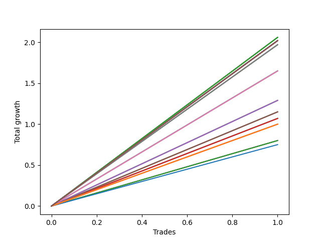

# Long Wallace 022 
- Symbol: SPY_Unlimited
- Date Range: 03/23/2022 - 07/08/2022
- Trading Period: 7:20-12:30
- Number of Trades: 1



| Name | Win Percent | Profit | Avg Profit / Trade | Avg Time / Trade |      | Name | Win Percent | Profit | Avg Profit / Trade | Avg Time / Trade |
| ---- | ----------- | ------ | ------------------ | ---------------- | ---- | ---- | ----------- | ------ | ------------------ | ---------------- |
| Sorted By <br> Profit | | | | | | Sorted By <br> Win Percentage ||||
| One Hundred Twenty-Seven | 100.00 | 1030.00 | 1030.00 | 29:50 |     | One Hundred Twenty-Seven | 100.00 | 1030.00 | 1030.00 | 29:50 |
| One Hundred Twenty-Two | 100.00 | 1030.00 | 1030.00 | 29:50 |     | One Hundred Twenty-Two | 100.00 | 1030.00 | 1030.00 | 29:50 |
| One Hundred Seventeen | 100.00 | 1030.00 | 1030.00 | 29:50 |     | One Hundred Seventeen | 100.00 | 1030.00 | 1030.00 | 29:50 |
| One Hundred Twelve | 100.00 | 1030.00 | 1030.00 | 29:50 |     | One Hundred Twelve | 100.00 | 1030.00 | 1030.00 | 29:50 |
| Eighty-Two | 100.00 | 1030.00 | 1030.00 | 29:50 |     | Eighty-Two | 100.00 | 1030.00 | 1030.00 | 29:50 |
| One Hundred Thirty | 100.00 | 1010.00 | 1010.00 | 29:55 |     | One Hundred Thirty | 100.00 | 1010.00 | 1010.00 | 29:55 |
| One Hundred Twenty-Nine | 100.00 | 1010.00 | 1010.00 | 29:55 |     | One Hundred Twenty-Nine | 100.00 | 1010.00 | 1010.00 | 29:55 |
| One Hundred Twenty-Eight | 100.00 | 1010.00 | 1010.00 | 29:55 |     | One Hundred Twenty-Eight | 100.00 | 1010.00 | 1010.00 | 29:55 |
| One Hundred Twenty-Five | 100.00 | 1010.00 | 1010.00 | 29:55 |     | One Hundred Twenty-Five | 100.00 | 1010.00 | 1010.00 | 29:55 |
| One Hundred Twenty-Four | 100.00 | 1010.00 | 1010.00 | 29:55 |     | One Hundred Twenty-Four | 100.00 | 1010.00 | 1010.00 | 29:55 |
| One Hundred Twenty-Three | 100.00 | 1010.00 | 1010.00 | 29:55 |     | One Hundred Twenty-Three | 100.00 | 1010.00 | 1010.00 | 29:55 |
| One Hundred Twenty | 100.00 | 1010.00 | 1010.00 | 29:55 |     | One Hundred Twenty | 100.00 | 1010.00 | 1010.00 | 29:55 |
| One Hundred Ninteen | 100.00 | 1010.00 | 1010.00 | 29:55 |     | One Hundred Ninteen | 100.00 | 1010.00 | 1010.00 | 29:55 |
| One Hundred Eighteen | 100.00 | 1010.00 | 1010.00 | 29:55 |     | One Hundred Eighteen | 100.00 | 1010.00 | 1010.00 | 29:55 |
| One Hundred Fifteen | 100.00 | 1010.00 | 1010.00 | 29:55 |     | One Hundred Fifteen | 100.00 | 1010.00 | 1010.00 | 29:55 |
| One Hundred Fourteen | 100.00 | 1010.00 | 1010.00 | 29:55 |     | One Hundred Fourteen | 100.00 | 1010.00 | 1010.00 | 29:55 |
| One Hundred Thirteen | 100.00 | 1010.00 | 1010.00 | 29:55 |     | One Hundred Thirteen | 100.00 | 1010.00 | 1010.00 | 29:55 |
| Eighty-Five | 100.00 | 1010.00 | 1010.00 | 29:55 |     | Eighty-Five | 100.00 | 1010.00 | 1010.00 | 29:55 |
| Eighty-Four | 100.00 | 1010.00 | 1010.00 | 29:55 |     | Eighty-Four | 100.00 | 1010.00 | 1010.00 | 29:55 |
| Eighty-Three | 100.00 | 1010.00 | 1010.00 | 29:55 |     | Eighty-Three | 100.00 | 1010.00 | 1010.00 | 29:55 |
| Seventy-One | 100.00 | 1010.00 | 1010.00 | 29:55 |     | Seventy-One | 100.00 | 1010.00 | 1010.00 | 29:55 |
| Seventy | 100.00 | 1010.00 | 1010.00 | 29:55 |     | Seventy | 100.00 | 1010.00 | 1010.00 | 29:55 |
| Sixty-Three | 100.00 | 1010.00 | 1010.00 | 29:55 |     | Sixty-Three | 100.00 | 1010.00 | 1010.00 | 29:55 |
| Sixty-Two | 100.00 | 1010.00 | 1010.00 | 29:55 |     | Sixty-Two | 100.00 | 1010.00 | 1010.00 | 29:55 |
| Fifty-Five | 100.00 | 1010.00 | 1010.00 | 29:55 |     | Fifty-Five | 100.00 | 1010.00 | 1010.00 | 29:55 |
| Fifty-Four | 100.00 | 1010.00 | 1010.00 | 29:55 |     | Fifty-Four | 100.00 | 1010.00 | 1010.00 | 29:55 |
| Forty-Seven | 100.00 | 1010.00 | 1010.00 | 29:55 |     | Forty-Seven | 100.00 | 1010.00 | 1010.00 | 29:55 |
| Forty-Six | 100.00 | 1010.00 | 1010.00 | 29:55 |     | Forty-Six | 100.00 | 1010.00 | 1010.00 | 29:55 |
| Seven | 100.00 | 1010.00 | 1010.00 | 29:55 |     | Seven | 100.00 | 1010.00 | 1010.00 | 29:55 |
| Six | 100.00 | 1010.00 | 1010.00 | 29:55 |     | Six | 100.00 | 1010.00 | 1010.00 | 29:55 |
| Sixty-Nine | 100.00 | 985.00 | 985.00 | 29:45 |     | Sixty-Nine | 100.00 | 985.00 | 985.00 | 29:45 |
| Sixty-One | 100.00 | 985.00 | 985.00 | 29:45 |     | Sixty-One | 100.00 | 985.00 | 985.00 | 29:45 |
| Fifty-Three | 100.00 | 985.00 | 985.00 | 29:45 |     | Fifty-Three | 100.00 | 985.00 | 985.00 | 29:45 |
| Forty-Five | 100.00 | 985.00 | 985.00 | 29:45 |     | Forty-Five | 100.00 | 985.00 | 985.00 | 29:45 |
| Five | 100.00 | 985.00 | 985.00 | 29:45 |     | Five | 100.00 | 985.00 | 985.00 | 29:45 |
| Sixty-Eight | 100.00 | 825.00 | 825.00 | 17:35 |     | Sixty-Eight | 100.00 | 825.00 | 825.00 | 17:35 |
| Sixty | 100.00 | 825.00 | 825.00 | 17:35 |     | Sixty | 100.00 | 825.00 | 825.00 | 17:35 |
| Fifty-Two | 100.00 | 825.00 | 825.00 | 17:35 |     | Fifty-Two | 100.00 | 825.00 | 825.00 | 17:35 |
| Forty-Four | 100.00 | 825.00 | 825.00 | 17:35 |     | Forty-Four | 100.00 | 825.00 | 825.00 | 17:35 |
| Four | 100.00 | 825.00 | 825.00 | 17:35 |     | Four | 100.00 | 825.00 | 825.00 | 17:35 |
| Sixty-Six | 100.00 | 645.00 | 645.00 | 16:35 |     | Sixty-Six | 100.00 | 645.00 | 645.00 | 16:35 |
| Fifty-Eight | 100.00 | 645.00 | 645.00 | 16:35 |     | Fifty-Eight | 100.00 | 645.00 | 645.00 | 16:35 |
| Fifty | 100.00 | 645.00 | 645.00 | 16:35 |     | Fifty | 100.00 | 645.00 | 645.00 | 16:35 |
| Forty-Two | 100.00 | 645.00 | 645.00 | 16:35 |     | Forty-Two | 100.00 | 645.00 | 645.00 | 16:35 |
| Two | 100.00 | 645.00 | 645.00 | 16:35 |     | Two | 100.00 | 645.00 | 645.00 | 16:35 |
| Sixty-Seven | 100.00 | 575.00 | 575.00 | 14:10 |     | Sixty-Seven | 100.00 | 575.00 | 575.00 | 14:10 |
| Fifty-Nine | 100.00 | 575.00 | 575.00 | 14:10 |     | Fifty-Nine | 100.00 | 575.00 | 575.00 | 14:10 |
| Fifty-One | 100.00 | 575.00 | 575.00 | 14:10 |     | Fifty-One | 100.00 | 575.00 | 575.00 | 14:10 |
| Forty-Three | 100.00 | 575.00 | 575.00 | 14:10 |     | Forty-Three | 100.00 | 575.00 | 575.00 | 14:10 |
| Three | 100.00 | 575.00 | 575.00 | 14:10 |     | Three | 100.00 | 575.00 | 575.00 | 14:10 |
| Sixty-Five | 100.00 | 535.00 | 535.00 | 08:20 |     | Sixty-Five | 100.00 | 535.00 | 535.00 | 08:20 |
| Fifty-Seven | 100.00 | 535.00 | 535.00 | 08:20 |     | Fifty-Seven | 100.00 | 535.00 | 535.00 | 08:20 |
| Forty-Nine | 100.00 | 535.00 | 535.00 | 08:20 |     | Forty-Nine | 100.00 | 535.00 | 535.00 | 08:20 |
| Forty-One | 100.00 | 535.00 | 535.00 | 08:20 |     | Forty-One | 100.00 | 535.00 | 535.00 | 08:20 |
| One | 100.00 | 535.00 | 535.00 | 08:20 |     | One | 100.00 | 535.00 | 535.00 | 08:20 |
| One Hundred Twenty-Six | 100.00 | 500.00 | 500.00 | 07:55 |     | One Hundred Twenty-Six | 100.00 | 500.00 | 500.00 | 07:55 |
| One Hundred Twenty-One | 100.00 | 500.00 | 500.00 | 07:55 |     | One Hundred Twenty-One | 100.00 | 500.00 | 500.00 | 07:55 |
| One Hundred Sixteen | 100.00 | 500.00 | 500.00 | 07:55 |     | One Hundred Sixteen | 100.00 | 500.00 | 500.00 | 07:55 |
| One Hundred Eleven | 100.00 | 500.00 | 500.00 | 07:55 |     | One Hundred Eleven | 100.00 | 500.00 | 500.00 | 07:55 |
| Eighty-One | 100.00 | 500.00 | 500.00 | 07:55 |     | Eighty-One | 100.00 | 500.00 | 500.00 | 07:55 |
| Sixty-Four | 100.00 | 400.00 | 400.00 | 05:15 |     | Sixty-Four | 100.00 | 400.00 | 400.00 | 05:15 |
| Fifty-Six | 100.00 | 400.00 | 400.00 | 05:15 |     | Fifty-Six | 100.00 | 400.00 | 400.00 | 05:15 |
| Forty-Eight | 100.00 | 400.00 | 400.00 | 05:15 |     | Forty-Eight | 100.00 | 400.00 | 400.00 | 05:15 |
| Forty | 100.00 | 400.00 | 400.00 | 05:15 |     | Forty | 100.00 | 400.00 | 400.00 | 05:15 |
| Zero | 100.00 | 400.00 | 400.00 | 05:15 |     | Zero | 100.00 | 400.00 | 400.00 | 05:15 |
| Seventy-Three | 100.00 | 375.00 | 375.00 | 13:05 |     | Seventy-Three | 100.00 | 375.00 | 375.00 | 13:05 |

## NO STOPLOSS

### Test Zero
* Sell when price hits the middle line of the 20p bollinger
* No Stoploss
* Results:
```
Total Trades: 1
Percent Up: 100.00
Percent Down: 0.00
Total Points Moved Up: 0.80
Potential Profit: 400.00
Total Points Ups: 0.80 Count Ups: 1
Total Points Downs: 0.00 Count Downs: 0
```

<details><summary>Trades</summary>

<code>In: 2022-04-20 11:56:00		Out: 2022-04-20 12:01:15		Total Position Time: 05:15		Total Move Up: 0.80		Total to Date: 0.80</code> <br />


</details>

### Test One
* Sell when the price hits the upper line of the 20p 1std bollinger
* No Stoploss
* Results:
```
Total Trades: 1
Percent Up: 100.00
Percent Down: 0.00
Total Points Moved Up: 1.07
Potential Profit: 535.00
Total Points Ups: 1.07 Count Ups: 1
Total Points Downs: 0.00 Count Downs: 0
```

<details><summary>Trades</summary>

<code>In: 2022-04-20 11:56:00		Out: 2022-04-20 12:04:20		Total Position Time: 08:20		Total Move Up: 1.07		Total to Date: 1.07</code> <br />


</details>

### Test Two
* Sell when the price hits the upper line of the 20p 2std bollinger
* No Stoploss
* Results:
```
Total Trades: 1
Percent Up: 100.00
Percent Down: 0.00
Total Points Moved Up: 1.29
Potential Profit: 645.00
Total Points Ups: 1.29 Count Ups: 1
Total Points Downs: 0.00 Count Downs: 0
```

<details><summary>Trades</summary>

<code>In: 2022-04-20 11:56:00		Out: 2022-04-20 12:12:35		Total Position Time: 16:35		Total Move Up: 1.29		Total to Date: 1.29</code> <br />


</details>

### Test Three
* Sell when price hits the middle line of the 50p bollinger
* No Stoploss
* Results:
```
Total Trades: 1
Percent Up: 100.00
Percent Down: 0.00
Total Points Moved Up: 1.15
Potential Profit: 575.00
Total Points Ups: 1.15 Count Ups: 1
Total Points Downs: 0.00 Count Downs: 0
```

<details><summary>Trades</summary>

<code>In: 2022-04-20 11:56:00		Out: 2022-04-20 12:10:10		Total Position Time: 14:10		Total Move Up: 1.15		Total to Date: 1.15</code> <br />


</details>

### Test Four
* Sell when the price hits the upper line of the 50p 1std bollinger
* No Stoploss
* Results:
```
Total Trades: 1
Percent Up: 100.00
Percent Down: 0.00
Total Points Moved Up: 1.65
Potential Profit: 825.00
Total Points Ups: 1.65 Count Ups: 1
Total Points Downs: 0.00 Count Downs: 0
```

<details><summary>Trades</summary>

<code>In: 2022-04-20 11:56:00		Out: 2022-04-20 12:13:35		Total Position Time: 17:35		Total Move Up: 1.65		Total to Date: 1.65</code> <br />


</details>

### Test Five
* Sell when the price hits the upper line of the 50p 2std bollinger
* No Stoploss
* Results:
```
Total Trades: 1
Percent Up: 100.00
Percent Down: 0.00
Total Points Moved Up: 1.97
Potential Profit: 985.00
Total Points Ups: 1.97 Count Ups: 1
Total Points Downs: 0.00 Count Downs: 0
```

<details><summary>Trades</summary>

<code>In: 2022-04-20 11:56:00		Out: 2022-04-20 12:25:45		Total Position Time: 29:45		Total Move Up: 1.97		Total to Date: 1.97</code> <br />


</details>

### Test Six
* Sell when the price hits the middle line of the 1std VWAP
* No Stoploss
* Results:
```
Total Trades: 1
Percent Up: 100.00
Percent Down: 0.00
Total Points Moved Up: 2.02
Potential Profit: 1010.00
Total Points Ups: 2.02 Count Ups: 1
Total Points Downs: 0.00 Count Downs: 0
```

<details><summary>Trades</summary>

<code>In: 2022-04-20 11:56:00		Out: 2022-04-20 12:25:55		Total Position Time: 29:55		Total Move Up: 2.02		Total to Date: 2.02</code> <br />


</details>

### Test Seven
* Sell when the price hits the upper line of the 1std VWAP
* No Stoploss
* Results:
```
Total Trades: 1
Percent Up: 100.00
Percent Down: 0.00
Total Points Moved Up: 2.02
Potential Profit: 1010.00
Total Points Ups: 2.02 Count Ups: 1
Total Points Downs: 0.00 Count Downs: 0
```

<details><summary>Trades</summary>

<code>In: 2022-04-20 11:56:00		Out: 2022-04-20 12:25:55		Total Position Time: 29:55		Total Move Up: 2.02		Total to Date: 2.02</code> <br />


</details>

## STOPLOSS OF 5

### Test Forty
* Sell when price hits the middle line of the 20p bollinger
* Stoploss is 5 points
* Results:
```
Total Trades: 1
Percent Up: 100.00
Percent Down: 0.00
Total Points Moved Up: 0.80
Potential Profit: 400.00
Total Points Ups: 0.80 Count Ups: 1
Total Points Downs: 0.00 Count Downs: 0
```

<details><summary>Trades</summary>

<code>In: 2022-04-20 11:56:00		Out: 2022-04-20 12:01:15		Total Position Time: 05:15		Total Move Up: 0.80		Total to Date: 0.80</code> <br />


</details>

### Test Forty-One
* Sell when the price hits the upper line of the 20p 1std bollinger
* Stoploss is 5 points
* Results:
```
Total Trades: 1
Percent Up: 100.00
Percent Down: 0.00
Total Points Moved Up: 1.07
Potential Profit: 535.00
Total Points Ups: 1.07 Count Ups: 1
Total Points Downs: 0.00 Count Downs: 0
```

<details><summary>Trades</summary>

<code>In: 2022-04-20 11:56:00		Out: 2022-04-20 12:04:20		Total Position Time: 08:20		Total Move Up: 1.07		Total to Date: 1.07</code> <br />


</details>

### Test Forty-Two
* Sell when the price hits the upper line of the 20p 2std bollinger
* Stoploss is 5 points
* Results:
```
Total Trades: 1
Percent Up: 100.00
Percent Down: 0.00
Total Points Moved Up: 1.29
Potential Profit: 645.00
Total Points Ups: 1.29 Count Ups: 1
Total Points Downs: 0.00 Count Downs: 0
```

<details><summary>Trades</summary>

<code>In: 2022-04-20 11:56:00		Out: 2022-04-20 12:12:35		Total Position Time: 16:35		Total Move Up: 1.29		Total to Date: 1.29</code> <br />


</details>

### Test Forty-Three
* Sell when price hits the middle line of the 50p bollinger
* Stoploss is 5 points
* Results:
```
Total Trades: 1
Percent Up: 100.00
Percent Down: 0.00
Total Points Moved Up: 1.15
Potential Profit: 575.00
Total Points Ups: 1.15 Count Ups: 1
Total Points Downs: 0.00 Count Downs: 0
```

<details><summary>Trades</summary>

<code>In: 2022-04-20 11:56:00		Out: 2022-04-20 12:10:10		Total Position Time: 14:10		Total Move Up: 1.15		Total to Date: 1.15</code> <br />


</details>

### Test Forty-Four
* Sell when the price hits the upper line of the 50p 1std bollinger
* Stoploss is 5 points
* Results:
```
Total Trades: 1
Percent Up: 100.00
Percent Down: 0.00
Total Points Moved Up: 1.65
Potential Profit: 825.00
Total Points Ups: 1.65 Count Ups: 1
Total Points Downs: 0.00 Count Downs: 0
```

<details><summary>Trades</summary>

<code>In: 2022-04-20 11:56:00		Out: 2022-04-20 12:13:35		Total Position Time: 17:35		Total Move Up: 1.65		Total to Date: 1.65</code> <br />


</details>

### Test Forty-Five
* Sell when the price hits the upper line of the 50p 2std bollinger
* Stoploss is 5 points
* Results:
```
Total Trades: 1
Percent Up: 100.00
Percent Down: 0.00
Total Points Moved Up: 1.97
Potential Profit: 985.00
Total Points Ups: 1.97 Count Ups: 1
Total Points Downs: 0.00 Count Downs: 0
```

<details><summary>Trades</summary>

<code>In: 2022-04-20 11:56:00		Out: 2022-04-20 12:25:45		Total Position Time: 29:45		Total Move Up: 1.97		Total to Date: 1.97</code> <br />


</details>

### Test Forty-Six
* Sell when the price hits the middle line of the 1std VWAP
* Stoploss is 5 points
* Results:
```
Total Trades: 1
Percent Up: 100.00
Percent Down: 0.00
Total Points Moved Up: 2.02
Potential Profit: 1010.00
Total Points Ups: 2.02 Count Ups: 1
Total Points Downs: 0.00 Count Downs: 0
```

<details><summary>Trades</summary>

<code>In: 2022-04-20 11:56:00		Out: 2022-04-20 12:25:55		Total Position Time: 29:55		Total Move Up: 2.02		Total to Date: 2.02</code> <br />


</details>

### Test Forty-Seven
* Sell when the price hits the upper line of the 1std VWAP
* Stoploss is 5 points
* Results:
```
Total Trades: 1
Percent Up: 100.00
Percent Down: 0.00
Total Points Moved Up: 2.02
Potential Profit: 1010.00
Total Points Ups: 2.02 Count Ups: 1
Total Points Downs: 0.00 Count Downs: 0
```

<details><summary>Trades</summary>

<code>In: 2022-04-20 11:56:00		Out: 2022-04-20 12:25:55		Total Position Time: 29:55		Total Move Up: 2.02		Total to Date: 2.02</code> <br />


</details>

## TRAIL STOP OF 5

### Test Forty-Eight
* Sell when price hits the middle line of the 20p bollinger
* Trailing Stop is 5 points
* Results:
```
Total Trades: 1
Percent Up: 100.00
Percent Down: 0.00
Total Points Moved Up: 0.80
Potential Profit: 400.00
Total Points Ups: 0.80 Count Ups: 1
Total Points Downs: 0.00 Count Downs: 0
```

<details><summary>Trades</summary>

<code>In: 2022-04-20 11:56:00		Out: 2022-04-20 12:01:15		Total Position Time: 05:15		Total Move Up: 0.80		Total to Date: 0.80</code> <br />


</details>

### Test Forty-Nine
* Sell when the price hits the upper line of the 20p 1std bollinger
* Trailing Stop is 5 points
* Results:
```
Total Trades: 1
Percent Up: 100.00
Percent Down: 0.00
Total Points Moved Up: 1.07
Potential Profit: 535.00
Total Points Ups: 1.07 Count Ups: 1
Total Points Downs: 0.00 Count Downs: 0
```

<details><summary>Trades</summary>

<code>In: 2022-04-20 11:56:00		Out: 2022-04-20 12:04:20		Total Position Time: 08:20		Total Move Up: 1.07		Total to Date: 1.07</code> <br />


</details>

### Test Fifty
* Sell when the price hits the upper line of the 20p 2std bollinger
* Trailing Stop is 5 points
* Results:
```
Total Trades: 1
Percent Up: 100.00
Percent Down: 0.00
Total Points Moved Up: 1.29
Potential Profit: 645.00
Total Points Ups: 1.29 Count Ups: 1
Total Points Downs: 0.00 Count Downs: 0
```

<details><summary>Trades</summary>

<code>In: 2022-04-20 11:56:00		Out: 2022-04-20 12:12:35		Total Position Time: 16:35		Total Move Up: 1.29		Total to Date: 1.29</code> <br />


</details>

### Test Fifty-One
* Sell when price hits the middle line of the 50p bollinger
* Trailing Stop is 5 points
* Results:
```
Total Trades: 1
Percent Up: 100.00
Percent Down: 0.00
Total Points Moved Up: 1.15
Potential Profit: 575.00
Total Points Ups: 1.15 Count Ups: 1
Total Points Downs: 0.00 Count Downs: 0
```

<details><summary>Trades</summary>

<code>In: 2022-04-20 11:56:00		Out: 2022-04-20 12:10:10		Total Position Time: 14:10		Total Move Up: 1.15		Total to Date: 1.15</code> <br />


</details>

### Test Fifty-Two
* Sell when the price hits the upper line of the 50p 1std bollinger
* Trailing Stop is 5 points
* Results:
```
Total Trades: 1
Percent Up: 100.00
Percent Down: 0.00
Total Points Moved Up: 1.65
Potential Profit: 825.00
Total Points Ups: 1.65 Count Ups: 1
Total Points Downs: 0.00 Count Downs: 0
```

<details><summary>Trades</summary>

<code>In: 2022-04-20 11:56:00		Out: 2022-04-20 12:13:35		Total Position Time: 17:35		Total Move Up: 1.65		Total to Date: 1.65</code> <br />


</details>

### Test Fifty-Three
* Sell when the price hits the upper line of the 50p 2std bollinger
* Trailing Stop is 5 points
* Results:
```
Total Trades: 1
Percent Up: 100.00
Percent Down: 0.00
Total Points Moved Up: 1.97
Potential Profit: 985.00
Total Points Ups: 1.97 Count Ups: 1
Total Points Downs: 0.00 Count Downs: 0
```

<details><summary>Trades</summary>

<code>In: 2022-04-20 11:56:00		Out: 2022-04-20 12:25:45		Total Position Time: 29:45		Total Move Up: 1.97		Total to Date: 1.97</code> <br />


</details>

### Test Fifty-Four
* Sell when the price hits the middle line of the 1std VWAP
* Trailing Stop is 5 points
* Results:
```
Total Trades: 1
Percent Up: 100.00
Percent Down: 0.00
Total Points Moved Up: 2.02
Potential Profit: 1010.00
Total Points Ups: 2.02 Count Ups: 1
Total Points Downs: 0.00 Count Downs: 0
```

<details><summary>Trades</summary>

<code>In: 2022-04-20 11:56:00		Out: 2022-04-20 12:25:55		Total Position Time: 29:55		Total Move Up: 2.02		Total to Date: 2.02</code> <br />


</details>

### Test Fifty-Five
* Sell when the price hits the upper line of the 1std VWAP
* Trailing Stop is 5 points
* Results:
```
Total Trades: 1
Percent Up: 100.00
Percent Down: 0.00
Total Points Moved Up: 2.02
Potential Profit: 1010.00
Total Points Ups: 2.02 Count Ups: 1
Total Points Downs: 0.00 Count Downs: 0
```

<details><summary>Trades</summary>

<code>In: 2022-04-20 11:56:00		Out: 2022-04-20 12:25:55		Total Position Time: 29:55		Total Move Up: 2.02		Total to Date: 2.02</code> <br />


</details>

## STOPLOSS OF 10

### Test Fifty-Six
* Sell when price hits the middle line of the 20p bollinger
* Stoploss is 10 points
* Results:
```
Total Trades: 1
Percent Up: 100.00
Percent Down: 0.00
Total Points Moved Up: 0.80
Potential Profit: 400.00
Total Points Ups: 0.80 Count Ups: 1
Total Points Downs: 0.00 Count Downs: 0
```

<details><summary>Trades</summary>

<code>In: 2022-04-20 11:56:00		Out: 2022-04-20 12:01:15		Total Position Time: 05:15		Total Move Up: 0.80		Total to Date: 0.80</code> <br />


</details>

### Test Fifty-Seven
* Sell when the price hits the upper line of the 20p 1std bollinger
* Stoploss is 10 points
* Results:
```
Total Trades: 1
Percent Up: 100.00
Percent Down: 0.00
Total Points Moved Up: 1.07
Potential Profit: 535.00
Total Points Ups: 1.07 Count Ups: 1
Total Points Downs: 0.00 Count Downs: 0
```

<details><summary>Trades</summary>

<code>In: 2022-04-20 11:56:00		Out: 2022-04-20 12:04:20		Total Position Time: 08:20		Total Move Up: 1.07		Total to Date: 1.07</code> <br />


</details>

### Test Fifty-Eight
* Sell when the price hits the upper line of the 20p 2std bollinger
* Stoploss is 10 points
* Results:
```
Total Trades: 1
Percent Up: 100.00
Percent Down: 0.00
Total Points Moved Up: 1.29
Potential Profit: 645.00
Total Points Ups: 1.29 Count Ups: 1
Total Points Downs: 0.00 Count Downs: 0
```

<details><summary>Trades</summary>

<code>In: 2022-04-20 11:56:00		Out: 2022-04-20 12:12:35		Total Position Time: 16:35		Total Move Up: 1.29		Total to Date: 1.29</code> <br />


</details>

### Test Fifty-Nine
* Sell when price hits the middle line of the 50p bollinger
* Stoploss is 10 points
* Results:
```
Total Trades: 1
Percent Up: 100.00
Percent Down: 0.00
Total Points Moved Up: 1.15
Potential Profit: 575.00
Total Points Ups: 1.15 Count Ups: 1
Total Points Downs: 0.00 Count Downs: 0
```

<details><summary>Trades</summary>

<code>In: 2022-04-20 11:56:00		Out: 2022-04-20 12:10:10		Total Position Time: 14:10		Total Move Up: 1.15		Total to Date: 1.15</code> <br />


</details>

### Test Sixty
* Sell when the price hits the upper line of the 50p 1std bollinger
* Stoploss is 10 points
* Results:
```
Total Trades: 1
Percent Up: 100.00
Percent Down: 0.00
Total Points Moved Up: 1.65
Potential Profit: 825.00
Total Points Ups: 1.65 Count Ups: 1
Total Points Downs: 0.00 Count Downs: 0
```

<details><summary>Trades</summary>

<code>In: 2022-04-20 11:56:00		Out: 2022-04-20 12:13:35		Total Position Time: 17:35		Total Move Up: 1.65		Total to Date: 1.65</code> <br />


</details>

### Test Sixty-One
* Sell when the price hits the upper line of the 50p 2std bollinger
* Stoploss is 10 points
* Results:
```
Total Trades: 1
Percent Up: 100.00
Percent Down: 0.00
Total Points Moved Up: 1.97
Potential Profit: 985.00
Total Points Ups: 1.97 Count Ups: 1
Total Points Downs: 0.00 Count Downs: 0
```

<details><summary>Trades</summary>

<code>In: 2022-04-20 11:56:00		Out: 2022-04-20 12:25:45		Total Position Time: 29:45		Total Move Up: 1.97		Total to Date: 1.97</code> <br />


</details>

### Test Sixty-Two
* Sell when the price hits the middle line of the 1std VWAP
* Stoploss is 10 points
* Results:
```
Total Trades: 1
Percent Up: 100.00
Percent Down: 0.00
Total Points Moved Up: 2.02
Potential Profit: 1010.00
Total Points Ups: 2.02 Count Ups: 1
Total Points Downs: 0.00 Count Downs: 0
```

<details><summary>Trades</summary>

<code>In: 2022-04-20 11:56:00		Out: 2022-04-20 12:25:55		Total Position Time: 29:55		Total Move Up: 2.02		Total to Date: 2.02</code> <br />


</details>

### Test Sixty-Three
* Sell when the price hits the upper line of the 1std VWAP
* Stoploss is 10 points
* Results:
```
Total Trades: 1
Percent Up: 100.00
Percent Down: 0.00
Total Points Moved Up: 2.02
Potential Profit: 1010.00
Total Points Ups: 2.02 Count Ups: 1
Total Points Downs: 0.00 Count Downs: 0
```

<details><summary>Trades</summary>

<code>In: 2022-04-20 11:56:00		Out: 2022-04-20 12:25:55		Total Position Time: 29:55		Total Move Up: 2.02		Total to Date: 2.02</code> <br />


</details>

## TRAIL STOP OF 10

### Test Sixty-Four
* Sell when price hits the middle line of the 20p bollinger
* Trailing Stop is 10 points
* Results:
```
Total Trades: 1
Percent Up: 100.00
Percent Down: 0.00
Total Points Moved Up: 0.80
Potential Profit: 400.00
Total Points Ups: 0.80 Count Ups: 1
Total Points Downs: 0.00 Count Downs: 0
```

<details><summary>Trades</summary>

<code>In: 2022-04-20 11:56:00		Out: 2022-04-20 12:01:15		Total Position Time: 05:15		Total Move Up: 0.80		Total to Date: 0.80</code> <br />


</details>

### Test Sixty-Five
* Sell when the price hits the upper line of the 20p 1std bollinger
* Trailing Stop is 10 points
* Results:
```
Total Trades: 1
Percent Up: 100.00
Percent Down: 0.00
Total Points Moved Up: 1.07
Potential Profit: 535.00
Total Points Ups: 1.07 Count Ups: 1
Total Points Downs: 0.00 Count Downs: 0
```

<details><summary>Trades</summary>

<code>In: 2022-04-20 11:56:00		Out: 2022-04-20 12:04:20		Total Position Time: 08:20		Total Move Up: 1.07		Total to Date: 1.07</code> <br />


</details>

### Test Sixty-Six
* Sell when the price hits the upper line of the 20p 2std bollinger
* Trailing Stop is 10 points
* Results:
```
Total Trades: 1
Percent Up: 100.00
Percent Down: 0.00
Total Points Moved Up: 1.29
Potential Profit: 645.00
Total Points Ups: 1.29 Count Ups: 1
Total Points Downs: 0.00 Count Downs: 0
```

<details><summary>Trades</summary>

<code>In: 2022-04-20 11:56:00		Out: 2022-04-20 12:12:35		Total Position Time: 16:35		Total Move Up: 1.29		Total to Date: 1.29</code> <br />


</details>

### Test Sixty-Seven
* Sell when price hits the middle line of the 50p bollinger
* Trailing Stop is 10 points
* Results:
```
Total Trades: 1
Percent Up: 100.00
Percent Down: 0.00
Total Points Moved Up: 1.15
Potential Profit: 575.00
Total Points Ups: 1.15 Count Ups: 1
Total Points Downs: 0.00 Count Downs: 0
```

<details><summary>Trades</summary>

<code>In: 2022-04-20 11:56:00		Out: 2022-04-20 12:10:10		Total Position Time: 14:10		Total Move Up: 1.15		Total to Date: 1.15</code> <br />


</details>

### Test Sixty-Eight
* Sell when the price hits the upper line of the 50p 1std bollinger
* Trailing Stop is 10 points
* Results:
```
Total Trades: 1
Percent Up: 100.00
Percent Down: 0.00
Total Points Moved Up: 1.65
Potential Profit: 825.00
Total Points Ups: 1.65 Count Ups: 1
Total Points Downs: 0.00 Count Downs: 0
```

<details><summary>Trades</summary>

<code>In: 2022-04-20 11:56:00		Out: 2022-04-20 12:13:35		Total Position Time: 17:35		Total Move Up: 1.65		Total to Date: 1.65</code> <br />


</details>

### Test Sixty-Nine
* Sell when the price hits the upper line of the 50p 2std bollinger
* Trailing Stop is 10 points
* Results:
```
Total Trades: 1
Percent Up: 100.00
Percent Down: 0.00
Total Points Moved Up: 1.97
Potential Profit: 985.00
Total Points Ups: 1.97 Count Ups: 1
Total Points Downs: 0.00 Count Downs: 0
```

<details><summary>Trades</summary>

<code>In: 2022-04-20 11:56:00		Out: 2022-04-20 12:25:45		Total Position Time: 29:45		Total Move Up: 1.97		Total to Date: 1.97</code> <br />


</details>

### Test Seventy
* Sell when the price hits the middle line of the 1std VWAP
* Trailing Stop is 10 points
* Results:
```
Total Trades: 1
Percent Up: 100.00
Percent Down: 0.00
Total Points Moved Up: 2.02
Potential Profit: 1010.00
Total Points Ups: 2.02 Count Ups: 1
Total Points Downs: 0.00 Count Downs: 0
```

<details><summary>Trades</summary>

<code>In: 2022-04-20 11:56:00		Out: 2022-04-20 12:25:55		Total Position Time: 29:55		Total Move Up: 2.02		Total to Date: 2.02</code> <br />


</details>

### Test Seventy-One
* Sell when the price hits the upper line of the 1std VWAP
* Trailing Stop is 10 points
* Results:
```
Total Trades: 1
Percent Up: 100.00
Percent Down: 0.00
Total Points Moved Up: 2.02
Potential Profit: 1010.00
Total Points Ups: 2.02 Count Ups: 1
Total Points Downs: 0.00 Count Downs: 0
```

<details><summary>Trades</summary>

<code>In: 2022-04-20 11:56:00		Out: 2022-04-20 12:25:55		Total Position Time: 29:55		Total Move Up: 2.02		Total to Date: 2.02</code> <br />


</details>

## SPECIAL EXIT CONDITIONS 

### Test Seventy-Three
* Sell when the linear regression slope changes to negative
* No Stoploss
* Results:
```
Total Trades: 1
Percent Up: 100.00
Percent Down: 0.00
Total Points Moved Up: 0.75
Potential Profit: 375.00
Total Points Ups: 0.75 Count Ups: 1
Total Points Downs: 0.00 Count Downs: 0
```

<details><summary>Trades</summary>

<code>In: 2022-04-20 11:56:00		Out: 2022-04-20 12:09:05		Total Position Time: 13:05		Total Move Up: 0.75		Total to Date: 0.75</code> <br />


</details>

## TAKE PROFIT

### Test Eighty-One
* Take Profit of 1 Point
* No Stoploss
* Results:
```
Total Trades: 1
Percent Up: 100.00
Percent Down: 0.00
Total Points Moved Up: 1.00
Potential Profit: 500.00
Total Points Ups: 1.00 Count Ups: 1
Total Points Downs: 0.00 Count Downs: 0
```

<details><summary>Trades</summary>

<code>In: 2022-04-20 11:56:00		Out: 2022-04-20 12:03:55		Total Position Time: 07:55		Total Move Up: 1.00		Total to Date: 1.00</code> <br />


</details>

### Test Eighty-Two
* Take Profit of 2 Point
* No Stoploss
* Results:
```
Total Trades: 1
Percent Up: 100.00
Percent Down: 0.00
Total Points Moved Up: 2.06
Potential Profit: 1030.00
Total Points Ups: 2.06 Count Ups: 1
Total Points Downs: 0.00 Count Downs: 0
```

<details><summary>Trades</summary>

<code>In: 2022-04-20 11:56:00		Out: 2022-04-20 12:25:50		Total Position Time: 29:50		Total Move Up: 2.06		Total to Date: 2.06</code> <br />


</details>

### Test Eighty-Three
* Take Profit of 3 Point
* No Stoploss
* Results:
```
Total Trades: 1
Percent Up: 100.00
Percent Down: 0.00
Total Points Moved Up: 2.02
Potential Profit: 1010.00
Total Points Ups: 2.02 Count Ups: 1
Total Points Downs: 0.00 Count Downs: 0
```

<details><summary>Trades</summary>

<code>In: 2022-04-20 11:56:00		Out: 2022-04-20 12:25:55		Total Position Time: 29:55		Total Move Up: 2.02		Total to Date: 2.02</code> <br />


</details>

### Test Eighty-Four
* Take Profit of 4 Point
* No Stoploss
* Results:
```
Total Trades: 1
Percent Up: 100.00
Percent Down: 0.00
Total Points Moved Up: 2.02
Potential Profit: 1010.00
Total Points Ups: 2.02 Count Ups: 1
Total Points Downs: 0.00 Count Downs: 0
```

<details><summary>Trades</summary>

<code>In: 2022-04-20 11:56:00		Out: 2022-04-20 12:25:55		Total Position Time: 29:55		Total Move Up: 2.02		Total to Date: 2.02</code> <br />


</details>

### Test Eighty-Five
* Take Profit of 5 Point
* No Stoploss
* Results:
```
Total Trades: 1
Percent Up: 100.00
Percent Down: 0.00
Total Points Moved Up: 2.02
Potential Profit: 1010.00
Total Points Ups: 2.02 Count Ups: 1
Total Points Downs: 0.00 Count Downs: 0
```

<details><summary>Trades</summary>

<code>In: 2022-04-20 11:56:00		Out: 2022-04-20 12:25:55		Total Position Time: 29:55		Total Move Up: 2.02		Total to Date: 2.02</code> <br />


</details>

## TAKE PROFIT Stoploss of Five

### Test One Hundred Eleven
* Take Profit of 1 Point
* Stoploss is 5 points
* Results:
```
Total Trades: 1
Percent Up: 100.00
Percent Down: 0.00
Total Points Moved Up: 1.00
Potential Profit: 500.00
Total Points Ups: 1.00 Count Ups: 1
Total Points Downs: 0.00 Count Downs: 0
```

<details><summary>Trades</summary>

<code>In: 2022-04-20 11:56:00		Out: 2022-04-20 12:03:55		Total Position Time: 07:55		Total Move Up: 1.00		Total to Date: 1.00</code> <br />


</details>

### Test One Hundred Twelve
* Take Profit of 2 Point
* Stoploss is 5 points
* Results:
```
Total Trades: 1
Percent Up: 100.00
Percent Down: 0.00
Total Points Moved Up: 2.06
Potential Profit: 1030.00
Total Points Ups: 2.06 Count Ups: 1
Total Points Downs: 0.00 Count Downs: 0
```

<details><summary>Trades</summary>

<code>In: 2022-04-20 11:56:00		Out: 2022-04-20 12:25:50		Total Position Time: 29:50		Total Move Up: 2.06		Total to Date: 2.06</code> <br />


</details>

### Test One Hundred Thirteen
* Take Profit of 3 Point
* Stoploss is 5 points
* Results:
```
Total Trades: 1
Percent Up: 100.00
Percent Down: 0.00
Total Points Moved Up: 2.02
Potential Profit: 1010.00
Total Points Ups: 2.02 Count Ups: 1
Total Points Downs: 0.00 Count Downs: 0
```

<details><summary>Trades</summary>

<code>In: 2022-04-20 11:56:00		Out: 2022-04-20 12:25:55		Total Position Time: 29:55		Total Move Up: 2.02		Total to Date: 2.02</code> <br />


</details>

### Test One Hundred Fourteen
* Take Profit of 4 Point
* Stoploss is 5 points
* Results:
```
Total Trades: 1
Percent Up: 100.00
Percent Down: 0.00
Total Points Moved Up: 2.02
Potential Profit: 1010.00
Total Points Ups: 2.02 Count Ups: 1
Total Points Downs: 0.00 Count Downs: 0
```

<details><summary>Trades</summary>

<code>In: 2022-04-20 11:56:00		Out: 2022-04-20 12:25:55		Total Position Time: 29:55		Total Move Up: 2.02		Total to Date: 2.02</code> <br />


</details>

### Test One Hundred Fifteen
* Take Profit of 5 Point
* Stoploss is 5 points
* Results:
```
Total Trades: 1
Percent Up: 100.00
Percent Down: 0.00
Total Points Moved Up: 2.02
Potential Profit: 1010.00
Total Points Ups: 2.02 Count Ups: 1
Total Points Downs: 0.00 Count Downs: 0
```

<details><summary>Trades</summary>

<code>In: 2022-04-20 11:56:00		Out: 2022-04-20 12:25:55		Total Position Time: 29:55		Total Move Up: 2.02		Total to Date: 2.02</code> <br />


</details>

## TAKE PROFIT Trailstop of Five

### Test One Hundred Sixteen
* Take Profit of 1 Point
* Trailing stop is 5 points
* Results:
```
Total Trades: 1
Percent Up: 100.00
Percent Down: 0.00
Total Points Moved Up: 1.00
Potential Profit: 500.00
Total Points Ups: 1.00 Count Ups: 1
Total Points Downs: 0.00 Count Downs: 0
```

<details><summary>Trades</summary>

<code>In: 2022-04-20 11:56:00		Out: 2022-04-20 12:03:55		Total Position Time: 07:55		Total Move Up: 1.00		Total to Date: 1.00</code> <br />


</details>

### Test One Hundred Seventeen
* Take Profit of 2 Point
* Trailing stop is 5 points
* Results:
```
Total Trades: 1
Percent Up: 100.00
Percent Down: 0.00
Total Points Moved Up: 2.06
Potential Profit: 1030.00
Total Points Ups: 2.06 Count Ups: 1
Total Points Downs: 0.00 Count Downs: 0
```

<details><summary>Trades</summary>

<code>In: 2022-04-20 11:56:00		Out: 2022-04-20 12:25:50		Total Position Time: 29:50		Total Move Up: 2.06		Total to Date: 2.06</code> <br />


</details>

### Test One Hundred Eighteen
* Take Profit of 3 Point
* Trailing stop is 5 points
* Results:
```
Total Trades: 1
Percent Up: 100.00
Percent Down: 0.00
Total Points Moved Up: 2.02
Potential Profit: 1010.00
Total Points Ups: 2.02 Count Ups: 1
Total Points Downs: 0.00 Count Downs: 0
```

<details><summary>Trades</summary>

<code>In: 2022-04-20 11:56:00		Out: 2022-04-20 12:25:55		Total Position Time: 29:55		Total Move Up: 2.02		Total to Date: 2.02</code> <br />


</details>

### Test One Hundred Ninteen
* Take Profit of 4 Point
* Trailing stop is 5 points
* Results:
```
Total Trades: 1
Percent Up: 100.00
Percent Down: 0.00
Total Points Moved Up: 2.02
Potential Profit: 1010.00
Total Points Ups: 2.02 Count Ups: 1
Total Points Downs: 0.00 Count Downs: 0
```

<details><summary>Trades</summary>

<code>In: 2022-04-20 11:56:00		Out: 2022-04-20 12:25:55		Total Position Time: 29:55		Total Move Up: 2.02		Total to Date: 2.02</code> <br />


</details>

### Test One Hundred Twenty
* Take Profit of 5 Point
* Trailing stop is 5 points
* Results:
```
Total Trades: 1
Percent Up: 100.00
Percent Down: 0.00
Total Points Moved Up: 2.02
Potential Profit: 1010.00
Total Points Ups: 2.02 Count Ups: 1
Total Points Downs: 0.00 Count Downs: 0
```

<details><summary>Trades</summary>

<code>In: 2022-04-20 11:56:00		Out: 2022-04-20 12:25:55		Total Position Time: 29:55		Total Move Up: 2.02		Total to Date: 2.02</code> <br />


</details>

## TAKE PROFIT Stoploss of Ten

### Test One Hundred Twenty-One
* Take Profit of 1 Point
* Stoploss is 10 points
* Results:
```
Total Trades: 1
Percent Up: 100.00
Percent Down: 0.00
Total Points Moved Up: 1.00
Potential Profit: 500.00
Total Points Ups: 1.00 Count Ups: 1
Total Points Downs: 0.00 Count Downs: 0
```

<details><summary>Trades</summary>

<code>In: 2022-04-20 11:56:00		Out: 2022-04-20 12:03:55		Total Position Time: 07:55		Total Move Up: 1.00		Total to Date: 1.00</code> <br />


</details>

### Test One Hundred Twenty-Two
* Take Profit of 2 Point
* Stoploss is 10 points
* Results:
```
Total Trades: 1
Percent Up: 100.00
Percent Down: 0.00
Total Points Moved Up: 2.06
Potential Profit: 1030.00
Total Points Ups: 2.06 Count Ups: 1
Total Points Downs: 0.00 Count Downs: 0
```

<details><summary>Trades</summary>

<code>In: 2022-04-20 11:56:00		Out: 2022-04-20 12:25:50		Total Position Time: 29:50		Total Move Up: 2.06		Total to Date: 2.06</code> <br />


</details>

### Test One Hundred Twenty-Three
* Take Profit of 3 Point
* Stoploss is 10 points
* Results:
```
Total Trades: 1
Percent Up: 100.00
Percent Down: 0.00
Total Points Moved Up: 2.02
Potential Profit: 1010.00
Total Points Ups: 2.02 Count Ups: 1
Total Points Downs: 0.00 Count Downs: 0
```

<details><summary>Trades</summary>

<code>In: 2022-04-20 11:56:00		Out: 2022-04-20 12:25:55		Total Position Time: 29:55		Total Move Up: 2.02		Total to Date: 2.02</code> <br />


</details>

### Test One Hundred Twenty-Four
* Take Profit of 4 Point
* Stoploss is 10 points
* Results:
```
Total Trades: 1
Percent Up: 100.00
Percent Down: 0.00
Total Points Moved Up: 2.02
Potential Profit: 1010.00
Total Points Ups: 2.02 Count Ups: 1
Total Points Downs: 0.00 Count Downs: 0
```

<details><summary>Trades</summary>

<code>In: 2022-04-20 11:56:00		Out: 2022-04-20 12:25:55		Total Position Time: 29:55		Total Move Up: 2.02		Total to Date: 2.02</code> <br />


</details>

### Test One Hundred Twenty-Five
* Take Profit of 5 Point
* Stoploss is 10 points
* Results:
```
Total Trades: 1
Percent Up: 100.00
Percent Down: 0.00
Total Points Moved Up: 2.02
Potential Profit: 1010.00
Total Points Ups: 2.02 Count Ups: 1
Total Points Downs: 0.00 Count Downs: 0
```

<details><summary>Trades</summary>

<code>In: 2022-04-20 11:56:00		Out: 2022-04-20 12:25:55		Total Position Time: 29:55		Total Move Up: 2.02		Total to Date: 2.02</code> <br />


</details>

## TAKE PROFIT Trailstop of Ten

### Test One Hundred Twenty-Six
* Take Profit of 1 Point
* Trailing stop is 10 points
* Results:
```
Total Trades: 1
Percent Up: 100.00
Percent Down: 0.00
Total Points Moved Up: 1.00
Potential Profit: 500.00
Total Points Ups: 1.00 Count Ups: 1
Total Points Downs: 0.00 Count Downs: 0
```

<details><summary>Trades</summary>

<code>In: 2022-04-20 11:56:00		Out: 2022-04-20 12:03:55		Total Position Time: 07:55		Total Move Up: 1.00		Total to Date: 1.00</code> <br />


</details>

### Test One Hundred Twenty-Seven
* Take Profit of 2 Point
* Trailing stop is 10 points
* Results:
```
Total Trades: 1
Percent Up: 100.00
Percent Down: 0.00
Total Points Moved Up: 2.06
Potential Profit: 1030.00
Total Points Ups: 2.06 Count Ups: 1
Total Points Downs: 0.00 Count Downs: 0
```

<details><summary>Trades</summary>

<code>In: 2022-04-20 11:56:00		Out: 2022-04-20 12:25:50		Total Position Time: 29:50		Total Move Up: 2.06		Total to Date: 2.06</code> <br />


</details>

### Test One Hundred Twenty-Eight
* Take Profit of 3 Point
* Trailing stop is 10 points
* Results:
```
Total Trades: 1
Percent Up: 100.00
Percent Down: 0.00
Total Points Moved Up: 2.02
Potential Profit: 1010.00
Total Points Ups: 2.02 Count Ups: 1
Total Points Downs: 0.00 Count Downs: 0
```

<details><summary>Trades</summary>

<code>In: 2022-04-20 11:56:00		Out: 2022-04-20 12:25:55		Total Position Time: 29:55		Total Move Up: 2.02		Total to Date: 2.02</code> <br />


</details>

### Test One Hundred Twenty-Nine
* Take Profit of 4 Point
* Trailing stop is 10 points
* Results:
```
Total Trades: 1
Percent Up: 100.00
Percent Down: 0.00
Total Points Moved Up: 2.02
Potential Profit: 1010.00
Total Points Ups: 2.02 Count Ups: 1
Total Points Downs: 0.00 Count Downs: 0
```

<details><summary>Trades</summary>

<code>In: 2022-04-20 11:56:00		Out: 2022-04-20 12:25:55		Total Position Time: 29:55		Total Move Up: 2.02		Total to Date: 2.02</code> <br />


</details>

### Test One Hundred Thirty
* Take Profit of 5 Point
* Trailing stop is 10 points
* Results:
```
Total Trades: 1
Percent Up: 100.00
Percent Down: 0.00
Total Points Moved Up: 2.02
Potential Profit: 1010.00
Total Points Ups: 2.02 Count Ups: 1
Total Points Downs: 0.00 Count Downs: 0
```

<details><summary>Trades</summary>

<code>In: 2022-04-20 11:56:00		Out: 2022-04-20 12:25:55		Total Position Time: 29:55		Total Move Up: 2.02		Total to Date: 2.02</code> <br />


</details>