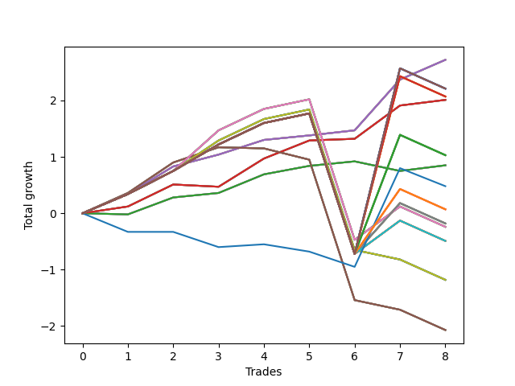

# Short Bulldog 001 
- Symbol: SPY_Unlimited
- Date Range: 03/23/2022 - 07/08/2022
- Trading Period: 7:20-12:30
- Number of Trades: 8



| Name | Win Percent | Profit | Avg Profit / Trade | Avg Time / Trade |      | Name | Win Percent | Profit | Avg Profit / Trade | Avg Time / Trade |
| ---- | ----------- | ------ | ------------------ | ---------------- | ---- | ---- | ----------- | ------ | ------------------ | ---------------- |
| Sorted By <br> Profit | | | | | | Sorted By <br> Win Percentage ||||
| Sixty-Six | 100.00 | 1360.00 | 170.00 | 16:46 |     | Sixty-Six | 100.00 | 1360.00 | 170.00 | 16:46 |
| Fifty-Eight | 100.00 | 1360.00 | 170.00 | 16:46 |     | Fifty-Eight | 100.00 | 1360.00 | 170.00 | 16:46 |
| Fifty | 100.00 | 1360.00 | 170.00 | 16:46 |     | Fifty | 100.00 | 1360.00 | 170.00 | 16:46 |
| Forty-Two | 100.00 | 1360.00 | 170.00 | 16:46 |     | Forty-Two | 100.00 | 1360.00 | 170.00 | 16:46 |
| Two | 100.00 | 1360.00 | 170.00 | 16:46 |     | Two | 100.00 | 1360.00 | 170.00 | 16:46 |
| One Hundred Thirty | 75.00 | 1105.00 | 138.13 | 29:55 |     | Sixty-Five | 87.50 | 1005.00 | 125.62 | 09:45 |
| One Hundred Twenty-Nine | 75.00 | 1105.00 | 138.13 | 29:55 |     | Fifty-Seven | 87.50 | 1005.00 | 125.62 | 09:45 |
| One Hundred Twenty-Five | 75.00 | 1105.00 | 138.13 | 29:55 |     | Forty-Nine | 87.50 | 1005.00 | 125.62 | 09:45 |
| One Hundred Twenty-Four | 75.00 | 1105.00 | 138.13 | 29:55 |     | Forty-One | 87.50 | 1005.00 | 125.62 | 09:45 |
| One Hundred Twenty | 75.00 | 1105.00 | 138.13 | 29:55 |     | One | 87.50 | 1005.00 | 125.62 | 09:45 |
| One Hundred Ninteen | 75.00 | 1105.00 | 138.13 | 29:55 |     | One Hundred Thirty | 75.00 | 1105.00 | 138.13 | 29:55 |
| One Hundred Fifteen | 75.00 | 1105.00 | 138.13 | 29:55 |     | One Hundred Twenty-Nine | 75.00 | 1105.00 | 138.13 | 29:55 |
| One Hundred Fourteen | 75.00 | 1105.00 | 138.13 | 29:55 |     | One Hundred Twenty-Five | 75.00 | 1105.00 | 138.13 | 29:55 |
| Eighty-Five | 75.00 | 1105.00 | 138.13 | 29:55 |     | One Hundred Twenty-Four | 75.00 | 1105.00 | 138.13 | 29:55 |
| Eighty-Four | 75.00 | 1105.00 | 138.13 | 29:55 |     | One Hundred Twenty | 75.00 | 1105.00 | 138.13 | 29:55 |
| One Hundred Twenty-Eight | 75.00 | 1035.00 | 129.38 | 26:47 |     | One Hundred Ninteen | 75.00 | 1105.00 | 138.13 | 29:55 |
| One Hundred Twenty-Three | 75.00 | 1035.00 | 129.38 | 26:47 |     | One Hundred Fifteen | 75.00 | 1105.00 | 138.13 | 29:55 |
| One Hundred Eighteen | 75.00 | 1035.00 | 129.38 | 26:47 |     | One Hundred Fourteen | 75.00 | 1105.00 | 138.13 | 29:55 |
| One Hundred Thirteen | 75.00 | 1035.00 | 129.38 | 26:47 |     | Eighty-Five | 75.00 | 1105.00 | 138.13 | 29:55 |
| Eighty-Three | 75.00 | 1035.00 | 129.38 | 26:47 |     | Eighty-Four | 75.00 | 1105.00 | 138.13 | 29:55 |
| Sixty-Five | 87.50 | 1005.00 | 125.62 | 09:45 |     | One Hundred Twenty-Eight | 75.00 | 1035.00 | 129.38 | 26:47 |
| Fifty-Seven | 87.50 | 1005.00 | 125.62 | 09:45 |     | One Hundred Twenty-Three | 75.00 | 1035.00 | 129.38 | 26:47 |
| Forty-Nine | 87.50 | 1005.00 | 125.62 | 09:45 |     | One Hundred Eighteen | 75.00 | 1035.00 | 129.38 | 26:47 |
| Forty-One | 87.50 | 1005.00 | 125.62 | 09:45 |     | One Hundred Thirteen | 75.00 | 1035.00 | 129.38 | 26:47 |
| One | 87.50 | 1005.00 | 125.62 | 09:45 |     | Eighty-Three | 75.00 | 1035.00 | 129.38 | 26:47 |
| One Hundred Twenty-Seven | 75.00 | 515.00 | 64.38 | 26:30 |     | One Hundred Twenty-Seven | 75.00 | 515.00 | 64.38 | 26:30 |
| One Hundred Twenty-Two | 75.00 | 515.00 | 64.38 | 26:30 |     | One Hundred Twenty-Two | 75.00 | 515.00 | 64.38 | 26:30 |
| One Hundred Seventeen | 75.00 | 515.00 | 64.38 | 26:30 |     | One Hundred Seventeen | 75.00 | 515.00 | 64.38 | 26:30 |
| One Hundred Twelve | 75.00 | 515.00 | 64.38 | 26:30 |     | One Hundred Twelve | 75.00 | 515.00 | 64.38 | 26:30 |
| Eighty-Two | 75.00 | 515.00 | 64.38 | 26:30 |     | Eighty-Two | 75.00 | 515.00 | 64.38 | 26:30 |
| Sixty-Four | 75.00 | 425.00 | 53.13 | 06:12 |     | Sixty-Four | 75.00 | 425.00 | 53.13 | 06:12 |
| Fifty-Six | 75.00 | 425.00 | 53.13 | 06:12 |     | Fifty-Six | 75.00 | 425.00 | 53.13 | 06:12 |
| Forty-Eight | 75.00 | 425.00 | 53.13 | 06:12 |     | Forty-Eight | 75.00 | 425.00 | 53.13 | 06:12 |
| Forty | 75.00 | 425.00 | 53.13 | 06:12 |     | Forty | 75.00 | 425.00 | 53.13 | 06:12 |
| Zero | 75.00 | 425.00 | 53.13 | 06:12 |     | Zero | 75.00 | 425.00 | 53.13 | 06:12 |
| Seventy-Three | 25.00 | 240.00 | 30.00 | 05:20 |     | One Hundred Twenty-Six | 75.00 | 35.00 | 4.38 | 26:28 |
| One Hundred Twenty-Six | 75.00 | 35.00 | 4.38 | 26:28 |     | One Hundred Twenty-One | 75.00 | 35.00 | 4.38 | 26:28 |
| One Hundred Twenty-One | 75.00 | 35.00 | 4.38 | 26:28 |     | One Hundred Sixteen | 75.00 | 35.00 | 4.38 | 26:28 |
| One Hundred Sixteen | 75.00 | 35.00 | 4.38 | 26:28 |     | One Hundred Eleven | 75.00 | 35.00 | 4.38 | 26:28 |
| One Hundred Eleven | 75.00 | 35.00 | 4.38 | 26:28 |     | Eighty-One | 75.00 | 35.00 | 4.38 | 26:28 |
| Eighty-One | 75.00 | 35.00 | 4.38 | 26:28 |     | Sixty-Nine | 75.00 | -90.00 | -11.25 | 26:20 |
| Sixty-Nine | 75.00 | -90.00 | -11.25 | 26:20 |     | Sixty-One | 75.00 | -90.00 | -11.25 | 26:20 |
| Sixty-One | 75.00 | -90.00 | -11.25 | 26:20 |     | Fifty-Three | 75.00 | -90.00 | -11.25 | 26:20 |
| Fifty-Three | 75.00 | -90.00 | -11.25 | 26:20 |     | Forty-Five | 75.00 | -90.00 | -11.25 | 26:20 |
| Forty-Five | 75.00 | -90.00 | -11.25 | 26:20 |     | Five | 75.00 | -90.00 | -11.25 | 26:20 |
| Five | 75.00 | -90.00 | -11.25 | 26:20 |     | Sixty-Eight | 75.00 | -120.00 | -15.00 | 26:12 |
| Sixty-Eight | 75.00 | -120.00 | -15.00 | 26:12 |     | Sixty | 75.00 | -120.00 | -15.00 | 26:12 |
| Sixty | 75.00 | -120.00 | -15.00 | 26:12 |     | Fifty-Two | 75.00 | -120.00 | -15.00 | 26:12 |
| Fifty-Two | 75.00 | -120.00 | -15.00 | 26:12 |     | Forty-Four | 75.00 | -120.00 | -15.00 | 26:12 |
| Forty-Four | 75.00 | -120.00 | -15.00 | 26:12 |     | Four | 75.00 | -120.00 | -15.00 | 26:12 |
| Four | 75.00 | -120.00 | -15.00 | 26:12 |     | Seventy-One | 75.00 | -245.00 | -30.62 | 26:18 |
| Seventy-One | 75.00 | -245.00 | -30.62 | 26:18 |     | Sixty-Three | 75.00 | -245.00 | -30.62 | 26:18 |
| Sixty-Three | 75.00 | -245.00 | -30.62 | 26:18 |     | Fifty-Five | 75.00 | -245.00 | -30.62 | 26:18 |
| Fifty-Five | 75.00 | -245.00 | -30.62 | 26:18 |     | Forty-Seven | 75.00 | -245.00 | -30.62 | 26:18 |
| Forty-Seven | 75.00 | -245.00 | -30.62 | 26:18 |     | Seven | 75.00 | -245.00 | -30.62 | 26:18 |
| Seven | 75.00 | -245.00 | -30.62 | 26:18 |     | Seventy | 62.50 | -590.00 | -73.75 | 25:51 |
| Seventy | 62.50 | -590.00 | -73.75 | 25:51 |     | Sixty-Two | 62.50 | -590.00 | -73.75 | 25:51 |
| Sixty-Two | 62.50 | -590.00 | -73.75 | 25:51 |     | Fifty-Four | 62.50 | -590.00 | -73.75 | 25:51 |
| Fifty-Four | 62.50 | -590.00 | -73.75 | 25:51 |     | Forty-Six | 62.50 | -590.00 | -73.75 | 25:51 |
| Forty-Six | 62.50 | -590.00 | -73.75 | 25:51 |     | Six | 62.50 | -590.00 | -73.75 | 25:51 |
| Six | 62.50 | -590.00 | -73.75 | 25:51 |     | Sixty-Seven | 37.50 | -1035.00 | -129.37 | 24:13 |
| Sixty-Seven | 37.50 | -1035.00 | -129.37 | 24:13 |     | Fifty-Nine | 37.50 | -1035.00 | -129.37 | 24:13 |
| Fifty-Nine | 37.50 | -1035.00 | -129.37 | 24:13 |     | Fifty-One | 37.50 | -1035.00 | -129.37 | 24:13 |
| Fifty-One | 37.50 | -1035.00 | -129.37 | 24:13 |     | Forty-Three | 37.50 | -1035.00 | -129.37 | 24:13 |
| Forty-Three | 37.50 | -1035.00 | -129.37 | 24:13 |     | Three | 37.50 | -1035.00 | -129.37 | 24:13 |
| Three | 37.50 | -1035.00 | -129.37 | 24:13 |     | Seventy-Three | 25.00 | 240.00 | 30.00 | 05:20 |

## NO STOPLOSS

### Test Zero
* Sell when price hits the middle line of the 20p bollinger
* No Stoploss
* Results:
```
Total Trades: 8
Percent Up: 25.00
Percent Down: 75.00
Total Points Moved Down: 0.85
Potential Profit: 425.00
Total Points Ups: 0.19 Count Ups: 2
Total Points Downs: 1.04 Count Downs: 6
```

<details><summary>Trades</summary>

<code>In: 2022-03-31 07:51:00		Out: 2022-03-31 08:03:05		Total Position Time: 12:05		Total Move Down: -0.02		Total to Date: -0.02</code> <br />
<code>In: 2022-04-07 11:04:00		Out: 2022-04-07 11:15:20		Total Position Time: 11:20		Total Move Down: 0.30		Total to Date: 0.28</code> <br />
<code>In: 2022-04-18 07:28:00		Out: 2022-04-18 07:36:45		Total Position Time: 08:45		Total Move Down: 0.08		Total to Date: 0.36</code> <br />
<code>In: 2022-05-04 09:42:00		Out: 2022-05-04 09:45:30		Total Position Time: 03:30		Total Move Down: 0.33		Total to Date: 0.69</code> <br />
<code>In: 2022-05-04 09:43:00		Out: 2022-05-04 09:45:30		Total Position Time: 02:30		Total Move Down: 0.15		Total to Date: 0.84</code> <br />
<code>In: 2022-05-25 11:45:00		Out: 2022-05-25 11:45:10		Total Position Time: 00:10		Total Move Down: 0.08		Total to Date: 0.92</code> <br />
<code>In: 2022-06-15 11:02:00		Out: 2022-06-15 11:02:10		Total Position Time: 00:10		Total Move Down: -0.17		Total to Date: 0.75</code> <br />
<code>In: 2022-07-05 08:49:00		Out: 2022-07-05 09:00:10		Total Position Time: 11:10		Total Move Down: 0.10		Total to Date: 0.85</code> <br />


</details>

### Test One
* Sell when the price hits the upper line of the 20p 1std bollinger
* No Stoploss
* Results:
```
Total Trades: 8
Percent Up: 12.50
Percent Down: 87.50
Total Points Moved Down: 2.01
Potential Profit: 1005.00
Total Points Ups: 0.04 Count Ups: 1
Total Points Downs: 2.05 Count Downs: 7
```

<details><summary>Trades</summary>

<code>In: 2022-03-31 07:51:00		Out: 2022-03-31 08:08:00		Total Position Time: 17:00		Total Move Down: 0.12		Total to Date: 0.12</code> <br />
<code>In: 2022-04-07 11:04:00		Out: 2022-04-07 11:18:00		Total Position Time: 14:00		Total Move Down: 0.39		Total to Date: 0.51</code> <br />
<code>In: 2022-04-18 07:28:00		Out: 2022-04-18 07:51:15		Total Position Time: 23:15		Total Move Down: -0.04		Total to Date: 0.47</code> <br />
<code>In: 2022-05-04 09:42:00		Out: 2022-05-04 09:46:30		Total Position Time: 04:30		Total Move Down: 0.50		Total to Date: 0.97</code> <br />
<code>In: 2022-05-04 09:43:00		Out: 2022-05-04 09:46:30		Total Position Time: 03:30		Total Move Down: 0.32		Total to Date: 1.29</code> <br />
<code>In: 2022-05-25 11:45:00		Out: 2022-05-25 11:45:15		Total Position Time: 00:15		Total Move Down: 0.03		Total to Date: 1.32</code> <br />
<code>In: 2022-06-15 11:02:00		Out: 2022-06-15 11:03:05		Total Position Time: 01:05		Total Move Down: 0.59		Total to Date: 1.91</code> <br />
<code>In: 2022-07-05 08:49:00		Out: 2022-07-05 09:03:25		Total Position Time: 14:25		Total Move Down: 0.10		Total to Date: 2.01</code> <br />


</details>

### Test Two
* Sell when the price hits the upper line of the 20p 2std bollinger
* No Stoploss
* Results:
```
Total Trades: 8
Percent Up: 0.00
Percent Down: 100.00
Total Points Moved Down: 2.72
Potential Profit: 1360.00
Total Points Ups: 0.00 Count Ups: 0
Total Points Downs: 2.72 Count Downs: 8
```

<details><summary>Trades</summary>

<code>In: 2022-03-31 07:51:00		Out: 2022-03-31 08:08:30		Total Position Time: 17:30		Total Move Down: 0.34		Total to Date: 0.34</code> <br />
<code>In: 2022-04-07 11:04:00		Out: 2022-04-07 11:18:20		Total Position Time: 14:20		Total Move Down: 0.49		Total to Date: 0.83</code> <br />
<code>In: 2022-04-18 07:28:00		Out: 2022-04-18 07:51:45		Total Position Time: 23:45		Total Move Down: 0.21		Total to Date: 1.04</code> <br />
<code>In: 2022-05-04 09:42:00		Out: 2022-05-04 10:11:15		Total Position Time: 29:15		Total Move Down: 0.26		Total to Date: 1.30</code> <br />
<code>In: 2022-05-04 09:43:00		Out: 2022-05-04 10:11:15		Total Position Time: 28:15		Total Move Down: 0.08		Total to Date: 1.38</code> <br />
<code>In: 2022-05-25 11:45:00		Out: 2022-05-25 11:50:00		Total Position Time: 05:00		Total Move Down: 0.09		Total to Date: 1.47</code> <br />
<code>In: 2022-06-15 11:02:00		Out: 2022-06-15 11:03:15		Total Position Time: 01:15		Total Move Down: 0.90		Total to Date: 2.37</code> <br />
<code>In: 2022-07-05 08:49:00		Out: 2022-07-05 09:03:50		Total Position Time: 14:50		Total Move Down: 0.35		Total to Date: 2.72</code> <br />


</details>

### Test Three
* Sell when price hits the middle line of the 50p bollinger
* No Stoploss
* Results:
```
Total Trades: 8
Percent Up: 62.50
Percent Down: 37.50
Total Points Moved Down: -2.07
Potential Profit: -1035.00
Total Points Ups: 3.24 Count Ups: 5
Total Points Downs: 1.17 Count Downs: 3
```

<details><summary>Trades</summary>

<code>In: 2022-03-31 07:51:00		Out: 2022-03-31 08:15:40		Total Position Time: 24:40		Total Move Down: 0.36		Total to Date: 0.36</code> <br />
<code>In: 2022-04-07 11:04:00		Out: 2022-04-07 11:33:40		Total Position Time: 29:40		Total Move Down: 0.54		Total to Date: 0.90</code> <br />
<code>In: 2022-04-18 07:28:00		Out: 2022-04-18 07:51:50		Total Position Time: 23:50		Total Move Down: 0.27		Total to Date: 1.17</code> <br />
<code>In: 2022-05-04 09:42:00		Out: 2022-05-04 10:10:20		Total Position Time: 28:20		Total Move Down: -0.02		Total to Date: 1.15</code> <br />
<code>In: 2022-05-04 09:43:00		Out: 2022-05-04 10:10:20		Total Position Time: 27:20		Total Move Down: -0.20		Total to Date: 0.95</code> <br />
<code>In: 2022-05-25 11:45:00		Out: 2022-05-25 12:14:55		Total Position Time: 29:55		Total Move Down: -2.49		Total to Date: -1.54</code> <br />
<code>In: 2022-06-15 11:02:00		Out: 2022-06-15 11:02:10		Total Position Time: 00:10		Total Move Down: -0.17		Total to Date: -1.71</code> <br />
<code>In: 2022-07-05 08:49:00		Out: 2022-07-05 09:18:55		Total Position Time: 29:55		Total Move Down: -0.36		Total to Date: -2.07</code> <br />


</details>

### Test Four
* Sell when the price hits the upper line of the 50p 1std bollinger
* No Stoploss
* Results:
```
Total Trades: 8
Percent Up: 25.00
Percent Down: 75.00
Total Points Moved Down: -0.24
Potential Profit: -120.00
Total Points Ups: 2.85 Count Ups: 2
Total Points Downs: 2.61 Count Downs: 6
```

<details><summary>Trades</summary>

<code>In: 2022-03-31 07:51:00		Out: 2022-03-31 08:20:55		Total Position Time: 29:55		Total Move Down: 0.34		Total to Date: 0.34</code> <br />
<code>In: 2022-04-07 11:04:00		Out: 2022-04-07 11:33:55		Total Position Time: 29:55		Total Move Down: 0.41		Total to Date: 0.75</code> <br />
<code>In: 2022-04-18 07:28:00		Out: 2022-04-18 07:57:05		Total Position Time: 29:05		Total Move Down: 0.72		Total to Date: 1.47</code> <br />
<code>In: 2022-05-04 09:42:00		Out: 2022-05-04 10:11:55		Total Position Time: 29:55		Total Move Down: 0.38		Total to Date: 1.85</code> <br />
<code>In: 2022-05-04 09:43:00		Out: 2022-05-04 10:12:55		Total Position Time: 29:55		Total Move Down: 0.17		Total to Date: 2.02</code> <br />
<code>In: 2022-05-25 11:45:00		Out: 2022-05-25 12:14:55		Total Position Time: 29:55		Total Move Down: -2.49		Total to Date: -0.47</code> <br />
<code>In: 2022-06-15 11:02:00		Out: 2022-06-15 11:03:05		Total Position Time: 01:05		Total Move Down: 0.59		Total to Date: 0.12</code> <br />
<code>In: 2022-07-05 08:49:00		Out: 2022-07-05 09:18:55		Total Position Time: 29:55		Total Move Down: -0.36		Total to Date: -0.24</code> <br />


</details>

### Test Five
* Sell when the price hits the upper line of the 50p 2std bollinger
* No Stoploss
* Results:
```
Total Trades: 8
Percent Up: 25.00
Percent Down: 75.00
Total Points Moved Down: -0.18
Potential Profit: -90.00
Total Points Ups: 2.85 Count Ups: 2
Total Points Downs: 2.67 Count Downs: 6
```

<details><summary>Trades</summary>

<code>In: 2022-03-31 07:51:00		Out: 2022-03-31 08:20:55		Total Position Time: 29:55		Total Move Down: 0.34		Total to Date: 0.34</code> <br />
<code>In: 2022-04-07 11:04:00		Out: 2022-04-07 11:33:55		Total Position Time: 29:55		Total Move Down: 0.41		Total to Date: 0.75</code> <br />
<code>In: 2022-04-18 07:28:00		Out: 2022-04-18 07:57:55		Total Position Time: 29:55		Total Move Down: 0.47		Total to Date: 1.22</code> <br />
<code>In: 2022-05-04 09:42:00		Out: 2022-05-04 10:11:55		Total Position Time: 29:55		Total Move Down: 0.38		Total to Date: 1.60</code> <br />
<code>In: 2022-05-04 09:43:00		Out: 2022-05-04 10:12:55		Total Position Time: 29:55		Total Move Down: 0.17		Total to Date: 1.77</code> <br />
<code>In: 2022-05-25 11:45:00		Out: 2022-05-25 12:14:55		Total Position Time: 29:55		Total Move Down: -2.49		Total to Date: -0.72</code> <br />
<code>In: 2022-06-15 11:02:00		Out: 2022-06-15 11:03:15		Total Position Time: 01:15		Total Move Down: 0.90		Total to Date: 0.18</code> <br />
<code>In: 2022-07-05 08:49:00		Out: 2022-07-05 09:18:55		Total Position Time: 29:55		Total Move Down: -0.36		Total to Date: -0.18</code> <br />


</details>

### Test Six
* Sell when the price hits the middle line of the 1std VWAP
* No Stoploss
* Results:
```
Total Trades: 8
Percent Up: 37.50
Percent Down: 62.50
Total Points Moved Down: -1.18
Potential Profit: -590.00
Total Points Ups: 3.02 Count Ups: 3
Total Points Downs: 1.84 Count Downs: 5
```

<details><summary>Trades</summary>

<code>In: 2022-03-31 07:51:00		Out: 2022-03-31 08:20:55		Total Position Time: 29:55		Total Move Down: 0.34		Total to Date: 0.34</code> <br />
<code>In: 2022-04-07 11:04:00		Out: 2022-04-07 11:33:55		Total Position Time: 29:55		Total Move Down: 0.41		Total to Date: 0.75</code> <br />
<code>In: 2022-04-18 07:28:00		Out: 2022-04-18 07:55:15		Total Position Time: 27:15		Total Move Down: 0.54		Total to Date: 1.29</code> <br />
<code>In: 2022-05-04 09:42:00		Out: 2022-05-04 10:11:55		Total Position Time: 29:55		Total Move Down: 0.38		Total to Date: 1.67</code> <br />
<code>In: 2022-05-04 09:43:00		Out: 2022-05-04 10:12:55		Total Position Time: 29:55		Total Move Down: 0.17		Total to Date: 1.84</code> <br />
<code>In: 2022-05-25 11:45:00		Out: 2022-05-25 12:14:55		Total Position Time: 29:55		Total Move Down: -2.49		Total to Date: -0.65</code> <br />
<code>In: 2022-06-15 11:02:00		Out: 2022-06-15 11:02:10		Total Position Time: 00:10		Total Move Down: -0.17		Total to Date: -0.82</code> <br />
<code>In: 2022-07-05 08:49:00		Out: 2022-07-05 09:18:55		Total Position Time: 29:55		Total Move Down: -0.36		Total to Date: -1.18</code> <br />


</details>

### Test Seven
* Sell when the price hits the upper line of the 1std VWAP
* No Stoploss
* Results:
```
Total Trades: 8
Percent Up: 25.00
Percent Down: 75.00
Total Points Moved Down: -0.49
Potential Profit: -245.00
Total Points Ups: 2.85 Count Ups: 2
Total Points Downs: 2.36 Count Downs: 6
```

<details><summary>Trades</summary>

<code>In: 2022-03-31 07:51:00		Out: 2022-03-31 08:20:55		Total Position Time: 29:55		Total Move Down: 0.34		Total to Date: 0.34</code> <br />
<code>In: 2022-04-07 11:04:00		Out: 2022-04-07 11:33:55		Total Position Time: 29:55		Total Move Down: 0.41		Total to Date: 0.75</code> <br />
<code>In: 2022-04-18 07:28:00		Out: 2022-04-18 07:57:55		Total Position Time: 29:55		Total Move Down: 0.47		Total to Date: 1.22</code> <br />
<code>In: 2022-05-04 09:42:00		Out: 2022-05-04 10:11:55		Total Position Time: 29:55		Total Move Down: 0.38		Total to Date: 1.60</code> <br />
<code>In: 2022-05-04 09:43:00		Out: 2022-05-04 10:12:55		Total Position Time: 29:55		Total Move Down: 0.17		Total to Date: 1.77</code> <br />
<code>In: 2022-05-25 11:45:00		Out: 2022-05-25 12:14:55		Total Position Time: 29:55		Total Move Down: -2.49		Total to Date: -0.72</code> <br />
<code>In: 2022-06-15 11:02:00		Out: 2022-06-15 11:03:05		Total Position Time: 01:05		Total Move Down: 0.59		Total to Date: -0.13</code> <br />
<code>In: 2022-07-05 08:49:00		Out: 2022-07-05 09:18:55		Total Position Time: 29:55		Total Move Down: -0.36		Total to Date: -0.49</code> <br />


</details>

## STOPLOSS OF 5

### Test Forty
* Sell when price hits the middle line of the 20p bollinger
* Stoploss is -5 points
* Results:
```
Total Trades: 8
Percent Up: 25.00
Percent Down: 75.00
Total Points Moved Down: 0.85
Potential Profit: 425.00
Total Points Ups: 0.19 Count Ups: 2
Total Points Downs: 1.04 Count Downs: 6
```

<details><summary>Trades</summary>

<code>In: 2022-03-31 07:51:00		Out: 2022-03-31 08:03:05		Total Position Time: 12:05		Total Move Down: -0.02		Total to Date: -0.02</code> <br />
<code>In: 2022-04-07 11:04:00		Out: 2022-04-07 11:15:20		Total Position Time: 11:20		Total Move Down: 0.30		Total to Date: 0.28</code> <br />
<code>In: 2022-04-18 07:28:00		Out: 2022-04-18 07:36:45		Total Position Time: 08:45		Total Move Down: 0.08		Total to Date: 0.36</code> <br />
<code>In: 2022-05-04 09:42:00		Out: 2022-05-04 09:45:30		Total Position Time: 03:30		Total Move Down: 0.33		Total to Date: 0.69</code> <br />
<code>In: 2022-05-04 09:43:00		Out: 2022-05-04 09:45:30		Total Position Time: 02:30		Total Move Down: 0.15		Total to Date: 0.84</code> <br />
<code>In: 2022-05-25 11:45:00		Out: 2022-05-25 11:45:10		Total Position Time: 00:10		Total Move Down: 0.08		Total to Date: 0.92</code> <br />
<code>In: 2022-06-15 11:02:00		Out: 2022-06-15 11:02:10		Total Position Time: 00:10		Total Move Down: -0.17		Total to Date: 0.75</code> <br />
<code>In: 2022-07-05 08:49:00		Out: 2022-07-05 09:00:10		Total Position Time: 11:10		Total Move Down: 0.10		Total to Date: 0.85</code> <br />


</details>

### Test Forty-One
* Sell when the price hits the upper line of the 20p 1std bollinger
* Stoploss is -5 points
* Results:
```
Total Trades: 8
Percent Up: 12.50
Percent Down: 87.50
Total Points Moved Down: 2.01
Potential Profit: 1005.00
Total Points Ups: 0.04 Count Ups: 1
Total Points Downs: 2.05 Count Downs: 7
```

<details><summary>Trades</summary>

<code>In: 2022-03-31 07:51:00		Out: 2022-03-31 08:08:00		Total Position Time: 17:00		Total Move Down: 0.12		Total to Date: 0.12</code> <br />
<code>In: 2022-04-07 11:04:00		Out: 2022-04-07 11:18:00		Total Position Time: 14:00		Total Move Down: 0.39		Total to Date: 0.51</code> <br />
<code>In: 2022-04-18 07:28:00		Out: 2022-04-18 07:51:15		Total Position Time: 23:15		Total Move Down: -0.04		Total to Date: 0.47</code> <br />
<code>In: 2022-05-04 09:42:00		Out: 2022-05-04 09:46:30		Total Position Time: 04:30		Total Move Down: 0.50		Total to Date: 0.97</code> <br />
<code>In: 2022-05-04 09:43:00		Out: 2022-05-04 09:46:30		Total Position Time: 03:30		Total Move Down: 0.32		Total to Date: 1.29</code> <br />
<code>In: 2022-05-25 11:45:00		Out: 2022-05-25 11:45:15		Total Position Time: 00:15		Total Move Down: 0.03		Total to Date: 1.32</code> <br />
<code>In: 2022-06-15 11:02:00		Out: 2022-06-15 11:03:05		Total Position Time: 01:05		Total Move Down: 0.59		Total to Date: 1.91</code> <br />
<code>In: 2022-07-05 08:49:00		Out: 2022-07-05 09:03:25		Total Position Time: 14:25		Total Move Down: 0.10		Total to Date: 2.01</code> <br />


</details>

### Test Forty-Two
* Sell when the price hits the upper line of the 20p 2std bollinger
* Stoploss is -5 points
* Results:
```
Total Trades: 8
Percent Up: 0.00
Percent Down: 100.00
Total Points Moved Down: 2.72
Potential Profit: 1360.00
Total Points Ups: 0.00 Count Ups: 0
Total Points Downs: 2.72 Count Downs: 8
```

<details><summary>Trades</summary>

<code>In: 2022-03-31 07:51:00		Out: 2022-03-31 08:08:30		Total Position Time: 17:30		Total Move Down: 0.34		Total to Date: 0.34</code> <br />
<code>In: 2022-04-07 11:04:00		Out: 2022-04-07 11:18:20		Total Position Time: 14:20		Total Move Down: 0.49		Total to Date: 0.83</code> <br />
<code>In: 2022-04-18 07:28:00		Out: 2022-04-18 07:51:45		Total Position Time: 23:45		Total Move Down: 0.21		Total to Date: 1.04</code> <br />
<code>In: 2022-05-04 09:42:00		Out: 2022-05-04 10:11:15		Total Position Time: 29:15		Total Move Down: 0.26		Total to Date: 1.30</code> <br />
<code>In: 2022-05-04 09:43:00		Out: 2022-05-04 10:11:15		Total Position Time: 28:15		Total Move Down: 0.08		Total to Date: 1.38</code> <br />
<code>In: 2022-05-25 11:45:00		Out: 2022-05-25 11:50:00		Total Position Time: 05:00		Total Move Down: 0.09		Total to Date: 1.47</code> <br />
<code>In: 2022-06-15 11:02:00		Out: 2022-06-15 11:03:15		Total Position Time: 01:15		Total Move Down: 0.90		Total to Date: 2.37</code> <br />
<code>In: 2022-07-05 08:49:00		Out: 2022-07-05 09:03:50		Total Position Time: 14:50		Total Move Down: 0.35		Total to Date: 2.72</code> <br />


</details>

### Test Forty-Three
* Sell when price hits the middle line of the 50p bollinger
* Stoploss is -5 points
* Results:
```
Total Trades: 8
Percent Up: 62.50
Percent Down: 37.50
Total Points Moved Down: -2.07
Potential Profit: -1035.00
Total Points Ups: 3.24 Count Ups: 5
Total Points Downs: 1.17 Count Downs: 3
```

<details><summary>Trades</summary>

<code>In: 2022-03-31 07:51:00		Out: 2022-03-31 08:15:40		Total Position Time: 24:40		Total Move Down: 0.36		Total to Date: 0.36</code> <br />
<code>In: 2022-04-07 11:04:00		Out: 2022-04-07 11:33:40		Total Position Time: 29:40		Total Move Down: 0.54		Total to Date: 0.90</code> <br />
<code>In: 2022-04-18 07:28:00		Out: 2022-04-18 07:51:50		Total Position Time: 23:50		Total Move Down: 0.27		Total to Date: 1.17</code> <br />
<code>In: 2022-05-04 09:42:00		Out: 2022-05-04 10:10:20		Total Position Time: 28:20		Total Move Down: -0.02		Total to Date: 1.15</code> <br />
<code>In: 2022-05-04 09:43:00		Out: 2022-05-04 10:10:20		Total Position Time: 27:20		Total Move Down: -0.20		Total to Date: 0.95</code> <br />
<code>In: 2022-05-25 11:45:00		Out: 2022-05-25 12:14:55		Total Position Time: 29:55		Total Move Down: -2.49		Total to Date: -1.54</code> <br />
<code>In: 2022-06-15 11:02:00		Out: 2022-06-15 11:02:10		Total Position Time: 00:10		Total Move Down: -0.17		Total to Date: -1.71</code> <br />
<code>In: 2022-07-05 08:49:00		Out: 2022-07-05 09:18:55		Total Position Time: 29:55		Total Move Down: -0.36		Total to Date: -2.07</code> <br />


</details>

### Test Forty-Four
* Sell when the price hits the upper line of the 50p 1std bollinger
* Stoploss is -5 points
* Results:
```
Total Trades: 8
Percent Up: 25.00
Percent Down: 75.00
Total Points Moved Down: -0.24
Potential Profit: -120.00
Total Points Ups: 2.85 Count Ups: 2
Total Points Downs: 2.61 Count Downs: 6
```

<details><summary>Trades</summary>

<code>In: 2022-03-31 07:51:00		Out: 2022-03-31 08:20:55		Total Position Time: 29:55		Total Move Down: 0.34		Total to Date: 0.34</code> <br />
<code>In: 2022-04-07 11:04:00		Out: 2022-04-07 11:33:55		Total Position Time: 29:55		Total Move Down: 0.41		Total to Date: 0.75</code> <br />
<code>In: 2022-04-18 07:28:00		Out: 2022-04-18 07:57:05		Total Position Time: 29:05		Total Move Down: 0.72		Total to Date: 1.47</code> <br />
<code>In: 2022-05-04 09:42:00		Out: 2022-05-04 10:11:55		Total Position Time: 29:55		Total Move Down: 0.38		Total to Date: 1.85</code> <br />
<code>In: 2022-05-04 09:43:00		Out: 2022-05-04 10:12:55		Total Position Time: 29:55		Total Move Down: 0.17		Total to Date: 2.02</code> <br />
<code>In: 2022-05-25 11:45:00		Out: 2022-05-25 12:14:55		Total Position Time: 29:55		Total Move Down: -2.49		Total to Date: -0.47</code> <br />
<code>In: 2022-06-15 11:02:00		Out: 2022-06-15 11:03:05		Total Position Time: 01:05		Total Move Down: 0.59		Total to Date: 0.12</code> <br />
<code>In: 2022-07-05 08:49:00		Out: 2022-07-05 09:18:55		Total Position Time: 29:55		Total Move Down: -0.36		Total to Date: -0.24</code> <br />


</details>

### Test Forty-Five
* Sell when the price hits the upper line of the 50p 2std bollinger
* Stoploss is -5 points
* Results:
```
Total Trades: 8
Percent Up: 25.00
Percent Down: 75.00
Total Points Moved Down: -0.18
Potential Profit: -90.00
Total Points Ups: 2.85 Count Ups: 2
Total Points Downs: 2.67 Count Downs: 6
```

<details><summary>Trades</summary>

<code>In: 2022-03-31 07:51:00		Out: 2022-03-31 08:20:55		Total Position Time: 29:55		Total Move Down: 0.34		Total to Date: 0.34</code> <br />
<code>In: 2022-04-07 11:04:00		Out: 2022-04-07 11:33:55		Total Position Time: 29:55		Total Move Down: 0.41		Total to Date: 0.75</code> <br />
<code>In: 2022-04-18 07:28:00		Out: 2022-04-18 07:57:55		Total Position Time: 29:55		Total Move Down: 0.47		Total to Date: 1.22</code> <br />
<code>In: 2022-05-04 09:42:00		Out: 2022-05-04 10:11:55		Total Position Time: 29:55		Total Move Down: 0.38		Total to Date: 1.60</code> <br />
<code>In: 2022-05-04 09:43:00		Out: 2022-05-04 10:12:55		Total Position Time: 29:55		Total Move Down: 0.17		Total to Date: 1.77</code> <br />
<code>In: 2022-05-25 11:45:00		Out: 2022-05-25 12:14:55		Total Position Time: 29:55		Total Move Down: -2.49		Total to Date: -0.72</code> <br />
<code>In: 2022-06-15 11:02:00		Out: 2022-06-15 11:03:15		Total Position Time: 01:15		Total Move Down: 0.90		Total to Date: 0.18</code> <br />
<code>In: 2022-07-05 08:49:00		Out: 2022-07-05 09:18:55		Total Position Time: 29:55		Total Move Down: -0.36		Total to Date: -0.18</code> <br />


</details>

### Test Forty-Six
* Sell when the price hits the middle line of the 1std VWAP
* Stoploss is -5 points
* Results:
```
Total Trades: 8
Percent Up: 37.50
Percent Down: 62.50
Total Points Moved Down: -1.18
Potential Profit: -590.00
Total Points Ups: 3.02 Count Ups: 3
Total Points Downs: 1.84 Count Downs: 5
```

<details><summary>Trades</summary>

<code>In: 2022-03-31 07:51:00		Out: 2022-03-31 08:20:55		Total Position Time: 29:55		Total Move Down: 0.34		Total to Date: 0.34</code> <br />
<code>In: 2022-04-07 11:04:00		Out: 2022-04-07 11:33:55		Total Position Time: 29:55		Total Move Down: 0.41		Total to Date: 0.75</code> <br />
<code>In: 2022-04-18 07:28:00		Out: 2022-04-18 07:55:15		Total Position Time: 27:15		Total Move Down: 0.54		Total to Date: 1.29</code> <br />
<code>In: 2022-05-04 09:42:00		Out: 2022-05-04 10:11:55		Total Position Time: 29:55		Total Move Down: 0.38		Total to Date: 1.67</code> <br />
<code>In: 2022-05-04 09:43:00		Out: 2022-05-04 10:12:55		Total Position Time: 29:55		Total Move Down: 0.17		Total to Date: 1.84</code> <br />
<code>In: 2022-05-25 11:45:00		Out: 2022-05-25 12:14:55		Total Position Time: 29:55		Total Move Down: -2.49		Total to Date: -0.65</code> <br />
<code>In: 2022-06-15 11:02:00		Out: 2022-06-15 11:02:10		Total Position Time: 00:10		Total Move Down: -0.17		Total to Date: -0.82</code> <br />
<code>In: 2022-07-05 08:49:00		Out: 2022-07-05 09:18:55		Total Position Time: 29:55		Total Move Down: -0.36		Total to Date: -1.18</code> <br />


</details>

### Test Forty-Seven
* Sell when the price hits the upper line of the 1std VWAP
* Stoploss is -5 points
* Results:
```
Total Trades: 8
Percent Up: 25.00
Percent Down: 75.00
Total Points Moved Down: -0.49
Potential Profit: -245.00
Total Points Ups: 2.85 Count Ups: 2
Total Points Downs: 2.36 Count Downs: 6
```

<details><summary>Trades</summary>

<code>In: 2022-03-31 07:51:00		Out: 2022-03-31 08:20:55		Total Position Time: 29:55		Total Move Down: 0.34		Total to Date: 0.34</code> <br />
<code>In: 2022-04-07 11:04:00		Out: 2022-04-07 11:33:55		Total Position Time: 29:55		Total Move Down: 0.41		Total to Date: 0.75</code> <br />
<code>In: 2022-04-18 07:28:00		Out: 2022-04-18 07:57:55		Total Position Time: 29:55		Total Move Down: 0.47		Total to Date: 1.22</code> <br />
<code>In: 2022-05-04 09:42:00		Out: 2022-05-04 10:11:55		Total Position Time: 29:55		Total Move Down: 0.38		Total to Date: 1.60</code> <br />
<code>In: 2022-05-04 09:43:00		Out: 2022-05-04 10:12:55		Total Position Time: 29:55		Total Move Down: 0.17		Total to Date: 1.77</code> <br />
<code>In: 2022-05-25 11:45:00		Out: 2022-05-25 12:14:55		Total Position Time: 29:55		Total Move Down: -2.49		Total to Date: -0.72</code> <br />
<code>In: 2022-06-15 11:02:00		Out: 2022-06-15 11:03:05		Total Position Time: 01:05		Total Move Down: 0.59		Total to Date: -0.13</code> <br />
<code>In: 2022-07-05 08:49:00		Out: 2022-07-05 09:18:55		Total Position Time: 29:55		Total Move Down: -0.36		Total to Date: -0.49</code> <br />


</details>

## TRAIL STOP OF 5

### Test Forty-Eight
* Sell when price hits the middle line of the 20p bollinger
* Trailing Stop is -5 points
* Results:
```
Total Trades: 8
Percent Up: 25.00
Percent Down: 75.00
Total Points Moved Down: 0.85
Potential Profit: 425.00
Total Points Ups: 0.19 Count Ups: 2
Total Points Downs: 1.04 Count Downs: 6
```

<details><summary>Trades</summary>

<code>In: 2022-03-31 07:51:00		Out: 2022-03-31 08:03:05		Total Position Time: 12:05		Total Move Down: -0.02		Total to Date: -0.02</code> <br />
<code>In: 2022-04-07 11:04:00		Out: 2022-04-07 11:15:20		Total Position Time: 11:20		Total Move Down: 0.30		Total to Date: 0.28</code> <br />
<code>In: 2022-04-18 07:28:00		Out: 2022-04-18 07:36:45		Total Position Time: 08:45		Total Move Down: 0.08		Total to Date: 0.36</code> <br />
<code>In: 2022-05-04 09:42:00		Out: 2022-05-04 09:45:30		Total Position Time: 03:30		Total Move Down: 0.33		Total to Date: 0.69</code> <br />
<code>In: 2022-05-04 09:43:00		Out: 2022-05-04 09:45:30		Total Position Time: 02:30		Total Move Down: 0.15		Total to Date: 0.84</code> <br />
<code>In: 2022-05-25 11:45:00		Out: 2022-05-25 11:45:10		Total Position Time: 00:10		Total Move Down: 0.08		Total to Date: 0.92</code> <br />
<code>In: 2022-06-15 11:02:00		Out: 2022-06-15 11:02:10		Total Position Time: 00:10		Total Move Down: -0.17		Total to Date: 0.75</code> <br />
<code>In: 2022-07-05 08:49:00		Out: 2022-07-05 09:00:10		Total Position Time: 11:10		Total Move Down: 0.10		Total to Date: 0.85</code> <br />


</details>

### Test Forty-Nine
* Sell when the price hits the upper line of the 20p 1std bollinger
* Trailing Stop is -5 points
* Results:
```
Total Trades: 8
Percent Up: 12.50
Percent Down: 87.50
Total Points Moved Down: 2.01
Potential Profit: 1005.00
Total Points Ups: 0.04 Count Ups: 1
Total Points Downs: 2.05 Count Downs: 7
```

<details><summary>Trades</summary>

<code>In: 2022-03-31 07:51:00		Out: 2022-03-31 08:08:00		Total Position Time: 17:00		Total Move Down: 0.12		Total to Date: 0.12</code> <br />
<code>In: 2022-04-07 11:04:00		Out: 2022-04-07 11:18:00		Total Position Time: 14:00		Total Move Down: 0.39		Total to Date: 0.51</code> <br />
<code>In: 2022-04-18 07:28:00		Out: 2022-04-18 07:51:15		Total Position Time: 23:15		Total Move Down: -0.04		Total to Date: 0.47</code> <br />
<code>In: 2022-05-04 09:42:00		Out: 2022-05-04 09:46:30		Total Position Time: 04:30		Total Move Down: 0.50		Total to Date: 0.97</code> <br />
<code>In: 2022-05-04 09:43:00		Out: 2022-05-04 09:46:30		Total Position Time: 03:30		Total Move Down: 0.32		Total to Date: 1.29</code> <br />
<code>In: 2022-05-25 11:45:00		Out: 2022-05-25 11:45:15		Total Position Time: 00:15		Total Move Down: 0.03		Total to Date: 1.32</code> <br />
<code>In: 2022-06-15 11:02:00		Out: 2022-06-15 11:03:05		Total Position Time: 01:05		Total Move Down: 0.59		Total to Date: 1.91</code> <br />
<code>In: 2022-07-05 08:49:00		Out: 2022-07-05 09:03:25		Total Position Time: 14:25		Total Move Down: 0.10		Total to Date: 2.01</code> <br />


</details>

### Test Fifty
* Sell when the price hits the upper line of the 20p 2std bollinger
* Trailing Stop is -5 points
* Results:
```
Total Trades: 8
Percent Up: 0.00
Percent Down: 100.00
Total Points Moved Down: 2.72
Potential Profit: 1360.00
Total Points Ups: 0.00 Count Ups: 0
Total Points Downs: 2.72 Count Downs: 8
```

<details><summary>Trades</summary>

<code>In: 2022-03-31 07:51:00		Out: 2022-03-31 08:08:30		Total Position Time: 17:30		Total Move Down: 0.34		Total to Date: 0.34</code> <br />
<code>In: 2022-04-07 11:04:00		Out: 2022-04-07 11:18:20		Total Position Time: 14:20		Total Move Down: 0.49		Total to Date: 0.83</code> <br />
<code>In: 2022-04-18 07:28:00		Out: 2022-04-18 07:51:45		Total Position Time: 23:45		Total Move Down: 0.21		Total to Date: 1.04</code> <br />
<code>In: 2022-05-04 09:42:00		Out: 2022-05-04 10:11:15		Total Position Time: 29:15		Total Move Down: 0.26		Total to Date: 1.30</code> <br />
<code>In: 2022-05-04 09:43:00		Out: 2022-05-04 10:11:15		Total Position Time: 28:15		Total Move Down: 0.08		Total to Date: 1.38</code> <br />
<code>In: 2022-05-25 11:45:00		Out: 2022-05-25 11:50:00		Total Position Time: 05:00		Total Move Down: 0.09		Total to Date: 1.47</code> <br />
<code>In: 2022-06-15 11:02:00		Out: 2022-06-15 11:03:15		Total Position Time: 01:15		Total Move Down: 0.90		Total to Date: 2.37</code> <br />
<code>In: 2022-07-05 08:49:00		Out: 2022-07-05 09:03:50		Total Position Time: 14:50		Total Move Down: 0.35		Total to Date: 2.72</code> <br />


</details>

### Test Fifty-One
* Sell when price hits the middle line of the 50p bollinger
* Trailing Stop is -5 points
* Results:
```
Total Trades: 8
Percent Up: 62.50
Percent Down: 37.50
Total Points Moved Down: -2.07
Potential Profit: -1035.00
Total Points Ups: 3.24 Count Ups: 5
Total Points Downs: 1.17 Count Downs: 3
```

<details><summary>Trades</summary>

<code>In: 2022-03-31 07:51:00		Out: 2022-03-31 08:15:40		Total Position Time: 24:40		Total Move Down: 0.36		Total to Date: 0.36</code> <br />
<code>In: 2022-04-07 11:04:00		Out: 2022-04-07 11:33:40		Total Position Time: 29:40		Total Move Down: 0.54		Total to Date: 0.90</code> <br />
<code>In: 2022-04-18 07:28:00		Out: 2022-04-18 07:51:50		Total Position Time: 23:50		Total Move Down: 0.27		Total to Date: 1.17</code> <br />
<code>In: 2022-05-04 09:42:00		Out: 2022-05-04 10:10:20		Total Position Time: 28:20		Total Move Down: -0.02		Total to Date: 1.15</code> <br />
<code>In: 2022-05-04 09:43:00		Out: 2022-05-04 10:10:20		Total Position Time: 27:20		Total Move Down: -0.20		Total to Date: 0.95</code> <br />
<code>In: 2022-05-25 11:45:00		Out: 2022-05-25 12:14:55		Total Position Time: 29:55		Total Move Down: -2.49		Total to Date: -1.54</code> <br />
<code>In: 2022-06-15 11:02:00		Out: 2022-06-15 11:02:10		Total Position Time: 00:10		Total Move Down: -0.17		Total to Date: -1.71</code> <br />
<code>In: 2022-07-05 08:49:00		Out: 2022-07-05 09:18:55		Total Position Time: 29:55		Total Move Down: -0.36		Total to Date: -2.07</code> <br />


</details>

### Test Fifty-Two
* Sell when the price hits the upper line of the 50p 1std bollinger
* Trailing Stop is -5 points
* Results:
```
Total Trades: 8
Percent Up: 25.00
Percent Down: 75.00
Total Points Moved Down: -0.24
Potential Profit: -120.00
Total Points Ups: 2.85 Count Ups: 2
Total Points Downs: 2.61 Count Downs: 6
```

<details><summary>Trades</summary>

<code>In: 2022-03-31 07:51:00		Out: 2022-03-31 08:20:55		Total Position Time: 29:55		Total Move Down: 0.34		Total to Date: 0.34</code> <br />
<code>In: 2022-04-07 11:04:00		Out: 2022-04-07 11:33:55		Total Position Time: 29:55		Total Move Down: 0.41		Total to Date: 0.75</code> <br />
<code>In: 2022-04-18 07:28:00		Out: 2022-04-18 07:57:05		Total Position Time: 29:05		Total Move Down: 0.72		Total to Date: 1.47</code> <br />
<code>In: 2022-05-04 09:42:00		Out: 2022-05-04 10:11:55		Total Position Time: 29:55		Total Move Down: 0.38		Total to Date: 1.85</code> <br />
<code>In: 2022-05-04 09:43:00		Out: 2022-05-04 10:12:55		Total Position Time: 29:55		Total Move Down: 0.17		Total to Date: 2.02</code> <br />
<code>In: 2022-05-25 11:45:00		Out: 2022-05-25 12:14:55		Total Position Time: 29:55		Total Move Down: -2.49		Total to Date: -0.47</code> <br />
<code>In: 2022-06-15 11:02:00		Out: 2022-06-15 11:03:05		Total Position Time: 01:05		Total Move Down: 0.59		Total to Date: 0.12</code> <br />
<code>In: 2022-07-05 08:49:00		Out: 2022-07-05 09:18:55		Total Position Time: 29:55		Total Move Down: -0.36		Total to Date: -0.24</code> <br />


</details>

### Test Fifty-Three
* Sell when the price hits the upper line of the 50p 2std bollinger
* Trailing Stop is -5 points
* Results:
```
Total Trades: 8
Percent Up: 25.00
Percent Down: 75.00
Total Points Moved Down: -0.18
Potential Profit: -90.00
Total Points Ups: 2.85 Count Ups: 2
Total Points Downs: 2.67 Count Downs: 6
```

<details><summary>Trades</summary>

<code>In: 2022-03-31 07:51:00		Out: 2022-03-31 08:20:55		Total Position Time: 29:55		Total Move Down: 0.34		Total to Date: 0.34</code> <br />
<code>In: 2022-04-07 11:04:00		Out: 2022-04-07 11:33:55		Total Position Time: 29:55		Total Move Down: 0.41		Total to Date: 0.75</code> <br />
<code>In: 2022-04-18 07:28:00		Out: 2022-04-18 07:57:55		Total Position Time: 29:55		Total Move Down: 0.47		Total to Date: 1.22</code> <br />
<code>In: 2022-05-04 09:42:00		Out: 2022-05-04 10:11:55		Total Position Time: 29:55		Total Move Down: 0.38		Total to Date: 1.60</code> <br />
<code>In: 2022-05-04 09:43:00		Out: 2022-05-04 10:12:55		Total Position Time: 29:55		Total Move Down: 0.17		Total to Date: 1.77</code> <br />
<code>In: 2022-05-25 11:45:00		Out: 2022-05-25 12:14:55		Total Position Time: 29:55		Total Move Down: -2.49		Total to Date: -0.72</code> <br />
<code>In: 2022-06-15 11:02:00		Out: 2022-06-15 11:03:15		Total Position Time: 01:15		Total Move Down: 0.90		Total to Date: 0.18</code> <br />
<code>In: 2022-07-05 08:49:00		Out: 2022-07-05 09:18:55		Total Position Time: 29:55		Total Move Down: -0.36		Total to Date: -0.18</code> <br />


</details>

### Test Fifty-Four
* Sell when the price hits the middle line of the 1std VWAP
* Trailing Stop is -5 points
* Results:
```
Total Trades: 8
Percent Up: 37.50
Percent Down: 62.50
Total Points Moved Down: -1.18
Potential Profit: -590.00
Total Points Ups: 3.02 Count Ups: 3
Total Points Downs: 1.84 Count Downs: 5
```

<details><summary>Trades</summary>

<code>In: 2022-03-31 07:51:00		Out: 2022-03-31 08:20:55		Total Position Time: 29:55		Total Move Down: 0.34		Total to Date: 0.34</code> <br />
<code>In: 2022-04-07 11:04:00		Out: 2022-04-07 11:33:55		Total Position Time: 29:55		Total Move Down: 0.41		Total to Date: 0.75</code> <br />
<code>In: 2022-04-18 07:28:00		Out: 2022-04-18 07:55:15		Total Position Time: 27:15		Total Move Down: 0.54		Total to Date: 1.29</code> <br />
<code>In: 2022-05-04 09:42:00		Out: 2022-05-04 10:11:55		Total Position Time: 29:55		Total Move Down: 0.38		Total to Date: 1.67</code> <br />
<code>In: 2022-05-04 09:43:00		Out: 2022-05-04 10:12:55		Total Position Time: 29:55		Total Move Down: 0.17		Total to Date: 1.84</code> <br />
<code>In: 2022-05-25 11:45:00		Out: 2022-05-25 12:14:55		Total Position Time: 29:55		Total Move Down: -2.49		Total to Date: -0.65</code> <br />
<code>In: 2022-06-15 11:02:00		Out: 2022-06-15 11:02:10		Total Position Time: 00:10		Total Move Down: -0.17		Total to Date: -0.82</code> <br />
<code>In: 2022-07-05 08:49:00		Out: 2022-07-05 09:18:55		Total Position Time: 29:55		Total Move Down: -0.36		Total to Date: -1.18</code> <br />


</details>

### Test Fifty-Five
* Sell when the price hits the upper line of the 1std VWAP
* Trailing Stop is -5 points
* Results:
```
Total Trades: 8
Percent Up: 25.00
Percent Down: 75.00
Total Points Moved Down: -0.49
Potential Profit: -245.00
Total Points Ups: 2.85 Count Ups: 2
Total Points Downs: 2.36 Count Downs: 6
```

<details><summary>Trades</summary>

<code>In: 2022-03-31 07:51:00		Out: 2022-03-31 08:20:55		Total Position Time: 29:55		Total Move Down: 0.34		Total to Date: 0.34</code> <br />
<code>In: 2022-04-07 11:04:00		Out: 2022-04-07 11:33:55		Total Position Time: 29:55		Total Move Down: 0.41		Total to Date: 0.75</code> <br />
<code>In: 2022-04-18 07:28:00		Out: 2022-04-18 07:57:55		Total Position Time: 29:55		Total Move Down: 0.47		Total to Date: 1.22</code> <br />
<code>In: 2022-05-04 09:42:00		Out: 2022-05-04 10:11:55		Total Position Time: 29:55		Total Move Down: 0.38		Total to Date: 1.60</code> <br />
<code>In: 2022-05-04 09:43:00		Out: 2022-05-04 10:12:55		Total Position Time: 29:55		Total Move Down: 0.17		Total to Date: 1.77</code> <br />
<code>In: 2022-05-25 11:45:00		Out: 2022-05-25 12:14:55		Total Position Time: 29:55		Total Move Down: -2.49		Total to Date: -0.72</code> <br />
<code>In: 2022-06-15 11:02:00		Out: 2022-06-15 11:03:05		Total Position Time: 01:05		Total Move Down: 0.59		Total to Date: -0.13</code> <br />
<code>In: 2022-07-05 08:49:00		Out: 2022-07-05 09:18:55		Total Position Time: 29:55		Total Move Down: -0.36		Total to Date: -0.49</code> <br />


</details>

## STOPLOSS OF 10

### Test Fifty-Six
* Sell when price hits the middle line of the 20p bollinger
* Stoploss is -10 points
* Results:
```
Total Trades: 8
Percent Up: 25.00
Percent Down: 75.00
Total Points Moved Down: 0.85
Potential Profit: 425.00
Total Points Ups: 0.19 Count Ups: 2
Total Points Downs: 1.04 Count Downs: 6
```

<details><summary>Trades</summary>

<code>In: 2022-03-31 07:51:00		Out: 2022-03-31 08:03:05		Total Position Time: 12:05		Total Move Down: -0.02		Total to Date: -0.02</code> <br />
<code>In: 2022-04-07 11:04:00		Out: 2022-04-07 11:15:20		Total Position Time: 11:20		Total Move Down: 0.30		Total to Date: 0.28</code> <br />
<code>In: 2022-04-18 07:28:00		Out: 2022-04-18 07:36:45		Total Position Time: 08:45		Total Move Down: 0.08		Total to Date: 0.36</code> <br />
<code>In: 2022-05-04 09:42:00		Out: 2022-05-04 09:45:30		Total Position Time: 03:30		Total Move Down: 0.33		Total to Date: 0.69</code> <br />
<code>In: 2022-05-04 09:43:00		Out: 2022-05-04 09:45:30		Total Position Time: 02:30		Total Move Down: 0.15		Total to Date: 0.84</code> <br />
<code>In: 2022-05-25 11:45:00		Out: 2022-05-25 11:45:10		Total Position Time: 00:10		Total Move Down: 0.08		Total to Date: 0.92</code> <br />
<code>In: 2022-06-15 11:02:00		Out: 2022-06-15 11:02:10		Total Position Time: 00:10		Total Move Down: -0.17		Total to Date: 0.75</code> <br />
<code>In: 2022-07-05 08:49:00		Out: 2022-07-05 09:00:10		Total Position Time: 11:10		Total Move Down: 0.10		Total to Date: 0.85</code> <br />


</details>

### Test Fifty-Seven
* Sell when the price hits the upper line of the 20p 1std bollinger
* Stoploss is -10 points
* Results:
```
Total Trades: 8
Percent Up: 12.50
Percent Down: 87.50
Total Points Moved Down: 2.01
Potential Profit: 1005.00
Total Points Ups: 0.04 Count Ups: 1
Total Points Downs: 2.05 Count Downs: 7
```

<details><summary>Trades</summary>

<code>In: 2022-03-31 07:51:00		Out: 2022-03-31 08:08:00		Total Position Time: 17:00		Total Move Down: 0.12		Total to Date: 0.12</code> <br />
<code>In: 2022-04-07 11:04:00		Out: 2022-04-07 11:18:00		Total Position Time: 14:00		Total Move Down: 0.39		Total to Date: 0.51</code> <br />
<code>In: 2022-04-18 07:28:00		Out: 2022-04-18 07:51:15		Total Position Time: 23:15		Total Move Down: -0.04		Total to Date: 0.47</code> <br />
<code>In: 2022-05-04 09:42:00		Out: 2022-05-04 09:46:30		Total Position Time: 04:30		Total Move Down: 0.50		Total to Date: 0.97</code> <br />
<code>In: 2022-05-04 09:43:00		Out: 2022-05-04 09:46:30		Total Position Time: 03:30		Total Move Down: 0.32		Total to Date: 1.29</code> <br />
<code>In: 2022-05-25 11:45:00		Out: 2022-05-25 11:45:15		Total Position Time: 00:15		Total Move Down: 0.03		Total to Date: 1.32</code> <br />
<code>In: 2022-06-15 11:02:00		Out: 2022-06-15 11:03:05		Total Position Time: 01:05		Total Move Down: 0.59		Total to Date: 1.91</code> <br />
<code>In: 2022-07-05 08:49:00		Out: 2022-07-05 09:03:25		Total Position Time: 14:25		Total Move Down: 0.10		Total to Date: 2.01</code> <br />


</details>

### Test Fifty-Eight
* Sell when the price hits the upper line of the 20p 2std bollinger
* Stoploss is -10 points
* Results:
```
Total Trades: 8
Percent Up: 0.00
Percent Down: 100.00
Total Points Moved Down: 2.72
Potential Profit: 1360.00
Total Points Ups: 0.00 Count Ups: 0
Total Points Downs: 2.72 Count Downs: 8
```

<details><summary>Trades</summary>

<code>In: 2022-03-31 07:51:00		Out: 2022-03-31 08:08:30		Total Position Time: 17:30		Total Move Down: 0.34		Total to Date: 0.34</code> <br />
<code>In: 2022-04-07 11:04:00		Out: 2022-04-07 11:18:20		Total Position Time: 14:20		Total Move Down: 0.49		Total to Date: 0.83</code> <br />
<code>In: 2022-04-18 07:28:00		Out: 2022-04-18 07:51:45		Total Position Time: 23:45		Total Move Down: 0.21		Total to Date: 1.04</code> <br />
<code>In: 2022-05-04 09:42:00		Out: 2022-05-04 10:11:15		Total Position Time: 29:15		Total Move Down: 0.26		Total to Date: 1.30</code> <br />
<code>In: 2022-05-04 09:43:00		Out: 2022-05-04 10:11:15		Total Position Time: 28:15		Total Move Down: 0.08		Total to Date: 1.38</code> <br />
<code>In: 2022-05-25 11:45:00		Out: 2022-05-25 11:50:00		Total Position Time: 05:00		Total Move Down: 0.09		Total to Date: 1.47</code> <br />
<code>In: 2022-06-15 11:02:00		Out: 2022-06-15 11:03:15		Total Position Time: 01:15		Total Move Down: 0.90		Total to Date: 2.37</code> <br />
<code>In: 2022-07-05 08:49:00		Out: 2022-07-05 09:03:50		Total Position Time: 14:50		Total Move Down: 0.35		Total to Date: 2.72</code> <br />


</details>

### Test Fifty-Nine
* Sell when price hits the middle line of the 50p bollinger
* Stoploss is -10 points
* Results:
```
Total Trades: 8
Percent Up: 62.50
Percent Down: 37.50
Total Points Moved Down: -2.07
Potential Profit: -1035.00
Total Points Ups: 3.24 Count Ups: 5
Total Points Downs: 1.17 Count Downs: 3
```

<details><summary>Trades</summary>

<code>In: 2022-03-31 07:51:00		Out: 2022-03-31 08:15:40		Total Position Time: 24:40		Total Move Down: 0.36		Total to Date: 0.36</code> <br />
<code>In: 2022-04-07 11:04:00		Out: 2022-04-07 11:33:40		Total Position Time: 29:40		Total Move Down: 0.54		Total to Date: 0.90</code> <br />
<code>In: 2022-04-18 07:28:00		Out: 2022-04-18 07:51:50		Total Position Time: 23:50		Total Move Down: 0.27		Total to Date: 1.17</code> <br />
<code>In: 2022-05-04 09:42:00		Out: 2022-05-04 10:10:20		Total Position Time: 28:20		Total Move Down: -0.02		Total to Date: 1.15</code> <br />
<code>In: 2022-05-04 09:43:00		Out: 2022-05-04 10:10:20		Total Position Time: 27:20		Total Move Down: -0.20		Total to Date: 0.95</code> <br />
<code>In: 2022-05-25 11:45:00		Out: 2022-05-25 12:14:55		Total Position Time: 29:55		Total Move Down: -2.49		Total to Date: -1.54</code> <br />
<code>In: 2022-06-15 11:02:00		Out: 2022-06-15 11:02:10		Total Position Time: 00:10		Total Move Down: -0.17		Total to Date: -1.71</code> <br />
<code>In: 2022-07-05 08:49:00		Out: 2022-07-05 09:18:55		Total Position Time: 29:55		Total Move Down: -0.36		Total to Date: -2.07</code> <br />


</details>

### Test Sixty
* Sell when the price hits the upper line of the 50p 1std bollinger
* Stoploss is -10 points
* Results:
```
Total Trades: 8
Percent Up: 25.00
Percent Down: 75.00
Total Points Moved Down: -0.24
Potential Profit: -120.00
Total Points Ups: 2.85 Count Ups: 2
Total Points Downs: 2.61 Count Downs: 6
```

<details><summary>Trades</summary>

<code>In: 2022-03-31 07:51:00		Out: 2022-03-31 08:20:55		Total Position Time: 29:55		Total Move Down: 0.34		Total to Date: 0.34</code> <br />
<code>In: 2022-04-07 11:04:00		Out: 2022-04-07 11:33:55		Total Position Time: 29:55		Total Move Down: 0.41		Total to Date: 0.75</code> <br />
<code>In: 2022-04-18 07:28:00		Out: 2022-04-18 07:57:05		Total Position Time: 29:05		Total Move Down: 0.72		Total to Date: 1.47</code> <br />
<code>In: 2022-05-04 09:42:00		Out: 2022-05-04 10:11:55		Total Position Time: 29:55		Total Move Down: 0.38		Total to Date: 1.85</code> <br />
<code>In: 2022-05-04 09:43:00		Out: 2022-05-04 10:12:55		Total Position Time: 29:55		Total Move Down: 0.17		Total to Date: 2.02</code> <br />
<code>In: 2022-05-25 11:45:00		Out: 2022-05-25 12:14:55		Total Position Time: 29:55		Total Move Down: -2.49		Total to Date: -0.47</code> <br />
<code>In: 2022-06-15 11:02:00		Out: 2022-06-15 11:03:05		Total Position Time: 01:05		Total Move Down: 0.59		Total to Date: 0.12</code> <br />
<code>In: 2022-07-05 08:49:00		Out: 2022-07-05 09:18:55		Total Position Time: 29:55		Total Move Down: -0.36		Total to Date: -0.24</code> <br />


</details>

### Test Sixty-One
* Sell when the price hits the upper line of the 50p 2std bollinger
* Stoploss is -10 points
* Results:
```
Total Trades: 8
Percent Up: 25.00
Percent Down: 75.00
Total Points Moved Down: -0.18
Potential Profit: -90.00
Total Points Ups: 2.85 Count Ups: 2
Total Points Downs: 2.67 Count Downs: 6
```

<details><summary>Trades</summary>

<code>In: 2022-03-31 07:51:00		Out: 2022-03-31 08:20:55		Total Position Time: 29:55		Total Move Down: 0.34		Total to Date: 0.34</code> <br />
<code>In: 2022-04-07 11:04:00		Out: 2022-04-07 11:33:55		Total Position Time: 29:55		Total Move Down: 0.41		Total to Date: 0.75</code> <br />
<code>In: 2022-04-18 07:28:00		Out: 2022-04-18 07:57:55		Total Position Time: 29:55		Total Move Down: 0.47		Total to Date: 1.22</code> <br />
<code>In: 2022-05-04 09:42:00		Out: 2022-05-04 10:11:55		Total Position Time: 29:55		Total Move Down: 0.38		Total to Date: 1.60</code> <br />
<code>In: 2022-05-04 09:43:00		Out: 2022-05-04 10:12:55		Total Position Time: 29:55		Total Move Down: 0.17		Total to Date: 1.77</code> <br />
<code>In: 2022-05-25 11:45:00		Out: 2022-05-25 12:14:55		Total Position Time: 29:55		Total Move Down: -2.49		Total to Date: -0.72</code> <br />
<code>In: 2022-06-15 11:02:00		Out: 2022-06-15 11:03:15		Total Position Time: 01:15		Total Move Down: 0.90		Total to Date: 0.18</code> <br />
<code>In: 2022-07-05 08:49:00		Out: 2022-07-05 09:18:55		Total Position Time: 29:55		Total Move Down: -0.36		Total to Date: -0.18</code> <br />


</details>

### Test Sixty-Two
* Sell when the price hits the middle line of the 1std VWAP
* Stoploss is -10 points
* Results:
```
Total Trades: 8
Percent Up: 37.50
Percent Down: 62.50
Total Points Moved Down: -1.18
Potential Profit: -590.00
Total Points Ups: 3.02 Count Ups: 3
Total Points Downs: 1.84 Count Downs: 5
```

<details><summary>Trades</summary>

<code>In: 2022-03-31 07:51:00		Out: 2022-03-31 08:20:55		Total Position Time: 29:55		Total Move Down: 0.34		Total to Date: 0.34</code> <br />
<code>In: 2022-04-07 11:04:00		Out: 2022-04-07 11:33:55		Total Position Time: 29:55		Total Move Down: 0.41		Total to Date: 0.75</code> <br />
<code>In: 2022-04-18 07:28:00		Out: 2022-04-18 07:55:15		Total Position Time: 27:15		Total Move Down: 0.54		Total to Date: 1.29</code> <br />
<code>In: 2022-05-04 09:42:00		Out: 2022-05-04 10:11:55		Total Position Time: 29:55		Total Move Down: 0.38		Total to Date: 1.67</code> <br />
<code>In: 2022-05-04 09:43:00		Out: 2022-05-04 10:12:55		Total Position Time: 29:55		Total Move Down: 0.17		Total to Date: 1.84</code> <br />
<code>In: 2022-05-25 11:45:00		Out: 2022-05-25 12:14:55		Total Position Time: 29:55		Total Move Down: -2.49		Total to Date: -0.65</code> <br />
<code>In: 2022-06-15 11:02:00		Out: 2022-06-15 11:02:10		Total Position Time: 00:10		Total Move Down: -0.17		Total to Date: -0.82</code> <br />
<code>In: 2022-07-05 08:49:00		Out: 2022-07-05 09:18:55		Total Position Time: 29:55		Total Move Down: -0.36		Total to Date: -1.18</code> <br />


</details>

### Test Sixty-Three
* Sell when the price hits the upper line of the 1std VWAP
* Stoploss is -10 points
* Results:
```
Total Trades: 8
Percent Up: 25.00
Percent Down: 75.00
Total Points Moved Down: -0.49
Potential Profit: -245.00
Total Points Ups: 2.85 Count Ups: 2
Total Points Downs: 2.36 Count Downs: 6
```

<details><summary>Trades</summary>

<code>In: 2022-03-31 07:51:00		Out: 2022-03-31 08:20:55		Total Position Time: 29:55		Total Move Down: 0.34		Total to Date: 0.34</code> <br />
<code>In: 2022-04-07 11:04:00		Out: 2022-04-07 11:33:55		Total Position Time: 29:55		Total Move Down: 0.41		Total to Date: 0.75</code> <br />
<code>In: 2022-04-18 07:28:00		Out: 2022-04-18 07:57:55		Total Position Time: 29:55		Total Move Down: 0.47		Total to Date: 1.22</code> <br />
<code>In: 2022-05-04 09:42:00		Out: 2022-05-04 10:11:55		Total Position Time: 29:55		Total Move Down: 0.38		Total to Date: 1.60</code> <br />
<code>In: 2022-05-04 09:43:00		Out: 2022-05-04 10:12:55		Total Position Time: 29:55		Total Move Down: 0.17		Total to Date: 1.77</code> <br />
<code>In: 2022-05-25 11:45:00		Out: 2022-05-25 12:14:55		Total Position Time: 29:55		Total Move Down: -2.49		Total to Date: -0.72</code> <br />
<code>In: 2022-06-15 11:02:00		Out: 2022-06-15 11:03:05		Total Position Time: 01:05		Total Move Down: 0.59		Total to Date: -0.13</code> <br />
<code>In: 2022-07-05 08:49:00		Out: 2022-07-05 09:18:55		Total Position Time: 29:55		Total Move Down: -0.36		Total to Date: -0.49</code> <br />


</details>

## TRAIL STOP OF 10

### Test Sixty-Four
* Sell when price hits the middle line of the 20p bollinger
* Trailing Stop is -10 points
* Results:
```
Total Trades: 8
Percent Up: 25.00
Percent Down: 75.00
Total Points Moved Down: 0.85
Potential Profit: 425.00
Total Points Ups: 0.19 Count Ups: 2
Total Points Downs: 1.04 Count Downs: 6
```

<details><summary>Trades</summary>

<code>In: 2022-03-31 07:51:00		Out: 2022-03-31 08:03:05		Total Position Time: 12:05		Total Move Down: -0.02		Total to Date: -0.02</code> <br />
<code>In: 2022-04-07 11:04:00		Out: 2022-04-07 11:15:20		Total Position Time: 11:20		Total Move Down: 0.30		Total to Date: 0.28</code> <br />
<code>In: 2022-04-18 07:28:00		Out: 2022-04-18 07:36:45		Total Position Time: 08:45		Total Move Down: 0.08		Total to Date: 0.36</code> <br />
<code>In: 2022-05-04 09:42:00		Out: 2022-05-04 09:45:30		Total Position Time: 03:30		Total Move Down: 0.33		Total to Date: 0.69</code> <br />
<code>In: 2022-05-04 09:43:00		Out: 2022-05-04 09:45:30		Total Position Time: 02:30		Total Move Down: 0.15		Total to Date: 0.84</code> <br />
<code>In: 2022-05-25 11:45:00		Out: 2022-05-25 11:45:10		Total Position Time: 00:10		Total Move Down: 0.08		Total to Date: 0.92</code> <br />
<code>In: 2022-06-15 11:02:00		Out: 2022-06-15 11:02:10		Total Position Time: 00:10		Total Move Down: -0.17		Total to Date: 0.75</code> <br />
<code>In: 2022-07-05 08:49:00		Out: 2022-07-05 09:00:10		Total Position Time: 11:10		Total Move Down: 0.10		Total to Date: 0.85</code> <br />


</details>

### Test Sixty-Five
* Sell when the price hits the upper line of the 20p 1std bollinger
* Trailing Stop is -10 points
* Results:
```
Total Trades: 8
Percent Up: 12.50
Percent Down: 87.50
Total Points Moved Down: 2.01
Potential Profit: 1005.00
Total Points Ups: 0.04 Count Ups: 1
Total Points Downs: 2.05 Count Downs: 7
```

<details><summary>Trades</summary>

<code>In: 2022-03-31 07:51:00		Out: 2022-03-31 08:08:00		Total Position Time: 17:00		Total Move Down: 0.12		Total to Date: 0.12</code> <br />
<code>In: 2022-04-07 11:04:00		Out: 2022-04-07 11:18:00		Total Position Time: 14:00		Total Move Down: 0.39		Total to Date: 0.51</code> <br />
<code>In: 2022-04-18 07:28:00		Out: 2022-04-18 07:51:15		Total Position Time: 23:15		Total Move Down: -0.04		Total to Date: 0.47</code> <br />
<code>In: 2022-05-04 09:42:00		Out: 2022-05-04 09:46:30		Total Position Time: 04:30		Total Move Down: 0.50		Total to Date: 0.97</code> <br />
<code>In: 2022-05-04 09:43:00		Out: 2022-05-04 09:46:30		Total Position Time: 03:30		Total Move Down: 0.32		Total to Date: 1.29</code> <br />
<code>In: 2022-05-25 11:45:00		Out: 2022-05-25 11:45:15		Total Position Time: 00:15		Total Move Down: 0.03		Total to Date: 1.32</code> <br />
<code>In: 2022-06-15 11:02:00		Out: 2022-06-15 11:03:05		Total Position Time: 01:05		Total Move Down: 0.59		Total to Date: 1.91</code> <br />
<code>In: 2022-07-05 08:49:00		Out: 2022-07-05 09:03:25		Total Position Time: 14:25		Total Move Down: 0.10		Total to Date: 2.01</code> <br />


</details>

### Test Sixty-Six
* Sell when the price hits the upper line of the 20p 2std bollinger
* Trailing Stop is -10 points
* Results:
```
Total Trades: 8
Percent Up: 0.00
Percent Down: 100.00
Total Points Moved Down: 2.72
Potential Profit: 1360.00
Total Points Ups: 0.00 Count Ups: 0
Total Points Downs: 2.72 Count Downs: 8
```

<details><summary>Trades</summary>

<code>In: 2022-03-31 07:51:00		Out: 2022-03-31 08:08:30		Total Position Time: 17:30		Total Move Down: 0.34		Total to Date: 0.34</code> <br />
<code>In: 2022-04-07 11:04:00		Out: 2022-04-07 11:18:20		Total Position Time: 14:20		Total Move Down: 0.49		Total to Date: 0.83</code> <br />
<code>In: 2022-04-18 07:28:00		Out: 2022-04-18 07:51:45		Total Position Time: 23:45		Total Move Down: 0.21		Total to Date: 1.04</code> <br />
<code>In: 2022-05-04 09:42:00		Out: 2022-05-04 10:11:15		Total Position Time: 29:15		Total Move Down: 0.26		Total to Date: 1.30</code> <br />
<code>In: 2022-05-04 09:43:00		Out: 2022-05-04 10:11:15		Total Position Time: 28:15		Total Move Down: 0.08		Total to Date: 1.38</code> <br />
<code>In: 2022-05-25 11:45:00		Out: 2022-05-25 11:50:00		Total Position Time: 05:00		Total Move Down: 0.09		Total to Date: 1.47</code> <br />
<code>In: 2022-06-15 11:02:00		Out: 2022-06-15 11:03:15		Total Position Time: 01:15		Total Move Down: 0.90		Total to Date: 2.37</code> <br />
<code>In: 2022-07-05 08:49:00		Out: 2022-07-05 09:03:50		Total Position Time: 14:50		Total Move Down: 0.35		Total to Date: 2.72</code> <br />


</details>

### Test Sixty-Seven
* Sell when price hits the middle line of the 50p bollinger
* Trailing Stop is -10 points
* Results:
```
Total Trades: 8
Percent Up: 62.50
Percent Down: 37.50
Total Points Moved Down: -2.07
Potential Profit: -1035.00
Total Points Ups: 3.24 Count Ups: 5
Total Points Downs: 1.17 Count Downs: 3
```

<details><summary>Trades</summary>

<code>In: 2022-03-31 07:51:00		Out: 2022-03-31 08:15:40		Total Position Time: 24:40		Total Move Down: 0.36		Total to Date: 0.36</code> <br />
<code>In: 2022-04-07 11:04:00		Out: 2022-04-07 11:33:40		Total Position Time: 29:40		Total Move Down: 0.54		Total to Date: 0.90</code> <br />
<code>In: 2022-04-18 07:28:00		Out: 2022-04-18 07:51:50		Total Position Time: 23:50		Total Move Down: 0.27		Total to Date: 1.17</code> <br />
<code>In: 2022-05-04 09:42:00		Out: 2022-05-04 10:10:20		Total Position Time: 28:20		Total Move Down: -0.02		Total to Date: 1.15</code> <br />
<code>In: 2022-05-04 09:43:00		Out: 2022-05-04 10:10:20		Total Position Time: 27:20		Total Move Down: -0.20		Total to Date: 0.95</code> <br />
<code>In: 2022-05-25 11:45:00		Out: 2022-05-25 12:14:55		Total Position Time: 29:55		Total Move Down: -2.49		Total to Date: -1.54</code> <br />
<code>In: 2022-06-15 11:02:00		Out: 2022-06-15 11:02:10		Total Position Time: 00:10		Total Move Down: -0.17		Total to Date: -1.71</code> <br />
<code>In: 2022-07-05 08:49:00		Out: 2022-07-05 09:18:55		Total Position Time: 29:55		Total Move Down: -0.36		Total to Date: -2.07</code> <br />


</details>

### Test Sixty-Eight
* Sell when the price hits the upper line of the 50p 1std bollinger
* Trailing Stop is -10 points
* Results:
```
Total Trades: 8
Percent Up: 25.00
Percent Down: 75.00
Total Points Moved Down: -0.24
Potential Profit: -120.00
Total Points Ups: 2.85 Count Ups: 2
Total Points Downs: 2.61 Count Downs: 6
```

<details><summary>Trades</summary>

<code>In: 2022-03-31 07:51:00		Out: 2022-03-31 08:20:55		Total Position Time: 29:55		Total Move Down: 0.34		Total to Date: 0.34</code> <br />
<code>In: 2022-04-07 11:04:00		Out: 2022-04-07 11:33:55		Total Position Time: 29:55		Total Move Down: 0.41		Total to Date: 0.75</code> <br />
<code>In: 2022-04-18 07:28:00		Out: 2022-04-18 07:57:05		Total Position Time: 29:05		Total Move Down: 0.72		Total to Date: 1.47</code> <br />
<code>In: 2022-05-04 09:42:00		Out: 2022-05-04 10:11:55		Total Position Time: 29:55		Total Move Down: 0.38		Total to Date: 1.85</code> <br />
<code>In: 2022-05-04 09:43:00		Out: 2022-05-04 10:12:55		Total Position Time: 29:55		Total Move Down: 0.17		Total to Date: 2.02</code> <br />
<code>In: 2022-05-25 11:45:00		Out: 2022-05-25 12:14:55		Total Position Time: 29:55		Total Move Down: -2.49		Total to Date: -0.47</code> <br />
<code>In: 2022-06-15 11:02:00		Out: 2022-06-15 11:03:05		Total Position Time: 01:05		Total Move Down: 0.59		Total to Date: 0.12</code> <br />
<code>In: 2022-07-05 08:49:00		Out: 2022-07-05 09:18:55		Total Position Time: 29:55		Total Move Down: -0.36		Total to Date: -0.24</code> <br />


</details>

### Test Sixty-Nine
* Sell when the price hits the upper line of the 50p 2std bollinger
* Trailing Stop is -10 points
* Results:
```
Total Trades: 8
Percent Up: 25.00
Percent Down: 75.00
Total Points Moved Down: -0.18
Potential Profit: -90.00
Total Points Ups: 2.85 Count Ups: 2
Total Points Downs: 2.67 Count Downs: 6
```

<details><summary>Trades</summary>

<code>In: 2022-03-31 07:51:00		Out: 2022-03-31 08:20:55		Total Position Time: 29:55		Total Move Down: 0.34		Total to Date: 0.34</code> <br />
<code>In: 2022-04-07 11:04:00		Out: 2022-04-07 11:33:55		Total Position Time: 29:55		Total Move Down: 0.41		Total to Date: 0.75</code> <br />
<code>In: 2022-04-18 07:28:00		Out: 2022-04-18 07:57:55		Total Position Time: 29:55		Total Move Down: 0.47		Total to Date: 1.22</code> <br />
<code>In: 2022-05-04 09:42:00		Out: 2022-05-04 10:11:55		Total Position Time: 29:55		Total Move Down: 0.38		Total to Date: 1.60</code> <br />
<code>In: 2022-05-04 09:43:00		Out: 2022-05-04 10:12:55		Total Position Time: 29:55		Total Move Down: 0.17		Total to Date: 1.77</code> <br />
<code>In: 2022-05-25 11:45:00		Out: 2022-05-25 12:14:55		Total Position Time: 29:55		Total Move Down: -2.49		Total to Date: -0.72</code> <br />
<code>In: 2022-06-15 11:02:00		Out: 2022-06-15 11:03:15		Total Position Time: 01:15		Total Move Down: 0.90		Total to Date: 0.18</code> <br />
<code>In: 2022-07-05 08:49:00		Out: 2022-07-05 09:18:55		Total Position Time: 29:55		Total Move Down: -0.36		Total to Date: -0.18</code> <br />


</details>

### Test Seventy
* Sell when the price hits the middle line of the 1std VWAP
* Trailing Stop is -10 points
* Results:
```
Total Trades: 8
Percent Up: 37.50
Percent Down: 62.50
Total Points Moved Down: -1.18
Potential Profit: -590.00
Total Points Ups: 3.02 Count Ups: 3
Total Points Downs: 1.84 Count Downs: 5
```

<details><summary>Trades</summary>

<code>In: 2022-03-31 07:51:00		Out: 2022-03-31 08:20:55		Total Position Time: 29:55		Total Move Down: 0.34		Total to Date: 0.34</code> <br />
<code>In: 2022-04-07 11:04:00		Out: 2022-04-07 11:33:55		Total Position Time: 29:55		Total Move Down: 0.41		Total to Date: 0.75</code> <br />
<code>In: 2022-04-18 07:28:00		Out: 2022-04-18 07:55:15		Total Position Time: 27:15		Total Move Down: 0.54		Total to Date: 1.29</code> <br />
<code>In: 2022-05-04 09:42:00		Out: 2022-05-04 10:11:55		Total Position Time: 29:55		Total Move Down: 0.38		Total to Date: 1.67</code> <br />
<code>In: 2022-05-04 09:43:00		Out: 2022-05-04 10:12:55		Total Position Time: 29:55		Total Move Down: 0.17		Total to Date: 1.84</code> <br />
<code>In: 2022-05-25 11:45:00		Out: 2022-05-25 12:14:55		Total Position Time: 29:55		Total Move Down: -2.49		Total to Date: -0.65</code> <br />
<code>In: 2022-06-15 11:02:00		Out: 2022-06-15 11:02:10		Total Position Time: 00:10		Total Move Down: -0.17		Total to Date: -0.82</code> <br />
<code>In: 2022-07-05 08:49:00		Out: 2022-07-05 09:18:55		Total Position Time: 29:55		Total Move Down: -0.36		Total to Date: -1.18</code> <br />


</details>

### Test Seventy-One
* Sell when the price hits the upper line of the 1std VWAP
* Trailing Stop is -10 points
* Results:
```
Total Trades: 8
Percent Up: 25.00
Percent Down: 75.00
Total Points Moved Down: -0.49
Potential Profit: -245.00
Total Points Ups: 2.85 Count Ups: 2
Total Points Downs: 2.36 Count Downs: 6
```

<details><summary>Trades</summary>

<code>In: 2022-03-31 07:51:00		Out: 2022-03-31 08:20:55		Total Position Time: 29:55		Total Move Down: 0.34		Total to Date: 0.34</code> <br />
<code>In: 2022-04-07 11:04:00		Out: 2022-04-07 11:33:55		Total Position Time: 29:55		Total Move Down: 0.41		Total to Date: 0.75</code> <br />
<code>In: 2022-04-18 07:28:00		Out: 2022-04-18 07:57:55		Total Position Time: 29:55		Total Move Down: 0.47		Total to Date: 1.22</code> <br />
<code>In: 2022-05-04 09:42:00		Out: 2022-05-04 10:11:55		Total Position Time: 29:55		Total Move Down: 0.38		Total to Date: 1.60</code> <br />
<code>In: 2022-05-04 09:43:00		Out: 2022-05-04 10:12:55		Total Position Time: 29:55		Total Move Down: 0.17		Total to Date: 1.77</code> <br />
<code>In: 2022-05-25 11:45:00		Out: 2022-05-25 12:14:55		Total Position Time: 29:55		Total Move Down: -2.49		Total to Date: -0.72</code> <br />
<code>In: 2022-06-15 11:02:00		Out: 2022-06-15 11:03:05		Total Position Time: 01:05		Total Move Down: 0.59		Total to Date: -0.13</code> <br />
<code>In: 2022-07-05 08:49:00		Out: 2022-07-05 09:18:55		Total Position Time: 29:55		Total Move Down: -0.36		Total to Date: -0.49</code> <br />


</details>

## SPECIAL EXIT CONDITIONS 

### Test Seventy-Three
* Sell when the linear regression slope changes to negative
* No Stoploss
* Results:
```
Total Trades: 8
Percent Up: 75.00
Percent Down: 25.00
Total Points Moved Down: 0.48
Potential Profit: 240.00
Total Points Ups: 1.32 Count Ups: 6
Total Points Downs: 1.80 Count Downs: 2
```

<details><summary>Trades</summary>

<code>In: 2022-03-31 07:51:00		Out: 2022-03-31 07:57:05		Total Position Time: 06:05		Total Move Down: -0.33		Total to Date: -0.33</code> <br />
<code>In: 2022-04-07 11:04:00		Out: 2022-04-07 11:10:05		Total Position Time: 06:05		Total Move Down: -0.00		Total to Date: -0.33</code> <br />
<code>In: 2022-04-18 07:28:00		Out: 2022-04-18 07:35:05		Total Position Time: 07:05		Total Move Down: -0.27		Total to Date: -0.60</code> <br />
<code>In: 2022-05-04 09:42:00		Out: 2022-05-04 09:45:05		Total Position Time: 03:05		Total Move Down: 0.05		Total to Date: -0.55</code> <br />
<code>In: 2022-05-04 09:43:00		Out: 2022-05-04 09:45:05		Total Position Time: 02:05		Total Move Down: -0.13		Total to Date: -0.68</code> <br />
<code>In: 2022-05-25 11:45:00		Out: 2022-05-25 11:46:05		Total Position Time: 01:05		Total Move Down: -0.27		Total to Date: -0.95</code> <br />
<code>In: 2022-06-15 11:02:00		Out: 2022-06-15 11:13:05		Total Position Time: 11:05		Total Move Down: 1.75		Total to Date: 0.80</code> <br />
<code>In: 2022-07-05 08:49:00		Out: 2022-07-05 08:55:05		Total Position Time: 06:05		Total Move Down: -0.32		Total to Date: 0.48</code> <br />


</details>

## TAKE PROFIT

### Test Eighty-One
* Take Profit of 1 Point
* No Stoploss
* Results:
```
Total Trades: 8
Percent Up: 25.00
Percent Down: 75.00
Total Points Moved Down: 0.07
Potential Profit: 35.00
Total Points Ups: 2.85 Count Ups: 2
Total Points Downs: 2.92 Count Downs: 6
```

<details><summary>Trades</summary>

<code>In: 2022-03-31 07:51:00		Out: 2022-03-31 08:20:55		Total Position Time: 29:55		Total Move Down: 0.34		Total to Date: 0.34</code> <br />
<code>In: 2022-04-07 11:04:00		Out: 2022-04-07 11:33:55		Total Position Time: 29:55		Total Move Down: 0.41		Total to Date: 0.75</code> <br />
<code>In: 2022-04-18 07:28:00		Out: 2022-04-18 07:57:55		Total Position Time: 29:55		Total Move Down: 0.47		Total to Date: 1.22</code> <br />
<code>In: 2022-05-04 09:42:00		Out: 2022-05-04 10:11:55		Total Position Time: 29:55		Total Move Down: 0.38		Total to Date: 1.60</code> <br />
<code>In: 2022-05-04 09:43:00		Out: 2022-05-04 10:12:55		Total Position Time: 29:55		Total Move Down: 0.17		Total to Date: 1.77</code> <br />
<code>In: 2022-05-25 11:45:00		Out: 2022-05-25 12:14:55		Total Position Time: 29:55		Total Move Down: -2.49		Total to Date: -0.72</code> <br />
<code>In: 2022-06-15 11:02:00		Out: 2022-06-15 11:04:20		Total Position Time: 02:20		Total Move Down: 1.15		Total to Date: 0.43</code> <br />
<code>In: 2022-07-05 08:49:00		Out: 2022-07-05 09:18:55		Total Position Time: 29:55		Total Move Down: -0.36		Total to Date: 0.07</code> <br />


</details>

### Test Eighty-Two
* Take Profit of 2 Point
* No Stoploss
* Results:
```
Total Trades: 8
Percent Up: 25.00
Percent Down: 75.00
Total Points Moved Down: 1.03
Potential Profit: 515.00
Total Points Ups: 2.85 Count Ups: 2
Total Points Downs: 3.88 Count Downs: 6
```

<details><summary>Trades</summary>

<code>In: 2022-03-31 07:51:00		Out: 2022-03-31 08:20:55		Total Position Time: 29:55		Total Move Down: 0.34		Total to Date: 0.34</code> <br />
<code>In: 2022-04-07 11:04:00		Out: 2022-04-07 11:33:55		Total Position Time: 29:55		Total Move Down: 0.41		Total to Date: 0.75</code> <br />
<code>In: 2022-04-18 07:28:00		Out: 2022-04-18 07:57:55		Total Position Time: 29:55		Total Move Down: 0.47		Total to Date: 1.22</code> <br />
<code>In: 2022-05-04 09:42:00		Out: 2022-05-04 10:11:55		Total Position Time: 29:55		Total Move Down: 0.38		Total to Date: 1.60</code> <br />
<code>In: 2022-05-04 09:43:00		Out: 2022-05-04 10:12:55		Total Position Time: 29:55		Total Move Down: 0.17		Total to Date: 1.77</code> <br />
<code>In: 2022-05-25 11:45:00		Out: 2022-05-25 12:14:55		Total Position Time: 29:55		Total Move Down: -2.49		Total to Date: -0.72</code> <br />
<code>In: 2022-06-15 11:02:00		Out: 2022-06-15 11:04:40		Total Position Time: 02:40		Total Move Down: 2.11		Total to Date: 1.39</code> <br />
<code>In: 2022-07-05 08:49:00		Out: 2022-07-05 09:18:55		Total Position Time: 29:55		Total Move Down: -0.36		Total to Date: 1.03</code> <br />


</details>

### Test Eighty-Three
* Take Profit of 3 Point
* No Stoploss
* Results:
```
Total Trades: 8
Percent Up: 25.00
Percent Down: 75.00
Total Points Moved Down: 2.07
Potential Profit: 1035.00
Total Points Ups: 2.85 Count Ups: 2
Total Points Downs: 4.92 Count Downs: 6
```

<details><summary>Trades</summary>

<code>In: 2022-03-31 07:51:00		Out: 2022-03-31 08:20:55		Total Position Time: 29:55		Total Move Down: 0.34		Total to Date: 0.34</code> <br />
<code>In: 2022-04-07 11:04:00		Out: 2022-04-07 11:33:55		Total Position Time: 29:55		Total Move Down: 0.41		Total to Date: 0.75</code> <br />
<code>In: 2022-04-18 07:28:00		Out: 2022-04-18 07:57:55		Total Position Time: 29:55		Total Move Down: 0.47		Total to Date: 1.22</code> <br />
<code>In: 2022-05-04 09:42:00		Out: 2022-05-04 10:11:55		Total Position Time: 29:55		Total Move Down: 0.38		Total to Date: 1.60</code> <br />
<code>In: 2022-05-04 09:43:00		Out: 2022-05-04 10:12:55		Total Position Time: 29:55		Total Move Down: 0.17		Total to Date: 1.77</code> <br />
<code>In: 2022-05-25 11:45:00		Out: 2022-05-25 12:14:55		Total Position Time: 29:55		Total Move Down: -2.49		Total to Date: -0.72</code> <br />
<code>In: 2022-06-15 11:02:00		Out: 2022-06-15 11:06:55		Total Position Time: 04:55		Total Move Down: 3.15		Total to Date: 2.43</code> <br />
<code>In: 2022-07-05 08:49:00		Out: 2022-07-05 09:18:55		Total Position Time: 29:55		Total Move Down: -0.36		Total to Date: 2.07</code> <br />


</details>

### Test Eighty-Four
* Take Profit of 4 Point
* No Stoploss
* Results:
```
Total Trades: 8
Percent Up: 25.00
Percent Down: 75.00
Total Points Moved Down: 2.21
Potential Profit: 1105.00
Total Points Ups: 2.85 Count Ups: 2
Total Points Downs: 5.06 Count Downs: 6
```

<details><summary>Trades</summary>

<code>In: 2022-03-31 07:51:00		Out: 2022-03-31 08:20:55		Total Position Time: 29:55		Total Move Down: 0.34		Total to Date: 0.34</code> <br />
<code>In: 2022-04-07 11:04:00		Out: 2022-04-07 11:33:55		Total Position Time: 29:55		Total Move Down: 0.41		Total to Date: 0.75</code> <br />
<code>In: 2022-04-18 07:28:00		Out: 2022-04-18 07:57:55		Total Position Time: 29:55		Total Move Down: 0.47		Total to Date: 1.22</code> <br />
<code>In: 2022-05-04 09:42:00		Out: 2022-05-04 10:11:55		Total Position Time: 29:55		Total Move Down: 0.38		Total to Date: 1.60</code> <br />
<code>In: 2022-05-04 09:43:00		Out: 2022-05-04 10:12:55		Total Position Time: 29:55		Total Move Down: 0.17		Total to Date: 1.77</code> <br />
<code>In: 2022-05-25 11:45:00		Out: 2022-05-25 12:14:55		Total Position Time: 29:55		Total Move Down: -2.49		Total to Date: -0.72</code> <br />
<code>In: 2022-06-15 11:02:00		Out: 2022-06-15 11:31:55		Total Position Time: 29:55		Total Move Down: 3.29		Total to Date: 2.57</code> <br />
<code>In: 2022-07-05 08:49:00		Out: 2022-07-05 09:18:55		Total Position Time: 29:55		Total Move Down: -0.36		Total to Date: 2.21</code> <br />


</details>

### Test Eighty-Five
* Take Profit of 5 Point
* No Stoploss
* Results:
```
Total Trades: 8
Percent Up: 25.00
Percent Down: 75.00
Total Points Moved Down: 2.21
Potential Profit: 1105.00
Total Points Ups: 2.85 Count Ups: 2
Total Points Downs: 5.06 Count Downs: 6
```

<details><summary>Trades</summary>

<code>In: 2022-03-31 07:51:00		Out: 2022-03-31 08:20:55		Total Position Time: 29:55		Total Move Down: 0.34		Total to Date: 0.34</code> <br />
<code>In: 2022-04-07 11:04:00		Out: 2022-04-07 11:33:55		Total Position Time: 29:55		Total Move Down: 0.41		Total to Date: 0.75</code> <br />
<code>In: 2022-04-18 07:28:00		Out: 2022-04-18 07:57:55		Total Position Time: 29:55		Total Move Down: 0.47		Total to Date: 1.22</code> <br />
<code>In: 2022-05-04 09:42:00		Out: 2022-05-04 10:11:55		Total Position Time: 29:55		Total Move Down: 0.38		Total to Date: 1.60</code> <br />
<code>In: 2022-05-04 09:43:00		Out: 2022-05-04 10:12:55		Total Position Time: 29:55		Total Move Down: 0.17		Total to Date: 1.77</code> <br />
<code>In: 2022-05-25 11:45:00		Out: 2022-05-25 12:14:55		Total Position Time: 29:55		Total Move Down: -2.49		Total to Date: -0.72</code> <br />
<code>In: 2022-06-15 11:02:00		Out: 2022-06-15 11:31:55		Total Position Time: 29:55		Total Move Down: 3.29		Total to Date: 2.57</code> <br />
<code>In: 2022-07-05 08:49:00		Out: 2022-07-05 09:18:55		Total Position Time: 29:55		Total Move Down: -0.36		Total to Date: 2.21</code> <br />


</details>

## TAKE PROFIT Stoploss of Five

### Test One Hundred Eleven
* Take Profit of 1 Point
* Stoploss is -5 points
* Results:
```
Total Trades: 8
Percent Up: 25.00
Percent Down: 75.00
Total Points Moved Down: 0.07
Potential Profit: 35.00
Total Points Ups: 2.85 Count Ups: 2
Total Points Downs: 2.92 Count Downs: 6
```

<details><summary>Trades</summary>

<code>In: 2022-03-31 07:51:00		Out: 2022-03-31 08:20:55		Total Position Time: 29:55		Total Move Down: 0.34		Total to Date: 0.34</code> <br />
<code>In: 2022-04-07 11:04:00		Out: 2022-04-07 11:33:55		Total Position Time: 29:55		Total Move Down: 0.41		Total to Date: 0.75</code> <br />
<code>In: 2022-04-18 07:28:00		Out: 2022-04-18 07:57:55		Total Position Time: 29:55		Total Move Down: 0.47		Total to Date: 1.22</code> <br />
<code>In: 2022-05-04 09:42:00		Out: 2022-05-04 10:11:55		Total Position Time: 29:55		Total Move Down: 0.38		Total to Date: 1.60</code> <br />
<code>In: 2022-05-04 09:43:00		Out: 2022-05-04 10:12:55		Total Position Time: 29:55		Total Move Down: 0.17		Total to Date: 1.77</code> <br />
<code>In: 2022-05-25 11:45:00		Out: 2022-05-25 12:14:55		Total Position Time: 29:55		Total Move Down: -2.49		Total to Date: -0.72</code> <br />
<code>In: 2022-06-15 11:02:00		Out: 2022-06-15 11:04:20		Total Position Time: 02:20		Total Move Down: 1.15		Total to Date: 0.43</code> <br />
<code>In: 2022-07-05 08:49:00		Out: 2022-07-05 09:18:55		Total Position Time: 29:55		Total Move Down: -0.36		Total to Date: 0.07</code> <br />


</details>

### Test One Hundred Twelve
* Take Profit of 2 Point
* Stoploss is -5 points
* Results:
```
Total Trades: 8
Percent Up: 25.00
Percent Down: 75.00
Total Points Moved Down: 1.03
Potential Profit: 515.00
Total Points Ups: 2.85 Count Ups: 2
Total Points Downs: 3.88 Count Downs: 6
```

<details><summary>Trades</summary>

<code>In: 2022-03-31 07:51:00		Out: 2022-03-31 08:20:55		Total Position Time: 29:55		Total Move Down: 0.34		Total to Date: 0.34</code> <br />
<code>In: 2022-04-07 11:04:00		Out: 2022-04-07 11:33:55		Total Position Time: 29:55		Total Move Down: 0.41		Total to Date: 0.75</code> <br />
<code>In: 2022-04-18 07:28:00		Out: 2022-04-18 07:57:55		Total Position Time: 29:55		Total Move Down: 0.47		Total to Date: 1.22</code> <br />
<code>In: 2022-05-04 09:42:00		Out: 2022-05-04 10:11:55		Total Position Time: 29:55		Total Move Down: 0.38		Total to Date: 1.60</code> <br />
<code>In: 2022-05-04 09:43:00		Out: 2022-05-04 10:12:55		Total Position Time: 29:55		Total Move Down: 0.17		Total to Date: 1.77</code> <br />
<code>In: 2022-05-25 11:45:00		Out: 2022-05-25 12:14:55		Total Position Time: 29:55		Total Move Down: -2.49		Total to Date: -0.72</code> <br />
<code>In: 2022-06-15 11:02:00		Out: 2022-06-15 11:04:40		Total Position Time: 02:40		Total Move Down: 2.11		Total to Date: 1.39</code> <br />
<code>In: 2022-07-05 08:49:00		Out: 2022-07-05 09:18:55		Total Position Time: 29:55		Total Move Down: -0.36		Total to Date: 1.03</code> <br />


</details>

### Test One Hundred Thirteen
* Take Profit of 3 Point
* Stoploss is -5 points
* Results:
```
Total Trades: 8
Percent Up: 25.00
Percent Down: 75.00
Total Points Moved Down: 2.07
Potential Profit: 1035.00
Total Points Ups: 2.85 Count Ups: 2
Total Points Downs: 4.92 Count Downs: 6
```

<details><summary>Trades</summary>

<code>In: 2022-03-31 07:51:00		Out: 2022-03-31 08:20:55		Total Position Time: 29:55		Total Move Down: 0.34		Total to Date: 0.34</code> <br />
<code>In: 2022-04-07 11:04:00		Out: 2022-04-07 11:33:55		Total Position Time: 29:55		Total Move Down: 0.41		Total to Date: 0.75</code> <br />
<code>In: 2022-04-18 07:28:00		Out: 2022-04-18 07:57:55		Total Position Time: 29:55		Total Move Down: 0.47		Total to Date: 1.22</code> <br />
<code>In: 2022-05-04 09:42:00		Out: 2022-05-04 10:11:55		Total Position Time: 29:55		Total Move Down: 0.38		Total to Date: 1.60</code> <br />
<code>In: 2022-05-04 09:43:00		Out: 2022-05-04 10:12:55		Total Position Time: 29:55		Total Move Down: 0.17		Total to Date: 1.77</code> <br />
<code>In: 2022-05-25 11:45:00		Out: 2022-05-25 12:14:55		Total Position Time: 29:55		Total Move Down: -2.49		Total to Date: -0.72</code> <br />
<code>In: 2022-06-15 11:02:00		Out: 2022-06-15 11:06:55		Total Position Time: 04:55		Total Move Down: 3.15		Total to Date: 2.43</code> <br />
<code>In: 2022-07-05 08:49:00		Out: 2022-07-05 09:18:55		Total Position Time: 29:55		Total Move Down: -0.36		Total to Date: 2.07</code> <br />


</details>

### Test One Hundred Fourteen
* Take Profit of 4 Point
* Stoploss is -5 points
* Results:
```
Total Trades: 8
Percent Up: 25.00
Percent Down: 75.00
Total Points Moved Down: 2.21
Potential Profit: 1105.00
Total Points Ups: 2.85 Count Ups: 2
Total Points Downs: 5.06 Count Downs: 6
```

<details><summary>Trades</summary>

<code>In: 2022-03-31 07:51:00		Out: 2022-03-31 08:20:55		Total Position Time: 29:55		Total Move Down: 0.34		Total to Date: 0.34</code> <br />
<code>In: 2022-04-07 11:04:00		Out: 2022-04-07 11:33:55		Total Position Time: 29:55		Total Move Down: 0.41		Total to Date: 0.75</code> <br />
<code>In: 2022-04-18 07:28:00		Out: 2022-04-18 07:57:55		Total Position Time: 29:55		Total Move Down: 0.47		Total to Date: 1.22</code> <br />
<code>In: 2022-05-04 09:42:00		Out: 2022-05-04 10:11:55		Total Position Time: 29:55		Total Move Down: 0.38		Total to Date: 1.60</code> <br />
<code>In: 2022-05-04 09:43:00		Out: 2022-05-04 10:12:55		Total Position Time: 29:55		Total Move Down: 0.17		Total to Date: 1.77</code> <br />
<code>In: 2022-05-25 11:45:00		Out: 2022-05-25 12:14:55		Total Position Time: 29:55		Total Move Down: -2.49		Total to Date: -0.72</code> <br />
<code>In: 2022-06-15 11:02:00		Out: 2022-06-15 11:31:55		Total Position Time: 29:55		Total Move Down: 3.29		Total to Date: 2.57</code> <br />
<code>In: 2022-07-05 08:49:00		Out: 2022-07-05 09:18:55		Total Position Time: 29:55		Total Move Down: -0.36		Total to Date: 2.21</code> <br />


</details>

### Test One Hundred Fifteen
* Take Profit of 5 Point
* Stoploss is -5 points
* Results:
```
Total Trades: 8
Percent Up: 25.00
Percent Down: 75.00
Total Points Moved Down: 2.21
Potential Profit: 1105.00
Total Points Ups: 2.85 Count Ups: 2
Total Points Downs: 5.06 Count Downs: 6
```

<details><summary>Trades</summary>

<code>In: 2022-03-31 07:51:00		Out: 2022-03-31 08:20:55		Total Position Time: 29:55		Total Move Down: 0.34		Total to Date: 0.34</code> <br />
<code>In: 2022-04-07 11:04:00		Out: 2022-04-07 11:33:55		Total Position Time: 29:55		Total Move Down: 0.41		Total to Date: 0.75</code> <br />
<code>In: 2022-04-18 07:28:00		Out: 2022-04-18 07:57:55		Total Position Time: 29:55		Total Move Down: 0.47		Total to Date: 1.22</code> <br />
<code>In: 2022-05-04 09:42:00		Out: 2022-05-04 10:11:55		Total Position Time: 29:55		Total Move Down: 0.38		Total to Date: 1.60</code> <br />
<code>In: 2022-05-04 09:43:00		Out: 2022-05-04 10:12:55		Total Position Time: 29:55		Total Move Down: 0.17		Total to Date: 1.77</code> <br />
<code>In: 2022-05-25 11:45:00		Out: 2022-05-25 12:14:55		Total Position Time: 29:55		Total Move Down: -2.49		Total to Date: -0.72</code> <br />
<code>In: 2022-06-15 11:02:00		Out: 2022-06-15 11:31:55		Total Position Time: 29:55		Total Move Down: 3.29		Total to Date: 2.57</code> <br />
<code>In: 2022-07-05 08:49:00		Out: 2022-07-05 09:18:55		Total Position Time: 29:55		Total Move Down: -0.36		Total to Date: 2.21</code> <br />


</details>

## TAKE PROFIT Trailstop of Five

### Test One Hundred Sixteen
* Take Profit of 1 Point
* Trailing stop is -5 points
* Results:
```
Total Trades: 8
Percent Up: 25.00
Percent Down: 75.00
Total Points Moved Down: 0.07
Potential Profit: 35.00
Total Points Ups: 2.85 Count Ups: 2
Total Points Downs: 2.92 Count Downs: 6
```

<details><summary>Trades</summary>

<code>In: 2022-03-31 07:51:00		Out: 2022-03-31 08:20:55		Total Position Time: 29:55		Total Move Down: 0.34		Total to Date: 0.34</code> <br />
<code>In: 2022-04-07 11:04:00		Out: 2022-04-07 11:33:55		Total Position Time: 29:55		Total Move Down: 0.41		Total to Date: 0.75</code> <br />
<code>In: 2022-04-18 07:28:00		Out: 2022-04-18 07:57:55		Total Position Time: 29:55		Total Move Down: 0.47		Total to Date: 1.22</code> <br />
<code>In: 2022-05-04 09:42:00		Out: 2022-05-04 10:11:55		Total Position Time: 29:55		Total Move Down: 0.38		Total to Date: 1.60</code> <br />
<code>In: 2022-05-04 09:43:00		Out: 2022-05-04 10:12:55		Total Position Time: 29:55		Total Move Down: 0.17		Total to Date: 1.77</code> <br />
<code>In: 2022-05-25 11:45:00		Out: 2022-05-25 12:14:55		Total Position Time: 29:55		Total Move Down: -2.49		Total to Date: -0.72</code> <br />
<code>In: 2022-06-15 11:02:00		Out: 2022-06-15 11:04:20		Total Position Time: 02:20		Total Move Down: 1.15		Total to Date: 0.43</code> <br />
<code>In: 2022-07-05 08:49:00		Out: 2022-07-05 09:18:55		Total Position Time: 29:55		Total Move Down: -0.36		Total to Date: 0.07</code> <br />


</details>

### Test One Hundred Seventeen
* Take Profit of 2 Point
* Trailing stop is -5 points
* Results:
```
Total Trades: 8
Percent Up: 25.00
Percent Down: 75.00
Total Points Moved Down: 1.03
Potential Profit: 515.00
Total Points Ups: 2.85 Count Ups: 2
Total Points Downs: 3.88 Count Downs: 6
```

<details><summary>Trades</summary>

<code>In: 2022-03-31 07:51:00		Out: 2022-03-31 08:20:55		Total Position Time: 29:55		Total Move Down: 0.34		Total to Date: 0.34</code> <br />
<code>In: 2022-04-07 11:04:00		Out: 2022-04-07 11:33:55		Total Position Time: 29:55		Total Move Down: 0.41		Total to Date: 0.75</code> <br />
<code>In: 2022-04-18 07:28:00		Out: 2022-04-18 07:57:55		Total Position Time: 29:55		Total Move Down: 0.47		Total to Date: 1.22</code> <br />
<code>In: 2022-05-04 09:42:00		Out: 2022-05-04 10:11:55		Total Position Time: 29:55		Total Move Down: 0.38		Total to Date: 1.60</code> <br />
<code>In: 2022-05-04 09:43:00		Out: 2022-05-04 10:12:55		Total Position Time: 29:55		Total Move Down: 0.17		Total to Date: 1.77</code> <br />
<code>In: 2022-05-25 11:45:00		Out: 2022-05-25 12:14:55		Total Position Time: 29:55		Total Move Down: -2.49		Total to Date: -0.72</code> <br />
<code>In: 2022-06-15 11:02:00		Out: 2022-06-15 11:04:40		Total Position Time: 02:40		Total Move Down: 2.11		Total to Date: 1.39</code> <br />
<code>In: 2022-07-05 08:49:00		Out: 2022-07-05 09:18:55		Total Position Time: 29:55		Total Move Down: -0.36		Total to Date: 1.03</code> <br />


</details>

### Test One Hundred Eighteen
* Take Profit of 3 Point
* Trailing stop is -5 points
* Results:
```
Total Trades: 8
Percent Up: 25.00
Percent Down: 75.00
Total Points Moved Down: 2.07
Potential Profit: 1035.00
Total Points Ups: 2.85 Count Ups: 2
Total Points Downs: 4.92 Count Downs: 6
```

<details><summary>Trades</summary>

<code>In: 2022-03-31 07:51:00		Out: 2022-03-31 08:20:55		Total Position Time: 29:55		Total Move Down: 0.34		Total to Date: 0.34</code> <br />
<code>In: 2022-04-07 11:04:00		Out: 2022-04-07 11:33:55		Total Position Time: 29:55		Total Move Down: 0.41		Total to Date: 0.75</code> <br />
<code>In: 2022-04-18 07:28:00		Out: 2022-04-18 07:57:55		Total Position Time: 29:55		Total Move Down: 0.47		Total to Date: 1.22</code> <br />
<code>In: 2022-05-04 09:42:00		Out: 2022-05-04 10:11:55		Total Position Time: 29:55		Total Move Down: 0.38		Total to Date: 1.60</code> <br />
<code>In: 2022-05-04 09:43:00		Out: 2022-05-04 10:12:55		Total Position Time: 29:55		Total Move Down: 0.17		Total to Date: 1.77</code> <br />
<code>In: 2022-05-25 11:45:00		Out: 2022-05-25 12:14:55		Total Position Time: 29:55		Total Move Down: -2.49		Total to Date: -0.72</code> <br />
<code>In: 2022-06-15 11:02:00		Out: 2022-06-15 11:06:55		Total Position Time: 04:55		Total Move Down: 3.15		Total to Date: 2.43</code> <br />
<code>In: 2022-07-05 08:49:00		Out: 2022-07-05 09:18:55		Total Position Time: 29:55		Total Move Down: -0.36		Total to Date: 2.07</code> <br />


</details>

### Test One Hundred Ninteen
* Take Profit of 4 Point
* Trailing stop is -5 points
* Results:
```
Total Trades: 8
Percent Up: 25.00
Percent Down: 75.00
Total Points Moved Down: 2.21
Potential Profit: 1105.00
Total Points Ups: 2.85 Count Ups: 2
Total Points Downs: 5.06 Count Downs: 6
```

<details><summary>Trades</summary>

<code>In: 2022-03-31 07:51:00		Out: 2022-03-31 08:20:55		Total Position Time: 29:55		Total Move Down: 0.34		Total to Date: 0.34</code> <br />
<code>In: 2022-04-07 11:04:00		Out: 2022-04-07 11:33:55		Total Position Time: 29:55		Total Move Down: 0.41		Total to Date: 0.75</code> <br />
<code>In: 2022-04-18 07:28:00		Out: 2022-04-18 07:57:55		Total Position Time: 29:55		Total Move Down: 0.47		Total to Date: 1.22</code> <br />
<code>In: 2022-05-04 09:42:00		Out: 2022-05-04 10:11:55		Total Position Time: 29:55		Total Move Down: 0.38		Total to Date: 1.60</code> <br />
<code>In: 2022-05-04 09:43:00		Out: 2022-05-04 10:12:55		Total Position Time: 29:55		Total Move Down: 0.17		Total to Date: 1.77</code> <br />
<code>In: 2022-05-25 11:45:00		Out: 2022-05-25 12:14:55		Total Position Time: 29:55		Total Move Down: -2.49		Total to Date: -0.72</code> <br />
<code>In: 2022-06-15 11:02:00		Out: 2022-06-15 11:31:55		Total Position Time: 29:55		Total Move Down: 3.29		Total to Date: 2.57</code> <br />
<code>In: 2022-07-05 08:49:00		Out: 2022-07-05 09:18:55		Total Position Time: 29:55		Total Move Down: -0.36		Total to Date: 2.21</code> <br />


</details>

### Test One Hundred Twenty
* Take Profit of 5 Point
* Trailing stop is -5 points
* Results:
```
Total Trades: 8
Percent Up: 25.00
Percent Down: 75.00
Total Points Moved Down: 2.21
Potential Profit: 1105.00
Total Points Ups: 2.85 Count Ups: 2
Total Points Downs: 5.06 Count Downs: 6
```

<details><summary>Trades</summary>

<code>In: 2022-03-31 07:51:00		Out: 2022-03-31 08:20:55		Total Position Time: 29:55		Total Move Down: 0.34		Total to Date: 0.34</code> <br />
<code>In: 2022-04-07 11:04:00		Out: 2022-04-07 11:33:55		Total Position Time: 29:55		Total Move Down: 0.41		Total to Date: 0.75</code> <br />
<code>In: 2022-04-18 07:28:00		Out: 2022-04-18 07:57:55		Total Position Time: 29:55		Total Move Down: 0.47		Total to Date: 1.22</code> <br />
<code>In: 2022-05-04 09:42:00		Out: 2022-05-04 10:11:55		Total Position Time: 29:55		Total Move Down: 0.38		Total to Date: 1.60</code> <br />
<code>In: 2022-05-04 09:43:00		Out: 2022-05-04 10:12:55		Total Position Time: 29:55		Total Move Down: 0.17		Total to Date: 1.77</code> <br />
<code>In: 2022-05-25 11:45:00		Out: 2022-05-25 12:14:55		Total Position Time: 29:55		Total Move Down: -2.49		Total to Date: -0.72</code> <br />
<code>In: 2022-06-15 11:02:00		Out: 2022-06-15 11:31:55		Total Position Time: 29:55		Total Move Down: 3.29		Total to Date: 2.57</code> <br />
<code>In: 2022-07-05 08:49:00		Out: 2022-07-05 09:18:55		Total Position Time: 29:55		Total Move Down: -0.36		Total to Date: 2.21</code> <br />


</details>

## TAKE PROFIT Stoploss of Ten

### Test One Hundred Twenty-One
* Take Profit of 1 Point
* Stoploss is -10 points
* Results:
```
Total Trades: 8
Percent Up: 25.00
Percent Down: 75.00
Total Points Moved Down: 0.07
Potential Profit: 35.00
Total Points Ups: 2.85 Count Ups: 2
Total Points Downs: 2.92 Count Downs: 6
```

<details><summary>Trades</summary>

<code>In: 2022-03-31 07:51:00		Out: 2022-03-31 08:20:55		Total Position Time: 29:55		Total Move Down: 0.34		Total to Date: 0.34</code> <br />
<code>In: 2022-04-07 11:04:00		Out: 2022-04-07 11:33:55		Total Position Time: 29:55		Total Move Down: 0.41		Total to Date: 0.75</code> <br />
<code>In: 2022-04-18 07:28:00		Out: 2022-04-18 07:57:55		Total Position Time: 29:55		Total Move Down: 0.47		Total to Date: 1.22</code> <br />
<code>In: 2022-05-04 09:42:00		Out: 2022-05-04 10:11:55		Total Position Time: 29:55		Total Move Down: 0.38		Total to Date: 1.60</code> <br />
<code>In: 2022-05-04 09:43:00		Out: 2022-05-04 10:12:55		Total Position Time: 29:55		Total Move Down: 0.17		Total to Date: 1.77</code> <br />
<code>In: 2022-05-25 11:45:00		Out: 2022-05-25 12:14:55		Total Position Time: 29:55		Total Move Down: -2.49		Total to Date: -0.72</code> <br />
<code>In: 2022-06-15 11:02:00		Out: 2022-06-15 11:04:20		Total Position Time: 02:20		Total Move Down: 1.15		Total to Date: 0.43</code> <br />
<code>In: 2022-07-05 08:49:00		Out: 2022-07-05 09:18:55		Total Position Time: 29:55		Total Move Down: -0.36		Total to Date: 0.07</code> <br />


</details>

### Test One Hundred Twenty-Two
* Take Profit of 2 Point
* Stoploss is -10 points
* Results:
```
Total Trades: 8
Percent Up: 25.00
Percent Down: 75.00
Total Points Moved Down: 1.03
Potential Profit: 515.00
Total Points Ups: 2.85 Count Ups: 2
Total Points Downs: 3.88 Count Downs: 6
```

<details><summary>Trades</summary>

<code>In: 2022-03-31 07:51:00		Out: 2022-03-31 08:20:55		Total Position Time: 29:55		Total Move Down: 0.34		Total to Date: 0.34</code> <br />
<code>In: 2022-04-07 11:04:00		Out: 2022-04-07 11:33:55		Total Position Time: 29:55		Total Move Down: 0.41		Total to Date: 0.75</code> <br />
<code>In: 2022-04-18 07:28:00		Out: 2022-04-18 07:57:55		Total Position Time: 29:55		Total Move Down: 0.47		Total to Date: 1.22</code> <br />
<code>In: 2022-05-04 09:42:00		Out: 2022-05-04 10:11:55		Total Position Time: 29:55		Total Move Down: 0.38		Total to Date: 1.60</code> <br />
<code>In: 2022-05-04 09:43:00		Out: 2022-05-04 10:12:55		Total Position Time: 29:55		Total Move Down: 0.17		Total to Date: 1.77</code> <br />
<code>In: 2022-05-25 11:45:00		Out: 2022-05-25 12:14:55		Total Position Time: 29:55		Total Move Down: -2.49		Total to Date: -0.72</code> <br />
<code>In: 2022-06-15 11:02:00		Out: 2022-06-15 11:04:40		Total Position Time: 02:40		Total Move Down: 2.11		Total to Date: 1.39</code> <br />
<code>In: 2022-07-05 08:49:00		Out: 2022-07-05 09:18:55		Total Position Time: 29:55		Total Move Down: -0.36		Total to Date: 1.03</code> <br />


</details>

### Test One Hundred Twenty-Three
* Take Profit of 3 Point
* Stoploss is -10 points
* Results:
```
Total Trades: 8
Percent Up: 25.00
Percent Down: 75.00
Total Points Moved Down: 2.07
Potential Profit: 1035.00
Total Points Ups: 2.85 Count Ups: 2
Total Points Downs: 4.92 Count Downs: 6
```

<details><summary>Trades</summary>

<code>In: 2022-03-31 07:51:00		Out: 2022-03-31 08:20:55		Total Position Time: 29:55		Total Move Down: 0.34		Total to Date: 0.34</code> <br />
<code>In: 2022-04-07 11:04:00		Out: 2022-04-07 11:33:55		Total Position Time: 29:55		Total Move Down: 0.41		Total to Date: 0.75</code> <br />
<code>In: 2022-04-18 07:28:00		Out: 2022-04-18 07:57:55		Total Position Time: 29:55		Total Move Down: 0.47		Total to Date: 1.22</code> <br />
<code>In: 2022-05-04 09:42:00		Out: 2022-05-04 10:11:55		Total Position Time: 29:55		Total Move Down: 0.38		Total to Date: 1.60</code> <br />
<code>In: 2022-05-04 09:43:00		Out: 2022-05-04 10:12:55		Total Position Time: 29:55		Total Move Down: 0.17		Total to Date: 1.77</code> <br />
<code>In: 2022-05-25 11:45:00		Out: 2022-05-25 12:14:55		Total Position Time: 29:55		Total Move Down: -2.49		Total to Date: -0.72</code> <br />
<code>In: 2022-06-15 11:02:00		Out: 2022-06-15 11:06:55		Total Position Time: 04:55		Total Move Down: 3.15		Total to Date: 2.43</code> <br />
<code>In: 2022-07-05 08:49:00		Out: 2022-07-05 09:18:55		Total Position Time: 29:55		Total Move Down: -0.36		Total to Date: 2.07</code> <br />


</details>

### Test One Hundred Twenty-Four
* Take Profit of 4 Point
* Stoploss is -10 points
* Results:
```
Total Trades: 8
Percent Up: 25.00
Percent Down: 75.00
Total Points Moved Down: 2.21
Potential Profit: 1105.00
Total Points Ups: 2.85 Count Ups: 2
Total Points Downs: 5.06 Count Downs: 6
```

<details><summary>Trades</summary>

<code>In: 2022-03-31 07:51:00		Out: 2022-03-31 08:20:55		Total Position Time: 29:55		Total Move Down: 0.34		Total to Date: 0.34</code> <br />
<code>In: 2022-04-07 11:04:00		Out: 2022-04-07 11:33:55		Total Position Time: 29:55		Total Move Down: 0.41		Total to Date: 0.75</code> <br />
<code>In: 2022-04-18 07:28:00		Out: 2022-04-18 07:57:55		Total Position Time: 29:55		Total Move Down: 0.47		Total to Date: 1.22</code> <br />
<code>In: 2022-05-04 09:42:00		Out: 2022-05-04 10:11:55		Total Position Time: 29:55		Total Move Down: 0.38		Total to Date: 1.60</code> <br />
<code>In: 2022-05-04 09:43:00		Out: 2022-05-04 10:12:55		Total Position Time: 29:55		Total Move Down: 0.17		Total to Date: 1.77</code> <br />
<code>In: 2022-05-25 11:45:00		Out: 2022-05-25 12:14:55		Total Position Time: 29:55		Total Move Down: -2.49		Total to Date: -0.72</code> <br />
<code>In: 2022-06-15 11:02:00		Out: 2022-06-15 11:31:55		Total Position Time: 29:55		Total Move Down: 3.29		Total to Date: 2.57</code> <br />
<code>In: 2022-07-05 08:49:00		Out: 2022-07-05 09:18:55		Total Position Time: 29:55		Total Move Down: -0.36		Total to Date: 2.21</code> <br />


</details>

### Test One Hundred Twenty-Five
* Take Profit of 5 Point
* Stoploss is -10 points
* Results:
```
Total Trades: 8
Percent Up: 25.00
Percent Down: 75.00
Total Points Moved Down: 2.21
Potential Profit: 1105.00
Total Points Ups: 2.85 Count Ups: 2
Total Points Downs: 5.06 Count Downs: 6
```

<details><summary>Trades</summary>

<code>In: 2022-03-31 07:51:00		Out: 2022-03-31 08:20:55		Total Position Time: 29:55		Total Move Down: 0.34		Total to Date: 0.34</code> <br />
<code>In: 2022-04-07 11:04:00		Out: 2022-04-07 11:33:55		Total Position Time: 29:55		Total Move Down: 0.41		Total to Date: 0.75</code> <br />
<code>In: 2022-04-18 07:28:00		Out: 2022-04-18 07:57:55		Total Position Time: 29:55		Total Move Down: 0.47		Total to Date: 1.22</code> <br />
<code>In: 2022-05-04 09:42:00		Out: 2022-05-04 10:11:55		Total Position Time: 29:55		Total Move Down: 0.38		Total to Date: 1.60</code> <br />
<code>In: 2022-05-04 09:43:00		Out: 2022-05-04 10:12:55		Total Position Time: 29:55		Total Move Down: 0.17		Total to Date: 1.77</code> <br />
<code>In: 2022-05-25 11:45:00		Out: 2022-05-25 12:14:55		Total Position Time: 29:55		Total Move Down: -2.49		Total to Date: -0.72</code> <br />
<code>In: 2022-06-15 11:02:00		Out: 2022-06-15 11:31:55		Total Position Time: 29:55		Total Move Down: 3.29		Total to Date: 2.57</code> <br />
<code>In: 2022-07-05 08:49:00		Out: 2022-07-05 09:18:55		Total Position Time: 29:55		Total Move Down: -0.36		Total to Date: 2.21</code> <br />


</details>

## TAKE PROFIT Trailstop of Ten

### Test One Hundred Twenty-Six
* Take Profit of 1 Point
* Trailing stop is -10 points
* Results:
```
Total Trades: 8
Percent Up: 25.00
Percent Down: 75.00
Total Points Moved Down: 0.07
Potential Profit: 35.00
Total Points Ups: 2.85 Count Ups: 2
Total Points Downs: 2.92 Count Downs: 6
```

<details><summary>Trades</summary>

<code>In: 2022-03-31 07:51:00		Out: 2022-03-31 08:20:55		Total Position Time: 29:55		Total Move Down: 0.34		Total to Date: 0.34</code> <br />
<code>In: 2022-04-07 11:04:00		Out: 2022-04-07 11:33:55		Total Position Time: 29:55		Total Move Down: 0.41		Total to Date: 0.75</code> <br />
<code>In: 2022-04-18 07:28:00		Out: 2022-04-18 07:57:55		Total Position Time: 29:55		Total Move Down: 0.47		Total to Date: 1.22</code> <br />
<code>In: 2022-05-04 09:42:00		Out: 2022-05-04 10:11:55		Total Position Time: 29:55		Total Move Down: 0.38		Total to Date: 1.60</code> <br />
<code>In: 2022-05-04 09:43:00		Out: 2022-05-04 10:12:55		Total Position Time: 29:55		Total Move Down: 0.17		Total to Date: 1.77</code> <br />
<code>In: 2022-05-25 11:45:00		Out: 2022-05-25 12:14:55		Total Position Time: 29:55		Total Move Down: -2.49		Total to Date: -0.72</code> <br />
<code>In: 2022-06-15 11:02:00		Out: 2022-06-15 11:04:20		Total Position Time: 02:20		Total Move Down: 1.15		Total to Date: 0.43</code> <br />
<code>In: 2022-07-05 08:49:00		Out: 2022-07-05 09:18:55		Total Position Time: 29:55		Total Move Down: -0.36		Total to Date: 0.07</code> <br />


</details>

### Test One Hundred Twenty-Seven
* Take Profit of 2 Point
* Trailing stop is -10 points
* Results:
```
Total Trades: 8
Percent Up: 25.00
Percent Down: 75.00
Total Points Moved Down: 1.03
Potential Profit: 515.00
Total Points Ups: 2.85 Count Ups: 2
Total Points Downs: 3.88 Count Downs: 6
```

<details><summary>Trades</summary>

<code>In: 2022-03-31 07:51:00		Out: 2022-03-31 08:20:55		Total Position Time: 29:55		Total Move Down: 0.34		Total to Date: 0.34</code> <br />
<code>In: 2022-04-07 11:04:00		Out: 2022-04-07 11:33:55		Total Position Time: 29:55		Total Move Down: 0.41		Total to Date: 0.75</code> <br />
<code>In: 2022-04-18 07:28:00		Out: 2022-04-18 07:57:55		Total Position Time: 29:55		Total Move Down: 0.47		Total to Date: 1.22</code> <br />
<code>In: 2022-05-04 09:42:00		Out: 2022-05-04 10:11:55		Total Position Time: 29:55		Total Move Down: 0.38		Total to Date: 1.60</code> <br />
<code>In: 2022-05-04 09:43:00		Out: 2022-05-04 10:12:55		Total Position Time: 29:55		Total Move Down: 0.17		Total to Date: 1.77</code> <br />
<code>In: 2022-05-25 11:45:00		Out: 2022-05-25 12:14:55		Total Position Time: 29:55		Total Move Down: -2.49		Total to Date: -0.72</code> <br />
<code>In: 2022-06-15 11:02:00		Out: 2022-06-15 11:04:40		Total Position Time: 02:40		Total Move Down: 2.11		Total to Date: 1.39</code> <br />
<code>In: 2022-07-05 08:49:00		Out: 2022-07-05 09:18:55		Total Position Time: 29:55		Total Move Down: -0.36		Total to Date: 1.03</code> <br />


</details>

### Test One Hundred Twenty-Eight
* Take Profit of 3 Point
* Trailing stop is -10 points
* Results:
```
Total Trades: 8
Percent Up: 25.00
Percent Down: 75.00
Total Points Moved Down: 2.07
Potential Profit: 1035.00
Total Points Ups: 2.85 Count Ups: 2
Total Points Downs: 4.92 Count Downs: 6
```

<details><summary>Trades</summary>

<code>In: 2022-03-31 07:51:00		Out: 2022-03-31 08:20:55		Total Position Time: 29:55		Total Move Down: 0.34		Total to Date: 0.34</code> <br />
<code>In: 2022-04-07 11:04:00		Out: 2022-04-07 11:33:55		Total Position Time: 29:55		Total Move Down: 0.41		Total to Date: 0.75</code> <br />
<code>In: 2022-04-18 07:28:00		Out: 2022-04-18 07:57:55		Total Position Time: 29:55		Total Move Down: 0.47		Total to Date: 1.22</code> <br />
<code>In: 2022-05-04 09:42:00		Out: 2022-05-04 10:11:55		Total Position Time: 29:55		Total Move Down: 0.38		Total to Date: 1.60</code> <br />
<code>In: 2022-05-04 09:43:00		Out: 2022-05-04 10:12:55		Total Position Time: 29:55		Total Move Down: 0.17		Total to Date: 1.77</code> <br />
<code>In: 2022-05-25 11:45:00		Out: 2022-05-25 12:14:55		Total Position Time: 29:55		Total Move Down: -2.49		Total to Date: -0.72</code> <br />
<code>In: 2022-06-15 11:02:00		Out: 2022-06-15 11:06:55		Total Position Time: 04:55		Total Move Down: 3.15		Total to Date: 2.43</code> <br />
<code>In: 2022-07-05 08:49:00		Out: 2022-07-05 09:18:55		Total Position Time: 29:55		Total Move Down: -0.36		Total to Date: 2.07</code> <br />


</details>

### Test One Hundred Twenty-Nine
* Take Profit of 4 Point
* Trailing stop is -10 points
* Results:
```
Total Trades: 8
Percent Up: 25.00
Percent Down: 75.00
Total Points Moved Down: 2.21
Potential Profit: 1105.00
Total Points Ups: 2.85 Count Ups: 2
Total Points Downs: 5.06 Count Downs: 6
```

<details><summary>Trades</summary>

<code>In: 2022-03-31 07:51:00		Out: 2022-03-31 08:20:55		Total Position Time: 29:55		Total Move Down: 0.34		Total to Date: 0.34</code> <br />
<code>In: 2022-04-07 11:04:00		Out: 2022-04-07 11:33:55		Total Position Time: 29:55		Total Move Down: 0.41		Total to Date: 0.75</code> <br />
<code>In: 2022-04-18 07:28:00		Out: 2022-04-18 07:57:55		Total Position Time: 29:55		Total Move Down: 0.47		Total to Date: 1.22</code> <br />
<code>In: 2022-05-04 09:42:00		Out: 2022-05-04 10:11:55		Total Position Time: 29:55		Total Move Down: 0.38		Total to Date: 1.60</code> <br />
<code>In: 2022-05-04 09:43:00		Out: 2022-05-04 10:12:55		Total Position Time: 29:55		Total Move Down: 0.17		Total to Date: 1.77</code> <br />
<code>In: 2022-05-25 11:45:00		Out: 2022-05-25 12:14:55		Total Position Time: 29:55		Total Move Down: -2.49		Total to Date: -0.72</code> <br />
<code>In: 2022-06-15 11:02:00		Out: 2022-06-15 11:31:55		Total Position Time: 29:55		Total Move Down: 3.29		Total to Date: 2.57</code> <br />
<code>In: 2022-07-05 08:49:00		Out: 2022-07-05 09:18:55		Total Position Time: 29:55		Total Move Down: -0.36		Total to Date: 2.21</code> <br />


</details>

### Test One Hundred Thirty
* Take Profit of 5 Point
* Trailing stop is -10 points
* Results:
```
Total Trades: 8
Percent Up: 25.00
Percent Down: 75.00
Total Points Moved Down: 2.21
Potential Profit: 1105.00
Total Points Ups: 2.85 Count Ups: 2
Total Points Downs: 5.06 Count Downs: 6
```

<details><summary>Trades</summary>

<code>In: 2022-03-31 07:51:00		Out: 2022-03-31 08:20:55		Total Position Time: 29:55		Total Move Down: 0.34		Total to Date: 0.34</code> <br />
<code>In: 2022-04-07 11:04:00		Out: 2022-04-07 11:33:55		Total Position Time: 29:55		Total Move Down: 0.41		Total to Date: 0.75</code> <br />
<code>In: 2022-04-18 07:28:00		Out: 2022-04-18 07:57:55		Total Position Time: 29:55		Total Move Down: 0.47		Total to Date: 1.22</code> <br />
<code>In: 2022-05-04 09:42:00		Out: 2022-05-04 10:11:55		Total Position Time: 29:55		Total Move Down: 0.38		Total to Date: 1.60</code> <br />
<code>In: 2022-05-04 09:43:00		Out: 2022-05-04 10:12:55		Total Position Time: 29:55		Total Move Down: 0.17		Total to Date: 1.77</code> <br />
<code>In: 2022-05-25 11:45:00		Out: 2022-05-25 12:14:55		Total Position Time: 29:55		Total Move Down: -2.49		Total to Date: -0.72</code> <br />
<code>In: 2022-06-15 11:02:00		Out: 2022-06-15 11:31:55		Total Position Time: 29:55		Total Move Down: 3.29		Total to Date: 2.57</code> <br />
<code>In: 2022-07-05 08:49:00		Out: 2022-07-05 09:18:55		Total Position Time: 29:55		Total Move Down: -0.36		Total to Date: 2.21</code> <br />


</details>