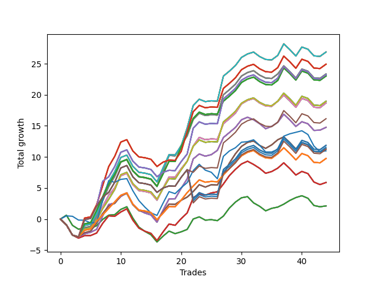

# Short Bulldog 003 
- Symbol: SPY_Unlimited
- Date Range: 03/23/2022 - 07/08/2022
- Trading Period: 7:20-12:30
- Number of Trades: 44



| Name | Win Percent | Profit | Avg Profit / Trade | Avg Time / Trade |      | Name | Win Percent | Profit | Avg Profit / Trade | Avg Time / Trade |
| ---- | ----------- | ------ | ------------------ | ---------------- | ---- | ---- | ----------- | ------ | ------------------ | ---------------- |
| Sorted By <br> Profit | | | | | | Sorted By <br> Win Percentage ||||
| Seventy-One | 56.82 | 13440.00 | 305.45 | 26:53 |     | Sixty-Six | 63.64 | 7380.00 | 167.73 | 18:58 |
| Sixty-Three | 56.82 | 13440.00 | 305.45 | 26:53 |     | Fifty-Eight | 63.64 | 7380.00 | 167.73 | 18:58 |
| Fifty-Five | 56.82 | 13440.00 | 305.45 | 26:53 |     | Fifty | 63.64 | 7380.00 | 167.73 | 18:58 |
| Forty-Seven | 56.82 | 13440.00 | 305.45 | 26:53 |     | Forty-Two | 63.64 | 7380.00 | 167.73 | 18:58 |
| Seven | 56.82 | 13440.00 | 305.45 | 26:53 |     | Two | 63.64 | 7380.00 | 167.73 | 18:58 |
| One Hundred Twenty-Eight | 56.82 | 12460.00 | 283.18 | 27:55 |     | Sixty-Four | 61.36 | 1060.00 | 24.09 | 11:18 |
| One Hundred Twenty-Three | 56.82 | 12460.00 | 283.18 | 27:55 |     | Fifty-Six | 61.36 | 1060.00 | 24.09 | 11:18 |
| One Hundred Eighteen | 56.82 | 12460.00 | 283.18 | 27:55 |     | Forty-Eight | 61.36 | 1060.00 | 24.09 | 11:18 |
| One Hundred Thirteen | 56.82 | 12460.00 | 283.18 | 27:55 |     | Forty | 61.36 | 1060.00 | 24.09 | 11:18 |
| Eighty-Three | 56.82 | 12460.00 | 283.18 | 27:55 |     | Zero | 61.36 | 1060.00 | 24.09 | 11:18 |
| Sixty-Nine | 56.82 | 11670.00 | 265.23 | 25:19 |     | Sixty-Seven | 59.09 | 5645.00 | 128.30 | 20:23 |
| Sixty-One | 56.82 | 11670.00 | 265.23 | 25:19 |     | Fifty-Nine | 59.09 | 5645.00 | 128.30 | 20:23 |
| Fifty-Three | 56.82 | 11670.00 | 265.23 | 25:19 |     | Fifty-One | 59.09 | 5645.00 | 128.30 | 20:23 |
| Forty-Five | 56.82 | 11670.00 | 265.23 | 25:19 |     | Forty-Three | 59.09 | 5645.00 | 128.30 | 20:23 |
| Five | 56.82 | 11670.00 | 265.23 | 25:19 |     | Three | 59.09 | 5645.00 | 128.30 | 20:23 |
| One Hundred Twenty-Nine | 56.82 | 11615.00 | 263.98 | 28:47 |     | Seventy-One | 56.82 | 13440.00 | 305.45 | 26:53 |
| One Hundred Twenty-Four | 56.82 | 11615.00 | 263.98 | 28:47 |     | Sixty-Three | 56.82 | 13440.00 | 305.45 | 26:53 |
| One Hundred Ninteen | 56.82 | 11615.00 | 263.98 | 28:47 |     | Fifty-Five | 56.82 | 13440.00 | 305.45 | 26:53 |
| One Hundred Fourteen | 56.82 | 11615.00 | 263.98 | 28:47 |     | Forty-Seven | 56.82 | 13440.00 | 305.45 | 26:53 |
| Eighty-Four | 56.82 | 11615.00 | 263.98 | 28:47 |     | Seven | 56.82 | 13440.00 | 305.45 | 26:53 |
| One Hundred Twenty-Seven | 56.82 | 11510.00 | 261.59 | 25:32 |     | One Hundred Twenty-Eight | 56.82 | 12460.00 | 283.18 | 27:55 |
| One Hundred Twenty-Two | 56.82 | 11510.00 | 261.59 | 25:32 |     | One Hundred Twenty-Three | 56.82 | 12460.00 | 283.18 | 27:55 |
| One Hundred Seventeen | 56.82 | 11510.00 | 261.59 | 25:32 |     | One Hundred Eighteen | 56.82 | 12460.00 | 283.18 | 27:55 |
| One Hundred Twelve | 56.82 | 11510.00 | 261.59 | 25:32 |     | One Hundred Thirteen | 56.82 | 12460.00 | 283.18 | 27:55 |
| Eighty-Two | 56.82 | 11510.00 | 261.59 | 25:32 |     | Eighty-Three | 56.82 | 12460.00 | 283.18 | 27:55 |
| Seventy | 56.82 | 9480.00 | 215.45 | 24:27 |     | Sixty-Nine | 56.82 | 11670.00 | 265.23 | 25:19 |
| Sixty-Two | 56.82 | 9480.00 | 215.45 | 24:27 |     | Sixty-One | 56.82 | 11670.00 | 265.23 | 25:19 |
| Fifty-Four | 56.82 | 9480.00 | 215.45 | 24:27 |     | Fifty-Three | 56.82 | 11670.00 | 265.23 | 25:19 |
| Forty-Six | 56.82 | 9480.00 | 215.45 | 24:27 |     | Forty-Five | 56.82 | 11670.00 | 265.23 | 25:19 |
| Six | 56.82 | 9480.00 | 215.45 | 24:27 |     | Five | 56.82 | 11670.00 | 265.23 | 25:19 |
| Sixty-Eight | 56.82 | 9340.00 | 212.27 | 23:35 |     | One Hundred Twenty-Nine | 56.82 | 11615.00 | 263.98 | 28:47 |
| Sixty | 56.82 | 9340.00 | 212.27 | 23:35 |     | One Hundred Twenty-Four | 56.82 | 11615.00 | 263.98 | 28:47 |
| Fifty-Two | 56.82 | 9340.00 | 212.27 | 23:35 |     | One Hundred Ninteen | 56.82 | 11615.00 | 263.98 | 28:47 |
| Forty-Four | 56.82 | 9340.00 | 212.27 | 23:35 |     | One Hundred Fourteen | 56.82 | 11615.00 | 263.98 | 28:47 |
| Four | 56.82 | 9340.00 | 212.27 | 23:35 |     | Eighty-Four | 56.82 | 11615.00 | 263.98 | 28:47 |
| One Hundred Twenty | 54.55 | 8075.00 | 183.52 | 29:30 |     | One Hundred Twenty-Seven | 56.82 | 11510.00 | 261.59 | 25:32 |
| Sixty-Six | 63.64 | 7380.00 | 167.73 | 18:58 |     | One Hundred Twenty-Two | 56.82 | 11510.00 | 261.59 | 25:32 |
| Fifty-Eight | 63.64 | 7380.00 | 167.73 | 18:58 |     | One Hundred Seventeen | 56.82 | 11510.00 | 261.59 | 25:32 |
| Fifty | 63.64 | 7380.00 | 167.73 | 18:58 |     | One Hundred Twelve | 56.82 | 11510.00 | 261.59 | 25:32 |
| Forty-Two | 63.64 | 7380.00 | 167.73 | 18:58 |     | Eighty-Two | 56.82 | 11510.00 | 261.59 | 25:32 |
| Two | 63.64 | 7380.00 | 167.73 | 18:58 |     | Seventy | 56.82 | 9480.00 | 215.45 | 24:27 |
| One Hundred Twenty-Five | 54.55 | 5935.00 | 134.89 | 29:52 |     | Sixty-Two | 56.82 | 9480.00 | 215.45 | 24:27 |
| Eighty-Five | 54.55 | 5935.00 | 134.89 | 29:52 |     | Fifty-Four | 56.82 | 9480.00 | 215.45 | 24:27 |
| One Hundred Fifteen | 54.55 | 5775.00 | 131.25 | 29:46 |     | Forty-Six | 56.82 | 9480.00 | 215.45 | 24:27 |
| Sixty-Seven | 59.09 | 5645.00 | 128.30 | 20:23 |     | Six | 56.82 | 9480.00 | 215.45 | 24:27 |
| Fifty-Nine | 59.09 | 5645.00 | 128.30 | 20:23 |     | Sixty-Eight | 56.82 | 9340.00 | 212.27 | 23:35 |
| Fifty-One | 59.09 | 5645.00 | 128.30 | 20:23 |     | Sixty | 56.82 | 9340.00 | 212.27 | 23:35 |
| Forty-Three | 59.09 | 5645.00 | 128.30 | 20:23 |     | Fifty-Two | 56.82 | 9340.00 | 212.27 | 23:35 |
| Three | 59.09 | 5645.00 | 128.30 | 20:23 |     | Forty-Four | 56.82 | 9340.00 | 212.27 | 23:35 |
| One Hundred Thirty | 54.55 | 5610.00 | 127.50 | 29:47 |     | Four | 56.82 | 9340.00 | 212.27 | 23:35 |
| Seventy-Three | 54.55 | 5490.00 | 124.77 | 13:12 |     | One Hundred Twenty-Six | 56.82 | 4875.00 | 110.80 | 21:04 |
| One Hundred Twenty-Six | 56.82 | 4875.00 | 110.80 | 21:04 |     | One Hundred Twenty-One | 56.82 | 4875.00 | 110.80 | 21:04 |
| One Hundred Twenty-One | 56.82 | 4875.00 | 110.80 | 21:04 |     | One Hundred Sixteen | 56.82 | 4875.00 | 110.80 | 21:04 |
| One Hundred Sixteen | 56.82 | 4875.00 | 110.80 | 21:04 |     | One Hundred Eleven | 56.82 | 4875.00 | 110.80 | 21:04 |
| One Hundred Eleven | 56.82 | 4875.00 | 110.80 | 21:04 |     | Eighty-One | 56.82 | 4875.00 | 110.80 | 21:04 |
| Eighty-One | 56.82 | 4875.00 | 110.80 | 21:04 |     | Sixty-Five | 56.82 | 2945.00 | 66.93 | 16:35 |
| Sixty-Five | 56.82 | 2945.00 | 66.93 | 16:35 |     | Fifty-Seven | 56.82 | 2945.00 | 66.93 | 16:35 |
| Fifty-Seven | 56.82 | 2945.00 | 66.93 | 16:35 |     | Forty-Nine | 56.82 | 2945.00 | 66.93 | 16:35 |
| Forty-Nine | 56.82 | 2945.00 | 66.93 | 16:35 |     | Forty-One | 56.82 | 2945.00 | 66.93 | 16:35 |
| Forty-One | 56.82 | 2945.00 | 66.93 | 16:35 |     | One | 56.82 | 2945.00 | 66.93 | 16:35 |
| One | 56.82 | 2945.00 | 66.93 | 16:35 |     | One Hundred Twenty | 54.55 | 8075.00 | 183.52 | 29:30 |
| Sixty-Four | 61.36 | 1060.00 | 24.09 | 11:18 |     | One Hundred Twenty-Five | 54.55 | 5935.00 | 134.89 | 29:52 |
| Fifty-Six | 61.36 | 1060.00 | 24.09 | 11:18 |     | Eighty-Five | 54.55 | 5935.00 | 134.89 | 29:52 |
| Forty-Eight | 61.36 | 1060.00 | 24.09 | 11:18 |     | One Hundred Fifteen | 54.55 | 5775.00 | 131.25 | 29:46 |
| Forty | 61.36 | 1060.00 | 24.09 | 11:18 |     | One Hundred Thirty | 54.55 | 5610.00 | 127.50 | 29:47 |
| Zero | 61.36 | 1060.00 | 24.09 | 11:18 |     | Seventy-Three | 54.55 | 5490.00 | 124.77 | 13:12 |

## NO STOPLOSS

### Test Zero
* Sell when price hits the middle line of the 20p bollinger
* No Stoploss
* Results:
```
Total Trades: 44
Percent Up: 38.64
Percent Down: 61.36
Total Points Moved Down: 2.12
Potential Profit: 1060.00
Total Points Ups: 13.20 Count Ups: 17
Total Points Downs: 15.32 Count Downs: 27
```

<details><summary>Trades</summary>

<code>In: 2022-03-24 08:08:00		Out: 2022-03-24 08:09:05		Total Position Time: 01:05		Total Move Down: 0.63		Total to Date: 0.63</code> <br />
<code>In: 2022-03-24 08:14:00		Out: 2022-03-24 08:43:55		Total Position Time: 29:55		Total Move Down: -1.64		Total to Date: -1.01</code> <br />
<code>In: 2022-03-25 07:26:00		Out: 2022-03-25 07:51:05		Total Position Time: 25:05		Total Move Down: -0.62		Total to Date: -1.63</code> <br />
<code>In: 2022-03-25 07:44:00		Out: 2022-03-25 07:51:05		Total Position Time: 07:05		Total Move Down: 0.25		Total to Date: -1.38</code> <br />
<code>In: 2022-03-31 07:48:00		Out: 2022-03-31 08:03:05		Total Position Time: 15:05		Total Move Down: -0.12		Total to Date: -1.50</code> <br />
<code>In: 2022-04-06 10:43:00		Out: 2022-04-06 10:47:10		Total Position Time: 04:10		Total Move Down: 0.44		Total to Date: -1.06</code> <br />
<code>In: 2022-04-06 11:04:00		Out: 2022-04-06 11:05:35		Total Position Time: 01:35		Total Move Down: 1.01		Total to Date: -0.05</code> <br />
<code>In: 2022-04-06 11:05:00		Out: 2022-04-06 11:05:35		Total Position Time: 00:35		Total Move Down: 0.68		Total to Date: 0.63</code> <br />
<code>In: 2022-04-06 11:57:00		Out: 2022-04-06 12:07:45		Total Position Time: 10:45		Total Move Down: 0.08		Total to Date: 0.71</code> <br />
<code>In: 2022-04-06 12:02:00		Out: 2022-04-06 12:07:45		Total Position Time: 05:45		Total Move Down: 0.85		Total to Date: 1.56</code> <br />
<code>In: 2022-04-07 11:03:00		Out: 2022-04-07 11:15:20		Total Position Time: 12:20		Total Move Down: 0.42		Total to Date: 1.98</code> <br />
<code>In: 2022-04-07 11:50:00		Out: 2022-04-07 12:19:10		Total Position Time: 29:10		Total Move Down: -1.82		Total to Date: 0.16</code> <br />
<code>In: 2022-04-07 11:54:00		Out: 2022-04-07 12:19:10		Total Position Time: 25:10		Total Move Down: -1.45		Total to Date: -1.29</code> <br />
<code>In: 2022-04-08 07:54:00		Out: 2022-04-08 08:15:35		Total Position Time: 21:35		Total Move Down: -0.69		Total to Date: -1.98</code> <br />
<code>In: 2022-04-08 07:57:00		Out: 2022-04-08 08:15:35		Total Position Time: 18:35		Total Move Down: -0.54		Total to Date: -2.52</code> <br />
<code>In: 2022-04-13 08:06:00		Out: 2022-04-13 08:35:55		Total Position Time: 29:55		Total Move Down: -1.16		Total to Date: -3.68</code> <br />
<code>In: 2022-05-03 07:34:00		Out: 2022-05-03 07:38:00		Total Position Time: 04:00		Total Move Down: 0.93		Total to Date: -2.75</code> <br />
<code>In: 2022-05-03 07:35:00		Out: 2022-05-03 07:38:00		Total Position Time: 03:00		Total Move Down: 0.82		Total to Date: -1.93</code> <br />
<code>In: 2022-05-03 08:10:00		Out: 2022-05-03 08:35:55		Total Position Time: 25:55		Total Move Down: -0.41		Total to Date: -2.34</code> <br />
<code>In: 2022-05-04 11:03:00		Out: 2022-05-04 11:03:10		Total Position Time: 00:10		Total Move Down: 0.29		Total to Date: -2.05</code> <br />
<code>In: 2022-05-04 11:07:00		Out: 2022-05-04 11:07:10		Total Position Time: 00:10		Total Move Down: 0.39		Total to Date: -1.66</code> <br />
<code>In: 2022-05-04 11:30:00		Out: 2022-05-04 11:30:45		Total Position Time: 00:45		Total Move Down: 1.67		Total to Date: 0.01</code> <br />
<code>In: 2022-05-16 09:05:00		Out: 2022-05-16 09:05:45		Total Position Time: 00:45		Total Move Down: 0.35		Total to Date: 0.36</code> <br />
<code>In: 2022-05-16 10:25:00		Out: 2022-05-16 10:42:15		Total Position Time: 17:15		Total Move Down: -0.53		Total to Date: -0.17</code> <br />
<code>In: 2022-05-16 10:30:00		Out: 2022-05-16 10:42:15		Total Position Time: 12:15		Total Move Down: 0.08		Total to Date: -0.09</code> <br />
<code>In: 2022-05-19 08:40:00		Out: 2022-05-19 08:53:40		Total Position Time: 13:40		Total Move Down: -0.16		Total to Date: -0.25</code> <br />
<code>In: 2022-05-19 12:05:00		Out: 2022-05-19 12:09:40		Total Position Time: 04:40		Total Move Down: 0.73		Total to Date: 0.48</code> <br />
<code>In: 2022-05-24 11:13:00		Out: 2022-05-24 11:18:25		Total Position Time: 05:25		Total Move Down: 1.31		Total to Date: 1.79</code> <br />
<code>In: 2022-05-24 11:14:00		Out: 2022-05-24 11:18:25		Total Position Time: 04:25		Total Move Down: 0.95		Total to Date: 2.74</code> <br />
<code>In: 2022-05-25 07:36:00		Out: 2022-05-25 07:42:00		Total Position Time: 06:00		Total Move Down: 0.69		Total to Date: 3.43</code> <br />
<code>In: 2022-05-25 12:05:00		Out: 2022-05-25 12:17:30		Total Position Time: 12:30		Total Move Down: 0.18		Total to Date: 3.61</code> <br />
<code>In: 2022-05-31 08:53:00		Out: 2022-05-31 09:13:05		Total Position Time: 20:05		Total Move Down: -1.00		Total to Date: 2.61</code> <br />
<code>In: 2022-06-02 08:05:00		Out: 2022-06-02 08:22:05		Total Position Time: 17:05		Total Move Down: -0.55		Total to Date: 2.06</code> <br />
<code>In: 2022-06-02 08:06:00		Out: 2022-06-02 08:22:05		Total Position Time: 16:05		Total Move Down: -0.73		Total to Date: 1.33</code> <br />
<code>In: 2022-06-23 07:42:00		Out: 2022-06-23 07:51:10		Total Position Time: 09:10		Total Move Down: 0.40		Total to Date: 1.73</code> <br />
<code>In: 2022-06-23 07:58:00		Out: 2022-06-23 08:00:05		Total Position Time: 02:05		Total Move Down: 0.20		Total to Date: 1.93</code> <br />
<code>In: 2022-06-23 08:15:00		Out: 2022-06-23 08:21:05		Total Position Time: 06:05		Total Move Down: 0.47		Total to Date: 2.40</code> <br />
<code>In: 2022-06-30 08:29:00		Out: 2022-06-30 08:35:00		Total Position Time: 06:00		Total Move Down: 0.60		Total to Date: 3.00</code> <br />
<code>In: 2022-06-30 08:30:00		Out: 2022-06-30 08:35:00		Total Position Time: 05:00		Total Move Down: 0.46		Total to Date: 3.46</code> <br />
<code>In: 2022-07-05 09:27:00		Out: 2022-07-05 09:40:10		Total Position Time: 13:10		Total Move Down: 0.30		Total to Date: 3.76</code> <br />
<code>In: 2022-07-05 11:34:00		Out: 2022-07-05 11:48:10		Total Position Time: 14:10		Total Move Down: -0.41		Total to Date: 3.35</code> <br />
<code>In: 2022-07-06 11:31:00		Out: 2022-07-06 11:50:00		Total Position Time: 19:00		Total Move Down: -1.16		Total to Date: 2.19</code> <br />
<code>In: 2022-07-06 11:35:00		Out: 2022-07-06 11:50:00		Total Position Time: 15:00		Total Move Down: -0.21		Total to Date: 1.98</code> <br />
<code>In: 2022-07-07 12:18:00		Out: 2022-07-07 12:24:15		Total Position Time: 06:15		Total Move Down: 0.14		Total to Date: 2.12</code> <br />


</details>

### Test One
* Sell when the price hits the upper line of the 20p 1std bollinger
* No Stoploss
* Results:
```
Total Trades: 44
Percent Up: 43.18
Percent Down: 56.82
Total Points Moved Down: 5.89
Potential Profit: 2945.00
Total Points Ups: 14.72 Count Ups: 19
Total Points Downs: 20.61 Count Downs: 25
```

<details><summary>Trades</summary>

<code>In: 2022-03-24 08:08:00		Out: 2022-03-24 08:37:55		Total Position Time: 29:55		Total Move Down: -0.94		Total to Date: -0.94</code> <br />
<code>In: 2022-03-24 08:14:00		Out: 2022-03-24 08:43:55		Total Position Time: 29:55		Total Move Down: -1.64		Total to Date: -2.58</code> <br />
<code>In: 2022-03-25 07:26:00		Out: 2022-03-25 07:53:50		Total Position Time: 27:50		Total Move Down: -0.48		Total to Date: -3.06</code> <br />
<code>In: 2022-03-25 07:44:00		Out: 2022-03-25 07:53:50		Total Position Time: 09:50		Total Move Down: 0.39		Total to Date: -2.67</code> <br />
<code>In: 2022-03-31 07:48:00		Out: 2022-03-31 08:08:00		Total Position Time: 20:00		Total Move Down: 0.02		Total to Date: -2.65</code> <br />
<code>In: 2022-04-06 10:43:00		Out: 2022-04-06 10:56:55		Total Position Time: 13:55		Total Move Down: 0.41		Total to Date: -2.24</code> <br />
<code>In: 2022-04-06 11:04:00		Out: 2022-04-06 11:07:20		Total Position Time: 03:20		Total Move Down: 1.55		Total to Date: -0.69</code> <br />
<code>In: 2022-04-06 11:05:00		Out: 2022-04-06 11:07:20		Total Position Time: 02:20		Total Move Down: 1.22		Total to Date: 0.53</code> <br />
<code>In: 2022-04-06 11:57:00		Out: 2022-04-06 12:17:05		Total Position Time: 20:05		Total Move Down: -0.08		Total to Date: 0.45</code> <br />
<code>In: 2022-04-06 12:02:00		Out: 2022-04-06 12:17:05		Total Position Time: 15:05		Total Move Down: 0.69		Total to Date: 1.14</code> <br />
<code>In: 2022-04-07 11:03:00		Out: 2022-04-07 11:18:00		Total Position Time: 15:00		Total Move Down: 0.51		Total to Date: 1.65</code> <br />
<code>In: 2022-04-07 11:50:00		Out: 2022-04-07 12:19:55		Total Position Time: 29:55		Total Move Down: -1.82		Total to Date: -0.17</code> <br />
<code>In: 2022-04-07 11:54:00		Out: 2022-04-07 12:20:35		Total Position Time: 26:35		Total Move Down: -1.28		Total to Date: -1.45</code> <br />
<code>In: 2022-04-08 07:54:00		Out: 2022-04-08 08:17:05		Total Position Time: 23:05		Total Move Down: -0.50		Total to Date: -1.95</code> <br />
<code>In: 2022-04-08 07:57:00		Out: 2022-04-08 08:17:05		Total Position Time: 20:05		Total Move Down: -0.35		Total to Date: -2.30</code> <br />
<code>In: 2022-04-13 08:06:00		Out: 2022-04-13 08:35:55		Total Position Time: 29:55		Total Move Down: -1.16		Total to Date: -3.46</code> <br />
<code>In: 2022-05-03 07:34:00		Out: 2022-05-03 07:40:55		Total Position Time: 06:55		Total Move Down: 1.39		Total to Date: -2.07</code> <br />
<code>In: 2022-05-03 07:35:00		Out: 2022-05-03 07:40:55		Total Position Time: 05:55		Total Move Down: 1.28		Total to Date: -0.79</code> <br />
<code>In: 2022-05-03 08:10:00		Out: 2022-05-03 08:38:05		Total Position Time: 28:05		Total Move Down: -0.21		Total to Date: -1.00</code> <br />
<code>In: 2022-05-04 11:03:00		Out: 2022-05-04 11:07:20		Total Position Time: 04:20		Total Move Down: 1.06		Total to Date: 0.06</code> <br />
<code>In: 2022-05-04 11:07:00		Out: 2022-05-04 11:07:20		Total Position Time: 00:20		Total Move Down: 0.93		Total to Date: 0.99</code> <br />
<code>In: 2022-05-04 11:30:00		Out: 2022-05-04 11:30:50		Total Position Time: 00:50		Total Move Down: 2.43		Total to Date: 3.42</code> <br />
<code>In: 2022-05-16 09:05:00		Out: 2022-05-16 09:06:15		Total Position Time: 01:15		Total Move Down: 0.66		Total to Date: 4.08</code> <br />
<code>In: 2022-05-16 10:25:00		Out: 2022-05-16 10:42:35		Total Position Time: 17:35		Total Move Down: -0.24		Total to Date: 3.84</code> <br />
<code>In: 2022-05-16 10:30:00		Out: 2022-05-16 10:42:35		Total Position Time: 12:35		Total Move Down: 0.37		Total to Date: 4.21</code> <br />
<code>In: 2022-05-19 08:40:00		Out: 2022-05-19 08:54:45		Total Position Time: 14:45		Total Move Down: 0.18		Total to Date: 4.39</code> <br />
<code>In: 2022-05-19 12:05:00		Out: 2022-05-19 12:10:10		Total Position Time: 05:10		Total Move Down: 1.26		Total to Date: 5.65</code> <br />
<code>In: 2022-05-24 11:13:00		Out: 2022-05-24 11:31:25		Total Position Time: 18:25		Total Move Down: 1.36		Total to Date: 7.01</code> <br />
<code>In: 2022-05-24 11:14:00		Out: 2022-05-24 11:31:25		Total Position Time: 17:25		Total Move Down: 1.00		Total to Date: 8.01</code> <br />
<code>In: 2022-05-25 07:36:00		Out: 2022-05-25 07:46:40		Total Position Time: 10:40		Total Move Down: 0.86		Total to Date: 8.87</code> <br />
<code>In: 2022-05-25 12:05:00		Out: 2022-05-25 12:20:25		Total Position Time: 15:25		Total Move Down: 0.44		Total to Date: 9.31</code> <br />
<code>In: 2022-05-31 08:53:00		Out: 2022-05-31 09:14:40		Total Position Time: 21:40		Total Move Down: -0.52		Total to Date: 8.79</code> <br />
<code>In: 2022-06-02 08:05:00		Out: 2022-06-02 08:28:15		Total Position Time: 23:15		Total Move Down: -0.62		Total to Date: 8.17</code> <br />
<code>In: 2022-06-02 08:06:00		Out: 2022-06-02 08:28:15		Total Position Time: 22:15		Total Move Down: -0.80		Total to Date: 7.37</code> <br />
<code>In: 2022-06-23 07:42:00		Out: 2022-06-23 08:01:10		Total Position Time: 19:10		Total Move Down: 0.28		Total to Date: 7.65</code> <br />
<code>In: 2022-06-23 07:58:00		Out: 2022-06-23 08:01:10		Total Position Time: 03:10		Total Move Down: 0.54		Total to Date: 8.19</code> <br />
<code>In: 2022-06-23 08:15:00		Out: 2022-06-23 08:23:30		Total Position Time: 08:30		Total Move Down: 0.86		Total to Date: 9.05</code> <br />
<code>In: 2022-06-30 08:29:00		Out: 2022-06-30 08:58:55		Total Position Time: 29:55		Total Move Down: -0.92		Total to Date: 8.13</code> <br />
<code>In: 2022-06-30 08:30:00		Out: 2022-06-30 08:59:55		Total Position Time: 29:55		Total Move Down: -1.04		Total to Date: 7.09</code> <br />
<code>In: 2022-07-05 09:27:00		Out: 2022-07-05 09:42:00		Total Position Time: 15:00		Total Move Down: 0.58		Total to Date: 7.67</code> <br />
<code>In: 2022-07-05 11:34:00		Out: 2022-07-05 11:52:50		Total Position Time: 18:50		Total Move Down: -0.35		Total to Date: 7.32</code> <br />
<code>In: 2022-07-06 11:31:00		Out: 2022-07-06 12:00:30		Total Position Time: 29:30		Total Move Down: -1.36		Total to Date: 5.96</code> <br />
<code>In: 2022-07-06 11:35:00		Out: 2022-07-06 12:00:30		Total Position Time: 25:30		Total Move Down: -0.41		Total to Date: 5.55</code> <br />
<code>In: 2022-07-07 12:18:00		Out: 2022-07-07 12:25:10		Total Position Time: 07:10		Total Move Down: 0.34		Total to Date: 5.89</code> <br />


</details>

### Test Two
* Sell when the price hits the upper line of the 20p 2std bollinger
* No Stoploss
* Results:
```
Total Trades: 44
Percent Up: 36.36
Percent Down: 63.64
Total Points Moved Down: 14.76
Potential Profit: 7380.00
Total Points Ups: 13.21 Count Ups: 16
Total Points Downs: 27.97 Count Downs: 28
```

<details><summary>Trades</summary>

<code>In: 2022-03-24 08:08:00		Out: 2022-03-24 08:37:55		Total Position Time: 29:55		Total Move Down: -0.94		Total to Date: -0.94</code> <br />
<code>In: 2022-03-24 08:14:00		Out: 2022-03-24 08:43:55		Total Position Time: 29:55		Total Move Down: -1.64		Total to Date: -2.58</code> <br />
<code>In: 2022-03-25 07:26:00		Out: 2022-03-25 07:54:10		Total Position Time: 28:10		Total Move Down: -0.33		Total to Date: -2.91</code> <br />
<code>In: 2022-03-25 07:44:00		Out: 2022-03-25 07:54:10		Total Position Time: 10:10		Total Move Down: 0.54		Total to Date: -2.37</code> <br />
<code>In: 2022-03-31 07:48:00		Out: 2022-03-31 08:08:30		Total Position Time: 20:30		Total Move Down: 0.24		Total to Date: -2.13</code> <br />
<code>In: 2022-04-06 10:43:00		Out: 2022-04-06 10:57:20		Total Position Time: 14:20		Total Move Down: 0.48		Total to Date: -1.65</code> <br />
<code>In: 2022-04-06 11:04:00		Out: 2022-04-06 11:08:10		Total Position Time: 04:10		Total Move Down: 2.16		Total to Date: 0.51</code> <br />
<code>In: 2022-04-06 11:05:00		Out: 2022-04-06 11:08:10		Total Position Time: 03:10		Total Move Down: 1.83		Total to Date: 2.34</code> <br />
<code>In: 2022-04-06 11:57:00		Out: 2022-04-06 12:19:50		Total Position Time: 22:50		Total Move Down: 0.26		Total to Date: 2.60</code> <br />
<code>In: 2022-04-06 12:02:00		Out: 2022-04-06 12:19:50		Total Position Time: 17:50		Total Move Down: 1.03		Total to Date: 3.63</code> <br />
<code>In: 2022-04-07 11:03:00		Out: 2022-04-07 11:18:20		Total Position Time: 15:20		Total Move Down: 0.61		Total to Date: 4.24</code> <br />
<code>In: 2022-04-07 11:50:00		Out: 2022-04-07 12:19:55		Total Position Time: 29:55		Total Move Down: -1.82		Total to Date: 2.42</code> <br />
<code>In: 2022-04-07 11:54:00		Out: 2022-04-07 12:21:20		Total Position Time: 27:20		Total Move Down: -0.99		Total to Date: 1.43</code> <br />
<code>In: 2022-04-08 07:54:00		Out: 2022-04-08 08:20:10		Total Position Time: 26:10		Total Move Down: -0.46		Total to Date: 0.97</code> <br />
<code>In: 2022-04-08 07:57:00		Out: 2022-04-08 08:20:10		Total Position Time: 23:10		Total Move Down: -0.31		Total to Date: 0.66</code> <br />
<code>In: 2022-04-13 08:06:00		Out: 2022-04-13 08:35:55		Total Position Time: 29:55		Total Move Down: -1.16		Total to Date: -0.50</code> <br />
<code>In: 2022-05-03 07:34:00		Out: 2022-05-03 07:43:50		Total Position Time: 09:50		Total Move Down: 1.93		Total to Date: 1.43</code> <br />
<code>In: 2022-05-03 07:35:00		Out: 2022-05-03 07:43:50		Total Position Time: 08:50		Total Move Down: 1.82		Total to Date: 3.25</code> <br />
<code>In: 2022-05-03 08:10:00		Out: 2022-05-03 08:39:05		Total Position Time: 29:05		Total Move Down: 0.02		Total to Date: 3.27</code> <br />
<code>In: 2022-05-04 11:03:00		Out: 2022-05-04 11:07:40		Total Position Time: 04:40		Total Move Down: 1.67		Total to Date: 4.94</code> <br />
<code>In: 2022-05-04 11:07:00		Out: 2022-05-04 11:07:40		Total Position Time: 00:40		Total Move Down: 1.54		Total to Date: 6.48</code> <br />
<code>In: 2022-05-04 11:30:00		Out: 2022-05-04 11:32:25		Total Position Time: 02:25		Total Move Down: 3.20		Total to Date: 9.68</code> <br />
<code>In: 2022-05-16 09:05:00		Out: 2022-05-16 09:11:35		Total Position Time: 06:35		Total Move Down: 0.80		Total to Date: 10.48</code> <br />
<code>In: 2022-05-16 10:25:00		Out: 2022-05-16 10:46:35		Total Position Time: 21:35		Total Move Down: -0.36		Total to Date: 10.12</code> <br />
<code>In: 2022-05-16 10:30:00		Out: 2022-05-16 10:46:35		Total Position Time: 16:35		Total Move Down: 0.25		Total to Date: 10.37</code> <br />
<code>In: 2022-05-19 08:40:00		Out: 2022-05-19 08:56:05		Total Position Time: 16:05		Total Move Down: 0.68		Total to Date: 11.05</code> <br />
<code>In: 2022-05-19 12:05:00		Out: 2022-05-19 12:14:05		Total Position Time: 09:05		Total Move Down: 2.07		Total to Date: 13.12</code> <br />
<code>In: 2022-05-24 11:13:00		Out: 2022-05-24 11:42:55		Total Position Time: 29:55		Total Move Down: 0.81		Total to Date: 13.93</code> <br />
<code>In: 2022-05-24 11:14:00		Out: 2022-05-24 11:43:50		Total Position Time: 29:50		Total Move Down: 0.82		Total to Date: 14.75</code> <br />
<code>In: 2022-05-25 07:36:00		Out: 2022-05-25 07:48:10		Total Position Time: 12:10		Total Move Down: 1.23		Total to Date: 15.98</code> <br />
<code>In: 2022-05-25 12:05:00		Out: 2022-05-25 12:22:50		Total Position Time: 17:50		Total Move Down: 0.41		Total to Date: 16.39</code> <br />
<code>In: 2022-05-31 08:53:00		Out: 2022-05-31 09:15:05		Total Position Time: 22:05		Total Move Down: -0.41		Total to Date: 15.98</code> <br />
<code>In: 2022-06-02 08:05:00		Out: 2022-06-02 08:30:55		Total Position Time: 25:55		Total Move Down: -0.63		Total to Date: 15.35</code> <br />
<code>In: 2022-06-02 08:06:00		Out: 2022-06-02 08:30:55		Total Position Time: 24:55		Total Move Down: -0.81		Total to Date: 14.54</code> <br />
<code>In: 2022-06-23 07:42:00		Out: 2022-06-23 08:04:15		Total Position Time: 22:15		Total Move Down: 0.38		Total to Date: 14.92</code> <br />
<code>In: 2022-06-23 07:58:00		Out: 2022-06-23 08:04:15		Total Position Time: 06:15		Total Move Down: 0.64		Total to Date: 15.56</code> <br />
<code>In: 2022-06-23 08:15:00		Out: 2022-06-23 08:31:10		Total Position Time: 16:10		Total Move Down: 1.31		Total to Date: 16.87</code> <br />
<code>In: 2022-06-30 08:29:00		Out: 2022-06-30 08:58:55		Total Position Time: 29:55		Total Move Down: -0.92		Total to Date: 15.95</code> <br />
<code>In: 2022-06-30 08:30:00		Out: 2022-06-30 08:59:55		Total Position Time: 29:55		Total Move Down: -1.04		Total to Date: 14.91</code> <br />
<code>In: 2022-07-05 09:27:00		Out: 2022-07-05 09:42:35		Total Position Time: 15:35		Total Move Down: 0.75		Total to Date: 15.66</code> <br />
<code>In: 2022-07-05 11:34:00		Out: 2022-07-05 12:01:20		Total Position Time: 27:20		Total Move Down: -0.32		Total to Date: 15.34</code> <br />
<code>In: 2022-07-06 11:31:00		Out: 2022-07-06 12:00:55		Total Position Time: 29:55		Total Move Down: -1.07		Total to Date: 14.27</code> <br />
<code>In: 2022-07-06 11:35:00		Out: 2022-07-06 12:01:25		Total Position Time: 26:25		Total Move Down: 0.04		Total to Date: 14.31</code> <br />
<code>In: 2022-07-07 12:18:00		Out: 2022-07-07 12:28:30		Total Position Time: 10:30		Total Move Down: 0.45		Total to Date: 14.76</code> <br />


</details>

### Test Three
* Sell when price hits the middle line of the 50p bollinger
* No Stoploss
* Results:
```
Total Trades: 44
Percent Up: 40.91
Percent Down: 59.09
Total Points Moved Down: 11.29
Potential Profit: 5645.00
Total Points Ups: 12.32 Count Ups: 18
Total Points Downs: 23.61 Count Downs: 26
```

<details><summary>Trades</summary>

<code>In: 2022-03-24 08:08:00		Out: 2022-03-24 08:37:55		Total Position Time: 29:55		Total Move Down: -0.94		Total to Date: -0.94</code> <br />
<code>In: 2022-03-24 08:14:00		Out: 2022-03-24 08:43:55		Total Position Time: 29:55		Total Move Down: -1.64		Total to Date: -2.58</code> <br />
<code>In: 2022-03-25 07:26:00		Out: 2022-03-25 07:55:55		Total Position Time: 29:55		Total Move Down: -0.28		Total to Date: -2.86</code> <br />
<code>In: 2022-03-25 07:44:00		Out: 2022-03-25 08:00:30		Total Position Time: 16:30		Total Move Down: 0.66		Total to Date: -2.20</code> <br />
<code>In: 2022-03-31 07:48:00		Out: 2022-03-31 08:15:40		Total Position Time: 27:40		Total Move Down: 0.26		Total to Date: -1.94</code> <br />
<code>In: 2022-04-06 10:43:00		Out: 2022-04-06 11:00:10		Total Position Time: 17:10		Total Move Down: 1.28		Total to Date: -0.66</code> <br />
<code>In: 2022-04-06 11:04:00		Out: 2022-04-06 11:07:20		Total Position Time: 03:20		Total Move Down: 1.55		Total to Date: 0.89</code> <br />
<code>In: 2022-04-06 11:05:00		Out: 2022-04-06 11:07:20		Total Position Time: 02:20		Total Move Down: 1.22		Total to Date: 2.11</code> <br />
<code>In: 2022-04-06 11:57:00		Out: 2022-04-06 12:20:15		Total Position Time: 23:15		Total Move Down: 0.43		Total to Date: 2.54</code> <br />
<code>In: 2022-04-06 12:02:00		Out: 2022-04-06 12:20:15		Total Position Time: 18:15		Total Move Down: 1.20		Total to Date: 3.74</code> <br />
<code>In: 2022-04-07 11:03:00		Out: 2022-04-07 11:32:55		Total Position Time: 29:55		Total Move Down: 0.39		Total to Date: 4.13</code> <br />
<code>In: 2022-04-07 11:50:00		Out: 2022-04-07 12:19:55		Total Position Time: 29:55		Total Move Down: -1.82		Total to Date: 2.31</code> <br />
<code>In: 2022-04-07 11:54:00		Out: 2022-04-07 12:23:55		Total Position Time: 29:55		Total Move Down: -0.95		Total to Date: 1.36</code> <br />
<code>In: 2022-04-08 07:54:00		Out: 2022-04-08 08:23:55		Total Position Time: 29:55		Total Move Down: -0.14		Total to Date: 1.22</code> <br />
<code>In: 2022-04-08 07:57:00		Out: 2022-04-08 08:26:55		Total Position Time: 29:55		Total Move Down: -0.25		Total to Date: 0.97</code> <br />
<code>In: 2022-04-13 08:06:00		Out: 2022-04-13 08:35:55		Total Position Time: 29:55		Total Move Down: -1.16		Total to Date: -0.19</code> <br />
<code>In: 2022-05-03 07:34:00		Out: 2022-05-03 07:40:40		Total Position Time: 06:40		Total Move Down: 1.36		Total to Date: 1.17</code> <br />
<code>In: 2022-05-03 07:35:00		Out: 2022-05-03 07:40:40		Total Position Time: 05:40		Total Move Down: 1.25		Total to Date: 2.42</code> <br />
<code>In: 2022-05-03 08:10:00		Out: 2022-05-03 08:39:55		Total Position Time: 29:55		Total Move Down: -0.05		Total to Date: 2.37</code> <br />
<code>In: 2022-05-04 11:03:00		Out: 2022-05-04 11:07:15		Total Position Time: 04:15		Total Move Down: 0.65		Total to Date: 3.02</code> <br />
<code>In: 2022-05-04 11:07:00		Out: 2022-05-04 11:07:15		Total Position Time: 00:15		Total Move Down: 0.52		Total to Date: 3.54</code> <br />
<code>In: 2022-05-04 11:30:00		Out: 2022-05-04 11:30:40		Total Position Time: 00:40		Total Move Down: 0.89		Total to Date: 4.43</code> <br />
<code>In: 2022-05-16 09:05:00		Out: 2022-05-16 09:15:30		Total Position Time: 10:30		Total Move Down: 1.10		Total to Date: 5.53</code> <br />
<code>In: 2022-05-16 10:25:00		Out: 2022-05-16 10:54:55		Total Position Time: 29:55		Total Move Down: -0.38		Total to Date: 5.15</code> <br />
<code>In: 2022-05-16 10:30:00		Out: 2022-05-16 10:59:10		Total Position Time: 29:10		Total Move Down: 0.38		Total to Date: 5.53</code> <br />
<code>In: 2022-05-19 08:40:00		Out: 2022-05-19 09:09:55		Total Position Time: 29:55		Total Move Down: -0.06		Total to Date: 5.47</code> <br />
<code>In: 2022-05-19 12:05:00		Out: 2022-05-19 12:13:40		Total Position Time: 08:40		Total Move Down: 1.69		Total to Date: 7.16</code> <br />
<code>In: 2022-05-24 11:13:00		Out: 2022-05-24 11:20:25		Total Position Time: 07:25		Total Move Down: 1.86		Total to Date: 9.02</code> <br />
<code>In: 2022-05-24 11:14:00		Out: 2022-05-24 11:20:25		Total Position Time: 06:25		Total Move Down: 1.50		Total to Date: 10.52</code> <br />
<code>In: 2022-05-25 07:36:00		Out: 2022-05-25 07:57:20		Total Position Time: 21:20		Total Move Down: 1.18		Total to Date: 11.70</code> <br />
<code>In: 2022-05-25 12:05:00		Out: 2022-05-25 12:34:20		Total Position Time: 29:20		Total Move Down: 0.64		Total to Date: 12.34</code> <br />
<code>In: 2022-05-31 08:53:00		Out: 2022-05-31 09:19:05		Total Position Time: 26:05		Total Move Down: 0.23		Total to Date: 12.57</code> <br />
<code>In: 2022-06-02 08:05:00		Out: 2022-06-02 08:34:55		Total Position Time: 29:55		Total Move Down: -0.72		Total to Date: 11.85</code> <br />
<code>In: 2022-06-02 08:06:00		Out: 2022-06-02 08:35:55		Total Position Time: 29:55		Total Move Down: -0.47		Total to Date: 11.38</code> <br />
<code>In: 2022-06-23 07:42:00		Out: 2022-06-23 08:04:35		Total Position Time: 22:35		Total Move Down: 0.56		Total to Date: 11.94</code> <br />
<code>In: 2022-06-23 07:58:00		Out: 2022-06-23 08:04:35		Total Position Time: 06:35		Total Move Down: 0.82		Total to Date: 12.76</code> <br />
<code>In: 2022-06-23 08:15:00		Out: 2022-06-23 08:21:05		Total Position Time: 06:05		Total Move Down: 0.47		Total to Date: 13.23</code> <br />
<code>In: 2022-06-30 08:29:00		Out: 2022-06-30 08:58:55		Total Position Time: 29:55		Total Move Down: -0.92		Total to Date: 12.31</code> <br />
<code>In: 2022-06-30 08:30:00		Out: 2022-06-30 08:59:55		Total Position Time: 29:55		Total Move Down: -1.04		Total to Date: 11.27</code> <br />
<code>In: 2022-07-05 09:27:00		Out: 2022-07-05 09:43:40		Total Position Time: 16:40		Total Move Down: 1.03		Total to Date: 12.30</code> <br />
<code>In: 2022-07-05 11:34:00		Out: 2022-07-05 12:03:55		Total Position Time: 29:55		Total Move Down: -0.35		Total to Date: 11.95</code> <br />
<code>In: 2022-07-06 11:31:00		Out: 2022-07-06 12:00:55		Total Position Time: 29:55		Total Move Down: -1.07		Total to Date: 10.88</code> <br />
<code>In: 2022-07-06 11:35:00		Out: 2022-07-06 12:04:55		Total Position Time: 29:55		Total Move Down: -0.08		Total to Date: 10.80</code> <br />
<code>In: 2022-07-07 12:18:00		Out: 2022-07-07 12:30:00		Total Position Time: 12:00		Total Move Down: 0.49		Total to Date: 11.29</code> <br />


</details>

### Test Four
* Sell when the price hits the upper line of the 50p 1std bollinger
* No Stoploss
* Results:
```
Total Trades: 44
Percent Up: 43.18
Percent Down: 56.82
Total Points Moved Down: 18.68
Potential Profit: 9340.00
Total Points Ups: 12.39 Count Ups: 19
Total Points Downs: 31.07 Count Downs: 25
```

<details><summary>Trades</summary>

<code>In: 2022-03-24 08:08:00		Out: 2022-03-24 08:37:55		Total Position Time: 29:55		Total Move Down: -0.94		Total to Date: -0.94</code> <br />
<code>In: 2022-03-24 08:14:00		Out: 2022-03-24 08:43:55		Total Position Time: 29:55		Total Move Down: -1.64		Total to Date: -2.58</code> <br />
<code>In: 2022-03-25 07:26:00		Out: 2022-03-25 07:55:55		Total Position Time: 29:55		Total Move Down: -0.28		Total to Date: -2.86</code> <br />
<code>In: 2022-03-25 07:44:00		Out: 2022-03-25 08:01:45		Total Position Time: 17:45		Total Move Down: 1.23		Total to Date: -1.63</code> <br />
<code>In: 2022-03-31 07:48:00		Out: 2022-03-31 08:17:55		Total Position Time: 29:55		Total Move Down: 0.20		Total to Date: -1.43</code> <br />
<code>In: 2022-04-06 10:43:00		Out: 2022-04-06 11:00:10		Total Position Time: 17:10		Total Move Down: 1.28		Total to Date: -0.15</code> <br />
<code>In: 2022-04-06 11:04:00		Out: 2022-04-06 11:08:10		Total Position Time: 04:10		Total Move Down: 2.16		Total to Date: 2.01</code> <br />
<code>In: 2022-04-06 11:05:00		Out: 2022-04-06 11:08:10		Total Position Time: 03:10		Total Move Down: 1.83		Total to Date: 3.84</code> <br />
<code>In: 2022-04-06 11:57:00		Out: 2022-04-06 12:23:15		Total Position Time: 26:15		Total Move Down: 1.18		Total to Date: 5.02</code> <br />
<code>In: 2022-04-06 12:02:00		Out: 2022-04-06 12:23:15		Total Position Time: 21:15		Total Move Down: 1.95		Total to Date: 6.97</code> <br />
<code>In: 2022-04-07 11:03:00		Out: 2022-04-07 11:32:55		Total Position Time: 29:55		Total Move Down: 0.39		Total to Date: 7.36</code> <br />
<code>In: 2022-04-07 11:50:00		Out: 2022-04-07 12:19:55		Total Position Time: 29:55		Total Move Down: -1.82		Total to Date: 5.54</code> <br />
<code>In: 2022-04-07 11:54:00		Out: 2022-04-07 12:23:55		Total Position Time: 29:55		Total Move Down: -0.95		Total to Date: 4.59</code> <br />
<code>In: 2022-04-08 07:54:00		Out: 2022-04-08 08:23:55		Total Position Time: 29:55		Total Move Down: -0.14		Total to Date: 4.45</code> <br />
<code>In: 2022-04-08 07:57:00		Out: 2022-04-08 08:26:55		Total Position Time: 29:55		Total Move Down: -0.25		Total to Date: 4.20</code> <br />
<code>In: 2022-04-13 08:06:00		Out: 2022-04-13 08:35:55		Total Position Time: 29:55		Total Move Down: -1.16		Total to Date: 3.04</code> <br />
<code>In: 2022-05-03 07:34:00		Out: 2022-05-03 07:43:50		Total Position Time: 09:50		Total Move Down: 1.93		Total to Date: 4.97</code> <br />
<code>In: 2022-05-03 07:35:00		Out: 2022-05-03 07:43:50		Total Position Time: 08:50		Total Move Down: 1.82		Total to Date: 6.79</code> <br />
<code>In: 2022-05-03 08:10:00		Out: 2022-05-03 08:39:55		Total Position Time: 29:55		Total Move Down: -0.05		Total to Date: 6.74</code> <br />
<code>In: 2022-05-04 11:03:00		Out: 2022-05-04 11:07:25		Total Position Time: 04:25		Total Move Down: 1.35		Total to Date: 8.09</code> <br />
<code>In: 2022-05-04 11:07:00		Out: 2022-05-04 11:07:25		Total Position Time: 00:25		Total Move Down: 1.22		Total to Date: 9.31</code> <br />
<code>In: 2022-05-04 11:30:00		Out: 2022-05-04 11:30:50		Total Position Time: 00:50		Total Move Down: 2.43		Total to Date: 11.74</code> <br />
<code>In: 2022-05-16 09:05:00		Out: 2022-05-16 09:30:55		Total Position Time: 25:55		Total Move Down: 1.41		Total to Date: 13.15</code> <br />
<code>In: 2022-05-16 10:25:00		Out: 2022-05-16 10:54:55		Total Position Time: 29:55		Total Move Down: -0.38		Total to Date: 12.77</code> <br />
<code>In: 2022-05-16 10:30:00		Out: 2022-05-16 10:59:55		Total Position Time: 29:55		Total Move Down: 0.13		Total to Date: 12.90</code> <br />
<code>In: 2022-05-19 08:40:00		Out: 2022-05-19 09:09:55		Total Position Time: 29:55		Total Move Down: -0.06		Total to Date: 12.84</code> <br />
<code>In: 2022-05-19 12:05:00		Out: 2022-05-19 12:18:25		Total Position Time: 13:25		Total Move Down: 2.51		Total to Date: 15.35</code> <br />
<code>In: 2022-05-24 11:13:00		Out: 2022-05-24 11:42:55		Total Position Time: 29:55		Total Move Down: 0.81		Total to Date: 16.16</code> <br />
<code>In: 2022-05-24 11:14:00		Out: 2022-05-24 11:43:55		Total Position Time: 29:55		Total Move Down: 0.90		Total to Date: 17.06</code> <br />
<code>In: 2022-05-25 07:36:00		Out: 2022-05-25 08:04:45		Total Position Time: 28:45		Total Move Down: 1.48		Total to Date: 18.54</code> <br />
<code>In: 2022-05-25 12:05:00		Out: 2022-05-25 12:34:55		Total Position Time: 29:55		Total Move Down: 0.56		Total to Date: 19.10</code> <br />
<code>In: 2022-05-31 08:53:00		Out: 2022-05-31 09:22:55		Total Position Time: 29:55		Total Move Down: 0.30		Total to Date: 19.40</code> <br />
<code>In: 2022-06-02 08:05:00		Out: 2022-06-02 08:34:55		Total Position Time: 29:55		Total Move Down: -0.72		Total to Date: 18.68</code> <br />
<code>In: 2022-06-02 08:06:00		Out: 2022-06-02 08:35:55		Total Position Time: 29:55		Total Move Down: -0.47		Total to Date: 18.21</code> <br />
<code>In: 2022-06-23 07:42:00		Out: 2022-06-23 08:11:55		Total Position Time: 29:55		Total Move Down: -0.07		Total to Date: 18.14</code> <br />
<code>In: 2022-06-23 07:58:00		Out: 2022-06-23 08:23:40		Total Position Time: 25:40		Total Move Down: 0.82		Total to Date: 18.96</code> <br />
<code>In: 2022-06-23 08:15:00		Out: 2022-06-23 08:23:40		Total Position Time: 08:40		Total Move Down: 0.98		Total to Date: 19.94</code> <br />
<code>In: 2022-06-30 08:29:00		Out: 2022-06-30 08:58:55		Total Position Time: 29:55		Total Move Down: -0.92		Total to Date: 19.02</code> <br />
<code>In: 2022-06-30 08:30:00		Out: 2022-06-30 08:59:55		Total Position Time: 29:55		Total Move Down: -1.04		Total to Date: 17.98</code> <br />
<code>In: 2022-07-05 09:27:00		Out: 2022-07-05 09:49:40		Total Position Time: 22:40		Total Move Down: 1.44		Total to Date: 19.42</code> <br />
<code>In: 2022-07-05 11:34:00		Out: 2022-07-05 12:03:55		Total Position Time: 29:55		Total Move Down: -0.35		Total to Date: 19.07</code> <br />
<code>In: 2022-07-06 11:31:00		Out: 2022-07-06 12:00:55		Total Position Time: 29:55		Total Move Down: -1.07		Total to Date: 18.00</code> <br />
<code>In: 2022-07-06 11:35:00		Out: 2022-07-06 12:04:55		Total Position Time: 29:55		Total Move Down: -0.08		Total to Date: 17.92</code> <br />
<code>In: 2022-07-07 12:18:00		Out: 2022-07-07 12:38:50		Total Position Time: 20:50		Total Move Down: 0.76		Total to Date: 18.68</code> <br />


</details>

### Test Five
* Sell when the price hits the upper line of the 50p 2std bollinger
* No Stoploss
* Results:
```
Total Trades: 44
Percent Up: 43.18
Percent Down: 56.82
Total Points Moved Down: 23.34
Potential Profit: 11670.00
Total Points Ups: 12.39 Count Ups: 19
Total Points Downs: 35.73 Count Downs: 25
```

<details><summary>Trades</summary>

<code>In: 2022-03-24 08:08:00		Out: 2022-03-24 08:37:55		Total Position Time: 29:55		Total Move Down: -0.94		Total to Date: -0.94</code> <br />
<code>In: 2022-03-24 08:14:00		Out: 2022-03-24 08:43:55		Total Position Time: 29:55		Total Move Down: -1.64		Total to Date: -2.58</code> <br />
<code>In: 2022-03-25 07:26:00		Out: 2022-03-25 07:55:55		Total Position Time: 29:55		Total Move Down: -0.28		Total to Date: -2.86</code> <br />
<code>In: 2022-03-25 07:44:00		Out: 2022-03-25 08:08:15		Total Position Time: 24:15		Total Move Down: 1.49		Total to Date: -1.37</code> <br />
<code>In: 2022-03-31 07:48:00		Out: 2022-03-31 08:17:55		Total Position Time: 29:55		Total Move Down: 0.20		Total to Date: -1.17</code> <br />
<code>In: 2022-04-06 10:43:00		Out: 2022-04-06 11:09:35		Total Position Time: 26:35		Total Move Down: 1.53		Total to Date: 0.36</code> <br />
<code>In: 2022-04-06 11:04:00		Out: 2022-04-06 11:09:35		Total Position Time: 05:35		Total Move Down: 2.60		Total to Date: 2.96</code> <br />
<code>In: 2022-04-06 11:05:00		Out: 2022-04-06 11:09:35		Total Position Time: 04:35		Total Move Down: 2.27		Total to Date: 5.23</code> <br />
<code>In: 2022-04-06 11:57:00		Out: 2022-04-06 12:26:55		Total Position Time: 29:55		Total Move Down: 1.65		Total to Date: 6.88</code> <br />
<code>In: 2022-04-06 12:02:00		Out: 2022-04-06 12:31:55		Total Position Time: 29:55		Total Move Down: 2.29		Total to Date: 9.17</code> <br />
<code>In: 2022-04-07 11:03:00		Out: 2022-04-07 11:32:55		Total Position Time: 29:55		Total Move Down: 0.39		Total to Date: 9.56</code> <br />
<code>In: 2022-04-07 11:50:00		Out: 2022-04-07 12:19:55		Total Position Time: 29:55		Total Move Down: -1.82		Total to Date: 7.74</code> <br />
<code>In: 2022-04-07 11:54:00		Out: 2022-04-07 12:23:55		Total Position Time: 29:55		Total Move Down: -0.95		Total to Date: 6.79</code> <br />
<code>In: 2022-04-08 07:54:00		Out: 2022-04-08 08:23:55		Total Position Time: 29:55		Total Move Down: -0.14		Total to Date: 6.65</code> <br />
<code>In: 2022-04-08 07:57:00		Out: 2022-04-08 08:26:55		Total Position Time: 29:55		Total Move Down: -0.25		Total to Date: 6.40</code> <br />
<code>In: 2022-04-13 08:06:00		Out: 2022-04-13 08:35:55		Total Position Time: 29:55		Total Move Down: -1.16		Total to Date: 5.24</code> <br />
<code>In: 2022-05-03 07:34:00		Out: 2022-05-03 07:47:05		Total Position Time: 13:05		Total Move Down: 2.55		Total to Date: 7.79</code> <br />
<code>In: 2022-05-03 07:35:00		Out: 2022-05-03 07:47:05		Total Position Time: 12:05		Total Move Down: 2.44		Total to Date: 10.23</code> <br />
<code>In: 2022-05-03 08:10:00		Out: 2022-05-03 08:39:55		Total Position Time: 29:55		Total Move Down: -0.05		Total to Date: 10.18</code> <br />
<code>In: 2022-05-04 11:03:00		Out: 2022-05-04 11:07:40		Total Position Time: 04:40		Total Move Down: 1.67		Total to Date: 11.85</code> <br />
<code>In: 2022-05-04 11:07:00		Out: 2022-05-04 11:07:40		Total Position Time: 00:40		Total Move Down: 1.54		Total to Date: 13.39</code> <br />
<code>In: 2022-05-04 11:30:00		Out: 2022-05-04 11:31:40		Total Position Time: 01:40		Total Move Down: 2.64		Total to Date: 16.03</code> <br />
<code>In: 2022-05-16 09:05:00		Out: 2022-05-16 09:34:55		Total Position Time: 29:55		Total Move Down: 1.01		Total to Date: 17.04</code> <br />
<code>In: 2022-05-16 10:25:00		Out: 2022-05-16 10:54:55		Total Position Time: 29:55		Total Move Down: -0.38		Total to Date: 16.66</code> <br />
<code>In: 2022-05-16 10:30:00		Out: 2022-05-16 10:59:55		Total Position Time: 29:55		Total Move Down: 0.13		Total to Date: 16.79</code> <br />
<code>In: 2022-05-19 08:40:00		Out: 2022-05-19 09:09:55		Total Position Time: 29:55		Total Move Down: -0.06		Total to Date: 16.73</code> <br />
<code>In: 2022-05-19 12:05:00		Out: 2022-05-19 12:24:40		Total Position Time: 19:40		Total Move Down: 3.28		Total to Date: 20.01</code> <br />
<code>In: 2022-05-24 11:13:00		Out: 2022-05-24 11:42:55		Total Position Time: 29:55		Total Move Down: 0.81		Total to Date: 20.82</code> <br />
<code>In: 2022-05-24 11:14:00		Out: 2022-05-24 11:43:55		Total Position Time: 29:55		Total Move Down: 0.90		Total to Date: 21.72</code> <br />
<code>In: 2022-05-25 07:36:00		Out: 2022-05-25 08:05:55		Total Position Time: 29:55		Total Move Down: 1.30		Total to Date: 23.02</code> <br />
<code>In: 2022-05-25 12:05:00		Out: 2022-05-25 12:34:55		Total Position Time: 29:55		Total Move Down: 0.56		Total to Date: 23.58</code> <br />
<code>In: 2022-05-31 08:53:00		Out: 2022-05-31 09:22:55		Total Position Time: 29:55		Total Move Down: 0.30		Total to Date: 23.88</code> <br />
<code>In: 2022-06-02 08:05:00		Out: 2022-06-02 08:34:55		Total Position Time: 29:55		Total Move Down: -0.72		Total to Date: 23.16</code> <br />
<code>In: 2022-06-02 08:06:00		Out: 2022-06-02 08:35:55		Total Position Time: 29:55		Total Move Down: -0.47		Total to Date: 22.69</code> <br />
<code>In: 2022-06-23 07:42:00		Out: 2022-06-23 08:11:55		Total Position Time: 29:55		Total Move Down: -0.07		Total to Date: 22.62</code> <br />
<code>In: 2022-06-23 07:58:00		Out: 2022-06-23 08:27:55		Total Position Time: 29:55		Total Move Down: 0.72		Total to Date: 23.34</code> <br />
<code>In: 2022-06-23 08:15:00		Out: 2022-06-23 08:31:10		Total Position Time: 16:10		Total Move Down: 1.31		Total to Date: 24.65</code> <br />
<code>In: 2022-06-30 08:29:00		Out: 2022-06-30 08:58:55		Total Position Time: 29:55		Total Move Down: -0.92		Total to Date: 23.73</code> <br />
<code>In: 2022-06-30 08:30:00		Out: 2022-06-30 08:59:55		Total Position Time: 29:55		Total Move Down: -1.04		Total to Date: 22.69</code> <br />
<code>In: 2022-07-05 09:27:00		Out: 2022-07-05 09:56:55		Total Position Time: 29:55		Total Move Down: 1.45		Total to Date: 24.14</code> <br />
<code>In: 2022-07-05 11:34:00		Out: 2022-07-05 12:03:55		Total Position Time: 29:55		Total Move Down: -0.35		Total to Date: 23.79</code> <br />
<code>In: 2022-07-06 11:31:00		Out: 2022-07-06 12:00:55		Total Position Time: 29:55		Total Move Down: -1.07		Total to Date: 22.72</code> <br />
<code>In: 2022-07-06 11:35:00		Out: 2022-07-06 12:04:55		Total Position Time: 29:55		Total Move Down: -0.08		Total to Date: 22.64</code> <br />
<code>In: 2022-07-07 12:18:00		Out: 2022-07-07 12:46:00		Total Position Time: 28:00		Total Move Down: 0.70		Total to Date: 23.34</code> <br />


</details>

### Test Six
* Sell when the price hits the middle line of the 1std VWAP
* No Stoploss
* Results:
```
Total Trades: 44
Percent Up: 43.18
Percent Down: 56.82
Total Points Moved Down: 18.96
Potential Profit: 9480.00
Total Points Ups: 12.39 Count Ups: 19
Total Points Downs: 31.35 Count Downs: 25
```

<details><summary>Trades</summary>

<code>In: 2022-03-24 08:08:00		Out: 2022-03-24 08:37:55		Total Position Time: 29:55		Total Move Down: -0.94		Total to Date: -0.94</code> <br />
<code>In: 2022-03-24 08:14:00		Out: 2022-03-24 08:43:55		Total Position Time: 29:55		Total Move Down: -1.64		Total to Date: -2.58</code> <br />
<code>In: 2022-03-25 07:26:00		Out: 2022-03-25 07:55:55		Total Position Time: 29:55		Total Move Down: -0.28		Total to Date: -2.86</code> <br />
<code>In: 2022-03-25 07:44:00		Out: 2022-03-25 08:01:45		Total Position Time: 17:45		Total Move Down: 1.23		Total to Date: -1.63</code> <br />
<code>In: 2022-03-31 07:48:00		Out: 2022-03-31 08:17:55		Total Position Time: 29:55		Total Move Down: 0.20		Total to Date: -1.43</code> <br />
<code>In: 2022-04-06 10:43:00		Out: 2022-04-06 11:00:10		Total Position Time: 17:10		Total Move Down: 1.28		Total to Date: -0.15</code> <br />
<code>In: 2022-04-06 11:04:00		Out: 2022-04-06 11:07:35		Total Position Time: 03:35		Total Move Down: 1.83		Total to Date: 1.68</code> <br />
<code>In: 2022-04-06 11:05:00		Out: 2022-04-06 11:07:35		Total Position Time: 02:35		Total Move Down: 1.50		Total to Date: 3.18</code> <br />
<code>In: 2022-04-06 11:57:00		Out: 2022-04-06 12:25:35		Total Position Time: 28:35		Total Move Down: 1.59		Total to Date: 4.77</code> <br />
<code>In: 2022-04-06 12:02:00		Out: 2022-04-06 12:25:35		Total Position Time: 23:35		Total Move Down: 2.36		Total to Date: 7.13</code> <br />
<code>In: 2022-04-07 11:03:00		Out: 2022-04-07 11:32:55		Total Position Time: 29:55		Total Move Down: 0.39		Total to Date: 7.52</code> <br />
<code>In: 2022-04-07 11:50:00		Out: 2022-04-07 12:19:55		Total Position Time: 29:55		Total Move Down: -1.82		Total to Date: 5.70</code> <br />
<code>In: 2022-04-07 11:54:00		Out: 2022-04-07 12:23:55		Total Position Time: 29:55		Total Move Down: -0.95		Total to Date: 4.75</code> <br />
<code>In: 2022-04-08 07:54:00		Out: 2022-04-08 08:23:55		Total Position Time: 29:55		Total Move Down: -0.14		Total to Date: 4.61</code> <br />
<code>In: 2022-04-08 07:57:00		Out: 2022-04-08 08:26:55		Total Position Time: 29:55		Total Move Down: -0.25		Total to Date: 4.36</code> <br />
<code>In: 2022-04-13 08:06:00		Out: 2022-04-13 08:35:55		Total Position Time: 29:55		Total Move Down: -1.16		Total to Date: 3.20</code> <br />
<code>In: 2022-05-03 07:34:00		Out: 2022-05-03 07:42:15		Total Position Time: 08:15		Total Move Down: 1.71		Total to Date: 4.91</code> <br />
<code>In: 2022-05-03 07:35:00		Out: 2022-05-03 07:42:15		Total Position Time: 07:15		Total Move Down: 1.60		Total to Date: 6.51</code> <br />
<code>In: 2022-05-03 08:10:00		Out: 2022-05-03 08:39:55		Total Position Time: 29:55		Total Move Down: -0.05		Total to Date: 6.46</code> <br />
<code>In: 2022-05-04 11:03:00		Out: 2022-05-04 11:08:10		Total Position Time: 05:10		Total Move Down: 1.48		Total to Date: 7.94</code> <br />
<code>In: 2022-05-04 11:07:00		Out: 2022-05-04 11:08:10		Total Position Time: 01:10		Total Move Down: 1.35		Total to Date: 9.29</code> <br />
<code>In: 2022-05-04 11:30:00		Out: 2022-05-04 11:30:50		Total Position Time: 00:50		Total Move Down: 2.43		Total to Date: 11.72</code> <br />
<code>In: 2022-05-16 09:05:00		Out: 2022-05-16 09:34:55		Total Position Time: 29:55		Total Move Down: 1.01		Total to Date: 12.73</code> <br />
<code>In: 2022-05-16 10:25:00		Out: 2022-05-16 10:54:55		Total Position Time: 29:55		Total Move Down: -0.38		Total to Date: 12.35</code> <br />
<code>In: 2022-05-16 10:30:00		Out: 2022-05-16 10:59:55		Total Position Time: 29:55		Total Move Down: 0.13		Total to Date: 12.48</code> <br />
<code>In: 2022-05-19 08:40:00		Out: 2022-05-19 09:09:55		Total Position Time: 29:55		Total Move Down: -0.06		Total to Date: 12.42</code> <br />
<code>In: 2022-05-19 12:05:00		Out: 2022-05-19 12:23:55		Total Position Time: 18:55		Total Move Down: 3.21		Total to Date: 15.63</code> <br />
<code>In: 2022-05-24 11:13:00		Out: 2022-05-24 11:42:55		Total Position Time: 29:55		Total Move Down: 0.81		Total to Date: 16.44</code> <br />
<code>In: 2022-05-24 11:14:00		Out: 2022-05-24 11:43:55		Total Position Time: 29:55		Total Move Down: 0.90		Total to Date: 17.34</code> <br />
<code>In: 2022-05-25 07:36:00		Out: 2022-05-25 08:05:55		Total Position Time: 29:55		Total Move Down: 1.30		Total to Date: 18.64</code> <br />
<code>In: 2022-05-25 12:05:00		Out: 2022-05-25 12:34:55		Total Position Time: 29:55		Total Move Down: 0.56		Total to Date: 19.20</code> <br />
<code>In: 2022-05-31 08:53:00		Out: 2022-05-31 09:22:55		Total Position Time: 29:55		Total Move Down: 0.30		Total to Date: 19.50</code> <br />
<code>In: 2022-06-02 08:05:00		Out: 2022-06-02 08:34:55		Total Position Time: 29:55		Total Move Down: -0.72		Total to Date: 18.78</code> <br />
<code>In: 2022-06-02 08:06:00		Out: 2022-06-02 08:35:55		Total Position Time: 29:55		Total Move Down: -0.47		Total to Date: 18.31</code> <br />
<code>In: 2022-06-23 07:42:00		Out: 2022-06-23 08:11:55		Total Position Time: 29:55		Total Move Down: -0.07		Total to Date: 18.24</code> <br />
<code>In: 2022-06-23 07:58:00		Out: 2022-06-23 08:27:55		Total Position Time: 29:55		Total Move Down: 0.72		Total to Date: 18.96</code> <br />
<code>In: 2022-06-23 08:15:00		Out: 2022-06-23 08:31:10		Total Position Time: 16:10		Total Move Down: 1.31		Total to Date: 20.27</code> <br />
<code>In: 2022-06-30 08:29:00		Out: 2022-06-30 08:58:55		Total Position Time: 29:55		Total Move Down: -0.92		Total to Date: 19.35</code> <br />
<code>In: 2022-06-30 08:30:00		Out: 2022-06-30 08:59:55		Total Position Time: 29:55		Total Move Down: -1.04		Total to Date: 18.31</code> <br />
<code>In: 2022-07-05 09:27:00		Out: 2022-07-05 09:56:55		Total Position Time: 29:55		Total Move Down: 1.45		Total to Date: 19.76</code> <br />
<code>In: 2022-07-05 11:34:00		Out: 2022-07-05 12:03:55		Total Position Time: 29:55		Total Move Down: -0.35		Total to Date: 19.41</code> <br />
<code>In: 2022-07-06 11:31:00		Out: 2022-07-06 12:00:55		Total Position Time: 29:55		Total Move Down: -1.07		Total to Date: 18.34</code> <br />
<code>In: 2022-07-06 11:35:00		Out: 2022-07-06 12:04:55		Total Position Time: 29:55		Total Move Down: -0.08		Total to Date: 18.26</code> <br />
<code>In: 2022-07-07 12:18:00		Out: 2022-07-07 12:46:00		Total Position Time: 28:00		Total Move Down: 0.70		Total to Date: 18.96</code> <br />


</details>

### Test Seven
* Sell when the price hits the upper line of the 1std VWAP
* No Stoploss
* Results:
```
Total Trades: 44
Percent Up: 43.18
Percent Down: 56.82
Total Points Moved Down: 26.88
Potential Profit: 13440.00
Total Points Ups: 12.39 Count Ups: 19
Total Points Downs: 39.27 Count Downs: 25
```

<details><summary>Trades</summary>

<code>In: 2022-03-24 08:08:00		Out: 2022-03-24 08:37:55		Total Position Time: 29:55		Total Move Down: -0.94		Total to Date: -0.94</code> <br />
<code>In: 2022-03-24 08:14:00		Out: 2022-03-24 08:43:55		Total Position Time: 29:55		Total Move Down: -1.64		Total to Date: -2.58</code> <br />
<code>In: 2022-03-25 07:26:00		Out: 2022-03-25 07:55:55		Total Position Time: 29:55		Total Move Down: -0.28		Total to Date: -2.86</code> <br />
<code>In: 2022-03-25 07:44:00		Out: 2022-03-25 08:09:05		Total Position Time: 25:05		Total Move Down: 1.84		Total to Date: -1.02</code> <br />
<code>In: 2022-03-31 07:48:00		Out: 2022-03-31 08:17:55		Total Position Time: 29:55		Total Move Down: 0.20		Total to Date: -0.82</code> <br />
<code>In: 2022-04-06 10:43:00		Out: 2022-04-06 11:09:40		Total Position Time: 26:40		Total Move Down: 1.66		Total to Date: 0.84</code> <br />
<code>In: 2022-04-06 11:04:00		Out: 2022-04-06 11:09:40		Total Position Time: 05:40		Total Move Down: 2.73		Total to Date: 3.57</code> <br />
<code>In: 2022-04-06 11:05:00		Out: 2022-04-06 11:09:40		Total Position Time: 04:40		Total Move Down: 2.40		Total to Date: 5.97</code> <br />
<code>In: 2022-04-06 11:57:00		Out: 2022-04-06 12:26:55		Total Position Time: 29:55		Total Move Down: 1.65		Total to Date: 7.62</code> <br />
<code>In: 2022-04-06 12:02:00		Out: 2022-04-06 12:31:55		Total Position Time: 29:55		Total Move Down: 2.29		Total to Date: 9.91</code> <br />
<code>In: 2022-04-07 11:03:00		Out: 2022-04-07 11:32:55		Total Position Time: 29:55		Total Move Down: 0.39		Total to Date: 10.30</code> <br />
<code>In: 2022-04-07 11:50:00		Out: 2022-04-07 12:19:55		Total Position Time: 29:55		Total Move Down: -1.82		Total to Date: 8.48</code> <br />
<code>In: 2022-04-07 11:54:00		Out: 2022-04-07 12:23:55		Total Position Time: 29:55		Total Move Down: -0.95		Total to Date: 7.53</code> <br />
<code>In: 2022-04-08 07:54:00		Out: 2022-04-08 08:23:55		Total Position Time: 29:55		Total Move Down: -0.14		Total to Date: 7.39</code> <br />
<code>In: 2022-04-08 07:57:00		Out: 2022-04-08 08:26:55		Total Position Time: 29:55		Total Move Down: -0.25		Total to Date: 7.14</code> <br />
<code>In: 2022-04-13 08:06:00		Out: 2022-04-13 08:35:55		Total Position Time: 29:55		Total Move Down: -1.16		Total to Date: 5.98</code> <br />
<code>In: 2022-05-03 07:34:00		Out: 2022-05-03 07:46:40		Total Position Time: 12:40		Total Move Down: 2.25		Total to Date: 8.23</code> <br />
<code>In: 2022-05-03 07:35:00		Out: 2022-05-03 07:46:40		Total Position Time: 11:40		Total Move Down: 2.14		Total to Date: 10.37</code> <br />
<code>In: 2022-05-03 08:10:00		Out: 2022-05-03 08:39:55		Total Position Time: 29:55		Total Move Down: -0.05		Total to Date: 10.32</code> <br />
<code>In: 2022-05-04 11:03:00		Out: 2022-05-04 11:32:55		Total Position Time: 29:55		Total Move Down: 1.44		Total to Date: 11.76</code> <br />
<code>In: 2022-05-04 11:07:00		Out: 2022-05-04 11:34:00		Total Position Time: 27:00		Total Move Down: 2.90		Total to Date: 14.66</code> <br />
<code>In: 2022-05-04 11:30:00		Out: 2022-05-04 11:34:00		Total Position Time: 04:00		Total Move Down: 3.61		Total to Date: 18.27</code> <br />
<code>In: 2022-05-16 09:05:00		Out: 2022-05-16 09:34:55		Total Position Time: 29:55		Total Move Down: 1.01		Total to Date: 19.28</code> <br />
<code>In: 2022-05-16 10:25:00		Out: 2022-05-16 10:54:55		Total Position Time: 29:55		Total Move Down: -0.38		Total to Date: 18.90</code> <br />
<code>In: 2022-05-16 10:30:00		Out: 2022-05-16 10:59:55		Total Position Time: 29:55		Total Move Down: 0.13		Total to Date: 19.03</code> <br />
<code>In: 2022-05-19 08:40:00		Out: 2022-05-19 09:09:55		Total Position Time: 29:55		Total Move Down: -0.06		Total to Date: 18.97</code> <br />
<code>In: 2022-05-19 12:05:00		Out: 2022-05-19 12:34:55		Total Position Time: 29:55		Total Move Down: 4.03		Total to Date: 23.00</code> <br />
<code>In: 2022-05-24 11:13:00		Out: 2022-05-24 11:42:55		Total Position Time: 29:55		Total Move Down: 0.81		Total to Date: 23.81</code> <br />
<code>In: 2022-05-24 11:14:00		Out: 2022-05-24 11:43:55		Total Position Time: 29:55		Total Move Down: 0.90		Total to Date: 24.71</code> <br />
<code>In: 2022-05-25 07:36:00		Out: 2022-05-25 08:05:55		Total Position Time: 29:55		Total Move Down: 1.30		Total to Date: 26.01</code> <br />
<code>In: 2022-05-25 12:05:00		Out: 2022-05-25 12:34:55		Total Position Time: 29:55		Total Move Down: 0.56		Total to Date: 26.57</code> <br />
<code>In: 2022-05-31 08:53:00		Out: 2022-05-31 09:22:55		Total Position Time: 29:55		Total Move Down: 0.30		Total to Date: 26.87</code> <br />
<code>In: 2022-06-02 08:05:00		Out: 2022-06-02 08:34:55		Total Position Time: 29:55		Total Move Down: -0.72		Total to Date: 26.15</code> <br />
<code>In: 2022-06-02 08:06:00		Out: 2022-06-02 08:35:55		Total Position Time: 29:55		Total Move Down: -0.47		Total to Date: 25.68</code> <br />
<code>In: 2022-06-23 07:42:00		Out: 2022-06-23 08:11:55		Total Position Time: 29:55		Total Move Down: -0.07		Total to Date: 25.61</code> <br />
<code>In: 2022-06-23 07:58:00		Out: 2022-06-23 08:27:55		Total Position Time: 29:55		Total Move Down: 0.72		Total to Date: 26.33</code> <br />
<code>In: 2022-06-23 08:15:00		Out: 2022-06-23 08:35:25		Total Position Time: 20:25		Total Move Down: 1.86		Total to Date: 28.19</code> <br />
<code>In: 2022-06-30 08:29:00		Out: 2022-06-30 08:58:55		Total Position Time: 29:55		Total Move Down: -0.92		Total to Date: 27.27</code> <br />
<code>In: 2022-06-30 08:30:00		Out: 2022-06-30 08:59:55		Total Position Time: 29:55		Total Move Down: -1.04		Total to Date: 26.23</code> <br />
<code>In: 2022-07-05 09:27:00		Out: 2022-07-05 09:56:55		Total Position Time: 29:55		Total Move Down: 1.45		Total to Date: 27.68</code> <br />
<code>In: 2022-07-05 11:34:00		Out: 2022-07-05 12:03:55		Total Position Time: 29:55		Total Move Down: -0.35		Total to Date: 27.33</code> <br />
<code>In: 2022-07-06 11:31:00		Out: 2022-07-06 12:00:55		Total Position Time: 29:55		Total Move Down: -1.07		Total to Date: 26.26</code> <br />
<code>In: 2022-07-06 11:35:00		Out: 2022-07-06 12:04:55		Total Position Time: 29:55		Total Move Down: -0.08		Total to Date: 26.18</code> <br />
<code>In: 2022-07-07 12:18:00		Out: 2022-07-07 12:46:00		Total Position Time: 28:00		Total Move Down: 0.70		Total to Date: 26.88</code> <br />


</details>

## STOPLOSS OF 5

### Test Forty
* Sell when price hits the middle line of the 20p bollinger
* Stoploss is -5 points
* Results:
```
Total Trades: 44
Percent Up: 38.64
Percent Down: 61.36
Total Points Moved Down: 2.12
Potential Profit: 1060.00
Total Points Ups: 13.20 Count Ups: 17
Total Points Downs: 15.32 Count Downs: 27
```

<details><summary>Trades</summary>

<code>In: 2022-03-24 08:08:00		Out: 2022-03-24 08:09:05		Total Position Time: 01:05		Total Move Down: 0.63		Total to Date: 0.63</code> <br />
<code>In: 2022-03-24 08:14:00		Out: 2022-03-24 08:43:55		Total Position Time: 29:55		Total Move Down: -1.64		Total to Date: -1.01</code> <br />
<code>In: 2022-03-25 07:26:00		Out: 2022-03-25 07:51:05		Total Position Time: 25:05		Total Move Down: -0.62		Total to Date: -1.63</code> <br />
<code>In: 2022-03-25 07:44:00		Out: 2022-03-25 07:51:05		Total Position Time: 07:05		Total Move Down: 0.25		Total to Date: -1.38</code> <br />
<code>In: 2022-03-31 07:48:00		Out: 2022-03-31 08:03:05		Total Position Time: 15:05		Total Move Down: -0.12		Total to Date: -1.50</code> <br />
<code>In: 2022-04-06 10:43:00		Out: 2022-04-06 10:47:10		Total Position Time: 04:10		Total Move Down: 0.44		Total to Date: -1.06</code> <br />
<code>In: 2022-04-06 11:04:00		Out: 2022-04-06 11:05:35		Total Position Time: 01:35		Total Move Down: 1.01		Total to Date: -0.05</code> <br />
<code>In: 2022-04-06 11:05:00		Out: 2022-04-06 11:05:35		Total Position Time: 00:35		Total Move Down: 0.68		Total to Date: 0.63</code> <br />
<code>In: 2022-04-06 11:57:00		Out: 2022-04-06 12:07:45		Total Position Time: 10:45		Total Move Down: 0.08		Total to Date: 0.71</code> <br />
<code>In: 2022-04-06 12:02:00		Out: 2022-04-06 12:07:45		Total Position Time: 05:45		Total Move Down: 0.85		Total to Date: 1.56</code> <br />
<code>In: 2022-04-07 11:03:00		Out: 2022-04-07 11:15:20		Total Position Time: 12:20		Total Move Down: 0.42		Total to Date: 1.98</code> <br />
<code>In: 2022-04-07 11:50:00		Out: 2022-04-07 12:19:10		Total Position Time: 29:10		Total Move Down: -1.82		Total to Date: 0.16</code> <br />
<code>In: 2022-04-07 11:54:00		Out: 2022-04-07 12:19:10		Total Position Time: 25:10		Total Move Down: -1.45		Total to Date: -1.29</code> <br />
<code>In: 2022-04-08 07:54:00		Out: 2022-04-08 08:15:35		Total Position Time: 21:35		Total Move Down: -0.69		Total to Date: -1.98</code> <br />
<code>In: 2022-04-08 07:57:00		Out: 2022-04-08 08:15:35		Total Position Time: 18:35		Total Move Down: -0.54		Total to Date: -2.52</code> <br />
<code>In: 2022-04-13 08:06:00		Out: 2022-04-13 08:35:55		Total Position Time: 29:55		Total Move Down: -1.16		Total to Date: -3.68</code> <br />
<code>In: 2022-05-03 07:34:00		Out: 2022-05-03 07:38:00		Total Position Time: 04:00		Total Move Down: 0.93		Total to Date: -2.75</code> <br />
<code>In: 2022-05-03 07:35:00		Out: 2022-05-03 07:38:00		Total Position Time: 03:00		Total Move Down: 0.82		Total to Date: -1.93</code> <br />
<code>In: 2022-05-03 08:10:00		Out: 2022-05-03 08:35:55		Total Position Time: 25:55		Total Move Down: -0.41		Total to Date: -2.34</code> <br />
<code>In: 2022-05-04 11:03:00		Out: 2022-05-04 11:03:10		Total Position Time: 00:10		Total Move Down: 0.29		Total to Date: -2.05</code> <br />
<code>In: 2022-05-04 11:07:00		Out: 2022-05-04 11:07:10		Total Position Time: 00:10		Total Move Down: 0.39		Total to Date: -1.66</code> <br />
<code>In: 2022-05-04 11:30:00		Out: 2022-05-04 11:30:45		Total Position Time: 00:45		Total Move Down: 1.67		Total to Date: 0.01</code> <br />
<code>In: 2022-05-16 09:05:00		Out: 2022-05-16 09:05:45		Total Position Time: 00:45		Total Move Down: 0.35		Total to Date: 0.36</code> <br />
<code>In: 2022-05-16 10:25:00		Out: 2022-05-16 10:42:15		Total Position Time: 17:15		Total Move Down: -0.53		Total to Date: -0.17</code> <br />
<code>In: 2022-05-16 10:30:00		Out: 2022-05-16 10:42:15		Total Position Time: 12:15		Total Move Down: 0.08		Total to Date: -0.09</code> <br />
<code>In: 2022-05-19 08:40:00		Out: 2022-05-19 08:53:40		Total Position Time: 13:40		Total Move Down: -0.16		Total to Date: -0.25</code> <br />
<code>In: 2022-05-19 12:05:00		Out: 2022-05-19 12:09:40		Total Position Time: 04:40		Total Move Down: 0.73		Total to Date: 0.48</code> <br />
<code>In: 2022-05-24 11:13:00		Out: 2022-05-24 11:18:25		Total Position Time: 05:25		Total Move Down: 1.31		Total to Date: 1.79</code> <br />
<code>In: 2022-05-24 11:14:00		Out: 2022-05-24 11:18:25		Total Position Time: 04:25		Total Move Down: 0.95		Total to Date: 2.74</code> <br />
<code>In: 2022-05-25 07:36:00		Out: 2022-05-25 07:42:00		Total Position Time: 06:00		Total Move Down: 0.69		Total to Date: 3.43</code> <br />
<code>In: 2022-05-25 12:05:00		Out: 2022-05-25 12:17:30		Total Position Time: 12:30		Total Move Down: 0.18		Total to Date: 3.61</code> <br />
<code>In: 2022-05-31 08:53:00		Out: 2022-05-31 09:13:05		Total Position Time: 20:05		Total Move Down: -1.00		Total to Date: 2.61</code> <br />
<code>In: 2022-06-02 08:05:00		Out: 2022-06-02 08:22:05		Total Position Time: 17:05		Total Move Down: -0.55		Total to Date: 2.06</code> <br />
<code>In: 2022-06-02 08:06:00		Out: 2022-06-02 08:22:05		Total Position Time: 16:05		Total Move Down: -0.73		Total to Date: 1.33</code> <br />
<code>In: 2022-06-23 07:42:00		Out: 2022-06-23 07:51:10		Total Position Time: 09:10		Total Move Down: 0.40		Total to Date: 1.73</code> <br />
<code>In: 2022-06-23 07:58:00		Out: 2022-06-23 08:00:05		Total Position Time: 02:05		Total Move Down: 0.20		Total to Date: 1.93</code> <br />
<code>In: 2022-06-23 08:15:00		Out: 2022-06-23 08:21:05		Total Position Time: 06:05		Total Move Down: 0.47		Total to Date: 2.40</code> <br />
<code>In: 2022-06-30 08:29:00		Out: 2022-06-30 08:35:00		Total Position Time: 06:00		Total Move Down: 0.60		Total to Date: 3.00</code> <br />
<code>In: 2022-06-30 08:30:00		Out: 2022-06-30 08:35:00		Total Position Time: 05:00		Total Move Down: 0.46		Total to Date: 3.46</code> <br />
<code>In: 2022-07-05 09:27:00		Out: 2022-07-05 09:40:10		Total Position Time: 13:10		Total Move Down: 0.30		Total to Date: 3.76</code> <br />
<code>In: 2022-07-05 11:34:00		Out: 2022-07-05 11:48:10		Total Position Time: 14:10		Total Move Down: -0.41		Total to Date: 3.35</code> <br />
<code>In: 2022-07-06 11:31:00		Out: 2022-07-06 11:50:00		Total Position Time: 19:00		Total Move Down: -1.16		Total to Date: 2.19</code> <br />
<code>In: 2022-07-06 11:35:00		Out: 2022-07-06 11:50:00		Total Position Time: 15:00		Total Move Down: -0.21		Total to Date: 1.98</code> <br />
<code>In: 2022-07-07 12:18:00		Out: 2022-07-07 12:24:15		Total Position Time: 06:15		Total Move Down: 0.14		Total to Date: 2.12</code> <br />


</details>

### Test Forty-One
* Sell when the price hits the upper line of the 20p 1std bollinger
* Stoploss is -5 points
* Results:
```
Total Trades: 44
Percent Up: 43.18
Percent Down: 56.82
Total Points Moved Down: 5.89
Potential Profit: 2945.00
Total Points Ups: 14.72 Count Ups: 19
Total Points Downs: 20.61 Count Downs: 25
```

<details><summary>Trades</summary>

<code>In: 2022-03-24 08:08:00		Out: 2022-03-24 08:37:55		Total Position Time: 29:55		Total Move Down: -0.94		Total to Date: -0.94</code> <br />
<code>In: 2022-03-24 08:14:00		Out: 2022-03-24 08:43:55		Total Position Time: 29:55		Total Move Down: -1.64		Total to Date: -2.58</code> <br />
<code>In: 2022-03-25 07:26:00		Out: 2022-03-25 07:53:50		Total Position Time: 27:50		Total Move Down: -0.48		Total to Date: -3.06</code> <br />
<code>In: 2022-03-25 07:44:00		Out: 2022-03-25 07:53:50		Total Position Time: 09:50		Total Move Down: 0.39		Total to Date: -2.67</code> <br />
<code>In: 2022-03-31 07:48:00		Out: 2022-03-31 08:08:00		Total Position Time: 20:00		Total Move Down: 0.02		Total to Date: -2.65</code> <br />
<code>In: 2022-04-06 10:43:00		Out: 2022-04-06 10:56:55		Total Position Time: 13:55		Total Move Down: 0.41		Total to Date: -2.24</code> <br />
<code>In: 2022-04-06 11:04:00		Out: 2022-04-06 11:07:20		Total Position Time: 03:20		Total Move Down: 1.55		Total to Date: -0.69</code> <br />
<code>In: 2022-04-06 11:05:00		Out: 2022-04-06 11:07:20		Total Position Time: 02:20		Total Move Down: 1.22		Total to Date: 0.53</code> <br />
<code>In: 2022-04-06 11:57:00		Out: 2022-04-06 12:17:05		Total Position Time: 20:05		Total Move Down: -0.08		Total to Date: 0.45</code> <br />
<code>In: 2022-04-06 12:02:00		Out: 2022-04-06 12:17:05		Total Position Time: 15:05		Total Move Down: 0.69		Total to Date: 1.14</code> <br />
<code>In: 2022-04-07 11:03:00		Out: 2022-04-07 11:18:00		Total Position Time: 15:00		Total Move Down: 0.51		Total to Date: 1.65</code> <br />
<code>In: 2022-04-07 11:50:00		Out: 2022-04-07 12:19:55		Total Position Time: 29:55		Total Move Down: -1.82		Total to Date: -0.17</code> <br />
<code>In: 2022-04-07 11:54:00		Out: 2022-04-07 12:20:35		Total Position Time: 26:35		Total Move Down: -1.28		Total to Date: -1.45</code> <br />
<code>In: 2022-04-08 07:54:00		Out: 2022-04-08 08:17:05		Total Position Time: 23:05		Total Move Down: -0.50		Total to Date: -1.95</code> <br />
<code>In: 2022-04-08 07:57:00		Out: 2022-04-08 08:17:05		Total Position Time: 20:05		Total Move Down: -0.35		Total to Date: -2.30</code> <br />
<code>In: 2022-04-13 08:06:00		Out: 2022-04-13 08:35:55		Total Position Time: 29:55		Total Move Down: -1.16		Total to Date: -3.46</code> <br />
<code>In: 2022-05-03 07:34:00		Out: 2022-05-03 07:40:55		Total Position Time: 06:55		Total Move Down: 1.39		Total to Date: -2.07</code> <br />
<code>In: 2022-05-03 07:35:00		Out: 2022-05-03 07:40:55		Total Position Time: 05:55		Total Move Down: 1.28		Total to Date: -0.79</code> <br />
<code>In: 2022-05-03 08:10:00		Out: 2022-05-03 08:38:05		Total Position Time: 28:05		Total Move Down: -0.21		Total to Date: -1.00</code> <br />
<code>In: 2022-05-04 11:03:00		Out: 2022-05-04 11:07:20		Total Position Time: 04:20		Total Move Down: 1.06		Total to Date: 0.06</code> <br />
<code>In: 2022-05-04 11:07:00		Out: 2022-05-04 11:07:20		Total Position Time: 00:20		Total Move Down: 0.93		Total to Date: 0.99</code> <br />
<code>In: 2022-05-04 11:30:00		Out: 2022-05-04 11:30:50		Total Position Time: 00:50		Total Move Down: 2.43		Total to Date: 3.42</code> <br />
<code>In: 2022-05-16 09:05:00		Out: 2022-05-16 09:06:15		Total Position Time: 01:15		Total Move Down: 0.66		Total to Date: 4.08</code> <br />
<code>In: 2022-05-16 10:25:00		Out: 2022-05-16 10:42:35		Total Position Time: 17:35		Total Move Down: -0.24		Total to Date: 3.84</code> <br />
<code>In: 2022-05-16 10:30:00		Out: 2022-05-16 10:42:35		Total Position Time: 12:35		Total Move Down: 0.37		Total to Date: 4.21</code> <br />
<code>In: 2022-05-19 08:40:00		Out: 2022-05-19 08:54:45		Total Position Time: 14:45		Total Move Down: 0.18		Total to Date: 4.39</code> <br />
<code>In: 2022-05-19 12:05:00		Out: 2022-05-19 12:10:10		Total Position Time: 05:10		Total Move Down: 1.26		Total to Date: 5.65</code> <br />
<code>In: 2022-05-24 11:13:00		Out: 2022-05-24 11:31:25		Total Position Time: 18:25		Total Move Down: 1.36		Total to Date: 7.01</code> <br />
<code>In: 2022-05-24 11:14:00		Out: 2022-05-24 11:31:25		Total Position Time: 17:25		Total Move Down: 1.00		Total to Date: 8.01</code> <br />
<code>In: 2022-05-25 07:36:00		Out: 2022-05-25 07:46:40		Total Position Time: 10:40		Total Move Down: 0.86		Total to Date: 8.87</code> <br />
<code>In: 2022-05-25 12:05:00		Out: 2022-05-25 12:20:25		Total Position Time: 15:25		Total Move Down: 0.44		Total to Date: 9.31</code> <br />
<code>In: 2022-05-31 08:53:00		Out: 2022-05-31 09:14:40		Total Position Time: 21:40		Total Move Down: -0.52		Total to Date: 8.79</code> <br />
<code>In: 2022-06-02 08:05:00		Out: 2022-06-02 08:28:15		Total Position Time: 23:15		Total Move Down: -0.62		Total to Date: 8.17</code> <br />
<code>In: 2022-06-02 08:06:00		Out: 2022-06-02 08:28:15		Total Position Time: 22:15		Total Move Down: -0.80		Total to Date: 7.37</code> <br />
<code>In: 2022-06-23 07:42:00		Out: 2022-06-23 08:01:10		Total Position Time: 19:10		Total Move Down: 0.28		Total to Date: 7.65</code> <br />
<code>In: 2022-06-23 07:58:00		Out: 2022-06-23 08:01:10		Total Position Time: 03:10		Total Move Down: 0.54		Total to Date: 8.19</code> <br />
<code>In: 2022-06-23 08:15:00		Out: 2022-06-23 08:23:30		Total Position Time: 08:30		Total Move Down: 0.86		Total to Date: 9.05</code> <br />
<code>In: 2022-06-30 08:29:00		Out: 2022-06-30 08:58:55		Total Position Time: 29:55		Total Move Down: -0.92		Total to Date: 8.13</code> <br />
<code>In: 2022-06-30 08:30:00		Out: 2022-06-30 08:59:55		Total Position Time: 29:55		Total Move Down: -1.04		Total to Date: 7.09</code> <br />
<code>In: 2022-07-05 09:27:00		Out: 2022-07-05 09:42:00		Total Position Time: 15:00		Total Move Down: 0.58		Total to Date: 7.67</code> <br />
<code>In: 2022-07-05 11:34:00		Out: 2022-07-05 11:52:50		Total Position Time: 18:50		Total Move Down: -0.35		Total to Date: 7.32</code> <br />
<code>In: 2022-07-06 11:31:00		Out: 2022-07-06 12:00:30		Total Position Time: 29:30		Total Move Down: -1.36		Total to Date: 5.96</code> <br />
<code>In: 2022-07-06 11:35:00		Out: 2022-07-06 12:00:30		Total Position Time: 25:30		Total Move Down: -0.41		Total to Date: 5.55</code> <br />
<code>In: 2022-07-07 12:18:00		Out: 2022-07-07 12:25:10		Total Position Time: 07:10		Total Move Down: 0.34		Total to Date: 5.89</code> <br />


</details>

### Test Forty-Two
* Sell when the price hits the upper line of the 20p 2std bollinger
* Stoploss is -5 points
* Results:
```
Total Trades: 44
Percent Up: 36.36
Percent Down: 63.64
Total Points Moved Down: 14.76
Potential Profit: 7380.00
Total Points Ups: 13.21 Count Ups: 16
Total Points Downs: 27.97 Count Downs: 28
```

<details><summary>Trades</summary>

<code>In: 2022-03-24 08:08:00		Out: 2022-03-24 08:37:55		Total Position Time: 29:55		Total Move Down: -0.94		Total to Date: -0.94</code> <br />
<code>In: 2022-03-24 08:14:00		Out: 2022-03-24 08:43:55		Total Position Time: 29:55		Total Move Down: -1.64		Total to Date: -2.58</code> <br />
<code>In: 2022-03-25 07:26:00		Out: 2022-03-25 07:54:10		Total Position Time: 28:10		Total Move Down: -0.33		Total to Date: -2.91</code> <br />
<code>In: 2022-03-25 07:44:00		Out: 2022-03-25 07:54:10		Total Position Time: 10:10		Total Move Down: 0.54		Total to Date: -2.37</code> <br />
<code>In: 2022-03-31 07:48:00		Out: 2022-03-31 08:08:30		Total Position Time: 20:30		Total Move Down: 0.24		Total to Date: -2.13</code> <br />
<code>In: 2022-04-06 10:43:00		Out: 2022-04-06 10:57:20		Total Position Time: 14:20		Total Move Down: 0.48		Total to Date: -1.65</code> <br />
<code>In: 2022-04-06 11:04:00		Out: 2022-04-06 11:08:10		Total Position Time: 04:10		Total Move Down: 2.16		Total to Date: 0.51</code> <br />
<code>In: 2022-04-06 11:05:00		Out: 2022-04-06 11:08:10		Total Position Time: 03:10		Total Move Down: 1.83		Total to Date: 2.34</code> <br />
<code>In: 2022-04-06 11:57:00		Out: 2022-04-06 12:19:50		Total Position Time: 22:50		Total Move Down: 0.26		Total to Date: 2.60</code> <br />
<code>In: 2022-04-06 12:02:00		Out: 2022-04-06 12:19:50		Total Position Time: 17:50		Total Move Down: 1.03		Total to Date: 3.63</code> <br />
<code>In: 2022-04-07 11:03:00		Out: 2022-04-07 11:18:20		Total Position Time: 15:20		Total Move Down: 0.61		Total to Date: 4.24</code> <br />
<code>In: 2022-04-07 11:50:00		Out: 2022-04-07 12:19:55		Total Position Time: 29:55		Total Move Down: -1.82		Total to Date: 2.42</code> <br />
<code>In: 2022-04-07 11:54:00		Out: 2022-04-07 12:21:20		Total Position Time: 27:20		Total Move Down: -0.99		Total to Date: 1.43</code> <br />
<code>In: 2022-04-08 07:54:00		Out: 2022-04-08 08:20:10		Total Position Time: 26:10		Total Move Down: -0.46		Total to Date: 0.97</code> <br />
<code>In: 2022-04-08 07:57:00		Out: 2022-04-08 08:20:10		Total Position Time: 23:10		Total Move Down: -0.31		Total to Date: 0.66</code> <br />
<code>In: 2022-04-13 08:06:00		Out: 2022-04-13 08:35:55		Total Position Time: 29:55		Total Move Down: -1.16		Total to Date: -0.50</code> <br />
<code>In: 2022-05-03 07:34:00		Out: 2022-05-03 07:43:50		Total Position Time: 09:50		Total Move Down: 1.93		Total to Date: 1.43</code> <br />
<code>In: 2022-05-03 07:35:00		Out: 2022-05-03 07:43:50		Total Position Time: 08:50		Total Move Down: 1.82		Total to Date: 3.25</code> <br />
<code>In: 2022-05-03 08:10:00		Out: 2022-05-03 08:39:05		Total Position Time: 29:05		Total Move Down: 0.02		Total to Date: 3.27</code> <br />
<code>In: 2022-05-04 11:03:00		Out: 2022-05-04 11:07:40		Total Position Time: 04:40		Total Move Down: 1.67		Total to Date: 4.94</code> <br />
<code>In: 2022-05-04 11:07:00		Out: 2022-05-04 11:07:40		Total Position Time: 00:40		Total Move Down: 1.54		Total to Date: 6.48</code> <br />
<code>In: 2022-05-04 11:30:00		Out: 2022-05-04 11:32:25		Total Position Time: 02:25		Total Move Down: 3.20		Total to Date: 9.68</code> <br />
<code>In: 2022-05-16 09:05:00		Out: 2022-05-16 09:11:35		Total Position Time: 06:35		Total Move Down: 0.80		Total to Date: 10.48</code> <br />
<code>In: 2022-05-16 10:25:00		Out: 2022-05-16 10:46:35		Total Position Time: 21:35		Total Move Down: -0.36		Total to Date: 10.12</code> <br />
<code>In: 2022-05-16 10:30:00		Out: 2022-05-16 10:46:35		Total Position Time: 16:35		Total Move Down: 0.25		Total to Date: 10.37</code> <br />
<code>In: 2022-05-19 08:40:00		Out: 2022-05-19 08:56:05		Total Position Time: 16:05		Total Move Down: 0.68		Total to Date: 11.05</code> <br />
<code>In: 2022-05-19 12:05:00		Out: 2022-05-19 12:14:05		Total Position Time: 09:05		Total Move Down: 2.07		Total to Date: 13.12</code> <br />
<code>In: 2022-05-24 11:13:00		Out: 2022-05-24 11:42:55		Total Position Time: 29:55		Total Move Down: 0.81		Total to Date: 13.93</code> <br />
<code>In: 2022-05-24 11:14:00		Out: 2022-05-24 11:43:50		Total Position Time: 29:50		Total Move Down: 0.82		Total to Date: 14.75</code> <br />
<code>In: 2022-05-25 07:36:00		Out: 2022-05-25 07:48:10		Total Position Time: 12:10		Total Move Down: 1.23		Total to Date: 15.98</code> <br />
<code>In: 2022-05-25 12:05:00		Out: 2022-05-25 12:22:50		Total Position Time: 17:50		Total Move Down: 0.41		Total to Date: 16.39</code> <br />
<code>In: 2022-05-31 08:53:00		Out: 2022-05-31 09:15:05		Total Position Time: 22:05		Total Move Down: -0.41		Total to Date: 15.98</code> <br />
<code>In: 2022-06-02 08:05:00		Out: 2022-06-02 08:30:55		Total Position Time: 25:55		Total Move Down: -0.63		Total to Date: 15.35</code> <br />
<code>In: 2022-06-02 08:06:00		Out: 2022-06-02 08:30:55		Total Position Time: 24:55		Total Move Down: -0.81		Total to Date: 14.54</code> <br />
<code>In: 2022-06-23 07:42:00		Out: 2022-06-23 08:04:15		Total Position Time: 22:15		Total Move Down: 0.38		Total to Date: 14.92</code> <br />
<code>In: 2022-06-23 07:58:00		Out: 2022-06-23 08:04:15		Total Position Time: 06:15		Total Move Down: 0.64		Total to Date: 15.56</code> <br />
<code>In: 2022-06-23 08:15:00		Out: 2022-06-23 08:31:10		Total Position Time: 16:10		Total Move Down: 1.31		Total to Date: 16.87</code> <br />
<code>In: 2022-06-30 08:29:00		Out: 2022-06-30 08:58:55		Total Position Time: 29:55		Total Move Down: -0.92		Total to Date: 15.95</code> <br />
<code>In: 2022-06-30 08:30:00		Out: 2022-06-30 08:59:55		Total Position Time: 29:55		Total Move Down: -1.04		Total to Date: 14.91</code> <br />
<code>In: 2022-07-05 09:27:00		Out: 2022-07-05 09:42:35		Total Position Time: 15:35		Total Move Down: 0.75		Total to Date: 15.66</code> <br />
<code>In: 2022-07-05 11:34:00		Out: 2022-07-05 12:01:20		Total Position Time: 27:20		Total Move Down: -0.32		Total to Date: 15.34</code> <br />
<code>In: 2022-07-06 11:31:00		Out: 2022-07-06 12:00:55		Total Position Time: 29:55		Total Move Down: -1.07		Total to Date: 14.27</code> <br />
<code>In: 2022-07-06 11:35:00		Out: 2022-07-06 12:01:25		Total Position Time: 26:25		Total Move Down: 0.04		Total to Date: 14.31</code> <br />
<code>In: 2022-07-07 12:18:00		Out: 2022-07-07 12:28:30		Total Position Time: 10:30		Total Move Down: 0.45		Total to Date: 14.76</code> <br />


</details>

### Test Forty-Three
* Sell when price hits the middle line of the 50p bollinger
* Stoploss is -5 points
* Results:
```
Total Trades: 44
Percent Up: 40.91
Percent Down: 59.09
Total Points Moved Down: 11.29
Potential Profit: 5645.00
Total Points Ups: 12.32 Count Ups: 18
Total Points Downs: 23.61 Count Downs: 26
```

<details><summary>Trades</summary>

<code>In: 2022-03-24 08:08:00		Out: 2022-03-24 08:37:55		Total Position Time: 29:55		Total Move Down: -0.94		Total to Date: -0.94</code> <br />
<code>In: 2022-03-24 08:14:00		Out: 2022-03-24 08:43:55		Total Position Time: 29:55		Total Move Down: -1.64		Total to Date: -2.58</code> <br />
<code>In: 2022-03-25 07:26:00		Out: 2022-03-25 07:55:55		Total Position Time: 29:55		Total Move Down: -0.28		Total to Date: -2.86</code> <br />
<code>In: 2022-03-25 07:44:00		Out: 2022-03-25 08:00:30		Total Position Time: 16:30		Total Move Down: 0.66		Total to Date: -2.20</code> <br />
<code>In: 2022-03-31 07:48:00		Out: 2022-03-31 08:15:40		Total Position Time: 27:40		Total Move Down: 0.26		Total to Date: -1.94</code> <br />
<code>In: 2022-04-06 10:43:00		Out: 2022-04-06 11:00:10		Total Position Time: 17:10		Total Move Down: 1.28		Total to Date: -0.66</code> <br />
<code>In: 2022-04-06 11:04:00		Out: 2022-04-06 11:07:20		Total Position Time: 03:20		Total Move Down: 1.55		Total to Date: 0.89</code> <br />
<code>In: 2022-04-06 11:05:00		Out: 2022-04-06 11:07:20		Total Position Time: 02:20		Total Move Down: 1.22		Total to Date: 2.11</code> <br />
<code>In: 2022-04-06 11:57:00		Out: 2022-04-06 12:20:15		Total Position Time: 23:15		Total Move Down: 0.43		Total to Date: 2.54</code> <br />
<code>In: 2022-04-06 12:02:00		Out: 2022-04-06 12:20:15		Total Position Time: 18:15		Total Move Down: 1.20		Total to Date: 3.74</code> <br />
<code>In: 2022-04-07 11:03:00		Out: 2022-04-07 11:32:55		Total Position Time: 29:55		Total Move Down: 0.39		Total to Date: 4.13</code> <br />
<code>In: 2022-04-07 11:50:00		Out: 2022-04-07 12:19:55		Total Position Time: 29:55		Total Move Down: -1.82		Total to Date: 2.31</code> <br />
<code>In: 2022-04-07 11:54:00		Out: 2022-04-07 12:23:55		Total Position Time: 29:55		Total Move Down: -0.95		Total to Date: 1.36</code> <br />
<code>In: 2022-04-08 07:54:00		Out: 2022-04-08 08:23:55		Total Position Time: 29:55		Total Move Down: -0.14		Total to Date: 1.22</code> <br />
<code>In: 2022-04-08 07:57:00		Out: 2022-04-08 08:26:55		Total Position Time: 29:55		Total Move Down: -0.25		Total to Date: 0.97</code> <br />
<code>In: 2022-04-13 08:06:00		Out: 2022-04-13 08:35:55		Total Position Time: 29:55		Total Move Down: -1.16		Total to Date: -0.19</code> <br />
<code>In: 2022-05-03 07:34:00		Out: 2022-05-03 07:40:40		Total Position Time: 06:40		Total Move Down: 1.36		Total to Date: 1.17</code> <br />
<code>In: 2022-05-03 07:35:00		Out: 2022-05-03 07:40:40		Total Position Time: 05:40		Total Move Down: 1.25		Total to Date: 2.42</code> <br />
<code>In: 2022-05-03 08:10:00		Out: 2022-05-03 08:39:55		Total Position Time: 29:55		Total Move Down: -0.05		Total to Date: 2.37</code> <br />
<code>In: 2022-05-04 11:03:00		Out: 2022-05-04 11:07:15		Total Position Time: 04:15		Total Move Down: 0.65		Total to Date: 3.02</code> <br />
<code>In: 2022-05-04 11:07:00		Out: 2022-05-04 11:07:15		Total Position Time: 00:15		Total Move Down: 0.52		Total to Date: 3.54</code> <br />
<code>In: 2022-05-04 11:30:00		Out: 2022-05-04 11:30:40		Total Position Time: 00:40		Total Move Down: 0.89		Total to Date: 4.43</code> <br />
<code>In: 2022-05-16 09:05:00		Out: 2022-05-16 09:15:30		Total Position Time: 10:30		Total Move Down: 1.10		Total to Date: 5.53</code> <br />
<code>In: 2022-05-16 10:25:00		Out: 2022-05-16 10:54:55		Total Position Time: 29:55		Total Move Down: -0.38		Total to Date: 5.15</code> <br />
<code>In: 2022-05-16 10:30:00		Out: 2022-05-16 10:59:10		Total Position Time: 29:10		Total Move Down: 0.38		Total to Date: 5.53</code> <br />
<code>In: 2022-05-19 08:40:00		Out: 2022-05-19 09:09:55		Total Position Time: 29:55		Total Move Down: -0.06		Total to Date: 5.47</code> <br />
<code>In: 2022-05-19 12:05:00		Out: 2022-05-19 12:13:40		Total Position Time: 08:40		Total Move Down: 1.69		Total to Date: 7.16</code> <br />
<code>In: 2022-05-24 11:13:00		Out: 2022-05-24 11:20:25		Total Position Time: 07:25		Total Move Down: 1.86		Total to Date: 9.02</code> <br />
<code>In: 2022-05-24 11:14:00		Out: 2022-05-24 11:20:25		Total Position Time: 06:25		Total Move Down: 1.50		Total to Date: 10.52</code> <br />
<code>In: 2022-05-25 07:36:00		Out: 2022-05-25 07:57:20		Total Position Time: 21:20		Total Move Down: 1.18		Total to Date: 11.70</code> <br />
<code>In: 2022-05-25 12:05:00		Out: 2022-05-25 12:34:20		Total Position Time: 29:20		Total Move Down: 0.64		Total to Date: 12.34</code> <br />
<code>In: 2022-05-31 08:53:00		Out: 2022-05-31 09:19:05		Total Position Time: 26:05		Total Move Down: 0.23		Total to Date: 12.57</code> <br />
<code>In: 2022-06-02 08:05:00		Out: 2022-06-02 08:34:55		Total Position Time: 29:55		Total Move Down: -0.72		Total to Date: 11.85</code> <br />
<code>In: 2022-06-02 08:06:00		Out: 2022-06-02 08:35:55		Total Position Time: 29:55		Total Move Down: -0.47		Total to Date: 11.38</code> <br />
<code>In: 2022-06-23 07:42:00		Out: 2022-06-23 08:04:35		Total Position Time: 22:35		Total Move Down: 0.56		Total to Date: 11.94</code> <br />
<code>In: 2022-06-23 07:58:00		Out: 2022-06-23 08:04:35		Total Position Time: 06:35		Total Move Down: 0.82		Total to Date: 12.76</code> <br />
<code>In: 2022-06-23 08:15:00		Out: 2022-06-23 08:21:05		Total Position Time: 06:05		Total Move Down: 0.47		Total to Date: 13.23</code> <br />
<code>In: 2022-06-30 08:29:00		Out: 2022-06-30 08:58:55		Total Position Time: 29:55		Total Move Down: -0.92		Total to Date: 12.31</code> <br />
<code>In: 2022-06-30 08:30:00		Out: 2022-06-30 08:59:55		Total Position Time: 29:55		Total Move Down: -1.04		Total to Date: 11.27</code> <br />
<code>In: 2022-07-05 09:27:00		Out: 2022-07-05 09:43:40		Total Position Time: 16:40		Total Move Down: 1.03		Total to Date: 12.30</code> <br />
<code>In: 2022-07-05 11:34:00		Out: 2022-07-05 12:03:55		Total Position Time: 29:55		Total Move Down: -0.35		Total to Date: 11.95</code> <br />
<code>In: 2022-07-06 11:31:00		Out: 2022-07-06 12:00:55		Total Position Time: 29:55		Total Move Down: -1.07		Total to Date: 10.88</code> <br />
<code>In: 2022-07-06 11:35:00		Out: 2022-07-06 12:04:55		Total Position Time: 29:55		Total Move Down: -0.08		Total to Date: 10.80</code> <br />
<code>In: 2022-07-07 12:18:00		Out: 2022-07-07 12:30:00		Total Position Time: 12:00		Total Move Down: 0.49		Total to Date: 11.29</code> <br />


</details>

### Test Forty-Four
* Sell when the price hits the upper line of the 50p 1std bollinger
* Stoploss is -5 points
* Results:
```
Total Trades: 44
Percent Up: 43.18
Percent Down: 56.82
Total Points Moved Down: 18.68
Potential Profit: 9340.00
Total Points Ups: 12.39 Count Ups: 19
Total Points Downs: 31.07 Count Downs: 25
```

<details><summary>Trades</summary>

<code>In: 2022-03-24 08:08:00		Out: 2022-03-24 08:37:55		Total Position Time: 29:55		Total Move Down: -0.94		Total to Date: -0.94</code> <br />
<code>In: 2022-03-24 08:14:00		Out: 2022-03-24 08:43:55		Total Position Time: 29:55		Total Move Down: -1.64		Total to Date: -2.58</code> <br />
<code>In: 2022-03-25 07:26:00		Out: 2022-03-25 07:55:55		Total Position Time: 29:55		Total Move Down: -0.28		Total to Date: -2.86</code> <br />
<code>In: 2022-03-25 07:44:00		Out: 2022-03-25 08:01:45		Total Position Time: 17:45		Total Move Down: 1.23		Total to Date: -1.63</code> <br />
<code>In: 2022-03-31 07:48:00		Out: 2022-03-31 08:17:55		Total Position Time: 29:55		Total Move Down: 0.20		Total to Date: -1.43</code> <br />
<code>In: 2022-04-06 10:43:00		Out: 2022-04-06 11:00:10		Total Position Time: 17:10		Total Move Down: 1.28		Total to Date: -0.15</code> <br />
<code>In: 2022-04-06 11:04:00		Out: 2022-04-06 11:08:10		Total Position Time: 04:10		Total Move Down: 2.16		Total to Date: 2.01</code> <br />
<code>In: 2022-04-06 11:05:00		Out: 2022-04-06 11:08:10		Total Position Time: 03:10		Total Move Down: 1.83		Total to Date: 3.84</code> <br />
<code>In: 2022-04-06 11:57:00		Out: 2022-04-06 12:23:15		Total Position Time: 26:15		Total Move Down: 1.18		Total to Date: 5.02</code> <br />
<code>In: 2022-04-06 12:02:00		Out: 2022-04-06 12:23:15		Total Position Time: 21:15		Total Move Down: 1.95		Total to Date: 6.97</code> <br />
<code>In: 2022-04-07 11:03:00		Out: 2022-04-07 11:32:55		Total Position Time: 29:55		Total Move Down: 0.39		Total to Date: 7.36</code> <br />
<code>In: 2022-04-07 11:50:00		Out: 2022-04-07 12:19:55		Total Position Time: 29:55		Total Move Down: -1.82		Total to Date: 5.54</code> <br />
<code>In: 2022-04-07 11:54:00		Out: 2022-04-07 12:23:55		Total Position Time: 29:55		Total Move Down: -0.95		Total to Date: 4.59</code> <br />
<code>In: 2022-04-08 07:54:00		Out: 2022-04-08 08:23:55		Total Position Time: 29:55		Total Move Down: -0.14		Total to Date: 4.45</code> <br />
<code>In: 2022-04-08 07:57:00		Out: 2022-04-08 08:26:55		Total Position Time: 29:55		Total Move Down: -0.25		Total to Date: 4.20</code> <br />
<code>In: 2022-04-13 08:06:00		Out: 2022-04-13 08:35:55		Total Position Time: 29:55		Total Move Down: -1.16		Total to Date: 3.04</code> <br />
<code>In: 2022-05-03 07:34:00		Out: 2022-05-03 07:43:50		Total Position Time: 09:50		Total Move Down: 1.93		Total to Date: 4.97</code> <br />
<code>In: 2022-05-03 07:35:00		Out: 2022-05-03 07:43:50		Total Position Time: 08:50		Total Move Down: 1.82		Total to Date: 6.79</code> <br />
<code>In: 2022-05-03 08:10:00		Out: 2022-05-03 08:39:55		Total Position Time: 29:55		Total Move Down: -0.05		Total to Date: 6.74</code> <br />
<code>In: 2022-05-04 11:03:00		Out: 2022-05-04 11:07:25		Total Position Time: 04:25		Total Move Down: 1.35		Total to Date: 8.09</code> <br />
<code>In: 2022-05-04 11:07:00		Out: 2022-05-04 11:07:25		Total Position Time: 00:25		Total Move Down: 1.22		Total to Date: 9.31</code> <br />
<code>In: 2022-05-04 11:30:00		Out: 2022-05-04 11:30:50		Total Position Time: 00:50		Total Move Down: 2.43		Total to Date: 11.74</code> <br />
<code>In: 2022-05-16 09:05:00		Out: 2022-05-16 09:30:55		Total Position Time: 25:55		Total Move Down: 1.41		Total to Date: 13.15</code> <br />
<code>In: 2022-05-16 10:25:00		Out: 2022-05-16 10:54:55		Total Position Time: 29:55		Total Move Down: -0.38		Total to Date: 12.77</code> <br />
<code>In: 2022-05-16 10:30:00		Out: 2022-05-16 10:59:55		Total Position Time: 29:55		Total Move Down: 0.13		Total to Date: 12.90</code> <br />
<code>In: 2022-05-19 08:40:00		Out: 2022-05-19 09:09:55		Total Position Time: 29:55		Total Move Down: -0.06		Total to Date: 12.84</code> <br />
<code>In: 2022-05-19 12:05:00		Out: 2022-05-19 12:18:25		Total Position Time: 13:25		Total Move Down: 2.51		Total to Date: 15.35</code> <br />
<code>In: 2022-05-24 11:13:00		Out: 2022-05-24 11:42:55		Total Position Time: 29:55		Total Move Down: 0.81		Total to Date: 16.16</code> <br />
<code>In: 2022-05-24 11:14:00		Out: 2022-05-24 11:43:55		Total Position Time: 29:55		Total Move Down: 0.90		Total to Date: 17.06</code> <br />
<code>In: 2022-05-25 07:36:00		Out: 2022-05-25 08:04:45		Total Position Time: 28:45		Total Move Down: 1.48		Total to Date: 18.54</code> <br />
<code>In: 2022-05-25 12:05:00		Out: 2022-05-25 12:34:55		Total Position Time: 29:55		Total Move Down: 0.56		Total to Date: 19.10</code> <br />
<code>In: 2022-05-31 08:53:00		Out: 2022-05-31 09:22:55		Total Position Time: 29:55		Total Move Down: 0.30		Total to Date: 19.40</code> <br />
<code>In: 2022-06-02 08:05:00		Out: 2022-06-02 08:34:55		Total Position Time: 29:55		Total Move Down: -0.72		Total to Date: 18.68</code> <br />
<code>In: 2022-06-02 08:06:00		Out: 2022-06-02 08:35:55		Total Position Time: 29:55		Total Move Down: -0.47		Total to Date: 18.21</code> <br />
<code>In: 2022-06-23 07:42:00		Out: 2022-06-23 08:11:55		Total Position Time: 29:55		Total Move Down: -0.07		Total to Date: 18.14</code> <br />
<code>In: 2022-06-23 07:58:00		Out: 2022-06-23 08:23:40		Total Position Time: 25:40		Total Move Down: 0.82		Total to Date: 18.96</code> <br />
<code>In: 2022-06-23 08:15:00		Out: 2022-06-23 08:23:40		Total Position Time: 08:40		Total Move Down: 0.98		Total to Date: 19.94</code> <br />
<code>In: 2022-06-30 08:29:00		Out: 2022-06-30 08:58:55		Total Position Time: 29:55		Total Move Down: -0.92		Total to Date: 19.02</code> <br />
<code>In: 2022-06-30 08:30:00		Out: 2022-06-30 08:59:55		Total Position Time: 29:55		Total Move Down: -1.04		Total to Date: 17.98</code> <br />
<code>In: 2022-07-05 09:27:00		Out: 2022-07-05 09:49:40		Total Position Time: 22:40		Total Move Down: 1.44		Total to Date: 19.42</code> <br />
<code>In: 2022-07-05 11:34:00		Out: 2022-07-05 12:03:55		Total Position Time: 29:55		Total Move Down: -0.35		Total to Date: 19.07</code> <br />
<code>In: 2022-07-06 11:31:00		Out: 2022-07-06 12:00:55		Total Position Time: 29:55		Total Move Down: -1.07		Total to Date: 18.00</code> <br />
<code>In: 2022-07-06 11:35:00		Out: 2022-07-06 12:04:55		Total Position Time: 29:55		Total Move Down: -0.08		Total to Date: 17.92</code> <br />
<code>In: 2022-07-07 12:18:00		Out: 2022-07-07 12:38:50		Total Position Time: 20:50		Total Move Down: 0.76		Total to Date: 18.68</code> <br />


</details>

### Test Forty-Five
* Sell when the price hits the upper line of the 50p 2std bollinger
* Stoploss is -5 points
* Results:
```
Total Trades: 44
Percent Up: 43.18
Percent Down: 56.82
Total Points Moved Down: 23.34
Potential Profit: 11670.00
Total Points Ups: 12.39 Count Ups: 19
Total Points Downs: 35.73 Count Downs: 25
```

<details><summary>Trades</summary>

<code>In: 2022-03-24 08:08:00		Out: 2022-03-24 08:37:55		Total Position Time: 29:55		Total Move Down: -0.94		Total to Date: -0.94</code> <br />
<code>In: 2022-03-24 08:14:00		Out: 2022-03-24 08:43:55		Total Position Time: 29:55		Total Move Down: -1.64		Total to Date: -2.58</code> <br />
<code>In: 2022-03-25 07:26:00		Out: 2022-03-25 07:55:55		Total Position Time: 29:55		Total Move Down: -0.28		Total to Date: -2.86</code> <br />
<code>In: 2022-03-25 07:44:00		Out: 2022-03-25 08:08:15		Total Position Time: 24:15		Total Move Down: 1.49		Total to Date: -1.37</code> <br />
<code>In: 2022-03-31 07:48:00		Out: 2022-03-31 08:17:55		Total Position Time: 29:55		Total Move Down: 0.20		Total to Date: -1.17</code> <br />
<code>In: 2022-04-06 10:43:00		Out: 2022-04-06 11:09:35		Total Position Time: 26:35		Total Move Down: 1.53		Total to Date: 0.36</code> <br />
<code>In: 2022-04-06 11:04:00		Out: 2022-04-06 11:09:35		Total Position Time: 05:35		Total Move Down: 2.60		Total to Date: 2.96</code> <br />
<code>In: 2022-04-06 11:05:00		Out: 2022-04-06 11:09:35		Total Position Time: 04:35		Total Move Down: 2.27		Total to Date: 5.23</code> <br />
<code>In: 2022-04-06 11:57:00		Out: 2022-04-06 12:26:55		Total Position Time: 29:55		Total Move Down: 1.65		Total to Date: 6.88</code> <br />
<code>In: 2022-04-06 12:02:00		Out: 2022-04-06 12:31:55		Total Position Time: 29:55		Total Move Down: 2.29		Total to Date: 9.17</code> <br />
<code>In: 2022-04-07 11:03:00		Out: 2022-04-07 11:32:55		Total Position Time: 29:55		Total Move Down: 0.39		Total to Date: 9.56</code> <br />
<code>In: 2022-04-07 11:50:00		Out: 2022-04-07 12:19:55		Total Position Time: 29:55		Total Move Down: -1.82		Total to Date: 7.74</code> <br />
<code>In: 2022-04-07 11:54:00		Out: 2022-04-07 12:23:55		Total Position Time: 29:55		Total Move Down: -0.95		Total to Date: 6.79</code> <br />
<code>In: 2022-04-08 07:54:00		Out: 2022-04-08 08:23:55		Total Position Time: 29:55		Total Move Down: -0.14		Total to Date: 6.65</code> <br />
<code>In: 2022-04-08 07:57:00		Out: 2022-04-08 08:26:55		Total Position Time: 29:55		Total Move Down: -0.25		Total to Date: 6.40</code> <br />
<code>In: 2022-04-13 08:06:00		Out: 2022-04-13 08:35:55		Total Position Time: 29:55		Total Move Down: -1.16		Total to Date: 5.24</code> <br />
<code>In: 2022-05-03 07:34:00		Out: 2022-05-03 07:47:05		Total Position Time: 13:05		Total Move Down: 2.55		Total to Date: 7.79</code> <br />
<code>In: 2022-05-03 07:35:00		Out: 2022-05-03 07:47:05		Total Position Time: 12:05		Total Move Down: 2.44		Total to Date: 10.23</code> <br />
<code>In: 2022-05-03 08:10:00		Out: 2022-05-03 08:39:55		Total Position Time: 29:55		Total Move Down: -0.05		Total to Date: 10.18</code> <br />
<code>In: 2022-05-04 11:03:00		Out: 2022-05-04 11:07:40		Total Position Time: 04:40		Total Move Down: 1.67		Total to Date: 11.85</code> <br />
<code>In: 2022-05-04 11:07:00		Out: 2022-05-04 11:07:40		Total Position Time: 00:40		Total Move Down: 1.54		Total to Date: 13.39</code> <br />
<code>In: 2022-05-04 11:30:00		Out: 2022-05-04 11:31:40		Total Position Time: 01:40		Total Move Down: 2.64		Total to Date: 16.03</code> <br />
<code>In: 2022-05-16 09:05:00		Out: 2022-05-16 09:34:55		Total Position Time: 29:55		Total Move Down: 1.01		Total to Date: 17.04</code> <br />
<code>In: 2022-05-16 10:25:00		Out: 2022-05-16 10:54:55		Total Position Time: 29:55		Total Move Down: -0.38		Total to Date: 16.66</code> <br />
<code>In: 2022-05-16 10:30:00		Out: 2022-05-16 10:59:55		Total Position Time: 29:55		Total Move Down: 0.13		Total to Date: 16.79</code> <br />
<code>In: 2022-05-19 08:40:00		Out: 2022-05-19 09:09:55		Total Position Time: 29:55		Total Move Down: -0.06		Total to Date: 16.73</code> <br />
<code>In: 2022-05-19 12:05:00		Out: 2022-05-19 12:24:40		Total Position Time: 19:40		Total Move Down: 3.28		Total to Date: 20.01</code> <br />
<code>In: 2022-05-24 11:13:00		Out: 2022-05-24 11:42:55		Total Position Time: 29:55		Total Move Down: 0.81		Total to Date: 20.82</code> <br />
<code>In: 2022-05-24 11:14:00		Out: 2022-05-24 11:43:55		Total Position Time: 29:55		Total Move Down: 0.90		Total to Date: 21.72</code> <br />
<code>In: 2022-05-25 07:36:00		Out: 2022-05-25 08:05:55		Total Position Time: 29:55		Total Move Down: 1.30		Total to Date: 23.02</code> <br />
<code>In: 2022-05-25 12:05:00		Out: 2022-05-25 12:34:55		Total Position Time: 29:55		Total Move Down: 0.56		Total to Date: 23.58</code> <br />
<code>In: 2022-05-31 08:53:00		Out: 2022-05-31 09:22:55		Total Position Time: 29:55		Total Move Down: 0.30		Total to Date: 23.88</code> <br />
<code>In: 2022-06-02 08:05:00		Out: 2022-06-02 08:34:55		Total Position Time: 29:55		Total Move Down: -0.72		Total to Date: 23.16</code> <br />
<code>In: 2022-06-02 08:06:00		Out: 2022-06-02 08:35:55		Total Position Time: 29:55		Total Move Down: -0.47		Total to Date: 22.69</code> <br />
<code>In: 2022-06-23 07:42:00		Out: 2022-06-23 08:11:55		Total Position Time: 29:55		Total Move Down: -0.07		Total to Date: 22.62</code> <br />
<code>In: 2022-06-23 07:58:00		Out: 2022-06-23 08:27:55		Total Position Time: 29:55		Total Move Down: 0.72		Total to Date: 23.34</code> <br />
<code>In: 2022-06-23 08:15:00		Out: 2022-06-23 08:31:10		Total Position Time: 16:10		Total Move Down: 1.31		Total to Date: 24.65</code> <br />
<code>In: 2022-06-30 08:29:00		Out: 2022-06-30 08:58:55		Total Position Time: 29:55		Total Move Down: -0.92		Total to Date: 23.73</code> <br />
<code>In: 2022-06-30 08:30:00		Out: 2022-06-30 08:59:55		Total Position Time: 29:55		Total Move Down: -1.04		Total to Date: 22.69</code> <br />
<code>In: 2022-07-05 09:27:00		Out: 2022-07-05 09:56:55		Total Position Time: 29:55		Total Move Down: 1.45		Total to Date: 24.14</code> <br />
<code>In: 2022-07-05 11:34:00		Out: 2022-07-05 12:03:55		Total Position Time: 29:55		Total Move Down: -0.35		Total to Date: 23.79</code> <br />
<code>In: 2022-07-06 11:31:00		Out: 2022-07-06 12:00:55		Total Position Time: 29:55		Total Move Down: -1.07		Total to Date: 22.72</code> <br />
<code>In: 2022-07-06 11:35:00		Out: 2022-07-06 12:04:55		Total Position Time: 29:55		Total Move Down: -0.08		Total to Date: 22.64</code> <br />
<code>In: 2022-07-07 12:18:00		Out: 2022-07-07 12:46:00		Total Position Time: 28:00		Total Move Down: 0.70		Total to Date: 23.34</code> <br />


</details>

### Test Forty-Six
* Sell when the price hits the middle line of the 1std VWAP
* Stoploss is -5 points
* Results:
```
Total Trades: 44
Percent Up: 43.18
Percent Down: 56.82
Total Points Moved Down: 18.96
Potential Profit: 9480.00
Total Points Ups: 12.39 Count Ups: 19
Total Points Downs: 31.35 Count Downs: 25
```

<details><summary>Trades</summary>

<code>In: 2022-03-24 08:08:00		Out: 2022-03-24 08:37:55		Total Position Time: 29:55		Total Move Down: -0.94		Total to Date: -0.94</code> <br />
<code>In: 2022-03-24 08:14:00		Out: 2022-03-24 08:43:55		Total Position Time: 29:55		Total Move Down: -1.64		Total to Date: -2.58</code> <br />
<code>In: 2022-03-25 07:26:00		Out: 2022-03-25 07:55:55		Total Position Time: 29:55		Total Move Down: -0.28		Total to Date: -2.86</code> <br />
<code>In: 2022-03-25 07:44:00		Out: 2022-03-25 08:01:45		Total Position Time: 17:45		Total Move Down: 1.23		Total to Date: -1.63</code> <br />
<code>In: 2022-03-31 07:48:00		Out: 2022-03-31 08:17:55		Total Position Time: 29:55		Total Move Down: 0.20		Total to Date: -1.43</code> <br />
<code>In: 2022-04-06 10:43:00		Out: 2022-04-06 11:00:10		Total Position Time: 17:10		Total Move Down: 1.28		Total to Date: -0.15</code> <br />
<code>In: 2022-04-06 11:04:00		Out: 2022-04-06 11:07:35		Total Position Time: 03:35		Total Move Down: 1.83		Total to Date: 1.68</code> <br />
<code>In: 2022-04-06 11:05:00		Out: 2022-04-06 11:07:35		Total Position Time: 02:35		Total Move Down: 1.50		Total to Date: 3.18</code> <br />
<code>In: 2022-04-06 11:57:00		Out: 2022-04-06 12:25:35		Total Position Time: 28:35		Total Move Down: 1.59		Total to Date: 4.77</code> <br />
<code>In: 2022-04-06 12:02:00		Out: 2022-04-06 12:25:35		Total Position Time: 23:35		Total Move Down: 2.36		Total to Date: 7.13</code> <br />
<code>In: 2022-04-07 11:03:00		Out: 2022-04-07 11:32:55		Total Position Time: 29:55		Total Move Down: 0.39		Total to Date: 7.52</code> <br />
<code>In: 2022-04-07 11:50:00		Out: 2022-04-07 12:19:55		Total Position Time: 29:55		Total Move Down: -1.82		Total to Date: 5.70</code> <br />
<code>In: 2022-04-07 11:54:00		Out: 2022-04-07 12:23:55		Total Position Time: 29:55		Total Move Down: -0.95		Total to Date: 4.75</code> <br />
<code>In: 2022-04-08 07:54:00		Out: 2022-04-08 08:23:55		Total Position Time: 29:55		Total Move Down: -0.14		Total to Date: 4.61</code> <br />
<code>In: 2022-04-08 07:57:00		Out: 2022-04-08 08:26:55		Total Position Time: 29:55		Total Move Down: -0.25		Total to Date: 4.36</code> <br />
<code>In: 2022-04-13 08:06:00		Out: 2022-04-13 08:35:55		Total Position Time: 29:55		Total Move Down: -1.16		Total to Date: 3.20</code> <br />
<code>In: 2022-05-03 07:34:00		Out: 2022-05-03 07:42:15		Total Position Time: 08:15		Total Move Down: 1.71		Total to Date: 4.91</code> <br />
<code>In: 2022-05-03 07:35:00		Out: 2022-05-03 07:42:15		Total Position Time: 07:15		Total Move Down: 1.60		Total to Date: 6.51</code> <br />
<code>In: 2022-05-03 08:10:00		Out: 2022-05-03 08:39:55		Total Position Time: 29:55		Total Move Down: -0.05		Total to Date: 6.46</code> <br />
<code>In: 2022-05-04 11:03:00		Out: 2022-05-04 11:08:10		Total Position Time: 05:10		Total Move Down: 1.48		Total to Date: 7.94</code> <br />
<code>In: 2022-05-04 11:07:00		Out: 2022-05-04 11:08:10		Total Position Time: 01:10		Total Move Down: 1.35		Total to Date: 9.29</code> <br />
<code>In: 2022-05-04 11:30:00		Out: 2022-05-04 11:30:50		Total Position Time: 00:50		Total Move Down: 2.43		Total to Date: 11.72</code> <br />
<code>In: 2022-05-16 09:05:00		Out: 2022-05-16 09:34:55		Total Position Time: 29:55		Total Move Down: 1.01		Total to Date: 12.73</code> <br />
<code>In: 2022-05-16 10:25:00		Out: 2022-05-16 10:54:55		Total Position Time: 29:55		Total Move Down: -0.38		Total to Date: 12.35</code> <br />
<code>In: 2022-05-16 10:30:00		Out: 2022-05-16 10:59:55		Total Position Time: 29:55		Total Move Down: 0.13		Total to Date: 12.48</code> <br />
<code>In: 2022-05-19 08:40:00		Out: 2022-05-19 09:09:55		Total Position Time: 29:55		Total Move Down: -0.06		Total to Date: 12.42</code> <br />
<code>In: 2022-05-19 12:05:00		Out: 2022-05-19 12:23:55		Total Position Time: 18:55		Total Move Down: 3.21		Total to Date: 15.63</code> <br />
<code>In: 2022-05-24 11:13:00		Out: 2022-05-24 11:42:55		Total Position Time: 29:55		Total Move Down: 0.81		Total to Date: 16.44</code> <br />
<code>In: 2022-05-24 11:14:00		Out: 2022-05-24 11:43:55		Total Position Time: 29:55		Total Move Down: 0.90		Total to Date: 17.34</code> <br />
<code>In: 2022-05-25 07:36:00		Out: 2022-05-25 08:05:55		Total Position Time: 29:55		Total Move Down: 1.30		Total to Date: 18.64</code> <br />
<code>In: 2022-05-25 12:05:00		Out: 2022-05-25 12:34:55		Total Position Time: 29:55		Total Move Down: 0.56		Total to Date: 19.20</code> <br />
<code>In: 2022-05-31 08:53:00		Out: 2022-05-31 09:22:55		Total Position Time: 29:55		Total Move Down: 0.30		Total to Date: 19.50</code> <br />
<code>In: 2022-06-02 08:05:00		Out: 2022-06-02 08:34:55		Total Position Time: 29:55		Total Move Down: -0.72		Total to Date: 18.78</code> <br />
<code>In: 2022-06-02 08:06:00		Out: 2022-06-02 08:35:55		Total Position Time: 29:55		Total Move Down: -0.47		Total to Date: 18.31</code> <br />
<code>In: 2022-06-23 07:42:00		Out: 2022-06-23 08:11:55		Total Position Time: 29:55		Total Move Down: -0.07		Total to Date: 18.24</code> <br />
<code>In: 2022-06-23 07:58:00		Out: 2022-06-23 08:27:55		Total Position Time: 29:55		Total Move Down: 0.72		Total to Date: 18.96</code> <br />
<code>In: 2022-06-23 08:15:00		Out: 2022-06-23 08:31:10		Total Position Time: 16:10		Total Move Down: 1.31		Total to Date: 20.27</code> <br />
<code>In: 2022-06-30 08:29:00		Out: 2022-06-30 08:58:55		Total Position Time: 29:55		Total Move Down: -0.92		Total to Date: 19.35</code> <br />
<code>In: 2022-06-30 08:30:00		Out: 2022-06-30 08:59:55		Total Position Time: 29:55		Total Move Down: -1.04		Total to Date: 18.31</code> <br />
<code>In: 2022-07-05 09:27:00		Out: 2022-07-05 09:56:55		Total Position Time: 29:55		Total Move Down: 1.45		Total to Date: 19.76</code> <br />
<code>In: 2022-07-05 11:34:00		Out: 2022-07-05 12:03:55		Total Position Time: 29:55		Total Move Down: -0.35		Total to Date: 19.41</code> <br />
<code>In: 2022-07-06 11:31:00		Out: 2022-07-06 12:00:55		Total Position Time: 29:55		Total Move Down: -1.07		Total to Date: 18.34</code> <br />
<code>In: 2022-07-06 11:35:00		Out: 2022-07-06 12:04:55		Total Position Time: 29:55		Total Move Down: -0.08		Total to Date: 18.26</code> <br />
<code>In: 2022-07-07 12:18:00		Out: 2022-07-07 12:46:00		Total Position Time: 28:00		Total Move Down: 0.70		Total to Date: 18.96</code> <br />


</details>

### Test Forty-Seven
* Sell when the price hits the upper line of the 1std VWAP
* Stoploss is -5 points
* Results:
```
Total Trades: 44
Percent Up: 43.18
Percent Down: 56.82
Total Points Moved Down: 26.88
Potential Profit: 13440.00
Total Points Ups: 12.39 Count Ups: 19
Total Points Downs: 39.27 Count Downs: 25
```

<details><summary>Trades</summary>

<code>In: 2022-03-24 08:08:00		Out: 2022-03-24 08:37:55		Total Position Time: 29:55		Total Move Down: -0.94		Total to Date: -0.94</code> <br />
<code>In: 2022-03-24 08:14:00		Out: 2022-03-24 08:43:55		Total Position Time: 29:55		Total Move Down: -1.64		Total to Date: -2.58</code> <br />
<code>In: 2022-03-25 07:26:00		Out: 2022-03-25 07:55:55		Total Position Time: 29:55		Total Move Down: -0.28		Total to Date: -2.86</code> <br />
<code>In: 2022-03-25 07:44:00		Out: 2022-03-25 08:09:05		Total Position Time: 25:05		Total Move Down: 1.84		Total to Date: -1.02</code> <br />
<code>In: 2022-03-31 07:48:00		Out: 2022-03-31 08:17:55		Total Position Time: 29:55		Total Move Down: 0.20		Total to Date: -0.82</code> <br />
<code>In: 2022-04-06 10:43:00		Out: 2022-04-06 11:09:40		Total Position Time: 26:40		Total Move Down: 1.66		Total to Date: 0.84</code> <br />
<code>In: 2022-04-06 11:04:00		Out: 2022-04-06 11:09:40		Total Position Time: 05:40		Total Move Down: 2.73		Total to Date: 3.57</code> <br />
<code>In: 2022-04-06 11:05:00		Out: 2022-04-06 11:09:40		Total Position Time: 04:40		Total Move Down: 2.40		Total to Date: 5.97</code> <br />
<code>In: 2022-04-06 11:57:00		Out: 2022-04-06 12:26:55		Total Position Time: 29:55		Total Move Down: 1.65		Total to Date: 7.62</code> <br />
<code>In: 2022-04-06 12:02:00		Out: 2022-04-06 12:31:55		Total Position Time: 29:55		Total Move Down: 2.29		Total to Date: 9.91</code> <br />
<code>In: 2022-04-07 11:03:00		Out: 2022-04-07 11:32:55		Total Position Time: 29:55		Total Move Down: 0.39		Total to Date: 10.30</code> <br />
<code>In: 2022-04-07 11:50:00		Out: 2022-04-07 12:19:55		Total Position Time: 29:55		Total Move Down: -1.82		Total to Date: 8.48</code> <br />
<code>In: 2022-04-07 11:54:00		Out: 2022-04-07 12:23:55		Total Position Time: 29:55		Total Move Down: -0.95		Total to Date: 7.53</code> <br />
<code>In: 2022-04-08 07:54:00		Out: 2022-04-08 08:23:55		Total Position Time: 29:55		Total Move Down: -0.14		Total to Date: 7.39</code> <br />
<code>In: 2022-04-08 07:57:00		Out: 2022-04-08 08:26:55		Total Position Time: 29:55		Total Move Down: -0.25		Total to Date: 7.14</code> <br />
<code>In: 2022-04-13 08:06:00		Out: 2022-04-13 08:35:55		Total Position Time: 29:55		Total Move Down: -1.16		Total to Date: 5.98</code> <br />
<code>In: 2022-05-03 07:34:00		Out: 2022-05-03 07:46:40		Total Position Time: 12:40		Total Move Down: 2.25		Total to Date: 8.23</code> <br />
<code>In: 2022-05-03 07:35:00		Out: 2022-05-03 07:46:40		Total Position Time: 11:40		Total Move Down: 2.14		Total to Date: 10.37</code> <br />
<code>In: 2022-05-03 08:10:00		Out: 2022-05-03 08:39:55		Total Position Time: 29:55		Total Move Down: -0.05		Total to Date: 10.32</code> <br />
<code>In: 2022-05-04 11:03:00		Out: 2022-05-04 11:32:55		Total Position Time: 29:55		Total Move Down: 1.44		Total to Date: 11.76</code> <br />
<code>In: 2022-05-04 11:07:00		Out: 2022-05-04 11:34:00		Total Position Time: 27:00		Total Move Down: 2.90		Total to Date: 14.66</code> <br />
<code>In: 2022-05-04 11:30:00		Out: 2022-05-04 11:34:00		Total Position Time: 04:00		Total Move Down: 3.61		Total to Date: 18.27</code> <br />
<code>In: 2022-05-16 09:05:00		Out: 2022-05-16 09:34:55		Total Position Time: 29:55		Total Move Down: 1.01		Total to Date: 19.28</code> <br />
<code>In: 2022-05-16 10:25:00		Out: 2022-05-16 10:54:55		Total Position Time: 29:55		Total Move Down: -0.38		Total to Date: 18.90</code> <br />
<code>In: 2022-05-16 10:30:00		Out: 2022-05-16 10:59:55		Total Position Time: 29:55		Total Move Down: 0.13		Total to Date: 19.03</code> <br />
<code>In: 2022-05-19 08:40:00		Out: 2022-05-19 09:09:55		Total Position Time: 29:55		Total Move Down: -0.06		Total to Date: 18.97</code> <br />
<code>In: 2022-05-19 12:05:00		Out: 2022-05-19 12:34:55		Total Position Time: 29:55		Total Move Down: 4.03		Total to Date: 23.00</code> <br />
<code>In: 2022-05-24 11:13:00		Out: 2022-05-24 11:42:55		Total Position Time: 29:55		Total Move Down: 0.81		Total to Date: 23.81</code> <br />
<code>In: 2022-05-24 11:14:00		Out: 2022-05-24 11:43:55		Total Position Time: 29:55		Total Move Down: 0.90		Total to Date: 24.71</code> <br />
<code>In: 2022-05-25 07:36:00		Out: 2022-05-25 08:05:55		Total Position Time: 29:55		Total Move Down: 1.30		Total to Date: 26.01</code> <br />
<code>In: 2022-05-25 12:05:00		Out: 2022-05-25 12:34:55		Total Position Time: 29:55		Total Move Down: 0.56		Total to Date: 26.57</code> <br />
<code>In: 2022-05-31 08:53:00		Out: 2022-05-31 09:22:55		Total Position Time: 29:55		Total Move Down: 0.30		Total to Date: 26.87</code> <br />
<code>In: 2022-06-02 08:05:00		Out: 2022-06-02 08:34:55		Total Position Time: 29:55		Total Move Down: -0.72		Total to Date: 26.15</code> <br />
<code>In: 2022-06-02 08:06:00		Out: 2022-06-02 08:35:55		Total Position Time: 29:55		Total Move Down: -0.47		Total to Date: 25.68</code> <br />
<code>In: 2022-06-23 07:42:00		Out: 2022-06-23 08:11:55		Total Position Time: 29:55		Total Move Down: -0.07		Total to Date: 25.61</code> <br />
<code>In: 2022-06-23 07:58:00		Out: 2022-06-23 08:27:55		Total Position Time: 29:55		Total Move Down: 0.72		Total to Date: 26.33</code> <br />
<code>In: 2022-06-23 08:15:00		Out: 2022-06-23 08:35:25		Total Position Time: 20:25		Total Move Down: 1.86		Total to Date: 28.19</code> <br />
<code>In: 2022-06-30 08:29:00		Out: 2022-06-30 08:58:55		Total Position Time: 29:55		Total Move Down: -0.92		Total to Date: 27.27</code> <br />
<code>In: 2022-06-30 08:30:00		Out: 2022-06-30 08:59:55		Total Position Time: 29:55		Total Move Down: -1.04		Total to Date: 26.23</code> <br />
<code>In: 2022-07-05 09:27:00		Out: 2022-07-05 09:56:55		Total Position Time: 29:55		Total Move Down: 1.45		Total to Date: 27.68</code> <br />
<code>In: 2022-07-05 11:34:00		Out: 2022-07-05 12:03:55		Total Position Time: 29:55		Total Move Down: -0.35		Total to Date: 27.33</code> <br />
<code>In: 2022-07-06 11:31:00		Out: 2022-07-06 12:00:55		Total Position Time: 29:55		Total Move Down: -1.07		Total to Date: 26.26</code> <br />
<code>In: 2022-07-06 11:35:00		Out: 2022-07-06 12:04:55		Total Position Time: 29:55		Total Move Down: -0.08		Total to Date: 26.18</code> <br />
<code>In: 2022-07-07 12:18:00		Out: 2022-07-07 12:46:00		Total Position Time: 28:00		Total Move Down: 0.70		Total to Date: 26.88</code> <br />


</details>

## TRAIL STOP OF 5

### Test Forty-Eight
* Sell when price hits the middle line of the 20p bollinger
* Trailing Stop is -5 points
* Results:
```
Total Trades: 44
Percent Up: 38.64
Percent Down: 61.36
Total Points Moved Down: 2.12
Potential Profit: 1060.00
Total Points Ups: 13.20 Count Ups: 17
Total Points Downs: 15.32 Count Downs: 27
```

<details><summary>Trades</summary>

<code>In: 2022-03-24 08:08:00		Out: 2022-03-24 08:09:05		Total Position Time: 01:05		Total Move Down: 0.63		Total to Date: 0.63</code> <br />
<code>In: 2022-03-24 08:14:00		Out: 2022-03-24 08:43:55		Total Position Time: 29:55		Total Move Down: -1.64		Total to Date: -1.01</code> <br />
<code>In: 2022-03-25 07:26:00		Out: 2022-03-25 07:51:05		Total Position Time: 25:05		Total Move Down: -0.62		Total to Date: -1.63</code> <br />
<code>In: 2022-03-25 07:44:00		Out: 2022-03-25 07:51:05		Total Position Time: 07:05		Total Move Down: 0.25		Total to Date: -1.38</code> <br />
<code>In: 2022-03-31 07:48:00		Out: 2022-03-31 08:03:05		Total Position Time: 15:05		Total Move Down: -0.12		Total to Date: -1.50</code> <br />
<code>In: 2022-04-06 10:43:00		Out: 2022-04-06 10:47:10		Total Position Time: 04:10		Total Move Down: 0.44		Total to Date: -1.06</code> <br />
<code>In: 2022-04-06 11:04:00		Out: 2022-04-06 11:05:35		Total Position Time: 01:35		Total Move Down: 1.01		Total to Date: -0.05</code> <br />
<code>In: 2022-04-06 11:05:00		Out: 2022-04-06 11:05:35		Total Position Time: 00:35		Total Move Down: 0.68		Total to Date: 0.63</code> <br />
<code>In: 2022-04-06 11:57:00		Out: 2022-04-06 12:07:45		Total Position Time: 10:45		Total Move Down: 0.08		Total to Date: 0.71</code> <br />
<code>In: 2022-04-06 12:02:00		Out: 2022-04-06 12:07:45		Total Position Time: 05:45		Total Move Down: 0.85		Total to Date: 1.56</code> <br />
<code>In: 2022-04-07 11:03:00		Out: 2022-04-07 11:15:20		Total Position Time: 12:20		Total Move Down: 0.42		Total to Date: 1.98</code> <br />
<code>In: 2022-04-07 11:50:00		Out: 2022-04-07 12:19:10		Total Position Time: 29:10		Total Move Down: -1.82		Total to Date: 0.16</code> <br />
<code>In: 2022-04-07 11:54:00		Out: 2022-04-07 12:19:10		Total Position Time: 25:10		Total Move Down: -1.45		Total to Date: -1.29</code> <br />
<code>In: 2022-04-08 07:54:00		Out: 2022-04-08 08:15:35		Total Position Time: 21:35		Total Move Down: -0.69		Total to Date: -1.98</code> <br />
<code>In: 2022-04-08 07:57:00		Out: 2022-04-08 08:15:35		Total Position Time: 18:35		Total Move Down: -0.54		Total to Date: -2.52</code> <br />
<code>In: 2022-04-13 08:06:00		Out: 2022-04-13 08:35:55		Total Position Time: 29:55		Total Move Down: -1.16		Total to Date: -3.68</code> <br />
<code>In: 2022-05-03 07:34:00		Out: 2022-05-03 07:38:00		Total Position Time: 04:00		Total Move Down: 0.93		Total to Date: -2.75</code> <br />
<code>In: 2022-05-03 07:35:00		Out: 2022-05-03 07:38:00		Total Position Time: 03:00		Total Move Down: 0.82		Total to Date: -1.93</code> <br />
<code>In: 2022-05-03 08:10:00		Out: 2022-05-03 08:35:55		Total Position Time: 25:55		Total Move Down: -0.41		Total to Date: -2.34</code> <br />
<code>In: 2022-05-04 11:03:00		Out: 2022-05-04 11:03:10		Total Position Time: 00:10		Total Move Down: 0.29		Total to Date: -2.05</code> <br />
<code>In: 2022-05-04 11:07:00		Out: 2022-05-04 11:07:10		Total Position Time: 00:10		Total Move Down: 0.39		Total to Date: -1.66</code> <br />
<code>In: 2022-05-04 11:30:00		Out: 2022-05-04 11:30:45		Total Position Time: 00:45		Total Move Down: 1.67		Total to Date: 0.01</code> <br />
<code>In: 2022-05-16 09:05:00		Out: 2022-05-16 09:05:45		Total Position Time: 00:45		Total Move Down: 0.35		Total to Date: 0.36</code> <br />
<code>In: 2022-05-16 10:25:00		Out: 2022-05-16 10:42:15		Total Position Time: 17:15		Total Move Down: -0.53		Total to Date: -0.17</code> <br />
<code>In: 2022-05-16 10:30:00		Out: 2022-05-16 10:42:15		Total Position Time: 12:15		Total Move Down: 0.08		Total to Date: -0.09</code> <br />
<code>In: 2022-05-19 08:40:00		Out: 2022-05-19 08:53:40		Total Position Time: 13:40		Total Move Down: -0.16		Total to Date: -0.25</code> <br />
<code>In: 2022-05-19 12:05:00		Out: 2022-05-19 12:09:40		Total Position Time: 04:40		Total Move Down: 0.73		Total to Date: 0.48</code> <br />
<code>In: 2022-05-24 11:13:00		Out: 2022-05-24 11:18:25		Total Position Time: 05:25		Total Move Down: 1.31		Total to Date: 1.79</code> <br />
<code>In: 2022-05-24 11:14:00		Out: 2022-05-24 11:18:25		Total Position Time: 04:25		Total Move Down: 0.95		Total to Date: 2.74</code> <br />
<code>In: 2022-05-25 07:36:00		Out: 2022-05-25 07:42:00		Total Position Time: 06:00		Total Move Down: 0.69		Total to Date: 3.43</code> <br />
<code>In: 2022-05-25 12:05:00		Out: 2022-05-25 12:17:30		Total Position Time: 12:30		Total Move Down: 0.18		Total to Date: 3.61</code> <br />
<code>In: 2022-05-31 08:53:00		Out: 2022-05-31 09:13:05		Total Position Time: 20:05		Total Move Down: -1.00		Total to Date: 2.61</code> <br />
<code>In: 2022-06-02 08:05:00		Out: 2022-06-02 08:22:05		Total Position Time: 17:05		Total Move Down: -0.55		Total to Date: 2.06</code> <br />
<code>In: 2022-06-02 08:06:00		Out: 2022-06-02 08:22:05		Total Position Time: 16:05		Total Move Down: -0.73		Total to Date: 1.33</code> <br />
<code>In: 2022-06-23 07:42:00		Out: 2022-06-23 07:51:10		Total Position Time: 09:10		Total Move Down: 0.40		Total to Date: 1.73</code> <br />
<code>In: 2022-06-23 07:58:00		Out: 2022-06-23 08:00:05		Total Position Time: 02:05		Total Move Down: 0.20		Total to Date: 1.93</code> <br />
<code>In: 2022-06-23 08:15:00		Out: 2022-06-23 08:21:05		Total Position Time: 06:05		Total Move Down: 0.47		Total to Date: 2.40</code> <br />
<code>In: 2022-06-30 08:29:00		Out: 2022-06-30 08:35:00		Total Position Time: 06:00		Total Move Down: 0.60		Total to Date: 3.00</code> <br />
<code>In: 2022-06-30 08:30:00		Out: 2022-06-30 08:35:00		Total Position Time: 05:00		Total Move Down: 0.46		Total to Date: 3.46</code> <br />
<code>In: 2022-07-05 09:27:00		Out: 2022-07-05 09:40:10		Total Position Time: 13:10		Total Move Down: 0.30		Total to Date: 3.76</code> <br />
<code>In: 2022-07-05 11:34:00		Out: 2022-07-05 11:48:10		Total Position Time: 14:10		Total Move Down: -0.41		Total to Date: 3.35</code> <br />
<code>In: 2022-07-06 11:31:00		Out: 2022-07-06 11:50:00		Total Position Time: 19:00		Total Move Down: -1.16		Total to Date: 2.19</code> <br />
<code>In: 2022-07-06 11:35:00		Out: 2022-07-06 11:50:00		Total Position Time: 15:00		Total Move Down: -0.21		Total to Date: 1.98</code> <br />
<code>In: 2022-07-07 12:18:00		Out: 2022-07-07 12:24:15		Total Position Time: 06:15		Total Move Down: 0.14		Total to Date: 2.12</code> <br />


</details>

### Test Forty-Nine
* Sell when the price hits the upper line of the 20p 1std bollinger
* Trailing Stop is -5 points
* Results:
```
Total Trades: 44
Percent Up: 43.18
Percent Down: 56.82
Total Points Moved Down: 5.89
Potential Profit: 2945.00
Total Points Ups: 14.72 Count Ups: 19
Total Points Downs: 20.61 Count Downs: 25
```

<details><summary>Trades</summary>

<code>In: 2022-03-24 08:08:00		Out: 2022-03-24 08:37:55		Total Position Time: 29:55		Total Move Down: -0.94		Total to Date: -0.94</code> <br />
<code>In: 2022-03-24 08:14:00		Out: 2022-03-24 08:43:55		Total Position Time: 29:55		Total Move Down: -1.64		Total to Date: -2.58</code> <br />
<code>In: 2022-03-25 07:26:00		Out: 2022-03-25 07:53:50		Total Position Time: 27:50		Total Move Down: -0.48		Total to Date: -3.06</code> <br />
<code>In: 2022-03-25 07:44:00		Out: 2022-03-25 07:53:50		Total Position Time: 09:50		Total Move Down: 0.39		Total to Date: -2.67</code> <br />
<code>In: 2022-03-31 07:48:00		Out: 2022-03-31 08:08:00		Total Position Time: 20:00		Total Move Down: 0.02		Total to Date: -2.65</code> <br />
<code>In: 2022-04-06 10:43:00		Out: 2022-04-06 10:56:55		Total Position Time: 13:55		Total Move Down: 0.41		Total to Date: -2.24</code> <br />
<code>In: 2022-04-06 11:04:00		Out: 2022-04-06 11:07:20		Total Position Time: 03:20		Total Move Down: 1.55		Total to Date: -0.69</code> <br />
<code>In: 2022-04-06 11:05:00		Out: 2022-04-06 11:07:20		Total Position Time: 02:20		Total Move Down: 1.22		Total to Date: 0.53</code> <br />
<code>In: 2022-04-06 11:57:00		Out: 2022-04-06 12:17:05		Total Position Time: 20:05		Total Move Down: -0.08		Total to Date: 0.45</code> <br />
<code>In: 2022-04-06 12:02:00		Out: 2022-04-06 12:17:05		Total Position Time: 15:05		Total Move Down: 0.69		Total to Date: 1.14</code> <br />
<code>In: 2022-04-07 11:03:00		Out: 2022-04-07 11:18:00		Total Position Time: 15:00		Total Move Down: 0.51		Total to Date: 1.65</code> <br />
<code>In: 2022-04-07 11:50:00		Out: 2022-04-07 12:19:55		Total Position Time: 29:55		Total Move Down: -1.82		Total to Date: -0.17</code> <br />
<code>In: 2022-04-07 11:54:00		Out: 2022-04-07 12:20:35		Total Position Time: 26:35		Total Move Down: -1.28		Total to Date: -1.45</code> <br />
<code>In: 2022-04-08 07:54:00		Out: 2022-04-08 08:17:05		Total Position Time: 23:05		Total Move Down: -0.50		Total to Date: -1.95</code> <br />
<code>In: 2022-04-08 07:57:00		Out: 2022-04-08 08:17:05		Total Position Time: 20:05		Total Move Down: -0.35		Total to Date: -2.30</code> <br />
<code>In: 2022-04-13 08:06:00		Out: 2022-04-13 08:35:55		Total Position Time: 29:55		Total Move Down: -1.16		Total to Date: -3.46</code> <br />
<code>In: 2022-05-03 07:34:00		Out: 2022-05-03 07:40:55		Total Position Time: 06:55		Total Move Down: 1.39		Total to Date: -2.07</code> <br />
<code>In: 2022-05-03 07:35:00		Out: 2022-05-03 07:40:55		Total Position Time: 05:55		Total Move Down: 1.28		Total to Date: -0.79</code> <br />
<code>In: 2022-05-03 08:10:00		Out: 2022-05-03 08:38:05		Total Position Time: 28:05		Total Move Down: -0.21		Total to Date: -1.00</code> <br />
<code>In: 2022-05-04 11:03:00		Out: 2022-05-04 11:07:20		Total Position Time: 04:20		Total Move Down: 1.06		Total to Date: 0.06</code> <br />
<code>In: 2022-05-04 11:07:00		Out: 2022-05-04 11:07:20		Total Position Time: 00:20		Total Move Down: 0.93		Total to Date: 0.99</code> <br />
<code>In: 2022-05-04 11:30:00		Out: 2022-05-04 11:30:50		Total Position Time: 00:50		Total Move Down: 2.43		Total to Date: 3.42</code> <br />
<code>In: 2022-05-16 09:05:00		Out: 2022-05-16 09:06:15		Total Position Time: 01:15		Total Move Down: 0.66		Total to Date: 4.08</code> <br />
<code>In: 2022-05-16 10:25:00		Out: 2022-05-16 10:42:35		Total Position Time: 17:35		Total Move Down: -0.24		Total to Date: 3.84</code> <br />
<code>In: 2022-05-16 10:30:00		Out: 2022-05-16 10:42:35		Total Position Time: 12:35		Total Move Down: 0.37		Total to Date: 4.21</code> <br />
<code>In: 2022-05-19 08:40:00		Out: 2022-05-19 08:54:45		Total Position Time: 14:45		Total Move Down: 0.18		Total to Date: 4.39</code> <br />
<code>In: 2022-05-19 12:05:00		Out: 2022-05-19 12:10:10		Total Position Time: 05:10		Total Move Down: 1.26		Total to Date: 5.65</code> <br />
<code>In: 2022-05-24 11:13:00		Out: 2022-05-24 11:31:25		Total Position Time: 18:25		Total Move Down: 1.36		Total to Date: 7.01</code> <br />
<code>In: 2022-05-24 11:14:00		Out: 2022-05-24 11:31:25		Total Position Time: 17:25		Total Move Down: 1.00		Total to Date: 8.01</code> <br />
<code>In: 2022-05-25 07:36:00		Out: 2022-05-25 07:46:40		Total Position Time: 10:40		Total Move Down: 0.86		Total to Date: 8.87</code> <br />
<code>In: 2022-05-25 12:05:00		Out: 2022-05-25 12:20:25		Total Position Time: 15:25		Total Move Down: 0.44		Total to Date: 9.31</code> <br />
<code>In: 2022-05-31 08:53:00		Out: 2022-05-31 09:14:40		Total Position Time: 21:40		Total Move Down: -0.52		Total to Date: 8.79</code> <br />
<code>In: 2022-06-02 08:05:00		Out: 2022-06-02 08:28:15		Total Position Time: 23:15		Total Move Down: -0.62		Total to Date: 8.17</code> <br />
<code>In: 2022-06-02 08:06:00		Out: 2022-06-02 08:28:15		Total Position Time: 22:15		Total Move Down: -0.80		Total to Date: 7.37</code> <br />
<code>In: 2022-06-23 07:42:00		Out: 2022-06-23 08:01:10		Total Position Time: 19:10		Total Move Down: 0.28		Total to Date: 7.65</code> <br />
<code>In: 2022-06-23 07:58:00		Out: 2022-06-23 08:01:10		Total Position Time: 03:10		Total Move Down: 0.54		Total to Date: 8.19</code> <br />
<code>In: 2022-06-23 08:15:00		Out: 2022-06-23 08:23:30		Total Position Time: 08:30		Total Move Down: 0.86		Total to Date: 9.05</code> <br />
<code>In: 2022-06-30 08:29:00		Out: 2022-06-30 08:58:55		Total Position Time: 29:55		Total Move Down: -0.92		Total to Date: 8.13</code> <br />
<code>In: 2022-06-30 08:30:00		Out: 2022-06-30 08:59:55		Total Position Time: 29:55		Total Move Down: -1.04		Total to Date: 7.09</code> <br />
<code>In: 2022-07-05 09:27:00		Out: 2022-07-05 09:42:00		Total Position Time: 15:00		Total Move Down: 0.58		Total to Date: 7.67</code> <br />
<code>In: 2022-07-05 11:34:00		Out: 2022-07-05 11:52:50		Total Position Time: 18:50		Total Move Down: -0.35		Total to Date: 7.32</code> <br />
<code>In: 2022-07-06 11:31:00		Out: 2022-07-06 12:00:30		Total Position Time: 29:30		Total Move Down: -1.36		Total to Date: 5.96</code> <br />
<code>In: 2022-07-06 11:35:00		Out: 2022-07-06 12:00:30		Total Position Time: 25:30		Total Move Down: -0.41		Total to Date: 5.55</code> <br />
<code>In: 2022-07-07 12:18:00		Out: 2022-07-07 12:25:10		Total Position Time: 07:10		Total Move Down: 0.34		Total to Date: 5.89</code> <br />


</details>

### Test Fifty
* Sell when the price hits the upper line of the 20p 2std bollinger
* Trailing Stop is -5 points
* Results:
```
Total Trades: 44
Percent Up: 36.36
Percent Down: 63.64
Total Points Moved Down: 14.76
Potential Profit: 7380.00
Total Points Ups: 13.21 Count Ups: 16
Total Points Downs: 27.97 Count Downs: 28
```

<details><summary>Trades</summary>

<code>In: 2022-03-24 08:08:00		Out: 2022-03-24 08:37:55		Total Position Time: 29:55		Total Move Down: -0.94		Total to Date: -0.94</code> <br />
<code>In: 2022-03-24 08:14:00		Out: 2022-03-24 08:43:55		Total Position Time: 29:55		Total Move Down: -1.64		Total to Date: -2.58</code> <br />
<code>In: 2022-03-25 07:26:00		Out: 2022-03-25 07:54:10		Total Position Time: 28:10		Total Move Down: -0.33		Total to Date: -2.91</code> <br />
<code>In: 2022-03-25 07:44:00		Out: 2022-03-25 07:54:10		Total Position Time: 10:10		Total Move Down: 0.54		Total to Date: -2.37</code> <br />
<code>In: 2022-03-31 07:48:00		Out: 2022-03-31 08:08:30		Total Position Time: 20:30		Total Move Down: 0.24		Total to Date: -2.13</code> <br />
<code>In: 2022-04-06 10:43:00		Out: 2022-04-06 10:57:20		Total Position Time: 14:20		Total Move Down: 0.48		Total to Date: -1.65</code> <br />
<code>In: 2022-04-06 11:04:00		Out: 2022-04-06 11:08:10		Total Position Time: 04:10		Total Move Down: 2.16		Total to Date: 0.51</code> <br />
<code>In: 2022-04-06 11:05:00		Out: 2022-04-06 11:08:10		Total Position Time: 03:10		Total Move Down: 1.83		Total to Date: 2.34</code> <br />
<code>In: 2022-04-06 11:57:00		Out: 2022-04-06 12:19:50		Total Position Time: 22:50		Total Move Down: 0.26		Total to Date: 2.60</code> <br />
<code>In: 2022-04-06 12:02:00		Out: 2022-04-06 12:19:50		Total Position Time: 17:50		Total Move Down: 1.03		Total to Date: 3.63</code> <br />
<code>In: 2022-04-07 11:03:00		Out: 2022-04-07 11:18:20		Total Position Time: 15:20		Total Move Down: 0.61		Total to Date: 4.24</code> <br />
<code>In: 2022-04-07 11:50:00		Out: 2022-04-07 12:19:55		Total Position Time: 29:55		Total Move Down: -1.82		Total to Date: 2.42</code> <br />
<code>In: 2022-04-07 11:54:00		Out: 2022-04-07 12:21:20		Total Position Time: 27:20		Total Move Down: -0.99		Total to Date: 1.43</code> <br />
<code>In: 2022-04-08 07:54:00		Out: 2022-04-08 08:20:10		Total Position Time: 26:10		Total Move Down: -0.46		Total to Date: 0.97</code> <br />
<code>In: 2022-04-08 07:57:00		Out: 2022-04-08 08:20:10		Total Position Time: 23:10		Total Move Down: -0.31		Total to Date: 0.66</code> <br />
<code>In: 2022-04-13 08:06:00		Out: 2022-04-13 08:35:55		Total Position Time: 29:55		Total Move Down: -1.16		Total to Date: -0.50</code> <br />
<code>In: 2022-05-03 07:34:00		Out: 2022-05-03 07:43:50		Total Position Time: 09:50		Total Move Down: 1.93		Total to Date: 1.43</code> <br />
<code>In: 2022-05-03 07:35:00		Out: 2022-05-03 07:43:50		Total Position Time: 08:50		Total Move Down: 1.82		Total to Date: 3.25</code> <br />
<code>In: 2022-05-03 08:10:00		Out: 2022-05-03 08:39:05		Total Position Time: 29:05		Total Move Down: 0.02		Total to Date: 3.27</code> <br />
<code>In: 2022-05-04 11:03:00		Out: 2022-05-04 11:07:40		Total Position Time: 04:40		Total Move Down: 1.67		Total to Date: 4.94</code> <br />
<code>In: 2022-05-04 11:07:00		Out: 2022-05-04 11:07:40		Total Position Time: 00:40		Total Move Down: 1.54		Total to Date: 6.48</code> <br />
<code>In: 2022-05-04 11:30:00		Out: 2022-05-04 11:32:25		Total Position Time: 02:25		Total Move Down: 3.20		Total to Date: 9.68</code> <br />
<code>In: 2022-05-16 09:05:00		Out: 2022-05-16 09:11:35		Total Position Time: 06:35		Total Move Down: 0.80		Total to Date: 10.48</code> <br />
<code>In: 2022-05-16 10:25:00		Out: 2022-05-16 10:46:35		Total Position Time: 21:35		Total Move Down: -0.36		Total to Date: 10.12</code> <br />
<code>In: 2022-05-16 10:30:00		Out: 2022-05-16 10:46:35		Total Position Time: 16:35		Total Move Down: 0.25		Total to Date: 10.37</code> <br />
<code>In: 2022-05-19 08:40:00		Out: 2022-05-19 08:56:05		Total Position Time: 16:05		Total Move Down: 0.68		Total to Date: 11.05</code> <br />
<code>In: 2022-05-19 12:05:00		Out: 2022-05-19 12:14:05		Total Position Time: 09:05		Total Move Down: 2.07		Total to Date: 13.12</code> <br />
<code>In: 2022-05-24 11:13:00		Out: 2022-05-24 11:42:55		Total Position Time: 29:55		Total Move Down: 0.81		Total to Date: 13.93</code> <br />
<code>In: 2022-05-24 11:14:00		Out: 2022-05-24 11:43:50		Total Position Time: 29:50		Total Move Down: 0.82		Total to Date: 14.75</code> <br />
<code>In: 2022-05-25 07:36:00		Out: 2022-05-25 07:48:10		Total Position Time: 12:10		Total Move Down: 1.23		Total to Date: 15.98</code> <br />
<code>In: 2022-05-25 12:05:00		Out: 2022-05-25 12:22:50		Total Position Time: 17:50		Total Move Down: 0.41		Total to Date: 16.39</code> <br />
<code>In: 2022-05-31 08:53:00		Out: 2022-05-31 09:15:05		Total Position Time: 22:05		Total Move Down: -0.41		Total to Date: 15.98</code> <br />
<code>In: 2022-06-02 08:05:00		Out: 2022-06-02 08:30:55		Total Position Time: 25:55		Total Move Down: -0.63		Total to Date: 15.35</code> <br />
<code>In: 2022-06-02 08:06:00		Out: 2022-06-02 08:30:55		Total Position Time: 24:55		Total Move Down: -0.81		Total to Date: 14.54</code> <br />
<code>In: 2022-06-23 07:42:00		Out: 2022-06-23 08:04:15		Total Position Time: 22:15		Total Move Down: 0.38		Total to Date: 14.92</code> <br />
<code>In: 2022-06-23 07:58:00		Out: 2022-06-23 08:04:15		Total Position Time: 06:15		Total Move Down: 0.64		Total to Date: 15.56</code> <br />
<code>In: 2022-06-23 08:15:00		Out: 2022-06-23 08:31:10		Total Position Time: 16:10		Total Move Down: 1.31		Total to Date: 16.87</code> <br />
<code>In: 2022-06-30 08:29:00		Out: 2022-06-30 08:58:55		Total Position Time: 29:55		Total Move Down: -0.92		Total to Date: 15.95</code> <br />
<code>In: 2022-06-30 08:30:00		Out: 2022-06-30 08:59:55		Total Position Time: 29:55		Total Move Down: -1.04		Total to Date: 14.91</code> <br />
<code>In: 2022-07-05 09:27:00		Out: 2022-07-05 09:42:35		Total Position Time: 15:35		Total Move Down: 0.75		Total to Date: 15.66</code> <br />
<code>In: 2022-07-05 11:34:00		Out: 2022-07-05 12:01:20		Total Position Time: 27:20		Total Move Down: -0.32		Total to Date: 15.34</code> <br />
<code>In: 2022-07-06 11:31:00		Out: 2022-07-06 12:00:55		Total Position Time: 29:55		Total Move Down: -1.07		Total to Date: 14.27</code> <br />
<code>In: 2022-07-06 11:35:00		Out: 2022-07-06 12:01:25		Total Position Time: 26:25		Total Move Down: 0.04		Total to Date: 14.31</code> <br />
<code>In: 2022-07-07 12:18:00		Out: 2022-07-07 12:28:30		Total Position Time: 10:30		Total Move Down: 0.45		Total to Date: 14.76</code> <br />


</details>

### Test Fifty-One
* Sell when price hits the middle line of the 50p bollinger
* Trailing Stop is -5 points
* Results:
```
Total Trades: 44
Percent Up: 40.91
Percent Down: 59.09
Total Points Moved Down: 11.29
Potential Profit: 5645.00
Total Points Ups: 12.32 Count Ups: 18
Total Points Downs: 23.61 Count Downs: 26
```

<details><summary>Trades</summary>

<code>In: 2022-03-24 08:08:00		Out: 2022-03-24 08:37:55		Total Position Time: 29:55		Total Move Down: -0.94		Total to Date: -0.94</code> <br />
<code>In: 2022-03-24 08:14:00		Out: 2022-03-24 08:43:55		Total Position Time: 29:55		Total Move Down: -1.64		Total to Date: -2.58</code> <br />
<code>In: 2022-03-25 07:26:00		Out: 2022-03-25 07:55:55		Total Position Time: 29:55		Total Move Down: -0.28		Total to Date: -2.86</code> <br />
<code>In: 2022-03-25 07:44:00		Out: 2022-03-25 08:00:30		Total Position Time: 16:30		Total Move Down: 0.66		Total to Date: -2.20</code> <br />
<code>In: 2022-03-31 07:48:00		Out: 2022-03-31 08:15:40		Total Position Time: 27:40		Total Move Down: 0.26		Total to Date: -1.94</code> <br />
<code>In: 2022-04-06 10:43:00		Out: 2022-04-06 11:00:10		Total Position Time: 17:10		Total Move Down: 1.28		Total to Date: -0.66</code> <br />
<code>In: 2022-04-06 11:04:00		Out: 2022-04-06 11:07:20		Total Position Time: 03:20		Total Move Down: 1.55		Total to Date: 0.89</code> <br />
<code>In: 2022-04-06 11:05:00		Out: 2022-04-06 11:07:20		Total Position Time: 02:20		Total Move Down: 1.22		Total to Date: 2.11</code> <br />
<code>In: 2022-04-06 11:57:00		Out: 2022-04-06 12:20:15		Total Position Time: 23:15		Total Move Down: 0.43		Total to Date: 2.54</code> <br />
<code>In: 2022-04-06 12:02:00		Out: 2022-04-06 12:20:15		Total Position Time: 18:15		Total Move Down: 1.20		Total to Date: 3.74</code> <br />
<code>In: 2022-04-07 11:03:00		Out: 2022-04-07 11:32:55		Total Position Time: 29:55		Total Move Down: 0.39		Total to Date: 4.13</code> <br />
<code>In: 2022-04-07 11:50:00		Out: 2022-04-07 12:19:55		Total Position Time: 29:55		Total Move Down: -1.82		Total to Date: 2.31</code> <br />
<code>In: 2022-04-07 11:54:00		Out: 2022-04-07 12:23:55		Total Position Time: 29:55		Total Move Down: -0.95		Total to Date: 1.36</code> <br />
<code>In: 2022-04-08 07:54:00		Out: 2022-04-08 08:23:55		Total Position Time: 29:55		Total Move Down: -0.14		Total to Date: 1.22</code> <br />
<code>In: 2022-04-08 07:57:00		Out: 2022-04-08 08:26:55		Total Position Time: 29:55		Total Move Down: -0.25		Total to Date: 0.97</code> <br />
<code>In: 2022-04-13 08:06:00		Out: 2022-04-13 08:35:55		Total Position Time: 29:55		Total Move Down: -1.16		Total to Date: -0.19</code> <br />
<code>In: 2022-05-03 07:34:00		Out: 2022-05-03 07:40:40		Total Position Time: 06:40		Total Move Down: 1.36		Total to Date: 1.17</code> <br />
<code>In: 2022-05-03 07:35:00		Out: 2022-05-03 07:40:40		Total Position Time: 05:40		Total Move Down: 1.25		Total to Date: 2.42</code> <br />
<code>In: 2022-05-03 08:10:00		Out: 2022-05-03 08:39:55		Total Position Time: 29:55		Total Move Down: -0.05		Total to Date: 2.37</code> <br />
<code>In: 2022-05-04 11:03:00		Out: 2022-05-04 11:07:15		Total Position Time: 04:15		Total Move Down: 0.65		Total to Date: 3.02</code> <br />
<code>In: 2022-05-04 11:07:00		Out: 2022-05-04 11:07:15		Total Position Time: 00:15		Total Move Down: 0.52		Total to Date: 3.54</code> <br />
<code>In: 2022-05-04 11:30:00		Out: 2022-05-04 11:30:40		Total Position Time: 00:40		Total Move Down: 0.89		Total to Date: 4.43</code> <br />
<code>In: 2022-05-16 09:05:00		Out: 2022-05-16 09:15:30		Total Position Time: 10:30		Total Move Down: 1.10		Total to Date: 5.53</code> <br />
<code>In: 2022-05-16 10:25:00		Out: 2022-05-16 10:54:55		Total Position Time: 29:55		Total Move Down: -0.38		Total to Date: 5.15</code> <br />
<code>In: 2022-05-16 10:30:00		Out: 2022-05-16 10:59:10		Total Position Time: 29:10		Total Move Down: 0.38		Total to Date: 5.53</code> <br />
<code>In: 2022-05-19 08:40:00		Out: 2022-05-19 09:09:55		Total Position Time: 29:55		Total Move Down: -0.06		Total to Date: 5.47</code> <br />
<code>In: 2022-05-19 12:05:00		Out: 2022-05-19 12:13:40		Total Position Time: 08:40		Total Move Down: 1.69		Total to Date: 7.16</code> <br />
<code>In: 2022-05-24 11:13:00		Out: 2022-05-24 11:20:25		Total Position Time: 07:25		Total Move Down: 1.86		Total to Date: 9.02</code> <br />
<code>In: 2022-05-24 11:14:00		Out: 2022-05-24 11:20:25		Total Position Time: 06:25		Total Move Down: 1.50		Total to Date: 10.52</code> <br />
<code>In: 2022-05-25 07:36:00		Out: 2022-05-25 07:57:20		Total Position Time: 21:20		Total Move Down: 1.18		Total to Date: 11.70</code> <br />
<code>In: 2022-05-25 12:05:00		Out: 2022-05-25 12:34:20		Total Position Time: 29:20		Total Move Down: 0.64		Total to Date: 12.34</code> <br />
<code>In: 2022-05-31 08:53:00		Out: 2022-05-31 09:19:05		Total Position Time: 26:05		Total Move Down: 0.23		Total to Date: 12.57</code> <br />
<code>In: 2022-06-02 08:05:00		Out: 2022-06-02 08:34:55		Total Position Time: 29:55		Total Move Down: -0.72		Total to Date: 11.85</code> <br />
<code>In: 2022-06-02 08:06:00		Out: 2022-06-02 08:35:55		Total Position Time: 29:55		Total Move Down: -0.47		Total to Date: 11.38</code> <br />
<code>In: 2022-06-23 07:42:00		Out: 2022-06-23 08:04:35		Total Position Time: 22:35		Total Move Down: 0.56		Total to Date: 11.94</code> <br />
<code>In: 2022-06-23 07:58:00		Out: 2022-06-23 08:04:35		Total Position Time: 06:35		Total Move Down: 0.82		Total to Date: 12.76</code> <br />
<code>In: 2022-06-23 08:15:00		Out: 2022-06-23 08:21:05		Total Position Time: 06:05		Total Move Down: 0.47		Total to Date: 13.23</code> <br />
<code>In: 2022-06-30 08:29:00		Out: 2022-06-30 08:58:55		Total Position Time: 29:55		Total Move Down: -0.92		Total to Date: 12.31</code> <br />
<code>In: 2022-06-30 08:30:00		Out: 2022-06-30 08:59:55		Total Position Time: 29:55		Total Move Down: -1.04		Total to Date: 11.27</code> <br />
<code>In: 2022-07-05 09:27:00		Out: 2022-07-05 09:43:40		Total Position Time: 16:40		Total Move Down: 1.03		Total to Date: 12.30</code> <br />
<code>In: 2022-07-05 11:34:00		Out: 2022-07-05 12:03:55		Total Position Time: 29:55		Total Move Down: -0.35		Total to Date: 11.95</code> <br />
<code>In: 2022-07-06 11:31:00		Out: 2022-07-06 12:00:55		Total Position Time: 29:55		Total Move Down: -1.07		Total to Date: 10.88</code> <br />
<code>In: 2022-07-06 11:35:00		Out: 2022-07-06 12:04:55		Total Position Time: 29:55		Total Move Down: -0.08		Total to Date: 10.80</code> <br />
<code>In: 2022-07-07 12:18:00		Out: 2022-07-07 12:30:00		Total Position Time: 12:00		Total Move Down: 0.49		Total to Date: 11.29</code> <br />


</details>

### Test Fifty-Two
* Sell when the price hits the upper line of the 50p 1std bollinger
* Trailing Stop is -5 points
* Results:
```
Total Trades: 44
Percent Up: 43.18
Percent Down: 56.82
Total Points Moved Down: 18.68
Potential Profit: 9340.00
Total Points Ups: 12.39 Count Ups: 19
Total Points Downs: 31.07 Count Downs: 25
```

<details><summary>Trades</summary>

<code>In: 2022-03-24 08:08:00		Out: 2022-03-24 08:37:55		Total Position Time: 29:55		Total Move Down: -0.94		Total to Date: -0.94</code> <br />
<code>In: 2022-03-24 08:14:00		Out: 2022-03-24 08:43:55		Total Position Time: 29:55		Total Move Down: -1.64		Total to Date: -2.58</code> <br />
<code>In: 2022-03-25 07:26:00		Out: 2022-03-25 07:55:55		Total Position Time: 29:55		Total Move Down: -0.28		Total to Date: -2.86</code> <br />
<code>In: 2022-03-25 07:44:00		Out: 2022-03-25 08:01:45		Total Position Time: 17:45		Total Move Down: 1.23		Total to Date: -1.63</code> <br />
<code>In: 2022-03-31 07:48:00		Out: 2022-03-31 08:17:55		Total Position Time: 29:55		Total Move Down: 0.20		Total to Date: -1.43</code> <br />
<code>In: 2022-04-06 10:43:00		Out: 2022-04-06 11:00:10		Total Position Time: 17:10		Total Move Down: 1.28		Total to Date: -0.15</code> <br />
<code>In: 2022-04-06 11:04:00		Out: 2022-04-06 11:08:10		Total Position Time: 04:10		Total Move Down: 2.16		Total to Date: 2.01</code> <br />
<code>In: 2022-04-06 11:05:00		Out: 2022-04-06 11:08:10		Total Position Time: 03:10		Total Move Down: 1.83		Total to Date: 3.84</code> <br />
<code>In: 2022-04-06 11:57:00		Out: 2022-04-06 12:23:15		Total Position Time: 26:15		Total Move Down: 1.18		Total to Date: 5.02</code> <br />
<code>In: 2022-04-06 12:02:00		Out: 2022-04-06 12:23:15		Total Position Time: 21:15		Total Move Down: 1.95		Total to Date: 6.97</code> <br />
<code>In: 2022-04-07 11:03:00		Out: 2022-04-07 11:32:55		Total Position Time: 29:55		Total Move Down: 0.39		Total to Date: 7.36</code> <br />
<code>In: 2022-04-07 11:50:00		Out: 2022-04-07 12:19:55		Total Position Time: 29:55		Total Move Down: -1.82		Total to Date: 5.54</code> <br />
<code>In: 2022-04-07 11:54:00		Out: 2022-04-07 12:23:55		Total Position Time: 29:55		Total Move Down: -0.95		Total to Date: 4.59</code> <br />
<code>In: 2022-04-08 07:54:00		Out: 2022-04-08 08:23:55		Total Position Time: 29:55		Total Move Down: -0.14		Total to Date: 4.45</code> <br />
<code>In: 2022-04-08 07:57:00		Out: 2022-04-08 08:26:55		Total Position Time: 29:55		Total Move Down: -0.25		Total to Date: 4.20</code> <br />
<code>In: 2022-04-13 08:06:00		Out: 2022-04-13 08:35:55		Total Position Time: 29:55		Total Move Down: -1.16		Total to Date: 3.04</code> <br />
<code>In: 2022-05-03 07:34:00		Out: 2022-05-03 07:43:50		Total Position Time: 09:50		Total Move Down: 1.93		Total to Date: 4.97</code> <br />
<code>In: 2022-05-03 07:35:00		Out: 2022-05-03 07:43:50		Total Position Time: 08:50		Total Move Down: 1.82		Total to Date: 6.79</code> <br />
<code>In: 2022-05-03 08:10:00		Out: 2022-05-03 08:39:55		Total Position Time: 29:55		Total Move Down: -0.05		Total to Date: 6.74</code> <br />
<code>In: 2022-05-04 11:03:00		Out: 2022-05-04 11:07:25		Total Position Time: 04:25		Total Move Down: 1.35		Total to Date: 8.09</code> <br />
<code>In: 2022-05-04 11:07:00		Out: 2022-05-04 11:07:25		Total Position Time: 00:25		Total Move Down: 1.22		Total to Date: 9.31</code> <br />
<code>In: 2022-05-04 11:30:00		Out: 2022-05-04 11:30:50		Total Position Time: 00:50		Total Move Down: 2.43		Total to Date: 11.74</code> <br />
<code>In: 2022-05-16 09:05:00		Out: 2022-05-16 09:30:55		Total Position Time: 25:55		Total Move Down: 1.41		Total to Date: 13.15</code> <br />
<code>In: 2022-05-16 10:25:00		Out: 2022-05-16 10:54:55		Total Position Time: 29:55		Total Move Down: -0.38		Total to Date: 12.77</code> <br />
<code>In: 2022-05-16 10:30:00		Out: 2022-05-16 10:59:55		Total Position Time: 29:55		Total Move Down: 0.13		Total to Date: 12.90</code> <br />
<code>In: 2022-05-19 08:40:00		Out: 2022-05-19 09:09:55		Total Position Time: 29:55		Total Move Down: -0.06		Total to Date: 12.84</code> <br />
<code>In: 2022-05-19 12:05:00		Out: 2022-05-19 12:18:25		Total Position Time: 13:25		Total Move Down: 2.51		Total to Date: 15.35</code> <br />
<code>In: 2022-05-24 11:13:00		Out: 2022-05-24 11:42:55		Total Position Time: 29:55		Total Move Down: 0.81		Total to Date: 16.16</code> <br />
<code>In: 2022-05-24 11:14:00		Out: 2022-05-24 11:43:55		Total Position Time: 29:55		Total Move Down: 0.90		Total to Date: 17.06</code> <br />
<code>In: 2022-05-25 07:36:00		Out: 2022-05-25 08:04:45		Total Position Time: 28:45		Total Move Down: 1.48		Total to Date: 18.54</code> <br />
<code>In: 2022-05-25 12:05:00		Out: 2022-05-25 12:34:55		Total Position Time: 29:55		Total Move Down: 0.56		Total to Date: 19.10</code> <br />
<code>In: 2022-05-31 08:53:00		Out: 2022-05-31 09:22:55		Total Position Time: 29:55		Total Move Down: 0.30		Total to Date: 19.40</code> <br />
<code>In: 2022-06-02 08:05:00		Out: 2022-06-02 08:34:55		Total Position Time: 29:55		Total Move Down: -0.72		Total to Date: 18.68</code> <br />
<code>In: 2022-06-02 08:06:00		Out: 2022-06-02 08:35:55		Total Position Time: 29:55		Total Move Down: -0.47		Total to Date: 18.21</code> <br />
<code>In: 2022-06-23 07:42:00		Out: 2022-06-23 08:11:55		Total Position Time: 29:55		Total Move Down: -0.07		Total to Date: 18.14</code> <br />
<code>In: 2022-06-23 07:58:00		Out: 2022-06-23 08:23:40		Total Position Time: 25:40		Total Move Down: 0.82		Total to Date: 18.96</code> <br />
<code>In: 2022-06-23 08:15:00		Out: 2022-06-23 08:23:40		Total Position Time: 08:40		Total Move Down: 0.98		Total to Date: 19.94</code> <br />
<code>In: 2022-06-30 08:29:00		Out: 2022-06-30 08:58:55		Total Position Time: 29:55		Total Move Down: -0.92		Total to Date: 19.02</code> <br />
<code>In: 2022-06-30 08:30:00		Out: 2022-06-30 08:59:55		Total Position Time: 29:55		Total Move Down: -1.04		Total to Date: 17.98</code> <br />
<code>In: 2022-07-05 09:27:00		Out: 2022-07-05 09:49:40		Total Position Time: 22:40		Total Move Down: 1.44		Total to Date: 19.42</code> <br />
<code>In: 2022-07-05 11:34:00		Out: 2022-07-05 12:03:55		Total Position Time: 29:55		Total Move Down: -0.35		Total to Date: 19.07</code> <br />
<code>In: 2022-07-06 11:31:00		Out: 2022-07-06 12:00:55		Total Position Time: 29:55		Total Move Down: -1.07		Total to Date: 18.00</code> <br />
<code>In: 2022-07-06 11:35:00		Out: 2022-07-06 12:04:55		Total Position Time: 29:55		Total Move Down: -0.08		Total to Date: 17.92</code> <br />
<code>In: 2022-07-07 12:18:00		Out: 2022-07-07 12:38:50		Total Position Time: 20:50		Total Move Down: 0.76		Total to Date: 18.68</code> <br />


</details>

### Test Fifty-Three
* Sell when the price hits the upper line of the 50p 2std bollinger
* Trailing Stop is -5 points
* Results:
```
Total Trades: 44
Percent Up: 43.18
Percent Down: 56.82
Total Points Moved Down: 23.34
Potential Profit: 11670.00
Total Points Ups: 12.39 Count Ups: 19
Total Points Downs: 35.73 Count Downs: 25
```

<details><summary>Trades</summary>

<code>In: 2022-03-24 08:08:00		Out: 2022-03-24 08:37:55		Total Position Time: 29:55		Total Move Down: -0.94		Total to Date: -0.94</code> <br />
<code>In: 2022-03-24 08:14:00		Out: 2022-03-24 08:43:55		Total Position Time: 29:55		Total Move Down: -1.64		Total to Date: -2.58</code> <br />
<code>In: 2022-03-25 07:26:00		Out: 2022-03-25 07:55:55		Total Position Time: 29:55		Total Move Down: -0.28		Total to Date: -2.86</code> <br />
<code>In: 2022-03-25 07:44:00		Out: 2022-03-25 08:08:15		Total Position Time: 24:15		Total Move Down: 1.49		Total to Date: -1.37</code> <br />
<code>In: 2022-03-31 07:48:00		Out: 2022-03-31 08:17:55		Total Position Time: 29:55		Total Move Down: 0.20		Total to Date: -1.17</code> <br />
<code>In: 2022-04-06 10:43:00		Out: 2022-04-06 11:09:35		Total Position Time: 26:35		Total Move Down: 1.53		Total to Date: 0.36</code> <br />
<code>In: 2022-04-06 11:04:00		Out: 2022-04-06 11:09:35		Total Position Time: 05:35		Total Move Down: 2.60		Total to Date: 2.96</code> <br />
<code>In: 2022-04-06 11:05:00		Out: 2022-04-06 11:09:35		Total Position Time: 04:35		Total Move Down: 2.27		Total to Date: 5.23</code> <br />
<code>In: 2022-04-06 11:57:00		Out: 2022-04-06 12:26:55		Total Position Time: 29:55		Total Move Down: 1.65		Total to Date: 6.88</code> <br />
<code>In: 2022-04-06 12:02:00		Out: 2022-04-06 12:31:55		Total Position Time: 29:55		Total Move Down: 2.29		Total to Date: 9.17</code> <br />
<code>In: 2022-04-07 11:03:00		Out: 2022-04-07 11:32:55		Total Position Time: 29:55		Total Move Down: 0.39		Total to Date: 9.56</code> <br />
<code>In: 2022-04-07 11:50:00		Out: 2022-04-07 12:19:55		Total Position Time: 29:55		Total Move Down: -1.82		Total to Date: 7.74</code> <br />
<code>In: 2022-04-07 11:54:00		Out: 2022-04-07 12:23:55		Total Position Time: 29:55		Total Move Down: -0.95		Total to Date: 6.79</code> <br />
<code>In: 2022-04-08 07:54:00		Out: 2022-04-08 08:23:55		Total Position Time: 29:55		Total Move Down: -0.14		Total to Date: 6.65</code> <br />
<code>In: 2022-04-08 07:57:00		Out: 2022-04-08 08:26:55		Total Position Time: 29:55		Total Move Down: -0.25		Total to Date: 6.40</code> <br />
<code>In: 2022-04-13 08:06:00		Out: 2022-04-13 08:35:55		Total Position Time: 29:55		Total Move Down: -1.16		Total to Date: 5.24</code> <br />
<code>In: 2022-05-03 07:34:00		Out: 2022-05-03 07:47:05		Total Position Time: 13:05		Total Move Down: 2.55		Total to Date: 7.79</code> <br />
<code>In: 2022-05-03 07:35:00		Out: 2022-05-03 07:47:05		Total Position Time: 12:05		Total Move Down: 2.44		Total to Date: 10.23</code> <br />
<code>In: 2022-05-03 08:10:00		Out: 2022-05-03 08:39:55		Total Position Time: 29:55		Total Move Down: -0.05		Total to Date: 10.18</code> <br />
<code>In: 2022-05-04 11:03:00		Out: 2022-05-04 11:07:40		Total Position Time: 04:40		Total Move Down: 1.67		Total to Date: 11.85</code> <br />
<code>In: 2022-05-04 11:07:00		Out: 2022-05-04 11:07:40		Total Position Time: 00:40		Total Move Down: 1.54		Total to Date: 13.39</code> <br />
<code>In: 2022-05-04 11:30:00		Out: 2022-05-04 11:31:40		Total Position Time: 01:40		Total Move Down: 2.64		Total to Date: 16.03</code> <br />
<code>In: 2022-05-16 09:05:00		Out: 2022-05-16 09:34:55		Total Position Time: 29:55		Total Move Down: 1.01		Total to Date: 17.04</code> <br />
<code>In: 2022-05-16 10:25:00		Out: 2022-05-16 10:54:55		Total Position Time: 29:55		Total Move Down: -0.38		Total to Date: 16.66</code> <br />
<code>In: 2022-05-16 10:30:00		Out: 2022-05-16 10:59:55		Total Position Time: 29:55		Total Move Down: 0.13		Total to Date: 16.79</code> <br />
<code>In: 2022-05-19 08:40:00		Out: 2022-05-19 09:09:55		Total Position Time: 29:55		Total Move Down: -0.06		Total to Date: 16.73</code> <br />
<code>In: 2022-05-19 12:05:00		Out: 2022-05-19 12:24:40		Total Position Time: 19:40		Total Move Down: 3.28		Total to Date: 20.01</code> <br />
<code>In: 2022-05-24 11:13:00		Out: 2022-05-24 11:42:55		Total Position Time: 29:55		Total Move Down: 0.81		Total to Date: 20.82</code> <br />
<code>In: 2022-05-24 11:14:00		Out: 2022-05-24 11:43:55		Total Position Time: 29:55		Total Move Down: 0.90		Total to Date: 21.72</code> <br />
<code>In: 2022-05-25 07:36:00		Out: 2022-05-25 08:05:55		Total Position Time: 29:55		Total Move Down: 1.30		Total to Date: 23.02</code> <br />
<code>In: 2022-05-25 12:05:00		Out: 2022-05-25 12:34:55		Total Position Time: 29:55		Total Move Down: 0.56		Total to Date: 23.58</code> <br />
<code>In: 2022-05-31 08:53:00		Out: 2022-05-31 09:22:55		Total Position Time: 29:55		Total Move Down: 0.30		Total to Date: 23.88</code> <br />
<code>In: 2022-06-02 08:05:00		Out: 2022-06-02 08:34:55		Total Position Time: 29:55		Total Move Down: -0.72		Total to Date: 23.16</code> <br />
<code>In: 2022-06-02 08:06:00		Out: 2022-06-02 08:35:55		Total Position Time: 29:55		Total Move Down: -0.47		Total to Date: 22.69</code> <br />
<code>In: 2022-06-23 07:42:00		Out: 2022-06-23 08:11:55		Total Position Time: 29:55		Total Move Down: -0.07		Total to Date: 22.62</code> <br />
<code>In: 2022-06-23 07:58:00		Out: 2022-06-23 08:27:55		Total Position Time: 29:55		Total Move Down: 0.72		Total to Date: 23.34</code> <br />
<code>In: 2022-06-23 08:15:00		Out: 2022-06-23 08:31:10		Total Position Time: 16:10		Total Move Down: 1.31		Total to Date: 24.65</code> <br />
<code>In: 2022-06-30 08:29:00		Out: 2022-06-30 08:58:55		Total Position Time: 29:55		Total Move Down: -0.92		Total to Date: 23.73</code> <br />
<code>In: 2022-06-30 08:30:00		Out: 2022-06-30 08:59:55		Total Position Time: 29:55		Total Move Down: -1.04		Total to Date: 22.69</code> <br />
<code>In: 2022-07-05 09:27:00		Out: 2022-07-05 09:56:55		Total Position Time: 29:55		Total Move Down: 1.45		Total to Date: 24.14</code> <br />
<code>In: 2022-07-05 11:34:00		Out: 2022-07-05 12:03:55		Total Position Time: 29:55		Total Move Down: -0.35		Total to Date: 23.79</code> <br />
<code>In: 2022-07-06 11:31:00		Out: 2022-07-06 12:00:55		Total Position Time: 29:55		Total Move Down: -1.07		Total to Date: 22.72</code> <br />
<code>In: 2022-07-06 11:35:00		Out: 2022-07-06 12:04:55		Total Position Time: 29:55		Total Move Down: -0.08		Total to Date: 22.64</code> <br />
<code>In: 2022-07-07 12:18:00		Out: 2022-07-07 12:46:00		Total Position Time: 28:00		Total Move Down: 0.70		Total to Date: 23.34</code> <br />


</details>

### Test Fifty-Four
* Sell when the price hits the middle line of the 1std VWAP
* Trailing Stop is -5 points
* Results:
```
Total Trades: 44
Percent Up: 43.18
Percent Down: 56.82
Total Points Moved Down: 18.96
Potential Profit: 9480.00
Total Points Ups: 12.39 Count Ups: 19
Total Points Downs: 31.35 Count Downs: 25
```

<details><summary>Trades</summary>

<code>In: 2022-03-24 08:08:00		Out: 2022-03-24 08:37:55		Total Position Time: 29:55		Total Move Down: -0.94		Total to Date: -0.94</code> <br />
<code>In: 2022-03-24 08:14:00		Out: 2022-03-24 08:43:55		Total Position Time: 29:55		Total Move Down: -1.64		Total to Date: -2.58</code> <br />
<code>In: 2022-03-25 07:26:00		Out: 2022-03-25 07:55:55		Total Position Time: 29:55		Total Move Down: -0.28		Total to Date: -2.86</code> <br />
<code>In: 2022-03-25 07:44:00		Out: 2022-03-25 08:01:45		Total Position Time: 17:45		Total Move Down: 1.23		Total to Date: -1.63</code> <br />
<code>In: 2022-03-31 07:48:00		Out: 2022-03-31 08:17:55		Total Position Time: 29:55		Total Move Down: 0.20		Total to Date: -1.43</code> <br />
<code>In: 2022-04-06 10:43:00		Out: 2022-04-06 11:00:10		Total Position Time: 17:10		Total Move Down: 1.28		Total to Date: -0.15</code> <br />
<code>In: 2022-04-06 11:04:00		Out: 2022-04-06 11:07:35		Total Position Time: 03:35		Total Move Down: 1.83		Total to Date: 1.68</code> <br />
<code>In: 2022-04-06 11:05:00		Out: 2022-04-06 11:07:35		Total Position Time: 02:35		Total Move Down: 1.50		Total to Date: 3.18</code> <br />
<code>In: 2022-04-06 11:57:00		Out: 2022-04-06 12:25:35		Total Position Time: 28:35		Total Move Down: 1.59		Total to Date: 4.77</code> <br />
<code>In: 2022-04-06 12:02:00		Out: 2022-04-06 12:25:35		Total Position Time: 23:35		Total Move Down: 2.36		Total to Date: 7.13</code> <br />
<code>In: 2022-04-07 11:03:00		Out: 2022-04-07 11:32:55		Total Position Time: 29:55		Total Move Down: 0.39		Total to Date: 7.52</code> <br />
<code>In: 2022-04-07 11:50:00		Out: 2022-04-07 12:19:55		Total Position Time: 29:55		Total Move Down: -1.82		Total to Date: 5.70</code> <br />
<code>In: 2022-04-07 11:54:00		Out: 2022-04-07 12:23:55		Total Position Time: 29:55		Total Move Down: -0.95		Total to Date: 4.75</code> <br />
<code>In: 2022-04-08 07:54:00		Out: 2022-04-08 08:23:55		Total Position Time: 29:55		Total Move Down: -0.14		Total to Date: 4.61</code> <br />
<code>In: 2022-04-08 07:57:00		Out: 2022-04-08 08:26:55		Total Position Time: 29:55		Total Move Down: -0.25		Total to Date: 4.36</code> <br />
<code>In: 2022-04-13 08:06:00		Out: 2022-04-13 08:35:55		Total Position Time: 29:55		Total Move Down: -1.16		Total to Date: 3.20</code> <br />
<code>In: 2022-05-03 07:34:00		Out: 2022-05-03 07:42:15		Total Position Time: 08:15		Total Move Down: 1.71		Total to Date: 4.91</code> <br />
<code>In: 2022-05-03 07:35:00		Out: 2022-05-03 07:42:15		Total Position Time: 07:15		Total Move Down: 1.60		Total to Date: 6.51</code> <br />
<code>In: 2022-05-03 08:10:00		Out: 2022-05-03 08:39:55		Total Position Time: 29:55		Total Move Down: -0.05		Total to Date: 6.46</code> <br />
<code>In: 2022-05-04 11:03:00		Out: 2022-05-04 11:08:10		Total Position Time: 05:10		Total Move Down: 1.48		Total to Date: 7.94</code> <br />
<code>In: 2022-05-04 11:07:00		Out: 2022-05-04 11:08:10		Total Position Time: 01:10		Total Move Down: 1.35		Total to Date: 9.29</code> <br />
<code>In: 2022-05-04 11:30:00		Out: 2022-05-04 11:30:50		Total Position Time: 00:50		Total Move Down: 2.43		Total to Date: 11.72</code> <br />
<code>In: 2022-05-16 09:05:00		Out: 2022-05-16 09:34:55		Total Position Time: 29:55		Total Move Down: 1.01		Total to Date: 12.73</code> <br />
<code>In: 2022-05-16 10:25:00		Out: 2022-05-16 10:54:55		Total Position Time: 29:55		Total Move Down: -0.38		Total to Date: 12.35</code> <br />
<code>In: 2022-05-16 10:30:00		Out: 2022-05-16 10:59:55		Total Position Time: 29:55		Total Move Down: 0.13		Total to Date: 12.48</code> <br />
<code>In: 2022-05-19 08:40:00		Out: 2022-05-19 09:09:55		Total Position Time: 29:55		Total Move Down: -0.06		Total to Date: 12.42</code> <br />
<code>In: 2022-05-19 12:05:00		Out: 2022-05-19 12:23:55		Total Position Time: 18:55		Total Move Down: 3.21		Total to Date: 15.63</code> <br />
<code>In: 2022-05-24 11:13:00		Out: 2022-05-24 11:42:55		Total Position Time: 29:55		Total Move Down: 0.81		Total to Date: 16.44</code> <br />
<code>In: 2022-05-24 11:14:00		Out: 2022-05-24 11:43:55		Total Position Time: 29:55		Total Move Down: 0.90		Total to Date: 17.34</code> <br />
<code>In: 2022-05-25 07:36:00		Out: 2022-05-25 08:05:55		Total Position Time: 29:55		Total Move Down: 1.30		Total to Date: 18.64</code> <br />
<code>In: 2022-05-25 12:05:00		Out: 2022-05-25 12:34:55		Total Position Time: 29:55		Total Move Down: 0.56		Total to Date: 19.20</code> <br />
<code>In: 2022-05-31 08:53:00		Out: 2022-05-31 09:22:55		Total Position Time: 29:55		Total Move Down: 0.30		Total to Date: 19.50</code> <br />
<code>In: 2022-06-02 08:05:00		Out: 2022-06-02 08:34:55		Total Position Time: 29:55		Total Move Down: -0.72		Total to Date: 18.78</code> <br />
<code>In: 2022-06-02 08:06:00		Out: 2022-06-02 08:35:55		Total Position Time: 29:55		Total Move Down: -0.47		Total to Date: 18.31</code> <br />
<code>In: 2022-06-23 07:42:00		Out: 2022-06-23 08:11:55		Total Position Time: 29:55		Total Move Down: -0.07		Total to Date: 18.24</code> <br />
<code>In: 2022-06-23 07:58:00		Out: 2022-06-23 08:27:55		Total Position Time: 29:55		Total Move Down: 0.72		Total to Date: 18.96</code> <br />
<code>In: 2022-06-23 08:15:00		Out: 2022-06-23 08:31:10		Total Position Time: 16:10		Total Move Down: 1.31		Total to Date: 20.27</code> <br />
<code>In: 2022-06-30 08:29:00		Out: 2022-06-30 08:58:55		Total Position Time: 29:55		Total Move Down: -0.92		Total to Date: 19.35</code> <br />
<code>In: 2022-06-30 08:30:00		Out: 2022-06-30 08:59:55		Total Position Time: 29:55		Total Move Down: -1.04		Total to Date: 18.31</code> <br />
<code>In: 2022-07-05 09:27:00		Out: 2022-07-05 09:56:55		Total Position Time: 29:55		Total Move Down: 1.45		Total to Date: 19.76</code> <br />
<code>In: 2022-07-05 11:34:00		Out: 2022-07-05 12:03:55		Total Position Time: 29:55		Total Move Down: -0.35		Total to Date: 19.41</code> <br />
<code>In: 2022-07-06 11:31:00		Out: 2022-07-06 12:00:55		Total Position Time: 29:55		Total Move Down: -1.07		Total to Date: 18.34</code> <br />
<code>In: 2022-07-06 11:35:00		Out: 2022-07-06 12:04:55		Total Position Time: 29:55		Total Move Down: -0.08		Total to Date: 18.26</code> <br />
<code>In: 2022-07-07 12:18:00		Out: 2022-07-07 12:46:00		Total Position Time: 28:00		Total Move Down: 0.70		Total to Date: 18.96</code> <br />


</details>

### Test Fifty-Five
* Sell when the price hits the upper line of the 1std VWAP
* Trailing Stop is -5 points
* Results:
```
Total Trades: 44
Percent Up: 43.18
Percent Down: 56.82
Total Points Moved Down: 26.88
Potential Profit: 13440.00
Total Points Ups: 12.39 Count Ups: 19
Total Points Downs: 39.27 Count Downs: 25
```

<details><summary>Trades</summary>

<code>In: 2022-03-24 08:08:00		Out: 2022-03-24 08:37:55		Total Position Time: 29:55		Total Move Down: -0.94		Total to Date: -0.94</code> <br />
<code>In: 2022-03-24 08:14:00		Out: 2022-03-24 08:43:55		Total Position Time: 29:55		Total Move Down: -1.64		Total to Date: -2.58</code> <br />
<code>In: 2022-03-25 07:26:00		Out: 2022-03-25 07:55:55		Total Position Time: 29:55		Total Move Down: -0.28		Total to Date: -2.86</code> <br />
<code>In: 2022-03-25 07:44:00		Out: 2022-03-25 08:09:05		Total Position Time: 25:05		Total Move Down: 1.84		Total to Date: -1.02</code> <br />
<code>In: 2022-03-31 07:48:00		Out: 2022-03-31 08:17:55		Total Position Time: 29:55		Total Move Down: 0.20		Total to Date: -0.82</code> <br />
<code>In: 2022-04-06 10:43:00		Out: 2022-04-06 11:09:40		Total Position Time: 26:40		Total Move Down: 1.66		Total to Date: 0.84</code> <br />
<code>In: 2022-04-06 11:04:00		Out: 2022-04-06 11:09:40		Total Position Time: 05:40		Total Move Down: 2.73		Total to Date: 3.57</code> <br />
<code>In: 2022-04-06 11:05:00		Out: 2022-04-06 11:09:40		Total Position Time: 04:40		Total Move Down: 2.40		Total to Date: 5.97</code> <br />
<code>In: 2022-04-06 11:57:00		Out: 2022-04-06 12:26:55		Total Position Time: 29:55		Total Move Down: 1.65		Total to Date: 7.62</code> <br />
<code>In: 2022-04-06 12:02:00		Out: 2022-04-06 12:31:55		Total Position Time: 29:55		Total Move Down: 2.29		Total to Date: 9.91</code> <br />
<code>In: 2022-04-07 11:03:00		Out: 2022-04-07 11:32:55		Total Position Time: 29:55		Total Move Down: 0.39		Total to Date: 10.30</code> <br />
<code>In: 2022-04-07 11:50:00		Out: 2022-04-07 12:19:55		Total Position Time: 29:55		Total Move Down: -1.82		Total to Date: 8.48</code> <br />
<code>In: 2022-04-07 11:54:00		Out: 2022-04-07 12:23:55		Total Position Time: 29:55		Total Move Down: -0.95		Total to Date: 7.53</code> <br />
<code>In: 2022-04-08 07:54:00		Out: 2022-04-08 08:23:55		Total Position Time: 29:55		Total Move Down: -0.14		Total to Date: 7.39</code> <br />
<code>In: 2022-04-08 07:57:00		Out: 2022-04-08 08:26:55		Total Position Time: 29:55		Total Move Down: -0.25		Total to Date: 7.14</code> <br />
<code>In: 2022-04-13 08:06:00		Out: 2022-04-13 08:35:55		Total Position Time: 29:55		Total Move Down: -1.16		Total to Date: 5.98</code> <br />
<code>In: 2022-05-03 07:34:00		Out: 2022-05-03 07:46:40		Total Position Time: 12:40		Total Move Down: 2.25		Total to Date: 8.23</code> <br />
<code>In: 2022-05-03 07:35:00		Out: 2022-05-03 07:46:40		Total Position Time: 11:40		Total Move Down: 2.14		Total to Date: 10.37</code> <br />
<code>In: 2022-05-03 08:10:00		Out: 2022-05-03 08:39:55		Total Position Time: 29:55		Total Move Down: -0.05		Total to Date: 10.32</code> <br />
<code>In: 2022-05-04 11:03:00		Out: 2022-05-04 11:32:55		Total Position Time: 29:55		Total Move Down: 1.44		Total to Date: 11.76</code> <br />
<code>In: 2022-05-04 11:07:00		Out: 2022-05-04 11:34:00		Total Position Time: 27:00		Total Move Down: 2.90		Total to Date: 14.66</code> <br />
<code>In: 2022-05-04 11:30:00		Out: 2022-05-04 11:34:00		Total Position Time: 04:00		Total Move Down: 3.61		Total to Date: 18.27</code> <br />
<code>In: 2022-05-16 09:05:00		Out: 2022-05-16 09:34:55		Total Position Time: 29:55		Total Move Down: 1.01		Total to Date: 19.28</code> <br />
<code>In: 2022-05-16 10:25:00		Out: 2022-05-16 10:54:55		Total Position Time: 29:55		Total Move Down: -0.38		Total to Date: 18.90</code> <br />
<code>In: 2022-05-16 10:30:00		Out: 2022-05-16 10:59:55		Total Position Time: 29:55		Total Move Down: 0.13		Total to Date: 19.03</code> <br />
<code>In: 2022-05-19 08:40:00		Out: 2022-05-19 09:09:55		Total Position Time: 29:55		Total Move Down: -0.06		Total to Date: 18.97</code> <br />
<code>In: 2022-05-19 12:05:00		Out: 2022-05-19 12:34:55		Total Position Time: 29:55		Total Move Down: 4.03		Total to Date: 23.00</code> <br />
<code>In: 2022-05-24 11:13:00		Out: 2022-05-24 11:42:55		Total Position Time: 29:55		Total Move Down: 0.81		Total to Date: 23.81</code> <br />
<code>In: 2022-05-24 11:14:00		Out: 2022-05-24 11:43:55		Total Position Time: 29:55		Total Move Down: 0.90		Total to Date: 24.71</code> <br />
<code>In: 2022-05-25 07:36:00		Out: 2022-05-25 08:05:55		Total Position Time: 29:55		Total Move Down: 1.30		Total to Date: 26.01</code> <br />
<code>In: 2022-05-25 12:05:00		Out: 2022-05-25 12:34:55		Total Position Time: 29:55		Total Move Down: 0.56		Total to Date: 26.57</code> <br />
<code>In: 2022-05-31 08:53:00		Out: 2022-05-31 09:22:55		Total Position Time: 29:55		Total Move Down: 0.30		Total to Date: 26.87</code> <br />
<code>In: 2022-06-02 08:05:00		Out: 2022-06-02 08:34:55		Total Position Time: 29:55		Total Move Down: -0.72		Total to Date: 26.15</code> <br />
<code>In: 2022-06-02 08:06:00		Out: 2022-06-02 08:35:55		Total Position Time: 29:55		Total Move Down: -0.47		Total to Date: 25.68</code> <br />
<code>In: 2022-06-23 07:42:00		Out: 2022-06-23 08:11:55		Total Position Time: 29:55		Total Move Down: -0.07		Total to Date: 25.61</code> <br />
<code>In: 2022-06-23 07:58:00		Out: 2022-06-23 08:27:55		Total Position Time: 29:55		Total Move Down: 0.72		Total to Date: 26.33</code> <br />
<code>In: 2022-06-23 08:15:00		Out: 2022-06-23 08:35:25		Total Position Time: 20:25		Total Move Down: 1.86		Total to Date: 28.19</code> <br />
<code>In: 2022-06-30 08:29:00		Out: 2022-06-30 08:58:55		Total Position Time: 29:55		Total Move Down: -0.92		Total to Date: 27.27</code> <br />
<code>In: 2022-06-30 08:30:00		Out: 2022-06-30 08:59:55		Total Position Time: 29:55		Total Move Down: -1.04		Total to Date: 26.23</code> <br />
<code>In: 2022-07-05 09:27:00		Out: 2022-07-05 09:56:55		Total Position Time: 29:55		Total Move Down: 1.45		Total to Date: 27.68</code> <br />
<code>In: 2022-07-05 11:34:00		Out: 2022-07-05 12:03:55		Total Position Time: 29:55		Total Move Down: -0.35		Total to Date: 27.33</code> <br />
<code>In: 2022-07-06 11:31:00		Out: 2022-07-06 12:00:55		Total Position Time: 29:55		Total Move Down: -1.07		Total to Date: 26.26</code> <br />
<code>In: 2022-07-06 11:35:00		Out: 2022-07-06 12:04:55		Total Position Time: 29:55		Total Move Down: -0.08		Total to Date: 26.18</code> <br />
<code>In: 2022-07-07 12:18:00		Out: 2022-07-07 12:46:00		Total Position Time: 28:00		Total Move Down: 0.70		Total to Date: 26.88</code> <br />


</details>

## STOPLOSS OF 10

### Test Fifty-Six
* Sell when price hits the middle line of the 20p bollinger
* Stoploss is -10 points
* Results:
```
Total Trades: 44
Percent Up: 38.64
Percent Down: 61.36
Total Points Moved Down: 2.12
Potential Profit: 1060.00
Total Points Ups: 13.20 Count Ups: 17
Total Points Downs: 15.32 Count Downs: 27
```

<details><summary>Trades</summary>

<code>In: 2022-03-24 08:08:00		Out: 2022-03-24 08:09:05		Total Position Time: 01:05		Total Move Down: 0.63		Total to Date: 0.63</code> <br />
<code>In: 2022-03-24 08:14:00		Out: 2022-03-24 08:43:55		Total Position Time: 29:55		Total Move Down: -1.64		Total to Date: -1.01</code> <br />
<code>In: 2022-03-25 07:26:00		Out: 2022-03-25 07:51:05		Total Position Time: 25:05		Total Move Down: -0.62		Total to Date: -1.63</code> <br />
<code>In: 2022-03-25 07:44:00		Out: 2022-03-25 07:51:05		Total Position Time: 07:05		Total Move Down: 0.25		Total to Date: -1.38</code> <br />
<code>In: 2022-03-31 07:48:00		Out: 2022-03-31 08:03:05		Total Position Time: 15:05		Total Move Down: -0.12		Total to Date: -1.50</code> <br />
<code>In: 2022-04-06 10:43:00		Out: 2022-04-06 10:47:10		Total Position Time: 04:10		Total Move Down: 0.44		Total to Date: -1.06</code> <br />
<code>In: 2022-04-06 11:04:00		Out: 2022-04-06 11:05:35		Total Position Time: 01:35		Total Move Down: 1.01		Total to Date: -0.05</code> <br />
<code>In: 2022-04-06 11:05:00		Out: 2022-04-06 11:05:35		Total Position Time: 00:35		Total Move Down: 0.68		Total to Date: 0.63</code> <br />
<code>In: 2022-04-06 11:57:00		Out: 2022-04-06 12:07:45		Total Position Time: 10:45		Total Move Down: 0.08		Total to Date: 0.71</code> <br />
<code>In: 2022-04-06 12:02:00		Out: 2022-04-06 12:07:45		Total Position Time: 05:45		Total Move Down: 0.85		Total to Date: 1.56</code> <br />
<code>In: 2022-04-07 11:03:00		Out: 2022-04-07 11:15:20		Total Position Time: 12:20		Total Move Down: 0.42		Total to Date: 1.98</code> <br />
<code>In: 2022-04-07 11:50:00		Out: 2022-04-07 12:19:10		Total Position Time: 29:10		Total Move Down: -1.82		Total to Date: 0.16</code> <br />
<code>In: 2022-04-07 11:54:00		Out: 2022-04-07 12:19:10		Total Position Time: 25:10		Total Move Down: -1.45		Total to Date: -1.29</code> <br />
<code>In: 2022-04-08 07:54:00		Out: 2022-04-08 08:15:35		Total Position Time: 21:35		Total Move Down: -0.69		Total to Date: -1.98</code> <br />
<code>In: 2022-04-08 07:57:00		Out: 2022-04-08 08:15:35		Total Position Time: 18:35		Total Move Down: -0.54		Total to Date: -2.52</code> <br />
<code>In: 2022-04-13 08:06:00		Out: 2022-04-13 08:35:55		Total Position Time: 29:55		Total Move Down: -1.16		Total to Date: -3.68</code> <br />
<code>In: 2022-05-03 07:34:00		Out: 2022-05-03 07:38:00		Total Position Time: 04:00		Total Move Down: 0.93		Total to Date: -2.75</code> <br />
<code>In: 2022-05-03 07:35:00		Out: 2022-05-03 07:38:00		Total Position Time: 03:00		Total Move Down: 0.82		Total to Date: -1.93</code> <br />
<code>In: 2022-05-03 08:10:00		Out: 2022-05-03 08:35:55		Total Position Time: 25:55		Total Move Down: -0.41		Total to Date: -2.34</code> <br />
<code>In: 2022-05-04 11:03:00		Out: 2022-05-04 11:03:10		Total Position Time: 00:10		Total Move Down: 0.29		Total to Date: -2.05</code> <br />
<code>In: 2022-05-04 11:07:00		Out: 2022-05-04 11:07:10		Total Position Time: 00:10		Total Move Down: 0.39		Total to Date: -1.66</code> <br />
<code>In: 2022-05-04 11:30:00		Out: 2022-05-04 11:30:45		Total Position Time: 00:45		Total Move Down: 1.67		Total to Date: 0.01</code> <br />
<code>In: 2022-05-16 09:05:00		Out: 2022-05-16 09:05:45		Total Position Time: 00:45		Total Move Down: 0.35		Total to Date: 0.36</code> <br />
<code>In: 2022-05-16 10:25:00		Out: 2022-05-16 10:42:15		Total Position Time: 17:15		Total Move Down: -0.53		Total to Date: -0.17</code> <br />
<code>In: 2022-05-16 10:30:00		Out: 2022-05-16 10:42:15		Total Position Time: 12:15		Total Move Down: 0.08		Total to Date: -0.09</code> <br />
<code>In: 2022-05-19 08:40:00		Out: 2022-05-19 08:53:40		Total Position Time: 13:40		Total Move Down: -0.16		Total to Date: -0.25</code> <br />
<code>In: 2022-05-19 12:05:00		Out: 2022-05-19 12:09:40		Total Position Time: 04:40		Total Move Down: 0.73		Total to Date: 0.48</code> <br />
<code>In: 2022-05-24 11:13:00		Out: 2022-05-24 11:18:25		Total Position Time: 05:25		Total Move Down: 1.31		Total to Date: 1.79</code> <br />
<code>In: 2022-05-24 11:14:00		Out: 2022-05-24 11:18:25		Total Position Time: 04:25		Total Move Down: 0.95		Total to Date: 2.74</code> <br />
<code>In: 2022-05-25 07:36:00		Out: 2022-05-25 07:42:00		Total Position Time: 06:00		Total Move Down: 0.69		Total to Date: 3.43</code> <br />
<code>In: 2022-05-25 12:05:00		Out: 2022-05-25 12:17:30		Total Position Time: 12:30		Total Move Down: 0.18		Total to Date: 3.61</code> <br />
<code>In: 2022-05-31 08:53:00		Out: 2022-05-31 09:13:05		Total Position Time: 20:05		Total Move Down: -1.00		Total to Date: 2.61</code> <br />
<code>In: 2022-06-02 08:05:00		Out: 2022-06-02 08:22:05		Total Position Time: 17:05		Total Move Down: -0.55		Total to Date: 2.06</code> <br />
<code>In: 2022-06-02 08:06:00		Out: 2022-06-02 08:22:05		Total Position Time: 16:05		Total Move Down: -0.73		Total to Date: 1.33</code> <br />
<code>In: 2022-06-23 07:42:00		Out: 2022-06-23 07:51:10		Total Position Time: 09:10		Total Move Down: 0.40		Total to Date: 1.73</code> <br />
<code>In: 2022-06-23 07:58:00		Out: 2022-06-23 08:00:05		Total Position Time: 02:05		Total Move Down: 0.20		Total to Date: 1.93</code> <br />
<code>In: 2022-06-23 08:15:00		Out: 2022-06-23 08:21:05		Total Position Time: 06:05		Total Move Down: 0.47		Total to Date: 2.40</code> <br />
<code>In: 2022-06-30 08:29:00		Out: 2022-06-30 08:35:00		Total Position Time: 06:00		Total Move Down: 0.60		Total to Date: 3.00</code> <br />
<code>In: 2022-06-30 08:30:00		Out: 2022-06-30 08:35:00		Total Position Time: 05:00		Total Move Down: 0.46		Total to Date: 3.46</code> <br />
<code>In: 2022-07-05 09:27:00		Out: 2022-07-05 09:40:10		Total Position Time: 13:10		Total Move Down: 0.30		Total to Date: 3.76</code> <br />
<code>In: 2022-07-05 11:34:00		Out: 2022-07-05 11:48:10		Total Position Time: 14:10		Total Move Down: -0.41		Total to Date: 3.35</code> <br />
<code>In: 2022-07-06 11:31:00		Out: 2022-07-06 11:50:00		Total Position Time: 19:00		Total Move Down: -1.16		Total to Date: 2.19</code> <br />
<code>In: 2022-07-06 11:35:00		Out: 2022-07-06 11:50:00		Total Position Time: 15:00		Total Move Down: -0.21		Total to Date: 1.98</code> <br />
<code>In: 2022-07-07 12:18:00		Out: 2022-07-07 12:24:15		Total Position Time: 06:15		Total Move Down: 0.14		Total to Date: 2.12</code> <br />


</details>

### Test Fifty-Seven
* Sell when the price hits the upper line of the 20p 1std bollinger
* Stoploss is -10 points
* Results:
```
Total Trades: 44
Percent Up: 43.18
Percent Down: 56.82
Total Points Moved Down: 5.89
Potential Profit: 2945.00
Total Points Ups: 14.72 Count Ups: 19
Total Points Downs: 20.61 Count Downs: 25
```

<details><summary>Trades</summary>

<code>In: 2022-03-24 08:08:00		Out: 2022-03-24 08:37:55		Total Position Time: 29:55		Total Move Down: -0.94		Total to Date: -0.94</code> <br />
<code>In: 2022-03-24 08:14:00		Out: 2022-03-24 08:43:55		Total Position Time: 29:55		Total Move Down: -1.64		Total to Date: -2.58</code> <br />
<code>In: 2022-03-25 07:26:00		Out: 2022-03-25 07:53:50		Total Position Time: 27:50		Total Move Down: -0.48		Total to Date: -3.06</code> <br />
<code>In: 2022-03-25 07:44:00		Out: 2022-03-25 07:53:50		Total Position Time: 09:50		Total Move Down: 0.39		Total to Date: -2.67</code> <br />
<code>In: 2022-03-31 07:48:00		Out: 2022-03-31 08:08:00		Total Position Time: 20:00		Total Move Down: 0.02		Total to Date: -2.65</code> <br />
<code>In: 2022-04-06 10:43:00		Out: 2022-04-06 10:56:55		Total Position Time: 13:55		Total Move Down: 0.41		Total to Date: -2.24</code> <br />
<code>In: 2022-04-06 11:04:00		Out: 2022-04-06 11:07:20		Total Position Time: 03:20		Total Move Down: 1.55		Total to Date: -0.69</code> <br />
<code>In: 2022-04-06 11:05:00		Out: 2022-04-06 11:07:20		Total Position Time: 02:20		Total Move Down: 1.22		Total to Date: 0.53</code> <br />
<code>In: 2022-04-06 11:57:00		Out: 2022-04-06 12:17:05		Total Position Time: 20:05		Total Move Down: -0.08		Total to Date: 0.45</code> <br />
<code>In: 2022-04-06 12:02:00		Out: 2022-04-06 12:17:05		Total Position Time: 15:05		Total Move Down: 0.69		Total to Date: 1.14</code> <br />
<code>In: 2022-04-07 11:03:00		Out: 2022-04-07 11:18:00		Total Position Time: 15:00		Total Move Down: 0.51		Total to Date: 1.65</code> <br />
<code>In: 2022-04-07 11:50:00		Out: 2022-04-07 12:19:55		Total Position Time: 29:55		Total Move Down: -1.82		Total to Date: -0.17</code> <br />
<code>In: 2022-04-07 11:54:00		Out: 2022-04-07 12:20:35		Total Position Time: 26:35		Total Move Down: -1.28		Total to Date: -1.45</code> <br />
<code>In: 2022-04-08 07:54:00		Out: 2022-04-08 08:17:05		Total Position Time: 23:05		Total Move Down: -0.50		Total to Date: -1.95</code> <br />
<code>In: 2022-04-08 07:57:00		Out: 2022-04-08 08:17:05		Total Position Time: 20:05		Total Move Down: -0.35		Total to Date: -2.30</code> <br />
<code>In: 2022-04-13 08:06:00		Out: 2022-04-13 08:35:55		Total Position Time: 29:55		Total Move Down: -1.16		Total to Date: -3.46</code> <br />
<code>In: 2022-05-03 07:34:00		Out: 2022-05-03 07:40:55		Total Position Time: 06:55		Total Move Down: 1.39		Total to Date: -2.07</code> <br />
<code>In: 2022-05-03 07:35:00		Out: 2022-05-03 07:40:55		Total Position Time: 05:55		Total Move Down: 1.28		Total to Date: -0.79</code> <br />
<code>In: 2022-05-03 08:10:00		Out: 2022-05-03 08:38:05		Total Position Time: 28:05		Total Move Down: -0.21		Total to Date: -1.00</code> <br />
<code>In: 2022-05-04 11:03:00		Out: 2022-05-04 11:07:20		Total Position Time: 04:20		Total Move Down: 1.06		Total to Date: 0.06</code> <br />
<code>In: 2022-05-04 11:07:00		Out: 2022-05-04 11:07:20		Total Position Time: 00:20		Total Move Down: 0.93		Total to Date: 0.99</code> <br />
<code>In: 2022-05-04 11:30:00		Out: 2022-05-04 11:30:50		Total Position Time: 00:50		Total Move Down: 2.43		Total to Date: 3.42</code> <br />
<code>In: 2022-05-16 09:05:00		Out: 2022-05-16 09:06:15		Total Position Time: 01:15		Total Move Down: 0.66		Total to Date: 4.08</code> <br />
<code>In: 2022-05-16 10:25:00		Out: 2022-05-16 10:42:35		Total Position Time: 17:35		Total Move Down: -0.24		Total to Date: 3.84</code> <br />
<code>In: 2022-05-16 10:30:00		Out: 2022-05-16 10:42:35		Total Position Time: 12:35		Total Move Down: 0.37		Total to Date: 4.21</code> <br />
<code>In: 2022-05-19 08:40:00		Out: 2022-05-19 08:54:45		Total Position Time: 14:45		Total Move Down: 0.18		Total to Date: 4.39</code> <br />
<code>In: 2022-05-19 12:05:00		Out: 2022-05-19 12:10:10		Total Position Time: 05:10		Total Move Down: 1.26		Total to Date: 5.65</code> <br />
<code>In: 2022-05-24 11:13:00		Out: 2022-05-24 11:31:25		Total Position Time: 18:25		Total Move Down: 1.36		Total to Date: 7.01</code> <br />
<code>In: 2022-05-24 11:14:00		Out: 2022-05-24 11:31:25		Total Position Time: 17:25		Total Move Down: 1.00		Total to Date: 8.01</code> <br />
<code>In: 2022-05-25 07:36:00		Out: 2022-05-25 07:46:40		Total Position Time: 10:40		Total Move Down: 0.86		Total to Date: 8.87</code> <br />
<code>In: 2022-05-25 12:05:00		Out: 2022-05-25 12:20:25		Total Position Time: 15:25		Total Move Down: 0.44		Total to Date: 9.31</code> <br />
<code>In: 2022-05-31 08:53:00		Out: 2022-05-31 09:14:40		Total Position Time: 21:40		Total Move Down: -0.52		Total to Date: 8.79</code> <br />
<code>In: 2022-06-02 08:05:00		Out: 2022-06-02 08:28:15		Total Position Time: 23:15		Total Move Down: -0.62		Total to Date: 8.17</code> <br />
<code>In: 2022-06-02 08:06:00		Out: 2022-06-02 08:28:15		Total Position Time: 22:15		Total Move Down: -0.80		Total to Date: 7.37</code> <br />
<code>In: 2022-06-23 07:42:00		Out: 2022-06-23 08:01:10		Total Position Time: 19:10		Total Move Down: 0.28		Total to Date: 7.65</code> <br />
<code>In: 2022-06-23 07:58:00		Out: 2022-06-23 08:01:10		Total Position Time: 03:10		Total Move Down: 0.54		Total to Date: 8.19</code> <br />
<code>In: 2022-06-23 08:15:00		Out: 2022-06-23 08:23:30		Total Position Time: 08:30		Total Move Down: 0.86		Total to Date: 9.05</code> <br />
<code>In: 2022-06-30 08:29:00		Out: 2022-06-30 08:58:55		Total Position Time: 29:55		Total Move Down: -0.92		Total to Date: 8.13</code> <br />
<code>In: 2022-06-30 08:30:00		Out: 2022-06-30 08:59:55		Total Position Time: 29:55		Total Move Down: -1.04		Total to Date: 7.09</code> <br />
<code>In: 2022-07-05 09:27:00		Out: 2022-07-05 09:42:00		Total Position Time: 15:00		Total Move Down: 0.58		Total to Date: 7.67</code> <br />
<code>In: 2022-07-05 11:34:00		Out: 2022-07-05 11:52:50		Total Position Time: 18:50		Total Move Down: -0.35		Total to Date: 7.32</code> <br />
<code>In: 2022-07-06 11:31:00		Out: 2022-07-06 12:00:30		Total Position Time: 29:30		Total Move Down: -1.36		Total to Date: 5.96</code> <br />
<code>In: 2022-07-06 11:35:00		Out: 2022-07-06 12:00:30		Total Position Time: 25:30		Total Move Down: -0.41		Total to Date: 5.55</code> <br />
<code>In: 2022-07-07 12:18:00		Out: 2022-07-07 12:25:10		Total Position Time: 07:10		Total Move Down: 0.34		Total to Date: 5.89</code> <br />


</details>

### Test Fifty-Eight
* Sell when the price hits the upper line of the 20p 2std bollinger
* Stoploss is -10 points
* Results:
```
Total Trades: 44
Percent Up: 36.36
Percent Down: 63.64
Total Points Moved Down: 14.76
Potential Profit: 7380.00
Total Points Ups: 13.21 Count Ups: 16
Total Points Downs: 27.97 Count Downs: 28
```

<details><summary>Trades</summary>

<code>In: 2022-03-24 08:08:00		Out: 2022-03-24 08:37:55		Total Position Time: 29:55		Total Move Down: -0.94		Total to Date: -0.94</code> <br />
<code>In: 2022-03-24 08:14:00		Out: 2022-03-24 08:43:55		Total Position Time: 29:55		Total Move Down: -1.64		Total to Date: -2.58</code> <br />
<code>In: 2022-03-25 07:26:00		Out: 2022-03-25 07:54:10		Total Position Time: 28:10		Total Move Down: -0.33		Total to Date: -2.91</code> <br />
<code>In: 2022-03-25 07:44:00		Out: 2022-03-25 07:54:10		Total Position Time: 10:10		Total Move Down: 0.54		Total to Date: -2.37</code> <br />
<code>In: 2022-03-31 07:48:00		Out: 2022-03-31 08:08:30		Total Position Time: 20:30		Total Move Down: 0.24		Total to Date: -2.13</code> <br />
<code>In: 2022-04-06 10:43:00		Out: 2022-04-06 10:57:20		Total Position Time: 14:20		Total Move Down: 0.48		Total to Date: -1.65</code> <br />
<code>In: 2022-04-06 11:04:00		Out: 2022-04-06 11:08:10		Total Position Time: 04:10		Total Move Down: 2.16		Total to Date: 0.51</code> <br />
<code>In: 2022-04-06 11:05:00		Out: 2022-04-06 11:08:10		Total Position Time: 03:10		Total Move Down: 1.83		Total to Date: 2.34</code> <br />
<code>In: 2022-04-06 11:57:00		Out: 2022-04-06 12:19:50		Total Position Time: 22:50		Total Move Down: 0.26		Total to Date: 2.60</code> <br />
<code>In: 2022-04-06 12:02:00		Out: 2022-04-06 12:19:50		Total Position Time: 17:50		Total Move Down: 1.03		Total to Date: 3.63</code> <br />
<code>In: 2022-04-07 11:03:00		Out: 2022-04-07 11:18:20		Total Position Time: 15:20		Total Move Down: 0.61		Total to Date: 4.24</code> <br />
<code>In: 2022-04-07 11:50:00		Out: 2022-04-07 12:19:55		Total Position Time: 29:55		Total Move Down: -1.82		Total to Date: 2.42</code> <br />
<code>In: 2022-04-07 11:54:00		Out: 2022-04-07 12:21:20		Total Position Time: 27:20		Total Move Down: -0.99		Total to Date: 1.43</code> <br />
<code>In: 2022-04-08 07:54:00		Out: 2022-04-08 08:20:10		Total Position Time: 26:10		Total Move Down: -0.46		Total to Date: 0.97</code> <br />
<code>In: 2022-04-08 07:57:00		Out: 2022-04-08 08:20:10		Total Position Time: 23:10		Total Move Down: -0.31		Total to Date: 0.66</code> <br />
<code>In: 2022-04-13 08:06:00		Out: 2022-04-13 08:35:55		Total Position Time: 29:55		Total Move Down: -1.16		Total to Date: -0.50</code> <br />
<code>In: 2022-05-03 07:34:00		Out: 2022-05-03 07:43:50		Total Position Time: 09:50		Total Move Down: 1.93		Total to Date: 1.43</code> <br />
<code>In: 2022-05-03 07:35:00		Out: 2022-05-03 07:43:50		Total Position Time: 08:50		Total Move Down: 1.82		Total to Date: 3.25</code> <br />
<code>In: 2022-05-03 08:10:00		Out: 2022-05-03 08:39:05		Total Position Time: 29:05		Total Move Down: 0.02		Total to Date: 3.27</code> <br />
<code>In: 2022-05-04 11:03:00		Out: 2022-05-04 11:07:40		Total Position Time: 04:40		Total Move Down: 1.67		Total to Date: 4.94</code> <br />
<code>In: 2022-05-04 11:07:00		Out: 2022-05-04 11:07:40		Total Position Time: 00:40		Total Move Down: 1.54		Total to Date: 6.48</code> <br />
<code>In: 2022-05-04 11:30:00		Out: 2022-05-04 11:32:25		Total Position Time: 02:25		Total Move Down: 3.20		Total to Date: 9.68</code> <br />
<code>In: 2022-05-16 09:05:00		Out: 2022-05-16 09:11:35		Total Position Time: 06:35		Total Move Down: 0.80		Total to Date: 10.48</code> <br />
<code>In: 2022-05-16 10:25:00		Out: 2022-05-16 10:46:35		Total Position Time: 21:35		Total Move Down: -0.36		Total to Date: 10.12</code> <br />
<code>In: 2022-05-16 10:30:00		Out: 2022-05-16 10:46:35		Total Position Time: 16:35		Total Move Down: 0.25		Total to Date: 10.37</code> <br />
<code>In: 2022-05-19 08:40:00		Out: 2022-05-19 08:56:05		Total Position Time: 16:05		Total Move Down: 0.68		Total to Date: 11.05</code> <br />
<code>In: 2022-05-19 12:05:00		Out: 2022-05-19 12:14:05		Total Position Time: 09:05		Total Move Down: 2.07		Total to Date: 13.12</code> <br />
<code>In: 2022-05-24 11:13:00		Out: 2022-05-24 11:42:55		Total Position Time: 29:55		Total Move Down: 0.81		Total to Date: 13.93</code> <br />
<code>In: 2022-05-24 11:14:00		Out: 2022-05-24 11:43:50		Total Position Time: 29:50		Total Move Down: 0.82		Total to Date: 14.75</code> <br />
<code>In: 2022-05-25 07:36:00		Out: 2022-05-25 07:48:10		Total Position Time: 12:10		Total Move Down: 1.23		Total to Date: 15.98</code> <br />
<code>In: 2022-05-25 12:05:00		Out: 2022-05-25 12:22:50		Total Position Time: 17:50		Total Move Down: 0.41		Total to Date: 16.39</code> <br />
<code>In: 2022-05-31 08:53:00		Out: 2022-05-31 09:15:05		Total Position Time: 22:05		Total Move Down: -0.41		Total to Date: 15.98</code> <br />
<code>In: 2022-06-02 08:05:00		Out: 2022-06-02 08:30:55		Total Position Time: 25:55		Total Move Down: -0.63		Total to Date: 15.35</code> <br />
<code>In: 2022-06-02 08:06:00		Out: 2022-06-02 08:30:55		Total Position Time: 24:55		Total Move Down: -0.81		Total to Date: 14.54</code> <br />
<code>In: 2022-06-23 07:42:00		Out: 2022-06-23 08:04:15		Total Position Time: 22:15		Total Move Down: 0.38		Total to Date: 14.92</code> <br />
<code>In: 2022-06-23 07:58:00		Out: 2022-06-23 08:04:15		Total Position Time: 06:15		Total Move Down: 0.64		Total to Date: 15.56</code> <br />
<code>In: 2022-06-23 08:15:00		Out: 2022-06-23 08:31:10		Total Position Time: 16:10		Total Move Down: 1.31		Total to Date: 16.87</code> <br />
<code>In: 2022-06-30 08:29:00		Out: 2022-06-30 08:58:55		Total Position Time: 29:55		Total Move Down: -0.92		Total to Date: 15.95</code> <br />
<code>In: 2022-06-30 08:30:00		Out: 2022-06-30 08:59:55		Total Position Time: 29:55		Total Move Down: -1.04		Total to Date: 14.91</code> <br />
<code>In: 2022-07-05 09:27:00		Out: 2022-07-05 09:42:35		Total Position Time: 15:35		Total Move Down: 0.75		Total to Date: 15.66</code> <br />
<code>In: 2022-07-05 11:34:00		Out: 2022-07-05 12:01:20		Total Position Time: 27:20		Total Move Down: -0.32		Total to Date: 15.34</code> <br />
<code>In: 2022-07-06 11:31:00		Out: 2022-07-06 12:00:55		Total Position Time: 29:55		Total Move Down: -1.07		Total to Date: 14.27</code> <br />
<code>In: 2022-07-06 11:35:00		Out: 2022-07-06 12:01:25		Total Position Time: 26:25		Total Move Down: 0.04		Total to Date: 14.31</code> <br />
<code>In: 2022-07-07 12:18:00		Out: 2022-07-07 12:28:30		Total Position Time: 10:30		Total Move Down: 0.45		Total to Date: 14.76</code> <br />


</details>

### Test Fifty-Nine
* Sell when price hits the middle line of the 50p bollinger
* Stoploss is -10 points
* Results:
```
Total Trades: 44
Percent Up: 40.91
Percent Down: 59.09
Total Points Moved Down: 11.29
Potential Profit: 5645.00
Total Points Ups: 12.32 Count Ups: 18
Total Points Downs: 23.61 Count Downs: 26
```

<details><summary>Trades</summary>

<code>In: 2022-03-24 08:08:00		Out: 2022-03-24 08:37:55		Total Position Time: 29:55		Total Move Down: -0.94		Total to Date: -0.94</code> <br />
<code>In: 2022-03-24 08:14:00		Out: 2022-03-24 08:43:55		Total Position Time: 29:55		Total Move Down: -1.64		Total to Date: -2.58</code> <br />
<code>In: 2022-03-25 07:26:00		Out: 2022-03-25 07:55:55		Total Position Time: 29:55		Total Move Down: -0.28		Total to Date: -2.86</code> <br />
<code>In: 2022-03-25 07:44:00		Out: 2022-03-25 08:00:30		Total Position Time: 16:30		Total Move Down: 0.66		Total to Date: -2.20</code> <br />
<code>In: 2022-03-31 07:48:00		Out: 2022-03-31 08:15:40		Total Position Time: 27:40		Total Move Down: 0.26		Total to Date: -1.94</code> <br />
<code>In: 2022-04-06 10:43:00		Out: 2022-04-06 11:00:10		Total Position Time: 17:10		Total Move Down: 1.28		Total to Date: -0.66</code> <br />
<code>In: 2022-04-06 11:04:00		Out: 2022-04-06 11:07:20		Total Position Time: 03:20		Total Move Down: 1.55		Total to Date: 0.89</code> <br />
<code>In: 2022-04-06 11:05:00		Out: 2022-04-06 11:07:20		Total Position Time: 02:20		Total Move Down: 1.22		Total to Date: 2.11</code> <br />
<code>In: 2022-04-06 11:57:00		Out: 2022-04-06 12:20:15		Total Position Time: 23:15		Total Move Down: 0.43		Total to Date: 2.54</code> <br />
<code>In: 2022-04-06 12:02:00		Out: 2022-04-06 12:20:15		Total Position Time: 18:15		Total Move Down: 1.20		Total to Date: 3.74</code> <br />
<code>In: 2022-04-07 11:03:00		Out: 2022-04-07 11:32:55		Total Position Time: 29:55		Total Move Down: 0.39		Total to Date: 4.13</code> <br />
<code>In: 2022-04-07 11:50:00		Out: 2022-04-07 12:19:55		Total Position Time: 29:55		Total Move Down: -1.82		Total to Date: 2.31</code> <br />
<code>In: 2022-04-07 11:54:00		Out: 2022-04-07 12:23:55		Total Position Time: 29:55		Total Move Down: -0.95		Total to Date: 1.36</code> <br />
<code>In: 2022-04-08 07:54:00		Out: 2022-04-08 08:23:55		Total Position Time: 29:55		Total Move Down: -0.14		Total to Date: 1.22</code> <br />
<code>In: 2022-04-08 07:57:00		Out: 2022-04-08 08:26:55		Total Position Time: 29:55		Total Move Down: -0.25		Total to Date: 0.97</code> <br />
<code>In: 2022-04-13 08:06:00		Out: 2022-04-13 08:35:55		Total Position Time: 29:55		Total Move Down: -1.16		Total to Date: -0.19</code> <br />
<code>In: 2022-05-03 07:34:00		Out: 2022-05-03 07:40:40		Total Position Time: 06:40		Total Move Down: 1.36		Total to Date: 1.17</code> <br />
<code>In: 2022-05-03 07:35:00		Out: 2022-05-03 07:40:40		Total Position Time: 05:40		Total Move Down: 1.25		Total to Date: 2.42</code> <br />
<code>In: 2022-05-03 08:10:00		Out: 2022-05-03 08:39:55		Total Position Time: 29:55		Total Move Down: -0.05		Total to Date: 2.37</code> <br />
<code>In: 2022-05-04 11:03:00		Out: 2022-05-04 11:07:15		Total Position Time: 04:15		Total Move Down: 0.65		Total to Date: 3.02</code> <br />
<code>In: 2022-05-04 11:07:00		Out: 2022-05-04 11:07:15		Total Position Time: 00:15		Total Move Down: 0.52		Total to Date: 3.54</code> <br />
<code>In: 2022-05-04 11:30:00		Out: 2022-05-04 11:30:40		Total Position Time: 00:40		Total Move Down: 0.89		Total to Date: 4.43</code> <br />
<code>In: 2022-05-16 09:05:00		Out: 2022-05-16 09:15:30		Total Position Time: 10:30		Total Move Down: 1.10		Total to Date: 5.53</code> <br />
<code>In: 2022-05-16 10:25:00		Out: 2022-05-16 10:54:55		Total Position Time: 29:55		Total Move Down: -0.38		Total to Date: 5.15</code> <br />
<code>In: 2022-05-16 10:30:00		Out: 2022-05-16 10:59:10		Total Position Time: 29:10		Total Move Down: 0.38		Total to Date: 5.53</code> <br />
<code>In: 2022-05-19 08:40:00		Out: 2022-05-19 09:09:55		Total Position Time: 29:55		Total Move Down: -0.06		Total to Date: 5.47</code> <br />
<code>In: 2022-05-19 12:05:00		Out: 2022-05-19 12:13:40		Total Position Time: 08:40		Total Move Down: 1.69		Total to Date: 7.16</code> <br />
<code>In: 2022-05-24 11:13:00		Out: 2022-05-24 11:20:25		Total Position Time: 07:25		Total Move Down: 1.86		Total to Date: 9.02</code> <br />
<code>In: 2022-05-24 11:14:00		Out: 2022-05-24 11:20:25		Total Position Time: 06:25		Total Move Down: 1.50		Total to Date: 10.52</code> <br />
<code>In: 2022-05-25 07:36:00		Out: 2022-05-25 07:57:20		Total Position Time: 21:20		Total Move Down: 1.18		Total to Date: 11.70</code> <br />
<code>In: 2022-05-25 12:05:00		Out: 2022-05-25 12:34:20		Total Position Time: 29:20		Total Move Down: 0.64		Total to Date: 12.34</code> <br />
<code>In: 2022-05-31 08:53:00		Out: 2022-05-31 09:19:05		Total Position Time: 26:05		Total Move Down: 0.23		Total to Date: 12.57</code> <br />
<code>In: 2022-06-02 08:05:00		Out: 2022-06-02 08:34:55		Total Position Time: 29:55		Total Move Down: -0.72		Total to Date: 11.85</code> <br />
<code>In: 2022-06-02 08:06:00		Out: 2022-06-02 08:35:55		Total Position Time: 29:55		Total Move Down: -0.47		Total to Date: 11.38</code> <br />
<code>In: 2022-06-23 07:42:00		Out: 2022-06-23 08:04:35		Total Position Time: 22:35		Total Move Down: 0.56		Total to Date: 11.94</code> <br />
<code>In: 2022-06-23 07:58:00		Out: 2022-06-23 08:04:35		Total Position Time: 06:35		Total Move Down: 0.82		Total to Date: 12.76</code> <br />
<code>In: 2022-06-23 08:15:00		Out: 2022-06-23 08:21:05		Total Position Time: 06:05		Total Move Down: 0.47		Total to Date: 13.23</code> <br />
<code>In: 2022-06-30 08:29:00		Out: 2022-06-30 08:58:55		Total Position Time: 29:55		Total Move Down: -0.92		Total to Date: 12.31</code> <br />
<code>In: 2022-06-30 08:30:00		Out: 2022-06-30 08:59:55		Total Position Time: 29:55		Total Move Down: -1.04		Total to Date: 11.27</code> <br />
<code>In: 2022-07-05 09:27:00		Out: 2022-07-05 09:43:40		Total Position Time: 16:40		Total Move Down: 1.03		Total to Date: 12.30</code> <br />
<code>In: 2022-07-05 11:34:00		Out: 2022-07-05 12:03:55		Total Position Time: 29:55		Total Move Down: -0.35		Total to Date: 11.95</code> <br />
<code>In: 2022-07-06 11:31:00		Out: 2022-07-06 12:00:55		Total Position Time: 29:55		Total Move Down: -1.07		Total to Date: 10.88</code> <br />
<code>In: 2022-07-06 11:35:00		Out: 2022-07-06 12:04:55		Total Position Time: 29:55		Total Move Down: -0.08		Total to Date: 10.80</code> <br />
<code>In: 2022-07-07 12:18:00		Out: 2022-07-07 12:30:00		Total Position Time: 12:00		Total Move Down: 0.49		Total to Date: 11.29</code> <br />


</details>

### Test Sixty
* Sell when the price hits the upper line of the 50p 1std bollinger
* Stoploss is -10 points
* Results:
```
Total Trades: 44
Percent Up: 43.18
Percent Down: 56.82
Total Points Moved Down: 18.68
Potential Profit: 9340.00
Total Points Ups: 12.39 Count Ups: 19
Total Points Downs: 31.07 Count Downs: 25
```

<details><summary>Trades</summary>

<code>In: 2022-03-24 08:08:00		Out: 2022-03-24 08:37:55		Total Position Time: 29:55		Total Move Down: -0.94		Total to Date: -0.94</code> <br />
<code>In: 2022-03-24 08:14:00		Out: 2022-03-24 08:43:55		Total Position Time: 29:55		Total Move Down: -1.64		Total to Date: -2.58</code> <br />
<code>In: 2022-03-25 07:26:00		Out: 2022-03-25 07:55:55		Total Position Time: 29:55		Total Move Down: -0.28		Total to Date: -2.86</code> <br />
<code>In: 2022-03-25 07:44:00		Out: 2022-03-25 08:01:45		Total Position Time: 17:45		Total Move Down: 1.23		Total to Date: -1.63</code> <br />
<code>In: 2022-03-31 07:48:00		Out: 2022-03-31 08:17:55		Total Position Time: 29:55		Total Move Down: 0.20		Total to Date: -1.43</code> <br />
<code>In: 2022-04-06 10:43:00		Out: 2022-04-06 11:00:10		Total Position Time: 17:10		Total Move Down: 1.28		Total to Date: -0.15</code> <br />
<code>In: 2022-04-06 11:04:00		Out: 2022-04-06 11:08:10		Total Position Time: 04:10		Total Move Down: 2.16		Total to Date: 2.01</code> <br />
<code>In: 2022-04-06 11:05:00		Out: 2022-04-06 11:08:10		Total Position Time: 03:10		Total Move Down: 1.83		Total to Date: 3.84</code> <br />
<code>In: 2022-04-06 11:57:00		Out: 2022-04-06 12:23:15		Total Position Time: 26:15		Total Move Down: 1.18		Total to Date: 5.02</code> <br />
<code>In: 2022-04-06 12:02:00		Out: 2022-04-06 12:23:15		Total Position Time: 21:15		Total Move Down: 1.95		Total to Date: 6.97</code> <br />
<code>In: 2022-04-07 11:03:00		Out: 2022-04-07 11:32:55		Total Position Time: 29:55		Total Move Down: 0.39		Total to Date: 7.36</code> <br />
<code>In: 2022-04-07 11:50:00		Out: 2022-04-07 12:19:55		Total Position Time: 29:55		Total Move Down: -1.82		Total to Date: 5.54</code> <br />
<code>In: 2022-04-07 11:54:00		Out: 2022-04-07 12:23:55		Total Position Time: 29:55		Total Move Down: -0.95		Total to Date: 4.59</code> <br />
<code>In: 2022-04-08 07:54:00		Out: 2022-04-08 08:23:55		Total Position Time: 29:55		Total Move Down: -0.14		Total to Date: 4.45</code> <br />
<code>In: 2022-04-08 07:57:00		Out: 2022-04-08 08:26:55		Total Position Time: 29:55		Total Move Down: -0.25		Total to Date: 4.20</code> <br />
<code>In: 2022-04-13 08:06:00		Out: 2022-04-13 08:35:55		Total Position Time: 29:55		Total Move Down: -1.16		Total to Date: 3.04</code> <br />
<code>In: 2022-05-03 07:34:00		Out: 2022-05-03 07:43:50		Total Position Time: 09:50		Total Move Down: 1.93		Total to Date: 4.97</code> <br />
<code>In: 2022-05-03 07:35:00		Out: 2022-05-03 07:43:50		Total Position Time: 08:50		Total Move Down: 1.82		Total to Date: 6.79</code> <br />
<code>In: 2022-05-03 08:10:00		Out: 2022-05-03 08:39:55		Total Position Time: 29:55		Total Move Down: -0.05		Total to Date: 6.74</code> <br />
<code>In: 2022-05-04 11:03:00		Out: 2022-05-04 11:07:25		Total Position Time: 04:25		Total Move Down: 1.35		Total to Date: 8.09</code> <br />
<code>In: 2022-05-04 11:07:00		Out: 2022-05-04 11:07:25		Total Position Time: 00:25		Total Move Down: 1.22		Total to Date: 9.31</code> <br />
<code>In: 2022-05-04 11:30:00		Out: 2022-05-04 11:30:50		Total Position Time: 00:50		Total Move Down: 2.43		Total to Date: 11.74</code> <br />
<code>In: 2022-05-16 09:05:00		Out: 2022-05-16 09:30:55		Total Position Time: 25:55		Total Move Down: 1.41		Total to Date: 13.15</code> <br />
<code>In: 2022-05-16 10:25:00		Out: 2022-05-16 10:54:55		Total Position Time: 29:55		Total Move Down: -0.38		Total to Date: 12.77</code> <br />
<code>In: 2022-05-16 10:30:00		Out: 2022-05-16 10:59:55		Total Position Time: 29:55		Total Move Down: 0.13		Total to Date: 12.90</code> <br />
<code>In: 2022-05-19 08:40:00		Out: 2022-05-19 09:09:55		Total Position Time: 29:55		Total Move Down: -0.06		Total to Date: 12.84</code> <br />
<code>In: 2022-05-19 12:05:00		Out: 2022-05-19 12:18:25		Total Position Time: 13:25		Total Move Down: 2.51		Total to Date: 15.35</code> <br />
<code>In: 2022-05-24 11:13:00		Out: 2022-05-24 11:42:55		Total Position Time: 29:55		Total Move Down: 0.81		Total to Date: 16.16</code> <br />
<code>In: 2022-05-24 11:14:00		Out: 2022-05-24 11:43:55		Total Position Time: 29:55		Total Move Down: 0.90		Total to Date: 17.06</code> <br />
<code>In: 2022-05-25 07:36:00		Out: 2022-05-25 08:04:45		Total Position Time: 28:45		Total Move Down: 1.48		Total to Date: 18.54</code> <br />
<code>In: 2022-05-25 12:05:00		Out: 2022-05-25 12:34:55		Total Position Time: 29:55		Total Move Down: 0.56		Total to Date: 19.10</code> <br />
<code>In: 2022-05-31 08:53:00		Out: 2022-05-31 09:22:55		Total Position Time: 29:55		Total Move Down: 0.30		Total to Date: 19.40</code> <br />
<code>In: 2022-06-02 08:05:00		Out: 2022-06-02 08:34:55		Total Position Time: 29:55		Total Move Down: -0.72		Total to Date: 18.68</code> <br />
<code>In: 2022-06-02 08:06:00		Out: 2022-06-02 08:35:55		Total Position Time: 29:55		Total Move Down: -0.47		Total to Date: 18.21</code> <br />
<code>In: 2022-06-23 07:42:00		Out: 2022-06-23 08:11:55		Total Position Time: 29:55		Total Move Down: -0.07		Total to Date: 18.14</code> <br />
<code>In: 2022-06-23 07:58:00		Out: 2022-06-23 08:23:40		Total Position Time: 25:40		Total Move Down: 0.82		Total to Date: 18.96</code> <br />
<code>In: 2022-06-23 08:15:00		Out: 2022-06-23 08:23:40		Total Position Time: 08:40		Total Move Down: 0.98		Total to Date: 19.94</code> <br />
<code>In: 2022-06-30 08:29:00		Out: 2022-06-30 08:58:55		Total Position Time: 29:55		Total Move Down: -0.92		Total to Date: 19.02</code> <br />
<code>In: 2022-06-30 08:30:00		Out: 2022-06-30 08:59:55		Total Position Time: 29:55		Total Move Down: -1.04		Total to Date: 17.98</code> <br />
<code>In: 2022-07-05 09:27:00		Out: 2022-07-05 09:49:40		Total Position Time: 22:40		Total Move Down: 1.44		Total to Date: 19.42</code> <br />
<code>In: 2022-07-05 11:34:00		Out: 2022-07-05 12:03:55		Total Position Time: 29:55		Total Move Down: -0.35		Total to Date: 19.07</code> <br />
<code>In: 2022-07-06 11:31:00		Out: 2022-07-06 12:00:55		Total Position Time: 29:55		Total Move Down: -1.07		Total to Date: 18.00</code> <br />
<code>In: 2022-07-06 11:35:00		Out: 2022-07-06 12:04:55		Total Position Time: 29:55		Total Move Down: -0.08		Total to Date: 17.92</code> <br />
<code>In: 2022-07-07 12:18:00		Out: 2022-07-07 12:38:50		Total Position Time: 20:50		Total Move Down: 0.76		Total to Date: 18.68</code> <br />


</details>

### Test Sixty-One
* Sell when the price hits the upper line of the 50p 2std bollinger
* Stoploss is -10 points
* Results:
```
Total Trades: 44
Percent Up: 43.18
Percent Down: 56.82
Total Points Moved Down: 23.34
Potential Profit: 11670.00
Total Points Ups: 12.39 Count Ups: 19
Total Points Downs: 35.73 Count Downs: 25
```

<details><summary>Trades</summary>

<code>In: 2022-03-24 08:08:00		Out: 2022-03-24 08:37:55		Total Position Time: 29:55		Total Move Down: -0.94		Total to Date: -0.94</code> <br />
<code>In: 2022-03-24 08:14:00		Out: 2022-03-24 08:43:55		Total Position Time: 29:55		Total Move Down: -1.64		Total to Date: -2.58</code> <br />
<code>In: 2022-03-25 07:26:00		Out: 2022-03-25 07:55:55		Total Position Time: 29:55		Total Move Down: -0.28		Total to Date: -2.86</code> <br />
<code>In: 2022-03-25 07:44:00		Out: 2022-03-25 08:08:15		Total Position Time: 24:15		Total Move Down: 1.49		Total to Date: -1.37</code> <br />
<code>In: 2022-03-31 07:48:00		Out: 2022-03-31 08:17:55		Total Position Time: 29:55		Total Move Down: 0.20		Total to Date: -1.17</code> <br />
<code>In: 2022-04-06 10:43:00		Out: 2022-04-06 11:09:35		Total Position Time: 26:35		Total Move Down: 1.53		Total to Date: 0.36</code> <br />
<code>In: 2022-04-06 11:04:00		Out: 2022-04-06 11:09:35		Total Position Time: 05:35		Total Move Down: 2.60		Total to Date: 2.96</code> <br />
<code>In: 2022-04-06 11:05:00		Out: 2022-04-06 11:09:35		Total Position Time: 04:35		Total Move Down: 2.27		Total to Date: 5.23</code> <br />
<code>In: 2022-04-06 11:57:00		Out: 2022-04-06 12:26:55		Total Position Time: 29:55		Total Move Down: 1.65		Total to Date: 6.88</code> <br />
<code>In: 2022-04-06 12:02:00		Out: 2022-04-06 12:31:55		Total Position Time: 29:55		Total Move Down: 2.29		Total to Date: 9.17</code> <br />
<code>In: 2022-04-07 11:03:00		Out: 2022-04-07 11:32:55		Total Position Time: 29:55		Total Move Down: 0.39		Total to Date: 9.56</code> <br />
<code>In: 2022-04-07 11:50:00		Out: 2022-04-07 12:19:55		Total Position Time: 29:55		Total Move Down: -1.82		Total to Date: 7.74</code> <br />
<code>In: 2022-04-07 11:54:00		Out: 2022-04-07 12:23:55		Total Position Time: 29:55		Total Move Down: -0.95		Total to Date: 6.79</code> <br />
<code>In: 2022-04-08 07:54:00		Out: 2022-04-08 08:23:55		Total Position Time: 29:55		Total Move Down: -0.14		Total to Date: 6.65</code> <br />
<code>In: 2022-04-08 07:57:00		Out: 2022-04-08 08:26:55		Total Position Time: 29:55		Total Move Down: -0.25		Total to Date: 6.40</code> <br />
<code>In: 2022-04-13 08:06:00		Out: 2022-04-13 08:35:55		Total Position Time: 29:55		Total Move Down: -1.16		Total to Date: 5.24</code> <br />
<code>In: 2022-05-03 07:34:00		Out: 2022-05-03 07:47:05		Total Position Time: 13:05		Total Move Down: 2.55		Total to Date: 7.79</code> <br />
<code>In: 2022-05-03 07:35:00		Out: 2022-05-03 07:47:05		Total Position Time: 12:05		Total Move Down: 2.44		Total to Date: 10.23</code> <br />
<code>In: 2022-05-03 08:10:00		Out: 2022-05-03 08:39:55		Total Position Time: 29:55		Total Move Down: -0.05		Total to Date: 10.18</code> <br />
<code>In: 2022-05-04 11:03:00		Out: 2022-05-04 11:07:40		Total Position Time: 04:40		Total Move Down: 1.67		Total to Date: 11.85</code> <br />
<code>In: 2022-05-04 11:07:00		Out: 2022-05-04 11:07:40		Total Position Time: 00:40		Total Move Down: 1.54		Total to Date: 13.39</code> <br />
<code>In: 2022-05-04 11:30:00		Out: 2022-05-04 11:31:40		Total Position Time: 01:40		Total Move Down: 2.64		Total to Date: 16.03</code> <br />
<code>In: 2022-05-16 09:05:00		Out: 2022-05-16 09:34:55		Total Position Time: 29:55		Total Move Down: 1.01		Total to Date: 17.04</code> <br />
<code>In: 2022-05-16 10:25:00		Out: 2022-05-16 10:54:55		Total Position Time: 29:55		Total Move Down: -0.38		Total to Date: 16.66</code> <br />
<code>In: 2022-05-16 10:30:00		Out: 2022-05-16 10:59:55		Total Position Time: 29:55		Total Move Down: 0.13		Total to Date: 16.79</code> <br />
<code>In: 2022-05-19 08:40:00		Out: 2022-05-19 09:09:55		Total Position Time: 29:55		Total Move Down: -0.06		Total to Date: 16.73</code> <br />
<code>In: 2022-05-19 12:05:00		Out: 2022-05-19 12:24:40		Total Position Time: 19:40		Total Move Down: 3.28		Total to Date: 20.01</code> <br />
<code>In: 2022-05-24 11:13:00		Out: 2022-05-24 11:42:55		Total Position Time: 29:55		Total Move Down: 0.81		Total to Date: 20.82</code> <br />
<code>In: 2022-05-24 11:14:00		Out: 2022-05-24 11:43:55		Total Position Time: 29:55		Total Move Down: 0.90		Total to Date: 21.72</code> <br />
<code>In: 2022-05-25 07:36:00		Out: 2022-05-25 08:05:55		Total Position Time: 29:55		Total Move Down: 1.30		Total to Date: 23.02</code> <br />
<code>In: 2022-05-25 12:05:00		Out: 2022-05-25 12:34:55		Total Position Time: 29:55		Total Move Down: 0.56		Total to Date: 23.58</code> <br />
<code>In: 2022-05-31 08:53:00		Out: 2022-05-31 09:22:55		Total Position Time: 29:55		Total Move Down: 0.30		Total to Date: 23.88</code> <br />
<code>In: 2022-06-02 08:05:00		Out: 2022-06-02 08:34:55		Total Position Time: 29:55		Total Move Down: -0.72		Total to Date: 23.16</code> <br />
<code>In: 2022-06-02 08:06:00		Out: 2022-06-02 08:35:55		Total Position Time: 29:55		Total Move Down: -0.47		Total to Date: 22.69</code> <br />
<code>In: 2022-06-23 07:42:00		Out: 2022-06-23 08:11:55		Total Position Time: 29:55		Total Move Down: -0.07		Total to Date: 22.62</code> <br />
<code>In: 2022-06-23 07:58:00		Out: 2022-06-23 08:27:55		Total Position Time: 29:55		Total Move Down: 0.72		Total to Date: 23.34</code> <br />
<code>In: 2022-06-23 08:15:00		Out: 2022-06-23 08:31:10		Total Position Time: 16:10		Total Move Down: 1.31		Total to Date: 24.65</code> <br />
<code>In: 2022-06-30 08:29:00		Out: 2022-06-30 08:58:55		Total Position Time: 29:55		Total Move Down: -0.92		Total to Date: 23.73</code> <br />
<code>In: 2022-06-30 08:30:00		Out: 2022-06-30 08:59:55		Total Position Time: 29:55		Total Move Down: -1.04		Total to Date: 22.69</code> <br />
<code>In: 2022-07-05 09:27:00		Out: 2022-07-05 09:56:55		Total Position Time: 29:55		Total Move Down: 1.45		Total to Date: 24.14</code> <br />
<code>In: 2022-07-05 11:34:00		Out: 2022-07-05 12:03:55		Total Position Time: 29:55		Total Move Down: -0.35		Total to Date: 23.79</code> <br />
<code>In: 2022-07-06 11:31:00		Out: 2022-07-06 12:00:55		Total Position Time: 29:55		Total Move Down: -1.07		Total to Date: 22.72</code> <br />
<code>In: 2022-07-06 11:35:00		Out: 2022-07-06 12:04:55		Total Position Time: 29:55		Total Move Down: -0.08		Total to Date: 22.64</code> <br />
<code>In: 2022-07-07 12:18:00		Out: 2022-07-07 12:46:00		Total Position Time: 28:00		Total Move Down: 0.70		Total to Date: 23.34</code> <br />


</details>

### Test Sixty-Two
* Sell when the price hits the middle line of the 1std VWAP
* Stoploss is -10 points
* Results:
```
Total Trades: 44
Percent Up: 43.18
Percent Down: 56.82
Total Points Moved Down: 18.96
Potential Profit: 9480.00
Total Points Ups: 12.39 Count Ups: 19
Total Points Downs: 31.35 Count Downs: 25
```

<details><summary>Trades</summary>

<code>In: 2022-03-24 08:08:00		Out: 2022-03-24 08:37:55		Total Position Time: 29:55		Total Move Down: -0.94		Total to Date: -0.94</code> <br />
<code>In: 2022-03-24 08:14:00		Out: 2022-03-24 08:43:55		Total Position Time: 29:55		Total Move Down: -1.64		Total to Date: -2.58</code> <br />
<code>In: 2022-03-25 07:26:00		Out: 2022-03-25 07:55:55		Total Position Time: 29:55		Total Move Down: -0.28		Total to Date: -2.86</code> <br />
<code>In: 2022-03-25 07:44:00		Out: 2022-03-25 08:01:45		Total Position Time: 17:45		Total Move Down: 1.23		Total to Date: -1.63</code> <br />
<code>In: 2022-03-31 07:48:00		Out: 2022-03-31 08:17:55		Total Position Time: 29:55		Total Move Down: 0.20		Total to Date: -1.43</code> <br />
<code>In: 2022-04-06 10:43:00		Out: 2022-04-06 11:00:10		Total Position Time: 17:10		Total Move Down: 1.28		Total to Date: -0.15</code> <br />
<code>In: 2022-04-06 11:04:00		Out: 2022-04-06 11:07:35		Total Position Time: 03:35		Total Move Down: 1.83		Total to Date: 1.68</code> <br />
<code>In: 2022-04-06 11:05:00		Out: 2022-04-06 11:07:35		Total Position Time: 02:35		Total Move Down: 1.50		Total to Date: 3.18</code> <br />
<code>In: 2022-04-06 11:57:00		Out: 2022-04-06 12:25:35		Total Position Time: 28:35		Total Move Down: 1.59		Total to Date: 4.77</code> <br />
<code>In: 2022-04-06 12:02:00		Out: 2022-04-06 12:25:35		Total Position Time: 23:35		Total Move Down: 2.36		Total to Date: 7.13</code> <br />
<code>In: 2022-04-07 11:03:00		Out: 2022-04-07 11:32:55		Total Position Time: 29:55		Total Move Down: 0.39		Total to Date: 7.52</code> <br />
<code>In: 2022-04-07 11:50:00		Out: 2022-04-07 12:19:55		Total Position Time: 29:55		Total Move Down: -1.82		Total to Date: 5.70</code> <br />
<code>In: 2022-04-07 11:54:00		Out: 2022-04-07 12:23:55		Total Position Time: 29:55		Total Move Down: -0.95		Total to Date: 4.75</code> <br />
<code>In: 2022-04-08 07:54:00		Out: 2022-04-08 08:23:55		Total Position Time: 29:55		Total Move Down: -0.14		Total to Date: 4.61</code> <br />
<code>In: 2022-04-08 07:57:00		Out: 2022-04-08 08:26:55		Total Position Time: 29:55		Total Move Down: -0.25		Total to Date: 4.36</code> <br />
<code>In: 2022-04-13 08:06:00		Out: 2022-04-13 08:35:55		Total Position Time: 29:55		Total Move Down: -1.16		Total to Date: 3.20</code> <br />
<code>In: 2022-05-03 07:34:00		Out: 2022-05-03 07:42:15		Total Position Time: 08:15		Total Move Down: 1.71		Total to Date: 4.91</code> <br />
<code>In: 2022-05-03 07:35:00		Out: 2022-05-03 07:42:15		Total Position Time: 07:15		Total Move Down: 1.60		Total to Date: 6.51</code> <br />
<code>In: 2022-05-03 08:10:00		Out: 2022-05-03 08:39:55		Total Position Time: 29:55		Total Move Down: -0.05		Total to Date: 6.46</code> <br />
<code>In: 2022-05-04 11:03:00		Out: 2022-05-04 11:08:10		Total Position Time: 05:10		Total Move Down: 1.48		Total to Date: 7.94</code> <br />
<code>In: 2022-05-04 11:07:00		Out: 2022-05-04 11:08:10		Total Position Time: 01:10		Total Move Down: 1.35		Total to Date: 9.29</code> <br />
<code>In: 2022-05-04 11:30:00		Out: 2022-05-04 11:30:50		Total Position Time: 00:50		Total Move Down: 2.43		Total to Date: 11.72</code> <br />
<code>In: 2022-05-16 09:05:00		Out: 2022-05-16 09:34:55		Total Position Time: 29:55		Total Move Down: 1.01		Total to Date: 12.73</code> <br />
<code>In: 2022-05-16 10:25:00		Out: 2022-05-16 10:54:55		Total Position Time: 29:55		Total Move Down: -0.38		Total to Date: 12.35</code> <br />
<code>In: 2022-05-16 10:30:00		Out: 2022-05-16 10:59:55		Total Position Time: 29:55		Total Move Down: 0.13		Total to Date: 12.48</code> <br />
<code>In: 2022-05-19 08:40:00		Out: 2022-05-19 09:09:55		Total Position Time: 29:55		Total Move Down: -0.06		Total to Date: 12.42</code> <br />
<code>In: 2022-05-19 12:05:00		Out: 2022-05-19 12:23:55		Total Position Time: 18:55		Total Move Down: 3.21		Total to Date: 15.63</code> <br />
<code>In: 2022-05-24 11:13:00		Out: 2022-05-24 11:42:55		Total Position Time: 29:55		Total Move Down: 0.81		Total to Date: 16.44</code> <br />
<code>In: 2022-05-24 11:14:00		Out: 2022-05-24 11:43:55		Total Position Time: 29:55		Total Move Down: 0.90		Total to Date: 17.34</code> <br />
<code>In: 2022-05-25 07:36:00		Out: 2022-05-25 08:05:55		Total Position Time: 29:55		Total Move Down: 1.30		Total to Date: 18.64</code> <br />
<code>In: 2022-05-25 12:05:00		Out: 2022-05-25 12:34:55		Total Position Time: 29:55		Total Move Down: 0.56		Total to Date: 19.20</code> <br />
<code>In: 2022-05-31 08:53:00		Out: 2022-05-31 09:22:55		Total Position Time: 29:55		Total Move Down: 0.30		Total to Date: 19.50</code> <br />
<code>In: 2022-06-02 08:05:00		Out: 2022-06-02 08:34:55		Total Position Time: 29:55		Total Move Down: -0.72		Total to Date: 18.78</code> <br />
<code>In: 2022-06-02 08:06:00		Out: 2022-06-02 08:35:55		Total Position Time: 29:55		Total Move Down: -0.47		Total to Date: 18.31</code> <br />
<code>In: 2022-06-23 07:42:00		Out: 2022-06-23 08:11:55		Total Position Time: 29:55		Total Move Down: -0.07		Total to Date: 18.24</code> <br />
<code>In: 2022-06-23 07:58:00		Out: 2022-06-23 08:27:55		Total Position Time: 29:55		Total Move Down: 0.72		Total to Date: 18.96</code> <br />
<code>In: 2022-06-23 08:15:00		Out: 2022-06-23 08:31:10		Total Position Time: 16:10		Total Move Down: 1.31		Total to Date: 20.27</code> <br />
<code>In: 2022-06-30 08:29:00		Out: 2022-06-30 08:58:55		Total Position Time: 29:55		Total Move Down: -0.92		Total to Date: 19.35</code> <br />
<code>In: 2022-06-30 08:30:00		Out: 2022-06-30 08:59:55		Total Position Time: 29:55		Total Move Down: -1.04		Total to Date: 18.31</code> <br />
<code>In: 2022-07-05 09:27:00		Out: 2022-07-05 09:56:55		Total Position Time: 29:55		Total Move Down: 1.45		Total to Date: 19.76</code> <br />
<code>In: 2022-07-05 11:34:00		Out: 2022-07-05 12:03:55		Total Position Time: 29:55		Total Move Down: -0.35		Total to Date: 19.41</code> <br />
<code>In: 2022-07-06 11:31:00		Out: 2022-07-06 12:00:55		Total Position Time: 29:55		Total Move Down: -1.07		Total to Date: 18.34</code> <br />
<code>In: 2022-07-06 11:35:00		Out: 2022-07-06 12:04:55		Total Position Time: 29:55		Total Move Down: -0.08		Total to Date: 18.26</code> <br />
<code>In: 2022-07-07 12:18:00		Out: 2022-07-07 12:46:00		Total Position Time: 28:00		Total Move Down: 0.70		Total to Date: 18.96</code> <br />


</details>

### Test Sixty-Three
* Sell when the price hits the upper line of the 1std VWAP
* Stoploss is -10 points
* Results:
```
Total Trades: 44
Percent Up: 43.18
Percent Down: 56.82
Total Points Moved Down: 26.88
Potential Profit: 13440.00
Total Points Ups: 12.39 Count Ups: 19
Total Points Downs: 39.27 Count Downs: 25
```

<details><summary>Trades</summary>

<code>In: 2022-03-24 08:08:00		Out: 2022-03-24 08:37:55		Total Position Time: 29:55		Total Move Down: -0.94		Total to Date: -0.94</code> <br />
<code>In: 2022-03-24 08:14:00		Out: 2022-03-24 08:43:55		Total Position Time: 29:55		Total Move Down: -1.64		Total to Date: -2.58</code> <br />
<code>In: 2022-03-25 07:26:00		Out: 2022-03-25 07:55:55		Total Position Time: 29:55		Total Move Down: -0.28		Total to Date: -2.86</code> <br />
<code>In: 2022-03-25 07:44:00		Out: 2022-03-25 08:09:05		Total Position Time: 25:05		Total Move Down: 1.84		Total to Date: -1.02</code> <br />
<code>In: 2022-03-31 07:48:00		Out: 2022-03-31 08:17:55		Total Position Time: 29:55		Total Move Down: 0.20		Total to Date: -0.82</code> <br />
<code>In: 2022-04-06 10:43:00		Out: 2022-04-06 11:09:40		Total Position Time: 26:40		Total Move Down: 1.66		Total to Date: 0.84</code> <br />
<code>In: 2022-04-06 11:04:00		Out: 2022-04-06 11:09:40		Total Position Time: 05:40		Total Move Down: 2.73		Total to Date: 3.57</code> <br />
<code>In: 2022-04-06 11:05:00		Out: 2022-04-06 11:09:40		Total Position Time: 04:40		Total Move Down: 2.40		Total to Date: 5.97</code> <br />
<code>In: 2022-04-06 11:57:00		Out: 2022-04-06 12:26:55		Total Position Time: 29:55		Total Move Down: 1.65		Total to Date: 7.62</code> <br />
<code>In: 2022-04-06 12:02:00		Out: 2022-04-06 12:31:55		Total Position Time: 29:55		Total Move Down: 2.29		Total to Date: 9.91</code> <br />
<code>In: 2022-04-07 11:03:00		Out: 2022-04-07 11:32:55		Total Position Time: 29:55		Total Move Down: 0.39		Total to Date: 10.30</code> <br />
<code>In: 2022-04-07 11:50:00		Out: 2022-04-07 12:19:55		Total Position Time: 29:55		Total Move Down: -1.82		Total to Date: 8.48</code> <br />
<code>In: 2022-04-07 11:54:00		Out: 2022-04-07 12:23:55		Total Position Time: 29:55		Total Move Down: -0.95		Total to Date: 7.53</code> <br />
<code>In: 2022-04-08 07:54:00		Out: 2022-04-08 08:23:55		Total Position Time: 29:55		Total Move Down: -0.14		Total to Date: 7.39</code> <br />
<code>In: 2022-04-08 07:57:00		Out: 2022-04-08 08:26:55		Total Position Time: 29:55		Total Move Down: -0.25		Total to Date: 7.14</code> <br />
<code>In: 2022-04-13 08:06:00		Out: 2022-04-13 08:35:55		Total Position Time: 29:55		Total Move Down: -1.16		Total to Date: 5.98</code> <br />
<code>In: 2022-05-03 07:34:00		Out: 2022-05-03 07:46:40		Total Position Time: 12:40		Total Move Down: 2.25		Total to Date: 8.23</code> <br />
<code>In: 2022-05-03 07:35:00		Out: 2022-05-03 07:46:40		Total Position Time: 11:40		Total Move Down: 2.14		Total to Date: 10.37</code> <br />
<code>In: 2022-05-03 08:10:00		Out: 2022-05-03 08:39:55		Total Position Time: 29:55		Total Move Down: -0.05		Total to Date: 10.32</code> <br />
<code>In: 2022-05-04 11:03:00		Out: 2022-05-04 11:32:55		Total Position Time: 29:55		Total Move Down: 1.44		Total to Date: 11.76</code> <br />
<code>In: 2022-05-04 11:07:00		Out: 2022-05-04 11:34:00		Total Position Time: 27:00		Total Move Down: 2.90		Total to Date: 14.66</code> <br />
<code>In: 2022-05-04 11:30:00		Out: 2022-05-04 11:34:00		Total Position Time: 04:00		Total Move Down: 3.61		Total to Date: 18.27</code> <br />
<code>In: 2022-05-16 09:05:00		Out: 2022-05-16 09:34:55		Total Position Time: 29:55		Total Move Down: 1.01		Total to Date: 19.28</code> <br />
<code>In: 2022-05-16 10:25:00		Out: 2022-05-16 10:54:55		Total Position Time: 29:55		Total Move Down: -0.38		Total to Date: 18.90</code> <br />
<code>In: 2022-05-16 10:30:00		Out: 2022-05-16 10:59:55		Total Position Time: 29:55		Total Move Down: 0.13		Total to Date: 19.03</code> <br />
<code>In: 2022-05-19 08:40:00		Out: 2022-05-19 09:09:55		Total Position Time: 29:55		Total Move Down: -0.06		Total to Date: 18.97</code> <br />
<code>In: 2022-05-19 12:05:00		Out: 2022-05-19 12:34:55		Total Position Time: 29:55		Total Move Down: 4.03		Total to Date: 23.00</code> <br />
<code>In: 2022-05-24 11:13:00		Out: 2022-05-24 11:42:55		Total Position Time: 29:55		Total Move Down: 0.81		Total to Date: 23.81</code> <br />
<code>In: 2022-05-24 11:14:00		Out: 2022-05-24 11:43:55		Total Position Time: 29:55		Total Move Down: 0.90		Total to Date: 24.71</code> <br />
<code>In: 2022-05-25 07:36:00		Out: 2022-05-25 08:05:55		Total Position Time: 29:55		Total Move Down: 1.30		Total to Date: 26.01</code> <br />
<code>In: 2022-05-25 12:05:00		Out: 2022-05-25 12:34:55		Total Position Time: 29:55		Total Move Down: 0.56		Total to Date: 26.57</code> <br />
<code>In: 2022-05-31 08:53:00		Out: 2022-05-31 09:22:55		Total Position Time: 29:55		Total Move Down: 0.30		Total to Date: 26.87</code> <br />
<code>In: 2022-06-02 08:05:00		Out: 2022-06-02 08:34:55		Total Position Time: 29:55		Total Move Down: -0.72		Total to Date: 26.15</code> <br />
<code>In: 2022-06-02 08:06:00		Out: 2022-06-02 08:35:55		Total Position Time: 29:55		Total Move Down: -0.47		Total to Date: 25.68</code> <br />
<code>In: 2022-06-23 07:42:00		Out: 2022-06-23 08:11:55		Total Position Time: 29:55		Total Move Down: -0.07		Total to Date: 25.61</code> <br />
<code>In: 2022-06-23 07:58:00		Out: 2022-06-23 08:27:55		Total Position Time: 29:55		Total Move Down: 0.72		Total to Date: 26.33</code> <br />
<code>In: 2022-06-23 08:15:00		Out: 2022-06-23 08:35:25		Total Position Time: 20:25		Total Move Down: 1.86		Total to Date: 28.19</code> <br />
<code>In: 2022-06-30 08:29:00		Out: 2022-06-30 08:58:55		Total Position Time: 29:55		Total Move Down: -0.92		Total to Date: 27.27</code> <br />
<code>In: 2022-06-30 08:30:00		Out: 2022-06-30 08:59:55		Total Position Time: 29:55		Total Move Down: -1.04		Total to Date: 26.23</code> <br />
<code>In: 2022-07-05 09:27:00		Out: 2022-07-05 09:56:55		Total Position Time: 29:55		Total Move Down: 1.45		Total to Date: 27.68</code> <br />
<code>In: 2022-07-05 11:34:00		Out: 2022-07-05 12:03:55		Total Position Time: 29:55		Total Move Down: -0.35		Total to Date: 27.33</code> <br />
<code>In: 2022-07-06 11:31:00		Out: 2022-07-06 12:00:55		Total Position Time: 29:55		Total Move Down: -1.07		Total to Date: 26.26</code> <br />
<code>In: 2022-07-06 11:35:00		Out: 2022-07-06 12:04:55		Total Position Time: 29:55		Total Move Down: -0.08		Total to Date: 26.18</code> <br />
<code>In: 2022-07-07 12:18:00		Out: 2022-07-07 12:46:00		Total Position Time: 28:00		Total Move Down: 0.70		Total to Date: 26.88</code> <br />


</details>

## TRAIL STOP OF 10

### Test Sixty-Four
* Sell when price hits the middle line of the 20p bollinger
* Trailing Stop is -10 points
* Results:
```
Total Trades: 44
Percent Up: 38.64
Percent Down: 61.36
Total Points Moved Down: 2.12
Potential Profit: 1060.00
Total Points Ups: 13.20 Count Ups: 17
Total Points Downs: 15.32 Count Downs: 27
```

<details><summary>Trades</summary>

<code>In: 2022-03-24 08:08:00		Out: 2022-03-24 08:09:05		Total Position Time: 01:05		Total Move Down: 0.63		Total to Date: 0.63</code> <br />
<code>In: 2022-03-24 08:14:00		Out: 2022-03-24 08:43:55		Total Position Time: 29:55		Total Move Down: -1.64		Total to Date: -1.01</code> <br />
<code>In: 2022-03-25 07:26:00		Out: 2022-03-25 07:51:05		Total Position Time: 25:05		Total Move Down: -0.62		Total to Date: -1.63</code> <br />
<code>In: 2022-03-25 07:44:00		Out: 2022-03-25 07:51:05		Total Position Time: 07:05		Total Move Down: 0.25		Total to Date: -1.38</code> <br />
<code>In: 2022-03-31 07:48:00		Out: 2022-03-31 08:03:05		Total Position Time: 15:05		Total Move Down: -0.12		Total to Date: -1.50</code> <br />
<code>In: 2022-04-06 10:43:00		Out: 2022-04-06 10:47:10		Total Position Time: 04:10		Total Move Down: 0.44		Total to Date: -1.06</code> <br />
<code>In: 2022-04-06 11:04:00		Out: 2022-04-06 11:05:35		Total Position Time: 01:35		Total Move Down: 1.01		Total to Date: -0.05</code> <br />
<code>In: 2022-04-06 11:05:00		Out: 2022-04-06 11:05:35		Total Position Time: 00:35		Total Move Down: 0.68		Total to Date: 0.63</code> <br />
<code>In: 2022-04-06 11:57:00		Out: 2022-04-06 12:07:45		Total Position Time: 10:45		Total Move Down: 0.08		Total to Date: 0.71</code> <br />
<code>In: 2022-04-06 12:02:00		Out: 2022-04-06 12:07:45		Total Position Time: 05:45		Total Move Down: 0.85		Total to Date: 1.56</code> <br />
<code>In: 2022-04-07 11:03:00		Out: 2022-04-07 11:15:20		Total Position Time: 12:20		Total Move Down: 0.42		Total to Date: 1.98</code> <br />
<code>In: 2022-04-07 11:50:00		Out: 2022-04-07 12:19:10		Total Position Time: 29:10		Total Move Down: -1.82		Total to Date: 0.16</code> <br />
<code>In: 2022-04-07 11:54:00		Out: 2022-04-07 12:19:10		Total Position Time: 25:10		Total Move Down: -1.45		Total to Date: -1.29</code> <br />
<code>In: 2022-04-08 07:54:00		Out: 2022-04-08 08:15:35		Total Position Time: 21:35		Total Move Down: -0.69		Total to Date: -1.98</code> <br />
<code>In: 2022-04-08 07:57:00		Out: 2022-04-08 08:15:35		Total Position Time: 18:35		Total Move Down: -0.54		Total to Date: -2.52</code> <br />
<code>In: 2022-04-13 08:06:00		Out: 2022-04-13 08:35:55		Total Position Time: 29:55		Total Move Down: -1.16		Total to Date: -3.68</code> <br />
<code>In: 2022-05-03 07:34:00		Out: 2022-05-03 07:38:00		Total Position Time: 04:00		Total Move Down: 0.93		Total to Date: -2.75</code> <br />
<code>In: 2022-05-03 07:35:00		Out: 2022-05-03 07:38:00		Total Position Time: 03:00		Total Move Down: 0.82		Total to Date: -1.93</code> <br />
<code>In: 2022-05-03 08:10:00		Out: 2022-05-03 08:35:55		Total Position Time: 25:55		Total Move Down: -0.41		Total to Date: -2.34</code> <br />
<code>In: 2022-05-04 11:03:00		Out: 2022-05-04 11:03:10		Total Position Time: 00:10		Total Move Down: 0.29		Total to Date: -2.05</code> <br />
<code>In: 2022-05-04 11:07:00		Out: 2022-05-04 11:07:10		Total Position Time: 00:10		Total Move Down: 0.39		Total to Date: -1.66</code> <br />
<code>In: 2022-05-04 11:30:00		Out: 2022-05-04 11:30:45		Total Position Time: 00:45		Total Move Down: 1.67		Total to Date: 0.01</code> <br />
<code>In: 2022-05-16 09:05:00		Out: 2022-05-16 09:05:45		Total Position Time: 00:45		Total Move Down: 0.35		Total to Date: 0.36</code> <br />
<code>In: 2022-05-16 10:25:00		Out: 2022-05-16 10:42:15		Total Position Time: 17:15		Total Move Down: -0.53		Total to Date: -0.17</code> <br />
<code>In: 2022-05-16 10:30:00		Out: 2022-05-16 10:42:15		Total Position Time: 12:15		Total Move Down: 0.08		Total to Date: -0.09</code> <br />
<code>In: 2022-05-19 08:40:00		Out: 2022-05-19 08:53:40		Total Position Time: 13:40		Total Move Down: -0.16		Total to Date: -0.25</code> <br />
<code>In: 2022-05-19 12:05:00		Out: 2022-05-19 12:09:40		Total Position Time: 04:40		Total Move Down: 0.73		Total to Date: 0.48</code> <br />
<code>In: 2022-05-24 11:13:00		Out: 2022-05-24 11:18:25		Total Position Time: 05:25		Total Move Down: 1.31		Total to Date: 1.79</code> <br />
<code>In: 2022-05-24 11:14:00		Out: 2022-05-24 11:18:25		Total Position Time: 04:25		Total Move Down: 0.95		Total to Date: 2.74</code> <br />
<code>In: 2022-05-25 07:36:00		Out: 2022-05-25 07:42:00		Total Position Time: 06:00		Total Move Down: 0.69		Total to Date: 3.43</code> <br />
<code>In: 2022-05-25 12:05:00		Out: 2022-05-25 12:17:30		Total Position Time: 12:30		Total Move Down: 0.18		Total to Date: 3.61</code> <br />
<code>In: 2022-05-31 08:53:00		Out: 2022-05-31 09:13:05		Total Position Time: 20:05		Total Move Down: -1.00		Total to Date: 2.61</code> <br />
<code>In: 2022-06-02 08:05:00		Out: 2022-06-02 08:22:05		Total Position Time: 17:05		Total Move Down: -0.55		Total to Date: 2.06</code> <br />
<code>In: 2022-06-02 08:06:00		Out: 2022-06-02 08:22:05		Total Position Time: 16:05		Total Move Down: -0.73		Total to Date: 1.33</code> <br />
<code>In: 2022-06-23 07:42:00		Out: 2022-06-23 07:51:10		Total Position Time: 09:10		Total Move Down: 0.40		Total to Date: 1.73</code> <br />
<code>In: 2022-06-23 07:58:00		Out: 2022-06-23 08:00:05		Total Position Time: 02:05		Total Move Down: 0.20		Total to Date: 1.93</code> <br />
<code>In: 2022-06-23 08:15:00		Out: 2022-06-23 08:21:05		Total Position Time: 06:05		Total Move Down: 0.47		Total to Date: 2.40</code> <br />
<code>In: 2022-06-30 08:29:00		Out: 2022-06-30 08:35:00		Total Position Time: 06:00		Total Move Down: 0.60		Total to Date: 3.00</code> <br />
<code>In: 2022-06-30 08:30:00		Out: 2022-06-30 08:35:00		Total Position Time: 05:00		Total Move Down: 0.46		Total to Date: 3.46</code> <br />
<code>In: 2022-07-05 09:27:00		Out: 2022-07-05 09:40:10		Total Position Time: 13:10		Total Move Down: 0.30		Total to Date: 3.76</code> <br />
<code>In: 2022-07-05 11:34:00		Out: 2022-07-05 11:48:10		Total Position Time: 14:10		Total Move Down: -0.41		Total to Date: 3.35</code> <br />
<code>In: 2022-07-06 11:31:00		Out: 2022-07-06 11:50:00		Total Position Time: 19:00		Total Move Down: -1.16		Total to Date: 2.19</code> <br />
<code>In: 2022-07-06 11:35:00		Out: 2022-07-06 11:50:00		Total Position Time: 15:00		Total Move Down: -0.21		Total to Date: 1.98</code> <br />
<code>In: 2022-07-07 12:18:00		Out: 2022-07-07 12:24:15		Total Position Time: 06:15		Total Move Down: 0.14		Total to Date: 2.12</code> <br />


</details>

### Test Sixty-Five
* Sell when the price hits the upper line of the 20p 1std bollinger
* Trailing Stop is -10 points
* Results:
```
Total Trades: 44
Percent Up: 43.18
Percent Down: 56.82
Total Points Moved Down: 5.89
Potential Profit: 2945.00
Total Points Ups: 14.72 Count Ups: 19
Total Points Downs: 20.61 Count Downs: 25
```

<details><summary>Trades</summary>

<code>In: 2022-03-24 08:08:00		Out: 2022-03-24 08:37:55		Total Position Time: 29:55		Total Move Down: -0.94		Total to Date: -0.94</code> <br />
<code>In: 2022-03-24 08:14:00		Out: 2022-03-24 08:43:55		Total Position Time: 29:55		Total Move Down: -1.64		Total to Date: -2.58</code> <br />
<code>In: 2022-03-25 07:26:00		Out: 2022-03-25 07:53:50		Total Position Time: 27:50		Total Move Down: -0.48		Total to Date: -3.06</code> <br />
<code>In: 2022-03-25 07:44:00		Out: 2022-03-25 07:53:50		Total Position Time: 09:50		Total Move Down: 0.39		Total to Date: -2.67</code> <br />
<code>In: 2022-03-31 07:48:00		Out: 2022-03-31 08:08:00		Total Position Time: 20:00		Total Move Down: 0.02		Total to Date: -2.65</code> <br />
<code>In: 2022-04-06 10:43:00		Out: 2022-04-06 10:56:55		Total Position Time: 13:55		Total Move Down: 0.41		Total to Date: -2.24</code> <br />
<code>In: 2022-04-06 11:04:00		Out: 2022-04-06 11:07:20		Total Position Time: 03:20		Total Move Down: 1.55		Total to Date: -0.69</code> <br />
<code>In: 2022-04-06 11:05:00		Out: 2022-04-06 11:07:20		Total Position Time: 02:20		Total Move Down: 1.22		Total to Date: 0.53</code> <br />
<code>In: 2022-04-06 11:57:00		Out: 2022-04-06 12:17:05		Total Position Time: 20:05		Total Move Down: -0.08		Total to Date: 0.45</code> <br />
<code>In: 2022-04-06 12:02:00		Out: 2022-04-06 12:17:05		Total Position Time: 15:05		Total Move Down: 0.69		Total to Date: 1.14</code> <br />
<code>In: 2022-04-07 11:03:00		Out: 2022-04-07 11:18:00		Total Position Time: 15:00		Total Move Down: 0.51		Total to Date: 1.65</code> <br />
<code>In: 2022-04-07 11:50:00		Out: 2022-04-07 12:19:55		Total Position Time: 29:55		Total Move Down: -1.82		Total to Date: -0.17</code> <br />
<code>In: 2022-04-07 11:54:00		Out: 2022-04-07 12:20:35		Total Position Time: 26:35		Total Move Down: -1.28		Total to Date: -1.45</code> <br />
<code>In: 2022-04-08 07:54:00		Out: 2022-04-08 08:17:05		Total Position Time: 23:05		Total Move Down: -0.50		Total to Date: -1.95</code> <br />
<code>In: 2022-04-08 07:57:00		Out: 2022-04-08 08:17:05		Total Position Time: 20:05		Total Move Down: -0.35		Total to Date: -2.30</code> <br />
<code>In: 2022-04-13 08:06:00		Out: 2022-04-13 08:35:55		Total Position Time: 29:55		Total Move Down: -1.16		Total to Date: -3.46</code> <br />
<code>In: 2022-05-03 07:34:00		Out: 2022-05-03 07:40:55		Total Position Time: 06:55		Total Move Down: 1.39		Total to Date: -2.07</code> <br />
<code>In: 2022-05-03 07:35:00		Out: 2022-05-03 07:40:55		Total Position Time: 05:55		Total Move Down: 1.28		Total to Date: -0.79</code> <br />
<code>In: 2022-05-03 08:10:00		Out: 2022-05-03 08:38:05		Total Position Time: 28:05		Total Move Down: -0.21		Total to Date: -1.00</code> <br />
<code>In: 2022-05-04 11:03:00		Out: 2022-05-04 11:07:20		Total Position Time: 04:20		Total Move Down: 1.06		Total to Date: 0.06</code> <br />
<code>In: 2022-05-04 11:07:00		Out: 2022-05-04 11:07:20		Total Position Time: 00:20		Total Move Down: 0.93		Total to Date: 0.99</code> <br />
<code>In: 2022-05-04 11:30:00		Out: 2022-05-04 11:30:50		Total Position Time: 00:50		Total Move Down: 2.43		Total to Date: 3.42</code> <br />
<code>In: 2022-05-16 09:05:00		Out: 2022-05-16 09:06:15		Total Position Time: 01:15		Total Move Down: 0.66		Total to Date: 4.08</code> <br />
<code>In: 2022-05-16 10:25:00		Out: 2022-05-16 10:42:35		Total Position Time: 17:35		Total Move Down: -0.24		Total to Date: 3.84</code> <br />
<code>In: 2022-05-16 10:30:00		Out: 2022-05-16 10:42:35		Total Position Time: 12:35		Total Move Down: 0.37		Total to Date: 4.21</code> <br />
<code>In: 2022-05-19 08:40:00		Out: 2022-05-19 08:54:45		Total Position Time: 14:45		Total Move Down: 0.18		Total to Date: 4.39</code> <br />
<code>In: 2022-05-19 12:05:00		Out: 2022-05-19 12:10:10		Total Position Time: 05:10		Total Move Down: 1.26		Total to Date: 5.65</code> <br />
<code>In: 2022-05-24 11:13:00		Out: 2022-05-24 11:31:25		Total Position Time: 18:25		Total Move Down: 1.36		Total to Date: 7.01</code> <br />
<code>In: 2022-05-24 11:14:00		Out: 2022-05-24 11:31:25		Total Position Time: 17:25		Total Move Down: 1.00		Total to Date: 8.01</code> <br />
<code>In: 2022-05-25 07:36:00		Out: 2022-05-25 07:46:40		Total Position Time: 10:40		Total Move Down: 0.86		Total to Date: 8.87</code> <br />
<code>In: 2022-05-25 12:05:00		Out: 2022-05-25 12:20:25		Total Position Time: 15:25		Total Move Down: 0.44		Total to Date: 9.31</code> <br />
<code>In: 2022-05-31 08:53:00		Out: 2022-05-31 09:14:40		Total Position Time: 21:40		Total Move Down: -0.52		Total to Date: 8.79</code> <br />
<code>In: 2022-06-02 08:05:00		Out: 2022-06-02 08:28:15		Total Position Time: 23:15		Total Move Down: -0.62		Total to Date: 8.17</code> <br />
<code>In: 2022-06-02 08:06:00		Out: 2022-06-02 08:28:15		Total Position Time: 22:15		Total Move Down: -0.80		Total to Date: 7.37</code> <br />
<code>In: 2022-06-23 07:42:00		Out: 2022-06-23 08:01:10		Total Position Time: 19:10		Total Move Down: 0.28		Total to Date: 7.65</code> <br />
<code>In: 2022-06-23 07:58:00		Out: 2022-06-23 08:01:10		Total Position Time: 03:10		Total Move Down: 0.54		Total to Date: 8.19</code> <br />
<code>In: 2022-06-23 08:15:00		Out: 2022-06-23 08:23:30		Total Position Time: 08:30		Total Move Down: 0.86		Total to Date: 9.05</code> <br />
<code>In: 2022-06-30 08:29:00		Out: 2022-06-30 08:58:55		Total Position Time: 29:55		Total Move Down: -0.92		Total to Date: 8.13</code> <br />
<code>In: 2022-06-30 08:30:00		Out: 2022-06-30 08:59:55		Total Position Time: 29:55		Total Move Down: -1.04		Total to Date: 7.09</code> <br />
<code>In: 2022-07-05 09:27:00		Out: 2022-07-05 09:42:00		Total Position Time: 15:00		Total Move Down: 0.58		Total to Date: 7.67</code> <br />
<code>In: 2022-07-05 11:34:00		Out: 2022-07-05 11:52:50		Total Position Time: 18:50		Total Move Down: -0.35		Total to Date: 7.32</code> <br />
<code>In: 2022-07-06 11:31:00		Out: 2022-07-06 12:00:30		Total Position Time: 29:30		Total Move Down: -1.36		Total to Date: 5.96</code> <br />
<code>In: 2022-07-06 11:35:00		Out: 2022-07-06 12:00:30		Total Position Time: 25:30		Total Move Down: -0.41		Total to Date: 5.55</code> <br />
<code>In: 2022-07-07 12:18:00		Out: 2022-07-07 12:25:10		Total Position Time: 07:10		Total Move Down: 0.34		Total to Date: 5.89</code> <br />


</details>

### Test Sixty-Six
* Sell when the price hits the upper line of the 20p 2std bollinger
* Trailing Stop is -10 points
* Results:
```
Total Trades: 44
Percent Up: 36.36
Percent Down: 63.64
Total Points Moved Down: 14.76
Potential Profit: 7380.00
Total Points Ups: 13.21 Count Ups: 16
Total Points Downs: 27.97 Count Downs: 28
```

<details><summary>Trades</summary>

<code>In: 2022-03-24 08:08:00		Out: 2022-03-24 08:37:55		Total Position Time: 29:55		Total Move Down: -0.94		Total to Date: -0.94</code> <br />
<code>In: 2022-03-24 08:14:00		Out: 2022-03-24 08:43:55		Total Position Time: 29:55		Total Move Down: -1.64		Total to Date: -2.58</code> <br />
<code>In: 2022-03-25 07:26:00		Out: 2022-03-25 07:54:10		Total Position Time: 28:10		Total Move Down: -0.33		Total to Date: -2.91</code> <br />
<code>In: 2022-03-25 07:44:00		Out: 2022-03-25 07:54:10		Total Position Time: 10:10		Total Move Down: 0.54		Total to Date: -2.37</code> <br />
<code>In: 2022-03-31 07:48:00		Out: 2022-03-31 08:08:30		Total Position Time: 20:30		Total Move Down: 0.24		Total to Date: -2.13</code> <br />
<code>In: 2022-04-06 10:43:00		Out: 2022-04-06 10:57:20		Total Position Time: 14:20		Total Move Down: 0.48		Total to Date: -1.65</code> <br />
<code>In: 2022-04-06 11:04:00		Out: 2022-04-06 11:08:10		Total Position Time: 04:10		Total Move Down: 2.16		Total to Date: 0.51</code> <br />
<code>In: 2022-04-06 11:05:00		Out: 2022-04-06 11:08:10		Total Position Time: 03:10		Total Move Down: 1.83		Total to Date: 2.34</code> <br />
<code>In: 2022-04-06 11:57:00		Out: 2022-04-06 12:19:50		Total Position Time: 22:50		Total Move Down: 0.26		Total to Date: 2.60</code> <br />
<code>In: 2022-04-06 12:02:00		Out: 2022-04-06 12:19:50		Total Position Time: 17:50		Total Move Down: 1.03		Total to Date: 3.63</code> <br />
<code>In: 2022-04-07 11:03:00		Out: 2022-04-07 11:18:20		Total Position Time: 15:20		Total Move Down: 0.61		Total to Date: 4.24</code> <br />
<code>In: 2022-04-07 11:50:00		Out: 2022-04-07 12:19:55		Total Position Time: 29:55		Total Move Down: -1.82		Total to Date: 2.42</code> <br />
<code>In: 2022-04-07 11:54:00		Out: 2022-04-07 12:21:20		Total Position Time: 27:20		Total Move Down: -0.99		Total to Date: 1.43</code> <br />
<code>In: 2022-04-08 07:54:00		Out: 2022-04-08 08:20:10		Total Position Time: 26:10		Total Move Down: -0.46		Total to Date: 0.97</code> <br />
<code>In: 2022-04-08 07:57:00		Out: 2022-04-08 08:20:10		Total Position Time: 23:10		Total Move Down: -0.31		Total to Date: 0.66</code> <br />
<code>In: 2022-04-13 08:06:00		Out: 2022-04-13 08:35:55		Total Position Time: 29:55		Total Move Down: -1.16		Total to Date: -0.50</code> <br />
<code>In: 2022-05-03 07:34:00		Out: 2022-05-03 07:43:50		Total Position Time: 09:50		Total Move Down: 1.93		Total to Date: 1.43</code> <br />
<code>In: 2022-05-03 07:35:00		Out: 2022-05-03 07:43:50		Total Position Time: 08:50		Total Move Down: 1.82		Total to Date: 3.25</code> <br />
<code>In: 2022-05-03 08:10:00		Out: 2022-05-03 08:39:05		Total Position Time: 29:05		Total Move Down: 0.02		Total to Date: 3.27</code> <br />
<code>In: 2022-05-04 11:03:00		Out: 2022-05-04 11:07:40		Total Position Time: 04:40		Total Move Down: 1.67		Total to Date: 4.94</code> <br />
<code>In: 2022-05-04 11:07:00		Out: 2022-05-04 11:07:40		Total Position Time: 00:40		Total Move Down: 1.54		Total to Date: 6.48</code> <br />
<code>In: 2022-05-04 11:30:00		Out: 2022-05-04 11:32:25		Total Position Time: 02:25		Total Move Down: 3.20		Total to Date: 9.68</code> <br />
<code>In: 2022-05-16 09:05:00		Out: 2022-05-16 09:11:35		Total Position Time: 06:35		Total Move Down: 0.80		Total to Date: 10.48</code> <br />
<code>In: 2022-05-16 10:25:00		Out: 2022-05-16 10:46:35		Total Position Time: 21:35		Total Move Down: -0.36		Total to Date: 10.12</code> <br />
<code>In: 2022-05-16 10:30:00		Out: 2022-05-16 10:46:35		Total Position Time: 16:35		Total Move Down: 0.25		Total to Date: 10.37</code> <br />
<code>In: 2022-05-19 08:40:00		Out: 2022-05-19 08:56:05		Total Position Time: 16:05		Total Move Down: 0.68		Total to Date: 11.05</code> <br />
<code>In: 2022-05-19 12:05:00		Out: 2022-05-19 12:14:05		Total Position Time: 09:05		Total Move Down: 2.07		Total to Date: 13.12</code> <br />
<code>In: 2022-05-24 11:13:00		Out: 2022-05-24 11:42:55		Total Position Time: 29:55		Total Move Down: 0.81		Total to Date: 13.93</code> <br />
<code>In: 2022-05-24 11:14:00		Out: 2022-05-24 11:43:50		Total Position Time: 29:50		Total Move Down: 0.82		Total to Date: 14.75</code> <br />
<code>In: 2022-05-25 07:36:00		Out: 2022-05-25 07:48:10		Total Position Time: 12:10		Total Move Down: 1.23		Total to Date: 15.98</code> <br />
<code>In: 2022-05-25 12:05:00		Out: 2022-05-25 12:22:50		Total Position Time: 17:50		Total Move Down: 0.41		Total to Date: 16.39</code> <br />
<code>In: 2022-05-31 08:53:00		Out: 2022-05-31 09:15:05		Total Position Time: 22:05		Total Move Down: -0.41		Total to Date: 15.98</code> <br />
<code>In: 2022-06-02 08:05:00		Out: 2022-06-02 08:30:55		Total Position Time: 25:55		Total Move Down: -0.63		Total to Date: 15.35</code> <br />
<code>In: 2022-06-02 08:06:00		Out: 2022-06-02 08:30:55		Total Position Time: 24:55		Total Move Down: -0.81		Total to Date: 14.54</code> <br />
<code>In: 2022-06-23 07:42:00		Out: 2022-06-23 08:04:15		Total Position Time: 22:15		Total Move Down: 0.38		Total to Date: 14.92</code> <br />
<code>In: 2022-06-23 07:58:00		Out: 2022-06-23 08:04:15		Total Position Time: 06:15		Total Move Down: 0.64		Total to Date: 15.56</code> <br />
<code>In: 2022-06-23 08:15:00		Out: 2022-06-23 08:31:10		Total Position Time: 16:10		Total Move Down: 1.31		Total to Date: 16.87</code> <br />
<code>In: 2022-06-30 08:29:00		Out: 2022-06-30 08:58:55		Total Position Time: 29:55		Total Move Down: -0.92		Total to Date: 15.95</code> <br />
<code>In: 2022-06-30 08:30:00		Out: 2022-06-30 08:59:55		Total Position Time: 29:55		Total Move Down: -1.04		Total to Date: 14.91</code> <br />
<code>In: 2022-07-05 09:27:00		Out: 2022-07-05 09:42:35		Total Position Time: 15:35		Total Move Down: 0.75		Total to Date: 15.66</code> <br />
<code>In: 2022-07-05 11:34:00		Out: 2022-07-05 12:01:20		Total Position Time: 27:20		Total Move Down: -0.32		Total to Date: 15.34</code> <br />
<code>In: 2022-07-06 11:31:00		Out: 2022-07-06 12:00:55		Total Position Time: 29:55		Total Move Down: -1.07		Total to Date: 14.27</code> <br />
<code>In: 2022-07-06 11:35:00		Out: 2022-07-06 12:01:25		Total Position Time: 26:25		Total Move Down: 0.04		Total to Date: 14.31</code> <br />
<code>In: 2022-07-07 12:18:00		Out: 2022-07-07 12:28:30		Total Position Time: 10:30		Total Move Down: 0.45		Total to Date: 14.76</code> <br />


</details>

### Test Sixty-Seven
* Sell when price hits the middle line of the 50p bollinger
* Trailing Stop is -10 points
* Results:
```
Total Trades: 44
Percent Up: 40.91
Percent Down: 59.09
Total Points Moved Down: 11.29
Potential Profit: 5645.00
Total Points Ups: 12.32 Count Ups: 18
Total Points Downs: 23.61 Count Downs: 26
```

<details><summary>Trades</summary>

<code>In: 2022-03-24 08:08:00		Out: 2022-03-24 08:37:55		Total Position Time: 29:55		Total Move Down: -0.94		Total to Date: -0.94</code> <br />
<code>In: 2022-03-24 08:14:00		Out: 2022-03-24 08:43:55		Total Position Time: 29:55		Total Move Down: -1.64		Total to Date: -2.58</code> <br />
<code>In: 2022-03-25 07:26:00		Out: 2022-03-25 07:55:55		Total Position Time: 29:55		Total Move Down: -0.28		Total to Date: -2.86</code> <br />
<code>In: 2022-03-25 07:44:00		Out: 2022-03-25 08:00:30		Total Position Time: 16:30		Total Move Down: 0.66		Total to Date: -2.20</code> <br />
<code>In: 2022-03-31 07:48:00		Out: 2022-03-31 08:15:40		Total Position Time: 27:40		Total Move Down: 0.26		Total to Date: -1.94</code> <br />
<code>In: 2022-04-06 10:43:00		Out: 2022-04-06 11:00:10		Total Position Time: 17:10		Total Move Down: 1.28		Total to Date: -0.66</code> <br />
<code>In: 2022-04-06 11:04:00		Out: 2022-04-06 11:07:20		Total Position Time: 03:20		Total Move Down: 1.55		Total to Date: 0.89</code> <br />
<code>In: 2022-04-06 11:05:00		Out: 2022-04-06 11:07:20		Total Position Time: 02:20		Total Move Down: 1.22		Total to Date: 2.11</code> <br />
<code>In: 2022-04-06 11:57:00		Out: 2022-04-06 12:20:15		Total Position Time: 23:15		Total Move Down: 0.43		Total to Date: 2.54</code> <br />
<code>In: 2022-04-06 12:02:00		Out: 2022-04-06 12:20:15		Total Position Time: 18:15		Total Move Down: 1.20		Total to Date: 3.74</code> <br />
<code>In: 2022-04-07 11:03:00		Out: 2022-04-07 11:32:55		Total Position Time: 29:55		Total Move Down: 0.39		Total to Date: 4.13</code> <br />
<code>In: 2022-04-07 11:50:00		Out: 2022-04-07 12:19:55		Total Position Time: 29:55		Total Move Down: -1.82		Total to Date: 2.31</code> <br />
<code>In: 2022-04-07 11:54:00		Out: 2022-04-07 12:23:55		Total Position Time: 29:55		Total Move Down: -0.95		Total to Date: 1.36</code> <br />
<code>In: 2022-04-08 07:54:00		Out: 2022-04-08 08:23:55		Total Position Time: 29:55		Total Move Down: -0.14		Total to Date: 1.22</code> <br />
<code>In: 2022-04-08 07:57:00		Out: 2022-04-08 08:26:55		Total Position Time: 29:55		Total Move Down: -0.25		Total to Date: 0.97</code> <br />
<code>In: 2022-04-13 08:06:00		Out: 2022-04-13 08:35:55		Total Position Time: 29:55		Total Move Down: -1.16		Total to Date: -0.19</code> <br />
<code>In: 2022-05-03 07:34:00		Out: 2022-05-03 07:40:40		Total Position Time: 06:40		Total Move Down: 1.36		Total to Date: 1.17</code> <br />
<code>In: 2022-05-03 07:35:00		Out: 2022-05-03 07:40:40		Total Position Time: 05:40		Total Move Down: 1.25		Total to Date: 2.42</code> <br />
<code>In: 2022-05-03 08:10:00		Out: 2022-05-03 08:39:55		Total Position Time: 29:55		Total Move Down: -0.05		Total to Date: 2.37</code> <br />
<code>In: 2022-05-04 11:03:00		Out: 2022-05-04 11:07:15		Total Position Time: 04:15		Total Move Down: 0.65		Total to Date: 3.02</code> <br />
<code>In: 2022-05-04 11:07:00		Out: 2022-05-04 11:07:15		Total Position Time: 00:15		Total Move Down: 0.52		Total to Date: 3.54</code> <br />
<code>In: 2022-05-04 11:30:00		Out: 2022-05-04 11:30:40		Total Position Time: 00:40		Total Move Down: 0.89		Total to Date: 4.43</code> <br />
<code>In: 2022-05-16 09:05:00		Out: 2022-05-16 09:15:30		Total Position Time: 10:30		Total Move Down: 1.10		Total to Date: 5.53</code> <br />
<code>In: 2022-05-16 10:25:00		Out: 2022-05-16 10:54:55		Total Position Time: 29:55		Total Move Down: -0.38		Total to Date: 5.15</code> <br />
<code>In: 2022-05-16 10:30:00		Out: 2022-05-16 10:59:10		Total Position Time: 29:10		Total Move Down: 0.38		Total to Date: 5.53</code> <br />
<code>In: 2022-05-19 08:40:00		Out: 2022-05-19 09:09:55		Total Position Time: 29:55		Total Move Down: -0.06		Total to Date: 5.47</code> <br />
<code>In: 2022-05-19 12:05:00		Out: 2022-05-19 12:13:40		Total Position Time: 08:40		Total Move Down: 1.69		Total to Date: 7.16</code> <br />
<code>In: 2022-05-24 11:13:00		Out: 2022-05-24 11:20:25		Total Position Time: 07:25		Total Move Down: 1.86		Total to Date: 9.02</code> <br />
<code>In: 2022-05-24 11:14:00		Out: 2022-05-24 11:20:25		Total Position Time: 06:25		Total Move Down: 1.50		Total to Date: 10.52</code> <br />
<code>In: 2022-05-25 07:36:00		Out: 2022-05-25 07:57:20		Total Position Time: 21:20		Total Move Down: 1.18		Total to Date: 11.70</code> <br />
<code>In: 2022-05-25 12:05:00		Out: 2022-05-25 12:34:20		Total Position Time: 29:20		Total Move Down: 0.64		Total to Date: 12.34</code> <br />
<code>In: 2022-05-31 08:53:00		Out: 2022-05-31 09:19:05		Total Position Time: 26:05		Total Move Down: 0.23		Total to Date: 12.57</code> <br />
<code>In: 2022-06-02 08:05:00		Out: 2022-06-02 08:34:55		Total Position Time: 29:55		Total Move Down: -0.72		Total to Date: 11.85</code> <br />
<code>In: 2022-06-02 08:06:00		Out: 2022-06-02 08:35:55		Total Position Time: 29:55		Total Move Down: -0.47		Total to Date: 11.38</code> <br />
<code>In: 2022-06-23 07:42:00		Out: 2022-06-23 08:04:35		Total Position Time: 22:35		Total Move Down: 0.56		Total to Date: 11.94</code> <br />
<code>In: 2022-06-23 07:58:00		Out: 2022-06-23 08:04:35		Total Position Time: 06:35		Total Move Down: 0.82		Total to Date: 12.76</code> <br />
<code>In: 2022-06-23 08:15:00		Out: 2022-06-23 08:21:05		Total Position Time: 06:05		Total Move Down: 0.47		Total to Date: 13.23</code> <br />
<code>In: 2022-06-30 08:29:00		Out: 2022-06-30 08:58:55		Total Position Time: 29:55		Total Move Down: -0.92		Total to Date: 12.31</code> <br />
<code>In: 2022-06-30 08:30:00		Out: 2022-06-30 08:59:55		Total Position Time: 29:55		Total Move Down: -1.04		Total to Date: 11.27</code> <br />
<code>In: 2022-07-05 09:27:00		Out: 2022-07-05 09:43:40		Total Position Time: 16:40		Total Move Down: 1.03		Total to Date: 12.30</code> <br />
<code>In: 2022-07-05 11:34:00		Out: 2022-07-05 12:03:55		Total Position Time: 29:55		Total Move Down: -0.35		Total to Date: 11.95</code> <br />
<code>In: 2022-07-06 11:31:00		Out: 2022-07-06 12:00:55		Total Position Time: 29:55		Total Move Down: -1.07		Total to Date: 10.88</code> <br />
<code>In: 2022-07-06 11:35:00		Out: 2022-07-06 12:04:55		Total Position Time: 29:55		Total Move Down: -0.08		Total to Date: 10.80</code> <br />
<code>In: 2022-07-07 12:18:00		Out: 2022-07-07 12:30:00		Total Position Time: 12:00		Total Move Down: 0.49		Total to Date: 11.29</code> <br />


</details>

### Test Sixty-Eight
* Sell when the price hits the upper line of the 50p 1std bollinger
* Trailing Stop is -10 points
* Results:
```
Total Trades: 44
Percent Up: 43.18
Percent Down: 56.82
Total Points Moved Down: 18.68
Potential Profit: 9340.00
Total Points Ups: 12.39 Count Ups: 19
Total Points Downs: 31.07 Count Downs: 25
```

<details><summary>Trades</summary>

<code>In: 2022-03-24 08:08:00		Out: 2022-03-24 08:37:55		Total Position Time: 29:55		Total Move Down: -0.94		Total to Date: -0.94</code> <br />
<code>In: 2022-03-24 08:14:00		Out: 2022-03-24 08:43:55		Total Position Time: 29:55		Total Move Down: -1.64		Total to Date: -2.58</code> <br />
<code>In: 2022-03-25 07:26:00		Out: 2022-03-25 07:55:55		Total Position Time: 29:55		Total Move Down: -0.28		Total to Date: -2.86</code> <br />
<code>In: 2022-03-25 07:44:00		Out: 2022-03-25 08:01:45		Total Position Time: 17:45		Total Move Down: 1.23		Total to Date: -1.63</code> <br />
<code>In: 2022-03-31 07:48:00		Out: 2022-03-31 08:17:55		Total Position Time: 29:55		Total Move Down: 0.20		Total to Date: -1.43</code> <br />
<code>In: 2022-04-06 10:43:00		Out: 2022-04-06 11:00:10		Total Position Time: 17:10		Total Move Down: 1.28		Total to Date: -0.15</code> <br />
<code>In: 2022-04-06 11:04:00		Out: 2022-04-06 11:08:10		Total Position Time: 04:10		Total Move Down: 2.16		Total to Date: 2.01</code> <br />
<code>In: 2022-04-06 11:05:00		Out: 2022-04-06 11:08:10		Total Position Time: 03:10		Total Move Down: 1.83		Total to Date: 3.84</code> <br />
<code>In: 2022-04-06 11:57:00		Out: 2022-04-06 12:23:15		Total Position Time: 26:15		Total Move Down: 1.18		Total to Date: 5.02</code> <br />
<code>In: 2022-04-06 12:02:00		Out: 2022-04-06 12:23:15		Total Position Time: 21:15		Total Move Down: 1.95		Total to Date: 6.97</code> <br />
<code>In: 2022-04-07 11:03:00		Out: 2022-04-07 11:32:55		Total Position Time: 29:55		Total Move Down: 0.39		Total to Date: 7.36</code> <br />
<code>In: 2022-04-07 11:50:00		Out: 2022-04-07 12:19:55		Total Position Time: 29:55		Total Move Down: -1.82		Total to Date: 5.54</code> <br />
<code>In: 2022-04-07 11:54:00		Out: 2022-04-07 12:23:55		Total Position Time: 29:55		Total Move Down: -0.95		Total to Date: 4.59</code> <br />
<code>In: 2022-04-08 07:54:00		Out: 2022-04-08 08:23:55		Total Position Time: 29:55		Total Move Down: -0.14		Total to Date: 4.45</code> <br />
<code>In: 2022-04-08 07:57:00		Out: 2022-04-08 08:26:55		Total Position Time: 29:55		Total Move Down: -0.25		Total to Date: 4.20</code> <br />
<code>In: 2022-04-13 08:06:00		Out: 2022-04-13 08:35:55		Total Position Time: 29:55		Total Move Down: -1.16		Total to Date: 3.04</code> <br />
<code>In: 2022-05-03 07:34:00		Out: 2022-05-03 07:43:50		Total Position Time: 09:50		Total Move Down: 1.93		Total to Date: 4.97</code> <br />
<code>In: 2022-05-03 07:35:00		Out: 2022-05-03 07:43:50		Total Position Time: 08:50		Total Move Down: 1.82		Total to Date: 6.79</code> <br />
<code>In: 2022-05-03 08:10:00		Out: 2022-05-03 08:39:55		Total Position Time: 29:55		Total Move Down: -0.05		Total to Date: 6.74</code> <br />
<code>In: 2022-05-04 11:03:00		Out: 2022-05-04 11:07:25		Total Position Time: 04:25		Total Move Down: 1.35		Total to Date: 8.09</code> <br />
<code>In: 2022-05-04 11:07:00		Out: 2022-05-04 11:07:25		Total Position Time: 00:25		Total Move Down: 1.22		Total to Date: 9.31</code> <br />
<code>In: 2022-05-04 11:30:00		Out: 2022-05-04 11:30:50		Total Position Time: 00:50		Total Move Down: 2.43		Total to Date: 11.74</code> <br />
<code>In: 2022-05-16 09:05:00		Out: 2022-05-16 09:30:55		Total Position Time: 25:55		Total Move Down: 1.41		Total to Date: 13.15</code> <br />
<code>In: 2022-05-16 10:25:00		Out: 2022-05-16 10:54:55		Total Position Time: 29:55		Total Move Down: -0.38		Total to Date: 12.77</code> <br />
<code>In: 2022-05-16 10:30:00		Out: 2022-05-16 10:59:55		Total Position Time: 29:55		Total Move Down: 0.13		Total to Date: 12.90</code> <br />
<code>In: 2022-05-19 08:40:00		Out: 2022-05-19 09:09:55		Total Position Time: 29:55		Total Move Down: -0.06		Total to Date: 12.84</code> <br />
<code>In: 2022-05-19 12:05:00		Out: 2022-05-19 12:18:25		Total Position Time: 13:25		Total Move Down: 2.51		Total to Date: 15.35</code> <br />
<code>In: 2022-05-24 11:13:00		Out: 2022-05-24 11:42:55		Total Position Time: 29:55		Total Move Down: 0.81		Total to Date: 16.16</code> <br />
<code>In: 2022-05-24 11:14:00		Out: 2022-05-24 11:43:55		Total Position Time: 29:55		Total Move Down: 0.90		Total to Date: 17.06</code> <br />
<code>In: 2022-05-25 07:36:00		Out: 2022-05-25 08:04:45		Total Position Time: 28:45		Total Move Down: 1.48		Total to Date: 18.54</code> <br />
<code>In: 2022-05-25 12:05:00		Out: 2022-05-25 12:34:55		Total Position Time: 29:55		Total Move Down: 0.56		Total to Date: 19.10</code> <br />
<code>In: 2022-05-31 08:53:00		Out: 2022-05-31 09:22:55		Total Position Time: 29:55		Total Move Down: 0.30		Total to Date: 19.40</code> <br />
<code>In: 2022-06-02 08:05:00		Out: 2022-06-02 08:34:55		Total Position Time: 29:55		Total Move Down: -0.72		Total to Date: 18.68</code> <br />
<code>In: 2022-06-02 08:06:00		Out: 2022-06-02 08:35:55		Total Position Time: 29:55		Total Move Down: -0.47		Total to Date: 18.21</code> <br />
<code>In: 2022-06-23 07:42:00		Out: 2022-06-23 08:11:55		Total Position Time: 29:55		Total Move Down: -0.07		Total to Date: 18.14</code> <br />
<code>In: 2022-06-23 07:58:00		Out: 2022-06-23 08:23:40		Total Position Time: 25:40		Total Move Down: 0.82		Total to Date: 18.96</code> <br />
<code>In: 2022-06-23 08:15:00		Out: 2022-06-23 08:23:40		Total Position Time: 08:40		Total Move Down: 0.98		Total to Date: 19.94</code> <br />
<code>In: 2022-06-30 08:29:00		Out: 2022-06-30 08:58:55		Total Position Time: 29:55		Total Move Down: -0.92		Total to Date: 19.02</code> <br />
<code>In: 2022-06-30 08:30:00		Out: 2022-06-30 08:59:55		Total Position Time: 29:55		Total Move Down: -1.04		Total to Date: 17.98</code> <br />
<code>In: 2022-07-05 09:27:00		Out: 2022-07-05 09:49:40		Total Position Time: 22:40		Total Move Down: 1.44		Total to Date: 19.42</code> <br />
<code>In: 2022-07-05 11:34:00		Out: 2022-07-05 12:03:55		Total Position Time: 29:55		Total Move Down: -0.35		Total to Date: 19.07</code> <br />
<code>In: 2022-07-06 11:31:00		Out: 2022-07-06 12:00:55		Total Position Time: 29:55		Total Move Down: -1.07		Total to Date: 18.00</code> <br />
<code>In: 2022-07-06 11:35:00		Out: 2022-07-06 12:04:55		Total Position Time: 29:55		Total Move Down: -0.08		Total to Date: 17.92</code> <br />
<code>In: 2022-07-07 12:18:00		Out: 2022-07-07 12:38:50		Total Position Time: 20:50		Total Move Down: 0.76		Total to Date: 18.68</code> <br />


</details>

### Test Sixty-Nine
* Sell when the price hits the upper line of the 50p 2std bollinger
* Trailing Stop is -10 points
* Results:
```
Total Trades: 44
Percent Up: 43.18
Percent Down: 56.82
Total Points Moved Down: 23.34
Potential Profit: 11670.00
Total Points Ups: 12.39 Count Ups: 19
Total Points Downs: 35.73 Count Downs: 25
```

<details><summary>Trades</summary>

<code>In: 2022-03-24 08:08:00		Out: 2022-03-24 08:37:55		Total Position Time: 29:55		Total Move Down: -0.94		Total to Date: -0.94</code> <br />
<code>In: 2022-03-24 08:14:00		Out: 2022-03-24 08:43:55		Total Position Time: 29:55		Total Move Down: -1.64		Total to Date: -2.58</code> <br />
<code>In: 2022-03-25 07:26:00		Out: 2022-03-25 07:55:55		Total Position Time: 29:55		Total Move Down: -0.28		Total to Date: -2.86</code> <br />
<code>In: 2022-03-25 07:44:00		Out: 2022-03-25 08:08:15		Total Position Time: 24:15		Total Move Down: 1.49		Total to Date: -1.37</code> <br />
<code>In: 2022-03-31 07:48:00		Out: 2022-03-31 08:17:55		Total Position Time: 29:55		Total Move Down: 0.20		Total to Date: -1.17</code> <br />
<code>In: 2022-04-06 10:43:00		Out: 2022-04-06 11:09:35		Total Position Time: 26:35		Total Move Down: 1.53		Total to Date: 0.36</code> <br />
<code>In: 2022-04-06 11:04:00		Out: 2022-04-06 11:09:35		Total Position Time: 05:35		Total Move Down: 2.60		Total to Date: 2.96</code> <br />
<code>In: 2022-04-06 11:05:00		Out: 2022-04-06 11:09:35		Total Position Time: 04:35		Total Move Down: 2.27		Total to Date: 5.23</code> <br />
<code>In: 2022-04-06 11:57:00		Out: 2022-04-06 12:26:55		Total Position Time: 29:55		Total Move Down: 1.65		Total to Date: 6.88</code> <br />
<code>In: 2022-04-06 12:02:00		Out: 2022-04-06 12:31:55		Total Position Time: 29:55		Total Move Down: 2.29		Total to Date: 9.17</code> <br />
<code>In: 2022-04-07 11:03:00		Out: 2022-04-07 11:32:55		Total Position Time: 29:55		Total Move Down: 0.39		Total to Date: 9.56</code> <br />
<code>In: 2022-04-07 11:50:00		Out: 2022-04-07 12:19:55		Total Position Time: 29:55		Total Move Down: -1.82		Total to Date: 7.74</code> <br />
<code>In: 2022-04-07 11:54:00		Out: 2022-04-07 12:23:55		Total Position Time: 29:55		Total Move Down: -0.95		Total to Date: 6.79</code> <br />
<code>In: 2022-04-08 07:54:00		Out: 2022-04-08 08:23:55		Total Position Time: 29:55		Total Move Down: -0.14		Total to Date: 6.65</code> <br />
<code>In: 2022-04-08 07:57:00		Out: 2022-04-08 08:26:55		Total Position Time: 29:55		Total Move Down: -0.25		Total to Date: 6.40</code> <br />
<code>In: 2022-04-13 08:06:00		Out: 2022-04-13 08:35:55		Total Position Time: 29:55		Total Move Down: -1.16		Total to Date: 5.24</code> <br />
<code>In: 2022-05-03 07:34:00		Out: 2022-05-03 07:47:05		Total Position Time: 13:05		Total Move Down: 2.55		Total to Date: 7.79</code> <br />
<code>In: 2022-05-03 07:35:00		Out: 2022-05-03 07:47:05		Total Position Time: 12:05		Total Move Down: 2.44		Total to Date: 10.23</code> <br />
<code>In: 2022-05-03 08:10:00		Out: 2022-05-03 08:39:55		Total Position Time: 29:55		Total Move Down: -0.05		Total to Date: 10.18</code> <br />
<code>In: 2022-05-04 11:03:00		Out: 2022-05-04 11:07:40		Total Position Time: 04:40		Total Move Down: 1.67		Total to Date: 11.85</code> <br />
<code>In: 2022-05-04 11:07:00		Out: 2022-05-04 11:07:40		Total Position Time: 00:40		Total Move Down: 1.54		Total to Date: 13.39</code> <br />
<code>In: 2022-05-04 11:30:00		Out: 2022-05-04 11:31:40		Total Position Time: 01:40		Total Move Down: 2.64		Total to Date: 16.03</code> <br />
<code>In: 2022-05-16 09:05:00		Out: 2022-05-16 09:34:55		Total Position Time: 29:55		Total Move Down: 1.01		Total to Date: 17.04</code> <br />
<code>In: 2022-05-16 10:25:00		Out: 2022-05-16 10:54:55		Total Position Time: 29:55		Total Move Down: -0.38		Total to Date: 16.66</code> <br />
<code>In: 2022-05-16 10:30:00		Out: 2022-05-16 10:59:55		Total Position Time: 29:55		Total Move Down: 0.13		Total to Date: 16.79</code> <br />
<code>In: 2022-05-19 08:40:00		Out: 2022-05-19 09:09:55		Total Position Time: 29:55		Total Move Down: -0.06		Total to Date: 16.73</code> <br />
<code>In: 2022-05-19 12:05:00		Out: 2022-05-19 12:24:40		Total Position Time: 19:40		Total Move Down: 3.28		Total to Date: 20.01</code> <br />
<code>In: 2022-05-24 11:13:00		Out: 2022-05-24 11:42:55		Total Position Time: 29:55		Total Move Down: 0.81		Total to Date: 20.82</code> <br />
<code>In: 2022-05-24 11:14:00		Out: 2022-05-24 11:43:55		Total Position Time: 29:55		Total Move Down: 0.90		Total to Date: 21.72</code> <br />
<code>In: 2022-05-25 07:36:00		Out: 2022-05-25 08:05:55		Total Position Time: 29:55		Total Move Down: 1.30		Total to Date: 23.02</code> <br />
<code>In: 2022-05-25 12:05:00		Out: 2022-05-25 12:34:55		Total Position Time: 29:55		Total Move Down: 0.56		Total to Date: 23.58</code> <br />
<code>In: 2022-05-31 08:53:00		Out: 2022-05-31 09:22:55		Total Position Time: 29:55		Total Move Down: 0.30		Total to Date: 23.88</code> <br />
<code>In: 2022-06-02 08:05:00		Out: 2022-06-02 08:34:55		Total Position Time: 29:55		Total Move Down: -0.72		Total to Date: 23.16</code> <br />
<code>In: 2022-06-02 08:06:00		Out: 2022-06-02 08:35:55		Total Position Time: 29:55		Total Move Down: -0.47		Total to Date: 22.69</code> <br />
<code>In: 2022-06-23 07:42:00		Out: 2022-06-23 08:11:55		Total Position Time: 29:55		Total Move Down: -0.07		Total to Date: 22.62</code> <br />
<code>In: 2022-06-23 07:58:00		Out: 2022-06-23 08:27:55		Total Position Time: 29:55		Total Move Down: 0.72		Total to Date: 23.34</code> <br />
<code>In: 2022-06-23 08:15:00		Out: 2022-06-23 08:31:10		Total Position Time: 16:10		Total Move Down: 1.31		Total to Date: 24.65</code> <br />
<code>In: 2022-06-30 08:29:00		Out: 2022-06-30 08:58:55		Total Position Time: 29:55		Total Move Down: -0.92		Total to Date: 23.73</code> <br />
<code>In: 2022-06-30 08:30:00		Out: 2022-06-30 08:59:55		Total Position Time: 29:55		Total Move Down: -1.04		Total to Date: 22.69</code> <br />
<code>In: 2022-07-05 09:27:00		Out: 2022-07-05 09:56:55		Total Position Time: 29:55		Total Move Down: 1.45		Total to Date: 24.14</code> <br />
<code>In: 2022-07-05 11:34:00		Out: 2022-07-05 12:03:55		Total Position Time: 29:55		Total Move Down: -0.35		Total to Date: 23.79</code> <br />
<code>In: 2022-07-06 11:31:00		Out: 2022-07-06 12:00:55		Total Position Time: 29:55		Total Move Down: -1.07		Total to Date: 22.72</code> <br />
<code>In: 2022-07-06 11:35:00		Out: 2022-07-06 12:04:55		Total Position Time: 29:55		Total Move Down: -0.08		Total to Date: 22.64</code> <br />
<code>In: 2022-07-07 12:18:00		Out: 2022-07-07 12:46:00		Total Position Time: 28:00		Total Move Down: 0.70		Total to Date: 23.34</code> <br />


</details>

### Test Seventy
* Sell when the price hits the middle line of the 1std VWAP
* Trailing Stop is -10 points
* Results:
```
Total Trades: 44
Percent Up: 43.18
Percent Down: 56.82
Total Points Moved Down: 18.96
Potential Profit: 9480.00
Total Points Ups: 12.39 Count Ups: 19
Total Points Downs: 31.35 Count Downs: 25
```

<details><summary>Trades</summary>

<code>In: 2022-03-24 08:08:00		Out: 2022-03-24 08:37:55		Total Position Time: 29:55		Total Move Down: -0.94		Total to Date: -0.94</code> <br />
<code>In: 2022-03-24 08:14:00		Out: 2022-03-24 08:43:55		Total Position Time: 29:55		Total Move Down: -1.64		Total to Date: -2.58</code> <br />
<code>In: 2022-03-25 07:26:00		Out: 2022-03-25 07:55:55		Total Position Time: 29:55		Total Move Down: -0.28		Total to Date: -2.86</code> <br />
<code>In: 2022-03-25 07:44:00		Out: 2022-03-25 08:01:45		Total Position Time: 17:45		Total Move Down: 1.23		Total to Date: -1.63</code> <br />
<code>In: 2022-03-31 07:48:00		Out: 2022-03-31 08:17:55		Total Position Time: 29:55		Total Move Down: 0.20		Total to Date: -1.43</code> <br />
<code>In: 2022-04-06 10:43:00		Out: 2022-04-06 11:00:10		Total Position Time: 17:10		Total Move Down: 1.28		Total to Date: -0.15</code> <br />
<code>In: 2022-04-06 11:04:00		Out: 2022-04-06 11:07:35		Total Position Time: 03:35		Total Move Down: 1.83		Total to Date: 1.68</code> <br />
<code>In: 2022-04-06 11:05:00		Out: 2022-04-06 11:07:35		Total Position Time: 02:35		Total Move Down: 1.50		Total to Date: 3.18</code> <br />
<code>In: 2022-04-06 11:57:00		Out: 2022-04-06 12:25:35		Total Position Time: 28:35		Total Move Down: 1.59		Total to Date: 4.77</code> <br />
<code>In: 2022-04-06 12:02:00		Out: 2022-04-06 12:25:35		Total Position Time: 23:35		Total Move Down: 2.36		Total to Date: 7.13</code> <br />
<code>In: 2022-04-07 11:03:00		Out: 2022-04-07 11:32:55		Total Position Time: 29:55		Total Move Down: 0.39		Total to Date: 7.52</code> <br />
<code>In: 2022-04-07 11:50:00		Out: 2022-04-07 12:19:55		Total Position Time: 29:55		Total Move Down: -1.82		Total to Date: 5.70</code> <br />
<code>In: 2022-04-07 11:54:00		Out: 2022-04-07 12:23:55		Total Position Time: 29:55		Total Move Down: -0.95		Total to Date: 4.75</code> <br />
<code>In: 2022-04-08 07:54:00		Out: 2022-04-08 08:23:55		Total Position Time: 29:55		Total Move Down: -0.14		Total to Date: 4.61</code> <br />
<code>In: 2022-04-08 07:57:00		Out: 2022-04-08 08:26:55		Total Position Time: 29:55		Total Move Down: -0.25		Total to Date: 4.36</code> <br />
<code>In: 2022-04-13 08:06:00		Out: 2022-04-13 08:35:55		Total Position Time: 29:55		Total Move Down: -1.16		Total to Date: 3.20</code> <br />
<code>In: 2022-05-03 07:34:00		Out: 2022-05-03 07:42:15		Total Position Time: 08:15		Total Move Down: 1.71		Total to Date: 4.91</code> <br />
<code>In: 2022-05-03 07:35:00		Out: 2022-05-03 07:42:15		Total Position Time: 07:15		Total Move Down: 1.60		Total to Date: 6.51</code> <br />
<code>In: 2022-05-03 08:10:00		Out: 2022-05-03 08:39:55		Total Position Time: 29:55		Total Move Down: -0.05		Total to Date: 6.46</code> <br />
<code>In: 2022-05-04 11:03:00		Out: 2022-05-04 11:08:10		Total Position Time: 05:10		Total Move Down: 1.48		Total to Date: 7.94</code> <br />
<code>In: 2022-05-04 11:07:00		Out: 2022-05-04 11:08:10		Total Position Time: 01:10		Total Move Down: 1.35		Total to Date: 9.29</code> <br />
<code>In: 2022-05-04 11:30:00		Out: 2022-05-04 11:30:50		Total Position Time: 00:50		Total Move Down: 2.43		Total to Date: 11.72</code> <br />
<code>In: 2022-05-16 09:05:00		Out: 2022-05-16 09:34:55		Total Position Time: 29:55		Total Move Down: 1.01		Total to Date: 12.73</code> <br />
<code>In: 2022-05-16 10:25:00		Out: 2022-05-16 10:54:55		Total Position Time: 29:55		Total Move Down: -0.38		Total to Date: 12.35</code> <br />
<code>In: 2022-05-16 10:30:00		Out: 2022-05-16 10:59:55		Total Position Time: 29:55		Total Move Down: 0.13		Total to Date: 12.48</code> <br />
<code>In: 2022-05-19 08:40:00		Out: 2022-05-19 09:09:55		Total Position Time: 29:55		Total Move Down: -0.06		Total to Date: 12.42</code> <br />
<code>In: 2022-05-19 12:05:00		Out: 2022-05-19 12:23:55		Total Position Time: 18:55		Total Move Down: 3.21		Total to Date: 15.63</code> <br />
<code>In: 2022-05-24 11:13:00		Out: 2022-05-24 11:42:55		Total Position Time: 29:55		Total Move Down: 0.81		Total to Date: 16.44</code> <br />
<code>In: 2022-05-24 11:14:00		Out: 2022-05-24 11:43:55		Total Position Time: 29:55		Total Move Down: 0.90		Total to Date: 17.34</code> <br />
<code>In: 2022-05-25 07:36:00		Out: 2022-05-25 08:05:55		Total Position Time: 29:55		Total Move Down: 1.30		Total to Date: 18.64</code> <br />
<code>In: 2022-05-25 12:05:00		Out: 2022-05-25 12:34:55		Total Position Time: 29:55		Total Move Down: 0.56		Total to Date: 19.20</code> <br />
<code>In: 2022-05-31 08:53:00		Out: 2022-05-31 09:22:55		Total Position Time: 29:55		Total Move Down: 0.30		Total to Date: 19.50</code> <br />
<code>In: 2022-06-02 08:05:00		Out: 2022-06-02 08:34:55		Total Position Time: 29:55		Total Move Down: -0.72		Total to Date: 18.78</code> <br />
<code>In: 2022-06-02 08:06:00		Out: 2022-06-02 08:35:55		Total Position Time: 29:55		Total Move Down: -0.47		Total to Date: 18.31</code> <br />
<code>In: 2022-06-23 07:42:00		Out: 2022-06-23 08:11:55		Total Position Time: 29:55		Total Move Down: -0.07		Total to Date: 18.24</code> <br />
<code>In: 2022-06-23 07:58:00		Out: 2022-06-23 08:27:55		Total Position Time: 29:55		Total Move Down: 0.72		Total to Date: 18.96</code> <br />
<code>In: 2022-06-23 08:15:00		Out: 2022-06-23 08:31:10		Total Position Time: 16:10		Total Move Down: 1.31		Total to Date: 20.27</code> <br />
<code>In: 2022-06-30 08:29:00		Out: 2022-06-30 08:58:55		Total Position Time: 29:55		Total Move Down: -0.92		Total to Date: 19.35</code> <br />
<code>In: 2022-06-30 08:30:00		Out: 2022-06-30 08:59:55		Total Position Time: 29:55		Total Move Down: -1.04		Total to Date: 18.31</code> <br />
<code>In: 2022-07-05 09:27:00		Out: 2022-07-05 09:56:55		Total Position Time: 29:55		Total Move Down: 1.45		Total to Date: 19.76</code> <br />
<code>In: 2022-07-05 11:34:00		Out: 2022-07-05 12:03:55		Total Position Time: 29:55		Total Move Down: -0.35		Total to Date: 19.41</code> <br />
<code>In: 2022-07-06 11:31:00		Out: 2022-07-06 12:00:55		Total Position Time: 29:55		Total Move Down: -1.07		Total to Date: 18.34</code> <br />
<code>In: 2022-07-06 11:35:00		Out: 2022-07-06 12:04:55		Total Position Time: 29:55		Total Move Down: -0.08		Total to Date: 18.26</code> <br />
<code>In: 2022-07-07 12:18:00		Out: 2022-07-07 12:46:00		Total Position Time: 28:00		Total Move Down: 0.70		Total to Date: 18.96</code> <br />


</details>

### Test Seventy-One
* Sell when the price hits the upper line of the 1std VWAP
* Trailing Stop is -10 points
* Results:
```
Total Trades: 44
Percent Up: 43.18
Percent Down: 56.82
Total Points Moved Down: 26.88
Potential Profit: 13440.00
Total Points Ups: 12.39 Count Ups: 19
Total Points Downs: 39.27 Count Downs: 25
```

<details><summary>Trades</summary>

<code>In: 2022-03-24 08:08:00		Out: 2022-03-24 08:37:55		Total Position Time: 29:55		Total Move Down: -0.94		Total to Date: -0.94</code> <br />
<code>In: 2022-03-24 08:14:00		Out: 2022-03-24 08:43:55		Total Position Time: 29:55		Total Move Down: -1.64		Total to Date: -2.58</code> <br />
<code>In: 2022-03-25 07:26:00		Out: 2022-03-25 07:55:55		Total Position Time: 29:55		Total Move Down: -0.28		Total to Date: -2.86</code> <br />
<code>In: 2022-03-25 07:44:00		Out: 2022-03-25 08:09:05		Total Position Time: 25:05		Total Move Down: 1.84		Total to Date: -1.02</code> <br />
<code>In: 2022-03-31 07:48:00		Out: 2022-03-31 08:17:55		Total Position Time: 29:55		Total Move Down: 0.20		Total to Date: -0.82</code> <br />
<code>In: 2022-04-06 10:43:00		Out: 2022-04-06 11:09:40		Total Position Time: 26:40		Total Move Down: 1.66		Total to Date: 0.84</code> <br />
<code>In: 2022-04-06 11:04:00		Out: 2022-04-06 11:09:40		Total Position Time: 05:40		Total Move Down: 2.73		Total to Date: 3.57</code> <br />
<code>In: 2022-04-06 11:05:00		Out: 2022-04-06 11:09:40		Total Position Time: 04:40		Total Move Down: 2.40		Total to Date: 5.97</code> <br />
<code>In: 2022-04-06 11:57:00		Out: 2022-04-06 12:26:55		Total Position Time: 29:55		Total Move Down: 1.65		Total to Date: 7.62</code> <br />
<code>In: 2022-04-06 12:02:00		Out: 2022-04-06 12:31:55		Total Position Time: 29:55		Total Move Down: 2.29		Total to Date: 9.91</code> <br />
<code>In: 2022-04-07 11:03:00		Out: 2022-04-07 11:32:55		Total Position Time: 29:55		Total Move Down: 0.39		Total to Date: 10.30</code> <br />
<code>In: 2022-04-07 11:50:00		Out: 2022-04-07 12:19:55		Total Position Time: 29:55		Total Move Down: -1.82		Total to Date: 8.48</code> <br />
<code>In: 2022-04-07 11:54:00		Out: 2022-04-07 12:23:55		Total Position Time: 29:55		Total Move Down: -0.95		Total to Date: 7.53</code> <br />
<code>In: 2022-04-08 07:54:00		Out: 2022-04-08 08:23:55		Total Position Time: 29:55		Total Move Down: -0.14		Total to Date: 7.39</code> <br />
<code>In: 2022-04-08 07:57:00		Out: 2022-04-08 08:26:55		Total Position Time: 29:55		Total Move Down: -0.25		Total to Date: 7.14</code> <br />
<code>In: 2022-04-13 08:06:00		Out: 2022-04-13 08:35:55		Total Position Time: 29:55		Total Move Down: -1.16		Total to Date: 5.98</code> <br />
<code>In: 2022-05-03 07:34:00		Out: 2022-05-03 07:46:40		Total Position Time: 12:40		Total Move Down: 2.25		Total to Date: 8.23</code> <br />
<code>In: 2022-05-03 07:35:00		Out: 2022-05-03 07:46:40		Total Position Time: 11:40		Total Move Down: 2.14		Total to Date: 10.37</code> <br />
<code>In: 2022-05-03 08:10:00		Out: 2022-05-03 08:39:55		Total Position Time: 29:55		Total Move Down: -0.05		Total to Date: 10.32</code> <br />
<code>In: 2022-05-04 11:03:00		Out: 2022-05-04 11:32:55		Total Position Time: 29:55		Total Move Down: 1.44		Total to Date: 11.76</code> <br />
<code>In: 2022-05-04 11:07:00		Out: 2022-05-04 11:34:00		Total Position Time: 27:00		Total Move Down: 2.90		Total to Date: 14.66</code> <br />
<code>In: 2022-05-04 11:30:00		Out: 2022-05-04 11:34:00		Total Position Time: 04:00		Total Move Down: 3.61		Total to Date: 18.27</code> <br />
<code>In: 2022-05-16 09:05:00		Out: 2022-05-16 09:34:55		Total Position Time: 29:55		Total Move Down: 1.01		Total to Date: 19.28</code> <br />
<code>In: 2022-05-16 10:25:00		Out: 2022-05-16 10:54:55		Total Position Time: 29:55		Total Move Down: -0.38		Total to Date: 18.90</code> <br />
<code>In: 2022-05-16 10:30:00		Out: 2022-05-16 10:59:55		Total Position Time: 29:55		Total Move Down: 0.13		Total to Date: 19.03</code> <br />
<code>In: 2022-05-19 08:40:00		Out: 2022-05-19 09:09:55		Total Position Time: 29:55		Total Move Down: -0.06		Total to Date: 18.97</code> <br />
<code>In: 2022-05-19 12:05:00		Out: 2022-05-19 12:34:55		Total Position Time: 29:55		Total Move Down: 4.03		Total to Date: 23.00</code> <br />
<code>In: 2022-05-24 11:13:00		Out: 2022-05-24 11:42:55		Total Position Time: 29:55		Total Move Down: 0.81		Total to Date: 23.81</code> <br />
<code>In: 2022-05-24 11:14:00		Out: 2022-05-24 11:43:55		Total Position Time: 29:55		Total Move Down: 0.90		Total to Date: 24.71</code> <br />
<code>In: 2022-05-25 07:36:00		Out: 2022-05-25 08:05:55		Total Position Time: 29:55		Total Move Down: 1.30		Total to Date: 26.01</code> <br />
<code>In: 2022-05-25 12:05:00		Out: 2022-05-25 12:34:55		Total Position Time: 29:55		Total Move Down: 0.56		Total to Date: 26.57</code> <br />
<code>In: 2022-05-31 08:53:00		Out: 2022-05-31 09:22:55		Total Position Time: 29:55		Total Move Down: 0.30		Total to Date: 26.87</code> <br />
<code>In: 2022-06-02 08:05:00		Out: 2022-06-02 08:34:55		Total Position Time: 29:55		Total Move Down: -0.72		Total to Date: 26.15</code> <br />
<code>In: 2022-06-02 08:06:00		Out: 2022-06-02 08:35:55		Total Position Time: 29:55		Total Move Down: -0.47		Total to Date: 25.68</code> <br />
<code>In: 2022-06-23 07:42:00		Out: 2022-06-23 08:11:55		Total Position Time: 29:55		Total Move Down: -0.07		Total to Date: 25.61</code> <br />
<code>In: 2022-06-23 07:58:00		Out: 2022-06-23 08:27:55		Total Position Time: 29:55		Total Move Down: 0.72		Total to Date: 26.33</code> <br />
<code>In: 2022-06-23 08:15:00		Out: 2022-06-23 08:35:25		Total Position Time: 20:25		Total Move Down: 1.86		Total to Date: 28.19</code> <br />
<code>In: 2022-06-30 08:29:00		Out: 2022-06-30 08:58:55		Total Position Time: 29:55		Total Move Down: -0.92		Total to Date: 27.27</code> <br />
<code>In: 2022-06-30 08:30:00		Out: 2022-06-30 08:59:55		Total Position Time: 29:55		Total Move Down: -1.04		Total to Date: 26.23</code> <br />
<code>In: 2022-07-05 09:27:00		Out: 2022-07-05 09:56:55		Total Position Time: 29:55		Total Move Down: 1.45		Total to Date: 27.68</code> <br />
<code>In: 2022-07-05 11:34:00		Out: 2022-07-05 12:03:55		Total Position Time: 29:55		Total Move Down: -0.35		Total to Date: 27.33</code> <br />
<code>In: 2022-07-06 11:31:00		Out: 2022-07-06 12:00:55		Total Position Time: 29:55		Total Move Down: -1.07		Total to Date: 26.26</code> <br />
<code>In: 2022-07-06 11:35:00		Out: 2022-07-06 12:04:55		Total Position Time: 29:55		Total Move Down: -0.08		Total to Date: 26.18</code> <br />
<code>In: 2022-07-07 12:18:00		Out: 2022-07-07 12:46:00		Total Position Time: 28:00		Total Move Down: 0.70		Total to Date: 26.88</code> <br />


</details>

## SPECIAL EXIT CONDITIONS 

### Test Seventy-Three
* Sell when the linear regression slope changes to negative
* No Stoploss
* Results:
```
Total Trades: 44
Percent Up: 45.45
Percent Down: 54.55
Total Points Moved Down: 10.98
Potential Profit: 5490.00
Total Points Ups: 15.33 Count Ups: 20
Total Points Downs: 26.31 Count Downs: 24
```

<details><summary>Trades</summary>

<code>In: 2022-03-24 08:08:00		Out: 2022-03-24 08:10:05		Total Position Time: 02:05		Total Move Down: 0.52		Total to Date: 0.52</code> <br />
<code>In: 2022-03-24 08:14:00		Out: 2022-03-24 08:15:05		Total Position Time: 01:05		Total Move Down: -0.07		Total to Date: 0.45</code> <br />
<code>In: 2022-03-25 07:26:00		Out: 2022-03-25 07:35:05		Total Position Time: 09:05		Total Move Down: -0.61		Total to Date: -0.16</code> <br />
<code>In: 2022-03-25 07:44:00		Out: 2022-03-25 07:47:05		Total Position Time: 03:05		Total Move Down: -0.02		Total to Date: -0.18</code> <br />
<code>In: 2022-03-31 07:48:00		Out: 2022-03-31 07:57:05		Total Position Time: 09:05		Total Move Down: -0.43		Total to Date: -0.61</code> <br />
<code>In: 2022-04-06 10:43:00		Out: 2022-04-06 10:50:05		Total Position Time: 07:05		Total Move Down: 0.06		Total to Date: -0.55</code> <br />
<code>In: 2022-04-06 11:04:00		Out: 2022-04-06 11:21:05		Total Position Time: 17:05		Total Move Down: 3.54		Total to Date: 2.99</code> <br />
<code>In: 2022-04-06 11:05:00		Out: 2022-04-06 11:21:05		Total Position Time: 16:05		Total Move Down: 3.21		Total to Date: 6.20</code> <br />
<code>In: 2022-04-06 11:57:00		Out: 2022-04-06 12:15:05		Total Position Time: 18:05		Total Move Down: -0.29		Total to Date: 5.91</code> <br />
<code>In: 2022-04-06 12:02:00		Out: 2022-04-06 12:15:05		Total Position Time: 13:05		Total Move Down: 0.48		Total to Date: 6.39</code> <br />
<code>In: 2022-04-07 11:03:00		Out: 2022-04-07 11:10:05		Total Position Time: 07:05		Total Move Down: 0.12		Total to Date: 6.51</code> <br />
<code>In: 2022-04-07 11:50:00		Out: 2022-04-07 12:10:05		Total Position Time: 20:05		Total Move Down: -1.95		Total to Date: 4.56</code> <br />
<code>In: 2022-04-07 11:54:00		Out: 2022-04-07 12:10:05		Total Position Time: 16:05		Total Move Down: -1.58		Total to Date: 2.98</code> <br />
<code>In: 2022-04-08 07:54:00		Out: 2022-04-08 08:06:05		Total Position Time: 12:05		Total Move Down: -1.06		Total to Date: 1.92</code> <br />
<code>In: 2022-04-08 07:57:00		Out: 2022-04-08 08:06:05		Total Position Time: 09:05		Total Move Down: -0.91		Total to Date: 1.01</code> <br />
<code>In: 2022-04-13 08:06:00		Out: 2022-04-13 08:14:05		Total Position Time: 08:05		Total Move Down: -0.42		Total to Date: 0.59</code> <br />
<code>In: 2022-05-03 07:34:00		Out: 2022-05-03 07:51:05		Total Position Time: 17:05		Total Move Down: 1.97		Total to Date: 2.56</code> <br />
<code>In: 2022-05-03 07:35:00		Out: 2022-05-03 07:51:05		Total Position Time: 16:05		Total Move Down: 1.86		Total to Date: 4.42</code> <br />
<code>In: 2022-05-03 08:10:00		Out: 2022-05-03 08:15:05		Total Position Time: 05:05		Total Move Down: -0.33		Total to Date: 4.09</code> <br />
<code>In: 2022-05-04 11:03:00		Out: 2022-05-04 11:24:05		Total Position Time: 21:05		Total Move Down: 0.95		Total to Date: 5.04</code> <br />
<code>In: 2022-05-04 11:07:00		Out: 2022-05-04 11:24:05		Total Position Time: 17:05		Total Move Down: 0.82		Total to Date: 5.86</code> <br />
<code>In: 2022-05-04 11:30:00		Out: 2022-05-04 11:41:05		Total Position Time: 11:05		Total Move Down: 1.95		Total to Date: 7.81</code> <br />
<code>In: 2022-05-16 09:05:00		Out: 2022-05-16 09:23:05		Total Position Time: 18:05		Total Move Down: 1.01		Total to Date: 8.82</code> <br />
<code>In: 2022-05-16 10:25:00		Out: 2022-05-16 10:36:05		Total Position Time: 11:05		Total Move Down: -0.95		Total to Date: 7.87</code> <br />
<code>In: 2022-05-16 10:30:00		Out: 2022-05-16 10:36:05		Total Position Time: 06:05		Total Move Down: -0.34		Total to Date: 7.53</code> <br />
<code>In: 2022-05-19 08:40:00		Out: 2022-05-19 08:49:05		Total Position Time: 09:05		Total Move Down: -1.04		Total to Date: 6.49</code> <br />
<code>In: 2022-05-19 12:05:00		Out: 2022-05-19 12:32:05		Total Position Time: 27:05		Total Move Down: 3.61		Total to Date: 10.10</code> <br />
<code>In: 2022-05-24 11:13:00		Out: 2022-05-24 11:25:05		Total Position Time: 12:05		Total Move Down: 0.87		Total to Date: 10.97</code> <br />
<code>In: 2022-05-24 11:14:00		Out: 2022-05-24 11:25:05		Total Position Time: 11:05		Total Move Down: 0.51		Total to Date: 11.48</code> <br />
<code>In: 2022-05-25 07:36:00		Out: 2022-05-25 07:52:05		Total Position Time: 16:05		Total Move Down: 0.89		Total to Date: 12.37</code> <br />
<code>In: 2022-05-25 12:05:00		Out: 2022-05-25 12:26:05		Total Position Time: 21:05		Total Move Down: 0.09		Total to Date: 12.46</code> <br />
<code>In: 2022-05-31 08:53:00		Out: 2022-05-31 09:22:55		Total Position Time: 29:55		Total Move Down: 0.30		Total to Date: 12.76</code> <br />
<code>In: 2022-06-02 08:05:00		Out: 2022-06-02 08:19:05		Total Position Time: 14:05		Total Move Down: -0.89		Total to Date: 11.87</code> <br />
<code>In: 2022-06-02 08:06:00		Out: 2022-06-02 08:19:05		Total Position Time: 13:05		Total Move Down: -1.07		Total to Date: 10.80</code> <br />
<code>In: 2022-06-23 07:42:00		Out: 2022-06-23 07:55:05		Total Position Time: 13:05		Total Move Down: -0.00		Total to Date: 10.80</code> <br />
<code>In: 2022-06-23 07:58:00		Out: 2022-06-23 08:10:05		Total Position Time: 12:05		Total Move Down: 0.41		Total to Date: 11.21</code> <br />
<code>In: 2022-06-23 08:15:00		Out: 2022-06-23 08:43:05		Total Position Time: 28:05		Total Move Down: 2.13		Total to Date: 13.34</code> <br />
<code>In: 2022-06-30 08:29:00		Out: 2022-06-30 08:40:05		Total Position Time: 11:05		Total Move Down: 0.38		Total to Date: 13.72</code> <br />
<code>In: 2022-06-30 08:30:00		Out: 2022-06-30 08:40:05		Total Position Time: 10:05		Total Move Down: 0.24		Total to Date: 13.96</code> <br />
<code>In: 2022-07-05 09:27:00		Out: 2022-07-05 09:38:05		Total Position Time: 11:05		Total Move Down: 0.25		Total to Date: 14.21</code> <br />
<code>In: 2022-07-05 11:34:00		Out: 2022-07-05 11:55:05		Total Position Time: 21:05		Total Move Down: -0.60		Total to Date: 13.61</code> <br />
<code>In: 2022-07-06 11:31:00		Out: 2022-07-06 11:41:05		Total Position Time: 10:05		Total Move Down: -1.86		Total to Date: 11.75</code> <br />
<code>In: 2022-07-06 11:35:00		Out: 2022-07-06 11:41:05		Total Position Time: 06:05		Total Move Down: -0.91		Total to Date: 10.84</code> <br />
<code>In: 2022-07-07 12:18:00		Out: 2022-07-07 12:32:05		Total Position Time: 14:05		Total Move Down: 0.14		Total to Date: 10.98</code> <br />


</details>

## TAKE PROFIT

### Test Eighty-One
* Take Profit of 1 Point
* No Stoploss
* Results:
```
Total Trades: 44
Percent Up: 43.18
Percent Down: 56.82
Total Points Moved Down: 9.75
Potential Profit: 4875.00
Total Points Ups: 12.39 Count Ups: 19
Total Points Downs: 22.14 Count Downs: 25
```

<details><summary>Trades</summary>

<code>In: 2022-03-24 08:08:00		Out: 2022-03-24 08:37:55		Total Position Time: 29:55		Total Move Down: -0.94		Total to Date: -0.94</code> <br />
<code>In: 2022-03-24 08:14:00		Out: 2022-03-24 08:43:55		Total Position Time: 29:55		Total Move Down: -1.64		Total to Date: -2.58</code> <br />
<code>In: 2022-03-25 07:26:00		Out: 2022-03-25 07:55:55		Total Position Time: 29:55		Total Move Down: -0.28		Total to Date: -2.86</code> <br />
<code>In: 2022-03-25 07:44:00		Out: 2022-03-25 08:01:30		Total Position Time: 17:30		Total Move Down: 1.05		Total to Date: -1.81</code> <br />
<code>In: 2022-03-31 07:48:00		Out: 2022-03-31 08:17:55		Total Position Time: 29:55		Total Move Down: 0.20		Total to Date: -1.61</code> <br />
<code>In: 2022-04-06 10:43:00		Out: 2022-04-06 11:00:10		Total Position Time: 17:10		Total Move Down: 1.28		Total to Date: -0.33</code> <br />
<code>In: 2022-04-06 11:04:00		Out: 2022-04-06 11:05:35		Total Position Time: 01:35		Total Move Down: 1.01		Total to Date: 0.68</code> <br />
<code>In: 2022-04-06 11:05:00		Out: 2022-04-06 11:07:15		Total Position Time: 02:15		Total Move Down: 1.04		Total to Date: 1.72</code> <br />
<code>In: 2022-04-06 11:57:00		Out: 2022-04-06 12:22:15		Total Position Time: 25:15		Total Move Down: 1.05		Total to Date: 2.77</code> <br />
<code>In: 2022-04-06 12:02:00		Out: 2022-04-06 12:18:05		Total Position Time: 16:05		Total Move Down: 1.06		Total to Date: 3.83</code> <br />
<code>In: 2022-04-07 11:03:00		Out: 2022-04-07 11:32:55		Total Position Time: 29:55		Total Move Down: 0.39		Total to Date: 4.22</code> <br />
<code>In: 2022-04-07 11:50:00		Out: 2022-04-07 12:19:55		Total Position Time: 29:55		Total Move Down: -1.82		Total to Date: 2.40</code> <br />
<code>In: 2022-04-07 11:54:00		Out: 2022-04-07 12:23:55		Total Position Time: 29:55		Total Move Down: -0.95		Total to Date: 1.45</code> <br />
<code>In: 2022-04-08 07:54:00		Out: 2022-04-08 08:23:55		Total Position Time: 29:55		Total Move Down: -0.14		Total to Date: 1.31</code> <br />
<code>In: 2022-04-08 07:57:00		Out: 2022-04-08 08:26:55		Total Position Time: 29:55		Total Move Down: -0.25		Total to Date: 1.06</code> <br />
<code>In: 2022-04-13 08:06:00		Out: 2022-04-13 08:35:55		Total Position Time: 29:55		Total Move Down: -1.16		Total to Date: -0.10</code> <br />
<code>In: 2022-05-03 07:34:00		Out: 2022-05-03 07:38:45		Total Position Time: 04:45		Total Move Down: 1.05		Total to Date: 0.95</code> <br />
<code>In: 2022-05-03 07:35:00		Out: 2022-05-03 07:40:30		Total Position Time: 05:30		Total Move Down: 1.08		Total to Date: 2.03</code> <br />
<code>In: 2022-05-03 08:10:00		Out: 2022-05-03 08:39:55		Total Position Time: 29:55		Total Move Down: -0.05		Total to Date: 1.98</code> <br />
<code>In: 2022-05-04 11:03:00		Out: 2022-05-04 11:07:20		Total Position Time: 04:20		Total Move Down: 1.06		Total to Date: 3.04</code> <br />
<code>In: 2022-05-04 11:07:00		Out: 2022-05-04 11:07:25		Total Position Time: 00:25		Total Move Down: 1.22		Total to Date: 4.26</code> <br />
<code>In: 2022-05-04 11:30:00		Out: 2022-05-04 11:30:35		Total Position Time: 00:35		Total Move Down: 1.05		Total to Date: 5.31</code> <br />
<code>In: 2022-05-16 09:05:00		Out: 2022-05-16 09:11:55		Total Position Time: 06:55		Total Move Down: 1.00		Total to Date: 6.31</code> <br />
<code>In: 2022-05-16 10:25:00		Out: 2022-05-16 10:54:55		Total Position Time: 29:55		Total Move Down: -0.38		Total to Date: 5.93</code> <br />
<code>In: 2022-05-16 10:30:00		Out: 2022-05-16 10:59:55		Total Position Time: 29:55		Total Move Down: 0.13		Total to Date: 6.06</code> <br />
<code>In: 2022-05-19 08:40:00		Out: 2022-05-19 09:09:55		Total Position Time: 29:55		Total Move Down: -0.06		Total to Date: 6.00</code> <br />
<code>In: 2022-05-19 12:05:00		Out: 2022-05-19 12:09:55		Total Position Time: 04:55		Total Move Down: 1.10		Total to Date: 7.10</code> <br />
<code>In: 2022-05-24 11:13:00		Out: 2022-05-24 11:15:40		Total Position Time: 02:40		Total Move Down: 1.01		Total to Date: 8.11</code> <br />
<code>In: 2022-05-24 11:14:00		Out: 2022-05-24 11:18:30		Total Position Time: 04:30		Total Move Down: 1.03		Total to Date: 9.14</code> <br />
<code>In: 2022-05-25 07:36:00		Out: 2022-05-25 07:47:35		Total Position Time: 11:35		Total Move Down: 1.04		Total to Date: 10.18</code> <br />
<code>In: 2022-05-25 12:05:00		Out: 2022-05-25 12:34:55		Total Position Time: 29:55		Total Move Down: 0.56		Total to Date: 10.74</code> <br />
<code>In: 2022-05-31 08:53:00		Out: 2022-05-31 09:22:55		Total Position Time: 29:55		Total Move Down: 0.30		Total to Date: 11.04</code> <br />
<code>In: 2022-06-02 08:05:00		Out: 2022-06-02 08:34:55		Total Position Time: 29:55		Total Move Down: -0.72		Total to Date: 10.32</code> <br />
<code>In: 2022-06-02 08:06:00		Out: 2022-06-02 08:35:55		Total Position Time: 29:55		Total Move Down: -0.47		Total to Date: 9.85</code> <br />
<code>In: 2022-06-23 07:42:00		Out: 2022-06-23 08:11:55		Total Position Time: 29:55		Total Move Down: -0.07		Total to Date: 9.78</code> <br />
<code>In: 2022-06-23 07:58:00		Out: 2022-06-23 08:27:55		Total Position Time: 29:55		Total Move Down: 0.72		Total to Date: 10.50</code> <br />
<code>In: 2022-06-23 08:15:00		Out: 2022-06-23 08:23:40		Total Position Time: 08:40		Total Move Down: 0.98		Total to Date: 11.48</code> <br />
<code>In: 2022-06-30 08:29:00		Out: 2022-06-30 08:58:55		Total Position Time: 29:55		Total Move Down: -0.92		Total to Date: 10.56</code> <br />
<code>In: 2022-06-30 08:30:00		Out: 2022-06-30 08:59:55		Total Position Time: 29:55		Total Move Down: -1.04		Total to Date: 9.52</code> <br />
<code>In: 2022-07-05 09:27:00		Out: 2022-07-05 09:43:40		Total Position Time: 16:40		Total Move Down: 1.03		Total to Date: 10.55</code> <br />
<code>In: 2022-07-05 11:34:00		Out: 2022-07-05 12:03:55		Total Position Time: 29:55		Total Move Down: -0.35		Total to Date: 10.20</code> <br />
<code>In: 2022-07-06 11:31:00		Out: 2022-07-06 12:00:55		Total Position Time: 29:55		Total Move Down: -1.07		Total to Date: 9.13</code> <br />
<code>In: 2022-07-06 11:35:00		Out: 2022-07-06 12:04:55		Total Position Time: 29:55		Total Move Down: -0.08		Total to Date: 9.05</code> <br />
<code>In: 2022-07-07 12:18:00		Out: 2022-07-07 12:46:00		Total Position Time: 28:00		Total Move Down: 0.70		Total to Date: 9.75</code> <br />


</details>

### Test Eighty-Two
* Take Profit of 2 Point
* No Stoploss
* Results:
```
Total Trades: 44
Percent Up: 43.18
Percent Down: 56.82
Total Points Moved Down: 23.02
Potential Profit: 11510.00
Total Points Ups: 12.39 Count Ups: 19
Total Points Downs: 35.41 Count Downs: 25
```

<details><summary>Trades</summary>

<code>In: 2022-03-24 08:08:00		Out: 2022-03-24 08:37:55		Total Position Time: 29:55		Total Move Down: -0.94		Total to Date: -0.94</code> <br />
<code>In: 2022-03-24 08:14:00		Out: 2022-03-24 08:43:55		Total Position Time: 29:55		Total Move Down: -1.64		Total to Date: -2.58</code> <br />
<code>In: 2022-03-25 07:26:00		Out: 2022-03-25 07:55:55		Total Position Time: 29:55		Total Move Down: -0.28		Total to Date: -2.86</code> <br />
<code>In: 2022-03-25 07:44:00		Out: 2022-03-25 08:09:20		Total Position Time: 25:20		Total Move Down: 2.09		Total to Date: -0.77</code> <br />
<code>In: 2022-03-31 07:48:00		Out: 2022-03-31 08:17:55		Total Position Time: 29:55		Total Move Down: 0.20		Total to Date: -0.57</code> <br />
<code>In: 2022-04-06 10:43:00		Out: 2022-04-06 11:12:55		Total Position Time: 29:55		Total Move Down: 1.96		Total to Date: 1.39</code> <br />
<code>In: 2022-04-06 11:04:00		Out: 2022-04-06 11:08:10		Total Position Time: 04:10		Total Move Down: 2.16		Total to Date: 3.55</code> <br />
<code>In: 2022-04-06 11:05:00		Out: 2022-04-06 11:08:35		Total Position Time: 03:35		Total Move Down: 2.02		Total to Date: 5.57</code> <br />
<code>In: 2022-04-06 11:57:00		Out: 2022-04-06 12:26:55		Total Position Time: 29:55		Total Move Down: 1.65		Total to Date: 7.22</code> <br />
<code>In: 2022-04-06 12:02:00		Out: 2022-04-06 12:23:25		Total Position Time: 21:25		Total Move Down: 1.99		Total to Date: 9.21</code> <br />
<code>In: 2022-04-07 11:03:00		Out: 2022-04-07 11:32:55		Total Position Time: 29:55		Total Move Down: 0.39		Total to Date: 9.60</code> <br />
<code>In: 2022-04-07 11:50:00		Out: 2022-04-07 12:19:55		Total Position Time: 29:55		Total Move Down: -1.82		Total to Date: 7.78</code> <br />
<code>In: 2022-04-07 11:54:00		Out: 2022-04-07 12:23:55		Total Position Time: 29:55		Total Move Down: -0.95		Total to Date: 6.83</code> <br />
<code>In: 2022-04-08 07:54:00		Out: 2022-04-08 08:23:55		Total Position Time: 29:55		Total Move Down: -0.14		Total to Date: 6.69</code> <br />
<code>In: 2022-04-08 07:57:00		Out: 2022-04-08 08:26:55		Total Position Time: 29:55		Total Move Down: -0.25		Total to Date: 6.44</code> <br />
<code>In: 2022-04-13 08:06:00		Out: 2022-04-13 08:35:55		Total Position Time: 29:55		Total Move Down: -1.16		Total to Date: 5.28</code> <br />
<code>In: 2022-05-03 07:34:00		Out: 2022-05-03 07:45:00		Total Position Time: 11:00		Total Move Down: 1.98		Total to Date: 7.26</code> <br />
<code>In: 2022-05-03 07:35:00		Out: 2022-05-03 07:45:10		Total Position Time: 10:10		Total Move Down: 2.05		Total to Date: 9.31</code> <br />
<code>In: 2022-05-03 08:10:00		Out: 2022-05-03 08:39:55		Total Position Time: 29:55		Total Move Down: -0.05		Total to Date: 9.26</code> <br />
<code>In: 2022-05-04 11:03:00		Out: 2022-05-04 11:20:50		Total Position Time: 17:50		Total Move Down: 2.32		Total to Date: 11.58</code> <br />
<code>In: 2022-05-04 11:07:00		Out: 2022-05-04 11:20:50		Total Position Time: 13:50		Total Move Down: 2.19		Total to Date: 13.77</code> <br />
<code>In: 2022-05-04 11:30:00		Out: 2022-05-04 11:30:50		Total Position Time: 00:50		Total Move Down: 2.43		Total to Date: 16.20</code> <br />
<code>In: 2022-05-16 09:05:00		Out: 2022-05-16 09:34:55		Total Position Time: 29:55		Total Move Down: 1.01		Total to Date: 17.21</code> <br />
<code>In: 2022-05-16 10:25:00		Out: 2022-05-16 10:54:55		Total Position Time: 29:55		Total Move Down: -0.38		Total to Date: 16.83</code> <br />
<code>In: 2022-05-16 10:30:00		Out: 2022-05-16 10:59:55		Total Position Time: 29:55		Total Move Down: 0.13		Total to Date: 16.96</code> <br />
<code>In: 2022-05-19 08:40:00		Out: 2022-05-19 09:09:55		Total Position Time: 29:55		Total Move Down: -0.06		Total to Date: 16.90</code> <br />
<code>In: 2022-05-19 12:05:00		Out: 2022-05-19 12:14:05		Total Position Time: 09:05		Total Move Down: 2.07		Total to Date: 18.97</code> <br />
<code>In: 2022-05-24 11:13:00		Out: 2022-05-24 11:42:55		Total Position Time: 29:55		Total Move Down: 0.81		Total to Date: 19.78</code> <br />
<code>In: 2022-05-24 11:14:00		Out: 2022-05-24 11:43:55		Total Position Time: 29:55		Total Move Down: 0.90		Total to Date: 20.68</code> <br />
<code>In: 2022-05-25 07:36:00		Out: 2022-05-25 08:05:55		Total Position Time: 29:55		Total Move Down: 1.30		Total to Date: 21.98</code> <br />
<code>In: 2022-05-25 12:05:00		Out: 2022-05-25 12:34:55		Total Position Time: 29:55		Total Move Down: 0.56		Total to Date: 22.54</code> <br />
<code>In: 2022-05-31 08:53:00		Out: 2022-05-31 09:22:55		Total Position Time: 29:55		Total Move Down: 0.30		Total to Date: 22.84</code> <br />
<code>In: 2022-06-02 08:05:00		Out: 2022-06-02 08:34:55		Total Position Time: 29:55		Total Move Down: -0.72		Total to Date: 22.12</code> <br />
<code>In: 2022-06-02 08:06:00		Out: 2022-06-02 08:35:55		Total Position Time: 29:55		Total Move Down: -0.47		Total to Date: 21.65</code> <br />
<code>In: 2022-06-23 07:42:00		Out: 2022-06-23 08:11:55		Total Position Time: 29:55		Total Move Down: -0.07		Total to Date: 21.58</code> <br />
<code>In: 2022-06-23 07:58:00		Out: 2022-06-23 08:27:55		Total Position Time: 29:55		Total Move Down: 0.72		Total to Date: 22.30</code> <br />
<code>In: 2022-06-23 08:15:00		Out: 2022-06-23 08:35:55		Total Position Time: 20:55		Total Move Down: 2.03		Total to Date: 24.33</code> <br />
<code>In: 2022-06-30 08:29:00		Out: 2022-06-30 08:58:55		Total Position Time: 29:55		Total Move Down: -0.92		Total to Date: 23.41</code> <br />
<code>In: 2022-06-30 08:30:00		Out: 2022-06-30 08:59:55		Total Position Time: 29:55		Total Move Down: -1.04		Total to Date: 22.37</code> <br />
<code>In: 2022-07-05 09:27:00		Out: 2022-07-05 09:56:55		Total Position Time: 29:55		Total Move Down: 1.45		Total to Date: 23.82</code> <br />
<code>In: 2022-07-05 11:34:00		Out: 2022-07-05 12:03:55		Total Position Time: 29:55		Total Move Down: -0.35		Total to Date: 23.47</code> <br />
<code>In: 2022-07-06 11:31:00		Out: 2022-07-06 12:00:55		Total Position Time: 29:55		Total Move Down: -1.07		Total to Date: 22.40</code> <br />
<code>In: 2022-07-06 11:35:00		Out: 2022-07-06 12:04:55		Total Position Time: 29:55		Total Move Down: -0.08		Total to Date: 22.32</code> <br />
<code>In: 2022-07-07 12:18:00		Out: 2022-07-07 12:46:00		Total Position Time: 28:00		Total Move Down: 0.70		Total to Date: 23.02</code> <br />


</details>

### Test Eighty-Three
* Take Profit of 3 Point
* No Stoploss
* Results:
```
Total Trades: 44
Percent Up: 43.18
Percent Down: 56.82
Total Points Moved Down: 24.92
Potential Profit: 12460.00
Total Points Ups: 12.39 Count Ups: 19
Total Points Downs: 37.31 Count Downs: 25
```

<details><summary>Trades</summary>

<code>In: 2022-03-24 08:08:00		Out: 2022-03-24 08:37:55		Total Position Time: 29:55		Total Move Down: -0.94		Total to Date: -0.94</code> <br />
<code>In: 2022-03-24 08:14:00		Out: 2022-03-24 08:43:55		Total Position Time: 29:55		Total Move Down: -1.64		Total to Date: -2.58</code> <br />
<code>In: 2022-03-25 07:26:00		Out: 2022-03-25 07:55:55		Total Position Time: 29:55		Total Move Down: -0.28		Total to Date: -2.86</code> <br />
<code>In: 2022-03-25 07:44:00		Out: 2022-03-25 08:13:20		Total Position Time: 29:20		Total Move Down: 3.02		Total to Date: 0.16</code> <br />
<code>In: 2022-03-31 07:48:00		Out: 2022-03-31 08:17:55		Total Position Time: 29:55		Total Move Down: 0.20		Total to Date: 0.36</code> <br />
<code>In: 2022-04-06 10:43:00		Out: 2022-04-06 11:12:55		Total Position Time: 29:55		Total Move Down: 1.96		Total to Date: 2.32</code> <br />
<code>In: 2022-04-06 11:04:00		Out: 2022-04-06 11:11:25		Total Position Time: 07:25		Total Move Down: 3.04		Total to Date: 5.36</code> <br />
<code>In: 2022-04-06 11:05:00		Out: 2022-04-06 11:14:50		Total Position Time: 09:50		Total Move Down: 3.09		Total to Date: 8.45</code> <br />
<code>In: 2022-04-06 11:57:00		Out: 2022-04-06 12:26:55		Total Position Time: 29:55		Total Move Down: 1.65		Total to Date: 10.10</code> <br />
<code>In: 2022-04-06 12:02:00		Out: 2022-04-06 12:31:55		Total Position Time: 29:55		Total Move Down: 2.29		Total to Date: 12.39</code> <br />
<code>In: 2022-04-07 11:03:00		Out: 2022-04-07 11:32:55		Total Position Time: 29:55		Total Move Down: 0.39		Total to Date: 12.78</code> <br />
<code>In: 2022-04-07 11:50:00		Out: 2022-04-07 12:19:55		Total Position Time: 29:55		Total Move Down: -1.82		Total to Date: 10.96</code> <br />
<code>In: 2022-04-07 11:54:00		Out: 2022-04-07 12:23:55		Total Position Time: 29:55		Total Move Down: -0.95		Total to Date: 10.01</code> <br />
<code>In: 2022-04-08 07:54:00		Out: 2022-04-08 08:23:55		Total Position Time: 29:55		Total Move Down: -0.14		Total to Date: 9.87</code> <br />
<code>In: 2022-04-08 07:57:00		Out: 2022-04-08 08:26:55		Total Position Time: 29:55		Total Move Down: -0.25		Total to Date: 9.62</code> <br />
<code>In: 2022-04-13 08:06:00		Out: 2022-04-13 08:35:55		Total Position Time: 29:55		Total Move Down: -1.16		Total to Date: 8.46</code> <br />
<code>In: 2022-05-03 07:34:00		Out: 2022-05-03 08:03:55		Total Position Time: 29:55		Total Move Down: 0.70		Total to Date: 9.16</code> <br />
<code>In: 2022-05-03 07:35:00		Out: 2022-05-03 08:04:55		Total Position Time: 29:55		Total Move Down: 0.33		Total to Date: 9.49</code> <br />
<code>In: 2022-05-03 08:10:00		Out: 2022-05-03 08:39:55		Total Position Time: 29:55		Total Move Down: -0.05		Total to Date: 9.44</code> <br />
<code>In: 2022-05-04 11:03:00		Out: 2022-05-04 11:32:55		Total Position Time: 29:55		Total Move Down: 1.44		Total to Date: 10.88</code> <br />
<code>In: 2022-05-04 11:07:00		Out: 2022-05-04 11:34:05		Total Position Time: 27:05		Total Move Down: 3.20		Total to Date: 14.08</code> <br />
<code>In: 2022-05-04 11:30:00		Out: 2022-05-04 11:32:25		Total Position Time: 02:25		Total Move Down: 3.20		Total to Date: 17.28</code> <br />
<code>In: 2022-05-16 09:05:00		Out: 2022-05-16 09:34:55		Total Position Time: 29:55		Total Move Down: 1.01		Total to Date: 18.29</code> <br />
<code>In: 2022-05-16 10:25:00		Out: 2022-05-16 10:54:55		Total Position Time: 29:55		Total Move Down: -0.38		Total to Date: 17.91</code> <br />
<code>In: 2022-05-16 10:30:00		Out: 2022-05-16 10:59:55		Total Position Time: 29:55		Total Move Down: 0.13		Total to Date: 18.04</code> <br />
<code>In: 2022-05-19 08:40:00		Out: 2022-05-19 09:09:55		Total Position Time: 29:55		Total Move Down: -0.06		Total to Date: 17.98</code> <br />
<code>In: 2022-05-19 12:05:00		Out: 2022-05-19 12:22:40		Total Position Time: 17:40		Total Move Down: 3.05		Total to Date: 21.03</code> <br />
<code>In: 2022-05-24 11:13:00		Out: 2022-05-24 11:42:55		Total Position Time: 29:55		Total Move Down: 0.81		Total to Date: 21.84</code> <br />
<code>In: 2022-05-24 11:14:00		Out: 2022-05-24 11:43:55		Total Position Time: 29:55		Total Move Down: 0.90		Total to Date: 22.74</code> <br />
<code>In: 2022-05-25 07:36:00		Out: 2022-05-25 08:05:55		Total Position Time: 29:55		Total Move Down: 1.30		Total to Date: 24.04</code> <br />
<code>In: 2022-05-25 12:05:00		Out: 2022-05-25 12:34:55		Total Position Time: 29:55		Total Move Down: 0.56		Total to Date: 24.60</code> <br />
<code>In: 2022-05-31 08:53:00		Out: 2022-05-31 09:22:55		Total Position Time: 29:55		Total Move Down: 0.30		Total to Date: 24.90</code> <br />
<code>In: 2022-06-02 08:05:00		Out: 2022-06-02 08:34:55		Total Position Time: 29:55		Total Move Down: -0.72		Total to Date: 24.18</code> <br />
<code>In: 2022-06-02 08:06:00		Out: 2022-06-02 08:35:55		Total Position Time: 29:55		Total Move Down: -0.47		Total to Date: 23.71</code> <br />
<code>In: 2022-06-23 07:42:00		Out: 2022-06-23 08:11:55		Total Position Time: 29:55		Total Move Down: -0.07		Total to Date: 23.64</code> <br />
<code>In: 2022-06-23 07:58:00		Out: 2022-06-23 08:27:55		Total Position Time: 29:55		Total Move Down: 0.72		Total to Date: 24.36</code> <br />
<code>In: 2022-06-23 08:15:00		Out: 2022-06-23 08:44:55		Total Position Time: 29:55		Total Move Down: 1.87		Total to Date: 26.23</code> <br />
<code>In: 2022-06-30 08:29:00		Out: 2022-06-30 08:58:55		Total Position Time: 29:55		Total Move Down: -0.92		Total to Date: 25.31</code> <br />
<code>In: 2022-06-30 08:30:00		Out: 2022-06-30 08:59:55		Total Position Time: 29:55		Total Move Down: -1.04		Total to Date: 24.27</code> <br />
<code>In: 2022-07-05 09:27:00		Out: 2022-07-05 09:56:55		Total Position Time: 29:55		Total Move Down: 1.45		Total to Date: 25.72</code> <br />
<code>In: 2022-07-05 11:34:00		Out: 2022-07-05 12:03:55		Total Position Time: 29:55		Total Move Down: -0.35		Total to Date: 25.37</code> <br />
<code>In: 2022-07-06 11:31:00		Out: 2022-07-06 12:00:55		Total Position Time: 29:55		Total Move Down: -1.07		Total to Date: 24.30</code> <br />
<code>In: 2022-07-06 11:35:00		Out: 2022-07-06 12:04:55		Total Position Time: 29:55		Total Move Down: -0.08		Total to Date: 24.22</code> <br />
<code>In: 2022-07-07 12:18:00		Out: 2022-07-07 12:46:00		Total Position Time: 28:00		Total Move Down: 0.70		Total to Date: 24.92</code> <br />


</details>

### Test Eighty-Four
* Take Profit of 4 Point
* No Stoploss
* Results:
```
Total Trades: 44
Percent Up: 43.18
Percent Down: 56.82
Total Points Moved Down: 23.23
Potential Profit: 11615.00
Total Points Ups: 12.39 Count Ups: 19
Total Points Downs: 35.62 Count Downs: 25
```

<details><summary>Trades</summary>

<code>In: 2022-03-24 08:08:00		Out: 2022-03-24 08:37:55		Total Position Time: 29:55		Total Move Down: -0.94		Total to Date: -0.94</code> <br />
<code>In: 2022-03-24 08:14:00		Out: 2022-03-24 08:43:55		Total Position Time: 29:55		Total Move Down: -1.64		Total to Date: -2.58</code> <br />
<code>In: 2022-03-25 07:26:00		Out: 2022-03-25 07:55:55		Total Position Time: 29:55		Total Move Down: -0.28		Total to Date: -2.86</code> <br />
<code>In: 2022-03-25 07:44:00		Out: 2022-03-25 08:13:55		Total Position Time: 29:55		Total Move Down: 2.78		Total to Date: -0.08</code> <br />
<code>In: 2022-03-31 07:48:00		Out: 2022-03-31 08:17:55		Total Position Time: 29:55		Total Move Down: 0.20		Total to Date: 0.12</code> <br />
<code>In: 2022-04-06 10:43:00		Out: 2022-04-06 11:12:55		Total Position Time: 29:55		Total Move Down: 1.96		Total to Date: 2.08</code> <br />
<code>In: 2022-04-06 11:04:00		Out: 2022-04-06 11:16:30		Total Position Time: 12:30		Total Move Down: 3.99		Total to Date: 6.07</code> <br />
<code>In: 2022-04-06 11:05:00		Out: 2022-04-06 11:34:55		Total Position Time: 29:55		Total Move Down: 0.74		Total to Date: 6.81</code> <br />
<code>In: 2022-04-06 11:57:00		Out: 2022-04-06 12:26:55		Total Position Time: 29:55		Total Move Down: 1.65		Total to Date: 8.46</code> <br />
<code>In: 2022-04-06 12:02:00		Out: 2022-04-06 12:31:55		Total Position Time: 29:55		Total Move Down: 2.29		Total to Date: 10.75</code> <br />
<code>In: 2022-04-07 11:03:00		Out: 2022-04-07 11:32:55		Total Position Time: 29:55		Total Move Down: 0.39		Total to Date: 11.14</code> <br />
<code>In: 2022-04-07 11:50:00		Out: 2022-04-07 12:19:55		Total Position Time: 29:55		Total Move Down: -1.82		Total to Date: 9.32</code> <br />
<code>In: 2022-04-07 11:54:00		Out: 2022-04-07 12:23:55		Total Position Time: 29:55		Total Move Down: -0.95		Total to Date: 8.37</code> <br />
<code>In: 2022-04-08 07:54:00		Out: 2022-04-08 08:23:55		Total Position Time: 29:55		Total Move Down: -0.14		Total to Date: 8.23</code> <br />
<code>In: 2022-04-08 07:57:00		Out: 2022-04-08 08:26:55		Total Position Time: 29:55		Total Move Down: -0.25		Total to Date: 7.98</code> <br />
<code>In: 2022-04-13 08:06:00		Out: 2022-04-13 08:35:55		Total Position Time: 29:55		Total Move Down: -1.16		Total to Date: 6.82</code> <br />
<code>In: 2022-05-03 07:34:00		Out: 2022-05-03 08:03:55		Total Position Time: 29:55		Total Move Down: 0.70		Total to Date: 7.52</code> <br />
<code>In: 2022-05-03 07:35:00		Out: 2022-05-03 08:04:55		Total Position Time: 29:55		Total Move Down: 0.33		Total to Date: 7.85</code> <br />
<code>In: 2022-05-03 08:10:00		Out: 2022-05-03 08:39:55		Total Position Time: 29:55		Total Move Down: -0.05		Total to Date: 7.80</code> <br />
<code>In: 2022-05-04 11:03:00		Out: 2022-05-04 11:32:55		Total Position Time: 29:55		Total Move Down: 1.44		Total to Date: 9.24</code> <br />
<code>In: 2022-05-04 11:07:00		Out: 2022-05-04 11:36:55		Total Position Time: 29:55		Total Move Down: 1.23		Total to Date: 10.47</code> <br />
<code>In: 2022-05-04 11:30:00		Out: 2022-05-04 11:34:15		Total Position Time: 04:15		Total Move Down: 4.16		Total to Date: 14.63</code> <br />
<code>In: 2022-05-16 09:05:00		Out: 2022-05-16 09:34:55		Total Position Time: 29:55		Total Move Down: 1.01		Total to Date: 15.64</code> <br />
<code>In: 2022-05-16 10:25:00		Out: 2022-05-16 10:54:55		Total Position Time: 29:55		Total Move Down: -0.38		Total to Date: 15.26</code> <br />
<code>In: 2022-05-16 10:30:00		Out: 2022-05-16 10:59:55		Total Position Time: 29:55		Total Move Down: 0.13		Total to Date: 15.39</code> <br />
<code>In: 2022-05-19 08:40:00		Out: 2022-05-19 09:09:55		Total Position Time: 29:55		Total Move Down: -0.06		Total to Date: 15.33</code> <br />
<code>In: 2022-05-19 12:05:00		Out: 2022-05-19 12:30:05		Total Position Time: 25:05		Total Move Down: 4.01		Total to Date: 19.34</code> <br />
<code>In: 2022-05-24 11:13:00		Out: 2022-05-24 11:42:55		Total Position Time: 29:55		Total Move Down: 0.81		Total to Date: 20.15</code> <br />
<code>In: 2022-05-24 11:14:00		Out: 2022-05-24 11:43:55		Total Position Time: 29:55		Total Move Down: 0.90		Total to Date: 21.05</code> <br />
<code>In: 2022-05-25 07:36:00		Out: 2022-05-25 08:05:55		Total Position Time: 29:55		Total Move Down: 1.30		Total to Date: 22.35</code> <br />
<code>In: 2022-05-25 12:05:00		Out: 2022-05-25 12:34:55		Total Position Time: 29:55		Total Move Down: 0.56		Total to Date: 22.91</code> <br />
<code>In: 2022-05-31 08:53:00		Out: 2022-05-31 09:22:55		Total Position Time: 29:55		Total Move Down: 0.30		Total to Date: 23.21</code> <br />
<code>In: 2022-06-02 08:05:00		Out: 2022-06-02 08:34:55		Total Position Time: 29:55		Total Move Down: -0.72		Total to Date: 22.49</code> <br />
<code>In: 2022-06-02 08:06:00		Out: 2022-06-02 08:35:55		Total Position Time: 29:55		Total Move Down: -0.47		Total to Date: 22.02</code> <br />
<code>In: 2022-06-23 07:42:00		Out: 2022-06-23 08:11:55		Total Position Time: 29:55		Total Move Down: -0.07		Total to Date: 21.95</code> <br />
<code>In: 2022-06-23 07:58:00		Out: 2022-06-23 08:27:55		Total Position Time: 29:55		Total Move Down: 0.72		Total to Date: 22.67</code> <br />
<code>In: 2022-06-23 08:15:00		Out: 2022-06-23 08:44:55		Total Position Time: 29:55		Total Move Down: 1.87		Total to Date: 24.54</code> <br />
<code>In: 2022-06-30 08:29:00		Out: 2022-06-30 08:58:55		Total Position Time: 29:55		Total Move Down: -0.92		Total to Date: 23.62</code> <br />
<code>In: 2022-06-30 08:30:00		Out: 2022-06-30 08:59:55		Total Position Time: 29:55		Total Move Down: -1.04		Total to Date: 22.58</code> <br />
<code>In: 2022-07-05 09:27:00		Out: 2022-07-05 09:56:55		Total Position Time: 29:55		Total Move Down: 1.45		Total to Date: 24.03</code> <br />
<code>In: 2022-07-05 11:34:00		Out: 2022-07-05 12:03:55		Total Position Time: 29:55		Total Move Down: -0.35		Total to Date: 23.68</code> <br />
<code>In: 2022-07-06 11:31:00		Out: 2022-07-06 12:00:55		Total Position Time: 29:55		Total Move Down: -1.07		Total to Date: 22.61</code> <br />
<code>In: 2022-07-06 11:35:00		Out: 2022-07-06 12:04:55		Total Position Time: 29:55		Total Move Down: -0.08		Total to Date: 22.53</code> <br />
<code>In: 2022-07-07 12:18:00		Out: 2022-07-07 12:46:00		Total Position Time: 28:00		Total Move Down: 0.70		Total to Date: 23.23</code> <br />


</details>

### Test Eighty-Five
* Take Profit of 5 Point
* No Stoploss
* Results:
```
Total Trades: 44
Percent Up: 45.45
Percent Down: 54.55
Total Points Moved Down: 11.87
Potential Profit: 5935.00
Total Points Ups: 17.09 Count Ups: 20
Total Points Downs: 28.96 Count Downs: 24
```

<details><summary>Trades</summary>

<code>In: 2022-03-24 08:08:00		Out: 2022-03-24 08:37:55		Total Position Time: 29:55		Total Move Down: -0.94		Total to Date: -0.94</code> <br />
<code>In: 2022-03-24 08:14:00		Out: 2022-03-24 08:43:55		Total Position Time: 29:55		Total Move Down: -1.64		Total to Date: -2.58</code> <br />
<code>In: 2022-03-25 07:26:00		Out: 2022-03-25 07:55:55		Total Position Time: 29:55		Total Move Down: -0.28		Total to Date: -2.86</code> <br />
<code>In: 2022-03-25 07:44:00		Out: 2022-03-25 08:13:55		Total Position Time: 29:55		Total Move Down: 2.78		Total to Date: -0.08</code> <br />
<code>In: 2022-03-31 07:48:00		Out: 2022-03-31 08:17:55		Total Position Time: 29:55		Total Move Down: 0.20		Total to Date: 0.12</code> <br />
<code>In: 2022-04-06 10:43:00		Out: 2022-04-06 11:12:55		Total Position Time: 29:55		Total Move Down: 1.96		Total to Date: 2.08</code> <br />
<code>In: 2022-04-06 11:04:00		Out: 2022-04-06 11:33:55		Total Position Time: 29:55		Total Move Down: 1.47		Total to Date: 3.55</code> <br />
<code>In: 2022-04-06 11:05:00		Out: 2022-04-06 11:34:55		Total Position Time: 29:55		Total Move Down: 0.74		Total to Date: 4.29</code> <br />
<code>In: 2022-04-06 11:57:00		Out: 2022-04-06 12:26:55		Total Position Time: 29:55		Total Move Down: 1.65		Total to Date: 5.94</code> <br />
<code>In: 2022-04-06 12:02:00		Out: 2022-04-06 12:31:55		Total Position Time: 29:55		Total Move Down: 2.29		Total to Date: 8.23</code> <br />
<code>In: 2022-04-07 11:03:00		Out: 2022-04-07 11:32:55		Total Position Time: 29:55		Total Move Down: 0.39		Total to Date: 8.62</code> <br />
<code>In: 2022-04-07 11:50:00		Out: 2022-04-07 12:19:55		Total Position Time: 29:55		Total Move Down: -1.82		Total to Date: 6.80</code> <br />
<code>In: 2022-04-07 11:54:00		Out: 2022-04-07 12:23:55		Total Position Time: 29:55		Total Move Down: -0.95		Total to Date: 5.85</code> <br />
<code>In: 2022-04-08 07:54:00		Out: 2022-04-08 08:23:55		Total Position Time: 29:55		Total Move Down: -0.14		Total to Date: 5.71</code> <br />
<code>In: 2022-04-08 07:57:00		Out: 2022-04-08 08:26:55		Total Position Time: 29:55		Total Move Down: -0.25		Total to Date: 5.46</code> <br />
<code>In: 2022-04-13 08:06:00		Out: 2022-04-13 08:35:55		Total Position Time: 29:55		Total Move Down: -1.16		Total to Date: 4.30</code> <br />
<code>In: 2022-05-03 07:34:00		Out: 2022-05-03 08:03:55		Total Position Time: 29:55		Total Move Down: 0.70		Total to Date: 5.00</code> <br />
<code>In: 2022-05-03 07:35:00		Out: 2022-05-03 08:04:55		Total Position Time: 29:55		Total Move Down: 0.33		Total to Date: 5.33</code> <br />
<code>In: 2022-05-03 08:10:00		Out: 2022-05-03 08:39:55		Total Position Time: 29:55		Total Move Down: -0.05		Total to Date: 5.28</code> <br />
<code>In: 2022-05-04 11:03:00		Out: 2022-05-04 11:32:55		Total Position Time: 29:55		Total Move Down: 1.44		Total to Date: 6.72</code> <br />
<code>In: 2022-05-04 11:07:00		Out: 2022-05-04 11:36:55		Total Position Time: 29:55		Total Move Down: 1.23		Total to Date: 7.95</code> <br />
<code>In: 2022-05-04 11:30:00		Out: 2022-05-04 11:59:55		Total Position Time: 29:55		Total Move Down: -4.70		Total to Date: 3.25</code> <br />
<code>In: 2022-05-16 09:05:00		Out: 2022-05-16 09:34:55		Total Position Time: 29:55		Total Move Down: 1.01		Total to Date: 4.26</code> <br />
<code>In: 2022-05-16 10:25:00		Out: 2022-05-16 10:54:55		Total Position Time: 29:55		Total Move Down: -0.38		Total to Date: 3.88</code> <br />
<code>In: 2022-05-16 10:30:00		Out: 2022-05-16 10:59:55		Total Position Time: 29:55		Total Move Down: 0.13		Total to Date: 4.01</code> <br />
<code>In: 2022-05-19 08:40:00		Out: 2022-05-19 09:09:55		Total Position Time: 29:55		Total Move Down: -0.06		Total to Date: 3.95</code> <br />
<code>In: 2022-05-19 12:05:00		Out: 2022-05-19 12:34:55		Total Position Time: 29:55		Total Move Down: 4.03		Total to Date: 7.98</code> <br />
<code>In: 2022-05-24 11:13:00		Out: 2022-05-24 11:42:55		Total Position Time: 29:55		Total Move Down: 0.81		Total to Date: 8.79</code> <br />
<code>In: 2022-05-24 11:14:00		Out: 2022-05-24 11:43:55		Total Position Time: 29:55		Total Move Down: 0.90		Total to Date: 9.69</code> <br />
<code>In: 2022-05-25 07:36:00		Out: 2022-05-25 08:05:55		Total Position Time: 29:55		Total Move Down: 1.30		Total to Date: 10.99</code> <br />
<code>In: 2022-05-25 12:05:00		Out: 2022-05-25 12:34:55		Total Position Time: 29:55		Total Move Down: 0.56		Total to Date: 11.55</code> <br />
<code>In: 2022-05-31 08:53:00		Out: 2022-05-31 09:22:55		Total Position Time: 29:55		Total Move Down: 0.30		Total to Date: 11.85</code> <br />
<code>In: 2022-06-02 08:05:00		Out: 2022-06-02 08:34:55		Total Position Time: 29:55		Total Move Down: -0.72		Total to Date: 11.13</code> <br />
<code>In: 2022-06-02 08:06:00		Out: 2022-06-02 08:35:55		Total Position Time: 29:55		Total Move Down: -0.47		Total to Date: 10.66</code> <br />
<code>In: 2022-06-23 07:42:00		Out: 2022-06-23 08:11:55		Total Position Time: 29:55		Total Move Down: -0.07		Total to Date: 10.59</code> <br />
<code>In: 2022-06-23 07:58:00		Out: 2022-06-23 08:27:55		Total Position Time: 29:55		Total Move Down: 0.72		Total to Date: 11.31</code> <br />
<code>In: 2022-06-23 08:15:00		Out: 2022-06-23 08:44:55		Total Position Time: 29:55		Total Move Down: 1.87		Total to Date: 13.18</code> <br />
<code>In: 2022-06-30 08:29:00		Out: 2022-06-30 08:58:55		Total Position Time: 29:55		Total Move Down: -0.92		Total to Date: 12.26</code> <br />
<code>In: 2022-06-30 08:30:00		Out: 2022-06-30 08:59:55		Total Position Time: 29:55		Total Move Down: -1.04		Total to Date: 11.22</code> <br />
<code>In: 2022-07-05 09:27:00		Out: 2022-07-05 09:56:55		Total Position Time: 29:55		Total Move Down: 1.45		Total to Date: 12.67</code> <br />
<code>In: 2022-07-05 11:34:00		Out: 2022-07-05 12:03:55		Total Position Time: 29:55		Total Move Down: -0.35		Total to Date: 12.32</code> <br />
<code>In: 2022-07-06 11:31:00		Out: 2022-07-06 12:00:55		Total Position Time: 29:55		Total Move Down: -1.07		Total to Date: 11.25</code> <br />
<code>In: 2022-07-06 11:35:00		Out: 2022-07-06 12:04:55		Total Position Time: 29:55		Total Move Down: -0.08		Total to Date: 11.17</code> <br />
<code>In: 2022-07-07 12:18:00		Out: 2022-07-07 12:46:00		Total Position Time: 28:00		Total Move Down: 0.70		Total to Date: 11.87</code> <br />


</details>

## TAKE PROFIT Stoploss of Five

### Test One Hundred Eleven
* Take Profit of 1 Point
* Stoploss is -5 points
* Results:
```
Total Trades: 44
Percent Up: 43.18
Percent Down: 56.82
Total Points Moved Down: 9.75
Potential Profit: 4875.00
Total Points Ups: 12.39 Count Ups: 19
Total Points Downs: 22.14 Count Downs: 25
```

<details><summary>Trades</summary>

<code>In: 2022-03-24 08:08:00		Out: 2022-03-24 08:37:55		Total Position Time: 29:55		Total Move Down: -0.94		Total to Date: -0.94</code> <br />
<code>In: 2022-03-24 08:14:00		Out: 2022-03-24 08:43:55		Total Position Time: 29:55		Total Move Down: -1.64		Total to Date: -2.58</code> <br />
<code>In: 2022-03-25 07:26:00		Out: 2022-03-25 07:55:55		Total Position Time: 29:55		Total Move Down: -0.28		Total to Date: -2.86</code> <br />
<code>In: 2022-03-25 07:44:00		Out: 2022-03-25 08:01:30		Total Position Time: 17:30		Total Move Down: 1.05		Total to Date: -1.81</code> <br />
<code>In: 2022-03-31 07:48:00		Out: 2022-03-31 08:17:55		Total Position Time: 29:55		Total Move Down: 0.20		Total to Date: -1.61</code> <br />
<code>In: 2022-04-06 10:43:00		Out: 2022-04-06 11:00:10		Total Position Time: 17:10		Total Move Down: 1.28		Total to Date: -0.33</code> <br />
<code>In: 2022-04-06 11:04:00		Out: 2022-04-06 11:05:35		Total Position Time: 01:35		Total Move Down: 1.01		Total to Date: 0.68</code> <br />
<code>In: 2022-04-06 11:05:00		Out: 2022-04-06 11:07:15		Total Position Time: 02:15		Total Move Down: 1.04		Total to Date: 1.72</code> <br />
<code>In: 2022-04-06 11:57:00		Out: 2022-04-06 12:22:15		Total Position Time: 25:15		Total Move Down: 1.05		Total to Date: 2.77</code> <br />
<code>In: 2022-04-06 12:02:00		Out: 2022-04-06 12:18:05		Total Position Time: 16:05		Total Move Down: 1.06		Total to Date: 3.83</code> <br />
<code>In: 2022-04-07 11:03:00		Out: 2022-04-07 11:32:55		Total Position Time: 29:55		Total Move Down: 0.39		Total to Date: 4.22</code> <br />
<code>In: 2022-04-07 11:50:00		Out: 2022-04-07 12:19:55		Total Position Time: 29:55		Total Move Down: -1.82		Total to Date: 2.40</code> <br />
<code>In: 2022-04-07 11:54:00		Out: 2022-04-07 12:23:55		Total Position Time: 29:55		Total Move Down: -0.95		Total to Date: 1.45</code> <br />
<code>In: 2022-04-08 07:54:00		Out: 2022-04-08 08:23:55		Total Position Time: 29:55		Total Move Down: -0.14		Total to Date: 1.31</code> <br />
<code>In: 2022-04-08 07:57:00		Out: 2022-04-08 08:26:55		Total Position Time: 29:55		Total Move Down: -0.25		Total to Date: 1.06</code> <br />
<code>In: 2022-04-13 08:06:00		Out: 2022-04-13 08:35:55		Total Position Time: 29:55		Total Move Down: -1.16		Total to Date: -0.10</code> <br />
<code>In: 2022-05-03 07:34:00		Out: 2022-05-03 07:38:45		Total Position Time: 04:45		Total Move Down: 1.05		Total to Date: 0.95</code> <br />
<code>In: 2022-05-03 07:35:00		Out: 2022-05-03 07:40:30		Total Position Time: 05:30		Total Move Down: 1.08		Total to Date: 2.03</code> <br />
<code>In: 2022-05-03 08:10:00		Out: 2022-05-03 08:39:55		Total Position Time: 29:55		Total Move Down: -0.05		Total to Date: 1.98</code> <br />
<code>In: 2022-05-04 11:03:00		Out: 2022-05-04 11:07:20		Total Position Time: 04:20		Total Move Down: 1.06		Total to Date: 3.04</code> <br />
<code>In: 2022-05-04 11:07:00		Out: 2022-05-04 11:07:25		Total Position Time: 00:25		Total Move Down: 1.22		Total to Date: 4.26</code> <br />
<code>In: 2022-05-04 11:30:00		Out: 2022-05-04 11:30:35		Total Position Time: 00:35		Total Move Down: 1.05		Total to Date: 5.31</code> <br />
<code>In: 2022-05-16 09:05:00		Out: 2022-05-16 09:11:55		Total Position Time: 06:55		Total Move Down: 1.00		Total to Date: 6.31</code> <br />
<code>In: 2022-05-16 10:25:00		Out: 2022-05-16 10:54:55		Total Position Time: 29:55		Total Move Down: -0.38		Total to Date: 5.93</code> <br />
<code>In: 2022-05-16 10:30:00		Out: 2022-05-16 10:59:55		Total Position Time: 29:55		Total Move Down: 0.13		Total to Date: 6.06</code> <br />
<code>In: 2022-05-19 08:40:00		Out: 2022-05-19 09:09:55		Total Position Time: 29:55		Total Move Down: -0.06		Total to Date: 6.00</code> <br />
<code>In: 2022-05-19 12:05:00		Out: 2022-05-19 12:09:55		Total Position Time: 04:55		Total Move Down: 1.10		Total to Date: 7.10</code> <br />
<code>In: 2022-05-24 11:13:00		Out: 2022-05-24 11:15:40		Total Position Time: 02:40		Total Move Down: 1.01		Total to Date: 8.11</code> <br />
<code>In: 2022-05-24 11:14:00		Out: 2022-05-24 11:18:30		Total Position Time: 04:30		Total Move Down: 1.03		Total to Date: 9.14</code> <br />
<code>In: 2022-05-25 07:36:00		Out: 2022-05-25 07:47:35		Total Position Time: 11:35		Total Move Down: 1.04		Total to Date: 10.18</code> <br />
<code>In: 2022-05-25 12:05:00		Out: 2022-05-25 12:34:55		Total Position Time: 29:55		Total Move Down: 0.56		Total to Date: 10.74</code> <br />
<code>In: 2022-05-31 08:53:00		Out: 2022-05-31 09:22:55		Total Position Time: 29:55		Total Move Down: 0.30		Total to Date: 11.04</code> <br />
<code>In: 2022-06-02 08:05:00		Out: 2022-06-02 08:34:55		Total Position Time: 29:55		Total Move Down: -0.72		Total to Date: 10.32</code> <br />
<code>In: 2022-06-02 08:06:00		Out: 2022-06-02 08:35:55		Total Position Time: 29:55		Total Move Down: -0.47		Total to Date: 9.85</code> <br />
<code>In: 2022-06-23 07:42:00		Out: 2022-06-23 08:11:55		Total Position Time: 29:55		Total Move Down: -0.07		Total to Date: 9.78</code> <br />
<code>In: 2022-06-23 07:58:00		Out: 2022-06-23 08:27:55		Total Position Time: 29:55		Total Move Down: 0.72		Total to Date: 10.50</code> <br />
<code>In: 2022-06-23 08:15:00		Out: 2022-06-23 08:23:40		Total Position Time: 08:40		Total Move Down: 0.98		Total to Date: 11.48</code> <br />
<code>In: 2022-06-30 08:29:00		Out: 2022-06-30 08:58:55		Total Position Time: 29:55		Total Move Down: -0.92		Total to Date: 10.56</code> <br />
<code>In: 2022-06-30 08:30:00		Out: 2022-06-30 08:59:55		Total Position Time: 29:55		Total Move Down: -1.04		Total to Date: 9.52</code> <br />
<code>In: 2022-07-05 09:27:00		Out: 2022-07-05 09:43:40		Total Position Time: 16:40		Total Move Down: 1.03		Total to Date: 10.55</code> <br />
<code>In: 2022-07-05 11:34:00		Out: 2022-07-05 12:03:55		Total Position Time: 29:55		Total Move Down: -0.35		Total to Date: 10.20</code> <br />
<code>In: 2022-07-06 11:31:00		Out: 2022-07-06 12:00:55		Total Position Time: 29:55		Total Move Down: -1.07		Total to Date: 9.13</code> <br />
<code>In: 2022-07-06 11:35:00		Out: 2022-07-06 12:04:55		Total Position Time: 29:55		Total Move Down: -0.08		Total to Date: 9.05</code> <br />
<code>In: 2022-07-07 12:18:00		Out: 2022-07-07 12:46:00		Total Position Time: 28:00		Total Move Down: 0.70		Total to Date: 9.75</code> <br />


</details>

### Test One Hundred Twelve
* Take Profit of 2 Point
* Stoploss is -5 points
* Results:
```
Total Trades: 44
Percent Up: 43.18
Percent Down: 56.82
Total Points Moved Down: 23.02
Potential Profit: 11510.00
Total Points Ups: 12.39 Count Ups: 19
Total Points Downs: 35.41 Count Downs: 25
```

<details><summary>Trades</summary>

<code>In: 2022-03-24 08:08:00		Out: 2022-03-24 08:37:55		Total Position Time: 29:55		Total Move Down: -0.94		Total to Date: -0.94</code> <br />
<code>In: 2022-03-24 08:14:00		Out: 2022-03-24 08:43:55		Total Position Time: 29:55		Total Move Down: -1.64		Total to Date: -2.58</code> <br />
<code>In: 2022-03-25 07:26:00		Out: 2022-03-25 07:55:55		Total Position Time: 29:55		Total Move Down: -0.28		Total to Date: -2.86</code> <br />
<code>In: 2022-03-25 07:44:00		Out: 2022-03-25 08:09:20		Total Position Time: 25:20		Total Move Down: 2.09		Total to Date: -0.77</code> <br />
<code>In: 2022-03-31 07:48:00		Out: 2022-03-31 08:17:55		Total Position Time: 29:55		Total Move Down: 0.20		Total to Date: -0.57</code> <br />
<code>In: 2022-04-06 10:43:00		Out: 2022-04-06 11:12:55		Total Position Time: 29:55		Total Move Down: 1.96		Total to Date: 1.39</code> <br />
<code>In: 2022-04-06 11:04:00		Out: 2022-04-06 11:08:10		Total Position Time: 04:10		Total Move Down: 2.16		Total to Date: 3.55</code> <br />
<code>In: 2022-04-06 11:05:00		Out: 2022-04-06 11:08:35		Total Position Time: 03:35		Total Move Down: 2.02		Total to Date: 5.57</code> <br />
<code>In: 2022-04-06 11:57:00		Out: 2022-04-06 12:26:55		Total Position Time: 29:55		Total Move Down: 1.65		Total to Date: 7.22</code> <br />
<code>In: 2022-04-06 12:02:00		Out: 2022-04-06 12:23:25		Total Position Time: 21:25		Total Move Down: 1.99		Total to Date: 9.21</code> <br />
<code>In: 2022-04-07 11:03:00		Out: 2022-04-07 11:32:55		Total Position Time: 29:55		Total Move Down: 0.39		Total to Date: 9.60</code> <br />
<code>In: 2022-04-07 11:50:00		Out: 2022-04-07 12:19:55		Total Position Time: 29:55		Total Move Down: -1.82		Total to Date: 7.78</code> <br />
<code>In: 2022-04-07 11:54:00		Out: 2022-04-07 12:23:55		Total Position Time: 29:55		Total Move Down: -0.95		Total to Date: 6.83</code> <br />
<code>In: 2022-04-08 07:54:00		Out: 2022-04-08 08:23:55		Total Position Time: 29:55		Total Move Down: -0.14		Total to Date: 6.69</code> <br />
<code>In: 2022-04-08 07:57:00		Out: 2022-04-08 08:26:55		Total Position Time: 29:55		Total Move Down: -0.25		Total to Date: 6.44</code> <br />
<code>In: 2022-04-13 08:06:00		Out: 2022-04-13 08:35:55		Total Position Time: 29:55		Total Move Down: -1.16		Total to Date: 5.28</code> <br />
<code>In: 2022-05-03 07:34:00		Out: 2022-05-03 07:45:00		Total Position Time: 11:00		Total Move Down: 1.98		Total to Date: 7.26</code> <br />
<code>In: 2022-05-03 07:35:00		Out: 2022-05-03 07:45:10		Total Position Time: 10:10		Total Move Down: 2.05		Total to Date: 9.31</code> <br />
<code>In: 2022-05-03 08:10:00		Out: 2022-05-03 08:39:55		Total Position Time: 29:55		Total Move Down: -0.05		Total to Date: 9.26</code> <br />
<code>In: 2022-05-04 11:03:00		Out: 2022-05-04 11:20:50		Total Position Time: 17:50		Total Move Down: 2.32		Total to Date: 11.58</code> <br />
<code>In: 2022-05-04 11:07:00		Out: 2022-05-04 11:20:50		Total Position Time: 13:50		Total Move Down: 2.19		Total to Date: 13.77</code> <br />
<code>In: 2022-05-04 11:30:00		Out: 2022-05-04 11:30:50		Total Position Time: 00:50		Total Move Down: 2.43		Total to Date: 16.20</code> <br />
<code>In: 2022-05-16 09:05:00		Out: 2022-05-16 09:34:55		Total Position Time: 29:55		Total Move Down: 1.01		Total to Date: 17.21</code> <br />
<code>In: 2022-05-16 10:25:00		Out: 2022-05-16 10:54:55		Total Position Time: 29:55		Total Move Down: -0.38		Total to Date: 16.83</code> <br />
<code>In: 2022-05-16 10:30:00		Out: 2022-05-16 10:59:55		Total Position Time: 29:55		Total Move Down: 0.13		Total to Date: 16.96</code> <br />
<code>In: 2022-05-19 08:40:00		Out: 2022-05-19 09:09:55		Total Position Time: 29:55		Total Move Down: -0.06		Total to Date: 16.90</code> <br />
<code>In: 2022-05-19 12:05:00		Out: 2022-05-19 12:14:05		Total Position Time: 09:05		Total Move Down: 2.07		Total to Date: 18.97</code> <br />
<code>In: 2022-05-24 11:13:00		Out: 2022-05-24 11:42:55		Total Position Time: 29:55		Total Move Down: 0.81		Total to Date: 19.78</code> <br />
<code>In: 2022-05-24 11:14:00		Out: 2022-05-24 11:43:55		Total Position Time: 29:55		Total Move Down: 0.90		Total to Date: 20.68</code> <br />
<code>In: 2022-05-25 07:36:00		Out: 2022-05-25 08:05:55		Total Position Time: 29:55		Total Move Down: 1.30		Total to Date: 21.98</code> <br />
<code>In: 2022-05-25 12:05:00		Out: 2022-05-25 12:34:55		Total Position Time: 29:55		Total Move Down: 0.56		Total to Date: 22.54</code> <br />
<code>In: 2022-05-31 08:53:00		Out: 2022-05-31 09:22:55		Total Position Time: 29:55		Total Move Down: 0.30		Total to Date: 22.84</code> <br />
<code>In: 2022-06-02 08:05:00		Out: 2022-06-02 08:34:55		Total Position Time: 29:55		Total Move Down: -0.72		Total to Date: 22.12</code> <br />
<code>In: 2022-06-02 08:06:00		Out: 2022-06-02 08:35:55		Total Position Time: 29:55		Total Move Down: -0.47		Total to Date: 21.65</code> <br />
<code>In: 2022-06-23 07:42:00		Out: 2022-06-23 08:11:55		Total Position Time: 29:55		Total Move Down: -0.07		Total to Date: 21.58</code> <br />
<code>In: 2022-06-23 07:58:00		Out: 2022-06-23 08:27:55		Total Position Time: 29:55		Total Move Down: 0.72		Total to Date: 22.30</code> <br />
<code>In: 2022-06-23 08:15:00		Out: 2022-06-23 08:35:55		Total Position Time: 20:55		Total Move Down: 2.03		Total to Date: 24.33</code> <br />
<code>In: 2022-06-30 08:29:00		Out: 2022-06-30 08:58:55		Total Position Time: 29:55		Total Move Down: -0.92		Total to Date: 23.41</code> <br />
<code>In: 2022-06-30 08:30:00		Out: 2022-06-30 08:59:55		Total Position Time: 29:55		Total Move Down: -1.04		Total to Date: 22.37</code> <br />
<code>In: 2022-07-05 09:27:00		Out: 2022-07-05 09:56:55		Total Position Time: 29:55		Total Move Down: 1.45		Total to Date: 23.82</code> <br />
<code>In: 2022-07-05 11:34:00		Out: 2022-07-05 12:03:55		Total Position Time: 29:55		Total Move Down: -0.35		Total to Date: 23.47</code> <br />
<code>In: 2022-07-06 11:31:00		Out: 2022-07-06 12:00:55		Total Position Time: 29:55		Total Move Down: -1.07		Total to Date: 22.40</code> <br />
<code>In: 2022-07-06 11:35:00		Out: 2022-07-06 12:04:55		Total Position Time: 29:55		Total Move Down: -0.08		Total to Date: 22.32</code> <br />
<code>In: 2022-07-07 12:18:00		Out: 2022-07-07 12:46:00		Total Position Time: 28:00		Total Move Down: 0.70		Total to Date: 23.02</code> <br />


</details>

### Test One Hundred Thirteen
* Take Profit of 3 Point
* Stoploss is -5 points
* Results:
```
Total Trades: 44
Percent Up: 43.18
Percent Down: 56.82
Total Points Moved Down: 24.92
Potential Profit: 12460.00
Total Points Ups: 12.39 Count Ups: 19
Total Points Downs: 37.31 Count Downs: 25
```

<details><summary>Trades</summary>

<code>In: 2022-03-24 08:08:00		Out: 2022-03-24 08:37:55		Total Position Time: 29:55		Total Move Down: -0.94		Total to Date: -0.94</code> <br />
<code>In: 2022-03-24 08:14:00		Out: 2022-03-24 08:43:55		Total Position Time: 29:55		Total Move Down: -1.64		Total to Date: -2.58</code> <br />
<code>In: 2022-03-25 07:26:00		Out: 2022-03-25 07:55:55		Total Position Time: 29:55		Total Move Down: -0.28		Total to Date: -2.86</code> <br />
<code>In: 2022-03-25 07:44:00		Out: 2022-03-25 08:13:20		Total Position Time: 29:20		Total Move Down: 3.02		Total to Date: 0.16</code> <br />
<code>In: 2022-03-31 07:48:00		Out: 2022-03-31 08:17:55		Total Position Time: 29:55		Total Move Down: 0.20		Total to Date: 0.36</code> <br />
<code>In: 2022-04-06 10:43:00		Out: 2022-04-06 11:12:55		Total Position Time: 29:55		Total Move Down: 1.96		Total to Date: 2.32</code> <br />
<code>In: 2022-04-06 11:04:00		Out: 2022-04-06 11:11:25		Total Position Time: 07:25		Total Move Down: 3.04		Total to Date: 5.36</code> <br />
<code>In: 2022-04-06 11:05:00		Out: 2022-04-06 11:14:50		Total Position Time: 09:50		Total Move Down: 3.09		Total to Date: 8.45</code> <br />
<code>In: 2022-04-06 11:57:00		Out: 2022-04-06 12:26:55		Total Position Time: 29:55		Total Move Down: 1.65		Total to Date: 10.10</code> <br />
<code>In: 2022-04-06 12:02:00		Out: 2022-04-06 12:31:55		Total Position Time: 29:55		Total Move Down: 2.29		Total to Date: 12.39</code> <br />
<code>In: 2022-04-07 11:03:00		Out: 2022-04-07 11:32:55		Total Position Time: 29:55		Total Move Down: 0.39		Total to Date: 12.78</code> <br />
<code>In: 2022-04-07 11:50:00		Out: 2022-04-07 12:19:55		Total Position Time: 29:55		Total Move Down: -1.82		Total to Date: 10.96</code> <br />
<code>In: 2022-04-07 11:54:00		Out: 2022-04-07 12:23:55		Total Position Time: 29:55		Total Move Down: -0.95		Total to Date: 10.01</code> <br />
<code>In: 2022-04-08 07:54:00		Out: 2022-04-08 08:23:55		Total Position Time: 29:55		Total Move Down: -0.14		Total to Date: 9.87</code> <br />
<code>In: 2022-04-08 07:57:00		Out: 2022-04-08 08:26:55		Total Position Time: 29:55		Total Move Down: -0.25		Total to Date: 9.62</code> <br />
<code>In: 2022-04-13 08:06:00		Out: 2022-04-13 08:35:55		Total Position Time: 29:55		Total Move Down: -1.16		Total to Date: 8.46</code> <br />
<code>In: 2022-05-03 07:34:00		Out: 2022-05-03 08:03:55		Total Position Time: 29:55		Total Move Down: 0.70		Total to Date: 9.16</code> <br />
<code>In: 2022-05-03 07:35:00		Out: 2022-05-03 08:04:55		Total Position Time: 29:55		Total Move Down: 0.33		Total to Date: 9.49</code> <br />
<code>In: 2022-05-03 08:10:00		Out: 2022-05-03 08:39:55		Total Position Time: 29:55		Total Move Down: -0.05		Total to Date: 9.44</code> <br />
<code>In: 2022-05-04 11:03:00		Out: 2022-05-04 11:32:55		Total Position Time: 29:55		Total Move Down: 1.44		Total to Date: 10.88</code> <br />
<code>In: 2022-05-04 11:07:00		Out: 2022-05-04 11:34:05		Total Position Time: 27:05		Total Move Down: 3.20		Total to Date: 14.08</code> <br />
<code>In: 2022-05-04 11:30:00		Out: 2022-05-04 11:32:25		Total Position Time: 02:25		Total Move Down: 3.20		Total to Date: 17.28</code> <br />
<code>In: 2022-05-16 09:05:00		Out: 2022-05-16 09:34:55		Total Position Time: 29:55		Total Move Down: 1.01		Total to Date: 18.29</code> <br />
<code>In: 2022-05-16 10:25:00		Out: 2022-05-16 10:54:55		Total Position Time: 29:55		Total Move Down: -0.38		Total to Date: 17.91</code> <br />
<code>In: 2022-05-16 10:30:00		Out: 2022-05-16 10:59:55		Total Position Time: 29:55		Total Move Down: 0.13		Total to Date: 18.04</code> <br />
<code>In: 2022-05-19 08:40:00		Out: 2022-05-19 09:09:55		Total Position Time: 29:55		Total Move Down: -0.06		Total to Date: 17.98</code> <br />
<code>In: 2022-05-19 12:05:00		Out: 2022-05-19 12:22:40		Total Position Time: 17:40		Total Move Down: 3.05		Total to Date: 21.03</code> <br />
<code>In: 2022-05-24 11:13:00		Out: 2022-05-24 11:42:55		Total Position Time: 29:55		Total Move Down: 0.81		Total to Date: 21.84</code> <br />
<code>In: 2022-05-24 11:14:00		Out: 2022-05-24 11:43:55		Total Position Time: 29:55		Total Move Down: 0.90		Total to Date: 22.74</code> <br />
<code>In: 2022-05-25 07:36:00		Out: 2022-05-25 08:05:55		Total Position Time: 29:55		Total Move Down: 1.30		Total to Date: 24.04</code> <br />
<code>In: 2022-05-25 12:05:00		Out: 2022-05-25 12:34:55		Total Position Time: 29:55		Total Move Down: 0.56		Total to Date: 24.60</code> <br />
<code>In: 2022-05-31 08:53:00		Out: 2022-05-31 09:22:55		Total Position Time: 29:55		Total Move Down: 0.30		Total to Date: 24.90</code> <br />
<code>In: 2022-06-02 08:05:00		Out: 2022-06-02 08:34:55		Total Position Time: 29:55		Total Move Down: -0.72		Total to Date: 24.18</code> <br />
<code>In: 2022-06-02 08:06:00		Out: 2022-06-02 08:35:55		Total Position Time: 29:55		Total Move Down: -0.47		Total to Date: 23.71</code> <br />
<code>In: 2022-06-23 07:42:00		Out: 2022-06-23 08:11:55		Total Position Time: 29:55		Total Move Down: -0.07		Total to Date: 23.64</code> <br />
<code>In: 2022-06-23 07:58:00		Out: 2022-06-23 08:27:55		Total Position Time: 29:55		Total Move Down: 0.72		Total to Date: 24.36</code> <br />
<code>In: 2022-06-23 08:15:00		Out: 2022-06-23 08:44:55		Total Position Time: 29:55		Total Move Down: 1.87		Total to Date: 26.23</code> <br />
<code>In: 2022-06-30 08:29:00		Out: 2022-06-30 08:58:55		Total Position Time: 29:55		Total Move Down: -0.92		Total to Date: 25.31</code> <br />
<code>In: 2022-06-30 08:30:00		Out: 2022-06-30 08:59:55		Total Position Time: 29:55		Total Move Down: -1.04		Total to Date: 24.27</code> <br />
<code>In: 2022-07-05 09:27:00		Out: 2022-07-05 09:56:55		Total Position Time: 29:55		Total Move Down: 1.45		Total to Date: 25.72</code> <br />
<code>In: 2022-07-05 11:34:00		Out: 2022-07-05 12:03:55		Total Position Time: 29:55		Total Move Down: -0.35		Total to Date: 25.37</code> <br />
<code>In: 2022-07-06 11:31:00		Out: 2022-07-06 12:00:55		Total Position Time: 29:55		Total Move Down: -1.07		Total to Date: 24.30</code> <br />
<code>In: 2022-07-06 11:35:00		Out: 2022-07-06 12:04:55		Total Position Time: 29:55		Total Move Down: -0.08		Total to Date: 24.22</code> <br />
<code>In: 2022-07-07 12:18:00		Out: 2022-07-07 12:46:00		Total Position Time: 28:00		Total Move Down: 0.70		Total to Date: 24.92</code> <br />


</details>

### Test One Hundred Fourteen
* Take Profit of 4 Point
* Stoploss is -5 points
* Results:
```
Total Trades: 44
Percent Up: 43.18
Percent Down: 56.82
Total Points Moved Down: 23.23
Potential Profit: 11615.00
Total Points Ups: 12.39 Count Ups: 19
Total Points Downs: 35.62 Count Downs: 25
```

<details><summary>Trades</summary>

<code>In: 2022-03-24 08:08:00		Out: 2022-03-24 08:37:55		Total Position Time: 29:55		Total Move Down: -0.94		Total to Date: -0.94</code> <br />
<code>In: 2022-03-24 08:14:00		Out: 2022-03-24 08:43:55		Total Position Time: 29:55		Total Move Down: -1.64		Total to Date: -2.58</code> <br />
<code>In: 2022-03-25 07:26:00		Out: 2022-03-25 07:55:55		Total Position Time: 29:55		Total Move Down: -0.28		Total to Date: -2.86</code> <br />
<code>In: 2022-03-25 07:44:00		Out: 2022-03-25 08:13:55		Total Position Time: 29:55		Total Move Down: 2.78		Total to Date: -0.08</code> <br />
<code>In: 2022-03-31 07:48:00		Out: 2022-03-31 08:17:55		Total Position Time: 29:55		Total Move Down: 0.20		Total to Date: 0.12</code> <br />
<code>In: 2022-04-06 10:43:00		Out: 2022-04-06 11:12:55		Total Position Time: 29:55		Total Move Down: 1.96		Total to Date: 2.08</code> <br />
<code>In: 2022-04-06 11:04:00		Out: 2022-04-06 11:16:30		Total Position Time: 12:30		Total Move Down: 3.99		Total to Date: 6.07</code> <br />
<code>In: 2022-04-06 11:05:00		Out: 2022-04-06 11:34:55		Total Position Time: 29:55		Total Move Down: 0.74		Total to Date: 6.81</code> <br />
<code>In: 2022-04-06 11:57:00		Out: 2022-04-06 12:26:55		Total Position Time: 29:55		Total Move Down: 1.65		Total to Date: 8.46</code> <br />
<code>In: 2022-04-06 12:02:00		Out: 2022-04-06 12:31:55		Total Position Time: 29:55		Total Move Down: 2.29		Total to Date: 10.75</code> <br />
<code>In: 2022-04-07 11:03:00		Out: 2022-04-07 11:32:55		Total Position Time: 29:55		Total Move Down: 0.39		Total to Date: 11.14</code> <br />
<code>In: 2022-04-07 11:50:00		Out: 2022-04-07 12:19:55		Total Position Time: 29:55		Total Move Down: -1.82		Total to Date: 9.32</code> <br />
<code>In: 2022-04-07 11:54:00		Out: 2022-04-07 12:23:55		Total Position Time: 29:55		Total Move Down: -0.95		Total to Date: 8.37</code> <br />
<code>In: 2022-04-08 07:54:00		Out: 2022-04-08 08:23:55		Total Position Time: 29:55		Total Move Down: -0.14		Total to Date: 8.23</code> <br />
<code>In: 2022-04-08 07:57:00		Out: 2022-04-08 08:26:55		Total Position Time: 29:55		Total Move Down: -0.25		Total to Date: 7.98</code> <br />
<code>In: 2022-04-13 08:06:00		Out: 2022-04-13 08:35:55		Total Position Time: 29:55		Total Move Down: -1.16		Total to Date: 6.82</code> <br />
<code>In: 2022-05-03 07:34:00		Out: 2022-05-03 08:03:55		Total Position Time: 29:55		Total Move Down: 0.70		Total to Date: 7.52</code> <br />
<code>In: 2022-05-03 07:35:00		Out: 2022-05-03 08:04:55		Total Position Time: 29:55		Total Move Down: 0.33		Total to Date: 7.85</code> <br />
<code>In: 2022-05-03 08:10:00		Out: 2022-05-03 08:39:55		Total Position Time: 29:55		Total Move Down: -0.05		Total to Date: 7.80</code> <br />
<code>In: 2022-05-04 11:03:00		Out: 2022-05-04 11:32:55		Total Position Time: 29:55		Total Move Down: 1.44		Total to Date: 9.24</code> <br />
<code>In: 2022-05-04 11:07:00		Out: 2022-05-04 11:36:55		Total Position Time: 29:55		Total Move Down: 1.23		Total to Date: 10.47</code> <br />
<code>In: 2022-05-04 11:30:00		Out: 2022-05-04 11:34:15		Total Position Time: 04:15		Total Move Down: 4.16		Total to Date: 14.63</code> <br />
<code>In: 2022-05-16 09:05:00		Out: 2022-05-16 09:34:55		Total Position Time: 29:55		Total Move Down: 1.01		Total to Date: 15.64</code> <br />
<code>In: 2022-05-16 10:25:00		Out: 2022-05-16 10:54:55		Total Position Time: 29:55		Total Move Down: -0.38		Total to Date: 15.26</code> <br />
<code>In: 2022-05-16 10:30:00		Out: 2022-05-16 10:59:55		Total Position Time: 29:55		Total Move Down: 0.13		Total to Date: 15.39</code> <br />
<code>In: 2022-05-19 08:40:00		Out: 2022-05-19 09:09:55		Total Position Time: 29:55		Total Move Down: -0.06		Total to Date: 15.33</code> <br />
<code>In: 2022-05-19 12:05:00		Out: 2022-05-19 12:30:05		Total Position Time: 25:05		Total Move Down: 4.01		Total to Date: 19.34</code> <br />
<code>In: 2022-05-24 11:13:00		Out: 2022-05-24 11:42:55		Total Position Time: 29:55		Total Move Down: 0.81		Total to Date: 20.15</code> <br />
<code>In: 2022-05-24 11:14:00		Out: 2022-05-24 11:43:55		Total Position Time: 29:55		Total Move Down: 0.90		Total to Date: 21.05</code> <br />
<code>In: 2022-05-25 07:36:00		Out: 2022-05-25 08:05:55		Total Position Time: 29:55		Total Move Down: 1.30		Total to Date: 22.35</code> <br />
<code>In: 2022-05-25 12:05:00		Out: 2022-05-25 12:34:55		Total Position Time: 29:55		Total Move Down: 0.56		Total to Date: 22.91</code> <br />
<code>In: 2022-05-31 08:53:00		Out: 2022-05-31 09:22:55		Total Position Time: 29:55		Total Move Down: 0.30		Total to Date: 23.21</code> <br />
<code>In: 2022-06-02 08:05:00		Out: 2022-06-02 08:34:55		Total Position Time: 29:55		Total Move Down: -0.72		Total to Date: 22.49</code> <br />
<code>In: 2022-06-02 08:06:00		Out: 2022-06-02 08:35:55		Total Position Time: 29:55		Total Move Down: -0.47		Total to Date: 22.02</code> <br />
<code>In: 2022-06-23 07:42:00		Out: 2022-06-23 08:11:55		Total Position Time: 29:55		Total Move Down: -0.07		Total to Date: 21.95</code> <br />
<code>In: 2022-06-23 07:58:00		Out: 2022-06-23 08:27:55		Total Position Time: 29:55		Total Move Down: 0.72		Total to Date: 22.67</code> <br />
<code>In: 2022-06-23 08:15:00		Out: 2022-06-23 08:44:55		Total Position Time: 29:55		Total Move Down: 1.87		Total to Date: 24.54</code> <br />
<code>In: 2022-06-30 08:29:00		Out: 2022-06-30 08:58:55		Total Position Time: 29:55		Total Move Down: -0.92		Total to Date: 23.62</code> <br />
<code>In: 2022-06-30 08:30:00		Out: 2022-06-30 08:59:55		Total Position Time: 29:55		Total Move Down: -1.04		Total to Date: 22.58</code> <br />
<code>In: 2022-07-05 09:27:00		Out: 2022-07-05 09:56:55		Total Position Time: 29:55		Total Move Down: 1.45		Total to Date: 24.03</code> <br />
<code>In: 2022-07-05 11:34:00		Out: 2022-07-05 12:03:55		Total Position Time: 29:55		Total Move Down: -0.35		Total to Date: 23.68</code> <br />
<code>In: 2022-07-06 11:31:00		Out: 2022-07-06 12:00:55		Total Position Time: 29:55		Total Move Down: -1.07		Total to Date: 22.61</code> <br />
<code>In: 2022-07-06 11:35:00		Out: 2022-07-06 12:04:55		Total Position Time: 29:55		Total Move Down: -0.08		Total to Date: 22.53</code> <br />
<code>In: 2022-07-07 12:18:00		Out: 2022-07-07 12:46:00		Total Position Time: 28:00		Total Move Down: 0.70		Total to Date: 23.23</code> <br />


</details>

### Test One Hundred Fifteen
* Take Profit of 5 Point
* Stoploss is -5 points
* Results:
```
Total Trades: 44
Percent Up: 45.45
Percent Down: 54.55
Total Points Moved Down: 11.55
Potential Profit: 5775.00
Total Points Ups: 17.41 Count Ups: 20
Total Points Downs: 28.96 Count Downs: 24
```

<details><summary>Trades</summary>

<code>In: 2022-03-24 08:08:00		Out: 2022-03-24 08:37:55		Total Position Time: 29:55		Total Move Down: -0.94		Total to Date: -0.94</code> <br />
<code>In: 2022-03-24 08:14:00		Out: 2022-03-24 08:43:55		Total Position Time: 29:55		Total Move Down: -1.64		Total to Date: -2.58</code> <br />
<code>In: 2022-03-25 07:26:00		Out: 2022-03-25 07:55:55		Total Position Time: 29:55		Total Move Down: -0.28		Total to Date: -2.86</code> <br />
<code>In: 2022-03-25 07:44:00		Out: 2022-03-25 08:13:55		Total Position Time: 29:55		Total Move Down: 2.78		Total to Date: -0.08</code> <br />
<code>In: 2022-03-31 07:48:00		Out: 2022-03-31 08:17:55		Total Position Time: 29:55		Total Move Down: 0.20		Total to Date: 0.12</code> <br />
<code>In: 2022-04-06 10:43:00		Out: 2022-04-06 11:12:55		Total Position Time: 29:55		Total Move Down: 1.96		Total to Date: 2.08</code> <br />
<code>In: 2022-04-06 11:04:00		Out: 2022-04-06 11:33:55		Total Position Time: 29:55		Total Move Down: 1.47		Total to Date: 3.55</code> <br />
<code>In: 2022-04-06 11:05:00		Out: 2022-04-06 11:34:55		Total Position Time: 29:55		Total Move Down: 0.74		Total to Date: 4.29</code> <br />
<code>In: 2022-04-06 11:57:00		Out: 2022-04-06 12:26:55		Total Position Time: 29:55		Total Move Down: 1.65		Total to Date: 5.94</code> <br />
<code>In: 2022-04-06 12:02:00		Out: 2022-04-06 12:31:55		Total Position Time: 29:55		Total Move Down: 2.29		Total to Date: 8.23</code> <br />
<code>In: 2022-04-07 11:03:00		Out: 2022-04-07 11:32:55		Total Position Time: 29:55		Total Move Down: 0.39		Total to Date: 8.62</code> <br />
<code>In: 2022-04-07 11:50:00		Out: 2022-04-07 12:19:55		Total Position Time: 29:55		Total Move Down: -1.82		Total to Date: 6.80</code> <br />
<code>In: 2022-04-07 11:54:00		Out: 2022-04-07 12:23:55		Total Position Time: 29:55		Total Move Down: -0.95		Total to Date: 5.85</code> <br />
<code>In: 2022-04-08 07:54:00		Out: 2022-04-08 08:23:55		Total Position Time: 29:55		Total Move Down: -0.14		Total to Date: 5.71</code> <br />
<code>In: 2022-04-08 07:57:00		Out: 2022-04-08 08:26:55		Total Position Time: 29:55		Total Move Down: -0.25		Total to Date: 5.46</code> <br />
<code>In: 2022-04-13 08:06:00		Out: 2022-04-13 08:35:55		Total Position Time: 29:55		Total Move Down: -1.16		Total to Date: 4.30</code> <br />
<code>In: 2022-05-03 07:34:00		Out: 2022-05-03 08:03:55		Total Position Time: 29:55		Total Move Down: 0.70		Total to Date: 5.00</code> <br />
<code>In: 2022-05-03 07:35:00		Out: 2022-05-03 08:04:55		Total Position Time: 29:55		Total Move Down: 0.33		Total to Date: 5.33</code> <br />
<code>In: 2022-05-03 08:10:00		Out: 2022-05-03 08:39:55		Total Position Time: 29:55		Total Move Down: -0.05		Total to Date: 5.28</code> <br />
<code>In: 2022-05-04 11:03:00		Out: 2022-05-04 11:32:55		Total Position Time: 29:55		Total Move Down: 1.44		Total to Date: 6.72</code> <br />
<code>In: 2022-05-04 11:07:00		Out: 2022-05-04 11:36:55		Total Position Time: 29:55		Total Move Down: 1.23		Total to Date: 7.95</code> <br />
<code>In: 2022-05-04 11:30:00		Out: 2022-05-04 11:55:55		Total Position Time: 25:55		Total Move Down: -5.02		Total to Date: 2.93</code> <br />
<code>In: 2022-05-16 09:05:00		Out: 2022-05-16 09:34:55		Total Position Time: 29:55		Total Move Down: 1.01		Total to Date: 3.94</code> <br />
<code>In: 2022-05-16 10:25:00		Out: 2022-05-16 10:54:55		Total Position Time: 29:55		Total Move Down: -0.38		Total to Date: 3.56</code> <br />
<code>In: 2022-05-16 10:30:00		Out: 2022-05-16 10:59:55		Total Position Time: 29:55		Total Move Down: 0.13		Total to Date: 3.69</code> <br />
<code>In: 2022-05-19 08:40:00		Out: 2022-05-19 09:09:55		Total Position Time: 29:55		Total Move Down: -0.06		Total to Date: 3.63</code> <br />
<code>In: 2022-05-19 12:05:00		Out: 2022-05-19 12:34:55		Total Position Time: 29:55		Total Move Down: 4.03		Total to Date: 7.66</code> <br />
<code>In: 2022-05-24 11:13:00		Out: 2022-05-24 11:42:55		Total Position Time: 29:55		Total Move Down: 0.81		Total to Date: 8.47</code> <br />
<code>In: 2022-05-24 11:14:00		Out: 2022-05-24 11:43:55		Total Position Time: 29:55		Total Move Down: 0.90		Total to Date: 9.37</code> <br />
<code>In: 2022-05-25 07:36:00		Out: 2022-05-25 08:05:55		Total Position Time: 29:55		Total Move Down: 1.30		Total to Date: 10.67</code> <br />
<code>In: 2022-05-25 12:05:00		Out: 2022-05-25 12:34:55		Total Position Time: 29:55		Total Move Down: 0.56		Total to Date: 11.23</code> <br />
<code>In: 2022-05-31 08:53:00		Out: 2022-05-31 09:22:55		Total Position Time: 29:55		Total Move Down: 0.30		Total to Date: 11.53</code> <br />
<code>In: 2022-06-02 08:05:00		Out: 2022-06-02 08:34:55		Total Position Time: 29:55		Total Move Down: -0.72		Total to Date: 10.81</code> <br />
<code>In: 2022-06-02 08:06:00		Out: 2022-06-02 08:35:55		Total Position Time: 29:55		Total Move Down: -0.47		Total to Date: 10.34</code> <br />
<code>In: 2022-06-23 07:42:00		Out: 2022-06-23 08:11:55		Total Position Time: 29:55		Total Move Down: -0.07		Total to Date: 10.27</code> <br />
<code>In: 2022-06-23 07:58:00		Out: 2022-06-23 08:27:55		Total Position Time: 29:55		Total Move Down: 0.72		Total to Date: 10.99</code> <br />
<code>In: 2022-06-23 08:15:00		Out: 2022-06-23 08:44:55		Total Position Time: 29:55		Total Move Down: 1.87		Total to Date: 12.86</code> <br />
<code>In: 2022-06-30 08:29:00		Out: 2022-06-30 08:58:55		Total Position Time: 29:55		Total Move Down: -0.92		Total to Date: 11.94</code> <br />
<code>In: 2022-06-30 08:30:00		Out: 2022-06-30 08:59:55		Total Position Time: 29:55		Total Move Down: -1.04		Total to Date: 10.90</code> <br />
<code>In: 2022-07-05 09:27:00		Out: 2022-07-05 09:56:55		Total Position Time: 29:55		Total Move Down: 1.45		Total to Date: 12.35</code> <br />
<code>In: 2022-07-05 11:34:00		Out: 2022-07-05 12:03:55		Total Position Time: 29:55		Total Move Down: -0.35		Total to Date: 12.00</code> <br />
<code>In: 2022-07-06 11:31:00		Out: 2022-07-06 12:00:55		Total Position Time: 29:55		Total Move Down: -1.07		Total to Date: 10.93</code> <br />
<code>In: 2022-07-06 11:35:00		Out: 2022-07-06 12:04:55		Total Position Time: 29:55		Total Move Down: -0.08		Total to Date: 10.85</code> <br />
<code>In: 2022-07-07 12:18:00		Out: 2022-07-07 12:46:00		Total Position Time: 28:00		Total Move Down: 0.70		Total to Date: 11.55</code> <br />


</details>

## TAKE PROFIT Trailstop of Five

### Test One Hundred Sixteen
* Take Profit of 1 Point
* Trailing stop is -5 points
* Results:
```
Total Trades: 44
Percent Up: 43.18
Percent Down: 56.82
Total Points Moved Down: 9.75
Potential Profit: 4875.00
Total Points Ups: 12.39 Count Ups: 19
Total Points Downs: 22.14 Count Downs: 25
```

<details><summary>Trades</summary>

<code>In: 2022-03-24 08:08:00		Out: 2022-03-24 08:37:55		Total Position Time: 29:55		Total Move Down: -0.94		Total to Date: -0.94</code> <br />
<code>In: 2022-03-24 08:14:00		Out: 2022-03-24 08:43:55		Total Position Time: 29:55		Total Move Down: -1.64		Total to Date: -2.58</code> <br />
<code>In: 2022-03-25 07:26:00		Out: 2022-03-25 07:55:55		Total Position Time: 29:55		Total Move Down: -0.28		Total to Date: -2.86</code> <br />
<code>In: 2022-03-25 07:44:00		Out: 2022-03-25 08:01:30		Total Position Time: 17:30		Total Move Down: 1.05		Total to Date: -1.81</code> <br />
<code>In: 2022-03-31 07:48:00		Out: 2022-03-31 08:17:55		Total Position Time: 29:55		Total Move Down: 0.20		Total to Date: -1.61</code> <br />
<code>In: 2022-04-06 10:43:00		Out: 2022-04-06 11:00:10		Total Position Time: 17:10		Total Move Down: 1.28		Total to Date: -0.33</code> <br />
<code>In: 2022-04-06 11:04:00		Out: 2022-04-06 11:05:35		Total Position Time: 01:35		Total Move Down: 1.01		Total to Date: 0.68</code> <br />
<code>In: 2022-04-06 11:05:00		Out: 2022-04-06 11:07:15		Total Position Time: 02:15		Total Move Down: 1.04		Total to Date: 1.72</code> <br />
<code>In: 2022-04-06 11:57:00		Out: 2022-04-06 12:22:15		Total Position Time: 25:15		Total Move Down: 1.05		Total to Date: 2.77</code> <br />
<code>In: 2022-04-06 12:02:00		Out: 2022-04-06 12:18:05		Total Position Time: 16:05		Total Move Down: 1.06		Total to Date: 3.83</code> <br />
<code>In: 2022-04-07 11:03:00		Out: 2022-04-07 11:32:55		Total Position Time: 29:55		Total Move Down: 0.39		Total to Date: 4.22</code> <br />
<code>In: 2022-04-07 11:50:00		Out: 2022-04-07 12:19:55		Total Position Time: 29:55		Total Move Down: -1.82		Total to Date: 2.40</code> <br />
<code>In: 2022-04-07 11:54:00		Out: 2022-04-07 12:23:55		Total Position Time: 29:55		Total Move Down: -0.95		Total to Date: 1.45</code> <br />
<code>In: 2022-04-08 07:54:00		Out: 2022-04-08 08:23:55		Total Position Time: 29:55		Total Move Down: -0.14		Total to Date: 1.31</code> <br />
<code>In: 2022-04-08 07:57:00		Out: 2022-04-08 08:26:55		Total Position Time: 29:55		Total Move Down: -0.25		Total to Date: 1.06</code> <br />
<code>In: 2022-04-13 08:06:00		Out: 2022-04-13 08:35:55		Total Position Time: 29:55		Total Move Down: -1.16		Total to Date: -0.10</code> <br />
<code>In: 2022-05-03 07:34:00		Out: 2022-05-03 07:38:45		Total Position Time: 04:45		Total Move Down: 1.05		Total to Date: 0.95</code> <br />
<code>In: 2022-05-03 07:35:00		Out: 2022-05-03 07:40:30		Total Position Time: 05:30		Total Move Down: 1.08		Total to Date: 2.03</code> <br />
<code>In: 2022-05-03 08:10:00		Out: 2022-05-03 08:39:55		Total Position Time: 29:55		Total Move Down: -0.05		Total to Date: 1.98</code> <br />
<code>In: 2022-05-04 11:03:00		Out: 2022-05-04 11:07:20		Total Position Time: 04:20		Total Move Down: 1.06		Total to Date: 3.04</code> <br />
<code>In: 2022-05-04 11:07:00		Out: 2022-05-04 11:07:25		Total Position Time: 00:25		Total Move Down: 1.22		Total to Date: 4.26</code> <br />
<code>In: 2022-05-04 11:30:00		Out: 2022-05-04 11:30:35		Total Position Time: 00:35		Total Move Down: 1.05		Total to Date: 5.31</code> <br />
<code>In: 2022-05-16 09:05:00		Out: 2022-05-16 09:11:55		Total Position Time: 06:55		Total Move Down: 1.00		Total to Date: 6.31</code> <br />
<code>In: 2022-05-16 10:25:00		Out: 2022-05-16 10:54:55		Total Position Time: 29:55		Total Move Down: -0.38		Total to Date: 5.93</code> <br />
<code>In: 2022-05-16 10:30:00		Out: 2022-05-16 10:59:55		Total Position Time: 29:55		Total Move Down: 0.13		Total to Date: 6.06</code> <br />
<code>In: 2022-05-19 08:40:00		Out: 2022-05-19 09:09:55		Total Position Time: 29:55		Total Move Down: -0.06		Total to Date: 6.00</code> <br />
<code>In: 2022-05-19 12:05:00		Out: 2022-05-19 12:09:55		Total Position Time: 04:55		Total Move Down: 1.10		Total to Date: 7.10</code> <br />
<code>In: 2022-05-24 11:13:00		Out: 2022-05-24 11:15:40		Total Position Time: 02:40		Total Move Down: 1.01		Total to Date: 8.11</code> <br />
<code>In: 2022-05-24 11:14:00		Out: 2022-05-24 11:18:30		Total Position Time: 04:30		Total Move Down: 1.03		Total to Date: 9.14</code> <br />
<code>In: 2022-05-25 07:36:00		Out: 2022-05-25 07:47:35		Total Position Time: 11:35		Total Move Down: 1.04		Total to Date: 10.18</code> <br />
<code>In: 2022-05-25 12:05:00		Out: 2022-05-25 12:34:55		Total Position Time: 29:55		Total Move Down: 0.56		Total to Date: 10.74</code> <br />
<code>In: 2022-05-31 08:53:00		Out: 2022-05-31 09:22:55		Total Position Time: 29:55		Total Move Down: 0.30		Total to Date: 11.04</code> <br />
<code>In: 2022-06-02 08:05:00		Out: 2022-06-02 08:34:55		Total Position Time: 29:55		Total Move Down: -0.72		Total to Date: 10.32</code> <br />
<code>In: 2022-06-02 08:06:00		Out: 2022-06-02 08:35:55		Total Position Time: 29:55		Total Move Down: -0.47		Total to Date: 9.85</code> <br />
<code>In: 2022-06-23 07:42:00		Out: 2022-06-23 08:11:55		Total Position Time: 29:55		Total Move Down: -0.07		Total to Date: 9.78</code> <br />
<code>In: 2022-06-23 07:58:00		Out: 2022-06-23 08:27:55		Total Position Time: 29:55		Total Move Down: 0.72		Total to Date: 10.50</code> <br />
<code>In: 2022-06-23 08:15:00		Out: 2022-06-23 08:23:40		Total Position Time: 08:40		Total Move Down: 0.98		Total to Date: 11.48</code> <br />
<code>In: 2022-06-30 08:29:00		Out: 2022-06-30 08:58:55		Total Position Time: 29:55		Total Move Down: -0.92		Total to Date: 10.56</code> <br />
<code>In: 2022-06-30 08:30:00		Out: 2022-06-30 08:59:55		Total Position Time: 29:55		Total Move Down: -1.04		Total to Date: 9.52</code> <br />
<code>In: 2022-07-05 09:27:00		Out: 2022-07-05 09:43:40		Total Position Time: 16:40		Total Move Down: 1.03		Total to Date: 10.55</code> <br />
<code>In: 2022-07-05 11:34:00		Out: 2022-07-05 12:03:55		Total Position Time: 29:55		Total Move Down: -0.35		Total to Date: 10.20</code> <br />
<code>In: 2022-07-06 11:31:00		Out: 2022-07-06 12:00:55		Total Position Time: 29:55		Total Move Down: -1.07		Total to Date: 9.13</code> <br />
<code>In: 2022-07-06 11:35:00		Out: 2022-07-06 12:04:55		Total Position Time: 29:55		Total Move Down: -0.08		Total to Date: 9.05</code> <br />
<code>In: 2022-07-07 12:18:00		Out: 2022-07-07 12:46:00		Total Position Time: 28:00		Total Move Down: 0.70		Total to Date: 9.75</code> <br />


</details>

### Test One Hundred Seventeen
* Take Profit of 2 Point
* Trailing stop is -5 points
* Results:
```
Total Trades: 44
Percent Up: 43.18
Percent Down: 56.82
Total Points Moved Down: 23.02
Potential Profit: 11510.00
Total Points Ups: 12.39 Count Ups: 19
Total Points Downs: 35.41 Count Downs: 25
```

<details><summary>Trades</summary>

<code>In: 2022-03-24 08:08:00		Out: 2022-03-24 08:37:55		Total Position Time: 29:55		Total Move Down: -0.94		Total to Date: -0.94</code> <br />
<code>In: 2022-03-24 08:14:00		Out: 2022-03-24 08:43:55		Total Position Time: 29:55		Total Move Down: -1.64		Total to Date: -2.58</code> <br />
<code>In: 2022-03-25 07:26:00		Out: 2022-03-25 07:55:55		Total Position Time: 29:55		Total Move Down: -0.28		Total to Date: -2.86</code> <br />
<code>In: 2022-03-25 07:44:00		Out: 2022-03-25 08:09:20		Total Position Time: 25:20		Total Move Down: 2.09		Total to Date: -0.77</code> <br />
<code>In: 2022-03-31 07:48:00		Out: 2022-03-31 08:17:55		Total Position Time: 29:55		Total Move Down: 0.20		Total to Date: -0.57</code> <br />
<code>In: 2022-04-06 10:43:00		Out: 2022-04-06 11:12:55		Total Position Time: 29:55		Total Move Down: 1.96		Total to Date: 1.39</code> <br />
<code>In: 2022-04-06 11:04:00		Out: 2022-04-06 11:08:10		Total Position Time: 04:10		Total Move Down: 2.16		Total to Date: 3.55</code> <br />
<code>In: 2022-04-06 11:05:00		Out: 2022-04-06 11:08:35		Total Position Time: 03:35		Total Move Down: 2.02		Total to Date: 5.57</code> <br />
<code>In: 2022-04-06 11:57:00		Out: 2022-04-06 12:26:55		Total Position Time: 29:55		Total Move Down: 1.65		Total to Date: 7.22</code> <br />
<code>In: 2022-04-06 12:02:00		Out: 2022-04-06 12:23:25		Total Position Time: 21:25		Total Move Down: 1.99		Total to Date: 9.21</code> <br />
<code>In: 2022-04-07 11:03:00		Out: 2022-04-07 11:32:55		Total Position Time: 29:55		Total Move Down: 0.39		Total to Date: 9.60</code> <br />
<code>In: 2022-04-07 11:50:00		Out: 2022-04-07 12:19:55		Total Position Time: 29:55		Total Move Down: -1.82		Total to Date: 7.78</code> <br />
<code>In: 2022-04-07 11:54:00		Out: 2022-04-07 12:23:55		Total Position Time: 29:55		Total Move Down: -0.95		Total to Date: 6.83</code> <br />
<code>In: 2022-04-08 07:54:00		Out: 2022-04-08 08:23:55		Total Position Time: 29:55		Total Move Down: -0.14		Total to Date: 6.69</code> <br />
<code>In: 2022-04-08 07:57:00		Out: 2022-04-08 08:26:55		Total Position Time: 29:55		Total Move Down: -0.25		Total to Date: 6.44</code> <br />
<code>In: 2022-04-13 08:06:00		Out: 2022-04-13 08:35:55		Total Position Time: 29:55		Total Move Down: -1.16		Total to Date: 5.28</code> <br />
<code>In: 2022-05-03 07:34:00		Out: 2022-05-03 07:45:00		Total Position Time: 11:00		Total Move Down: 1.98		Total to Date: 7.26</code> <br />
<code>In: 2022-05-03 07:35:00		Out: 2022-05-03 07:45:10		Total Position Time: 10:10		Total Move Down: 2.05		Total to Date: 9.31</code> <br />
<code>In: 2022-05-03 08:10:00		Out: 2022-05-03 08:39:55		Total Position Time: 29:55		Total Move Down: -0.05		Total to Date: 9.26</code> <br />
<code>In: 2022-05-04 11:03:00		Out: 2022-05-04 11:20:50		Total Position Time: 17:50		Total Move Down: 2.32		Total to Date: 11.58</code> <br />
<code>In: 2022-05-04 11:07:00		Out: 2022-05-04 11:20:50		Total Position Time: 13:50		Total Move Down: 2.19		Total to Date: 13.77</code> <br />
<code>In: 2022-05-04 11:30:00		Out: 2022-05-04 11:30:50		Total Position Time: 00:50		Total Move Down: 2.43		Total to Date: 16.20</code> <br />
<code>In: 2022-05-16 09:05:00		Out: 2022-05-16 09:34:55		Total Position Time: 29:55		Total Move Down: 1.01		Total to Date: 17.21</code> <br />
<code>In: 2022-05-16 10:25:00		Out: 2022-05-16 10:54:55		Total Position Time: 29:55		Total Move Down: -0.38		Total to Date: 16.83</code> <br />
<code>In: 2022-05-16 10:30:00		Out: 2022-05-16 10:59:55		Total Position Time: 29:55		Total Move Down: 0.13		Total to Date: 16.96</code> <br />
<code>In: 2022-05-19 08:40:00		Out: 2022-05-19 09:09:55		Total Position Time: 29:55		Total Move Down: -0.06		Total to Date: 16.90</code> <br />
<code>In: 2022-05-19 12:05:00		Out: 2022-05-19 12:14:05		Total Position Time: 09:05		Total Move Down: 2.07		Total to Date: 18.97</code> <br />
<code>In: 2022-05-24 11:13:00		Out: 2022-05-24 11:42:55		Total Position Time: 29:55		Total Move Down: 0.81		Total to Date: 19.78</code> <br />
<code>In: 2022-05-24 11:14:00		Out: 2022-05-24 11:43:55		Total Position Time: 29:55		Total Move Down: 0.90		Total to Date: 20.68</code> <br />
<code>In: 2022-05-25 07:36:00		Out: 2022-05-25 08:05:55		Total Position Time: 29:55		Total Move Down: 1.30		Total to Date: 21.98</code> <br />
<code>In: 2022-05-25 12:05:00		Out: 2022-05-25 12:34:55		Total Position Time: 29:55		Total Move Down: 0.56		Total to Date: 22.54</code> <br />
<code>In: 2022-05-31 08:53:00		Out: 2022-05-31 09:22:55		Total Position Time: 29:55		Total Move Down: 0.30		Total to Date: 22.84</code> <br />
<code>In: 2022-06-02 08:05:00		Out: 2022-06-02 08:34:55		Total Position Time: 29:55		Total Move Down: -0.72		Total to Date: 22.12</code> <br />
<code>In: 2022-06-02 08:06:00		Out: 2022-06-02 08:35:55		Total Position Time: 29:55		Total Move Down: -0.47		Total to Date: 21.65</code> <br />
<code>In: 2022-06-23 07:42:00		Out: 2022-06-23 08:11:55		Total Position Time: 29:55		Total Move Down: -0.07		Total to Date: 21.58</code> <br />
<code>In: 2022-06-23 07:58:00		Out: 2022-06-23 08:27:55		Total Position Time: 29:55		Total Move Down: 0.72		Total to Date: 22.30</code> <br />
<code>In: 2022-06-23 08:15:00		Out: 2022-06-23 08:35:55		Total Position Time: 20:55		Total Move Down: 2.03		Total to Date: 24.33</code> <br />
<code>In: 2022-06-30 08:29:00		Out: 2022-06-30 08:58:55		Total Position Time: 29:55		Total Move Down: -0.92		Total to Date: 23.41</code> <br />
<code>In: 2022-06-30 08:30:00		Out: 2022-06-30 08:59:55		Total Position Time: 29:55		Total Move Down: -1.04		Total to Date: 22.37</code> <br />
<code>In: 2022-07-05 09:27:00		Out: 2022-07-05 09:56:55		Total Position Time: 29:55		Total Move Down: 1.45		Total to Date: 23.82</code> <br />
<code>In: 2022-07-05 11:34:00		Out: 2022-07-05 12:03:55		Total Position Time: 29:55		Total Move Down: -0.35		Total to Date: 23.47</code> <br />
<code>In: 2022-07-06 11:31:00		Out: 2022-07-06 12:00:55		Total Position Time: 29:55		Total Move Down: -1.07		Total to Date: 22.40</code> <br />
<code>In: 2022-07-06 11:35:00		Out: 2022-07-06 12:04:55		Total Position Time: 29:55		Total Move Down: -0.08		Total to Date: 22.32</code> <br />
<code>In: 2022-07-07 12:18:00		Out: 2022-07-07 12:46:00		Total Position Time: 28:00		Total Move Down: 0.70		Total to Date: 23.02</code> <br />


</details>

### Test One Hundred Eighteen
* Take Profit of 3 Point
* Trailing stop is -5 points
* Results:
```
Total Trades: 44
Percent Up: 43.18
Percent Down: 56.82
Total Points Moved Down: 24.92
Potential Profit: 12460.00
Total Points Ups: 12.39 Count Ups: 19
Total Points Downs: 37.31 Count Downs: 25
```

<details><summary>Trades</summary>

<code>In: 2022-03-24 08:08:00		Out: 2022-03-24 08:37:55		Total Position Time: 29:55		Total Move Down: -0.94		Total to Date: -0.94</code> <br />
<code>In: 2022-03-24 08:14:00		Out: 2022-03-24 08:43:55		Total Position Time: 29:55		Total Move Down: -1.64		Total to Date: -2.58</code> <br />
<code>In: 2022-03-25 07:26:00		Out: 2022-03-25 07:55:55		Total Position Time: 29:55		Total Move Down: -0.28		Total to Date: -2.86</code> <br />
<code>In: 2022-03-25 07:44:00		Out: 2022-03-25 08:13:20		Total Position Time: 29:20		Total Move Down: 3.02		Total to Date: 0.16</code> <br />
<code>In: 2022-03-31 07:48:00		Out: 2022-03-31 08:17:55		Total Position Time: 29:55		Total Move Down: 0.20		Total to Date: 0.36</code> <br />
<code>In: 2022-04-06 10:43:00		Out: 2022-04-06 11:12:55		Total Position Time: 29:55		Total Move Down: 1.96		Total to Date: 2.32</code> <br />
<code>In: 2022-04-06 11:04:00		Out: 2022-04-06 11:11:25		Total Position Time: 07:25		Total Move Down: 3.04		Total to Date: 5.36</code> <br />
<code>In: 2022-04-06 11:05:00		Out: 2022-04-06 11:14:50		Total Position Time: 09:50		Total Move Down: 3.09		Total to Date: 8.45</code> <br />
<code>In: 2022-04-06 11:57:00		Out: 2022-04-06 12:26:55		Total Position Time: 29:55		Total Move Down: 1.65		Total to Date: 10.10</code> <br />
<code>In: 2022-04-06 12:02:00		Out: 2022-04-06 12:31:55		Total Position Time: 29:55		Total Move Down: 2.29		Total to Date: 12.39</code> <br />
<code>In: 2022-04-07 11:03:00		Out: 2022-04-07 11:32:55		Total Position Time: 29:55		Total Move Down: 0.39		Total to Date: 12.78</code> <br />
<code>In: 2022-04-07 11:50:00		Out: 2022-04-07 12:19:55		Total Position Time: 29:55		Total Move Down: -1.82		Total to Date: 10.96</code> <br />
<code>In: 2022-04-07 11:54:00		Out: 2022-04-07 12:23:55		Total Position Time: 29:55		Total Move Down: -0.95		Total to Date: 10.01</code> <br />
<code>In: 2022-04-08 07:54:00		Out: 2022-04-08 08:23:55		Total Position Time: 29:55		Total Move Down: -0.14		Total to Date: 9.87</code> <br />
<code>In: 2022-04-08 07:57:00		Out: 2022-04-08 08:26:55		Total Position Time: 29:55		Total Move Down: -0.25		Total to Date: 9.62</code> <br />
<code>In: 2022-04-13 08:06:00		Out: 2022-04-13 08:35:55		Total Position Time: 29:55		Total Move Down: -1.16		Total to Date: 8.46</code> <br />
<code>In: 2022-05-03 07:34:00		Out: 2022-05-03 08:03:55		Total Position Time: 29:55		Total Move Down: 0.70		Total to Date: 9.16</code> <br />
<code>In: 2022-05-03 07:35:00		Out: 2022-05-03 08:04:55		Total Position Time: 29:55		Total Move Down: 0.33		Total to Date: 9.49</code> <br />
<code>In: 2022-05-03 08:10:00		Out: 2022-05-03 08:39:55		Total Position Time: 29:55		Total Move Down: -0.05		Total to Date: 9.44</code> <br />
<code>In: 2022-05-04 11:03:00		Out: 2022-05-04 11:32:55		Total Position Time: 29:55		Total Move Down: 1.44		Total to Date: 10.88</code> <br />
<code>In: 2022-05-04 11:07:00		Out: 2022-05-04 11:34:05		Total Position Time: 27:05		Total Move Down: 3.20		Total to Date: 14.08</code> <br />
<code>In: 2022-05-04 11:30:00		Out: 2022-05-04 11:32:25		Total Position Time: 02:25		Total Move Down: 3.20		Total to Date: 17.28</code> <br />
<code>In: 2022-05-16 09:05:00		Out: 2022-05-16 09:34:55		Total Position Time: 29:55		Total Move Down: 1.01		Total to Date: 18.29</code> <br />
<code>In: 2022-05-16 10:25:00		Out: 2022-05-16 10:54:55		Total Position Time: 29:55		Total Move Down: -0.38		Total to Date: 17.91</code> <br />
<code>In: 2022-05-16 10:30:00		Out: 2022-05-16 10:59:55		Total Position Time: 29:55		Total Move Down: 0.13		Total to Date: 18.04</code> <br />
<code>In: 2022-05-19 08:40:00		Out: 2022-05-19 09:09:55		Total Position Time: 29:55		Total Move Down: -0.06		Total to Date: 17.98</code> <br />
<code>In: 2022-05-19 12:05:00		Out: 2022-05-19 12:22:40		Total Position Time: 17:40		Total Move Down: 3.05		Total to Date: 21.03</code> <br />
<code>In: 2022-05-24 11:13:00		Out: 2022-05-24 11:42:55		Total Position Time: 29:55		Total Move Down: 0.81		Total to Date: 21.84</code> <br />
<code>In: 2022-05-24 11:14:00		Out: 2022-05-24 11:43:55		Total Position Time: 29:55		Total Move Down: 0.90		Total to Date: 22.74</code> <br />
<code>In: 2022-05-25 07:36:00		Out: 2022-05-25 08:05:55		Total Position Time: 29:55		Total Move Down: 1.30		Total to Date: 24.04</code> <br />
<code>In: 2022-05-25 12:05:00		Out: 2022-05-25 12:34:55		Total Position Time: 29:55		Total Move Down: 0.56		Total to Date: 24.60</code> <br />
<code>In: 2022-05-31 08:53:00		Out: 2022-05-31 09:22:55		Total Position Time: 29:55		Total Move Down: 0.30		Total to Date: 24.90</code> <br />
<code>In: 2022-06-02 08:05:00		Out: 2022-06-02 08:34:55		Total Position Time: 29:55		Total Move Down: -0.72		Total to Date: 24.18</code> <br />
<code>In: 2022-06-02 08:06:00		Out: 2022-06-02 08:35:55		Total Position Time: 29:55		Total Move Down: -0.47		Total to Date: 23.71</code> <br />
<code>In: 2022-06-23 07:42:00		Out: 2022-06-23 08:11:55		Total Position Time: 29:55		Total Move Down: -0.07		Total to Date: 23.64</code> <br />
<code>In: 2022-06-23 07:58:00		Out: 2022-06-23 08:27:55		Total Position Time: 29:55		Total Move Down: 0.72		Total to Date: 24.36</code> <br />
<code>In: 2022-06-23 08:15:00		Out: 2022-06-23 08:44:55		Total Position Time: 29:55		Total Move Down: 1.87		Total to Date: 26.23</code> <br />
<code>In: 2022-06-30 08:29:00		Out: 2022-06-30 08:58:55		Total Position Time: 29:55		Total Move Down: -0.92		Total to Date: 25.31</code> <br />
<code>In: 2022-06-30 08:30:00		Out: 2022-06-30 08:59:55		Total Position Time: 29:55		Total Move Down: -1.04		Total to Date: 24.27</code> <br />
<code>In: 2022-07-05 09:27:00		Out: 2022-07-05 09:56:55		Total Position Time: 29:55		Total Move Down: 1.45		Total to Date: 25.72</code> <br />
<code>In: 2022-07-05 11:34:00		Out: 2022-07-05 12:03:55		Total Position Time: 29:55		Total Move Down: -0.35		Total to Date: 25.37</code> <br />
<code>In: 2022-07-06 11:31:00		Out: 2022-07-06 12:00:55		Total Position Time: 29:55		Total Move Down: -1.07		Total to Date: 24.30</code> <br />
<code>In: 2022-07-06 11:35:00		Out: 2022-07-06 12:04:55		Total Position Time: 29:55		Total Move Down: -0.08		Total to Date: 24.22</code> <br />
<code>In: 2022-07-07 12:18:00		Out: 2022-07-07 12:46:00		Total Position Time: 28:00		Total Move Down: 0.70		Total to Date: 24.92</code> <br />


</details>

### Test One Hundred Ninteen
* Take Profit of 4 Point
* Trailing stop is -5 points
* Results:
```
Total Trades: 44
Percent Up: 43.18
Percent Down: 56.82
Total Points Moved Down: 23.23
Potential Profit: 11615.00
Total Points Ups: 12.39 Count Ups: 19
Total Points Downs: 35.62 Count Downs: 25
```

<details><summary>Trades</summary>

<code>In: 2022-03-24 08:08:00		Out: 2022-03-24 08:37:55		Total Position Time: 29:55		Total Move Down: -0.94		Total to Date: -0.94</code> <br />
<code>In: 2022-03-24 08:14:00		Out: 2022-03-24 08:43:55		Total Position Time: 29:55		Total Move Down: -1.64		Total to Date: -2.58</code> <br />
<code>In: 2022-03-25 07:26:00		Out: 2022-03-25 07:55:55		Total Position Time: 29:55		Total Move Down: -0.28		Total to Date: -2.86</code> <br />
<code>In: 2022-03-25 07:44:00		Out: 2022-03-25 08:13:55		Total Position Time: 29:55		Total Move Down: 2.78		Total to Date: -0.08</code> <br />
<code>In: 2022-03-31 07:48:00		Out: 2022-03-31 08:17:55		Total Position Time: 29:55		Total Move Down: 0.20		Total to Date: 0.12</code> <br />
<code>In: 2022-04-06 10:43:00		Out: 2022-04-06 11:12:55		Total Position Time: 29:55		Total Move Down: 1.96		Total to Date: 2.08</code> <br />
<code>In: 2022-04-06 11:04:00		Out: 2022-04-06 11:16:30		Total Position Time: 12:30		Total Move Down: 3.99		Total to Date: 6.07</code> <br />
<code>In: 2022-04-06 11:05:00		Out: 2022-04-06 11:34:55		Total Position Time: 29:55		Total Move Down: 0.74		Total to Date: 6.81</code> <br />
<code>In: 2022-04-06 11:57:00		Out: 2022-04-06 12:26:55		Total Position Time: 29:55		Total Move Down: 1.65		Total to Date: 8.46</code> <br />
<code>In: 2022-04-06 12:02:00		Out: 2022-04-06 12:31:55		Total Position Time: 29:55		Total Move Down: 2.29		Total to Date: 10.75</code> <br />
<code>In: 2022-04-07 11:03:00		Out: 2022-04-07 11:32:55		Total Position Time: 29:55		Total Move Down: 0.39		Total to Date: 11.14</code> <br />
<code>In: 2022-04-07 11:50:00		Out: 2022-04-07 12:19:55		Total Position Time: 29:55		Total Move Down: -1.82		Total to Date: 9.32</code> <br />
<code>In: 2022-04-07 11:54:00		Out: 2022-04-07 12:23:55		Total Position Time: 29:55		Total Move Down: -0.95		Total to Date: 8.37</code> <br />
<code>In: 2022-04-08 07:54:00		Out: 2022-04-08 08:23:55		Total Position Time: 29:55		Total Move Down: -0.14		Total to Date: 8.23</code> <br />
<code>In: 2022-04-08 07:57:00		Out: 2022-04-08 08:26:55		Total Position Time: 29:55		Total Move Down: -0.25		Total to Date: 7.98</code> <br />
<code>In: 2022-04-13 08:06:00		Out: 2022-04-13 08:35:55		Total Position Time: 29:55		Total Move Down: -1.16		Total to Date: 6.82</code> <br />
<code>In: 2022-05-03 07:34:00		Out: 2022-05-03 08:03:55		Total Position Time: 29:55		Total Move Down: 0.70		Total to Date: 7.52</code> <br />
<code>In: 2022-05-03 07:35:00		Out: 2022-05-03 08:04:55		Total Position Time: 29:55		Total Move Down: 0.33		Total to Date: 7.85</code> <br />
<code>In: 2022-05-03 08:10:00		Out: 2022-05-03 08:39:55		Total Position Time: 29:55		Total Move Down: -0.05		Total to Date: 7.80</code> <br />
<code>In: 2022-05-04 11:03:00		Out: 2022-05-04 11:32:55		Total Position Time: 29:55		Total Move Down: 1.44		Total to Date: 9.24</code> <br />
<code>In: 2022-05-04 11:07:00		Out: 2022-05-04 11:36:55		Total Position Time: 29:55		Total Move Down: 1.23		Total to Date: 10.47</code> <br />
<code>In: 2022-05-04 11:30:00		Out: 2022-05-04 11:34:15		Total Position Time: 04:15		Total Move Down: 4.16		Total to Date: 14.63</code> <br />
<code>In: 2022-05-16 09:05:00		Out: 2022-05-16 09:34:55		Total Position Time: 29:55		Total Move Down: 1.01		Total to Date: 15.64</code> <br />
<code>In: 2022-05-16 10:25:00		Out: 2022-05-16 10:54:55		Total Position Time: 29:55		Total Move Down: -0.38		Total to Date: 15.26</code> <br />
<code>In: 2022-05-16 10:30:00		Out: 2022-05-16 10:59:55		Total Position Time: 29:55		Total Move Down: 0.13		Total to Date: 15.39</code> <br />
<code>In: 2022-05-19 08:40:00		Out: 2022-05-19 09:09:55		Total Position Time: 29:55		Total Move Down: -0.06		Total to Date: 15.33</code> <br />
<code>In: 2022-05-19 12:05:00		Out: 2022-05-19 12:30:05		Total Position Time: 25:05		Total Move Down: 4.01		Total to Date: 19.34</code> <br />
<code>In: 2022-05-24 11:13:00		Out: 2022-05-24 11:42:55		Total Position Time: 29:55		Total Move Down: 0.81		Total to Date: 20.15</code> <br />
<code>In: 2022-05-24 11:14:00		Out: 2022-05-24 11:43:55		Total Position Time: 29:55		Total Move Down: 0.90		Total to Date: 21.05</code> <br />
<code>In: 2022-05-25 07:36:00		Out: 2022-05-25 08:05:55		Total Position Time: 29:55		Total Move Down: 1.30		Total to Date: 22.35</code> <br />
<code>In: 2022-05-25 12:05:00		Out: 2022-05-25 12:34:55		Total Position Time: 29:55		Total Move Down: 0.56		Total to Date: 22.91</code> <br />
<code>In: 2022-05-31 08:53:00		Out: 2022-05-31 09:22:55		Total Position Time: 29:55		Total Move Down: 0.30		Total to Date: 23.21</code> <br />
<code>In: 2022-06-02 08:05:00		Out: 2022-06-02 08:34:55		Total Position Time: 29:55		Total Move Down: -0.72		Total to Date: 22.49</code> <br />
<code>In: 2022-06-02 08:06:00		Out: 2022-06-02 08:35:55		Total Position Time: 29:55		Total Move Down: -0.47		Total to Date: 22.02</code> <br />
<code>In: 2022-06-23 07:42:00		Out: 2022-06-23 08:11:55		Total Position Time: 29:55		Total Move Down: -0.07		Total to Date: 21.95</code> <br />
<code>In: 2022-06-23 07:58:00		Out: 2022-06-23 08:27:55		Total Position Time: 29:55		Total Move Down: 0.72		Total to Date: 22.67</code> <br />
<code>In: 2022-06-23 08:15:00		Out: 2022-06-23 08:44:55		Total Position Time: 29:55		Total Move Down: 1.87		Total to Date: 24.54</code> <br />
<code>In: 2022-06-30 08:29:00		Out: 2022-06-30 08:58:55		Total Position Time: 29:55		Total Move Down: -0.92		Total to Date: 23.62</code> <br />
<code>In: 2022-06-30 08:30:00		Out: 2022-06-30 08:59:55		Total Position Time: 29:55		Total Move Down: -1.04		Total to Date: 22.58</code> <br />
<code>In: 2022-07-05 09:27:00		Out: 2022-07-05 09:56:55		Total Position Time: 29:55		Total Move Down: 1.45		Total to Date: 24.03</code> <br />
<code>In: 2022-07-05 11:34:00		Out: 2022-07-05 12:03:55		Total Position Time: 29:55		Total Move Down: -0.35		Total to Date: 23.68</code> <br />
<code>In: 2022-07-06 11:31:00		Out: 2022-07-06 12:00:55		Total Position Time: 29:55		Total Move Down: -1.07		Total to Date: 22.61</code> <br />
<code>In: 2022-07-06 11:35:00		Out: 2022-07-06 12:04:55		Total Position Time: 29:55		Total Move Down: -0.08		Total to Date: 22.53</code> <br />
<code>In: 2022-07-07 12:18:00		Out: 2022-07-07 12:46:00		Total Position Time: 28:00		Total Move Down: 0.70		Total to Date: 23.23</code> <br />


</details>

### Test One Hundred Twenty
* Take Profit of 5 Point
* Trailing stop is -5 points
* Results:
```
Total Trades: 44
Percent Up: 45.45
Percent Down: 54.55
Total Points Moved Down: 16.15
Potential Profit: 8075.00
Total Points Ups: 12.81 Count Ups: 20
Total Points Downs: 28.96 Count Downs: 24
```

<details><summary>Trades</summary>

<code>In: 2022-03-24 08:08:00		Out: 2022-03-24 08:37:55		Total Position Time: 29:55		Total Move Down: -0.94		Total to Date: -0.94</code> <br />
<code>In: 2022-03-24 08:14:00		Out: 2022-03-24 08:43:55		Total Position Time: 29:55		Total Move Down: -1.64		Total to Date: -2.58</code> <br />
<code>In: 2022-03-25 07:26:00		Out: 2022-03-25 07:55:55		Total Position Time: 29:55		Total Move Down: -0.28		Total to Date: -2.86</code> <br />
<code>In: 2022-03-25 07:44:00		Out: 2022-03-25 08:13:55		Total Position Time: 29:55		Total Move Down: 2.78		Total to Date: -0.08</code> <br />
<code>In: 2022-03-31 07:48:00		Out: 2022-03-31 08:17:55		Total Position Time: 29:55		Total Move Down: 0.20		Total to Date: 0.12</code> <br />
<code>In: 2022-04-06 10:43:00		Out: 2022-04-06 11:12:55		Total Position Time: 29:55		Total Move Down: 1.96		Total to Date: 2.08</code> <br />
<code>In: 2022-04-06 11:04:00		Out: 2022-04-06 11:33:55		Total Position Time: 29:55		Total Move Down: 1.47		Total to Date: 3.55</code> <br />
<code>In: 2022-04-06 11:05:00		Out: 2022-04-06 11:34:55		Total Position Time: 29:55		Total Move Down: 0.74		Total to Date: 4.29</code> <br />
<code>In: 2022-04-06 11:57:00		Out: 2022-04-06 12:26:55		Total Position Time: 29:55		Total Move Down: 1.65		Total to Date: 5.94</code> <br />
<code>In: 2022-04-06 12:02:00		Out: 2022-04-06 12:31:55		Total Position Time: 29:55		Total Move Down: 2.29		Total to Date: 8.23</code> <br />
<code>In: 2022-04-07 11:03:00		Out: 2022-04-07 11:32:55		Total Position Time: 29:55		Total Move Down: 0.39		Total to Date: 8.62</code> <br />
<code>In: 2022-04-07 11:50:00		Out: 2022-04-07 12:19:55		Total Position Time: 29:55		Total Move Down: -1.82		Total to Date: 6.80</code> <br />
<code>In: 2022-04-07 11:54:00		Out: 2022-04-07 12:23:55		Total Position Time: 29:55		Total Move Down: -0.95		Total to Date: 5.85</code> <br />
<code>In: 2022-04-08 07:54:00		Out: 2022-04-08 08:23:55		Total Position Time: 29:55		Total Move Down: -0.14		Total to Date: 5.71</code> <br />
<code>In: 2022-04-08 07:57:00		Out: 2022-04-08 08:26:55		Total Position Time: 29:55		Total Move Down: -0.25		Total to Date: 5.46</code> <br />
<code>In: 2022-04-13 08:06:00		Out: 2022-04-13 08:35:55		Total Position Time: 29:55		Total Move Down: -1.16		Total to Date: 4.30</code> <br />
<code>In: 2022-05-03 07:34:00		Out: 2022-05-03 08:03:55		Total Position Time: 29:55		Total Move Down: 0.70		Total to Date: 5.00</code> <br />
<code>In: 2022-05-03 07:35:00		Out: 2022-05-03 08:04:55		Total Position Time: 29:55		Total Move Down: 0.33		Total to Date: 5.33</code> <br />
<code>In: 2022-05-03 08:10:00		Out: 2022-05-03 08:39:55		Total Position Time: 29:55		Total Move Down: -0.05		Total to Date: 5.28</code> <br />
<code>In: 2022-05-04 11:03:00		Out: 2022-05-04 11:32:55		Total Position Time: 29:55		Total Move Down: 1.44		Total to Date: 6.72</code> <br />
<code>In: 2022-05-04 11:07:00		Out: 2022-05-04 11:36:55		Total Position Time: 29:55		Total Move Down: 1.23		Total to Date: 7.95</code> <br />
<code>In: 2022-05-04 11:30:00		Out: 2022-05-04 11:43:50		Total Position Time: 13:50		Total Move Down: -0.42		Total to Date: 7.53</code> <br />
<code>In: 2022-05-16 09:05:00		Out: 2022-05-16 09:34:55		Total Position Time: 29:55		Total Move Down: 1.01		Total to Date: 8.54</code> <br />
<code>In: 2022-05-16 10:25:00		Out: 2022-05-16 10:54:55		Total Position Time: 29:55		Total Move Down: -0.38		Total to Date: 8.16</code> <br />
<code>In: 2022-05-16 10:30:00		Out: 2022-05-16 10:59:55		Total Position Time: 29:55		Total Move Down: 0.13		Total to Date: 8.29</code> <br />
<code>In: 2022-05-19 08:40:00		Out: 2022-05-19 09:09:55		Total Position Time: 29:55		Total Move Down: -0.06		Total to Date: 8.23</code> <br />
<code>In: 2022-05-19 12:05:00		Out: 2022-05-19 12:34:55		Total Position Time: 29:55		Total Move Down: 4.03		Total to Date: 12.26</code> <br />
<code>In: 2022-05-24 11:13:00		Out: 2022-05-24 11:42:55		Total Position Time: 29:55		Total Move Down: 0.81		Total to Date: 13.07</code> <br />
<code>In: 2022-05-24 11:14:00		Out: 2022-05-24 11:43:55		Total Position Time: 29:55		Total Move Down: 0.90		Total to Date: 13.97</code> <br />
<code>In: 2022-05-25 07:36:00		Out: 2022-05-25 08:05:55		Total Position Time: 29:55		Total Move Down: 1.30		Total to Date: 15.27</code> <br />
<code>In: 2022-05-25 12:05:00		Out: 2022-05-25 12:34:55		Total Position Time: 29:55		Total Move Down: 0.56		Total to Date: 15.83</code> <br />
<code>In: 2022-05-31 08:53:00		Out: 2022-05-31 09:22:55		Total Position Time: 29:55		Total Move Down: 0.30		Total to Date: 16.13</code> <br />
<code>In: 2022-06-02 08:05:00		Out: 2022-06-02 08:34:55		Total Position Time: 29:55		Total Move Down: -0.72		Total to Date: 15.41</code> <br />
<code>In: 2022-06-02 08:06:00		Out: 2022-06-02 08:35:55		Total Position Time: 29:55		Total Move Down: -0.47		Total to Date: 14.94</code> <br />
<code>In: 2022-06-23 07:42:00		Out: 2022-06-23 08:11:55		Total Position Time: 29:55		Total Move Down: -0.07		Total to Date: 14.87</code> <br />
<code>In: 2022-06-23 07:58:00		Out: 2022-06-23 08:27:55		Total Position Time: 29:55		Total Move Down: 0.72		Total to Date: 15.59</code> <br />
<code>In: 2022-06-23 08:15:00		Out: 2022-06-23 08:44:55		Total Position Time: 29:55		Total Move Down: 1.87		Total to Date: 17.46</code> <br />
<code>In: 2022-06-30 08:29:00		Out: 2022-06-30 08:58:55		Total Position Time: 29:55		Total Move Down: -0.92		Total to Date: 16.54</code> <br />
<code>In: 2022-06-30 08:30:00		Out: 2022-06-30 08:59:55		Total Position Time: 29:55		Total Move Down: -1.04		Total to Date: 15.50</code> <br />
<code>In: 2022-07-05 09:27:00		Out: 2022-07-05 09:56:55		Total Position Time: 29:55		Total Move Down: 1.45		Total to Date: 16.95</code> <br />
<code>In: 2022-07-05 11:34:00		Out: 2022-07-05 12:03:55		Total Position Time: 29:55		Total Move Down: -0.35		Total to Date: 16.60</code> <br />
<code>In: 2022-07-06 11:31:00		Out: 2022-07-06 12:00:55		Total Position Time: 29:55		Total Move Down: -1.07		Total to Date: 15.53</code> <br />
<code>In: 2022-07-06 11:35:00		Out: 2022-07-06 12:04:55		Total Position Time: 29:55		Total Move Down: -0.08		Total to Date: 15.45</code> <br />
<code>In: 2022-07-07 12:18:00		Out: 2022-07-07 12:46:00		Total Position Time: 28:00		Total Move Down: 0.70		Total to Date: 16.15</code> <br />


</details>

## TAKE PROFIT Stoploss of Ten

### Test One Hundred Twenty-One
* Take Profit of 1 Point
* Stoploss is -10 points
* Results:
```
Total Trades: 44
Percent Up: 43.18
Percent Down: 56.82
Total Points Moved Down: 9.75
Potential Profit: 4875.00
Total Points Ups: 12.39 Count Ups: 19
Total Points Downs: 22.14 Count Downs: 25
```

<details><summary>Trades</summary>

<code>In: 2022-03-24 08:08:00		Out: 2022-03-24 08:37:55		Total Position Time: 29:55		Total Move Down: -0.94		Total to Date: -0.94</code> <br />
<code>In: 2022-03-24 08:14:00		Out: 2022-03-24 08:43:55		Total Position Time: 29:55		Total Move Down: -1.64		Total to Date: -2.58</code> <br />
<code>In: 2022-03-25 07:26:00		Out: 2022-03-25 07:55:55		Total Position Time: 29:55		Total Move Down: -0.28		Total to Date: -2.86</code> <br />
<code>In: 2022-03-25 07:44:00		Out: 2022-03-25 08:01:30		Total Position Time: 17:30		Total Move Down: 1.05		Total to Date: -1.81</code> <br />
<code>In: 2022-03-31 07:48:00		Out: 2022-03-31 08:17:55		Total Position Time: 29:55		Total Move Down: 0.20		Total to Date: -1.61</code> <br />
<code>In: 2022-04-06 10:43:00		Out: 2022-04-06 11:00:10		Total Position Time: 17:10		Total Move Down: 1.28		Total to Date: -0.33</code> <br />
<code>In: 2022-04-06 11:04:00		Out: 2022-04-06 11:05:35		Total Position Time: 01:35		Total Move Down: 1.01		Total to Date: 0.68</code> <br />
<code>In: 2022-04-06 11:05:00		Out: 2022-04-06 11:07:15		Total Position Time: 02:15		Total Move Down: 1.04		Total to Date: 1.72</code> <br />
<code>In: 2022-04-06 11:57:00		Out: 2022-04-06 12:22:15		Total Position Time: 25:15		Total Move Down: 1.05		Total to Date: 2.77</code> <br />
<code>In: 2022-04-06 12:02:00		Out: 2022-04-06 12:18:05		Total Position Time: 16:05		Total Move Down: 1.06		Total to Date: 3.83</code> <br />
<code>In: 2022-04-07 11:03:00		Out: 2022-04-07 11:32:55		Total Position Time: 29:55		Total Move Down: 0.39		Total to Date: 4.22</code> <br />
<code>In: 2022-04-07 11:50:00		Out: 2022-04-07 12:19:55		Total Position Time: 29:55		Total Move Down: -1.82		Total to Date: 2.40</code> <br />
<code>In: 2022-04-07 11:54:00		Out: 2022-04-07 12:23:55		Total Position Time: 29:55		Total Move Down: -0.95		Total to Date: 1.45</code> <br />
<code>In: 2022-04-08 07:54:00		Out: 2022-04-08 08:23:55		Total Position Time: 29:55		Total Move Down: -0.14		Total to Date: 1.31</code> <br />
<code>In: 2022-04-08 07:57:00		Out: 2022-04-08 08:26:55		Total Position Time: 29:55		Total Move Down: -0.25		Total to Date: 1.06</code> <br />
<code>In: 2022-04-13 08:06:00		Out: 2022-04-13 08:35:55		Total Position Time: 29:55		Total Move Down: -1.16		Total to Date: -0.10</code> <br />
<code>In: 2022-05-03 07:34:00		Out: 2022-05-03 07:38:45		Total Position Time: 04:45		Total Move Down: 1.05		Total to Date: 0.95</code> <br />
<code>In: 2022-05-03 07:35:00		Out: 2022-05-03 07:40:30		Total Position Time: 05:30		Total Move Down: 1.08		Total to Date: 2.03</code> <br />
<code>In: 2022-05-03 08:10:00		Out: 2022-05-03 08:39:55		Total Position Time: 29:55		Total Move Down: -0.05		Total to Date: 1.98</code> <br />
<code>In: 2022-05-04 11:03:00		Out: 2022-05-04 11:07:20		Total Position Time: 04:20		Total Move Down: 1.06		Total to Date: 3.04</code> <br />
<code>In: 2022-05-04 11:07:00		Out: 2022-05-04 11:07:25		Total Position Time: 00:25		Total Move Down: 1.22		Total to Date: 4.26</code> <br />
<code>In: 2022-05-04 11:30:00		Out: 2022-05-04 11:30:35		Total Position Time: 00:35		Total Move Down: 1.05		Total to Date: 5.31</code> <br />
<code>In: 2022-05-16 09:05:00		Out: 2022-05-16 09:11:55		Total Position Time: 06:55		Total Move Down: 1.00		Total to Date: 6.31</code> <br />
<code>In: 2022-05-16 10:25:00		Out: 2022-05-16 10:54:55		Total Position Time: 29:55		Total Move Down: -0.38		Total to Date: 5.93</code> <br />
<code>In: 2022-05-16 10:30:00		Out: 2022-05-16 10:59:55		Total Position Time: 29:55		Total Move Down: 0.13		Total to Date: 6.06</code> <br />
<code>In: 2022-05-19 08:40:00		Out: 2022-05-19 09:09:55		Total Position Time: 29:55		Total Move Down: -0.06		Total to Date: 6.00</code> <br />
<code>In: 2022-05-19 12:05:00		Out: 2022-05-19 12:09:55		Total Position Time: 04:55		Total Move Down: 1.10		Total to Date: 7.10</code> <br />
<code>In: 2022-05-24 11:13:00		Out: 2022-05-24 11:15:40		Total Position Time: 02:40		Total Move Down: 1.01		Total to Date: 8.11</code> <br />
<code>In: 2022-05-24 11:14:00		Out: 2022-05-24 11:18:30		Total Position Time: 04:30		Total Move Down: 1.03		Total to Date: 9.14</code> <br />
<code>In: 2022-05-25 07:36:00		Out: 2022-05-25 07:47:35		Total Position Time: 11:35		Total Move Down: 1.04		Total to Date: 10.18</code> <br />
<code>In: 2022-05-25 12:05:00		Out: 2022-05-25 12:34:55		Total Position Time: 29:55		Total Move Down: 0.56		Total to Date: 10.74</code> <br />
<code>In: 2022-05-31 08:53:00		Out: 2022-05-31 09:22:55		Total Position Time: 29:55		Total Move Down: 0.30		Total to Date: 11.04</code> <br />
<code>In: 2022-06-02 08:05:00		Out: 2022-06-02 08:34:55		Total Position Time: 29:55		Total Move Down: -0.72		Total to Date: 10.32</code> <br />
<code>In: 2022-06-02 08:06:00		Out: 2022-06-02 08:35:55		Total Position Time: 29:55		Total Move Down: -0.47		Total to Date: 9.85</code> <br />
<code>In: 2022-06-23 07:42:00		Out: 2022-06-23 08:11:55		Total Position Time: 29:55		Total Move Down: -0.07		Total to Date: 9.78</code> <br />
<code>In: 2022-06-23 07:58:00		Out: 2022-06-23 08:27:55		Total Position Time: 29:55		Total Move Down: 0.72		Total to Date: 10.50</code> <br />
<code>In: 2022-06-23 08:15:00		Out: 2022-06-23 08:23:40		Total Position Time: 08:40		Total Move Down: 0.98		Total to Date: 11.48</code> <br />
<code>In: 2022-06-30 08:29:00		Out: 2022-06-30 08:58:55		Total Position Time: 29:55		Total Move Down: -0.92		Total to Date: 10.56</code> <br />
<code>In: 2022-06-30 08:30:00		Out: 2022-06-30 08:59:55		Total Position Time: 29:55		Total Move Down: -1.04		Total to Date: 9.52</code> <br />
<code>In: 2022-07-05 09:27:00		Out: 2022-07-05 09:43:40		Total Position Time: 16:40		Total Move Down: 1.03		Total to Date: 10.55</code> <br />
<code>In: 2022-07-05 11:34:00		Out: 2022-07-05 12:03:55		Total Position Time: 29:55		Total Move Down: -0.35		Total to Date: 10.20</code> <br />
<code>In: 2022-07-06 11:31:00		Out: 2022-07-06 12:00:55		Total Position Time: 29:55		Total Move Down: -1.07		Total to Date: 9.13</code> <br />
<code>In: 2022-07-06 11:35:00		Out: 2022-07-06 12:04:55		Total Position Time: 29:55		Total Move Down: -0.08		Total to Date: 9.05</code> <br />
<code>In: 2022-07-07 12:18:00		Out: 2022-07-07 12:46:00		Total Position Time: 28:00		Total Move Down: 0.70		Total to Date: 9.75</code> <br />


</details>

### Test One Hundred Twenty-Two
* Take Profit of 2 Point
* Stoploss is -10 points
* Results:
```
Total Trades: 44
Percent Up: 43.18
Percent Down: 56.82
Total Points Moved Down: 23.02
Potential Profit: 11510.00
Total Points Ups: 12.39 Count Ups: 19
Total Points Downs: 35.41 Count Downs: 25
```

<details><summary>Trades</summary>

<code>In: 2022-03-24 08:08:00		Out: 2022-03-24 08:37:55		Total Position Time: 29:55		Total Move Down: -0.94		Total to Date: -0.94</code> <br />
<code>In: 2022-03-24 08:14:00		Out: 2022-03-24 08:43:55		Total Position Time: 29:55		Total Move Down: -1.64		Total to Date: -2.58</code> <br />
<code>In: 2022-03-25 07:26:00		Out: 2022-03-25 07:55:55		Total Position Time: 29:55		Total Move Down: -0.28		Total to Date: -2.86</code> <br />
<code>In: 2022-03-25 07:44:00		Out: 2022-03-25 08:09:20		Total Position Time: 25:20		Total Move Down: 2.09		Total to Date: -0.77</code> <br />
<code>In: 2022-03-31 07:48:00		Out: 2022-03-31 08:17:55		Total Position Time: 29:55		Total Move Down: 0.20		Total to Date: -0.57</code> <br />
<code>In: 2022-04-06 10:43:00		Out: 2022-04-06 11:12:55		Total Position Time: 29:55		Total Move Down: 1.96		Total to Date: 1.39</code> <br />
<code>In: 2022-04-06 11:04:00		Out: 2022-04-06 11:08:10		Total Position Time: 04:10		Total Move Down: 2.16		Total to Date: 3.55</code> <br />
<code>In: 2022-04-06 11:05:00		Out: 2022-04-06 11:08:35		Total Position Time: 03:35		Total Move Down: 2.02		Total to Date: 5.57</code> <br />
<code>In: 2022-04-06 11:57:00		Out: 2022-04-06 12:26:55		Total Position Time: 29:55		Total Move Down: 1.65		Total to Date: 7.22</code> <br />
<code>In: 2022-04-06 12:02:00		Out: 2022-04-06 12:23:25		Total Position Time: 21:25		Total Move Down: 1.99		Total to Date: 9.21</code> <br />
<code>In: 2022-04-07 11:03:00		Out: 2022-04-07 11:32:55		Total Position Time: 29:55		Total Move Down: 0.39		Total to Date: 9.60</code> <br />
<code>In: 2022-04-07 11:50:00		Out: 2022-04-07 12:19:55		Total Position Time: 29:55		Total Move Down: -1.82		Total to Date: 7.78</code> <br />
<code>In: 2022-04-07 11:54:00		Out: 2022-04-07 12:23:55		Total Position Time: 29:55		Total Move Down: -0.95		Total to Date: 6.83</code> <br />
<code>In: 2022-04-08 07:54:00		Out: 2022-04-08 08:23:55		Total Position Time: 29:55		Total Move Down: -0.14		Total to Date: 6.69</code> <br />
<code>In: 2022-04-08 07:57:00		Out: 2022-04-08 08:26:55		Total Position Time: 29:55		Total Move Down: -0.25		Total to Date: 6.44</code> <br />
<code>In: 2022-04-13 08:06:00		Out: 2022-04-13 08:35:55		Total Position Time: 29:55		Total Move Down: -1.16		Total to Date: 5.28</code> <br />
<code>In: 2022-05-03 07:34:00		Out: 2022-05-03 07:45:00		Total Position Time: 11:00		Total Move Down: 1.98		Total to Date: 7.26</code> <br />
<code>In: 2022-05-03 07:35:00		Out: 2022-05-03 07:45:10		Total Position Time: 10:10		Total Move Down: 2.05		Total to Date: 9.31</code> <br />
<code>In: 2022-05-03 08:10:00		Out: 2022-05-03 08:39:55		Total Position Time: 29:55		Total Move Down: -0.05		Total to Date: 9.26</code> <br />
<code>In: 2022-05-04 11:03:00		Out: 2022-05-04 11:20:50		Total Position Time: 17:50		Total Move Down: 2.32		Total to Date: 11.58</code> <br />
<code>In: 2022-05-04 11:07:00		Out: 2022-05-04 11:20:50		Total Position Time: 13:50		Total Move Down: 2.19		Total to Date: 13.77</code> <br />
<code>In: 2022-05-04 11:30:00		Out: 2022-05-04 11:30:50		Total Position Time: 00:50		Total Move Down: 2.43		Total to Date: 16.20</code> <br />
<code>In: 2022-05-16 09:05:00		Out: 2022-05-16 09:34:55		Total Position Time: 29:55		Total Move Down: 1.01		Total to Date: 17.21</code> <br />
<code>In: 2022-05-16 10:25:00		Out: 2022-05-16 10:54:55		Total Position Time: 29:55		Total Move Down: -0.38		Total to Date: 16.83</code> <br />
<code>In: 2022-05-16 10:30:00		Out: 2022-05-16 10:59:55		Total Position Time: 29:55		Total Move Down: 0.13		Total to Date: 16.96</code> <br />
<code>In: 2022-05-19 08:40:00		Out: 2022-05-19 09:09:55		Total Position Time: 29:55		Total Move Down: -0.06		Total to Date: 16.90</code> <br />
<code>In: 2022-05-19 12:05:00		Out: 2022-05-19 12:14:05		Total Position Time: 09:05		Total Move Down: 2.07		Total to Date: 18.97</code> <br />
<code>In: 2022-05-24 11:13:00		Out: 2022-05-24 11:42:55		Total Position Time: 29:55		Total Move Down: 0.81		Total to Date: 19.78</code> <br />
<code>In: 2022-05-24 11:14:00		Out: 2022-05-24 11:43:55		Total Position Time: 29:55		Total Move Down: 0.90		Total to Date: 20.68</code> <br />
<code>In: 2022-05-25 07:36:00		Out: 2022-05-25 08:05:55		Total Position Time: 29:55		Total Move Down: 1.30		Total to Date: 21.98</code> <br />
<code>In: 2022-05-25 12:05:00		Out: 2022-05-25 12:34:55		Total Position Time: 29:55		Total Move Down: 0.56		Total to Date: 22.54</code> <br />
<code>In: 2022-05-31 08:53:00		Out: 2022-05-31 09:22:55		Total Position Time: 29:55		Total Move Down: 0.30		Total to Date: 22.84</code> <br />
<code>In: 2022-06-02 08:05:00		Out: 2022-06-02 08:34:55		Total Position Time: 29:55		Total Move Down: -0.72		Total to Date: 22.12</code> <br />
<code>In: 2022-06-02 08:06:00		Out: 2022-06-02 08:35:55		Total Position Time: 29:55		Total Move Down: -0.47		Total to Date: 21.65</code> <br />
<code>In: 2022-06-23 07:42:00		Out: 2022-06-23 08:11:55		Total Position Time: 29:55		Total Move Down: -0.07		Total to Date: 21.58</code> <br />
<code>In: 2022-06-23 07:58:00		Out: 2022-06-23 08:27:55		Total Position Time: 29:55		Total Move Down: 0.72		Total to Date: 22.30</code> <br />
<code>In: 2022-06-23 08:15:00		Out: 2022-06-23 08:35:55		Total Position Time: 20:55		Total Move Down: 2.03		Total to Date: 24.33</code> <br />
<code>In: 2022-06-30 08:29:00		Out: 2022-06-30 08:58:55		Total Position Time: 29:55		Total Move Down: -0.92		Total to Date: 23.41</code> <br />
<code>In: 2022-06-30 08:30:00		Out: 2022-06-30 08:59:55		Total Position Time: 29:55		Total Move Down: -1.04		Total to Date: 22.37</code> <br />
<code>In: 2022-07-05 09:27:00		Out: 2022-07-05 09:56:55		Total Position Time: 29:55		Total Move Down: 1.45		Total to Date: 23.82</code> <br />
<code>In: 2022-07-05 11:34:00		Out: 2022-07-05 12:03:55		Total Position Time: 29:55		Total Move Down: -0.35		Total to Date: 23.47</code> <br />
<code>In: 2022-07-06 11:31:00		Out: 2022-07-06 12:00:55		Total Position Time: 29:55		Total Move Down: -1.07		Total to Date: 22.40</code> <br />
<code>In: 2022-07-06 11:35:00		Out: 2022-07-06 12:04:55		Total Position Time: 29:55		Total Move Down: -0.08		Total to Date: 22.32</code> <br />
<code>In: 2022-07-07 12:18:00		Out: 2022-07-07 12:46:00		Total Position Time: 28:00		Total Move Down: 0.70		Total to Date: 23.02</code> <br />


</details>

### Test One Hundred Twenty-Three
* Take Profit of 3 Point
* Stoploss is -10 points
* Results:
```
Total Trades: 44
Percent Up: 43.18
Percent Down: 56.82
Total Points Moved Down: 24.92
Potential Profit: 12460.00
Total Points Ups: 12.39 Count Ups: 19
Total Points Downs: 37.31 Count Downs: 25
```

<details><summary>Trades</summary>

<code>In: 2022-03-24 08:08:00		Out: 2022-03-24 08:37:55		Total Position Time: 29:55		Total Move Down: -0.94		Total to Date: -0.94</code> <br />
<code>In: 2022-03-24 08:14:00		Out: 2022-03-24 08:43:55		Total Position Time: 29:55		Total Move Down: -1.64		Total to Date: -2.58</code> <br />
<code>In: 2022-03-25 07:26:00		Out: 2022-03-25 07:55:55		Total Position Time: 29:55		Total Move Down: -0.28		Total to Date: -2.86</code> <br />
<code>In: 2022-03-25 07:44:00		Out: 2022-03-25 08:13:20		Total Position Time: 29:20		Total Move Down: 3.02		Total to Date: 0.16</code> <br />
<code>In: 2022-03-31 07:48:00		Out: 2022-03-31 08:17:55		Total Position Time: 29:55		Total Move Down: 0.20		Total to Date: 0.36</code> <br />
<code>In: 2022-04-06 10:43:00		Out: 2022-04-06 11:12:55		Total Position Time: 29:55		Total Move Down: 1.96		Total to Date: 2.32</code> <br />
<code>In: 2022-04-06 11:04:00		Out: 2022-04-06 11:11:25		Total Position Time: 07:25		Total Move Down: 3.04		Total to Date: 5.36</code> <br />
<code>In: 2022-04-06 11:05:00		Out: 2022-04-06 11:14:50		Total Position Time: 09:50		Total Move Down: 3.09		Total to Date: 8.45</code> <br />
<code>In: 2022-04-06 11:57:00		Out: 2022-04-06 12:26:55		Total Position Time: 29:55		Total Move Down: 1.65		Total to Date: 10.10</code> <br />
<code>In: 2022-04-06 12:02:00		Out: 2022-04-06 12:31:55		Total Position Time: 29:55		Total Move Down: 2.29		Total to Date: 12.39</code> <br />
<code>In: 2022-04-07 11:03:00		Out: 2022-04-07 11:32:55		Total Position Time: 29:55		Total Move Down: 0.39		Total to Date: 12.78</code> <br />
<code>In: 2022-04-07 11:50:00		Out: 2022-04-07 12:19:55		Total Position Time: 29:55		Total Move Down: -1.82		Total to Date: 10.96</code> <br />
<code>In: 2022-04-07 11:54:00		Out: 2022-04-07 12:23:55		Total Position Time: 29:55		Total Move Down: -0.95		Total to Date: 10.01</code> <br />
<code>In: 2022-04-08 07:54:00		Out: 2022-04-08 08:23:55		Total Position Time: 29:55		Total Move Down: -0.14		Total to Date: 9.87</code> <br />
<code>In: 2022-04-08 07:57:00		Out: 2022-04-08 08:26:55		Total Position Time: 29:55		Total Move Down: -0.25		Total to Date: 9.62</code> <br />
<code>In: 2022-04-13 08:06:00		Out: 2022-04-13 08:35:55		Total Position Time: 29:55		Total Move Down: -1.16		Total to Date: 8.46</code> <br />
<code>In: 2022-05-03 07:34:00		Out: 2022-05-03 08:03:55		Total Position Time: 29:55		Total Move Down: 0.70		Total to Date: 9.16</code> <br />
<code>In: 2022-05-03 07:35:00		Out: 2022-05-03 08:04:55		Total Position Time: 29:55		Total Move Down: 0.33		Total to Date: 9.49</code> <br />
<code>In: 2022-05-03 08:10:00		Out: 2022-05-03 08:39:55		Total Position Time: 29:55		Total Move Down: -0.05		Total to Date: 9.44</code> <br />
<code>In: 2022-05-04 11:03:00		Out: 2022-05-04 11:32:55		Total Position Time: 29:55		Total Move Down: 1.44		Total to Date: 10.88</code> <br />
<code>In: 2022-05-04 11:07:00		Out: 2022-05-04 11:34:05		Total Position Time: 27:05		Total Move Down: 3.20		Total to Date: 14.08</code> <br />
<code>In: 2022-05-04 11:30:00		Out: 2022-05-04 11:32:25		Total Position Time: 02:25		Total Move Down: 3.20		Total to Date: 17.28</code> <br />
<code>In: 2022-05-16 09:05:00		Out: 2022-05-16 09:34:55		Total Position Time: 29:55		Total Move Down: 1.01		Total to Date: 18.29</code> <br />
<code>In: 2022-05-16 10:25:00		Out: 2022-05-16 10:54:55		Total Position Time: 29:55		Total Move Down: -0.38		Total to Date: 17.91</code> <br />
<code>In: 2022-05-16 10:30:00		Out: 2022-05-16 10:59:55		Total Position Time: 29:55		Total Move Down: 0.13		Total to Date: 18.04</code> <br />
<code>In: 2022-05-19 08:40:00		Out: 2022-05-19 09:09:55		Total Position Time: 29:55		Total Move Down: -0.06		Total to Date: 17.98</code> <br />
<code>In: 2022-05-19 12:05:00		Out: 2022-05-19 12:22:40		Total Position Time: 17:40		Total Move Down: 3.05		Total to Date: 21.03</code> <br />
<code>In: 2022-05-24 11:13:00		Out: 2022-05-24 11:42:55		Total Position Time: 29:55		Total Move Down: 0.81		Total to Date: 21.84</code> <br />
<code>In: 2022-05-24 11:14:00		Out: 2022-05-24 11:43:55		Total Position Time: 29:55		Total Move Down: 0.90		Total to Date: 22.74</code> <br />
<code>In: 2022-05-25 07:36:00		Out: 2022-05-25 08:05:55		Total Position Time: 29:55		Total Move Down: 1.30		Total to Date: 24.04</code> <br />
<code>In: 2022-05-25 12:05:00		Out: 2022-05-25 12:34:55		Total Position Time: 29:55		Total Move Down: 0.56		Total to Date: 24.60</code> <br />
<code>In: 2022-05-31 08:53:00		Out: 2022-05-31 09:22:55		Total Position Time: 29:55		Total Move Down: 0.30		Total to Date: 24.90</code> <br />
<code>In: 2022-06-02 08:05:00		Out: 2022-06-02 08:34:55		Total Position Time: 29:55		Total Move Down: -0.72		Total to Date: 24.18</code> <br />
<code>In: 2022-06-02 08:06:00		Out: 2022-06-02 08:35:55		Total Position Time: 29:55		Total Move Down: -0.47		Total to Date: 23.71</code> <br />
<code>In: 2022-06-23 07:42:00		Out: 2022-06-23 08:11:55		Total Position Time: 29:55		Total Move Down: -0.07		Total to Date: 23.64</code> <br />
<code>In: 2022-06-23 07:58:00		Out: 2022-06-23 08:27:55		Total Position Time: 29:55		Total Move Down: 0.72		Total to Date: 24.36</code> <br />
<code>In: 2022-06-23 08:15:00		Out: 2022-06-23 08:44:55		Total Position Time: 29:55		Total Move Down: 1.87		Total to Date: 26.23</code> <br />
<code>In: 2022-06-30 08:29:00		Out: 2022-06-30 08:58:55		Total Position Time: 29:55		Total Move Down: -0.92		Total to Date: 25.31</code> <br />
<code>In: 2022-06-30 08:30:00		Out: 2022-06-30 08:59:55		Total Position Time: 29:55		Total Move Down: -1.04		Total to Date: 24.27</code> <br />
<code>In: 2022-07-05 09:27:00		Out: 2022-07-05 09:56:55		Total Position Time: 29:55		Total Move Down: 1.45		Total to Date: 25.72</code> <br />
<code>In: 2022-07-05 11:34:00		Out: 2022-07-05 12:03:55		Total Position Time: 29:55		Total Move Down: -0.35		Total to Date: 25.37</code> <br />
<code>In: 2022-07-06 11:31:00		Out: 2022-07-06 12:00:55		Total Position Time: 29:55		Total Move Down: -1.07		Total to Date: 24.30</code> <br />
<code>In: 2022-07-06 11:35:00		Out: 2022-07-06 12:04:55		Total Position Time: 29:55		Total Move Down: -0.08		Total to Date: 24.22</code> <br />
<code>In: 2022-07-07 12:18:00		Out: 2022-07-07 12:46:00		Total Position Time: 28:00		Total Move Down: 0.70		Total to Date: 24.92</code> <br />


</details>

### Test One Hundred Twenty-Four
* Take Profit of 4 Point
* Stoploss is -10 points
* Results:
```
Total Trades: 44
Percent Up: 43.18
Percent Down: 56.82
Total Points Moved Down: 23.23
Potential Profit: 11615.00
Total Points Ups: 12.39 Count Ups: 19
Total Points Downs: 35.62 Count Downs: 25
```

<details><summary>Trades</summary>

<code>In: 2022-03-24 08:08:00		Out: 2022-03-24 08:37:55		Total Position Time: 29:55		Total Move Down: -0.94		Total to Date: -0.94</code> <br />
<code>In: 2022-03-24 08:14:00		Out: 2022-03-24 08:43:55		Total Position Time: 29:55		Total Move Down: -1.64		Total to Date: -2.58</code> <br />
<code>In: 2022-03-25 07:26:00		Out: 2022-03-25 07:55:55		Total Position Time: 29:55		Total Move Down: -0.28		Total to Date: -2.86</code> <br />
<code>In: 2022-03-25 07:44:00		Out: 2022-03-25 08:13:55		Total Position Time: 29:55		Total Move Down: 2.78		Total to Date: -0.08</code> <br />
<code>In: 2022-03-31 07:48:00		Out: 2022-03-31 08:17:55		Total Position Time: 29:55		Total Move Down: 0.20		Total to Date: 0.12</code> <br />
<code>In: 2022-04-06 10:43:00		Out: 2022-04-06 11:12:55		Total Position Time: 29:55		Total Move Down: 1.96		Total to Date: 2.08</code> <br />
<code>In: 2022-04-06 11:04:00		Out: 2022-04-06 11:16:30		Total Position Time: 12:30		Total Move Down: 3.99		Total to Date: 6.07</code> <br />
<code>In: 2022-04-06 11:05:00		Out: 2022-04-06 11:34:55		Total Position Time: 29:55		Total Move Down: 0.74		Total to Date: 6.81</code> <br />
<code>In: 2022-04-06 11:57:00		Out: 2022-04-06 12:26:55		Total Position Time: 29:55		Total Move Down: 1.65		Total to Date: 8.46</code> <br />
<code>In: 2022-04-06 12:02:00		Out: 2022-04-06 12:31:55		Total Position Time: 29:55		Total Move Down: 2.29		Total to Date: 10.75</code> <br />
<code>In: 2022-04-07 11:03:00		Out: 2022-04-07 11:32:55		Total Position Time: 29:55		Total Move Down: 0.39		Total to Date: 11.14</code> <br />
<code>In: 2022-04-07 11:50:00		Out: 2022-04-07 12:19:55		Total Position Time: 29:55		Total Move Down: -1.82		Total to Date: 9.32</code> <br />
<code>In: 2022-04-07 11:54:00		Out: 2022-04-07 12:23:55		Total Position Time: 29:55		Total Move Down: -0.95		Total to Date: 8.37</code> <br />
<code>In: 2022-04-08 07:54:00		Out: 2022-04-08 08:23:55		Total Position Time: 29:55		Total Move Down: -0.14		Total to Date: 8.23</code> <br />
<code>In: 2022-04-08 07:57:00		Out: 2022-04-08 08:26:55		Total Position Time: 29:55		Total Move Down: -0.25		Total to Date: 7.98</code> <br />
<code>In: 2022-04-13 08:06:00		Out: 2022-04-13 08:35:55		Total Position Time: 29:55		Total Move Down: -1.16		Total to Date: 6.82</code> <br />
<code>In: 2022-05-03 07:34:00		Out: 2022-05-03 08:03:55		Total Position Time: 29:55		Total Move Down: 0.70		Total to Date: 7.52</code> <br />
<code>In: 2022-05-03 07:35:00		Out: 2022-05-03 08:04:55		Total Position Time: 29:55		Total Move Down: 0.33		Total to Date: 7.85</code> <br />
<code>In: 2022-05-03 08:10:00		Out: 2022-05-03 08:39:55		Total Position Time: 29:55		Total Move Down: -0.05		Total to Date: 7.80</code> <br />
<code>In: 2022-05-04 11:03:00		Out: 2022-05-04 11:32:55		Total Position Time: 29:55		Total Move Down: 1.44		Total to Date: 9.24</code> <br />
<code>In: 2022-05-04 11:07:00		Out: 2022-05-04 11:36:55		Total Position Time: 29:55		Total Move Down: 1.23		Total to Date: 10.47</code> <br />
<code>In: 2022-05-04 11:30:00		Out: 2022-05-04 11:34:15		Total Position Time: 04:15		Total Move Down: 4.16		Total to Date: 14.63</code> <br />
<code>In: 2022-05-16 09:05:00		Out: 2022-05-16 09:34:55		Total Position Time: 29:55		Total Move Down: 1.01		Total to Date: 15.64</code> <br />
<code>In: 2022-05-16 10:25:00		Out: 2022-05-16 10:54:55		Total Position Time: 29:55		Total Move Down: -0.38		Total to Date: 15.26</code> <br />
<code>In: 2022-05-16 10:30:00		Out: 2022-05-16 10:59:55		Total Position Time: 29:55		Total Move Down: 0.13		Total to Date: 15.39</code> <br />
<code>In: 2022-05-19 08:40:00		Out: 2022-05-19 09:09:55		Total Position Time: 29:55		Total Move Down: -0.06		Total to Date: 15.33</code> <br />
<code>In: 2022-05-19 12:05:00		Out: 2022-05-19 12:30:05		Total Position Time: 25:05		Total Move Down: 4.01		Total to Date: 19.34</code> <br />
<code>In: 2022-05-24 11:13:00		Out: 2022-05-24 11:42:55		Total Position Time: 29:55		Total Move Down: 0.81		Total to Date: 20.15</code> <br />
<code>In: 2022-05-24 11:14:00		Out: 2022-05-24 11:43:55		Total Position Time: 29:55		Total Move Down: 0.90		Total to Date: 21.05</code> <br />
<code>In: 2022-05-25 07:36:00		Out: 2022-05-25 08:05:55		Total Position Time: 29:55		Total Move Down: 1.30		Total to Date: 22.35</code> <br />
<code>In: 2022-05-25 12:05:00		Out: 2022-05-25 12:34:55		Total Position Time: 29:55		Total Move Down: 0.56		Total to Date: 22.91</code> <br />
<code>In: 2022-05-31 08:53:00		Out: 2022-05-31 09:22:55		Total Position Time: 29:55		Total Move Down: 0.30		Total to Date: 23.21</code> <br />
<code>In: 2022-06-02 08:05:00		Out: 2022-06-02 08:34:55		Total Position Time: 29:55		Total Move Down: -0.72		Total to Date: 22.49</code> <br />
<code>In: 2022-06-02 08:06:00		Out: 2022-06-02 08:35:55		Total Position Time: 29:55		Total Move Down: -0.47		Total to Date: 22.02</code> <br />
<code>In: 2022-06-23 07:42:00		Out: 2022-06-23 08:11:55		Total Position Time: 29:55		Total Move Down: -0.07		Total to Date: 21.95</code> <br />
<code>In: 2022-06-23 07:58:00		Out: 2022-06-23 08:27:55		Total Position Time: 29:55		Total Move Down: 0.72		Total to Date: 22.67</code> <br />
<code>In: 2022-06-23 08:15:00		Out: 2022-06-23 08:44:55		Total Position Time: 29:55		Total Move Down: 1.87		Total to Date: 24.54</code> <br />
<code>In: 2022-06-30 08:29:00		Out: 2022-06-30 08:58:55		Total Position Time: 29:55		Total Move Down: -0.92		Total to Date: 23.62</code> <br />
<code>In: 2022-06-30 08:30:00		Out: 2022-06-30 08:59:55		Total Position Time: 29:55		Total Move Down: -1.04		Total to Date: 22.58</code> <br />
<code>In: 2022-07-05 09:27:00		Out: 2022-07-05 09:56:55		Total Position Time: 29:55		Total Move Down: 1.45		Total to Date: 24.03</code> <br />
<code>In: 2022-07-05 11:34:00		Out: 2022-07-05 12:03:55		Total Position Time: 29:55		Total Move Down: -0.35		Total to Date: 23.68</code> <br />
<code>In: 2022-07-06 11:31:00		Out: 2022-07-06 12:00:55		Total Position Time: 29:55		Total Move Down: -1.07		Total to Date: 22.61</code> <br />
<code>In: 2022-07-06 11:35:00		Out: 2022-07-06 12:04:55		Total Position Time: 29:55		Total Move Down: -0.08		Total to Date: 22.53</code> <br />
<code>In: 2022-07-07 12:18:00		Out: 2022-07-07 12:46:00		Total Position Time: 28:00		Total Move Down: 0.70		Total to Date: 23.23</code> <br />


</details>

### Test One Hundred Twenty-Five
* Take Profit of 5 Point
* Stoploss is -10 points
* Results:
```
Total Trades: 44
Percent Up: 45.45
Percent Down: 54.55
Total Points Moved Down: 11.87
Potential Profit: 5935.00
Total Points Ups: 17.09 Count Ups: 20
Total Points Downs: 28.96 Count Downs: 24
```

<details><summary>Trades</summary>

<code>In: 2022-03-24 08:08:00		Out: 2022-03-24 08:37:55		Total Position Time: 29:55		Total Move Down: -0.94		Total to Date: -0.94</code> <br />
<code>In: 2022-03-24 08:14:00		Out: 2022-03-24 08:43:55		Total Position Time: 29:55		Total Move Down: -1.64		Total to Date: -2.58</code> <br />
<code>In: 2022-03-25 07:26:00		Out: 2022-03-25 07:55:55		Total Position Time: 29:55		Total Move Down: -0.28		Total to Date: -2.86</code> <br />
<code>In: 2022-03-25 07:44:00		Out: 2022-03-25 08:13:55		Total Position Time: 29:55		Total Move Down: 2.78		Total to Date: -0.08</code> <br />
<code>In: 2022-03-31 07:48:00		Out: 2022-03-31 08:17:55		Total Position Time: 29:55		Total Move Down: 0.20		Total to Date: 0.12</code> <br />
<code>In: 2022-04-06 10:43:00		Out: 2022-04-06 11:12:55		Total Position Time: 29:55		Total Move Down: 1.96		Total to Date: 2.08</code> <br />
<code>In: 2022-04-06 11:04:00		Out: 2022-04-06 11:33:55		Total Position Time: 29:55		Total Move Down: 1.47		Total to Date: 3.55</code> <br />
<code>In: 2022-04-06 11:05:00		Out: 2022-04-06 11:34:55		Total Position Time: 29:55		Total Move Down: 0.74		Total to Date: 4.29</code> <br />
<code>In: 2022-04-06 11:57:00		Out: 2022-04-06 12:26:55		Total Position Time: 29:55		Total Move Down: 1.65		Total to Date: 5.94</code> <br />
<code>In: 2022-04-06 12:02:00		Out: 2022-04-06 12:31:55		Total Position Time: 29:55		Total Move Down: 2.29		Total to Date: 8.23</code> <br />
<code>In: 2022-04-07 11:03:00		Out: 2022-04-07 11:32:55		Total Position Time: 29:55		Total Move Down: 0.39		Total to Date: 8.62</code> <br />
<code>In: 2022-04-07 11:50:00		Out: 2022-04-07 12:19:55		Total Position Time: 29:55		Total Move Down: -1.82		Total to Date: 6.80</code> <br />
<code>In: 2022-04-07 11:54:00		Out: 2022-04-07 12:23:55		Total Position Time: 29:55		Total Move Down: -0.95		Total to Date: 5.85</code> <br />
<code>In: 2022-04-08 07:54:00		Out: 2022-04-08 08:23:55		Total Position Time: 29:55		Total Move Down: -0.14		Total to Date: 5.71</code> <br />
<code>In: 2022-04-08 07:57:00		Out: 2022-04-08 08:26:55		Total Position Time: 29:55		Total Move Down: -0.25		Total to Date: 5.46</code> <br />
<code>In: 2022-04-13 08:06:00		Out: 2022-04-13 08:35:55		Total Position Time: 29:55		Total Move Down: -1.16		Total to Date: 4.30</code> <br />
<code>In: 2022-05-03 07:34:00		Out: 2022-05-03 08:03:55		Total Position Time: 29:55		Total Move Down: 0.70		Total to Date: 5.00</code> <br />
<code>In: 2022-05-03 07:35:00		Out: 2022-05-03 08:04:55		Total Position Time: 29:55		Total Move Down: 0.33		Total to Date: 5.33</code> <br />
<code>In: 2022-05-03 08:10:00		Out: 2022-05-03 08:39:55		Total Position Time: 29:55		Total Move Down: -0.05		Total to Date: 5.28</code> <br />
<code>In: 2022-05-04 11:03:00		Out: 2022-05-04 11:32:55		Total Position Time: 29:55		Total Move Down: 1.44		Total to Date: 6.72</code> <br />
<code>In: 2022-05-04 11:07:00		Out: 2022-05-04 11:36:55		Total Position Time: 29:55		Total Move Down: 1.23		Total to Date: 7.95</code> <br />
<code>In: 2022-05-04 11:30:00		Out: 2022-05-04 11:59:55		Total Position Time: 29:55		Total Move Down: -4.70		Total to Date: 3.25</code> <br />
<code>In: 2022-05-16 09:05:00		Out: 2022-05-16 09:34:55		Total Position Time: 29:55		Total Move Down: 1.01		Total to Date: 4.26</code> <br />
<code>In: 2022-05-16 10:25:00		Out: 2022-05-16 10:54:55		Total Position Time: 29:55		Total Move Down: -0.38		Total to Date: 3.88</code> <br />
<code>In: 2022-05-16 10:30:00		Out: 2022-05-16 10:59:55		Total Position Time: 29:55		Total Move Down: 0.13		Total to Date: 4.01</code> <br />
<code>In: 2022-05-19 08:40:00		Out: 2022-05-19 09:09:55		Total Position Time: 29:55		Total Move Down: -0.06		Total to Date: 3.95</code> <br />
<code>In: 2022-05-19 12:05:00		Out: 2022-05-19 12:34:55		Total Position Time: 29:55		Total Move Down: 4.03		Total to Date: 7.98</code> <br />
<code>In: 2022-05-24 11:13:00		Out: 2022-05-24 11:42:55		Total Position Time: 29:55		Total Move Down: 0.81		Total to Date: 8.79</code> <br />
<code>In: 2022-05-24 11:14:00		Out: 2022-05-24 11:43:55		Total Position Time: 29:55		Total Move Down: 0.90		Total to Date: 9.69</code> <br />
<code>In: 2022-05-25 07:36:00		Out: 2022-05-25 08:05:55		Total Position Time: 29:55		Total Move Down: 1.30		Total to Date: 10.99</code> <br />
<code>In: 2022-05-25 12:05:00		Out: 2022-05-25 12:34:55		Total Position Time: 29:55		Total Move Down: 0.56		Total to Date: 11.55</code> <br />
<code>In: 2022-05-31 08:53:00		Out: 2022-05-31 09:22:55		Total Position Time: 29:55		Total Move Down: 0.30		Total to Date: 11.85</code> <br />
<code>In: 2022-06-02 08:05:00		Out: 2022-06-02 08:34:55		Total Position Time: 29:55		Total Move Down: -0.72		Total to Date: 11.13</code> <br />
<code>In: 2022-06-02 08:06:00		Out: 2022-06-02 08:35:55		Total Position Time: 29:55		Total Move Down: -0.47		Total to Date: 10.66</code> <br />
<code>In: 2022-06-23 07:42:00		Out: 2022-06-23 08:11:55		Total Position Time: 29:55		Total Move Down: -0.07		Total to Date: 10.59</code> <br />
<code>In: 2022-06-23 07:58:00		Out: 2022-06-23 08:27:55		Total Position Time: 29:55		Total Move Down: 0.72		Total to Date: 11.31</code> <br />
<code>In: 2022-06-23 08:15:00		Out: 2022-06-23 08:44:55		Total Position Time: 29:55		Total Move Down: 1.87		Total to Date: 13.18</code> <br />
<code>In: 2022-06-30 08:29:00		Out: 2022-06-30 08:58:55		Total Position Time: 29:55		Total Move Down: -0.92		Total to Date: 12.26</code> <br />
<code>In: 2022-06-30 08:30:00		Out: 2022-06-30 08:59:55		Total Position Time: 29:55		Total Move Down: -1.04		Total to Date: 11.22</code> <br />
<code>In: 2022-07-05 09:27:00		Out: 2022-07-05 09:56:55		Total Position Time: 29:55		Total Move Down: 1.45		Total to Date: 12.67</code> <br />
<code>In: 2022-07-05 11:34:00		Out: 2022-07-05 12:03:55		Total Position Time: 29:55		Total Move Down: -0.35		Total to Date: 12.32</code> <br />
<code>In: 2022-07-06 11:31:00		Out: 2022-07-06 12:00:55		Total Position Time: 29:55		Total Move Down: -1.07		Total to Date: 11.25</code> <br />
<code>In: 2022-07-06 11:35:00		Out: 2022-07-06 12:04:55		Total Position Time: 29:55		Total Move Down: -0.08		Total to Date: 11.17</code> <br />
<code>In: 2022-07-07 12:18:00		Out: 2022-07-07 12:46:00		Total Position Time: 28:00		Total Move Down: 0.70		Total to Date: 11.87</code> <br />


</details>

## TAKE PROFIT Trailstop of Ten

### Test One Hundred Twenty-Six
* Take Profit of 1 Point
* Trailing stop is -10 points
* Results:
```
Total Trades: 44
Percent Up: 43.18
Percent Down: 56.82
Total Points Moved Down: 9.75
Potential Profit: 4875.00
Total Points Ups: 12.39 Count Ups: 19
Total Points Downs: 22.14 Count Downs: 25
```

<details><summary>Trades</summary>

<code>In: 2022-03-24 08:08:00		Out: 2022-03-24 08:37:55		Total Position Time: 29:55		Total Move Down: -0.94		Total to Date: -0.94</code> <br />
<code>In: 2022-03-24 08:14:00		Out: 2022-03-24 08:43:55		Total Position Time: 29:55		Total Move Down: -1.64		Total to Date: -2.58</code> <br />
<code>In: 2022-03-25 07:26:00		Out: 2022-03-25 07:55:55		Total Position Time: 29:55		Total Move Down: -0.28		Total to Date: -2.86</code> <br />
<code>In: 2022-03-25 07:44:00		Out: 2022-03-25 08:01:30		Total Position Time: 17:30		Total Move Down: 1.05		Total to Date: -1.81</code> <br />
<code>In: 2022-03-31 07:48:00		Out: 2022-03-31 08:17:55		Total Position Time: 29:55		Total Move Down: 0.20		Total to Date: -1.61</code> <br />
<code>In: 2022-04-06 10:43:00		Out: 2022-04-06 11:00:10		Total Position Time: 17:10		Total Move Down: 1.28		Total to Date: -0.33</code> <br />
<code>In: 2022-04-06 11:04:00		Out: 2022-04-06 11:05:35		Total Position Time: 01:35		Total Move Down: 1.01		Total to Date: 0.68</code> <br />
<code>In: 2022-04-06 11:05:00		Out: 2022-04-06 11:07:15		Total Position Time: 02:15		Total Move Down: 1.04		Total to Date: 1.72</code> <br />
<code>In: 2022-04-06 11:57:00		Out: 2022-04-06 12:22:15		Total Position Time: 25:15		Total Move Down: 1.05		Total to Date: 2.77</code> <br />
<code>In: 2022-04-06 12:02:00		Out: 2022-04-06 12:18:05		Total Position Time: 16:05		Total Move Down: 1.06		Total to Date: 3.83</code> <br />
<code>In: 2022-04-07 11:03:00		Out: 2022-04-07 11:32:55		Total Position Time: 29:55		Total Move Down: 0.39		Total to Date: 4.22</code> <br />
<code>In: 2022-04-07 11:50:00		Out: 2022-04-07 12:19:55		Total Position Time: 29:55		Total Move Down: -1.82		Total to Date: 2.40</code> <br />
<code>In: 2022-04-07 11:54:00		Out: 2022-04-07 12:23:55		Total Position Time: 29:55		Total Move Down: -0.95		Total to Date: 1.45</code> <br />
<code>In: 2022-04-08 07:54:00		Out: 2022-04-08 08:23:55		Total Position Time: 29:55		Total Move Down: -0.14		Total to Date: 1.31</code> <br />
<code>In: 2022-04-08 07:57:00		Out: 2022-04-08 08:26:55		Total Position Time: 29:55		Total Move Down: -0.25		Total to Date: 1.06</code> <br />
<code>In: 2022-04-13 08:06:00		Out: 2022-04-13 08:35:55		Total Position Time: 29:55		Total Move Down: -1.16		Total to Date: -0.10</code> <br />
<code>In: 2022-05-03 07:34:00		Out: 2022-05-03 07:38:45		Total Position Time: 04:45		Total Move Down: 1.05		Total to Date: 0.95</code> <br />
<code>In: 2022-05-03 07:35:00		Out: 2022-05-03 07:40:30		Total Position Time: 05:30		Total Move Down: 1.08		Total to Date: 2.03</code> <br />
<code>In: 2022-05-03 08:10:00		Out: 2022-05-03 08:39:55		Total Position Time: 29:55		Total Move Down: -0.05		Total to Date: 1.98</code> <br />
<code>In: 2022-05-04 11:03:00		Out: 2022-05-04 11:07:20		Total Position Time: 04:20		Total Move Down: 1.06		Total to Date: 3.04</code> <br />
<code>In: 2022-05-04 11:07:00		Out: 2022-05-04 11:07:25		Total Position Time: 00:25		Total Move Down: 1.22		Total to Date: 4.26</code> <br />
<code>In: 2022-05-04 11:30:00		Out: 2022-05-04 11:30:35		Total Position Time: 00:35		Total Move Down: 1.05		Total to Date: 5.31</code> <br />
<code>In: 2022-05-16 09:05:00		Out: 2022-05-16 09:11:55		Total Position Time: 06:55		Total Move Down: 1.00		Total to Date: 6.31</code> <br />
<code>In: 2022-05-16 10:25:00		Out: 2022-05-16 10:54:55		Total Position Time: 29:55		Total Move Down: -0.38		Total to Date: 5.93</code> <br />
<code>In: 2022-05-16 10:30:00		Out: 2022-05-16 10:59:55		Total Position Time: 29:55		Total Move Down: 0.13		Total to Date: 6.06</code> <br />
<code>In: 2022-05-19 08:40:00		Out: 2022-05-19 09:09:55		Total Position Time: 29:55		Total Move Down: -0.06		Total to Date: 6.00</code> <br />
<code>In: 2022-05-19 12:05:00		Out: 2022-05-19 12:09:55		Total Position Time: 04:55		Total Move Down: 1.10		Total to Date: 7.10</code> <br />
<code>In: 2022-05-24 11:13:00		Out: 2022-05-24 11:15:40		Total Position Time: 02:40		Total Move Down: 1.01		Total to Date: 8.11</code> <br />
<code>In: 2022-05-24 11:14:00		Out: 2022-05-24 11:18:30		Total Position Time: 04:30		Total Move Down: 1.03		Total to Date: 9.14</code> <br />
<code>In: 2022-05-25 07:36:00		Out: 2022-05-25 07:47:35		Total Position Time: 11:35		Total Move Down: 1.04		Total to Date: 10.18</code> <br />
<code>In: 2022-05-25 12:05:00		Out: 2022-05-25 12:34:55		Total Position Time: 29:55		Total Move Down: 0.56		Total to Date: 10.74</code> <br />
<code>In: 2022-05-31 08:53:00		Out: 2022-05-31 09:22:55		Total Position Time: 29:55		Total Move Down: 0.30		Total to Date: 11.04</code> <br />
<code>In: 2022-06-02 08:05:00		Out: 2022-06-02 08:34:55		Total Position Time: 29:55		Total Move Down: -0.72		Total to Date: 10.32</code> <br />
<code>In: 2022-06-02 08:06:00		Out: 2022-06-02 08:35:55		Total Position Time: 29:55		Total Move Down: -0.47		Total to Date: 9.85</code> <br />
<code>In: 2022-06-23 07:42:00		Out: 2022-06-23 08:11:55		Total Position Time: 29:55		Total Move Down: -0.07		Total to Date: 9.78</code> <br />
<code>In: 2022-06-23 07:58:00		Out: 2022-06-23 08:27:55		Total Position Time: 29:55		Total Move Down: 0.72		Total to Date: 10.50</code> <br />
<code>In: 2022-06-23 08:15:00		Out: 2022-06-23 08:23:40		Total Position Time: 08:40		Total Move Down: 0.98		Total to Date: 11.48</code> <br />
<code>In: 2022-06-30 08:29:00		Out: 2022-06-30 08:58:55		Total Position Time: 29:55		Total Move Down: -0.92		Total to Date: 10.56</code> <br />
<code>In: 2022-06-30 08:30:00		Out: 2022-06-30 08:59:55		Total Position Time: 29:55		Total Move Down: -1.04		Total to Date: 9.52</code> <br />
<code>In: 2022-07-05 09:27:00		Out: 2022-07-05 09:43:40		Total Position Time: 16:40		Total Move Down: 1.03		Total to Date: 10.55</code> <br />
<code>In: 2022-07-05 11:34:00		Out: 2022-07-05 12:03:55		Total Position Time: 29:55		Total Move Down: -0.35		Total to Date: 10.20</code> <br />
<code>In: 2022-07-06 11:31:00		Out: 2022-07-06 12:00:55		Total Position Time: 29:55		Total Move Down: -1.07		Total to Date: 9.13</code> <br />
<code>In: 2022-07-06 11:35:00		Out: 2022-07-06 12:04:55		Total Position Time: 29:55		Total Move Down: -0.08		Total to Date: 9.05</code> <br />
<code>In: 2022-07-07 12:18:00		Out: 2022-07-07 12:46:00		Total Position Time: 28:00		Total Move Down: 0.70		Total to Date: 9.75</code> <br />


</details>

### Test One Hundred Twenty-Seven
* Take Profit of 2 Point
* Trailing stop is -10 points
* Results:
```
Total Trades: 44
Percent Up: 43.18
Percent Down: 56.82
Total Points Moved Down: 23.02
Potential Profit: 11510.00
Total Points Ups: 12.39 Count Ups: 19
Total Points Downs: 35.41 Count Downs: 25
```

<details><summary>Trades</summary>

<code>In: 2022-03-24 08:08:00		Out: 2022-03-24 08:37:55		Total Position Time: 29:55		Total Move Down: -0.94		Total to Date: -0.94</code> <br />
<code>In: 2022-03-24 08:14:00		Out: 2022-03-24 08:43:55		Total Position Time: 29:55		Total Move Down: -1.64		Total to Date: -2.58</code> <br />
<code>In: 2022-03-25 07:26:00		Out: 2022-03-25 07:55:55		Total Position Time: 29:55		Total Move Down: -0.28		Total to Date: -2.86</code> <br />
<code>In: 2022-03-25 07:44:00		Out: 2022-03-25 08:09:20		Total Position Time: 25:20		Total Move Down: 2.09		Total to Date: -0.77</code> <br />
<code>In: 2022-03-31 07:48:00		Out: 2022-03-31 08:17:55		Total Position Time: 29:55		Total Move Down: 0.20		Total to Date: -0.57</code> <br />
<code>In: 2022-04-06 10:43:00		Out: 2022-04-06 11:12:55		Total Position Time: 29:55		Total Move Down: 1.96		Total to Date: 1.39</code> <br />
<code>In: 2022-04-06 11:04:00		Out: 2022-04-06 11:08:10		Total Position Time: 04:10		Total Move Down: 2.16		Total to Date: 3.55</code> <br />
<code>In: 2022-04-06 11:05:00		Out: 2022-04-06 11:08:35		Total Position Time: 03:35		Total Move Down: 2.02		Total to Date: 5.57</code> <br />
<code>In: 2022-04-06 11:57:00		Out: 2022-04-06 12:26:55		Total Position Time: 29:55		Total Move Down: 1.65		Total to Date: 7.22</code> <br />
<code>In: 2022-04-06 12:02:00		Out: 2022-04-06 12:23:25		Total Position Time: 21:25		Total Move Down: 1.99		Total to Date: 9.21</code> <br />
<code>In: 2022-04-07 11:03:00		Out: 2022-04-07 11:32:55		Total Position Time: 29:55		Total Move Down: 0.39		Total to Date: 9.60</code> <br />
<code>In: 2022-04-07 11:50:00		Out: 2022-04-07 12:19:55		Total Position Time: 29:55		Total Move Down: -1.82		Total to Date: 7.78</code> <br />
<code>In: 2022-04-07 11:54:00		Out: 2022-04-07 12:23:55		Total Position Time: 29:55		Total Move Down: -0.95		Total to Date: 6.83</code> <br />
<code>In: 2022-04-08 07:54:00		Out: 2022-04-08 08:23:55		Total Position Time: 29:55		Total Move Down: -0.14		Total to Date: 6.69</code> <br />
<code>In: 2022-04-08 07:57:00		Out: 2022-04-08 08:26:55		Total Position Time: 29:55		Total Move Down: -0.25		Total to Date: 6.44</code> <br />
<code>In: 2022-04-13 08:06:00		Out: 2022-04-13 08:35:55		Total Position Time: 29:55		Total Move Down: -1.16		Total to Date: 5.28</code> <br />
<code>In: 2022-05-03 07:34:00		Out: 2022-05-03 07:45:00		Total Position Time: 11:00		Total Move Down: 1.98		Total to Date: 7.26</code> <br />
<code>In: 2022-05-03 07:35:00		Out: 2022-05-03 07:45:10		Total Position Time: 10:10		Total Move Down: 2.05		Total to Date: 9.31</code> <br />
<code>In: 2022-05-03 08:10:00		Out: 2022-05-03 08:39:55		Total Position Time: 29:55		Total Move Down: -0.05		Total to Date: 9.26</code> <br />
<code>In: 2022-05-04 11:03:00		Out: 2022-05-04 11:20:50		Total Position Time: 17:50		Total Move Down: 2.32		Total to Date: 11.58</code> <br />
<code>In: 2022-05-04 11:07:00		Out: 2022-05-04 11:20:50		Total Position Time: 13:50		Total Move Down: 2.19		Total to Date: 13.77</code> <br />
<code>In: 2022-05-04 11:30:00		Out: 2022-05-04 11:30:50		Total Position Time: 00:50		Total Move Down: 2.43		Total to Date: 16.20</code> <br />
<code>In: 2022-05-16 09:05:00		Out: 2022-05-16 09:34:55		Total Position Time: 29:55		Total Move Down: 1.01		Total to Date: 17.21</code> <br />
<code>In: 2022-05-16 10:25:00		Out: 2022-05-16 10:54:55		Total Position Time: 29:55		Total Move Down: -0.38		Total to Date: 16.83</code> <br />
<code>In: 2022-05-16 10:30:00		Out: 2022-05-16 10:59:55		Total Position Time: 29:55		Total Move Down: 0.13		Total to Date: 16.96</code> <br />
<code>In: 2022-05-19 08:40:00		Out: 2022-05-19 09:09:55		Total Position Time: 29:55		Total Move Down: -0.06		Total to Date: 16.90</code> <br />
<code>In: 2022-05-19 12:05:00		Out: 2022-05-19 12:14:05		Total Position Time: 09:05		Total Move Down: 2.07		Total to Date: 18.97</code> <br />
<code>In: 2022-05-24 11:13:00		Out: 2022-05-24 11:42:55		Total Position Time: 29:55		Total Move Down: 0.81		Total to Date: 19.78</code> <br />
<code>In: 2022-05-24 11:14:00		Out: 2022-05-24 11:43:55		Total Position Time: 29:55		Total Move Down: 0.90		Total to Date: 20.68</code> <br />
<code>In: 2022-05-25 07:36:00		Out: 2022-05-25 08:05:55		Total Position Time: 29:55		Total Move Down: 1.30		Total to Date: 21.98</code> <br />
<code>In: 2022-05-25 12:05:00		Out: 2022-05-25 12:34:55		Total Position Time: 29:55		Total Move Down: 0.56		Total to Date: 22.54</code> <br />
<code>In: 2022-05-31 08:53:00		Out: 2022-05-31 09:22:55		Total Position Time: 29:55		Total Move Down: 0.30		Total to Date: 22.84</code> <br />
<code>In: 2022-06-02 08:05:00		Out: 2022-06-02 08:34:55		Total Position Time: 29:55		Total Move Down: -0.72		Total to Date: 22.12</code> <br />
<code>In: 2022-06-02 08:06:00		Out: 2022-06-02 08:35:55		Total Position Time: 29:55		Total Move Down: -0.47		Total to Date: 21.65</code> <br />
<code>In: 2022-06-23 07:42:00		Out: 2022-06-23 08:11:55		Total Position Time: 29:55		Total Move Down: -0.07		Total to Date: 21.58</code> <br />
<code>In: 2022-06-23 07:58:00		Out: 2022-06-23 08:27:55		Total Position Time: 29:55		Total Move Down: 0.72		Total to Date: 22.30</code> <br />
<code>In: 2022-06-23 08:15:00		Out: 2022-06-23 08:35:55		Total Position Time: 20:55		Total Move Down: 2.03		Total to Date: 24.33</code> <br />
<code>In: 2022-06-30 08:29:00		Out: 2022-06-30 08:58:55		Total Position Time: 29:55		Total Move Down: -0.92		Total to Date: 23.41</code> <br />
<code>In: 2022-06-30 08:30:00		Out: 2022-06-30 08:59:55		Total Position Time: 29:55		Total Move Down: -1.04		Total to Date: 22.37</code> <br />
<code>In: 2022-07-05 09:27:00		Out: 2022-07-05 09:56:55		Total Position Time: 29:55		Total Move Down: 1.45		Total to Date: 23.82</code> <br />
<code>In: 2022-07-05 11:34:00		Out: 2022-07-05 12:03:55		Total Position Time: 29:55		Total Move Down: -0.35		Total to Date: 23.47</code> <br />
<code>In: 2022-07-06 11:31:00		Out: 2022-07-06 12:00:55		Total Position Time: 29:55		Total Move Down: -1.07		Total to Date: 22.40</code> <br />
<code>In: 2022-07-06 11:35:00		Out: 2022-07-06 12:04:55		Total Position Time: 29:55		Total Move Down: -0.08		Total to Date: 22.32</code> <br />
<code>In: 2022-07-07 12:18:00		Out: 2022-07-07 12:46:00		Total Position Time: 28:00		Total Move Down: 0.70		Total to Date: 23.02</code> <br />


</details>

### Test One Hundred Twenty-Eight
* Take Profit of 3 Point
* Trailing stop is -10 points
* Results:
```
Total Trades: 44
Percent Up: 43.18
Percent Down: 56.82
Total Points Moved Down: 24.92
Potential Profit: 12460.00
Total Points Ups: 12.39 Count Ups: 19
Total Points Downs: 37.31 Count Downs: 25
```

<details><summary>Trades</summary>

<code>In: 2022-03-24 08:08:00		Out: 2022-03-24 08:37:55		Total Position Time: 29:55		Total Move Down: -0.94		Total to Date: -0.94</code> <br />
<code>In: 2022-03-24 08:14:00		Out: 2022-03-24 08:43:55		Total Position Time: 29:55		Total Move Down: -1.64		Total to Date: -2.58</code> <br />
<code>In: 2022-03-25 07:26:00		Out: 2022-03-25 07:55:55		Total Position Time: 29:55		Total Move Down: -0.28		Total to Date: -2.86</code> <br />
<code>In: 2022-03-25 07:44:00		Out: 2022-03-25 08:13:20		Total Position Time: 29:20		Total Move Down: 3.02		Total to Date: 0.16</code> <br />
<code>In: 2022-03-31 07:48:00		Out: 2022-03-31 08:17:55		Total Position Time: 29:55		Total Move Down: 0.20		Total to Date: 0.36</code> <br />
<code>In: 2022-04-06 10:43:00		Out: 2022-04-06 11:12:55		Total Position Time: 29:55		Total Move Down: 1.96		Total to Date: 2.32</code> <br />
<code>In: 2022-04-06 11:04:00		Out: 2022-04-06 11:11:25		Total Position Time: 07:25		Total Move Down: 3.04		Total to Date: 5.36</code> <br />
<code>In: 2022-04-06 11:05:00		Out: 2022-04-06 11:14:50		Total Position Time: 09:50		Total Move Down: 3.09		Total to Date: 8.45</code> <br />
<code>In: 2022-04-06 11:57:00		Out: 2022-04-06 12:26:55		Total Position Time: 29:55		Total Move Down: 1.65		Total to Date: 10.10</code> <br />
<code>In: 2022-04-06 12:02:00		Out: 2022-04-06 12:31:55		Total Position Time: 29:55		Total Move Down: 2.29		Total to Date: 12.39</code> <br />
<code>In: 2022-04-07 11:03:00		Out: 2022-04-07 11:32:55		Total Position Time: 29:55		Total Move Down: 0.39		Total to Date: 12.78</code> <br />
<code>In: 2022-04-07 11:50:00		Out: 2022-04-07 12:19:55		Total Position Time: 29:55		Total Move Down: -1.82		Total to Date: 10.96</code> <br />
<code>In: 2022-04-07 11:54:00		Out: 2022-04-07 12:23:55		Total Position Time: 29:55		Total Move Down: -0.95		Total to Date: 10.01</code> <br />
<code>In: 2022-04-08 07:54:00		Out: 2022-04-08 08:23:55		Total Position Time: 29:55		Total Move Down: -0.14		Total to Date: 9.87</code> <br />
<code>In: 2022-04-08 07:57:00		Out: 2022-04-08 08:26:55		Total Position Time: 29:55		Total Move Down: -0.25		Total to Date: 9.62</code> <br />
<code>In: 2022-04-13 08:06:00		Out: 2022-04-13 08:35:55		Total Position Time: 29:55		Total Move Down: -1.16		Total to Date: 8.46</code> <br />
<code>In: 2022-05-03 07:34:00		Out: 2022-05-03 08:03:55		Total Position Time: 29:55		Total Move Down: 0.70		Total to Date: 9.16</code> <br />
<code>In: 2022-05-03 07:35:00		Out: 2022-05-03 08:04:55		Total Position Time: 29:55		Total Move Down: 0.33		Total to Date: 9.49</code> <br />
<code>In: 2022-05-03 08:10:00		Out: 2022-05-03 08:39:55		Total Position Time: 29:55		Total Move Down: -0.05		Total to Date: 9.44</code> <br />
<code>In: 2022-05-04 11:03:00		Out: 2022-05-04 11:32:55		Total Position Time: 29:55		Total Move Down: 1.44		Total to Date: 10.88</code> <br />
<code>In: 2022-05-04 11:07:00		Out: 2022-05-04 11:34:05		Total Position Time: 27:05		Total Move Down: 3.20		Total to Date: 14.08</code> <br />
<code>In: 2022-05-04 11:30:00		Out: 2022-05-04 11:32:25		Total Position Time: 02:25		Total Move Down: 3.20		Total to Date: 17.28</code> <br />
<code>In: 2022-05-16 09:05:00		Out: 2022-05-16 09:34:55		Total Position Time: 29:55		Total Move Down: 1.01		Total to Date: 18.29</code> <br />
<code>In: 2022-05-16 10:25:00		Out: 2022-05-16 10:54:55		Total Position Time: 29:55		Total Move Down: -0.38		Total to Date: 17.91</code> <br />
<code>In: 2022-05-16 10:30:00		Out: 2022-05-16 10:59:55		Total Position Time: 29:55		Total Move Down: 0.13		Total to Date: 18.04</code> <br />
<code>In: 2022-05-19 08:40:00		Out: 2022-05-19 09:09:55		Total Position Time: 29:55		Total Move Down: -0.06		Total to Date: 17.98</code> <br />
<code>In: 2022-05-19 12:05:00		Out: 2022-05-19 12:22:40		Total Position Time: 17:40		Total Move Down: 3.05		Total to Date: 21.03</code> <br />
<code>In: 2022-05-24 11:13:00		Out: 2022-05-24 11:42:55		Total Position Time: 29:55		Total Move Down: 0.81		Total to Date: 21.84</code> <br />
<code>In: 2022-05-24 11:14:00		Out: 2022-05-24 11:43:55		Total Position Time: 29:55		Total Move Down: 0.90		Total to Date: 22.74</code> <br />
<code>In: 2022-05-25 07:36:00		Out: 2022-05-25 08:05:55		Total Position Time: 29:55		Total Move Down: 1.30		Total to Date: 24.04</code> <br />
<code>In: 2022-05-25 12:05:00		Out: 2022-05-25 12:34:55		Total Position Time: 29:55		Total Move Down: 0.56		Total to Date: 24.60</code> <br />
<code>In: 2022-05-31 08:53:00		Out: 2022-05-31 09:22:55		Total Position Time: 29:55		Total Move Down: 0.30		Total to Date: 24.90</code> <br />
<code>In: 2022-06-02 08:05:00		Out: 2022-06-02 08:34:55		Total Position Time: 29:55		Total Move Down: -0.72		Total to Date: 24.18</code> <br />
<code>In: 2022-06-02 08:06:00		Out: 2022-06-02 08:35:55		Total Position Time: 29:55		Total Move Down: -0.47		Total to Date: 23.71</code> <br />
<code>In: 2022-06-23 07:42:00		Out: 2022-06-23 08:11:55		Total Position Time: 29:55		Total Move Down: -0.07		Total to Date: 23.64</code> <br />
<code>In: 2022-06-23 07:58:00		Out: 2022-06-23 08:27:55		Total Position Time: 29:55		Total Move Down: 0.72		Total to Date: 24.36</code> <br />
<code>In: 2022-06-23 08:15:00		Out: 2022-06-23 08:44:55		Total Position Time: 29:55		Total Move Down: 1.87		Total to Date: 26.23</code> <br />
<code>In: 2022-06-30 08:29:00		Out: 2022-06-30 08:58:55		Total Position Time: 29:55		Total Move Down: -0.92		Total to Date: 25.31</code> <br />
<code>In: 2022-06-30 08:30:00		Out: 2022-06-30 08:59:55		Total Position Time: 29:55		Total Move Down: -1.04		Total to Date: 24.27</code> <br />
<code>In: 2022-07-05 09:27:00		Out: 2022-07-05 09:56:55		Total Position Time: 29:55		Total Move Down: 1.45		Total to Date: 25.72</code> <br />
<code>In: 2022-07-05 11:34:00		Out: 2022-07-05 12:03:55		Total Position Time: 29:55		Total Move Down: -0.35		Total to Date: 25.37</code> <br />
<code>In: 2022-07-06 11:31:00		Out: 2022-07-06 12:00:55		Total Position Time: 29:55		Total Move Down: -1.07		Total to Date: 24.30</code> <br />
<code>In: 2022-07-06 11:35:00		Out: 2022-07-06 12:04:55		Total Position Time: 29:55		Total Move Down: -0.08		Total to Date: 24.22</code> <br />
<code>In: 2022-07-07 12:18:00		Out: 2022-07-07 12:46:00		Total Position Time: 28:00		Total Move Down: 0.70		Total to Date: 24.92</code> <br />


</details>

### Test One Hundred Twenty-Nine
* Take Profit of 4 Point
* Trailing stop is -10 points
* Results:
```
Total Trades: 44
Percent Up: 43.18
Percent Down: 56.82
Total Points Moved Down: 23.23
Potential Profit: 11615.00
Total Points Ups: 12.39 Count Ups: 19
Total Points Downs: 35.62 Count Downs: 25
```

<details><summary>Trades</summary>

<code>In: 2022-03-24 08:08:00		Out: 2022-03-24 08:37:55		Total Position Time: 29:55		Total Move Down: -0.94		Total to Date: -0.94</code> <br />
<code>In: 2022-03-24 08:14:00		Out: 2022-03-24 08:43:55		Total Position Time: 29:55		Total Move Down: -1.64		Total to Date: -2.58</code> <br />
<code>In: 2022-03-25 07:26:00		Out: 2022-03-25 07:55:55		Total Position Time: 29:55		Total Move Down: -0.28		Total to Date: -2.86</code> <br />
<code>In: 2022-03-25 07:44:00		Out: 2022-03-25 08:13:55		Total Position Time: 29:55		Total Move Down: 2.78		Total to Date: -0.08</code> <br />
<code>In: 2022-03-31 07:48:00		Out: 2022-03-31 08:17:55		Total Position Time: 29:55		Total Move Down: 0.20		Total to Date: 0.12</code> <br />
<code>In: 2022-04-06 10:43:00		Out: 2022-04-06 11:12:55		Total Position Time: 29:55		Total Move Down: 1.96		Total to Date: 2.08</code> <br />
<code>In: 2022-04-06 11:04:00		Out: 2022-04-06 11:16:30		Total Position Time: 12:30		Total Move Down: 3.99		Total to Date: 6.07</code> <br />
<code>In: 2022-04-06 11:05:00		Out: 2022-04-06 11:34:55		Total Position Time: 29:55		Total Move Down: 0.74		Total to Date: 6.81</code> <br />
<code>In: 2022-04-06 11:57:00		Out: 2022-04-06 12:26:55		Total Position Time: 29:55		Total Move Down: 1.65		Total to Date: 8.46</code> <br />
<code>In: 2022-04-06 12:02:00		Out: 2022-04-06 12:31:55		Total Position Time: 29:55		Total Move Down: 2.29		Total to Date: 10.75</code> <br />
<code>In: 2022-04-07 11:03:00		Out: 2022-04-07 11:32:55		Total Position Time: 29:55		Total Move Down: 0.39		Total to Date: 11.14</code> <br />
<code>In: 2022-04-07 11:50:00		Out: 2022-04-07 12:19:55		Total Position Time: 29:55		Total Move Down: -1.82		Total to Date: 9.32</code> <br />
<code>In: 2022-04-07 11:54:00		Out: 2022-04-07 12:23:55		Total Position Time: 29:55		Total Move Down: -0.95		Total to Date: 8.37</code> <br />
<code>In: 2022-04-08 07:54:00		Out: 2022-04-08 08:23:55		Total Position Time: 29:55		Total Move Down: -0.14		Total to Date: 8.23</code> <br />
<code>In: 2022-04-08 07:57:00		Out: 2022-04-08 08:26:55		Total Position Time: 29:55		Total Move Down: -0.25		Total to Date: 7.98</code> <br />
<code>In: 2022-04-13 08:06:00		Out: 2022-04-13 08:35:55		Total Position Time: 29:55		Total Move Down: -1.16		Total to Date: 6.82</code> <br />
<code>In: 2022-05-03 07:34:00		Out: 2022-05-03 08:03:55		Total Position Time: 29:55		Total Move Down: 0.70		Total to Date: 7.52</code> <br />
<code>In: 2022-05-03 07:35:00		Out: 2022-05-03 08:04:55		Total Position Time: 29:55		Total Move Down: 0.33		Total to Date: 7.85</code> <br />
<code>In: 2022-05-03 08:10:00		Out: 2022-05-03 08:39:55		Total Position Time: 29:55		Total Move Down: -0.05		Total to Date: 7.80</code> <br />
<code>In: 2022-05-04 11:03:00		Out: 2022-05-04 11:32:55		Total Position Time: 29:55		Total Move Down: 1.44		Total to Date: 9.24</code> <br />
<code>In: 2022-05-04 11:07:00		Out: 2022-05-04 11:36:55		Total Position Time: 29:55		Total Move Down: 1.23		Total to Date: 10.47</code> <br />
<code>In: 2022-05-04 11:30:00		Out: 2022-05-04 11:34:15		Total Position Time: 04:15		Total Move Down: 4.16		Total to Date: 14.63</code> <br />
<code>In: 2022-05-16 09:05:00		Out: 2022-05-16 09:34:55		Total Position Time: 29:55		Total Move Down: 1.01		Total to Date: 15.64</code> <br />
<code>In: 2022-05-16 10:25:00		Out: 2022-05-16 10:54:55		Total Position Time: 29:55		Total Move Down: -0.38		Total to Date: 15.26</code> <br />
<code>In: 2022-05-16 10:30:00		Out: 2022-05-16 10:59:55		Total Position Time: 29:55		Total Move Down: 0.13		Total to Date: 15.39</code> <br />
<code>In: 2022-05-19 08:40:00		Out: 2022-05-19 09:09:55		Total Position Time: 29:55		Total Move Down: -0.06		Total to Date: 15.33</code> <br />
<code>In: 2022-05-19 12:05:00		Out: 2022-05-19 12:30:05		Total Position Time: 25:05		Total Move Down: 4.01		Total to Date: 19.34</code> <br />
<code>In: 2022-05-24 11:13:00		Out: 2022-05-24 11:42:55		Total Position Time: 29:55		Total Move Down: 0.81		Total to Date: 20.15</code> <br />
<code>In: 2022-05-24 11:14:00		Out: 2022-05-24 11:43:55		Total Position Time: 29:55		Total Move Down: 0.90		Total to Date: 21.05</code> <br />
<code>In: 2022-05-25 07:36:00		Out: 2022-05-25 08:05:55		Total Position Time: 29:55		Total Move Down: 1.30		Total to Date: 22.35</code> <br />
<code>In: 2022-05-25 12:05:00		Out: 2022-05-25 12:34:55		Total Position Time: 29:55		Total Move Down: 0.56		Total to Date: 22.91</code> <br />
<code>In: 2022-05-31 08:53:00		Out: 2022-05-31 09:22:55		Total Position Time: 29:55		Total Move Down: 0.30		Total to Date: 23.21</code> <br />
<code>In: 2022-06-02 08:05:00		Out: 2022-06-02 08:34:55		Total Position Time: 29:55		Total Move Down: -0.72		Total to Date: 22.49</code> <br />
<code>In: 2022-06-02 08:06:00		Out: 2022-06-02 08:35:55		Total Position Time: 29:55		Total Move Down: -0.47		Total to Date: 22.02</code> <br />
<code>In: 2022-06-23 07:42:00		Out: 2022-06-23 08:11:55		Total Position Time: 29:55		Total Move Down: -0.07		Total to Date: 21.95</code> <br />
<code>In: 2022-06-23 07:58:00		Out: 2022-06-23 08:27:55		Total Position Time: 29:55		Total Move Down: 0.72		Total to Date: 22.67</code> <br />
<code>In: 2022-06-23 08:15:00		Out: 2022-06-23 08:44:55		Total Position Time: 29:55		Total Move Down: 1.87		Total to Date: 24.54</code> <br />
<code>In: 2022-06-30 08:29:00		Out: 2022-06-30 08:58:55		Total Position Time: 29:55		Total Move Down: -0.92		Total to Date: 23.62</code> <br />
<code>In: 2022-06-30 08:30:00		Out: 2022-06-30 08:59:55		Total Position Time: 29:55		Total Move Down: -1.04		Total to Date: 22.58</code> <br />
<code>In: 2022-07-05 09:27:00		Out: 2022-07-05 09:56:55		Total Position Time: 29:55		Total Move Down: 1.45		Total to Date: 24.03</code> <br />
<code>In: 2022-07-05 11:34:00		Out: 2022-07-05 12:03:55		Total Position Time: 29:55		Total Move Down: -0.35		Total to Date: 23.68</code> <br />
<code>In: 2022-07-06 11:31:00		Out: 2022-07-06 12:00:55		Total Position Time: 29:55		Total Move Down: -1.07		Total to Date: 22.61</code> <br />
<code>In: 2022-07-06 11:35:00		Out: 2022-07-06 12:04:55		Total Position Time: 29:55		Total Move Down: -0.08		Total to Date: 22.53</code> <br />
<code>In: 2022-07-07 12:18:00		Out: 2022-07-07 12:46:00		Total Position Time: 28:00		Total Move Down: 0.70		Total to Date: 23.23</code> <br />


</details>

### Test One Hundred Thirty
* Take Profit of 5 Point
* Trailing stop is -10 points
* Results:
```
Total Trades: 44
Percent Up: 45.45
Percent Down: 54.55
Total Points Moved Down: 11.22
Potential Profit: 5610.00
Total Points Ups: 17.74 Count Ups: 20
Total Points Downs: 28.96 Count Downs: 24
```

<details><summary>Trades</summary>

<code>In: 2022-03-24 08:08:00		Out: 2022-03-24 08:37:55		Total Position Time: 29:55		Total Move Down: -0.94		Total to Date: -0.94</code> <br />
<code>In: 2022-03-24 08:14:00		Out: 2022-03-24 08:43:55		Total Position Time: 29:55		Total Move Down: -1.64		Total to Date: -2.58</code> <br />
<code>In: 2022-03-25 07:26:00		Out: 2022-03-25 07:55:55		Total Position Time: 29:55		Total Move Down: -0.28		Total to Date: -2.86</code> <br />
<code>In: 2022-03-25 07:44:00		Out: 2022-03-25 08:13:55		Total Position Time: 29:55		Total Move Down: 2.78		Total to Date: -0.08</code> <br />
<code>In: 2022-03-31 07:48:00		Out: 2022-03-31 08:17:55		Total Position Time: 29:55		Total Move Down: 0.20		Total to Date: 0.12</code> <br />
<code>In: 2022-04-06 10:43:00		Out: 2022-04-06 11:12:55		Total Position Time: 29:55		Total Move Down: 1.96		Total to Date: 2.08</code> <br />
<code>In: 2022-04-06 11:04:00		Out: 2022-04-06 11:33:55		Total Position Time: 29:55		Total Move Down: 1.47		Total to Date: 3.55</code> <br />
<code>In: 2022-04-06 11:05:00		Out: 2022-04-06 11:34:55		Total Position Time: 29:55		Total Move Down: 0.74		Total to Date: 4.29</code> <br />
<code>In: 2022-04-06 11:57:00		Out: 2022-04-06 12:26:55		Total Position Time: 29:55		Total Move Down: 1.65		Total to Date: 5.94</code> <br />
<code>In: 2022-04-06 12:02:00		Out: 2022-04-06 12:31:55		Total Position Time: 29:55		Total Move Down: 2.29		Total to Date: 8.23</code> <br />
<code>In: 2022-04-07 11:03:00		Out: 2022-04-07 11:32:55		Total Position Time: 29:55		Total Move Down: 0.39		Total to Date: 8.62</code> <br />
<code>In: 2022-04-07 11:50:00		Out: 2022-04-07 12:19:55		Total Position Time: 29:55		Total Move Down: -1.82		Total to Date: 6.80</code> <br />
<code>In: 2022-04-07 11:54:00		Out: 2022-04-07 12:23:55		Total Position Time: 29:55		Total Move Down: -0.95		Total to Date: 5.85</code> <br />
<code>In: 2022-04-08 07:54:00		Out: 2022-04-08 08:23:55		Total Position Time: 29:55		Total Move Down: -0.14		Total to Date: 5.71</code> <br />
<code>In: 2022-04-08 07:57:00		Out: 2022-04-08 08:26:55		Total Position Time: 29:55		Total Move Down: -0.25		Total to Date: 5.46</code> <br />
<code>In: 2022-04-13 08:06:00		Out: 2022-04-13 08:35:55		Total Position Time: 29:55		Total Move Down: -1.16		Total to Date: 4.30</code> <br />
<code>In: 2022-05-03 07:34:00		Out: 2022-05-03 08:03:55		Total Position Time: 29:55		Total Move Down: 0.70		Total to Date: 5.00</code> <br />
<code>In: 2022-05-03 07:35:00		Out: 2022-05-03 08:04:55		Total Position Time: 29:55		Total Move Down: 0.33		Total to Date: 5.33</code> <br />
<code>In: 2022-05-03 08:10:00		Out: 2022-05-03 08:39:55		Total Position Time: 29:55		Total Move Down: -0.05		Total to Date: 5.28</code> <br />
<code>In: 2022-05-04 11:03:00		Out: 2022-05-04 11:32:55		Total Position Time: 29:55		Total Move Down: 1.44		Total to Date: 6.72</code> <br />
<code>In: 2022-05-04 11:07:00		Out: 2022-05-04 11:36:55		Total Position Time: 29:55		Total Move Down: 1.23		Total to Date: 7.95</code> <br />
<code>In: 2022-05-04 11:30:00		Out: 2022-05-04 11:56:40		Total Position Time: 26:40		Total Move Down: -5.35		Total to Date: 2.60</code> <br />
<code>In: 2022-05-16 09:05:00		Out: 2022-05-16 09:34:55		Total Position Time: 29:55		Total Move Down: 1.01		Total to Date: 3.61</code> <br />
<code>In: 2022-05-16 10:25:00		Out: 2022-05-16 10:54:55		Total Position Time: 29:55		Total Move Down: -0.38		Total to Date: 3.23</code> <br />
<code>In: 2022-05-16 10:30:00		Out: 2022-05-16 10:59:55		Total Position Time: 29:55		Total Move Down: 0.13		Total to Date: 3.36</code> <br />
<code>In: 2022-05-19 08:40:00		Out: 2022-05-19 09:09:55		Total Position Time: 29:55		Total Move Down: -0.06		Total to Date: 3.30</code> <br />
<code>In: 2022-05-19 12:05:00		Out: 2022-05-19 12:34:55		Total Position Time: 29:55		Total Move Down: 4.03		Total to Date: 7.33</code> <br />
<code>In: 2022-05-24 11:13:00		Out: 2022-05-24 11:42:55		Total Position Time: 29:55		Total Move Down: 0.81		Total to Date: 8.14</code> <br />
<code>In: 2022-05-24 11:14:00		Out: 2022-05-24 11:43:55		Total Position Time: 29:55		Total Move Down: 0.90		Total to Date: 9.04</code> <br />
<code>In: 2022-05-25 07:36:00		Out: 2022-05-25 08:05:55		Total Position Time: 29:55		Total Move Down: 1.30		Total to Date: 10.34</code> <br />
<code>In: 2022-05-25 12:05:00		Out: 2022-05-25 12:34:55		Total Position Time: 29:55		Total Move Down: 0.56		Total to Date: 10.90</code> <br />
<code>In: 2022-05-31 08:53:00		Out: 2022-05-31 09:22:55		Total Position Time: 29:55		Total Move Down: 0.30		Total to Date: 11.20</code> <br />
<code>In: 2022-06-02 08:05:00		Out: 2022-06-02 08:34:55		Total Position Time: 29:55		Total Move Down: -0.72		Total to Date: 10.48</code> <br />
<code>In: 2022-06-02 08:06:00		Out: 2022-06-02 08:35:55		Total Position Time: 29:55		Total Move Down: -0.47		Total to Date: 10.01</code> <br />
<code>In: 2022-06-23 07:42:00		Out: 2022-06-23 08:11:55		Total Position Time: 29:55		Total Move Down: -0.07		Total to Date: 9.94</code> <br />
<code>In: 2022-06-23 07:58:00		Out: 2022-06-23 08:27:55		Total Position Time: 29:55		Total Move Down: 0.72		Total to Date: 10.66</code> <br />
<code>In: 2022-06-23 08:15:00		Out: 2022-06-23 08:44:55		Total Position Time: 29:55		Total Move Down: 1.87		Total to Date: 12.53</code> <br />
<code>In: 2022-06-30 08:29:00		Out: 2022-06-30 08:58:55		Total Position Time: 29:55		Total Move Down: -0.92		Total to Date: 11.61</code> <br />
<code>In: 2022-06-30 08:30:00		Out: 2022-06-30 08:59:55		Total Position Time: 29:55		Total Move Down: -1.04		Total to Date: 10.57</code> <br />
<code>In: 2022-07-05 09:27:00		Out: 2022-07-05 09:56:55		Total Position Time: 29:55		Total Move Down: 1.45		Total to Date: 12.02</code> <br />
<code>In: 2022-07-05 11:34:00		Out: 2022-07-05 12:03:55		Total Position Time: 29:55		Total Move Down: -0.35		Total to Date: 11.67</code> <br />
<code>In: 2022-07-06 11:31:00		Out: 2022-07-06 12:00:55		Total Position Time: 29:55		Total Move Down: -1.07		Total to Date: 10.60</code> <br />
<code>In: 2022-07-06 11:35:00		Out: 2022-07-06 12:04:55		Total Position Time: 29:55		Total Move Down: -0.08		Total to Date: 10.52</code> <br />
<code>In: 2022-07-07 12:18:00		Out: 2022-07-07 12:46:00		Total Position Time: 28:00		Total Move Down: 0.70		Total to Date: 11.22</code> <br />


</details>