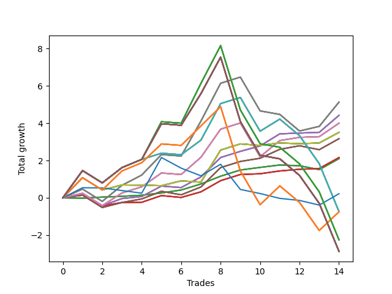

# Short Bulldog 004 
- Symbol: SPY_Unlimited
- Date Range: 03/23/2022 - 07/08/2022
- Trading Period: 7:20-12:30
- Number of Trades: 14



| Name | Win Percent | Profit | Avg Profit / Trade | Avg Time / Trade |      | Name | Win Percent | Profit | Avg Profit / Trade | Avg Time / Trade |
| ---- | ----------- | ------ | ------------------ | ---------------- | ---- | ---- | ----------- | ------ | ------------------ | ---------------- |
| Sorted By <br> Profit | | | | | | Sorted By <br> Win Percentage ||||
| Sixty-Nine | 64.29 | 2565.00 | 183.21 | 18:18 |     | Sixty-Six | 85.71 | 2210.00 | 157.86 | 11:52 |
| Sixty-One | 64.29 | 2565.00 | 183.21 | 18:18 |     | Fifty-Eight | 85.71 | 2210.00 | 157.86 | 11:52 |
| Fifty-Three | 64.29 | 2565.00 | 183.21 | 18:18 |     | Fifty | 85.71 | 2210.00 | 157.86 | 11:52 |
| Forty-Five | 64.29 | 2565.00 | 183.21 | 18:18 |     | Forty-Two | 85.71 | 2210.00 | 157.86 | 11:52 |
| Five | 64.29 | 2565.00 | 183.21 | 18:18 |     | Two | 85.71 | 2210.00 | 157.86 | 11:52 |
| Sixty-Six | 85.71 | 2210.00 | 157.86 | 11:52 |     | Sixty-Five | 85.71 | 1080.00 | 77.14 | 08:01 |
| Fifty-Eight | 85.71 | 2210.00 | 157.86 | 11:52 |     | Fifty-Seven | 85.71 | 1080.00 | 77.14 | 08:01 |
| Fifty | 85.71 | 2210.00 | 157.86 | 11:52 |     | Forty-Nine | 85.71 | 1080.00 | 77.14 | 08:01 |
| Forty-Two | 85.71 | 2210.00 | 157.86 | 11:52 |     | Forty-One | 85.71 | 1080.00 | 77.14 | 08:01 |
| Two | 85.71 | 2210.00 | 157.86 | 11:52 |     | One | 85.71 | 1080.00 | 77.14 | 08:01 |
| Sixty-Eight | 78.57 | 2000.00 | 142.86 | 14:42 |     | Sixty-Eight | 78.57 | 2000.00 | 142.86 | 14:42 |
| Sixty | 78.57 | 2000.00 | 142.86 | 14:42 |     | Sixty | 78.57 | 2000.00 | 142.86 | 14:42 |
| Fifty-Two | 78.57 | 2000.00 | 142.86 | 14:42 |     | Fifty-Two | 78.57 | 2000.00 | 142.86 | 14:42 |
| Forty-Four | 78.57 | 2000.00 | 142.86 | 14:42 |     | Forty-Four | 78.57 | 2000.00 | 142.86 | 14:42 |
| Four | 78.57 | 2000.00 | 142.86 | 14:42 |     | Four | 78.57 | 2000.00 | 142.86 | 14:42 |
| Seventy | 57.14 | 1755.00 | 125.36 | 05:00 |     | Sixty-Seven | 78.57 | 1585.00 | 113.21 | 09:17 |
| Sixty-Two | 57.14 | 1755.00 | 125.36 | 05:00 |     | Fifty-Nine | 78.57 | 1585.00 | 113.21 | 09:17 |
| Fifty-Four | 57.14 | 1755.00 | 125.36 | 05:00 |     | Fifty-One | 78.57 | 1585.00 | 113.21 | 09:17 |
| Forty-Six | 57.14 | 1755.00 | 125.36 | 05:00 |     | Forty-Three | 78.57 | 1585.00 | 113.21 | 09:17 |
| Six | 57.14 | 1755.00 | 125.36 | 05:00 |     | Three | 78.57 | 1585.00 | 113.21 | 09:17 |
| Sixty-Seven | 78.57 | 1585.00 | 113.21 | 09:17 |     | Sixty-Four | 78.57 | 1050.00 | 75.00 | 01:53 |
| Fifty-Nine | 78.57 | 1585.00 | 113.21 | 09:17 |     | Fifty-Six | 78.57 | 1050.00 | 75.00 | 01:53 |
| Fifty-One | 78.57 | 1585.00 | 113.21 | 09:17 |     | Forty-Eight | 78.57 | 1050.00 | 75.00 | 01:53 |
| Forty-Three | 78.57 | 1585.00 | 113.21 | 09:17 |     | Forty | 78.57 | 1050.00 | 75.00 | 01:53 |
| Three | 78.57 | 1585.00 | 113.21 | 09:17 |     | Zero | 78.57 | 1050.00 | 75.00 | 01:53 |
| Sixty-Five | 85.71 | 1080.00 | 77.14 | 08:01 |     | Sixty-Nine | 64.29 | 2565.00 | 183.21 | 18:18 |
| Fifty-Seven | 85.71 | 1080.00 | 77.14 | 08:01 |     | Sixty-One | 64.29 | 2565.00 | 183.21 | 18:18 |
| Forty-Nine | 85.71 | 1080.00 | 77.14 | 08:01 |     | Fifty-Three | 64.29 | 2565.00 | 183.21 | 18:18 |
| Forty-One | 85.71 | 1080.00 | 77.14 | 08:01 |     | Forty-Five | 64.29 | 2565.00 | 183.21 | 18:18 |
| One | 85.71 | 1080.00 | 77.14 | 08:01 |     | Five | 64.29 | 2565.00 | 183.21 | 18:18 |
| Sixty-Four | 78.57 | 1050.00 | 75.00 | 01:53 |     | Seventy | 57.14 | 1755.00 | 125.36 | 05:00 |
| Fifty-Six | 78.57 | 1050.00 | 75.00 | 01:53 |     | Sixty-Two | 57.14 | 1755.00 | 125.36 | 05:00 |
| Forty-Eight | 78.57 | 1050.00 | 75.00 | 01:53 |     | Fifty-Four | 57.14 | 1755.00 | 125.36 | 05:00 |
| Forty | 78.57 | 1050.00 | 75.00 | 01:53 |     | Forty-Six | 57.14 | 1755.00 | 125.36 | 05:00 |
| Zero | 78.57 | 1050.00 | 75.00 | 01:53 |     | Six | 57.14 | 1755.00 | 125.36 | 05:00 |
| Seventy-Three | 28.57 | 110.00 | 7.86 | 07:38 |     | Seventy-One | 57.14 | -370.00 | -26.43 | 23:13 |
| Seventy-One | 57.14 | -370.00 | -26.43 | 23:13 |     | Sixty-Three | 57.14 | -370.00 | -26.43 | 23:13 |
| Sixty-Three | 57.14 | -370.00 | -26.43 | 23:13 |     | Fifty-Five | 57.14 | -370.00 | -26.43 | 23:13 |
| Fifty-Five | 57.14 | -370.00 | -26.43 | 23:13 |     | Forty-Seven | 57.14 | -370.00 | -26.43 | 23:13 |
| Forty-Seven | 57.14 | -370.00 | -26.43 | 23:13 |     | Seven | 57.14 | -370.00 | -26.43 | 23:13 |
| Seven | 57.14 | -370.00 | -26.43 | 23:13 |     | One Hundred Twenty-Six | 57.14 | -375.00 | -26.79 | 22:40 |
| One Hundred Twenty-Six | 57.14 | -375.00 | -26.79 | 22:40 |     | One Hundred Twenty-One | 57.14 | -375.00 | -26.79 | 22:40 |
| One Hundred Twenty-One | 57.14 | -375.00 | -26.79 | 22:40 |     | One Hundred Sixteen | 57.14 | -375.00 | -26.79 | 22:40 |
| One Hundred Sixteen | 57.14 | -375.00 | -26.79 | 22:40 |     | One Hundred Eleven | 57.14 | -375.00 | -26.79 | 22:40 |
| One Hundred Eleven | 57.14 | -375.00 | -26.79 | 22:40 |     | Eighty-One | 57.14 | -375.00 | -26.79 | 22:40 |
| Eighty-One | 57.14 | -375.00 | -26.79 | 22:40 |     | One Hundred Twenty-Seven | 42.86 | -1125.00 | -80.36 | 28:49 |
| One Hundred Twenty-Seven | 42.86 | -1125.00 | -80.36 | 28:49 |     | One Hundred Twenty-Two | 42.86 | -1125.00 | -80.36 | 28:49 |
| One Hundred Twenty-Two | 42.86 | -1125.00 | -80.36 | 28:49 |     | One Hundred Seventeen | 42.86 | -1125.00 | -80.36 | 28:49 |
| One Hundred Seventeen | 42.86 | -1125.00 | -80.36 | 28:49 |     | One Hundred Twelve | 42.86 | -1125.00 | -80.36 | 28:49 |
| One Hundred Twelve | 42.86 | -1125.00 | -80.36 | 28:49 |     | Eighty-Two | 42.86 | -1125.00 | -80.36 | 28:49 |
| Eighty-Two | 42.86 | -1125.00 | -80.36 | 28:49 |     | One Hundred Thirty | 42.86 | -1435.00 | -102.50 | 29:55 |
| One Hundred Thirty | 42.86 | -1435.00 | -102.50 | 29:55 |     | One Hundred Twenty-Nine | 42.86 | -1435.00 | -102.50 | 29:55 |
| One Hundred Twenty-Nine | 42.86 | -1435.00 | -102.50 | 29:55 |     | One Hundred Twenty-Eight | 42.86 | -1435.00 | -102.50 | 29:55 |
| One Hundred Twenty-Eight | 42.86 | -1435.00 | -102.50 | 29:55 |     | One Hundred Twenty-Five | 42.86 | -1435.00 | -102.50 | 29:55 |
| One Hundred Twenty-Five | 42.86 | -1435.00 | -102.50 | 29:55 |     | One Hundred Twenty-Four | 42.86 | -1435.00 | -102.50 | 29:55 |
| One Hundred Twenty-Four | 42.86 | -1435.00 | -102.50 | 29:55 |     | One Hundred Twenty-Three | 42.86 | -1435.00 | -102.50 | 29:55 |
| One Hundred Twenty-Three | 42.86 | -1435.00 | -102.50 | 29:55 |     | One Hundred Twenty | 42.86 | -1435.00 | -102.50 | 29:55 |
| One Hundred Twenty | 42.86 | -1435.00 | -102.50 | 29:55 |     | One Hundred Ninteen | 42.86 | -1435.00 | -102.50 | 29:55 |
| One Hundred Ninteen | 42.86 | -1435.00 | -102.50 | 29:55 |     | One Hundred Eighteen | 42.86 | -1435.00 | -102.50 | 29:55 |
| One Hundred Eighteen | 42.86 | -1435.00 | -102.50 | 29:55 |     | One Hundred Fifteen | 42.86 | -1435.00 | -102.50 | 29:55 |
| One Hundred Fifteen | 42.86 | -1435.00 | -102.50 | 29:55 |     | One Hundred Fourteen | 42.86 | -1435.00 | -102.50 | 29:55 |
| One Hundred Fourteen | 42.86 | -1435.00 | -102.50 | 29:55 |     | One Hundred Thirteen | 42.86 | -1435.00 | -102.50 | 29:55 |
| One Hundred Thirteen | 42.86 | -1435.00 | -102.50 | 29:55 |     | Eighty-Five | 42.86 | -1435.00 | -102.50 | 29:55 |
| Eighty-Five | 42.86 | -1435.00 | -102.50 | 29:55 |     | Eighty-Four | 42.86 | -1435.00 | -102.50 | 29:55 |
| Eighty-Four | 42.86 | -1435.00 | -102.50 | 29:55 |     | Eighty-Three | 42.86 | -1435.00 | -102.50 | 29:55 |
| Eighty-Three | 42.86 | -1435.00 | -102.50 | 29:55 |     | Seventy-Three | 28.57 | 110.00 | 7.86 | 07:38 |

## NO STOPLOSS

### Test Zero
* Sell when price hits the middle line of the 20p bollinger
* No Stoploss
* Results:
```
Total Trades: 14
Percent Up: 21.43
Percent Down: 78.57
Total Points Moved Down: 2.10
Potential Profit: 1050.00
Total Points Ups: 0.27 Count Ups: 3
Total Points Downs: 2.37 Count Downs: 11
```

<details><summary>Trades</summary>

<code>In: 2022-03-25 11:58:00		Out: 2022-03-25 11:58:10		Total Position Time: 00:10		Total Move Down: -0.02		Total to Date: -0.02</code> <br />
<code>In: 2022-03-28 12:02:00		Out: 2022-03-28 12:08:05		Total Position Time: 06:05		Total Move Down: 0.06		Total to Date: 0.04</code> <br />
<code>In: 2022-03-29 08:53:00		Out: 2022-03-29 08:56:20		Total Position Time: 03:20		Total Move Down: 0.04		Total to Date: 0.08</code> <br />
<code>In: 2022-03-30 09:47:00		Out: 2022-03-30 09:50:50		Total Position Time: 03:50		Total Move Down: 0.06		Total to Date: 0.14</code> <br />
<code>In: 2022-03-31 12:06:00		Out: 2022-03-31 12:11:30		Total Position Time: 05:30		Total Move Down: 0.12		Total to Date: 0.26</code> <br />
<code>In: 2022-04-25 09:29:00		Out: 2022-04-25 09:31:05		Total Position Time: 02:05		Total Move Down: 0.16		Total to Date: 0.42</code> <br />
<code>In: 2022-05-02 09:26:00		Out: 2022-05-02 09:27:15		Total Position Time: 01:15		Total Move Down: 0.32		Total to Date: 0.74</code> <br />
<code>In: 2022-05-24 09:19:00		Out: 2022-05-24 09:21:35		Total Position Time: 02:35		Total Move Down: 0.42		Total to Date: 1.16</code> <br />
<code>In: 2022-05-25 11:07:00		Out: 2022-05-25 11:07:10		Total Position Time: 00:10		Total Move Down: 0.33		Total to Date: 1.49</code> <br />
<code>In: 2022-06-01 11:08:00		Out: 2022-06-01 11:08:45		Total Position Time: 00:45		Total Move Down: 0.14		Total to Date: 1.63</code> <br />
<code>In: 2022-06-16 08:31:00		Out: 2022-06-16 08:31:10		Total Position Time: 00:10		Total Move Down: 0.13		Total to Date: 1.76</code> <br />
<code>In: 2022-06-16 10:05:00		Out: 2022-06-16 10:05:10		Total Position Time: 00:10		Total Move Down: -0.04		Total to Date: 1.72</code> <br />
<code>In: 2022-07-06 11:01:00		Out: 2022-07-06 11:01:10		Total Position Time: 00:10		Total Move Down: -0.21		Total to Date: 1.51</code> <br />
<code>In: 2022-07-06 11:11:00		Out: 2022-07-06 11:11:10		Total Position Time: 00:10		Total Move Down: 0.59		Total to Date: 2.10</code> <br />


</details>

### Test One
* Sell when the price hits the upper line of the 20p 1std bollinger
* No Stoploss
* Results:
```
Total Trades: 14
Percent Up: 14.29
Percent Down: 85.71
Total Points Moved Down: 2.16
Potential Profit: 1080.00
Total Points Ups: 0.76 Count Ups: 2
Total Points Downs: 2.92 Count Downs: 12
```

<details><summary>Trades</summary>

<code>In: 2022-03-25 11:58:00		Out: 2022-03-25 12:00:50		Total Position Time: 02:50		Total Move Down: 0.23		Total to Date: 0.23</code> <br />
<code>In: 2022-03-28 12:02:00		Out: 2022-03-28 12:31:55		Total Position Time: 29:55		Total Move Down: -0.66		Total to Date: -0.43</code> <br />
<code>In: 2022-03-29 08:53:00		Out: 2022-03-29 08:58:45		Total Position Time: 05:45		Total Move Down: 0.18		Total to Date: -0.25</code> <br />
<code>In: 2022-03-30 09:47:00		Out: 2022-03-30 10:00:45		Total Position Time: 13:45		Total Move Down: 0.01		Total to Date: -0.24</code> <br />
<code>In: 2022-03-31 12:06:00		Out: 2022-03-31 12:16:00		Total Position Time: 10:00		Total Move Down: 0.36		Total to Date: 0.12</code> <br />
<code>In: 2022-04-25 09:29:00		Out: 2022-04-25 09:42:35		Total Position Time: 13:35		Total Move Down: -0.10		Total to Date: 0.02</code> <br />
<code>In: 2022-05-02 09:26:00		Out: 2022-05-02 09:36:10		Total Position Time: 10:10		Total Move Down: 0.30		Total to Date: 0.32</code> <br />
<code>In: 2022-05-24 09:19:00		Out: 2022-05-24 09:28:55		Total Position Time: 09:55		Total Move Down: 0.60		Total to Date: 0.92</code> <br />
<code>In: 2022-05-25 11:07:00		Out: 2022-05-25 11:07:10		Total Position Time: 00:10		Total Move Down: 0.33		Total to Date: 1.25</code> <br />
<code>In: 2022-06-01 11:08:00		Out: 2022-06-01 11:18:10		Total Position Time: 10:10		Total Move Down: 0.04		Total to Date: 1.29</code> <br />
<code>In: 2022-06-16 08:31:00		Out: 2022-06-16 08:35:15		Total Position Time: 04:15		Total Move Down: 0.15		Total to Date: 1.44</code> <br />
<code>In: 2022-06-16 10:05:00		Out: 2022-06-16 10:06:20		Total Position Time: 01:20		Total Move Down: 0.09		Total to Date: 1.53</code> <br />
<code>In: 2022-07-06 11:01:00		Out: 2022-07-06 11:01:15		Total Position Time: 00:15		Total Move Down: 0.04		Total to Date: 1.57</code> <br />
<code>In: 2022-07-06 11:11:00		Out: 2022-07-06 11:11:10		Total Position Time: 00:10		Total Move Down: 0.59		Total to Date: 2.16</code> <br />


</details>

### Test Two
* Sell when the price hits the upper line of the 20p 2std bollinger
* No Stoploss
* Results:
```
Total Trades: 14
Percent Up: 14.29
Percent Down: 85.71
Total Points Moved Down: 4.42
Potential Profit: 2210.00
Total Points Ups: 0.74 Count Ups: 2
Total Points Downs: 5.16 Count Downs: 12
```

<details><summary>Trades</summary>

<code>In: 2022-03-25 11:58:00		Out: 2022-03-25 12:00:55		Total Position Time: 02:55		Total Move Down: 0.24		Total to Date: 0.24</code> <br />
<code>In: 2022-03-28 12:02:00		Out: 2022-03-28 12:31:55		Total Position Time: 29:55		Total Move Down: -0.66		Total to Date: -0.42</code> <br />
<code>In: 2022-03-29 08:53:00		Out: 2022-03-29 09:01:40		Total Position Time: 08:40		Total Move Down: 0.38		Total to Date: -0.04</code> <br />
<code>In: 2022-03-30 09:47:00		Out: 2022-03-30 10:01:15		Total Position Time: 14:15		Total Move Down: 0.11		Total to Date: 0.07</code> <br />
<code>In: 2022-03-31 12:06:00		Out: 2022-03-31 12:19:35		Total Position Time: 13:35		Total Move Down: 0.56		Total to Date: 0.63</code> <br />
<code>In: 2022-04-25 09:29:00		Out: 2022-04-25 09:58:55		Total Position Time: 29:55		Total Move Down: -0.08		Total to Date: 0.55</code> <br />
<code>In: 2022-05-02 09:26:00		Out: 2022-05-02 09:39:35		Total Position Time: 13:35		Total Move Down: 0.57		Total to Date: 1.12</code> <br />
<code>In: 2022-05-24 09:19:00		Out: 2022-05-24 09:31:20		Total Position Time: 12:20		Total Move Down: 1.04		Total to Date: 2.16</code> <br />
<code>In: 2022-05-25 11:07:00		Out: 2022-05-25 11:07:10		Total Position Time: 00:10		Total Move Down: 0.33		Total to Date: 2.49</code> <br />
<code>In: 2022-06-01 11:08:00		Out: 2022-06-01 11:19:20		Total Position Time: 11:20		Total Move Down: 0.29		Total to Date: 2.78</code> <br />
<code>In: 2022-06-16 08:31:00		Out: 2022-06-16 08:42:05		Total Position Time: 11:05		Total Move Down: 0.65		Total to Date: 3.43</code> <br />
<code>In: 2022-06-16 10:05:00		Out: 2022-06-16 10:21:20		Total Position Time: 16:20		Total Move Down: 0.04		Total to Date: 3.47</code> <br />
<code>In: 2022-07-06 11:01:00		Out: 2022-07-06 11:02:20		Total Position Time: 01:20		Total Move Down: 0.04		Total to Date: 3.51</code> <br />
<code>In: 2022-07-06 11:11:00		Out: 2022-07-06 11:11:45		Total Position Time: 00:45		Total Move Down: 0.91		Total to Date: 4.42</code> <br />


</details>

### Test Three
* Sell when price hits the middle line of the 50p bollinger
* No Stoploss
* Results:
```
Total Trades: 14
Percent Up: 21.43
Percent Down: 78.57
Total Points Moved Down: 3.17
Potential Profit: 1585.00
Total Points Ups: 1.06 Count Ups: 3
Total Points Downs: 4.23 Count Downs: 11
```

<details><summary>Trades</summary>

<code>In: 2022-03-25 11:58:00		Out: 2022-03-25 12:00:45		Total Position Time: 02:45		Total Move Down: 0.14		Total to Date: 0.14</code> <br />
<code>In: 2022-03-28 12:02:00		Out: 2022-03-28 12:31:55		Total Position Time: 29:55		Total Move Down: -0.66		Total to Date: -0.52</code> <br />
<code>In: 2022-03-29 08:53:00		Out: 2022-03-29 09:01:25		Total Position Time: 08:25		Total Move Down: 0.27		Total to Date: -0.25</code> <br />
<code>In: 2022-03-30 09:47:00		Out: 2022-03-30 10:01:45		Total Position Time: 14:45		Total Move Down: 0.19		Total to Date: -0.06</code> <br />
<code>In: 2022-03-31 12:06:00		Out: 2022-03-31 12:16:40		Total Position Time: 10:40		Total Move Down: 0.41		Total to Date: 0.35</code> <br />
<code>In: 2022-04-25 09:29:00		Out: 2022-04-25 09:55:05		Total Position Time: 26:05		Total Move Down: -0.19		Total to Date: 0.16</code> <br />
<code>In: 2022-05-02 09:26:00		Out: 2022-05-02 09:27:25		Total Position Time: 01:25		Total Move Down: 0.42		Total to Date: 0.58</code> <br />
<code>In: 2022-05-24 09:19:00		Out: 2022-05-24 09:31:20		Total Position Time: 12:20		Total Move Down: 1.04		Total to Date: 1.62</code> <br />
<code>In: 2022-05-25 11:07:00		Out: 2022-05-25 11:07:10		Total Position Time: 00:10		Total Move Down: 0.33		Total to Date: 1.95</code> <br />
<code>In: 2022-06-01 11:08:00		Out: 2022-06-01 11:18:40		Total Position Time: 10:40		Total Move Down: 0.17		Total to Date: 2.12</code> <br />
<code>In: 2022-06-16 08:31:00		Out: 2022-06-16 08:41:55		Total Position Time: 10:55		Total Move Down: 0.48		Total to Date: 2.60</code> <br />
<code>In: 2022-06-16 10:05:00		Out: 2022-06-16 10:06:35		Total Position Time: 01:35		Total Move Down: 0.19		Total to Date: 2.79</code> <br />
<code>In: 2022-07-06 11:01:00		Out: 2022-07-06 11:01:10		Total Position Time: 00:10		Total Move Down: -0.21		Total to Date: 2.58</code> <br />
<code>In: 2022-07-06 11:11:00		Out: 2022-07-06 11:11:10		Total Position Time: 00:10		Total Move Down: 0.59		Total to Date: 3.17</code> <br />


</details>

### Test Four
* Sell when the price hits the upper line of the 50p 1std bollinger
* No Stoploss
* Results:
```
Total Trades: 14
Percent Up: 21.43
Percent Down: 78.57
Total Points Moved Down: 4.00
Potential Profit: 2000.00
Total Points Ups: 2.55 Count Ups: 3
Total Points Downs: 6.55 Count Downs: 11
```

<details><summary>Trades</summary>

<code>In: 2022-03-25 11:58:00		Out: 2022-03-25 12:00:55		Total Position Time: 02:55		Total Move Down: 0.24		Total to Date: 0.24</code> <br />
<code>In: 2022-03-28 12:02:00		Out: 2022-03-28 12:31:55		Total Position Time: 29:55		Total Move Down: -0.66		Total to Date: -0.42</code> <br />
<code>In: 2022-03-29 08:53:00		Out: 2022-03-29 09:02:15		Total Position Time: 09:15		Total Move Down: 0.68		Total to Date: 0.26</code> <br />
<code>In: 2022-03-30 09:47:00		Out: 2022-03-30 10:06:35		Total Position Time: 19:35		Total Move Down: 0.33		Total to Date: 0.59</code> <br />
<code>In: 2022-03-31 12:06:00		Out: 2022-03-31 12:20:15		Total Position Time: 14:15		Total Move Down: 0.74		Total to Date: 1.33</code> <br />
<code>In: 2022-04-25 09:29:00		Out: 2022-04-25 09:58:55		Total Position Time: 29:55		Total Move Down: -0.08		Total to Date: 1.25</code> <br />
<code>In: 2022-05-02 09:26:00		Out: 2022-05-02 09:43:15		Total Position Time: 17:15		Total Move Down: 0.92		Total to Date: 2.17</code> <br />
<code>In: 2022-05-24 09:19:00		Out: 2022-05-24 09:33:15		Total Position Time: 14:15		Total Move Down: 1.51		Total to Date: 3.68</code> <br />
<code>In: 2022-05-25 11:07:00		Out: 2022-05-25 11:07:10		Total Position Time: 00:10		Total Move Down: 0.33		Total to Date: 4.01</code> <br />
<code>In: 2022-06-01 11:08:00		Out: 2022-06-01 11:37:55		Total Position Time: 29:55		Total Move Down: -1.81		Total to Date: 2.20</code> <br />
<code>In: 2022-06-16 08:31:00		Out: 2022-06-16 08:51:45		Total Position Time: 20:45		Total Move Down: 0.87		Total to Date: 3.07</code> <br />
<code>In: 2022-06-16 10:05:00		Out: 2022-06-16 10:21:55		Total Position Time: 16:55		Total Move Down: 0.17		Total to Date: 3.24</code> <br />
<code>In: 2022-07-06 11:01:00		Out: 2022-07-06 11:01:15		Total Position Time: 00:15		Total Move Down: 0.04		Total to Date: 3.28</code> <br />
<code>In: 2022-07-06 11:11:00		Out: 2022-07-06 11:11:35		Total Position Time: 00:35		Total Move Down: 0.72		Total to Date: 4.00</code> <br />


</details>

### Test Five
* Sell when the price hits the upper line of the 50p 2std bollinger
* No Stoploss
* Results:
```
Total Trades: 14
Percent Up: 35.71
Percent Down: 64.29
Total Points Moved Down: 5.13
Potential Profit: 2565.00
Total Points Ups: 3.63 Count Ups: 5
Total Points Downs: 8.76 Count Downs: 9
```

<details><summary>Trades</summary>

<code>In: 2022-03-25 11:58:00		Out: 2022-03-25 12:01:55		Total Position Time: 03:55		Total Move Down: 0.47		Total to Date: 0.47</code> <br />
<code>In: 2022-03-28 12:02:00		Out: 2022-03-28 12:31:55		Total Position Time: 29:55		Total Move Down: -0.66		Total to Date: -0.19</code> <br />
<code>In: 2022-03-29 08:53:00		Out: 2022-03-29 09:10:50		Total Position Time: 17:50		Total Move Down: 0.86		Total to Date: 0.67</code> <br />
<code>In: 2022-03-30 09:47:00		Out: 2022-03-30 10:07:20		Total Position Time: 20:20		Total Move Down: 0.55		Total to Date: 1.22</code> <br />
<code>In: 2022-03-31 12:06:00		Out: 2022-03-31 12:21:50		Total Position Time: 15:50		Total Move Down: 1.10		Total to Date: 2.32</code> <br />
<code>In: 2022-04-25 09:29:00		Out: 2022-04-25 09:58:55		Total Position Time: 29:55		Total Move Down: -0.08		Total to Date: 2.24</code> <br />
<code>In: 2022-05-02 09:26:00		Out: 2022-05-02 09:54:10		Total Position Time: 28:10		Total Move Down: 1.87		Total to Date: 4.11</code> <br />
<code>In: 2022-05-24 09:19:00		Out: 2022-05-24 09:36:50		Total Position Time: 17:50		Total Move Down: 2.03		Total to Date: 6.14</code> <br />
<code>In: 2022-05-25 11:07:00		Out: 2022-05-25 11:07:10		Total Position Time: 00:10		Total Move Down: 0.33		Total to Date: 6.47</code> <br />
<code>In: 2022-06-01 11:08:00		Out: 2022-06-01 11:37:55		Total Position Time: 29:55		Total Move Down: -1.81		Total to Date: 4.66</code> <br />
<code>In: 2022-06-16 08:31:00		Out: 2022-06-16 09:00:55		Total Position Time: 29:55		Total Move Down: -0.19		Total to Date: 4.47</code> <br />
<code>In: 2022-06-16 10:05:00		Out: 2022-06-16 10:34:55		Total Position Time: 29:55		Total Move Down: -0.89		Total to Date: 3.58</code> <br />
<code>In: 2022-07-06 11:01:00		Out: 2022-07-06 11:02:25		Total Position Time: 01:25		Total Move Down: 0.25		Total to Date: 3.83</code> <br />
<code>In: 2022-07-06 11:11:00		Out: 2022-07-06 11:12:15		Total Position Time: 01:15		Total Move Down: 1.30		Total to Date: 5.13</code> <br />


</details>

### Test Six
* Sell when the price hits the middle line of the 1std VWAP
* No Stoploss
* Results:
```
Total Trades: 14
Percent Up: 42.86
Percent Down: 57.14
Total Points Moved Down: 3.51
Potential Profit: 1755.00
Total Points Ups: 0.89 Count Ups: 6
Total Points Downs: 4.40 Count Downs: 8
```

<details><summary>Trades</summary>

<code>In: 2022-03-25 11:58:00		Out: 2022-03-25 12:07:35		Total Position Time: 09:35		Total Move Down: 1.08		Total to Date: 1.08</code> <br />
<code>In: 2022-03-28 12:02:00		Out: 2022-03-28 12:31:55		Total Position Time: 29:55		Total Move Down: -0.66		Total to Date: 0.42</code> <br />
<code>In: 2022-03-29 08:53:00		Out: 2022-03-29 09:01:25		Total Position Time: 08:25		Total Move Down: 0.27		Total to Date: 0.69</code> <br />
<code>In: 2022-03-30 09:47:00		Out: 2022-03-30 09:47:10		Total Position Time: 00:10		Total Move Down: -0.01		Total to Date: 0.68</code> <br />
<code>In: 2022-03-31 12:06:00		Out: 2022-03-31 12:06:10		Total Position Time: 00:10		Total Move Down: -0.03		Total to Date: 0.65</code> <br />
<code>In: 2022-04-25 09:29:00		Out: 2022-04-25 09:31:10		Total Position Time: 02:10		Total Move Down: 0.26		Total to Date: 0.91</code> <br />
<code>In: 2022-05-02 09:26:00		Out: 2022-05-02 09:26:10		Total Position Time: 00:10		Total Move Down: -0.07		Total to Date: 0.84</code> <br />
<code>In: 2022-05-24 09:19:00		Out: 2022-05-24 09:36:10		Total Position Time: 17:10		Total Move Down: 1.72		Total to Date: 2.56</code> <br />
<code>In: 2022-05-25 11:07:00		Out: 2022-05-25 11:07:10		Total Position Time: 00:10		Total Move Down: 0.33		Total to Date: 2.89</code> <br />
<code>In: 2022-06-01 11:08:00		Out: 2022-06-01 11:08:10		Total Position Time: 00:10		Total Move Down: -0.08		Total to Date: 2.81</code> <br />
<code>In: 2022-06-16 08:31:00		Out: 2022-06-16 08:31:10		Total Position Time: 00:10		Total Move Down: 0.13		Total to Date: 2.94</code> <br />
<code>In: 2022-06-16 10:05:00		Out: 2022-06-16 10:05:10		Total Position Time: 00:10		Total Move Down: -0.04		Total to Date: 2.90</code> <br />
<code>In: 2022-07-06 11:01:00		Out: 2022-07-06 11:02:20		Total Position Time: 01:20		Total Move Down: 0.04		Total to Date: 2.94</code> <br />
<code>In: 2022-07-06 11:11:00		Out: 2022-07-06 11:11:15		Total Position Time: 00:15		Total Move Down: 0.57		Total to Date: 3.51</code> <br />


</details>

### Test Seven
* Sell when the price hits the upper line of the 1std VWAP
* No Stoploss
* Results:
```
Total Trades: 14
Percent Up: 42.86
Percent Down: 57.14
Total Points Moved Down: -0.74
Potential Profit: -370.00
Total Points Ups: 7.51 Count Ups: 6
Total Points Downs: 6.77 Count Downs: 8
```

<details><summary>Trades</summary>

<code>In: 2022-03-25 11:58:00		Out: 2022-03-25 12:27:55		Total Position Time: 29:55		Total Move Down: 1.46		Total to Date: 1.46</code> <br />
<code>In: 2022-03-28 12:02:00		Out: 2022-03-28 12:31:55		Total Position Time: 29:55		Total Move Down: -0.66		Total to Date: 0.80</code> <br />
<code>In: 2022-03-29 08:53:00		Out: 2022-03-29 09:22:55		Total Position Time: 29:55		Total Move Down: 0.82		Total to Date: 1.62</code> <br />
<code>In: 2022-03-30 09:47:00		Out: 2022-03-30 10:06:55		Total Position Time: 19:55		Total Move Down: 0.44		Total to Date: 2.06</code> <br />
<code>In: 2022-03-31 12:06:00		Out: 2022-03-31 12:14:10		Total Position Time: 08:10		Total Move Down: 0.33		Total to Date: 2.39</code> <br />
<code>In: 2022-04-25 09:29:00		Out: 2022-04-25 09:58:55		Total Position Time: 29:55		Total Move Down: -0.08		Total to Date: 2.31</code> <br />
<code>In: 2022-05-02 09:26:00		Out: 2022-05-02 09:42:40		Total Position Time: 16:40		Total Move Down: 0.78		Total to Date: 3.09</code> <br />
<code>In: 2022-05-24 09:19:00		Out: 2022-05-24 09:48:55		Total Position Time: 29:55		Total Move Down: 1.96		Total to Date: 5.05</code> <br />
<code>In: 2022-05-25 11:07:00		Out: 2022-05-25 11:07:10		Total Position Time: 00:10		Total Move Down: 0.33		Total to Date: 5.38</code> <br />
<code>In: 2022-06-01 11:08:00		Out: 2022-06-01 11:37:55		Total Position Time: 29:55		Total Move Down: -1.81		Total to Date: 3.57</code> <br />
<code>In: 2022-06-16 08:31:00		Out: 2022-06-16 08:42:05		Total Position Time: 11:05		Total Move Down: 0.65		Total to Date: 4.22</code> <br />
<code>In: 2022-06-16 10:05:00		Out: 2022-06-16 10:34:55		Total Position Time: 29:55		Total Move Down: -0.89		Total to Date: 3.33</code> <br />
<code>In: 2022-07-06 11:01:00		Out: 2022-07-06 11:30:55		Total Position Time: 29:55		Total Move Down: -1.50		Total to Date: 1.83</code> <br />
<code>In: 2022-07-06 11:11:00		Out: 2022-07-06 11:40:55		Total Position Time: 29:55		Total Move Down: -2.57		Total to Date: -0.74</code> <br />


</details>

## STOPLOSS OF 5

### Test Forty
* Sell when price hits the middle line of the 20p bollinger
* Stoploss is -5 points
* Results:
```
Total Trades: 14
Percent Up: 21.43
Percent Down: 78.57
Total Points Moved Down: 2.10
Potential Profit: 1050.00
Total Points Ups: 0.27 Count Ups: 3
Total Points Downs: 2.37 Count Downs: 11
```

<details><summary>Trades</summary>

<code>In: 2022-03-25 11:58:00		Out: 2022-03-25 11:58:10		Total Position Time: 00:10		Total Move Down: -0.02		Total to Date: -0.02</code> <br />
<code>In: 2022-03-28 12:02:00		Out: 2022-03-28 12:08:05		Total Position Time: 06:05		Total Move Down: 0.06		Total to Date: 0.04</code> <br />
<code>In: 2022-03-29 08:53:00		Out: 2022-03-29 08:56:20		Total Position Time: 03:20		Total Move Down: 0.04		Total to Date: 0.08</code> <br />
<code>In: 2022-03-30 09:47:00		Out: 2022-03-30 09:50:50		Total Position Time: 03:50		Total Move Down: 0.06		Total to Date: 0.14</code> <br />
<code>In: 2022-03-31 12:06:00		Out: 2022-03-31 12:11:30		Total Position Time: 05:30		Total Move Down: 0.12		Total to Date: 0.26</code> <br />
<code>In: 2022-04-25 09:29:00		Out: 2022-04-25 09:31:05		Total Position Time: 02:05		Total Move Down: 0.16		Total to Date: 0.42</code> <br />
<code>In: 2022-05-02 09:26:00		Out: 2022-05-02 09:27:15		Total Position Time: 01:15		Total Move Down: 0.32		Total to Date: 0.74</code> <br />
<code>In: 2022-05-24 09:19:00		Out: 2022-05-24 09:21:35		Total Position Time: 02:35		Total Move Down: 0.42		Total to Date: 1.16</code> <br />
<code>In: 2022-05-25 11:07:00		Out: 2022-05-25 11:07:10		Total Position Time: 00:10		Total Move Down: 0.33		Total to Date: 1.49</code> <br />
<code>In: 2022-06-01 11:08:00		Out: 2022-06-01 11:08:45		Total Position Time: 00:45		Total Move Down: 0.14		Total to Date: 1.63</code> <br />
<code>In: 2022-06-16 08:31:00		Out: 2022-06-16 08:31:10		Total Position Time: 00:10		Total Move Down: 0.13		Total to Date: 1.76</code> <br />
<code>In: 2022-06-16 10:05:00		Out: 2022-06-16 10:05:10		Total Position Time: 00:10		Total Move Down: -0.04		Total to Date: 1.72</code> <br />
<code>In: 2022-07-06 11:01:00		Out: 2022-07-06 11:01:10		Total Position Time: 00:10		Total Move Down: -0.21		Total to Date: 1.51</code> <br />
<code>In: 2022-07-06 11:11:00		Out: 2022-07-06 11:11:10		Total Position Time: 00:10		Total Move Down: 0.59		Total to Date: 2.10</code> <br />


</details>

### Test Forty-One
* Sell when the price hits the upper line of the 20p 1std bollinger
* Stoploss is -5 points
* Results:
```
Total Trades: 14
Percent Up: 14.29
Percent Down: 85.71
Total Points Moved Down: 2.16
Potential Profit: 1080.00
Total Points Ups: 0.76 Count Ups: 2
Total Points Downs: 2.92 Count Downs: 12
```

<details><summary>Trades</summary>

<code>In: 2022-03-25 11:58:00		Out: 2022-03-25 12:00:50		Total Position Time: 02:50		Total Move Down: 0.23		Total to Date: 0.23</code> <br />
<code>In: 2022-03-28 12:02:00		Out: 2022-03-28 12:31:55		Total Position Time: 29:55		Total Move Down: -0.66		Total to Date: -0.43</code> <br />
<code>In: 2022-03-29 08:53:00		Out: 2022-03-29 08:58:45		Total Position Time: 05:45		Total Move Down: 0.18		Total to Date: -0.25</code> <br />
<code>In: 2022-03-30 09:47:00		Out: 2022-03-30 10:00:45		Total Position Time: 13:45		Total Move Down: 0.01		Total to Date: -0.24</code> <br />
<code>In: 2022-03-31 12:06:00		Out: 2022-03-31 12:16:00		Total Position Time: 10:00		Total Move Down: 0.36		Total to Date: 0.12</code> <br />
<code>In: 2022-04-25 09:29:00		Out: 2022-04-25 09:42:35		Total Position Time: 13:35		Total Move Down: -0.10		Total to Date: 0.02</code> <br />
<code>In: 2022-05-02 09:26:00		Out: 2022-05-02 09:36:10		Total Position Time: 10:10		Total Move Down: 0.30		Total to Date: 0.32</code> <br />
<code>In: 2022-05-24 09:19:00		Out: 2022-05-24 09:28:55		Total Position Time: 09:55		Total Move Down: 0.60		Total to Date: 0.92</code> <br />
<code>In: 2022-05-25 11:07:00		Out: 2022-05-25 11:07:10		Total Position Time: 00:10		Total Move Down: 0.33		Total to Date: 1.25</code> <br />
<code>In: 2022-06-01 11:08:00		Out: 2022-06-01 11:18:10		Total Position Time: 10:10		Total Move Down: 0.04		Total to Date: 1.29</code> <br />
<code>In: 2022-06-16 08:31:00		Out: 2022-06-16 08:35:15		Total Position Time: 04:15		Total Move Down: 0.15		Total to Date: 1.44</code> <br />
<code>In: 2022-06-16 10:05:00		Out: 2022-06-16 10:06:20		Total Position Time: 01:20		Total Move Down: 0.09		Total to Date: 1.53</code> <br />
<code>In: 2022-07-06 11:01:00		Out: 2022-07-06 11:01:15		Total Position Time: 00:15		Total Move Down: 0.04		Total to Date: 1.57</code> <br />
<code>In: 2022-07-06 11:11:00		Out: 2022-07-06 11:11:10		Total Position Time: 00:10		Total Move Down: 0.59		Total to Date: 2.16</code> <br />


</details>

### Test Forty-Two
* Sell when the price hits the upper line of the 20p 2std bollinger
* Stoploss is -5 points
* Results:
```
Total Trades: 14
Percent Up: 14.29
Percent Down: 85.71
Total Points Moved Down: 4.42
Potential Profit: 2210.00
Total Points Ups: 0.74 Count Ups: 2
Total Points Downs: 5.16 Count Downs: 12
```

<details><summary>Trades</summary>

<code>In: 2022-03-25 11:58:00		Out: 2022-03-25 12:00:55		Total Position Time: 02:55		Total Move Down: 0.24		Total to Date: 0.24</code> <br />
<code>In: 2022-03-28 12:02:00		Out: 2022-03-28 12:31:55		Total Position Time: 29:55		Total Move Down: -0.66		Total to Date: -0.42</code> <br />
<code>In: 2022-03-29 08:53:00		Out: 2022-03-29 09:01:40		Total Position Time: 08:40		Total Move Down: 0.38		Total to Date: -0.04</code> <br />
<code>In: 2022-03-30 09:47:00		Out: 2022-03-30 10:01:15		Total Position Time: 14:15		Total Move Down: 0.11		Total to Date: 0.07</code> <br />
<code>In: 2022-03-31 12:06:00		Out: 2022-03-31 12:19:35		Total Position Time: 13:35		Total Move Down: 0.56		Total to Date: 0.63</code> <br />
<code>In: 2022-04-25 09:29:00		Out: 2022-04-25 09:58:55		Total Position Time: 29:55		Total Move Down: -0.08		Total to Date: 0.55</code> <br />
<code>In: 2022-05-02 09:26:00		Out: 2022-05-02 09:39:35		Total Position Time: 13:35		Total Move Down: 0.57		Total to Date: 1.12</code> <br />
<code>In: 2022-05-24 09:19:00		Out: 2022-05-24 09:31:20		Total Position Time: 12:20		Total Move Down: 1.04		Total to Date: 2.16</code> <br />
<code>In: 2022-05-25 11:07:00		Out: 2022-05-25 11:07:10		Total Position Time: 00:10		Total Move Down: 0.33		Total to Date: 2.49</code> <br />
<code>In: 2022-06-01 11:08:00		Out: 2022-06-01 11:19:20		Total Position Time: 11:20		Total Move Down: 0.29		Total to Date: 2.78</code> <br />
<code>In: 2022-06-16 08:31:00		Out: 2022-06-16 08:42:05		Total Position Time: 11:05		Total Move Down: 0.65		Total to Date: 3.43</code> <br />
<code>In: 2022-06-16 10:05:00		Out: 2022-06-16 10:21:20		Total Position Time: 16:20		Total Move Down: 0.04		Total to Date: 3.47</code> <br />
<code>In: 2022-07-06 11:01:00		Out: 2022-07-06 11:02:20		Total Position Time: 01:20		Total Move Down: 0.04		Total to Date: 3.51</code> <br />
<code>In: 2022-07-06 11:11:00		Out: 2022-07-06 11:11:45		Total Position Time: 00:45		Total Move Down: 0.91		Total to Date: 4.42</code> <br />


</details>

### Test Forty-Three
* Sell when price hits the middle line of the 50p bollinger
* Stoploss is -5 points
* Results:
```
Total Trades: 14
Percent Up: 21.43
Percent Down: 78.57
Total Points Moved Down: 3.17
Potential Profit: 1585.00
Total Points Ups: 1.06 Count Ups: 3
Total Points Downs: 4.23 Count Downs: 11
```

<details><summary>Trades</summary>

<code>In: 2022-03-25 11:58:00		Out: 2022-03-25 12:00:45		Total Position Time: 02:45		Total Move Down: 0.14		Total to Date: 0.14</code> <br />
<code>In: 2022-03-28 12:02:00		Out: 2022-03-28 12:31:55		Total Position Time: 29:55		Total Move Down: -0.66		Total to Date: -0.52</code> <br />
<code>In: 2022-03-29 08:53:00		Out: 2022-03-29 09:01:25		Total Position Time: 08:25		Total Move Down: 0.27		Total to Date: -0.25</code> <br />
<code>In: 2022-03-30 09:47:00		Out: 2022-03-30 10:01:45		Total Position Time: 14:45		Total Move Down: 0.19		Total to Date: -0.06</code> <br />
<code>In: 2022-03-31 12:06:00		Out: 2022-03-31 12:16:40		Total Position Time: 10:40		Total Move Down: 0.41		Total to Date: 0.35</code> <br />
<code>In: 2022-04-25 09:29:00		Out: 2022-04-25 09:55:05		Total Position Time: 26:05		Total Move Down: -0.19		Total to Date: 0.16</code> <br />
<code>In: 2022-05-02 09:26:00		Out: 2022-05-02 09:27:25		Total Position Time: 01:25		Total Move Down: 0.42		Total to Date: 0.58</code> <br />
<code>In: 2022-05-24 09:19:00		Out: 2022-05-24 09:31:20		Total Position Time: 12:20		Total Move Down: 1.04		Total to Date: 1.62</code> <br />
<code>In: 2022-05-25 11:07:00		Out: 2022-05-25 11:07:10		Total Position Time: 00:10		Total Move Down: 0.33		Total to Date: 1.95</code> <br />
<code>In: 2022-06-01 11:08:00		Out: 2022-06-01 11:18:40		Total Position Time: 10:40		Total Move Down: 0.17		Total to Date: 2.12</code> <br />
<code>In: 2022-06-16 08:31:00		Out: 2022-06-16 08:41:55		Total Position Time: 10:55		Total Move Down: 0.48		Total to Date: 2.60</code> <br />
<code>In: 2022-06-16 10:05:00		Out: 2022-06-16 10:06:35		Total Position Time: 01:35		Total Move Down: 0.19		Total to Date: 2.79</code> <br />
<code>In: 2022-07-06 11:01:00		Out: 2022-07-06 11:01:10		Total Position Time: 00:10		Total Move Down: -0.21		Total to Date: 2.58</code> <br />
<code>In: 2022-07-06 11:11:00		Out: 2022-07-06 11:11:10		Total Position Time: 00:10		Total Move Down: 0.59		Total to Date: 3.17</code> <br />


</details>

### Test Forty-Four
* Sell when the price hits the upper line of the 50p 1std bollinger
* Stoploss is -5 points
* Results:
```
Total Trades: 14
Percent Up: 21.43
Percent Down: 78.57
Total Points Moved Down: 4.00
Potential Profit: 2000.00
Total Points Ups: 2.55 Count Ups: 3
Total Points Downs: 6.55 Count Downs: 11
```

<details><summary>Trades</summary>

<code>In: 2022-03-25 11:58:00		Out: 2022-03-25 12:00:55		Total Position Time: 02:55		Total Move Down: 0.24		Total to Date: 0.24</code> <br />
<code>In: 2022-03-28 12:02:00		Out: 2022-03-28 12:31:55		Total Position Time: 29:55		Total Move Down: -0.66		Total to Date: -0.42</code> <br />
<code>In: 2022-03-29 08:53:00		Out: 2022-03-29 09:02:15		Total Position Time: 09:15		Total Move Down: 0.68		Total to Date: 0.26</code> <br />
<code>In: 2022-03-30 09:47:00		Out: 2022-03-30 10:06:35		Total Position Time: 19:35		Total Move Down: 0.33		Total to Date: 0.59</code> <br />
<code>In: 2022-03-31 12:06:00		Out: 2022-03-31 12:20:15		Total Position Time: 14:15		Total Move Down: 0.74		Total to Date: 1.33</code> <br />
<code>In: 2022-04-25 09:29:00		Out: 2022-04-25 09:58:55		Total Position Time: 29:55		Total Move Down: -0.08		Total to Date: 1.25</code> <br />
<code>In: 2022-05-02 09:26:00		Out: 2022-05-02 09:43:15		Total Position Time: 17:15		Total Move Down: 0.92		Total to Date: 2.17</code> <br />
<code>In: 2022-05-24 09:19:00		Out: 2022-05-24 09:33:15		Total Position Time: 14:15		Total Move Down: 1.51		Total to Date: 3.68</code> <br />
<code>In: 2022-05-25 11:07:00		Out: 2022-05-25 11:07:10		Total Position Time: 00:10		Total Move Down: 0.33		Total to Date: 4.01</code> <br />
<code>In: 2022-06-01 11:08:00		Out: 2022-06-01 11:37:55		Total Position Time: 29:55		Total Move Down: -1.81		Total to Date: 2.20</code> <br />
<code>In: 2022-06-16 08:31:00		Out: 2022-06-16 08:51:45		Total Position Time: 20:45		Total Move Down: 0.87		Total to Date: 3.07</code> <br />
<code>In: 2022-06-16 10:05:00		Out: 2022-06-16 10:21:55		Total Position Time: 16:55		Total Move Down: 0.17		Total to Date: 3.24</code> <br />
<code>In: 2022-07-06 11:01:00		Out: 2022-07-06 11:01:15		Total Position Time: 00:15		Total Move Down: 0.04		Total to Date: 3.28</code> <br />
<code>In: 2022-07-06 11:11:00		Out: 2022-07-06 11:11:35		Total Position Time: 00:35		Total Move Down: 0.72		Total to Date: 4.00</code> <br />


</details>

### Test Forty-Five
* Sell when the price hits the upper line of the 50p 2std bollinger
* Stoploss is -5 points
* Results:
```
Total Trades: 14
Percent Up: 35.71
Percent Down: 64.29
Total Points Moved Down: 5.13
Potential Profit: 2565.00
Total Points Ups: 3.63 Count Ups: 5
Total Points Downs: 8.76 Count Downs: 9
```

<details><summary>Trades</summary>

<code>In: 2022-03-25 11:58:00		Out: 2022-03-25 12:01:55		Total Position Time: 03:55		Total Move Down: 0.47		Total to Date: 0.47</code> <br />
<code>In: 2022-03-28 12:02:00		Out: 2022-03-28 12:31:55		Total Position Time: 29:55		Total Move Down: -0.66		Total to Date: -0.19</code> <br />
<code>In: 2022-03-29 08:53:00		Out: 2022-03-29 09:10:50		Total Position Time: 17:50		Total Move Down: 0.86		Total to Date: 0.67</code> <br />
<code>In: 2022-03-30 09:47:00		Out: 2022-03-30 10:07:20		Total Position Time: 20:20		Total Move Down: 0.55		Total to Date: 1.22</code> <br />
<code>In: 2022-03-31 12:06:00		Out: 2022-03-31 12:21:50		Total Position Time: 15:50		Total Move Down: 1.10		Total to Date: 2.32</code> <br />
<code>In: 2022-04-25 09:29:00		Out: 2022-04-25 09:58:55		Total Position Time: 29:55		Total Move Down: -0.08		Total to Date: 2.24</code> <br />
<code>In: 2022-05-02 09:26:00		Out: 2022-05-02 09:54:10		Total Position Time: 28:10		Total Move Down: 1.87		Total to Date: 4.11</code> <br />
<code>In: 2022-05-24 09:19:00		Out: 2022-05-24 09:36:50		Total Position Time: 17:50		Total Move Down: 2.03		Total to Date: 6.14</code> <br />
<code>In: 2022-05-25 11:07:00		Out: 2022-05-25 11:07:10		Total Position Time: 00:10		Total Move Down: 0.33		Total to Date: 6.47</code> <br />
<code>In: 2022-06-01 11:08:00		Out: 2022-06-01 11:37:55		Total Position Time: 29:55		Total Move Down: -1.81		Total to Date: 4.66</code> <br />
<code>In: 2022-06-16 08:31:00		Out: 2022-06-16 09:00:55		Total Position Time: 29:55		Total Move Down: -0.19		Total to Date: 4.47</code> <br />
<code>In: 2022-06-16 10:05:00		Out: 2022-06-16 10:34:55		Total Position Time: 29:55		Total Move Down: -0.89		Total to Date: 3.58</code> <br />
<code>In: 2022-07-06 11:01:00		Out: 2022-07-06 11:02:25		Total Position Time: 01:25		Total Move Down: 0.25		Total to Date: 3.83</code> <br />
<code>In: 2022-07-06 11:11:00		Out: 2022-07-06 11:12:15		Total Position Time: 01:15		Total Move Down: 1.30		Total to Date: 5.13</code> <br />


</details>

### Test Forty-Six
* Sell when the price hits the middle line of the 1std VWAP
* Stoploss is -5 points
* Results:
```
Total Trades: 14
Percent Up: 42.86
Percent Down: 57.14
Total Points Moved Down: 3.51
Potential Profit: 1755.00
Total Points Ups: 0.89 Count Ups: 6
Total Points Downs: 4.40 Count Downs: 8
```

<details><summary>Trades</summary>

<code>In: 2022-03-25 11:58:00		Out: 2022-03-25 12:07:35		Total Position Time: 09:35		Total Move Down: 1.08		Total to Date: 1.08</code> <br />
<code>In: 2022-03-28 12:02:00		Out: 2022-03-28 12:31:55		Total Position Time: 29:55		Total Move Down: -0.66		Total to Date: 0.42</code> <br />
<code>In: 2022-03-29 08:53:00		Out: 2022-03-29 09:01:25		Total Position Time: 08:25		Total Move Down: 0.27		Total to Date: 0.69</code> <br />
<code>In: 2022-03-30 09:47:00		Out: 2022-03-30 09:47:10		Total Position Time: 00:10		Total Move Down: -0.01		Total to Date: 0.68</code> <br />
<code>In: 2022-03-31 12:06:00		Out: 2022-03-31 12:06:10		Total Position Time: 00:10		Total Move Down: -0.03		Total to Date: 0.65</code> <br />
<code>In: 2022-04-25 09:29:00		Out: 2022-04-25 09:31:10		Total Position Time: 02:10		Total Move Down: 0.26		Total to Date: 0.91</code> <br />
<code>In: 2022-05-02 09:26:00		Out: 2022-05-02 09:26:10		Total Position Time: 00:10		Total Move Down: -0.07		Total to Date: 0.84</code> <br />
<code>In: 2022-05-24 09:19:00		Out: 2022-05-24 09:36:10		Total Position Time: 17:10		Total Move Down: 1.72		Total to Date: 2.56</code> <br />
<code>In: 2022-05-25 11:07:00		Out: 2022-05-25 11:07:10		Total Position Time: 00:10		Total Move Down: 0.33		Total to Date: 2.89</code> <br />
<code>In: 2022-06-01 11:08:00		Out: 2022-06-01 11:08:10		Total Position Time: 00:10		Total Move Down: -0.08		Total to Date: 2.81</code> <br />
<code>In: 2022-06-16 08:31:00		Out: 2022-06-16 08:31:10		Total Position Time: 00:10		Total Move Down: 0.13		Total to Date: 2.94</code> <br />
<code>In: 2022-06-16 10:05:00		Out: 2022-06-16 10:05:10		Total Position Time: 00:10		Total Move Down: -0.04		Total to Date: 2.90</code> <br />
<code>In: 2022-07-06 11:01:00		Out: 2022-07-06 11:02:20		Total Position Time: 01:20		Total Move Down: 0.04		Total to Date: 2.94</code> <br />
<code>In: 2022-07-06 11:11:00		Out: 2022-07-06 11:11:15		Total Position Time: 00:15		Total Move Down: 0.57		Total to Date: 3.51</code> <br />


</details>

### Test Forty-Seven
* Sell when the price hits the upper line of the 1std VWAP
* Stoploss is -5 points
* Results:
```
Total Trades: 14
Percent Up: 42.86
Percent Down: 57.14
Total Points Moved Down: -0.74
Potential Profit: -370.00
Total Points Ups: 7.51 Count Ups: 6
Total Points Downs: 6.77 Count Downs: 8
```

<details><summary>Trades</summary>

<code>In: 2022-03-25 11:58:00		Out: 2022-03-25 12:27:55		Total Position Time: 29:55		Total Move Down: 1.46		Total to Date: 1.46</code> <br />
<code>In: 2022-03-28 12:02:00		Out: 2022-03-28 12:31:55		Total Position Time: 29:55		Total Move Down: -0.66		Total to Date: 0.80</code> <br />
<code>In: 2022-03-29 08:53:00		Out: 2022-03-29 09:22:55		Total Position Time: 29:55		Total Move Down: 0.82		Total to Date: 1.62</code> <br />
<code>In: 2022-03-30 09:47:00		Out: 2022-03-30 10:06:55		Total Position Time: 19:55		Total Move Down: 0.44		Total to Date: 2.06</code> <br />
<code>In: 2022-03-31 12:06:00		Out: 2022-03-31 12:14:10		Total Position Time: 08:10		Total Move Down: 0.33		Total to Date: 2.39</code> <br />
<code>In: 2022-04-25 09:29:00		Out: 2022-04-25 09:58:55		Total Position Time: 29:55		Total Move Down: -0.08		Total to Date: 2.31</code> <br />
<code>In: 2022-05-02 09:26:00		Out: 2022-05-02 09:42:40		Total Position Time: 16:40		Total Move Down: 0.78		Total to Date: 3.09</code> <br />
<code>In: 2022-05-24 09:19:00		Out: 2022-05-24 09:48:55		Total Position Time: 29:55		Total Move Down: 1.96		Total to Date: 5.05</code> <br />
<code>In: 2022-05-25 11:07:00		Out: 2022-05-25 11:07:10		Total Position Time: 00:10		Total Move Down: 0.33		Total to Date: 5.38</code> <br />
<code>In: 2022-06-01 11:08:00		Out: 2022-06-01 11:37:55		Total Position Time: 29:55		Total Move Down: -1.81		Total to Date: 3.57</code> <br />
<code>In: 2022-06-16 08:31:00		Out: 2022-06-16 08:42:05		Total Position Time: 11:05		Total Move Down: 0.65		Total to Date: 4.22</code> <br />
<code>In: 2022-06-16 10:05:00		Out: 2022-06-16 10:34:55		Total Position Time: 29:55		Total Move Down: -0.89		Total to Date: 3.33</code> <br />
<code>In: 2022-07-06 11:01:00		Out: 2022-07-06 11:30:55		Total Position Time: 29:55		Total Move Down: -1.50		Total to Date: 1.83</code> <br />
<code>In: 2022-07-06 11:11:00		Out: 2022-07-06 11:40:55		Total Position Time: 29:55		Total Move Down: -2.57		Total to Date: -0.74</code> <br />


</details>

## TRAIL STOP OF 5

### Test Forty-Eight
* Sell when price hits the middle line of the 20p bollinger
* Trailing Stop is -5 points
* Results:
```
Total Trades: 14
Percent Up: 21.43
Percent Down: 78.57
Total Points Moved Down: 2.10
Potential Profit: 1050.00
Total Points Ups: 0.27 Count Ups: 3
Total Points Downs: 2.37 Count Downs: 11
```

<details><summary>Trades</summary>

<code>In: 2022-03-25 11:58:00		Out: 2022-03-25 11:58:10		Total Position Time: 00:10		Total Move Down: -0.02		Total to Date: -0.02</code> <br />
<code>In: 2022-03-28 12:02:00		Out: 2022-03-28 12:08:05		Total Position Time: 06:05		Total Move Down: 0.06		Total to Date: 0.04</code> <br />
<code>In: 2022-03-29 08:53:00		Out: 2022-03-29 08:56:20		Total Position Time: 03:20		Total Move Down: 0.04		Total to Date: 0.08</code> <br />
<code>In: 2022-03-30 09:47:00		Out: 2022-03-30 09:50:50		Total Position Time: 03:50		Total Move Down: 0.06		Total to Date: 0.14</code> <br />
<code>In: 2022-03-31 12:06:00		Out: 2022-03-31 12:11:30		Total Position Time: 05:30		Total Move Down: 0.12		Total to Date: 0.26</code> <br />
<code>In: 2022-04-25 09:29:00		Out: 2022-04-25 09:31:05		Total Position Time: 02:05		Total Move Down: 0.16		Total to Date: 0.42</code> <br />
<code>In: 2022-05-02 09:26:00		Out: 2022-05-02 09:27:15		Total Position Time: 01:15		Total Move Down: 0.32		Total to Date: 0.74</code> <br />
<code>In: 2022-05-24 09:19:00		Out: 2022-05-24 09:21:35		Total Position Time: 02:35		Total Move Down: 0.42		Total to Date: 1.16</code> <br />
<code>In: 2022-05-25 11:07:00		Out: 2022-05-25 11:07:10		Total Position Time: 00:10		Total Move Down: 0.33		Total to Date: 1.49</code> <br />
<code>In: 2022-06-01 11:08:00		Out: 2022-06-01 11:08:45		Total Position Time: 00:45		Total Move Down: 0.14		Total to Date: 1.63</code> <br />
<code>In: 2022-06-16 08:31:00		Out: 2022-06-16 08:31:10		Total Position Time: 00:10		Total Move Down: 0.13		Total to Date: 1.76</code> <br />
<code>In: 2022-06-16 10:05:00		Out: 2022-06-16 10:05:10		Total Position Time: 00:10		Total Move Down: -0.04		Total to Date: 1.72</code> <br />
<code>In: 2022-07-06 11:01:00		Out: 2022-07-06 11:01:10		Total Position Time: 00:10		Total Move Down: -0.21		Total to Date: 1.51</code> <br />
<code>In: 2022-07-06 11:11:00		Out: 2022-07-06 11:11:10		Total Position Time: 00:10		Total Move Down: 0.59		Total to Date: 2.10</code> <br />


</details>

### Test Forty-Nine
* Sell when the price hits the upper line of the 20p 1std bollinger
* Trailing Stop is -5 points
* Results:
```
Total Trades: 14
Percent Up: 14.29
Percent Down: 85.71
Total Points Moved Down: 2.16
Potential Profit: 1080.00
Total Points Ups: 0.76 Count Ups: 2
Total Points Downs: 2.92 Count Downs: 12
```

<details><summary>Trades</summary>

<code>In: 2022-03-25 11:58:00		Out: 2022-03-25 12:00:50		Total Position Time: 02:50		Total Move Down: 0.23		Total to Date: 0.23</code> <br />
<code>In: 2022-03-28 12:02:00		Out: 2022-03-28 12:31:55		Total Position Time: 29:55		Total Move Down: -0.66		Total to Date: -0.43</code> <br />
<code>In: 2022-03-29 08:53:00		Out: 2022-03-29 08:58:45		Total Position Time: 05:45		Total Move Down: 0.18		Total to Date: -0.25</code> <br />
<code>In: 2022-03-30 09:47:00		Out: 2022-03-30 10:00:45		Total Position Time: 13:45		Total Move Down: 0.01		Total to Date: -0.24</code> <br />
<code>In: 2022-03-31 12:06:00		Out: 2022-03-31 12:16:00		Total Position Time: 10:00		Total Move Down: 0.36		Total to Date: 0.12</code> <br />
<code>In: 2022-04-25 09:29:00		Out: 2022-04-25 09:42:35		Total Position Time: 13:35		Total Move Down: -0.10		Total to Date: 0.02</code> <br />
<code>In: 2022-05-02 09:26:00		Out: 2022-05-02 09:36:10		Total Position Time: 10:10		Total Move Down: 0.30		Total to Date: 0.32</code> <br />
<code>In: 2022-05-24 09:19:00		Out: 2022-05-24 09:28:55		Total Position Time: 09:55		Total Move Down: 0.60		Total to Date: 0.92</code> <br />
<code>In: 2022-05-25 11:07:00		Out: 2022-05-25 11:07:10		Total Position Time: 00:10		Total Move Down: 0.33		Total to Date: 1.25</code> <br />
<code>In: 2022-06-01 11:08:00		Out: 2022-06-01 11:18:10		Total Position Time: 10:10		Total Move Down: 0.04		Total to Date: 1.29</code> <br />
<code>In: 2022-06-16 08:31:00		Out: 2022-06-16 08:35:15		Total Position Time: 04:15		Total Move Down: 0.15		Total to Date: 1.44</code> <br />
<code>In: 2022-06-16 10:05:00		Out: 2022-06-16 10:06:20		Total Position Time: 01:20		Total Move Down: 0.09		Total to Date: 1.53</code> <br />
<code>In: 2022-07-06 11:01:00		Out: 2022-07-06 11:01:15		Total Position Time: 00:15		Total Move Down: 0.04		Total to Date: 1.57</code> <br />
<code>In: 2022-07-06 11:11:00		Out: 2022-07-06 11:11:10		Total Position Time: 00:10		Total Move Down: 0.59		Total to Date: 2.16</code> <br />


</details>

### Test Fifty
* Sell when the price hits the upper line of the 20p 2std bollinger
* Trailing Stop is -5 points
* Results:
```
Total Trades: 14
Percent Up: 14.29
Percent Down: 85.71
Total Points Moved Down: 4.42
Potential Profit: 2210.00
Total Points Ups: 0.74 Count Ups: 2
Total Points Downs: 5.16 Count Downs: 12
```

<details><summary>Trades</summary>

<code>In: 2022-03-25 11:58:00		Out: 2022-03-25 12:00:55		Total Position Time: 02:55		Total Move Down: 0.24		Total to Date: 0.24</code> <br />
<code>In: 2022-03-28 12:02:00		Out: 2022-03-28 12:31:55		Total Position Time: 29:55		Total Move Down: -0.66		Total to Date: -0.42</code> <br />
<code>In: 2022-03-29 08:53:00		Out: 2022-03-29 09:01:40		Total Position Time: 08:40		Total Move Down: 0.38		Total to Date: -0.04</code> <br />
<code>In: 2022-03-30 09:47:00		Out: 2022-03-30 10:01:15		Total Position Time: 14:15		Total Move Down: 0.11		Total to Date: 0.07</code> <br />
<code>In: 2022-03-31 12:06:00		Out: 2022-03-31 12:19:35		Total Position Time: 13:35		Total Move Down: 0.56		Total to Date: 0.63</code> <br />
<code>In: 2022-04-25 09:29:00		Out: 2022-04-25 09:58:55		Total Position Time: 29:55		Total Move Down: -0.08		Total to Date: 0.55</code> <br />
<code>In: 2022-05-02 09:26:00		Out: 2022-05-02 09:39:35		Total Position Time: 13:35		Total Move Down: 0.57		Total to Date: 1.12</code> <br />
<code>In: 2022-05-24 09:19:00		Out: 2022-05-24 09:31:20		Total Position Time: 12:20		Total Move Down: 1.04		Total to Date: 2.16</code> <br />
<code>In: 2022-05-25 11:07:00		Out: 2022-05-25 11:07:10		Total Position Time: 00:10		Total Move Down: 0.33		Total to Date: 2.49</code> <br />
<code>In: 2022-06-01 11:08:00		Out: 2022-06-01 11:19:20		Total Position Time: 11:20		Total Move Down: 0.29		Total to Date: 2.78</code> <br />
<code>In: 2022-06-16 08:31:00		Out: 2022-06-16 08:42:05		Total Position Time: 11:05		Total Move Down: 0.65		Total to Date: 3.43</code> <br />
<code>In: 2022-06-16 10:05:00		Out: 2022-06-16 10:21:20		Total Position Time: 16:20		Total Move Down: 0.04		Total to Date: 3.47</code> <br />
<code>In: 2022-07-06 11:01:00		Out: 2022-07-06 11:02:20		Total Position Time: 01:20		Total Move Down: 0.04		Total to Date: 3.51</code> <br />
<code>In: 2022-07-06 11:11:00		Out: 2022-07-06 11:11:45		Total Position Time: 00:45		Total Move Down: 0.91		Total to Date: 4.42</code> <br />


</details>

### Test Fifty-One
* Sell when price hits the middle line of the 50p bollinger
* Trailing Stop is -5 points
* Results:
```
Total Trades: 14
Percent Up: 21.43
Percent Down: 78.57
Total Points Moved Down: 3.17
Potential Profit: 1585.00
Total Points Ups: 1.06 Count Ups: 3
Total Points Downs: 4.23 Count Downs: 11
```

<details><summary>Trades</summary>

<code>In: 2022-03-25 11:58:00		Out: 2022-03-25 12:00:45		Total Position Time: 02:45		Total Move Down: 0.14		Total to Date: 0.14</code> <br />
<code>In: 2022-03-28 12:02:00		Out: 2022-03-28 12:31:55		Total Position Time: 29:55		Total Move Down: -0.66		Total to Date: -0.52</code> <br />
<code>In: 2022-03-29 08:53:00		Out: 2022-03-29 09:01:25		Total Position Time: 08:25		Total Move Down: 0.27		Total to Date: -0.25</code> <br />
<code>In: 2022-03-30 09:47:00		Out: 2022-03-30 10:01:45		Total Position Time: 14:45		Total Move Down: 0.19		Total to Date: -0.06</code> <br />
<code>In: 2022-03-31 12:06:00		Out: 2022-03-31 12:16:40		Total Position Time: 10:40		Total Move Down: 0.41		Total to Date: 0.35</code> <br />
<code>In: 2022-04-25 09:29:00		Out: 2022-04-25 09:55:05		Total Position Time: 26:05		Total Move Down: -0.19		Total to Date: 0.16</code> <br />
<code>In: 2022-05-02 09:26:00		Out: 2022-05-02 09:27:25		Total Position Time: 01:25		Total Move Down: 0.42		Total to Date: 0.58</code> <br />
<code>In: 2022-05-24 09:19:00		Out: 2022-05-24 09:31:20		Total Position Time: 12:20		Total Move Down: 1.04		Total to Date: 1.62</code> <br />
<code>In: 2022-05-25 11:07:00		Out: 2022-05-25 11:07:10		Total Position Time: 00:10		Total Move Down: 0.33		Total to Date: 1.95</code> <br />
<code>In: 2022-06-01 11:08:00		Out: 2022-06-01 11:18:40		Total Position Time: 10:40		Total Move Down: 0.17		Total to Date: 2.12</code> <br />
<code>In: 2022-06-16 08:31:00		Out: 2022-06-16 08:41:55		Total Position Time: 10:55		Total Move Down: 0.48		Total to Date: 2.60</code> <br />
<code>In: 2022-06-16 10:05:00		Out: 2022-06-16 10:06:35		Total Position Time: 01:35		Total Move Down: 0.19		Total to Date: 2.79</code> <br />
<code>In: 2022-07-06 11:01:00		Out: 2022-07-06 11:01:10		Total Position Time: 00:10		Total Move Down: -0.21		Total to Date: 2.58</code> <br />
<code>In: 2022-07-06 11:11:00		Out: 2022-07-06 11:11:10		Total Position Time: 00:10		Total Move Down: 0.59		Total to Date: 3.17</code> <br />


</details>

### Test Fifty-Two
* Sell when the price hits the upper line of the 50p 1std bollinger
* Trailing Stop is -5 points
* Results:
```
Total Trades: 14
Percent Up: 21.43
Percent Down: 78.57
Total Points Moved Down: 4.00
Potential Profit: 2000.00
Total Points Ups: 2.55 Count Ups: 3
Total Points Downs: 6.55 Count Downs: 11
```

<details><summary>Trades</summary>

<code>In: 2022-03-25 11:58:00		Out: 2022-03-25 12:00:55		Total Position Time: 02:55		Total Move Down: 0.24		Total to Date: 0.24</code> <br />
<code>In: 2022-03-28 12:02:00		Out: 2022-03-28 12:31:55		Total Position Time: 29:55		Total Move Down: -0.66		Total to Date: -0.42</code> <br />
<code>In: 2022-03-29 08:53:00		Out: 2022-03-29 09:02:15		Total Position Time: 09:15		Total Move Down: 0.68		Total to Date: 0.26</code> <br />
<code>In: 2022-03-30 09:47:00		Out: 2022-03-30 10:06:35		Total Position Time: 19:35		Total Move Down: 0.33		Total to Date: 0.59</code> <br />
<code>In: 2022-03-31 12:06:00		Out: 2022-03-31 12:20:15		Total Position Time: 14:15		Total Move Down: 0.74		Total to Date: 1.33</code> <br />
<code>In: 2022-04-25 09:29:00		Out: 2022-04-25 09:58:55		Total Position Time: 29:55		Total Move Down: -0.08		Total to Date: 1.25</code> <br />
<code>In: 2022-05-02 09:26:00		Out: 2022-05-02 09:43:15		Total Position Time: 17:15		Total Move Down: 0.92		Total to Date: 2.17</code> <br />
<code>In: 2022-05-24 09:19:00		Out: 2022-05-24 09:33:15		Total Position Time: 14:15		Total Move Down: 1.51		Total to Date: 3.68</code> <br />
<code>In: 2022-05-25 11:07:00		Out: 2022-05-25 11:07:10		Total Position Time: 00:10		Total Move Down: 0.33		Total to Date: 4.01</code> <br />
<code>In: 2022-06-01 11:08:00		Out: 2022-06-01 11:37:55		Total Position Time: 29:55		Total Move Down: -1.81		Total to Date: 2.20</code> <br />
<code>In: 2022-06-16 08:31:00		Out: 2022-06-16 08:51:45		Total Position Time: 20:45		Total Move Down: 0.87		Total to Date: 3.07</code> <br />
<code>In: 2022-06-16 10:05:00		Out: 2022-06-16 10:21:55		Total Position Time: 16:55		Total Move Down: 0.17		Total to Date: 3.24</code> <br />
<code>In: 2022-07-06 11:01:00		Out: 2022-07-06 11:01:15		Total Position Time: 00:15		Total Move Down: 0.04		Total to Date: 3.28</code> <br />
<code>In: 2022-07-06 11:11:00		Out: 2022-07-06 11:11:35		Total Position Time: 00:35		Total Move Down: 0.72		Total to Date: 4.00</code> <br />


</details>

### Test Fifty-Three
* Sell when the price hits the upper line of the 50p 2std bollinger
* Trailing Stop is -5 points
* Results:
```
Total Trades: 14
Percent Up: 35.71
Percent Down: 64.29
Total Points Moved Down: 5.13
Potential Profit: 2565.00
Total Points Ups: 3.63 Count Ups: 5
Total Points Downs: 8.76 Count Downs: 9
```

<details><summary>Trades</summary>

<code>In: 2022-03-25 11:58:00		Out: 2022-03-25 12:01:55		Total Position Time: 03:55		Total Move Down: 0.47		Total to Date: 0.47</code> <br />
<code>In: 2022-03-28 12:02:00		Out: 2022-03-28 12:31:55		Total Position Time: 29:55		Total Move Down: -0.66		Total to Date: -0.19</code> <br />
<code>In: 2022-03-29 08:53:00		Out: 2022-03-29 09:10:50		Total Position Time: 17:50		Total Move Down: 0.86		Total to Date: 0.67</code> <br />
<code>In: 2022-03-30 09:47:00		Out: 2022-03-30 10:07:20		Total Position Time: 20:20		Total Move Down: 0.55		Total to Date: 1.22</code> <br />
<code>In: 2022-03-31 12:06:00		Out: 2022-03-31 12:21:50		Total Position Time: 15:50		Total Move Down: 1.10		Total to Date: 2.32</code> <br />
<code>In: 2022-04-25 09:29:00		Out: 2022-04-25 09:58:55		Total Position Time: 29:55		Total Move Down: -0.08		Total to Date: 2.24</code> <br />
<code>In: 2022-05-02 09:26:00		Out: 2022-05-02 09:54:10		Total Position Time: 28:10		Total Move Down: 1.87		Total to Date: 4.11</code> <br />
<code>In: 2022-05-24 09:19:00		Out: 2022-05-24 09:36:50		Total Position Time: 17:50		Total Move Down: 2.03		Total to Date: 6.14</code> <br />
<code>In: 2022-05-25 11:07:00		Out: 2022-05-25 11:07:10		Total Position Time: 00:10		Total Move Down: 0.33		Total to Date: 6.47</code> <br />
<code>In: 2022-06-01 11:08:00		Out: 2022-06-01 11:37:55		Total Position Time: 29:55		Total Move Down: -1.81		Total to Date: 4.66</code> <br />
<code>In: 2022-06-16 08:31:00		Out: 2022-06-16 09:00:55		Total Position Time: 29:55		Total Move Down: -0.19		Total to Date: 4.47</code> <br />
<code>In: 2022-06-16 10:05:00		Out: 2022-06-16 10:34:55		Total Position Time: 29:55		Total Move Down: -0.89		Total to Date: 3.58</code> <br />
<code>In: 2022-07-06 11:01:00		Out: 2022-07-06 11:02:25		Total Position Time: 01:25		Total Move Down: 0.25		Total to Date: 3.83</code> <br />
<code>In: 2022-07-06 11:11:00		Out: 2022-07-06 11:12:15		Total Position Time: 01:15		Total Move Down: 1.30		Total to Date: 5.13</code> <br />


</details>

### Test Fifty-Four
* Sell when the price hits the middle line of the 1std VWAP
* Trailing Stop is -5 points
* Results:
```
Total Trades: 14
Percent Up: 42.86
Percent Down: 57.14
Total Points Moved Down: 3.51
Potential Profit: 1755.00
Total Points Ups: 0.89 Count Ups: 6
Total Points Downs: 4.40 Count Downs: 8
```

<details><summary>Trades</summary>

<code>In: 2022-03-25 11:58:00		Out: 2022-03-25 12:07:35		Total Position Time: 09:35		Total Move Down: 1.08		Total to Date: 1.08</code> <br />
<code>In: 2022-03-28 12:02:00		Out: 2022-03-28 12:31:55		Total Position Time: 29:55		Total Move Down: -0.66		Total to Date: 0.42</code> <br />
<code>In: 2022-03-29 08:53:00		Out: 2022-03-29 09:01:25		Total Position Time: 08:25		Total Move Down: 0.27		Total to Date: 0.69</code> <br />
<code>In: 2022-03-30 09:47:00		Out: 2022-03-30 09:47:10		Total Position Time: 00:10		Total Move Down: -0.01		Total to Date: 0.68</code> <br />
<code>In: 2022-03-31 12:06:00		Out: 2022-03-31 12:06:10		Total Position Time: 00:10		Total Move Down: -0.03		Total to Date: 0.65</code> <br />
<code>In: 2022-04-25 09:29:00		Out: 2022-04-25 09:31:10		Total Position Time: 02:10		Total Move Down: 0.26		Total to Date: 0.91</code> <br />
<code>In: 2022-05-02 09:26:00		Out: 2022-05-02 09:26:10		Total Position Time: 00:10		Total Move Down: -0.07		Total to Date: 0.84</code> <br />
<code>In: 2022-05-24 09:19:00		Out: 2022-05-24 09:36:10		Total Position Time: 17:10		Total Move Down: 1.72		Total to Date: 2.56</code> <br />
<code>In: 2022-05-25 11:07:00		Out: 2022-05-25 11:07:10		Total Position Time: 00:10		Total Move Down: 0.33		Total to Date: 2.89</code> <br />
<code>In: 2022-06-01 11:08:00		Out: 2022-06-01 11:08:10		Total Position Time: 00:10		Total Move Down: -0.08		Total to Date: 2.81</code> <br />
<code>In: 2022-06-16 08:31:00		Out: 2022-06-16 08:31:10		Total Position Time: 00:10		Total Move Down: 0.13		Total to Date: 2.94</code> <br />
<code>In: 2022-06-16 10:05:00		Out: 2022-06-16 10:05:10		Total Position Time: 00:10		Total Move Down: -0.04		Total to Date: 2.90</code> <br />
<code>In: 2022-07-06 11:01:00		Out: 2022-07-06 11:02:20		Total Position Time: 01:20		Total Move Down: 0.04		Total to Date: 2.94</code> <br />
<code>In: 2022-07-06 11:11:00		Out: 2022-07-06 11:11:15		Total Position Time: 00:15		Total Move Down: 0.57		Total to Date: 3.51</code> <br />


</details>

### Test Fifty-Five
* Sell when the price hits the upper line of the 1std VWAP
* Trailing Stop is -5 points
* Results:
```
Total Trades: 14
Percent Up: 42.86
Percent Down: 57.14
Total Points Moved Down: -0.74
Potential Profit: -370.00
Total Points Ups: 7.51 Count Ups: 6
Total Points Downs: 6.77 Count Downs: 8
```

<details><summary>Trades</summary>

<code>In: 2022-03-25 11:58:00		Out: 2022-03-25 12:27:55		Total Position Time: 29:55		Total Move Down: 1.46		Total to Date: 1.46</code> <br />
<code>In: 2022-03-28 12:02:00		Out: 2022-03-28 12:31:55		Total Position Time: 29:55		Total Move Down: -0.66		Total to Date: 0.80</code> <br />
<code>In: 2022-03-29 08:53:00		Out: 2022-03-29 09:22:55		Total Position Time: 29:55		Total Move Down: 0.82		Total to Date: 1.62</code> <br />
<code>In: 2022-03-30 09:47:00		Out: 2022-03-30 10:06:55		Total Position Time: 19:55		Total Move Down: 0.44		Total to Date: 2.06</code> <br />
<code>In: 2022-03-31 12:06:00		Out: 2022-03-31 12:14:10		Total Position Time: 08:10		Total Move Down: 0.33		Total to Date: 2.39</code> <br />
<code>In: 2022-04-25 09:29:00		Out: 2022-04-25 09:58:55		Total Position Time: 29:55		Total Move Down: -0.08		Total to Date: 2.31</code> <br />
<code>In: 2022-05-02 09:26:00		Out: 2022-05-02 09:42:40		Total Position Time: 16:40		Total Move Down: 0.78		Total to Date: 3.09</code> <br />
<code>In: 2022-05-24 09:19:00		Out: 2022-05-24 09:48:55		Total Position Time: 29:55		Total Move Down: 1.96		Total to Date: 5.05</code> <br />
<code>In: 2022-05-25 11:07:00		Out: 2022-05-25 11:07:10		Total Position Time: 00:10		Total Move Down: 0.33		Total to Date: 5.38</code> <br />
<code>In: 2022-06-01 11:08:00		Out: 2022-06-01 11:37:55		Total Position Time: 29:55		Total Move Down: -1.81		Total to Date: 3.57</code> <br />
<code>In: 2022-06-16 08:31:00		Out: 2022-06-16 08:42:05		Total Position Time: 11:05		Total Move Down: 0.65		Total to Date: 4.22</code> <br />
<code>In: 2022-06-16 10:05:00		Out: 2022-06-16 10:34:55		Total Position Time: 29:55		Total Move Down: -0.89		Total to Date: 3.33</code> <br />
<code>In: 2022-07-06 11:01:00		Out: 2022-07-06 11:30:55		Total Position Time: 29:55		Total Move Down: -1.50		Total to Date: 1.83</code> <br />
<code>In: 2022-07-06 11:11:00		Out: 2022-07-06 11:40:55		Total Position Time: 29:55		Total Move Down: -2.57		Total to Date: -0.74</code> <br />


</details>

## STOPLOSS OF 10

### Test Fifty-Six
* Sell when price hits the middle line of the 20p bollinger
* Stoploss is -10 points
* Results:
```
Total Trades: 14
Percent Up: 21.43
Percent Down: 78.57
Total Points Moved Down: 2.10
Potential Profit: 1050.00
Total Points Ups: 0.27 Count Ups: 3
Total Points Downs: 2.37 Count Downs: 11
```

<details><summary>Trades</summary>

<code>In: 2022-03-25 11:58:00		Out: 2022-03-25 11:58:10		Total Position Time: 00:10		Total Move Down: -0.02		Total to Date: -0.02</code> <br />
<code>In: 2022-03-28 12:02:00		Out: 2022-03-28 12:08:05		Total Position Time: 06:05		Total Move Down: 0.06		Total to Date: 0.04</code> <br />
<code>In: 2022-03-29 08:53:00		Out: 2022-03-29 08:56:20		Total Position Time: 03:20		Total Move Down: 0.04		Total to Date: 0.08</code> <br />
<code>In: 2022-03-30 09:47:00		Out: 2022-03-30 09:50:50		Total Position Time: 03:50		Total Move Down: 0.06		Total to Date: 0.14</code> <br />
<code>In: 2022-03-31 12:06:00		Out: 2022-03-31 12:11:30		Total Position Time: 05:30		Total Move Down: 0.12		Total to Date: 0.26</code> <br />
<code>In: 2022-04-25 09:29:00		Out: 2022-04-25 09:31:05		Total Position Time: 02:05		Total Move Down: 0.16		Total to Date: 0.42</code> <br />
<code>In: 2022-05-02 09:26:00		Out: 2022-05-02 09:27:15		Total Position Time: 01:15		Total Move Down: 0.32		Total to Date: 0.74</code> <br />
<code>In: 2022-05-24 09:19:00		Out: 2022-05-24 09:21:35		Total Position Time: 02:35		Total Move Down: 0.42		Total to Date: 1.16</code> <br />
<code>In: 2022-05-25 11:07:00		Out: 2022-05-25 11:07:10		Total Position Time: 00:10		Total Move Down: 0.33		Total to Date: 1.49</code> <br />
<code>In: 2022-06-01 11:08:00		Out: 2022-06-01 11:08:45		Total Position Time: 00:45		Total Move Down: 0.14		Total to Date: 1.63</code> <br />
<code>In: 2022-06-16 08:31:00		Out: 2022-06-16 08:31:10		Total Position Time: 00:10		Total Move Down: 0.13		Total to Date: 1.76</code> <br />
<code>In: 2022-06-16 10:05:00		Out: 2022-06-16 10:05:10		Total Position Time: 00:10		Total Move Down: -0.04		Total to Date: 1.72</code> <br />
<code>In: 2022-07-06 11:01:00		Out: 2022-07-06 11:01:10		Total Position Time: 00:10		Total Move Down: -0.21		Total to Date: 1.51</code> <br />
<code>In: 2022-07-06 11:11:00		Out: 2022-07-06 11:11:10		Total Position Time: 00:10		Total Move Down: 0.59		Total to Date: 2.10</code> <br />


</details>

### Test Fifty-Seven
* Sell when the price hits the upper line of the 20p 1std bollinger
* Stoploss is -10 points
* Results:
```
Total Trades: 14
Percent Up: 14.29
Percent Down: 85.71
Total Points Moved Down: 2.16
Potential Profit: 1080.00
Total Points Ups: 0.76 Count Ups: 2
Total Points Downs: 2.92 Count Downs: 12
```

<details><summary>Trades</summary>

<code>In: 2022-03-25 11:58:00		Out: 2022-03-25 12:00:50		Total Position Time: 02:50		Total Move Down: 0.23		Total to Date: 0.23</code> <br />
<code>In: 2022-03-28 12:02:00		Out: 2022-03-28 12:31:55		Total Position Time: 29:55		Total Move Down: -0.66		Total to Date: -0.43</code> <br />
<code>In: 2022-03-29 08:53:00		Out: 2022-03-29 08:58:45		Total Position Time: 05:45		Total Move Down: 0.18		Total to Date: -0.25</code> <br />
<code>In: 2022-03-30 09:47:00		Out: 2022-03-30 10:00:45		Total Position Time: 13:45		Total Move Down: 0.01		Total to Date: -0.24</code> <br />
<code>In: 2022-03-31 12:06:00		Out: 2022-03-31 12:16:00		Total Position Time: 10:00		Total Move Down: 0.36		Total to Date: 0.12</code> <br />
<code>In: 2022-04-25 09:29:00		Out: 2022-04-25 09:42:35		Total Position Time: 13:35		Total Move Down: -0.10		Total to Date: 0.02</code> <br />
<code>In: 2022-05-02 09:26:00		Out: 2022-05-02 09:36:10		Total Position Time: 10:10		Total Move Down: 0.30		Total to Date: 0.32</code> <br />
<code>In: 2022-05-24 09:19:00		Out: 2022-05-24 09:28:55		Total Position Time: 09:55		Total Move Down: 0.60		Total to Date: 0.92</code> <br />
<code>In: 2022-05-25 11:07:00		Out: 2022-05-25 11:07:10		Total Position Time: 00:10		Total Move Down: 0.33		Total to Date: 1.25</code> <br />
<code>In: 2022-06-01 11:08:00		Out: 2022-06-01 11:18:10		Total Position Time: 10:10		Total Move Down: 0.04		Total to Date: 1.29</code> <br />
<code>In: 2022-06-16 08:31:00		Out: 2022-06-16 08:35:15		Total Position Time: 04:15		Total Move Down: 0.15		Total to Date: 1.44</code> <br />
<code>In: 2022-06-16 10:05:00		Out: 2022-06-16 10:06:20		Total Position Time: 01:20		Total Move Down: 0.09		Total to Date: 1.53</code> <br />
<code>In: 2022-07-06 11:01:00		Out: 2022-07-06 11:01:15		Total Position Time: 00:15		Total Move Down: 0.04		Total to Date: 1.57</code> <br />
<code>In: 2022-07-06 11:11:00		Out: 2022-07-06 11:11:10		Total Position Time: 00:10		Total Move Down: 0.59		Total to Date: 2.16</code> <br />


</details>

### Test Fifty-Eight
* Sell when the price hits the upper line of the 20p 2std bollinger
* Stoploss is -10 points
* Results:
```
Total Trades: 14
Percent Up: 14.29
Percent Down: 85.71
Total Points Moved Down: 4.42
Potential Profit: 2210.00
Total Points Ups: 0.74 Count Ups: 2
Total Points Downs: 5.16 Count Downs: 12
```

<details><summary>Trades</summary>

<code>In: 2022-03-25 11:58:00		Out: 2022-03-25 12:00:55		Total Position Time: 02:55		Total Move Down: 0.24		Total to Date: 0.24</code> <br />
<code>In: 2022-03-28 12:02:00		Out: 2022-03-28 12:31:55		Total Position Time: 29:55		Total Move Down: -0.66		Total to Date: -0.42</code> <br />
<code>In: 2022-03-29 08:53:00		Out: 2022-03-29 09:01:40		Total Position Time: 08:40		Total Move Down: 0.38		Total to Date: -0.04</code> <br />
<code>In: 2022-03-30 09:47:00		Out: 2022-03-30 10:01:15		Total Position Time: 14:15		Total Move Down: 0.11		Total to Date: 0.07</code> <br />
<code>In: 2022-03-31 12:06:00		Out: 2022-03-31 12:19:35		Total Position Time: 13:35		Total Move Down: 0.56		Total to Date: 0.63</code> <br />
<code>In: 2022-04-25 09:29:00		Out: 2022-04-25 09:58:55		Total Position Time: 29:55		Total Move Down: -0.08		Total to Date: 0.55</code> <br />
<code>In: 2022-05-02 09:26:00		Out: 2022-05-02 09:39:35		Total Position Time: 13:35		Total Move Down: 0.57		Total to Date: 1.12</code> <br />
<code>In: 2022-05-24 09:19:00		Out: 2022-05-24 09:31:20		Total Position Time: 12:20		Total Move Down: 1.04		Total to Date: 2.16</code> <br />
<code>In: 2022-05-25 11:07:00		Out: 2022-05-25 11:07:10		Total Position Time: 00:10		Total Move Down: 0.33		Total to Date: 2.49</code> <br />
<code>In: 2022-06-01 11:08:00		Out: 2022-06-01 11:19:20		Total Position Time: 11:20		Total Move Down: 0.29		Total to Date: 2.78</code> <br />
<code>In: 2022-06-16 08:31:00		Out: 2022-06-16 08:42:05		Total Position Time: 11:05		Total Move Down: 0.65		Total to Date: 3.43</code> <br />
<code>In: 2022-06-16 10:05:00		Out: 2022-06-16 10:21:20		Total Position Time: 16:20		Total Move Down: 0.04		Total to Date: 3.47</code> <br />
<code>In: 2022-07-06 11:01:00		Out: 2022-07-06 11:02:20		Total Position Time: 01:20		Total Move Down: 0.04		Total to Date: 3.51</code> <br />
<code>In: 2022-07-06 11:11:00		Out: 2022-07-06 11:11:45		Total Position Time: 00:45		Total Move Down: 0.91		Total to Date: 4.42</code> <br />


</details>

### Test Fifty-Nine
* Sell when price hits the middle line of the 50p bollinger
* Stoploss is -10 points
* Results:
```
Total Trades: 14
Percent Up: 21.43
Percent Down: 78.57
Total Points Moved Down: 3.17
Potential Profit: 1585.00
Total Points Ups: 1.06 Count Ups: 3
Total Points Downs: 4.23 Count Downs: 11
```

<details><summary>Trades</summary>

<code>In: 2022-03-25 11:58:00		Out: 2022-03-25 12:00:45		Total Position Time: 02:45		Total Move Down: 0.14		Total to Date: 0.14</code> <br />
<code>In: 2022-03-28 12:02:00		Out: 2022-03-28 12:31:55		Total Position Time: 29:55		Total Move Down: -0.66		Total to Date: -0.52</code> <br />
<code>In: 2022-03-29 08:53:00		Out: 2022-03-29 09:01:25		Total Position Time: 08:25		Total Move Down: 0.27		Total to Date: -0.25</code> <br />
<code>In: 2022-03-30 09:47:00		Out: 2022-03-30 10:01:45		Total Position Time: 14:45		Total Move Down: 0.19		Total to Date: -0.06</code> <br />
<code>In: 2022-03-31 12:06:00		Out: 2022-03-31 12:16:40		Total Position Time: 10:40		Total Move Down: 0.41		Total to Date: 0.35</code> <br />
<code>In: 2022-04-25 09:29:00		Out: 2022-04-25 09:55:05		Total Position Time: 26:05		Total Move Down: -0.19		Total to Date: 0.16</code> <br />
<code>In: 2022-05-02 09:26:00		Out: 2022-05-02 09:27:25		Total Position Time: 01:25		Total Move Down: 0.42		Total to Date: 0.58</code> <br />
<code>In: 2022-05-24 09:19:00		Out: 2022-05-24 09:31:20		Total Position Time: 12:20		Total Move Down: 1.04		Total to Date: 1.62</code> <br />
<code>In: 2022-05-25 11:07:00		Out: 2022-05-25 11:07:10		Total Position Time: 00:10		Total Move Down: 0.33		Total to Date: 1.95</code> <br />
<code>In: 2022-06-01 11:08:00		Out: 2022-06-01 11:18:40		Total Position Time: 10:40		Total Move Down: 0.17		Total to Date: 2.12</code> <br />
<code>In: 2022-06-16 08:31:00		Out: 2022-06-16 08:41:55		Total Position Time: 10:55		Total Move Down: 0.48		Total to Date: 2.60</code> <br />
<code>In: 2022-06-16 10:05:00		Out: 2022-06-16 10:06:35		Total Position Time: 01:35		Total Move Down: 0.19		Total to Date: 2.79</code> <br />
<code>In: 2022-07-06 11:01:00		Out: 2022-07-06 11:01:10		Total Position Time: 00:10		Total Move Down: -0.21		Total to Date: 2.58</code> <br />
<code>In: 2022-07-06 11:11:00		Out: 2022-07-06 11:11:10		Total Position Time: 00:10		Total Move Down: 0.59		Total to Date: 3.17</code> <br />


</details>

### Test Sixty
* Sell when the price hits the upper line of the 50p 1std bollinger
* Stoploss is -10 points
* Results:
```
Total Trades: 14
Percent Up: 21.43
Percent Down: 78.57
Total Points Moved Down: 4.00
Potential Profit: 2000.00
Total Points Ups: 2.55 Count Ups: 3
Total Points Downs: 6.55 Count Downs: 11
```

<details><summary>Trades</summary>

<code>In: 2022-03-25 11:58:00		Out: 2022-03-25 12:00:55		Total Position Time: 02:55		Total Move Down: 0.24		Total to Date: 0.24</code> <br />
<code>In: 2022-03-28 12:02:00		Out: 2022-03-28 12:31:55		Total Position Time: 29:55		Total Move Down: -0.66		Total to Date: -0.42</code> <br />
<code>In: 2022-03-29 08:53:00		Out: 2022-03-29 09:02:15		Total Position Time: 09:15		Total Move Down: 0.68		Total to Date: 0.26</code> <br />
<code>In: 2022-03-30 09:47:00		Out: 2022-03-30 10:06:35		Total Position Time: 19:35		Total Move Down: 0.33		Total to Date: 0.59</code> <br />
<code>In: 2022-03-31 12:06:00		Out: 2022-03-31 12:20:15		Total Position Time: 14:15		Total Move Down: 0.74		Total to Date: 1.33</code> <br />
<code>In: 2022-04-25 09:29:00		Out: 2022-04-25 09:58:55		Total Position Time: 29:55		Total Move Down: -0.08		Total to Date: 1.25</code> <br />
<code>In: 2022-05-02 09:26:00		Out: 2022-05-02 09:43:15		Total Position Time: 17:15		Total Move Down: 0.92		Total to Date: 2.17</code> <br />
<code>In: 2022-05-24 09:19:00		Out: 2022-05-24 09:33:15		Total Position Time: 14:15		Total Move Down: 1.51		Total to Date: 3.68</code> <br />
<code>In: 2022-05-25 11:07:00		Out: 2022-05-25 11:07:10		Total Position Time: 00:10		Total Move Down: 0.33		Total to Date: 4.01</code> <br />
<code>In: 2022-06-01 11:08:00		Out: 2022-06-01 11:37:55		Total Position Time: 29:55		Total Move Down: -1.81		Total to Date: 2.20</code> <br />
<code>In: 2022-06-16 08:31:00		Out: 2022-06-16 08:51:45		Total Position Time: 20:45		Total Move Down: 0.87		Total to Date: 3.07</code> <br />
<code>In: 2022-06-16 10:05:00		Out: 2022-06-16 10:21:55		Total Position Time: 16:55		Total Move Down: 0.17		Total to Date: 3.24</code> <br />
<code>In: 2022-07-06 11:01:00		Out: 2022-07-06 11:01:15		Total Position Time: 00:15		Total Move Down: 0.04		Total to Date: 3.28</code> <br />
<code>In: 2022-07-06 11:11:00		Out: 2022-07-06 11:11:35		Total Position Time: 00:35		Total Move Down: 0.72		Total to Date: 4.00</code> <br />


</details>

### Test Sixty-One
* Sell when the price hits the upper line of the 50p 2std bollinger
* Stoploss is -10 points
* Results:
```
Total Trades: 14
Percent Up: 35.71
Percent Down: 64.29
Total Points Moved Down: 5.13
Potential Profit: 2565.00
Total Points Ups: 3.63 Count Ups: 5
Total Points Downs: 8.76 Count Downs: 9
```

<details><summary>Trades</summary>

<code>In: 2022-03-25 11:58:00		Out: 2022-03-25 12:01:55		Total Position Time: 03:55		Total Move Down: 0.47		Total to Date: 0.47</code> <br />
<code>In: 2022-03-28 12:02:00		Out: 2022-03-28 12:31:55		Total Position Time: 29:55		Total Move Down: -0.66		Total to Date: -0.19</code> <br />
<code>In: 2022-03-29 08:53:00		Out: 2022-03-29 09:10:50		Total Position Time: 17:50		Total Move Down: 0.86		Total to Date: 0.67</code> <br />
<code>In: 2022-03-30 09:47:00		Out: 2022-03-30 10:07:20		Total Position Time: 20:20		Total Move Down: 0.55		Total to Date: 1.22</code> <br />
<code>In: 2022-03-31 12:06:00		Out: 2022-03-31 12:21:50		Total Position Time: 15:50		Total Move Down: 1.10		Total to Date: 2.32</code> <br />
<code>In: 2022-04-25 09:29:00		Out: 2022-04-25 09:58:55		Total Position Time: 29:55		Total Move Down: -0.08		Total to Date: 2.24</code> <br />
<code>In: 2022-05-02 09:26:00		Out: 2022-05-02 09:54:10		Total Position Time: 28:10		Total Move Down: 1.87		Total to Date: 4.11</code> <br />
<code>In: 2022-05-24 09:19:00		Out: 2022-05-24 09:36:50		Total Position Time: 17:50		Total Move Down: 2.03		Total to Date: 6.14</code> <br />
<code>In: 2022-05-25 11:07:00		Out: 2022-05-25 11:07:10		Total Position Time: 00:10		Total Move Down: 0.33		Total to Date: 6.47</code> <br />
<code>In: 2022-06-01 11:08:00		Out: 2022-06-01 11:37:55		Total Position Time: 29:55		Total Move Down: -1.81		Total to Date: 4.66</code> <br />
<code>In: 2022-06-16 08:31:00		Out: 2022-06-16 09:00:55		Total Position Time: 29:55		Total Move Down: -0.19		Total to Date: 4.47</code> <br />
<code>In: 2022-06-16 10:05:00		Out: 2022-06-16 10:34:55		Total Position Time: 29:55		Total Move Down: -0.89		Total to Date: 3.58</code> <br />
<code>In: 2022-07-06 11:01:00		Out: 2022-07-06 11:02:25		Total Position Time: 01:25		Total Move Down: 0.25		Total to Date: 3.83</code> <br />
<code>In: 2022-07-06 11:11:00		Out: 2022-07-06 11:12:15		Total Position Time: 01:15		Total Move Down: 1.30		Total to Date: 5.13</code> <br />


</details>

### Test Sixty-Two
* Sell when the price hits the middle line of the 1std VWAP
* Stoploss is -10 points
* Results:
```
Total Trades: 14
Percent Up: 42.86
Percent Down: 57.14
Total Points Moved Down: 3.51
Potential Profit: 1755.00
Total Points Ups: 0.89 Count Ups: 6
Total Points Downs: 4.40 Count Downs: 8
```

<details><summary>Trades</summary>

<code>In: 2022-03-25 11:58:00		Out: 2022-03-25 12:07:35		Total Position Time: 09:35		Total Move Down: 1.08		Total to Date: 1.08</code> <br />
<code>In: 2022-03-28 12:02:00		Out: 2022-03-28 12:31:55		Total Position Time: 29:55		Total Move Down: -0.66		Total to Date: 0.42</code> <br />
<code>In: 2022-03-29 08:53:00		Out: 2022-03-29 09:01:25		Total Position Time: 08:25		Total Move Down: 0.27		Total to Date: 0.69</code> <br />
<code>In: 2022-03-30 09:47:00		Out: 2022-03-30 09:47:10		Total Position Time: 00:10		Total Move Down: -0.01		Total to Date: 0.68</code> <br />
<code>In: 2022-03-31 12:06:00		Out: 2022-03-31 12:06:10		Total Position Time: 00:10		Total Move Down: -0.03		Total to Date: 0.65</code> <br />
<code>In: 2022-04-25 09:29:00		Out: 2022-04-25 09:31:10		Total Position Time: 02:10		Total Move Down: 0.26		Total to Date: 0.91</code> <br />
<code>In: 2022-05-02 09:26:00		Out: 2022-05-02 09:26:10		Total Position Time: 00:10		Total Move Down: -0.07		Total to Date: 0.84</code> <br />
<code>In: 2022-05-24 09:19:00		Out: 2022-05-24 09:36:10		Total Position Time: 17:10		Total Move Down: 1.72		Total to Date: 2.56</code> <br />
<code>In: 2022-05-25 11:07:00		Out: 2022-05-25 11:07:10		Total Position Time: 00:10		Total Move Down: 0.33		Total to Date: 2.89</code> <br />
<code>In: 2022-06-01 11:08:00		Out: 2022-06-01 11:08:10		Total Position Time: 00:10		Total Move Down: -0.08		Total to Date: 2.81</code> <br />
<code>In: 2022-06-16 08:31:00		Out: 2022-06-16 08:31:10		Total Position Time: 00:10		Total Move Down: 0.13		Total to Date: 2.94</code> <br />
<code>In: 2022-06-16 10:05:00		Out: 2022-06-16 10:05:10		Total Position Time: 00:10		Total Move Down: -0.04		Total to Date: 2.90</code> <br />
<code>In: 2022-07-06 11:01:00		Out: 2022-07-06 11:02:20		Total Position Time: 01:20		Total Move Down: 0.04		Total to Date: 2.94</code> <br />
<code>In: 2022-07-06 11:11:00		Out: 2022-07-06 11:11:15		Total Position Time: 00:15		Total Move Down: 0.57		Total to Date: 3.51</code> <br />


</details>

### Test Sixty-Three
* Sell when the price hits the upper line of the 1std VWAP
* Stoploss is -10 points
* Results:
```
Total Trades: 14
Percent Up: 42.86
Percent Down: 57.14
Total Points Moved Down: -0.74
Potential Profit: -370.00
Total Points Ups: 7.51 Count Ups: 6
Total Points Downs: 6.77 Count Downs: 8
```

<details><summary>Trades</summary>

<code>In: 2022-03-25 11:58:00		Out: 2022-03-25 12:27:55		Total Position Time: 29:55		Total Move Down: 1.46		Total to Date: 1.46</code> <br />
<code>In: 2022-03-28 12:02:00		Out: 2022-03-28 12:31:55		Total Position Time: 29:55		Total Move Down: -0.66		Total to Date: 0.80</code> <br />
<code>In: 2022-03-29 08:53:00		Out: 2022-03-29 09:22:55		Total Position Time: 29:55		Total Move Down: 0.82		Total to Date: 1.62</code> <br />
<code>In: 2022-03-30 09:47:00		Out: 2022-03-30 10:06:55		Total Position Time: 19:55		Total Move Down: 0.44		Total to Date: 2.06</code> <br />
<code>In: 2022-03-31 12:06:00		Out: 2022-03-31 12:14:10		Total Position Time: 08:10		Total Move Down: 0.33		Total to Date: 2.39</code> <br />
<code>In: 2022-04-25 09:29:00		Out: 2022-04-25 09:58:55		Total Position Time: 29:55		Total Move Down: -0.08		Total to Date: 2.31</code> <br />
<code>In: 2022-05-02 09:26:00		Out: 2022-05-02 09:42:40		Total Position Time: 16:40		Total Move Down: 0.78		Total to Date: 3.09</code> <br />
<code>In: 2022-05-24 09:19:00		Out: 2022-05-24 09:48:55		Total Position Time: 29:55		Total Move Down: 1.96		Total to Date: 5.05</code> <br />
<code>In: 2022-05-25 11:07:00		Out: 2022-05-25 11:07:10		Total Position Time: 00:10		Total Move Down: 0.33		Total to Date: 5.38</code> <br />
<code>In: 2022-06-01 11:08:00		Out: 2022-06-01 11:37:55		Total Position Time: 29:55		Total Move Down: -1.81		Total to Date: 3.57</code> <br />
<code>In: 2022-06-16 08:31:00		Out: 2022-06-16 08:42:05		Total Position Time: 11:05		Total Move Down: 0.65		Total to Date: 4.22</code> <br />
<code>In: 2022-06-16 10:05:00		Out: 2022-06-16 10:34:55		Total Position Time: 29:55		Total Move Down: -0.89		Total to Date: 3.33</code> <br />
<code>In: 2022-07-06 11:01:00		Out: 2022-07-06 11:30:55		Total Position Time: 29:55		Total Move Down: -1.50		Total to Date: 1.83</code> <br />
<code>In: 2022-07-06 11:11:00		Out: 2022-07-06 11:40:55		Total Position Time: 29:55		Total Move Down: -2.57		Total to Date: -0.74</code> <br />


</details>

## TRAIL STOP OF 10

### Test Sixty-Four
* Sell when price hits the middle line of the 20p bollinger
* Trailing Stop is -10 points
* Results:
```
Total Trades: 14
Percent Up: 21.43
Percent Down: 78.57
Total Points Moved Down: 2.10
Potential Profit: 1050.00
Total Points Ups: 0.27 Count Ups: 3
Total Points Downs: 2.37 Count Downs: 11
```

<details><summary>Trades</summary>

<code>In: 2022-03-25 11:58:00		Out: 2022-03-25 11:58:10		Total Position Time: 00:10		Total Move Down: -0.02		Total to Date: -0.02</code> <br />
<code>In: 2022-03-28 12:02:00		Out: 2022-03-28 12:08:05		Total Position Time: 06:05		Total Move Down: 0.06		Total to Date: 0.04</code> <br />
<code>In: 2022-03-29 08:53:00		Out: 2022-03-29 08:56:20		Total Position Time: 03:20		Total Move Down: 0.04		Total to Date: 0.08</code> <br />
<code>In: 2022-03-30 09:47:00		Out: 2022-03-30 09:50:50		Total Position Time: 03:50		Total Move Down: 0.06		Total to Date: 0.14</code> <br />
<code>In: 2022-03-31 12:06:00		Out: 2022-03-31 12:11:30		Total Position Time: 05:30		Total Move Down: 0.12		Total to Date: 0.26</code> <br />
<code>In: 2022-04-25 09:29:00		Out: 2022-04-25 09:31:05		Total Position Time: 02:05		Total Move Down: 0.16		Total to Date: 0.42</code> <br />
<code>In: 2022-05-02 09:26:00		Out: 2022-05-02 09:27:15		Total Position Time: 01:15		Total Move Down: 0.32		Total to Date: 0.74</code> <br />
<code>In: 2022-05-24 09:19:00		Out: 2022-05-24 09:21:35		Total Position Time: 02:35		Total Move Down: 0.42		Total to Date: 1.16</code> <br />
<code>In: 2022-05-25 11:07:00		Out: 2022-05-25 11:07:10		Total Position Time: 00:10		Total Move Down: 0.33		Total to Date: 1.49</code> <br />
<code>In: 2022-06-01 11:08:00		Out: 2022-06-01 11:08:45		Total Position Time: 00:45		Total Move Down: 0.14		Total to Date: 1.63</code> <br />
<code>In: 2022-06-16 08:31:00		Out: 2022-06-16 08:31:10		Total Position Time: 00:10		Total Move Down: 0.13		Total to Date: 1.76</code> <br />
<code>In: 2022-06-16 10:05:00		Out: 2022-06-16 10:05:10		Total Position Time: 00:10		Total Move Down: -0.04		Total to Date: 1.72</code> <br />
<code>In: 2022-07-06 11:01:00		Out: 2022-07-06 11:01:10		Total Position Time: 00:10		Total Move Down: -0.21		Total to Date: 1.51</code> <br />
<code>In: 2022-07-06 11:11:00		Out: 2022-07-06 11:11:10		Total Position Time: 00:10		Total Move Down: 0.59		Total to Date: 2.10</code> <br />


</details>

### Test Sixty-Five
* Sell when the price hits the upper line of the 20p 1std bollinger
* Trailing Stop is -10 points
* Results:
```
Total Trades: 14
Percent Up: 14.29
Percent Down: 85.71
Total Points Moved Down: 2.16
Potential Profit: 1080.00
Total Points Ups: 0.76 Count Ups: 2
Total Points Downs: 2.92 Count Downs: 12
```

<details><summary>Trades</summary>

<code>In: 2022-03-25 11:58:00		Out: 2022-03-25 12:00:50		Total Position Time: 02:50		Total Move Down: 0.23		Total to Date: 0.23</code> <br />
<code>In: 2022-03-28 12:02:00		Out: 2022-03-28 12:31:55		Total Position Time: 29:55		Total Move Down: -0.66		Total to Date: -0.43</code> <br />
<code>In: 2022-03-29 08:53:00		Out: 2022-03-29 08:58:45		Total Position Time: 05:45		Total Move Down: 0.18		Total to Date: -0.25</code> <br />
<code>In: 2022-03-30 09:47:00		Out: 2022-03-30 10:00:45		Total Position Time: 13:45		Total Move Down: 0.01		Total to Date: -0.24</code> <br />
<code>In: 2022-03-31 12:06:00		Out: 2022-03-31 12:16:00		Total Position Time: 10:00		Total Move Down: 0.36		Total to Date: 0.12</code> <br />
<code>In: 2022-04-25 09:29:00		Out: 2022-04-25 09:42:35		Total Position Time: 13:35		Total Move Down: -0.10		Total to Date: 0.02</code> <br />
<code>In: 2022-05-02 09:26:00		Out: 2022-05-02 09:36:10		Total Position Time: 10:10		Total Move Down: 0.30		Total to Date: 0.32</code> <br />
<code>In: 2022-05-24 09:19:00		Out: 2022-05-24 09:28:55		Total Position Time: 09:55		Total Move Down: 0.60		Total to Date: 0.92</code> <br />
<code>In: 2022-05-25 11:07:00		Out: 2022-05-25 11:07:10		Total Position Time: 00:10		Total Move Down: 0.33		Total to Date: 1.25</code> <br />
<code>In: 2022-06-01 11:08:00		Out: 2022-06-01 11:18:10		Total Position Time: 10:10		Total Move Down: 0.04		Total to Date: 1.29</code> <br />
<code>In: 2022-06-16 08:31:00		Out: 2022-06-16 08:35:15		Total Position Time: 04:15		Total Move Down: 0.15		Total to Date: 1.44</code> <br />
<code>In: 2022-06-16 10:05:00		Out: 2022-06-16 10:06:20		Total Position Time: 01:20		Total Move Down: 0.09		Total to Date: 1.53</code> <br />
<code>In: 2022-07-06 11:01:00		Out: 2022-07-06 11:01:15		Total Position Time: 00:15		Total Move Down: 0.04		Total to Date: 1.57</code> <br />
<code>In: 2022-07-06 11:11:00		Out: 2022-07-06 11:11:10		Total Position Time: 00:10		Total Move Down: 0.59		Total to Date: 2.16</code> <br />


</details>

### Test Sixty-Six
* Sell when the price hits the upper line of the 20p 2std bollinger
* Trailing Stop is -10 points
* Results:
```
Total Trades: 14
Percent Up: 14.29
Percent Down: 85.71
Total Points Moved Down: 4.42
Potential Profit: 2210.00
Total Points Ups: 0.74 Count Ups: 2
Total Points Downs: 5.16 Count Downs: 12
```

<details><summary>Trades</summary>

<code>In: 2022-03-25 11:58:00		Out: 2022-03-25 12:00:55		Total Position Time: 02:55		Total Move Down: 0.24		Total to Date: 0.24</code> <br />
<code>In: 2022-03-28 12:02:00		Out: 2022-03-28 12:31:55		Total Position Time: 29:55		Total Move Down: -0.66		Total to Date: -0.42</code> <br />
<code>In: 2022-03-29 08:53:00		Out: 2022-03-29 09:01:40		Total Position Time: 08:40		Total Move Down: 0.38		Total to Date: -0.04</code> <br />
<code>In: 2022-03-30 09:47:00		Out: 2022-03-30 10:01:15		Total Position Time: 14:15		Total Move Down: 0.11		Total to Date: 0.07</code> <br />
<code>In: 2022-03-31 12:06:00		Out: 2022-03-31 12:19:35		Total Position Time: 13:35		Total Move Down: 0.56		Total to Date: 0.63</code> <br />
<code>In: 2022-04-25 09:29:00		Out: 2022-04-25 09:58:55		Total Position Time: 29:55		Total Move Down: -0.08		Total to Date: 0.55</code> <br />
<code>In: 2022-05-02 09:26:00		Out: 2022-05-02 09:39:35		Total Position Time: 13:35		Total Move Down: 0.57		Total to Date: 1.12</code> <br />
<code>In: 2022-05-24 09:19:00		Out: 2022-05-24 09:31:20		Total Position Time: 12:20		Total Move Down: 1.04		Total to Date: 2.16</code> <br />
<code>In: 2022-05-25 11:07:00		Out: 2022-05-25 11:07:10		Total Position Time: 00:10		Total Move Down: 0.33		Total to Date: 2.49</code> <br />
<code>In: 2022-06-01 11:08:00		Out: 2022-06-01 11:19:20		Total Position Time: 11:20		Total Move Down: 0.29		Total to Date: 2.78</code> <br />
<code>In: 2022-06-16 08:31:00		Out: 2022-06-16 08:42:05		Total Position Time: 11:05		Total Move Down: 0.65		Total to Date: 3.43</code> <br />
<code>In: 2022-06-16 10:05:00		Out: 2022-06-16 10:21:20		Total Position Time: 16:20		Total Move Down: 0.04		Total to Date: 3.47</code> <br />
<code>In: 2022-07-06 11:01:00		Out: 2022-07-06 11:02:20		Total Position Time: 01:20		Total Move Down: 0.04		Total to Date: 3.51</code> <br />
<code>In: 2022-07-06 11:11:00		Out: 2022-07-06 11:11:45		Total Position Time: 00:45		Total Move Down: 0.91		Total to Date: 4.42</code> <br />


</details>

### Test Sixty-Seven
* Sell when price hits the middle line of the 50p bollinger
* Trailing Stop is -10 points
* Results:
```
Total Trades: 14
Percent Up: 21.43
Percent Down: 78.57
Total Points Moved Down: 3.17
Potential Profit: 1585.00
Total Points Ups: 1.06 Count Ups: 3
Total Points Downs: 4.23 Count Downs: 11
```

<details><summary>Trades</summary>

<code>In: 2022-03-25 11:58:00		Out: 2022-03-25 12:00:45		Total Position Time: 02:45		Total Move Down: 0.14		Total to Date: 0.14</code> <br />
<code>In: 2022-03-28 12:02:00		Out: 2022-03-28 12:31:55		Total Position Time: 29:55		Total Move Down: -0.66		Total to Date: -0.52</code> <br />
<code>In: 2022-03-29 08:53:00		Out: 2022-03-29 09:01:25		Total Position Time: 08:25		Total Move Down: 0.27		Total to Date: -0.25</code> <br />
<code>In: 2022-03-30 09:47:00		Out: 2022-03-30 10:01:45		Total Position Time: 14:45		Total Move Down: 0.19		Total to Date: -0.06</code> <br />
<code>In: 2022-03-31 12:06:00		Out: 2022-03-31 12:16:40		Total Position Time: 10:40		Total Move Down: 0.41		Total to Date: 0.35</code> <br />
<code>In: 2022-04-25 09:29:00		Out: 2022-04-25 09:55:05		Total Position Time: 26:05		Total Move Down: -0.19		Total to Date: 0.16</code> <br />
<code>In: 2022-05-02 09:26:00		Out: 2022-05-02 09:27:25		Total Position Time: 01:25		Total Move Down: 0.42		Total to Date: 0.58</code> <br />
<code>In: 2022-05-24 09:19:00		Out: 2022-05-24 09:31:20		Total Position Time: 12:20		Total Move Down: 1.04		Total to Date: 1.62</code> <br />
<code>In: 2022-05-25 11:07:00		Out: 2022-05-25 11:07:10		Total Position Time: 00:10		Total Move Down: 0.33		Total to Date: 1.95</code> <br />
<code>In: 2022-06-01 11:08:00		Out: 2022-06-01 11:18:40		Total Position Time: 10:40		Total Move Down: 0.17		Total to Date: 2.12</code> <br />
<code>In: 2022-06-16 08:31:00		Out: 2022-06-16 08:41:55		Total Position Time: 10:55		Total Move Down: 0.48		Total to Date: 2.60</code> <br />
<code>In: 2022-06-16 10:05:00		Out: 2022-06-16 10:06:35		Total Position Time: 01:35		Total Move Down: 0.19		Total to Date: 2.79</code> <br />
<code>In: 2022-07-06 11:01:00		Out: 2022-07-06 11:01:10		Total Position Time: 00:10		Total Move Down: -0.21		Total to Date: 2.58</code> <br />
<code>In: 2022-07-06 11:11:00		Out: 2022-07-06 11:11:10		Total Position Time: 00:10		Total Move Down: 0.59		Total to Date: 3.17</code> <br />


</details>

### Test Sixty-Eight
* Sell when the price hits the upper line of the 50p 1std bollinger
* Trailing Stop is -10 points
* Results:
```
Total Trades: 14
Percent Up: 21.43
Percent Down: 78.57
Total Points Moved Down: 4.00
Potential Profit: 2000.00
Total Points Ups: 2.55 Count Ups: 3
Total Points Downs: 6.55 Count Downs: 11
```

<details><summary>Trades</summary>

<code>In: 2022-03-25 11:58:00		Out: 2022-03-25 12:00:55		Total Position Time: 02:55		Total Move Down: 0.24		Total to Date: 0.24</code> <br />
<code>In: 2022-03-28 12:02:00		Out: 2022-03-28 12:31:55		Total Position Time: 29:55		Total Move Down: -0.66		Total to Date: -0.42</code> <br />
<code>In: 2022-03-29 08:53:00		Out: 2022-03-29 09:02:15		Total Position Time: 09:15		Total Move Down: 0.68		Total to Date: 0.26</code> <br />
<code>In: 2022-03-30 09:47:00		Out: 2022-03-30 10:06:35		Total Position Time: 19:35		Total Move Down: 0.33		Total to Date: 0.59</code> <br />
<code>In: 2022-03-31 12:06:00		Out: 2022-03-31 12:20:15		Total Position Time: 14:15		Total Move Down: 0.74		Total to Date: 1.33</code> <br />
<code>In: 2022-04-25 09:29:00		Out: 2022-04-25 09:58:55		Total Position Time: 29:55		Total Move Down: -0.08		Total to Date: 1.25</code> <br />
<code>In: 2022-05-02 09:26:00		Out: 2022-05-02 09:43:15		Total Position Time: 17:15		Total Move Down: 0.92		Total to Date: 2.17</code> <br />
<code>In: 2022-05-24 09:19:00		Out: 2022-05-24 09:33:15		Total Position Time: 14:15		Total Move Down: 1.51		Total to Date: 3.68</code> <br />
<code>In: 2022-05-25 11:07:00		Out: 2022-05-25 11:07:10		Total Position Time: 00:10		Total Move Down: 0.33		Total to Date: 4.01</code> <br />
<code>In: 2022-06-01 11:08:00		Out: 2022-06-01 11:37:55		Total Position Time: 29:55		Total Move Down: -1.81		Total to Date: 2.20</code> <br />
<code>In: 2022-06-16 08:31:00		Out: 2022-06-16 08:51:45		Total Position Time: 20:45		Total Move Down: 0.87		Total to Date: 3.07</code> <br />
<code>In: 2022-06-16 10:05:00		Out: 2022-06-16 10:21:55		Total Position Time: 16:55		Total Move Down: 0.17		Total to Date: 3.24</code> <br />
<code>In: 2022-07-06 11:01:00		Out: 2022-07-06 11:01:15		Total Position Time: 00:15		Total Move Down: 0.04		Total to Date: 3.28</code> <br />
<code>In: 2022-07-06 11:11:00		Out: 2022-07-06 11:11:35		Total Position Time: 00:35		Total Move Down: 0.72		Total to Date: 4.00</code> <br />


</details>

### Test Sixty-Nine
* Sell when the price hits the upper line of the 50p 2std bollinger
* Trailing Stop is -10 points
* Results:
```
Total Trades: 14
Percent Up: 35.71
Percent Down: 64.29
Total Points Moved Down: 5.13
Potential Profit: 2565.00
Total Points Ups: 3.63 Count Ups: 5
Total Points Downs: 8.76 Count Downs: 9
```

<details><summary>Trades</summary>

<code>In: 2022-03-25 11:58:00		Out: 2022-03-25 12:01:55		Total Position Time: 03:55		Total Move Down: 0.47		Total to Date: 0.47</code> <br />
<code>In: 2022-03-28 12:02:00		Out: 2022-03-28 12:31:55		Total Position Time: 29:55		Total Move Down: -0.66		Total to Date: -0.19</code> <br />
<code>In: 2022-03-29 08:53:00		Out: 2022-03-29 09:10:50		Total Position Time: 17:50		Total Move Down: 0.86		Total to Date: 0.67</code> <br />
<code>In: 2022-03-30 09:47:00		Out: 2022-03-30 10:07:20		Total Position Time: 20:20		Total Move Down: 0.55		Total to Date: 1.22</code> <br />
<code>In: 2022-03-31 12:06:00		Out: 2022-03-31 12:21:50		Total Position Time: 15:50		Total Move Down: 1.10		Total to Date: 2.32</code> <br />
<code>In: 2022-04-25 09:29:00		Out: 2022-04-25 09:58:55		Total Position Time: 29:55		Total Move Down: -0.08		Total to Date: 2.24</code> <br />
<code>In: 2022-05-02 09:26:00		Out: 2022-05-02 09:54:10		Total Position Time: 28:10		Total Move Down: 1.87		Total to Date: 4.11</code> <br />
<code>In: 2022-05-24 09:19:00		Out: 2022-05-24 09:36:50		Total Position Time: 17:50		Total Move Down: 2.03		Total to Date: 6.14</code> <br />
<code>In: 2022-05-25 11:07:00		Out: 2022-05-25 11:07:10		Total Position Time: 00:10		Total Move Down: 0.33		Total to Date: 6.47</code> <br />
<code>In: 2022-06-01 11:08:00		Out: 2022-06-01 11:37:55		Total Position Time: 29:55		Total Move Down: -1.81		Total to Date: 4.66</code> <br />
<code>In: 2022-06-16 08:31:00		Out: 2022-06-16 09:00:55		Total Position Time: 29:55		Total Move Down: -0.19		Total to Date: 4.47</code> <br />
<code>In: 2022-06-16 10:05:00		Out: 2022-06-16 10:34:55		Total Position Time: 29:55		Total Move Down: -0.89		Total to Date: 3.58</code> <br />
<code>In: 2022-07-06 11:01:00		Out: 2022-07-06 11:02:25		Total Position Time: 01:25		Total Move Down: 0.25		Total to Date: 3.83</code> <br />
<code>In: 2022-07-06 11:11:00		Out: 2022-07-06 11:12:15		Total Position Time: 01:15		Total Move Down: 1.30		Total to Date: 5.13</code> <br />


</details>

### Test Seventy
* Sell when the price hits the middle line of the 1std VWAP
* Trailing Stop is -10 points
* Results:
```
Total Trades: 14
Percent Up: 42.86
Percent Down: 57.14
Total Points Moved Down: 3.51
Potential Profit: 1755.00
Total Points Ups: 0.89 Count Ups: 6
Total Points Downs: 4.40 Count Downs: 8
```

<details><summary>Trades</summary>

<code>In: 2022-03-25 11:58:00		Out: 2022-03-25 12:07:35		Total Position Time: 09:35		Total Move Down: 1.08		Total to Date: 1.08</code> <br />
<code>In: 2022-03-28 12:02:00		Out: 2022-03-28 12:31:55		Total Position Time: 29:55		Total Move Down: -0.66		Total to Date: 0.42</code> <br />
<code>In: 2022-03-29 08:53:00		Out: 2022-03-29 09:01:25		Total Position Time: 08:25		Total Move Down: 0.27		Total to Date: 0.69</code> <br />
<code>In: 2022-03-30 09:47:00		Out: 2022-03-30 09:47:10		Total Position Time: 00:10		Total Move Down: -0.01		Total to Date: 0.68</code> <br />
<code>In: 2022-03-31 12:06:00		Out: 2022-03-31 12:06:10		Total Position Time: 00:10		Total Move Down: -0.03		Total to Date: 0.65</code> <br />
<code>In: 2022-04-25 09:29:00		Out: 2022-04-25 09:31:10		Total Position Time: 02:10		Total Move Down: 0.26		Total to Date: 0.91</code> <br />
<code>In: 2022-05-02 09:26:00		Out: 2022-05-02 09:26:10		Total Position Time: 00:10		Total Move Down: -0.07		Total to Date: 0.84</code> <br />
<code>In: 2022-05-24 09:19:00		Out: 2022-05-24 09:36:10		Total Position Time: 17:10		Total Move Down: 1.72		Total to Date: 2.56</code> <br />
<code>In: 2022-05-25 11:07:00		Out: 2022-05-25 11:07:10		Total Position Time: 00:10		Total Move Down: 0.33		Total to Date: 2.89</code> <br />
<code>In: 2022-06-01 11:08:00		Out: 2022-06-01 11:08:10		Total Position Time: 00:10		Total Move Down: -0.08		Total to Date: 2.81</code> <br />
<code>In: 2022-06-16 08:31:00		Out: 2022-06-16 08:31:10		Total Position Time: 00:10		Total Move Down: 0.13		Total to Date: 2.94</code> <br />
<code>In: 2022-06-16 10:05:00		Out: 2022-06-16 10:05:10		Total Position Time: 00:10		Total Move Down: -0.04		Total to Date: 2.90</code> <br />
<code>In: 2022-07-06 11:01:00		Out: 2022-07-06 11:02:20		Total Position Time: 01:20		Total Move Down: 0.04		Total to Date: 2.94</code> <br />
<code>In: 2022-07-06 11:11:00		Out: 2022-07-06 11:11:15		Total Position Time: 00:15		Total Move Down: 0.57		Total to Date: 3.51</code> <br />


</details>

### Test Seventy-One
* Sell when the price hits the upper line of the 1std VWAP
* Trailing Stop is -10 points
* Results:
```
Total Trades: 14
Percent Up: 42.86
Percent Down: 57.14
Total Points Moved Down: -0.74
Potential Profit: -370.00
Total Points Ups: 7.51 Count Ups: 6
Total Points Downs: 6.77 Count Downs: 8
```

<details><summary>Trades</summary>

<code>In: 2022-03-25 11:58:00		Out: 2022-03-25 12:27:55		Total Position Time: 29:55		Total Move Down: 1.46		Total to Date: 1.46</code> <br />
<code>In: 2022-03-28 12:02:00		Out: 2022-03-28 12:31:55		Total Position Time: 29:55		Total Move Down: -0.66		Total to Date: 0.80</code> <br />
<code>In: 2022-03-29 08:53:00		Out: 2022-03-29 09:22:55		Total Position Time: 29:55		Total Move Down: 0.82		Total to Date: 1.62</code> <br />
<code>In: 2022-03-30 09:47:00		Out: 2022-03-30 10:06:55		Total Position Time: 19:55		Total Move Down: 0.44		Total to Date: 2.06</code> <br />
<code>In: 2022-03-31 12:06:00		Out: 2022-03-31 12:14:10		Total Position Time: 08:10		Total Move Down: 0.33		Total to Date: 2.39</code> <br />
<code>In: 2022-04-25 09:29:00		Out: 2022-04-25 09:58:55		Total Position Time: 29:55		Total Move Down: -0.08		Total to Date: 2.31</code> <br />
<code>In: 2022-05-02 09:26:00		Out: 2022-05-02 09:42:40		Total Position Time: 16:40		Total Move Down: 0.78		Total to Date: 3.09</code> <br />
<code>In: 2022-05-24 09:19:00		Out: 2022-05-24 09:48:55		Total Position Time: 29:55		Total Move Down: 1.96		Total to Date: 5.05</code> <br />
<code>In: 2022-05-25 11:07:00		Out: 2022-05-25 11:07:10		Total Position Time: 00:10		Total Move Down: 0.33		Total to Date: 5.38</code> <br />
<code>In: 2022-06-01 11:08:00		Out: 2022-06-01 11:37:55		Total Position Time: 29:55		Total Move Down: -1.81		Total to Date: 3.57</code> <br />
<code>In: 2022-06-16 08:31:00		Out: 2022-06-16 08:42:05		Total Position Time: 11:05		Total Move Down: 0.65		Total to Date: 4.22</code> <br />
<code>In: 2022-06-16 10:05:00		Out: 2022-06-16 10:34:55		Total Position Time: 29:55		Total Move Down: -0.89		Total to Date: 3.33</code> <br />
<code>In: 2022-07-06 11:01:00		Out: 2022-07-06 11:30:55		Total Position Time: 29:55		Total Move Down: -1.50		Total to Date: 1.83</code> <br />
<code>In: 2022-07-06 11:11:00		Out: 2022-07-06 11:40:55		Total Position Time: 29:55		Total Move Down: -2.57		Total to Date: -0.74</code> <br />


</details>

## SPECIAL EXIT CONDITIONS 

### Test Seventy-Three
* Sell when the linear regression slope changes to negative
* No Stoploss
* Results:
```
Total Trades: 14
Percent Up: 71.43
Percent Down: 28.57
Total Points Moved Down: 0.22
Potential Profit: 110.00
Total Points Ups: 3.46 Count Ups: 10
Total Points Downs: 3.68 Count Downs: 4
```

<details><summary>Trades</summary>

<code>In: 2022-03-25 11:58:00		Out: 2022-03-25 12:12:05		Total Position Time: 14:05		Total Move Down: 0.54		Total to Date: 0.54</code> <br />
<code>In: 2022-03-28 12:02:00		Out: 2022-03-28 12:10:05		Total Position Time: 08:05		Total Move Down: -0.01		Total to Date: 0.53</code> <br />
<code>In: 2022-03-29 08:53:00		Out: 2022-03-29 08:54:05		Total Position Time: 01:05		Total Move Down: -0.14		Total to Date: 0.39</code> <br />
<code>In: 2022-03-30 09:47:00		Out: 2022-03-30 09:48:05		Total Position Time: 01:05		Total Move Down: -0.14		Total to Date: 0.25</code> <br />
<code>In: 2022-03-31 12:06:00		Out: 2022-03-31 12:35:55		Total Position Time: 29:55		Total Move Down: 1.91		Total to Date: 2.16</code> <br />
<code>In: 2022-04-25 09:29:00		Out: 2022-04-25 09:33:05		Total Position Time: 04:05		Total Move Down: -0.57		Total to Date: 1.59</code> <br />
<code>In: 2022-05-02 09:26:00		Out: 2022-05-02 09:34:05		Total Position Time: 08:05		Total Move Down: -0.41		Total to Date: 1.18</code> <br />
<code>In: 2022-05-24 09:19:00		Out: 2022-05-24 09:31:05		Total Position Time: 12:05		Total Move Down: 0.62		Total to Date: 1.80</code> <br />
<code>In: 2022-05-25 11:07:00		Out: 2022-05-25 11:11:05		Total Position Time: 04:05		Total Move Down: -1.35		Total to Date: 0.45</code> <br />
<code>In: 2022-06-01 11:08:00		Out: 2022-06-01 11:10:05		Total Position Time: 02:05		Total Move Down: -0.22		Total to Date: 0.23</code> <br />
<code>In: 2022-06-16 08:31:00		Out: 2022-06-16 08:40:05		Total Position Time: 09:05		Total Move Down: -0.26		Total to Date: -0.03</code> <br />
<code>In: 2022-06-16 10:05:00		Out: 2022-06-16 10:06:05		Total Position Time: 01:05		Total Move Down: -0.11		Total to Date: -0.14</code> <br />
<code>In: 2022-07-06 11:01:00		Out: 2022-07-06 11:03:05		Total Position Time: 02:05		Total Move Down: -0.25		Total to Date: -0.39</code> <br />
<code>In: 2022-07-06 11:11:00		Out: 2022-07-06 11:21:05		Total Position Time: 10:05		Total Move Down: 0.61		Total to Date: 0.22</code> <br />


</details>

## TAKE PROFIT

### Test Eighty-One
* Take Profit of 1 Point
* No Stoploss
* Results:
```
Total Trades: 14
Percent Up: 42.86
Percent Down: 57.14
Total Points Moved Down: -0.75
Potential Profit: -375.00
Total Points Ups: 8.39 Count Ups: 6
Total Points Downs: 7.64 Count Downs: 8
```

<details><summary>Trades</summary>

<code>In: 2022-03-25 11:58:00		Out: 2022-03-25 12:07:35		Total Position Time: 09:35		Total Move Down: 1.08		Total to Date: 1.08</code> <br />
<code>In: 2022-03-28 12:02:00		Out: 2022-03-28 12:31:55		Total Position Time: 29:55		Total Move Down: -0.66		Total to Date: 0.42</code> <br />
<code>In: 2022-03-29 08:53:00		Out: 2022-03-29 09:21:50		Total Position Time: 28:50		Total Move Down: 1.02		Total to Date: 1.44</code> <br />
<code>In: 2022-03-30 09:47:00		Out: 2022-03-30 10:16:55		Total Position Time: 29:55		Total Move Down: 0.44		Total to Date: 1.88</code> <br />
<code>In: 2022-03-31 12:06:00		Out: 2022-03-31 12:21:30		Total Position Time: 15:30		Total Move Down: 1.01		Total to Date: 2.89</code> <br />
<code>In: 2022-04-25 09:29:00		Out: 2022-04-25 09:58:55		Total Position Time: 29:55		Total Move Down: -0.08		Total to Date: 2.81</code> <br />
<code>In: 2022-05-02 09:26:00		Out: 2022-05-02 09:45:55		Total Position Time: 19:55		Total Move Down: 1.04		Total to Date: 3.85</code> <br />
<code>In: 2022-05-24 09:19:00		Out: 2022-05-24 09:31:20		Total Position Time: 12:20		Total Move Down: 1.04		Total to Date: 4.89</code> <br />
<code>In: 2022-05-25 11:07:00		Out: 2022-05-25 11:36:55		Total Position Time: 29:55		Total Move Down: -3.45		Total to Date: 1.44</code> <br />
<code>In: 2022-06-01 11:08:00		Out: 2022-06-01 11:37:55		Total Position Time: 29:55		Total Move Down: -1.81		Total to Date: -0.37</code> <br />
<code>In: 2022-06-16 08:31:00		Out: 2022-06-16 08:51:50		Total Position Time: 20:50		Total Move Down: 1.01		Total to Date: 0.64</code> <br />
<code>In: 2022-06-16 10:05:00		Out: 2022-06-16 10:34:55		Total Position Time: 29:55		Total Move Down: -0.89		Total to Date: -0.25</code> <br />
<code>In: 2022-07-06 11:01:00		Out: 2022-07-06 11:30:55		Total Position Time: 29:55		Total Move Down: -1.50		Total to Date: -1.75</code> <br />
<code>In: 2022-07-06 11:11:00		Out: 2022-07-06 11:12:05		Total Position Time: 01:05		Total Move Down: 1.00		Total to Date: -0.75</code> <br />


</details>

### Test Eighty-Two
* Take Profit of 2 Point
* No Stoploss
* Results:
```
Total Trades: 14
Percent Up: 57.14
Percent Down: 42.86
Total Points Moved Down: -2.25
Potential Profit: -1125.00
Total Points Ups: 11.15 Count Ups: 8
Total Points Downs: 8.90 Count Downs: 6
```

<details><summary>Trades</summary>

<code>In: 2022-03-25 11:58:00		Out: 2022-03-25 12:27:55		Total Position Time: 29:55		Total Move Down: 1.46		Total to Date: 1.46</code> <br />
<code>In: 2022-03-28 12:02:00		Out: 2022-03-28 12:31:55		Total Position Time: 29:55		Total Move Down: -0.66		Total to Date: 0.80</code> <br />
<code>In: 2022-03-29 08:53:00		Out: 2022-03-29 09:22:55		Total Position Time: 29:55		Total Move Down: 0.82		Total to Date: 1.62</code> <br />
<code>In: 2022-03-30 09:47:00		Out: 2022-03-30 10:16:55		Total Position Time: 29:55		Total Move Down: 0.44		Total to Date: 2.06</code> <br />
<code>In: 2022-03-31 12:06:00		Out: 2022-03-31 12:33:05		Total Position Time: 27:05		Total Move Down: 2.02		Total to Date: 4.08</code> <br />
<code>In: 2022-04-25 09:29:00		Out: 2022-04-25 09:58:55		Total Position Time: 29:55		Total Move Down: -0.08		Total to Date: 4.00</code> <br />
<code>In: 2022-05-02 09:26:00		Out: 2022-05-02 09:55:30		Total Position Time: 29:30		Total Move Down: 2.13		Total to Date: 6.13</code> <br />
<code>In: 2022-05-24 09:19:00		Out: 2022-05-24 09:36:50		Total Position Time: 17:50		Total Move Down: 2.03		Total to Date: 8.16</code> <br />
<code>In: 2022-05-25 11:07:00		Out: 2022-05-25 11:36:55		Total Position Time: 29:55		Total Move Down: -3.45		Total to Date: 4.71</code> <br />
<code>In: 2022-06-01 11:08:00		Out: 2022-06-01 11:37:55		Total Position Time: 29:55		Total Move Down: -1.81		Total to Date: 2.90</code> <br />
<code>In: 2022-06-16 08:31:00		Out: 2022-06-16 09:00:55		Total Position Time: 29:55		Total Move Down: -0.19		Total to Date: 2.71</code> <br />
<code>In: 2022-06-16 10:05:00		Out: 2022-06-16 10:34:55		Total Position Time: 29:55		Total Move Down: -0.89		Total to Date: 1.82</code> <br />
<code>In: 2022-07-06 11:01:00		Out: 2022-07-06 11:30:55		Total Position Time: 29:55		Total Move Down: -1.50		Total to Date: 0.32</code> <br />
<code>In: 2022-07-06 11:11:00		Out: 2022-07-06 11:40:55		Total Position Time: 29:55		Total Move Down: -2.57		Total to Date: -2.25</code> <br />


</details>

### Test Eighty-Three
* Take Profit of 3 Point
* No Stoploss
* Results:
```
Total Trades: 14
Percent Up: 57.14
Percent Down: 42.86
Total Points Moved Down: -2.87
Potential Profit: -1435.00
Total Points Ups: 11.15 Count Ups: 8
Total Points Downs: 8.28 Count Downs: 6
```

<details><summary>Trades</summary>

<code>In: 2022-03-25 11:58:00		Out: 2022-03-25 12:27:55		Total Position Time: 29:55		Total Move Down: 1.46		Total to Date: 1.46</code> <br />
<code>In: 2022-03-28 12:02:00		Out: 2022-03-28 12:31:55		Total Position Time: 29:55		Total Move Down: -0.66		Total to Date: 0.80</code> <br />
<code>In: 2022-03-29 08:53:00		Out: 2022-03-29 09:22:55		Total Position Time: 29:55		Total Move Down: 0.82		Total to Date: 1.62</code> <br />
<code>In: 2022-03-30 09:47:00		Out: 2022-03-30 10:16:55		Total Position Time: 29:55		Total Move Down: 0.44		Total to Date: 2.06</code> <br />
<code>In: 2022-03-31 12:06:00		Out: 2022-03-31 12:35:55		Total Position Time: 29:55		Total Move Down: 1.91		Total to Date: 3.97</code> <br />
<code>In: 2022-04-25 09:29:00		Out: 2022-04-25 09:58:55		Total Position Time: 29:55		Total Move Down: -0.08		Total to Date: 3.89</code> <br />
<code>In: 2022-05-02 09:26:00		Out: 2022-05-02 09:55:55		Total Position Time: 29:55		Total Move Down: 1.69		Total to Date: 5.58</code> <br />
<code>In: 2022-05-24 09:19:00		Out: 2022-05-24 09:48:55		Total Position Time: 29:55		Total Move Down: 1.96		Total to Date: 7.54</code> <br />
<code>In: 2022-05-25 11:07:00		Out: 2022-05-25 11:36:55		Total Position Time: 29:55		Total Move Down: -3.45		Total to Date: 4.09</code> <br />
<code>In: 2022-06-01 11:08:00		Out: 2022-06-01 11:37:55		Total Position Time: 29:55		Total Move Down: -1.81		Total to Date: 2.28</code> <br />
<code>In: 2022-06-16 08:31:00		Out: 2022-06-16 09:00:55		Total Position Time: 29:55		Total Move Down: -0.19		Total to Date: 2.09</code> <br />
<code>In: 2022-06-16 10:05:00		Out: 2022-06-16 10:34:55		Total Position Time: 29:55		Total Move Down: -0.89		Total to Date: 1.20</code> <br />
<code>In: 2022-07-06 11:01:00		Out: 2022-07-06 11:30:55		Total Position Time: 29:55		Total Move Down: -1.50		Total to Date: -0.30</code> <br />
<code>In: 2022-07-06 11:11:00		Out: 2022-07-06 11:40:55		Total Position Time: 29:55		Total Move Down: -2.57		Total to Date: -2.87</code> <br />


</details>

### Test Eighty-Four
* Take Profit of 4 Point
* No Stoploss
* Results:
```
Total Trades: 14
Percent Up: 57.14
Percent Down: 42.86
Total Points Moved Down: -2.87
Potential Profit: -1435.00
Total Points Ups: 11.15 Count Ups: 8
Total Points Downs: 8.28 Count Downs: 6
```

<details><summary>Trades</summary>

<code>In: 2022-03-25 11:58:00		Out: 2022-03-25 12:27:55		Total Position Time: 29:55		Total Move Down: 1.46		Total to Date: 1.46</code> <br />
<code>In: 2022-03-28 12:02:00		Out: 2022-03-28 12:31:55		Total Position Time: 29:55		Total Move Down: -0.66		Total to Date: 0.80</code> <br />
<code>In: 2022-03-29 08:53:00		Out: 2022-03-29 09:22:55		Total Position Time: 29:55		Total Move Down: 0.82		Total to Date: 1.62</code> <br />
<code>In: 2022-03-30 09:47:00		Out: 2022-03-30 10:16:55		Total Position Time: 29:55		Total Move Down: 0.44		Total to Date: 2.06</code> <br />
<code>In: 2022-03-31 12:06:00		Out: 2022-03-31 12:35:55		Total Position Time: 29:55		Total Move Down: 1.91		Total to Date: 3.97</code> <br />
<code>In: 2022-04-25 09:29:00		Out: 2022-04-25 09:58:55		Total Position Time: 29:55		Total Move Down: -0.08		Total to Date: 3.89</code> <br />
<code>In: 2022-05-02 09:26:00		Out: 2022-05-02 09:55:55		Total Position Time: 29:55		Total Move Down: 1.69		Total to Date: 5.58</code> <br />
<code>In: 2022-05-24 09:19:00		Out: 2022-05-24 09:48:55		Total Position Time: 29:55		Total Move Down: 1.96		Total to Date: 7.54</code> <br />
<code>In: 2022-05-25 11:07:00		Out: 2022-05-25 11:36:55		Total Position Time: 29:55		Total Move Down: -3.45		Total to Date: 4.09</code> <br />
<code>In: 2022-06-01 11:08:00		Out: 2022-06-01 11:37:55		Total Position Time: 29:55		Total Move Down: -1.81		Total to Date: 2.28</code> <br />
<code>In: 2022-06-16 08:31:00		Out: 2022-06-16 09:00:55		Total Position Time: 29:55		Total Move Down: -0.19		Total to Date: 2.09</code> <br />
<code>In: 2022-06-16 10:05:00		Out: 2022-06-16 10:34:55		Total Position Time: 29:55		Total Move Down: -0.89		Total to Date: 1.20</code> <br />
<code>In: 2022-07-06 11:01:00		Out: 2022-07-06 11:30:55		Total Position Time: 29:55		Total Move Down: -1.50		Total to Date: -0.30</code> <br />
<code>In: 2022-07-06 11:11:00		Out: 2022-07-06 11:40:55		Total Position Time: 29:55		Total Move Down: -2.57		Total to Date: -2.87</code> <br />


</details>

### Test Eighty-Five
* Take Profit of 5 Point
* No Stoploss
* Results:
```
Total Trades: 14
Percent Up: 57.14
Percent Down: 42.86
Total Points Moved Down: -2.87
Potential Profit: -1435.00
Total Points Ups: 11.15 Count Ups: 8
Total Points Downs: 8.28 Count Downs: 6
```

<details><summary>Trades</summary>

<code>In: 2022-03-25 11:58:00		Out: 2022-03-25 12:27:55		Total Position Time: 29:55		Total Move Down: 1.46		Total to Date: 1.46</code> <br />
<code>In: 2022-03-28 12:02:00		Out: 2022-03-28 12:31:55		Total Position Time: 29:55		Total Move Down: -0.66		Total to Date: 0.80</code> <br />
<code>In: 2022-03-29 08:53:00		Out: 2022-03-29 09:22:55		Total Position Time: 29:55		Total Move Down: 0.82		Total to Date: 1.62</code> <br />
<code>In: 2022-03-30 09:47:00		Out: 2022-03-30 10:16:55		Total Position Time: 29:55		Total Move Down: 0.44		Total to Date: 2.06</code> <br />
<code>In: 2022-03-31 12:06:00		Out: 2022-03-31 12:35:55		Total Position Time: 29:55		Total Move Down: 1.91		Total to Date: 3.97</code> <br />
<code>In: 2022-04-25 09:29:00		Out: 2022-04-25 09:58:55		Total Position Time: 29:55		Total Move Down: -0.08		Total to Date: 3.89</code> <br />
<code>In: 2022-05-02 09:26:00		Out: 2022-05-02 09:55:55		Total Position Time: 29:55		Total Move Down: 1.69		Total to Date: 5.58</code> <br />
<code>In: 2022-05-24 09:19:00		Out: 2022-05-24 09:48:55		Total Position Time: 29:55		Total Move Down: 1.96		Total to Date: 7.54</code> <br />
<code>In: 2022-05-25 11:07:00		Out: 2022-05-25 11:36:55		Total Position Time: 29:55		Total Move Down: -3.45		Total to Date: 4.09</code> <br />
<code>In: 2022-06-01 11:08:00		Out: 2022-06-01 11:37:55		Total Position Time: 29:55		Total Move Down: -1.81		Total to Date: 2.28</code> <br />
<code>In: 2022-06-16 08:31:00		Out: 2022-06-16 09:00:55		Total Position Time: 29:55		Total Move Down: -0.19		Total to Date: 2.09</code> <br />
<code>In: 2022-06-16 10:05:00		Out: 2022-06-16 10:34:55		Total Position Time: 29:55		Total Move Down: -0.89		Total to Date: 1.20</code> <br />
<code>In: 2022-07-06 11:01:00		Out: 2022-07-06 11:30:55		Total Position Time: 29:55		Total Move Down: -1.50		Total to Date: -0.30</code> <br />
<code>In: 2022-07-06 11:11:00		Out: 2022-07-06 11:40:55		Total Position Time: 29:55		Total Move Down: -2.57		Total to Date: -2.87</code> <br />


</details>

## TAKE PROFIT Stoploss of Five

### Test One Hundred Eleven
* Take Profit of 1 Point
* Stoploss is -5 points
* Results:
```
Total Trades: 14
Percent Up: 42.86
Percent Down: 57.14
Total Points Moved Down: -0.75
Potential Profit: -375.00
Total Points Ups: 8.39 Count Ups: 6
Total Points Downs: 7.64 Count Downs: 8
```

<details><summary>Trades</summary>

<code>In: 2022-03-25 11:58:00		Out: 2022-03-25 12:07:35		Total Position Time: 09:35		Total Move Down: 1.08		Total to Date: 1.08</code> <br />
<code>In: 2022-03-28 12:02:00		Out: 2022-03-28 12:31:55		Total Position Time: 29:55		Total Move Down: -0.66		Total to Date: 0.42</code> <br />
<code>In: 2022-03-29 08:53:00		Out: 2022-03-29 09:21:50		Total Position Time: 28:50		Total Move Down: 1.02		Total to Date: 1.44</code> <br />
<code>In: 2022-03-30 09:47:00		Out: 2022-03-30 10:16:55		Total Position Time: 29:55		Total Move Down: 0.44		Total to Date: 1.88</code> <br />
<code>In: 2022-03-31 12:06:00		Out: 2022-03-31 12:21:30		Total Position Time: 15:30		Total Move Down: 1.01		Total to Date: 2.89</code> <br />
<code>In: 2022-04-25 09:29:00		Out: 2022-04-25 09:58:55		Total Position Time: 29:55		Total Move Down: -0.08		Total to Date: 2.81</code> <br />
<code>In: 2022-05-02 09:26:00		Out: 2022-05-02 09:45:55		Total Position Time: 19:55		Total Move Down: 1.04		Total to Date: 3.85</code> <br />
<code>In: 2022-05-24 09:19:00		Out: 2022-05-24 09:31:20		Total Position Time: 12:20		Total Move Down: 1.04		Total to Date: 4.89</code> <br />
<code>In: 2022-05-25 11:07:00		Out: 2022-05-25 11:36:55		Total Position Time: 29:55		Total Move Down: -3.45		Total to Date: 1.44</code> <br />
<code>In: 2022-06-01 11:08:00		Out: 2022-06-01 11:37:55		Total Position Time: 29:55		Total Move Down: -1.81		Total to Date: -0.37</code> <br />
<code>In: 2022-06-16 08:31:00		Out: 2022-06-16 08:51:50		Total Position Time: 20:50		Total Move Down: 1.01		Total to Date: 0.64</code> <br />
<code>In: 2022-06-16 10:05:00		Out: 2022-06-16 10:34:55		Total Position Time: 29:55		Total Move Down: -0.89		Total to Date: -0.25</code> <br />
<code>In: 2022-07-06 11:01:00		Out: 2022-07-06 11:30:55		Total Position Time: 29:55		Total Move Down: -1.50		Total to Date: -1.75</code> <br />
<code>In: 2022-07-06 11:11:00		Out: 2022-07-06 11:12:05		Total Position Time: 01:05		Total Move Down: 1.00		Total to Date: -0.75</code> <br />


</details>

### Test One Hundred Twelve
* Take Profit of 2 Point
* Stoploss is -5 points
* Results:
```
Total Trades: 14
Percent Up: 57.14
Percent Down: 42.86
Total Points Moved Down: -2.25
Potential Profit: -1125.00
Total Points Ups: 11.15 Count Ups: 8
Total Points Downs: 8.90 Count Downs: 6
```

<details><summary>Trades</summary>

<code>In: 2022-03-25 11:58:00		Out: 2022-03-25 12:27:55		Total Position Time: 29:55		Total Move Down: 1.46		Total to Date: 1.46</code> <br />
<code>In: 2022-03-28 12:02:00		Out: 2022-03-28 12:31:55		Total Position Time: 29:55		Total Move Down: -0.66		Total to Date: 0.80</code> <br />
<code>In: 2022-03-29 08:53:00		Out: 2022-03-29 09:22:55		Total Position Time: 29:55		Total Move Down: 0.82		Total to Date: 1.62</code> <br />
<code>In: 2022-03-30 09:47:00		Out: 2022-03-30 10:16:55		Total Position Time: 29:55		Total Move Down: 0.44		Total to Date: 2.06</code> <br />
<code>In: 2022-03-31 12:06:00		Out: 2022-03-31 12:33:05		Total Position Time: 27:05		Total Move Down: 2.02		Total to Date: 4.08</code> <br />
<code>In: 2022-04-25 09:29:00		Out: 2022-04-25 09:58:55		Total Position Time: 29:55		Total Move Down: -0.08		Total to Date: 4.00</code> <br />
<code>In: 2022-05-02 09:26:00		Out: 2022-05-02 09:55:30		Total Position Time: 29:30		Total Move Down: 2.13		Total to Date: 6.13</code> <br />
<code>In: 2022-05-24 09:19:00		Out: 2022-05-24 09:36:50		Total Position Time: 17:50		Total Move Down: 2.03		Total to Date: 8.16</code> <br />
<code>In: 2022-05-25 11:07:00		Out: 2022-05-25 11:36:55		Total Position Time: 29:55		Total Move Down: -3.45		Total to Date: 4.71</code> <br />
<code>In: 2022-06-01 11:08:00		Out: 2022-06-01 11:37:55		Total Position Time: 29:55		Total Move Down: -1.81		Total to Date: 2.90</code> <br />
<code>In: 2022-06-16 08:31:00		Out: 2022-06-16 09:00:55		Total Position Time: 29:55		Total Move Down: -0.19		Total to Date: 2.71</code> <br />
<code>In: 2022-06-16 10:05:00		Out: 2022-06-16 10:34:55		Total Position Time: 29:55		Total Move Down: -0.89		Total to Date: 1.82</code> <br />
<code>In: 2022-07-06 11:01:00		Out: 2022-07-06 11:30:55		Total Position Time: 29:55		Total Move Down: -1.50		Total to Date: 0.32</code> <br />
<code>In: 2022-07-06 11:11:00		Out: 2022-07-06 11:40:55		Total Position Time: 29:55		Total Move Down: -2.57		Total to Date: -2.25</code> <br />


</details>

### Test One Hundred Thirteen
* Take Profit of 3 Point
* Stoploss is -5 points
* Results:
```
Total Trades: 14
Percent Up: 57.14
Percent Down: 42.86
Total Points Moved Down: -2.87
Potential Profit: -1435.00
Total Points Ups: 11.15 Count Ups: 8
Total Points Downs: 8.28 Count Downs: 6
```

<details><summary>Trades</summary>

<code>In: 2022-03-25 11:58:00		Out: 2022-03-25 12:27:55		Total Position Time: 29:55		Total Move Down: 1.46		Total to Date: 1.46</code> <br />
<code>In: 2022-03-28 12:02:00		Out: 2022-03-28 12:31:55		Total Position Time: 29:55		Total Move Down: -0.66		Total to Date: 0.80</code> <br />
<code>In: 2022-03-29 08:53:00		Out: 2022-03-29 09:22:55		Total Position Time: 29:55		Total Move Down: 0.82		Total to Date: 1.62</code> <br />
<code>In: 2022-03-30 09:47:00		Out: 2022-03-30 10:16:55		Total Position Time: 29:55		Total Move Down: 0.44		Total to Date: 2.06</code> <br />
<code>In: 2022-03-31 12:06:00		Out: 2022-03-31 12:35:55		Total Position Time: 29:55		Total Move Down: 1.91		Total to Date: 3.97</code> <br />
<code>In: 2022-04-25 09:29:00		Out: 2022-04-25 09:58:55		Total Position Time: 29:55		Total Move Down: -0.08		Total to Date: 3.89</code> <br />
<code>In: 2022-05-02 09:26:00		Out: 2022-05-02 09:55:55		Total Position Time: 29:55		Total Move Down: 1.69		Total to Date: 5.58</code> <br />
<code>In: 2022-05-24 09:19:00		Out: 2022-05-24 09:48:55		Total Position Time: 29:55		Total Move Down: 1.96		Total to Date: 7.54</code> <br />
<code>In: 2022-05-25 11:07:00		Out: 2022-05-25 11:36:55		Total Position Time: 29:55		Total Move Down: -3.45		Total to Date: 4.09</code> <br />
<code>In: 2022-06-01 11:08:00		Out: 2022-06-01 11:37:55		Total Position Time: 29:55		Total Move Down: -1.81		Total to Date: 2.28</code> <br />
<code>In: 2022-06-16 08:31:00		Out: 2022-06-16 09:00:55		Total Position Time: 29:55		Total Move Down: -0.19		Total to Date: 2.09</code> <br />
<code>In: 2022-06-16 10:05:00		Out: 2022-06-16 10:34:55		Total Position Time: 29:55		Total Move Down: -0.89		Total to Date: 1.20</code> <br />
<code>In: 2022-07-06 11:01:00		Out: 2022-07-06 11:30:55		Total Position Time: 29:55		Total Move Down: -1.50		Total to Date: -0.30</code> <br />
<code>In: 2022-07-06 11:11:00		Out: 2022-07-06 11:40:55		Total Position Time: 29:55		Total Move Down: -2.57		Total to Date: -2.87</code> <br />


</details>

### Test One Hundred Fourteen
* Take Profit of 4 Point
* Stoploss is -5 points
* Results:
```
Total Trades: 14
Percent Up: 57.14
Percent Down: 42.86
Total Points Moved Down: -2.87
Potential Profit: -1435.00
Total Points Ups: 11.15 Count Ups: 8
Total Points Downs: 8.28 Count Downs: 6
```

<details><summary>Trades</summary>

<code>In: 2022-03-25 11:58:00		Out: 2022-03-25 12:27:55		Total Position Time: 29:55		Total Move Down: 1.46		Total to Date: 1.46</code> <br />
<code>In: 2022-03-28 12:02:00		Out: 2022-03-28 12:31:55		Total Position Time: 29:55		Total Move Down: -0.66		Total to Date: 0.80</code> <br />
<code>In: 2022-03-29 08:53:00		Out: 2022-03-29 09:22:55		Total Position Time: 29:55		Total Move Down: 0.82		Total to Date: 1.62</code> <br />
<code>In: 2022-03-30 09:47:00		Out: 2022-03-30 10:16:55		Total Position Time: 29:55		Total Move Down: 0.44		Total to Date: 2.06</code> <br />
<code>In: 2022-03-31 12:06:00		Out: 2022-03-31 12:35:55		Total Position Time: 29:55		Total Move Down: 1.91		Total to Date: 3.97</code> <br />
<code>In: 2022-04-25 09:29:00		Out: 2022-04-25 09:58:55		Total Position Time: 29:55		Total Move Down: -0.08		Total to Date: 3.89</code> <br />
<code>In: 2022-05-02 09:26:00		Out: 2022-05-02 09:55:55		Total Position Time: 29:55		Total Move Down: 1.69		Total to Date: 5.58</code> <br />
<code>In: 2022-05-24 09:19:00		Out: 2022-05-24 09:48:55		Total Position Time: 29:55		Total Move Down: 1.96		Total to Date: 7.54</code> <br />
<code>In: 2022-05-25 11:07:00		Out: 2022-05-25 11:36:55		Total Position Time: 29:55		Total Move Down: -3.45		Total to Date: 4.09</code> <br />
<code>In: 2022-06-01 11:08:00		Out: 2022-06-01 11:37:55		Total Position Time: 29:55		Total Move Down: -1.81		Total to Date: 2.28</code> <br />
<code>In: 2022-06-16 08:31:00		Out: 2022-06-16 09:00:55		Total Position Time: 29:55		Total Move Down: -0.19		Total to Date: 2.09</code> <br />
<code>In: 2022-06-16 10:05:00		Out: 2022-06-16 10:34:55		Total Position Time: 29:55		Total Move Down: -0.89		Total to Date: 1.20</code> <br />
<code>In: 2022-07-06 11:01:00		Out: 2022-07-06 11:30:55		Total Position Time: 29:55		Total Move Down: -1.50		Total to Date: -0.30</code> <br />
<code>In: 2022-07-06 11:11:00		Out: 2022-07-06 11:40:55		Total Position Time: 29:55		Total Move Down: -2.57		Total to Date: -2.87</code> <br />


</details>

### Test One Hundred Fifteen
* Take Profit of 5 Point
* Stoploss is -5 points
* Results:
```
Total Trades: 14
Percent Up: 57.14
Percent Down: 42.86
Total Points Moved Down: -2.87
Potential Profit: -1435.00
Total Points Ups: 11.15 Count Ups: 8
Total Points Downs: 8.28 Count Downs: 6
```

<details><summary>Trades</summary>

<code>In: 2022-03-25 11:58:00		Out: 2022-03-25 12:27:55		Total Position Time: 29:55		Total Move Down: 1.46		Total to Date: 1.46</code> <br />
<code>In: 2022-03-28 12:02:00		Out: 2022-03-28 12:31:55		Total Position Time: 29:55		Total Move Down: -0.66		Total to Date: 0.80</code> <br />
<code>In: 2022-03-29 08:53:00		Out: 2022-03-29 09:22:55		Total Position Time: 29:55		Total Move Down: 0.82		Total to Date: 1.62</code> <br />
<code>In: 2022-03-30 09:47:00		Out: 2022-03-30 10:16:55		Total Position Time: 29:55		Total Move Down: 0.44		Total to Date: 2.06</code> <br />
<code>In: 2022-03-31 12:06:00		Out: 2022-03-31 12:35:55		Total Position Time: 29:55		Total Move Down: 1.91		Total to Date: 3.97</code> <br />
<code>In: 2022-04-25 09:29:00		Out: 2022-04-25 09:58:55		Total Position Time: 29:55		Total Move Down: -0.08		Total to Date: 3.89</code> <br />
<code>In: 2022-05-02 09:26:00		Out: 2022-05-02 09:55:55		Total Position Time: 29:55		Total Move Down: 1.69		Total to Date: 5.58</code> <br />
<code>In: 2022-05-24 09:19:00		Out: 2022-05-24 09:48:55		Total Position Time: 29:55		Total Move Down: 1.96		Total to Date: 7.54</code> <br />
<code>In: 2022-05-25 11:07:00		Out: 2022-05-25 11:36:55		Total Position Time: 29:55		Total Move Down: -3.45		Total to Date: 4.09</code> <br />
<code>In: 2022-06-01 11:08:00		Out: 2022-06-01 11:37:55		Total Position Time: 29:55		Total Move Down: -1.81		Total to Date: 2.28</code> <br />
<code>In: 2022-06-16 08:31:00		Out: 2022-06-16 09:00:55		Total Position Time: 29:55		Total Move Down: -0.19		Total to Date: 2.09</code> <br />
<code>In: 2022-06-16 10:05:00		Out: 2022-06-16 10:34:55		Total Position Time: 29:55		Total Move Down: -0.89		Total to Date: 1.20</code> <br />
<code>In: 2022-07-06 11:01:00		Out: 2022-07-06 11:30:55		Total Position Time: 29:55		Total Move Down: -1.50		Total to Date: -0.30</code> <br />
<code>In: 2022-07-06 11:11:00		Out: 2022-07-06 11:40:55		Total Position Time: 29:55		Total Move Down: -2.57		Total to Date: -2.87</code> <br />


</details>

## TAKE PROFIT Trailstop of Five

### Test One Hundred Sixteen
* Take Profit of 1 Point
* Trailing stop is -5 points
* Results:
```
Total Trades: 14
Percent Up: 42.86
Percent Down: 57.14
Total Points Moved Down: -0.75
Potential Profit: -375.00
Total Points Ups: 8.39 Count Ups: 6
Total Points Downs: 7.64 Count Downs: 8
```

<details><summary>Trades</summary>

<code>In: 2022-03-25 11:58:00		Out: 2022-03-25 12:07:35		Total Position Time: 09:35		Total Move Down: 1.08		Total to Date: 1.08</code> <br />
<code>In: 2022-03-28 12:02:00		Out: 2022-03-28 12:31:55		Total Position Time: 29:55		Total Move Down: -0.66		Total to Date: 0.42</code> <br />
<code>In: 2022-03-29 08:53:00		Out: 2022-03-29 09:21:50		Total Position Time: 28:50		Total Move Down: 1.02		Total to Date: 1.44</code> <br />
<code>In: 2022-03-30 09:47:00		Out: 2022-03-30 10:16:55		Total Position Time: 29:55		Total Move Down: 0.44		Total to Date: 1.88</code> <br />
<code>In: 2022-03-31 12:06:00		Out: 2022-03-31 12:21:30		Total Position Time: 15:30		Total Move Down: 1.01		Total to Date: 2.89</code> <br />
<code>In: 2022-04-25 09:29:00		Out: 2022-04-25 09:58:55		Total Position Time: 29:55		Total Move Down: -0.08		Total to Date: 2.81</code> <br />
<code>In: 2022-05-02 09:26:00		Out: 2022-05-02 09:45:55		Total Position Time: 19:55		Total Move Down: 1.04		Total to Date: 3.85</code> <br />
<code>In: 2022-05-24 09:19:00		Out: 2022-05-24 09:31:20		Total Position Time: 12:20		Total Move Down: 1.04		Total to Date: 4.89</code> <br />
<code>In: 2022-05-25 11:07:00		Out: 2022-05-25 11:36:55		Total Position Time: 29:55		Total Move Down: -3.45		Total to Date: 1.44</code> <br />
<code>In: 2022-06-01 11:08:00		Out: 2022-06-01 11:37:55		Total Position Time: 29:55		Total Move Down: -1.81		Total to Date: -0.37</code> <br />
<code>In: 2022-06-16 08:31:00		Out: 2022-06-16 08:51:50		Total Position Time: 20:50		Total Move Down: 1.01		Total to Date: 0.64</code> <br />
<code>In: 2022-06-16 10:05:00		Out: 2022-06-16 10:34:55		Total Position Time: 29:55		Total Move Down: -0.89		Total to Date: -0.25</code> <br />
<code>In: 2022-07-06 11:01:00		Out: 2022-07-06 11:30:55		Total Position Time: 29:55		Total Move Down: -1.50		Total to Date: -1.75</code> <br />
<code>In: 2022-07-06 11:11:00		Out: 2022-07-06 11:12:05		Total Position Time: 01:05		Total Move Down: 1.00		Total to Date: -0.75</code> <br />


</details>

### Test One Hundred Seventeen
* Take Profit of 2 Point
* Trailing stop is -5 points
* Results:
```
Total Trades: 14
Percent Up: 57.14
Percent Down: 42.86
Total Points Moved Down: -2.25
Potential Profit: -1125.00
Total Points Ups: 11.15 Count Ups: 8
Total Points Downs: 8.90 Count Downs: 6
```

<details><summary>Trades</summary>

<code>In: 2022-03-25 11:58:00		Out: 2022-03-25 12:27:55		Total Position Time: 29:55		Total Move Down: 1.46		Total to Date: 1.46</code> <br />
<code>In: 2022-03-28 12:02:00		Out: 2022-03-28 12:31:55		Total Position Time: 29:55		Total Move Down: -0.66		Total to Date: 0.80</code> <br />
<code>In: 2022-03-29 08:53:00		Out: 2022-03-29 09:22:55		Total Position Time: 29:55		Total Move Down: 0.82		Total to Date: 1.62</code> <br />
<code>In: 2022-03-30 09:47:00		Out: 2022-03-30 10:16:55		Total Position Time: 29:55		Total Move Down: 0.44		Total to Date: 2.06</code> <br />
<code>In: 2022-03-31 12:06:00		Out: 2022-03-31 12:33:05		Total Position Time: 27:05		Total Move Down: 2.02		Total to Date: 4.08</code> <br />
<code>In: 2022-04-25 09:29:00		Out: 2022-04-25 09:58:55		Total Position Time: 29:55		Total Move Down: -0.08		Total to Date: 4.00</code> <br />
<code>In: 2022-05-02 09:26:00		Out: 2022-05-02 09:55:30		Total Position Time: 29:30		Total Move Down: 2.13		Total to Date: 6.13</code> <br />
<code>In: 2022-05-24 09:19:00		Out: 2022-05-24 09:36:50		Total Position Time: 17:50		Total Move Down: 2.03		Total to Date: 8.16</code> <br />
<code>In: 2022-05-25 11:07:00		Out: 2022-05-25 11:36:55		Total Position Time: 29:55		Total Move Down: -3.45		Total to Date: 4.71</code> <br />
<code>In: 2022-06-01 11:08:00		Out: 2022-06-01 11:37:55		Total Position Time: 29:55		Total Move Down: -1.81		Total to Date: 2.90</code> <br />
<code>In: 2022-06-16 08:31:00		Out: 2022-06-16 09:00:55		Total Position Time: 29:55		Total Move Down: -0.19		Total to Date: 2.71</code> <br />
<code>In: 2022-06-16 10:05:00		Out: 2022-06-16 10:34:55		Total Position Time: 29:55		Total Move Down: -0.89		Total to Date: 1.82</code> <br />
<code>In: 2022-07-06 11:01:00		Out: 2022-07-06 11:30:55		Total Position Time: 29:55		Total Move Down: -1.50		Total to Date: 0.32</code> <br />
<code>In: 2022-07-06 11:11:00		Out: 2022-07-06 11:40:55		Total Position Time: 29:55		Total Move Down: -2.57		Total to Date: -2.25</code> <br />


</details>

### Test One Hundred Eighteen
* Take Profit of 3 Point
* Trailing stop is -5 points
* Results:
```
Total Trades: 14
Percent Up: 57.14
Percent Down: 42.86
Total Points Moved Down: -2.87
Potential Profit: -1435.00
Total Points Ups: 11.15 Count Ups: 8
Total Points Downs: 8.28 Count Downs: 6
```

<details><summary>Trades</summary>

<code>In: 2022-03-25 11:58:00		Out: 2022-03-25 12:27:55		Total Position Time: 29:55		Total Move Down: 1.46		Total to Date: 1.46</code> <br />
<code>In: 2022-03-28 12:02:00		Out: 2022-03-28 12:31:55		Total Position Time: 29:55		Total Move Down: -0.66		Total to Date: 0.80</code> <br />
<code>In: 2022-03-29 08:53:00		Out: 2022-03-29 09:22:55		Total Position Time: 29:55		Total Move Down: 0.82		Total to Date: 1.62</code> <br />
<code>In: 2022-03-30 09:47:00		Out: 2022-03-30 10:16:55		Total Position Time: 29:55		Total Move Down: 0.44		Total to Date: 2.06</code> <br />
<code>In: 2022-03-31 12:06:00		Out: 2022-03-31 12:35:55		Total Position Time: 29:55		Total Move Down: 1.91		Total to Date: 3.97</code> <br />
<code>In: 2022-04-25 09:29:00		Out: 2022-04-25 09:58:55		Total Position Time: 29:55		Total Move Down: -0.08		Total to Date: 3.89</code> <br />
<code>In: 2022-05-02 09:26:00		Out: 2022-05-02 09:55:55		Total Position Time: 29:55		Total Move Down: 1.69		Total to Date: 5.58</code> <br />
<code>In: 2022-05-24 09:19:00		Out: 2022-05-24 09:48:55		Total Position Time: 29:55		Total Move Down: 1.96		Total to Date: 7.54</code> <br />
<code>In: 2022-05-25 11:07:00		Out: 2022-05-25 11:36:55		Total Position Time: 29:55		Total Move Down: -3.45		Total to Date: 4.09</code> <br />
<code>In: 2022-06-01 11:08:00		Out: 2022-06-01 11:37:55		Total Position Time: 29:55		Total Move Down: -1.81		Total to Date: 2.28</code> <br />
<code>In: 2022-06-16 08:31:00		Out: 2022-06-16 09:00:55		Total Position Time: 29:55		Total Move Down: -0.19		Total to Date: 2.09</code> <br />
<code>In: 2022-06-16 10:05:00		Out: 2022-06-16 10:34:55		Total Position Time: 29:55		Total Move Down: -0.89		Total to Date: 1.20</code> <br />
<code>In: 2022-07-06 11:01:00		Out: 2022-07-06 11:30:55		Total Position Time: 29:55		Total Move Down: -1.50		Total to Date: -0.30</code> <br />
<code>In: 2022-07-06 11:11:00		Out: 2022-07-06 11:40:55		Total Position Time: 29:55		Total Move Down: -2.57		Total to Date: -2.87</code> <br />


</details>

### Test One Hundred Ninteen
* Take Profit of 4 Point
* Trailing stop is -5 points
* Results:
```
Total Trades: 14
Percent Up: 57.14
Percent Down: 42.86
Total Points Moved Down: -2.87
Potential Profit: -1435.00
Total Points Ups: 11.15 Count Ups: 8
Total Points Downs: 8.28 Count Downs: 6
```

<details><summary>Trades</summary>

<code>In: 2022-03-25 11:58:00		Out: 2022-03-25 12:27:55		Total Position Time: 29:55		Total Move Down: 1.46		Total to Date: 1.46</code> <br />
<code>In: 2022-03-28 12:02:00		Out: 2022-03-28 12:31:55		Total Position Time: 29:55		Total Move Down: -0.66		Total to Date: 0.80</code> <br />
<code>In: 2022-03-29 08:53:00		Out: 2022-03-29 09:22:55		Total Position Time: 29:55		Total Move Down: 0.82		Total to Date: 1.62</code> <br />
<code>In: 2022-03-30 09:47:00		Out: 2022-03-30 10:16:55		Total Position Time: 29:55		Total Move Down: 0.44		Total to Date: 2.06</code> <br />
<code>In: 2022-03-31 12:06:00		Out: 2022-03-31 12:35:55		Total Position Time: 29:55		Total Move Down: 1.91		Total to Date: 3.97</code> <br />
<code>In: 2022-04-25 09:29:00		Out: 2022-04-25 09:58:55		Total Position Time: 29:55		Total Move Down: -0.08		Total to Date: 3.89</code> <br />
<code>In: 2022-05-02 09:26:00		Out: 2022-05-02 09:55:55		Total Position Time: 29:55		Total Move Down: 1.69		Total to Date: 5.58</code> <br />
<code>In: 2022-05-24 09:19:00		Out: 2022-05-24 09:48:55		Total Position Time: 29:55		Total Move Down: 1.96		Total to Date: 7.54</code> <br />
<code>In: 2022-05-25 11:07:00		Out: 2022-05-25 11:36:55		Total Position Time: 29:55		Total Move Down: -3.45		Total to Date: 4.09</code> <br />
<code>In: 2022-06-01 11:08:00		Out: 2022-06-01 11:37:55		Total Position Time: 29:55		Total Move Down: -1.81		Total to Date: 2.28</code> <br />
<code>In: 2022-06-16 08:31:00		Out: 2022-06-16 09:00:55		Total Position Time: 29:55		Total Move Down: -0.19		Total to Date: 2.09</code> <br />
<code>In: 2022-06-16 10:05:00		Out: 2022-06-16 10:34:55		Total Position Time: 29:55		Total Move Down: -0.89		Total to Date: 1.20</code> <br />
<code>In: 2022-07-06 11:01:00		Out: 2022-07-06 11:30:55		Total Position Time: 29:55		Total Move Down: -1.50		Total to Date: -0.30</code> <br />
<code>In: 2022-07-06 11:11:00		Out: 2022-07-06 11:40:55		Total Position Time: 29:55		Total Move Down: -2.57		Total to Date: -2.87</code> <br />


</details>

### Test One Hundred Twenty
* Take Profit of 5 Point
* Trailing stop is -5 points
* Results:
```
Total Trades: 14
Percent Up: 57.14
Percent Down: 42.86
Total Points Moved Down: -2.87
Potential Profit: -1435.00
Total Points Ups: 11.15 Count Ups: 8
Total Points Downs: 8.28 Count Downs: 6
```

<details><summary>Trades</summary>

<code>In: 2022-03-25 11:58:00		Out: 2022-03-25 12:27:55		Total Position Time: 29:55		Total Move Down: 1.46		Total to Date: 1.46</code> <br />
<code>In: 2022-03-28 12:02:00		Out: 2022-03-28 12:31:55		Total Position Time: 29:55		Total Move Down: -0.66		Total to Date: 0.80</code> <br />
<code>In: 2022-03-29 08:53:00		Out: 2022-03-29 09:22:55		Total Position Time: 29:55		Total Move Down: 0.82		Total to Date: 1.62</code> <br />
<code>In: 2022-03-30 09:47:00		Out: 2022-03-30 10:16:55		Total Position Time: 29:55		Total Move Down: 0.44		Total to Date: 2.06</code> <br />
<code>In: 2022-03-31 12:06:00		Out: 2022-03-31 12:35:55		Total Position Time: 29:55		Total Move Down: 1.91		Total to Date: 3.97</code> <br />
<code>In: 2022-04-25 09:29:00		Out: 2022-04-25 09:58:55		Total Position Time: 29:55		Total Move Down: -0.08		Total to Date: 3.89</code> <br />
<code>In: 2022-05-02 09:26:00		Out: 2022-05-02 09:55:55		Total Position Time: 29:55		Total Move Down: 1.69		Total to Date: 5.58</code> <br />
<code>In: 2022-05-24 09:19:00		Out: 2022-05-24 09:48:55		Total Position Time: 29:55		Total Move Down: 1.96		Total to Date: 7.54</code> <br />
<code>In: 2022-05-25 11:07:00		Out: 2022-05-25 11:36:55		Total Position Time: 29:55		Total Move Down: -3.45		Total to Date: 4.09</code> <br />
<code>In: 2022-06-01 11:08:00		Out: 2022-06-01 11:37:55		Total Position Time: 29:55		Total Move Down: -1.81		Total to Date: 2.28</code> <br />
<code>In: 2022-06-16 08:31:00		Out: 2022-06-16 09:00:55		Total Position Time: 29:55		Total Move Down: -0.19		Total to Date: 2.09</code> <br />
<code>In: 2022-06-16 10:05:00		Out: 2022-06-16 10:34:55		Total Position Time: 29:55		Total Move Down: -0.89		Total to Date: 1.20</code> <br />
<code>In: 2022-07-06 11:01:00		Out: 2022-07-06 11:30:55		Total Position Time: 29:55		Total Move Down: -1.50		Total to Date: -0.30</code> <br />
<code>In: 2022-07-06 11:11:00		Out: 2022-07-06 11:40:55		Total Position Time: 29:55		Total Move Down: -2.57		Total to Date: -2.87</code> <br />


</details>

## TAKE PROFIT Stoploss of Ten

### Test One Hundred Twenty-One
* Take Profit of 1 Point
* Stoploss is -10 points
* Results:
```
Total Trades: 14
Percent Up: 42.86
Percent Down: 57.14
Total Points Moved Down: -0.75
Potential Profit: -375.00
Total Points Ups: 8.39 Count Ups: 6
Total Points Downs: 7.64 Count Downs: 8
```

<details><summary>Trades</summary>

<code>In: 2022-03-25 11:58:00		Out: 2022-03-25 12:07:35		Total Position Time: 09:35		Total Move Down: 1.08		Total to Date: 1.08</code> <br />
<code>In: 2022-03-28 12:02:00		Out: 2022-03-28 12:31:55		Total Position Time: 29:55		Total Move Down: -0.66		Total to Date: 0.42</code> <br />
<code>In: 2022-03-29 08:53:00		Out: 2022-03-29 09:21:50		Total Position Time: 28:50		Total Move Down: 1.02		Total to Date: 1.44</code> <br />
<code>In: 2022-03-30 09:47:00		Out: 2022-03-30 10:16:55		Total Position Time: 29:55		Total Move Down: 0.44		Total to Date: 1.88</code> <br />
<code>In: 2022-03-31 12:06:00		Out: 2022-03-31 12:21:30		Total Position Time: 15:30		Total Move Down: 1.01		Total to Date: 2.89</code> <br />
<code>In: 2022-04-25 09:29:00		Out: 2022-04-25 09:58:55		Total Position Time: 29:55		Total Move Down: -0.08		Total to Date: 2.81</code> <br />
<code>In: 2022-05-02 09:26:00		Out: 2022-05-02 09:45:55		Total Position Time: 19:55		Total Move Down: 1.04		Total to Date: 3.85</code> <br />
<code>In: 2022-05-24 09:19:00		Out: 2022-05-24 09:31:20		Total Position Time: 12:20		Total Move Down: 1.04		Total to Date: 4.89</code> <br />
<code>In: 2022-05-25 11:07:00		Out: 2022-05-25 11:36:55		Total Position Time: 29:55		Total Move Down: -3.45		Total to Date: 1.44</code> <br />
<code>In: 2022-06-01 11:08:00		Out: 2022-06-01 11:37:55		Total Position Time: 29:55		Total Move Down: -1.81		Total to Date: -0.37</code> <br />
<code>In: 2022-06-16 08:31:00		Out: 2022-06-16 08:51:50		Total Position Time: 20:50		Total Move Down: 1.01		Total to Date: 0.64</code> <br />
<code>In: 2022-06-16 10:05:00		Out: 2022-06-16 10:34:55		Total Position Time: 29:55		Total Move Down: -0.89		Total to Date: -0.25</code> <br />
<code>In: 2022-07-06 11:01:00		Out: 2022-07-06 11:30:55		Total Position Time: 29:55		Total Move Down: -1.50		Total to Date: -1.75</code> <br />
<code>In: 2022-07-06 11:11:00		Out: 2022-07-06 11:12:05		Total Position Time: 01:05		Total Move Down: 1.00		Total to Date: -0.75</code> <br />


</details>

### Test One Hundred Twenty-Two
* Take Profit of 2 Point
* Stoploss is -10 points
* Results:
```
Total Trades: 14
Percent Up: 57.14
Percent Down: 42.86
Total Points Moved Down: -2.25
Potential Profit: -1125.00
Total Points Ups: 11.15 Count Ups: 8
Total Points Downs: 8.90 Count Downs: 6
```

<details><summary>Trades</summary>

<code>In: 2022-03-25 11:58:00		Out: 2022-03-25 12:27:55		Total Position Time: 29:55		Total Move Down: 1.46		Total to Date: 1.46</code> <br />
<code>In: 2022-03-28 12:02:00		Out: 2022-03-28 12:31:55		Total Position Time: 29:55		Total Move Down: -0.66		Total to Date: 0.80</code> <br />
<code>In: 2022-03-29 08:53:00		Out: 2022-03-29 09:22:55		Total Position Time: 29:55		Total Move Down: 0.82		Total to Date: 1.62</code> <br />
<code>In: 2022-03-30 09:47:00		Out: 2022-03-30 10:16:55		Total Position Time: 29:55		Total Move Down: 0.44		Total to Date: 2.06</code> <br />
<code>In: 2022-03-31 12:06:00		Out: 2022-03-31 12:33:05		Total Position Time: 27:05		Total Move Down: 2.02		Total to Date: 4.08</code> <br />
<code>In: 2022-04-25 09:29:00		Out: 2022-04-25 09:58:55		Total Position Time: 29:55		Total Move Down: -0.08		Total to Date: 4.00</code> <br />
<code>In: 2022-05-02 09:26:00		Out: 2022-05-02 09:55:30		Total Position Time: 29:30		Total Move Down: 2.13		Total to Date: 6.13</code> <br />
<code>In: 2022-05-24 09:19:00		Out: 2022-05-24 09:36:50		Total Position Time: 17:50		Total Move Down: 2.03		Total to Date: 8.16</code> <br />
<code>In: 2022-05-25 11:07:00		Out: 2022-05-25 11:36:55		Total Position Time: 29:55		Total Move Down: -3.45		Total to Date: 4.71</code> <br />
<code>In: 2022-06-01 11:08:00		Out: 2022-06-01 11:37:55		Total Position Time: 29:55		Total Move Down: -1.81		Total to Date: 2.90</code> <br />
<code>In: 2022-06-16 08:31:00		Out: 2022-06-16 09:00:55		Total Position Time: 29:55		Total Move Down: -0.19		Total to Date: 2.71</code> <br />
<code>In: 2022-06-16 10:05:00		Out: 2022-06-16 10:34:55		Total Position Time: 29:55		Total Move Down: -0.89		Total to Date: 1.82</code> <br />
<code>In: 2022-07-06 11:01:00		Out: 2022-07-06 11:30:55		Total Position Time: 29:55		Total Move Down: -1.50		Total to Date: 0.32</code> <br />
<code>In: 2022-07-06 11:11:00		Out: 2022-07-06 11:40:55		Total Position Time: 29:55		Total Move Down: -2.57		Total to Date: -2.25</code> <br />


</details>

### Test One Hundred Twenty-Three
* Take Profit of 3 Point
* Stoploss is -10 points
* Results:
```
Total Trades: 14
Percent Up: 57.14
Percent Down: 42.86
Total Points Moved Down: -2.87
Potential Profit: -1435.00
Total Points Ups: 11.15 Count Ups: 8
Total Points Downs: 8.28 Count Downs: 6
```

<details><summary>Trades</summary>

<code>In: 2022-03-25 11:58:00		Out: 2022-03-25 12:27:55		Total Position Time: 29:55		Total Move Down: 1.46		Total to Date: 1.46</code> <br />
<code>In: 2022-03-28 12:02:00		Out: 2022-03-28 12:31:55		Total Position Time: 29:55		Total Move Down: -0.66		Total to Date: 0.80</code> <br />
<code>In: 2022-03-29 08:53:00		Out: 2022-03-29 09:22:55		Total Position Time: 29:55		Total Move Down: 0.82		Total to Date: 1.62</code> <br />
<code>In: 2022-03-30 09:47:00		Out: 2022-03-30 10:16:55		Total Position Time: 29:55		Total Move Down: 0.44		Total to Date: 2.06</code> <br />
<code>In: 2022-03-31 12:06:00		Out: 2022-03-31 12:35:55		Total Position Time: 29:55		Total Move Down: 1.91		Total to Date: 3.97</code> <br />
<code>In: 2022-04-25 09:29:00		Out: 2022-04-25 09:58:55		Total Position Time: 29:55		Total Move Down: -0.08		Total to Date: 3.89</code> <br />
<code>In: 2022-05-02 09:26:00		Out: 2022-05-02 09:55:55		Total Position Time: 29:55		Total Move Down: 1.69		Total to Date: 5.58</code> <br />
<code>In: 2022-05-24 09:19:00		Out: 2022-05-24 09:48:55		Total Position Time: 29:55		Total Move Down: 1.96		Total to Date: 7.54</code> <br />
<code>In: 2022-05-25 11:07:00		Out: 2022-05-25 11:36:55		Total Position Time: 29:55		Total Move Down: -3.45		Total to Date: 4.09</code> <br />
<code>In: 2022-06-01 11:08:00		Out: 2022-06-01 11:37:55		Total Position Time: 29:55		Total Move Down: -1.81		Total to Date: 2.28</code> <br />
<code>In: 2022-06-16 08:31:00		Out: 2022-06-16 09:00:55		Total Position Time: 29:55		Total Move Down: -0.19		Total to Date: 2.09</code> <br />
<code>In: 2022-06-16 10:05:00		Out: 2022-06-16 10:34:55		Total Position Time: 29:55		Total Move Down: -0.89		Total to Date: 1.20</code> <br />
<code>In: 2022-07-06 11:01:00		Out: 2022-07-06 11:30:55		Total Position Time: 29:55		Total Move Down: -1.50		Total to Date: -0.30</code> <br />
<code>In: 2022-07-06 11:11:00		Out: 2022-07-06 11:40:55		Total Position Time: 29:55		Total Move Down: -2.57		Total to Date: -2.87</code> <br />


</details>

### Test One Hundred Twenty-Four
* Take Profit of 4 Point
* Stoploss is -10 points
* Results:
```
Total Trades: 14
Percent Up: 57.14
Percent Down: 42.86
Total Points Moved Down: -2.87
Potential Profit: -1435.00
Total Points Ups: 11.15 Count Ups: 8
Total Points Downs: 8.28 Count Downs: 6
```

<details><summary>Trades</summary>

<code>In: 2022-03-25 11:58:00		Out: 2022-03-25 12:27:55		Total Position Time: 29:55		Total Move Down: 1.46		Total to Date: 1.46</code> <br />
<code>In: 2022-03-28 12:02:00		Out: 2022-03-28 12:31:55		Total Position Time: 29:55		Total Move Down: -0.66		Total to Date: 0.80</code> <br />
<code>In: 2022-03-29 08:53:00		Out: 2022-03-29 09:22:55		Total Position Time: 29:55		Total Move Down: 0.82		Total to Date: 1.62</code> <br />
<code>In: 2022-03-30 09:47:00		Out: 2022-03-30 10:16:55		Total Position Time: 29:55		Total Move Down: 0.44		Total to Date: 2.06</code> <br />
<code>In: 2022-03-31 12:06:00		Out: 2022-03-31 12:35:55		Total Position Time: 29:55		Total Move Down: 1.91		Total to Date: 3.97</code> <br />
<code>In: 2022-04-25 09:29:00		Out: 2022-04-25 09:58:55		Total Position Time: 29:55		Total Move Down: -0.08		Total to Date: 3.89</code> <br />
<code>In: 2022-05-02 09:26:00		Out: 2022-05-02 09:55:55		Total Position Time: 29:55		Total Move Down: 1.69		Total to Date: 5.58</code> <br />
<code>In: 2022-05-24 09:19:00		Out: 2022-05-24 09:48:55		Total Position Time: 29:55		Total Move Down: 1.96		Total to Date: 7.54</code> <br />
<code>In: 2022-05-25 11:07:00		Out: 2022-05-25 11:36:55		Total Position Time: 29:55		Total Move Down: -3.45		Total to Date: 4.09</code> <br />
<code>In: 2022-06-01 11:08:00		Out: 2022-06-01 11:37:55		Total Position Time: 29:55		Total Move Down: -1.81		Total to Date: 2.28</code> <br />
<code>In: 2022-06-16 08:31:00		Out: 2022-06-16 09:00:55		Total Position Time: 29:55		Total Move Down: -0.19		Total to Date: 2.09</code> <br />
<code>In: 2022-06-16 10:05:00		Out: 2022-06-16 10:34:55		Total Position Time: 29:55		Total Move Down: -0.89		Total to Date: 1.20</code> <br />
<code>In: 2022-07-06 11:01:00		Out: 2022-07-06 11:30:55		Total Position Time: 29:55		Total Move Down: -1.50		Total to Date: -0.30</code> <br />
<code>In: 2022-07-06 11:11:00		Out: 2022-07-06 11:40:55		Total Position Time: 29:55		Total Move Down: -2.57		Total to Date: -2.87</code> <br />


</details>

### Test One Hundred Twenty-Five
* Take Profit of 5 Point
* Stoploss is -10 points
* Results:
```
Total Trades: 14
Percent Up: 57.14
Percent Down: 42.86
Total Points Moved Down: -2.87
Potential Profit: -1435.00
Total Points Ups: 11.15 Count Ups: 8
Total Points Downs: 8.28 Count Downs: 6
```

<details><summary>Trades</summary>

<code>In: 2022-03-25 11:58:00		Out: 2022-03-25 12:27:55		Total Position Time: 29:55		Total Move Down: 1.46		Total to Date: 1.46</code> <br />
<code>In: 2022-03-28 12:02:00		Out: 2022-03-28 12:31:55		Total Position Time: 29:55		Total Move Down: -0.66		Total to Date: 0.80</code> <br />
<code>In: 2022-03-29 08:53:00		Out: 2022-03-29 09:22:55		Total Position Time: 29:55		Total Move Down: 0.82		Total to Date: 1.62</code> <br />
<code>In: 2022-03-30 09:47:00		Out: 2022-03-30 10:16:55		Total Position Time: 29:55		Total Move Down: 0.44		Total to Date: 2.06</code> <br />
<code>In: 2022-03-31 12:06:00		Out: 2022-03-31 12:35:55		Total Position Time: 29:55		Total Move Down: 1.91		Total to Date: 3.97</code> <br />
<code>In: 2022-04-25 09:29:00		Out: 2022-04-25 09:58:55		Total Position Time: 29:55		Total Move Down: -0.08		Total to Date: 3.89</code> <br />
<code>In: 2022-05-02 09:26:00		Out: 2022-05-02 09:55:55		Total Position Time: 29:55		Total Move Down: 1.69		Total to Date: 5.58</code> <br />
<code>In: 2022-05-24 09:19:00		Out: 2022-05-24 09:48:55		Total Position Time: 29:55		Total Move Down: 1.96		Total to Date: 7.54</code> <br />
<code>In: 2022-05-25 11:07:00		Out: 2022-05-25 11:36:55		Total Position Time: 29:55		Total Move Down: -3.45		Total to Date: 4.09</code> <br />
<code>In: 2022-06-01 11:08:00		Out: 2022-06-01 11:37:55		Total Position Time: 29:55		Total Move Down: -1.81		Total to Date: 2.28</code> <br />
<code>In: 2022-06-16 08:31:00		Out: 2022-06-16 09:00:55		Total Position Time: 29:55		Total Move Down: -0.19		Total to Date: 2.09</code> <br />
<code>In: 2022-06-16 10:05:00		Out: 2022-06-16 10:34:55		Total Position Time: 29:55		Total Move Down: -0.89		Total to Date: 1.20</code> <br />
<code>In: 2022-07-06 11:01:00		Out: 2022-07-06 11:30:55		Total Position Time: 29:55		Total Move Down: -1.50		Total to Date: -0.30</code> <br />
<code>In: 2022-07-06 11:11:00		Out: 2022-07-06 11:40:55		Total Position Time: 29:55		Total Move Down: -2.57		Total to Date: -2.87</code> <br />


</details>

## TAKE PROFIT Trailstop of Ten

### Test One Hundred Twenty-Six
* Take Profit of 1 Point
* Trailing stop is -10 points
* Results:
```
Total Trades: 14
Percent Up: 42.86
Percent Down: 57.14
Total Points Moved Down: -0.75
Potential Profit: -375.00
Total Points Ups: 8.39 Count Ups: 6
Total Points Downs: 7.64 Count Downs: 8
```

<details><summary>Trades</summary>

<code>In: 2022-03-25 11:58:00		Out: 2022-03-25 12:07:35		Total Position Time: 09:35		Total Move Down: 1.08		Total to Date: 1.08</code> <br />
<code>In: 2022-03-28 12:02:00		Out: 2022-03-28 12:31:55		Total Position Time: 29:55		Total Move Down: -0.66		Total to Date: 0.42</code> <br />
<code>In: 2022-03-29 08:53:00		Out: 2022-03-29 09:21:50		Total Position Time: 28:50		Total Move Down: 1.02		Total to Date: 1.44</code> <br />
<code>In: 2022-03-30 09:47:00		Out: 2022-03-30 10:16:55		Total Position Time: 29:55		Total Move Down: 0.44		Total to Date: 1.88</code> <br />
<code>In: 2022-03-31 12:06:00		Out: 2022-03-31 12:21:30		Total Position Time: 15:30		Total Move Down: 1.01		Total to Date: 2.89</code> <br />
<code>In: 2022-04-25 09:29:00		Out: 2022-04-25 09:58:55		Total Position Time: 29:55		Total Move Down: -0.08		Total to Date: 2.81</code> <br />
<code>In: 2022-05-02 09:26:00		Out: 2022-05-02 09:45:55		Total Position Time: 19:55		Total Move Down: 1.04		Total to Date: 3.85</code> <br />
<code>In: 2022-05-24 09:19:00		Out: 2022-05-24 09:31:20		Total Position Time: 12:20		Total Move Down: 1.04		Total to Date: 4.89</code> <br />
<code>In: 2022-05-25 11:07:00		Out: 2022-05-25 11:36:55		Total Position Time: 29:55		Total Move Down: -3.45		Total to Date: 1.44</code> <br />
<code>In: 2022-06-01 11:08:00		Out: 2022-06-01 11:37:55		Total Position Time: 29:55		Total Move Down: -1.81		Total to Date: -0.37</code> <br />
<code>In: 2022-06-16 08:31:00		Out: 2022-06-16 08:51:50		Total Position Time: 20:50		Total Move Down: 1.01		Total to Date: 0.64</code> <br />
<code>In: 2022-06-16 10:05:00		Out: 2022-06-16 10:34:55		Total Position Time: 29:55		Total Move Down: -0.89		Total to Date: -0.25</code> <br />
<code>In: 2022-07-06 11:01:00		Out: 2022-07-06 11:30:55		Total Position Time: 29:55		Total Move Down: -1.50		Total to Date: -1.75</code> <br />
<code>In: 2022-07-06 11:11:00		Out: 2022-07-06 11:12:05		Total Position Time: 01:05		Total Move Down: 1.00		Total to Date: -0.75</code> <br />


</details>

### Test One Hundred Twenty-Seven
* Take Profit of 2 Point
* Trailing stop is -10 points
* Results:
```
Total Trades: 14
Percent Up: 57.14
Percent Down: 42.86
Total Points Moved Down: -2.25
Potential Profit: -1125.00
Total Points Ups: 11.15 Count Ups: 8
Total Points Downs: 8.90 Count Downs: 6
```

<details><summary>Trades</summary>

<code>In: 2022-03-25 11:58:00		Out: 2022-03-25 12:27:55		Total Position Time: 29:55		Total Move Down: 1.46		Total to Date: 1.46</code> <br />
<code>In: 2022-03-28 12:02:00		Out: 2022-03-28 12:31:55		Total Position Time: 29:55		Total Move Down: -0.66		Total to Date: 0.80</code> <br />
<code>In: 2022-03-29 08:53:00		Out: 2022-03-29 09:22:55		Total Position Time: 29:55		Total Move Down: 0.82		Total to Date: 1.62</code> <br />
<code>In: 2022-03-30 09:47:00		Out: 2022-03-30 10:16:55		Total Position Time: 29:55		Total Move Down: 0.44		Total to Date: 2.06</code> <br />
<code>In: 2022-03-31 12:06:00		Out: 2022-03-31 12:33:05		Total Position Time: 27:05		Total Move Down: 2.02		Total to Date: 4.08</code> <br />
<code>In: 2022-04-25 09:29:00		Out: 2022-04-25 09:58:55		Total Position Time: 29:55		Total Move Down: -0.08		Total to Date: 4.00</code> <br />
<code>In: 2022-05-02 09:26:00		Out: 2022-05-02 09:55:30		Total Position Time: 29:30		Total Move Down: 2.13		Total to Date: 6.13</code> <br />
<code>In: 2022-05-24 09:19:00		Out: 2022-05-24 09:36:50		Total Position Time: 17:50		Total Move Down: 2.03		Total to Date: 8.16</code> <br />
<code>In: 2022-05-25 11:07:00		Out: 2022-05-25 11:36:55		Total Position Time: 29:55		Total Move Down: -3.45		Total to Date: 4.71</code> <br />
<code>In: 2022-06-01 11:08:00		Out: 2022-06-01 11:37:55		Total Position Time: 29:55		Total Move Down: -1.81		Total to Date: 2.90</code> <br />
<code>In: 2022-06-16 08:31:00		Out: 2022-06-16 09:00:55		Total Position Time: 29:55		Total Move Down: -0.19		Total to Date: 2.71</code> <br />
<code>In: 2022-06-16 10:05:00		Out: 2022-06-16 10:34:55		Total Position Time: 29:55		Total Move Down: -0.89		Total to Date: 1.82</code> <br />
<code>In: 2022-07-06 11:01:00		Out: 2022-07-06 11:30:55		Total Position Time: 29:55		Total Move Down: -1.50		Total to Date: 0.32</code> <br />
<code>In: 2022-07-06 11:11:00		Out: 2022-07-06 11:40:55		Total Position Time: 29:55		Total Move Down: -2.57		Total to Date: -2.25</code> <br />


</details>

### Test One Hundred Twenty-Eight
* Take Profit of 3 Point
* Trailing stop is -10 points
* Results:
```
Total Trades: 14
Percent Up: 57.14
Percent Down: 42.86
Total Points Moved Down: -2.87
Potential Profit: -1435.00
Total Points Ups: 11.15 Count Ups: 8
Total Points Downs: 8.28 Count Downs: 6
```

<details><summary>Trades</summary>

<code>In: 2022-03-25 11:58:00		Out: 2022-03-25 12:27:55		Total Position Time: 29:55		Total Move Down: 1.46		Total to Date: 1.46</code> <br />
<code>In: 2022-03-28 12:02:00		Out: 2022-03-28 12:31:55		Total Position Time: 29:55		Total Move Down: -0.66		Total to Date: 0.80</code> <br />
<code>In: 2022-03-29 08:53:00		Out: 2022-03-29 09:22:55		Total Position Time: 29:55		Total Move Down: 0.82		Total to Date: 1.62</code> <br />
<code>In: 2022-03-30 09:47:00		Out: 2022-03-30 10:16:55		Total Position Time: 29:55		Total Move Down: 0.44		Total to Date: 2.06</code> <br />
<code>In: 2022-03-31 12:06:00		Out: 2022-03-31 12:35:55		Total Position Time: 29:55		Total Move Down: 1.91		Total to Date: 3.97</code> <br />
<code>In: 2022-04-25 09:29:00		Out: 2022-04-25 09:58:55		Total Position Time: 29:55		Total Move Down: -0.08		Total to Date: 3.89</code> <br />
<code>In: 2022-05-02 09:26:00		Out: 2022-05-02 09:55:55		Total Position Time: 29:55		Total Move Down: 1.69		Total to Date: 5.58</code> <br />
<code>In: 2022-05-24 09:19:00		Out: 2022-05-24 09:48:55		Total Position Time: 29:55		Total Move Down: 1.96		Total to Date: 7.54</code> <br />
<code>In: 2022-05-25 11:07:00		Out: 2022-05-25 11:36:55		Total Position Time: 29:55		Total Move Down: -3.45		Total to Date: 4.09</code> <br />
<code>In: 2022-06-01 11:08:00		Out: 2022-06-01 11:37:55		Total Position Time: 29:55		Total Move Down: -1.81		Total to Date: 2.28</code> <br />
<code>In: 2022-06-16 08:31:00		Out: 2022-06-16 09:00:55		Total Position Time: 29:55		Total Move Down: -0.19		Total to Date: 2.09</code> <br />
<code>In: 2022-06-16 10:05:00		Out: 2022-06-16 10:34:55		Total Position Time: 29:55		Total Move Down: -0.89		Total to Date: 1.20</code> <br />
<code>In: 2022-07-06 11:01:00		Out: 2022-07-06 11:30:55		Total Position Time: 29:55		Total Move Down: -1.50		Total to Date: -0.30</code> <br />
<code>In: 2022-07-06 11:11:00		Out: 2022-07-06 11:40:55		Total Position Time: 29:55		Total Move Down: -2.57		Total to Date: -2.87</code> <br />


</details>

### Test One Hundred Twenty-Nine
* Take Profit of 4 Point
* Trailing stop is -10 points
* Results:
```
Total Trades: 14
Percent Up: 57.14
Percent Down: 42.86
Total Points Moved Down: -2.87
Potential Profit: -1435.00
Total Points Ups: 11.15 Count Ups: 8
Total Points Downs: 8.28 Count Downs: 6
```

<details><summary>Trades</summary>

<code>In: 2022-03-25 11:58:00		Out: 2022-03-25 12:27:55		Total Position Time: 29:55		Total Move Down: 1.46		Total to Date: 1.46</code> <br />
<code>In: 2022-03-28 12:02:00		Out: 2022-03-28 12:31:55		Total Position Time: 29:55		Total Move Down: -0.66		Total to Date: 0.80</code> <br />
<code>In: 2022-03-29 08:53:00		Out: 2022-03-29 09:22:55		Total Position Time: 29:55		Total Move Down: 0.82		Total to Date: 1.62</code> <br />
<code>In: 2022-03-30 09:47:00		Out: 2022-03-30 10:16:55		Total Position Time: 29:55		Total Move Down: 0.44		Total to Date: 2.06</code> <br />
<code>In: 2022-03-31 12:06:00		Out: 2022-03-31 12:35:55		Total Position Time: 29:55		Total Move Down: 1.91		Total to Date: 3.97</code> <br />
<code>In: 2022-04-25 09:29:00		Out: 2022-04-25 09:58:55		Total Position Time: 29:55		Total Move Down: -0.08		Total to Date: 3.89</code> <br />
<code>In: 2022-05-02 09:26:00		Out: 2022-05-02 09:55:55		Total Position Time: 29:55		Total Move Down: 1.69		Total to Date: 5.58</code> <br />
<code>In: 2022-05-24 09:19:00		Out: 2022-05-24 09:48:55		Total Position Time: 29:55		Total Move Down: 1.96		Total to Date: 7.54</code> <br />
<code>In: 2022-05-25 11:07:00		Out: 2022-05-25 11:36:55		Total Position Time: 29:55		Total Move Down: -3.45		Total to Date: 4.09</code> <br />
<code>In: 2022-06-01 11:08:00		Out: 2022-06-01 11:37:55		Total Position Time: 29:55		Total Move Down: -1.81		Total to Date: 2.28</code> <br />
<code>In: 2022-06-16 08:31:00		Out: 2022-06-16 09:00:55		Total Position Time: 29:55		Total Move Down: -0.19		Total to Date: 2.09</code> <br />
<code>In: 2022-06-16 10:05:00		Out: 2022-06-16 10:34:55		Total Position Time: 29:55		Total Move Down: -0.89		Total to Date: 1.20</code> <br />
<code>In: 2022-07-06 11:01:00		Out: 2022-07-06 11:30:55		Total Position Time: 29:55		Total Move Down: -1.50		Total to Date: -0.30</code> <br />
<code>In: 2022-07-06 11:11:00		Out: 2022-07-06 11:40:55		Total Position Time: 29:55		Total Move Down: -2.57		Total to Date: -2.87</code> <br />


</details>

### Test One Hundred Thirty
* Take Profit of 5 Point
* Trailing stop is -10 points
* Results:
```
Total Trades: 14
Percent Up: 57.14
Percent Down: 42.86
Total Points Moved Down: -2.87
Potential Profit: -1435.00
Total Points Ups: 11.15 Count Ups: 8
Total Points Downs: 8.28 Count Downs: 6
```

<details><summary>Trades</summary>

<code>In: 2022-03-25 11:58:00		Out: 2022-03-25 12:27:55		Total Position Time: 29:55		Total Move Down: 1.46		Total to Date: 1.46</code> <br />
<code>In: 2022-03-28 12:02:00		Out: 2022-03-28 12:31:55		Total Position Time: 29:55		Total Move Down: -0.66		Total to Date: 0.80</code> <br />
<code>In: 2022-03-29 08:53:00		Out: 2022-03-29 09:22:55		Total Position Time: 29:55		Total Move Down: 0.82		Total to Date: 1.62</code> <br />
<code>In: 2022-03-30 09:47:00		Out: 2022-03-30 10:16:55		Total Position Time: 29:55		Total Move Down: 0.44		Total to Date: 2.06</code> <br />
<code>In: 2022-03-31 12:06:00		Out: 2022-03-31 12:35:55		Total Position Time: 29:55		Total Move Down: 1.91		Total to Date: 3.97</code> <br />
<code>In: 2022-04-25 09:29:00		Out: 2022-04-25 09:58:55		Total Position Time: 29:55		Total Move Down: -0.08		Total to Date: 3.89</code> <br />
<code>In: 2022-05-02 09:26:00		Out: 2022-05-02 09:55:55		Total Position Time: 29:55		Total Move Down: 1.69		Total to Date: 5.58</code> <br />
<code>In: 2022-05-24 09:19:00		Out: 2022-05-24 09:48:55		Total Position Time: 29:55		Total Move Down: 1.96		Total to Date: 7.54</code> <br />
<code>In: 2022-05-25 11:07:00		Out: 2022-05-25 11:36:55		Total Position Time: 29:55		Total Move Down: -3.45		Total to Date: 4.09</code> <br />
<code>In: 2022-06-01 11:08:00		Out: 2022-06-01 11:37:55		Total Position Time: 29:55		Total Move Down: -1.81		Total to Date: 2.28</code> <br />
<code>In: 2022-06-16 08:31:00		Out: 2022-06-16 09:00:55		Total Position Time: 29:55		Total Move Down: -0.19		Total to Date: 2.09</code> <br />
<code>In: 2022-06-16 10:05:00		Out: 2022-06-16 10:34:55		Total Position Time: 29:55		Total Move Down: -0.89		Total to Date: 1.20</code> <br />
<code>In: 2022-07-06 11:01:00		Out: 2022-07-06 11:30:55		Total Position Time: 29:55		Total Move Down: -1.50		Total to Date: -0.30</code> <br />
<code>In: 2022-07-06 11:11:00		Out: 2022-07-06 11:40:55		Total Position Time: 29:55		Total Move Down: -2.57		Total to Date: -2.87</code> <br />


</details>