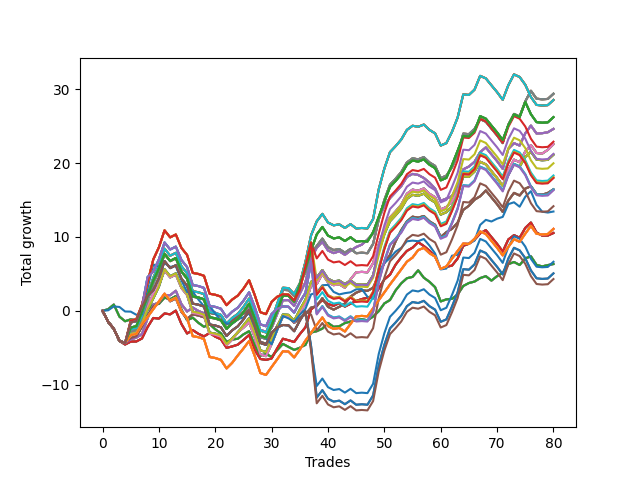

# Short Bulldog 005 
- Symbol: SPY_Unlimited
- Date Range: 03/23/2022 - 07/08/2022
- Trading Period: 7:20-12:30
- Number of Trades: 80



| Name | Win Percent | Profit | Avg Profit / Trade | Avg Time / Trade |      | Name | Win Percent | Profit | Avg Profit / Trade | Avg Time / Trade |
| ---- | ----------- | ------ | ------------------ | ---------------- | ---- | ---- | ----------- | ------ | ------------------ | ---------------- |
| Sorted By <br> Profit | | | | | | Sorted By <br> Win Percentage ||||
| Sixty-Nine | 55.00 | 14690.00 | 183.63 | 25:23 |     | Sixty-Four | 67.50 | 3165.00 | 39.56 | 10:32 |
| Sixty-One | 55.00 | 14690.00 | 183.63 | 25:23 |     | Fifty-Six | 67.50 | 3165.00 | 39.56 | 10:32 |
| Fifty-Three | 55.00 | 14690.00 | 183.63 | 25:23 |     | Forty-Eight | 67.50 | 3165.00 | 39.56 | 10:32 |
| Forty-Five | 55.00 | 14690.00 | 183.63 | 25:23 |     | Forty | 67.50 | 3165.00 | 39.56 | 10:32 |
| Five | 55.00 | 14690.00 | 183.63 | 25:23 |     | Zero | 67.50 | 3165.00 | 39.56 | 10:32 |
| Seventy-One | 52.50 | 14270.00 | 178.38 | 27:27 |     | Sixty-Six | 63.75 | 12310.00 | 153.88 | 19:37 |
| Sixty-Three | 52.50 | 14270.00 | 178.38 | 27:27 |     | Fifty-Eight | 63.75 | 12310.00 | 153.88 | 19:37 |
| Fifty-Five | 52.50 | 14270.00 | 178.38 | 27:27 |     | Fifty | 63.75 | 12310.00 | 153.88 | 19:37 |
| Forty-Seven | 52.50 | 14270.00 | 178.38 | 27:27 |     | Forty-Two | 63.75 | 12310.00 | 153.88 | 19:37 |
| Seven | 52.50 | 14270.00 | 178.38 | 27:27 |     | Two | 63.75 | 12310.00 | 153.88 | 19:37 |
| One Hundred Twenty-Seven | 53.75 | 13105.00 | 163.81 | 25:53 |     | Sixty-Seven | 62.50 | 8220.00 | 102.75 | 19:31 |
| One Hundred Twenty-Two | 53.75 | 13105.00 | 163.81 | 25:53 |     | Fifty-Nine | 62.50 | 8220.00 | 102.75 | 19:31 |
| One Hundred Seventeen | 53.75 | 13105.00 | 163.81 | 25:53 |     | Fifty-One | 62.50 | 8220.00 | 102.75 | 19:31 |
| One Hundred Twelve | 53.75 | 13105.00 | 163.81 | 25:53 |     | Forty-Three | 62.50 | 8220.00 | 102.75 | 19:31 |
| Eighty-Two | 53.75 | 13105.00 | 163.81 | 25:53 |     | Three | 62.50 | 8220.00 | 102.75 | 19:31 |
| Sixty-Six | 63.75 | 12310.00 | 153.88 | 19:37 |     | Sixty-Five | 60.00 | 5265.00 | 65.81 | 16:25 |
| Fifty-Eight | 63.75 | 12310.00 | 153.88 | 19:37 |     | Fifty-Seven | 60.00 | 5265.00 | 65.81 | 16:25 |
| Fifty | 63.75 | 12310.00 | 153.88 | 19:37 |     | Forty-Nine | 60.00 | 5265.00 | 65.81 | 16:25 |
| Forty-Two | 63.75 | 12310.00 | 153.88 | 19:37 |     | Forty-One | 60.00 | 5265.00 | 65.81 | 16:25 |
| Two | 63.75 | 12310.00 | 153.88 | 19:37 |     | One | 60.00 | 5265.00 | 65.81 | 16:25 |
| One Hundred Eighteen | 51.25 | 11445.00 | 143.06 | 28:20 |     | Seventy-Three | 57.50 | 6720.00 | 84.00 | 13:03 |
| Sixty-Eight | 56.25 | 11275.00 | 140.94 | 23:27 |     | One Hundred Twenty-Six | 57.50 | 5545.00 | 69.31 | 21:26 |
| Sixty | 56.25 | 11275.00 | 140.94 | 23:27 |     | One Hundred Twenty-One | 57.50 | 5545.00 | 69.31 | 21:26 |
| Fifty-Two | 56.25 | 11275.00 | 140.94 | 23:27 |     | One Hundred Sixteen | 57.50 | 5545.00 | 69.31 | 21:26 |
| Forty-Four | 56.25 | 11275.00 | 140.94 | 23:27 |     | One Hundred Eleven | 57.50 | 5545.00 | 69.31 | 21:26 |
| Four | 56.25 | 11275.00 | 140.94 | 23:27 |     | Eighty-One | 57.50 | 5545.00 | 69.31 | 21:26 |
| One Hundred Ninteen | 51.25 | 10620.00 | 132.75 | 28:55 |     | Sixty-Eight | 56.25 | 11275.00 | 140.94 | 23:27 |
| Seventy | 55.00 | 10565.00 | 132.06 | 24:29 |     | Sixty | 56.25 | 11275.00 | 140.94 | 23:27 |
| Sixty-Two | 55.00 | 10565.00 | 132.06 | 24:29 |     | Fifty-Two | 56.25 | 11275.00 | 140.94 | 23:27 |
| Fifty-Four | 55.00 | 10565.00 | 132.06 | 24:29 |     | Forty-Four | 56.25 | 11275.00 | 140.94 | 23:27 |
| Forty-Six | 55.00 | 10565.00 | 132.06 | 24:29 |     | Four | 56.25 | 11275.00 | 140.94 | 23:27 |
| Six | 55.00 | 10565.00 | 132.06 | 24:29 |     | Sixty-Nine | 55.00 | 14690.00 | 183.63 | 25:23 |
| One Hundred Thirteen | 51.25 | 9985.00 | 124.81 | 28:22 |     | Sixty-One | 55.00 | 14690.00 | 183.63 | 25:23 |
| One Hundred Fourteen | 51.25 | 9160.00 | 114.50 | 28:57 |     | Fifty-Three | 55.00 | 14690.00 | 183.63 | 25:23 |
| One Hundred Twenty-Three | 51.25 | 9040.00 | 113.00 | 28:32 |     | Forty-Five | 55.00 | 14690.00 | 183.63 | 25:23 |
| Eighty-Three | 51.25 | 9040.00 | 113.00 | 28:32 |     | Five | 55.00 | 14690.00 | 183.63 | 25:23 |
| One Hundred Twenty-Eight | 51.25 | 8980.00 | 112.25 | 28:29 |     | Seventy | 55.00 | 10565.00 | 132.06 | 24:29 |
| Sixty-Seven | 62.50 | 8220.00 | 102.75 | 19:31 |     | Sixty-Two | 55.00 | 10565.00 | 132.06 | 24:29 |
| Fifty-Nine | 62.50 | 8220.00 | 102.75 | 19:31 |     | Fifty-Four | 55.00 | 10565.00 | 132.06 | 24:29 |
| Fifty-One | 62.50 | 8220.00 | 102.75 | 19:31 |     | Forty-Six | 55.00 | 10565.00 | 132.06 | 24:29 |
| Forty-Three | 62.50 | 8220.00 | 102.75 | 19:31 |     | Six | 55.00 | 10565.00 | 132.06 | 24:29 |
| Three | 62.50 | 8220.00 | 102.75 | 19:31 |     | One Hundred Twenty-Seven | 53.75 | 13105.00 | 163.81 | 25:53 |
| One Hundred Twenty-Four | 51.25 | 8215.00 | 102.69 | 29:07 |     | One Hundred Twenty-Two | 53.75 | 13105.00 | 163.81 | 25:53 |
| Eighty-Four | 51.25 | 8215.00 | 102.69 | 29:07 |     | One Hundred Seventeen | 53.75 | 13105.00 | 163.81 | 25:53 |
| One Hundred Twenty-Nine | 51.25 | 8155.00 | 101.94 | 29:04 |     | One Hundred Twelve | 53.75 | 13105.00 | 163.81 | 25:53 |
| One Hundred Twenty | 50.00 | 7080.00 | 88.50 | 29:19 |     | Eighty-Two | 53.75 | 13105.00 | 163.81 | 25:53 |
| Seventy-Three | 57.50 | 6720.00 | 84.00 | 13:03 |     | Seventy-One | 52.50 | 14270.00 | 178.38 | 27:27 |
| One Hundred Twenty-Six | 57.50 | 5545.00 | 69.31 | 21:26 |     | Sixty-Three | 52.50 | 14270.00 | 178.38 | 27:27 |
| One Hundred Twenty-One | 57.50 | 5545.00 | 69.31 | 21:26 |     | Fifty-Five | 52.50 | 14270.00 | 178.38 | 27:27 |
| One Hundred Sixteen | 57.50 | 5545.00 | 69.31 | 21:26 |     | Forty-Seven | 52.50 | 14270.00 | 178.38 | 27:27 |
| One Hundred Eleven | 57.50 | 5545.00 | 69.31 | 21:26 |     | Seven | 52.50 | 14270.00 | 178.38 | 27:27 |
| Eighty-One | 57.50 | 5545.00 | 69.31 | 21:26 |     | One Hundred Eighteen | 51.25 | 11445.00 | 143.06 | 28:20 |
| Sixty-Five | 60.00 | 5265.00 | 65.81 | 16:25 |     | One Hundred Ninteen | 51.25 | 10620.00 | 132.75 | 28:55 |
| Fifty-Seven | 60.00 | 5265.00 | 65.81 | 16:25 |     | One Hundred Thirteen | 51.25 | 9985.00 | 124.81 | 28:22 |
| Forty-Nine | 60.00 | 5265.00 | 65.81 | 16:25 |     | One Hundred Fourteen | 51.25 | 9160.00 | 114.50 | 28:57 |
| Forty-One | 60.00 | 5265.00 | 65.81 | 16:25 |     | One Hundred Twenty-Three | 51.25 | 9040.00 | 113.00 | 28:32 |
| One | 60.00 | 5265.00 | 65.81 | 16:25 |     | Eighty-Three | 51.25 | 9040.00 | 113.00 | 28:32 |
| One Hundred Fifteen | 50.00 | 3320.00 | 41.50 | 29:30 |     | One Hundred Twenty-Eight | 51.25 | 8980.00 | 112.25 | 28:29 |
| Sixty-Four | 67.50 | 3165.00 | 39.56 | 10:32 |     | One Hundred Twenty-Four | 51.25 | 8215.00 | 102.69 | 29:07 |
| Fifty-Six | 67.50 | 3165.00 | 39.56 | 10:32 |     | Eighty-Four | 51.25 | 8215.00 | 102.69 | 29:07 |
| Forty-Eight | 67.50 | 3165.00 | 39.56 | 10:32 |     | One Hundred Twenty-Nine | 51.25 | 8155.00 | 101.94 | 29:04 |
| Forty | 67.50 | 3165.00 | 39.56 | 10:32 |     | One Hundred Twenty | 50.00 | 7080.00 | 88.50 | 29:19 |
| Zero | 67.50 | 3165.00 | 39.56 | 10:32 |     | One Hundred Fifteen | 50.00 | 3320.00 | 41.50 | 29:30 |
| One Hundred Twenty-Five | 50.00 | 2535.00 | 31.69 | 29:43 |     | One Hundred Twenty-Five | 50.00 | 2535.00 | 31.69 | 29:43 |
| Eighty-Five | 50.00 | 2535.00 | 31.69 | 29:43 |     | Eighty-Five | 50.00 | 2535.00 | 31.69 | 29:43 |
| One Hundred Thirty | 50.00 | 2150.00 | 26.88 | 29:38 |     | One Hundred Thirty | 50.00 | 2150.00 | 26.88 | 29:38 |

## NO STOPLOSS

### Test Zero
* Sell when price hits the middle line of the 20p bollinger
* No Stoploss
* Results:
```
Total Trades: 80
Percent Up: 32.50
Percent Down: 67.50
Total Points Moved Down: 6.33
Potential Profit: 3165.00
Total Points Ups: 21.26 Count Ups: 26
Total Points Downs: 27.59 Count Downs: 54
```

<details><summary>Trades</summary>

<code>In: 2022-03-24 08:03:00		Out: 2022-03-24 08:04:30		Total Position Time: 01:30		Total Move Down: 0.22		Total to Date: 0.22</code> <br />
<code>In: 2022-03-24 08:08:00		Out: 2022-03-24 08:09:05		Total Position Time: 01:05		Total Move Down: 0.63		Total to Date: 0.85</code> <br />
<code>In: 2022-03-24 08:14:00		Out: 2022-03-24 08:43:55		Total Position Time: 29:55		Total Move Down: -1.64		Total to Date: -0.79</code> <br />
<code>In: 2022-03-25 07:26:00		Out: 2022-03-25 07:51:05		Total Position Time: 25:05		Total Move Down: -0.62		Total to Date: -1.41</code> <br />
<code>In: 2022-03-25 07:44:00		Out: 2022-03-25 07:51:05		Total Position Time: 07:05		Total Move Down: 0.25		Total to Date: -1.16</code> <br />
<code>In: 2022-03-31 07:48:00		Out: 2022-03-31 08:03:05		Total Position Time: 15:05		Total Move Down: -0.12		Total to Date: -1.28</code> <br />
<code>In: 2022-04-06 10:43:00		Out: 2022-04-06 10:47:10		Total Position Time: 04:10		Total Move Down: 0.44		Total to Date: -0.84</code> <br />
<code>In: 2022-04-06 11:04:00		Out: 2022-04-06 11:05:35		Total Position Time: 01:35		Total Move Down: 1.01		Total to Date: 0.17</code> <br />
<code>In: 2022-04-06 11:05:00		Out: 2022-04-06 11:05:35		Total Position Time: 00:35		Total Move Down: 0.68		Total to Date: 0.85</code> <br />
<code>In: 2022-04-06 11:57:00		Out: 2022-04-06 12:07:45		Total Position Time: 10:45		Total Move Down: 0.08		Total to Date: 0.93</code> <br />
<code>In: 2022-04-06 12:02:00		Out: 2022-04-06 12:07:45		Total Position Time: 05:45		Total Move Down: 0.85		Total to Date: 1.78</code> <br />
<code>In: 2022-04-07 10:58:00		Out: 2022-04-07 11:15:20		Total Position Time: 17:20		Total Move Down: -0.21		Total to Date: 1.57</code> <br />
<code>In: 2022-04-07 11:03:00		Out: 2022-04-07 11:15:20		Total Position Time: 12:20		Total Move Down: 0.42		Total to Date: 1.99</code> <br />
<code>In: 2022-04-07 11:50:00		Out: 2022-04-07 12:19:10		Total Position Time: 29:10		Total Move Down: -1.82		Total to Date: 0.17</code> <br />
<code>In: 2022-04-07 11:54:00		Out: 2022-04-07 12:19:10		Total Position Time: 25:10		Total Move Down: -1.45		Total to Date: -1.28</code> <br />
<code>In: 2022-04-08 07:33:00		Out: 2022-04-08 07:44:35		Total Position Time: 11:35		Total Move Down: 0.35		Total to Date: -0.93</code> <br />
<code>In: 2022-04-08 07:54:00		Out: 2022-04-08 08:15:35		Total Position Time: 21:35		Total Move Down: -0.69		Total to Date: -1.62</code> <br />
<code>In: 2022-04-08 07:57:00		Out: 2022-04-08 08:15:35		Total Position Time: 18:35		Total Move Down: -0.54		Total to Date: -2.16</code> <br />
<code>In: 2022-04-08 07:33:00		Out: 2022-04-08 07:44:35		Total Position Time: 11:35		Total Move Down: 0.35		Total to Date: -1.81</code> <br />
<code>In: 2022-04-08 07:54:00		Out: 2022-04-08 08:15:35		Total Position Time: 21:35		Total Move Down: -0.69		Total to Date: -2.50</code> <br />
<code>In: 2022-04-08 07:57:00		Out: 2022-04-08 08:15:35		Total Position Time: 18:35		Total Move Down: -0.54		Total to Date: -3.04</code> <br />
<code>In: 2022-04-13 08:06:00		Out: 2022-04-13 08:35:55		Total Position Time: 29:55		Total Move Down: -1.16		Total to Date: -4.20</code> <br />
<code>In: 2022-04-18 07:27:00		Out: 2022-04-18 07:36:45		Total Position Time: 09:45		Total Move Down: 0.31		Total to Date: -3.89</code> <br />
<code>In: 2022-04-18 07:41:00		Out: 2022-04-18 07:44:15		Total Position Time: 03:15		Total Move Down: 0.11		Total to Date: -3.78</code> <br />
<code>In: 2022-04-18 11:26:00		Out: 2022-04-18 11:28:05		Total Position Time: 02:05		Total Move Down: 0.59		Total to Date: -3.19</code> <br />
<code>In: 2022-04-20 10:49:00		Out: 2022-04-20 10:50:05		Total Position Time: 01:05		Total Move Down: 0.43		Total to Date: -2.76</code> <br />
<code>In: 2022-04-25 11:11:00		Out: 2022-04-25 11:39:45		Total Position Time: 28:45		Total Move Down: -1.92		Total to Date: -4.68</code> <br />
<code>In: 2022-04-25 11:17:00		Out: 2022-04-25 11:39:45		Total Position Time: 22:45		Total Move Down: -1.39		Total to Date: -6.07</code> <br />
<code>In: 2022-04-27 09:25:00		Out: 2022-04-27 09:37:00		Total Position Time: 12:00		Total Move Down: 0.22		Total to Date: -5.85</code> <br />
<code>In: 2022-05-02 07:28:00		Out: 2022-05-02 07:44:10		Total Position Time: 16:10		Total Move Down: -0.38		Total to Date: -6.23</code> <br />
<code>In: 2022-05-03 07:34:00		Out: 2022-05-03 07:38:00		Total Position Time: 04:00		Total Move Down: 0.93		Total to Date: -5.30</code> <br />
<code>In: 2022-05-03 07:35:00		Out: 2022-05-03 07:38:00		Total Position Time: 03:00		Total Move Down: 0.82		Total to Date: -4.48</code> <br />
<code>In: 2022-05-03 08:10:00		Out: 2022-05-03 08:35:55		Total Position Time: 25:55		Total Move Down: -0.41		Total to Date: -4.89</code> <br />
<code>In: 2022-05-04 09:24:00		Out: 2022-05-04 09:45:30		Total Position Time: 21:30		Total Move Down: -0.40		Total to Date: -5.29</code> <br />
<code>In: 2022-05-04 11:03:00		Out: 2022-05-04 11:03:10		Total Position Time: 00:10		Total Move Down: 0.29		Total to Date: -5.00</code> <br />
<code>In: 2022-05-04 11:07:00		Out: 2022-05-04 11:07:10		Total Position Time: 00:10		Total Move Down: 0.39		Total to Date: -4.61</code> <br />
<code>In: 2022-05-04 11:30:00		Out: 2022-05-04 11:30:45		Total Position Time: 00:45		Total Move Down: 1.67		Total to Date: -2.94</code> <br />
<code>In: 2022-05-04 11:31:00		Out: 2022-05-04 11:31:10		Total Position Time: 00:10		Total Move Down: 0.18		Total to Date: -2.76</code> <br />
<code>In: 2022-05-16 09:05:00		Out: 2022-05-16 09:05:45		Total Position Time: 00:45		Total Move Down: 0.35		Total to Date: -2.41</code> <br />
<code>In: 2022-05-16 10:15:00		Out: 2022-05-16 10:18:25		Total Position Time: 03:25		Total Move Down: 0.77		Total to Date: -1.64</code> <br />
<code>In: 2022-05-16 10:25:00		Out: 2022-05-16 10:42:15		Total Position Time: 17:15		Total Move Down: -0.53		Total to Date: -2.17</code> <br />
<code>In: 2022-05-16 10:30:00		Out: 2022-05-16 10:42:15		Total Position Time: 12:15		Total Move Down: 0.08		Total to Date: -2.09</code> <br />
<code>In: 2022-05-16 11:07:00		Out: 2022-05-16 11:11:45		Total Position Time: 04:45		Total Move Down: 0.43		Total to Date: -1.66</code> <br />
<code>In: 2022-05-16 11:32:00		Out: 2022-05-16 11:41:45		Total Position Time: 09:45		Total Move Down: 0.21		Total to Date: -1.45</code> <br />
<code>In: 2022-05-17 09:48:00		Out: 2022-05-17 09:51:15		Total Position Time: 03:15		Total Move Down: 0.21		Total to Date: -1.24</code> <br />
<code>In: 2022-05-17 10:15:00		Out: 2022-05-17 10:23:15		Total Position Time: 08:15		Total Move Down: 0.11		Total to Date: -1.13</code> <br />
<code>In: 2022-05-19 08:40:00		Out: 2022-05-19 08:53:40		Total Position Time: 13:40		Total Move Down: -0.16		Total to Date: -1.29</code> <br />
<code>In: 2022-05-19 11:52:00		Out: 2022-05-19 11:57:50		Total Position Time: 05:50		Total Move Down: 0.51		Total to Date: -0.78</code> <br />
<code>In: 2022-05-19 12:05:00		Out: 2022-05-19 12:09:40		Total Position Time: 04:40		Total Move Down: 0.73		Total to Date: -0.05</code> <br />
<code>In: 2022-05-24 09:17:00		Out: 2022-05-24 09:21:35		Total Position Time: 04:35		Total Move Down: 1.05		Total to Date: 1.00</code> <br />
<code>In: 2022-05-24 09:18:00		Out: 2022-05-24 09:21:35		Total Position Time: 03:35		Total Move Down: 0.46		Total to Date: 1.46</code> <br />
<code>In: 2022-05-24 11:13:00		Out: 2022-05-24 11:18:25		Total Position Time: 05:25		Total Move Down: 1.31		Total to Date: 2.77</code> <br />
<code>In: 2022-05-24 11:14:00		Out: 2022-05-24 11:18:25		Total Position Time: 04:25		Total Move Down: 0.95		Total to Date: 3.72</code> <br />
<code>In: 2022-05-25 07:36:00		Out: 2022-05-25 07:42:00		Total Position Time: 06:00		Total Move Down: 0.69		Total to Date: 4.41</code> <br />
<code>In: 2022-05-25 12:05:00		Out: 2022-05-25 12:17:30		Total Position Time: 12:30		Total Move Down: 0.18		Total to Date: 4.59</code> <br />
<code>In: 2022-05-31 07:23:00		Out: 2022-05-31 07:30:05		Total Position Time: 07:05		Total Move Down: 0.89		Total to Date: 5.48</code> <br />
<code>In: 2022-05-31 08:53:00		Out: 2022-05-31 09:13:05		Total Position Time: 20:05		Total Move Down: -1.00		Total to Date: 4.48</code> <br />
<code>In: 2022-06-02 08:05:00		Out: 2022-06-02 08:22:05		Total Position Time: 17:05		Total Move Down: -0.55		Total to Date: 3.93</code> <br />
<code>In: 2022-06-02 08:06:00		Out: 2022-06-02 08:22:05		Total Position Time: 16:05		Total Move Down: -0.73		Total to Date: 3.20</code> <br />
<code>In: 2022-06-07 07:31:00		Out: 2022-06-07 07:56:05		Total Position Time: 25:05		Total Move Down: -1.93		Total to Date: 1.27</code> <br />
<code>In: 2022-06-08 08:19:00		Out: 2022-06-08 08:31:15		Total Position Time: 12:15		Total Move Down: 0.28		Total to Date: 1.55</code> <br />
<code>In: 2022-06-09 10:08:00		Out: 2022-06-09 10:16:15		Total Position Time: 08:15		Total Move Down: 0.07		Total to Date: 1.62</code> <br />
<code>In: 2022-06-10 12:29:00		Out: 2022-06-10 12:30:30		Total Position Time: 01:30		Total Move Down: 0.58		Total to Date: 2.20</code> <br />
<code>In: 2022-06-13 09:40:00		Out: 2022-06-13 09:44:05		Total Position Time: 04:05		Total Move Down: 1.16		Total to Date: 3.36</code> <br />
<code>In: 2022-06-23 07:42:00		Out: 2022-06-23 07:51:10		Total Position Time: 09:10		Total Move Down: 0.40		Total to Date: 3.76</code> <br />
<code>In: 2022-06-23 07:58:00		Out: 2022-06-23 08:00:05		Total Position Time: 02:05		Total Move Down: 0.20		Total to Date: 3.96</code> <br />
<code>In: 2022-06-23 08:15:00		Out: 2022-06-23 08:21:05		Total Position Time: 06:05		Total Move Down: 0.47		Total to Date: 4.43</code> <br />
<code>In: 2022-06-27 07:53:00		Out: 2022-06-27 08:02:15		Total Position Time: 09:15		Total Move Down: 0.26		Total to Date: 4.69</code> <br />
<code>In: 2022-06-30 08:11:00		Out: 2022-06-30 08:35:00		Total Position Time: 24:00		Total Move Down: -0.60		Total to Date: 4.09</code> <br />
<code>In: 2022-06-30 08:29:00		Out: 2022-06-30 08:35:00		Total Position Time: 06:00		Total Move Down: 0.60		Total to Date: 4.69</code> <br />
<code>In: 2022-06-30 08:30:00		Out: 2022-06-30 08:35:00		Total Position Time: 05:00		Total Move Down: 0.46		Total to Date: 5.15</code> <br />
<code>In: 2022-07-05 07:40:00		Out: 2022-07-05 07:44:30		Total Position Time: 04:30		Total Move Down: 1.16		Total to Date: 6.31</code> <br />
<code>In: 2022-07-05 09:27:00		Out: 2022-07-05 09:40:10		Total Position Time: 13:10		Total Move Down: 0.30		Total to Date: 6.61</code> <br />
<code>In: 2022-07-05 11:34:00		Out: 2022-07-05 11:48:10		Total Position Time: 14:10		Total Move Down: -0.41		Total to Date: 6.20</code> <br />
<code>In: 2022-07-06 11:09:00		Out: 2022-07-06 11:10:10		Total Position Time: 01:10		Total Move Down: 0.89		Total to Date: 7.09</code> <br />
<code>In: 2022-07-06 11:10:00		Out: 2022-07-06 11:10:10		Total Position Time: 00:10		Total Move Down: 0.29		Total to Date: 7.38</code> <br />
<code>In: 2022-07-06 11:31:00		Out: 2022-07-06 11:50:00		Total Position Time: 19:00		Total Move Down: -1.16		Total to Date: 6.22</code> <br />
<code>In: 2022-07-06 11:35:00		Out: 2022-07-06 11:50:00		Total Position Time: 15:00		Total Move Down: -0.21		Total to Date: 6.01</code> <br />
<code>In: 2022-07-07 07:56:00		Out: 2022-07-07 08:01:10		Total Position Time: 05:10		Total Move Down: 0.18		Total to Date: 6.19</code> <br />
<code>In: 2022-07-07 12:18:00		Out: 2022-07-07 12:24:15		Total Position Time: 06:15		Total Move Down: 0.14		Total to Date: 6.33</code> <br />


</details>

### Test One
* Sell when the price hits the upper line of the 20p 1std bollinger
* No Stoploss
* Results:
```
Total Trades: 80
Percent Up: 40.00
Percent Down: 60.00
Total Points Moved Down: 10.53
Potential Profit: 5265.00
Total Points Ups: 24.43 Count Ups: 32
Total Points Downs: 34.96 Count Downs: 48
```

<details><summary>Trades</summary>

<code>In: 2022-03-24 08:03:00		Out: 2022-03-24 08:32:55		Total Position Time: 29:55		Total Move Down: -1.50		Total to Date: -1.50</code> <br />
<code>In: 2022-03-24 08:08:00		Out: 2022-03-24 08:37:55		Total Position Time: 29:55		Total Move Down: -0.94		Total to Date: -2.44</code> <br />
<code>In: 2022-03-24 08:14:00		Out: 2022-03-24 08:43:55		Total Position Time: 29:55		Total Move Down: -1.64		Total to Date: -4.08</code> <br />
<code>In: 2022-03-25 07:26:00		Out: 2022-03-25 07:53:50		Total Position Time: 27:50		Total Move Down: -0.48		Total to Date: -4.56</code> <br />
<code>In: 2022-03-25 07:44:00		Out: 2022-03-25 07:53:50		Total Position Time: 09:50		Total Move Down: 0.39		Total to Date: -4.17</code> <br />
<code>In: 2022-03-31 07:48:00		Out: 2022-03-31 08:08:00		Total Position Time: 20:00		Total Move Down: 0.02		Total to Date: -4.15</code> <br />
<code>In: 2022-04-06 10:43:00		Out: 2022-04-06 10:56:55		Total Position Time: 13:55		Total Move Down: 0.41		Total to Date: -3.74</code> <br />
<code>In: 2022-04-06 11:04:00		Out: 2022-04-06 11:07:20		Total Position Time: 03:20		Total Move Down: 1.55		Total to Date: -2.19</code> <br />
<code>In: 2022-04-06 11:05:00		Out: 2022-04-06 11:07:20		Total Position Time: 02:20		Total Move Down: 1.22		Total to Date: -0.97</code> <br />
<code>In: 2022-04-06 11:57:00		Out: 2022-04-06 12:17:05		Total Position Time: 20:05		Total Move Down: -0.08		Total to Date: -1.05</code> <br />
<code>In: 2022-04-06 12:02:00		Out: 2022-04-06 12:17:05		Total Position Time: 15:05		Total Move Down: 0.69		Total to Date: -0.36</code> <br />
<code>In: 2022-04-07 10:58:00		Out: 2022-04-07 11:18:00		Total Position Time: 20:00		Total Move Down: -0.12		Total to Date: -0.48</code> <br />
<code>In: 2022-04-07 11:03:00		Out: 2022-04-07 11:18:00		Total Position Time: 15:00		Total Move Down: 0.51		Total to Date: 0.03</code> <br />
<code>In: 2022-04-07 11:50:00		Out: 2022-04-07 12:19:55		Total Position Time: 29:55		Total Move Down: -1.82		Total to Date: -1.79</code> <br />
<code>In: 2022-04-07 11:54:00		Out: 2022-04-07 12:20:35		Total Position Time: 26:35		Total Move Down: -1.28		Total to Date: -3.07</code> <br />
<code>In: 2022-04-08 07:33:00		Out: 2022-04-08 07:45:55		Total Position Time: 12:55		Total Move Down: 0.46		Total to Date: -2.61</code> <br />
<code>In: 2022-04-08 07:54:00		Out: 2022-04-08 08:17:05		Total Position Time: 23:05		Total Move Down: -0.50		Total to Date: -3.11</code> <br />
<code>In: 2022-04-08 07:57:00		Out: 2022-04-08 08:17:05		Total Position Time: 20:05		Total Move Down: -0.35		Total to Date: -3.46</code> <br />
<code>In: 2022-04-08 07:33:00		Out: 2022-04-08 07:45:55		Total Position Time: 12:55		Total Move Down: 0.46		Total to Date: -3.00</code> <br />
<code>In: 2022-04-08 07:54:00		Out: 2022-04-08 08:17:05		Total Position Time: 23:05		Total Move Down: -0.50		Total to Date: -3.50</code> <br />
<code>In: 2022-04-08 07:57:00		Out: 2022-04-08 08:17:05		Total Position Time: 20:05		Total Move Down: -0.35		Total to Date: -3.85</code> <br />
<code>In: 2022-04-13 08:06:00		Out: 2022-04-13 08:35:55		Total Position Time: 29:55		Total Move Down: -1.16		Total to Date: -5.01</code> <br />
<code>In: 2022-04-18 07:27:00		Out: 2022-04-18 07:51:15		Total Position Time: 24:15		Total Move Down: 0.19		Total to Date: -4.82</code> <br />
<code>In: 2022-04-18 07:41:00		Out: 2022-04-18 07:51:15		Total Position Time: 10:15		Total Move Down: 0.24		Total to Date: -4.58</code> <br />
<code>In: 2022-04-18 11:26:00		Out: 2022-04-18 11:41:15		Total Position Time: 15:15		Total Move Down: 0.63		Total to Date: -3.95</code> <br />
<code>In: 2022-04-20 10:49:00		Out: 2022-04-20 10:53:20		Total Position Time: 04:20		Total Move Down: 0.68		Total to Date: -3.27</code> <br />
<code>In: 2022-04-25 11:11:00		Out: 2022-04-25 11:40:55		Total Position Time: 29:55		Total Move Down: -2.01		Total to Date: -5.28</code> <br />
<code>In: 2022-04-25 11:17:00		Out: 2022-04-25 11:44:40		Total Position Time: 27:40		Total Move Down: -1.24		Total to Date: -6.52</code> <br />
<code>In: 2022-04-27 09:25:00		Out: 2022-04-27 09:50:25		Total Position Time: 25:25		Total Move Down: -0.12		Total to Date: -6.64</code> <br />
<code>In: 2022-05-02 07:28:00		Out: 2022-05-02 07:44:50		Total Position Time: 16:50		Total Move Down: 0.19		Total to Date: -6.45</code> <br />
<code>In: 2022-05-03 07:34:00		Out: 2022-05-03 07:40:55		Total Position Time: 06:55		Total Move Down: 1.39		Total to Date: -5.06</code> <br />
<code>In: 2022-05-03 07:35:00		Out: 2022-05-03 07:40:55		Total Position Time: 05:55		Total Move Down: 1.28		Total to Date: -3.78</code> <br />
<code>In: 2022-05-03 08:10:00		Out: 2022-05-03 08:38:05		Total Position Time: 28:05		Total Move Down: -0.21		Total to Date: -3.99</code> <br />
<code>In: 2022-05-04 09:24:00		Out: 2022-05-04 09:46:30		Total Position Time: 22:30		Total Move Down: -0.23		Total to Date: -4.22</code> <br />
<code>In: 2022-05-04 11:03:00		Out: 2022-05-04 11:07:20		Total Position Time: 04:20		Total Move Down: 1.06		Total to Date: -3.16</code> <br />
<code>In: 2022-05-04 11:07:00		Out: 2022-05-04 11:07:20		Total Position Time: 00:20		Total Move Down: 0.93		Total to Date: -2.23</code> <br />
<code>In: 2022-05-04 11:30:00		Out: 2022-05-04 11:30:50		Total Position Time: 00:50		Total Move Down: 2.43		Total to Date: 0.20</code> <br />
<code>In: 2022-05-04 11:31:00		Out: 2022-05-04 11:31:20		Total Position Time: 00:20		Total Move Down: 0.59		Total to Date: 0.79</code> <br />
<code>In: 2022-05-16 09:05:00		Out: 2022-05-16 09:06:15		Total Position Time: 01:15		Total Move Down: 0.66		Total to Date: 1.45</code> <br />
<code>In: 2022-05-16 10:15:00		Out: 2022-05-16 10:42:35		Total Position Time: 27:35		Total Move Down: -0.53		Total to Date: 0.92</code> <br />
<code>In: 2022-05-16 10:25:00		Out: 2022-05-16 10:42:35		Total Position Time: 17:35		Total Move Down: -0.24		Total to Date: 0.68</code> <br />
<code>In: 2022-05-16 10:30:00		Out: 2022-05-16 10:42:35		Total Position Time: 12:35		Total Move Down: 0.37		Total to Date: 1.05</code> <br />
<code>In: 2022-05-16 11:07:00		Out: 2022-05-16 11:36:55		Total Position Time: 29:55		Total Move Down: -0.48		Total to Date: 0.57</code> <br />
<code>In: 2022-05-16 11:32:00		Out: 2022-05-16 11:44:50		Total Position Time: 12:50		Total Move Down: 0.39		Total to Date: 0.96</code> <br />
<code>In: 2022-05-17 09:48:00		Out: 2022-05-17 09:54:40		Total Position Time: 06:40		Total Move Down: 0.37		Total to Date: 1.33</code> <br />
<code>In: 2022-05-17 10:15:00		Out: 2022-05-17 10:25:15		Total Position Time: 10:15		Total Move Down: 0.26		Total to Date: 1.59</code> <br />
<code>In: 2022-05-19 08:40:00		Out: 2022-05-19 08:54:45		Total Position Time: 14:45		Total Move Down: 0.18		Total to Date: 1.77</code> <br />
<code>In: 2022-05-19 11:52:00		Out: 2022-05-19 12:10:10		Total Position Time: 18:10		Total Move Down: -0.01		Total to Date: 1.76</code> <br />
<code>In: 2022-05-19 12:05:00		Out: 2022-05-19 12:10:10		Total Position Time: 05:10		Total Move Down: 1.26		Total to Date: 3.02</code> <br />
<code>In: 2022-05-24 09:17:00		Out: 2022-05-24 09:28:55		Total Position Time: 11:55		Total Move Down: 1.23		Total to Date: 4.25</code> <br />
<code>In: 2022-05-24 09:18:00		Out: 2022-05-24 09:28:55		Total Position Time: 10:55		Total Move Down: 0.64		Total to Date: 4.89</code> <br />
<code>In: 2022-05-24 11:13:00		Out: 2022-05-24 11:31:25		Total Position Time: 18:25		Total Move Down: 1.36		Total to Date: 6.25</code> <br />
<code>In: 2022-05-24 11:14:00		Out: 2022-05-24 11:31:25		Total Position Time: 17:25		Total Move Down: 1.00		Total to Date: 7.25</code> <br />
<code>In: 2022-05-25 07:36:00		Out: 2022-05-25 07:46:40		Total Position Time: 10:40		Total Move Down: 0.86		Total to Date: 8.11</code> <br />
<code>In: 2022-05-25 12:05:00		Out: 2022-05-25 12:20:25		Total Position Time: 15:25		Total Move Down: 0.44		Total to Date: 8.55</code> <br />
<code>In: 2022-05-31 07:23:00		Out: 2022-05-31 07:38:05		Total Position Time: 15:05		Total Move Down: 0.74		Total to Date: 9.29</code> <br />
<code>In: 2022-05-31 08:53:00		Out: 2022-05-31 09:14:40		Total Position Time: 21:40		Total Move Down: -0.52		Total to Date: 8.77</code> <br />
<code>In: 2022-06-02 08:05:00		Out: 2022-06-02 08:28:15		Total Position Time: 23:15		Total Move Down: -0.62		Total to Date: 8.15</code> <br />
<code>In: 2022-06-02 08:06:00		Out: 2022-06-02 08:28:15		Total Position Time: 22:15		Total Move Down: -0.80		Total to Date: 7.35</code> <br />
<code>In: 2022-06-07 07:31:00		Out: 2022-06-07 07:57:55		Total Position Time: 26:55		Total Move Down: -1.68		Total to Date: 5.67</code> <br />
<code>In: 2022-06-08 08:19:00		Out: 2022-06-08 08:34:20		Total Position Time: 15:20		Total Move Down: 0.28		Total to Date: 5.95</code> <br />
<code>In: 2022-06-09 10:08:00		Out: 2022-06-09 10:18:10		Total Position Time: 10:10		Total Move Down: 0.17		Total to Date: 6.12</code> <br />
<code>In: 2022-06-10 12:29:00		Out: 2022-06-10 12:35:45		Total Position Time: 06:45		Total Move Down: 0.96		Total to Date: 7.08</code> <br />
<code>In: 2022-06-13 09:40:00		Out: 2022-06-13 09:47:55		Total Position Time: 07:55		Total Move Down: 1.72		Total to Date: 8.80</code> <br />
<code>In: 2022-06-23 07:42:00		Out: 2022-06-23 08:01:10		Total Position Time: 19:10		Total Move Down: 0.28		Total to Date: 9.08</code> <br />
<code>In: 2022-06-23 07:58:00		Out: 2022-06-23 08:01:10		Total Position Time: 03:10		Total Move Down: 0.54		Total to Date: 9.62</code> <br />
<code>In: 2022-06-23 08:15:00		Out: 2022-06-23 08:23:30		Total Position Time: 08:30		Total Move Down: 0.86		Total to Date: 10.48</code> <br />
<code>In: 2022-06-27 07:53:00		Out: 2022-06-27 08:07:15		Total Position Time: 14:15		Total Move Down: 0.44		Total to Date: 10.92</code> <br />
<code>In: 2022-06-30 08:11:00		Out: 2022-06-30 08:40:55		Total Position Time: 29:55		Total Move Down: -0.94		Total to Date: 9.98</code> <br />
<code>In: 2022-06-30 08:29:00		Out: 2022-06-30 08:58:55		Total Position Time: 29:55		Total Move Down: -0.92		Total to Date: 9.06</code> <br />
<code>In: 2022-06-30 08:30:00		Out: 2022-06-30 08:59:55		Total Position Time: 29:55		Total Move Down: -1.04		Total to Date: 8.02</code> <br />
<code>In: 2022-07-05 07:40:00		Out: 2022-07-05 07:45:55		Total Position Time: 05:55		Total Move Down: 1.64		Total to Date: 9.66</code> <br />
<code>In: 2022-07-05 09:27:00		Out: 2022-07-05 09:42:00		Total Position Time: 15:00		Total Move Down: 0.58		Total to Date: 10.24</code> <br />
<code>In: 2022-07-05 11:34:00		Out: 2022-07-05 11:52:50		Total Position Time: 18:50		Total Move Down: -0.35		Total to Date: 9.89</code> <br />
<code>In: 2022-07-06 11:09:00		Out: 2022-07-06 11:11:10		Total Position Time: 02:10		Total Move Down: 1.33		Total to Date: 11.22</code> <br />
<code>In: 2022-07-06 11:10:00		Out: 2022-07-06 11:11:10		Total Position Time: 01:10		Total Move Down: 0.73		Total to Date: 11.95</code> <br />
<code>In: 2022-07-06 11:31:00		Out: 2022-07-06 12:00:30		Total Position Time: 29:30		Total Move Down: -1.36		Total to Date: 10.59</code> <br />
<code>In: 2022-07-06 11:35:00		Out: 2022-07-06 12:00:30		Total Position Time: 25:30		Total Move Down: -0.41		Total to Date: 10.18</code> <br />
<code>In: 2022-07-07 07:56:00		Out: 2022-07-07 08:20:00		Total Position Time: 24:00		Total Move Down: 0.01		Total to Date: 10.19</code> <br />
<code>In: 2022-07-07 12:18:00		Out: 2022-07-07 12:25:10		Total Position Time: 07:10		Total Move Down: 0.34		Total to Date: 10.53</code> <br />


</details>

### Test Two
* Sell when the price hits the upper line of the 20p 2std bollinger
* No Stoploss
* Results:
```
Total Trades: 80
Percent Up: 36.25
Percent Down: 63.75
Total Points Moved Down: 24.62
Potential Profit: 12310.00
Total Points Ups: 24.13 Count Ups: 29
Total Points Downs: 48.75 Count Downs: 51
```

<details><summary>Trades</summary>

<code>In: 2022-03-24 08:03:00		Out: 2022-03-24 08:32:55		Total Position Time: 29:55		Total Move Down: -1.50		Total to Date: -1.50</code> <br />
<code>In: 2022-03-24 08:08:00		Out: 2022-03-24 08:37:55		Total Position Time: 29:55		Total Move Down: -0.94		Total to Date: -2.44</code> <br />
<code>In: 2022-03-24 08:14:00		Out: 2022-03-24 08:43:55		Total Position Time: 29:55		Total Move Down: -1.64		Total to Date: -4.08</code> <br />
<code>In: 2022-03-25 07:26:00		Out: 2022-03-25 07:54:10		Total Position Time: 28:10		Total Move Down: -0.33		Total to Date: -4.41</code> <br />
<code>In: 2022-03-25 07:44:00		Out: 2022-03-25 07:54:10		Total Position Time: 10:10		Total Move Down: 0.54		Total to Date: -3.87</code> <br />
<code>In: 2022-03-31 07:48:00		Out: 2022-03-31 08:08:30		Total Position Time: 20:30		Total Move Down: 0.24		Total to Date: -3.63</code> <br />
<code>In: 2022-04-06 10:43:00		Out: 2022-04-06 10:57:20		Total Position Time: 14:20		Total Move Down: 0.48		Total to Date: -3.15</code> <br />
<code>In: 2022-04-06 11:04:00		Out: 2022-04-06 11:08:10		Total Position Time: 04:10		Total Move Down: 2.16		Total to Date: -0.99</code> <br />
<code>In: 2022-04-06 11:05:00		Out: 2022-04-06 11:08:10		Total Position Time: 03:10		Total Move Down: 1.83		Total to Date: 0.84</code> <br />
<code>In: 2022-04-06 11:57:00		Out: 2022-04-06 12:19:50		Total Position Time: 22:50		Total Move Down: 0.26		Total to Date: 1.10</code> <br />
<code>In: 2022-04-06 12:02:00		Out: 2022-04-06 12:19:50		Total Position Time: 17:50		Total Move Down: 1.03		Total to Date: 2.13</code> <br />
<code>In: 2022-04-07 10:58:00		Out: 2022-04-07 11:18:20		Total Position Time: 20:20		Total Move Down: -0.02		Total to Date: 2.11</code> <br />
<code>In: 2022-04-07 11:03:00		Out: 2022-04-07 11:18:20		Total Position Time: 15:20		Total Move Down: 0.61		Total to Date: 2.72</code> <br />
<code>In: 2022-04-07 11:50:00		Out: 2022-04-07 12:19:55		Total Position Time: 29:55		Total Move Down: -1.82		Total to Date: 0.90</code> <br />
<code>In: 2022-04-07 11:54:00		Out: 2022-04-07 12:21:20		Total Position Time: 27:20		Total Move Down: -0.99		Total to Date: -0.09</code> <br />
<code>In: 2022-04-08 07:33:00		Out: 2022-04-08 07:49:20		Total Position Time: 16:20		Total Move Down: 0.53		Total to Date: 0.44</code> <br />
<code>In: 2022-04-08 07:54:00		Out: 2022-04-08 08:20:10		Total Position Time: 26:10		Total Move Down: -0.46		Total to Date: -0.02</code> <br />
<code>In: 2022-04-08 07:57:00		Out: 2022-04-08 08:20:10		Total Position Time: 23:10		Total Move Down: -0.31		Total to Date: -0.33</code> <br />
<code>In: 2022-04-08 07:33:00		Out: 2022-04-08 07:49:20		Total Position Time: 16:20		Total Move Down: 0.53		Total to Date: 0.20</code> <br />
<code>In: 2022-04-08 07:54:00		Out: 2022-04-08 08:20:10		Total Position Time: 26:10		Total Move Down: -0.46		Total to Date: -0.26</code> <br />
<code>In: 2022-04-08 07:57:00		Out: 2022-04-08 08:20:10		Total Position Time: 23:10		Total Move Down: -0.31		Total to Date: -0.57</code> <br />
<code>In: 2022-04-13 08:06:00		Out: 2022-04-13 08:35:55		Total Position Time: 29:55		Total Move Down: -1.16		Total to Date: -1.73</code> <br />
<code>In: 2022-04-18 07:27:00		Out: 2022-04-18 07:51:45		Total Position Time: 24:45		Total Move Down: 0.44		Total to Date: -1.29</code> <br />
<code>In: 2022-04-18 07:41:00		Out: 2022-04-18 07:51:45		Total Position Time: 10:45		Total Move Down: 0.49		Total to Date: -0.80</code> <br />
<code>In: 2022-04-18 11:26:00		Out: 2022-04-18 11:44:10		Total Position Time: 18:10		Total Move Down: 0.67		Total to Date: -0.13</code> <br />
<code>In: 2022-04-20 10:49:00		Out: 2022-04-20 11:13:55		Total Position Time: 24:55		Total Move Down: 0.75		Total to Date: 0.62</code> <br />
<code>In: 2022-04-25 11:11:00		Out: 2022-04-25 11:40:55		Total Position Time: 29:55		Total Move Down: -2.01		Total to Date: -1.39</code> <br />
<code>In: 2022-04-25 11:17:00		Out: 2022-04-25 11:45:30		Total Position Time: 28:30		Total Move Down: -1.19		Total to Date: -2.58</code> <br />
<code>In: 2022-04-27 09:25:00		Out: 2022-04-27 09:54:55		Total Position Time: 29:55		Total Move Down: -0.26		Total to Date: -2.84</code> <br />
<code>In: 2022-05-02 07:28:00		Out: 2022-05-02 07:47:15		Total Position Time: 19:15		Total Move Down: 0.52		Total to Date: -2.32</code> <br />
<code>In: 2022-05-03 07:34:00		Out: 2022-05-03 07:43:50		Total Position Time: 09:50		Total Move Down: 1.93		Total to Date: -0.39</code> <br />
<code>In: 2022-05-03 07:35:00		Out: 2022-05-03 07:43:50		Total Position Time: 08:50		Total Move Down: 1.82		Total to Date: 1.43</code> <br />
<code>In: 2022-05-03 08:10:00		Out: 2022-05-03 08:39:05		Total Position Time: 29:05		Total Move Down: 0.02		Total to Date: 1.45</code> <br />
<code>In: 2022-05-04 09:24:00		Out: 2022-05-04 09:53:55		Total Position Time: 29:55		Total Move Down: -0.79		Total to Date: 0.66</code> <br />
<code>In: 2022-05-04 11:03:00		Out: 2022-05-04 11:07:40		Total Position Time: 04:40		Total Move Down: 1.67		Total to Date: 2.33</code> <br />
<code>In: 2022-05-04 11:07:00		Out: 2022-05-04 11:07:40		Total Position Time: 00:40		Total Move Down: 1.54		Total to Date: 3.87</code> <br />
<code>In: 2022-05-04 11:30:00		Out: 2022-05-04 11:32:25		Total Position Time: 02:25		Total Move Down: 3.20		Total to Date: 7.07</code> <br />
<code>In: 2022-05-04 11:31:00		Out: 2022-05-04 11:32:25		Total Position Time: 01:25		Total Move Down: 1.47		Total to Date: 8.54</code> <br />
<code>In: 2022-05-16 09:05:00		Out: 2022-05-16 09:11:35		Total Position Time: 06:35		Total Move Down: 0.80		Total to Date: 9.34</code> <br />
<code>In: 2022-05-16 10:15:00		Out: 2022-05-16 10:44:55		Total Position Time: 29:55		Total Move Down: -1.17		Total to Date: 8.17</code> <br />
<code>In: 2022-05-16 10:25:00		Out: 2022-05-16 10:46:35		Total Position Time: 21:35		Total Move Down: -0.36		Total to Date: 7.81</code> <br />
<code>In: 2022-05-16 10:30:00		Out: 2022-05-16 10:46:35		Total Position Time: 16:35		Total Move Down: 0.25		Total to Date: 8.06</code> <br />
<code>In: 2022-05-16 11:07:00		Out: 2022-05-16 11:36:55		Total Position Time: 29:55		Total Move Down: -0.48		Total to Date: 7.58</code> <br />
<code>In: 2022-05-16 11:32:00		Out: 2022-05-16 11:45:35		Total Position Time: 13:35		Total Move Down: 0.56		Total to Date: 8.14</code> <br />
<code>In: 2022-05-17 09:48:00		Out: 2022-05-17 10:01:10		Total Position Time: 13:10		Total Move Down: 0.49		Total to Date: 8.63</code> <br />
<code>In: 2022-05-17 10:15:00		Out: 2022-05-17 10:42:05		Total Position Time: 27:05		Total Move Down: 0.33		Total to Date: 8.96</code> <br />
<code>In: 2022-05-19 08:40:00		Out: 2022-05-19 08:56:05		Total Position Time: 16:05		Total Move Down: 0.68		Total to Date: 9.64</code> <br />
<code>In: 2022-05-19 11:52:00		Out: 2022-05-19 12:14:05		Total Position Time: 22:05		Total Move Down: 0.80		Total to Date: 10.44</code> <br />
<code>In: 2022-05-19 12:05:00		Out: 2022-05-19 12:14:05		Total Position Time: 09:05		Total Move Down: 2.07		Total to Date: 12.51</code> <br />
<code>In: 2022-05-24 09:17:00		Out: 2022-05-24 09:31:20		Total Position Time: 14:20		Total Move Down: 1.67		Total to Date: 14.18</code> <br />
<code>In: 2022-05-24 09:18:00		Out: 2022-05-24 09:31:20		Total Position Time: 13:20		Total Move Down: 1.08		Total to Date: 15.26</code> <br />
<code>In: 2022-05-24 11:13:00		Out: 2022-05-24 11:42:55		Total Position Time: 29:55		Total Move Down: 0.81		Total to Date: 16.07</code> <br />
<code>In: 2022-05-24 11:14:00		Out: 2022-05-24 11:43:50		Total Position Time: 29:50		Total Move Down: 0.82		Total to Date: 16.89</code> <br />
<code>In: 2022-05-25 07:36:00		Out: 2022-05-25 07:48:10		Total Position Time: 12:10		Total Move Down: 1.23		Total to Date: 18.12</code> <br />
<code>In: 2022-05-25 12:05:00		Out: 2022-05-25 12:22:50		Total Position Time: 17:50		Total Move Down: 0.41		Total to Date: 18.53</code> <br />
<code>In: 2022-05-31 07:23:00		Out: 2022-05-31 07:52:55		Total Position Time: 29:55		Total Move Down: -0.14		Total to Date: 18.39</code> <br />
<code>In: 2022-05-31 08:53:00		Out: 2022-05-31 09:15:05		Total Position Time: 22:05		Total Move Down: -0.41		Total to Date: 17.98</code> <br />
<code>In: 2022-06-02 08:05:00		Out: 2022-06-02 08:30:55		Total Position Time: 25:55		Total Move Down: -0.63		Total to Date: 17.35</code> <br />
<code>In: 2022-06-02 08:06:00		Out: 2022-06-02 08:30:55		Total Position Time: 24:55		Total Move Down: -0.81		Total to Date: 16.54</code> <br />
<code>In: 2022-06-07 07:31:00		Out: 2022-06-07 08:00:55		Total Position Time: 29:55		Total Move Down: -1.65		Total to Date: 14.89</code> <br />
<code>In: 2022-06-08 08:19:00		Out: 2022-06-08 08:44:05		Total Position Time: 25:05		Total Move Down: 0.30		Total to Date: 15.19</code> <br />
<code>In: 2022-06-09 10:08:00		Out: 2022-06-09 10:18:55		Total Position Time: 10:55		Total Move Down: 0.33		Total to Date: 15.52</code> <br />
<code>In: 2022-06-10 12:29:00		Out: 2022-06-10 12:42:45		Total Position Time: 13:45		Total Move Down: 1.33		Total to Date: 16.85</code> <br />
<code>In: 2022-06-13 09:40:00		Out: 2022-06-13 09:54:45		Total Position Time: 14:45		Total Move Down: 2.30		Total to Date: 19.15</code> <br />
<code>In: 2022-06-23 07:42:00		Out: 2022-06-23 08:04:15		Total Position Time: 22:15		Total Move Down: 0.38		Total to Date: 19.53</code> <br />
<code>In: 2022-06-23 07:58:00		Out: 2022-06-23 08:04:15		Total Position Time: 06:15		Total Move Down: 0.64		Total to Date: 20.17</code> <br />
<code>In: 2022-06-23 08:15:00		Out: 2022-06-23 08:31:10		Total Position Time: 16:10		Total Move Down: 1.31		Total to Date: 21.48</code> <br />
<code>In: 2022-06-27 07:53:00		Out: 2022-06-27 08:09:45		Total Position Time: 16:45		Total Move Down: 0.64		Total to Date: 22.12</code> <br />
<code>In: 2022-06-30 08:11:00		Out: 2022-06-30 08:40:55		Total Position Time: 29:55		Total Move Down: -0.94		Total to Date: 21.18</code> <br />
<code>In: 2022-06-30 08:29:00		Out: 2022-06-30 08:58:55		Total Position Time: 29:55		Total Move Down: -0.92		Total to Date: 20.26</code> <br />
<code>In: 2022-06-30 08:30:00		Out: 2022-06-30 08:59:55		Total Position Time: 29:55		Total Move Down: -1.04		Total to Date: 19.22</code> <br />
<code>In: 2022-07-05 07:40:00		Out: 2022-07-05 08:01:10		Total Position Time: 21:10		Total Move Down: 2.72		Total to Date: 21.94</code> <br />
<code>In: 2022-07-05 09:27:00		Out: 2022-07-05 09:42:35		Total Position Time: 15:35		Total Move Down: 0.75		Total to Date: 22.69</code> <br />
<code>In: 2022-07-05 11:34:00		Out: 2022-07-05 12:01:20		Total Position Time: 27:20		Total Move Down: -0.32		Total to Date: 22.37</code> <br />
<code>In: 2022-07-06 11:09:00		Out: 2022-07-06 11:11:45		Total Position Time: 02:45		Total Move Down: 1.65		Total to Date: 24.02</code> <br />
<code>In: 2022-07-06 11:10:00		Out: 2022-07-06 11:11:45		Total Position Time: 01:45		Total Move Down: 1.05		Total to Date: 25.07</code> <br />
<code>In: 2022-07-06 11:31:00		Out: 2022-07-06 12:00:55		Total Position Time: 29:55		Total Move Down: -1.07		Total to Date: 24.00</code> <br />
<code>In: 2022-07-06 11:35:00		Out: 2022-07-06 12:01:25		Total Position Time: 26:25		Total Move Down: 0.04		Total to Date: 24.04</code> <br />
<code>In: 2022-07-07 07:56:00		Out: 2022-07-07 08:21:00		Total Position Time: 25:00		Total Move Down: 0.13		Total to Date: 24.17</code> <br />
<code>In: 2022-07-07 12:18:00		Out: 2022-07-07 12:28:30		Total Position Time: 10:30		Total Move Down: 0.45		Total to Date: 24.62</code> <br />


</details>

### Test Three
* Sell when price hits the middle line of the 50p bollinger
* No Stoploss
* Results:
```
Total Trades: 80
Percent Up: 37.50
Percent Down: 62.50
Total Points Moved Down: 16.44
Potential Profit: 8220.00
Total Points Ups: 24.44 Count Ups: 30
Total Points Downs: 40.88 Count Downs: 50
```

<details><summary>Trades</summary>

<code>In: 2022-03-24 08:03:00		Out: 2022-03-24 08:32:55		Total Position Time: 29:55		Total Move Down: -1.50		Total to Date: -1.50</code> <br />
<code>In: 2022-03-24 08:08:00		Out: 2022-03-24 08:37:55		Total Position Time: 29:55		Total Move Down: -0.94		Total to Date: -2.44</code> <br />
<code>In: 2022-03-24 08:14:00		Out: 2022-03-24 08:43:55		Total Position Time: 29:55		Total Move Down: -1.64		Total to Date: -4.08</code> <br />
<code>In: 2022-03-25 07:26:00		Out: 2022-03-25 07:55:55		Total Position Time: 29:55		Total Move Down: -0.28		Total to Date: -4.36</code> <br />
<code>In: 2022-03-25 07:44:00		Out: 2022-03-25 08:00:30		Total Position Time: 16:30		Total Move Down: 0.66		Total to Date: -3.70</code> <br />
<code>In: 2022-03-31 07:48:00		Out: 2022-03-31 08:15:40		Total Position Time: 27:40		Total Move Down: 0.26		Total to Date: -3.44</code> <br />
<code>In: 2022-04-06 10:43:00		Out: 2022-04-06 11:00:10		Total Position Time: 17:10		Total Move Down: 1.28		Total to Date: -2.16</code> <br />
<code>In: 2022-04-06 11:04:00		Out: 2022-04-06 11:07:20		Total Position Time: 03:20		Total Move Down: 1.55		Total to Date: -0.61</code> <br />
<code>In: 2022-04-06 11:05:00		Out: 2022-04-06 11:07:20		Total Position Time: 02:20		Total Move Down: 1.22		Total to Date: 0.61</code> <br />
<code>In: 2022-04-06 11:57:00		Out: 2022-04-06 12:20:15		Total Position Time: 23:15		Total Move Down: 0.43		Total to Date: 1.04</code> <br />
<code>In: 2022-04-06 12:02:00		Out: 2022-04-06 12:20:15		Total Position Time: 18:15		Total Move Down: 1.20		Total to Date: 2.24</code> <br />
<code>In: 2022-04-07 10:58:00		Out: 2022-04-07 11:27:55		Total Position Time: 29:55		Total Move Down: -0.95		Total to Date: 1.29</code> <br />
<code>In: 2022-04-07 11:03:00		Out: 2022-04-07 11:32:55		Total Position Time: 29:55		Total Move Down: 0.39		Total to Date: 1.68</code> <br />
<code>In: 2022-04-07 11:50:00		Out: 2022-04-07 12:19:55		Total Position Time: 29:55		Total Move Down: -1.82		Total to Date: -0.14</code> <br />
<code>In: 2022-04-07 11:54:00		Out: 2022-04-07 12:23:55		Total Position Time: 29:55		Total Move Down: -0.95		Total to Date: -1.09</code> <br />
<code>In: 2022-04-08 07:33:00		Out: 2022-04-08 07:49:30		Total Position Time: 16:30		Total Move Down: 0.60		Total to Date: -0.49</code> <br />
<code>In: 2022-04-08 07:54:00		Out: 2022-04-08 08:23:55		Total Position Time: 29:55		Total Move Down: -0.14		Total to Date: -0.63</code> <br />
<code>In: 2022-04-08 07:57:00		Out: 2022-04-08 08:26:55		Total Position Time: 29:55		Total Move Down: -0.25		Total to Date: -0.88</code> <br />
<code>In: 2022-04-08 07:33:00		Out: 2022-04-08 07:49:30		Total Position Time: 16:30		Total Move Down: 0.60		Total to Date: -0.28</code> <br />
<code>In: 2022-04-08 07:54:00		Out: 2022-04-08 08:23:55		Total Position Time: 29:55		Total Move Down: -0.14		Total to Date: -0.42</code> <br />
<code>In: 2022-04-08 07:57:00		Out: 2022-04-08 08:26:55		Total Position Time: 29:55		Total Move Down: -0.25		Total to Date: -0.67</code> <br />
<code>In: 2022-04-13 08:06:00		Out: 2022-04-13 08:35:55		Total Position Time: 29:55		Total Move Down: -1.16		Total to Date: -1.83</code> <br />
<code>In: 2022-04-18 07:27:00		Out: 2022-04-18 07:51:50		Total Position Time: 24:50		Total Move Down: 0.50		Total to Date: -1.33</code> <br />
<code>In: 2022-04-18 07:41:00		Out: 2022-04-18 07:51:50		Total Position Time: 10:50		Total Move Down: 0.55		Total to Date: -0.78</code> <br />
<code>In: 2022-04-18 11:26:00		Out: 2022-04-18 11:27:55		Total Position Time: 01:55		Total Move Down: 0.38		Total to Date: -0.40</code> <br />
<code>In: 2022-04-20 10:49:00		Out: 2022-04-20 10:50:20		Total Position Time: 01:20		Total Move Down: 0.53		Total to Date: 0.13</code> <br />
<code>In: 2022-04-25 11:11:00		Out: 2022-04-25 11:40:55		Total Position Time: 29:55		Total Move Down: -2.01		Total to Date: -1.88</code> <br />
<code>In: 2022-04-25 11:17:00		Out: 2022-04-25 11:46:55		Total Position Time: 29:55		Total Move Down: -2.32		Total to Date: -4.20</code> <br />
<code>In: 2022-04-27 09:25:00		Out: 2022-04-27 09:54:55		Total Position Time: 29:55		Total Move Down: -0.26		Total to Date: -4.46</code> <br />
<code>In: 2022-05-02 07:28:00		Out: 2022-05-02 07:54:05		Total Position Time: 26:05		Total Move Down: 1.06		Total to Date: -3.40</code> <br />
<code>In: 2022-05-03 07:34:00		Out: 2022-05-03 07:40:40		Total Position Time: 06:40		Total Move Down: 1.36		Total to Date: -2.04</code> <br />
<code>In: 2022-05-03 07:35:00		Out: 2022-05-03 07:40:40		Total Position Time: 05:40		Total Move Down: 1.25		Total to Date: -0.79</code> <br />
<code>In: 2022-05-03 08:10:00		Out: 2022-05-03 08:39:55		Total Position Time: 29:55		Total Move Down: -0.05		Total to Date: -0.84</code> <br />
<code>In: 2022-05-04 09:24:00		Out: 2022-05-04 09:53:55		Total Position Time: 29:55		Total Move Down: -0.79		Total to Date: -1.63</code> <br />
<code>In: 2022-05-04 11:03:00		Out: 2022-05-04 11:07:15		Total Position Time: 04:15		Total Move Down: 0.65		Total to Date: -0.98</code> <br />
<code>In: 2022-05-04 11:07:00		Out: 2022-05-04 11:07:15		Total Position Time: 00:15		Total Move Down: 0.52		Total to Date: -0.46</code> <br />
<code>In: 2022-05-04 11:30:00		Out: 2022-05-04 11:30:40		Total Position Time: 00:40		Total Move Down: 0.89		Total to Date: 0.43</code> <br />
<code>In: 2022-05-04 11:31:00		Out: 2022-05-04 11:31:10		Total Position Time: 00:10		Total Move Down: 0.18		Total to Date: 0.61</code> <br />
<code>In: 2022-05-16 09:05:00		Out: 2022-05-16 09:15:30		Total Position Time: 10:30		Total Move Down: 1.10		Total to Date: 1.71</code> <br />
<code>In: 2022-05-16 10:15:00		Out: 2022-05-16 10:44:55		Total Position Time: 29:55		Total Move Down: -1.17		Total to Date: 0.54</code> <br />
<code>In: 2022-05-16 10:25:00		Out: 2022-05-16 10:54:55		Total Position Time: 29:55		Total Move Down: -0.38		Total to Date: 0.16</code> <br />
<code>In: 2022-05-16 10:30:00		Out: 2022-05-16 10:59:10		Total Position Time: 29:10		Total Move Down: 0.38		Total to Date: 0.54</code> <br />
<code>In: 2022-05-16 11:07:00		Out: 2022-05-16 11:17:30		Total Position Time: 10:30		Total Move Down: 0.45		Total to Date: 0.99</code> <br />
<code>In: 2022-05-16 11:32:00		Out: 2022-05-16 11:49:00		Total Position Time: 17:00		Total Move Down: 0.93		Total to Date: 1.92</code> <br />
<code>In: 2022-05-17 09:48:00		Out: 2022-05-17 10:01:25		Total Position Time: 13:25		Total Move Down: 0.53		Total to Date: 2.45</code> <br />
<code>In: 2022-05-17 10:15:00		Out: 2022-05-17 10:29:25		Total Position Time: 14:25		Total Move Down: 0.31		Total to Date: 2.76</code> <br />
<code>In: 2022-05-19 08:40:00		Out: 2022-05-19 09:09:55		Total Position Time: 29:55		Total Move Down: -0.06		Total to Date: 2.70</code> <br />
<code>In: 2022-05-19 11:52:00		Out: 2022-05-19 12:13:40		Total Position Time: 21:40		Total Move Down: 0.42		Total to Date: 3.12</code> <br />
<code>In: 2022-05-19 12:05:00		Out: 2022-05-19 12:13:40		Total Position Time: 08:40		Total Move Down: 1.69		Total to Date: 4.81</code> <br />
<code>In: 2022-05-24 09:17:00		Out: 2022-05-24 09:31:20		Total Position Time: 14:20		Total Move Down: 1.67		Total to Date: 6.48</code> <br />
<code>In: 2022-05-24 09:18:00		Out: 2022-05-24 09:31:20		Total Position Time: 13:20		Total Move Down: 1.08		Total to Date: 7.56</code> <br />
<code>In: 2022-05-24 11:13:00		Out: 2022-05-24 11:20:25		Total Position Time: 07:25		Total Move Down: 1.86		Total to Date: 9.42</code> <br />
<code>In: 2022-05-24 11:14:00		Out: 2022-05-24 11:20:25		Total Position Time: 06:25		Total Move Down: 1.50		Total to Date: 10.92</code> <br />
<code>In: 2022-05-25 07:36:00		Out: 2022-05-25 07:57:20		Total Position Time: 21:20		Total Move Down: 1.18		Total to Date: 12.10</code> <br />
<code>In: 2022-05-25 12:05:00		Out: 2022-05-25 12:34:20		Total Position Time: 29:20		Total Move Down: 0.64		Total to Date: 12.74</code> <br />
<code>In: 2022-05-31 07:23:00		Out: 2022-05-31 07:52:55		Total Position Time: 29:55		Total Move Down: -0.14		Total to Date: 12.60</code> <br />
<code>In: 2022-05-31 08:53:00		Out: 2022-05-31 09:19:05		Total Position Time: 26:05		Total Move Down: 0.23		Total to Date: 12.83</code> <br />
<code>In: 2022-06-02 08:05:00		Out: 2022-06-02 08:34:55		Total Position Time: 29:55		Total Move Down: -0.72		Total to Date: 12.11</code> <br />
<code>In: 2022-06-02 08:06:00		Out: 2022-06-02 08:35:55		Total Position Time: 29:55		Total Move Down: -0.47		Total to Date: 11.64</code> <br />
<code>In: 2022-06-07 07:31:00		Out: 2022-06-07 08:00:55		Total Position Time: 29:55		Total Move Down: -1.65		Total to Date: 9.99</code> <br />
<code>In: 2022-06-08 08:19:00		Out: 2022-06-08 08:44:45		Total Position Time: 25:45		Total Move Down: 0.65		Total to Date: 10.64</code> <br />
<code>In: 2022-06-09 10:08:00		Out: 2022-06-09 10:22:05		Total Position Time: 14:05		Total Move Down: 0.46		Total to Date: 11.10</code> <br />
<code>In: 2022-06-10 12:29:00		Out: 2022-06-10 12:33:15		Total Position Time: 04:15		Total Move Down: 0.84		Total to Date: 11.94</code> <br />
<code>In: 2022-06-13 09:40:00		Out: 2022-06-13 09:47:55		Total Position Time: 07:55		Total Move Down: 1.72		Total to Date: 13.66</code> <br />
<code>In: 2022-06-23 07:42:00		Out: 2022-06-23 08:04:35		Total Position Time: 22:35		Total Move Down: 0.56		Total to Date: 14.22</code> <br />
<code>In: 2022-06-23 07:58:00		Out: 2022-06-23 08:04:35		Total Position Time: 06:35		Total Move Down: 0.82		Total to Date: 15.04</code> <br />
<code>In: 2022-06-23 08:15:00		Out: 2022-06-23 08:21:05		Total Position Time: 06:05		Total Move Down: 0.47		Total to Date: 15.51</code> <br />
<code>In: 2022-06-27 07:53:00		Out: 2022-06-27 08:10:05		Total Position Time: 17:05		Total Move Down: 0.78		Total to Date: 16.29</code> <br />
<code>In: 2022-06-30 08:11:00		Out: 2022-06-30 08:40:55		Total Position Time: 29:55		Total Move Down: -0.94		Total to Date: 15.35</code> <br />
<code>In: 2022-06-30 08:29:00		Out: 2022-06-30 08:58:55		Total Position Time: 29:55		Total Move Down: -0.92		Total to Date: 14.43</code> <br />
<code>In: 2022-06-30 08:30:00		Out: 2022-06-30 08:59:55		Total Position Time: 29:55		Total Move Down: -1.04		Total to Date: 13.39</code> <br />
<code>In: 2022-07-05 07:40:00		Out: 2022-07-05 07:45:30		Total Position Time: 05:30		Total Move Down: 1.54		Total to Date: 14.93</code> <br />
<code>In: 2022-07-05 09:27:00		Out: 2022-07-05 09:43:40		Total Position Time: 16:40		Total Move Down: 1.03		Total to Date: 15.96</code> <br />
<code>In: 2022-07-05 11:34:00		Out: 2022-07-05 12:03:55		Total Position Time: 29:55		Total Move Down: -0.35		Total to Date: 15.61</code> <br />
<code>In: 2022-07-06 11:09:00		Out: 2022-07-06 11:10:20		Total Position Time: 01:20		Total Move Down: 0.93		Total to Date: 16.54</code> <br />
<code>In: 2022-07-06 11:10:00		Out: 2022-07-06 11:10:20		Total Position Time: 00:20		Total Move Down: 0.33		Total to Date: 16.87</code> <br />
<code>In: 2022-07-06 11:31:00		Out: 2022-07-06 12:00:55		Total Position Time: 29:55		Total Move Down: -1.07		Total to Date: 15.80</code> <br />
<code>In: 2022-07-06 11:35:00		Out: 2022-07-06 12:04:55		Total Position Time: 29:55		Total Move Down: -0.08		Total to Date: 15.72</code> <br />
<code>In: 2022-07-07 07:56:00		Out: 2022-07-07 08:22:45		Total Position Time: 26:45		Total Move Down: 0.23		Total to Date: 15.95</code> <br />
<code>In: 2022-07-07 12:18:00		Out: 2022-07-07 12:30:00		Total Position Time: 12:00		Total Move Down: 0.49		Total to Date: 16.44</code> <br />


</details>

### Test Four
* Sell when the price hits the upper line of the 50p 1std bollinger
* No Stoploss
* Results:
```
Total Trades: 80
Percent Up: 43.75
Percent Down: 56.25
Total Points Moved Down: 22.55
Potential Profit: 11275.00
Total Points Ups: 30.19 Count Ups: 35
Total Points Downs: 52.74 Count Downs: 45
```

<details><summary>Trades</summary>

<code>In: 2022-03-24 08:03:00		Out: 2022-03-24 08:32:55		Total Position Time: 29:55		Total Move Down: -1.50		Total to Date: -1.50</code> <br />
<code>In: 2022-03-24 08:08:00		Out: 2022-03-24 08:37:55		Total Position Time: 29:55		Total Move Down: -0.94		Total to Date: -2.44</code> <br />
<code>In: 2022-03-24 08:14:00		Out: 2022-03-24 08:43:55		Total Position Time: 29:55		Total Move Down: -1.64		Total to Date: -4.08</code> <br />
<code>In: 2022-03-25 07:26:00		Out: 2022-03-25 07:55:55		Total Position Time: 29:55		Total Move Down: -0.28		Total to Date: -4.36</code> <br />
<code>In: 2022-03-25 07:44:00		Out: 2022-03-25 08:01:45		Total Position Time: 17:45		Total Move Down: 1.23		Total to Date: -3.13</code> <br />
<code>In: 2022-03-31 07:48:00		Out: 2022-03-31 08:17:55		Total Position Time: 29:55		Total Move Down: 0.20		Total to Date: -2.93</code> <br />
<code>In: 2022-04-06 10:43:00		Out: 2022-04-06 11:00:10		Total Position Time: 17:10		Total Move Down: 1.28		Total to Date: -1.65</code> <br />
<code>In: 2022-04-06 11:04:00		Out: 2022-04-06 11:08:10		Total Position Time: 04:10		Total Move Down: 2.16		Total to Date: 0.51</code> <br />
<code>In: 2022-04-06 11:05:00		Out: 2022-04-06 11:08:10		Total Position Time: 03:10		Total Move Down: 1.83		Total to Date: 2.34</code> <br />
<code>In: 2022-04-06 11:57:00		Out: 2022-04-06 12:23:15		Total Position Time: 26:15		Total Move Down: 1.18		Total to Date: 3.52</code> <br />
<code>In: 2022-04-06 12:02:00		Out: 2022-04-06 12:23:15		Total Position Time: 21:15		Total Move Down: 1.95		Total to Date: 5.47</code> <br />
<code>In: 2022-04-07 10:58:00		Out: 2022-04-07 11:27:55		Total Position Time: 29:55		Total Move Down: -0.95		Total to Date: 4.52</code> <br />
<code>In: 2022-04-07 11:03:00		Out: 2022-04-07 11:32:55		Total Position Time: 29:55		Total Move Down: 0.39		Total to Date: 4.91</code> <br />
<code>In: 2022-04-07 11:50:00		Out: 2022-04-07 12:19:55		Total Position Time: 29:55		Total Move Down: -1.82		Total to Date: 3.09</code> <br />
<code>In: 2022-04-07 11:54:00		Out: 2022-04-07 12:23:55		Total Position Time: 29:55		Total Move Down: -0.95		Total to Date: 2.14</code> <br />
<code>In: 2022-04-08 07:33:00		Out: 2022-04-08 08:02:55		Total Position Time: 29:55		Total Move Down: -2.43		Total to Date: -0.29</code> <br />
<code>In: 2022-04-08 07:54:00		Out: 2022-04-08 08:23:55		Total Position Time: 29:55		Total Move Down: -0.14		Total to Date: -0.43</code> <br />
<code>In: 2022-04-08 07:57:00		Out: 2022-04-08 08:26:55		Total Position Time: 29:55		Total Move Down: -0.25		Total to Date: -0.68</code> <br />
<code>In: 2022-04-08 07:33:00		Out: 2022-04-08 08:02:55		Total Position Time: 29:55		Total Move Down: -2.43		Total to Date: -3.11</code> <br />
<code>In: 2022-04-08 07:54:00		Out: 2022-04-08 08:23:55		Total Position Time: 29:55		Total Move Down: -0.14		Total to Date: -3.25</code> <br />
<code>In: 2022-04-08 07:57:00		Out: 2022-04-08 08:26:55		Total Position Time: 29:55		Total Move Down: -0.25		Total to Date: -3.50</code> <br />
<code>In: 2022-04-13 08:06:00		Out: 2022-04-13 08:35:55		Total Position Time: 29:55		Total Move Down: -1.16		Total to Date: -4.66</code> <br />
<code>In: 2022-04-18 07:27:00		Out: 2022-04-18 07:56:55		Total Position Time: 29:55		Total Move Down: 0.76		Total to Date: -3.90</code> <br />
<code>In: 2022-04-18 07:41:00		Out: 2022-04-18 07:57:05		Total Position Time: 16:05		Total Move Down: 1.00		Total to Date: -2.90</code> <br />
<code>In: 2022-04-18 11:26:00		Out: 2022-04-18 11:41:20		Total Position Time: 15:20		Total Move Down: 0.62		Total to Date: -2.28</code> <br />
<code>In: 2022-04-20 10:49:00		Out: 2022-04-20 11:14:00		Total Position Time: 25:00		Total Move Down: 0.73		Total to Date: -1.55</code> <br />
<code>In: 2022-04-25 11:11:00		Out: 2022-04-25 11:40:55		Total Position Time: 29:55		Total Move Down: -2.01		Total to Date: -3.56</code> <br />
<code>In: 2022-04-25 11:17:00		Out: 2022-04-25 11:46:55		Total Position Time: 29:55		Total Move Down: -2.32		Total to Date: -5.88</code> <br />
<code>In: 2022-04-27 09:25:00		Out: 2022-04-27 09:54:55		Total Position Time: 29:55		Total Move Down: -0.26		Total to Date: -6.14</code> <br />
<code>In: 2022-05-02 07:28:00		Out: 2022-05-02 07:57:55		Total Position Time: 29:55		Total Move Down: 1.66		Total to Date: -4.48</code> <br />
<code>In: 2022-05-03 07:34:00		Out: 2022-05-03 07:43:50		Total Position Time: 09:50		Total Move Down: 1.93		Total to Date: -2.55</code> <br />
<code>In: 2022-05-03 07:35:00		Out: 2022-05-03 07:43:50		Total Position Time: 08:50		Total Move Down: 1.82		Total to Date: -0.73</code> <br />
<code>In: 2022-05-03 08:10:00		Out: 2022-05-03 08:39:55		Total Position Time: 29:55		Total Move Down: -0.05		Total to Date: -0.78</code> <br />
<code>In: 2022-05-04 09:24:00		Out: 2022-05-04 09:53:55		Total Position Time: 29:55		Total Move Down: -0.79		Total to Date: -1.57</code> <br />
<code>In: 2022-05-04 11:03:00		Out: 2022-05-04 11:07:25		Total Position Time: 04:25		Total Move Down: 1.35		Total to Date: -0.22</code> <br />
<code>In: 2022-05-04 11:07:00		Out: 2022-05-04 11:07:25		Total Position Time: 00:25		Total Move Down: 1.22		Total to Date: 1.00</code> <br />
<code>In: 2022-05-04 11:30:00		Out: 2022-05-04 11:30:50		Total Position Time: 00:50		Total Move Down: 2.43		Total to Date: 3.43</code> <br />
<code>In: 2022-05-04 11:31:00		Out: 2022-05-04 11:31:10		Total Position Time: 00:10		Total Move Down: 0.18		Total to Date: 3.61</code> <br />
<code>In: 2022-05-16 09:05:00		Out: 2022-05-16 09:30:55		Total Position Time: 25:55		Total Move Down: 1.41		Total to Date: 5.02</code> <br />
<code>In: 2022-05-16 10:15:00		Out: 2022-05-16 10:44:55		Total Position Time: 29:55		Total Move Down: -1.17		Total to Date: 3.85</code> <br />
<code>In: 2022-05-16 10:25:00		Out: 2022-05-16 10:54:55		Total Position Time: 29:55		Total Move Down: -0.38		Total to Date: 3.47</code> <br />
<code>In: 2022-05-16 10:30:00		Out: 2022-05-16 10:59:55		Total Position Time: 29:55		Total Move Down: 0.13		Total to Date: 3.60</code> <br />
<code>In: 2022-05-16 11:07:00		Out: 2022-05-16 11:36:55		Total Position Time: 29:55		Total Move Down: -0.48		Total to Date: 3.12</code> <br />
<code>In: 2022-05-16 11:32:00		Out: 2022-05-16 11:51:05		Total Position Time: 19:05		Total Move Down: 1.15		Total to Date: 4.27</code> <br />
<code>In: 2022-05-17 09:48:00		Out: 2022-05-17 10:02:15		Total Position Time: 14:15		Total Move Down: 0.94		Total to Date: 5.21</code> <br />
<code>In: 2022-05-17 10:15:00		Out: 2022-05-17 10:44:55		Total Position Time: 29:55		Total Move Down: 0.06		Total to Date: 5.27</code> <br />
<code>In: 2022-05-19 08:40:00		Out: 2022-05-19 09:09:55		Total Position Time: 29:55		Total Move Down: -0.06		Total to Date: 5.21</code> <br />
<code>In: 2022-05-19 11:52:00		Out: 2022-05-19 12:18:25		Total Position Time: 26:25		Total Move Down: 1.24		Total to Date: 6.45</code> <br />
<code>In: 2022-05-19 12:05:00		Out: 2022-05-19 12:18:25		Total Position Time: 13:25		Total Move Down: 2.51		Total to Date: 8.96</code> <br />
<code>In: 2022-05-24 09:17:00		Out: 2022-05-24 09:33:15		Total Position Time: 16:15		Total Move Down: 2.14		Total to Date: 11.10</code> <br />
<code>In: 2022-05-24 09:18:00		Out: 2022-05-24 09:33:15		Total Position Time: 15:15		Total Move Down: 1.55		Total to Date: 12.65</code> <br />
<code>In: 2022-05-24 11:13:00		Out: 2022-05-24 11:42:55		Total Position Time: 29:55		Total Move Down: 0.81		Total to Date: 13.46</code> <br />
<code>In: 2022-05-24 11:14:00		Out: 2022-05-24 11:43:55		Total Position Time: 29:55		Total Move Down: 0.90		Total to Date: 14.36</code> <br />
<code>In: 2022-05-25 07:36:00		Out: 2022-05-25 08:04:45		Total Position Time: 28:45		Total Move Down: 1.48		Total to Date: 15.84</code> <br />
<code>In: 2022-05-25 12:05:00		Out: 2022-05-25 12:34:55		Total Position Time: 29:55		Total Move Down: 0.56		Total to Date: 16.40</code> <br />
<code>In: 2022-05-31 07:23:00		Out: 2022-05-31 07:52:55		Total Position Time: 29:55		Total Move Down: -0.14		Total to Date: 16.26</code> <br />
<code>In: 2022-05-31 08:53:00		Out: 2022-05-31 09:22:55		Total Position Time: 29:55		Total Move Down: 0.30		Total to Date: 16.56</code> <br />
<code>In: 2022-06-02 08:05:00		Out: 2022-06-02 08:34:55		Total Position Time: 29:55		Total Move Down: -0.72		Total to Date: 15.84</code> <br />
<code>In: 2022-06-02 08:06:00		Out: 2022-06-02 08:35:55		Total Position Time: 29:55		Total Move Down: -0.47		Total to Date: 15.37</code> <br />
<code>In: 2022-06-07 07:31:00		Out: 2022-06-07 08:00:55		Total Position Time: 29:55		Total Move Down: -1.65		Total to Date: 13.72</code> <br />
<code>In: 2022-06-08 08:19:00		Out: 2022-06-08 08:48:55		Total Position Time: 29:55		Total Move Down: 0.33		Total to Date: 14.05</code> <br />
<code>In: 2022-06-09 10:08:00		Out: 2022-06-09 10:23:50		Total Position Time: 15:50		Total Move Down: 0.78		Total to Date: 14.83</code> <br />
<code>In: 2022-06-10 12:29:00		Out: 2022-06-10 12:42:40		Total Position Time: 13:40		Total Move Down: 1.32		Total to Date: 16.15</code> <br />
<code>In: 2022-06-13 09:40:00		Out: 2022-06-13 09:54:50		Total Position Time: 14:50		Total Move Down: 2.29		Total to Date: 18.44</code> <br />
<code>In: 2022-06-23 07:42:00		Out: 2022-06-23 08:11:55		Total Position Time: 29:55		Total Move Down: -0.07		Total to Date: 18.37</code> <br />
<code>In: 2022-06-23 07:58:00		Out: 2022-06-23 08:23:40		Total Position Time: 25:40		Total Move Down: 0.82		Total to Date: 19.19</code> <br />
<code>In: 2022-06-23 08:15:00		Out: 2022-06-23 08:23:40		Total Position Time: 08:40		Total Move Down: 0.98		Total to Date: 20.17</code> <br />
<code>In: 2022-06-27 07:53:00		Out: 2022-06-27 08:22:55		Total Position Time: 29:55		Total Move Down: -0.34		Total to Date: 19.83</code> <br />
<code>In: 2022-06-30 08:11:00		Out: 2022-06-30 08:40:55		Total Position Time: 29:55		Total Move Down: -0.94		Total to Date: 18.89</code> <br />
<code>In: 2022-06-30 08:29:00		Out: 2022-06-30 08:58:55		Total Position Time: 29:55		Total Move Down: -0.92		Total to Date: 17.97</code> <br />
<code>In: 2022-06-30 08:30:00		Out: 2022-06-30 08:59:55		Total Position Time: 29:55		Total Move Down: -1.04		Total to Date: 16.93</code> <br />
<code>In: 2022-07-05 07:40:00		Out: 2022-07-05 07:56:40		Total Position Time: 16:40		Total Move Down: 2.09		Total to Date: 19.02</code> <br />
<code>In: 2022-07-05 09:27:00		Out: 2022-07-05 09:49:40		Total Position Time: 22:40		Total Move Down: 1.44		Total to Date: 20.46</code> <br />
<code>In: 2022-07-05 11:34:00		Out: 2022-07-05 12:03:55		Total Position Time: 29:55		Total Move Down: -0.35		Total to Date: 20.11</code> <br />
<code>In: 2022-07-06 11:09:00		Out: 2022-07-06 11:11:35		Total Position Time: 02:35		Total Move Down: 1.46		Total to Date: 21.57</code> <br />
<code>In: 2022-07-06 11:10:00		Out: 2022-07-06 11:11:35		Total Position Time: 01:35		Total Move Down: 0.86		Total to Date: 22.43</code> <br />
<code>In: 2022-07-06 11:31:00		Out: 2022-07-06 12:00:55		Total Position Time: 29:55		Total Move Down: -1.07		Total to Date: 21.36</code> <br />
<code>In: 2022-07-06 11:35:00		Out: 2022-07-06 12:04:55		Total Position Time: 29:55		Total Move Down: -0.08		Total to Date: 21.28</code> <br />
<code>In: 2022-07-07 07:56:00		Out: 2022-07-07 08:23:25		Total Position Time: 27:25		Total Move Down: 0.51		Total to Date: 21.79</code> <br />
<code>In: 2022-07-07 12:18:00		Out: 2022-07-07 12:38:50		Total Position Time: 20:50		Total Move Down: 0.76		Total to Date: 22.55</code> <br />


</details>

### Test Five
* Sell when the price hits the upper line of the 50p 2std bollinger
* No Stoploss
* Results:
```
Total Trades: 80
Percent Up: 45.00
Percent Down: 55.00
Total Points Moved Down: 29.38
Potential Profit: 14690.00
Total Points Ups: 30.77 Count Ups: 36
Total Points Downs: 60.15 Count Downs: 44
```

<details><summary>Trades</summary>

<code>In: 2022-03-24 08:03:00		Out: 2022-03-24 08:32:55		Total Position Time: 29:55		Total Move Down: -1.50		Total to Date: -1.50</code> <br />
<code>In: 2022-03-24 08:08:00		Out: 2022-03-24 08:37:55		Total Position Time: 29:55		Total Move Down: -0.94		Total to Date: -2.44</code> <br />
<code>In: 2022-03-24 08:14:00		Out: 2022-03-24 08:43:55		Total Position Time: 29:55		Total Move Down: -1.64		Total to Date: -4.08</code> <br />
<code>In: 2022-03-25 07:26:00		Out: 2022-03-25 07:55:55		Total Position Time: 29:55		Total Move Down: -0.28		Total to Date: -4.36</code> <br />
<code>In: 2022-03-25 07:44:00		Out: 2022-03-25 08:08:15		Total Position Time: 24:15		Total Move Down: 1.49		Total to Date: -2.87</code> <br />
<code>In: 2022-03-31 07:48:00		Out: 2022-03-31 08:17:55		Total Position Time: 29:55		Total Move Down: 0.20		Total to Date: -2.67</code> <br />
<code>In: 2022-04-06 10:43:00		Out: 2022-04-06 11:09:35		Total Position Time: 26:35		Total Move Down: 1.53		Total to Date: -1.14</code> <br />
<code>In: 2022-04-06 11:04:00		Out: 2022-04-06 11:09:35		Total Position Time: 05:35		Total Move Down: 2.60		Total to Date: 1.46</code> <br />
<code>In: 2022-04-06 11:05:00		Out: 2022-04-06 11:09:35		Total Position Time: 04:35		Total Move Down: 2.27		Total to Date: 3.73</code> <br />
<code>In: 2022-04-06 11:57:00		Out: 2022-04-06 12:26:55		Total Position Time: 29:55		Total Move Down: 1.65		Total to Date: 5.38</code> <br />
<code>In: 2022-04-06 12:02:00		Out: 2022-04-06 12:31:55		Total Position Time: 29:55		Total Move Down: 2.29		Total to Date: 7.67</code> <br />
<code>In: 2022-04-07 10:58:00		Out: 2022-04-07 11:27:55		Total Position Time: 29:55		Total Move Down: -0.95		Total to Date: 6.72</code> <br />
<code>In: 2022-04-07 11:03:00		Out: 2022-04-07 11:32:55		Total Position Time: 29:55		Total Move Down: 0.39		Total to Date: 7.11</code> <br />
<code>In: 2022-04-07 11:50:00		Out: 2022-04-07 12:19:55		Total Position Time: 29:55		Total Move Down: -1.82		Total to Date: 5.29</code> <br />
<code>In: 2022-04-07 11:54:00		Out: 2022-04-07 12:23:55		Total Position Time: 29:55		Total Move Down: -0.95		Total to Date: 4.34</code> <br />
<code>In: 2022-04-08 07:33:00		Out: 2022-04-08 08:02:55		Total Position Time: 29:55		Total Move Down: -2.43		Total to Date: 1.91</code> <br />
<code>In: 2022-04-08 07:54:00		Out: 2022-04-08 08:23:55		Total Position Time: 29:55		Total Move Down: -0.14		Total to Date: 1.77</code> <br />
<code>In: 2022-04-08 07:57:00		Out: 2022-04-08 08:26:55		Total Position Time: 29:55		Total Move Down: -0.25		Total to Date: 1.52</code> <br />
<code>In: 2022-04-08 07:33:00		Out: 2022-04-08 08:02:55		Total Position Time: 29:55		Total Move Down: -2.43		Total to Date: -0.91</code> <br />
<code>In: 2022-04-08 07:54:00		Out: 2022-04-08 08:23:55		Total Position Time: 29:55		Total Move Down: -0.14		Total to Date: -1.05</code> <br />
<code>In: 2022-04-08 07:57:00		Out: 2022-04-08 08:26:55		Total Position Time: 29:55		Total Move Down: -0.25		Total to Date: -1.30</code> <br />
<code>In: 2022-04-13 08:06:00		Out: 2022-04-13 08:35:55		Total Position Time: 29:55		Total Move Down: -1.16		Total to Date: -2.46</code> <br />
<code>In: 2022-04-18 07:27:00		Out: 2022-04-18 07:56:55		Total Position Time: 29:55		Total Move Down: 0.76		Total to Date: -1.70</code> <br />
<code>In: 2022-04-18 07:41:00		Out: 2022-04-18 08:10:55		Total Position Time: 29:55		Total Move Down: 0.54		Total to Date: -1.16</code> <br />
<code>In: 2022-04-18 11:26:00		Out: 2022-04-18 11:47:00		Total Position Time: 21:00		Total Move Down: 0.96		Total to Date: -0.20</code> <br />
<code>In: 2022-04-20 10:49:00		Out: 2022-04-20 11:17:40		Total Position Time: 28:40		Total Move Down: 0.98		Total to Date: 0.78</code> <br />
<code>In: 2022-04-25 11:11:00		Out: 2022-04-25 11:40:55		Total Position Time: 29:55		Total Move Down: -2.01		Total to Date: -1.23</code> <br />
<code>In: 2022-04-25 11:17:00		Out: 2022-04-25 11:46:55		Total Position Time: 29:55		Total Move Down: -2.32		Total to Date: -3.55</code> <br />
<code>In: 2022-04-27 09:25:00		Out: 2022-04-27 09:54:55		Total Position Time: 29:55		Total Move Down: -0.26		Total to Date: -3.81</code> <br />
<code>In: 2022-05-02 07:28:00		Out: 2022-05-02 07:57:55		Total Position Time: 29:55		Total Move Down: 1.66		Total to Date: -2.15</code> <br />
<code>In: 2022-05-03 07:34:00		Out: 2022-05-03 07:47:05		Total Position Time: 13:05		Total Move Down: 2.55		Total to Date: 0.40</code> <br />
<code>In: 2022-05-03 07:35:00		Out: 2022-05-03 07:47:05		Total Position Time: 12:05		Total Move Down: 2.44		Total to Date: 2.84</code> <br />
<code>In: 2022-05-03 08:10:00		Out: 2022-05-03 08:39:55		Total Position Time: 29:55		Total Move Down: -0.05		Total to Date: 2.79</code> <br />
<code>In: 2022-05-04 09:24:00		Out: 2022-05-04 09:53:55		Total Position Time: 29:55		Total Move Down: -0.79		Total to Date: 2.00</code> <br />
<code>In: 2022-05-04 11:03:00		Out: 2022-05-04 11:07:40		Total Position Time: 04:40		Total Move Down: 1.67		Total to Date: 3.67</code> <br />
<code>In: 2022-05-04 11:07:00		Out: 2022-05-04 11:07:40		Total Position Time: 00:40		Total Move Down: 1.54		Total to Date: 5.21</code> <br />
<code>In: 2022-05-04 11:30:00		Out: 2022-05-04 11:31:40		Total Position Time: 01:40		Total Move Down: 2.64		Total to Date: 7.85</code> <br />
<code>In: 2022-05-04 11:31:00		Out: 2022-05-04 11:31:40		Total Position Time: 00:40		Total Move Down: 0.91		Total to Date: 8.76</code> <br />
<code>In: 2022-05-16 09:05:00		Out: 2022-05-16 09:34:55		Total Position Time: 29:55		Total Move Down: 1.01		Total to Date: 9.77</code> <br />
<code>In: 2022-05-16 10:15:00		Out: 2022-05-16 10:44:55		Total Position Time: 29:55		Total Move Down: -1.17		Total to Date: 8.60</code> <br />
<code>In: 2022-05-16 10:25:00		Out: 2022-05-16 10:54:55		Total Position Time: 29:55		Total Move Down: -0.38		Total to Date: 8.22</code> <br />
<code>In: 2022-05-16 10:30:00		Out: 2022-05-16 10:59:55		Total Position Time: 29:55		Total Move Down: 0.13		Total to Date: 8.35</code> <br />
<code>In: 2022-05-16 11:07:00		Out: 2022-05-16 11:36:55		Total Position Time: 29:55		Total Move Down: -0.48		Total to Date: 7.87</code> <br />
<code>In: 2022-05-16 11:32:00		Out: 2022-05-16 12:01:55		Total Position Time: 29:55		Total Move Down: 0.51		Total to Date: 8.38</code> <br />
<code>In: 2022-05-17 09:48:00		Out: 2022-05-17 10:17:55		Total Position Time: 29:55		Total Move Down: -0.58		Total to Date: 7.80</code> <br />
<code>In: 2022-05-17 10:15:00		Out: 2022-05-17 10:44:55		Total Position Time: 29:55		Total Move Down: 0.06		Total to Date: 7.86</code> <br />
<code>In: 2022-05-19 08:40:00		Out: 2022-05-19 09:09:55		Total Position Time: 29:55		Total Move Down: -0.06		Total to Date: 7.80</code> <br />
<code>In: 2022-05-19 11:52:00		Out: 2022-05-19 12:21:55		Total Position Time: 29:55		Total Move Down: 1.26		Total to Date: 9.06</code> <br />
<code>In: 2022-05-19 12:05:00		Out: 2022-05-19 12:24:40		Total Position Time: 19:40		Total Move Down: 3.28		Total to Date: 12.34</code> <br />
<code>In: 2022-05-24 09:17:00		Out: 2022-05-24 09:36:50		Total Position Time: 19:50		Total Move Down: 2.66		Total to Date: 15.00</code> <br />
<code>In: 2022-05-24 09:18:00		Out: 2022-05-24 09:36:50		Total Position Time: 18:50		Total Move Down: 2.07		Total to Date: 17.07</code> <br />
<code>In: 2022-05-24 11:13:00		Out: 2022-05-24 11:42:55		Total Position Time: 29:55		Total Move Down: 0.81		Total to Date: 17.88</code> <br />
<code>In: 2022-05-24 11:14:00		Out: 2022-05-24 11:43:55		Total Position Time: 29:55		Total Move Down: 0.90		Total to Date: 18.78</code> <br />
<code>In: 2022-05-25 07:36:00		Out: 2022-05-25 08:05:55		Total Position Time: 29:55		Total Move Down: 1.30		Total to Date: 20.08</code> <br />
<code>In: 2022-05-25 12:05:00		Out: 2022-05-25 12:34:55		Total Position Time: 29:55		Total Move Down: 0.56		Total to Date: 20.64</code> <br />
<code>In: 2022-05-31 07:23:00		Out: 2022-05-31 07:52:55		Total Position Time: 29:55		Total Move Down: -0.14		Total to Date: 20.50</code> <br />
<code>In: 2022-05-31 08:53:00		Out: 2022-05-31 09:22:55		Total Position Time: 29:55		Total Move Down: 0.30		Total to Date: 20.80</code> <br />
<code>In: 2022-06-02 08:05:00		Out: 2022-06-02 08:34:55		Total Position Time: 29:55		Total Move Down: -0.72		Total to Date: 20.08</code> <br />
<code>In: 2022-06-02 08:06:00		Out: 2022-06-02 08:35:55		Total Position Time: 29:55		Total Move Down: -0.47		Total to Date: 19.61</code> <br />
<code>In: 2022-06-07 07:31:00		Out: 2022-06-07 08:00:55		Total Position Time: 29:55		Total Move Down: -1.65		Total to Date: 17.96</code> <br />
<code>In: 2022-06-08 08:19:00		Out: 2022-06-08 08:48:55		Total Position Time: 29:55		Total Move Down: 0.33		Total to Date: 18.29</code> <br />
<code>In: 2022-06-09 10:08:00		Out: 2022-06-09 10:27:20		Total Position Time: 19:20		Total Move Down: 1.14		Total to Date: 19.43</code> <br />
<code>In: 2022-06-10 12:29:00		Out: 2022-06-10 12:45:35		Total Position Time: 16:35		Total Move Down: 1.71		Total to Date: 21.14</code> <br />
<code>In: 2022-06-13 09:40:00		Out: 2022-06-13 09:58:15		Total Position Time: 18:15		Total Move Down: 2.84		Total to Date: 23.98</code> <br />
<code>In: 2022-06-23 07:42:00		Out: 2022-06-23 08:11:55		Total Position Time: 29:55		Total Move Down: -0.07		Total to Date: 23.91</code> <br />
<code>In: 2022-06-23 07:58:00		Out: 2022-06-23 08:27:55		Total Position Time: 29:55		Total Move Down: 0.72		Total to Date: 24.63</code> <br />
<code>In: 2022-06-23 08:15:00		Out: 2022-06-23 08:31:10		Total Position Time: 16:10		Total Move Down: 1.31		Total to Date: 25.94</code> <br />
<code>In: 2022-06-27 07:53:00		Out: 2022-06-27 08:22:55		Total Position Time: 29:55		Total Move Down: -0.34		Total to Date: 25.60</code> <br />
<code>In: 2022-06-30 08:11:00		Out: 2022-06-30 08:40:55		Total Position Time: 29:55		Total Move Down: -0.94		Total to Date: 24.66</code> <br />
<code>In: 2022-06-30 08:29:00		Out: 2022-06-30 08:58:55		Total Position Time: 29:55		Total Move Down: -0.92		Total to Date: 23.74</code> <br />
<code>In: 2022-06-30 08:30:00		Out: 2022-06-30 08:59:55		Total Position Time: 29:55		Total Move Down: -1.04		Total to Date: 22.70</code> <br />
<code>In: 2022-07-05 07:40:00		Out: 2022-07-05 08:00:50		Total Position Time: 20:50		Total Move Down: 2.50		Total to Date: 25.20</code> <br />
<code>In: 2022-07-05 09:27:00		Out: 2022-07-05 09:56:55		Total Position Time: 29:55		Total Move Down: 1.45		Total to Date: 26.65</code> <br />
<code>In: 2022-07-05 11:34:00		Out: 2022-07-05 12:03:55		Total Position Time: 29:55		Total Move Down: -0.35		Total to Date: 26.30</code> <br />
<code>In: 2022-07-06 11:09:00		Out: 2022-07-06 11:12:15		Total Position Time: 03:15		Total Move Down: 2.04		Total to Date: 28.34</code> <br />
<code>In: 2022-07-06 11:10:00		Out: 2022-07-06 11:12:15		Total Position Time: 02:15		Total Move Down: 1.44		Total to Date: 29.78</code> <br />
<code>In: 2022-07-06 11:31:00		Out: 2022-07-06 12:00:55		Total Position Time: 29:55		Total Move Down: -1.07		Total to Date: 28.71</code> <br />
<code>In: 2022-07-06 11:35:00		Out: 2022-07-06 12:04:55		Total Position Time: 29:55		Total Move Down: -0.08		Total to Date: 28.63</code> <br />
<code>In: 2022-07-07 07:56:00		Out: 2022-07-07 08:25:55		Total Position Time: 29:55		Total Move Down: 0.05		Total to Date: 28.68</code> <br />
<code>In: 2022-07-07 12:18:00		Out: 2022-07-07 12:46:00		Total Position Time: 28:00		Total Move Down: 0.70		Total to Date: 29.38</code> <br />


</details>

### Test Six
* Sell when the price hits the middle line of the 1std VWAP
* No Stoploss
* Results:
```
Total Trades: 80
Percent Up: 45.00
Percent Down: 55.00
Total Points Moved Down: 21.13
Potential Profit: 10565.00
Total Points Ups: 30.77 Count Ups: 36
Total Points Downs: 51.90 Count Downs: 44
```

<details><summary>Trades</summary>

<code>In: 2022-03-24 08:03:00		Out: 2022-03-24 08:32:55		Total Position Time: 29:55		Total Move Down: -1.50		Total to Date: -1.50</code> <br />
<code>In: 2022-03-24 08:08:00		Out: 2022-03-24 08:37:55		Total Position Time: 29:55		Total Move Down: -0.94		Total to Date: -2.44</code> <br />
<code>In: 2022-03-24 08:14:00		Out: 2022-03-24 08:43:55		Total Position Time: 29:55		Total Move Down: -1.64		Total to Date: -4.08</code> <br />
<code>In: 2022-03-25 07:26:00		Out: 2022-03-25 07:55:55		Total Position Time: 29:55		Total Move Down: -0.28		Total to Date: -4.36</code> <br />
<code>In: 2022-03-25 07:44:00		Out: 2022-03-25 08:01:45		Total Position Time: 17:45		Total Move Down: 1.23		Total to Date: -3.13</code> <br />
<code>In: 2022-03-31 07:48:00		Out: 2022-03-31 08:17:55		Total Position Time: 29:55		Total Move Down: 0.20		Total to Date: -2.93</code> <br />
<code>In: 2022-04-06 10:43:00		Out: 2022-04-06 11:00:10		Total Position Time: 17:10		Total Move Down: 1.28		Total to Date: -1.65</code> <br />
<code>In: 2022-04-06 11:04:00		Out: 2022-04-06 11:07:35		Total Position Time: 03:35		Total Move Down: 1.83		Total to Date: 0.18</code> <br />
<code>In: 2022-04-06 11:05:00		Out: 2022-04-06 11:07:35		Total Position Time: 02:35		Total Move Down: 1.50		Total to Date: 1.68</code> <br />
<code>In: 2022-04-06 11:57:00		Out: 2022-04-06 12:25:35		Total Position Time: 28:35		Total Move Down: 1.59		Total to Date: 3.27</code> <br />
<code>In: 2022-04-06 12:02:00		Out: 2022-04-06 12:25:35		Total Position Time: 23:35		Total Move Down: 2.36		Total to Date: 5.63</code> <br />
<code>In: 2022-04-07 10:58:00		Out: 2022-04-07 11:27:55		Total Position Time: 29:55		Total Move Down: -0.95		Total to Date: 4.68</code> <br />
<code>In: 2022-04-07 11:03:00		Out: 2022-04-07 11:32:55		Total Position Time: 29:55		Total Move Down: 0.39		Total to Date: 5.07</code> <br />
<code>In: 2022-04-07 11:50:00		Out: 2022-04-07 12:19:55		Total Position Time: 29:55		Total Move Down: -1.82		Total to Date: 3.25</code> <br />
<code>In: 2022-04-07 11:54:00		Out: 2022-04-07 12:23:55		Total Position Time: 29:55		Total Move Down: -0.95		Total to Date: 2.30</code> <br />
<code>In: 2022-04-08 07:33:00		Out: 2022-04-08 08:02:55		Total Position Time: 29:55		Total Move Down: -2.43		Total to Date: -0.13</code> <br />
<code>In: 2022-04-08 07:54:00		Out: 2022-04-08 08:23:55		Total Position Time: 29:55		Total Move Down: -0.14		Total to Date: -0.27</code> <br />
<code>In: 2022-04-08 07:57:00		Out: 2022-04-08 08:26:55		Total Position Time: 29:55		Total Move Down: -0.25		Total to Date: -0.52</code> <br />
<code>In: 2022-04-08 07:33:00		Out: 2022-04-08 08:02:55		Total Position Time: 29:55		Total Move Down: -2.43		Total to Date: -2.95</code> <br />
<code>In: 2022-04-08 07:54:00		Out: 2022-04-08 08:23:55		Total Position Time: 29:55		Total Move Down: -0.14		Total to Date: -3.09</code> <br />
<code>In: 2022-04-08 07:57:00		Out: 2022-04-08 08:26:55		Total Position Time: 29:55		Total Move Down: -0.25		Total to Date: -3.34</code> <br />
<code>In: 2022-04-13 08:06:00		Out: 2022-04-13 08:35:55		Total Position Time: 29:55		Total Move Down: -1.16		Total to Date: -4.50</code> <br />
<code>In: 2022-04-18 07:27:00		Out: 2022-04-18 07:55:15		Total Position Time: 28:15		Total Move Down: 0.77		Total to Date: -3.73</code> <br />
<code>In: 2022-04-18 07:41:00		Out: 2022-04-18 07:55:15		Total Position Time: 14:15		Total Move Down: 0.82		Total to Date: -2.91</code> <br />
<code>In: 2022-04-18 11:26:00		Out: 2022-04-18 11:55:55		Total Position Time: 29:55		Total Move Down: 0.94		Total to Date: -1.97</code> <br />
<code>In: 2022-04-20 10:49:00		Out: 2022-04-20 11:17:15		Total Position Time: 28:15		Total Move Down: 0.96		Total to Date: -1.01</code> <br />
<code>In: 2022-04-25 11:11:00		Out: 2022-04-25 11:40:55		Total Position Time: 29:55		Total Move Down: -2.01		Total to Date: -3.02</code> <br />
<code>In: 2022-04-25 11:17:00		Out: 2022-04-25 11:46:55		Total Position Time: 29:55		Total Move Down: -2.32		Total to Date: -5.34</code> <br />
<code>In: 2022-04-27 09:25:00		Out: 2022-04-27 09:54:55		Total Position Time: 29:55		Total Move Down: -0.26		Total to Date: -5.60</code> <br />
<code>In: 2022-05-02 07:28:00		Out: 2022-05-02 07:57:10		Total Position Time: 29:10		Total Move Down: 1.79		Total to Date: -3.81</code> <br />
<code>In: 2022-05-03 07:34:00		Out: 2022-05-03 07:42:15		Total Position Time: 08:15		Total Move Down: 1.71		Total to Date: -2.10</code> <br />
<code>In: 2022-05-03 07:35:00		Out: 2022-05-03 07:42:15		Total Position Time: 07:15		Total Move Down: 1.60		Total to Date: -0.50</code> <br />
<code>In: 2022-05-03 08:10:00		Out: 2022-05-03 08:39:55		Total Position Time: 29:55		Total Move Down: -0.05		Total to Date: -0.55</code> <br />
<code>In: 2022-05-04 09:24:00		Out: 2022-05-04 09:53:55		Total Position Time: 29:55		Total Move Down: -0.79		Total to Date: -1.34</code> <br />
<code>In: 2022-05-04 11:03:00		Out: 2022-05-04 11:08:10		Total Position Time: 05:10		Total Move Down: 1.48		Total to Date: 0.14</code> <br />
<code>In: 2022-05-04 11:07:00		Out: 2022-05-04 11:08:10		Total Position Time: 01:10		Total Move Down: 1.35		Total to Date: 1.49</code> <br />
<code>In: 2022-05-04 11:30:00		Out: 2022-05-04 11:30:50		Total Position Time: 00:50		Total Move Down: 2.43		Total to Date: 3.92</code> <br />
<code>In: 2022-05-04 11:31:00		Out: 2022-05-04 11:31:20		Total Position Time: 00:20		Total Move Down: 0.59		Total to Date: 4.51</code> <br />
<code>In: 2022-05-16 09:05:00		Out: 2022-05-16 09:34:55		Total Position Time: 29:55		Total Move Down: 1.01		Total to Date: 5.52</code> <br />
<code>In: 2022-05-16 10:15:00		Out: 2022-05-16 10:44:55		Total Position Time: 29:55		Total Move Down: -1.17		Total to Date: 4.35</code> <br />
<code>In: 2022-05-16 10:25:00		Out: 2022-05-16 10:54:55		Total Position Time: 29:55		Total Move Down: -0.38		Total to Date: 3.97</code> <br />
<code>In: 2022-05-16 10:30:00		Out: 2022-05-16 10:59:55		Total Position Time: 29:55		Total Move Down: 0.13		Total to Date: 4.10</code> <br />
<code>In: 2022-05-16 11:07:00		Out: 2022-05-16 11:36:55		Total Position Time: 29:55		Total Move Down: -0.48		Total to Date: 3.62</code> <br />
<code>In: 2022-05-16 11:32:00		Out: 2022-05-16 12:01:55		Total Position Time: 29:55		Total Move Down: 0.51		Total to Date: 4.13</code> <br />
<code>In: 2022-05-17 09:48:00		Out: 2022-05-17 10:17:55		Total Position Time: 29:55		Total Move Down: -0.58		Total to Date: 3.55</code> <br />
<code>In: 2022-05-17 10:15:00		Out: 2022-05-17 10:44:55		Total Position Time: 29:55		Total Move Down: 0.06		Total to Date: 3.61</code> <br />
<code>In: 2022-05-19 08:40:00		Out: 2022-05-19 09:09:55		Total Position Time: 29:55		Total Move Down: -0.06		Total to Date: 3.55</code> <br />
<code>In: 2022-05-19 11:52:00		Out: 2022-05-19 12:21:55		Total Position Time: 29:55		Total Move Down: 1.26		Total to Date: 4.81</code> <br />
<code>In: 2022-05-19 12:05:00		Out: 2022-05-19 12:23:55		Total Position Time: 18:55		Total Move Down: 3.21		Total to Date: 8.02</code> <br />
<code>In: 2022-05-24 09:17:00		Out: 2022-05-24 09:36:10		Total Position Time: 19:10		Total Move Down: 2.35		Total to Date: 10.37</code> <br />
<code>In: 2022-05-24 09:18:00		Out: 2022-05-24 09:36:10		Total Position Time: 18:10		Total Move Down: 1.76		Total to Date: 12.13</code> <br />
<code>In: 2022-05-24 11:13:00		Out: 2022-05-24 11:42:55		Total Position Time: 29:55		Total Move Down: 0.81		Total to Date: 12.94</code> <br />
<code>In: 2022-05-24 11:14:00		Out: 2022-05-24 11:43:55		Total Position Time: 29:55		Total Move Down: 0.90		Total to Date: 13.84</code> <br />
<code>In: 2022-05-25 07:36:00		Out: 2022-05-25 08:05:55		Total Position Time: 29:55		Total Move Down: 1.30		Total to Date: 15.14</code> <br />
<code>In: 2022-05-25 12:05:00		Out: 2022-05-25 12:34:55		Total Position Time: 29:55		Total Move Down: 0.56		Total to Date: 15.70</code> <br />
<code>In: 2022-05-31 07:23:00		Out: 2022-05-31 07:52:55		Total Position Time: 29:55		Total Move Down: -0.14		Total to Date: 15.56</code> <br />
<code>In: 2022-05-31 08:53:00		Out: 2022-05-31 09:22:55		Total Position Time: 29:55		Total Move Down: 0.30		Total to Date: 15.86</code> <br />
<code>In: 2022-06-02 08:05:00		Out: 2022-06-02 08:34:55		Total Position Time: 29:55		Total Move Down: -0.72		Total to Date: 15.14</code> <br />
<code>In: 2022-06-02 08:06:00		Out: 2022-06-02 08:35:55		Total Position Time: 29:55		Total Move Down: -0.47		Total to Date: 14.67</code> <br />
<code>In: 2022-06-07 07:31:00		Out: 2022-06-07 08:00:55		Total Position Time: 29:55		Total Move Down: -1.65		Total to Date: 13.02</code> <br />
<code>In: 2022-06-08 08:19:00		Out: 2022-06-08 08:48:55		Total Position Time: 29:55		Total Move Down: 0.33		Total to Date: 13.35</code> <br />
<code>In: 2022-06-09 10:08:00		Out: 2022-06-09 10:23:50		Total Position Time: 15:50		Total Move Down: 0.78		Total to Date: 14.13</code> <br />
<code>In: 2022-06-10 12:29:00		Out: 2022-06-10 12:43:55		Total Position Time: 14:55		Total Move Down: 1.62		Total to Date: 15.75</code> <br />
<code>In: 2022-06-13 09:40:00		Out: 2022-06-13 09:57:00		Total Position Time: 17:00		Total Move Down: 2.45		Total to Date: 18.20</code> <br />
<code>In: 2022-06-23 07:42:00		Out: 2022-06-23 08:11:55		Total Position Time: 29:55		Total Move Down: -0.07		Total to Date: 18.13</code> <br />
<code>In: 2022-06-23 07:58:00		Out: 2022-06-23 08:27:55		Total Position Time: 29:55		Total Move Down: 0.72		Total to Date: 18.85</code> <br />
<code>In: 2022-06-23 08:15:00		Out: 2022-06-23 08:31:10		Total Position Time: 16:10		Total Move Down: 1.31		Total to Date: 20.16</code> <br />
<code>In: 2022-06-27 07:53:00		Out: 2022-06-27 08:22:55		Total Position Time: 29:55		Total Move Down: -0.34		Total to Date: 19.82</code> <br />
<code>In: 2022-06-30 08:11:00		Out: 2022-06-30 08:40:55		Total Position Time: 29:55		Total Move Down: -0.94		Total to Date: 18.88</code> <br />
<code>In: 2022-06-30 08:29:00		Out: 2022-06-30 08:58:55		Total Position Time: 29:55		Total Move Down: -0.92		Total to Date: 17.96</code> <br />
<code>In: 2022-06-30 08:30:00		Out: 2022-06-30 08:59:55		Total Position Time: 29:55		Total Move Down: -1.04		Total to Date: 16.92</code> <br />
<code>In: 2022-07-05 07:40:00		Out: 2022-07-05 07:45:25		Total Position Time: 05:25		Total Move Down: 1.49		Total to Date: 18.41</code> <br />
<code>In: 2022-07-05 09:27:00		Out: 2022-07-05 09:56:55		Total Position Time: 29:55		Total Move Down: 1.45		Total to Date: 19.86</code> <br />
<code>In: 2022-07-05 11:34:00		Out: 2022-07-05 12:03:55		Total Position Time: 29:55		Total Move Down: -0.35		Total to Date: 19.51</code> <br />
<code>In: 2022-07-06 11:09:00		Out: 2022-07-06 11:11:15		Total Position Time: 02:15		Total Move Down: 1.31		Total to Date: 20.82</code> <br />
<code>In: 2022-07-06 11:10:00		Out: 2022-07-06 11:11:15		Total Position Time: 01:15		Total Move Down: 0.71		Total to Date: 21.53</code> <br />
<code>In: 2022-07-06 11:31:00		Out: 2022-07-06 12:00:55		Total Position Time: 29:55		Total Move Down: -1.07		Total to Date: 20.46</code> <br />
<code>In: 2022-07-06 11:35:00		Out: 2022-07-06 12:04:55		Total Position Time: 29:55		Total Move Down: -0.08		Total to Date: 20.38</code> <br />
<code>In: 2022-07-07 07:56:00		Out: 2022-07-07 08:25:55		Total Position Time: 29:55		Total Move Down: 0.05		Total to Date: 20.43</code> <br />
<code>In: 2022-07-07 12:18:00		Out: 2022-07-07 12:46:00		Total Position Time: 28:00		Total Move Down: 0.70		Total to Date: 21.13</code> <br />


</details>

### Test Seven
* Sell when the price hits the upper line of the 1std VWAP
* No Stoploss
* Results:
```
Total Trades: 80
Percent Up: 47.50
Percent Down: 52.50
Total Points Moved Down: 28.54
Potential Profit: 14270.00
Total Points Ups: 33.48 Count Ups: 38
Total Points Downs: 62.02 Count Downs: 42
```

<details><summary>Trades</summary>

<code>In: 2022-03-24 08:03:00		Out: 2022-03-24 08:32:55		Total Position Time: 29:55		Total Move Down: -1.50		Total to Date: -1.50</code> <br />
<code>In: 2022-03-24 08:08:00		Out: 2022-03-24 08:37:55		Total Position Time: 29:55		Total Move Down: -0.94		Total to Date: -2.44</code> <br />
<code>In: 2022-03-24 08:14:00		Out: 2022-03-24 08:43:55		Total Position Time: 29:55		Total Move Down: -1.64		Total to Date: -4.08</code> <br />
<code>In: 2022-03-25 07:26:00		Out: 2022-03-25 07:55:55		Total Position Time: 29:55		Total Move Down: -0.28		Total to Date: -4.36</code> <br />
<code>In: 2022-03-25 07:44:00		Out: 2022-03-25 08:09:05		Total Position Time: 25:05		Total Move Down: 1.84		Total to Date: -2.52</code> <br />
<code>In: 2022-03-31 07:48:00		Out: 2022-03-31 08:17:55		Total Position Time: 29:55		Total Move Down: 0.20		Total to Date: -2.32</code> <br />
<code>In: 2022-04-06 10:43:00		Out: 2022-04-06 11:09:40		Total Position Time: 26:40		Total Move Down: 1.66		Total to Date: -0.66</code> <br />
<code>In: 2022-04-06 11:04:00		Out: 2022-04-06 11:09:40		Total Position Time: 05:40		Total Move Down: 2.73		Total to Date: 2.07</code> <br />
<code>In: 2022-04-06 11:05:00		Out: 2022-04-06 11:09:40		Total Position Time: 04:40		Total Move Down: 2.40		Total to Date: 4.47</code> <br />
<code>In: 2022-04-06 11:57:00		Out: 2022-04-06 12:26:55		Total Position Time: 29:55		Total Move Down: 1.65		Total to Date: 6.12</code> <br />
<code>In: 2022-04-06 12:02:00		Out: 2022-04-06 12:31:55		Total Position Time: 29:55		Total Move Down: 2.29		Total to Date: 8.41</code> <br />
<code>In: 2022-04-07 10:58:00		Out: 2022-04-07 11:27:55		Total Position Time: 29:55		Total Move Down: -0.95		Total to Date: 7.46</code> <br />
<code>In: 2022-04-07 11:03:00		Out: 2022-04-07 11:32:55		Total Position Time: 29:55		Total Move Down: 0.39		Total to Date: 7.85</code> <br />
<code>In: 2022-04-07 11:50:00		Out: 2022-04-07 12:19:55		Total Position Time: 29:55		Total Move Down: -1.82		Total to Date: 6.03</code> <br />
<code>In: 2022-04-07 11:54:00		Out: 2022-04-07 12:23:55		Total Position Time: 29:55		Total Move Down: -0.95		Total to Date: 5.08</code> <br />
<code>In: 2022-04-08 07:33:00		Out: 2022-04-08 08:02:55		Total Position Time: 29:55		Total Move Down: -2.43		Total to Date: 2.65</code> <br />
<code>In: 2022-04-08 07:54:00		Out: 2022-04-08 08:23:55		Total Position Time: 29:55		Total Move Down: -0.14		Total to Date: 2.51</code> <br />
<code>In: 2022-04-08 07:57:00		Out: 2022-04-08 08:26:55		Total Position Time: 29:55		Total Move Down: -0.25		Total to Date: 2.26</code> <br />
<code>In: 2022-04-08 07:33:00		Out: 2022-04-08 08:02:55		Total Position Time: 29:55		Total Move Down: -2.43		Total to Date: -0.17</code> <br />
<code>In: 2022-04-08 07:54:00		Out: 2022-04-08 08:23:55		Total Position Time: 29:55		Total Move Down: -0.14		Total to Date: -0.31</code> <br />
<code>In: 2022-04-08 07:57:00		Out: 2022-04-08 08:26:55		Total Position Time: 29:55		Total Move Down: -0.25		Total to Date: -0.56</code> <br />
<code>In: 2022-04-13 08:06:00		Out: 2022-04-13 08:35:55		Total Position Time: 29:55		Total Move Down: -1.16		Total to Date: -1.72</code> <br />
<code>In: 2022-04-18 07:27:00		Out: 2022-04-18 07:56:55		Total Position Time: 29:55		Total Move Down: 0.76		Total to Date: -0.96</code> <br />
<code>In: 2022-04-18 07:41:00		Out: 2022-04-18 08:10:55		Total Position Time: 29:55		Total Move Down: 0.54		Total to Date: -0.42</code> <br />
<code>In: 2022-04-18 11:26:00		Out: 2022-04-18 11:55:55		Total Position Time: 29:55		Total Move Down: 0.94		Total to Date: 0.52</code> <br />
<code>In: 2022-04-20 10:49:00		Out: 2022-04-20 11:18:55		Total Position Time: 29:55		Total Move Down: 1.14		Total to Date: 1.66</code> <br />
<code>In: 2022-04-25 11:11:00		Out: 2022-04-25 11:40:55		Total Position Time: 29:55		Total Move Down: -2.01		Total to Date: -0.35</code> <br />
<code>In: 2022-04-25 11:17:00		Out: 2022-04-25 11:46:55		Total Position Time: 29:55		Total Move Down: -2.32		Total to Date: -2.67</code> <br />
<code>In: 2022-04-27 09:25:00		Out: 2022-04-27 09:54:55		Total Position Time: 29:55		Total Move Down: -0.26		Total to Date: -2.93</code> <br />
<code>In: 2022-05-02 07:28:00		Out: 2022-05-02 07:57:55		Total Position Time: 29:55		Total Move Down: 1.66		Total to Date: -1.27</code> <br />
<code>In: 2022-05-03 07:34:00		Out: 2022-05-03 07:46:40		Total Position Time: 12:40		Total Move Down: 2.25		Total to Date: 0.98</code> <br />
<code>In: 2022-05-03 07:35:00		Out: 2022-05-03 07:46:40		Total Position Time: 11:40		Total Move Down: 2.14		Total to Date: 3.12</code> <br />
<code>In: 2022-05-03 08:10:00		Out: 2022-05-03 08:39:55		Total Position Time: 29:55		Total Move Down: -0.05		Total to Date: 3.07</code> <br />
<code>In: 2022-05-04 09:24:00		Out: 2022-05-04 09:53:55		Total Position Time: 29:55		Total Move Down: -0.79		Total to Date: 2.28</code> <br />
<code>In: 2022-05-04 11:03:00		Out: 2022-05-04 11:32:55		Total Position Time: 29:55		Total Move Down: 1.44		Total to Date: 3.72</code> <br />
<code>In: 2022-05-04 11:07:00		Out: 2022-05-04 11:34:00		Total Position Time: 27:00		Total Move Down: 2.90		Total to Date: 6.62</code> <br />
<code>In: 2022-05-04 11:30:00		Out: 2022-05-04 11:34:00		Total Position Time: 04:00		Total Move Down: 3.61		Total to Date: 10.23</code> <br />
<code>In: 2022-05-04 11:31:00		Out: 2022-05-04 11:34:00		Total Position Time: 03:00		Total Move Down: 1.88		Total to Date: 12.11</code> <br />
<code>In: 2022-05-16 09:05:00		Out: 2022-05-16 09:34:55		Total Position Time: 29:55		Total Move Down: 1.01		Total to Date: 13.12</code> <br />
<code>In: 2022-05-16 10:15:00		Out: 2022-05-16 10:44:55		Total Position Time: 29:55		Total Move Down: -1.17		Total to Date: 11.95</code> <br />
<code>In: 2022-05-16 10:25:00		Out: 2022-05-16 10:54:55		Total Position Time: 29:55		Total Move Down: -0.38		Total to Date: 11.57</code> <br />
<code>In: 2022-05-16 10:30:00		Out: 2022-05-16 10:59:55		Total Position Time: 29:55		Total Move Down: 0.13		Total to Date: 11.70</code> <br />
<code>In: 2022-05-16 11:07:00		Out: 2022-05-16 11:36:55		Total Position Time: 29:55		Total Move Down: -0.48		Total to Date: 11.22</code> <br />
<code>In: 2022-05-16 11:32:00		Out: 2022-05-16 12:01:55		Total Position Time: 29:55		Total Move Down: 0.51		Total to Date: 11.73</code> <br />
<code>In: 2022-05-17 09:48:00		Out: 2022-05-17 10:17:55		Total Position Time: 29:55		Total Move Down: -0.58		Total to Date: 11.15</code> <br />
<code>In: 2022-05-17 10:15:00		Out: 2022-05-17 10:44:55		Total Position Time: 29:55		Total Move Down: 0.06		Total to Date: 11.21</code> <br />
<code>In: 2022-05-19 08:40:00		Out: 2022-05-19 09:09:55		Total Position Time: 29:55		Total Move Down: -0.06		Total to Date: 11.15</code> <br />
<code>In: 2022-05-19 11:52:00		Out: 2022-05-19 12:21:55		Total Position Time: 29:55		Total Move Down: 1.26		Total to Date: 12.41</code> <br />
<code>In: 2022-05-19 12:05:00		Out: 2022-05-19 12:34:55		Total Position Time: 29:55		Total Move Down: 4.03		Total to Date: 16.44</code> <br />
<code>In: 2022-05-24 09:17:00		Out: 2022-05-24 09:46:55		Total Position Time: 29:55		Total Move Down: 2.82		Total to Date: 19.26</code> <br />
<code>In: 2022-05-24 09:18:00		Out: 2022-05-24 09:47:55		Total Position Time: 29:55		Total Move Down: 2.22		Total to Date: 21.48</code> <br />
<code>In: 2022-05-24 11:13:00		Out: 2022-05-24 11:42:55		Total Position Time: 29:55		Total Move Down: 0.81		Total to Date: 22.29</code> <br />
<code>In: 2022-05-24 11:14:00		Out: 2022-05-24 11:43:55		Total Position Time: 29:55		Total Move Down: 0.90		Total to Date: 23.19</code> <br />
<code>In: 2022-05-25 07:36:00		Out: 2022-05-25 08:05:55		Total Position Time: 29:55		Total Move Down: 1.30		Total to Date: 24.49</code> <br />
<code>In: 2022-05-25 12:05:00		Out: 2022-05-25 12:34:55		Total Position Time: 29:55		Total Move Down: 0.56		Total to Date: 25.05</code> <br />
<code>In: 2022-05-31 07:23:00		Out: 2022-05-31 07:52:55		Total Position Time: 29:55		Total Move Down: -0.14		Total to Date: 24.91</code> <br />
<code>In: 2022-05-31 08:53:00		Out: 2022-05-31 09:22:55		Total Position Time: 29:55		Total Move Down: 0.30		Total to Date: 25.21</code> <br />
<code>In: 2022-06-02 08:05:00		Out: 2022-06-02 08:34:55		Total Position Time: 29:55		Total Move Down: -0.72		Total to Date: 24.49</code> <br />
<code>In: 2022-06-02 08:06:00		Out: 2022-06-02 08:35:55		Total Position Time: 29:55		Total Move Down: -0.47		Total to Date: 24.02</code> <br />
<code>In: 2022-06-07 07:31:00		Out: 2022-06-07 08:00:55		Total Position Time: 29:55		Total Move Down: -1.65		Total to Date: 22.37</code> <br />
<code>In: 2022-06-08 08:19:00		Out: 2022-06-08 08:48:55		Total Position Time: 29:55		Total Move Down: 0.33		Total to Date: 22.70</code> <br />
<code>In: 2022-06-09 10:08:00		Out: 2022-06-09 10:30:30		Total Position Time: 22:30		Total Move Down: 1.53		Total to Date: 24.23</code> <br />
<code>In: 2022-06-10 12:29:00		Out: 2022-06-10 12:46:00		Total Position Time: 17:00		Total Move Down: 1.93		Total to Date: 26.16</code> <br />
<code>In: 2022-06-13 09:40:00		Out: 2022-06-13 10:09:55		Total Position Time: 29:55		Total Move Down: 3.13		Total to Date: 29.29</code> <br />
<code>In: 2022-06-23 07:42:00		Out: 2022-06-23 08:11:55		Total Position Time: 29:55		Total Move Down: -0.07		Total to Date: 29.22</code> <br />
<code>In: 2022-06-23 07:58:00		Out: 2022-06-23 08:27:55		Total Position Time: 29:55		Total Move Down: 0.72		Total to Date: 29.94</code> <br />
<code>In: 2022-06-23 08:15:00		Out: 2022-06-23 08:35:25		Total Position Time: 20:25		Total Move Down: 1.86		Total to Date: 31.80</code> <br />
<code>In: 2022-06-27 07:53:00		Out: 2022-06-27 08:22:55		Total Position Time: 29:55		Total Move Down: -0.34		Total to Date: 31.46</code> <br />
<code>In: 2022-06-30 08:11:00		Out: 2022-06-30 08:40:55		Total Position Time: 29:55		Total Move Down: -0.94		Total to Date: 30.52</code> <br />
<code>In: 2022-06-30 08:29:00		Out: 2022-06-30 08:58:55		Total Position Time: 29:55		Total Move Down: -0.92		Total to Date: 29.60</code> <br />
<code>In: 2022-06-30 08:30:00		Out: 2022-06-30 08:59:55		Total Position Time: 29:55		Total Move Down: -1.04		Total to Date: 28.56</code> <br />
<code>In: 2022-07-05 07:40:00		Out: 2022-07-05 07:53:35		Total Position Time: 13:35		Total Move Down: 1.99		Total to Date: 30.55</code> <br />
<code>In: 2022-07-05 09:27:00		Out: 2022-07-05 09:56:55		Total Position Time: 29:55		Total Move Down: 1.45		Total to Date: 32.00</code> <br />
<code>In: 2022-07-05 11:34:00		Out: 2022-07-05 12:03:55		Total Position Time: 29:55		Total Move Down: -0.35		Total to Date: 31.65</code> <br />
<code>In: 2022-07-06 11:09:00		Out: 2022-07-06 11:38:55		Total Position Time: 29:55		Total Move Down: -1.05		Total to Date: 30.60</code> <br />
<code>In: 2022-07-06 11:10:00		Out: 2022-07-06 11:39:55		Total Position Time: 29:55		Total Move Down: -1.66		Total to Date: 28.94</code> <br />
<code>In: 2022-07-06 11:31:00		Out: 2022-07-06 12:00:55		Total Position Time: 29:55		Total Move Down: -1.07		Total to Date: 27.87</code> <br />
<code>In: 2022-07-06 11:35:00		Out: 2022-07-06 12:04:55		Total Position Time: 29:55		Total Move Down: -0.08		Total to Date: 27.79</code> <br />
<code>In: 2022-07-07 07:56:00		Out: 2022-07-07 08:25:55		Total Position Time: 29:55		Total Move Down: 0.05		Total to Date: 27.84</code> <br />
<code>In: 2022-07-07 12:18:00		Out: 2022-07-07 12:46:00		Total Position Time: 28:00		Total Move Down: 0.70		Total to Date: 28.54</code> <br />


</details>

## STOPLOSS OF 5

### Test Forty
* Sell when price hits the middle line of the 20p bollinger
* Stoploss is -5 points
* Results:
```
Total Trades: 80
Percent Up: 32.50
Percent Down: 67.50
Total Points Moved Down: 6.33
Potential Profit: 3165.00
Total Points Ups: 21.26 Count Ups: 26
Total Points Downs: 27.59 Count Downs: 54
```

<details><summary>Trades</summary>

<code>In: 2022-03-24 08:03:00		Out: 2022-03-24 08:04:30		Total Position Time: 01:30		Total Move Down: 0.22		Total to Date: 0.22</code> <br />
<code>In: 2022-03-24 08:08:00		Out: 2022-03-24 08:09:05		Total Position Time: 01:05		Total Move Down: 0.63		Total to Date: 0.85</code> <br />
<code>In: 2022-03-24 08:14:00		Out: 2022-03-24 08:43:55		Total Position Time: 29:55		Total Move Down: -1.64		Total to Date: -0.79</code> <br />
<code>In: 2022-03-25 07:26:00		Out: 2022-03-25 07:51:05		Total Position Time: 25:05		Total Move Down: -0.62		Total to Date: -1.41</code> <br />
<code>In: 2022-03-25 07:44:00		Out: 2022-03-25 07:51:05		Total Position Time: 07:05		Total Move Down: 0.25		Total to Date: -1.16</code> <br />
<code>In: 2022-03-31 07:48:00		Out: 2022-03-31 08:03:05		Total Position Time: 15:05		Total Move Down: -0.12		Total to Date: -1.28</code> <br />
<code>In: 2022-04-06 10:43:00		Out: 2022-04-06 10:47:10		Total Position Time: 04:10		Total Move Down: 0.44		Total to Date: -0.84</code> <br />
<code>In: 2022-04-06 11:04:00		Out: 2022-04-06 11:05:35		Total Position Time: 01:35		Total Move Down: 1.01		Total to Date: 0.17</code> <br />
<code>In: 2022-04-06 11:05:00		Out: 2022-04-06 11:05:35		Total Position Time: 00:35		Total Move Down: 0.68		Total to Date: 0.85</code> <br />
<code>In: 2022-04-06 11:57:00		Out: 2022-04-06 12:07:45		Total Position Time: 10:45		Total Move Down: 0.08		Total to Date: 0.93</code> <br />
<code>In: 2022-04-06 12:02:00		Out: 2022-04-06 12:07:45		Total Position Time: 05:45		Total Move Down: 0.85		Total to Date: 1.78</code> <br />
<code>In: 2022-04-07 10:58:00		Out: 2022-04-07 11:15:20		Total Position Time: 17:20		Total Move Down: -0.21		Total to Date: 1.57</code> <br />
<code>In: 2022-04-07 11:03:00		Out: 2022-04-07 11:15:20		Total Position Time: 12:20		Total Move Down: 0.42		Total to Date: 1.99</code> <br />
<code>In: 2022-04-07 11:50:00		Out: 2022-04-07 12:19:10		Total Position Time: 29:10		Total Move Down: -1.82		Total to Date: 0.17</code> <br />
<code>In: 2022-04-07 11:54:00		Out: 2022-04-07 12:19:10		Total Position Time: 25:10		Total Move Down: -1.45		Total to Date: -1.28</code> <br />
<code>In: 2022-04-08 07:33:00		Out: 2022-04-08 07:44:35		Total Position Time: 11:35		Total Move Down: 0.35		Total to Date: -0.93</code> <br />
<code>In: 2022-04-08 07:54:00		Out: 2022-04-08 08:15:35		Total Position Time: 21:35		Total Move Down: -0.69		Total to Date: -1.62</code> <br />
<code>In: 2022-04-08 07:57:00		Out: 2022-04-08 08:15:35		Total Position Time: 18:35		Total Move Down: -0.54		Total to Date: -2.16</code> <br />
<code>In: 2022-04-08 07:33:00		Out: 2022-04-08 07:44:35		Total Position Time: 11:35		Total Move Down: 0.35		Total to Date: -1.81</code> <br />
<code>In: 2022-04-08 07:54:00		Out: 2022-04-08 08:15:35		Total Position Time: 21:35		Total Move Down: -0.69		Total to Date: -2.50</code> <br />
<code>In: 2022-04-08 07:57:00		Out: 2022-04-08 08:15:35		Total Position Time: 18:35		Total Move Down: -0.54		Total to Date: -3.04</code> <br />
<code>In: 2022-04-13 08:06:00		Out: 2022-04-13 08:35:55		Total Position Time: 29:55		Total Move Down: -1.16		Total to Date: -4.20</code> <br />
<code>In: 2022-04-18 07:27:00		Out: 2022-04-18 07:36:45		Total Position Time: 09:45		Total Move Down: 0.31		Total to Date: -3.89</code> <br />
<code>In: 2022-04-18 07:41:00		Out: 2022-04-18 07:44:15		Total Position Time: 03:15		Total Move Down: 0.11		Total to Date: -3.78</code> <br />
<code>In: 2022-04-18 11:26:00		Out: 2022-04-18 11:28:05		Total Position Time: 02:05		Total Move Down: 0.59		Total to Date: -3.19</code> <br />
<code>In: 2022-04-20 10:49:00		Out: 2022-04-20 10:50:05		Total Position Time: 01:05		Total Move Down: 0.43		Total to Date: -2.76</code> <br />
<code>In: 2022-04-25 11:11:00		Out: 2022-04-25 11:39:45		Total Position Time: 28:45		Total Move Down: -1.92		Total to Date: -4.68</code> <br />
<code>In: 2022-04-25 11:17:00		Out: 2022-04-25 11:39:45		Total Position Time: 22:45		Total Move Down: -1.39		Total to Date: -6.07</code> <br />
<code>In: 2022-04-27 09:25:00		Out: 2022-04-27 09:37:00		Total Position Time: 12:00		Total Move Down: 0.22		Total to Date: -5.85</code> <br />
<code>In: 2022-05-02 07:28:00		Out: 2022-05-02 07:44:10		Total Position Time: 16:10		Total Move Down: -0.38		Total to Date: -6.23</code> <br />
<code>In: 2022-05-03 07:34:00		Out: 2022-05-03 07:38:00		Total Position Time: 04:00		Total Move Down: 0.93		Total to Date: -5.30</code> <br />
<code>In: 2022-05-03 07:35:00		Out: 2022-05-03 07:38:00		Total Position Time: 03:00		Total Move Down: 0.82		Total to Date: -4.48</code> <br />
<code>In: 2022-05-03 08:10:00		Out: 2022-05-03 08:35:55		Total Position Time: 25:55		Total Move Down: -0.41		Total to Date: -4.89</code> <br />
<code>In: 2022-05-04 09:24:00		Out: 2022-05-04 09:45:30		Total Position Time: 21:30		Total Move Down: -0.40		Total to Date: -5.29</code> <br />
<code>In: 2022-05-04 11:03:00		Out: 2022-05-04 11:03:10		Total Position Time: 00:10		Total Move Down: 0.29		Total to Date: -5.00</code> <br />
<code>In: 2022-05-04 11:07:00		Out: 2022-05-04 11:07:10		Total Position Time: 00:10		Total Move Down: 0.39		Total to Date: -4.61</code> <br />
<code>In: 2022-05-04 11:30:00		Out: 2022-05-04 11:30:45		Total Position Time: 00:45		Total Move Down: 1.67		Total to Date: -2.94</code> <br />
<code>In: 2022-05-04 11:31:00		Out: 2022-05-04 11:31:10		Total Position Time: 00:10		Total Move Down: 0.18		Total to Date: -2.76</code> <br />
<code>In: 2022-05-16 09:05:00		Out: 2022-05-16 09:05:45		Total Position Time: 00:45		Total Move Down: 0.35		Total to Date: -2.41</code> <br />
<code>In: 2022-05-16 10:15:00		Out: 2022-05-16 10:18:25		Total Position Time: 03:25		Total Move Down: 0.77		Total to Date: -1.64</code> <br />
<code>In: 2022-05-16 10:25:00		Out: 2022-05-16 10:42:15		Total Position Time: 17:15		Total Move Down: -0.53		Total to Date: -2.17</code> <br />
<code>In: 2022-05-16 10:30:00		Out: 2022-05-16 10:42:15		Total Position Time: 12:15		Total Move Down: 0.08		Total to Date: -2.09</code> <br />
<code>In: 2022-05-16 11:07:00		Out: 2022-05-16 11:11:45		Total Position Time: 04:45		Total Move Down: 0.43		Total to Date: -1.66</code> <br />
<code>In: 2022-05-16 11:32:00		Out: 2022-05-16 11:41:45		Total Position Time: 09:45		Total Move Down: 0.21		Total to Date: -1.45</code> <br />
<code>In: 2022-05-17 09:48:00		Out: 2022-05-17 09:51:15		Total Position Time: 03:15		Total Move Down: 0.21		Total to Date: -1.24</code> <br />
<code>In: 2022-05-17 10:15:00		Out: 2022-05-17 10:23:15		Total Position Time: 08:15		Total Move Down: 0.11		Total to Date: -1.13</code> <br />
<code>In: 2022-05-19 08:40:00		Out: 2022-05-19 08:53:40		Total Position Time: 13:40		Total Move Down: -0.16		Total to Date: -1.29</code> <br />
<code>In: 2022-05-19 11:52:00		Out: 2022-05-19 11:57:50		Total Position Time: 05:50		Total Move Down: 0.51		Total to Date: -0.78</code> <br />
<code>In: 2022-05-19 12:05:00		Out: 2022-05-19 12:09:40		Total Position Time: 04:40		Total Move Down: 0.73		Total to Date: -0.05</code> <br />
<code>In: 2022-05-24 09:17:00		Out: 2022-05-24 09:21:35		Total Position Time: 04:35		Total Move Down: 1.05		Total to Date: 1.00</code> <br />
<code>In: 2022-05-24 09:18:00		Out: 2022-05-24 09:21:35		Total Position Time: 03:35		Total Move Down: 0.46		Total to Date: 1.46</code> <br />
<code>In: 2022-05-24 11:13:00		Out: 2022-05-24 11:18:25		Total Position Time: 05:25		Total Move Down: 1.31		Total to Date: 2.77</code> <br />
<code>In: 2022-05-24 11:14:00		Out: 2022-05-24 11:18:25		Total Position Time: 04:25		Total Move Down: 0.95		Total to Date: 3.72</code> <br />
<code>In: 2022-05-25 07:36:00		Out: 2022-05-25 07:42:00		Total Position Time: 06:00		Total Move Down: 0.69		Total to Date: 4.41</code> <br />
<code>In: 2022-05-25 12:05:00		Out: 2022-05-25 12:17:30		Total Position Time: 12:30		Total Move Down: 0.18		Total to Date: 4.59</code> <br />
<code>In: 2022-05-31 07:23:00		Out: 2022-05-31 07:30:05		Total Position Time: 07:05		Total Move Down: 0.89		Total to Date: 5.48</code> <br />
<code>In: 2022-05-31 08:53:00		Out: 2022-05-31 09:13:05		Total Position Time: 20:05		Total Move Down: -1.00		Total to Date: 4.48</code> <br />
<code>In: 2022-06-02 08:05:00		Out: 2022-06-02 08:22:05		Total Position Time: 17:05		Total Move Down: -0.55		Total to Date: 3.93</code> <br />
<code>In: 2022-06-02 08:06:00		Out: 2022-06-02 08:22:05		Total Position Time: 16:05		Total Move Down: -0.73		Total to Date: 3.20</code> <br />
<code>In: 2022-06-07 07:31:00		Out: 2022-06-07 07:56:05		Total Position Time: 25:05		Total Move Down: -1.93		Total to Date: 1.27</code> <br />
<code>In: 2022-06-08 08:19:00		Out: 2022-06-08 08:31:15		Total Position Time: 12:15		Total Move Down: 0.28		Total to Date: 1.55</code> <br />
<code>In: 2022-06-09 10:08:00		Out: 2022-06-09 10:16:15		Total Position Time: 08:15		Total Move Down: 0.07		Total to Date: 1.62</code> <br />
<code>In: 2022-06-10 12:29:00		Out: 2022-06-10 12:30:30		Total Position Time: 01:30		Total Move Down: 0.58		Total to Date: 2.20</code> <br />
<code>In: 2022-06-13 09:40:00		Out: 2022-06-13 09:44:05		Total Position Time: 04:05		Total Move Down: 1.16		Total to Date: 3.36</code> <br />
<code>In: 2022-06-23 07:42:00		Out: 2022-06-23 07:51:10		Total Position Time: 09:10		Total Move Down: 0.40		Total to Date: 3.76</code> <br />
<code>In: 2022-06-23 07:58:00		Out: 2022-06-23 08:00:05		Total Position Time: 02:05		Total Move Down: 0.20		Total to Date: 3.96</code> <br />
<code>In: 2022-06-23 08:15:00		Out: 2022-06-23 08:21:05		Total Position Time: 06:05		Total Move Down: 0.47		Total to Date: 4.43</code> <br />
<code>In: 2022-06-27 07:53:00		Out: 2022-06-27 08:02:15		Total Position Time: 09:15		Total Move Down: 0.26		Total to Date: 4.69</code> <br />
<code>In: 2022-06-30 08:11:00		Out: 2022-06-30 08:35:00		Total Position Time: 24:00		Total Move Down: -0.60		Total to Date: 4.09</code> <br />
<code>In: 2022-06-30 08:29:00		Out: 2022-06-30 08:35:00		Total Position Time: 06:00		Total Move Down: 0.60		Total to Date: 4.69</code> <br />
<code>In: 2022-06-30 08:30:00		Out: 2022-06-30 08:35:00		Total Position Time: 05:00		Total Move Down: 0.46		Total to Date: 5.15</code> <br />
<code>In: 2022-07-05 07:40:00		Out: 2022-07-05 07:44:30		Total Position Time: 04:30		Total Move Down: 1.16		Total to Date: 6.31</code> <br />
<code>In: 2022-07-05 09:27:00		Out: 2022-07-05 09:40:10		Total Position Time: 13:10		Total Move Down: 0.30		Total to Date: 6.61</code> <br />
<code>In: 2022-07-05 11:34:00		Out: 2022-07-05 11:48:10		Total Position Time: 14:10		Total Move Down: -0.41		Total to Date: 6.20</code> <br />
<code>In: 2022-07-06 11:09:00		Out: 2022-07-06 11:10:10		Total Position Time: 01:10		Total Move Down: 0.89		Total to Date: 7.09</code> <br />
<code>In: 2022-07-06 11:10:00		Out: 2022-07-06 11:10:10		Total Position Time: 00:10		Total Move Down: 0.29		Total to Date: 7.38</code> <br />
<code>In: 2022-07-06 11:31:00		Out: 2022-07-06 11:50:00		Total Position Time: 19:00		Total Move Down: -1.16		Total to Date: 6.22</code> <br />
<code>In: 2022-07-06 11:35:00		Out: 2022-07-06 11:50:00		Total Position Time: 15:00		Total Move Down: -0.21		Total to Date: 6.01</code> <br />
<code>In: 2022-07-07 07:56:00		Out: 2022-07-07 08:01:10		Total Position Time: 05:10		Total Move Down: 0.18		Total to Date: 6.19</code> <br />
<code>In: 2022-07-07 12:18:00		Out: 2022-07-07 12:24:15		Total Position Time: 06:15		Total Move Down: 0.14		Total to Date: 6.33</code> <br />


</details>

### Test Forty-One
* Sell when the price hits the upper line of the 20p 1std bollinger
* Stoploss is -5 points
* Results:
```
Total Trades: 80
Percent Up: 40.00
Percent Down: 60.00
Total Points Moved Down: 10.53
Potential Profit: 5265.00
Total Points Ups: 24.43 Count Ups: 32
Total Points Downs: 34.96 Count Downs: 48
```

<details><summary>Trades</summary>

<code>In: 2022-03-24 08:03:00		Out: 2022-03-24 08:32:55		Total Position Time: 29:55		Total Move Down: -1.50		Total to Date: -1.50</code> <br />
<code>In: 2022-03-24 08:08:00		Out: 2022-03-24 08:37:55		Total Position Time: 29:55		Total Move Down: -0.94		Total to Date: -2.44</code> <br />
<code>In: 2022-03-24 08:14:00		Out: 2022-03-24 08:43:55		Total Position Time: 29:55		Total Move Down: -1.64		Total to Date: -4.08</code> <br />
<code>In: 2022-03-25 07:26:00		Out: 2022-03-25 07:53:50		Total Position Time: 27:50		Total Move Down: -0.48		Total to Date: -4.56</code> <br />
<code>In: 2022-03-25 07:44:00		Out: 2022-03-25 07:53:50		Total Position Time: 09:50		Total Move Down: 0.39		Total to Date: -4.17</code> <br />
<code>In: 2022-03-31 07:48:00		Out: 2022-03-31 08:08:00		Total Position Time: 20:00		Total Move Down: 0.02		Total to Date: -4.15</code> <br />
<code>In: 2022-04-06 10:43:00		Out: 2022-04-06 10:56:55		Total Position Time: 13:55		Total Move Down: 0.41		Total to Date: -3.74</code> <br />
<code>In: 2022-04-06 11:04:00		Out: 2022-04-06 11:07:20		Total Position Time: 03:20		Total Move Down: 1.55		Total to Date: -2.19</code> <br />
<code>In: 2022-04-06 11:05:00		Out: 2022-04-06 11:07:20		Total Position Time: 02:20		Total Move Down: 1.22		Total to Date: -0.97</code> <br />
<code>In: 2022-04-06 11:57:00		Out: 2022-04-06 12:17:05		Total Position Time: 20:05		Total Move Down: -0.08		Total to Date: -1.05</code> <br />
<code>In: 2022-04-06 12:02:00		Out: 2022-04-06 12:17:05		Total Position Time: 15:05		Total Move Down: 0.69		Total to Date: -0.36</code> <br />
<code>In: 2022-04-07 10:58:00		Out: 2022-04-07 11:18:00		Total Position Time: 20:00		Total Move Down: -0.12		Total to Date: -0.48</code> <br />
<code>In: 2022-04-07 11:03:00		Out: 2022-04-07 11:18:00		Total Position Time: 15:00		Total Move Down: 0.51		Total to Date: 0.03</code> <br />
<code>In: 2022-04-07 11:50:00		Out: 2022-04-07 12:19:55		Total Position Time: 29:55		Total Move Down: -1.82		Total to Date: -1.79</code> <br />
<code>In: 2022-04-07 11:54:00		Out: 2022-04-07 12:20:35		Total Position Time: 26:35		Total Move Down: -1.28		Total to Date: -3.07</code> <br />
<code>In: 2022-04-08 07:33:00		Out: 2022-04-08 07:45:55		Total Position Time: 12:55		Total Move Down: 0.46		Total to Date: -2.61</code> <br />
<code>In: 2022-04-08 07:54:00		Out: 2022-04-08 08:17:05		Total Position Time: 23:05		Total Move Down: -0.50		Total to Date: -3.11</code> <br />
<code>In: 2022-04-08 07:57:00		Out: 2022-04-08 08:17:05		Total Position Time: 20:05		Total Move Down: -0.35		Total to Date: -3.46</code> <br />
<code>In: 2022-04-08 07:33:00		Out: 2022-04-08 07:45:55		Total Position Time: 12:55		Total Move Down: 0.46		Total to Date: -3.00</code> <br />
<code>In: 2022-04-08 07:54:00		Out: 2022-04-08 08:17:05		Total Position Time: 23:05		Total Move Down: -0.50		Total to Date: -3.50</code> <br />
<code>In: 2022-04-08 07:57:00		Out: 2022-04-08 08:17:05		Total Position Time: 20:05		Total Move Down: -0.35		Total to Date: -3.85</code> <br />
<code>In: 2022-04-13 08:06:00		Out: 2022-04-13 08:35:55		Total Position Time: 29:55		Total Move Down: -1.16		Total to Date: -5.01</code> <br />
<code>In: 2022-04-18 07:27:00		Out: 2022-04-18 07:51:15		Total Position Time: 24:15		Total Move Down: 0.19		Total to Date: -4.82</code> <br />
<code>In: 2022-04-18 07:41:00		Out: 2022-04-18 07:51:15		Total Position Time: 10:15		Total Move Down: 0.24		Total to Date: -4.58</code> <br />
<code>In: 2022-04-18 11:26:00		Out: 2022-04-18 11:41:15		Total Position Time: 15:15		Total Move Down: 0.63		Total to Date: -3.95</code> <br />
<code>In: 2022-04-20 10:49:00		Out: 2022-04-20 10:53:20		Total Position Time: 04:20		Total Move Down: 0.68		Total to Date: -3.27</code> <br />
<code>In: 2022-04-25 11:11:00		Out: 2022-04-25 11:40:55		Total Position Time: 29:55		Total Move Down: -2.01		Total to Date: -5.28</code> <br />
<code>In: 2022-04-25 11:17:00		Out: 2022-04-25 11:44:40		Total Position Time: 27:40		Total Move Down: -1.24		Total to Date: -6.52</code> <br />
<code>In: 2022-04-27 09:25:00		Out: 2022-04-27 09:50:25		Total Position Time: 25:25		Total Move Down: -0.12		Total to Date: -6.64</code> <br />
<code>In: 2022-05-02 07:28:00		Out: 2022-05-02 07:44:50		Total Position Time: 16:50		Total Move Down: 0.19		Total to Date: -6.45</code> <br />
<code>In: 2022-05-03 07:34:00		Out: 2022-05-03 07:40:55		Total Position Time: 06:55		Total Move Down: 1.39		Total to Date: -5.06</code> <br />
<code>In: 2022-05-03 07:35:00		Out: 2022-05-03 07:40:55		Total Position Time: 05:55		Total Move Down: 1.28		Total to Date: -3.78</code> <br />
<code>In: 2022-05-03 08:10:00		Out: 2022-05-03 08:38:05		Total Position Time: 28:05		Total Move Down: -0.21		Total to Date: -3.99</code> <br />
<code>In: 2022-05-04 09:24:00		Out: 2022-05-04 09:46:30		Total Position Time: 22:30		Total Move Down: -0.23		Total to Date: -4.22</code> <br />
<code>In: 2022-05-04 11:03:00		Out: 2022-05-04 11:07:20		Total Position Time: 04:20		Total Move Down: 1.06		Total to Date: -3.16</code> <br />
<code>In: 2022-05-04 11:07:00		Out: 2022-05-04 11:07:20		Total Position Time: 00:20		Total Move Down: 0.93		Total to Date: -2.23</code> <br />
<code>In: 2022-05-04 11:30:00		Out: 2022-05-04 11:30:50		Total Position Time: 00:50		Total Move Down: 2.43		Total to Date: 0.20</code> <br />
<code>In: 2022-05-04 11:31:00		Out: 2022-05-04 11:31:20		Total Position Time: 00:20		Total Move Down: 0.59		Total to Date: 0.79</code> <br />
<code>In: 2022-05-16 09:05:00		Out: 2022-05-16 09:06:15		Total Position Time: 01:15		Total Move Down: 0.66		Total to Date: 1.45</code> <br />
<code>In: 2022-05-16 10:15:00		Out: 2022-05-16 10:42:35		Total Position Time: 27:35		Total Move Down: -0.53		Total to Date: 0.92</code> <br />
<code>In: 2022-05-16 10:25:00		Out: 2022-05-16 10:42:35		Total Position Time: 17:35		Total Move Down: -0.24		Total to Date: 0.68</code> <br />
<code>In: 2022-05-16 10:30:00		Out: 2022-05-16 10:42:35		Total Position Time: 12:35		Total Move Down: 0.37		Total to Date: 1.05</code> <br />
<code>In: 2022-05-16 11:07:00		Out: 2022-05-16 11:36:55		Total Position Time: 29:55		Total Move Down: -0.48		Total to Date: 0.57</code> <br />
<code>In: 2022-05-16 11:32:00		Out: 2022-05-16 11:44:50		Total Position Time: 12:50		Total Move Down: 0.39		Total to Date: 0.96</code> <br />
<code>In: 2022-05-17 09:48:00		Out: 2022-05-17 09:54:40		Total Position Time: 06:40		Total Move Down: 0.37		Total to Date: 1.33</code> <br />
<code>In: 2022-05-17 10:15:00		Out: 2022-05-17 10:25:15		Total Position Time: 10:15		Total Move Down: 0.26		Total to Date: 1.59</code> <br />
<code>In: 2022-05-19 08:40:00		Out: 2022-05-19 08:54:45		Total Position Time: 14:45		Total Move Down: 0.18		Total to Date: 1.77</code> <br />
<code>In: 2022-05-19 11:52:00		Out: 2022-05-19 12:10:10		Total Position Time: 18:10		Total Move Down: -0.01		Total to Date: 1.76</code> <br />
<code>In: 2022-05-19 12:05:00		Out: 2022-05-19 12:10:10		Total Position Time: 05:10		Total Move Down: 1.26		Total to Date: 3.02</code> <br />
<code>In: 2022-05-24 09:17:00		Out: 2022-05-24 09:28:55		Total Position Time: 11:55		Total Move Down: 1.23		Total to Date: 4.25</code> <br />
<code>In: 2022-05-24 09:18:00		Out: 2022-05-24 09:28:55		Total Position Time: 10:55		Total Move Down: 0.64		Total to Date: 4.89</code> <br />
<code>In: 2022-05-24 11:13:00		Out: 2022-05-24 11:31:25		Total Position Time: 18:25		Total Move Down: 1.36		Total to Date: 6.25</code> <br />
<code>In: 2022-05-24 11:14:00		Out: 2022-05-24 11:31:25		Total Position Time: 17:25		Total Move Down: 1.00		Total to Date: 7.25</code> <br />
<code>In: 2022-05-25 07:36:00		Out: 2022-05-25 07:46:40		Total Position Time: 10:40		Total Move Down: 0.86		Total to Date: 8.11</code> <br />
<code>In: 2022-05-25 12:05:00		Out: 2022-05-25 12:20:25		Total Position Time: 15:25		Total Move Down: 0.44		Total to Date: 8.55</code> <br />
<code>In: 2022-05-31 07:23:00		Out: 2022-05-31 07:38:05		Total Position Time: 15:05		Total Move Down: 0.74		Total to Date: 9.29</code> <br />
<code>In: 2022-05-31 08:53:00		Out: 2022-05-31 09:14:40		Total Position Time: 21:40		Total Move Down: -0.52		Total to Date: 8.77</code> <br />
<code>In: 2022-06-02 08:05:00		Out: 2022-06-02 08:28:15		Total Position Time: 23:15		Total Move Down: -0.62		Total to Date: 8.15</code> <br />
<code>In: 2022-06-02 08:06:00		Out: 2022-06-02 08:28:15		Total Position Time: 22:15		Total Move Down: -0.80		Total to Date: 7.35</code> <br />
<code>In: 2022-06-07 07:31:00		Out: 2022-06-07 07:57:55		Total Position Time: 26:55		Total Move Down: -1.68		Total to Date: 5.67</code> <br />
<code>In: 2022-06-08 08:19:00		Out: 2022-06-08 08:34:20		Total Position Time: 15:20		Total Move Down: 0.28		Total to Date: 5.95</code> <br />
<code>In: 2022-06-09 10:08:00		Out: 2022-06-09 10:18:10		Total Position Time: 10:10		Total Move Down: 0.17		Total to Date: 6.12</code> <br />
<code>In: 2022-06-10 12:29:00		Out: 2022-06-10 12:35:45		Total Position Time: 06:45		Total Move Down: 0.96		Total to Date: 7.08</code> <br />
<code>In: 2022-06-13 09:40:00		Out: 2022-06-13 09:47:55		Total Position Time: 07:55		Total Move Down: 1.72		Total to Date: 8.80</code> <br />
<code>In: 2022-06-23 07:42:00		Out: 2022-06-23 08:01:10		Total Position Time: 19:10		Total Move Down: 0.28		Total to Date: 9.08</code> <br />
<code>In: 2022-06-23 07:58:00		Out: 2022-06-23 08:01:10		Total Position Time: 03:10		Total Move Down: 0.54		Total to Date: 9.62</code> <br />
<code>In: 2022-06-23 08:15:00		Out: 2022-06-23 08:23:30		Total Position Time: 08:30		Total Move Down: 0.86		Total to Date: 10.48</code> <br />
<code>In: 2022-06-27 07:53:00		Out: 2022-06-27 08:07:15		Total Position Time: 14:15		Total Move Down: 0.44		Total to Date: 10.92</code> <br />
<code>In: 2022-06-30 08:11:00		Out: 2022-06-30 08:40:55		Total Position Time: 29:55		Total Move Down: -0.94		Total to Date: 9.98</code> <br />
<code>In: 2022-06-30 08:29:00		Out: 2022-06-30 08:58:55		Total Position Time: 29:55		Total Move Down: -0.92		Total to Date: 9.06</code> <br />
<code>In: 2022-06-30 08:30:00		Out: 2022-06-30 08:59:55		Total Position Time: 29:55		Total Move Down: -1.04		Total to Date: 8.02</code> <br />
<code>In: 2022-07-05 07:40:00		Out: 2022-07-05 07:45:55		Total Position Time: 05:55		Total Move Down: 1.64		Total to Date: 9.66</code> <br />
<code>In: 2022-07-05 09:27:00		Out: 2022-07-05 09:42:00		Total Position Time: 15:00		Total Move Down: 0.58		Total to Date: 10.24</code> <br />
<code>In: 2022-07-05 11:34:00		Out: 2022-07-05 11:52:50		Total Position Time: 18:50		Total Move Down: -0.35		Total to Date: 9.89</code> <br />
<code>In: 2022-07-06 11:09:00		Out: 2022-07-06 11:11:10		Total Position Time: 02:10		Total Move Down: 1.33		Total to Date: 11.22</code> <br />
<code>In: 2022-07-06 11:10:00		Out: 2022-07-06 11:11:10		Total Position Time: 01:10		Total Move Down: 0.73		Total to Date: 11.95</code> <br />
<code>In: 2022-07-06 11:31:00		Out: 2022-07-06 12:00:30		Total Position Time: 29:30		Total Move Down: -1.36		Total to Date: 10.59</code> <br />
<code>In: 2022-07-06 11:35:00		Out: 2022-07-06 12:00:30		Total Position Time: 25:30		Total Move Down: -0.41		Total to Date: 10.18</code> <br />
<code>In: 2022-07-07 07:56:00		Out: 2022-07-07 08:20:00		Total Position Time: 24:00		Total Move Down: 0.01		Total to Date: 10.19</code> <br />
<code>In: 2022-07-07 12:18:00		Out: 2022-07-07 12:25:10		Total Position Time: 07:10		Total Move Down: 0.34		Total to Date: 10.53</code> <br />


</details>

### Test Forty-Two
* Sell when the price hits the upper line of the 20p 2std bollinger
* Stoploss is -5 points
* Results:
```
Total Trades: 80
Percent Up: 36.25
Percent Down: 63.75
Total Points Moved Down: 24.62
Potential Profit: 12310.00
Total Points Ups: 24.13 Count Ups: 29
Total Points Downs: 48.75 Count Downs: 51
```

<details><summary>Trades</summary>

<code>In: 2022-03-24 08:03:00		Out: 2022-03-24 08:32:55		Total Position Time: 29:55		Total Move Down: -1.50		Total to Date: -1.50</code> <br />
<code>In: 2022-03-24 08:08:00		Out: 2022-03-24 08:37:55		Total Position Time: 29:55		Total Move Down: -0.94		Total to Date: -2.44</code> <br />
<code>In: 2022-03-24 08:14:00		Out: 2022-03-24 08:43:55		Total Position Time: 29:55		Total Move Down: -1.64		Total to Date: -4.08</code> <br />
<code>In: 2022-03-25 07:26:00		Out: 2022-03-25 07:54:10		Total Position Time: 28:10		Total Move Down: -0.33		Total to Date: -4.41</code> <br />
<code>In: 2022-03-25 07:44:00		Out: 2022-03-25 07:54:10		Total Position Time: 10:10		Total Move Down: 0.54		Total to Date: -3.87</code> <br />
<code>In: 2022-03-31 07:48:00		Out: 2022-03-31 08:08:30		Total Position Time: 20:30		Total Move Down: 0.24		Total to Date: -3.63</code> <br />
<code>In: 2022-04-06 10:43:00		Out: 2022-04-06 10:57:20		Total Position Time: 14:20		Total Move Down: 0.48		Total to Date: -3.15</code> <br />
<code>In: 2022-04-06 11:04:00		Out: 2022-04-06 11:08:10		Total Position Time: 04:10		Total Move Down: 2.16		Total to Date: -0.99</code> <br />
<code>In: 2022-04-06 11:05:00		Out: 2022-04-06 11:08:10		Total Position Time: 03:10		Total Move Down: 1.83		Total to Date: 0.84</code> <br />
<code>In: 2022-04-06 11:57:00		Out: 2022-04-06 12:19:50		Total Position Time: 22:50		Total Move Down: 0.26		Total to Date: 1.10</code> <br />
<code>In: 2022-04-06 12:02:00		Out: 2022-04-06 12:19:50		Total Position Time: 17:50		Total Move Down: 1.03		Total to Date: 2.13</code> <br />
<code>In: 2022-04-07 10:58:00		Out: 2022-04-07 11:18:20		Total Position Time: 20:20		Total Move Down: -0.02		Total to Date: 2.11</code> <br />
<code>In: 2022-04-07 11:03:00		Out: 2022-04-07 11:18:20		Total Position Time: 15:20		Total Move Down: 0.61		Total to Date: 2.72</code> <br />
<code>In: 2022-04-07 11:50:00		Out: 2022-04-07 12:19:55		Total Position Time: 29:55		Total Move Down: -1.82		Total to Date: 0.90</code> <br />
<code>In: 2022-04-07 11:54:00		Out: 2022-04-07 12:21:20		Total Position Time: 27:20		Total Move Down: -0.99		Total to Date: -0.09</code> <br />
<code>In: 2022-04-08 07:33:00		Out: 2022-04-08 07:49:20		Total Position Time: 16:20		Total Move Down: 0.53		Total to Date: 0.44</code> <br />
<code>In: 2022-04-08 07:54:00		Out: 2022-04-08 08:20:10		Total Position Time: 26:10		Total Move Down: -0.46		Total to Date: -0.02</code> <br />
<code>In: 2022-04-08 07:57:00		Out: 2022-04-08 08:20:10		Total Position Time: 23:10		Total Move Down: -0.31		Total to Date: -0.33</code> <br />
<code>In: 2022-04-08 07:33:00		Out: 2022-04-08 07:49:20		Total Position Time: 16:20		Total Move Down: 0.53		Total to Date: 0.20</code> <br />
<code>In: 2022-04-08 07:54:00		Out: 2022-04-08 08:20:10		Total Position Time: 26:10		Total Move Down: -0.46		Total to Date: -0.26</code> <br />
<code>In: 2022-04-08 07:57:00		Out: 2022-04-08 08:20:10		Total Position Time: 23:10		Total Move Down: -0.31		Total to Date: -0.57</code> <br />
<code>In: 2022-04-13 08:06:00		Out: 2022-04-13 08:35:55		Total Position Time: 29:55		Total Move Down: -1.16		Total to Date: -1.73</code> <br />
<code>In: 2022-04-18 07:27:00		Out: 2022-04-18 07:51:45		Total Position Time: 24:45		Total Move Down: 0.44		Total to Date: -1.29</code> <br />
<code>In: 2022-04-18 07:41:00		Out: 2022-04-18 07:51:45		Total Position Time: 10:45		Total Move Down: 0.49		Total to Date: -0.80</code> <br />
<code>In: 2022-04-18 11:26:00		Out: 2022-04-18 11:44:10		Total Position Time: 18:10		Total Move Down: 0.67		Total to Date: -0.13</code> <br />
<code>In: 2022-04-20 10:49:00		Out: 2022-04-20 11:13:55		Total Position Time: 24:55		Total Move Down: 0.75		Total to Date: 0.62</code> <br />
<code>In: 2022-04-25 11:11:00		Out: 2022-04-25 11:40:55		Total Position Time: 29:55		Total Move Down: -2.01		Total to Date: -1.39</code> <br />
<code>In: 2022-04-25 11:17:00		Out: 2022-04-25 11:45:30		Total Position Time: 28:30		Total Move Down: -1.19		Total to Date: -2.58</code> <br />
<code>In: 2022-04-27 09:25:00		Out: 2022-04-27 09:54:55		Total Position Time: 29:55		Total Move Down: -0.26		Total to Date: -2.84</code> <br />
<code>In: 2022-05-02 07:28:00		Out: 2022-05-02 07:47:15		Total Position Time: 19:15		Total Move Down: 0.52		Total to Date: -2.32</code> <br />
<code>In: 2022-05-03 07:34:00		Out: 2022-05-03 07:43:50		Total Position Time: 09:50		Total Move Down: 1.93		Total to Date: -0.39</code> <br />
<code>In: 2022-05-03 07:35:00		Out: 2022-05-03 07:43:50		Total Position Time: 08:50		Total Move Down: 1.82		Total to Date: 1.43</code> <br />
<code>In: 2022-05-03 08:10:00		Out: 2022-05-03 08:39:05		Total Position Time: 29:05		Total Move Down: 0.02		Total to Date: 1.45</code> <br />
<code>In: 2022-05-04 09:24:00		Out: 2022-05-04 09:53:55		Total Position Time: 29:55		Total Move Down: -0.79		Total to Date: 0.66</code> <br />
<code>In: 2022-05-04 11:03:00		Out: 2022-05-04 11:07:40		Total Position Time: 04:40		Total Move Down: 1.67		Total to Date: 2.33</code> <br />
<code>In: 2022-05-04 11:07:00		Out: 2022-05-04 11:07:40		Total Position Time: 00:40		Total Move Down: 1.54		Total to Date: 3.87</code> <br />
<code>In: 2022-05-04 11:30:00		Out: 2022-05-04 11:32:25		Total Position Time: 02:25		Total Move Down: 3.20		Total to Date: 7.07</code> <br />
<code>In: 2022-05-04 11:31:00		Out: 2022-05-04 11:32:25		Total Position Time: 01:25		Total Move Down: 1.47		Total to Date: 8.54</code> <br />
<code>In: 2022-05-16 09:05:00		Out: 2022-05-16 09:11:35		Total Position Time: 06:35		Total Move Down: 0.80		Total to Date: 9.34</code> <br />
<code>In: 2022-05-16 10:15:00		Out: 2022-05-16 10:44:55		Total Position Time: 29:55		Total Move Down: -1.17		Total to Date: 8.17</code> <br />
<code>In: 2022-05-16 10:25:00		Out: 2022-05-16 10:46:35		Total Position Time: 21:35		Total Move Down: -0.36		Total to Date: 7.81</code> <br />
<code>In: 2022-05-16 10:30:00		Out: 2022-05-16 10:46:35		Total Position Time: 16:35		Total Move Down: 0.25		Total to Date: 8.06</code> <br />
<code>In: 2022-05-16 11:07:00		Out: 2022-05-16 11:36:55		Total Position Time: 29:55		Total Move Down: -0.48		Total to Date: 7.58</code> <br />
<code>In: 2022-05-16 11:32:00		Out: 2022-05-16 11:45:35		Total Position Time: 13:35		Total Move Down: 0.56		Total to Date: 8.14</code> <br />
<code>In: 2022-05-17 09:48:00		Out: 2022-05-17 10:01:10		Total Position Time: 13:10		Total Move Down: 0.49		Total to Date: 8.63</code> <br />
<code>In: 2022-05-17 10:15:00		Out: 2022-05-17 10:42:05		Total Position Time: 27:05		Total Move Down: 0.33		Total to Date: 8.96</code> <br />
<code>In: 2022-05-19 08:40:00		Out: 2022-05-19 08:56:05		Total Position Time: 16:05		Total Move Down: 0.68		Total to Date: 9.64</code> <br />
<code>In: 2022-05-19 11:52:00		Out: 2022-05-19 12:14:05		Total Position Time: 22:05		Total Move Down: 0.80		Total to Date: 10.44</code> <br />
<code>In: 2022-05-19 12:05:00		Out: 2022-05-19 12:14:05		Total Position Time: 09:05		Total Move Down: 2.07		Total to Date: 12.51</code> <br />
<code>In: 2022-05-24 09:17:00		Out: 2022-05-24 09:31:20		Total Position Time: 14:20		Total Move Down: 1.67		Total to Date: 14.18</code> <br />
<code>In: 2022-05-24 09:18:00		Out: 2022-05-24 09:31:20		Total Position Time: 13:20		Total Move Down: 1.08		Total to Date: 15.26</code> <br />
<code>In: 2022-05-24 11:13:00		Out: 2022-05-24 11:42:55		Total Position Time: 29:55		Total Move Down: 0.81		Total to Date: 16.07</code> <br />
<code>In: 2022-05-24 11:14:00		Out: 2022-05-24 11:43:50		Total Position Time: 29:50		Total Move Down: 0.82		Total to Date: 16.89</code> <br />
<code>In: 2022-05-25 07:36:00		Out: 2022-05-25 07:48:10		Total Position Time: 12:10		Total Move Down: 1.23		Total to Date: 18.12</code> <br />
<code>In: 2022-05-25 12:05:00		Out: 2022-05-25 12:22:50		Total Position Time: 17:50		Total Move Down: 0.41		Total to Date: 18.53</code> <br />
<code>In: 2022-05-31 07:23:00		Out: 2022-05-31 07:52:55		Total Position Time: 29:55		Total Move Down: -0.14		Total to Date: 18.39</code> <br />
<code>In: 2022-05-31 08:53:00		Out: 2022-05-31 09:15:05		Total Position Time: 22:05		Total Move Down: -0.41		Total to Date: 17.98</code> <br />
<code>In: 2022-06-02 08:05:00		Out: 2022-06-02 08:30:55		Total Position Time: 25:55		Total Move Down: -0.63		Total to Date: 17.35</code> <br />
<code>In: 2022-06-02 08:06:00		Out: 2022-06-02 08:30:55		Total Position Time: 24:55		Total Move Down: -0.81		Total to Date: 16.54</code> <br />
<code>In: 2022-06-07 07:31:00		Out: 2022-06-07 08:00:55		Total Position Time: 29:55		Total Move Down: -1.65		Total to Date: 14.89</code> <br />
<code>In: 2022-06-08 08:19:00		Out: 2022-06-08 08:44:05		Total Position Time: 25:05		Total Move Down: 0.30		Total to Date: 15.19</code> <br />
<code>In: 2022-06-09 10:08:00		Out: 2022-06-09 10:18:55		Total Position Time: 10:55		Total Move Down: 0.33		Total to Date: 15.52</code> <br />
<code>In: 2022-06-10 12:29:00		Out: 2022-06-10 12:42:45		Total Position Time: 13:45		Total Move Down: 1.33		Total to Date: 16.85</code> <br />
<code>In: 2022-06-13 09:40:00		Out: 2022-06-13 09:54:45		Total Position Time: 14:45		Total Move Down: 2.30		Total to Date: 19.15</code> <br />
<code>In: 2022-06-23 07:42:00		Out: 2022-06-23 08:04:15		Total Position Time: 22:15		Total Move Down: 0.38		Total to Date: 19.53</code> <br />
<code>In: 2022-06-23 07:58:00		Out: 2022-06-23 08:04:15		Total Position Time: 06:15		Total Move Down: 0.64		Total to Date: 20.17</code> <br />
<code>In: 2022-06-23 08:15:00		Out: 2022-06-23 08:31:10		Total Position Time: 16:10		Total Move Down: 1.31		Total to Date: 21.48</code> <br />
<code>In: 2022-06-27 07:53:00		Out: 2022-06-27 08:09:45		Total Position Time: 16:45		Total Move Down: 0.64		Total to Date: 22.12</code> <br />
<code>In: 2022-06-30 08:11:00		Out: 2022-06-30 08:40:55		Total Position Time: 29:55		Total Move Down: -0.94		Total to Date: 21.18</code> <br />
<code>In: 2022-06-30 08:29:00		Out: 2022-06-30 08:58:55		Total Position Time: 29:55		Total Move Down: -0.92		Total to Date: 20.26</code> <br />
<code>In: 2022-06-30 08:30:00		Out: 2022-06-30 08:59:55		Total Position Time: 29:55		Total Move Down: -1.04		Total to Date: 19.22</code> <br />
<code>In: 2022-07-05 07:40:00		Out: 2022-07-05 08:01:10		Total Position Time: 21:10		Total Move Down: 2.72		Total to Date: 21.94</code> <br />
<code>In: 2022-07-05 09:27:00		Out: 2022-07-05 09:42:35		Total Position Time: 15:35		Total Move Down: 0.75		Total to Date: 22.69</code> <br />
<code>In: 2022-07-05 11:34:00		Out: 2022-07-05 12:01:20		Total Position Time: 27:20		Total Move Down: -0.32		Total to Date: 22.37</code> <br />
<code>In: 2022-07-06 11:09:00		Out: 2022-07-06 11:11:45		Total Position Time: 02:45		Total Move Down: 1.65		Total to Date: 24.02</code> <br />
<code>In: 2022-07-06 11:10:00		Out: 2022-07-06 11:11:45		Total Position Time: 01:45		Total Move Down: 1.05		Total to Date: 25.07</code> <br />
<code>In: 2022-07-06 11:31:00		Out: 2022-07-06 12:00:55		Total Position Time: 29:55		Total Move Down: -1.07		Total to Date: 24.00</code> <br />
<code>In: 2022-07-06 11:35:00		Out: 2022-07-06 12:01:25		Total Position Time: 26:25		Total Move Down: 0.04		Total to Date: 24.04</code> <br />
<code>In: 2022-07-07 07:56:00		Out: 2022-07-07 08:21:00		Total Position Time: 25:00		Total Move Down: 0.13		Total to Date: 24.17</code> <br />
<code>In: 2022-07-07 12:18:00		Out: 2022-07-07 12:28:30		Total Position Time: 10:30		Total Move Down: 0.45		Total to Date: 24.62</code> <br />


</details>

### Test Forty-Three
* Sell when price hits the middle line of the 50p bollinger
* Stoploss is -5 points
* Results:
```
Total Trades: 80
Percent Up: 37.50
Percent Down: 62.50
Total Points Moved Down: 16.44
Potential Profit: 8220.00
Total Points Ups: 24.44 Count Ups: 30
Total Points Downs: 40.88 Count Downs: 50
```

<details><summary>Trades</summary>

<code>In: 2022-03-24 08:03:00		Out: 2022-03-24 08:32:55		Total Position Time: 29:55		Total Move Down: -1.50		Total to Date: -1.50</code> <br />
<code>In: 2022-03-24 08:08:00		Out: 2022-03-24 08:37:55		Total Position Time: 29:55		Total Move Down: -0.94		Total to Date: -2.44</code> <br />
<code>In: 2022-03-24 08:14:00		Out: 2022-03-24 08:43:55		Total Position Time: 29:55		Total Move Down: -1.64		Total to Date: -4.08</code> <br />
<code>In: 2022-03-25 07:26:00		Out: 2022-03-25 07:55:55		Total Position Time: 29:55		Total Move Down: -0.28		Total to Date: -4.36</code> <br />
<code>In: 2022-03-25 07:44:00		Out: 2022-03-25 08:00:30		Total Position Time: 16:30		Total Move Down: 0.66		Total to Date: -3.70</code> <br />
<code>In: 2022-03-31 07:48:00		Out: 2022-03-31 08:15:40		Total Position Time: 27:40		Total Move Down: 0.26		Total to Date: -3.44</code> <br />
<code>In: 2022-04-06 10:43:00		Out: 2022-04-06 11:00:10		Total Position Time: 17:10		Total Move Down: 1.28		Total to Date: -2.16</code> <br />
<code>In: 2022-04-06 11:04:00		Out: 2022-04-06 11:07:20		Total Position Time: 03:20		Total Move Down: 1.55		Total to Date: -0.61</code> <br />
<code>In: 2022-04-06 11:05:00		Out: 2022-04-06 11:07:20		Total Position Time: 02:20		Total Move Down: 1.22		Total to Date: 0.61</code> <br />
<code>In: 2022-04-06 11:57:00		Out: 2022-04-06 12:20:15		Total Position Time: 23:15		Total Move Down: 0.43		Total to Date: 1.04</code> <br />
<code>In: 2022-04-06 12:02:00		Out: 2022-04-06 12:20:15		Total Position Time: 18:15		Total Move Down: 1.20		Total to Date: 2.24</code> <br />
<code>In: 2022-04-07 10:58:00		Out: 2022-04-07 11:27:55		Total Position Time: 29:55		Total Move Down: -0.95		Total to Date: 1.29</code> <br />
<code>In: 2022-04-07 11:03:00		Out: 2022-04-07 11:32:55		Total Position Time: 29:55		Total Move Down: 0.39		Total to Date: 1.68</code> <br />
<code>In: 2022-04-07 11:50:00		Out: 2022-04-07 12:19:55		Total Position Time: 29:55		Total Move Down: -1.82		Total to Date: -0.14</code> <br />
<code>In: 2022-04-07 11:54:00		Out: 2022-04-07 12:23:55		Total Position Time: 29:55		Total Move Down: -0.95		Total to Date: -1.09</code> <br />
<code>In: 2022-04-08 07:33:00		Out: 2022-04-08 07:49:30		Total Position Time: 16:30		Total Move Down: 0.60		Total to Date: -0.49</code> <br />
<code>In: 2022-04-08 07:54:00		Out: 2022-04-08 08:23:55		Total Position Time: 29:55		Total Move Down: -0.14		Total to Date: -0.63</code> <br />
<code>In: 2022-04-08 07:57:00		Out: 2022-04-08 08:26:55		Total Position Time: 29:55		Total Move Down: -0.25		Total to Date: -0.88</code> <br />
<code>In: 2022-04-08 07:33:00		Out: 2022-04-08 07:49:30		Total Position Time: 16:30		Total Move Down: 0.60		Total to Date: -0.28</code> <br />
<code>In: 2022-04-08 07:54:00		Out: 2022-04-08 08:23:55		Total Position Time: 29:55		Total Move Down: -0.14		Total to Date: -0.42</code> <br />
<code>In: 2022-04-08 07:57:00		Out: 2022-04-08 08:26:55		Total Position Time: 29:55		Total Move Down: -0.25		Total to Date: -0.67</code> <br />
<code>In: 2022-04-13 08:06:00		Out: 2022-04-13 08:35:55		Total Position Time: 29:55		Total Move Down: -1.16		Total to Date: -1.83</code> <br />
<code>In: 2022-04-18 07:27:00		Out: 2022-04-18 07:51:50		Total Position Time: 24:50		Total Move Down: 0.50		Total to Date: -1.33</code> <br />
<code>In: 2022-04-18 07:41:00		Out: 2022-04-18 07:51:50		Total Position Time: 10:50		Total Move Down: 0.55		Total to Date: -0.78</code> <br />
<code>In: 2022-04-18 11:26:00		Out: 2022-04-18 11:27:55		Total Position Time: 01:55		Total Move Down: 0.38		Total to Date: -0.40</code> <br />
<code>In: 2022-04-20 10:49:00		Out: 2022-04-20 10:50:20		Total Position Time: 01:20		Total Move Down: 0.53		Total to Date: 0.13</code> <br />
<code>In: 2022-04-25 11:11:00		Out: 2022-04-25 11:40:55		Total Position Time: 29:55		Total Move Down: -2.01		Total to Date: -1.88</code> <br />
<code>In: 2022-04-25 11:17:00		Out: 2022-04-25 11:46:55		Total Position Time: 29:55		Total Move Down: -2.32		Total to Date: -4.20</code> <br />
<code>In: 2022-04-27 09:25:00		Out: 2022-04-27 09:54:55		Total Position Time: 29:55		Total Move Down: -0.26		Total to Date: -4.46</code> <br />
<code>In: 2022-05-02 07:28:00		Out: 2022-05-02 07:54:05		Total Position Time: 26:05		Total Move Down: 1.06		Total to Date: -3.40</code> <br />
<code>In: 2022-05-03 07:34:00		Out: 2022-05-03 07:40:40		Total Position Time: 06:40		Total Move Down: 1.36		Total to Date: -2.04</code> <br />
<code>In: 2022-05-03 07:35:00		Out: 2022-05-03 07:40:40		Total Position Time: 05:40		Total Move Down: 1.25		Total to Date: -0.79</code> <br />
<code>In: 2022-05-03 08:10:00		Out: 2022-05-03 08:39:55		Total Position Time: 29:55		Total Move Down: -0.05		Total to Date: -0.84</code> <br />
<code>In: 2022-05-04 09:24:00		Out: 2022-05-04 09:53:55		Total Position Time: 29:55		Total Move Down: -0.79		Total to Date: -1.63</code> <br />
<code>In: 2022-05-04 11:03:00		Out: 2022-05-04 11:07:15		Total Position Time: 04:15		Total Move Down: 0.65		Total to Date: -0.98</code> <br />
<code>In: 2022-05-04 11:07:00		Out: 2022-05-04 11:07:15		Total Position Time: 00:15		Total Move Down: 0.52		Total to Date: -0.46</code> <br />
<code>In: 2022-05-04 11:30:00		Out: 2022-05-04 11:30:40		Total Position Time: 00:40		Total Move Down: 0.89		Total to Date: 0.43</code> <br />
<code>In: 2022-05-04 11:31:00		Out: 2022-05-04 11:31:10		Total Position Time: 00:10		Total Move Down: 0.18		Total to Date: 0.61</code> <br />
<code>In: 2022-05-16 09:05:00		Out: 2022-05-16 09:15:30		Total Position Time: 10:30		Total Move Down: 1.10		Total to Date: 1.71</code> <br />
<code>In: 2022-05-16 10:15:00		Out: 2022-05-16 10:44:55		Total Position Time: 29:55		Total Move Down: -1.17		Total to Date: 0.54</code> <br />
<code>In: 2022-05-16 10:25:00		Out: 2022-05-16 10:54:55		Total Position Time: 29:55		Total Move Down: -0.38		Total to Date: 0.16</code> <br />
<code>In: 2022-05-16 10:30:00		Out: 2022-05-16 10:59:10		Total Position Time: 29:10		Total Move Down: 0.38		Total to Date: 0.54</code> <br />
<code>In: 2022-05-16 11:07:00		Out: 2022-05-16 11:17:30		Total Position Time: 10:30		Total Move Down: 0.45		Total to Date: 0.99</code> <br />
<code>In: 2022-05-16 11:32:00		Out: 2022-05-16 11:49:00		Total Position Time: 17:00		Total Move Down: 0.93		Total to Date: 1.92</code> <br />
<code>In: 2022-05-17 09:48:00		Out: 2022-05-17 10:01:25		Total Position Time: 13:25		Total Move Down: 0.53		Total to Date: 2.45</code> <br />
<code>In: 2022-05-17 10:15:00		Out: 2022-05-17 10:29:25		Total Position Time: 14:25		Total Move Down: 0.31		Total to Date: 2.76</code> <br />
<code>In: 2022-05-19 08:40:00		Out: 2022-05-19 09:09:55		Total Position Time: 29:55		Total Move Down: -0.06		Total to Date: 2.70</code> <br />
<code>In: 2022-05-19 11:52:00		Out: 2022-05-19 12:13:40		Total Position Time: 21:40		Total Move Down: 0.42		Total to Date: 3.12</code> <br />
<code>In: 2022-05-19 12:05:00		Out: 2022-05-19 12:13:40		Total Position Time: 08:40		Total Move Down: 1.69		Total to Date: 4.81</code> <br />
<code>In: 2022-05-24 09:17:00		Out: 2022-05-24 09:31:20		Total Position Time: 14:20		Total Move Down: 1.67		Total to Date: 6.48</code> <br />
<code>In: 2022-05-24 09:18:00		Out: 2022-05-24 09:31:20		Total Position Time: 13:20		Total Move Down: 1.08		Total to Date: 7.56</code> <br />
<code>In: 2022-05-24 11:13:00		Out: 2022-05-24 11:20:25		Total Position Time: 07:25		Total Move Down: 1.86		Total to Date: 9.42</code> <br />
<code>In: 2022-05-24 11:14:00		Out: 2022-05-24 11:20:25		Total Position Time: 06:25		Total Move Down: 1.50		Total to Date: 10.92</code> <br />
<code>In: 2022-05-25 07:36:00		Out: 2022-05-25 07:57:20		Total Position Time: 21:20		Total Move Down: 1.18		Total to Date: 12.10</code> <br />
<code>In: 2022-05-25 12:05:00		Out: 2022-05-25 12:34:20		Total Position Time: 29:20		Total Move Down: 0.64		Total to Date: 12.74</code> <br />
<code>In: 2022-05-31 07:23:00		Out: 2022-05-31 07:52:55		Total Position Time: 29:55		Total Move Down: -0.14		Total to Date: 12.60</code> <br />
<code>In: 2022-05-31 08:53:00		Out: 2022-05-31 09:19:05		Total Position Time: 26:05		Total Move Down: 0.23		Total to Date: 12.83</code> <br />
<code>In: 2022-06-02 08:05:00		Out: 2022-06-02 08:34:55		Total Position Time: 29:55		Total Move Down: -0.72		Total to Date: 12.11</code> <br />
<code>In: 2022-06-02 08:06:00		Out: 2022-06-02 08:35:55		Total Position Time: 29:55		Total Move Down: -0.47		Total to Date: 11.64</code> <br />
<code>In: 2022-06-07 07:31:00		Out: 2022-06-07 08:00:55		Total Position Time: 29:55		Total Move Down: -1.65		Total to Date: 9.99</code> <br />
<code>In: 2022-06-08 08:19:00		Out: 2022-06-08 08:44:45		Total Position Time: 25:45		Total Move Down: 0.65		Total to Date: 10.64</code> <br />
<code>In: 2022-06-09 10:08:00		Out: 2022-06-09 10:22:05		Total Position Time: 14:05		Total Move Down: 0.46		Total to Date: 11.10</code> <br />
<code>In: 2022-06-10 12:29:00		Out: 2022-06-10 12:33:15		Total Position Time: 04:15		Total Move Down: 0.84		Total to Date: 11.94</code> <br />
<code>In: 2022-06-13 09:40:00		Out: 2022-06-13 09:47:55		Total Position Time: 07:55		Total Move Down: 1.72		Total to Date: 13.66</code> <br />
<code>In: 2022-06-23 07:42:00		Out: 2022-06-23 08:04:35		Total Position Time: 22:35		Total Move Down: 0.56		Total to Date: 14.22</code> <br />
<code>In: 2022-06-23 07:58:00		Out: 2022-06-23 08:04:35		Total Position Time: 06:35		Total Move Down: 0.82		Total to Date: 15.04</code> <br />
<code>In: 2022-06-23 08:15:00		Out: 2022-06-23 08:21:05		Total Position Time: 06:05		Total Move Down: 0.47		Total to Date: 15.51</code> <br />
<code>In: 2022-06-27 07:53:00		Out: 2022-06-27 08:10:05		Total Position Time: 17:05		Total Move Down: 0.78		Total to Date: 16.29</code> <br />
<code>In: 2022-06-30 08:11:00		Out: 2022-06-30 08:40:55		Total Position Time: 29:55		Total Move Down: -0.94		Total to Date: 15.35</code> <br />
<code>In: 2022-06-30 08:29:00		Out: 2022-06-30 08:58:55		Total Position Time: 29:55		Total Move Down: -0.92		Total to Date: 14.43</code> <br />
<code>In: 2022-06-30 08:30:00		Out: 2022-06-30 08:59:55		Total Position Time: 29:55		Total Move Down: -1.04		Total to Date: 13.39</code> <br />
<code>In: 2022-07-05 07:40:00		Out: 2022-07-05 07:45:30		Total Position Time: 05:30		Total Move Down: 1.54		Total to Date: 14.93</code> <br />
<code>In: 2022-07-05 09:27:00		Out: 2022-07-05 09:43:40		Total Position Time: 16:40		Total Move Down: 1.03		Total to Date: 15.96</code> <br />
<code>In: 2022-07-05 11:34:00		Out: 2022-07-05 12:03:55		Total Position Time: 29:55		Total Move Down: -0.35		Total to Date: 15.61</code> <br />
<code>In: 2022-07-06 11:09:00		Out: 2022-07-06 11:10:20		Total Position Time: 01:20		Total Move Down: 0.93		Total to Date: 16.54</code> <br />
<code>In: 2022-07-06 11:10:00		Out: 2022-07-06 11:10:20		Total Position Time: 00:20		Total Move Down: 0.33		Total to Date: 16.87</code> <br />
<code>In: 2022-07-06 11:31:00		Out: 2022-07-06 12:00:55		Total Position Time: 29:55		Total Move Down: -1.07		Total to Date: 15.80</code> <br />
<code>In: 2022-07-06 11:35:00		Out: 2022-07-06 12:04:55		Total Position Time: 29:55		Total Move Down: -0.08		Total to Date: 15.72</code> <br />
<code>In: 2022-07-07 07:56:00		Out: 2022-07-07 08:22:45		Total Position Time: 26:45		Total Move Down: 0.23		Total to Date: 15.95</code> <br />
<code>In: 2022-07-07 12:18:00		Out: 2022-07-07 12:30:00		Total Position Time: 12:00		Total Move Down: 0.49		Total to Date: 16.44</code> <br />


</details>

### Test Forty-Four
* Sell when the price hits the upper line of the 50p 1std bollinger
* Stoploss is -5 points
* Results:
```
Total Trades: 80
Percent Up: 43.75
Percent Down: 56.25
Total Points Moved Down: 22.55
Potential Profit: 11275.00
Total Points Ups: 30.19 Count Ups: 35
Total Points Downs: 52.74 Count Downs: 45
```

<details><summary>Trades</summary>

<code>In: 2022-03-24 08:03:00		Out: 2022-03-24 08:32:55		Total Position Time: 29:55		Total Move Down: -1.50		Total to Date: -1.50</code> <br />
<code>In: 2022-03-24 08:08:00		Out: 2022-03-24 08:37:55		Total Position Time: 29:55		Total Move Down: -0.94		Total to Date: -2.44</code> <br />
<code>In: 2022-03-24 08:14:00		Out: 2022-03-24 08:43:55		Total Position Time: 29:55		Total Move Down: -1.64		Total to Date: -4.08</code> <br />
<code>In: 2022-03-25 07:26:00		Out: 2022-03-25 07:55:55		Total Position Time: 29:55		Total Move Down: -0.28		Total to Date: -4.36</code> <br />
<code>In: 2022-03-25 07:44:00		Out: 2022-03-25 08:01:45		Total Position Time: 17:45		Total Move Down: 1.23		Total to Date: -3.13</code> <br />
<code>In: 2022-03-31 07:48:00		Out: 2022-03-31 08:17:55		Total Position Time: 29:55		Total Move Down: 0.20		Total to Date: -2.93</code> <br />
<code>In: 2022-04-06 10:43:00		Out: 2022-04-06 11:00:10		Total Position Time: 17:10		Total Move Down: 1.28		Total to Date: -1.65</code> <br />
<code>In: 2022-04-06 11:04:00		Out: 2022-04-06 11:08:10		Total Position Time: 04:10		Total Move Down: 2.16		Total to Date: 0.51</code> <br />
<code>In: 2022-04-06 11:05:00		Out: 2022-04-06 11:08:10		Total Position Time: 03:10		Total Move Down: 1.83		Total to Date: 2.34</code> <br />
<code>In: 2022-04-06 11:57:00		Out: 2022-04-06 12:23:15		Total Position Time: 26:15		Total Move Down: 1.18		Total to Date: 3.52</code> <br />
<code>In: 2022-04-06 12:02:00		Out: 2022-04-06 12:23:15		Total Position Time: 21:15		Total Move Down: 1.95		Total to Date: 5.47</code> <br />
<code>In: 2022-04-07 10:58:00		Out: 2022-04-07 11:27:55		Total Position Time: 29:55		Total Move Down: -0.95		Total to Date: 4.52</code> <br />
<code>In: 2022-04-07 11:03:00		Out: 2022-04-07 11:32:55		Total Position Time: 29:55		Total Move Down: 0.39		Total to Date: 4.91</code> <br />
<code>In: 2022-04-07 11:50:00		Out: 2022-04-07 12:19:55		Total Position Time: 29:55		Total Move Down: -1.82		Total to Date: 3.09</code> <br />
<code>In: 2022-04-07 11:54:00		Out: 2022-04-07 12:23:55		Total Position Time: 29:55		Total Move Down: -0.95		Total to Date: 2.14</code> <br />
<code>In: 2022-04-08 07:33:00		Out: 2022-04-08 08:02:55		Total Position Time: 29:55		Total Move Down: -2.43		Total to Date: -0.29</code> <br />
<code>In: 2022-04-08 07:54:00		Out: 2022-04-08 08:23:55		Total Position Time: 29:55		Total Move Down: -0.14		Total to Date: -0.43</code> <br />
<code>In: 2022-04-08 07:57:00		Out: 2022-04-08 08:26:55		Total Position Time: 29:55		Total Move Down: -0.25		Total to Date: -0.68</code> <br />
<code>In: 2022-04-08 07:33:00		Out: 2022-04-08 08:02:55		Total Position Time: 29:55		Total Move Down: -2.43		Total to Date: -3.11</code> <br />
<code>In: 2022-04-08 07:54:00		Out: 2022-04-08 08:23:55		Total Position Time: 29:55		Total Move Down: -0.14		Total to Date: -3.25</code> <br />
<code>In: 2022-04-08 07:57:00		Out: 2022-04-08 08:26:55		Total Position Time: 29:55		Total Move Down: -0.25		Total to Date: -3.50</code> <br />
<code>In: 2022-04-13 08:06:00		Out: 2022-04-13 08:35:55		Total Position Time: 29:55		Total Move Down: -1.16		Total to Date: -4.66</code> <br />
<code>In: 2022-04-18 07:27:00		Out: 2022-04-18 07:56:55		Total Position Time: 29:55		Total Move Down: 0.76		Total to Date: -3.90</code> <br />
<code>In: 2022-04-18 07:41:00		Out: 2022-04-18 07:57:05		Total Position Time: 16:05		Total Move Down: 1.00		Total to Date: -2.90</code> <br />
<code>In: 2022-04-18 11:26:00		Out: 2022-04-18 11:41:20		Total Position Time: 15:20		Total Move Down: 0.62		Total to Date: -2.28</code> <br />
<code>In: 2022-04-20 10:49:00		Out: 2022-04-20 11:14:00		Total Position Time: 25:00		Total Move Down: 0.73		Total to Date: -1.55</code> <br />
<code>In: 2022-04-25 11:11:00		Out: 2022-04-25 11:40:55		Total Position Time: 29:55		Total Move Down: -2.01		Total to Date: -3.56</code> <br />
<code>In: 2022-04-25 11:17:00		Out: 2022-04-25 11:46:55		Total Position Time: 29:55		Total Move Down: -2.32		Total to Date: -5.88</code> <br />
<code>In: 2022-04-27 09:25:00		Out: 2022-04-27 09:54:55		Total Position Time: 29:55		Total Move Down: -0.26		Total to Date: -6.14</code> <br />
<code>In: 2022-05-02 07:28:00		Out: 2022-05-02 07:57:55		Total Position Time: 29:55		Total Move Down: 1.66		Total to Date: -4.48</code> <br />
<code>In: 2022-05-03 07:34:00		Out: 2022-05-03 07:43:50		Total Position Time: 09:50		Total Move Down: 1.93		Total to Date: -2.55</code> <br />
<code>In: 2022-05-03 07:35:00		Out: 2022-05-03 07:43:50		Total Position Time: 08:50		Total Move Down: 1.82		Total to Date: -0.73</code> <br />
<code>In: 2022-05-03 08:10:00		Out: 2022-05-03 08:39:55		Total Position Time: 29:55		Total Move Down: -0.05		Total to Date: -0.78</code> <br />
<code>In: 2022-05-04 09:24:00		Out: 2022-05-04 09:53:55		Total Position Time: 29:55		Total Move Down: -0.79		Total to Date: -1.57</code> <br />
<code>In: 2022-05-04 11:03:00		Out: 2022-05-04 11:07:25		Total Position Time: 04:25		Total Move Down: 1.35		Total to Date: -0.22</code> <br />
<code>In: 2022-05-04 11:07:00		Out: 2022-05-04 11:07:25		Total Position Time: 00:25		Total Move Down: 1.22		Total to Date: 1.00</code> <br />
<code>In: 2022-05-04 11:30:00		Out: 2022-05-04 11:30:50		Total Position Time: 00:50		Total Move Down: 2.43		Total to Date: 3.43</code> <br />
<code>In: 2022-05-04 11:31:00		Out: 2022-05-04 11:31:10		Total Position Time: 00:10		Total Move Down: 0.18		Total to Date: 3.61</code> <br />
<code>In: 2022-05-16 09:05:00		Out: 2022-05-16 09:30:55		Total Position Time: 25:55		Total Move Down: 1.41		Total to Date: 5.02</code> <br />
<code>In: 2022-05-16 10:15:00		Out: 2022-05-16 10:44:55		Total Position Time: 29:55		Total Move Down: -1.17		Total to Date: 3.85</code> <br />
<code>In: 2022-05-16 10:25:00		Out: 2022-05-16 10:54:55		Total Position Time: 29:55		Total Move Down: -0.38		Total to Date: 3.47</code> <br />
<code>In: 2022-05-16 10:30:00		Out: 2022-05-16 10:59:55		Total Position Time: 29:55		Total Move Down: 0.13		Total to Date: 3.60</code> <br />
<code>In: 2022-05-16 11:07:00		Out: 2022-05-16 11:36:55		Total Position Time: 29:55		Total Move Down: -0.48		Total to Date: 3.12</code> <br />
<code>In: 2022-05-16 11:32:00		Out: 2022-05-16 11:51:05		Total Position Time: 19:05		Total Move Down: 1.15		Total to Date: 4.27</code> <br />
<code>In: 2022-05-17 09:48:00		Out: 2022-05-17 10:02:15		Total Position Time: 14:15		Total Move Down: 0.94		Total to Date: 5.21</code> <br />
<code>In: 2022-05-17 10:15:00		Out: 2022-05-17 10:44:55		Total Position Time: 29:55		Total Move Down: 0.06		Total to Date: 5.27</code> <br />
<code>In: 2022-05-19 08:40:00		Out: 2022-05-19 09:09:55		Total Position Time: 29:55		Total Move Down: -0.06		Total to Date: 5.21</code> <br />
<code>In: 2022-05-19 11:52:00		Out: 2022-05-19 12:18:25		Total Position Time: 26:25		Total Move Down: 1.24		Total to Date: 6.45</code> <br />
<code>In: 2022-05-19 12:05:00		Out: 2022-05-19 12:18:25		Total Position Time: 13:25		Total Move Down: 2.51		Total to Date: 8.96</code> <br />
<code>In: 2022-05-24 09:17:00		Out: 2022-05-24 09:33:15		Total Position Time: 16:15		Total Move Down: 2.14		Total to Date: 11.10</code> <br />
<code>In: 2022-05-24 09:18:00		Out: 2022-05-24 09:33:15		Total Position Time: 15:15		Total Move Down: 1.55		Total to Date: 12.65</code> <br />
<code>In: 2022-05-24 11:13:00		Out: 2022-05-24 11:42:55		Total Position Time: 29:55		Total Move Down: 0.81		Total to Date: 13.46</code> <br />
<code>In: 2022-05-24 11:14:00		Out: 2022-05-24 11:43:55		Total Position Time: 29:55		Total Move Down: 0.90		Total to Date: 14.36</code> <br />
<code>In: 2022-05-25 07:36:00		Out: 2022-05-25 08:04:45		Total Position Time: 28:45		Total Move Down: 1.48		Total to Date: 15.84</code> <br />
<code>In: 2022-05-25 12:05:00		Out: 2022-05-25 12:34:55		Total Position Time: 29:55		Total Move Down: 0.56		Total to Date: 16.40</code> <br />
<code>In: 2022-05-31 07:23:00		Out: 2022-05-31 07:52:55		Total Position Time: 29:55		Total Move Down: -0.14		Total to Date: 16.26</code> <br />
<code>In: 2022-05-31 08:53:00		Out: 2022-05-31 09:22:55		Total Position Time: 29:55		Total Move Down: 0.30		Total to Date: 16.56</code> <br />
<code>In: 2022-06-02 08:05:00		Out: 2022-06-02 08:34:55		Total Position Time: 29:55		Total Move Down: -0.72		Total to Date: 15.84</code> <br />
<code>In: 2022-06-02 08:06:00		Out: 2022-06-02 08:35:55		Total Position Time: 29:55		Total Move Down: -0.47		Total to Date: 15.37</code> <br />
<code>In: 2022-06-07 07:31:00		Out: 2022-06-07 08:00:55		Total Position Time: 29:55		Total Move Down: -1.65		Total to Date: 13.72</code> <br />
<code>In: 2022-06-08 08:19:00		Out: 2022-06-08 08:48:55		Total Position Time: 29:55		Total Move Down: 0.33		Total to Date: 14.05</code> <br />
<code>In: 2022-06-09 10:08:00		Out: 2022-06-09 10:23:50		Total Position Time: 15:50		Total Move Down: 0.78		Total to Date: 14.83</code> <br />
<code>In: 2022-06-10 12:29:00		Out: 2022-06-10 12:42:40		Total Position Time: 13:40		Total Move Down: 1.32		Total to Date: 16.15</code> <br />
<code>In: 2022-06-13 09:40:00		Out: 2022-06-13 09:54:50		Total Position Time: 14:50		Total Move Down: 2.29		Total to Date: 18.44</code> <br />
<code>In: 2022-06-23 07:42:00		Out: 2022-06-23 08:11:55		Total Position Time: 29:55		Total Move Down: -0.07		Total to Date: 18.37</code> <br />
<code>In: 2022-06-23 07:58:00		Out: 2022-06-23 08:23:40		Total Position Time: 25:40		Total Move Down: 0.82		Total to Date: 19.19</code> <br />
<code>In: 2022-06-23 08:15:00		Out: 2022-06-23 08:23:40		Total Position Time: 08:40		Total Move Down: 0.98		Total to Date: 20.17</code> <br />
<code>In: 2022-06-27 07:53:00		Out: 2022-06-27 08:22:55		Total Position Time: 29:55		Total Move Down: -0.34		Total to Date: 19.83</code> <br />
<code>In: 2022-06-30 08:11:00		Out: 2022-06-30 08:40:55		Total Position Time: 29:55		Total Move Down: -0.94		Total to Date: 18.89</code> <br />
<code>In: 2022-06-30 08:29:00		Out: 2022-06-30 08:58:55		Total Position Time: 29:55		Total Move Down: -0.92		Total to Date: 17.97</code> <br />
<code>In: 2022-06-30 08:30:00		Out: 2022-06-30 08:59:55		Total Position Time: 29:55		Total Move Down: -1.04		Total to Date: 16.93</code> <br />
<code>In: 2022-07-05 07:40:00		Out: 2022-07-05 07:56:40		Total Position Time: 16:40		Total Move Down: 2.09		Total to Date: 19.02</code> <br />
<code>In: 2022-07-05 09:27:00		Out: 2022-07-05 09:49:40		Total Position Time: 22:40		Total Move Down: 1.44		Total to Date: 20.46</code> <br />
<code>In: 2022-07-05 11:34:00		Out: 2022-07-05 12:03:55		Total Position Time: 29:55		Total Move Down: -0.35		Total to Date: 20.11</code> <br />
<code>In: 2022-07-06 11:09:00		Out: 2022-07-06 11:11:35		Total Position Time: 02:35		Total Move Down: 1.46		Total to Date: 21.57</code> <br />
<code>In: 2022-07-06 11:10:00		Out: 2022-07-06 11:11:35		Total Position Time: 01:35		Total Move Down: 0.86		Total to Date: 22.43</code> <br />
<code>In: 2022-07-06 11:31:00		Out: 2022-07-06 12:00:55		Total Position Time: 29:55		Total Move Down: -1.07		Total to Date: 21.36</code> <br />
<code>In: 2022-07-06 11:35:00		Out: 2022-07-06 12:04:55		Total Position Time: 29:55		Total Move Down: -0.08		Total to Date: 21.28</code> <br />
<code>In: 2022-07-07 07:56:00		Out: 2022-07-07 08:23:25		Total Position Time: 27:25		Total Move Down: 0.51		Total to Date: 21.79</code> <br />
<code>In: 2022-07-07 12:18:00		Out: 2022-07-07 12:38:50		Total Position Time: 20:50		Total Move Down: 0.76		Total to Date: 22.55</code> <br />


</details>

### Test Forty-Five
* Sell when the price hits the upper line of the 50p 2std bollinger
* Stoploss is -5 points
* Results:
```
Total Trades: 80
Percent Up: 45.00
Percent Down: 55.00
Total Points Moved Down: 29.38
Potential Profit: 14690.00
Total Points Ups: 30.77 Count Ups: 36
Total Points Downs: 60.15 Count Downs: 44
```

<details><summary>Trades</summary>

<code>In: 2022-03-24 08:03:00		Out: 2022-03-24 08:32:55		Total Position Time: 29:55		Total Move Down: -1.50		Total to Date: -1.50</code> <br />
<code>In: 2022-03-24 08:08:00		Out: 2022-03-24 08:37:55		Total Position Time: 29:55		Total Move Down: -0.94		Total to Date: -2.44</code> <br />
<code>In: 2022-03-24 08:14:00		Out: 2022-03-24 08:43:55		Total Position Time: 29:55		Total Move Down: -1.64		Total to Date: -4.08</code> <br />
<code>In: 2022-03-25 07:26:00		Out: 2022-03-25 07:55:55		Total Position Time: 29:55		Total Move Down: -0.28		Total to Date: -4.36</code> <br />
<code>In: 2022-03-25 07:44:00		Out: 2022-03-25 08:08:15		Total Position Time: 24:15		Total Move Down: 1.49		Total to Date: -2.87</code> <br />
<code>In: 2022-03-31 07:48:00		Out: 2022-03-31 08:17:55		Total Position Time: 29:55		Total Move Down: 0.20		Total to Date: -2.67</code> <br />
<code>In: 2022-04-06 10:43:00		Out: 2022-04-06 11:09:35		Total Position Time: 26:35		Total Move Down: 1.53		Total to Date: -1.14</code> <br />
<code>In: 2022-04-06 11:04:00		Out: 2022-04-06 11:09:35		Total Position Time: 05:35		Total Move Down: 2.60		Total to Date: 1.46</code> <br />
<code>In: 2022-04-06 11:05:00		Out: 2022-04-06 11:09:35		Total Position Time: 04:35		Total Move Down: 2.27		Total to Date: 3.73</code> <br />
<code>In: 2022-04-06 11:57:00		Out: 2022-04-06 12:26:55		Total Position Time: 29:55		Total Move Down: 1.65		Total to Date: 5.38</code> <br />
<code>In: 2022-04-06 12:02:00		Out: 2022-04-06 12:31:55		Total Position Time: 29:55		Total Move Down: 2.29		Total to Date: 7.67</code> <br />
<code>In: 2022-04-07 10:58:00		Out: 2022-04-07 11:27:55		Total Position Time: 29:55		Total Move Down: -0.95		Total to Date: 6.72</code> <br />
<code>In: 2022-04-07 11:03:00		Out: 2022-04-07 11:32:55		Total Position Time: 29:55		Total Move Down: 0.39		Total to Date: 7.11</code> <br />
<code>In: 2022-04-07 11:50:00		Out: 2022-04-07 12:19:55		Total Position Time: 29:55		Total Move Down: -1.82		Total to Date: 5.29</code> <br />
<code>In: 2022-04-07 11:54:00		Out: 2022-04-07 12:23:55		Total Position Time: 29:55		Total Move Down: -0.95		Total to Date: 4.34</code> <br />
<code>In: 2022-04-08 07:33:00		Out: 2022-04-08 08:02:55		Total Position Time: 29:55		Total Move Down: -2.43		Total to Date: 1.91</code> <br />
<code>In: 2022-04-08 07:54:00		Out: 2022-04-08 08:23:55		Total Position Time: 29:55		Total Move Down: -0.14		Total to Date: 1.77</code> <br />
<code>In: 2022-04-08 07:57:00		Out: 2022-04-08 08:26:55		Total Position Time: 29:55		Total Move Down: -0.25		Total to Date: 1.52</code> <br />
<code>In: 2022-04-08 07:33:00		Out: 2022-04-08 08:02:55		Total Position Time: 29:55		Total Move Down: -2.43		Total to Date: -0.91</code> <br />
<code>In: 2022-04-08 07:54:00		Out: 2022-04-08 08:23:55		Total Position Time: 29:55		Total Move Down: -0.14		Total to Date: -1.05</code> <br />
<code>In: 2022-04-08 07:57:00		Out: 2022-04-08 08:26:55		Total Position Time: 29:55		Total Move Down: -0.25		Total to Date: -1.30</code> <br />
<code>In: 2022-04-13 08:06:00		Out: 2022-04-13 08:35:55		Total Position Time: 29:55		Total Move Down: -1.16		Total to Date: -2.46</code> <br />
<code>In: 2022-04-18 07:27:00		Out: 2022-04-18 07:56:55		Total Position Time: 29:55		Total Move Down: 0.76		Total to Date: -1.70</code> <br />
<code>In: 2022-04-18 07:41:00		Out: 2022-04-18 08:10:55		Total Position Time: 29:55		Total Move Down: 0.54		Total to Date: -1.16</code> <br />
<code>In: 2022-04-18 11:26:00		Out: 2022-04-18 11:47:00		Total Position Time: 21:00		Total Move Down: 0.96		Total to Date: -0.20</code> <br />
<code>In: 2022-04-20 10:49:00		Out: 2022-04-20 11:17:40		Total Position Time: 28:40		Total Move Down: 0.98		Total to Date: 0.78</code> <br />
<code>In: 2022-04-25 11:11:00		Out: 2022-04-25 11:40:55		Total Position Time: 29:55		Total Move Down: -2.01		Total to Date: -1.23</code> <br />
<code>In: 2022-04-25 11:17:00		Out: 2022-04-25 11:46:55		Total Position Time: 29:55		Total Move Down: -2.32		Total to Date: -3.55</code> <br />
<code>In: 2022-04-27 09:25:00		Out: 2022-04-27 09:54:55		Total Position Time: 29:55		Total Move Down: -0.26		Total to Date: -3.81</code> <br />
<code>In: 2022-05-02 07:28:00		Out: 2022-05-02 07:57:55		Total Position Time: 29:55		Total Move Down: 1.66		Total to Date: -2.15</code> <br />
<code>In: 2022-05-03 07:34:00		Out: 2022-05-03 07:47:05		Total Position Time: 13:05		Total Move Down: 2.55		Total to Date: 0.40</code> <br />
<code>In: 2022-05-03 07:35:00		Out: 2022-05-03 07:47:05		Total Position Time: 12:05		Total Move Down: 2.44		Total to Date: 2.84</code> <br />
<code>In: 2022-05-03 08:10:00		Out: 2022-05-03 08:39:55		Total Position Time: 29:55		Total Move Down: -0.05		Total to Date: 2.79</code> <br />
<code>In: 2022-05-04 09:24:00		Out: 2022-05-04 09:53:55		Total Position Time: 29:55		Total Move Down: -0.79		Total to Date: 2.00</code> <br />
<code>In: 2022-05-04 11:03:00		Out: 2022-05-04 11:07:40		Total Position Time: 04:40		Total Move Down: 1.67		Total to Date: 3.67</code> <br />
<code>In: 2022-05-04 11:07:00		Out: 2022-05-04 11:07:40		Total Position Time: 00:40		Total Move Down: 1.54		Total to Date: 5.21</code> <br />
<code>In: 2022-05-04 11:30:00		Out: 2022-05-04 11:31:40		Total Position Time: 01:40		Total Move Down: 2.64		Total to Date: 7.85</code> <br />
<code>In: 2022-05-04 11:31:00		Out: 2022-05-04 11:31:40		Total Position Time: 00:40		Total Move Down: 0.91		Total to Date: 8.76</code> <br />
<code>In: 2022-05-16 09:05:00		Out: 2022-05-16 09:34:55		Total Position Time: 29:55		Total Move Down: 1.01		Total to Date: 9.77</code> <br />
<code>In: 2022-05-16 10:15:00		Out: 2022-05-16 10:44:55		Total Position Time: 29:55		Total Move Down: -1.17		Total to Date: 8.60</code> <br />
<code>In: 2022-05-16 10:25:00		Out: 2022-05-16 10:54:55		Total Position Time: 29:55		Total Move Down: -0.38		Total to Date: 8.22</code> <br />
<code>In: 2022-05-16 10:30:00		Out: 2022-05-16 10:59:55		Total Position Time: 29:55		Total Move Down: 0.13		Total to Date: 8.35</code> <br />
<code>In: 2022-05-16 11:07:00		Out: 2022-05-16 11:36:55		Total Position Time: 29:55		Total Move Down: -0.48		Total to Date: 7.87</code> <br />
<code>In: 2022-05-16 11:32:00		Out: 2022-05-16 12:01:55		Total Position Time: 29:55		Total Move Down: 0.51		Total to Date: 8.38</code> <br />
<code>In: 2022-05-17 09:48:00		Out: 2022-05-17 10:17:55		Total Position Time: 29:55		Total Move Down: -0.58		Total to Date: 7.80</code> <br />
<code>In: 2022-05-17 10:15:00		Out: 2022-05-17 10:44:55		Total Position Time: 29:55		Total Move Down: 0.06		Total to Date: 7.86</code> <br />
<code>In: 2022-05-19 08:40:00		Out: 2022-05-19 09:09:55		Total Position Time: 29:55		Total Move Down: -0.06		Total to Date: 7.80</code> <br />
<code>In: 2022-05-19 11:52:00		Out: 2022-05-19 12:21:55		Total Position Time: 29:55		Total Move Down: 1.26		Total to Date: 9.06</code> <br />
<code>In: 2022-05-19 12:05:00		Out: 2022-05-19 12:24:40		Total Position Time: 19:40		Total Move Down: 3.28		Total to Date: 12.34</code> <br />
<code>In: 2022-05-24 09:17:00		Out: 2022-05-24 09:36:50		Total Position Time: 19:50		Total Move Down: 2.66		Total to Date: 15.00</code> <br />
<code>In: 2022-05-24 09:18:00		Out: 2022-05-24 09:36:50		Total Position Time: 18:50		Total Move Down: 2.07		Total to Date: 17.07</code> <br />
<code>In: 2022-05-24 11:13:00		Out: 2022-05-24 11:42:55		Total Position Time: 29:55		Total Move Down: 0.81		Total to Date: 17.88</code> <br />
<code>In: 2022-05-24 11:14:00		Out: 2022-05-24 11:43:55		Total Position Time: 29:55		Total Move Down: 0.90		Total to Date: 18.78</code> <br />
<code>In: 2022-05-25 07:36:00		Out: 2022-05-25 08:05:55		Total Position Time: 29:55		Total Move Down: 1.30		Total to Date: 20.08</code> <br />
<code>In: 2022-05-25 12:05:00		Out: 2022-05-25 12:34:55		Total Position Time: 29:55		Total Move Down: 0.56		Total to Date: 20.64</code> <br />
<code>In: 2022-05-31 07:23:00		Out: 2022-05-31 07:52:55		Total Position Time: 29:55		Total Move Down: -0.14		Total to Date: 20.50</code> <br />
<code>In: 2022-05-31 08:53:00		Out: 2022-05-31 09:22:55		Total Position Time: 29:55		Total Move Down: 0.30		Total to Date: 20.80</code> <br />
<code>In: 2022-06-02 08:05:00		Out: 2022-06-02 08:34:55		Total Position Time: 29:55		Total Move Down: -0.72		Total to Date: 20.08</code> <br />
<code>In: 2022-06-02 08:06:00		Out: 2022-06-02 08:35:55		Total Position Time: 29:55		Total Move Down: -0.47		Total to Date: 19.61</code> <br />
<code>In: 2022-06-07 07:31:00		Out: 2022-06-07 08:00:55		Total Position Time: 29:55		Total Move Down: -1.65		Total to Date: 17.96</code> <br />
<code>In: 2022-06-08 08:19:00		Out: 2022-06-08 08:48:55		Total Position Time: 29:55		Total Move Down: 0.33		Total to Date: 18.29</code> <br />
<code>In: 2022-06-09 10:08:00		Out: 2022-06-09 10:27:20		Total Position Time: 19:20		Total Move Down: 1.14		Total to Date: 19.43</code> <br />
<code>In: 2022-06-10 12:29:00		Out: 2022-06-10 12:45:35		Total Position Time: 16:35		Total Move Down: 1.71		Total to Date: 21.14</code> <br />
<code>In: 2022-06-13 09:40:00		Out: 2022-06-13 09:58:15		Total Position Time: 18:15		Total Move Down: 2.84		Total to Date: 23.98</code> <br />
<code>In: 2022-06-23 07:42:00		Out: 2022-06-23 08:11:55		Total Position Time: 29:55		Total Move Down: -0.07		Total to Date: 23.91</code> <br />
<code>In: 2022-06-23 07:58:00		Out: 2022-06-23 08:27:55		Total Position Time: 29:55		Total Move Down: 0.72		Total to Date: 24.63</code> <br />
<code>In: 2022-06-23 08:15:00		Out: 2022-06-23 08:31:10		Total Position Time: 16:10		Total Move Down: 1.31		Total to Date: 25.94</code> <br />
<code>In: 2022-06-27 07:53:00		Out: 2022-06-27 08:22:55		Total Position Time: 29:55		Total Move Down: -0.34		Total to Date: 25.60</code> <br />
<code>In: 2022-06-30 08:11:00		Out: 2022-06-30 08:40:55		Total Position Time: 29:55		Total Move Down: -0.94		Total to Date: 24.66</code> <br />
<code>In: 2022-06-30 08:29:00		Out: 2022-06-30 08:58:55		Total Position Time: 29:55		Total Move Down: -0.92		Total to Date: 23.74</code> <br />
<code>In: 2022-06-30 08:30:00		Out: 2022-06-30 08:59:55		Total Position Time: 29:55		Total Move Down: -1.04		Total to Date: 22.70</code> <br />
<code>In: 2022-07-05 07:40:00		Out: 2022-07-05 08:00:50		Total Position Time: 20:50		Total Move Down: 2.50		Total to Date: 25.20</code> <br />
<code>In: 2022-07-05 09:27:00		Out: 2022-07-05 09:56:55		Total Position Time: 29:55		Total Move Down: 1.45		Total to Date: 26.65</code> <br />
<code>In: 2022-07-05 11:34:00		Out: 2022-07-05 12:03:55		Total Position Time: 29:55		Total Move Down: -0.35		Total to Date: 26.30</code> <br />
<code>In: 2022-07-06 11:09:00		Out: 2022-07-06 11:12:15		Total Position Time: 03:15		Total Move Down: 2.04		Total to Date: 28.34</code> <br />
<code>In: 2022-07-06 11:10:00		Out: 2022-07-06 11:12:15		Total Position Time: 02:15		Total Move Down: 1.44		Total to Date: 29.78</code> <br />
<code>In: 2022-07-06 11:31:00		Out: 2022-07-06 12:00:55		Total Position Time: 29:55		Total Move Down: -1.07		Total to Date: 28.71</code> <br />
<code>In: 2022-07-06 11:35:00		Out: 2022-07-06 12:04:55		Total Position Time: 29:55		Total Move Down: -0.08		Total to Date: 28.63</code> <br />
<code>In: 2022-07-07 07:56:00		Out: 2022-07-07 08:25:55		Total Position Time: 29:55		Total Move Down: 0.05		Total to Date: 28.68</code> <br />
<code>In: 2022-07-07 12:18:00		Out: 2022-07-07 12:46:00		Total Position Time: 28:00		Total Move Down: 0.70		Total to Date: 29.38</code> <br />


</details>

### Test Forty-Six
* Sell when the price hits the middle line of the 1std VWAP
* Stoploss is -5 points
* Results:
```
Total Trades: 80
Percent Up: 45.00
Percent Down: 55.00
Total Points Moved Down: 21.13
Potential Profit: 10565.00
Total Points Ups: 30.77 Count Ups: 36
Total Points Downs: 51.90 Count Downs: 44
```

<details><summary>Trades</summary>

<code>In: 2022-03-24 08:03:00		Out: 2022-03-24 08:32:55		Total Position Time: 29:55		Total Move Down: -1.50		Total to Date: -1.50</code> <br />
<code>In: 2022-03-24 08:08:00		Out: 2022-03-24 08:37:55		Total Position Time: 29:55		Total Move Down: -0.94		Total to Date: -2.44</code> <br />
<code>In: 2022-03-24 08:14:00		Out: 2022-03-24 08:43:55		Total Position Time: 29:55		Total Move Down: -1.64		Total to Date: -4.08</code> <br />
<code>In: 2022-03-25 07:26:00		Out: 2022-03-25 07:55:55		Total Position Time: 29:55		Total Move Down: -0.28		Total to Date: -4.36</code> <br />
<code>In: 2022-03-25 07:44:00		Out: 2022-03-25 08:01:45		Total Position Time: 17:45		Total Move Down: 1.23		Total to Date: -3.13</code> <br />
<code>In: 2022-03-31 07:48:00		Out: 2022-03-31 08:17:55		Total Position Time: 29:55		Total Move Down: 0.20		Total to Date: -2.93</code> <br />
<code>In: 2022-04-06 10:43:00		Out: 2022-04-06 11:00:10		Total Position Time: 17:10		Total Move Down: 1.28		Total to Date: -1.65</code> <br />
<code>In: 2022-04-06 11:04:00		Out: 2022-04-06 11:07:35		Total Position Time: 03:35		Total Move Down: 1.83		Total to Date: 0.18</code> <br />
<code>In: 2022-04-06 11:05:00		Out: 2022-04-06 11:07:35		Total Position Time: 02:35		Total Move Down: 1.50		Total to Date: 1.68</code> <br />
<code>In: 2022-04-06 11:57:00		Out: 2022-04-06 12:25:35		Total Position Time: 28:35		Total Move Down: 1.59		Total to Date: 3.27</code> <br />
<code>In: 2022-04-06 12:02:00		Out: 2022-04-06 12:25:35		Total Position Time: 23:35		Total Move Down: 2.36		Total to Date: 5.63</code> <br />
<code>In: 2022-04-07 10:58:00		Out: 2022-04-07 11:27:55		Total Position Time: 29:55		Total Move Down: -0.95		Total to Date: 4.68</code> <br />
<code>In: 2022-04-07 11:03:00		Out: 2022-04-07 11:32:55		Total Position Time: 29:55		Total Move Down: 0.39		Total to Date: 5.07</code> <br />
<code>In: 2022-04-07 11:50:00		Out: 2022-04-07 12:19:55		Total Position Time: 29:55		Total Move Down: -1.82		Total to Date: 3.25</code> <br />
<code>In: 2022-04-07 11:54:00		Out: 2022-04-07 12:23:55		Total Position Time: 29:55		Total Move Down: -0.95		Total to Date: 2.30</code> <br />
<code>In: 2022-04-08 07:33:00		Out: 2022-04-08 08:02:55		Total Position Time: 29:55		Total Move Down: -2.43		Total to Date: -0.13</code> <br />
<code>In: 2022-04-08 07:54:00		Out: 2022-04-08 08:23:55		Total Position Time: 29:55		Total Move Down: -0.14		Total to Date: -0.27</code> <br />
<code>In: 2022-04-08 07:57:00		Out: 2022-04-08 08:26:55		Total Position Time: 29:55		Total Move Down: -0.25		Total to Date: -0.52</code> <br />
<code>In: 2022-04-08 07:33:00		Out: 2022-04-08 08:02:55		Total Position Time: 29:55		Total Move Down: -2.43		Total to Date: -2.95</code> <br />
<code>In: 2022-04-08 07:54:00		Out: 2022-04-08 08:23:55		Total Position Time: 29:55		Total Move Down: -0.14		Total to Date: -3.09</code> <br />
<code>In: 2022-04-08 07:57:00		Out: 2022-04-08 08:26:55		Total Position Time: 29:55		Total Move Down: -0.25		Total to Date: -3.34</code> <br />
<code>In: 2022-04-13 08:06:00		Out: 2022-04-13 08:35:55		Total Position Time: 29:55		Total Move Down: -1.16		Total to Date: -4.50</code> <br />
<code>In: 2022-04-18 07:27:00		Out: 2022-04-18 07:55:15		Total Position Time: 28:15		Total Move Down: 0.77		Total to Date: -3.73</code> <br />
<code>In: 2022-04-18 07:41:00		Out: 2022-04-18 07:55:15		Total Position Time: 14:15		Total Move Down: 0.82		Total to Date: -2.91</code> <br />
<code>In: 2022-04-18 11:26:00		Out: 2022-04-18 11:55:55		Total Position Time: 29:55		Total Move Down: 0.94		Total to Date: -1.97</code> <br />
<code>In: 2022-04-20 10:49:00		Out: 2022-04-20 11:17:15		Total Position Time: 28:15		Total Move Down: 0.96		Total to Date: -1.01</code> <br />
<code>In: 2022-04-25 11:11:00		Out: 2022-04-25 11:40:55		Total Position Time: 29:55		Total Move Down: -2.01		Total to Date: -3.02</code> <br />
<code>In: 2022-04-25 11:17:00		Out: 2022-04-25 11:46:55		Total Position Time: 29:55		Total Move Down: -2.32		Total to Date: -5.34</code> <br />
<code>In: 2022-04-27 09:25:00		Out: 2022-04-27 09:54:55		Total Position Time: 29:55		Total Move Down: -0.26		Total to Date: -5.60</code> <br />
<code>In: 2022-05-02 07:28:00		Out: 2022-05-02 07:57:10		Total Position Time: 29:10		Total Move Down: 1.79		Total to Date: -3.81</code> <br />
<code>In: 2022-05-03 07:34:00		Out: 2022-05-03 07:42:15		Total Position Time: 08:15		Total Move Down: 1.71		Total to Date: -2.10</code> <br />
<code>In: 2022-05-03 07:35:00		Out: 2022-05-03 07:42:15		Total Position Time: 07:15		Total Move Down: 1.60		Total to Date: -0.50</code> <br />
<code>In: 2022-05-03 08:10:00		Out: 2022-05-03 08:39:55		Total Position Time: 29:55		Total Move Down: -0.05		Total to Date: -0.55</code> <br />
<code>In: 2022-05-04 09:24:00		Out: 2022-05-04 09:53:55		Total Position Time: 29:55		Total Move Down: -0.79		Total to Date: -1.34</code> <br />
<code>In: 2022-05-04 11:03:00		Out: 2022-05-04 11:08:10		Total Position Time: 05:10		Total Move Down: 1.48		Total to Date: 0.14</code> <br />
<code>In: 2022-05-04 11:07:00		Out: 2022-05-04 11:08:10		Total Position Time: 01:10		Total Move Down: 1.35		Total to Date: 1.49</code> <br />
<code>In: 2022-05-04 11:30:00		Out: 2022-05-04 11:30:50		Total Position Time: 00:50		Total Move Down: 2.43		Total to Date: 3.92</code> <br />
<code>In: 2022-05-04 11:31:00		Out: 2022-05-04 11:31:20		Total Position Time: 00:20		Total Move Down: 0.59		Total to Date: 4.51</code> <br />
<code>In: 2022-05-16 09:05:00		Out: 2022-05-16 09:34:55		Total Position Time: 29:55		Total Move Down: 1.01		Total to Date: 5.52</code> <br />
<code>In: 2022-05-16 10:15:00		Out: 2022-05-16 10:44:55		Total Position Time: 29:55		Total Move Down: -1.17		Total to Date: 4.35</code> <br />
<code>In: 2022-05-16 10:25:00		Out: 2022-05-16 10:54:55		Total Position Time: 29:55		Total Move Down: -0.38		Total to Date: 3.97</code> <br />
<code>In: 2022-05-16 10:30:00		Out: 2022-05-16 10:59:55		Total Position Time: 29:55		Total Move Down: 0.13		Total to Date: 4.10</code> <br />
<code>In: 2022-05-16 11:07:00		Out: 2022-05-16 11:36:55		Total Position Time: 29:55		Total Move Down: -0.48		Total to Date: 3.62</code> <br />
<code>In: 2022-05-16 11:32:00		Out: 2022-05-16 12:01:55		Total Position Time: 29:55		Total Move Down: 0.51		Total to Date: 4.13</code> <br />
<code>In: 2022-05-17 09:48:00		Out: 2022-05-17 10:17:55		Total Position Time: 29:55		Total Move Down: -0.58		Total to Date: 3.55</code> <br />
<code>In: 2022-05-17 10:15:00		Out: 2022-05-17 10:44:55		Total Position Time: 29:55		Total Move Down: 0.06		Total to Date: 3.61</code> <br />
<code>In: 2022-05-19 08:40:00		Out: 2022-05-19 09:09:55		Total Position Time: 29:55		Total Move Down: -0.06		Total to Date: 3.55</code> <br />
<code>In: 2022-05-19 11:52:00		Out: 2022-05-19 12:21:55		Total Position Time: 29:55		Total Move Down: 1.26		Total to Date: 4.81</code> <br />
<code>In: 2022-05-19 12:05:00		Out: 2022-05-19 12:23:55		Total Position Time: 18:55		Total Move Down: 3.21		Total to Date: 8.02</code> <br />
<code>In: 2022-05-24 09:17:00		Out: 2022-05-24 09:36:10		Total Position Time: 19:10		Total Move Down: 2.35		Total to Date: 10.37</code> <br />
<code>In: 2022-05-24 09:18:00		Out: 2022-05-24 09:36:10		Total Position Time: 18:10		Total Move Down: 1.76		Total to Date: 12.13</code> <br />
<code>In: 2022-05-24 11:13:00		Out: 2022-05-24 11:42:55		Total Position Time: 29:55		Total Move Down: 0.81		Total to Date: 12.94</code> <br />
<code>In: 2022-05-24 11:14:00		Out: 2022-05-24 11:43:55		Total Position Time: 29:55		Total Move Down: 0.90		Total to Date: 13.84</code> <br />
<code>In: 2022-05-25 07:36:00		Out: 2022-05-25 08:05:55		Total Position Time: 29:55		Total Move Down: 1.30		Total to Date: 15.14</code> <br />
<code>In: 2022-05-25 12:05:00		Out: 2022-05-25 12:34:55		Total Position Time: 29:55		Total Move Down: 0.56		Total to Date: 15.70</code> <br />
<code>In: 2022-05-31 07:23:00		Out: 2022-05-31 07:52:55		Total Position Time: 29:55		Total Move Down: -0.14		Total to Date: 15.56</code> <br />
<code>In: 2022-05-31 08:53:00		Out: 2022-05-31 09:22:55		Total Position Time: 29:55		Total Move Down: 0.30		Total to Date: 15.86</code> <br />
<code>In: 2022-06-02 08:05:00		Out: 2022-06-02 08:34:55		Total Position Time: 29:55		Total Move Down: -0.72		Total to Date: 15.14</code> <br />
<code>In: 2022-06-02 08:06:00		Out: 2022-06-02 08:35:55		Total Position Time: 29:55		Total Move Down: -0.47		Total to Date: 14.67</code> <br />
<code>In: 2022-06-07 07:31:00		Out: 2022-06-07 08:00:55		Total Position Time: 29:55		Total Move Down: -1.65		Total to Date: 13.02</code> <br />
<code>In: 2022-06-08 08:19:00		Out: 2022-06-08 08:48:55		Total Position Time: 29:55		Total Move Down: 0.33		Total to Date: 13.35</code> <br />
<code>In: 2022-06-09 10:08:00		Out: 2022-06-09 10:23:50		Total Position Time: 15:50		Total Move Down: 0.78		Total to Date: 14.13</code> <br />
<code>In: 2022-06-10 12:29:00		Out: 2022-06-10 12:43:55		Total Position Time: 14:55		Total Move Down: 1.62		Total to Date: 15.75</code> <br />
<code>In: 2022-06-13 09:40:00		Out: 2022-06-13 09:57:00		Total Position Time: 17:00		Total Move Down: 2.45		Total to Date: 18.20</code> <br />
<code>In: 2022-06-23 07:42:00		Out: 2022-06-23 08:11:55		Total Position Time: 29:55		Total Move Down: -0.07		Total to Date: 18.13</code> <br />
<code>In: 2022-06-23 07:58:00		Out: 2022-06-23 08:27:55		Total Position Time: 29:55		Total Move Down: 0.72		Total to Date: 18.85</code> <br />
<code>In: 2022-06-23 08:15:00		Out: 2022-06-23 08:31:10		Total Position Time: 16:10		Total Move Down: 1.31		Total to Date: 20.16</code> <br />
<code>In: 2022-06-27 07:53:00		Out: 2022-06-27 08:22:55		Total Position Time: 29:55		Total Move Down: -0.34		Total to Date: 19.82</code> <br />
<code>In: 2022-06-30 08:11:00		Out: 2022-06-30 08:40:55		Total Position Time: 29:55		Total Move Down: -0.94		Total to Date: 18.88</code> <br />
<code>In: 2022-06-30 08:29:00		Out: 2022-06-30 08:58:55		Total Position Time: 29:55		Total Move Down: -0.92		Total to Date: 17.96</code> <br />
<code>In: 2022-06-30 08:30:00		Out: 2022-06-30 08:59:55		Total Position Time: 29:55		Total Move Down: -1.04		Total to Date: 16.92</code> <br />
<code>In: 2022-07-05 07:40:00		Out: 2022-07-05 07:45:25		Total Position Time: 05:25		Total Move Down: 1.49		Total to Date: 18.41</code> <br />
<code>In: 2022-07-05 09:27:00		Out: 2022-07-05 09:56:55		Total Position Time: 29:55		Total Move Down: 1.45		Total to Date: 19.86</code> <br />
<code>In: 2022-07-05 11:34:00		Out: 2022-07-05 12:03:55		Total Position Time: 29:55		Total Move Down: -0.35		Total to Date: 19.51</code> <br />
<code>In: 2022-07-06 11:09:00		Out: 2022-07-06 11:11:15		Total Position Time: 02:15		Total Move Down: 1.31		Total to Date: 20.82</code> <br />
<code>In: 2022-07-06 11:10:00		Out: 2022-07-06 11:11:15		Total Position Time: 01:15		Total Move Down: 0.71		Total to Date: 21.53</code> <br />
<code>In: 2022-07-06 11:31:00		Out: 2022-07-06 12:00:55		Total Position Time: 29:55		Total Move Down: -1.07		Total to Date: 20.46</code> <br />
<code>In: 2022-07-06 11:35:00		Out: 2022-07-06 12:04:55		Total Position Time: 29:55		Total Move Down: -0.08		Total to Date: 20.38</code> <br />
<code>In: 2022-07-07 07:56:00		Out: 2022-07-07 08:25:55		Total Position Time: 29:55		Total Move Down: 0.05		Total to Date: 20.43</code> <br />
<code>In: 2022-07-07 12:18:00		Out: 2022-07-07 12:46:00		Total Position Time: 28:00		Total Move Down: 0.70		Total to Date: 21.13</code> <br />


</details>

### Test Forty-Seven
* Sell when the price hits the upper line of the 1std VWAP
* Stoploss is -5 points
* Results:
```
Total Trades: 80
Percent Up: 47.50
Percent Down: 52.50
Total Points Moved Down: 28.54
Potential Profit: 14270.00
Total Points Ups: 33.48 Count Ups: 38
Total Points Downs: 62.02 Count Downs: 42
```

<details><summary>Trades</summary>

<code>In: 2022-03-24 08:03:00		Out: 2022-03-24 08:32:55		Total Position Time: 29:55		Total Move Down: -1.50		Total to Date: -1.50</code> <br />
<code>In: 2022-03-24 08:08:00		Out: 2022-03-24 08:37:55		Total Position Time: 29:55		Total Move Down: -0.94		Total to Date: -2.44</code> <br />
<code>In: 2022-03-24 08:14:00		Out: 2022-03-24 08:43:55		Total Position Time: 29:55		Total Move Down: -1.64		Total to Date: -4.08</code> <br />
<code>In: 2022-03-25 07:26:00		Out: 2022-03-25 07:55:55		Total Position Time: 29:55		Total Move Down: -0.28		Total to Date: -4.36</code> <br />
<code>In: 2022-03-25 07:44:00		Out: 2022-03-25 08:09:05		Total Position Time: 25:05		Total Move Down: 1.84		Total to Date: -2.52</code> <br />
<code>In: 2022-03-31 07:48:00		Out: 2022-03-31 08:17:55		Total Position Time: 29:55		Total Move Down: 0.20		Total to Date: -2.32</code> <br />
<code>In: 2022-04-06 10:43:00		Out: 2022-04-06 11:09:40		Total Position Time: 26:40		Total Move Down: 1.66		Total to Date: -0.66</code> <br />
<code>In: 2022-04-06 11:04:00		Out: 2022-04-06 11:09:40		Total Position Time: 05:40		Total Move Down: 2.73		Total to Date: 2.07</code> <br />
<code>In: 2022-04-06 11:05:00		Out: 2022-04-06 11:09:40		Total Position Time: 04:40		Total Move Down: 2.40		Total to Date: 4.47</code> <br />
<code>In: 2022-04-06 11:57:00		Out: 2022-04-06 12:26:55		Total Position Time: 29:55		Total Move Down: 1.65		Total to Date: 6.12</code> <br />
<code>In: 2022-04-06 12:02:00		Out: 2022-04-06 12:31:55		Total Position Time: 29:55		Total Move Down: 2.29		Total to Date: 8.41</code> <br />
<code>In: 2022-04-07 10:58:00		Out: 2022-04-07 11:27:55		Total Position Time: 29:55		Total Move Down: -0.95		Total to Date: 7.46</code> <br />
<code>In: 2022-04-07 11:03:00		Out: 2022-04-07 11:32:55		Total Position Time: 29:55		Total Move Down: 0.39		Total to Date: 7.85</code> <br />
<code>In: 2022-04-07 11:50:00		Out: 2022-04-07 12:19:55		Total Position Time: 29:55		Total Move Down: -1.82		Total to Date: 6.03</code> <br />
<code>In: 2022-04-07 11:54:00		Out: 2022-04-07 12:23:55		Total Position Time: 29:55		Total Move Down: -0.95		Total to Date: 5.08</code> <br />
<code>In: 2022-04-08 07:33:00		Out: 2022-04-08 08:02:55		Total Position Time: 29:55		Total Move Down: -2.43		Total to Date: 2.65</code> <br />
<code>In: 2022-04-08 07:54:00		Out: 2022-04-08 08:23:55		Total Position Time: 29:55		Total Move Down: -0.14		Total to Date: 2.51</code> <br />
<code>In: 2022-04-08 07:57:00		Out: 2022-04-08 08:26:55		Total Position Time: 29:55		Total Move Down: -0.25		Total to Date: 2.26</code> <br />
<code>In: 2022-04-08 07:33:00		Out: 2022-04-08 08:02:55		Total Position Time: 29:55		Total Move Down: -2.43		Total to Date: -0.17</code> <br />
<code>In: 2022-04-08 07:54:00		Out: 2022-04-08 08:23:55		Total Position Time: 29:55		Total Move Down: -0.14		Total to Date: -0.31</code> <br />
<code>In: 2022-04-08 07:57:00		Out: 2022-04-08 08:26:55		Total Position Time: 29:55		Total Move Down: -0.25		Total to Date: -0.56</code> <br />
<code>In: 2022-04-13 08:06:00		Out: 2022-04-13 08:35:55		Total Position Time: 29:55		Total Move Down: -1.16		Total to Date: -1.72</code> <br />
<code>In: 2022-04-18 07:27:00		Out: 2022-04-18 07:56:55		Total Position Time: 29:55		Total Move Down: 0.76		Total to Date: -0.96</code> <br />
<code>In: 2022-04-18 07:41:00		Out: 2022-04-18 08:10:55		Total Position Time: 29:55		Total Move Down: 0.54		Total to Date: -0.42</code> <br />
<code>In: 2022-04-18 11:26:00		Out: 2022-04-18 11:55:55		Total Position Time: 29:55		Total Move Down: 0.94		Total to Date: 0.52</code> <br />
<code>In: 2022-04-20 10:49:00		Out: 2022-04-20 11:18:55		Total Position Time: 29:55		Total Move Down: 1.14		Total to Date: 1.66</code> <br />
<code>In: 2022-04-25 11:11:00		Out: 2022-04-25 11:40:55		Total Position Time: 29:55		Total Move Down: -2.01		Total to Date: -0.35</code> <br />
<code>In: 2022-04-25 11:17:00		Out: 2022-04-25 11:46:55		Total Position Time: 29:55		Total Move Down: -2.32		Total to Date: -2.67</code> <br />
<code>In: 2022-04-27 09:25:00		Out: 2022-04-27 09:54:55		Total Position Time: 29:55		Total Move Down: -0.26		Total to Date: -2.93</code> <br />
<code>In: 2022-05-02 07:28:00		Out: 2022-05-02 07:57:55		Total Position Time: 29:55		Total Move Down: 1.66		Total to Date: -1.27</code> <br />
<code>In: 2022-05-03 07:34:00		Out: 2022-05-03 07:46:40		Total Position Time: 12:40		Total Move Down: 2.25		Total to Date: 0.98</code> <br />
<code>In: 2022-05-03 07:35:00		Out: 2022-05-03 07:46:40		Total Position Time: 11:40		Total Move Down: 2.14		Total to Date: 3.12</code> <br />
<code>In: 2022-05-03 08:10:00		Out: 2022-05-03 08:39:55		Total Position Time: 29:55		Total Move Down: -0.05		Total to Date: 3.07</code> <br />
<code>In: 2022-05-04 09:24:00		Out: 2022-05-04 09:53:55		Total Position Time: 29:55		Total Move Down: -0.79		Total to Date: 2.28</code> <br />
<code>In: 2022-05-04 11:03:00		Out: 2022-05-04 11:32:55		Total Position Time: 29:55		Total Move Down: 1.44		Total to Date: 3.72</code> <br />
<code>In: 2022-05-04 11:07:00		Out: 2022-05-04 11:34:00		Total Position Time: 27:00		Total Move Down: 2.90		Total to Date: 6.62</code> <br />
<code>In: 2022-05-04 11:30:00		Out: 2022-05-04 11:34:00		Total Position Time: 04:00		Total Move Down: 3.61		Total to Date: 10.23</code> <br />
<code>In: 2022-05-04 11:31:00		Out: 2022-05-04 11:34:00		Total Position Time: 03:00		Total Move Down: 1.88		Total to Date: 12.11</code> <br />
<code>In: 2022-05-16 09:05:00		Out: 2022-05-16 09:34:55		Total Position Time: 29:55		Total Move Down: 1.01		Total to Date: 13.12</code> <br />
<code>In: 2022-05-16 10:15:00		Out: 2022-05-16 10:44:55		Total Position Time: 29:55		Total Move Down: -1.17		Total to Date: 11.95</code> <br />
<code>In: 2022-05-16 10:25:00		Out: 2022-05-16 10:54:55		Total Position Time: 29:55		Total Move Down: -0.38		Total to Date: 11.57</code> <br />
<code>In: 2022-05-16 10:30:00		Out: 2022-05-16 10:59:55		Total Position Time: 29:55		Total Move Down: 0.13		Total to Date: 11.70</code> <br />
<code>In: 2022-05-16 11:07:00		Out: 2022-05-16 11:36:55		Total Position Time: 29:55		Total Move Down: -0.48		Total to Date: 11.22</code> <br />
<code>In: 2022-05-16 11:32:00		Out: 2022-05-16 12:01:55		Total Position Time: 29:55		Total Move Down: 0.51		Total to Date: 11.73</code> <br />
<code>In: 2022-05-17 09:48:00		Out: 2022-05-17 10:17:55		Total Position Time: 29:55		Total Move Down: -0.58		Total to Date: 11.15</code> <br />
<code>In: 2022-05-17 10:15:00		Out: 2022-05-17 10:44:55		Total Position Time: 29:55		Total Move Down: 0.06		Total to Date: 11.21</code> <br />
<code>In: 2022-05-19 08:40:00		Out: 2022-05-19 09:09:55		Total Position Time: 29:55		Total Move Down: -0.06		Total to Date: 11.15</code> <br />
<code>In: 2022-05-19 11:52:00		Out: 2022-05-19 12:21:55		Total Position Time: 29:55		Total Move Down: 1.26		Total to Date: 12.41</code> <br />
<code>In: 2022-05-19 12:05:00		Out: 2022-05-19 12:34:55		Total Position Time: 29:55		Total Move Down: 4.03		Total to Date: 16.44</code> <br />
<code>In: 2022-05-24 09:17:00		Out: 2022-05-24 09:46:55		Total Position Time: 29:55		Total Move Down: 2.82		Total to Date: 19.26</code> <br />
<code>In: 2022-05-24 09:18:00		Out: 2022-05-24 09:47:55		Total Position Time: 29:55		Total Move Down: 2.22		Total to Date: 21.48</code> <br />
<code>In: 2022-05-24 11:13:00		Out: 2022-05-24 11:42:55		Total Position Time: 29:55		Total Move Down: 0.81		Total to Date: 22.29</code> <br />
<code>In: 2022-05-24 11:14:00		Out: 2022-05-24 11:43:55		Total Position Time: 29:55		Total Move Down: 0.90		Total to Date: 23.19</code> <br />
<code>In: 2022-05-25 07:36:00		Out: 2022-05-25 08:05:55		Total Position Time: 29:55		Total Move Down: 1.30		Total to Date: 24.49</code> <br />
<code>In: 2022-05-25 12:05:00		Out: 2022-05-25 12:34:55		Total Position Time: 29:55		Total Move Down: 0.56		Total to Date: 25.05</code> <br />
<code>In: 2022-05-31 07:23:00		Out: 2022-05-31 07:52:55		Total Position Time: 29:55		Total Move Down: -0.14		Total to Date: 24.91</code> <br />
<code>In: 2022-05-31 08:53:00		Out: 2022-05-31 09:22:55		Total Position Time: 29:55		Total Move Down: 0.30		Total to Date: 25.21</code> <br />
<code>In: 2022-06-02 08:05:00		Out: 2022-06-02 08:34:55		Total Position Time: 29:55		Total Move Down: -0.72		Total to Date: 24.49</code> <br />
<code>In: 2022-06-02 08:06:00		Out: 2022-06-02 08:35:55		Total Position Time: 29:55		Total Move Down: -0.47		Total to Date: 24.02</code> <br />
<code>In: 2022-06-07 07:31:00		Out: 2022-06-07 08:00:55		Total Position Time: 29:55		Total Move Down: -1.65		Total to Date: 22.37</code> <br />
<code>In: 2022-06-08 08:19:00		Out: 2022-06-08 08:48:55		Total Position Time: 29:55		Total Move Down: 0.33		Total to Date: 22.70</code> <br />
<code>In: 2022-06-09 10:08:00		Out: 2022-06-09 10:30:30		Total Position Time: 22:30		Total Move Down: 1.53		Total to Date: 24.23</code> <br />
<code>In: 2022-06-10 12:29:00		Out: 2022-06-10 12:46:00		Total Position Time: 17:00		Total Move Down: 1.93		Total to Date: 26.16</code> <br />
<code>In: 2022-06-13 09:40:00		Out: 2022-06-13 10:09:55		Total Position Time: 29:55		Total Move Down: 3.13		Total to Date: 29.29</code> <br />
<code>In: 2022-06-23 07:42:00		Out: 2022-06-23 08:11:55		Total Position Time: 29:55		Total Move Down: -0.07		Total to Date: 29.22</code> <br />
<code>In: 2022-06-23 07:58:00		Out: 2022-06-23 08:27:55		Total Position Time: 29:55		Total Move Down: 0.72		Total to Date: 29.94</code> <br />
<code>In: 2022-06-23 08:15:00		Out: 2022-06-23 08:35:25		Total Position Time: 20:25		Total Move Down: 1.86		Total to Date: 31.80</code> <br />
<code>In: 2022-06-27 07:53:00		Out: 2022-06-27 08:22:55		Total Position Time: 29:55		Total Move Down: -0.34		Total to Date: 31.46</code> <br />
<code>In: 2022-06-30 08:11:00		Out: 2022-06-30 08:40:55		Total Position Time: 29:55		Total Move Down: -0.94		Total to Date: 30.52</code> <br />
<code>In: 2022-06-30 08:29:00		Out: 2022-06-30 08:58:55		Total Position Time: 29:55		Total Move Down: -0.92		Total to Date: 29.60</code> <br />
<code>In: 2022-06-30 08:30:00		Out: 2022-06-30 08:59:55		Total Position Time: 29:55		Total Move Down: -1.04		Total to Date: 28.56</code> <br />
<code>In: 2022-07-05 07:40:00		Out: 2022-07-05 07:53:35		Total Position Time: 13:35		Total Move Down: 1.99		Total to Date: 30.55</code> <br />
<code>In: 2022-07-05 09:27:00		Out: 2022-07-05 09:56:55		Total Position Time: 29:55		Total Move Down: 1.45		Total to Date: 32.00</code> <br />
<code>In: 2022-07-05 11:34:00		Out: 2022-07-05 12:03:55		Total Position Time: 29:55		Total Move Down: -0.35		Total to Date: 31.65</code> <br />
<code>In: 2022-07-06 11:09:00		Out: 2022-07-06 11:38:55		Total Position Time: 29:55		Total Move Down: -1.05		Total to Date: 30.60</code> <br />
<code>In: 2022-07-06 11:10:00		Out: 2022-07-06 11:39:55		Total Position Time: 29:55		Total Move Down: -1.66		Total to Date: 28.94</code> <br />
<code>In: 2022-07-06 11:31:00		Out: 2022-07-06 12:00:55		Total Position Time: 29:55		Total Move Down: -1.07		Total to Date: 27.87</code> <br />
<code>In: 2022-07-06 11:35:00		Out: 2022-07-06 12:04:55		Total Position Time: 29:55		Total Move Down: -0.08		Total to Date: 27.79</code> <br />
<code>In: 2022-07-07 07:56:00		Out: 2022-07-07 08:25:55		Total Position Time: 29:55		Total Move Down: 0.05		Total to Date: 27.84</code> <br />
<code>In: 2022-07-07 12:18:00		Out: 2022-07-07 12:46:00		Total Position Time: 28:00		Total Move Down: 0.70		Total to Date: 28.54</code> <br />


</details>

## TRAIL STOP OF 5

### Test Forty-Eight
* Sell when price hits the middle line of the 20p bollinger
* Trailing Stop is -5 points
* Results:
```
Total Trades: 80
Percent Up: 32.50
Percent Down: 67.50
Total Points Moved Down: 6.33
Potential Profit: 3165.00
Total Points Ups: 21.26 Count Ups: 26
Total Points Downs: 27.59 Count Downs: 54
```

<details><summary>Trades</summary>

<code>In: 2022-03-24 08:03:00		Out: 2022-03-24 08:04:30		Total Position Time: 01:30		Total Move Down: 0.22		Total to Date: 0.22</code> <br />
<code>In: 2022-03-24 08:08:00		Out: 2022-03-24 08:09:05		Total Position Time: 01:05		Total Move Down: 0.63		Total to Date: 0.85</code> <br />
<code>In: 2022-03-24 08:14:00		Out: 2022-03-24 08:43:55		Total Position Time: 29:55		Total Move Down: -1.64		Total to Date: -0.79</code> <br />
<code>In: 2022-03-25 07:26:00		Out: 2022-03-25 07:51:05		Total Position Time: 25:05		Total Move Down: -0.62		Total to Date: -1.41</code> <br />
<code>In: 2022-03-25 07:44:00		Out: 2022-03-25 07:51:05		Total Position Time: 07:05		Total Move Down: 0.25		Total to Date: -1.16</code> <br />
<code>In: 2022-03-31 07:48:00		Out: 2022-03-31 08:03:05		Total Position Time: 15:05		Total Move Down: -0.12		Total to Date: -1.28</code> <br />
<code>In: 2022-04-06 10:43:00		Out: 2022-04-06 10:47:10		Total Position Time: 04:10		Total Move Down: 0.44		Total to Date: -0.84</code> <br />
<code>In: 2022-04-06 11:04:00		Out: 2022-04-06 11:05:35		Total Position Time: 01:35		Total Move Down: 1.01		Total to Date: 0.17</code> <br />
<code>In: 2022-04-06 11:05:00		Out: 2022-04-06 11:05:35		Total Position Time: 00:35		Total Move Down: 0.68		Total to Date: 0.85</code> <br />
<code>In: 2022-04-06 11:57:00		Out: 2022-04-06 12:07:45		Total Position Time: 10:45		Total Move Down: 0.08		Total to Date: 0.93</code> <br />
<code>In: 2022-04-06 12:02:00		Out: 2022-04-06 12:07:45		Total Position Time: 05:45		Total Move Down: 0.85		Total to Date: 1.78</code> <br />
<code>In: 2022-04-07 10:58:00		Out: 2022-04-07 11:15:20		Total Position Time: 17:20		Total Move Down: -0.21		Total to Date: 1.57</code> <br />
<code>In: 2022-04-07 11:03:00		Out: 2022-04-07 11:15:20		Total Position Time: 12:20		Total Move Down: 0.42		Total to Date: 1.99</code> <br />
<code>In: 2022-04-07 11:50:00		Out: 2022-04-07 12:19:10		Total Position Time: 29:10		Total Move Down: -1.82		Total to Date: 0.17</code> <br />
<code>In: 2022-04-07 11:54:00		Out: 2022-04-07 12:19:10		Total Position Time: 25:10		Total Move Down: -1.45		Total to Date: -1.28</code> <br />
<code>In: 2022-04-08 07:33:00		Out: 2022-04-08 07:44:35		Total Position Time: 11:35		Total Move Down: 0.35		Total to Date: -0.93</code> <br />
<code>In: 2022-04-08 07:54:00		Out: 2022-04-08 08:15:35		Total Position Time: 21:35		Total Move Down: -0.69		Total to Date: -1.62</code> <br />
<code>In: 2022-04-08 07:57:00		Out: 2022-04-08 08:15:35		Total Position Time: 18:35		Total Move Down: -0.54		Total to Date: -2.16</code> <br />
<code>In: 2022-04-08 07:33:00		Out: 2022-04-08 07:44:35		Total Position Time: 11:35		Total Move Down: 0.35		Total to Date: -1.81</code> <br />
<code>In: 2022-04-08 07:54:00		Out: 2022-04-08 08:15:35		Total Position Time: 21:35		Total Move Down: -0.69		Total to Date: -2.50</code> <br />
<code>In: 2022-04-08 07:57:00		Out: 2022-04-08 08:15:35		Total Position Time: 18:35		Total Move Down: -0.54		Total to Date: -3.04</code> <br />
<code>In: 2022-04-13 08:06:00		Out: 2022-04-13 08:35:55		Total Position Time: 29:55		Total Move Down: -1.16		Total to Date: -4.20</code> <br />
<code>In: 2022-04-18 07:27:00		Out: 2022-04-18 07:36:45		Total Position Time: 09:45		Total Move Down: 0.31		Total to Date: -3.89</code> <br />
<code>In: 2022-04-18 07:41:00		Out: 2022-04-18 07:44:15		Total Position Time: 03:15		Total Move Down: 0.11		Total to Date: -3.78</code> <br />
<code>In: 2022-04-18 11:26:00		Out: 2022-04-18 11:28:05		Total Position Time: 02:05		Total Move Down: 0.59		Total to Date: -3.19</code> <br />
<code>In: 2022-04-20 10:49:00		Out: 2022-04-20 10:50:05		Total Position Time: 01:05		Total Move Down: 0.43		Total to Date: -2.76</code> <br />
<code>In: 2022-04-25 11:11:00		Out: 2022-04-25 11:39:45		Total Position Time: 28:45		Total Move Down: -1.92		Total to Date: -4.68</code> <br />
<code>In: 2022-04-25 11:17:00		Out: 2022-04-25 11:39:45		Total Position Time: 22:45		Total Move Down: -1.39		Total to Date: -6.07</code> <br />
<code>In: 2022-04-27 09:25:00		Out: 2022-04-27 09:37:00		Total Position Time: 12:00		Total Move Down: 0.22		Total to Date: -5.85</code> <br />
<code>In: 2022-05-02 07:28:00		Out: 2022-05-02 07:44:10		Total Position Time: 16:10		Total Move Down: -0.38		Total to Date: -6.23</code> <br />
<code>In: 2022-05-03 07:34:00		Out: 2022-05-03 07:38:00		Total Position Time: 04:00		Total Move Down: 0.93		Total to Date: -5.30</code> <br />
<code>In: 2022-05-03 07:35:00		Out: 2022-05-03 07:38:00		Total Position Time: 03:00		Total Move Down: 0.82		Total to Date: -4.48</code> <br />
<code>In: 2022-05-03 08:10:00		Out: 2022-05-03 08:35:55		Total Position Time: 25:55		Total Move Down: -0.41		Total to Date: -4.89</code> <br />
<code>In: 2022-05-04 09:24:00		Out: 2022-05-04 09:45:30		Total Position Time: 21:30		Total Move Down: -0.40		Total to Date: -5.29</code> <br />
<code>In: 2022-05-04 11:03:00		Out: 2022-05-04 11:03:10		Total Position Time: 00:10		Total Move Down: 0.29		Total to Date: -5.00</code> <br />
<code>In: 2022-05-04 11:07:00		Out: 2022-05-04 11:07:10		Total Position Time: 00:10		Total Move Down: 0.39		Total to Date: -4.61</code> <br />
<code>In: 2022-05-04 11:30:00		Out: 2022-05-04 11:30:45		Total Position Time: 00:45		Total Move Down: 1.67		Total to Date: -2.94</code> <br />
<code>In: 2022-05-04 11:31:00		Out: 2022-05-04 11:31:10		Total Position Time: 00:10		Total Move Down: 0.18		Total to Date: -2.76</code> <br />
<code>In: 2022-05-16 09:05:00		Out: 2022-05-16 09:05:45		Total Position Time: 00:45		Total Move Down: 0.35		Total to Date: -2.41</code> <br />
<code>In: 2022-05-16 10:15:00		Out: 2022-05-16 10:18:25		Total Position Time: 03:25		Total Move Down: 0.77		Total to Date: -1.64</code> <br />
<code>In: 2022-05-16 10:25:00		Out: 2022-05-16 10:42:15		Total Position Time: 17:15		Total Move Down: -0.53		Total to Date: -2.17</code> <br />
<code>In: 2022-05-16 10:30:00		Out: 2022-05-16 10:42:15		Total Position Time: 12:15		Total Move Down: 0.08		Total to Date: -2.09</code> <br />
<code>In: 2022-05-16 11:07:00		Out: 2022-05-16 11:11:45		Total Position Time: 04:45		Total Move Down: 0.43		Total to Date: -1.66</code> <br />
<code>In: 2022-05-16 11:32:00		Out: 2022-05-16 11:41:45		Total Position Time: 09:45		Total Move Down: 0.21		Total to Date: -1.45</code> <br />
<code>In: 2022-05-17 09:48:00		Out: 2022-05-17 09:51:15		Total Position Time: 03:15		Total Move Down: 0.21		Total to Date: -1.24</code> <br />
<code>In: 2022-05-17 10:15:00		Out: 2022-05-17 10:23:15		Total Position Time: 08:15		Total Move Down: 0.11		Total to Date: -1.13</code> <br />
<code>In: 2022-05-19 08:40:00		Out: 2022-05-19 08:53:40		Total Position Time: 13:40		Total Move Down: -0.16		Total to Date: -1.29</code> <br />
<code>In: 2022-05-19 11:52:00		Out: 2022-05-19 11:57:50		Total Position Time: 05:50		Total Move Down: 0.51		Total to Date: -0.78</code> <br />
<code>In: 2022-05-19 12:05:00		Out: 2022-05-19 12:09:40		Total Position Time: 04:40		Total Move Down: 0.73		Total to Date: -0.05</code> <br />
<code>In: 2022-05-24 09:17:00		Out: 2022-05-24 09:21:35		Total Position Time: 04:35		Total Move Down: 1.05		Total to Date: 1.00</code> <br />
<code>In: 2022-05-24 09:18:00		Out: 2022-05-24 09:21:35		Total Position Time: 03:35		Total Move Down: 0.46		Total to Date: 1.46</code> <br />
<code>In: 2022-05-24 11:13:00		Out: 2022-05-24 11:18:25		Total Position Time: 05:25		Total Move Down: 1.31		Total to Date: 2.77</code> <br />
<code>In: 2022-05-24 11:14:00		Out: 2022-05-24 11:18:25		Total Position Time: 04:25		Total Move Down: 0.95		Total to Date: 3.72</code> <br />
<code>In: 2022-05-25 07:36:00		Out: 2022-05-25 07:42:00		Total Position Time: 06:00		Total Move Down: 0.69		Total to Date: 4.41</code> <br />
<code>In: 2022-05-25 12:05:00		Out: 2022-05-25 12:17:30		Total Position Time: 12:30		Total Move Down: 0.18		Total to Date: 4.59</code> <br />
<code>In: 2022-05-31 07:23:00		Out: 2022-05-31 07:30:05		Total Position Time: 07:05		Total Move Down: 0.89		Total to Date: 5.48</code> <br />
<code>In: 2022-05-31 08:53:00		Out: 2022-05-31 09:13:05		Total Position Time: 20:05		Total Move Down: -1.00		Total to Date: 4.48</code> <br />
<code>In: 2022-06-02 08:05:00		Out: 2022-06-02 08:22:05		Total Position Time: 17:05		Total Move Down: -0.55		Total to Date: 3.93</code> <br />
<code>In: 2022-06-02 08:06:00		Out: 2022-06-02 08:22:05		Total Position Time: 16:05		Total Move Down: -0.73		Total to Date: 3.20</code> <br />
<code>In: 2022-06-07 07:31:00		Out: 2022-06-07 07:56:05		Total Position Time: 25:05		Total Move Down: -1.93		Total to Date: 1.27</code> <br />
<code>In: 2022-06-08 08:19:00		Out: 2022-06-08 08:31:15		Total Position Time: 12:15		Total Move Down: 0.28		Total to Date: 1.55</code> <br />
<code>In: 2022-06-09 10:08:00		Out: 2022-06-09 10:16:15		Total Position Time: 08:15		Total Move Down: 0.07		Total to Date: 1.62</code> <br />
<code>In: 2022-06-10 12:29:00		Out: 2022-06-10 12:30:30		Total Position Time: 01:30		Total Move Down: 0.58		Total to Date: 2.20</code> <br />
<code>In: 2022-06-13 09:40:00		Out: 2022-06-13 09:44:05		Total Position Time: 04:05		Total Move Down: 1.16		Total to Date: 3.36</code> <br />
<code>In: 2022-06-23 07:42:00		Out: 2022-06-23 07:51:10		Total Position Time: 09:10		Total Move Down: 0.40		Total to Date: 3.76</code> <br />
<code>In: 2022-06-23 07:58:00		Out: 2022-06-23 08:00:05		Total Position Time: 02:05		Total Move Down: 0.20		Total to Date: 3.96</code> <br />
<code>In: 2022-06-23 08:15:00		Out: 2022-06-23 08:21:05		Total Position Time: 06:05		Total Move Down: 0.47		Total to Date: 4.43</code> <br />
<code>In: 2022-06-27 07:53:00		Out: 2022-06-27 08:02:15		Total Position Time: 09:15		Total Move Down: 0.26		Total to Date: 4.69</code> <br />
<code>In: 2022-06-30 08:11:00		Out: 2022-06-30 08:35:00		Total Position Time: 24:00		Total Move Down: -0.60		Total to Date: 4.09</code> <br />
<code>In: 2022-06-30 08:29:00		Out: 2022-06-30 08:35:00		Total Position Time: 06:00		Total Move Down: 0.60		Total to Date: 4.69</code> <br />
<code>In: 2022-06-30 08:30:00		Out: 2022-06-30 08:35:00		Total Position Time: 05:00		Total Move Down: 0.46		Total to Date: 5.15</code> <br />
<code>In: 2022-07-05 07:40:00		Out: 2022-07-05 07:44:30		Total Position Time: 04:30		Total Move Down: 1.16		Total to Date: 6.31</code> <br />
<code>In: 2022-07-05 09:27:00		Out: 2022-07-05 09:40:10		Total Position Time: 13:10		Total Move Down: 0.30		Total to Date: 6.61</code> <br />
<code>In: 2022-07-05 11:34:00		Out: 2022-07-05 11:48:10		Total Position Time: 14:10		Total Move Down: -0.41		Total to Date: 6.20</code> <br />
<code>In: 2022-07-06 11:09:00		Out: 2022-07-06 11:10:10		Total Position Time: 01:10		Total Move Down: 0.89		Total to Date: 7.09</code> <br />
<code>In: 2022-07-06 11:10:00		Out: 2022-07-06 11:10:10		Total Position Time: 00:10		Total Move Down: 0.29		Total to Date: 7.38</code> <br />
<code>In: 2022-07-06 11:31:00		Out: 2022-07-06 11:50:00		Total Position Time: 19:00		Total Move Down: -1.16		Total to Date: 6.22</code> <br />
<code>In: 2022-07-06 11:35:00		Out: 2022-07-06 11:50:00		Total Position Time: 15:00		Total Move Down: -0.21		Total to Date: 6.01</code> <br />
<code>In: 2022-07-07 07:56:00		Out: 2022-07-07 08:01:10		Total Position Time: 05:10		Total Move Down: 0.18		Total to Date: 6.19</code> <br />
<code>In: 2022-07-07 12:18:00		Out: 2022-07-07 12:24:15		Total Position Time: 06:15		Total Move Down: 0.14		Total to Date: 6.33</code> <br />


</details>

### Test Forty-Nine
* Sell when the price hits the upper line of the 20p 1std bollinger
* Trailing Stop is -5 points
* Results:
```
Total Trades: 80
Percent Up: 40.00
Percent Down: 60.00
Total Points Moved Down: 10.53
Potential Profit: 5265.00
Total Points Ups: 24.43 Count Ups: 32
Total Points Downs: 34.96 Count Downs: 48
```

<details><summary>Trades</summary>

<code>In: 2022-03-24 08:03:00		Out: 2022-03-24 08:32:55		Total Position Time: 29:55		Total Move Down: -1.50		Total to Date: -1.50</code> <br />
<code>In: 2022-03-24 08:08:00		Out: 2022-03-24 08:37:55		Total Position Time: 29:55		Total Move Down: -0.94		Total to Date: -2.44</code> <br />
<code>In: 2022-03-24 08:14:00		Out: 2022-03-24 08:43:55		Total Position Time: 29:55		Total Move Down: -1.64		Total to Date: -4.08</code> <br />
<code>In: 2022-03-25 07:26:00		Out: 2022-03-25 07:53:50		Total Position Time: 27:50		Total Move Down: -0.48		Total to Date: -4.56</code> <br />
<code>In: 2022-03-25 07:44:00		Out: 2022-03-25 07:53:50		Total Position Time: 09:50		Total Move Down: 0.39		Total to Date: -4.17</code> <br />
<code>In: 2022-03-31 07:48:00		Out: 2022-03-31 08:08:00		Total Position Time: 20:00		Total Move Down: 0.02		Total to Date: -4.15</code> <br />
<code>In: 2022-04-06 10:43:00		Out: 2022-04-06 10:56:55		Total Position Time: 13:55		Total Move Down: 0.41		Total to Date: -3.74</code> <br />
<code>In: 2022-04-06 11:04:00		Out: 2022-04-06 11:07:20		Total Position Time: 03:20		Total Move Down: 1.55		Total to Date: -2.19</code> <br />
<code>In: 2022-04-06 11:05:00		Out: 2022-04-06 11:07:20		Total Position Time: 02:20		Total Move Down: 1.22		Total to Date: -0.97</code> <br />
<code>In: 2022-04-06 11:57:00		Out: 2022-04-06 12:17:05		Total Position Time: 20:05		Total Move Down: -0.08		Total to Date: -1.05</code> <br />
<code>In: 2022-04-06 12:02:00		Out: 2022-04-06 12:17:05		Total Position Time: 15:05		Total Move Down: 0.69		Total to Date: -0.36</code> <br />
<code>In: 2022-04-07 10:58:00		Out: 2022-04-07 11:18:00		Total Position Time: 20:00		Total Move Down: -0.12		Total to Date: -0.48</code> <br />
<code>In: 2022-04-07 11:03:00		Out: 2022-04-07 11:18:00		Total Position Time: 15:00		Total Move Down: 0.51		Total to Date: 0.03</code> <br />
<code>In: 2022-04-07 11:50:00		Out: 2022-04-07 12:19:55		Total Position Time: 29:55		Total Move Down: -1.82		Total to Date: -1.79</code> <br />
<code>In: 2022-04-07 11:54:00		Out: 2022-04-07 12:20:35		Total Position Time: 26:35		Total Move Down: -1.28		Total to Date: -3.07</code> <br />
<code>In: 2022-04-08 07:33:00		Out: 2022-04-08 07:45:55		Total Position Time: 12:55		Total Move Down: 0.46		Total to Date: -2.61</code> <br />
<code>In: 2022-04-08 07:54:00		Out: 2022-04-08 08:17:05		Total Position Time: 23:05		Total Move Down: -0.50		Total to Date: -3.11</code> <br />
<code>In: 2022-04-08 07:57:00		Out: 2022-04-08 08:17:05		Total Position Time: 20:05		Total Move Down: -0.35		Total to Date: -3.46</code> <br />
<code>In: 2022-04-08 07:33:00		Out: 2022-04-08 07:45:55		Total Position Time: 12:55		Total Move Down: 0.46		Total to Date: -3.00</code> <br />
<code>In: 2022-04-08 07:54:00		Out: 2022-04-08 08:17:05		Total Position Time: 23:05		Total Move Down: -0.50		Total to Date: -3.50</code> <br />
<code>In: 2022-04-08 07:57:00		Out: 2022-04-08 08:17:05		Total Position Time: 20:05		Total Move Down: -0.35		Total to Date: -3.85</code> <br />
<code>In: 2022-04-13 08:06:00		Out: 2022-04-13 08:35:55		Total Position Time: 29:55		Total Move Down: -1.16		Total to Date: -5.01</code> <br />
<code>In: 2022-04-18 07:27:00		Out: 2022-04-18 07:51:15		Total Position Time: 24:15		Total Move Down: 0.19		Total to Date: -4.82</code> <br />
<code>In: 2022-04-18 07:41:00		Out: 2022-04-18 07:51:15		Total Position Time: 10:15		Total Move Down: 0.24		Total to Date: -4.58</code> <br />
<code>In: 2022-04-18 11:26:00		Out: 2022-04-18 11:41:15		Total Position Time: 15:15		Total Move Down: 0.63		Total to Date: -3.95</code> <br />
<code>In: 2022-04-20 10:49:00		Out: 2022-04-20 10:53:20		Total Position Time: 04:20		Total Move Down: 0.68		Total to Date: -3.27</code> <br />
<code>In: 2022-04-25 11:11:00		Out: 2022-04-25 11:40:55		Total Position Time: 29:55		Total Move Down: -2.01		Total to Date: -5.28</code> <br />
<code>In: 2022-04-25 11:17:00		Out: 2022-04-25 11:44:40		Total Position Time: 27:40		Total Move Down: -1.24		Total to Date: -6.52</code> <br />
<code>In: 2022-04-27 09:25:00		Out: 2022-04-27 09:50:25		Total Position Time: 25:25		Total Move Down: -0.12		Total to Date: -6.64</code> <br />
<code>In: 2022-05-02 07:28:00		Out: 2022-05-02 07:44:50		Total Position Time: 16:50		Total Move Down: 0.19		Total to Date: -6.45</code> <br />
<code>In: 2022-05-03 07:34:00		Out: 2022-05-03 07:40:55		Total Position Time: 06:55		Total Move Down: 1.39		Total to Date: -5.06</code> <br />
<code>In: 2022-05-03 07:35:00		Out: 2022-05-03 07:40:55		Total Position Time: 05:55		Total Move Down: 1.28		Total to Date: -3.78</code> <br />
<code>In: 2022-05-03 08:10:00		Out: 2022-05-03 08:38:05		Total Position Time: 28:05		Total Move Down: -0.21		Total to Date: -3.99</code> <br />
<code>In: 2022-05-04 09:24:00		Out: 2022-05-04 09:46:30		Total Position Time: 22:30		Total Move Down: -0.23		Total to Date: -4.22</code> <br />
<code>In: 2022-05-04 11:03:00		Out: 2022-05-04 11:07:20		Total Position Time: 04:20		Total Move Down: 1.06		Total to Date: -3.16</code> <br />
<code>In: 2022-05-04 11:07:00		Out: 2022-05-04 11:07:20		Total Position Time: 00:20		Total Move Down: 0.93		Total to Date: -2.23</code> <br />
<code>In: 2022-05-04 11:30:00		Out: 2022-05-04 11:30:50		Total Position Time: 00:50		Total Move Down: 2.43		Total to Date: 0.20</code> <br />
<code>In: 2022-05-04 11:31:00		Out: 2022-05-04 11:31:20		Total Position Time: 00:20		Total Move Down: 0.59		Total to Date: 0.79</code> <br />
<code>In: 2022-05-16 09:05:00		Out: 2022-05-16 09:06:15		Total Position Time: 01:15		Total Move Down: 0.66		Total to Date: 1.45</code> <br />
<code>In: 2022-05-16 10:15:00		Out: 2022-05-16 10:42:35		Total Position Time: 27:35		Total Move Down: -0.53		Total to Date: 0.92</code> <br />
<code>In: 2022-05-16 10:25:00		Out: 2022-05-16 10:42:35		Total Position Time: 17:35		Total Move Down: -0.24		Total to Date: 0.68</code> <br />
<code>In: 2022-05-16 10:30:00		Out: 2022-05-16 10:42:35		Total Position Time: 12:35		Total Move Down: 0.37		Total to Date: 1.05</code> <br />
<code>In: 2022-05-16 11:07:00		Out: 2022-05-16 11:36:55		Total Position Time: 29:55		Total Move Down: -0.48		Total to Date: 0.57</code> <br />
<code>In: 2022-05-16 11:32:00		Out: 2022-05-16 11:44:50		Total Position Time: 12:50		Total Move Down: 0.39		Total to Date: 0.96</code> <br />
<code>In: 2022-05-17 09:48:00		Out: 2022-05-17 09:54:40		Total Position Time: 06:40		Total Move Down: 0.37		Total to Date: 1.33</code> <br />
<code>In: 2022-05-17 10:15:00		Out: 2022-05-17 10:25:15		Total Position Time: 10:15		Total Move Down: 0.26		Total to Date: 1.59</code> <br />
<code>In: 2022-05-19 08:40:00		Out: 2022-05-19 08:54:45		Total Position Time: 14:45		Total Move Down: 0.18		Total to Date: 1.77</code> <br />
<code>In: 2022-05-19 11:52:00		Out: 2022-05-19 12:10:10		Total Position Time: 18:10		Total Move Down: -0.01		Total to Date: 1.76</code> <br />
<code>In: 2022-05-19 12:05:00		Out: 2022-05-19 12:10:10		Total Position Time: 05:10		Total Move Down: 1.26		Total to Date: 3.02</code> <br />
<code>In: 2022-05-24 09:17:00		Out: 2022-05-24 09:28:55		Total Position Time: 11:55		Total Move Down: 1.23		Total to Date: 4.25</code> <br />
<code>In: 2022-05-24 09:18:00		Out: 2022-05-24 09:28:55		Total Position Time: 10:55		Total Move Down: 0.64		Total to Date: 4.89</code> <br />
<code>In: 2022-05-24 11:13:00		Out: 2022-05-24 11:31:25		Total Position Time: 18:25		Total Move Down: 1.36		Total to Date: 6.25</code> <br />
<code>In: 2022-05-24 11:14:00		Out: 2022-05-24 11:31:25		Total Position Time: 17:25		Total Move Down: 1.00		Total to Date: 7.25</code> <br />
<code>In: 2022-05-25 07:36:00		Out: 2022-05-25 07:46:40		Total Position Time: 10:40		Total Move Down: 0.86		Total to Date: 8.11</code> <br />
<code>In: 2022-05-25 12:05:00		Out: 2022-05-25 12:20:25		Total Position Time: 15:25		Total Move Down: 0.44		Total to Date: 8.55</code> <br />
<code>In: 2022-05-31 07:23:00		Out: 2022-05-31 07:38:05		Total Position Time: 15:05		Total Move Down: 0.74		Total to Date: 9.29</code> <br />
<code>In: 2022-05-31 08:53:00		Out: 2022-05-31 09:14:40		Total Position Time: 21:40		Total Move Down: -0.52		Total to Date: 8.77</code> <br />
<code>In: 2022-06-02 08:05:00		Out: 2022-06-02 08:28:15		Total Position Time: 23:15		Total Move Down: -0.62		Total to Date: 8.15</code> <br />
<code>In: 2022-06-02 08:06:00		Out: 2022-06-02 08:28:15		Total Position Time: 22:15		Total Move Down: -0.80		Total to Date: 7.35</code> <br />
<code>In: 2022-06-07 07:31:00		Out: 2022-06-07 07:57:55		Total Position Time: 26:55		Total Move Down: -1.68		Total to Date: 5.67</code> <br />
<code>In: 2022-06-08 08:19:00		Out: 2022-06-08 08:34:20		Total Position Time: 15:20		Total Move Down: 0.28		Total to Date: 5.95</code> <br />
<code>In: 2022-06-09 10:08:00		Out: 2022-06-09 10:18:10		Total Position Time: 10:10		Total Move Down: 0.17		Total to Date: 6.12</code> <br />
<code>In: 2022-06-10 12:29:00		Out: 2022-06-10 12:35:45		Total Position Time: 06:45		Total Move Down: 0.96		Total to Date: 7.08</code> <br />
<code>In: 2022-06-13 09:40:00		Out: 2022-06-13 09:47:55		Total Position Time: 07:55		Total Move Down: 1.72		Total to Date: 8.80</code> <br />
<code>In: 2022-06-23 07:42:00		Out: 2022-06-23 08:01:10		Total Position Time: 19:10		Total Move Down: 0.28		Total to Date: 9.08</code> <br />
<code>In: 2022-06-23 07:58:00		Out: 2022-06-23 08:01:10		Total Position Time: 03:10		Total Move Down: 0.54		Total to Date: 9.62</code> <br />
<code>In: 2022-06-23 08:15:00		Out: 2022-06-23 08:23:30		Total Position Time: 08:30		Total Move Down: 0.86		Total to Date: 10.48</code> <br />
<code>In: 2022-06-27 07:53:00		Out: 2022-06-27 08:07:15		Total Position Time: 14:15		Total Move Down: 0.44		Total to Date: 10.92</code> <br />
<code>In: 2022-06-30 08:11:00		Out: 2022-06-30 08:40:55		Total Position Time: 29:55		Total Move Down: -0.94		Total to Date: 9.98</code> <br />
<code>In: 2022-06-30 08:29:00		Out: 2022-06-30 08:58:55		Total Position Time: 29:55		Total Move Down: -0.92		Total to Date: 9.06</code> <br />
<code>In: 2022-06-30 08:30:00		Out: 2022-06-30 08:59:55		Total Position Time: 29:55		Total Move Down: -1.04		Total to Date: 8.02</code> <br />
<code>In: 2022-07-05 07:40:00		Out: 2022-07-05 07:45:55		Total Position Time: 05:55		Total Move Down: 1.64		Total to Date: 9.66</code> <br />
<code>In: 2022-07-05 09:27:00		Out: 2022-07-05 09:42:00		Total Position Time: 15:00		Total Move Down: 0.58		Total to Date: 10.24</code> <br />
<code>In: 2022-07-05 11:34:00		Out: 2022-07-05 11:52:50		Total Position Time: 18:50		Total Move Down: -0.35		Total to Date: 9.89</code> <br />
<code>In: 2022-07-06 11:09:00		Out: 2022-07-06 11:11:10		Total Position Time: 02:10		Total Move Down: 1.33		Total to Date: 11.22</code> <br />
<code>In: 2022-07-06 11:10:00		Out: 2022-07-06 11:11:10		Total Position Time: 01:10		Total Move Down: 0.73		Total to Date: 11.95</code> <br />
<code>In: 2022-07-06 11:31:00		Out: 2022-07-06 12:00:30		Total Position Time: 29:30		Total Move Down: -1.36		Total to Date: 10.59</code> <br />
<code>In: 2022-07-06 11:35:00		Out: 2022-07-06 12:00:30		Total Position Time: 25:30		Total Move Down: -0.41		Total to Date: 10.18</code> <br />
<code>In: 2022-07-07 07:56:00		Out: 2022-07-07 08:20:00		Total Position Time: 24:00		Total Move Down: 0.01		Total to Date: 10.19</code> <br />
<code>In: 2022-07-07 12:18:00		Out: 2022-07-07 12:25:10		Total Position Time: 07:10		Total Move Down: 0.34		Total to Date: 10.53</code> <br />


</details>

### Test Fifty
* Sell when the price hits the upper line of the 20p 2std bollinger
* Trailing Stop is -5 points
* Results:
```
Total Trades: 80
Percent Up: 36.25
Percent Down: 63.75
Total Points Moved Down: 24.62
Potential Profit: 12310.00
Total Points Ups: 24.13 Count Ups: 29
Total Points Downs: 48.75 Count Downs: 51
```

<details><summary>Trades</summary>

<code>In: 2022-03-24 08:03:00		Out: 2022-03-24 08:32:55		Total Position Time: 29:55		Total Move Down: -1.50		Total to Date: -1.50</code> <br />
<code>In: 2022-03-24 08:08:00		Out: 2022-03-24 08:37:55		Total Position Time: 29:55		Total Move Down: -0.94		Total to Date: -2.44</code> <br />
<code>In: 2022-03-24 08:14:00		Out: 2022-03-24 08:43:55		Total Position Time: 29:55		Total Move Down: -1.64		Total to Date: -4.08</code> <br />
<code>In: 2022-03-25 07:26:00		Out: 2022-03-25 07:54:10		Total Position Time: 28:10		Total Move Down: -0.33		Total to Date: -4.41</code> <br />
<code>In: 2022-03-25 07:44:00		Out: 2022-03-25 07:54:10		Total Position Time: 10:10		Total Move Down: 0.54		Total to Date: -3.87</code> <br />
<code>In: 2022-03-31 07:48:00		Out: 2022-03-31 08:08:30		Total Position Time: 20:30		Total Move Down: 0.24		Total to Date: -3.63</code> <br />
<code>In: 2022-04-06 10:43:00		Out: 2022-04-06 10:57:20		Total Position Time: 14:20		Total Move Down: 0.48		Total to Date: -3.15</code> <br />
<code>In: 2022-04-06 11:04:00		Out: 2022-04-06 11:08:10		Total Position Time: 04:10		Total Move Down: 2.16		Total to Date: -0.99</code> <br />
<code>In: 2022-04-06 11:05:00		Out: 2022-04-06 11:08:10		Total Position Time: 03:10		Total Move Down: 1.83		Total to Date: 0.84</code> <br />
<code>In: 2022-04-06 11:57:00		Out: 2022-04-06 12:19:50		Total Position Time: 22:50		Total Move Down: 0.26		Total to Date: 1.10</code> <br />
<code>In: 2022-04-06 12:02:00		Out: 2022-04-06 12:19:50		Total Position Time: 17:50		Total Move Down: 1.03		Total to Date: 2.13</code> <br />
<code>In: 2022-04-07 10:58:00		Out: 2022-04-07 11:18:20		Total Position Time: 20:20		Total Move Down: -0.02		Total to Date: 2.11</code> <br />
<code>In: 2022-04-07 11:03:00		Out: 2022-04-07 11:18:20		Total Position Time: 15:20		Total Move Down: 0.61		Total to Date: 2.72</code> <br />
<code>In: 2022-04-07 11:50:00		Out: 2022-04-07 12:19:55		Total Position Time: 29:55		Total Move Down: -1.82		Total to Date: 0.90</code> <br />
<code>In: 2022-04-07 11:54:00		Out: 2022-04-07 12:21:20		Total Position Time: 27:20		Total Move Down: -0.99		Total to Date: -0.09</code> <br />
<code>In: 2022-04-08 07:33:00		Out: 2022-04-08 07:49:20		Total Position Time: 16:20		Total Move Down: 0.53		Total to Date: 0.44</code> <br />
<code>In: 2022-04-08 07:54:00		Out: 2022-04-08 08:20:10		Total Position Time: 26:10		Total Move Down: -0.46		Total to Date: -0.02</code> <br />
<code>In: 2022-04-08 07:57:00		Out: 2022-04-08 08:20:10		Total Position Time: 23:10		Total Move Down: -0.31		Total to Date: -0.33</code> <br />
<code>In: 2022-04-08 07:33:00		Out: 2022-04-08 07:49:20		Total Position Time: 16:20		Total Move Down: 0.53		Total to Date: 0.20</code> <br />
<code>In: 2022-04-08 07:54:00		Out: 2022-04-08 08:20:10		Total Position Time: 26:10		Total Move Down: -0.46		Total to Date: -0.26</code> <br />
<code>In: 2022-04-08 07:57:00		Out: 2022-04-08 08:20:10		Total Position Time: 23:10		Total Move Down: -0.31		Total to Date: -0.57</code> <br />
<code>In: 2022-04-13 08:06:00		Out: 2022-04-13 08:35:55		Total Position Time: 29:55		Total Move Down: -1.16		Total to Date: -1.73</code> <br />
<code>In: 2022-04-18 07:27:00		Out: 2022-04-18 07:51:45		Total Position Time: 24:45		Total Move Down: 0.44		Total to Date: -1.29</code> <br />
<code>In: 2022-04-18 07:41:00		Out: 2022-04-18 07:51:45		Total Position Time: 10:45		Total Move Down: 0.49		Total to Date: -0.80</code> <br />
<code>In: 2022-04-18 11:26:00		Out: 2022-04-18 11:44:10		Total Position Time: 18:10		Total Move Down: 0.67		Total to Date: -0.13</code> <br />
<code>In: 2022-04-20 10:49:00		Out: 2022-04-20 11:13:55		Total Position Time: 24:55		Total Move Down: 0.75		Total to Date: 0.62</code> <br />
<code>In: 2022-04-25 11:11:00		Out: 2022-04-25 11:40:55		Total Position Time: 29:55		Total Move Down: -2.01		Total to Date: -1.39</code> <br />
<code>In: 2022-04-25 11:17:00		Out: 2022-04-25 11:45:30		Total Position Time: 28:30		Total Move Down: -1.19		Total to Date: -2.58</code> <br />
<code>In: 2022-04-27 09:25:00		Out: 2022-04-27 09:54:55		Total Position Time: 29:55		Total Move Down: -0.26		Total to Date: -2.84</code> <br />
<code>In: 2022-05-02 07:28:00		Out: 2022-05-02 07:47:15		Total Position Time: 19:15		Total Move Down: 0.52		Total to Date: -2.32</code> <br />
<code>In: 2022-05-03 07:34:00		Out: 2022-05-03 07:43:50		Total Position Time: 09:50		Total Move Down: 1.93		Total to Date: -0.39</code> <br />
<code>In: 2022-05-03 07:35:00		Out: 2022-05-03 07:43:50		Total Position Time: 08:50		Total Move Down: 1.82		Total to Date: 1.43</code> <br />
<code>In: 2022-05-03 08:10:00		Out: 2022-05-03 08:39:05		Total Position Time: 29:05		Total Move Down: 0.02		Total to Date: 1.45</code> <br />
<code>In: 2022-05-04 09:24:00		Out: 2022-05-04 09:53:55		Total Position Time: 29:55		Total Move Down: -0.79		Total to Date: 0.66</code> <br />
<code>In: 2022-05-04 11:03:00		Out: 2022-05-04 11:07:40		Total Position Time: 04:40		Total Move Down: 1.67		Total to Date: 2.33</code> <br />
<code>In: 2022-05-04 11:07:00		Out: 2022-05-04 11:07:40		Total Position Time: 00:40		Total Move Down: 1.54		Total to Date: 3.87</code> <br />
<code>In: 2022-05-04 11:30:00		Out: 2022-05-04 11:32:25		Total Position Time: 02:25		Total Move Down: 3.20		Total to Date: 7.07</code> <br />
<code>In: 2022-05-04 11:31:00		Out: 2022-05-04 11:32:25		Total Position Time: 01:25		Total Move Down: 1.47		Total to Date: 8.54</code> <br />
<code>In: 2022-05-16 09:05:00		Out: 2022-05-16 09:11:35		Total Position Time: 06:35		Total Move Down: 0.80		Total to Date: 9.34</code> <br />
<code>In: 2022-05-16 10:15:00		Out: 2022-05-16 10:44:55		Total Position Time: 29:55		Total Move Down: -1.17		Total to Date: 8.17</code> <br />
<code>In: 2022-05-16 10:25:00		Out: 2022-05-16 10:46:35		Total Position Time: 21:35		Total Move Down: -0.36		Total to Date: 7.81</code> <br />
<code>In: 2022-05-16 10:30:00		Out: 2022-05-16 10:46:35		Total Position Time: 16:35		Total Move Down: 0.25		Total to Date: 8.06</code> <br />
<code>In: 2022-05-16 11:07:00		Out: 2022-05-16 11:36:55		Total Position Time: 29:55		Total Move Down: -0.48		Total to Date: 7.58</code> <br />
<code>In: 2022-05-16 11:32:00		Out: 2022-05-16 11:45:35		Total Position Time: 13:35		Total Move Down: 0.56		Total to Date: 8.14</code> <br />
<code>In: 2022-05-17 09:48:00		Out: 2022-05-17 10:01:10		Total Position Time: 13:10		Total Move Down: 0.49		Total to Date: 8.63</code> <br />
<code>In: 2022-05-17 10:15:00		Out: 2022-05-17 10:42:05		Total Position Time: 27:05		Total Move Down: 0.33		Total to Date: 8.96</code> <br />
<code>In: 2022-05-19 08:40:00		Out: 2022-05-19 08:56:05		Total Position Time: 16:05		Total Move Down: 0.68		Total to Date: 9.64</code> <br />
<code>In: 2022-05-19 11:52:00		Out: 2022-05-19 12:14:05		Total Position Time: 22:05		Total Move Down: 0.80		Total to Date: 10.44</code> <br />
<code>In: 2022-05-19 12:05:00		Out: 2022-05-19 12:14:05		Total Position Time: 09:05		Total Move Down: 2.07		Total to Date: 12.51</code> <br />
<code>In: 2022-05-24 09:17:00		Out: 2022-05-24 09:31:20		Total Position Time: 14:20		Total Move Down: 1.67		Total to Date: 14.18</code> <br />
<code>In: 2022-05-24 09:18:00		Out: 2022-05-24 09:31:20		Total Position Time: 13:20		Total Move Down: 1.08		Total to Date: 15.26</code> <br />
<code>In: 2022-05-24 11:13:00		Out: 2022-05-24 11:42:55		Total Position Time: 29:55		Total Move Down: 0.81		Total to Date: 16.07</code> <br />
<code>In: 2022-05-24 11:14:00		Out: 2022-05-24 11:43:50		Total Position Time: 29:50		Total Move Down: 0.82		Total to Date: 16.89</code> <br />
<code>In: 2022-05-25 07:36:00		Out: 2022-05-25 07:48:10		Total Position Time: 12:10		Total Move Down: 1.23		Total to Date: 18.12</code> <br />
<code>In: 2022-05-25 12:05:00		Out: 2022-05-25 12:22:50		Total Position Time: 17:50		Total Move Down: 0.41		Total to Date: 18.53</code> <br />
<code>In: 2022-05-31 07:23:00		Out: 2022-05-31 07:52:55		Total Position Time: 29:55		Total Move Down: -0.14		Total to Date: 18.39</code> <br />
<code>In: 2022-05-31 08:53:00		Out: 2022-05-31 09:15:05		Total Position Time: 22:05		Total Move Down: -0.41		Total to Date: 17.98</code> <br />
<code>In: 2022-06-02 08:05:00		Out: 2022-06-02 08:30:55		Total Position Time: 25:55		Total Move Down: -0.63		Total to Date: 17.35</code> <br />
<code>In: 2022-06-02 08:06:00		Out: 2022-06-02 08:30:55		Total Position Time: 24:55		Total Move Down: -0.81		Total to Date: 16.54</code> <br />
<code>In: 2022-06-07 07:31:00		Out: 2022-06-07 08:00:55		Total Position Time: 29:55		Total Move Down: -1.65		Total to Date: 14.89</code> <br />
<code>In: 2022-06-08 08:19:00		Out: 2022-06-08 08:44:05		Total Position Time: 25:05		Total Move Down: 0.30		Total to Date: 15.19</code> <br />
<code>In: 2022-06-09 10:08:00		Out: 2022-06-09 10:18:55		Total Position Time: 10:55		Total Move Down: 0.33		Total to Date: 15.52</code> <br />
<code>In: 2022-06-10 12:29:00		Out: 2022-06-10 12:42:45		Total Position Time: 13:45		Total Move Down: 1.33		Total to Date: 16.85</code> <br />
<code>In: 2022-06-13 09:40:00		Out: 2022-06-13 09:54:45		Total Position Time: 14:45		Total Move Down: 2.30		Total to Date: 19.15</code> <br />
<code>In: 2022-06-23 07:42:00		Out: 2022-06-23 08:04:15		Total Position Time: 22:15		Total Move Down: 0.38		Total to Date: 19.53</code> <br />
<code>In: 2022-06-23 07:58:00		Out: 2022-06-23 08:04:15		Total Position Time: 06:15		Total Move Down: 0.64		Total to Date: 20.17</code> <br />
<code>In: 2022-06-23 08:15:00		Out: 2022-06-23 08:31:10		Total Position Time: 16:10		Total Move Down: 1.31		Total to Date: 21.48</code> <br />
<code>In: 2022-06-27 07:53:00		Out: 2022-06-27 08:09:45		Total Position Time: 16:45		Total Move Down: 0.64		Total to Date: 22.12</code> <br />
<code>In: 2022-06-30 08:11:00		Out: 2022-06-30 08:40:55		Total Position Time: 29:55		Total Move Down: -0.94		Total to Date: 21.18</code> <br />
<code>In: 2022-06-30 08:29:00		Out: 2022-06-30 08:58:55		Total Position Time: 29:55		Total Move Down: -0.92		Total to Date: 20.26</code> <br />
<code>In: 2022-06-30 08:30:00		Out: 2022-06-30 08:59:55		Total Position Time: 29:55		Total Move Down: -1.04		Total to Date: 19.22</code> <br />
<code>In: 2022-07-05 07:40:00		Out: 2022-07-05 08:01:10		Total Position Time: 21:10		Total Move Down: 2.72		Total to Date: 21.94</code> <br />
<code>In: 2022-07-05 09:27:00		Out: 2022-07-05 09:42:35		Total Position Time: 15:35		Total Move Down: 0.75		Total to Date: 22.69</code> <br />
<code>In: 2022-07-05 11:34:00		Out: 2022-07-05 12:01:20		Total Position Time: 27:20		Total Move Down: -0.32		Total to Date: 22.37</code> <br />
<code>In: 2022-07-06 11:09:00		Out: 2022-07-06 11:11:45		Total Position Time: 02:45		Total Move Down: 1.65		Total to Date: 24.02</code> <br />
<code>In: 2022-07-06 11:10:00		Out: 2022-07-06 11:11:45		Total Position Time: 01:45		Total Move Down: 1.05		Total to Date: 25.07</code> <br />
<code>In: 2022-07-06 11:31:00		Out: 2022-07-06 12:00:55		Total Position Time: 29:55		Total Move Down: -1.07		Total to Date: 24.00</code> <br />
<code>In: 2022-07-06 11:35:00		Out: 2022-07-06 12:01:25		Total Position Time: 26:25		Total Move Down: 0.04		Total to Date: 24.04</code> <br />
<code>In: 2022-07-07 07:56:00		Out: 2022-07-07 08:21:00		Total Position Time: 25:00		Total Move Down: 0.13		Total to Date: 24.17</code> <br />
<code>In: 2022-07-07 12:18:00		Out: 2022-07-07 12:28:30		Total Position Time: 10:30		Total Move Down: 0.45		Total to Date: 24.62</code> <br />


</details>

### Test Fifty-One
* Sell when price hits the middle line of the 50p bollinger
* Trailing Stop is -5 points
* Results:
```
Total Trades: 80
Percent Up: 37.50
Percent Down: 62.50
Total Points Moved Down: 16.44
Potential Profit: 8220.00
Total Points Ups: 24.44 Count Ups: 30
Total Points Downs: 40.88 Count Downs: 50
```

<details><summary>Trades</summary>

<code>In: 2022-03-24 08:03:00		Out: 2022-03-24 08:32:55		Total Position Time: 29:55		Total Move Down: -1.50		Total to Date: -1.50</code> <br />
<code>In: 2022-03-24 08:08:00		Out: 2022-03-24 08:37:55		Total Position Time: 29:55		Total Move Down: -0.94		Total to Date: -2.44</code> <br />
<code>In: 2022-03-24 08:14:00		Out: 2022-03-24 08:43:55		Total Position Time: 29:55		Total Move Down: -1.64		Total to Date: -4.08</code> <br />
<code>In: 2022-03-25 07:26:00		Out: 2022-03-25 07:55:55		Total Position Time: 29:55		Total Move Down: -0.28		Total to Date: -4.36</code> <br />
<code>In: 2022-03-25 07:44:00		Out: 2022-03-25 08:00:30		Total Position Time: 16:30		Total Move Down: 0.66		Total to Date: -3.70</code> <br />
<code>In: 2022-03-31 07:48:00		Out: 2022-03-31 08:15:40		Total Position Time: 27:40		Total Move Down: 0.26		Total to Date: -3.44</code> <br />
<code>In: 2022-04-06 10:43:00		Out: 2022-04-06 11:00:10		Total Position Time: 17:10		Total Move Down: 1.28		Total to Date: -2.16</code> <br />
<code>In: 2022-04-06 11:04:00		Out: 2022-04-06 11:07:20		Total Position Time: 03:20		Total Move Down: 1.55		Total to Date: -0.61</code> <br />
<code>In: 2022-04-06 11:05:00		Out: 2022-04-06 11:07:20		Total Position Time: 02:20		Total Move Down: 1.22		Total to Date: 0.61</code> <br />
<code>In: 2022-04-06 11:57:00		Out: 2022-04-06 12:20:15		Total Position Time: 23:15		Total Move Down: 0.43		Total to Date: 1.04</code> <br />
<code>In: 2022-04-06 12:02:00		Out: 2022-04-06 12:20:15		Total Position Time: 18:15		Total Move Down: 1.20		Total to Date: 2.24</code> <br />
<code>In: 2022-04-07 10:58:00		Out: 2022-04-07 11:27:55		Total Position Time: 29:55		Total Move Down: -0.95		Total to Date: 1.29</code> <br />
<code>In: 2022-04-07 11:03:00		Out: 2022-04-07 11:32:55		Total Position Time: 29:55		Total Move Down: 0.39		Total to Date: 1.68</code> <br />
<code>In: 2022-04-07 11:50:00		Out: 2022-04-07 12:19:55		Total Position Time: 29:55		Total Move Down: -1.82		Total to Date: -0.14</code> <br />
<code>In: 2022-04-07 11:54:00		Out: 2022-04-07 12:23:55		Total Position Time: 29:55		Total Move Down: -0.95		Total to Date: -1.09</code> <br />
<code>In: 2022-04-08 07:33:00		Out: 2022-04-08 07:49:30		Total Position Time: 16:30		Total Move Down: 0.60		Total to Date: -0.49</code> <br />
<code>In: 2022-04-08 07:54:00		Out: 2022-04-08 08:23:55		Total Position Time: 29:55		Total Move Down: -0.14		Total to Date: -0.63</code> <br />
<code>In: 2022-04-08 07:57:00		Out: 2022-04-08 08:26:55		Total Position Time: 29:55		Total Move Down: -0.25		Total to Date: -0.88</code> <br />
<code>In: 2022-04-08 07:33:00		Out: 2022-04-08 07:49:30		Total Position Time: 16:30		Total Move Down: 0.60		Total to Date: -0.28</code> <br />
<code>In: 2022-04-08 07:54:00		Out: 2022-04-08 08:23:55		Total Position Time: 29:55		Total Move Down: -0.14		Total to Date: -0.42</code> <br />
<code>In: 2022-04-08 07:57:00		Out: 2022-04-08 08:26:55		Total Position Time: 29:55		Total Move Down: -0.25		Total to Date: -0.67</code> <br />
<code>In: 2022-04-13 08:06:00		Out: 2022-04-13 08:35:55		Total Position Time: 29:55		Total Move Down: -1.16		Total to Date: -1.83</code> <br />
<code>In: 2022-04-18 07:27:00		Out: 2022-04-18 07:51:50		Total Position Time: 24:50		Total Move Down: 0.50		Total to Date: -1.33</code> <br />
<code>In: 2022-04-18 07:41:00		Out: 2022-04-18 07:51:50		Total Position Time: 10:50		Total Move Down: 0.55		Total to Date: -0.78</code> <br />
<code>In: 2022-04-18 11:26:00		Out: 2022-04-18 11:27:55		Total Position Time: 01:55		Total Move Down: 0.38		Total to Date: -0.40</code> <br />
<code>In: 2022-04-20 10:49:00		Out: 2022-04-20 10:50:20		Total Position Time: 01:20		Total Move Down: 0.53		Total to Date: 0.13</code> <br />
<code>In: 2022-04-25 11:11:00		Out: 2022-04-25 11:40:55		Total Position Time: 29:55		Total Move Down: -2.01		Total to Date: -1.88</code> <br />
<code>In: 2022-04-25 11:17:00		Out: 2022-04-25 11:46:55		Total Position Time: 29:55		Total Move Down: -2.32		Total to Date: -4.20</code> <br />
<code>In: 2022-04-27 09:25:00		Out: 2022-04-27 09:54:55		Total Position Time: 29:55		Total Move Down: -0.26		Total to Date: -4.46</code> <br />
<code>In: 2022-05-02 07:28:00		Out: 2022-05-02 07:54:05		Total Position Time: 26:05		Total Move Down: 1.06		Total to Date: -3.40</code> <br />
<code>In: 2022-05-03 07:34:00		Out: 2022-05-03 07:40:40		Total Position Time: 06:40		Total Move Down: 1.36		Total to Date: -2.04</code> <br />
<code>In: 2022-05-03 07:35:00		Out: 2022-05-03 07:40:40		Total Position Time: 05:40		Total Move Down: 1.25		Total to Date: -0.79</code> <br />
<code>In: 2022-05-03 08:10:00		Out: 2022-05-03 08:39:55		Total Position Time: 29:55		Total Move Down: -0.05		Total to Date: -0.84</code> <br />
<code>In: 2022-05-04 09:24:00		Out: 2022-05-04 09:53:55		Total Position Time: 29:55		Total Move Down: -0.79		Total to Date: -1.63</code> <br />
<code>In: 2022-05-04 11:03:00		Out: 2022-05-04 11:07:15		Total Position Time: 04:15		Total Move Down: 0.65		Total to Date: -0.98</code> <br />
<code>In: 2022-05-04 11:07:00		Out: 2022-05-04 11:07:15		Total Position Time: 00:15		Total Move Down: 0.52		Total to Date: -0.46</code> <br />
<code>In: 2022-05-04 11:30:00		Out: 2022-05-04 11:30:40		Total Position Time: 00:40		Total Move Down: 0.89		Total to Date: 0.43</code> <br />
<code>In: 2022-05-04 11:31:00		Out: 2022-05-04 11:31:10		Total Position Time: 00:10		Total Move Down: 0.18		Total to Date: 0.61</code> <br />
<code>In: 2022-05-16 09:05:00		Out: 2022-05-16 09:15:30		Total Position Time: 10:30		Total Move Down: 1.10		Total to Date: 1.71</code> <br />
<code>In: 2022-05-16 10:15:00		Out: 2022-05-16 10:44:55		Total Position Time: 29:55		Total Move Down: -1.17		Total to Date: 0.54</code> <br />
<code>In: 2022-05-16 10:25:00		Out: 2022-05-16 10:54:55		Total Position Time: 29:55		Total Move Down: -0.38		Total to Date: 0.16</code> <br />
<code>In: 2022-05-16 10:30:00		Out: 2022-05-16 10:59:10		Total Position Time: 29:10		Total Move Down: 0.38		Total to Date: 0.54</code> <br />
<code>In: 2022-05-16 11:07:00		Out: 2022-05-16 11:17:30		Total Position Time: 10:30		Total Move Down: 0.45		Total to Date: 0.99</code> <br />
<code>In: 2022-05-16 11:32:00		Out: 2022-05-16 11:49:00		Total Position Time: 17:00		Total Move Down: 0.93		Total to Date: 1.92</code> <br />
<code>In: 2022-05-17 09:48:00		Out: 2022-05-17 10:01:25		Total Position Time: 13:25		Total Move Down: 0.53		Total to Date: 2.45</code> <br />
<code>In: 2022-05-17 10:15:00		Out: 2022-05-17 10:29:25		Total Position Time: 14:25		Total Move Down: 0.31		Total to Date: 2.76</code> <br />
<code>In: 2022-05-19 08:40:00		Out: 2022-05-19 09:09:55		Total Position Time: 29:55		Total Move Down: -0.06		Total to Date: 2.70</code> <br />
<code>In: 2022-05-19 11:52:00		Out: 2022-05-19 12:13:40		Total Position Time: 21:40		Total Move Down: 0.42		Total to Date: 3.12</code> <br />
<code>In: 2022-05-19 12:05:00		Out: 2022-05-19 12:13:40		Total Position Time: 08:40		Total Move Down: 1.69		Total to Date: 4.81</code> <br />
<code>In: 2022-05-24 09:17:00		Out: 2022-05-24 09:31:20		Total Position Time: 14:20		Total Move Down: 1.67		Total to Date: 6.48</code> <br />
<code>In: 2022-05-24 09:18:00		Out: 2022-05-24 09:31:20		Total Position Time: 13:20		Total Move Down: 1.08		Total to Date: 7.56</code> <br />
<code>In: 2022-05-24 11:13:00		Out: 2022-05-24 11:20:25		Total Position Time: 07:25		Total Move Down: 1.86		Total to Date: 9.42</code> <br />
<code>In: 2022-05-24 11:14:00		Out: 2022-05-24 11:20:25		Total Position Time: 06:25		Total Move Down: 1.50		Total to Date: 10.92</code> <br />
<code>In: 2022-05-25 07:36:00		Out: 2022-05-25 07:57:20		Total Position Time: 21:20		Total Move Down: 1.18		Total to Date: 12.10</code> <br />
<code>In: 2022-05-25 12:05:00		Out: 2022-05-25 12:34:20		Total Position Time: 29:20		Total Move Down: 0.64		Total to Date: 12.74</code> <br />
<code>In: 2022-05-31 07:23:00		Out: 2022-05-31 07:52:55		Total Position Time: 29:55		Total Move Down: -0.14		Total to Date: 12.60</code> <br />
<code>In: 2022-05-31 08:53:00		Out: 2022-05-31 09:19:05		Total Position Time: 26:05		Total Move Down: 0.23		Total to Date: 12.83</code> <br />
<code>In: 2022-06-02 08:05:00		Out: 2022-06-02 08:34:55		Total Position Time: 29:55		Total Move Down: -0.72		Total to Date: 12.11</code> <br />
<code>In: 2022-06-02 08:06:00		Out: 2022-06-02 08:35:55		Total Position Time: 29:55		Total Move Down: -0.47		Total to Date: 11.64</code> <br />
<code>In: 2022-06-07 07:31:00		Out: 2022-06-07 08:00:55		Total Position Time: 29:55		Total Move Down: -1.65		Total to Date: 9.99</code> <br />
<code>In: 2022-06-08 08:19:00		Out: 2022-06-08 08:44:45		Total Position Time: 25:45		Total Move Down: 0.65		Total to Date: 10.64</code> <br />
<code>In: 2022-06-09 10:08:00		Out: 2022-06-09 10:22:05		Total Position Time: 14:05		Total Move Down: 0.46		Total to Date: 11.10</code> <br />
<code>In: 2022-06-10 12:29:00		Out: 2022-06-10 12:33:15		Total Position Time: 04:15		Total Move Down: 0.84		Total to Date: 11.94</code> <br />
<code>In: 2022-06-13 09:40:00		Out: 2022-06-13 09:47:55		Total Position Time: 07:55		Total Move Down: 1.72		Total to Date: 13.66</code> <br />
<code>In: 2022-06-23 07:42:00		Out: 2022-06-23 08:04:35		Total Position Time: 22:35		Total Move Down: 0.56		Total to Date: 14.22</code> <br />
<code>In: 2022-06-23 07:58:00		Out: 2022-06-23 08:04:35		Total Position Time: 06:35		Total Move Down: 0.82		Total to Date: 15.04</code> <br />
<code>In: 2022-06-23 08:15:00		Out: 2022-06-23 08:21:05		Total Position Time: 06:05		Total Move Down: 0.47		Total to Date: 15.51</code> <br />
<code>In: 2022-06-27 07:53:00		Out: 2022-06-27 08:10:05		Total Position Time: 17:05		Total Move Down: 0.78		Total to Date: 16.29</code> <br />
<code>In: 2022-06-30 08:11:00		Out: 2022-06-30 08:40:55		Total Position Time: 29:55		Total Move Down: -0.94		Total to Date: 15.35</code> <br />
<code>In: 2022-06-30 08:29:00		Out: 2022-06-30 08:58:55		Total Position Time: 29:55		Total Move Down: -0.92		Total to Date: 14.43</code> <br />
<code>In: 2022-06-30 08:30:00		Out: 2022-06-30 08:59:55		Total Position Time: 29:55		Total Move Down: -1.04		Total to Date: 13.39</code> <br />
<code>In: 2022-07-05 07:40:00		Out: 2022-07-05 07:45:30		Total Position Time: 05:30		Total Move Down: 1.54		Total to Date: 14.93</code> <br />
<code>In: 2022-07-05 09:27:00		Out: 2022-07-05 09:43:40		Total Position Time: 16:40		Total Move Down: 1.03		Total to Date: 15.96</code> <br />
<code>In: 2022-07-05 11:34:00		Out: 2022-07-05 12:03:55		Total Position Time: 29:55		Total Move Down: -0.35		Total to Date: 15.61</code> <br />
<code>In: 2022-07-06 11:09:00		Out: 2022-07-06 11:10:20		Total Position Time: 01:20		Total Move Down: 0.93		Total to Date: 16.54</code> <br />
<code>In: 2022-07-06 11:10:00		Out: 2022-07-06 11:10:20		Total Position Time: 00:20		Total Move Down: 0.33		Total to Date: 16.87</code> <br />
<code>In: 2022-07-06 11:31:00		Out: 2022-07-06 12:00:55		Total Position Time: 29:55		Total Move Down: -1.07		Total to Date: 15.80</code> <br />
<code>In: 2022-07-06 11:35:00		Out: 2022-07-06 12:04:55		Total Position Time: 29:55		Total Move Down: -0.08		Total to Date: 15.72</code> <br />
<code>In: 2022-07-07 07:56:00		Out: 2022-07-07 08:22:45		Total Position Time: 26:45		Total Move Down: 0.23		Total to Date: 15.95</code> <br />
<code>In: 2022-07-07 12:18:00		Out: 2022-07-07 12:30:00		Total Position Time: 12:00		Total Move Down: 0.49		Total to Date: 16.44</code> <br />


</details>

### Test Fifty-Two
* Sell when the price hits the upper line of the 50p 1std bollinger
* Trailing Stop is -5 points
* Results:
```
Total Trades: 80
Percent Up: 43.75
Percent Down: 56.25
Total Points Moved Down: 22.55
Potential Profit: 11275.00
Total Points Ups: 30.19 Count Ups: 35
Total Points Downs: 52.74 Count Downs: 45
```

<details><summary>Trades</summary>

<code>In: 2022-03-24 08:03:00		Out: 2022-03-24 08:32:55		Total Position Time: 29:55		Total Move Down: -1.50		Total to Date: -1.50</code> <br />
<code>In: 2022-03-24 08:08:00		Out: 2022-03-24 08:37:55		Total Position Time: 29:55		Total Move Down: -0.94		Total to Date: -2.44</code> <br />
<code>In: 2022-03-24 08:14:00		Out: 2022-03-24 08:43:55		Total Position Time: 29:55		Total Move Down: -1.64		Total to Date: -4.08</code> <br />
<code>In: 2022-03-25 07:26:00		Out: 2022-03-25 07:55:55		Total Position Time: 29:55		Total Move Down: -0.28		Total to Date: -4.36</code> <br />
<code>In: 2022-03-25 07:44:00		Out: 2022-03-25 08:01:45		Total Position Time: 17:45		Total Move Down: 1.23		Total to Date: -3.13</code> <br />
<code>In: 2022-03-31 07:48:00		Out: 2022-03-31 08:17:55		Total Position Time: 29:55		Total Move Down: 0.20		Total to Date: -2.93</code> <br />
<code>In: 2022-04-06 10:43:00		Out: 2022-04-06 11:00:10		Total Position Time: 17:10		Total Move Down: 1.28		Total to Date: -1.65</code> <br />
<code>In: 2022-04-06 11:04:00		Out: 2022-04-06 11:08:10		Total Position Time: 04:10		Total Move Down: 2.16		Total to Date: 0.51</code> <br />
<code>In: 2022-04-06 11:05:00		Out: 2022-04-06 11:08:10		Total Position Time: 03:10		Total Move Down: 1.83		Total to Date: 2.34</code> <br />
<code>In: 2022-04-06 11:57:00		Out: 2022-04-06 12:23:15		Total Position Time: 26:15		Total Move Down: 1.18		Total to Date: 3.52</code> <br />
<code>In: 2022-04-06 12:02:00		Out: 2022-04-06 12:23:15		Total Position Time: 21:15		Total Move Down: 1.95		Total to Date: 5.47</code> <br />
<code>In: 2022-04-07 10:58:00		Out: 2022-04-07 11:27:55		Total Position Time: 29:55		Total Move Down: -0.95		Total to Date: 4.52</code> <br />
<code>In: 2022-04-07 11:03:00		Out: 2022-04-07 11:32:55		Total Position Time: 29:55		Total Move Down: 0.39		Total to Date: 4.91</code> <br />
<code>In: 2022-04-07 11:50:00		Out: 2022-04-07 12:19:55		Total Position Time: 29:55		Total Move Down: -1.82		Total to Date: 3.09</code> <br />
<code>In: 2022-04-07 11:54:00		Out: 2022-04-07 12:23:55		Total Position Time: 29:55		Total Move Down: -0.95		Total to Date: 2.14</code> <br />
<code>In: 2022-04-08 07:33:00		Out: 2022-04-08 08:02:55		Total Position Time: 29:55		Total Move Down: -2.43		Total to Date: -0.29</code> <br />
<code>In: 2022-04-08 07:54:00		Out: 2022-04-08 08:23:55		Total Position Time: 29:55		Total Move Down: -0.14		Total to Date: -0.43</code> <br />
<code>In: 2022-04-08 07:57:00		Out: 2022-04-08 08:26:55		Total Position Time: 29:55		Total Move Down: -0.25		Total to Date: -0.68</code> <br />
<code>In: 2022-04-08 07:33:00		Out: 2022-04-08 08:02:55		Total Position Time: 29:55		Total Move Down: -2.43		Total to Date: -3.11</code> <br />
<code>In: 2022-04-08 07:54:00		Out: 2022-04-08 08:23:55		Total Position Time: 29:55		Total Move Down: -0.14		Total to Date: -3.25</code> <br />
<code>In: 2022-04-08 07:57:00		Out: 2022-04-08 08:26:55		Total Position Time: 29:55		Total Move Down: -0.25		Total to Date: -3.50</code> <br />
<code>In: 2022-04-13 08:06:00		Out: 2022-04-13 08:35:55		Total Position Time: 29:55		Total Move Down: -1.16		Total to Date: -4.66</code> <br />
<code>In: 2022-04-18 07:27:00		Out: 2022-04-18 07:56:55		Total Position Time: 29:55		Total Move Down: 0.76		Total to Date: -3.90</code> <br />
<code>In: 2022-04-18 07:41:00		Out: 2022-04-18 07:57:05		Total Position Time: 16:05		Total Move Down: 1.00		Total to Date: -2.90</code> <br />
<code>In: 2022-04-18 11:26:00		Out: 2022-04-18 11:41:20		Total Position Time: 15:20		Total Move Down: 0.62		Total to Date: -2.28</code> <br />
<code>In: 2022-04-20 10:49:00		Out: 2022-04-20 11:14:00		Total Position Time: 25:00		Total Move Down: 0.73		Total to Date: -1.55</code> <br />
<code>In: 2022-04-25 11:11:00		Out: 2022-04-25 11:40:55		Total Position Time: 29:55		Total Move Down: -2.01		Total to Date: -3.56</code> <br />
<code>In: 2022-04-25 11:17:00		Out: 2022-04-25 11:46:55		Total Position Time: 29:55		Total Move Down: -2.32		Total to Date: -5.88</code> <br />
<code>In: 2022-04-27 09:25:00		Out: 2022-04-27 09:54:55		Total Position Time: 29:55		Total Move Down: -0.26		Total to Date: -6.14</code> <br />
<code>In: 2022-05-02 07:28:00		Out: 2022-05-02 07:57:55		Total Position Time: 29:55		Total Move Down: 1.66		Total to Date: -4.48</code> <br />
<code>In: 2022-05-03 07:34:00		Out: 2022-05-03 07:43:50		Total Position Time: 09:50		Total Move Down: 1.93		Total to Date: -2.55</code> <br />
<code>In: 2022-05-03 07:35:00		Out: 2022-05-03 07:43:50		Total Position Time: 08:50		Total Move Down: 1.82		Total to Date: -0.73</code> <br />
<code>In: 2022-05-03 08:10:00		Out: 2022-05-03 08:39:55		Total Position Time: 29:55		Total Move Down: -0.05		Total to Date: -0.78</code> <br />
<code>In: 2022-05-04 09:24:00		Out: 2022-05-04 09:53:55		Total Position Time: 29:55		Total Move Down: -0.79		Total to Date: -1.57</code> <br />
<code>In: 2022-05-04 11:03:00		Out: 2022-05-04 11:07:25		Total Position Time: 04:25		Total Move Down: 1.35		Total to Date: -0.22</code> <br />
<code>In: 2022-05-04 11:07:00		Out: 2022-05-04 11:07:25		Total Position Time: 00:25		Total Move Down: 1.22		Total to Date: 1.00</code> <br />
<code>In: 2022-05-04 11:30:00		Out: 2022-05-04 11:30:50		Total Position Time: 00:50		Total Move Down: 2.43		Total to Date: 3.43</code> <br />
<code>In: 2022-05-04 11:31:00		Out: 2022-05-04 11:31:10		Total Position Time: 00:10		Total Move Down: 0.18		Total to Date: 3.61</code> <br />
<code>In: 2022-05-16 09:05:00		Out: 2022-05-16 09:30:55		Total Position Time: 25:55		Total Move Down: 1.41		Total to Date: 5.02</code> <br />
<code>In: 2022-05-16 10:15:00		Out: 2022-05-16 10:44:55		Total Position Time: 29:55		Total Move Down: -1.17		Total to Date: 3.85</code> <br />
<code>In: 2022-05-16 10:25:00		Out: 2022-05-16 10:54:55		Total Position Time: 29:55		Total Move Down: -0.38		Total to Date: 3.47</code> <br />
<code>In: 2022-05-16 10:30:00		Out: 2022-05-16 10:59:55		Total Position Time: 29:55		Total Move Down: 0.13		Total to Date: 3.60</code> <br />
<code>In: 2022-05-16 11:07:00		Out: 2022-05-16 11:36:55		Total Position Time: 29:55		Total Move Down: -0.48		Total to Date: 3.12</code> <br />
<code>In: 2022-05-16 11:32:00		Out: 2022-05-16 11:51:05		Total Position Time: 19:05		Total Move Down: 1.15		Total to Date: 4.27</code> <br />
<code>In: 2022-05-17 09:48:00		Out: 2022-05-17 10:02:15		Total Position Time: 14:15		Total Move Down: 0.94		Total to Date: 5.21</code> <br />
<code>In: 2022-05-17 10:15:00		Out: 2022-05-17 10:44:55		Total Position Time: 29:55		Total Move Down: 0.06		Total to Date: 5.27</code> <br />
<code>In: 2022-05-19 08:40:00		Out: 2022-05-19 09:09:55		Total Position Time: 29:55		Total Move Down: -0.06		Total to Date: 5.21</code> <br />
<code>In: 2022-05-19 11:52:00		Out: 2022-05-19 12:18:25		Total Position Time: 26:25		Total Move Down: 1.24		Total to Date: 6.45</code> <br />
<code>In: 2022-05-19 12:05:00		Out: 2022-05-19 12:18:25		Total Position Time: 13:25		Total Move Down: 2.51		Total to Date: 8.96</code> <br />
<code>In: 2022-05-24 09:17:00		Out: 2022-05-24 09:33:15		Total Position Time: 16:15		Total Move Down: 2.14		Total to Date: 11.10</code> <br />
<code>In: 2022-05-24 09:18:00		Out: 2022-05-24 09:33:15		Total Position Time: 15:15		Total Move Down: 1.55		Total to Date: 12.65</code> <br />
<code>In: 2022-05-24 11:13:00		Out: 2022-05-24 11:42:55		Total Position Time: 29:55		Total Move Down: 0.81		Total to Date: 13.46</code> <br />
<code>In: 2022-05-24 11:14:00		Out: 2022-05-24 11:43:55		Total Position Time: 29:55		Total Move Down: 0.90		Total to Date: 14.36</code> <br />
<code>In: 2022-05-25 07:36:00		Out: 2022-05-25 08:04:45		Total Position Time: 28:45		Total Move Down: 1.48		Total to Date: 15.84</code> <br />
<code>In: 2022-05-25 12:05:00		Out: 2022-05-25 12:34:55		Total Position Time: 29:55		Total Move Down: 0.56		Total to Date: 16.40</code> <br />
<code>In: 2022-05-31 07:23:00		Out: 2022-05-31 07:52:55		Total Position Time: 29:55		Total Move Down: -0.14		Total to Date: 16.26</code> <br />
<code>In: 2022-05-31 08:53:00		Out: 2022-05-31 09:22:55		Total Position Time: 29:55		Total Move Down: 0.30		Total to Date: 16.56</code> <br />
<code>In: 2022-06-02 08:05:00		Out: 2022-06-02 08:34:55		Total Position Time: 29:55		Total Move Down: -0.72		Total to Date: 15.84</code> <br />
<code>In: 2022-06-02 08:06:00		Out: 2022-06-02 08:35:55		Total Position Time: 29:55		Total Move Down: -0.47		Total to Date: 15.37</code> <br />
<code>In: 2022-06-07 07:31:00		Out: 2022-06-07 08:00:55		Total Position Time: 29:55		Total Move Down: -1.65		Total to Date: 13.72</code> <br />
<code>In: 2022-06-08 08:19:00		Out: 2022-06-08 08:48:55		Total Position Time: 29:55		Total Move Down: 0.33		Total to Date: 14.05</code> <br />
<code>In: 2022-06-09 10:08:00		Out: 2022-06-09 10:23:50		Total Position Time: 15:50		Total Move Down: 0.78		Total to Date: 14.83</code> <br />
<code>In: 2022-06-10 12:29:00		Out: 2022-06-10 12:42:40		Total Position Time: 13:40		Total Move Down: 1.32		Total to Date: 16.15</code> <br />
<code>In: 2022-06-13 09:40:00		Out: 2022-06-13 09:54:50		Total Position Time: 14:50		Total Move Down: 2.29		Total to Date: 18.44</code> <br />
<code>In: 2022-06-23 07:42:00		Out: 2022-06-23 08:11:55		Total Position Time: 29:55		Total Move Down: -0.07		Total to Date: 18.37</code> <br />
<code>In: 2022-06-23 07:58:00		Out: 2022-06-23 08:23:40		Total Position Time: 25:40		Total Move Down: 0.82		Total to Date: 19.19</code> <br />
<code>In: 2022-06-23 08:15:00		Out: 2022-06-23 08:23:40		Total Position Time: 08:40		Total Move Down: 0.98		Total to Date: 20.17</code> <br />
<code>In: 2022-06-27 07:53:00		Out: 2022-06-27 08:22:55		Total Position Time: 29:55		Total Move Down: -0.34		Total to Date: 19.83</code> <br />
<code>In: 2022-06-30 08:11:00		Out: 2022-06-30 08:40:55		Total Position Time: 29:55		Total Move Down: -0.94		Total to Date: 18.89</code> <br />
<code>In: 2022-06-30 08:29:00		Out: 2022-06-30 08:58:55		Total Position Time: 29:55		Total Move Down: -0.92		Total to Date: 17.97</code> <br />
<code>In: 2022-06-30 08:30:00		Out: 2022-06-30 08:59:55		Total Position Time: 29:55		Total Move Down: -1.04		Total to Date: 16.93</code> <br />
<code>In: 2022-07-05 07:40:00		Out: 2022-07-05 07:56:40		Total Position Time: 16:40		Total Move Down: 2.09		Total to Date: 19.02</code> <br />
<code>In: 2022-07-05 09:27:00		Out: 2022-07-05 09:49:40		Total Position Time: 22:40		Total Move Down: 1.44		Total to Date: 20.46</code> <br />
<code>In: 2022-07-05 11:34:00		Out: 2022-07-05 12:03:55		Total Position Time: 29:55		Total Move Down: -0.35		Total to Date: 20.11</code> <br />
<code>In: 2022-07-06 11:09:00		Out: 2022-07-06 11:11:35		Total Position Time: 02:35		Total Move Down: 1.46		Total to Date: 21.57</code> <br />
<code>In: 2022-07-06 11:10:00		Out: 2022-07-06 11:11:35		Total Position Time: 01:35		Total Move Down: 0.86		Total to Date: 22.43</code> <br />
<code>In: 2022-07-06 11:31:00		Out: 2022-07-06 12:00:55		Total Position Time: 29:55		Total Move Down: -1.07		Total to Date: 21.36</code> <br />
<code>In: 2022-07-06 11:35:00		Out: 2022-07-06 12:04:55		Total Position Time: 29:55		Total Move Down: -0.08		Total to Date: 21.28</code> <br />
<code>In: 2022-07-07 07:56:00		Out: 2022-07-07 08:23:25		Total Position Time: 27:25		Total Move Down: 0.51		Total to Date: 21.79</code> <br />
<code>In: 2022-07-07 12:18:00		Out: 2022-07-07 12:38:50		Total Position Time: 20:50		Total Move Down: 0.76		Total to Date: 22.55</code> <br />


</details>

### Test Fifty-Three
* Sell when the price hits the upper line of the 50p 2std bollinger
* Trailing Stop is -5 points
* Results:
```
Total Trades: 80
Percent Up: 45.00
Percent Down: 55.00
Total Points Moved Down: 29.38
Potential Profit: 14690.00
Total Points Ups: 30.77 Count Ups: 36
Total Points Downs: 60.15 Count Downs: 44
```

<details><summary>Trades</summary>

<code>In: 2022-03-24 08:03:00		Out: 2022-03-24 08:32:55		Total Position Time: 29:55		Total Move Down: -1.50		Total to Date: -1.50</code> <br />
<code>In: 2022-03-24 08:08:00		Out: 2022-03-24 08:37:55		Total Position Time: 29:55		Total Move Down: -0.94		Total to Date: -2.44</code> <br />
<code>In: 2022-03-24 08:14:00		Out: 2022-03-24 08:43:55		Total Position Time: 29:55		Total Move Down: -1.64		Total to Date: -4.08</code> <br />
<code>In: 2022-03-25 07:26:00		Out: 2022-03-25 07:55:55		Total Position Time: 29:55		Total Move Down: -0.28		Total to Date: -4.36</code> <br />
<code>In: 2022-03-25 07:44:00		Out: 2022-03-25 08:08:15		Total Position Time: 24:15		Total Move Down: 1.49		Total to Date: -2.87</code> <br />
<code>In: 2022-03-31 07:48:00		Out: 2022-03-31 08:17:55		Total Position Time: 29:55		Total Move Down: 0.20		Total to Date: -2.67</code> <br />
<code>In: 2022-04-06 10:43:00		Out: 2022-04-06 11:09:35		Total Position Time: 26:35		Total Move Down: 1.53		Total to Date: -1.14</code> <br />
<code>In: 2022-04-06 11:04:00		Out: 2022-04-06 11:09:35		Total Position Time: 05:35		Total Move Down: 2.60		Total to Date: 1.46</code> <br />
<code>In: 2022-04-06 11:05:00		Out: 2022-04-06 11:09:35		Total Position Time: 04:35		Total Move Down: 2.27		Total to Date: 3.73</code> <br />
<code>In: 2022-04-06 11:57:00		Out: 2022-04-06 12:26:55		Total Position Time: 29:55		Total Move Down: 1.65		Total to Date: 5.38</code> <br />
<code>In: 2022-04-06 12:02:00		Out: 2022-04-06 12:31:55		Total Position Time: 29:55		Total Move Down: 2.29		Total to Date: 7.67</code> <br />
<code>In: 2022-04-07 10:58:00		Out: 2022-04-07 11:27:55		Total Position Time: 29:55		Total Move Down: -0.95		Total to Date: 6.72</code> <br />
<code>In: 2022-04-07 11:03:00		Out: 2022-04-07 11:32:55		Total Position Time: 29:55		Total Move Down: 0.39		Total to Date: 7.11</code> <br />
<code>In: 2022-04-07 11:50:00		Out: 2022-04-07 12:19:55		Total Position Time: 29:55		Total Move Down: -1.82		Total to Date: 5.29</code> <br />
<code>In: 2022-04-07 11:54:00		Out: 2022-04-07 12:23:55		Total Position Time: 29:55		Total Move Down: -0.95		Total to Date: 4.34</code> <br />
<code>In: 2022-04-08 07:33:00		Out: 2022-04-08 08:02:55		Total Position Time: 29:55		Total Move Down: -2.43		Total to Date: 1.91</code> <br />
<code>In: 2022-04-08 07:54:00		Out: 2022-04-08 08:23:55		Total Position Time: 29:55		Total Move Down: -0.14		Total to Date: 1.77</code> <br />
<code>In: 2022-04-08 07:57:00		Out: 2022-04-08 08:26:55		Total Position Time: 29:55		Total Move Down: -0.25		Total to Date: 1.52</code> <br />
<code>In: 2022-04-08 07:33:00		Out: 2022-04-08 08:02:55		Total Position Time: 29:55		Total Move Down: -2.43		Total to Date: -0.91</code> <br />
<code>In: 2022-04-08 07:54:00		Out: 2022-04-08 08:23:55		Total Position Time: 29:55		Total Move Down: -0.14		Total to Date: -1.05</code> <br />
<code>In: 2022-04-08 07:57:00		Out: 2022-04-08 08:26:55		Total Position Time: 29:55		Total Move Down: -0.25		Total to Date: -1.30</code> <br />
<code>In: 2022-04-13 08:06:00		Out: 2022-04-13 08:35:55		Total Position Time: 29:55		Total Move Down: -1.16		Total to Date: -2.46</code> <br />
<code>In: 2022-04-18 07:27:00		Out: 2022-04-18 07:56:55		Total Position Time: 29:55		Total Move Down: 0.76		Total to Date: -1.70</code> <br />
<code>In: 2022-04-18 07:41:00		Out: 2022-04-18 08:10:55		Total Position Time: 29:55		Total Move Down: 0.54		Total to Date: -1.16</code> <br />
<code>In: 2022-04-18 11:26:00		Out: 2022-04-18 11:47:00		Total Position Time: 21:00		Total Move Down: 0.96		Total to Date: -0.20</code> <br />
<code>In: 2022-04-20 10:49:00		Out: 2022-04-20 11:17:40		Total Position Time: 28:40		Total Move Down: 0.98		Total to Date: 0.78</code> <br />
<code>In: 2022-04-25 11:11:00		Out: 2022-04-25 11:40:55		Total Position Time: 29:55		Total Move Down: -2.01		Total to Date: -1.23</code> <br />
<code>In: 2022-04-25 11:17:00		Out: 2022-04-25 11:46:55		Total Position Time: 29:55		Total Move Down: -2.32		Total to Date: -3.55</code> <br />
<code>In: 2022-04-27 09:25:00		Out: 2022-04-27 09:54:55		Total Position Time: 29:55		Total Move Down: -0.26		Total to Date: -3.81</code> <br />
<code>In: 2022-05-02 07:28:00		Out: 2022-05-02 07:57:55		Total Position Time: 29:55		Total Move Down: 1.66		Total to Date: -2.15</code> <br />
<code>In: 2022-05-03 07:34:00		Out: 2022-05-03 07:47:05		Total Position Time: 13:05		Total Move Down: 2.55		Total to Date: 0.40</code> <br />
<code>In: 2022-05-03 07:35:00		Out: 2022-05-03 07:47:05		Total Position Time: 12:05		Total Move Down: 2.44		Total to Date: 2.84</code> <br />
<code>In: 2022-05-03 08:10:00		Out: 2022-05-03 08:39:55		Total Position Time: 29:55		Total Move Down: -0.05		Total to Date: 2.79</code> <br />
<code>In: 2022-05-04 09:24:00		Out: 2022-05-04 09:53:55		Total Position Time: 29:55		Total Move Down: -0.79		Total to Date: 2.00</code> <br />
<code>In: 2022-05-04 11:03:00		Out: 2022-05-04 11:07:40		Total Position Time: 04:40		Total Move Down: 1.67		Total to Date: 3.67</code> <br />
<code>In: 2022-05-04 11:07:00		Out: 2022-05-04 11:07:40		Total Position Time: 00:40		Total Move Down: 1.54		Total to Date: 5.21</code> <br />
<code>In: 2022-05-04 11:30:00		Out: 2022-05-04 11:31:40		Total Position Time: 01:40		Total Move Down: 2.64		Total to Date: 7.85</code> <br />
<code>In: 2022-05-04 11:31:00		Out: 2022-05-04 11:31:40		Total Position Time: 00:40		Total Move Down: 0.91		Total to Date: 8.76</code> <br />
<code>In: 2022-05-16 09:05:00		Out: 2022-05-16 09:34:55		Total Position Time: 29:55		Total Move Down: 1.01		Total to Date: 9.77</code> <br />
<code>In: 2022-05-16 10:15:00		Out: 2022-05-16 10:44:55		Total Position Time: 29:55		Total Move Down: -1.17		Total to Date: 8.60</code> <br />
<code>In: 2022-05-16 10:25:00		Out: 2022-05-16 10:54:55		Total Position Time: 29:55		Total Move Down: -0.38		Total to Date: 8.22</code> <br />
<code>In: 2022-05-16 10:30:00		Out: 2022-05-16 10:59:55		Total Position Time: 29:55		Total Move Down: 0.13		Total to Date: 8.35</code> <br />
<code>In: 2022-05-16 11:07:00		Out: 2022-05-16 11:36:55		Total Position Time: 29:55		Total Move Down: -0.48		Total to Date: 7.87</code> <br />
<code>In: 2022-05-16 11:32:00		Out: 2022-05-16 12:01:55		Total Position Time: 29:55		Total Move Down: 0.51		Total to Date: 8.38</code> <br />
<code>In: 2022-05-17 09:48:00		Out: 2022-05-17 10:17:55		Total Position Time: 29:55		Total Move Down: -0.58		Total to Date: 7.80</code> <br />
<code>In: 2022-05-17 10:15:00		Out: 2022-05-17 10:44:55		Total Position Time: 29:55		Total Move Down: 0.06		Total to Date: 7.86</code> <br />
<code>In: 2022-05-19 08:40:00		Out: 2022-05-19 09:09:55		Total Position Time: 29:55		Total Move Down: -0.06		Total to Date: 7.80</code> <br />
<code>In: 2022-05-19 11:52:00		Out: 2022-05-19 12:21:55		Total Position Time: 29:55		Total Move Down: 1.26		Total to Date: 9.06</code> <br />
<code>In: 2022-05-19 12:05:00		Out: 2022-05-19 12:24:40		Total Position Time: 19:40		Total Move Down: 3.28		Total to Date: 12.34</code> <br />
<code>In: 2022-05-24 09:17:00		Out: 2022-05-24 09:36:50		Total Position Time: 19:50		Total Move Down: 2.66		Total to Date: 15.00</code> <br />
<code>In: 2022-05-24 09:18:00		Out: 2022-05-24 09:36:50		Total Position Time: 18:50		Total Move Down: 2.07		Total to Date: 17.07</code> <br />
<code>In: 2022-05-24 11:13:00		Out: 2022-05-24 11:42:55		Total Position Time: 29:55		Total Move Down: 0.81		Total to Date: 17.88</code> <br />
<code>In: 2022-05-24 11:14:00		Out: 2022-05-24 11:43:55		Total Position Time: 29:55		Total Move Down: 0.90		Total to Date: 18.78</code> <br />
<code>In: 2022-05-25 07:36:00		Out: 2022-05-25 08:05:55		Total Position Time: 29:55		Total Move Down: 1.30		Total to Date: 20.08</code> <br />
<code>In: 2022-05-25 12:05:00		Out: 2022-05-25 12:34:55		Total Position Time: 29:55		Total Move Down: 0.56		Total to Date: 20.64</code> <br />
<code>In: 2022-05-31 07:23:00		Out: 2022-05-31 07:52:55		Total Position Time: 29:55		Total Move Down: -0.14		Total to Date: 20.50</code> <br />
<code>In: 2022-05-31 08:53:00		Out: 2022-05-31 09:22:55		Total Position Time: 29:55		Total Move Down: 0.30		Total to Date: 20.80</code> <br />
<code>In: 2022-06-02 08:05:00		Out: 2022-06-02 08:34:55		Total Position Time: 29:55		Total Move Down: -0.72		Total to Date: 20.08</code> <br />
<code>In: 2022-06-02 08:06:00		Out: 2022-06-02 08:35:55		Total Position Time: 29:55		Total Move Down: -0.47		Total to Date: 19.61</code> <br />
<code>In: 2022-06-07 07:31:00		Out: 2022-06-07 08:00:55		Total Position Time: 29:55		Total Move Down: -1.65		Total to Date: 17.96</code> <br />
<code>In: 2022-06-08 08:19:00		Out: 2022-06-08 08:48:55		Total Position Time: 29:55		Total Move Down: 0.33		Total to Date: 18.29</code> <br />
<code>In: 2022-06-09 10:08:00		Out: 2022-06-09 10:27:20		Total Position Time: 19:20		Total Move Down: 1.14		Total to Date: 19.43</code> <br />
<code>In: 2022-06-10 12:29:00		Out: 2022-06-10 12:45:35		Total Position Time: 16:35		Total Move Down: 1.71		Total to Date: 21.14</code> <br />
<code>In: 2022-06-13 09:40:00		Out: 2022-06-13 09:58:15		Total Position Time: 18:15		Total Move Down: 2.84		Total to Date: 23.98</code> <br />
<code>In: 2022-06-23 07:42:00		Out: 2022-06-23 08:11:55		Total Position Time: 29:55		Total Move Down: -0.07		Total to Date: 23.91</code> <br />
<code>In: 2022-06-23 07:58:00		Out: 2022-06-23 08:27:55		Total Position Time: 29:55		Total Move Down: 0.72		Total to Date: 24.63</code> <br />
<code>In: 2022-06-23 08:15:00		Out: 2022-06-23 08:31:10		Total Position Time: 16:10		Total Move Down: 1.31		Total to Date: 25.94</code> <br />
<code>In: 2022-06-27 07:53:00		Out: 2022-06-27 08:22:55		Total Position Time: 29:55		Total Move Down: -0.34		Total to Date: 25.60</code> <br />
<code>In: 2022-06-30 08:11:00		Out: 2022-06-30 08:40:55		Total Position Time: 29:55		Total Move Down: -0.94		Total to Date: 24.66</code> <br />
<code>In: 2022-06-30 08:29:00		Out: 2022-06-30 08:58:55		Total Position Time: 29:55		Total Move Down: -0.92		Total to Date: 23.74</code> <br />
<code>In: 2022-06-30 08:30:00		Out: 2022-06-30 08:59:55		Total Position Time: 29:55		Total Move Down: -1.04		Total to Date: 22.70</code> <br />
<code>In: 2022-07-05 07:40:00		Out: 2022-07-05 08:00:50		Total Position Time: 20:50		Total Move Down: 2.50		Total to Date: 25.20</code> <br />
<code>In: 2022-07-05 09:27:00		Out: 2022-07-05 09:56:55		Total Position Time: 29:55		Total Move Down: 1.45		Total to Date: 26.65</code> <br />
<code>In: 2022-07-05 11:34:00		Out: 2022-07-05 12:03:55		Total Position Time: 29:55		Total Move Down: -0.35		Total to Date: 26.30</code> <br />
<code>In: 2022-07-06 11:09:00		Out: 2022-07-06 11:12:15		Total Position Time: 03:15		Total Move Down: 2.04		Total to Date: 28.34</code> <br />
<code>In: 2022-07-06 11:10:00		Out: 2022-07-06 11:12:15		Total Position Time: 02:15		Total Move Down: 1.44		Total to Date: 29.78</code> <br />
<code>In: 2022-07-06 11:31:00		Out: 2022-07-06 12:00:55		Total Position Time: 29:55		Total Move Down: -1.07		Total to Date: 28.71</code> <br />
<code>In: 2022-07-06 11:35:00		Out: 2022-07-06 12:04:55		Total Position Time: 29:55		Total Move Down: -0.08		Total to Date: 28.63</code> <br />
<code>In: 2022-07-07 07:56:00		Out: 2022-07-07 08:25:55		Total Position Time: 29:55		Total Move Down: 0.05		Total to Date: 28.68</code> <br />
<code>In: 2022-07-07 12:18:00		Out: 2022-07-07 12:46:00		Total Position Time: 28:00		Total Move Down: 0.70		Total to Date: 29.38</code> <br />


</details>

### Test Fifty-Four
* Sell when the price hits the middle line of the 1std VWAP
* Trailing Stop is -5 points
* Results:
```
Total Trades: 80
Percent Up: 45.00
Percent Down: 55.00
Total Points Moved Down: 21.13
Potential Profit: 10565.00
Total Points Ups: 30.77 Count Ups: 36
Total Points Downs: 51.90 Count Downs: 44
```

<details><summary>Trades</summary>

<code>In: 2022-03-24 08:03:00		Out: 2022-03-24 08:32:55		Total Position Time: 29:55		Total Move Down: -1.50		Total to Date: -1.50</code> <br />
<code>In: 2022-03-24 08:08:00		Out: 2022-03-24 08:37:55		Total Position Time: 29:55		Total Move Down: -0.94		Total to Date: -2.44</code> <br />
<code>In: 2022-03-24 08:14:00		Out: 2022-03-24 08:43:55		Total Position Time: 29:55		Total Move Down: -1.64		Total to Date: -4.08</code> <br />
<code>In: 2022-03-25 07:26:00		Out: 2022-03-25 07:55:55		Total Position Time: 29:55		Total Move Down: -0.28		Total to Date: -4.36</code> <br />
<code>In: 2022-03-25 07:44:00		Out: 2022-03-25 08:01:45		Total Position Time: 17:45		Total Move Down: 1.23		Total to Date: -3.13</code> <br />
<code>In: 2022-03-31 07:48:00		Out: 2022-03-31 08:17:55		Total Position Time: 29:55		Total Move Down: 0.20		Total to Date: -2.93</code> <br />
<code>In: 2022-04-06 10:43:00		Out: 2022-04-06 11:00:10		Total Position Time: 17:10		Total Move Down: 1.28		Total to Date: -1.65</code> <br />
<code>In: 2022-04-06 11:04:00		Out: 2022-04-06 11:07:35		Total Position Time: 03:35		Total Move Down: 1.83		Total to Date: 0.18</code> <br />
<code>In: 2022-04-06 11:05:00		Out: 2022-04-06 11:07:35		Total Position Time: 02:35		Total Move Down: 1.50		Total to Date: 1.68</code> <br />
<code>In: 2022-04-06 11:57:00		Out: 2022-04-06 12:25:35		Total Position Time: 28:35		Total Move Down: 1.59		Total to Date: 3.27</code> <br />
<code>In: 2022-04-06 12:02:00		Out: 2022-04-06 12:25:35		Total Position Time: 23:35		Total Move Down: 2.36		Total to Date: 5.63</code> <br />
<code>In: 2022-04-07 10:58:00		Out: 2022-04-07 11:27:55		Total Position Time: 29:55		Total Move Down: -0.95		Total to Date: 4.68</code> <br />
<code>In: 2022-04-07 11:03:00		Out: 2022-04-07 11:32:55		Total Position Time: 29:55		Total Move Down: 0.39		Total to Date: 5.07</code> <br />
<code>In: 2022-04-07 11:50:00		Out: 2022-04-07 12:19:55		Total Position Time: 29:55		Total Move Down: -1.82		Total to Date: 3.25</code> <br />
<code>In: 2022-04-07 11:54:00		Out: 2022-04-07 12:23:55		Total Position Time: 29:55		Total Move Down: -0.95		Total to Date: 2.30</code> <br />
<code>In: 2022-04-08 07:33:00		Out: 2022-04-08 08:02:55		Total Position Time: 29:55		Total Move Down: -2.43		Total to Date: -0.13</code> <br />
<code>In: 2022-04-08 07:54:00		Out: 2022-04-08 08:23:55		Total Position Time: 29:55		Total Move Down: -0.14		Total to Date: -0.27</code> <br />
<code>In: 2022-04-08 07:57:00		Out: 2022-04-08 08:26:55		Total Position Time: 29:55		Total Move Down: -0.25		Total to Date: -0.52</code> <br />
<code>In: 2022-04-08 07:33:00		Out: 2022-04-08 08:02:55		Total Position Time: 29:55		Total Move Down: -2.43		Total to Date: -2.95</code> <br />
<code>In: 2022-04-08 07:54:00		Out: 2022-04-08 08:23:55		Total Position Time: 29:55		Total Move Down: -0.14		Total to Date: -3.09</code> <br />
<code>In: 2022-04-08 07:57:00		Out: 2022-04-08 08:26:55		Total Position Time: 29:55		Total Move Down: -0.25		Total to Date: -3.34</code> <br />
<code>In: 2022-04-13 08:06:00		Out: 2022-04-13 08:35:55		Total Position Time: 29:55		Total Move Down: -1.16		Total to Date: -4.50</code> <br />
<code>In: 2022-04-18 07:27:00		Out: 2022-04-18 07:55:15		Total Position Time: 28:15		Total Move Down: 0.77		Total to Date: -3.73</code> <br />
<code>In: 2022-04-18 07:41:00		Out: 2022-04-18 07:55:15		Total Position Time: 14:15		Total Move Down: 0.82		Total to Date: -2.91</code> <br />
<code>In: 2022-04-18 11:26:00		Out: 2022-04-18 11:55:55		Total Position Time: 29:55		Total Move Down: 0.94		Total to Date: -1.97</code> <br />
<code>In: 2022-04-20 10:49:00		Out: 2022-04-20 11:17:15		Total Position Time: 28:15		Total Move Down: 0.96		Total to Date: -1.01</code> <br />
<code>In: 2022-04-25 11:11:00		Out: 2022-04-25 11:40:55		Total Position Time: 29:55		Total Move Down: -2.01		Total to Date: -3.02</code> <br />
<code>In: 2022-04-25 11:17:00		Out: 2022-04-25 11:46:55		Total Position Time: 29:55		Total Move Down: -2.32		Total to Date: -5.34</code> <br />
<code>In: 2022-04-27 09:25:00		Out: 2022-04-27 09:54:55		Total Position Time: 29:55		Total Move Down: -0.26		Total to Date: -5.60</code> <br />
<code>In: 2022-05-02 07:28:00		Out: 2022-05-02 07:57:10		Total Position Time: 29:10		Total Move Down: 1.79		Total to Date: -3.81</code> <br />
<code>In: 2022-05-03 07:34:00		Out: 2022-05-03 07:42:15		Total Position Time: 08:15		Total Move Down: 1.71		Total to Date: -2.10</code> <br />
<code>In: 2022-05-03 07:35:00		Out: 2022-05-03 07:42:15		Total Position Time: 07:15		Total Move Down: 1.60		Total to Date: -0.50</code> <br />
<code>In: 2022-05-03 08:10:00		Out: 2022-05-03 08:39:55		Total Position Time: 29:55		Total Move Down: -0.05		Total to Date: -0.55</code> <br />
<code>In: 2022-05-04 09:24:00		Out: 2022-05-04 09:53:55		Total Position Time: 29:55		Total Move Down: -0.79		Total to Date: -1.34</code> <br />
<code>In: 2022-05-04 11:03:00		Out: 2022-05-04 11:08:10		Total Position Time: 05:10		Total Move Down: 1.48		Total to Date: 0.14</code> <br />
<code>In: 2022-05-04 11:07:00		Out: 2022-05-04 11:08:10		Total Position Time: 01:10		Total Move Down: 1.35		Total to Date: 1.49</code> <br />
<code>In: 2022-05-04 11:30:00		Out: 2022-05-04 11:30:50		Total Position Time: 00:50		Total Move Down: 2.43		Total to Date: 3.92</code> <br />
<code>In: 2022-05-04 11:31:00		Out: 2022-05-04 11:31:20		Total Position Time: 00:20		Total Move Down: 0.59		Total to Date: 4.51</code> <br />
<code>In: 2022-05-16 09:05:00		Out: 2022-05-16 09:34:55		Total Position Time: 29:55		Total Move Down: 1.01		Total to Date: 5.52</code> <br />
<code>In: 2022-05-16 10:15:00		Out: 2022-05-16 10:44:55		Total Position Time: 29:55		Total Move Down: -1.17		Total to Date: 4.35</code> <br />
<code>In: 2022-05-16 10:25:00		Out: 2022-05-16 10:54:55		Total Position Time: 29:55		Total Move Down: -0.38		Total to Date: 3.97</code> <br />
<code>In: 2022-05-16 10:30:00		Out: 2022-05-16 10:59:55		Total Position Time: 29:55		Total Move Down: 0.13		Total to Date: 4.10</code> <br />
<code>In: 2022-05-16 11:07:00		Out: 2022-05-16 11:36:55		Total Position Time: 29:55		Total Move Down: -0.48		Total to Date: 3.62</code> <br />
<code>In: 2022-05-16 11:32:00		Out: 2022-05-16 12:01:55		Total Position Time: 29:55		Total Move Down: 0.51		Total to Date: 4.13</code> <br />
<code>In: 2022-05-17 09:48:00		Out: 2022-05-17 10:17:55		Total Position Time: 29:55		Total Move Down: -0.58		Total to Date: 3.55</code> <br />
<code>In: 2022-05-17 10:15:00		Out: 2022-05-17 10:44:55		Total Position Time: 29:55		Total Move Down: 0.06		Total to Date: 3.61</code> <br />
<code>In: 2022-05-19 08:40:00		Out: 2022-05-19 09:09:55		Total Position Time: 29:55		Total Move Down: -0.06		Total to Date: 3.55</code> <br />
<code>In: 2022-05-19 11:52:00		Out: 2022-05-19 12:21:55		Total Position Time: 29:55		Total Move Down: 1.26		Total to Date: 4.81</code> <br />
<code>In: 2022-05-19 12:05:00		Out: 2022-05-19 12:23:55		Total Position Time: 18:55		Total Move Down: 3.21		Total to Date: 8.02</code> <br />
<code>In: 2022-05-24 09:17:00		Out: 2022-05-24 09:36:10		Total Position Time: 19:10		Total Move Down: 2.35		Total to Date: 10.37</code> <br />
<code>In: 2022-05-24 09:18:00		Out: 2022-05-24 09:36:10		Total Position Time: 18:10		Total Move Down: 1.76		Total to Date: 12.13</code> <br />
<code>In: 2022-05-24 11:13:00		Out: 2022-05-24 11:42:55		Total Position Time: 29:55		Total Move Down: 0.81		Total to Date: 12.94</code> <br />
<code>In: 2022-05-24 11:14:00		Out: 2022-05-24 11:43:55		Total Position Time: 29:55		Total Move Down: 0.90		Total to Date: 13.84</code> <br />
<code>In: 2022-05-25 07:36:00		Out: 2022-05-25 08:05:55		Total Position Time: 29:55		Total Move Down: 1.30		Total to Date: 15.14</code> <br />
<code>In: 2022-05-25 12:05:00		Out: 2022-05-25 12:34:55		Total Position Time: 29:55		Total Move Down: 0.56		Total to Date: 15.70</code> <br />
<code>In: 2022-05-31 07:23:00		Out: 2022-05-31 07:52:55		Total Position Time: 29:55		Total Move Down: -0.14		Total to Date: 15.56</code> <br />
<code>In: 2022-05-31 08:53:00		Out: 2022-05-31 09:22:55		Total Position Time: 29:55		Total Move Down: 0.30		Total to Date: 15.86</code> <br />
<code>In: 2022-06-02 08:05:00		Out: 2022-06-02 08:34:55		Total Position Time: 29:55		Total Move Down: -0.72		Total to Date: 15.14</code> <br />
<code>In: 2022-06-02 08:06:00		Out: 2022-06-02 08:35:55		Total Position Time: 29:55		Total Move Down: -0.47		Total to Date: 14.67</code> <br />
<code>In: 2022-06-07 07:31:00		Out: 2022-06-07 08:00:55		Total Position Time: 29:55		Total Move Down: -1.65		Total to Date: 13.02</code> <br />
<code>In: 2022-06-08 08:19:00		Out: 2022-06-08 08:48:55		Total Position Time: 29:55		Total Move Down: 0.33		Total to Date: 13.35</code> <br />
<code>In: 2022-06-09 10:08:00		Out: 2022-06-09 10:23:50		Total Position Time: 15:50		Total Move Down: 0.78		Total to Date: 14.13</code> <br />
<code>In: 2022-06-10 12:29:00		Out: 2022-06-10 12:43:55		Total Position Time: 14:55		Total Move Down: 1.62		Total to Date: 15.75</code> <br />
<code>In: 2022-06-13 09:40:00		Out: 2022-06-13 09:57:00		Total Position Time: 17:00		Total Move Down: 2.45		Total to Date: 18.20</code> <br />
<code>In: 2022-06-23 07:42:00		Out: 2022-06-23 08:11:55		Total Position Time: 29:55		Total Move Down: -0.07		Total to Date: 18.13</code> <br />
<code>In: 2022-06-23 07:58:00		Out: 2022-06-23 08:27:55		Total Position Time: 29:55		Total Move Down: 0.72		Total to Date: 18.85</code> <br />
<code>In: 2022-06-23 08:15:00		Out: 2022-06-23 08:31:10		Total Position Time: 16:10		Total Move Down: 1.31		Total to Date: 20.16</code> <br />
<code>In: 2022-06-27 07:53:00		Out: 2022-06-27 08:22:55		Total Position Time: 29:55		Total Move Down: -0.34		Total to Date: 19.82</code> <br />
<code>In: 2022-06-30 08:11:00		Out: 2022-06-30 08:40:55		Total Position Time: 29:55		Total Move Down: -0.94		Total to Date: 18.88</code> <br />
<code>In: 2022-06-30 08:29:00		Out: 2022-06-30 08:58:55		Total Position Time: 29:55		Total Move Down: -0.92		Total to Date: 17.96</code> <br />
<code>In: 2022-06-30 08:30:00		Out: 2022-06-30 08:59:55		Total Position Time: 29:55		Total Move Down: -1.04		Total to Date: 16.92</code> <br />
<code>In: 2022-07-05 07:40:00		Out: 2022-07-05 07:45:25		Total Position Time: 05:25		Total Move Down: 1.49		Total to Date: 18.41</code> <br />
<code>In: 2022-07-05 09:27:00		Out: 2022-07-05 09:56:55		Total Position Time: 29:55		Total Move Down: 1.45		Total to Date: 19.86</code> <br />
<code>In: 2022-07-05 11:34:00		Out: 2022-07-05 12:03:55		Total Position Time: 29:55		Total Move Down: -0.35		Total to Date: 19.51</code> <br />
<code>In: 2022-07-06 11:09:00		Out: 2022-07-06 11:11:15		Total Position Time: 02:15		Total Move Down: 1.31		Total to Date: 20.82</code> <br />
<code>In: 2022-07-06 11:10:00		Out: 2022-07-06 11:11:15		Total Position Time: 01:15		Total Move Down: 0.71		Total to Date: 21.53</code> <br />
<code>In: 2022-07-06 11:31:00		Out: 2022-07-06 12:00:55		Total Position Time: 29:55		Total Move Down: -1.07		Total to Date: 20.46</code> <br />
<code>In: 2022-07-06 11:35:00		Out: 2022-07-06 12:04:55		Total Position Time: 29:55		Total Move Down: -0.08		Total to Date: 20.38</code> <br />
<code>In: 2022-07-07 07:56:00		Out: 2022-07-07 08:25:55		Total Position Time: 29:55		Total Move Down: 0.05		Total to Date: 20.43</code> <br />
<code>In: 2022-07-07 12:18:00		Out: 2022-07-07 12:46:00		Total Position Time: 28:00		Total Move Down: 0.70		Total to Date: 21.13</code> <br />


</details>

### Test Fifty-Five
* Sell when the price hits the upper line of the 1std VWAP
* Trailing Stop is -5 points
* Results:
```
Total Trades: 80
Percent Up: 47.50
Percent Down: 52.50
Total Points Moved Down: 28.54
Potential Profit: 14270.00
Total Points Ups: 33.48 Count Ups: 38
Total Points Downs: 62.02 Count Downs: 42
```

<details><summary>Trades</summary>

<code>In: 2022-03-24 08:03:00		Out: 2022-03-24 08:32:55		Total Position Time: 29:55		Total Move Down: -1.50		Total to Date: -1.50</code> <br />
<code>In: 2022-03-24 08:08:00		Out: 2022-03-24 08:37:55		Total Position Time: 29:55		Total Move Down: -0.94		Total to Date: -2.44</code> <br />
<code>In: 2022-03-24 08:14:00		Out: 2022-03-24 08:43:55		Total Position Time: 29:55		Total Move Down: -1.64		Total to Date: -4.08</code> <br />
<code>In: 2022-03-25 07:26:00		Out: 2022-03-25 07:55:55		Total Position Time: 29:55		Total Move Down: -0.28		Total to Date: -4.36</code> <br />
<code>In: 2022-03-25 07:44:00		Out: 2022-03-25 08:09:05		Total Position Time: 25:05		Total Move Down: 1.84		Total to Date: -2.52</code> <br />
<code>In: 2022-03-31 07:48:00		Out: 2022-03-31 08:17:55		Total Position Time: 29:55		Total Move Down: 0.20		Total to Date: -2.32</code> <br />
<code>In: 2022-04-06 10:43:00		Out: 2022-04-06 11:09:40		Total Position Time: 26:40		Total Move Down: 1.66		Total to Date: -0.66</code> <br />
<code>In: 2022-04-06 11:04:00		Out: 2022-04-06 11:09:40		Total Position Time: 05:40		Total Move Down: 2.73		Total to Date: 2.07</code> <br />
<code>In: 2022-04-06 11:05:00		Out: 2022-04-06 11:09:40		Total Position Time: 04:40		Total Move Down: 2.40		Total to Date: 4.47</code> <br />
<code>In: 2022-04-06 11:57:00		Out: 2022-04-06 12:26:55		Total Position Time: 29:55		Total Move Down: 1.65		Total to Date: 6.12</code> <br />
<code>In: 2022-04-06 12:02:00		Out: 2022-04-06 12:31:55		Total Position Time: 29:55		Total Move Down: 2.29		Total to Date: 8.41</code> <br />
<code>In: 2022-04-07 10:58:00		Out: 2022-04-07 11:27:55		Total Position Time: 29:55		Total Move Down: -0.95		Total to Date: 7.46</code> <br />
<code>In: 2022-04-07 11:03:00		Out: 2022-04-07 11:32:55		Total Position Time: 29:55		Total Move Down: 0.39		Total to Date: 7.85</code> <br />
<code>In: 2022-04-07 11:50:00		Out: 2022-04-07 12:19:55		Total Position Time: 29:55		Total Move Down: -1.82		Total to Date: 6.03</code> <br />
<code>In: 2022-04-07 11:54:00		Out: 2022-04-07 12:23:55		Total Position Time: 29:55		Total Move Down: -0.95		Total to Date: 5.08</code> <br />
<code>In: 2022-04-08 07:33:00		Out: 2022-04-08 08:02:55		Total Position Time: 29:55		Total Move Down: -2.43		Total to Date: 2.65</code> <br />
<code>In: 2022-04-08 07:54:00		Out: 2022-04-08 08:23:55		Total Position Time: 29:55		Total Move Down: -0.14		Total to Date: 2.51</code> <br />
<code>In: 2022-04-08 07:57:00		Out: 2022-04-08 08:26:55		Total Position Time: 29:55		Total Move Down: -0.25		Total to Date: 2.26</code> <br />
<code>In: 2022-04-08 07:33:00		Out: 2022-04-08 08:02:55		Total Position Time: 29:55		Total Move Down: -2.43		Total to Date: -0.17</code> <br />
<code>In: 2022-04-08 07:54:00		Out: 2022-04-08 08:23:55		Total Position Time: 29:55		Total Move Down: -0.14		Total to Date: -0.31</code> <br />
<code>In: 2022-04-08 07:57:00		Out: 2022-04-08 08:26:55		Total Position Time: 29:55		Total Move Down: -0.25		Total to Date: -0.56</code> <br />
<code>In: 2022-04-13 08:06:00		Out: 2022-04-13 08:35:55		Total Position Time: 29:55		Total Move Down: -1.16		Total to Date: -1.72</code> <br />
<code>In: 2022-04-18 07:27:00		Out: 2022-04-18 07:56:55		Total Position Time: 29:55		Total Move Down: 0.76		Total to Date: -0.96</code> <br />
<code>In: 2022-04-18 07:41:00		Out: 2022-04-18 08:10:55		Total Position Time: 29:55		Total Move Down: 0.54		Total to Date: -0.42</code> <br />
<code>In: 2022-04-18 11:26:00		Out: 2022-04-18 11:55:55		Total Position Time: 29:55		Total Move Down: 0.94		Total to Date: 0.52</code> <br />
<code>In: 2022-04-20 10:49:00		Out: 2022-04-20 11:18:55		Total Position Time: 29:55		Total Move Down: 1.14		Total to Date: 1.66</code> <br />
<code>In: 2022-04-25 11:11:00		Out: 2022-04-25 11:40:55		Total Position Time: 29:55		Total Move Down: -2.01		Total to Date: -0.35</code> <br />
<code>In: 2022-04-25 11:17:00		Out: 2022-04-25 11:46:55		Total Position Time: 29:55		Total Move Down: -2.32		Total to Date: -2.67</code> <br />
<code>In: 2022-04-27 09:25:00		Out: 2022-04-27 09:54:55		Total Position Time: 29:55		Total Move Down: -0.26		Total to Date: -2.93</code> <br />
<code>In: 2022-05-02 07:28:00		Out: 2022-05-02 07:57:55		Total Position Time: 29:55		Total Move Down: 1.66		Total to Date: -1.27</code> <br />
<code>In: 2022-05-03 07:34:00		Out: 2022-05-03 07:46:40		Total Position Time: 12:40		Total Move Down: 2.25		Total to Date: 0.98</code> <br />
<code>In: 2022-05-03 07:35:00		Out: 2022-05-03 07:46:40		Total Position Time: 11:40		Total Move Down: 2.14		Total to Date: 3.12</code> <br />
<code>In: 2022-05-03 08:10:00		Out: 2022-05-03 08:39:55		Total Position Time: 29:55		Total Move Down: -0.05		Total to Date: 3.07</code> <br />
<code>In: 2022-05-04 09:24:00		Out: 2022-05-04 09:53:55		Total Position Time: 29:55		Total Move Down: -0.79		Total to Date: 2.28</code> <br />
<code>In: 2022-05-04 11:03:00		Out: 2022-05-04 11:32:55		Total Position Time: 29:55		Total Move Down: 1.44		Total to Date: 3.72</code> <br />
<code>In: 2022-05-04 11:07:00		Out: 2022-05-04 11:34:00		Total Position Time: 27:00		Total Move Down: 2.90		Total to Date: 6.62</code> <br />
<code>In: 2022-05-04 11:30:00		Out: 2022-05-04 11:34:00		Total Position Time: 04:00		Total Move Down: 3.61		Total to Date: 10.23</code> <br />
<code>In: 2022-05-04 11:31:00		Out: 2022-05-04 11:34:00		Total Position Time: 03:00		Total Move Down: 1.88		Total to Date: 12.11</code> <br />
<code>In: 2022-05-16 09:05:00		Out: 2022-05-16 09:34:55		Total Position Time: 29:55		Total Move Down: 1.01		Total to Date: 13.12</code> <br />
<code>In: 2022-05-16 10:15:00		Out: 2022-05-16 10:44:55		Total Position Time: 29:55		Total Move Down: -1.17		Total to Date: 11.95</code> <br />
<code>In: 2022-05-16 10:25:00		Out: 2022-05-16 10:54:55		Total Position Time: 29:55		Total Move Down: -0.38		Total to Date: 11.57</code> <br />
<code>In: 2022-05-16 10:30:00		Out: 2022-05-16 10:59:55		Total Position Time: 29:55		Total Move Down: 0.13		Total to Date: 11.70</code> <br />
<code>In: 2022-05-16 11:07:00		Out: 2022-05-16 11:36:55		Total Position Time: 29:55		Total Move Down: -0.48		Total to Date: 11.22</code> <br />
<code>In: 2022-05-16 11:32:00		Out: 2022-05-16 12:01:55		Total Position Time: 29:55		Total Move Down: 0.51		Total to Date: 11.73</code> <br />
<code>In: 2022-05-17 09:48:00		Out: 2022-05-17 10:17:55		Total Position Time: 29:55		Total Move Down: -0.58		Total to Date: 11.15</code> <br />
<code>In: 2022-05-17 10:15:00		Out: 2022-05-17 10:44:55		Total Position Time: 29:55		Total Move Down: 0.06		Total to Date: 11.21</code> <br />
<code>In: 2022-05-19 08:40:00		Out: 2022-05-19 09:09:55		Total Position Time: 29:55		Total Move Down: -0.06		Total to Date: 11.15</code> <br />
<code>In: 2022-05-19 11:52:00		Out: 2022-05-19 12:21:55		Total Position Time: 29:55		Total Move Down: 1.26		Total to Date: 12.41</code> <br />
<code>In: 2022-05-19 12:05:00		Out: 2022-05-19 12:34:55		Total Position Time: 29:55		Total Move Down: 4.03		Total to Date: 16.44</code> <br />
<code>In: 2022-05-24 09:17:00		Out: 2022-05-24 09:46:55		Total Position Time: 29:55		Total Move Down: 2.82		Total to Date: 19.26</code> <br />
<code>In: 2022-05-24 09:18:00		Out: 2022-05-24 09:47:55		Total Position Time: 29:55		Total Move Down: 2.22		Total to Date: 21.48</code> <br />
<code>In: 2022-05-24 11:13:00		Out: 2022-05-24 11:42:55		Total Position Time: 29:55		Total Move Down: 0.81		Total to Date: 22.29</code> <br />
<code>In: 2022-05-24 11:14:00		Out: 2022-05-24 11:43:55		Total Position Time: 29:55		Total Move Down: 0.90		Total to Date: 23.19</code> <br />
<code>In: 2022-05-25 07:36:00		Out: 2022-05-25 08:05:55		Total Position Time: 29:55		Total Move Down: 1.30		Total to Date: 24.49</code> <br />
<code>In: 2022-05-25 12:05:00		Out: 2022-05-25 12:34:55		Total Position Time: 29:55		Total Move Down: 0.56		Total to Date: 25.05</code> <br />
<code>In: 2022-05-31 07:23:00		Out: 2022-05-31 07:52:55		Total Position Time: 29:55		Total Move Down: -0.14		Total to Date: 24.91</code> <br />
<code>In: 2022-05-31 08:53:00		Out: 2022-05-31 09:22:55		Total Position Time: 29:55		Total Move Down: 0.30		Total to Date: 25.21</code> <br />
<code>In: 2022-06-02 08:05:00		Out: 2022-06-02 08:34:55		Total Position Time: 29:55		Total Move Down: -0.72		Total to Date: 24.49</code> <br />
<code>In: 2022-06-02 08:06:00		Out: 2022-06-02 08:35:55		Total Position Time: 29:55		Total Move Down: -0.47		Total to Date: 24.02</code> <br />
<code>In: 2022-06-07 07:31:00		Out: 2022-06-07 08:00:55		Total Position Time: 29:55		Total Move Down: -1.65		Total to Date: 22.37</code> <br />
<code>In: 2022-06-08 08:19:00		Out: 2022-06-08 08:48:55		Total Position Time: 29:55		Total Move Down: 0.33		Total to Date: 22.70</code> <br />
<code>In: 2022-06-09 10:08:00		Out: 2022-06-09 10:30:30		Total Position Time: 22:30		Total Move Down: 1.53		Total to Date: 24.23</code> <br />
<code>In: 2022-06-10 12:29:00		Out: 2022-06-10 12:46:00		Total Position Time: 17:00		Total Move Down: 1.93		Total to Date: 26.16</code> <br />
<code>In: 2022-06-13 09:40:00		Out: 2022-06-13 10:09:55		Total Position Time: 29:55		Total Move Down: 3.13		Total to Date: 29.29</code> <br />
<code>In: 2022-06-23 07:42:00		Out: 2022-06-23 08:11:55		Total Position Time: 29:55		Total Move Down: -0.07		Total to Date: 29.22</code> <br />
<code>In: 2022-06-23 07:58:00		Out: 2022-06-23 08:27:55		Total Position Time: 29:55		Total Move Down: 0.72		Total to Date: 29.94</code> <br />
<code>In: 2022-06-23 08:15:00		Out: 2022-06-23 08:35:25		Total Position Time: 20:25		Total Move Down: 1.86		Total to Date: 31.80</code> <br />
<code>In: 2022-06-27 07:53:00		Out: 2022-06-27 08:22:55		Total Position Time: 29:55		Total Move Down: -0.34		Total to Date: 31.46</code> <br />
<code>In: 2022-06-30 08:11:00		Out: 2022-06-30 08:40:55		Total Position Time: 29:55		Total Move Down: -0.94		Total to Date: 30.52</code> <br />
<code>In: 2022-06-30 08:29:00		Out: 2022-06-30 08:58:55		Total Position Time: 29:55		Total Move Down: -0.92		Total to Date: 29.60</code> <br />
<code>In: 2022-06-30 08:30:00		Out: 2022-06-30 08:59:55		Total Position Time: 29:55		Total Move Down: -1.04		Total to Date: 28.56</code> <br />
<code>In: 2022-07-05 07:40:00		Out: 2022-07-05 07:53:35		Total Position Time: 13:35		Total Move Down: 1.99		Total to Date: 30.55</code> <br />
<code>In: 2022-07-05 09:27:00		Out: 2022-07-05 09:56:55		Total Position Time: 29:55		Total Move Down: 1.45		Total to Date: 32.00</code> <br />
<code>In: 2022-07-05 11:34:00		Out: 2022-07-05 12:03:55		Total Position Time: 29:55		Total Move Down: -0.35		Total to Date: 31.65</code> <br />
<code>In: 2022-07-06 11:09:00		Out: 2022-07-06 11:38:55		Total Position Time: 29:55		Total Move Down: -1.05		Total to Date: 30.60</code> <br />
<code>In: 2022-07-06 11:10:00		Out: 2022-07-06 11:39:55		Total Position Time: 29:55		Total Move Down: -1.66		Total to Date: 28.94</code> <br />
<code>In: 2022-07-06 11:31:00		Out: 2022-07-06 12:00:55		Total Position Time: 29:55		Total Move Down: -1.07		Total to Date: 27.87</code> <br />
<code>In: 2022-07-06 11:35:00		Out: 2022-07-06 12:04:55		Total Position Time: 29:55		Total Move Down: -0.08		Total to Date: 27.79</code> <br />
<code>In: 2022-07-07 07:56:00		Out: 2022-07-07 08:25:55		Total Position Time: 29:55		Total Move Down: 0.05		Total to Date: 27.84</code> <br />
<code>In: 2022-07-07 12:18:00		Out: 2022-07-07 12:46:00		Total Position Time: 28:00		Total Move Down: 0.70		Total to Date: 28.54</code> <br />


</details>

## STOPLOSS OF 10

### Test Fifty-Six
* Sell when price hits the middle line of the 20p bollinger
* Stoploss is -10 points
* Results:
```
Total Trades: 80
Percent Up: 32.50
Percent Down: 67.50
Total Points Moved Down: 6.33
Potential Profit: 3165.00
Total Points Ups: 21.26 Count Ups: 26
Total Points Downs: 27.59 Count Downs: 54
```

<details><summary>Trades</summary>

<code>In: 2022-03-24 08:03:00		Out: 2022-03-24 08:04:30		Total Position Time: 01:30		Total Move Down: 0.22		Total to Date: 0.22</code> <br />
<code>In: 2022-03-24 08:08:00		Out: 2022-03-24 08:09:05		Total Position Time: 01:05		Total Move Down: 0.63		Total to Date: 0.85</code> <br />
<code>In: 2022-03-24 08:14:00		Out: 2022-03-24 08:43:55		Total Position Time: 29:55		Total Move Down: -1.64		Total to Date: -0.79</code> <br />
<code>In: 2022-03-25 07:26:00		Out: 2022-03-25 07:51:05		Total Position Time: 25:05		Total Move Down: -0.62		Total to Date: -1.41</code> <br />
<code>In: 2022-03-25 07:44:00		Out: 2022-03-25 07:51:05		Total Position Time: 07:05		Total Move Down: 0.25		Total to Date: -1.16</code> <br />
<code>In: 2022-03-31 07:48:00		Out: 2022-03-31 08:03:05		Total Position Time: 15:05		Total Move Down: -0.12		Total to Date: -1.28</code> <br />
<code>In: 2022-04-06 10:43:00		Out: 2022-04-06 10:47:10		Total Position Time: 04:10		Total Move Down: 0.44		Total to Date: -0.84</code> <br />
<code>In: 2022-04-06 11:04:00		Out: 2022-04-06 11:05:35		Total Position Time: 01:35		Total Move Down: 1.01		Total to Date: 0.17</code> <br />
<code>In: 2022-04-06 11:05:00		Out: 2022-04-06 11:05:35		Total Position Time: 00:35		Total Move Down: 0.68		Total to Date: 0.85</code> <br />
<code>In: 2022-04-06 11:57:00		Out: 2022-04-06 12:07:45		Total Position Time: 10:45		Total Move Down: 0.08		Total to Date: 0.93</code> <br />
<code>In: 2022-04-06 12:02:00		Out: 2022-04-06 12:07:45		Total Position Time: 05:45		Total Move Down: 0.85		Total to Date: 1.78</code> <br />
<code>In: 2022-04-07 10:58:00		Out: 2022-04-07 11:15:20		Total Position Time: 17:20		Total Move Down: -0.21		Total to Date: 1.57</code> <br />
<code>In: 2022-04-07 11:03:00		Out: 2022-04-07 11:15:20		Total Position Time: 12:20		Total Move Down: 0.42		Total to Date: 1.99</code> <br />
<code>In: 2022-04-07 11:50:00		Out: 2022-04-07 12:19:10		Total Position Time: 29:10		Total Move Down: -1.82		Total to Date: 0.17</code> <br />
<code>In: 2022-04-07 11:54:00		Out: 2022-04-07 12:19:10		Total Position Time: 25:10		Total Move Down: -1.45		Total to Date: -1.28</code> <br />
<code>In: 2022-04-08 07:33:00		Out: 2022-04-08 07:44:35		Total Position Time: 11:35		Total Move Down: 0.35		Total to Date: -0.93</code> <br />
<code>In: 2022-04-08 07:54:00		Out: 2022-04-08 08:15:35		Total Position Time: 21:35		Total Move Down: -0.69		Total to Date: -1.62</code> <br />
<code>In: 2022-04-08 07:57:00		Out: 2022-04-08 08:15:35		Total Position Time: 18:35		Total Move Down: -0.54		Total to Date: -2.16</code> <br />
<code>In: 2022-04-08 07:33:00		Out: 2022-04-08 07:44:35		Total Position Time: 11:35		Total Move Down: 0.35		Total to Date: -1.81</code> <br />
<code>In: 2022-04-08 07:54:00		Out: 2022-04-08 08:15:35		Total Position Time: 21:35		Total Move Down: -0.69		Total to Date: -2.50</code> <br />
<code>In: 2022-04-08 07:57:00		Out: 2022-04-08 08:15:35		Total Position Time: 18:35		Total Move Down: -0.54		Total to Date: -3.04</code> <br />
<code>In: 2022-04-13 08:06:00		Out: 2022-04-13 08:35:55		Total Position Time: 29:55		Total Move Down: -1.16		Total to Date: -4.20</code> <br />
<code>In: 2022-04-18 07:27:00		Out: 2022-04-18 07:36:45		Total Position Time: 09:45		Total Move Down: 0.31		Total to Date: -3.89</code> <br />
<code>In: 2022-04-18 07:41:00		Out: 2022-04-18 07:44:15		Total Position Time: 03:15		Total Move Down: 0.11		Total to Date: -3.78</code> <br />
<code>In: 2022-04-18 11:26:00		Out: 2022-04-18 11:28:05		Total Position Time: 02:05		Total Move Down: 0.59		Total to Date: -3.19</code> <br />
<code>In: 2022-04-20 10:49:00		Out: 2022-04-20 10:50:05		Total Position Time: 01:05		Total Move Down: 0.43		Total to Date: -2.76</code> <br />
<code>In: 2022-04-25 11:11:00		Out: 2022-04-25 11:39:45		Total Position Time: 28:45		Total Move Down: -1.92		Total to Date: -4.68</code> <br />
<code>In: 2022-04-25 11:17:00		Out: 2022-04-25 11:39:45		Total Position Time: 22:45		Total Move Down: -1.39		Total to Date: -6.07</code> <br />
<code>In: 2022-04-27 09:25:00		Out: 2022-04-27 09:37:00		Total Position Time: 12:00		Total Move Down: 0.22		Total to Date: -5.85</code> <br />
<code>In: 2022-05-02 07:28:00		Out: 2022-05-02 07:44:10		Total Position Time: 16:10		Total Move Down: -0.38		Total to Date: -6.23</code> <br />
<code>In: 2022-05-03 07:34:00		Out: 2022-05-03 07:38:00		Total Position Time: 04:00		Total Move Down: 0.93		Total to Date: -5.30</code> <br />
<code>In: 2022-05-03 07:35:00		Out: 2022-05-03 07:38:00		Total Position Time: 03:00		Total Move Down: 0.82		Total to Date: -4.48</code> <br />
<code>In: 2022-05-03 08:10:00		Out: 2022-05-03 08:35:55		Total Position Time: 25:55		Total Move Down: -0.41		Total to Date: -4.89</code> <br />
<code>In: 2022-05-04 09:24:00		Out: 2022-05-04 09:45:30		Total Position Time: 21:30		Total Move Down: -0.40		Total to Date: -5.29</code> <br />
<code>In: 2022-05-04 11:03:00		Out: 2022-05-04 11:03:10		Total Position Time: 00:10		Total Move Down: 0.29		Total to Date: -5.00</code> <br />
<code>In: 2022-05-04 11:07:00		Out: 2022-05-04 11:07:10		Total Position Time: 00:10		Total Move Down: 0.39		Total to Date: -4.61</code> <br />
<code>In: 2022-05-04 11:30:00		Out: 2022-05-04 11:30:45		Total Position Time: 00:45		Total Move Down: 1.67		Total to Date: -2.94</code> <br />
<code>In: 2022-05-04 11:31:00		Out: 2022-05-04 11:31:10		Total Position Time: 00:10		Total Move Down: 0.18		Total to Date: -2.76</code> <br />
<code>In: 2022-05-16 09:05:00		Out: 2022-05-16 09:05:45		Total Position Time: 00:45		Total Move Down: 0.35		Total to Date: -2.41</code> <br />
<code>In: 2022-05-16 10:15:00		Out: 2022-05-16 10:18:25		Total Position Time: 03:25		Total Move Down: 0.77		Total to Date: -1.64</code> <br />
<code>In: 2022-05-16 10:25:00		Out: 2022-05-16 10:42:15		Total Position Time: 17:15		Total Move Down: -0.53		Total to Date: -2.17</code> <br />
<code>In: 2022-05-16 10:30:00		Out: 2022-05-16 10:42:15		Total Position Time: 12:15		Total Move Down: 0.08		Total to Date: -2.09</code> <br />
<code>In: 2022-05-16 11:07:00		Out: 2022-05-16 11:11:45		Total Position Time: 04:45		Total Move Down: 0.43		Total to Date: -1.66</code> <br />
<code>In: 2022-05-16 11:32:00		Out: 2022-05-16 11:41:45		Total Position Time: 09:45		Total Move Down: 0.21		Total to Date: -1.45</code> <br />
<code>In: 2022-05-17 09:48:00		Out: 2022-05-17 09:51:15		Total Position Time: 03:15		Total Move Down: 0.21		Total to Date: -1.24</code> <br />
<code>In: 2022-05-17 10:15:00		Out: 2022-05-17 10:23:15		Total Position Time: 08:15		Total Move Down: 0.11		Total to Date: -1.13</code> <br />
<code>In: 2022-05-19 08:40:00		Out: 2022-05-19 08:53:40		Total Position Time: 13:40		Total Move Down: -0.16		Total to Date: -1.29</code> <br />
<code>In: 2022-05-19 11:52:00		Out: 2022-05-19 11:57:50		Total Position Time: 05:50		Total Move Down: 0.51		Total to Date: -0.78</code> <br />
<code>In: 2022-05-19 12:05:00		Out: 2022-05-19 12:09:40		Total Position Time: 04:40		Total Move Down: 0.73		Total to Date: -0.05</code> <br />
<code>In: 2022-05-24 09:17:00		Out: 2022-05-24 09:21:35		Total Position Time: 04:35		Total Move Down: 1.05		Total to Date: 1.00</code> <br />
<code>In: 2022-05-24 09:18:00		Out: 2022-05-24 09:21:35		Total Position Time: 03:35		Total Move Down: 0.46		Total to Date: 1.46</code> <br />
<code>In: 2022-05-24 11:13:00		Out: 2022-05-24 11:18:25		Total Position Time: 05:25		Total Move Down: 1.31		Total to Date: 2.77</code> <br />
<code>In: 2022-05-24 11:14:00		Out: 2022-05-24 11:18:25		Total Position Time: 04:25		Total Move Down: 0.95		Total to Date: 3.72</code> <br />
<code>In: 2022-05-25 07:36:00		Out: 2022-05-25 07:42:00		Total Position Time: 06:00		Total Move Down: 0.69		Total to Date: 4.41</code> <br />
<code>In: 2022-05-25 12:05:00		Out: 2022-05-25 12:17:30		Total Position Time: 12:30		Total Move Down: 0.18		Total to Date: 4.59</code> <br />
<code>In: 2022-05-31 07:23:00		Out: 2022-05-31 07:30:05		Total Position Time: 07:05		Total Move Down: 0.89		Total to Date: 5.48</code> <br />
<code>In: 2022-05-31 08:53:00		Out: 2022-05-31 09:13:05		Total Position Time: 20:05		Total Move Down: -1.00		Total to Date: 4.48</code> <br />
<code>In: 2022-06-02 08:05:00		Out: 2022-06-02 08:22:05		Total Position Time: 17:05		Total Move Down: -0.55		Total to Date: 3.93</code> <br />
<code>In: 2022-06-02 08:06:00		Out: 2022-06-02 08:22:05		Total Position Time: 16:05		Total Move Down: -0.73		Total to Date: 3.20</code> <br />
<code>In: 2022-06-07 07:31:00		Out: 2022-06-07 07:56:05		Total Position Time: 25:05		Total Move Down: -1.93		Total to Date: 1.27</code> <br />
<code>In: 2022-06-08 08:19:00		Out: 2022-06-08 08:31:15		Total Position Time: 12:15		Total Move Down: 0.28		Total to Date: 1.55</code> <br />
<code>In: 2022-06-09 10:08:00		Out: 2022-06-09 10:16:15		Total Position Time: 08:15		Total Move Down: 0.07		Total to Date: 1.62</code> <br />
<code>In: 2022-06-10 12:29:00		Out: 2022-06-10 12:30:30		Total Position Time: 01:30		Total Move Down: 0.58		Total to Date: 2.20</code> <br />
<code>In: 2022-06-13 09:40:00		Out: 2022-06-13 09:44:05		Total Position Time: 04:05		Total Move Down: 1.16		Total to Date: 3.36</code> <br />
<code>In: 2022-06-23 07:42:00		Out: 2022-06-23 07:51:10		Total Position Time: 09:10		Total Move Down: 0.40		Total to Date: 3.76</code> <br />
<code>In: 2022-06-23 07:58:00		Out: 2022-06-23 08:00:05		Total Position Time: 02:05		Total Move Down: 0.20		Total to Date: 3.96</code> <br />
<code>In: 2022-06-23 08:15:00		Out: 2022-06-23 08:21:05		Total Position Time: 06:05		Total Move Down: 0.47		Total to Date: 4.43</code> <br />
<code>In: 2022-06-27 07:53:00		Out: 2022-06-27 08:02:15		Total Position Time: 09:15		Total Move Down: 0.26		Total to Date: 4.69</code> <br />
<code>In: 2022-06-30 08:11:00		Out: 2022-06-30 08:35:00		Total Position Time: 24:00		Total Move Down: -0.60		Total to Date: 4.09</code> <br />
<code>In: 2022-06-30 08:29:00		Out: 2022-06-30 08:35:00		Total Position Time: 06:00		Total Move Down: 0.60		Total to Date: 4.69</code> <br />
<code>In: 2022-06-30 08:30:00		Out: 2022-06-30 08:35:00		Total Position Time: 05:00		Total Move Down: 0.46		Total to Date: 5.15</code> <br />
<code>In: 2022-07-05 07:40:00		Out: 2022-07-05 07:44:30		Total Position Time: 04:30		Total Move Down: 1.16		Total to Date: 6.31</code> <br />
<code>In: 2022-07-05 09:27:00		Out: 2022-07-05 09:40:10		Total Position Time: 13:10		Total Move Down: 0.30		Total to Date: 6.61</code> <br />
<code>In: 2022-07-05 11:34:00		Out: 2022-07-05 11:48:10		Total Position Time: 14:10		Total Move Down: -0.41		Total to Date: 6.20</code> <br />
<code>In: 2022-07-06 11:09:00		Out: 2022-07-06 11:10:10		Total Position Time: 01:10		Total Move Down: 0.89		Total to Date: 7.09</code> <br />
<code>In: 2022-07-06 11:10:00		Out: 2022-07-06 11:10:10		Total Position Time: 00:10		Total Move Down: 0.29		Total to Date: 7.38</code> <br />
<code>In: 2022-07-06 11:31:00		Out: 2022-07-06 11:50:00		Total Position Time: 19:00		Total Move Down: -1.16		Total to Date: 6.22</code> <br />
<code>In: 2022-07-06 11:35:00		Out: 2022-07-06 11:50:00		Total Position Time: 15:00		Total Move Down: -0.21		Total to Date: 6.01</code> <br />
<code>In: 2022-07-07 07:56:00		Out: 2022-07-07 08:01:10		Total Position Time: 05:10		Total Move Down: 0.18		Total to Date: 6.19</code> <br />
<code>In: 2022-07-07 12:18:00		Out: 2022-07-07 12:24:15		Total Position Time: 06:15		Total Move Down: 0.14		Total to Date: 6.33</code> <br />


</details>

### Test Fifty-Seven
* Sell when the price hits the upper line of the 20p 1std bollinger
* Stoploss is -10 points
* Results:
```
Total Trades: 80
Percent Up: 40.00
Percent Down: 60.00
Total Points Moved Down: 10.53
Potential Profit: 5265.00
Total Points Ups: 24.43 Count Ups: 32
Total Points Downs: 34.96 Count Downs: 48
```

<details><summary>Trades</summary>

<code>In: 2022-03-24 08:03:00		Out: 2022-03-24 08:32:55		Total Position Time: 29:55		Total Move Down: -1.50		Total to Date: -1.50</code> <br />
<code>In: 2022-03-24 08:08:00		Out: 2022-03-24 08:37:55		Total Position Time: 29:55		Total Move Down: -0.94		Total to Date: -2.44</code> <br />
<code>In: 2022-03-24 08:14:00		Out: 2022-03-24 08:43:55		Total Position Time: 29:55		Total Move Down: -1.64		Total to Date: -4.08</code> <br />
<code>In: 2022-03-25 07:26:00		Out: 2022-03-25 07:53:50		Total Position Time: 27:50		Total Move Down: -0.48		Total to Date: -4.56</code> <br />
<code>In: 2022-03-25 07:44:00		Out: 2022-03-25 07:53:50		Total Position Time: 09:50		Total Move Down: 0.39		Total to Date: -4.17</code> <br />
<code>In: 2022-03-31 07:48:00		Out: 2022-03-31 08:08:00		Total Position Time: 20:00		Total Move Down: 0.02		Total to Date: -4.15</code> <br />
<code>In: 2022-04-06 10:43:00		Out: 2022-04-06 10:56:55		Total Position Time: 13:55		Total Move Down: 0.41		Total to Date: -3.74</code> <br />
<code>In: 2022-04-06 11:04:00		Out: 2022-04-06 11:07:20		Total Position Time: 03:20		Total Move Down: 1.55		Total to Date: -2.19</code> <br />
<code>In: 2022-04-06 11:05:00		Out: 2022-04-06 11:07:20		Total Position Time: 02:20		Total Move Down: 1.22		Total to Date: -0.97</code> <br />
<code>In: 2022-04-06 11:57:00		Out: 2022-04-06 12:17:05		Total Position Time: 20:05		Total Move Down: -0.08		Total to Date: -1.05</code> <br />
<code>In: 2022-04-06 12:02:00		Out: 2022-04-06 12:17:05		Total Position Time: 15:05		Total Move Down: 0.69		Total to Date: -0.36</code> <br />
<code>In: 2022-04-07 10:58:00		Out: 2022-04-07 11:18:00		Total Position Time: 20:00		Total Move Down: -0.12		Total to Date: -0.48</code> <br />
<code>In: 2022-04-07 11:03:00		Out: 2022-04-07 11:18:00		Total Position Time: 15:00		Total Move Down: 0.51		Total to Date: 0.03</code> <br />
<code>In: 2022-04-07 11:50:00		Out: 2022-04-07 12:19:55		Total Position Time: 29:55		Total Move Down: -1.82		Total to Date: -1.79</code> <br />
<code>In: 2022-04-07 11:54:00		Out: 2022-04-07 12:20:35		Total Position Time: 26:35		Total Move Down: -1.28		Total to Date: -3.07</code> <br />
<code>In: 2022-04-08 07:33:00		Out: 2022-04-08 07:45:55		Total Position Time: 12:55		Total Move Down: 0.46		Total to Date: -2.61</code> <br />
<code>In: 2022-04-08 07:54:00		Out: 2022-04-08 08:17:05		Total Position Time: 23:05		Total Move Down: -0.50		Total to Date: -3.11</code> <br />
<code>In: 2022-04-08 07:57:00		Out: 2022-04-08 08:17:05		Total Position Time: 20:05		Total Move Down: -0.35		Total to Date: -3.46</code> <br />
<code>In: 2022-04-08 07:33:00		Out: 2022-04-08 07:45:55		Total Position Time: 12:55		Total Move Down: 0.46		Total to Date: -3.00</code> <br />
<code>In: 2022-04-08 07:54:00		Out: 2022-04-08 08:17:05		Total Position Time: 23:05		Total Move Down: -0.50		Total to Date: -3.50</code> <br />
<code>In: 2022-04-08 07:57:00		Out: 2022-04-08 08:17:05		Total Position Time: 20:05		Total Move Down: -0.35		Total to Date: -3.85</code> <br />
<code>In: 2022-04-13 08:06:00		Out: 2022-04-13 08:35:55		Total Position Time: 29:55		Total Move Down: -1.16		Total to Date: -5.01</code> <br />
<code>In: 2022-04-18 07:27:00		Out: 2022-04-18 07:51:15		Total Position Time: 24:15		Total Move Down: 0.19		Total to Date: -4.82</code> <br />
<code>In: 2022-04-18 07:41:00		Out: 2022-04-18 07:51:15		Total Position Time: 10:15		Total Move Down: 0.24		Total to Date: -4.58</code> <br />
<code>In: 2022-04-18 11:26:00		Out: 2022-04-18 11:41:15		Total Position Time: 15:15		Total Move Down: 0.63		Total to Date: -3.95</code> <br />
<code>In: 2022-04-20 10:49:00		Out: 2022-04-20 10:53:20		Total Position Time: 04:20		Total Move Down: 0.68		Total to Date: -3.27</code> <br />
<code>In: 2022-04-25 11:11:00		Out: 2022-04-25 11:40:55		Total Position Time: 29:55		Total Move Down: -2.01		Total to Date: -5.28</code> <br />
<code>In: 2022-04-25 11:17:00		Out: 2022-04-25 11:44:40		Total Position Time: 27:40		Total Move Down: -1.24		Total to Date: -6.52</code> <br />
<code>In: 2022-04-27 09:25:00		Out: 2022-04-27 09:50:25		Total Position Time: 25:25		Total Move Down: -0.12		Total to Date: -6.64</code> <br />
<code>In: 2022-05-02 07:28:00		Out: 2022-05-02 07:44:50		Total Position Time: 16:50		Total Move Down: 0.19		Total to Date: -6.45</code> <br />
<code>In: 2022-05-03 07:34:00		Out: 2022-05-03 07:40:55		Total Position Time: 06:55		Total Move Down: 1.39		Total to Date: -5.06</code> <br />
<code>In: 2022-05-03 07:35:00		Out: 2022-05-03 07:40:55		Total Position Time: 05:55		Total Move Down: 1.28		Total to Date: -3.78</code> <br />
<code>In: 2022-05-03 08:10:00		Out: 2022-05-03 08:38:05		Total Position Time: 28:05		Total Move Down: -0.21		Total to Date: -3.99</code> <br />
<code>In: 2022-05-04 09:24:00		Out: 2022-05-04 09:46:30		Total Position Time: 22:30		Total Move Down: -0.23		Total to Date: -4.22</code> <br />
<code>In: 2022-05-04 11:03:00		Out: 2022-05-04 11:07:20		Total Position Time: 04:20		Total Move Down: 1.06		Total to Date: -3.16</code> <br />
<code>In: 2022-05-04 11:07:00		Out: 2022-05-04 11:07:20		Total Position Time: 00:20		Total Move Down: 0.93		Total to Date: -2.23</code> <br />
<code>In: 2022-05-04 11:30:00		Out: 2022-05-04 11:30:50		Total Position Time: 00:50		Total Move Down: 2.43		Total to Date: 0.20</code> <br />
<code>In: 2022-05-04 11:31:00		Out: 2022-05-04 11:31:20		Total Position Time: 00:20		Total Move Down: 0.59		Total to Date: 0.79</code> <br />
<code>In: 2022-05-16 09:05:00		Out: 2022-05-16 09:06:15		Total Position Time: 01:15		Total Move Down: 0.66		Total to Date: 1.45</code> <br />
<code>In: 2022-05-16 10:15:00		Out: 2022-05-16 10:42:35		Total Position Time: 27:35		Total Move Down: -0.53		Total to Date: 0.92</code> <br />
<code>In: 2022-05-16 10:25:00		Out: 2022-05-16 10:42:35		Total Position Time: 17:35		Total Move Down: -0.24		Total to Date: 0.68</code> <br />
<code>In: 2022-05-16 10:30:00		Out: 2022-05-16 10:42:35		Total Position Time: 12:35		Total Move Down: 0.37		Total to Date: 1.05</code> <br />
<code>In: 2022-05-16 11:07:00		Out: 2022-05-16 11:36:55		Total Position Time: 29:55		Total Move Down: -0.48		Total to Date: 0.57</code> <br />
<code>In: 2022-05-16 11:32:00		Out: 2022-05-16 11:44:50		Total Position Time: 12:50		Total Move Down: 0.39		Total to Date: 0.96</code> <br />
<code>In: 2022-05-17 09:48:00		Out: 2022-05-17 09:54:40		Total Position Time: 06:40		Total Move Down: 0.37		Total to Date: 1.33</code> <br />
<code>In: 2022-05-17 10:15:00		Out: 2022-05-17 10:25:15		Total Position Time: 10:15		Total Move Down: 0.26		Total to Date: 1.59</code> <br />
<code>In: 2022-05-19 08:40:00		Out: 2022-05-19 08:54:45		Total Position Time: 14:45		Total Move Down: 0.18		Total to Date: 1.77</code> <br />
<code>In: 2022-05-19 11:52:00		Out: 2022-05-19 12:10:10		Total Position Time: 18:10		Total Move Down: -0.01		Total to Date: 1.76</code> <br />
<code>In: 2022-05-19 12:05:00		Out: 2022-05-19 12:10:10		Total Position Time: 05:10		Total Move Down: 1.26		Total to Date: 3.02</code> <br />
<code>In: 2022-05-24 09:17:00		Out: 2022-05-24 09:28:55		Total Position Time: 11:55		Total Move Down: 1.23		Total to Date: 4.25</code> <br />
<code>In: 2022-05-24 09:18:00		Out: 2022-05-24 09:28:55		Total Position Time: 10:55		Total Move Down: 0.64		Total to Date: 4.89</code> <br />
<code>In: 2022-05-24 11:13:00		Out: 2022-05-24 11:31:25		Total Position Time: 18:25		Total Move Down: 1.36		Total to Date: 6.25</code> <br />
<code>In: 2022-05-24 11:14:00		Out: 2022-05-24 11:31:25		Total Position Time: 17:25		Total Move Down: 1.00		Total to Date: 7.25</code> <br />
<code>In: 2022-05-25 07:36:00		Out: 2022-05-25 07:46:40		Total Position Time: 10:40		Total Move Down: 0.86		Total to Date: 8.11</code> <br />
<code>In: 2022-05-25 12:05:00		Out: 2022-05-25 12:20:25		Total Position Time: 15:25		Total Move Down: 0.44		Total to Date: 8.55</code> <br />
<code>In: 2022-05-31 07:23:00		Out: 2022-05-31 07:38:05		Total Position Time: 15:05		Total Move Down: 0.74		Total to Date: 9.29</code> <br />
<code>In: 2022-05-31 08:53:00		Out: 2022-05-31 09:14:40		Total Position Time: 21:40		Total Move Down: -0.52		Total to Date: 8.77</code> <br />
<code>In: 2022-06-02 08:05:00		Out: 2022-06-02 08:28:15		Total Position Time: 23:15		Total Move Down: -0.62		Total to Date: 8.15</code> <br />
<code>In: 2022-06-02 08:06:00		Out: 2022-06-02 08:28:15		Total Position Time: 22:15		Total Move Down: -0.80		Total to Date: 7.35</code> <br />
<code>In: 2022-06-07 07:31:00		Out: 2022-06-07 07:57:55		Total Position Time: 26:55		Total Move Down: -1.68		Total to Date: 5.67</code> <br />
<code>In: 2022-06-08 08:19:00		Out: 2022-06-08 08:34:20		Total Position Time: 15:20		Total Move Down: 0.28		Total to Date: 5.95</code> <br />
<code>In: 2022-06-09 10:08:00		Out: 2022-06-09 10:18:10		Total Position Time: 10:10		Total Move Down: 0.17		Total to Date: 6.12</code> <br />
<code>In: 2022-06-10 12:29:00		Out: 2022-06-10 12:35:45		Total Position Time: 06:45		Total Move Down: 0.96		Total to Date: 7.08</code> <br />
<code>In: 2022-06-13 09:40:00		Out: 2022-06-13 09:47:55		Total Position Time: 07:55		Total Move Down: 1.72		Total to Date: 8.80</code> <br />
<code>In: 2022-06-23 07:42:00		Out: 2022-06-23 08:01:10		Total Position Time: 19:10		Total Move Down: 0.28		Total to Date: 9.08</code> <br />
<code>In: 2022-06-23 07:58:00		Out: 2022-06-23 08:01:10		Total Position Time: 03:10		Total Move Down: 0.54		Total to Date: 9.62</code> <br />
<code>In: 2022-06-23 08:15:00		Out: 2022-06-23 08:23:30		Total Position Time: 08:30		Total Move Down: 0.86		Total to Date: 10.48</code> <br />
<code>In: 2022-06-27 07:53:00		Out: 2022-06-27 08:07:15		Total Position Time: 14:15		Total Move Down: 0.44		Total to Date: 10.92</code> <br />
<code>In: 2022-06-30 08:11:00		Out: 2022-06-30 08:40:55		Total Position Time: 29:55		Total Move Down: -0.94		Total to Date: 9.98</code> <br />
<code>In: 2022-06-30 08:29:00		Out: 2022-06-30 08:58:55		Total Position Time: 29:55		Total Move Down: -0.92		Total to Date: 9.06</code> <br />
<code>In: 2022-06-30 08:30:00		Out: 2022-06-30 08:59:55		Total Position Time: 29:55		Total Move Down: -1.04		Total to Date: 8.02</code> <br />
<code>In: 2022-07-05 07:40:00		Out: 2022-07-05 07:45:55		Total Position Time: 05:55		Total Move Down: 1.64		Total to Date: 9.66</code> <br />
<code>In: 2022-07-05 09:27:00		Out: 2022-07-05 09:42:00		Total Position Time: 15:00		Total Move Down: 0.58		Total to Date: 10.24</code> <br />
<code>In: 2022-07-05 11:34:00		Out: 2022-07-05 11:52:50		Total Position Time: 18:50		Total Move Down: -0.35		Total to Date: 9.89</code> <br />
<code>In: 2022-07-06 11:09:00		Out: 2022-07-06 11:11:10		Total Position Time: 02:10		Total Move Down: 1.33		Total to Date: 11.22</code> <br />
<code>In: 2022-07-06 11:10:00		Out: 2022-07-06 11:11:10		Total Position Time: 01:10		Total Move Down: 0.73		Total to Date: 11.95</code> <br />
<code>In: 2022-07-06 11:31:00		Out: 2022-07-06 12:00:30		Total Position Time: 29:30		Total Move Down: -1.36		Total to Date: 10.59</code> <br />
<code>In: 2022-07-06 11:35:00		Out: 2022-07-06 12:00:30		Total Position Time: 25:30		Total Move Down: -0.41		Total to Date: 10.18</code> <br />
<code>In: 2022-07-07 07:56:00		Out: 2022-07-07 08:20:00		Total Position Time: 24:00		Total Move Down: 0.01		Total to Date: 10.19</code> <br />
<code>In: 2022-07-07 12:18:00		Out: 2022-07-07 12:25:10		Total Position Time: 07:10		Total Move Down: 0.34		Total to Date: 10.53</code> <br />


</details>

### Test Fifty-Eight
* Sell when the price hits the upper line of the 20p 2std bollinger
* Stoploss is -10 points
* Results:
```
Total Trades: 80
Percent Up: 36.25
Percent Down: 63.75
Total Points Moved Down: 24.62
Potential Profit: 12310.00
Total Points Ups: 24.13 Count Ups: 29
Total Points Downs: 48.75 Count Downs: 51
```

<details><summary>Trades</summary>

<code>In: 2022-03-24 08:03:00		Out: 2022-03-24 08:32:55		Total Position Time: 29:55		Total Move Down: -1.50		Total to Date: -1.50</code> <br />
<code>In: 2022-03-24 08:08:00		Out: 2022-03-24 08:37:55		Total Position Time: 29:55		Total Move Down: -0.94		Total to Date: -2.44</code> <br />
<code>In: 2022-03-24 08:14:00		Out: 2022-03-24 08:43:55		Total Position Time: 29:55		Total Move Down: -1.64		Total to Date: -4.08</code> <br />
<code>In: 2022-03-25 07:26:00		Out: 2022-03-25 07:54:10		Total Position Time: 28:10		Total Move Down: -0.33		Total to Date: -4.41</code> <br />
<code>In: 2022-03-25 07:44:00		Out: 2022-03-25 07:54:10		Total Position Time: 10:10		Total Move Down: 0.54		Total to Date: -3.87</code> <br />
<code>In: 2022-03-31 07:48:00		Out: 2022-03-31 08:08:30		Total Position Time: 20:30		Total Move Down: 0.24		Total to Date: -3.63</code> <br />
<code>In: 2022-04-06 10:43:00		Out: 2022-04-06 10:57:20		Total Position Time: 14:20		Total Move Down: 0.48		Total to Date: -3.15</code> <br />
<code>In: 2022-04-06 11:04:00		Out: 2022-04-06 11:08:10		Total Position Time: 04:10		Total Move Down: 2.16		Total to Date: -0.99</code> <br />
<code>In: 2022-04-06 11:05:00		Out: 2022-04-06 11:08:10		Total Position Time: 03:10		Total Move Down: 1.83		Total to Date: 0.84</code> <br />
<code>In: 2022-04-06 11:57:00		Out: 2022-04-06 12:19:50		Total Position Time: 22:50		Total Move Down: 0.26		Total to Date: 1.10</code> <br />
<code>In: 2022-04-06 12:02:00		Out: 2022-04-06 12:19:50		Total Position Time: 17:50		Total Move Down: 1.03		Total to Date: 2.13</code> <br />
<code>In: 2022-04-07 10:58:00		Out: 2022-04-07 11:18:20		Total Position Time: 20:20		Total Move Down: -0.02		Total to Date: 2.11</code> <br />
<code>In: 2022-04-07 11:03:00		Out: 2022-04-07 11:18:20		Total Position Time: 15:20		Total Move Down: 0.61		Total to Date: 2.72</code> <br />
<code>In: 2022-04-07 11:50:00		Out: 2022-04-07 12:19:55		Total Position Time: 29:55		Total Move Down: -1.82		Total to Date: 0.90</code> <br />
<code>In: 2022-04-07 11:54:00		Out: 2022-04-07 12:21:20		Total Position Time: 27:20		Total Move Down: -0.99		Total to Date: -0.09</code> <br />
<code>In: 2022-04-08 07:33:00		Out: 2022-04-08 07:49:20		Total Position Time: 16:20		Total Move Down: 0.53		Total to Date: 0.44</code> <br />
<code>In: 2022-04-08 07:54:00		Out: 2022-04-08 08:20:10		Total Position Time: 26:10		Total Move Down: -0.46		Total to Date: -0.02</code> <br />
<code>In: 2022-04-08 07:57:00		Out: 2022-04-08 08:20:10		Total Position Time: 23:10		Total Move Down: -0.31		Total to Date: -0.33</code> <br />
<code>In: 2022-04-08 07:33:00		Out: 2022-04-08 07:49:20		Total Position Time: 16:20		Total Move Down: 0.53		Total to Date: 0.20</code> <br />
<code>In: 2022-04-08 07:54:00		Out: 2022-04-08 08:20:10		Total Position Time: 26:10		Total Move Down: -0.46		Total to Date: -0.26</code> <br />
<code>In: 2022-04-08 07:57:00		Out: 2022-04-08 08:20:10		Total Position Time: 23:10		Total Move Down: -0.31		Total to Date: -0.57</code> <br />
<code>In: 2022-04-13 08:06:00		Out: 2022-04-13 08:35:55		Total Position Time: 29:55		Total Move Down: -1.16		Total to Date: -1.73</code> <br />
<code>In: 2022-04-18 07:27:00		Out: 2022-04-18 07:51:45		Total Position Time: 24:45		Total Move Down: 0.44		Total to Date: -1.29</code> <br />
<code>In: 2022-04-18 07:41:00		Out: 2022-04-18 07:51:45		Total Position Time: 10:45		Total Move Down: 0.49		Total to Date: -0.80</code> <br />
<code>In: 2022-04-18 11:26:00		Out: 2022-04-18 11:44:10		Total Position Time: 18:10		Total Move Down: 0.67		Total to Date: -0.13</code> <br />
<code>In: 2022-04-20 10:49:00		Out: 2022-04-20 11:13:55		Total Position Time: 24:55		Total Move Down: 0.75		Total to Date: 0.62</code> <br />
<code>In: 2022-04-25 11:11:00		Out: 2022-04-25 11:40:55		Total Position Time: 29:55		Total Move Down: -2.01		Total to Date: -1.39</code> <br />
<code>In: 2022-04-25 11:17:00		Out: 2022-04-25 11:45:30		Total Position Time: 28:30		Total Move Down: -1.19		Total to Date: -2.58</code> <br />
<code>In: 2022-04-27 09:25:00		Out: 2022-04-27 09:54:55		Total Position Time: 29:55		Total Move Down: -0.26		Total to Date: -2.84</code> <br />
<code>In: 2022-05-02 07:28:00		Out: 2022-05-02 07:47:15		Total Position Time: 19:15		Total Move Down: 0.52		Total to Date: -2.32</code> <br />
<code>In: 2022-05-03 07:34:00		Out: 2022-05-03 07:43:50		Total Position Time: 09:50		Total Move Down: 1.93		Total to Date: -0.39</code> <br />
<code>In: 2022-05-03 07:35:00		Out: 2022-05-03 07:43:50		Total Position Time: 08:50		Total Move Down: 1.82		Total to Date: 1.43</code> <br />
<code>In: 2022-05-03 08:10:00		Out: 2022-05-03 08:39:05		Total Position Time: 29:05		Total Move Down: 0.02		Total to Date: 1.45</code> <br />
<code>In: 2022-05-04 09:24:00		Out: 2022-05-04 09:53:55		Total Position Time: 29:55		Total Move Down: -0.79		Total to Date: 0.66</code> <br />
<code>In: 2022-05-04 11:03:00		Out: 2022-05-04 11:07:40		Total Position Time: 04:40		Total Move Down: 1.67		Total to Date: 2.33</code> <br />
<code>In: 2022-05-04 11:07:00		Out: 2022-05-04 11:07:40		Total Position Time: 00:40		Total Move Down: 1.54		Total to Date: 3.87</code> <br />
<code>In: 2022-05-04 11:30:00		Out: 2022-05-04 11:32:25		Total Position Time: 02:25		Total Move Down: 3.20		Total to Date: 7.07</code> <br />
<code>In: 2022-05-04 11:31:00		Out: 2022-05-04 11:32:25		Total Position Time: 01:25		Total Move Down: 1.47		Total to Date: 8.54</code> <br />
<code>In: 2022-05-16 09:05:00		Out: 2022-05-16 09:11:35		Total Position Time: 06:35		Total Move Down: 0.80		Total to Date: 9.34</code> <br />
<code>In: 2022-05-16 10:15:00		Out: 2022-05-16 10:44:55		Total Position Time: 29:55		Total Move Down: -1.17		Total to Date: 8.17</code> <br />
<code>In: 2022-05-16 10:25:00		Out: 2022-05-16 10:46:35		Total Position Time: 21:35		Total Move Down: -0.36		Total to Date: 7.81</code> <br />
<code>In: 2022-05-16 10:30:00		Out: 2022-05-16 10:46:35		Total Position Time: 16:35		Total Move Down: 0.25		Total to Date: 8.06</code> <br />
<code>In: 2022-05-16 11:07:00		Out: 2022-05-16 11:36:55		Total Position Time: 29:55		Total Move Down: -0.48		Total to Date: 7.58</code> <br />
<code>In: 2022-05-16 11:32:00		Out: 2022-05-16 11:45:35		Total Position Time: 13:35		Total Move Down: 0.56		Total to Date: 8.14</code> <br />
<code>In: 2022-05-17 09:48:00		Out: 2022-05-17 10:01:10		Total Position Time: 13:10		Total Move Down: 0.49		Total to Date: 8.63</code> <br />
<code>In: 2022-05-17 10:15:00		Out: 2022-05-17 10:42:05		Total Position Time: 27:05		Total Move Down: 0.33		Total to Date: 8.96</code> <br />
<code>In: 2022-05-19 08:40:00		Out: 2022-05-19 08:56:05		Total Position Time: 16:05		Total Move Down: 0.68		Total to Date: 9.64</code> <br />
<code>In: 2022-05-19 11:52:00		Out: 2022-05-19 12:14:05		Total Position Time: 22:05		Total Move Down: 0.80		Total to Date: 10.44</code> <br />
<code>In: 2022-05-19 12:05:00		Out: 2022-05-19 12:14:05		Total Position Time: 09:05		Total Move Down: 2.07		Total to Date: 12.51</code> <br />
<code>In: 2022-05-24 09:17:00		Out: 2022-05-24 09:31:20		Total Position Time: 14:20		Total Move Down: 1.67		Total to Date: 14.18</code> <br />
<code>In: 2022-05-24 09:18:00		Out: 2022-05-24 09:31:20		Total Position Time: 13:20		Total Move Down: 1.08		Total to Date: 15.26</code> <br />
<code>In: 2022-05-24 11:13:00		Out: 2022-05-24 11:42:55		Total Position Time: 29:55		Total Move Down: 0.81		Total to Date: 16.07</code> <br />
<code>In: 2022-05-24 11:14:00		Out: 2022-05-24 11:43:50		Total Position Time: 29:50		Total Move Down: 0.82		Total to Date: 16.89</code> <br />
<code>In: 2022-05-25 07:36:00		Out: 2022-05-25 07:48:10		Total Position Time: 12:10		Total Move Down: 1.23		Total to Date: 18.12</code> <br />
<code>In: 2022-05-25 12:05:00		Out: 2022-05-25 12:22:50		Total Position Time: 17:50		Total Move Down: 0.41		Total to Date: 18.53</code> <br />
<code>In: 2022-05-31 07:23:00		Out: 2022-05-31 07:52:55		Total Position Time: 29:55		Total Move Down: -0.14		Total to Date: 18.39</code> <br />
<code>In: 2022-05-31 08:53:00		Out: 2022-05-31 09:15:05		Total Position Time: 22:05		Total Move Down: -0.41		Total to Date: 17.98</code> <br />
<code>In: 2022-06-02 08:05:00		Out: 2022-06-02 08:30:55		Total Position Time: 25:55		Total Move Down: -0.63		Total to Date: 17.35</code> <br />
<code>In: 2022-06-02 08:06:00		Out: 2022-06-02 08:30:55		Total Position Time: 24:55		Total Move Down: -0.81		Total to Date: 16.54</code> <br />
<code>In: 2022-06-07 07:31:00		Out: 2022-06-07 08:00:55		Total Position Time: 29:55		Total Move Down: -1.65		Total to Date: 14.89</code> <br />
<code>In: 2022-06-08 08:19:00		Out: 2022-06-08 08:44:05		Total Position Time: 25:05		Total Move Down: 0.30		Total to Date: 15.19</code> <br />
<code>In: 2022-06-09 10:08:00		Out: 2022-06-09 10:18:55		Total Position Time: 10:55		Total Move Down: 0.33		Total to Date: 15.52</code> <br />
<code>In: 2022-06-10 12:29:00		Out: 2022-06-10 12:42:45		Total Position Time: 13:45		Total Move Down: 1.33		Total to Date: 16.85</code> <br />
<code>In: 2022-06-13 09:40:00		Out: 2022-06-13 09:54:45		Total Position Time: 14:45		Total Move Down: 2.30		Total to Date: 19.15</code> <br />
<code>In: 2022-06-23 07:42:00		Out: 2022-06-23 08:04:15		Total Position Time: 22:15		Total Move Down: 0.38		Total to Date: 19.53</code> <br />
<code>In: 2022-06-23 07:58:00		Out: 2022-06-23 08:04:15		Total Position Time: 06:15		Total Move Down: 0.64		Total to Date: 20.17</code> <br />
<code>In: 2022-06-23 08:15:00		Out: 2022-06-23 08:31:10		Total Position Time: 16:10		Total Move Down: 1.31		Total to Date: 21.48</code> <br />
<code>In: 2022-06-27 07:53:00		Out: 2022-06-27 08:09:45		Total Position Time: 16:45		Total Move Down: 0.64		Total to Date: 22.12</code> <br />
<code>In: 2022-06-30 08:11:00		Out: 2022-06-30 08:40:55		Total Position Time: 29:55		Total Move Down: -0.94		Total to Date: 21.18</code> <br />
<code>In: 2022-06-30 08:29:00		Out: 2022-06-30 08:58:55		Total Position Time: 29:55		Total Move Down: -0.92		Total to Date: 20.26</code> <br />
<code>In: 2022-06-30 08:30:00		Out: 2022-06-30 08:59:55		Total Position Time: 29:55		Total Move Down: -1.04		Total to Date: 19.22</code> <br />
<code>In: 2022-07-05 07:40:00		Out: 2022-07-05 08:01:10		Total Position Time: 21:10		Total Move Down: 2.72		Total to Date: 21.94</code> <br />
<code>In: 2022-07-05 09:27:00		Out: 2022-07-05 09:42:35		Total Position Time: 15:35		Total Move Down: 0.75		Total to Date: 22.69</code> <br />
<code>In: 2022-07-05 11:34:00		Out: 2022-07-05 12:01:20		Total Position Time: 27:20		Total Move Down: -0.32		Total to Date: 22.37</code> <br />
<code>In: 2022-07-06 11:09:00		Out: 2022-07-06 11:11:45		Total Position Time: 02:45		Total Move Down: 1.65		Total to Date: 24.02</code> <br />
<code>In: 2022-07-06 11:10:00		Out: 2022-07-06 11:11:45		Total Position Time: 01:45		Total Move Down: 1.05		Total to Date: 25.07</code> <br />
<code>In: 2022-07-06 11:31:00		Out: 2022-07-06 12:00:55		Total Position Time: 29:55		Total Move Down: -1.07		Total to Date: 24.00</code> <br />
<code>In: 2022-07-06 11:35:00		Out: 2022-07-06 12:01:25		Total Position Time: 26:25		Total Move Down: 0.04		Total to Date: 24.04</code> <br />
<code>In: 2022-07-07 07:56:00		Out: 2022-07-07 08:21:00		Total Position Time: 25:00		Total Move Down: 0.13		Total to Date: 24.17</code> <br />
<code>In: 2022-07-07 12:18:00		Out: 2022-07-07 12:28:30		Total Position Time: 10:30		Total Move Down: 0.45		Total to Date: 24.62</code> <br />


</details>

### Test Fifty-Nine
* Sell when price hits the middle line of the 50p bollinger
* Stoploss is -10 points
* Results:
```
Total Trades: 80
Percent Up: 37.50
Percent Down: 62.50
Total Points Moved Down: 16.44
Potential Profit: 8220.00
Total Points Ups: 24.44 Count Ups: 30
Total Points Downs: 40.88 Count Downs: 50
```

<details><summary>Trades</summary>

<code>In: 2022-03-24 08:03:00		Out: 2022-03-24 08:32:55		Total Position Time: 29:55		Total Move Down: -1.50		Total to Date: -1.50</code> <br />
<code>In: 2022-03-24 08:08:00		Out: 2022-03-24 08:37:55		Total Position Time: 29:55		Total Move Down: -0.94		Total to Date: -2.44</code> <br />
<code>In: 2022-03-24 08:14:00		Out: 2022-03-24 08:43:55		Total Position Time: 29:55		Total Move Down: -1.64		Total to Date: -4.08</code> <br />
<code>In: 2022-03-25 07:26:00		Out: 2022-03-25 07:55:55		Total Position Time: 29:55		Total Move Down: -0.28		Total to Date: -4.36</code> <br />
<code>In: 2022-03-25 07:44:00		Out: 2022-03-25 08:00:30		Total Position Time: 16:30		Total Move Down: 0.66		Total to Date: -3.70</code> <br />
<code>In: 2022-03-31 07:48:00		Out: 2022-03-31 08:15:40		Total Position Time: 27:40		Total Move Down: 0.26		Total to Date: -3.44</code> <br />
<code>In: 2022-04-06 10:43:00		Out: 2022-04-06 11:00:10		Total Position Time: 17:10		Total Move Down: 1.28		Total to Date: -2.16</code> <br />
<code>In: 2022-04-06 11:04:00		Out: 2022-04-06 11:07:20		Total Position Time: 03:20		Total Move Down: 1.55		Total to Date: -0.61</code> <br />
<code>In: 2022-04-06 11:05:00		Out: 2022-04-06 11:07:20		Total Position Time: 02:20		Total Move Down: 1.22		Total to Date: 0.61</code> <br />
<code>In: 2022-04-06 11:57:00		Out: 2022-04-06 12:20:15		Total Position Time: 23:15		Total Move Down: 0.43		Total to Date: 1.04</code> <br />
<code>In: 2022-04-06 12:02:00		Out: 2022-04-06 12:20:15		Total Position Time: 18:15		Total Move Down: 1.20		Total to Date: 2.24</code> <br />
<code>In: 2022-04-07 10:58:00		Out: 2022-04-07 11:27:55		Total Position Time: 29:55		Total Move Down: -0.95		Total to Date: 1.29</code> <br />
<code>In: 2022-04-07 11:03:00		Out: 2022-04-07 11:32:55		Total Position Time: 29:55		Total Move Down: 0.39		Total to Date: 1.68</code> <br />
<code>In: 2022-04-07 11:50:00		Out: 2022-04-07 12:19:55		Total Position Time: 29:55		Total Move Down: -1.82		Total to Date: -0.14</code> <br />
<code>In: 2022-04-07 11:54:00		Out: 2022-04-07 12:23:55		Total Position Time: 29:55		Total Move Down: -0.95		Total to Date: -1.09</code> <br />
<code>In: 2022-04-08 07:33:00		Out: 2022-04-08 07:49:30		Total Position Time: 16:30		Total Move Down: 0.60		Total to Date: -0.49</code> <br />
<code>In: 2022-04-08 07:54:00		Out: 2022-04-08 08:23:55		Total Position Time: 29:55		Total Move Down: -0.14		Total to Date: -0.63</code> <br />
<code>In: 2022-04-08 07:57:00		Out: 2022-04-08 08:26:55		Total Position Time: 29:55		Total Move Down: -0.25		Total to Date: -0.88</code> <br />
<code>In: 2022-04-08 07:33:00		Out: 2022-04-08 07:49:30		Total Position Time: 16:30		Total Move Down: 0.60		Total to Date: -0.28</code> <br />
<code>In: 2022-04-08 07:54:00		Out: 2022-04-08 08:23:55		Total Position Time: 29:55		Total Move Down: -0.14		Total to Date: -0.42</code> <br />
<code>In: 2022-04-08 07:57:00		Out: 2022-04-08 08:26:55		Total Position Time: 29:55		Total Move Down: -0.25		Total to Date: -0.67</code> <br />
<code>In: 2022-04-13 08:06:00		Out: 2022-04-13 08:35:55		Total Position Time: 29:55		Total Move Down: -1.16		Total to Date: -1.83</code> <br />
<code>In: 2022-04-18 07:27:00		Out: 2022-04-18 07:51:50		Total Position Time: 24:50		Total Move Down: 0.50		Total to Date: -1.33</code> <br />
<code>In: 2022-04-18 07:41:00		Out: 2022-04-18 07:51:50		Total Position Time: 10:50		Total Move Down: 0.55		Total to Date: -0.78</code> <br />
<code>In: 2022-04-18 11:26:00		Out: 2022-04-18 11:27:55		Total Position Time: 01:55		Total Move Down: 0.38		Total to Date: -0.40</code> <br />
<code>In: 2022-04-20 10:49:00		Out: 2022-04-20 10:50:20		Total Position Time: 01:20		Total Move Down: 0.53		Total to Date: 0.13</code> <br />
<code>In: 2022-04-25 11:11:00		Out: 2022-04-25 11:40:55		Total Position Time: 29:55		Total Move Down: -2.01		Total to Date: -1.88</code> <br />
<code>In: 2022-04-25 11:17:00		Out: 2022-04-25 11:46:55		Total Position Time: 29:55		Total Move Down: -2.32		Total to Date: -4.20</code> <br />
<code>In: 2022-04-27 09:25:00		Out: 2022-04-27 09:54:55		Total Position Time: 29:55		Total Move Down: -0.26		Total to Date: -4.46</code> <br />
<code>In: 2022-05-02 07:28:00		Out: 2022-05-02 07:54:05		Total Position Time: 26:05		Total Move Down: 1.06		Total to Date: -3.40</code> <br />
<code>In: 2022-05-03 07:34:00		Out: 2022-05-03 07:40:40		Total Position Time: 06:40		Total Move Down: 1.36		Total to Date: -2.04</code> <br />
<code>In: 2022-05-03 07:35:00		Out: 2022-05-03 07:40:40		Total Position Time: 05:40		Total Move Down: 1.25		Total to Date: -0.79</code> <br />
<code>In: 2022-05-03 08:10:00		Out: 2022-05-03 08:39:55		Total Position Time: 29:55		Total Move Down: -0.05		Total to Date: -0.84</code> <br />
<code>In: 2022-05-04 09:24:00		Out: 2022-05-04 09:53:55		Total Position Time: 29:55		Total Move Down: -0.79		Total to Date: -1.63</code> <br />
<code>In: 2022-05-04 11:03:00		Out: 2022-05-04 11:07:15		Total Position Time: 04:15		Total Move Down: 0.65		Total to Date: -0.98</code> <br />
<code>In: 2022-05-04 11:07:00		Out: 2022-05-04 11:07:15		Total Position Time: 00:15		Total Move Down: 0.52		Total to Date: -0.46</code> <br />
<code>In: 2022-05-04 11:30:00		Out: 2022-05-04 11:30:40		Total Position Time: 00:40		Total Move Down: 0.89		Total to Date: 0.43</code> <br />
<code>In: 2022-05-04 11:31:00		Out: 2022-05-04 11:31:10		Total Position Time: 00:10		Total Move Down: 0.18		Total to Date: 0.61</code> <br />
<code>In: 2022-05-16 09:05:00		Out: 2022-05-16 09:15:30		Total Position Time: 10:30		Total Move Down: 1.10		Total to Date: 1.71</code> <br />
<code>In: 2022-05-16 10:15:00		Out: 2022-05-16 10:44:55		Total Position Time: 29:55		Total Move Down: -1.17		Total to Date: 0.54</code> <br />
<code>In: 2022-05-16 10:25:00		Out: 2022-05-16 10:54:55		Total Position Time: 29:55		Total Move Down: -0.38		Total to Date: 0.16</code> <br />
<code>In: 2022-05-16 10:30:00		Out: 2022-05-16 10:59:10		Total Position Time: 29:10		Total Move Down: 0.38		Total to Date: 0.54</code> <br />
<code>In: 2022-05-16 11:07:00		Out: 2022-05-16 11:17:30		Total Position Time: 10:30		Total Move Down: 0.45		Total to Date: 0.99</code> <br />
<code>In: 2022-05-16 11:32:00		Out: 2022-05-16 11:49:00		Total Position Time: 17:00		Total Move Down: 0.93		Total to Date: 1.92</code> <br />
<code>In: 2022-05-17 09:48:00		Out: 2022-05-17 10:01:25		Total Position Time: 13:25		Total Move Down: 0.53		Total to Date: 2.45</code> <br />
<code>In: 2022-05-17 10:15:00		Out: 2022-05-17 10:29:25		Total Position Time: 14:25		Total Move Down: 0.31		Total to Date: 2.76</code> <br />
<code>In: 2022-05-19 08:40:00		Out: 2022-05-19 09:09:55		Total Position Time: 29:55		Total Move Down: -0.06		Total to Date: 2.70</code> <br />
<code>In: 2022-05-19 11:52:00		Out: 2022-05-19 12:13:40		Total Position Time: 21:40		Total Move Down: 0.42		Total to Date: 3.12</code> <br />
<code>In: 2022-05-19 12:05:00		Out: 2022-05-19 12:13:40		Total Position Time: 08:40		Total Move Down: 1.69		Total to Date: 4.81</code> <br />
<code>In: 2022-05-24 09:17:00		Out: 2022-05-24 09:31:20		Total Position Time: 14:20		Total Move Down: 1.67		Total to Date: 6.48</code> <br />
<code>In: 2022-05-24 09:18:00		Out: 2022-05-24 09:31:20		Total Position Time: 13:20		Total Move Down: 1.08		Total to Date: 7.56</code> <br />
<code>In: 2022-05-24 11:13:00		Out: 2022-05-24 11:20:25		Total Position Time: 07:25		Total Move Down: 1.86		Total to Date: 9.42</code> <br />
<code>In: 2022-05-24 11:14:00		Out: 2022-05-24 11:20:25		Total Position Time: 06:25		Total Move Down: 1.50		Total to Date: 10.92</code> <br />
<code>In: 2022-05-25 07:36:00		Out: 2022-05-25 07:57:20		Total Position Time: 21:20		Total Move Down: 1.18		Total to Date: 12.10</code> <br />
<code>In: 2022-05-25 12:05:00		Out: 2022-05-25 12:34:20		Total Position Time: 29:20		Total Move Down: 0.64		Total to Date: 12.74</code> <br />
<code>In: 2022-05-31 07:23:00		Out: 2022-05-31 07:52:55		Total Position Time: 29:55		Total Move Down: -0.14		Total to Date: 12.60</code> <br />
<code>In: 2022-05-31 08:53:00		Out: 2022-05-31 09:19:05		Total Position Time: 26:05		Total Move Down: 0.23		Total to Date: 12.83</code> <br />
<code>In: 2022-06-02 08:05:00		Out: 2022-06-02 08:34:55		Total Position Time: 29:55		Total Move Down: -0.72		Total to Date: 12.11</code> <br />
<code>In: 2022-06-02 08:06:00		Out: 2022-06-02 08:35:55		Total Position Time: 29:55		Total Move Down: -0.47		Total to Date: 11.64</code> <br />
<code>In: 2022-06-07 07:31:00		Out: 2022-06-07 08:00:55		Total Position Time: 29:55		Total Move Down: -1.65		Total to Date: 9.99</code> <br />
<code>In: 2022-06-08 08:19:00		Out: 2022-06-08 08:44:45		Total Position Time: 25:45		Total Move Down: 0.65		Total to Date: 10.64</code> <br />
<code>In: 2022-06-09 10:08:00		Out: 2022-06-09 10:22:05		Total Position Time: 14:05		Total Move Down: 0.46		Total to Date: 11.10</code> <br />
<code>In: 2022-06-10 12:29:00		Out: 2022-06-10 12:33:15		Total Position Time: 04:15		Total Move Down: 0.84		Total to Date: 11.94</code> <br />
<code>In: 2022-06-13 09:40:00		Out: 2022-06-13 09:47:55		Total Position Time: 07:55		Total Move Down: 1.72		Total to Date: 13.66</code> <br />
<code>In: 2022-06-23 07:42:00		Out: 2022-06-23 08:04:35		Total Position Time: 22:35		Total Move Down: 0.56		Total to Date: 14.22</code> <br />
<code>In: 2022-06-23 07:58:00		Out: 2022-06-23 08:04:35		Total Position Time: 06:35		Total Move Down: 0.82		Total to Date: 15.04</code> <br />
<code>In: 2022-06-23 08:15:00		Out: 2022-06-23 08:21:05		Total Position Time: 06:05		Total Move Down: 0.47		Total to Date: 15.51</code> <br />
<code>In: 2022-06-27 07:53:00		Out: 2022-06-27 08:10:05		Total Position Time: 17:05		Total Move Down: 0.78		Total to Date: 16.29</code> <br />
<code>In: 2022-06-30 08:11:00		Out: 2022-06-30 08:40:55		Total Position Time: 29:55		Total Move Down: -0.94		Total to Date: 15.35</code> <br />
<code>In: 2022-06-30 08:29:00		Out: 2022-06-30 08:58:55		Total Position Time: 29:55		Total Move Down: -0.92		Total to Date: 14.43</code> <br />
<code>In: 2022-06-30 08:30:00		Out: 2022-06-30 08:59:55		Total Position Time: 29:55		Total Move Down: -1.04		Total to Date: 13.39</code> <br />
<code>In: 2022-07-05 07:40:00		Out: 2022-07-05 07:45:30		Total Position Time: 05:30		Total Move Down: 1.54		Total to Date: 14.93</code> <br />
<code>In: 2022-07-05 09:27:00		Out: 2022-07-05 09:43:40		Total Position Time: 16:40		Total Move Down: 1.03		Total to Date: 15.96</code> <br />
<code>In: 2022-07-05 11:34:00		Out: 2022-07-05 12:03:55		Total Position Time: 29:55		Total Move Down: -0.35		Total to Date: 15.61</code> <br />
<code>In: 2022-07-06 11:09:00		Out: 2022-07-06 11:10:20		Total Position Time: 01:20		Total Move Down: 0.93		Total to Date: 16.54</code> <br />
<code>In: 2022-07-06 11:10:00		Out: 2022-07-06 11:10:20		Total Position Time: 00:20		Total Move Down: 0.33		Total to Date: 16.87</code> <br />
<code>In: 2022-07-06 11:31:00		Out: 2022-07-06 12:00:55		Total Position Time: 29:55		Total Move Down: -1.07		Total to Date: 15.80</code> <br />
<code>In: 2022-07-06 11:35:00		Out: 2022-07-06 12:04:55		Total Position Time: 29:55		Total Move Down: -0.08		Total to Date: 15.72</code> <br />
<code>In: 2022-07-07 07:56:00		Out: 2022-07-07 08:22:45		Total Position Time: 26:45		Total Move Down: 0.23		Total to Date: 15.95</code> <br />
<code>In: 2022-07-07 12:18:00		Out: 2022-07-07 12:30:00		Total Position Time: 12:00		Total Move Down: 0.49		Total to Date: 16.44</code> <br />


</details>

### Test Sixty
* Sell when the price hits the upper line of the 50p 1std bollinger
* Stoploss is -10 points
* Results:
```
Total Trades: 80
Percent Up: 43.75
Percent Down: 56.25
Total Points Moved Down: 22.55
Potential Profit: 11275.00
Total Points Ups: 30.19 Count Ups: 35
Total Points Downs: 52.74 Count Downs: 45
```

<details><summary>Trades</summary>

<code>In: 2022-03-24 08:03:00		Out: 2022-03-24 08:32:55		Total Position Time: 29:55		Total Move Down: -1.50		Total to Date: -1.50</code> <br />
<code>In: 2022-03-24 08:08:00		Out: 2022-03-24 08:37:55		Total Position Time: 29:55		Total Move Down: -0.94		Total to Date: -2.44</code> <br />
<code>In: 2022-03-24 08:14:00		Out: 2022-03-24 08:43:55		Total Position Time: 29:55		Total Move Down: -1.64		Total to Date: -4.08</code> <br />
<code>In: 2022-03-25 07:26:00		Out: 2022-03-25 07:55:55		Total Position Time: 29:55		Total Move Down: -0.28		Total to Date: -4.36</code> <br />
<code>In: 2022-03-25 07:44:00		Out: 2022-03-25 08:01:45		Total Position Time: 17:45		Total Move Down: 1.23		Total to Date: -3.13</code> <br />
<code>In: 2022-03-31 07:48:00		Out: 2022-03-31 08:17:55		Total Position Time: 29:55		Total Move Down: 0.20		Total to Date: -2.93</code> <br />
<code>In: 2022-04-06 10:43:00		Out: 2022-04-06 11:00:10		Total Position Time: 17:10		Total Move Down: 1.28		Total to Date: -1.65</code> <br />
<code>In: 2022-04-06 11:04:00		Out: 2022-04-06 11:08:10		Total Position Time: 04:10		Total Move Down: 2.16		Total to Date: 0.51</code> <br />
<code>In: 2022-04-06 11:05:00		Out: 2022-04-06 11:08:10		Total Position Time: 03:10		Total Move Down: 1.83		Total to Date: 2.34</code> <br />
<code>In: 2022-04-06 11:57:00		Out: 2022-04-06 12:23:15		Total Position Time: 26:15		Total Move Down: 1.18		Total to Date: 3.52</code> <br />
<code>In: 2022-04-06 12:02:00		Out: 2022-04-06 12:23:15		Total Position Time: 21:15		Total Move Down: 1.95		Total to Date: 5.47</code> <br />
<code>In: 2022-04-07 10:58:00		Out: 2022-04-07 11:27:55		Total Position Time: 29:55		Total Move Down: -0.95		Total to Date: 4.52</code> <br />
<code>In: 2022-04-07 11:03:00		Out: 2022-04-07 11:32:55		Total Position Time: 29:55		Total Move Down: 0.39		Total to Date: 4.91</code> <br />
<code>In: 2022-04-07 11:50:00		Out: 2022-04-07 12:19:55		Total Position Time: 29:55		Total Move Down: -1.82		Total to Date: 3.09</code> <br />
<code>In: 2022-04-07 11:54:00		Out: 2022-04-07 12:23:55		Total Position Time: 29:55		Total Move Down: -0.95		Total to Date: 2.14</code> <br />
<code>In: 2022-04-08 07:33:00		Out: 2022-04-08 08:02:55		Total Position Time: 29:55		Total Move Down: -2.43		Total to Date: -0.29</code> <br />
<code>In: 2022-04-08 07:54:00		Out: 2022-04-08 08:23:55		Total Position Time: 29:55		Total Move Down: -0.14		Total to Date: -0.43</code> <br />
<code>In: 2022-04-08 07:57:00		Out: 2022-04-08 08:26:55		Total Position Time: 29:55		Total Move Down: -0.25		Total to Date: -0.68</code> <br />
<code>In: 2022-04-08 07:33:00		Out: 2022-04-08 08:02:55		Total Position Time: 29:55		Total Move Down: -2.43		Total to Date: -3.11</code> <br />
<code>In: 2022-04-08 07:54:00		Out: 2022-04-08 08:23:55		Total Position Time: 29:55		Total Move Down: -0.14		Total to Date: -3.25</code> <br />
<code>In: 2022-04-08 07:57:00		Out: 2022-04-08 08:26:55		Total Position Time: 29:55		Total Move Down: -0.25		Total to Date: -3.50</code> <br />
<code>In: 2022-04-13 08:06:00		Out: 2022-04-13 08:35:55		Total Position Time: 29:55		Total Move Down: -1.16		Total to Date: -4.66</code> <br />
<code>In: 2022-04-18 07:27:00		Out: 2022-04-18 07:56:55		Total Position Time: 29:55		Total Move Down: 0.76		Total to Date: -3.90</code> <br />
<code>In: 2022-04-18 07:41:00		Out: 2022-04-18 07:57:05		Total Position Time: 16:05		Total Move Down: 1.00		Total to Date: -2.90</code> <br />
<code>In: 2022-04-18 11:26:00		Out: 2022-04-18 11:41:20		Total Position Time: 15:20		Total Move Down: 0.62		Total to Date: -2.28</code> <br />
<code>In: 2022-04-20 10:49:00		Out: 2022-04-20 11:14:00		Total Position Time: 25:00		Total Move Down: 0.73		Total to Date: -1.55</code> <br />
<code>In: 2022-04-25 11:11:00		Out: 2022-04-25 11:40:55		Total Position Time: 29:55		Total Move Down: -2.01		Total to Date: -3.56</code> <br />
<code>In: 2022-04-25 11:17:00		Out: 2022-04-25 11:46:55		Total Position Time: 29:55		Total Move Down: -2.32		Total to Date: -5.88</code> <br />
<code>In: 2022-04-27 09:25:00		Out: 2022-04-27 09:54:55		Total Position Time: 29:55		Total Move Down: -0.26		Total to Date: -6.14</code> <br />
<code>In: 2022-05-02 07:28:00		Out: 2022-05-02 07:57:55		Total Position Time: 29:55		Total Move Down: 1.66		Total to Date: -4.48</code> <br />
<code>In: 2022-05-03 07:34:00		Out: 2022-05-03 07:43:50		Total Position Time: 09:50		Total Move Down: 1.93		Total to Date: -2.55</code> <br />
<code>In: 2022-05-03 07:35:00		Out: 2022-05-03 07:43:50		Total Position Time: 08:50		Total Move Down: 1.82		Total to Date: -0.73</code> <br />
<code>In: 2022-05-03 08:10:00		Out: 2022-05-03 08:39:55		Total Position Time: 29:55		Total Move Down: -0.05		Total to Date: -0.78</code> <br />
<code>In: 2022-05-04 09:24:00		Out: 2022-05-04 09:53:55		Total Position Time: 29:55		Total Move Down: -0.79		Total to Date: -1.57</code> <br />
<code>In: 2022-05-04 11:03:00		Out: 2022-05-04 11:07:25		Total Position Time: 04:25		Total Move Down: 1.35		Total to Date: -0.22</code> <br />
<code>In: 2022-05-04 11:07:00		Out: 2022-05-04 11:07:25		Total Position Time: 00:25		Total Move Down: 1.22		Total to Date: 1.00</code> <br />
<code>In: 2022-05-04 11:30:00		Out: 2022-05-04 11:30:50		Total Position Time: 00:50		Total Move Down: 2.43		Total to Date: 3.43</code> <br />
<code>In: 2022-05-04 11:31:00		Out: 2022-05-04 11:31:10		Total Position Time: 00:10		Total Move Down: 0.18		Total to Date: 3.61</code> <br />
<code>In: 2022-05-16 09:05:00		Out: 2022-05-16 09:30:55		Total Position Time: 25:55		Total Move Down: 1.41		Total to Date: 5.02</code> <br />
<code>In: 2022-05-16 10:15:00		Out: 2022-05-16 10:44:55		Total Position Time: 29:55		Total Move Down: -1.17		Total to Date: 3.85</code> <br />
<code>In: 2022-05-16 10:25:00		Out: 2022-05-16 10:54:55		Total Position Time: 29:55		Total Move Down: -0.38		Total to Date: 3.47</code> <br />
<code>In: 2022-05-16 10:30:00		Out: 2022-05-16 10:59:55		Total Position Time: 29:55		Total Move Down: 0.13		Total to Date: 3.60</code> <br />
<code>In: 2022-05-16 11:07:00		Out: 2022-05-16 11:36:55		Total Position Time: 29:55		Total Move Down: -0.48		Total to Date: 3.12</code> <br />
<code>In: 2022-05-16 11:32:00		Out: 2022-05-16 11:51:05		Total Position Time: 19:05		Total Move Down: 1.15		Total to Date: 4.27</code> <br />
<code>In: 2022-05-17 09:48:00		Out: 2022-05-17 10:02:15		Total Position Time: 14:15		Total Move Down: 0.94		Total to Date: 5.21</code> <br />
<code>In: 2022-05-17 10:15:00		Out: 2022-05-17 10:44:55		Total Position Time: 29:55		Total Move Down: 0.06		Total to Date: 5.27</code> <br />
<code>In: 2022-05-19 08:40:00		Out: 2022-05-19 09:09:55		Total Position Time: 29:55		Total Move Down: -0.06		Total to Date: 5.21</code> <br />
<code>In: 2022-05-19 11:52:00		Out: 2022-05-19 12:18:25		Total Position Time: 26:25		Total Move Down: 1.24		Total to Date: 6.45</code> <br />
<code>In: 2022-05-19 12:05:00		Out: 2022-05-19 12:18:25		Total Position Time: 13:25		Total Move Down: 2.51		Total to Date: 8.96</code> <br />
<code>In: 2022-05-24 09:17:00		Out: 2022-05-24 09:33:15		Total Position Time: 16:15		Total Move Down: 2.14		Total to Date: 11.10</code> <br />
<code>In: 2022-05-24 09:18:00		Out: 2022-05-24 09:33:15		Total Position Time: 15:15		Total Move Down: 1.55		Total to Date: 12.65</code> <br />
<code>In: 2022-05-24 11:13:00		Out: 2022-05-24 11:42:55		Total Position Time: 29:55		Total Move Down: 0.81		Total to Date: 13.46</code> <br />
<code>In: 2022-05-24 11:14:00		Out: 2022-05-24 11:43:55		Total Position Time: 29:55		Total Move Down: 0.90		Total to Date: 14.36</code> <br />
<code>In: 2022-05-25 07:36:00		Out: 2022-05-25 08:04:45		Total Position Time: 28:45		Total Move Down: 1.48		Total to Date: 15.84</code> <br />
<code>In: 2022-05-25 12:05:00		Out: 2022-05-25 12:34:55		Total Position Time: 29:55		Total Move Down: 0.56		Total to Date: 16.40</code> <br />
<code>In: 2022-05-31 07:23:00		Out: 2022-05-31 07:52:55		Total Position Time: 29:55		Total Move Down: -0.14		Total to Date: 16.26</code> <br />
<code>In: 2022-05-31 08:53:00		Out: 2022-05-31 09:22:55		Total Position Time: 29:55		Total Move Down: 0.30		Total to Date: 16.56</code> <br />
<code>In: 2022-06-02 08:05:00		Out: 2022-06-02 08:34:55		Total Position Time: 29:55		Total Move Down: -0.72		Total to Date: 15.84</code> <br />
<code>In: 2022-06-02 08:06:00		Out: 2022-06-02 08:35:55		Total Position Time: 29:55		Total Move Down: -0.47		Total to Date: 15.37</code> <br />
<code>In: 2022-06-07 07:31:00		Out: 2022-06-07 08:00:55		Total Position Time: 29:55		Total Move Down: -1.65		Total to Date: 13.72</code> <br />
<code>In: 2022-06-08 08:19:00		Out: 2022-06-08 08:48:55		Total Position Time: 29:55		Total Move Down: 0.33		Total to Date: 14.05</code> <br />
<code>In: 2022-06-09 10:08:00		Out: 2022-06-09 10:23:50		Total Position Time: 15:50		Total Move Down: 0.78		Total to Date: 14.83</code> <br />
<code>In: 2022-06-10 12:29:00		Out: 2022-06-10 12:42:40		Total Position Time: 13:40		Total Move Down: 1.32		Total to Date: 16.15</code> <br />
<code>In: 2022-06-13 09:40:00		Out: 2022-06-13 09:54:50		Total Position Time: 14:50		Total Move Down: 2.29		Total to Date: 18.44</code> <br />
<code>In: 2022-06-23 07:42:00		Out: 2022-06-23 08:11:55		Total Position Time: 29:55		Total Move Down: -0.07		Total to Date: 18.37</code> <br />
<code>In: 2022-06-23 07:58:00		Out: 2022-06-23 08:23:40		Total Position Time: 25:40		Total Move Down: 0.82		Total to Date: 19.19</code> <br />
<code>In: 2022-06-23 08:15:00		Out: 2022-06-23 08:23:40		Total Position Time: 08:40		Total Move Down: 0.98		Total to Date: 20.17</code> <br />
<code>In: 2022-06-27 07:53:00		Out: 2022-06-27 08:22:55		Total Position Time: 29:55		Total Move Down: -0.34		Total to Date: 19.83</code> <br />
<code>In: 2022-06-30 08:11:00		Out: 2022-06-30 08:40:55		Total Position Time: 29:55		Total Move Down: -0.94		Total to Date: 18.89</code> <br />
<code>In: 2022-06-30 08:29:00		Out: 2022-06-30 08:58:55		Total Position Time: 29:55		Total Move Down: -0.92		Total to Date: 17.97</code> <br />
<code>In: 2022-06-30 08:30:00		Out: 2022-06-30 08:59:55		Total Position Time: 29:55		Total Move Down: -1.04		Total to Date: 16.93</code> <br />
<code>In: 2022-07-05 07:40:00		Out: 2022-07-05 07:56:40		Total Position Time: 16:40		Total Move Down: 2.09		Total to Date: 19.02</code> <br />
<code>In: 2022-07-05 09:27:00		Out: 2022-07-05 09:49:40		Total Position Time: 22:40		Total Move Down: 1.44		Total to Date: 20.46</code> <br />
<code>In: 2022-07-05 11:34:00		Out: 2022-07-05 12:03:55		Total Position Time: 29:55		Total Move Down: -0.35		Total to Date: 20.11</code> <br />
<code>In: 2022-07-06 11:09:00		Out: 2022-07-06 11:11:35		Total Position Time: 02:35		Total Move Down: 1.46		Total to Date: 21.57</code> <br />
<code>In: 2022-07-06 11:10:00		Out: 2022-07-06 11:11:35		Total Position Time: 01:35		Total Move Down: 0.86		Total to Date: 22.43</code> <br />
<code>In: 2022-07-06 11:31:00		Out: 2022-07-06 12:00:55		Total Position Time: 29:55		Total Move Down: -1.07		Total to Date: 21.36</code> <br />
<code>In: 2022-07-06 11:35:00		Out: 2022-07-06 12:04:55		Total Position Time: 29:55		Total Move Down: -0.08		Total to Date: 21.28</code> <br />
<code>In: 2022-07-07 07:56:00		Out: 2022-07-07 08:23:25		Total Position Time: 27:25		Total Move Down: 0.51		Total to Date: 21.79</code> <br />
<code>In: 2022-07-07 12:18:00		Out: 2022-07-07 12:38:50		Total Position Time: 20:50		Total Move Down: 0.76		Total to Date: 22.55</code> <br />


</details>

### Test Sixty-One
* Sell when the price hits the upper line of the 50p 2std bollinger
* Stoploss is -10 points
* Results:
```
Total Trades: 80
Percent Up: 45.00
Percent Down: 55.00
Total Points Moved Down: 29.38
Potential Profit: 14690.00
Total Points Ups: 30.77 Count Ups: 36
Total Points Downs: 60.15 Count Downs: 44
```

<details><summary>Trades</summary>

<code>In: 2022-03-24 08:03:00		Out: 2022-03-24 08:32:55		Total Position Time: 29:55		Total Move Down: -1.50		Total to Date: -1.50</code> <br />
<code>In: 2022-03-24 08:08:00		Out: 2022-03-24 08:37:55		Total Position Time: 29:55		Total Move Down: -0.94		Total to Date: -2.44</code> <br />
<code>In: 2022-03-24 08:14:00		Out: 2022-03-24 08:43:55		Total Position Time: 29:55		Total Move Down: -1.64		Total to Date: -4.08</code> <br />
<code>In: 2022-03-25 07:26:00		Out: 2022-03-25 07:55:55		Total Position Time: 29:55		Total Move Down: -0.28		Total to Date: -4.36</code> <br />
<code>In: 2022-03-25 07:44:00		Out: 2022-03-25 08:08:15		Total Position Time: 24:15		Total Move Down: 1.49		Total to Date: -2.87</code> <br />
<code>In: 2022-03-31 07:48:00		Out: 2022-03-31 08:17:55		Total Position Time: 29:55		Total Move Down: 0.20		Total to Date: -2.67</code> <br />
<code>In: 2022-04-06 10:43:00		Out: 2022-04-06 11:09:35		Total Position Time: 26:35		Total Move Down: 1.53		Total to Date: -1.14</code> <br />
<code>In: 2022-04-06 11:04:00		Out: 2022-04-06 11:09:35		Total Position Time: 05:35		Total Move Down: 2.60		Total to Date: 1.46</code> <br />
<code>In: 2022-04-06 11:05:00		Out: 2022-04-06 11:09:35		Total Position Time: 04:35		Total Move Down: 2.27		Total to Date: 3.73</code> <br />
<code>In: 2022-04-06 11:57:00		Out: 2022-04-06 12:26:55		Total Position Time: 29:55		Total Move Down: 1.65		Total to Date: 5.38</code> <br />
<code>In: 2022-04-06 12:02:00		Out: 2022-04-06 12:31:55		Total Position Time: 29:55		Total Move Down: 2.29		Total to Date: 7.67</code> <br />
<code>In: 2022-04-07 10:58:00		Out: 2022-04-07 11:27:55		Total Position Time: 29:55		Total Move Down: -0.95		Total to Date: 6.72</code> <br />
<code>In: 2022-04-07 11:03:00		Out: 2022-04-07 11:32:55		Total Position Time: 29:55		Total Move Down: 0.39		Total to Date: 7.11</code> <br />
<code>In: 2022-04-07 11:50:00		Out: 2022-04-07 12:19:55		Total Position Time: 29:55		Total Move Down: -1.82		Total to Date: 5.29</code> <br />
<code>In: 2022-04-07 11:54:00		Out: 2022-04-07 12:23:55		Total Position Time: 29:55		Total Move Down: -0.95		Total to Date: 4.34</code> <br />
<code>In: 2022-04-08 07:33:00		Out: 2022-04-08 08:02:55		Total Position Time: 29:55		Total Move Down: -2.43		Total to Date: 1.91</code> <br />
<code>In: 2022-04-08 07:54:00		Out: 2022-04-08 08:23:55		Total Position Time: 29:55		Total Move Down: -0.14		Total to Date: 1.77</code> <br />
<code>In: 2022-04-08 07:57:00		Out: 2022-04-08 08:26:55		Total Position Time: 29:55		Total Move Down: -0.25		Total to Date: 1.52</code> <br />
<code>In: 2022-04-08 07:33:00		Out: 2022-04-08 08:02:55		Total Position Time: 29:55		Total Move Down: -2.43		Total to Date: -0.91</code> <br />
<code>In: 2022-04-08 07:54:00		Out: 2022-04-08 08:23:55		Total Position Time: 29:55		Total Move Down: -0.14		Total to Date: -1.05</code> <br />
<code>In: 2022-04-08 07:57:00		Out: 2022-04-08 08:26:55		Total Position Time: 29:55		Total Move Down: -0.25		Total to Date: -1.30</code> <br />
<code>In: 2022-04-13 08:06:00		Out: 2022-04-13 08:35:55		Total Position Time: 29:55		Total Move Down: -1.16		Total to Date: -2.46</code> <br />
<code>In: 2022-04-18 07:27:00		Out: 2022-04-18 07:56:55		Total Position Time: 29:55		Total Move Down: 0.76		Total to Date: -1.70</code> <br />
<code>In: 2022-04-18 07:41:00		Out: 2022-04-18 08:10:55		Total Position Time: 29:55		Total Move Down: 0.54		Total to Date: -1.16</code> <br />
<code>In: 2022-04-18 11:26:00		Out: 2022-04-18 11:47:00		Total Position Time: 21:00		Total Move Down: 0.96		Total to Date: -0.20</code> <br />
<code>In: 2022-04-20 10:49:00		Out: 2022-04-20 11:17:40		Total Position Time: 28:40		Total Move Down: 0.98		Total to Date: 0.78</code> <br />
<code>In: 2022-04-25 11:11:00		Out: 2022-04-25 11:40:55		Total Position Time: 29:55		Total Move Down: -2.01		Total to Date: -1.23</code> <br />
<code>In: 2022-04-25 11:17:00		Out: 2022-04-25 11:46:55		Total Position Time: 29:55		Total Move Down: -2.32		Total to Date: -3.55</code> <br />
<code>In: 2022-04-27 09:25:00		Out: 2022-04-27 09:54:55		Total Position Time: 29:55		Total Move Down: -0.26		Total to Date: -3.81</code> <br />
<code>In: 2022-05-02 07:28:00		Out: 2022-05-02 07:57:55		Total Position Time: 29:55		Total Move Down: 1.66		Total to Date: -2.15</code> <br />
<code>In: 2022-05-03 07:34:00		Out: 2022-05-03 07:47:05		Total Position Time: 13:05		Total Move Down: 2.55		Total to Date: 0.40</code> <br />
<code>In: 2022-05-03 07:35:00		Out: 2022-05-03 07:47:05		Total Position Time: 12:05		Total Move Down: 2.44		Total to Date: 2.84</code> <br />
<code>In: 2022-05-03 08:10:00		Out: 2022-05-03 08:39:55		Total Position Time: 29:55		Total Move Down: -0.05		Total to Date: 2.79</code> <br />
<code>In: 2022-05-04 09:24:00		Out: 2022-05-04 09:53:55		Total Position Time: 29:55		Total Move Down: -0.79		Total to Date: 2.00</code> <br />
<code>In: 2022-05-04 11:03:00		Out: 2022-05-04 11:07:40		Total Position Time: 04:40		Total Move Down: 1.67		Total to Date: 3.67</code> <br />
<code>In: 2022-05-04 11:07:00		Out: 2022-05-04 11:07:40		Total Position Time: 00:40		Total Move Down: 1.54		Total to Date: 5.21</code> <br />
<code>In: 2022-05-04 11:30:00		Out: 2022-05-04 11:31:40		Total Position Time: 01:40		Total Move Down: 2.64		Total to Date: 7.85</code> <br />
<code>In: 2022-05-04 11:31:00		Out: 2022-05-04 11:31:40		Total Position Time: 00:40		Total Move Down: 0.91		Total to Date: 8.76</code> <br />
<code>In: 2022-05-16 09:05:00		Out: 2022-05-16 09:34:55		Total Position Time: 29:55		Total Move Down: 1.01		Total to Date: 9.77</code> <br />
<code>In: 2022-05-16 10:15:00		Out: 2022-05-16 10:44:55		Total Position Time: 29:55		Total Move Down: -1.17		Total to Date: 8.60</code> <br />
<code>In: 2022-05-16 10:25:00		Out: 2022-05-16 10:54:55		Total Position Time: 29:55		Total Move Down: -0.38		Total to Date: 8.22</code> <br />
<code>In: 2022-05-16 10:30:00		Out: 2022-05-16 10:59:55		Total Position Time: 29:55		Total Move Down: 0.13		Total to Date: 8.35</code> <br />
<code>In: 2022-05-16 11:07:00		Out: 2022-05-16 11:36:55		Total Position Time: 29:55		Total Move Down: -0.48		Total to Date: 7.87</code> <br />
<code>In: 2022-05-16 11:32:00		Out: 2022-05-16 12:01:55		Total Position Time: 29:55		Total Move Down: 0.51		Total to Date: 8.38</code> <br />
<code>In: 2022-05-17 09:48:00		Out: 2022-05-17 10:17:55		Total Position Time: 29:55		Total Move Down: -0.58		Total to Date: 7.80</code> <br />
<code>In: 2022-05-17 10:15:00		Out: 2022-05-17 10:44:55		Total Position Time: 29:55		Total Move Down: 0.06		Total to Date: 7.86</code> <br />
<code>In: 2022-05-19 08:40:00		Out: 2022-05-19 09:09:55		Total Position Time: 29:55		Total Move Down: -0.06		Total to Date: 7.80</code> <br />
<code>In: 2022-05-19 11:52:00		Out: 2022-05-19 12:21:55		Total Position Time: 29:55		Total Move Down: 1.26		Total to Date: 9.06</code> <br />
<code>In: 2022-05-19 12:05:00		Out: 2022-05-19 12:24:40		Total Position Time: 19:40		Total Move Down: 3.28		Total to Date: 12.34</code> <br />
<code>In: 2022-05-24 09:17:00		Out: 2022-05-24 09:36:50		Total Position Time: 19:50		Total Move Down: 2.66		Total to Date: 15.00</code> <br />
<code>In: 2022-05-24 09:18:00		Out: 2022-05-24 09:36:50		Total Position Time: 18:50		Total Move Down: 2.07		Total to Date: 17.07</code> <br />
<code>In: 2022-05-24 11:13:00		Out: 2022-05-24 11:42:55		Total Position Time: 29:55		Total Move Down: 0.81		Total to Date: 17.88</code> <br />
<code>In: 2022-05-24 11:14:00		Out: 2022-05-24 11:43:55		Total Position Time: 29:55		Total Move Down: 0.90		Total to Date: 18.78</code> <br />
<code>In: 2022-05-25 07:36:00		Out: 2022-05-25 08:05:55		Total Position Time: 29:55		Total Move Down: 1.30		Total to Date: 20.08</code> <br />
<code>In: 2022-05-25 12:05:00		Out: 2022-05-25 12:34:55		Total Position Time: 29:55		Total Move Down: 0.56		Total to Date: 20.64</code> <br />
<code>In: 2022-05-31 07:23:00		Out: 2022-05-31 07:52:55		Total Position Time: 29:55		Total Move Down: -0.14		Total to Date: 20.50</code> <br />
<code>In: 2022-05-31 08:53:00		Out: 2022-05-31 09:22:55		Total Position Time: 29:55		Total Move Down: 0.30		Total to Date: 20.80</code> <br />
<code>In: 2022-06-02 08:05:00		Out: 2022-06-02 08:34:55		Total Position Time: 29:55		Total Move Down: -0.72		Total to Date: 20.08</code> <br />
<code>In: 2022-06-02 08:06:00		Out: 2022-06-02 08:35:55		Total Position Time: 29:55		Total Move Down: -0.47		Total to Date: 19.61</code> <br />
<code>In: 2022-06-07 07:31:00		Out: 2022-06-07 08:00:55		Total Position Time: 29:55		Total Move Down: -1.65		Total to Date: 17.96</code> <br />
<code>In: 2022-06-08 08:19:00		Out: 2022-06-08 08:48:55		Total Position Time: 29:55		Total Move Down: 0.33		Total to Date: 18.29</code> <br />
<code>In: 2022-06-09 10:08:00		Out: 2022-06-09 10:27:20		Total Position Time: 19:20		Total Move Down: 1.14		Total to Date: 19.43</code> <br />
<code>In: 2022-06-10 12:29:00		Out: 2022-06-10 12:45:35		Total Position Time: 16:35		Total Move Down: 1.71		Total to Date: 21.14</code> <br />
<code>In: 2022-06-13 09:40:00		Out: 2022-06-13 09:58:15		Total Position Time: 18:15		Total Move Down: 2.84		Total to Date: 23.98</code> <br />
<code>In: 2022-06-23 07:42:00		Out: 2022-06-23 08:11:55		Total Position Time: 29:55		Total Move Down: -0.07		Total to Date: 23.91</code> <br />
<code>In: 2022-06-23 07:58:00		Out: 2022-06-23 08:27:55		Total Position Time: 29:55		Total Move Down: 0.72		Total to Date: 24.63</code> <br />
<code>In: 2022-06-23 08:15:00		Out: 2022-06-23 08:31:10		Total Position Time: 16:10		Total Move Down: 1.31		Total to Date: 25.94</code> <br />
<code>In: 2022-06-27 07:53:00		Out: 2022-06-27 08:22:55		Total Position Time: 29:55		Total Move Down: -0.34		Total to Date: 25.60</code> <br />
<code>In: 2022-06-30 08:11:00		Out: 2022-06-30 08:40:55		Total Position Time: 29:55		Total Move Down: -0.94		Total to Date: 24.66</code> <br />
<code>In: 2022-06-30 08:29:00		Out: 2022-06-30 08:58:55		Total Position Time: 29:55		Total Move Down: -0.92		Total to Date: 23.74</code> <br />
<code>In: 2022-06-30 08:30:00		Out: 2022-06-30 08:59:55		Total Position Time: 29:55		Total Move Down: -1.04		Total to Date: 22.70</code> <br />
<code>In: 2022-07-05 07:40:00		Out: 2022-07-05 08:00:50		Total Position Time: 20:50		Total Move Down: 2.50		Total to Date: 25.20</code> <br />
<code>In: 2022-07-05 09:27:00		Out: 2022-07-05 09:56:55		Total Position Time: 29:55		Total Move Down: 1.45		Total to Date: 26.65</code> <br />
<code>In: 2022-07-05 11:34:00		Out: 2022-07-05 12:03:55		Total Position Time: 29:55		Total Move Down: -0.35		Total to Date: 26.30</code> <br />
<code>In: 2022-07-06 11:09:00		Out: 2022-07-06 11:12:15		Total Position Time: 03:15		Total Move Down: 2.04		Total to Date: 28.34</code> <br />
<code>In: 2022-07-06 11:10:00		Out: 2022-07-06 11:12:15		Total Position Time: 02:15		Total Move Down: 1.44		Total to Date: 29.78</code> <br />
<code>In: 2022-07-06 11:31:00		Out: 2022-07-06 12:00:55		Total Position Time: 29:55		Total Move Down: -1.07		Total to Date: 28.71</code> <br />
<code>In: 2022-07-06 11:35:00		Out: 2022-07-06 12:04:55		Total Position Time: 29:55		Total Move Down: -0.08		Total to Date: 28.63</code> <br />
<code>In: 2022-07-07 07:56:00		Out: 2022-07-07 08:25:55		Total Position Time: 29:55		Total Move Down: 0.05		Total to Date: 28.68</code> <br />
<code>In: 2022-07-07 12:18:00		Out: 2022-07-07 12:46:00		Total Position Time: 28:00		Total Move Down: 0.70		Total to Date: 29.38</code> <br />


</details>

### Test Sixty-Two
* Sell when the price hits the middle line of the 1std VWAP
* Stoploss is -10 points
* Results:
```
Total Trades: 80
Percent Up: 45.00
Percent Down: 55.00
Total Points Moved Down: 21.13
Potential Profit: 10565.00
Total Points Ups: 30.77 Count Ups: 36
Total Points Downs: 51.90 Count Downs: 44
```

<details><summary>Trades</summary>

<code>In: 2022-03-24 08:03:00		Out: 2022-03-24 08:32:55		Total Position Time: 29:55		Total Move Down: -1.50		Total to Date: -1.50</code> <br />
<code>In: 2022-03-24 08:08:00		Out: 2022-03-24 08:37:55		Total Position Time: 29:55		Total Move Down: -0.94		Total to Date: -2.44</code> <br />
<code>In: 2022-03-24 08:14:00		Out: 2022-03-24 08:43:55		Total Position Time: 29:55		Total Move Down: -1.64		Total to Date: -4.08</code> <br />
<code>In: 2022-03-25 07:26:00		Out: 2022-03-25 07:55:55		Total Position Time: 29:55		Total Move Down: -0.28		Total to Date: -4.36</code> <br />
<code>In: 2022-03-25 07:44:00		Out: 2022-03-25 08:01:45		Total Position Time: 17:45		Total Move Down: 1.23		Total to Date: -3.13</code> <br />
<code>In: 2022-03-31 07:48:00		Out: 2022-03-31 08:17:55		Total Position Time: 29:55		Total Move Down: 0.20		Total to Date: -2.93</code> <br />
<code>In: 2022-04-06 10:43:00		Out: 2022-04-06 11:00:10		Total Position Time: 17:10		Total Move Down: 1.28		Total to Date: -1.65</code> <br />
<code>In: 2022-04-06 11:04:00		Out: 2022-04-06 11:07:35		Total Position Time: 03:35		Total Move Down: 1.83		Total to Date: 0.18</code> <br />
<code>In: 2022-04-06 11:05:00		Out: 2022-04-06 11:07:35		Total Position Time: 02:35		Total Move Down: 1.50		Total to Date: 1.68</code> <br />
<code>In: 2022-04-06 11:57:00		Out: 2022-04-06 12:25:35		Total Position Time: 28:35		Total Move Down: 1.59		Total to Date: 3.27</code> <br />
<code>In: 2022-04-06 12:02:00		Out: 2022-04-06 12:25:35		Total Position Time: 23:35		Total Move Down: 2.36		Total to Date: 5.63</code> <br />
<code>In: 2022-04-07 10:58:00		Out: 2022-04-07 11:27:55		Total Position Time: 29:55		Total Move Down: -0.95		Total to Date: 4.68</code> <br />
<code>In: 2022-04-07 11:03:00		Out: 2022-04-07 11:32:55		Total Position Time: 29:55		Total Move Down: 0.39		Total to Date: 5.07</code> <br />
<code>In: 2022-04-07 11:50:00		Out: 2022-04-07 12:19:55		Total Position Time: 29:55		Total Move Down: -1.82		Total to Date: 3.25</code> <br />
<code>In: 2022-04-07 11:54:00		Out: 2022-04-07 12:23:55		Total Position Time: 29:55		Total Move Down: -0.95		Total to Date: 2.30</code> <br />
<code>In: 2022-04-08 07:33:00		Out: 2022-04-08 08:02:55		Total Position Time: 29:55		Total Move Down: -2.43		Total to Date: -0.13</code> <br />
<code>In: 2022-04-08 07:54:00		Out: 2022-04-08 08:23:55		Total Position Time: 29:55		Total Move Down: -0.14		Total to Date: -0.27</code> <br />
<code>In: 2022-04-08 07:57:00		Out: 2022-04-08 08:26:55		Total Position Time: 29:55		Total Move Down: -0.25		Total to Date: -0.52</code> <br />
<code>In: 2022-04-08 07:33:00		Out: 2022-04-08 08:02:55		Total Position Time: 29:55		Total Move Down: -2.43		Total to Date: -2.95</code> <br />
<code>In: 2022-04-08 07:54:00		Out: 2022-04-08 08:23:55		Total Position Time: 29:55		Total Move Down: -0.14		Total to Date: -3.09</code> <br />
<code>In: 2022-04-08 07:57:00		Out: 2022-04-08 08:26:55		Total Position Time: 29:55		Total Move Down: -0.25		Total to Date: -3.34</code> <br />
<code>In: 2022-04-13 08:06:00		Out: 2022-04-13 08:35:55		Total Position Time: 29:55		Total Move Down: -1.16		Total to Date: -4.50</code> <br />
<code>In: 2022-04-18 07:27:00		Out: 2022-04-18 07:55:15		Total Position Time: 28:15		Total Move Down: 0.77		Total to Date: -3.73</code> <br />
<code>In: 2022-04-18 07:41:00		Out: 2022-04-18 07:55:15		Total Position Time: 14:15		Total Move Down: 0.82		Total to Date: -2.91</code> <br />
<code>In: 2022-04-18 11:26:00		Out: 2022-04-18 11:55:55		Total Position Time: 29:55		Total Move Down: 0.94		Total to Date: -1.97</code> <br />
<code>In: 2022-04-20 10:49:00		Out: 2022-04-20 11:17:15		Total Position Time: 28:15		Total Move Down: 0.96		Total to Date: -1.01</code> <br />
<code>In: 2022-04-25 11:11:00		Out: 2022-04-25 11:40:55		Total Position Time: 29:55		Total Move Down: -2.01		Total to Date: -3.02</code> <br />
<code>In: 2022-04-25 11:17:00		Out: 2022-04-25 11:46:55		Total Position Time: 29:55		Total Move Down: -2.32		Total to Date: -5.34</code> <br />
<code>In: 2022-04-27 09:25:00		Out: 2022-04-27 09:54:55		Total Position Time: 29:55		Total Move Down: -0.26		Total to Date: -5.60</code> <br />
<code>In: 2022-05-02 07:28:00		Out: 2022-05-02 07:57:10		Total Position Time: 29:10		Total Move Down: 1.79		Total to Date: -3.81</code> <br />
<code>In: 2022-05-03 07:34:00		Out: 2022-05-03 07:42:15		Total Position Time: 08:15		Total Move Down: 1.71		Total to Date: -2.10</code> <br />
<code>In: 2022-05-03 07:35:00		Out: 2022-05-03 07:42:15		Total Position Time: 07:15		Total Move Down: 1.60		Total to Date: -0.50</code> <br />
<code>In: 2022-05-03 08:10:00		Out: 2022-05-03 08:39:55		Total Position Time: 29:55		Total Move Down: -0.05		Total to Date: -0.55</code> <br />
<code>In: 2022-05-04 09:24:00		Out: 2022-05-04 09:53:55		Total Position Time: 29:55		Total Move Down: -0.79		Total to Date: -1.34</code> <br />
<code>In: 2022-05-04 11:03:00		Out: 2022-05-04 11:08:10		Total Position Time: 05:10		Total Move Down: 1.48		Total to Date: 0.14</code> <br />
<code>In: 2022-05-04 11:07:00		Out: 2022-05-04 11:08:10		Total Position Time: 01:10		Total Move Down: 1.35		Total to Date: 1.49</code> <br />
<code>In: 2022-05-04 11:30:00		Out: 2022-05-04 11:30:50		Total Position Time: 00:50		Total Move Down: 2.43		Total to Date: 3.92</code> <br />
<code>In: 2022-05-04 11:31:00		Out: 2022-05-04 11:31:20		Total Position Time: 00:20		Total Move Down: 0.59		Total to Date: 4.51</code> <br />
<code>In: 2022-05-16 09:05:00		Out: 2022-05-16 09:34:55		Total Position Time: 29:55		Total Move Down: 1.01		Total to Date: 5.52</code> <br />
<code>In: 2022-05-16 10:15:00		Out: 2022-05-16 10:44:55		Total Position Time: 29:55		Total Move Down: -1.17		Total to Date: 4.35</code> <br />
<code>In: 2022-05-16 10:25:00		Out: 2022-05-16 10:54:55		Total Position Time: 29:55		Total Move Down: -0.38		Total to Date: 3.97</code> <br />
<code>In: 2022-05-16 10:30:00		Out: 2022-05-16 10:59:55		Total Position Time: 29:55		Total Move Down: 0.13		Total to Date: 4.10</code> <br />
<code>In: 2022-05-16 11:07:00		Out: 2022-05-16 11:36:55		Total Position Time: 29:55		Total Move Down: -0.48		Total to Date: 3.62</code> <br />
<code>In: 2022-05-16 11:32:00		Out: 2022-05-16 12:01:55		Total Position Time: 29:55		Total Move Down: 0.51		Total to Date: 4.13</code> <br />
<code>In: 2022-05-17 09:48:00		Out: 2022-05-17 10:17:55		Total Position Time: 29:55		Total Move Down: -0.58		Total to Date: 3.55</code> <br />
<code>In: 2022-05-17 10:15:00		Out: 2022-05-17 10:44:55		Total Position Time: 29:55		Total Move Down: 0.06		Total to Date: 3.61</code> <br />
<code>In: 2022-05-19 08:40:00		Out: 2022-05-19 09:09:55		Total Position Time: 29:55		Total Move Down: -0.06		Total to Date: 3.55</code> <br />
<code>In: 2022-05-19 11:52:00		Out: 2022-05-19 12:21:55		Total Position Time: 29:55		Total Move Down: 1.26		Total to Date: 4.81</code> <br />
<code>In: 2022-05-19 12:05:00		Out: 2022-05-19 12:23:55		Total Position Time: 18:55		Total Move Down: 3.21		Total to Date: 8.02</code> <br />
<code>In: 2022-05-24 09:17:00		Out: 2022-05-24 09:36:10		Total Position Time: 19:10		Total Move Down: 2.35		Total to Date: 10.37</code> <br />
<code>In: 2022-05-24 09:18:00		Out: 2022-05-24 09:36:10		Total Position Time: 18:10		Total Move Down: 1.76		Total to Date: 12.13</code> <br />
<code>In: 2022-05-24 11:13:00		Out: 2022-05-24 11:42:55		Total Position Time: 29:55		Total Move Down: 0.81		Total to Date: 12.94</code> <br />
<code>In: 2022-05-24 11:14:00		Out: 2022-05-24 11:43:55		Total Position Time: 29:55		Total Move Down: 0.90		Total to Date: 13.84</code> <br />
<code>In: 2022-05-25 07:36:00		Out: 2022-05-25 08:05:55		Total Position Time: 29:55		Total Move Down: 1.30		Total to Date: 15.14</code> <br />
<code>In: 2022-05-25 12:05:00		Out: 2022-05-25 12:34:55		Total Position Time: 29:55		Total Move Down: 0.56		Total to Date: 15.70</code> <br />
<code>In: 2022-05-31 07:23:00		Out: 2022-05-31 07:52:55		Total Position Time: 29:55		Total Move Down: -0.14		Total to Date: 15.56</code> <br />
<code>In: 2022-05-31 08:53:00		Out: 2022-05-31 09:22:55		Total Position Time: 29:55		Total Move Down: 0.30		Total to Date: 15.86</code> <br />
<code>In: 2022-06-02 08:05:00		Out: 2022-06-02 08:34:55		Total Position Time: 29:55		Total Move Down: -0.72		Total to Date: 15.14</code> <br />
<code>In: 2022-06-02 08:06:00		Out: 2022-06-02 08:35:55		Total Position Time: 29:55		Total Move Down: -0.47		Total to Date: 14.67</code> <br />
<code>In: 2022-06-07 07:31:00		Out: 2022-06-07 08:00:55		Total Position Time: 29:55		Total Move Down: -1.65		Total to Date: 13.02</code> <br />
<code>In: 2022-06-08 08:19:00		Out: 2022-06-08 08:48:55		Total Position Time: 29:55		Total Move Down: 0.33		Total to Date: 13.35</code> <br />
<code>In: 2022-06-09 10:08:00		Out: 2022-06-09 10:23:50		Total Position Time: 15:50		Total Move Down: 0.78		Total to Date: 14.13</code> <br />
<code>In: 2022-06-10 12:29:00		Out: 2022-06-10 12:43:55		Total Position Time: 14:55		Total Move Down: 1.62		Total to Date: 15.75</code> <br />
<code>In: 2022-06-13 09:40:00		Out: 2022-06-13 09:57:00		Total Position Time: 17:00		Total Move Down: 2.45		Total to Date: 18.20</code> <br />
<code>In: 2022-06-23 07:42:00		Out: 2022-06-23 08:11:55		Total Position Time: 29:55		Total Move Down: -0.07		Total to Date: 18.13</code> <br />
<code>In: 2022-06-23 07:58:00		Out: 2022-06-23 08:27:55		Total Position Time: 29:55		Total Move Down: 0.72		Total to Date: 18.85</code> <br />
<code>In: 2022-06-23 08:15:00		Out: 2022-06-23 08:31:10		Total Position Time: 16:10		Total Move Down: 1.31		Total to Date: 20.16</code> <br />
<code>In: 2022-06-27 07:53:00		Out: 2022-06-27 08:22:55		Total Position Time: 29:55		Total Move Down: -0.34		Total to Date: 19.82</code> <br />
<code>In: 2022-06-30 08:11:00		Out: 2022-06-30 08:40:55		Total Position Time: 29:55		Total Move Down: -0.94		Total to Date: 18.88</code> <br />
<code>In: 2022-06-30 08:29:00		Out: 2022-06-30 08:58:55		Total Position Time: 29:55		Total Move Down: -0.92		Total to Date: 17.96</code> <br />
<code>In: 2022-06-30 08:30:00		Out: 2022-06-30 08:59:55		Total Position Time: 29:55		Total Move Down: -1.04		Total to Date: 16.92</code> <br />
<code>In: 2022-07-05 07:40:00		Out: 2022-07-05 07:45:25		Total Position Time: 05:25		Total Move Down: 1.49		Total to Date: 18.41</code> <br />
<code>In: 2022-07-05 09:27:00		Out: 2022-07-05 09:56:55		Total Position Time: 29:55		Total Move Down: 1.45		Total to Date: 19.86</code> <br />
<code>In: 2022-07-05 11:34:00		Out: 2022-07-05 12:03:55		Total Position Time: 29:55		Total Move Down: -0.35		Total to Date: 19.51</code> <br />
<code>In: 2022-07-06 11:09:00		Out: 2022-07-06 11:11:15		Total Position Time: 02:15		Total Move Down: 1.31		Total to Date: 20.82</code> <br />
<code>In: 2022-07-06 11:10:00		Out: 2022-07-06 11:11:15		Total Position Time: 01:15		Total Move Down: 0.71		Total to Date: 21.53</code> <br />
<code>In: 2022-07-06 11:31:00		Out: 2022-07-06 12:00:55		Total Position Time: 29:55		Total Move Down: -1.07		Total to Date: 20.46</code> <br />
<code>In: 2022-07-06 11:35:00		Out: 2022-07-06 12:04:55		Total Position Time: 29:55		Total Move Down: -0.08		Total to Date: 20.38</code> <br />
<code>In: 2022-07-07 07:56:00		Out: 2022-07-07 08:25:55		Total Position Time: 29:55		Total Move Down: 0.05		Total to Date: 20.43</code> <br />
<code>In: 2022-07-07 12:18:00		Out: 2022-07-07 12:46:00		Total Position Time: 28:00		Total Move Down: 0.70		Total to Date: 21.13</code> <br />


</details>

### Test Sixty-Three
* Sell when the price hits the upper line of the 1std VWAP
* Stoploss is -10 points
* Results:
```
Total Trades: 80
Percent Up: 47.50
Percent Down: 52.50
Total Points Moved Down: 28.54
Potential Profit: 14270.00
Total Points Ups: 33.48 Count Ups: 38
Total Points Downs: 62.02 Count Downs: 42
```

<details><summary>Trades</summary>

<code>In: 2022-03-24 08:03:00		Out: 2022-03-24 08:32:55		Total Position Time: 29:55		Total Move Down: -1.50		Total to Date: -1.50</code> <br />
<code>In: 2022-03-24 08:08:00		Out: 2022-03-24 08:37:55		Total Position Time: 29:55		Total Move Down: -0.94		Total to Date: -2.44</code> <br />
<code>In: 2022-03-24 08:14:00		Out: 2022-03-24 08:43:55		Total Position Time: 29:55		Total Move Down: -1.64		Total to Date: -4.08</code> <br />
<code>In: 2022-03-25 07:26:00		Out: 2022-03-25 07:55:55		Total Position Time: 29:55		Total Move Down: -0.28		Total to Date: -4.36</code> <br />
<code>In: 2022-03-25 07:44:00		Out: 2022-03-25 08:09:05		Total Position Time: 25:05		Total Move Down: 1.84		Total to Date: -2.52</code> <br />
<code>In: 2022-03-31 07:48:00		Out: 2022-03-31 08:17:55		Total Position Time: 29:55		Total Move Down: 0.20		Total to Date: -2.32</code> <br />
<code>In: 2022-04-06 10:43:00		Out: 2022-04-06 11:09:40		Total Position Time: 26:40		Total Move Down: 1.66		Total to Date: -0.66</code> <br />
<code>In: 2022-04-06 11:04:00		Out: 2022-04-06 11:09:40		Total Position Time: 05:40		Total Move Down: 2.73		Total to Date: 2.07</code> <br />
<code>In: 2022-04-06 11:05:00		Out: 2022-04-06 11:09:40		Total Position Time: 04:40		Total Move Down: 2.40		Total to Date: 4.47</code> <br />
<code>In: 2022-04-06 11:57:00		Out: 2022-04-06 12:26:55		Total Position Time: 29:55		Total Move Down: 1.65		Total to Date: 6.12</code> <br />
<code>In: 2022-04-06 12:02:00		Out: 2022-04-06 12:31:55		Total Position Time: 29:55		Total Move Down: 2.29		Total to Date: 8.41</code> <br />
<code>In: 2022-04-07 10:58:00		Out: 2022-04-07 11:27:55		Total Position Time: 29:55		Total Move Down: -0.95		Total to Date: 7.46</code> <br />
<code>In: 2022-04-07 11:03:00		Out: 2022-04-07 11:32:55		Total Position Time: 29:55		Total Move Down: 0.39		Total to Date: 7.85</code> <br />
<code>In: 2022-04-07 11:50:00		Out: 2022-04-07 12:19:55		Total Position Time: 29:55		Total Move Down: -1.82		Total to Date: 6.03</code> <br />
<code>In: 2022-04-07 11:54:00		Out: 2022-04-07 12:23:55		Total Position Time: 29:55		Total Move Down: -0.95		Total to Date: 5.08</code> <br />
<code>In: 2022-04-08 07:33:00		Out: 2022-04-08 08:02:55		Total Position Time: 29:55		Total Move Down: -2.43		Total to Date: 2.65</code> <br />
<code>In: 2022-04-08 07:54:00		Out: 2022-04-08 08:23:55		Total Position Time: 29:55		Total Move Down: -0.14		Total to Date: 2.51</code> <br />
<code>In: 2022-04-08 07:57:00		Out: 2022-04-08 08:26:55		Total Position Time: 29:55		Total Move Down: -0.25		Total to Date: 2.26</code> <br />
<code>In: 2022-04-08 07:33:00		Out: 2022-04-08 08:02:55		Total Position Time: 29:55		Total Move Down: -2.43		Total to Date: -0.17</code> <br />
<code>In: 2022-04-08 07:54:00		Out: 2022-04-08 08:23:55		Total Position Time: 29:55		Total Move Down: -0.14		Total to Date: -0.31</code> <br />
<code>In: 2022-04-08 07:57:00		Out: 2022-04-08 08:26:55		Total Position Time: 29:55		Total Move Down: -0.25		Total to Date: -0.56</code> <br />
<code>In: 2022-04-13 08:06:00		Out: 2022-04-13 08:35:55		Total Position Time: 29:55		Total Move Down: -1.16		Total to Date: -1.72</code> <br />
<code>In: 2022-04-18 07:27:00		Out: 2022-04-18 07:56:55		Total Position Time: 29:55		Total Move Down: 0.76		Total to Date: -0.96</code> <br />
<code>In: 2022-04-18 07:41:00		Out: 2022-04-18 08:10:55		Total Position Time: 29:55		Total Move Down: 0.54		Total to Date: -0.42</code> <br />
<code>In: 2022-04-18 11:26:00		Out: 2022-04-18 11:55:55		Total Position Time: 29:55		Total Move Down: 0.94		Total to Date: 0.52</code> <br />
<code>In: 2022-04-20 10:49:00		Out: 2022-04-20 11:18:55		Total Position Time: 29:55		Total Move Down: 1.14		Total to Date: 1.66</code> <br />
<code>In: 2022-04-25 11:11:00		Out: 2022-04-25 11:40:55		Total Position Time: 29:55		Total Move Down: -2.01		Total to Date: -0.35</code> <br />
<code>In: 2022-04-25 11:17:00		Out: 2022-04-25 11:46:55		Total Position Time: 29:55		Total Move Down: -2.32		Total to Date: -2.67</code> <br />
<code>In: 2022-04-27 09:25:00		Out: 2022-04-27 09:54:55		Total Position Time: 29:55		Total Move Down: -0.26		Total to Date: -2.93</code> <br />
<code>In: 2022-05-02 07:28:00		Out: 2022-05-02 07:57:55		Total Position Time: 29:55		Total Move Down: 1.66		Total to Date: -1.27</code> <br />
<code>In: 2022-05-03 07:34:00		Out: 2022-05-03 07:46:40		Total Position Time: 12:40		Total Move Down: 2.25		Total to Date: 0.98</code> <br />
<code>In: 2022-05-03 07:35:00		Out: 2022-05-03 07:46:40		Total Position Time: 11:40		Total Move Down: 2.14		Total to Date: 3.12</code> <br />
<code>In: 2022-05-03 08:10:00		Out: 2022-05-03 08:39:55		Total Position Time: 29:55		Total Move Down: -0.05		Total to Date: 3.07</code> <br />
<code>In: 2022-05-04 09:24:00		Out: 2022-05-04 09:53:55		Total Position Time: 29:55		Total Move Down: -0.79		Total to Date: 2.28</code> <br />
<code>In: 2022-05-04 11:03:00		Out: 2022-05-04 11:32:55		Total Position Time: 29:55		Total Move Down: 1.44		Total to Date: 3.72</code> <br />
<code>In: 2022-05-04 11:07:00		Out: 2022-05-04 11:34:00		Total Position Time: 27:00		Total Move Down: 2.90		Total to Date: 6.62</code> <br />
<code>In: 2022-05-04 11:30:00		Out: 2022-05-04 11:34:00		Total Position Time: 04:00		Total Move Down: 3.61		Total to Date: 10.23</code> <br />
<code>In: 2022-05-04 11:31:00		Out: 2022-05-04 11:34:00		Total Position Time: 03:00		Total Move Down: 1.88		Total to Date: 12.11</code> <br />
<code>In: 2022-05-16 09:05:00		Out: 2022-05-16 09:34:55		Total Position Time: 29:55		Total Move Down: 1.01		Total to Date: 13.12</code> <br />
<code>In: 2022-05-16 10:15:00		Out: 2022-05-16 10:44:55		Total Position Time: 29:55		Total Move Down: -1.17		Total to Date: 11.95</code> <br />
<code>In: 2022-05-16 10:25:00		Out: 2022-05-16 10:54:55		Total Position Time: 29:55		Total Move Down: -0.38		Total to Date: 11.57</code> <br />
<code>In: 2022-05-16 10:30:00		Out: 2022-05-16 10:59:55		Total Position Time: 29:55		Total Move Down: 0.13		Total to Date: 11.70</code> <br />
<code>In: 2022-05-16 11:07:00		Out: 2022-05-16 11:36:55		Total Position Time: 29:55		Total Move Down: -0.48		Total to Date: 11.22</code> <br />
<code>In: 2022-05-16 11:32:00		Out: 2022-05-16 12:01:55		Total Position Time: 29:55		Total Move Down: 0.51		Total to Date: 11.73</code> <br />
<code>In: 2022-05-17 09:48:00		Out: 2022-05-17 10:17:55		Total Position Time: 29:55		Total Move Down: -0.58		Total to Date: 11.15</code> <br />
<code>In: 2022-05-17 10:15:00		Out: 2022-05-17 10:44:55		Total Position Time: 29:55		Total Move Down: 0.06		Total to Date: 11.21</code> <br />
<code>In: 2022-05-19 08:40:00		Out: 2022-05-19 09:09:55		Total Position Time: 29:55		Total Move Down: -0.06		Total to Date: 11.15</code> <br />
<code>In: 2022-05-19 11:52:00		Out: 2022-05-19 12:21:55		Total Position Time: 29:55		Total Move Down: 1.26		Total to Date: 12.41</code> <br />
<code>In: 2022-05-19 12:05:00		Out: 2022-05-19 12:34:55		Total Position Time: 29:55		Total Move Down: 4.03		Total to Date: 16.44</code> <br />
<code>In: 2022-05-24 09:17:00		Out: 2022-05-24 09:46:55		Total Position Time: 29:55		Total Move Down: 2.82		Total to Date: 19.26</code> <br />
<code>In: 2022-05-24 09:18:00		Out: 2022-05-24 09:47:55		Total Position Time: 29:55		Total Move Down: 2.22		Total to Date: 21.48</code> <br />
<code>In: 2022-05-24 11:13:00		Out: 2022-05-24 11:42:55		Total Position Time: 29:55		Total Move Down: 0.81		Total to Date: 22.29</code> <br />
<code>In: 2022-05-24 11:14:00		Out: 2022-05-24 11:43:55		Total Position Time: 29:55		Total Move Down: 0.90		Total to Date: 23.19</code> <br />
<code>In: 2022-05-25 07:36:00		Out: 2022-05-25 08:05:55		Total Position Time: 29:55		Total Move Down: 1.30		Total to Date: 24.49</code> <br />
<code>In: 2022-05-25 12:05:00		Out: 2022-05-25 12:34:55		Total Position Time: 29:55		Total Move Down: 0.56		Total to Date: 25.05</code> <br />
<code>In: 2022-05-31 07:23:00		Out: 2022-05-31 07:52:55		Total Position Time: 29:55		Total Move Down: -0.14		Total to Date: 24.91</code> <br />
<code>In: 2022-05-31 08:53:00		Out: 2022-05-31 09:22:55		Total Position Time: 29:55		Total Move Down: 0.30		Total to Date: 25.21</code> <br />
<code>In: 2022-06-02 08:05:00		Out: 2022-06-02 08:34:55		Total Position Time: 29:55		Total Move Down: -0.72		Total to Date: 24.49</code> <br />
<code>In: 2022-06-02 08:06:00		Out: 2022-06-02 08:35:55		Total Position Time: 29:55		Total Move Down: -0.47		Total to Date: 24.02</code> <br />
<code>In: 2022-06-07 07:31:00		Out: 2022-06-07 08:00:55		Total Position Time: 29:55		Total Move Down: -1.65		Total to Date: 22.37</code> <br />
<code>In: 2022-06-08 08:19:00		Out: 2022-06-08 08:48:55		Total Position Time: 29:55		Total Move Down: 0.33		Total to Date: 22.70</code> <br />
<code>In: 2022-06-09 10:08:00		Out: 2022-06-09 10:30:30		Total Position Time: 22:30		Total Move Down: 1.53		Total to Date: 24.23</code> <br />
<code>In: 2022-06-10 12:29:00		Out: 2022-06-10 12:46:00		Total Position Time: 17:00		Total Move Down: 1.93		Total to Date: 26.16</code> <br />
<code>In: 2022-06-13 09:40:00		Out: 2022-06-13 10:09:55		Total Position Time: 29:55		Total Move Down: 3.13		Total to Date: 29.29</code> <br />
<code>In: 2022-06-23 07:42:00		Out: 2022-06-23 08:11:55		Total Position Time: 29:55		Total Move Down: -0.07		Total to Date: 29.22</code> <br />
<code>In: 2022-06-23 07:58:00		Out: 2022-06-23 08:27:55		Total Position Time: 29:55		Total Move Down: 0.72		Total to Date: 29.94</code> <br />
<code>In: 2022-06-23 08:15:00		Out: 2022-06-23 08:35:25		Total Position Time: 20:25		Total Move Down: 1.86		Total to Date: 31.80</code> <br />
<code>In: 2022-06-27 07:53:00		Out: 2022-06-27 08:22:55		Total Position Time: 29:55		Total Move Down: -0.34		Total to Date: 31.46</code> <br />
<code>In: 2022-06-30 08:11:00		Out: 2022-06-30 08:40:55		Total Position Time: 29:55		Total Move Down: -0.94		Total to Date: 30.52</code> <br />
<code>In: 2022-06-30 08:29:00		Out: 2022-06-30 08:58:55		Total Position Time: 29:55		Total Move Down: -0.92		Total to Date: 29.60</code> <br />
<code>In: 2022-06-30 08:30:00		Out: 2022-06-30 08:59:55		Total Position Time: 29:55		Total Move Down: -1.04		Total to Date: 28.56</code> <br />
<code>In: 2022-07-05 07:40:00		Out: 2022-07-05 07:53:35		Total Position Time: 13:35		Total Move Down: 1.99		Total to Date: 30.55</code> <br />
<code>In: 2022-07-05 09:27:00		Out: 2022-07-05 09:56:55		Total Position Time: 29:55		Total Move Down: 1.45		Total to Date: 32.00</code> <br />
<code>In: 2022-07-05 11:34:00		Out: 2022-07-05 12:03:55		Total Position Time: 29:55		Total Move Down: -0.35		Total to Date: 31.65</code> <br />
<code>In: 2022-07-06 11:09:00		Out: 2022-07-06 11:38:55		Total Position Time: 29:55		Total Move Down: -1.05		Total to Date: 30.60</code> <br />
<code>In: 2022-07-06 11:10:00		Out: 2022-07-06 11:39:55		Total Position Time: 29:55		Total Move Down: -1.66		Total to Date: 28.94</code> <br />
<code>In: 2022-07-06 11:31:00		Out: 2022-07-06 12:00:55		Total Position Time: 29:55		Total Move Down: -1.07		Total to Date: 27.87</code> <br />
<code>In: 2022-07-06 11:35:00		Out: 2022-07-06 12:04:55		Total Position Time: 29:55		Total Move Down: -0.08		Total to Date: 27.79</code> <br />
<code>In: 2022-07-07 07:56:00		Out: 2022-07-07 08:25:55		Total Position Time: 29:55		Total Move Down: 0.05		Total to Date: 27.84</code> <br />
<code>In: 2022-07-07 12:18:00		Out: 2022-07-07 12:46:00		Total Position Time: 28:00		Total Move Down: 0.70		Total to Date: 28.54</code> <br />


</details>

## TRAIL STOP OF 10

### Test Sixty-Four
* Sell when price hits the middle line of the 20p bollinger
* Trailing Stop is -10 points
* Results:
```
Total Trades: 80
Percent Up: 32.50
Percent Down: 67.50
Total Points Moved Down: 6.33
Potential Profit: 3165.00
Total Points Ups: 21.26 Count Ups: 26
Total Points Downs: 27.59 Count Downs: 54
```

<details><summary>Trades</summary>

<code>In: 2022-03-24 08:03:00		Out: 2022-03-24 08:04:30		Total Position Time: 01:30		Total Move Down: 0.22		Total to Date: 0.22</code> <br />
<code>In: 2022-03-24 08:08:00		Out: 2022-03-24 08:09:05		Total Position Time: 01:05		Total Move Down: 0.63		Total to Date: 0.85</code> <br />
<code>In: 2022-03-24 08:14:00		Out: 2022-03-24 08:43:55		Total Position Time: 29:55		Total Move Down: -1.64		Total to Date: -0.79</code> <br />
<code>In: 2022-03-25 07:26:00		Out: 2022-03-25 07:51:05		Total Position Time: 25:05		Total Move Down: -0.62		Total to Date: -1.41</code> <br />
<code>In: 2022-03-25 07:44:00		Out: 2022-03-25 07:51:05		Total Position Time: 07:05		Total Move Down: 0.25		Total to Date: -1.16</code> <br />
<code>In: 2022-03-31 07:48:00		Out: 2022-03-31 08:03:05		Total Position Time: 15:05		Total Move Down: -0.12		Total to Date: -1.28</code> <br />
<code>In: 2022-04-06 10:43:00		Out: 2022-04-06 10:47:10		Total Position Time: 04:10		Total Move Down: 0.44		Total to Date: -0.84</code> <br />
<code>In: 2022-04-06 11:04:00		Out: 2022-04-06 11:05:35		Total Position Time: 01:35		Total Move Down: 1.01		Total to Date: 0.17</code> <br />
<code>In: 2022-04-06 11:05:00		Out: 2022-04-06 11:05:35		Total Position Time: 00:35		Total Move Down: 0.68		Total to Date: 0.85</code> <br />
<code>In: 2022-04-06 11:57:00		Out: 2022-04-06 12:07:45		Total Position Time: 10:45		Total Move Down: 0.08		Total to Date: 0.93</code> <br />
<code>In: 2022-04-06 12:02:00		Out: 2022-04-06 12:07:45		Total Position Time: 05:45		Total Move Down: 0.85		Total to Date: 1.78</code> <br />
<code>In: 2022-04-07 10:58:00		Out: 2022-04-07 11:15:20		Total Position Time: 17:20		Total Move Down: -0.21		Total to Date: 1.57</code> <br />
<code>In: 2022-04-07 11:03:00		Out: 2022-04-07 11:15:20		Total Position Time: 12:20		Total Move Down: 0.42		Total to Date: 1.99</code> <br />
<code>In: 2022-04-07 11:50:00		Out: 2022-04-07 12:19:10		Total Position Time: 29:10		Total Move Down: -1.82		Total to Date: 0.17</code> <br />
<code>In: 2022-04-07 11:54:00		Out: 2022-04-07 12:19:10		Total Position Time: 25:10		Total Move Down: -1.45		Total to Date: -1.28</code> <br />
<code>In: 2022-04-08 07:33:00		Out: 2022-04-08 07:44:35		Total Position Time: 11:35		Total Move Down: 0.35		Total to Date: -0.93</code> <br />
<code>In: 2022-04-08 07:54:00		Out: 2022-04-08 08:15:35		Total Position Time: 21:35		Total Move Down: -0.69		Total to Date: -1.62</code> <br />
<code>In: 2022-04-08 07:57:00		Out: 2022-04-08 08:15:35		Total Position Time: 18:35		Total Move Down: -0.54		Total to Date: -2.16</code> <br />
<code>In: 2022-04-08 07:33:00		Out: 2022-04-08 07:44:35		Total Position Time: 11:35		Total Move Down: 0.35		Total to Date: -1.81</code> <br />
<code>In: 2022-04-08 07:54:00		Out: 2022-04-08 08:15:35		Total Position Time: 21:35		Total Move Down: -0.69		Total to Date: -2.50</code> <br />
<code>In: 2022-04-08 07:57:00		Out: 2022-04-08 08:15:35		Total Position Time: 18:35		Total Move Down: -0.54		Total to Date: -3.04</code> <br />
<code>In: 2022-04-13 08:06:00		Out: 2022-04-13 08:35:55		Total Position Time: 29:55		Total Move Down: -1.16		Total to Date: -4.20</code> <br />
<code>In: 2022-04-18 07:27:00		Out: 2022-04-18 07:36:45		Total Position Time: 09:45		Total Move Down: 0.31		Total to Date: -3.89</code> <br />
<code>In: 2022-04-18 07:41:00		Out: 2022-04-18 07:44:15		Total Position Time: 03:15		Total Move Down: 0.11		Total to Date: -3.78</code> <br />
<code>In: 2022-04-18 11:26:00		Out: 2022-04-18 11:28:05		Total Position Time: 02:05		Total Move Down: 0.59		Total to Date: -3.19</code> <br />
<code>In: 2022-04-20 10:49:00		Out: 2022-04-20 10:50:05		Total Position Time: 01:05		Total Move Down: 0.43		Total to Date: -2.76</code> <br />
<code>In: 2022-04-25 11:11:00		Out: 2022-04-25 11:39:45		Total Position Time: 28:45		Total Move Down: -1.92		Total to Date: -4.68</code> <br />
<code>In: 2022-04-25 11:17:00		Out: 2022-04-25 11:39:45		Total Position Time: 22:45		Total Move Down: -1.39		Total to Date: -6.07</code> <br />
<code>In: 2022-04-27 09:25:00		Out: 2022-04-27 09:37:00		Total Position Time: 12:00		Total Move Down: 0.22		Total to Date: -5.85</code> <br />
<code>In: 2022-05-02 07:28:00		Out: 2022-05-02 07:44:10		Total Position Time: 16:10		Total Move Down: -0.38		Total to Date: -6.23</code> <br />
<code>In: 2022-05-03 07:34:00		Out: 2022-05-03 07:38:00		Total Position Time: 04:00		Total Move Down: 0.93		Total to Date: -5.30</code> <br />
<code>In: 2022-05-03 07:35:00		Out: 2022-05-03 07:38:00		Total Position Time: 03:00		Total Move Down: 0.82		Total to Date: -4.48</code> <br />
<code>In: 2022-05-03 08:10:00		Out: 2022-05-03 08:35:55		Total Position Time: 25:55		Total Move Down: -0.41		Total to Date: -4.89</code> <br />
<code>In: 2022-05-04 09:24:00		Out: 2022-05-04 09:45:30		Total Position Time: 21:30		Total Move Down: -0.40		Total to Date: -5.29</code> <br />
<code>In: 2022-05-04 11:03:00		Out: 2022-05-04 11:03:10		Total Position Time: 00:10		Total Move Down: 0.29		Total to Date: -5.00</code> <br />
<code>In: 2022-05-04 11:07:00		Out: 2022-05-04 11:07:10		Total Position Time: 00:10		Total Move Down: 0.39		Total to Date: -4.61</code> <br />
<code>In: 2022-05-04 11:30:00		Out: 2022-05-04 11:30:45		Total Position Time: 00:45		Total Move Down: 1.67		Total to Date: -2.94</code> <br />
<code>In: 2022-05-04 11:31:00		Out: 2022-05-04 11:31:10		Total Position Time: 00:10		Total Move Down: 0.18		Total to Date: -2.76</code> <br />
<code>In: 2022-05-16 09:05:00		Out: 2022-05-16 09:05:45		Total Position Time: 00:45		Total Move Down: 0.35		Total to Date: -2.41</code> <br />
<code>In: 2022-05-16 10:15:00		Out: 2022-05-16 10:18:25		Total Position Time: 03:25		Total Move Down: 0.77		Total to Date: -1.64</code> <br />
<code>In: 2022-05-16 10:25:00		Out: 2022-05-16 10:42:15		Total Position Time: 17:15		Total Move Down: -0.53		Total to Date: -2.17</code> <br />
<code>In: 2022-05-16 10:30:00		Out: 2022-05-16 10:42:15		Total Position Time: 12:15		Total Move Down: 0.08		Total to Date: -2.09</code> <br />
<code>In: 2022-05-16 11:07:00		Out: 2022-05-16 11:11:45		Total Position Time: 04:45		Total Move Down: 0.43		Total to Date: -1.66</code> <br />
<code>In: 2022-05-16 11:32:00		Out: 2022-05-16 11:41:45		Total Position Time: 09:45		Total Move Down: 0.21		Total to Date: -1.45</code> <br />
<code>In: 2022-05-17 09:48:00		Out: 2022-05-17 09:51:15		Total Position Time: 03:15		Total Move Down: 0.21		Total to Date: -1.24</code> <br />
<code>In: 2022-05-17 10:15:00		Out: 2022-05-17 10:23:15		Total Position Time: 08:15		Total Move Down: 0.11		Total to Date: -1.13</code> <br />
<code>In: 2022-05-19 08:40:00		Out: 2022-05-19 08:53:40		Total Position Time: 13:40		Total Move Down: -0.16		Total to Date: -1.29</code> <br />
<code>In: 2022-05-19 11:52:00		Out: 2022-05-19 11:57:50		Total Position Time: 05:50		Total Move Down: 0.51		Total to Date: -0.78</code> <br />
<code>In: 2022-05-19 12:05:00		Out: 2022-05-19 12:09:40		Total Position Time: 04:40		Total Move Down: 0.73		Total to Date: -0.05</code> <br />
<code>In: 2022-05-24 09:17:00		Out: 2022-05-24 09:21:35		Total Position Time: 04:35		Total Move Down: 1.05		Total to Date: 1.00</code> <br />
<code>In: 2022-05-24 09:18:00		Out: 2022-05-24 09:21:35		Total Position Time: 03:35		Total Move Down: 0.46		Total to Date: 1.46</code> <br />
<code>In: 2022-05-24 11:13:00		Out: 2022-05-24 11:18:25		Total Position Time: 05:25		Total Move Down: 1.31		Total to Date: 2.77</code> <br />
<code>In: 2022-05-24 11:14:00		Out: 2022-05-24 11:18:25		Total Position Time: 04:25		Total Move Down: 0.95		Total to Date: 3.72</code> <br />
<code>In: 2022-05-25 07:36:00		Out: 2022-05-25 07:42:00		Total Position Time: 06:00		Total Move Down: 0.69		Total to Date: 4.41</code> <br />
<code>In: 2022-05-25 12:05:00		Out: 2022-05-25 12:17:30		Total Position Time: 12:30		Total Move Down: 0.18		Total to Date: 4.59</code> <br />
<code>In: 2022-05-31 07:23:00		Out: 2022-05-31 07:30:05		Total Position Time: 07:05		Total Move Down: 0.89		Total to Date: 5.48</code> <br />
<code>In: 2022-05-31 08:53:00		Out: 2022-05-31 09:13:05		Total Position Time: 20:05		Total Move Down: -1.00		Total to Date: 4.48</code> <br />
<code>In: 2022-06-02 08:05:00		Out: 2022-06-02 08:22:05		Total Position Time: 17:05		Total Move Down: -0.55		Total to Date: 3.93</code> <br />
<code>In: 2022-06-02 08:06:00		Out: 2022-06-02 08:22:05		Total Position Time: 16:05		Total Move Down: -0.73		Total to Date: 3.20</code> <br />
<code>In: 2022-06-07 07:31:00		Out: 2022-06-07 07:56:05		Total Position Time: 25:05		Total Move Down: -1.93		Total to Date: 1.27</code> <br />
<code>In: 2022-06-08 08:19:00		Out: 2022-06-08 08:31:15		Total Position Time: 12:15		Total Move Down: 0.28		Total to Date: 1.55</code> <br />
<code>In: 2022-06-09 10:08:00		Out: 2022-06-09 10:16:15		Total Position Time: 08:15		Total Move Down: 0.07		Total to Date: 1.62</code> <br />
<code>In: 2022-06-10 12:29:00		Out: 2022-06-10 12:30:30		Total Position Time: 01:30		Total Move Down: 0.58		Total to Date: 2.20</code> <br />
<code>In: 2022-06-13 09:40:00		Out: 2022-06-13 09:44:05		Total Position Time: 04:05		Total Move Down: 1.16		Total to Date: 3.36</code> <br />
<code>In: 2022-06-23 07:42:00		Out: 2022-06-23 07:51:10		Total Position Time: 09:10		Total Move Down: 0.40		Total to Date: 3.76</code> <br />
<code>In: 2022-06-23 07:58:00		Out: 2022-06-23 08:00:05		Total Position Time: 02:05		Total Move Down: 0.20		Total to Date: 3.96</code> <br />
<code>In: 2022-06-23 08:15:00		Out: 2022-06-23 08:21:05		Total Position Time: 06:05		Total Move Down: 0.47		Total to Date: 4.43</code> <br />
<code>In: 2022-06-27 07:53:00		Out: 2022-06-27 08:02:15		Total Position Time: 09:15		Total Move Down: 0.26		Total to Date: 4.69</code> <br />
<code>In: 2022-06-30 08:11:00		Out: 2022-06-30 08:35:00		Total Position Time: 24:00		Total Move Down: -0.60		Total to Date: 4.09</code> <br />
<code>In: 2022-06-30 08:29:00		Out: 2022-06-30 08:35:00		Total Position Time: 06:00		Total Move Down: 0.60		Total to Date: 4.69</code> <br />
<code>In: 2022-06-30 08:30:00		Out: 2022-06-30 08:35:00		Total Position Time: 05:00		Total Move Down: 0.46		Total to Date: 5.15</code> <br />
<code>In: 2022-07-05 07:40:00		Out: 2022-07-05 07:44:30		Total Position Time: 04:30		Total Move Down: 1.16		Total to Date: 6.31</code> <br />
<code>In: 2022-07-05 09:27:00		Out: 2022-07-05 09:40:10		Total Position Time: 13:10		Total Move Down: 0.30		Total to Date: 6.61</code> <br />
<code>In: 2022-07-05 11:34:00		Out: 2022-07-05 11:48:10		Total Position Time: 14:10		Total Move Down: -0.41		Total to Date: 6.20</code> <br />
<code>In: 2022-07-06 11:09:00		Out: 2022-07-06 11:10:10		Total Position Time: 01:10		Total Move Down: 0.89		Total to Date: 7.09</code> <br />
<code>In: 2022-07-06 11:10:00		Out: 2022-07-06 11:10:10		Total Position Time: 00:10		Total Move Down: 0.29		Total to Date: 7.38</code> <br />
<code>In: 2022-07-06 11:31:00		Out: 2022-07-06 11:50:00		Total Position Time: 19:00		Total Move Down: -1.16		Total to Date: 6.22</code> <br />
<code>In: 2022-07-06 11:35:00		Out: 2022-07-06 11:50:00		Total Position Time: 15:00		Total Move Down: -0.21		Total to Date: 6.01</code> <br />
<code>In: 2022-07-07 07:56:00		Out: 2022-07-07 08:01:10		Total Position Time: 05:10		Total Move Down: 0.18		Total to Date: 6.19</code> <br />
<code>In: 2022-07-07 12:18:00		Out: 2022-07-07 12:24:15		Total Position Time: 06:15		Total Move Down: 0.14		Total to Date: 6.33</code> <br />


</details>

### Test Sixty-Five
* Sell when the price hits the upper line of the 20p 1std bollinger
* Trailing Stop is -10 points
* Results:
```
Total Trades: 80
Percent Up: 40.00
Percent Down: 60.00
Total Points Moved Down: 10.53
Potential Profit: 5265.00
Total Points Ups: 24.43 Count Ups: 32
Total Points Downs: 34.96 Count Downs: 48
```

<details><summary>Trades</summary>

<code>In: 2022-03-24 08:03:00		Out: 2022-03-24 08:32:55		Total Position Time: 29:55		Total Move Down: -1.50		Total to Date: -1.50</code> <br />
<code>In: 2022-03-24 08:08:00		Out: 2022-03-24 08:37:55		Total Position Time: 29:55		Total Move Down: -0.94		Total to Date: -2.44</code> <br />
<code>In: 2022-03-24 08:14:00		Out: 2022-03-24 08:43:55		Total Position Time: 29:55		Total Move Down: -1.64		Total to Date: -4.08</code> <br />
<code>In: 2022-03-25 07:26:00		Out: 2022-03-25 07:53:50		Total Position Time: 27:50		Total Move Down: -0.48		Total to Date: -4.56</code> <br />
<code>In: 2022-03-25 07:44:00		Out: 2022-03-25 07:53:50		Total Position Time: 09:50		Total Move Down: 0.39		Total to Date: -4.17</code> <br />
<code>In: 2022-03-31 07:48:00		Out: 2022-03-31 08:08:00		Total Position Time: 20:00		Total Move Down: 0.02		Total to Date: -4.15</code> <br />
<code>In: 2022-04-06 10:43:00		Out: 2022-04-06 10:56:55		Total Position Time: 13:55		Total Move Down: 0.41		Total to Date: -3.74</code> <br />
<code>In: 2022-04-06 11:04:00		Out: 2022-04-06 11:07:20		Total Position Time: 03:20		Total Move Down: 1.55		Total to Date: -2.19</code> <br />
<code>In: 2022-04-06 11:05:00		Out: 2022-04-06 11:07:20		Total Position Time: 02:20		Total Move Down: 1.22		Total to Date: -0.97</code> <br />
<code>In: 2022-04-06 11:57:00		Out: 2022-04-06 12:17:05		Total Position Time: 20:05		Total Move Down: -0.08		Total to Date: -1.05</code> <br />
<code>In: 2022-04-06 12:02:00		Out: 2022-04-06 12:17:05		Total Position Time: 15:05		Total Move Down: 0.69		Total to Date: -0.36</code> <br />
<code>In: 2022-04-07 10:58:00		Out: 2022-04-07 11:18:00		Total Position Time: 20:00		Total Move Down: -0.12		Total to Date: -0.48</code> <br />
<code>In: 2022-04-07 11:03:00		Out: 2022-04-07 11:18:00		Total Position Time: 15:00		Total Move Down: 0.51		Total to Date: 0.03</code> <br />
<code>In: 2022-04-07 11:50:00		Out: 2022-04-07 12:19:55		Total Position Time: 29:55		Total Move Down: -1.82		Total to Date: -1.79</code> <br />
<code>In: 2022-04-07 11:54:00		Out: 2022-04-07 12:20:35		Total Position Time: 26:35		Total Move Down: -1.28		Total to Date: -3.07</code> <br />
<code>In: 2022-04-08 07:33:00		Out: 2022-04-08 07:45:55		Total Position Time: 12:55		Total Move Down: 0.46		Total to Date: -2.61</code> <br />
<code>In: 2022-04-08 07:54:00		Out: 2022-04-08 08:17:05		Total Position Time: 23:05		Total Move Down: -0.50		Total to Date: -3.11</code> <br />
<code>In: 2022-04-08 07:57:00		Out: 2022-04-08 08:17:05		Total Position Time: 20:05		Total Move Down: -0.35		Total to Date: -3.46</code> <br />
<code>In: 2022-04-08 07:33:00		Out: 2022-04-08 07:45:55		Total Position Time: 12:55		Total Move Down: 0.46		Total to Date: -3.00</code> <br />
<code>In: 2022-04-08 07:54:00		Out: 2022-04-08 08:17:05		Total Position Time: 23:05		Total Move Down: -0.50		Total to Date: -3.50</code> <br />
<code>In: 2022-04-08 07:57:00		Out: 2022-04-08 08:17:05		Total Position Time: 20:05		Total Move Down: -0.35		Total to Date: -3.85</code> <br />
<code>In: 2022-04-13 08:06:00		Out: 2022-04-13 08:35:55		Total Position Time: 29:55		Total Move Down: -1.16		Total to Date: -5.01</code> <br />
<code>In: 2022-04-18 07:27:00		Out: 2022-04-18 07:51:15		Total Position Time: 24:15		Total Move Down: 0.19		Total to Date: -4.82</code> <br />
<code>In: 2022-04-18 07:41:00		Out: 2022-04-18 07:51:15		Total Position Time: 10:15		Total Move Down: 0.24		Total to Date: -4.58</code> <br />
<code>In: 2022-04-18 11:26:00		Out: 2022-04-18 11:41:15		Total Position Time: 15:15		Total Move Down: 0.63		Total to Date: -3.95</code> <br />
<code>In: 2022-04-20 10:49:00		Out: 2022-04-20 10:53:20		Total Position Time: 04:20		Total Move Down: 0.68		Total to Date: -3.27</code> <br />
<code>In: 2022-04-25 11:11:00		Out: 2022-04-25 11:40:55		Total Position Time: 29:55		Total Move Down: -2.01		Total to Date: -5.28</code> <br />
<code>In: 2022-04-25 11:17:00		Out: 2022-04-25 11:44:40		Total Position Time: 27:40		Total Move Down: -1.24		Total to Date: -6.52</code> <br />
<code>In: 2022-04-27 09:25:00		Out: 2022-04-27 09:50:25		Total Position Time: 25:25		Total Move Down: -0.12		Total to Date: -6.64</code> <br />
<code>In: 2022-05-02 07:28:00		Out: 2022-05-02 07:44:50		Total Position Time: 16:50		Total Move Down: 0.19		Total to Date: -6.45</code> <br />
<code>In: 2022-05-03 07:34:00		Out: 2022-05-03 07:40:55		Total Position Time: 06:55		Total Move Down: 1.39		Total to Date: -5.06</code> <br />
<code>In: 2022-05-03 07:35:00		Out: 2022-05-03 07:40:55		Total Position Time: 05:55		Total Move Down: 1.28		Total to Date: -3.78</code> <br />
<code>In: 2022-05-03 08:10:00		Out: 2022-05-03 08:38:05		Total Position Time: 28:05		Total Move Down: -0.21		Total to Date: -3.99</code> <br />
<code>In: 2022-05-04 09:24:00		Out: 2022-05-04 09:46:30		Total Position Time: 22:30		Total Move Down: -0.23		Total to Date: -4.22</code> <br />
<code>In: 2022-05-04 11:03:00		Out: 2022-05-04 11:07:20		Total Position Time: 04:20		Total Move Down: 1.06		Total to Date: -3.16</code> <br />
<code>In: 2022-05-04 11:07:00		Out: 2022-05-04 11:07:20		Total Position Time: 00:20		Total Move Down: 0.93		Total to Date: -2.23</code> <br />
<code>In: 2022-05-04 11:30:00		Out: 2022-05-04 11:30:50		Total Position Time: 00:50		Total Move Down: 2.43		Total to Date: 0.20</code> <br />
<code>In: 2022-05-04 11:31:00		Out: 2022-05-04 11:31:20		Total Position Time: 00:20		Total Move Down: 0.59		Total to Date: 0.79</code> <br />
<code>In: 2022-05-16 09:05:00		Out: 2022-05-16 09:06:15		Total Position Time: 01:15		Total Move Down: 0.66		Total to Date: 1.45</code> <br />
<code>In: 2022-05-16 10:15:00		Out: 2022-05-16 10:42:35		Total Position Time: 27:35		Total Move Down: -0.53		Total to Date: 0.92</code> <br />
<code>In: 2022-05-16 10:25:00		Out: 2022-05-16 10:42:35		Total Position Time: 17:35		Total Move Down: -0.24		Total to Date: 0.68</code> <br />
<code>In: 2022-05-16 10:30:00		Out: 2022-05-16 10:42:35		Total Position Time: 12:35		Total Move Down: 0.37		Total to Date: 1.05</code> <br />
<code>In: 2022-05-16 11:07:00		Out: 2022-05-16 11:36:55		Total Position Time: 29:55		Total Move Down: -0.48		Total to Date: 0.57</code> <br />
<code>In: 2022-05-16 11:32:00		Out: 2022-05-16 11:44:50		Total Position Time: 12:50		Total Move Down: 0.39		Total to Date: 0.96</code> <br />
<code>In: 2022-05-17 09:48:00		Out: 2022-05-17 09:54:40		Total Position Time: 06:40		Total Move Down: 0.37		Total to Date: 1.33</code> <br />
<code>In: 2022-05-17 10:15:00		Out: 2022-05-17 10:25:15		Total Position Time: 10:15		Total Move Down: 0.26		Total to Date: 1.59</code> <br />
<code>In: 2022-05-19 08:40:00		Out: 2022-05-19 08:54:45		Total Position Time: 14:45		Total Move Down: 0.18		Total to Date: 1.77</code> <br />
<code>In: 2022-05-19 11:52:00		Out: 2022-05-19 12:10:10		Total Position Time: 18:10		Total Move Down: -0.01		Total to Date: 1.76</code> <br />
<code>In: 2022-05-19 12:05:00		Out: 2022-05-19 12:10:10		Total Position Time: 05:10		Total Move Down: 1.26		Total to Date: 3.02</code> <br />
<code>In: 2022-05-24 09:17:00		Out: 2022-05-24 09:28:55		Total Position Time: 11:55		Total Move Down: 1.23		Total to Date: 4.25</code> <br />
<code>In: 2022-05-24 09:18:00		Out: 2022-05-24 09:28:55		Total Position Time: 10:55		Total Move Down: 0.64		Total to Date: 4.89</code> <br />
<code>In: 2022-05-24 11:13:00		Out: 2022-05-24 11:31:25		Total Position Time: 18:25		Total Move Down: 1.36		Total to Date: 6.25</code> <br />
<code>In: 2022-05-24 11:14:00		Out: 2022-05-24 11:31:25		Total Position Time: 17:25		Total Move Down: 1.00		Total to Date: 7.25</code> <br />
<code>In: 2022-05-25 07:36:00		Out: 2022-05-25 07:46:40		Total Position Time: 10:40		Total Move Down: 0.86		Total to Date: 8.11</code> <br />
<code>In: 2022-05-25 12:05:00		Out: 2022-05-25 12:20:25		Total Position Time: 15:25		Total Move Down: 0.44		Total to Date: 8.55</code> <br />
<code>In: 2022-05-31 07:23:00		Out: 2022-05-31 07:38:05		Total Position Time: 15:05		Total Move Down: 0.74		Total to Date: 9.29</code> <br />
<code>In: 2022-05-31 08:53:00		Out: 2022-05-31 09:14:40		Total Position Time: 21:40		Total Move Down: -0.52		Total to Date: 8.77</code> <br />
<code>In: 2022-06-02 08:05:00		Out: 2022-06-02 08:28:15		Total Position Time: 23:15		Total Move Down: -0.62		Total to Date: 8.15</code> <br />
<code>In: 2022-06-02 08:06:00		Out: 2022-06-02 08:28:15		Total Position Time: 22:15		Total Move Down: -0.80		Total to Date: 7.35</code> <br />
<code>In: 2022-06-07 07:31:00		Out: 2022-06-07 07:57:55		Total Position Time: 26:55		Total Move Down: -1.68		Total to Date: 5.67</code> <br />
<code>In: 2022-06-08 08:19:00		Out: 2022-06-08 08:34:20		Total Position Time: 15:20		Total Move Down: 0.28		Total to Date: 5.95</code> <br />
<code>In: 2022-06-09 10:08:00		Out: 2022-06-09 10:18:10		Total Position Time: 10:10		Total Move Down: 0.17		Total to Date: 6.12</code> <br />
<code>In: 2022-06-10 12:29:00		Out: 2022-06-10 12:35:45		Total Position Time: 06:45		Total Move Down: 0.96		Total to Date: 7.08</code> <br />
<code>In: 2022-06-13 09:40:00		Out: 2022-06-13 09:47:55		Total Position Time: 07:55		Total Move Down: 1.72		Total to Date: 8.80</code> <br />
<code>In: 2022-06-23 07:42:00		Out: 2022-06-23 08:01:10		Total Position Time: 19:10		Total Move Down: 0.28		Total to Date: 9.08</code> <br />
<code>In: 2022-06-23 07:58:00		Out: 2022-06-23 08:01:10		Total Position Time: 03:10		Total Move Down: 0.54		Total to Date: 9.62</code> <br />
<code>In: 2022-06-23 08:15:00		Out: 2022-06-23 08:23:30		Total Position Time: 08:30		Total Move Down: 0.86		Total to Date: 10.48</code> <br />
<code>In: 2022-06-27 07:53:00		Out: 2022-06-27 08:07:15		Total Position Time: 14:15		Total Move Down: 0.44		Total to Date: 10.92</code> <br />
<code>In: 2022-06-30 08:11:00		Out: 2022-06-30 08:40:55		Total Position Time: 29:55		Total Move Down: -0.94		Total to Date: 9.98</code> <br />
<code>In: 2022-06-30 08:29:00		Out: 2022-06-30 08:58:55		Total Position Time: 29:55		Total Move Down: -0.92		Total to Date: 9.06</code> <br />
<code>In: 2022-06-30 08:30:00		Out: 2022-06-30 08:59:55		Total Position Time: 29:55		Total Move Down: -1.04		Total to Date: 8.02</code> <br />
<code>In: 2022-07-05 07:40:00		Out: 2022-07-05 07:45:55		Total Position Time: 05:55		Total Move Down: 1.64		Total to Date: 9.66</code> <br />
<code>In: 2022-07-05 09:27:00		Out: 2022-07-05 09:42:00		Total Position Time: 15:00		Total Move Down: 0.58		Total to Date: 10.24</code> <br />
<code>In: 2022-07-05 11:34:00		Out: 2022-07-05 11:52:50		Total Position Time: 18:50		Total Move Down: -0.35		Total to Date: 9.89</code> <br />
<code>In: 2022-07-06 11:09:00		Out: 2022-07-06 11:11:10		Total Position Time: 02:10		Total Move Down: 1.33		Total to Date: 11.22</code> <br />
<code>In: 2022-07-06 11:10:00		Out: 2022-07-06 11:11:10		Total Position Time: 01:10		Total Move Down: 0.73		Total to Date: 11.95</code> <br />
<code>In: 2022-07-06 11:31:00		Out: 2022-07-06 12:00:30		Total Position Time: 29:30		Total Move Down: -1.36		Total to Date: 10.59</code> <br />
<code>In: 2022-07-06 11:35:00		Out: 2022-07-06 12:00:30		Total Position Time: 25:30		Total Move Down: -0.41		Total to Date: 10.18</code> <br />
<code>In: 2022-07-07 07:56:00		Out: 2022-07-07 08:20:00		Total Position Time: 24:00		Total Move Down: 0.01		Total to Date: 10.19</code> <br />
<code>In: 2022-07-07 12:18:00		Out: 2022-07-07 12:25:10		Total Position Time: 07:10		Total Move Down: 0.34		Total to Date: 10.53</code> <br />


</details>

### Test Sixty-Six
* Sell when the price hits the upper line of the 20p 2std bollinger
* Trailing Stop is -10 points
* Results:
```
Total Trades: 80
Percent Up: 36.25
Percent Down: 63.75
Total Points Moved Down: 24.62
Potential Profit: 12310.00
Total Points Ups: 24.13 Count Ups: 29
Total Points Downs: 48.75 Count Downs: 51
```

<details><summary>Trades</summary>

<code>In: 2022-03-24 08:03:00		Out: 2022-03-24 08:32:55		Total Position Time: 29:55		Total Move Down: -1.50		Total to Date: -1.50</code> <br />
<code>In: 2022-03-24 08:08:00		Out: 2022-03-24 08:37:55		Total Position Time: 29:55		Total Move Down: -0.94		Total to Date: -2.44</code> <br />
<code>In: 2022-03-24 08:14:00		Out: 2022-03-24 08:43:55		Total Position Time: 29:55		Total Move Down: -1.64		Total to Date: -4.08</code> <br />
<code>In: 2022-03-25 07:26:00		Out: 2022-03-25 07:54:10		Total Position Time: 28:10		Total Move Down: -0.33		Total to Date: -4.41</code> <br />
<code>In: 2022-03-25 07:44:00		Out: 2022-03-25 07:54:10		Total Position Time: 10:10		Total Move Down: 0.54		Total to Date: -3.87</code> <br />
<code>In: 2022-03-31 07:48:00		Out: 2022-03-31 08:08:30		Total Position Time: 20:30		Total Move Down: 0.24		Total to Date: -3.63</code> <br />
<code>In: 2022-04-06 10:43:00		Out: 2022-04-06 10:57:20		Total Position Time: 14:20		Total Move Down: 0.48		Total to Date: -3.15</code> <br />
<code>In: 2022-04-06 11:04:00		Out: 2022-04-06 11:08:10		Total Position Time: 04:10		Total Move Down: 2.16		Total to Date: -0.99</code> <br />
<code>In: 2022-04-06 11:05:00		Out: 2022-04-06 11:08:10		Total Position Time: 03:10		Total Move Down: 1.83		Total to Date: 0.84</code> <br />
<code>In: 2022-04-06 11:57:00		Out: 2022-04-06 12:19:50		Total Position Time: 22:50		Total Move Down: 0.26		Total to Date: 1.10</code> <br />
<code>In: 2022-04-06 12:02:00		Out: 2022-04-06 12:19:50		Total Position Time: 17:50		Total Move Down: 1.03		Total to Date: 2.13</code> <br />
<code>In: 2022-04-07 10:58:00		Out: 2022-04-07 11:18:20		Total Position Time: 20:20		Total Move Down: -0.02		Total to Date: 2.11</code> <br />
<code>In: 2022-04-07 11:03:00		Out: 2022-04-07 11:18:20		Total Position Time: 15:20		Total Move Down: 0.61		Total to Date: 2.72</code> <br />
<code>In: 2022-04-07 11:50:00		Out: 2022-04-07 12:19:55		Total Position Time: 29:55		Total Move Down: -1.82		Total to Date: 0.90</code> <br />
<code>In: 2022-04-07 11:54:00		Out: 2022-04-07 12:21:20		Total Position Time: 27:20		Total Move Down: -0.99		Total to Date: -0.09</code> <br />
<code>In: 2022-04-08 07:33:00		Out: 2022-04-08 07:49:20		Total Position Time: 16:20		Total Move Down: 0.53		Total to Date: 0.44</code> <br />
<code>In: 2022-04-08 07:54:00		Out: 2022-04-08 08:20:10		Total Position Time: 26:10		Total Move Down: -0.46		Total to Date: -0.02</code> <br />
<code>In: 2022-04-08 07:57:00		Out: 2022-04-08 08:20:10		Total Position Time: 23:10		Total Move Down: -0.31		Total to Date: -0.33</code> <br />
<code>In: 2022-04-08 07:33:00		Out: 2022-04-08 07:49:20		Total Position Time: 16:20		Total Move Down: 0.53		Total to Date: 0.20</code> <br />
<code>In: 2022-04-08 07:54:00		Out: 2022-04-08 08:20:10		Total Position Time: 26:10		Total Move Down: -0.46		Total to Date: -0.26</code> <br />
<code>In: 2022-04-08 07:57:00		Out: 2022-04-08 08:20:10		Total Position Time: 23:10		Total Move Down: -0.31		Total to Date: -0.57</code> <br />
<code>In: 2022-04-13 08:06:00		Out: 2022-04-13 08:35:55		Total Position Time: 29:55		Total Move Down: -1.16		Total to Date: -1.73</code> <br />
<code>In: 2022-04-18 07:27:00		Out: 2022-04-18 07:51:45		Total Position Time: 24:45		Total Move Down: 0.44		Total to Date: -1.29</code> <br />
<code>In: 2022-04-18 07:41:00		Out: 2022-04-18 07:51:45		Total Position Time: 10:45		Total Move Down: 0.49		Total to Date: -0.80</code> <br />
<code>In: 2022-04-18 11:26:00		Out: 2022-04-18 11:44:10		Total Position Time: 18:10		Total Move Down: 0.67		Total to Date: -0.13</code> <br />
<code>In: 2022-04-20 10:49:00		Out: 2022-04-20 11:13:55		Total Position Time: 24:55		Total Move Down: 0.75		Total to Date: 0.62</code> <br />
<code>In: 2022-04-25 11:11:00		Out: 2022-04-25 11:40:55		Total Position Time: 29:55		Total Move Down: -2.01		Total to Date: -1.39</code> <br />
<code>In: 2022-04-25 11:17:00		Out: 2022-04-25 11:45:30		Total Position Time: 28:30		Total Move Down: -1.19		Total to Date: -2.58</code> <br />
<code>In: 2022-04-27 09:25:00		Out: 2022-04-27 09:54:55		Total Position Time: 29:55		Total Move Down: -0.26		Total to Date: -2.84</code> <br />
<code>In: 2022-05-02 07:28:00		Out: 2022-05-02 07:47:15		Total Position Time: 19:15		Total Move Down: 0.52		Total to Date: -2.32</code> <br />
<code>In: 2022-05-03 07:34:00		Out: 2022-05-03 07:43:50		Total Position Time: 09:50		Total Move Down: 1.93		Total to Date: -0.39</code> <br />
<code>In: 2022-05-03 07:35:00		Out: 2022-05-03 07:43:50		Total Position Time: 08:50		Total Move Down: 1.82		Total to Date: 1.43</code> <br />
<code>In: 2022-05-03 08:10:00		Out: 2022-05-03 08:39:05		Total Position Time: 29:05		Total Move Down: 0.02		Total to Date: 1.45</code> <br />
<code>In: 2022-05-04 09:24:00		Out: 2022-05-04 09:53:55		Total Position Time: 29:55		Total Move Down: -0.79		Total to Date: 0.66</code> <br />
<code>In: 2022-05-04 11:03:00		Out: 2022-05-04 11:07:40		Total Position Time: 04:40		Total Move Down: 1.67		Total to Date: 2.33</code> <br />
<code>In: 2022-05-04 11:07:00		Out: 2022-05-04 11:07:40		Total Position Time: 00:40		Total Move Down: 1.54		Total to Date: 3.87</code> <br />
<code>In: 2022-05-04 11:30:00		Out: 2022-05-04 11:32:25		Total Position Time: 02:25		Total Move Down: 3.20		Total to Date: 7.07</code> <br />
<code>In: 2022-05-04 11:31:00		Out: 2022-05-04 11:32:25		Total Position Time: 01:25		Total Move Down: 1.47		Total to Date: 8.54</code> <br />
<code>In: 2022-05-16 09:05:00		Out: 2022-05-16 09:11:35		Total Position Time: 06:35		Total Move Down: 0.80		Total to Date: 9.34</code> <br />
<code>In: 2022-05-16 10:15:00		Out: 2022-05-16 10:44:55		Total Position Time: 29:55		Total Move Down: -1.17		Total to Date: 8.17</code> <br />
<code>In: 2022-05-16 10:25:00		Out: 2022-05-16 10:46:35		Total Position Time: 21:35		Total Move Down: -0.36		Total to Date: 7.81</code> <br />
<code>In: 2022-05-16 10:30:00		Out: 2022-05-16 10:46:35		Total Position Time: 16:35		Total Move Down: 0.25		Total to Date: 8.06</code> <br />
<code>In: 2022-05-16 11:07:00		Out: 2022-05-16 11:36:55		Total Position Time: 29:55		Total Move Down: -0.48		Total to Date: 7.58</code> <br />
<code>In: 2022-05-16 11:32:00		Out: 2022-05-16 11:45:35		Total Position Time: 13:35		Total Move Down: 0.56		Total to Date: 8.14</code> <br />
<code>In: 2022-05-17 09:48:00		Out: 2022-05-17 10:01:10		Total Position Time: 13:10		Total Move Down: 0.49		Total to Date: 8.63</code> <br />
<code>In: 2022-05-17 10:15:00		Out: 2022-05-17 10:42:05		Total Position Time: 27:05		Total Move Down: 0.33		Total to Date: 8.96</code> <br />
<code>In: 2022-05-19 08:40:00		Out: 2022-05-19 08:56:05		Total Position Time: 16:05		Total Move Down: 0.68		Total to Date: 9.64</code> <br />
<code>In: 2022-05-19 11:52:00		Out: 2022-05-19 12:14:05		Total Position Time: 22:05		Total Move Down: 0.80		Total to Date: 10.44</code> <br />
<code>In: 2022-05-19 12:05:00		Out: 2022-05-19 12:14:05		Total Position Time: 09:05		Total Move Down: 2.07		Total to Date: 12.51</code> <br />
<code>In: 2022-05-24 09:17:00		Out: 2022-05-24 09:31:20		Total Position Time: 14:20		Total Move Down: 1.67		Total to Date: 14.18</code> <br />
<code>In: 2022-05-24 09:18:00		Out: 2022-05-24 09:31:20		Total Position Time: 13:20		Total Move Down: 1.08		Total to Date: 15.26</code> <br />
<code>In: 2022-05-24 11:13:00		Out: 2022-05-24 11:42:55		Total Position Time: 29:55		Total Move Down: 0.81		Total to Date: 16.07</code> <br />
<code>In: 2022-05-24 11:14:00		Out: 2022-05-24 11:43:50		Total Position Time: 29:50		Total Move Down: 0.82		Total to Date: 16.89</code> <br />
<code>In: 2022-05-25 07:36:00		Out: 2022-05-25 07:48:10		Total Position Time: 12:10		Total Move Down: 1.23		Total to Date: 18.12</code> <br />
<code>In: 2022-05-25 12:05:00		Out: 2022-05-25 12:22:50		Total Position Time: 17:50		Total Move Down: 0.41		Total to Date: 18.53</code> <br />
<code>In: 2022-05-31 07:23:00		Out: 2022-05-31 07:52:55		Total Position Time: 29:55		Total Move Down: -0.14		Total to Date: 18.39</code> <br />
<code>In: 2022-05-31 08:53:00		Out: 2022-05-31 09:15:05		Total Position Time: 22:05		Total Move Down: -0.41		Total to Date: 17.98</code> <br />
<code>In: 2022-06-02 08:05:00		Out: 2022-06-02 08:30:55		Total Position Time: 25:55		Total Move Down: -0.63		Total to Date: 17.35</code> <br />
<code>In: 2022-06-02 08:06:00		Out: 2022-06-02 08:30:55		Total Position Time: 24:55		Total Move Down: -0.81		Total to Date: 16.54</code> <br />
<code>In: 2022-06-07 07:31:00		Out: 2022-06-07 08:00:55		Total Position Time: 29:55		Total Move Down: -1.65		Total to Date: 14.89</code> <br />
<code>In: 2022-06-08 08:19:00		Out: 2022-06-08 08:44:05		Total Position Time: 25:05		Total Move Down: 0.30		Total to Date: 15.19</code> <br />
<code>In: 2022-06-09 10:08:00		Out: 2022-06-09 10:18:55		Total Position Time: 10:55		Total Move Down: 0.33		Total to Date: 15.52</code> <br />
<code>In: 2022-06-10 12:29:00		Out: 2022-06-10 12:42:45		Total Position Time: 13:45		Total Move Down: 1.33		Total to Date: 16.85</code> <br />
<code>In: 2022-06-13 09:40:00		Out: 2022-06-13 09:54:45		Total Position Time: 14:45		Total Move Down: 2.30		Total to Date: 19.15</code> <br />
<code>In: 2022-06-23 07:42:00		Out: 2022-06-23 08:04:15		Total Position Time: 22:15		Total Move Down: 0.38		Total to Date: 19.53</code> <br />
<code>In: 2022-06-23 07:58:00		Out: 2022-06-23 08:04:15		Total Position Time: 06:15		Total Move Down: 0.64		Total to Date: 20.17</code> <br />
<code>In: 2022-06-23 08:15:00		Out: 2022-06-23 08:31:10		Total Position Time: 16:10		Total Move Down: 1.31		Total to Date: 21.48</code> <br />
<code>In: 2022-06-27 07:53:00		Out: 2022-06-27 08:09:45		Total Position Time: 16:45		Total Move Down: 0.64		Total to Date: 22.12</code> <br />
<code>In: 2022-06-30 08:11:00		Out: 2022-06-30 08:40:55		Total Position Time: 29:55		Total Move Down: -0.94		Total to Date: 21.18</code> <br />
<code>In: 2022-06-30 08:29:00		Out: 2022-06-30 08:58:55		Total Position Time: 29:55		Total Move Down: -0.92		Total to Date: 20.26</code> <br />
<code>In: 2022-06-30 08:30:00		Out: 2022-06-30 08:59:55		Total Position Time: 29:55		Total Move Down: -1.04		Total to Date: 19.22</code> <br />
<code>In: 2022-07-05 07:40:00		Out: 2022-07-05 08:01:10		Total Position Time: 21:10		Total Move Down: 2.72		Total to Date: 21.94</code> <br />
<code>In: 2022-07-05 09:27:00		Out: 2022-07-05 09:42:35		Total Position Time: 15:35		Total Move Down: 0.75		Total to Date: 22.69</code> <br />
<code>In: 2022-07-05 11:34:00		Out: 2022-07-05 12:01:20		Total Position Time: 27:20		Total Move Down: -0.32		Total to Date: 22.37</code> <br />
<code>In: 2022-07-06 11:09:00		Out: 2022-07-06 11:11:45		Total Position Time: 02:45		Total Move Down: 1.65		Total to Date: 24.02</code> <br />
<code>In: 2022-07-06 11:10:00		Out: 2022-07-06 11:11:45		Total Position Time: 01:45		Total Move Down: 1.05		Total to Date: 25.07</code> <br />
<code>In: 2022-07-06 11:31:00		Out: 2022-07-06 12:00:55		Total Position Time: 29:55		Total Move Down: -1.07		Total to Date: 24.00</code> <br />
<code>In: 2022-07-06 11:35:00		Out: 2022-07-06 12:01:25		Total Position Time: 26:25		Total Move Down: 0.04		Total to Date: 24.04</code> <br />
<code>In: 2022-07-07 07:56:00		Out: 2022-07-07 08:21:00		Total Position Time: 25:00		Total Move Down: 0.13		Total to Date: 24.17</code> <br />
<code>In: 2022-07-07 12:18:00		Out: 2022-07-07 12:28:30		Total Position Time: 10:30		Total Move Down: 0.45		Total to Date: 24.62</code> <br />


</details>

### Test Sixty-Seven
* Sell when price hits the middle line of the 50p bollinger
* Trailing Stop is -10 points
* Results:
```
Total Trades: 80
Percent Up: 37.50
Percent Down: 62.50
Total Points Moved Down: 16.44
Potential Profit: 8220.00
Total Points Ups: 24.44 Count Ups: 30
Total Points Downs: 40.88 Count Downs: 50
```

<details><summary>Trades</summary>

<code>In: 2022-03-24 08:03:00		Out: 2022-03-24 08:32:55		Total Position Time: 29:55		Total Move Down: -1.50		Total to Date: -1.50</code> <br />
<code>In: 2022-03-24 08:08:00		Out: 2022-03-24 08:37:55		Total Position Time: 29:55		Total Move Down: -0.94		Total to Date: -2.44</code> <br />
<code>In: 2022-03-24 08:14:00		Out: 2022-03-24 08:43:55		Total Position Time: 29:55		Total Move Down: -1.64		Total to Date: -4.08</code> <br />
<code>In: 2022-03-25 07:26:00		Out: 2022-03-25 07:55:55		Total Position Time: 29:55		Total Move Down: -0.28		Total to Date: -4.36</code> <br />
<code>In: 2022-03-25 07:44:00		Out: 2022-03-25 08:00:30		Total Position Time: 16:30		Total Move Down: 0.66		Total to Date: -3.70</code> <br />
<code>In: 2022-03-31 07:48:00		Out: 2022-03-31 08:15:40		Total Position Time: 27:40		Total Move Down: 0.26		Total to Date: -3.44</code> <br />
<code>In: 2022-04-06 10:43:00		Out: 2022-04-06 11:00:10		Total Position Time: 17:10		Total Move Down: 1.28		Total to Date: -2.16</code> <br />
<code>In: 2022-04-06 11:04:00		Out: 2022-04-06 11:07:20		Total Position Time: 03:20		Total Move Down: 1.55		Total to Date: -0.61</code> <br />
<code>In: 2022-04-06 11:05:00		Out: 2022-04-06 11:07:20		Total Position Time: 02:20		Total Move Down: 1.22		Total to Date: 0.61</code> <br />
<code>In: 2022-04-06 11:57:00		Out: 2022-04-06 12:20:15		Total Position Time: 23:15		Total Move Down: 0.43		Total to Date: 1.04</code> <br />
<code>In: 2022-04-06 12:02:00		Out: 2022-04-06 12:20:15		Total Position Time: 18:15		Total Move Down: 1.20		Total to Date: 2.24</code> <br />
<code>In: 2022-04-07 10:58:00		Out: 2022-04-07 11:27:55		Total Position Time: 29:55		Total Move Down: -0.95		Total to Date: 1.29</code> <br />
<code>In: 2022-04-07 11:03:00		Out: 2022-04-07 11:32:55		Total Position Time: 29:55		Total Move Down: 0.39		Total to Date: 1.68</code> <br />
<code>In: 2022-04-07 11:50:00		Out: 2022-04-07 12:19:55		Total Position Time: 29:55		Total Move Down: -1.82		Total to Date: -0.14</code> <br />
<code>In: 2022-04-07 11:54:00		Out: 2022-04-07 12:23:55		Total Position Time: 29:55		Total Move Down: -0.95		Total to Date: -1.09</code> <br />
<code>In: 2022-04-08 07:33:00		Out: 2022-04-08 07:49:30		Total Position Time: 16:30		Total Move Down: 0.60		Total to Date: -0.49</code> <br />
<code>In: 2022-04-08 07:54:00		Out: 2022-04-08 08:23:55		Total Position Time: 29:55		Total Move Down: -0.14		Total to Date: -0.63</code> <br />
<code>In: 2022-04-08 07:57:00		Out: 2022-04-08 08:26:55		Total Position Time: 29:55		Total Move Down: -0.25		Total to Date: -0.88</code> <br />
<code>In: 2022-04-08 07:33:00		Out: 2022-04-08 07:49:30		Total Position Time: 16:30		Total Move Down: 0.60		Total to Date: -0.28</code> <br />
<code>In: 2022-04-08 07:54:00		Out: 2022-04-08 08:23:55		Total Position Time: 29:55		Total Move Down: -0.14		Total to Date: -0.42</code> <br />
<code>In: 2022-04-08 07:57:00		Out: 2022-04-08 08:26:55		Total Position Time: 29:55		Total Move Down: -0.25		Total to Date: -0.67</code> <br />
<code>In: 2022-04-13 08:06:00		Out: 2022-04-13 08:35:55		Total Position Time: 29:55		Total Move Down: -1.16		Total to Date: -1.83</code> <br />
<code>In: 2022-04-18 07:27:00		Out: 2022-04-18 07:51:50		Total Position Time: 24:50		Total Move Down: 0.50		Total to Date: -1.33</code> <br />
<code>In: 2022-04-18 07:41:00		Out: 2022-04-18 07:51:50		Total Position Time: 10:50		Total Move Down: 0.55		Total to Date: -0.78</code> <br />
<code>In: 2022-04-18 11:26:00		Out: 2022-04-18 11:27:55		Total Position Time: 01:55		Total Move Down: 0.38		Total to Date: -0.40</code> <br />
<code>In: 2022-04-20 10:49:00		Out: 2022-04-20 10:50:20		Total Position Time: 01:20		Total Move Down: 0.53		Total to Date: 0.13</code> <br />
<code>In: 2022-04-25 11:11:00		Out: 2022-04-25 11:40:55		Total Position Time: 29:55		Total Move Down: -2.01		Total to Date: -1.88</code> <br />
<code>In: 2022-04-25 11:17:00		Out: 2022-04-25 11:46:55		Total Position Time: 29:55		Total Move Down: -2.32		Total to Date: -4.20</code> <br />
<code>In: 2022-04-27 09:25:00		Out: 2022-04-27 09:54:55		Total Position Time: 29:55		Total Move Down: -0.26		Total to Date: -4.46</code> <br />
<code>In: 2022-05-02 07:28:00		Out: 2022-05-02 07:54:05		Total Position Time: 26:05		Total Move Down: 1.06		Total to Date: -3.40</code> <br />
<code>In: 2022-05-03 07:34:00		Out: 2022-05-03 07:40:40		Total Position Time: 06:40		Total Move Down: 1.36		Total to Date: -2.04</code> <br />
<code>In: 2022-05-03 07:35:00		Out: 2022-05-03 07:40:40		Total Position Time: 05:40		Total Move Down: 1.25		Total to Date: -0.79</code> <br />
<code>In: 2022-05-03 08:10:00		Out: 2022-05-03 08:39:55		Total Position Time: 29:55		Total Move Down: -0.05		Total to Date: -0.84</code> <br />
<code>In: 2022-05-04 09:24:00		Out: 2022-05-04 09:53:55		Total Position Time: 29:55		Total Move Down: -0.79		Total to Date: -1.63</code> <br />
<code>In: 2022-05-04 11:03:00		Out: 2022-05-04 11:07:15		Total Position Time: 04:15		Total Move Down: 0.65		Total to Date: -0.98</code> <br />
<code>In: 2022-05-04 11:07:00		Out: 2022-05-04 11:07:15		Total Position Time: 00:15		Total Move Down: 0.52		Total to Date: -0.46</code> <br />
<code>In: 2022-05-04 11:30:00		Out: 2022-05-04 11:30:40		Total Position Time: 00:40		Total Move Down: 0.89		Total to Date: 0.43</code> <br />
<code>In: 2022-05-04 11:31:00		Out: 2022-05-04 11:31:10		Total Position Time: 00:10		Total Move Down: 0.18		Total to Date: 0.61</code> <br />
<code>In: 2022-05-16 09:05:00		Out: 2022-05-16 09:15:30		Total Position Time: 10:30		Total Move Down: 1.10		Total to Date: 1.71</code> <br />
<code>In: 2022-05-16 10:15:00		Out: 2022-05-16 10:44:55		Total Position Time: 29:55		Total Move Down: -1.17		Total to Date: 0.54</code> <br />
<code>In: 2022-05-16 10:25:00		Out: 2022-05-16 10:54:55		Total Position Time: 29:55		Total Move Down: -0.38		Total to Date: 0.16</code> <br />
<code>In: 2022-05-16 10:30:00		Out: 2022-05-16 10:59:10		Total Position Time: 29:10		Total Move Down: 0.38		Total to Date: 0.54</code> <br />
<code>In: 2022-05-16 11:07:00		Out: 2022-05-16 11:17:30		Total Position Time: 10:30		Total Move Down: 0.45		Total to Date: 0.99</code> <br />
<code>In: 2022-05-16 11:32:00		Out: 2022-05-16 11:49:00		Total Position Time: 17:00		Total Move Down: 0.93		Total to Date: 1.92</code> <br />
<code>In: 2022-05-17 09:48:00		Out: 2022-05-17 10:01:25		Total Position Time: 13:25		Total Move Down: 0.53		Total to Date: 2.45</code> <br />
<code>In: 2022-05-17 10:15:00		Out: 2022-05-17 10:29:25		Total Position Time: 14:25		Total Move Down: 0.31		Total to Date: 2.76</code> <br />
<code>In: 2022-05-19 08:40:00		Out: 2022-05-19 09:09:55		Total Position Time: 29:55		Total Move Down: -0.06		Total to Date: 2.70</code> <br />
<code>In: 2022-05-19 11:52:00		Out: 2022-05-19 12:13:40		Total Position Time: 21:40		Total Move Down: 0.42		Total to Date: 3.12</code> <br />
<code>In: 2022-05-19 12:05:00		Out: 2022-05-19 12:13:40		Total Position Time: 08:40		Total Move Down: 1.69		Total to Date: 4.81</code> <br />
<code>In: 2022-05-24 09:17:00		Out: 2022-05-24 09:31:20		Total Position Time: 14:20		Total Move Down: 1.67		Total to Date: 6.48</code> <br />
<code>In: 2022-05-24 09:18:00		Out: 2022-05-24 09:31:20		Total Position Time: 13:20		Total Move Down: 1.08		Total to Date: 7.56</code> <br />
<code>In: 2022-05-24 11:13:00		Out: 2022-05-24 11:20:25		Total Position Time: 07:25		Total Move Down: 1.86		Total to Date: 9.42</code> <br />
<code>In: 2022-05-24 11:14:00		Out: 2022-05-24 11:20:25		Total Position Time: 06:25		Total Move Down: 1.50		Total to Date: 10.92</code> <br />
<code>In: 2022-05-25 07:36:00		Out: 2022-05-25 07:57:20		Total Position Time: 21:20		Total Move Down: 1.18		Total to Date: 12.10</code> <br />
<code>In: 2022-05-25 12:05:00		Out: 2022-05-25 12:34:20		Total Position Time: 29:20		Total Move Down: 0.64		Total to Date: 12.74</code> <br />
<code>In: 2022-05-31 07:23:00		Out: 2022-05-31 07:52:55		Total Position Time: 29:55		Total Move Down: -0.14		Total to Date: 12.60</code> <br />
<code>In: 2022-05-31 08:53:00		Out: 2022-05-31 09:19:05		Total Position Time: 26:05		Total Move Down: 0.23		Total to Date: 12.83</code> <br />
<code>In: 2022-06-02 08:05:00		Out: 2022-06-02 08:34:55		Total Position Time: 29:55		Total Move Down: -0.72		Total to Date: 12.11</code> <br />
<code>In: 2022-06-02 08:06:00		Out: 2022-06-02 08:35:55		Total Position Time: 29:55		Total Move Down: -0.47		Total to Date: 11.64</code> <br />
<code>In: 2022-06-07 07:31:00		Out: 2022-06-07 08:00:55		Total Position Time: 29:55		Total Move Down: -1.65		Total to Date: 9.99</code> <br />
<code>In: 2022-06-08 08:19:00		Out: 2022-06-08 08:44:45		Total Position Time: 25:45		Total Move Down: 0.65		Total to Date: 10.64</code> <br />
<code>In: 2022-06-09 10:08:00		Out: 2022-06-09 10:22:05		Total Position Time: 14:05		Total Move Down: 0.46		Total to Date: 11.10</code> <br />
<code>In: 2022-06-10 12:29:00		Out: 2022-06-10 12:33:15		Total Position Time: 04:15		Total Move Down: 0.84		Total to Date: 11.94</code> <br />
<code>In: 2022-06-13 09:40:00		Out: 2022-06-13 09:47:55		Total Position Time: 07:55		Total Move Down: 1.72		Total to Date: 13.66</code> <br />
<code>In: 2022-06-23 07:42:00		Out: 2022-06-23 08:04:35		Total Position Time: 22:35		Total Move Down: 0.56		Total to Date: 14.22</code> <br />
<code>In: 2022-06-23 07:58:00		Out: 2022-06-23 08:04:35		Total Position Time: 06:35		Total Move Down: 0.82		Total to Date: 15.04</code> <br />
<code>In: 2022-06-23 08:15:00		Out: 2022-06-23 08:21:05		Total Position Time: 06:05		Total Move Down: 0.47		Total to Date: 15.51</code> <br />
<code>In: 2022-06-27 07:53:00		Out: 2022-06-27 08:10:05		Total Position Time: 17:05		Total Move Down: 0.78		Total to Date: 16.29</code> <br />
<code>In: 2022-06-30 08:11:00		Out: 2022-06-30 08:40:55		Total Position Time: 29:55		Total Move Down: -0.94		Total to Date: 15.35</code> <br />
<code>In: 2022-06-30 08:29:00		Out: 2022-06-30 08:58:55		Total Position Time: 29:55		Total Move Down: -0.92		Total to Date: 14.43</code> <br />
<code>In: 2022-06-30 08:30:00		Out: 2022-06-30 08:59:55		Total Position Time: 29:55		Total Move Down: -1.04		Total to Date: 13.39</code> <br />
<code>In: 2022-07-05 07:40:00		Out: 2022-07-05 07:45:30		Total Position Time: 05:30		Total Move Down: 1.54		Total to Date: 14.93</code> <br />
<code>In: 2022-07-05 09:27:00		Out: 2022-07-05 09:43:40		Total Position Time: 16:40		Total Move Down: 1.03		Total to Date: 15.96</code> <br />
<code>In: 2022-07-05 11:34:00		Out: 2022-07-05 12:03:55		Total Position Time: 29:55		Total Move Down: -0.35		Total to Date: 15.61</code> <br />
<code>In: 2022-07-06 11:09:00		Out: 2022-07-06 11:10:20		Total Position Time: 01:20		Total Move Down: 0.93		Total to Date: 16.54</code> <br />
<code>In: 2022-07-06 11:10:00		Out: 2022-07-06 11:10:20		Total Position Time: 00:20		Total Move Down: 0.33		Total to Date: 16.87</code> <br />
<code>In: 2022-07-06 11:31:00		Out: 2022-07-06 12:00:55		Total Position Time: 29:55		Total Move Down: -1.07		Total to Date: 15.80</code> <br />
<code>In: 2022-07-06 11:35:00		Out: 2022-07-06 12:04:55		Total Position Time: 29:55		Total Move Down: -0.08		Total to Date: 15.72</code> <br />
<code>In: 2022-07-07 07:56:00		Out: 2022-07-07 08:22:45		Total Position Time: 26:45		Total Move Down: 0.23		Total to Date: 15.95</code> <br />
<code>In: 2022-07-07 12:18:00		Out: 2022-07-07 12:30:00		Total Position Time: 12:00		Total Move Down: 0.49		Total to Date: 16.44</code> <br />


</details>

### Test Sixty-Eight
* Sell when the price hits the upper line of the 50p 1std bollinger
* Trailing Stop is -10 points
* Results:
```
Total Trades: 80
Percent Up: 43.75
Percent Down: 56.25
Total Points Moved Down: 22.55
Potential Profit: 11275.00
Total Points Ups: 30.19 Count Ups: 35
Total Points Downs: 52.74 Count Downs: 45
```

<details><summary>Trades</summary>

<code>In: 2022-03-24 08:03:00		Out: 2022-03-24 08:32:55		Total Position Time: 29:55		Total Move Down: -1.50		Total to Date: -1.50</code> <br />
<code>In: 2022-03-24 08:08:00		Out: 2022-03-24 08:37:55		Total Position Time: 29:55		Total Move Down: -0.94		Total to Date: -2.44</code> <br />
<code>In: 2022-03-24 08:14:00		Out: 2022-03-24 08:43:55		Total Position Time: 29:55		Total Move Down: -1.64		Total to Date: -4.08</code> <br />
<code>In: 2022-03-25 07:26:00		Out: 2022-03-25 07:55:55		Total Position Time: 29:55		Total Move Down: -0.28		Total to Date: -4.36</code> <br />
<code>In: 2022-03-25 07:44:00		Out: 2022-03-25 08:01:45		Total Position Time: 17:45		Total Move Down: 1.23		Total to Date: -3.13</code> <br />
<code>In: 2022-03-31 07:48:00		Out: 2022-03-31 08:17:55		Total Position Time: 29:55		Total Move Down: 0.20		Total to Date: -2.93</code> <br />
<code>In: 2022-04-06 10:43:00		Out: 2022-04-06 11:00:10		Total Position Time: 17:10		Total Move Down: 1.28		Total to Date: -1.65</code> <br />
<code>In: 2022-04-06 11:04:00		Out: 2022-04-06 11:08:10		Total Position Time: 04:10		Total Move Down: 2.16		Total to Date: 0.51</code> <br />
<code>In: 2022-04-06 11:05:00		Out: 2022-04-06 11:08:10		Total Position Time: 03:10		Total Move Down: 1.83		Total to Date: 2.34</code> <br />
<code>In: 2022-04-06 11:57:00		Out: 2022-04-06 12:23:15		Total Position Time: 26:15		Total Move Down: 1.18		Total to Date: 3.52</code> <br />
<code>In: 2022-04-06 12:02:00		Out: 2022-04-06 12:23:15		Total Position Time: 21:15		Total Move Down: 1.95		Total to Date: 5.47</code> <br />
<code>In: 2022-04-07 10:58:00		Out: 2022-04-07 11:27:55		Total Position Time: 29:55		Total Move Down: -0.95		Total to Date: 4.52</code> <br />
<code>In: 2022-04-07 11:03:00		Out: 2022-04-07 11:32:55		Total Position Time: 29:55		Total Move Down: 0.39		Total to Date: 4.91</code> <br />
<code>In: 2022-04-07 11:50:00		Out: 2022-04-07 12:19:55		Total Position Time: 29:55		Total Move Down: -1.82		Total to Date: 3.09</code> <br />
<code>In: 2022-04-07 11:54:00		Out: 2022-04-07 12:23:55		Total Position Time: 29:55		Total Move Down: -0.95		Total to Date: 2.14</code> <br />
<code>In: 2022-04-08 07:33:00		Out: 2022-04-08 08:02:55		Total Position Time: 29:55		Total Move Down: -2.43		Total to Date: -0.29</code> <br />
<code>In: 2022-04-08 07:54:00		Out: 2022-04-08 08:23:55		Total Position Time: 29:55		Total Move Down: -0.14		Total to Date: -0.43</code> <br />
<code>In: 2022-04-08 07:57:00		Out: 2022-04-08 08:26:55		Total Position Time: 29:55		Total Move Down: -0.25		Total to Date: -0.68</code> <br />
<code>In: 2022-04-08 07:33:00		Out: 2022-04-08 08:02:55		Total Position Time: 29:55		Total Move Down: -2.43		Total to Date: -3.11</code> <br />
<code>In: 2022-04-08 07:54:00		Out: 2022-04-08 08:23:55		Total Position Time: 29:55		Total Move Down: -0.14		Total to Date: -3.25</code> <br />
<code>In: 2022-04-08 07:57:00		Out: 2022-04-08 08:26:55		Total Position Time: 29:55		Total Move Down: -0.25		Total to Date: -3.50</code> <br />
<code>In: 2022-04-13 08:06:00		Out: 2022-04-13 08:35:55		Total Position Time: 29:55		Total Move Down: -1.16		Total to Date: -4.66</code> <br />
<code>In: 2022-04-18 07:27:00		Out: 2022-04-18 07:56:55		Total Position Time: 29:55		Total Move Down: 0.76		Total to Date: -3.90</code> <br />
<code>In: 2022-04-18 07:41:00		Out: 2022-04-18 07:57:05		Total Position Time: 16:05		Total Move Down: 1.00		Total to Date: -2.90</code> <br />
<code>In: 2022-04-18 11:26:00		Out: 2022-04-18 11:41:20		Total Position Time: 15:20		Total Move Down: 0.62		Total to Date: -2.28</code> <br />
<code>In: 2022-04-20 10:49:00		Out: 2022-04-20 11:14:00		Total Position Time: 25:00		Total Move Down: 0.73		Total to Date: -1.55</code> <br />
<code>In: 2022-04-25 11:11:00		Out: 2022-04-25 11:40:55		Total Position Time: 29:55		Total Move Down: -2.01		Total to Date: -3.56</code> <br />
<code>In: 2022-04-25 11:17:00		Out: 2022-04-25 11:46:55		Total Position Time: 29:55		Total Move Down: -2.32		Total to Date: -5.88</code> <br />
<code>In: 2022-04-27 09:25:00		Out: 2022-04-27 09:54:55		Total Position Time: 29:55		Total Move Down: -0.26		Total to Date: -6.14</code> <br />
<code>In: 2022-05-02 07:28:00		Out: 2022-05-02 07:57:55		Total Position Time: 29:55		Total Move Down: 1.66		Total to Date: -4.48</code> <br />
<code>In: 2022-05-03 07:34:00		Out: 2022-05-03 07:43:50		Total Position Time: 09:50		Total Move Down: 1.93		Total to Date: -2.55</code> <br />
<code>In: 2022-05-03 07:35:00		Out: 2022-05-03 07:43:50		Total Position Time: 08:50		Total Move Down: 1.82		Total to Date: -0.73</code> <br />
<code>In: 2022-05-03 08:10:00		Out: 2022-05-03 08:39:55		Total Position Time: 29:55		Total Move Down: -0.05		Total to Date: -0.78</code> <br />
<code>In: 2022-05-04 09:24:00		Out: 2022-05-04 09:53:55		Total Position Time: 29:55		Total Move Down: -0.79		Total to Date: -1.57</code> <br />
<code>In: 2022-05-04 11:03:00		Out: 2022-05-04 11:07:25		Total Position Time: 04:25		Total Move Down: 1.35		Total to Date: -0.22</code> <br />
<code>In: 2022-05-04 11:07:00		Out: 2022-05-04 11:07:25		Total Position Time: 00:25		Total Move Down: 1.22		Total to Date: 1.00</code> <br />
<code>In: 2022-05-04 11:30:00		Out: 2022-05-04 11:30:50		Total Position Time: 00:50		Total Move Down: 2.43		Total to Date: 3.43</code> <br />
<code>In: 2022-05-04 11:31:00		Out: 2022-05-04 11:31:10		Total Position Time: 00:10		Total Move Down: 0.18		Total to Date: 3.61</code> <br />
<code>In: 2022-05-16 09:05:00		Out: 2022-05-16 09:30:55		Total Position Time: 25:55		Total Move Down: 1.41		Total to Date: 5.02</code> <br />
<code>In: 2022-05-16 10:15:00		Out: 2022-05-16 10:44:55		Total Position Time: 29:55		Total Move Down: -1.17		Total to Date: 3.85</code> <br />
<code>In: 2022-05-16 10:25:00		Out: 2022-05-16 10:54:55		Total Position Time: 29:55		Total Move Down: -0.38		Total to Date: 3.47</code> <br />
<code>In: 2022-05-16 10:30:00		Out: 2022-05-16 10:59:55		Total Position Time: 29:55		Total Move Down: 0.13		Total to Date: 3.60</code> <br />
<code>In: 2022-05-16 11:07:00		Out: 2022-05-16 11:36:55		Total Position Time: 29:55		Total Move Down: -0.48		Total to Date: 3.12</code> <br />
<code>In: 2022-05-16 11:32:00		Out: 2022-05-16 11:51:05		Total Position Time: 19:05		Total Move Down: 1.15		Total to Date: 4.27</code> <br />
<code>In: 2022-05-17 09:48:00		Out: 2022-05-17 10:02:15		Total Position Time: 14:15		Total Move Down: 0.94		Total to Date: 5.21</code> <br />
<code>In: 2022-05-17 10:15:00		Out: 2022-05-17 10:44:55		Total Position Time: 29:55		Total Move Down: 0.06		Total to Date: 5.27</code> <br />
<code>In: 2022-05-19 08:40:00		Out: 2022-05-19 09:09:55		Total Position Time: 29:55		Total Move Down: -0.06		Total to Date: 5.21</code> <br />
<code>In: 2022-05-19 11:52:00		Out: 2022-05-19 12:18:25		Total Position Time: 26:25		Total Move Down: 1.24		Total to Date: 6.45</code> <br />
<code>In: 2022-05-19 12:05:00		Out: 2022-05-19 12:18:25		Total Position Time: 13:25		Total Move Down: 2.51		Total to Date: 8.96</code> <br />
<code>In: 2022-05-24 09:17:00		Out: 2022-05-24 09:33:15		Total Position Time: 16:15		Total Move Down: 2.14		Total to Date: 11.10</code> <br />
<code>In: 2022-05-24 09:18:00		Out: 2022-05-24 09:33:15		Total Position Time: 15:15		Total Move Down: 1.55		Total to Date: 12.65</code> <br />
<code>In: 2022-05-24 11:13:00		Out: 2022-05-24 11:42:55		Total Position Time: 29:55		Total Move Down: 0.81		Total to Date: 13.46</code> <br />
<code>In: 2022-05-24 11:14:00		Out: 2022-05-24 11:43:55		Total Position Time: 29:55		Total Move Down: 0.90		Total to Date: 14.36</code> <br />
<code>In: 2022-05-25 07:36:00		Out: 2022-05-25 08:04:45		Total Position Time: 28:45		Total Move Down: 1.48		Total to Date: 15.84</code> <br />
<code>In: 2022-05-25 12:05:00		Out: 2022-05-25 12:34:55		Total Position Time: 29:55		Total Move Down: 0.56		Total to Date: 16.40</code> <br />
<code>In: 2022-05-31 07:23:00		Out: 2022-05-31 07:52:55		Total Position Time: 29:55		Total Move Down: -0.14		Total to Date: 16.26</code> <br />
<code>In: 2022-05-31 08:53:00		Out: 2022-05-31 09:22:55		Total Position Time: 29:55		Total Move Down: 0.30		Total to Date: 16.56</code> <br />
<code>In: 2022-06-02 08:05:00		Out: 2022-06-02 08:34:55		Total Position Time: 29:55		Total Move Down: -0.72		Total to Date: 15.84</code> <br />
<code>In: 2022-06-02 08:06:00		Out: 2022-06-02 08:35:55		Total Position Time: 29:55		Total Move Down: -0.47		Total to Date: 15.37</code> <br />
<code>In: 2022-06-07 07:31:00		Out: 2022-06-07 08:00:55		Total Position Time: 29:55		Total Move Down: -1.65		Total to Date: 13.72</code> <br />
<code>In: 2022-06-08 08:19:00		Out: 2022-06-08 08:48:55		Total Position Time: 29:55		Total Move Down: 0.33		Total to Date: 14.05</code> <br />
<code>In: 2022-06-09 10:08:00		Out: 2022-06-09 10:23:50		Total Position Time: 15:50		Total Move Down: 0.78		Total to Date: 14.83</code> <br />
<code>In: 2022-06-10 12:29:00		Out: 2022-06-10 12:42:40		Total Position Time: 13:40		Total Move Down: 1.32		Total to Date: 16.15</code> <br />
<code>In: 2022-06-13 09:40:00		Out: 2022-06-13 09:54:50		Total Position Time: 14:50		Total Move Down: 2.29		Total to Date: 18.44</code> <br />
<code>In: 2022-06-23 07:42:00		Out: 2022-06-23 08:11:55		Total Position Time: 29:55		Total Move Down: -0.07		Total to Date: 18.37</code> <br />
<code>In: 2022-06-23 07:58:00		Out: 2022-06-23 08:23:40		Total Position Time: 25:40		Total Move Down: 0.82		Total to Date: 19.19</code> <br />
<code>In: 2022-06-23 08:15:00		Out: 2022-06-23 08:23:40		Total Position Time: 08:40		Total Move Down: 0.98		Total to Date: 20.17</code> <br />
<code>In: 2022-06-27 07:53:00		Out: 2022-06-27 08:22:55		Total Position Time: 29:55		Total Move Down: -0.34		Total to Date: 19.83</code> <br />
<code>In: 2022-06-30 08:11:00		Out: 2022-06-30 08:40:55		Total Position Time: 29:55		Total Move Down: -0.94		Total to Date: 18.89</code> <br />
<code>In: 2022-06-30 08:29:00		Out: 2022-06-30 08:58:55		Total Position Time: 29:55		Total Move Down: -0.92		Total to Date: 17.97</code> <br />
<code>In: 2022-06-30 08:30:00		Out: 2022-06-30 08:59:55		Total Position Time: 29:55		Total Move Down: -1.04		Total to Date: 16.93</code> <br />
<code>In: 2022-07-05 07:40:00		Out: 2022-07-05 07:56:40		Total Position Time: 16:40		Total Move Down: 2.09		Total to Date: 19.02</code> <br />
<code>In: 2022-07-05 09:27:00		Out: 2022-07-05 09:49:40		Total Position Time: 22:40		Total Move Down: 1.44		Total to Date: 20.46</code> <br />
<code>In: 2022-07-05 11:34:00		Out: 2022-07-05 12:03:55		Total Position Time: 29:55		Total Move Down: -0.35		Total to Date: 20.11</code> <br />
<code>In: 2022-07-06 11:09:00		Out: 2022-07-06 11:11:35		Total Position Time: 02:35		Total Move Down: 1.46		Total to Date: 21.57</code> <br />
<code>In: 2022-07-06 11:10:00		Out: 2022-07-06 11:11:35		Total Position Time: 01:35		Total Move Down: 0.86		Total to Date: 22.43</code> <br />
<code>In: 2022-07-06 11:31:00		Out: 2022-07-06 12:00:55		Total Position Time: 29:55		Total Move Down: -1.07		Total to Date: 21.36</code> <br />
<code>In: 2022-07-06 11:35:00		Out: 2022-07-06 12:04:55		Total Position Time: 29:55		Total Move Down: -0.08		Total to Date: 21.28</code> <br />
<code>In: 2022-07-07 07:56:00		Out: 2022-07-07 08:23:25		Total Position Time: 27:25		Total Move Down: 0.51		Total to Date: 21.79</code> <br />
<code>In: 2022-07-07 12:18:00		Out: 2022-07-07 12:38:50		Total Position Time: 20:50		Total Move Down: 0.76		Total to Date: 22.55</code> <br />


</details>

### Test Sixty-Nine
* Sell when the price hits the upper line of the 50p 2std bollinger
* Trailing Stop is -10 points
* Results:
```
Total Trades: 80
Percent Up: 45.00
Percent Down: 55.00
Total Points Moved Down: 29.38
Potential Profit: 14690.00
Total Points Ups: 30.77 Count Ups: 36
Total Points Downs: 60.15 Count Downs: 44
```

<details><summary>Trades</summary>

<code>In: 2022-03-24 08:03:00		Out: 2022-03-24 08:32:55		Total Position Time: 29:55		Total Move Down: -1.50		Total to Date: -1.50</code> <br />
<code>In: 2022-03-24 08:08:00		Out: 2022-03-24 08:37:55		Total Position Time: 29:55		Total Move Down: -0.94		Total to Date: -2.44</code> <br />
<code>In: 2022-03-24 08:14:00		Out: 2022-03-24 08:43:55		Total Position Time: 29:55		Total Move Down: -1.64		Total to Date: -4.08</code> <br />
<code>In: 2022-03-25 07:26:00		Out: 2022-03-25 07:55:55		Total Position Time: 29:55		Total Move Down: -0.28		Total to Date: -4.36</code> <br />
<code>In: 2022-03-25 07:44:00		Out: 2022-03-25 08:08:15		Total Position Time: 24:15		Total Move Down: 1.49		Total to Date: -2.87</code> <br />
<code>In: 2022-03-31 07:48:00		Out: 2022-03-31 08:17:55		Total Position Time: 29:55		Total Move Down: 0.20		Total to Date: -2.67</code> <br />
<code>In: 2022-04-06 10:43:00		Out: 2022-04-06 11:09:35		Total Position Time: 26:35		Total Move Down: 1.53		Total to Date: -1.14</code> <br />
<code>In: 2022-04-06 11:04:00		Out: 2022-04-06 11:09:35		Total Position Time: 05:35		Total Move Down: 2.60		Total to Date: 1.46</code> <br />
<code>In: 2022-04-06 11:05:00		Out: 2022-04-06 11:09:35		Total Position Time: 04:35		Total Move Down: 2.27		Total to Date: 3.73</code> <br />
<code>In: 2022-04-06 11:57:00		Out: 2022-04-06 12:26:55		Total Position Time: 29:55		Total Move Down: 1.65		Total to Date: 5.38</code> <br />
<code>In: 2022-04-06 12:02:00		Out: 2022-04-06 12:31:55		Total Position Time: 29:55		Total Move Down: 2.29		Total to Date: 7.67</code> <br />
<code>In: 2022-04-07 10:58:00		Out: 2022-04-07 11:27:55		Total Position Time: 29:55		Total Move Down: -0.95		Total to Date: 6.72</code> <br />
<code>In: 2022-04-07 11:03:00		Out: 2022-04-07 11:32:55		Total Position Time: 29:55		Total Move Down: 0.39		Total to Date: 7.11</code> <br />
<code>In: 2022-04-07 11:50:00		Out: 2022-04-07 12:19:55		Total Position Time: 29:55		Total Move Down: -1.82		Total to Date: 5.29</code> <br />
<code>In: 2022-04-07 11:54:00		Out: 2022-04-07 12:23:55		Total Position Time: 29:55		Total Move Down: -0.95		Total to Date: 4.34</code> <br />
<code>In: 2022-04-08 07:33:00		Out: 2022-04-08 08:02:55		Total Position Time: 29:55		Total Move Down: -2.43		Total to Date: 1.91</code> <br />
<code>In: 2022-04-08 07:54:00		Out: 2022-04-08 08:23:55		Total Position Time: 29:55		Total Move Down: -0.14		Total to Date: 1.77</code> <br />
<code>In: 2022-04-08 07:57:00		Out: 2022-04-08 08:26:55		Total Position Time: 29:55		Total Move Down: -0.25		Total to Date: 1.52</code> <br />
<code>In: 2022-04-08 07:33:00		Out: 2022-04-08 08:02:55		Total Position Time: 29:55		Total Move Down: -2.43		Total to Date: -0.91</code> <br />
<code>In: 2022-04-08 07:54:00		Out: 2022-04-08 08:23:55		Total Position Time: 29:55		Total Move Down: -0.14		Total to Date: -1.05</code> <br />
<code>In: 2022-04-08 07:57:00		Out: 2022-04-08 08:26:55		Total Position Time: 29:55		Total Move Down: -0.25		Total to Date: -1.30</code> <br />
<code>In: 2022-04-13 08:06:00		Out: 2022-04-13 08:35:55		Total Position Time: 29:55		Total Move Down: -1.16		Total to Date: -2.46</code> <br />
<code>In: 2022-04-18 07:27:00		Out: 2022-04-18 07:56:55		Total Position Time: 29:55		Total Move Down: 0.76		Total to Date: -1.70</code> <br />
<code>In: 2022-04-18 07:41:00		Out: 2022-04-18 08:10:55		Total Position Time: 29:55		Total Move Down: 0.54		Total to Date: -1.16</code> <br />
<code>In: 2022-04-18 11:26:00		Out: 2022-04-18 11:47:00		Total Position Time: 21:00		Total Move Down: 0.96		Total to Date: -0.20</code> <br />
<code>In: 2022-04-20 10:49:00		Out: 2022-04-20 11:17:40		Total Position Time: 28:40		Total Move Down: 0.98		Total to Date: 0.78</code> <br />
<code>In: 2022-04-25 11:11:00		Out: 2022-04-25 11:40:55		Total Position Time: 29:55		Total Move Down: -2.01		Total to Date: -1.23</code> <br />
<code>In: 2022-04-25 11:17:00		Out: 2022-04-25 11:46:55		Total Position Time: 29:55		Total Move Down: -2.32		Total to Date: -3.55</code> <br />
<code>In: 2022-04-27 09:25:00		Out: 2022-04-27 09:54:55		Total Position Time: 29:55		Total Move Down: -0.26		Total to Date: -3.81</code> <br />
<code>In: 2022-05-02 07:28:00		Out: 2022-05-02 07:57:55		Total Position Time: 29:55		Total Move Down: 1.66		Total to Date: -2.15</code> <br />
<code>In: 2022-05-03 07:34:00		Out: 2022-05-03 07:47:05		Total Position Time: 13:05		Total Move Down: 2.55		Total to Date: 0.40</code> <br />
<code>In: 2022-05-03 07:35:00		Out: 2022-05-03 07:47:05		Total Position Time: 12:05		Total Move Down: 2.44		Total to Date: 2.84</code> <br />
<code>In: 2022-05-03 08:10:00		Out: 2022-05-03 08:39:55		Total Position Time: 29:55		Total Move Down: -0.05		Total to Date: 2.79</code> <br />
<code>In: 2022-05-04 09:24:00		Out: 2022-05-04 09:53:55		Total Position Time: 29:55		Total Move Down: -0.79		Total to Date: 2.00</code> <br />
<code>In: 2022-05-04 11:03:00		Out: 2022-05-04 11:07:40		Total Position Time: 04:40		Total Move Down: 1.67		Total to Date: 3.67</code> <br />
<code>In: 2022-05-04 11:07:00		Out: 2022-05-04 11:07:40		Total Position Time: 00:40		Total Move Down: 1.54		Total to Date: 5.21</code> <br />
<code>In: 2022-05-04 11:30:00		Out: 2022-05-04 11:31:40		Total Position Time: 01:40		Total Move Down: 2.64		Total to Date: 7.85</code> <br />
<code>In: 2022-05-04 11:31:00		Out: 2022-05-04 11:31:40		Total Position Time: 00:40		Total Move Down: 0.91		Total to Date: 8.76</code> <br />
<code>In: 2022-05-16 09:05:00		Out: 2022-05-16 09:34:55		Total Position Time: 29:55		Total Move Down: 1.01		Total to Date: 9.77</code> <br />
<code>In: 2022-05-16 10:15:00		Out: 2022-05-16 10:44:55		Total Position Time: 29:55		Total Move Down: -1.17		Total to Date: 8.60</code> <br />
<code>In: 2022-05-16 10:25:00		Out: 2022-05-16 10:54:55		Total Position Time: 29:55		Total Move Down: -0.38		Total to Date: 8.22</code> <br />
<code>In: 2022-05-16 10:30:00		Out: 2022-05-16 10:59:55		Total Position Time: 29:55		Total Move Down: 0.13		Total to Date: 8.35</code> <br />
<code>In: 2022-05-16 11:07:00		Out: 2022-05-16 11:36:55		Total Position Time: 29:55		Total Move Down: -0.48		Total to Date: 7.87</code> <br />
<code>In: 2022-05-16 11:32:00		Out: 2022-05-16 12:01:55		Total Position Time: 29:55		Total Move Down: 0.51		Total to Date: 8.38</code> <br />
<code>In: 2022-05-17 09:48:00		Out: 2022-05-17 10:17:55		Total Position Time: 29:55		Total Move Down: -0.58		Total to Date: 7.80</code> <br />
<code>In: 2022-05-17 10:15:00		Out: 2022-05-17 10:44:55		Total Position Time: 29:55		Total Move Down: 0.06		Total to Date: 7.86</code> <br />
<code>In: 2022-05-19 08:40:00		Out: 2022-05-19 09:09:55		Total Position Time: 29:55		Total Move Down: -0.06		Total to Date: 7.80</code> <br />
<code>In: 2022-05-19 11:52:00		Out: 2022-05-19 12:21:55		Total Position Time: 29:55		Total Move Down: 1.26		Total to Date: 9.06</code> <br />
<code>In: 2022-05-19 12:05:00		Out: 2022-05-19 12:24:40		Total Position Time: 19:40		Total Move Down: 3.28		Total to Date: 12.34</code> <br />
<code>In: 2022-05-24 09:17:00		Out: 2022-05-24 09:36:50		Total Position Time: 19:50		Total Move Down: 2.66		Total to Date: 15.00</code> <br />
<code>In: 2022-05-24 09:18:00		Out: 2022-05-24 09:36:50		Total Position Time: 18:50		Total Move Down: 2.07		Total to Date: 17.07</code> <br />
<code>In: 2022-05-24 11:13:00		Out: 2022-05-24 11:42:55		Total Position Time: 29:55		Total Move Down: 0.81		Total to Date: 17.88</code> <br />
<code>In: 2022-05-24 11:14:00		Out: 2022-05-24 11:43:55		Total Position Time: 29:55		Total Move Down: 0.90		Total to Date: 18.78</code> <br />
<code>In: 2022-05-25 07:36:00		Out: 2022-05-25 08:05:55		Total Position Time: 29:55		Total Move Down: 1.30		Total to Date: 20.08</code> <br />
<code>In: 2022-05-25 12:05:00		Out: 2022-05-25 12:34:55		Total Position Time: 29:55		Total Move Down: 0.56		Total to Date: 20.64</code> <br />
<code>In: 2022-05-31 07:23:00		Out: 2022-05-31 07:52:55		Total Position Time: 29:55		Total Move Down: -0.14		Total to Date: 20.50</code> <br />
<code>In: 2022-05-31 08:53:00		Out: 2022-05-31 09:22:55		Total Position Time: 29:55		Total Move Down: 0.30		Total to Date: 20.80</code> <br />
<code>In: 2022-06-02 08:05:00		Out: 2022-06-02 08:34:55		Total Position Time: 29:55		Total Move Down: -0.72		Total to Date: 20.08</code> <br />
<code>In: 2022-06-02 08:06:00		Out: 2022-06-02 08:35:55		Total Position Time: 29:55		Total Move Down: -0.47		Total to Date: 19.61</code> <br />
<code>In: 2022-06-07 07:31:00		Out: 2022-06-07 08:00:55		Total Position Time: 29:55		Total Move Down: -1.65		Total to Date: 17.96</code> <br />
<code>In: 2022-06-08 08:19:00		Out: 2022-06-08 08:48:55		Total Position Time: 29:55		Total Move Down: 0.33		Total to Date: 18.29</code> <br />
<code>In: 2022-06-09 10:08:00		Out: 2022-06-09 10:27:20		Total Position Time: 19:20		Total Move Down: 1.14		Total to Date: 19.43</code> <br />
<code>In: 2022-06-10 12:29:00		Out: 2022-06-10 12:45:35		Total Position Time: 16:35		Total Move Down: 1.71		Total to Date: 21.14</code> <br />
<code>In: 2022-06-13 09:40:00		Out: 2022-06-13 09:58:15		Total Position Time: 18:15		Total Move Down: 2.84		Total to Date: 23.98</code> <br />
<code>In: 2022-06-23 07:42:00		Out: 2022-06-23 08:11:55		Total Position Time: 29:55		Total Move Down: -0.07		Total to Date: 23.91</code> <br />
<code>In: 2022-06-23 07:58:00		Out: 2022-06-23 08:27:55		Total Position Time: 29:55		Total Move Down: 0.72		Total to Date: 24.63</code> <br />
<code>In: 2022-06-23 08:15:00		Out: 2022-06-23 08:31:10		Total Position Time: 16:10		Total Move Down: 1.31		Total to Date: 25.94</code> <br />
<code>In: 2022-06-27 07:53:00		Out: 2022-06-27 08:22:55		Total Position Time: 29:55		Total Move Down: -0.34		Total to Date: 25.60</code> <br />
<code>In: 2022-06-30 08:11:00		Out: 2022-06-30 08:40:55		Total Position Time: 29:55		Total Move Down: -0.94		Total to Date: 24.66</code> <br />
<code>In: 2022-06-30 08:29:00		Out: 2022-06-30 08:58:55		Total Position Time: 29:55		Total Move Down: -0.92		Total to Date: 23.74</code> <br />
<code>In: 2022-06-30 08:30:00		Out: 2022-06-30 08:59:55		Total Position Time: 29:55		Total Move Down: -1.04		Total to Date: 22.70</code> <br />
<code>In: 2022-07-05 07:40:00		Out: 2022-07-05 08:00:50		Total Position Time: 20:50		Total Move Down: 2.50		Total to Date: 25.20</code> <br />
<code>In: 2022-07-05 09:27:00		Out: 2022-07-05 09:56:55		Total Position Time: 29:55		Total Move Down: 1.45		Total to Date: 26.65</code> <br />
<code>In: 2022-07-05 11:34:00		Out: 2022-07-05 12:03:55		Total Position Time: 29:55		Total Move Down: -0.35		Total to Date: 26.30</code> <br />
<code>In: 2022-07-06 11:09:00		Out: 2022-07-06 11:12:15		Total Position Time: 03:15		Total Move Down: 2.04		Total to Date: 28.34</code> <br />
<code>In: 2022-07-06 11:10:00		Out: 2022-07-06 11:12:15		Total Position Time: 02:15		Total Move Down: 1.44		Total to Date: 29.78</code> <br />
<code>In: 2022-07-06 11:31:00		Out: 2022-07-06 12:00:55		Total Position Time: 29:55		Total Move Down: -1.07		Total to Date: 28.71</code> <br />
<code>In: 2022-07-06 11:35:00		Out: 2022-07-06 12:04:55		Total Position Time: 29:55		Total Move Down: -0.08		Total to Date: 28.63</code> <br />
<code>In: 2022-07-07 07:56:00		Out: 2022-07-07 08:25:55		Total Position Time: 29:55		Total Move Down: 0.05		Total to Date: 28.68</code> <br />
<code>In: 2022-07-07 12:18:00		Out: 2022-07-07 12:46:00		Total Position Time: 28:00		Total Move Down: 0.70		Total to Date: 29.38</code> <br />


</details>

### Test Seventy
* Sell when the price hits the middle line of the 1std VWAP
* Trailing Stop is -10 points
* Results:
```
Total Trades: 80
Percent Up: 45.00
Percent Down: 55.00
Total Points Moved Down: 21.13
Potential Profit: 10565.00
Total Points Ups: 30.77 Count Ups: 36
Total Points Downs: 51.90 Count Downs: 44
```

<details><summary>Trades</summary>

<code>In: 2022-03-24 08:03:00		Out: 2022-03-24 08:32:55		Total Position Time: 29:55		Total Move Down: -1.50		Total to Date: -1.50</code> <br />
<code>In: 2022-03-24 08:08:00		Out: 2022-03-24 08:37:55		Total Position Time: 29:55		Total Move Down: -0.94		Total to Date: -2.44</code> <br />
<code>In: 2022-03-24 08:14:00		Out: 2022-03-24 08:43:55		Total Position Time: 29:55		Total Move Down: -1.64		Total to Date: -4.08</code> <br />
<code>In: 2022-03-25 07:26:00		Out: 2022-03-25 07:55:55		Total Position Time: 29:55		Total Move Down: -0.28		Total to Date: -4.36</code> <br />
<code>In: 2022-03-25 07:44:00		Out: 2022-03-25 08:01:45		Total Position Time: 17:45		Total Move Down: 1.23		Total to Date: -3.13</code> <br />
<code>In: 2022-03-31 07:48:00		Out: 2022-03-31 08:17:55		Total Position Time: 29:55		Total Move Down: 0.20		Total to Date: -2.93</code> <br />
<code>In: 2022-04-06 10:43:00		Out: 2022-04-06 11:00:10		Total Position Time: 17:10		Total Move Down: 1.28		Total to Date: -1.65</code> <br />
<code>In: 2022-04-06 11:04:00		Out: 2022-04-06 11:07:35		Total Position Time: 03:35		Total Move Down: 1.83		Total to Date: 0.18</code> <br />
<code>In: 2022-04-06 11:05:00		Out: 2022-04-06 11:07:35		Total Position Time: 02:35		Total Move Down: 1.50		Total to Date: 1.68</code> <br />
<code>In: 2022-04-06 11:57:00		Out: 2022-04-06 12:25:35		Total Position Time: 28:35		Total Move Down: 1.59		Total to Date: 3.27</code> <br />
<code>In: 2022-04-06 12:02:00		Out: 2022-04-06 12:25:35		Total Position Time: 23:35		Total Move Down: 2.36		Total to Date: 5.63</code> <br />
<code>In: 2022-04-07 10:58:00		Out: 2022-04-07 11:27:55		Total Position Time: 29:55		Total Move Down: -0.95		Total to Date: 4.68</code> <br />
<code>In: 2022-04-07 11:03:00		Out: 2022-04-07 11:32:55		Total Position Time: 29:55		Total Move Down: 0.39		Total to Date: 5.07</code> <br />
<code>In: 2022-04-07 11:50:00		Out: 2022-04-07 12:19:55		Total Position Time: 29:55		Total Move Down: -1.82		Total to Date: 3.25</code> <br />
<code>In: 2022-04-07 11:54:00		Out: 2022-04-07 12:23:55		Total Position Time: 29:55		Total Move Down: -0.95		Total to Date: 2.30</code> <br />
<code>In: 2022-04-08 07:33:00		Out: 2022-04-08 08:02:55		Total Position Time: 29:55		Total Move Down: -2.43		Total to Date: -0.13</code> <br />
<code>In: 2022-04-08 07:54:00		Out: 2022-04-08 08:23:55		Total Position Time: 29:55		Total Move Down: -0.14		Total to Date: -0.27</code> <br />
<code>In: 2022-04-08 07:57:00		Out: 2022-04-08 08:26:55		Total Position Time: 29:55		Total Move Down: -0.25		Total to Date: -0.52</code> <br />
<code>In: 2022-04-08 07:33:00		Out: 2022-04-08 08:02:55		Total Position Time: 29:55		Total Move Down: -2.43		Total to Date: -2.95</code> <br />
<code>In: 2022-04-08 07:54:00		Out: 2022-04-08 08:23:55		Total Position Time: 29:55		Total Move Down: -0.14		Total to Date: -3.09</code> <br />
<code>In: 2022-04-08 07:57:00		Out: 2022-04-08 08:26:55		Total Position Time: 29:55		Total Move Down: -0.25		Total to Date: -3.34</code> <br />
<code>In: 2022-04-13 08:06:00		Out: 2022-04-13 08:35:55		Total Position Time: 29:55		Total Move Down: -1.16		Total to Date: -4.50</code> <br />
<code>In: 2022-04-18 07:27:00		Out: 2022-04-18 07:55:15		Total Position Time: 28:15		Total Move Down: 0.77		Total to Date: -3.73</code> <br />
<code>In: 2022-04-18 07:41:00		Out: 2022-04-18 07:55:15		Total Position Time: 14:15		Total Move Down: 0.82		Total to Date: -2.91</code> <br />
<code>In: 2022-04-18 11:26:00		Out: 2022-04-18 11:55:55		Total Position Time: 29:55		Total Move Down: 0.94		Total to Date: -1.97</code> <br />
<code>In: 2022-04-20 10:49:00		Out: 2022-04-20 11:17:15		Total Position Time: 28:15		Total Move Down: 0.96		Total to Date: -1.01</code> <br />
<code>In: 2022-04-25 11:11:00		Out: 2022-04-25 11:40:55		Total Position Time: 29:55		Total Move Down: -2.01		Total to Date: -3.02</code> <br />
<code>In: 2022-04-25 11:17:00		Out: 2022-04-25 11:46:55		Total Position Time: 29:55		Total Move Down: -2.32		Total to Date: -5.34</code> <br />
<code>In: 2022-04-27 09:25:00		Out: 2022-04-27 09:54:55		Total Position Time: 29:55		Total Move Down: -0.26		Total to Date: -5.60</code> <br />
<code>In: 2022-05-02 07:28:00		Out: 2022-05-02 07:57:10		Total Position Time: 29:10		Total Move Down: 1.79		Total to Date: -3.81</code> <br />
<code>In: 2022-05-03 07:34:00		Out: 2022-05-03 07:42:15		Total Position Time: 08:15		Total Move Down: 1.71		Total to Date: -2.10</code> <br />
<code>In: 2022-05-03 07:35:00		Out: 2022-05-03 07:42:15		Total Position Time: 07:15		Total Move Down: 1.60		Total to Date: -0.50</code> <br />
<code>In: 2022-05-03 08:10:00		Out: 2022-05-03 08:39:55		Total Position Time: 29:55		Total Move Down: -0.05		Total to Date: -0.55</code> <br />
<code>In: 2022-05-04 09:24:00		Out: 2022-05-04 09:53:55		Total Position Time: 29:55		Total Move Down: -0.79		Total to Date: -1.34</code> <br />
<code>In: 2022-05-04 11:03:00		Out: 2022-05-04 11:08:10		Total Position Time: 05:10		Total Move Down: 1.48		Total to Date: 0.14</code> <br />
<code>In: 2022-05-04 11:07:00		Out: 2022-05-04 11:08:10		Total Position Time: 01:10		Total Move Down: 1.35		Total to Date: 1.49</code> <br />
<code>In: 2022-05-04 11:30:00		Out: 2022-05-04 11:30:50		Total Position Time: 00:50		Total Move Down: 2.43		Total to Date: 3.92</code> <br />
<code>In: 2022-05-04 11:31:00		Out: 2022-05-04 11:31:20		Total Position Time: 00:20		Total Move Down: 0.59		Total to Date: 4.51</code> <br />
<code>In: 2022-05-16 09:05:00		Out: 2022-05-16 09:34:55		Total Position Time: 29:55		Total Move Down: 1.01		Total to Date: 5.52</code> <br />
<code>In: 2022-05-16 10:15:00		Out: 2022-05-16 10:44:55		Total Position Time: 29:55		Total Move Down: -1.17		Total to Date: 4.35</code> <br />
<code>In: 2022-05-16 10:25:00		Out: 2022-05-16 10:54:55		Total Position Time: 29:55		Total Move Down: -0.38		Total to Date: 3.97</code> <br />
<code>In: 2022-05-16 10:30:00		Out: 2022-05-16 10:59:55		Total Position Time: 29:55		Total Move Down: 0.13		Total to Date: 4.10</code> <br />
<code>In: 2022-05-16 11:07:00		Out: 2022-05-16 11:36:55		Total Position Time: 29:55		Total Move Down: -0.48		Total to Date: 3.62</code> <br />
<code>In: 2022-05-16 11:32:00		Out: 2022-05-16 12:01:55		Total Position Time: 29:55		Total Move Down: 0.51		Total to Date: 4.13</code> <br />
<code>In: 2022-05-17 09:48:00		Out: 2022-05-17 10:17:55		Total Position Time: 29:55		Total Move Down: -0.58		Total to Date: 3.55</code> <br />
<code>In: 2022-05-17 10:15:00		Out: 2022-05-17 10:44:55		Total Position Time: 29:55		Total Move Down: 0.06		Total to Date: 3.61</code> <br />
<code>In: 2022-05-19 08:40:00		Out: 2022-05-19 09:09:55		Total Position Time: 29:55		Total Move Down: -0.06		Total to Date: 3.55</code> <br />
<code>In: 2022-05-19 11:52:00		Out: 2022-05-19 12:21:55		Total Position Time: 29:55		Total Move Down: 1.26		Total to Date: 4.81</code> <br />
<code>In: 2022-05-19 12:05:00		Out: 2022-05-19 12:23:55		Total Position Time: 18:55		Total Move Down: 3.21		Total to Date: 8.02</code> <br />
<code>In: 2022-05-24 09:17:00		Out: 2022-05-24 09:36:10		Total Position Time: 19:10		Total Move Down: 2.35		Total to Date: 10.37</code> <br />
<code>In: 2022-05-24 09:18:00		Out: 2022-05-24 09:36:10		Total Position Time: 18:10		Total Move Down: 1.76		Total to Date: 12.13</code> <br />
<code>In: 2022-05-24 11:13:00		Out: 2022-05-24 11:42:55		Total Position Time: 29:55		Total Move Down: 0.81		Total to Date: 12.94</code> <br />
<code>In: 2022-05-24 11:14:00		Out: 2022-05-24 11:43:55		Total Position Time: 29:55		Total Move Down: 0.90		Total to Date: 13.84</code> <br />
<code>In: 2022-05-25 07:36:00		Out: 2022-05-25 08:05:55		Total Position Time: 29:55		Total Move Down: 1.30		Total to Date: 15.14</code> <br />
<code>In: 2022-05-25 12:05:00		Out: 2022-05-25 12:34:55		Total Position Time: 29:55		Total Move Down: 0.56		Total to Date: 15.70</code> <br />
<code>In: 2022-05-31 07:23:00		Out: 2022-05-31 07:52:55		Total Position Time: 29:55		Total Move Down: -0.14		Total to Date: 15.56</code> <br />
<code>In: 2022-05-31 08:53:00		Out: 2022-05-31 09:22:55		Total Position Time: 29:55		Total Move Down: 0.30		Total to Date: 15.86</code> <br />
<code>In: 2022-06-02 08:05:00		Out: 2022-06-02 08:34:55		Total Position Time: 29:55		Total Move Down: -0.72		Total to Date: 15.14</code> <br />
<code>In: 2022-06-02 08:06:00		Out: 2022-06-02 08:35:55		Total Position Time: 29:55		Total Move Down: -0.47		Total to Date: 14.67</code> <br />
<code>In: 2022-06-07 07:31:00		Out: 2022-06-07 08:00:55		Total Position Time: 29:55		Total Move Down: -1.65		Total to Date: 13.02</code> <br />
<code>In: 2022-06-08 08:19:00		Out: 2022-06-08 08:48:55		Total Position Time: 29:55		Total Move Down: 0.33		Total to Date: 13.35</code> <br />
<code>In: 2022-06-09 10:08:00		Out: 2022-06-09 10:23:50		Total Position Time: 15:50		Total Move Down: 0.78		Total to Date: 14.13</code> <br />
<code>In: 2022-06-10 12:29:00		Out: 2022-06-10 12:43:55		Total Position Time: 14:55		Total Move Down: 1.62		Total to Date: 15.75</code> <br />
<code>In: 2022-06-13 09:40:00		Out: 2022-06-13 09:57:00		Total Position Time: 17:00		Total Move Down: 2.45		Total to Date: 18.20</code> <br />
<code>In: 2022-06-23 07:42:00		Out: 2022-06-23 08:11:55		Total Position Time: 29:55		Total Move Down: -0.07		Total to Date: 18.13</code> <br />
<code>In: 2022-06-23 07:58:00		Out: 2022-06-23 08:27:55		Total Position Time: 29:55		Total Move Down: 0.72		Total to Date: 18.85</code> <br />
<code>In: 2022-06-23 08:15:00		Out: 2022-06-23 08:31:10		Total Position Time: 16:10		Total Move Down: 1.31		Total to Date: 20.16</code> <br />
<code>In: 2022-06-27 07:53:00		Out: 2022-06-27 08:22:55		Total Position Time: 29:55		Total Move Down: -0.34		Total to Date: 19.82</code> <br />
<code>In: 2022-06-30 08:11:00		Out: 2022-06-30 08:40:55		Total Position Time: 29:55		Total Move Down: -0.94		Total to Date: 18.88</code> <br />
<code>In: 2022-06-30 08:29:00		Out: 2022-06-30 08:58:55		Total Position Time: 29:55		Total Move Down: -0.92		Total to Date: 17.96</code> <br />
<code>In: 2022-06-30 08:30:00		Out: 2022-06-30 08:59:55		Total Position Time: 29:55		Total Move Down: -1.04		Total to Date: 16.92</code> <br />
<code>In: 2022-07-05 07:40:00		Out: 2022-07-05 07:45:25		Total Position Time: 05:25		Total Move Down: 1.49		Total to Date: 18.41</code> <br />
<code>In: 2022-07-05 09:27:00		Out: 2022-07-05 09:56:55		Total Position Time: 29:55		Total Move Down: 1.45		Total to Date: 19.86</code> <br />
<code>In: 2022-07-05 11:34:00		Out: 2022-07-05 12:03:55		Total Position Time: 29:55		Total Move Down: -0.35		Total to Date: 19.51</code> <br />
<code>In: 2022-07-06 11:09:00		Out: 2022-07-06 11:11:15		Total Position Time: 02:15		Total Move Down: 1.31		Total to Date: 20.82</code> <br />
<code>In: 2022-07-06 11:10:00		Out: 2022-07-06 11:11:15		Total Position Time: 01:15		Total Move Down: 0.71		Total to Date: 21.53</code> <br />
<code>In: 2022-07-06 11:31:00		Out: 2022-07-06 12:00:55		Total Position Time: 29:55		Total Move Down: -1.07		Total to Date: 20.46</code> <br />
<code>In: 2022-07-06 11:35:00		Out: 2022-07-06 12:04:55		Total Position Time: 29:55		Total Move Down: -0.08		Total to Date: 20.38</code> <br />
<code>In: 2022-07-07 07:56:00		Out: 2022-07-07 08:25:55		Total Position Time: 29:55		Total Move Down: 0.05		Total to Date: 20.43</code> <br />
<code>In: 2022-07-07 12:18:00		Out: 2022-07-07 12:46:00		Total Position Time: 28:00		Total Move Down: 0.70		Total to Date: 21.13</code> <br />


</details>

### Test Seventy-One
* Sell when the price hits the upper line of the 1std VWAP
* Trailing Stop is -10 points
* Results:
```
Total Trades: 80
Percent Up: 47.50
Percent Down: 52.50
Total Points Moved Down: 28.54
Potential Profit: 14270.00
Total Points Ups: 33.48 Count Ups: 38
Total Points Downs: 62.02 Count Downs: 42
```

<details><summary>Trades</summary>

<code>In: 2022-03-24 08:03:00		Out: 2022-03-24 08:32:55		Total Position Time: 29:55		Total Move Down: -1.50		Total to Date: -1.50</code> <br />
<code>In: 2022-03-24 08:08:00		Out: 2022-03-24 08:37:55		Total Position Time: 29:55		Total Move Down: -0.94		Total to Date: -2.44</code> <br />
<code>In: 2022-03-24 08:14:00		Out: 2022-03-24 08:43:55		Total Position Time: 29:55		Total Move Down: -1.64		Total to Date: -4.08</code> <br />
<code>In: 2022-03-25 07:26:00		Out: 2022-03-25 07:55:55		Total Position Time: 29:55		Total Move Down: -0.28		Total to Date: -4.36</code> <br />
<code>In: 2022-03-25 07:44:00		Out: 2022-03-25 08:09:05		Total Position Time: 25:05		Total Move Down: 1.84		Total to Date: -2.52</code> <br />
<code>In: 2022-03-31 07:48:00		Out: 2022-03-31 08:17:55		Total Position Time: 29:55		Total Move Down: 0.20		Total to Date: -2.32</code> <br />
<code>In: 2022-04-06 10:43:00		Out: 2022-04-06 11:09:40		Total Position Time: 26:40		Total Move Down: 1.66		Total to Date: -0.66</code> <br />
<code>In: 2022-04-06 11:04:00		Out: 2022-04-06 11:09:40		Total Position Time: 05:40		Total Move Down: 2.73		Total to Date: 2.07</code> <br />
<code>In: 2022-04-06 11:05:00		Out: 2022-04-06 11:09:40		Total Position Time: 04:40		Total Move Down: 2.40		Total to Date: 4.47</code> <br />
<code>In: 2022-04-06 11:57:00		Out: 2022-04-06 12:26:55		Total Position Time: 29:55		Total Move Down: 1.65		Total to Date: 6.12</code> <br />
<code>In: 2022-04-06 12:02:00		Out: 2022-04-06 12:31:55		Total Position Time: 29:55		Total Move Down: 2.29		Total to Date: 8.41</code> <br />
<code>In: 2022-04-07 10:58:00		Out: 2022-04-07 11:27:55		Total Position Time: 29:55		Total Move Down: -0.95		Total to Date: 7.46</code> <br />
<code>In: 2022-04-07 11:03:00		Out: 2022-04-07 11:32:55		Total Position Time: 29:55		Total Move Down: 0.39		Total to Date: 7.85</code> <br />
<code>In: 2022-04-07 11:50:00		Out: 2022-04-07 12:19:55		Total Position Time: 29:55		Total Move Down: -1.82		Total to Date: 6.03</code> <br />
<code>In: 2022-04-07 11:54:00		Out: 2022-04-07 12:23:55		Total Position Time: 29:55		Total Move Down: -0.95		Total to Date: 5.08</code> <br />
<code>In: 2022-04-08 07:33:00		Out: 2022-04-08 08:02:55		Total Position Time: 29:55		Total Move Down: -2.43		Total to Date: 2.65</code> <br />
<code>In: 2022-04-08 07:54:00		Out: 2022-04-08 08:23:55		Total Position Time: 29:55		Total Move Down: -0.14		Total to Date: 2.51</code> <br />
<code>In: 2022-04-08 07:57:00		Out: 2022-04-08 08:26:55		Total Position Time: 29:55		Total Move Down: -0.25		Total to Date: 2.26</code> <br />
<code>In: 2022-04-08 07:33:00		Out: 2022-04-08 08:02:55		Total Position Time: 29:55		Total Move Down: -2.43		Total to Date: -0.17</code> <br />
<code>In: 2022-04-08 07:54:00		Out: 2022-04-08 08:23:55		Total Position Time: 29:55		Total Move Down: -0.14		Total to Date: -0.31</code> <br />
<code>In: 2022-04-08 07:57:00		Out: 2022-04-08 08:26:55		Total Position Time: 29:55		Total Move Down: -0.25		Total to Date: -0.56</code> <br />
<code>In: 2022-04-13 08:06:00		Out: 2022-04-13 08:35:55		Total Position Time: 29:55		Total Move Down: -1.16		Total to Date: -1.72</code> <br />
<code>In: 2022-04-18 07:27:00		Out: 2022-04-18 07:56:55		Total Position Time: 29:55		Total Move Down: 0.76		Total to Date: -0.96</code> <br />
<code>In: 2022-04-18 07:41:00		Out: 2022-04-18 08:10:55		Total Position Time: 29:55		Total Move Down: 0.54		Total to Date: -0.42</code> <br />
<code>In: 2022-04-18 11:26:00		Out: 2022-04-18 11:55:55		Total Position Time: 29:55		Total Move Down: 0.94		Total to Date: 0.52</code> <br />
<code>In: 2022-04-20 10:49:00		Out: 2022-04-20 11:18:55		Total Position Time: 29:55		Total Move Down: 1.14		Total to Date: 1.66</code> <br />
<code>In: 2022-04-25 11:11:00		Out: 2022-04-25 11:40:55		Total Position Time: 29:55		Total Move Down: -2.01		Total to Date: -0.35</code> <br />
<code>In: 2022-04-25 11:17:00		Out: 2022-04-25 11:46:55		Total Position Time: 29:55		Total Move Down: -2.32		Total to Date: -2.67</code> <br />
<code>In: 2022-04-27 09:25:00		Out: 2022-04-27 09:54:55		Total Position Time: 29:55		Total Move Down: -0.26		Total to Date: -2.93</code> <br />
<code>In: 2022-05-02 07:28:00		Out: 2022-05-02 07:57:55		Total Position Time: 29:55		Total Move Down: 1.66		Total to Date: -1.27</code> <br />
<code>In: 2022-05-03 07:34:00		Out: 2022-05-03 07:46:40		Total Position Time: 12:40		Total Move Down: 2.25		Total to Date: 0.98</code> <br />
<code>In: 2022-05-03 07:35:00		Out: 2022-05-03 07:46:40		Total Position Time: 11:40		Total Move Down: 2.14		Total to Date: 3.12</code> <br />
<code>In: 2022-05-03 08:10:00		Out: 2022-05-03 08:39:55		Total Position Time: 29:55		Total Move Down: -0.05		Total to Date: 3.07</code> <br />
<code>In: 2022-05-04 09:24:00		Out: 2022-05-04 09:53:55		Total Position Time: 29:55		Total Move Down: -0.79		Total to Date: 2.28</code> <br />
<code>In: 2022-05-04 11:03:00		Out: 2022-05-04 11:32:55		Total Position Time: 29:55		Total Move Down: 1.44		Total to Date: 3.72</code> <br />
<code>In: 2022-05-04 11:07:00		Out: 2022-05-04 11:34:00		Total Position Time: 27:00		Total Move Down: 2.90		Total to Date: 6.62</code> <br />
<code>In: 2022-05-04 11:30:00		Out: 2022-05-04 11:34:00		Total Position Time: 04:00		Total Move Down: 3.61		Total to Date: 10.23</code> <br />
<code>In: 2022-05-04 11:31:00		Out: 2022-05-04 11:34:00		Total Position Time: 03:00		Total Move Down: 1.88		Total to Date: 12.11</code> <br />
<code>In: 2022-05-16 09:05:00		Out: 2022-05-16 09:34:55		Total Position Time: 29:55		Total Move Down: 1.01		Total to Date: 13.12</code> <br />
<code>In: 2022-05-16 10:15:00		Out: 2022-05-16 10:44:55		Total Position Time: 29:55		Total Move Down: -1.17		Total to Date: 11.95</code> <br />
<code>In: 2022-05-16 10:25:00		Out: 2022-05-16 10:54:55		Total Position Time: 29:55		Total Move Down: -0.38		Total to Date: 11.57</code> <br />
<code>In: 2022-05-16 10:30:00		Out: 2022-05-16 10:59:55		Total Position Time: 29:55		Total Move Down: 0.13		Total to Date: 11.70</code> <br />
<code>In: 2022-05-16 11:07:00		Out: 2022-05-16 11:36:55		Total Position Time: 29:55		Total Move Down: -0.48		Total to Date: 11.22</code> <br />
<code>In: 2022-05-16 11:32:00		Out: 2022-05-16 12:01:55		Total Position Time: 29:55		Total Move Down: 0.51		Total to Date: 11.73</code> <br />
<code>In: 2022-05-17 09:48:00		Out: 2022-05-17 10:17:55		Total Position Time: 29:55		Total Move Down: -0.58		Total to Date: 11.15</code> <br />
<code>In: 2022-05-17 10:15:00		Out: 2022-05-17 10:44:55		Total Position Time: 29:55		Total Move Down: 0.06		Total to Date: 11.21</code> <br />
<code>In: 2022-05-19 08:40:00		Out: 2022-05-19 09:09:55		Total Position Time: 29:55		Total Move Down: -0.06		Total to Date: 11.15</code> <br />
<code>In: 2022-05-19 11:52:00		Out: 2022-05-19 12:21:55		Total Position Time: 29:55		Total Move Down: 1.26		Total to Date: 12.41</code> <br />
<code>In: 2022-05-19 12:05:00		Out: 2022-05-19 12:34:55		Total Position Time: 29:55		Total Move Down: 4.03		Total to Date: 16.44</code> <br />
<code>In: 2022-05-24 09:17:00		Out: 2022-05-24 09:46:55		Total Position Time: 29:55		Total Move Down: 2.82		Total to Date: 19.26</code> <br />
<code>In: 2022-05-24 09:18:00		Out: 2022-05-24 09:47:55		Total Position Time: 29:55		Total Move Down: 2.22		Total to Date: 21.48</code> <br />
<code>In: 2022-05-24 11:13:00		Out: 2022-05-24 11:42:55		Total Position Time: 29:55		Total Move Down: 0.81		Total to Date: 22.29</code> <br />
<code>In: 2022-05-24 11:14:00		Out: 2022-05-24 11:43:55		Total Position Time: 29:55		Total Move Down: 0.90		Total to Date: 23.19</code> <br />
<code>In: 2022-05-25 07:36:00		Out: 2022-05-25 08:05:55		Total Position Time: 29:55		Total Move Down: 1.30		Total to Date: 24.49</code> <br />
<code>In: 2022-05-25 12:05:00		Out: 2022-05-25 12:34:55		Total Position Time: 29:55		Total Move Down: 0.56		Total to Date: 25.05</code> <br />
<code>In: 2022-05-31 07:23:00		Out: 2022-05-31 07:52:55		Total Position Time: 29:55		Total Move Down: -0.14		Total to Date: 24.91</code> <br />
<code>In: 2022-05-31 08:53:00		Out: 2022-05-31 09:22:55		Total Position Time: 29:55		Total Move Down: 0.30		Total to Date: 25.21</code> <br />
<code>In: 2022-06-02 08:05:00		Out: 2022-06-02 08:34:55		Total Position Time: 29:55		Total Move Down: -0.72		Total to Date: 24.49</code> <br />
<code>In: 2022-06-02 08:06:00		Out: 2022-06-02 08:35:55		Total Position Time: 29:55		Total Move Down: -0.47		Total to Date: 24.02</code> <br />
<code>In: 2022-06-07 07:31:00		Out: 2022-06-07 08:00:55		Total Position Time: 29:55		Total Move Down: -1.65		Total to Date: 22.37</code> <br />
<code>In: 2022-06-08 08:19:00		Out: 2022-06-08 08:48:55		Total Position Time: 29:55		Total Move Down: 0.33		Total to Date: 22.70</code> <br />
<code>In: 2022-06-09 10:08:00		Out: 2022-06-09 10:30:30		Total Position Time: 22:30		Total Move Down: 1.53		Total to Date: 24.23</code> <br />
<code>In: 2022-06-10 12:29:00		Out: 2022-06-10 12:46:00		Total Position Time: 17:00		Total Move Down: 1.93		Total to Date: 26.16</code> <br />
<code>In: 2022-06-13 09:40:00		Out: 2022-06-13 10:09:55		Total Position Time: 29:55		Total Move Down: 3.13		Total to Date: 29.29</code> <br />
<code>In: 2022-06-23 07:42:00		Out: 2022-06-23 08:11:55		Total Position Time: 29:55		Total Move Down: -0.07		Total to Date: 29.22</code> <br />
<code>In: 2022-06-23 07:58:00		Out: 2022-06-23 08:27:55		Total Position Time: 29:55		Total Move Down: 0.72		Total to Date: 29.94</code> <br />
<code>In: 2022-06-23 08:15:00		Out: 2022-06-23 08:35:25		Total Position Time: 20:25		Total Move Down: 1.86		Total to Date: 31.80</code> <br />
<code>In: 2022-06-27 07:53:00		Out: 2022-06-27 08:22:55		Total Position Time: 29:55		Total Move Down: -0.34		Total to Date: 31.46</code> <br />
<code>In: 2022-06-30 08:11:00		Out: 2022-06-30 08:40:55		Total Position Time: 29:55		Total Move Down: -0.94		Total to Date: 30.52</code> <br />
<code>In: 2022-06-30 08:29:00		Out: 2022-06-30 08:58:55		Total Position Time: 29:55		Total Move Down: -0.92		Total to Date: 29.60</code> <br />
<code>In: 2022-06-30 08:30:00		Out: 2022-06-30 08:59:55		Total Position Time: 29:55		Total Move Down: -1.04		Total to Date: 28.56</code> <br />
<code>In: 2022-07-05 07:40:00		Out: 2022-07-05 07:53:35		Total Position Time: 13:35		Total Move Down: 1.99		Total to Date: 30.55</code> <br />
<code>In: 2022-07-05 09:27:00		Out: 2022-07-05 09:56:55		Total Position Time: 29:55		Total Move Down: 1.45		Total to Date: 32.00</code> <br />
<code>In: 2022-07-05 11:34:00		Out: 2022-07-05 12:03:55		Total Position Time: 29:55		Total Move Down: -0.35		Total to Date: 31.65</code> <br />
<code>In: 2022-07-06 11:09:00		Out: 2022-07-06 11:38:55		Total Position Time: 29:55		Total Move Down: -1.05		Total to Date: 30.60</code> <br />
<code>In: 2022-07-06 11:10:00		Out: 2022-07-06 11:39:55		Total Position Time: 29:55		Total Move Down: -1.66		Total to Date: 28.94</code> <br />
<code>In: 2022-07-06 11:31:00		Out: 2022-07-06 12:00:55		Total Position Time: 29:55		Total Move Down: -1.07		Total to Date: 27.87</code> <br />
<code>In: 2022-07-06 11:35:00		Out: 2022-07-06 12:04:55		Total Position Time: 29:55		Total Move Down: -0.08		Total to Date: 27.79</code> <br />
<code>In: 2022-07-07 07:56:00		Out: 2022-07-07 08:25:55		Total Position Time: 29:55		Total Move Down: 0.05		Total to Date: 27.84</code> <br />
<code>In: 2022-07-07 12:18:00		Out: 2022-07-07 12:46:00		Total Position Time: 28:00		Total Move Down: 0.70		Total to Date: 28.54</code> <br />


</details>

## SPECIAL EXIT CONDITIONS 

### Test Seventy-Three
* Sell when the linear regression slope changes to negative
* No Stoploss
* Results:
```
Total Trades: 80
Percent Up: 42.50
Percent Down: 57.50
Total Points Moved Down: 13.44
Potential Profit: 6720.00
Total Points Ups: 25.36 Count Ups: 34
Total Points Downs: 38.80 Count Downs: 46
```

<details><summary>Trades</summary>

<code>In: 2022-03-24 08:03:00		Out: 2022-03-24 08:10:05		Total Position Time: 07:05		Total Move Down: 0.07		Total to Date: 0.07</code> <br />
<code>In: 2022-03-24 08:08:00		Out: 2022-03-24 08:10:05		Total Position Time: 02:05		Total Move Down: 0.52		Total to Date: 0.59</code> <br />
<code>In: 2022-03-24 08:14:00		Out: 2022-03-24 08:15:05		Total Position Time: 01:05		Total Move Down: -0.07		Total to Date: 0.52</code> <br />
<code>In: 2022-03-25 07:26:00		Out: 2022-03-25 07:35:05		Total Position Time: 09:05		Total Move Down: -0.61		Total to Date: -0.09</code> <br />
<code>In: 2022-03-25 07:44:00		Out: 2022-03-25 07:47:05		Total Position Time: 03:05		Total Move Down: -0.02		Total to Date: -0.11</code> <br />
<code>In: 2022-03-31 07:48:00		Out: 2022-03-31 07:57:05		Total Position Time: 09:05		Total Move Down: -0.43		Total to Date: -0.54</code> <br />
<code>In: 2022-04-06 10:43:00		Out: 2022-04-06 10:50:05		Total Position Time: 07:05		Total Move Down: 0.06		Total to Date: -0.48</code> <br />
<code>In: 2022-04-06 11:04:00		Out: 2022-04-06 11:21:05		Total Position Time: 17:05		Total Move Down: 3.54		Total to Date: 3.06</code> <br />
<code>In: 2022-04-06 11:05:00		Out: 2022-04-06 11:21:05		Total Position Time: 16:05		Total Move Down: 3.21		Total to Date: 6.27</code> <br />
<code>In: 2022-04-06 11:57:00		Out: 2022-04-06 12:15:05		Total Position Time: 18:05		Total Move Down: -0.29		Total to Date: 5.98</code> <br />
<code>In: 2022-04-06 12:02:00		Out: 2022-04-06 12:15:05		Total Position Time: 13:05		Total Move Down: 0.48		Total to Date: 6.46</code> <br />
<code>In: 2022-04-07 10:58:00		Out: 2022-04-07 11:10:05		Total Position Time: 12:05		Total Move Down: -0.51		Total to Date: 5.95</code> <br />
<code>In: 2022-04-07 11:03:00		Out: 2022-04-07 11:10:05		Total Position Time: 07:05		Total Move Down: 0.12		Total to Date: 6.07</code> <br />
<code>In: 2022-04-07 11:50:00		Out: 2022-04-07 12:10:05		Total Position Time: 20:05		Total Move Down: -1.95		Total to Date: 4.12</code> <br />
<code>In: 2022-04-07 11:54:00		Out: 2022-04-07 12:10:05		Total Position Time: 16:05		Total Move Down: -1.58		Total to Date: 2.54</code> <br />
<code>In: 2022-04-08 07:33:00		Out: 2022-04-08 07:47:05		Total Position Time: 14:05		Total Move Down: 0.05		Total to Date: 2.59</code> <br />
<code>In: 2022-04-08 07:54:00		Out: 2022-04-08 08:06:05		Total Position Time: 12:05		Total Move Down: -1.06		Total to Date: 1.53</code> <br />
<code>In: 2022-04-08 07:57:00		Out: 2022-04-08 08:06:05		Total Position Time: 09:05		Total Move Down: -0.91		Total to Date: 0.62</code> <br />
<code>In: 2022-04-08 07:33:00		Out: 2022-04-08 07:47:05		Total Position Time: 14:05		Total Move Down: 0.05		Total to Date: 0.67</code> <br />
<code>In: 2022-04-08 07:54:00		Out: 2022-04-08 08:06:05		Total Position Time: 12:05		Total Move Down: -1.06		Total to Date: -0.39</code> <br />
<code>In: 2022-04-08 07:57:00		Out: 2022-04-08 08:06:05		Total Position Time: 09:05		Total Move Down: -0.91		Total to Date: -1.30</code> <br />
<code>In: 2022-04-13 08:06:00		Out: 2022-04-13 08:14:05		Total Position Time: 08:05		Total Move Down: -0.42		Total to Date: -1.72</code> <br />
<code>In: 2022-04-18 07:27:00		Out: 2022-04-18 07:35:05		Total Position Time: 08:05		Total Move Down: -0.04		Total to Date: -1.76</code> <br />
<code>In: 2022-04-18 07:41:00		Out: 2022-04-18 08:01:05		Total Position Time: 20:05		Total Move Down: 0.62		Total to Date: -1.14</code> <br />
<code>In: 2022-04-18 11:26:00		Out: 2022-04-18 11:34:05		Total Position Time: 08:05		Total Move Down: 0.26		Total to Date: -0.88</code> <br />
<code>In: 2022-04-20 10:49:00		Out: 2022-04-20 10:58:05		Total Position Time: 09:05		Total Move Down: 0.54		Total to Date: -0.34</code> <br />
<code>In: 2022-04-25 11:11:00		Out: 2022-04-25 11:28:05		Total Position Time: 17:05		Total Move Down: -1.75		Total to Date: -2.09</code> <br />
<code>In: 2022-04-25 11:17:00		Out: 2022-04-25 11:28:05		Total Position Time: 11:05		Total Move Down: -1.22		Total to Date: -3.31</code> <br />
<code>In: 2022-04-27 09:25:00		Out: 2022-04-27 09:42:05		Total Position Time: 17:05		Total Move Down: -0.40		Total to Date: -3.71</code> <br />
<code>In: 2022-05-02 07:28:00		Out: 2022-05-02 07:43:05		Total Position Time: 15:05		Total Move Down: -0.82		Total to Date: -4.53</code> <br />
<code>In: 2022-05-03 07:34:00		Out: 2022-05-03 07:51:05		Total Position Time: 17:05		Total Move Down: 1.97		Total to Date: -2.56</code> <br />
<code>In: 2022-05-03 07:35:00		Out: 2022-05-03 07:51:05		Total Position Time: 16:05		Total Move Down: 1.86		Total to Date: -0.70</code> <br />
<code>In: 2022-05-03 08:10:00		Out: 2022-05-03 08:15:05		Total Position Time: 05:05		Total Move Down: -0.33		Total to Date: -1.03</code> <br />
<code>In: 2022-05-04 09:24:00		Out: 2022-05-04 09:36:05		Total Position Time: 12:05		Total Move Down: -0.46		Total to Date: -1.49</code> <br />
<code>In: 2022-05-04 11:03:00		Out: 2022-05-04 11:24:05		Total Position Time: 21:05		Total Move Down: 0.95		Total to Date: -0.54</code> <br />
<code>In: 2022-05-04 11:07:00		Out: 2022-05-04 11:24:05		Total Position Time: 17:05		Total Move Down: 0.82		Total to Date: 0.28</code> <br />
<code>In: 2022-05-04 11:30:00		Out: 2022-05-04 11:41:05		Total Position Time: 11:05		Total Move Down: 1.95		Total to Date: 2.23</code> <br />
<code>In: 2022-05-04 11:31:00		Out: 2022-05-04 11:41:05		Total Position Time: 10:05		Total Move Down: 0.22		Total to Date: 2.45</code> <br />
<code>In: 2022-05-16 09:05:00		Out: 2022-05-16 09:23:05		Total Position Time: 18:05		Total Move Down: 1.01		Total to Date: 3.46</code> <br />
<code>In: 2022-05-16 10:15:00		Out: 2022-05-16 10:23:05		Total Position Time: 08:05		Total Move Down: 0.05		Total to Date: 3.51</code> <br />
<code>In: 2022-05-16 10:25:00		Out: 2022-05-16 10:36:05		Total Position Time: 11:05		Total Move Down: -0.95		Total to Date: 2.56</code> <br />
<code>In: 2022-05-16 10:30:00		Out: 2022-05-16 10:36:05		Total Position Time: 06:05		Total Move Down: -0.34		Total to Date: 2.22</code> <br />
<code>In: 2022-05-16 11:07:00		Out: 2022-05-16 11:20:05		Total Position Time: 13:05		Total Move Down: 0.17		Total to Date: 2.39</code> <br />
<code>In: 2022-05-16 11:32:00		Out: 2022-05-16 11:44:05		Total Position Time: 12:05		Total Move Down: 0.11		Total to Date: 2.50</code> <br />
<code>In: 2022-05-17 09:48:00		Out: 2022-05-17 10:01:05		Total Position Time: 13:05		Total Move Down: 0.41		Total to Date: 2.91</code> <br />
<code>In: 2022-05-17 10:15:00		Out: 2022-05-17 10:31:05		Total Position Time: 16:05		Total Move Down: 0.03		Total to Date: 2.94</code> <br />
<code>In: 2022-05-19 08:40:00		Out: 2022-05-19 08:49:05		Total Position Time: 09:05		Total Move Down: -1.04		Total to Date: 1.90</code> <br />
<code>In: 2022-05-19 11:52:00		Out: 2022-05-19 12:00:05		Total Position Time: 08:05		Total Move Down: -0.28		Total to Date: 1.62</code> <br />
<code>In: 2022-05-19 12:05:00		Out: 2022-05-19 12:32:05		Total Position Time: 27:05		Total Move Down: 3.61		Total to Date: 5.23</code> <br />
<code>In: 2022-05-24 09:17:00		Out: 2022-05-24 09:31:05		Total Position Time: 14:05		Total Move Down: 1.25		Total to Date: 6.48</code> <br />
<code>In: 2022-05-24 09:18:00		Out: 2022-05-24 09:31:05		Total Position Time: 13:05		Total Move Down: 0.66		Total to Date: 7.14</code> <br />
<code>In: 2022-05-24 11:13:00		Out: 2022-05-24 11:25:05		Total Position Time: 12:05		Total Move Down: 0.87		Total to Date: 8.01</code> <br />
<code>In: 2022-05-24 11:14:00		Out: 2022-05-24 11:25:05		Total Position Time: 11:05		Total Move Down: 0.51		Total to Date: 8.52</code> <br />
<code>In: 2022-05-25 07:36:00		Out: 2022-05-25 07:52:05		Total Position Time: 16:05		Total Move Down: 0.89		Total to Date: 9.41</code> <br />
<code>In: 2022-05-25 12:05:00		Out: 2022-05-25 12:26:05		Total Position Time: 21:05		Total Move Down: 0.09		Total to Date: 9.50</code> <br />
<code>In: 2022-05-31 07:23:00		Out: 2022-05-31 07:32:05		Total Position Time: 09:05		Total Move Down: -0.08		Total to Date: 9.42</code> <br />
<code>In: 2022-05-31 08:53:00		Out: 2022-05-31 09:22:55		Total Position Time: 29:55		Total Move Down: 0.30		Total to Date: 9.72</code> <br />
<code>In: 2022-06-02 08:05:00		Out: 2022-06-02 08:19:05		Total Position Time: 14:05		Total Move Down: -0.89		Total to Date: 8.83</code> <br />
<code>In: 2022-06-02 08:06:00		Out: 2022-06-02 08:19:05		Total Position Time: 13:05		Total Move Down: -1.07		Total to Date: 7.76</code> <br />
<code>In: 2022-06-07 07:31:00		Out: 2022-06-07 07:47:05		Total Position Time: 16:05		Total Move Down: -2.16		Total to Date: 5.60</code> <br />
<code>In: 2022-06-08 08:19:00		Out: 2022-06-08 08:32:05		Total Position Time: 13:05		Total Move Down: 0.12		Total to Date: 5.72</code> <br />
<code>In: 2022-06-09 10:08:00		Out: 2022-06-09 10:37:55		Total Position Time: 29:55		Total Move Down: 1.74		Total to Date: 7.46</code> <br />
<code>In: 2022-06-10 12:29:00		Out: 2022-06-10 12:39:05		Total Position Time: 10:05		Total Move Down: 0.13		Total to Date: 7.59</code> <br />
<code>In: 2022-06-13 09:40:00		Out: 2022-06-13 09:53:05		Total Position Time: 13:05		Total Move Down: 1.50		Total to Date: 9.09</code> <br />
<code>In: 2022-06-23 07:42:00		Out: 2022-06-23 07:55:05		Total Position Time: 13:05		Total Move Down: -0.00		Total to Date: 9.09</code> <br />
<code>In: 2022-06-23 07:58:00		Out: 2022-06-23 08:10:05		Total Position Time: 12:05		Total Move Down: 0.41		Total to Date: 9.50</code> <br />
<code>In: 2022-06-23 08:15:00		Out: 2022-06-23 08:43:05		Total Position Time: 28:05		Total Move Down: 2.13		Total to Date: 11.63</code> <br />
<code>In: 2022-06-27 07:53:00		Out: 2022-06-27 08:15:05		Total Position Time: 22:05		Total Move Down: 0.68		Total to Date: 12.31</code> <br />
<code>In: 2022-06-30 08:11:00		Out: 2022-06-30 08:21:05		Total Position Time: 10:05		Total Move Down: -0.22		Total to Date: 12.09</code> <br />
<code>In: 2022-06-30 08:29:00		Out: 2022-06-30 08:40:05		Total Position Time: 11:05		Total Move Down: 0.38		Total to Date: 12.47</code> <br />
<code>In: 2022-06-30 08:30:00		Out: 2022-06-30 08:40:05		Total Position Time: 10:05		Total Move Down: 0.24		Total to Date: 12.71</code> <br />
<code>In: 2022-07-05 07:40:00		Out: 2022-07-05 07:54:05		Total Position Time: 14:05		Total Move Down: 1.73		Total to Date: 14.44</code> <br />
<code>In: 2022-07-05 09:27:00		Out: 2022-07-05 09:38:05		Total Position Time: 11:05		Total Move Down: 0.25		Total to Date: 14.69</code> <br />
<code>In: 2022-07-05 11:34:00		Out: 2022-07-05 11:55:05		Total Position Time: 21:05		Total Move Down: -0.60		Total to Date: 14.09</code> <br />
<code>In: 2022-07-06 11:09:00		Out: 2022-07-06 11:21:05		Total Position Time: 12:05		Total Move Down: 1.35		Total to Date: 15.44</code> <br />
<code>In: 2022-07-06 11:10:00		Out: 2022-07-06 11:21:05		Total Position Time: 11:05		Total Move Down: 0.75		Total to Date: 16.19</code> <br />
<code>In: 2022-07-06 11:31:00		Out: 2022-07-06 11:41:05		Total Position Time: 10:05		Total Move Down: -1.86		Total to Date: 14.33</code> <br />
<code>In: 2022-07-06 11:35:00		Out: 2022-07-06 11:41:05		Total Position Time: 06:05		Total Move Down: -0.91		Total to Date: 13.42</code> <br />
<code>In: 2022-07-07 07:56:00		Out: 2022-07-07 08:04:05		Total Position Time: 08:05		Total Move Down: -0.12		Total to Date: 13.30</code> <br />
<code>In: 2022-07-07 12:18:00		Out: 2022-07-07 12:32:05		Total Position Time: 14:05		Total Move Down: 0.14		Total to Date: 13.44</code> <br />


</details>

## TAKE PROFIT

### Test Eighty-One
* Take Profit of 1 Point
* No Stoploss
* Results:
```
Total Trades: 80
Percent Up: 42.50
Percent Down: 57.50
Total Points Moved Down: 11.09
Potential Profit: 5545.00
Total Points Ups: 30.05 Count Ups: 34
Total Points Downs: 41.14 Count Downs: 46
```

<details><summary>Trades</summary>

<code>In: 2022-03-24 08:03:00		Out: 2022-03-24 08:32:55		Total Position Time: 29:55		Total Move Down: -1.50		Total to Date: -1.50</code> <br />
<code>In: 2022-03-24 08:08:00		Out: 2022-03-24 08:37:55		Total Position Time: 29:55		Total Move Down: -0.94		Total to Date: -2.44</code> <br />
<code>In: 2022-03-24 08:14:00		Out: 2022-03-24 08:43:55		Total Position Time: 29:55		Total Move Down: -1.64		Total to Date: -4.08</code> <br />
<code>In: 2022-03-25 07:26:00		Out: 2022-03-25 07:55:55		Total Position Time: 29:55		Total Move Down: -0.28		Total to Date: -4.36</code> <br />
<code>In: 2022-03-25 07:44:00		Out: 2022-03-25 08:01:30		Total Position Time: 17:30		Total Move Down: 1.05		Total to Date: -3.31</code> <br />
<code>In: 2022-03-31 07:48:00		Out: 2022-03-31 08:17:55		Total Position Time: 29:55		Total Move Down: 0.20		Total to Date: -3.11</code> <br />
<code>In: 2022-04-06 10:43:00		Out: 2022-04-06 11:00:10		Total Position Time: 17:10		Total Move Down: 1.28		Total to Date: -1.83</code> <br />
<code>In: 2022-04-06 11:04:00		Out: 2022-04-06 11:05:35		Total Position Time: 01:35		Total Move Down: 1.01		Total to Date: -0.82</code> <br />
<code>In: 2022-04-06 11:05:00		Out: 2022-04-06 11:07:15		Total Position Time: 02:15		Total Move Down: 1.04		Total to Date: 0.22</code> <br />
<code>In: 2022-04-06 11:57:00		Out: 2022-04-06 12:22:15		Total Position Time: 25:15		Total Move Down: 1.05		Total to Date: 1.27</code> <br />
<code>In: 2022-04-06 12:02:00		Out: 2022-04-06 12:18:05		Total Position Time: 16:05		Total Move Down: 1.06		Total to Date: 2.33</code> <br />
<code>In: 2022-04-07 10:58:00		Out: 2022-04-07 11:27:55		Total Position Time: 29:55		Total Move Down: -0.95		Total to Date: 1.38</code> <br />
<code>In: 2022-04-07 11:03:00		Out: 2022-04-07 11:32:55		Total Position Time: 29:55		Total Move Down: 0.39		Total to Date: 1.77</code> <br />
<code>In: 2022-04-07 11:50:00		Out: 2022-04-07 12:19:55		Total Position Time: 29:55		Total Move Down: -1.82		Total to Date: -0.05</code> <br />
<code>In: 2022-04-07 11:54:00		Out: 2022-04-07 12:23:55		Total Position Time: 29:55		Total Move Down: -0.95		Total to Date: -1.00</code> <br />
<code>In: 2022-04-08 07:33:00		Out: 2022-04-08 08:02:55		Total Position Time: 29:55		Total Move Down: -2.43		Total to Date: -3.43</code> <br />
<code>In: 2022-04-08 07:54:00		Out: 2022-04-08 08:23:55		Total Position Time: 29:55		Total Move Down: -0.14		Total to Date: -3.57</code> <br />
<code>In: 2022-04-08 07:57:00		Out: 2022-04-08 08:26:55		Total Position Time: 29:55		Total Move Down: -0.25		Total to Date: -3.82</code> <br />
<code>In: 2022-04-08 07:33:00		Out: 2022-04-08 08:02:55		Total Position Time: 29:55		Total Move Down: -2.43		Total to Date: -6.25</code> <br />
<code>In: 2022-04-08 07:54:00		Out: 2022-04-08 08:23:55		Total Position Time: 29:55		Total Move Down: -0.14		Total to Date: -6.39</code> <br />
<code>In: 2022-04-08 07:57:00		Out: 2022-04-08 08:26:55		Total Position Time: 29:55		Total Move Down: -0.25		Total to Date: -6.64</code> <br />
<code>In: 2022-04-13 08:06:00		Out: 2022-04-13 08:35:55		Total Position Time: 29:55		Total Move Down: -1.16		Total to Date: -7.80</code> <br />
<code>In: 2022-04-18 07:27:00		Out: 2022-04-18 07:56:55		Total Position Time: 29:55		Total Move Down: 0.76		Total to Date: -7.04</code> <br />
<code>In: 2022-04-18 07:41:00		Out: 2022-04-18 07:57:05		Total Position Time: 16:05		Total Move Down: 1.00		Total to Date: -6.04</code> <br />
<code>In: 2022-04-18 11:26:00		Out: 2022-04-18 11:55:55		Total Position Time: 29:55		Total Move Down: 0.94		Total to Date: -5.10</code> <br />
<code>In: 2022-04-20 10:49:00		Out: 2022-04-20 11:17:45		Total Position Time: 28:45		Total Move Down: 1.01		Total to Date: -4.09</code> <br />
<code>In: 2022-04-25 11:11:00		Out: 2022-04-25 11:40:55		Total Position Time: 29:55		Total Move Down: -2.01		Total to Date: -6.10</code> <br />
<code>In: 2022-04-25 11:17:00		Out: 2022-04-25 11:46:55		Total Position Time: 29:55		Total Move Down: -2.32		Total to Date: -8.42</code> <br />
<code>In: 2022-04-27 09:25:00		Out: 2022-04-27 09:54:55		Total Position Time: 29:55		Total Move Down: -0.26		Total to Date: -8.68</code> <br />
<code>In: 2022-05-02 07:28:00		Out: 2022-05-02 07:51:35		Total Position Time: 23:35		Total Move Down: 1.08		Total to Date: -7.60</code> <br />
<code>In: 2022-05-03 07:34:00		Out: 2022-05-03 07:38:45		Total Position Time: 04:45		Total Move Down: 1.05		Total to Date: -6.55</code> <br />
<code>In: 2022-05-03 07:35:00		Out: 2022-05-03 07:40:30		Total Position Time: 05:30		Total Move Down: 1.08		Total to Date: -5.47</code> <br />
<code>In: 2022-05-03 08:10:00		Out: 2022-05-03 08:39:55		Total Position Time: 29:55		Total Move Down: -0.05		Total to Date: -5.52</code> <br />
<code>In: 2022-05-04 09:24:00		Out: 2022-05-04 09:53:55		Total Position Time: 29:55		Total Move Down: -0.79		Total to Date: -6.31</code> <br />
<code>In: 2022-05-04 11:03:00		Out: 2022-05-04 11:07:20		Total Position Time: 04:20		Total Move Down: 1.06		Total to Date: -5.25</code> <br />
<code>In: 2022-05-04 11:07:00		Out: 2022-05-04 11:07:25		Total Position Time: 00:25		Total Move Down: 1.22		Total to Date: -4.03</code> <br />
<code>In: 2022-05-04 11:30:00		Out: 2022-05-04 11:30:35		Total Position Time: 00:35		Total Move Down: 1.05		Total to Date: -2.98</code> <br />
<code>In: 2022-05-04 11:31:00		Out: 2022-05-04 11:32:05		Total Position Time: 01:05		Total Move Down: 1.08		Total to Date: -1.90</code> <br />
<code>In: 2022-05-16 09:05:00		Out: 2022-05-16 09:11:55		Total Position Time: 06:55		Total Move Down: 1.00		Total to Date: -0.90</code> <br />
<code>In: 2022-05-16 10:15:00		Out: 2022-05-16 10:44:55		Total Position Time: 29:55		Total Move Down: -1.17		Total to Date: -2.07</code> <br />
<code>In: 2022-05-16 10:25:00		Out: 2022-05-16 10:54:55		Total Position Time: 29:55		Total Move Down: -0.38		Total to Date: -2.45</code> <br />
<code>In: 2022-05-16 10:30:00		Out: 2022-05-16 10:59:55		Total Position Time: 29:55		Total Move Down: 0.13		Total to Date: -2.32</code> <br />
<code>In: 2022-05-16 11:07:00		Out: 2022-05-16 11:36:55		Total Position Time: 29:55		Total Move Down: -0.48		Total to Date: -2.80</code> <br />
<code>In: 2022-05-16 11:32:00		Out: 2022-05-16 11:50:50		Total Position Time: 18:50		Total Move Down: 1.03		Total to Date: -1.77</code> <br />
<code>In: 2022-05-17 09:48:00		Out: 2022-05-17 10:02:20		Total Position Time: 14:20		Total Move Down: 1.02		Total to Date: -0.75</code> <br />
<code>In: 2022-05-17 10:15:00		Out: 2022-05-17 10:44:55		Total Position Time: 29:55		Total Move Down: 0.06		Total to Date: -0.69</code> <br />
<code>In: 2022-05-19 08:40:00		Out: 2022-05-19 09:09:55		Total Position Time: 29:55		Total Move Down: -0.06		Total to Date: -0.75</code> <br />
<code>In: 2022-05-19 11:52:00		Out: 2022-05-19 12:18:20		Total Position Time: 26:20		Total Move Down: 1.09		Total to Date: 0.34</code> <br />
<code>In: 2022-05-19 12:05:00		Out: 2022-05-19 12:09:55		Total Position Time: 04:55		Total Move Down: 1.10		Total to Date: 1.44</code> <br />
<code>In: 2022-05-24 09:17:00		Out: 2022-05-24 09:21:15		Total Position Time: 04:15		Total Move Down: 1.05		Total to Date: 2.49</code> <br />
<code>In: 2022-05-24 09:18:00		Out: 2022-05-24 09:31:20		Total Position Time: 13:20		Total Move Down: 1.08		Total to Date: 3.57</code> <br />
<code>In: 2022-05-24 11:13:00		Out: 2022-05-24 11:15:40		Total Position Time: 02:40		Total Move Down: 1.01		Total to Date: 4.58</code> <br />
<code>In: 2022-05-24 11:14:00		Out: 2022-05-24 11:18:30		Total Position Time: 04:30		Total Move Down: 1.03		Total to Date: 5.61</code> <br />
<code>In: 2022-05-25 07:36:00		Out: 2022-05-25 07:47:35		Total Position Time: 11:35		Total Move Down: 1.04		Total to Date: 6.65</code> <br />
<code>In: 2022-05-25 12:05:00		Out: 2022-05-25 12:34:55		Total Position Time: 29:55		Total Move Down: 0.56		Total to Date: 7.21</code> <br />
<code>In: 2022-05-31 07:23:00		Out: 2022-05-31 07:29:50		Total Position Time: 06:50		Total Move Down: 1.01		Total to Date: 8.22</code> <br />
<code>In: 2022-05-31 08:53:00		Out: 2022-05-31 09:22:55		Total Position Time: 29:55		Total Move Down: 0.30		Total to Date: 8.52</code> <br />
<code>In: 2022-06-02 08:05:00		Out: 2022-06-02 08:34:55		Total Position Time: 29:55		Total Move Down: -0.72		Total to Date: 7.80</code> <br />
<code>In: 2022-06-02 08:06:00		Out: 2022-06-02 08:35:55		Total Position Time: 29:55		Total Move Down: -0.47		Total to Date: 7.33</code> <br />
<code>In: 2022-06-07 07:31:00		Out: 2022-06-07 08:00:55		Total Position Time: 29:55		Total Move Down: -1.65		Total to Date: 5.68</code> <br />
<code>In: 2022-06-08 08:19:00		Out: 2022-06-08 08:48:55		Total Position Time: 29:55		Total Move Down: 0.33		Total to Date: 6.01</code> <br />
<code>In: 2022-06-09 10:08:00		Out: 2022-06-09 10:26:40		Total Position Time: 18:40		Total Move Down: 1.06		Total to Date: 7.07</code> <br />
<code>In: 2022-06-10 12:29:00		Out: 2022-06-10 12:35:55		Total Position Time: 06:55		Total Move Down: 1.03		Total to Date: 8.10</code> <br />
<code>In: 2022-06-13 09:40:00		Out: 2022-06-13 09:42:50		Total Position Time: 02:50		Total Move Down: 1.01		Total to Date: 9.11</code> <br />
<code>In: 2022-06-23 07:42:00		Out: 2022-06-23 08:11:55		Total Position Time: 29:55		Total Move Down: -0.07		Total to Date: 9.04</code> <br />
<code>In: 2022-06-23 07:58:00		Out: 2022-06-23 08:27:55		Total Position Time: 29:55		Total Move Down: 0.72		Total to Date: 9.76</code> <br />
<code>In: 2022-06-23 08:15:00		Out: 2022-06-23 08:23:40		Total Position Time: 08:40		Total Move Down: 0.98		Total to Date: 10.74</code> <br />
<code>In: 2022-06-27 07:53:00		Out: 2022-06-27 08:22:55		Total Position Time: 29:55		Total Move Down: -0.34		Total to Date: 10.40</code> <br />
<code>In: 2022-06-30 08:11:00		Out: 2022-06-30 08:40:55		Total Position Time: 29:55		Total Move Down: -0.94		Total to Date: 9.46</code> <br />
<code>In: 2022-06-30 08:29:00		Out: 2022-06-30 08:58:55		Total Position Time: 29:55		Total Move Down: -0.92		Total to Date: 8.54</code> <br />
<code>In: 2022-06-30 08:30:00		Out: 2022-06-30 08:59:55		Total Position Time: 29:55		Total Move Down: -1.04		Total to Date: 7.50</code> <br />
<code>In: 2022-07-05 07:40:00		Out: 2022-07-05 07:44:30		Total Position Time: 04:30		Total Move Down: 1.16		Total to Date: 8.66</code> <br />
<code>In: 2022-07-05 09:27:00		Out: 2022-07-05 09:43:40		Total Position Time: 16:40		Total Move Down: 1.03		Total to Date: 9.69</code> <br />
<code>In: 2022-07-05 11:34:00		Out: 2022-07-05 12:03:55		Total Position Time: 29:55		Total Move Down: -0.35		Total to Date: 9.34</code> <br />
<code>In: 2022-07-06 11:09:00		Out: 2022-07-06 11:11:05		Total Position Time: 02:05		Total Move Down: 1.10		Total to Date: 10.44</code> <br />
<code>In: 2022-07-06 11:10:00		Out: 2022-07-06 11:11:45		Total Position Time: 01:45		Total Move Down: 1.05		Total to Date: 11.49</code> <br />
<code>In: 2022-07-06 11:31:00		Out: 2022-07-06 12:00:55		Total Position Time: 29:55		Total Move Down: -1.07		Total to Date: 10.42</code> <br />
<code>In: 2022-07-06 11:35:00		Out: 2022-07-06 12:04:55		Total Position Time: 29:55		Total Move Down: -0.08		Total to Date: 10.34</code> <br />
<code>In: 2022-07-07 07:56:00		Out: 2022-07-07 08:25:55		Total Position Time: 29:55		Total Move Down: 0.05		Total to Date: 10.39</code> <br />
<code>In: 2022-07-07 12:18:00		Out: 2022-07-07 12:46:00		Total Position Time: 28:00		Total Move Down: 0.70		Total to Date: 11.09</code> <br />


</details>

### Test Eighty-Two
* Take Profit of 2 Point
* No Stoploss
* Results:
```
Total Trades: 80
Percent Up: 46.25
Percent Down: 53.75
Total Points Moved Down: 26.21
Potential Profit: 13105.00
Total Points Ups: 32.43 Count Ups: 37
Total Points Downs: 58.64 Count Downs: 43
```

<details><summary>Trades</summary>

<code>In: 2022-03-24 08:03:00		Out: 2022-03-24 08:32:55		Total Position Time: 29:55		Total Move Down: -1.50		Total to Date: -1.50</code> <br />
<code>In: 2022-03-24 08:08:00		Out: 2022-03-24 08:37:55		Total Position Time: 29:55		Total Move Down: -0.94		Total to Date: -2.44</code> <br />
<code>In: 2022-03-24 08:14:00		Out: 2022-03-24 08:43:55		Total Position Time: 29:55		Total Move Down: -1.64		Total to Date: -4.08</code> <br />
<code>In: 2022-03-25 07:26:00		Out: 2022-03-25 07:55:55		Total Position Time: 29:55		Total Move Down: -0.28		Total to Date: -4.36</code> <br />
<code>In: 2022-03-25 07:44:00		Out: 2022-03-25 08:09:20		Total Position Time: 25:20		Total Move Down: 2.09		Total to Date: -2.27</code> <br />
<code>In: 2022-03-31 07:48:00		Out: 2022-03-31 08:17:55		Total Position Time: 29:55		Total Move Down: 0.20		Total to Date: -2.07</code> <br />
<code>In: 2022-04-06 10:43:00		Out: 2022-04-06 11:12:55		Total Position Time: 29:55		Total Move Down: 1.96		Total to Date: -0.11</code> <br />
<code>In: 2022-04-06 11:04:00		Out: 2022-04-06 11:08:10		Total Position Time: 04:10		Total Move Down: 2.16		Total to Date: 2.05</code> <br />
<code>In: 2022-04-06 11:05:00		Out: 2022-04-06 11:08:35		Total Position Time: 03:35		Total Move Down: 2.02		Total to Date: 4.07</code> <br />
<code>In: 2022-04-06 11:57:00		Out: 2022-04-06 12:26:55		Total Position Time: 29:55		Total Move Down: 1.65		Total to Date: 5.72</code> <br />
<code>In: 2022-04-06 12:02:00		Out: 2022-04-06 12:23:25		Total Position Time: 21:25		Total Move Down: 1.99		Total to Date: 7.71</code> <br />
<code>In: 2022-04-07 10:58:00		Out: 2022-04-07 11:27:55		Total Position Time: 29:55		Total Move Down: -0.95		Total to Date: 6.76</code> <br />
<code>In: 2022-04-07 11:03:00		Out: 2022-04-07 11:32:55		Total Position Time: 29:55		Total Move Down: 0.39		Total to Date: 7.15</code> <br />
<code>In: 2022-04-07 11:50:00		Out: 2022-04-07 12:19:55		Total Position Time: 29:55		Total Move Down: -1.82		Total to Date: 5.33</code> <br />
<code>In: 2022-04-07 11:54:00		Out: 2022-04-07 12:23:55		Total Position Time: 29:55		Total Move Down: -0.95		Total to Date: 4.38</code> <br />
<code>In: 2022-04-08 07:33:00		Out: 2022-04-08 08:02:55		Total Position Time: 29:55		Total Move Down: -2.43		Total to Date: 1.95</code> <br />
<code>In: 2022-04-08 07:54:00		Out: 2022-04-08 08:23:55		Total Position Time: 29:55		Total Move Down: -0.14		Total to Date: 1.81</code> <br />
<code>In: 2022-04-08 07:57:00		Out: 2022-04-08 08:26:55		Total Position Time: 29:55		Total Move Down: -0.25		Total to Date: 1.56</code> <br />
<code>In: 2022-04-08 07:33:00		Out: 2022-04-08 08:02:55		Total Position Time: 29:55		Total Move Down: -2.43		Total to Date: -0.87</code> <br />
<code>In: 2022-04-08 07:54:00		Out: 2022-04-08 08:23:55		Total Position Time: 29:55		Total Move Down: -0.14		Total to Date: -1.01</code> <br />
<code>In: 2022-04-08 07:57:00		Out: 2022-04-08 08:26:55		Total Position Time: 29:55		Total Move Down: -0.25		Total to Date: -1.26</code> <br />
<code>In: 2022-04-13 08:06:00		Out: 2022-04-13 08:35:55		Total Position Time: 29:55		Total Move Down: -1.16		Total to Date: -2.42</code> <br />
<code>In: 2022-04-18 07:27:00		Out: 2022-04-18 07:56:55		Total Position Time: 29:55		Total Move Down: 0.76		Total to Date: -1.66</code> <br />
<code>In: 2022-04-18 07:41:00		Out: 2022-04-18 08:10:55		Total Position Time: 29:55		Total Move Down: 0.54		Total to Date: -1.12</code> <br />
<code>In: 2022-04-18 11:26:00		Out: 2022-04-18 11:55:55		Total Position Time: 29:55		Total Move Down: 0.94		Total to Date: -0.18</code> <br />
<code>In: 2022-04-20 10:49:00		Out: 2022-04-20 11:18:55		Total Position Time: 29:55		Total Move Down: 1.14		Total to Date: 0.96</code> <br />
<code>In: 2022-04-25 11:11:00		Out: 2022-04-25 11:40:55		Total Position Time: 29:55		Total Move Down: -2.01		Total to Date: -1.05</code> <br />
<code>In: 2022-04-25 11:17:00		Out: 2022-04-25 11:46:55		Total Position Time: 29:55		Total Move Down: -2.32		Total to Date: -3.37</code> <br />
<code>In: 2022-04-27 09:25:00		Out: 2022-04-27 09:54:55		Total Position Time: 29:55		Total Move Down: -0.26		Total to Date: -3.63</code> <br />
<code>In: 2022-05-02 07:28:00		Out: 2022-05-02 07:57:55		Total Position Time: 29:55		Total Move Down: 1.66		Total to Date: -1.97</code> <br />
<code>In: 2022-05-03 07:34:00		Out: 2022-05-03 07:45:00		Total Position Time: 11:00		Total Move Down: 1.98		Total to Date: 0.01</code> <br />
<code>In: 2022-05-03 07:35:00		Out: 2022-05-03 07:45:10		Total Position Time: 10:10		Total Move Down: 2.05		Total to Date: 2.06</code> <br />
<code>In: 2022-05-03 08:10:00		Out: 2022-05-03 08:39:55		Total Position Time: 29:55		Total Move Down: -0.05		Total to Date: 2.01</code> <br />
<code>In: 2022-05-04 09:24:00		Out: 2022-05-04 09:53:55		Total Position Time: 29:55		Total Move Down: -0.79		Total to Date: 1.22</code> <br />
<code>In: 2022-05-04 11:03:00		Out: 2022-05-04 11:20:50		Total Position Time: 17:50		Total Move Down: 2.32		Total to Date: 3.54</code> <br />
<code>In: 2022-05-04 11:07:00		Out: 2022-05-04 11:20:50		Total Position Time: 13:50		Total Move Down: 2.19		Total to Date: 5.73</code> <br />
<code>In: 2022-05-04 11:30:00		Out: 2022-05-04 11:30:50		Total Position Time: 00:50		Total Move Down: 2.43		Total to Date: 8.16</code> <br />
<code>In: 2022-05-04 11:31:00		Out: 2022-05-04 11:34:05		Total Position Time: 03:05		Total Move Down: 2.18		Total to Date: 10.34</code> <br />
<code>In: 2022-05-16 09:05:00		Out: 2022-05-16 09:34:55		Total Position Time: 29:55		Total Move Down: 1.01		Total to Date: 11.35</code> <br />
<code>In: 2022-05-16 10:15:00		Out: 2022-05-16 10:44:55		Total Position Time: 29:55		Total Move Down: -1.17		Total to Date: 10.18</code> <br />
<code>In: 2022-05-16 10:25:00		Out: 2022-05-16 10:54:55		Total Position Time: 29:55		Total Move Down: -0.38		Total to Date: 9.80</code> <br />
<code>In: 2022-05-16 10:30:00		Out: 2022-05-16 10:59:55		Total Position Time: 29:55		Total Move Down: 0.13		Total to Date: 9.93</code> <br />
<code>In: 2022-05-16 11:07:00		Out: 2022-05-16 11:36:55		Total Position Time: 29:55		Total Move Down: -0.48		Total to Date: 9.45</code> <br />
<code>In: 2022-05-16 11:32:00		Out: 2022-05-16 12:01:55		Total Position Time: 29:55		Total Move Down: 0.51		Total to Date: 9.96</code> <br />
<code>In: 2022-05-17 09:48:00		Out: 2022-05-17 10:17:55		Total Position Time: 29:55		Total Move Down: -0.58		Total to Date: 9.38</code> <br />
<code>In: 2022-05-17 10:15:00		Out: 2022-05-17 10:44:55		Total Position Time: 29:55		Total Move Down: 0.06		Total to Date: 9.44</code> <br />
<code>In: 2022-05-19 08:40:00		Out: 2022-05-19 09:09:55		Total Position Time: 29:55		Total Move Down: -0.06		Total to Date: 9.38</code> <br />
<code>In: 2022-05-19 11:52:00		Out: 2022-05-19 12:21:55		Total Position Time: 29:55		Total Move Down: 1.26		Total to Date: 10.64</code> <br />
<code>In: 2022-05-19 12:05:00		Out: 2022-05-19 12:14:05		Total Position Time: 09:05		Total Move Down: 2.07		Total to Date: 12.71</code> <br />
<code>In: 2022-05-24 09:17:00		Out: 2022-05-24 09:33:05		Total Position Time: 16:05		Total Move Down: 2.05		Total to Date: 14.76</code> <br />
<code>In: 2022-05-24 09:18:00		Out: 2022-05-24 09:36:45		Total Position Time: 18:45		Total Move Down: 2.01		Total to Date: 16.77</code> <br />
<code>In: 2022-05-24 11:13:00		Out: 2022-05-24 11:42:55		Total Position Time: 29:55		Total Move Down: 0.81		Total to Date: 17.58</code> <br />
<code>In: 2022-05-24 11:14:00		Out: 2022-05-24 11:43:55		Total Position Time: 29:55		Total Move Down: 0.90		Total to Date: 18.48</code> <br />
<code>In: 2022-05-25 07:36:00		Out: 2022-05-25 08:05:55		Total Position Time: 29:55		Total Move Down: 1.30		Total to Date: 19.78</code> <br />
<code>In: 2022-05-25 12:05:00		Out: 2022-05-25 12:34:55		Total Position Time: 29:55		Total Move Down: 0.56		Total to Date: 20.34</code> <br />
<code>In: 2022-05-31 07:23:00		Out: 2022-05-31 07:52:55		Total Position Time: 29:55		Total Move Down: -0.14		Total to Date: 20.20</code> <br />
<code>In: 2022-05-31 08:53:00		Out: 2022-05-31 09:22:55		Total Position Time: 29:55		Total Move Down: 0.30		Total to Date: 20.50</code> <br />
<code>In: 2022-06-02 08:05:00		Out: 2022-06-02 08:34:55		Total Position Time: 29:55		Total Move Down: -0.72		Total to Date: 19.78</code> <br />
<code>In: 2022-06-02 08:06:00		Out: 2022-06-02 08:35:55		Total Position Time: 29:55		Total Move Down: -0.47		Total to Date: 19.31</code> <br />
<code>In: 2022-06-07 07:31:00		Out: 2022-06-07 08:00:55		Total Position Time: 29:55		Total Move Down: -1.65		Total to Date: 17.66</code> <br />
<code>In: 2022-06-08 08:19:00		Out: 2022-06-08 08:48:55		Total Position Time: 29:55		Total Move Down: 0.33		Total to Date: 17.99</code> <br />
<code>In: 2022-06-09 10:08:00		Out: 2022-06-09 10:37:55		Total Position Time: 29:55		Total Move Down: 1.74		Total to Date: 19.73</code> <br />
<code>In: 2022-06-10 12:29:00		Out: 2022-06-10 12:46:00		Total Position Time: 17:00		Total Move Down: 1.93		Total to Date: 21.66</code> <br />
<code>In: 2022-06-13 09:40:00		Out: 2022-06-13 09:54:15		Total Position Time: 14:15		Total Move Down: 2.01		Total to Date: 23.67</code> <br />
<code>In: 2022-06-23 07:42:00		Out: 2022-06-23 08:11:55		Total Position Time: 29:55		Total Move Down: -0.07		Total to Date: 23.60</code> <br />
<code>In: 2022-06-23 07:58:00		Out: 2022-06-23 08:27:55		Total Position Time: 29:55		Total Move Down: 0.72		Total to Date: 24.32</code> <br />
<code>In: 2022-06-23 08:15:00		Out: 2022-06-23 08:35:55		Total Position Time: 20:55		Total Move Down: 2.03		Total to Date: 26.35</code> <br />
<code>In: 2022-06-27 07:53:00		Out: 2022-06-27 08:22:55		Total Position Time: 29:55		Total Move Down: -0.34		Total to Date: 26.01</code> <br />
<code>In: 2022-06-30 08:11:00		Out: 2022-06-30 08:40:55		Total Position Time: 29:55		Total Move Down: -0.94		Total to Date: 25.07</code> <br />
<code>In: 2022-06-30 08:29:00		Out: 2022-06-30 08:58:55		Total Position Time: 29:55		Total Move Down: -0.92		Total to Date: 24.15</code> <br />
<code>In: 2022-06-30 08:30:00		Out: 2022-06-30 08:59:55		Total Position Time: 29:55		Total Move Down: -1.04		Total to Date: 23.11</code> <br />
<code>In: 2022-07-05 07:40:00		Out: 2022-07-05 07:47:50		Total Position Time: 07:50		Total Move Down: 2.02		Total to Date: 25.13</code> <br />
<code>In: 2022-07-05 09:27:00		Out: 2022-07-05 09:56:55		Total Position Time: 29:55		Total Move Down: 1.45		Total to Date: 26.58</code> <br />
<code>In: 2022-07-05 11:34:00		Out: 2022-07-05 12:03:55		Total Position Time: 29:55		Total Move Down: -0.35		Total to Date: 26.23</code> <br />
<code>In: 2022-07-06 11:09:00		Out: 2022-07-06 11:12:15		Total Position Time: 03:15		Total Move Down: 2.04		Total to Date: 28.27</code> <br />
<code>In: 2022-07-06 11:10:00		Out: 2022-07-06 11:39:55		Total Position Time: 29:55		Total Move Down: -1.66		Total to Date: 26.61</code> <br />
<code>In: 2022-07-06 11:31:00		Out: 2022-07-06 12:00:55		Total Position Time: 29:55		Total Move Down: -1.07		Total to Date: 25.54</code> <br />
<code>In: 2022-07-06 11:35:00		Out: 2022-07-06 12:04:55		Total Position Time: 29:55		Total Move Down: -0.08		Total to Date: 25.46</code> <br />
<code>In: 2022-07-07 07:56:00		Out: 2022-07-07 08:25:55		Total Position Time: 29:55		Total Move Down: 0.05		Total to Date: 25.51</code> <br />
<code>In: 2022-07-07 12:18:00		Out: 2022-07-07 12:46:00		Total Position Time: 28:00		Total Move Down: 0.70		Total to Date: 26.21</code> <br />


</details>

### Test Eighty-Three
* Take Profit of 3 Point
* No Stoploss
* Results:
```
Total Trades: 80
Percent Up: 48.75
Percent Down: 51.25
Total Points Moved Down: 18.08
Potential Profit: 9040.00
Total Points Ups: 40.44 Count Ups: 39
Total Points Downs: 58.52 Count Downs: 41
```

<details><summary>Trades</summary>

<code>In: 2022-03-24 08:03:00		Out: 2022-03-24 08:32:55		Total Position Time: 29:55		Total Move Down: -1.50		Total to Date: -1.50</code> <br />
<code>In: 2022-03-24 08:08:00		Out: 2022-03-24 08:37:55		Total Position Time: 29:55		Total Move Down: -0.94		Total to Date: -2.44</code> <br />
<code>In: 2022-03-24 08:14:00		Out: 2022-03-24 08:43:55		Total Position Time: 29:55		Total Move Down: -1.64		Total to Date: -4.08</code> <br />
<code>In: 2022-03-25 07:26:00		Out: 2022-03-25 07:55:55		Total Position Time: 29:55		Total Move Down: -0.28		Total to Date: -4.36</code> <br />
<code>In: 2022-03-25 07:44:00		Out: 2022-03-25 08:13:20		Total Position Time: 29:20		Total Move Down: 3.02		Total to Date: -1.34</code> <br />
<code>In: 2022-03-31 07:48:00		Out: 2022-03-31 08:17:55		Total Position Time: 29:55		Total Move Down: 0.20		Total to Date: -1.14</code> <br />
<code>In: 2022-04-06 10:43:00		Out: 2022-04-06 11:12:55		Total Position Time: 29:55		Total Move Down: 1.96		Total to Date: 0.82</code> <br />
<code>In: 2022-04-06 11:04:00		Out: 2022-04-06 11:11:25		Total Position Time: 07:25		Total Move Down: 3.04		Total to Date: 3.86</code> <br />
<code>In: 2022-04-06 11:05:00		Out: 2022-04-06 11:14:50		Total Position Time: 09:50		Total Move Down: 3.09		Total to Date: 6.95</code> <br />
<code>In: 2022-04-06 11:57:00		Out: 2022-04-06 12:26:55		Total Position Time: 29:55		Total Move Down: 1.65		Total to Date: 8.60</code> <br />
<code>In: 2022-04-06 12:02:00		Out: 2022-04-06 12:31:55		Total Position Time: 29:55		Total Move Down: 2.29		Total to Date: 10.89</code> <br />
<code>In: 2022-04-07 10:58:00		Out: 2022-04-07 11:27:55		Total Position Time: 29:55		Total Move Down: -0.95		Total to Date: 9.94</code> <br />
<code>In: 2022-04-07 11:03:00		Out: 2022-04-07 11:32:55		Total Position Time: 29:55		Total Move Down: 0.39		Total to Date: 10.33</code> <br />
<code>In: 2022-04-07 11:50:00		Out: 2022-04-07 12:19:55		Total Position Time: 29:55		Total Move Down: -1.82		Total to Date: 8.51</code> <br />
<code>In: 2022-04-07 11:54:00		Out: 2022-04-07 12:23:55		Total Position Time: 29:55		Total Move Down: -0.95		Total to Date: 7.56</code> <br />
<code>In: 2022-04-08 07:33:00		Out: 2022-04-08 08:02:55		Total Position Time: 29:55		Total Move Down: -2.43		Total to Date: 5.13</code> <br />
<code>In: 2022-04-08 07:54:00		Out: 2022-04-08 08:23:55		Total Position Time: 29:55		Total Move Down: -0.14		Total to Date: 4.99</code> <br />
<code>In: 2022-04-08 07:57:00		Out: 2022-04-08 08:26:55		Total Position Time: 29:55		Total Move Down: -0.25		Total to Date: 4.74</code> <br />
<code>In: 2022-04-08 07:33:00		Out: 2022-04-08 08:02:55		Total Position Time: 29:55		Total Move Down: -2.43		Total to Date: 2.31</code> <br />
<code>In: 2022-04-08 07:54:00		Out: 2022-04-08 08:23:55		Total Position Time: 29:55		Total Move Down: -0.14		Total to Date: 2.17</code> <br />
<code>In: 2022-04-08 07:57:00		Out: 2022-04-08 08:26:55		Total Position Time: 29:55		Total Move Down: -0.25		Total to Date: 1.92</code> <br />
<code>In: 2022-04-13 08:06:00		Out: 2022-04-13 08:35:55		Total Position Time: 29:55		Total Move Down: -1.16		Total to Date: 0.76</code> <br />
<code>In: 2022-04-18 07:27:00		Out: 2022-04-18 07:56:55		Total Position Time: 29:55		Total Move Down: 0.76		Total to Date: 1.52</code> <br />
<code>In: 2022-04-18 07:41:00		Out: 2022-04-18 08:10:55		Total Position Time: 29:55		Total Move Down: 0.54		Total to Date: 2.06</code> <br />
<code>In: 2022-04-18 11:26:00		Out: 2022-04-18 11:55:55		Total Position Time: 29:55		Total Move Down: 0.94		Total to Date: 3.00</code> <br />
<code>In: 2022-04-20 10:49:00		Out: 2022-04-20 11:18:55		Total Position Time: 29:55		Total Move Down: 1.14		Total to Date: 4.14</code> <br />
<code>In: 2022-04-25 11:11:00		Out: 2022-04-25 11:40:55		Total Position Time: 29:55		Total Move Down: -2.01		Total to Date: 2.13</code> <br />
<code>In: 2022-04-25 11:17:00		Out: 2022-04-25 11:46:55		Total Position Time: 29:55		Total Move Down: -2.32		Total to Date: -0.19</code> <br />
<code>In: 2022-04-27 09:25:00		Out: 2022-04-27 09:54:55		Total Position Time: 29:55		Total Move Down: -0.26		Total to Date: -0.45</code> <br />
<code>In: 2022-05-02 07:28:00		Out: 2022-05-02 07:57:55		Total Position Time: 29:55		Total Move Down: 1.66		Total to Date: 1.21</code> <br />
<code>In: 2022-05-03 07:34:00		Out: 2022-05-03 08:03:55		Total Position Time: 29:55		Total Move Down: 0.70		Total to Date: 1.91</code> <br />
<code>In: 2022-05-03 07:35:00		Out: 2022-05-03 08:04:55		Total Position Time: 29:55		Total Move Down: 0.33		Total to Date: 2.24</code> <br />
<code>In: 2022-05-03 08:10:00		Out: 2022-05-03 08:39:55		Total Position Time: 29:55		Total Move Down: -0.05		Total to Date: 2.19</code> <br />
<code>In: 2022-05-04 09:24:00		Out: 2022-05-04 09:53:55		Total Position Time: 29:55		Total Move Down: -0.79		Total to Date: 1.40</code> <br />
<code>In: 2022-05-04 11:03:00		Out: 2022-05-04 11:32:55		Total Position Time: 29:55		Total Move Down: 1.44		Total to Date: 2.84</code> <br />
<code>In: 2022-05-04 11:07:00		Out: 2022-05-04 11:34:05		Total Position Time: 27:05		Total Move Down: 3.20		Total to Date: 6.04</code> <br />
<code>In: 2022-05-04 11:30:00		Out: 2022-05-04 11:32:25		Total Position Time: 02:25		Total Move Down: 3.20		Total to Date: 9.24</code> <br />
<code>In: 2022-05-04 11:31:00		Out: 2022-05-04 12:00:55		Total Position Time: 29:55		Total Move Down: -6.96		Total to Date: 2.28</code> <br />
<code>In: 2022-05-16 09:05:00		Out: 2022-05-16 09:34:55		Total Position Time: 29:55		Total Move Down: 1.01		Total to Date: 3.29</code> <br />
<code>In: 2022-05-16 10:15:00		Out: 2022-05-16 10:44:55		Total Position Time: 29:55		Total Move Down: -1.17		Total to Date: 2.12</code> <br />
<code>In: 2022-05-16 10:25:00		Out: 2022-05-16 10:54:55		Total Position Time: 29:55		Total Move Down: -0.38		Total to Date: 1.74</code> <br />
<code>In: 2022-05-16 10:30:00		Out: 2022-05-16 10:59:55		Total Position Time: 29:55		Total Move Down: 0.13		Total to Date: 1.87</code> <br />
<code>In: 2022-05-16 11:07:00		Out: 2022-05-16 11:36:55		Total Position Time: 29:55		Total Move Down: -0.48		Total to Date: 1.39</code> <br />
<code>In: 2022-05-16 11:32:00		Out: 2022-05-16 12:01:55		Total Position Time: 29:55		Total Move Down: 0.51		Total to Date: 1.90</code> <br />
<code>In: 2022-05-17 09:48:00		Out: 2022-05-17 10:17:55		Total Position Time: 29:55		Total Move Down: -0.58		Total to Date: 1.32</code> <br />
<code>In: 2022-05-17 10:15:00		Out: 2022-05-17 10:44:55		Total Position Time: 29:55		Total Move Down: 0.06		Total to Date: 1.38</code> <br />
<code>In: 2022-05-19 08:40:00		Out: 2022-05-19 09:09:55		Total Position Time: 29:55		Total Move Down: -0.06		Total to Date: 1.32</code> <br />
<code>In: 2022-05-19 11:52:00		Out: 2022-05-19 12:21:55		Total Position Time: 29:55		Total Move Down: 1.26		Total to Date: 2.58</code> <br />
<code>In: 2022-05-19 12:05:00		Out: 2022-05-19 12:22:40		Total Position Time: 17:40		Total Move Down: 3.05		Total to Date: 5.63</code> <br />
<code>In: 2022-05-24 09:17:00		Out: 2022-05-24 09:46:55		Total Position Time: 29:55		Total Move Down: 2.82		Total to Date: 8.45</code> <br />
<code>In: 2022-05-24 09:18:00		Out: 2022-05-24 09:47:55		Total Position Time: 29:55		Total Move Down: 2.22		Total to Date: 10.67</code> <br />
<code>In: 2022-05-24 11:13:00		Out: 2022-05-24 11:42:55		Total Position Time: 29:55		Total Move Down: 0.81		Total to Date: 11.48</code> <br />
<code>In: 2022-05-24 11:14:00		Out: 2022-05-24 11:43:55		Total Position Time: 29:55		Total Move Down: 0.90		Total to Date: 12.38</code> <br />
<code>In: 2022-05-25 07:36:00		Out: 2022-05-25 08:05:55		Total Position Time: 29:55		Total Move Down: 1.30		Total to Date: 13.68</code> <br />
<code>In: 2022-05-25 12:05:00		Out: 2022-05-25 12:34:55		Total Position Time: 29:55		Total Move Down: 0.56		Total to Date: 14.24</code> <br />
<code>In: 2022-05-31 07:23:00		Out: 2022-05-31 07:52:55		Total Position Time: 29:55		Total Move Down: -0.14		Total to Date: 14.10</code> <br />
<code>In: 2022-05-31 08:53:00		Out: 2022-05-31 09:22:55		Total Position Time: 29:55		Total Move Down: 0.30		Total to Date: 14.40</code> <br />
<code>In: 2022-06-02 08:05:00		Out: 2022-06-02 08:34:55		Total Position Time: 29:55		Total Move Down: -0.72		Total to Date: 13.68</code> <br />
<code>In: 2022-06-02 08:06:00		Out: 2022-06-02 08:35:55		Total Position Time: 29:55		Total Move Down: -0.47		Total to Date: 13.21</code> <br />
<code>In: 2022-06-07 07:31:00		Out: 2022-06-07 08:00:55		Total Position Time: 29:55		Total Move Down: -1.65		Total to Date: 11.56</code> <br />
<code>In: 2022-06-08 08:19:00		Out: 2022-06-08 08:48:55		Total Position Time: 29:55		Total Move Down: 0.33		Total to Date: 11.89</code> <br />
<code>In: 2022-06-09 10:08:00		Out: 2022-06-09 10:37:55		Total Position Time: 29:55		Total Move Down: 1.74		Total to Date: 13.63</code> <br />
<code>In: 2022-06-10 12:29:00		Out: 2022-06-10 12:46:00		Total Position Time: 17:00		Total Move Down: 1.93		Total to Date: 15.56</code> <br />
<code>In: 2022-06-13 09:40:00		Out: 2022-06-13 10:01:05		Total Position Time: 21:05		Total Move Down: 3.09		Total to Date: 18.65</code> <br />
<code>In: 2022-06-23 07:42:00		Out: 2022-06-23 08:11:55		Total Position Time: 29:55		Total Move Down: -0.07		Total to Date: 18.58</code> <br />
<code>In: 2022-06-23 07:58:00		Out: 2022-06-23 08:27:55		Total Position Time: 29:55		Total Move Down: 0.72		Total to Date: 19.30</code> <br />
<code>In: 2022-06-23 08:15:00		Out: 2022-06-23 08:44:55		Total Position Time: 29:55		Total Move Down: 1.87		Total to Date: 21.17</code> <br />
<code>In: 2022-06-27 07:53:00		Out: 2022-06-27 08:22:55		Total Position Time: 29:55		Total Move Down: -0.34		Total to Date: 20.83</code> <br />
<code>In: 2022-06-30 08:11:00		Out: 2022-06-30 08:40:55		Total Position Time: 29:55		Total Move Down: -0.94		Total to Date: 19.89</code> <br />
<code>In: 2022-06-30 08:29:00		Out: 2022-06-30 08:58:55		Total Position Time: 29:55		Total Move Down: -0.92		Total to Date: 18.97</code> <br />
<code>In: 2022-06-30 08:30:00		Out: 2022-06-30 08:59:55		Total Position Time: 29:55		Total Move Down: -1.04		Total to Date: 17.93</code> <br />
<code>In: 2022-07-05 07:40:00		Out: 2022-07-05 08:09:55		Total Position Time: 29:55		Total Move Down: 2.16		Total to Date: 20.09</code> <br />
<code>In: 2022-07-05 09:27:00		Out: 2022-07-05 09:56:55		Total Position Time: 29:55		Total Move Down: 1.45		Total to Date: 21.54</code> <br />
<code>In: 2022-07-05 11:34:00		Out: 2022-07-05 12:03:55		Total Position Time: 29:55		Total Move Down: -0.35		Total to Date: 21.19</code> <br />
<code>In: 2022-07-06 11:09:00		Out: 2022-07-06 11:38:55		Total Position Time: 29:55		Total Move Down: -1.05		Total to Date: 20.14</code> <br />
<code>In: 2022-07-06 11:10:00		Out: 2022-07-06 11:39:55		Total Position Time: 29:55		Total Move Down: -1.66		Total to Date: 18.48</code> <br />
<code>In: 2022-07-06 11:31:00		Out: 2022-07-06 12:00:55		Total Position Time: 29:55		Total Move Down: -1.07		Total to Date: 17.41</code> <br />
<code>In: 2022-07-06 11:35:00		Out: 2022-07-06 12:04:55		Total Position Time: 29:55		Total Move Down: -0.08		Total to Date: 17.33</code> <br />
<code>In: 2022-07-07 07:56:00		Out: 2022-07-07 08:25:55		Total Position Time: 29:55		Total Move Down: 0.05		Total to Date: 17.38</code> <br />
<code>In: 2022-07-07 12:18:00		Out: 2022-07-07 12:46:00		Total Position Time: 28:00		Total Move Down: 0.70		Total to Date: 18.08</code> <br />


</details>

### Test Eighty-Four
* Take Profit of 4 Point
* No Stoploss
* Results:
```
Total Trades: 80
Percent Up: 48.75
Percent Down: 51.25
Total Points Moved Down: 16.43
Potential Profit: 8215.00
Total Points Ups: 40.44 Count Ups: 39
Total Points Downs: 56.87 Count Downs: 41
```

<details><summary>Trades</summary>

<code>In: 2022-03-24 08:03:00		Out: 2022-03-24 08:32:55		Total Position Time: 29:55		Total Move Down: -1.50		Total to Date: -1.50</code> <br />
<code>In: 2022-03-24 08:08:00		Out: 2022-03-24 08:37:55		Total Position Time: 29:55		Total Move Down: -0.94		Total to Date: -2.44</code> <br />
<code>In: 2022-03-24 08:14:00		Out: 2022-03-24 08:43:55		Total Position Time: 29:55		Total Move Down: -1.64		Total to Date: -4.08</code> <br />
<code>In: 2022-03-25 07:26:00		Out: 2022-03-25 07:55:55		Total Position Time: 29:55		Total Move Down: -0.28		Total to Date: -4.36</code> <br />
<code>In: 2022-03-25 07:44:00		Out: 2022-03-25 08:13:55		Total Position Time: 29:55		Total Move Down: 2.78		Total to Date: -1.58</code> <br />
<code>In: 2022-03-31 07:48:00		Out: 2022-03-31 08:17:55		Total Position Time: 29:55		Total Move Down: 0.20		Total to Date: -1.38</code> <br />
<code>In: 2022-04-06 10:43:00		Out: 2022-04-06 11:12:55		Total Position Time: 29:55		Total Move Down: 1.96		Total to Date: 0.58</code> <br />
<code>In: 2022-04-06 11:04:00		Out: 2022-04-06 11:16:30		Total Position Time: 12:30		Total Move Down: 3.99		Total to Date: 4.57</code> <br />
<code>In: 2022-04-06 11:05:00		Out: 2022-04-06 11:34:55		Total Position Time: 29:55		Total Move Down: 0.74		Total to Date: 5.31</code> <br />
<code>In: 2022-04-06 11:57:00		Out: 2022-04-06 12:26:55		Total Position Time: 29:55		Total Move Down: 1.65		Total to Date: 6.96</code> <br />
<code>In: 2022-04-06 12:02:00		Out: 2022-04-06 12:31:55		Total Position Time: 29:55		Total Move Down: 2.29		Total to Date: 9.25</code> <br />
<code>In: 2022-04-07 10:58:00		Out: 2022-04-07 11:27:55		Total Position Time: 29:55		Total Move Down: -0.95		Total to Date: 8.30</code> <br />
<code>In: 2022-04-07 11:03:00		Out: 2022-04-07 11:32:55		Total Position Time: 29:55		Total Move Down: 0.39		Total to Date: 8.69</code> <br />
<code>In: 2022-04-07 11:50:00		Out: 2022-04-07 12:19:55		Total Position Time: 29:55		Total Move Down: -1.82		Total to Date: 6.87</code> <br />
<code>In: 2022-04-07 11:54:00		Out: 2022-04-07 12:23:55		Total Position Time: 29:55		Total Move Down: -0.95		Total to Date: 5.92</code> <br />
<code>In: 2022-04-08 07:33:00		Out: 2022-04-08 08:02:55		Total Position Time: 29:55		Total Move Down: -2.43		Total to Date: 3.49</code> <br />
<code>In: 2022-04-08 07:54:00		Out: 2022-04-08 08:23:55		Total Position Time: 29:55		Total Move Down: -0.14		Total to Date: 3.35</code> <br />
<code>In: 2022-04-08 07:57:00		Out: 2022-04-08 08:26:55		Total Position Time: 29:55		Total Move Down: -0.25		Total to Date: 3.10</code> <br />
<code>In: 2022-04-08 07:33:00		Out: 2022-04-08 08:02:55		Total Position Time: 29:55		Total Move Down: -2.43		Total to Date: 0.67</code> <br />
<code>In: 2022-04-08 07:54:00		Out: 2022-04-08 08:23:55		Total Position Time: 29:55		Total Move Down: -0.14		Total to Date: 0.53</code> <br />
<code>In: 2022-04-08 07:57:00		Out: 2022-04-08 08:26:55		Total Position Time: 29:55		Total Move Down: -0.25		Total to Date: 0.28</code> <br />
<code>In: 2022-04-13 08:06:00		Out: 2022-04-13 08:35:55		Total Position Time: 29:55		Total Move Down: -1.16		Total to Date: -0.88</code> <br />
<code>In: 2022-04-18 07:27:00		Out: 2022-04-18 07:56:55		Total Position Time: 29:55		Total Move Down: 0.76		Total to Date: -0.12</code> <br />
<code>In: 2022-04-18 07:41:00		Out: 2022-04-18 08:10:55		Total Position Time: 29:55		Total Move Down: 0.54		Total to Date: 0.42</code> <br />
<code>In: 2022-04-18 11:26:00		Out: 2022-04-18 11:55:55		Total Position Time: 29:55		Total Move Down: 0.94		Total to Date: 1.36</code> <br />
<code>In: 2022-04-20 10:49:00		Out: 2022-04-20 11:18:55		Total Position Time: 29:55		Total Move Down: 1.14		Total to Date: 2.50</code> <br />
<code>In: 2022-04-25 11:11:00		Out: 2022-04-25 11:40:55		Total Position Time: 29:55		Total Move Down: -2.01		Total to Date: 0.49</code> <br />
<code>In: 2022-04-25 11:17:00		Out: 2022-04-25 11:46:55		Total Position Time: 29:55		Total Move Down: -2.32		Total to Date: -1.83</code> <br />
<code>In: 2022-04-27 09:25:00		Out: 2022-04-27 09:54:55		Total Position Time: 29:55		Total Move Down: -0.26		Total to Date: -2.09</code> <br />
<code>In: 2022-05-02 07:28:00		Out: 2022-05-02 07:57:55		Total Position Time: 29:55		Total Move Down: 1.66		Total to Date: -0.43</code> <br />
<code>In: 2022-05-03 07:34:00		Out: 2022-05-03 08:03:55		Total Position Time: 29:55		Total Move Down: 0.70		Total to Date: 0.27</code> <br />
<code>In: 2022-05-03 07:35:00		Out: 2022-05-03 08:04:55		Total Position Time: 29:55		Total Move Down: 0.33		Total to Date: 0.60</code> <br />
<code>In: 2022-05-03 08:10:00		Out: 2022-05-03 08:39:55		Total Position Time: 29:55		Total Move Down: -0.05		Total to Date: 0.55</code> <br />
<code>In: 2022-05-04 09:24:00		Out: 2022-05-04 09:53:55		Total Position Time: 29:55		Total Move Down: -0.79		Total to Date: -0.24</code> <br />
<code>In: 2022-05-04 11:03:00		Out: 2022-05-04 11:32:55		Total Position Time: 29:55		Total Move Down: 1.44		Total to Date: 1.20</code> <br />
<code>In: 2022-05-04 11:07:00		Out: 2022-05-04 11:36:55		Total Position Time: 29:55		Total Move Down: 1.23		Total to Date: 2.43</code> <br />
<code>In: 2022-05-04 11:30:00		Out: 2022-05-04 11:34:15		Total Position Time: 04:15		Total Move Down: 4.16		Total to Date: 6.59</code> <br />
<code>In: 2022-05-04 11:31:00		Out: 2022-05-04 12:00:55		Total Position Time: 29:55		Total Move Down: -6.96		Total to Date: -0.37</code> <br />
<code>In: 2022-05-16 09:05:00		Out: 2022-05-16 09:34:55		Total Position Time: 29:55		Total Move Down: 1.01		Total to Date: 0.64</code> <br />
<code>In: 2022-05-16 10:15:00		Out: 2022-05-16 10:44:55		Total Position Time: 29:55		Total Move Down: -1.17		Total to Date: -0.53</code> <br />
<code>In: 2022-05-16 10:25:00		Out: 2022-05-16 10:54:55		Total Position Time: 29:55		Total Move Down: -0.38		Total to Date: -0.91</code> <br />
<code>In: 2022-05-16 10:30:00		Out: 2022-05-16 10:59:55		Total Position Time: 29:55		Total Move Down: 0.13		Total to Date: -0.78</code> <br />
<code>In: 2022-05-16 11:07:00		Out: 2022-05-16 11:36:55		Total Position Time: 29:55		Total Move Down: -0.48		Total to Date: -1.26</code> <br />
<code>In: 2022-05-16 11:32:00		Out: 2022-05-16 12:01:55		Total Position Time: 29:55		Total Move Down: 0.51		Total to Date: -0.75</code> <br />
<code>In: 2022-05-17 09:48:00		Out: 2022-05-17 10:17:55		Total Position Time: 29:55		Total Move Down: -0.58		Total to Date: -1.33</code> <br />
<code>In: 2022-05-17 10:15:00		Out: 2022-05-17 10:44:55		Total Position Time: 29:55		Total Move Down: 0.06		Total to Date: -1.27</code> <br />
<code>In: 2022-05-19 08:40:00		Out: 2022-05-19 09:09:55		Total Position Time: 29:55		Total Move Down: -0.06		Total to Date: -1.33</code> <br />
<code>In: 2022-05-19 11:52:00		Out: 2022-05-19 12:21:55		Total Position Time: 29:55		Total Move Down: 1.26		Total to Date: -0.07</code> <br />
<code>In: 2022-05-19 12:05:00		Out: 2022-05-19 12:30:05		Total Position Time: 25:05		Total Move Down: 4.01		Total to Date: 3.94</code> <br />
<code>In: 2022-05-24 09:17:00		Out: 2022-05-24 09:46:55		Total Position Time: 29:55		Total Move Down: 2.82		Total to Date: 6.76</code> <br />
<code>In: 2022-05-24 09:18:00		Out: 2022-05-24 09:47:55		Total Position Time: 29:55		Total Move Down: 2.22		Total to Date: 8.98</code> <br />
<code>In: 2022-05-24 11:13:00		Out: 2022-05-24 11:42:55		Total Position Time: 29:55		Total Move Down: 0.81		Total to Date: 9.79</code> <br />
<code>In: 2022-05-24 11:14:00		Out: 2022-05-24 11:43:55		Total Position Time: 29:55		Total Move Down: 0.90		Total to Date: 10.69</code> <br />
<code>In: 2022-05-25 07:36:00		Out: 2022-05-25 08:05:55		Total Position Time: 29:55		Total Move Down: 1.30		Total to Date: 11.99</code> <br />
<code>In: 2022-05-25 12:05:00		Out: 2022-05-25 12:34:55		Total Position Time: 29:55		Total Move Down: 0.56		Total to Date: 12.55</code> <br />
<code>In: 2022-05-31 07:23:00		Out: 2022-05-31 07:52:55		Total Position Time: 29:55		Total Move Down: -0.14		Total to Date: 12.41</code> <br />
<code>In: 2022-05-31 08:53:00		Out: 2022-05-31 09:22:55		Total Position Time: 29:55		Total Move Down: 0.30		Total to Date: 12.71</code> <br />
<code>In: 2022-06-02 08:05:00		Out: 2022-06-02 08:34:55		Total Position Time: 29:55		Total Move Down: -0.72		Total to Date: 11.99</code> <br />
<code>In: 2022-06-02 08:06:00		Out: 2022-06-02 08:35:55		Total Position Time: 29:55		Total Move Down: -0.47		Total to Date: 11.52</code> <br />
<code>In: 2022-06-07 07:31:00		Out: 2022-06-07 08:00:55		Total Position Time: 29:55		Total Move Down: -1.65		Total to Date: 9.87</code> <br />
<code>In: 2022-06-08 08:19:00		Out: 2022-06-08 08:48:55		Total Position Time: 29:55		Total Move Down: 0.33		Total to Date: 10.20</code> <br />
<code>In: 2022-06-09 10:08:00		Out: 2022-06-09 10:37:55		Total Position Time: 29:55		Total Move Down: 1.74		Total to Date: 11.94</code> <br />
<code>In: 2022-06-10 12:29:00		Out: 2022-06-10 12:46:00		Total Position Time: 17:00		Total Move Down: 1.93		Total to Date: 13.87</code> <br />
<code>In: 2022-06-13 09:40:00		Out: 2022-06-13 10:09:55		Total Position Time: 29:55		Total Move Down: 3.13		Total to Date: 17.00</code> <br />
<code>In: 2022-06-23 07:42:00		Out: 2022-06-23 08:11:55		Total Position Time: 29:55		Total Move Down: -0.07		Total to Date: 16.93</code> <br />
<code>In: 2022-06-23 07:58:00		Out: 2022-06-23 08:27:55		Total Position Time: 29:55		Total Move Down: 0.72		Total to Date: 17.65</code> <br />
<code>In: 2022-06-23 08:15:00		Out: 2022-06-23 08:44:55		Total Position Time: 29:55		Total Move Down: 1.87		Total to Date: 19.52</code> <br />
<code>In: 2022-06-27 07:53:00		Out: 2022-06-27 08:22:55		Total Position Time: 29:55		Total Move Down: -0.34		Total to Date: 19.18</code> <br />
<code>In: 2022-06-30 08:11:00		Out: 2022-06-30 08:40:55		Total Position Time: 29:55		Total Move Down: -0.94		Total to Date: 18.24</code> <br />
<code>In: 2022-06-30 08:29:00		Out: 2022-06-30 08:58:55		Total Position Time: 29:55		Total Move Down: -0.92		Total to Date: 17.32</code> <br />
<code>In: 2022-06-30 08:30:00		Out: 2022-06-30 08:59:55		Total Position Time: 29:55		Total Move Down: -1.04		Total to Date: 16.28</code> <br />
<code>In: 2022-07-05 07:40:00		Out: 2022-07-05 08:09:55		Total Position Time: 29:55		Total Move Down: 2.16		Total to Date: 18.44</code> <br />
<code>In: 2022-07-05 09:27:00		Out: 2022-07-05 09:56:55		Total Position Time: 29:55		Total Move Down: 1.45		Total to Date: 19.89</code> <br />
<code>In: 2022-07-05 11:34:00		Out: 2022-07-05 12:03:55		Total Position Time: 29:55		Total Move Down: -0.35		Total to Date: 19.54</code> <br />
<code>In: 2022-07-06 11:09:00		Out: 2022-07-06 11:38:55		Total Position Time: 29:55		Total Move Down: -1.05		Total to Date: 18.49</code> <br />
<code>In: 2022-07-06 11:10:00		Out: 2022-07-06 11:39:55		Total Position Time: 29:55		Total Move Down: -1.66		Total to Date: 16.83</code> <br />
<code>In: 2022-07-06 11:31:00		Out: 2022-07-06 12:00:55		Total Position Time: 29:55		Total Move Down: -1.07		Total to Date: 15.76</code> <br />
<code>In: 2022-07-06 11:35:00		Out: 2022-07-06 12:04:55		Total Position Time: 29:55		Total Move Down: -0.08		Total to Date: 15.68</code> <br />
<code>In: 2022-07-07 07:56:00		Out: 2022-07-07 08:25:55		Total Position Time: 29:55		Total Move Down: 0.05		Total to Date: 15.73</code> <br />
<code>In: 2022-07-07 12:18:00		Out: 2022-07-07 12:46:00		Total Position Time: 28:00		Total Move Down: 0.70		Total to Date: 16.43</code> <br />


</details>

### Test Eighty-Five
* Take Profit of 5 Point
* No Stoploss
* Results:
```
Total Trades: 80
Percent Up: 50.00
Percent Down: 50.00
Total Points Moved Down: 5.07
Potential Profit: 2535.00
Total Points Ups: 45.14 Count Ups: 40
Total Points Downs: 50.21 Count Downs: 40
```

<details><summary>Trades</summary>

<code>In: 2022-03-24 08:03:00		Out: 2022-03-24 08:32:55		Total Position Time: 29:55		Total Move Down: -1.50		Total to Date: -1.50</code> <br />
<code>In: 2022-03-24 08:08:00		Out: 2022-03-24 08:37:55		Total Position Time: 29:55		Total Move Down: -0.94		Total to Date: -2.44</code> <br />
<code>In: 2022-03-24 08:14:00		Out: 2022-03-24 08:43:55		Total Position Time: 29:55		Total Move Down: -1.64		Total to Date: -4.08</code> <br />
<code>In: 2022-03-25 07:26:00		Out: 2022-03-25 07:55:55		Total Position Time: 29:55		Total Move Down: -0.28		Total to Date: -4.36</code> <br />
<code>In: 2022-03-25 07:44:00		Out: 2022-03-25 08:13:55		Total Position Time: 29:55		Total Move Down: 2.78		Total to Date: -1.58</code> <br />
<code>In: 2022-03-31 07:48:00		Out: 2022-03-31 08:17:55		Total Position Time: 29:55		Total Move Down: 0.20		Total to Date: -1.38</code> <br />
<code>In: 2022-04-06 10:43:00		Out: 2022-04-06 11:12:55		Total Position Time: 29:55		Total Move Down: 1.96		Total to Date: 0.58</code> <br />
<code>In: 2022-04-06 11:04:00		Out: 2022-04-06 11:33:55		Total Position Time: 29:55		Total Move Down: 1.47		Total to Date: 2.05</code> <br />
<code>In: 2022-04-06 11:05:00		Out: 2022-04-06 11:34:55		Total Position Time: 29:55		Total Move Down: 0.74		Total to Date: 2.79</code> <br />
<code>In: 2022-04-06 11:57:00		Out: 2022-04-06 12:26:55		Total Position Time: 29:55		Total Move Down: 1.65		Total to Date: 4.44</code> <br />
<code>In: 2022-04-06 12:02:00		Out: 2022-04-06 12:31:55		Total Position Time: 29:55		Total Move Down: 2.29		Total to Date: 6.73</code> <br />
<code>In: 2022-04-07 10:58:00		Out: 2022-04-07 11:27:55		Total Position Time: 29:55		Total Move Down: -0.95		Total to Date: 5.78</code> <br />
<code>In: 2022-04-07 11:03:00		Out: 2022-04-07 11:32:55		Total Position Time: 29:55		Total Move Down: 0.39		Total to Date: 6.17</code> <br />
<code>In: 2022-04-07 11:50:00		Out: 2022-04-07 12:19:55		Total Position Time: 29:55		Total Move Down: -1.82		Total to Date: 4.35</code> <br />
<code>In: 2022-04-07 11:54:00		Out: 2022-04-07 12:23:55		Total Position Time: 29:55		Total Move Down: -0.95		Total to Date: 3.40</code> <br />
<code>In: 2022-04-08 07:33:00		Out: 2022-04-08 08:02:55		Total Position Time: 29:55		Total Move Down: -2.43		Total to Date: 0.97</code> <br />
<code>In: 2022-04-08 07:54:00		Out: 2022-04-08 08:23:55		Total Position Time: 29:55		Total Move Down: -0.14		Total to Date: 0.83</code> <br />
<code>In: 2022-04-08 07:57:00		Out: 2022-04-08 08:26:55		Total Position Time: 29:55		Total Move Down: -0.25		Total to Date: 0.58</code> <br />
<code>In: 2022-04-08 07:33:00		Out: 2022-04-08 08:02:55		Total Position Time: 29:55		Total Move Down: -2.43		Total to Date: -1.85</code> <br />
<code>In: 2022-04-08 07:54:00		Out: 2022-04-08 08:23:55		Total Position Time: 29:55		Total Move Down: -0.14		Total to Date: -1.99</code> <br />
<code>In: 2022-04-08 07:57:00		Out: 2022-04-08 08:26:55		Total Position Time: 29:55		Total Move Down: -0.25		Total to Date: -2.24</code> <br />
<code>In: 2022-04-13 08:06:00		Out: 2022-04-13 08:35:55		Total Position Time: 29:55		Total Move Down: -1.16		Total to Date: -3.40</code> <br />
<code>In: 2022-04-18 07:27:00		Out: 2022-04-18 07:56:55		Total Position Time: 29:55		Total Move Down: 0.76		Total to Date: -2.64</code> <br />
<code>In: 2022-04-18 07:41:00		Out: 2022-04-18 08:10:55		Total Position Time: 29:55		Total Move Down: 0.54		Total to Date: -2.10</code> <br />
<code>In: 2022-04-18 11:26:00		Out: 2022-04-18 11:55:55		Total Position Time: 29:55		Total Move Down: 0.94		Total to Date: -1.16</code> <br />
<code>In: 2022-04-20 10:49:00		Out: 2022-04-20 11:18:55		Total Position Time: 29:55		Total Move Down: 1.14		Total to Date: -0.02</code> <br />
<code>In: 2022-04-25 11:11:00		Out: 2022-04-25 11:40:55		Total Position Time: 29:55		Total Move Down: -2.01		Total to Date: -2.03</code> <br />
<code>In: 2022-04-25 11:17:00		Out: 2022-04-25 11:46:55		Total Position Time: 29:55		Total Move Down: -2.32		Total to Date: -4.35</code> <br />
<code>In: 2022-04-27 09:25:00		Out: 2022-04-27 09:54:55		Total Position Time: 29:55		Total Move Down: -0.26		Total to Date: -4.61</code> <br />
<code>In: 2022-05-02 07:28:00		Out: 2022-05-02 07:57:55		Total Position Time: 29:55		Total Move Down: 1.66		Total to Date: -2.95</code> <br />
<code>In: 2022-05-03 07:34:00		Out: 2022-05-03 08:03:55		Total Position Time: 29:55		Total Move Down: 0.70		Total to Date: -2.25</code> <br />
<code>In: 2022-05-03 07:35:00		Out: 2022-05-03 08:04:55		Total Position Time: 29:55		Total Move Down: 0.33		Total to Date: -1.92</code> <br />
<code>In: 2022-05-03 08:10:00		Out: 2022-05-03 08:39:55		Total Position Time: 29:55		Total Move Down: -0.05		Total to Date: -1.97</code> <br />
<code>In: 2022-05-04 09:24:00		Out: 2022-05-04 09:53:55		Total Position Time: 29:55		Total Move Down: -0.79		Total to Date: -2.76</code> <br />
<code>In: 2022-05-04 11:03:00		Out: 2022-05-04 11:32:55		Total Position Time: 29:55		Total Move Down: 1.44		Total to Date: -1.32</code> <br />
<code>In: 2022-05-04 11:07:00		Out: 2022-05-04 11:36:55		Total Position Time: 29:55		Total Move Down: 1.23		Total to Date: -0.09</code> <br />
<code>In: 2022-05-04 11:30:00		Out: 2022-05-04 11:59:55		Total Position Time: 29:55		Total Move Down: -4.70		Total to Date: -4.79</code> <br />
<code>In: 2022-05-04 11:31:00		Out: 2022-05-04 12:00:55		Total Position Time: 29:55		Total Move Down: -6.96		Total to Date: -11.75</code> <br />
<code>In: 2022-05-16 09:05:00		Out: 2022-05-16 09:34:55		Total Position Time: 29:55		Total Move Down: 1.01		Total to Date: -10.74</code> <br />
<code>In: 2022-05-16 10:15:00		Out: 2022-05-16 10:44:55		Total Position Time: 29:55		Total Move Down: -1.17		Total to Date: -11.91</code> <br />
<code>In: 2022-05-16 10:25:00		Out: 2022-05-16 10:54:55		Total Position Time: 29:55		Total Move Down: -0.38		Total to Date: -12.29</code> <br />
<code>In: 2022-05-16 10:30:00		Out: 2022-05-16 10:59:55		Total Position Time: 29:55		Total Move Down: 0.13		Total to Date: -12.16</code> <br />
<code>In: 2022-05-16 11:07:00		Out: 2022-05-16 11:36:55		Total Position Time: 29:55		Total Move Down: -0.48		Total to Date: -12.64</code> <br />
<code>In: 2022-05-16 11:32:00		Out: 2022-05-16 12:01:55		Total Position Time: 29:55		Total Move Down: 0.51		Total to Date: -12.13</code> <br />
<code>In: 2022-05-17 09:48:00		Out: 2022-05-17 10:17:55		Total Position Time: 29:55		Total Move Down: -0.58		Total to Date: -12.71</code> <br />
<code>In: 2022-05-17 10:15:00		Out: 2022-05-17 10:44:55		Total Position Time: 29:55		Total Move Down: 0.06		Total to Date: -12.65</code> <br />
<code>In: 2022-05-19 08:40:00		Out: 2022-05-19 09:09:55		Total Position Time: 29:55		Total Move Down: -0.06		Total to Date: -12.71</code> <br />
<code>In: 2022-05-19 11:52:00		Out: 2022-05-19 12:21:55		Total Position Time: 29:55		Total Move Down: 1.26		Total to Date: -11.45</code> <br />
<code>In: 2022-05-19 12:05:00		Out: 2022-05-19 12:34:55		Total Position Time: 29:55		Total Move Down: 4.03		Total to Date: -7.42</code> <br />
<code>In: 2022-05-24 09:17:00		Out: 2022-05-24 09:46:55		Total Position Time: 29:55		Total Move Down: 2.82		Total to Date: -4.60</code> <br />
<code>In: 2022-05-24 09:18:00		Out: 2022-05-24 09:47:55		Total Position Time: 29:55		Total Move Down: 2.22		Total to Date: -2.38</code> <br />
<code>In: 2022-05-24 11:13:00		Out: 2022-05-24 11:42:55		Total Position Time: 29:55		Total Move Down: 0.81		Total to Date: -1.57</code> <br />
<code>In: 2022-05-24 11:14:00		Out: 2022-05-24 11:43:55		Total Position Time: 29:55		Total Move Down: 0.90		Total to Date: -0.67</code> <br />
<code>In: 2022-05-25 07:36:00		Out: 2022-05-25 08:05:55		Total Position Time: 29:55		Total Move Down: 1.30		Total to Date: 0.63</code> <br />
<code>In: 2022-05-25 12:05:00		Out: 2022-05-25 12:34:55		Total Position Time: 29:55		Total Move Down: 0.56		Total to Date: 1.19</code> <br />
<code>In: 2022-05-31 07:23:00		Out: 2022-05-31 07:52:55		Total Position Time: 29:55		Total Move Down: -0.14		Total to Date: 1.05</code> <br />
<code>In: 2022-05-31 08:53:00		Out: 2022-05-31 09:22:55		Total Position Time: 29:55		Total Move Down: 0.30		Total to Date: 1.35</code> <br />
<code>In: 2022-06-02 08:05:00		Out: 2022-06-02 08:34:55		Total Position Time: 29:55		Total Move Down: -0.72		Total to Date: 0.63</code> <br />
<code>In: 2022-06-02 08:06:00		Out: 2022-06-02 08:35:55		Total Position Time: 29:55		Total Move Down: -0.47		Total to Date: 0.16</code> <br />
<code>In: 2022-06-07 07:31:00		Out: 2022-06-07 08:00:55		Total Position Time: 29:55		Total Move Down: -1.65		Total to Date: -1.49</code> <br />
<code>In: 2022-06-08 08:19:00		Out: 2022-06-08 08:48:55		Total Position Time: 29:55		Total Move Down: 0.33		Total to Date: -1.16</code> <br />
<code>In: 2022-06-09 10:08:00		Out: 2022-06-09 10:37:55		Total Position Time: 29:55		Total Move Down: 1.74		Total to Date: 0.58</code> <br />
<code>In: 2022-06-10 12:29:00		Out: 2022-06-10 12:46:00		Total Position Time: 17:00		Total Move Down: 1.93		Total to Date: 2.51</code> <br />
<code>In: 2022-06-13 09:40:00		Out: 2022-06-13 10:09:55		Total Position Time: 29:55		Total Move Down: 3.13		Total to Date: 5.64</code> <br />
<code>In: 2022-06-23 07:42:00		Out: 2022-06-23 08:11:55		Total Position Time: 29:55		Total Move Down: -0.07		Total to Date: 5.57</code> <br />
<code>In: 2022-06-23 07:58:00		Out: 2022-06-23 08:27:55		Total Position Time: 29:55		Total Move Down: 0.72		Total to Date: 6.29</code> <br />
<code>In: 2022-06-23 08:15:00		Out: 2022-06-23 08:44:55		Total Position Time: 29:55		Total Move Down: 1.87		Total to Date: 8.16</code> <br />
<code>In: 2022-06-27 07:53:00		Out: 2022-06-27 08:22:55		Total Position Time: 29:55		Total Move Down: -0.34		Total to Date: 7.82</code> <br />
<code>In: 2022-06-30 08:11:00		Out: 2022-06-30 08:40:55		Total Position Time: 29:55		Total Move Down: -0.94		Total to Date: 6.88</code> <br />
<code>In: 2022-06-30 08:29:00		Out: 2022-06-30 08:58:55		Total Position Time: 29:55		Total Move Down: -0.92		Total to Date: 5.96</code> <br />
<code>In: 2022-06-30 08:30:00		Out: 2022-06-30 08:59:55		Total Position Time: 29:55		Total Move Down: -1.04		Total to Date: 4.92</code> <br />
<code>In: 2022-07-05 07:40:00		Out: 2022-07-05 08:09:55		Total Position Time: 29:55		Total Move Down: 2.16		Total to Date: 7.08</code> <br />
<code>In: 2022-07-05 09:27:00		Out: 2022-07-05 09:56:55		Total Position Time: 29:55		Total Move Down: 1.45		Total to Date: 8.53</code> <br />
<code>In: 2022-07-05 11:34:00		Out: 2022-07-05 12:03:55		Total Position Time: 29:55		Total Move Down: -0.35		Total to Date: 8.18</code> <br />
<code>In: 2022-07-06 11:09:00		Out: 2022-07-06 11:38:55		Total Position Time: 29:55		Total Move Down: -1.05		Total to Date: 7.13</code> <br />
<code>In: 2022-07-06 11:10:00		Out: 2022-07-06 11:39:55		Total Position Time: 29:55		Total Move Down: -1.66		Total to Date: 5.47</code> <br />
<code>In: 2022-07-06 11:31:00		Out: 2022-07-06 12:00:55		Total Position Time: 29:55		Total Move Down: -1.07		Total to Date: 4.40</code> <br />
<code>In: 2022-07-06 11:35:00		Out: 2022-07-06 12:04:55		Total Position Time: 29:55		Total Move Down: -0.08		Total to Date: 4.32</code> <br />
<code>In: 2022-07-07 07:56:00		Out: 2022-07-07 08:25:55		Total Position Time: 29:55		Total Move Down: 0.05		Total to Date: 4.37</code> <br />
<code>In: 2022-07-07 12:18:00		Out: 2022-07-07 12:46:00		Total Position Time: 28:00		Total Move Down: 0.70		Total to Date: 5.07</code> <br />


</details>

## TAKE PROFIT Stoploss of Five

### Test One Hundred Eleven
* Take Profit of 1 Point
* Stoploss is -5 points
* Results:
```
Total Trades: 80
Percent Up: 42.50
Percent Down: 57.50
Total Points Moved Down: 11.09
Potential Profit: 5545.00
Total Points Ups: 30.05 Count Ups: 34
Total Points Downs: 41.14 Count Downs: 46
```

<details><summary>Trades</summary>

<code>In: 2022-03-24 08:03:00		Out: 2022-03-24 08:32:55		Total Position Time: 29:55		Total Move Down: -1.50		Total to Date: -1.50</code> <br />
<code>In: 2022-03-24 08:08:00		Out: 2022-03-24 08:37:55		Total Position Time: 29:55		Total Move Down: -0.94		Total to Date: -2.44</code> <br />
<code>In: 2022-03-24 08:14:00		Out: 2022-03-24 08:43:55		Total Position Time: 29:55		Total Move Down: -1.64		Total to Date: -4.08</code> <br />
<code>In: 2022-03-25 07:26:00		Out: 2022-03-25 07:55:55		Total Position Time: 29:55		Total Move Down: -0.28		Total to Date: -4.36</code> <br />
<code>In: 2022-03-25 07:44:00		Out: 2022-03-25 08:01:30		Total Position Time: 17:30		Total Move Down: 1.05		Total to Date: -3.31</code> <br />
<code>In: 2022-03-31 07:48:00		Out: 2022-03-31 08:17:55		Total Position Time: 29:55		Total Move Down: 0.20		Total to Date: -3.11</code> <br />
<code>In: 2022-04-06 10:43:00		Out: 2022-04-06 11:00:10		Total Position Time: 17:10		Total Move Down: 1.28		Total to Date: -1.83</code> <br />
<code>In: 2022-04-06 11:04:00		Out: 2022-04-06 11:05:35		Total Position Time: 01:35		Total Move Down: 1.01		Total to Date: -0.82</code> <br />
<code>In: 2022-04-06 11:05:00		Out: 2022-04-06 11:07:15		Total Position Time: 02:15		Total Move Down: 1.04		Total to Date: 0.22</code> <br />
<code>In: 2022-04-06 11:57:00		Out: 2022-04-06 12:22:15		Total Position Time: 25:15		Total Move Down: 1.05		Total to Date: 1.27</code> <br />
<code>In: 2022-04-06 12:02:00		Out: 2022-04-06 12:18:05		Total Position Time: 16:05		Total Move Down: 1.06		Total to Date: 2.33</code> <br />
<code>In: 2022-04-07 10:58:00		Out: 2022-04-07 11:27:55		Total Position Time: 29:55		Total Move Down: -0.95		Total to Date: 1.38</code> <br />
<code>In: 2022-04-07 11:03:00		Out: 2022-04-07 11:32:55		Total Position Time: 29:55		Total Move Down: 0.39		Total to Date: 1.77</code> <br />
<code>In: 2022-04-07 11:50:00		Out: 2022-04-07 12:19:55		Total Position Time: 29:55		Total Move Down: -1.82		Total to Date: -0.05</code> <br />
<code>In: 2022-04-07 11:54:00		Out: 2022-04-07 12:23:55		Total Position Time: 29:55		Total Move Down: -0.95		Total to Date: -1.00</code> <br />
<code>In: 2022-04-08 07:33:00		Out: 2022-04-08 08:02:55		Total Position Time: 29:55		Total Move Down: -2.43		Total to Date: -3.43</code> <br />
<code>In: 2022-04-08 07:54:00		Out: 2022-04-08 08:23:55		Total Position Time: 29:55		Total Move Down: -0.14		Total to Date: -3.57</code> <br />
<code>In: 2022-04-08 07:57:00		Out: 2022-04-08 08:26:55		Total Position Time: 29:55		Total Move Down: -0.25		Total to Date: -3.82</code> <br />
<code>In: 2022-04-08 07:33:00		Out: 2022-04-08 08:02:55		Total Position Time: 29:55		Total Move Down: -2.43		Total to Date: -6.25</code> <br />
<code>In: 2022-04-08 07:54:00		Out: 2022-04-08 08:23:55		Total Position Time: 29:55		Total Move Down: -0.14		Total to Date: -6.39</code> <br />
<code>In: 2022-04-08 07:57:00		Out: 2022-04-08 08:26:55		Total Position Time: 29:55		Total Move Down: -0.25		Total to Date: -6.64</code> <br />
<code>In: 2022-04-13 08:06:00		Out: 2022-04-13 08:35:55		Total Position Time: 29:55		Total Move Down: -1.16		Total to Date: -7.80</code> <br />
<code>In: 2022-04-18 07:27:00		Out: 2022-04-18 07:56:55		Total Position Time: 29:55		Total Move Down: 0.76		Total to Date: -7.04</code> <br />
<code>In: 2022-04-18 07:41:00		Out: 2022-04-18 07:57:05		Total Position Time: 16:05		Total Move Down: 1.00		Total to Date: -6.04</code> <br />
<code>In: 2022-04-18 11:26:00		Out: 2022-04-18 11:55:55		Total Position Time: 29:55		Total Move Down: 0.94		Total to Date: -5.10</code> <br />
<code>In: 2022-04-20 10:49:00		Out: 2022-04-20 11:17:45		Total Position Time: 28:45		Total Move Down: 1.01		Total to Date: -4.09</code> <br />
<code>In: 2022-04-25 11:11:00		Out: 2022-04-25 11:40:55		Total Position Time: 29:55		Total Move Down: -2.01		Total to Date: -6.10</code> <br />
<code>In: 2022-04-25 11:17:00		Out: 2022-04-25 11:46:55		Total Position Time: 29:55		Total Move Down: -2.32		Total to Date: -8.42</code> <br />
<code>In: 2022-04-27 09:25:00		Out: 2022-04-27 09:54:55		Total Position Time: 29:55		Total Move Down: -0.26		Total to Date: -8.68</code> <br />
<code>In: 2022-05-02 07:28:00		Out: 2022-05-02 07:51:35		Total Position Time: 23:35		Total Move Down: 1.08		Total to Date: -7.60</code> <br />
<code>In: 2022-05-03 07:34:00		Out: 2022-05-03 07:38:45		Total Position Time: 04:45		Total Move Down: 1.05		Total to Date: -6.55</code> <br />
<code>In: 2022-05-03 07:35:00		Out: 2022-05-03 07:40:30		Total Position Time: 05:30		Total Move Down: 1.08		Total to Date: -5.47</code> <br />
<code>In: 2022-05-03 08:10:00		Out: 2022-05-03 08:39:55		Total Position Time: 29:55		Total Move Down: -0.05		Total to Date: -5.52</code> <br />
<code>In: 2022-05-04 09:24:00		Out: 2022-05-04 09:53:55		Total Position Time: 29:55		Total Move Down: -0.79		Total to Date: -6.31</code> <br />
<code>In: 2022-05-04 11:03:00		Out: 2022-05-04 11:07:20		Total Position Time: 04:20		Total Move Down: 1.06		Total to Date: -5.25</code> <br />
<code>In: 2022-05-04 11:07:00		Out: 2022-05-04 11:07:25		Total Position Time: 00:25		Total Move Down: 1.22		Total to Date: -4.03</code> <br />
<code>In: 2022-05-04 11:30:00		Out: 2022-05-04 11:30:35		Total Position Time: 00:35		Total Move Down: 1.05		Total to Date: -2.98</code> <br />
<code>In: 2022-05-04 11:31:00		Out: 2022-05-04 11:32:05		Total Position Time: 01:05		Total Move Down: 1.08		Total to Date: -1.90</code> <br />
<code>In: 2022-05-16 09:05:00		Out: 2022-05-16 09:11:55		Total Position Time: 06:55		Total Move Down: 1.00		Total to Date: -0.90</code> <br />
<code>In: 2022-05-16 10:15:00		Out: 2022-05-16 10:44:55		Total Position Time: 29:55		Total Move Down: -1.17		Total to Date: -2.07</code> <br />
<code>In: 2022-05-16 10:25:00		Out: 2022-05-16 10:54:55		Total Position Time: 29:55		Total Move Down: -0.38		Total to Date: -2.45</code> <br />
<code>In: 2022-05-16 10:30:00		Out: 2022-05-16 10:59:55		Total Position Time: 29:55		Total Move Down: 0.13		Total to Date: -2.32</code> <br />
<code>In: 2022-05-16 11:07:00		Out: 2022-05-16 11:36:55		Total Position Time: 29:55		Total Move Down: -0.48		Total to Date: -2.80</code> <br />
<code>In: 2022-05-16 11:32:00		Out: 2022-05-16 11:50:50		Total Position Time: 18:50		Total Move Down: 1.03		Total to Date: -1.77</code> <br />
<code>In: 2022-05-17 09:48:00		Out: 2022-05-17 10:02:20		Total Position Time: 14:20		Total Move Down: 1.02		Total to Date: -0.75</code> <br />
<code>In: 2022-05-17 10:15:00		Out: 2022-05-17 10:44:55		Total Position Time: 29:55		Total Move Down: 0.06		Total to Date: -0.69</code> <br />
<code>In: 2022-05-19 08:40:00		Out: 2022-05-19 09:09:55		Total Position Time: 29:55		Total Move Down: -0.06		Total to Date: -0.75</code> <br />
<code>In: 2022-05-19 11:52:00		Out: 2022-05-19 12:18:20		Total Position Time: 26:20		Total Move Down: 1.09		Total to Date: 0.34</code> <br />
<code>In: 2022-05-19 12:05:00		Out: 2022-05-19 12:09:55		Total Position Time: 04:55		Total Move Down: 1.10		Total to Date: 1.44</code> <br />
<code>In: 2022-05-24 09:17:00		Out: 2022-05-24 09:21:15		Total Position Time: 04:15		Total Move Down: 1.05		Total to Date: 2.49</code> <br />
<code>In: 2022-05-24 09:18:00		Out: 2022-05-24 09:31:20		Total Position Time: 13:20		Total Move Down: 1.08		Total to Date: 3.57</code> <br />
<code>In: 2022-05-24 11:13:00		Out: 2022-05-24 11:15:40		Total Position Time: 02:40		Total Move Down: 1.01		Total to Date: 4.58</code> <br />
<code>In: 2022-05-24 11:14:00		Out: 2022-05-24 11:18:30		Total Position Time: 04:30		Total Move Down: 1.03		Total to Date: 5.61</code> <br />
<code>In: 2022-05-25 07:36:00		Out: 2022-05-25 07:47:35		Total Position Time: 11:35		Total Move Down: 1.04		Total to Date: 6.65</code> <br />
<code>In: 2022-05-25 12:05:00		Out: 2022-05-25 12:34:55		Total Position Time: 29:55		Total Move Down: 0.56		Total to Date: 7.21</code> <br />
<code>In: 2022-05-31 07:23:00		Out: 2022-05-31 07:29:50		Total Position Time: 06:50		Total Move Down: 1.01		Total to Date: 8.22</code> <br />
<code>In: 2022-05-31 08:53:00		Out: 2022-05-31 09:22:55		Total Position Time: 29:55		Total Move Down: 0.30		Total to Date: 8.52</code> <br />
<code>In: 2022-06-02 08:05:00		Out: 2022-06-02 08:34:55		Total Position Time: 29:55		Total Move Down: -0.72		Total to Date: 7.80</code> <br />
<code>In: 2022-06-02 08:06:00		Out: 2022-06-02 08:35:55		Total Position Time: 29:55		Total Move Down: -0.47		Total to Date: 7.33</code> <br />
<code>In: 2022-06-07 07:31:00		Out: 2022-06-07 08:00:55		Total Position Time: 29:55		Total Move Down: -1.65		Total to Date: 5.68</code> <br />
<code>In: 2022-06-08 08:19:00		Out: 2022-06-08 08:48:55		Total Position Time: 29:55		Total Move Down: 0.33		Total to Date: 6.01</code> <br />
<code>In: 2022-06-09 10:08:00		Out: 2022-06-09 10:26:40		Total Position Time: 18:40		Total Move Down: 1.06		Total to Date: 7.07</code> <br />
<code>In: 2022-06-10 12:29:00		Out: 2022-06-10 12:35:55		Total Position Time: 06:55		Total Move Down: 1.03		Total to Date: 8.10</code> <br />
<code>In: 2022-06-13 09:40:00		Out: 2022-06-13 09:42:50		Total Position Time: 02:50		Total Move Down: 1.01		Total to Date: 9.11</code> <br />
<code>In: 2022-06-23 07:42:00		Out: 2022-06-23 08:11:55		Total Position Time: 29:55		Total Move Down: -0.07		Total to Date: 9.04</code> <br />
<code>In: 2022-06-23 07:58:00		Out: 2022-06-23 08:27:55		Total Position Time: 29:55		Total Move Down: 0.72		Total to Date: 9.76</code> <br />
<code>In: 2022-06-23 08:15:00		Out: 2022-06-23 08:23:40		Total Position Time: 08:40		Total Move Down: 0.98		Total to Date: 10.74</code> <br />
<code>In: 2022-06-27 07:53:00		Out: 2022-06-27 08:22:55		Total Position Time: 29:55		Total Move Down: -0.34		Total to Date: 10.40</code> <br />
<code>In: 2022-06-30 08:11:00		Out: 2022-06-30 08:40:55		Total Position Time: 29:55		Total Move Down: -0.94		Total to Date: 9.46</code> <br />
<code>In: 2022-06-30 08:29:00		Out: 2022-06-30 08:58:55		Total Position Time: 29:55		Total Move Down: -0.92		Total to Date: 8.54</code> <br />
<code>In: 2022-06-30 08:30:00		Out: 2022-06-30 08:59:55		Total Position Time: 29:55		Total Move Down: -1.04		Total to Date: 7.50</code> <br />
<code>In: 2022-07-05 07:40:00		Out: 2022-07-05 07:44:30		Total Position Time: 04:30		Total Move Down: 1.16		Total to Date: 8.66</code> <br />
<code>In: 2022-07-05 09:27:00		Out: 2022-07-05 09:43:40		Total Position Time: 16:40		Total Move Down: 1.03		Total to Date: 9.69</code> <br />
<code>In: 2022-07-05 11:34:00		Out: 2022-07-05 12:03:55		Total Position Time: 29:55		Total Move Down: -0.35		Total to Date: 9.34</code> <br />
<code>In: 2022-07-06 11:09:00		Out: 2022-07-06 11:11:05		Total Position Time: 02:05		Total Move Down: 1.10		Total to Date: 10.44</code> <br />
<code>In: 2022-07-06 11:10:00		Out: 2022-07-06 11:11:45		Total Position Time: 01:45		Total Move Down: 1.05		Total to Date: 11.49</code> <br />
<code>In: 2022-07-06 11:31:00		Out: 2022-07-06 12:00:55		Total Position Time: 29:55		Total Move Down: -1.07		Total to Date: 10.42</code> <br />
<code>In: 2022-07-06 11:35:00		Out: 2022-07-06 12:04:55		Total Position Time: 29:55		Total Move Down: -0.08		Total to Date: 10.34</code> <br />
<code>In: 2022-07-07 07:56:00		Out: 2022-07-07 08:25:55		Total Position Time: 29:55		Total Move Down: 0.05		Total to Date: 10.39</code> <br />
<code>In: 2022-07-07 12:18:00		Out: 2022-07-07 12:46:00		Total Position Time: 28:00		Total Move Down: 0.70		Total to Date: 11.09</code> <br />


</details>

### Test One Hundred Twelve
* Take Profit of 2 Point
* Stoploss is -5 points
* Results:
```
Total Trades: 80
Percent Up: 46.25
Percent Down: 53.75
Total Points Moved Down: 26.21
Potential Profit: 13105.00
Total Points Ups: 32.43 Count Ups: 37
Total Points Downs: 58.64 Count Downs: 43
```

<details><summary>Trades</summary>

<code>In: 2022-03-24 08:03:00		Out: 2022-03-24 08:32:55		Total Position Time: 29:55		Total Move Down: -1.50		Total to Date: -1.50</code> <br />
<code>In: 2022-03-24 08:08:00		Out: 2022-03-24 08:37:55		Total Position Time: 29:55		Total Move Down: -0.94		Total to Date: -2.44</code> <br />
<code>In: 2022-03-24 08:14:00		Out: 2022-03-24 08:43:55		Total Position Time: 29:55		Total Move Down: -1.64		Total to Date: -4.08</code> <br />
<code>In: 2022-03-25 07:26:00		Out: 2022-03-25 07:55:55		Total Position Time: 29:55		Total Move Down: -0.28		Total to Date: -4.36</code> <br />
<code>In: 2022-03-25 07:44:00		Out: 2022-03-25 08:09:20		Total Position Time: 25:20		Total Move Down: 2.09		Total to Date: -2.27</code> <br />
<code>In: 2022-03-31 07:48:00		Out: 2022-03-31 08:17:55		Total Position Time: 29:55		Total Move Down: 0.20		Total to Date: -2.07</code> <br />
<code>In: 2022-04-06 10:43:00		Out: 2022-04-06 11:12:55		Total Position Time: 29:55		Total Move Down: 1.96		Total to Date: -0.11</code> <br />
<code>In: 2022-04-06 11:04:00		Out: 2022-04-06 11:08:10		Total Position Time: 04:10		Total Move Down: 2.16		Total to Date: 2.05</code> <br />
<code>In: 2022-04-06 11:05:00		Out: 2022-04-06 11:08:35		Total Position Time: 03:35		Total Move Down: 2.02		Total to Date: 4.07</code> <br />
<code>In: 2022-04-06 11:57:00		Out: 2022-04-06 12:26:55		Total Position Time: 29:55		Total Move Down: 1.65		Total to Date: 5.72</code> <br />
<code>In: 2022-04-06 12:02:00		Out: 2022-04-06 12:23:25		Total Position Time: 21:25		Total Move Down: 1.99		Total to Date: 7.71</code> <br />
<code>In: 2022-04-07 10:58:00		Out: 2022-04-07 11:27:55		Total Position Time: 29:55		Total Move Down: -0.95		Total to Date: 6.76</code> <br />
<code>In: 2022-04-07 11:03:00		Out: 2022-04-07 11:32:55		Total Position Time: 29:55		Total Move Down: 0.39		Total to Date: 7.15</code> <br />
<code>In: 2022-04-07 11:50:00		Out: 2022-04-07 12:19:55		Total Position Time: 29:55		Total Move Down: -1.82		Total to Date: 5.33</code> <br />
<code>In: 2022-04-07 11:54:00		Out: 2022-04-07 12:23:55		Total Position Time: 29:55		Total Move Down: -0.95		Total to Date: 4.38</code> <br />
<code>In: 2022-04-08 07:33:00		Out: 2022-04-08 08:02:55		Total Position Time: 29:55		Total Move Down: -2.43		Total to Date: 1.95</code> <br />
<code>In: 2022-04-08 07:54:00		Out: 2022-04-08 08:23:55		Total Position Time: 29:55		Total Move Down: -0.14		Total to Date: 1.81</code> <br />
<code>In: 2022-04-08 07:57:00		Out: 2022-04-08 08:26:55		Total Position Time: 29:55		Total Move Down: -0.25		Total to Date: 1.56</code> <br />
<code>In: 2022-04-08 07:33:00		Out: 2022-04-08 08:02:55		Total Position Time: 29:55		Total Move Down: -2.43		Total to Date: -0.87</code> <br />
<code>In: 2022-04-08 07:54:00		Out: 2022-04-08 08:23:55		Total Position Time: 29:55		Total Move Down: -0.14		Total to Date: -1.01</code> <br />
<code>In: 2022-04-08 07:57:00		Out: 2022-04-08 08:26:55		Total Position Time: 29:55		Total Move Down: -0.25		Total to Date: -1.26</code> <br />
<code>In: 2022-04-13 08:06:00		Out: 2022-04-13 08:35:55		Total Position Time: 29:55		Total Move Down: -1.16		Total to Date: -2.42</code> <br />
<code>In: 2022-04-18 07:27:00		Out: 2022-04-18 07:56:55		Total Position Time: 29:55		Total Move Down: 0.76		Total to Date: -1.66</code> <br />
<code>In: 2022-04-18 07:41:00		Out: 2022-04-18 08:10:55		Total Position Time: 29:55		Total Move Down: 0.54		Total to Date: -1.12</code> <br />
<code>In: 2022-04-18 11:26:00		Out: 2022-04-18 11:55:55		Total Position Time: 29:55		Total Move Down: 0.94		Total to Date: -0.18</code> <br />
<code>In: 2022-04-20 10:49:00		Out: 2022-04-20 11:18:55		Total Position Time: 29:55		Total Move Down: 1.14		Total to Date: 0.96</code> <br />
<code>In: 2022-04-25 11:11:00		Out: 2022-04-25 11:40:55		Total Position Time: 29:55		Total Move Down: -2.01		Total to Date: -1.05</code> <br />
<code>In: 2022-04-25 11:17:00		Out: 2022-04-25 11:46:55		Total Position Time: 29:55		Total Move Down: -2.32		Total to Date: -3.37</code> <br />
<code>In: 2022-04-27 09:25:00		Out: 2022-04-27 09:54:55		Total Position Time: 29:55		Total Move Down: -0.26		Total to Date: -3.63</code> <br />
<code>In: 2022-05-02 07:28:00		Out: 2022-05-02 07:57:55		Total Position Time: 29:55		Total Move Down: 1.66		Total to Date: -1.97</code> <br />
<code>In: 2022-05-03 07:34:00		Out: 2022-05-03 07:45:00		Total Position Time: 11:00		Total Move Down: 1.98		Total to Date: 0.01</code> <br />
<code>In: 2022-05-03 07:35:00		Out: 2022-05-03 07:45:10		Total Position Time: 10:10		Total Move Down: 2.05		Total to Date: 2.06</code> <br />
<code>In: 2022-05-03 08:10:00		Out: 2022-05-03 08:39:55		Total Position Time: 29:55		Total Move Down: -0.05		Total to Date: 2.01</code> <br />
<code>In: 2022-05-04 09:24:00		Out: 2022-05-04 09:53:55		Total Position Time: 29:55		Total Move Down: -0.79		Total to Date: 1.22</code> <br />
<code>In: 2022-05-04 11:03:00		Out: 2022-05-04 11:20:50		Total Position Time: 17:50		Total Move Down: 2.32		Total to Date: 3.54</code> <br />
<code>In: 2022-05-04 11:07:00		Out: 2022-05-04 11:20:50		Total Position Time: 13:50		Total Move Down: 2.19		Total to Date: 5.73</code> <br />
<code>In: 2022-05-04 11:30:00		Out: 2022-05-04 11:30:50		Total Position Time: 00:50		Total Move Down: 2.43		Total to Date: 8.16</code> <br />
<code>In: 2022-05-04 11:31:00		Out: 2022-05-04 11:34:05		Total Position Time: 03:05		Total Move Down: 2.18		Total to Date: 10.34</code> <br />
<code>In: 2022-05-16 09:05:00		Out: 2022-05-16 09:34:55		Total Position Time: 29:55		Total Move Down: 1.01		Total to Date: 11.35</code> <br />
<code>In: 2022-05-16 10:15:00		Out: 2022-05-16 10:44:55		Total Position Time: 29:55		Total Move Down: -1.17		Total to Date: 10.18</code> <br />
<code>In: 2022-05-16 10:25:00		Out: 2022-05-16 10:54:55		Total Position Time: 29:55		Total Move Down: -0.38		Total to Date: 9.80</code> <br />
<code>In: 2022-05-16 10:30:00		Out: 2022-05-16 10:59:55		Total Position Time: 29:55		Total Move Down: 0.13		Total to Date: 9.93</code> <br />
<code>In: 2022-05-16 11:07:00		Out: 2022-05-16 11:36:55		Total Position Time: 29:55		Total Move Down: -0.48		Total to Date: 9.45</code> <br />
<code>In: 2022-05-16 11:32:00		Out: 2022-05-16 12:01:55		Total Position Time: 29:55		Total Move Down: 0.51		Total to Date: 9.96</code> <br />
<code>In: 2022-05-17 09:48:00		Out: 2022-05-17 10:17:55		Total Position Time: 29:55		Total Move Down: -0.58		Total to Date: 9.38</code> <br />
<code>In: 2022-05-17 10:15:00		Out: 2022-05-17 10:44:55		Total Position Time: 29:55		Total Move Down: 0.06		Total to Date: 9.44</code> <br />
<code>In: 2022-05-19 08:40:00		Out: 2022-05-19 09:09:55		Total Position Time: 29:55		Total Move Down: -0.06		Total to Date: 9.38</code> <br />
<code>In: 2022-05-19 11:52:00		Out: 2022-05-19 12:21:55		Total Position Time: 29:55		Total Move Down: 1.26		Total to Date: 10.64</code> <br />
<code>In: 2022-05-19 12:05:00		Out: 2022-05-19 12:14:05		Total Position Time: 09:05		Total Move Down: 2.07		Total to Date: 12.71</code> <br />
<code>In: 2022-05-24 09:17:00		Out: 2022-05-24 09:33:05		Total Position Time: 16:05		Total Move Down: 2.05		Total to Date: 14.76</code> <br />
<code>In: 2022-05-24 09:18:00		Out: 2022-05-24 09:36:45		Total Position Time: 18:45		Total Move Down: 2.01		Total to Date: 16.77</code> <br />
<code>In: 2022-05-24 11:13:00		Out: 2022-05-24 11:42:55		Total Position Time: 29:55		Total Move Down: 0.81		Total to Date: 17.58</code> <br />
<code>In: 2022-05-24 11:14:00		Out: 2022-05-24 11:43:55		Total Position Time: 29:55		Total Move Down: 0.90		Total to Date: 18.48</code> <br />
<code>In: 2022-05-25 07:36:00		Out: 2022-05-25 08:05:55		Total Position Time: 29:55		Total Move Down: 1.30		Total to Date: 19.78</code> <br />
<code>In: 2022-05-25 12:05:00		Out: 2022-05-25 12:34:55		Total Position Time: 29:55		Total Move Down: 0.56		Total to Date: 20.34</code> <br />
<code>In: 2022-05-31 07:23:00		Out: 2022-05-31 07:52:55		Total Position Time: 29:55		Total Move Down: -0.14		Total to Date: 20.20</code> <br />
<code>In: 2022-05-31 08:53:00		Out: 2022-05-31 09:22:55		Total Position Time: 29:55		Total Move Down: 0.30		Total to Date: 20.50</code> <br />
<code>In: 2022-06-02 08:05:00		Out: 2022-06-02 08:34:55		Total Position Time: 29:55		Total Move Down: -0.72		Total to Date: 19.78</code> <br />
<code>In: 2022-06-02 08:06:00		Out: 2022-06-02 08:35:55		Total Position Time: 29:55		Total Move Down: -0.47		Total to Date: 19.31</code> <br />
<code>In: 2022-06-07 07:31:00		Out: 2022-06-07 08:00:55		Total Position Time: 29:55		Total Move Down: -1.65		Total to Date: 17.66</code> <br />
<code>In: 2022-06-08 08:19:00		Out: 2022-06-08 08:48:55		Total Position Time: 29:55		Total Move Down: 0.33		Total to Date: 17.99</code> <br />
<code>In: 2022-06-09 10:08:00		Out: 2022-06-09 10:37:55		Total Position Time: 29:55		Total Move Down: 1.74		Total to Date: 19.73</code> <br />
<code>In: 2022-06-10 12:29:00		Out: 2022-06-10 12:46:00		Total Position Time: 17:00		Total Move Down: 1.93		Total to Date: 21.66</code> <br />
<code>In: 2022-06-13 09:40:00		Out: 2022-06-13 09:54:15		Total Position Time: 14:15		Total Move Down: 2.01		Total to Date: 23.67</code> <br />
<code>In: 2022-06-23 07:42:00		Out: 2022-06-23 08:11:55		Total Position Time: 29:55		Total Move Down: -0.07		Total to Date: 23.60</code> <br />
<code>In: 2022-06-23 07:58:00		Out: 2022-06-23 08:27:55		Total Position Time: 29:55		Total Move Down: 0.72		Total to Date: 24.32</code> <br />
<code>In: 2022-06-23 08:15:00		Out: 2022-06-23 08:35:55		Total Position Time: 20:55		Total Move Down: 2.03		Total to Date: 26.35</code> <br />
<code>In: 2022-06-27 07:53:00		Out: 2022-06-27 08:22:55		Total Position Time: 29:55		Total Move Down: -0.34		Total to Date: 26.01</code> <br />
<code>In: 2022-06-30 08:11:00		Out: 2022-06-30 08:40:55		Total Position Time: 29:55		Total Move Down: -0.94		Total to Date: 25.07</code> <br />
<code>In: 2022-06-30 08:29:00		Out: 2022-06-30 08:58:55		Total Position Time: 29:55		Total Move Down: -0.92		Total to Date: 24.15</code> <br />
<code>In: 2022-06-30 08:30:00		Out: 2022-06-30 08:59:55		Total Position Time: 29:55		Total Move Down: -1.04		Total to Date: 23.11</code> <br />
<code>In: 2022-07-05 07:40:00		Out: 2022-07-05 07:47:50		Total Position Time: 07:50		Total Move Down: 2.02		Total to Date: 25.13</code> <br />
<code>In: 2022-07-05 09:27:00		Out: 2022-07-05 09:56:55		Total Position Time: 29:55		Total Move Down: 1.45		Total to Date: 26.58</code> <br />
<code>In: 2022-07-05 11:34:00		Out: 2022-07-05 12:03:55		Total Position Time: 29:55		Total Move Down: -0.35		Total to Date: 26.23</code> <br />
<code>In: 2022-07-06 11:09:00		Out: 2022-07-06 11:12:15		Total Position Time: 03:15		Total Move Down: 2.04		Total to Date: 28.27</code> <br />
<code>In: 2022-07-06 11:10:00		Out: 2022-07-06 11:39:55		Total Position Time: 29:55		Total Move Down: -1.66		Total to Date: 26.61</code> <br />
<code>In: 2022-07-06 11:31:00		Out: 2022-07-06 12:00:55		Total Position Time: 29:55		Total Move Down: -1.07		Total to Date: 25.54</code> <br />
<code>In: 2022-07-06 11:35:00		Out: 2022-07-06 12:04:55		Total Position Time: 29:55		Total Move Down: -0.08		Total to Date: 25.46</code> <br />
<code>In: 2022-07-07 07:56:00		Out: 2022-07-07 08:25:55		Total Position Time: 29:55		Total Move Down: 0.05		Total to Date: 25.51</code> <br />
<code>In: 2022-07-07 12:18:00		Out: 2022-07-07 12:46:00		Total Position Time: 28:00		Total Move Down: 0.70		Total to Date: 26.21</code> <br />


</details>

### Test One Hundred Thirteen
* Take Profit of 3 Point
* Stoploss is -5 points
* Results:
```
Total Trades: 80
Percent Up: 48.75
Percent Down: 51.25
Total Points Moved Down: 19.97
Potential Profit: 9985.00
Total Points Ups: 38.55 Count Ups: 39
Total Points Downs: 58.52 Count Downs: 41
```

<details><summary>Trades</summary>

<code>In: 2022-03-24 08:03:00		Out: 2022-03-24 08:32:55		Total Position Time: 29:55		Total Move Down: -1.50		Total to Date: -1.50</code> <br />
<code>In: 2022-03-24 08:08:00		Out: 2022-03-24 08:37:55		Total Position Time: 29:55		Total Move Down: -0.94		Total to Date: -2.44</code> <br />
<code>In: 2022-03-24 08:14:00		Out: 2022-03-24 08:43:55		Total Position Time: 29:55		Total Move Down: -1.64		Total to Date: -4.08</code> <br />
<code>In: 2022-03-25 07:26:00		Out: 2022-03-25 07:55:55		Total Position Time: 29:55		Total Move Down: -0.28		Total to Date: -4.36</code> <br />
<code>In: 2022-03-25 07:44:00		Out: 2022-03-25 08:13:20		Total Position Time: 29:20		Total Move Down: 3.02		Total to Date: -1.34</code> <br />
<code>In: 2022-03-31 07:48:00		Out: 2022-03-31 08:17:55		Total Position Time: 29:55		Total Move Down: 0.20		Total to Date: -1.14</code> <br />
<code>In: 2022-04-06 10:43:00		Out: 2022-04-06 11:12:55		Total Position Time: 29:55		Total Move Down: 1.96		Total to Date: 0.82</code> <br />
<code>In: 2022-04-06 11:04:00		Out: 2022-04-06 11:11:25		Total Position Time: 07:25		Total Move Down: 3.04		Total to Date: 3.86</code> <br />
<code>In: 2022-04-06 11:05:00		Out: 2022-04-06 11:14:50		Total Position Time: 09:50		Total Move Down: 3.09		Total to Date: 6.95</code> <br />
<code>In: 2022-04-06 11:57:00		Out: 2022-04-06 12:26:55		Total Position Time: 29:55		Total Move Down: 1.65		Total to Date: 8.60</code> <br />
<code>In: 2022-04-06 12:02:00		Out: 2022-04-06 12:31:55		Total Position Time: 29:55		Total Move Down: 2.29		Total to Date: 10.89</code> <br />
<code>In: 2022-04-07 10:58:00		Out: 2022-04-07 11:27:55		Total Position Time: 29:55		Total Move Down: -0.95		Total to Date: 9.94</code> <br />
<code>In: 2022-04-07 11:03:00		Out: 2022-04-07 11:32:55		Total Position Time: 29:55		Total Move Down: 0.39		Total to Date: 10.33</code> <br />
<code>In: 2022-04-07 11:50:00		Out: 2022-04-07 12:19:55		Total Position Time: 29:55		Total Move Down: -1.82		Total to Date: 8.51</code> <br />
<code>In: 2022-04-07 11:54:00		Out: 2022-04-07 12:23:55		Total Position Time: 29:55		Total Move Down: -0.95		Total to Date: 7.56</code> <br />
<code>In: 2022-04-08 07:33:00		Out: 2022-04-08 08:02:55		Total Position Time: 29:55		Total Move Down: -2.43		Total to Date: 5.13</code> <br />
<code>In: 2022-04-08 07:54:00		Out: 2022-04-08 08:23:55		Total Position Time: 29:55		Total Move Down: -0.14		Total to Date: 4.99</code> <br />
<code>In: 2022-04-08 07:57:00		Out: 2022-04-08 08:26:55		Total Position Time: 29:55		Total Move Down: -0.25		Total to Date: 4.74</code> <br />
<code>In: 2022-04-08 07:33:00		Out: 2022-04-08 08:02:55		Total Position Time: 29:55		Total Move Down: -2.43		Total to Date: 2.31</code> <br />
<code>In: 2022-04-08 07:54:00		Out: 2022-04-08 08:23:55		Total Position Time: 29:55		Total Move Down: -0.14		Total to Date: 2.17</code> <br />
<code>In: 2022-04-08 07:57:00		Out: 2022-04-08 08:26:55		Total Position Time: 29:55		Total Move Down: -0.25		Total to Date: 1.92</code> <br />
<code>In: 2022-04-13 08:06:00		Out: 2022-04-13 08:35:55		Total Position Time: 29:55		Total Move Down: -1.16		Total to Date: 0.76</code> <br />
<code>In: 2022-04-18 07:27:00		Out: 2022-04-18 07:56:55		Total Position Time: 29:55		Total Move Down: 0.76		Total to Date: 1.52</code> <br />
<code>In: 2022-04-18 07:41:00		Out: 2022-04-18 08:10:55		Total Position Time: 29:55		Total Move Down: 0.54		Total to Date: 2.06</code> <br />
<code>In: 2022-04-18 11:26:00		Out: 2022-04-18 11:55:55		Total Position Time: 29:55		Total Move Down: 0.94		Total to Date: 3.00</code> <br />
<code>In: 2022-04-20 10:49:00		Out: 2022-04-20 11:18:55		Total Position Time: 29:55		Total Move Down: 1.14		Total to Date: 4.14</code> <br />
<code>In: 2022-04-25 11:11:00		Out: 2022-04-25 11:40:55		Total Position Time: 29:55		Total Move Down: -2.01		Total to Date: 2.13</code> <br />
<code>In: 2022-04-25 11:17:00		Out: 2022-04-25 11:46:55		Total Position Time: 29:55		Total Move Down: -2.32		Total to Date: -0.19</code> <br />
<code>In: 2022-04-27 09:25:00		Out: 2022-04-27 09:54:55		Total Position Time: 29:55		Total Move Down: -0.26		Total to Date: -0.45</code> <br />
<code>In: 2022-05-02 07:28:00		Out: 2022-05-02 07:57:55		Total Position Time: 29:55		Total Move Down: 1.66		Total to Date: 1.21</code> <br />
<code>In: 2022-05-03 07:34:00		Out: 2022-05-03 08:03:55		Total Position Time: 29:55		Total Move Down: 0.70		Total to Date: 1.91</code> <br />
<code>In: 2022-05-03 07:35:00		Out: 2022-05-03 08:04:55		Total Position Time: 29:55		Total Move Down: 0.33		Total to Date: 2.24</code> <br />
<code>In: 2022-05-03 08:10:00		Out: 2022-05-03 08:39:55		Total Position Time: 29:55		Total Move Down: -0.05		Total to Date: 2.19</code> <br />
<code>In: 2022-05-04 09:24:00		Out: 2022-05-04 09:53:55		Total Position Time: 29:55		Total Move Down: -0.79		Total to Date: 1.40</code> <br />
<code>In: 2022-05-04 11:03:00		Out: 2022-05-04 11:32:55		Total Position Time: 29:55		Total Move Down: 1.44		Total to Date: 2.84</code> <br />
<code>In: 2022-05-04 11:07:00		Out: 2022-05-04 11:34:05		Total Position Time: 27:05		Total Move Down: 3.20		Total to Date: 6.04</code> <br />
<code>In: 2022-05-04 11:30:00		Out: 2022-05-04 11:32:25		Total Position Time: 02:25		Total Move Down: 3.20		Total to Date: 9.24</code> <br />
<code>In: 2022-05-04 11:31:00		Out: 2022-05-04 11:47:20		Total Position Time: 16:20		Total Move Down: -5.07		Total to Date: 4.17</code> <br />
<code>In: 2022-05-16 09:05:00		Out: 2022-05-16 09:34:55		Total Position Time: 29:55		Total Move Down: 1.01		Total to Date: 5.18</code> <br />
<code>In: 2022-05-16 10:15:00		Out: 2022-05-16 10:44:55		Total Position Time: 29:55		Total Move Down: -1.17		Total to Date: 4.01</code> <br />
<code>In: 2022-05-16 10:25:00		Out: 2022-05-16 10:54:55		Total Position Time: 29:55		Total Move Down: -0.38		Total to Date: 3.63</code> <br />
<code>In: 2022-05-16 10:30:00		Out: 2022-05-16 10:59:55		Total Position Time: 29:55		Total Move Down: 0.13		Total to Date: 3.76</code> <br />
<code>In: 2022-05-16 11:07:00		Out: 2022-05-16 11:36:55		Total Position Time: 29:55		Total Move Down: -0.48		Total to Date: 3.28</code> <br />
<code>In: 2022-05-16 11:32:00		Out: 2022-05-16 12:01:55		Total Position Time: 29:55		Total Move Down: 0.51		Total to Date: 3.79</code> <br />
<code>In: 2022-05-17 09:48:00		Out: 2022-05-17 10:17:55		Total Position Time: 29:55		Total Move Down: -0.58		Total to Date: 3.21</code> <br />
<code>In: 2022-05-17 10:15:00		Out: 2022-05-17 10:44:55		Total Position Time: 29:55		Total Move Down: 0.06		Total to Date: 3.27</code> <br />
<code>In: 2022-05-19 08:40:00		Out: 2022-05-19 09:09:55		Total Position Time: 29:55		Total Move Down: -0.06		Total to Date: 3.21</code> <br />
<code>In: 2022-05-19 11:52:00		Out: 2022-05-19 12:21:55		Total Position Time: 29:55		Total Move Down: 1.26		Total to Date: 4.47</code> <br />
<code>In: 2022-05-19 12:05:00		Out: 2022-05-19 12:22:40		Total Position Time: 17:40		Total Move Down: 3.05		Total to Date: 7.52</code> <br />
<code>In: 2022-05-24 09:17:00		Out: 2022-05-24 09:46:55		Total Position Time: 29:55		Total Move Down: 2.82		Total to Date: 10.34</code> <br />
<code>In: 2022-05-24 09:18:00		Out: 2022-05-24 09:47:55		Total Position Time: 29:55		Total Move Down: 2.22		Total to Date: 12.56</code> <br />
<code>In: 2022-05-24 11:13:00		Out: 2022-05-24 11:42:55		Total Position Time: 29:55		Total Move Down: 0.81		Total to Date: 13.37</code> <br />
<code>In: 2022-05-24 11:14:00		Out: 2022-05-24 11:43:55		Total Position Time: 29:55		Total Move Down: 0.90		Total to Date: 14.27</code> <br />
<code>In: 2022-05-25 07:36:00		Out: 2022-05-25 08:05:55		Total Position Time: 29:55		Total Move Down: 1.30		Total to Date: 15.57</code> <br />
<code>In: 2022-05-25 12:05:00		Out: 2022-05-25 12:34:55		Total Position Time: 29:55		Total Move Down: 0.56		Total to Date: 16.13</code> <br />
<code>In: 2022-05-31 07:23:00		Out: 2022-05-31 07:52:55		Total Position Time: 29:55		Total Move Down: -0.14		Total to Date: 15.99</code> <br />
<code>In: 2022-05-31 08:53:00		Out: 2022-05-31 09:22:55		Total Position Time: 29:55		Total Move Down: 0.30		Total to Date: 16.29</code> <br />
<code>In: 2022-06-02 08:05:00		Out: 2022-06-02 08:34:55		Total Position Time: 29:55		Total Move Down: -0.72		Total to Date: 15.57</code> <br />
<code>In: 2022-06-02 08:06:00		Out: 2022-06-02 08:35:55		Total Position Time: 29:55		Total Move Down: -0.47		Total to Date: 15.10</code> <br />
<code>In: 2022-06-07 07:31:00		Out: 2022-06-07 08:00:55		Total Position Time: 29:55		Total Move Down: -1.65		Total to Date: 13.45</code> <br />
<code>In: 2022-06-08 08:19:00		Out: 2022-06-08 08:48:55		Total Position Time: 29:55		Total Move Down: 0.33		Total to Date: 13.78</code> <br />
<code>In: 2022-06-09 10:08:00		Out: 2022-06-09 10:37:55		Total Position Time: 29:55		Total Move Down: 1.74		Total to Date: 15.52</code> <br />
<code>In: 2022-06-10 12:29:00		Out: 2022-06-10 12:46:00		Total Position Time: 17:00		Total Move Down: 1.93		Total to Date: 17.45</code> <br />
<code>In: 2022-06-13 09:40:00		Out: 2022-06-13 10:01:05		Total Position Time: 21:05		Total Move Down: 3.09		Total to Date: 20.54</code> <br />
<code>In: 2022-06-23 07:42:00		Out: 2022-06-23 08:11:55		Total Position Time: 29:55		Total Move Down: -0.07		Total to Date: 20.47</code> <br />
<code>In: 2022-06-23 07:58:00		Out: 2022-06-23 08:27:55		Total Position Time: 29:55		Total Move Down: 0.72		Total to Date: 21.19</code> <br />
<code>In: 2022-06-23 08:15:00		Out: 2022-06-23 08:44:55		Total Position Time: 29:55		Total Move Down: 1.87		Total to Date: 23.06</code> <br />
<code>In: 2022-06-27 07:53:00		Out: 2022-06-27 08:22:55		Total Position Time: 29:55		Total Move Down: -0.34		Total to Date: 22.72</code> <br />
<code>In: 2022-06-30 08:11:00		Out: 2022-06-30 08:40:55		Total Position Time: 29:55		Total Move Down: -0.94		Total to Date: 21.78</code> <br />
<code>In: 2022-06-30 08:29:00		Out: 2022-06-30 08:58:55		Total Position Time: 29:55		Total Move Down: -0.92		Total to Date: 20.86</code> <br />
<code>In: 2022-06-30 08:30:00		Out: 2022-06-30 08:59:55		Total Position Time: 29:55		Total Move Down: -1.04		Total to Date: 19.82</code> <br />
<code>In: 2022-07-05 07:40:00		Out: 2022-07-05 08:09:55		Total Position Time: 29:55		Total Move Down: 2.16		Total to Date: 21.98</code> <br />
<code>In: 2022-07-05 09:27:00		Out: 2022-07-05 09:56:55		Total Position Time: 29:55		Total Move Down: 1.45		Total to Date: 23.43</code> <br />
<code>In: 2022-07-05 11:34:00		Out: 2022-07-05 12:03:55		Total Position Time: 29:55		Total Move Down: -0.35		Total to Date: 23.08</code> <br />
<code>In: 2022-07-06 11:09:00		Out: 2022-07-06 11:38:55		Total Position Time: 29:55		Total Move Down: -1.05		Total to Date: 22.03</code> <br />
<code>In: 2022-07-06 11:10:00		Out: 2022-07-06 11:39:55		Total Position Time: 29:55		Total Move Down: -1.66		Total to Date: 20.37</code> <br />
<code>In: 2022-07-06 11:31:00		Out: 2022-07-06 12:00:55		Total Position Time: 29:55		Total Move Down: -1.07		Total to Date: 19.30</code> <br />
<code>In: 2022-07-06 11:35:00		Out: 2022-07-06 12:04:55		Total Position Time: 29:55		Total Move Down: -0.08		Total to Date: 19.22</code> <br />
<code>In: 2022-07-07 07:56:00		Out: 2022-07-07 08:25:55		Total Position Time: 29:55		Total Move Down: 0.05		Total to Date: 19.27</code> <br />
<code>In: 2022-07-07 12:18:00		Out: 2022-07-07 12:46:00		Total Position Time: 28:00		Total Move Down: 0.70		Total to Date: 19.97</code> <br />


</details>

### Test One Hundred Fourteen
* Take Profit of 4 Point
* Stoploss is -5 points
* Results:
```
Total Trades: 80
Percent Up: 48.75
Percent Down: 51.25
Total Points Moved Down: 18.32
Potential Profit: 9160.00
Total Points Ups: 38.55 Count Ups: 39
Total Points Downs: 56.87 Count Downs: 41
```

<details><summary>Trades</summary>

<code>In: 2022-03-24 08:03:00		Out: 2022-03-24 08:32:55		Total Position Time: 29:55		Total Move Down: -1.50		Total to Date: -1.50</code> <br />
<code>In: 2022-03-24 08:08:00		Out: 2022-03-24 08:37:55		Total Position Time: 29:55		Total Move Down: -0.94		Total to Date: -2.44</code> <br />
<code>In: 2022-03-24 08:14:00		Out: 2022-03-24 08:43:55		Total Position Time: 29:55		Total Move Down: -1.64		Total to Date: -4.08</code> <br />
<code>In: 2022-03-25 07:26:00		Out: 2022-03-25 07:55:55		Total Position Time: 29:55		Total Move Down: -0.28		Total to Date: -4.36</code> <br />
<code>In: 2022-03-25 07:44:00		Out: 2022-03-25 08:13:55		Total Position Time: 29:55		Total Move Down: 2.78		Total to Date: -1.58</code> <br />
<code>In: 2022-03-31 07:48:00		Out: 2022-03-31 08:17:55		Total Position Time: 29:55		Total Move Down: 0.20		Total to Date: -1.38</code> <br />
<code>In: 2022-04-06 10:43:00		Out: 2022-04-06 11:12:55		Total Position Time: 29:55		Total Move Down: 1.96		Total to Date: 0.58</code> <br />
<code>In: 2022-04-06 11:04:00		Out: 2022-04-06 11:16:30		Total Position Time: 12:30		Total Move Down: 3.99		Total to Date: 4.57</code> <br />
<code>In: 2022-04-06 11:05:00		Out: 2022-04-06 11:34:55		Total Position Time: 29:55		Total Move Down: 0.74		Total to Date: 5.31</code> <br />
<code>In: 2022-04-06 11:57:00		Out: 2022-04-06 12:26:55		Total Position Time: 29:55		Total Move Down: 1.65		Total to Date: 6.96</code> <br />
<code>In: 2022-04-06 12:02:00		Out: 2022-04-06 12:31:55		Total Position Time: 29:55		Total Move Down: 2.29		Total to Date: 9.25</code> <br />
<code>In: 2022-04-07 10:58:00		Out: 2022-04-07 11:27:55		Total Position Time: 29:55		Total Move Down: -0.95		Total to Date: 8.30</code> <br />
<code>In: 2022-04-07 11:03:00		Out: 2022-04-07 11:32:55		Total Position Time: 29:55		Total Move Down: 0.39		Total to Date: 8.69</code> <br />
<code>In: 2022-04-07 11:50:00		Out: 2022-04-07 12:19:55		Total Position Time: 29:55		Total Move Down: -1.82		Total to Date: 6.87</code> <br />
<code>In: 2022-04-07 11:54:00		Out: 2022-04-07 12:23:55		Total Position Time: 29:55		Total Move Down: -0.95		Total to Date: 5.92</code> <br />
<code>In: 2022-04-08 07:33:00		Out: 2022-04-08 08:02:55		Total Position Time: 29:55		Total Move Down: -2.43		Total to Date: 3.49</code> <br />
<code>In: 2022-04-08 07:54:00		Out: 2022-04-08 08:23:55		Total Position Time: 29:55		Total Move Down: -0.14		Total to Date: 3.35</code> <br />
<code>In: 2022-04-08 07:57:00		Out: 2022-04-08 08:26:55		Total Position Time: 29:55		Total Move Down: -0.25		Total to Date: 3.10</code> <br />
<code>In: 2022-04-08 07:33:00		Out: 2022-04-08 08:02:55		Total Position Time: 29:55		Total Move Down: -2.43		Total to Date: 0.67</code> <br />
<code>In: 2022-04-08 07:54:00		Out: 2022-04-08 08:23:55		Total Position Time: 29:55		Total Move Down: -0.14		Total to Date: 0.53</code> <br />
<code>In: 2022-04-08 07:57:00		Out: 2022-04-08 08:26:55		Total Position Time: 29:55		Total Move Down: -0.25		Total to Date: 0.28</code> <br />
<code>In: 2022-04-13 08:06:00		Out: 2022-04-13 08:35:55		Total Position Time: 29:55		Total Move Down: -1.16		Total to Date: -0.88</code> <br />
<code>In: 2022-04-18 07:27:00		Out: 2022-04-18 07:56:55		Total Position Time: 29:55		Total Move Down: 0.76		Total to Date: -0.12</code> <br />
<code>In: 2022-04-18 07:41:00		Out: 2022-04-18 08:10:55		Total Position Time: 29:55		Total Move Down: 0.54		Total to Date: 0.42</code> <br />
<code>In: 2022-04-18 11:26:00		Out: 2022-04-18 11:55:55		Total Position Time: 29:55		Total Move Down: 0.94		Total to Date: 1.36</code> <br />
<code>In: 2022-04-20 10:49:00		Out: 2022-04-20 11:18:55		Total Position Time: 29:55		Total Move Down: 1.14		Total to Date: 2.50</code> <br />
<code>In: 2022-04-25 11:11:00		Out: 2022-04-25 11:40:55		Total Position Time: 29:55		Total Move Down: -2.01		Total to Date: 0.49</code> <br />
<code>In: 2022-04-25 11:17:00		Out: 2022-04-25 11:46:55		Total Position Time: 29:55		Total Move Down: -2.32		Total to Date: -1.83</code> <br />
<code>In: 2022-04-27 09:25:00		Out: 2022-04-27 09:54:55		Total Position Time: 29:55		Total Move Down: -0.26		Total to Date: -2.09</code> <br />
<code>In: 2022-05-02 07:28:00		Out: 2022-05-02 07:57:55		Total Position Time: 29:55		Total Move Down: 1.66		Total to Date: -0.43</code> <br />
<code>In: 2022-05-03 07:34:00		Out: 2022-05-03 08:03:55		Total Position Time: 29:55		Total Move Down: 0.70		Total to Date: 0.27</code> <br />
<code>In: 2022-05-03 07:35:00		Out: 2022-05-03 08:04:55		Total Position Time: 29:55		Total Move Down: 0.33		Total to Date: 0.60</code> <br />
<code>In: 2022-05-03 08:10:00		Out: 2022-05-03 08:39:55		Total Position Time: 29:55		Total Move Down: -0.05		Total to Date: 0.55</code> <br />
<code>In: 2022-05-04 09:24:00		Out: 2022-05-04 09:53:55		Total Position Time: 29:55		Total Move Down: -0.79		Total to Date: -0.24</code> <br />
<code>In: 2022-05-04 11:03:00		Out: 2022-05-04 11:32:55		Total Position Time: 29:55		Total Move Down: 1.44		Total to Date: 1.20</code> <br />
<code>In: 2022-05-04 11:07:00		Out: 2022-05-04 11:36:55		Total Position Time: 29:55		Total Move Down: 1.23		Total to Date: 2.43</code> <br />
<code>In: 2022-05-04 11:30:00		Out: 2022-05-04 11:34:15		Total Position Time: 04:15		Total Move Down: 4.16		Total to Date: 6.59</code> <br />
<code>In: 2022-05-04 11:31:00		Out: 2022-05-04 11:47:20		Total Position Time: 16:20		Total Move Down: -5.07		Total to Date: 1.52</code> <br />
<code>In: 2022-05-16 09:05:00		Out: 2022-05-16 09:34:55		Total Position Time: 29:55		Total Move Down: 1.01		Total to Date: 2.53</code> <br />
<code>In: 2022-05-16 10:15:00		Out: 2022-05-16 10:44:55		Total Position Time: 29:55		Total Move Down: -1.17		Total to Date: 1.36</code> <br />
<code>In: 2022-05-16 10:25:00		Out: 2022-05-16 10:54:55		Total Position Time: 29:55		Total Move Down: -0.38		Total to Date: 0.98</code> <br />
<code>In: 2022-05-16 10:30:00		Out: 2022-05-16 10:59:55		Total Position Time: 29:55		Total Move Down: 0.13		Total to Date: 1.11</code> <br />
<code>In: 2022-05-16 11:07:00		Out: 2022-05-16 11:36:55		Total Position Time: 29:55		Total Move Down: -0.48		Total to Date: 0.63</code> <br />
<code>In: 2022-05-16 11:32:00		Out: 2022-05-16 12:01:55		Total Position Time: 29:55		Total Move Down: 0.51		Total to Date: 1.14</code> <br />
<code>In: 2022-05-17 09:48:00		Out: 2022-05-17 10:17:55		Total Position Time: 29:55		Total Move Down: -0.58		Total to Date: 0.56</code> <br />
<code>In: 2022-05-17 10:15:00		Out: 2022-05-17 10:44:55		Total Position Time: 29:55		Total Move Down: 0.06		Total to Date: 0.62</code> <br />
<code>In: 2022-05-19 08:40:00		Out: 2022-05-19 09:09:55		Total Position Time: 29:55		Total Move Down: -0.06		Total to Date: 0.56</code> <br />
<code>In: 2022-05-19 11:52:00		Out: 2022-05-19 12:21:55		Total Position Time: 29:55		Total Move Down: 1.26		Total to Date: 1.82</code> <br />
<code>In: 2022-05-19 12:05:00		Out: 2022-05-19 12:30:05		Total Position Time: 25:05		Total Move Down: 4.01		Total to Date: 5.83</code> <br />
<code>In: 2022-05-24 09:17:00		Out: 2022-05-24 09:46:55		Total Position Time: 29:55		Total Move Down: 2.82		Total to Date: 8.65</code> <br />
<code>In: 2022-05-24 09:18:00		Out: 2022-05-24 09:47:55		Total Position Time: 29:55		Total Move Down: 2.22		Total to Date: 10.87</code> <br />
<code>In: 2022-05-24 11:13:00		Out: 2022-05-24 11:42:55		Total Position Time: 29:55		Total Move Down: 0.81		Total to Date: 11.68</code> <br />
<code>In: 2022-05-24 11:14:00		Out: 2022-05-24 11:43:55		Total Position Time: 29:55		Total Move Down: 0.90		Total to Date: 12.58</code> <br />
<code>In: 2022-05-25 07:36:00		Out: 2022-05-25 08:05:55		Total Position Time: 29:55		Total Move Down: 1.30		Total to Date: 13.88</code> <br />
<code>In: 2022-05-25 12:05:00		Out: 2022-05-25 12:34:55		Total Position Time: 29:55		Total Move Down: 0.56		Total to Date: 14.44</code> <br />
<code>In: 2022-05-31 07:23:00		Out: 2022-05-31 07:52:55		Total Position Time: 29:55		Total Move Down: -0.14		Total to Date: 14.30</code> <br />
<code>In: 2022-05-31 08:53:00		Out: 2022-05-31 09:22:55		Total Position Time: 29:55		Total Move Down: 0.30		Total to Date: 14.60</code> <br />
<code>In: 2022-06-02 08:05:00		Out: 2022-06-02 08:34:55		Total Position Time: 29:55		Total Move Down: -0.72		Total to Date: 13.88</code> <br />
<code>In: 2022-06-02 08:06:00		Out: 2022-06-02 08:35:55		Total Position Time: 29:55		Total Move Down: -0.47		Total to Date: 13.41</code> <br />
<code>In: 2022-06-07 07:31:00		Out: 2022-06-07 08:00:55		Total Position Time: 29:55		Total Move Down: -1.65		Total to Date: 11.76</code> <br />
<code>In: 2022-06-08 08:19:00		Out: 2022-06-08 08:48:55		Total Position Time: 29:55		Total Move Down: 0.33		Total to Date: 12.09</code> <br />
<code>In: 2022-06-09 10:08:00		Out: 2022-06-09 10:37:55		Total Position Time: 29:55		Total Move Down: 1.74		Total to Date: 13.83</code> <br />
<code>In: 2022-06-10 12:29:00		Out: 2022-06-10 12:46:00		Total Position Time: 17:00		Total Move Down: 1.93		Total to Date: 15.76</code> <br />
<code>In: 2022-06-13 09:40:00		Out: 2022-06-13 10:09:55		Total Position Time: 29:55		Total Move Down: 3.13		Total to Date: 18.89</code> <br />
<code>In: 2022-06-23 07:42:00		Out: 2022-06-23 08:11:55		Total Position Time: 29:55		Total Move Down: -0.07		Total to Date: 18.82</code> <br />
<code>In: 2022-06-23 07:58:00		Out: 2022-06-23 08:27:55		Total Position Time: 29:55		Total Move Down: 0.72		Total to Date: 19.54</code> <br />
<code>In: 2022-06-23 08:15:00		Out: 2022-06-23 08:44:55		Total Position Time: 29:55		Total Move Down: 1.87		Total to Date: 21.41</code> <br />
<code>In: 2022-06-27 07:53:00		Out: 2022-06-27 08:22:55		Total Position Time: 29:55		Total Move Down: -0.34		Total to Date: 21.07</code> <br />
<code>In: 2022-06-30 08:11:00		Out: 2022-06-30 08:40:55		Total Position Time: 29:55		Total Move Down: -0.94		Total to Date: 20.13</code> <br />
<code>In: 2022-06-30 08:29:00		Out: 2022-06-30 08:58:55		Total Position Time: 29:55		Total Move Down: -0.92		Total to Date: 19.21</code> <br />
<code>In: 2022-06-30 08:30:00		Out: 2022-06-30 08:59:55		Total Position Time: 29:55		Total Move Down: -1.04		Total to Date: 18.17</code> <br />
<code>In: 2022-07-05 07:40:00		Out: 2022-07-05 08:09:55		Total Position Time: 29:55		Total Move Down: 2.16		Total to Date: 20.33</code> <br />
<code>In: 2022-07-05 09:27:00		Out: 2022-07-05 09:56:55		Total Position Time: 29:55		Total Move Down: 1.45		Total to Date: 21.78</code> <br />
<code>In: 2022-07-05 11:34:00		Out: 2022-07-05 12:03:55		Total Position Time: 29:55		Total Move Down: -0.35		Total to Date: 21.43</code> <br />
<code>In: 2022-07-06 11:09:00		Out: 2022-07-06 11:38:55		Total Position Time: 29:55		Total Move Down: -1.05		Total to Date: 20.38</code> <br />
<code>In: 2022-07-06 11:10:00		Out: 2022-07-06 11:39:55		Total Position Time: 29:55		Total Move Down: -1.66		Total to Date: 18.72</code> <br />
<code>In: 2022-07-06 11:31:00		Out: 2022-07-06 12:00:55		Total Position Time: 29:55		Total Move Down: -1.07		Total to Date: 17.65</code> <br />
<code>In: 2022-07-06 11:35:00		Out: 2022-07-06 12:04:55		Total Position Time: 29:55		Total Move Down: -0.08		Total to Date: 17.57</code> <br />
<code>In: 2022-07-07 07:56:00		Out: 2022-07-07 08:25:55		Total Position Time: 29:55		Total Move Down: 0.05		Total to Date: 17.62</code> <br />
<code>In: 2022-07-07 12:18:00		Out: 2022-07-07 12:46:00		Total Position Time: 28:00		Total Move Down: 0.70		Total to Date: 18.32</code> <br />


</details>

### Test One Hundred Fifteen
* Take Profit of 5 Point
* Stoploss is -5 points
* Results:
```
Total Trades: 80
Percent Up: 50.00
Percent Down: 50.00
Total Points Moved Down: 6.64
Potential Profit: 3320.00
Total Points Ups: 43.57 Count Ups: 40
Total Points Downs: 50.21 Count Downs: 40
```

<details><summary>Trades</summary>

<code>In: 2022-03-24 08:03:00		Out: 2022-03-24 08:32:55		Total Position Time: 29:55		Total Move Down: -1.50		Total to Date: -1.50</code> <br />
<code>In: 2022-03-24 08:08:00		Out: 2022-03-24 08:37:55		Total Position Time: 29:55		Total Move Down: -0.94		Total to Date: -2.44</code> <br />
<code>In: 2022-03-24 08:14:00		Out: 2022-03-24 08:43:55		Total Position Time: 29:55		Total Move Down: -1.64		Total to Date: -4.08</code> <br />
<code>In: 2022-03-25 07:26:00		Out: 2022-03-25 07:55:55		Total Position Time: 29:55		Total Move Down: -0.28		Total to Date: -4.36</code> <br />
<code>In: 2022-03-25 07:44:00		Out: 2022-03-25 08:13:55		Total Position Time: 29:55		Total Move Down: 2.78		Total to Date: -1.58</code> <br />
<code>In: 2022-03-31 07:48:00		Out: 2022-03-31 08:17:55		Total Position Time: 29:55		Total Move Down: 0.20		Total to Date: -1.38</code> <br />
<code>In: 2022-04-06 10:43:00		Out: 2022-04-06 11:12:55		Total Position Time: 29:55		Total Move Down: 1.96		Total to Date: 0.58</code> <br />
<code>In: 2022-04-06 11:04:00		Out: 2022-04-06 11:33:55		Total Position Time: 29:55		Total Move Down: 1.47		Total to Date: 2.05</code> <br />
<code>In: 2022-04-06 11:05:00		Out: 2022-04-06 11:34:55		Total Position Time: 29:55		Total Move Down: 0.74		Total to Date: 2.79</code> <br />
<code>In: 2022-04-06 11:57:00		Out: 2022-04-06 12:26:55		Total Position Time: 29:55		Total Move Down: 1.65		Total to Date: 4.44</code> <br />
<code>In: 2022-04-06 12:02:00		Out: 2022-04-06 12:31:55		Total Position Time: 29:55		Total Move Down: 2.29		Total to Date: 6.73</code> <br />
<code>In: 2022-04-07 10:58:00		Out: 2022-04-07 11:27:55		Total Position Time: 29:55		Total Move Down: -0.95		Total to Date: 5.78</code> <br />
<code>In: 2022-04-07 11:03:00		Out: 2022-04-07 11:32:55		Total Position Time: 29:55		Total Move Down: 0.39		Total to Date: 6.17</code> <br />
<code>In: 2022-04-07 11:50:00		Out: 2022-04-07 12:19:55		Total Position Time: 29:55		Total Move Down: -1.82		Total to Date: 4.35</code> <br />
<code>In: 2022-04-07 11:54:00		Out: 2022-04-07 12:23:55		Total Position Time: 29:55		Total Move Down: -0.95		Total to Date: 3.40</code> <br />
<code>In: 2022-04-08 07:33:00		Out: 2022-04-08 08:02:55		Total Position Time: 29:55		Total Move Down: -2.43		Total to Date: 0.97</code> <br />
<code>In: 2022-04-08 07:54:00		Out: 2022-04-08 08:23:55		Total Position Time: 29:55		Total Move Down: -0.14		Total to Date: 0.83</code> <br />
<code>In: 2022-04-08 07:57:00		Out: 2022-04-08 08:26:55		Total Position Time: 29:55		Total Move Down: -0.25		Total to Date: 0.58</code> <br />
<code>In: 2022-04-08 07:33:00		Out: 2022-04-08 08:02:55		Total Position Time: 29:55		Total Move Down: -2.43		Total to Date: -1.85</code> <br />
<code>In: 2022-04-08 07:54:00		Out: 2022-04-08 08:23:55		Total Position Time: 29:55		Total Move Down: -0.14		Total to Date: -1.99</code> <br />
<code>In: 2022-04-08 07:57:00		Out: 2022-04-08 08:26:55		Total Position Time: 29:55		Total Move Down: -0.25		Total to Date: -2.24</code> <br />
<code>In: 2022-04-13 08:06:00		Out: 2022-04-13 08:35:55		Total Position Time: 29:55		Total Move Down: -1.16		Total to Date: -3.40</code> <br />
<code>In: 2022-04-18 07:27:00		Out: 2022-04-18 07:56:55		Total Position Time: 29:55		Total Move Down: 0.76		Total to Date: -2.64</code> <br />
<code>In: 2022-04-18 07:41:00		Out: 2022-04-18 08:10:55		Total Position Time: 29:55		Total Move Down: 0.54		Total to Date: -2.10</code> <br />
<code>In: 2022-04-18 11:26:00		Out: 2022-04-18 11:55:55		Total Position Time: 29:55		Total Move Down: 0.94		Total to Date: -1.16</code> <br />
<code>In: 2022-04-20 10:49:00		Out: 2022-04-20 11:18:55		Total Position Time: 29:55		Total Move Down: 1.14		Total to Date: -0.02</code> <br />
<code>In: 2022-04-25 11:11:00		Out: 2022-04-25 11:40:55		Total Position Time: 29:55		Total Move Down: -2.01		Total to Date: -2.03</code> <br />
<code>In: 2022-04-25 11:17:00		Out: 2022-04-25 11:46:55		Total Position Time: 29:55		Total Move Down: -2.32		Total to Date: -4.35</code> <br />
<code>In: 2022-04-27 09:25:00		Out: 2022-04-27 09:54:55		Total Position Time: 29:55		Total Move Down: -0.26		Total to Date: -4.61</code> <br />
<code>In: 2022-05-02 07:28:00		Out: 2022-05-02 07:57:55		Total Position Time: 29:55		Total Move Down: 1.66		Total to Date: -2.95</code> <br />
<code>In: 2022-05-03 07:34:00		Out: 2022-05-03 08:03:55		Total Position Time: 29:55		Total Move Down: 0.70		Total to Date: -2.25</code> <br />
<code>In: 2022-05-03 07:35:00		Out: 2022-05-03 08:04:55		Total Position Time: 29:55		Total Move Down: 0.33		Total to Date: -1.92</code> <br />
<code>In: 2022-05-03 08:10:00		Out: 2022-05-03 08:39:55		Total Position Time: 29:55		Total Move Down: -0.05		Total to Date: -1.97</code> <br />
<code>In: 2022-05-04 09:24:00		Out: 2022-05-04 09:53:55		Total Position Time: 29:55		Total Move Down: -0.79		Total to Date: -2.76</code> <br />
<code>In: 2022-05-04 11:03:00		Out: 2022-05-04 11:32:55		Total Position Time: 29:55		Total Move Down: 1.44		Total to Date: -1.32</code> <br />
<code>In: 2022-05-04 11:07:00		Out: 2022-05-04 11:36:55		Total Position Time: 29:55		Total Move Down: 1.23		Total to Date: -0.09</code> <br />
<code>In: 2022-05-04 11:30:00		Out: 2022-05-04 11:55:55		Total Position Time: 25:55		Total Move Down: -5.02		Total to Date: -5.11</code> <br />
<code>In: 2022-05-04 11:31:00		Out: 2022-05-04 11:47:20		Total Position Time: 16:20		Total Move Down: -5.07		Total to Date: -10.18</code> <br />
<code>In: 2022-05-16 09:05:00		Out: 2022-05-16 09:34:55		Total Position Time: 29:55		Total Move Down: 1.01		Total to Date: -9.17</code> <br />
<code>In: 2022-05-16 10:15:00		Out: 2022-05-16 10:44:55		Total Position Time: 29:55		Total Move Down: -1.17		Total to Date: -10.34</code> <br />
<code>In: 2022-05-16 10:25:00		Out: 2022-05-16 10:54:55		Total Position Time: 29:55		Total Move Down: -0.38		Total to Date: -10.72</code> <br />
<code>In: 2022-05-16 10:30:00		Out: 2022-05-16 10:59:55		Total Position Time: 29:55		Total Move Down: 0.13		Total to Date: -10.59</code> <br />
<code>In: 2022-05-16 11:07:00		Out: 2022-05-16 11:36:55		Total Position Time: 29:55		Total Move Down: -0.48		Total to Date: -11.07</code> <br />
<code>In: 2022-05-16 11:32:00		Out: 2022-05-16 12:01:55		Total Position Time: 29:55		Total Move Down: 0.51		Total to Date: -10.56</code> <br />
<code>In: 2022-05-17 09:48:00		Out: 2022-05-17 10:17:55		Total Position Time: 29:55		Total Move Down: -0.58		Total to Date: -11.14</code> <br />
<code>In: 2022-05-17 10:15:00		Out: 2022-05-17 10:44:55		Total Position Time: 29:55		Total Move Down: 0.06		Total to Date: -11.08</code> <br />
<code>In: 2022-05-19 08:40:00		Out: 2022-05-19 09:09:55		Total Position Time: 29:55		Total Move Down: -0.06		Total to Date: -11.14</code> <br />
<code>In: 2022-05-19 11:52:00		Out: 2022-05-19 12:21:55		Total Position Time: 29:55		Total Move Down: 1.26		Total to Date: -9.88</code> <br />
<code>In: 2022-05-19 12:05:00		Out: 2022-05-19 12:34:55		Total Position Time: 29:55		Total Move Down: 4.03		Total to Date: -5.85</code> <br />
<code>In: 2022-05-24 09:17:00		Out: 2022-05-24 09:46:55		Total Position Time: 29:55		Total Move Down: 2.82		Total to Date: -3.03</code> <br />
<code>In: 2022-05-24 09:18:00		Out: 2022-05-24 09:47:55		Total Position Time: 29:55		Total Move Down: 2.22		Total to Date: -0.81</code> <br />
<code>In: 2022-05-24 11:13:00		Out: 2022-05-24 11:42:55		Total Position Time: 29:55		Total Move Down: 0.81		Total to Date: 0.00</code> <br />
<code>In: 2022-05-24 11:14:00		Out: 2022-05-24 11:43:55		Total Position Time: 29:55		Total Move Down: 0.90		Total to Date: 0.90</code> <br />
<code>In: 2022-05-25 07:36:00		Out: 2022-05-25 08:05:55		Total Position Time: 29:55		Total Move Down: 1.30		Total to Date: 2.20</code> <br />
<code>In: 2022-05-25 12:05:00		Out: 2022-05-25 12:34:55		Total Position Time: 29:55		Total Move Down: 0.56		Total to Date: 2.76</code> <br />
<code>In: 2022-05-31 07:23:00		Out: 2022-05-31 07:52:55		Total Position Time: 29:55		Total Move Down: -0.14		Total to Date: 2.62</code> <br />
<code>In: 2022-05-31 08:53:00		Out: 2022-05-31 09:22:55		Total Position Time: 29:55		Total Move Down: 0.30		Total to Date: 2.92</code> <br />
<code>In: 2022-06-02 08:05:00		Out: 2022-06-02 08:34:55		Total Position Time: 29:55		Total Move Down: -0.72		Total to Date: 2.20</code> <br />
<code>In: 2022-06-02 08:06:00		Out: 2022-06-02 08:35:55		Total Position Time: 29:55		Total Move Down: -0.47		Total to Date: 1.73</code> <br />
<code>In: 2022-06-07 07:31:00		Out: 2022-06-07 08:00:55		Total Position Time: 29:55		Total Move Down: -1.65		Total to Date: 0.08</code> <br />
<code>In: 2022-06-08 08:19:00		Out: 2022-06-08 08:48:55		Total Position Time: 29:55		Total Move Down: 0.33		Total to Date: 0.41</code> <br />
<code>In: 2022-06-09 10:08:00		Out: 2022-06-09 10:37:55		Total Position Time: 29:55		Total Move Down: 1.74		Total to Date: 2.15</code> <br />
<code>In: 2022-06-10 12:29:00		Out: 2022-06-10 12:46:00		Total Position Time: 17:00		Total Move Down: 1.93		Total to Date: 4.08</code> <br />
<code>In: 2022-06-13 09:40:00		Out: 2022-06-13 10:09:55		Total Position Time: 29:55		Total Move Down: 3.13		Total to Date: 7.21</code> <br />
<code>In: 2022-06-23 07:42:00		Out: 2022-06-23 08:11:55		Total Position Time: 29:55		Total Move Down: -0.07		Total to Date: 7.14</code> <br />
<code>In: 2022-06-23 07:58:00		Out: 2022-06-23 08:27:55		Total Position Time: 29:55		Total Move Down: 0.72		Total to Date: 7.86</code> <br />
<code>In: 2022-06-23 08:15:00		Out: 2022-06-23 08:44:55		Total Position Time: 29:55		Total Move Down: 1.87		Total to Date: 9.73</code> <br />
<code>In: 2022-06-27 07:53:00		Out: 2022-06-27 08:22:55		Total Position Time: 29:55		Total Move Down: -0.34		Total to Date: 9.39</code> <br />
<code>In: 2022-06-30 08:11:00		Out: 2022-06-30 08:40:55		Total Position Time: 29:55		Total Move Down: -0.94		Total to Date: 8.45</code> <br />
<code>In: 2022-06-30 08:29:00		Out: 2022-06-30 08:58:55		Total Position Time: 29:55		Total Move Down: -0.92		Total to Date: 7.53</code> <br />
<code>In: 2022-06-30 08:30:00		Out: 2022-06-30 08:59:55		Total Position Time: 29:55		Total Move Down: -1.04		Total to Date: 6.49</code> <br />
<code>In: 2022-07-05 07:40:00		Out: 2022-07-05 08:09:55		Total Position Time: 29:55		Total Move Down: 2.16		Total to Date: 8.65</code> <br />
<code>In: 2022-07-05 09:27:00		Out: 2022-07-05 09:56:55		Total Position Time: 29:55		Total Move Down: 1.45		Total to Date: 10.10</code> <br />
<code>In: 2022-07-05 11:34:00		Out: 2022-07-05 12:03:55		Total Position Time: 29:55		Total Move Down: -0.35		Total to Date: 9.75</code> <br />
<code>In: 2022-07-06 11:09:00		Out: 2022-07-06 11:38:55		Total Position Time: 29:55		Total Move Down: -1.05		Total to Date: 8.70</code> <br />
<code>In: 2022-07-06 11:10:00		Out: 2022-07-06 11:39:55		Total Position Time: 29:55		Total Move Down: -1.66		Total to Date: 7.04</code> <br />
<code>In: 2022-07-06 11:31:00		Out: 2022-07-06 12:00:55		Total Position Time: 29:55		Total Move Down: -1.07		Total to Date: 5.97</code> <br />
<code>In: 2022-07-06 11:35:00		Out: 2022-07-06 12:04:55		Total Position Time: 29:55		Total Move Down: -0.08		Total to Date: 5.89</code> <br />
<code>In: 2022-07-07 07:56:00		Out: 2022-07-07 08:25:55		Total Position Time: 29:55		Total Move Down: 0.05		Total to Date: 5.94</code> <br />
<code>In: 2022-07-07 12:18:00		Out: 2022-07-07 12:46:00		Total Position Time: 28:00		Total Move Down: 0.70		Total to Date: 6.64</code> <br />


</details>

## TAKE PROFIT Trailstop of Five

### Test One Hundred Sixteen
* Take Profit of 1 Point
* Trailing stop is -5 points
* Results:
```
Total Trades: 80
Percent Up: 42.50
Percent Down: 57.50
Total Points Moved Down: 11.09
Potential Profit: 5545.00
Total Points Ups: 30.05 Count Ups: 34
Total Points Downs: 41.14 Count Downs: 46
```

<details><summary>Trades</summary>

<code>In: 2022-03-24 08:03:00		Out: 2022-03-24 08:32:55		Total Position Time: 29:55		Total Move Down: -1.50		Total to Date: -1.50</code> <br />
<code>In: 2022-03-24 08:08:00		Out: 2022-03-24 08:37:55		Total Position Time: 29:55		Total Move Down: -0.94		Total to Date: -2.44</code> <br />
<code>In: 2022-03-24 08:14:00		Out: 2022-03-24 08:43:55		Total Position Time: 29:55		Total Move Down: -1.64		Total to Date: -4.08</code> <br />
<code>In: 2022-03-25 07:26:00		Out: 2022-03-25 07:55:55		Total Position Time: 29:55		Total Move Down: -0.28		Total to Date: -4.36</code> <br />
<code>In: 2022-03-25 07:44:00		Out: 2022-03-25 08:01:30		Total Position Time: 17:30		Total Move Down: 1.05		Total to Date: -3.31</code> <br />
<code>In: 2022-03-31 07:48:00		Out: 2022-03-31 08:17:55		Total Position Time: 29:55		Total Move Down: 0.20		Total to Date: -3.11</code> <br />
<code>In: 2022-04-06 10:43:00		Out: 2022-04-06 11:00:10		Total Position Time: 17:10		Total Move Down: 1.28		Total to Date: -1.83</code> <br />
<code>In: 2022-04-06 11:04:00		Out: 2022-04-06 11:05:35		Total Position Time: 01:35		Total Move Down: 1.01		Total to Date: -0.82</code> <br />
<code>In: 2022-04-06 11:05:00		Out: 2022-04-06 11:07:15		Total Position Time: 02:15		Total Move Down: 1.04		Total to Date: 0.22</code> <br />
<code>In: 2022-04-06 11:57:00		Out: 2022-04-06 12:22:15		Total Position Time: 25:15		Total Move Down: 1.05		Total to Date: 1.27</code> <br />
<code>In: 2022-04-06 12:02:00		Out: 2022-04-06 12:18:05		Total Position Time: 16:05		Total Move Down: 1.06		Total to Date: 2.33</code> <br />
<code>In: 2022-04-07 10:58:00		Out: 2022-04-07 11:27:55		Total Position Time: 29:55		Total Move Down: -0.95		Total to Date: 1.38</code> <br />
<code>In: 2022-04-07 11:03:00		Out: 2022-04-07 11:32:55		Total Position Time: 29:55		Total Move Down: 0.39		Total to Date: 1.77</code> <br />
<code>In: 2022-04-07 11:50:00		Out: 2022-04-07 12:19:55		Total Position Time: 29:55		Total Move Down: -1.82		Total to Date: -0.05</code> <br />
<code>In: 2022-04-07 11:54:00		Out: 2022-04-07 12:23:55		Total Position Time: 29:55		Total Move Down: -0.95		Total to Date: -1.00</code> <br />
<code>In: 2022-04-08 07:33:00		Out: 2022-04-08 08:02:55		Total Position Time: 29:55		Total Move Down: -2.43		Total to Date: -3.43</code> <br />
<code>In: 2022-04-08 07:54:00		Out: 2022-04-08 08:23:55		Total Position Time: 29:55		Total Move Down: -0.14		Total to Date: -3.57</code> <br />
<code>In: 2022-04-08 07:57:00		Out: 2022-04-08 08:26:55		Total Position Time: 29:55		Total Move Down: -0.25		Total to Date: -3.82</code> <br />
<code>In: 2022-04-08 07:33:00		Out: 2022-04-08 08:02:55		Total Position Time: 29:55		Total Move Down: -2.43		Total to Date: -6.25</code> <br />
<code>In: 2022-04-08 07:54:00		Out: 2022-04-08 08:23:55		Total Position Time: 29:55		Total Move Down: -0.14		Total to Date: -6.39</code> <br />
<code>In: 2022-04-08 07:57:00		Out: 2022-04-08 08:26:55		Total Position Time: 29:55		Total Move Down: -0.25		Total to Date: -6.64</code> <br />
<code>In: 2022-04-13 08:06:00		Out: 2022-04-13 08:35:55		Total Position Time: 29:55		Total Move Down: -1.16		Total to Date: -7.80</code> <br />
<code>In: 2022-04-18 07:27:00		Out: 2022-04-18 07:56:55		Total Position Time: 29:55		Total Move Down: 0.76		Total to Date: -7.04</code> <br />
<code>In: 2022-04-18 07:41:00		Out: 2022-04-18 07:57:05		Total Position Time: 16:05		Total Move Down: 1.00		Total to Date: -6.04</code> <br />
<code>In: 2022-04-18 11:26:00		Out: 2022-04-18 11:55:55		Total Position Time: 29:55		Total Move Down: 0.94		Total to Date: -5.10</code> <br />
<code>In: 2022-04-20 10:49:00		Out: 2022-04-20 11:17:45		Total Position Time: 28:45		Total Move Down: 1.01		Total to Date: -4.09</code> <br />
<code>In: 2022-04-25 11:11:00		Out: 2022-04-25 11:40:55		Total Position Time: 29:55		Total Move Down: -2.01		Total to Date: -6.10</code> <br />
<code>In: 2022-04-25 11:17:00		Out: 2022-04-25 11:46:55		Total Position Time: 29:55		Total Move Down: -2.32		Total to Date: -8.42</code> <br />
<code>In: 2022-04-27 09:25:00		Out: 2022-04-27 09:54:55		Total Position Time: 29:55		Total Move Down: -0.26		Total to Date: -8.68</code> <br />
<code>In: 2022-05-02 07:28:00		Out: 2022-05-02 07:51:35		Total Position Time: 23:35		Total Move Down: 1.08		Total to Date: -7.60</code> <br />
<code>In: 2022-05-03 07:34:00		Out: 2022-05-03 07:38:45		Total Position Time: 04:45		Total Move Down: 1.05		Total to Date: -6.55</code> <br />
<code>In: 2022-05-03 07:35:00		Out: 2022-05-03 07:40:30		Total Position Time: 05:30		Total Move Down: 1.08		Total to Date: -5.47</code> <br />
<code>In: 2022-05-03 08:10:00		Out: 2022-05-03 08:39:55		Total Position Time: 29:55		Total Move Down: -0.05		Total to Date: -5.52</code> <br />
<code>In: 2022-05-04 09:24:00		Out: 2022-05-04 09:53:55		Total Position Time: 29:55		Total Move Down: -0.79		Total to Date: -6.31</code> <br />
<code>In: 2022-05-04 11:03:00		Out: 2022-05-04 11:07:20		Total Position Time: 04:20		Total Move Down: 1.06		Total to Date: -5.25</code> <br />
<code>In: 2022-05-04 11:07:00		Out: 2022-05-04 11:07:25		Total Position Time: 00:25		Total Move Down: 1.22		Total to Date: -4.03</code> <br />
<code>In: 2022-05-04 11:30:00		Out: 2022-05-04 11:30:35		Total Position Time: 00:35		Total Move Down: 1.05		Total to Date: -2.98</code> <br />
<code>In: 2022-05-04 11:31:00		Out: 2022-05-04 11:32:05		Total Position Time: 01:05		Total Move Down: 1.08		Total to Date: -1.90</code> <br />
<code>In: 2022-05-16 09:05:00		Out: 2022-05-16 09:11:55		Total Position Time: 06:55		Total Move Down: 1.00		Total to Date: -0.90</code> <br />
<code>In: 2022-05-16 10:15:00		Out: 2022-05-16 10:44:55		Total Position Time: 29:55		Total Move Down: -1.17		Total to Date: -2.07</code> <br />
<code>In: 2022-05-16 10:25:00		Out: 2022-05-16 10:54:55		Total Position Time: 29:55		Total Move Down: -0.38		Total to Date: -2.45</code> <br />
<code>In: 2022-05-16 10:30:00		Out: 2022-05-16 10:59:55		Total Position Time: 29:55		Total Move Down: 0.13		Total to Date: -2.32</code> <br />
<code>In: 2022-05-16 11:07:00		Out: 2022-05-16 11:36:55		Total Position Time: 29:55		Total Move Down: -0.48		Total to Date: -2.80</code> <br />
<code>In: 2022-05-16 11:32:00		Out: 2022-05-16 11:50:50		Total Position Time: 18:50		Total Move Down: 1.03		Total to Date: -1.77</code> <br />
<code>In: 2022-05-17 09:48:00		Out: 2022-05-17 10:02:20		Total Position Time: 14:20		Total Move Down: 1.02		Total to Date: -0.75</code> <br />
<code>In: 2022-05-17 10:15:00		Out: 2022-05-17 10:44:55		Total Position Time: 29:55		Total Move Down: 0.06		Total to Date: -0.69</code> <br />
<code>In: 2022-05-19 08:40:00		Out: 2022-05-19 09:09:55		Total Position Time: 29:55		Total Move Down: -0.06		Total to Date: -0.75</code> <br />
<code>In: 2022-05-19 11:52:00		Out: 2022-05-19 12:18:20		Total Position Time: 26:20		Total Move Down: 1.09		Total to Date: 0.34</code> <br />
<code>In: 2022-05-19 12:05:00		Out: 2022-05-19 12:09:55		Total Position Time: 04:55		Total Move Down: 1.10		Total to Date: 1.44</code> <br />
<code>In: 2022-05-24 09:17:00		Out: 2022-05-24 09:21:15		Total Position Time: 04:15		Total Move Down: 1.05		Total to Date: 2.49</code> <br />
<code>In: 2022-05-24 09:18:00		Out: 2022-05-24 09:31:20		Total Position Time: 13:20		Total Move Down: 1.08		Total to Date: 3.57</code> <br />
<code>In: 2022-05-24 11:13:00		Out: 2022-05-24 11:15:40		Total Position Time: 02:40		Total Move Down: 1.01		Total to Date: 4.58</code> <br />
<code>In: 2022-05-24 11:14:00		Out: 2022-05-24 11:18:30		Total Position Time: 04:30		Total Move Down: 1.03		Total to Date: 5.61</code> <br />
<code>In: 2022-05-25 07:36:00		Out: 2022-05-25 07:47:35		Total Position Time: 11:35		Total Move Down: 1.04		Total to Date: 6.65</code> <br />
<code>In: 2022-05-25 12:05:00		Out: 2022-05-25 12:34:55		Total Position Time: 29:55		Total Move Down: 0.56		Total to Date: 7.21</code> <br />
<code>In: 2022-05-31 07:23:00		Out: 2022-05-31 07:29:50		Total Position Time: 06:50		Total Move Down: 1.01		Total to Date: 8.22</code> <br />
<code>In: 2022-05-31 08:53:00		Out: 2022-05-31 09:22:55		Total Position Time: 29:55		Total Move Down: 0.30		Total to Date: 8.52</code> <br />
<code>In: 2022-06-02 08:05:00		Out: 2022-06-02 08:34:55		Total Position Time: 29:55		Total Move Down: -0.72		Total to Date: 7.80</code> <br />
<code>In: 2022-06-02 08:06:00		Out: 2022-06-02 08:35:55		Total Position Time: 29:55		Total Move Down: -0.47		Total to Date: 7.33</code> <br />
<code>In: 2022-06-07 07:31:00		Out: 2022-06-07 08:00:55		Total Position Time: 29:55		Total Move Down: -1.65		Total to Date: 5.68</code> <br />
<code>In: 2022-06-08 08:19:00		Out: 2022-06-08 08:48:55		Total Position Time: 29:55		Total Move Down: 0.33		Total to Date: 6.01</code> <br />
<code>In: 2022-06-09 10:08:00		Out: 2022-06-09 10:26:40		Total Position Time: 18:40		Total Move Down: 1.06		Total to Date: 7.07</code> <br />
<code>In: 2022-06-10 12:29:00		Out: 2022-06-10 12:35:55		Total Position Time: 06:55		Total Move Down: 1.03		Total to Date: 8.10</code> <br />
<code>In: 2022-06-13 09:40:00		Out: 2022-06-13 09:42:50		Total Position Time: 02:50		Total Move Down: 1.01		Total to Date: 9.11</code> <br />
<code>In: 2022-06-23 07:42:00		Out: 2022-06-23 08:11:55		Total Position Time: 29:55		Total Move Down: -0.07		Total to Date: 9.04</code> <br />
<code>In: 2022-06-23 07:58:00		Out: 2022-06-23 08:27:55		Total Position Time: 29:55		Total Move Down: 0.72		Total to Date: 9.76</code> <br />
<code>In: 2022-06-23 08:15:00		Out: 2022-06-23 08:23:40		Total Position Time: 08:40		Total Move Down: 0.98		Total to Date: 10.74</code> <br />
<code>In: 2022-06-27 07:53:00		Out: 2022-06-27 08:22:55		Total Position Time: 29:55		Total Move Down: -0.34		Total to Date: 10.40</code> <br />
<code>In: 2022-06-30 08:11:00		Out: 2022-06-30 08:40:55		Total Position Time: 29:55		Total Move Down: -0.94		Total to Date: 9.46</code> <br />
<code>In: 2022-06-30 08:29:00		Out: 2022-06-30 08:58:55		Total Position Time: 29:55		Total Move Down: -0.92		Total to Date: 8.54</code> <br />
<code>In: 2022-06-30 08:30:00		Out: 2022-06-30 08:59:55		Total Position Time: 29:55		Total Move Down: -1.04		Total to Date: 7.50</code> <br />
<code>In: 2022-07-05 07:40:00		Out: 2022-07-05 07:44:30		Total Position Time: 04:30		Total Move Down: 1.16		Total to Date: 8.66</code> <br />
<code>In: 2022-07-05 09:27:00		Out: 2022-07-05 09:43:40		Total Position Time: 16:40		Total Move Down: 1.03		Total to Date: 9.69</code> <br />
<code>In: 2022-07-05 11:34:00		Out: 2022-07-05 12:03:55		Total Position Time: 29:55		Total Move Down: -0.35		Total to Date: 9.34</code> <br />
<code>In: 2022-07-06 11:09:00		Out: 2022-07-06 11:11:05		Total Position Time: 02:05		Total Move Down: 1.10		Total to Date: 10.44</code> <br />
<code>In: 2022-07-06 11:10:00		Out: 2022-07-06 11:11:45		Total Position Time: 01:45		Total Move Down: 1.05		Total to Date: 11.49</code> <br />
<code>In: 2022-07-06 11:31:00		Out: 2022-07-06 12:00:55		Total Position Time: 29:55		Total Move Down: -1.07		Total to Date: 10.42</code> <br />
<code>In: 2022-07-06 11:35:00		Out: 2022-07-06 12:04:55		Total Position Time: 29:55		Total Move Down: -0.08		Total to Date: 10.34</code> <br />
<code>In: 2022-07-07 07:56:00		Out: 2022-07-07 08:25:55		Total Position Time: 29:55		Total Move Down: 0.05		Total to Date: 10.39</code> <br />
<code>In: 2022-07-07 12:18:00		Out: 2022-07-07 12:46:00		Total Position Time: 28:00		Total Move Down: 0.70		Total to Date: 11.09</code> <br />


</details>

### Test One Hundred Seventeen
* Take Profit of 2 Point
* Trailing stop is -5 points
* Results:
```
Total Trades: 80
Percent Up: 46.25
Percent Down: 53.75
Total Points Moved Down: 26.21
Potential Profit: 13105.00
Total Points Ups: 32.43 Count Ups: 37
Total Points Downs: 58.64 Count Downs: 43
```

<details><summary>Trades</summary>

<code>In: 2022-03-24 08:03:00		Out: 2022-03-24 08:32:55		Total Position Time: 29:55		Total Move Down: -1.50		Total to Date: -1.50</code> <br />
<code>In: 2022-03-24 08:08:00		Out: 2022-03-24 08:37:55		Total Position Time: 29:55		Total Move Down: -0.94		Total to Date: -2.44</code> <br />
<code>In: 2022-03-24 08:14:00		Out: 2022-03-24 08:43:55		Total Position Time: 29:55		Total Move Down: -1.64		Total to Date: -4.08</code> <br />
<code>In: 2022-03-25 07:26:00		Out: 2022-03-25 07:55:55		Total Position Time: 29:55		Total Move Down: -0.28		Total to Date: -4.36</code> <br />
<code>In: 2022-03-25 07:44:00		Out: 2022-03-25 08:09:20		Total Position Time: 25:20		Total Move Down: 2.09		Total to Date: -2.27</code> <br />
<code>In: 2022-03-31 07:48:00		Out: 2022-03-31 08:17:55		Total Position Time: 29:55		Total Move Down: 0.20		Total to Date: -2.07</code> <br />
<code>In: 2022-04-06 10:43:00		Out: 2022-04-06 11:12:55		Total Position Time: 29:55		Total Move Down: 1.96		Total to Date: -0.11</code> <br />
<code>In: 2022-04-06 11:04:00		Out: 2022-04-06 11:08:10		Total Position Time: 04:10		Total Move Down: 2.16		Total to Date: 2.05</code> <br />
<code>In: 2022-04-06 11:05:00		Out: 2022-04-06 11:08:35		Total Position Time: 03:35		Total Move Down: 2.02		Total to Date: 4.07</code> <br />
<code>In: 2022-04-06 11:57:00		Out: 2022-04-06 12:26:55		Total Position Time: 29:55		Total Move Down: 1.65		Total to Date: 5.72</code> <br />
<code>In: 2022-04-06 12:02:00		Out: 2022-04-06 12:23:25		Total Position Time: 21:25		Total Move Down: 1.99		Total to Date: 7.71</code> <br />
<code>In: 2022-04-07 10:58:00		Out: 2022-04-07 11:27:55		Total Position Time: 29:55		Total Move Down: -0.95		Total to Date: 6.76</code> <br />
<code>In: 2022-04-07 11:03:00		Out: 2022-04-07 11:32:55		Total Position Time: 29:55		Total Move Down: 0.39		Total to Date: 7.15</code> <br />
<code>In: 2022-04-07 11:50:00		Out: 2022-04-07 12:19:55		Total Position Time: 29:55		Total Move Down: -1.82		Total to Date: 5.33</code> <br />
<code>In: 2022-04-07 11:54:00		Out: 2022-04-07 12:23:55		Total Position Time: 29:55		Total Move Down: -0.95		Total to Date: 4.38</code> <br />
<code>In: 2022-04-08 07:33:00		Out: 2022-04-08 08:02:55		Total Position Time: 29:55		Total Move Down: -2.43		Total to Date: 1.95</code> <br />
<code>In: 2022-04-08 07:54:00		Out: 2022-04-08 08:23:55		Total Position Time: 29:55		Total Move Down: -0.14		Total to Date: 1.81</code> <br />
<code>In: 2022-04-08 07:57:00		Out: 2022-04-08 08:26:55		Total Position Time: 29:55		Total Move Down: -0.25		Total to Date: 1.56</code> <br />
<code>In: 2022-04-08 07:33:00		Out: 2022-04-08 08:02:55		Total Position Time: 29:55		Total Move Down: -2.43		Total to Date: -0.87</code> <br />
<code>In: 2022-04-08 07:54:00		Out: 2022-04-08 08:23:55		Total Position Time: 29:55		Total Move Down: -0.14		Total to Date: -1.01</code> <br />
<code>In: 2022-04-08 07:57:00		Out: 2022-04-08 08:26:55		Total Position Time: 29:55		Total Move Down: -0.25		Total to Date: -1.26</code> <br />
<code>In: 2022-04-13 08:06:00		Out: 2022-04-13 08:35:55		Total Position Time: 29:55		Total Move Down: -1.16		Total to Date: -2.42</code> <br />
<code>In: 2022-04-18 07:27:00		Out: 2022-04-18 07:56:55		Total Position Time: 29:55		Total Move Down: 0.76		Total to Date: -1.66</code> <br />
<code>In: 2022-04-18 07:41:00		Out: 2022-04-18 08:10:55		Total Position Time: 29:55		Total Move Down: 0.54		Total to Date: -1.12</code> <br />
<code>In: 2022-04-18 11:26:00		Out: 2022-04-18 11:55:55		Total Position Time: 29:55		Total Move Down: 0.94		Total to Date: -0.18</code> <br />
<code>In: 2022-04-20 10:49:00		Out: 2022-04-20 11:18:55		Total Position Time: 29:55		Total Move Down: 1.14		Total to Date: 0.96</code> <br />
<code>In: 2022-04-25 11:11:00		Out: 2022-04-25 11:40:55		Total Position Time: 29:55		Total Move Down: -2.01		Total to Date: -1.05</code> <br />
<code>In: 2022-04-25 11:17:00		Out: 2022-04-25 11:46:55		Total Position Time: 29:55		Total Move Down: -2.32		Total to Date: -3.37</code> <br />
<code>In: 2022-04-27 09:25:00		Out: 2022-04-27 09:54:55		Total Position Time: 29:55		Total Move Down: -0.26		Total to Date: -3.63</code> <br />
<code>In: 2022-05-02 07:28:00		Out: 2022-05-02 07:57:55		Total Position Time: 29:55		Total Move Down: 1.66		Total to Date: -1.97</code> <br />
<code>In: 2022-05-03 07:34:00		Out: 2022-05-03 07:45:00		Total Position Time: 11:00		Total Move Down: 1.98		Total to Date: 0.01</code> <br />
<code>In: 2022-05-03 07:35:00		Out: 2022-05-03 07:45:10		Total Position Time: 10:10		Total Move Down: 2.05		Total to Date: 2.06</code> <br />
<code>In: 2022-05-03 08:10:00		Out: 2022-05-03 08:39:55		Total Position Time: 29:55		Total Move Down: -0.05		Total to Date: 2.01</code> <br />
<code>In: 2022-05-04 09:24:00		Out: 2022-05-04 09:53:55		Total Position Time: 29:55		Total Move Down: -0.79		Total to Date: 1.22</code> <br />
<code>In: 2022-05-04 11:03:00		Out: 2022-05-04 11:20:50		Total Position Time: 17:50		Total Move Down: 2.32		Total to Date: 3.54</code> <br />
<code>In: 2022-05-04 11:07:00		Out: 2022-05-04 11:20:50		Total Position Time: 13:50		Total Move Down: 2.19		Total to Date: 5.73</code> <br />
<code>In: 2022-05-04 11:30:00		Out: 2022-05-04 11:30:50		Total Position Time: 00:50		Total Move Down: 2.43		Total to Date: 8.16</code> <br />
<code>In: 2022-05-04 11:31:00		Out: 2022-05-04 11:34:05		Total Position Time: 03:05		Total Move Down: 2.18		Total to Date: 10.34</code> <br />
<code>In: 2022-05-16 09:05:00		Out: 2022-05-16 09:34:55		Total Position Time: 29:55		Total Move Down: 1.01		Total to Date: 11.35</code> <br />
<code>In: 2022-05-16 10:15:00		Out: 2022-05-16 10:44:55		Total Position Time: 29:55		Total Move Down: -1.17		Total to Date: 10.18</code> <br />
<code>In: 2022-05-16 10:25:00		Out: 2022-05-16 10:54:55		Total Position Time: 29:55		Total Move Down: -0.38		Total to Date: 9.80</code> <br />
<code>In: 2022-05-16 10:30:00		Out: 2022-05-16 10:59:55		Total Position Time: 29:55		Total Move Down: 0.13		Total to Date: 9.93</code> <br />
<code>In: 2022-05-16 11:07:00		Out: 2022-05-16 11:36:55		Total Position Time: 29:55		Total Move Down: -0.48		Total to Date: 9.45</code> <br />
<code>In: 2022-05-16 11:32:00		Out: 2022-05-16 12:01:55		Total Position Time: 29:55		Total Move Down: 0.51		Total to Date: 9.96</code> <br />
<code>In: 2022-05-17 09:48:00		Out: 2022-05-17 10:17:55		Total Position Time: 29:55		Total Move Down: -0.58		Total to Date: 9.38</code> <br />
<code>In: 2022-05-17 10:15:00		Out: 2022-05-17 10:44:55		Total Position Time: 29:55		Total Move Down: 0.06		Total to Date: 9.44</code> <br />
<code>In: 2022-05-19 08:40:00		Out: 2022-05-19 09:09:55		Total Position Time: 29:55		Total Move Down: -0.06		Total to Date: 9.38</code> <br />
<code>In: 2022-05-19 11:52:00		Out: 2022-05-19 12:21:55		Total Position Time: 29:55		Total Move Down: 1.26		Total to Date: 10.64</code> <br />
<code>In: 2022-05-19 12:05:00		Out: 2022-05-19 12:14:05		Total Position Time: 09:05		Total Move Down: 2.07		Total to Date: 12.71</code> <br />
<code>In: 2022-05-24 09:17:00		Out: 2022-05-24 09:33:05		Total Position Time: 16:05		Total Move Down: 2.05		Total to Date: 14.76</code> <br />
<code>In: 2022-05-24 09:18:00		Out: 2022-05-24 09:36:45		Total Position Time: 18:45		Total Move Down: 2.01		Total to Date: 16.77</code> <br />
<code>In: 2022-05-24 11:13:00		Out: 2022-05-24 11:42:55		Total Position Time: 29:55		Total Move Down: 0.81		Total to Date: 17.58</code> <br />
<code>In: 2022-05-24 11:14:00		Out: 2022-05-24 11:43:55		Total Position Time: 29:55		Total Move Down: 0.90		Total to Date: 18.48</code> <br />
<code>In: 2022-05-25 07:36:00		Out: 2022-05-25 08:05:55		Total Position Time: 29:55		Total Move Down: 1.30		Total to Date: 19.78</code> <br />
<code>In: 2022-05-25 12:05:00		Out: 2022-05-25 12:34:55		Total Position Time: 29:55		Total Move Down: 0.56		Total to Date: 20.34</code> <br />
<code>In: 2022-05-31 07:23:00		Out: 2022-05-31 07:52:55		Total Position Time: 29:55		Total Move Down: -0.14		Total to Date: 20.20</code> <br />
<code>In: 2022-05-31 08:53:00		Out: 2022-05-31 09:22:55		Total Position Time: 29:55		Total Move Down: 0.30		Total to Date: 20.50</code> <br />
<code>In: 2022-06-02 08:05:00		Out: 2022-06-02 08:34:55		Total Position Time: 29:55		Total Move Down: -0.72		Total to Date: 19.78</code> <br />
<code>In: 2022-06-02 08:06:00		Out: 2022-06-02 08:35:55		Total Position Time: 29:55		Total Move Down: -0.47		Total to Date: 19.31</code> <br />
<code>In: 2022-06-07 07:31:00		Out: 2022-06-07 08:00:55		Total Position Time: 29:55		Total Move Down: -1.65		Total to Date: 17.66</code> <br />
<code>In: 2022-06-08 08:19:00		Out: 2022-06-08 08:48:55		Total Position Time: 29:55		Total Move Down: 0.33		Total to Date: 17.99</code> <br />
<code>In: 2022-06-09 10:08:00		Out: 2022-06-09 10:37:55		Total Position Time: 29:55		Total Move Down: 1.74		Total to Date: 19.73</code> <br />
<code>In: 2022-06-10 12:29:00		Out: 2022-06-10 12:46:00		Total Position Time: 17:00		Total Move Down: 1.93		Total to Date: 21.66</code> <br />
<code>In: 2022-06-13 09:40:00		Out: 2022-06-13 09:54:15		Total Position Time: 14:15		Total Move Down: 2.01		Total to Date: 23.67</code> <br />
<code>In: 2022-06-23 07:42:00		Out: 2022-06-23 08:11:55		Total Position Time: 29:55		Total Move Down: -0.07		Total to Date: 23.60</code> <br />
<code>In: 2022-06-23 07:58:00		Out: 2022-06-23 08:27:55		Total Position Time: 29:55		Total Move Down: 0.72		Total to Date: 24.32</code> <br />
<code>In: 2022-06-23 08:15:00		Out: 2022-06-23 08:35:55		Total Position Time: 20:55		Total Move Down: 2.03		Total to Date: 26.35</code> <br />
<code>In: 2022-06-27 07:53:00		Out: 2022-06-27 08:22:55		Total Position Time: 29:55		Total Move Down: -0.34		Total to Date: 26.01</code> <br />
<code>In: 2022-06-30 08:11:00		Out: 2022-06-30 08:40:55		Total Position Time: 29:55		Total Move Down: -0.94		Total to Date: 25.07</code> <br />
<code>In: 2022-06-30 08:29:00		Out: 2022-06-30 08:58:55		Total Position Time: 29:55		Total Move Down: -0.92		Total to Date: 24.15</code> <br />
<code>In: 2022-06-30 08:30:00		Out: 2022-06-30 08:59:55		Total Position Time: 29:55		Total Move Down: -1.04		Total to Date: 23.11</code> <br />
<code>In: 2022-07-05 07:40:00		Out: 2022-07-05 07:47:50		Total Position Time: 07:50		Total Move Down: 2.02		Total to Date: 25.13</code> <br />
<code>In: 2022-07-05 09:27:00		Out: 2022-07-05 09:56:55		Total Position Time: 29:55		Total Move Down: 1.45		Total to Date: 26.58</code> <br />
<code>In: 2022-07-05 11:34:00		Out: 2022-07-05 12:03:55		Total Position Time: 29:55		Total Move Down: -0.35		Total to Date: 26.23</code> <br />
<code>In: 2022-07-06 11:09:00		Out: 2022-07-06 11:12:15		Total Position Time: 03:15		Total Move Down: 2.04		Total to Date: 28.27</code> <br />
<code>In: 2022-07-06 11:10:00		Out: 2022-07-06 11:39:55		Total Position Time: 29:55		Total Move Down: -1.66		Total to Date: 26.61</code> <br />
<code>In: 2022-07-06 11:31:00		Out: 2022-07-06 12:00:55		Total Position Time: 29:55		Total Move Down: -1.07		Total to Date: 25.54</code> <br />
<code>In: 2022-07-06 11:35:00		Out: 2022-07-06 12:04:55		Total Position Time: 29:55		Total Move Down: -0.08		Total to Date: 25.46</code> <br />
<code>In: 2022-07-07 07:56:00		Out: 2022-07-07 08:25:55		Total Position Time: 29:55		Total Move Down: 0.05		Total to Date: 25.51</code> <br />
<code>In: 2022-07-07 12:18:00		Out: 2022-07-07 12:46:00		Total Position Time: 28:00		Total Move Down: 0.70		Total to Date: 26.21</code> <br />


</details>

### Test One Hundred Eighteen
* Take Profit of 3 Point
* Trailing stop is -5 points
* Results:
```
Total Trades: 80
Percent Up: 48.75
Percent Down: 51.25
Total Points Moved Down: 22.89
Potential Profit: 11445.00
Total Points Ups: 35.63 Count Ups: 39
Total Points Downs: 58.52 Count Downs: 41
```

<details><summary>Trades</summary>

<code>In: 2022-03-24 08:03:00		Out: 2022-03-24 08:32:55		Total Position Time: 29:55		Total Move Down: -1.50		Total to Date: -1.50</code> <br />
<code>In: 2022-03-24 08:08:00		Out: 2022-03-24 08:37:55		Total Position Time: 29:55		Total Move Down: -0.94		Total to Date: -2.44</code> <br />
<code>In: 2022-03-24 08:14:00		Out: 2022-03-24 08:43:55		Total Position Time: 29:55		Total Move Down: -1.64		Total to Date: -4.08</code> <br />
<code>In: 2022-03-25 07:26:00		Out: 2022-03-25 07:55:55		Total Position Time: 29:55		Total Move Down: -0.28		Total to Date: -4.36</code> <br />
<code>In: 2022-03-25 07:44:00		Out: 2022-03-25 08:13:20		Total Position Time: 29:20		Total Move Down: 3.02		Total to Date: -1.34</code> <br />
<code>In: 2022-03-31 07:48:00		Out: 2022-03-31 08:17:55		Total Position Time: 29:55		Total Move Down: 0.20		Total to Date: -1.14</code> <br />
<code>In: 2022-04-06 10:43:00		Out: 2022-04-06 11:12:55		Total Position Time: 29:55		Total Move Down: 1.96		Total to Date: 0.82</code> <br />
<code>In: 2022-04-06 11:04:00		Out: 2022-04-06 11:11:25		Total Position Time: 07:25		Total Move Down: 3.04		Total to Date: 3.86</code> <br />
<code>In: 2022-04-06 11:05:00		Out: 2022-04-06 11:14:50		Total Position Time: 09:50		Total Move Down: 3.09		Total to Date: 6.95</code> <br />
<code>In: 2022-04-06 11:57:00		Out: 2022-04-06 12:26:55		Total Position Time: 29:55		Total Move Down: 1.65		Total to Date: 8.60</code> <br />
<code>In: 2022-04-06 12:02:00		Out: 2022-04-06 12:31:55		Total Position Time: 29:55		Total Move Down: 2.29		Total to Date: 10.89</code> <br />
<code>In: 2022-04-07 10:58:00		Out: 2022-04-07 11:27:55		Total Position Time: 29:55		Total Move Down: -0.95		Total to Date: 9.94</code> <br />
<code>In: 2022-04-07 11:03:00		Out: 2022-04-07 11:32:55		Total Position Time: 29:55		Total Move Down: 0.39		Total to Date: 10.33</code> <br />
<code>In: 2022-04-07 11:50:00		Out: 2022-04-07 12:19:55		Total Position Time: 29:55		Total Move Down: -1.82		Total to Date: 8.51</code> <br />
<code>In: 2022-04-07 11:54:00		Out: 2022-04-07 12:23:55		Total Position Time: 29:55		Total Move Down: -0.95		Total to Date: 7.56</code> <br />
<code>In: 2022-04-08 07:33:00		Out: 2022-04-08 08:02:55		Total Position Time: 29:55		Total Move Down: -2.43		Total to Date: 5.13</code> <br />
<code>In: 2022-04-08 07:54:00		Out: 2022-04-08 08:23:55		Total Position Time: 29:55		Total Move Down: -0.14		Total to Date: 4.99</code> <br />
<code>In: 2022-04-08 07:57:00		Out: 2022-04-08 08:26:55		Total Position Time: 29:55		Total Move Down: -0.25		Total to Date: 4.74</code> <br />
<code>In: 2022-04-08 07:33:00		Out: 2022-04-08 08:02:55		Total Position Time: 29:55		Total Move Down: -2.43		Total to Date: 2.31</code> <br />
<code>In: 2022-04-08 07:54:00		Out: 2022-04-08 08:23:55		Total Position Time: 29:55		Total Move Down: -0.14		Total to Date: 2.17</code> <br />
<code>In: 2022-04-08 07:57:00		Out: 2022-04-08 08:26:55		Total Position Time: 29:55		Total Move Down: -0.25		Total to Date: 1.92</code> <br />
<code>In: 2022-04-13 08:06:00		Out: 2022-04-13 08:35:55		Total Position Time: 29:55		Total Move Down: -1.16		Total to Date: 0.76</code> <br />
<code>In: 2022-04-18 07:27:00		Out: 2022-04-18 07:56:55		Total Position Time: 29:55		Total Move Down: 0.76		Total to Date: 1.52</code> <br />
<code>In: 2022-04-18 07:41:00		Out: 2022-04-18 08:10:55		Total Position Time: 29:55		Total Move Down: 0.54		Total to Date: 2.06</code> <br />
<code>In: 2022-04-18 11:26:00		Out: 2022-04-18 11:55:55		Total Position Time: 29:55		Total Move Down: 0.94		Total to Date: 3.00</code> <br />
<code>In: 2022-04-20 10:49:00		Out: 2022-04-20 11:18:55		Total Position Time: 29:55		Total Move Down: 1.14		Total to Date: 4.14</code> <br />
<code>In: 2022-04-25 11:11:00		Out: 2022-04-25 11:40:55		Total Position Time: 29:55		Total Move Down: -2.01		Total to Date: 2.13</code> <br />
<code>In: 2022-04-25 11:17:00		Out: 2022-04-25 11:46:55		Total Position Time: 29:55		Total Move Down: -2.32		Total to Date: -0.19</code> <br />
<code>In: 2022-04-27 09:25:00		Out: 2022-04-27 09:54:55		Total Position Time: 29:55		Total Move Down: -0.26		Total to Date: -0.45</code> <br />
<code>In: 2022-05-02 07:28:00		Out: 2022-05-02 07:57:55		Total Position Time: 29:55		Total Move Down: 1.66		Total to Date: 1.21</code> <br />
<code>In: 2022-05-03 07:34:00		Out: 2022-05-03 08:03:55		Total Position Time: 29:55		Total Move Down: 0.70		Total to Date: 1.91</code> <br />
<code>In: 2022-05-03 07:35:00		Out: 2022-05-03 08:04:55		Total Position Time: 29:55		Total Move Down: 0.33		Total to Date: 2.24</code> <br />
<code>In: 2022-05-03 08:10:00		Out: 2022-05-03 08:39:55		Total Position Time: 29:55		Total Move Down: -0.05		Total to Date: 2.19</code> <br />
<code>In: 2022-05-04 09:24:00		Out: 2022-05-04 09:53:55		Total Position Time: 29:55		Total Move Down: -0.79		Total to Date: 1.40</code> <br />
<code>In: 2022-05-04 11:03:00		Out: 2022-05-04 11:32:55		Total Position Time: 29:55		Total Move Down: 1.44		Total to Date: 2.84</code> <br />
<code>In: 2022-05-04 11:07:00		Out: 2022-05-04 11:34:05		Total Position Time: 27:05		Total Move Down: 3.20		Total to Date: 6.04</code> <br />
<code>In: 2022-05-04 11:30:00		Out: 2022-05-04 11:32:25		Total Position Time: 02:25		Total Move Down: 3.20		Total to Date: 9.24</code> <br />
<code>In: 2022-05-04 11:31:00		Out: 2022-05-04 11:43:50		Total Position Time: 12:50		Total Move Down: -2.15		Total to Date: 7.09</code> <br />
<code>In: 2022-05-16 09:05:00		Out: 2022-05-16 09:34:55		Total Position Time: 29:55		Total Move Down: 1.01		Total to Date: 8.10</code> <br />
<code>In: 2022-05-16 10:15:00		Out: 2022-05-16 10:44:55		Total Position Time: 29:55		Total Move Down: -1.17		Total to Date: 6.93</code> <br />
<code>In: 2022-05-16 10:25:00		Out: 2022-05-16 10:54:55		Total Position Time: 29:55		Total Move Down: -0.38		Total to Date: 6.55</code> <br />
<code>In: 2022-05-16 10:30:00		Out: 2022-05-16 10:59:55		Total Position Time: 29:55		Total Move Down: 0.13		Total to Date: 6.68</code> <br />
<code>In: 2022-05-16 11:07:00		Out: 2022-05-16 11:36:55		Total Position Time: 29:55		Total Move Down: -0.48		Total to Date: 6.20</code> <br />
<code>In: 2022-05-16 11:32:00		Out: 2022-05-16 12:01:55		Total Position Time: 29:55		Total Move Down: 0.51		Total to Date: 6.71</code> <br />
<code>In: 2022-05-17 09:48:00		Out: 2022-05-17 10:17:55		Total Position Time: 29:55		Total Move Down: -0.58		Total to Date: 6.13</code> <br />
<code>In: 2022-05-17 10:15:00		Out: 2022-05-17 10:44:55		Total Position Time: 29:55		Total Move Down: 0.06		Total to Date: 6.19</code> <br />
<code>In: 2022-05-19 08:40:00		Out: 2022-05-19 09:09:55		Total Position Time: 29:55		Total Move Down: -0.06		Total to Date: 6.13</code> <br />
<code>In: 2022-05-19 11:52:00		Out: 2022-05-19 12:21:55		Total Position Time: 29:55		Total Move Down: 1.26		Total to Date: 7.39</code> <br />
<code>In: 2022-05-19 12:05:00		Out: 2022-05-19 12:22:40		Total Position Time: 17:40		Total Move Down: 3.05		Total to Date: 10.44</code> <br />
<code>In: 2022-05-24 09:17:00		Out: 2022-05-24 09:46:55		Total Position Time: 29:55		Total Move Down: 2.82		Total to Date: 13.26</code> <br />
<code>In: 2022-05-24 09:18:00		Out: 2022-05-24 09:47:55		Total Position Time: 29:55		Total Move Down: 2.22		Total to Date: 15.48</code> <br />
<code>In: 2022-05-24 11:13:00		Out: 2022-05-24 11:42:55		Total Position Time: 29:55		Total Move Down: 0.81		Total to Date: 16.29</code> <br />
<code>In: 2022-05-24 11:14:00		Out: 2022-05-24 11:43:55		Total Position Time: 29:55		Total Move Down: 0.90		Total to Date: 17.19</code> <br />
<code>In: 2022-05-25 07:36:00		Out: 2022-05-25 08:05:55		Total Position Time: 29:55		Total Move Down: 1.30		Total to Date: 18.49</code> <br />
<code>In: 2022-05-25 12:05:00		Out: 2022-05-25 12:34:55		Total Position Time: 29:55		Total Move Down: 0.56		Total to Date: 19.05</code> <br />
<code>In: 2022-05-31 07:23:00		Out: 2022-05-31 07:52:55		Total Position Time: 29:55		Total Move Down: -0.14		Total to Date: 18.91</code> <br />
<code>In: 2022-05-31 08:53:00		Out: 2022-05-31 09:22:55		Total Position Time: 29:55		Total Move Down: 0.30		Total to Date: 19.21</code> <br />
<code>In: 2022-06-02 08:05:00		Out: 2022-06-02 08:34:55		Total Position Time: 29:55		Total Move Down: -0.72		Total to Date: 18.49</code> <br />
<code>In: 2022-06-02 08:06:00		Out: 2022-06-02 08:35:55		Total Position Time: 29:55		Total Move Down: -0.47		Total to Date: 18.02</code> <br />
<code>In: 2022-06-07 07:31:00		Out: 2022-06-07 08:00:55		Total Position Time: 29:55		Total Move Down: -1.65		Total to Date: 16.37</code> <br />
<code>In: 2022-06-08 08:19:00		Out: 2022-06-08 08:48:55		Total Position Time: 29:55		Total Move Down: 0.33		Total to Date: 16.70</code> <br />
<code>In: 2022-06-09 10:08:00		Out: 2022-06-09 10:37:55		Total Position Time: 29:55		Total Move Down: 1.74		Total to Date: 18.44</code> <br />
<code>In: 2022-06-10 12:29:00		Out: 2022-06-10 12:46:00		Total Position Time: 17:00		Total Move Down: 1.93		Total to Date: 20.37</code> <br />
<code>In: 2022-06-13 09:40:00		Out: 2022-06-13 10:01:05		Total Position Time: 21:05		Total Move Down: 3.09		Total to Date: 23.46</code> <br />
<code>In: 2022-06-23 07:42:00		Out: 2022-06-23 08:11:55		Total Position Time: 29:55		Total Move Down: -0.07		Total to Date: 23.39</code> <br />
<code>In: 2022-06-23 07:58:00		Out: 2022-06-23 08:27:55		Total Position Time: 29:55		Total Move Down: 0.72		Total to Date: 24.11</code> <br />
<code>In: 2022-06-23 08:15:00		Out: 2022-06-23 08:44:55		Total Position Time: 29:55		Total Move Down: 1.87		Total to Date: 25.98</code> <br />
<code>In: 2022-06-27 07:53:00		Out: 2022-06-27 08:22:55		Total Position Time: 29:55		Total Move Down: -0.34		Total to Date: 25.64</code> <br />
<code>In: 2022-06-30 08:11:00		Out: 2022-06-30 08:40:55		Total Position Time: 29:55		Total Move Down: -0.94		Total to Date: 24.70</code> <br />
<code>In: 2022-06-30 08:29:00		Out: 2022-06-30 08:58:55		Total Position Time: 29:55		Total Move Down: -0.92		Total to Date: 23.78</code> <br />
<code>In: 2022-06-30 08:30:00		Out: 2022-06-30 08:59:55		Total Position Time: 29:55		Total Move Down: -1.04		Total to Date: 22.74</code> <br />
<code>In: 2022-07-05 07:40:00		Out: 2022-07-05 08:09:55		Total Position Time: 29:55		Total Move Down: 2.16		Total to Date: 24.90</code> <br />
<code>In: 2022-07-05 09:27:00		Out: 2022-07-05 09:56:55		Total Position Time: 29:55		Total Move Down: 1.45		Total to Date: 26.35</code> <br />
<code>In: 2022-07-05 11:34:00		Out: 2022-07-05 12:03:55		Total Position Time: 29:55		Total Move Down: -0.35		Total to Date: 26.00</code> <br />
<code>In: 2022-07-06 11:09:00		Out: 2022-07-06 11:38:55		Total Position Time: 29:55		Total Move Down: -1.05		Total to Date: 24.95</code> <br />
<code>In: 2022-07-06 11:10:00		Out: 2022-07-06 11:39:55		Total Position Time: 29:55		Total Move Down: -1.66		Total to Date: 23.29</code> <br />
<code>In: 2022-07-06 11:31:00		Out: 2022-07-06 12:00:55		Total Position Time: 29:55		Total Move Down: -1.07		Total to Date: 22.22</code> <br />
<code>In: 2022-07-06 11:35:00		Out: 2022-07-06 12:04:55		Total Position Time: 29:55		Total Move Down: -0.08		Total to Date: 22.14</code> <br />
<code>In: 2022-07-07 07:56:00		Out: 2022-07-07 08:25:55		Total Position Time: 29:55		Total Move Down: 0.05		Total to Date: 22.19</code> <br />
<code>In: 2022-07-07 12:18:00		Out: 2022-07-07 12:46:00		Total Position Time: 28:00		Total Move Down: 0.70		Total to Date: 22.89</code> <br />


</details>

### Test One Hundred Ninteen
* Take Profit of 4 Point
* Trailing stop is -5 points
* Results:
```
Total Trades: 80
Percent Up: 48.75
Percent Down: 51.25
Total Points Moved Down: 21.24
Potential Profit: 10620.00
Total Points Ups: 35.63 Count Ups: 39
Total Points Downs: 56.87 Count Downs: 41
```

<details><summary>Trades</summary>

<code>In: 2022-03-24 08:03:00		Out: 2022-03-24 08:32:55		Total Position Time: 29:55		Total Move Down: -1.50		Total to Date: -1.50</code> <br />
<code>In: 2022-03-24 08:08:00		Out: 2022-03-24 08:37:55		Total Position Time: 29:55		Total Move Down: -0.94		Total to Date: -2.44</code> <br />
<code>In: 2022-03-24 08:14:00		Out: 2022-03-24 08:43:55		Total Position Time: 29:55		Total Move Down: -1.64		Total to Date: -4.08</code> <br />
<code>In: 2022-03-25 07:26:00		Out: 2022-03-25 07:55:55		Total Position Time: 29:55		Total Move Down: -0.28		Total to Date: -4.36</code> <br />
<code>In: 2022-03-25 07:44:00		Out: 2022-03-25 08:13:55		Total Position Time: 29:55		Total Move Down: 2.78		Total to Date: -1.58</code> <br />
<code>In: 2022-03-31 07:48:00		Out: 2022-03-31 08:17:55		Total Position Time: 29:55		Total Move Down: 0.20		Total to Date: -1.38</code> <br />
<code>In: 2022-04-06 10:43:00		Out: 2022-04-06 11:12:55		Total Position Time: 29:55		Total Move Down: 1.96		Total to Date: 0.58</code> <br />
<code>In: 2022-04-06 11:04:00		Out: 2022-04-06 11:16:30		Total Position Time: 12:30		Total Move Down: 3.99		Total to Date: 4.57</code> <br />
<code>In: 2022-04-06 11:05:00		Out: 2022-04-06 11:34:55		Total Position Time: 29:55		Total Move Down: 0.74		Total to Date: 5.31</code> <br />
<code>In: 2022-04-06 11:57:00		Out: 2022-04-06 12:26:55		Total Position Time: 29:55		Total Move Down: 1.65		Total to Date: 6.96</code> <br />
<code>In: 2022-04-06 12:02:00		Out: 2022-04-06 12:31:55		Total Position Time: 29:55		Total Move Down: 2.29		Total to Date: 9.25</code> <br />
<code>In: 2022-04-07 10:58:00		Out: 2022-04-07 11:27:55		Total Position Time: 29:55		Total Move Down: -0.95		Total to Date: 8.30</code> <br />
<code>In: 2022-04-07 11:03:00		Out: 2022-04-07 11:32:55		Total Position Time: 29:55		Total Move Down: 0.39		Total to Date: 8.69</code> <br />
<code>In: 2022-04-07 11:50:00		Out: 2022-04-07 12:19:55		Total Position Time: 29:55		Total Move Down: -1.82		Total to Date: 6.87</code> <br />
<code>In: 2022-04-07 11:54:00		Out: 2022-04-07 12:23:55		Total Position Time: 29:55		Total Move Down: -0.95		Total to Date: 5.92</code> <br />
<code>In: 2022-04-08 07:33:00		Out: 2022-04-08 08:02:55		Total Position Time: 29:55		Total Move Down: -2.43		Total to Date: 3.49</code> <br />
<code>In: 2022-04-08 07:54:00		Out: 2022-04-08 08:23:55		Total Position Time: 29:55		Total Move Down: -0.14		Total to Date: 3.35</code> <br />
<code>In: 2022-04-08 07:57:00		Out: 2022-04-08 08:26:55		Total Position Time: 29:55		Total Move Down: -0.25		Total to Date: 3.10</code> <br />
<code>In: 2022-04-08 07:33:00		Out: 2022-04-08 08:02:55		Total Position Time: 29:55		Total Move Down: -2.43		Total to Date: 0.67</code> <br />
<code>In: 2022-04-08 07:54:00		Out: 2022-04-08 08:23:55		Total Position Time: 29:55		Total Move Down: -0.14		Total to Date: 0.53</code> <br />
<code>In: 2022-04-08 07:57:00		Out: 2022-04-08 08:26:55		Total Position Time: 29:55		Total Move Down: -0.25		Total to Date: 0.28</code> <br />
<code>In: 2022-04-13 08:06:00		Out: 2022-04-13 08:35:55		Total Position Time: 29:55		Total Move Down: -1.16		Total to Date: -0.88</code> <br />
<code>In: 2022-04-18 07:27:00		Out: 2022-04-18 07:56:55		Total Position Time: 29:55		Total Move Down: 0.76		Total to Date: -0.12</code> <br />
<code>In: 2022-04-18 07:41:00		Out: 2022-04-18 08:10:55		Total Position Time: 29:55		Total Move Down: 0.54		Total to Date: 0.42</code> <br />
<code>In: 2022-04-18 11:26:00		Out: 2022-04-18 11:55:55		Total Position Time: 29:55		Total Move Down: 0.94		Total to Date: 1.36</code> <br />
<code>In: 2022-04-20 10:49:00		Out: 2022-04-20 11:18:55		Total Position Time: 29:55		Total Move Down: 1.14		Total to Date: 2.50</code> <br />
<code>In: 2022-04-25 11:11:00		Out: 2022-04-25 11:40:55		Total Position Time: 29:55		Total Move Down: -2.01		Total to Date: 0.49</code> <br />
<code>In: 2022-04-25 11:17:00		Out: 2022-04-25 11:46:55		Total Position Time: 29:55		Total Move Down: -2.32		Total to Date: -1.83</code> <br />
<code>In: 2022-04-27 09:25:00		Out: 2022-04-27 09:54:55		Total Position Time: 29:55		Total Move Down: -0.26		Total to Date: -2.09</code> <br />
<code>In: 2022-05-02 07:28:00		Out: 2022-05-02 07:57:55		Total Position Time: 29:55		Total Move Down: 1.66		Total to Date: -0.43</code> <br />
<code>In: 2022-05-03 07:34:00		Out: 2022-05-03 08:03:55		Total Position Time: 29:55		Total Move Down: 0.70		Total to Date: 0.27</code> <br />
<code>In: 2022-05-03 07:35:00		Out: 2022-05-03 08:04:55		Total Position Time: 29:55		Total Move Down: 0.33		Total to Date: 0.60</code> <br />
<code>In: 2022-05-03 08:10:00		Out: 2022-05-03 08:39:55		Total Position Time: 29:55		Total Move Down: -0.05		Total to Date: 0.55</code> <br />
<code>In: 2022-05-04 09:24:00		Out: 2022-05-04 09:53:55		Total Position Time: 29:55		Total Move Down: -0.79		Total to Date: -0.24</code> <br />
<code>In: 2022-05-04 11:03:00		Out: 2022-05-04 11:32:55		Total Position Time: 29:55		Total Move Down: 1.44		Total to Date: 1.20</code> <br />
<code>In: 2022-05-04 11:07:00		Out: 2022-05-04 11:36:55		Total Position Time: 29:55		Total Move Down: 1.23		Total to Date: 2.43</code> <br />
<code>In: 2022-05-04 11:30:00		Out: 2022-05-04 11:34:15		Total Position Time: 04:15		Total Move Down: 4.16		Total to Date: 6.59</code> <br />
<code>In: 2022-05-04 11:31:00		Out: 2022-05-04 11:43:50		Total Position Time: 12:50		Total Move Down: -2.15		Total to Date: 4.44</code> <br />
<code>In: 2022-05-16 09:05:00		Out: 2022-05-16 09:34:55		Total Position Time: 29:55		Total Move Down: 1.01		Total to Date: 5.45</code> <br />
<code>In: 2022-05-16 10:15:00		Out: 2022-05-16 10:44:55		Total Position Time: 29:55		Total Move Down: -1.17		Total to Date: 4.28</code> <br />
<code>In: 2022-05-16 10:25:00		Out: 2022-05-16 10:54:55		Total Position Time: 29:55		Total Move Down: -0.38		Total to Date: 3.90</code> <br />
<code>In: 2022-05-16 10:30:00		Out: 2022-05-16 10:59:55		Total Position Time: 29:55		Total Move Down: 0.13		Total to Date: 4.03</code> <br />
<code>In: 2022-05-16 11:07:00		Out: 2022-05-16 11:36:55		Total Position Time: 29:55		Total Move Down: -0.48		Total to Date: 3.55</code> <br />
<code>In: 2022-05-16 11:32:00		Out: 2022-05-16 12:01:55		Total Position Time: 29:55		Total Move Down: 0.51		Total to Date: 4.06</code> <br />
<code>In: 2022-05-17 09:48:00		Out: 2022-05-17 10:17:55		Total Position Time: 29:55		Total Move Down: -0.58		Total to Date: 3.48</code> <br />
<code>In: 2022-05-17 10:15:00		Out: 2022-05-17 10:44:55		Total Position Time: 29:55		Total Move Down: 0.06		Total to Date: 3.54</code> <br />
<code>In: 2022-05-19 08:40:00		Out: 2022-05-19 09:09:55		Total Position Time: 29:55		Total Move Down: -0.06		Total to Date: 3.48</code> <br />
<code>In: 2022-05-19 11:52:00		Out: 2022-05-19 12:21:55		Total Position Time: 29:55		Total Move Down: 1.26		Total to Date: 4.74</code> <br />
<code>In: 2022-05-19 12:05:00		Out: 2022-05-19 12:30:05		Total Position Time: 25:05		Total Move Down: 4.01		Total to Date: 8.75</code> <br />
<code>In: 2022-05-24 09:17:00		Out: 2022-05-24 09:46:55		Total Position Time: 29:55		Total Move Down: 2.82		Total to Date: 11.57</code> <br />
<code>In: 2022-05-24 09:18:00		Out: 2022-05-24 09:47:55		Total Position Time: 29:55		Total Move Down: 2.22		Total to Date: 13.79</code> <br />
<code>In: 2022-05-24 11:13:00		Out: 2022-05-24 11:42:55		Total Position Time: 29:55		Total Move Down: 0.81		Total to Date: 14.60</code> <br />
<code>In: 2022-05-24 11:14:00		Out: 2022-05-24 11:43:55		Total Position Time: 29:55		Total Move Down: 0.90		Total to Date: 15.50</code> <br />
<code>In: 2022-05-25 07:36:00		Out: 2022-05-25 08:05:55		Total Position Time: 29:55		Total Move Down: 1.30		Total to Date: 16.80</code> <br />
<code>In: 2022-05-25 12:05:00		Out: 2022-05-25 12:34:55		Total Position Time: 29:55		Total Move Down: 0.56		Total to Date: 17.36</code> <br />
<code>In: 2022-05-31 07:23:00		Out: 2022-05-31 07:52:55		Total Position Time: 29:55		Total Move Down: -0.14		Total to Date: 17.22</code> <br />
<code>In: 2022-05-31 08:53:00		Out: 2022-05-31 09:22:55		Total Position Time: 29:55		Total Move Down: 0.30		Total to Date: 17.52</code> <br />
<code>In: 2022-06-02 08:05:00		Out: 2022-06-02 08:34:55		Total Position Time: 29:55		Total Move Down: -0.72		Total to Date: 16.80</code> <br />
<code>In: 2022-06-02 08:06:00		Out: 2022-06-02 08:35:55		Total Position Time: 29:55		Total Move Down: -0.47		Total to Date: 16.33</code> <br />
<code>In: 2022-06-07 07:31:00		Out: 2022-06-07 08:00:55		Total Position Time: 29:55		Total Move Down: -1.65		Total to Date: 14.68</code> <br />
<code>In: 2022-06-08 08:19:00		Out: 2022-06-08 08:48:55		Total Position Time: 29:55		Total Move Down: 0.33		Total to Date: 15.01</code> <br />
<code>In: 2022-06-09 10:08:00		Out: 2022-06-09 10:37:55		Total Position Time: 29:55		Total Move Down: 1.74		Total to Date: 16.75</code> <br />
<code>In: 2022-06-10 12:29:00		Out: 2022-06-10 12:46:00		Total Position Time: 17:00		Total Move Down: 1.93		Total to Date: 18.68</code> <br />
<code>In: 2022-06-13 09:40:00		Out: 2022-06-13 10:09:55		Total Position Time: 29:55		Total Move Down: 3.13		Total to Date: 21.81</code> <br />
<code>In: 2022-06-23 07:42:00		Out: 2022-06-23 08:11:55		Total Position Time: 29:55		Total Move Down: -0.07		Total to Date: 21.74</code> <br />
<code>In: 2022-06-23 07:58:00		Out: 2022-06-23 08:27:55		Total Position Time: 29:55		Total Move Down: 0.72		Total to Date: 22.46</code> <br />
<code>In: 2022-06-23 08:15:00		Out: 2022-06-23 08:44:55		Total Position Time: 29:55		Total Move Down: 1.87		Total to Date: 24.33</code> <br />
<code>In: 2022-06-27 07:53:00		Out: 2022-06-27 08:22:55		Total Position Time: 29:55		Total Move Down: -0.34		Total to Date: 23.99</code> <br />
<code>In: 2022-06-30 08:11:00		Out: 2022-06-30 08:40:55		Total Position Time: 29:55		Total Move Down: -0.94		Total to Date: 23.05</code> <br />
<code>In: 2022-06-30 08:29:00		Out: 2022-06-30 08:58:55		Total Position Time: 29:55		Total Move Down: -0.92		Total to Date: 22.13</code> <br />
<code>In: 2022-06-30 08:30:00		Out: 2022-06-30 08:59:55		Total Position Time: 29:55		Total Move Down: -1.04		Total to Date: 21.09</code> <br />
<code>In: 2022-07-05 07:40:00		Out: 2022-07-05 08:09:55		Total Position Time: 29:55		Total Move Down: 2.16		Total to Date: 23.25</code> <br />
<code>In: 2022-07-05 09:27:00		Out: 2022-07-05 09:56:55		Total Position Time: 29:55		Total Move Down: 1.45		Total to Date: 24.70</code> <br />
<code>In: 2022-07-05 11:34:00		Out: 2022-07-05 12:03:55		Total Position Time: 29:55		Total Move Down: -0.35		Total to Date: 24.35</code> <br />
<code>In: 2022-07-06 11:09:00		Out: 2022-07-06 11:38:55		Total Position Time: 29:55		Total Move Down: -1.05		Total to Date: 23.30</code> <br />
<code>In: 2022-07-06 11:10:00		Out: 2022-07-06 11:39:55		Total Position Time: 29:55		Total Move Down: -1.66		Total to Date: 21.64</code> <br />
<code>In: 2022-07-06 11:31:00		Out: 2022-07-06 12:00:55		Total Position Time: 29:55		Total Move Down: -1.07		Total to Date: 20.57</code> <br />
<code>In: 2022-07-06 11:35:00		Out: 2022-07-06 12:04:55		Total Position Time: 29:55		Total Move Down: -0.08		Total to Date: 20.49</code> <br />
<code>In: 2022-07-07 07:56:00		Out: 2022-07-07 08:25:55		Total Position Time: 29:55		Total Move Down: 0.05		Total to Date: 20.54</code> <br />
<code>In: 2022-07-07 12:18:00		Out: 2022-07-07 12:46:00		Total Position Time: 28:00		Total Move Down: 0.70		Total to Date: 21.24</code> <br />


</details>

### Test One Hundred Twenty
* Take Profit of 5 Point
* Trailing stop is -5 points
* Results:
```
Total Trades: 80
Percent Up: 50.00
Percent Down: 50.00
Total Points Moved Down: 14.16
Potential Profit: 7080.00
Total Points Ups: 36.05 Count Ups: 40
Total Points Downs: 50.21 Count Downs: 40
```

<details><summary>Trades</summary>

<code>In: 2022-03-24 08:03:00		Out: 2022-03-24 08:32:55		Total Position Time: 29:55		Total Move Down: -1.50		Total to Date: -1.50</code> <br />
<code>In: 2022-03-24 08:08:00		Out: 2022-03-24 08:37:55		Total Position Time: 29:55		Total Move Down: -0.94		Total to Date: -2.44</code> <br />
<code>In: 2022-03-24 08:14:00		Out: 2022-03-24 08:43:55		Total Position Time: 29:55		Total Move Down: -1.64		Total to Date: -4.08</code> <br />
<code>In: 2022-03-25 07:26:00		Out: 2022-03-25 07:55:55		Total Position Time: 29:55		Total Move Down: -0.28		Total to Date: -4.36</code> <br />
<code>In: 2022-03-25 07:44:00		Out: 2022-03-25 08:13:55		Total Position Time: 29:55		Total Move Down: 2.78		Total to Date: -1.58</code> <br />
<code>In: 2022-03-31 07:48:00		Out: 2022-03-31 08:17:55		Total Position Time: 29:55		Total Move Down: 0.20		Total to Date: -1.38</code> <br />
<code>In: 2022-04-06 10:43:00		Out: 2022-04-06 11:12:55		Total Position Time: 29:55		Total Move Down: 1.96		Total to Date: 0.58</code> <br />
<code>In: 2022-04-06 11:04:00		Out: 2022-04-06 11:33:55		Total Position Time: 29:55		Total Move Down: 1.47		Total to Date: 2.05</code> <br />
<code>In: 2022-04-06 11:05:00		Out: 2022-04-06 11:34:55		Total Position Time: 29:55		Total Move Down: 0.74		Total to Date: 2.79</code> <br />
<code>In: 2022-04-06 11:57:00		Out: 2022-04-06 12:26:55		Total Position Time: 29:55		Total Move Down: 1.65		Total to Date: 4.44</code> <br />
<code>In: 2022-04-06 12:02:00		Out: 2022-04-06 12:31:55		Total Position Time: 29:55		Total Move Down: 2.29		Total to Date: 6.73</code> <br />
<code>In: 2022-04-07 10:58:00		Out: 2022-04-07 11:27:55		Total Position Time: 29:55		Total Move Down: -0.95		Total to Date: 5.78</code> <br />
<code>In: 2022-04-07 11:03:00		Out: 2022-04-07 11:32:55		Total Position Time: 29:55		Total Move Down: 0.39		Total to Date: 6.17</code> <br />
<code>In: 2022-04-07 11:50:00		Out: 2022-04-07 12:19:55		Total Position Time: 29:55		Total Move Down: -1.82		Total to Date: 4.35</code> <br />
<code>In: 2022-04-07 11:54:00		Out: 2022-04-07 12:23:55		Total Position Time: 29:55		Total Move Down: -0.95		Total to Date: 3.40</code> <br />
<code>In: 2022-04-08 07:33:00		Out: 2022-04-08 08:02:55		Total Position Time: 29:55		Total Move Down: -2.43		Total to Date: 0.97</code> <br />
<code>In: 2022-04-08 07:54:00		Out: 2022-04-08 08:23:55		Total Position Time: 29:55		Total Move Down: -0.14		Total to Date: 0.83</code> <br />
<code>In: 2022-04-08 07:57:00		Out: 2022-04-08 08:26:55		Total Position Time: 29:55		Total Move Down: -0.25		Total to Date: 0.58</code> <br />
<code>In: 2022-04-08 07:33:00		Out: 2022-04-08 08:02:55		Total Position Time: 29:55		Total Move Down: -2.43		Total to Date: -1.85</code> <br />
<code>In: 2022-04-08 07:54:00		Out: 2022-04-08 08:23:55		Total Position Time: 29:55		Total Move Down: -0.14		Total to Date: -1.99</code> <br />
<code>In: 2022-04-08 07:57:00		Out: 2022-04-08 08:26:55		Total Position Time: 29:55		Total Move Down: -0.25		Total to Date: -2.24</code> <br />
<code>In: 2022-04-13 08:06:00		Out: 2022-04-13 08:35:55		Total Position Time: 29:55		Total Move Down: -1.16		Total to Date: -3.40</code> <br />
<code>In: 2022-04-18 07:27:00		Out: 2022-04-18 07:56:55		Total Position Time: 29:55		Total Move Down: 0.76		Total to Date: -2.64</code> <br />
<code>In: 2022-04-18 07:41:00		Out: 2022-04-18 08:10:55		Total Position Time: 29:55		Total Move Down: 0.54		Total to Date: -2.10</code> <br />
<code>In: 2022-04-18 11:26:00		Out: 2022-04-18 11:55:55		Total Position Time: 29:55		Total Move Down: 0.94		Total to Date: -1.16</code> <br />
<code>In: 2022-04-20 10:49:00		Out: 2022-04-20 11:18:55		Total Position Time: 29:55		Total Move Down: 1.14		Total to Date: -0.02</code> <br />
<code>In: 2022-04-25 11:11:00		Out: 2022-04-25 11:40:55		Total Position Time: 29:55		Total Move Down: -2.01		Total to Date: -2.03</code> <br />
<code>In: 2022-04-25 11:17:00		Out: 2022-04-25 11:46:55		Total Position Time: 29:55		Total Move Down: -2.32		Total to Date: -4.35</code> <br />
<code>In: 2022-04-27 09:25:00		Out: 2022-04-27 09:54:55		Total Position Time: 29:55		Total Move Down: -0.26		Total to Date: -4.61</code> <br />
<code>In: 2022-05-02 07:28:00		Out: 2022-05-02 07:57:55		Total Position Time: 29:55		Total Move Down: 1.66		Total to Date: -2.95</code> <br />
<code>In: 2022-05-03 07:34:00		Out: 2022-05-03 08:03:55		Total Position Time: 29:55		Total Move Down: 0.70		Total to Date: -2.25</code> <br />
<code>In: 2022-05-03 07:35:00		Out: 2022-05-03 08:04:55		Total Position Time: 29:55		Total Move Down: 0.33		Total to Date: -1.92</code> <br />
<code>In: 2022-05-03 08:10:00		Out: 2022-05-03 08:39:55		Total Position Time: 29:55		Total Move Down: -0.05		Total to Date: -1.97</code> <br />
<code>In: 2022-05-04 09:24:00		Out: 2022-05-04 09:53:55		Total Position Time: 29:55		Total Move Down: -0.79		Total to Date: -2.76</code> <br />
<code>In: 2022-05-04 11:03:00		Out: 2022-05-04 11:32:55		Total Position Time: 29:55		Total Move Down: 1.44		Total to Date: -1.32</code> <br />
<code>In: 2022-05-04 11:07:00		Out: 2022-05-04 11:36:55		Total Position Time: 29:55		Total Move Down: 1.23		Total to Date: -0.09</code> <br />
<code>In: 2022-05-04 11:30:00		Out: 2022-05-04 11:43:50		Total Position Time: 13:50		Total Move Down: -0.42		Total to Date: -0.51</code> <br />
<code>In: 2022-05-04 11:31:00		Out: 2022-05-04 11:43:50		Total Position Time: 12:50		Total Move Down: -2.15		Total to Date: -2.66</code> <br />
<code>In: 2022-05-16 09:05:00		Out: 2022-05-16 09:34:55		Total Position Time: 29:55		Total Move Down: 1.01		Total to Date: -1.65</code> <br />
<code>In: 2022-05-16 10:15:00		Out: 2022-05-16 10:44:55		Total Position Time: 29:55		Total Move Down: -1.17		Total to Date: -2.82</code> <br />
<code>In: 2022-05-16 10:25:00		Out: 2022-05-16 10:54:55		Total Position Time: 29:55		Total Move Down: -0.38		Total to Date: -3.20</code> <br />
<code>In: 2022-05-16 10:30:00		Out: 2022-05-16 10:59:55		Total Position Time: 29:55		Total Move Down: 0.13		Total to Date: -3.07</code> <br />
<code>In: 2022-05-16 11:07:00		Out: 2022-05-16 11:36:55		Total Position Time: 29:55		Total Move Down: -0.48		Total to Date: -3.55</code> <br />
<code>In: 2022-05-16 11:32:00		Out: 2022-05-16 12:01:55		Total Position Time: 29:55		Total Move Down: 0.51		Total to Date: -3.04</code> <br />
<code>In: 2022-05-17 09:48:00		Out: 2022-05-17 10:17:55		Total Position Time: 29:55		Total Move Down: -0.58		Total to Date: -3.62</code> <br />
<code>In: 2022-05-17 10:15:00		Out: 2022-05-17 10:44:55		Total Position Time: 29:55		Total Move Down: 0.06		Total to Date: -3.56</code> <br />
<code>In: 2022-05-19 08:40:00		Out: 2022-05-19 09:09:55		Total Position Time: 29:55		Total Move Down: -0.06		Total to Date: -3.62</code> <br />
<code>In: 2022-05-19 11:52:00		Out: 2022-05-19 12:21:55		Total Position Time: 29:55		Total Move Down: 1.26		Total to Date: -2.36</code> <br />
<code>In: 2022-05-19 12:05:00		Out: 2022-05-19 12:34:55		Total Position Time: 29:55		Total Move Down: 4.03		Total to Date: 1.67</code> <br />
<code>In: 2022-05-24 09:17:00		Out: 2022-05-24 09:46:55		Total Position Time: 29:55		Total Move Down: 2.82		Total to Date: 4.49</code> <br />
<code>In: 2022-05-24 09:18:00		Out: 2022-05-24 09:47:55		Total Position Time: 29:55		Total Move Down: 2.22		Total to Date: 6.71</code> <br />
<code>In: 2022-05-24 11:13:00		Out: 2022-05-24 11:42:55		Total Position Time: 29:55		Total Move Down: 0.81		Total to Date: 7.52</code> <br />
<code>In: 2022-05-24 11:14:00		Out: 2022-05-24 11:43:55		Total Position Time: 29:55		Total Move Down: 0.90		Total to Date: 8.42</code> <br />
<code>In: 2022-05-25 07:36:00		Out: 2022-05-25 08:05:55		Total Position Time: 29:55		Total Move Down: 1.30		Total to Date: 9.72</code> <br />
<code>In: 2022-05-25 12:05:00		Out: 2022-05-25 12:34:55		Total Position Time: 29:55		Total Move Down: 0.56		Total to Date: 10.28</code> <br />
<code>In: 2022-05-31 07:23:00		Out: 2022-05-31 07:52:55		Total Position Time: 29:55		Total Move Down: -0.14		Total to Date: 10.14</code> <br />
<code>In: 2022-05-31 08:53:00		Out: 2022-05-31 09:22:55		Total Position Time: 29:55		Total Move Down: 0.30		Total to Date: 10.44</code> <br />
<code>In: 2022-06-02 08:05:00		Out: 2022-06-02 08:34:55		Total Position Time: 29:55		Total Move Down: -0.72		Total to Date: 9.72</code> <br />
<code>In: 2022-06-02 08:06:00		Out: 2022-06-02 08:35:55		Total Position Time: 29:55		Total Move Down: -0.47		Total to Date: 9.25</code> <br />
<code>In: 2022-06-07 07:31:00		Out: 2022-06-07 08:00:55		Total Position Time: 29:55		Total Move Down: -1.65		Total to Date: 7.60</code> <br />
<code>In: 2022-06-08 08:19:00		Out: 2022-06-08 08:48:55		Total Position Time: 29:55		Total Move Down: 0.33		Total to Date: 7.93</code> <br />
<code>In: 2022-06-09 10:08:00		Out: 2022-06-09 10:37:55		Total Position Time: 29:55		Total Move Down: 1.74		Total to Date: 9.67</code> <br />
<code>In: 2022-06-10 12:29:00		Out: 2022-06-10 12:46:00		Total Position Time: 17:00		Total Move Down: 1.93		Total to Date: 11.60</code> <br />
<code>In: 2022-06-13 09:40:00		Out: 2022-06-13 10:09:55		Total Position Time: 29:55		Total Move Down: 3.13		Total to Date: 14.73</code> <br />
<code>In: 2022-06-23 07:42:00		Out: 2022-06-23 08:11:55		Total Position Time: 29:55		Total Move Down: -0.07		Total to Date: 14.66</code> <br />
<code>In: 2022-06-23 07:58:00		Out: 2022-06-23 08:27:55		Total Position Time: 29:55		Total Move Down: 0.72		Total to Date: 15.38</code> <br />
<code>In: 2022-06-23 08:15:00		Out: 2022-06-23 08:44:55		Total Position Time: 29:55		Total Move Down: 1.87		Total to Date: 17.25</code> <br />
<code>In: 2022-06-27 07:53:00		Out: 2022-06-27 08:22:55		Total Position Time: 29:55		Total Move Down: -0.34		Total to Date: 16.91</code> <br />
<code>In: 2022-06-30 08:11:00		Out: 2022-06-30 08:40:55		Total Position Time: 29:55		Total Move Down: -0.94		Total to Date: 15.97</code> <br />
<code>In: 2022-06-30 08:29:00		Out: 2022-06-30 08:58:55		Total Position Time: 29:55		Total Move Down: -0.92		Total to Date: 15.05</code> <br />
<code>In: 2022-06-30 08:30:00		Out: 2022-06-30 08:59:55		Total Position Time: 29:55		Total Move Down: -1.04		Total to Date: 14.01</code> <br />
<code>In: 2022-07-05 07:40:00		Out: 2022-07-05 08:09:55		Total Position Time: 29:55		Total Move Down: 2.16		Total to Date: 16.17</code> <br />
<code>In: 2022-07-05 09:27:00		Out: 2022-07-05 09:56:55		Total Position Time: 29:55		Total Move Down: 1.45		Total to Date: 17.62</code> <br />
<code>In: 2022-07-05 11:34:00		Out: 2022-07-05 12:03:55		Total Position Time: 29:55		Total Move Down: -0.35		Total to Date: 17.27</code> <br />
<code>In: 2022-07-06 11:09:00		Out: 2022-07-06 11:38:55		Total Position Time: 29:55		Total Move Down: -1.05		Total to Date: 16.22</code> <br />
<code>In: 2022-07-06 11:10:00		Out: 2022-07-06 11:39:55		Total Position Time: 29:55		Total Move Down: -1.66		Total to Date: 14.56</code> <br />
<code>In: 2022-07-06 11:31:00		Out: 2022-07-06 12:00:55		Total Position Time: 29:55		Total Move Down: -1.07		Total to Date: 13.49</code> <br />
<code>In: 2022-07-06 11:35:00		Out: 2022-07-06 12:04:55		Total Position Time: 29:55		Total Move Down: -0.08		Total to Date: 13.41</code> <br />
<code>In: 2022-07-07 07:56:00		Out: 2022-07-07 08:25:55		Total Position Time: 29:55		Total Move Down: 0.05		Total to Date: 13.46</code> <br />
<code>In: 2022-07-07 12:18:00		Out: 2022-07-07 12:46:00		Total Position Time: 28:00		Total Move Down: 0.70		Total to Date: 14.16</code> <br />


</details>

## TAKE PROFIT Stoploss of Ten

### Test One Hundred Twenty-One
* Take Profit of 1 Point
* Stoploss is -10 points
* Results:
```
Total Trades: 80
Percent Up: 42.50
Percent Down: 57.50
Total Points Moved Down: 11.09
Potential Profit: 5545.00
Total Points Ups: 30.05 Count Ups: 34
Total Points Downs: 41.14 Count Downs: 46
```

<details><summary>Trades</summary>

<code>In: 2022-03-24 08:03:00		Out: 2022-03-24 08:32:55		Total Position Time: 29:55		Total Move Down: -1.50		Total to Date: -1.50</code> <br />
<code>In: 2022-03-24 08:08:00		Out: 2022-03-24 08:37:55		Total Position Time: 29:55		Total Move Down: -0.94		Total to Date: -2.44</code> <br />
<code>In: 2022-03-24 08:14:00		Out: 2022-03-24 08:43:55		Total Position Time: 29:55		Total Move Down: -1.64		Total to Date: -4.08</code> <br />
<code>In: 2022-03-25 07:26:00		Out: 2022-03-25 07:55:55		Total Position Time: 29:55		Total Move Down: -0.28		Total to Date: -4.36</code> <br />
<code>In: 2022-03-25 07:44:00		Out: 2022-03-25 08:01:30		Total Position Time: 17:30		Total Move Down: 1.05		Total to Date: -3.31</code> <br />
<code>In: 2022-03-31 07:48:00		Out: 2022-03-31 08:17:55		Total Position Time: 29:55		Total Move Down: 0.20		Total to Date: -3.11</code> <br />
<code>In: 2022-04-06 10:43:00		Out: 2022-04-06 11:00:10		Total Position Time: 17:10		Total Move Down: 1.28		Total to Date: -1.83</code> <br />
<code>In: 2022-04-06 11:04:00		Out: 2022-04-06 11:05:35		Total Position Time: 01:35		Total Move Down: 1.01		Total to Date: -0.82</code> <br />
<code>In: 2022-04-06 11:05:00		Out: 2022-04-06 11:07:15		Total Position Time: 02:15		Total Move Down: 1.04		Total to Date: 0.22</code> <br />
<code>In: 2022-04-06 11:57:00		Out: 2022-04-06 12:22:15		Total Position Time: 25:15		Total Move Down: 1.05		Total to Date: 1.27</code> <br />
<code>In: 2022-04-06 12:02:00		Out: 2022-04-06 12:18:05		Total Position Time: 16:05		Total Move Down: 1.06		Total to Date: 2.33</code> <br />
<code>In: 2022-04-07 10:58:00		Out: 2022-04-07 11:27:55		Total Position Time: 29:55		Total Move Down: -0.95		Total to Date: 1.38</code> <br />
<code>In: 2022-04-07 11:03:00		Out: 2022-04-07 11:32:55		Total Position Time: 29:55		Total Move Down: 0.39		Total to Date: 1.77</code> <br />
<code>In: 2022-04-07 11:50:00		Out: 2022-04-07 12:19:55		Total Position Time: 29:55		Total Move Down: -1.82		Total to Date: -0.05</code> <br />
<code>In: 2022-04-07 11:54:00		Out: 2022-04-07 12:23:55		Total Position Time: 29:55		Total Move Down: -0.95		Total to Date: -1.00</code> <br />
<code>In: 2022-04-08 07:33:00		Out: 2022-04-08 08:02:55		Total Position Time: 29:55		Total Move Down: -2.43		Total to Date: -3.43</code> <br />
<code>In: 2022-04-08 07:54:00		Out: 2022-04-08 08:23:55		Total Position Time: 29:55		Total Move Down: -0.14		Total to Date: -3.57</code> <br />
<code>In: 2022-04-08 07:57:00		Out: 2022-04-08 08:26:55		Total Position Time: 29:55		Total Move Down: -0.25		Total to Date: -3.82</code> <br />
<code>In: 2022-04-08 07:33:00		Out: 2022-04-08 08:02:55		Total Position Time: 29:55		Total Move Down: -2.43		Total to Date: -6.25</code> <br />
<code>In: 2022-04-08 07:54:00		Out: 2022-04-08 08:23:55		Total Position Time: 29:55		Total Move Down: -0.14		Total to Date: -6.39</code> <br />
<code>In: 2022-04-08 07:57:00		Out: 2022-04-08 08:26:55		Total Position Time: 29:55		Total Move Down: -0.25		Total to Date: -6.64</code> <br />
<code>In: 2022-04-13 08:06:00		Out: 2022-04-13 08:35:55		Total Position Time: 29:55		Total Move Down: -1.16		Total to Date: -7.80</code> <br />
<code>In: 2022-04-18 07:27:00		Out: 2022-04-18 07:56:55		Total Position Time: 29:55		Total Move Down: 0.76		Total to Date: -7.04</code> <br />
<code>In: 2022-04-18 07:41:00		Out: 2022-04-18 07:57:05		Total Position Time: 16:05		Total Move Down: 1.00		Total to Date: -6.04</code> <br />
<code>In: 2022-04-18 11:26:00		Out: 2022-04-18 11:55:55		Total Position Time: 29:55		Total Move Down: 0.94		Total to Date: -5.10</code> <br />
<code>In: 2022-04-20 10:49:00		Out: 2022-04-20 11:17:45		Total Position Time: 28:45		Total Move Down: 1.01		Total to Date: -4.09</code> <br />
<code>In: 2022-04-25 11:11:00		Out: 2022-04-25 11:40:55		Total Position Time: 29:55		Total Move Down: -2.01		Total to Date: -6.10</code> <br />
<code>In: 2022-04-25 11:17:00		Out: 2022-04-25 11:46:55		Total Position Time: 29:55		Total Move Down: -2.32		Total to Date: -8.42</code> <br />
<code>In: 2022-04-27 09:25:00		Out: 2022-04-27 09:54:55		Total Position Time: 29:55		Total Move Down: -0.26		Total to Date: -8.68</code> <br />
<code>In: 2022-05-02 07:28:00		Out: 2022-05-02 07:51:35		Total Position Time: 23:35		Total Move Down: 1.08		Total to Date: -7.60</code> <br />
<code>In: 2022-05-03 07:34:00		Out: 2022-05-03 07:38:45		Total Position Time: 04:45		Total Move Down: 1.05		Total to Date: -6.55</code> <br />
<code>In: 2022-05-03 07:35:00		Out: 2022-05-03 07:40:30		Total Position Time: 05:30		Total Move Down: 1.08		Total to Date: -5.47</code> <br />
<code>In: 2022-05-03 08:10:00		Out: 2022-05-03 08:39:55		Total Position Time: 29:55		Total Move Down: -0.05		Total to Date: -5.52</code> <br />
<code>In: 2022-05-04 09:24:00		Out: 2022-05-04 09:53:55		Total Position Time: 29:55		Total Move Down: -0.79		Total to Date: -6.31</code> <br />
<code>In: 2022-05-04 11:03:00		Out: 2022-05-04 11:07:20		Total Position Time: 04:20		Total Move Down: 1.06		Total to Date: -5.25</code> <br />
<code>In: 2022-05-04 11:07:00		Out: 2022-05-04 11:07:25		Total Position Time: 00:25		Total Move Down: 1.22		Total to Date: -4.03</code> <br />
<code>In: 2022-05-04 11:30:00		Out: 2022-05-04 11:30:35		Total Position Time: 00:35		Total Move Down: 1.05		Total to Date: -2.98</code> <br />
<code>In: 2022-05-04 11:31:00		Out: 2022-05-04 11:32:05		Total Position Time: 01:05		Total Move Down: 1.08		Total to Date: -1.90</code> <br />
<code>In: 2022-05-16 09:05:00		Out: 2022-05-16 09:11:55		Total Position Time: 06:55		Total Move Down: 1.00		Total to Date: -0.90</code> <br />
<code>In: 2022-05-16 10:15:00		Out: 2022-05-16 10:44:55		Total Position Time: 29:55		Total Move Down: -1.17		Total to Date: -2.07</code> <br />
<code>In: 2022-05-16 10:25:00		Out: 2022-05-16 10:54:55		Total Position Time: 29:55		Total Move Down: -0.38		Total to Date: -2.45</code> <br />
<code>In: 2022-05-16 10:30:00		Out: 2022-05-16 10:59:55		Total Position Time: 29:55		Total Move Down: 0.13		Total to Date: -2.32</code> <br />
<code>In: 2022-05-16 11:07:00		Out: 2022-05-16 11:36:55		Total Position Time: 29:55		Total Move Down: -0.48		Total to Date: -2.80</code> <br />
<code>In: 2022-05-16 11:32:00		Out: 2022-05-16 11:50:50		Total Position Time: 18:50		Total Move Down: 1.03		Total to Date: -1.77</code> <br />
<code>In: 2022-05-17 09:48:00		Out: 2022-05-17 10:02:20		Total Position Time: 14:20		Total Move Down: 1.02		Total to Date: -0.75</code> <br />
<code>In: 2022-05-17 10:15:00		Out: 2022-05-17 10:44:55		Total Position Time: 29:55		Total Move Down: 0.06		Total to Date: -0.69</code> <br />
<code>In: 2022-05-19 08:40:00		Out: 2022-05-19 09:09:55		Total Position Time: 29:55		Total Move Down: -0.06		Total to Date: -0.75</code> <br />
<code>In: 2022-05-19 11:52:00		Out: 2022-05-19 12:18:20		Total Position Time: 26:20		Total Move Down: 1.09		Total to Date: 0.34</code> <br />
<code>In: 2022-05-19 12:05:00		Out: 2022-05-19 12:09:55		Total Position Time: 04:55		Total Move Down: 1.10		Total to Date: 1.44</code> <br />
<code>In: 2022-05-24 09:17:00		Out: 2022-05-24 09:21:15		Total Position Time: 04:15		Total Move Down: 1.05		Total to Date: 2.49</code> <br />
<code>In: 2022-05-24 09:18:00		Out: 2022-05-24 09:31:20		Total Position Time: 13:20		Total Move Down: 1.08		Total to Date: 3.57</code> <br />
<code>In: 2022-05-24 11:13:00		Out: 2022-05-24 11:15:40		Total Position Time: 02:40		Total Move Down: 1.01		Total to Date: 4.58</code> <br />
<code>In: 2022-05-24 11:14:00		Out: 2022-05-24 11:18:30		Total Position Time: 04:30		Total Move Down: 1.03		Total to Date: 5.61</code> <br />
<code>In: 2022-05-25 07:36:00		Out: 2022-05-25 07:47:35		Total Position Time: 11:35		Total Move Down: 1.04		Total to Date: 6.65</code> <br />
<code>In: 2022-05-25 12:05:00		Out: 2022-05-25 12:34:55		Total Position Time: 29:55		Total Move Down: 0.56		Total to Date: 7.21</code> <br />
<code>In: 2022-05-31 07:23:00		Out: 2022-05-31 07:29:50		Total Position Time: 06:50		Total Move Down: 1.01		Total to Date: 8.22</code> <br />
<code>In: 2022-05-31 08:53:00		Out: 2022-05-31 09:22:55		Total Position Time: 29:55		Total Move Down: 0.30		Total to Date: 8.52</code> <br />
<code>In: 2022-06-02 08:05:00		Out: 2022-06-02 08:34:55		Total Position Time: 29:55		Total Move Down: -0.72		Total to Date: 7.80</code> <br />
<code>In: 2022-06-02 08:06:00		Out: 2022-06-02 08:35:55		Total Position Time: 29:55		Total Move Down: -0.47		Total to Date: 7.33</code> <br />
<code>In: 2022-06-07 07:31:00		Out: 2022-06-07 08:00:55		Total Position Time: 29:55		Total Move Down: -1.65		Total to Date: 5.68</code> <br />
<code>In: 2022-06-08 08:19:00		Out: 2022-06-08 08:48:55		Total Position Time: 29:55		Total Move Down: 0.33		Total to Date: 6.01</code> <br />
<code>In: 2022-06-09 10:08:00		Out: 2022-06-09 10:26:40		Total Position Time: 18:40		Total Move Down: 1.06		Total to Date: 7.07</code> <br />
<code>In: 2022-06-10 12:29:00		Out: 2022-06-10 12:35:55		Total Position Time: 06:55		Total Move Down: 1.03		Total to Date: 8.10</code> <br />
<code>In: 2022-06-13 09:40:00		Out: 2022-06-13 09:42:50		Total Position Time: 02:50		Total Move Down: 1.01		Total to Date: 9.11</code> <br />
<code>In: 2022-06-23 07:42:00		Out: 2022-06-23 08:11:55		Total Position Time: 29:55		Total Move Down: -0.07		Total to Date: 9.04</code> <br />
<code>In: 2022-06-23 07:58:00		Out: 2022-06-23 08:27:55		Total Position Time: 29:55		Total Move Down: 0.72		Total to Date: 9.76</code> <br />
<code>In: 2022-06-23 08:15:00		Out: 2022-06-23 08:23:40		Total Position Time: 08:40		Total Move Down: 0.98		Total to Date: 10.74</code> <br />
<code>In: 2022-06-27 07:53:00		Out: 2022-06-27 08:22:55		Total Position Time: 29:55		Total Move Down: -0.34		Total to Date: 10.40</code> <br />
<code>In: 2022-06-30 08:11:00		Out: 2022-06-30 08:40:55		Total Position Time: 29:55		Total Move Down: -0.94		Total to Date: 9.46</code> <br />
<code>In: 2022-06-30 08:29:00		Out: 2022-06-30 08:58:55		Total Position Time: 29:55		Total Move Down: -0.92		Total to Date: 8.54</code> <br />
<code>In: 2022-06-30 08:30:00		Out: 2022-06-30 08:59:55		Total Position Time: 29:55		Total Move Down: -1.04		Total to Date: 7.50</code> <br />
<code>In: 2022-07-05 07:40:00		Out: 2022-07-05 07:44:30		Total Position Time: 04:30		Total Move Down: 1.16		Total to Date: 8.66</code> <br />
<code>In: 2022-07-05 09:27:00		Out: 2022-07-05 09:43:40		Total Position Time: 16:40		Total Move Down: 1.03		Total to Date: 9.69</code> <br />
<code>In: 2022-07-05 11:34:00		Out: 2022-07-05 12:03:55		Total Position Time: 29:55		Total Move Down: -0.35		Total to Date: 9.34</code> <br />
<code>In: 2022-07-06 11:09:00		Out: 2022-07-06 11:11:05		Total Position Time: 02:05		Total Move Down: 1.10		Total to Date: 10.44</code> <br />
<code>In: 2022-07-06 11:10:00		Out: 2022-07-06 11:11:45		Total Position Time: 01:45		Total Move Down: 1.05		Total to Date: 11.49</code> <br />
<code>In: 2022-07-06 11:31:00		Out: 2022-07-06 12:00:55		Total Position Time: 29:55		Total Move Down: -1.07		Total to Date: 10.42</code> <br />
<code>In: 2022-07-06 11:35:00		Out: 2022-07-06 12:04:55		Total Position Time: 29:55		Total Move Down: -0.08		Total to Date: 10.34</code> <br />
<code>In: 2022-07-07 07:56:00		Out: 2022-07-07 08:25:55		Total Position Time: 29:55		Total Move Down: 0.05		Total to Date: 10.39</code> <br />
<code>In: 2022-07-07 12:18:00		Out: 2022-07-07 12:46:00		Total Position Time: 28:00		Total Move Down: 0.70		Total to Date: 11.09</code> <br />


</details>

### Test One Hundred Twenty-Two
* Take Profit of 2 Point
* Stoploss is -10 points
* Results:
```
Total Trades: 80
Percent Up: 46.25
Percent Down: 53.75
Total Points Moved Down: 26.21
Potential Profit: 13105.00
Total Points Ups: 32.43 Count Ups: 37
Total Points Downs: 58.64 Count Downs: 43
```

<details><summary>Trades</summary>

<code>In: 2022-03-24 08:03:00		Out: 2022-03-24 08:32:55		Total Position Time: 29:55		Total Move Down: -1.50		Total to Date: -1.50</code> <br />
<code>In: 2022-03-24 08:08:00		Out: 2022-03-24 08:37:55		Total Position Time: 29:55		Total Move Down: -0.94		Total to Date: -2.44</code> <br />
<code>In: 2022-03-24 08:14:00		Out: 2022-03-24 08:43:55		Total Position Time: 29:55		Total Move Down: -1.64		Total to Date: -4.08</code> <br />
<code>In: 2022-03-25 07:26:00		Out: 2022-03-25 07:55:55		Total Position Time: 29:55		Total Move Down: -0.28		Total to Date: -4.36</code> <br />
<code>In: 2022-03-25 07:44:00		Out: 2022-03-25 08:09:20		Total Position Time: 25:20		Total Move Down: 2.09		Total to Date: -2.27</code> <br />
<code>In: 2022-03-31 07:48:00		Out: 2022-03-31 08:17:55		Total Position Time: 29:55		Total Move Down: 0.20		Total to Date: -2.07</code> <br />
<code>In: 2022-04-06 10:43:00		Out: 2022-04-06 11:12:55		Total Position Time: 29:55		Total Move Down: 1.96		Total to Date: -0.11</code> <br />
<code>In: 2022-04-06 11:04:00		Out: 2022-04-06 11:08:10		Total Position Time: 04:10		Total Move Down: 2.16		Total to Date: 2.05</code> <br />
<code>In: 2022-04-06 11:05:00		Out: 2022-04-06 11:08:35		Total Position Time: 03:35		Total Move Down: 2.02		Total to Date: 4.07</code> <br />
<code>In: 2022-04-06 11:57:00		Out: 2022-04-06 12:26:55		Total Position Time: 29:55		Total Move Down: 1.65		Total to Date: 5.72</code> <br />
<code>In: 2022-04-06 12:02:00		Out: 2022-04-06 12:23:25		Total Position Time: 21:25		Total Move Down: 1.99		Total to Date: 7.71</code> <br />
<code>In: 2022-04-07 10:58:00		Out: 2022-04-07 11:27:55		Total Position Time: 29:55		Total Move Down: -0.95		Total to Date: 6.76</code> <br />
<code>In: 2022-04-07 11:03:00		Out: 2022-04-07 11:32:55		Total Position Time: 29:55		Total Move Down: 0.39		Total to Date: 7.15</code> <br />
<code>In: 2022-04-07 11:50:00		Out: 2022-04-07 12:19:55		Total Position Time: 29:55		Total Move Down: -1.82		Total to Date: 5.33</code> <br />
<code>In: 2022-04-07 11:54:00		Out: 2022-04-07 12:23:55		Total Position Time: 29:55		Total Move Down: -0.95		Total to Date: 4.38</code> <br />
<code>In: 2022-04-08 07:33:00		Out: 2022-04-08 08:02:55		Total Position Time: 29:55		Total Move Down: -2.43		Total to Date: 1.95</code> <br />
<code>In: 2022-04-08 07:54:00		Out: 2022-04-08 08:23:55		Total Position Time: 29:55		Total Move Down: -0.14		Total to Date: 1.81</code> <br />
<code>In: 2022-04-08 07:57:00		Out: 2022-04-08 08:26:55		Total Position Time: 29:55		Total Move Down: -0.25		Total to Date: 1.56</code> <br />
<code>In: 2022-04-08 07:33:00		Out: 2022-04-08 08:02:55		Total Position Time: 29:55		Total Move Down: -2.43		Total to Date: -0.87</code> <br />
<code>In: 2022-04-08 07:54:00		Out: 2022-04-08 08:23:55		Total Position Time: 29:55		Total Move Down: -0.14		Total to Date: -1.01</code> <br />
<code>In: 2022-04-08 07:57:00		Out: 2022-04-08 08:26:55		Total Position Time: 29:55		Total Move Down: -0.25		Total to Date: -1.26</code> <br />
<code>In: 2022-04-13 08:06:00		Out: 2022-04-13 08:35:55		Total Position Time: 29:55		Total Move Down: -1.16		Total to Date: -2.42</code> <br />
<code>In: 2022-04-18 07:27:00		Out: 2022-04-18 07:56:55		Total Position Time: 29:55		Total Move Down: 0.76		Total to Date: -1.66</code> <br />
<code>In: 2022-04-18 07:41:00		Out: 2022-04-18 08:10:55		Total Position Time: 29:55		Total Move Down: 0.54		Total to Date: -1.12</code> <br />
<code>In: 2022-04-18 11:26:00		Out: 2022-04-18 11:55:55		Total Position Time: 29:55		Total Move Down: 0.94		Total to Date: -0.18</code> <br />
<code>In: 2022-04-20 10:49:00		Out: 2022-04-20 11:18:55		Total Position Time: 29:55		Total Move Down: 1.14		Total to Date: 0.96</code> <br />
<code>In: 2022-04-25 11:11:00		Out: 2022-04-25 11:40:55		Total Position Time: 29:55		Total Move Down: -2.01		Total to Date: -1.05</code> <br />
<code>In: 2022-04-25 11:17:00		Out: 2022-04-25 11:46:55		Total Position Time: 29:55		Total Move Down: -2.32		Total to Date: -3.37</code> <br />
<code>In: 2022-04-27 09:25:00		Out: 2022-04-27 09:54:55		Total Position Time: 29:55		Total Move Down: -0.26		Total to Date: -3.63</code> <br />
<code>In: 2022-05-02 07:28:00		Out: 2022-05-02 07:57:55		Total Position Time: 29:55		Total Move Down: 1.66		Total to Date: -1.97</code> <br />
<code>In: 2022-05-03 07:34:00		Out: 2022-05-03 07:45:00		Total Position Time: 11:00		Total Move Down: 1.98		Total to Date: 0.01</code> <br />
<code>In: 2022-05-03 07:35:00		Out: 2022-05-03 07:45:10		Total Position Time: 10:10		Total Move Down: 2.05		Total to Date: 2.06</code> <br />
<code>In: 2022-05-03 08:10:00		Out: 2022-05-03 08:39:55		Total Position Time: 29:55		Total Move Down: -0.05		Total to Date: 2.01</code> <br />
<code>In: 2022-05-04 09:24:00		Out: 2022-05-04 09:53:55		Total Position Time: 29:55		Total Move Down: -0.79		Total to Date: 1.22</code> <br />
<code>In: 2022-05-04 11:03:00		Out: 2022-05-04 11:20:50		Total Position Time: 17:50		Total Move Down: 2.32		Total to Date: 3.54</code> <br />
<code>In: 2022-05-04 11:07:00		Out: 2022-05-04 11:20:50		Total Position Time: 13:50		Total Move Down: 2.19		Total to Date: 5.73</code> <br />
<code>In: 2022-05-04 11:30:00		Out: 2022-05-04 11:30:50		Total Position Time: 00:50		Total Move Down: 2.43		Total to Date: 8.16</code> <br />
<code>In: 2022-05-04 11:31:00		Out: 2022-05-04 11:34:05		Total Position Time: 03:05		Total Move Down: 2.18		Total to Date: 10.34</code> <br />
<code>In: 2022-05-16 09:05:00		Out: 2022-05-16 09:34:55		Total Position Time: 29:55		Total Move Down: 1.01		Total to Date: 11.35</code> <br />
<code>In: 2022-05-16 10:15:00		Out: 2022-05-16 10:44:55		Total Position Time: 29:55		Total Move Down: -1.17		Total to Date: 10.18</code> <br />
<code>In: 2022-05-16 10:25:00		Out: 2022-05-16 10:54:55		Total Position Time: 29:55		Total Move Down: -0.38		Total to Date: 9.80</code> <br />
<code>In: 2022-05-16 10:30:00		Out: 2022-05-16 10:59:55		Total Position Time: 29:55		Total Move Down: 0.13		Total to Date: 9.93</code> <br />
<code>In: 2022-05-16 11:07:00		Out: 2022-05-16 11:36:55		Total Position Time: 29:55		Total Move Down: -0.48		Total to Date: 9.45</code> <br />
<code>In: 2022-05-16 11:32:00		Out: 2022-05-16 12:01:55		Total Position Time: 29:55		Total Move Down: 0.51		Total to Date: 9.96</code> <br />
<code>In: 2022-05-17 09:48:00		Out: 2022-05-17 10:17:55		Total Position Time: 29:55		Total Move Down: -0.58		Total to Date: 9.38</code> <br />
<code>In: 2022-05-17 10:15:00		Out: 2022-05-17 10:44:55		Total Position Time: 29:55		Total Move Down: 0.06		Total to Date: 9.44</code> <br />
<code>In: 2022-05-19 08:40:00		Out: 2022-05-19 09:09:55		Total Position Time: 29:55		Total Move Down: -0.06		Total to Date: 9.38</code> <br />
<code>In: 2022-05-19 11:52:00		Out: 2022-05-19 12:21:55		Total Position Time: 29:55		Total Move Down: 1.26		Total to Date: 10.64</code> <br />
<code>In: 2022-05-19 12:05:00		Out: 2022-05-19 12:14:05		Total Position Time: 09:05		Total Move Down: 2.07		Total to Date: 12.71</code> <br />
<code>In: 2022-05-24 09:17:00		Out: 2022-05-24 09:33:05		Total Position Time: 16:05		Total Move Down: 2.05		Total to Date: 14.76</code> <br />
<code>In: 2022-05-24 09:18:00		Out: 2022-05-24 09:36:45		Total Position Time: 18:45		Total Move Down: 2.01		Total to Date: 16.77</code> <br />
<code>In: 2022-05-24 11:13:00		Out: 2022-05-24 11:42:55		Total Position Time: 29:55		Total Move Down: 0.81		Total to Date: 17.58</code> <br />
<code>In: 2022-05-24 11:14:00		Out: 2022-05-24 11:43:55		Total Position Time: 29:55		Total Move Down: 0.90		Total to Date: 18.48</code> <br />
<code>In: 2022-05-25 07:36:00		Out: 2022-05-25 08:05:55		Total Position Time: 29:55		Total Move Down: 1.30		Total to Date: 19.78</code> <br />
<code>In: 2022-05-25 12:05:00		Out: 2022-05-25 12:34:55		Total Position Time: 29:55		Total Move Down: 0.56		Total to Date: 20.34</code> <br />
<code>In: 2022-05-31 07:23:00		Out: 2022-05-31 07:52:55		Total Position Time: 29:55		Total Move Down: -0.14		Total to Date: 20.20</code> <br />
<code>In: 2022-05-31 08:53:00		Out: 2022-05-31 09:22:55		Total Position Time: 29:55		Total Move Down: 0.30		Total to Date: 20.50</code> <br />
<code>In: 2022-06-02 08:05:00		Out: 2022-06-02 08:34:55		Total Position Time: 29:55		Total Move Down: -0.72		Total to Date: 19.78</code> <br />
<code>In: 2022-06-02 08:06:00		Out: 2022-06-02 08:35:55		Total Position Time: 29:55		Total Move Down: -0.47		Total to Date: 19.31</code> <br />
<code>In: 2022-06-07 07:31:00		Out: 2022-06-07 08:00:55		Total Position Time: 29:55		Total Move Down: -1.65		Total to Date: 17.66</code> <br />
<code>In: 2022-06-08 08:19:00		Out: 2022-06-08 08:48:55		Total Position Time: 29:55		Total Move Down: 0.33		Total to Date: 17.99</code> <br />
<code>In: 2022-06-09 10:08:00		Out: 2022-06-09 10:37:55		Total Position Time: 29:55		Total Move Down: 1.74		Total to Date: 19.73</code> <br />
<code>In: 2022-06-10 12:29:00		Out: 2022-06-10 12:46:00		Total Position Time: 17:00		Total Move Down: 1.93		Total to Date: 21.66</code> <br />
<code>In: 2022-06-13 09:40:00		Out: 2022-06-13 09:54:15		Total Position Time: 14:15		Total Move Down: 2.01		Total to Date: 23.67</code> <br />
<code>In: 2022-06-23 07:42:00		Out: 2022-06-23 08:11:55		Total Position Time: 29:55		Total Move Down: -0.07		Total to Date: 23.60</code> <br />
<code>In: 2022-06-23 07:58:00		Out: 2022-06-23 08:27:55		Total Position Time: 29:55		Total Move Down: 0.72		Total to Date: 24.32</code> <br />
<code>In: 2022-06-23 08:15:00		Out: 2022-06-23 08:35:55		Total Position Time: 20:55		Total Move Down: 2.03		Total to Date: 26.35</code> <br />
<code>In: 2022-06-27 07:53:00		Out: 2022-06-27 08:22:55		Total Position Time: 29:55		Total Move Down: -0.34		Total to Date: 26.01</code> <br />
<code>In: 2022-06-30 08:11:00		Out: 2022-06-30 08:40:55		Total Position Time: 29:55		Total Move Down: -0.94		Total to Date: 25.07</code> <br />
<code>In: 2022-06-30 08:29:00		Out: 2022-06-30 08:58:55		Total Position Time: 29:55		Total Move Down: -0.92		Total to Date: 24.15</code> <br />
<code>In: 2022-06-30 08:30:00		Out: 2022-06-30 08:59:55		Total Position Time: 29:55		Total Move Down: -1.04		Total to Date: 23.11</code> <br />
<code>In: 2022-07-05 07:40:00		Out: 2022-07-05 07:47:50		Total Position Time: 07:50		Total Move Down: 2.02		Total to Date: 25.13</code> <br />
<code>In: 2022-07-05 09:27:00		Out: 2022-07-05 09:56:55		Total Position Time: 29:55		Total Move Down: 1.45		Total to Date: 26.58</code> <br />
<code>In: 2022-07-05 11:34:00		Out: 2022-07-05 12:03:55		Total Position Time: 29:55		Total Move Down: -0.35		Total to Date: 26.23</code> <br />
<code>In: 2022-07-06 11:09:00		Out: 2022-07-06 11:12:15		Total Position Time: 03:15		Total Move Down: 2.04		Total to Date: 28.27</code> <br />
<code>In: 2022-07-06 11:10:00		Out: 2022-07-06 11:39:55		Total Position Time: 29:55		Total Move Down: -1.66		Total to Date: 26.61</code> <br />
<code>In: 2022-07-06 11:31:00		Out: 2022-07-06 12:00:55		Total Position Time: 29:55		Total Move Down: -1.07		Total to Date: 25.54</code> <br />
<code>In: 2022-07-06 11:35:00		Out: 2022-07-06 12:04:55		Total Position Time: 29:55		Total Move Down: -0.08		Total to Date: 25.46</code> <br />
<code>In: 2022-07-07 07:56:00		Out: 2022-07-07 08:25:55		Total Position Time: 29:55		Total Move Down: 0.05		Total to Date: 25.51</code> <br />
<code>In: 2022-07-07 12:18:00		Out: 2022-07-07 12:46:00		Total Position Time: 28:00		Total Move Down: 0.70		Total to Date: 26.21</code> <br />


</details>

### Test One Hundred Twenty-Three
* Take Profit of 3 Point
* Stoploss is -10 points
* Results:
```
Total Trades: 80
Percent Up: 48.75
Percent Down: 51.25
Total Points Moved Down: 18.08
Potential Profit: 9040.00
Total Points Ups: 40.44 Count Ups: 39
Total Points Downs: 58.52 Count Downs: 41
```

<details><summary>Trades</summary>

<code>In: 2022-03-24 08:03:00		Out: 2022-03-24 08:32:55		Total Position Time: 29:55		Total Move Down: -1.50		Total to Date: -1.50</code> <br />
<code>In: 2022-03-24 08:08:00		Out: 2022-03-24 08:37:55		Total Position Time: 29:55		Total Move Down: -0.94		Total to Date: -2.44</code> <br />
<code>In: 2022-03-24 08:14:00		Out: 2022-03-24 08:43:55		Total Position Time: 29:55		Total Move Down: -1.64		Total to Date: -4.08</code> <br />
<code>In: 2022-03-25 07:26:00		Out: 2022-03-25 07:55:55		Total Position Time: 29:55		Total Move Down: -0.28		Total to Date: -4.36</code> <br />
<code>In: 2022-03-25 07:44:00		Out: 2022-03-25 08:13:20		Total Position Time: 29:20		Total Move Down: 3.02		Total to Date: -1.34</code> <br />
<code>In: 2022-03-31 07:48:00		Out: 2022-03-31 08:17:55		Total Position Time: 29:55		Total Move Down: 0.20		Total to Date: -1.14</code> <br />
<code>In: 2022-04-06 10:43:00		Out: 2022-04-06 11:12:55		Total Position Time: 29:55		Total Move Down: 1.96		Total to Date: 0.82</code> <br />
<code>In: 2022-04-06 11:04:00		Out: 2022-04-06 11:11:25		Total Position Time: 07:25		Total Move Down: 3.04		Total to Date: 3.86</code> <br />
<code>In: 2022-04-06 11:05:00		Out: 2022-04-06 11:14:50		Total Position Time: 09:50		Total Move Down: 3.09		Total to Date: 6.95</code> <br />
<code>In: 2022-04-06 11:57:00		Out: 2022-04-06 12:26:55		Total Position Time: 29:55		Total Move Down: 1.65		Total to Date: 8.60</code> <br />
<code>In: 2022-04-06 12:02:00		Out: 2022-04-06 12:31:55		Total Position Time: 29:55		Total Move Down: 2.29		Total to Date: 10.89</code> <br />
<code>In: 2022-04-07 10:58:00		Out: 2022-04-07 11:27:55		Total Position Time: 29:55		Total Move Down: -0.95		Total to Date: 9.94</code> <br />
<code>In: 2022-04-07 11:03:00		Out: 2022-04-07 11:32:55		Total Position Time: 29:55		Total Move Down: 0.39		Total to Date: 10.33</code> <br />
<code>In: 2022-04-07 11:50:00		Out: 2022-04-07 12:19:55		Total Position Time: 29:55		Total Move Down: -1.82		Total to Date: 8.51</code> <br />
<code>In: 2022-04-07 11:54:00		Out: 2022-04-07 12:23:55		Total Position Time: 29:55		Total Move Down: -0.95		Total to Date: 7.56</code> <br />
<code>In: 2022-04-08 07:33:00		Out: 2022-04-08 08:02:55		Total Position Time: 29:55		Total Move Down: -2.43		Total to Date: 5.13</code> <br />
<code>In: 2022-04-08 07:54:00		Out: 2022-04-08 08:23:55		Total Position Time: 29:55		Total Move Down: -0.14		Total to Date: 4.99</code> <br />
<code>In: 2022-04-08 07:57:00		Out: 2022-04-08 08:26:55		Total Position Time: 29:55		Total Move Down: -0.25		Total to Date: 4.74</code> <br />
<code>In: 2022-04-08 07:33:00		Out: 2022-04-08 08:02:55		Total Position Time: 29:55		Total Move Down: -2.43		Total to Date: 2.31</code> <br />
<code>In: 2022-04-08 07:54:00		Out: 2022-04-08 08:23:55		Total Position Time: 29:55		Total Move Down: -0.14		Total to Date: 2.17</code> <br />
<code>In: 2022-04-08 07:57:00		Out: 2022-04-08 08:26:55		Total Position Time: 29:55		Total Move Down: -0.25		Total to Date: 1.92</code> <br />
<code>In: 2022-04-13 08:06:00		Out: 2022-04-13 08:35:55		Total Position Time: 29:55		Total Move Down: -1.16		Total to Date: 0.76</code> <br />
<code>In: 2022-04-18 07:27:00		Out: 2022-04-18 07:56:55		Total Position Time: 29:55		Total Move Down: 0.76		Total to Date: 1.52</code> <br />
<code>In: 2022-04-18 07:41:00		Out: 2022-04-18 08:10:55		Total Position Time: 29:55		Total Move Down: 0.54		Total to Date: 2.06</code> <br />
<code>In: 2022-04-18 11:26:00		Out: 2022-04-18 11:55:55		Total Position Time: 29:55		Total Move Down: 0.94		Total to Date: 3.00</code> <br />
<code>In: 2022-04-20 10:49:00		Out: 2022-04-20 11:18:55		Total Position Time: 29:55		Total Move Down: 1.14		Total to Date: 4.14</code> <br />
<code>In: 2022-04-25 11:11:00		Out: 2022-04-25 11:40:55		Total Position Time: 29:55		Total Move Down: -2.01		Total to Date: 2.13</code> <br />
<code>In: 2022-04-25 11:17:00		Out: 2022-04-25 11:46:55		Total Position Time: 29:55		Total Move Down: -2.32		Total to Date: -0.19</code> <br />
<code>In: 2022-04-27 09:25:00		Out: 2022-04-27 09:54:55		Total Position Time: 29:55		Total Move Down: -0.26		Total to Date: -0.45</code> <br />
<code>In: 2022-05-02 07:28:00		Out: 2022-05-02 07:57:55		Total Position Time: 29:55		Total Move Down: 1.66		Total to Date: 1.21</code> <br />
<code>In: 2022-05-03 07:34:00		Out: 2022-05-03 08:03:55		Total Position Time: 29:55		Total Move Down: 0.70		Total to Date: 1.91</code> <br />
<code>In: 2022-05-03 07:35:00		Out: 2022-05-03 08:04:55		Total Position Time: 29:55		Total Move Down: 0.33		Total to Date: 2.24</code> <br />
<code>In: 2022-05-03 08:10:00		Out: 2022-05-03 08:39:55		Total Position Time: 29:55		Total Move Down: -0.05		Total to Date: 2.19</code> <br />
<code>In: 2022-05-04 09:24:00		Out: 2022-05-04 09:53:55		Total Position Time: 29:55		Total Move Down: -0.79		Total to Date: 1.40</code> <br />
<code>In: 2022-05-04 11:03:00		Out: 2022-05-04 11:32:55		Total Position Time: 29:55		Total Move Down: 1.44		Total to Date: 2.84</code> <br />
<code>In: 2022-05-04 11:07:00		Out: 2022-05-04 11:34:05		Total Position Time: 27:05		Total Move Down: 3.20		Total to Date: 6.04</code> <br />
<code>In: 2022-05-04 11:30:00		Out: 2022-05-04 11:32:25		Total Position Time: 02:25		Total Move Down: 3.20		Total to Date: 9.24</code> <br />
<code>In: 2022-05-04 11:31:00		Out: 2022-05-04 12:00:55		Total Position Time: 29:55		Total Move Down: -6.96		Total to Date: 2.28</code> <br />
<code>In: 2022-05-16 09:05:00		Out: 2022-05-16 09:34:55		Total Position Time: 29:55		Total Move Down: 1.01		Total to Date: 3.29</code> <br />
<code>In: 2022-05-16 10:15:00		Out: 2022-05-16 10:44:55		Total Position Time: 29:55		Total Move Down: -1.17		Total to Date: 2.12</code> <br />
<code>In: 2022-05-16 10:25:00		Out: 2022-05-16 10:54:55		Total Position Time: 29:55		Total Move Down: -0.38		Total to Date: 1.74</code> <br />
<code>In: 2022-05-16 10:30:00		Out: 2022-05-16 10:59:55		Total Position Time: 29:55		Total Move Down: 0.13		Total to Date: 1.87</code> <br />
<code>In: 2022-05-16 11:07:00		Out: 2022-05-16 11:36:55		Total Position Time: 29:55		Total Move Down: -0.48		Total to Date: 1.39</code> <br />
<code>In: 2022-05-16 11:32:00		Out: 2022-05-16 12:01:55		Total Position Time: 29:55		Total Move Down: 0.51		Total to Date: 1.90</code> <br />
<code>In: 2022-05-17 09:48:00		Out: 2022-05-17 10:17:55		Total Position Time: 29:55		Total Move Down: -0.58		Total to Date: 1.32</code> <br />
<code>In: 2022-05-17 10:15:00		Out: 2022-05-17 10:44:55		Total Position Time: 29:55		Total Move Down: 0.06		Total to Date: 1.38</code> <br />
<code>In: 2022-05-19 08:40:00		Out: 2022-05-19 09:09:55		Total Position Time: 29:55		Total Move Down: -0.06		Total to Date: 1.32</code> <br />
<code>In: 2022-05-19 11:52:00		Out: 2022-05-19 12:21:55		Total Position Time: 29:55		Total Move Down: 1.26		Total to Date: 2.58</code> <br />
<code>In: 2022-05-19 12:05:00		Out: 2022-05-19 12:22:40		Total Position Time: 17:40		Total Move Down: 3.05		Total to Date: 5.63</code> <br />
<code>In: 2022-05-24 09:17:00		Out: 2022-05-24 09:46:55		Total Position Time: 29:55		Total Move Down: 2.82		Total to Date: 8.45</code> <br />
<code>In: 2022-05-24 09:18:00		Out: 2022-05-24 09:47:55		Total Position Time: 29:55		Total Move Down: 2.22		Total to Date: 10.67</code> <br />
<code>In: 2022-05-24 11:13:00		Out: 2022-05-24 11:42:55		Total Position Time: 29:55		Total Move Down: 0.81		Total to Date: 11.48</code> <br />
<code>In: 2022-05-24 11:14:00		Out: 2022-05-24 11:43:55		Total Position Time: 29:55		Total Move Down: 0.90		Total to Date: 12.38</code> <br />
<code>In: 2022-05-25 07:36:00		Out: 2022-05-25 08:05:55		Total Position Time: 29:55		Total Move Down: 1.30		Total to Date: 13.68</code> <br />
<code>In: 2022-05-25 12:05:00		Out: 2022-05-25 12:34:55		Total Position Time: 29:55		Total Move Down: 0.56		Total to Date: 14.24</code> <br />
<code>In: 2022-05-31 07:23:00		Out: 2022-05-31 07:52:55		Total Position Time: 29:55		Total Move Down: -0.14		Total to Date: 14.10</code> <br />
<code>In: 2022-05-31 08:53:00		Out: 2022-05-31 09:22:55		Total Position Time: 29:55		Total Move Down: 0.30		Total to Date: 14.40</code> <br />
<code>In: 2022-06-02 08:05:00		Out: 2022-06-02 08:34:55		Total Position Time: 29:55		Total Move Down: -0.72		Total to Date: 13.68</code> <br />
<code>In: 2022-06-02 08:06:00		Out: 2022-06-02 08:35:55		Total Position Time: 29:55		Total Move Down: -0.47		Total to Date: 13.21</code> <br />
<code>In: 2022-06-07 07:31:00		Out: 2022-06-07 08:00:55		Total Position Time: 29:55		Total Move Down: -1.65		Total to Date: 11.56</code> <br />
<code>In: 2022-06-08 08:19:00		Out: 2022-06-08 08:48:55		Total Position Time: 29:55		Total Move Down: 0.33		Total to Date: 11.89</code> <br />
<code>In: 2022-06-09 10:08:00		Out: 2022-06-09 10:37:55		Total Position Time: 29:55		Total Move Down: 1.74		Total to Date: 13.63</code> <br />
<code>In: 2022-06-10 12:29:00		Out: 2022-06-10 12:46:00		Total Position Time: 17:00		Total Move Down: 1.93		Total to Date: 15.56</code> <br />
<code>In: 2022-06-13 09:40:00		Out: 2022-06-13 10:01:05		Total Position Time: 21:05		Total Move Down: 3.09		Total to Date: 18.65</code> <br />
<code>In: 2022-06-23 07:42:00		Out: 2022-06-23 08:11:55		Total Position Time: 29:55		Total Move Down: -0.07		Total to Date: 18.58</code> <br />
<code>In: 2022-06-23 07:58:00		Out: 2022-06-23 08:27:55		Total Position Time: 29:55		Total Move Down: 0.72		Total to Date: 19.30</code> <br />
<code>In: 2022-06-23 08:15:00		Out: 2022-06-23 08:44:55		Total Position Time: 29:55		Total Move Down: 1.87		Total to Date: 21.17</code> <br />
<code>In: 2022-06-27 07:53:00		Out: 2022-06-27 08:22:55		Total Position Time: 29:55		Total Move Down: -0.34		Total to Date: 20.83</code> <br />
<code>In: 2022-06-30 08:11:00		Out: 2022-06-30 08:40:55		Total Position Time: 29:55		Total Move Down: -0.94		Total to Date: 19.89</code> <br />
<code>In: 2022-06-30 08:29:00		Out: 2022-06-30 08:58:55		Total Position Time: 29:55		Total Move Down: -0.92		Total to Date: 18.97</code> <br />
<code>In: 2022-06-30 08:30:00		Out: 2022-06-30 08:59:55		Total Position Time: 29:55		Total Move Down: -1.04		Total to Date: 17.93</code> <br />
<code>In: 2022-07-05 07:40:00		Out: 2022-07-05 08:09:55		Total Position Time: 29:55		Total Move Down: 2.16		Total to Date: 20.09</code> <br />
<code>In: 2022-07-05 09:27:00		Out: 2022-07-05 09:56:55		Total Position Time: 29:55		Total Move Down: 1.45		Total to Date: 21.54</code> <br />
<code>In: 2022-07-05 11:34:00		Out: 2022-07-05 12:03:55		Total Position Time: 29:55		Total Move Down: -0.35		Total to Date: 21.19</code> <br />
<code>In: 2022-07-06 11:09:00		Out: 2022-07-06 11:38:55		Total Position Time: 29:55		Total Move Down: -1.05		Total to Date: 20.14</code> <br />
<code>In: 2022-07-06 11:10:00		Out: 2022-07-06 11:39:55		Total Position Time: 29:55		Total Move Down: -1.66		Total to Date: 18.48</code> <br />
<code>In: 2022-07-06 11:31:00		Out: 2022-07-06 12:00:55		Total Position Time: 29:55		Total Move Down: -1.07		Total to Date: 17.41</code> <br />
<code>In: 2022-07-06 11:35:00		Out: 2022-07-06 12:04:55		Total Position Time: 29:55		Total Move Down: -0.08		Total to Date: 17.33</code> <br />
<code>In: 2022-07-07 07:56:00		Out: 2022-07-07 08:25:55		Total Position Time: 29:55		Total Move Down: 0.05		Total to Date: 17.38</code> <br />
<code>In: 2022-07-07 12:18:00		Out: 2022-07-07 12:46:00		Total Position Time: 28:00		Total Move Down: 0.70		Total to Date: 18.08</code> <br />


</details>

### Test One Hundred Twenty-Four
* Take Profit of 4 Point
* Stoploss is -10 points
* Results:
```
Total Trades: 80
Percent Up: 48.75
Percent Down: 51.25
Total Points Moved Down: 16.43
Potential Profit: 8215.00
Total Points Ups: 40.44 Count Ups: 39
Total Points Downs: 56.87 Count Downs: 41
```

<details><summary>Trades</summary>

<code>In: 2022-03-24 08:03:00		Out: 2022-03-24 08:32:55		Total Position Time: 29:55		Total Move Down: -1.50		Total to Date: -1.50</code> <br />
<code>In: 2022-03-24 08:08:00		Out: 2022-03-24 08:37:55		Total Position Time: 29:55		Total Move Down: -0.94		Total to Date: -2.44</code> <br />
<code>In: 2022-03-24 08:14:00		Out: 2022-03-24 08:43:55		Total Position Time: 29:55		Total Move Down: -1.64		Total to Date: -4.08</code> <br />
<code>In: 2022-03-25 07:26:00		Out: 2022-03-25 07:55:55		Total Position Time: 29:55		Total Move Down: -0.28		Total to Date: -4.36</code> <br />
<code>In: 2022-03-25 07:44:00		Out: 2022-03-25 08:13:55		Total Position Time: 29:55		Total Move Down: 2.78		Total to Date: -1.58</code> <br />
<code>In: 2022-03-31 07:48:00		Out: 2022-03-31 08:17:55		Total Position Time: 29:55		Total Move Down: 0.20		Total to Date: -1.38</code> <br />
<code>In: 2022-04-06 10:43:00		Out: 2022-04-06 11:12:55		Total Position Time: 29:55		Total Move Down: 1.96		Total to Date: 0.58</code> <br />
<code>In: 2022-04-06 11:04:00		Out: 2022-04-06 11:16:30		Total Position Time: 12:30		Total Move Down: 3.99		Total to Date: 4.57</code> <br />
<code>In: 2022-04-06 11:05:00		Out: 2022-04-06 11:34:55		Total Position Time: 29:55		Total Move Down: 0.74		Total to Date: 5.31</code> <br />
<code>In: 2022-04-06 11:57:00		Out: 2022-04-06 12:26:55		Total Position Time: 29:55		Total Move Down: 1.65		Total to Date: 6.96</code> <br />
<code>In: 2022-04-06 12:02:00		Out: 2022-04-06 12:31:55		Total Position Time: 29:55		Total Move Down: 2.29		Total to Date: 9.25</code> <br />
<code>In: 2022-04-07 10:58:00		Out: 2022-04-07 11:27:55		Total Position Time: 29:55		Total Move Down: -0.95		Total to Date: 8.30</code> <br />
<code>In: 2022-04-07 11:03:00		Out: 2022-04-07 11:32:55		Total Position Time: 29:55		Total Move Down: 0.39		Total to Date: 8.69</code> <br />
<code>In: 2022-04-07 11:50:00		Out: 2022-04-07 12:19:55		Total Position Time: 29:55		Total Move Down: -1.82		Total to Date: 6.87</code> <br />
<code>In: 2022-04-07 11:54:00		Out: 2022-04-07 12:23:55		Total Position Time: 29:55		Total Move Down: -0.95		Total to Date: 5.92</code> <br />
<code>In: 2022-04-08 07:33:00		Out: 2022-04-08 08:02:55		Total Position Time: 29:55		Total Move Down: -2.43		Total to Date: 3.49</code> <br />
<code>In: 2022-04-08 07:54:00		Out: 2022-04-08 08:23:55		Total Position Time: 29:55		Total Move Down: -0.14		Total to Date: 3.35</code> <br />
<code>In: 2022-04-08 07:57:00		Out: 2022-04-08 08:26:55		Total Position Time: 29:55		Total Move Down: -0.25		Total to Date: 3.10</code> <br />
<code>In: 2022-04-08 07:33:00		Out: 2022-04-08 08:02:55		Total Position Time: 29:55		Total Move Down: -2.43		Total to Date: 0.67</code> <br />
<code>In: 2022-04-08 07:54:00		Out: 2022-04-08 08:23:55		Total Position Time: 29:55		Total Move Down: -0.14		Total to Date: 0.53</code> <br />
<code>In: 2022-04-08 07:57:00		Out: 2022-04-08 08:26:55		Total Position Time: 29:55		Total Move Down: -0.25		Total to Date: 0.28</code> <br />
<code>In: 2022-04-13 08:06:00		Out: 2022-04-13 08:35:55		Total Position Time: 29:55		Total Move Down: -1.16		Total to Date: -0.88</code> <br />
<code>In: 2022-04-18 07:27:00		Out: 2022-04-18 07:56:55		Total Position Time: 29:55		Total Move Down: 0.76		Total to Date: -0.12</code> <br />
<code>In: 2022-04-18 07:41:00		Out: 2022-04-18 08:10:55		Total Position Time: 29:55		Total Move Down: 0.54		Total to Date: 0.42</code> <br />
<code>In: 2022-04-18 11:26:00		Out: 2022-04-18 11:55:55		Total Position Time: 29:55		Total Move Down: 0.94		Total to Date: 1.36</code> <br />
<code>In: 2022-04-20 10:49:00		Out: 2022-04-20 11:18:55		Total Position Time: 29:55		Total Move Down: 1.14		Total to Date: 2.50</code> <br />
<code>In: 2022-04-25 11:11:00		Out: 2022-04-25 11:40:55		Total Position Time: 29:55		Total Move Down: -2.01		Total to Date: 0.49</code> <br />
<code>In: 2022-04-25 11:17:00		Out: 2022-04-25 11:46:55		Total Position Time: 29:55		Total Move Down: -2.32		Total to Date: -1.83</code> <br />
<code>In: 2022-04-27 09:25:00		Out: 2022-04-27 09:54:55		Total Position Time: 29:55		Total Move Down: -0.26		Total to Date: -2.09</code> <br />
<code>In: 2022-05-02 07:28:00		Out: 2022-05-02 07:57:55		Total Position Time: 29:55		Total Move Down: 1.66		Total to Date: -0.43</code> <br />
<code>In: 2022-05-03 07:34:00		Out: 2022-05-03 08:03:55		Total Position Time: 29:55		Total Move Down: 0.70		Total to Date: 0.27</code> <br />
<code>In: 2022-05-03 07:35:00		Out: 2022-05-03 08:04:55		Total Position Time: 29:55		Total Move Down: 0.33		Total to Date: 0.60</code> <br />
<code>In: 2022-05-03 08:10:00		Out: 2022-05-03 08:39:55		Total Position Time: 29:55		Total Move Down: -0.05		Total to Date: 0.55</code> <br />
<code>In: 2022-05-04 09:24:00		Out: 2022-05-04 09:53:55		Total Position Time: 29:55		Total Move Down: -0.79		Total to Date: -0.24</code> <br />
<code>In: 2022-05-04 11:03:00		Out: 2022-05-04 11:32:55		Total Position Time: 29:55		Total Move Down: 1.44		Total to Date: 1.20</code> <br />
<code>In: 2022-05-04 11:07:00		Out: 2022-05-04 11:36:55		Total Position Time: 29:55		Total Move Down: 1.23		Total to Date: 2.43</code> <br />
<code>In: 2022-05-04 11:30:00		Out: 2022-05-04 11:34:15		Total Position Time: 04:15		Total Move Down: 4.16		Total to Date: 6.59</code> <br />
<code>In: 2022-05-04 11:31:00		Out: 2022-05-04 12:00:55		Total Position Time: 29:55		Total Move Down: -6.96		Total to Date: -0.37</code> <br />
<code>In: 2022-05-16 09:05:00		Out: 2022-05-16 09:34:55		Total Position Time: 29:55		Total Move Down: 1.01		Total to Date: 0.64</code> <br />
<code>In: 2022-05-16 10:15:00		Out: 2022-05-16 10:44:55		Total Position Time: 29:55		Total Move Down: -1.17		Total to Date: -0.53</code> <br />
<code>In: 2022-05-16 10:25:00		Out: 2022-05-16 10:54:55		Total Position Time: 29:55		Total Move Down: -0.38		Total to Date: -0.91</code> <br />
<code>In: 2022-05-16 10:30:00		Out: 2022-05-16 10:59:55		Total Position Time: 29:55		Total Move Down: 0.13		Total to Date: -0.78</code> <br />
<code>In: 2022-05-16 11:07:00		Out: 2022-05-16 11:36:55		Total Position Time: 29:55		Total Move Down: -0.48		Total to Date: -1.26</code> <br />
<code>In: 2022-05-16 11:32:00		Out: 2022-05-16 12:01:55		Total Position Time: 29:55		Total Move Down: 0.51		Total to Date: -0.75</code> <br />
<code>In: 2022-05-17 09:48:00		Out: 2022-05-17 10:17:55		Total Position Time: 29:55		Total Move Down: -0.58		Total to Date: -1.33</code> <br />
<code>In: 2022-05-17 10:15:00		Out: 2022-05-17 10:44:55		Total Position Time: 29:55		Total Move Down: 0.06		Total to Date: -1.27</code> <br />
<code>In: 2022-05-19 08:40:00		Out: 2022-05-19 09:09:55		Total Position Time: 29:55		Total Move Down: -0.06		Total to Date: -1.33</code> <br />
<code>In: 2022-05-19 11:52:00		Out: 2022-05-19 12:21:55		Total Position Time: 29:55		Total Move Down: 1.26		Total to Date: -0.07</code> <br />
<code>In: 2022-05-19 12:05:00		Out: 2022-05-19 12:30:05		Total Position Time: 25:05		Total Move Down: 4.01		Total to Date: 3.94</code> <br />
<code>In: 2022-05-24 09:17:00		Out: 2022-05-24 09:46:55		Total Position Time: 29:55		Total Move Down: 2.82		Total to Date: 6.76</code> <br />
<code>In: 2022-05-24 09:18:00		Out: 2022-05-24 09:47:55		Total Position Time: 29:55		Total Move Down: 2.22		Total to Date: 8.98</code> <br />
<code>In: 2022-05-24 11:13:00		Out: 2022-05-24 11:42:55		Total Position Time: 29:55		Total Move Down: 0.81		Total to Date: 9.79</code> <br />
<code>In: 2022-05-24 11:14:00		Out: 2022-05-24 11:43:55		Total Position Time: 29:55		Total Move Down: 0.90		Total to Date: 10.69</code> <br />
<code>In: 2022-05-25 07:36:00		Out: 2022-05-25 08:05:55		Total Position Time: 29:55		Total Move Down: 1.30		Total to Date: 11.99</code> <br />
<code>In: 2022-05-25 12:05:00		Out: 2022-05-25 12:34:55		Total Position Time: 29:55		Total Move Down: 0.56		Total to Date: 12.55</code> <br />
<code>In: 2022-05-31 07:23:00		Out: 2022-05-31 07:52:55		Total Position Time: 29:55		Total Move Down: -0.14		Total to Date: 12.41</code> <br />
<code>In: 2022-05-31 08:53:00		Out: 2022-05-31 09:22:55		Total Position Time: 29:55		Total Move Down: 0.30		Total to Date: 12.71</code> <br />
<code>In: 2022-06-02 08:05:00		Out: 2022-06-02 08:34:55		Total Position Time: 29:55		Total Move Down: -0.72		Total to Date: 11.99</code> <br />
<code>In: 2022-06-02 08:06:00		Out: 2022-06-02 08:35:55		Total Position Time: 29:55		Total Move Down: -0.47		Total to Date: 11.52</code> <br />
<code>In: 2022-06-07 07:31:00		Out: 2022-06-07 08:00:55		Total Position Time: 29:55		Total Move Down: -1.65		Total to Date: 9.87</code> <br />
<code>In: 2022-06-08 08:19:00		Out: 2022-06-08 08:48:55		Total Position Time: 29:55		Total Move Down: 0.33		Total to Date: 10.20</code> <br />
<code>In: 2022-06-09 10:08:00		Out: 2022-06-09 10:37:55		Total Position Time: 29:55		Total Move Down: 1.74		Total to Date: 11.94</code> <br />
<code>In: 2022-06-10 12:29:00		Out: 2022-06-10 12:46:00		Total Position Time: 17:00		Total Move Down: 1.93		Total to Date: 13.87</code> <br />
<code>In: 2022-06-13 09:40:00		Out: 2022-06-13 10:09:55		Total Position Time: 29:55		Total Move Down: 3.13		Total to Date: 17.00</code> <br />
<code>In: 2022-06-23 07:42:00		Out: 2022-06-23 08:11:55		Total Position Time: 29:55		Total Move Down: -0.07		Total to Date: 16.93</code> <br />
<code>In: 2022-06-23 07:58:00		Out: 2022-06-23 08:27:55		Total Position Time: 29:55		Total Move Down: 0.72		Total to Date: 17.65</code> <br />
<code>In: 2022-06-23 08:15:00		Out: 2022-06-23 08:44:55		Total Position Time: 29:55		Total Move Down: 1.87		Total to Date: 19.52</code> <br />
<code>In: 2022-06-27 07:53:00		Out: 2022-06-27 08:22:55		Total Position Time: 29:55		Total Move Down: -0.34		Total to Date: 19.18</code> <br />
<code>In: 2022-06-30 08:11:00		Out: 2022-06-30 08:40:55		Total Position Time: 29:55		Total Move Down: -0.94		Total to Date: 18.24</code> <br />
<code>In: 2022-06-30 08:29:00		Out: 2022-06-30 08:58:55		Total Position Time: 29:55		Total Move Down: -0.92		Total to Date: 17.32</code> <br />
<code>In: 2022-06-30 08:30:00		Out: 2022-06-30 08:59:55		Total Position Time: 29:55		Total Move Down: -1.04		Total to Date: 16.28</code> <br />
<code>In: 2022-07-05 07:40:00		Out: 2022-07-05 08:09:55		Total Position Time: 29:55		Total Move Down: 2.16		Total to Date: 18.44</code> <br />
<code>In: 2022-07-05 09:27:00		Out: 2022-07-05 09:56:55		Total Position Time: 29:55		Total Move Down: 1.45		Total to Date: 19.89</code> <br />
<code>In: 2022-07-05 11:34:00		Out: 2022-07-05 12:03:55		Total Position Time: 29:55		Total Move Down: -0.35		Total to Date: 19.54</code> <br />
<code>In: 2022-07-06 11:09:00		Out: 2022-07-06 11:38:55		Total Position Time: 29:55		Total Move Down: -1.05		Total to Date: 18.49</code> <br />
<code>In: 2022-07-06 11:10:00		Out: 2022-07-06 11:39:55		Total Position Time: 29:55		Total Move Down: -1.66		Total to Date: 16.83</code> <br />
<code>In: 2022-07-06 11:31:00		Out: 2022-07-06 12:00:55		Total Position Time: 29:55		Total Move Down: -1.07		Total to Date: 15.76</code> <br />
<code>In: 2022-07-06 11:35:00		Out: 2022-07-06 12:04:55		Total Position Time: 29:55		Total Move Down: -0.08		Total to Date: 15.68</code> <br />
<code>In: 2022-07-07 07:56:00		Out: 2022-07-07 08:25:55		Total Position Time: 29:55		Total Move Down: 0.05		Total to Date: 15.73</code> <br />
<code>In: 2022-07-07 12:18:00		Out: 2022-07-07 12:46:00		Total Position Time: 28:00		Total Move Down: 0.70		Total to Date: 16.43</code> <br />


</details>

### Test One Hundred Twenty-Five
* Take Profit of 5 Point
* Stoploss is -10 points
* Results:
```
Total Trades: 80
Percent Up: 50.00
Percent Down: 50.00
Total Points Moved Down: 5.07
Potential Profit: 2535.00
Total Points Ups: 45.14 Count Ups: 40
Total Points Downs: 50.21 Count Downs: 40
```

<details><summary>Trades</summary>

<code>In: 2022-03-24 08:03:00		Out: 2022-03-24 08:32:55		Total Position Time: 29:55		Total Move Down: -1.50		Total to Date: -1.50</code> <br />
<code>In: 2022-03-24 08:08:00		Out: 2022-03-24 08:37:55		Total Position Time: 29:55		Total Move Down: -0.94		Total to Date: -2.44</code> <br />
<code>In: 2022-03-24 08:14:00		Out: 2022-03-24 08:43:55		Total Position Time: 29:55		Total Move Down: -1.64		Total to Date: -4.08</code> <br />
<code>In: 2022-03-25 07:26:00		Out: 2022-03-25 07:55:55		Total Position Time: 29:55		Total Move Down: -0.28		Total to Date: -4.36</code> <br />
<code>In: 2022-03-25 07:44:00		Out: 2022-03-25 08:13:55		Total Position Time: 29:55		Total Move Down: 2.78		Total to Date: -1.58</code> <br />
<code>In: 2022-03-31 07:48:00		Out: 2022-03-31 08:17:55		Total Position Time: 29:55		Total Move Down: 0.20		Total to Date: -1.38</code> <br />
<code>In: 2022-04-06 10:43:00		Out: 2022-04-06 11:12:55		Total Position Time: 29:55		Total Move Down: 1.96		Total to Date: 0.58</code> <br />
<code>In: 2022-04-06 11:04:00		Out: 2022-04-06 11:33:55		Total Position Time: 29:55		Total Move Down: 1.47		Total to Date: 2.05</code> <br />
<code>In: 2022-04-06 11:05:00		Out: 2022-04-06 11:34:55		Total Position Time: 29:55		Total Move Down: 0.74		Total to Date: 2.79</code> <br />
<code>In: 2022-04-06 11:57:00		Out: 2022-04-06 12:26:55		Total Position Time: 29:55		Total Move Down: 1.65		Total to Date: 4.44</code> <br />
<code>In: 2022-04-06 12:02:00		Out: 2022-04-06 12:31:55		Total Position Time: 29:55		Total Move Down: 2.29		Total to Date: 6.73</code> <br />
<code>In: 2022-04-07 10:58:00		Out: 2022-04-07 11:27:55		Total Position Time: 29:55		Total Move Down: -0.95		Total to Date: 5.78</code> <br />
<code>In: 2022-04-07 11:03:00		Out: 2022-04-07 11:32:55		Total Position Time: 29:55		Total Move Down: 0.39		Total to Date: 6.17</code> <br />
<code>In: 2022-04-07 11:50:00		Out: 2022-04-07 12:19:55		Total Position Time: 29:55		Total Move Down: -1.82		Total to Date: 4.35</code> <br />
<code>In: 2022-04-07 11:54:00		Out: 2022-04-07 12:23:55		Total Position Time: 29:55		Total Move Down: -0.95		Total to Date: 3.40</code> <br />
<code>In: 2022-04-08 07:33:00		Out: 2022-04-08 08:02:55		Total Position Time: 29:55		Total Move Down: -2.43		Total to Date: 0.97</code> <br />
<code>In: 2022-04-08 07:54:00		Out: 2022-04-08 08:23:55		Total Position Time: 29:55		Total Move Down: -0.14		Total to Date: 0.83</code> <br />
<code>In: 2022-04-08 07:57:00		Out: 2022-04-08 08:26:55		Total Position Time: 29:55		Total Move Down: -0.25		Total to Date: 0.58</code> <br />
<code>In: 2022-04-08 07:33:00		Out: 2022-04-08 08:02:55		Total Position Time: 29:55		Total Move Down: -2.43		Total to Date: -1.85</code> <br />
<code>In: 2022-04-08 07:54:00		Out: 2022-04-08 08:23:55		Total Position Time: 29:55		Total Move Down: -0.14		Total to Date: -1.99</code> <br />
<code>In: 2022-04-08 07:57:00		Out: 2022-04-08 08:26:55		Total Position Time: 29:55		Total Move Down: -0.25		Total to Date: -2.24</code> <br />
<code>In: 2022-04-13 08:06:00		Out: 2022-04-13 08:35:55		Total Position Time: 29:55		Total Move Down: -1.16		Total to Date: -3.40</code> <br />
<code>In: 2022-04-18 07:27:00		Out: 2022-04-18 07:56:55		Total Position Time: 29:55		Total Move Down: 0.76		Total to Date: -2.64</code> <br />
<code>In: 2022-04-18 07:41:00		Out: 2022-04-18 08:10:55		Total Position Time: 29:55		Total Move Down: 0.54		Total to Date: -2.10</code> <br />
<code>In: 2022-04-18 11:26:00		Out: 2022-04-18 11:55:55		Total Position Time: 29:55		Total Move Down: 0.94		Total to Date: -1.16</code> <br />
<code>In: 2022-04-20 10:49:00		Out: 2022-04-20 11:18:55		Total Position Time: 29:55		Total Move Down: 1.14		Total to Date: -0.02</code> <br />
<code>In: 2022-04-25 11:11:00		Out: 2022-04-25 11:40:55		Total Position Time: 29:55		Total Move Down: -2.01		Total to Date: -2.03</code> <br />
<code>In: 2022-04-25 11:17:00		Out: 2022-04-25 11:46:55		Total Position Time: 29:55		Total Move Down: -2.32		Total to Date: -4.35</code> <br />
<code>In: 2022-04-27 09:25:00		Out: 2022-04-27 09:54:55		Total Position Time: 29:55		Total Move Down: -0.26		Total to Date: -4.61</code> <br />
<code>In: 2022-05-02 07:28:00		Out: 2022-05-02 07:57:55		Total Position Time: 29:55		Total Move Down: 1.66		Total to Date: -2.95</code> <br />
<code>In: 2022-05-03 07:34:00		Out: 2022-05-03 08:03:55		Total Position Time: 29:55		Total Move Down: 0.70		Total to Date: -2.25</code> <br />
<code>In: 2022-05-03 07:35:00		Out: 2022-05-03 08:04:55		Total Position Time: 29:55		Total Move Down: 0.33		Total to Date: -1.92</code> <br />
<code>In: 2022-05-03 08:10:00		Out: 2022-05-03 08:39:55		Total Position Time: 29:55		Total Move Down: -0.05		Total to Date: -1.97</code> <br />
<code>In: 2022-05-04 09:24:00		Out: 2022-05-04 09:53:55		Total Position Time: 29:55		Total Move Down: -0.79		Total to Date: -2.76</code> <br />
<code>In: 2022-05-04 11:03:00		Out: 2022-05-04 11:32:55		Total Position Time: 29:55		Total Move Down: 1.44		Total to Date: -1.32</code> <br />
<code>In: 2022-05-04 11:07:00		Out: 2022-05-04 11:36:55		Total Position Time: 29:55		Total Move Down: 1.23		Total to Date: -0.09</code> <br />
<code>In: 2022-05-04 11:30:00		Out: 2022-05-04 11:59:55		Total Position Time: 29:55		Total Move Down: -4.70		Total to Date: -4.79</code> <br />
<code>In: 2022-05-04 11:31:00		Out: 2022-05-04 12:00:55		Total Position Time: 29:55		Total Move Down: -6.96		Total to Date: -11.75</code> <br />
<code>In: 2022-05-16 09:05:00		Out: 2022-05-16 09:34:55		Total Position Time: 29:55		Total Move Down: 1.01		Total to Date: -10.74</code> <br />
<code>In: 2022-05-16 10:15:00		Out: 2022-05-16 10:44:55		Total Position Time: 29:55		Total Move Down: -1.17		Total to Date: -11.91</code> <br />
<code>In: 2022-05-16 10:25:00		Out: 2022-05-16 10:54:55		Total Position Time: 29:55		Total Move Down: -0.38		Total to Date: -12.29</code> <br />
<code>In: 2022-05-16 10:30:00		Out: 2022-05-16 10:59:55		Total Position Time: 29:55		Total Move Down: 0.13		Total to Date: -12.16</code> <br />
<code>In: 2022-05-16 11:07:00		Out: 2022-05-16 11:36:55		Total Position Time: 29:55		Total Move Down: -0.48		Total to Date: -12.64</code> <br />
<code>In: 2022-05-16 11:32:00		Out: 2022-05-16 12:01:55		Total Position Time: 29:55		Total Move Down: 0.51		Total to Date: -12.13</code> <br />
<code>In: 2022-05-17 09:48:00		Out: 2022-05-17 10:17:55		Total Position Time: 29:55		Total Move Down: -0.58		Total to Date: -12.71</code> <br />
<code>In: 2022-05-17 10:15:00		Out: 2022-05-17 10:44:55		Total Position Time: 29:55		Total Move Down: 0.06		Total to Date: -12.65</code> <br />
<code>In: 2022-05-19 08:40:00		Out: 2022-05-19 09:09:55		Total Position Time: 29:55		Total Move Down: -0.06		Total to Date: -12.71</code> <br />
<code>In: 2022-05-19 11:52:00		Out: 2022-05-19 12:21:55		Total Position Time: 29:55		Total Move Down: 1.26		Total to Date: -11.45</code> <br />
<code>In: 2022-05-19 12:05:00		Out: 2022-05-19 12:34:55		Total Position Time: 29:55		Total Move Down: 4.03		Total to Date: -7.42</code> <br />
<code>In: 2022-05-24 09:17:00		Out: 2022-05-24 09:46:55		Total Position Time: 29:55		Total Move Down: 2.82		Total to Date: -4.60</code> <br />
<code>In: 2022-05-24 09:18:00		Out: 2022-05-24 09:47:55		Total Position Time: 29:55		Total Move Down: 2.22		Total to Date: -2.38</code> <br />
<code>In: 2022-05-24 11:13:00		Out: 2022-05-24 11:42:55		Total Position Time: 29:55		Total Move Down: 0.81		Total to Date: -1.57</code> <br />
<code>In: 2022-05-24 11:14:00		Out: 2022-05-24 11:43:55		Total Position Time: 29:55		Total Move Down: 0.90		Total to Date: -0.67</code> <br />
<code>In: 2022-05-25 07:36:00		Out: 2022-05-25 08:05:55		Total Position Time: 29:55		Total Move Down: 1.30		Total to Date: 0.63</code> <br />
<code>In: 2022-05-25 12:05:00		Out: 2022-05-25 12:34:55		Total Position Time: 29:55		Total Move Down: 0.56		Total to Date: 1.19</code> <br />
<code>In: 2022-05-31 07:23:00		Out: 2022-05-31 07:52:55		Total Position Time: 29:55		Total Move Down: -0.14		Total to Date: 1.05</code> <br />
<code>In: 2022-05-31 08:53:00		Out: 2022-05-31 09:22:55		Total Position Time: 29:55		Total Move Down: 0.30		Total to Date: 1.35</code> <br />
<code>In: 2022-06-02 08:05:00		Out: 2022-06-02 08:34:55		Total Position Time: 29:55		Total Move Down: -0.72		Total to Date: 0.63</code> <br />
<code>In: 2022-06-02 08:06:00		Out: 2022-06-02 08:35:55		Total Position Time: 29:55		Total Move Down: -0.47		Total to Date: 0.16</code> <br />
<code>In: 2022-06-07 07:31:00		Out: 2022-06-07 08:00:55		Total Position Time: 29:55		Total Move Down: -1.65		Total to Date: -1.49</code> <br />
<code>In: 2022-06-08 08:19:00		Out: 2022-06-08 08:48:55		Total Position Time: 29:55		Total Move Down: 0.33		Total to Date: -1.16</code> <br />
<code>In: 2022-06-09 10:08:00		Out: 2022-06-09 10:37:55		Total Position Time: 29:55		Total Move Down: 1.74		Total to Date: 0.58</code> <br />
<code>In: 2022-06-10 12:29:00		Out: 2022-06-10 12:46:00		Total Position Time: 17:00		Total Move Down: 1.93		Total to Date: 2.51</code> <br />
<code>In: 2022-06-13 09:40:00		Out: 2022-06-13 10:09:55		Total Position Time: 29:55		Total Move Down: 3.13		Total to Date: 5.64</code> <br />
<code>In: 2022-06-23 07:42:00		Out: 2022-06-23 08:11:55		Total Position Time: 29:55		Total Move Down: -0.07		Total to Date: 5.57</code> <br />
<code>In: 2022-06-23 07:58:00		Out: 2022-06-23 08:27:55		Total Position Time: 29:55		Total Move Down: 0.72		Total to Date: 6.29</code> <br />
<code>In: 2022-06-23 08:15:00		Out: 2022-06-23 08:44:55		Total Position Time: 29:55		Total Move Down: 1.87		Total to Date: 8.16</code> <br />
<code>In: 2022-06-27 07:53:00		Out: 2022-06-27 08:22:55		Total Position Time: 29:55		Total Move Down: -0.34		Total to Date: 7.82</code> <br />
<code>In: 2022-06-30 08:11:00		Out: 2022-06-30 08:40:55		Total Position Time: 29:55		Total Move Down: -0.94		Total to Date: 6.88</code> <br />
<code>In: 2022-06-30 08:29:00		Out: 2022-06-30 08:58:55		Total Position Time: 29:55		Total Move Down: -0.92		Total to Date: 5.96</code> <br />
<code>In: 2022-06-30 08:30:00		Out: 2022-06-30 08:59:55		Total Position Time: 29:55		Total Move Down: -1.04		Total to Date: 4.92</code> <br />
<code>In: 2022-07-05 07:40:00		Out: 2022-07-05 08:09:55		Total Position Time: 29:55		Total Move Down: 2.16		Total to Date: 7.08</code> <br />
<code>In: 2022-07-05 09:27:00		Out: 2022-07-05 09:56:55		Total Position Time: 29:55		Total Move Down: 1.45		Total to Date: 8.53</code> <br />
<code>In: 2022-07-05 11:34:00		Out: 2022-07-05 12:03:55		Total Position Time: 29:55		Total Move Down: -0.35		Total to Date: 8.18</code> <br />
<code>In: 2022-07-06 11:09:00		Out: 2022-07-06 11:38:55		Total Position Time: 29:55		Total Move Down: -1.05		Total to Date: 7.13</code> <br />
<code>In: 2022-07-06 11:10:00		Out: 2022-07-06 11:39:55		Total Position Time: 29:55		Total Move Down: -1.66		Total to Date: 5.47</code> <br />
<code>In: 2022-07-06 11:31:00		Out: 2022-07-06 12:00:55		Total Position Time: 29:55		Total Move Down: -1.07		Total to Date: 4.40</code> <br />
<code>In: 2022-07-06 11:35:00		Out: 2022-07-06 12:04:55		Total Position Time: 29:55		Total Move Down: -0.08		Total to Date: 4.32</code> <br />
<code>In: 2022-07-07 07:56:00		Out: 2022-07-07 08:25:55		Total Position Time: 29:55		Total Move Down: 0.05		Total to Date: 4.37</code> <br />
<code>In: 2022-07-07 12:18:00		Out: 2022-07-07 12:46:00		Total Position Time: 28:00		Total Move Down: 0.70		Total to Date: 5.07</code> <br />


</details>

## TAKE PROFIT Trailstop of Ten

### Test One Hundred Twenty-Six
* Take Profit of 1 Point
* Trailing stop is -10 points
* Results:
```
Total Trades: 80
Percent Up: 42.50
Percent Down: 57.50
Total Points Moved Down: 11.09
Potential Profit: 5545.00
Total Points Ups: 30.05 Count Ups: 34
Total Points Downs: 41.14 Count Downs: 46
```

<details><summary>Trades</summary>

<code>In: 2022-03-24 08:03:00		Out: 2022-03-24 08:32:55		Total Position Time: 29:55		Total Move Down: -1.50		Total to Date: -1.50</code> <br />
<code>In: 2022-03-24 08:08:00		Out: 2022-03-24 08:37:55		Total Position Time: 29:55		Total Move Down: -0.94		Total to Date: -2.44</code> <br />
<code>In: 2022-03-24 08:14:00		Out: 2022-03-24 08:43:55		Total Position Time: 29:55		Total Move Down: -1.64		Total to Date: -4.08</code> <br />
<code>In: 2022-03-25 07:26:00		Out: 2022-03-25 07:55:55		Total Position Time: 29:55		Total Move Down: -0.28		Total to Date: -4.36</code> <br />
<code>In: 2022-03-25 07:44:00		Out: 2022-03-25 08:01:30		Total Position Time: 17:30		Total Move Down: 1.05		Total to Date: -3.31</code> <br />
<code>In: 2022-03-31 07:48:00		Out: 2022-03-31 08:17:55		Total Position Time: 29:55		Total Move Down: 0.20		Total to Date: -3.11</code> <br />
<code>In: 2022-04-06 10:43:00		Out: 2022-04-06 11:00:10		Total Position Time: 17:10		Total Move Down: 1.28		Total to Date: -1.83</code> <br />
<code>In: 2022-04-06 11:04:00		Out: 2022-04-06 11:05:35		Total Position Time: 01:35		Total Move Down: 1.01		Total to Date: -0.82</code> <br />
<code>In: 2022-04-06 11:05:00		Out: 2022-04-06 11:07:15		Total Position Time: 02:15		Total Move Down: 1.04		Total to Date: 0.22</code> <br />
<code>In: 2022-04-06 11:57:00		Out: 2022-04-06 12:22:15		Total Position Time: 25:15		Total Move Down: 1.05		Total to Date: 1.27</code> <br />
<code>In: 2022-04-06 12:02:00		Out: 2022-04-06 12:18:05		Total Position Time: 16:05		Total Move Down: 1.06		Total to Date: 2.33</code> <br />
<code>In: 2022-04-07 10:58:00		Out: 2022-04-07 11:27:55		Total Position Time: 29:55		Total Move Down: -0.95		Total to Date: 1.38</code> <br />
<code>In: 2022-04-07 11:03:00		Out: 2022-04-07 11:32:55		Total Position Time: 29:55		Total Move Down: 0.39		Total to Date: 1.77</code> <br />
<code>In: 2022-04-07 11:50:00		Out: 2022-04-07 12:19:55		Total Position Time: 29:55		Total Move Down: -1.82		Total to Date: -0.05</code> <br />
<code>In: 2022-04-07 11:54:00		Out: 2022-04-07 12:23:55		Total Position Time: 29:55		Total Move Down: -0.95		Total to Date: -1.00</code> <br />
<code>In: 2022-04-08 07:33:00		Out: 2022-04-08 08:02:55		Total Position Time: 29:55		Total Move Down: -2.43		Total to Date: -3.43</code> <br />
<code>In: 2022-04-08 07:54:00		Out: 2022-04-08 08:23:55		Total Position Time: 29:55		Total Move Down: -0.14		Total to Date: -3.57</code> <br />
<code>In: 2022-04-08 07:57:00		Out: 2022-04-08 08:26:55		Total Position Time: 29:55		Total Move Down: -0.25		Total to Date: -3.82</code> <br />
<code>In: 2022-04-08 07:33:00		Out: 2022-04-08 08:02:55		Total Position Time: 29:55		Total Move Down: -2.43		Total to Date: -6.25</code> <br />
<code>In: 2022-04-08 07:54:00		Out: 2022-04-08 08:23:55		Total Position Time: 29:55		Total Move Down: -0.14		Total to Date: -6.39</code> <br />
<code>In: 2022-04-08 07:57:00		Out: 2022-04-08 08:26:55		Total Position Time: 29:55		Total Move Down: -0.25		Total to Date: -6.64</code> <br />
<code>In: 2022-04-13 08:06:00		Out: 2022-04-13 08:35:55		Total Position Time: 29:55		Total Move Down: -1.16		Total to Date: -7.80</code> <br />
<code>In: 2022-04-18 07:27:00		Out: 2022-04-18 07:56:55		Total Position Time: 29:55		Total Move Down: 0.76		Total to Date: -7.04</code> <br />
<code>In: 2022-04-18 07:41:00		Out: 2022-04-18 07:57:05		Total Position Time: 16:05		Total Move Down: 1.00		Total to Date: -6.04</code> <br />
<code>In: 2022-04-18 11:26:00		Out: 2022-04-18 11:55:55		Total Position Time: 29:55		Total Move Down: 0.94		Total to Date: -5.10</code> <br />
<code>In: 2022-04-20 10:49:00		Out: 2022-04-20 11:17:45		Total Position Time: 28:45		Total Move Down: 1.01		Total to Date: -4.09</code> <br />
<code>In: 2022-04-25 11:11:00		Out: 2022-04-25 11:40:55		Total Position Time: 29:55		Total Move Down: -2.01		Total to Date: -6.10</code> <br />
<code>In: 2022-04-25 11:17:00		Out: 2022-04-25 11:46:55		Total Position Time: 29:55		Total Move Down: -2.32		Total to Date: -8.42</code> <br />
<code>In: 2022-04-27 09:25:00		Out: 2022-04-27 09:54:55		Total Position Time: 29:55		Total Move Down: -0.26		Total to Date: -8.68</code> <br />
<code>In: 2022-05-02 07:28:00		Out: 2022-05-02 07:51:35		Total Position Time: 23:35		Total Move Down: 1.08		Total to Date: -7.60</code> <br />
<code>In: 2022-05-03 07:34:00		Out: 2022-05-03 07:38:45		Total Position Time: 04:45		Total Move Down: 1.05		Total to Date: -6.55</code> <br />
<code>In: 2022-05-03 07:35:00		Out: 2022-05-03 07:40:30		Total Position Time: 05:30		Total Move Down: 1.08		Total to Date: -5.47</code> <br />
<code>In: 2022-05-03 08:10:00		Out: 2022-05-03 08:39:55		Total Position Time: 29:55		Total Move Down: -0.05		Total to Date: -5.52</code> <br />
<code>In: 2022-05-04 09:24:00		Out: 2022-05-04 09:53:55		Total Position Time: 29:55		Total Move Down: -0.79		Total to Date: -6.31</code> <br />
<code>In: 2022-05-04 11:03:00		Out: 2022-05-04 11:07:20		Total Position Time: 04:20		Total Move Down: 1.06		Total to Date: -5.25</code> <br />
<code>In: 2022-05-04 11:07:00		Out: 2022-05-04 11:07:25		Total Position Time: 00:25		Total Move Down: 1.22		Total to Date: -4.03</code> <br />
<code>In: 2022-05-04 11:30:00		Out: 2022-05-04 11:30:35		Total Position Time: 00:35		Total Move Down: 1.05		Total to Date: -2.98</code> <br />
<code>In: 2022-05-04 11:31:00		Out: 2022-05-04 11:32:05		Total Position Time: 01:05		Total Move Down: 1.08		Total to Date: -1.90</code> <br />
<code>In: 2022-05-16 09:05:00		Out: 2022-05-16 09:11:55		Total Position Time: 06:55		Total Move Down: 1.00		Total to Date: -0.90</code> <br />
<code>In: 2022-05-16 10:15:00		Out: 2022-05-16 10:44:55		Total Position Time: 29:55		Total Move Down: -1.17		Total to Date: -2.07</code> <br />
<code>In: 2022-05-16 10:25:00		Out: 2022-05-16 10:54:55		Total Position Time: 29:55		Total Move Down: -0.38		Total to Date: -2.45</code> <br />
<code>In: 2022-05-16 10:30:00		Out: 2022-05-16 10:59:55		Total Position Time: 29:55		Total Move Down: 0.13		Total to Date: -2.32</code> <br />
<code>In: 2022-05-16 11:07:00		Out: 2022-05-16 11:36:55		Total Position Time: 29:55		Total Move Down: -0.48		Total to Date: -2.80</code> <br />
<code>In: 2022-05-16 11:32:00		Out: 2022-05-16 11:50:50		Total Position Time: 18:50		Total Move Down: 1.03		Total to Date: -1.77</code> <br />
<code>In: 2022-05-17 09:48:00		Out: 2022-05-17 10:02:20		Total Position Time: 14:20		Total Move Down: 1.02		Total to Date: -0.75</code> <br />
<code>In: 2022-05-17 10:15:00		Out: 2022-05-17 10:44:55		Total Position Time: 29:55		Total Move Down: 0.06		Total to Date: -0.69</code> <br />
<code>In: 2022-05-19 08:40:00		Out: 2022-05-19 09:09:55		Total Position Time: 29:55		Total Move Down: -0.06		Total to Date: -0.75</code> <br />
<code>In: 2022-05-19 11:52:00		Out: 2022-05-19 12:18:20		Total Position Time: 26:20		Total Move Down: 1.09		Total to Date: 0.34</code> <br />
<code>In: 2022-05-19 12:05:00		Out: 2022-05-19 12:09:55		Total Position Time: 04:55		Total Move Down: 1.10		Total to Date: 1.44</code> <br />
<code>In: 2022-05-24 09:17:00		Out: 2022-05-24 09:21:15		Total Position Time: 04:15		Total Move Down: 1.05		Total to Date: 2.49</code> <br />
<code>In: 2022-05-24 09:18:00		Out: 2022-05-24 09:31:20		Total Position Time: 13:20		Total Move Down: 1.08		Total to Date: 3.57</code> <br />
<code>In: 2022-05-24 11:13:00		Out: 2022-05-24 11:15:40		Total Position Time: 02:40		Total Move Down: 1.01		Total to Date: 4.58</code> <br />
<code>In: 2022-05-24 11:14:00		Out: 2022-05-24 11:18:30		Total Position Time: 04:30		Total Move Down: 1.03		Total to Date: 5.61</code> <br />
<code>In: 2022-05-25 07:36:00		Out: 2022-05-25 07:47:35		Total Position Time: 11:35		Total Move Down: 1.04		Total to Date: 6.65</code> <br />
<code>In: 2022-05-25 12:05:00		Out: 2022-05-25 12:34:55		Total Position Time: 29:55		Total Move Down: 0.56		Total to Date: 7.21</code> <br />
<code>In: 2022-05-31 07:23:00		Out: 2022-05-31 07:29:50		Total Position Time: 06:50		Total Move Down: 1.01		Total to Date: 8.22</code> <br />
<code>In: 2022-05-31 08:53:00		Out: 2022-05-31 09:22:55		Total Position Time: 29:55		Total Move Down: 0.30		Total to Date: 8.52</code> <br />
<code>In: 2022-06-02 08:05:00		Out: 2022-06-02 08:34:55		Total Position Time: 29:55		Total Move Down: -0.72		Total to Date: 7.80</code> <br />
<code>In: 2022-06-02 08:06:00		Out: 2022-06-02 08:35:55		Total Position Time: 29:55		Total Move Down: -0.47		Total to Date: 7.33</code> <br />
<code>In: 2022-06-07 07:31:00		Out: 2022-06-07 08:00:55		Total Position Time: 29:55		Total Move Down: -1.65		Total to Date: 5.68</code> <br />
<code>In: 2022-06-08 08:19:00		Out: 2022-06-08 08:48:55		Total Position Time: 29:55		Total Move Down: 0.33		Total to Date: 6.01</code> <br />
<code>In: 2022-06-09 10:08:00		Out: 2022-06-09 10:26:40		Total Position Time: 18:40		Total Move Down: 1.06		Total to Date: 7.07</code> <br />
<code>In: 2022-06-10 12:29:00		Out: 2022-06-10 12:35:55		Total Position Time: 06:55		Total Move Down: 1.03		Total to Date: 8.10</code> <br />
<code>In: 2022-06-13 09:40:00		Out: 2022-06-13 09:42:50		Total Position Time: 02:50		Total Move Down: 1.01		Total to Date: 9.11</code> <br />
<code>In: 2022-06-23 07:42:00		Out: 2022-06-23 08:11:55		Total Position Time: 29:55		Total Move Down: -0.07		Total to Date: 9.04</code> <br />
<code>In: 2022-06-23 07:58:00		Out: 2022-06-23 08:27:55		Total Position Time: 29:55		Total Move Down: 0.72		Total to Date: 9.76</code> <br />
<code>In: 2022-06-23 08:15:00		Out: 2022-06-23 08:23:40		Total Position Time: 08:40		Total Move Down: 0.98		Total to Date: 10.74</code> <br />
<code>In: 2022-06-27 07:53:00		Out: 2022-06-27 08:22:55		Total Position Time: 29:55		Total Move Down: -0.34		Total to Date: 10.40</code> <br />
<code>In: 2022-06-30 08:11:00		Out: 2022-06-30 08:40:55		Total Position Time: 29:55		Total Move Down: -0.94		Total to Date: 9.46</code> <br />
<code>In: 2022-06-30 08:29:00		Out: 2022-06-30 08:58:55		Total Position Time: 29:55		Total Move Down: -0.92		Total to Date: 8.54</code> <br />
<code>In: 2022-06-30 08:30:00		Out: 2022-06-30 08:59:55		Total Position Time: 29:55		Total Move Down: -1.04		Total to Date: 7.50</code> <br />
<code>In: 2022-07-05 07:40:00		Out: 2022-07-05 07:44:30		Total Position Time: 04:30		Total Move Down: 1.16		Total to Date: 8.66</code> <br />
<code>In: 2022-07-05 09:27:00		Out: 2022-07-05 09:43:40		Total Position Time: 16:40		Total Move Down: 1.03		Total to Date: 9.69</code> <br />
<code>In: 2022-07-05 11:34:00		Out: 2022-07-05 12:03:55		Total Position Time: 29:55		Total Move Down: -0.35		Total to Date: 9.34</code> <br />
<code>In: 2022-07-06 11:09:00		Out: 2022-07-06 11:11:05		Total Position Time: 02:05		Total Move Down: 1.10		Total to Date: 10.44</code> <br />
<code>In: 2022-07-06 11:10:00		Out: 2022-07-06 11:11:45		Total Position Time: 01:45		Total Move Down: 1.05		Total to Date: 11.49</code> <br />
<code>In: 2022-07-06 11:31:00		Out: 2022-07-06 12:00:55		Total Position Time: 29:55		Total Move Down: -1.07		Total to Date: 10.42</code> <br />
<code>In: 2022-07-06 11:35:00		Out: 2022-07-06 12:04:55		Total Position Time: 29:55		Total Move Down: -0.08		Total to Date: 10.34</code> <br />
<code>In: 2022-07-07 07:56:00		Out: 2022-07-07 08:25:55		Total Position Time: 29:55		Total Move Down: 0.05		Total to Date: 10.39</code> <br />
<code>In: 2022-07-07 12:18:00		Out: 2022-07-07 12:46:00		Total Position Time: 28:00		Total Move Down: 0.70		Total to Date: 11.09</code> <br />


</details>

### Test One Hundred Twenty-Seven
* Take Profit of 2 Point
* Trailing stop is -10 points
* Results:
```
Total Trades: 80
Percent Up: 46.25
Percent Down: 53.75
Total Points Moved Down: 26.21
Potential Profit: 13105.00
Total Points Ups: 32.43 Count Ups: 37
Total Points Downs: 58.64 Count Downs: 43
```

<details><summary>Trades</summary>

<code>In: 2022-03-24 08:03:00		Out: 2022-03-24 08:32:55		Total Position Time: 29:55		Total Move Down: -1.50		Total to Date: -1.50</code> <br />
<code>In: 2022-03-24 08:08:00		Out: 2022-03-24 08:37:55		Total Position Time: 29:55		Total Move Down: -0.94		Total to Date: -2.44</code> <br />
<code>In: 2022-03-24 08:14:00		Out: 2022-03-24 08:43:55		Total Position Time: 29:55		Total Move Down: -1.64		Total to Date: -4.08</code> <br />
<code>In: 2022-03-25 07:26:00		Out: 2022-03-25 07:55:55		Total Position Time: 29:55		Total Move Down: -0.28		Total to Date: -4.36</code> <br />
<code>In: 2022-03-25 07:44:00		Out: 2022-03-25 08:09:20		Total Position Time: 25:20		Total Move Down: 2.09		Total to Date: -2.27</code> <br />
<code>In: 2022-03-31 07:48:00		Out: 2022-03-31 08:17:55		Total Position Time: 29:55		Total Move Down: 0.20		Total to Date: -2.07</code> <br />
<code>In: 2022-04-06 10:43:00		Out: 2022-04-06 11:12:55		Total Position Time: 29:55		Total Move Down: 1.96		Total to Date: -0.11</code> <br />
<code>In: 2022-04-06 11:04:00		Out: 2022-04-06 11:08:10		Total Position Time: 04:10		Total Move Down: 2.16		Total to Date: 2.05</code> <br />
<code>In: 2022-04-06 11:05:00		Out: 2022-04-06 11:08:35		Total Position Time: 03:35		Total Move Down: 2.02		Total to Date: 4.07</code> <br />
<code>In: 2022-04-06 11:57:00		Out: 2022-04-06 12:26:55		Total Position Time: 29:55		Total Move Down: 1.65		Total to Date: 5.72</code> <br />
<code>In: 2022-04-06 12:02:00		Out: 2022-04-06 12:23:25		Total Position Time: 21:25		Total Move Down: 1.99		Total to Date: 7.71</code> <br />
<code>In: 2022-04-07 10:58:00		Out: 2022-04-07 11:27:55		Total Position Time: 29:55		Total Move Down: -0.95		Total to Date: 6.76</code> <br />
<code>In: 2022-04-07 11:03:00		Out: 2022-04-07 11:32:55		Total Position Time: 29:55		Total Move Down: 0.39		Total to Date: 7.15</code> <br />
<code>In: 2022-04-07 11:50:00		Out: 2022-04-07 12:19:55		Total Position Time: 29:55		Total Move Down: -1.82		Total to Date: 5.33</code> <br />
<code>In: 2022-04-07 11:54:00		Out: 2022-04-07 12:23:55		Total Position Time: 29:55		Total Move Down: -0.95		Total to Date: 4.38</code> <br />
<code>In: 2022-04-08 07:33:00		Out: 2022-04-08 08:02:55		Total Position Time: 29:55		Total Move Down: -2.43		Total to Date: 1.95</code> <br />
<code>In: 2022-04-08 07:54:00		Out: 2022-04-08 08:23:55		Total Position Time: 29:55		Total Move Down: -0.14		Total to Date: 1.81</code> <br />
<code>In: 2022-04-08 07:57:00		Out: 2022-04-08 08:26:55		Total Position Time: 29:55		Total Move Down: -0.25		Total to Date: 1.56</code> <br />
<code>In: 2022-04-08 07:33:00		Out: 2022-04-08 08:02:55		Total Position Time: 29:55		Total Move Down: -2.43		Total to Date: -0.87</code> <br />
<code>In: 2022-04-08 07:54:00		Out: 2022-04-08 08:23:55		Total Position Time: 29:55		Total Move Down: -0.14		Total to Date: -1.01</code> <br />
<code>In: 2022-04-08 07:57:00		Out: 2022-04-08 08:26:55		Total Position Time: 29:55		Total Move Down: -0.25		Total to Date: -1.26</code> <br />
<code>In: 2022-04-13 08:06:00		Out: 2022-04-13 08:35:55		Total Position Time: 29:55		Total Move Down: -1.16		Total to Date: -2.42</code> <br />
<code>In: 2022-04-18 07:27:00		Out: 2022-04-18 07:56:55		Total Position Time: 29:55		Total Move Down: 0.76		Total to Date: -1.66</code> <br />
<code>In: 2022-04-18 07:41:00		Out: 2022-04-18 08:10:55		Total Position Time: 29:55		Total Move Down: 0.54		Total to Date: -1.12</code> <br />
<code>In: 2022-04-18 11:26:00		Out: 2022-04-18 11:55:55		Total Position Time: 29:55		Total Move Down: 0.94		Total to Date: -0.18</code> <br />
<code>In: 2022-04-20 10:49:00		Out: 2022-04-20 11:18:55		Total Position Time: 29:55		Total Move Down: 1.14		Total to Date: 0.96</code> <br />
<code>In: 2022-04-25 11:11:00		Out: 2022-04-25 11:40:55		Total Position Time: 29:55		Total Move Down: -2.01		Total to Date: -1.05</code> <br />
<code>In: 2022-04-25 11:17:00		Out: 2022-04-25 11:46:55		Total Position Time: 29:55		Total Move Down: -2.32		Total to Date: -3.37</code> <br />
<code>In: 2022-04-27 09:25:00		Out: 2022-04-27 09:54:55		Total Position Time: 29:55		Total Move Down: -0.26		Total to Date: -3.63</code> <br />
<code>In: 2022-05-02 07:28:00		Out: 2022-05-02 07:57:55		Total Position Time: 29:55		Total Move Down: 1.66		Total to Date: -1.97</code> <br />
<code>In: 2022-05-03 07:34:00		Out: 2022-05-03 07:45:00		Total Position Time: 11:00		Total Move Down: 1.98		Total to Date: 0.01</code> <br />
<code>In: 2022-05-03 07:35:00		Out: 2022-05-03 07:45:10		Total Position Time: 10:10		Total Move Down: 2.05		Total to Date: 2.06</code> <br />
<code>In: 2022-05-03 08:10:00		Out: 2022-05-03 08:39:55		Total Position Time: 29:55		Total Move Down: -0.05		Total to Date: 2.01</code> <br />
<code>In: 2022-05-04 09:24:00		Out: 2022-05-04 09:53:55		Total Position Time: 29:55		Total Move Down: -0.79		Total to Date: 1.22</code> <br />
<code>In: 2022-05-04 11:03:00		Out: 2022-05-04 11:20:50		Total Position Time: 17:50		Total Move Down: 2.32		Total to Date: 3.54</code> <br />
<code>In: 2022-05-04 11:07:00		Out: 2022-05-04 11:20:50		Total Position Time: 13:50		Total Move Down: 2.19		Total to Date: 5.73</code> <br />
<code>In: 2022-05-04 11:30:00		Out: 2022-05-04 11:30:50		Total Position Time: 00:50		Total Move Down: 2.43		Total to Date: 8.16</code> <br />
<code>In: 2022-05-04 11:31:00		Out: 2022-05-04 11:34:05		Total Position Time: 03:05		Total Move Down: 2.18		Total to Date: 10.34</code> <br />
<code>In: 2022-05-16 09:05:00		Out: 2022-05-16 09:34:55		Total Position Time: 29:55		Total Move Down: 1.01		Total to Date: 11.35</code> <br />
<code>In: 2022-05-16 10:15:00		Out: 2022-05-16 10:44:55		Total Position Time: 29:55		Total Move Down: -1.17		Total to Date: 10.18</code> <br />
<code>In: 2022-05-16 10:25:00		Out: 2022-05-16 10:54:55		Total Position Time: 29:55		Total Move Down: -0.38		Total to Date: 9.80</code> <br />
<code>In: 2022-05-16 10:30:00		Out: 2022-05-16 10:59:55		Total Position Time: 29:55		Total Move Down: 0.13		Total to Date: 9.93</code> <br />
<code>In: 2022-05-16 11:07:00		Out: 2022-05-16 11:36:55		Total Position Time: 29:55		Total Move Down: -0.48		Total to Date: 9.45</code> <br />
<code>In: 2022-05-16 11:32:00		Out: 2022-05-16 12:01:55		Total Position Time: 29:55		Total Move Down: 0.51		Total to Date: 9.96</code> <br />
<code>In: 2022-05-17 09:48:00		Out: 2022-05-17 10:17:55		Total Position Time: 29:55		Total Move Down: -0.58		Total to Date: 9.38</code> <br />
<code>In: 2022-05-17 10:15:00		Out: 2022-05-17 10:44:55		Total Position Time: 29:55		Total Move Down: 0.06		Total to Date: 9.44</code> <br />
<code>In: 2022-05-19 08:40:00		Out: 2022-05-19 09:09:55		Total Position Time: 29:55		Total Move Down: -0.06		Total to Date: 9.38</code> <br />
<code>In: 2022-05-19 11:52:00		Out: 2022-05-19 12:21:55		Total Position Time: 29:55		Total Move Down: 1.26		Total to Date: 10.64</code> <br />
<code>In: 2022-05-19 12:05:00		Out: 2022-05-19 12:14:05		Total Position Time: 09:05		Total Move Down: 2.07		Total to Date: 12.71</code> <br />
<code>In: 2022-05-24 09:17:00		Out: 2022-05-24 09:33:05		Total Position Time: 16:05		Total Move Down: 2.05		Total to Date: 14.76</code> <br />
<code>In: 2022-05-24 09:18:00		Out: 2022-05-24 09:36:45		Total Position Time: 18:45		Total Move Down: 2.01		Total to Date: 16.77</code> <br />
<code>In: 2022-05-24 11:13:00		Out: 2022-05-24 11:42:55		Total Position Time: 29:55		Total Move Down: 0.81		Total to Date: 17.58</code> <br />
<code>In: 2022-05-24 11:14:00		Out: 2022-05-24 11:43:55		Total Position Time: 29:55		Total Move Down: 0.90		Total to Date: 18.48</code> <br />
<code>In: 2022-05-25 07:36:00		Out: 2022-05-25 08:05:55		Total Position Time: 29:55		Total Move Down: 1.30		Total to Date: 19.78</code> <br />
<code>In: 2022-05-25 12:05:00		Out: 2022-05-25 12:34:55		Total Position Time: 29:55		Total Move Down: 0.56		Total to Date: 20.34</code> <br />
<code>In: 2022-05-31 07:23:00		Out: 2022-05-31 07:52:55		Total Position Time: 29:55		Total Move Down: -0.14		Total to Date: 20.20</code> <br />
<code>In: 2022-05-31 08:53:00		Out: 2022-05-31 09:22:55		Total Position Time: 29:55		Total Move Down: 0.30		Total to Date: 20.50</code> <br />
<code>In: 2022-06-02 08:05:00		Out: 2022-06-02 08:34:55		Total Position Time: 29:55		Total Move Down: -0.72		Total to Date: 19.78</code> <br />
<code>In: 2022-06-02 08:06:00		Out: 2022-06-02 08:35:55		Total Position Time: 29:55		Total Move Down: -0.47		Total to Date: 19.31</code> <br />
<code>In: 2022-06-07 07:31:00		Out: 2022-06-07 08:00:55		Total Position Time: 29:55		Total Move Down: -1.65		Total to Date: 17.66</code> <br />
<code>In: 2022-06-08 08:19:00		Out: 2022-06-08 08:48:55		Total Position Time: 29:55		Total Move Down: 0.33		Total to Date: 17.99</code> <br />
<code>In: 2022-06-09 10:08:00		Out: 2022-06-09 10:37:55		Total Position Time: 29:55		Total Move Down: 1.74		Total to Date: 19.73</code> <br />
<code>In: 2022-06-10 12:29:00		Out: 2022-06-10 12:46:00		Total Position Time: 17:00		Total Move Down: 1.93		Total to Date: 21.66</code> <br />
<code>In: 2022-06-13 09:40:00		Out: 2022-06-13 09:54:15		Total Position Time: 14:15		Total Move Down: 2.01		Total to Date: 23.67</code> <br />
<code>In: 2022-06-23 07:42:00		Out: 2022-06-23 08:11:55		Total Position Time: 29:55		Total Move Down: -0.07		Total to Date: 23.60</code> <br />
<code>In: 2022-06-23 07:58:00		Out: 2022-06-23 08:27:55		Total Position Time: 29:55		Total Move Down: 0.72		Total to Date: 24.32</code> <br />
<code>In: 2022-06-23 08:15:00		Out: 2022-06-23 08:35:55		Total Position Time: 20:55		Total Move Down: 2.03		Total to Date: 26.35</code> <br />
<code>In: 2022-06-27 07:53:00		Out: 2022-06-27 08:22:55		Total Position Time: 29:55		Total Move Down: -0.34		Total to Date: 26.01</code> <br />
<code>In: 2022-06-30 08:11:00		Out: 2022-06-30 08:40:55		Total Position Time: 29:55		Total Move Down: -0.94		Total to Date: 25.07</code> <br />
<code>In: 2022-06-30 08:29:00		Out: 2022-06-30 08:58:55		Total Position Time: 29:55		Total Move Down: -0.92		Total to Date: 24.15</code> <br />
<code>In: 2022-06-30 08:30:00		Out: 2022-06-30 08:59:55		Total Position Time: 29:55		Total Move Down: -1.04		Total to Date: 23.11</code> <br />
<code>In: 2022-07-05 07:40:00		Out: 2022-07-05 07:47:50		Total Position Time: 07:50		Total Move Down: 2.02		Total to Date: 25.13</code> <br />
<code>In: 2022-07-05 09:27:00		Out: 2022-07-05 09:56:55		Total Position Time: 29:55		Total Move Down: 1.45		Total to Date: 26.58</code> <br />
<code>In: 2022-07-05 11:34:00		Out: 2022-07-05 12:03:55		Total Position Time: 29:55		Total Move Down: -0.35		Total to Date: 26.23</code> <br />
<code>In: 2022-07-06 11:09:00		Out: 2022-07-06 11:12:15		Total Position Time: 03:15		Total Move Down: 2.04		Total to Date: 28.27</code> <br />
<code>In: 2022-07-06 11:10:00		Out: 2022-07-06 11:39:55		Total Position Time: 29:55		Total Move Down: -1.66		Total to Date: 26.61</code> <br />
<code>In: 2022-07-06 11:31:00		Out: 2022-07-06 12:00:55		Total Position Time: 29:55		Total Move Down: -1.07		Total to Date: 25.54</code> <br />
<code>In: 2022-07-06 11:35:00		Out: 2022-07-06 12:04:55		Total Position Time: 29:55		Total Move Down: -0.08		Total to Date: 25.46</code> <br />
<code>In: 2022-07-07 07:56:00		Out: 2022-07-07 08:25:55		Total Position Time: 29:55		Total Move Down: 0.05		Total to Date: 25.51</code> <br />
<code>In: 2022-07-07 12:18:00		Out: 2022-07-07 12:46:00		Total Position Time: 28:00		Total Move Down: 0.70		Total to Date: 26.21</code> <br />


</details>

### Test One Hundred Twenty-Eight
* Take Profit of 3 Point
* Trailing stop is -10 points
* Results:
```
Total Trades: 80
Percent Up: 48.75
Percent Down: 51.25
Total Points Moved Down: 17.96
Potential Profit: 8980.00
Total Points Ups: 40.56 Count Ups: 39
Total Points Downs: 58.52 Count Downs: 41
```

<details><summary>Trades</summary>

<code>In: 2022-03-24 08:03:00		Out: 2022-03-24 08:32:55		Total Position Time: 29:55		Total Move Down: -1.50		Total to Date: -1.50</code> <br />
<code>In: 2022-03-24 08:08:00		Out: 2022-03-24 08:37:55		Total Position Time: 29:55		Total Move Down: -0.94		Total to Date: -2.44</code> <br />
<code>In: 2022-03-24 08:14:00		Out: 2022-03-24 08:43:55		Total Position Time: 29:55		Total Move Down: -1.64		Total to Date: -4.08</code> <br />
<code>In: 2022-03-25 07:26:00		Out: 2022-03-25 07:55:55		Total Position Time: 29:55		Total Move Down: -0.28		Total to Date: -4.36</code> <br />
<code>In: 2022-03-25 07:44:00		Out: 2022-03-25 08:13:20		Total Position Time: 29:20		Total Move Down: 3.02		Total to Date: -1.34</code> <br />
<code>In: 2022-03-31 07:48:00		Out: 2022-03-31 08:17:55		Total Position Time: 29:55		Total Move Down: 0.20		Total to Date: -1.14</code> <br />
<code>In: 2022-04-06 10:43:00		Out: 2022-04-06 11:12:55		Total Position Time: 29:55		Total Move Down: 1.96		Total to Date: 0.82</code> <br />
<code>In: 2022-04-06 11:04:00		Out: 2022-04-06 11:11:25		Total Position Time: 07:25		Total Move Down: 3.04		Total to Date: 3.86</code> <br />
<code>In: 2022-04-06 11:05:00		Out: 2022-04-06 11:14:50		Total Position Time: 09:50		Total Move Down: 3.09		Total to Date: 6.95</code> <br />
<code>In: 2022-04-06 11:57:00		Out: 2022-04-06 12:26:55		Total Position Time: 29:55		Total Move Down: 1.65		Total to Date: 8.60</code> <br />
<code>In: 2022-04-06 12:02:00		Out: 2022-04-06 12:31:55		Total Position Time: 29:55		Total Move Down: 2.29		Total to Date: 10.89</code> <br />
<code>In: 2022-04-07 10:58:00		Out: 2022-04-07 11:27:55		Total Position Time: 29:55		Total Move Down: -0.95		Total to Date: 9.94</code> <br />
<code>In: 2022-04-07 11:03:00		Out: 2022-04-07 11:32:55		Total Position Time: 29:55		Total Move Down: 0.39		Total to Date: 10.33</code> <br />
<code>In: 2022-04-07 11:50:00		Out: 2022-04-07 12:19:55		Total Position Time: 29:55		Total Move Down: -1.82		Total to Date: 8.51</code> <br />
<code>In: 2022-04-07 11:54:00		Out: 2022-04-07 12:23:55		Total Position Time: 29:55		Total Move Down: -0.95		Total to Date: 7.56</code> <br />
<code>In: 2022-04-08 07:33:00		Out: 2022-04-08 08:02:55		Total Position Time: 29:55		Total Move Down: -2.43		Total to Date: 5.13</code> <br />
<code>In: 2022-04-08 07:54:00		Out: 2022-04-08 08:23:55		Total Position Time: 29:55		Total Move Down: -0.14		Total to Date: 4.99</code> <br />
<code>In: 2022-04-08 07:57:00		Out: 2022-04-08 08:26:55		Total Position Time: 29:55		Total Move Down: -0.25		Total to Date: 4.74</code> <br />
<code>In: 2022-04-08 07:33:00		Out: 2022-04-08 08:02:55		Total Position Time: 29:55		Total Move Down: -2.43		Total to Date: 2.31</code> <br />
<code>In: 2022-04-08 07:54:00		Out: 2022-04-08 08:23:55		Total Position Time: 29:55		Total Move Down: -0.14		Total to Date: 2.17</code> <br />
<code>In: 2022-04-08 07:57:00		Out: 2022-04-08 08:26:55		Total Position Time: 29:55		Total Move Down: -0.25		Total to Date: 1.92</code> <br />
<code>In: 2022-04-13 08:06:00		Out: 2022-04-13 08:35:55		Total Position Time: 29:55		Total Move Down: -1.16		Total to Date: 0.76</code> <br />
<code>In: 2022-04-18 07:27:00		Out: 2022-04-18 07:56:55		Total Position Time: 29:55		Total Move Down: 0.76		Total to Date: 1.52</code> <br />
<code>In: 2022-04-18 07:41:00		Out: 2022-04-18 08:10:55		Total Position Time: 29:55		Total Move Down: 0.54		Total to Date: 2.06</code> <br />
<code>In: 2022-04-18 11:26:00		Out: 2022-04-18 11:55:55		Total Position Time: 29:55		Total Move Down: 0.94		Total to Date: 3.00</code> <br />
<code>In: 2022-04-20 10:49:00		Out: 2022-04-20 11:18:55		Total Position Time: 29:55		Total Move Down: 1.14		Total to Date: 4.14</code> <br />
<code>In: 2022-04-25 11:11:00		Out: 2022-04-25 11:40:55		Total Position Time: 29:55		Total Move Down: -2.01		Total to Date: 2.13</code> <br />
<code>In: 2022-04-25 11:17:00		Out: 2022-04-25 11:46:55		Total Position Time: 29:55		Total Move Down: -2.32		Total to Date: -0.19</code> <br />
<code>In: 2022-04-27 09:25:00		Out: 2022-04-27 09:54:55		Total Position Time: 29:55		Total Move Down: -0.26		Total to Date: -0.45</code> <br />
<code>In: 2022-05-02 07:28:00		Out: 2022-05-02 07:57:55		Total Position Time: 29:55		Total Move Down: 1.66		Total to Date: 1.21</code> <br />
<code>In: 2022-05-03 07:34:00		Out: 2022-05-03 08:03:55		Total Position Time: 29:55		Total Move Down: 0.70		Total to Date: 1.91</code> <br />
<code>In: 2022-05-03 07:35:00		Out: 2022-05-03 08:04:55		Total Position Time: 29:55		Total Move Down: 0.33		Total to Date: 2.24</code> <br />
<code>In: 2022-05-03 08:10:00		Out: 2022-05-03 08:39:55		Total Position Time: 29:55		Total Move Down: -0.05		Total to Date: 2.19</code> <br />
<code>In: 2022-05-04 09:24:00		Out: 2022-05-04 09:53:55		Total Position Time: 29:55		Total Move Down: -0.79		Total to Date: 1.40</code> <br />
<code>In: 2022-05-04 11:03:00		Out: 2022-05-04 11:32:55		Total Position Time: 29:55		Total Move Down: 1.44		Total to Date: 2.84</code> <br />
<code>In: 2022-05-04 11:07:00		Out: 2022-05-04 11:34:05		Total Position Time: 27:05		Total Move Down: 3.20		Total to Date: 6.04</code> <br />
<code>In: 2022-05-04 11:30:00		Out: 2022-05-04 11:32:25		Total Position Time: 02:25		Total Move Down: 3.20		Total to Date: 9.24</code> <br />
<code>In: 2022-05-04 11:31:00		Out: 2022-05-04 11:56:40		Total Position Time: 25:40		Total Move Down: -7.08		Total to Date: 2.16</code> <br />
<code>In: 2022-05-16 09:05:00		Out: 2022-05-16 09:34:55		Total Position Time: 29:55		Total Move Down: 1.01		Total to Date: 3.17</code> <br />
<code>In: 2022-05-16 10:15:00		Out: 2022-05-16 10:44:55		Total Position Time: 29:55		Total Move Down: -1.17		Total to Date: 2.00</code> <br />
<code>In: 2022-05-16 10:25:00		Out: 2022-05-16 10:54:55		Total Position Time: 29:55		Total Move Down: -0.38		Total to Date: 1.62</code> <br />
<code>In: 2022-05-16 10:30:00		Out: 2022-05-16 10:59:55		Total Position Time: 29:55		Total Move Down: 0.13		Total to Date: 1.75</code> <br />
<code>In: 2022-05-16 11:07:00		Out: 2022-05-16 11:36:55		Total Position Time: 29:55		Total Move Down: -0.48		Total to Date: 1.27</code> <br />
<code>In: 2022-05-16 11:32:00		Out: 2022-05-16 12:01:55		Total Position Time: 29:55		Total Move Down: 0.51		Total to Date: 1.78</code> <br />
<code>In: 2022-05-17 09:48:00		Out: 2022-05-17 10:17:55		Total Position Time: 29:55		Total Move Down: -0.58		Total to Date: 1.20</code> <br />
<code>In: 2022-05-17 10:15:00		Out: 2022-05-17 10:44:55		Total Position Time: 29:55		Total Move Down: 0.06		Total to Date: 1.26</code> <br />
<code>In: 2022-05-19 08:40:00		Out: 2022-05-19 09:09:55		Total Position Time: 29:55		Total Move Down: -0.06		Total to Date: 1.20</code> <br />
<code>In: 2022-05-19 11:52:00		Out: 2022-05-19 12:21:55		Total Position Time: 29:55		Total Move Down: 1.26		Total to Date: 2.46</code> <br />
<code>In: 2022-05-19 12:05:00		Out: 2022-05-19 12:22:40		Total Position Time: 17:40		Total Move Down: 3.05		Total to Date: 5.51</code> <br />
<code>In: 2022-05-24 09:17:00		Out: 2022-05-24 09:46:55		Total Position Time: 29:55		Total Move Down: 2.82		Total to Date: 8.33</code> <br />
<code>In: 2022-05-24 09:18:00		Out: 2022-05-24 09:47:55		Total Position Time: 29:55		Total Move Down: 2.22		Total to Date: 10.55</code> <br />
<code>In: 2022-05-24 11:13:00		Out: 2022-05-24 11:42:55		Total Position Time: 29:55		Total Move Down: 0.81		Total to Date: 11.36</code> <br />
<code>In: 2022-05-24 11:14:00		Out: 2022-05-24 11:43:55		Total Position Time: 29:55		Total Move Down: 0.90		Total to Date: 12.26</code> <br />
<code>In: 2022-05-25 07:36:00		Out: 2022-05-25 08:05:55		Total Position Time: 29:55		Total Move Down: 1.30		Total to Date: 13.56</code> <br />
<code>In: 2022-05-25 12:05:00		Out: 2022-05-25 12:34:55		Total Position Time: 29:55		Total Move Down: 0.56		Total to Date: 14.12</code> <br />
<code>In: 2022-05-31 07:23:00		Out: 2022-05-31 07:52:55		Total Position Time: 29:55		Total Move Down: -0.14		Total to Date: 13.98</code> <br />
<code>In: 2022-05-31 08:53:00		Out: 2022-05-31 09:22:55		Total Position Time: 29:55		Total Move Down: 0.30		Total to Date: 14.28</code> <br />
<code>In: 2022-06-02 08:05:00		Out: 2022-06-02 08:34:55		Total Position Time: 29:55		Total Move Down: -0.72		Total to Date: 13.56</code> <br />
<code>In: 2022-06-02 08:06:00		Out: 2022-06-02 08:35:55		Total Position Time: 29:55		Total Move Down: -0.47		Total to Date: 13.09</code> <br />
<code>In: 2022-06-07 07:31:00		Out: 2022-06-07 08:00:55		Total Position Time: 29:55		Total Move Down: -1.65		Total to Date: 11.44</code> <br />
<code>In: 2022-06-08 08:19:00		Out: 2022-06-08 08:48:55		Total Position Time: 29:55		Total Move Down: 0.33		Total to Date: 11.77</code> <br />
<code>In: 2022-06-09 10:08:00		Out: 2022-06-09 10:37:55		Total Position Time: 29:55		Total Move Down: 1.74		Total to Date: 13.51</code> <br />
<code>In: 2022-06-10 12:29:00		Out: 2022-06-10 12:46:00		Total Position Time: 17:00		Total Move Down: 1.93		Total to Date: 15.44</code> <br />
<code>In: 2022-06-13 09:40:00		Out: 2022-06-13 10:01:05		Total Position Time: 21:05		Total Move Down: 3.09		Total to Date: 18.53</code> <br />
<code>In: 2022-06-23 07:42:00		Out: 2022-06-23 08:11:55		Total Position Time: 29:55		Total Move Down: -0.07		Total to Date: 18.46</code> <br />
<code>In: 2022-06-23 07:58:00		Out: 2022-06-23 08:27:55		Total Position Time: 29:55		Total Move Down: 0.72		Total to Date: 19.18</code> <br />
<code>In: 2022-06-23 08:15:00		Out: 2022-06-23 08:44:55		Total Position Time: 29:55		Total Move Down: 1.87		Total to Date: 21.05</code> <br />
<code>In: 2022-06-27 07:53:00		Out: 2022-06-27 08:22:55		Total Position Time: 29:55		Total Move Down: -0.34		Total to Date: 20.71</code> <br />
<code>In: 2022-06-30 08:11:00		Out: 2022-06-30 08:40:55		Total Position Time: 29:55		Total Move Down: -0.94		Total to Date: 19.77</code> <br />
<code>In: 2022-06-30 08:29:00		Out: 2022-06-30 08:58:55		Total Position Time: 29:55		Total Move Down: -0.92		Total to Date: 18.85</code> <br />
<code>In: 2022-06-30 08:30:00		Out: 2022-06-30 08:59:55		Total Position Time: 29:55		Total Move Down: -1.04		Total to Date: 17.81</code> <br />
<code>In: 2022-07-05 07:40:00		Out: 2022-07-05 08:09:55		Total Position Time: 29:55		Total Move Down: 2.16		Total to Date: 19.97</code> <br />
<code>In: 2022-07-05 09:27:00		Out: 2022-07-05 09:56:55		Total Position Time: 29:55		Total Move Down: 1.45		Total to Date: 21.42</code> <br />
<code>In: 2022-07-05 11:34:00		Out: 2022-07-05 12:03:55		Total Position Time: 29:55		Total Move Down: -0.35		Total to Date: 21.07</code> <br />
<code>In: 2022-07-06 11:09:00		Out: 2022-07-06 11:38:55		Total Position Time: 29:55		Total Move Down: -1.05		Total to Date: 20.02</code> <br />
<code>In: 2022-07-06 11:10:00		Out: 2022-07-06 11:39:55		Total Position Time: 29:55		Total Move Down: -1.66		Total to Date: 18.36</code> <br />
<code>In: 2022-07-06 11:31:00		Out: 2022-07-06 12:00:55		Total Position Time: 29:55		Total Move Down: -1.07		Total to Date: 17.29</code> <br />
<code>In: 2022-07-06 11:35:00		Out: 2022-07-06 12:04:55		Total Position Time: 29:55		Total Move Down: -0.08		Total to Date: 17.21</code> <br />
<code>In: 2022-07-07 07:56:00		Out: 2022-07-07 08:25:55		Total Position Time: 29:55		Total Move Down: 0.05		Total to Date: 17.26</code> <br />
<code>In: 2022-07-07 12:18:00		Out: 2022-07-07 12:46:00		Total Position Time: 28:00		Total Move Down: 0.70		Total to Date: 17.96</code> <br />


</details>

### Test One Hundred Twenty-Nine
* Take Profit of 4 Point
* Trailing stop is -10 points
* Results:
```
Total Trades: 80
Percent Up: 48.75
Percent Down: 51.25
Total Points Moved Down: 16.31
Potential Profit: 8155.00
Total Points Ups: 40.56 Count Ups: 39
Total Points Downs: 56.87 Count Downs: 41
```

<details><summary>Trades</summary>

<code>In: 2022-03-24 08:03:00		Out: 2022-03-24 08:32:55		Total Position Time: 29:55		Total Move Down: -1.50		Total to Date: -1.50</code> <br />
<code>In: 2022-03-24 08:08:00		Out: 2022-03-24 08:37:55		Total Position Time: 29:55		Total Move Down: -0.94		Total to Date: -2.44</code> <br />
<code>In: 2022-03-24 08:14:00		Out: 2022-03-24 08:43:55		Total Position Time: 29:55		Total Move Down: -1.64		Total to Date: -4.08</code> <br />
<code>In: 2022-03-25 07:26:00		Out: 2022-03-25 07:55:55		Total Position Time: 29:55		Total Move Down: -0.28		Total to Date: -4.36</code> <br />
<code>In: 2022-03-25 07:44:00		Out: 2022-03-25 08:13:55		Total Position Time: 29:55		Total Move Down: 2.78		Total to Date: -1.58</code> <br />
<code>In: 2022-03-31 07:48:00		Out: 2022-03-31 08:17:55		Total Position Time: 29:55		Total Move Down: 0.20		Total to Date: -1.38</code> <br />
<code>In: 2022-04-06 10:43:00		Out: 2022-04-06 11:12:55		Total Position Time: 29:55		Total Move Down: 1.96		Total to Date: 0.58</code> <br />
<code>In: 2022-04-06 11:04:00		Out: 2022-04-06 11:16:30		Total Position Time: 12:30		Total Move Down: 3.99		Total to Date: 4.57</code> <br />
<code>In: 2022-04-06 11:05:00		Out: 2022-04-06 11:34:55		Total Position Time: 29:55		Total Move Down: 0.74		Total to Date: 5.31</code> <br />
<code>In: 2022-04-06 11:57:00		Out: 2022-04-06 12:26:55		Total Position Time: 29:55		Total Move Down: 1.65		Total to Date: 6.96</code> <br />
<code>In: 2022-04-06 12:02:00		Out: 2022-04-06 12:31:55		Total Position Time: 29:55		Total Move Down: 2.29		Total to Date: 9.25</code> <br />
<code>In: 2022-04-07 10:58:00		Out: 2022-04-07 11:27:55		Total Position Time: 29:55		Total Move Down: -0.95		Total to Date: 8.30</code> <br />
<code>In: 2022-04-07 11:03:00		Out: 2022-04-07 11:32:55		Total Position Time: 29:55		Total Move Down: 0.39		Total to Date: 8.69</code> <br />
<code>In: 2022-04-07 11:50:00		Out: 2022-04-07 12:19:55		Total Position Time: 29:55		Total Move Down: -1.82		Total to Date: 6.87</code> <br />
<code>In: 2022-04-07 11:54:00		Out: 2022-04-07 12:23:55		Total Position Time: 29:55		Total Move Down: -0.95		Total to Date: 5.92</code> <br />
<code>In: 2022-04-08 07:33:00		Out: 2022-04-08 08:02:55		Total Position Time: 29:55		Total Move Down: -2.43		Total to Date: 3.49</code> <br />
<code>In: 2022-04-08 07:54:00		Out: 2022-04-08 08:23:55		Total Position Time: 29:55		Total Move Down: -0.14		Total to Date: 3.35</code> <br />
<code>In: 2022-04-08 07:57:00		Out: 2022-04-08 08:26:55		Total Position Time: 29:55		Total Move Down: -0.25		Total to Date: 3.10</code> <br />
<code>In: 2022-04-08 07:33:00		Out: 2022-04-08 08:02:55		Total Position Time: 29:55		Total Move Down: -2.43		Total to Date: 0.67</code> <br />
<code>In: 2022-04-08 07:54:00		Out: 2022-04-08 08:23:55		Total Position Time: 29:55		Total Move Down: -0.14		Total to Date: 0.53</code> <br />
<code>In: 2022-04-08 07:57:00		Out: 2022-04-08 08:26:55		Total Position Time: 29:55		Total Move Down: -0.25		Total to Date: 0.28</code> <br />
<code>In: 2022-04-13 08:06:00		Out: 2022-04-13 08:35:55		Total Position Time: 29:55		Total Move Down: -1.16		Total to Date: -0.88</code> <br />
<code>In: 2022-04-18 07:27:00		Out: 2022-04-18 07:56:55		Total Position Time: 29:55		Total Move Down: 0.76		Total to Date: -0.12</code> <br />
<code>In: 2022-04-18 07:41:00		Out: 2022-04-18 08:10:55		Total Position Time: 29:55		Total Move Down: 0.54		Total to Date: 0.42</code> <br />
<code>In: 2022-04-18 11:26:00		Out: 2022-04-18 11:55:55		Total Position Time: 29:55		Total Move Down: 0.94		Total to Date: 1.36</code> <br />
<code>In: 2022-04-20 10:49:00		Out: 2022-04-20 11:18:55		Total Position Time: 29:55		Total Move Down: 1.14		Total to Date: 2.50</code> <br />
<code>In: 2022-04-25 11:11:00		Out: 2022-04-25 11:40:55		Total Position Time: 29:55		Total Move Down: -2.01		Total to Date: 0.49</code> <br />
<code>In: 2022-04-25 11:17:00		Out: 2022-04-25 11:46:55		Total Position Time: 29:55		Total Move Down: -2.32		Total to Date: -1.83</code> <br />
<code>In: 2022-04-27 09:25:00		Out: 2022-04-27 09:54:55		Total Position Time: 29:55		Total Move Down: -0.26		Total to Date: -2.09</code> <br />
<code>In: 2022-05-02 07:28:00		Out: 2022-05-02 07:57:55		Total Position Time: 29:55		Total Move Down: 1.66		Total to Date: -0.43</code> <br />
<code>In: 2022-05-03 07:34:00		Out: 2022-05-03 08:03:55		Total Position Time: 29:55		Total Move Down: 0.70		Total to Date: 0.27</code> <br />
<code>In: 2022-05-03 07:35:00		Out: 2022-05-03 08:04:55		Total Position Time: 29:55		Total Move Down: 0.33		Total to Date: 0.60</code> <br />
<code>In: 2022-05-03 08:10:00		Out: 2022-05-03 08:39:55		Total Position Time: 29:55		Total Move Down: -0.05		Total to Date: 0.55</code> <br />
<code>In: 2022-05-04 09:24:00		Out: 2022-05-04 09:53:55		Total Position Time: 29:55		Total Move Down: -0.79		Total to Date: -0.24</code> <br />
<code>In: 2022-05-04 11:03:00		Out: 2022-05-04 11:32:55		Total Position Time: 29:55		Total Move Down: 1.44		Total to Date: 1.20</code> <br />
<code>In: 2022-05-04 11:07:00		Out: 2022-05-04 11:36:55		Total Position Time: 29:55		Total Move Down: 1.23		Total to Date: 2.43</code> <br />
<code>In: 2022-05-04 11:30:00		Out: 2022-05-04 11:34:15		Total Position Time: 04:15		Total Move Down: 4.16		Total to Date: 6.59</code> <br />
<code>In: 2022-05-04 11:31:00		Out: 2022-05-04 11:56:40		Total Position Time: 25:40		Total Move Down: -7.08		Total to Date: -0.49</code> <br />
<code>In: 2022-05-16 09:05:00		Out: 2022-05-16 09:34:55		Total Position Time: 29:55		Total Move Down: 1.01		Total to Date: 0.52</code> <br />
<code>In: 2022-05-16 10:15:00		Out: 2022-05-16 10:44:55		Total Position Time: 29:55		Total Move Down: -1.17		Total to Date: -0.65</code> <br />
<code>In: 2022-05-16 10:25:00		Out: 2022-05-16 10:54:55		Total Position Time: 29:55		Total Move Down: -0.38		Total to Date: -1.03</code> <br />
<code>In: 2022-05-16 10:30:00		Out: 2022-05-16 10:59:55		Total Position Time: 29:55		Total Move Down: 0.13		Total to Date: -0.90</code> <br />
<code>In: 2022-05-16 11:07:00		Out: 2022-05-16 11:36:55		Total Position Time: 29:55		Total Move Down: -0.48		Total to Date: -1.38</code> <br />
<code>In: 2022-05-16 11:32:00		Out: 2022-05-16 12:01:55		Total Position Time: 29:55		Total Move Down: 0.51		Total to Date: -0.87</code> <br />
<code>In: 2022-05-17 09:48:00		Out: 2022-05-17 10:17:55		Total Position Time: 29:55		Total Move Down: -0.58		Total to Date: -1.45</code> <br />
<code>In: 2022-05-17 10:15:00		Out: 2022-05-17 10:44:55		Total Position Time: 29:55		Total Move Down: 0.06		Total to Date: -1.39</code> <br />
<code>In: 2022-05-19 08:40:00		Out: 2022-05-19 09:09:55		Total Position Time: 29:55		Total Move Down: -0.06		Total to Date: -1.45</code> <br />
<code>In: 2022-05-19 11:52:00		Out: 2022-05-19 12:21:55		Total Position Time: 29:55		Total Move Down: 1.26		Total to Date: -0.19</code> <br />
<code>In: 2022-05-19 12:05:00		Out: 2022-05-19 12:30:05		Total Position Time: 25:05		Total Move Down: 4.01		Total to Date: 3.82</code> <br />
<code>In: 2022-05-24 09:17:00		Out: 2022-05-24 09:46:55		Total Position Time: 29:55		Total Move Down: 2.82		Total to Date: 6.64</code> <br />
<code>In: 2022-05-24 09:18:00		Out: 2022-05-24 09:47:55		Total Position Time: 29:55		Total Move Down: 2.22		Total to Date: 8.86</code> <br />
<code>In: 2022-05-24 11:13:00		Out: 2022-05-24 11:42:55		Total Position Time: 29:55		Total Move Down: 0.81		Total to Date: 9.67</code> <br />
<code>In: 2022-05-24 11:14:00		Out: 2022-05-24 11:43:55		Total Position Time: 29:55		Total Move Down: 0.90		Total to Date: 10.57</code> <br />
<code>In: 2022-05-25 07:36:00		Out: 2022-05-25 08:05:55		Total Position Time: 29:55		Total Move Down: 1.30		Total to Date: 11.87</code> <br />
<code>In: 2022-05-25 12:05:00		Out: 2022-05-25 12:34:55		Total Position Time: 29:55		Total Move Down: 0.56		Total to Date: 12.43</code> <br />
<code>In: 2022-05-31 07:23:00		Out: 2022-05-31 07:52:55		Total Position Time: 29:55		Total Move Down: -0.14		Total to Date: 12.29</code> <br />
<code>In: 2022-05-31 08:53:00		Out: 2022-05-31 09:22:55		Total Position Time: 29:55		Total Move Down: 0.30		Total to Date: 12.59</code> <br />
<code>In: 2022-06-02 08:05:00		Out: 2022-06-02 08:34:55		Total Position Time: 29:55		Total Move Down: -0.72		Total to Date: 11.87</code> <br />
<code>In: 2022-06-02 08:06:00		Out: 2022-06-02 08:35:55		Total Position Time: 29:55		Total Move Down: -0.47		Total to Date: 11.40</code> <br />
<code>In: 2022-06-07 07:31:00		Out: 2022-06-07 08:00:55		Total Position Time: 29:55		Total Move Down: -1.65		Total to Date: 9.75</code> <br />
<code>In: 2022-06-08 08:19:00		Out: 2022-06-08 08:48:55		Total Position Time: 29:55		Total Move Down: 0.33		Total to Date: 10.08</code> <br />
<code>In: 2022-06-09 10:08:00		Out: 2022-06-09 10:37:55		Total Position Time: 29:55		Total Move Down: 1.74		Total to Date: 11.82</code> <br />
<code>In: 2022-06-10 12:29:00		Out: 2022-06-10 12:46:00		Total Position Time: 17:00		Total Move Down: 1.93		Total to Date: 13.75</code> <br />
<code>In: 2022-06-13 09:40:00		Out: 2022-06-13 10:09:55		Total Position Time: 29:55		Total Move Down: 3.13		Total to Date: 16.88</code> <br />
<code>In: 2022-06-23 07:42:00		Out: 2022-06-23 08:11:55		Total Position Time: 29:55		Total Move Down: -0.07		Total to Date: 16.81</code> <br />
<code>In: 2022-06-23 07:58:00		Out: 2022-06-23 08:27:55		Total Position Time: 29:55		Total Move Down: 0.72		Total to Date: 17.53</code> <br />
<code>In: 2022-06-23 08:15:00		Out: 2022-06-23 08:44:55		Total Position Time: 29:55		Total Move Down: 1.87		Total to Date: 19.40</code> <br />
<code>In: 2022-06-27 07:53:00		Out: 2022-06-27 08:22:55		Total Position Time: 29:55		Total Move Down: -0.34		Total to Date: 19.06</code> <br />
<code>In: 2022-06-30 08:11:00		Out: 2022-06-30 08:40:55		Total Position Time: 29:55		Total Move Down: -0.94		Total to Date: 18.12</code> <br />
<code>In: 2022-06-30 08:29:00		Out: 2022-06-30 08:58:55		Total Position Time: 29:55		Total Move Down: -0.92		Total to Date: 17.20</code> <br />
<code>In: 2022-06-30 08:30:00		Out: 2022-06-30 08:59:55		Total Position Time: 29:55		Total Move Down: -1.04		Total to Date: 16.16</code> <br />
<code>In: 2022-07-05 07:40:00		Out: 2022-07-05 08:09:55		Total Position Time: 29:55		Total Move Down: 2.16		Total to Date: 18.32</code> <br />
<code>In: 2022-07-05 09:27:00		Out: 2022-07-05 09:56:55		Total Position Time: 29:55		Total Move Down: 1.45		Total to Date: 19.77</code> <br />
<code>In: 2022-07-05 11:34:00		Out: 2022-07-05 12:03:55		Total Position Time: 29:55		Total Move Down: -0.35		Total to Date: 19.42</code> <br />
<code>In: 2022-07-06 11:09:00		Out: 2022-07-06 11:38:55		Total Position Time: 29:55		Total Move Down: -1.05		Total to Date: 18.37</code> <br />
<code>In: 2022-07-06 11:10:00		Out: 2022-07-06 11:39:55		Total Position Time: 29:55		Total Move Down: -1.66		Total to Date: 16.71</code> <br />
<code>In: 2022-07-06 11:31:00		Out: 2022-07-06 12:00:55		Total Position Time: 29:55		Total Move Down: -1.07		Total to Date: 15.64</code> <br />
<code>In: 2022-07-06 11:35:00		Out: 2022-07-06 12:04:55		Total Position Time: 29:55		Total Move Down: -0.08		Total to Date: 15.56</code> <br />
<code>In: 2022-07-07 07:56:00		Out: 2022-07-07 08:25:55		Total Position Time: 29:55		Total Move Down: 0.05		Total to Date: 15.61</code> <br />
<code>In: 2022-07-07 12:18:00		Out: 2022-07-07 12:46:00		Total Position Time: 28:00		Total Move Down: 0.70		Total to Date: 16.31</code> <br />


</details>

### Test One Hundred Thirty
* Take Profit of 5 Point
* Trailing stop is -10 points
* Results:
```
Total Trades: 80
Percent Up: 50.00
Percent Down: 50.00
Total Points Moved Down: 4.30
Potential Profit: 2150.00
Total Points Ups: 45.91 Count Ups: 40
Total Points Downs: 50.21 Count Downs: 40
```

<details><summary>Trades</summary>

<code>In: 2022-03-24 08:03:00		Out: 2022-03-24 08:32:55		Total Position Time: 29:55		Total Move Down: -1.50		Total to Date: -1.50</code> <br />
<code>In: 2022-03-24 08:08:00		Out: 2022-03-24 08:37:55		Total Position Time: 29:55		Total Move Down: -0.94		Total to Date: -2.44</code> <br />
<code>In: 2022-03-24 08:14:00		Out: 2022-03-24 08:43:55		Total Position Time: 29:55		Total Move Down: -1.64		Total to Date: -4.08</code> <br />
<code>In: 2022-03-25 07:26:00		Out: 2022-03-25 07:55:55		Total Position Time: 29:55		Total Move Down: -0.28		Total to Date: -4.36</code> <br />
<code>In: 2022-03-25 07:44:00		Out: 2022-03-25 08:13:55		Total Position Time: 29:55		Total Move Down: 2.78		Total to Date: -1.58</code> <br />
<code>In: 2022-03-31 07:48:00		Out: 2022-03-31 08:17:55		Total Position Time: 29:55		Total Move Down: 0.20		Total to Date: -1.38</code> <br />
<code>In: 2022-04-06 10:43:00		Out: 2022-04-06 11:12:55		Total Position Time: 29:55		Total Move Down: 1.96		Total to Date: 0.58</code> <br />
<code>In: 2022-04-06 11:04:00		Out: 2022-04-06 11:33:55		Total Position Time: 29:55		Total Move Down: 1.47		Total to Date: 2.05</code> <br />
<code>In: 2022-04-06 11:05:00		Out: 2022-04-06 11:34:55		Total Position Time: 29:55		Total Move Down: 0.74		Total to Date: 2.79</code> <br />
<code>In: 2022-04-06 11:57:00		Out: 2022-04-06 12:26:55		Total Position Time: 29:55		Total Move Down: 1.65		Total to Date: 4.44</code> <br />
<code>In: 2022-04-06 12:02:00		Out: 2022-04-06 12:31:55		Total Position Time: 29:55		Total Move Down: 2.29		Total to Date: 6.73</code> <br />
<code>In: 2022-04-07 10:58:00		Out: 2022-04-07 11:27:55		Total Position Time: 29:55		Total Move Down: -0.95		Total to Date: 5.78</code> <br />
<code>In: 2022-04-07 11:03:00		Out: 2022-04-07 11:32:55		Total Position Time: 29:55		Total Move Down: 0.39		Total to Date: 6.17</code> <br />
<code>In: 2022-04-07 11:50:00		Out: 2022-04-07 12:19:55		Total Position Time: 29:55		Total Move Down: -1.82		Total to Date: 4.35</code> <br />
<code>In: 2022-04-07 11:54:00		Out: 2022-04-07 12:23:55		Total Position Time: 29:55		Total Move Down: -0.95		Total to Date: 3.40</code> <br />
<code>In: 2022-04-08 07:33:00		Out: 2022-04-08 08:02:55		Total Position Time: 29:55		Total Move Down: -2.43		Total to Date: 0.97</code> <br />
<code>In: 2022-04-08 07:54:00		Out: 2022-04-08 08:23:55		Total Position Time: 29:55		Total Move Down: -0.14		Total to Date: 0.83</code> <br />
<code>In: 2022-04-08 07:57:00		Out: 2022-04-08 08:26:55		Total Position Time: 29:55		Total Move Down: -0.25		Total to Date: 0.58</code> <br />
<code>In: 2022-04-08 07:33:00		Out: 2022-04-08 08:02:55		Total Position Time: 29:55		Total Move Down: -2.43		Total to Date: -1.85</code> <br />
<code>In: 2022-04-08 07:54:00		Out: 2022-04-08 08:23:55		Total Position Time: 29:55		Total Move Down: -0.14		Total to Date: -1.99</code> <br />
<code>In: 2022-04-08 07:57:00		Out: 2022-04-08 08:26:55		Total Position Time: 29:55		Total Move Down: -0.25		Total to Date: -2.24</code> <br />
<code>In: 2022-04-13 08:06:00		Out: 2022-04-13 08:35:55		Total Position Time: 29:55		Total Move Down: -1.16		Total to Date: -3.40</code> <br />
<code>In: 2022-04-18 07:27:00		Out: 2022-04-18 07:56:55		Total Position Time: 29:55		Total Move Down: 0.76		Total to Date: -2.64</code> <br />
<code>In: 2022-04-18 07:41:00		Out: 2022-04-18 08:10:55		Total Position Time: 29:55		Total Move Down: 0.54		Total to Date: -2.10</code> <br />
<code>In: 2022-04-18 11:26:00		Out: 2022-04-18 11:55:55		Total Position Time: 29:55		Total Move Down: 0.94		Total to Date: -1.16</code> <br />
<code>In: 2022-04-20 10:49:00		Out: 2022-04-20 11:18:55		Total Position Time: 29:55		Total Move Down: 1.14		Total to Date: -0.02</code> <br />
<code>In: 2022-04-25 11:11:00		Out: 2022-04-25 11:40:55		Total Position Time: 29:55		Total Move Down: -2.01		Total to Date: -2.03</code> <br />
<code>In: 2022-04-25 11:17:00		Out: 2022-04-25 11:46:55		Total Position Time: 29:55		Total Move Down: -2.32		Total to Date: -4.35</code> <br />
<code>In: 2022-04-27 09:25:00		Out: 2022-04-27 09:54:55		Total Position Time: 29:55		Total Move Down: -0.26		Total to Date: -4.61</code> <br />
<code>In: 2022-05-02 07:28:00		Out: 2022-05-02 07:57:55		Total Position Time: 29:55		Total Move Down: 1.66		Total to Date: -2.95</code> <br />
<code>In: 2022-05-03 07:34:00		Out: 2022-05-03 08:03:55		Total Position Time: 29:55		Total Move Down: 0.70		Total to Date: -2.25</code> <br />
<code>In: 2022-05-03 07:35:00		Out: 2022-05-03 08:04:55		Total Position Time: 29:55		Total Move Down: 0.33		Total to Date: -1.92</code> <br />
<code>In: 2022-05-03 08:10:00		Out: 2022-05-03 08:39:55		Total Position Time: 29:55		Total Move Down: -0.05		Total to Date: -1.97</code> <br />
<code>In: 2022-05-04 09:24:00		Out: 2022-05-04 09:53:55		Total Position Time: 29:55		Total Move Down: -0.79		Total to Date: -2.76</code> <br />
<code>In: 2022-05-04 11:03:00		Out: 2022-05-04 11:32:55		Total Position Time: 29:55		Total Move Down: 1.44		Total to Date: -1.32</code> <br />
<code>In: 2022-05-04 11:07:00		Out: 2022-05-04 11:36:55		Total Position Time: 29:55		Total Move Down: 1.23		Total to Date: -0.09</code> <br />
<code>In: 2022-05-04 11:30:00		Out: 2022-05-04 11:56:40		Total Position Time: 26:40		Total Move Down: -5.35		Total to Date: -5.44</code> <br />
<code>In: 2022-05-04 11:31:00		Out: 2022-05-04 11:56:40		Total Position Time: 25:40		Total Move Down: -7.08		Total to Date: -12.52</code> <br />
<code>In: 2022-05-16 09:05:00		Out: 2022-05-16 09:34:55		Total Position Time: 29:55		Total Move Down: 1.01		Total to Date: -11.51</code> <br />
<code>In: 2022-05-16 10:15:00		Out: 2022-05-16 10:44:55		Total Position Time: 29:55		Total Move Down: -1.17		Total to Date: -12.68</code> <br />
<code>In: 2022-05-16 10:25:00		Out: 2022-05-16 10:54:55		Total Position Time: 29:55		Total Move Down: -0.38		Total to Date: -13.06</code> <br />
<code>In: 2022-05-16 10:30:00		Out: 2022-05-16 10:59:55		Total Position Time: 29:55		Total Move Down: 0.13		Total to Date: -12.93</code> <br />
<code>In: 2022-05-16 11:07:00		Out: 2022-05-16 11:36:55		Total Position Time: 29:55		Total Move Down: -0.48		Total to Date: -13.41</code> <br />
<code>In: 2022-05-16 11:32:00		Out: 2022-05-16 12:01:55		Total Position Time: 29:55		Total Move Down: 0.51		Total to Date: -12.90</code> <br />
<code>In: 2022-05-17 09:48:00		Out: 2022-05-17 10:17:55		Total Position Time: 29:55		Total Move Down: -0.58		Total to Date: -13.48</code> <br />
<code>In: 2022-05-17 10:15:00		Out: 2022-05-17 10:44:55		Total Position Time: 29:55		Total Move Down: 0.06		Total to Date: -13.42</code> <br />
<code>In: 2022-05-19 08:40:00		Out: 2022-05-19 09:09:55		Total Position Time: 29:55		Total Move Down: -0.06		Total to Date: -13.48</code> <br />
<code>In: 2022-05-19 11:52:00		Out: 2022-05-19 12:21:55		Total Position Time: 29:55		Total Move Down: 1.26		Total to Date: -12.22</code> <br />
<code>In: 2022-05-19 12:05:00		Out: 2022-05-19 12:34:55		Total Position Time: 29:55		Total Move Down: 4.03		Total to Date: -8.19</code> <br />
<code>In: 2022-05-24 09:17:00		Out: 2022-05-24 09:46:55		Total Position Time: 29:55		Total Move Down: 2.82		Total to Date: -5.37</code> <br />
<code>In: 2022-05-24 09:18:00		Out: 2022-05-24 09:47:55		Total Position Time: 29:55		Total Move Down: 2.22		Total to Date: -3.15</code> <br />
<code>In: 2022-05-24 11:13:00		Out: 2022-05-24 11:42:55		Total Position Time: 29:55		Total Move Down: 0.81		Total to Date: -2.34</code> <br />
<code>In: 2022-05-24 11:14:00		Out: 2022-05-24 11:43:55		Total Position Time: 29:55		Total Move Down: 0.90		Total to Date: -1.44</code> <br />
<code>In: 2022-05-25 07:36:00		Out: 2022-05-25 08:05:55		Total Position Time: 29:55		Total Move Down: 1.30		Total to Date: -0.14</code> <br />
<code>In: 2022-05-25 12:05:00		Out: 2022-05-25 12:34:55		Total Position Time: 29:55		Total Move Down: 0.56		Total to Date: 0.42</code> <br />
<code>In: 2022-05-31 07:23:00		Out: 2022-05-31 07:52:55		Total Position Time: 29:55		Total Move Down: -0.14		Total to Date: 0.28</code> <br />
<code>In: 2022-05-31 08:53:00		Out: 2022-05-31 09:22:55		Total Position Time: 29:55		Total Move Down: 0.30		Total to Date: 0.58</code> <br />
<code>In: 2022-06-02 08:05:00		Out: 2022-06-02 08:34:55		Total Position Time: 29:55		Total Move Down: -0.72		Total to Date: -0.14</code> <br />
<code>In: 2022-06-02 08:06:00		Out: 2022-06-02 08:35:55		Total Position Time: 29:55		Total Move Down: -0.47		Total to Date: -0.61</code> <br />
<code>In: 2022-06-07 07:31:00		Out: 2022-06-07 08:00:55		Total Position Time: 29:55		Total Move Down: -1.65		Total to Date: -2.26</code> <br />
<code>In: 2022-06-08 08:19:00		Out: 2022-06-08 08:48:55		Total Position Time: 29:55		Total Move Down: 0.33		Total to Date: -1.93</code> <br />
<code>In: 2022-06-09 10:08:00		Out: 2022-06-09 10:37:55		Total Position Time: 29:55		Total Move Down: 1.74		Total to Date: -0.19</code> <br />
<code>In: 2022-06-10 12:29:00		Out: 2022-06-10 12:46:00		Total Position Time: 17:00		Total Move Down: 1.93		Total to Date: 1.74</code> <br />
<code>In: 2022-06-13 09:40:00		Out: 2022-06-13 10:09:55		Total Position Time: 29:55		Total Move Down: 3.13		Total to Date: 4.87</code> <br />
<code>In: 2022-06-23 07:42:00		Out: 2022-06-23 08:11:55		Total Position Time: 29:55		Total Move Down: -0.07		Total to Date: 4.80</code> <br />
<code>In: 2022-06-23 07:58:00		Out: 2022-06-23 08:27:55		Total Position Time: 29:55		Total Move Down: 0.72		Total to Date: 5.52</code> <br />
<code>In: 2022-06-23 08:15:00		Out: 2022-06-23 08:44:55		Total Position Time: 29:55		Total Move Down: 1.87		Total to Date: 7.39</code> <br />
<code>In: 2022-06-27 07:53:00		Out: 2022-06-27 08:22:55		Total Position Time: 29:55		Total Move Down: -0.34		Total to Date: 7.05</code> <br />
<code>In: 2022-06-30 08:11:00		Out: 2022-06-30 08:40:55		Total Position Time: 29:55		Total Move Down: -0.94		Total to Date: 6.11</code> <br />
<code>In: 2022-06-30 08:29:00		Out: 2022-06-30 08:58:55		Total Position Time: 29:55		Total Move Down: -0.92		Total to Date: 5.19</code> <br />
<code>In: 2022-06-30 08:30:00		Out: 2022-06-30 08:59:55		Total Position Time: 29:55		Total Move Down: -1.04		Total to Date: 4.15</code> <br />
<code>In: 2022-07-05 07:40:00		Out: 2022-07-05 08:09:55		Total Position Time: 29:55		Total Move Down: 2.16		Total to Date: 6.31</code> <br />
<code>In: 2022-07-05 09:27:00		Out: 2022-07-05 09:56:55		Total Position Time: 29:55		Total Move Down: 1.45		Total to Date: 7.76</code> <br />
<code>In: 2022-07-05 11:34:00		Out: 2022-07-05 12:03:55		Total Position Time: 29:55		Total Move Down: -0.35		Total to Date: 7.41</code> <br />
<code>In: 2022-07-06 11:09:00		Out: 2022-07-06 11:38:55		Total Position Time: 29:55		Total Move Down: -1.05		Total to Date: 6.36</code> <br />
<code>In: 2022-07-06 11:10:00		Out: 2022-07-06 11:39:55		Total Position Time: 29:55		Total Move Down: -1.66		Total to Date: 4.70</code> <br />
<code>In: 2022-07-06 11:31:00		Out: 2022-07-06 12:00:55		Total Position Time: 29:55		Total Move Down: -1.07		Total to Date: 3.63</code> <br />
<code>In: 2022-07-06 11:35:00		Out: 2022-07-06 12:04:55		Total Position Time: 29:55		Total Move Down: -0.08		Total to Date: 3.55</code> <br />
<code>In: 2022-07-07 07:56:00		Out: 2022-07-07 08:25:55		Total Position Time: 29:55		Total Move Down: 0.05		Total to Date: 3.60</code> <br />
<code>In: 2022-07-07 12:18:00		Out: 2022-07-07 12:46:00		Total Position Time: 28:00		Total Move Down: 0.70		Total to Date: 4.30</code> <br />


</details>