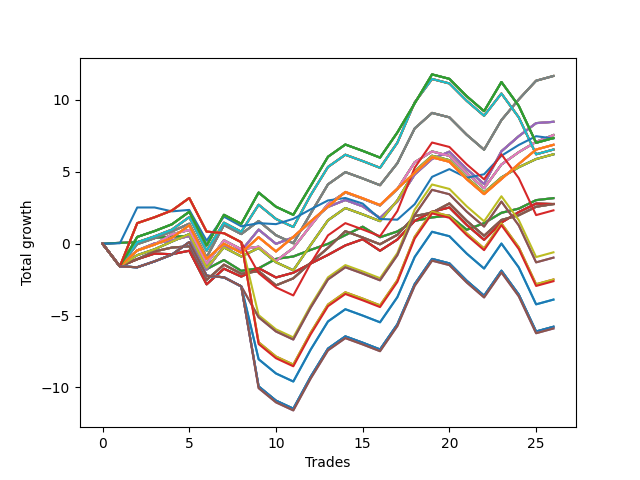

# Short Bulldog 006 
- Symbol: SPY_Unlimited
- Date Range: 03/23/2022 - 07/08/2022
- Trading Period: 7:20-12:30
- Number of Trades: 26



| Name | Win Percent | Profit | Avg Profit / Trade | Avg Time / Trade |      | Name | Win Percent | Profit | Avg Profit / Trade | Avg Time / Trade |
| ---- | ----------- | ------ | ------------------ | ---------------- | ---- | ---- | ----------- | ------ | ------------------ | ---------------- |
| Sorted By <br> Profit | | | | | | Sorted By <br> Win Percentage ||||
| Sixty-Nine | 61.54 | 5835.00 | 224.42 | 21:55 |     | Sixty-Four | 84.62 | 1585.00 | 60.96 | 06:20 |
| Sixty-One | 61.54 | 5835.00 | 224.42 | 21:55 |     | Fifty-Six | 84.62 | 1585.00 | 60.96 | 06:20 |
| Fifty-Three | 61.54 | 5835.00 | 224.42 | 21:55 |     | Forty-Eight | 84.62 | 1585.00 | 60.96 | 06:20 |
| Forty-Five | 61.54 | 5835.00 | 224.42 | 21:55 |     | Forty | 84.62 | 1585.00 | 60.96 | 06:20 |
| Five | 61.54 | 5835.00 | 224.42 | 21:55 |     | Zero | 84.62 | 1585.00 | 60.96 | 06:20 |
| Sixty-Six | 69.23 | 4240.00 | 163.08 | 18:20 |     | Sixty-Six | 69.23 | 4240.00 | 163.08 | 18:20 |
| Fifty-Eight | 69.23 | 4240.00 | 163.08 | 18:20 |     | Fifty-Eight | 69.23 | 4240.00 | 163.08 | 18:20 |
| Fifty | 69.23 | 4240.00 | 163.08 | 18:20 |     | Fifty | 69.23 | 4240.00 | 163.08 | 18:20 |
| Forty-Two | 69.23 | 4240.00 | 163.08 | 18:20 |     | Forty-Two | 69.23 | 4240.00 | 163.08 | 18:20 |
| Two | 69.23 | 4240.00 | 163.08 | 18:20 |     | Two | 69.23 | 4240.00 | 163.08 | 18:20 |
| Sixty-Eight | 65.38 | 3780.00 | 145.38 | 19:43 |     | Sixty-Seven | 69.23 | 1380.00 | 53.08 | 15:34 |
| Sixty | 65.38 | 3780.00 | 145.38 | 19:43 |     | Fifty-Nine | 69.23 | 1380.00 | 53.08 | 15:34 |
| Fifty-Two | 65.38 | 3780.00 | 145.38 | 19:43 |     | Fifty-One | 69.23 | 1380.00 | 53.08 | 15:34 |
| Forty-Four | 65.38 | 3780.00 | 145.38 | 19:43 |     | Forty-Three | 69.23 | 1380.00 | 53.08 | 15:34 |
| Four | 65.38 | 3780.00 | 145.38 | 19:43 |     | Three | 69.23 | 1380.00 | 53.08 | 15:34 |
| One Hundred Twenty-Seven | 53.85 | 3675.00 | 141.35 | 24:36 |     | Sixty-Eight | 65.38 | 3780.00 | 145.38 | 19:43 |
| One Hundred Twenty-Two | 53.85 | 3675.00 | 141.35 | 24:36 |     | Sixty | 65.38 | 3780.00 | 145.38 | 19:43 |
| One Hundred Seventeen | 53.85 | 3675.00 | 141.35 | 24:36 |     | Fifty-Two | 65.38 | 3780.00 | 145.38 | 19:43 |
| One Hundred Twelve | 53.85 | 3675.00 | 141.35 | 24:36 |     | Forty-Four | 65.38 | 3780.00 | 145.38 | 19:43 |
| Eighty-Two | 53.85 | 3675.00 | 141.35 | 24:36 |     | Four | 65.38 | 3780.00 | 145.38 | 19:43 |
| Seventy-Three | 61.54 | 3660.00 | 140.77 | 11:05 |     | One Hundred Twenty-Six | 65.38 | 3440.00 | 132.31 | 18:26 |
| One Hundred Twenty-Six | 65.38 | 3440.00 | 132.31 | 18:26 |     | One Hundred Twenty-One | 65.38 | 3440.00 | 132.31 | 18:26 |
| One Hundred Twenty-One | 65.38 | 3440.00 | 132.31 | 18:26 |     | One Hundred Sixteen | 65.38 | 3440.00 | 132.31 | 18:26 |
| One Hundred Sixteen | 65.38 | 3440.00 | 132.31 | 18:26 |     | One Hundred Eleven | 65.38 | 3440.00 | 132.31 | 18:26 |
| One Hundred Eleven | 65.38 | 3440.00 | 132.31 | 18:26 |     | Eighty-One | 65.38 | 3440.00 | 132.31 | 18:26 |
| Eighty-One | 65.38 | 3440.00 | 132.31 | 18:26 |     | Sixty-Five | 65.38 | 1380.00 | 53.08 | 13:56 |
| Seventy-One | 53.85 | 3275.00 | 125.96 | 25:31 |     | Fifty-Seven | 65.38 | 1380.00 | 53.08 | 13:56 |
| Sixty-Three | 53.85 | 3275.00 | 125.96 | 25:31 |     | Forty-Nine | 65.38 | 1380.00 | 53.08 | 13:56 |
| Fifty-Five | 53.85 | 3275.00 | 125.96 | 25:31 |     | Forty-One | 65.38 | 1380.00 | 53.08 | 13:56 |
| Forty-Seven | 53.85 | 3275.00 | 125.96 | 25:31 |     | One | 65.38 | 1380.00 | 53.08 | 13:56 |
| Seven | 53.85 | 3275.00 | 125.96 | 25:31 |     | Sixty-Nine | 61.54 | 5835.00 | 224.42 | 21:55 |
| Seventy | 61.54 | 3110.00 | 119.62 | 20:41 |     | Sixty-One | 61.54 | 5835.00 | 224.42 | 21:55 |
| Sixty-Two | 61.54 | 3110.00 | 119.62 | 20:41 |     | Fifty-Three | 61.54 | 5835.00 | 224.42 | 21:55 |
| Fifty-Four | 61.54 | 3110.00 | 119.62 | 20:41 |     | Forty-Five | 61.54 | 5835.00 | 224.42 | 21:55 |
| Forty-Six | 61.54 | 3110.00 | 119.62 | 20:41 |     | Five | 61.54 | 5835.00 | 224.42 | 21:55 |
| Six | 61.54 | 3110.00 | 119.62 | 20:41 |     | Seventy-Three | 61.54 | 3660.00 | 140.77 | 11:05 |
| Sixty-Four | 84.62 | 1585.00 | 60.96 | 06:20 |     | Seventy | 61.54 | 3110.00 | 119.62 | 20:41 |
| Fifty-Six | 84.62 | 1585.00 | 60.96 | 06:20 |     | Sixty-Two | 61.54 | 3110.00 | 119.62 | 20:41 |
| Forty-Eight | 84.62 | 1585.00 | 60.96 | 06:20 |     | Fifty-Four | 61.54 | 3110.00 | 119.62 | 20:41 |
| Forty | 84.62 | 1585.00 | 60.96 | 06:20 |     | Forty-Six | 61.54 | 3110.00 | 119.62 | 20:41 |
| Zero | 84.62 | 1585.00 | 60.96 | 06:20 |     | Six | 61.54 | 3110.00 | 119.62 | 20:41 |
| Sixty-Seven | 69.23 | 1380.00 | 53.08 | 15:34 |     | One Hundred Twenty-Seven | 53.85 | 3675.00 | 141.35 | 24:36 |
| Fifty-Nine | 69.23 | 1380.00 | 53.08 | 15:34 |     | One Hundred Twenty-Two | 53.85 | 3675.00 | 141.35 | 24:36 |
| Fifty-One | 69.23 | 1380.00 | 53.08 | 15:34 |     | One Hundred Seventeen | 53.85 | 3675.00 | 141.35 | 24:36 |
| Forty-Three | 69.23 | 1380.00 | 53.08 | 15:34 |     | One Hundred Twelve | 53.85 | 3675.00 | 141.35 | 24:36 |
| Three | 69.23 | 1380.00 | 53.08 | 15:34 |     | Eighty-Two | 53.85 | 3675.00 | 141.35 | 24:36 |
| Sixty-Five | 65.38 | 1380.00 | 53.08 | 13:56 |     | Seventy-One | 53.85 | 3275.00 | 125.96 | 25:31 |
| Fifty-Seven | 65.38 | 1380.00 | 53.08 | 13:56 |     | Sixty-Three | 53.85 | 3275.00 | 125.96 | 25:31 |
| Forty-Nine | 65.38 | 1380.00 | 53.08 | 13:56 |     | Fifty-Five | 53.85 | 3275.00 | 125.96 | 25:31 |
| Forty-One | 65.38 | 1380.00 | 53.08 | 13:56 |     | Forty-Seven | 53.85 | 3275.00 | 125.96 | 25:31 |
| One | 65.38 | 1380.00 | 53.08 | 13:56 |     | Seven | 53.85 | 3275.00 | 125.96 | 25:31 |
| One Hundred Eighteen | 46.15 | 1160.00 | 44.62 | 27:42 |     | One Hundred Eighteen | 46.15 | 1160.00 | 44.62 | 27:42 |
| One Hundred Thirteen | 46.15 | -300.00 | -11.54 | 27:50 |     | One Hundred Thirteen | 46.15 | -300.00 | -11.54 | 27:50 |
| One Hundred Twenty | 42.31 | -485.00 | -18.65 | 28:43 |     | One Hundred Twenty-Three | 46.15 | -1245.00 | -47.88 | 28:22 |
| One Hundred Ninteen | 42.31 | -485.00 | -18.65 | 28:43 |     | Eighty-Three | 46.15 | -1245.00 | -47.88 | 28:22 |
| One Hundred Twenty-Three | 46.15 | -1245.00 | -47.88 | 28:22 |     | One Hundred Twenty-Eight | 46.15 | -1305.00 | -50.19 | 28:12 |
| Eighty-Three | 46.15 | -1245.00 | -47.88 | 28:22 |     | One Hundred Twenty | 42.31 | -485.00 | -18.65 | 28:43 |
| One Hundred Twenty-Eight | 46.15 | -1305.00 | -50.19 | 28:12 |     | One Hundred Ninteen | 42.31 | -485.00 | -18.65 | 28:43 |
| One Hundred Fifteen | 42.31 | -1945.00 | -74.81 | 28:51 |     | One Hundred Fifteen | 42.31 | -1945.00 | -74.81 | 28:51 |
| One Hundred Fourteen | 42.31 | -1945.00 | -74.81 | 28:51 |     | One Hundred Fourteen | 42.31 | -1945.00 | -74.81 | 28:51 |
| One Hundred Twenty-Five | 42.31 | -2890.00 | -111.15 | 29:22 |     | One Hundred Twenty-Five | 42.31 | -2890.00 | -111.15 | 29:22 |
| One Hundred Twenty-Four | 42.31 | -2890.00 | -111.15 | 29:22 |     | One Hundred Twenty-Four | 42.31 | -2890.00 | -111.15 | 29:22 |
| Eighty-Five | 42.31 | -2890.00 | -111.15 | 29:22 |     | Eighty-Five | 42.31 | -2890.00 | -111.15 | 29:22 |
| Eighty-Four | 42.31 | -2890.00 | -111.15 | 29:22 |     | Eighty-Four | 42.31 | -2890.00 | -111.15 | 29:22 |
| One Hundred Thirty | 42.31 | -2950.00 | -113.46 | 29:13 |     | One Hundred Thirty | 42.31 | -2950.00 | -113.46 | 29:13 |
| One Hundred Twenty-Nine | 42.31 | -2950.00 | -113.46 | 29:13 |     | One Hundred Twenty-Nine | 42.31 | -2950.00 | -113.46 | 29:13 |

## NO STOPLOSS

### Test Zero
* Sell when price hits the middle line of the 20p bollinger
* No Stoploss
* Results:
```
Total Trades: 26
Percent Up: 15.38
Percent Down: 84.62
Total Points Moved Down: 3.17
Potential Profit: 1585.00
Total Points Ups: 4.77 Count Ups: 4
Total Points Downs: 7.94 Count Downs: 22
```

<details><summary>Trades</summary>

<code>In: 2022-03-24 08:09:00		Out: 2022-03-24 08:09:10		Total Position Time: 00:10		Total Move Down: 0.06		Total to Date: 0.06</code> <br />
<code>In: 2022-04-06 11:06:00		Out: 2022-04-06 11:06:10		Total Position Time: 00:10		Total Move Down: 0.05		Total to Date: 0.11</code> <br />
<code>In: 2022-04-07 11:04:00		Out: 2022-04-07 11:15:20		Total Position Time: 11:20		Total Move Down: 0.30		Total to Date: 0.41</code> <br />
<code>In: 2022-04-18 07:28:00		Out: 2022-04-18 07:36:45		Total Position Time: 08:45		Total Move Down: 0.08		Total to Date: 0.49</code> <br />
<code>In: 2022-04-20 10:50:00		Out: 2022-04-20 10:50:10		Total Position Time: 00:10		Total Move Down: 0.05		Total to Date: 0.54</code> <br />
<code>In: 2022-04-25 11:12:00		Out: 2022-04-25 11:39:45		Total Position Time: 27:45		Total Move Down: -2.31		Total to Date: -1.77</code> <br />
<code>In: 2022-05-03 07:36:00		Out: 2022-05-03 07:38:00		Total Position Time: 02:00		Total Move Down: 0.63		Total to Date: -1.14</code> <br />
<code>In: 2022-05-03 08:11:00		Out: 2022-05-03 08:35:55		Total Position Time: 24:55		Total Move Down: -0.75		Total to Date: -1.89</code> <br />
<code>In: 2022-05-04 11:31:00		Out: 2022-05-04 11:31:10		Total Position Time: 00:10		Total Move Down: 0.18		Total to Date: -1.71</code> <br />
<code>In: 2022-05-16 10:16:00		Out: 2022-05-16 10:18:25		Total Position Time: 02:25		Total Move Down: 0.65		Total to Date: -1.06</code> <br />
<code>In: 2022-05-17 09:49:00		Out: 2022-05-17 09:51:15		Total Position Time: 02:15		Total Move Down: 0.17		Total to Date: -0.89</code> <br />
<code>In: 2022-05-24 09:18:00		Out: 2022-05-24 09:21:35		Total Position Time: 03:35		Total Move Down: 0.46		Total to Date: -0.43</code> <br />
<code>In: 2022-05-24 09:19:00		Out: 2022-05-24 09:21:35		Total Position Time: 02:35		Total Move Down: 0.42		Total to Date: -0.01</code> <br />
<code>In: 2022-05-24 11:15:00		Out: 2022-05-24 11:18:25		Total Position Time: 03:25		Total Move Down: 0.61		Total to Date: 0.60</code> <br />
<code>In: 2022-05-31 07:24:00		Out: 2022-05-31 07:30:05		Total Position Time: 06:05		Total Move Down: 0.58		Total to Date: 1.18</code> <br />
<code>In: 2022-06-02 08:06:00		Out: 2022-06-02 08:22:05		Total Position Time: 16:05		Total Move Down: -0.73		Total to Date: 0.45</code> <br />
<code>In: 2022-06-10 12:30:00		Out: 2022-06-10 12:30:30		Total Position Time: 00:30		Total Move Down: 0.40		Total to Date: 0.85</code> <br />
<code>In: 2022-06-13 09:41:00		Out: 2022-06-13 09:44:05		Total Position Time: 03:05		Total Move Down: 0.74		Total to Date: 1.59</code> <br />
<code>In: 2022-06-23 08:16:00		Out: 2022-06-23 08:21:05		Total Position Time: 05:05		Total Move Down: 0.24		Total to Date: 1.83</code> <br />
<code>In: 2022-06-27 07:54:00		Out: 2022-06-27 08:02:15		Total Position Time: 08:15		Total Move Down: 0.12		Total to Date: 1.95</code> <br />
<code>In: 2022-06-30 08:12:00		Out: 2022-06-30 08:35:00		Total Position Time: 23:00		Total Move Down: -0.98		Total to Date: 0.97</code> <br />
<code>In: 2022-06-30 08:30:00		Out: 2022-06-30 08:35:00		Total Position Time: 05:00		Total Move Down: 0.46		Total to Date: 1.43</code> <br />
<code>In: 2022-07-05 07:41:00		Out: 2022-07-05 07:44:30		Total Position Time: 03:30		Total Move Down: 0.72		Total to Date: 2.15</code> <br />
<code>In: 2022-07-06 11:10:00		Out: 2022-07-06 11:10:10		Total Position Time: 00:10		Total Move Down: 0.29		Total to Date: 2.44</code> <br />
<code>In: 2022-07-06 11:11:00		Out: 2022-07-06 11:11:10		Total Position Time: 00:10		Total Move Down: 0.59		Total to Date: 3.03</code> <br />
<code>In: 2022-07-07 07:57:00		Out: 2022-07-07 08:01:10		Total Position Time: 04:10		Total Move Down: 0.14		Total to Date: 3.17</code> <br />


</details>

### Test One
* Sell when the price hits the upper line of the 20p 1std bollinger
* No Stoploss
* Results:
```
Total Trades: 26
Percent Up: 34.62
Percent Down: 65.38
Total Points Moved Down: 2.76
Potential Profit: 1380.00
Total Points Ups: 8.24 Count Ups: 9
Total Points Downs: 11.00 Count Downs: 17
```

<details><summary>Trades</summary>

<code>In: 2022-03-24 08:09:00		Out: 2022-03-24 08:38:55		Total Position Time: 29:55		Total Move Down: -1.58		Total to Date: -1.58</code> <br />
<code>In: 2022-04-06 11:06:00		Out: 2022-04-06 11:07:20		Total Position Time: 01:20		Total Move Down: 0.50		Total to Date: -1.08</code> <br />
<code>In: 2022-04-07 11:04:00		Out: 2022-04-07 11:18:00		Total Position Time: 14:00		Total Move Down: 0.39		Total to Date: -0.69</code> <br />
<code>In: 2022-04-18 07:28:00		Out: 2022-04-18 07:51:15		Total Position Time: 23:15		Total Move Down: -0.04		Total to Date: -0.73</code> <br />
<code>In: 2022-04-20 10:50:00		Out: 2022-04-20 10:53:20		Total Position Time: 03:20		Total Move Down: 0.24		Total to Date: -0.49</code> <br />
<code>In: 2022-04-25 11:12:00		Out: 2022-04-25 11:41:55		Total Position Time: 29:55		Total Move Down: -2.34		Total to Date: -2.83</code> <br />
<code>In: 2022-05-03 07:36:00		Out: 2022-05-03 07:40:55		Total Position Time: 04:55		Total Move Down: 1.09		Total to Date: -1.74</code> <br />
<code>In: 2022-05-03 08:11:00		Out: 2022-05-03 08:38:05		Total Position Time: 27:05		Total Move Down: -0.55		Total to Date: -2.29</code> <br />
<code>In: 2022-05-04 11:31:00		Out: 2022-05-04 11:31:20		Total Position Time: 00:20		Total Move Down: 0.59		Total to Date: -1.70</code> <br />
<code>In: 2022-05-16 10:16:00		Out: 2022-05-16 10:42:35		Total Position Time: 26:35		Total Move Down: -0.65		Total to Date: -2.35</code> <br />
<code>In: 2022-05-17 09:49:00		Out: 2022-05-17 09:54:40		Total Position Time: 05:40		Total Move Down: 0.33		Total to Date: -2.02</code> <br />
<code>In: 2022-05-24 09:18:00		Out: 2022-05-24 09:28:55		Total Position Time: 10:55		Total Move Down: 0.64		Total to Date: -1.38</code> <br />
<code>In: 2022-05-24 09:19:00		Out: 2022-05-24 09:28:55		Total Position Time: 09:55		Total Move Down: 0.60		Total to Date: -0.78</code> <br />
<code>In: 2022-05-24 11:15:00		Out: 2022-05-24 11:31:25		Total Position Time: 16:25		Total Move Down: 0.66		Total to Date: -0.12</code> <br />
<code>In: 2022-05-31 07:24:00		Out: 2022-05-31 07:38:05		Total Position Time: 14:05		Total Move Down: 0.43		Total to Date: 0.31</code> <br />
<code>In: 2022-06-02 08:06:00		Out: 2022-06-02 08:28:15		Total Position Time: 22:15		Total Move Down: -0.80		Total to Date: -0.49</code> <br />
<code>In: 2022-06-10 12:30:00		Out: 2022-06-10 12:35:45		Total Position Time: 05:45		Total Move Down: 0.78		Total to Date: 0.29</code> <br />
<code>In: 2022-06-13 09:41:00		Out: 2022-06-13 09:47:55		Total Position Time: 06:55		Total Move Down: 1.30		Total to Date: 1.59</code> <br />
<code>In: 2022-06-23 08:16:00		Out: 2022-06-23 08:23:30		Total Position Time: 07:30		Total Move Down: 0.63		Total to Date: 2.22</code> <br />
<code>In: 2022-06-27 07:54:00		Out: 2022-06-27 08:07:15		Total Position Time: 13:15		Total Move Down: 0.30		Total to Date: 2.52</code> <br />
<code>In: 2022-06-30 08:12:00		Out: 2022-06-30 08:41:55		Total Position Time: 29:55		Total Move Down: -1.21		Total to Date: 1.31</code> <br />
<code>In: 2022-06-30 08:30:00		Out: 2022-06-30 08:59:55		Total Position Time: 29:55		Total Move Down: -1.04		Total to Date: 0.27</code> <br />
<code>In: 2022-07-05 07:41:00		Out: 2022-07-05 07:45:55		Total Position Time: 04:55		Total Move Down: 1.20		Total to Date: 1.47</code> <br />
<code>In: 2022-07-06 11:10:00		Out: 2022-07-06 11:11:10		Total Position Time: 01:10		Total Move Down: 0.73		Total to Date: 2.20</code> <br />
<code>In: 2022-07-06 11:11:00		Out: 2022-07-06 11:11:10		Total Position Time: 00:10		Total Move Down: 0.59		Total to Date: 2.79</code> <br />
<code>In: 2022-07-07 07:57:00		Out: 2022-07-07 08:20:00		Total Position Time: 23:00		Total Move Down: -0.03		Total to Date: 2.76</code> <br />


</details>

### Test Two
* Sell when the price hits the upper line of the 20p 2std bollinger
* No Stoploss
* Results:
```
Total Trades: 26
Percent Up: 30.77
Percent Down: 69.23
Total Points Moved Down: 8.48
Potential Profit: 4240.00
Total Points Ups: 8.73 Count Ups: 8
Total Points Downs: 17.21 Count Downs: 18
```

<details><summary>Trades</summary>

<code>In: 2022-03-24 08:09:00		Out: 2022-03-24 08:38:55		Total Position Time: 29:55		Total Move Down: -1.58		Total to Date: -1.58</code> <br />
<code>In: 2022-04-06 11:06:00		Out: 2022-04-06 11:08:10		Total Position Time: 02:10		Total Move Down: 1.11		Total to Date: -0.47</code> <br />
<code>In: 2022-04-07 11:04:00		Out: 2022-04-07 11:18:20		Total Position Time: 14:20		Total Move Down: 0.49		Total to Date: 0.02</code> <br />
<code>In: 2022-04-18 07:28:00		Out: 2022-04-18 07:51:45		Total Position Time: 23:45		Total Move Down: 0.21		Total to Date: 0.23</code> <br />
<code>In: 2022-04-20 10:50:00		Out: 2022-04-20 11:13:55		Total Position Time: 23:55		Total Move Down: 0.31		Total to Date: 0.54</code> <br />
<code>In: 2022-04-25 11:12:00		Out: 2022-04-25 11:41:55		Total Position Time: 29:55		Total Move Down: -2.34		Total to Date: -1.80</code> <br />
<code>In: 2022-05-03 07:36:00		Out: 2022-05-03 07:43:50		Total Position Time: 07:50		Total Move Down: 1.63		Total to Date: -0.17</code> <br />
<code>In: 2022-05-03 08:11:00		Out: 2022-05-03 08:39:05		Total Position Time: 28:05		Total Move Down: -0.32		Total to Date: -0.49</code> <br />
<code>In: 2022-05-04 11:31:00		Out: 2022-05-04 11:32:25		Total Position Time: 01:25		Total Move Down: 1.47		Total to Date: 0.98</code> <br />
<code>In: 2022-05-16 10:16:00		Out: 2022-05-16 10:45:55		Total Position Time: 29:55		Total Move Down: -0.99		Total to Date: -0.01</code> <br />
<code>In: 2022-05-17 09:49:00		Out: 2022-05-17 10:01:10		Total Position Time: 12:10		Total Move Down: 0.45		Total to Date: 0.44</code> <br />
<code>In: 2022-05-24 09:18:00		Out: 2022-05-24 09:31:20		Total Position Time: 13:20		Total Move Down: 1.08		Total to Date: 1.52</code> <br />
<code>In: 2022-05-24 09:19:00		Out: 2022-05-24 09:31:20		Total Position Time: 12:20		Total Move Down: 1.04		Total to Date: 2.56</code> <br />
<code>In: 2022-05-24 11:15:00		Out: 2022-05-24 11:43:50		Total Position Time: 28:50		Total Move Down: 0.48		Total to Date: 3.04</code> <br />
<code>In: 2022-05-31 07:24:00		Out: 2022-05-31 07:53:55		Total Position Time: 29:55		Total Move Down: -0.44		Total to Date: 2.60</code> <br />
<code>In: 2022-06-02 08:06:00		Out: 2022-06-02 08:30:55		Total Position Time: 24:55		Total Move Down: -0.81		Total to Date: 1.79</code> <br />
<code>In: 2022-06-10 12:30:00		Out: 2022-06-10 12:42:45		Total Position Time: 12:45		Total Move Down: 1.15		Total to Date: 2.94</code> <br />
<code>In: 2022-06-13 09:41:00		Out: 2022-06-13 09:54:45		Total Position Time: 13:45		Total Move Down: 1.88		Total to Date: 4.82</code> <br />
<code>In: 2022-06-23 08:16:00		Out: 2022-06-23 08:31:10		Total Position Time: 15:10		Total Move Down: 1.08		Total to Date: 5.90</code> <br />
<code>In: 2022-06-27 07:54:00		Out: 2022-06-27 08:09:45		Total Position Time: 15:45		Total Move Down: 0.50		Total to Date: 6.40</code> <br />
<code>In: 2022-06-30 08:12:00		Out: 2022-06-30 08:41:55		Total Position Time: 29:55		Total Move Down: -1.21		Total to Date: 5.19</code> <br />
<code>In: 2022-06-30 08:30:00		Out: 2022-06-30 08:59:55		Total Position Time: 29:55		Total Move Down: -1.04		Total to Date: 4.15</code> <br />
<code>In: 2022-07-05 07:41:00		Out: 2022-07-05 08:01:10		Total Position Time: 20:10		Total Move Down: 2.28		Total to Date: 6.43</code> <br />
<code>In: 2022-07-06 11:10:00		Out: 2022-07-06 11:11:45		Total Position Time: 01:45		Total Move Down: 1.05		Total to Date: 7.48</code> <br />
<code>In: 2022-07-06 11:11:00		Out: 2022-07-06 11:11:45		Total Position Time: 00:45		Total Move Down: 0.91		Total to Date: 8.39</code> <br />
<code>In: 2022-07-07 07:57:00		Out: 2022-07-07 08:21:00		Total Position Time: 24:00		Total Move Down: 0.09		Total to Date: 8.48</code> <br />


</details>

### Test Three
* Sell when price hits the middle line of the 50p bollinger
* No Stoploss
* Results:
```
Total Trades: 26
Percent Up: 30.77
Percent Down: 69.23
Total Points Moved Down: 2.76
Potential Profit: 1380.00
Total Points Ups: 8.70 Count Ups: 8
Total Points Downs: 11.46 Count Downs: 18
```

<details><summary>Trades</summary>

<code>In: 2022-03-24 08:09:00		Out: 2022-03-24 08:38:55		Total Position Time: 29:55		Total Move Down: -1.58		Total to Date: -1.58</code> <br />
<code>In: 2022-04-06 11:06:00		Out: 2022-04-06 11:07:20		Total Position Time: 01:20		Total Move Down: 0.50		Total to Date: -1.08</code> <br />
<code>In: 2022-04-07 11:04:00		Out: 2022-04-07 11:33:40		Total Position Time: 29:40		Total Move Down: 0.54		Total to Date: -0.54</code> <br />
<code>In: 2022-04-18 07:28:00		Out: 2022-04-18 07:51:50		Total Position Time: 23:50		Total Move Down: 0.27		Total to Date: -0.27</code> <br />
<code>In: 2022-04-20 10:50:00		Out: 2022-04-20 10:50:20		Total Position Time: 00:20		Total Move Down: 0.09		Total to Date: -0.18</code> <br />
<code>In: 2022-04-25 11:12:00		Out: 2022-04-25 11:41:55		Total Position Time: 29:55		Total Move Down: -2.34		Total to Date: -2.52</code> <br />
<code>In: 2022-05-03 07:36:00		Out: 2022-05-03 07:40:40		Total Position Time: 04:40		Total Move Down: 1.06		Total to Date: -1.46</code> <br />
<code>In: 2022-05-03 08:11:00		Out: 2022-05-03 08:40:55		Total Position Time: 29:55		Total Move Down: -0.63		Total to Date: -2.09</code> <br />
<code>In: 2022-05-04 11:31:00		Out: 2022-05-04 11:31:10		Total Position Time: 00:10		Total Move Down: 0.18		Total to Date: -1.91</code> <br />
<code>In: 2022-05-16 10:16:00		Out: 2022-05-16 10:45:55		Total Position Time: 29:55		Total Move Down: -0.99		Total to Date: -2.90</code> <br />
<code>In: 2022-05-17 09:49:00		Out: 2022-05-17 10:01:25		Total Position Time: 12:25		Total Move Down: 0.49		Total to Date: -2.41</code> <br />
<code>In: 2022-05-24 09:18:00		Out: 2022-05-24 09:31:20		Total Position Time: 13:20		Total Move Down: 1.08		Total to Date: -1.33</code> <br />
<code>In: 2022-05-24 09:19:00		Out: 2022-05-24 09:31:20		Total Position Time: 12:20		Total Move Down: 1.04		Total to Date: -0.29</code> <br />
<code>In: 2022-05-24 11:15:00		Out: 2022-05-24 11:20:25		Total Position Time: 05:25		Total Move Down: 1.16		Total to Date: 0.87</code> <br />
<code>In: 2022-05-31 07:24:00		Out: 2022-05-31 07:53:55		Total Position Time: 29:55		Total Move Down: -0.44		Total to Date: 0.43</code> <br />
<code>In: 2022-06-02 08:06:00		Out: 2022-06-02 08:35:55		Total Position Time: 29:55		Total Move Down: -0.47		Total to Date: -0.04</code> <br />
<code>In: 2022-06-10 12:30:00		Out: 2022-06-10 12:33:15		Total Position Time: 03:15		Total Move Down: 0.66		Total to Date: 0.62</code> <br />
<code>In: 2022-06-13 09:41:00		Out: 2022-06-13 09:47:55		Total Position Time: 06:55		Total Move Down: 1.30		Total to Date: 1.92</code> <br />
<code>In: 2022-06-23 08:16:00		Out: 2022-06-23 08:21:05		Total Position Time: 05:05		Total Move Down: 0.24		Total to Date: 2.16</code> <br />
<code>In: 2022-06-27 07:54:00		Out: 2022-06-27 08:10:05		Total Position Time: 16:05		Total Move Down: 0.64		Total to Date: 2.80</code> <br />
<code>In: 2022-06-30 08:12:00		Out: 2022-06-30 08:41:55		Total Position Time: 29:55		Total Move Down: -1.21		Total to Date: 1.59</code> <br />
<code>In: 2022-06-30 08:30:00		Out: 2022-06-30 08:59:55		Total Position Time: 29:55		Total Move Down: -1.04		Total to Date: 0.55</code> <br />
<code>In: 2022-07-05 07:41:00		Out: 2022-07-05 07:45:30		Total Position Time: 04:30		Total Move Down: 1.10		Total to Date: 1.65</code> <br />
<code>In: 2022-07-06 11:10:00		Out: 2022-07-06 11:10:20		Total Position Time: 00:20		Total Move Down: 0.33		Total to Date: 1.98</code> <br />
<code>In: 2022-07-06 11:11:00		Out: 2022-07-06 11:11:10		Total Position Time: 00:10		Total Move Down: 0.59		Total to Date: 2.57</code> <br />
<code>In: 2022-07-07 07:57:00		Out: 2022-07-07 08:22:45		Total Position Time: 25:45		Total Move Down: 0.19		Total to Date: 2.76</code> <br />


</details>

### Test Four
* Sell when the price hits the upper line of the 50p 1std bollinger
* No Stoploss
* Results:
```
Total Trades: 26
Percent Up: 34.62
Percent Down: 65.38
Total Points Moved Down: 7.56
Potential Profit: 3780.00
Total Points Ups: 9.01 Count Ups: 9
Total Points Downs: 16.57 Count Downs: 17
```

<details><summary>Trades</summary>

<code>In: 2022-03-24 08:09:00		Out: 2022-03-24 08:38:55		Total Position Time: 29:55		Total Move Down: -1.58		Total to Date: -1.58</code> <br />
<code>In: 2022-04-06 11:06:00		Out: 2022-04-06 11:08:10		Total Position Time: 02:10		Total Move Down: 1.11		Total to Date: -0.47</code> <br />
<code>In: 2022-04-07 11:04:00		Out: 2022-04-07 11:33:55		Total Position Time: 29:55		Total Move Down: 0.41		Total to Date: -0.06</code> <br />
<code>In: 2022-04-18 07:28:00		Out: 2022-04-18 07:57:05		Total Position Time: 29:05		Total Move Down: 0.72		Total to Date: 0.66</code> <br />
<code>In: 2022-04-20 10:50:00		Out: 2022-04-20 11:14:00		Total Position Time: 24:00		Total Move Down: 0.29		Total to Date: 0.95</code> <br />
<code>In: 2022-04-25 11:12:00		Out: 2022-04-25 11:41:55		Total Position Time: 29:55		Total Move Down: -2.34		Total to Date: -1.39</code> <br />
<code>In: 2022-05-03 07:36:00		Out: 2022-05-03 07:43:50		Total Position Time: 07:50		Total Move Down: 1.63		Total to Date: 0.24</code> <br />
<code>In: 2022-05-03 08:11:00		Out: 2022-05-03 08:40:55		Total Position Time: 29:55		Total Move Down: -0.63		Total to Date: -0.39</code> <br />
<code>In: 2022-05-04 11:31:00		Out: 2022-05-04 11:31:10		Total Position Time: 00:10		Total Move Down: 0.18		Total to Date: -0.21</code> <br />
<code>In: 2022-05-16 10:16:00		Out: 2022-05-16 10:45:55		Total Position Time: 29:55		Total Move Down: -0.99		Total to Date: -1.20</code> <br />
<code>In: 2022-05-17 09:49:00		Out: 2022-05-17 10:02:15		Total Position Time: 13:15		Total Move Down: 0.90		Total to Date: -0.30</code> <br />
<code>In: 2022-05-24 09:18:00		Out: 2022-05-24 09:33:15		Total Position Time: 15:15		Total Move Down: 1.55		Total to Date: 1.25</code> <br />
<code>In: 2022-05-24 09:19:00		Out: 2022-05-24 09:33:15		Total Position Time: 14:15		Total Move Down: 1.51		Total to Date: 2.76</code> <br />
<code>In: 2022-05-24 11:15:00		Out: 2022-05-24 11:44:15		Total Position Time: 29:15		Total Move Down: 0.81		Total to Date: 3.57</code> <br />
<code>In: 2022-05-31 07:24:00		Out: 2022-05-31 07:53:55		Total Position Time: 29:55		Total Move Down: -0.44		Total to Date: 3.13</code> <br />
<code>In: 2022-06-02 08:06:00		Out: 2022-06-02 08:35:55		Total Position Time: 29:55		Total Move Down: -0.47		Total to Date: 2.66</code> <br />
<code>In: 2022-06-10 12:30:00		Out: 2022-06-10 12:42:40		Total Position Time: 12:40		Total Move Down: 1.14		Total to Date: 3.80</code> <br />
<code>In: 2022-06-13 09:41:00		Out: 2022-06-13 09:54:50		Total Position Time: 13:50		Total Move Down: 1.87		Total to Date: 5.67</code> <br />
<code>In: 2022-06-23 08:16:00		Out: 2022-06-23 08:23:40		Total Position Time: 07:40		Total Move Down: 0.75		Total to Date: 6.42</code> <br />
<code>In: 2022-06-27 07:54:00		Out: 2022-06-27 08:23:55		Total Position Time: 29:55		Total Move Down: -0.31		Total to Date: 6.11</code> <br />
<code>In: 2022-06-30 08:12:00		Out: 2022-06-30 08:41:55		Total Position Time: 29:55		Total Move Down: -1.21		Total to Date: 4.90</code> <br />
<code>In: 2022-06-30 08:30:00		Out: 2022-06-30 08:59:55		Total Position Time: 29:55		Total Move Down: -1.04		Total to Date: 3.86</code> <br />
<code>In: 2022-07-05 07:41:00		Out: 2022-07-05 07:56:40		Total Position Time: 15:40		Total Move Down: 1.65		Total to Date: 5.51</code> <br />
<code>In: 2022-07-06 11:10:00		Out: 2022-07-06 11:11:35		Total Position Time: 01:35		Total Move Down: 0.86		Total to Date: 6.37</code> <br />
<code>In: 2022-07-06 11:11:00		Out: 2022-07-06 11:11:35		Total Position Time: 00:35		Total Move Down: 0.72		Total to Date: 7.09</code> <br />
<code>In: 2022-07-07 07:57:00		Out: 2022-07-07 08:23:25		Total Position Time: 26:25		Total Move Down: 0.47		Total to Date: 7.56</code> <br />


</details>

### Test Five
* Sell when the price hits the upper line of the 50p 2std bollinger
* No Stoploss
* Results:
```
Total Trades: 26
Percent Up: 38.46
Percent Down: 61.54
Total Points Moved Down: 11.67
Potential Profit: 5835.00
Total Points Ups: 9.57 Count Ups: 10
Total Points Downs: 21.24 Count Downs: 16
```

<details><summary>Trades</summary>

<code>In: 2022-03-24 08:09:00		Out: 2022-03-24 08:38:55		Total Position Time: 29:55		Total Move Down: -1.58		Total to Date: -1.58</code> <br />
<code>In: 2022-04-06 11:06:00		Out: 2022-04-06 11:09:35		Total Position Time: 03:35		Total Move Down: 1.55		Total to Date: -0.03</code> <br />
<code>In: 2022-04-07 11:04:00		Out: 2022-04-07 11:33:55		Total Position Time: 29:55		Total Move Down: 0.41		Total to Date: 0.38</code> <br />
<code>In: 2022-04-18 07:28:00		Out: 2022-04-18 07:57:55		Total Position Time: 29:55		Total Move Down: 0.47		Total to Date: 0.85</code> <br />
<code>In: 2022-04-20 10:50:00		Out: 2022-04-20 11:17:40		Total Position Time: 27:40		Total Move Down: 0.54		Total to Date: 1.39</code> <br />
<code>In: 2022-04-25 11:12:00		Out: 2022-04-25 11:41:55		Total Position Time: 29:55		Total Move Down: -2.34		Total to Date: -0.95</code> <br />
<code>In: 2022-05-03 07:36:00		Out: 2022-05-03 07:47:05		Total Position Time: 11:05		Total Move Down: 2.25		Total to Date: 1.30</code> <br />
<code>In: 2022-05-03 08:11:00		Out: 2022-05-03 08:40:55		Total Position Time: 29:55		Total Move Down: -0.63		Total to Date: 0.67</code> <br />
<code>In: 2022-05-04 11:31:00		Out: 2022-05-04 11:31:40		Total Position Time: 00:40		Total Move Down: 0.91		Total to Date: 1.58</code> <br />
<code>In: 2022-05-16 10:16:00		Out: 2022-05-16 10:45:55		Total Position Time: 29:55		Total Move Down: -0.99		Total to Date: 0.59</code> <br />
<code>In: 2022-05-17 09:49:00		Out: 2022-05-17 10:18:55		Total Position Time: 29:55		Total Move Down: -0.56		Total to Date: 0.03</code> <br />
<code>In: 2022-05-24 09:18:00		Out: 2022-05-24 09:36:50		Total Position Time: 18:50		Total Move Down: 2.07		Total to Date: 2.10</code> <br />
<code>In: 2022-05-24 09:19:00		Out: 2022-05-24 09:36:50		Total Position Time: 17:50		Total Move Down: 2.03		Total to Date: 4.13</code> <br />
<code>In: 2022-05-24 11:15:00		Out: 2022-05-24 11:44:55		Total Position Time: 29:55		Total Move Down: 0.85		Total to Date: 4.98</code> <br />
<code>In: 2022-05-31 07:24:00		Out: 2022-05-31 07:53:55		Total Position Time: 29:55		Total Move Down: -0.44		Total to Date: 4.54</code> <br />
<code>In: 2022-06-02 08:06:00		Out: 2022-06-02 08:35:55		Total Position Time: 29:55		Total Move Down: -0.47		Total to Date: 4.07</code> <br />
<code>In: 2022-06-10 12:30:00		Out: 2022-06-10 12:45:35		Total Position Time: 15:35		Total Move Down: 1.53		Total to Date: 5.60</code> <br />
<code>In: 2022-06-13 09:41:00		Out: 2022-06-13 09:58:15		Total Position Time: 17:15		Total Move Down: 2.42		Total to Date: 8.02</code> <br />
<code>In: 2022-06-23 08:16:00		Out: 2022-06-23 08:31:10		Total Position Time: 15:10		Total Move Down: 1.08		Total to Date: 9.10</code> <br />
<code>In: 2022-06-27 07:54:00		Out: 2022-06-27 08:23:55		Total Position Time: 29:55		Total Move Down: -0.31		Total to Date: 8.79</code> <br />
<code>In: 2022-06-30 08:12:00		Out: 2022-06-30 08:41:55		Total Position Time: 29:55		Total Move Down: -1.21		Total to Date: 7.58</code> <br />
<code>In: 2022-06-30 08:30:00		Out: 2022-06-30 08:59:55		Total Position Time: 29:55		Total Move Down: -1.04		Total to Date: 6.54</code> <br />
<code>In: 2022-07-05 07:41:00		Out: 2022-07-05 08:00:50		Total Position Time: 19:50		Total Move Down: 2.06		Total to Date: 8.60</code> <br />
<code>In: 2022-07-06 11:10:00		Out: 2022-07-06 11:12:15		Total Position Time: 02:15		Total Move Down: 1.44		Total to Date: 10.04</code> <br />
<code>In: 2022-07-06 11:11:00		Out: 2022-07-06 11:12:15		Total Position Time: 01:15		Total Move Down: 1.30		Total to Date: 11.34</code> <br />
<code>In: 2022-07-07 07:57:00		Out: 2022-07-07 08:26:55		Total Position Time: 29:55		Total Move Down: 0.33		Total to Date: 11.67</code> <br />


</details>

### Test Six
* Sell when the price hits the middle line of the 1std VWAP
* No Stoploss
* Results:
```
Total Trades: 26
Percent Up: 38.46
Percent Down: 61.54
Total Points Moved Down: 6.22
Potential Profit: 3110.00
Total Points Ups: 9.57 Count Ups: 10
Total Points Downs: 15.79 Count Downs: 16
```

<details><summary>Trades</summary>

<code>In: 2022-03-24 08:09:00		Out: 2022-03-24 08:38:55		Total Position Time: 29:55		Total Move Down: -1.58		Total to Date: -1.58</code> <br />
<code>In: 2022-04-06 11:06:00		Out: 2022-04-06 11:07:35		Total Position Time: 01:35		Total Move Down: 0.78		Total to Date: -0.80</code> <br />
<code>In: 2022-04-07 11:04:00		Out: 2022-04-07 11:33:55		Total Position Time: 29:55		Total Move Down: 0.41		Total to Date: -0.39</code> <br />
<code>In: 2022-04-18 07:28:00		Out: 2022-04-18 07:55:15		Total Position Time: 27:15		Total Move Down: 0.54		Total to Date: 0.15</code> <br />
<code>In: 2022-04-20 10:50:00		Out: 2022-04-20 11:17:15		Total Position Time: 27:15		Total Move Down: 0.52		Total to Date: 0.67</code> <br />
<code>In: 2022-04-25 11:12:00		Out: 2022-04-25 11:41:55		Total Position Time: 29:55		Total Move Down: -2.34		Total to Date: -1.67</code> <br />
<code>In: 2022-05-03 07:36:00		Out: 2022-05-03 07:42:15		Total Position Time: 06:15		Total Move Down: 1.41		Total to Date: -0.26</code> <br />
<code>In: 2022-05-03 08:11:00		Out: 2022-05-03 08:40:55		Total Position Time: 29:55		Total Move Down: -0.63		Total to Date: -0.89</code> <br />
<code>In: 2022-05-04 11:31:00		Out: 2022-05-04 11:31:20		Total Position Time: 00:20		Total Move Down: 0.59		Total to Date: -0.30</code> <br />
<code>In: 2022-05-16 10:16:00		Out: 2022-05-16 10:45:55		Total Position Time: 29:55		Total Move Down: -0.99		Total to Date: -1.29</code> <br />
<code>In: 2022-05-17 09:49:00		Out: 2022-05-17 10:18:55		Total Position Time: 29:55		Total Move Down: -0.56		Total to Date: -1.85</code> <br />
<code>In: 2022-05-24 09:18:00		Out: 2022-05-24 09:36:10		Total Position Time: 18:10		Total Move Down: 1.76		Total to Date: -0.09</code> <br />
<code>In: 2022-05-24 09:19:00		Out: 2022-05-24 09:36:10		Total Position Time: 17:10		Total Move Down: 1.72		Total to Date: 1.63</code> <br />
<code>In: 2022-05-24 11:15:00		Out: 2022-05-24 11:44:55		Total Position Time: 29:55		Total Move Down: 0.85		Total to Date: 2.48</code> <br />
<code>In: 2022-05-31 07:24:00		Out: 2022-05-31 07:53:55		Total Position Time: 29:55		Total Move Down: -0.44		Total to Date: 2.04</code> <br />
<code>In: 2022-06-02 08:06:00		Out: 2022-06-02 08:35:55		Total Position Time: 29:55		Total Move Down: -0.47		Total to Date: 1.57</code> <br />
<code>In: 2022-06-10 12:30:00		Out: 2022-06-10 12:43:55		Total Position Time: 13:55		Total Move Down: 1.44		Total to Date: 3.01</code> <br />
<code>In: 2022-06-13 09:41:00		Out: 2022-06-13 09:57:00		Total Position Time: 16:00		Total Move Down: 2.03		Total to Date: 5.04</code> <br />
<code>In: 2022-06-23 08:16:00		Out: 2022-06-23 08:31:10		Total Position Time: 15:10		Total Move Down: 1.08		Total to Date: 6.12</code> <br />
<code>In: 2022-06-27 07:54:00		Out: 2022-06-27 08:23:55		Total Position Time: 29:55		Total Move Down: -0.31		Total to Date: 5.81</code> <br />
<code>In: 2022-06-30 08:12:00		Out: 2022-06-30 08:41:55		Total Position Time: 29:55		Total Move Down: -1.21		Total to Date: 4.60</code> <br />
<code>In: 2022-06-30 08:30:00		Out: 2022-06-30 08:59:55		Total Position Time: 29:55		Total Move Down: -1.04		Total to Date: 3.56</code> <br />
<code>In: 2022-07-05 07:41:00		Out: 2022-07-05 07:45:25		Total Position Time: 04:25		Total Move Down: 1.05		Total to Date: 4.61</code> <br />
<code>In: 2022-07-06 11:10:00		Out: 2022-07-06 11:11:15		Total Position Time: 01:15		Total Move Down: 0.71		Total to Date: 5.32</code> <br />
<code>In: 2022-07-06 11:11:00		Out: 2022-07-06 11:11:15		Total Position Time: 00:15		Total Move Down: 0.57		Total to Date: 5.89</code> <br />
<code>In: 2022-07-07 07:57:00		Out: 2022-07-07 08:26:55		Total Position Time: 29:55		Total Move Down: 0.33		Total to Date: 6.22</code> <br />


</details>

### Test Seven
* Sell when the price hits the upper line of the 1std VWAP
* No Stoploss
* Results:
```
Total Trades: 26
Percent Up: 46.15
Percent Down: 53.85
Total Points Moved Down: 6.55
Potential Profit: 3275.00
Total Points Ups: 13.80 Count Ups: 12
Total Points Downs: 20.35 Count Downs: 14
```

<details><summary>Trades</summary>

<code>In: 2022-03-24 08:09:00		Out: 2022-03-24 08:38:55		Total Position Time: 29:55		Total Move Down: -1.58		Total to Date: -1.58</code> <br />
<code>In: 2022-04-06 11:06:00		Out: 2022-04-06 11:09:40		Total Position Time: 03:40		Total Move Down: 1.68		Total to Date: 0.10</code> <br />
<code>In: 2022-04-07 11:04:00		Out: 2022-04-07 11:33:55		Total Position Time: 29:55		Total Move Down: 0.41		Total to Date: 0.51</code> <br />
<code>In: 2022-04-18 07:28:00		Out: 2022-04-18 07:57:55		Total Position Time: 29:55		Total Move Down: 0.47		Total to Date: 0.98</code> <br />
<code>In: 2022-04-20 10:50:00		Out: 2022-04-20 11:19:55		Total Position Time: 29:55		Total Move Down: 0.87		Total to Date: 1.85</code> <br />
<code>In: 2022-04-25 11:12:00		Out: 2022-04-25 11:41:55		Total Position Time: 29:55		Total Move Down: -2.34		Total to Date: -0.49</code> <br />
<code>In: 2022-05-03 07:36:00		Out: 2022-05-03 07:46:40		Total Position Time: 10:40		Total Move Down: 1.95		Total to Date: 1.46</code> <br />
<code>In: 2022-05-03 08:11:00		Out: 2022-05-03 08:40:55		Total Position Time: 29:55		Total Move Down: -0.63		Total to Date: 0.83</code> <br />
<code>In: 2022-05-04 11:31:00		Out: 2022-05-04 11:34:00		Total Position Time: 03:00		Total Move Down: 1.88		Total to Date: 2.71</code> <br />
<code>In: 2022-05-16 10:16:00		Out: 2022-05-16 10:45:55		Total Position Time: 29:55		Total Move Down: -0.99		Total to Date: 1.72</code> <br />
<code>In: 2022-05-17 09:49:00		Out: 2022-05-17 10:18:55		Total Position Time: 29:55		Total Move Down: -0.56		Total to Date: 1.16</code> <br />
<code>In: 2022-05-24 09:18:00		Out: 2022-05-24 09:47:55		Total Position Time: 29:55		Total Move Down: 2.22		Total to Date: 3.38</code> <br />
<code>In: 2022-05-24 09:19:00		Out: 2022-05-24 09:48:55		Total Position Time: 29:55		Total Move Down: 1.96		Total to Date: 5.34</code> <br />
<code>In: 2022-05-24 11:15:00		Out: 2022-05-24 11:44:55		Total Position Time: 29:55		Total Move Down: 0.85		Total to Date: 6.19</code> <br />
<code>In: 2022-05-31 07:24:00		Out: 2022-05-31 07:53:55		Total Position Time: 29:55		Total Move Down: -0.44		Total to Date: 5.75</code> <br />
<code>In: 2022-06-02 08:06:00		Out: 2022-06-02 08:35:55		Total Position Time: 29:55		Total Move Down: -0.47		Total to Date: 5.28</code> <br />
<code>In: 2022-06-10 12:30:00		Out: 2022-06-10 12:46:00		Total Position Time: 16:00		Total Move Down: 1.75		Total to Date: 7.03</code> <br />
<code>In: 2022-06-13 09:41:00		Out: 2022-06-13 10:10:55		Total Position Time: 29:55		Total Move Down: 2.80		Total to Date: 9.83</code> <br />
<code>In: 2022-06-23 08:16:00		Out: 2022-06-23 08:35:25		Total Position Time: 19:25		Total Move Down: 1.63		Total to Date: 11.46</code> <br />
<code>In: 2022-06-27 07:54:00		Out: 2022-06-27 08:23:55		Total Position Time: 29:55		Total Move Down: -0.31		Total to Date: 11.15</code> <br />
<code>In: 2022-06-30 08:12:00		Out: 2022-06-30 08:41:55		Total Position Time: 29:55		Total Move Down: -1.21		Total to Date: 9.94</code> <br />
<code>In: 2022-06-30 08:30:00		Out: 2022-06-30 08:59:55		Total Position Time: 29:55		Total Move Down: -1.04		Total to Date: 8.90</code> <br />
<code>In: 2022-07-05 07:41:00		Out: 2022-07-05 07:53:35		Total Position Time: 12:35		Total Move Down: 1.55		Total to Date: 10.45</code> <br />
<code>In: 2022-07-06 11:10:00		Out: 2022-07-06 11:39:55		Total Position Time: 29:55		Total Move Down: -1.66		Total to Date: 8.79</code> <br />
<code>In: 2022-07-06 11:11:00		Out: 2022-07-06 11:40:55		Total Position Time: 29:55		Total Move Down: -2.57		Total to Date: 6.22</code> <br />
<code>In: 2022-07-07 07:57:00		Out: 2022-07-07 08:26:55		Total Position Time: 29:55		Total Move Down: 0.33		Total to Date: 6.55</code> <br />


</details>

## STOPLOSS OF 5

### Test Forty
* Sell when price hits the middle line of the 20p bollinger
* Stoploss is -5 points
* Results:
```
Total Trades: 26
Percent Up: 15.38
Percent Down: 84.62
Total Points Moved Down: 3.17
Potential Profit: 1585.00
Total Points Ups: 4.77 Count Ups: 4
Total Points Downs: 7.94 Count Downs: 22
```

<details><summary>Trades</summary>

<code>In: 2022-03-24 08:09:00		Out: 2022-03-24 08:09:10		Total Position Time: 00:10		Total Move Down: 0.06		Total to Date: 0.06</code> <br />
<code>In: 2022-04-06 11:06:00		Out: 2022-04-06 11:06:10		Total Position Time: 00:10		Total Move Down: 0.05		Total to Date: 0.11</code> <br />
<code>In: 2022-04-07 11:04:00		Out: 2022-04-07 11:15:20		Total Position Time: 11:20		Total Move Down: 0.30		Total to Date: 0.41</code> <br />
<code>In: 2022-04-18 07:28:00		Out: 2022-04-18 07:36:45		Total Position Time: 08:45		Total Move Down: 0.08		Total to Date: 0.49</code> <br />
<code>In: 2022-04-20 10:50:00		Out: 2022-04-20 10:50:10		Total Position Time: 00:10		Total Move Down: 0.05		Total to Date: 0.54</code> <br />
<code>In: 2022-04-25 11:12:00		Out: 2022-04-25 11:39:45		Total Position Time: 27:45		Total Move Down: -2.31		Total to Date: -1.77</code> <br />
<code>In: 2022-05-03 07:36:00		Out: 2022-05-03 07:38:00		Total Position Time: 02:00		Total Move Down: 0.63		Total to Date: -1.14</code> <br />
<code>In: 2022-05-03 08:11:00		Out: 2022-05-03 08:35:55		Total Position Time: 24:55		Total Move Down: -0.75		Total to Date: -1.89</code> <br />
<code>In: 2022-05-04 11:31:00		Out: 2022-05-04 11:31:10		Total Position Time: 00:10		Total Move Down: 0.18		Total to Date: -1.71</code> <br />
<code>In: 2022-05-16 10:16:00		Out: 2022-05-16 10:18:25		Total Position Time: 02:25		Total Move Down: 0.65		Total to Date: -1.06</code> <br />
<code>In: 2022-05-17 09:49:00		Out: 2022-05-17 09:51:15		Total Position Time: 02:15		Total Move Down: 0.17		Total to Date: -0.89</code> <br />
<code>In: 2022-05-24 09:18:00		Out: 2022-05-24 09:21:35		Total Position Time: 03:35		Total Move Down: 0.46		Total to Date: -0.43</code> <br />
<code>In: 2022-05-24 09:19:00		Out: 2022-05-24 09:21:35		Total Position Time: 02:35		Total Move Down: 0.42		Total to Date: -0.01</code> <br />
<code>In: 2022-05-24 11:15:00		Out: 2022-05-24 11:18:25		Total Position Time: 03:25		Total Move Down: 0.61		Total to Date: 0.60</code> <br />
<code>In: 2022-05-31 07:24:00		Out: 2022-05-31 07:30:05		Total Position Time: 06:05		Total Move Down: 0.58		Total to Date: 1.18</code> <br />
<code>In: 2022-06-02 08:06:00		Out: 2022-06-02 08:22:05		Total Position Time: 16:05		Total Move Down: -0.73		Total to Date: 0.45</code> <br />
<code>In: 2022-06-10 12:30:00		Out: 2022-06-10 12:30:30		Total Position Time: 00:30		Total Move Down: 0.40		Total to Date: 0.85</code> <br />
<code>In: 2022-06-13 09:41:00		Out: 2022-06-13 09:44:05		Total Position Time: 03:05		Total Move Down: 0.74		Total to Date: 1.59</code> <br />
<code>In: 2022-06-23 08:16:00		Out: 2022-06-23 08:21:05		Total Position Time: 05:05		Total Move Down: 0.24		Total to Date: 1.83</code> <br />
<code>In: 2022-06-27 07:54:00		Out: 2022-06-27 08:02:15		Total Position Time: 08:15		Total Move Down: 0.12		Total to Date: 1.95</code> <br />
<code>In: 2022-06-30 08:12:00		Out: 2022-06-30 08:35:00		Total Position Time: 23:00		Total Move Down: -0.98		Total to Date: 0.97</code> <br />
<code>In: 2022-06-30 08:30:00		Out: 2022-06-30 08:35:00		Total Position Time: 05:00		Total Move Down: 0.46		Total to Date: 1.43</code> <br />
<code>In: 2022-07-05 07:41:00		Out: 2022-07-05 07:44:30		Total Position Time: 03:30		Total Move Down: 0.72		Total to Date: 2.15</code> <br />
<code>In: 2022-07-06 11:10:00		Out: 2022-07-06 11:10:10		Total Position Time: 00:10		Total Move Down: 0.29		Total to Date: 2.44</code> <br />
<code>In: 2022-07-06 11:11:00		Out: 2022-07-06 11:11:10		Total Position Time: 00:10		Total Move Down: 0.59		Total to Date: 3.03</code> <br />
<code>In: 2022-07-07 07:57:00		Out: 2022-07-07 08:01:10		Total Position Time: 04:10		Total Move Down: 0.14		Total to Date: 3.17</code> <br />


</details>

### Test Forty-One
* Sell when the price hits the upper line of the 20p 1std bollinger
* Stoploss is -5 points
* Results:
```
Total Trades: 26
Percent Up: 34.62
Percent Down: 65.38
Total Points Moved Down: 2.76
Potential Profit: 1380.00
Total Points Ups: 8.24 Count Ups: 9
Total Points Downs: 11.00 Count Downs: 17
```

<details><summary>Trades</summary>

<code>In: 2022-03-24 08:09:00		Out: 2022-03-24 08:38:55		Total Position Time: 29:55		Total Move Down: -1.58		Total to Date: -1.58</code> <br />
<code>In: 2022-04-06 11:06:00		Out: 2022-04-06 11:07:20		Total Position Time: 01:20		Total Move Down: 0.50		Total to Date: -1.08</code> <br />
<code>In: 2022-04-07 11:04:00		Out: 2022-04-07 11:18:00		Total Position Time: 14:00		Total Move Down: 0.39		Total to Date: -0.69</code> <br />
<code>In: 2022-04-18 07:28:00		Out: 2022-04-18 07:51:15		Total Position Time: 23:15		Total Move Down: -0.04		Total to Date: -0.73</code> <br />
<code>In: 2022-04-20 10:50:00		Out: 2022-04-20 10:53:20		Total Position Time: 03:20		Total Move Down: 0.24		Total to Date: -0.49</code> <br />
<code>In: 2022-04-25 11:12:00		Out: 2022-04-25 11:41:55		Total Position Time: 29:55		Total Move Down: -2.34		Total to Date: -2.83</code> <br />
<code>In: 2022-05-03 07:36:00		Out: 2022-05-03 07:40:55		Total Position Time: 04:55		Total Move Down: 1.09		Total to Date: -1.74</code> <br />
<code>In: 2022-05-03 08:11:00		Out: 2022-05-03 08:38:05		Total Position Time: 27:05		Total Move Down: -0.55		Total to Date: -2.29</code> <br />
<code>In: 2022-05-04 11:31:00		Out: 2022-05-04 11:31:20		Total Position Time: 00:20		Total Move Down: 0.59		Total to Date: -1.70</code> <br />
<code>In: 2022-05-16 10:16:00		Out: 2022-05-16 10:42:35		Total Position Time: 26:35		Total Move Down: -0.65		Total to Date: -2.35</code> <br />
<code>In: 2022-05-17 09:49:00		Out: 2022-05-17 09:54:40		Total Position Time: 05:40		Total Move Down: 0.33		Total to Date: -2.02</code> <br />
<code>In: 2022-05-24 09:18:00		Out: 2022-05-24 09:28:55		Total Position Time: 10:55		Total Move Down: 0.64		Total to Date: -1.38</code> <br />
<code>In: 2022-05-24 09:19:00		Out: 2022-05-24 09:28:55		Total Position Time: 09:55		Total Move Down: 0.60		Total to Date: -0.78</code> <br />
<code>In: 2022-05-24 11:15:00		Out: 2022-05-24 11:31:25		Total Position Time: 16:25		Total Move Down: 0.66		Total to Date: -0.12</code> <br />
<code>In: 2022-05-31 07:24:00		Out: 2022-05-31 07:38:05		Total Position Time: 14:05		Total Move Down: 0.43		Total to Date: 0.31</code> <br />
<code>In: 2022-06-02 08:06:00		Out: 2022-06-02 08:28:15		Total Position Time: 22:15		Total Move Down: -0.80		Total to Date: -0.49</code> <br />
<code>In: 2022-06-10 12:30:00		Out: 2022-06-10 12:35:45		Total Position Time: 05:45		Total Move Down: 0.78		Total to Date: 0.29</code> <br />
<code>In: 2022-06-13 09:41:00		Out: 2022-06-13 09:47:55		Total Position Time: 06:55		Total Move Down: 1.30		Total to Date: 1.59</code> <br />
<code>In: 2022-06-23 08:16:00		Out: 2022-06-23 08:23:30		Total Position Time: 07:30		Total Move Down: 0.63		Total to Date: 2.22</code> <br />
<code>In: 2022-06-27 07:54:00		Out: 2022-06-27 08:07:15		Total Position Time: 13:15		Total Move Down: 0.30		Total to Date: 2.52</code> <br />
<code>In: 2022-06-30 08:12:00		Out: 2022-06-30 08:41:55		Total Position Time: 29:55		Total Move Down: -1.21		Total to Date: 1.31</code> <br />
<code>In: 2022-06-30 08:30:00		Out: 2022-06-30 08:59:55		Total Position Time: 29:55		Total Move Down: -1.04		Total to Date: 0.27</code> <br />
<code>In: 2022-07-05 07:41:00		Out: 2022-07-05 07:45:55		Total Position Time: 04:55		Total Move Down: 1.20		Total to Date: 1.47</code> <br />
<code>In: 2022-07-06 11:10:00		Out: 2022-07-06 11:11:10		Total Position Time: 01:10		Total Move Down: 0.73		Total to Date: 2.20</code> <br />
<code>In: 2022-07-06 11:11:00		Out: 2022-07-06 11:11:10		Total Position Time: 00:10		Total Move Down: 0.59		Total to Date: 2.79</code> <br />
<code>In: 2022-07-07 07:57:00		Out: 2022-07-07 08:20:00		Total Position Time: 23:00		Total Move Down: -0.03		Total to Date: 2.76</code> <br />


</details>

### Test Forty-Two
* Sell when the price hits the upper line of the 20p 2std bollinger
* Stoploss is -5 points
* Results:
```
Total Trades: 26
Percent Up: 30.77
Percent Down: 69.23
Total Points Moved Down: 8.48
Potential Profit: 4240.00
Total Points Ups: 8.73 Count Ups: 8
Total Points Downs: 17.21 Count Downs: 18
```

<details><summary>Trades</summary>

<code>In: 2022-03-24 08:09:00		Out: 2022-03-24 08:38:55		Total Position Time: 29:55		Total Move Down: -1.58		Total to Date: -1.58</code> <br />
<code>In: 2022-04-06 11:06:00		Out: 2022-04-06 11:08:10		Total Position Time: 02:10		Total Move Down: 1.11		Total to Date: -0.47</code> <br />
<code>In: 2022-04-07 11:04:00		Out: 2022-04-07 11:18:20		Total Position Time: 14:20		Total Move Down: 0.49		Total to Date: 0.02</code> <br />
<code>In: 2022-04-18 07:28:00		Out: 2022-04-18 07:51:45		Total Position Time: 23:45		Total Move Down: 0.21		Total to Date: 0.23</code> <br />
<code>In: 2022-04-20 10:50:00		Out: 2022-04-20 11:13:55		Total Position Time: 23:55		Total Move Down: 0.31		Total to Date: 0.54</code> <br />
<code>In: 2022-04-25 11:12:00		Out: 2022-04-25 11:41:55		Total Position Time: 29:55		Total Move Down: -2.34		Total to Date: -1.80</code> <br />
<code>In: 2022-05-03 07:36:00		Out: 2022-05-03 07:43:50		Total Position Time: 07:50		Total Move Down: 1.63		Total to Date: -0.17</code> <br />
<code>In: 2022-05-03 08:11:00		Out: 2022-05-03 08:39:05		Total Position Time: 28:05		Total Move Down: -0.32		Total to Date: -0.49</code> <br />
<code>In: 2022-05-04 11:31:00		Out: 2022-05-04 11:32:25		Total Position Time: 01:25		Total Move Down: 1.47		Total to Date: 0.98</code> <br />
<code>In: 2022-05-16 10:16:00		Out: 2022-05-16 10:45:55		Total Position Time: 29:55		Total Move Down: -0.99		Total to Date: -0.01</code> <br />
<code>In: 2022-05-17 09:49:00		Out: 2022-05-17 10:01:10		Total Position Time: 12:10		Total Move Down: 0.45		Total to Date: 0.44</code> <br />
<code>In: 2022-05-24 09:18:00		Out: 2022-05-24 09:31:20		Total Position Time: 13:20		Total Move Down: 1.08		Total to Date: 1.52</code> <br />
<code>In: 2022-05-24 09:19:00		Out: 2022-05-24 09:31:20		Total Position Time: 12:20		Total Move Down: 1.04		Total to Date: 2.56</code> <br />
<code>In: 2022-05-24 11:15:00		Out: 2022-05-24 11:43:50		Total Position Time: 28:50		Total Move Down: 0.48		Total to Date: 3.04</code> <br />
<code>In: 2022-05-31 07:24:00		Out: 2022-05-31 07:53:55		Total Position Time: 29:55		Total Move Down: -0.44		Total to Date: 2.60</code> <br />
<code>In: 2022-06-02 08:06:00		Out: 2022-06-02 08:30:55		Total Position Time: 24:55		Total Move Down: -0.81		Total to Date: 1.79</code> <br />
<code>In: 2022-06-10 12:30:00		Out: 2022-06-10 12:42:45		Total Position Time: 12:45		Total Move Down: 1.15		Total to Date: 2.94</code> <br />
<code>In: 2022-06-13 09:41:00		Out: 2022-06-13 09:54:45		Total Position Time: 13:45		Total Move Down: 1.88		Total to Date: 4.82</code> <br />
<code>In: 2022-06-23 08:16:00		Out: 2022-06-23 08:31:10		Total Position Time: 15:10		Total Move Down: 1.08		Total to Date: 5.90</code> <br />
<code>In: 2022-06-27 07:54:00		Out: 2022-06-27 08:09:45		Total Position Time: 15:45		Total Move Down: 0.50		Total to Date: 6.40</code> <br />
<code>In: 2022-06-30 08:12:00		Out: 2022-06-30 08:41:55		Total Position Time: 29:55		Total Move Down: -1.21		Total to Date: 5.19</code> <br />
<code>In: 2022-06-30 08:30:00		Out: 2022-06-30 08:59:55		Total Position Time: 29:55		Total Move Down: -1.04		Total to Date: 4.15</code> <br />
<code>In: 2022-07-05 07:41:00		Out: 2022-07-05 08:01:10		Total Position Time: 20:10		Total Move Down: 2.28		Total to Date: 6.43</code> <br />
<code>In: 2022-07-06 11:10:00		Out: 2022-07-06 11:11:45		Total Position Time: 01:45		Total Move Down: 1.05		Total to Date: 7.48</code> <br />
<code>In: 2022-07-06 11:11:00		Out: 2022-07-06 11:11:45		Total Position Time: 00:45		Total Move Down: 0.91		Total to Date: 8.39</code> <br />
<code>In: 2022-07-07 07:57:00		Out: 2022-07-07 08:21:00		Total Position Time: 24:00		Total Move Down: 0.09		Total to Date: 8.48</code> <br />


</details>

### Test Forty-Three
* Sell when price hits the middle line of the 50p bollinger
* Stoploss is -5 points
* Results:
```
Total Trades: 26
Percent Up: 30.77
Percent Down: 69.23
Total Points Moved Down: 2.76
Potential Profit: 1380.00
Total Points Ups: 8.70 Count Ups: 8
Total Points Downs: 11.46 Count Downs: 18
```

<details><summary>Trades</summary>

<code>In: 2022-03-24 08:09:00		Out: 2022-03-24 08:38:55		Total Position Time: 29:55		Total Move Down: -1.58		Total to Date: -1.58</code> <br />
<code>In: 2022-04-06 11:06:00		Out: 2022-04-06 11:07:20		Total Position Time: 01:20		Total Move Down: 0.50		Total to Date: -1.08</code> <br />
<code>In: 2022-04-07 11:04:00		Out: 2022-04-07 11:33:40		Total Position Time: 29:40		Total Move Down: 0.54		Total to Date: -0.54</code> <br />
<code>In: 2022-04-18 07:28:00		Out: 2022-04-18 07:51:50		Total Position Time: 23:50		Total Move Down: 0.27		Total to Date: -0.27</code> <br />
<code>In: 2022-04-20 10:50:00		Out: 2022-04-20 10:50:20		Total Position Time: 00:20		Total Move Down: 0.09		Total to Date: -0.18</code> <br />
<code>In: 2022-04-25 11:12:00		Out: 2022-04-25 11:41:55		Total Position Time: 29:55		Total Move Down: -2.34		Total to Date: -2.52</code> <br />
<code>In: 2022-05-03 07:36:00		Out: 2022-05-03 07:40:40		Total Position Time: 04:40		Total Move Down: 1.06		Total to Date: -1.46</code> <br />
<code>In: 2022-05-03 08:11:00		Out: 2022-05-03 08:40:55		Total Position Time: 29:55		Total Move Down: -0.63		Total to Date: -2.09</code> <br />
<code>In: 2022-05-04 11:31:00		Out: 2022-05-04 11:31:10		Total Position Time: 00:10		Total Move Down: 0.18		Total to Date: -1.91</code> <br />
<code>In: 2022-05-16 10:16:00		Out: 2022-05-16 10:45:55		Total Position Time: 29:55		Total Move Down: -0.99		Total to Date: -2.90</code> <br />
<code>In: 2022-05-17 09:49:00		Out: 2022-05-17 10:01:25		Total Position Time: 12:25		Total Move Down: 0.49		Total to Date: -2.41</code> <br />
<code>In: 2022-05-24 09:18:00		Out: 2022-05-24 09:31:20		Total Position Time: 13:20		Total Move Down: 1.08		Total to Date: -1.33</code> <br />
<code>In: 2022-05-24 09:19:00		Out: 2022-05-24 09:31:20		Total Position Time: 12:20		Total Move Down: 1.04		Total to Date: -0.29</code> <br />
<code>In: 2022-05-24 11:15:00		Out: 2022-05-24 11:20:25		Total Position Time: 05:25		Total Move Down: 1.16		Total to Date: 0.87</code> <br />
<code>In: 2022-05-31 07:24:00		Out: 2022-05-31 07:53:55		Total Position Time: 29:55		Total Move Down: -0.44		Total to Date: 0.43</code> <br />
<code>In: 2022-06-02 08:06:00		Out: 2022-06-02 08:35:55		Total Position Time: 29:55		Total Move Down: -0.47		Total to Date: -0.04</code> <br />
<code>In: 2022-06-10 12:30:00		Out: 2022-06-10 12:33:15		Total Position Time: 03:15		Total Move Down: 0.66		Total to Date: 0.62</code> <br />
<code>In: 2022-06-13 09:41:00		Out: 2022-06-13 09:47:55		Total Position Time: 06:55		Total Move Down: 1.30		Total to Date: 1.92</code> <br />
<code>In: 2022-06-23 08:16:00		Out: 2022-06-23 08:21:05		Total Position Time: 05:05		Total Move Down: 0.24		Total to Date: 2.16</code> <br />
<code>In: 2022-06-27 07:54:00		Out: 2022-06-27 08:10:05		Total Position Time: 16:05		Total Move Down: 0.64		Total to Date: 2.80</code> <br />
<code>In: 2022-06-30 08:12:00		Out: 2022-06-30 08:41:55		Total Position Time: 29:55		Total Move Down: -1.21		Total to Date: 1.59</code> <br />
<code>In: 2022-06-30 08:30:00		Out: 2022-06-30 08:59:55		Total Position Time: 29:55		Total Move Down: -1.04		Total to Date: 0.55</code> <br />
<code>In: 2022-07-05 07:41:00		Out: 2022-07-05 07:45:30		Total Position Time: 04:30		Total Move Down: 1.10		Total to Date: 1.65</code> <br />
<code>In: 2022-07-06 11:10:00		Out: 2022-07-06 11:10:20		Total Position Time: 00:20		Total Move Down: 0.33		Total to Date: 1.98</code> <br />
<code>In: 2022-07-06 11:11:00		Out: 2022-07-06 11:11:10		Total Position Time: 00:10		Total Move Down: 0.59		Total to Date: 2.57</code> <br />
<code>In: 2022-07-07 07:57:00		Out: 2022-07-07 08:22:45		Total Position Time: 25:45		Total Move Down: 0.19		Total to Date: 2.76</code> <br />


</details>

### Test Forty-Four
* Sell when the price hits the upper line of the 50p 1std bollinger
* Stoploss is -5 points
* Results:
```
Total Trades: 26
Percent Up: 34.62
Percent Down: 65.38
Total Points Moved Down: 7.56
Potential Profit: 3780.00
Total Points Ups: 9.01 Count Ups: 9
Total Points Downs: 16.57 Count Downs: 17
```

<details><summary>Trades</summary>

<code>In: 2022-03-24 08:09:00		Out: 2022-03-24 08:38:55		Total Position Time: 29:55		Total Move Down: -1.58		Total to Date: -1.58</code> <br />
<code>In: 2022-04-06 11:06:00		Out: 2022-04-06 11:08:10		Total Position Time: 02:10		Total Move Down: 1.11		Total to Date: -0.47</code> <br />
<code>In: 2022-04-07 11:04:00		Out: 2022-04-07 11:33:55		Total Position Time: 29:55		Total Move Down: 0.41		Total to Date: -0.06</code> <br />
<code>In: 2022-04-18 07:28:00		Out: 2022-04-18 07:57:05		Total Position Time: 29:05		Total Move Down: 0.72		Total to Date: 0.66</code> <br />
<code>In: 2022-04-20 10:50:00		Out: 2022-04-20 11:14:00		Total Position Time: 24:00		Total Move Down: 0.29		Total to Date: 0.95</code> <br />
<code>In: 2022-04-25 11:12:00		Out: 2022-04-25 11:41:55		Total Position Time: 29:55		Total Move Down: -2.34		Total to Date: -1.39</code> <br />
<code>In: 2022-05-03 07:36:00		Out: 2022-05-03 07:43:50		Total Position Time: 07:50		Total Move Down: 1.63		Total to Date: 0.24</code> <br />
<code>In: 2022-05-03 08:11:00		Out: 2022-05-03 08:40:55		Total Position Time: 29:55		Total Move Down: -0.63		Total to Date: -0.39</code> <br />
<code>In: 2022-05-04 11:31:00		Out: 2022-05-04 11:31:10		Total Position Time: 00:10		Total Move Down: 0.18		Total to Date: -0.21</code> <br />
<code>In: 2022-05-16 10:16:00		Out: 2022-05-16 10:45:55		Total Position Time: 29:55		Total Move Down: -0.99		Total to Date: -1.20</code> <br />
<code>In: 2022-05-17 09:49:00		Out: 2022-05-17 10:02:15		Total Position Time: 13:15		Total Move Down: 0.90		Total to Date: -0.30</code> <br />
<code>In: 2022-05-24 09:18:00		Out: 2022-05-24 09:33:15		Total Position Time: 15:15		Total Move Down: 1.55		Total to Date: 1.25</code> <br />
<code>In: 2022-05-24 09:19:00		Out: 2022-05-24 09:33:15		Total Position Time: 14:15		Total Move Down: 1.51		Total to Date: 2.76</code> <br />
<code>In: 2022-05-24 11:15:00		Out: 2022-05-24 11:44:15		Total Position Time: 29:15		Total Move Down: 0.81		Total to Date: 3.57</code> <br />
<code>In: 2022-05-31 07:24:00		Out: 2022-05-31 07:53:55		Total Position Time: 29:55		Total Move Down: -0.44		Total to Date: 3.13</code> <br />
<code>In: 2022-06-02 08:06:00		Out: 2022-06-02 08:35:55		Total Position Time: 29:55		Total Move Down: -0.47		Total to Date: 2.66</code> <br />
<code>In: 2022-06-10 12:30:00		Out: 2022-06-10 12:42:40		Total Position Time: 12:40		Total Move Down: 1.14		Total to Date: 3.80</code> <br />
<code>In: 2022-06-13 09:41:00		Out: 2022-06-13 09:54:50		Total Position Time: 13:50		Total Move Down: 1.87		Total to Date: 5.67</code> <br />
<code>In: 2022-06-23 08:16:00		Out: 2022-06-23 08:23:40		Total Position Time: 07:40		Total Move Down: 0.75		Total to Date: 6.42</code> <br />
<code>In: 2022-06-27 07:54:00		Out: 2022-06-27 08:23:55		Total Position Time: 29:55		Total Move Down: -0.31		Total to Date: 6.11</code> <br />
<code>In: 2022-06-30 08:12:00		Out: 2022-06-30 08:41:55		Total Position Time: 29:55		Total Move Down: -1.21		Total to Date: 4.90</code> <br />
<code>In: 2022-06-30 08:30:00		Out: 2022-06-30 08:59:55		Total Position Time: 29:55		Total Move Down: -1.04		Total to Date: 3.86</code> <br />
<code>In: 2022-07-05 07:41:00		Out: 2022-07-05 07:56:40		Total Position Time: 15:40		Total Move Down: 1.65		Total to Date: 5.51</code> <br />
<code>In: 2022-07-06 11:10:00		Out: 2022-07-06 11:11:35		Total Position Time: 01:35		Total Move Down: 0.86		Total to Date: 6.37</code> <br />
<code>In: 2022-07-06 11:11:00		Out: 2022-07-06 11:11:35		Total Position Time: 00:35		Total Move Down: 0.72		Total to Date: 7.09</code> <br />
<code>In: 2022-07-07 07:57:00		Out: 2022-07-07 08:23:25		Total Position Time: 26:25		Total Move Down: 0.47		Total to Date: 7.56</code> <br />


</details>

### Test Forty-Five
* Sell when the price hits the upper line of the 50p 2std bollinger
* Stoploss is -5 points
* Results:
```
Total Trades: 26
Percent Up: 38.46
Percent Down: 61.54
Total Points Moved Down: 11.67
Potential Profit: 5835.00
Total Points Ups: 9.57 Count Ups: 10
Total Points Downs: 21.24 Count Downs: 16
```

<details><summary>Trades</summary>

<code>In: 2022-03-24 08:09:00		Out: 2022-03-24 08:38:55		Total Position Time: 29:55		Total Move Down: -1.58		Total to Date: -1.58</code> <br />
<code>In: 2022-04-06 11:06:00		Out: 2022-04-06 11:09:35		Total Position Time: 03:35		Total Move Down: 1.55		Total to Date: -0.03</code> <br />
<code>In: 2022-04-07 11:04:00		Out: 2022-04-07 11:33:55		Total Position Time: 29:55		Total Move Down: 0.41		Total to Date: 0.38</code> <br />
<code>In: 2022-04-18 07:28:00		Out: 2022-04-18 07:57:55		Total Position Time: 29:55		Total Move Down: 0.47		Total to Date: 0.85</code> <br />
<code>In: 2022-04-20 10:50:00		Out: 2022-04-20 11:17:40		Total Position Time: 27:40		Total Move Down: 0.54		Total to Date: 1.39</code> <br />
<code>In: 2022-04-25 11:12:00		Out: 2022-04-25 11:41:55		Total Position Time: 29:55		Total Move Down: -2.34		Total to Date: -0.95</code> <br />
<code>In: 2022-05-03 07:36:00		Out: 2022-05-03 07:47:05		Total Position Time: 11:05		Total Move Down: 2.25		Total to Date: 1.30</code> <br />
<code>In: 2022-05-03 08:11:00		Out: 2022-05-03 08:40:55		Total Position Time: 29:55		Total Move Down: -0.63		Total to Date: 0.67</code> <br />
<code>In: 2022-05-04 11:31:00		Out: 2022-05-04 11:31:40		Total Position Time: 00:40		Total Move Down: 0.91		Total to Date: 1.58</code> <br />
<code>In: 2022-05-16 10:16:00		Out: 2022-05-16 10:45:55		Total Position Time: 29:55		Total Move Down: -0.99		Total to Date: 0.59</code> <br />
<code>In: 2022-05-17 09:49:00		Out: 2022-05-17 10:18:55		Total Position Time: 29:55		Total Move Down: -0.56		Total to Date: 0.03</code> <br />
<code>In: 2022-05-24 09:18:00		Out: 2022-05-24 09:36:50		Total Position Time: 18:50		Total Move Down: 2.07		Total to Date: 2.10</code> <br />
<code>In: 2022-05-24 09:19:00		Out: 2022-05-24 09:36:50		Total Position Time: 17:50		Total Move Down: 2.03		Total to Date: 4.13</code> <br />
<code>In: 2022-05-24 11:15:00		Out: 2022-05-24 11:44:55		Total Position Time: 29:55		Total Move Down: 0.85		Total to Date: 4.98</code> <br />
<code>In: 2022-05-31 07:24:00		Out: 2022-05-31 07:53:55		Total Position Time: 29:55		Total Move Down: -0.44		Total to Date: 4.54</code> <br />
<code>In: 2022-06-02 08:06:00		Out: 2022-06-02 08:35:55		Total Position Time: 29:55		Total Move Down: -0.47		Total to Date: 4.07</code> <br />
<code>In: 2022-06-10 12:30:00		Out: 2022-06-10 12:45:35		Total Position Time: 15:35		Total Move Down: 1.53		Total to Date: 5.60</code> <br />
<code>In: 2022-06-13 09:41:00		Out: 2022-06-13 09:58:15		Total Position Time: 17:15		Total Move Down: 2.42		Total to Date: 8.02</code> <br />
<code>In: 2022-06-23 08:16:00		Out: 2022-06-23 08:31:10		Total Position Time: 15:10		Total Move Down: 1.08		Total to Date: 9.10</code> <br />
<code>In: 2022-06-27 07:54:00		Out: 2022-06-27 08:23:55		Total Position Time: 29:55		Total Move Down: -0.31		Total to Date: 8.79</code> <br />
<code>In: 2022-06-30 08:12:00		Out: 2022-06-30 08:41:55		Total Position Time: 29:55		Total Move Down: -1.21		Total to Date: 7.58</code> <br />
<code>In: 2022-06-30 08:30:00		Out: 2022-06-30 08:59:55		Total Position Time: 29:55		Total Move Down: -1.04		Total to Date: 6.54</code> <br />
<code>In: 2022-07-05 07:41:00		Out: 2022-07-05 08:00:50		Total Position Time: 19:50		Total Move Down: 2.06		Total to Date: 8.60</code> <br />
<code>In: 2022-07-06 11:10:00		Out: 2022-07-06 11:12:15		Total Position Time: 02:15		Total Move Down: 1.44		Total to Date: 10.04</code> <br />
<code>In: 2022-07-06 11:11:00		Out: 2022-07-06 11:12:15		Total Position Time: 01:15		Total Move Down: 1.30		Total to Date: 11.34</code> <br />
<code>In: 2022-07-07 07:57:00		Out: 2022-07-07 08:26:55		Total Position Time: 29:55		Total Move Down: 0.33		Total to Date: 11.67</code> <br />


</details>

### Test Forty-Six
* Sell when the price hits the middle line of the 1std VWAP
* Stoploss is -5 points
* Results:
```
Total Trades: 26
Percent Up: 38.46
Percent Down: 61.54
Total Points Moved Down: 6.22
Potential Profit: 3110.00
Total Points Ups: 9.57 Count Ups: 10
Total Points Downs: 15.79 Count Downs: 16
```

<details><summary>Trades</summary>

<code>In: 2022-03-24 08:09:00		Out: 2022-03-24 08:38:55		Total Position Time: 29:55		Total Move Down: -1.58		Total to Date: -1.58</code> <br />
<code>In: 2022-04-06 11:06:00		Out: 2022-04-06 11:07:35		Total Position Time: 01:35		Total Move Down: 0.78		Total to Date: -0.80</code> <br />
<code>In: 2022-04-07 11:04:00		Out: 2022-04-07 11:33:55		Total Position Time: 29:55		Total Move Down: 0.41		Total to Date: -0.39</code> <br />
<code>In: 2022-04-18 07:28:00		Out: 2022-04-18 07:55:15		Total Position Time: 27:15		Total Move Down: 0.54		Total to Date: 0.15</code> <br />
<code>In: 2022-04-20 10:50:00		Out: 2022-04-20 11:17:15		Total Position Time: 27:15		Total Move Down: 0.52		Total to Date: 0.67</code> <br />
<code>In: 2022-04-25 11:12:00		Out: 2022-04-25 11:41:55		Total Position Time: 29:55		Total Move Down: -2.34		Total to Date: -1.67</code> <br />
<code>In: 2022-05-03 07:36:00		Out: 2022-05-03 07:42:15		Total Position Time: 06:15		Total Move Down: 1.41		Total to Date: -0.26</code> <br />
<code>In: 2022-05-03 08:11:00		Out: 2022-05-03 08:40:55		Total Position Time: 29:55		Total Move Down: -0.63		Total to Date: -0.89</code> <br />
<code>In: 2022-05-04 11:31:00		Out: 2022-05-04 11:31:20		Total Position Time: 00:20		Total Move Down: 0.59		Total to Date: -0.30</code> <br />
<code>In: 2022-05-16 10:16:00		Out: 2022-05-16 10:45:55		Total Position Time: 29:55		Total Move Down: -0.99		Total to Date: -1.29</code> <br />
<code>In: 2022-05-17 09:49:00		Out: 2022-05-17 10:18:55		Total Position Time: 29:55		Total Move Down: -0.56		Total to Date: -1.85</code> <br />
<code>In: 2022-05-24 09:18:00		Out: 2022-05-24 09:36:10		Total Position Time: 18:10		Total Move Down: 1.76		Total to Date: -0.09</code> <br />
<code>In: 2022-05-24 09:19:00		Out: 2022-05-24 09:36:10		Total Position Time: 17:10		Total Move Down: 1.72		Total to Date: 1.63</code> <br />
<code>In: 2022-05-24 11:15:00		Out: 2022-05-24 11:44:55		Total Position Time: 29:55		Total Move Down: 0.85		Total to Date: 2.48</code> <br />
<code>In: 2022-05-31 07:24:00		Out: 2022-05-31 07:53:55		Total Position Time: 29:55		Total Move Down: -0.44		Total to Date: 2.04</code> <br />
<code>In: 2022-06-02 08:06:00		Out: 2022-06-02 08:35:55		Total Position Time: 29:55		Total Move Down: -0.47		Total to Date: 1.57</code> <br />
<code>In: 2022-06-10 12:30:00		Out: 2022-06-10 12:43:55		Total Position Time: 13:55		Total Move Down: 1.44		Total to Date: 3.01</code> <br />
<code>In: 2022-06-13 09:41:00		Out: 2022-06-13 09:57:00		Total Position Time: 16:00		Total Move Down: 2.03		Total to Date: 5.04</code> <br />
<code>In: 2022-06-23 08:16:00		Out: 2022-06-23 08:31:10		Total Position Time: 15:10		Total Move Down: 1.08		Total to Date: 6.12</code> <br />
<code>In: 2022-06-27 07:54:00		Out: 2022-06-27 08:23:55		Total Position Time: 29:55		Total Move Down: -0.31		Total to Date: 5.81</code> <br />
<code>In: 2022-06-30 08:12:00		Out: 2022-06-30 08:41:55		Total Position Time: 29:55		Total Move Down: -1.21		Total to Date: 4.60</code> <br />
<code>In: 2022-06-30 08:30:00		Out: 2022-06-30 08:59:55		Total Position Time: 29:55		Total Move Down: -1.04		Total to Date: 3.56</code> <br />
<code>In: 2022-07-05 07:41:00		Out: 2022-07-05 07:45:25		Total Position Time: 04:25		Total Move Down: 1.05		Total to Date: 4.61</code> <br />
<code>In: 2022-07-06 11:10:00		Out: 2022-07-06 11:11:15		Total Position Time: 01:15		Total Move Down: 0.71		Total to Date: 5.32</code> <br />
<code>In: 2022-07-06 11:11:00		Out: 2022-07-06 11:11:15		Total Position Time: 00:15		Total Move Down: 0.57		Total to Date: 5.89</code> <br />
<code>In: 2022-07-07 07:57:00		Out: 2022-07-07 08:26:55		Total Position Time: 29:55		Total Move Down: 0.33		Total to Date: 6.22</code> <br />


</details>

### Test Forty-Seven
* Sell when the price hits the upper line of the 1std VWAP
* Stoploss is -5 points
* Results:
```
Total Trades: 26
Percent Up: 46.15
Percent Down: 53.85
Total Points Moved Down: 6.55
Potential Profit: 3275.00
Total Points Ups: 13.80 Count Ups: 12
Total Points Downs: 20.35 Count Downs: 14
```

<details><summary>Trades</summary>

<code>In: 2022-03-24 08:09:00		Out: 2022-03-24 08:38:55		Total Position Time: 29:55		Total Move Down: -1.58		Total to Date: -1.58</code> <br />
<code>In: 2022-04-06 11:06:00		Out: 2022-04-06 11:09:40		Total Position Time: 03:40		Total Move Down: 1.68		Total to Date: 0.10</code> <br />
<code>In: 2022-04-07 11:04:00		Out: 2022-04-07 11:33:55		Total Position Time: 29:55		Total Move Down: 0.41		Total to Date: 0.51</code> <br />
<code>In: 2022-04-18 07:28:00		Out: 2022-04-18 07:57:55		Total Position Time: 29:55		Total Move Down: 0.47		Total to Date: 0.98</code> <br />
<code>In: 2022-04-20 10:50:00		Out: 2022-04-20 11:19:55		Total Position Time: 29:55		Total Move Down: 0.87		Total to Date: 1.85</code> <br />
<code>In: 2022-04-25 11:12:00		Out: 2022-04-25 11:41:55		Total Position Time: 29:55		Total Move Down: -2.34		Total to Date: -0.49</code> <br />
<code>In: 2022-05-03 07:36:00		Out: 2022-05-03 07:46:40		Total Position Time: 10:40		Total Move Down: 1.95		Total to Date: 1.46</code> <br />
<code>In: 2022-05-03 08:11:00		Out: 2022-05-03 08:40:55		Total Position Time: 29:55		Total Move Down: -0.63		Total to Date: 0.83</code> <br />
<code>In: 2022-05-04 11:31:00		Out: 2022-05-04 11:34:00		Total Position Time: 03:00		Total Move Down: 1.88		Total to Date: 2.71</code> <br />
<code>In: 2022-05-16 10:16:00		Out: 2022-05-16 10:45:55		Total Position Time: 29:55		Total Move Down: -0.99		Total to Date: 1.72</code> <br />
<code>In: 2022-05-17 09:49:00		Out: 2022-05-17 10:18:55		Total Position Time: 29:55		Total Move Down: -0.56		Total to Date: 1.16</code> <br />
<code>In: 2022-05-24 09:18:00		Out: 2022-05-24 09:47:55		Total Position Time: 29:55		Total Move Down: 2.22		Total to Date: 3.38</code> <br />
<code>In: 2022-05-24 09:19:00		Out: 2022-05-24 09:48:55		Total Position Time: 29:55		Total Move Down: 1.96		Total to Date: 5.34</code> <br />
<code>In: 2022-05-24 11:15:00		Out: 2022-05-24 11:44:55		Total Position Time: 29:55		Total Move Down: 0.85		Total to Date: 6.19</code> <br />
<code>In: 2022-05-31 07:24:00		Out: 2022-05-31 07:53:55		Total Position Time: 29:55		Total Move Down: -0.44		Total to Date: 5.75</code> <br />
<code>In: 2022-06-02 08:06:00		Out: 2022-06-02 08:35:55		Total Position Time: 29:55		Total Move Down: -0.47		Total to Date: 5.28</code> <br />
<code>In: 2022-06-10 12:30:00		Out: 2022-06-10 12:46:00		Total Position Time: 16:00		Total Move Down: 1.75		Total to Date: 7.03</code> <br />
<code>In: 2022-06-13 09:41:00		Out: 2022-06-13 10:10:55		Total Position Time: 29:55		Total Move Down: 2.80		Total to Date: 9.83</code> <br />
<code>In: 2022-06-23 08:16:00		Out: 2022-06-23 08:35:25		Total Position Time: 19:25		Total Move Down: 1.63		Total to Date: 11.46</code> <br />
<code>In: 2022-06-27 07:54:00		Out: 2022-06-27 08:23:55		Total Position Time: 29:55		Total Move Down: -0.31		Total to Date: 11.15</code> <br />
<code>In: 2022-06-30 08:12:00		Out: 2022-06-30 08:41:55		Total Position Time: 29:55		Total Move Down: -1.21		Total to Date: 9.94</code> <br />
<code>In: 2022-06-30 08:30:00		Out: 2022-06-30 08:59:55		Total Position Time: 29:55		Total Move Down: -1.04		Total to Date: 8.90</code> <br />
<code>In: 2022-07-05 07:41:00		Out: 2022-07-05 07:53:35		Total Position Time: 12:35		Total Move Down: 1.55		Total to Date: 10.45</code> <br />
<code>In: 2022-07-06 11:10:00		Out: 2022-07-06 11:39:55		Total Position Time: 29:55		Total Move Down: -1.66		Total to Date: 8.79</code> <br />
<code>In: 2022-07-06 11:11:00		Out: 2022-07-06 11:40:55		Total Position Time: 29:55		Total Move Down: -2.57		Total to Date: 6.22</code> <br />
<code>In: 2022-07-07 07:57:00		Out: 2022-07-07 08:26:55		Total Position Time: 29:55		Total Move Down: 0.33		Total to Date: 6.55</code> <br />


</details>

## TRAIL STOP OF 5

### Test Forty-Eight
* Sell when price hits the middle line of the 20p bollinger
* Trailing Stop is -5 points
* Results:
```
Total Trades: 26
Percent Up: 15.38
Percent Down: 84.62
Total Points Moved Down: 3.17
Potential Profit: 1585.00
Total Points Ups: 4.77 Count Ups: 4
Total Points Downs: 7.94 Count Downs: 22
```

<details><summary>Trades</summary>

<code>In: 2022-03-24 08:09:00		Out: 2022-03-24 08:09:10		Total Position Time: 00:10		Total Move Down: 0.06		Total to Date: 0.06</code> <br />
<code>In: 2022-04-06 11:06:00		Out: 2022-04-06 11:06:10		Total Position Time: 00:10		Total Move Down: 0.05		Total to Date: 0.11</code> <br />
<code>In: 2022-04-07 11:04:00		Out: 2022-04-07 11:15:20		Total Position Time: 11:20		Total Move Down: 0.30		Total to Date: 0.41</code> <br />
<code>In: 2022-04-18 07:28:00		Out: 2022-04-18 07:36:45		Total Position Time: 08:45		Total Move Down: 0.08		Total to Date: 0.49</code> <br />
<code>In: 2022-04-20 10:50:00		Out: 2022-04-20 10:50:10		Total Position Time: 00:10		Total Move Down: 0.05		Total to Date: 0.54</code> <br />
<code>In: 2022-04-25 11:12:00		Out: 2022-04-25 11:39:45		Total Position Time: 27:45		Total Move Down: -2.31		Total to Date: -1.77</code> <br />
<code>In: 2022-05-03 07:36:00		Out: 2022-05-03 07:38:00		Total Position Time: 02:00		Total Move Down: 0.63		Total to Date: -1.14</code> <br />
<code>In: 2022-05-03 08:11:00		Out: 2022-05-03 08:35:55		Total Position Time: 24:55		Total Move Down: -0.75		Total to Date: -1.89</code> <br />
<code>In: 2022-05-04 11:31:00		Out: 2022-05-04 11:31:10		Total Position Time: 00:10		Total Move Down: 0.18		Total to Date: -1.71</code> <br />
<code>In: 2022-05-16 10:16:00		Out: 2022-05-16 10:18:25		Total Position Time: 02:25		Total Move Down: 0.65		Total to Date: -1.06</code> <br />
<code>In: 2022-05-17 09:49:00		Out: 2022-05-17 09:51:15		Total Position Time: 02:15		Total Move Down: 0.17		Total to Date: -0.89</code> <br />
<code>In: 2022-05-24 09:18:00		Out: 2022-05-24 09:21:35		Total Position Time: 03:35		Total Move Down: 0.46		Total to Date: -0.43</code> <br />
<code>In: 2022-05-24 09:19:00		Out: 2022-05-24 09:21:35		Total Position Time: 02:35		Total Move Down: 0.42		Total to Date: -0.01</code> <br />
<code>In: 2022-05-24 11:15:00		Out: 2022-05-24 11:18:25		Total Position Time: 03:25		Total Move Down: 0.61		Total to Date: 0.60</code> <br />
<code>In: 2022-05-31 07:24:00		Out: 2022-05-31 07:30:05		Total Position Time: 06:05		Total Move Down: 0.58		Total to Date: 1.18</code> <br />
<code>In: 2022-06-02 08:06:00		Out: 2022-06-02 08:22:05		Total Position Time: 16:05		Total Move Down: -0.73		Total to Date: 0.45</code> <br />
<code>In: 2022-06-10 12:30:00		Out: 2022-06-10 12:30:30		Total Position Time: 00:30		Total Move Down: 0.40		Total to Date: 0.85</code> <br />
<code>In: 2022-06-13 09:41:00		Out: 2022-06-13 09:44:05		Total Position Time: 03:05		Total Move Down: 0.74		Total to Date: 1.59</code> <br />
<code>In: 2022-06-23 08:16:00		Out: 2022-06-23 08:21:05		Total Position Time: 05:05		Total Move Down: 0.24		Total to Date: 1.83</code> <br />
<code>In: 2022-06-27 07:54:00		Out: 2022-06-27 08:02:15		Total Position Time: 08:15		Total Move Down: 0.12		Total to Date: 1.95</code> <br />
<code>In: 2022-06-30 08:12:00		Out: 2022-06-30 08:35:00		Total Position Time: 23:00		Total Move Down: -0.98		Total to Date: 0.97</code> <br />
<code>In: 2022-06-30 08:30:00		Out: 2022-06-30 08:35:00		Total Position Time: 05:00		Total Move Down: 0.46		Total to Date: 1.43</code> <br />
<code>In: 2022-07-05 07:41:00		Out: 2022-07-05 07:44:30		Total Position Time: 03:30		Total Move Down: 0.72		Total to Date: 2.15</code> <br />
<code>In: 2022-07-06 11:10:00		Out: 2022-07-06 11:10:10		Total Position Time: 00:10		Total Move Down: 0.29		Total to Date: 2.44</code> <br />
<code>In: 2022-07-06 11:11:00		Out: 2022-07-06 11:11:10		Total Position Time: 00:10		Total Move Down: 0.59		Total to Date: 3.03</code> <br />
<code>In: 2022-07-07 07:57:00		Out: 2022-07-07 08:01:10		Total Position Time: 04:10		Total Move Down: 0.14		Total to Date: 3.17</code> <br />


</details>

### Test Forty-Nine
* Sell when the price hits the upper line of the 20p 1std bollinger
* Trailing Stop is -5 points
* Results:
```
Total Trades: 26
Percent Up: 34.62
Percent Down: 65.38
Total Points Moved Down: 2.76
Potential Profit: 1380.00
Total Points Ups: 8.24 Count Ups: 9
Total Points Downs: 11.00 Count Downs: 17
```

<details><summary>Trades</summary>

<code>In: 2022-03-24 08:09:00		Out: 2022-03-24 08:38:55		Total Position Time: 29:55		Total Move Down: -1.58		Total to Date: -1.58</code> <br />
<code>In: 2022-04-06 11:06:00		Out: 2022-04-06 11:07:20		Total Position Time: 01:20		Total Move Down: 0.50		Total to Date: -1.08</code> <br />
<code>In: 2022-04-07 11:04:00		Out: 2022-04-07 11:18:00		Total Position Time: 14:00		Total Move Down: 0.39		Total to Date: -0.69</code> <br />
<code>In: 2022-04-18 07:28:00		Out: 2022-04-18 07:51:15		Total Position Time: 23:15		Total Move Down: -0.04		Total to Date: -0.73</code> <br />
<code>In: 2022-04-20 10:50:00		Out: 2022-04-20 10:53:20		Total Position Time: 03:20		Total Move Down: 0.24		Total to Date: -0.49</code> <br />
<code>In: 2022-04-25 11:12:00		Out: 2022-04-25 11:41:55		Total Position Time: 29:55		Total Move Down: -2.34		Total to Date: -2.83</code> <br />
<code>In: 2022-05-03 07:36:00		Out: 2022-05-03 07:40:55		Total Position Time: 04:55		Total Move Down: 1.09		Total to Date: -1.74</code> <br />
<code>In: 2022-05-03 08:11:00		Out: 2022-05-03 08:38:05		Total Position Time: 27:05		Total Move Down: -0.55		Total to Date: -2.29</code> <br />
<code>In: 2022-05-04 11:31:00		Out: 2022-05-04 11:31:20		Total Position Time: 00:20		Total Move Down: 0.59		Total to Date: -1.70</code> <br />
<code>In: 2022-05-16 10:16:00		Out: 2022-05-16 10:42:35		Total Position Time: 26:35		Total Move Down: -0.65		Total to Date: -2.35</code> <br />
<code>In: 2022-05-17 09:49:00		Out: 2022-05-17 09:54:40		Total Position Time: 05:40		Total Move Down: 0.33		Total to Date: -2.02</code> <br />
<code>In: 2022-05-24 09:18:00		Out: 2022-05-24 09:28:55		Total Position Time: 10:55		Total Move Down: 0.64		Total to Date: -1.38</code> <br />
<code>In: 2022-05-24 09:19:00		Out: 2022-05-24 09:28:55		Total Position Time: 09:55		Total Move Down: 0.60		Total to Date: -0.78</code> <br />
<code>In: 2022-05-24 11:15:00		Out: 2022-05-24 11:31:25		Total Position Time: 16:25		Total Move Down: 0.66		Total to Date: -0.12</code> <br />
<code>In: 2022-05-31 07:24:00		Out: 2022-05-31 07:38:05		Total Position Time: 14:05		Total Move Down: 0.43		Total to Date: 0.31</code> <br />
<code>In: 2022-06-02 08:06:00		Out: 2022-06-02 08:28:15		Total Position Time: 22:15		Total Move Down: -0.80		Total to Date: -0.49</code> <br />
<code>In: 2022-06-10 12:30:00		Out: 2022-06-10 12:35:45		Total Position Time: 05:45		Total Move Down: 0.78		Total to Date: 0.29</code> <br />
<code>In: 2022-06-13 09:41:00		Out: 2022-06-13 09:47:55		Total Position Time: 06:55		Total Move Down: 1.30		Total to Date: 1.59</code> <br />
<code>In: 2022-06-23 08:16:00		Out: 2022-06-23 08:23:30		Total Position Time: 07:30		Total Move Down: 0.63		Total to Date: 2.22</code> <br />
<code>In: 2022-06-27 07:54:00		Out: 2022-06-27 08:07:15		Total Position Time: 13:15		Total Move Down: 0.30		Total to Date: 2.52</code> <br />
<code>In: 2022-06-30 08:12:00		Out: 2022-06-30 08:41:55		Total Position Time: 29:55		Total Move Down: -1.21		Total to Date: 1.31</code> <br />
<code>In: 2022-06-30 08:30:00		Out: 2022-06-30 08:59:55		Total Position Time: 29:55		Total Move Down: -1.04		Total to Date: 0.27</code> <br />
<code>In: 2022-07-05 07:41:00		Out: 2022-07-05 07:45:55		Total Position Time: 04:55		Total Move Down: 1.20		Total to Date: 1.47</code> <br />
<code>In: 2022-07-06 11:10:00		Out: 2022-07-06 11:11:10		Total Position Time: 01:10		Total Move Down: 0.73		Total to Date: 2.20</code> <br />
<code>In: 2022-07-06 11:11:00		Out: 2022-07-06 11:11:10		Total Position Time: 00:10		Total Move Down: 0.59		Total to Date: 2.79</code> <br />
<code>In: 2022-07-07 07:57:00		Out: 2022-07-07 08:20:00		Total Position Time: 23:00		Total Move Down: -0.03		Total to Date: 2.76</code> <br />


</details>

### Test Fifty
* Sell when the price hits the upper line of the 20p 2std bollinger
* Trailing Stop is -5 points
* Results:
```
Total Trades: 26
Percent Up: 30.77
Percent Down: 69.23
Total Points Moved Down: 8.48
Potential Profit: 4240.00
Total Points Ups: 8.73 Count Ups: 8
Total Points Downs: 17.21 Count Downs: 18
```

<details><summary>Trades</summary>

<code>In: 2022-03-24 08:09:00		Out: 2022-03-24 08:38:55		Total Position Time: 29:55		Total Move Down: -1.58		Total to Date: -1.58</code> <br />
<code>In: 2022-04-06 11:06:00		Out: 2022-04-06 11:08:10		Total Position Time: 02:10		Total Move Down: 1.11		Total to Date: -0.47</code> <br />
<code>In: 2022-04-07 11:04:00		Out: 2022-04-07 11:18:20		Total Position Time: 14:20		Total Move Down: 0.49		Total to Date: 0.02</code> <br />
<code>In: 2022-04-18 07:28:00		Out: 2022-04-18 07:51:45		Total Position Time: 23:45		Total Move Down: 0.21		Total to Date: 0.23</code> <br />
<code>In: 2022-04-20 10:50:00		Out: 2022-04-20 11:13:55		Total Position Time: 23:55		Total Move Down: 0.31		Total to Date: 0.54</code> <br />
<code>In: 2022-04-25 11:12:00		Out: 2022-04-25 11:41:55		Total Position Time: 29:55		Total Move Down: -2.34		Total to Date: -1.80</code> <br />
<code>In: 2022-05-03 07:36:00		Out: 2022-05-03 07:43:50		Total Position Time: 07:50		Total Move Down: 1.63		Total to Date: -0.17</code> <br />
<code>In: 2022-05-03 08:11:00		Out: 2022-05-03 08:39:05		Total Position Time: 28:05		Total Move Down: -0.32		Total to Date: -0.49</code> <br />
<code>In: 2022-05-04 11:31:00		Out: 2022-05-04 11:32:25		Total Position Time: 01:25		Total Move Down: 1.47		Total to Date: 0.98</code> <br />
<code>In: 2022-05-16 10:16:00		Out: 2022-05-16 10:45:55		Total Position Time: 29:55		Total Move Down: -0.99		Total to Date: -0.01</code> <br />
<code>In: 2022-05-17 09:49:00		Out: 2022-05-17 10:01:10		Total Position Time: 12:10		Total Move Down: 0.45		Total to Date: 0.44</code> <br />
<code>In: 2022-05-24 09:18:00		Out: 2022-05-24 09:31:20		Total Position Time: 13:20		Total Move Down: 1.08		Total to Date: 1.52</code> <br />
<code>In: 2022-05-24 09:19:00		Out: 2022-05-24 09:31:20		Total Position Time: 12:20		Total Move Down: 1.04		Total to Date: 2.56</code> <br />
<code>In: 2022-05-24 11:15:00		Out: 2022-05-24 11:43:50		Total Position Time: 28:50		Total Move Down: 0.48		Total to Date: 3.04</code> <br />
<code>In: 2022-05-31 07:24:00		Out: 2022-05-31 07:53:55		Total Position Time: 29:55		Total Move Down: -0.44		Total to Date: 2.60</code> <br />
<code>In: 2022-06-02 08:06:00		Out: 2022-06-02 08:30:55		Total Position Time: 24:55		Total Move Down: -0.81		Total to Date: 1.79</code> <br />
<code>In: 2022-06-10 12:30:00		Out: 2022-06-10 12:42:45		Total Position Time: 12:45		Total Move Down: 1.15		Total to Date: 2.94</code> <br />
<code>In: 2022-06-13 09:41:00		Out: 2022-06-13 09:54:45		Total Position Time: 13:45		Total Move Down: 1.88		Total to Date: 4.82</code> <br />
<code>In: 2022-06-23 08:16:00		Out: 2022-06-23 08:31:10		Total Position Time: 15:10		Total Move Down: 1.08		Total to Date: 5.90</code> <br />
<code>In: 2022-06-27 07:54:00		Out: 2022-06-27 08:09:45		Total Position Time: 15:45		Total Move Down: 0.50		Total to Date: 6.40</code> <br />
<code>In: 2022-06-30 08:12:00		Out: 2022-06-30 08:41:55		Total Position Time: 29:55		Total Move Down: -1.21		Total to Date: 5.19</code> <br />
<code>In: 2022-06-30 08:30:00		Out: 2022-06-30 08:59:55		Total Position Time: 29:55		Total Move Down: -1.04		Total to Date: 4.15</code> <br />
<code>In: 2022-07-05 07:41:00		Out: 2022-07-05 08:01:10		Total Position Time: 20:10		Total Move Down: 2.28		Total to Date: 6.43</code> <br />
<code>In: 2022-07-06 11:10:00		Out: 2022-07-06 11:11:45		Total Position Time: 01:45		Total Move Down: 1.05		Total to Date: 7.48</code> <br />
<code>In: 2022-07-06 11:11:00		Out: 2022-07-06 11:11:45		Total Position Time: 00:45		Total Move Down: 0.91		Total to Date: 8.39</code> <br />
<code>In: 2022-07-07 07:57:00		Out: 2022-07-07 08:21:00		Total Position Time: 24:00		Total Move Down: 0.09		Total to Date: 8.48</code> <br />


</details>

### Test Fifty-One
* Sell when price hits the middle line of the 50p bollinger
* Trailing Stop is -5 points
* Results:
```
Total Trades: 26
Percent Up: 30.77
Percent Down: 69.23
Total Points Moved Down: 2.76
Potential Profit: 1380.00
Total Points Ups: 8.70 Count Ups: 8
Total Points Downs: 11.46 Count Downs: 18
```

<details><summary>Trades</summary>

<code>In: 2022-03-24 08:09:00		Out: 2022-03-24 08:38:55		Total Position Time: 29:55		Total Move Down: -1.58		Total to Date: -1.58</code> <br />
<code>In: 2022-04-06 11:06:00		Out: 2022-04-06 11:07:20		Total Position Time: 01:20		Total Move Down: 0.50		Total to Date: -1.08</code> <br />
<code>In: 2022-04-07 11:04:00		Out: 2022-04-07 11:33:40		Total Position Time: 29:40		Total Move Down: 0.54		Total to Date: -0.54</code> <br />
<code>In: 2022-04-18 07:28:00		Out: 2022-04-18 07:51:50		Total Position Time: 23:50		Total Move Down: 0.27		Total to Date: -0.27</code> <br />
<code>In: 2022-04-20 10:50:00		Out: 2022-04-20 10:50:20		Total Position Time: 00:20		Total Move Down: 0.09		Total to Date: -0.18</code> <br />
<code>In: 2022-04-25 11:12:00		Out: 2022-04-25 11:41:55		Total Position Time: 29:55		Total Move Down: -2.34		Total to Date: -2.52</code> <br />
<code>In: 2022-05-03 07:36:00		Out: 2022-05-03 07:40:40		Total Position Time: 04:40		Total Move Down: 1.06		Total to Date: -1.46</code> <br />
<code>In: 2022-05-03 08:11:00		Out: 2022-05-03 08:40:55		Total Position Time: 29:55		Total Move Down: -0.63		Total to Date: -2.09</code> <br />
<code>In: 2022-05-04 11:31:00		Out: 2022-05-04 11:31:10		Total Position Time: 00:10		Total Move Down: 0.18		Total to Date: -1.91</code> <br />
<code>In: 2022-05-16 10:16:00		Out: 2022-05-16 10:45:55		Total Position Time: 29:55		Total Move Down: -0.99		Total to Date: -2.90</code> <br />
<code>In: 2022-05-17 09:49:00		Out: 2022-05-17 10:01:25		Total Position Time: 12:25		Total Move Down: 0.49		Total to Date: -2.41</code> <br />
<code>In: 2022-05-24 09:18:00		Out: 2022-05-24 09:31:20		Total Position Time: 13:20		Total Move Down: 1.08		Total to Date: -1.33</code> <br />
<code>In: 2022-05-24 09:19:00		Out: 2022-05-24 09:31:20		Total Position Time: 12:20		Total Move Down: 1.04		Total to Date: -0.29</code> <br />
<code>In: 2022-05-24 11:15:00		Out: 2022-05-24 11:20:25		Total Position Time: 05:25		Total Move Down: 1.16		Total to Date: 0.87</code> <br />
<code>In: 2022-05-31 07:24:00		Out: 2022-05-31 07:53:55		Total Position Time: 29:55		Total Move Down: -0.44		Total to Date: 0.43</code> <br />
<code>In: 2022-06-02 08:06:00		Out: 2022-06-02 08:35:55		Total Position Time: 29:55		Total Move Down: -0.47		Total to Date: -0.04</code> <br />
<code>In: 2022-06-10 12:30:00		Out: 2022-06-10 12:33:15		Total Position Time: 03:15		Total Move Down: 0.66		Total to Date: 0.62</code> <br />
<code>In: 2022-06-13 09:41:00		Out: 2022-06-13 09:47:55		Total Position Time: 06:55		Total Move Down: 1.30		Total to Date: 1.92</code> <br />
<code>In: 2022-06-23 08:16:00		Out: 2022-06-23 08:21:05		Total Position Time: 05:05		Total Move Down: 0.24		Total to Date: 2.16</code> <br />
<code>In: 2022-06-27 07:54:00		Out: 2022-06-27 08:10:05		Total Position Time: 16:05		Total Move Down: 0.64		Total to Date: 2.80</code> <br />
<code>In: 2022-06-30 08:12:00		Out: 2022-06-30 08:41:55		Total Position Time: 29:55		Total Move Down: -1.21		Total to Date: 1.59</code> <br />
<code>In: 2022-06-30 08:30:00		Out: 2022-06-30 08:59:55		Total Position Time: 29:55		Total Move Down: -1.04		Total to Date: 0.55</code> <br />
<code>In: 2022-07-05 07:41:00		Out: 2022-07-05 07:45:30		Total Position Time: 04:30		Total Move Down: 1.10		Total to Date: 1.65</code> <br />
<code>In: 2022-07-06 11:10:00		Out: 2022-07-06 11:10:20		Total Position Time: 00:20		Total Move Down: 0.33		Total to Date: 1.98</code> <br />
<code>In: 2022-07-06 11:11:00		Out: 2022-07-06 11:11:10		Total Position Time: 00:10		Total Move Down: 0.59		Total to Date: 2.57</code> <br />
<code>In: 2022-07-07 07:57:00		Out: 2022-07-07 08:22:45		Total Position Time: 25:45		Total Move Down: 0.19		Total to Date: 2.76</code> <br />


</details>

### Test Fifty-Two
* Sell when the price hits the upper line of the 50p 1std bollinger
* Trailing Stop is -5 points
* Results:
```
Total Trades: 26
Percent Up: 34.62
Percent Down: 65.38
Total Points Moved Down: 7.56
Potential Profit: 3780.00
Total Points Ups: 9.01 Count Ups: 9
Total Points Downs: 16.57 Count Downs: 17
```

<details><summary>Trades</summary>

<code>In: 2022-03-24 08:09:00		Out: 2022-03-24 08:38:55		Total Position Time: 29:55		Total Move Down: -1.58		Total to Date: -1.58</code> <br />
<code>In: 2022-04-06 11:06:00		Out: 2022-04-06 11:08:10		Total Position Time: 02:10		Total Move Down: 1.11		Total to Date: -0.47</code> <br />
<code>In: 2022-04-07 11:04:00		Out: 2022-04-07 11:33:55		Total Position Time: 29:55		Total Move Down: 0.41		Total to Date: -0.06</code> <br />
<code>In: 2022-04-18 07:28:00		Out: 2022-04-18 07:57:05		Total Position Time: 29:05		Total Move Down: 0.72		Total to Date: 0.66</code> <br />
<code>In: 2022-04-20 10:50:00		Out: 2022-04-20 11:14:00		Total Position Time: 24:00		Total Move Down: 0.29		Total to Date: 0.95</code> <br />
<code>In: 2022-04-25 11:12:00		Out: 2022-04-25 11:41:55		Total Position Time: 29:55		Total Move Down: -2.34		Total to Date: -1.39</code> <br />
<code>In: 2022-05-03 07:36:00		Out: 2022-05-03 07:43:50		Total Position Time: 07:50		Total Move Down: 1.63		Total to Date: 0.24</code> <br />
<code>In: 2022-05-03 08:11:00		Out: 2022-05-03 08:40:55		Total Position Time: 29:55		Total Move Down: -0.63		Total to Date: -0.39</code> <br />
<code>In: 2022-05-04 11:31:00		Out: 2022-05-04 11:31:10		Total Position Time: 00:10		Total Move Down: 0.18		Total to Date: -0.21</code> <br />
<code>In: 2022-05-16 10:16:00		Out: 2022-05-16 10:45:55		Total Position Time: 29:55		Total Move Down: -0.99		Total to Date: -1.20</code> <br />
<code>In: 2022-05-17 09:49:00		Out: 2022-05-17 10:02:15		Total Position Time: 13:15		Total Move Down: 0.90		Total to Date: -0.30</code> <br />
<code>In: 2022-05-24 09:18:00		Out: 2022-05-24 09:33:15		Total Position Time: 15:15		Total Move Down: 1.55		Total to Date: 1.25</code> <br />
<code>In: 2022-05-24 09:19:00		Out: 2022-05-24 09:33:15		Total Position Time: 14:15		Total Move Down: 1.51		Total to Date: 2.76</code> <br />
<code>In: 2022-05-24 11:15:00		Out: 2022-05-24 11:44:15		Total Position Time: 29:15		Total Move Down: 0.81		Total to Date: 3.57</code> <br />
<code>In: 2022-05-31 07:24:00		Out: 2022-05-31 07:53:55		Total Position Time: 29:55		Total Move Down: -0.44		Total to Date: 3.13</code> <br />
<code>In: 2022-06-02 08:06:00		Out: 2022-06-02 08:35:55		Total Position Time: 29:55		Total Move Down: -0.47		Total to Date: 2.66</code> <br />
<code>In: 2022-06-10 12:30:00		Out: 2022-06-10 12:42:40		Total Position Time: 12:40		Total Move Down: 1.14		Total to Date: 3.80</code> <br />
<code>In: 2022-06-13 09:41:00		Out: 2022-06-13 09:54:50		Total Position Time: 13:50		Total Move Down: 1.87		Total to Date: 5.67</code> <br />
<code>In: 2022-06-23 08:16:00		Out: 2022-06-23 08:23:40		Total Position Time: 07:40		Total Move Down: 0.75		Total to Date: 6.42</code> <br />
<code>In: 2022-06-27 07:54:00		Out: 2022-06-27 08:23:55		Total Position Time: 29:55		Total Move Down: -0.31		Total to Date: 6.11</code> <br />
<code>In: 2022-06-30 08:12:00		Out: 2022-06-30 08:41:55		Total Position Time: 29:55		Total Move Down: -1.21		Total to Date: 4.90</code> <br />
<code>In: 2022-06-30 08:30:00		Out: 2022-06-30 08:59:55		Total Position Time: 29:55		Total Move Down: -1.04		Total to Date: 3.86</code> <br />
<code>In: 2022-07-05 07:41:00		Out: 2022-07-05 07:56:40		Total Position Time: 15:40		Total Move Down: 1.65		Total to Date: 5.51</code> <br />
<code>In: 2022-07-06 11:10:00		Out: 2022-07-06 11:11:35		Total Position Time: 01:35		Total Move Down: 0.86		Total to Date: 6.37</code> <br />
<code>In: 2022-07-06 11:11:00		Out: 2022-07-06 11:11:35		Total Position Time: 00:35		Total Move Down: 0.72		Total to Date: 7.09</code> <br />
<code>In: 2022-07-07 07:57:00		Out: 2022-07-07 08:23:25		Total Position Time: 26:25		Total Move Down: 0.47		Total to Date: 7.56</code> <br />


</details>

### Test Fifty-Three
* Sell when the price hits the upper line of the 50p 2std bollinger
* Trailing Stop is -5 points
* Results:
```
Total Trades: 26
Percent Up: 38.46
Percent Down: 61.54
Total Points Moved Down: 11.67
Potential Profit: 5835.00
Total Points Ups: 9.57 Count Ups: 10
Total Points Downs: 21.24 Count Downs: 16
```

<details><summary>Trades</summary>

<code>In: 2022-03-24 08:09:00		Out: 2022-03-24 08:38:55		Total Position Time: 29:55		Total Move Down: -1.58		Total to Date: -1.58</code> <br />
<code>In: 2022-04-06 11:06:00		Out: 2022-04-06 11:09:35		Total Position Time: 03:35		Total Move Down: 1.55		Total to Date: -0.03</code> <br />
<code>In: 2022-04-07 11:04:00		Out: 2022-04-07 11:33:55		Total Position Time: 29:55		Total Move Down: 0.41		Total to Date: 0.38</code> <br />
<code>In: 2022-04-18 07:28:00		Out: 2022-04-18 07:57:55		Total Position Time: 29:55		Total Move Down: 0.47		Total to Date: 0.85</code> <br />
<code>In: 2022-04-20 10:50:00		Out: 2022-04-20 11:17:40		Total Position Time: 27:40		Total Move Down: 0.54		Total to Date: 1.39</code> <br />
<code>In: 2022-04-25 11:12:00		Out: 2022-04-25 11:41:55		Total Position Time: 29:55		Total Move Down: -2.34		Total to Date: -0.95</code> <br />
<code>In: 2022-05-03 07:36:00		Out: 2022-05-03 07:47:05		Total Position Time: 11:05		Total Move Down: 2.25		Total to Date: 1.30</code> <br />
<code>In: 2022-05-03 08:11:00		Out: 2022-05-03 08:40:55		Total Position Time: 29:55		Total Move Down: -0.63		Total to Date: 0.67</code> <br />
<code>In: 2022-05-04 11:31:00		Out: 2022-05-04 11:31:40		Total Position Time: 00:40		Total Move Down: 0.91		Total to Date: 1.58</code> <br />
<code>In: 2022-05-16 10:16:00		Out: 2022-05-16 10:45:55		Total Position Time: 29:55		Total Move Down: -0.99		Total to Date: 0.59</code> <br />
<code>In: 2022-05-17 09:49:00		Out: 2022-05-17 10:18:55		Total Position Time: 29:55		Total Move Down: -0.56		Total to Date: 0.03</code> <br />
<code>In: 2022-05-24 09:18:00		Out: 2022-05-24 09:36:50		Total Position Time: 18:50		Total Move Down: 2.07		Total to Date: 2.10</code> <br />
<code>In: 2022-05-24 09:19:00		Out: 2022-05-24 09:36:50		Total Position Time: 17:50		Total Move Down: 2.03		Total to Date: 4.13</code> <br />
<code>In: 2022-05-24 11:15:00		Out: 2022-05-24 11:44:55		Total Position Time: 29:55		Total Move Down: 0.85		Total to Date: 4.98</code> <br />
<code>In: 2022-05-31 07:24:00		Out: 2022-05-31 07:53:55		Total Position Time: 29:55		Total Move Down: -0.44		Total to Date: 4.54</code> <br />
<code>In: 2022-06-02 08:06:00		Out: 2022-06-02 08:35:55		Total Position Time: 29:55		Total Move Down: -0.47		Total to Date: 4.07</code> <br />
<code>In: 2022-06-10 12:30:00		Out: 2022-06-10 12:45:35		Total Position Time: 15:35		Total Move Down: 1.53		Total to Date: 5.60</code> <br />
<code>In: 2022-06-13 09:41:00		Out: 2022-06-13 09:58:15		Total Position Time: 17:15		Total Move Down: 2.42		Total to Date: 8.02</code> <br />
<code>In: 2022-06-23 08:16:00		Out: 2022-06-23 08:31:10		Total Position Time: 15:10		Total Move Down: 1.08		Total to Date: 9.10</code> <br />
<code>In: 2022-06-27 07:54:00		Out: 2022-06-27 08:23:55		Total Position Time: 29:55		Total Move Down: -0.31		Total to Date: 8.79</code> <br />
<code>In: 2022-06-30 08:12:00		Out: 2022-06-30 08:41:55		Total Position Time: 29:55		Total Move Down: -1.21		Total to Date: 7.58</code> <br />
<code>In: 2022-06-30 08:30:00		Out: 2022-06-30 08:59:55		Total Position Time: 29:55		Total Move Down: -1.04		Total to Date: 6.54</code> <br />
<code>In: 2022-07-05 07:41:00		Out: 2022-07-05 08:00:50		Total Position Time: 19:50		Total Move Down: 2.06		Total to Date: 8.60</code> <br />
<code>In: 2022-07-06 11:10:00		Out: 2022-07-06 11:12:15		Total Position Time: 02:15		Total Move Down: 1.44		Total to Date: 10.04</code> <br />
<code>In: 2022-07-06 11:11:00		Out: 2022-07-06 11:12:15		Total Position Time: 01:15		Total Move Down: 1.30		Total to Date: 11.34</code> <br />
<code>In: 2022-07-07 07:57:00		Out: 2022-07-07 08:26:55		Total Position Time: 29:55		Total Move Down: 0.33		Total to Date: 11.67</code> <br />


</details>

### Test Fifty-Four
* Sell when the price hits the middle line of the 1std VWAP
* Trailing Stop is -5 points
* Results:
```
Total Trades: 26
Percent Up: 38.46
Percent Down: 61.54
Total Points Moved Down: 6.22
Potential Profit: 3110.00
Total Points Ups: 9.57 Count Ups: 10
Total Points Downs: 15.79 Count Downs: 16
```

<details><summary>Trades</summary>

<code>In: 2022-03-24 08:09:00		Out: 2022-03-24 08:38:55		Total Position Time: 29:55		Total Move Down: -1.58		Total to Date: -1.58</code> <br />
<code>In: 2022-04-06 11:06:00		Out: 2022-04-06 11:07:35		Total Position Time: 01:35		Total Move Down: 0.78		Total to Date: -0.80</code> <br />
<code>In: 2022-04-07 11:04:00		Out: 2022-04-07 11:33:55		Total Position Time: 29:55		Total Move Down: 0.41		Total to Date: -0.39</code> <br />
<code>In: 2022-04-18 07:28:00		Out: 2022-04-18 07:55:15		Total Position Time: 27:15		Total Move Down: 0.54		Total to Date: 0.15</code> <br />
<code>In: 2022-04-20 10:50:00		Out: 2022-04-20 11:17:15		Total Position Time: 27:15		Total Move Down: 0.52		Total to Date: 0.67</code> <br />
<code>In: 2022-04-25 11:12:00		Out: 2022-04-25 11:41:55		Total Position Time: 29:55		Total Move Down: -2.34		Total to Date: -1.67</code> <br />
<code>In: 2022-05-03 07:36:00		Out: 2022-05-03 07:42:15		Total Position Time: 06:15		Total Move Down: 1.41		Total to Date: -0.26</code> <br />
<code>In: 2022-05-03 08:11:00		Out: 2022-05-03 08:40:55		Total Position Time: 29:55		Total Move Down: -0.63		Total to Date: -0.89</code> <br />
<code>In: 2022-05-04 11:31:00		Out: 2022-05-04 11:31:20		Total Position Time: 00:20		Total Move Down: 0.59		Total to Date: -0.30</code> <br />
<code>In: 2022-05-16 10:16:00		Out: 2022-05-16 10:45:55		Total Position Time: 29:55		Total Move Down: -0.99		Total to Date: -1.29</code> <br />
<code>In: 2022-05-17 09:49:00		Out: 2022-05-17 10:18:55		Total Position Time: 29:55		Total Move Down: -0.56		Total to Date: -1.85</code> <br />
<code>In: 2022-05-24 09:18:00		Out: 2022-05-24 09:36:10		Total Position Time: 18:10		Total Move Down: 1.76		Total to Date: -0.09</code> <br />
<code>In: 2022-05-24 09:19:00		Out: 2022-05-24 09:36:10		Total Position Time: 17:10		Total Move Down: 1.72		Total to Date: 1.63</code> <br />
<code>In: 2022-05-24 11:15:00		Out: 2022-05-24 11:44:55		Total Position Time: 29:55		Total Move Down: 0.85		Total to Date: 2.48</code> <br />
<code>In: 2022-05-31 07:24:00		Out: 2022-05-31 07:53:55		Total Position Time: 29:55		Total Move Down: -0.44		Total to Date: 2.04</code> <br />
<code>In: 2022-06-02 08:06:00		Out: 2022-06-02 08:35:55		Total Position Time: 29:55		Total Move Down: -0.47		Total to Date: 1.57</code> <br />
<code>In: 2022-06-10 12:30:00		Out: 2022-06-10 12:43:55		Total Position Time: 13:55		Total Move Down: 1.44		Total to Date: 3.01</code> <br />
<code>In: 2022-06-13 09:41:00		Out: 2022-06-13 09:57:00		Total Position Time: 16:00		Total Move Down: 2.03		Total to Date: 5.04</code> <br />
<code>In: 2022-06-23 08:16:00		Out: 2022-06-23 08:31:10		Total Position Time: 15:10		Total Move Down: 1.08		Total to Date: 6.12</code> <br />
<code>In: 2022-06-27 07:54:00		Out: 2022-06-27 08:23:55		Total Position Time: 29:55		Total Move Down: -0.31		Total to Date: 5.81</code> <br />
<code>In: 2022-06-30 08:12:00		Out: 2022-06-30 08:41:55		Total Position Time: 29:55		Total Move Down: -1.21		Total to Date: 4.60</code> <br />
<code>In: 2022-06-30 08:30:00		Out: 2022-06-30 08:59:55		Total Position Time: 29:55		Total Move Down: -1.04		Total to Date: 3.56</code> <br />
<code>In: 2022-07-05 07:41:00		Out: 2022-07-05 07:45:25		Total Position Time: 04:25		Total Move Down: 1.05		Total to Date: 4.61</code> <br />
<code>In: 2022-07-06 11:10:00		Out: 2022-07-06 11:11:15		Total Position Time: 01:15		Total Move Down: 0.71		Total to Date: 5.32</code> <br />
<code>In: 2022-07-06 11:11:00		Out: 2022-07-06 11:11:15		Total Position Time: 00:15		Total Move Down: 0.57		Total to Date: 5.89</code> <br />
<code>In: 2022-07-07 07:57:00		Out: 2022-07-07 08:26:55		Total Position Time: 29:55		Total Move Down: 0.33		Total to Date: 6.22</code> <br />


</details>

### Test Fifty-Five
* Sell when the price hits the upper line of the 1std VWAP
* Trailing Stop is -5 points
* Results:
```
Total Trades: 26
Percent Up: 46.15
Percent Down: 53.85
Total Points Moved Down: 6.55
Potential Profit: 3275.00
Total Points Ups: 13.80 Count Ups: 12
Total Points Downs: 20.35 Count Downs: 14
```

<details><summary>Trades</summary>

<code>In: 2022-03-24 08:09:00		Out: 2022-03-24 08:38:55		Total Position Time: 29:55		Total Move Down: -1.58		Total to Date: -1.58</code> <br />
<code>In: 2022-04-06 11:06:00		Out: 2022-04-06 11:09:40		Total Position Time: 03:40		Total Move Down: 1.68		Total to Date: 0.10</code> <br />
<code>In: 2022-04-07 11:04:00		Out: 2022-04-07 11:33:55		Total Position Time: 29:55		Total Move Down: 0.41		Total to Date: 0.51</code> <br />
<code>In: 2022-04-18 07:28:00		Out: 2022-04-18 07:57:55		Total Position Time: 29:55		Total Move Down: 0.47		Total to Date: 0.98</code> <br />
<code>In: 2022-04-20 10:50:00		Out: 2022-04-20 11:19:55		Total Position Time: 29:55		Total Move Down: 0.87		Total to Date: 1.85</code> <br />
<code>In: 2022-04-25 11:12:00		Out: 2022-04-25 11:41:55		Total Position Time: 29:55		Total Move Down: -2.34		Total to Date: -0.49</code> <br />
<code>In: 2022-05-03 07:36:00		Out: 2022-05-03 07:46:40		Total Position Time: 10:40		Total Move Down: 1.95		Total to Date: 1.46</code> <br />
<code>In: 2022-05-03 08:11:00		Out: 2022-05-03 08:40:55		Total Position Time: 29:55		Total Move Down: -0.63		Total to Date: 0.83</code> <br />
<code>In: 2022-05-04 11:31:00		Out: 2022-05-04 11:34:00		Total Position Time: 03:00		Total Move Down: 1.88		Total to Date: 2.71</code> <br />
<code>In: 2022-05-16 10:16:00		Out: 2022-05-16 10:45:55		Total Position Time: 29:55		Total Move Down: -0.99		Total to Date: 1.72</code> <br />
<code>In: 2022-05-17 09:49:00		Out: 2022-05-17 10:18:55		Total Position Time: 29:55		Total Move Down: -0.56		Total to Date: 1.16</code> <br />
<code>In: 2022-05-24 09:18:00		Out: 2022-05-24 09:47:55		Total Position Time: 29:55		Total Move Down: 2.22		Total to Date: 3.38</code> <br />
<code>In: 2022-05-24 09:19:00		Out: 2022-05-24 09:48:55		Total Position Time: 29:55		Total Move Down: 1.96		Total to Date: 5.34</code> <br />
<code>In: 2022-05-24 11:15:00		Out: 2022-05-24 11:44:55		Total Position Time: 29:55		Total Move Down: 0.85		Total to Date: 6.19</code> <br />
<code>In: 2022-05-31 07:24:00		Out: 2022-05-31 07:53:55		Total Position Time: 29:55		Total Move Down: -0.44		Total to Date: 5.75</code> <br />
<code>In: 2022-06-02 08:06:00		Out: 2022-06-02 08:35:55		Total Position Time: 29:55		Total Move Down: -0.47		Total to Date: 5.28</code> <br />
<code>In: 2022-06-10 12:30:00		Out: 2022-06-10 12:46:00		Total Position Time: 16:00		Total Move Down: 1.75		Total to Date: 7.03</code> <br />
<code>In: 2022-06-13 09:41:00		Out: 2022-06-13 10:10:55		Total Position Time: 29:55		Total Move Down: 2.80		Total to Date: 9.83</code> <br />
<code>In: 2022-06-23 08:16:00		Out: 2022-06-23 08:35:25		Total Position Time: 19:25		Total Move Down: 1.63		Total to Date: 11.46</code> <br />
<code>In: 2022-06-27 07:54:00		Out: 2022-06-27 08:23:55		Total Position Time: 29:55		Total Move Down: -0.31		Total to Date: 11.15</code> <br />
<code>In: 2022-06-30 08:12:00		Out: 2022-06-30 08:41:55		Total Position Time: 29:55		Total Move Down: -1.21		Total to Date: 9.94</code> <br />
<code>In: 2022-06-30 08:30:00		Out: 2022-06-30 08:59:55		Total Position Time: 29:55		Total Move Down: -1.04		Total to Date: 8.90</code> <br />
<code>In: 2022-07-05 07:41:00		Out: 2022-07-05 07:53:35		Total Position Time: 12:35		Total Move Down: 1.55		Total to Date: 10.45</code> <br />
<code>In: 2022-07-06 11:10:00		Out: 2022-07-06 11:39:55		Total Position Time: 29:55		Total Move Down: -1.66		Total to Date: 8.79</code> <br />
<code>In: 2022-07-06 11:11:00		Out: 2022-07-06 11:40:55		Total Position Time: 29:55		Total Move Down: -2.57		Total to Date: 6.22</code> <br />
<code>In: 2022-07-07 07:57:00		Out: 2022-07-07 08:26:55		Total Position Time: 29:55		Total Move Down: 0.33		Total to Date: 6.55</code> <br />


</details>

## STOPLOSS OF 10

### Test Fifty-Six
* Sell when price hits the middle line of the 20p bollinger
* Stoploss is -10 points
* Results:
```
Total Trades: 26
Percent Up: 15.38
Percent Down: 84.62
Total Points Moved Down: 3.17
Potential Profit: 1585.00
Total Points Ups: 4.77 Count Ups: 4
Total Points Downs: 7.94 Count Downs: 22
```

<details><summary>Trades</summary>

<code>In: 2022-03-24 08:09:00		Out: 2022-03-24 08:09:10		Total Position Time: 00:10		Total Move Down: 0.06		Total to Date: 0.06</code> <br />
<code>In: 2022-04-06 11:06:00		Out: 2022-04-06 11:06:10		Total Position Time: 00:10		Total Move Down: 0.05		Total to Date: 0.11</code> <br />
<code>In: 2022-04-07 11:04:00		Out: 2022-04-07 11:15:20		Total Position Time: 11:20		Total Move Down: 0.30		Total to Date: 0.41</code> <br />
<code>In: 2022-04-18 07:28:00		Out: 2022-04-18 07:36:45		Total Position Time: 08:45		Total Move Down: 0.08		Total to Date: 0.49</code> <br />
<code>In: 2022-04-20 10:50:00		Out: 2022-04-20 10:50:10		Total Position Time: 00:10		Total Move Down: 0.05		Total to Date: 0.54</code> <br />
<code>In: 2022-04-25 11:12:00		Out: 2022-04-25 11:39:45		Total Position Time: 27:45		Total Move Down: -2.31		Total to Date: -1.77</code> <br />
<code>In: 2022-05-03 07:36:00		Out: 2022-05-03 07:38:00		Total Position Time: 02:00		Total Move Down: 0.63		Total to Date: -1.14</code> <br />
<code>In: 2022-05-03 08:11:00		Out: 2022-05-03 08:35:55		Total Position Time: 24:55		Total Move Down: -0.75		Total to Date: -1.89</code> <br />
<code>In: 2022-05-04 11:31:00		Out: 2022-05-04 11:31:10		Total Position Time: 00:10		Total Move Down: 0.18		Total to Date: -1.71</code> <br />
<code>In: 2022-05-16 10:16:00		Out: 2022-05-16 10:18:25		Total Position Time: 02:25		Total Move Down: 0.65		Total to Date: -1.06</code> <br />
<code>In: 2022-05-17 09:49:00		Out: 2022-05-17 09:51:15		Total Position Time: 02:15		Total Move Down: 0.17		Total to Date: -0.89</code> <br />
<code>In: 2022-05-24 09:18:00		Out: 2022-05-24 09:21:35		Total Position Time: 03:35		Total Move Down: 0.46		Total to Date: -0.43</code> <br />
<code>In: 2022-05-24 09:19:00		Out: 2022-05-24 09:21:35		Total Position Time: 02:35		Total Move Down: 0.42		Total to Date: -0.01</code> <br />
<code>In: 2022-05-24 11:15:00		Out: 2022-05-24 11:18:25		Total Position Time: 03:25		Total Move Down: 0.61		Total to Date: 0.60</code> <br />
<code>In: 2022-05-31 07:24:00		Out: 2022-05-31 07:30:05		Total Position Time: 06:05		Total Move Down: 0.58		Total to Date: 1.18</code> <br />
<code>In: 2022-06-02 08:06:00		Out: 2022-06-02 08:22:05		Total Position Time: 16:05		Total Move Down: -0.73		Total to Date: 0.45</code> <br />
<code>In: 2022-06-10 12:30:00		Out: 2022-06-10 12:30:30		Total Position Time: 00:30		Total Move Down: 0.40		Total to Date: 0.85</code> <br />
<code>In: 2022-06-13 09:41:00		Out: 2022-06-13 09:44:05		Total Position Time: 03:05		Total Move Down: 0.74		Total to Date: 1.59</code> <br />
<code>In: 2022-06-23 08:16:00		Out: 2022-06-23 08:21:05		Total Position Time: 05:05		Total Move Down: 0.24		Total to Date: 1.83</code> <br />
<code>In: 2022-06-27 07:54:00		Out: 2022-06-27 08:02:15		Total Position Time: 08:15		Total Move Down: 0.12		Total to Date: 1.95</code> <br />
<code>In: 2022-06-30 08:12:00		Out: 2022-06-30 08:35:00		Total Position Time: 23:00		Total Move Down: -0.98		Total to Date: 0.97</code> <br />
<code>In: 2022-06-30 08:30:00		Out: 2022-06-30 08:35:00		Total Position Time: 05:00		Total Move Down: 0.46		Total to Date: 1.43</code> <br />
<code>In: 2022-07-05 07:41:00		Out: 2022-07-05 07:44:30		Total Position Time: 03:30		Total Move Down: 0.72		Total to Date: 2.15</code> <br />
<code>In: 2022-07-06 11:10:00		Out: 2022-07-06 11:10:10		Total Position Time: 00:10		Total Move Down: 0.29		Total to Date: 2.44</code> <br />
<code>In: 2022-07-06 11:11:00		Out: 2022-07-06 11:11:10		Total Position Time: 00:10		Total Move Down: 0.59		Total to Date: 3.03</code> <br />
<code>In: 2022-07-07 07:57:00		Out: 2022-07-07 08:01:10		Total Position Time: 04:10		Total Move Down: 0.14		Total to Date: 3.17</code> <br />


</details>

### Test Fifty-Seven
* Sell when the price hits the upper line of the 20p 1std bollinger
* Stoploss is -10 points
* Results:
```
Total Trades: 26
Percent Up: 34.62
Percent Down: 65.38
Total Points Moved Down: 2.76
Potential Profit: 1380.00
Total Points Ups: 8.24 Count Ups: 9
Total Points Downs: 11.00 Count Downs: 17
```

<details><summary>Trades</summary>

<code>In: 2022-03-24 08:09:00		Out: 2022-03-24 08:38:55		Total Position Time: 29:55		Total Move Down: -1.58		Total to Date: -1.58</code> <br />
<code>In: 2022-04-06 11:06:00		Out: 2022-04-06 11:07:20		Total Position Time: 01:20		Total Move Down: 0.50		Total to Date: -1.08</code> <br />
<code>In: 2022-04-07 11:04:00		Out: 2022-04-07 11:18:00		Total Position Time: 14:00		Total Move Down: 0.39		Total to Date: -0.69</code> <br />
<code>In: 2022-04-18 07:28:00		Out: 2022-04-18 07:51:15		Total Position Time: 23:15		Total Move Down: -0.04		Total to Date: -0.73</code> <br />
<code>In: 2022-04-20 10:50:00		Out: 2022-04-20 10:53:20		Total Position Time: 03:20		Total Move Down: 0.24		Total to Date: -0.49</code> <br />
<code>In: 2022-04-25 11:12:00		Out: 2022-04-25 11:41:55		Total Position Time: 29:55		Total Move Down: -2.34		Total to Date: -2.83</code> <br />
<code>In: 2022-05-03 07:36:00		Out: 2022-05-03 07:40:55		Total Position Time: 04:55		Total Move Down: 1.09		Total to Date: -1.74</code> <br />
<code>In: 2022-05-03 08:11:00		Out: 2022-05-03 08:38:05		Total Position Time: 27:05		Total Move Down: -0.55		Total to Date: -2.29</code> <br />
<code>In: 2022-05-04 11:31:00		Out: 2022-05-04 11:31:20		Total Position Time: 00:20		Total Move Down: 0.59		Total to Date: -1.70</code> <br />
<code>In: 2022-05-16 10:16:00		Out: 2022-05-16 10:42:35		Total Position Time: 26:35		Total Move Down: -0.65		Total to Date: -2.35</code> <br />
<code>In: 2022-05-17 09:49:00		Out: 2022-05-17 09:54:40		Total Position Time: 05:40		Total Move Down: 0.33		Total to Date: -2.02</code> <br />
<code>In: 2022-05-24 09:18:00		Out: 2022-05-24 09:28:55		Total Position Time: 10:55		Total Move Down: 0.64		Total to Date: -1.38</code> <br />
<code>In: 2022-05-24 09:19:00		Out: 2022-05-24 09:28:55		Total Position Time: 09:55		Total Move Down: 0.60		Total to Date: -0.78</code> <br />
<code>In: 2022-05-24 11:15:00		Out: 2022-05-24 11:31:25		Total Position Time: 16:25		Total Move Down: 0.66		Total to Date: -0.12</code> <br />
<code>In: 2022-05-31 07:24:00		Out: 2022-05-31 07:38:05		Total Position Time: 14:05		Total Move Down: 0.43		Total to Date: 0.31</code> <br />
<code>In: 2022-06-02 08:06:00		Out: 2022-06-02 08:28:15		Total Position Time: 22:15		Total Move Down: -0.80		Total to Date: -0.49</code> <br />
<code>In: 2022-06-10 12:30:00		Out: 2022-06-10 12:35:45		Total Position Time: 05:45		Total Move Down: 0.78		Total to Date: 0.29</code> <br />
<code>In: 2022-06-13 09:41:00		Out: 2022-06-13 09:47:55		Total Position Time: 06:55		Total Move Down: 1.30		Total to Date: 1.59</code> <br />
<code>In: 2022-06-23 08:16:00		Out: 2022-06-23 08:23:30		Total Position Time: 07:30		Total Move Down: 0.63		Total to Date: 2.22</code> <br />
<code>In: 2022-06-27 07:54:00		Out: 2022-06-27 08:07:15		Total Position Time: 13:15		Total Move Down: 0.30		Total to Date: 2.52</code> <br />
<code>In: 2022-06-30 08:12:00		Out: 2022-06-30 08:41:55		Total Position Time: 29:55		Total Move Down: -1.21		Total to Date: 1.31</code> <br />
<code>In: 2022-06-30 08:30:00		Out: 2022-06-30 08:59:55		Total Position Time: 29:55		Total Move Down: -1.04		Total to Date: 0.27</code> <br />
<code>In: 2022-07-05 07:41:00		Out: 2022-07-05 07:45:55		Total Position Time: 04:55		Total Move Down: 1.20		Total to Date: 1.47</code> <br />
<code>In: 2022-07-06 11:10:00		Out: 2022-07-06 11:11:10		Total Position Time: 01:10		Total Move Down: 0.73		Total to Date: 2.20</code> <br />
<code>In: 2022-07-06 11:11:00		Out: 2022-07-06 11:11:10		Total Position Time: 00:10		Total Move Down: 0.59		Total to Date: 2.79</code> <br />
<code>In: 2022-07-07 07:57:00		Out: 2022-07-07 08:20:00		Total Position Time: 23:00		Total Move Down: -0.03		Total to Date: 2.76</code> <br />


</details>

### Test Fifty-Eight
* Sell when the price hits the upper line of the 20p 2std bollinger
* Stoploss is -10 points
* Results:
```
Total Trades: 26
Percent Up: 30.77
Percent Down: 69.23
Total Points Moved Down: 8.48
Potential Profit: 4240.00
Total Points Ups: 8.73 Count Ups: 8
Total Points Downs: 17.21 Count Downs: 18
```

<details><summary>Trades</summary>

<code>In: 2022-03-24 08:09:00		Out: 2022-03-24 08:38:55		Total Position Time: 29:55		Total Move Down: -1.58		Total to Date: -1.58</code> <br />
<code>In: 2022-04-06 11:06:00		Out: 2022-04-06 11:08:10		Total Position Time: 02:10		Total Move Down: 1.11		Total to Date: -0.47</code> <br />
<code>In: 2022-04-07 11:04:00		Out: 2022-04-07 11:18:20		Total Position Time: 14:20		Total Move Down: 0.49		Total to Date: 0.02</code> <br />
<code>In: 2022-04-18 07:28:00		Out: 2022-04-18 07:51:45		Total Position Time: 23:45		Total Move Down: 0.21		Total to Date: 0.23</code> <br />
<code>In: 2022-04-20 10:50:00		Out: 2022-04-20 11:13:55		Total Position Time: 23:55		Total Move Down: 0.31		Total to Date: 0.54</code> <br />
<code>In: 2022-04-25 11:12:00		Out: 2022-04-25 11:41:55		Total Position Time: 29:55		Total Move Down: -2.34		Total to Date: -1.80</code> <br />
<code>In: 2022-05-03 07:36:00		Out: 2022-05-03 07:43:50		Total Position Time: 07:50		Total Move Down: 1.63		Total to Date: -0.17</code> <br />
<code>In: 2022-05-03 08:11:00		Out: 2022-05-03 08:39:05		Total Position Time: 28:05		Total Move Down: -0.32		Total to Date: -0.49</code> <br />
<code>In: 2022-05-04 11:31:00		Out: 2022-05-04 11:32:25		Total Position Time: 01:25		Total Move Down: 1.47		Total to Date: 0.98</code> <br />
<code>In: 2022-05-16 10:16:00		Out: 2022-05-16 10:45:55		Total Position Time: 29:55		Total Move Down: -0.99		Total to Date: -0.01</code> <br />
<code>In: 2022-05-17 09:49:00		Out: 2022-05-17 10:01:10		Total Position Time: 12:10		Total Move Down: 0.45		Total to Date: 0.44</code> <br />
<code>In: 2022-05-24 09:18:00		Out: 2022-05-24 09:31:20		Total Position Time: 13:20		Total Move Down: 1.08		Total to Date: 1.52</code> <br />
<code>In: 2022-05-24 09:19:00		Out: 2022-05-24 09:31:20		Total Position Time: 12:20		Total Move Down: 1.04		Total to Date: 2.56</code> <br />
<code>In: 2022-05-24 11:15:00		Out: 2022-05-24 11:43:50		Total Position Time: 28:50		Total Move Down: 0.48		Total to Date: 3.04</code> <br />
<code>In: 2022-05-31 07:24:00		Out: 2022-05-31 07:53:55		Total Position Time: 29:55		Total Move Down: -0.44		Total to Date: 2.60</code> <br />
<code>In: 2022-06-02 08:06:00		Out: 2022-06-02 08:30:55		Total Position Time: 24:55		Total Move Down: -0.81		Total to Date: 1.79</code> <br />
<code>In: 2022-06-10 12:30:00		Out: 2022-06-10 12:42:45		Total Position Time: 12:45		Total Move Down: 1.15		Total to Date: 2.94</code> <br />
<code>In: 2022-06-13 09:41:00		Out: 2022-06-13 09:54:45		Total Position Time: 13:45		Total Move Down: 1.88		Total to Date: 4.82</code> <br />
<code>In: 2022-06-23 08:16:00		Out: 2022-06-23 08:31:10		Total Position Time: 15:10		Total Move Down: 1.08		Total to Date: 5.90</code> <br />
<code>In: 2022-06-27 07:54:00		Out: 2022-06-27 08:09:45		Total Position Time: 15:45		Total Move Down: 0.50		Total to Date: 6.40</code> <br />
<code>In: 2022-06-30 08:12:00		Out: 2022-06-30 08:41:55		Total Position Time: 29:55		Total Move Down: -1.21		Total to Date: 5.19</code> <br />
<code>In: 2022-06-30 08:30:00		Out: 2022-06-30 08:59:55		Total Position Time: 29:55		Total Move Down: -1.04		Total to Date: 4.15</code> <br />
<code>In: 2022-07-05 07:41:00		Out: 2022-07-05 08:01:10		Total Position Time: 20:10		Total Move Down: 2.28		Total to Date: 6.43</code> <br />
<code>In: 2022-07-06 11:10:00		Out: 2022-07-06 11:11:45		Total Position Time: 01:45		Total Move Down: 1.05		Total to Date: 7.48</code> <br />
<code>In: 2022-07-06 11:11:00		Out: 2022-07-06 11:11:45		Total Position Time: 00:45		Total Move Down: 0.91		Total to Date: 8.39</code> <br />
<code>In: 2022-07-07 07:57:00		Out: 2022-07-07 08:21:00		Total Position Time: 24:00		Total Move Down: 0.09		Total to Date: 8.48</code> <br />


</details>

### Test Fifty-Nine
* Sell when price hits the middle line of the 50p bollinger
* Stoploss is -10 points
* Results:
```
Total Trades: 26
Percent Up: 30.77
Percent Down: 69.23
Total Points Moved Down: 2.76
Potential Profit: 1380.00
Total Points Ups: 8.70 Count Ups: 8
Total Points Downs: 11.46 Count Downs: 18
```

<details><summary>Trades</summary>

<code>In: 2022-03-24 08:09:00		Out: 2022-03-24 08:38:55		Total Position Time: 29:55		Total Move Down: -1.58		Total to Date: -1.58</code> <br />
<code>In: 2022-04-06 11:06:00		Out: 2022-04-06 11:07:20		Total Position Time: 01:20		Total Move Down: 0.50		Total to Date: -1.08</code> <br />
<code>In: 2022-04-07 11:04:00		Out: 2022-04-07 11:33:40		Total Position Time: 29:40		Total Move Down: 0.54		Total to Date: -0.54</code> <br />
<code>In: 2022-04-18 07:28:00		Out: 2022-04-18 07:51:50		Total Position Time: 23:50		Total Move Down: 0.27		Total to Date: -0.27</code> <br />
<code>In: 2022-04-20 10:50:00		Out: 2022-04-20 10:50:20		Total Position Time: 00:20		Total Move Down: 0.09		Total to Date: -0.18</code> <br />
<code>In: 2022-04-25 11:12:00		Out: 2022-04-25 11:41:55		Total Position Time: 29:55		Total Move Down: -2.34		Total to Date: -2.52</code> <br />
<code>In: 2022-05-03 07:36:00		Out: 2022-05-03 07:40:40		Total Position Time: 04:40		Total Move Down: 1.06		Total to Date: -1.46</code> <br />
<code>In: 2022-05-03 08:11:00		Out: 2022-05-03 08:40:55		Total Position Time: 29:55		Total Move Down: -0.63		Total to Date: -2.09</code> <br />
<code>In: 2022-05-04 11:31:00		Out: 2022-05-04 11:31:10		Total Position Time: 00:10		Total Move Down: 0.18		Total to Date: -1.91</code> <br />
<code>In: 2022-05-16 10:16:00		Out: 2022-05-16 10:45:55		Total Position Time: 29:55		Total Move Down: -0.99		Total to Date: -2.90</code> <br />
<code>In: 2022-05-17 09:49:00		Out: 2022-05-17 10:01:25		Total Position Time: 12:25		Total Move Down: 0.49		Total to Date: -2.41</code> <br />
<code>In: 2022-05-24 09:18:00		Out: 2022-05-24 09:31:20		Total Position Time: 13:20		Total Move Down: 1.08		Total to Date: -1.33</code> <br />
<code>In: 2022-05-24 09:19:00		Out: 2022-05-24 09:31:20		Total Position Time: 12:20		Total Move Down: 1.04		Total to Date: -0.29</code> <br />
<code>In: 2022-05-24 11:15:00		Out: 2022-05-24 11:20:25		Total Position Time: 05:25		Total Move Down: 1.16		Total to Date: 0.87</code> <br />
<code>In: 2022-05-31 07:24:00		Out: 2022-05-31 07:53:55		Total Position Time: 29:55		Total Move Down: -0.44		Total to Date: 0.43</code> <br />
<code>In: 2022-06-02 08:06:00		Out: 2022-06-02 08:35:55		Total Position Time: 29:55		Total Move Down: -0.47		Total to Date: -0.04</code> <br />
<code>In: 2022-06-10 12:30:00		Out: 2022-06-10 12:33:15		Total Position Time: 03:15		Total Move Down: 0.66		Total to Date: 0.62</code> <br />
<code>In: 2022-06-13 09:41:00		Out: 2022-06-13 09:47:55		Total Position Time: 06:55		Total Move Down: 1.30		Total to Date: 1.92</code> <br />
<code>In: 2022-06-23 08:16:00		Out: 2022-06-23 08:21:05		Total Position Time: 05:05		Total Move Down: 0.24		Total to Date: 2.16</code> <br />
<code>In: 2022-06-27 07:54:00		Out: 2022-06-27 08:10:05		Total Position Time: 16:05		Total Move Down: 0.64		Total to Date: 2.80</code> <br />
<code>In: 2022-06-30 08:12:00		Out: 2022-06-30 08:41:55		Total Position Time: 29:55		Total Move Down: -1.21		Total to Date: 1.59</code> <br />
<code>In: 2022-06-30 08:30:00		Out: 2022-06-30 08:59:55		Total Position Time: 29:55		Total Move Down: -1.04		Total to Date: 0.55</code> <br />
<code>In: 2022-07-05 07:41:00		Out: 2022-07-05 07:45:30		Total Position Time: 04:30		Total Move Down: 1.10		Total to Date: 1.65</code> <br />
<code>In: 2022-07-06 11:10:00		Out: 2022-07-06 11:10:20		Total Position Time: 00:20		Total Move Down: 0.33		Total to Date: 1.98</code> <br />
<code>In: 2022-07-06 11:11:00		Out: 2022-07-06 11:11:10		Total Position Time: 00:10		Total Move Down: 0.59		Total to Date: 2.57</code> <br />
<code>In: 2022-07-07 07:57:00		Out: 2022-07-07 08:22:45		Total Position Time: 25:45		Total Move Down: 0.19		Total to Date: 2.76</code> <br />


</details>

### Test Sixty
* Sell when the price hits the upper line of the 50p 1std bollinger
* Stoploss is -10 points
* Results:
```
Total Trades: 26
Percent Up: 34.62
Percent Down: 65.38
Total Points Moved Down: 7.56
Potential Profit: 3780.00
Total Points Ups: 9.01 Count Ups: 9
Total Points Downs: 16.57 Count Downs: 17
```

<details><summary>Trades</summary>

<code>In: 2022-03-24 08:09:00		Out: 2022-03-24 08:38:55		Total Position Time: 29:55		Total Move Down: -1.58		Total to Date: -1.58</code> <br />
<code>In: 2022-04-06 11:06:00		Out: 2022-04-06 11:08:10		Total Position Time: 02:10		Total Move Down: 1.11		Total to Date: -0.47</code> <br />
<code>In: 2022-04-07 11:04:00		Out: 2022-04-07 11:33:55		Total Position Time: 29:55		Total Move Down: 0.41		Total to Date: -0.06</code> <br />
<code>In: 2022-04-18 07:28:00		Out: 2022-04-18 07:57:05		Total Position Time: 29:05		Total Move Down: 0.72		Total to Date: 0.66</code> <br />
<code>In: 2022-04-20 10:50:00		Out: 2022-04-20 11:14:00		Total Position Time: 24:00		Total Move Down: 0.29		Total to Date: 0.95</code> <br />
<code>In: 2022-04-25 11:12:00		Out: 2022-04-25 11:41:55		Total Position Time: 29:55		Total Move Down: -2.34		Total to Date: -1.39</code> <br />
<code>In: 2022-05-03 07:36:00		Out: 2022-05-03 07:43:50		Total Position Time: 07:50		Total Move Down: 1.63		Total to Date: 0.24</code> <br />
<code>In: 2022-05-03 08:11:00		Out: 2022-05-03 08:40:55		Total Position Time: 29:55		Total Move Down: -0.63		Total to Date: -0.39</code> <br />
<code>In: 2022-05-04 11:31:00		Out: 2022-05-04 11:31:10		Total Position Time: 00:10		Total Move Down: 0.18		Total to Date: -0.21</code> <br />
<code>In: 2022-05-16 10:16:00		Out: 2022-05-16 10:45:55		Total Position Time: 29:55		Total Move Down: -0.99		Total to Date: -1.20</code> <br />
<code>In: 2022-05-17 09:49:00		Out: 2022-05-17 10:02:15		Total Position Time: 13:15		Total Move Down: 0.90		Total to Date: -0.30</code> <br />
<code>In: 2022-05-24 09:18:00		Out: 2022-05-24 09:33:15		Total Position Time: 15:15		Total Move Down: 1.55		Total to Date: 1.25</code> <br />
<code>In: 2022-05-24 09:19:00		Out: 2022-05-24 09:33:15		Total Position Time: 14:15		Total Move Down: 1.51		Total to Date: 2.76</code> <br />
<code>In: 2022-05-24 11:15:00		Out: 2022-05-24 11:44:15		Total Position Time: 29:15		Total Move Down: 0.81		Total to Date: 3.57</code> <br />
<code>In: 2022-05-31 07:24:00		Out: 2022-05-31 07:53:55		Total Position Time: 29:55		Total Move Down: -0.44		Total to Date: 3.13</code> <br />
<code>In: 2022-06-02 08:06:00		Out: 2022-06-02 08:35:55		Total Position Time: 29:55		Total Move Down: -0.47		Total to Date: 2.66</code> <br />
<code>In: 2022-06-10 12:30:00		Out: 2022-06-10 12:42:40		Total Position Time: 12:40		Total Move Down: 1.14		Total to Date: 3.80</code> <br />
<code>In: 2022-06-13 09:41:00		Out: 2022-06-13 09:54:50		Total Position Time: 13:50		Total Move Down: 1.87		Total to Date: 5.67</code> <br />
<code>In: 2022-06-23 08:16:00		Out: 2022-06-23 08:23:40		Total Position Time: 07:40		Total Move Down: 0.75		Total to Date: 6.42</code> <br />
<code>In: 2022-06-27 07:54:00		Out: 2022-06-27 08:23:55		Total Position Time: 29:55		Total Move Down: -0.31		Total to Date: 6.11</code> <br />
<code>In: 2022-06-30 08:12:00		Out: 2022-06-30 08:41:55		Total Position Time: 29:55		Total Move Down: -1.21		Total to Date: 4.90</code> <br />
<code>In: 2022-06-30 08:30:00		Out: 2022-06-30 08:59:55		Total Position Time: 29:55		Total Move Down: -1.04		Total to Date: 3.86</code> <br />
<code>In: 2022-07-05 07:41:00		Out: 2022-07-05 07:56:40		Total Position Time: 15:40		Total Move Down: 1.65		Total to Date: 5.51</code> <br />
<code>In: 2022-07-06 11:10:00		Out: 2022-07-06 11:11:35		Total Position Time: 01:35		Total Move Down: 0.86		Total to Date: 6.37</code> <br />
<code>In: 2022-07-06 11:11:00		Out: 2022-07-06 11:11:35		Total Position Time: 00:35		Total Move Down: 0.72		Total to Date: 7.09</code> <br />
<code>In: 2022-07-07 07:57:00		Out: 2022-07-07 08:23:25		Total Position Time: 26:25		Total Move Down: 0.47		Total to Date: 7.56</code> <br />


</details>

### Test Sixty-One
* Sell when the price hits the upper line of the 50p 2std bollinger
* Stoploss is -10 points
* Results:
```
Total Trades: 26
Percent Up: 38.46
Percent Down: 61.54
Total Points Moved Down: 11.67
Potential Profit: 5835.00
Total Points Ups: 9.57 Count Ups: 10
Total Points Downs: 21.24 Count Downs: 16
```

<details><summary>Trades</summary>

<code>In: 2022-03-24 08:09:00		Out: 2022-03-24 08:38:55		Total Position Time: 29:55		Total Move Down: -1.58		Total to Date: -1.58</code> <br />
<code>In: 2022-04-06 11:06:00		Out: 2022-04-06 11:09:35		Total Position Time: 03:35		Total Move Down: 1.55		Total to Date: -0.03</code> <br />
<code>In: 2022-04-07 11:04:00		Out: 2022-04-07 11:33:55		Total Position Time: 29:55		Total Move Down: 0.41		Total to Date: 0.38</code> <br />
<code>In: 2022-04-18 07:28:00		Out: 2022-04-18 07:57:55		Total Position Time: 29:55		Total Move Down: 0.47		Total to Date: 0.85</code> <br />
<code>In: 2022-04-20 10:50:00		Out: 2022-04-20 11:17:40		Total Position Time: 27:40		Total Move Down: 0.54		Total to Date: 1.39</code> <br />
<code>In: 2022-04-25 11:12:00		Out: 2022-04-25 11:41:55		Total Position Time: 29:55		Total Move Down: -2.34		Total to Date: -0.95</code> <br />
<code>In: 2022-05-03 07:36:00		Out: 2022-05-03 07:47:05		Total Position Time: 11:05		Total Move Down: 2.25		Total to Date: 1.30</code> <br />
<code>In: 2022-05-03 08:11:00		Out: 2022-05-03 08:40:55		Total Position Time: 29:55		Total Move Down: -0.63		Total to Date: 0.67</code> <br />
<code>In: 2022-05-04 11:31:00		Out: 2022-05-04 11:31:40		Total Position Time: 00:40		Total Move Down: 0.91		Total to Date: 1.58</code> <br />
<code>In: 2022-05-16 10:16:00		Out: 2022-05-16 10:45:55		Total Position Time: 29:55		Total Move Down: -0.99		Total to Date: 0.59</code> <br />
<code>In: 2022-05-17 09:49:00		Out: 2022-05-17 10:18:55		Total Position Time: 29:55		Total Move Down: -0.56		Total to Date: 0.03</code> <br />
<code>In: 2022-05-24 09:18:00		Out: 2022-05-24 09:36:50		Total Position Time: 18:50		Total Move Down: 2.07		Total to Date: 2.10</code> <br />
<code>In: 2022-05-24 09:19:00		Out: 2022-05-24 09:36:50		Total Position Time: 17:50		Total Move Down: 2.03		Total to Date: 4.13</code> <br />
<code>In: 2022-05-24 11:15:00		Out: 2022-05-24 11:44:55		Total Position Time: 29:55		Total Move Down: 0.85		Total to Date: 4.98</code> <br />
<code>In: 2022-05-31 07:24:00		Out: 2022-05-31 07:53:55		Total Position Time: 29:55		Total Move Down: -0.44		Total to Date: 4.54</code> <br />
<code>In: 2022-06-02 08:06:00		Out: 2022-06-02 08:35:55		Total Position Time: 29:55		Total Move Down: -0.47		Total to Date: 4.07</code> <br />
<code>In: 2022-06-10 12:30:00		Out: 2022-06-10 12:45:35		Total Position Time: 15:35		Total Move Down: 1.53		Total to Date: 5.60</code> <br />
<code>In: 2022-06-13 09:41:00		Out: 2022-06-13 09:58:15		Total Position Time: 17:15		Total Move Down: 2.42		Total to Date: 8.02</code> <br />
<code>In: 2022-06-23 08:16:00		Out: 2022-06-23 08:31:10		Total Position Time: 15:10		Total Move Down: 1.08		Total to Date: 9.10</code> <br />
<code>In: 2022-06-27 07:54:00		Out: 2022-06-27 08:23:55		Total Position Time: 29:55		Total Move Down: -0.31		Total to Date: 8.79</code> <br />
<code>In: 2022-06-30 08:12:00		Out: 2022-06-30 08:41:55		Total Position Time: 29:55		Total Move Down: -1.21		Total to Date: 7.58</code> <br />
<code>In: 2022-06-30 08:30:00		Out: 2022-06-30 08:59:55		Total Position Time: 29:55		Total Move Down: -1.04		Total to Date: 6.54</code> <br />
<code>In: 2022-07-05 07:41:00		Out: 2022-07-05 08:00:50		Total Position Time: 19:50		Total Move Down: 2.06		Total to Date: 8.60</code> <br />
<code>In: 2022-07-06 11:10:00		Out: 2022-07-06 11:12:15		Total Position Time: 02:15		Total Move Down: 1.44		Total to Date: 10.04</code> <br />
<code>In: 2022-07-06 11:11:00		Out: 2022-07-06 11:12:15		Total Position Time: 01:15		Total Move Down: 1.30		Total to Date: 11.34</code> <br />
<code>In: 2022-07-07 07:57:00		Out: 2022-07-07 08:26:55		Total Position Time: 29:55		Total Move Down: 0.33		Total to Date: 11.67</code> <br />


</details>

### Test Sixty-Two
* Sell when the price hits the middle line of the 1std VWAP
* Stoploss is -10 points
* Results:
```
Total Trades: 26
Percent Up: 38.46
Percent Down: 61.54
Total Points Moved Down: 6.22
Potential Profit: 3110.00
Total Points Ups: 9.57 Count Ups: 10
Total Points Downs: 15.79 Count Downs: 16
```

<details><summary>Trades</summary>

<code>In: 2022-03-24 08:09:00		Out: 2022-03-24 08:38:55		Total Position Time: 29:55		Total Move Down: -1.58		Total to Date: -1.58</code> <br />
<code>In: 2022-04-06 11:06:00		Out: 2022-04-06 11:07:35		Total Position Time: 01:35		Total Move Down: 0.78		Total to Date: -0.80</code> <br />
<code>In: 2022-04-07 11:04:00		Out: 2022-04-07 11:33:55		Total Position Time: 29:55		Total Move Down: 0.41		Total to Date: -0.39</code> <br />
<code>In: 2022-04-18 07:28:00		Out: 2022-04-18 07:55:15		Total Position Time: 27:15		Total Move Down: 0.54		Total to Date: 0.15</code> <br />
<code>In: 2022-04-20 10:50:00		Out: 2022-04-20 11:17:15		Total Position Time: 27:15		Total Move Down: 0.52		Total to Date: 0.67</code> <br />
<code>In: 2022-04-25 11:12:00		Out: 2022-04-25 11:41:55		Total Position Time: 29:55		Total Move Down: -2.34		Total to Date: -1.67</code> <br />
<code>In: 2022-05-03 07:36:00		Out: 2022-05-03 07:42:15		Total Position Time: 06:15		Total Move Down: 1.41		Total to Date: -0.26</code> <br />
<code>In: 2022-05-03 08:11:00		Out: 2022-05-03 08:40:55		Total Position Time: 29:55		Total Move Down: -0.63		Total to Date: -0.89</code> <br />
<code>In: 2022-05-04 11:31:00		Out: 2022-05-04 11:31:20		Total Position Time: 00:20		Total Move Down: 0.59		Total to Date: -0.30</code> <br />
<code>In: 2022-05-16 10:16:00		Out: 2022-05-16 10:45:55		Total Position Time: 29:55		Total Move Down: -0.99		Total to Date: -1.29</code> <br />
<code>In: 2022-05-17 09:49:00		Out: 2022-05-17 10:18:55		Total Position Time: 29:55		Total Move Down: -0.56		Total to Date: -1.85</code> <br />
<code>In: 2022-05-24 09:18:00		Out: 2022-05-24 09:36:10		Total Position Time: 18:10		Total Move Down: 1.76		Total to Date: -0.09</code> <br />
<code>In: 2022-05-24 09:19:00		Out: 2022-05-24 09:36:10		Total Position Time: 17:10		Total Move Down: 1.72		Total to Date: 1.63</code> <br />
<code>In: 2022-05-24 11:15:00		Out: 2022-05-24 11:44:55		Total Position Time: 29:55		Total Move Down: 0.85		Total to Date: 2.48</code> <br />
<code>In: 2022-05-31 07:24:00		Out: 2022-05-31 07:53:55		Total Position Time: 29:55		Total Move Down: -0.44		Total to Date: 2.04</code> <br />
<code>In: 2022-06-02 08:06:00		Out: 2022-06-02 08:35:55		Total Position Time: 29:55		Total Move Down: -0.47		Total to Date: 1.57</code> <br />
<code>In: 2022-06-10 12:30:00		Out: 2022-06-10 12:43:55		Total Position Time: 13:55		Total Move Down: 1.44		Total to Date: 3.01</code> <br />
<code>In: 2022-06-13 09:41:00		Out: 2022-06-13 09:57:00		Total Position Time: 16:00		Total Move Down: 2.03		Total to Date: 5.04</code> <br />
<code>In: 2022-06-23 08:16:00		Out: 2022-06-23 08:31:10		Total Position Time: 15:10		Total Move Down: 1.08		Total to Date: 6.12</code> <br />
<code>In: 2022-06-27 07:54:00		Out: 2022-06-27 08:23:55		Total Position Time: 29:55		Total Move Down: -0.31		Total to Date: 5.81</code> <br />
<code>In: 2022-06-30 08:12:00		Out: 2022-06-30 08:41:55		Total Position Time: 29:55		Total Move Down: -1.21		Total to Date: 4.60</code> <br />
<code>In: 2022-06-30 08:30:00		Out: 2022-06-30 08:59:55		Total Position Time: 29:55		Total Move Down: -1.04		Total to Date: 3.56</code> <br />
<code>In: 2022-07-05 07:41:00		Out: 2022-07-05 07:45:25		Total Position Time: 04:25		Total Move Down: 1.05		Total to Date: 4.61</code> <br />
<code>In: 2022-07-06 11:10:00		Out: 2022-07-06 11:11:15		Total Position Time: 01:15		Total Move Down: 0.71		Total to Date: 5.32</code> <br />
<code>In: 2022-07-06 11:11:00		Out: 2022-07-06 11:11:15		Total Position Time: 00:15		Total Move Down: 0.57		Total to Date: 5.89</code> <br />
<code>In: 2022-07-07 07:57:00		Out: 2022-07-07 08:26:55		Total Position Time: 29:55		Total Move Down: 0.33		Total to Date: 6.22</code> <br />


</details>

### Test Sixty-Three
* Sell when the price hits the upper line of the 1std VWAP
* Stoploss is -10 points
* Results:
```
Total Trades: 26
Percent Up: 46.15
Percent Down: 53.85
Total Points Moved Down: 6.55
Potential Profit: 3275.00
Total Points Ups: 13.80 Count Ups: 12
Total Points Downs: 20.35 Count Downs: 14
```

<details><summary>Trades</summary>

<code>In: 2022-03-24 08:09:00		Out: 2022-03-24 08:38:55		Total Position Time: 29:55		Total Move Down: -1.58		Total to Date: -1.58</code> <br />
<code>In: 2022-04-06 11:06:00		Out: 2022-04-06 11:09:40		Total Position Time: 03:40		Total Move Down: 1.68		Total to Date: 0.10</code> <br />
<code>In: 2022-04-07 11:04:00		Out: 2022-04-07 11:33:55		Total Position Time: 29:55		Total Move Down: 0.41		Total to Date: 0.51</code> <br />
<code>In: 2022-04-18 07:28:00		Out: 2022-04-18 07:57:55		Total Position Time: 29:55		Total Move Down: 0.47		Total to Date: 0.98</code> <br />
<code>In: 2022-04-20 10:50:00		Out: 2022-04-20 11:19:55		Total Position Time: 29:55		Total Move Down: 0.87		Total to Date: 1.85</code> <br />
<code>In: 2022-04-25 11:12:00		Out: 2022-04-25 11:41:55		Total Position Time: 29:55		Total Move Down: -2.34		Total to Date: -0.49</code> <br />
<code>In: 2022-05-03 07:36:00		Out: 2022-05-03 07:46:40		Total Position Time: 10:40		Total Move Down: 1.95		Total to Date: 1.46</code> <br />
<code>In: 2022-05-03 08:11:00		Out: 2022-05-03 08:40:55		Total Position Time: 29:55		Total Move Down: -0.63		Total to Date: 0.83</code> <br />
<code>In: 2022-05-04 11:31:00		Out: 2022-05-04 11:34:00		Total Position Time: 03:00		Total Move Down: 1.88		Total to Date: 2.71</code> <br />
<code>In: 2022-05-16 10:16:00		Out: 2022-05-16 10:45:55		Total Position Time: 29:55		Total Move Down: -0.99		Total to Date: 1.72</code> <br />
<code>In: 2022-05-17 09:49:00		Out: 2022-05-17 10:18:55		Total Position Time: 29:55		Total Move Down: -0.56		Total to Date: 1.16</code> <br />
<code>In: 2022-05-24 09:18:00		Out: 2022-05-24 09:47:55		Total Position Time: 29:55		Total Move Down: 2.22		Total to Date: 3.38</code> <br />
<code>In: 2022-05-24 09:19:00		Out: 2022-05-24 09:48:55		Total Position Time: 29:55		Total Move Down: 1.96		Total to Date: 5.34</code> <br />
<code>In: 2022-05-24 11:15:00		Out: 2022-05-24 11:44:55		Total Position Time: 29:55		Total Move Down: 0.85		Total to Date: 6.19</code> <br />
<code>In: 2022-05-31 07:24:00		Out: 2022-05-31 07:53:55		Total Position Time: 29:55		Total Move Down: -0.44		Total to Date: 5.75</code> <br />
<code>In: 2022-06-02 08:06:00		Out: 2022-06-02 08:35:55		Total Position Time: 29:55		Total Move Down: -0.47		Total to Date: 5.28</code> <br />
<code>In: 2022-06-10 12:30:00		Out: 2022-06-10 12:46:00		Total Position Time: 16:00		Total Move Down: 1.75		Total to Date: 7.03</code> <br />
<code>In: 2022-06-13 09:41:00		Out: 2022-06-13 10:10:55		Total Position Time: 29:55		Total Move Down: 2.80		Total to Date: 9.83</code> <br />
<code>In: 2022-06-23 08:16:00		Out: 2022-06-23 08:35:25		Total Position Time: 19:25		Total Move Down: 1.63		Total to Date: 11.46</code> <br />
<code>In: 2022-06-27 07:54:00		Out: 2022-06-27 08:23:55		Total Position Time: 29:55		Total Move Down: -0.31		Total to Date: 11.15</code> <br />
<code>In: 2022-06-30 08:12:00		Out: 2022-06-30 08:41:55		Total Position Time: 29:55		Total Move Down: -1.21		Total to Date: 9.94</code> <br />
<code>In: 2022-06-30 08:30:00		Out: 2022-06-30 08:59:55		Total Position Time: 29:55		Total Move Down: -1.04		Total to Date: 8.90</code> <br />
<code>In: 2022-07-05 07:41:00		Out: 2022-07-05 07:53:35		Total Position Time: 12:35		Total Move Down: 1.55		Total to Date: 10.45</code> <br />
<code>In: 2022-07-06 11:10:00		Out: 2022-07-06 11:39:55		Total Position Time: 29:55		Total Move Down: -1.66		Total to Date: 8.79</code> <br />
<code>In: 2022-07-06 11:11:00		Out: 2022-07-06 11:40:55		Total Position Time: 29:55		Total Move Down: -2.57		Total to Date: 6.22</code> <br />
<code>In: 2022-07-07 07:57:00		Out: 2022-07-07 08:26:55		Total Position Time: 29:55		Total Move Down: 0.33		Total to Date: 6.55</code> <br />


</details>

## TRAIL STOP OF 10

### Test Sixty-Four
* Sell when price hits the middle line of the 20p bollinger
* Trailing Stop is -10 points
* Results:
```
Total Trades: 26
Percent Up: 15.38
Percent Down: 84.62
Total Points Moved Down: 3.17
Potential Profit: 1585.00
Total Points Ups: 4.77 Count Ups: 4
Total Points Downs: 7.94 Count Downs: 22
```

<details><summary>Trades</summary>

<code>In: 2022-03-24 08:09:00		Out: 2022-03-24 08:09:10		Total Position Time: 00:10		Total Move Down: 0.06		Total to Date: 0.06</code> <br />
<code>In: 2022-04-06 11:06:00		Out: 2022-04-06 11:06:10		Total Position Time: 00:10		Total Move Down: 0.05		Total to Date: 0.11</code> <br />
<code>In: 2022-04-07 11:04:00		Out: 2022-04-07 11:15:20		Total Position Time: 11:20		Total Move Down: 0.30		Total to Date: 0.41</code> <br />
<code>In: 2022-04-18 07:28:00		Out: 2022-04-18 07:36:45		Total Position Time: 08:45		Total Move Down: 0.08		Total to Date: 0.49</code> <br />
<code>In: 2022-04-20 10:50:00		Out: 2022-04-20 10:50:10		Total Position Time: 00:10		Total Move Down: 0.05		Total to Date: 0.54</code> <br />
<code>In: 2022-04-25 11:12:00		Out: 2022-04-25 11:39:45		Total Position Time: 27:45		Total Move Down: -2.31		Total to Date: -1.77</code> <br />
<code>In: 2022-05-03 07:36:00		Out: 2022-05-03 07:38:00		Total Position Time: 02:00		Total Move Down: 0.63		Total to Date: -1.14</code> <br />
<code>In: 2022-05-03 08:11:00		Out: 2022-05-03 08:35:55		Total Position Time: 24:55		Total Move Down: -0.75		Total to Date: -1.89</code> <br />
<code>In: 2022-05-04 11:31:00		Out: 2022-05-04 11:31:10		Total Position Time: 00:10		Total Move Down: 0.18		Total to Date: -1.71</code> <br />
<code>In: 2022-05-16 10:16:00		Out: 2022-05-16 10:18:25		Total Position Time: 02:25		Total Move Down: 0.65		Total to Date: -1.06</code> <br />
<code>In: 2022-05-17 09:49:00		Out: 2022-05-17 09:51:15		Total Position Time: 02:15		Total Move Down: 0.17		Total to Date: -0.89</code> <br />
<code>In: 2022-05-24 09:18:00		Out: 2022-05-24 09:21:35		Total Position Time: 03:35		Total Move Down: 0.46		Total to Date: -0.43</code> <br />
<code>In: 2022-05-24 09:19:00		Out: 2022-05-24 09:21:35		Total Position Time: 02:35		Total Move Down: 0.42		Total to Date: -0.01</code> <br />
<code>In: 2022-05-24 11:15:00		Out: 2022-05-24 11:18:25		Total Position Time: 03:25		Total Move Down: 0.61		Total to Date: 0.60</code> <br />
<code>In: 2022-05-31 07:24:00		Out: 2022-05-31 07:30:05		Total Position Time: 06:05		Total Move Down: 0.58		Total to Date: 1.18</code> <br />
<code>In: 2022-06-02 08:06:00		Out: 2022-06-02 08:22:05		Total Position Time: 16:05		Total Move Down: -0.73		Total to Date: 0.45</code> <br />
<code>In: 2022-06-10 12:30:00		Out: 2022-06-10 12:30:30		Total Position Time: 00:30		Total Move Down: 0.40		Total to Date: 0.85</code> <br />
<code>In: 2022-06-13 09:41:00		Out: 2022-06-13 09:44:05		Total Position Time: 03:05		Total Move Down: 0.74		Total to Date: 1.59</code> <br />
<code>In: 2022-06-23 08:16:00		Out: 2022-06-23 08:21:05		Total Position Time: 05:05		Total Move Down: 0.24		Total to Date: 1.83</code> <br />
<code>In: 2022-06-27 07:54:00		Out: 2022-06-27 08:02:15		Total Position Time: 08:15		Total Move Down: 0.12		Total to Date: 1.95</code> <br />
<code>In: 2022-06-30 08:12:00		Out: 2022-06-30 08:35:00		Total Position Time: 23:00		Total Move Down: -0.98		Total to Date: 0.97</code> <br />
<code>In: 2022-06-30 08:30:00		Out: 2022-06-30 08:35:00		Total Position Time: 05:00		Total Move Down: 0.46		Total to Date: 1.43</code> <br />
<code>In: 2022-07-05 07:41:00		Out: 2022-07-05 07:44:30		Total Position Time: 03:30		Total Move Down: 0.72		Total to Date: 2.15</code> <br />
<code>In: 2022-07-06 11:10:00		Out: 2022-07-06 11:10:10		Total Position Time: 00:10		Total Move Down: 0.29		Total to Date: 2.44</code> <br />
<code>In: 2022-07-06 11:11:00		Out: 2022-07-06 11:11:10		Total Position Time: 00:10		Total Move Down: 0.59		Total to Date: 3.03</code> <br />
<code>In: 2022-07-07 07:57:00		Out: 2022-07-07 08:01:10		Total Position Time: 04:10		Total Move Down: 0.14		Total to Date: 3.17</code> <br />


</details>

### Test Sixty-Five
* Sell when the price hits the upper line of the 20p 1std bollinger
* Trailing Stop is -10 points
* Results:
```
Total Trades: 26
Percent Up: 34.62
Percent Down: 65.38
Total Points Moved Down: 2.76
Potential Profit: 1380.00
Total Points Ups: 8.24 Count Ups: 9
Total Points Downs: 11.00 Count Downs: 17
```

<details><summary>Trades</summary>

<code>In: 2022-03-24 08:09:00		Out: 2022-03-24 08:38:55		Total Position Time: 29:55		Total Move Down: -1.58		Total to Date: -1.58</code> <br />
<code>In: 2022-04-06 11:06:00		Out: 2022-04-06 11:07:20		Total Position Time: 01:20		Total Move Down: 0.50		Total to Date: -1.08</code> <br />
<code>In: 2022-04-07 11:04:00		Out: 2022-04-07 11:18:00		Total Position Time: 14:00		Total Move Down: 0.39		Total to Date: -0.69</code> <br />
<code>In: 2022-04-18 07:28:00		Out: 2022-04-18 07:51:15		Total Position Time: 23:15		Total Move Down: -0.04		Total to Date: -0.73</code> <br />
<code>In: 2022-04-20 10:50:00		Out: 2022-04-20 10:53:20		Total Position Time: 03:20		Total Move Down: 0.24		Total to Date: -0.49</code> <br />
<code>In: 2022-04-25 11:12:00		Out: 2022-04-25 11:41:55		Total Position Time: 29:55		Total Move Down: -2.34		Total to Date: -2.83</code> <br />
<code>In: 2022-05-03 07:36:00		Out: 2022-05-03 07:40:55		Total Position Time: 04:55		Total Move Down: 1.09		Total to Date: -1.74</code> <br />
<code>In: 2022-05-03 08:11:00		Out: 2022-05-03 08:38:05		Total Position Time: 27:05		Total Move Down: -0.55		Total to Date: -2.29</code> <br />
<code>In: 2022-05-04 11:31:00		Out: 2022-05-04 11:31:20		Total Position Time: 00:20		Total Move Down: 0.59		Total to Date: -1.70</code> <br />
<code>In: 2022-05-16 10:16:00		Out: 2022-05-16 10:42:35		Total Position Time: 26:35		Total Move Down: -0.65		Total to Date: -2.35</code> <br />
<code>In: 2022-05-17 09:49:00		Out: 2022-05-17 09:54:40		Total Position Time: 05:40		Total Move Down: 0.33		Total to Date: -2.02</code> <br />
<code>In: 2022-05-24 09:18:00		Out: 2022-05-24 09:28:55		Total Position Time: 10:55		Total Move Down: 0.64		Total to Date: -1.38</code> <br />
<code>In: 2022-05-24 09:19:00		Out: 2022-05-24 09:28:55		Total Position Time: 09:55		Total Move Down: 0.60		Total to Date: -0.78</code> <br />
<code>In: 2022-05-24 11:15:00		Out: 2022-05-24 11:31:25		Total Position Time: 16:25		Total Move Down: 0.66		Total to Date: -0.12</code> <br />
<code>In: 2022-05-31 07:24:00		Out: 2022-05-31 07:38:05		Total Position Time: 14:05		Total Move Down: 0.43		Total to Date: 0.31</code> <br />
<code>In: 2022-06-02 08:06:00		Out: 2022-06-02 08:28:15		Total Position Time: 22:15		Total Move Down: -0.80		Total to Date: -0.49</code> <br />
<code>In: 2022-06-10 12:30:00		Out: 2022-06-10 12:35:45		Total Position Time: 05:45		Total Move Down: 0.78		Total to Date: 0.29</code> <br />
<code>In: 2022-06-13 09:41:00		Out: 2022-06-13 09:47:55		Total Position Time: 06:55		Total Move Down: 1.30		Total to Date: 1.59</code> <br />
<code>In: 2022-06-23 08:16:00		Out: 2022-06-23 08:23:30		Total Position Time: 07:30		Total Move Down: 0.63		Total to Date: 2.22</code> <br />
<code>In: 2022-06-27 07:54:00		Out: 2022-06-27 08:07:15		Total Position Time: 13:15		Total Move Down: 0.30		Total to Date: 2.52</code> <br />
<code>In: 2022-06-30 08:12:00		Out: 2022-06-30 08:41:55		Total Position Time: 29:55		Total Move Down: -1.21		Total to Date: 1.31</code> <br />
<code>In: 2022-06-30 08:30:00		Out: 2022-06-30 08:59:55		Total Position Time: 29:55		Total Move Down: -1.04		Total to Date: 0.27</code> <br />
<code>In: 2022-07-05 07:41:00		Out: 2022-07-05 07:45:55		Total Position Time: 04:55		Total Move Down: 1.20		Total to Date: 1.47</code> <br />
<code>In: 2022-07-06 11:10:00		Out: 2022-07-06 11:11:10		Total Position Time: 01:10		Total Move Down: 0.73		Total to Date: 2.20</code> <br />
<code>In: 2022-07-06 11:11:00		Out: 2022-07-06 11:11:10		Total Position Time: 00:10		Total Move Down: 0.59		Total to Date: 2.79</code> <br />
<code>In: 2022-07-07 07:57:00		Out: 2022-07-07 08:20:00		Total Position Time: 23:00		Total Move Down: -0.03		Total to Date: 2.76</code> <br />


</details>

### Test Sixty-Six
* Sell when the price hits the upper line of the 20p 2std bollinger
* Trailing Stop is -10 points
* Results:
```
Total Trades: 26
Percent Up: 30.77
Percent Down: 69.23
Total Points Moved Down: 8.48
Potential Profit: 4240.00
Total Points Ups: 8.73 Count Ups: 8
Total Points Downs: 17.21 Count Downs: 18
```

<details><summary>Trades</summary>

<code>In: 2022-03-24 08:09:00		Out: 2022-03-24 08:38:55		Total Position Time: 29:55		Total Move Down: -1.58		Total to Date: -1.58</code> <br />
<code>In: 2022-04-06 11:06:00		Out: 2022-04-06 11:08:10		Total Position Time: 02:10		Total Move Down: 1.11		Total to Date: -0.47</code> <br />
<code>In: 2022-04-07 11:04:00		Out: 2022-04-07 11:18:20		Total Position Time: 14:20		Total Move Down: 0.49		Total to Date: 0.02</code> <br />
<code>In: 2022-04-18 07:28:00		Out: 2022-04-18 07:51:45		Total Position Time: 23:45		Total Move Down: 0.21		Total to Date: 0.23</code> <br />
<code>In: 2022-04-20 10:50:00		Out: 2022-04-20 11:13:55		Total Position Time: 23:55		Total Move Down: 0.31		Total to Date: 0.54</code> <br />
<code>In: 2022-04-25 11:12:00		Out: 2022-04-25 11:41:55		Total Position Time: 29:55		Total Move Down: -2.34		Total to Date: -1.80</code> <br />
<code>In: 2022-05-03 07:36:00		Out: 2022-05-03 07:43:50		Total Position Time: 07:50		Total Move Down: 1.63		Total to Date: -0.17</code> <br />
<code>In: 2022-05-03 08:11:00		Out: 2022-05-03 08:39:05		Total Position Time: 28:05		Total Move Down: -0.32		Total to Date: -0.49</code> <br />
<code>In: 2022-05-04 11:31:00		Out: 2022-05-04 11:32:25		Total Position Time: 01:25		Total Move Down: 1.47		Total to Date: 0.98</code> <br />
<code>In: 2022-05-16 10:16:00		Out: 2022-05-16 10:45:55		Total Position Time: 29:55		Total Move Down: -0.99		Total to Date: -0.01</code> <br />
<code>In: 2022-05-17 09:49:00		Out: 2022-05-17 10:01:10		Total Position Time: 12:10		Total Move Down: 0.45		Total to Date: 0.44</code> <br />
<code>In: 2022-05-24 09:18:00		Out: 2022-05-24 09:31:20		Total Position Time: 13:20		Total Move Down: 1.08		Total to Date: 1.52</code> <br />
<code>In: 2022-05-24 09:19:00		Out: 2022-05-24 09:31:20		Total Position Time: 12:20		Total Move Down: 1.04		Total to Date: 2.56</code> <br />
<code>In: 2022-05-24 11:15:00		Out: 2022-05-24 11:43:50		Total Position Time: 28:50		Total Move Down: 0.48		Total to Date: 3.04</code> <br />
<code>In: 2022-05-31 07:24:00		Out: 2022-05-31 07:53:55		Total Position Time: 29:55		Total Move Down: -0.44		Total to Date: 2.60</code> <br />
<code>In: 2022-06-02 08:06:00		Out: 2022-06-02 08:30:55		Total Position Time: 24:55		Total Move Down: -0.81		Total to Date: 1.79</code> <br />
<code>In: 2022-06-10 12:30:00		Out: 2022-06-10 12:42:45		Total Position Time: 12:45		Total Move Down: 1.15		Total to Date: 2.94</code> <br />
<code>In: 2022-06-13 09:41:00		Out: 2022-06-13 09:54:45		Total Position Time: 13:45		Total Move Down: 1.88		Total to Date: 4.82</code> <br />
<code>In: 2022-06-23 08:16:00		Out: 2022-06-23 08:31:10		Total Position Time: 15:10		Total Move Down: 1.08		Total to Date: 5.90</code> <br />
<code>In: 2022-06-27 07:54:00		Out: 2022-06-27 08:09:45		Total Position Time: 15:45		Total Move Down: 0.50		Total to Date: 6.40</code> <br />
<code>In: 2022-06-30 08:12:00		Out: 2022-06-30 08:41:55		Total Position Time: 29:55		Total Move Down: -1.21		Total to Date: 5.19</code> <br />
<code>In: 2022-06-30 08:30:00		Out: 2022-06-30 08:59:55		Total Position Time: 29:55		Total Move Down: -1.04		Total to Date: 4.15</code> <br />
<code>In: 2022-07-05 07:41:00		Out: 2022-07-05 08:01:10		Total Position Time: 20:10		Total Move Down: 2.28		Total to Date: 6.43</code> <br />
<code>In: 2022-07-06 11:10:00		Out: 2022-07-06 11:11:45		Total Position Time: 01:45		Total Move Down: 1.05		Total to Date: 7.48</code> <br />
<code>In: 2022-07-06 11:11:00		Out: 2022-07-06 11:11:45		Total Position Time: 00:45		Total Move Down: 0.91		Total to Date: 8.39</code> <br />
<code>In: 2022-07-07 07:57:00		Out: 2022-07-07 08:21:00		Total Position Time: 24:00		Total Move Down: 0.09		Total to Date: 8.48</code> <br />


</details>

### Test Sixty-Seven
* Sell when price hits the middle line of the 50p bollinger
* Trailing Stop is -10 points
* Results:
```
Total Trades: 26
Percent Up: 30.77
Percent Down: 69.23
Total Points Moved Down: 2.76
Potential Profit: 1380.00
Total Points Ups: 8.70 Count Ups: 8
Total Points Downs: 11.46 Count Downs: 18
```

<details><summary>Trades</summary>

<code>In: 2022-03-24 08:09:00		Out: 2022-03-24 08:38:55		Total Position Time: 29:55		Total Move Down: -1.58		Total to Date: -1.58</code> <br />
<code>In: 2022-04-06 11:06:00		Out: 2022-04-06 11:07:20		Total Position Time: 01:20		Total Move Down: 0.50		Total to Date: -1.08</code> <br />
<code>In: 2022-04-07 11:04:00		Out: 2022-04-07 11:33:40		Total Position Time: 29:40		Total Move Down: 0.54		Total to Date: -0.54</code> <br />
<code>In: 2022-04-18 07:28:00		Out: 2022-04-18 07:51:50		Total Position Time: 23:50		Total Move Down: 0.27		Total to Date: -0.27</code> <br />
<code>In: 2022-04-20 10:50:00		Out: 2022-04-20 10:50:20		Total Position Time: 00:20		Total Move Down: 0.09		Total to Date: -0.18</code> <br />
<code>In: 2022-04-25 11:12:00		Out: 2022-04-25 11:41:55		Total Position Time: 29:55		Total Move Down: -2.34		Total to Date: -2.52</code> <br />
<code>In: 2022-05-03 07:36:00		Out: 2022-05-03 07:40:40		Total Position Time: 04:40		Total Move Down: 1.06		Total to Date: -1.46</code> <br />
<code>In: 2022-05-03 08:11:00		Out: 2022-05-03 08:40:55		Total Position Time: 29:55		Total Move Down: -0.63		Total to Date: -2.09</code> <br />
<code>In: 2022-05-04 11:31:00		Out: 2022-05-04 11:31:10		Total Position Time: 00:10		Total Move Down: 0.18		Total to Date: -1.91</code> <br />
<code>In: 2022-05-16 10:16:00		Out: 2022-05-16 10:45:55		Total Position Time: 29:55		Total Move Down: -0.99		Total to Date: -2.90</code> <br />
<code>In: 2022-05-17 09:49:00		Out: 2022-05-17 10:01:25		Total Position Time: 12:25		Total Move Down: 0.49		Total to Date: -2.41</code> <br />
<code>In: 2022-05-24 09:18:00		Out: 2022-05-24 09:31:20		Total Position Time: 13:20		Total Move Down: 1.08		Total to Date: -1.33</code> <br />
<code>In: 2022-05-24 09:19:00		Out: 2022-05-24 09:31:20		Total Position Time: 12:20		Total Move Down: 1.04		Total to Date: -0.29</code> <br />
<code>In: 2022-05-24 11:15:00		Out: 2022-05-24 11:20:25		Total Position Time: 05:25		Total Move Down: 1.16		Total to Date: 0.87</code> <br />
<code>In: 2022-05-31 07:24:00		Out: 2022-05-31 07:53:55		Total Position Time: 29:55		Total Move Down: -0.44		Total to Date: 0.43</code> <br />
<code>In: 2022-06-02 08:06:00		Out: 2022-06-02 08:35:55		Total Position Time: 29:55		Total Move Down: -0.47		Total to Date: -0.04</code> <br />
<code>In: 2022-06-10 12:30:00		Out: 2022-06-10 12:33:15		Total Position Time: 03:15		Total Move Down: 0.66		Total to Date: 0.62</code> <br />
<code>In: 2022-06-13 09:41:00		Out: 2022-06-13 09:47:55		Total Position Time: 06:55		Total Move Down: 1.30		Total to Date: 1.92</code> <br />
<code>In: 2022-06-23 08:16:00		Out: 2022-06-23 08:21:05		Total Position Time: 05:05		Total Move Down: 0.24		Total to Date: 2.16</code> <br />
<code>In: 2022-06-27 07:54:00		Out: 2022-06-27 08:10:05		Total Position Time: 16:05		Total Move Down: 0.64		Total to Date: 2.80</code> <br />
<code>In: 2022-06-30 08:12:00		Out: 2022-06-30 08:41:55		Total Position Time: 29:55		Total Move Down: -1.21		Total to Date: 1.59</code> <br />
<code>In: 2022-06-30 08:30:00		Out: 2022-06-30 08:59:55		Total Position Time: 29:55		Total Move Down: -1.04		Total to Date: 0.55</code> <br />
<code>In: 2022-07-05 07:41:00		Out: 2022-07-05 07:45:30		Total Position Time: 04:30		Total Move Down: 1.10		Total to Date: 1.65</code> <br />
<code>In: 2022-07-06 11:10:00		Out: 2022-07-06 11:10:20		Total Position Time: 00:20		Total Move Down: 0.33		Total to Date: 1.98</code> <br />
<code>In: 2022-07-06 11:11:00		Out: 2022-07-06 11:11:10		Total Position Time: 00:10		Total Move Down: 0.59		Total to Date: 2.57</code> <br />
<code>In: 2022-07-07 07:57:00		Out: 2022-07-07 08:22:45		Total Position Time: 25:45		Total Move Down: 0.19		Total to Date: 2.76</code> <br />


</details>

### Test Sixty-Eight
* Sell when the price hits the upper line of the 50p 1std bollinger
* Trailing Stop is -10 points
* Results:
```
Total Trades: 26
Percent Up: 34.62
Percent Down: 65.38
Total Points Moved Down: 7.56
Potential Profit: 3780.00
Total Points Ups: 9.01 Count Ups: 9
Total Points Downs: 16.57 Count Downs: 17
```

<details><summary>Trades</summary>

<code>In: 2022-03-24 08:09:00		Out: 2022-03-24 08:38:55		Total Position Time: 29:55		Total Move Down: -1.58		Total to Date: -1.58</code> <br />
<code>In: 2022-04-06 11:06:00		Out: 2022-04-06 11:08:10		Total Position Time: 02:10		Total Move Down: 1.11		Total to Date: -0.47</code> <br />
<code>In: 2022-04-07 11:04:00		Out: 2022-04-07 11:33:55		Total Position Time: 29:55		Total Move Down: 0.41		Total to Date: -0.06</code> <br />
<code>In: 2022-04-18 07:28:00		Out: 2022-04-18 07:57:05		Total Position Time: 29:05		Total Move Down: 0.72		Total to Date: 0.66</code> <br />
<code>In: 2022-04-20 10:50:00		Out: 2022-04-20 11:14:00		Total Position Time: 24:00		Total Move Down: 0.29		Total to Date: 0.95</code> <br />
<code>In: 2022-04-25 11:12:00		Out: 2022-04-25 11:41:55		Total Position Time: 29:55		Total Move Down: -2.34		Total to Date: -1.39</code> <br />
<code>In: 2022-05-03 07:36:00		Out: 2022-05-03 07:43:50		Total Position Time: 07:50		Total Move Down: 1.63		Total to Date: 0.24</code> <br />
<code>In: 2022-05-03 08:11:00		Out: 2022-05-03 08:40:55		Total Position Time: 29:55		Total Move Down: -0.63		Total to Date: -0.39</code> <br />
<code>In: 2022-05-04 11:31:00		Out: 2022-05-04 11:31:10		Total Position Time: 00:10		Total Move Down: 0.18		Total to Date: -0.21</code> <br />
<code>In: 2022-05-16 10:16:00		Out: 2022-05-16 10:45:55		Total Position Time: 29:55		Total Move Down: -0.99		Total to Date: -1.20</code> <br />
<code>In: 2022-05-17 09:49:00		Out: 2022-05-17 10:02:15		Total Position Time: 13:15		Total Move Down: 0.90		Total to Date: -0.30</code> <br />
<code>In: 2022-05-24 09:18:00		Out: 2022-05-24 09:33:15		Total Position Time: 15:15		Total Move Down: 1.55		Total to Date: 1.25</code> <br />
<code>In: 2022-05-24 09:19:00		Out: 2022-05-24 09:33:15		Total Position Time: 14:15		Total Move Down: 1.51		Total to Date: 2.76</code> <br />
<code>In: 2022-05-24 11:15:00		Out: 2022-05-24 11:44:15		Total Position Time: 29:15		Total Move Down: 0.81		Total to Date: 3.57</code> <br />
<code>In: 2022-05-31 07:24:00		Out: 2022-05-31 07:53:55		Total Position Time: 29:55		Total Move Down: -0.44		Total to Date: 3.13</code> <br />
<code>In: 2022-06-02 08:06:00		Out: 2022-06-02 08:35:55		Total Position Time: 29:55		Total Move Down: -0.47		Total to Date: 2.66</code> <br />
<code>In: 2022-06-10 12:30:00		Out: 2022-06-10 12:42:40		Total Position Time: 12:40		Total Move Down: 1.14		Total to Date: 3.80</code> <br />
<code>In: 2022-06-13 09:41:00		Out: 2022-06-13 09:54:50		Total Position Time: 13:50		Total Move Down: 1.87		Total to Date: 5.67</code> <br />
<code>In: 2022-06-23 08:16:00		Out: 2022-06-23 08:23:40		Total Position Time: 07:40		Total Move Down: 0.75		Total to Date: 6.42</code> <br />
<code>In: 2022-06-27 07:54:00		Out: 2022-06-27 08:23:55		Total Position Time: 29:55		Total Move Down: -0.31		Total to Date: 6.11</code> <br />
<code>In: 2022-06-30 08:12:00		Out: 2022-06-30 08:41:55		Total Position Time: 29:55		Total Move Down: -1.21		Total to Date: 4.90</code> <br />
<code>In: 2022-06-30 08:30:00		Out: 2022-06-30 08:59:55		Total Position Time: 29:55		Total Move Down: -1.04		Total to Date: 3.86</code> <br />
<code>In: 2022-07-05 07:41:00		Out: 2022-07-05 07:56:40		Total Position Time: 15:40		Total Move Down: 1.65		Total to Date: 5.51</code> <br />
<code>In: 2022-07-06 11:10:00		Out: 2022-07-06 11:11:35		Total Position Time: 01:35		Total Move Down: 0.86		Total to Date: 6.37</code> <br />
<code>In: 2022-07-06 11:11:00		Out: 2022-07-06 11:11:35		Total Position Time: 00:35		Total Move Down: 0.72		Total to Date: 7.09</code> <br />
<code>In: 2022-07-07 07:57:00		Out: 2022-07-07 08:23:25		Total Position Time: 26:25		Total Move Down: 0.47		Total to Date: 7.56</code> <br />


</details>

### Test Sixty-Nine
* Sell when the price hits the upper line of the 50p 2std bollinger
* Trailing Stop is -10 points
* Results:
```
Total Trades: 26
Percent Up: 38.46
Percent Down: 61.54
Total Points Moved Down: 11.67
Potential Profit: 5835.00
Total Points Ups: 9.57 Count Ups: 10
Total Points Downs: 21.24 Count Downs: 16
```

<details><summary>Trades</summary>

<code>In: 2022-03-24 08:09:00		Out: 2022-03-24 08:38:55		Total Position Time: 29:55		Total Move Down: -1.58		Total to Date: -1.58</code> <br />
<code>In: 2022-04-06 11:06:00		Out: 2022-04-06 11:09:35		Total Position Time: 03:35		Total Move Down: 1.55		Total to Date: -0.03</code> <br />
<code>In: 2022-04-07 11:04:00		Out: 2022-04-07 11:33:55		Total Position Time: 29:55		Total Move Down: 0.41		Total to Date: 0.38</code> <br />
<code>In: 2022-04-18 07:28:00		Out: 2022-04-18 07:57:55		Total Position Time: 29:55		Total Move Down: 0.47		Total to Date: 0.85</code> <br />
<code>In: 2022-04-20 10:50:00		Out: 2022-04-20 11:17:40		Total Position Time: 27:40		Total Move Down: 0.54		Total to Date: 1.39</code> <br />
<code>In: 2022-04-25 11:12:00		Out: 2022-04-25 11:41:55		Total Position Time: 29:55		Total Move Down: -2.34		Total to Date: -0.95</code> <br />
<code>In: 2022-05-03 07:36:00		Out: 2022-05-03 07:47:05		Total Position Time: 11:05		Total Move Down: 2.25		Total to Date: 1.30</code> <br />
<code>In: 2022-05-03 08:11:00		Out: 2022-05-03 08:40:55		Total Position Time: 29:55		Total Move Down: -0.63		Total to Date: 0.67</code> <br />
<code>In: 2022-05-04 11:31:00		Out: 2022-05-04 11:31:40		Total Position Time: 00:40		Total Move Down: 0.91		Total to Date: 1.58</code> <br />
<code>In: 2022-05-16 10:16:00		Out: 2022-05-16 10:45:55		Total Position Time: 29:55		Total Move Down: -0.99		Total to Date: 0.59</code> <br />
<code>In: 2022-05-17 09:49:00		Out: 2022-05-17 10:18:55		Total Position Time: 29:55		Total Move Down: -0.56		Total to Date: 0.03</code> <br />
<code>In: 2022-05-24 09:18:00		Out: 2022-05-24 09:36:50		Total Position Time: 18:50		Total Move Down: 2.07		Total to Date: 2.10</code> <br />
<code>In: 2022-05-24 09:19:00		Out: 2022-05-24 09:36:50		Total Position Time: 17:50		Total Move Down: 2.03		Total to Date: 4.13</code> <br />
<code>In: 2022-05-24 11:15:00		Out: 2022-05-24 11:44:55		Total Position Time: 29:55		Total Move Down: 0.85		Total to Date: 4.98</code> <br />
<code>In: 2022-05-31 07:24:00		Out: 2022-05-31 07:53:55		Total Position Time: 29:55		Total Move Down: -0.44		Total to Date: 4.54</code> <br />
<code>In: 2022-06-02 08:06:00		Out: 2022-06-02 08:35:55		Total Position Time: 29:55		Total Move Down: -0.47		Total to Date: 4.07</code> <br />
<code>In: 2022-06-10 12:30:00		Out: 2022-06-10 12:45:35		Total Position Time: 15:35		Total Move Down: 1.53		Total to Date: 5.60</code> <br />
<code>In: 2022-06-13 09:41:00		Out: 2022-06-13 09:58:15		Total Position Time: 17:15		Total Move Down: 2.42		Total to Date: 8.02</code> <br />
<code>In: 2022-06-23 08:16:00		Out: 2022-06-23 08:31:10		Total Position Time: 15:10		Total Move Down: 1.08		Total to Date: 9.10</code> <br />
<code>In: 2022-06-27 07:54:00		Out: 2022-06-27 08:23:55		Total Position Time: 29:55		Total Move Down: -0.31		Total to Date: 8.79</code> <br />
<code>In: 2022-06-30 08:12:00		Out: 2022-06-30 08:41:55		Total Position Time: 29:55		Total Move Down: -1.21		Total to Date: 7.58</code> <br />
<code>In: 2022-06-30 08:30:00		Out: 2022-06-30 08:59:55		Total Position Time: 29:55		Total Move Down: -1.04		Total to Date: 6.54</code> <br />
<code>In: 2022-07-05 07:41:00		Out: 2022-07-05 08:00:50		Total Position Time: 19:50		Total Move Down: 2.06		Total to Date: 8.60</code> <br />
<code>In: 2022-07-06 11:10:00		Out: 2022-07-06 11:12:15		Total Position Time: 02:15		Total Move Down: 1.44		Total to Date: 10.04</code> <br />
<code>In: 2022-07-06 11:11:00		Out: 2022-07-06 11:12:15		Total Position Time: 01:15		Total Move Down: 1.30		Total to Date: 11.34</code> <br />
<code>In: 2022-07-07 07:57:00		Out: 2022-07-07 08:26:55		Total Position Time: 29:55		Total Move Down: 0.33		Total to Date: 11.67</code> <br />


</details>

### Test Seventy
* Sell when the price hits the middle line of the 1std VWAP
* Trailing Stop is -10 points
* Results:
```
Total Trades: 26
Percent Up: 38.46
Percent Down: 61.54
Total Points Moved Down: 6.22
Potential Profit: 3110.00
Total Points Ups: 9.57 Count Ups: 10
Total Points Downs: 15.79 Count Downs: 16
```

<details><summary>Trades</summary>

<code>In: 2022-03-24 08:09:00		Out: 2022-03-24 08:38:55		Total Position Time: 29:55		Total Move Down: -1.58		Total to Date: -1.58</code> <br />
<code>In: 2022-04-06 11:06:00		Out: 2022-04-06 11:07:35		Total Position Time: 01:35		Total Move Down: 0.78		Total to Date: -0.80</code> <br />
<code>In: 2022-04-07 11:04:00		Out: 2022-04-07 11:33:55		Total Position Time: 29:55		Total Move Down: 0.41		Total to Date: -0.39</code> <br />
<code>In: 2022-04-18 07:28:00		Out: 2022-04-18 07:55:15		Total Position Time: 27:15		Total Move Down: 0.54		Total to Date: 0.15</code> <br />
<code>In: 2022-04-20 10:50:00		Out: 2022-04-20 11:17:15		Total Position Time: 27:15		Total Move Down: 0.52		Total to Date: 0.67</code> <br />
<code>In: 2022-04-25 11:12:00		Out: 2022-04-25 11:41:55		Total Position Time: 29:55		Total Move Down: -2.34		Total to Date: -1.67</code> <br />
<code>In: 2022-05-03 07:36:00		Out: 2022-05-03 07:42:15		Total Position Time: 06:15		Total Move Down: 1.41		Total to Date: -0.26</code> <br />
<code>In: 2022-05-03 08:11:00		Out: 2022-05-03 08:40:55		Total Position Time: 29:55		Total Move Down: -0.63		Total to Date: -0.89</code> <br />
<code>In: 2022-05-04 11:31:00		Out: 2022-05-04 11:31:20		Total Position Time: 00:20		Total Move Down: 0.59		Total to Date: -0.30</code> <br />
<code>In: 2022-05-16 10:16:00		Out: 2022-05-16 10:45:55		Total Position Time: 29:55		Total Move Down: -0.99		Total to Date: -1.29</code> <br />
<code>In: 2022-05-17 09:49:00		Out: 2022-05-17 10:18:55		Total Position Time: 29:55		Total Move Down: -0.56		Total to Date: -1.85</code> <br />
<code>In: 2022-05-24 09:18:00		Out: 2022-05-24 09:36:10		Total Position Time: 18:10		Total Move Down: 1.76		Total to Date: -0.09</code> <br />
<code>In: 2022-05-24 09:19:00		Out: 2022-05-24 09:36:10		Total Position Time: 17:10		Total Move Down: 1.72		Total to Date: 1.63</code> <br />
<code>In: 2022-05-24 11:15:00		Out: 2022-05-24 11:44:55		Total Position Time: 29:55		Total Move Down: 0.85		Total to Date: 2.48</code> <br />
<code>In: 2022-05-31 07:24:00		Out: 2022-05-31 07:53:55		Total Position Time: 29:55		Total Move Down: -0.44		Total to Date: 2.04</code> <br />
<code>In: 2022-06-02 08:06:00		Out: 2022-06-02 08:35:55		Total Position Time: 29:55		Total Move Down: -0.47		Total to Date: 1.57</code> <br />
<code>In: 2022-06-10 12:30:00		Out: 2022-06-10 12:43:55		Total Position Time: 13:55		Total Move Down: 1.44		Total to Date: 3.01</code> <br />
<code>In: 2022-06-13 09:41:00		Out: 2022-06-13 09:57:00		Total Position Time: 16:00		Total Move Down: 2.03		Total to Date: 5.04</code> <br />
<code>In: 2022-06-23 08:16:00		Out: 2022-06-23 08:31:10		Total Position Time: 15:10		Total Move Down: 1.08		Total to Date: 6.12</code> <br />
<code>In: 2022-06-27 07:54:00		Out: 2022-06-27 08:23:55		Total Position Time: 29:55		Total Move Down: -0.31		Total to Date: 5.81</code> <br />
<code>In: 2022-06-30 08:12:00		Out: 2022-06-30 08:41:55		Total Position Time: 29:55		Total Move Down: -1.21		Total to Date: 4.60</code> <br />
<code>In: 2022-06-30 08:30:00		Out: 2022-06-30 08:59:55		Total Position Time: 29:55		Total Move Down: -1.04		Total to Date: 3.56</code> <br />
<code>In: 2022-07-05 07:41:00		Out: 2022-07-05 07:45:25		Total Position Time: 04:25		Total Move Down: 1.05		Total to Date: 4.61</code> <br />
<code>In: 2022-07-06 11:10:00		Out: 2022-07-06 11:11:15		Total Position Time: 01:15		Total Move Down: 0.71		Total to Date: 5.32</code> <br />
<code>In: 2022-07-06 11:11:00		Out: 2022-07-06 11:11:15		Total Position Time: 00:15		Total Move Down: 0.57		Total to Date: 5.89</code> <br />
<code>In: 2022-07-07 07:57:00		Out: 2022-07-07 08:26:55		Total Position Time: 29:55		Total Move Down: 0.33		Total to Date: 6.22</code> <br />


</details>

### Test Seventy-One
* Sell when the price hits the upper line of the 1std VWAP
* Trailing Stop is -10 points
* Results:
```
Total Trades: 26
Percent Up: 46.15
Percent Down: 53.85
Total Points Moved Down: 6.55
Potential Profit: 3275.00
Total Points Ups: 13.80 Count Ups: 12
Total Points Downs: 20.35 Count Downs: 14
```

<details><summary>Trades</summary>

<code>In: 2022-03-24 08:09:00		Out: 2022-03-24 08:38:55		Total Position Time: 29:55		Total Move Down: -1.58		Total to Date: -1.58</code> <br />
<code>In: 2022-04-06 11:06:00		Out: 2022-04-06 11:09:40		Total Position Time: 03:40		Total Move Down: 1.68		Total to Date: 0.10</code> <br />
<code>In: 2022-04-07 11:04:00		Out: 2022-04-07 11:33:55		Total Position Time: 29:55		Total Move Down: 0.41		Total to Date: 0.51</code> <br />
<code>In: 2022-04-18 07:28:00		Out: 2022-04-18 07:57:55		Total Position Time: 29:55		Total Move Down: 0.47		Total to Date: 0.98</code> <br />
<code>In: 2022-04-20 10:50:00		Out: 2022-04-20 11:19:55		Total Position Time: 29:55		Total Move Down: 0.87		Total to Date: 1.85</code> <br />
<code>In: 2022-04-25 11:12:00		Out: 2022-04-25 11:41:55		Total Position Time: 29:55		Total Move Down: -2.34		Total to Date: -0.49</code> <br />
<code>In: 2022-05-03 07:36:00		Out: 2022-05-03 07:46:40		Total Position Time: 10:40		Total Move Down: 1.95		Total to Date: 1.46</code> <br />
<code>In: 2022-05-03 08:11:00		Out: 2022-05-03 08:40:55		Total Position Time: 29:55		Total Move Down: -0.63		Total to Date: 0.83</code> <br />
<code>In: 2022-05-04 11:31:00		Out: 2022-05-04 11:34:00		Total Position Time: 03:00		Total Move Down: 1.88		Total to Date: 2.71</code> <br />
<code>In: 2022-05-16 10:16:00		Out: 2022-05-16 10:45:55		Total Position Time: 29:55		Total Move Down: -0.99		Total to Date: 1.72</code> <br />
<code>In: 2022-05-17 09:49:00		Out: 2022-05-17 10:18:55		Total Position Time: 29:55		Total Move Down: -0.56		Total to Date: 1.16</code> <br />
<code>In: 2022-05-24 09:18:00		Out: 2022-05-24 09:47:55		Total Position Time: 29:55		Total Move Down: 2.22		Total to Date: 3.38</code> <br />
<code>In: 2022-05-24 09:19:00		Out: 2022-05-24 09:48:55		Total Position Time: 29:55		Total Move Down: 1.96		Total to Date: 5.34</code> <br />
<code>In: 2022-05-24 11:15:00		Out: 2022-05-24 11:44:55		Total Position Time: 29:55		Total Move Down: 0.85		Total to Date: 6.19</code> <br />
<code>In: 2022-05-31 07:24:00		Out: 2022-05-31 07:53:55		Total Position Time: 29:55		Total Move Down: -0.44		Total to Date: 5.75</code> <br />
<code>In: 2022-06-02 08:06:00		Out: 2022-06-02 08:35:55		Total Position Time: 29:55		Total Move Down: -0.47		Total to Date: 5.28</code> <br />
<code>In: 2022-06-10 12:30:00		Out: 2022-06-10 12:46:00		Total Position Time: 16:00		Total Move Down: 1.75		Total to Date: 7.03</code> <br />
<code>In: 2022-06-13 09:41:00		Out: 2022-06-13 10:10:55		Total Position Time: 29:55		Total Move Down: 2.80		Total to Date: 9.83</code> <br />
<code>In: 2022-06-23 08:16:00		Out: 2022-06-23 08:35:25		Total Position Time: 19:25		Total Move Down: 1.63		Total to Date: 11.46</code> <br />
<code>In: 2022-06-27 07:54:00		Out: 2022-06-27 08:23:55		Total Position Time: 29:55		Total Move Down: -0.31		Total to Date: 11.15</code> <br />
<code>In: 2022-06-30 08:12:00		Out: 2022-06-30 08:41:55		Total Position Time: 29:55		Total Move Down: -1.21		Total to Date: 9.94</code> <br />
<code>In: 2022-06-30 08:30:00		Out: 2022-06-30 08:59:55		Total Position Time: 29:55		Total Move Down: -1.04		Total to Date: 8.90</code> <br />
<code>In: 2022-07-05 07:41:00		Out: 2022-07-05 07:53:35		Total Position Time: 12:35		Total Move Down: 1.55		Total to Date: 10.45</code> <br />
<code>In: 2022-07-06 11:10:00		Out: 2022-07-06 11:39:55		Total Position Time: 29:55		Total Move Down: -1.66		Total to Date: 8.79</code> <br />
<code>In: 2022-07-06 11:11:00		Out: 2022-07-06 11:40:55		Total Position Time: 29:55		Total Move Down: -2.57		Total to Date: 6.22</code> <br />
<code>In: 2022-07-07 07:57:00		Out: 2022-07-07 08:26:55		Total Position Time: 29:55		Total Move Down: 0.33		Total to Date: 6.55</code> <br />


</details>

## SPECIAL EXIT CONDITIONS 

### Test Seventy-Three
* Sell when the linear regression slope changes to negative
* No Stoploss
* Results:
```
Total Trades: 26
Percent Up: 38.46
Percent Down: 61.54
Total Points Moved Down: 7.32
Potential Profit: 3660.00
Total Points Ups: 5.42 Count Ups: 10
Total Points Downs: 12.74 Count Downs: 16
```

<details><summary>Trades</summary>

<code>In: 2022-03-24 08:09:00		Out: 2022-03-24 08:10:05		Total Position Time: 01:05		Total Move Down: 0.03		Total to Date: 0.03</code> <br />
<code>In: 2022-04-06 11:06:00		Out: 2022-04-06 11:21:05		Total Position Time: 15:05		Total Move Down: 2.49		Total to Date: 2.52</code> <br />
<code>In: 2022-04-07 11:04:00		Out: 2022-04-07 11:10:05		Total Position Time: 06:05		Total Move Down: -0.00		Total to Date: 2.52</code> <br />
<code>In: 2022-04-18 07:28:00		Out: 2022-04-18 07:35:05		Total Position Time: 07:05		Total Move Down: -0.27		Total to Date: 2.25</code> <br />
<code>In: 2022-04-20 10:50:00		Out: 2022-04-20 10:58:05		Total Position Time: 08:05		Total Move Down: 0.10		Total to Date: 2.35</code> <br />
<code>In: 2022-04-25 11:12:00		Out: 2022-04-25 11:28:05		Total Position Time: 16:05		Total Move Down: -2.14		Total to Date: 0.21</code> <br />
<code>In: 2022-05-03 07:36:00		Out: 2022-05-03 07:51:05		Total Position Time: 15:05		Total Move Down: 1.67		Total to Date: 1.88</code> <br />
<code>In: 2022-05-03 08:11:00		Out: 2022-05-03 08:15:05		Total Position Time: 04:05		Total Move Down: -0.67		Total to Date: 1.21</code> <br />
<code>In: 2022-05-04 11:31:00		Out: 2022-05-04 11:41:05		Total Position Time: 10:05		Total Move Down: 0.22		Total to Date: 1.43</code> <br />
<code>In: 2022-05-16 10:16:00		Out: 2022-05-16 10:23:05		Total Position Time: 07:05		Total Move Down: -0.07		Total to Date: 1.36</code> <br />
<code>In: 2022-05-17 09:49:00		Out: 2022-05-17 10:01:05		Total Position Time: 12:05		Total Move Down: 0.37		Total to Date: 1.73</code> <br />
<code>In: 2022-05-24 09:18:00		Out: 2022-05-24 09:31:05		Total Position Time: 13:05		Total Move Down: 0.66		Total to Date: 2.39</code> <br />
<code>In: 2022-05-24 09:19:00		Out: 2022-05-24 09:31:05		Total Position Time: 12:05		Total Move Down: 0.62		Total to Date: 3.01</code> <br />
<code>In: 2022-05-24 11:15:00		Out: 2022-05-24 11:25:05		Total Position Time: 10:05		Total Move Down: 0.17		Total to Date: 3.18</code> <br />
<code>In: 2022-05-31 07:24:00		Out: 2022-05-31 07:32:05		Total Position Time: 08:05		Total Move Down: -0.39		Total to Date: 2.79</code> <br />
<code>In: 2022-06-02 08:06:00		Out: 2022-06-02 08:19:05		Total Position Time: 13:05		Total Move Down: -1.07		Total to Date: 1.72</code> <br />
<code>In: 2022-06-10 12:30:00		Out: 2022-06-10 12:39:05		Total Position Time: 09:05		Total Move Down: -0.05		Total to Date: 1.67</code> <br />
<code>In: 2022-06-13 09:41:00		Out: 2022-06-13 09:53:05		Total Position Time: 12:05		Total Move Down: 1.08		Total to Date: 2.75</code> <br />
<code>In: 2022-06-23 08:16:00		Out: 2022-06-23 08:43:05		Total Position Time: 27:05		Total Move Down: 1.90		Total to Date: 4.65</code> <br />
<code>In: 2022-06-27 07:54:00		Out: 2022-06-27 08:15:05		Total Position Time: 21:05		Total Move Down: 0.54		Total to Date: 5.19</code> <br />
<code>In: 2022-06-30 08:12:00		Out: 2022-06-30 08:21:05		Total Position Time: 09:05		Total Move Down: -0.60		Total to Date: 4.59</code> <br />
<code>In: 2022-06-30 08:30:00		Out: 2022-06-30 08:40:05		Total Position Time: 10:05		Total Move Down: 0.24		Total to Date: 4.83</code> <br />
<code>In: 2022-07-05 07:41:00		Out: 2022-07-05 07:54:05		Total Position Time: 13:05		Total Move Down: 1.29		Total to Date: 6.12</code> <br />
<code>In: 2022-07-06 11:10:00		Out: 2022-07-06 11:21:05		Total Position Time: 11:05		Total Move Down: 0.75		Total to Date: 6.87</code> <br />
<code>In: 2022-07-06 11:11:00		Out: 2022-07-06 11:21:05		Total Position Time: 10:05		Total Move Down: 0.61		Total to Date: 7.48</code> <br />
<code>In: 2022-07-07 07:57:00		Out: 2022-07-07 08:04:05		Total Position Time: 07:05		Total Move Down: -0.16		Total to Date: 7.32</code> <br />


</details>

## TAKE PROFIT

### Test Eighty-One
* Take Profit of 1 Point
* No Stoploss
* Results:
```
Total Trades: 26
Percent Up: 34.62
Percent Down: 65.38
Total Points Moved Down: 6.88
Potential Profit: 3440.00
Total Points Ups: 9.01 Count Ups: 9
Total Points Downs: 15.89 Count Downs: 17
```

<details><summary>Trades</summary>

<code>In: 2022-03-24 08:09:00		Out: 2022-03-24 08:38:55		Total Position Time: 29:55		Total Move Down: -1.58		Total to Date: -1.58</code> <br />
<code>In: 2022-04-06 11:06:00		Out: 2022-04-06 11:08:10		Total Position Time: 02:10		Total Move Down: 1.11		Total to Date: -0.47</code> <br />
<code>In: 2022-04-07 11:04:00		Out: 2022-04-07 11:33:55		Total Position Time: 29:55		Total Move Down: 0.41		Total to Date: -0.06</code> <br />
<code>In: 2022-04-18 07:28:00		Out: 2022-04-18 07:57:55		Total Position Time: 29:55		Total Move Down: 0.47		Total to Date: 0.41</code> <br />
<code>In: 2022-04-20 10:50:00		Out: 2022-04-20 11:19:55		Total Position Time: 29:55		Total Move Down: 0.87		Total to Date: 1.28</code> <br />
<code>In: 2022-04-25 11:12:00		Out: 2022-04-25 11:41:55		Total Position Time: 29:55		Total Move Down: -2.34		Total to Date: -1.06</code> <br />
<code>In: 2022-05-03 07:36:00		Out: 2022-05-03 07:40:40		Total Position Time: 04:40		Total Move Down: 1.06		Total to Date: -0.00</code> <br />
<code>In: 2022-05-03 08:11:00		Out: 2022-05-03 08:40:55		Total Position Time: 29:55		Total Move Down: -0.63		Total to Date: -0.63</code> <br />
<code>In: 2022-05-04 11:31:00		Out: 2022-05-04 11:32:05		Total Position Time: 01:05		Total Move Down: 1.08		Total to Date: 0.45</code> <br />
<code>In: 2022-05-16 10:16:00		Out: 2022-05-16 10:45:55		Total Position Time: 29:55		Total Move Down: -0.99		Total to Date: -0.54</code> <br />
<code>In: 2022-05-17 09:49:00		Out: 2022-05-17 10:02:25		Total Position Time: 13:25		Total Move Down: 1.01		Total to Date: 0.47</code> <br />
<code>In: 2022-05-24 09:18:00		Out: 2022-05-24 09:31:20		Total Position Time: 13:20		Total Move Down: 1.08		Total to Date: 1.55</code> <br />
<code>In: 2022-05-24 09:19:00		Out: 2022-05-24 09:31:20		Total Position Time: 12:20		Total Move Down: 1.04		Total to Date: 2.59</code> <br />
<code>In: 2022-05-24 11:15:00		Out: 2022-05-24 11:19:20		Total Position Time: 04:20		Total Move Down: 1.01		Total to Date: 3.60</code> <br />
<code>In: 2022-05-31 07:24:00		Out: 2022-05-31 07:53:55		Total Position Time: 29:55		Total Move Down: -0.44		Total to Date: 3.16</code> <br />
<code>In: 2022-06-02 08:06:00		Out: 2022-06-02 08:35:55		Total Position Time: 29:55		Total Move Down: -0.47		Total to Date: 2.69</code> <br />
<code>In: 2022-06-10 12:30:00		Out: 2022-06-10 12:42:40		Total Position Time: 12:40		Total Move Down: 1.14		Total to Date: 3.83</code> <br />
<code>In: 2022-06-13 09:41:00		Out: 2022-06-13 09:45:00		Total Position Time: 04:00		Total Move Down: 1.10		Total to Date: 4.93</code> <br />
<code>In: 2022-06-23 08:16:00		Out: 2022-06-23 08:31:10		Total Position Time: 15:10		Total Move Down: 1.08		Total to Date: 6.01</code> <br />
<code>In: 2022-06-27 07:54:00		Out: 2022-06-27 08:23:55		Total Position Time: 29:55		Total Move Down: -0.31		Total to Date: 5.70</code> <br />
<code>In: 2022-06-30 08:12:00		Out: 2022-06-30 08:41:55		Total Position Time: 29:55		Total Move Down: -1.21		Total to Date: 4.49</code> <br />
<code>In: 2022-06-30 08:30:00		Out: 2022-06-30 08:59:55		Total Position Time: 29:55		Total Move Down: -1.04		Total to Date: 3.45</code> <br />
<code>In: 2022-07-05 07:41:00		Out: 2022-07-05 07:45:25		Total Position Time: 04:25		Total Move Down: 1.05		Total to Date: 4.50</code> <br />
<code>In: 2022-07-06 11:10:00		Out: 2022-07-06 11:11:45		Total Position Time: 01:45		Total Move Down: 1.05		Total to Date: 5.55</code> <br />
<code>In: 2022-07-06 11:11:00		Out: 2022-07-06 11:12:05		Total Position Time: 01:05		Total Move Down: 1.00		Total to Date: 6.55</code> <br />
<code>In: 2022-07-07 07:57:00		Out: 2022-07-07 08:26:55		Total Position Time: 29:55		Total Move Down: 0.33		Total to Date: 6.88</code> <br />


</details>

### Test Eighty-Two
* Take Profit of 2 Point
* No Stoploss
* Results:
```
Total Trades: 26
Percent Up: 46.15
Percent Down: 53.85
Total Points Moved Down: 7.35
Potential Profit: 3675.00
Total Points Ups: 13.80 Count Ups: 12
Total Points Downs: 21.15 Count Downs: 14
```

<details><summary>Trades</summary>

<code>In: 2022-03-24 08:09:00		Out: 2022-03-24 08:38:55		Total Position Time: 29:55		Total Move Down: -1.58		Total to Date: -1.58</code> <br />
<code>In: 2022-04-06 11:06:00		Out: 2022-04-06 11:13:00		Total Position Time: 07:00		Total Move Down: 2.05		Total to Date: 0.47</code> <br />
<code>In: 2022-04-07 11:04:00		Out: 2022-04-07 11:33:55		Total Position Time: 29:55		Total Move Down: 0.41		Total to Date: 0.88</code> <br />
<code>In: 2022-04-18 07:28:00		Out: 2022-04-18 07:57:55		Total Position Time: 29:55		Total Move Down: 0.47		Total to Date: 1.35</code> <br />
<code>In: 2022-04-20 10:50:00		Out: 2022-04-20 11:19:55		Total Position Time: 29:55		Total Move Down: 0.87		Total to Date: 2.22</code> <br />
<code>In: 2022-04-25 11:12:00		Out: 2022-04-25 11:41:55		Total Position Time: 29:55		Total Move Down: -2.34		Total to Date: -0.12</code> <br />
<code>In: 2022-05-03 07:36:00		Out: 2022-05-03 07:46:50		Total Position Time: 10:50		Total Move Down: 2.13		Total to Date: 2.01</code> <br />
<code>In: 2022-05-03 08:11:00		Out: 2022-05-03 08:40:55		Total Position Time: 29:55		Total Move Down: -0.63		Total to Date: 1.38</code> <br />
<code>In: 2022-05-04 11:31:00		Out: 2022-05-04 11:34:05		Total Position Time: 03:05		Total Move Down: 2.18		Total to Date: 3.56</code> <br />
<code>In: 2022-05-16 10:16:00		Out: 2022-05-16 10:45:55		Total Position Time: 29:55		Total Move Down: -0.99		Total to Date: 2.57</code> <br />
<code>In: 2022-05-17 09:49:00		Out: 2022-05-17 10:18:55		Total Position Time: 29:55		Total Move Down: -0.56		Total to Date: 2.01</code> <br />
<code>In: 2022-05-24 09:18:00		Out: 2022-05-24 09:36:45		Total Position Time: 18:45		Total Move Down: 2.01		Total to Date: 4.02</code> <br />
<code>In: 2022-05-24 09:19:00		Out: 2022-05-24 09:36:50		Total Position Time: 17:50		Total Move Down: 2.03		Total to Date: 6.05</code> <br />
<code>In: 2022-05-24 11:15:00		Out: 2022-05-24 11:44:55		Total Position Time: 29:55		Total Move Down: 0.85		Total to Date: 6.90</code> <br />
<code>In: 2022-05-31 07:24:00		Out: 2022-05-31 07:53:55		Total Position Time: 29:55		Total Move Down: -0.44		Total to Date: 6.46</code> <br />
<code>In: 2022-06-02 08:06:00		Out: 2022-06-02 08:35:55		Total Position Time: 29:55		Total Move Down: -0.47		Total to Date: 5.99</code> <br />
<code>In: 2022-06-10 12:30:00		Out: 2022-06-10 12:46:00		Total Position Time: 16:00		Total Move Down: 1.75		Total to Date: 7.74</code> <br />
<code>In: 2022-06-13 09:41:00		Out: 2022-06-13 09:57:00		Total Position Time: 16:00		Total Move Down: 2.03		Total to Date: 9.77</code> <br />
<code>In: 2022-06-23 08:16:00		Out: 2022-06-23 08:38:15		Total Position Time: 22:15		Total Move Down: 2.01		Total to Date: 11.78</code> <br />
<code>In: 2022-06-27 07:54:00		Out: 2022-06-27 08:23:55		Total Position Time: 29:55		Total Move Down: -0.31		Total to Date: 11.47</code> <br />
<code>In: 2022-06-30 08:12:00		Out: 2022-06-30 08:41:55		Total Position Time: 29:55		Total Move Down: -1.21		Total to Date: 10.26</code> <br />
<code>In: 2022-06-30 08:30:00		Out: 2022-06-30 08:59:55		Total Position Time: 29:55		Total Move Down: -1.04		Total to Date: 9.22</code> <br />
<code>In: 2022-07-05 07:41:00		Out: 2022-07-05 08:00:40		Total Position Time: 19:40		Total Move Down: 2.03		Total to Date: 11.25</code> <br />
<code>In: 2022-07-06 11:10:00		Out: 2022-07-06 11:39:55		Total Position Time: 29:55		Total Move Down: -1.66		Total to Date: 9.59</code> <br />
<code>In: 2022-07-06 11:11:00		Out: 2022-07-06 11:40:55		Total Position Time: 29:55		Total Move Down: -2.57		Total to Date: 7.02</code> <br />
<code>In: 2022-07-07 07:57:00		Out: 2022-07-07 08:26:55		Total Position Time: 29:55		Total Move Down: 0.33		Total to Date: 7.35</code> <br />


</details>

### Test Eighty-Three
* Take Profit of 3 Point
* No Stoploss
* Results:
```
Total Trades: 26
Percent Up: 53.85
Percent Down: 46.15
Total Points Moved Down: -2.49
Potential Profit: -1245.00
Total Points Ups: 20.87 Count Ups: 14
Total Points Downs: 18.38 Count Downs: 12
```

<details><summary>Trades</summary>

<code>In: 2022-03-24 08:09:00		Out: 2022-03-24 08:38:55		Total Position Time: 29:55		Total Move Down: -1.58		Total to Date: -1.58</code> <br />
<code>In: 2022-04-06 11:06:00		Out: 2022-04-06 11:17:20		Total Position Time: 11:20		Total Move Down: 3.01		Total to Date: 1.43</code> <br />
<code>In: 2022-04-07 11:04:00		Out: 2022-04-07 11:33:55		Total Position Time: 29:55		Total Move Down: 0.41		Total to Date: 1.84</code> <br />
<code>In: 2022-04-18 07:28:00		Out: 2022-04-18 07:57:55		Total Position Time: 29:55		Total Move Down: 0.47		Total to Date: 2.31</code> <br />
<code>In: 2022-04-20 10:50:00		Out: 2022-04-20 11:19:55		Total Position Time: 29:55		Total Move Down: 0.87		Total to Date: 3.18</code> <br />
<code>In: 2022-04-25 11:12:00		Out: 2022-04-25 11:41:55		Total Position Time: 29:55		Total Move Down: -2.34		Total to Date: 0.84</code> <br />
<code>In: 2022-05-03 07:36:00		Out: 2022-05-03 08:05:55		Total Position Time: 29:55		Total Move Down: -0.11		Total to Date: 0.73</code> <br />
<code>In: 2022-05-03 08:11:00		Out: 2022-05-03 08:40:55		Total Position Time: 29:55		Total Move Down: -0.63		Total to Date: 0.10</code> <br />
<code>In: 2022-05-04 11:31:00		Out: 2022-05-04 12:00:55		Total Position Time: 29:55		Total Move Down: -6.96		Total to Date: -6.86</code> <br />
<code>In: 2022-05-16 10:16:00		Out: 2022-05-16 10:45:55		Total Position Time: 29:55		Total Move Down: -0.99		Total to Date: -7.85</code> <br />
<code>In: 2022-05-17 09:49:00		Out: 2022-05-17 10:18:55		Total Position Time: 29:55		Total Move Down: -0.56		Total to Date: -8.41</code> <br />
<code>In: 2022-05-24 09:18:00		Out: 2022-05-24 09:47:55		Total Position Time: 29:55		Total Move Down: 2.22		Total to Date: -6.19</code> <br />
<code>In: 2022-05-24 09:19:00		Out: 2022-05-24 09:48:55		Total Position Time: 29:55		Total Move Down: 1.96		Total to Date: -4.23</code> <br />
<code>In: 2022-05-24 11:15:00		Out: 2022-05-24 11:44:55		Total Position Time: 29:55		Total Move Down: 0.85		Total to Date: -3.38</code> <br />
<code>In: 2022-05-31 07:24:00		Out: 2022-05-31 07:53:55		Total Position Time: 29:55		Total Move Down: -0.44		Total to Date: -3.82</code> <br />
<code>In: 2022-06-02 08:06:00		Out: 2022-06-02 08:35:55		Total Position Time: 29:55		Total Move Down: -0.47		Total to Date: -4.29</code> <br />
<code>In: 2022-06-10 12:30:00		Out: 2022-06-10 12:46:00		Total Position Time: 16:00		Total Move Down: 1.75		Total to Date: -2.54</code> <br />
<code>In: 2022-06-13 09:41:00		Out: 2022-06-13 10:03:15		Total Position Time: 22:15		Total Move Down: 3.02		Total to Date: 0.48</code> <br />
<code>In: 2022-06-23 08:16:00		Out: 2022-06-23 08:45:55		Total Position Time: 29:55		Total Move Down: 1.75		Total to Date: 2.23</code> <br />
<code>In: 2022-06-27 07:54:00		Out: 2022-06-27 08:23:55		Total Position Time: 29:55		Total Move Down: -0.31		Total to Date: 1.92</code> <br />
<code>In: 2022-06-30 08:12:00		Out: 2022-06-30 08:41:55		Total Position Time: 29:55		Total Move Down: -1.21		Total to Date: 0.71</code> <br />
<code>In: 2022-06-30 08:30:00		Out: 2022-06-30 08:59:55		Total Position Time: 29:55		Total Move Down: -1.04		Total to Date: -0.33</code> <br />
<code>In: 2022-07-05 07:41:00		Out: 2022-07-05 08:10:55		Total Position Time: 29:55		Total Move Down: 1.74		Total to Date: 1.41</code> <br />
<code>In: 2022-07-06 11:10:00		Out: 2022-07-06 11:39:55		Total Position Time: 29:55		Total Move Down: -1.66		Total to Date: -0.25</code> <br />
<code>In: 2022-07-06 11:11:00		Out: 2022-07-06 11:40:55		Total Position Time: 29:55		Total Move Down: -2.57		Total to Date: -2.82</code> <br />
<code>In: 2022-07-07 07:57:00		Out: 2022-07-07 08:26:55		Total Position Time: 29:55		Total Move Down: 0.33		Total to Date: -2.49</code> <br />


</details>

### Test Eighty-Four
* Take Profit of 4 Point
* No Stoploss
* Results:
```
Total Trades: 26
Percent Up: 57.69
Percent Down: 42.31
Total Points Moved Down: -5.78
Potential Profit: -2890.00
Total Points Ups: 20.93 Count Ups: 15
Total Points Downs: 15.15 Count Downs: 11
```

<details><summary>Trades</summary>

<code>In: 2022-03-24 08:09:00		Out: 2022-03-24 08:38:55		Total Position Time: 29:55		Total Move Down: -1.58		Total to Date: -1.58</code> <br />
<code>In: 2022-04-06 11:06:00		Out: 2022-04-06 11:35:55		Total Position Time: 29:55		Total Move Down: -0.06		Total to Date: -1.64</code> <br />
<code>In: 2022-04-07 11:04:00		Out: 2022-04-07 11:33:55		Total Position Time: 29:55		Total Move Down: 0.41		Total to Date: -1.23</code> <br />
<code>In: 2022-04-18 07:28:00		Out: 2022-04-18 07:57:55		Total Position Time: 29:55		Total Move Down: 0.47		Total to Date: -0.76</code> <br />
<code>In: 2022-04-20 10:50:00		Out: 2022-04-20 11:19:55		Total Position Time: 29:55		Total Move Down: 0.87		Total to Date: 0.11</code> <br />
<code>In: 2022-04-25 11:12:00		Out: 2022-04-25 11:41:55		Total Position Time: 29:55		Total Move Down: -2.34		Total to Date: -2.23</code> <br />
<code>In: 2022-05-03 07:36:00		Out: 2022-05-03 08:05:55		Total Position Time: 29:55		Total Move Down: -0.11		Total to Date: -2.34</code> <br />
<code>In: 2022-05-03 08:11:00		Out: 2022-05-03 08:40:55		Total Position Time: 29:55		Total Move Down: -0.63		Total to Date: -2.97</code> <br />
<code>In: 2022-05-04 11:31:00		Out: 2022-05-04 12:00:55		Total Position Time: 29:55		Total Move Down: -6.96		Total to Date: -9.93</code> <br />
<code>In: 2022-05-16 10:16:00		Out: 2022-05-16 10:45:55		Total Position Time: 29:55		Total Move Down: -0.99		Total to Date: -10.92</code> <br />
<code>In: 2022-05-17 09:49:00		Out: 2022-05-17 10:18:55		Total Position Time: 29:55		Total Move Down: -0.56		Total to Date: -11.48</code> <br />
<code>In: 2022-05-24 09:18:00		Out: 2022-05-24 09:47:55		Total Position Time: 29:55		Total Move Down: 2.22		Total to Date: -9.26</code> <br />
<code>In: 2022-05-24 09:19:00		Out: 2022-05-24 09:48:55		Total Position Time: 29:55		Total Move Down: 1.96		Total to Date: -7.30</code> <br />
<code>In: 2022-05-24 11:15:00		Out: 2022-05-24 11:44:55		Total Position Time: 29:55		Total Move Down: 0.85		Total to Date: -6.45</code> <br />
<code>In: 2022-05-31 07:24:00		Out: 2022-05-31 07:53:55		Total Position Time: 29:55		Total Move Down: -0.44		Total to Date: -6.89</code> <br />
<code>In: 2022-06-02 08:06:00		Out: 2022-06-02 08:35:55		Total Position Time: 29:55		Total Move Down: -0.47		Total to Date: -7.36</code> <br />
<code>In: 2022-06-10 12:30:00		Out: 2022-06-10 12:46:00		Total Position Time: 16:00		Total Move Down: 1.75		Total to Date: -5.61</code> <br />
<code>In: 2022-06-13 09:41:00		Out: 2022-06-13 10:10:55		Total Position Time: 29:55		Total Move Down: 2.80		Total to Date: -2.81</code> <br />
<code>In: 2022-06-23 08:16:00		Out: 2022-06-23 08:45:55		Total Position Time: 29:55		Total Move Down: 1.75		Total to Date: -1.06</code> <br />
<code>In: 2022-06-27 07:54:00		Out: 2022-06-27 08:23:55		Total Position Time: 29:55		Total Move Down: -0.31		Total to Date: -1.37</code> <br />
<code>In: 2022-06-30 08:12:00		Out: 2022-06-30 08:41:55		Total Position Time: 29:55		Total Move Down: -1.21		Total to Date: -2.58</code> <br />
<code>In: 2022-06-30 08:30:00		Out: 2022-06-30 08:59:55		Total Position Time: 29:55		Total Move Down: -1.04		Total to Date: -3.62</code> <br />
<code>In: 2022-07-05 07:41:00		Out: 2022-07-05 08:10:55		Total Position Time: 29:55		Total Move Down: 1.74		Total to Date: -1.88</code> <br />
<code>In: 2022-07-06 11:10:00		Out: 2022-07-06 11:39:55		Total Position Time: 29:55		Total Move Down: -1.66		Total to Date: -3.54</code> <br />
<code>In: 2022-07-06 11:11:00		Out: 2022-07-06 11:40:55		Total Position Time: 29:55		Total Move Down: -2.57		Total to Date: -6.11</code> <br />
<code>In: 2022-07-07 07:57:00		Out: 2022-07-07 08:26:55		Total Position Time: 29:55		Total Move Down: 0.33		Total to Date: -5.78</code> <br />


</details>

### Test Eighty-Five
* Take Profit of 5 Point
* No Stoploss
* Results:
```
Total Trades: 26
Percent Up: 57.69
Percent Down: 42.31
Total Points Moved Down: -5.78
Potential Profit: -2890.00
Total Points Ups: 20.93 Count Ups: 15
Total Points Downs: 15.15 Count Downs: 11
```

<details><summary>Trades</summary>

<code>In: 2022-03-24 08:09:00		Out: 2022-03-24 08:38:55		Total Position Time: 29:55		Total Move Down: -1.58		Total to Date: -1.58</code> <br />
<code>In: 2022-04-06 11:06:00		Out: 2022-04-06 11:35:55		Total Position Time: 29:55		Total Move Down: -0.06		Total to Date: -1.64</code> <br />
<code>In: 2022-04-07 11:04:00		Out: 2022-04-07 11:33:55		Total Position Time: 29:55		Total Move Down: 0.41		Total to Date: -1.23</code> <br />
<code>In: 2022-04-18 07:28:00		Out: 2022-04-18 07:57:55		Total Position Time: 29:55		Total Move Down: 0.47		Total to Date: -0.76</code> <br />
<code>In: 2022-04-20 10:50:00		Out: 2022-04-20 11:19:55		Total Position Time: 29:55		Total Move Down: 0.87		Total to Date: 0.11</code> <br />
<code>In: 2022-04-25 11:12:00		Out: 2022-04-25 11:41:55		Total Position Time: 29:55		Total Move Down: -2.34		Total to Date: -2.23</code> <br />
<code>In: 2022-05-03 07:36:00		Out: 2022-05-03 08:05:55		Total Position Time: 29:55		Total Move Down: -0.11		Total to Date: -2.34</code> <br />
<code>In: 2022-05-03 08:11:00		Out: 2022-05-03 08:40:55		Total Position Time: 29:55		Total Move Down: -0.63		Total to Date: -2.97</code> <br />
<code>In: 2022-05-04 11:31:00		Out: 2022-05-04 12:00:55		Total Position Time: 29:55		Total Move Down: -6.96		Total to Date: -9.93</code> <br />
<code>In: 2022-05-16 10:16:00		Out: 2022-05-16 10:45:55		Total Position Time: 29:55		Total Move Down: -0.99		Total to Date: -10.92</code> <br />
<code>In: 2022-05-17 09:49:00		Out: 2022-05-17 10:18:55		Total Position Time: 29:55		Total Move Down: -0.56		Total to Date: -11.48</code> <br />
<code>In: 2022-05-24 09:18:00		Out: 2022-05-24 09:47:55		Total Position Time: 29:55		Total Move Down: 2.22		Total to Date: -9.26</code> <br />
<code>In: 2022-05-24 09:19:00		Out: 2022-05-24 09:48:55		Total Position Time: 29:55		Total Move Down: 1.96		Total to Date: -7.30</code> <br />
<code>In: 2022-05-24 11:15:00		Out: 2022-05-24 11:44:55		Total Position Time: 29:55		Total Move Down: 0.85		Total to Date: -6.45</code> <br />
<code>In: 2022-05-31 07:24:00		Out: 2022-05-31 07:53:55		Total Position Time: 29:55		Total Move Down: -0.44		Total to Date: -6.89</code> <br />
<code>In: 2022-06-02 08:06:00		Out: 2022-06-02 08:35:55		Total Position Time: 29:55		Total Move Down: -0.47		Total to Date: -7.36</code> <br />
<code>In: 2022-06-10 12:30:00		Out: 2022-06-10 12:46:00		Total Position Time: 16:00		Total Move Down: 1.75		Total to Date: -5.61</code> <br />
<code>In: 2022-06-13 09:41:00		Out: 2022-06-13 10:10:55		Total Position Time: 29:55		Total Move Down: 2.80		Total to Date: -2.81</code> <br />
<code>In: 2022-06-23 08:16:00		Out: 2022-06-23 08:45:55		Total Position Time: 29:55		Total Move Down: 1.75		Total to Date: -1.06</code> <br />
<code>In: 2022-06-27 07:54:00		Out: 2022-06-27 08:23:55		Total Position Time: 29:55		Total Move Down: -0.31		Total to Date: -1.37</code> <br />
<code>In: 2022-06-30 08:12:00		Out: 2022-06-30 08:41:55		Total Position Time: 29:55		Total Move Down: -1.21		Total to Date: -2.58</code> <br />
<code>In: 2022-06-30 08:30:00		Out: 2022-06-30 08:59:55		Total Position Time: 29:55		Total Move Down: -1.04		Total to Date: -3.62</code> <br />
<code>In: 2022-07-05 07:41:00		Out: 2022-07-05 08:10:55		Total Position Time: 29:55		Total Move Down: 1.74		Total to Date: -1.88</code> <br />
<code>In: 2022-07-06 11:10:00		Out: 2022-07-06 11:39:55		Total Position Time: 29:55		Total Move Down: -1.66		Total to Date: -3.54</code> <br />
<code>In: 2022-07-06 11:11:00		Out: 2022-07-06 11:40:55		Total Position Time: 29:55		Total Move Down: -2.57		Total to Date: -6.11</code> <br />
<code>In: 2022-07-07 07:57:00		Out: 2022-07-07 08:26:55		Total Position Time: 29:55		Total Move Down: 0.33		Total to Date: -5.78</code> <br />


</details>

## TAKE PROFIT Stoploss of Five

### Test One Hundred Eleven
* Take Profit of 1 Point
* Stoploss is -5 points
* Results:
```
Total Trades: 26
Percent Up: 34.62
Percent Down: 65.38
Total Points Moved Down: 6.88
Potential Profit: 3440.00
Total Points Ups: 9.01 Count Ups: 9
Total Points Downs: 15.89 Count Downs: 17
```

<details><summary>Trades</summary>

<code>In: 2022-03-24 08:09:00		Out: 2022-03-24 08:38:55		Total Position Time: 29:55		Total Move Down: -1.58		Total to Date: -1.58</code> <br />
<code>In: 2022-04-06 11:06:00		Out: 2022-04-06 11:08:10		Total Position Time: 02:10		Total Move Down: 1.11		Total to Date: -0.47</code> <br />
<code>In: 2022-04-07 11:04:00		Out: 2022-04-07 11:33:55		Total Position Time: 29:55		Total Move Down: 0.41		Total to Date: -0.06</code> <br />
<code>In: 2022-04-18 07:28:00		Out: 2022-04-18 07:57:55		Total Position Time: 29:55		Total Move Down: 0.47		Total to Date: 0.41</code> <br />
<code>In: 2022-04-20 10:50:00		Out: 2022-04-20 11:19:55		Total Position Time: 29:55		Total Move Down: 0.87		Total to Date: 1.28</code> <br />
<code>In: 2022-04-25 11:12:00		Out: 2022-04-25 11:41:55		Total Position Time: 29:55		Total Move Down: -2.34		Total to Date: -1.06</code> <br />
<code>In: 2022-05-03 07:36:00		Out: 2022-05-03 07:40:40		Total Position Time: 04:40		Total Move Down: 1.06		Total to Date: -0.00</code> <br />
<code>In: 2022-05-03 08:11:00		Out: 2022-05-03 08:40:55		Total Position Time: 29:55		Total Move Down: -0.63		Total to Date: -0.63</code> <br />
<code>In: 2022-05-04 11:31:00		Out: 2022-05-04 11:32:05		Total Position Time: 01:05		Total Move Down: 1.08		Total to Date: 0.45</code> <br />
<code>In: 2022-05-16 10:16:00		Out: 2022-05-16 10:45:55		Total Position Time: 29:55		Total Move Down: -0.99		Total to Date: -0.54</code> <br />
<code>In: 2022-05-17 09:49:00		Out: 2022-05-17 10:02:25		Total Position Time: 13:25		Total Move Down: 1.01		Total to Date: 0.47</code> <br />
<code>In: 2022-05-24 09:18:00		Out: 2022-05-24 09:31:20		Total Position Time: 13:20		Total Move Down: 1.08		Total to Date: 1.55</code> <br />
<code>In: 2022-05-24 09:19:00		Out: 2022-05-24 09:31:20		Total Position Time: 12:20		Total Move Down: 1.04		Total to Date: 2.59</code> <br />
<code>In: 2022-05-24 11:15:00		Out: 2022-05-24 11:19:20		Total Position Time: 04:20		Total Move Down: 1.01		Total to Date: 3.60</code> <br />
<code>In: 2022-05-31 07:24:00		Out: 2022-05-31 07:53:55		Total Position Time: 29:55		Total Move Down: -0.44		Total to Date: 3.16</code> <br />
<code>In: 2022-06-02 08:06:00		Out: 2022-06-02 08:35:55		Total Position Time: 29:55		Total Move Down: -0.47		Total to Date: 2.69</code> <br />
<code>In: 2022-06-10 12:30:00		Out: 2022-06-10 12:42:40		Total Position Time: 12:40		Total Move Down: 1.14		Total to Date: 3.83</code> <br />
<code>In: 2022-06-13 09:41:00		Out: 2022-06-13 09:45:00		Total Position Time: 04:00		Total Move Down: 1.10		Total to Date: 4.93</code> <br />
<code>In: 2022-06-23 08:16:00		Out: 2022-06-23 08:31:10		Total Position Time: 15:10		Total Move Down: 1.08		Total to Date: 6.01</code> <br />
<code>In: 2022-06-27 07:54:00		Out: 2022-06-27 08:23:55		Total Position Time: 29:55		Total Move Down: -0.31		Total to Date: 5.70</code> <br />
<code>In: 2022-06-30 08:12:00		Out: 2022-06-30 08:41:55		Total Position Time: 29:55		Total Move Down: -1.21		Total to Date: 4.49</code> <br />
<code>In: 2022-06-30 08:30:00		Out: 2022-06-30 08:59:55		Total Position Time: 29:55		Total Move Down: -1.04		Total to Date: 3.45</code> <br />
<code>In: 2022-07-05 07:41:00		Out: 2022-07-05 07:45:25		Total Position Time: 04:25		Total Move Down: 1.05		Total to Date: 4.50</code> <br />
<code>In: 2022-07-06 11:10:00		Out: 2022-07-06 11:11:45		Total Position Time: 01:45		Total Move Down: 1.05		Total to Date: 5.55</code> <br />
<code>In: 2022-07-06 11:11:00		Out: 2022-07-06 11:12:05		Total Position Time: 01:05		Total Move Down: 1.00		Total to Date: 6.55</code> <br />
<code>In: 2022-07-07 07:57:00		Out: 2022-07-07 08:26:55		Total Position Time: 29:55		Total Move Down: 0.33		Total to Date: 6.88</code> <br />


</details>

### Test One Hundred Twelve
* Take Profit of 2 Point
* Stoploss is -5 points
* Results:
```
Total Trades: 26
Percent Up: 46.15
Percent Down: 53.85
Total Points Moved Down: 7.35
Potential Profit: 3675.00
Total Points Ups: 13.80 Count Ups: 12
Total Points Downs: 21.15 Count Downs: 14
```

<details><summary>Trades</summary>

<code>In: 2022-03-24 08:09:00		Out: 2022-03-24 08:38:55		Total Position Time: 29:55		Total Move Down: -1.58		Total to Date: -1.58</code> <br />
<code>In: 2022-04-06 11:06:00		Out: 2022-04-06 11:13:00		Total Position Time: 07:00		Total Move Down: 2.05		Total to Date: 0.47</code> <br />
<code>In: 2022-04-07 11:04:00		Out: 2022-04-07 11:33:55		Total Position Time: 29:55		Total Move Down: 0.41		Total to Date: 0.88</code> <br />
<code>In: 2022-04-18 07:28:00		Out: 2022-04-18 07:57:55		Total Position Time: 29:55		Total Move Down: 0.47		Total to Date: 1.35</code> <br />
<code>In: 2022-04-20 10:50:00		Out: 2022-04-20 11:19:55		Total Position Time: 29:55		Total Move Down: 0.87		Total to Date: 2.22</code> <br />
<code>In: 2022-04-25 11:12:00		Out: 2022-04-25 11:41:55		Total Position Time: 29:55		Total Move Down: -2.34		Total to Date: -0.12</code> <br />
<code>In: 2022-05-03 07:36:00		Out: 2022-05-03 07:46:50		Total Position Time: 10:50		Total Move Down: 2.13		Total to Date: 2.01</code> <br />
<code>In: 2022-05-03 08:11:00		Out: 2022-05-03 08:40:55		Total Position Time: 29:55		Total Move Down: -0.63		Total to Date: 1.38</code> <br />
<code>In: 2022-05-04 11:31:00		Out: 2022-05-04 11:34:05		Total Position Time: 03:05		Total Move Down: 2.18		Total to Date: 3.56</code> <br />
<code>In: 2022-05-16 10:16:00		Out: 2022-05-16 10:45:55		Total Position Time: 29:55		Total Move Down: -0.99		Total to Date: 2.57</code> <br />
<code>In: 2022-05-17 09:49:00		Out: 2022-05-17 10:18:55		Total Position Time: 29:55		Total Move Down: -0.56		Total to Date: 2.01</code> <br />
<code>In: 2022-05-24 09:18:00		Out: 2022-05-24 09:36:45		Total Position Time: 18:45		Total Move Down: 2.01		Total to Date: 4.02</code> <br />
<code>In: 2022-05-24 09:19:00		Out: 2022-05-24 09:36:50		Total Position Time: 17:50		Total Move Down: 2.03		Total to Date: 6.05</code> <br />
<code>In: 2022-05-24 11:15:00		Out: 2022-05-24 11:44:55		Total Position Time: 29:55		Total Move Down: 0.85		Total to Date: 6.90</code> <br />
<code>In: 2022-05-31 07:24:00		Out: 2022-05-31 07:53:55		Total Position Time: 29:55		Total Move Down: -0.44		Total to Date: 6.46</code> <br />
<code>In: 2022-06-02 08:06:00		Out: 2022-06-02 08:35:55		Total Position Time: 29:55		Total Move Down: -0.47		Total to Date: 5.99</code> <br />
<code>In: 2022-06-10 12:30:00		Out: 2022-06-10 12:46:00		Total Position Time: 16:00		Total Move Down: 1.75		Total to Date: 7.74</code> <br />
<code>In: 2022-06-13 09:41:00		Out: 2022-06-13 09:57:00		Total Position Time: 16:00		Total Move Down: 2.03		Total to Date: 9.77</code> <br />
<code>In: 2022-06-23 08:16:00		Out: 2022-06-23 08:38:15		Total Position Time: 22:15		Total Move Down: 2.01		Total to Date: 11.78</code> <br />
<code>In: 2022-06-27 07:54:00		Out: 2022-06-27 08:23:55		Total Position Time: 29:55		Total Move Down: -0.31		Total to Date: 11.47</code> <br />
<code>In: 2022-06-30 08:12:00		Out: 2022-06-30 08:41:55		Total Position Time: 29:55		Total Move Down: -1.21		Total to Date: 10.26</code> <br />
<code>In: 2022-06-30 08:30:00		Out: 2022-06-30 08:59:55		Total Position Time: 29:55		Total Move Down: -1.04		Total to Date: 9.22</code> <br />
<code>In: 2022-07-05 07:41:00		Out: 2022-07-05 08:00:40		Total Position Time: 19:40		Total Move Down: 2.03		Total to Date: 11.25</code> <br />
<code>In: 2022-07-06 11:10:00		Out: 2022-07-06 11:39:55		Total Position Time: 29:55		Total Move Down: -1.66		Total to Date: 9.59</code> <br />
<code>In: 2022-07-06 11:11:00		Out: 2022-07-06 11:40:55		Total Position Time: 29:55		Total Move Down: -2.57		Total to Date: 7.02</code> <br />
<code>In: 2022-07-07 07:57:00		Out: 2022-07-07 08:26:55		Total Position Time: 29:55		Total Move Down: 0.33		Total to Date: 7.35</code> <br />


</details>

### Test One Hundred Thirteen
* Take Profit of 3 Point
* Stoploss is -5 points
* Results:
```
Total Trades: 26
Percent Up: 53.85
Percent Down: 46.15
Total Points Moved Down: -0.60
Potential Profit: -300.00
Total Points Ups: 18.98 Count Ups: 14
Total Points Downs: 18.38 Count Downs: 12
```

<details><summary>Trades</summary>

<code>In: 2022-03-24 08:09:00		Out: 2022-03-24 08:38:55		Total Position Time: 29:55		Total Move Down: -1.58		Total to Date: -1.58</code> <br />
<code>In: 2022-04-06 11:06:00		Out: 2022-04-06 11:17:20		Total Position Time: 11:20		Total Move Down: 3.01		Total to Date: 1.43</code> <br />
<code>In: 2022-04-07 11:04:00		Out: 2022-04-07 11:33:55		Total Position Time: 29:55		Total Move Down: 0.41		Total to Date: 1.84</code> <br />
<code>In: 2022-04-18 07:28:00		Out: 2022-04-18 07:57:55		Total Position Time: 29:55		Total Move Down: 0.47		Total to Date: 2.31</code> <br />
<code>In: 2022-04-20 10:50:00		Out: 2022-04-20 11:19:55		Total Position Time: 29:55		Total Move Down: 0.87		Total to Date: 3.18</code> <br />
<code>In: 2022-04-25 11:12:00		Out: 2022-04-25 11:41:55		Total Position Time: 29:55		Total Move Down: -2.34		Total to Date: 0.84</code> <br />
<code>In: 2022-05-03 07:36:00		Out: 2022-05-03 08:05:55		Total Position Time: 29:55		Total Move Down: -0.11		Total to Date: 0.73</code> <br />
<code>In: 2022-05-03 08:11:00		Out: 2022-05-03 08:40:55		Total Position Time: 29:55		Total Move Down: -0.63		Total to Date: 0.10</code> <br />
<code>In: 2022-05-04 11:31:00		Out: 2022-05-04 11:47:20		Total Position Time: 16:20		Total Move Down: -5.07		Total to Date: -4.97</code> <br />
<code>In: 2022-05-16 10:16:00		Out: 2022-05-16 10:45:55		Total Position Time: 29:55		Total Move Down: -0.99		Total to Date: -5.96</code> <br />
<code>In: 2022-05-17 09:49:00		Out: 2022-05-17 10:18:55		Total Position Time: 29:55		Total Move Down: -0.56		Total to Date: -6.52</code> <br />
<code>In: 2022-05-24 09:18:00		Out: 2022-05-24 09:47:55		Total Position Time: 29:55		Total Move Down: 2.22		Total to Date: -4.30</code> <br />
<code>In: 2022-05-24 09:19:00		Out: 2022-05-24 09:48:55		Total Position Time: 29:55		Total Move Down: 1.96		Total to Date: -2.34</code> <br />
<code>In: 2022-05-24 11:15:00		Out: 2022-05-24 11:44:55		Total Position Time: 29:55		Total Move Down: 0.85		Total to Date: -1.49</code> <br />
<code>In: 2022-05-31 07:24:00		Out: 2022-05-31 07:53:55		Total Position Time: 29:55		Total Move Down: -0.44		Total to Date: -1.93</code> <br />
<code>In: 2022-06-02 08:06:00		Out: 2022-06-02 08:35:55		Total Position Time: 29:55		Total Move Down: -0.47		Total to Date: -2.40</code> <br />
<code>In: 2022-06-10 12:30:00		Out: 2022-06-10 12:46:00		Total Position Time: 16:00		Total Move Down: 1.75		Total to Date: -0.65</code> <br />
<code>In: 2022-06-13 09:41:00		Out: 2022-06-13 10:03:15		Total Position Time: 22:15		Total Move Down: 3.02		Total to Date: 2.37</code> <br />
<code>In: 2022-06-23 08:16:00		Out: 2022-06-23 08:45:55		Total Position Time: 29:55		Total Move Down: 1.75		Total to Date: 4.12</code> <br />
<code>In: 2022-06-27 07:54:00		Out: 2022-06-27 08:23:55		Total Position Time: 29:55		Total Move Down: -0.31		Total to Date: 3.81</code> <br />
<code>In: 2022-06-30 08:12:00		Out: 2022-06-30 08:41:55		Total Position Time: 29:55		Total Move Down: -1.21		Total to Date: 2.60</code> <br />
<code>In: 2022-06-30 08:30:00		Out: 2022-06-30 08:59:55		Total Position Time: 29:55		Total Move Down: -1.04		Total to Date: 1.56</code> <br />
<code>In: 2022-07-05 07:41:00		Out: 2022-07-05 08:10:55		Total Position Time: 29:55		Total Move Down: 1.74		Total to Date: 3.30</code> <br />
<code>In: 2022-07-06 11:10:00		Out: 2022-07-06 11:39:55		Total Position Time: 29:55		Total Move Down: -1.66		Total to Date: 1.64</code> <br />
<code>In: 2022-07-06 11:11:00		Out: 2022-07-06 11:40:55		Total Position Time: 29:55		Total Move Down: -2.57		Total to Date: -0.93</code> <br />
<code>In: 2022-07-07 07:57:00		Out: 2022-07-07 08:26:55		Total Position Time: 29:55		Total Move Down: 0.33		Total to Date: -0.60</code> <br />


</details>

### Test One Hundred Fourteen
* Take Profit of 4 Point
* Stoploss is -5 points
* Results:
```
Total Trades: 26
Percent Up: 57.69
Percent Down: 42.31
Total Points Moved Down: -3.89
Potential Profit: -1945.00
Total Points Ups: 19.04 Count Ups: 15
Total Points Downs: 15.15 Count Downs: 11
```

<details><summary>Trades</summary>

<code>In: 2022-03-24 08:09:00		Out: 2022-03-24 08:38:55		Total Position Time: 29:55		Total Move Down: -1.58		Total to Date: -1.58</code> <br />
<code>In: 2022-04-06 11:06:00		Out: 2022-04-06 11:35:55		Total Position Time: 29:55		Total Move Down: -0.06		Total to Date: -1.64</code> <br />
<code>In: 2022-04-07 11:04:00		Out: 2022-04-07 11:33:55		Total Position Time: 29:55		Total Move Down: 0.41		Total to Date: -1.23</code> <br />
<code>In: 2022-04-18 07:28:00		Out: 2022-04-18 07:57:55		Total Position Time: 29:55		Total Move Down: 0.47		Total to Date: -0.76</code> <br />
<code>In: 2022-04-20 10:50:00		Out: 2022-04-20 11:19:55		Total Position Time: 29:55		Total Move Down: 0.87		Total to Date: 0.11</code> <br />
<code>In: 2022-04-25 11:12:00		Out: 2022-04-25 11:41:55		Total Position Time: 29:55		Total Move Down: -2.34		Total to Date: -2.23</code> <br />
<code>In: 2022-05-03 07:36:00		Out: 2022-05-03 08:05:55		Total Position Time: 29:55		Total Move Down: -0.11		Total to Date: -2.34</code> <br />
<code>In: 2022-05-03 08:11:00		Out: 2022-05-03 08:40:55		Total Position Time: 29:55		Total Move Down: -0.63		Total to Date: -2.97</code> <br />
<code>In: 2022-05-04 11:31:00		Out: 2022-05-04 11:47:20		Total Position Time: 16:20		Total Move Down: -5.07		Total to Date: -8.04</code> <br />
<code>In: 2022-05-16 10:16:00		Out: 2022-05-16 10:45:55		Total Position Time: 29:55		Total Move Down: -0.99		Total to Date: -9.03</code> <br />
<code>In: 2022-05-17 09:49:00		Out: 2022-05-17 10:18:55		Total Position Time: 29:55		Total Move Down: -0.56		Total to Date: -9.59</code> <br />
<code>In: 2022-05-24 09:18:00		Out: 2022-05-24 09:47:55		Total Position Time: 29:55		Total Move Down: 2.22		Total to Date: -7.37</code> <br />
<code>In: 2022-05-24 09:19:00		Out: 2022-05-24 09:48:55		Total Position Time: 29:55		Total Move Down: 1.96		Total to Date: -5.41</code> <br />
<code>In: 2022-05-24 11:15:00		Out: 2022-05-24 11:44:55		Total Position Time: 29:55		Total Move Down: 0.85		Total to Date: -4.56</code> <br />
<code>In: 2022-05-31 07:24:00		Out: 2022-05-31 07:53:55		Total Position Time: 29:55		Total Move Down: -0.44		Total to Date: -5.00</code> <br />
<code>In: 2022-06-02 08:06:00		Out: 2022-06-02 08:35:55		Total Position Time: 29:55		Total Move Down: -0.47		Total to Date: -5.47</code> <br />
<code>In: 2022-06-10 12:30:00		Out: 2022-06-10 12:46:00		Total Position Time: 16:00		Total Move Down: 1.75		Total to Date: -3.72</code> <br />
<code>In: 2022-06-13 09:41:00		Out: 2022-06-13 10:10:55		Total Position Time: 29:55		Total Move Down: 2.80		Total to Date: -0.92</code> <br />
<code>In: 2022-06-23 08:16:00		Out: 2022-06-23 08:45:55		Total Position Time: 29:55		Total Move Down: 1.75		Total to Date: 0.83</code> <br />
<code>In: 2022-06-27 07:54:00		Out: 2022-06-27 08:23:55		Total Position Time: 29:55		Total Move Down: -0.31		Total to Date: 0.52</code> <br />
<code>In: 2022-06-30 08:12:00		Out: 2022-06-30 08:41:55		Total Position Time: 29:55		Total Move Down: -1.21		Total to Date: -0.69</code> <br />
<code>In: 2022-06-30 08:30:00		Out: 2022-06-30 08:59:55		Total Position Time: 29:55		Total Move Down: -1.04		Total to Date: -1.73</code> <br />
<code>In: 2022-07-05 07:41:00		Out: 2022-07-05 08:10:55		Total Position Time: 29:55		Total Move Down: 1.74		Total to Date: 0.01</code> <br />
<code>In: 2022-07-06 11:10:00		Out: 2022-07-06 11:39:55		Total Position Time: 29:55		Total Move Down: -1.66		Total to Date: -1.65</code> <br />
<code>In: 2022-07-06 11:11:00		Out: 2022-07-06 11:40:55		Total Position Time: 29:55		Total Move Down: -2.57		Total to Date: -4.22</code> <br />
<code>In: 2022-07-07 07:57:00		Out: 2022-07-07 08:26:55		Total Position Time: 29:55		Total Move Down: 0.33		Total to Date: -3.89</code> <br />


</details>

### Test One Hundred Fifteen
* Take Profit of 5 Point
* Stoploss is -5 points
* Results:
```
Total Trades: 26
Percent Up: 57.69
Percent Down: 42.31
Total Points Moved Down: -3.89
Potential Profit: -1945.00
Total Points Ups: 19.04 Count Ups: 15
Total Points Downs: 15.15 Count Downs: 11
```

<details><summary>Trades</summary>

<code>In: 2022-03-24 08:09:00		Out: 2022-03-24 08:38:55		Total Position Time: 29:55		Total Move Down: -1.58		Total to Date: -1.58</code> <br />
<code>In: 2022-04-06 11:06:00		Out: 2022-04-06 11:35:55		Total Position Time: 29:55		Total Move Down: -0.06		Total to Date: -1.64</code> <br />
<code>In: 2022-04-07 11:04:00		Out: 2022-04-07 11:33:55		Total Position Time: 29:55		Total Move Down: 0.41		Total to Date: -1.23</code> <br />
<code>In: 2022-04-18 07:28:00		Out: 2022-04-18 07:57:55		Total Position Time: 29:55		Total Move Down: 0.47		Total to Date: -0.76</code> <br />
<code>In: 2022-04-20 10:50:00		Out: 2022-04-20 11:19:55		Total Position Time: 29:55		Total Move Down: 0.87		Total to Date: 0.11</code> <br />
<code>In: 2022-04-25 11:12:00		Out: 2022-04-25 11:41:55		Total Position Time: 29:55		Total Move Down: -2.34		Total to Date: -2.23</code> <br />
<code>In: 2022-05-03 07:36:00		Out: 2022-05-03 08:05:55		Total Position Time: 29:55		Total Move Down: -0.11		Total to Date: -2.34</code> <br />
<code>In: 2022-05-03 08:11:00		Out: 2022-05-03 08:40:55		Total Position Time: 29:55		Total Move Down: -0.63		Total to Date: -2.97</code> <br />
<code>In: 2022-05-04 11:31:00		Out: 2022-05-04 11:47:20		Total Position Time: 16:20		Total Move Down: -5.07		Total to Date: -8.04</code> <br />
<code>In: 2022-05-16 10:16:00		Out: 2022-05-16 10:45:55		Total Position Time: 29:55		Total Move Down: -0.99		Total to Date: -9.03</code> <br />
<code>In: 2022-05-17 09:49:00		Out: 2022-05-17 10:18:55		Total Position Time: 29:55		Total Move Down: -0.56		Total to Date: -9.59</code> <br />
<code>In: 2022-05-24 09:18:00		Out: 2022-05-24 09:47:55		Total Position Time: 29:55		Total Move Down: 2.22		Total to Date: -7.37</code> <br />
<code>In: 2022-05-24 09:19:00		Out: 2022-05-24 09:48:55		Total Position Time: 29:55		Total Move Down: 1.96		Total to Date: -5.41</code> <br />
<code>In: 2022-05-24 11:15:00		Out: 2022-05-24 11:44:55		Total Position Time: 29:55		Total Move Down: 0.85		Total to Date: -4.56</code> <br />
<code>In: 2022-05-31 07:24:00		Out: 2022-05-31 07:53:55		Total Position Time: 29:55		Total Move Down: -0.44		Total to Date: -5.00</code> <br />
<code>In: 2022-06-02 08:06:00		Out: 2022-06-02 08:35:55		Total Position Time: 29:55		Total Move Down: -0.47		Total to Date: -5.47</code> <br />
<code>In: 2022-06-10 12:30:00		Out: 2022-06-10 12:46:00		Total Position Time: 16:00		Total Move Down: 1.75		Total to Date: -3.72</code> <br />
<code>In: 2022-06-13 09:41:00		Out: 2022-06-13 10:10:55		Total Position Time: 29:55		Total Move Down: 2.80		Total to Date: -0.92</code> <br />
<code>In: 2022-06-23 08:16:00		Out: 2022-06-23 08:45:55		Total Position Time: 29:55		Total Move Down: 1.75		Total to Date: 0.83</code> <br />
<code>In: 2022-06-27 07:54:00		Out: 2022-06-27 08:23:55		Total Position Time: 29:55		Total Move Down: -0.31		Total to Date: 0.52</code> <br />
<code>In: 2022-06-30 08:12:00		Out: 2022-06-30 08:41:55		Total Position Time: 29:55		Total Move Down: -1.21		Total to Date: -0.69</code> <br />
<code>In: 2022-06-30 08:30:00		Out: 2022-06-30 08:59:55		Total Position Time: 29:55		Total Move Down: -1.04		Total to Date: -1.73</code> <br />
<code>In: 2022-07-05 07:41:00		Out: 2022-07-05 08:10:55		Total Position Time: 29:55		Total Move Down: 1.74		Total to Date: 0.01</code> <br />
<code>In: 2022-07-06 11:10:00		Out: 2022-07-06 11:39:55		Total Position Time: 29:55		Total Move Down: -1.66		Total to Date: -1.65</code> <br />
<code>In: 2022-07-06 11:11:00		Out: 2022-07-06 11:40:55		Total Position Time: 29:55		Total Move Down: -2.57		Total to Date: -4.22</code> <br />
<code>In: 2022-07-07 07:57:00		Out: 2022-07-07 08:26:55		Total Position Time: 29:55		Total Move Down: 0.33		Total to Date: -3.89</code> <br />


</details>

## TAKE PROFIT Trailstop of Five

### Test One Hundred Sixteen
* Take Profit of 1 Point
* Trailing stop is -5 points
* Results:
```
Total Trades: 26
Percent Up: 34.62
Percent Down: 65.38
Total Points Moved Down: 6.88
Potential Profit: 3440.00
Total Points Ups: 9.01 Count Ups: 9
Total Points Downs: 15.89 Count Downs: 17
```

<details><summary>Trades</summary>

<code>In: 2022-03-24 08:09:00		Out: 2022-03-24 08:38:55		Total Position Time: 29:55		Total Move Down: -1.58		Total to Date: -1.58</code> <br />
<code>In: 2022-04-06 11:06:00		Out: 2022-04-06 11:08:10		Total Position Time: 02:10		Total Move Down: 1.11		Total to Date: -0.47</code> <br />
<code>In: 2022-04-07 11:04:00		Out: 2022-04-07 11:33:55		Total Position Time: 29:55		Total Move Down: 0.41		Total to Date: -0.06</code> <br />
<code>In: 2022-04-18 07:28:00		Out: 2022-04-18 07:57:55		Total Position Time: 29:55		Total Move Down: 0.47		Total to Date: 0.41</code> <br />
<code>In: 2022-04-20 10:50:00		Out: 2022-04-20 11:19:55		Total Position Time: 29:55		Total Move Down: 0.87		Total to Date: 1.28</code> <br />
<code>In: 2022-04-25 11:12:00		Out: 2022-04-25 11:41:55		Total Position Time: 29:55		Total Move Down: -2.34		Total to Date: -1.06</code> <br />
<code>In: 2022-05-03 07:36:00		Out: 2022-05-03 07:40:40		Total Position Time: 04:40		Total Move Down: 1.06		Total to Date: -0.00</code> <br />
<code>In: 2022-05-03 08:11:00		Out: 2022-05-03 08:40:55		Total Position Time: 29:55		Total Move Down: -0.63		Total to Date: -0.63</code> <br />
<code>In: 2022-05-04 11:31:00		Out: 2022-05-04 11:32:05		Total Position Time: 01:05		Total Move Down: 1.08		Total to Date: 0.45</code> <br />
<code>In: 2022-05-16 10:16:00		Out: 2022-05-16 10:45:55		Total Position Time: 29:55		Total Move Down: -0.99		Total to Date: -0.54</code> <br />
<code>In: 2022-05-17 09:49:00		Out: 2022-05-17 10:02:25		Total Position Time: 13:25		Total Move Down: 1.01		Total to Date: 0.47</code> <br />
<code>In: 2022-05-24 09:18:00		Out: 2022-05-24 09:31:20		Total Position Time: 13:20		Total Move Down: 1.08		Total to Date: 1.55</code> <br />
<code>In: 2022-05-24 09:19:00		Out: 2022-05-24 09:31:20		Total Position Time: 12:20		Total Move Down: 1.04		Total to Date: 2.59</code> <br />
<code>In: 2022-05-24 11:15:00		Out: 2022-05-24 11:19:20		Total Position Time: 04:20		Total Move Down: 1.01		Total to Date: 3.60</code> <br />
<code>In: 2022-05-31 07:24:00		Out: 2022-05-31 07:53:55		Total Position Time: 29:55		Total Move Down: -0.44		Total to Date: 3.16</code> <br />
<code>In: 2022-06-02 08:06:00		Out: 2022-06-02 08:35:55		Total Position Time: 29:55		Total Move Down: -0.47		Total to Date: 2.69</code> <br />
<code>In: 2022-06-10 12:30:00		Out: 2022-06-10 12:42:40		Total Position Time: 12:40		Total Move Down: 1.14		Total to Date: 3.83</code> <br />
<code>In: 2022-06-13 09:41:00		Out: 2022-06-13 09:45:00		Total Position Time: 04:00		Total Move Down: 1.10		Total to Date: 4.93</code> <br />
<code>In: 2022-06-23 08:16:00		Out: 2022-06-23 08:31:10		Total Position Time: 15:10		Total Move Down: 1.08		Total to Date: 6.01</code> <br />
<code>In: 2022-06-27 07:54:00		Out: 2022-06-27 08:23:55		Total Position Time: 29:55		Total Move Down: -0.31		Total to Date: 5.70</code> <br />
<code>In: 2022-06-30 08:12:00		Out: 2022-06-30 08:41:55		Total Position Time: 29:55		Total Move Down: -1.21		Total to Date: 4.49</code> <br />
<code>In: 2022-06-30 08:30:00		Out: 2022-06-30 08:59:55		Total Position Time: 29:55		Total Move Down: -1.04		Total to Date: 3.45</code> <br />
<code>In: 2022-07-05 07:41:00		Out: 2022-07-05 07:45:25		Total Position Time: 04:25		Total Move Down: 1.05		Total to Date: 4.50</code> <br />
<code>In: 2022-07-06 11:10:00		Out: 2022-07-06 11:11:45		Total Position Time: 01:45		Total Move Down: 1.05		Total to Date: 5.55</code> <br />
<code>In: 2022-07-06 11:11:00		Out: 2022-07-06 11:12:05		Total Position Time: 01:05		Total Move Down: 1.00		Total to Date: 6.55</code> <br />
<code>In: 2022-07-07 07:57:00		Out: 2022-07-07 08:26:55		Total Position Time: 29:55		Total Move Down: 0.33		Total to Date: 6.88</code> <br />


</details>

### Test One Hundred Seventeen
* Take Profit of 2 Point
* Trailing stop is -5 points
* Results:
```
Total Trades: 26
Percent Up: 46.15
Percent Down: 53.85
Total Points Moved Down: 7.35
Potential Profit: 3675.00
Total Points Ups: 13.80 Count Ups: 12
Total Points Downs: 21.15 Count Downs: 14
```

<details><summary>Trades</summary>

<code>In: 2022-03-24 08:09:00		Out: 2022-03-24 08:38:55		Total Position Time: 29:55		Total Move Down: -1.58		Total to Date: -1.58</code> <br />
<code>In: 2022-04-06 11:06:00		Out: 2022-04-06 11:13:00		Total Position Time: 07:00		Total Move Down: 2.05		Total to Date: 0.47</code> <br />
<code>In: 2022-04-07 11:04:00		Out: 2022-04-07 11:33:55		Total Position Time: 29:55		Total Move Down: 0.41		Total to Date: 0.88</code> <br />
<code>In: 2022-04-18 07:28:00		Out: 2022-04-18 07:57:55		Total Position Time: 29:55		Total Move Down: 0.47		Total to Date: 1.35</code> <br />
<code>In: 2022-04-20 10:50:00		Out: 2022-04-20 11:19:55		Total Position Time: 29:55		Total Move Down: 0.87		Total to Date: 2.22</code> <br />
<code>In: 2022-04-25 11:12:00		Out: 2022-04-25 11:41:55		Total Position Time: 29:55		Total Move Down: -2.34		Total to Date: -0.12</code> <br />
<code>In: 2022-05-03 07:36:00		Out: 2022-05-03 07:46:50		Total Position Time: 10:50		Total Move Down: 2.13		Total to Date: 2.01</code> <br />
<code>In: 2022-05-03 08:11:00		Out: 2022-05-03 08:40:55		Total Position Time: 29:55		Total Move Down: -0.63		Total to Date: 1.38</code> <br />
<code>In: 2022-05-04 11:31:00		Out: 2022-05-04 11:34:05		Total Position Time: 03:05		Total Move Down: 2.18		Total to Date: 3.56</code> <br />
<code>In: 2022-05-16 10:16:00		Out: 2022-05-16 10:45:55		Total Position Time: 29:55		Total Move Down: -0.99		Total to Date: 2.57</code> <br />
<code>In: 2022-05-17 09:49:00		Out: 2022-05-17 10:18:55		Total Position Time: 29:55		Total Move Down: -0.56		Total to Date: 2.01</code> <br />
<code>In: 2022-05-24 09:18:00		Out: 2022-05-24 09:36:45		Total Position Time: 18:45		Total Move Down: 2.01		Total to Date: 4.02</code> <br />
<code>In: 2022-05-24 09:19:00		Out: 2022-05-24 09:36:50		Total Position Time: 17:50		Total Move Down: 2.03		Total to Date: 6.05</code> <br />
<code>In: 2022-05-24 11:15:00		Out: 2022-05-24 11:44:55		Total Position Time: 29:55		Total Move Down: 0.85		Total to Date: 6.90</code> <br />
<code>In: 2022-05-31 07:24:00		Out: 2022-05-31 07:53:55		Total Position Time: 29:55		Total Move Down: -0.44		Total to Date: 6.46</code> <br />
<code>In: 2022-06-02 08:06:00		Out: 2022-06-02 08:35:55		Total Position Time: 29:55		Total Move Down: -0.47		Total to Date: 5.99</code> <br />
<code>In: 2022-06-10 12:30:00		Out: 2022-06-10 12:46:00		Total Position Time: 16:00		Total Move Down: 1.75		Total to Date: 7.74</code> <br />
<code>In: 2022-06-13 09:41:00		Out: 2022-06-13 09:57:00		Total Position Time: 16:00		Total Move Down: 2.03		Total to Date: 9.77</code> <br />
<code>In: 2022-06-23 08:16:00		Out: 2022-06-23 08:38:15		Total Position Time: 22:15		Total Move Down: 2.01		Total to Date: 11.78</code> <br />
<code>In: 2022-06-27 07:54:00		Out: 2022-06-27 08:23:55		Total Position Time: 29:55		Total Move Down: -0.31		Total to Date: 11.47</code> <br />
<code>In: 2022-06-30 08:12:00		Out: 2022-06-30 08:41:55		Total Position Time: 29:55		Total Move Down: -1.21		Total to Date: 10.26</code> <br />
<code>In: 2022-06-30 08:30:00		Out: 2022-06-30 08:59:55		Total Position Time: 29:55		Total Move Down: -1.04		Total to Date: 9.22</code> <br />
<code>In: 2022-07-05 07:41:00		Out: 2022-07-05 08:00:40		Total Position Time: 19:40		Total Move Down: 2.03		Total to Date: 11.25</code> <br />
<code>In: 2022-07-06 11:10:00		Out: 2022-07-06 11:39:55		Total Position Time: 29:55		Total Move Down: -1.66		Total to Date: 9.59</code> <br />
<code>In: 2022-07-06 11:11:00		Out: 2022-07-06 11:40:55		Total Position Time: 29:55		Total Move Down: -2.57		Total to Date: 7.02</code> <br />
<code>In: 2022-07-07 07:57:00		Out: 2022-07-07 08:26:55		Total Position Time: 29:55		Total Move Down: 0.33		Total to Date: 7.35</code> <br />


</details>

### Test One Hundred Eighteen
* Take Profit of 3 Point
* Trailing stop is -5 points
* Results:
```
Total Trades: 26
Percent Up: 53.85
Percent Down: 46.15
Total Points Moved Down: 2.32
Potential Profit: 1160.00
Total Points Ups: 16.06 Count Ups: 14
Total Points Downs: 18.38 Count Downs: 12
```

<details><summary>Trades</summary>

<code>In: 2022-03-24 08:09:00		Out: 2022-03-24 08:38:55		Total Position Time: 29:55		Total Move Down: -1.58		Total to Date: -1.58</code> <br />
<code>In: 2022-04-06 11:06:00		Out: 2022-04-06 11:17:20		Total Position Time: 11:20		Total Move Down: 3.01		Total to Date: 1.43</code> <br />
<code>In: 2022-04-07 11:04:00		Out: 2022-04-07 11:33:55		Total Position Time: 29:55		Total Move Down: 0.41		Total to Date: 1.84</code> <br />
<code>In: 2022-04-18 07:28:00		Out: 2022-04-18 07:57:55		Total Position Time: 29:55		Total Move Down: 0.47		Total to Date: 2.31</code> <br />
<code>In: 2022-04-20 10:50:00		Out: 2022-04-20 11:19:55		Total Position Time: 29:55		Total Move Down: 0.87		Total to Date: 3.18</code> <br />
<code>In: 2022-04-25 11:12:00		Out: 2022-04-25 11:41:55		Total Position Time: 29:55		Total Move Down: -2.34		Total to Date: 0.84</code> <br />
<code>In: 2022-05-03 07:36:00		Out: 2022-05-03 08:05:55		Total Position Time: 29:55		Total Move Down: -0.11		Total to Date: 0.73</code> <br />
<code>In: 2022-05-03 08:11:00		Out: 2022-05-03 08:40:55		Total Position Time: 29:55		Total Move Down: -0.63		Total to Date: 0.10</code> <br />
<code>In: 2022-05-04 11:31:00		Out: 2022-05-04 11:43:50		Total Position Time: 12:50		Total Move Down: -2.15		Total to Date: -2.05</code> <br />
<code>In: 2022-05-16 10:16:00		Out: 2022-05-16 10:45:55		Total Position Time: 29:55		Total Move Down: -0.99		Total to Date: -3.04</code> <br />
<code>In: 2022-05-17 09:49:00		Out: 2022-05-17 10:18:55		Total Position Time: 29:55		Total Move Down: -0.56		Total to Date: -3.60</code> <br />
<code>In: 2022-05-24 09:18:00		Out: 2022-05-24 09:47:55		Total Position Time: 29:55		Total Move Down: 2.22		Total to Date: -1.38</code> <br />
<code>In: 2022-05-24 09:19:00		Out: 2022-05-24 09:48:55		Total Position Time: 29:55		Total Move Down: 1.96		Total to Date: 0.58</code> <br />
<code>In: 2022-05-24 11:15:00		Out: 2022-05-24 11:44:55		Total Position Time: 29:55		Total Move Down: 0.85		Total to Date: 1.43</code> <br />
<code>In: 2022-05-31 07:24:00		Out: 2022-05-31 07:53:55		Total Position Time: 29:55		Total Move Down: -0.44		Total to Date: 0.99</code> <br />
<code>In: 2022-06-02 08:06:00		Out: 2022-06-02 08:35:55		Total Position Time: 29:55		Total Move Down: -0.47		Total to Date: 0.52</code> <br />
<code>In: 2022-06-10 12:30:00		Out: 2022-06-10 12:46:00		Total Position Time: 16:00		Total Move Down: 1.75		Total to Date: 2.27</code> <br />
<code>In: 2022-06-13 09:41:00		Out: 2022-06-13 10:03:15		Total Position Time: 22:15		Total Move Down: 3.02		Total to Date: 5.29</code> <br />
<code>In: 2022-06-23 08:16:00		Out: 2022-06-23 08:45:55		Total Position Time: 29:55		Total Move Down: 1.75		Total to Date: 7.04</code> <br />
<code>In: 2022-06-27 07:54:00		Out: 2022-06-27 08:23:55		Total Position Time: 29:55		Total Move Down: -0.31		Total to Date: 6.73</code> <br />
<code>In: 2022-06-30 08:12:00		Out: 2022-06-30 08:41:55		Total Position Time: 29:55		Total Move Down: -1.21		Total to Date: 5.52</code> <br />
<code>In: 2022-06-30 08:30:00		Out: 2022-06-30 08:59:55		Total Position Time: 29:55		Total Move Down: -1.04		Total to Date: 4.48</code> <br />
<code>In: 2022-07-05 07:41:00		Out: 2022-07-05 08:10:55		Total Position Time: 29:55		Total Move Down: 1.74		Total to Date: 6.22</code> <br />
<code>In: 2022-07-06 11:10:00		Out: 2022-07-06 11:39:55		Total Position Time: 29:55		Total Move Down: -1.66		Total to Date: 4.56</code> <br />
<code>In: 2022-07-06 11:11:00		Out: 2022-07-06 11:40:55		Total Position Time: 29:55		Total Move Down: -2.57		Total to Date: 1.99</code> <br />
<code>In: 2022-07-07 07:57:00		Out: 2022-07-07 08:26:55		Total Position Time: 29:55		Total Move Down: 0.33		Total to Date: 2.32</code> <br />


</details>

### Test One Hundred Ninteen
* Take Profit of 4 Point
* Trailing stop is -5 points
* Results:
```
Total Trades: 26
Percent Up: 57.69
Percent Down: 42.31
Total Points Moved Down: -0.97
Potential Profit: -485.00
Total Points Ups: 16.12 Count Ups: 15
Total Points Downs: 15.15 Count Downs: 11
```

<details><summary>Trades</summary>

<code>In: 2022-03-24 08:09:00		Out: 2022-03-24 08:38:55		Total Position Time: 29:55		Total Move Down: -1.58		Total to Date: -1.58</code> <br />
<code>In: 2022-04-06 11:06:00		Out: 2022-04-06 11:35:55		Total Position Time: 29:55		Total Move Down: -0.06		Total to Date: -1.64</code> <br />
<code>In: 2022-04-07 11:04:00		Out: 2022-04-07 11:33:55		Total Position Time: 29:55		Total Move Down: 0.41		Total to Date: -1.23</code> <br />
<code>In: 2022-04-18 07:28:00		Out: 2022-04-18 07:57:55		Total Position Time: 29:55		Total Move Down: 0.47		Total to Date: -0.76</code> <br />
<code>In: 2022-04-20 10:50:00		Out: 2022-04-20 11:19:55		Total Position Time: 29:55		Total Move Down: 0.87		Total to Date: 0.11</code> <br />
<code>In: 2022-04-25 11:12:00		Out: 2022-04-25 11:41:55		Total Position Time: 29:55		Total Move Down: -2.34		Total to Date: -2.23</code> <br />
<code>In: 2022-05-03 07:36:00		Out: 2022-05-03 08:05:55		Total Position Time: 29:55		Total Move Down: -0.11		Total to Date: -2.34</code> <br />
<code>In: 2022-05-03 08:11:00		Out: 2022-05-03 08:40:55		Total Position Time: 29:55		Total Move Down: -0.63		Total to Date: -2.97</code> <br />
<code>In: 2022-05-04 11:31:00		Out: 2022-05-04 11:43:50		Total Position Time: 12:50		Total Move Down: -2.15		Total to Date: -5.12</code> <br />
<code>In: 2022-05-16 10:16:00		Out: 2022-05-16 10:45:55		Total Position Time: 29:55		Total Move Down: -0.99		Total to Date: -6.11</code> <br />
<code>In: 2022-05-17 09:49:00		Out: 2022-05-17 10:18:55		Total Position Time: 29:55		Total Move Down: -0.56		Total to Date: -6.67</code> <br />
<code>In: 2022-05-24 09:18:00		Out: 2022-05-24 09:47:55		Total Position Time: 29:55		Total Move Down: 2.22		Total to Date: -4.45</code> <br />
<code>In: 2022-05-24 09:19:00		Out: 2022-05-24 09:48:55		Total Position Time: 29:55		Total Move Down: 1.96		Total to Date: -2.49</code> <br />
<code>In: 2022-05-24 11:15:00		Out: 2022-05-24 11:44:55		Total Position Time: 29:55		Total Move Down: 0.85		Total to Date: -1.64</code> <br />
<code>In: 2022-05-31 07:24:00		Out: 2022-05-31 07:53:55		Total Position Time: 29:55		Total Move Down: -0.44		Total to Date: -2.08</code> <br />
<code>In: 2022-06-02 08:06:00		Out: 2022-06-02 08:35:55		Total Position Time: 29:55		Total Move Down: -0.47		Total to Date: -2.55</code> <br />
<code>In: 2022-06-10 12:30:00		Out: 2022-06-10 12:46:00		Total Position Time: 16:00		Total Move Down: 1.75		Total to Date: -0.80</code> <br />
<code>In: 2022-06-13 09:41:00		Out: 2022-06-13 10:10:55		Total Position Time: 29:55		Total Move Down: 2.80		Total to Date: 2.00</code> <br />
<code>In: 2022-06-23 08:16:00		Out: 2022-06-23 08:45:55		Total Position Time: 29:55		Total Move Down: 1.75		Total to Date: 3.75</code> <br />
<code>In: 2022-06-27 07:54:00		Out: 2022-06-27 08:23:55		Total Position Time: 29:55		Total Move Down: -0.31		Total to Date: 3.44</code> <br />
<code>In: 2022-06-30 08:12:00		Out: 2022-06-30 08:41:55		Total Position Time: 29:55		Total Move Down: -1.21		Total to Date: 2.23</code> <br />
<code>In: 2022-06-30 08:30:00		Out: 2022-06-30 08:59:55		Total Position Time: 29:55		Total Move Down: -1.04		Total to Date: 1.19</code> <br />
<code>In: 2022-07-05 07:41:00		Out: 2022-07-05 08:10:55		Total Position Time: 29:55		Total Move Down: 1.74		Total to Date: 2.93</code> <br />
<code>In: 2022-07-06 11:10:00		Out: 2022-07-06 11:39:55		Total Position Time: 29:55		Total Move Down: -1.66		Total to Date: 1.27</code> <br />
<code>In: 2022-07-06 11:11:00		Out: 2022-07-06 11:40:55		Total Position Time: 29:55		Total Move Down: -2.57		Total to Date: -1.30</code> <br />
<code>In: 2022-07-07 07:57:00		Out: 2022-07-07 08:26:55		Total Position Time: 29:55		Total Move Down: 0.33		Total to Date: -0.97</code> <br />


</details>

### Test One Hundred Twenty
* Take Profit of 5 Point
* Trailing stop is -5 points
* Results:
```
Total Trades: 26
Percent Up: 57.69
Percent Down: 42.31
Total Points Moved Down: -0.97
Potential Profit: -485.00
Total Points Ups: 16.12 Count Ups: 15
Total Points Downs: 15.15 Count Downs: 11
```

<details><summary>Trades</summary>

<code>In: 2022-03-24 08:09:00		Out: 2022-03-24 08:38:55		Total Position Time: 29:55		Total Move Down: -1.58		Total to Date: -1.58</code> <br />
<code>In: 2022-04-06 11:06:00		Out: 2022-04-06 11:35:55		Total Position Time: 29:55		Total Move Down: -0.06		Total to Date: -1.64</code> <br />
<code>In: 2022-04-07 11:04:00		Out: 2022-04-07 11:33:55		Total Position Time: 29:55		Total Move Down: 0.41		Total to Date: -1.23</code> <br />
<code>In: 2022-04-18 07:28:00		Out: 2022-04-18 07:57:55		Total Position Time: 29:55		Total Move Down: 0.47		Total to Date: -0.76</code> <br />
<code>In: 2022-04-20 10:50:00		Out: 2022-04-20 11:19:55		Total Position Time: 29:55		Total Move Down: 0.87		Total to Date: 0.11</code> <br />
<code>In: 2022-04-25 11:12:00		Out: 2022-04-25 11:41:55		Total Position Time: 29:55		Total Move Down: -2.34		Total to Date: -2.23</code> <br />
<code>In: 2022-05-03 07:36:00		Out: 2022-05-03 08:05:55		Total Position Time: 29:55		Total Move Down: -0.11		Total to Date: -2.34</code> <br />
<code>In: 2022-05-03 08:11:00		Out: 2022-05-03 08:40:55		Total Position Time: 29:55		Total Move Down: -0.63		Total to Date: -2.97</code> <br />
<code>In: 2022-05-04 11:31:00		Out: 2022-05-04 11:43:50		Total Position Time: 12:50		Total Move Down: -2.15		Total to Date: -5.12</code> <br />
<code>In: 2022-05-16 10:16:00		Out: 2022-05-16 10:45:55		Total Position Time: 29:55		Total Move Down: -0.99		Total to Date: -6.11</code> <br />
<code>In: 2022-05-17 09:49:00		Out: 2022-05-17 10:18:55		Total Position Time: 29:55		Total Move Down: -0.56		Total to Date: -6.67</code> <br />
<code>In: 2022-05-24 09:18:00		Out: 2022-05-24 09:47:55		Total Position Time: 29:55		Total Move Down: 2.22		Total to Date: -4.45</code> <br />
<code>In: 2022-05-24 09:19:00		Out: 2022-05-24 09:48:55		Total Position Time: 29:55		Total Move Down: 1.96		Total to Date: -2.49</code> <br />
<code>In: 2022-05-24 11:15:00		Out: 2022-05-24 11:44:55		Total Position Time: 29:55		Total Move Down: 0.85		Total to Date: -1.64</code> <br />
<code>In: 2022-05-31 07:24:00		Out: 2022-05-31 07:53:55		Total Position Time: 29:55		Total Move Down: -0.44		Total to Date: -2.08</code> <br />
<code>In: 2022-06-02 08:06:00		Out: 2022-06-02 08:35:55		Total Position Time: 29:55		Total Move Down: -0.47		Total to Date: -2.55</code> <br />
<code>In: 2022-06-10 12:30:00		Out: 2022-06-10 12:46:00		Total Position Time: 16:00		Total Move Down: 1.75		Total to Date: -0.80</code> <br />
<code>In: 2022-06-13 09:41:00		Out: 2022-06-13 10:10:55		Total Position Time: 29:55		Total Move Down: 2.80		Total to Date: 2.00</code> <br />
<code>In: 2022-06-23 08:16:00		Out: 2022-06-23 08:45:55		Total Position Time: 29:55		Total Move Down: 1.75		Total to Date: 3.75</code> <br />
<code>In: 2022-06-27 07:54:00		Out: 2022-06-27 08:23:55		Total Position Time: 29:55		Total Move Down: -0.31		Total to Date: 3.44</code> <br />
<code>In: 2022-06-30 08:12:00		Out: 2022-06-30 08:41:55		Total Position Time: 29:55		Total Move Down: -1.21		Total to Date: 2.23</code> <br />
<code>In: 2022-06-30 08:30:00		Out: 2022-06-30 08:59:55		Total Position Time: 29:55		Total Move Down: -1.04		Total to Date: 1.19</code> <br />
<code>In: 2022-07-05 07:41:00		Out: 2022-07-05 08:10:55		Total Position Time: 29:55		Total Move Down: 1.74		Total to Date: 2.93</code> <br />
<code>In: 2022-07-06 11:10:00		Out: 2022-07-06 11:39:55		Total Position Time: 29:55		Total Move Down: -1.66		Total to Date: 1.27</code> <br />
<code>In: 2022-07-06 11:11:00		Out: 2022-07-06 11:40:55		Total Position Time: 29:55		Total Move Down: -2.57		Total to Date: -1.30</code> <br />
<code>In: 2022-07-07 07:57:00		Out: 2022-07-07 08:26:55		Total Position Time: 29:55		Total Move Down: 0.33		Total to Date: -0.97</code> <br />


</details>

## TAKE PROFIT Stoploss of Ten

### Test One Hundred Twenty-One
* Take Profit of 1 Point
* Stoploss is -10 points
* Results:
```
Total Trades: 26
Percent Up: 34.62
Percent Down: 65.38
Total Points Moved Down: 6.88
Potential Profit: 3440.00
Total Points Ups: 9.01 Count Ups: 9
Total Points Downs: 15.89 Count Downs: 17
```

<details><summary>Trades</summary>

<code>In: 2022-03-24 08:09:00		Out: 2022-03-24 08:38:55		Total Position Time: 29:55		Total Move Down: -1.58		Total to Date: -1.58</code> <br />
<code>In: 2022-04-06 11:06:00		Out: 2022-04-06 11:08:10		Total Position Time: 02:10		Total Move Down: 1.11		Total to Date: -0.47</code> <br />
<code>In: 2022-04-07 11:04:00		Out: 2022-04-07 11:33:55		Total Position Time: 29:55		Total Move Down: 0.41		Total to Date: -0.06</code> <br />
<code>In: 2022-04-18 07:28:00		Out: 2022-04-18 07:57:55		Total Position Time: 29:55		Total Move Down: 0.47		Total to Date: 0.41</code> <br />
<code>In: 2022-04-20 10:50:00		Out: 2022-04-20 11:19:55		Total Position Time: 29:55		Total Move Down: 0.87		Total to Date: 1.28</code> <br />
<code>In: 2022-04-25 11:12:00		Out: 2022-04-25 11:41:55		Total Position Time: 29:55		Total Move Down: -2.34		Total to Date: -1.06</code> <br />
<code>In: 2022-05-03 07:36:00		Out: 2022-05-03 07:40:40		Total Position Time: 04:40		Total Move Down: 1.06		Total to Date: -0.00</code> <br />
<code>In: 2022-05-03 08:11:00		Out: 2022-05-03 08:40:55		Total Position Time: 29:55		Total Move Down: -0.63		Total to Date: -0.63</code> <br />
<code>In: 2022-05-04 11:31:00		Out: 2022-05-04 11:32:05		Total Position Time: 01:05		Total Move Down: 1.08		Total to Date: 0.45</code> <br />
<code>In: 2022-05-16 10:16:00		Out: 2022-05-16 10:45:55		Total Position Time: 29:55		Total Move Down: -0.99		Total to Date: -0.54</code> <br />
<code>In: 2022-05-17 09:49:00		Out: 2022-05-17 10:02:25		Total Position Time: 13:25		Total Move Down: 1.01		Total to Date: 0.47</code> <br />
<code>In: 2022-05-24 09:18:00		Out: 2022-05-24 09:31:20		Total Position Time: 13:20		Total Move Down: 1.08		Total to Date: 1.55</code> <br />
<code>In: 2022-05-24 09:19:00		Out: 2022-05-24 09:31:20		Total Position Time: 12:20		Total Move Down: 1.04		Total to Date: 2.59</code> <br />
<code>In: 2022-05-24 11:15:00		Out: 2022-05-24 11:19:20		Total Position Time: 04:20		Total Move Down: 1.01		Total to Date: 3.60</code> <br />
<code>In: 2022-05-31 07:24:00		Out: 2022-05-31 07:53:55		Total Position Time: 29:55		Total Move Down: -0.44		Total to Date: 3.16</code> <br />
<code>In: 2022-06-02 08:06:00		Out: 2022-06-02 08:35:55		Total Position Time: 29:55		Total Move Down: -0.47		Total to Date: 2.69</code> <br />
<code>In: 2022-06-10 12:30:00		Out: 2022-06-10 12:42:40		Total Position Time: 12:40		Total Move Down: 1.14		Total to Date: 3.83</code> <br />
<code>In: 2022-06-13 09:41:00		Out: 2022-06-13 09:45:00		Total Position Time: 04:00		Total Move Down: 1.10		Total to Date: 4.93</code> <br />
<code>In: 2022-06-23 08:16:00		Out: 2022-06-23 08:31:10		Total Position Time: 15:10		Total Move Down: 1.08		Total to Date: 6.01</code> <br />
<code>In: 2022-06-27 07:54:00		Out: 2022-06-27 08:23:55		Total Position Time: 29:55		Total Move Down: -0.31		Total to Date: 5.70</code> <br />
<code>In: 2022-06-30 08:12:00		Out: 2022-06-30 08:41:55		Total Position Time: 29:55		Total Move Down: -1.21		Total to Date: 4.49</code> <br />
<code>In: 2022-06-30 08:30:00		Out: 2022-06-30 08:59:55		Total Position Time: 29:55		Total Move Down: -1.04		Total to Date: 3.45</code> <br />
<code>In: 2022-07-05 07:41:00		Out: 2022-07-05 07:45:25		Total Position Time: 04:25		Total Move Down: 1.05		Total to Date: 4.50</code> <br />
<code>In: 2022-07-06 11:10:00		Out: 2022-07-06 11:11:45		Total Position Time: 01:45		Total Move Down: 1.05		Total to Date: 5.55</code> <br />
<code>In: 2022-07-06 11:11:00		Out: 2022-07-06 11:12:05		Total Position Time: 01:05		Total Move Down: 1.00		Total to Date: 6.55</code> <br />
<code>In: 2022-07-07 07:57:00		Out: 2022-07-07 08:26:55		Total Position Time: 29:55		Total Move Down: 0.33		Total to Date: 6.88</code> <br />


</details>

### Test One Hundred Twenty-Two
* Take Profit of 2 Point
* Stoploss is -10 points
* Results:
```
Total Trades: 26
Percent Up: 46.15
Percent Down: 53.85
Total Points Moved Down: 7.35
Potential Profit: 3675.00
Total Points Ups: 13.80 Count Ups: 12
Total Points Downs: 21.15 Count Downs: 14
```

<details><summary>Trades</summary>

<code>In: 2022-03-24 08:09:00		Out: 2022-03-24 08:38:55		Total Position Time: 29:55		Total Move Down: -1.58		Total to Date: -1.58</code> <br />
<code>In: 2022-04-06 11:06:00		Out: 2022-04-06 11:13:00		Total Position Time: 07:00		Total Move Down: 2.05		Total to Date: 0.47</code> <br />
<code>In: 2022-04-07 11:04:00		Out: 2022-04-07 11:33:55		Total Position Time: 29:55		Total Move Down: 0.41		Total to Date: 0.88</code> <br />
<code>In: 2022-04-18 07:28:00		Out: 2022-04-18 07:57:55		Total Position Time: 29:55		Total Move Down: 0.47		Total to Date: 1.35</code> <br />
<code>In: 2022-04-20 10:50:00		Out: 2022-04-20 11:19:55		Total Position Time: 29:55		Total Move Down: 0.87		Total to Date: 2.22</code> <br />
<code>In: 2022-04-25 11:12:00		Out: 2022-04-25 11:41:55		Total Position Time: 29:55		Total Move Down: -2.34		Total to Date: -0.12</code> <br />
<code>In: 2022-05-03 07:36:00		Out: 2022-05-03 07:46:50		Total Position Time: 10:50		Total Move Down: 2.13		Total to Date: 2.01</code> <br />
<code>In: 2022-05-03 08:11:00		Out: 2022-05-03 08:40:55		Total Position Time: 29:55		Total Move Down: -0.63		Total to Date: 1.38</code> <br />
<code>In: 2022-05-04 11:31:00		Out: 2022-05-04 11:34:05		Total Position Time: 03:05		Total Move Down: 2.18		Total to Date: 3.56</code> <br />
<code>In: 2022-05-16 10:16:00		Out: 2022-05-16 10:45:55		Total Position Time: 29:55		Total Move Down: -0.99		Total to Date: 2.57</code> <br />
<code>In: 2022-05-17 09:49:00		Out: 2022-05-17 10:18:55		Total Position Time: 29:55		Total Move Down: -0.56		Total to Date: 2.01</code> <br />
<code>In: 2022-05-24 09:18:00		Out: 2022-05-24 09:36:45		Total Position Time: 18:45		Total Move Down: 2.01		Total to Date: 4.02</code> <br />
<code>In: 2022-05-24 09:19:00		Out: 2022-05-24 09:36:50		Total Position Time: 17:50		Total Move Down: 2.03		Total to Date: 6.05</code> <br />
<code>In: 2022-05-24 11:15:00		Out: 2022-05-24 11:44:55		Total Position Time: 29:55		Total Move Down: 0.85		Total to Date: 6.90</code> <br />
<code>In: 2022-05-31 07:24:00		Out: 2022-05-31 07:53:55		Total Position Time: 29:55		Total Move Down: -0.44		Total to Date: 6.46</code> <br />
<code>In: 2022-06-02 08:06:00		Out: 2022-06-02 08:35:55		Total Position Time: 29:55		Total Move Down: -0.47		Total to Date: 5.99</code> <br />
<code>In: 2022-06-10 12:30:00		Out: 2022-06-10 12:46:00		Total Position Time: 16:00		Total Move Down: 1.75		Total to Date: 7.74</code> <br />
<code>In: 2022-06-13 09:41:00		Out: 2022-06-13 09:57:00		Total Position Time: 16:00		Total Move Down: 2.03		Total to Date: 9.77</code> <br />
<code>In: 2022-06-23 08:16:00		Out: 2022-06-23 08:38:15		Total Position Time: 22:15		Total Move Down: 2.01		Total to Date: 11.78</code> <br />
<code>In: 2022-06-27 07:54:00		Out: 2022-06-27 08:23:55		Total Position Time: 29:55		Total Move Down: -0.31		Total to Date: 11.47</code> <br />
<code>In: 2022-06-30 08:12:00		Out: 2022-06-30 08:41:55		Total Position Time: 29:55		Total Move Down: -1.21		Total to Date: 10.26</code> <br />
<code>In: 2022-06-30 08:30:00		Out: 2022-06-30 08:59:55		Total Position Time: 29:55		Total Move Down: -1.04		Total to Date: 9.22</code> <br />
<code>In: 2022-07-05 07:41:00		Out: 2022-07-05 08:00:40		Total Position Time: 19:40		Total Move Down: 2.03		Total to Date: 11.25</code> <br />
<code>In: 2022-07-06 11:10:00		Out: 2022-07-06 11:39:55		Total Position Time: 29:55		Total Move Down: -1.66		Total to Date: 9.59</code> <br />
<code>In: 2022-07-06 11:11:00		Out: 2022-07-06 11:40:55		Total Position Time: 29:55		Total Move Down: -2.57		Total to Date: 7.02</code> <br />
<code>In: 2022-07-07 07:57:00		Out: 2022-07-07 08:26:55		Total Position Time: 29:55		Total Move Down: 0.33		Total to Date: 7.35</code> <br />


</details>

### Test One Hundred Twenty-Three
* Take Profit of 3 Point
* Stoploss is -10 points
* Results:
```
Total Trades: 26
Percent Up: 53.85
Percent Down: 46.15
Total Points Moved Down: -2.49
Potential Profit: -1245.00
Total Points Ups: 20.87 Count Ups: 14
Total Points Downs: 18.38 Count Downs: 12
```

<details><summary>Trades</summary>

<code>In: 2022-03-24 08:09:00		Out: 2022-03-24 08:38:55		Total Position Time: 29:55		Total Move Down: -1.58		Total to Date: -1.58</code> <br />
<code>In: 2022-04-06 11:06:00		Out: 2022-04-06 11:17:20		Total Position Time: 11:20		Total Move Down: 3.01		Total to Date: 1.43</code> <br />
<code>In: 2022-04-07 11:04:00		Out: 2022-04-07 11:33:55		Total Position Time: 29:55		Total Move Down: 0.41		Total to Date: 1.84</code> <br />
<code>In: 2022-04-18 07:28:00		Out: 2022-04-18 07:57:55		Total Position Time: 29:55		Total Move Down: 0.47		Total to Date: 2.31</code> <br />
<code>In: 2022-04-20 10:50:00		Out: 2022-04-20 11:19:55		Total Position Time: 29:55		Total Move Down: 0.87		Total to Date: 3.18</code> <br />
<code>In: 2022-04-25 11:12:00		Out: 2022-04-25 11:41:55		Total Position Time: 29:55		Total Move Down: -2.34		Total to Date: 0.84</code> <br />
<code>In: 2022-05-03 07:36:00		Out: 2022-05-03 08:05:55		Total Position Time: 29:55		Total Move Down: -0.11		Total to Date: 0.73</code> <br />
<code>In: 2022-05-03 08:11:00		Out: 2022-05-03 08:40:55		Total Position Time: 29:55		Total Move Down: -0.63		Total to Date: 0.10</code> <br />
<code>In: 2022-05-04 11:31:00		Out: 2022-05-04 12:00:55		Total Position Time: 29:55		Total Move Down: -6.96		Total to Date: -6.86</code> <br />
<code>In: 2022-05-16 10:16:00		Out: 2022-05-16 10:45:55		Total Position Time: 29:55		Total Move Down: -0.99		Total to Date: -7.85</code> <br />
<code>In: 2022-05-17 09:49:00		Out: 2022-05-17 10:18:55		Total Position Time: 29:55		Total Move Down: -0.56		Total to Date: -8.41</code> <br />
<code>In: 2022-05-24 09:18:00		Out: 2022-05-24 09:47:55		Total Position Time: 29:55		Total Move Down: 2.22		Total to Date: -6.19</code> <br />
<code>In: 2022-05-24 09:19:00		Out: 2022-05-24 09:48:55		Total Position Time: 29:55		Total Move Down: 1.96		Total to Date: -4.23</code> <br />
<code>In: 2022-05-24 11:15:00		Out: 2022-05-24 11:44:55		Total Position Time: 29:55		Total Move Down: 0.85		Total to Date: -3.38</code> <br />
<code>In: 2022-05-31 07:24:00		Out: 2022-05-31 07:53:55		Total Position Time: 29:55		Total Move Down: -0.44		Total to Date: -3.82</code> <br />
<code>In: 2022-06-02 08:06:00		Out: 2022-06-02 08:35:55		Total Position Time: 29:55		Total Move Down: -0.47		Total to Date: -4.29</code> <br />
<code>In: 2022-06-10 12:30:00		Out: 2022-06-10 12:46:00		Total Position Time: 16:00		Total Move Down: 1.75		Total to Date: -2.54</code> <br />
<code>In: 2022-06-13 09:41:00		Out: 2022-06-13 10:03:15		Total Position Time: 22:15		Total Move Down: 3.02		Total to Date: 0.48</code> <br />
<code>In: 2022-06-23 08:16:00		Out: 2022-06-23 08:45:55		Total Position Time: 29:55		Total Move Down: 1.75		Total to Date: 2.23</code> <br />
<code>In: 2022-06-27 07:54:00		Out: 2022-06-27 08:23:55		Total Position Time: 29:55		Total Move Down: -0.31		Total to Date: 1.92</code> <br />
<code>In: 2022-06-30 08:12:00		Out: 2022-06-30 08:41:55		Total Position Time: 29:55		Total Move Down: -1.21		Total to Date: 0.71</code> <br />
<code>In: 2022-06-30 08:30:00		Out: 2022-06-30 08:59:55		Total Position Time: 29:55		Total Move Down: -1.04		Total to Date: -0.33</code> <br />
<code>In: 2022-07-05 07:41:00		Out: 2022-07-05 08:10:55		Total Position Time: 29:55		Total Move Down: 1.74		Total to Date: 1.41</code> <br />
<code>In: 2022-07-06 11:10:00		Out: 2022-07-06 11:39:55		Total Position Time: 29:55		Total Move Down: -1.66		Total to Date: -0.25</code> <br />
<code>In: 2022-07-06 11:11:00		Out: 2022-07-06 11:40:55		Total Position Time: 29:55		Total Move Down: -2.57		Total to Date: -2.82</code> <br />
<code>In: 2022-07-07 07:57:00		Out: 2022-07-07 08:26:55		Total Position Time: 29:55		Total Move Down: 0.33		Total to Date: -2.49</code> <br />


</details>

### Test One Hundred Twenty-Four
* Take Profit of 4 Point
* Stoploss is -10 points
* Results:
```
Total Trades: 26
Percent Up: 57.69
Percent Down: 42.31
Total Points Moved Down: -5.78
Potential Profit: -2890.00
Total Points Ups: 20.93 Count Ups: 15
Total Points Downs: 15.15 Count Downs: 11
```

<details><summary>Trades</summary>

<code>In: 2022-03-24 08:09:00		Out: 2022-03-24 08:38:55		Total Position Time: 29:55		Total Move Down: -1.58		Total to Date: -1.58</code> <br />
<code>In: 2022-04-06 11:06:00		Out: 2022-04-06 11:35:55		Total Position Time: 29:55		Total Move Down: -0.06		Total to Date: -1.64</code> <br />
<code>In: 2022-04-07 11:04:00		Out: 2022-04-07 11:33:55		Total Position Time: 29:55		Total Move Down: 0.41		Total to Date: -1.23</code> <br />
<code>In: 2022-04-18 07:28:00		Out: 2022-04-18 07:57:55		Total Position Time: 29:55		Total Move Down: 0.47		Total to Date: -0.76</code> <br />
<code>In: 2022-04-20 10:50:00		Out: 2022-04-20 11:19:55		Total Position Time: 29:55		Total Move Down: 0.87		Total to Date: 0.11</code> <br />
<code>In: 2022-04-25 11:12:00		Out: 2022-04-25 11:41:55		Total Position Time: 29:55		Total Move Down: -2.34		Total to Date: -2.23</code> <br />
<code>In: 2022-05-03 07:36:00		Out: 2022-05-03 08:05:55		Total Position Time: 29:55		Total Move Down: -0.11		Total to Date: -2.34</code> <br />
<code>In: 2022-05-03 08:11:00		Out: 2022-05-03 08:40:55		Total Position Time: 29:55		Total Move Down: -0.63		Total to Date: -2.97</code> <br />
<code>In: 2022-05-04 11:31:00		Out: 2022-05-04 12:00:55		Total Position Time: 29:55		Total Move Down: -6.96		Total to Date: -9.93</code> <br />
<code>In: 2022-05-16 10:16:00		Out: 2022-05-16 10:45:55		Total Position Time: 29:55		Total Move Down: -0.99		Total to Date: -10.92</code> <br />
<code>In: 2022-05-17 09:49:00		Out: 2022-05-17 10:18:55		Total Position Time: 29:55		Total Move Down: -0.56		Total to Date: -11.48</code> <br />
<code>In: 2022-05-24 09:18:00		Out: 2022-05-24 09:47:55		Total Position Time: 29:55		Total Move Down: 2.22		Total to Date: -9.26</code> <br />
<code>In: 2022-05-24 09:19:00		Out: 2022-05-24 09:48:55		Total Position Time: 29:55		Total Move Down: 1.96		Total to Date: -7.30</code> <br />
<code>In: 2022-05-24 11:15:00		Out: 2022-05-24 11:44:55		Total Position Time: 29:55		Total Move Down: 0.85		Total to Date: -6.45</code> <br />
<code>In: 2022-05-31 07:24:00		Out: 2022-05-31 07:53:55		Total Position Time: 29:55		Total Move Down: -0.44		Total to Date: -6.89</code> <br />
<code>In: 2022-06-02 08:06:00		Out: 2022-06-02 08:35:55		Total Position Time: 29:55		Total Move Down: -0.47		Total to Date: -7.36</code> <br />
<code>In: 2022-06-10 12:30:00		Out: 2022-06-10 12:46:00		Total Position Time: 16:00		Total Move Down: 1.75		Total to Date: -5.61</code> <br />
<code>In: 2022-06-13 09:41:00		Out: 2022-06-13 10:10:55		Total Position Time: 29:55		Total Move Down: 2.80		Total to Date: -2.81</code> <br />
<code>In: 2022-06-23 08:16:00		Out: 2022-06-23 08:45:55		Total Position Time: 29:55		Total Move Down: 1.75		Total to Date: -1.06</code> <br />
<code>In: 2022-06-27 07:54:00		Out: 2022-06-27 08:23:55		Total Position Time: 29:55		Total Move Down: -0.31		Total to Date: -1.37</code> <br />
<code>In: 2022-06-30 08:12:00		Out: 2022-06-30 08:41:55		Total Position Time: 29:55		Total Move Down: -1.21		Total to Date: -2.58</code> <br />
<code>In: 2022-06-30 08:30:00		Out: 2022-06-30 08:59:55		Total Position Time: 29:55		Total Move Down: -1.04		Total to Date: -3.62</code> <br />
<code>In: 2022-07-05 07:41:00		Out: 2022-07-05 08:10:55		Total Position Time: 29:55		Total Move Down: 1.74		Total to Date: -1.88</code> <br />
<code>In: 2022-07-06 11:10:00		Out: 2022-07-06 11:39:55		Total Position Time: 29:55		Total Move Down: -1.66		Total to Date: -3.54</code> <br />
<code>In: 2022-07-06 11:11:00		Out: 2022-07-06 11:40:55		Total Position Time: 29:55		Total Move Down: -2.57		Total to Date: -6.11</code> <br />
<code>In: 2022-07-07 07:57:00		Out: 2022-07-07 08:26:55		Total Position Time: 29:55		Total Move Down: 0.33		Total to Date: -5.78</code> <br />


</details>

### Test One Hundred Twenty-Five
* Take Profit of 5 Point
* Stoploss is -10 points
* Results:
```
Total Trades: 26
Percent Up: 57.69
Percent Down: 42.31
Total Points Moved Down: -5.78
Potential Profit: -2890.00
Total Points Ups: 20.93 Count Ups: 15
Total Points Downs: 15.15 Count Downs: 11
```

<details><summary>Trades</summary>

<code>In: 2022-03-24 08:09:00		Out: 2022-03-24 08:38:55		Total Position Time: 29:55		Total Move Down: -1.58		Total to Date: -1.58</code> <br />
<code>In: 2022-04-06 11:06:00		Out: 2022-04-06 11:35:55		Total Position Time: 29:55		Total Move Down: -0.06		Total to Date: -1.64</code> <br />
<code>In: 2022-04-07 11:04:00		Out: 2022-04-07 11:33:55		Total Position Time: 29:55		Total Move Down: 0.41		Total to Date: -1.23</code> <br />
<code>In: 2022-04-18 07:28:00		Out: 2022-04-18 07:57:55		Total Position Time: 29:55		Total Move Down: 0.47		Total to Date: -0.76</code> <br />
<code>In: 2022-04-20 10:50:00		Out: 2022-04-20 11:19:55		Total Position Time: 29:55		Total Move Down: 0.87		Total to Date: 0.11</code> <br />
<code>In: 2022-04-25 11:12:00		Out: 2022-04-25 11:41:55		Total Position Time: 29:55		Total Move Down: -2.34		Total to Date: -2.23</code> <br />
<code>In: 2022-05-03 07:36:00		Out: 2022-05-03 08:05:55		Total Position Time: 29:55		Total Move Down: -0.11		Total to Date: -2.34</code> <br />
<code>In: 2022-05-03 08:11:00		Out: 2022-05-03 08:40:55		Total Position Time: 29:55		Total Move Down: -0.63		Total to Date: -2.97</code> <br />
<code>In: 2022-05-04 11:31:00		Out: 2022-05-04 12:00:55		Total Position Time: 29:55		Total Move Down: -6.96		Total to Date: -9.93</code> <br />
<code>In: 2022-05-16 10:16:00		Out: 2022-05-16 10:45:55		Total Position Time: 29:55		Total Move Down: -0.99		Total to Date: -10.92</code> <br />
<code>In: 2022-05-17 09:49:00		Out: 2022-05-17 10:18:55		Total Position Time: 29:55		Total Move Down: -0.56		Total to Date: -11.48</code> <br />
<code>In: 2022-05-24 09:18:00		Out: 2022-05-24 09:47:55		Total Position Time: 29:55		Total Move Down: 2.22		Total to Date: -9.26</code> <br />
<code>In: 2022-05-24 09:19:00		Out: 2022-05-24 09:48:55		Total Position Time: 29:55		Total Move Down: 1.96		Total to Date: -7.30</code> <br />
<code>In: 2022-05-24 11:15:00		Out: 2022-05-24 11:44:55		Total Position Time: 29:55		Total Move Down: 0.85		Total to Date: -6.45</code> <br />
<code>In: 2022-05-31 07:24:00		Out: 2022-05-31 07:53:55		Total Position Time: 29:55		Total Move Down: -0.44		Total to Date: -6.89</code> <br />
<code>In: 2022-06-02 08:06:00		Out: 2022-06-02 08:35:55		Total Position Time: 29:55		Total Move Down: -0.47		Total to Date: -7.36</code> <br />
<code>In: 2022-06-10 12:30:00		Out: 2022-06-10 12:46:00		Total Position Time: 16:00		Total Move Down: 1.75		Total to Date: -5.61</code> <br />
<code>In: 2022-06-13 09:41:00		Out: 2022-06-13 10:10:55		Total Position Time: 29:55		Total Move Down: 2.80		Total to Date: -2.81</code> <br />
<code>In: 2022-06-23 08:16:00		Out: 2022-06-23 08:45:55		Total Position Time: 29:55		Total Move Down: 1.75		Total to Date: -1.06</code> <br />
<code>In: 2022-06-27 07:54:00		Out: 2022-06-27 08:23:55		Total Position Time: 29:55		Total Move Down: -0.31		Total to Date: -1.37</code> <br />
<code>In: 2022-06-30 08:12:00		Out: 2022-06-30 08:41:55		Total Position Time: 29:55		Total Move Down: -1.21		Total to Date: -2.58</code> <br />
<code>In: 2022-06-30 08:30:00		Out: 2022-06-30 08:59:55		Total Position Time: 29:55		Total Move Down: -1.04		Total to Date: -3.62</code> <br />
<code>In: 2022-07-05 07:41:00		Out: 2022-07-05 08:10:55		Total Position Time: 29:55		Total Move Down: 1.74		Total to Date: -1.88</code> <br />
<code>In: 2022-07-06 11:10:00		Out: 2022-07-06 11:39:55		Total Position Time: 29:55		Total Move Down: -1.66		Total to Date: -3.54</code> <br />
<code>In: 2022-07-06 11:11:00		Out: 2022-07-06 11:40:55		Total Position Time: 29:55		Total Move Down: -2.57		Total to Date: -6.11</code> <br />
<code>In: 2022-07-07 07:57:00		Out: 2022-07-07 08:26:55		Total Position Time: 29:55		Total Move Down: 0.33		Total to Date: -5.78</code> <br />


</details>

## TAKE PROFIT Trailstop of Ten

### Test One Hundred Twenty-Six
* Take Profit of 1 Point
* Trailing stop is -10 points
* Results:
```
Total Trades: 26
Percent Up: 34.62
Percent Down: 65.38
Total Points Moved Down: 6.88
Potential Profit: 3440.00
Total Points Ups: 9.01 Count Ups: 9
Total Points Downs: 15.89 Count Downs: 17
```

<details><summary>Trades</summary>

<code>In: 2022-03-24 08:09:00		Out: 2022-03-24 08:38:55		Total Position Time: 29:55		Total Move Down: -1.58		Total to Date: -1.58</code> <br />
<code>In: 2022-04-06 11:06:00		Out: 2022-04-06 11:08:10		Total Position Time: 02:10		Total Move Down: 1.11		Total to Date: -0.47</code> <br />
<code>In: 2022-04-07 11:04:00		Out: 2022-04-07 11:33:55		Total Position Time: 29:55		Total Move Down: 0.41		Total to Date: -0.06</code> <br />
<code>In: 2022-04-18 07:28:00		Out: 2022-04-18 07:57:55		Total Position Time: 29:55		Total Move Down: 0.47		Total to Date: 0.41</code> <br />
<code>In: 2022-04-20 10:50:00		Out: 2022-04-20 11:19:55		Total Position Time: 29:55		Total Move Down: 0.87		Total to Date: 1.28</code> <br />
<code>In: 2022-04-25 11:12:00		Out: 2022-04-25 11:41:55		Total Position Time: 29:55		Total Move Down: -2.34		Total to Date: -1.06</code> <br />
<code>In: 2022-05-03 07:36:00		Out: 2022-05-03 07:40:40		Total Position Time: 04:40		Total Move Down: 1.06		Total to Date: -0.00</code> <br />
<code>In: 2022-05-03 08:11:00		Out: 2022-05-03 08:40:55		Total Position Time: 29:55		Total Move Down: -0.63		Total to Date: -0.63</code> <br />
<code>In: 2022-05-04 11:31:00		Out: 2022-05-04 11:32:05		Total Position Time: 01:05		Total Move Down: 1.08		Total to Date: 0.45</code> <br />
<code>In: 2022-05-16 10:16:00		Out: 2022-05-16 10:45:55		Total Position Time: 29:55		Total Move Down: -0.99		Total to Date: -0.54</code> <br />
<code>In: 2022-05-17 09:49:00		Out: 2022-05-17 10:02:25		Total Position Time: 13:25		Total Move Down: 1.01		Total to Date: 0.47</code> <br />
<code>In: 2022-05-24 09:18:00		Out: 2022-05-24 09:31:20		Total Position Time: 13:20		Total Move Down: 1.08		Total to Date: 1.55</code> <br />
<code>In: 2022-05-24 09:19:00		Out: 2022-05-24 09:31:20		Total Position Time: 12:20		Total Move Down: 1.04		Total to Date: 2.59</code> <br />
<code>In: 2022-05-24 11:15:00		Out: 2022-05-24 11:19:20		Total Position Time: 04:20		Total Move Down: 1.01		Total to Date: 3.60</code> <br />
<code>In: 2022-05-31 07:24:00		Out: 2022-05-31 07:53:55		Total Position Time: 29:55		Total Move Down: -0.44		Total to Date: 3.16</code> <br />
<code>In: 2022-06-02 08:06:00		Out: 2022-06-02 08:35:55		Total Position Time: 29:55		Total Move Down: -0.47		Total to Date: 2.69</code> <br />
<code>In: 2022-06-10 12:30:00		Out: 2022-06-10 12:42:40		Total Position Time: 12:40		Total Move Down: 1.14		Total to Date: 3.83</code> <br />
<code>In: 2022-06-13 09:41:00		Out: 2022-06-13 09:45:00		Total Position Time: 04:00		Total Move Down: 1.10		Total to Date: 4.93</code> <br />
<code>In: 2022-06-23 08:16:00		Out: 2022-06-23 08:31:10		Total Position Time: 15:10		Total Move Down: 1.08		Total to Date: 6.01</code> <br />
<code>In: 2022-06-27 07:54:00		Out: 2022-06-27 08:23:55		Total Position Time: 29:55		Total Move Down: -0.31		Total to Date: 5.70</code> <br />
<code>In: 2022-06-30 08:12:00		Out: 2022-06-30 08:41:55		Total Position Time: 29:55		Total Move Down: -1.21		Total to Date: 4.49</code> <br />
<code>In: 2022-06-30 08:30:00		Out: 2022-06-30 08:59:55		Total Position Time: 29:55		Total Move Down: -1.04		Total to Date: 3.45</code> <br />
<code>In: 2022-07-05 07:41:00		Out: 2022-07-05 07:45:25		Total Position Time: 04:25		Total Move Down: 1.05		Total to Date: 4.50</code> <br />
<code>In: 2022-07-06 11:10:00		Out: 2022-07-06 11:11:45		Total Position Time: 01:45		Total Move Down: 1.05		Total to Date: 5.55</code> <br />
<code>In: 2022-07-06 11:11:00		Out: 2022-07-06 11:12:05		Total Position Time: 01:05		Total Move Down: 1.00		Total to Date: 6.55</code> <br />
<code>In: 2022-07-07 07:57:00		Out: 2022-07-07 08:26:55		Total Position Time: 29:55		Total Move Down: 0.33		Total to Date: 6.88</code> <br />


</details>

### Test One Hundred Twenty-Seven
* Take Profit of 2 Point
* Trailing stop is -10 points
* Results:
```
Total Trades: 26
Percent Up: 46.15
Percent Down: 53.85
Total Points Moved Down: 7.35
Potential Profit: 3675.00
Total Points Ups: 13.80 Count Ups: 12
Total Points Downs: 21.15 Count Downs: 14
```

<details><summary>Trades</summary>

<code>In: 2022-03-24 08:09:00		Out: 2022-03-24 08:38:55		Total Position Time: 29:55		Total Move Down: -1.58		Total to Date: -1.58</code> <br />
<code>In: 2022-04-06 11:06:00		Out: 2022-04-06 11:13:00		Total Position Time: 07:00		Total Move Down: 2.05		Total to Date: 0.47</code> <br />
<code>In: 2022-04-07 11:04:00		Out: 2022-04-07 11:33:55		Total Position Time: 29:55		Total Move Down: 0.41		Total to Date: 0.88</code> <br />
<code>In: 2022-04-18 07:28:00		Out: 2022-04-18 07:57:55		Total Position Time: 29:55		Total Move Down: 0.47		Total to Date: 1.35</code> <br />
<code>In: 2022-04-20 10:50:00		Out: 2022-04-20 11:19:55		Total Position Time: 29:55		Total Move Down: 0.87		Total to Date: 2.22</code> <br />
<code>In: 2022-04-25 11:12:00		Out: 2022-04-25 11:41:55		Total Position Time: 29:55		Total Move Down: -2.34		Total to Date: -0.12</code> <br />
<code>In: 2022-05-03 07:36:00		Out: 2022-05-03 07:46:50		Total Position Time: 10:50		Total Move Down: 2.13		Total to Date: 2.01</code> <br />
<code>In: 2022-05-03 08:11:00		Out: 2022-05-03 08:40:55		Total Position Time: 29:55		Total Move Down: -0.63		Total to Date: 1.38</code> <br />
<code>In: 2022-05-04 11:31:00		Out: 2022-05-04 11:34:05		Total Position Time: 03:05		Total Move Down: 2.18		Total to Date: 3.56</code> <br />
<code>In: 2022-05-16 10:16:00		Out: 2022-05-16 10:45:55		Total Position Time: 29:55		Total Move Down: -0.99		Total to Date: 2.57</code> <br />
<code>In: 2022-05-17 09:49:00		Out: 2022-05-17 10:18:55		Total Position Time: 29:55		Total Move Down: -0.56		Total to Date: 2.01</code> <br />
<code>In: 2022-05-24 09:18:00		Out: 2022-05-24 09:36:45		Total Position Time: 18:45		Total Move Down: 2.01		Total to Date: 4.02</code> <br />
<code>In: 2022-05-24 09:19:00		Out: 2022-05-24 09:36:50		Total Position Time: 17:50		Total Move Down: 2.03		Total to Date: 6.05</code> <br />
<code>In: 2022-05-24 11:15:00		Out: 2022-05-24 11:44:55		Total Position Time: 29:55		Total Move Down: 0.85		Total to Date: 6.90</code> <br />
<code>In: 2022-05-31 07:24:00		Out: 2022-05-31 07:53:55		Total Position Time: 29:55		Total Move Down: -0.44		Total to Date: 6.46</code> <br />
<code>In: 2022-06-02 08:06:00		Out: 2022-06-02 08:35:55		Total Position Time: 29:55		Total Move Down: -0.47		Total to Date: 5.99</code> <br />
<code>In: 2022-06-10 12:30:00		Out: 2022-06-10 12:46:00		Total Position Time: 16:00		Total Move Down: 1.75		Total to Date: 7.74</code> <br />
<code>In: 2022-06-13 09:41:00		Out: 2022-06-13 09:57:00		Total Position Time: 16:00		Total Move Down: 2.03		Total to Date: 9.77</code> <br />
<code>In: 2022-06-23 08:16:00		Out: 2022-06-23 08:38:15		Total Position Time: 22:15		Total Move Down: 2.01		Total to Date: 11.78</code> <br />
<code>In: 2022-06-27 07:54:00		Out: 2022-06-27 08:23:55		Total Position Time: 29:55		Total Move Down: -0.31		Total to Date: 11.47</code> <br />
<code>In: 2022-06-30 08:12:00		Out: 2022-06-30 08:41:55		Total Position Time: 29:55		Total Move Down: -1.21		Total to Date: 10.26</code> <br />
<code>In: 2022-06-30 08:30:00		Out: 2022-06-30 08:59:55		Total Position Time: 29:55		Total Move Down: -1.04		Total to Date: 9.22</code> <br />
<code>In: 2022-07-05 07:41:00		Out: 2022-07-05 08:00:40		Total Position Time: 19:40		Total Move Down: 2.03		Total to Date: 11.25</code> <br />
<code>In: 2022-07-06 11:10:00		Out: 2022-07-06 11:39:55		Total Position Time: 29:55		Total Move Down: -1.66		Total to Date: 9.59</code> <br />
<code>In: 2022-07-06 11:11:00		Out: 2022-07-06 11:40:55		Total Position Time: 29:55		Total Move Down: -2.57		Total to Date: 7.02</code> <br />
<code>In: 2022-07-07 07:57:00		Out: 2022-07-07 08:26:55		Total Position Time: 29:55		Total Move Down: 0.33		Total to Date: 7.35</code> <br />


</details>

### Test One Hundred Twenty-Eight
* Take Profit of 3 Point
* Trailing stop is -10 points
* Results:
```
Total Trades: 26
Percent Up: 53.85
Percent Down: 46.15
Total Points Moved Down: -2.61
Potential Profit: -1305.00
Total Points Ups: 20.99 Count Ups: 14
Total Points Downs: 18.38 Count Downs: 12
```

<details><summary>Trades</summary>

<code>In: 2022-03-24 08:09:00		Out: 2022-03-24 08:38:55		Total Position Time: 29:55		Total Move Down: -1.58		Total to Date: -1.58</code> <br />
<code>In: 2022-04-06 11:06:00		Out: 2022-04-06 11:17:20		Total Position Time: 11:20		Total Move Down: 3.01		Total to Date: 1.43</code> <br />
<code>In: 2022-04-07 11:04:00		Out: 2022-04-07 11:33:55		Total Position Time: 29:55		Total Move Down: 0.41		Total to Date: 1.84</code> <br />
<code>In: 2022-04-18 07:28:00		Out: 2022-04-18 07:57:55		Total Position Time: 29:55		Total Move Down: 0.47		Total to Date: 2.31</code> <br />
<code>In: 2022-04-20 10:50:00		Out: 2022-04-20 11:19:55		Total Position Time: 29:55		Total Move Down: 0.87		Total to Date: 3.18</code> <br />
<code>In: 2022-04-25 11:12:00		Out: 2022-04-25 11:41:55		Total Position Time: 29:55		Total Move Down: -2.34		Total to Date: 0.84</code> <br />
<code>In: 2022-05-03 07:36:00		Out: 2022-05-03 08:05:55		Total Position Time: 29:55		Total Move Down: -0.11		Total to Date: 0.73</code> <br />
<code>In: 2022-05-03 08:11:00		Out: 2022-05-03 08:40:55		Total Position Time: 29:55		Total Move Down: -0.63		Total to Date: 0.10</code> <br />
<code>In: 2022-05-04 11:31:00		Out: 2022-05-04 11:56:40		Total Position Time: 25:40		Total Move Down: -7.08		Total to Date: -6.98</code> <br />
<code>In: 2022-05-16 10:16:00		Out: 2022-05-16 10:45:55		Total Position Time: 29:55		Total Move Down: -0.99		Total to Date: -7.97</code> <br />
<code>In: 2022-05-17 09:49:00		Out: 2022-05-17 10:18:55		Total Position Time: 29:55		Total Move Down: -0.56		Total to Date: -8.53</code> <br />
<code>In: 2022-05-24 09:18:00		Out: 2022-05-24 09:47:55		Total Position Time: 29:55		Total Move Down: 2.22		Total to Date: -6.31</code> <br />
<code>In: 2022-05-24 09:19:00		Out: 2022-05-24 09:48:55		Total Position Time: 29:55		Total Move Down: 1.96		Total to Date: -4.35</code> <br />
<code>In: 2022-05-24 11:15:00		Out: 2022-05-24 11:44:55		Total Position Time: 29:55		Total Move Down: 0.85		Total to Date: -3.50</code> <br />
<code>In: 2022-05-31 07:24:00		Out: 2022-05-31 07:53:55		Total Position Time: 29:55		Total Move Down: -0.44		Total to Date: -3.94</code> <br />
<code>In: 2022-06-02 08:06:00		Out: 2022-06-02 08:35:55		Total Position Time: 29:55		Total Move Down: -0.47		Total to Date: -4.41</code> <br />
<code>In: 2022-06-10 12:30:00		Out: 2022-06-10 12:46:00		Total Position Time: 16:00		Total Move Down: 1.75		Total to Date: -2.66</code> <br />
<code>In: 2022-06-13 09:41:00		Out: 2022-06-13 10:03:15		Total Position Time: 22:15		Total Move Down: 3.02		Total to Date: 0.36</code> <br />
<code>In: 2022-06-23 08:16:00		Out: 2022-06-23 08:45:55		Total Position Time: 29:55		Total Move Down: 1.75		Total to Date: 2.11</code> <br />
<code>In: 2022-06-27 07:54:00		Out: 2022-06-27 08:23:55		Total Position Time: 29:55		Total Move Down: -0.31		Total to Date: 1.80</code> <br />
<code>In: 2022-06-30 08:12:00		Out: 2022-06-30 08:41:55		Total Position Time: 29:55		Total Move Down: -1.21		Total to Date: 0.59</code> <br />
<code>In: 2022-06-30 08:30:00		Out: 2022-06-30 08:59:55		Total Position Time: 29:55		Total Move Down: -1.04		Total to Date: -0.45</code> <br />
<code>In: 2022-07-05 07:41:00		Out: 2022-07-05 08:10:55		Total Position Time: 29:55		Total Move Down: 1.74		Total to Date: 1.29</code> <br />
<code>In: 2022-07-06 11:10:00		Out: 2022-07-06 11:39:55		Total Position Time: 29:55		Total Move Down: -1.66		Total to Date: -0.37</code> <br />
<code>In: 2022-07-06 11:11:00		Out: 2022-07-06 11:40:55		Total Position Time: 29:55		Total Move Down: -2.57		Total to Date: -2.94</code> <br />
<code>In: 2022-07-07 07:57:00		Out: 2022-07-07 08:26:55		Total Position Time: 29:55		Total Move Down: 0.33		Total to Date: -2.61</code> <br />


</details>

### Test One Hundred Twenty-Nine
* Take Profit of 4 Point
* Trailing stop is -10 points
* Results:
```
Total Trades: 26
Percent Up: 57.69
Percent Down: 42.31
Total Points Moved Down: -5.90
Potential Profit: -2950.00
Total Points Ups: 21.05 Count Ups: 15
Total Points Downs: 15.15 Count Downs: 11
```

<details><summary>Trades</summary>

<code>In: 2022-03-24 08:09:00		Out: 2022-03-24 08:38:55		Total Position Time: 29:55		Total Move Down: -1.58		Total to Date: -1.58</code> <br />
<code>In: 2022-04-06 11:06:00		Out: 2022-04-06 11:35:55		Total Position Time: 29:55		Total Move Down: -0.06		Total to Date: -1.64</code> <br />
<code>In: 2022-04-07 11:04:00		Out: 2022-04-07 11:33:55		Total Position Time: 29:55		Total Move Down: 0.41		Total to Date: -1.23</code> <br />
<code>In: 2022-04-18 07:28:00		Out: 2022-04-18 07:57:55		Total Position Time: 29:55		Total Move Down: 0.47		Total to Date: -0.76</code> <br />
<code>In: 2022-04-20 10:50:00		Out: 2022-04-20 11:19:55		Total Position Time: 29:55		Total Move Down: 0.87		Total to Date: 0.11</code> <br />
<code>In: 2022-04-25 11:12:00		Out: 2022-04-25 11:41:55		Total Position Time: 29:55		Total Move Down: -2.34		Total to Date: -2.23</code> <br />
<code>In: 2022-05-03 07:36:00		Out: 2022-05-03 08:05:55		Total Position Time: 29:55		Total Move Down: -0.11		Total to Date: -2.34</code> <br />
<code>In: 2022-05-03 08:11:00		Out: 2022-05-03 08:40:55		Total Position Time: 29:55		Total Move Down: -0.63		Total to Date: -2.97</code> <br />
<code>In: 2022-05-04 11:31:00		Out: 2022-05-04 11:56:40		Total Position Time: 25:40		Total Move Down: -7.08		Total to Date: -10.05</code> <br />
<code>In: 2022-05-16 10:16:00		Out: 2022-05-16 10:45:55		Total Position Time: 29:55		Total Move Down: -0.99		Total to Date: -11.04</code> <br />
<code>In: 2022-05-17 09:49:00		Out: 2022-05-17 10:18:55		Total Position Time: 29:55		Total Move Down: -0.56		Total to Date: -11.60</code> <br />
<code>In: 2022-05-24 09:18:00		Out: 2022-05-24 09:47:55		Total Position Time: 29:55		Total Move Down: 2.22		Total to Date: -9.38</code> <br />
<code>In: 2022-05-24 09:19:00		Out: 2022-05-24 09:48:55		Total Position Time: 29:55		Total Move Down: 1.96		Total to Date: -7.42</code> <br />
<code>In: 2022-05-24 11:15:00		Out: 2022-05-24 11:44:55		Total Position Time: 29:55		Total Move Down: 0.85		Total to Date: -6.57</code> <br />
<code>In: 2022-05-31 07:24:00		Out: 2022-05-31 07:53:55		Total Position Time: 29:55		Total Move Down: -0.44		Total to Date: -7.01</code> <br />
<code>In: 2022-06-02 08:06:00		Out: 2022-06-02 08:35:55		Total Position Time: 29:55		Total Move Down: -0.47		Total to Date: -7.48</code> <br />
<code>In: 2022-06-10 12:30:00		Out: 2022-06-10 12:46:00		Total Position Time: 16:00		Total Move Down: 1.75		Total to Date: -5.73</code> <br />
<code>In: 2022-06-13 09:41:00		Out: 2022-06-13 10:10:55		Total Position Time: 29:55		Total Move Down: 2.80		Total to Date: -2.93</code> <br />
<code>In: 2022-06-23 08:16:00		Out: 2022-06-23 08:45:55		Total Position Time: 29:55		Total Move Down: 1.75		Total to Date: -1.18</code> <br />
<code>In: 2022-06-27 07:54:00		Out: 2022-06-27 08:23:55		Total Position Time: 29:55		Total Move Down: -0.31		Total to Date: -1.49</code> <br />
<code>In: 2022-06-30 08:12:00		Out: 2022-06-30 08:41:55		Total Position Time: 29:55		Total Move Down: -1.21		Total to Date: -2.70</code> <br />
<code>In: 2022-06-30 08:30:00		Out: 2022-06-30 08:59:55		Total Position Time: 29:55		Total Move Down: -1.04		Total to Date: -3.74</code> <br />
<code>In: 2022-07-05 07:41:00		Out: 2022-07-05 08:10:55		Total Position Time: 29:55		Total Move Down: 1.74		Total to Date: -2.00</code> <br />
<code>In: 2022-07-06 11:10:00		Out: 2022-07-06 11:39:55		Total Position Time: 29:55		Total Move Down: -1.66		Total to Date: -3.66</code> <br />
<code>In: 2022-07-06 11:11:00		Out: 2022-07-06 11:40:55		Total Position Time: 29:55		Total Move Down: -2.57		Total to Date: -6.23</code> <br />
<code>In: 2022-07-07 07:57:00		Out: 2022-07-07 08:26:55		Total Position Time: 29:55		Total Move Down: 0.33		Total to Date: -5.90</code> <br />


</details>

### Test One Hundred Thirty
* Take Profit of 5 Point
* Trailing stop is -10 points
* Results:
```
Total Trades: 26
Percent Up: 57.69
Percent Down: 42.31
Total Points Moved Down: -5.90
Potential Profit: -2950.00
Total Points Ups: 21.05 Count Ups: 15
Total Points Downs: 15.15 Count Downs: 11
```

<details><summary>Trades</summary>

<code>In: 2022-03-24 08:09:00		Out: 2022-03-24 08:38:55		Total Position Time: 29:55		Total Move Down: -1.58		Total to Date: -1.58</code> <br />
<code>In: 2022-04-06 11:06:00		Out: 2022-04-06 11:35:55		Total Position Time: 29:55		Total Move Down: -0.06		Total to Date: -1.64</code> <br />
<code>In: 2022-04-07 11:04:00		Out: 2022-04-07 11:33:55		Total Position Time: 29:55		Total Move Down: 0.41		Total to Date: -1.23</code> <br />
<code>In: 2022-04-18 07:28:00		Out: 2022-04-18 07:57:55		Total Position Time: 29:55		Total Move Down: 0.47		Total to Date: -0.76</code> <br />
<code>In: 2022-04-20 10:50:00		Out: 2022-04-20 11:19:55		Total Position Time: 29:55		Total Move Down: 0.87		Total to Date: 0.11</code> <br />
<code>In: 2022-04-25 11:12:00		Out: 2022-04-25 11:41:55		Total Position Time: 29:55		Total Move Down: -2.34		Total to Date: -2.23</code> <br />
<code>In: 2022-05-03 07:36:00		Out: 2022-05-03 08:05:55		Total Position Time: 29:55		Total Move Down: -0.11		Total to Date: -2.34</code> <br />
<code>In: 2022-05-03 08:11:00		Out: 2022-05-03 08:40:55		Total Position Time: 29:55		Total Move Down: -0.63		Total to Date: -2.97</code> <br />
<code>In: 2022-05-04 11:31:00		Out: 2022-05-04 11:56:40		Total Position Time: 25:40		Total Move Down: -7.08		Total to Date: -10.05</code> <br />
<code>In: 2022-05-16 10:16:00		Out: 2022-05-16 10:45:55		Total Position Time: 29:55		Total Move Down: -0.99		Total to Date: -11.04</code> <br />
<code>In: 2022-05-17 09:49:00		Out: 2022-05-17 10:18:55		Total Position Time: 29:55		Total Move Down: -0.56		Total to Date: -11.60</code> <br />
<code>In: 2022-05-24 09:18:00		Out: 2022-05-24 09:47:55		Total Position Time: 29:55		Total Move Down: 2.22		Total to Date: -9.38</code> <br />
<code>In: 2022-05-24 09:19:00		Out: 2022-05-24 09:48:55		Total Position Time: 29:55		Total Move Down: 1.96		Total to Date: -7.42</code> <br />
<code>In: 2022-05-24 11:15:00		Out: 2022-05-24 11:44:55		Total Position Time: 29:55		Total Move Down: 0.85		Total to Date: -6.57</code> <br />
<code>In: 2022-05-31 07:24:00		Out: 2022-05-31 07:53:55		Total Position Time: 29:55		Total Move Down: -0.44		Total to Date: -7.01</code> <br />
<code>In: 2022-06-02 08:06:00		Out: 2022-06-02 08:35:55		Total Position Time: 29:55		Total Move Down: -0.47		Total to Date: -7.48</code> <br />
<code>In: 2022-06-10 12:30:00		Out: 2022-06-10 12:46:00		Total Position Time: 16:00		Total Move Down: 1.75		Total to Date: -5.73</code> <br />
<code>In: 2022-06-13 09:41:00		Out: 2022-06-13 10:10:55		Total Position Time: 29:55		Total Move Down: 2.80		Total to Date: -2.93</code> <br />
<code>In: 2022-06-23 08:16:00		Out: 2022-06-23 08:45:55		Total Position Time: 29:55		Total Move Down: 1.75		Total to Date: -1.18</code> <br />
<code>In: 2022-06-27 07:54:00		Out: 2022-06-27 08:23:55		Total Position Time: 29:55		Total Move Down: -0.31		Total to Date: -1.49</code> <br />
<code>In: 2022-06-30 08:12:00		Out: 2022-06-30 08:41:55		Total Position Time: 29:55		Total Move Down: -1.21		Total to Date: -2.70</code> <br />
<code>In: 2022-06-30 08:30:00		Out: 2022-06-30 08:59:55		Total Position Time: 29:55		Total Move Down: -1.04		Total to Date: -3.74</code> <br />
<code>In: 2022-07-05 07:41:00		Out: 2022-07-05 08:10:55		Total Position Time: 29:55		Total Move Down: 1.74		Total to Date: -2.00</code> <br />
<code>In: 2022-07-06 11:10:00		Out: 2022-07-06 11:39:55		Total Position Time: 29:55		Total Move Down: -1.66		Total to Date: -3.66</code> <br />
<code>In: 2022-07-06 11:11:00		Out: 2022-07-06 11:40:55		Total Position Time: 29:55		Total Move Down: -2.57		Total to Date: -6.23</code> <br />
<code>In: 2022-07-07 07:57:00		Out: 2022-07-07 08:26:55		Total Position Time: 29:55		Total Move Down: 0.33		Total to Date: -5.90</code> <br />


</details>