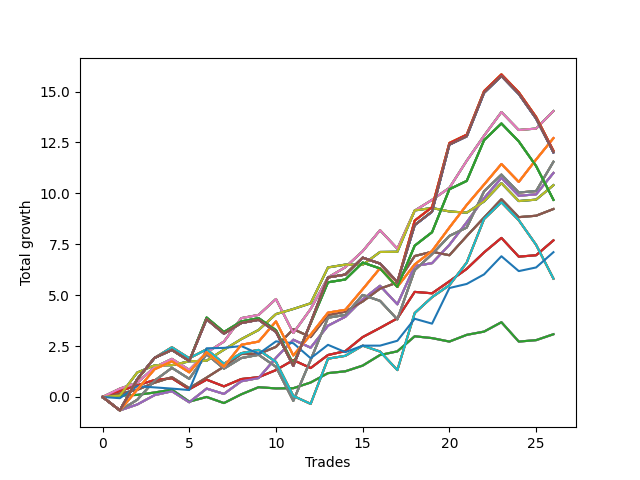

# Short Pointer 001 DB 
- Symbol: SPY_Unlimited
- Date Range: 03/23/2022 - 07/08/2022
- Trading Period: 7:20-12:30
- Number of Trades: 26



| Name | Win Percent | Profit | Avg Profit / Trade | Avg Time / Trade |      | Name | Win Percent | Profit | Avg Profit / Trade | Avg Time / Trade |
| ---- | ----------- | ------ | ------------------ | ---------------- | ---- | ---- | ----------- | ------ | ------------------ | ---------------- |
| Sorted By <br> Profit | | | | | | Sorted By <br> Win Percentage ||||
| Sixty-Eight | 84.62 | 7020.00 | 270.00 | 15:57 |     | Sixty-Eight | 84.62 | 7020.00 | 270.00 | 15:57 |
| Sixty | 84.62 | 7020.00 | 270.00 | 15:57 |     | Sixty | 84.62 | 7020.00 | 270.00 | 15:57 |
| Fifty-Two | 84.62 | 7020.00 | 270.00 | 15:57 |     | Fifty-Two | 84.62 | 7020.00 | 270.00 | 15:57 |
| Forty-Four | 84.62 | 7020.00 | 270.00 | 15:57 |     | Forty-Four | 84.62 | 7020.00 | 270.00 | 15:57 |
| Four | 84.62 | 7020.00 | 270.00 | 15:57 |     | Four | 84.62 | 7020.00 | 270.00 | 15:57 |
| One Hundred Twenty-Six | 76.92 | 6355.00 | 244.42 | 18:19 |     | Seventy | 84.62 | 5200.00 | 200.00 | 07:37 |
| One Hundred Twenty-One | 76.92 | 6355.00 | 244.42 | 18:19 |     | Sixty-Two | 84.62 | 5200.00 | 200.00 | 07:37 |
| One Hundred Sixteen | 76.92 | 6355.00 | 244.42 | 18:19 |     | Fifty-Four | 84.62 | 5200.00 | 200.00 | 07:37 |
| One Hundred Eleven | 76.92 | 6355.00 | 244.42 | 18:19 |     | Forty-Six | 84.62 | 5200.00 | 200.00 | 07:37 |
| Eighty-One | 76.92 | 6355.00 | 244.42 | 18:19 |     | Six | 84.62 | 5200.00 | 200.00 | 07:37 |
| One Hundred Twenty-Eight | 61.54 | 6045.00 | 232.50 | 27:58 |     | Sixty-Seven | 80.77 | 4615.00 | 177.50 | 11:20 |
| One Hundred Twenty-Three | 61.54 | 6045.00 | 232.50 | 27:58 |     | Fifty-Nine | 80.77 | 4615.00 | 177.50 | 11:20 |
| One Hundred Eighteen | 61.54 | 6045.00 | 232.50 | 27:58 |     | Fifty-One | 80.77 | 4615.00 | 177.50 | 11:20 |
| One Hundred Thirteen | 61.54 | 6045.00 | 232.50 | 27:58 |     | Forty-Three | 80.77 | 4615.00 | 177.50 | 11:20 |
| Eighty-Three | 61.54 | 6045.00 | 232.50 | 27:58 |     | Three | 80.77 | 4615.00 | 177.50 | 11:20 |
| One Hundred Thirty | 61.54 | 6005.00 | 230.96 | 29:13 |     | Sixty-Five | 80.77 | 3845.00 | 147.88 | 09:10 |
| One Hundred Twenty-Nine | 61.54 | 6005.00 | 230.96 | 29:13 |     | Fifty-Seven | 80.77 | 3845.00 | 147.88 | 09:10 |
| One Hundred Twenty-Five | 61.54 | 6005.00 | 230.96 | 29:13 |     | Forty-Nine | 80.77 | 3845.00 | 147.88 | 09:10 |
| One Hundred Twenty-Four | 61.54 | 6005.00 | 230.96 | 29:13 |     | Forty-One | 80.77 | 3845.00 | 147.88 | 09:10 |
| One Hundred Twenty | 61.54 | 6005.00 | 230.96 | 29:13 |     | One | 80.77 | 3845.00 | 147.88 | 09:10 |
| One Hundred Ninteen | 61.54 | 6005.00 | 230.96 | 29:13 |     | One Hundred Twenty-Six | 76.92 | 6355.00 | 244.42 | 18:19 |
| One Hundred Fifteen | 61.54 | 6005.00 | 230.96 | 29:13 |     | One Hundred Twenty-One | 76.92 | 6355.00 | 244.42 | 18:19 |
| One Hundred Fourteen | 61.54 | 6005.00 | 230.96 | 29:13 |     | One Hundred Sixteen | 76.92 | 6355.00 | 244.42 | 18:19 |
| Eighty-Five | 61.54 | 6005.00 | 230.96 | 29:13 |     | One Hundred Eleven | 76.92 | 6355.00 | 244.42 | 18:19 |
| Eighty-Four | 61.54 | 6005.00 | 230.96 | 29:13 |     | Eighty-One | 76.92 | 6355.00 | 244.42 | 18:19 |
| Sixty-Nine | 69.23 | 5775.00 | 222.12 | 21:41 |     | Sixty-Six | 76.92 | 5500.00 | 211.54 | 14:36 |
| Sixty-One | 69.23 | 5775.00 | 222.12 | 21:41 |     | Fifty-Eight | 76.92 | 5500.00 | 211.54 | 14:36 |
| Fifty-Three | 69.23 | 5775.00 | 222.12 | 21:41 |     | Fifty | 76.92 | 5500.00 | 211.54 | 14:36 |
| Forty-Five | 69.23 | 5775.00 | 222.12 | 21:41 |     | Forty-Two | 76.92 | 5500.00 | 211.54 | 14:36 |
| Five | 69.23 | 5775.00 | 222.12 | 21:41 |     | Two | 76.92 | 5500.00 | 211.54 | 14:36 |
| Sixty-Six | 76.92 | 5500.00 | 211.54 | 14:36 |     | Sixty-Four | 76.92 | 1540.00 | 59.23 | 04:35 |
| Fifty-Eight | 76.92 | 5500.00 | 211.54 | 14:36 |     | Fifty-Six | 76.92 | 1540.00 | 59.23 | 04:35 |
| Fifty | 76.92 | 5500.00 | 211.54 | 14:36 |     | Forty-Eight | 76.92 | 1540.00 | 59.23 | 04:35 |
| Forty-Two | 76.92 | 5500.00 | 211.54 | 14:36 |     | Forty | 76.92 | 1540.00 | 59.23 | 04:35 |
| Two | 76.92 | 5500.00 | 211.54 | 14:36 |     | Zero | 76.92 | 1540.00 | 59.23 | 04:35 |
| Seventy | 84.62 | 5200.00 | 200.00 | 07:37 |     | Sixty-Nine | 69.23 | 5775.00 | 222.12 | 21:41 |
| Sixty-Two | 84.62 | 5200.00 | 200.00 | 07:37 |     | Sixty-One | 69.23 | 5775.00 | 222.12 | 21:41 |
| Fifty-Four | 84.62 | 5200.00 | 200.00 | 07:37 |     | Fifty-Three | 69.23 | 5775.00 | 222.12 | 21:41 |
| Forty-Six | 84.62 | 5200.00 | 200.00 | 07:37 |     | Forty-Five | 69.23 | 5775.00 | 222.12 | 21:41 |
| Six | 84.62 | 5200.00 | 200.00 | 07:37 |     | Five | 69.23 | 5775.00 | 222.12 | 21:41 |
| One Hundred Twenty-Seven | 61.54 | 4840.00 | 186.15 | 26:49 |     | One Hundred Twenty-Eight | 61.54 | 6045.00 | 232.50 | 27:58 |
| One Hundred Twenty-Two | 61.54 | 4840.00 | 186.15 | 26:49 |     | One Hundred Twenty-Three | 61.54 | 6045.00 | 232.50 | 27:58 |
| One Hundred Seventeen | 61.54 | 4840.00 | 186.15 | 26:49 |     | One Hundred Eighteen | 61.54 | 6045.00 | 232.50 | 27:58 |
| One Hundred Twelve | 61.54 | 4840.00 | 186.15 | 26:49 |     | One Hundred Thirteen | 61.54 | 6045.00 | 232.50 | 27:58 |
| Eighty-Two | 61.54 | 4840.00 | 186.15 | 26:49 |     | Eighty-Three | 61.54 | 6045.00 | 232.50 | 27:58 |
| Sixty-Seven | 80.77 | 4615.00 | 177.50 | 11:20 |     | One Hundred Thirty | 61.54 | 6005.00 | 230.96 | 29:13 |
| Fifty-Nine | 80.77 | 4615.00 | 177.50 | 11:20 |     | One Hundred Twenty-Nine | 61.54 | 6005.00 | 230.96 | 29:13 |
| Fifty-One | 80.77 | 4615.00 | 177.50 | 11:20 |     | One Hundred Twenty-Five | 61.54 | 6005.00 | 230.96 | 29:13 |
| Forty-Three | 80.77 | 4615.00 | 177.50 | 11:20 |     | One Hundred Twenty-Four | 61.54 | 6005.00 | 230.96 | 29:13 |
| Three | 80.77 | 4615.00 | 177.50 | 11:20 |     | One Hundred Twenty | 61.54 | 6005.00 | 230.96 | 29:13 |
| Sixty-Five | 80.77 | 3845.00 | 147.88 | 09:10 |     | One Hundred Ninteen | 61.54 | 6005.00 | 230.96 | 29:13 |
| Fifty-Seven | 80.77 | 3845.00 | 147.88 | 09:10 |     | One Hundred Fifteen | 61.54 | 6005.00 | 230.96 | 29:13 |
| Forty-Nine | 80.77 | 3845.00 | 147.88 | 09:10 |     | One Hundred Fourteen | 61.54 | 6005.00 | 230.96 | 29:13 |
| Forty-One | 80.77 | 3845.00 | 147.88 | 09:10 |     | Eighty-Five | 61.54 | 6005.00 | 230.96 | 29:13 |
| One | 80.77 | 3845.00 | 147.88 | 09:10 |     | Eighty-Four | 61.54 | 6005.00 | 230.96 | 29:13 |
| Seventy-Three | 57.69 | 3555.00 | 136.73 | 09:11 |     | One Hundred Twenty-Seven | 61.54 | 4840.00 | 186.15 | 26:49 |
| Seventy-One | 57.69 | 2905.00 | 111.73 | 24:23 |     | One Hundred Twenty-Two | 61.54 | 4840.00 | 186.15 | 26:49 |
| Sixty-Three | 57.69 | 2905.00 | 111.73 | 24:23 |     | One Hundred Seventeen | 61.54 | 4840.00 | 186.15 | 26:49 |
| Fifty-Five | 57.69 | 2905.00 | 111.73 | 24:23 |     | One Hundred Twelve | 61.54 | 4840.00 | 186.15 | 26:49 |
| Forty-Seven | 57.69 | 2905.00 | 111.73 | 24:23 |     | Eighty-Two | 61.54 | 4840.00 | 186.15 | 26:49 |
| Seven | 57.69 | 2905.00 | 111.73 | 24:23 |     | Seventy-Three | 57.69 | 3555.00 | 136.73 | 09:11 |
| Sixty-Four | 76.92 | 1540.00 | 59.23 | 04:35 |     | Seventy-One | 57.69 | 2905.00 | 111.73 | 24:23 |
| Fifty-Six | 76.92 | 1540.00 | 59.23 | 04:35 |     | Sixty-Three | 57.69 | 2905.00 | 111.73 | 24:23 |
| Forty-Eight | 76.92 | 1540.00 | 59.23 | 04:35 |     | Fifty-Five | 57.69 | 2905.00 | 111.73 | 24:23 |
| Forty | 76.92 | 1540.00 | 59.23 | 04:35 |     | Forty-Seven | 57.69 | 2905.00 | 111.73 | 24:23 |
| Zero | 76.92 | 1540.00 | 59.23 | 04:35 |     | Seven | 57.69 | 2905.00 | 111.73 | 24:23 |

## NO STOPLOSS

### Test Zero
* Sell when price hits the middle line of the 20p bollinger
* No Stoploss
* Results:
```
Total Trades: 26
Percent Up: 23.08
Percent Down: 76.92
Total Points Moved Down: 3.08
Potential Profit: 1540.00
Total Points Ups: 2.16 Count Ups: 6
Total Points Downs: 5.24 Count Downs: 20
```

<details><summary>Trades</summary>

<code>In: 2022-03-25 10:22:00		Out: 2022-03-25 10:22:10		Total Position Time: 00:10		Total Move Down: 0.07		Total to Date: 0.07</code> <br />
<code>In: 2022-03-25 11:57:00		Out: 2022-03-25 11:57:15		Total Position Time: 00:15		Total Move Down: 0.03		Total to Date: 0.10</code> <br />
<code>In: 2022-03-29 08:52:00		Out: 2022-03-29 08:56:20		Total Position Time: 04:20		Total Move Down: 0.12		Total to Date: 0.22</code> <br />
<code>In: 2022-03-30 09:46:00		Out: 2022-03-30 09:50:50		Total Position Time: 04:50		Total Move Down: 0.14		Total to Date: 0.36</code> <br />
<code>In: 2022-03-31 07:38:00		Out: 2022-03-31 08:03:05		Total Position Time: 25:05		Total Move Down: -0.59		Total to Date: -0.23</code> <br />
<code>In: 2022-03-31 12:05:00		Out: 2022-03-31 12:11:30		Total Position Time: 06:30		Total Move Down: 0.23		Total to Date: 0.00</code> <br />
<code>In: 2022-04-06 10:36:00		Out: 2022-04-06 10:47:10		Total Position Time: 11:10		Total Move Down: -0.30		Total to Date: -0.30</code> <br />
<code>In: 2022-04-18 10:59:00		Out: 2022-04-18 10:59:30		Total Position Time: 00:30		Total Move Down: 0.43		Total to Date: 0.13</code> <br />
<code>In: 2022-04-25 09:28:00		Out: 2022-04-25 09:31:05		Total Position Time: 03:05		Total Move Down: 0.35		Total to Date: 0.48</code> <br />
<code>In: 2022-04-25 09:53:00		Out: 2022-04-25 09:53:10		Total Position Time: 00:10		Total Move Down: -0.06		Total to Date: 0.42</code> <br />
<code>In: 2022-04-27 08:04:00		Out: 2022-04-27 08:04:10		Total Position Time: 00:10		Total Move Down: 0.01		Total to Date: 0.43</code> <br />
<code>In: 2022-05-09 12:04:00		Out: 2022-05-09 12:04:10		Total Position Time: 00:10		Total Move Down: 0.28		Total to Date: 0.71</code> <br />
<code>In: 2022-05-24 09:18:00		Out: 2022-05-24 09:21:35		Total Position Time: 03:35		Total Move Down: 0.46		Total to Date: 1.17</code> <br />
<code>In: 2022-06-01 12:19:00		Out: 2022-06-01 12:25:25		Total Position Time: 06:25		Total Move Down: 0.09		Total to Date: 1.26</code> <br />
<code>In: 2022-06-09 08:47:00		Out: 2022-06-09 08:48:20		Total Position Time: 01:20		Total Move Down: 0.28		Total to Date: 1.54</code> <br />
<code>In: 2022-06-10 11:26:00		Out: 2022-06-10 11:28:25		Total Position Time: 02:25		Total Move Down: 0.52		Total to Date: 2.06</code> <br />
<code>In: 2022-06-13 08:42:00		Out: 2022-06-13 08:47:55		Total Position Time: 05:55		Total Move Down: 0.18		Total to Date: 2.24</code> <br />
<code>In: 2022-06-13 09:41:00		Out: 2022-06-13 09:44:05		Total Position Time: 03:05		Total Move Down: 0.74		Total to Date: 2.98</code> <br />
<code>In: 2022-06-15 09:19:00		Out: 2022-06-15 09:30:55		Total Position Time: 11:55		Total Move Down: -0.09		Total to Date: 2.89</code> <br />
<code>In: 2022-06-15 11:02:00		Out: 2022-06-15 11:02:10		Total Position Time: 00:10		Total Move Down: -0.17		Total to Date: 2.72</code> <br />
<code>In: 2022-06-16 08:30:00		Out: 2022-06-16 08:30:35		Total Position Time: 00:35		Total Move Down: 0.33		Total to Date: 3.05</code> <br />
<code>In: 2022-06-17 08:34:00		Out: 2022-06-17 08:35:05		Total Position Time: 01:05		Total Move Down: 0.16		Total to Date: 3.21</code> <br />
<code>In: 2022-06-29 12:31:00		Out: 2022-06-29 12:33:20		Total Position Time: 02:20		Total Move Down: 0.46		Total to Date: 3.67</code> <br />
<code>In: 2022-07-01 10:35:00		Out: 2022-07-01 10:58:40		Total Position Time: 23:40		Total Move Down: -0.95		Total to Date: 2.72</code> <br />
<code>In: 2022-07-06 11:00:00		Out: 2022-07-06 11:00:10		Total Position Time: 00:10		Total Move Down: 0.07		Total to Date: 2.79</code> <br />
<code>In: 2022-07-06 11:10:00		Out: 2022-07-06 11:10:10		Total Position Time: 00:10		Total Move Down: 0.29		Total to Date: 3.08</code> <br />


</details>

### Test One
* Sell when the price hits the upper line of the 20p 1std bollinger
* No Stoploss
* Results:
```
Total Trades: 26
Percent Up: 19.23
Percent Down: 80.77
Total Points Moved Down: 7.69
Potential Profit: 3845.00
Total Points Ups: 2.25 Count Ups: 5
Total Points Downs: 9.94 Count Downs: 21
```

<details><summary>Trades</summary>

<code>In: 2022-03-25 10:22:00		Out: 2022-03-25 10:23:25		Total Position Time: 01:25		Total Move Down: 0.29		Total to Date: 0.29</code> <br />
<code>In: 2022-03-25 11:57:00		Out: 2022-03-25 12:00:50		Total Position Time: 03:50		Total Move Down: 0.28		Total to Date: 0.57</code> <br />
<code>In: 2022-03-29 08:52:00		Out: 2022-03-29 08:58:45		Total Position Time: 06:45		Total Move Down: 0.26		Total to Date: 0.83</code> <br />
<code>In: 2022-03-30 09:46:00		Out: 2022-03-30 10:00:45		Total Position Time: 14:45		Total Move Down: 0.09		Total to Date: 0.92</code> <br />
<code>In: 2022-03-31 07:38:00		Out: 2022-03-31 08:07:55		Total Position Time: 29:55		Total Move Down: -0.54		Total to Date: 0.38</code> <br />
<code>In: 2022-03-31 12:05:00		Out: 2022-03-31 12:16:00		Total Position Time: 11:00		Total Move Down: 0.47		Total to Date: 0.85</code> <br />
<code>In: 2022-04-06 10:36:00		Out: 2022-04-06 10:56:55		Total Position Time: 20:55		Total Move Down: -0.33		Total to Date: 0.52</code> <br />
<code>In: 2022-04-18 10:59:00		Out: 2022-04-18 11:06:20		Total Position Time: 07:20		Total Move Down: 0.36		Total to Date: 0.88</code> <br />
<code>In: 2022-04-25 09:28:00		Out: 2022-04-25 09:42:35		Total Position Time: 14:35		Total Move Down: 0.09		Total to Date: 0.97</code> <br />
<code>In: 2022-04-25 09:53:00		Out: 2022-04-25 09:55:05		Total Position Time: 02:05		Total Move Down: 0.35		Total to Date: 1.32</code> <br />
<code>In: 2022-04-27 08:04:00		Out: 2022-04-27 08:05:30		Total Position Time: 01:30		Total Move Down: 0.49		Total to Date: 1.81</code> <br />
<code>In: 2022-05-09 12:04:00		Out: 2022-05-09 12:17:15		Total Position Time: 13:15		Total Move Down: -0.39		Total to Date: 1.42</code> <br />
<code>In: 2022-05-24 09:18:00		Out: 2022-05-24 09:28:55		Total Position Time: 10:55		Total Move Down: 0.64		Total to Date: 2.06</code> <br />
<code>In: 2022-06-01 12:19:00		Out: 2022-06-01 12:25:45		Total Position Time: 06:45		Total Move Down: 0.19		Total to Date: 2.25</code> <br />
<code>In: 2022-06-09 08:47:00		Out: 2022-06-09 08:49:35		Total Position Time: 02:35		Total Move Down: 0.69		Total to Date: 2.94</code> <br />
<code>In: 2022-06-10 11:26:00		Out: 2022-06-10 11:38:10		Total Position Time: 12:10		Total Move Down: 0.45		Total to Date: 3.39</code> <br />
<code>In: 2022-06-13 08:42:00		Out: 2022-06-13 08:52:15		Total Position Time: 10:15		Total Move Down: 0.47		Total to Date: 3.86</code> <br />
<code>In: 2022-06-13 09:41:00		Out: 2022-06-13 09:47:55		Total Position Time: 06:55		Total Move Down: 1.30		Total to Date: 5.16</code> <br />
<code>In: 2022-06-15 09:19:00		Out: 2022-06-15 09:35:10		Total Position Time: 16:10		Total Move Down: -0.07		Total to Date: 5.09</code> <br />
<code>In: 2022-06-15 11:02:00		Out: 2022-06-15 11:03:05		Total Position Time: 01:05		Total Move Down: 0.59		Total to Date: 5.68</code> <br />
<code>In: 2022-06-16 08:30:00		Out: 2022-06-16 08:35:15		Total Position Time: 05:15		Total Move Down: 0.61		Total to Date: 6.29</code> <br />
<code>In: 2022-06-17 08:34:00		Out: 2022-06-17 08:39:05		Total Position Time: 05:05		Total Move Down: 0.81		Total to Date: 7.10</code> <br />
<code>In: 2022-06-29 12:31:00		Out: 2022-06-29 12:34:10		Total Position Time: 03:10		Total Move Down: 0.71		Total to Date: 7.81</code> <br />
<code>In: 2022-07-01 10:35:00		Out: 2022-07-01 11:04:25		Total Position Time: 29:25		Total Move Down: -0.92		Total to Date: 6.89</code> <br />
<code>In: 2022-07-06 11:00:00		Out: 2022-07-06 11:00:10		Total Position Time: 00:10		Total Move Down: 0.07		Total to Date: 6.96</code> <br />
<code>In: 2022-07-06 11:10:00		Out: 2022-07-06 11:11:10		Total Position Time: 01:10		Total Move Down: 0.73		Total to Date: 7.69</code> <br />


</details>

### Test Two
* Sell when the price hits the upper line of the 20p 2std bollinger
* No Stoploss
* Results:
```
Total Trades: 26
Percent Up: 23.08
Percent Down: 76.92
Total Points Moved Down: 11.00
Potential Profit: 5500.00
Total Points Ups: 3.64 Count Ups: 6
Total Points Downs: 14.64 Count Downs: 20
```

<details><summary>Trades</summary>

<code>In: 2022-03-25 10:22:00		Out: 2022-03-25 10:51:55		Total Position Time: 29:55		Total Move Down: -0.66		Total to Date: -0.66</code> <br />
<code>In: 2022-03-25 11:57:00		Out: 2022-03-25 12:00:55		Total Position Time: 03:55		Total Move Down: 0.29		Total to Date: -0.37</code> <br />
<code>In: 2022-03-29 08:52:00		Out: 2022-03-29 09:01:40		Total Position Time: 09:40		Total Move Down: 0.46		Total to Date: 0.09</code> <br />
<code>In: 2022-03-30 09:46:00		Out: 2022-03-30 10:01:15		Total Position Time: 15:15		Total Move Down: 0.19		Total to Date: 0.28</code> <br />
<code>In: 2022-03-31 07:38:00		Out: 2022-03-31 08:07:55		Total Position Time: 29:55		Total Move Down: -0.54		Total to Date: -0.26</code> <br />
<code>In: 2022-03-31 12:05:00		Out: 2022-03-31 12:19:35		Total Position Time: 14:35		Total Move Down: 0.67		Total to Date: 0.41</code> <br />
<code>In: 2022-04-06 10:36:00		Out: 2022-04-06 10:57:20		Total Position Time: 21:20		Total Move Down: -0.26		Total to Date: 0.15</code> <br />
<code>In: 2022-04-18 10:59:00		Out: 2022-04-18 11:10:40		Total Position Time: 11:40		Total Move Down: 0.62		Total to Date: 0.77</code> <br />
<code>In: 2022-04-25 09:28:00		Out: 2022-04-25 09:57:55		Total Position Time: 29:55		Total Move Down: 0.16		Total to Date: 0.93</code> <br />
<code>In: 2022-04-25 09:53:00		Out: 2022-04-25 10:01:20		Total Position Time: 08:20		Total Move Down: 0.99		Total to Date: 1.92</code> <br />
<code>In: 2022-04-27 08:04:00		Out: 2022-04-27 08:10:35		Total Position Time: 06:35		Total Move Down: 0.89		Total to Date: 2.81</code> <br />
<code>In: 2022-05-09 12:04:00		Out: 2022-05-09 12:17:15		Total Position Time: 13:15		Total Move Down: -0.39		Total to Date: 2.42</code> <br />
<code>In: 2022-05-24 09:18:00		Out: 2022-05-24 09:31:20		Total Position Time: 13:20		Total Move Down: 1.08		Total to Date: 3.50</code> <br />
<code>In: 2022-06-01 12:19:00		Out: 2022-06-01 12:30:05		Total Position Time: 11:05		Total Move Down: 0.44		Total to Date: 3.94</code> <br />
<code>In: 2022-06-09 08:47:00		Out: 2022-06-09 09:11:00		Total Position Time: 24:00		Total Move Down: 0.85		Total to Date: 4.79</code> <br />
<code>In: 2022-06-10 11:26:00		Out: 2022-06-10 11:40:10		Total Position Time: 14:10		Total Move Down: 0.67		Total to Date: 5.46</code> <br />
<code>In: 2022-06-13 08:42:00		Out: 2022-06-13 09:11:55		Total Position Time: 29:55		Total Move Down: -0.91		Total to Date: 4.55</code> <br />
<code>In: 2022-06-13 09:41:00		Out: 2022-06-13 09:54:45		Total Position Time: 13:45		Total Move Down: 1.88		Total to Date: 6.43</code> <br />
<code>In: 2022-06-15 09:19:00		Out: 2022-06-15 09:36:10		Total Position Time: 17:10		Total Move Down: 0.14		Total to Date: 6.57</code> <br />
<code>In: 2022-06-15 11:02:00		Out: 2022-06-15 11:03:15		Total Position Time: 01:15		Total Move Down: 0.90		Total to Date: 7.47</code> <br />
<code>In: 2022-06-16 08:30:00		Out: 2022-06-16 08:42:05		Total Position Time: 12:05		Total Move Down: 1.11		Total to Date: 8.58</code> <br />
<code>In: 2022-06-17 08:34:00		Out: 2022-06-17 08:45:15		Total Position Time: 11:15		Total Move Down: 1.18		Total to Date: 9.76</code> <br />
<code>In: 2022-06-29 12:31:00		Out: 2022-06-29 12:36:35		Total Position Time: 05:35		Total Move Down: 1.00		Total to Date: 10.76</code> <br />
<code>In: 2022-07-01 10:35:00		Out: 2022-07-01 11:04:55		Total Position Time: 29:55		Total Move Down: -0.88		Total to Date: 9.88</code> <br />
<code>In: 2022-07-06 11:00:00		Out: 2022-07-06 11:00:10		Total Position Time: 00:10		Total Move Down: 0.07		Total to Date: 9.95</code> <br />
<code>In: 2022-07-06 11:10:00		Out: 2022-07-06 11:11:45		Total Position Time: 01:45		Total Move Down: 1.05		Total to Date: 11.00</code> <br />


</details>

### Test Three
* Sell when price hits the middle line of the 50p bollinger
* No Stoploss
* Results:
```
Total Trades: 26
Percent Up: 19.23
Percent Down: 80.77
Total Points Moved Down: 9.23
Potential Profit: 4615.00
Total Points Ups: 1.98 Count Ups: 5
Total Points Downs: 11.21 Count Downs: 21
```

<details><summary>Trades</summary>

<code>In: 2022-03-25 10:22:00		Out: 2022-03-25 10:23:10		Total Position Time: 01:10		Total Move Down: 0.16		Total to Date: 0.16</code> <br />
<code>In: 2022-03-25 11:57:00		Out: 2022-03-25 12:00:45		Total Position Time: 03:45		Total Move Down: 0.19		Total to Date: 0.35</code> <br />
<code>In: 2022-03-29 08:52:00		Out: 2022-03-29 09:01:25		Total Position Time: 09:25		Total Move Down: 0.35		Total to Date: 0.70</code> <br />
<code>In: 2022-03-30 09:46:00		Out: 2022-03-30 10:01:45		Total Position Time: 15:45		Total Move Down: 0.27		Total to Date: 0.97</code> <br />
<code>In: 2022-03-31 07:38:00		Out: 2022-03-31 08:07:55		Total Position Time: 29:55		Total Move Down: -0.54		Total to Date: 0.43</code> <br />
<code>In: 2022-03-31 12:05:00		Out: 2022-03-31 12:16:40		Total Position Time: 11:40		Total Move Down: 0.52		Total to Date: 0.95</code> <br />
<code>In: 2022-04-06 10:36:00		Out: 2022-04-06 11:00:10		Total Position Time: 24:10		Total Move Down: 0.54		Total to Date: 1.49</code> <br />
<code>In: 2022-04-18 10:59:00		Out: 2022-04-18 11:16:30		Total Position Time: 17:30		Total Move Down: 0.62		Total to Date: 2.11</code> <br />
<code>In: 2022-04-25 09:28:00		Out: 2022-04-25 09:55:05		Total Position Time: 27:05		Total Move Down: -0.00		Total to Date: 2.11</code> <br />
<code>In: 2022-04-25 09:53:00		Out: 2022-04-25 09:55:05		Total Position Time: 02:05		Total Move Down: 0.35		Total to Date: 2.46</code> <br />
<code>In: 2022-04-27 08:04:00		Out: 2022-04-27 08:10:20		Total Position Time: 06:20		Total Move Down: 0.87		Total to Date: 3.33</code> <br />
<code>In: 2022-05-09 12:04:00		Out: 2022-05-09 12:17:15		Total Position Time: 13:15		Total Move Down: -0.39		Total to Date: 2.94</code> <br />
<code>In: 2022-05-24 09:18:00		Out: 2022-05-24 09:31:20		Total Position Time: 13:20		Total Move Down: 1.08		Total to Date: 4.02</code> <br />
<code>In: 2022-06-01 12:19:00		Out: 2022-06-01 12:25:30		Total Position Time: 06:30		Total Move Down: 0.17		Total to Date: 4.19</code> <br />
<code>In: 2022-06-09 08:47:00		Out: 2022-06-09 08:48:50		Total Position Time: 01:50		Total Move Down: 0.50		Total to Date: 4.69</code> <br />
<code>In: 2022-06-10 11:26:00		Out: 2022-06-10 11:28:30		Total Position Time: 02:30		Total Move Down: 0.63		Total to Date: 5.32</code> <br />
<code>In: 2022-06-13 08:42:00		Out: 2022-06-13 09:07:20		Total Position Time: 25:20		Total Move Down: 0.30		Total to Date: 5.62</code> <br />
<code>In: 2022-06-13 09:41:00		Out: 2022-06-13 09:47:55		Total Position Time: 06:55		Total Move Down: 1.30		Total to Date: 6.92</code> <br />
<code>In: 2022-06-15 09:19:00		Out: 2022-06-15 09:38:40		Total Position Time: 19:40		Total Move Down: 0.21		Total to Date: 7.13</code> <br />
<code>In: 2022-06-15 11:02:00		Out: 2022-06-15 11:02:10		Total Position Time: 00:10		Total Move Down: -0.17		Total to Date: 6.96</code> <br />
<code>In: 2022-06-16 08:30:00		Out: 2022-06-16 08:41:55		Total Position Time: 11:55		Total Move Down: 0.94		Total to Date: 7.90</code> <br />
<code>In: 2022-06-17 08:34:00		Out: 2022-06-17 08:45:00		Total Position Time: 11:00		Total Move Down: 0.91		Total to Date: 8.81</code> <br />
<code>In: 2022-06-29 12:31:00		Out: 2022-06-29 12:34:15		Total Position Time: 03:15		Total Move Down: 0.90		Total to Date: 9.71</code> <br />
<code>In: 2022-07-01 10:35:00		Out: 2022-07-01 11:04:55		Total Position Time: 29:55		Total Move Down: -0.88		Total to Date: 8.83</code> <br />
<code>In: 2022-07-06 11:00:00		Out: 2022-07-06 11:00:10		Total Position Time: 00:10		Total Move Down: 0.07		Total to Date: 8.90</code> <br />
<code>In: 2022-07-06 11:10:00		Out: 2022-07-06 11:10:20		Total Position Time: 00:20		Total Move Down: 0.33		Total to Date: 9.23</code> <br />


</details>

### Test Four
* Sell when the price hits the upper line of the 50p 1std bollinger
* No Stoploss
* Results:
```
Total Trades: 26
Percent Up: 15.38
Percent Down: 84.62
Total Points Moved Down: 14.04
Potential Profit: 7020.00
Total Points Ups: 4.00 Count Ups: 4
Total Points Downs: 18.04 Count Downs: 22
```

<details><summary>Trades</summary>

<code>In: 2022-03-25 10:22:00		Out: 2022-03-25 10:27:15		Total Position Time: 05:15		Total Move Down: 0.41		Total to Date: 0.41</code> <br />
<code>In: 2022-03-25 11:57:00		Out: 2022-03-25 12:00:55		Total Position Time: 03:55		Total Move Down: 0.29		Total to Date: 0.70</code> <br />
<code>In: 2022-03-29 08:52:00		Out: 2022-03-29 09:02:15		Total Position Time: 10:15		Total Move Down: 0.76		Total to Date: 1.46</code> <br />
<code>In: 2022-03-30 09:46:00		Out: 2022-03-30 10:06:35		Total Position Time: 20:35		Total Move Down: 0.41		Total to Date: 1.87</code> <br />
<code>In: 2022-03-31 07:38:00		Out: 2022-03-31 08:07:55		Total Position Time: 29:55		Total Move Down: -0.54		Total to Date: 1.33</code> <br />
<code>In: 2022-03-31 12:05:00		Out: 2022-03-31 12:20:15		Total Position Time: 15:15		Total Move Down: 0.85		Total to Date: 2.18</code> <br />
<code>In: 2022-04-06 10:36:00		Out: 2022-04-06 11:00:10		Total Position Time: 24:10		Total Move Down: 0.54		Total to Date: 2.72</code> <br />
<code>In: 2022-04-18 10:59:00		Out: 2022-04-18 11:18:10		Total Position Time: 19:10		Total Move Down: 1.15		Total to Date: 3.87</code> <br />
<code>In: 2022-04-25 09:28:00		Out: 2022-04-25 09:57:55		Total Position Time: 29:55		Total Move Down: 0.16		Total to Date: 4.03</code> <br />
<code>In: 2022-04-25 09:53:00		Out: 2022-04-25 10:01:15		Total Position Time: 08:15		Total Move Down: 0.78		Total to Date: 4.81</code> <br />
<code>In: 2022-04-27 08:04:00		Out: 2022-04-27 08:33:55		Total Position Time: 29:55		Total Move Down: -1.67		Total to Date: 3.14</code> <br />
<code>In: 2022-05-09 12:04:00		Out: 2022-05-09 12:23:25		Total Position Time: 19:25		Total Move Down: 1.18		Total to Date: 4.32</code> <br />
<code>In: 2022-05-24 09:18:00		Out: 2022-05-24 09:33:15		Total Position Time: 15:15		Total Move Down: 1.55		Total to Date: 5.87</code> <br />
<code>In: 2022-06-01 12:19:00		Out: 2022-06-01 12:35:05		Total Position Time: 16:05		Total Move Down: 0.50		Total to Date: 6.37</code> <br />
<code>In: 2022-06-09 08:47:00		Out: 2022-06-09 08:50:25		Total Position Time: 03:25		Total Move Down: 0.79		Total to Date: 7.16</code> <br />
<code>In: 2022-06-10 11:26:00		Out: 2022-06-10 11:41:45		Total Position Time: 15:45		Total Move Down: 1.03		Total to Date: 8.19</code> <br />
<code>In: 2022-06-13 08:42:00		Out: 2022-06-13 09:11:55		Total Position Time: 29:55		Total Move Down: -0.91		Total to Date: 7.28</code> <br />
<code>In: 2022-06-13 09:41:00		Out: 2022-06-13 09:54:50		Total Position Time: 13:50		Total Move Down: 1.87		Total to Date: 9.15</code> <br />
<code>In: 2022-06-15 09:19:00		Out: 2022-06-15 09:41:45		Total Position Time: 22:45		Total Move Down: 0.53		Total to Date: 9.68</code> <br />
<code>In: 2022-06-15 11:02:00		Out: 2022-06-15 11:03:05		Total Position Time: 01:05		Total Move Down: 0.59		Total to Date: 10.27</code> <br />
<code>In: 2022-06-16 08:30:00		Out: 2022-06-16 08:51:45		Total Position Time: 21:45		Total Move Down: 1.33		Total to Date: 11.60</code> <br />
<code>In: 2022-06-17 08:34:00		Out: 2022-06-17 08:51:20		Total Position Time: 17:20		Total Move Down: 1.23		Total to Date: 12.83</code> <br />
<code>In: 2022-06-29 12:31:00		Out: 2022-06-29 12:41:00		Total Position Time: 10:00		Total Move Down: 1.16		Total to Date: 13.99</code> <br />
<code>In: 2022-07-01 10:35:00		Out: 2022-07-01 11:04:55		Total Position Time: 29:55		Total Move Down: -0.88		Total to Date: 13.11</code> <br />
<code>In: 2022-07-06 11:00:00		Out: 2022-07-06 11:00:10		Total Position Time: 00:10		Total Move Down: 0.07		Total to Date: 13.18</code> <br />
<code>In: 2022-07-06 11:10:00		Out: 2022-07-06 11:11:35		Total Position Time: 01:35		Total Move Down: 0.86		Total to Date: 14.04</code> <br />


</details>

### Test Five
* Sell when the price hits the upper line of the 50p 2std bollinger
* No Stoploss
* Results:
```
Total Trades: 26
Percent Up: 30.77
Percent Down: 69.23
Total Points Moved Down: 11.55
Potential Profit: 5775.00
Total Points Ups: 6.25 Count Ups: 8
Total Points Downs: 17.80 Count Downs: 18
```

<details><summary>Trades</summary>

<code>In: 2022-03-25 10:22:00		Out: 2022-03-25 10:51:55		Total Position Time: 29:55		Total Move Down: -0.66		Total to Date: -0.66</code> <br />
<code>In: 2022-03-25 11:57:00		Out: 2022-03-25 12:01:55		Total Position Time: 04:55		Total Move Down: 0.52		Total to Date: -0.14</code> <br />
<code>In: 2022-03-29 08:52:00		Out: 2022-03-29 09:10:50		Total Position Time: 18:50		Total Move Down: 0.94		Total to Date: 0.80</code> <br />
<code>In: 2022-03-30 09:46:00		Out: 2022-03-30 10:07:20		Total Position Time: 21:20		Total Move Down: 0.63		Total to Date: 1.43</code> <br />
<code>In: 2022-03-31 07:38:00		Out: 2022-03-31 08:07:55		Total Position Time: 29:55		Total Move Down: -0.54		Total to Date: 0.89</code> <br />
<code>In: 2022-03-31 12:05:00		Out: 2022-03-31 12:21:50		Total Position Time: 16:50		Total Move Down: 1.21		Total to Date: 2.10</code> <br />
<code>In: 2022-04-06 10:36:00		Out: 2022-04-06 11:05:55		Total Position Time: 29:55		Total Move Down: -0.71		Total to Date: 1.39</code> <br />
<code>In: 2022-04-18 10:59:00		Out: 2022-04-18 11:28:55		Total Position Time: 29:55		Total Move Down: 0.52		Total to Date: 1.91</code> <br />
<code>In: 2022-04-25 09:28:00		Out: 2022-04-25 09:57:55		Total Position Time: 29:55		Total Move Down: 0.16		Total to Date: 2.07</code> <br />
<code>In: 2022-04-25 09:53:00		Out: 2022-04-25 10:22:55		Total Position Time: 29:55		Total Move Down: -0.59		Total to Date: 1.48</code> <br />
<code>In: 2022-04-27 08:04:00		Out: 2022-04-27 08:33:55		Total Position Time: 29:55		Total Move Down: -1.67		Total to Date: -0.19</code> <br />
<code>In: 2022-05-09 12:04:00		Out: 2022-05-09 12:28:05		Total Position Time: 24:05		Total Move Down: 2.01		Total to Date: 1.82</code> <br />
<code>In: 2022-05-24 09:18:00		Out: 2022-05-24 09:36:50		Total Position Time: 18:50		Total Move Down: 2.07		Total to Date: 3.89</code> <br />
<code>In: 2022-06-01 12:19:00		Out: 2022-06-01 12:46:00		Total Position Time: 27:00		Total Move Down: 0.14		Total to Date: 4.03</code> <br />
<code>In: 2022-06-09 08:47:00		Out: 2022-06-09 09:11:10		Total Position Time: 24:10		Total Move Down: 0.98		Total to Date: 5.01</code> <br />
<code>In: 2022-06-10 11:26:00		Out: 2022-06-10 11:55:55		Total Position Time: 29:55		Total Move Down: -0.29		Total to Date: 4.72</code> <br />
<code>In: 2022-06-13 08:42:00		Out: 2022-06-13 09:11:55		Total Position Time: 29:55		Total Move Down: -0.91		Total to Date: 3.81</code> <br />
<code>In: 2022-06-13 09:41:00		Out: 2022-06-13 09:58:15		Total Position Time: 17:15		Total Move Down: 2.42		Total to Date: 6.23</code> <br />
<code>In: 2022-06-15 09:19:00		Out: 2022-06-15 09:44:05		Total Position Time: 25:05		Total Move Down: 0.78		Total to Date: 7.01</code> <br />
<code>In: 2022-06-15 11:02:00		Out: 2022-06-15 11:03:15		Total Position Time: 01:15		Total Move Down: 0.90		Total to Date: 7.91</code> <br />
<code>In: 2022-06-16 08:30:00		Out: 2022-06-16 08:59:55		Total Position Time: 29:55		Total Move Down: 0.41		Total to Date: 8.32</code> <br />
<code>In: 2022-06-17 08:34:00		Out: 2022-06-17 08:52:05		Total Position Time: 18:05		Total Move Down: 1.78		Total to Date: 10.10</code> <br />
<code>In: 2022-06-29 12:31:00		Out: 2022-06-29 12:46:00		Total Position Time: 15:00		Total Move Down: 0.82		Total to Date: 10.92</code> <br />
<code>In: 2022-07-01 10:35:00		Out: 2022-07-01 11:04:55		Total Position Time: 29:55		Total Move Down: -0.88		Total to Date: 10.04</code> <br />
<code>In: 2022-07-06 11:00:00		Out: 2022-07-06 11:00:10		Total Position Time: 00:10		Total Move Down: 0.07		Total to Date: 10.11</code> <br />
<code>In: 2022-07-06 11:10:00		Out: 2022-07-06 11:12:15		Total Position Time: 02:15		Total Move Down: 1.44		Total to Date: 11.55</code> <br />


</details>

### Test Six
* Sell when the price hits the middle line of the 1std VWAP
* No Stoploss
* Results:
```
Total Trades: 26
Percent Up: 15.38
Percent Down: 84.62
Total Points Moved Down: 10.40
Potential Profit: 5200.00
Total Points Ups: 1.12 Count Ups: 4
Total Points Downs: 11.52 Count Downs: 22
```

<details><summary>Trades</summary>

<code>In: 2022-03-25 10:22:00		Out: 2022-03-25 10:22:10		Total Position Time: 00:10		Total Move Down: 0.07		Total to Date: 0.07</code> <br />
<code>In: 2022-03-25 11:57:00		Out: 2022-03-25 12:07:35		Total Position Time: 10:35		Total Move Down: 1.13		Total to Date: 1.20</code> <br />
<code>In: 2022-03-29 08:52:00		Out: 2022-03-29 09:01:25		Total Position Time: 09:25		Total Move Down: 0.35		Total to Date: 1.55</code> <br />
<code>In: 2022-03-30 09:46:00		Out: 2022-03-30 09:46:10		Total Position Time: 00:10		Total Move Down: 0.01		Total to Date: 1.56</code> <br />
<code>In: 2022-03-31 07:38:00		Out: 2022-03-31 07:41:25		Total Position Time: 03:25		Total Move Down: 0.19		Total to Date: 1.75</code> <br />
<code>In: 2022-03-31 12:05:00		Out: 2022-03-31 12:05:10		Total Position Time: 00:10		Total Move Down: 0.03		Total to Date: 1.78</code> <br />
<code>In: 2022-04-06 10:36:00		Out: 2022-04-06 11:00:10		Total Position Time: 24:10		Total Move Down: 0.54		Total to Date: 2.32</code> <br />
<code>In: 2022-04-18 10:59:00		Out: 2022-04-18 11:28:55		Total Position Time: 29:55		Total Move Down: 0.52		Total to Date: 2.84</code> <br />
<code>In: 2022-04-25 09:28:00		Out: 2022-04-25 09:31:10		Total Position Time: 03:10		Total Move Down: 0.45		Total to Date: 3.29</code> <br />
<code>In: 2022-04-25 09:53:00		Out: 2022-04-25 10:01:15		Total Position Time: 08:15		Total Move Down: 0.78		Total to Date: 4.07</code> <br />
<code>In: 2022-04-27 08:04:00		Out: 2022-04-27 08:05:25		Total Position Time: 01:25		Total Move Down: 0.25		Total to Date: 4.32</code> <br />
<code>In: 2022-05-09 12:04:00		Out: 2022-05-09 12:04:10		Total Position Time: 00:10		Total Move Down: 0.28		Total to Date: 4.60</code> <br />
<code>In: 2022-05-24 09:18:00		Out: 2022-05-24 09:36:10		Total Position Time: 18:10		Total Move Down: 1.76		Total to Date: 6.36</code> <br />
<code>In: 2022-06-01 12:19:00		Out: 2022-06-01 12:46:00		Total Position Time: 27:00		Total Move Down: 0.14		Total to Date: 6.50</code> <br />
<code>In: 2022-06-09 08:47:00		Out: 2022-06-09 08:47:10		Total Position Time: 00:10		Total Move Down: -0.01		Total to Date: 6.49</code> <br />
<code>In: 2022-06-10 11:26:00		Out: 2022-06-10 11:28:30		Total Position Time: 02:30		Total Move Down: 0.63		Total to Date: 7.12</code> <br />
<code>In: 2022-06-13 08:42:00		Out: 2022-06-13 08:47:15		Total Position Time: 05:15		Total Move Down: 0.01		Total to Date: 7.13</code> <br />
<code>In: 2022-06-13 09:41:00		Out: 2022-06-13 09:57:00		Total Position Time: 16:00		Total Move Down: 2.03		Total to Date: 9.16</code> <br />
<code>In: 2022-06-15 09:19:00		Out: 2022-06-15 09:19:10		Total Position Time: 00:10		Total Move Down: 0.12		Total to Date: 9.28</code> <br />
<code>In: 2022-06-15 11:02:00		Out: 2022-06-15 11:02:10		Total Position Time: 00:10		Total Move Down: -0.17		Total to Date: 9.11</code> <br />
<code>In: 2022-06-16 08:30:00		Out: 2022-06-16 08:30:10		Total Position Time: 00:10		Total Move Down: -0.06		Total to Date: 9.05</code> <br />
<code>In: 2022-06-17 08:34:00		Out: 2022-06-17 08:37:00		Total Position Time: 03:00		Total Move Down: 0.55		Total to Date: 9.60</code> <br />
<code>In: 2022-06-29 12:31:00		Out: 2022-06-29 12:34:15		Total Position Time: 03:15		Total Move Down: 0.90		Total to Date: 10.50</code> <br />
<code>In: 2022-07-01 10:35:00		Out: 2022-07-01 11:04:55		Total Position Time: 29:55		Total Move Down: -0.88		Total to Date: 9.62</code> <br />
<code>In: 2022-07-06 11:00:00		Out: 2022-07-06 11:00:10		Total Position Time: 00:10		Total Move Down: 0.07		Total to Date: 9.69</code> <br />
<code>In: 2022-07-06 11:10:00		Out: 2022-07-06 11:11:15		Total Position Time: 01:15		Total Move Down: 0.71		Total to Date: 10.40</code> <br />


</details>

### Test Seven
* Sell when the price hits the upper line of the 1std VWAP
* No Stoploss
* Results:
```
Total Trades: 26
Percent Up: 42.31
Percent Down: 57.69
Total Points Moved Down: 5.81
Potential Profit: 2905.00
Total Points Ups: 9.51 Count Ups: 11
Total Points Downs: 15.32 Count Downs: 15
```

<details><summary>Trades</summary>

<code>In: 2022-03-25 10:22:00		Out: 2022-03-25 10:51:55		Total Position Time: 29:55		Total Move Down: -0.66		Total to Date: -0.66</code> <br />
<code>In: 2022-03-25 11:57:00		Out: 2022-03-25 12:26:55		Total Position Time: 29:55		Total Move Down: 1.53		Total to Date: 0.87</code> <br />
<code>In: 2022-03-29 08:52:00		Out: 2022-03-29 09:21:55		Total Position Time: 29:55		Total Move Down: 1.05		Total to Date: 1.92</code> <br />
<code>In: 2022-03-30 09:46:00		Out: 2022-03-30 10:06:55		Total Position Time: 20:55		Total Move Down: 0.52		Total to Date: 2.44</code> <br />
<code>In: 2022-03-31 07:38:00		Out: 2022-03-31 08:07:55		Total Position Time: 29:55		Total Move Down: -0.54		Total to Date: 1.90</code> <br />
<code>In: 2022-03-31 12:05:00		Out: 2022-03-31 12:14:10		Total Position Time: 09:10		Total Move Down: 0.44		Total to Date: 2.34</code> <br />
<code>In: 2022-04-06 10:36:00		Out: 2022-04-06 11:05:55		Total Position Time: 29:55		Total Move Down: -0.71		Total to Date: 1.63</code> <br />
<code>In: 2022-04-18 10:59:00		Out: 2022-04-18 11:28:55		Total Position Time: 29:55		Total Move Down: 0.52		Total to Date: 2.15</code> <br />
<code>In: 2022-04-25 09:28:00		Out: 2022-04-25 09:57:55		Total Position Time: 29:55		Total Move Down: 0.16		Total to Date: 2.31</code> <br />
<code>In: 2022-04-25 09:53:00		Out: 2022-04-25 10:22:55		Total Position Time: 29:55		Total Move Down: -0.59		Total to Date: 1.72</code> <br />
<code>In: 2022-04-27 08:04:00		Out: 2022-04-27 08:33:55		Total Position Time: 29:55		Total Move Down: -1.67		Total to Date: 0.05</code> <br />
<code>In: 2022-05-09 12:04:00		Out: 2022-05-09 12:17:15		Total Position Time: 13:15		Total Move Down: -0.39		Total to Date: -0.34</code> <br />
<code>In: 2022-05-24 09:18:00		Out: 2022-05-24 09:47:55		Total Position Time: 29:55		Total Move Down: 2.22		Total to Date: 1.88</code> <br />
<code>In: 2022-06-01 12:19:00		Out: 2022-06-01 12:46:00		Total Position Time: 27:00		Total Move Down: 0.14		Total to Date: 2.02</code> <br />
<code>In: 2022-06-09 08:47:00		Out: 2022-06-09 08:48:50		Total Position Time: 01:50		Total Move Down: 0.50		Total to Date: 2.52</code> <br />
<code>In: 2022-06-10 11:26:00		Out: 2022-06-10 11:55:55		Total Position Time: 29:55		Total Move Down: -0.29		Total to Date: 2.23</code> <br />
<code>In: 2022-06-13 08:42:00		Out: 2022-06-13 09:11:55		Total Position Time: 29:55		Total Move Down: -0.91		Total to Date: 1.32</code> <br />
<code>In: 2022-06-13 09:41:00		Out: 2022-06-13 10:10:55		Total Position Time: 29:55		Total Move Down: 2.80		Total to Date: 4.12</code> <br />
<code>In: 2022-06-15 09:19:00		Out: 2022-06-15 09:44:05		Total Position Time: 25:05		Total Move Down: 0.78		Total to Date: 4.90</code> <br />
<code>In: 2022-06-15 11:02:00		Out: 2022-06-15 11:03:05		Total Position Time: 01:05		Total Move Down: 0.59		Total to Date: 5.49</code> <br />
<code>In: 2022-06-16 08:30:00		Out: 2022-06-16 08:42:05		Total Position Time: 12:05		Total Move Down: 1.11		Total to Date: 6.60</code> <br />
<code>In: 2022-06-17 08:34:00		Out: 2022-06-17 09:03:55		Total Position Time: 29:55		Total Move Down: 2.14		Total to Date: 8.74</code> <br />
<code>In: 2022-06-29 12:31:00		Out: 2022-06-29 12:46:00		Total Position Time: 15:00		Total Move Down: 0.82		Total to Date: 9.56</code> <br />
<code>In: 2022-07-01 10:35:00		Out: 2022-07-01 11:04:55		Total Position Time: 29:55		Total Move Down: -0.88		Total to Date: 8.68</code> <br />
<code>In: 2022-07-06 11:00:00		Out: 2022-07-06 11:29:55		Total Position Time: 29:55		Total Move Down: -1.21		Total to Date: 7.47</code> <br />
<code>In: 2022-07-06 11:10:00		Out: 2022-07-06 11:39:55		Total Position Time: 29:55		Total Move Down: -1.66		Total to Date: 5.81</code> <br />


</details>

## STOPLOSS OF 5

### Test Forty
* Sell when price hits the middle line of the 20p bollinger
* Stoploss is -5 points
* Results:
```
Total Trades: 26
Percent Up: 23.08
Percent Down: 76.92
Total Points Moved Down: 3.08
Potential Profit: 1540.00
Total Points Ups: 2.16 Count Ups: 6
Total Points Downs: 5.24 Count Downs: 20
```

<details><summary>Trades</summary>

<code>In: 2022-03-25 10:22:00		Out: 2022-03-25 10:22:10		Total Position Time: 00:10		Total Move Down: 0.07		Total to Date: 0.07</code> <br />
<code>In: 2022-03-25 11:57:00		Out: 2022-03-25 11:57:15		Total Position Time: 00:15		Total Move Down: 0.03		Total to Date: 0.10</code> <br />
<code>In: 2022-03-29 08:52:00		Out: 2022-03-29 08:56:20		Total Position Time: 04:20		Total Move Down: 0.12		Total to Date: 0.22</code> <br />
<code>In: 2022-03-30 09:46:00		Out: 2022-03-30 09:50:50		Total Position Time: 04:50		Total Move Down: 0.14		Total to Date: 0.36</code> <br />
<code>In: 2022-03-31 07:38:00		Out: 2022-03-31 08:03:05		Total Position Time: 25:05		Total Move Down: -0.59		Total to Date: -0.23</code> <br />
<code>In: 2022-03-31 12:05:00		Out: 2022-03-31 12:11:30		Total Position Time: 06:30		Total Move Down: 0.23		Total to Date: 0.00</code> <br />
<code>In: 2022-04-06 10:36:00		Out: 2022-04-06 10:47:10		Total Position Time: 11:10		Total Move Down: -0.30		Total to Date: -0.30</code> <br />
<code>In: 2022-04-18 10:59:00		Out: 2022-04-18 10:59:30		Total Position Time: 00:30		Total Move Down: 0.43		Total to Date: 0.13</code> <br />
<code>In: 2022-04-25 09:28:00		Out: 2022-04-25 09:31:05		Total Position Time: 03:05		Total Move Down: 0.35		Total to Date: 0.48</code> <br />
<code>In: 2022-04-25 09:53:00		Out: 2022-04-25 09:53:10		Total Position Time: 00:10		Total Move Down: -0.06		Total to Date: 0.42</code> <br />
<code>In: 2022-04-27 08:04:00		Out: 2022-04-27 08:04:10		Total Position Time: 00:10		Total Move Down: 0.01		Total to Date: 0.43</code> <br />
<code>In: 2022-05-09 12:04:00		Out: 2022-05-09 12:04:10		Total Position Time: 00:10		Total Move Down: 0.28		Total to Date: 0.71</code> <br />
<code>In: 2022-05-24 09:18:00		Out: 2022-05-24 09:21:35		Total Position Time: 03:35		Total Move Down: 0.46		Total to Date: 1.17</code> <br />
<code>In: 2022-06-01 12:19:00		Out: 2022-06-01 12:25:25		Total Position Time: 06:25		Total Move Down: 0.09		Total to Date: 1.26</code> <br />
<code>In: 2022-06-09 08:47:00		Out: 2022-06-09 08:48:20		Total Position Time: 01:20		Total Move Down: 0.28		Total to Date: 1.54</code> <br />
<code>In: 2022-06-10 11:26:00		Out: 2022-06-10 11:28:25		Total Position Time: 02:25		Total Move Down: 0.52		Total to Date: 2.06</code> <br />
<code>In: 2022-06-13 08:42:00		Out: 2022-06-13 08:47:55		Total Position Time: 05:55		Total Move Down: 0.18		Total to Date: 2.24</code> <br />
<code>In: 2022-06-13 09:41:00		Out: 2022-06-13 09:44:05		Total Position Time: 03:05		Total Move Down: 0.74		Total to Date: 2.98</code> <br />
<code>In: 2022-06-15 09:19:00		Out: 2022-06-15 09:30:55		Total Position Time: 11:55		Total Move Down: -0.09		Total to Date: 2.89</code> <br />
<code>In: 2022-06-15 11:02:00		Out: 2022-06-15 11:02:10		Total Position Time: 00:10		Total Move Down: -0.17		Total to Date: 2.72</code> <br />
<code>In: 2022-06-16 08:30:00		Out: 2022-06-16 08:30:35		Total Position Time: 00:35		Total Move Down: 0.33		Total to Date: 3.05</code> <br />
<code>In: 2022-06-17 08:34:00		Out: 2022-06-17 08:35:05		Total Position Time: 01:05		Total Move Down: 0.16		Total to Date: 3.21</code> <br />
<code>In: 2022-06-29 12:31:00		Out: 2022-06-29 12:33:20		Total Position Time: 02:20		Total Move Down: 0.46		Total to Date: 3.67</code> <br />
<code>In: 2022-07-01 10:35:00		Out: 2022-07-01 10:58:40		Total Position Time: 23:40		Total Move Down: -0.95		Total to Date: 2.72</code> <br />
<code>In: 2022-07-06 11:00:00		Out: 2022-07-06 11:00:10		Total Position Time: 00:10		Total Move Down: 0.07		Total to Date: 2.79</code> <br />
<code>In: 2022-07-06 11:10:00		Out: 2022-07-06 11:10:10		Total Position Time: 00:10		Total Move Down: 0.29		Total to Date: 3.08</code> <br />


</details>

### Test Forty-One
* Sell when the price hits the upper line of the 20p 1std bollinger
* Stoploss is -5 points
* Results:
```
Total Trades: 26
Percent Up: 19.23
Percent Down: 80.77
Total Points Moved Down: 7.69
Potential Profit: 3845.00
Total Points Ups: 2.25 Count Ups: 5
Total Points Downs: 9.94 Count Downs: 21
```

<details><summary>Trades</summary>

<code>In: 2022-03-25 10:22:00		Out: 2022-03-25 10:23:25		Total Position Time: 01:25		Total Move Down: 0.29		Total to Date: 0.29</code> <br />
<code>In: 2022-03-25 11:57:00		Out: 2022-03-25 12:00:50		Total Position Time: 03:50		Total Move Down: 0.28		Total to Date: 0.57</code> <br />
<code>In: 2022-03-29 08:52:00		Out: 2022-03-29 08:58:45		Total Position Time: 06:45		Total Move Down: 0.26		Total to Date: 0.83</code> <br />
<code>In: 2022-03-30 09:46:00		Out: 2022-03-30 10:00:45		Total Position Time: 14:45		Total Move Down: 0.09		Total to Date: 0.92</code> <br />
<code>In: 2022-03-31 07:38:00		Out: 2022-03-31 08:07:55		Total Position Time: 29:55		Total Move Down: -0.54		Total to Date: 0.38</code> <br />
<code>In: 2022-03-31 12:05:00		Out: 2022-03-31 12:16:00		Total Position Time: 11:00		Total Move Down: 0.47		Total to Date: 0.85</code> <br />
<code>In: 2022-04-06 10:36:00		Out: 2022-04-06 10:56:55		Total Position Time: 20:55		Total Move Down: -0.33		Total to Date: 0.52</code> <br />
<code>In: 2022-04-18 10:59:00		Out: 2022-04-18 11:06:20		Total Position Time: 07:20		Total Move Down: 0.36		Total to Date: 0.88</code> <br />
<code>In: 2022-04-25 09:28:00		Out: 2022-04-25 09:42:35		Total Position Time: 14:35		Total Move Down: 0.09		Total to Date: 0.97</code> <br />
<code>In: 2022-04-25 09:53:00		Out: 2022-04-25 09:55:05		Total Position Time: 02:05		Total Move Down: 0.35		Total to Date: 1.32</code> <br />
<code>In: 2022-04-27 08:04:00		Out: 2022-04-27 08:05:30		Total Position Time: 01:30		Total Move Down: 0.49		Total to Date: 1.81</code> <br />
<code>In: 2022-05-09 12:04:00		Out: 2022-05-09 12:17:15		Total Position Time: 13:15		Total Move Down: -0.39		Total to Date: 1.42</code> <br />
<code>In: 2022-05-24 09:18:00		Out: 2022-05-24 09:28:55		Total Position Time: 10:55		Total Move Down: 0.64		Total to Date: 2.06</code> <br />
<code>In: 2022-06-01 12:19:00		Out: 2022-06-01 12:25:45		Total Position Time: 06:45		Total Move Down: 0.19		Total to Date: 2.25</code> <br />
<code>In: 2022-06-09 08:47:00		Out: 2022-06-09 08:49:35		Total Position Time: 02:35		Total Move Down: 0.69		Total to Date: 2.94</code> <br />
<code>In: 2022-06-10 11:26:00		Out: 2022-06-10 11:38:10		Total Position Time: 12:10		Total Move Down: 0.45		Total to Date: 3.39</code> <br />
<code>In: 2022-06-13 08:42:00		Out: 2022-06-13 08:52:15		Total Position Time: 10:15		Total Move Down: 0.47		Total to Date: 3.86</code> <br />
<code>In: 2022-06-13 09:41:00		Out: 2022-06-13 09:47:55		Total Position Time: 06:55		Total Move Down: 1.30		Total to Date: 5.16</code> <br />
<code>In: 2022-06-15 09:19:00		Out: 2022-06-15 09:35:10		Total Position Time: 16:10		Total Move Down: -0.07		Total to Date: 5.09</code> <br />
<code>In: 2022-06-15 11:02:00		Out: 2022-06-15 11:03:05		Total Position Time: 01:05		Total Move Down: 0.59		Total to Date: 5.68</code> <br />
<code>In: 2022-06-16 08:30:00		Out: 2022-06-16 08:35:15		Total Position Time: 05:15		Total Move Down: 0.61		Total to Date: 6.29</code> <br />
<code>In: 2022-06-17 08:34:00		Out: 2022-06-17 08:39:05		Total Position Time: 05:05		Total Move Down: 0.81		Total to Date: 7.10</code> <br />
<code>In: 2022-06-29 12:31:00		Out: 2022-06-29 12:34:10		Total Position Time: 03:10		Total Move Down: 0.71		Total to Date: 7.81</code> <br />
<code>In: 2022-07-01 10:35:00		Out: 2022-07-01 11:04:25		Total Position Time: 29:25		Total Move Down: -0.92		Total to Date: 6.89</code> <br />
<code>In: 2022-07-06 11:00:00		Out: 2022-07-06 11:00:10		Total Position Time: 00:10		Total Move Down: 0.07		Total to Date: 6.96</code> <br />
<code>In: 2022-07-06 11:10:00		Out: 2022-07-06 11:11:10		Total Position Time: 01:10		Total Move Down: 0.73		Total to Date: 7.69</code> <br />


</details>

### Test Forty-Two
* Sell when the price hits the upper line of the 20p 2std bollinger
* Stoploss is -5 points
* Results:
```
Total Trades: 26
Percent Up: 23.08
Percent Down: 76.92
Total Points Moved Down: 11.00
Potential Profit: 5500.00
Total Points Ups: 3.64 Count Ups: 6
Total Points Downs: 14.64 Count Downs: 20
```

<details><summary>Trades</summary>

<code>In: 2022-03-25 10:22:00		Out: 2022-03-25 10:51:55		Total Position Time: 29:55		Total Move Down: -0.66		Total to Date: -0.66</code> <br />
<code>In: 2022-03-25 11:57:00		Out: 2022-03-25 12:00:55		Total Position Time: 03:55		Total Move Down: 0.29		Total to Date: -0.37</code> <br />
<code>In: 2022-03-29 08:52:00		Out: 2022-03-29 09:01:40		Total Position Time: 09:40		Total Move Down: 0.46		Total to Date: 0.09</code> <br />
<code>In: 2022-03-30 09:46:00		Out: 2022-03-30 10:01:15		Total Position Time: 15:15		Total Move Down: 0.19		Total to Date: 0.28</code> <br />
<code>In: 2022-03-31 07:38:00		Out: 2022-03-31 08:07:55		Total Position Time: 29:55		Total Move Down: -0.54		Total to Date: -0.26</code> <br />
<code>In: 2022-03-31 12:05:00		Out: 2022-03-31 12:19:35		Total Position Time: 14:35		Total Move Down: 0.67		Total to Date: 0.41</code> <br />
<code>In: 2022-04-06 10:36:00		Out: 2022-04-06 10:57:20		Total Position Time: 21:20		Total Move Down: -0.26		Total to Date: 0.15</code> <br />
<code>In: 2022-04-18 10:59:00		Out: 2022-04-18 11:10:40		Total Position Time: 11:40		Total Move Down: 0.62		Total to Date: 0.77</code> <br />
<code>In: 2022-04-25 09:28:00		Out: 2022-04-25 09:57:55		Total Position Time: 29:55		Total Move Down: 0.16		Total to Date: 0.93</code> <br />
<code>In: 2022-04-25 09:53:00		Out: 2022-04-25 10:01:20		Total Position Time: 08:20		Total Move Down: 0.99		Total to Date: 1.92</code> <br />
<code>In: 2022-04-27 08:04:00		Out: 2022-04-27 08:10:35		Total Position Time: 06:35		Total Move Down: 0.89		Total to Date: 2.81</code> <br />
<code>In: 2022-05-09 12:04:00		Out: 2022-05-09 12:17:15		Total Position Time: 13:15		Total Move Down: -0.39		Total to Date: 2.42</code> <br />
<code>In: 2022-05-24 09:18:00		Out: 2022-05-24 09:31:20		Total Position Time: 13:20		Total Move Down: 1.08		Total to Date: 3.50</code> <br />
<code>In: 2022-06-01 12:19:00		Out: 2022-06-01 12:30:05		Total Position Time: 11:05		Total Move Down: 0.44		Total to Date: 3.94</code> <br />
<code>In: 2022-06-09 08:47:00		Out: 2022-06-09 09:11:00		Total Position Time: 24:00		Total Move Down: 0.85		Total to Date: 4.79</code> <br />
<code>In: 2022-06-10 11:26:00		Out: 2022-06-10 11:40:10		Total Position Time: 14:10		Total Move Down: 0.67		Total to Date: 5.46</code> <br />
<code>In: 2022-06-13 08:42:00		Out: 2022-06-13 09:11:55		Total Position Time: 29:55		Total Move Down: -0.91		Total to Date: 4.55</code> <br />
<code>In: 2022-06-13 09:41:00		Out: 2022-06-13 09:54:45		Total Position Time: 13:45		Total Move Down: 1.88		Total to Date: 6.43</code> <br />
<code>In: 2022-06-15 09:19:00		Out: 2022-06-15 09:36:10		Total Position Time: 17:10		Total Move Down: 0.14		Total to Date: 6.57</code> <br />
<code>In: 2022-06-15 11:02:00		Out: 2022-06-15 11:03:15		Total Position Time: 01:15		Total Move Down: 0.90		Total to Date: 7.47</code> <br />
<code>In: 2022-06-16 08:30:00		Out: 2022-06-16 08:42:05		Total Position Time: 12:05		Total Move Down: 1.11		Total to Date: 8.58</code> <br />
<code>In: 2022-06-17 08:34:00		Out: 2022-06-17 08:45:15		Total Position Time: 11:15		Total Move Down: 1.18		Total to Date: 9.76</code> <br />
<code>In: 2022-06-29 12:31:00		Out: 2022-06-29 12:36:35		Total Position Time: 05:35		Total Move Down: 1.00		Total to Date: 10.76</code> <br />
<code>In: 2022-07-01 10:35:00		Out: 2022-07-01 11:04:55		Total Position Time: 29:55		Total Move Down: -0.88		Total to Date: 9.88</code> <br />
<code>In: 2022-07-06 11:00:00		Out: 2022-07-06 11:00:10		Total Position Time: 00:10		Total Move Down: 0.07		Total to Date: 9.95</code> <br />
<code>In: 2022-07-06 11:10:00		Out: 2022-07-06 11:11:45		Total Position Time: 01:45		Total Move Down: 1.05		Total to Date: 11.00</code> <br />


</details>

### Test Forty-Three
* Sell when price hits the middle line of the 50p bollinger
* Stoploss is -5 points
* Results:
```
Total Trades: 26
Percent Up: 19.23
Percent Down: 80.77
Total Points Moved Down: 9.23
Potential Profit: 4615.00
Total Points Ups: 1.98 Count Ups: 5
Total Points Downs: 11.21 Count Downs: 21
```

<details><summary>Trades</summary>

<code>In: 2022-03-25 10:22:00		Out: 2022-03-25 10:23:10		Total Position Time: 01:10		Total Move Down: 0.16		Total to Date: 0.16</code> <br />
<code>In: 2022-03-25 11:57:00		Out: 2022-03-25 12:00:45		Total Position Time: 03:45		Total Move Down: 0.19		Total to Date: 0.35</code> <br />
<code>In: 2022-03-29 08:52:00		Out: 2022-03-29 09:01:25		Total Position Time: 09:25		Total Move Down: 0.35		Total to Date: 0.70</code> <br />
<code>In: 2022-03-30 09:46:00		Out: 2022-03-30 10:01:45		Total Position Time: 15:45		Total Move Down: 0.27		Total to Date: 0.97</code> <br />
<code>In: 2022-03-31 07:38:00		Out: 2022-03-31 08:07:55		Total Position Time: 29:55		Total Move Down: -0.54		Total to Date: 0.43</code> <br />
<code>In: 2022-03-31 12:05:00		Out: 2022-03-31 12:16:40		Total Position Time: 11:40		Total Move Down: 0.52		Total to Date: 0.95</code> <br />
<code>In: 2022-04-06 10:36:00		Out: 2022-04-06 11:00:10		Total Position Time: 24:10		Total Move Down: 0.54		Total to Date: 1.49</code> <br />
<code>In: 2022-04-18 10:59:00		Out: 2022-04-18 11:16:30		Total Position Time: 17:30		Total Move Down: 0.62		Total to Date: 2.11</code> <br />
<code>In: 2022-04-25 09:28:00		Out: 2022-04-25 09:55:05		Total Position Time: 27:05		Total Move Down: -0.00		Total to Date: 2.11</code> <br />
<code>In: 2022-04-25 09:53:00		Out: 2022-04-25 09:55:05		Total Position Time: 02:05		Total Move Down: 0.35		Total to Date: 2.46</code> <br />
<code>In: 2022-04-27 08:04:00		Out: 2022-04-27 08:10:20		Total Position Time: 06:20		Total Move Down: 0.87		Total to Date: 3.33</code> <br />
<code>In: 2022-05-09 12:04:00		Out: 2022-05-09 12:17:15		Total Position Time: 13:15		Total Move Down: -0.39		Total to Date: 2.94</code> <br />
<code>In: 2022-05-24 09:18:00		Out: 2022-05-24 09:31:20		Total Position Time: 13:20		Total Move Down: 1.08		Total to Date: 4.02</code> <br />
<code>In: 2022-06-01 12:19:00		Out: 2022-06-01 12:25:30		Total Position Time: 06:30		Total Move Down: 0.17		Total to Date: 4.19</code> <br />
<code>In: 2022-06-09 08:47:00		Out: 2022-06-09 08:48:50		Total Position Time: 01:50		Total Move Down: 0.50		Total to Date: 4.69</code> <br />
<code>In: 2022-06-10 11:26:00		Out: 2022-06-10 11:28:30		Total Position Time: 02:30		Total Move Down: 0.63		Total to Date: 5.32</code> <br />
<code>In: 2022-06-13 08:42:00		Out: 2022-06-13 09:07:20		Total Position Time: 25:20		Total Move Down: 0.30		Total to Date: 5.62</code> <br />
<code>In: 2022-06-13 09:41:00		Out: 2022-06-13 09:47:55		Total Position Time: 06:55		Total Move Down: 1.30		Total to Date: 6.92</code> <br />
<code>In: 2022-06-15 09:19:00		Out: 2022-06-15 09:38:40		Total Position Time: 19:40		Total Move Down: 0.21		Total to Date: 7.13</code> <br />
<code>In: 2022-06-15 11:02:00		Out: 2022-06-15 11:02:10		Total Position Time: 00:10		Total Move Down: -0.17		Total to Date: 6.96</code> <br />
<code>In: 2022-06-16 08:30:00		Out: 2022-06-16 08:41:55		Total Position Time: 11:55		Total Move Down: 0.94		Total to Date: 7.90</code> <br />
<code>In: 2022-06-17 08:34:00		Out: 2022-06-17 08:45:00		Total Position Time: 11:00		Total Move Down: 0.91		Total to Date: 8.81</code> <br />
<code>In: 2022-06-29 12:31:00		Out: 2022-06-29 12:34:15		Total Position Time: 03:15		Total Move Down: 0.90		Total to Date: 9.71</code> <br />
<code>In: 2022-07-01 10:35:00		Out: 2022-07-01 11:04:55		Total Position Time: 29:55		Total Move Down: -0.88		Total to Date: 8.83</code> <br />
<code>In: 2022-07-06 11:00:00		Out: 2022-07-06 11:00:10		Total Position Time: 00:10		Total Move Down: 0.07		Total to Date: 8.90</code> <br />
<code>In: 2022-07-06 11:10:00		Out: 2022-07-06 11:10:20		Total Position Time: 00:20		Total Move Down: 0.33		Total to Date: 9.23</code> <br />


</details>

### Test Forty-Four
* Sell when the price hits the upper line of the 50p 1std bollinger
* Stoploss is -5 points
* Results:
```
Total Trades: 26
Percent Up: 15.38
Percent Down: 84.62
Total Points Moved Down: 14.04
Potential Profit: 7020.00
Total Points Ups: 4.00 Count Ups: 4
Total Points Downs: 18.04 Count Downs: 22
```

<details><summary>Trades</summary>

<code>In: 2022-03-25 10:22:00		Out: 2022-03-25 10:27:15		Total Position Time: 05:15		Total Move Down: 0.41		Total to Date: 0.41</code> <br />
<code>In: 2022-03-25 11:57:00		Out: 2022-03-25 12:00:55		Total Position Time: 03:55		Total Move Down: 0.29		Total to Date: 0.70</code> <br />
<code>In: 2022-03-29 08:52:00		Out: 2022-03-29 09:02:15		Total Position Time: 10:15		Total Move Down: 0.76		Total to Date: 1.46</code> <br />
<code>In: 2022-03-30 09:46:00		Out: 2022-03-30 10:06:35		Total Position Time: 20:35		Total Move Down: 0.41		Total to Date: 1.87</code> <br />
<code>In: 2022-03-31 07:38:00		Out: 2022-03-31 08:07:55		Total Position Time: 29:55		Total Move Down: -0.54		Total to Date: 1.33</code> <br />
<code>In: 2022-03-31 12:05:00		Out: 2022-03-31 12:20:15		Total Position Time: 15:15		Total Move Down: 0.85		Total to Date: 2.18</code> <br />
<code>In: 2022-04-06 10:36:00		Out: 2022-04-06 11:00:10		Total Position Time: 24:10		Total Move Down: 0.54		Total to Date: 2.72</code> <br />
<code>In: 2022-04-18 10:59:00		Out: 2022-04-18 11:18:10		Total Position Time: 19:10		Total Move Down: 1.15		Total to Date: 3.87</code> <br />
<code>In: 2022-04-25 09:28:00		Out: 2022-04-25 09:57:55		Total Position Time: 29:55		Total Move Down: 0.16		Total to Date: 4.03</code> <br />
<code>In: 2022-04-25 09:53:00		Out: 2022-04-25 10:01:15		Total Position Time: 08:15		Total Move Down: 0.78		Total to Date: 4.81</code> <br />
<code>In: 2022-04-27 08:04:00		Out: 2022-04-27 08:33:55		Total Position Time: 29:55		Total Move Down: -1.67		Total to Date: 3.14</code> <br />
<code>In: 2022-05-09 12:04:00		Out: 2022-05-09 12:23:25		Total Position Time: 19:25		Total Move Down: 1.18		Total to Date: 4.32</code> <br />
<code>In: 2022-05-24 09:18:00		Out: 2022-05-24 09:33:15		Total Position Time: 15:15		Total Move Down: 1.55		Total to Date: 5.87</code> <br />
<code>In: 2022-06-01 12:19:00		Out: 2022-06-01 12:35:05		Total Position Time: 16:05		Total Move Down: 0.50		Total to Date: 6.37</code> <br />
<code>In: 2022-06-09 08:47:00		Out: 2022-06-09 08:50:25		Total Position Time: 03:25		Total Move Down: 0.79		Total to Date: 7.16</code> <br />
<code>In: 2022-06-10 11:26:00		Out: 2022-06-10 11:41:45		Total Position Time: 15:45		Total Move Down: 1.03		Total to Date: 8.19</code> <br />
<code>In: 2022-06-13 08:42:00		Out: 2022-06-13 09:11:55		Total Position Time: 29:55		Total Move Down: -0.91		Total to Date: 7.28</code> <br />
<code>In: 2022-06-13 09:41:00		Out: 2022-06-13 09:54:50		Total Position Time: 13:50		Total Move Down: 1.87		Total to Date: 9.15</code> <br />
<code>In: 2022-06-15 09:19:00		Out: 2022-06-15 09:41:45		Total Position Time: 22:45		Total Move Down: 0.53		Total to Date: 9.68</code> <br />
<code>In: 2022-06-15 11:02:00		Out: 2022-06-15 11:03:05		Total Position Time: 01:05		Total Move Down: 0.59		Total to Date: 10.27</code> <br />
<code>In: 2022-06-16 08:30:00		Out: 2022-06-16 08:51:45		Total Position Time: 21:45		Total Move Down: 1.33		Total to Date: 11.60</code> <br />
<code>In: 2022-06-17 08:34:00		Out: 2022-06-17 08:51:20		Total Position Time: 17:20		Total Move Down: 1.23		Total to Date: 12.83</code> <br />
<code>In: 2022-06-29 12:31:00		Out: 2022-06-29 12:41:00		Total Position Time: 10:00		Total Move Down: 1.16		Total to Date: 13.99</code> <br />
<code>In: 2022-07-01 10:35:00		Out: 2022-07-01 11:04:55		Total Position Time: 29:55		Total Move Down: -0.88		Total to Date: 13.11</code> <br />
<code>In: 2022-07-06 11:00:00		Out: 2022-07-06 11:00:10		Total Position Time: 00:10		Total Move Down: 0.07		Total to Date: 13.18</code> <br />
<code>In: 2022-07-06 11:10:00		Out: 2022-07-06 11:11:35		Total Position Time: 01:35		Total Move Down: 0.86		Total to Date: 14.04</code> <br />


</details>

### Test Forty-Five
* Sell when the price hits the upper line of the 50p 2std bollinger
* Stoploss is -5 points
* Results:
```
Total Trades: 26
Percent Up: 30.77
Percent Down: 69.23
Total Points Moved Down: 11.55
Potential Profit: 5775.00
Total Points Ups: 6.25 Count Ups: 8
Total Points Downs: 17.80 Count Downs: 18
```

<details><summary>Trades</summary>

<code>In: 2022-03-25 10:22:00		Out: 2022-03-25 10:51:55		Total Position Time: 29:55		Total Move Down: -0.66		Total to Date: -0.66</code> <br />
<code>In: 2022-03-25 11:57:00		Out: 2022-03-25 12:01:55		Total Position Time: 04:55		Total Move Down: 0.52		Total to Date: -0.14</code> <br />
<code>In: 2022-03-29 08:52:00		Out: 2022-03-29 09:10:50		Total Position Time: 18:50		Total Move Down: 0.94		Total to Date: 0.80</code> <br />
<code>In: 2022-03-30 09:46:00		Out: 2022-03-30 10:07:20		Total Position Time: 21:20		Total Move Down: 0.63		Total to Date: 1.43</code> <br />
<code>In: 2022-03-31 07:38:00		Out: 2022-03-31 08:07:55		Total Position Time: 29:55		Total Move Down: -0.54		Total to Date: 0.89</code> <br />
<code>In: 2022-03-31 12:05:00		Out: 2022-03-31 12:21:50		Total Position Time: 16:50		Total Move Down: 1.21		Total to Date: 2.10</code> <br />
<code>In: 2022-04-06 10:36:00		Out: 2022-04-06 11:05:55		Total Position Time: 29:55		Total Move Down: -0.71		Total to Date: 1.39</code> <br />
<code>In: 2022-04-18 10:59:00		Out: 2022-04-18 11:28:55		Total Position Time: 29:55		Total Move Down: 0.52		Total to Date: 1.91</code> <br />
<code>In: 2022-04-25 09:28:00		Out: 2022-04-25 09:57:55		Total Position Time: 29:55		Total Move Down: 0.16		Total to Date: 2.07</code> <br />
<code>In: 2022-04-25 09:53:00		Out: 2022-04-25 10:22:55		Total Position Time: 29:55		Total Move Down: -0.59		Total to Date: 1.48</code> <br />
<code>In: 2022-04-27 08:04:00		Out: 2022-04-27 08:33:55		Total Position Time: 29:55		Total Move Down: -1.67		Total to Date: -0.19</code> <br />
<code>In: 2022-05-09 12:04:00		Out: 2022-05-09 12:28:05		Total Position Time: 24:05		Total Move Down: 2.01		Total to Date: 1.82</code> <br />
<code>In: 2022-05-24 09:18:00		Out: 2022-05-24 09:36:50		Total Position Time: 18:50		Total Move Down: 2.07		Total to Date: 3.89</code> <br />
<code>In: 2022-06-01 12:19:00		Out: 2022-06-01 12:46:00		Total Position Time: 27:00		Total Move Down: 0.14		Total to Date: 4.03</code> <br />
<code>In: 2022-06-09 08:47:00		Out: 2022-06-09 09:11:10		Total Position Time: 24:10		Total Move Down: 0.98		Total to Date: 5.01</code> <br />
<code>In: 2022-06-10 11:26:00		Out: 2022-06-10 11:55:55		Total Position Time: 29:55		Total Move Down: -0.29		Total to Date: 4.72</code> <br />
<code>In: 2022-06-13 08:42:00		Out: 2022-06-13 09:11:55		Total Position Time: 29:55		Total Move Down: -0.91		Total to Date: 3.81</code> <br />
<code>In: 2022-06-13 09:41:00		Out: 2022-06-13 09:58:15		Total Position Time: 17:15		Total Move Down: 2.42		Total to Date: 6.23</code> <br />
<code>In: 2022-06-15 09:19:00		Out: 2022-06-15 09:44:05		Total Position Time: 25:05		Total Move Down: 0.78		Total to Date: 7.01</code> <br />
<code>In: 2022-06-15 11:02:00		Out: 2022-06-15 11:03:15		Total Position Time: 01:15		Total Move Down: 0.90		Total to Date: 7.91</code> <br />
<code>In: 2022-06-16 08:30:00		Out: 2022-06-16 08:59:55		Total Position Time: 29:55		Total Move Down: 0.41		Total to Date: 8.32</code> <br />
<code>In: 2022-06-17 08:34:00		Out: 2022-06-17 08:52:05		Total Position Time: 18:05		Total Move Down: 1.78		Total to Date: 10.10</code> <br />
<code>In: 2022-06-29 12:31:00		Out: 2022-06-29 12:46:00		Total Position Time: 15:00		Total Move Down: 0.82		Total to Date: 10.92</code> <br />
<code>In: 2022-07-01 10:35:00		Out: 2022-07-01 11:04:55		Total Position Time: 29:55		Total Move Down: -0.88		Total to Date: 10.04</code> <br />
<code>In: 2022-07-06 11:00:00		Out: 2022-07-06 11:00:10		Total Position Time: 00:10		Total Move Down: 0.07		Total to Date: 10.11</code> <br />
<code>In: 2022-07-06 11:10:00		Out: 2022-07-06 11:12:15		Total Position Time: 02:15		Total Move Down: 1.44		Total to Date: 11.55</code> <br />


</details>

### Test Forty-Six
* Sell when the price hits the middle line of the 1std VWAP
* Stoploss is -5 points
* Results:
```
Total Trades: 26
Percent Up: 15.38
Percent Down: 84.62
Total Points Moved Down: 10.40
Potential Profit: 5200.00
Total Points Ups: 1.12 Count Ups: 4
Total Points Downs: 11.52 Count Downs: 22
```

<details><summary>Trades</summary>

<code>In: 2022-03-25 10:22:00		Out: 2022-03-25 10:22:10		Total Position Time: 00:10		Total Move Down: 0.07		Total to Date: 0.07</code> <br />
<code>In: 2022-03-25 11:57:00		Out: 2022-03-25 12:07:35		Total Position Time: 10:35		Total Move Down: 1.13		Total to Date: 1.20</code> <br />
<code>In: 2022-03-29 08:52:00		Out: 2022-03-29 09:01:25		Total Position Time: 09:25		Total Move Down: 0.35		Total to Date: 1.55</code> <br />
<code>In: 2022-03-30 09:46:00		Out: 2022-03-30 09:46:10		Total Position Time: 00:10		Total Move Down: 0.01		Total to Date: 1.56</code> <br />
<code>In: 2022-03-31 07:38:00		Out: 2022-03-31 07:41:25		Total Position Time: 03:25		Total Move Down: 0.19		Total to Date: 1.75</code> <br />
<code>In: 2022-03-31 12:05:00		Out: 2022-03-31 12:05:10		Total Position Time: 00:10		Total Move Down: 0.03		Total to Date: 1.78</code> <br />
<code>In: 2022-04-06 10:36:00		Out: 2022-04-06 11:00:10		Total Position Time: 24:10		Total Move Down: 0.54		Total to Date: 2.32</code> <br />
<code>In: 2022-04-18 10:59:00		Out: 2022-04-18 11:28:55		Total Position Time: 29:55		Total Move Down: 0.52		Total to Date: 2.84</code> <br />
<code>In: 2022-04-25 09:28:00		Out: 2022-04-25 09:31:10		Total Position Time: 03:10		Total Move Down: 0.45		Total to Date: 3.29</code> <br />
<code>In: 2022-04-25 09:53:00		Out: 2022-04-25 10:01:15		Total Position Time: 08:15		Total Move Down: 0.78		Total to Date: 4.07</code> <br />
<code>In: 2022-04-27 08:04:00		Out: 2022-04-27 08:05:25		Total Position Time: 01:25		Total Move Down: 0.25		Total to Date: 4.32</code> <br />
<code>In: 2022-05-09 12:04:00		Out: 2022-05-09 12:04:10		Total Position Time: 00:10		Total Move Down: 0.28		Total to Date: 4.60</code> <br />
<code>In: 2022-05-24 09:18:00		Out: 2022-05-24 09:36:10		Total Position Time: 18:10		Total Move Down: 1.76		Total to Date: 6.36</code> <br />
<code>In: 2022-06-01 12:19:00		Out: 2022-06-01 12:46:00		Total Position Time: 27:00		Total Move Down: 0.14		Total to Date: 6.50</code> <br />
<code>In: 2022-06-09 08:47:00		Out: 2022-06-09 08:47:10		Total Position Time: 00:10		Total Move Down: -0.01		Total to Date: 6.49</code> <br />
<code>In: 2022-06-10 11:26:00		Out: 2022-06-10 11:28:30		Total Position Time: 02:30		Total Move Down: 0.63		Total to Date: 7.12</code> <br />
<code>In: 2022-06-13 08:42:00		Out: 2022-06-13 08:47:15		Total Position Time: 05:15		Total Move Down: 0.01		Total to Date: 7.13</code> <br />
<code>In: 2022-06-13 09:41:00		Out: 2022-06-13 09:57:00		Total Position Time: 16:00		Total Move Down: 2.03		Total to Date: 9.16</code> <br />
<code>In: 2022-06-15 09:19:00		Out: 2022-06-15 09:19:10		Total Position Time: 00:10		Total Move Down: 0.12		Total to Date: 9.28</code> <br />
<code>In: 2022-06-15 11:02:00		Out: 2022-06-15 11:02:10		Total Position Time: 00:10		Total Move Down: -0.17		Total to Date: 9.11</code> <br />
<code>In: 2022-06-16 08:30:00		Out: 2022-06-16 08:30:10		Total Position Time: 00:10		Total Move Down: -0.06		Total to Date: 9.05</code> <br />
<code>In: 2022-06-17 08:34:00		Out: 2022-06-17 08:37:00		Total Position Time: 03:00		Total Move Down: 0.55		Total to Date: 9.60</code> <br />
<code>In: 2022-06-29 12:31:00		Out: 2022-06-29 12:34:15		Total Position Time: 03:15		Total Move Down: 0.90		Total to Date: 10.50</code> <br />
<code>In: 2022-07-01 10:35:00		Out: 2022-07-01 11:04:55		Total Position Time: 29:55		Total Move Down: -0.88		Total to Date: 9.62</code> <br />
<code>In: 2022-07-06 11:00:00		Out: 2022-07-06 11:00:10		Total Position Time: 00:10		Total Move Down: 0.07		Total to Date: 9.69</code> <br />
<code>In: 2022-07-06 11:10:00		Out: 2022-07-06 11:11:15		Total Position Time: 01:15		Total Move Down: 0.71		Total to Date: 10.40</code> <br />


</details>

### Test Forty-Seven
* Sell when the price hits the upper line of the 1std VWAP
* Stoploss is -5 points
* Results:
```
Total Trades: 26
Percent Up: 42.31
Percent Down: 57.69
Total Points Moved Down: 5.81
Potential Profit: 2905.00
Total Points Ups: 9.51 Count Ups: 11
Total Points Downs: 15.32 Count Downs: 15
```

<details><summary>Trades</summary>

<code>In: 2022-03-25 10:22:00		Out: 2022-03-25 10:51:55		Total Position Time: 29:55		Total Move Down: -0.66		Total to Date: -0.66</code> <br />
<code>In: 2022-03-25 11:57:00		Out: 2022-03-25 12:26:55		Total Position Time: 29:55		Total Move Down: 1.53		Total to Date: 0.87</code> <br />
<code>In: 2022-03-29 08:52:00		Out: 2022-03-29 09:21:55		Total Position Time: 29:55		Total Move Down: 1.05		Total to Date: 1.92</code> <br />
<code>In: 2022-03-30 09:46:00		Out: 2022-03-30 10:06:55		Total Position Time: 20:55		Total Move Down: 0.52		Total to Date: 2.44</code> <br />
<code>In: 2022-03-31 07:38:00		Out: 2022-03-31 08:07:55		Total Position Time: 29:55		Total Move Down: -0.54		Total to Date: 1.90</code> <br />
<code>In: 2022-03-31 12:05:00		Out: 2022-03-31 12:14:10		Total Position Time: 09:10		Total Move Down: 0.44		Total to Date: 2.34</code> <br />
<code>In: 2022-04-06 10:36:00		Out: 2022-04-06 11:05:55		Total Position Time: 29:55		Total Move Down: -0.71		Total to Date: 1.63</code> <br />
<code>In: 2022-04-18 10:59:00		Out: 2022-04-18 11:28:55		Total Position Time: 29:55		Total Move Down: 0.52		Total to Date: 2.15</code> <br />
<code>In: 2022-04-25 09:28:00		Out: 2022-04-25 09:57:55		Total Position Time: 29:55		Total Move Down: 0.16		Total to Date: 2.31</code> <br />
<code>In: 2022-04-25 09:53:00		Out: 2022-04-25 10:22:55		Total Position Time: 29:55		Total Move Down: -0.59		Total to Date: 1.72</code> <br />
<code>In: 2022-04-27 08:04:00		Out: 2022-04-27 08:33:55		Total Position Time: 29:55		Total Move Down: -1.67		Total to Date: 0.05</code> <br />
<code>In: 2022-05-09 12:04:00		Out: 2022-05-09 12:17:15		Total Position Time: 13:15		Total Move Down: -0.39		Total to Date: -0.34</code> <br />
<code>In: 2022-05-24 09:18:00		Out: 2022-05-24 09:47:55		Total Position Time: 29:55		Total Move Down: 2.22		Total to Date: 1.88</code> <br />
<code>In: 2022-06-01 12:19:00		Out: 2022-06-01 12:46:00		Total Position Time: 27:00		Total Move Down: 0.14		Total to Date: 2.02</code> <br />
<code>In: 2022-06-09 08:47:00		Out: 2022-06-09 08:48:50		Total Position Time: 01:50		Total Move Down: 0.50		Total to Date: 2.52</code> <br />
<code>In: 2022-06-10 11:26:00		Out: 2022-06-10 11:55:55		Total Position Time: 29:55		Total Move Down: -0.29		Total to Date: 2.23</code> <br />
<code>In: 2022-06-13 08:42:00		Out: 2022-06-13 09:11:55		Total Position Time: 29:55		Total Move Down: -0.91		Total to Date: 1.32</code> <br />
<code>In: 2022-06-13 09:41:00		Out: 2022-06-13 10:10:55		Total Position Time: 29:55		Total Move Down: 2.80		Total to Date: 4.12</code> <br />
<code>In: 2022-06-15 09:19:00		Out: 2022-06-15 09:44:05		Total Position Time: 25:05		Total Move Down: 0.78		Total to Date: 4.90</code> <br />
<code>In: 2022-06-15 11:02:00		Out: 2022-06-15 11:03:05		Total Position Time: 01:05		Total Move Down: 0.59		Total to Date: 5.49</code> <br />
<code>In: 2022-06-16 08:30:00		Out: 2022-06-16 08:42:05		Total Position Time: 12:05		Total Move Down: 1.11		Total to Date: 6.60</code> <br />
<code>In: 2022-06-17 08:34:00		Out: 2022-06-17 09:03:55		Total Position Time: 29:55		Total Move Down: 2.14		Total to Date: 8.74</code> <br />
<code>In: 2022-06-29 12:31:00		Out: 2022-06-29 12:46:00		Total Position Time: 15:00		Total Move Down: 0.82		Total to Date: 9.56</code> <br />
<code>In: 2022-07-01 10:35:00		Out: 2022-07-01 11:04:55		Total Position Time: 29:55		Total Move Down: -0.88		Total to Date: 8.68</code> <br />
<code>In: 2022-07-06 11:00:00		Out: 2022-07-06 11:29:55		Total Position Time: 29:55		Total Move Down: -1.21		Total to Date: 7.47</code> <br />
<code>In: 2022-07-06 11:10:00		Out: 2022-07-06 11:39:55		Total Position Time: 29:55		Total Move Down: -1.66		Total to Date: 5.81</code> <br />


</details>

## TRAIL STOP OF 5

### Test Forty-Eight
* Sell when price hits the middle line of the 20p bollinger
* Trailing Stop is -5 points
* Results:
```
Total Trades: 26
Percent Up: 23.08
Percent Down: 76.92
Total Points Moved Down: 3.08
Potential Profit: 1540.00
Total Points Ups: 2.16 Count Ups: 6
Total Points Downs: 5.24 Count Downs: 20
```

<details><summary>Trades</summary>

<code>In: 2022-03-25 10:22:00		Out: 2022-03-25 10:22:10		Total Position Time: 00:10		Total Move Down: 0.07		Total to Date: 0.07</code> <br />
<code>In: 2022-03-25 11:57:00		Out: 2022-03-25 11:57:15		Total Position Time: 00:15		Total Move Down: 0.03		Total to Date: 0.10</code> <br />
<code>In: 2022-03-29 08:52:00		Out: 2022-03-29 08:56:20		Total Position Time: 04:20		Total Move Down: 0.12		Total to Date: 0.22</code> <br />
<code>In: 2022-03-30 09:46:00		Out: 2022-03-30 09:50:50		Total Position Time: 04:50		Total Move Down: 0.14		Total to Date: 0.36</code> <br />
<code>In: 2022-03-31 07:38:00		Out: 2022-03-31 08:03:05		Total Position Time: 25:05		Total Move Down: -0.59		Total to Date: -0.23</code> <br />
<code>In: 2022-03-31 12:05:00		Out: 2022-03-31 12:11:30		Total Position Time: 06:30		Total Move Down: 0.23		Total to Date: 0.00</code> <br />
<code>In: 2022-04-06 10:36:00		Out: 2022-04-06 10:47:10		Total Position Time: 11:10		Total Move Down: -0.30		Total to Date: -0.30</code> <br />
<code>In: 2022-04-18 10:59:00		Out: 2022-04-18 10:59:30		Total Position Time: 00:30		Total Move Down: 0.43		Total to Date: 0.13</code> <br />
<code>In: 2022-04-25 09:28:00		Out: 2022-04-25 09:31:05		Total Position Time: 03:05		Total Move Down: 0.35		Total to Date: 0.48</code> <br />
<code>In: 2022-04-25 09:53:00		Out: 2022-04-25 09:53:10		Total Position Time: 00:10		Total Move Down: -0.06		Total to Date: 0.42</code> <br />
<code>In: 2022-04-27 08:04:00		Out: 2022-04-27 08:04:10		Total Position Time: 00:10		Total Move Down: 0.01		Total to Date: 0.43</code> <br />
<code>In: 2022-05-09 12:04:00		Out: 2022-05-09 12:04:10		Total Position Time: 00:10		Total Move Down: 0.28		Total to Date: 0.71</code> <br />
<code>In: 2022-05-24 09:18:00		Out: 2022-05-24 09:21:35		Total Position Time: 03:35		Total Move Down: 0.46		Total to Date: 1.17</code> <br />
<code>In: 2022-06-01 12:19:00		Out: 2022-06-01 12:25:25		Total Position Time: 06:25		Total Move Down: 0.09		Total to Date: 1.26</code> <br />
<code>In: 2022-06-09 08:47:00		Out: 2022-06-09 08:48:20		Total Position Time: 01:20		Total Move Down: 0.28		Total to Date: 1.54</code> <br />
<code>In: 2022-06-10 11:26:00		Out: 2022-06-10 11:28:25		Total Position Time: 02:25		Total Move Down: 0.52		Total to Date: 2.06</code> <br />
<code>In: 2022-06-13 08:42:00		Out: 2022-06-13 08:47:55		Total Position Time: 05:55		Total Move Down: 0.18		Total to Date: 2.24</code> <br />
<code>In: 2022-06-13 09:41:00		Out: 2022-06-13 09:44:05		Total Position Time: 03:05		Total Move Down: 0.74		Total to Date: 2.98</code> <br />
<code>In: 2022-06-15 09:19:00		Out: 2022-06-15 09:30:55		Total Position Time: 11:55		Total Move Down: -0.09		Total to Date: 2.89</code> <br />
<code>In: 2022-06-15 11:02:00		Out: 2022-06-15 11:02:10		Total Position Time: 00:10		Total Move Down: -0.17		Total to Date: 2.72</code> <br />
<code>In: 2022-06-16 08:30:00		Out: 2022-06-16 08:30:35		Total Position Time: 00:35		Total Move Down: 0.33		Total to Date: 3.05</code> <br />
<code>In: 2022-06-17 08:34:00		Out: 2022-06-17 08:35:05		Total Position Time: 01:05		Total Move Down: 0.16		Total to Date: 3.21</code> <br />
<code>In: 2022-06-29 12:31:00		Out: 2022-06-29 12:33:20		Total Position Time: 02:20		Total Move Down: 0.46		Total to Date: 3.67</code> <br />
<code>In: 2022-07-01 10:35:00		Out: 2022-07-01 10:58:40		Total Position Time: 23:40		Total Move Down: -0.95		Total to Date: 2.72</code> <br />
<code>In: 2022-07-06 11:00:00		Out: 2022-07-06 11:00:10		Total Position Time: 00:10		Total Move Down: 0.07		Total to Date: 2.79</code> <br />
<code>In: 2022-07-06 11:10:00		Out: 2022-07-06 11:10:10		Total Position Time: 00:10		Total Move Down: 0.29		Total to Date: 3.08</code> <br />


</details>

### Test Forty-Nine
* Sell when the price hits the upper line of the 20p 1std bollinger
* Trailing Stop is -5 points
* Results:
```
Total Trades: 26
Percent Up: 19.23
Percent Down: 80.77
Total Points Moved Down: 7.69
Potential Profit: 3845.00
Total Points Ups: 2.25 Count Ups: 5
Total Points Downs: 9.94 Count Downs: 21
```

<details><summary>Trades</summary>

<code>In: 2022-03-25 10:22:00		Out: 2022-03-25 10:23:25		Total Position Time: 01:25		Total Move Down: 0.29		Total to Date: 0.29</code> <br />
<code>In: 2022-03-25 11:57:00		Out: 2022-03-25 12:00:50		Total Position Time: 03:50		Total Move Down: 0.28		Total to Date: 0.57</code> <br />
<code>In: 2022-03-29 08:52:00		Out: 2022-03-29 08:58:45		Total Position Time: 06:45		Total Move Down: 0.26		Total to Date: 0.83</code> <br />
<code>In: 2022-03-30 09:46:00		Out: 2022-03-30 10:00:45		Total Position Time: 14:45		Total Move Down: 0.09		Total to Date: 0.92</code> <br />
<code>In: 2022-03-31 07:38:00		Out: 2022-03-31 08:07:55		Total Position Time: 29:55		Total Move Down: -0.54		Total to Date: 0.38</code> <br />
<code>In: 2022-03-31 12:05:00		Out: 2022-03-31 12:16:00		Total Position Time: 11:00		Total Move Down: 0.47		Total to Date: 0.85</code> <br />
<code>In: 2022-04-06 10:36:00		Out: 2022-04-06 10:56:55		Total Position Time: 20:55		Total Move Down: -0.33		Total to Date: 0.52</code> <br />
<code>In: 2022-04-18 10:59:00		Out: 2022-04-18 11:06:20		Total Position Time: 07:20		Total Move Down: 0.36		Total to Date: 0.88</code> <br />
<code>In: 2022-04-25 09:28:00		Out: 2022-04-25 09:42:35		Total Position Time: 14:35		Total Move Down: 0.09		Total to Date: 0.97</code> <br />
<code>In: 2022-04-25 09:53:00		Out: 2022-04-25 09:55:05		Total Position Time: 02:05		Total Move Down: 0.35		Total to Date: 1.32</code> <br />
<code>In: 2022-04-27 08:04:00		Out: 2022-04-27 08:05:30		Total Position Time: 01:30		Total Move Down: 0.49		Total to Date: 1.81</code> <br />
<code>In: 2022-05-09 12:04:00		Out: 2022-05-09 12:17:15		Total Position Time: 13:15		Total Move Down: -0.39		Total to Date: 1.42</code> <br />
<code>In: 2022-05-24 09:18:00		Out: 2022-05-24 09:28:55		Total Position Time: 10:55		Total Move Down: 0.64		Total to Date: 2.06</code> <br />
<code>In: 2022-06-01 12:19:00		Out: 2022-06-01 12:25:45		Total Position Time: 06:45		Total Move Down: 0.19		Total to Date: 2.25</code> <br />
<code>In: 2022-06-09 08:47:00		Out: 2022-06-09 08:49:35		Total Position Time: 02:35		Total Move Down: 0.69		Total to Date: 2.94</code> <br />
<code>In: 2022-06-10 11:26:00		Out: 2022-06-10 11:38:10		Total Position Time: 12:10		Total Move Down: 0.45		Total to Date: 3.39</code> <br />
<code>In: 2022-06-13 08:42:00		Out: 2022-06-13 08:52:15		Total Position Time: 10:15		Total Move Down: 0.47		Total to Date: 3.86</code> <br />
<code>In: 2022-06-13 09:41:00		Out: 2022-06-13 09:47:55		Total Position Time: 06:55		Total Move Down: 1.30		Total to Date: 5.16</code> <br />
<code>In: 2022-06-15 09:19:00		Out: 2022-06-15 09:35:10		Total Position Time: 16:10		Total Move Down: -0.07		Total to Date: 5.09</code> <br />
<code>In: 2022-06-15 11:02:00		Out: 2022-06-15 11:03:05		Total Position Time: 01:05		Total Move Down: 0.59		Total to Date: 5.68</code> <br />
<code>In: 2022-06-16 08:30:00		Out: 2022-06-16 08:35:15		Total Position Time: 05:15		Total Move Down: 0.61		Total to Date: 6.29</code> <br />
<code>In: 2022-06-17 08:34:00		Out: 2022-06-17 08:39:05		Total Position Time: 05:05		Total Move Down: 0.81		Total to Date: 7.10</code> <br />
<code>In: 2022-06-29 12:31:00		Out: 2022-06-29 12:34:10		Total Position Time: 03:10		Total Move Down: 0.71		Total to Date: 7.81</code> <br />
<code>In: 2022-07-01 10:35:00		Out: 2022-07-01 11:04:25		Total Position Time: 29:25		Total Move Down: -0.92		Total to Date: 6.89</code> <br />
<code>In: 2022-07-06 11:00:00		Out: 2022-07-06 11:00:10		Total Position Time: 00:10		Total Move Down: 0.07		Total to Date: 6.96</code> <br />
<code>In: 2022-07-06 11:10:00		Out: 2022-07-06 11:11:10		Total Position Time: 01:10		Total Move Down: 0.73		Total to Date: 7.69</code> <br />


</details>

### Test Fifty
* Sell when the price hits the upper line of the 20p 2std bollinger
* Trailing Stop is -5 points
* Results:
```
Total Trades: 26
Percent Up: 23.08
Percent Down: 76.92
Total Points Moved Down: 11.00
Potential Profit: 5500.00
Total Points Ups: 3.64 Count Ups: 6
Total Points Downs: 14.64 Count Downs: 20
```

<details><summary>Trades</summary>

<code>In: 2022-03-25 10:22:00		Out: 2022-03-25 10:51:55		Total Position Time: 29:55		Total Move Down: -0.66		Total to Date: -0.66</code> <br />
<code>In: 2022-03-25 11:57:00		Out: 2022-03-25 12:00:55		Total Position Time: 03:55		Total Move Down: 0.29		Total to Date: -0.37</code> <br />
<code>In: 2022-03-29 08:52:00		Out: 2022-03-29 09:01:40		Total Position Time: 09:40		Total Move Down: 0.46		Total to Date: 0.09</code> <br />
<code>In: 2022-03-30 09:46:00		Out: 2022-03-30 10:01:15		Total Position Time: 15:15		Total Move Down: 0.19		Total to Date: 0.28</code> <br />
<code>In: 2022-03-31 07:38:00		Out: 2022-03-31 08:07:55		Total Position Time: 29:55		Total Move Down: -0.54		Total to Date: -0.26</code> <br />
<code>In: 2022-03-31 12:05:00		Out: 2022-03-31 12:19:35		Total Position Time: 14:35		Total Move Down: 0.67		Total to Date: 0.41</code> <br />
<code>In: 2022-04-06 10:36:00		Out: 2022-04-06 10:57:20		Total Position Time: 21:20		Total Move Down: -0.26		Total to Date: 0.15</code> <br />
<code>In: 2022-04-18 10:59:00		Out: 2022-04-18 11:10:40		Total Position Time: 11:40		Total Move Down: 0.62		Total to Date: 0.77</code> <br />
<code>In: 2022-04-25 09:28:00		Out: 2022-04-25 09:57:55		Total Position Time: 29:55		Total Move Down: 0.16		Total to Date: 0.93</code> <br />
<code>In: 2022-04-25 09:53:00		Out: 2022-04-25 10:01:20		Total Position Time: 08:20		Total Move Down: 0.99		Total to Date: 1.92</code> <br />
<code>In: 2022-04-27 08:04:00		Out: 2022-04-27 08:10:35		Total Position Time: 06:35		Total Move Down: 0.89		Total to Date: 2.81</code> <br />
<code>In: 2022-05-09 12:04:00		Out: 2022-05-09 12:17:15		Total Position Time: 13:15		Total Move Down: -0.39		Total to Date: 2.42</code> <br />
<code>In: 2022-05-24 09:18:00		Out: 2022-05-24 09:31:20		Total Position Time: 13:20		Total Move Down: 1.08		Total to Date: 3.50</code> <br />
<code>In: 2022-06-01 12:19:00		Out: 2022-06-01 12:30:05		Total Position Time: 11:05		Total Move Down: 0.44		Total to Date: 3.94</code> <br />
<code>In: 2022-06-09 08:47:00		Out: 2022-06-09 09:11:00		Total Position Time: 24:00		Total Move Down: 0.85		Total to Date: 4.79</code> <br />
<code>In: 2022-06-10 11:26:00		Out: 2022-06-10 11:40:10		Total Position Time: 14:10		Total Move Down: 0.67		Total to Date: 5.46</code> <br />
<code>In: 2022-06-13 08:42:00		Out: 2022-06-13 09:11:55		Total Position Time: 29:55		Total Move Down: -0.91		Total to Date: 4.55</code> <br />
<code>In: 2022-06-13 09:41:00		Out: 2022-06-13 09:54:45		Total Position Time: 13:45		Total Move Down: 1.88		Total to Date: 6.43</code> <br />
<code>In: 2022-06-15 09:19:00		Out: 2022-06-15 09:36:10		Total Position Time: 17:10		Total Move Down: 0.14		Total to Date: 6.57</code> <br />
<code>In: 2022-06-15 11:02:00		Out: 2022-06-15 11:03:15		Total Position Time: 01:15		Total Move Down: 0.90		Total to Date: 7.47</code> <br />
<code>In: 2022-06-16 08:30:00		Out: 2022-06-16 08:42:05		Total Position Time: 12:05		Total Move Down: 1.11		Total to Date: 8.58</code> <br />
<code>In: 2022-06-17 08:34:00		Out: 2022-06-17 08:45:15		Total Position Time: 11:15		Total Move Down: 1.18		Total to Date: 9.76</code> <br />
<code>In: 2022-06-29 12:31:00		Out: 2022-06-29 12:36:35		Total Position Time: 05:35		Total Move Down: 1.00		Total to Date: 10.76</code> <br />
<code>In: 2022-07-01 10:35:00		Out: 2022-07-01 11:04:55		Total Position Time: 29:55		Total Move Down: -0.88		Total to Date: 9.88</code> <br />
<code>In: 2022-07-06 11:00:00		Out: 2022-07-06 11:00:10		Total Position Time: 00:10		Total Move Down: 0.07		Total to Date: 9.95</code> <br />
<code>In: 2022-07-06 11:10:00		Out: 2022-07-06 11:11:45		Total Position Time: 01:45		Total Move Down: 1.05		Total to Date: 11.00</code> <br />


</details>

### Test Fifty-One
* Sell when price hits the middle line of the 50p bollinger
* Trailing Stop is -5 points
* Results:
```
Total Trades: 26
Percent Up: 19.23
Percent Down: 80.77
Total Points Moved Down: 9.23
Potential Profit: 4615.00
Total Points Ups: 1.98 Count Ups: 5
Total Points Downs: 11.21 Count Downs: 21
```

<details><summary>Trades</summary>

<code>In: 2022-03-25 10:22:00		Out: 2022-03-25 10:23:10		Total Position Time: 01:10		Total Move Down: 0.16		Total to Date: 0.16</code> <br />
<code>In: 2022-03-25 11:57:00		Out: 2022-03-25 12:00:45		Total Position Time: 03:45		Total Move Down: 0.19		Total to Date: 0.35</code> <br />
<code>In: 2022-03-29 08:52:00		Out: 2022-03-29 09:01:25		Total Position Time: 09:25		Total Move Down: 0.35		Total to Date: 0.70</code> <br />
<code>In: 2022-03-30 09:46:00		Out: 2022-03-30 10:01:45		Total Position Time: 15:45		Total Move Down: 0.27		Total to Date: 0.97</code> <br />
<code>In: 2022-03-31 07:38:00		Out: 2022-03-31 08:07:55		Total Position Time: 29:55		Total Move Down: -0.54		Total to Date: 0.43</code> <br />
<code>In: 2022-03-31 12:05:00		Out: 2022-03-31 12:16:40		Total Position Time: 11:40		Total Move Down: 0.52		Total to Date: 0.95</code> <br />
<code>In: 2022-04-06 10:36:00		Out: 2022-04-06 11:00:10		Total Position Time: 24:10		Total Move Down: 0.54		Total to Date: 1.49</code> <br />
<code>In: 2022-04-18 10:59:00		Out: 2022-04-18 11:16:30		Total Position Time: 17:30		Total Move Down: 0.62		Total to Date: 2.11</code> <br />
<code>In: 2022-04-25 09:28:00		Out: 2022-04-25 09:55:05		Total Position Time: 27:05		Total Move Down: -0.00		Total to Date: 2.11</code> <br />
<code>In: 2022-04-25 09:53:00		Out: 2022-04-25 09:55:05		Total Position Time: 02:05		Total Move Down: 0.35		Total to Date: 2.46</code> <br />
<code>In: 2022-04-27 08:04:00		Out: 2022-04-27 08:10:20		Total Position Time: 06:20		Total Move Down: 0.87		Total to Date: 3.33</code> <br />
<code>In: 2022-05-09 12:04:00		Out: 2022-05-09 12:17:15		Total Position Time: 13:15		Total Move Down: -0.39		Total to Date: 2.94</code> <br />
<code>In: 2022-05-24 09:18:00		Out: 2022-05-24 09:31:20		Total Position Time: 13:20		Total Move Down: 1.08		Total to Date: 4.02</code> <br />
<code>In: 2022-06-01 12:19:00		Out: 2022-06-01 12:25:30		Total Position Time: 06:30		Total Move Down: 0.17		Total to Date: 4.19</code> <br />
<code>In: 2022-06-09 08:47:00		Out: 2022-06-09 08:48:50		Total Position Time: 01:50		Total Move Down: 0.50		Total to Date: 4.69</code> <br />
<code>In: 2022-06-10 11:26:00		Out: 2022-06-10 11:28:30		Total Position Time: 02:30		Total Move Down: 0.63		Total to Date: 5.32</code> <br />
<code>In: 2022-06-13 08:42:00		Out: 2022-06-13 09:07:20		Total Position Time: 25:20		Total Move Down: 0.30		Total to Date: 5.62</code> <br />
<code>In: 2022-06-13 09:41:00		Out: 2022-06-13 09:47:55		Total Position Time: 06:55		Total Move Down: 1.30		Total to Date: 6.92</code> <br />
<code>In: 2022-06-15 09:19:00		Out: 2022-06-15 09:38:40		Total Position Time: 19:40		Total Move Down: 0.21		Total to Date: 7.13</code> <br />
<code>In: 2022-06-15 11:02:00		Out: 2022-06-15 11:02:10		Total Position Time: 00:10		Total Move Down: -0.17		Total to Date: 6.96</code> <br />
<code>In: 2022-06-16 08:30:00		Out: 2022-06-16 08:41:55		Total Position Time: 11:55		Total Move Down: 0.94		Total to Date: 7.90</code> <br />
<code>In: 2022-06-17 08:34:00		Out: 2022-06-17 08:45:00		Total Position Time: 11:00		Total Move Down: 0.91		Total to Date: 8.81</code> <br />
<code>In: 2022-06-29 12:31:00		Out: 2022-06-29 12:34:15		Total Position Time: 03:15		Total Move Down: 0.90		Total to Date: 9.71</code> <br />
<code>In: 2022-07-01 10:35:00		Out: 2022-07-01 11:04:55		Total Position Time: 29:55		Total Move Down: -0.88		Total to Date: 8.83</code> <br />
<code>In: 2022-07-06 11:00:00		Out: 2022-07-06 11:00:10		Total Position Time: 00:10		Total Move Down: 0.07		Total to Date: 8.90</code> <br />
<code>In: 2022-07-06 11:10:00		Out: 2022-07-06 11:10:20		Total Position Time: 00:20		Total Move Down: 0.33		Total to Date: 9.23</code> <br />


</details>

### Test Fifty-Two
* Sell when the price hits the upper line of the 50p 1std bollinger
* Trailing Stop is -5 points
* Results:
```
Total Trades: 26
Percent Up: 15.38
Percent Down: 84.62
Total Points Moved Down: 14.04
Potential Profit: 7020.00
Total Points Ups: 4.00 Count Ups: 4
Total Points Downs: 18.04 Count Downs: 22
```

<details><summary>Trades</summary>

<code>In: 2022-03-25 10:22:00		Out: 2022-03-25 10:27:15		Total Position Time: 05:15		Total Move Down: 0.41		Total to Date: 0.41</code> <br />
<code>In: 2022-03-25 11:57:00		Out: 2022-03-25 12:00:55		Total Position Time: 03:55		Total Move Down: 0.29		Total to Date: 0.70</code> <br />
<code>In: 2022-03-29 08:52:00		Out: 2022-03-29 09:02:15		Total Position Time: 10:15		Total Move Down: 0.76		Total to Date: 1.46</code> <br />
<code>In: 2022-03-30 09:46:00		Out: 2022-03-30 10:06:35		Total Position Time: 20:35		Total Move Down: 0.41		Total to Date: 1.87</code> <br />
<code>In: 2022-03-31 07:38:00		Out: 2022-03-31 08:07:55		Total Position Time: 29:55		Total Move Down: -0.54		Total to Date: 1.33</code> <br />
<code>In: 2022-03-31 12:05:00		Out: 2022-03-31 12:20:15		Total Position Time: 15:15		Total Move Down: 0.85		Total to Date: 2.18</code> <br />
<code>In: 2022-04-06 10:36:00		Out: 2022-04-06 11:00:10		Total Position Time: 24:10		Total Move Down: 0.54		Total to Date: 2.72</code> <br />
<code>In: 2022-04-18 10:59:00		Out: 2022-04-18 11:18:10		Total Position Time: 19:10		Total Move Down: 1.15		Total to Date: 3.87</code> <br />
<code>In: 2022-04-25 09:28:00		Out: 2022-04-25 09:57:55		Total Position Time: 29:55		Total Move Down: 0.16		Total to Date: 4.03</code> <br />
<code>In: 2022-04-25 09:53:00		Out: 2022-04-25 10:01:15		Total Position Time: 08:15		Total Move Down: 0.78		Total to Date: 4.81</code> <br />
<code>In: 2022-04-27 08:04:00		Out: 2022-04-27 08:33:55		Total Position Time: 29:55		Total Move Down: -1.67		Total to Date: 3.14</code> <br />
<code>In: 2022-05-09 12:04:00		Out: 2022-05-09 12:23:25		Total Position Time: 19:25		Total Move Down: 1.18		Total to Date: 4.32</code> <br />
<code>In: 2022-05-24 09:18:00		Out: 2022-05-24 09:33:15		Total Position Time: 15:15		Total Move Down: 1.55		Total to Date: 5.87</code> <br />
<code>In: 2022-06-01 12:19:00		Out: 2022-06-01 12:35:05		Total Position Time: 16:05		Total Move Down: 0.50		Total to Date: 6.37</code> <br />
<code>In: 2022-06-09 08:47:00		Out: 2022-06-09 08:50:25		Total Position Time: 03:25		Total Move Down: 0.79		Total to Date: 7.16</code> <br />
<code>In: 2022-06-10 11:26:00		Out: 2022-06-10 11:41:45		Total Position Time: 15:45		Total Move Down: 1.03		Total to Date: 8.19</code> <br />
<code>In: 2022-06-13 08:42:00		Out: 2022-06-13 09:11:55		Total Position Time: 29:55		Total Move Down: -0.91		Total to Date: 7.28</code> <br />
<code>In: 2022-06-13 09:41:00		Out: 2022-06-13 09:54:50		Total Position Time: 13:50		Total Move Down: 1.87		Total to Date: 9.15</code> <br />
<code>In: 2022-06-15 09:19:00		Out: 2022-06-15 09:41:45		Total Position Time: 22:45		Total Move Down: 0.53		Total to Date: 9.68</code> <br />
<code>In: 2022-06-15 11:02:00		Out: 2022-06-15 11:03:05		Total Position Time: 01:05		Total Move Down: 0.59		Total to Date: 10.27</code> <br />
<code>In: 2022-06-16 08:30:00		Out: 2022-06-16 08:51:45		Total Position Time: 21:45		Total Move Down: 1.33		Total to Date: 11.60</code> <br />
<code>In: 2022-06-17 08:34:00		Out: 2022-06-17 08:51:20		Total Position Time: 17:20		Total Move Down: 1.23		Total to Date: 12.83</code> <br />
<code>In: 2022-06-29 12:31:00		Out: 2022-06-29 12:41:00		Total Position Time: 10:00		Total Move Down: 1.16		Total to Date: 13.99</code> <br />
<code>In: 2022-07-01 10:35:00		Out: 2022-07-01 11:04:55		Total Position Time: 29:55		Total Move Down: -0.88		Total to Date: 13.11</code> <br />
<code>In: 2022-07-06 11:00:00		Out: 2022-07-06 11:00:10		Total Position Time: 00:10		Total Move Down: 0.07		Total to Date: 13.18</code> <br />
<code>In: 2022-07-06 11:10:00		Out: 2022-07-06 11:11:35		Total Position Time: 01:35		Total Move Down: 0.86		Total to Date: 14.04</code> <br />


</details>

### Test Fifty-Three
* Sell when the price hits the upper line of the 50p 2std bollinger
* Trailing Stop is -5 points
* Results:
```
Total Trades: 26
Percent Up: 30.77
Percent Down: 69.23
Total Points Moved Down: 11.55
Potential Profit: 5775.00
Total Points Ups: 6.25 Count Ups: 8
Total Points Downs: 17.80 Count Downs: 18
```

<details><summary>Trades</summary>

<code>In: 2022-03-25 10:22:00		Out: 2022-03-25 10:51:55		Total Position Time: 29:55		Total Move Down: -0.66		Total to Date: -0.66</code> <br />
<code>In: 2022-03-25 11:57:00		Out: 2022-03-25 12:01:55		Total Position Time: 04:55		Total Move Down: 0.52		Total to Date: -0.14</code> <br />
<code>In: 2022-03-29 08:52:00		Out: 2022-03-29 09:10:50		Total Position Time: 18:50		Total Move Down: 0.94		Total to Date: 0.80</code> <br />
<code>In: 2022-03-30 09:46:00		Out: 2022-03-30 10:07:20		Total Position Time: 21:20		Total Move Down: 0.63		Total to Date: 1.43</code> <br />
<code>In: 2022-03-31 07:38:00		Out: 2022-03-31 08:07:55		Total Position Time: 29:55		Total Move Down: -0.54		Total to Date: 0.89</code> <br />
<code>In: 2022-03-31 12:05:00		Out: 2022-03-31 12:21:50		Total Position Time: 16:50		Total Move Down: 1.21		Total to Date: 2.10</code> <br />
<code>In: 2022-04-06 10:36:00		Out: 2022-04-06 11:05:55		Total Position Time: 29:55		Total Move Down: -0.71		Total to Date: 1.39</code> <br />
<code>In: 2022-04-18 10:59:00		Out: 2022-04-18 11:28:55		Total Position Time: 29:55		Total Move Down: 0.52		Total to Date: 1.91</code> <br />
<code>In: 2022-04-25 09:28:00		Out: 2022-04-25 09:57:55		Total Position Time: 29:55		Total Move Down: 0.16		Total to Date: 2.07</code> <br />
<code>In: 2022-04-25 09:53:00		Out: 2022-04-25 10:22:55		Total Position Time: 29:55		Total Move Down: -0.59		Total to Date: 1.48</code> <br />
<code>In: 2022-04-27 08:04:00		Out: 2022-04-27 08:33:55		Total Position Time: 29:55		Total Move Down: -1.67		Total to Date: -0.19</code> <br />
<code>In: 2022-05-09 12:04:00		Out: 2022-05-09 12:28:05		Total Position Time: 24:05		Total Move Down: 2.01		Total to Date: 1.82</code> <br />
<code>In: 2022-05-24 09:18:00		Out: 2022-05-24 09:36:50		Total Position Time: 18:50		Total Move Down: 2.07		Total to Date: 3.89</code> <br />
<code>In: 2022-06-01 12:19:00		Out: 2022-06-01 12:46:00		Total Position Time: 27:00		Total Move Down: 0.14		Total to Date: 4.03</code> <br />
<code>In: 2022-06-09 08:47:00		Out: 2022-06-09 09:11:10		Total Position Time: 24:10		Total Move Down: 0.98		Total to Date: 5.01</code> <br />
<code>In: 2022-06-10 11:26:00		Out: 2022-06-10 11:55:55		Total Position Time: 29:55		Total Move Down: -0.29		Total to Date: 4.72</code> <br />
<code>In: 2022-06-13 08:42:00		Out: 2022-06-13 09:11:55		Total Position Time: 29:55		Total Move Down: -0.91		Total to Date: 3.81</code> <br />
<code>In: 2022-06-13 09:41:00		Out: 2022-06-13 09:58:15		Total Position Time: 17:15		Total Move Down: 2.42		Total to Date: 6.23</code> <br />
<code>In: 2022-06-15 09:19:00		Out: 2022-06-15 09:44:05		Total Position Time: 25:05		Total Move Down: 0.78		Total to Date: 7.01</code> <br />
<code>In: 2022-06-15 11:02:00		Out: 2022-06-15 11:03:15		Total Position Time: 01:15		Total Move Down: 0.90		Total to Date: 7.91</code> <br />
<code>In: 2022-06-16 08:30:00		Out: 2022-06-16 08:59:55		Total Position Time: 29:55		Total Move Down: 0.41		Total to Date: 8.32</code> <br />
<code>In: 2022-06-17 08:34:00		Out: 2022-06-17 08:52:05		Total Position Time: 18:05		Total Move Down: 1.78		Total to Date: 10.10</code> <br />
<code>In: 2022-06-29 12:31:00		Out: 2022-06-29 12:46:00		Total Position Time: 15:00		Total Move Down: 0.82		Total to Date: 10.92</code> <br />
<code>In: 2022-07-01 10:35:00		Out: 2022-07-01 11:04:55		Total Position Time: 29:55		Total Move Down: -0.88		Total to Date: 10.04</code> <br />
<code>In: 2022-07-06 11:00:00		Out: 2022-07-06 11:00:10		Total Position Time: 00:10		Total Move Down: 0.07		Total to Date: 10.11</code> <br />
<code>In: 2022-07-06 11:10:00		Out: 2022-07-06 11:12:15		Total Position Time: 02:15		Total Move Down: 1.44		Total to Date: 11.55</code> <br />


</details>

### Test Fifty-Four
* Sell when the price hits the middle line of the 1std VWAP
* Trailing Stop is -5 points
* Results:
```
Total Trades: 26
Percent Up: 15.38
Percent Down: 84.62
Total Points Moved Down: 10.40
Potential Profit: 5200.00
Total Points Ups: 1.12 Count Ups: 4
Total Points Downs: 11.52 Count Downs: 22
```

<details><summary>Trades</summary>

<code>In: 2022-03-25 10:22:00		Out: 2022-03-25 10:22:10		Total Position Time: 00:10		Total Move Down: 0.07		Total to Date: 0.07</code> <br />
<code>In: 2022-03-25 11:57:00		Out: 2022-03-25 12:07:35		Total Position Time: 10:35		Total Move Down: 1.13		Total to Date: 1.20</code> <br />
<code>In: 2022-03-29 08:52:00		Out: 2022-03-29 09:01:25		Total Position Time: 09:25		Total Move Down: 0.35		Total to Date: 1.55</code> <br />
<code>In: 2022-03-30 09:46:00		Out: 2022-03-30 09:46:10		Total Position Time: 00:10		Total Move Down: 0.01		Total to Date: 1.56</code> <br />
<code>In: 2022-03-31 07:38:00		Out: 2022-03-31 07:41:25		Total Position Time: 03:25		Total Move Down: 0.19		Total to Date: 1.75</code> <br />
<code>In: 2022-03-31 12:05:00		Out: 2022-03-31 12:05:10		Total Position Time: 00:10		Total Move Down: 0.03		Total to Date: 1.78</code> <br />
<code>In: 2022-04-06 10:36:00		Out: 2022-04-06 11:00:10		Total Position Time: 24:10		Total Move Down: 0.54		Total to Date: 2.32</code> <br />
<code>In: 2022-04-18 10:59:00		Out: 2022-04-18 11:28:55		Total Position Time: 29:55		Total Move Down: 0.52		Total to Date: 2.84</code> <br />
<code>In: 2022-04-25 09:28:00		Out: 2022-04-25 09:31:10		Total Position Time: 03:10		Total Move Down: 0.45		Total to Date: 3.29</code> <br />
<code>In: 2022-04-25 09:53:00		Out: 2022-04-25 10:01:15		Total Position Time: 08:15		Total Move Down: 0.78		Total to Date: 4.07</code> <br />
<code>In: 2022-04-27 08:04:00		Out: 2022-04-27 08:05:25		Total Position Time: 01:25		Total Move Down: 0.25		Total to Date: 4.32</code> <br />
<code>In: 2022-05-09 12:04:00		Out: 2022-05-09 12:04:10		Total Position Time: 00:10		Total Move Down: 0.28		Total to Date: 4.60</code> <br />
<code>In: 2022-05-24 09:18:00		Out: 2022-05-24 09:36:10		Total Position Time: 18:10		Total Move Down: 1.76		Total to Date: 6.36</code> <br />
<code>In: 2022-06-01 12:19:00		Out: 2022-06-01 12:46:00		Total Position Time: 27:00		Total Move Down: 0.14		Total to Date: 6.50</code> <br />
<code>In: 2022-06-09 08:47:00		Out: 2022-06-09 08:47:10		Total Position Time: 00:10		Total Move Down: -0.01		Total to Date: 6.49</code> <br />
<code>In: 2022-06-10 11:26:00		Out: 2022-06-10 11:28:30		Total Position Time: 02:30		Total Move Down: 0.63		Total to Date: 7.12</code> <br />
<code>In: 2022-06-13 08:42:00		Out: 2022-06-13 08:47:15		Total Position Time: 05:15		Total Move Down: 0.01		Total to Date: 7.13</code> <br />
<code>In: 2022-06-13 09:41:00		Out: 2022-06-13 09:57:00		Total Position Time: 16:00		Total Move Down: 2.03		Total to Date: 9.16</code> <br />
<code>In: 2022-06-15 09:19:00		Out: 2022-06-15 09:19:10		Total Position Time: 00:10		Total Move Down: 0.12		Total to Date: 9.28</code> <br />
<code>In: 2022-06-15 11:02:00		Out: 2022-06-15 11:02:10		Total Position Time: 00:10		Total Move Down: -0.17		Total to Date: 9.11</code> <br />
<code>In: 2022-06-16 08:30:00		Out: 2022-06-16 08:30:10		Total Position Time: 00:10		Total Move Down: -0.06		Total to Date: 9.05</code> <br />
<code>In: 2022-06-17 08:34:00		Out: 2022-06-17 08:37:00		Total Position Time: 03:00		Total Move Down: 0.55		Total to Date: 9.60</code> <br />
<code>In: 2022-06-29 12:31:00		Out: 2022-06-29 12:34:15		Total Position Time: 03:15		Total Move Down: 0.90		Total to Date: 10.50</code> <br />
<code>In: 2022-07-01 10:35:00		Out: 2022-07-01 11:04:55		Total Position Time: 29:55		Total Move Down: -0.88		Total to Date: 9.62</code> <br />
<code>In: 2022-07-06 11:00:00		Out: 2022-07-06 11:00:10		Total Position Time: 00:10		Total Move Down: 0.07		Total to Date: 9.69</code> <br />
<code>In: 2022-07-06 11:10:00		Out: 2022-07-06 11:11:15		Total Position Time: 01:15		Total Move Down: 0.71		Total to Date: 10.40</code> <br />


</details>

### Test Fifty-Five
* Sell when the price hits the upper line of the 1std VWAP
* Trailing Stop is -5 points
* Results:
```
Total Trades: 26
Percent Up: 42.31
Percent Down: 57.69
Total Points Moved Down: 5.81
Potential Profit: 2905.00
Total Points Ups: 9.51 Count Ups: 11
Total Points Downs: 15.32 Count Downs: 15
```

<details><summary>Trades</summary>

<code>In: 2022-03-25 10:22:00		Out: 2022-03-25 10:51:55		Total Position Time: 29:55		Total Move Down: -0.66		Total to Date: -0.66</code> <br />
<code>In: 2022-03-25 11:57:00		Out: 2022-03-25 12:26:55		Total Position Time: 29:55		Total Move Down: 1.53		Total to Date: 0.87</code> <br />
<code>In: 2022-03-29 08:52:00		Out: 2022-03-29 09:21:55		Total Position Time: 29:55		Total Move Down: 1.05		Total to Date: 1.92</code> <br />
<code>In: 2022-03-30 09:46:00		Out: 2022-03-30 10:06:55		Total Position Time: 20:55		Total Move Down: 0.52		Total to Date: 2.44</code> <br />
<code>In: 2022-03-31 07:38:00		Out: 2022-03-31 08:07:55		Total Position Time: 29:55		Total Move Down: -0.54		Total to Date: 1.90</code> <br />
<code>In: 2022-03-31 12:05:00		Out: 2022-03-31 12:14:10		Total Position Time: 09:10		Total Move Down: 0.44		Total to Date: 2.34</code> <br />
<code>In: 2022-04-06 10:36:00		Out: 2022-04-06 11:05:55		Total Position Time: 29:55		Total Move Down: -0.71		Total to Date: 1.63</code> <br />
<code>In: 2022-04-18 10:59:00		Out: 2022-04-18 11:28:55		Total Position Time: 29:55		Total Move Down: 0.52		Total to Date: 2.15</code> <br />
<code>In: 2022-04-25 09:28:00		Out: 2022-04-25 09:57:55		Total Position Time: 29:55		Total Move Down: 0.16		Total to Date: 2.31</code> <br />
<code>In: 2022-04-25 09:53:00		Out: 2022-04-25 10:22:55		Total Position Time: 29:55		Total Move Down: -0.59		Total to Date: 1.72</code> <br />
<code>In: 2022-04-27 08:04:00		Out: 2022-04-27 08:33:55		Total Position Time: 29:55		Total Move Down: -1.67		Total to Date: 0.05</code> <br />
<code>In: 2022-05-09 12:04:00		Out: 2022-05-09 12:17:15		Total Position Time: 13:15		Total Move Down: -0.39		Total to Date: -0.34</code> <br />
<code>In: 2022-05-24 09:18:00		Out: 2022-05-24 09:47:55		Total Position Time: 29:55		Total Move Down: 2.22		Total to Date: 1.88</code> <br />
<code>In: 2022-06-01 12:19:00		Out: 2022-06-01 12:46:00		Total Position Time: 27:00		Total Move Down: 0.14		Total to Date: 2.02</code> <br />
<code>In: 2022-06-09 08:47:00		Out: 2022-06-09 08:48:50		Total Position Time: 01:50		Total Move Down: 0.50		Total to Date: 2.52</code> <br />
<code>In: 2022-06-10 11:26:00		Out: 2022-06-10 11:55:55		Total Position Time: 29:55		Total Move Down: -0.29		Total to Date: 2.23</code> <br />
<code>In: 2022-06-13 08:42:00		Out: 2022-06-13 09:11:55		Total Position Time: 29:55		Total Move Down: -0.91		Total to Date: 1.32</code> <br />
<code>In: 2022-06-13 09:41:00		Out: 2022-06-13 10:10:55		Total Position Time: 29:55		Total Move Down: 2.80		Total to Date: 4.12</code> <br />
<code>In: 2022-06-15 09:19:00		Out: 2022-06-15 09:44:05		Total Position Time: 25:05		Total Move Down: 0.78		Total to Date: 4.90</code> <br />
<code>In: 2022-06-15 11:02:00		Out: 2022-06-15 11:03:05		Total Position Time: 01:05		Total Move Down: 0.59		Total to Date: 5.49</code> <br />
<code>In: 2022-06-16 08:30:00		Out: 2022-06-16 08:42:05		Total Position Time: 12:05		Total Move Down: 1.11		Total to Date: 6.60</code> <br />
<code>In: 2022-06-17 08:34:00		Out: 2022-06-17 09:03:55		Total Position Time: 29:55		Total Move Down: 2.14		Total to Date: 8.74</code> <br />
<code>In: 2022-06-29 12:31:00		Out: 2022-06-29 12:46:00		Total Position Time: 15:00		Total Move Down: 0.82		Total to Date: 9.56</code> <br />
<code>In: 2022-07-01 10:35:00		Out: 2022-07-01 11:04:55		Total Position Time: 29:55		Total Move Down: -0.88		Total to Date: 8.68</code> <br />
<code>In: 2022-07-06 11:00:00		Out: 2022-07-06 11:29:55		Total Position Time: 29:55		Total Move Down: -1.21		Total to Date: 7.47</code> <br />
<code>In: 2022-07-06 11:10:00		Out: 2022-07-06 11:39:55		Total Position Time: 29:55		Total Move Down: -1.66		Total to Date: 5.81</code> <br />


</details>

## STOPLOSS OF 10

### Test Fifty-Six
* Sell when price hits the middle line of the 20p bollinger
* Stoploss is -10 points
* Results:
```
Total Trades: 26
Percent Up: 23.08
Percent Down: 76.92
Total Points Moved Down: 3.08
Potential Profit: 1540.00
Total Points Ups: 2.16 Count Ups: 6
Total Points Downs: 5.24 Count Downs: 20
```

<details><summary>Trades</summary>

<code>In: 2022-03-25 10:22:00		Out: 2022-03-25 10:22:10		Total Position Time: 00:10		Total Move Down: 0.07		Total to Date: 0.07</code> <br />
<code>In: 2022-03-25 11:57:00		Out: 2022-03-25 11:57:15		Total Position Time: 00:15		Total Move Down: 0.03		Total to Date: 0.10</code> <br />
<code>In: 2022-03-29 08:52:00		Out: 2022-03-29 08:56:20		Total Position Time: 04:20		Total Move Down: 0.12		Total to Date: 0.22</code> <br />
<code>In: 2022-03-30 09:46:00		Out: 2022-03-30 09:50:50		Total Position Time: 04:50		Total Move Down: 0.14		Total to Date: 0.36</code> <br />
<code>In: 2022-03-31 07:38:00		Out: 2022-03-31 08:03:05		Total Position Time: 25:05		Total Move Down: -0.59		Total to Date: -0.23</code> <br />
<code>In: 2022-03-31 12:05:00		Out: 2022-03-31 12:11:30		Total Position Time: 06:30		Total Move Down: 0.23		Total to Date: 0.00</code> <br />
<code>In: 2022-04-06 10:36:00		Out: 2022-04-06 10:47:10		Total Position Time: 11:10		Total Move Down: -0.30		Total to Date: -0.30</code> <br />
<code>In: 2022-04-18 10:59:00		Out: 2022-04-18 10:59:30		Total Position Time: 00:30		Total Move Down: 0.43		Total to Date: 0.13</code> <br />
<code>In: 2022-04-25 09:28:00		Out: 2022-04-25 09:31:05		Total Position Time: 03:05		Total Move Down: 0.35		Total to Date: 0.48</code> <br />
<code>In: 2022-04-25 09:53:00		Out: 2022-04-25 09:53:10		Total Position Time: 00:10		Total Move Down: -0.06		Total to Date: 0.42</code> <br />
<code>In: 2022-04-27 08:04:00		Out: 2022-04-27 08:04:10		Total Position Time: 00:10		Total Move Down: 0.01		Total to Date: 0.43</code> <br />
<code>In: 2022-05-09 12:04:00		Out: 2022-05-09 12:04:10		Total Position Time: 00:10		Total Move Down: 0.28		Total to Date: 0.71</code> <br />
<code>In: 2022-05-24 09:18:00		Out: 2022-05-24 09:21:35		Total Position Time: 03:35		Total Move Down: 0.46		Total to Date: 1.17</code> <br />
<code>In: 2022-06-01 12:19:00		Out: 2022-06-01 12:25:25		Total Position Time: 06:25		Total Move Down: 0.09		Total to Date: 1.26</code> <br />
<code>In: 2022-06-09 08:47:00		Out: 2022-06-09 08:48:20		Total Position Time: 01:20		Total Move Down: 0.28		Total to Date: 1.54</code> <br />
<code>In: 2022-06-10 11:26:00		Out: 2022-06-10 11:28:25		Total Position Time: 02:25		Total Move Down: 0.52		Total to Date: 2.06</code> <br />
<code>In: 2022-06-13 08:42:00		Out: 2022-06-13 08:47:55		Total Position Time: 05:55		Total Move Down: 0.18		Total to Date: 2.24</code> <br />
<code>In: 2022-06-13 09:41:00		Out: 2022-06-13 09:44:05		Total Position Time: 03:05		Total Move Down: 0.74		Total to Date: 2.98</code> <br />
<code>In: 2022-06-15 09:19:00		Out: 2022-06-15 09:30:55		Total Position Time: 11:55		Total Move Down: -0.09		Total to Date: 2.89</code> <br />
<code>In: 2022-06-15 11:02:00		Out: 2022-06-15 11:02:10		Total Position Time: 00:10		Total Move Down: -0.17		Total to Date: 2.72</code> <br />
<code>In: 2022-06-16 08:30:00		Out: 2022-06-16 08:30:35		Total Position Time: 00:35		Total Move Down: 0.33		Total to Date: 3.05</code> <br />
<code>In: 2022-06-17 08:34:00		Out: 2022-06-17 08:35:05		Total Position Time: 01:05		Total Move Down: 0.16		Total to Date: 3.21</code> <br />
<code>In: 2022-06-29 12:31:00		Out: 2022-06-29 12:33:20		Total Position Time: 02:20		Total Move Down: 0.46		Total to Date: 3.67</code> <br />
<code>In: 2022-07-01 10:35:00		Out: 2022-07-01 10:58:40		Total Position Time: 23:40		Total Move Down: -0.95		Total to Date: 2.72</code> <br />
<code>In: 2022-07-06 11:00:00		Out: 2022-07-06 11:00:10		Total Position Time: 00:10		Total Move Down: 0.07		Total to Date: 2.79</code> <br />
<code>In: 2022-07-06 11:10:00		Out: 2022-07-06 11:10:10		Total Position Time: 00:10		Total Move Down: 0.29		Total to Date: 3.08</code> <br />


</details>

### Test Fifty-Seven
* Sell when the price hits the upper line of the 20p 1std bollinger
* Stoploss is -10 points
* Results:
```
Total Trades: 26
Percent Up: 19.23
Percent Down: 80.77
Total Points Moved Down: 7.69
Potential Profit: 3845.00
Total Points Ups: 2.25 Count Ups: 5
Total Points Downs: 9.94 Count Downs: 21
```

<details><summary>Trades</summary>

<code>In: 2022-03-25 10:22:00		Out: 2022-03-25 10:23:25		Total Position Time: 01:25		Total Move Down: 0.29		Total to Date: 0.29</code> <br />
<code>In: 2022-03-25 11:57:00		Out: 2022-03-25 12:00:50		Total Position Time: 03:50		Total Move Down: 0.28		Total to Date: 0.57</code> <br />
<code>In: 2022-03-29 08:52:00		Out: 2022-03-29 08:58:45		Total Position Time: 06:45		Total Move Down: 0.26		Total to Date: 0.83</code> <br />
<code>In: 2022-03-30 09:46:00		Out: 2022-03-30 10:00:45		Total Position Time: 14:45		Total Move Down: 0.09		Total to Date: 0.92</code> <br />
<code>In: 2022-03-31 07:38:00		Out: 2022-03-31 08:07:55		Total Position Time: 29:55		Total Move Down: -0.54		Total to Date: 0.38</code> <br />
<code>In: 2022-03-31 12:05:00		Out: 2022-03-31 12:16:00		Total Position Time: 11:00		Total Move Down: 0.47		Total to Date: 0.85</code> <br />
<code>In: 2022-04-06 10:36:00		Out: 2022-04-06 10:56:55		Total Position Time: 20:55		Total Move Down: -0.33		Total to Date: 0.52</code> <br />
<code>In: 2022-04-18 10:59:00		Out: 2022-04-18 11:06:20		Total Position Time: 07:20		Total Move Down: 0.36		Total to Date: 0.88</code> <br />
<code>In: 2022-04-25 09:28:00		Out: 2022-04-25 09:42:35		Total Position Time: 14:35		Total Move Down: 0.09		Total to Date: 0.97</code> <br />
<code>In: 2022-04-25 09:53:00		Out: 2022-04-25 09:55:05		Total Position Time: 02:05		Total Move Down: 0.35		Total to Date: 1.32</code> <br />
<code>In: 2022-04-27 08:04:00		Out: 2022-04-27 08:05:30		Total Position Time: 01:30		Total Move Down: 0.49		Total to Date: 1.81</code> <br />
<code>In: 2022-05-09 12:04:00		Out: 2022-05-09 12:17:15		Total Position Time: 13:15		Total Move Down: -0.39		Total to Date: 1.42</code> <br />
<code>In: 2022-05-24 09:18:00		Out: 2022-05-24 09:28:55		Total Position Time: 10:55		Total Move Down: 0.64		Total to Date: 2.06</code> <br />
<code>In: 2022-06-01 12:19:00		Out: 2022-06-01 12:25:45		Total Position Time: 06:45		Total Move Down: 0.19		Total to Date: 2.25</code> <br />
<code>In: 2022-06-09 08:47:00		Out: 2022-06-09 08:49:35		Total Position Time: 02:35		Total Move Down: 0.69		Total to Date: 2.94</code> <br />
<code>In: 2022-06-10 11:26:00		Out: 2022-06-10 11:38:10		Total Position Time: 12:10		Total Move Down: 0.45		Total to Date: 3.39</code> <br />
<code>In: 2022-06-13 08:42:00		Out: 2022-06-13 08:52:15		Total Position Time: 10:15		Total Move Down: 0.47		Total to Date: 3.86</code> <br />
<code>In: 2022-06-13 09:41:00		Out: 2022-06-13 09:47:55		Total Position Time: 06:55		Total Move Down: 1.30		Total to Date: 5.16</code> <br />
<code>In: 2022-06-15 09:19:00		Out: 2022-06-15 09:35:10		Total Position Time: 16:10		Total Move Down: -0.07		Total to Date: 5.09</code> <br />
<code>In: 2022-06-15 11:02:00		Out: 2022-06-15 11:03:05		Total Position Time: 01:05		Total Move Down: 0.59		Total to Date: 5.68</code> <br />
<code>In: 2022-06-16 08:30:00		Out: 2022-06-16 08:35:15		Total Position Time: 05:15		Total Move Down: 0.61		Total to Date: 6.29</code> <br />
<code>In: 2022-06-17 08:34:00		Out: 2022-06-17 08:39:05		Total Position Time: 05:05		Total Move Down: 0.81		Total to Date: 7.10</code> <br />
<code>In: 2022-06-29 12:31:00		Out: 2022-06-29 12:34:10		Total Position Time: 03:10		Total Move Down: 0.71		Total to Date: 7.81</code> <br />
<code>In: 2022-07-01 10:35:00		Out: 2022-07-01 11:04:25		Total Position Time: 29:25		Total Move Down: -0.92		Total to Date: 6.89</code> <br />
<code>In: 2022-07-06 11:00:00		Out: 2022-07-06 11:00:10		Total Position Time: 00:10		Total Move Down: 0.07		Total to Date: 6.96</code> <br />
<code>In: 2022-07-06 11:10:00		Out: 2022-07-06 11:11:10		Total Position Time: 01:10		Total Move Down: 0.73		Total to Date: 7.69</code> <br />


</details>

### Test Fifty-Eight
* Sell when the price hits the upper line of the 20p 2std bollinger
* Stoploss is -10 points
* Results:
```
Total Trades: 26
Percent Up: 23.08
Percent Down: 76.92
Total Points Moved Down: 11.00
Potential Profit: 5500.00
Total Points Ups: 3.64 Count Ups: 6
Total Points Downs: 14.64 Count Downs: 20
```

<details><summary>Trades</summary>

<code>In: 2022-03-25 10:22:00		Out: 2022-03-25 10:51:55		Total Position Time: 29:55		Total Move Down: -0.66		Total to Date: -0.66</code> <br />
<code>In: 2022-03-25 11:57:00		Out: 2022-03-25 12:00:55		Total Position Time: 03:55		Total Move Down: 0.29		Total to Date: -0.37</code> <br />
<code>In: 2022-03-29 08:52:00		Out: 2022-03-29 09:01:40		Total Position Time: 09:40		Total Move Down: 0.46		Total to Date: 0.09</code> <br />
<code>In: 2022-03-30 09:46:00		Out: 2022-03-30 10:01:15		Total Position Time: 15:15		Total Move Down: 0.19		Total to Date: 0.28</code> <br />
<code>In: 2022-03-31 07:38:00		Out: 2022-03-31 08:07:55		Total Position Time: 29:55		Total Move Down: -0.54		Total to Date: -0.26</code> <br />
<code>In: 2022-03-31 12:05:00		Out: 2022-03-31 12:19:35		Total Position Time: 14:35		Total Move Down: 0.67		Total to Date: 0.41</code> <br />
<code>In: 2022-04-06 10:36:00		Out: 2022-04-06 10:57:20		Total Position Time: 21:20		Total Move Down: -0.26		Total to Date: 0.15</code> <br />
<code>In: 2022-04-18 10:59:00		Out: 2022-04-18 11:10:40		Total Position Time: 11:40		Total Move Down: 0.62		Total to Date: 0.77</code> <br />
<code>In: 2022-04-25 09:28:00		Out: 2022-04-25 09:57:55		Total Position Time: 29:55		Total Move Down: 0.16		Total to Date: 0.93</code> <br />
<code>In: 2022-04-25 09:53:00		Out: 2022-04-25 10:01:20		Total Position Time: 08:20		Total Move Down: 0.99		Total to Date: 1.92</code> <br />
<code>In: 2022-04-27 08:04:00		Out: 2022-04-27 08:10:35		Total Position Time: 06:35		Total Move Down: 0.89		Total to Date: 2.81</code> <br />
<code>In: 2022-05-09 12:04:00		Out: 2022-05-09 12:17:15		Total Position Time: 13:15		Total Move Down: -0.39		Total to Date: 2.42</code> <br />
<code>In: 2022-05-24 09:18:00		Out: 2022-05-24 09:31:20		Total Position Time: 13:20		Total Move Down: 1.08		Total to Date: 3.50</code> <br />
<code>In: 2022-06-01 12:19:00		Out: 2022-06-01 12:30:05		Total Position Time: 11:05		Total Move Down: 0.44		Total to Date: 3.94</code> <br />
<code>In: 2022-06-09 08:47:00		Out: 2022-06-09 09:11:00		Total Position Time: 24:00		Total Move Down: 0.85		Total to Date: 4.79</code> <br />
<code>In: 2022-06-10 11:26:00		Out: 2022-06-10 11:40:10		Total Position Time: 14:10		Total Move Down: 0.67		Total to Date: 5.46</code> <br />
<code>In: 2022-06-13 08:42:00		Out: 2022-06-13 09:11:55		Total Position Time: 29:55		Total Move Down: -0.91		Total to Date: 4.55</code> <br />
<code>In: 2022-06-13 09:41:00		Out: 2022-06-13 09:54:45		Total Position Time: 13:45		Total Move Down: 1.88		Total to Date: 6.43</code> <br />
<code>In: 2022-06-15 09:19:00		Out: 2022-06-15 09:36:10		Total Position Time: 17:10		Total Move Down: 0.14		Total to Date: 6.57</code> <br />
<code>In: 2022-06-15 11:02:00		Out: 2022-06-15 11:03:15		Total Position Time: 01:15		Total Move Down: 0.90		Total to Date: 7.47</code> <br />
<code>In: 2022-06-16 08:30:00		Out: 2022-06-16 08:42:05		Total Position Time: 12:05		Total Move Down: 1.11		Total to Date: 8.58</code> <br />
<code>In: 2022-06-17 08:34:00		Out: 2022-06-17 08:45:15		Total Position Time: 11:15		Total Move Down: 1.18		Total to Date: 9.76</code> <br />
<code>In: 2022-06-29 12:31:00		Out: 2022-06-29 12:36:35		Total Position Time: 05:35		Total Move Down: 1.00		Total to Date: 10.76</code> <br />
<code>In: 2022-07-01 10:35:00		Out: 2022-07-01 11:04:55		Total Position Time: 29:55		Total Move Down: -0.88		Total to Date: 9.88</code> <br />
<code>In: 2022-07-06 11:00:00		Out: 2022-07-06 11:00:10		Total Position Time: 00:10		Total Move Down: 0.07		Total to Date: 9.95</code> <br />
<code>In: 2022-07-06 11:10:00		Out: 2022-07-06 11:11:45		Total Position Time: 01:45		Total Move Down: 1.05		Total to Date: 11.00</code> <br />


</details>

### Test Fifty-Nine
* Sell when price hits the middle line of the 50p bollinger
* Stoploss is -10 points
* Results:
```
Total Trades: 26
Percent Up: 19.23
Percent Down: 80.77
Total Points Moved Down: 9.23
Potential Profit: 4615.00
Total Points Ups: 1.98 Count Ups: 5
Total Points Downs: 11.21 Count Downs: 21
```

<details><summary>Trades</summary>

<code>In: 2022-03-25 10:22:00		Out: 2022-03-25 10:23:10		Total Position Time: 01:10		Total Move Down: 0.16		Total to Date: 0.16</code> <br />
<code>In: 2022-03-25 11:57:00		Out: 2022-03-25 12:00:45		Total Position Time: 03:45		Total Move Down: 0.19		Total to Date: 0.35</code> <br />
<code>In: 2022-03-29 08:52:00		Out: 2022-03-29 09:01:25		Total Position Time: 09:25		Total Move Down: 0.35		Total to Date: 0.70</code> <br />
<code>In: 2022-03-30 09:46:00		Out: 2022-03-30 10:01:45		Total Position Time: 15:45		Total Move Down: 0.27		Total to Date: 0.97</code> <br />
<code>In: 2022-03-31 07:38:00		Out: 2022-03-31 08:07:55		Total Position Time: 29:55		Total Move Down: -0.54		Total to Date: 0.43</code> <br />
<code>In: 2022-03-31 12:05:00		Out: 2022-03-31 12:16:40		Total Position Time: 11:40		Total Move Down: 0.52		Total to Date: 0.95</code> <br />
<code>In: 2022-04-06 10:36:00		Out: 2022-04-06 11:00:10		Total Position Time: 24:10		Total Move Down: 0.54		Total to Date: 1.49</code> <br />
<code>In: 2022-04-18 10:59:00		Out: 2022-04-18 11:16:30		Total Position Time: 17:30		Total Move Down: 0.62		Total to Date: 2.11</code> <br />
<code>In: 2022-04-25 09:28:00		Out: 2022-04-25 09:55:05		Total Position Time: 27:05		Total Move Down: -0.00		Total to Date: 2.11</code> <br />
<code>In: 2022-04-25 09:53:00		Out: 2022-04-25 09:55:05		Total Position Time: 02:05		Total Move Down: 0.35		Total to Date: 2.46</code> <br />
<code>In: 2022-04-27 08:04:00		Out: 2022-04-27 08:10:20		Total Position Time: 06:20		Total Move Down: 0.87		Total to Date: 3.33</code> <br />
<code>In: 2022-05-09 12:04:00		Out: 2022-05-09 12:17:15		Total Position Time: 13:15		Total Move Down: -0.39		Total to Date: 2.94</code> <br />
<code>In: 2022-05-24 09:18:00		Out: 2022-05-24 09:31:20		Total Position Time: 13:20		Total Move Down: 1.08		Total to Date: 4.02</code> <br />
<code>In: 2022-06-01 12:19:00		Out: 2022-06-01 12:25:30		Total Position Time: 06:30		Total Move Down: 0.17		Total to Date: 4.19</code> <br />
<code>In: 2022-06-09 08:47:00		Out: 2022-06-09 08:48:50		Total Position Time: 01:50		Total Move Down: 0.50		Total to Date: 4.69</code> <br />
<code>In: 2022-06-10 11:26:00		Out: 2022-06-10 11:28:30		Total Position Time: 02:30		Total Move Down: 0.63		Total to Date: 5.32</code> <br />
<code>In: 2022-06-13 08:42:00		Out: 2022-06-13 09:07:20		Total Position Time: 25:20		Total Move Down: 0.30		Total to Date: 5.62</code> <br />
<code>In: 2022-06-13 09:41:00		Out: 2022-06-13 09:47:55		Total Position Time: 06:55		Total Move Down: 1.30		Total to Date: 6.92</code> <br />
<code>In: 2022-06-15 09:19:00		Out: 2022-06-15 09:38:40		Total Position Time: 19:40		Total Move Down: 0.21		Total to Date: 7.13</code> <br />
<code>In: 2022-06-15 11:02:00		Out: 2022-06-15 11:02:10		Total Position Time: 00:10		Total Move Down: -0.17		Total to Date: 6.96</code> <br />
<code>In: 2022-06-16 08:30:00		Out: 2022-06-16 08:41:55		Total Position Time: 11:55		Total Move Down: 0.94		Total to Date: 7.90</code> <br />
<code>In: 2022-06-17 08:34:00		Out: 2022-06-17 08:45:00		Total Position Time: 11:00		Total Move Down: 0.91		Total to Date: 8.81</code> <br />
<code>In: 2022-06-29 12:31:00		Out: 2022-06-29 12:34:15		Total Position Time: 03:15		Total Move Down: 0.90		Total to Date: 9.71</code> <br />
<code>In: 2022-07-01 10:35:00		Out: 2022-07-01 11:04:55		Total Position Time: 29:55		Total Move Down: -0.88		Total to Date: 8.83</code> <br />
<code>In: 2022-07-06 11:00:00		Out: 2022-07-06 11:00:10		Total Position Time: 00:10		Total Move Down: 0.07		Total to Date: 8.90</code> <br />
<code>In: 2022-07-06 11:10:00		Out: 2022-07-06 11:10:20		Total Position Time: 00:20		Total Move Down: 0.33		Total to Date: 9.23</code> <br />


</details>

### Test Sixty
* Sell when the price hits the upper line of the 50p 1std bollinger
* Stoploss is -10 points
* Results:
```
Total Trades: 26
Percent Up: 15.38
Percent Down: 84.62
Total Points Moved Down: 14.04
Potential Profit: 7020.00
Total Points Ups: 4.00 Count Ups: 4
Total Points Downs: 18.04 Count Downs: 22
```

<details><summary>Trades</summary>

<code>In: 2022-03-25 10:22:00		Out: 2022-03-25 10:27:15		Total Position Time: 05:15		Total Move Down: 0.41		Total to Date: 0.41</code> <br />
<code>In: 2022-03-25 11:57:00		Out: 2022-03-25 12:00:55		Total Position Time: 03:55		Total Move Down: 0.29		Total to Date: 0.70</code> <br />
<code>In: 2022-03-29 08:52:00		Out: 2022-03-29 09:02:15		Total Position Time: 10:15		Total Move Down: 0.76		Total to Date: 1.46</code> <br />
<code>In: 2022-03-30 09:46:00		Out: 2022-03-30 10:06:35		Total Position Time: 20:35		Total Move Down: 0.41		Total to Date: 1.87</code> <br />
<code>In: 2022-03-31 07:38:00		Out: 2022-03-31 08:07:55		Total Position Time: 29:55		Total Move Down: -0.54		Total to Date: 1.33</code> <br />
<code>In: 2022-03-31 12:05:00		Out: 2022-03-31 12:20:15		Total Position Time: 15:15		Total Move Down: 0.85		Total to Date: 2.18</code> <br />
<code>In: 2022-04-06 10:36:00		Out: 2022-04-06 11:00:10		Total Position Time: 24:10		Total Move Down: 0.54		Total to Date: 2.72</code> <br />
<code>In: 2022-04-18 10:59:00		Out: 2022-04-18 11:18:10		Total Position Time: 19:10		Total Move Down: 1.15		Total to Date: 3.87</code> <br />
<code>In: 2022-04-25 09:28:00		Out: 2022-04-25 09:57:55		Total Position Time: 29:55		Total Move Down: 0.16		Total to Date: 4.03</code> <br />
<code>In: 2022-04-25 09:53:00		Out: 2022-04-25 10:01:15		Total Position Time: 08:15		Total Move Down: 0.78		Total to Date: 4.81</code> <br />
<code>In: 2022-04-27 08:04:00		Out: 2022-04-27 08:33:55		Total Position Time: 29:55		Total Move Down: -1.67		Total to Date: 3.14</code> <br />
<code>In: 2022-05-09 12:04:00		Out: 2022-05-09 12:23:25		Total Position Time: 19:25		Total Move Down: 1.18		Total to Date: 4.32</code> <br />
<code>In: 2022-05-24 09:18:00		Out: 2022-05-24 09:33:15		Total Position Time: 15:15		Total Move Down: 1.55		Total to Date: 5.87</code> <br />
<code>In: 2022-06-01 12:19:00		Out: 2022-06-01 12:35:05		Total Position Time: 16:05		Total Move Down: 0.50		Total to Date: 6.37</code> <br />
<code>In: 2022-06-09 08:47:00		Out: 2022-06-09 08:50:25		Total Position Time: 03:25		Total Move Down: 0.79		Total to Date: 7.16</code> <br />
<code>In: 2022-06-10 11:26:00		Out: 2022-06-10 11:41:45		Total Position Time: 15:45		Total Move Down: 1.03		Total to Date: 8.19</code> <br />
<code>In: 2022-06-13 08:42:00		Out: 2022-06-13 09:11:55		Total Position Time: 29:55		Total Move Down: -0.91		Total to Date: 7.28</code> <br />
<code>In: 2022-06-13 09:41:00		Out: 2022-06-13 09:54:50		Total Position Time: 13:50		Total Move Down: 1.87		Total to Date: 9.15</code> <br />
<code>In: 2022-06-15 09:19:00		Out: 2022-06-15 09:41:45		Total Position Time: 22:45		Total Move Down: 0.53		Total to Date: 9.68</code> <br />
<code>In: 2022-06-15 11:02:00		Out: 2022-06-15 11:03:05		Total Position Time: 01:05		Total Move Down: 0.59		Total to Date: 10.27</code> <br />
<code>In: 2022-06-16 08:30:00		Out: 2022-06-16 08:51:45		Total Position Time: 21:45		Total Move Down: 1.33		Total to Date: 11.60</code> <br />
<code>In: 2022-06-17 08:34:00		Out: 2022-06-17 08:51:20		Total Position Time: 17:20		Total Move Down: 1.23		Total to Date: 12.83</code> <br />
<code>In: 2022-06-29 12:31:00		Out: 2022-06-29 12:41:00		Total Position Time: 10:00		Total Move Down: 1.16		Total to Date: 13.99</code> <br />
<code>In: 2022-07-01 10:35:00		Out: 2022-07-01 11:04:55		Total Position Time: 29:55		Total Move Down: -0.88		Total to Date: 13.11</code> <br />
<code>In: 2022-07-06 11:00:00		Out: 2022-07-06 11:00:10		Total Position Time: 00:10		Total Move Down: 0.07		Total to Date: 13.18</code> <br />
<code>In: 2022-07-06 11:10:00		Out: 2022-07-06 11:11:35		Total Position Time: 01:35		Total Move Down: 0.86		Total to Date: 14.04</code> <br />


</details>

### Test Sixty-One
* Sell when the price hits the upper line of the 50p 2std bollinger
* Stoploss is -10 points
* Results:
```
Total Trades: 26
Percent Up: 30.77
Percent Down: 69.23
Total Points Moved Down: 11.55
Potential Profit: 5775.00
Total Points Ups: 6.25 Count Ups: 8
Total Points Downs: 17.80 Count Downs: 18
```

<details><summary>Trades</summary>

<code>In: 2022-03-25 10:22:00		Out: 2022-03-25 10:51:55		Total Position Time: 29:55		Total Move Down: -0.66		Total to Date: -0.66</code> <br />
<code>In: 2022-03-25 11:57:00		Out: 2022-03-25 12:01:55		Total Position Time: 04:55		Total Move Down: 0.52		Total to Date: -0.14</code> <br />
<code>In: 2022-03-29 08:52:00		Out: 2022-03-29 09:10:50		Total Position Time: 18:50		Total Move Down: 0.94		Total to Date: 0.80</code> <br />
<code>In: 2022-03-30 09:46:00		Out: 2022-03-30 10:07:20		Total Position Time: 21:20		Total Move Down: 0.63		Total to Date: 1.43</code> <br />
<code>In: 2022-03-31 07:38:00		Out: 2022-03-31 08:07:55		Total Position Time: 29:55		Total Move Down: -0.54		Total to Date: 0.89</code> <br />
<code>In: 2022-03-31 12:05:00		Out: 2022-03-31 12:21:50		Total Position Time: 16:50		Total Move Down: 1.21		Total to Date: 2.10</code> <br />
<code>In: 2022-04-06 10:36:00		Out: 2022-04-06 11:05:55		Total Position Time: 29:55		Total Move Down: -0.71		Total to Date: 1.39</code> <br />
<code>In: 2022-04-18 10:59:00		Out: 2022-04-18 11:28:55		Total Position Time: 29:55		Total Move Down: 0.52		Total to Date: 1.91</code> <br />
<code>In: 2022-04-25 09:28:00		Out: 2022-04-25 09:57:55		Total Position Time: 29:55		Total Move Down: 0.16		Total to Date: 2.07</code> <br />
<code>In: 2022-04-25 09:53:00		Out: 2022-04-25 10:22:55		Total Position Time: 29:55		Total Move Down: -0.59		Total to Date: 1.48</code> <br />
<code>In: 2022-04-27 08:04:00		Out: 2022-04-27 08:33:55		Total Position Time: 29:55		Total Move Down: -1.67		Total to Date: -0.19</code> <br />
<code>In: 2022-05-09 12:04:00		Out: 2022-05-09 12:28:05		Total Position Time: 24:05		Total Move Down: 2.01		Total to Date: 1.82</code> <br />
<code>In: 2022-05-24 09:18:00		Out: 2022-05-24 09:36:50		Total Position Time: 18:50		Total Move Down: 2.07		Total to Date: 3.89</code> <br />
<code>In: 2022-06-01 12:19:00		Out: 2022-06-01 12:46:00		Total Position Time: 27:00		Total Move Down: 0.14		Total to Date: 4.03</code> <br />
<code>In: 2022-06-09 08:47:00		Out: 2022-06-09 09:11:10		Total Position Time: 24:10		Total Move Down: 0.98		Total to Date: 5.01</code> <br />
<code>In: 2022-06-10 11:26:00		Out: 2022-06-10 11:55:55		Total Position Time: 29:55		Total Move Down: -0.29		Total to Date: 4.72</code> <br />
<code>In: 2022-06-13 08:42:00		Out: 2022-06-13 09:11:55		Total Position Time: 29:55		Total Move Down: -0.91		Total to Date: 3.81</code> <br />
<code>In: 2022-06-13 09:41:00		Out: 2022-06-13 09:58:15		Total Position Time: 17:15		Total Move Down: 2.42		Total to Date: 6.23</code> <br />
<code>In: 2022-06-15 09:19:00		Out: 2022-06-15 09:44:05		Total Position Time: 25:05		Total Move Down: 0.78		Total to Date: 7.01</code> <br />
<code>In: 2022-06-15 11:02:00		Out: 2022-06-15 11:03:15		Total Position Time: 01:15		Total Move Down: 0.90		Total to Date: 7.91</code> <br />
<code>In: 2022-06-16 08:30:00		Out: 2022-06-16 08:59:55		Total Position Time: 29:55		Total Move Down: 0.41		Total to Date: 8.32</code> <br />
<code>In: 2022-06-17 08:34:00		Out: 2022-06-17 08:52:05		Total Position Time: 18:05		Total Move Down: 1.78		Total to Date: 10.10</code> <br />
<code>In: 2022-06-29 12:31:00		Out: 2022-06-29 12:46:00		Total Position Time: 15:00		Total Move Down: 0.82		Total to Date: 10.92</code> <br />
<code>In: 2022-07-01 10:35:00		Out: 2022-07-01 11:04:55		Total Position Time: 29:55		Total Move Down: -0.88		Total to Date: 10.04</code> <br />
<code>In: 2022-07-06 11:00:00		Out: 2022-07-06 11:00:10		Total Position Time: 00:10		Total Move Down: 0.07		Total to Date: 10.11</code> <br />
<code>In: 2022-07-06 11:10:00		Out: 2022-07-06 11:12:15		Total Position Time: 02:15		Total Move Down: 1.44		Total to Date: 11.55</code> <br />


</details>

### Test Sixty-Two
* Sell when the price hits the middle line of the 1std VWAP
* Stoploss is -10 points
* Results:
```
Total Trades: 26
Percent Up: 15.38
Percent Down: 84.62
Total Points Moved Down: 10.40
Potential Profit: 5200.00
Total Points Ups: 1.12 Count Ups: 4
Total Points Downs: 11.52 Count Downs: 22
```

<details><summary>Trades</summary>

<code>In: 2022-03-25 10:22:00		Out: 2022-03-25 10:22:10		Total Position Time: 00:10		Total Move Down: 0.07		Total to Date: 0.07</code> <br />
<code>In: 2022-03-25 11:57:00		Out: 2022-03-25 12:07:35		Total Position Time: 10:35		Total Move Down: 1.13		Total to Date: 1.20</code> <br />
<code>In: 2022-03-29 08:52:00		Out: 2022-03-29 09:01:25		Total Position Time: 09:25		Total Move Down: 0.35		Total to Date: 1.55</code> <br />
<code>In: 2022-03-30 09:46:00		Out: 2022-03-30 09:46:10		Total Position Time: 00:10		Total Move Down: 0.01		Total to Date: 1.56</code> <br />
<code>In: 2022-03-31 07:38:00		Out: 2022-03-31 07:41:25		Total Position Time: 03:25		Total Move Down: 0.19		Total to Date: 1.75</code> <br />
<code>In: 2022-03-31 12:05:00		Out: 2022-03-31 12:05:10		Total Position Time: 00:10		Total Move Down: 0.03		Total to Date: 1.78</code> <br />
<code>In: 2022-04-06 10:36:00		Out: 2022-04-06 11:00:10		Total Position Time: 24:10		Total Move Down: 0.54		Total to Date: 2.32</code> <br />
<code>In: 2022-04-18 10:59:00		Out: 2022-04-18 11:28:55		Total Position Time: 29:55		Total Move Down: 0.52		Total to Date: 2.84</code> <br />
<code>In: 2022-04-25 09:28:00		Out: 2022-04-25 09:31:10		Total Position Time: 03:10		Total Move Down: 0.45		Total to Date: 3.29</code> <br />
<code>In: 2022-04-25 09:53:00		Out: 2022-04-25 10:01:15		Total Position Time: 08:15		Total Move Down: 0.78		Total to Date: 4.07</code> <br />
<code>In: 2022-04-27 08:04:00		Out: 2022-04-27 08:05:25		Total Position Time: 01:25		Total Move Down: 0.25		Total to Date: 4.32</code> <br />
<code>In: 2022-05-09 12:04:00		Out: 2022-05-09 12:04:10		Total Position Time: 00:10		Total Move Down: 0.28		Total to Date: 4.60</code> <br />
<code>In: 2022-05-24 09:18:00		Out: 2022-05-24 09:36:10		Total Position Time: 18:10		Total Move Down: 1.76		Total to Date: 6.36</code> <br />
<code>In: 2022-06-01 12:19:00		Out: 2022-06-01 12:46:00		Total Position Time: 27:00		Total Move Down: 0.14		Total to Date: 6.50</code> <br />
<code>In: 2022-06-09 08:47:00		Out: 2022-06-09 08:47:10		Total Position Time: 00:10		Total Move Down: -0.01		Total to Date: 6.49</code> <br />
<code>In: 2022-06-10 11:26:00		Out: 2022-06-10 11:28:30		Total Position Time: 02:30		Total Move Down: 0.63		Total to Date: 7.12</code> <br />
<code>In: 2022-06-13 08:42:00		Out: 2022-06-13 08:47:15		Total Position Time: 05:15		Total Move Down: 0.01		Total to Date: 7.13</code> <br />
<code>In: 2022-06-13 09:41:00		Out: 2022-06-13 09:57:00		Total Position Time: 16:00		Total Move Down: 2.03		Total to Date: 9.16</code> <br />
<code>In: 2022-06-15 09:19:00		Out: 2022-06-15 09:19:10		Total Position Time: 00:10		Total Move Down: 0.12		Total to Date: 9.28</code> <br />
<code>In: 2022-06-15 11:02:00		Out: 2022-06-15 11:02:10		Total Position Time: 00:10		Total Move Down: -0.17		Total to Date: 9.11</code> <br />
<code>In: 2022-06-16 08:30:00		Out: 2022-06-16 08:30:10		Total Position Time: 00:10		Total Move Down: -0.06		Total to Date: 9.05</code> <br />
<code>In: 2022-06-17 08:34:00		Out: 2022-06-17 08:37:00		Total Position Time: 03:00		Total Move Down: 0.55		Total to Date: 9.60</code> <br />
<code>In: 2022-06-29 12:31:00		Out: 2022-06-29 12:34:15		Total Position Time: 03:15		Total Move Down: 0.90		Total to Date: 10.50</code> <br />
<code>In: 2022-07-01 10:35:00		Out: 2022-07-01 11:04:55		Total Position Time: 29:55		Total Move Down: -0.88		Total to Date: 9.62</code> <br />
<code>In: 2022-07-06 11:00:00		Out: 2022-07-06 11:00:10		Total Position Time: 00:10		Total Move Down: 0.07		Total to Date: 9.69</code> <br />
<code>In: 2022-07-06 11:10:00		Out: 2022-07-06 11:11:15		Total Position Time: 01:15		Total Move Down: 0.71		Total to Date: 10.40</code> <br />


</details>

### Test Sixty-Three
* Sell when the price hits the upper line of the 1std VWAP
* Stoploss is -10 points
* Results:
```
Total Trades: 26
Percent Up: 42.31
Percent Down: 57.69
Total Points Moved Down: 5.81
Potential Profit: 2905.00
Total Points Ups: 9.51 Count Ups: 11
Total Points Downs: 15.32 Count Downs: 15
```

<details><summary>Trades</summary>

<code>In: 2022-03-25 10:22:00		Out: 2022-03-25 10:51:55		Total Position Time: 29:55		Total Move Down: -0.66		Total to Date: -0.66</code> <br />
<code>In: 2022-03-25 11:57:00		Out: 2022-03-25 12:26:55		Total Position Time: 29:55		Total Move Down: 1.53		Total to Date: 0.87</code> <br />
<code>In: 2022-03-29 08:52:00		Out: 2022-03-29 09:21:55		Total Position Time: 29:55		Total Move Down: 1.05		Total to Date: 1.92</code> <br />
<code>In: 2022-03-30 09:46:00		Out: 2022-03-30 10:06:55		Total Position Time: 20:55		Total Move Down: 0.52		Total to Date: 2.44</code> <br />
<code>In: 2022-03-31 07:38:00		Out: 2022-03-31 08:07:55		Total Position Time: 29:55		Total Move Down: -0.54		Total to Date: 1.90</code> <br />
<code>In: 2022-03-31 12:05:00		Out: 2022-03-31 12:14:10		Total Position Time: 09:10		Total Move Down: 0.44		Total to Date: 2.34</code> <br />
<code>In: 2022-04-06 10:36:00		Out: 2022-04-06 11:05:55		Total Position Time: 29:55		Total Move Down: -0.71		Total to Date: 1.63</code> <br />
<code>In: 2022-04-18 10:59:00		Out: 2022-04-18 11:28:55		Total Position Time: 29:55		Total Move Down: 0.52		Total to Date: 2.15</code> <br />
<code>In: 2022-04-25 09:28:00		Out: 2022-04-25 09:57:55		Total Position Time: 29:55		Total Move Down: 0.16		Total to Date: 2.31</code> <br />
<code>In: 2022-04-25 09:53:00		Out: 2022-04-25 10:22:55		Total Position Time: 29:55		Total Move Down: -0.59		Total to Date: 1.72</code> <br />
<code>In: 2022-04-27 08:04:00		Out: 2022-04-27 08:33:55		Total Position Time: 29:55		Total Move Down: -1.67		Total to Date: 0.05</code> <br />
<code>In: 2022-05-09 12:04:00		Out: 2022-05-09 12:17:15		Total Position Time: 13:15		Total Move Down: -0.39		Total to Date: -0.34</code> <br />
<code>In: 2022-05-24 09:18:00		Out: 2022-05-24 09:47:55		Total Position Time: 29:55		Total Move Down: 2.22		Total to Date: 1.88</code> <br />
<code>In: 2022-06-01 12:19:00		Out: 2022-06-01 12:46:00		Total Position Time: 27:00		Total Move Down: 0.14		Total to Date: 2.02</code> <br />
<code>In: 2022-06-09 08:47:00		Out: 2022-06-09 08:48:50		Total Position Time: 01:50		Total Move Down: 0.50		Total to Date: 2.52</code> <br />
<code>In: 2022-06-10 11:26:00		Out: 2022-06-10 11:55:55		Total Position Time: 29:55		Total Move Down: -0.29		Total to Date: 2.23</code> <br />
<code>In: 2022-06-13 08:42:00		Out: 2022-06-13 09:11:55		Total Position Time: 29:55		Total Move Down: -0.91		Total to Date: 1.32</code> <br />
<code>In: 2022-06-13 09:41:00		Out: 2022-06-13 10:10:55		Total Position Time: 29:55		Total Move Down: 2.80		Total to Date: 4.12</code> <br />
<code>In: 2022-06-15 09:19:00		Out: 2022-06-15 09:44:05		Total Position Time: 25:05		Total Move Down: 0.78		Total to Date: 4.90</code> <br />
<code>In: 2022-06-15 11:02:00		Out: 2022-06-15 11:03:05		Total Position Time: 01:05		Total Move Down: 0.59		Total to Date: 5.49</code> <br />
<code>In: 2022-06-16 08:30:00		Out: 2022-06-16 08:42:05		Total Position Time: 12:05		Total Move Down: 1.11		Total to Date: 6.60</code> <br />
<code>In: 2022-06-17 08:34:00		Out: 2022-06-17 09:03:55		Total Position Time: 29:55		Total Move Down: 2.14		Total to Date: 8.74</code> <br />
<code>In: 2022-06-29 12:31:00		Out: 2022-06-29 12:46:00		Total Position Time: 15:00		Total Move Down: 0.82		Total to Date: 9.56</code> <br />
<code>In: 2022-07-01 10:35:00		Out: 2022-07-01 11:04:55		Total Position Time: 29:55		Total Move Down: -0.88		Total to Date: 8.68</code> <br />
<code>In: 2022-07-06 11:00:00		Out: 2022-07-06 11:29:55		Total Position Time: 29:55		Total Move Down: -1.21		Total to Date: 7.47</code> <br />
<code>In: 2022-07-06 11:10:00		Out: 2022-07-06 11:39:55		Total Position Time: 29:55		Total Move Down: -1.66		Total to Date: 5.81</code> <br />


</details>

## TRAIL STOP OF 10

### Test Sixty-Four
* Sell when price hits the middle line of the 20p bollinger
* Trailing Stop is -10 points
* Results:
```
Total Trades: 26
Percent Up: 23.08
Percent Down: 76.92
Total Points Moved Down: 3.08
Potential Profit: 1540.00
Total Points Ups: 2.16 Count Ups: 6
Total Points Downs: 5.24 Count Downs: 20
```

<details><summary>Trades</summary>

<code>In: 2022-03-25 10:22:00		Out: 2022-03-25 10:22:10		Total Position Time: 00:10		Total Move Down: 0.07		Total to Date: 0.07</code> <br />
<code>In: 2022-03-25 11:57:00		Out: 2022-03-25 11:57:15		Total Position Time: 00:15		Total Move Down: 0.03		Total to Date: 0.10</code> <br />
<code>In: 2022-03-29 08:52:00		Out: 2022-03-29 08:56:20		Total Position Time: 04:20		Total Move Down: 0.12		Total to Date: 0.22</code> <br />
<code>In: 2022-03-30 09:46:00		Out: 2022-03-30 09:50:50		Total Position Time: 04:50		Total Move Down: 0.14		Total to Date: 0.36</code> <br />
<code>In: 2022-03-31 07:38:00		Out: 2022-03-31 08:03:05		Total Position Time: 25:05		Total Move Down: -0.59		Total to Date: -0.23</code> <br />
<code>In: 2022-03-31 12:05:00		Out: 2022-03-31 12:11:30		Total Position Time: 06:30		Total Move Down: 0.23		Total to Date: 0.00</code> <br />
<code>In: 2022-04-06 10:36:00		Out: 2022-04-06 10:47:10		Total Position Time: 11:10		Total Move Down: -0.30		Total to Date: -0.30</code> <br />
<code>In: 2022-04-18 10:59:00		Out: 2022-04-18 10:59:30		Total Position Time: 00:30		Total Move Down: 0.43		Total to Date: 0.13</code> <br />
<code>In: 2022-04-25 09:28:00		Out: 2022-04-25 09:31:05		Total Position Time: 03:05		Total Move Down: 0.35		Total to Date: 0.48</code> <br />
<code>In: 2022-04-25 09:53:00		Out: 2022-04-25 09:53:10		Total Position Time: 00:10		Total Move Down: -0.06		Total to Date: 0.42</code> <br />
<code>In: 2022-04-27 08:04:00		Out: 2022-04-27 08:04:10		Total Position Time: 00:10		Total Move Down: 0.01		Total to Date: 0.43</code> <br />
<code>In: 2022-05-09 12:04:00		Out: 2022-05-09 12:04:10		Total Position Time: 00:10		Total Move Down: 0.28		Total to Date: 0.71</code> <br />
<code>In: 2022-05-24 09:18:00		Out: 2022-05-24 09:21:35		Total Position Time: 03:35		Total Move Down: 0.46		Total to Date: 1.17</code> <br />
<code>In: 2022-06-01 12:19:00		Out: 2022-06-01 12:25:25		Total Position Time: 06:25		Total Move Down: 0.09		Total to Date: 1.26</code> <br />
<code>In: 2022-06-09 08:47:00		Out: 2022-06-09 08:48:20		Total Position Time: 01:20		Total Move Down: 0.28		Total to Date: 1.54</code> <br />
<code>In: 2022-06-10 11:26:00		Out: 2022-06-10 11:28:25		Total Position Time: 02:25		Total Move Down: 0.52		Total to Date: 2.06</code> <br />
<code>In: 2022-06-13 08:42:00		Out: 2022-06-13 08:47:55		Total Position Time: 05:55		Total Move Down: 0.18		Total to Date: 2.24</code> <br />
<code>In: 2022-06-13 09:41:00		Out: 2022-06-13 09:44:05		Total Position Time: 03:05		Total Move Down: 0.74		Total to Date: 2.98</code> <br />
<code>In: 2022-06-15 09:19:00		Out: 2022-06-15 09:30:55		Total Position Time: 11:55		Total Move Down: -0.09		Total to Date: 2.89</code> <br />
<code>In: 2022-06-15 11:02:00		Out: 2022-06-15 11:02:10		Total Position Time: 00:10		Total Move Down: -0.17		Total to Date: 2.72</code> <br />
<code>In: 2022-06-16 08:30:00		Out: 2022-06-16 08:30:35		Total Position Time: 00:35		Total Move Down: 0.33		Total to Date: 3.05</code> <br />
<code>In: 2022-06-17 08:34:00		Out: 2022-06-17 08:35:05		Total Position Time: 01:05		Total Move Down: 0.16		Total to Date: 3.21</code> <br />
<code>In: 2022-06-29 12:31:00		Out: 2022-06-29 12:33:20		Total Position Time: 02:20		Total Move Down: 0.46		Total to Date: 3.67</code> <br />
<code>In: 2022-07-01 10:35:00		Out: 2022-07-01 10:58:40		Total Position Time: 23:40		Total Move Down: -0.95		Total to Date: 2.72</code> <br />
<code>In: 2022-07-06 11:00:00		Out: 2022-07-06 11:00:10		Total Position Time: 00:10		Total Move Down: 0.07		Total to Date: 2.79</code> <br />
<code>In: 2022-07-06 11:10:00		Out: 2022-07-06 11:10:10		Total Position Time: 00:10		Total Move Down: 0.29		Total to Date: 3.08</code> <br />


</details>

### Test Sixty-Five
* Sell when the price hits the upper line of the 20p 1std bollinger
* Trailing Stop is -10 points
* Results:
```
Total Trades: 26
Percent Up: 19.23
Percent Down: 80.77
Total Points Moved Down: 7.69
Potential Profit: 3845.00
Total Points Ups: 2.25 Count Ups: 5
Total Points Downs: 9.94 Count Downs: 21
```

<details><summary>Trades</summary>

<code>In: 2022-03-25 10:22:00		Out: 2022-03-25 10:23:25		Total Position Time: 01:25		Total Move Down: 0.29		Total to Date: 0.29</code> <br />
<code>In: 2022-03-25 11:57:00		Out: 2022-03-25 12:00:50		Total Position Time: 03:50		Total Move Down: 0.28		Total to Date: 0.57</code> <br />
<code>In: 2022-03-29 08:52:00		Out: 2022-03-29 08:58:45		Total Position Time: 06:45		Total Move Down: 0.26		Total to Date: 0.83</code> <br />
<code>In: 2022-03-30 09:46:00		Out: 2022-03-30 10:00:45		Total Position Time: 14:45		Total Move Down: 0.09		Total to Date: 0.92</code> <br />
<code>In: 2022-03-31 07:38:00		Out: 2022-03-31 08:07:55		Total Position Time: 29:55		Total Move Down: -0.54		Total to Date: 0.38</code> <br />
<code>In: 2022-03-31 12:05:00		Out: 2022-03-31 12:16:00		Total Position Time: 11:00		Total Move Down: 0.47		Total to Date: 0.85</code> <br />
<code>In: 2022-04-06 10:36:00		Out: 2022-04-06 10:56:55		Total Position Time: 20:55		Total Move Down: -0.33		Total to Date: 0.52</code> <br />
<code>In: 2022-04-18 10:59:00		Out: 2022-04-18 11:06:20		Total Position Time: 07:20		Total Move Down: 0.36		Total to Date: 0.88</code> <br />
<code>In: 2022-04-25 09:28:00		Out: 2022-04-25 09:42:35		Total Position Time: 14:35		Total Move Down: 0.09		Total to Date: 0.97</code> <br />
<code>In: 2022-04-25 09:53:00		Out: 2022-04-25 09:55:05		Total Position Time: 02:05		Total Move Down: 0.35		Total to Date: 1.32</code> <br />
<code>In: 2022-04-27 08:04:00		Out: 2022-04-27 08:05:30		Total Position Time: 01:30		Total Move Down: 0.49		Total to Date: 1.81</code> <br />
<code>In: 2022-05-09 12:04:00		Out: 2022-05-09 12:17:15		Total Position Time: 13:15		Total Move Down: -0.39		Total to Date: 1.42</code> <br />
<code>In: 2022-05-24 09:18:00		Out: 2022-05-24 09:28:55		Total Position Time: 10:55		Total Move Down: 0.64		Total to Date: 2.06</code> <br />
<code>In: 2022-06-01 12:19:00		Out: 2022-06-01 12:25:45		Total Position Time: 06:45		Total Move Down: 0.19		Total to Date: 2.25</code> <br />
<code>In: 2022-06-09 08:47:00		Out: 2022-06-09 08:49:35		Total Position Time: 02:35		Total Move Down: 0.69		Total to Date: 2.94</code> <br />
<code>In: 2022-06-10 11:26:00		Out: 2022-06-10 11:38:10		Total Position Time: 12:10		Total Move Down: 0.45		Total to Date: 3.39</code> <br />
<code>In: 2022-06-13 08:42:00		Out: 2022-06-13 08:52:15		Total Position Time: 10:15		Total Move Down: 0.47		Total to Date: 3.86</code> <br />
<code>In: 2022-06-13 09:41:00		Out: 2022-06-13 09:47:55		Total Position Time: 06:55		Total Move Down: 1.30		Total to Date: 5.16</code> <br />
<code>In: 2022-06-15 09:19:00		Out: 2022-06-15 09:35:10		Total Position Time: 16:10		Total Move Down: -0.07		Total to Date: 5.09</code> <br />
<code>In: 2022-06-15 11:02:00		Out: 2022-06-15 11:03:05		Total Position Time: 01:05		Total Move Down: 0.59		Total to Date: 5.68</code> <br />
<code>In: 2022-06-16 08:30:00		Out: 2022-06-16 08:35:15		Total Position Time: 05:15		Total Move Down: 0.61		Total to Date: 6.29</code> <br />
<code>In: 2022-06-17 08:34:00		Out: 2022-06-17 08:39:05		Total Position Time: 05:05		Total Move Down: 0.81		Total to Date: 7.10</code> <br />
<code>In: 2022-06-29 12:31:00		Out: 2022-06-29 12:34:10		Total Position Time: 03:10		Total Move Down: 0.71		Total to Date: 7.81</code> <br />
<code>In: 2022-07-01 10:35:00		Out: 2022-07-01 11:04:25		Total Position Time: 29:25		Total Move Down: -0.92		Total to Date: 6.89</code> <br />
<code>In: 2022-07-06 11:00:00		Out: 2022-07-06 11:00:10		Total Position Time: 00:10		Total Move Down: 0.07		Total to Date: 6.96</code> <br />
<code>In: 2022-07-06 11:10:00		Out: 2022-07-06 11:11:10		Total Position Time: 01:10		Total Move Down: 0.73		Total to Date: 7.69</code> <br />


</details>

### Test Sixty-Six
* Sell when the price hits the upper line of the 20p 2std bollinger
* Trailing Stop is -10 points
* Results:
```
Total Trades: 26
Percent Up: 23.08
Percent Down: 76.92
Total Points Moved Down: 11.00
Potential Profit: 5500.00
Total Points Ups: 3.64 Count Ups: 6
Total Points Downs: 14.64 Count Downs: 20
```

<details><summary>Trades</summary>

<code>In: 2022-03-25 10:22:00		Out: 2022-03-25 10:51:55		Total Position Time: 29:55		Total Move Down: -0.66		Total to Date: -0.66</code> <br />
<code>In: 2022-03-25 11:57:00		Out: 2022-03-25 12:00:55		Total Position Time: 03:55		Total Move Down: 0.29		Total to Date: -0.37</code> <br />
<code>In: 2022-03-29 08:52:00		Out: 2022-03-29 09:01:40		Total Position Time: 09:40		Total Move Down: 0.46		Total to Date: 0.09</code> <br />
<code>In: 2022-03-30 09:46:00		Out: 2022-03-30 10:01:15		Total Position Time: 15:15		Total Move Down: 0.19		Total to Date: 0.28</code> <br />
<code>In: 2022-03-31 07:38:00		Out: 2022-03-31 08:07:55		Total Position Time: 29:55		Total Move Down: -0.54		Total to Date: -0.26</code> <br />
<code>In: 2022-03-31 12:05:00		Out: 2022-03-31 12:19:35		Total Position Time: 14:35		Total Move Down: 0.67		Total to Date: 0.41</code> <br />
<code>In: 2022-04-06 10:36:00		Out: 2022-04-06 10:57:20		Total Position Time: 21:20		Total Move Down: -0.26		Total to Date: 0.15</code> <br />
<code>In: 2022-04-18 10:59:00		Out: 2022-04-18 11:10:40		Total Position Time: 11:40		Total Move Down: 0.62		Total to Date: 0.77</code> <br />
<code>In: 2022-04-25 09:28:00		Out: 2022-04-25 09:57:55		Total Position Time: 29:55		Total Move Down: 0.16		Total to Date: 0.93</code> <br />
<code>In: 2022-04-25 09:53:00		Out: 2022-04-25 10:01:20		Total Position Time: 08:20		Total Move Down: 0.99		Total to Date: 1.92</code> <br />
<code>In: 2022-04-27 08:04:00		Out: 2022-04-27 08:10:35		Total Position Time: 06:35		Total Move Down: 0.89		Total to Date: 2.81</code> <br />
<code>In: 2022-05-09 12:04:00		Out: 2022-05-09 12:17:15		Total Position Time: 13:15		Total Move Down: -0.39		Total to Date: 2.42</code> <br />
<code>In: 2022-05-24 09:18:00		Out: 2022-05-24 09:31:20		Total Position Time: 13:20		Total Move Down: 1.08		Total to Date: 3.50</code> <br />
<code>In: 2022-06-01 12:19:00		Out: 2022-06-01 12:30:05		Total Position Time: 11:05		Total Move Down: 0.44		Total to Date: 3.94</code> <br />
<code>In: 2022-06-09 08:47:00		Out: 2022-06-09 09:11:00		Total Position Time: 24:00		Total Move Down: 0.85		Total to Date: 4.79</code> <br />
<code>In: 2022-06-10 11:26:00		Out: 2022-06-10 11:40:10		Total Position Time: 14:10		Total Move Down: 0.67		Total to Date: 5.46</code> <br />
<code>In: 2022-06-13 08:42:00		Out: 2022-06-13 09:11:55		Total Position Time: 29:55		Total Move Down: -0.91		Total to Date: 4.55</code> <br />
<code>In: 2022-06-13 09:41:00		Out: 2022-06-13 09:54:45		Total Position Time: 13:45		Total Move Down: 1.88		Total to Date: 6.43</code> <br />
<code>In: 2022-06-15 09:19:00		Out: 2022-06-15 09:36:10		Total Position Time: 17:10		Total Move Down: 0.14		Total to Date: 6.57</code> <br />
<code>In: 2022-06-15 11:02:00		Out: 2022-06-15 11:03:15		Total Position Time: 01:15		Total Move Down: 0.90		Total to Date: 7.47</code> <br />
<code>In: 2022-06-16 08:30:00		Out: 2022-06-16 08:42:05		Total Position Time: 12:05		Total Move Down: 1.11		Total to Date: 8.58</code> <br />
<code>In: 2022-06-17 08:34:00		Out: 2022-06-17 08:45:15		Total Position Time: 11:15		Total Move Down: 1.18		Total to Date: 9.76</code> <br />
<code>In: 2022-06-29 12:31:00		Out: 2022-06-29 12:36:35		Total Position Time: 05:35		Total Move Down: 1.00		Total to Date: 10.76</code> <br />
<code>In: 2022-07-01 10:35:00		Out: 2022-07-01 11:04:55		Total Position Time: 29:55		Total Move Down: -0.88		Total to Date: 9.88</code> <br />
<code>In: 2022-07-06 11:00:00		Out: 2022-07-06 11:00:10		Total Position Time: 00:10		Total Move Down: 0.07		Total to Date: 9.95</code> <br />
<code>In: 2022-07-06 11:10:00		Out: 2022-07-06 11:11:45		Total Position Time: 01:45		Total Move Down: 1.05		Total to Date: 11.00</code> <br />


</details>

### Test Sixty-Seven
* Sell when price hits the middle line of the 50p bollinger
* Trailing Stop is -10 points
* Results:
```
Total Trades: 26
Percent Up: 19.23
Percent Down: 80.77
Total Points Moved Down: 9.23
Potential Profit: 4615.00
Total Points Ups: 1.98 Count Ups: 5
Total Points Downs: 11.21 Count Downs: 21
```

<details><summary>Trades</summary>

<code>In: 2022-03-25 10:22:00		Out: 2022-03-25 10:23:10		Total Position Time: 01:10		Total Move Down: 0.16		Total to Date: 0.16</code> <br />
<code>In: 2022-03-25 11:57:00		Out: 2022-03-25 12:00:45		Total Position Time: 03:45		Total Move Down: 0.19		Total to Date: 0.35</code> <br />
<code>In: 2022-03-29 08:52:00		Out: 2022-03-29 09:01:25		Total Position Time: 09:25		Total Move Down: 0.35		Total to Date: 0.70</code> <br />
<code>In: 2022-03-30 09:46:00		Out: 2022-03-30 10:01:45		Total Position Time: 15:45		Total Move Down: 0.27		Total to Date: 0.97</code> <br />
<code>In: 2022-03-31 07:38:00		Out: 2022-03-31 08:07:55		Total Position Time: 29:55		Total Move Down: -0.54		Total to Date: 0.43</code> <br />
<code>In: 2022-03-31 12:05:00		Out: 2022-03-31 12:16:40		Total Position Time: 11:40		Total Move Down: 0.52		Total to Date: 0.95</code> <br />
<code>In: 2022-04-06 10:36:00		Out: 2022-04-06 11:00:10		Total Position Time: 24:10		Total Move Down: 0.54		Total to Date: 1.49</code> <br />
<code>In: 2022-04-18 10:59:00		Out: 2022-04-18 11:16:30		Total Position Time: 17:30		Total Move Down: 0.62		Total to Date: 2.11</code> <br />
<code>In: 2022-04-25 09:28:00		Out: 2022-04-25 09:55:05		Total Position Time: 27:05		Total Move Down: -0.00		Total to Date: 2.11</code> <br />
<code>In: 2022-04-25 09:53:00		Out: 2022-04-25 09:55:05		Total Position Time: 02:05		Total Move Down: 0.35		Total to Date: 2.46</code> <br />
<code>In: 2022-04-27 08:04:00		Out: 2022-04-27 08:10:20		Total Position Time: 06:20		Total Move Down: 0.87		Total to Date: 3.33</code> <br />
<code>In: 2022-05-09 12:04:00		Out: 2022-05-09 12:17:15		Total Position Time: 13:15		Total Move Down: -0.39		Total to Date: 2.94</code> <br />
<code>In: 2022-05-24 09:18:00		Out: 2022-05-24 09:31:20		Total Position Time: 13:20		Total Move Down: 1.08		Total to Date: 4.02</code> <br />
<code>In: 2022-06-01 12:19:00		Out: 2022-06-01 12:25:30		Total Position Time: 06:30		Total Move Down: 0.17		Total to Date: 4.19</code> <br />
<code>In: 2022-06-09 08:47:00		Out: 2022-06-09 08:48:50		Total Position Time: 01:50		Total Move Down: 0.50		Total to Date: 4.69</code> <br />
<code>In: 2022-06-10 11:26:00		Out: 2022-06-10 11:28:30		Total Position Time: 02:30		Total Move Down: 0.63		Total to Date: 5.32</code> <br />
<code>In: 2022-06-13 08:42:00		Out: 2022-06-13 09:07:20		Total Position Time: 25:20		Total Move Down: 0.30		Total to Date: 5.62</code> <br />
<code>In: 2022-06-13 09:41:00		Out: 2022-06-13 09:47:55		Total Position Time: 06:55		Total Move Down: 1.30		Total to Date: 6.92</code> <br />
<code>In: 2022-06-15 09:19:00		Out: 2022-06-15 09:38:40		Total Position Time: 19:40		Total Move Down: 0.21		Total to Date: 7.13</code> <br />
<code>In: 2022-06-15 11:02:00		Out: 2022-06-15 11:02:10		Total Position Time: 00:10		Total Move Down: -0.17		Total to Date: 6.96</code> <br />
<code>In: 2022-06-16 08:30:00		Out: 2022-06-16 08:41:55		Total Position Time: 11:55		Total Move Down: 0.94		Total to Date: 7.90</code> <br />
<code>In: 2022-06-17 08:34:00		Out: 2022-06-17 08:45:00		Total Position Time: 11:00		Total Move Down: 0.91		Total to Date: 8.81</code> <br />
<code>In: 2022-06-29 12:31:00		Out: 2022-06-29 12:34:15		Total Position Time: 03:15		Total Move Down: 0.90		Total to Date: 9.71</code> <br />
<code>In: 2022-07-01 10:35:00		Out: 2022-07-01 11:04:55		Total Position Time: 29:55		Total Move Down: -0.88		Total to Date: 8.83</code> <br />
<code>In: 2022-07-06 11:00:00		Out: 2022-07-06 11:00:10		Total Position Time: 00:10		Total Move Down: 0.07		Total to Date: 8.90</code> <br />
<code>In: 2022-07-06 11:10:00		Out: 2022-07-06 11:10:20		Total Position Time: 00:20		Total Move Down: 0.33		Total to Date: 9.23</code> <br />


</details>

### Test Sixty-Eight
* Sell when the price hits the upper line of the 50p 1std bollinger
* Trailing Stop is -10 points
* Results:
```
Total Trades: 26
Percent Up: 15.38
Percent Down: 84.62
Total Points Moved Down: 14.04
Potential Profit: 7020.00
Total Points Ups: 4.00 Count Ups: 4
Total Points Downs: 18.04 Count Downs: 22
```

<details><summary>Trades</summary>

<code>In: 2022-03-25 10:22:00		Out: 2022-03-25 10:27:15		Total Position Time: 05:15		Total Move Down: 0.41		Total to Date: 0.41</code> <br />
<code>In: 2022-03-25 11:57:00		Out: 2022-03-25 12:00:55		Total Position Time: 03:55		Total Move Down: 0.29		Total to Date: 0.70</code> <br />
<code>In: 2022-03-29 08:52:00		Out: 2022-03-29 09:02:15		Total Position Time: 10:15		Total Move Down: 0.76		Total to Date: 1.46</code> <br />
<code>In: 2022-03-30 09:46:00		Out: 2022-03-30 10:06:35		Total Position Time: 20:35		Total Move Down: 0.41		Total to Date: 1.87</code> <br />
<code>In: 2022-03-31 07:38:00		Out: 2022-03-31 08:07:55		Total Position Time: 29:55		Total Move Down: -0.54		Total to Date: 1.33</code> <br />
<code>In: 2022-03-31 12:05:00		Out: 2022-03-31 12:20:15		Total Position Time: 15:15		Total Move Down: 0.85		Total to Date: 2.18</code> <br />
<code>In: 2022-04-06 10:36:00		Out: 2022-04-06 11:00:10		Total Position Time: 24:10		Total Move Down: 0.54		Total to Date: 2.72</code> <br />
<code>In: 2022-04-18 10:59:00		Out: 2022-04-18 11:18:10		Total Position Time: 19:10		Total Move Down: 1.15		Total to Date: 3.87</code> <br />
<code>In: 2022-04-25 09:28:00		Out: 2022-04-25 09:57:55		Total Position Time: 29:55		Total Move Down: 0.16		Total to Date: 4.03</code> <br />
<code>In: 2022-04-25 09:53:00		Out: 2022-04-25 10:01:15		Total Position Time: 08:15		Total Move Down: 0.78		Total to Date: 4.81</code> <br />
<code>In: 2022-04-27 08:04:00		Out: 2022-04-27 08:33:55		Total Position Time: 29:55		Total Move Down: -1.67		Total to Date: 3.14</code> <br />
<code>In: 2022-05-09 12:04:00		Out: 2022-05-09 12:23:25		Total Position Time: 19:25		Total Move Down: 1.18		Total to Date: 4.32</code> <br />
<code>In: 2022-05-24 09:18:00		Out: 2022-05-24 09:33:15		Total Position Time: 15:15		Total Move Down: 1.55		Total to Date: 5.87</code> <br />
<code>In: 2022-06-01 12:19:00		Out: 2022-06-01 12:35:05		Total Position Time: 16:05		Total Move Down: 0.50		Total to Date: 6.37</code> <br />
<code>In: 2022-06-09 08:47:00		Out: 2022-06-09 08:50:25		Total Position Time: 03:25		Total Move Down: 0.79		Total to Date: 7.16</code> <br />
<code>In: 2022-06-10 11:26:00		Out: 2022-06-10 11:41:45		Total Position Time: 15:45		Total Move Down: 1.03		Total to Date: 8.19</code> <br />
<code>In: 2022-06-13 08:42:00		Out: 2022-06-13 09:11:55		Total Position Time: 29:55		Total Move Down: -0.91		Total to Date: 7.28</code> <br />
<code>In: 2022-06-13 09:41:00		Out: 2022-06-13 09:54:50		Total Position Time: 13:50		Total Move Down: 1.87		Total to Date: 9.15</code> <br />
<code>In: 2022-06-15 09:19:00		Out: 2022-06-15 09:41:45		Total Position Time: 22:45		Total Move Down: 0.53		Total to Date: 9.68</code> <br />
<code>In: 2022-06-15 11:02:00		Out: 2022-06-15 11:03:05		Total Position Time: 01:05		Total Move Down: 0.59		Total to Date: 10.27</code> <br />
<code>In: 2022-06-16 08:30:00		Out: 2022-06-16 08:51:45		Total Position Time: 21:45		Total Move Down: 1.33		Total to Date: 11.60</code> <br />
<code>In: 2022-06-17 08:34:00		Out: 2022-06-17 08:51:20		Total Position Time: 17:20		Total Move Down: 1.23		Total to Date: 12.83</code> <br />
<code>In: 2022-06-29 12:31:00		Out: 2022-06-29 12:41:00		Total Position Time: 10:00		Total Move Down: 1.16		Total to Date: 13.99</code> <br />
<code>In: 2022-07-01 10:35:00		Out: 2022-07-01 11:04:55		Total Position Time: 29:55		Total Move Down: -0.88		Total to Date: 13.11</code> <br />
<code>In: 2022-07-06 11:00:00		Out: 2022-07-06 11:00:10		Total Position Time: 00:10		Total Move Down: 0.07		Total to Date: 13.18</code> <br />
<code>In: 2022-07-06 11:10:00		Out: 2022-07-06 11:11:35		Total Position Time: 01:35		Total Move Down: 0.86		Total to Date: 14.04</code> <br />


</details>

### Test Sixty-Nine
* Sell when the price hits the upper line of the 50p 2std bollinger
* Trailing Stop is -10 points
* Results:
```
Total Trades: 26
Percent Up: 30.77
Percent Down: 69.23
Total Points Moved Down: 11.55
Potential Profit: 5775.00
Total Points Ups: 6.25 Count Ups: 8
Total Points Downs: 17.80 Count Downs: 18
```

<details><summary>Trades</summary>

<code>In: 2022-03-25 10:22:00		Out: 2022-03-25 10:51:55		Total Position Time: 29:55		Total Move Down: -0.66		Total to Date: -0.66</code> <br />
<code>In: 2022-03-25 11:57:00		Out: 2022-03-25 12:01:55		Total Position Time: 04:55		Total Move Down: 0.52		Total to Date: -0.14</code> <br />
<code>In: 2022-03-29 08:52:00		Out: 2022-03-29 09:10:50		Total Position Time: 18:50		Total Move Down: 0.94		Total to Date: 0.80</code> <br />
<code>In: 2022-03-30 09:46:00		Out: 2022-03-30 10:07:20		Total Position Time: 21:20		Total Move Down: 0.63		Total to Date: 1.43</code> <br />
<code>In: 2022-03-31 07:38:00		Out: 2022-03-31 08:07:55		Total Position Time: 29:55		Total Move Down: -0.54		Total to Date: 0.89</code> <br />
<code>In: 2022-03-31 12:05:00		Out: 2022-03-31 12:21:50		Total Position Time: 16:50		Total Move Down: 1.21		Total to Date: 2.10</code> <br />
<code>In: 2022-04-06 10:36:00		Out: 2022-04-06 11:05:55		Total Position Time: 29:55		Total Move Down: -0.71		Total to Date: 1.39</code> <br />
<code>In: 2022-04-18 10:59:00		Out: 2022-04-18 11:28:55		Total Position Time: 29:55		Total Move Down: 0.52		Total to Date: 1.91</code> <br />
<code>In: 2022-04-25 09:28:00		Out: 2022-04-25 09:57:55		Total Position Time: 29:55		Total Move Down: 0.16		Total to Date: 2.07</code> <br />
<code>In: 2022-04-25 09:53:00		Out: 2022-04-25 10:22:55		Total Position Time: 29:55		Total Move Down: -0.59		Total to Date: 1.48</code> <br />
<code>In: 2022-04-27 08:04:00		Out: 2022-04-27 08:33:55		Total Position Time: 29:55		Total Move Down: -1.67		Total to Date: -0.19</code> <br />
<code>In: 2022-05-09 12:04:00		Out: 2022-05-09 12:28:05		Total Position Time: 24:05		Total Move Down: 2.01		Total to Date: 1.82</code> <br />
<code>In: 2022-05-24 09:18:00		Out: 2022-05-24 09:36:50		Total Position Time: 18:50		Total Move Down: 2.07		Total to Date: 3.89</code> <br />
<code>In: 2022-06-01 12:19:00		Out: 2022-06-01 12:46:00		Total Position Time: 27:00		Total Move Down: 0.14		Total to Date: 4.03</code> <br />
<code>In: 2022-06-09 08:47:00		Out: 2022-06-09 09:11:10		Total Position Time: 24:10		Total Move Down: 0.98		Total to Date: 5.01</code> <br />
<code>In: 2022-06-10 11:26:00		Out: 2022-06-10 11:55:55		Total Position Time: 29:55		Total Move Down: -0.29		Total to Date: 4.72</code> <br />
<code>In: 2022-06-13 08:42:00		Out: 2022-06-13 09:11:55		Total Position Time: 29:55		Total Move Down: -0.91		Total to Date: 3.81</code> <br />
<code>In: 2022-06-13 09:41:00		Out: 2022-06-13 09:58:15		Total Position Time: 17:15		Total Move Down: 2.42		Total to Date: 6.23</code> <br />
<code>In: 2022-06-15 09:19:00		Out: 2022-06-15 09:44:05		Total Position Time: 25:05		Total Move Down: 0.78		Total to Date: 7.01</code> <br />
<code>In: 2022-06-15 11:02:00		Out: 2022-06-15 11:03:15		Total Position Time: 01:15		Total Move Down: 0.90		Total to Date: 7.91</code> <br />
<code>In: 2022-06-16 08:30:00		Out: 2022-06-16 08:59:55		Total Position Time: 29:55		Total Move Down: 0.41		Total to Date: 8.32</code> <br />
<code>In: 2022-06-17 08:34:00		Out: 2022-06-17 08:52:05		Total Position Time: 18:05		Total Move Down: 1.78		Total to Date: 10.10</code> <br />
<code>In: 2022-06-29 12:31:00		Out: 2022-06-29 12:46:00		Total Position Time: 15:00		Total Move Down: 0.82		Total to Date: 10.92</code> <br />
<code>In: 2022-07-01 10:35:00		Out: 2022-07-01 11:04:55		Total Position Time: 29:55		Total Move Down: -0.88		Total to Date: 10.04</code> <br />
<code>In: 2022-07-06 11:00:00		Out: 2022-07-06 11:00:10		Total Position Time: 00:10		Total Move Down: 0.07		Total to Date: 10.11</code> <br />
<code>In: 2022-07-06 11:10:00		Out: 2022-07-06 11:12:15		Total Position Time: 02:15		Total Move Down: 1.44		Total to Date: 11.55</code> <br />


</details>

### Test Seventy
* Sell when the price hits the middle line of the 1std VWAP
* Trailing Stop is -10 points
* Results:
```
Total Trades: 26
Percent Up: 15.38
Percent Down: 84.62
Total Points Moved Down: 10.40
Potential Profit: 5200.00
Total Points Ups: 1.12 Count Ups: 4
Total Points Downs: 11.52 Count Downs: 22
```

<details><summary>Trades</summary>

<code>In: 2022-03-25 10:22:00		Out: 2022-03-25 10:22:10		Total Position Time: 00:10		Total Move Down: 0.07		Total to Date: 0.07</code> <br />
<code>In: 2022-03-25 11:57:00		Out: 2022-03-25 12:07:35		Total Position Time: 10:35		Total Move Down: 1.13		Total to Date: 1.20</code> <br />
<code>In: 2022-03-29 08:52:00		Out: 2022-03-29 09:01:25		Total Position Time: 09:25		Total Move Down: 0.35		Total to Date: 1.55</code> <br />
<code>In: 2022-03-30 09:46:00		Out: 2022-03-30 09:46:10		Total Position Time: 00:10		Total Move Down: 0.01		Total to Date: 1.56</code> <br />
<code>In: 2022-03-31 07:38:00		Out: 2022-03-31 07:41:25		Total Position Time: 03:25		Total Move Down: 0.19		Total to Date: 1.75</code> <br />
<code>In: 2022-03-31 12:05:00		Out: 2022-03-31 12:05:10		Total Position Time: 00:10		Total Move Down: 0.03		Total to Date: 1.78</code> <br />
<code>In: 2022-04-06 10:36:00		Out: 2022-04-06 11:00:10		Total Position Time: 24:10		Total Move Down: 0.54		Total to Date: 2.32</code> <br />
<code>In: 2022-04-18 10:59:00		Out: 2022-04-18 11:28:55		Total Position Time: 29:55		Total Move Down: 0.52		Total to Date: 2.84</code> <br />
<code>In: 2022-04-25 09:28:00		Out: 2022-04-25 09:31:10		Total Position Time: 03:10		Total Move Down: 0.45		Total to Date: 3.29</code> <br />
<code>In: 2022-04-25 09:53:00		Out: 2022-04-25 10:01:15		Total Position Time: 08:15		Total Move Down: 0.78		Total to Date: 4.07</code> <br />
<code>In: 2022-04-27 08:04:00		Out: 2022-04-27 08:05:25		Total Position Time: 01:25		Total Move Down: 0.25		Total to Date: 4.32</code> <br />
<code>In: 2022-05-09 12:04:00		Out: 2022-05-09 12:04:10		Total Position Time: 00:10		Total Move Down: 0.28		Total to Date: 4.60</code> <br />
<code>In: 2022-05-24 09:18:00		Out: 2022-05-24 09:36:10		Total Position Time: 18:10		Total Move Down: 1.76		Total to Date: 6.36</code> <br />
<code>In: 2022-06-01 12:19:00		Out: 2022-06-01 12:46:00		Total Position Time: 27:00		Total Move Down: 0.14		Total to Date: 6.50</code> <br />
<code>In: 2022-06-09 08:47:00		Out: 2022-06-09 08:47:10		Total Position Time: 00:10		Total Move Down: -0.01		Total to Date: 6.49</code> <br />
<code>In: 2022-06-10 11:26:00		Out: 2022-06-10 11:28:30		Total Position Time: 02:30		Total Move Down: 0.63		Total to Date: 7.12</code> <br />
<code>In: 2022-06-13 08:42:00		Out: 2022-06-13 08:47:15		Total Position Time: 05:15		Total Move Down: 0.01		Total to Date: 7.13</code> <br />
<code>In: 2022-06-13 09:41:00		Out: 2022-06-13 09:57:00		Total Position Time: 16:00		Total Move Down: 2.03		Total to Date: 9.16</code> <br />
<code>In: 2022-06-15 09:19:00		Out: 2022-06-15 09:19:10		Total Position Time: 00:10		Total Move Down: 0.12		Total to Date: 9.28</code> <br />
<code>In: 2022-06-15 11:02:00		Out: 2022-06-15 11:02:10		Total Position Time: 00:10		Total Move Down: -0.17		Total to Date: 9.11</code> <br />
<code>In: 2022-06-16 08:30:00		Out: 2022-06-16 08:30:10		Total Position Time: 00:10		Total Move Down: -0.06		Total to Date: 9.05</code> <br />
<code>In: 2022-06-17 08:34:00		Out: 2022-06-17 08:37:00		Total Position Time: 03:00		Total Move Down: 0.55		Total to Date: 9.60</code> <br />
<code>In: 2022-06-29 12:31:00		Out: 2022-06-29 12:34:15		Total Position Time: 03:15		Total Move Down: 0.90		Total to Date: 10.50</code> <br />
<code>In: 2022-07-01 10:35:00		Out: 2022-07-01 11:04:55		Total Position Time: 29:55		Total Move Down: -0.88		Total to Date: 9.62</code> <br />
<code>In: 2022-07-06 11:00:00		Out: 2022-07-06 11:00:10		Total Position Time: 00:10		Total Move Down: 0.07		Total to Date: 9.69</code> <br />
<code>In: 2022-07-06 11:10:00		Out: 2022-07-06 11:11:15		Total Position Time: 01:15		Total Move Down: 0.71		Total to Date: 10.40</code> <br />


</details>

### Test Seventy-One
* Sell when the price hits the upper line of the 1std VWAP
* Trailing Stop is -10 points
* Results:
```
Total Trades: 26
Percent Up: 42.31
Percent Down: 57.69
Total Points Moved Down: 5.81
Potential Profit: 2905.00
Total Points Ups: 9.51 Count Ups: 11
Total Points Downs: 15.32 Count Downs: 15
```

<details><summary>Trades</summary>

<code>In: 2022-03-25 10:22:00		Out: 2022-03-25 10:51:55		Total Position Time: 29:55		Total Move Down: -0.66		Total to Date: -0.66</code> <br />
<code>In: 2022-03-25 11:57:00		Out: 2022-03-25 12:26:55		Total Position Time: 29:55		Total Move Down: 1.53		Total to Date: 0.87</code> <br />
<code>In: 2022-03-29 08:52:00		Out: 2022-03-29 09:21:55		Total Position Time: 29:55		Total Move Down: 1.05		Total to Date: 1.92</code> <br />
<code>In: 2022-03-30 09:46:00		Out: 2022-03-30 10:06:55		Total Position Time: 20:55		Total Move Down: 0.52		Total to Date: 2.44</code> <br />
<code>In: 2022-03-31 07:38:00		Out: 2022-03-31 08:07:55		Total Position Time: 29:55		Total Move Down: -0.54		Total to Date: 1.90</code> <br />
<code>In: 2022-03-31 12:05:00		Out: 2022-03-31 12:14:10		Total Position Time: 09:10		Total Move Down: 0.44		Total to Date: 2.34</code> <br />
<code>In: 2022-04-06 10:36:00		Out: 2022-04-06 11:05:55		Total Position Time: 29:55		Total Move Down: -0.71		Total to Date: 1.63</code> <br />
<code>In: 2022-04-18 10:59:00		Out: 2022-04-18 11:28:55		Total Position Time: 29:55		Total Move Down: 0.52		Total to Date: 2.15</code> <br />
<code>In: 2022-04-25 09:28:00		Out: 2022-04-25 09:57:55		Total Position Time: 29:55		Total Move Down: 0.16		Total to Date: 2.31</code> <br />
<code>In: 2022-04-25 09:53:00		Out: 2022-04-25 10:22:55		Total Position Time: 29:55		Total Move Down: -0.59		Total to Date: 1.72</code> <br />
<code>In: 2022-04-27 08:04:00		Out: 2022-04-27 08:33:55		Total Position Time: 29:55		Total Move Down: -1.67		Total to Date: 0.05</code> <br />
<code>In: 2022-05-09 12:04:00		Out: 2022-05-09 12:17:15		Total Position Time: 13:15		Total Move Down: -0.39		Total to Date: -0.34</code> <br />
<code>In: 2022-05-24 09:18:00		Out: 2022-05-24 09:47:55		Total Position Time: 29:55		Total Move Down: 2.22		Total to Date: 1.88</code> <br />
<code>In: 2022-06-01 12:19:00		Out: 2022-06-01 12:46:00		Total Position Time: 27:00		Total Move Down: 0.14		Total to Date: 2.02</code> <br />
<code>In: 2022-06-09 08:47:00		Out: 2022-06-09 08:48:50		Total Position Time: 01:50		Total Move Down: 0.50		Total to Date: 2.52</code> <br />
<code>In: 2022-06-10 11:26:00		Out: 2022-06-10 11:55:55		Total Position Time: 29:55		Total Move Down: -0.29		Total to Date: 2.23</code> <br />
<code>In: 2022-06-13 08:42:00		Out: 2022-06-13 09:11:55		Total Position Time: 29:55		Total Move Down: -0.91		Total to Date: 1.32</code> <br />
<code>In: 2022-06-13 09:41:00		Out: 2022-06-13 10:10:55		Total Position Time: 29:55		Total Move Down: 2.80		Total to Date: 4.12</code> <br />
<code>In: 2022-06-15 09:19:00		Out: 2022-06-15 09:44:05		Total Position Time: 25:05		Total Move Down: 0.78		Total to Date: 4.90</code> <br />
<code>In: 2022-06-15 11:02:00		Out: 2022-06-15 11:03:05		Total Position Time: 01:05		Total Move Down: 0.59		Total to Date: 5.49</code> <br />
<code>In: 2022-06-16 08:30:00		Out: 2022-06-16 08:42:05		Total Position Time: 12:05		Total Move Down: 1.11		Total to Date: 6.60</code> <br />
<code>In: 2022-06-17 08:34:00		Out: 2022-06-17 09:03:55		Total Position Time: 29:55		Total Move Down: 2.14		Total to Date: 8.74</code> <br />
<code>In: 2022-06-29 12:31:00		Out: 2022-06-29 12:46:00		Total Position Time: 15:00		Total Move Down: 0.82		Total to Date: 9.56</code> <br />
<code>In: 2022-07-01 10:35:00		Out: 2022-07-01 11:04:55		Total Position Time: 29:55		Total Move Down: -0.88		Total to Date: 8.68</code> <br />
<code>In: 2022-07-06 11:00:00		Out: 2022-07-06 11:29:55		Total Position Time: 29:55		Total Move Down: -1.21		Total to Date: 7.47</code> <br />
<code>In: 2022-07-06 11:10:00		Out: 2022-07-06 11:39:55		Total Position Time: 29:55		Total Move Down: -1.66		Total to Date: 5.81</code> <br />


</details>

## SPECIAL EXIT CONDITIONS 

### Test Seventy-Three
* Sell when the linear regression slope changes to negative
* No Stoploss
* Results:
```
Total Trades: 26
Percent Up: 42.31
Percent Down: 57.69
Total Points Moved Down: 7.11
Potential Profit: 3555.00
Total Points Ups: 2.79 Count Ups: 11
Total Points Downs: 9.90 Count Downs: 15
```

<details><summary>Trades</summary>

<code>In: 2022-03-25 10:22:00		Out: 2022-03-25 10:31:05		Total Position Time: 09:05		Total Move Down: -0.06		Total to Date: -0.06</code> <br />
<code>In: 2022-03-25 11:57:00		Out: 2022-03-25 12:12:05		Total Position Time: 15:05		Total Move Down: 0.59		Total to Date: 0.53</code> <br />
<code>In: 2022-03-29 08:52:00		Out: 2022-03-29 08:54:05		Total Position Time: 02:05		Total Move Down: -0.06		Total to Date: 0.47</code> <br />
<code>In: 2022-03-30 09:46:00		Out: 2022-03-30 09:48:05		Total Position Time: 02:05		Total Move Down: -0.06		Total to Date: 0.41</code> <br />
<code>In: 2022-03-31 07:38:00		Out: 2022-03-31 07:45:05		Total Position Time: 07:05		Total Move Down: -0.07		Total to Date: 0.34</code> <br />
<code>In: 2022-03-31 12:05:00		Out: 2022-03-31 12:34:55		Total Position Time: 29:55		Total Move Down: 2.05		Total to Date: 2.39</code> <br />
<code>In: 2022-04-06 10:36:00		Out: 2022-04-06 10:37:05		Total Position Time: 01:05		Total Move Down: 0.02		Total to Date: 2.41</code> <br />
<code>In: 2022-04-18 10:59:00		Out: 2022-04-18 11:02:05		Total Position Time: 03:05		Total Move Down: 0.09		Total to Date: 2.50</code> <br />
<code>In: 2022-04-25 09:28:00		Out: 2022-04-25 09:33:05		Total Position Time: 05:05		Total Move Down: -0.38		Total to Date: 2.12</code> <br />
<code>In: 2022-04-25 09:53:00		Out: 2022-04-25 10:07:05		Total Position Time: 14:05		Total Move Down: 0.61		Total to Date: 2.73</code> <br />
<code>In: 2022-04-27 08:04:00		Out: 2022-04-27 08:15:05		Total Position Time: 11:05		Total Move Down: -0.09		Total to Date: 2.64</code> <br />
<code>In: 2022-05-09 12:04:00		Out: 2022-05-09 12:07:05		Total Position Time: 03:05		Total Move Down: -0.74		Total to Date: 1.90</code> <br />
<code>In: 2022-05-24 09:18:00		Out: 2022-05-24 09:31:05		Total Position Time: 13:05		Total Move Down: 0.66		Total to Date: 2.56</code> <br />
<code>In: 2022-06-01 12:19:00		Out: 2022-06-01 12:21:05		Total Position Time: 02:05		Total Move Down: -0.36		Total to Date: 2.20</code> <br />
<code>In: 2022-06-09 08:47:00		Out: 2022-06-09 08:57:05		Total Position Time: 10:05		Total Move Down: 0.32		Total to Date: 2.52</code> <br />
<code>In: 2022-06-10 11:26:00		Out: 2022-06-10 11:32:05		Total Position Time: 06:05		Total Move Down: -0.00		Total to Date: 2.52</code> <br />
<code>In: 2022-06-13 08:42:00		Out: 2022-06-13 08:57:05		Total Position Time: 15:05		Total Move Down: 0.24		Total to Date: 2.76</code> <br />
<code>In: 2022-06-13 09:41:00		Out: 2022-06-13 09:53:05		Total Position Time: 12:05		Total Move Down: 1.08		Total to Date: 3.84</code> <br />
<code>In: 2022-06-15 09:19:00		Out: 2022-06-15 09:30:05		Total Position Time: 11:05		Total Move Down: -0.24		Total to Date: 3.60</code> <br />
<code>In: 2022-06-15 11:02:00		Out: 2022-06-15 11:13:05		Total Position Time: 11:05		Total Move Down: 1.75		Total to Date: 5.35</code> <br />
<code>In: 2022-06-16 08:30:00		Out: 2022-06-16 08:40:05		Total Position Time: 10:05		Total Move Down: 0.20		Total to Date: 5.55</code> <br />
<code>In: 2022-06-17 08:34:00		Out: 2022-06-17 08:49:05		Total Position Time: 15:05		Total Move Down: 0.47		Total to Date: 6.02</code> <br />
<code>In: 2022-06-29 12:31:00		Out: 2022-06-29 12:43:05		Total Position Time: 12:05		Total Move Down: 0.89		Total to Date: 6.91</code> <br />
<code>In: 2022-07-01 10:35:00		Out: 2022-07-01 10:39:05		Total Position Time: 04:05		Total Move Down: -0.73		Total to Date: 6.18</code> <br />
<code>In: 2022-07-06 11:00:00		Out: 2022-07-06 11:03:05		Total Position Time: 03:05		Total Move Down: 0.18		Total to Date: 6.36</code> <br />
<code>In: 2022-07-06 11:10:00		Out: 2022-07-06 11:21:05		Total Position Time: 11:05		Total Move Down: 0.75		Total to Date: 7.11</code> <br />


</details>

## TAKE PROFIT

### Test Eighty-One
* Take Profit of 1 Point
* No Stoploss
* Results:
```
Total Trades: 26
Percent Up: 23.08
Percent Down: 76.92
Total Points Moved Down: 12.71
Potential Profit: 6355.00
Total Points Ups: 5.37 Count Ups: 6
Total Points Downs: 18.08 Count Downs: 20
```

<details><summary>Trades</summary>

<code>In: 2022-03-25 10:22:00		Out: 2022-03-25 10:51:55		Total Position Time: 29:55		Total Move Down: -0.66		Total to Date: -0.66</code> <br />
<code>In: 2022-03-25 11:57:00		Out: 2022-03-25 12:07:30		Total Position Time: 10:30		Total Move Down: 1.02		Total to Date: 0.36</code> <br />
<code>In: 2022-03-29 08:52:00		Out: 2022-03-29 09:18:50		Total Position Time: 26:50		Total Move Down: 1.00		Total to Date: 1.36</code> <br />
<code>In: 2022-03-30 09:46:00		Out: 2022-03-30 10:15:55		Total Position Time: 29:55		Total Move Down: 0.39		Total to Date: 1.75</code> <br />
<code>In: 2022-03-31 07:38:00		Out: 2022-03-31 08:07:55		Total Position Time: 29:55		Total Move Down: -0.54		Total to Date: 1.21</code> <br />
<code>In: 2022-03-31 12:05:00		Out: 2022-03-31 12:21:10		Total Position Time: 16:10		Total Move Down: 0.99		Total to Date: 2.20</code> <br />
<code>In: 2022-04-06 10:36:00		Out: 2022-04-06 11:05:55		Total Position Time: 29:55		Total Move Down: -0.71		Total to Date: 1.49</code> <br />
<code>In: 2022-04-18 10:59:00		Out: 2022-04-18 11:17:10		Total Position Time: 18:10		Total Move Down: 1.07		Total to Date: 2.56</code> <br />
<code>In: 2022-04-25 09:28:00		Out: 2022-04-25 09:57:55		Total Position Time: 29:55		Total Move Down: 0.16		Total to Date: 2.72</code> <br />
<code>In: 2022-04-25 09:53:00		Out: 2022-04-25 10:01:20		Total Position Time: 08:20		Total Move Down: 0.99		Total to Date: 3.71</code> <br />
<code>In: 2022-04-27 08:04:00		Out: 2022-04-27 08:33:55		Total Position Time: 29:55		Total Move Down: -1.67		Total to Date: 2.04</code> <br />
<code>In: 2022-05-09 12:04:00		Out: 2022-05-09 12:22:05		Total Position Time: 18:05		Total Move Down: 1.02		Total to Date: 3.06</code> <br />
<code>In: 2022-05-24 09:18:00		Out: 2022-05-24 09:31:20		Total Position Time: 13:20		Total Move Down: 1.08		Total to Date: 4.14</code> <br />
<code>In: 2022-06-01 12:19:00		Out: 2022-06-01 12:46:00		Total Position Time: 27:00		Total Move Down: 0.14		Total to Date: 4.28</code> <br />
<code>In: 2022-06-09 08:47:00		Out: 2022-06-09 08:50:40		Total Position Time: 03:40		Total Move Down: 1.01		Total to Date: 5.29</code> <br />
<code>In: 2022-06-10 11:26:00		Out: 2022-06-10 11:41:45		Total Position Time: 15:45		Total Move Down: 1.03		Total to Date: 6.32</code> <br />
<code>In: 2022-06-13 08:42:00		Out: 2022-06-13 09:11:55		Total Position Time: 29:55		Total Move Down: -0.91		Total to Date: 5.41</code> <br />
<code>In: 2022-06-13 09:41:00		Out: 2022-06-13 09:45:00		Total Position Time: 04:00		Total Move Down: 1.10		Total to Date: 6.51</code> <br />
<code>In: 2022-06-15 09:19:00		Out: 2022-06-15 09:48:55		Total Position Time: 29:55		Total Move Down: 0.66		Total to Date: 7.17</code> <br />
<code>In: 2022-06-15 11:02:00		Out: 2022-06-15 11:04:20		Total Position Time: 02:20		Total Move Down: 1.15		Total to Date: 8.32</code> <br />
<code>In: 2022-06-16 08:30:00		Out: 2022-06-16 08:42:05		Total Position Time: 12:05		Total Move Down: 1.11		Total to Date: 9.43</code> <br />
<code>In: 2022-06-17 08:34:00		Out: 2022-06-17 08:45:05		Total Position Time: 11:05		Total Move Down: 1.00		Total to Date: 10.43</code> <br />
<code>In: 2022-06-29 12:31:00		Out: 2022-06-29 12:36:55		Total Position Time: 05:55		Total Move Down: 1.01		Total to Date: 11.44</code> <br />
<code>In: 2022-07-01 10:35:00		Out: 2022-07-01 11:04:55		Total Position Time: 29:55		Total Move Down: -0.88		Total to Date: 10.56</code> <br />
<code>In: 2022-07-06 11:00:00		Out: 2022-07-06 11:12:15		Total Position Time: 12:15		Total Move Down: 1.10		Total to Date: 11.66</code> <br />
<code>In: 2022-07-06 11:10:00		Out: 2022-07-06 11:11:45		Total Position Time: 01:45		Total Move Down: 1.05		Total to Date: 12.71</code> <br />


</details>

### Test Eighty-Two
* Take Profit of 2 Point
* No Stoploss
* Results:
```
Total Trades: 26
Percent Up: 38.46
Percent Down: 61.54
Total Points Moved Down: 9.68
Potential Profit: 4840.00
Total Points Ups: 9.12 Count Ups: 10
Total Points Downs: 18.80 Count Downs: 16
```

<details><summary>Trades</summary>

<code>In: 2022-03-25 10:22:00		Out: 2022-03-25 10:51:55		Total Position Time: 29:55		Total Move Down: -0.66		Total to Date: -0.66</code> <br />
<code>In: 2022-03-25 11:57:00		Out: 2022-03-25 12:26:55		Total Position Time: 29:55		Total Move Down: 1.53		Total to Date: 0.87</code> <br />
<code>In: 2022-03-29 08:52:00		Out: 2022-03-29 09:21:55		Total Position Time: 29:55		Total Move Down: 1.05		Total to Date: 1.92</code> <br />
<code>In: 2022-03-30 09:46:00		Out: 2022-03-30 10:15:55		Total Position Time: 29:55		Total Move Down: 0.39		Total to Date: 2.31</code> <br />
<code>In: 2022-03-31 07:38:00		Out: 2022-03-31 08:07:55		Total Position Time: 29:55		Total Move Down: -0.54		Total to Date: 1.77</code> <br />
<code>In: 2022-03-31 12:05:00		Out: 2022-03-31 12:33:05		Total Position Time: 28:05		Total Move Down: 2.13		Total to Date: 3.90</code> <br />
<code>In: 2022-04-06 10:36:00		Out: 2022-04-06 11:05:55		Total Position Time: 29:55		Total Move Down: -0.71		Total to Date: 3.19</code> <br />
<code>In: 2022-04-18 10:59:00		Out: 2022-04-18 11:28:55		Total Position Time: 29:55		Total Move Down: 0.52		Total to Date: 3.71</code> <br />
<code>In: 2022-04-25 09:28:00		Out: 2022-04-25 09:57:55		Total Position Time: 29:55		Total Move Down: 0.16		Total to Date: 3.87</code> <br />
<code>In: 2022-04-25 09:53:00		Out: 2022-04-25 10:22:55		Total Position Time: 29:55		Total Move Down: -0.59		Total to Date: 3.28</code> <br />
<code>In: 2022-04-27 08:04:00		Out: 2022-04-27 08:33:55		Total Position Time: 29:55		Total Move Down: -1.67		Total to Date: 1.61</code> <br />
<code>In: 2022-05-09 12:04:00		Out: 2022-05-09 12:28:05		Total Position Time: 24:05		Total Move Down: 2.01		Total to Date: 3.62</code> <br />
<code>In: 2022-05-24 09:18:00		Out: 2022-05-24 09:36:45		Total Position Time: 18:45		Total Move Down: 2.01		Total to Date: 5.63</code> <br />
<code>In: 2022-06-01 12:19:00		Out: 2022-06-01 12:46:00		Total Position Time: 27:00		Total Move Down: 0.14		Total to Date: 5.77</code> <br />
<code>In: 2022-06-09 08:47:00		Out: 2022-06-09 09:16:55		Total Position Time: 29:55		Total Move Down: 0.83		Total to Date: 6.60</code> <br />
<code>In: 2022-06-10 11:26:00		Out: 2022-06-10 11:55:55		Total Position Time: 29:55		Total Move Down: -0.29		Total to Date: 6.31</code> <br />
<code>In: 2022-06-13 08:42:00		Out: 2022-06-13 09:11:55		Total Position Time: 29:55		Total Move Down: -0.91		Total to Date: 5.40</code> <br />
<code>In: 2022-06-13 09:41:00		Out: 2022-06-13 09:57:00		Total Position Time: 16:00		Total Move Down: 2.03		Total to Date: 7.43</code> <br />
<code>In: 2022-06-15 09:19:00		Out: 2022-06-15 09:48:55		Total Position Time: 29:55		Total Move Down: 0.66		Total to Date: 8.09</code> <br />
<code>In: 2022-06-15 11:02:00		Out: 2022-06-15 11:04:40		Total Position Time: 02:40		Total Move Down: 2.11		Total to Date: 10.20</code> <br />
<code>In: 2022-06-16 08:30:00		Out: 2022-06-16 08:59:55		Total Position Time: 29:55		Total Move Down: 0.41		Total to Date: 10.61</code> <br />
<code>In: 2022-06-17 08:34:00		Out: 2022-06-17 09:01:10		Total Position Time: 27:10		Total Move Down: 2.00		Total to Date: 12.61</code> <br />
<code>In: 2022-06-29 12:31:00		Out: 2022-06-29 12:46:00		Total Position Time: 15:00		Total Move Down: 0.82		Total to Date: 13.43</code> <br />
<code>In: 2022-07-01 10:35:00		Out: 2022-07-01 11:04:55		Total Position Time: 29:55		Total Move Down: -0.88		Total to Date: 12.55</code> <br />
<code>In: 2022-07-06 11:00:00		Out: 2022-07-06 11:29:55		Total Position Time: 29:55		Total Move Down: -1.21		Total to Date: 11.34</code> <br />
<code>In: 2022-07-06 11:10:00		Out: 2022-07-06 11:39:55		Total Position Time: 29:55		Total Move Down: -1.66		Total to Date: 9.68</code> <br />


</details>

### Test Eighty-Three
* Take Profit of 3 Point
* No Stoploss
* Results:
```
Total Trades: 26
Percent Up: 38.46
Percent Down: 61.54
Total Points Moved Down: 12.09
Potential Profit: 6045.00
Total Points Ups: 9.12 Count Ups: 10
Total Points Downs: 21.21 Count Downs: 16
```

<details><summary>Trades</summary>

<code>In: 2022-03-25 10:22:00		Out: 2022-03-25 10:51:55		Total Position Time: 29:55		Total Move Down: -0.66		Total to Date: -0.66</code> <br />
<code>In: 2022-03-25 11:57:00		Out: 2022-03-25 12:26:55		Total Position Time: 29:55		Total Move Down: 1.53		Total to Date: 0.87</code> <br />
<code>In: 2022-03-29 08:52:00		Out: 2022-03-29 09:21:55		Total Position Time: 29:55		Total Move Down: 1.05		Total to Date: 1.92</code> <br />
<code>In: 2022-03-30 09:46:00		Out: 2022-03-30 10:15:55		Total Position Time: 29:55		Total Move Down: 0.39		Total to Date: 2.31</code> <br />
<code>In: 2022-03-31 07:38:00		Out: 2022-03-31 08:07:55		Total Position Time: 29:55		Total Move Down: -0.54		Total to Date: 1.77</code> <br />
<code>In: 2022-03-31 12:05:00		Out: 2022-03-31 12:34:55		Total Position Time: 29:55		Total Move Down: 2.05		Total to Date: 3.82</code> <br />
<code>In: 2022-04-06 10:36:00		Out: 2022-04-06 11:05:55		Total Position Time: 29:55		Total Move Down: -0.71		Total to Date: 3.11</code> <br />
<code>In: 2022-04-18 10:59:00		Out: 2022-04-18 11:28:55		Total Position Time: 29:55		Total Move Down: 0.52		Total to Date: 3.63</code> <br />
<code>In: 2022-04-25 09:28:00		Out: 2022-04-25 09:57:55		Total Position Time: 29:55		Total Move Down: 0.16		Total to Date: 3.79</code> <br />
<code>In: 2022-04-25 09:53:00		Out: 2022-04-25 10:22:55		Total Position Time: 29:55		Total Move Down: -0.59		Total to Date: 3.20</code> <br />
<code>In: 2022-04-27 08:04:00		Out: 2022-04-27 08:33:55		Total Position Time: 29:55		Total Move Down: -1.67		Total to Date: 1.53</code> <br />
<code>In: 2022-05-09 12:04:00		Out: 2022-05-09 12:33:55		Total Position Time: 29:55		Total Move Down: 2.12		Total to Date: 3.65</code> <br />
<code>In: 2022-05-24 09:18:00		Out: 2022-05-24 09:47:55		Total Position Time: 29:55		Total Move Down: 2.22		Total to Date: 5.87</code> <br />
<code>In: 2022-06-01 12:19:00		Out: 2022-06-01 12:46:00		Total Position Time: 27:00		Total Move Down: 0.14		Total to Date: 6.01</code> <br />
<code>In: 2022-06-09 08:47:00		Out: 2022-06-09 09:16:55		Total Position Time: 29:55		Total Move Down: 0.83		Total to Date: 6.84</code> <br />
<code>In: 2022-06-10 11:26:00		Out: 2022-06-10 11:55:55		Total Position Time: 29:55		Total Move Down: -0.29		Total to Date: 6.55</code> <br />
<code>In: 2022-06-13 08:42:00		Out: 2022-06-13 09:11:55		Total Position Time: 29:55		Total Move Down: -0.91		Total to Date: 5.64</code> <br />
<code>In: 2022-06-13 09:41:00		Out: 2022-06-13 10:03:15		Total Position Time: 22:15		Total Move Down: 3.02		Total to Date: 8.66</code> <br />
<code>In: 2022-06-15 09:19:00		Out: 2022-06-15 09:48:55		Total Position Time: 29:55		Total Move Down: 0.66		Total to Date: 9.32</code> <br />
<code>In: 2022-06-15 11:02:00		Out: 2022-06-15 11:06:55		Total Position Time: 04:55		Total Move Down: 3.15		Total to Date: 12.47</code> <br />
<code>In: 2022-06-16 08:30:00		Out: 2022-06-16 08:59:55		Total Position Time: 29:55		Total Move Down: 0.41		Total to Date: 12.88</code> <br />
<code>In: 2022-06-17 08:34:00		Out: 2022-06-17 09:03:55		Total Position Time: 29:55		Total Move Down: 2.14		Total to Date: 15.02</code> <br />
<code>In: 2022-06-29 12:31:00		Out: 2022-06-29 12:46:00		Total Position Time: 15:00		Total Move Down: 0.82		Total to Date: 15.84</code> <br />
<code>In: 2022-07-01 10:35:00		Out: 2022-07-01 11:04:55		Total Position Time: 29:55		Total Move Down: -0.88		Total to Date: 14.96</code> <br />
<code>In: 2022-07-06 11:00:00		Out: 2022-07-06 11:29:55		Total Position Time: 29:55		Total Move Down: -1.21		Total to Date: 13.75</code> <br />
<code>In: 2022-07-06 11:10:00		Out: 2022-07-06 11:39:55		Total Position Time: 29:55		Total Move Down: -1.66		Total to Date: 12.09</code> <br />


</details>

### Test Eighty-Four
* Take Profit of 4 Point
* No Stoploss
* Results:
```
Total Trades: 26
Percent Up: 38.46
Percent Down: 61.54
Total Points Moved Down: 12.01
Potential Profit: 6005.00
Total Points Ups: 9.12 Count Ups: 10
Total Points Downs: 21.13 Count Downs: 16
```

<details><summary>Trades</summary>

<code>In: 2022-03-25 10:22:00		Out: 2022-03-25 10:51:55		Total Position Time: 29:55		Total Move Down: -0.66		Total to Date: -0.66</code> <br />
<code>In: 2022-03-25 11:57:00		Out: 2022-03-25 12:26:55		Total Position Time: 29:55		Total Move Down: 1.53		Total to Date: 0.87</code> <br />
<code>In: 2022-03-29 08:52:00		Out: 2022-03-29 09:21:55		Total Position Time: 29:55		Total Move Down: 1.05		Total to Date: 1.92</code> <br />
<code>In: 2022-03-30 09:46:00		Out: 2022-03-30 10:15:55		Total Position Time: 29:55		Total Move Down: 0.39		Total to Date: 2.31</code> <br />
<code>In: 2022-03-31 07:38:00		Out: 2022-03-31 08:07:55		Total Position Time: 29:55		Total Move Down: -0.54		Total to Date: 1.77</code> <br />
<code>In: 2022-03-31 12:05:00		Out: 2022-03-31 12:34:55		Total Position Time: 29:55		Total Move Down: 2.05		Total to Date: 3.82</code> <br />
<code>In: 2022-04-06 10:36:00		Out: 2022-04-06 11:05:55		Total Position Time: 29:55		Total Move Down: -0.71		Total to Date: 3.11</code> <br />
<code>In: 2022-04-18 10:59:00		Out: 2022-04-18 11:28:55		Total Position Time: 29:55		Total Move Down: 0.52		Total to Date: 3.63</code> <br />
<code>In: 2022-04-25 09:28:00		Out: 2022-04-25 09:57:55		Total Position Time: 29:55		Total Move Down: 0.16		Total to Date: 3.79</code> <br />
<code>In: 2022-04-25 09:53:00		Out: 2022-04-25 10:22:55		Total Position Time: 29:55		Total Move Down: -0.59		Total to Date: 3.20</code> <br />
<code>In: 2022-04-27 08:04:00		Out: 2022-04-27 08:33:55		Total Position Time: 29:55		Total Move Down: -1.67		Total to Date: 1.53</code> <br />
<code>In: 2022-05-09 12:04:00		Out: 2022-05-09 12:33:55		Total Position Time: 29:55		Total Move Down: 2.12		Total to Date: 3.65</code> <br />
<code>In: 2022-05-24 09:18:00		Out: 2022-05-24 09:47:55		Total Position Time: 29:55		Total Move Down: 2.22		Total to Date: 5.87</code> <br />
<code>In: 2022-06-01 12:19:00		Out: 2022-06-01 12:46:00		Total Position Time: 27:00		Total Move Down: 0.14		Total to Date: 6.01</code> <br />
<code>In: 2022-06-09 08:47:00		Out: 2022-06-09 09:16:55		Total Position Time: 29:55		Total Move Down: 0.83		Total to Date: 6.84</code> <br />
<code>In: 2022-06-10 11:26:00		Out: 2022-06-10 11:55:55		Total Position Time: 29:55		Total Move Down: -0.29		Total to Date: 6.55</code> <br />
<code>In: 2022-06-13 08:42:00		Out: 2022-06-13 09:11:55		Total Position Time: 29:55		Total Move Down: -0.91		Total to Date: 5.64</code> <br />
<code>In: 2022-06-13 09:41:00		Out: 2022-06-13 10:10:55		Total Position Time: 29:55		Total Move Down: 2.80		Total to Date: 8.44</code> <br />
<code>In: 2022-06-15 09:19:00		Out: 2022-06-15 09:48:55		Total Position Time: 29:55		Total Move Down: 0.66		Total to Date: 9.10</code> <br />
<code>In: 2022-06-15 11:02:00		Out: 2022-06-15 11:31:55		Total Position Time: 29:55		Total Move Down: 3.29		Total to Date: 12.39</code> <br />
<code>In: 2022-06-16 08:30:00		Out: 2022-06-16 08:59:55		Total Position Time: 29:55		Total Move Down: 0.41		Total to Date: 12.80</code> <br />
<code>In: 2022-06-17 08:34:00		Out: 2022-06-17 09:03:55		Total Position Time: 29:55		Total Move Down: 2.14		Total to Date: 14.94</code> <br />
<code>In: 2022-06-29 12:31:00		Out: 2022-06-29 12:46:00		Total Position Time: 15:00		Total Move Down: 0.82		Total to Date: 15.76</code> <br />
<code>In: 2022-07-01 10:35:00		Out: 2022-07-01 11:04:55		Total Position Time: 29:55		Total Move Down: -0.88		Total to Date: 14.88</code> <br />
<code>In: 2022-07-06 11:00:00		Out: 2022-07-06 11:29:55		Total Position Time: 29:55		Total Move Down: -1.21		Total to Date: 13.67</code> <br />
<code>In: 2022-07-06 11:10:00		Out: 2022-07-06 11:39:55		Total Position Time: 29:55		Total Move Down: -1.66		Total to Date: 12.01</code> <br />


</details>

### Test Eighty-Five
* Take Profit of 5 Point
* No Stoploss
* Results:
```
Total Trades: 26
Percent Up: 38.46
Percent Down: 61.54
Total Points Moved Down: 12.01
Potential Profit: 6005.00
Total Points Ups: 9.12 Count Ups: 10
Total Points Downs: 21.13 Count Downs: 16
```

<details><summary>Trades</summary>

<code>In: 2022-03-25 10:22:00		Out: 2022-03-25 10:51:55		Total Position Time: 29:55		Total Move Down: -0.66		Total to Date: -0.66</code> <br />
<code>In: 2022-03-25 11:57:00		Out: 2022-03-25 12:26:55		Total Position Time: 29:55		Total Move Down: 1.53		Total to Date: 0.87</code> <br />
<code>In: 2022-03-29 08:52:00		Out: 2022-03-29 09:21:55		Total Position Time: 29:55		Total Move Down: 1.05		Total to Date: 1.92</code> <br />
<code>In: 2022-03-30 09:46:00		Out: 2022-03-30 10:15:55		Total Position Time: 29:55		Total Move Down: 0.39		Total to Date: 2.31</code> <br />
<code>In: 2022-03-31 07:38:00		Out: 2022-03-31 08:07:55		Total Position Time: 29:55		Total Move Down: -0.54		Total to Date: 1.77</code> <br />
<code>In: 2022-03-31 12:05:00		Out: 2022-03-31 12:34:55		Total Position Time: 29:55		Total Move Down: 2.05		Total to Date: 3.82</code> <br />
<code>In: 2022-04-06 10:36:00		Out: 2022-04-06 11:05:55		Total Position Time: 29:55		Total Move Down: -0.71		Total to Date: 3.11</code> <br />
<code>In: 2022-04-18 10:59:00		Out: 2022-04-18 11:28:55		Total Position Time: 29:55		Total Move Down: 0.52		Total to Date: 3.63</code> <br />
<code>In: 2022-04-25 09:28:00		Out: 2022-04-25 09:57:55		Total Position Time: 29:55		Total Move Down: 0.16		Total to Date: 3.79</code> <br />
<code>In: 2022-04-25 09:53:00		Out: 2022-04-25 10:22:55		Total Position Time: 29:55		Total Move Down: -0.59		Total to Date: 3.20</code> <br />
<code>In: 2022-04-27 08:04:00		Out: 2022-04-27 08:33:55		Total Position Time: 29:55		Total Move Down: -1.67		Total to Date: 1.53</code> <br />
<code>In: 2022-05-09 12:04:00		Out: 2022-05-09 12:33:55		Total Position Time: 29:55		Total Move Down: 2.12		Total to Date: 3.65</code> <br />
<code>In: 2022-05-24 09:18:00		Out: 2022-05-24 09:47:55		Total Position Time: 29:55		Total Move Down: 2.22		Total to Date: 5.87</code> <br />
<code>In: 2022-06-01 12:19:00		Out: 2022-06-01 12:46:00		Total Position Time: 27:00		Total Move Down: 0.14		Total to Date: 6.01</code> <br />
<code>In: 2022-06-09 08:47:00		Out: 2022-06-09 09:16:55		Total Position Time: 29:55		Total Move Down: 0.83		Total to Date: 6.84</code> <br />
<code>In: 2022-06-10 11:26:00		Out: 2022-06-10 11:55:55		Total Position Time: 29:55		Total Move Down: -0.29		Total to Date: 6.55</code> <br />
<code>In: 2022-06-13 08:42:00		Out: 2022-06-13 09:11:55		Total Position Time: 29:55		Total Move Down: -0.91		Total to Date: 5.64</code> <br />
<code>In: 2022-06-13 09:41:00		Out: 2022-06-13 10:10:55		Total Position Time: 29:55		Total Move Down: 2.80		Total to Date: 8.44</code> <br />
<code>In: 2022-06-15 09:19:00		Out: 2022-06-15 09:48:55		Total Position Time: 29:55		Total Move Down: 0.66		Total to Date: 9.10</code> <br />
<code>In: 2022-06-15 11:02:00		Out: 2022-06-15 11:31:55		Total Position Time: 29:55		Total Move Down: 3.29		Total to Date: 12.39</code> <br />
<code>In: 2022-06-16 08:30:00		Out: 2022-06-16 08:59:55		Total Position Time: 29:55		Total Move Down: 0.41		Total to Date: 12.80</code> <br />
<code>In: 2022-06-17 08:34:00		Out: 2022-06-17 09:03:55		Total Position Time: 29:55		Total Move Down: 2.14		Total to Date: 14.94</code> <br />
<code>In: 2022-06-29 12:31:00		Out: 2022-06-29 12:46:00		Total Position Time: 15:00		Total Move Down: 0.82		Total to Date: 15.76</code> <br />
<code>In: 2022-07-01 10:35:00		Out: 2022-07-01 11:04:55		Total Position Time: 29:55		Total Move Down: -0.88		Total to Date: 14.88</code> <br />
<code>In: 2022-07-06 11:00:00		Out: 2022-07-06 11:29:55		Total Position Time: 29:55		Total Move Down: -1.21		Total to Date: 13.67</code> <br />
<code>In: 2022-07-06 11:10:00		Out: 2022-07-06 11:39:55		Total Position Time: 29:55		Total Move Down: -1.66		Total to Date: 12.01</code> <br />


</details>

## TAKE PROFIT Stoploss of Five

### Test One Hundred Eleven
* Take Profit of 1 Point
* Stoploss is -5 points
* Results:
```
Total Trades: 26
Percent Up: 23.08
Percent Down: 76.92
Total Points Moved Down: 12.71
Potential Profit: 6355.00
Total Points Ups: 5.37 Count Ups: 6
Total Points Downs: 18.08 Count Downs: 20
```

<details><summary>Trades</summary>

<code>In: 2022-03-25 10:22:00		Out: 2022-03-25 10:51:55		Total Position Time: 29:55		Total Move Down: -0.66		Total to Date: -0.66</code> <br />
<code>In: 2022-03-25 11:57:00		Out: 2022-03-25 12:07:30		Total Position Time: 10:30		Total Move Down: 1.02		Total to Date: 0.36</code> <br />
<code>In: 2022-03-29 08:52:00		Out: 2022-03-29 09:18:50		Total Position Time: 26:50		Total Move Down: 1.00		Total to Date: 1.36</code> <br />
<code>In: 2022-03-30 09:46:00		Out: 2022-03-30 10:15:55		Total Position Time: 29:55		Total Move Down: 0.39		Total to Date: 1.75</code> <br />
<code>In: 2022-03-31 07:38:00		Out: 2022-03-31 08:07:55		Total Position Time: 29:55		Total Move Down: -0.54		Total to Date: 1.21</code> <br />
<code>In: 2022-03-31 12:05:00		Out: 2022-03-31 12:21:10		Total Position Time: 16:10		Total Move Down: 0.99		Total to Date: 2.20</code> <br />
<code>In: 2022-04-06 10:36:00		Out: 2022-04-06 11:05:55		Total Position Time: 29:55		Total Move Down: -0.71		Total to Date: 1.49</code> <br />
<code>In: 2022-04-18 10:59:00		Out: 2022-04-18 11:17:10		Total Position Time: 18:10		Total Move Down: 1.07		Total to Date: 2.56</code> <br />
<code>In: 2022-04-25 09:28:00		Out: 2022-04-25 09:57:55		Total Position Time: 29:55		Total Move Down: 0.16		Total to Date: 2.72</code> <br />
<code>In: 2022-04-25 09:53:00		Out: 2022-04-25 10:01:20		Total Position Time: 08:20		Total Move Down: 0.99		Total to Date: 3.71</code> <br />
<code>In: 2022-04-27 08:04:00		Out: 2022-04-27 08:33:55		Total Position Time: 29:55		Total Move Down: -1.67		Total to Date: 2.04</code> <br />
<code>In: 2022-05-09 12:04:00		Out: 2022-05-09 12:22:05		Total Position Time: 18:05		Total Move Down: 1.02		Total to Date: 3.06</code> <br />
<code>In: 2022-05-24 09:18:00		Out: 2022-05-24 09:31:20		Total Position Time: 13:20		Total Move Down: 1.08		Total to Date: 4.14</code> <br />
<code>In: 2022-06-01 12:19:00		Out: 2022-06-01 12:46:00		Total Position Time: 27:00		Total Move Down: 0.14		Total to Date: 4.28</code> <br />
<code>In: 2022-06-09 08:47:00		Out: 2022-06-09 08:50:40		Total Position Time: 03:40		Total Move Down: 1.01		Total to Date: 5.29</code> <br />
<code>In: 2022-06-10 11:26:00		Out: 2022-06-10 11:41:45		Total Position Time: 15:45		Total Move Down: 1.03		Total to Date: 6.32</code> <br />
<code>In: 2022-06-13 08:42:00		Out: 2022-06-13 09:11:55		Total Position Time: 29:55		Total Move Down: -0.91		Total to Date: 5.41</code> <br />
<code>In: 2022-06-13 09:41:00		Out: 2022-06-13 09:45:00		Total Position Time: 04:00		Total Move Down: 1.10		Total to Date: 6.51</code> <br />
<code>In: 2022-06-15 09:19:00		Out: 2022-06-15 09:48:55		Total Position Time: 29:55		Total Move Down: 0.66		Total to Date: 7.17</code> <br />
<code>In: 2022-06-15 11:02:00		Out: 2022-06-15 11:04:20		Total Position Time: 02:20		Total Move Down: 1.15		Total to Date: 8.32</code> <br />
<code>In: 2022-06-16 08:30:00		Out: 2022-06-16 08:42:05		Total Position Time: 12:05		Total Move Down: 1.11		Total to Date: 9.43</code> <br />
<code>In: 2022-06-17 08:34:00		Out: 2022-06-17 08:45:05		Total Position Time: 11:05		Total Move Down: 1.00		Total to Date: 10.43</code> <br />
<code>In: 2022-06-29 12:31:00		Out: 2022-06-29 12:36:55		Total Position Time: 05:55		Total Move Down: 1.01		Total to Date: 11.44</code> <br />
<code>In: 2022-07-01 10:35:00		Out: 2022-07-01 11:04:55		Total Position Time: 29:55		Total Move Down: -0.88		Total to Date: 10.56</code> <br />
<code>In: 2022-07-06 11:00:00		Out: 2022-07-06 11:12:15		Total Position Time: 12:15		Total Move Down: 1.10		Total to Date: 11.66</code> <br />
<code>In: 2022-07-06 11:10:00		Out: 2022-07-06 11:11:45		Total Position Time: 01:45		Total Move Down: 1.05		Total to Date: 12.71</code> <br />


</details>

### Test One Hundred Twelve
* Take Profit of 2 Point
* Stoploss is -5 points
* Results:
```
Total Trades: 26
Percent Up: 38.46
Percent Down: 61.54
Total Points Moved Down: 9.68
Potential Profit: 4840.00
Total Points Ups: 9.12 Count Ups: 10
Total Points Downs: 18.80 Count Downs: 16
```

<details><summary>Trades</summary>

<code>In: 2022-03-25 10:22:00		Out: 2022-03-25 10:51:55		Total Position Time: 29:55		Total Move Down: -0.66		Total to Date: -0.66</code> <br />
<code>In: 2022-03-25 11:57:00		Out: 2022-03-25 12:26:55		Total Position Time: 29:55		Total Move Down: 1.53		Total to Date: 0.87</code> <br />
<code>In: 2022-03-29 08:52:00		Out: 2022-03-29 09:21:55		Total Position Time: 29:55		Total Move Down: 1.05		Total to Date: 1.92</code> <br />
<code>In: 2022-03-30 09:46:00		Out: 2022-03-30 10:15:55		Total Position Time: 29:55		Total Move Down: 0.39		Total to Date: 2.31</code> <br />
<code>In: 2022-03-31 07:38:00		Out: 2022-03-31 08:07:55		Total Position Time: 29:55		Total Move Down: -0.54		Total to Date: 1.77</code> <br />
<code>In: 2022-03-31 12:05:00		Out: 2022-03-31 12:33:05		Total Position Time: 28:05		Total Move Down: 2.13		Total to Date: 3.90</code> <br />
<code>In: 2022-04-06 10:36:00		Out: 2022-04-06 11:05:55		Total Position Time: 29:55		Total Move Down: -0.71		Total to Date: 3.19</code> <br />
<code>In: 2022-04-18 10:59:00		Out: 2022-04-18 11:28:55		Total Position Time: 29:55		Total Move Down: 0.52		Total to Date: 3.71</code> <br />
<code>In: 2022-04-25 09:28:00		Out: 2022-04-25 09:57:55		Total Position Time: 29:55		Total Move Down: 0.16		Total to Date: 3.87</code> <br />
<code>In: 2022-04-25 09:53:00		Out: 2022-04-25 10:22:55		Total Position Time: 29:55		Total Move Down: -0.59		Total to Date: 3.28</code> <br />
<code>In: 2022-04-27 08:04:00		Out: 2022-04-27 08:33:55		Total Position Time: 29:55		Total Move Down: -1.67		Total to Date: 1.61</code> <br />
<code>In: 2022-05-09 12:04:00		Out: 2022-05-09 12:28:05		Total Position Time: 24:05		Total Move Down: 2.01		Total to Date: 3.62</code> <br />
<code>In: 2022-05-24 09:18:00		Out: 2022-05-24 09:36:45		Total Position Time: 18:45		Total Move Down: 2.01		Total to Date: 5.63</code> <br />
<code>In: 2022-06-01 12:19:00		Out: 2022-06-01 12:46:00		Total Position Time: 27:00		Total Move Down: 0.14		Total to Date: 5.77</code> <br />
<code>In: 2022-06-09 08:47:00		Out: 2022-06-09 09:16:55		Total Position Time: 29:55		Total Move Down: 0.83		Total to Date: 6.60</code> <br />
<code>In: 2022-06-10 11:26:00		Out: 2022-06-10 11:55:55		Total Position Time: 29:55		Total Move Down: -0.29		Total to Date: 6.31</code> <br />
<code>In: 2022-06-13 08:42:00		Out: 2022-06-13 09:11:55		Total Position Time: 29:55		Total Move Down: -0.91		Total to Date: 5.40</code> <br />
<code>In: 2022-06-13 09:41:00		Out: 2022-06-13 09:57:00		Total Position Time: 16:00		Total Move Down: 2.03		Total to Date: 7.43</code> <br />
<code>In: 2022-06-15 09:19:00		Out: 2022-06-15 09:48:55		Total Position Time: 29:55		Total Move Down: 0.66		Total to Date: 8.09</code> <br />
<code>In: 2022-06-15 11:02:00		Out: 2022-06-15 11:04:40		Total Position Time: 02:40		Total Move Down: 2.11		Total to Date: 10.20</code> <br />
<code>In: 2022-06-16 08:30:00		Out: 2022-06-16 08:59:55		Total Position Time: 29:55		Total Move Down: 0.41		Total to Date: 10.61</code> <br />
<code>In: 2022-06-17 08:34:00		Out: 2022-06-17 09:01:10		Total Position Time: 27:10		Total Move Down: 2.00		Total to Date: 12.61</code> <br />
<code>In: 2022-06-29 12:31:00		Out: 2022-06-29 12:46:00		Total Position Time: 15:00		Total Move Down: 0.82		Total to Date: 13.43</code> <br />
<code>In: 2022-07-01 10:35:00		Out: 2022-07-01 11:04:55		Total Position Time: 29:55		Total Move Down: -0.88		Total to Date: 12.55</code> <br />
<code>In: 2022-07-06 11:00:00		Out: 2022-07-06 11:29:55		Total Position Time: 29:55		Total Move Down: -1.21		Total to Date: 11.34</code> <br />
<code>In: 2022-07-06 11:10:00		Out: 2022-07-06 11:39:55		Total Position Time: 29:55		Total Move Down: -1.66		Total to Date: 9.68</code> <br />


</details>

### Test One Hundred Thirteen
* Take Profit of 3 Point
* Stoploss is -5 points
* Results:
```
Total Trades: 26
Percent Up: 38.46
Percent Down: 61.54
Total Points Moved Down: 12.09
Potential Profit: 6045.00
Total Points Ups: 9.12 Count Ups: 10
Total Points Downs: 21.21 Count Downs: 16
```

<details><summary>Trades</summary>

<code>In: 2022-03-25 10:22:00		Out: 2022-03-25 10:51:55		Total Position Time: 29:55		Total Move Down: -0.66		Total to Date: -0.66</code> <br />
<code>In: 2022-03-25 11:57:00		Out: 2022-03-25 12:26:55		Total Position Time: 29:55		Total Move Down: 1.53		Total to Date: 0.87</code> <br />
<code>In: 2022-03-29 08:52:00		Out: 2022-03-29 09:21:55		Total Position Time: 29:55		Total Move Down: 1.05		Total to Date: 1.92</code> <br />
<code>In: 2022-03-30 09:46:00		Out: 2022-03-30 10:15:55		Total Position Time: 29:55		Total Move Down: 0.39		Total to Date: 2.31</code> <br />
<code>In: 2022-03-31 07:38:00		Out: 2022-03-31 08:07:55		Total Position Time: 29:55		Total Move Down: -0.54		Total to Date: 1.77</code> <br />
<code>In: 2022-03-31 12:05:00		Out: 2022-03-31 12:34:55		Total Position Time: 29:55		Total Move Down: 2.05		Total to Date: 3.82</code> <br />
<code>In: 2022-04-06 10:36:00		Out: 2022-04-06 11:05:55		Total Position Time: 29:55		Total Move Down: -0.71		Total to Date: 3.11</code> <br />
<code>In: 2022-04-18 10:59:00		Out: 2022-04-18 11:28:55		Total Position Time: 29:55		Total Move Down: 0.52		Total to Date: 3.63</code> <br />
<code>In: 2022-04-25 09:28:00		Out: 2022-04-25 09:57:55		Total Position Time: 29:55		Total Move Down: 0.16		Total to Date: 3.79</code> <br />
<code>In: 2022-04-25 09:53:00		Out: 2022-04-25 10:22:55		Total Position Time: 29:55		Total Move Down: -0.59		Total to Date: 3.20</code> <br />
<code>In: 2022-04-27 08:04:00		Out: 2022-04-27 08:33:55		Total Position Time: 29:55		Total Move Down: -1.67		Total to Date: 1.53</code> <br />
<code>In: 2022-05-09 12:04:00		Out: 2022-05-09 12:33:55		Total Position Time: 29:55		Total Move Down: 2.12		Total to Date: 3.65</code> <br />
<code>In: 2022-05-24 09:18:00		Out: 2022-05-24 09:47:55		Total Position Time: 29:55		Total Move Down: 2.22		Total to Date: 5.87</code> <br />
<code>In: 2022-06-01 12:19:00		Out: 2022-06-01 12:46:00		Total Position Time: 27:00		Total Move Down: 0.14		Total to Date: 6.01</code> <br />
<code>In: 2022-06-09 08:47:00		Out: 2022-06-09 09:16:55		Total Position Time: 29:55		Total Move Down: 0.83		Total to Date: 6.84</code> <br />
<code>In: 2022-06-10 11:26:00		Out: 2022-06-10 11:55:55		Total Position Time: 29:55		Total Move Down: -0.29		Total to Date: 6.55</code> <br />
<code>In: 2022-06-13 08:42:00		Out: 2022-06-13 09:11:55		Total Position Time: 29:55		Total Move Down: -0.91		Total to Date: 5.64</code> <br />
<code>In: 2022-06-13 09:41:00		Out: 2022-06-13 10:03:15		Total Position Time: 22:15		Total Move Down: 3.02		Total to Date: 8.66</code> <br />
<code>In: 2022-06-15 09:19:00		Out: 2022-06-15 09:48:55		Total Position Time: 29:55		Total Move Down: 0.66		Total to Date: 9.32</code> <br />
<code>In: 2022-06-15 11:02:00		Out: 2022-06-15 11:06:55		Total Position Time: 04:55		Total Move Down: 3.15		Total to Date: 12.47</code> <br />
<code>In: 2022-06-16 08:30:00		Out: 2022-06-16 08:59:55		Total Position Time: 29:55		Total Move Down: 0.41		Total to Date: 12.88</code> <br />
<code>In: 2022-06-17 08:34:00		Out: 2022-06-17 09:03:55		Total Position Time: 29:55		Total Move Down: 2.14		Total to Date: 15.02</code> <br />
<code>In: 2022-06-29 12:31:00		Out: 2022-06-29 12:46:00		Total Position Time: 15:00		Total Move Down: 0.82		Total to Date: 15.84</code> <br />
<code>In: 2022-07-01 10:35:00		Out: 2022-07-01 11:04:55		Total Position Time: 29:55		Total Move Down: -0.88		Total to Date: 14.96</code> <br />
<code>In: 2022-07-06 11:00:00		Out: 2022-07-06 11:29:55		Total Position Time: 29:55		Total Move Down: -1.21		Total to Date: 13.75</code> <br />
<code>In: 2022-07-06 11:10:00		Out: 2022-07-06 11:39:55		Total Position Time: 29:55		Total Move Down: -1.66		Total to Date: 12.09</code> <br />


</details>

### Test One Hundred Fourteen
* Take Profit of 4 Point
* Stoploss is -5 points
* Results:
```
Total Trades: 26
Percent Up: 38.46
Percent Down: 61.54
Total Points Moved Down: 12.01
Potential Profit: 6005.00
Total Points Ups: 9.12 Count Ups: 10
Total Points Downs: 21.13 Count Downs: 16
```

<details><summary>Trades</summary>

<code>In: 2022-03-25 10:22:00		Out: 2022-03-25 10:51:55		Total Position Time: 29:55		Total Move Down: -0.66		Total to Date: -0.66</code> <br />
<code>In: 2022-03-25 11:57:00		Out: 2022-03-25 12:26:55		Total Position Time: 29:55		Total Move Down: 1.53		Total to Date: 0.87</code> <br />
<code>In: 2022-03-29 08:52:00		Out: 2022-03-29 09:21:55		Total Position Time: 29:55		Total Move Down: 1.05		Total to Date: 1.92</code> <br />
<code>In: 2022-03-30 09:46:00		Out: 2022-03-30 10:15:55		Total Position Time: 29:55		Total Move Down: 0.39		Total to Date: 2.31</code> <br />
<code>In: 2022-03-31 07:38:00		Out: 2022-03-31 08:07:55		Total Position Time: 29:55		Total Move Down: -0.54		Total to Date: 1.77</code> <br />
<code>In: 2022-03-31 12:05:00		Out: 2022-03-31 12:34:55		Total Position Time: 29:55		Total Move Down: 2.05		Total to Date: 3.82</code> <br />
<code>In: 2022-04-06 10:36:00		Out: 2022-04-06 11:05:55		Total Position Time: 29:55		Total Move Down: -0.71		Total to Date: 3.11</code> <br />
<code>In: 2022-04-18 10:59:00		Out: 2022-04-18 11:28:55		Total Position Time: 29:55		Total Move Down: 0.52		Total to Date: 3.63</code> <br />
<code>In: 2022-04-25 09:28:00		Out: 2022-04-25 09:57:55		Total Position Time: 29:55		Total Move Down: 0.16		Total to Date: 3.79</code> <br />
<code>In: 2022-04-25 09:53:00		Out: 2022-04-25 10:22:55		Total Position Time: 29:55		Total Move Down: -0.59		Total to Date: 3.20</code> <br />
<code>In: 2022-04-27 08:04:00		Out: 2022-04-27 08:33:55		Total Position Time: 29:55		Total Move Down: -1.67		Total to Date: 1.53</code> <br />
<code>In: 2022-05-09 12:04:00		Out: 2022-05-09 12:33:55		Total Position Time: 29:55		Total Move Down: 2.12		Total to Date: 3.65</code> <br />
<code>In: 2022-05-24 09:18:00		Out: 2022-05-24 09:47:55		Total Position Time: 29:55		Total Move Down: 2.22		Total to Date: 5.87</code> <br />
<code>In: 2022-06-01 12:19:00		Out: 2022-06-01 12:46:00		Total Position Time: 27:00		Total Move Down: 0.14		Total to Date: 6.01</code> <br />
<code>In: 2022-06-09 08:47:00		Out: 2022-06-09 09:16:55		Total Position Time: 29:55		Total Move Down: 0.83		Total to Date: 6.84</code> <br />
<code>In: 2022-06-10 11:26:00		Out: 2022-06-10 11:55:55		Total Position Time: 29:55		Total Move Down: -0.29		Total to Date: 6.55</code> <br />
<code>In: 2022-06-13 08:42:00		Out: 2022-06-13 09:11:55		Total Position Time: 29:55		Total Move Down: -0.91		Total to Date: 5.64</code> <br />
<code>In: 2022-06-13 09:41:00		Out: 2022-06-13 10:10:55		Total Position Time: 29:55		Total Move Down: 2.80		Total to Date: 8.44</code> <br />
<code>In: 2022-06-15 09:19:00		Out: 2022-06-15 09:48:55		Total Position Time: 29:55		Total Move Down: 0.66		Total to Date: 9.10</code> <br />
<code>In: 2022-06-15 11:02:00		Out: 2022-06-15 11:31:55		Total Position Time: 29:55		Total Move Down: 3.29		Total to Date: 12.39</code> <br />
<code>In: 2022-06-16 08:30:00		Out: 2022-06-16 08:59:55		Total Position Time: 29:55		Total Move Down: 0.41		Total to Date: 12.80</code> <br />
<code>In: 2022-06-17 08:34:00		Out: 2022-06-17 09:03:55		Total Position Time: 29:55		Total Move Down: 2.14		Total to Date: 14.94</code> <br />
<code>In: 2022-06-29 12:31:00		Out: 2022-06-29 12:46:00		Total Position Time: 15:00		Total Move Down: 0.82		Total to Date: 15.76</code> <br />
<code>In: 2022-07-01 10:35:00		Out: 2022-07-01 11:04:55		Total Position Time: 29:55		Total Move Down: -0.88		Total to Date: 14.88</code> <br />
<code>In: 2022-07-06 11:00:00		Out: 2022-07-06 11:29:55		Total Position Time: 29:55		Total Move Down: -1.21		Total to Date: 13.67</code> <br />
<code>In: 2022-07-06 11:10:00		Out: 2022-07-06 11:39:55		Total Position Time: 29:55		Total Move Down: -1.66		Total to Date: 12.01</code> <br />


</details>

### Test One Hundred Fifteen
* Take Profit of 5 Point
* Stoploss is -5 points
* Results:
```
Total Trades: 26
Percent Up: 38.46
Percent Down: 61.54
Total Points Moved Down: 12.01
Potential Profit: 6005.00
Total Points Ups: 9.12 Count Ups: 10
Total Points Downs: 21.13 Count Downs: 16
```

<details><summary>Trades</summary>

<code>In: 2022-03-25 10:22:00		Out: 2022-03-25 10:51:55		Total Position Time: 29:55		Total Move Down: -0.66		Total to Date: -0.66</code> <br />
<code>In: 2022-03-25 11:57:00		Out: 2022-03-25 12:26:55		Total Position Time: 29:55		Total Move Down: 1.53		Total to Date: 0.87</code> <br />
<code>In: 2022-03-29 08:52:00		Out: 2022-03-29 09:21:55		Total Position Time: 29:55		Total Move Down: 1.05		Total to Date: 1.92</code> <br />
<code>In: 2022-03-30 09:46:00		Out: 2022-03-30 10:15:55		Total Position Time: 29:55		Total Move Down: 0.39		Total to Date: 2.31</code> <br />
<code>In: 2022-03-31 07:38:00		Out: 2022-03-31 08:07:55		Total Position Time: 29:55		Total Move Down: -0.54		Total to Date: 1.77</code> <br />
<code>In: 2022-03-31 12:05:00		Out: 2022-03-31 12:34:55		Total Position Time: 29:55		Total Move Down: 2.05		Total to Date: 3.82</code> <br />
<code>In: 2022-04-06 10:36:00		Out: 2022-04-06 11:05:55		Total Position Time: 29:55		Total Move Down: -0.71		Total to Date: 3.11</code> <br />
<code>In: 2022-04-18 10:59:00		Out: 2022-04-18 11:28:55		Total Position Time: 29:55		Total Move Down: 0.52		Total to Date: 3.63</code> <br />
<code>In: 2022-04-25 09:28:00		Out: 2022-04-25 09:57:55		Total Position Time: 29:55		Total Move Down: 0.16		Total to Date: 3.79</code> <br />
<code>In: 2022-04-25 09:53:00		Out: 2022-04-25 10:22:55		Total Position Time: 29:55		Total Move Down: -0.59		Total to Date: 3.20</code> <br />
<code>In: 2022-04-27 08:04:00		Out: 2022-04-27 08:33:55		Total Position Time: 29:55		Total Move Down: -1.67		Total to Date: 1.53</code> <br />
<code>In: 2022-05-09 12:04:00		Out: 2022-05-09 12:33:55		Total Position Time: 29:55		Total Move Down: 2.12		Total to Date: 3.65</code> <br />
<code>In: 2022-05-24 09:18:00		Out: 2022-05-24 09:47:55		Total Position Time: 29:55		Total Move Down: 2.22		Total to Date: 5.87</code> <br />
<code>In: 2022-06-01 12:19:00		Out: 2022-06-01 12:46:00		Total Position Time: 27:00		Total Move Down: 0.14		Total to Date: 6.01</code> <br />
<code>In: 2022-06-09 08:47:00		Out: 2022-06-09 09:16:55		Total Position Time: 29:55		Total Move Down: 0.83		Total to Date: 6.84</code> <br />
<code>In: 2022-06-10 11:26:00		Out: 2022-06-10 11:55:55		Total Position Time: 29:55		Total Move Down: -0.29		Total to Date: 6.55</code> <br />
<code>In: 2022-06-13 08:42:00		Out: 2022-06-13 09:11:55		Total Position Time: 29:55		Total Move Down: -0.91		Total to Date: 5.64</code> <br />
<code>In: 2022-06-13 09:41:00		Out: 2022-06-13 10:10:55		Total Position Time: 29:55		Total Move Down: 2.80		Total to Date: 8.44</code> <br />
<code>In: 2022-06-15 09:19:00		Out: 2022-06-15 09:48:55		Total Position Time: 29:55		Total Move Down: 0.66		Total to Date: 9.10</code> <br />
<code>In: 2022-06-15 11:02:00		Out: 2022-06-15 11:31:55		Total Position Time: 29:55		Total Move Down: 3.29		Total to Date: 12.39</code> <br />
<code>In: 2022-06-16 08:30:00		Out: 2022-06-16 08:59:55		Total Position Time: 29:55		Total Move Down: 0.41		Total to Date: 12.80</code> <br />
<code>In: 2022-06-17 08:34:00		Out: 2022-06-17 09:03:55		Total Position Time: 29:55		Total Move Down: 2.14		Total to Date: 14.94</code> <br />
<code>In: 2022-06-29 12:31:00		Out: 2022-06-29 12:46:00		Total Position Time: 15:00		Total Move Down: 0.82		Total to Date: 15.76</code> <br />
<code>In: 2022-07-01 10:35:00		Out: 2022-07-01 11:04:55		Total Position Time: 29:55		Total Move Down: -0.88		Total to Date: 14.88</code> <br />
<code>In: 2022-07-06 11:00:00		Out: 2022-07-06 11:29:55		Total Position Time: 29:55		Total Move Down: -1.21		Total to Date: 13.67</code> <br />
<code>In: 2022-07-06 11:10:00		Out: 2022-07-06 11:39:55		Total Position Time: 29:55		Total Move Down: -1.66		Total to Date: 12.01</code> <br />


</details>

## TAKE PROFIT Trailstop of Five

### Test One Hundred Sixteen
* Take Profit of 1 Point
* Trailing stop is -5 points
* Results:
```
Total Trades: 26
Percent Up: 23.08
Percent Down: 76.92
Total Points Moved Down: 12.71
Potential Profit: 6355.00
Total Points Ups: 5.37 Count Ups: 6
Total Points Downs: 18.08 Count Downs: 20
```

<details><summary>Trades</summary>

<code>In: 2022-03-25 10:22:00		Out: 2022-03-25 10:51:55		Total Position Time: 29:55		Total Move Down: -0.66		Total to Date: -0.66</code> <br />
<code>In: 2022-03-25 11:57:00		Out: 2022-03-25 12:07:30		Total Position Time: 10:30		Total Move Down: 1.02		Total to Date: 0.36</code> <br />
<code>In: 2022-03-29 08:52:00		Out: 2022-03-29 09:18:50		Total Position Time: 26:50		Total Move Down: 1.00		Total to Date: 1.36</code> <br />
<code>In: 2022-03-30 09:46:00		Out: 2022-03-30 10:15:55		Total Position Time: 29:55		Total Move Down: 0.39		Total to Date: 1.75</code> <br />
<code>In: 2022-03-31 07:38:00		Out: 2022-03-31 08:07:55		Total Position Time: 29:55		Total Move Down: -0.54		Total to Date: 1.21</code> <br />
<code>In: 2022-03-31 12:05:00		Out: 2022-03-31 12:21:10		Total Position Time: 16:10		Total Move Down: 0.99		Total to Date: 2.20</code> <br />
<code>In: 2022-04-06 10:36:00		Out: 2022-04-06 11:05:55		Total Position Time: 29:55		Total Move Down: -0.71		Total to Date: 1.49</code> <br />
<code>In: 2022-04-18 10:59:00		Out: 2022-04-18 11:17:10		Total Position Time: 18:10		Total Move Down: 1.07		Total to Date: 2.56</code> <br />
<code>In: 2022-04-25 09:28:00		Out: 2022-04-25 09:57:55		Total Position Time: 29:55		Total Move Down: 0.16		Total to Date: 2.72</code> <br />
<code>In: 2022-04-25 09:53:00		Out: 2022-04-25 10:01:20		Total Position Time: 08:20		Total Move Down: 0.99		Total to Date: 3.71</code> <br />
<code>In: 2022-04-27 08:04:00		Out: 2022-04-27 08:33:55		Total Position Time: 29:55		Total Move Down: -1.67		Total to Date: 2.04</code> <br />
<code>In: 2022-05-09 12:04:00		Out: 2022-05-09 12:22:05		Total Position Time: 18:05		Total Move Down: 1.02		Total to Date: 3.06</code> <br />
<code>In: 2022-05-24 09:18:00		Out: 2022-05-24 09:31:20		Total Position Time: 13:20		Total Move Down: 1.08		Total to Date: 4.14</code> <br />
<code>In: 2022-06-01 12:19:00		Out: 2022-06-01 12:46:00		Total Position Time: 27:00		Total Move Down: 0.14		Total to Date: 4.28</code> <br />
<code>In: 2022-06-09 08:47:00		Out: 2022-06-09 08:50:40		Total Position Time: 03:40		Total Move Down: 1.01		Total to Date: 5.29</code> <br />
<code>In: 2022-06-10 11:26:00		Out: 2022-06-10 11:41:45		Total Position Time: 15:45		Total Move Down: 1.03		Total to Date: 6.32</code> <br />
<code>In: 2022-06-13 08:42:00		Out: 2022-06-13 09:11:55		Total Position Time: 29:55		Total Move Down: -0.91		Total to Date: 5.41</code> <br />
<code>In: 2022-06-13 09:41:00		Out: 2022-06-13 09:45:00		Total Position Time: 04:00		Total Move Down: 1.10		Total to Date: 6.51</code> <br />
<code>In: 2022-06-15 09:19:00		Out: 2022-06-15 09:48:55		Total Position Time: 29:55		Total Move Down: 0.66		Total to Date: 7.17</code> <br />
<code>In: 2022-06-15 11:02:00		Out: 2022-06-15 11:04:20		Total Position Time: 02:20		Total Move Down: 1.15		Total to Date: 8.32</code> <br />
<code>In: 2022-06-16 08:30:00		Out: 2022-06-16 08:42:05		Total Position Time: 12:05		Total Move Down: 1.11		Total to Date: 9.43</code> <br />
<code>In: 2022-06-17 08:34:00		Out: 2022-06-17 08:45:05		Total Position Time: 11:05		Total Move Down: 1.00		Total to Date: 10.43</code> <br />
<code>In: 2022-06-29 12:31:00		Out: 2022-06-29 12:36:55		Total Position Time: 05:55		Total Move Down: 1.01		Total to Date: 11.44</code> <br />
<code>In: 2022-07-01 10:35:00		Out: 2022-07-01 11:04:55		Total Position Time: 29:55		Total Move Down: -0.88		Total to Date: 10.56</code> <br />
<code>In: 2022-07-06 11:00:00		Out: 2022-07-06 11:12:15		Total Position Time: 12:15		Total Move Down: 1.10		Total to Date: 11.66</code> <br />
<code>In: 2022-07-06 11:10:00		Out: 2022-07-06 11:11:45		Total Position Time: 01:45		Total Move Down: 1.05		Total to Date: 12.71</code> <br />


</details>

### Test One Hundred Seventeen
* Take Profit of 2 Point
* Trailing stop is -5 points
* Results:
```
Total Trades: 26
Percent Up: 38.46
Percent Down: 61.54
Total Points Moved Down: 9.68
Potential Profit: 4840.00
Total Points Ups: 9.12 Count Ups: 10
Total Points Downs: 18.80 Count Downs: 16
```

<details><summary>Trades</summary>

<code>In: 2022-03-25 10:22:00		Out: 2022-03-25 10:51:55		Total Position Time: 29:55		Total Move Down: -0.66		Total to Date: -0.66</code> <br />
<code>In: 2022-03-25 11:57:00		Out: 2022-03-25 12:26:55		Total Position Time: 29:55		Total Move Down: 1.53		Total to Date: 0.87</code> <br />
<code>In: 2022-03-29 08:52:00		Out: 2022-03-29 09:21:55		Total Position Time: 29:55		Total Move Down: 1.05		Total to Date: 1.92</code> <br />
<code>In: 2022-03-30 09:46:00		Out: 2022-03-30 10:15:55		Total Position Time: 29:55		Total Move Down: 0.39		Total to Date: 2.31</code> <br />
<code>In: 2022-03-31 07:38:00		Out: 2022-03-31 08:07:55		Total Position Time: 29:55		Total Move Down: -0.54		Total to Date: 1.77</code> <br />
<code>In: 2022-03-31 12:05:00		Out: 2022-03-31 12:33:05		Total Position Time: 28:05		Total Move Down: 2.13		Total to Date: 3.90</code> <br />
<code>In: 2022-04-06 10:36:00		Out: 2022-04-06 11:05:55		Total Position Time: 29:55		Total Move Down: -0.71		Total to Date: 3.19</code> <br />
<code>In: 2022-04-18 10:59:00		Out: 2022-04-18 11:28:55		Total Position Time: 29:55		Total Move Down: 0.52		Total to Date: 3.71</code> <br />
<code>In: 2022-04-25 09:28:00		Out: 2022-04-25 09:57:55		Total Position Time: 29:55		Total Move Down: 0.16		Total to Date: 3.87</code> <br />
<code>In: 2022-04-25 09:53:00		Out: 2022-04-25 10:22:55		Total Position Time: 29:55		Total Move Down: -0.59		Total to Date: 3.28</code> <br />
<code>In: 2022-04-27 08:04:00		Out: 2022-04-27 08:33:55		Total Position Time: 29:55		Total Move Down: -1.67		Total to Date: 1.61</code> <br />
<code>In: 2022-05-09 12:04:00		Out: 2022-05-09 12:28:05		Total Position Time: 24:05		Total Move Down: 2.01		Total to Date: 3.62</code> <br />
<code>In: 2022-05-24 09:18:00		Out: 2022-05-24 09:36:45		Total Position Time: 18:45		Total Move Down: 2.01		Total to Date: 5.63</code> <br />
<code>In: 2022-06-01 12:19:00		Out: 2022-06-01 12:46:00		Total Position Time: 27:00		Total Move Down: 0.14		Total to Date: 5.77</code> <br />
<code>In: 2022-06-09 08:47:00		Out: 2022-06-09 09:16:55		Total Position Time: 29:55		Total Move Down: 0.83		Total to Date: 6.60</code> <br />
<code>In: 2022-06-10 11:26:00		Out: 2022-06-10 11:55:55		Total Position Time: 29:55		Total Move Down: -0.29		Total to Date: 6.31</code> <br />
<code>In: 2022-06-13 08:42:00		Out: 2022-06-13 09:11:55		Total Position Time: 29:55		Total Move Down: -0.91		Total to Date: 5.40</code> <br />
<code>In: 2022-06-13 09:41:00		Out: 2022-06-13 09:57:00		Total Position Time: 16:00		Total Move Down: 2.03		Total to Date: 7.43</code> <br />
<code>In: 2022-06-15 09:19:00		Out: 2022-06-15 09:48:55		Total Position Time: 29:55		Total Move Down: 0.66		Total to Date: 8.09</code> <br />
<code>In: 2022-06-15 11:02:00		Out: 2022-06-15 11:04:40		Total Position Time: 02:40		Total Move Down: 2.11		Total to Date: 10.20</code> <br />
<code>In: 2022-06-16 08:30:00		Out: 2022-06-16 08:59:55		Total Position Time: 29:55		Total Move Down: 0.41		Total to Date: 10.61</code> <br />
<code>In: 2022-06-17 08:34:00		Out: 2022-06-17 09:01:10		Total Position Time: 27:10		Total Move Down: 2.00		Total to Date: 12.61</code> <br />
<code>In: 2022-06-29 12:31:00		Out: 2022-06-29 12:46:00		Total Position Time: 15:00		Total Move Down: 0.82		Total to Date: 13.43</code> <br />
<code>In: 2022-07-01 10:35:00		Out: 2022-07-01 11:04:55		Total Position Time: 29:55		Total Move Down: -0.88		Total to Date: 12.55</code> <br />
<code>In: 2022-07-06 11:00:00		Out: 2022-07-06 11:29:55		Total Position Time: 29:55		Total Move Down: -1.21		Total to Date: 11.34</code> <br />
<code>In: 2022-07-06 11:10:00		Out: 2022-07-06 11:39:55		Total Position Time: 29:55		Total Move Down: -1.66		Total to Date: 9.68</code> <br />


</details>

### Test One Hundred Eighteen
* Take Profit of 3 Point
* Trailing stop is -5 points
* Results:
```
Total Trades: 26
Percent Up: 38.46
Percent Down: 61.54
Total Points Moved Down: 12.09
Potential Profit: 6045.00
Total Points Ups: 9.12 Count Ups: 10
Total Points Downs: 21.21 Count Downs: 16
```

<details><summary>Trades</summary>

<code>In: 2022-03-25 10:22:00		Out: 2022-03-25 10:51:55		Total Position Time: 29:55		Total Move Down: -0.66		Total to Date: -0.66</code> <br />
<code>In: 2022-03-25 11:57:00		Out: 2022-03-25 12:26:55		Total Position Time: 29:55		Total Move Down: 1.53		Total to Date: 0.87</code> <br />
<code>In: 2022-03-29 08:52:00		Out: 2022-03-29 09:21:55		Total Position Time: 29:55		Total Move Down: 1.05		Total to Date: 1.92</code> <br />
<code>In: 2022-03-30 09:46:00		Out: 2022-03-30 10:15:55		Total Position Time: 29:55		Total Move Down: 0.39		Total to Date: 2.31</code> <br />
<code>In: 2022-03-31 07:38:00		Out: 2022-03-31 08:07:55		Total Position Time: 29:55		Total Move Down: -0.54		Total to Date: 1.77</code> <br />
<code>In: 2022-03-31 12:05:00		Out: 2022-03-31 12:34:55		Total Position Time: 29:55		Total Move Down: 2.05		Total to Date: 3.82</code> <br />
<code>In: 2022-04-06 10:36:00		Out: 2022-04-06 11:05:55		Total Position Time: 29:55		Total Move Down: -0.71		Total to Date: 3.11</code> <br />
<code>In: 2022-04-18 10:59:00		Out: 2022-04-18 11:28:55		Total Position Time: 29:55		Total Move Down: 0.52		Total to Date: 3.63</code> <br />
<code>In: 2022-04-25 09:28:00		Out: 2022-04-25 09:57:55		Total Position Time: 29:55		Total Move Down: 0.16		Total to Date: 3.79</code> <br />
<code>In: 2022-04-25 09:53:00		Out: 2022-04-25 10:22:55		Total Position Time: 29:55		Total Move Down: -0.59		Total to Date: 3.20</code> <br />
<code>In: 2022-04-27 08:04:00		Out: 2022-04-27 08:33:55		Total Position Time: 29:55		Total Move Down: -1.67		Total to Date: 1.53</code> <br />
<code>In: 2022-05-09 12:04:00		Out: 2022-05-09 12:33:55		Total Position Time: 29:55		Total Move Down: 2.12		Total to Date: 3.65</code> <br />
<code>In: 2022-05-24 09:18:00		Out: 2022-05-24 09:47:55		Total Position Time: 29:55		Total Move Down: 2.22		Total to Date: 5.87</code> <br />
<code>In: 2022-06-01 12:19:00		Out: 2022-06-01 12:46:00		Total Position Time: 27:00		Total Move Down: 0.14		Total to Date: 6.01</code> <br />
<code>In: 2022-06-09 08:47:00		Out: 2022-06-09 09:16:55		Total Position Time: 29:55		Total Move Down: 0.83		Total to Date: 6.84</code> <br />
<code>In: 2022-06-10 11:26:00		Out: 2022-06-10 11:55:55		Total Position Time: 29:55		Total Move Down: -0.29		Total to Date: 6.55</code> <br />
<code>In: 2022-06-13 08:42:00		Out: 2022-06-13 09:11:55		Total Position Time: 29:55		Total Move Down: -0.91		Total to Date: 5.64</code> <br />
<code>In: 2022-06-13 09:41:00		Out: 2022-06-13 10:03:15		Total Position Time: 22:15		Total Move Down: 3.02		Total to Date: 8.66</code> <br />
<code>In: 2022-06-15 09:19:00		Out: 2022-06-15 09:48:55		Total Position Time: 29:55		Total Move Down: 0.66		Total to Date: 9.32</code> <br />
<code>In: 2022-06-15 11:02:00		Out: 2022-06-15 11:06:55		Total Position Time: 04:55		Total Move Down: 3.15		Total to Date: 12.47</code> <br />
<code>In: 2022-06-16 08:30:00		Out: 2022-06-16 08:59:55		Total Position Time: 29:55		Total Move Down: 0.41		Total to Date: 12.88</code> <br />
<code>In: 2022-06-17 08:34:00		Out: 2022-06-17 09:03:55		Total Position Time: 29:55		Total Move Down: 2.14		Total to Date: 15.02</code> <br />
<code>In: 2022-06-29 12:31:00		Out: 2022-06-29 12:46:00		Total Position Time: 15:00		Total Move Down: 0.82		Total to Date: 15.84</code> <br />
<code>In: 2022-07-01 10:35:00		Out: 2022-07-01 11:04:55		Total Position Time: 29:55		Total Move Down: -0.88		Total to Date: 14.96</code> <br />
<code>In: 2022-07-06 11:00:00		Out: 2022-07-06 11:29:55		Total Position Time: 29:55		Total Move Down: -1.21		Total to Date: 13.75</code> <br />
<code>In: 2022-07-06 11:10:00		Out: 2022-07-06 11:39:55		Total Position Time: 29:55		Total Move Down: -1.66		Total to Date: 12.09</code> <br />


</details>

### Test One Hundred Ninteen
* Take Profit of 4 Point
* Trailing stop is -5 points
* Results:
```
Total Trades: 26
Percent Up: 38.46
Percent Down: 61.54
Total Points Moved Down: 12.01
Potential Profit: 6005.00
Total Points Ups: 9.12 Count Ups: 10
Total Points Downs: 21.13 Count Downs: 16
```

<details><summary>Trades</summary>

<code>In: 2022-03-25 10:22:00		Out: 2022-03-25 10:51:55		Total Position Time: 29:55		Total Move Down: -0.66		Total to Date: -0.66</code> <br />
<code>In: 2022-03-25 11:57:00		Out: 2022-03-25 12:26:55		Total Position Time: 29:55		Total Move Down: 1.53		Total to Date: 0.87</code> <br />
<code>In: 2022-03-29 08:52:00		Out: 2022-03-29 09:21:55		Total Position Time: 29:55		Total Move Down: 1.05		Total to Date: 1.92</code> <br />
<code>In: 2022-03-30 09:46:00		Out: 2022-03-30 10:15:55		Total Position Time: 29:55		Total Move Down: 0.39		Total to Date: 2.31</code> <br />
<code>In: 2022-03-31 07:38:00		Out: 2022-03-31 08:07:55		Total Position Time: 29:55		Total Move Down: -0.54		Total to Date: 1.77</code> <br />
<code>In: 2022-03-31 12:05:00		Out: 2022-03-31 12:34:55		Total Position Time: 29:55		Total Move Down: 2.05		Total to Date: 3.82</code> <br />
<code>In: 2022-04-06 10:36:00		Out: 2022-04-06 11:05:55		Total Position Time: 29:55		Total Move Down: -0.71		Total to Date: 3.11</code> <br />
<code>In: 2022-04-18 10:59:00		Out: 2022-04-18 11:28:55		Total Position Time: 29:55		Total Move Down: 0.52		Total to Date: 3.63</code> <br />
<code>In: 2022-04-25 09:28:00		Out: 2022-04-25 09:57:55		Total Position Time: 29:55		Total Move Down: 0.16		Total to Date: 3.79</code> <br />
<code>In: 2022-04-25 09:53:00		Out: 2022-04-25 10:22:55		Total Position Time: 29:55		Total Move Down: -0.59		Total to Date: 3.20</code> <br />
<code>In: 2022-04-27 08:04:00		Out: 2022-04-27 08:33:55		Total Position Time: 29:55		Total Move Down: -1.67		Total to Date: 1.53</code> <br />
<code>In: 2022-05-09 12:04:00		Out: 2022-05-09 12:33:55		Total Position Time: 29:55		Total Move Down: 2.12		Total to Date: 3.65</code> <br />
<code>In: 2022-05-24 09:18:00		Out: 2022-05-24 09:47:55		Total Position Time: 29:55		Total Move Down: 2.22		Total to Date: 5.87</code> <br />
<code>In: 2022-06-01 12:19:00		Out: 2022-06-01 12:46:00		Total Position Time: 27:00		Total Move Down: 0.14		Total to Date: 6.01</code> <br />
<code>In: 2022-06-09 08:47:00		Out: 2022-06-09 09:16:55		Total Position Time: 29:55		Total Move Down: 0.83		Total to Date: 6.84</code> <br />
<code>In: 2022-06-10 11:26:00		Out: 2022-06-10 11:55:55		Total Position Time: 29:55		Total Move Down: -0.29		Total to Date: 6.55</code> <br />
<code>In: 2022-06-13 08:42:00		Out: 2022-06-13 09:11:55		Total Position Time: 29:55		Total Move Down: -0.91		Total to Date: 5.64</code> <br />
<code>In: 2022-06-13 09:41:00		Out: 2022-06-13 10:10:55		Total Position Time: 29:55		Total Move Down: 2.80		Total to Date: 8.44</code> <br />
<code>In: 2022-06-15 09:19:00		Out: 2022-06-15 09:48:55		Total Position Time: 29:55		Total Move Down: 0.66		Total to Date: 9.10</code> <br />
<code>In: 2022-06-15 11:02:00		Out: 2022-06-15 11:31:55		Total Position Time: 29:55		Total Move Down: 3.29		Total to Date: 12.39</code> <br />
<code>In: 2022-06-16 08:30:00		Out: 2022-06-16 08:59:55		Total Position Time: 29:55		Total Move Down: 0.41		Total to Date: 12.80</code> <br />
<code>In: 2022-06-17 08:34:00		Out: 2022-06-17 09:03:55		Total Position Time: 29:55		Total Move Down: 2.14		Total to Date: 14.94</code> <br />
<code>In: 2022-06-29 12:31:00		Out: 2022-06-29 12:46:00		Total Position Time: 15:00		Total Move Down: 0.82		Total to Date: 15.76</code> <br />
<code>In: 2022-07-01 10:35:00		Out: 2022-07-01 11:04:55		Total Position Time: 29:55		Total Move Down: -0.88		Total to Date: 14.88</code> <br />
<code>In: 2022-07-06 11:00:00		Out: 2022-07-06 11:29:55		Total Position Time: 29:55		Total Move Down: -1.21		Total to Date: 13.67</code> <br />
<code>In: 2022-07-06 11:10:00		Out: 2022-07-06 11:39:55		Total Position Time: 29:55		Total Move Down: -1.66		Total to Date: 12.01</code> <br />


</details>

### Test One Hundred Twenty
* Take Profit of 5 Point
* Trailing stop is -5 points
* Results:
```
Total Trades: 26
Percent Up: 38.46
Percent Down: 61.54
Total Points Moved Down: 12.01
Potential Profit: 6005.00
Total Points Ups: 9.12 Count Ups: 10
Total Points Downs: 21.13 Count Downs: 16
```

<details><summary>Trades</summary>

<code>In: 2022-03-25 10:22:00		Out: 2022-03-25 10:51:55		Total Position Time: 29:55		Total Move Down: -0.66		Total to Date: -0.66</code> <br />
<code>In: 2022-03-25 11:57:00		Out: 2022-03-25 12:26:55		Total Position Time: 29:55		Total Move Down: 1.53		Total to Date: 0.87</code> <br />
<code>In: 2022-03-29 08:52:00		Out: 2022-03-29 09:21:55		Total Position Time: 29:55		Total Move Down: 1.05		Total to Date: 1.92</code> <br />
<code>In: 2022-03-30 09:46:00		Out: 2022-03-30 10:15:55		Total Position Time: 29:55		Total Move Down: 0.39		Total to Date: 2.31</code> <br />
<code>In: 2022-03-31 07:38:00		Out: 2022-03-31 08:07:55		Total Position Time: 29:55		Total Move Down: -0.54		Total to Date: 1.77</code> <br />
<code>In: 2022-03-31 12:05:00		Out: 2022-03-31 12:34:55		Total Position Time: 29:55		Total Move Down: 2.05		Total to Date: 3.82</code> <br />
<code>In: 2022-04-06 10:36:00		Out: 2022-04-06 11:05:55		Total Position Time: 29:55		Total Move Down: -0.71		Total to Date: 3.11</code> <br />
<code>In: 2022-04-18 10:59:00		Out: 2022-04-18 11:28:55		Total Position Time: 29:55		Total Move Down: 0.52		Total to Date: 3.63</code> <br />
<code>In: 2022-04-25 09:28:00		Out: 2022-04-25 09:57:55		Total Position Time: 29:55		Total Move Down: 0.16		Total to Date: 3.79</code> <br />
<code>In: 2022-04-25 09:53:00		Out: 2022-04-25 10:22:55		Total Position Time: 29:55		Total Move Down: -0.59		Total to Date: 3.20</code> <br />
<code>In: 2022-04-27 08:04:00		Out: 2022-04-27 08:33:55		Total Position Time: 29:55		Total Move Down: -1.67		Total to Date: 1.53</code> <br />
<code>In: 2022-05-09 12:04:00		Out: 2022-05-09 12:33:55		Total Position Time: 29:55		Total Move Down: 2.12		Total to Date: 3.65</code> <br />
<code>In: 2022-05-24 09:18:00		Out: 2022-05-24 09:47:55		Total Position Time: 29:55		Total Move Down: 2.22		Total to Date: 5.87</code> <br />
<code>In: 2022-06-01 12:19:00		Out: 2022-06-01 12:46:00		Total Position Time: 27:00		Total Move Down: 0.14		Total to Date: 6.01</code> <br />
<code>In: 2022-06-09 08:47:00		Out: 2022-06-09 09:16:55		Total Position Time: 29:55		Total Move Down: 0.83		Total to Date: 6.84</code> <br />
<code>In: 2022-06-10 11:26:00		Out: 2022-06-10 11:55:55		Total Position Time: 29:55		Total Move Down: -0.29		Total to Date: 6.55</code> <br />
<code>In: 2022-06-13 08:42:00		Out: 2022-06-13 09:11:55		Total Position Time: 29:55		Total Move Down: -0.91		Total to Date: 5.64</code> <br />
<code>In: 2022-06-13 09:41:00		Out: 2022-06-13 10:10:55		Total Position Time: 29:55		Total Move Down: 2.80		Total to Date: 8.44</code> <br />
<code>In: 2022-06-15 09:19:00		Out: 2022-06-15 09:48:55		Total Position Time: 29:55		Total Move Down: 0.66		Total to Date: 9.10</code> <br />
<code>In: 2022-06-15 11:02:00		Out: 2022-06-15 11:31:55		Total Position Time: 29:55		Total Move Down: 3.29		Total to Date: 12.39</code> <br />
<code>In: 2022-06-16 08:30:00		Out: 2022-06-16 08:59:55		Total Position Time: 29:55		Total Move Down: 0.41		Total to Date: 12.80</code> <br />
<code>In: 2022-06-17 08:34:00		Out: 2022-06-17 09:03:55		Total Position Time: 29:55		Total Move Down: 2.14		Total to Date: 14.94</code> <br />
<code>In: 2022-06-29 12:31:00		Out: 2022-06-29 12:46:00		Total Position Time: 15:00		Total Move Down: 0.82		Total to Date: 15.76</code> <br />
<code>In: 2022-07-01 10:35:00		Out: 2022-07-01 11:04:55		Total Position Time: 29:55		Total Move Down: -0.88		Total to Date: 14.88</code> <br />
<code>In: 2022-07-06 11:00:00		Out: 2022-07-06 11:29:55		Total Position Time: 29:55		Total Move Down: -1.21		Total to Date: 13.67</code> <br />
<code>In: 2022-07-06 11:10:00		Out: 2022-07-06 11:39:55		Total Position Time: 29:55		Total Move Down: -1.66		Total to Date: 12.01</code> <br />


</details>

## TAKE PROFIT Stoploss of Ten

### Test One Hundred Twenty-One
* Take Profit of 1 Point
* Stoploss is -10 points
* Results:
```
Total Trades: 26
Percent Up: 23.08
Percent Down: 76.92
Total Points Moved Down: 12.71
Potential Profit: 6355.00
Total Points Ups: 5.37 Count Ups: 6
Total Points Downs: 18.08 Count Downs: 20
```

<details><summary>Trades</summary>

<code>In: 2022-03-25 10:22:00		Out: 2022-03-25 10:51:55		Total Position Time: 29:55		Total Move Down: -0.66		Total to Date: -0.66</code> <br />
<code>In: 2022-03-25 11:57:00		Out: 2022-03-25 12:07:30		Total Position Time: 10:30		Total Move Down: 1.02		Total to Date: 0.36</code> <br />
<code>In: 2022-03-29 08:52:00		Out: 2022-03-29 09:18:50		Total Position Time: 26:50		Total Move Down: 1.00		Total to Date: 1.36</code> <br />
<code>In: 2022-03-30 09:46:00		Out: 2022-03-30 10:15:55		Total Position Time: 29:55		Total Move Down: 0.39		Total to Date: 1.75</code> <br />
<code>In: 2022-03-31 07:38:00		Out: 2022-03-31 08:07:55		Total Position Time: 29:55		Total Move Down: -0.54		Total to Date: 1.21</code> <br />
<code>In: 2022-03-31 12:05:00		Out: 2022-03-31 12:21:10		Total Position Time: 16:10		Total Move Down: 0.99		Total to Date: 2.20</code> <br />
<code>In: 2022-04-06 10:36:00		Out: 2022-04-06 11:05:55		Total Position Time: 29:55		Total Move Down: -0.71		Total to Date: 1.49</code> <br />
<code>In: 2022-04-18 10:59:00		Out: 2022-04-18 11:17:10		Total Position Time: 18:10		Total Move Down: 1.07		Total to Date: 2.56</code> <br />
<code>In: 2022-04-25 09:28:00		Out: 2022-04-25 09:57:55		Total Position Time: 29:55		Total Move Down: 0.16		Total to Date: 2.72</code> <br />
<code>In: 2022-04-25 09:53:00		Out: 2022-04-25 10:01:20		Total Position Time: 08:20		Total Move Down: 0.99		Total to Date: 3.71</code> <br />
<code>In: 2022-04-27 08:04:00		Out: 2022-04-27 08:33:55		Total Position Time: 29:55		Total Move Down: -1.67		Total to Date: 2.04</code> <br />
<code>In: 2022-05-09 12:04:00		Out: 2022-05-09 12:22:05		Total Position Time: 18:05		Total Move Down: 1.02		Total to Date: 3.06</code> <br />
<code>In: 2022-05-24 09:18:00		Out: 2022-05-24 09:31:20		Total Position Time: 13:20		Total Move Down: 1.08		Total to Date: 4.14</code> <br />
<code>In: 2022-06-01 12:19:00		Out: 2022-06-01 12:46:00		Total Position Time: 27:00		Total Move Down: 0.14		Total to Date: 4.28</code> <br />
<code>In: 2022-06-09 08:47:00		Out: 2022-06-09 08:50:40		Total Position Time: 03:40		Total Move Down: 1.01		Total to Date: 5.29</code> <br />
<code>In: 2022-06-10 11:26:00		Out: 2022-06-10 11:41:45		Total Position Time: 15:45		Total Move Down: 1.03		Total to Date: 6.32</code> <br />
<code>In: 2022-06-13 08:42:00		Out: 2022-06-13 09:11:55		Total Position Time: 29:55		Total Move Down: -0.91		Total to Date: 5.41</code> <br />
<code>In: 2022-06-13 09:41:00		Out: 2022-06-13 09:45:00		Total Position Time: 04:00		Total Move Down: 1.10		Total to Date: 6.51</code> <br />
<code>In: 2022-06-15 09:19:00		Out: 2022-06-15 09:48:55		Total Position Time: 29:55		Total Move Down: 0.66		Total to Date: 7.17</code> <br />
<code>In: 2022-06-15 11:02:00		Out: 2022-06-15 11:04:20		Total Position Time: 02:20		Total Move Down: 1.15		Total to Date: 8.32</code> <br />
<code>In: 2022-06-16 08:30:00		Out: 2022-06-16 08:42:05		Total Position Time: 12:05		Total Move Down: 1.11		Total to Date: 9.43</code> <br />
<code>In: 2022-06-17 08:34:00		Out: 2022-06-17 08:45:05		Total Position Time: 11:05		Total Move Down: 1.00		Total to Date: 10.43</code> <br />
<code>In: 2022-06-29 12:31:00		Out: 2022-06-29 12:36:55		Total Position Time: 05:55		Total Move Down: 1.01		Total to Date: 11.44</code> <br />
<code>In: 2022-07-01 10:35:00		Out: 2022-07-01 11:04:55		Total Position Time: 29:55		Total Move Down: -0.88		Total to Date: 10.56</code> <br />
<code>In: 2022-07-06 11:00:00		Out: 2022-07-06 11:12:15		Total Position Time: 12:15		Total Move Down: 1.10		Total to Date: 11.66</code> <br />
<code>In: 2022-07-06 11:10:00		Out: 2022-07-06 11:11:45		Total Position Time: 01:45		Total Move Down: 1.05		Total to Date: 12.71</code> <br />


</details>

### Test One Hundred Twenty-Two
* Take Profit of 2 Point
* Stoploss is -10 points
* Results:
```
Total Trades: 26
Percent Up: 38.46
Percent Down: 61.54
Total Points Moved Down: 9.68
Potential Profit: 4840.00
Total Points Ups: 9.12 Count Ups: 10
Total Points Downs: 18.80 Count Downs: 16
```

<details><summary>Trades</summary>

<code>In: 2022-03-25 10:22:00		Out: 2022-03-25 10:51:55		Total Position Time: 29:55		Total Move Down: -0.66		Total to Date: -0.66</code> <br />
<code>In: 2022-03-25 11:57:00		Out: 2022-03-25 12:26:55		Total Position Time: 29:55		Total Move Down: 1.53		Total to Date: 0.87</code> <br />
<code>In: 2022-03-29 08:52:00		Out: 2022-03-29 09:21:55		Total Position Time: 29:55		Total Move Down: 1.05		Total to Date: 1.92</code> <br />
<code>In: 2022-03-30 09:46:00		Out: 2022-03-30 10:15:55		Total Position Time: 29:55		Total Move Down: 0.39		Total to Date: 2.31</code> <br />
<code>In: 2022-03-31 07:38:00		Out: 2022-03-31 08:07:55		Total Position Time: 29:55		Total Move Down: -0.54		Total to Date: 1.77</code> <br />
<code>In: 2022-03-31 12:05:00		Out: 2022-03-31 12:33:05		Total Position Time: 28:05		Total Move Down: 2.13		Total to Date: 3.90</code> <br />
<code>In: 2022-04-06 10:36:00		Out: 2022-04-06 11:05:55		Total Position Time: 29:55		Total Move Down: -0.71		Total to Date: 3.19</code> <br />
<code>In: 2022-04-18 10:59:00		Out: 2022-04-18 11:28:55		Total Position Time: 29:55		Total Move Down: 0.52		Total to Date: 3.71</code> <br />
<code>In: 2022-04-25 09:28:00		Out: 2022-04-25 09:57:55		Total Position Time: 29:55		Total Move Down: 0.16		Total to Date: 3.87</code> <br />
<code>In: 2022-04-25 09:53:00		Out: 2022-04-25 10:22:55		Total Position Time: 29:55		Total Move Down: -0.59		Total to Date: 3.28</code> <br />
<code>In: 2022-04-27 08:04:00		Out: 2022-04-27 08:33:55		Total Position Time: 29:55		Total Move Down: -1.67		Total to Date: 1.61</code> <br />
<code>In: 2022-05-09 12:04:00		Out: 2022-05-09 12:28:05		Total Position Time: 24:05		Total Move Down: 2.01		Total to Date: 3.62</code> <br />
<code>In: 2022-05-24 09:18:00		Out: 2022-05-24 09:36:45		Total Position Time: 18:45		Total Move Down: 2.01		Total to Date: 5.63</code> <br />
<code>In: 2022-06-01 12:19:00		Out: 2022-06-01 12:46:00		Total Position Time: 27:00		Total Move Down: 0.14		Total to Date: 5.77</code> <br />
<code>In: 2022-06-09 08:47:00		Out: 2022-06-09 09:16:55		Total Position Time: 29:55		Total Move Down: 0.83		Total to Date: 6.60</code> <br />
<code>In: 2022-06-10 11:26:00		Out: 2022-06-10 11:55:55		Total Position Time: 29:55		Total Move Down: -0.29		Total to Date: 6.31</code> <br />
<code>In: 2022-06-13 08:42:00		Out: 2022-06-13 09:11:55		Total Position Time: 29:55		Total Move Down: -0.91		Total to Date: 5.40</code> <br />
<code>In: 2022-06-13 09:41:00		Out: 2022-06-13 09:57:00		Total Position Time: 16:00		Total Move Down: 2.03		Total to Date: 7.43</code> <br />
<code>In: 2022-06-15 09:19:00		Out: 2022-06-15 09:48:55		Total Position Time: 29:55		Total Move Down: 0.66		Total to Date: 8.09</code> <br />
<code>In: 2022-06-15 11:02:00		Out: 2022-06-15 11:04:40		Total Position Time: 02:40		Total Move Down: 2.11		Total to Date: 10.20</code> <br />
<code>In: 2022-06-16 08:30:00		Out: 2022-06-16 08:59:55		Total Position Time: 29:55		Total Move Down: 0.41		Total to Date: 10.61</code> <br />
<code>In: 2022-06-17 08:34:00		Out: 2022-06-17 09:01:10		Total Position Time: 27:10		Total Move Down: 2.00		Total to Date: 12.61</code> <br />
<code>In: 2022-06-29 12:31:00		Out: 2022-06-29 12:46:00		Total Position Time: 15:00		Total Move Down: 0.82		Total to Date: 13.43</code> <br />
<code>In: 2022-07-01 10:35:00		Out: 2022-07-01 11:04:55		Total Position Time: 29:55		Total Move Down: -0.88		Total to Date: 12.55</code> <br />
<code>In: 2022-07-06 11:00:00		Out: 2022-07-06 11:29:55		Total Position Time: 29:55		Total Move Down: -1.21		Total to Date: 11.34</code> <br />
<code>In: 2022-07-06 11:10:00		Out: 2022-07-06 11:39:55		Total Position Time: 29:55		Total Move Down: -1.66		Total to Date: 9.68</code> <br />


</details>

### Test One Hundred Twenty-Three
* Take Profit of 3 Point
* Stoploss is -10 points
* Results:
```
Total Trades: 26
Percent Up: 38.46
Percent Down: 61.54
Total Points Moved Down: 12.09
Potential Profit: 6045.00
Total Points Ups: 9.12 Count Ups: 10
Total Points Downs: 21.21 Count Downs: 16
```

<details><summary>Trades</summary>

<code>In: 2022-03-25 10:22:00		Out: 2022-03-25 10:51:55		Total Position Time: 29:55		Total Move Down: -0.66		Total to Date: -0.66</code> <br />
<code>In: 2022-03-25 11:57:00		Out: 2022-03-25 12:26:55		Total Position Time: 29:55		Total Move Down: 1.53		Total to Date: 0.87</code> <br />
<code>In: 2022-03-29 08:52:00		Out: 2022-03-29 09:21:55		Total Position Time: 29:55		Total Move Down: 1.05		Total to Date: 1.92</code> <br />
<code>In: 2022-03-30 09:46:00		Out: 2022-03-30 10:15:55		Total Position Time: 29:55		Total Move Down: 0.39		Total to Date: 2.31</code> <br />
<code>In: 2022-03-31 07:38:00		Out: 2022-03-31 08:07:55		Total Position Time: 29:55		Total Move Down: -0.54		Total to Date: 1.77</code> <br />
<code>In: 2022-03-31 12:05:00		Out: 2022-03-31 12:34:55		Total Position Time: 29:55		Total Move Down: 2.05		Total to Date: 3.82</code> <br />
<code>In: 2022-04-06 10:36:00		Out: 2022-04-06 11:05:55		Total Position Time: 29:55		Total Move Down: -0.71		Total to Date: 3.11</code> <br />
<code>In: 2022-04-18 10:59:00		Out: 2022-04-18 11:28:55		Total Position Time: 29:55		Total Move Down: 0.52		Total to Date: 3.63</code> <br />
<code>In: 2022-04-25 09:28:00		Out: 2022-04-25 09:57:55		Total Position Time: 29:55		Total Move Down: 0.16		Total to Date: 3.79</code> <br />
<code>In: 2022-04-25 09:53:00		Out: 2022-04-25 10:22:55		Total Position Time: 29:55		Total Move Down: -0.59		Total to Date: 3.20</code> <br />
<code>In: 2022-04-27 08:04:00		Out: 2022-04-27 08:33:55		Total Position Time: 29:55		Total Move Down: -1.67		Total to Date: 1.53</code> <br />
<code>In: 2022-05-09 12:04:00		Out: 2022-05-09 12:33:55		Total Position Time: 29:55		Total Move Down: 2.12		Total to Date: 3.65</code> <br />
<code>In: 2022-05-24 09:18:00		Out: 2022-05-24 09:47:55		Total Position Time: 29:55		Total Move Down: 2.22		Total to Date: 5.87</code> <br />
<code>In: 2022-06-01 12:19:00		Out: 2022-06-01 12:46:00		Total Position Time: 27:00		Total Move Down: 0.14		Total to Date: 6.01</code> <br />
<code>In: 2022-06-09 08:47:00		Out: 2022-06-09 09:16:55		Total Position Time: 29:55		Total Move Down: 0.83		Total to Date: 6.84</code> <br />
<code>In: 2022-06-10 11:26:00		Out: 2022-06-10 11:55:55		Total Position Time: 29:55		Total Move Down: -0.29		Total to Date: 6.55</code> <br />
<code>In: 2022-06-13 08:42:00		Out: 2022-06-13 09:11:55		Total Position Time: 29:55		Total Move Down: -0.91		Total to Date: 5.64</code> <br />
<code>In: 2022-06-13 09:41:00		Out: 2022-06-13 10:03:15		Total Position Time: 22:15		Total Move Down: 3.02		Total to Date: 8.66</code> <br />
<code>In: 2022-06-15 09:19:00		Out: 2022-06-15 09:48:55		Total Position Time: 29:55		Total Move Down: 0.66		Total to Date: 9.32</code> <br />
<code>In: 2022-06-15 11:02:00		Out: 2022-06-15 11:06:55		Total Position Time: 04:55		Total Move Down: 3.15		Total to Date: 12.47</code> <br />
<code>In: 2022-06-16 08:30:00		Out: 2022-06-16 08:59:55		Total Position Time: 29:55		Total Move Down: 0.41		Total to Date: 12.88</code> <br />
<code>In: 2022-06-17 08:34:00		Out: 2022-06-17 09:03:55		Total Position Time: 29:55		Total Move Down: 2.14		Total to Date: 15.02</code> <br />
<code>In: 2022-06-29 12:31:00		Out: 2022-06-29 12:46:00		Total Position Time: 15:00		Total Move Down: 0.82		Total to Date: 15.84</code> <br />
<code>In: 2022-07-01 10:35:00		Out: 2022-07-01 11:04:55		Total Position Time: 29:55		Total Move Down: -0.88		Total to Date: 14.96</code> <br />
<code>In: 2022-07-06 11:00:00		Out: 2022-07-06 11:29:55		Total Position Time: 29:55		Total Move Down: -1.21		Total to Date: 13.75</code> <br />
<code>In: 2022-07-06 11:10:00		Out: 2022-07-06 11:39:55		Total Position Time: 29:55		Total Move Down: -1.66		Total to Date: 12.09</code> <br />


</details>

### Test One Hundred Twenty-Four
* Take Profit of 4 Point
* Stoploss is -10 points
* Results:
```
Total Trades: 26
Percent Up: 38.46
Percent Down: 61.54
Total Points Moved Down: 12.01
Potential Profit: 6005.00
Total Points Ups: 9.12 Count Ups: 10
Total Points Downs: 21.13 Count Downs: 16
```

<details><summary>Trades</summary>

<code>In: 2022-03-25 10:22:00		Out: 2022-03-25 10:51:55		Total Position Time: 29:55		Total Move Down: -0.66		Total to Date: -0.66</code> <br />
<code>In: 2022-03-25 11:57:00		Out: 2022-03-25 12:26:55		Total Position Time: 29:55		Total Move Down: 1.53		Total to Date: 0.87</code> <br />
<code>In: 2022-03-29 08:52:00		Out: 2022-03-29 09:21:55		Total Position Time: 29:55		Total Move Down: 1.05		Total to Date: 1.92</code> <br />
<code>In: 2022-03-30 09:46:00		Out: 2022-03-30 10:15:55		Total Position Time: 29:55		Total Move Down: 0.39		Total to Date: 2.31</code> <br />
<code>In: 2022-03-31 07:38:00		Out: 2022-03-31 08:07:55		Total Position Time: 29:55		Total Move Down: -0.54		Total to Date: 1.77</code> <br />
<code>In: 2022-03-31 12:05:00		Out: 2022-03-31 12:34:55		Total Position Time: 29:55		Total Move Down: 2.05		Total to Date: 3.82</code> <br />
<code>In: 2022-04-06 10:36:00		Out: 2022-04-06 11:05:55		Total Position Time: 29:55		Total Move Down: -0.71		Total to Date: 3.11</code> <br />
<code>In: 2022-04-18 10:59:00		Out: 2022-04-18 11:28:55		Total Position Time: 29:55		Total Move Down: 0.52		Total to Date: 3.63</code> <br />
<code>In: 2022-04-25 09:28:00		Out: 2022-04-25 09:57:55		Total Position Time: 29:55		Total Move Down: 0.16		Total to Date: 3.79</code> <br />
<code>In: 2022-04-25 09:53:00		Out: 2022-04-25 10:22:55		Total Position Time: 29:55		Total Move Down: -0.59		Total to Date: 3.20</code> <br />
<code>In: 2022-04-27 08:04:00		Out: 2022-04-27 08:33:55		Total Position Time: 29:55		Total Move Down: -1.67		Total to Date: 1.53</code> <br />
<code>In: 2022-05-09 12:04:00		Out: 2022-05-09 12:33:55		Total Position Time: 29:55		Total Move Down: 2.12		Total to Date: 3.65</code> <br />
<code>In: 2022-05-24 09:18:00		Out: 2022-05-24 09:47:55		Total Position Time: 29:55		Total Move Down: 2.22		Total to Date: 5.87</code> <br />
<code>In: 2022-06-01 12:19:00		Out: 2022-06-01 12:46:00		Total Position Time: 27:00		Total Move Down: 0.14		Total to Date: 6.01</code> <br />
<code>In: 2022-06-09 08:47:00		Out: 2022-06-09 09:16:55		Total Position Time: 29:55		Total Move Down: 0.83		Total to Date: 6.84</code> <br />
<code>In: 2022-06-10 11:26:00		Out: 2022-06-10 11:55:55		Total Position Time: 29:55		Total Move Down: -0.29		Total to Date: 6.55</code> <br />
<code>In: 2022-06-13 08:42:00		Out: 2022-06-13 09:11:55		Total Position Time: 29:55		Total Move Down: -0.91		Total to Date: 5.64</code> <br />
<code>In: 2022-06-13 09:41:00		Out: 2022-06-13 10:10:55		Total Position Time: 29:55		Total Move Down: 2.80		Total to Date: 8.44</code> <br />
<code>In: 2022-06-15 09:19:00		Out: 2022-06-15 09:48:55		Total Position Time: 29:55		Total Move Down: 0.66		Total to Date: 9.10</code> <br />
<code>In: 2022-06-15 11:02:00		Out: 2022-06-15 11:31:55		Total Position Time: 29:55		Total Move Down: 3.29		Total to Date: 12.39</code> <br />
<code>In: 2022-06-16 08:30:00		Out: 2022-06-16 08:59:55		Total Position Time: 29:55		Total Move Down: 0.41		Total to Date: 12.80</code> <br />
<code>In: 2022-06-17 08:34:00		Out: 2022-06-17 09:03:55		Total Position Time: 29:55		Total Move Down: 2.14		Total to Date: 14.94</code> <br />
<code>In: 2022-06-29 12:31:00		Out: 2022-06-29 12:46:00		Total Position Time: 15:00		Total Move Down: 0.82		Total to Date: 15.76</code> <br />
<code>In: 2022-07-01 10:35:00		Out: 2022-07-01 11:04:55		Total Position Time: 29:55		Total Move Down: -0.88		Total to Date: 14.88</code> <br />
<code>In: 2022-07-06 11:00:00		Out: 2022-07-06 11:29:55		Total Position Time: 29:55		Total Move Down: -1.21		Total to Date: 13.67</code> <br />
<code>In: 2022-07-06 11:10:00		Out: 2022-07-06 11:39:55		Total Position Time: 29:55		Total Move Down: -1.66		Total to Date: 12.01</code> <br />


</details>

### Test One Hundred Twenty-Five
* Take Profit of 5 Point
* Stoploss is -10 points
* Results:
```
Total Trades: 26
Percent Up: 38.46
Percent Down: 61.54
Total Points Moved Down: 12.01
Potential Profit: 6005.00
Total Points Ups: 9.12 Count Ups: 10
Total Points Downs: 21.13 Count Downs: 16
```

<details><summary>Trades</summary>

<code>In: 2022-03-25 10:22:00		Out: 2022-03-25 10:51:55		Total Position Time: 29:55		Total Move Down: -0.66		Total to Date: -0.66</code> <br />
<code>In: 2022-03-25 11:57:00		Out: 2022-03-25 12:26:55		Total Position Time: 29:55		Total Move Down: 1.53		Total to Date: 0.87</code> <br />
<code>In: 2022-03-29 08:52:00		Out: 2022-03-29 09:21:55		Total Position Time: 29:55		Total Move Down: 1.05		Total to Date: 1.92</code> <br />
<code>In: 2022-03-30 09:46:00		Out: 2022-03-30 10:15:55		Total Position Time: 29:55		Total Move Down: 0.39		Total to Date: 2.31</code> <br />
<code>In: 2022-03-31 07:38:00		Out: 2022-03-31 08:07:55		Total Position Time: 29:55		Total Move Down: -0.54		Total to Date: 1.77</code> <br />
<code>In: 2022-03-31 12:05:00		Out: 2022-03-31 12:34:55		Total Position Time: 29:55		Total Move Down: 2.05		Total to Date: 3.82</code> <br />
<code>In: 2022-04-06 10:36:00		Out: 2022-04-06 11:05:55		Total Position Time: 29:55		Total Move Down: -0.71		Total to Date: 3.11</code> <br />
<code>In: 2022-04-18 10:59:00		Out: 2022-04-18 11:28:55		Total Position Time: 29:55		Total Move Down: 0.52		Total to Date: 3.63</code> <br />
<code>In: 2022-04-25 09:28:00		Out: 2022-04-25 09:57:55		Total Position Time: 29:55		Total Move Down: 0.16		Total to Date: 3.79</code> <br />
<code>In: 2022-04-25 09:53:00		Out: 2022-04-25 10:22:55		Total Position Time: 29:55		Total Move Down: -0.59		Total to Date: 3.20</code> <br />
<code>In: 2022-04-27 08:04:00		Out: 2022-04-27 08:33:55		Total Position Time: 29:55		Total Move Down: -1.67		Total to Date: 1.53</code> <br />
<code>In: 2022-05-09 12:04:00		Out: 2022-05-09 12:33:55		Total Position Time: 29:55		Total Move Down: 2.12		Total to Date: 3.65</code> <br />
<code>In: 2022-05-24 09:18:00		Out: 2022-05-24 09:47:55		Total Position Time: 29:55		Total Move Down: 2.22		Total to Date: 5.87</code> <br />
<code>In: 2022-06-01 12:19:00		Out: 2022-06-01 12:46:00		Total Position Time: 27:00		Total Move Down: 0.14		Total to Date: 6.01</code> <br />
<code>In: 2022-06-09 08:47:00		Out: 2022-06-09 09:16:55		Total Position Time: 29:55		Total Move Down: 0.83		Total to Date: 6.84</code> <br />
<code>In: 2022-06-10 11:26:00		Out: 2022-06-10 11:55:55		Total Position Time: 29:55		Total Move Down: -0.29		Total to Date: 6.55</code> <br />
<code>In: 2022-06-13 08:42:00		Out: 2022-06-13 09:11:55		Total Position Time: 29:55		Total Move Down: -0.91		Total to Date: 5.64</code> <br />
<code>In: 2022-06-13 09:41:00		Out: 2022-06-13 10:10:55		Total Position Time: 29:55		Total Move Down: 2.80		Total to Date: 8.44</code> <br />
<code>In: 2022-06-15 09:19:00		Out: 2022-06-15 09:48:55		Total Position Time: 29:55		Total Move Down: 0.66		Total to Date: 9.10</code> <br />
<code>In: 2022-06-15 11:02:00		Out: 2022-06-15 11:31:55		Total Position Time: 29:55		Total Move Down: 3.29		Total to Date: 12.39</code> <br />
<code>In: 2022-06-16 08:30:00		Out: 2022-06-16 08:59:55		Total Position Time: 29:55		Total Move Down: 0.41		Total to Date: 12.80</code> <br />
<code>In: 2022-06-17 08:34:00		Out: 2022-06-17 09:03:55		Total Position Time: 29:55		Total Move Down: 2.14		Total to Date: 14.94</code> <br />
<code>In: 2022-06-29 12:31:00		Out: 2022-06-29 12:46:00		Total Position Time: 15:00		Total Move Down: 0.82		Total to Date: 15.76</code> <br />
<code>In: 2022-07-01 10:35:00		Out: 2022-07-01 11:04:55		Total Position Time: 29:55		Total Move Down: -0.88		Total to Date: 14.88</code> <br />
<code>In: 2022-07-06 11:00:00		Out: 2022-07-06 11:29:55		Total Position Time: 29:55		Total Move Down: -1.21		Total to Date: 13.67</code> <br />
<code>In: 2022-07-06 11:10:00		Out: 2022-07-06 11:39:55		Total Position Time: 29:55		Total Move Down: -1.66		Total to Date: 12.01</code> <br />


</details>

## TAKE PROFIT Trailstop of Ten

### Test One Hundred Twenty-Six
* Take Profit of 1 Point
* Trailing stop is -10 points
* Results:
```
Total Trades: 26
Percent Up: 23.08
Percent Down: 76.92
Total Points Moved Down: 12.71
Potential Profit: 6355.00
Total Points Ups: 5.37 Count Ups: 6
Total Points Downs: 18.08 Count Downs: 20
```

<details><summary>Trades</summary>

<code>In: 2022-03-25 10:22:00		Out: 2022-03-25 10:51:55		Total Position Time: 29:55		Total Move Down: -0.66		Total to Date: -0.66</code> <br />
<code>In: 2022-03-25 11:57:00		Out: 2022-03-25 12:07:30		Total Position Time: 10:30		Total Move Down: 1.02		Total to Date: 0.36</code> <br />
<code>In: 2022-03-29 08:52:00		Out: 2022-03-29 09:18:50		Total Position Time: 26:50		Total Move Down: 1.00		Total to Date: 1.36</code> <br />
<code>In: 2022-03-30 09:46:00		Out: 2022-03-30 10:15:55		Total Position Time: 29:55		Total Move Down: 0.39		Total to Date: 1.75</code> <br />
<code>In: 2022-03-31 07:38:00		Out: 2022-03-31 08:07:55		Total Position Time: 29:55		Total Move Down: -0.54		Total to Date: 1.21</code> <br />
<code>In: 2022-03-31 12:05:00		Out: 2022-03-31 12:21:10		Total Position Time: 16:10		Total Move Down: 0.99		Total to Date: 2.20</code> <br />
<code>In: 2022-04-06 10:36:00		Out: 2022-04-06 11:05:55		Total Position Time: 29:55		Total Move Down: -0.71		Total to Date: 1.49</code> <br />
<code>In: 2022-04-18 10:59:00		Out: 2022-04-18 11:17:10		Total Position Time: 18:10		Total Move Down: 1.07		Total to Date: 2.56</code> <br />
<code>In: 2022-04-25 09:28:00		Out: 2022-04-25 09:57:55		Total Position Time: 29:55		Total Move Down: 0.16		Total to Date: 2.72</code> <br />
<code>In: 2022-04-25 09:53:00		Out: 2022-04-25 10:01:20		Total Position Time: 08:20		Total Move Down: 0.99		Total to Date: 3.71</code> <br />
<code>In: 2022-04-27 08:04:00		Out: 2022-04-27 08:33:55		Total Position Time: 29:55		Total Move Down: -1.67		Total to Date: 2.04</code> <br />
<code>In: 2022-05-09 12:04:00		Out: 2022-05-09 12:22:05		Total Position Time: 18:05		Total Move Down: 1.02		Total to Date: 3.06</code> <br />
<code>In: 2022-05-24 09:18:00		Out: 2022-05-24 09:31:20		Total Position Time: 13:20		Total Move Down: 1.08		Total to Date: 4.14</code> <br />
<code>In: 2022-06-01 12:19:00		Out: 2022-06-01 12:46:00		Total Position Time: 27:00		Total Move Down: 0.14		Total to Date: 4.28</code> <br />
<code>In: 2022-06-09 08:47:00		Out: 2022-06-09 08:50:40		Total Position Time: 03:40		Total Move Down: 1.01		Total to Date: 5.29</code> <br />
<code>In: 2022-06-10 11:26:00		Out: 2022-06-10 11:41:45		Total Position Time: 15:45		Total Move Down: 1.03		Total to Date: 6.32</code> <br />
<code>In: 2022-06-13 08:42:00		Out: 2022-06-13 09:11:55		Total Position Time: 29:55		Total Move Down: -0.91		Total to Date: 5.41</code> <br />
<code>In: 2022-06-13 09:41:00		Out: 2022-06-13 09:45:00		Total Position Time: 04:00		Total Move Down: 1.10		Total to Date: 6.51</code> <br />
<code>In: 2022-06-15 09:19:00		Out: 2022-06-15 09:48:55		Total Position Time: 29:55		Total Move Down: 0.66		Total to Date: 7.17</code> <br />
<code>In: 2022-06-15 11:02:00		Out: 2022-06-15 11:04:20		Total Position Time: 02:20		Total Move Down: 1.15		Total to Date: 8.32</code> <br />
<code>In: 2022-06-16 08:30:00		Out: 2022-06-16 08:42:05		Total Position Time: 12:05		Total Move Down: 1.11		Total to Date: 9.43</code> <br />
<code>In: 2022-06-17 08:34:00		Out: 2022-06-17 08:45:05		Total Position Time: 11:05		Total Move Down: 1.00		Total to Date: 10.43</code> <br />
<code>In: 2022-06-29 12:31:00		Out: 2022-06-29 12:36:55		Total Position Time: 05:55		Total Move Down: 1.01		Total to Date: 11.44</code> <br />
<code>In: 2022-07-01 10:35:00		Out: 2022-07-01 11:04:55		Total Position Time: 29:55		Total Move Down: -0.88		Total to Date: 10.56</code> <br />
<code>In: 2022-07-06 11:00:00		Out: 2022-07-06 11:12:15		Total Position Time: 12:15		Total Move Down: 1.10		Total to Date: 11.66</code> <br />
<code>In: 2022-07-06 11:10:00		Out: 2022-07-06 11:11:45		Total Position Time: 01:45		Total Move Down: 1.05		Total to Date: 12.71</code> <br />


</details>

### Test One Hundred Twenty-Seven
* Take Profit of 2 Point
* Trailing stop is -10 points
* Results:
```
Total Trades: 26
Percent Up: 38.46
Percent Down: 61.54
Total Points Moved Down: 9.68
Potential Profit: 4840.00
Total Points Ups: 9.12 Count Ups: 10
Total Points Downs: 18.80 Count Downs: 16
```

<details><summary>Trades</summary>

<code>In: 2022-03-25 10:22:00		Out: 2022-03-25 10:51:55		Total Position Time: 29:55		Total Move Down: -0.66		Total to Date: -0.66</code> <br />
<code>In: 2022-03-25 11:57:00		Out: 2022-03-25 12:26:55		Total Position Time: 29:55		Total Move Down: 1.53		Total to Date: 0.87</code> <br />
<code>In: 2022-03-29 08:52:00		Out: 2022-03-29 09:21:55		Total Position Time: 29:55		Total Move Down: 1.05		Total to Date: 1.92</code> <br />
<code>In: 2022-03-30 09:46:00		Out: 2022-03-30 10:15:55		Total Position Time: 29:55		Total Move Down: 0.39		Total to Date: 2.31</code> <br />
<code>In: 2022-03-31 07:38:00		Out: 2022-03-31 08:07:55		Total Position Time: 29:55		Total Move Down: -0.54		Total to Date: 1.77</code> <br />
<code>In: 2022-03-31 12:05:00		Out: 2022-03-31 12:33:05		Total Position Time: 28:05		Total Move Down: 2.13		Total to Date: 3.90</code> <br />
<code>In: 2022-04-06 10:36:00		Out: 2022-04-06 11:05:55		Total Position Time: 29:55		Total Move Down: -0.71		Total to Date: 3.19</code> <br />
<code>In: 2022-04-18 10:59:00		Out: 2022-04-18 11:28:55		Total Position Time: 29:55		Total Move Down: 0.52		Total to Date: 3.71</code> <br />
<code>In: 2022-04-25 09:28:00		Out: 2022-04-25 09:57:55		Total Position Time: 29:55		Total Move Down: 0.16		Total to Date: 3.87</code> <br />
<code>In: 2022-04-25 09:53:00		Out: 2022-04-25 10:22:55		Total Position Time: 29:55		Total Move Down: -0.59		Total to Date: 3.28</code> <br />
<code>In: 2022-04-27 08:04:00		Out: 2022-04-27 08:33:55		Total Position Time: 29:55		Total Move Down: -1.67		Total to Date: 1.61</code> <br />
<code>In: 2022-05-09 12:04:00		Out: 2022-05-09 12:28:05		Total Position Time: 24:05		Total Move Down: 2.01		Total to Date: 3.62</code> <br />
<code>In: 2022-05-24 09:18:00		Out: 2022-05-24 09:36:45		Total Position Time: 18:45		Total Move Down: 2.01		Total to Date: 5.63</code> <br />
<code>In: 2022-06-01 12:19:00		Out: 2022-06-01 12:46:00		Total Position Time: 27:00		Total Move Down: 0.14		Total to Date: 5.77</code> <br />
<code>In: 2022-06-09 08:47:00		Out: 2022-06-09 09:16:55		Total Position Time: 29:55		Total Move Down: 0.83		Total to Date: 6.60</code> <br />
<code>In: 2022-06-10 11:26:00		Out: 2022-06-10 11:55:55		Total Position Time: 29:55		Total Move Down: -0.29		Total to Date: 6.31</code> <br />
<code>In: 2022-06-13 08:42:00		Out: 2022-06-13 09:11:55		Total Position Time: 29:55		Total Move Down: -0.91		Total to Date: 5.40</code> <br />
<code>In: 2022-06-13 09:41:00		Out: 2022-06-13 09:57:00		Total Position Time: 16:00		Total Move Down: 2.03		Total to Date: 7.43</code> <br />
<code>In: 2022-06-15 09:19:00		Out: 2022-06-15 09:48:55		Total Position Time: 29:55		Total Move Down: 0.66		Total to Date: 8.09</code> <br />
<code>In: 2022-06-15 11:02:00		Out: 2022-06-15 11:04:40		Total Position Time: 02:40		Total Move Down: 2.11		Total to Date: 10.20</code> <br />
<code>In: 2022-06-16 08:30:00		Out: 2022-06-16 08:59:55		Total Position Time: 29:55		Total Move Down: 0.41		Total to Date: 10.61</code> <br />
<code>In: 2022-06-17 08:34:00		Out: 2022-06-17 09:01:10		Total Position Time: 27:10		Total Move Down: 2.00		Total to Date: 12.61</code> <br />
<code>In: 2022-06-29 12:31:00		Out: 2022-06-29 12:46:00		Total Position Time: 15:00		Total Move Down: 0.82		Total to Date: 13.43</code> <br />
<code>In: 2022-07-01 10:35:00		Out: 2022-07-01 11:04:55		Total Position Time: 29:55		Total Move Down: -0.88		Total to Date: 12.55</code> <br />
<code>In: 2022-07-06 11:00:00		Out: 2022-07-06 11:29:55		Total Position Time: 29:55		Total Move Down: -1.21		Total to Date: 11.34</code> <br />
<code>In: 2022-07-06 11:10:00		Out: 2022-07-06 11:39:55		Total Position Time: 29:55		Total Move Down: -1.66		Total to Date: 9.68</code> <br />


</details>

### Test One Hundred Twenty-Eight
* Take Profit of 3 Point
* Trailing stop is -10 points
* Results:
```
Total Trades: 26
Percent Up: 38.46
Percent Down: 61.54
Total Points Moved Down: 12.09
Potential Profit: 6045.00
Total Points Ups: 9.12 Count Ups: 10
Total Points Downs: 21.21 Count Downs: 16
```

<details><summary>Trades</summary>

<code>In: 2022-03-25 10:22:00		Out: 2022-03-25 10:51:55		Total Position Time: 29:55		Total Move Down: -0.66		Total to Date: -0.66</code> <br />
<code>In: 2022-03-25 11:57:00		Out: 2022-03-25 12:26:55		Total Position Time: 29:55		Total Move Down: 1.53		Total to Date: 0.87</code> <br />
<code>In: 2022-03-29 08:52:00		Out: 2022-03-29 09:21:55		Total Position Time: 29:55		Total Move Down: 1.05		Total to Date: 1.92</code> <br />
<code>In: 2022-03-30 09:46:00		Out: 2022-03-30 10:15:55		Total Position Time: 29:55		Total Move Down: 0.39		Total to Date: 2.31</code> <br />
<code>In: 2022-03-31 07:38:00		Out: 2022-03-31 08:07:55		Total Position Time: 29:55		Total Move Down: -0.54		Total to Date: 1.77</code> <br />
<code>In: 2022-03-31 12:05:00		Out: 2022-03-31 12:34:55		Total Position Time: 29:55		Total Move Down: 2.05		Total to Date: 3.82</code> <br />
<code>In: 2022-04-06 10:36:00		Out: 2022-04-06 11:05:55		Total Position Time: 29:55		Total Move Down: -0.71		Total to Date: 3.11</code> <br />
<code>In: 2022-04-18 10:59:00		Out: 2022-04-18 11:28:55		Total Position Time: 29:55		Total Move Down: 0.52		Total to Date: 3.63</code> <br />
<code>In: 2022-04-25 09:28:00		Out: 2022-04-25 09:57:55		Total Position Time: 29:55		Total Move Down: 0.16		Total to Date: 3.79</code> <br />
<code>In: 2022-04-25 09:53:00		Out: 2022-04-25 10:22:55		Total Position Time: 29:55		Total Move Down: -0.59		Total to Date: 3.20</code> <br />
<code>In: 2022-04-27 08:04:00		Out: 2022-04-27 08:33:55		Total Position Time: 29:55		Total Move Down: -1.67		Total to Date: 1.53</code> <br />
<code>In: 2022-05-09 12:04:00		Out: 2022-05-09 12:33:55		Total Position Time: 29:55		Total Move Down: 2.12		Total to Date: 3.65</code> <br />
<code>In: 2022-05-24 09:18:00		Out: 2022-05-24 09:47:55		Total Position Time: 29:55		Total Move Down: 2.22		Total to Date: 5.87</code> <br />
<code>In: 2022-06-01 12:19:00		Out: 2022-06-01 12:46:00		Total Position Time: 27:00		Total Move Down: 0.14		Total to Date: 6.01</code> <br />
<code>In: 2022-06-09 08:47:00		Out: 2022-06-09 09:16:55		Total Position Time: 29:55		Total Move Down: 0.83		Total to Date: 6.84</code> <br />
<code>In: 2022-06-10 11:26:00		Out: 2022-06-10 11:55:55		Total Position Time: 29:55		Total Move Down: -0.29		Total to Date: 6.55</code> <br />
<code>In: 2022-06-13 08:42:00		Out: 2022-06-13 09:11:55		Total Position Time: 29:55		Total Move Down: -0.91		Total to Date: 5.64</code> <br />
<code>In: 2022-06-13 09:41:00		Out: 2022-06-13 10:03:15		Total Position Time: 22:15		Total Move Down: 3.02		Total to Date: 8.66</code> <br />
<code>In: 2022-06-15 09:19:00		Out: 2022-06-15 09:48:55		Total Position Time: 29:55		Total Move Down: 0.66		Total to Date: 9.32</code> <br />
<code>In: 2022-06-15 11:02:00		Out: 2022-06-15 11:06:55		Total Position Time: 04:55		Total Move Down: 3.15		Total to Date: 12.47</code> <br />
<code>In: 2022-06-16 08:30:00		Out: 2022-06-16 08:59:55		Total Position Time: 29:55		Total Move Down: 0.41		Total to Date: 12.88</code> <br />
<code>In: 2022-06-17 08:34:00		Out: 2022-06-17 09:03:55		Total Position Time: 29:55		Total Move Down: 2.14		Total to Date: 15.02</code> <br />
<code>In: 2022-06-29 12:31:00		Out: 2022-06-29 12:46:00		Total Position Time: 15:00		Total Move Down: 0.82		Total to Date: 15.84</code> <br />
<code>In: 2022-07-01 10:35:00		Out: 2022-07-01 11:04:55		Total Position Time: 29:55		Total Move Down: -0.88		Total to Date: 14.96</code> <br />
<code>In: 2022-07-06 11:00:00		Out: 2022-07-06 11:29:55		Total Position Time: 29:55		Total Move Down: -1.21		Total to Date: 13.75</code> <br />
<code>In: 2022-07-06 11:10:00		Out: 2022-07-06 11:39:55		Total Position Time: 29:55		Total Move Down: -1.66		Total to Date: 12.09</code> <br />


</details>

### Test One Hundred Twenty-Nine
* Take Profit of 4 Point
* Trailing stop is -10 points
* Results:
```
Total Trades: 26
Percent Up: 38.46
Percent Down: 61.54
Total Points Moved Down: 12.01
Potential Profit: 6005.00
Total Points Ups: 9.12 Count Ups: 10
Total Points Downs: 21.13 Count Downs: 16
```

<details><summary>Trades</summary>

<code>In: 2022-03-25 10:22:00		Out: 2022-03-25 10:51:55		Total Position Time: 29:55		Total Move Down: -0.66		Total to Date: -0.66</code> <br />
<code>In: 2022-03-25 11:57:00		Out: 2022-03-25 12:26:55		Total Position Time: 29:55		Total Move Down: 1.53		Total to Date: 0.87</code> <br />
<code>In: 2022-03-29 08:52:00		Out: 2022-03-29 09:21:55		Total Position Time: 29:55		Total Move Down: 1.05		Total to Date: 1.92</code> <br />
<code>In: 2022-03-30 09:46:00		Out: 2022-03-30 10:15:55		Total Position Time: 29:55		Total Move Down: 0.39		Total to Date: 2.31</code> <br />
<code>In: 2022-03-31 07:38:00		Out: 2022-03-31 08:07:55		Total Position Time: 29:55		Total Move Down: -0.54		Total to Date: 1.77</code> <br />
<code>In: 2022-03-31 12:05:00		Out: 2022-03-31 12:34:55		Total Position Time: 29:55		Total Move Down: 2.05		Total to Date: 3.82</code> <br />
<code>In: 2022-04-06 10:36:00		Out: 2022-04-06 11:05:55		Total Position Time: 29:55		Total Move Down: -0.71		Total to Date: 3.11</code> <br />
<code>In: 2022-04-18 10:59:00		Out: 2022-04-18 11:28:55		Total Position Time: 29:55		Total Move Down: 0.52		Total to Date: 3.63</code> <br />
<code>In: 2022-04-25 09:28:00		Out: 2022-04-25 09:57:55		Total Position Time: 29:55		Total Move Down: 0.16		Total to Date: 3.79</code> <br />
<code>In: 2022-04-25 09:53:00		Out: 2022-04-25 10:22:55		Total Position Time: 29:55		Total Move Down: -0.59		Total to Date: 3.20</code> <br />
<code>In: 2022-04-27 08:04:00		Out: 2022-04-27 08:33:55		Total Position Time: 29:55		Total Move Down: -1.67		Total to Date: 1.53</code> <br />
<code>In: 2022-05-09 12:04:00		Out: 2022-05-09 12:33:55		Total Position Time: 29:55		Total Move Down: 2.12		Total to Date: 3.65</code> <br />
<code>In: 2022-05-24 09:18:00		Out: 2022-05-24 09:47:55		Total Position Time: 29:55		Total Move Down: 2.22		Total to Date: 5.87</code> <br />
<code>In: 2022-06-01 12:19:00		Out: 2022-06-01 12:46:00		Total Position Time: 27:00		Total Move Down: 0.14		Total to Date: 6.01</code> <br />
<code>In: 2022-06-09 08:47:00		Out: 2022-06-09 09:16:55		Total Position Time: 29:55		Total Move Down: 0.83		Total to Date: 6.84</code> <br />
<code>In: 2022-06-10 11:26:00		Out: 2022-06-10 11:55:55		Total Position Time: 29:55		Total Move Down: -0.29		Total to Date: 6.55</code> <br />
<code>In: 2022-06-13 08:42:00		Out: 2022-06-13 09:11:55		Total Position Time: 29:55		Total Move Down: -0.91		Total to Date: 5.64</code> <br />
<code>In: 2022-06-13 09:41:00		Out: 2022-06-13 10:10:55		Total Position Time: 29:55		Total Move Down: 2.80		Total to Date: 8.44</code> <br />
<code>In: 2022-06-15 09:19:00		Out: 2022-06-15 09:48:55		Total Position Time: 29:55		Total Move Down: 0.66		Total to Date: 9.10</code> <br />
<code>In: 2022-06-15 11:02:00		Out: 2022-06-15 11:31:55		Total Position Time: 29:55		Total Move Down: 3.29		Total to Date: 12.39</code> <br />
<code>In: 2022-06-16 08:30:00		Out: 2022-06-16 08:59:55		Total Position Time: 29:55		Total Move Down: 0.41		Total to Date: 12.80</code> <br />
<code>In: 2022-06-17 08:34:00		Out: 2022-06-17 09:03:55		Total Position Time: 29:55		Total Move Down: 2.14		Total to Date: 14.94</code> <br />
<code>In: 2022-06-29 12:31:00		Out: 2022-06-29 12:46:00		Total Position Time: 15:00		Total Move Down: 0.82		Total to Date: 15.76</code> <br />
<code>In: 2022-07-01 10:35:00		Out: 2022-07-01 11:04:55		Total Position Time: 29:55		Total Move Down: -0.88		Total to Date: 14.88</code> <br />
<code>In: 2022-07-06 11:00:00		Out: 2022-07-06 11:29:55		Total Position Time: 29:55		Total Move Down: -1.21		Total to Date: 13.67</code> <br />
<code>In: 2022-07-06 11:10:00		Out: 2022-07-06 11:39:55		Total Position Time: 29:55		Total Move Down: -1.66		Total to Date: 12.01</code> <br />


</details>

### Test One Hundred Thirty
* Take Profit of 5 Point
* Trailing stop is -10 points
* Results:
```
Total Trades: 26
Percent Up: 38.46
Percent Down: 61.54
Total Points Moved Down: 12.01
Potential Profit: 6005.00
Total Points Ups: 9.12 Count Ups: 10
Total Points Downs: 21.13 Count Downs: 16
```

<details><summary>Trades</summary>

<code>In: 2022-03-25 10:22:00		Out: 2022-03-25 10:51:55		Total Position Time: 29:55		Total Move Down: -0.66		Total to Date: -0.66</code> <br />
<code>In: 2022-03-25 11:57:00		Out: 2022-03-25 12:26:55		Total Position Time: 29:55		Total Move Down: 1.53		Total to Date: 0.87</code> <br />
<code>In: 2022-03-29 08:52:00		Out: 2022-03-29 09:21:55		Total Position Time: 29:55		Total Move Down: 1.05		Total to Date: 1.92</code> <br />
<code>In: 2022-03-30 09:46:00		Out: 2022-03-30 10:15:55		Total Position Time: 29:55		Total Move Down: 0.39		Total to Date: 2.31</code> <br />
<code>In: 2022-03-31 07:38:00		Out: 2022-03-31 08:07:55		Total Position Time: 29:55		Total Move Down: -0.54		Total to Date: 1.77</code> <br />
<code>In: 2022-03-31 12:05:00		Out: 2022-03-31 12:34:55		Total Position Time: 29:55		Total Move Down: 2.05		Total to Date: 3.82</code> <br />
<code>In: 2022-04-06 10:36:00		Out: 2022-04-06 11:05:55		Total Position Time: 29:55		Total Move Down: -0.71		Total to Date: 3.11</code> <br />
<code>In: 2022-04-18 10:59:00		Out: 2022-04-18 11:28:55		Total Position Time: 29:55		Total Move Down: 0.52		Total to Date: 3.63</code> <br />
<code>In: 2022-04-25 09:28:00		Out: 2022-04-25 09:57:55		Total Position Time: 29:55		Total Move Down: 0.16		Total to Date: 3.79</code> <br />
<code>In: 2022-04-25 09:53:00		Out: 2022-04-25 10:22:55		Total Position Time: 29:55		Total Move Down: -0.59		Total to Date: 3.20</code> <br />
<code>In: 2022-04-27 08:04:00		Out: 2022-04-27 08:33:55		Total Position Time: 29:55		Total Move Down: -1.67		Total to Date: 1.53</code> <br />
<code>In: 2022-05-09 12:04:00		Out: 2022-05-09 12:33:55		Total Position Time: 29:55		Total Move Down: 2.12		Total to Date: 3.65</code> <br />
<code>In: 2022-05-24 09:18:00		Out: 2022-05-24 09:47:55		Total Position Time: 29:55		Total Move Down: 2.22		Total to Date: 5.87</code> <br />
<code>In: 2022-06-01 12:19:00		Out: 2022-06-01 12:46:00		Total Position Time: 27:00		Total Move Down: 0.14		Total to Date: 6.01</code> <br />
<code>In: 2022-06-09 08:47:00		Out: 2022-06-09 09:16:55		Total Position Time: 29:55		Total Move Down: 0.83		Total to Date: 6.84</code> <br />
<code>In: 2022-06-10 11:26:00		Out: 2022-06-10 11:55:55		Total Position Time: 29:55		Total Move Down: -0.29		Total to Date: 6.55</code> <br />
<code>In: 2022-06-13 08:42:00		Out: 2022-06-13 09:11:55		Total Position Time: 29:55		Total Move Down: -0.91		Total to Date: 5.64</code> <br />
<code>In: 2022-06-13 09:41:00		Out: 2022-06-13 10:10:55		Total Position Time: 29:55		Total Move Down: 2.80		Total to Date: 8.44</code> <br />
<code>In: 2022-06-15 09:19:00		Out: 2022-06-15 09:48:55		Total Position Time: 29:55		Total Move Down: 0.66		Total to Date: 9.10</code> <br />
<code>In: 2022-06-15 11:02:00		Out: 2022-06-15 11:31:55		Total Position Time: 29:55		Total Move Down: 3.29		Total to Date: 12.39</code> <br />
<code>In: 2022-06-16 08:30:00		Out: 2022-06-16 08:59:55		Total Position Time: 29:55		Total Move Down: 0.41		Total to Date: 12.80</code> <br />
<code>In: 2022-06-17 08:34:00		Out: 2022-06-17 09:03:55		Total Position Time: 29:55		Total Move Down: 2.14		Total to Date: 14.94</code> <br />
<code>In: 2022-06-29 12:31:00		Out: 2022-06-29 12:46:00		Total Position Time: 15:00		Total Move Down: 0.82		Total to Date: 15.76</code> <br />
<code>In: 2022-07-01 10:35:00		Out: 2022-07-01 11:04:55		Total Position Time: 29:55		Total Move Down: -0.88		Total to Date: 14.88</code> <br />
<code>In: 2022-07-06 11:00:00		Out: 2022-07-06 11:29:55		Total Position Time: 29:55		Total Move Down: -1.21		Total to Date: 13.67</code> <br />
<code>In: 2022-07-06 11:10:00		Out: 2022-07-06 11:39:55		Total Position Time: 29:55		Total Move Down: -1.66		Total to Date: 12.01</code> <br />


</details>