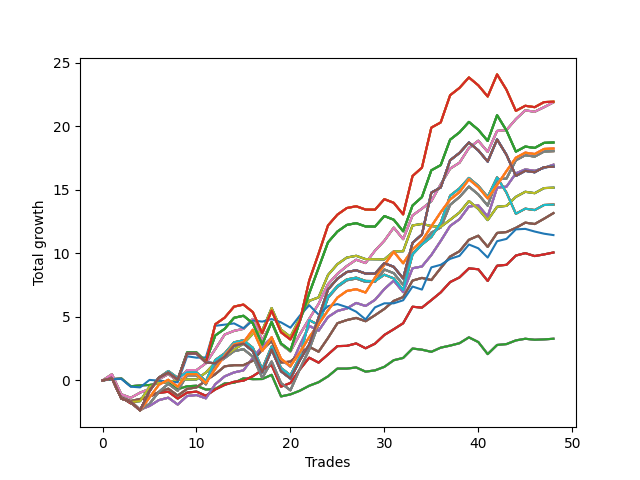

# Short Pointer 001 
- Symbol: SPY_Unlimited
- Date Range: 03/23/2022 - 07/08/2022
- Trading Period: 7:20-12:30
- Number of Trades: 48



| Name | Win Percent | Profit | Avg Profit / Trade | Avg Time / Trade |      | Name | Win Percent | Profit | Avg Profit / Trade | Avg Time / Trade |
| ---- | ----------- | ------ | ------------------ | ---------------- | ---- | ---- | ----------- | ------ | ------------------ | ---------------- |
| Sorted By <br> Profit | | | | | | Sorted By <br> Win Percentage ||||
| One Hundred Twenty-Eight | 60.42 | 10970.00 | 228.54 | 28:25 |     | Sixty-Seven | 79.17 | 6585.00 | 137.19 | 12:31 |
| One Hundred Twenty-Three | 60.42 | 10970.00 | 228.54 | 28:25 |     | Fifty-Nine | 79.17 | 6585.00 | 137.19 | 12:31 |
| One Hundred Eighteen | 60.42 | 10970.00 | 228.54 | 28:25 |     | Fifty-One | 79.17 | 6585.00 | 137.19 | 12:31 |
| One Hundred Thirteen | 60.42 | 10970.00 | 228.54 | 28:25 |     | Forty-Three | 79.17 | 6585.00 | 137.19 | 12:31 |
| Eighty-Three | 60.42 | 10970.00 | 228.54 | 28:25 |     | Three | 79.17 | 6585.00 | 137.19 | 12:31 |
| Sixty-Eight | 77.08 | 10945.00 | 228.02 | 18:18 |     | Sixty-Eight | 77.08 | 10945.00 | 228.02 | 18:18 |
| Sixty | 77.08 | 10945.00 | 228.02 | 18:18 |     | Sixty | 77.08 | 10945.00 | 228.02 | 18:18 |
| Fifty-Two | 77.08 | 10945.00 | 228.02 | 18:18 |     | Fifty-Two | 77.08 | 10945.00 | 228.02 | 18:18 |
| Forty-Four | 77.08 | 10945.00 | 228.02 | 18:18 |     | Forty-Four | 77.08 | 10945.00 | 228.02 | 18:18 |
| Four | 77.08 | 10945.00 | 228.02 | 18:18 |     | Four | 77.08 | 10945.00 | 228.02 | 18:18 |
| One Hundred Twenty-Seven | 60.42 | 9365.00 | 195.10 | 26:57 |     | Sixty-Five | 77.08 | 5035.00 | 104.90 | 10:18 |
| One Hundred Twenty-Two | 60.42 | 9365.00 | 195.10 | 26:57 |     | Fifty-Seven | 77.08 | 5035.00 | 104.90 | 10:18 |
| One Hundred Seventeen | 60.42 | 9365.00 | 195.10 | 26:57 |     | Forty-Nine | 77.08 | 5035.00 | 104.90 | 10:18 |
| One Hundred Twelve | 60.42 | 9365.00 | 195.10 | 26:57 |     | Forty-One | 77.08 | 5035.00 | 104.90 | 10:18 |
| Eighty-Two | 60.42 | 9365.00 | 195.10 | 26:57 |     | One | 77.08 | 5035.00 | 104.90 | 10:18 |
| One Hundred Twenty-Six | 70.83 | 9125.00 | 190.10 | 20:07 |     | Sixty-Six | 75.00 | 8490.00 | 176.88 | 15:54 |
| One Hundred Twenty-One | 70.83 | 9125.00 | 190.10 | 20:07 |     | Fifty-Eight | 75.00 | 8490.00 | 176.88 | 15:54 |
| One Hundred Sixteen | 70.83 | 9125.00 | 190.10 | 20:07 |     | Fifty | 75.00 | 8490.00 | 176.88 | 15:54 |
| One Hundred Eleven | 70.83 | 9125.00 | 190.10 | 20:07 |     | Forty-Two | 75.00 | 8490.00 | 176.88 | 15:54 |
| Eighty-One | 70.83 | 9125.00 | 190.10 | 20:07 |     | Two | 75.00 | 8490.00 | 176.88 | 15:54 |
| Sixty-Nine | 64.58 | 9025.00 | 188.02 | 23:16 |     | Sixty-Four | 75.00 | 1640.00 | 34.17 | 05:17 |
| Sixty-One | 64.58 | 9025.00 | 188.02 | 23:16 |     | Fifty-Six | 75.00 | 1640.00 | 34.17 | 05:17 |
| Fifty-Three | 64.58 | 9025.00 | 188.02 | 23:16 |     | Forty-Eight | 75.00 | 1640.00 | 34.17 | 05:17 |
| Forty-Five | 64.58 | 9025.00 | 188.02 | 23:16 |     | Forty | 75.00 | 1640.00 | 34.17 | 05:17 |
| Five | 64.58 | 9025.00 | 188.02 | 23:16 |     | Zero | 75.00 | 1640.00 | 34.17 | 05:17 |
| Sixty-Six | 75.00 | 8490.00 | 176.88 | 15:54 |     | Seventy | 72.92 | 7585.00 | 158.02 | 15:32 |
| Fifty-Eight | 75.00 | 8490.00 | 176.88 | 15:54 |     | Sixty-Two | 72.92 | 7585.00 | 158.02 | 15:32 |
| Fifty | 75.00 | 8490.00 | 176.88 | 15:54 |     | Fifty-Four | 72.92 | 7585.00 | 158.02 | 15:32 |
| Forty-Two | 75.00 | 8490.00 | 176.88 | 15:54 |     | Forty-Six | 72.92 | 7585.00 | 158.02 | 15:32 |
| Two | 75.00 | 8490.00 | 176.88 | 15:54 |     | Six | 72.92 | 7585.00 | 158.02 | 15:32 |
| One Hundred Thirty | 58.33 | 8410.00 | 175.21 | 29:32 |     | One Hundred Twenty-Six | 70.83 | 9125.00 | 190.10 | 20:07 |
| One Hundred Twenty-Nine | 58.33 | 8410.00 | 175.21 | 29:32 |     | One Hundred Twenty-One | 70.83 | 9125.00 | 190.10 | 20:07 |
| One Hundred Twenty-Five | 58.33 | 8410.00 | 175.21 | 29:32 |     | One Hundred Sixteen | 70.83 | 9125.00 | 190.10 | 20:07 |
| One Hundred Twenty-Four | 58.33 | 8410.00 | 175.21 | 29:32 |     | One Hundred Eleven | 70.83 | 9125.00 | 190.10 | 20:07 |
| One Hundred Twenty | 58.33 | 8410.00 | 175.21 | 29:32 |     | Eighty-One | 70.83 | 9125.00 | 190.10 | 20:07 |
| One Hundred Ninteen | 58.33 | 8410.00 | 175.21 | 29:32 |     | Sixty-Nine | 64.58 | 9025.00 | 188.02 | 23:16 |
| One Hundred Fifteen | 58.33 | 8410.00 | 175.21 | 29:32 |     | Sixty-One | 64.58 | 9025.00 | 188.02 | 23:16 |
| One Hundred Fourteen | 58.33 | 8410.00 | 175.21 | 29:32 |     | Fifty-Three | 64.58 | 9025.00 | 188.02 | 23:16 |
| Eighty-Five | 58.33 | 8410.00 | 175.21 | 29:32 |     | Forty-Five | 64.58 | 9025.00 | 188.02 | 23:16 |
| Eighty-Four | 58.33 | 8410.00 | 175.21 | 29:32 |     | Five | 64.58 | 9025.00 | 188.02 | 23:16 |
| Seventy | 72.92 | 7585.00 | 158.02 | 15:32 |     | One Hundred Twenty-Eight | 60.42 | 10970.00 | 228.54 | 28:25 |
| Sixty-Two | 72.92 | 7585.00 | 158.02 | 15:32 |     | One Hundred Twenty-Three | 60.42 | 10970.00 | 228.54 | 28:25 |
| Fifty-Four | 72.92 | 7585.00 | 158.02 | 15:32 |     | One Hundred Eighteen | 60.42 | 10970.00 | 228.54 | 28:25 |
| Forty-Six | 72.92 | 7585.00 | 158.02 | 15:32 |     | One Hundred Thirteen | 60.42 | 10970.00 | 228.54 | 28:25 |
| Six | 72.92 | 7585.00 | 158.02 | 15:32 |     | Eighty-Three | 60.42 | 10970.00 | 228.54 | 28:25 |
| Seventy-One | 58.33 | 6920.00 | 144.17 | 25:57 |     | One Hundred Twenty-Seven | 60.42 | 9365.00 | 195.10 | 26:57 |
| Sixty-Three | 58.33 | 6920.00 | 144.17 | 25:57 |     | One Hundred Twenty-Two | 60.42 | 9365.00 | 195.10 | 26:57 |
| Fifty-Five | 58.33 | 6920.00 | 144.17 | 25:57 |     | One Hundred Seventeen | 60.42 | 9365.00 | 195.10 | 26:57 |
| Forty-Seven | 58.33 | 6920.00 | 144.17 | 25:57 |     | One Hundred Twelve | 60.42 | 9365.00 | 195.10 | 26:57 |
| Seven | 58.33 | 6920.00 | 144.17 | 25:57 |     | Eighty-Two | 60.42 | 9365.00 | 195.10 | 26:57 |
| Sixty-Seven | 79.17 | 6585.00 | 137.19 | 12:31 |     | One Hundred Thirty | 58.33 | 8410.00 | 175.21 | 29:32 |
| Fifty-Nine | 79.17 | 6585.00 | 137.19 | 12:31 |     | One Hundred Twenty-Nine | 58.33 | 8410.00 | 175.21 | 29:32 |
| Fifty-One | 79.17 | 6585.00 | 137.19 | 12:31 |     | One Hundred Twenty-Five | 58.33 | 8410.00 | 175.21 | 29:32 |
| Forty-Three | 79.17 | 6585.00 | 137.19 | 12:31 |     | One Hundred Twenty-Four | 58.33 | 8410.00 | 175.21 | 29:32 |
| Three | 79.17 | 6585.00 | 137.19 | 12:31 |     | One Hundred Twenty | 58.33 | 8410.00 | 175.21 | 29:32 |
| Seventy-Three | 56.25 | 5720.00 | 119.17 | 09:14 |     | One Hundred Ninteen | 58.33 | 8410.00 | 175.21 | 29:32 |
| Sixty-Five | 77.08 | 5035.00 | 104.90 | 10:18 |     | One Hundred Fifteen | 58.33 | 8410.00 | 175.21 | 29:32 |
| Fifty-Seven | 77.08 | 5035.00 | 104.90 | 10:18 |     | One Hundred Fourteen | 58.33 | 8410.00 | 175.21 | 29:32 |
| Forty-Nine | 77.08 | 5035.00 | 104.90 | 10:18 |     | Eighty-Five | 58.33 | 8410.00 | 175.21 | 29:32 |
| Forty-One | 77.08 | 5035.00 | 104.90 | 10:18 |     | Eighty-Four | 58.33 | 8410.00 | 175.21 | 29:32 |
| One | 77.08 | 5035.00 | 104.90 | 10:18 |     | Seventy-One | 58.33 | 6920.00 | 144.17 | 25:57 |
| Sixty-Four | 75.00 | 1640.00 | 34.17 | 05:17 |     | Sixty-Three | 58.33 | 6920.00 | 144.17 | 25:57 |
| Fifty-Six | 75.00 | 1640.00 | 34.17 | 05:17 |     | Fifty-Five | 58.33 | 6920.00 | 144.17 | 25:57 |
| Forty-Eight | 75.00 | 1640.00 | 34.17 | 05:17 |     | Forty-Seven | 58.33 | 6920.00 | 144.17 | 25:57 |
| Forty | 75.00 | 1640.00 | 34.17 | 05:17 |     | Seven | 58.33 | 6920.00 | 144.17 | 25:57 |
| Zero | 75.00 | 1640.00 | 34.17 | 05:17 |     | Seventy-Three | 56.25 | 5720.00 | 119.17 | 09:14 |

## NO STOPLOSS

### Test Zero
* Sell when price hits the middle line of the 20p bollinger
* No Stoploss
* Results:
```
Total Trades: 48
Percent Up: 25.00
Percent Down: 75.00
Total Points Moved Down: 3.28
Potential Profit: 1640.00
Total Points Ups: 5.26 Count Ups: 12
Total Points Downs: 8.54 Count Downs: 36
```

<details><summary>Trades</summary>

<code>In: 2022-03-23 08:28:00		Out: 2022-03-23 08:32:05		Total Position Time: 04:05		Total Move Down: 0.10		Total to Date: 0.10</code> <br />
<code>In: 2022-03-24 08:09:00		Out: 2022-03-24 08:09:10		Total Position Time: 00:10		Total Move Down: 0.06		Total to Date: 0.16</code> <br />
<code>In: 2022-03-25 07:26:00		Out: 2022-03-25 07:51:05		Total Position Time: 25:05		Total Move Down: -0.62		Total to Date: -0.46</code> <br />
<code>In: 2022-03-25 10:22:00		Out: 2022-03-25 10:22:10		Total Position Time: 00:10		Total Move Down: 0.07		Total to Date: -0.39</code> <br />
<code>In: 2022-03-25 11:57:00		Out: 2022-03-25 11:57:15		Total Position Time: 00:15		Total Move Down: 0.03		Total to Date: -0.36</code> <br />
<code>In: 2022-03-29 08:52:00		Out: 2022-03-29 08:56:20		Total Position Time: 04:20		Total Move Down: 0.12		Total to Date: -0.24</code> <br />
<code>In: 2022-03-30 09:46:00		Out: 2022-03-30 09:50:50		Total Position Time: 04:50		Total Move Down: 0.14		Total to Date: -0.10</code> <br />
<code>In: 2022-03-31 07:38:00		Out: 2022-03-31 08:03:05		Total Position Time: 25:05		Total Move Down: -0.59		Total to Date: -0.69</code> <br />
<code>In: 2022-03-31 12:05:00		Out: 2022-03-31 12:11:30		Total Position Time: 06:30		Total Move Down: 0.23		Total to Date: -0.46</code> <br />
<code>In: 2022-04-04 11:50:00		Out: 2022-04-04 11:51:05		Total Position Time: 01:05		Total Move Down: 0.04		Total to Date: -0.42</code> <br />
<code>In: 2022-04-06 10:36:00		Out: 2022-04-06 10:47:10		Total Position Time: 11:10		Total Move Down: -0.30		Total to Date: -0.72</code> <br />
<code>In: 2022-04-06 11:06:00		Out: 2022-04-06 11:06:10		Total Position Time: 00:10		Total Move Down: 0.05		Total to Date: -0.67</code> <br />
<code>In: 2022-04-18 10:59:00		Out: 2022-04-18 10:59:30		Total Position Time: 00:30		Total Move Down: 0.43		Total to Date: -0.24</code> <br />
<code>In: 2022-04-20 10:50:00		Out: 2022-04-20 10:50:10		Total Position Time: 00:10		Total Move Down: 0.05		Total to Date: -0.19</code> <br />
<code>In: 2022-04-25 09:28:00		Out: 2022-04-25 09:31:05		Total Position Time: 03:05		Total Move Down: 0.35		Total to Date: 0.16</code> <br />
<code>In: 2022-04-25 09:53:00		Out: 2022-04-25 09:53:10		Total Position Time: 00:10		Total Move Down: -0.06		Total to Date: 0.10</code> <br />
<code>In: 2022-04-27 08:04:00		Out: 2022-04-27 08:04:10		Total Position Time: 00:10		Total Move Down: 0.01		Total to Date: 0.11</code> <br />
<code>In: 2022-04-27 09:46:00		Out: 2022-04-27 09:46:10		Total Position Time: 00:10		Total Move Down: 0.33		Total to Date: 0.44</code> <br />
<code>In: 2022-04-28 09:50:00		Out: 2022-04-28 10:19:55		Total Position Time: 29:55		Total Move Down: -1.70		Total to Date: -1.26</code> <br />
<code>In: 2022-04-28 10:42:00		Out: 2022-04-28 10:42:10		Total Position Time: 00:10		Total Move Down: 0.16		Total to Date: -1.10</code> <br />
<code>In: 2022-05-04 11:03:00		Out: 2022-05-04 11:03:10		Total Position Time: 00:10		Total Move Down: 0.29		Total to Date: -0.81</code> <br />
<code>In: 2022-05-04 11:07:00		Out: 2022-05-04 11:07:10		Total Position Time: 00:10		Total Move Down: 0.39		Total to Date: -0.42</code> <br />
<code>In: 2022-05-09 12:04:00		Out: 2022-05-09 12:04:10		Total Position Time: 00:10		Total Move Down: 0.28		Total to Date: -0.14</code> <br />
<code>In: 2022-05-24 09:18:00		Out: 2022-05-24 09:21:35		Total Position Time: 03:35		Total Move Down: 0.46		Total to Date: 0.32</code> <br />
<code>In: 2022-05-24 11:15:00		Out: 2022-05-24 11:18:25		Total Position Time: 03:25		Total Move Down: 0.61		Total to Date: 0.93</code> <br />
<code>In: 2022-05-31 10:58:00		Out: 2022-05-31 11:05:10		Total Position Time: 07:10		Total Move Down: -0.00		Total to Date: 0.93</code> <br />
<code>In: 2022-06-01 12:19:00		Out: 2022-06-01 12:25:25		Total Position Time: 06:25		Total Move Down: 0.09		Total to Date: 1.02</code> <br />
<code>In: 2022-06-07 10:12:00		Out: 2022-06-07 10:28:10		Total Position Time: 16:10		Total Move Down: -0.33		Total to Date: 0.69</code> <br />
<code>In: 2022-06-07 11:38:00		Out: 2022-06-07 11:41:30		Total Position Time: 03:30		Total Move Down: 0.10		Total to Date: 0.79</code> <br />
<code>In: 2022-06-09 08:47:00		Out: 2022-06-09 08:48:20		Total Position Time: 01:20		Total Move Down: 0.28		Total to Date: 1.07</code> <br />
<code>In: 2022-06-10 11:26:00		Out: 2022-06-10 11:28:25		Total Position Time: 02:25		Total Move Down: 0.52		Total to Date: 1.59</code> <br />
<code>In: 2022-06-13 08:42:00		Out: 2022-06-13 08:47:55		Total Position Time: 05:55		Total Move Down: 0.18		Total to Date: 1.77</code> <br />
<code>In: 2022-06-13 09:41:00		Out: 2022-06-13 09:44:05		Total Position Time: 03:05		Total Move Down: 0.74		Total to Date: 2.51</code> <br />
<code>In: 2022-06-15 09:19:00		Out: 2022-06-15 09:30:55		Total Position Time: 11:55		Total Move Down: -0.09		Total to Date: 2.42</code> <br />
<code>In: 2022-06-15 11:02:00		Out: 2022-06-15 11:02:10		Total Position Time: 00:10		Total Move Down: -0.17		Total to Date: 2.25</code> <br />
<code>In: 2022-06-16 08:30:00		Out: 2022-06-16 08:30:35		Total Position Time: 00:35		Total Move Down: 0.33		Total to Date: 2.58</code> <br />
<code>In: 2022-06-17 08:34:00		Out: 2022-06-17 08:35:05		Total Position Time: 01:05		Total Move Down: 0.16		Total to Date: 2.74</code> <br />
<code>In: 2022-06-21 10:16:00		Out: 2022-06-21 10:19:10		Total Position Time: 03:10		Total Move Down: 0.19		Total to Date: 2.93</code> <br />
<code>In: 2022-06-29 12:31:00		Out: 2022-06-29 12:33:20		Total Position Time: 02:20		Total Move Down: 0.46		Total to Date: 3.39</code> <br />
<code>In: 2022-06-30 08:51:00		Out: 2022-06-30 09:03:05		Total Position Time: 12:05		Total Move Down: -0.37		Total to Date: 3.02</code> <br />
<code>In: 2022-07-01 10:35:00		Out: 2022-07-01 10:58:40		Total Position Time: 23:40		Total Move Down: -0.95		Total to Date: 2.07</code> <br />
<code>In: 2022-07-05 07:41:00		Out: 2022-07-05 07:44:30		Total Position Time: 03:30		Total Move Down: 0.72		Total to Date: 2.79</code> <br />
<code>In: 2022-07-06 11:00:00		Out: 2022-07-06 11:00:10		Total Position Time: 00:10		Total Move Down: 0.07		Total to Date: 2.86</code> <br />
<code>In: 2022-07-06 11:10:00		Out: 2022-07-06 11:10:10		Total Position Time: 00:10		Total Move Down: 0.29		Total to Date: 3.15</code> <br />
<code>In: 2022-07-07 08:10:00		Out: 2022-07-07 08:11:10		Total Position Time: 01:10		Total Move Down: 0.13		Total to Date: 3.28</code> <br />
<code>In: 2022-07-07 11:05:00		Out: 2022-07-07 11:16:25		Total Position Time: 11:25		Total Move Down: -0.08		Total to Date: 3.20</code> <br />
<code>In: 2022-07-08 11:40:00		Out: 2022-07-08 11:49:15		Total Position Time: 09:15		Total Move Down: 0.03		Total to Date: 3.23</code> <br />
<code>In: 2022-07-08 11:47:00		Out: 2022-07-08 11:49:15		Total Position Time: 02:15		Total Move Down: 0.05		Total to Date: 3.28</code> <br />


</details>

### Test One
* Sell when the price hits the upper line of the 20p 1std bollinger
* No Stoploss
* Results:
```
Total Trades: 48
Percent Up: 22.92
Percent Down: 77.08
Total Points Moved Down: 10.07
Potential Profit: 5035.00
Total Points Ups: 6.69 Count Ups: 11
Total Points Downs: 16.76 Count Downs: 37
```

<details><summary>Trades</summary>

<code>In: 2022-03-23 08:28:00		Out: 2022-03-23 08:35:15		Total Position Time: 07:15		Total Move Down: 0.25		Total to Date: 0.25</code> <br />
<code>In: 2022-03-24 08:09:00		Out: 2022-03-24 08:38:55		Total Position Time: 29:55		Total Move Down: -1.58		Total to Date: -1.33</code> <br />
<code>In: 2022-03-25 07:26:00		Out: 2022-03-25 07:53:50		Total Position Time: 27:50		Total Move Down: -0.48		Total to Date: -1.81</code> <br />
<code>In: 2022-03-25 10:22:00		Out: 2022-03-25 10:23:25		Total Position Time: 01:25		Total Move Down: 0.29		Total to Date: -1.52</code> <br />
<code>In: 2022-03-25 11:57:00		Out: 2022-03-25 12:00:50		Total Position Time: 03:50		Total Move Down: 0.28		Total to Date: -1.24</code> <br />
<code>In: 2022-03-29 08:52:00		Out: 2022-03-29 08:58:45		Total Position Time: 06:45		Total Move Down: 0.26		Total to Date: -0.98</code> <br />
<code>In: 2022-03-30 09:46:00		Out: 2022-03-30 10:00:45		Total Position Time: 14:45		Total Move Down: 0.09		Total to Date: -0.89</code> <br />
<code>In: 2022-03-31 07:38:00		Out: 2022-03-31 08:07:55		Total Position Time: 29:55		Total Move Down: -0.54		Total to Date: -1.43</code> <br />
<code>In: 2022-03-31 12:05:00		Out: 2022-03-31 12:16:00		Total Position Time: 11:00		Total Move Down: 0.47		Total to Date: -0.96</code> <br />
<code>In: 2022-04-04 11:50:00		Out: 2022-04-04 11:51:35		Total Position Time: 01:35		Total Move Down: 0.08		Total to Date: -0.88</code> <br />
<code>In: 2022-04-06 10:36:00		Out: 2022-04-06 10:56:55		Total Position Time: 20:55		Total Move Down: -0.33		Total to Date: -1.21</code> <br />
<code>In: 2022-04-06 11:06:00		Out: 2022-04-06 11:07:20		Total Position Time: 01:20		Total Move Down: 0.50		Total to Date: -0.71</code> <br />
<code>In: 2022-04-18 10:59:00		Out: 2022-04-18 11:06:20		Total Position Time: 07:20		Total Move Down: 0.36		Total to Date: -0.35</code> <br />
<code>In: 2022-04-20 10:50:00		Out: 2022-04-20 10:53:20		Total Position Time: 03:20		Total Move Down: 0.24		Total to Date: -0.11</code> <br />
<code>In: 2022-04-25 09:28:00		Out: 2022-04-25 09:42:35		Total Position Time: 14:35		Total Move Down: 0.09		Total to Date: -0.02</code> <br />
<code>In: 2022-04-25 09:53:00		Out: 2022-04-25 09:55:05		Total Position Time: 02:05		Total Move Down: 0.35		Total to Date: 0.33</code> <br />
<code>In: 2022-04-27 08:04:00		Out: 2022-04-27 08:05:30		Total Position Time: 01:30		Total Move Down: 0.49		Total to Date: 0.82</code> <br />
<code>In: 2022-04-27 09:46:00		Out: 2022-04-27 09:50:25		Total Position Time: 04:25		Total Move Down: 0.39		Total to Date: 1.21</code> <br />
<code>In: 2022-04-28 09:50:00		Out: 2022-04-28 10:19:55		Total Position Time: 29:55		Total Move Down: -1.70		Total to Date: -0.49</code> <br />
<code>In: 2022-04-28 10:42:00		Out: 2022-04-28 10:44:10		Total Position Time: 02:10		Total Move Down: 0.29		Total to Date: -0.20</code> <br />
<code>In: 2022-05-04 11:03:00		Out: 2022-05-04 11:07:20		Total Position Time: 04:20		Total Move Down: 1.06		Total to Date: 0.86</code> <br />
<code>In: 2022-05-04 11:07:00		Out: 2022-05-04 11:07:20		Total Position Time: 00:20		Total Move Down: 0.93		Total to Date: 1.79</code> <br />
<code>In: 2022-05-09 12:04:00		Out: 2022-05-09 12:17:15		Total Position Time: 13:15		Total Move Down: -0.39		Total to Date: 1.40</code> <br />
<code>In: 2022-05-24 09:18:00		Out: 2022-05-24 09:28:55		Total Position Time: 10:55		Total Move Down: 0.64		Total to Date: 2.04</code> <br />
<code>In: 2022-05-24 11:15:00		Out: 2022-05-24 11:31:25		Total Position Time: 16:25		Total Move Down: 0.66		Total to Date: 2.70</code> <br />
<code>In: 2022-05-31 10:58:00		Out: 2022-05-31 11:13:25		Total Position Time: 15:25		Total Move Down: 0.02		Total to Date: 2.72</code> <br />
<code>In: 2022-06-01 12:19:00		Out: 2022-06-01 12:25:45		Total Position Time: 06:45		Total Move Down: 0.19		Total to Date: 2.91</code> <br />
<code>In: 2022-06-07 10:12:00		Out: 2022-06-07 10:34:15		Total Position Time: 22:15		Total Move Down: -0.38		Total to Date: 2.53</code> <br />
<code>In: 2022-06-07 11:38:00		Out: 2022-06-07 11:43:00		Total Position Time: 05:00		Total Move Down: 0.36		Total to Date: 2.89</code> <br />
<code>In: 2022-06-09 08:47:00		Out: 2022-06-09 08:49:35		Total Position Time: 02:35		Total Move Down: 0.69		Total to Date: 3.58</code> <br />
<code>In: 2022-06-10 11:26:00		Out: 2022-06-10 11:38:10		Total Position Time: 12:10		Total Move Down: 0.45		Total to Date: 4.03</code> <br />
<code>In: 2022-06-13 08:42:00		Out: 2022-06-13 08:52:15		Total Position Time: 10:15		Total Move Down: 0.47		Total to Date: 4.50</code> <br />
<code>In: 2022-06-13 09:41:00		Out: 2022-06-13 09:47:55		Total Position Time: 06:55		Total Move Down: 1.30		Total to Date: 5.80</code> <br />
<code>In: 2022-06-15 09:19:00		Out: 2022-06-15 09:35:10		Total Position Time: 16:10		Total Move Down: -0.07		Total to Date: 5.73</code> <br />
<code>In: 2022-06-15 11:02:00		Out: 2022-06-15 11:03:05		Total Position Time: 01:05		Total Move Down: 0.59		Total to Date: 6.32</code> <br />
<code>In: 2022-06-16 08:30:00		Out: 2022-06-16 08:35:15		Total Position Time: 05:15		Total Move Down: 0.61		Total to Date: 6.93</code> <br />
<code>In: 2022-06-17 08:34:00		Out: 2022-06-17 08:39:05		Total Position Time: 05:05		Total Move Down: 0.81		Total to Date: 7.74</code> <br />
<code>In: 2022-06-21 10:16:00		Out: 2022-06-21 10:21:10		Total Position Time: 05:10		Total Move Down: 0.37		Total to Date: 8.11</code> <br />
<code>In: 2022-06-29 12:31:00		Out: 2022-06-29 12:34:10		Total Position Time: 03:10		Total Move Down: 0.71		Total to Date: 8.82</code> <br />
<code>In: 2022-06-30 08:51:00		Out: 2022-06-30 09:05:45		Total Position Time: 14:45		Total Move Down: -0.07		Total to Date: 8.75</code> <br />
<code>In: 2022-07-01 10:35:00		Out: 2022-07-01 11:04:25		Total Position Time: 29:25		Total Move Down: -0.92		Total to Date: 7.83</code> <br />
<code>In: 2022-07-05 07:41:00		Out: 2022-07-05 07:45:55		Total Position Time: 04:55		Total Move Down: 1.20		Total to Date: 9.03</code> <br />
<code>In: 2022-07-06 11:00:00		Out: 2022-07-06 11:00:10		Total Position Time: 00:10		Total Move Down: 0.07		Total to Date: 9.10</code> <br />
<code>In: 2022-07-06 11:10:00		Out: 2022-07-06 11:11:10		Total Position Time: 01:10		Total Move Down: 0.73		Total to Date: 9.83</code> <br />
<code>In: 2022-07-07 08:10:00		Out: 2022-07-07 08:20:00		Total Position Time: 10:00		Total Move Down: 0.19		Total to Date: 10.02</code> <br />
<code>In: 2022-07-07 11:05:00		Out: 2022-07-07 11:34:25		Total Position Time: 29:25		Total Move Down: -0.23		Total to Date: 9.79</code> <br />
<code>In: 2022-07-08 11:40:00		Out: 2022-07-08 11:53:40		Total Position Time: 13:40		Total Move Down: 0.13		Total to Date: 9.92</code> <br />
<code>In: 2022-07-08 11:47:00		Out: 2022-07-08 11:53:40		Total Position Time: 06:40		Total Move Down: 0.15		Total to Date: 10.07</code> <br />


</details>

### Test Two
* Sell when the price hits the upper line of the 20p 2std bollinger
* No Stoploss
* Results:
```
Total Trades: 48
Percent Up: 25.00
Percent Down: 75.00
Total Points Moved Down: 16.98
Potential Profit: 8490.00
Total Points Ups: 8.17 Count Ups: 12
Total Points Downs: 25.15 Count Downs: 36
```

<details><summary>Trades</summary>

<code>In: 2022-03-23 08:28:00		Out: 2022-03-23 08:42:10		Total Position Time: 14:10		Total Move Down: 0.27		Total to Date: 0.27</code> <br />
<code>In: 2022-03-24 08:09:00		Out: 2022-03-24 08:38:55		Total Position Time: 29:55		Total Move Down: -1.58		Total to Date: -1.31</code> <br />
<code>In: 2022-03-25 07:26:00		Out: 2022-03-25 07:54:10		Total Position Time: 28:10		Total Move Down: -0.33		Total to Date: -1.64</code> <br />
<code>In: 2022-03-25 10:22:00		Out: 2022-03-25 10:51:55		Total Position Time: 29:55		Total Move Down: -0.66		Total to Date: -2.30</code> <br />
<code>In: 2022-03-25 11:57:00		Out: 2022-03-25 12:00:55		Total Position Time: 03:55		Total Move Down: 0.29		Total to Date: -2.01</code> <br />
<code>In: 2022-03-29 08:52:00		Out: 2022-03-29 09:01:40		Total Position Time: 09:40		Total Move Down: 0.46		Total to Date: -1.55</code> <br />
<code>In: 2022-03-30 09:46:00		Out: 2022-03-30 10:01:15		Total Position Time: 15:15		Total Move Down: 0.19		Total to Date: -1.36</code> <br />
<code>In: 2022-03-31 07:38:00		Out: 2022-03-31 08:07:55		Total Position Time: 29:55		Total Move Down: -0.54		Total to Date: -1.90</code> <br />
<code>In: 2022-03-31 12:05:00		Out: 2022-03-31 12:19:35		Total Position Time: 14:35		Total Move Down: 0.67		Total to Date: -1.23</code> <br />
<code>In: 2022-04-04 11:50:00		Out: 2022-04-04 12:03:40		Total Position Time: 13:40		Total Move Down: 0.08		Total to Date: -1.15</code> <br />
<code>In: 2022-04-06 10:36:00		Out: 2022-04-06 10:57:20		Total Position Time: 21:20		Total Move Down: -0.26		Total to Date: -1.41</code> <br />
<code>In: 2022-04-06 11:06:00		Out: 2022-04-06 11:08:10		Total Position Time: 02:10		Total Move Down: 1.11		Total to Date: -0.30</code> <br />
<code>In: 2022-04-18 10:59:00		Out: 2022-04-18 11:10:40		Total Position Time: 11:40		Total Move Down: 0.62		Total to Date: 0.32</code> <br />
<code>In: 2022-04-20 10:50:00		Out: 2022-04-20 11:13:55		Total Position Time: 23:55		Total Move Down: 0.31		Total to Date: 0.63</code> <br />
<code>In: 2022-04-25 09:28:00		Out: 2022-04-25 09:57:55		Total Position Time: 29:55		Total Move Down: 0.16		Total to Date: 0.79</code> <br />
<code>In: 2022-04-25 09:53:00		Out: 2022-04-25 10:01:20		Total Position Time: 08:20		Total Move Down: 0.99		Total to Date: 1.78</code> <br />
<code>In: 2022-04-27 08:04:00		Out: 2022-04-27 08:10:35		Total Position Time: 06:35		Total Move Down: 0.89		Total to Date: 2.67</code> <br />
<code>In: 2022-04-27 09:46:00		Out: 2022-04-27 10:00:10		Total Position Time: 14:10		Total Move Down: 0.69		Total to Date: 3.36</code> <br />
<code>In: 2022-04-28 09:50:00		Out: 2022-04-28 10:19:55		Total Position Time: 29:55		Total Move Down: -1.70		Total to Date: 1.66</code> <br />
<code>In: 2022-04-28 10:42:00		Out: 2022-04-28 11:11:55		Total Position Time: 29:55		Total Move Down: -0.57		Total to Date: 1.09</code> <br />
<code>In: 2022-05-04 11:03:00		Out: 2022-05-04 11:07:40		Total Position Time: 04:40		Total Move Down: 1.67		Total to Date: 2.76</code> <br />
<code>In: 2022-05-04 11:07:00		Out: 2022-05-04 11:07:40		Total Position Time: 00:40		Total Move Down: 1.54		Total to Date: 4.30</code> <br />
<code>In: 2022-05-09 12:04:00		Out: 2022-05-09 12:17:15		Total Position Time: 13:15		Total Move Down: -0.39		Total to Date: 3.91</code> <br />
<code>In: 2022-05-24 09:18:00		Out: 2022-05-24 09:31:20		Total Position Time: 13:20		Total Move Down: 1.08		Total to Date: 4.99</code> <br />
<code>In: 2022-05-24 11:15:00		Out: 2022-05-24 11:43:50		Total Position Time: 28:50		Total Move Down: 0.48		Total to Date: 5.47</code> <br />
<code>In: 2022-05-31 10:58:00		Out: 2022-05-31 11:22:35		Total Position Time: 24:35		Total Move Down: 0.19		Total to Date: 5.66</code> <br />
<code>In: 2022-06-01 12:19:00		Out: 2022-06-01 12:30:05		Total Position Time: 11:05		Total Move Down: 0.44		Total to Date: 6.10</code> <br />
<code>In: 2022-06-07 10:12:00		Out: 2022-06-07 10:34:35		Total Position Time: 22:35		Total Move Down: -0.24		Total to Date: 5.86</code> <br />
<code>In: 2022-06-07 11:38:00		Out: 2022-06-07 11:43:25		Total Position Time: 05:25		Total Move Down: 0.48		Total to Date: 6.34</code> <br />
<code>In: 2022-06-09 08:47:00		Out: 2022-06-09 09:11:00		Total Position Time: 24:00		Total Move Down: 0.85		Total to Date: 7.19</code> <br />
<code>In: 2022-06-10 11:26:00		Out: 2022-06-10 11:40:10		Total Position Time: 14:10		Total Move Down: 0.67		Total to Date: 7.86</code> <br />
<code>In: 2022-06-13 08:42:00		Out: 2022-06-13 09:11:55		Total Position Time: 29:55		Total Move Down: -0.91		Total to Date: 6.95</code> <br />
<code>In: 2022-06-13 09:41:00		Out: 2022-06-13 09:54:45		Total Position Time: 13:45		Total Move Down: 1.88		Total to Date: 8.83</code> <br />
<code>In: 2022-06-15 09:19:00		Out: 2022-06-15 09:36:10		Total Position Time: 17:10		Total Move Down: 0.14		Total to Date: 8.97</code> <br />
<code>In: 2022-06-15 11:02:00		Out: 2022-06-15 11:03:15		Total Position Time: 01:15		Total Move Down: 0.90		Total to Date: 9.87</code> <br />
<code>In: 2022-06-16 08:30:00		Out: 2022-06-16 08:42:05		Total Position Time: 12:05		Total Move Down: 1.11		Total to Date: 10.98</code> <br />
<code>In: 2022-06-17 08:34:00		Out: 2022-06-17 08:45:15		Total Position Time: 11:15		Total Move Down: 1.18		Total to Date: 12.16</code> <br />
<code>In: 2022-06-21 10:16:00		Out: 2022-06-21 10:29:50		Total Position Time: 13:50		Total Move Down: 0.53		Total to Date: 12.69</code> <br />
<code>In: 2022-06-29 12:31:00		Out: 2022-06-29 12:36:35		Total Position Time: 05:35		Total Move Down: 1.00		Total to Date: 13.69</code> <br />
<code>In: 2022-06-30 08:51:00		Out: 2022-06-30 09:06:10		Total Position Time: 15:10		Total Move Down: 0.09		Total to Date: 13.78</code> <br />
<code>In: 2022-07-01 10:35:00		Out: 2022-07-01 11:04:55		Total Position Time: 29:55		Total Move Down: -0.88		Total to Date: 12.90</code> <br />
<code>In: 2022-07-05 07:41:00		Out: 2022-07-05 08:01:10		Total Position Time: 20:10		Total Move Down: 2.28		Total to Date: 15.18</code> <br />
<code>In: 2022-07-06 11:00:00		Out: 2022-07-06 11:00:10		Total Position Time: 00:10		Total Move Down: 0.07		Total to Date: 15.25</code> <br />
<code>In: 2022-07-06 11:10:00		Out: 2022-07-06 11:11:45		Total Position Time: 01:45		Total Move Down: 1.05		Total to Date: 16.30</code> <br />
<code>In: 2022-07-07 08:10:00		Out: 2022-07-07 08:21:00		Total Position Time: 11:00		Total Move Down: 0.31		Total to Date: 16.61</code> <br />
<code>In: 2022-07-07 11:05:00		Out: 2022-07-07 11:34:55		Total Position Time: 29:55		Total Move Down: -0.11		Total to Date: 16.50</code> <br />
<code>In: 2022-07-08 11:40:00		Out: 2022-07-08 11:54:00		Total Position Time: 14:00		Total Move Down: 0.23		Total to Date: 16.73</code> <br />
<code>In: 2022-07-08 11:47:00		Out: 2022-07-08 11:54:00		Total Position Time: 07:00		Total Move Down: 0.25		Total to Date: 16.98</code> <br />


</details>

### Test Three
* Sell when price hits the middle line of the 50p bollinger
* No Stoploss
* Results:
```
Total Trades: 48
Percent Up: 20.83
Percent Down: 79.17
Total Points Moved Down: 13.17
Potential Profit: 6585.00
Total Points Ups: 5.91 Count Ups: 10
Total Points Downs: 19.08 Count Downs: 38
```

<details><summary>Trades</summary>

<code>In: 2022-03-23 08:28:00		Out: 2022-03-23 08:42:15		Total Position Time: 14:15		Total Move Down: 0.24		Total to Date: 0.24</code> <br />
<code>In: 2022-03-24 08:09:00		Out: 2022-03-24 08:38:55		Total Position Time: 29:55		Total Move Down: -1.58		Total to Date: -1.34</code> <br />
<code>In: 2022-03-25 07:26:00		Out: 2022-03-25 07:55:55		Total Position Time: 29:55		Total Move Down: -0.28		Total to Date: -1.62</code> <br />
<code>In: 2022-03-25 10:22:00		Out: 2022-03-25 10:23:10		Total Position Time: 01:10		Total Move Down: 0.16		Total to Date: -1.46</code> <br />
<code>In: 2022-03-25 11:57:00		Out: 2022-03-25 12:00:45		Total Position Time: 03:45		Total Move Down: 0.19		Total to Date: -1.27</code> <br />
<code>In: 2022-03-29 08:52:00		Out: 2022-03-29 09:01:25		Total Position Time: 09:25		Total Move Down: 0.35		Total to Date: -0.92</code> <br />
<code>In: 2022-03-30 09:46:00		Out: 2022-03-30 10:01:45		Total Position Time: 15:45		Total Move Down: 0.27		Total to Date: -0.65</code> <br />
<code>In: 2022-03-31 07:38:00		Out: 2022-03-31 08:07:55		Total Position Time: 29:55		Total Move Down: -0.54		Total to Date: -1.19</code> <br />
<code>In: 2022-03-31 12:05:00		Out: 2022-03-31 12:16:40		Total Position Time: 11:40		Total Move Down: 0.52		Total to Date: -0.67</code> <br />
<code>In: 2022-04-04 11:50:00		Out: 2022-04-04 12:03:50		Total Position Time: 13:50		Total Move Down: 0.12		Total to Date: -0.55</code> <br />
<code>In: 2022-04-06 10:36:00		Out: 2022-04-06 11:00:10		Total Position Time: 24:10		Total Move Down: 0.54		Total to Date: -0.01</code> <br />
<code>In: 2022-04-06 11:06:00		Out: 2022-04-06 11:07:20		Total Position Time: 01:20		Total Move Down: 0.50		Total to Date: 0.49</code> <br />
<code>In: 2022-04-18 10:59:00		Out: 2022-04-18 11:16:30		Total Position Time: 17:30		Total Move Down: 0.62		Total to Date: 1.11</code> <br />
<code>In: 2022-04-20 10:50:00		Out: 2022-04-20 10:50:20		Total Position Time: 00:20		Total Move Down: 0.09		Total to Date: 1.20</code> <br />
<code>In: 2022-04-25 09:28:00		Out: 2022-04-25 09:55:05		Total Position Time: 27:05		Total Move Down: -0.00		Total to Date: 1.20</code> <br />
<code>In: 2022-04-25 09:53:00		Out: 2022-04-25 09:55:05		Total Position Time: 02:05		Total Move Down: 0.35		Total to Date: 1.55</code> <br />
<code>In: 2022-04-27 08:04:00		Out: 2022-04-27 08:10:20		Total Position Time: 06:20		Total Move Down: 0.87		Total to Date: 2.42</code> <br />
<code>In: 2022-04-27 09:46:00		Out: 2022-04-27 10:00:10		Total Position Time: 14:10		Total Move Down: 0.69		Total to Date: 3.11</code> <br />
<code>In: 2022-04-28 09:50:00		Out: 2022-04-28 10:19:55		Total Position Time: 29:55		Total Move Down: -1.70		Total to Date: 1.41</code> <br />
<code>In: 2022-04-28 10:42:00		Out: 2022-04-28 10:52:25		Total Position Time: 10:25		Total Move Down: 0.07		Total to Date: 1.48</code> <br />
<code>In: 2022-05-04 11:03:00		Out: 2022-05-04 11:07:15		Total Position Time: 04:15		Total Move Down: 0.65		Total to Date: 2.13</code> <br />
<code>In: 2022-05-04 11:07:00		Out: 2022-05-04 11:07:15		Total Position Time: 00:15		Total Move Down: 0.52		Total to Date: 2.65</code> <br />
<code>In: 2022-05-09 12:04:00		Out: 2022-05-09 12:17:15		Total Position Time: 13:15		Total Move Down: -0.39		Total to Date: 2.26</code> <br />
<code>In: 2022-05-24 09:18:00		Out: 2022-05-24 09:31:20		Total Position Time: 13:20		Total Move Down: 1.08		Total to Date: 3.34</code> <br />
<code>In: 2022-05-24 11:15:00		Out: 2022-05-24 11:20:25		Total Position Time: 05:25		Total Move Down: 1.16		Total to Date: 4.50</code> <br />
<code>In: 2022-05-31 10:58:00		Out: 2022-05-31 11:22:40		Total Position Time: 24:40		Total Move Down: 0.25		Total to Date: 4.75</code> <br />
<code>In: 2022-06-01 12:19:00		Out: 2022-06-01 12:25:30		Total Position Time: 06:30		Total Move Down: 0.17		Total to Date: 4.92</code> <br />
<code>In: 2022-06-07 10:12:00		Out: 2022-06-07 10:41:55		Total Position Time: 29:55		Total Move Down: -0.26		Total to Date: 4.66</code> <br />
<code>In: 2022-06-07 11:38:00		Out: 2022-06-07 11:43:35		Total Position Time: 05:35		Total Move Down: 0.47		Total to Date: 5.13</code> <br />
<code>In: 2022-06-09 08:47:00		Out: 2022-06-09 08:48:50		Total Position Time: 01:50		Total Move Down: 0.50		Total to Date: 5.63</code> <br />
<code>In: 2022-06-10 11:26:00		Out: 2022-06-10 11:28:30		Total Position Time: 02:30		Total Move Down: 0.63		Total to Date: 6.26</code> <br />
<code>In: 2022-06-13 08:42:00		Out: 2022-06-13 09:07:20		Total Position Time: 25:20		Total Move Down: 0.30		Total to Date: 6.56</code> <br />
<code>In: 2022-06-13 09:41:00		Out: 2022-06-13 09:47:55		Total Position Time: 06:55		Total Move Down: 1.30		Total to Date: 7.86</code> <br />
<code>In: 2022-06-15 09:19:00		Out: 2022-06-15 09:38:40		Total Position Time: 19:40		Total Move Down: 0.21		Total to Date: 8.07</code> <br />
<code>In: 2022-06-15 11:02:00		Out: 2022-06-15 11:02:10		Total Position Time: 00:10		Total Move Down: -0.17		Total to Date: 7.90</code> <br />
<code>In: 2022-06-16 08:30:00		Out: 2022-06-16 08:41:55		Total Position Time: 11:55		Total Move Down: 0.94		Total to Date: 8.84</code> <br />
<code>In: 2022-06-17 08:34:00		Out: 2022-06-17 08:45:00		Total Position Time: 11:00		Total Move Down: 0.91		Total to Date: 9.75</code> <br />
<code>In: 2022-06-21 10:16:00		Out: 2022-06-21 10:22:55		Total Position Time: 06:55		Total Move Down: 0.42		Total to Date: 10.17</code> <br />
<code>In: 2022-06-29 12:31:00		Out: 2022-06-29 12:34:15		Total Position Time: 03:15		Total Move Down: 0.90		Total to Date: 11.07</code> <br />
<code>In: 2022-06-30 08:51:00		Out: 2022-06-30 09:06:20		Total Position Time: 15:20		Total Move Down: 0.32		Total to Date: 11.39</code> <br />
<code>In: 2022-07-01 10:35:00		Out: 2022-07-01 11:04:55		Total Position Time: 29:55		Total Move Down: -0.88		Total to Date: 10.51</code> <br />
<code>In: 2022-07-05 07:41:00		Out: 2022-07-05 07:45:30		Total Position Time: 04:30		Total Move Down: 1.10		Total to Date: 11.61</code> <br />
<code>In: 2022-07-06 11:00:00		Out: 2022-07-06 11:00:10		Total Position Time: 00:10		Total Move Down: 0.07		Total to Date: 11.68</code> <br />
<code>In: 2022-07-06 11:10:00		Out: 2022-07-06 11:10:20		Total Position Time: 00:20		Total Move Down: 0.33		Total to Date: 12.01</code> <br />
<code>In: 2022-07-07 08:10:00		Out: 2022-07-07 08:22:45		Total Position Time: 12:45		Total Move Down: 0.41		Total to Date: 12.42</code> <br />
<code>In: 2022-07-07 11:05:00		Out: 2022-07-07 11:34:55		Total Position Time: 29:55		Total Move Down: -0.11		Total to Date: 12.31</code> <br />
<code>In: 2022-07-08 11:40:00		Out: 2022-07-08 11:54:50		Total Position Time: 14:50		Total Move Down: 0.42		Total to Date: 12.73</code> <br />
<code>In: 2022-07-08 11:47:00		Out: 2022-07-08 11:54:50		Total Position Time: 07:50		Total Move Down: 0.44		Total to Date: 13.17</code> <br />


</details>

### Test Four
* Sell when the price hits the upper line of the 50p 1std bollinger
* No Stoploss
* Results:
```
Total Trades: 48
Percent Up: 22.92
Percent Down: 77.08
Total Points Moved Down: 21.89
Potential Profit: 10945.00
Total Points Ups: 8.50 Count Ups: 11
Total Points Downs: 30.39 Count Downs: 37
```

<details><summary>Trades</summary>

<code>In: 2022-03-23 08:28:00		Out: 2022-03-23 08:43:10		Total Position Time: 15:10		Total Move Down: 0.49		Total to Date: 0.49</code> <br />
<code>In: 2022-03-24 08:09:00		Out: 2022-03-24 08:38:55		Total Position Time: 29:55		Total Move Down: -1.58		Total to Date: -1.09</code> <br />
<code>In: 2022-03-25 07:26:00		Out: 2022-03-25 07:55:55		Total Position Time: 29:55		Total Move Down: -0.28		Total to Date: -1.37</code> <br />
<code>In: 2022-03-25 10:22:00		Out: 2022-03-25 10:27:15		Total Position Time: 05:15		Total Move Down: 0.41		Total to Date: -0.96</code> <br />
<code>In: 2022-03-25 11:57:00		Out: 2022-03-25 12:00:55		Total Position Time: 03:55		Total Move Down: 0.29		Total to Date: -0.67</code> <br />
<code>In: 2022-03-29 08:52:00		Out: 2022-03-29 09:02:15		Total Position Time: 10:15		Total Move Down: 0.76		Total to Date: 0.09</code> <br />
<code>In: 2022-03-30 09:46:00		Out: 2022-03-30 10:06:35		Total Position Time: 20:35		Total Move Down: 0.41		Total to Date: 0.50</code> <br />
<code>In: 2022-03-31 07:38:00		Out: 2022-03-31 08:07:55		Total Position Time: 29:55		Total Move Down: -0.54		Total to Date: -0.04</code> <br />
<code>In: 2022-03-31 12:05:00		Out: 2022-03-31 12:20:15		Total Position Time: 15:15		Total Move Down: 0.85		Total to Date: 0.81</code> <br />
<code>In: 2022-04-04 11:50:00		Out: 2022-04-04 12:19:55		Total Position Time: 29:55		Total Move Down: -0.00		Total to Date: 0.81</code> <br />
<code>In: 2022-04-06 10:36:00		Out: 2022-04-06 11:00:10		Total Position Time: 24:10		Total Move Down: 0.54		Total to Date: 1.35</code> <br />
<code>In: 2022-04-06 11:06:00		Out: 2022-04-06 11:08:10		Total Position Time: 02:10		Total Move Down: 1.11		Total to Date: 2.46</code> <br />
<code>In: 2022-04-18 10:59:00		Out: 2022-04-18 11:18:10		Total Position Time: 19:10		Total Move Down: 1.15		Total to Date: 3.61</code> <br />
<code>In: 2022-04-20 10:50:00		Out: 2022-04-20 11:14:00		Total Position Time: 24:00		Total Move Down: 0.29		Total to Date: 3.90</code> <br />
<code>In: 2022-04-25 09:28:00		Out: 2022-04-25 09:57:55		Total Position Time: 29:55		Total Move Down: 0.16		Total to Date: 4.06</code> <br />
<code>In: 2022-04-25 09:53:00		Out: 2022-04-25 10:01:15		Total Position Time: 08:15		Total Move Down: 0.78		Total to Date: 4.84</code> <br />
<code>In: 2022-04-27 08:04:00		Out: 2022-04-27 08:33:55		Total Position Time: 29:55		Total Move Down: -1.67		Total to Date: 3.17</code> <br />
<code>In: 2022-04-27 09:46:00		Out: 2022-04-27 10:01:20		Total Position Time: 15:20		Total Move Down: 1.38		Total to Date: 4.55</code> <br />
<code>In: 2022-04-28 09:50:00		Out: 2022-04-28 10:19:55		Total Position Time: 29:55		Total Move Down: -1.70		Total to Date: 2.85</code> <br />
<code>In: 2022-04-28 10:42:00		Out: 2022-04-28 11:11:55		Total Position Time: 29:55		Total Move Down: -0.57		Total to Date: 2.28</code> <br />
<code>In: 2022-05-04 11:03:00		Out: 2022-05-04 11:07:25		Total Position Time: 04:25		Total Move Down: 1.35		Total to Date: 3.63</code> <br />
<code>In: 2022-05-04 11:07:00		Out: 2022-05-04 11:07:25		Total Position Time: 00:25		Total Move Down: 1.22		Total to Date: 4.85</code> <br />
<code>In: 2022-05-09 12:04:00		Out: 2022-05-09 12:23:25		Total Position Time: 19:25		Total Move Down: 1.18		Total to Date: 6.03</code> <br />
<code>In: 2022-05-24 09:18:00		Out: 2022-05-24 09:33:15		Total Position Time: 15:15		Total Move Down: 1.55		Total to Date: 7.58</code> <br />
<code>In: 2022-05-24 11:15:00		Out: 2022-05-24 11:44:15		Total Position Time: 29:15		Total Move Down: 0.81		Total to Date: 8.39</code> <br />
<code>In: 2022-05-31 10:58:00		Out: 2022-05-31 11:26:20		Total Position Time: 28:20		Total Move Down: 0.61		Total to Date: 9.00</code> <br />
<code>In: 2022-06-01 12:19:00		Out: 2022-06-01 12:35:05		Total Position Time: 16:05		Total Move Down: 0.50		Total to Date: 9.50</code> <br />
<code>In: 2022-06-07 10:12:00		Out: 2022-06-07 10:41:55		Total Position Time: 29:55		Total Move Down: -0.26		Total to Date: 9.24</code> <br />
<code>In: 2022-06-07 11:38:00		Out: 2022-06-07 11:47:25		Total Position Time: 09:25		Total Move Down: 0.97		Total to Date: 10.21</code> <br />
<code>In: 2022-06-09 08:47:00		Out: 2022-06-09 08:50:25		Total Position Time: 03:25		Total Move Down: 0.79		Total to Date: 11.00</code> <br />
<code>In: 2022-06-10 11:26:00		Out: 2022-06-10 11:41:45		Total Position Time: 15:45		Total Move Down: 1.03		Total to Date: 12.03</code> <br />
<code>In: 2022-06-13 08:42:00		Out: 2022-06-13 09:11:55		Total Position Time: 29:55		Total Move Down: -0.91		Total to Date: 11.12</code> <br />
<code>In: 2022-06-13 09:41:00		Out: 2022-06-13 09:54:50		Total Position Time: 13:50		Total Move Down: 1.87		Total to Date: 12.99</code> <br />
<code>In: 2022-06-15 09:19:00		Out: 2022-06-15 09:41:45		Total Position Time: 22:45		Total Move Down: 0.53		Total to Date: 13.52</code> <br />
<code>In: 2022-06-15 11:02:00		Out: 2022-06-15 11:03:05		Total Position Time: 01:05		Total Move Down: 0.59		Total to Date: 14.11</code> <br />
<code>In: 2022-06-16 08:30:00		Out: 2022-06-16 08:51:45		Total Position Time: 21:45		Total Move Down: 1.33		Total to Date: 15.44</code> <br />
<code>In: 2022-06-17 08:34:00		Out: 2022-06-17 08:51:20		Total Position Time: 17:20		Total Move Down: 1.23		Total to Date: 16.67</code> <br />
<code>In: 2022-06-21 10:16:00		Out: 2022-06-21 10:38:15		Total Position Time: 22:15		Total Move Down: 0.47		Total to Date: 17.14</code> <br />
<code>In: 2022-06-29 12:31:00		Out: 2022-06-29 12:41:00		Total Position Time: 10:00		Total Move Down: 1.16		Total to Date: 18.30</code> <br />
<code>In: 2022-06-30 08:51:00		Out: 2022-06-30 09:13:40		Total Position Time: 22:40		Total Move Down: 0.57		Total to Date: 18.87</code> <br />
<code>In: 2022-07-01 10:35:00		Out: 2022-07-01 11:04:55		Total Position Time: 29:55		Total Move Down: -0.88		Total to Date: 17.99</code> <br />
<code>In: 2022-07-05 07:41:00		Out: 2022-07-05 07:56:40		Total Position Time: 15:40		Total Move Down: 1.65		Total to Date: 19.64</code> <br />
<code>In: 2022-07-06 11:00:00		Out: 2022-07-06 11:00:10		Total Position Time: 00:10		Total Move Down: 0.07		Total to Date: 19.71</code> <br />
<code>In: 2022-07-06 11:10:00		Out: 2022-07-06 11:11:35		Total Position Time: 01:35		Total Move Down: 0.86		Total to Date: 20.57</code> <br />
<code>In: 2022-07-07 08:10:00		Out: 2022-07-07 08:23:25		Total Position Time: 13:25		Total Move Down: 0.69		Total to Date: 21.26</code> <br />
<code>In: 2022-07-07 11:05:00		Out: 2022-07-07 11:34:55		Total Position Time: 29:55		Total Move Down: -0.11		Total to Date: 21.15</code> <br />
<code>In: 2022-07-08 11:40:00		Out: 2022-07-08 12:09:40		Total Position Time: 29:40		Total Move Down: 0.36		Total to Date: 21.51</code> <br />
<code>In: 2022-07-08 11:47:00		Out: 2022-07-08 12:09:40		Total Position Time: 22:40		Total Move Down: 0.38		Total to Date: 21.89</code> <br />


</details>

### Test Five
* Sell when the price hits the upper line of the 50p 2std bollinger
* No Stoploss
* Results:
```
Total Trades: 48
Percent Up: 35.42
Percent Down: 64.58
Total Points Moved Down: 18.05
Potential Profit: 9025.00
Total Points Ups: 11.38 Count Ups: 17
Total Points Downs: 29.43 Count Downs: 31
```

<details><summary>Trades</summary>

<code>In: 2022-03-23 08:28:00		Out: 2022-03-23 08:57:55		Total Position Time: 29:55		Total Move Down: 0.16		Total to Date: 0.16</code> <br />
<code>In: 2022-03-24 08:09:00		Out: 2022-03-24 08:38:55		Total Position Time: 29:55		Total Move Down: -1.58		Total to Date: -1.42</code> <br />
<code>In: 2022-03-25 07:26:00		Out: 2022-03-25 07:55:55		Total Position Time: 29:55		Total Move Down: -0.28		Total to Date: -1.70</code> <br />
<code>In: 2022-03-25 10:22:00		Out: 2022-03-25 10:51:55		Total Position Time: 29:55		Total Move Down: -0.66		Total to Date: -2.36</code> <br />
<code>In: 2022-03-25 11:57:00		Out: 2022-03-25 12:01:55		Total Position Time: 04:55		Total Move Down: 0.52		Total to Date: -1.84</code> <br />
<code>In: 2022-03-29 08:52:00		Out: 2022-03-29 09:10:50		Total Position Time: 18:50		Total Move Down: 0.94		Total to Date: -0.90</code> <br />
<code>In: 2022-03-30 09:46:00		Out: 2022-03-30 10:07:20		Total Position Time: 21:20		Total Move Down: 0.63		Total to Date: -0.27</code> <br />
<code>In: 2022-03-31 07:38:00		Out: 2022-03-31 08:07:55		Total Position Time: 29:55		Total Move Down: -0.54		Total to Date: -0.81</code> <br />
<code>In: 2022-03-31 12:05:00		Out: 2022-03-31 12:21:50		Total Position Time: 16:50		Total Move Down: 1.21		Total to Date: 0.40</code> <br />
<code>In: 2022-04-04 11:50:00		Out: 2022-04-04 12:19:55		Total Position Time: 29:55		Total Move Down: -0.00		Total to Date: 0.40</code> <br />
<code>In: 2022-04-06 10:36:00		Out: 2022-04-06 11:05:55		Total Position Time: 29:55		Total Move Down: -0.71		Total to Date: -0.31</code> <br />
<code>In: 2022-04-06 11:06:00		Out: 2022-04-06 11:09:35		Total Position Time: 03:35		Total Move Down: 1.55		Total to Date: 1.24</code> <br />
<code>In: 2022-04-18 10:59:00		Out: 2022-04-18 11:28:55		Total Position Time: 29:55		Total Move Down: 0.52		Total to Date: 1.76</code> <br />
<code>In: 2022-04-20 10:50:00		Out: 2022-04-20 11:17:40		Total Position Time: 27:40		Total Move Down: 0.54		Total to Date: 2.30</code> <br />
<code>In: 2022-04-25 09:28:00		Out: 2022-04-25 09:57:55		Total Position Time: 29:55		Total Move Down: 0.16		Total to Date: 2.46</code> <br />
<code>In: 2022-04-25 09:53:00		Out: 2022-04-25 10:22:55		Total Position Time: 29:55		Total Move Down: -0.59		Total to Date: 1.87</code> <br />
<code>In: 2022-04-27 08:04:00		Out: 2022-04-27 08:33:55		Total Position Time: 29:55		Total Move Down: -1.67		Total to Date: 0.20</code> <br />
<code>In: 2022-04-27 09:46:00		Out: 2022-04-27 10:10:00		Total Position Time: 24:00		Total Move Down: 1.29		Total to Date: 1.49</code> <br />
<code>In: 2022-04-28 09:50:00		Out: 2022-04-28 10:19:55		Total Position Time: 29:55		Total Move Down: -1.70		Total to Date: -0.21</code> <br />
<code>In: 2022-04-28 10:42:00		Out: 2022-04-28 11:11:55		Total Position Time: 29:55		Total Move Down: -0.57		Total to Date: -0.78</code> <br />
<code>In: 2022-05-04 11:03:00		Out: 2022-05-04 11:07:40		Total Position Time: 04:40		Total Move Down: 1.67		Total to Date: 0.89</code> <br />
<code>In: 2022-05-04 11:07:00		Out: 2022-05-04 11:07:40		Total Position Time: 00:40		Total Move Down: 1.54		Total to Date: 2.43</code> <br />
<code>In: 2022-05-09 12:04:00		Out: 2022-05-09 12:28:05		Total Position Time: 24:05		Total Move Down: 2.01		Total to Date: 4.44</code> <br />
<code>In: 2022-05-24 09:18:00		Out: 2022-05-24 09:36:50		Total Position Time: 18:50		Total Move Down: 2.07		Total to Date: 6.51</code> <br />
<code>In: 2022-05-24 11:15:00		Out: 2022-05-24 11:44:55		Total Position Time: 29:55		Total Move Down: 0.85		Total to Date: 7.36</code> <br />
<code>In: 2022-05-31 10:58:00		Out: 2022-05-31 11:27:55		Total Position Time: 29:55		Total Move Down: 0.52		Total to Date: 7.88</code> <br />
<code>In: 2022-06-01 12:19:00		Out: 2022-06-01 12:46:00		Total Position Time: 27:00		Total Move Down: 0.14		Total to Date: 8.02</code> <br />
<code>In: 2022-06-07 10:12:00		Out: 2022-06-07 10:41:55		Total Position Time: 29:55		Total Move Down: -0.26		Total to Date: 7.76</code> <br />
<code>In: 2022-06-07 11:38:00		Out: 2022-06-07 12:07:55		Total Position Time: 29:55		Total Move Down: -0.01		Total to Date: 7.75</code> <br />
<code>In: 2022-06-09 08:47:00		Out: 2022-06-09 09:11:10		Total Position Time: 24:10		Total Move Down: 0.98		Total to Date: 8.73</code> <br />
<code>In: 2022-06-10 11:26:00		Out: 2022-06-10 11:55:55		Total Position Time: 29:55		Total Move Down: -0.29		Total to Date: 8.44</code> <br />
<code>In: 2022-06-13 08:42:00		Out: 2022-06-13 09:11:55		Total Position Time: 29:55		Total Move Down: -0.91		Total to Date: 7.53</code> <br />
<code>In: 2022-06-13 09:41:00		Out: 2022-06-13 09:58:15		Total Position Time: 17:15		Total Move Down: 2.42		Total to Date: 9.95</code> <br />
<code>In: 2022-06-15 09:19:00		Out: 2022-06-15 09:44:05		Total Position Time: 25:05		Total Move Down: 0.78		Total to Date: 10.73</code> <br />
<code>In: 2022-06-15 11:02:00		Out: 2022-06-15 11:03:15		Total Position Time: 01:15		Total Move Down: 0.90		Total to Date: 11.63</code> <br />
<code>In: 2022-06-16 08:30:00		Out: 2022-06-16 08:59:55		Total Position Time: 29:55		Total Move Down: 0.41		Total to Date: 12.04</code> <br />
<code>In: 2022-06-17 08:34:00		Out: 2022-06-17 08:52:05		Total Position Time: 18:05		Total Move Down: 1.78		Total to Date: 13.82</code> <br />
<code>In: 2022-06-21 10:16:00		Out: 2022-06-21 10:40:10		Total Position Time: 24:10		Total Move Down: 0.62		Total to Date: 14.44</code> <br />
<code>In: 2022-06-29 12:31:00		Out: 2022-06-29 12:46:00		Total Position Time: 15:00		Total Move Down: 0.82		Total to Date: 15.26</code> <br />
<code>In: 2022-06-30 08:51:00		Out: 2022-06-30 09:20:55		Total Position Time: 29:55		Total Move Down: -0.62		Total to Date: 14.64</code> <br />
<code>In: 2022-07-01 10:35:00		Out: 2022-07-01 11:04:55		Total Position Time: 29:55		Total Move Down: -0.88		Total to Date: 13.76</code> <br />
<code>In: 2022-07-05 07:41:00		Out: 2022-07-05 08:00:50		Total Position Time: 19:50		Total Move Down: 2.06		Total to Date: 15.82</code> <br />
<code>In: 2022-07-06 11:00:00		Out: 2022-07-06 11:00:10		Total Position Time: 00:10		Total Move Down: 0.07		Total to Date: 15.89</code> <br />
<code>In: 2022-07-06 11:10:00		Out: 2022-07-06 11:12:15		Total Position Time: 02:15		Total Move Down: 1.44		Total to Date: 17.33</code> <br />
<code>In: 2022-07-07 08:10:00		Out: 2022-07-07 08:39:55		Total Position Time: 29:55		Total Move Down: 0.40		Total to Date: 17.73</code> <br />
<code>In: 2022-07-07 11:05:00		Out: 2022-07-07 11:34:55		Total Position Time: 29:55		Total Move Down: -0.11		Total to Date: 17.62</code> <br />
<code>In: 2022-07-08 11:40:00		Out: 2022-07-08 12:09:55		Total Position Time: 29:55		Total Move Down: 0.40		Total to Date: 18.02</code> <br />
<code>In: 2022-07-08 11:47:00		Out: 2022-07-08 12:16:55		Total Position Time: 29:55		Total Move Down: 0.03		Total to Date: 18.05</code> <br />


</details>

### Test Six
* Sell when the price hits the middle line of the 1std VWAP
* No Stoploss
* Results:
```
Total Trades: 48
Percent Up: 27.08
Percent Down: 72.92
Total Points Moved Down: 15.17
Potential Profit: 7585.00
Total Points Ups: 6.25 Count Ups: 13
Total Points Downs: 21.42 Count Downs: 35
```

<details><summary>Trades</summary>

<code>In: 2022-03-23 08:28:00		Out: 2022-03-23 08:57:55		Total Position Time: 29:55		Total Move Down: 0.16		Total to Date: 0.16</code> <br />
<code>In: 2022-03-24 08:09:00		Out: 2022-03-24 08:38:55		Total Position Time: 29:55		Total Move Down: -1.58		Total to Date: -1.42</code> <br />
<code>In: 2022-03-25 07:26:00		Out: 2022-03-25 07:55:55		Total Position Time: 29:55		Total Move Down: -0.28		Total to Date: -1.70</code> <br />
<code>In: 2022-03-25 10:22:00		Out: 2022-03-25 10:22:10		Total Position Time: 00:10		Total Move Down: 0.07		Total to Date: -1.63</code> <br />
<code>In: 2022-03-25 11:57:00		Out: 2022-03-25 12:07:35		Total Position Time: 10:35		Total Move Down: 1.13		Total to Date: -0.50</code> <br />
<code>In: 2022-03-29 08:52:00		Out: 2022-03-29 09:01:25		Total Position Time: 09:25		Total Move Down: 0.35		Total to Date: -0.15</code> <br />
<code>In: 2022-03-30 09:46:00		Out: 2022-03-30 09:46:10		Total Position Time: 00:10		Total Move Down: 0.01		Total to Date: -0.14</code> <br />
<code>In: 2022-03-31 07:38:00		Out: 2022-03-31 07:41:25		Total Position Time: 03:25		Total Move Down: 0.19		Total to Date: 0.05</code> <br />
<code>In: 2022-03-31 12:05:00		Out: 2022-03-31 12:05:10		Total Position Time: 00:10		Total Move Down: 0.03		Total to Date: 0.08</code> <br />
<code>In: 2022-04-04 11:50:00		Out: 2022-04-04 12:19:55		Total Position Time: 29:55		Total Move Down: -0.00		Total to Date: 0.08</code> <br />
<code>In: 2022-04-06 10:36:00		Out: 2022-04-06 11:00:10		Total Position Time: 24:10		Total Move Down: 0.54		Total to Date: 0.62</code> <br />
<code>In: 2022-04-06 11:06:00		Out: 2022-04-06 11:07:35		Total Position Time: 01:35		Total Move Down: 0.78		Total to Date: 1.40</code> <br />
<code>In: 2022-04-18 10:59:00		Out: 2022-04-18 11:28:55		Total Position Time: 29:55		Total Move Down: 0.52		Total to Date: 1.92</code> <br />
<code>In: 2022-04-20 10:50:00		Out: 2022-04-20 11:17:15		Total Position Time: 27:15		Total Move Down: 0.52		Total to Date: 2.44</code> <br />
<code>In: 2022-04-25 09:28:00		Out: 2022-04-25 09:31:10		Total Position Time: 03:10		Total Move Down: 0.45		Total to Date: 2.89</code> <br />
<code>In: 2022-04-25 09:53:00		Out: 2022-04-25 10:01:15		Total Position Time: 08:15		Total Move Down: 0.78		Total to Date: 3.67</code> <br />
<code>In: 2022-04-27 08:04:00		Out: 2022-04-27 08:05:25		Total Position Time: 01:25		Total Move Down: 0.25		Total to Date: 3.92</code> <br />
<code>In: 2022-04-27 09:46:00		Out: 2022-04-27 10:15:55		Total Position Time: 29:55		Total Move Down: 1.78		Total to Date: 5.70</code> <br />
<code>In: 2022-04-28 09:50:00		Out: 2022-04-28 10:19:55		Total Position Time: 29:55		Total Move Down: -1.70		Total to Date: 4.00</code> <br />
<code>In: 2022-04-28 10:42:00		Out: 2022-04-28 11:11:55		Total Position Time: 29:55		Total Move Down: -0.57		Total to Date: 3.43</code> <br />
<code>In: 2022-05-04 11:03:00		Out: 2022-05-04 11:08:10		Total Position Time: 05:10		Total Move Down: 1.48		Total to Date: 4.91</code> <br />
<code>In: 2022-05-04 11:07:00		Out: 2022-05-04 11:08:10		Total Position Time: 01:10		Total Move Down: 1.35		Total to Date: 6.26</code> <br />
<code>In: 2022-05-09 12:04:00		Out: 2022-05-09 12:04:10		Total Position Time: 00:10		Total Move Down: 0.28		Total to Date: 6.54</code> <br />
<code>In: 2022-05-24 09:18:00		Out: 2022-05-24 09:36:10		Total Position Time: 18:10		Total Move Down: 1.76		Total to Date: 8.30</code> <br />
<code>In: 2022-05-24 11:15:00		Out: 2022-05-24 11:44:55		Total Position Time: 29:55		Total Move Down: 0.85		Total to Date: 9.15</code> <br />
<code>In: 2022-05-31 10:58:00		Out: 2022-05-31 11:27:55		Total Position Time: 29:55		Total Move Down: 0.52		Total to Date: 9.67</code> <br />
<code>In: 2022-06-01 12:19:00		Out: 2022-06-01 12:46:00		Total Position Time: 27:00		Total Move Down: 0.14		Total to Date: 9.81</code> <br />
<code>In: 2022-06-07 10:12:00		Out: 2022-06-07 10:41:55		Total Position Time: 29:55		Total Move Down: -0.26		Total to Date: 9.55</code> <br />
<code>In: 2022-06-07 11:38:00		Out: 2022-06-07 12:07:55		Total Position Time: 29:55		Total Move Down: -0.01		Total to Date: 9.54</code> <br />
<code>In: 2022-06-09 08:47:00		Out: 2022-06-09 08:47:10		Total Position Time: 00:10		Total Move Down: -0.01		Total to Date: 9.53</code> <br />
<code>In: 2022-06-10 11:26:00		Out: 2022-06-10 11:28:30		Total Position Time: 02:30		Total Move Down: 0.63		Total to Date: 10.16</code> <br />
<code>In: 2022-06-13 08:42:00		Out: 2022-06-13 08:47:15		Total Position Time: 05:15		Total Move Down: 0.01		Total to Date: 10.17</code> <br />
<code>In: 2022-06-13 09:41:00		Out: 2022-06-13 09:57:00		Total Position Time: 16:00		Total Move Down: 2.03		Total to Date: 12.20</code> <br />
<code>In: 2022-06-15 09:19:00		Out: 2022-06-15 09:19:10		Total Position Time: 00:10		Total Move Down: 0.12		Total to Date: 12.32</code> <br />
<code>In: 2022-06-15 11:02:00		Out: 2022-06-15 11:02:10		Total Position Time: 00:10		Total Move Down: -0.17		Total to Date: 12.15</code> <br />
<code>In: 2022-06-16 08:30:00		Out: 2022-06-16 08:30:10		Total Position Time: 00:10		Total Move Down: -0.06		Total to Date: 12.09</code> <br />
<code>In: 2022-06-17 08:34:00		Out: 2022-06-17 08:37:00		Total Position Time: 03:00		Total Move Down: 0.55		Total to Date: 12.64</code> <br />
<code>In: 2022-06-21 10:16:00		Out: 2022-06-21 10:45:55		Total Position Time: 29:55		Total Move Down: 0.58		Total to Date: 13.22</code> <br />
<code>In: 2022-06-29 12:31:00		Out: 2022-06-29 12:34:15		Total Position Time: 03:15		Total Move Down: 0.90		Total to Date: 14.12</code> <br />
<code>In: 2022-06-30 08:51:00		Out: 2022-06-30 09:20:55		Total Position Time: 29:55		Total Move Down: -0.62		Total to Date: 13.50</code> <br />
<code>In: 2022-07-01 10:35:00		Out: 2022-07-01 11:04:55		Total Position Time: 29:55		Total Move Down: -0.88		Total to Date: 12.62</code> <br />
<code>In: 2022-07-05 07:41:00		Out: 2022-07-05 07:45:25		Total Position Time: 04:25		Total Move Down: 1.05		Total to Date: 13.67</code> <br />
<code>In: 2022-07-06 11:00:00		Out: 2022-07-06 11:00:10		Total Position Time: 00:10		Total Move Down: 0.07		Total to Date: 13.74</code> <br />
<code>In: 2022-07-06 11:10:00		Out: 2022-07-06 11:11:15		Total Position Time: 01:15		Total Move Down: 0.71		Total to Date: 14.45</code> <br />
<code>In: 2022-07-07 08:10:00		Out: 2022-07-07 08:39:55		Total Position Time: 29:55		Total Move Down: 0.40		Total to Date: 14.85</code> <br />
<code>In: 2022-07-07 11:05:00		Out: 2022-07-07 11:34:55		Total Position Time: 29:55		Total Move Down: -0.11		Total to Date: 14.74</code> <br />
<code>In: 2022-07-08 11:40:00		Out: 2022-07-08 12:09:55		Total Position Time: 29:55		Total Move Down: 0.40		Total to Date: 15.14</code> <br />
<code>In: 2022-07-08 11:47:00		Out: 2022-07-08 12:16:55		Total Position Time: 29:55		Total Move Down: 0.03		Total to Date: 15.17</code> <br />


</details>

### Test Seven
* Sell when the price hits the upper line of the 1std VWAP
* No Stoploss
* Results:
```
Total Trades: 48
Percent Up: 41.67
Percent Down: 58.33
Total Points Moved Down: 13.84
Potential Profit: 6920.00
Total Points Ups: 14.64 Count Ups: 20
Total Points Downs: 28.48 Count Downs: 28
```

<details><summary>Trades</summary>

<code>In: 2022-03-23 08:28:00		Out: 2022-03-23 08:57:55		Total Position Time: 29:55		Total Move Down: 0.16		Total to Date: 0.16</code> <br />
<code>In: 2022-03-24 08:09:00		Out: 2022-03-24 08:38:55		Total Position Time: 29:55		Total Move Down: -1.58		Total to Date: -1.42</code> <br />
<code>In: 2022-03-25 07:26:00		Out: 2022-03-25 07:55:55		Total Position Time: 29:55		Total Move Down: -0.28		Total to Date: -1.70</code> <br />
<code>In: 2022-03-25 10:22:00		Out: 2022-03-25 10:51:55		Total Position Time: 29:55		Total Move Down: -0.66		Total to Date: -2.36</code> <br />
<code>In: 2022-03-25 11:57:00		Out: 2022-03-25 12:26:55		Total Position Time: 29:55		Total Move Down: 1.53		Total to Date: -0.83</code> <br />
<code>In: 2022-03-29 08:52:00		Out: 2022-03-29 09:21:55		Total Position Time: 29:55		Total Move Down: 1.05		Total to Date: 0.22</code> <br />
<code>In: 2022-03-30 09:46:00		Out: 2022-03-30 10:06:55		Total Position Time: 20:55		Total Move Down: 0.52		Total to Date: 0.74</code> <br />
<code>In: 2022-03-31 07:38:00		Out: 2022-03-31 08:07:55		Total Position Time: 29:55		Total Move Down: -0.54		Total to Date: 0.20</code> <br />
<code>In: 2022-03-31 12:05:00		Out: 2022-03-31 12:14:10		Total Position Time: 09:10		Total Move Down: 0.44		Total to Date: 0.64</code> <br />
<code>In: 2022-04-04 11:50:00		Out: 2022-04-04 12:19:55		Total Position Time: 29:55		Total Move Down: -0.00		Total to Date: 0.64</code> <br />
<code>In: 2022-04-06 10:36:00		Out: 2022-04-06 11:05:55		Total Position Time: 29:55		Total Move Down: -0.71		Total to Date: -0.07</code> <br />
<code>In: 2022-04-06 11:06:00		Out: 2022-04-06 11:09:40		Total Position Time: 03:40		Total Move Down: 1.68		Total to Date: 1.61</code> <br />
<code>In: 2022-04-18 10:59:00		Out: 2022-04-18 11:28:55		Total Position Time: 29:55		Total Move Down: 0.52		Total to Date: 2.13</code> <br />
<code>In: 2022-04-20 10:50:00		Out: 2022-04-20 11:19:55		Total Position Time: 29:55		Total Move Down: 0.87		Total to Date: 3.00</code> <br />
<code>In: 2022-04-25 09:28:00		Out: 2022-04-25 09:57:55		Total Position Time: 29:55		Total Move Down: 0.16		Total to Date: 3.16</code> <br />
<code>In: 2022-04-25 09:53:00		Out: 2022-04-25 10:22:55		Total Position Time: 29:55		Total Move Down: -0.59		Total to Date: 2.57</code> <br />
<code>In: 2022-04-27 08:04:00		Out: 2022-04-27 08:33:55		Total Position Time: 29:55		Total Move Down: -1.67		Total to Date: 0.90</code> <br />
<code>In: 2022-04-27 09:46:00		Out: 2022-04-27 10:15:55		Total Position Time: 29:55		Total Move Down: 1.78		Total to Date: 2.68</code> <br />
<code>In: 2022-04-28 09:50:00		Out: 2022-04-28 10:19:55		Total Position Time: 29:55		Total Move Down: -1.70		Total to Date: 0.98</code> <br />
<code>In: 2022-04-28 10:42:00		Out: 2022-04-28 11:11:55		Total Position Time: 29:55		Total Move Down: -0.57		Total to Date: 0.41</code> <br />
<code>In: 2022-05-04 11:03:00		Out: 2022-05-04 11:32:55		Total Position Time: 29:55		Total Move Down: 1.44		Total to Date: 1.85</code> <br />
<code>In: 2022-05-04 11:07:00		Out: 2022-05-04 11:34:00		Total Position Time: 27:00		Total Move Down: 2.90		Total to Date: 4.75</code> <br />
<code>In: 2022-05-09 12:04:00		Out: 2022-05-09 12:17:15		Total Position Time: 13:15		Total Move Down: -0.39		Total to Date: 4.36</code> <br />
<code>In: 2022-05-24 09:18:00		Out: 2022-05-24 09:47:55		Total Position Time: 29:55		Total Move Down: 2.22		Total to Date: 6.58</code> <br />
<code>In: 2022-05-24 11:15:00		Out: 2022-05-24 11:44:55		Total Position Time: 29:55		Total Move Down: 0.85		Total to Date: 7.43</code> <br />
<code>In: 2022-05-31 10:58:00		Out: 2022-05-31 11:27:55		Total Position Time: 29:55		Total Move Down: 0.52		Total to Date: 7.95</code> <br />
<code>In: 2022-06-01 12:19:00		Out: 2022-06-01 12:46:00		Total Position Time: 27:00		Total Move Down: 0.14		Total to Date: 8.09</code> <br />
<code>In: 2022-06-07 10:12:00		Out: 2022-06-07 10:41:55		Total Position Time: 29:55		Total Move Down: -0.26		Total to Date: 7.83</code> <br />
<code>In: 2022-06-07 11:38:00		Out: 2022-06-07 12:07:55		Total Position Time: 29:55		Total Move Down: -0.01		Total to Date: 7.82</code> <br />
<code>In: 2022-06-09 08:47:00		Out: 2022-06-09 08:48:50		Total Position Time: 01:50		Total Move Down: 0.50		Total to Date: 8.32</code> <br />
<code>In: 2022-06-10 11:26:00		Out: 2022-06-10 11:55:55		Total Position Time: 29:55		Total Move Down: -0.29		Total to Date: 8.03</code> <br />
<code>In: 2022-06-13 08:42:00		Out: 2022-06-13 09:11:55		Total Position Time: 29:55		Total Move Down: -0.91		Total to Date: 7.12</code> <br />
<code>In: 2022-06-13 09:41:00		Out: 2022-06-13 10:10:55		Total Position Time: 29:55		Total Move Down: 2.80		Total to Date: 9.92</code> <br />
<code>In: 2022-06-15 09:19:00		Out: 2022-06-15 09:44:05		Total Position Time: 25:05		Total Move Down: 0.78		Total to Date: 10.70</code> <br />
<code>In: 2022-06-15 11:02:00		Out: 2022-06-15 11:03:05		Total Position Time: 01:05		Total Move Down: 0.59		Total to Date: 11.29</code> <br />
<code>In: 2022-06-16 08:30:00		Out: 2022-06-16 08:42:05		Total Position Time: 12:05		Total Move Down: 1.11		Total to Date: 12.40</code> <br />
<code>In: 2022-06-17 08:34:00		Out: 2022-06-17 09:03:55		Total Position Time: 29:55		Total Move Down: 2.14		Total to Date: 14.54</code> <br />
<code>In: 2022-06-21 10:16:00		Out: 2022-06-21 10:45:55		Total Position Time: 29:55		Total Move Down: 0.58		Total to Date: 15.12</code> <br />
<code>In: 2022-06-29 12:31:00		Out: 2022-06-29 12:46:00		Total Position Time: 15:00		Total Move Down: 0.82		Total to Date: 15.94</code> <br />
<code>In: 2022-06-30 08:51:00		Out: 2022-06-30 09:20:55		Total Position Time: 29:55		Total Move Down: -0.62		Total to Date: 15.32</code> <br />
<code>In: 2022-07-01 10:35:00		Out: 2022-07-01 11:04:55		Total Position Time: 29:55		Total Move Down: -0.88		Total to Date: 14.44</code> <br />
<code>In: 2022-07-05 07:41:00		Out: 2022-07-05 07:53:35		Total Position Time: 12:35		Total Move Down: 1.55		Total to Date: 15.99</code> <br />
<code>In: 2022-07-06 11:00:00		Out: 2022-07-06 11:29:55		Total Position Time: 29:55		Total Move Down: -1.21		Total to Date: 14.78</code> <br />
<code>In: 2022-07-06 11:10:00		Out: 2022-07-06 11:39:55		Total Position Time: 29:55		Total Move Down: -1.66		Total to Date: 13.12</code> <br />
<code>In: 2022-07-07 08:10:00		Out: 2022-07-07 08:39:55		Total Position Time: 29:55		Total Move Down: 0.40		Total to Date: 13.52</code> <br />
<code>In: 2022-07-07 11:05:00		Out: 2022-07-07 11:34:55		Total Position Time: 29:55		Total Move Down: -0.11		Total to Date: 13.41</code> <br />
<code>In: 2022-07-08 11:40:00		Out: 2022-07-08 12:09:55		Total Position Time: 29:55		Total Move Down: 0.40		Total to Date: 13.81</code> <br />
<code>In: 2022-07-08 11:47:00		Out: 2022-07-08 12:16:55		Total Position Time: 29:55		Total Move Down: 0.03		Total to Date: 13.84</code> <br />


</details>

## STOPLOSS OF 5

### Test Forty
* Sell when price hits the middle line of the 20p bollinger
* Stoploss is -5 points
* Results:
```
Total Trades: 48
Percent Up: 25.00
Percent Down: 75.00
Total Points Moved Down: 3.28
Potential Profit: 1640.00
Total Points Ups: 5.26 Count Ups: 12
Total Points Downs: 8.54 Count Downs: 36
```

<details><summary>Trades</summary>

<code>In: 2022-03-23 08:28:00		Out: 2022-03-23 08:32:05		Total Position Time: 04:05		Total Move Down: 0.10		Total to Date: 0.10</code> <br />
<code>In: 2022-03-24 08:09:00		Out: 2022-03-24 08:09:10		Total Position Time: 00:10		Total Move Down: 0.06		Total to Date: 0.16</code> <br />
<code>In: 2022-03-25 07:26:00		Out: 2022-03-25 07:51:05		Total Position Time: 25:05		Total Move Down: -0.62		Total to Date: -0.46</code> <br />
<code>In: 2022-03-25 10:22:00		Out: 2022-03-25 10:22:10		Total Position Time: 00:10		Total Move Down: 0.07		Total to Date: -0.39</code> <br />
<code>In: 2022-03-25 11:57:00		Out: 2022-03-25 11:57:15		Total Position Time: 00:15		Total Move Down: 0.03		Total to Date: -0.36</code> <br />
<code>In: 2022-03-29 08:52:00		Out: 2022-03-29 08:56:20		Total Position Time: 04:20		Total Move Down: 0.12		Total to Date: -0.24</code> <br />
<code>In: 2022-03-30 09:46:00		Out: 2022-03-30 09:50:50		Total Position Time: 04:50		Total Move Down: 0.14		Total to Date: -0.10</code> <br />
<code>In: 2022-03-31 07:38:00		Out: 2022-03-31 08:03:05		Total Position Time: 25:05		Total Move Down: -0.59		Total to Date: -0.69</code> <br />
<code>In: 2022-03-31 12:05:00		Out: 2022-03-31 12:11:30		Total Position Time: 06:30		Total Move Down: 0.23		Total to Date: -0.46</code> <br />
<code>In: 2022-04-04 11:50:00		Out: 2022-04-04 11:51:05		Total Position Time: 01:05		Total Move Down: 0.04		Total to Date: -0.42</code> <br />
<code>In: 2022-04-06 10:36:00		Out: 2022-04-06 10:47:10		Total Position Time: 11:10		Total Move Down: -0.30		Total to Date: -0.72</code> <br />
<code>In: 2022-04-06 11:06:00		Out: 2022-04-06 11:06:10		Total Position Time: 00:10		Total Move Down: 0.05		Total to Date: -0.67</code> <br />
<code>In: 2022-04-18 10:59:00		Out: 2022-04-18 10:59:30		Total Position Time: 00:30		Total Move Down: 0.43		Total to Date: -0.24</code> <br />
<code>In: 2022-04-20 10:50:00		Out: 2022-04-20 10:50:10		Total Position Time: 00:10		Total Move Down: 0.05		Total to Date: -0.19</code> <br />
<code>In: 2022-04-25 09:28:00		Out: 2022-04-25 09:31:05		Total Position Time: 03:05		Total Move Down: 0.35		Total to Date: 0.16</code> <br />
<code>In: 2022-04-25 09:53:00		Out: 2022-04-25 09:53:10		Total Position Time: 00:10		Total Move Down: -0.06		Total to Date: 0.10</code> <br />
<code>In: 2022-04-27 08:04:00		Out: 2022-04-27 08:04:10		Total Position Time: 00:10		Total Move Down: 0.01		Total to Date: 0.11</code> <br />
<code>In: 2022-04-27 09:46:00		Out: 2022-04-27 09:46:10		Total Position Time: 00:10		Total Move Down: 0.33		Total to Date: 0.44</code> <br />
<code>In: 2022-04-28 09:50:00		Out: 2022-04-28 10:19:55		Total Position Time: 29:55		Total Move Down: -1.70		Total to Date: -1.26</code> <br />
<code>In: 2022-04-28 10:42:00		Out: 2022-04-28 10:42:10		Total Position Time: 00:10		Total Move Down: 0.16		Total to Date: -1.10</code> <br />
<code>In: 2022-05-04 11:03:00		Out: 2022-05-04 11:03:10		Total Position Time: 00:10		Total Move Down: 0.29		Total to Date: -0.81</code> <br />
<code>In: 2022-05-04 11:07:00		Out: 2022-05-04 11:07:10		Total Position Time: 00:10		Total Move Down: 0.39		Total to Date: -0.42</code> <br />
<code>In: 2022-05-09 12:04:00		Out: 2022-05-09 12:04:10		Total Position Time: 00:10		Total Move Down: 0.28		Total to Date: -0.14</code> <br />
<code>In: 2022-05-24 09:18:00		Out: 2022-05-24 09:21:35		Total Position Time: 03:35		Total Move Down: 0.46		Total to Date: 0.32</code> <br />
<code>In: 2022-05-24 11:15:00		Out: 2022-05-24 11:18:25		Total Position Time: 03:25		Total Move Down: 0.61		Total to Date: 0.93</code> <br />
<code>In: 2022-05-31 10:58:00		Out: 2022-05-31 11:05:10		Total Position Time: 07:10		Total Move Down: -0.00		Total to Date: 0.93</code> <br />
<code>In: 2022-06-01 12:19:00		Out: 2022-06-01 12:25:25		Total Position Time: 06:25		Total Move Down: 0.09		Total to Date: 1.02</code> <br />
<code>In: 2022-06-07 10:12:00		Out: 2022-06-07 10:28:10		Total Position Time: 16:10		Total Move Down: -0.33		Total to Date: 0.69</code> <br />
<code>In: 2022-06-07 11:38:00		Out: 2022-06-07 11:41:30		Total Position Time: 03:30		Total Move Down: 0.10		Total to Date: 0.79</code> <br />
<code>In: 2022-06-09 08:47:00		Out: 2022-06-09 08:48:20		Total Position Time: 01:20		Total Move Down: 0.28		Total to Date: 1.07</code> <br />
<code>In: 2022-06-10 11:26:00		Out: 2022-06-10 11:28:25		Total Position Time: 02:25		Total Move Down: 0.52		Total to Date: 1.59</code> <br />
<code>In: 2022-06-13 08:42:00		Out: 2022-06-13 08:47:55		Total Position Time: 05:55		Total Move Down: 0.18		Total to Date: 1.77</code> <br />
<code>In: 2022-06-13 09:41:00		Out: 2022-06-13 09:44:05		Total Position Time: 03:05		Total Move Down: 0.74		Total to Date: 2.51</code> <br />
<code>In: 2022-06-15 09:19:00		Out: 2022-06-15 09:30:55		Total Position Time: 11:55		Total Move Down: -0.09		Total to Date: 2.42</code> <br />
<code>In: 2022-06-15 11:02:00		Out: 2022-06-15 11:02:10		Total Position Time: 00:10		Total Move Down: -0.17		Total to Date: 2.25</code> <br />
<code>In: 2022-06-16 08:30:00		Out: 2022-06-16 08:30:35		Total Position Time: 00:35		Total Move Down: 0.33		Total to Date: 2.58</code> <br />
<code>In: 2022-06-17 08:34:00		Out: 2022-06-17 08:35:05		Total Position Time: 01:05		Total Move Down: 0.16		Total to Date: 2.74</code> <br />
<code>In: 2022-06-21 10:16:00		Out: 2022-06-21 10:19:10		Total Position Time: 03:10		Total Move Down: 0.19		Total to Date: 2.93</code> <br />
<code>In: 2022-06-29 12:31:00		Out: 2022-06-29 12:33:20		Total Position Time: 02:20		Total Move Down: 0.46		Total to Date: 3.39</code> <br />
<code>In: 2022-06-30 08:51:00		Out: 2022-06-30 09:03:05		Total Position Time: 12:05		Total Move Down: -0.37		Total to Date: 3.02</code> <br />
<code>In: 2022-07-01 10:35:00		Out: 2022-07-01 10:58:40		Total Position Time: 23:40		Total Move Down: -0.95		Total to Date: 2.07</code> <br />
<code>In: 2022-07-05 07:41:00		Out: 2022-07-05 07:44:30		Total Position Time: 03:30		Total Move Down: 0.72		Total to Date: 2.79</code> <br />
<code>In: 2022-07-06 11:00:00		Out: 2022-07-06 11:00:10		Total Position Time: 00:10		Total Move Down: 0.07		Total to Date: 2.86</code> <br />
<code>In: 2022-07-06 11:10:00		Out: 2022-07-06 11:10:10		Total Position Time: 00:10		Total Move Down: 0.29		Total to Date: 3.15</code> <br />
<code>In: 2022-07-07 08:10:00		Out: 2022-07-07 08:11:10		Total Position Time: 01:10		Total Move Down: 0.13		Total to Date: 3.28</code> <br />
<code>In: 2022-07-07 11:05:00		Out: 2022-07-07 11:16:25		Total Position Time: 11:25		Total Move Down: -0.08		Total to Date: 3.20</code> <br />
<code>In: 2022-07-08 11:40:00		Out: 2022-07-08 11:49:15		Total Position Time: 09:15		Total Move Down: 0.03		Total to Date: 3.23</code> <br />
<code>In: 2022-07-08 11:47:00		Out: 2022-07-08 11:49:15		Total Position Time: 02:15		Total Move Down: 0.05		Total to Date: 3.28</code> <br />


</details>

### Test Forty-One
* Sell when the price hits the upper line of the 20p 1std bollinger
* Stoploss is -5 points
* Results:
```
Total Trades: 48
Percent Up: 22.92
Percent Down: 77.08
Total Points Moved Down: 10.07
Potential Profit: 5035.00
Total Points Ups: 6.69 Count Ups: 11
Total Points Downs: 16.76 Count Downs: 37
```

<details><summary>Trades</summary>

<code>In: 2022-03-23 08:28:00		Out: 2022-03-23 08:35:15		Total Position Time: 07:15		Total Move Down: 0.25		Total to Date: 0.25</code> <br />
<code>In: 2022-03-24 08:09:00		Out: 2022-03-24 08:38:55		Total Position Time: 29:55		Total Move Down: -1.58		Total to Date: -1.33</code> <br />
<code>In: 2022-03-25 07:26:00		Out: 2022-03-25 07:53:50		Total Position Time: 27:50		Total Move Down: -0.48		Total to Date: -1.81</code> <br />
<code>In: 2022-03-25 10:22:00		Out: 2022-03-25 10:23:25		Total Position Time: 01:25		Total Move Down: 0.29		Total to Date: -1.52</code> <br />
<code>In: 2022-03-25 11:57:00		Out: 2022-03-25 12:00:50		Total Position Time: 03:50		Total Move Down: 0.28		Total to Date: -1.24</code> <br />
<code>In: 2022-03-29 08:52:00		Out: 2022-03-29 08:58:45		Total Position Time: 06:45		Total Move Down: 0.26		Total to Date: -0.98</code> <br />
<code>In: 2022-03-30 09:46:00		Out: 2022-03-30 10:00:45		Total Position Time: 14:45		Total Move Down: 0.09		Total to Date: -0.89</code> <br />
<code>In: 2022-03-31 07:38:00		Out: 2022-03-31 08:07:55		Total Position Time: 29:55		Total Move Down: -0.54		Total to Date: -1.43</code> <br />
<code>In: 2022-03-31 12:05:00		Out: 2022-03-31 12:16:00		Total Position Time: 11:00		Total Move Down: 0.47		Total to Date: -0.96</code> <br />
<code>In: 2022-04-04 11:50:00		Out: 2022-04-04 11:51:35		Total Position Time: 01:35		Total Move Down: 0.08		Total to Date: -0.88</code> <br />
<code>In: 2022-04-06 10:36:00		Out: 2022-04-06 10:56:55		Total Position Time: 20:55		Total Move Down: -0.33		Total to Date: -1.21</code> <br />
<code>In: 2022-04-06 11:06:00		Out: 2022-04-06 11:07:20		Total Position Time: 01:20		Total Move Down: 0.50		Total to Date: -0.71</code> <br />
<code>In: 2022-04-18 10:59:00		Out: 2022-04-18 11:06:20		Total Position Time: 07:20		Total Move Down: 0.36		Total to Date: -0.35</code> <br />
<code>In: 2022-04-20 10:50:00		Out: 2022-04-20 10:53:20		Total Position Time: 03:20		Total Move Down: 0.24		Total to Date: -0.11</code> <br />
<code>In: 2022-04-25 09:28:00		Out: 2022-04-25 09:42:35		Total Position Time: 14:35		Total Move Down: 0.09		Total to Date: -0.02</code> <br />
<code>In: 2022-04-25 09:53:00		Out: 2022-04-25 09:55:05		Total Position Time: 02:05		Total Move Down: 0.35		Total to Date: 0.33</code> <br />
<code>In: 2022-04-27 08:04:00		Out: 2022-04-27 08:05:30		Total Position Time: 01:30		Total Move Down: 0.49		Total to Date: 0.82</code> <br />
<code>In: 2022-04-27 09:46:00		Out: 2022-04-27 09:50:25		Total Position Time: 04:25		Total Move Down: 0.39		Total to Date: 1.21</code> <br />
<code>In: 2022-04-28 09:50:00		Out: 2022-04-28 10:19:55		Total Position Time: 29:55		Total Move Down: -1.70		Total to Date: -0.49</code> <br />
<code>In: 2022-04-28 10:42:00		Out: 2022-04-28 10:44:10		Total Position Time: 02:10		Total Move Down: 0.29		Total to Date: -0.20</code> <br />
<code>In: 2022-05-04 11:03:00		Out: 2022-05-04 11:07:20		Total Position Time: 04:20		Total Move Down: 1.06		Total to Date: 0.86</code> <br />
<code>In: 2022-05-04 11:07:00		Out: 2022-05-04 11:07:20		Total Position Time: 00:20		Total Move Down: 0.93		Total to Date: 1.79</code> <br />
<code>In: 2022-05-09 12:04:00		Out: 2022-05-09 12:17:15		Total Position Time: 13:15		Total Move Down: -0.39		Total to Date: 1.40</code> <br />
<code>In: 2022-05-24 09:18:00		Out: 2022-05-24 09:28:55		Total Position Time: 10:55		Total Move Down: 0.64		Total to Date: 2.04</code> <br />
<code>In: 2022-05-24 11:15:00		Out: 2022-05-24 11:31:25		Total Position Time: 16:25		Total Move Down: 0.66		Total to Date: 2.70</code> <br />
<code>In: 2022-05-31 10:58:00		Out: 2022-05-31 11:13:25		Total Position Time: 15:25		Total Move Down: 0.02		Total to Date: 2.72</code> <br />
<code>In: 2022-06-01 12:19:00		Out: 2022-06-01 12:25:45		Total Position Time: 06:45		Total Move Down: 0.19		Total to Date: 2.91</code> <br />
<code>In: 2022-06-07 10:12:00		Out: 2022-06-07 10:34:15		Total Position Time: 22:15		Total Move Down: -0.38		Total to Date: 2.53</code> <br />
<code>In: 2022-06-07 11:38:00		Out: 2022-06-07 11:43:00		Total Position Time: 05:00		Total Move Down: 0.36		Total to Date: 2.89</code> <br />
<code>In: 2022-06-09 08:47:00		Out: 2022-06-09 08:49:35		Total Position Time: 02:35		Total Move Down: 0.69		Total to Date: 3.58</code> <br />
<code>In: 2022-06-10 11:26:00		Out: 2022-06-10 11:38:10		Total Position Time: 12:10		Total Move Down: 0.45		Total to Date: 4.03</code> <br />
<code>In: 2022-06-13 08:42:00		Out: 2022-06-13 08:52:15		Total Position Time: 10:15		Total Move Down: 0.47		Total to Date: 4.50</code> <br />
<code>In: 2022-06-13 09:41:00		Out: 2022-06-13 09:47:55		Total Position Time: 06:55		Total Move Down: 1.30		Total to Date: 5.80</code> <br />
<code>In: 2022-06-15 09:19:00		Out: 2022-06-15 09:35:10		Total Position Time: 16:10		Total Move Down: -0.07		Total to Date: 5.73</code> <br />
<code>In: 2022-06-15 11:02:00		Out: 2022-06-15 11:03:05		Total Position Time: 01:05		Total Move Down: 0.59		Total to Date: 6.32</code> <br />
<code>In: 2022-06-16 08:30:00		Out: 2022-06-16 08:35:15		Total Position Time: 05:15		Total Move Down: 0.61		Total to Date: 6.93</code> <br />
<code>In: 2022-06-17 08:34:00		Out: 2022-06-17 08:39:05		Total Position Time: 05:05		Total Move Down: 0.81		Total to Date: 7.74</code> <br />
<code>In: 2022-06-21 10:16:00		Out: 2022-06-21 10:21:10		Total Position Time: 05:10		Total Move Down: 0.37		Total to Date: 8.11</code> <br />
<code>In: 2022-06-29 12:31:00		Out: 2022-06-29 12:34:10		Total Position Time: 03:10		Total Move Down: 0.71		Total to Date: 8.82</code> <br />
<code>In: 2022-06-30 08:51:00		Out: 2022-06-30 09:05:45		Total Position Time: 14:45		Total Move Down: -0.07		Total to Date: 8.75</code> <br />
<code>In: 2022-07-01 10:35:00		Out: 2022-07-01 11:04:25		Total Position Time: 29:25		Total Move Down: -0.92		Total to Date: 7.83</code> <br />
<code>In: 2022-07-05 07:41:00		Out: 2022-07-05 07:45:55		Total Position Time: 04:55		Total Move Down: 1.20		Total to Date: 9.03</code> <br />
<code>In: 2022-07-06 11:00:00		Out: 2022-07-06 11:00:10		Total Position Time: 00:10		Total Move Down: 0.07		Total to Date: 9.10</code> <br />
<code>In: 2022-07-06 11:10:00		Out: 2022-07-06 11:11:10		Total Position Time: 01:10		Total Move Down: 0.73		Total to Date: 9.83</code> <br />
<code>In: 2022-07-07 08:10:00		Out: 2022-07-07 08:20:00		Total Position Time: 10:00		Total Move Down: 0.19		Total to Date: 10.02</code> <br />
<code>In: 2022-07-07 11:05:00		Out: 2022-07-07 11:34:25		Total Position Time: 29:25		Total Move Down: -0.23		Total to Date: 9.79</code> <br />
<code>In: 2022-07-08 11:40:00		Out: 2022-07-08 11:53:40		Total Position Time: 13:40		Total Move Down: 0.13		Total to Date: 9.92</code> <br />
<code>In: 2022-07-08 11:47:00		Out: 2022-07-08 11:53:40		Total Position Time: 06:40		Total Move Down: 0.15		Total to Date: 10.07</code> <br />


</details>

### Test Forty-Two
* Sell when the price hits the upper line of the 20p 2std bollinger
* Stoploss is -5 points
* Results:
```
Total Trades: 48
Percent Up: 25.00
Percent Down: 75.00
Total Points Moved Down: 16.98
Potential Profit: 8490.00
Total Points Ups: 8.17 Count Ups: 12
Total Points Downs: 25.15 Count Downs: 36
```

<details><summary>Trades</summary>

<code>In: 2022-03-23 08:28:00		Out: 2022-03-23 08:42:10		Total Position Time: 14:10		Total Move Down: 0.27		Total to Date: 0.27</code> <br />
<code>In: 2022-03-24 08:09:00		Out: 2022-03-24 08:38:55		Total Position Time: 29:55		Total Move Down: -1.58		Total to Date: -1.31</code> <br />
<code>In: 2022-03-25 07:26:00		Out: 2022-03-25 07:54:10		Total Position Time: 28:10		Total Move Down: -0.33		Total to Date: -1.64</code> <br />
<code>In: 2022-03-25 10:22:00		Out: 2022-03-25 10:51:55		Total Position Time: 29:55		Total Move Down: -0.66		Total to Date: -2.30</code> <br />
<code>In: 2022-03-25 11:57:00		Out: 2022-03-25 12:00:55		Total Position Time: 03:55		Total Move Down: 0.29		Total to Date: -2.01</code> <br />
<code>In: 2022-03-29 08:52:00		Out: 2022-03-29 09:01:40		Total Position Time: 09:40		Total Move Down: 0.46		Total to Date: -1.55</code> <br />
<code>In: 2022-03-30 09:46:00		Out: 2022-03-30 10:01:15		Total Position Time: 15:15		Total Move Down: 0.19		Total to Date: -1.36</code> <br />
<code>In: 2022-03-31 07:38:00		Out: 2022-03-31 08:07:55		Total Position Time: 29:55		Total Move Down: -0.54		Total to Date: -1.90</code> <br />
<code>In: 2022-03-31 12:05:00		Out: 2022-03-31 12:19:35		Total Position Time: 14:35		Total Move Down: 0.67		Total to Date: -1.23</code> <br />
<code>In: 2022-04-04 11:50:00		Out: 2022-04-04 12:03:40		Total Position Time: 13:40		Total Move Down: 0.08		Total to Date: -1.15</code> <br />
<code>In: 2022-04-06 10:36:00		Out: 2022-04-06 10:57:20		Total Position Time: 21:20		Total Move Down: -0.26		Total to Date: -1.41</code> <br />
<code>In: 2022-04-06 11:06:00		Out: 2022-04-06 11:08:10		Total Position Time: 02:10		Total Move Down: 1.11		Total to Date: -0.30</code> <br />
<code>In: 2022-04-18 10:59:00		Out: 2022-04-18 11:10:40		Total Position Time: 11:40		Total Move Down: 0.62		Total to Date: 0.32</code> <br />
<code>In: 2022-04-20 10:50:00		Out: 2022-04-20 11:13:55		Total Position Time: 23:55		Total Move Down: 0.31		Total to Date: 0.63</code> <br />
<code>In: 2022-04-25 09:28:00		Out: 2022-04-25 09:57:55		Total Position Time: 29:55		Total Move Down: 0.16		Total to Date: 0.79</code> <br />
<code>In: 2022-04-25 09:53:00		Out: 2022-04-25 10:01:20		Total Position Time: 08:20		Total Move Down: 0.99		Total to Date: 1.78</code> <br />
<code>In: 2022-04-27 08:04:00		Out: 2022-04-27 08:10:35		Total Position Time: 06:35		Total Move Down: 0.89		Total to Date: 2.67</code> <br />
<code>In: 2022-04-27 09:46:00		Out: 2022-04-27 10:00:10		Total Position Time: 14:10		Total Move Down: 0.69		Total to Date: 3.36</code> <br />
<code>In: 2022-04-28 09:50:00		Out: 2022-04-28 10:19:55		Total Position Time: 29:55		Total Move Down: -1.70		Total to Date: 1.66</code> <br />
<code>In: 2022-04-28 10:42:00		Out: 2022-04-28 11:11:55		Total Position Time: 29:55		Total Move Down: -0.57		Total to Date: 1.09</code> <br />
<code>In: 2022-05-04 11:03:00		Out: 2022-05-04 11:07:40		Total Position Time: 04:40		Total Move Down: 1.67		Total to Date: 2.76</code> <br />
<code>In: 2022-05-04 11:07:00		Out: 2022-05-04 11:07:40		Total Position Time: 00:40		Total Move Down: 1.54		Total to Date: 4.30</code> <br />
<code>In: 2022-05-09 12:04:00		Out: 2022-05-09 12:17:15		Total Position Time: 13:15		Total Move Down: -0.39		Total to Date: 3.91</code> <br />
<code>In: 2022-05-24 09:18:00		Out: 2022-05-24 09:31:20		Total Position Time: 13:20		Total Move Down: 1.08		Total to Date: 4.99</code> <br />
<code>In: 2022-05-24 11:15:00		Out: 2022-05-24 11:43:50		Total Position Time: 28:50		Total Move Down: 0.48		Total to Date: 5.47</code> <br />
<code>In: 2022-05-31 10:58:00		Out: 2022-05-31 11:22:35		Total Position Time: 24:35		Total Move Down: 0.19		Total to Date: 5.66</code> <br />
<code>In: 2022-06-01 12:19:00		Out: 2022-06-01 12:30:05		Total Position Time: 11:05		Total Move Down: 0.44		Total to Date: 6.10</code> <br />
<code>In: 2022-06-07 10:12:00		Out: 2022-06-07 10:34:35		Total Position Time: 22:35		Total Move Down: -0.24		Total to Date: 5.86</code> <br />
<code>In: 2022-06-07 11:38:00		Out: 2022-06-07 11:43:25		Total Position Time: 05:25		Total Move Down: 0.48		Total to Date: 6.34</code> <br />
<code>In: 2022-06-09 08:47:00		Out: 2022-06-09 09:11:00		Total Position Time: 24:00		Total Move Down: 0.85		Total to Date: 7.19</code> <br />
<code>In: 2022-06-10 11:26:00		Out: 2022-06-10 11:40:10		Total Position Time: 14:10		Total Move Down: 0.67		Total to Date: 7.86</code> <br />
<code>In: 2022-06-13 08:42:00		Out: 2022-06-13 09:11:55		Total Position Time: 29:55		Total Move Down: -0.91		Total to Date: 6.95</code> <br />
<code>In: 2022-06-13 09:41:00		Out: 2022-06-13 09:54:45		Total Position Time: 13:45		Total Move Down: 1.88		Total to Date: 8.83</code> <br />
<code>In: 2022-06-15 09:19:00		Out: 2022-06-15 09:36:10		Total Position Time: 17:10		Total Move Down: 0.14		Total to Date: 8.97</code> <br />
<code>In: 2022-06-15 11:02:00		Out: 2022-06-15 11:03:15		Total Position Time: 01:15		Total Move Down: 0.90		Total to Date: 9.87</code> <br />
<code>In: 2022-06-16 08:30:00		Out: 2022-06-16 08:42:05		Total Position Time: 12:05		Total Move Down: 1.11		Total to Date: 10.98</code> <br />
<code>In: 2022-06-17 08:34:00		Out: 2022-06-17 08:45:15		Total Position Time: 11:15		Total Move Down: 1.18		Total to Date: 12.16</code> <br />
<code>In: 2022-06-21 10:16:00		Out: 2022-06-21 10:29:50		Total Position Time: 13:50		Total Move Down: 0.53		Total to Date: 12.69</code> <br />
<code>In: 2022-06-29 12:31:00		Out: 2022-06-29 12:36:35		Total Position Time: 05:35		Total Move Down: 1.00		Total to Date: 13.69</code> <br />
<code>In: 2022-06-30 08:51:00		Out: 2022-06-30 09:06:10		Total Position Time: 15:10		Total Move Down: 0.09		Total to Date: 13.78</code> <br />
<code>In: 2022-07-01 10:35:00		Out: 2022-07-01 11:04:55		Total Position Time: 29:55		Total Move Down: -0.88		Total to Date: 12.90</code> <br />
<code>In: 2022-07-05 07:41:00		Out: 2022-07-05 08:01:10		Total Position Time: 20:10		Total Move Down: 2.28		Total to Date: 15.18</code> <br />
<code>In: 2022-07-06 11:00:00		Out: 2022-07-06 11:00:10		Total Position Time: 00:10		Total Move Down: 0.07		Total to Date: 15.25</code> <br />
<code>In: 2022-07-06 11:10:00		Out: 2022-07-06 11:11:45		Total Position Time: 01:45		Total Move Down: 1.05		Total to Date: 16.30</code> <br />
<code>In: 2022-07-07 08:10:00		Out: 2022-07-07 08:21:00		Total Position Time: 11:00		Total Move Down: 0.31		Total to Date: 16.61</code> <br />
<code>In: 2022-07-07 11:05:00		Out: 2022-07-07 11:34:55		Total Position Time: 29:55		Total Move Down: -0.11		Total to Date: 16.50</code> <br />
<code>In: 2022-07-08 11:40:00		Out: 2022-07-08 11:54:00		Total Position Time: 14:00		Total Move Down: 0.23		Total to Date: 16.73</code> <br />
<code>In: 2022-07-08 11:47:00		Out: 2022-07-08 11:54:00		Total Position Time: 07:00		Total Move Down: 0.25		Total to Date: 16.98</code> <br />


</details>

### Test Forty-Three
* Sell when price hits the middle line of the 50p bollinger
* Stoploss is -5 points
* Results:
```
Total Trades: 48
Percent Up: 20.83
Percent Down: 79.17
Total Points Moved Down: 13.17
Potential Profit: 6585.00
Total Points Ups: 5.91 Count Ups: 10
Total Points Downs: 19.08 Count Downs: 38
```

<details><summary>Trades</summary>

<code>In: 2022-03-23 08:28:00		Out: 2022-03-23 08:42:15		Total Position Time: 14:15		Total Move Down: 0.24		Total to Date: 0.24</code> <br />
<code>In: 2022-03-24 08:09:00		Out: 2022-03-24 08:38:55		Total Position Time: 29:55		Total Move Down: -1.58		Total to Date: -1.34</code> <br />
<code>In: 2022-03-25 07:26:00		Out: 2022-03-25 07:55:55		Total Position Time: 29:55		Total Move Down: -0.28		Total to Date: -1.62</code> <br />
<code>In: 2022-03-25 10:22:00		Out: 2022-03-25 10:23:10		Total Position Time: 01:10		Total Move Down: 0.16		Total to Date: -1.46</code> <br />
<code>In: 2022-03-25 11:57:00		Out: 2022-03-25 12:00:45		Total Position Time: 03:45		Total Move Down: 0.19		Total to Date: -1.27</code> <br />
<code>In: 2022-03-29 08:52:00		Out: 2022-03-29 09:01:25		Total Position Time: 09:25		Total Move Down: 0.35		Total to Date: -0.92</code> <br />
<code>In: 2022-03-30 09:46:00		Out: 2022-03-30 10:01:45		Total Position Time: 15:45		Total Move Down: 0.27		Total to Date: -0.65</code> <br />
<code>In: 2022-03-31 07:38:00		Out: 2022-03-31 08:07:55		Total Position Time: 29:55		Total Move Down: -0.54		Total to Date: -1.19</code> <br />
<code>In: 2022-03-31 12:05:00		Out: 2022-03-31 12:16:40		Total Position Time: 11:40		Total Move Down: 0.52		Total to Date: -0.67</code> <br />
<code>In: 2022-04-04 11:50:00		Out: 2022-04-04 12:03:50		Total Position Time: 13:50		Total Move Down: 0.12		Total to Date: -0.55</code> <br />
<code>In: 2022-04-06 10:36:00		Out: 2022-04-06 11:00:10		Total Position Time: 24:10		Total Move Down: 0.54		Total to Date: -0.01</code> <br />
<code>In: 2022-04-06 11:06:00		Out: 2022-04-06 11:07:20		Total Position Time: 01:20		Total Move Down: 0.50		Total to Date: 0.49</code> <br />
<code>In: 2022-04-18 10:59:00		Out: 2022-04-18 11:16:30		Total Position Time: 17:30		Total Move Down: 0.62		Total to Date: 1.11</code> <br />
<code>In: 2022-04-20 10:50:00		Out: 2022-04-20 10:50:20		Total Position Time: 00:20		Total Move Down: 0.09		Total to Date: 1.20</code> <br />
<code>In: 2022-04-25 09:28:00		Out: 2022-04-25 09:55:05		Total Position Time: 27:05		Total Move Down: -0.00		Total to Date: 1.20</code> <br />
<code>In: 2022-04-25 09:53:00		Out: 2022-04-25 09:55:05		Total Position Time: 02:05		Total Move Down: 0.35		Total to Date: 1.55</code> <br />
<code>In: 2022-04-27 08:04:00		Out: 2022-04-27 08:10:20		Total Position Time: 06:20		Total Move Down: 0.87		Total to Date: 2.42</code> <br />
<code>In: 2022-04-27 09:46:00		Out: 2022-04-27 10:00:10		Total Position Time: 14:10		Total Move Down: 0.69		Total to Date: 3.11</code> <br />
<code>In: 2022-04-28 09:50:00		Out: 2022-04-28 10:19:55		Total Position Time: 29:55		Total Move Down: -1.70		Total to Date: 1.41</code> <br />
<code>In: 2022-04-28 10:42:00		Out: 2022-04-28 10:52:25		Total Position Time: 10:25		Total Move Down: 0.07		Total to Date: 1.48</code> <br />
<code>In: 2022-05-04 11:03:00		Out: 2022-05-04 11:07:15		Total Position Time: 04:15		Total Move Down: 0.65		Total to Date: 2.13</code> <br />
<code>In: 2022-05-04 11:07:00		Out: 2022-05-04 11:07:15		Total Position Time: 00:15		Total Move Down: 0.52		Total to Date: 2.65</code> <br />
<code>In: 2022-05-09 12:04:00		Out: 2022-05-09 12:17:15		Total Position Time: 13:15		Total Move Down: -0.39		Total to Date: 2.26</code> <br />
<code>In: 2022-05-24 09:18:00		Out: 2022-05-24 09:31:20		Total Position Time: 13:20		Total Move Down: 1.08		Total to Date: 3.34</code> <br />
<code>In: 2022-05-24 11:15:00		Out: 2022-05-24 11:20:25		Total Position Time: 05:25		Total Move Down: 1.16		Total to Date: 4.50</code> <br />
<code>In: 2022-05-31 10:58:00		Out: 2022-05-31 11:22:40		Total Position Time: 24:40		Total Move Down: 0.25		Total to Date: 4.75</code> <br />
<code>In: 2022-06-01 12:19:00		Out: 2022-06-01 12:25:30		Total Position Time: 06:30		Total Move Down: 0.17		Total to Date: 4.92</code> <br />
<code>In: 2022-06-07 10:12:00		Out: 2022-06-07 10:41:55		Total Position Time: 29:55		Total Move Down: -0.26		Total to Date: 4.66</code> <br />
<code>In: 2022-06-07 11:38:00		Out: 2022-06-07 11:43:35		Total Position Time: 05:35		Total Move Down: 0.47		Total to Date: 5.13</code> <br />
<code>In: 2022-06-09 08:47:00		Out: 2022-06-09 08:48:50		Total Position Time: 01:50		Total Move Down: 0.50		Total to Date: 5.63</code> <br />
<code>In: 2022-06-10 11:26:00		Out: 2022-06-10 11:28:30		Total Position Time: 02:30		Total Move Down: 0.63		Total to Date: 6.26</code> <br />
<code>In: 2022-06-13 08:42:00		Out: 2022-06-13 09:07:20		Total Position Time: 25:20		Total Move Down: 0.30		Total to Date: 6.56</code> <br />
<code>In: 2022-06-13 09:41:00		Out: 2022-06-13 09:47:55		Total Position Time: 06:55		Total Move Down: 1.30		Total to Date: 7.86</code> <br />
<code>In: 2022-06-15 09:19:00		Out: 2022-06-15 09:38:40		Total Position Time: 19:40		Total Move Down: 0.21		Total to Date: 8.07</code> <br />
<code>In: 2022-06-15 11:02:00		Out: 2022-06-15 11:02:10		Total Position Time: 00:10		Total Move Down: -0.17		Total to Date: 7.90</code> <br />
<code>In: 2022-06-16 08:30:00		Out: 2022-06-16 08:41:55		Total Position Time: 11:55		Total Move Down: 0.94		Total to Date: 8.84</code> <br />
<code>In: 2022-06-17 08:34:00		Out: 2022-06-17 08:45:00		Total Position Time: 11:00		Total Move Down: 0.91		Total to Date: 9.75</code> <br />
<code>In: 2022-06-21 10:16:00		Out: 2022-06-21 10:22:55		Total Position Time: 06:55		Total Move Down: 0.42		Total to Date: 10.17</code> <br />
<code>In: 2022-06-29 12:31:00		Out: 2022-06-29 12:34:15		Total Position Time: 03:15		Total Move Down: 0.90		Total to Date: 11.07</code> <br />
<code>In: 2022-06-30 08:51:00		Out: 2022-06-30 09:06:20		Total Position Time: 15:20		Total Move Down: 0.32		Total to Date: 11.39</code> <br />
<code>In: 2022-07-01 10:35:00		Out: 2022-07-01 11:04:55		Total Position Time: 29:55		Total Move Down: -0.88		Total to Date: 10.51</code> <br />
<code>In: 2022-07-05 07:41:00		Out: 2022-07-05 07:45:30		Total Position Time: 04:30		Total Move Down: 1.10		Total to Date: 11.61</code> <br />
<code>In: 2022-07-06 11:00:00		Out: 2022-07-06 11:00:10		Total Position Time: 00:10		Total Move Down: 0.07		Total to Date: 11.68</code> <br />
<code>In: 2022-07-06 11:10:00		Out: 2022-07-06 11:10:20		Total Position Time: 00:20		Total Move Down: 0.33		Total to Date: 12.01</code> <br />
<code>In: 2022-07-07 08:10:00		Out: 2022-07-07 08:22:45		Total Position Time: 12:45		Total Move Down: 0.41		Total to Date: 12.42</code> <br />
<code>In: 2022-07-07 11:05:00		Out: 2022-07-07 11:34:55		Total Position Time: 29:55		Total Move Down: -0.11		Total to Date: 12.31</code> <br />
<code>In: 2022-07-08 11:40:00		Out: 2022-07-08 11:54:50		Total Position Time: 14:50		Total Move Down: 0.42		Total to Date: 12.73</code> <br />
<code>In: 2022-07-08 11:47:00		Out: 2022-07-08 11:54:50		Total Position Time: 07:50		Total Move Down: 0.44		Total to Date: 13.17</code> <br />


</details>

### Test Forty-Four
* Sell when the price hits the upper line of the 50p 1std bollinger
* Stoploss is -5 points
* Results:
```
Total Trades: 48
Percent Up: 22.92
Percent Down: 77.08
Total Points Moved Down: 21.89
Potential Profit: 10945.00
Total Points Ups: 8.50 Count Ups: 11
Total Points Downs: 30.39 Count Downs: 37
```

<details><summary>Trades</summary>

<code>In: 2022-03-23 08:28:00		Out: 2022-03-23 08:43:10		Total Position Time: 15:10		Total Move Down: 0.49		Total to Date: 0.49</code> <br />
<code>In: 2022-03-24 08:09:00		Out: 2022-03-24 08:38:55		Total Position Time: 29:55		Total Move Down: -1.58		Total to Date: -1.09</code> <br />
<code>In: 2022-03-25 07:26:00		Out: 2022-03-25 07:55:55		Total Position Time: 29:55		Total Move Down: -0.28		Total to Date: -1.37</code> <br />
<code>In: 2022-03-25 10:22:00		Out: 2022-03-25 10:27:15		Total Position Time: 05:15		Total Move Down: 0.41		Total to Date: -0.96</code> <br />
<code>In: 2022-03-25 11:57:00		Out: 2022-03-25 12:00:55		Total Position Time: 03:55		Total Move Down: 0.29		Total to Date: -0.67</code> <br />
<code>In: 2022-03-29 08:52:00		Out: 2022-03-29 09:02:15		Total Position Time: 10:15		Total Move Down: 0.76		Total to Date: 0.09</code> <br />
<code>In: 2022-03-30 09:46:00		Out: 2022-03-30 10:06:35		Total Position Time: 20:35		Total Move Down: 0.41		Total to Date: 0.50</code> <br />
<code>In: 2022-03-31 07:38:00		Out: 2022-03-31 08:07:55		Total Position Time: 29:55		Total Move Down: -0.54		Total to Date: -0.04</code> <br />
<code>In: 2022-03-31 12:05:00		Out: 2022-03-31 12:20:15		Total Position Time: 15:15		Total Move Down: 0.85		Total to Date: 0.81</code> <br />
<code>In: 2022-04-04 11:50:00		Out: 2022-04-04 12:19:55		Total Position Time: 29:55		Total Move Down: -0.00		Total to Date: 0.81</code> <br />
<code>In: 2022-04-06 10:36:00		Out: 2022-04-06 11:00:10		Total Position Time: 24:10		Total Move Down: 0.54		Total to Date: 1.35</code> <br />
<code>In: 2022-04-06 11:06:00		Out: 2022-04-06 11:08:10		Total Position Time: 02:10		Total Move Down: 1.11		Total to Date: 2.46</code> <br />
<code>In: 2022-04-18 10:59:00		Out: 2022-04-18 11:18:10		Total Position Time: 19:10		Total Move Down: 1.15		Total to Date: 3.61</code> <br />
<code>In: 2022-04-20 10:50:00		Out: 2022-04-20 11:14:00		Total Position Time: 24:00		Total Move Down: 0.29		Total to Date: 3.90</code> <br />
<code>In: 2022-04-25 09:28:00		Out: 2022-04-25 09:57:55		Total Position Time: 29:55		Total Move Down: 0.16		Total to Date: 4.06</code> <br />
<code>In: 2022-04-25 09:53:00		Out: 2022-04-25 10:01:15		Total Position Time: 08:15		Total Move Down: 0.78		Total to Date: 4.84</code> <br />
<code>In: 2022-04-27 08:04:00		Out: 2022-04-27 08:33:55		Total Position Time: 29:55		Total Move Down: -1.67		Total to Date: 3.17</code> <br />
<code>In: 2022-04-27 09:46:00		Out: 2022-04-27 10:01:20		Total Position Time: 15:20		Total Move Down: 1.38		Total to Date: 4.55</code> <br />
<code>In: 2022-04-28 09:50:00		Out: 2022-04-28 10:19:55		Total Position Time: 29:55		Total Move Down: -1.70		Total to Date: 2.85</code> <br />
<code>In: 2022-04-28 10:42:00		Out: 2022-04-28 11:11:55		Total Position Time: 29:55		Total Move Down: -0.57		Total to Date: 2.28</code> <br />
<code>In: 2022-05-04 11:03:00		Out: 2022-05-04 11:07:25		Total Position Time: 04:25		Total Move Down: 1.35		Total to Date: 3.63</code> <br />
<code>In: 2022-05-04 11:07:00		Out: 2022-05-04 11:07:25		Total Position Time: 00:25		Total Move Down: 1.22		Total to Date: 4.85</code> <br />
<code>In: 2022-05-09 12:04:00		Out: 2022-05-09 12:23:25		Total Position Time: 19:25		Total Move Down: 1.18		Total to Date: 6.03</code> <br />
<code>In: 2022-05-24 09:18:00		Out: 2022-05-24 09:33:15		Total Position Time: 15:15		Total Move Down: 1.55		Total to Date: 7.58</code> <br />
<code>In: 2022-05-24 11:15:00		Out: 2022-05-24 11:44:15		Total Position Time: 29:15		Total Move Down: 0.81		Total to Date: 8.39</code> <br />
<code>In: 2022-05-31 10:58:00		Out: 2022-05-31 11:26:20		Total Position Time: 28:20		Total Move Down: 0.61		Total to Date: 9.00</code> <br />
<code>In: 2022-06-01 12:19:00		Out: 2022-06-01 12:35:05		Total Position Time: 16:05		Total Move Down: 0.50		Total to Date: 9.50</code> <br />
<code>In: 2022-06-07 10:12:00		Out: 2022-06-07 10:41:55		Total Position Time: 29:55		Total Move Down: -0.26		Total to Date: 9.24</code> <br />
<code>In: 2022-06-07 11:38:00		Out: 2022-06-07 11:47:25		Total Position Time: 09:25		Total Move Down: 0.97		Total to Date: 10.21</code> <br />
<code>In: 2022-06-09 08:47:00		Out: 2022-06-09 08:50:25		Total Position Time: 03:25		Total Move Down: 0.79		Total to Date: 11.00</code> <br />
<code>In: 2022-06-10 11:26:00		Out: 2022-06-10 11:41:45		Total Position Time: 15:45		Total Move Down: 1.03		Total to Date: 12.03</code> <br />
<code>In: 2022-06-13 08:42:00		Out: 2022-06-13 09:11:55		Total Position Time: 29:55		Total Move Down: -0.91		Total to Date: 11.12</code> <br />
<code>In: 2022-06-13 09:41:00		Out: 2022-06-13 09:54:50		Total Position Time: 13:50		Total Move Down: 1.87		Total to Date: 12.99</code> <br />
<code>In: 2022-06-15 09:19:00		Out: 2022-06-15 09:41:45		Total Position Time: 22:45		Total Move Down: 0.53		Total to Date: 13.52</code> <br />
<code>In: 2022-06-15 11:02:00		Out: 2022-06-15 11:03:05		Total Position Time: 01:05		Total Move Down: 0.59		Total to Date: 14.11</code> <br />
<code>In: 2022-06-16 08:30:00		Out: 2022-06-16 08:51:45		Total Position Time: 21:45		Total Move Down: 1.33		Total to Date: 15.44</code> <br />
<code>In: 2022-06-17 08:34:00		Out: 2022-06-17 08:51:20		Total Position Time: 17:20		Total Move Down: 1.23		Total to Date: 16.67</code> <br />
<code>In: 2022-06-21 10:16:00		Out: 2022-06-21 10:38:15		Total Position Time: 22:15		Total Move Down: 0.47		Total to Date: 17.14</code> <br />
<code>In: 2022-06-29 12:31:00		Out: 2022-06-29 12:41:00		Total Position Time: 10:00		Total Move Down: 1.16		Total to Date: 18.30</code> <br />
<code>In: 2022-06-30 08:51:00		Out: 2022-06-30 09:13:40		Total Position Time: 22:40		Total Move Down: 0.57		Total to Date: 18.87</code> <br />
<code>In: 2022-07-01 10:35:00		Out: 2022-07-01 11:04:55		Total Position Time: 29:55		Total Move Down: -0.88		Total to Date: 17.99</code> <br />
<code>In: 2022-07-05 07:41:00		Out: 2022-07-05 07:56:40		Total Position Time: 15:40		Total Move Down: 1.65		Total to Date: 19.64</code> <br />
<code>In: 2022-07-06 11:00:00		Out: 2022-07-06 11:00:10		Total Position Time: 00:10		Total Move Down: 0.07		Total to Date: 19.71</code> <br />
<code>In: 2022-07-06 11:10:00		Out: 2022-07-06 11:11:35		Total Position Time: 01:35		Total Move Down: 0.86		Total to Date: 20.57</code> <br />
<code>In: 2022-07-07 08:10:00		Out: 2022-07-07 08:23:25		Total Position Time: 13:25		Total Move Down: 0.69		Total to Date: 21.26</code> <br />
<code>In: 2022-07-07 11:05:00		Out: 2022-07-07 11:34:55		Total Position Time: 29:55		Total Move Down: -0.11		Total to Date: 21.15</code> <br />
<code>In: 2022-07-08 11:40:00		Out: 2022-07-08 12:09:40		Total Position Time: 29:40		Total Move Down: 0.36		Total to Date: 21.51</code> <br />
<code>In: 2022-07-08 11:47:00		Out: 2022-07-08 12:09:40		Total Position Time: 22:40		Total Move Down: 0.38		Total to Date: 21.89</code> <br />


</details>

### Test Forty-Five
* Sell when the price hits the upper line of the 50p 2std bollinger
* Stoploss is -5 points
* Results:
```
Total Trades: 48
Percent Up: 35.42
Percent Down: 64.58
Total Points Moved Down: 18.05
Potential Profit: 9025.00
Total Points Ups: 11.38 Count Ups: 17
Total Points Downs: 29.43 Count Downs: 31
```

<details><summary>Trades</summary>

<code>In: 2022-03-23 08:28:00		Out: 2022-03-23 08:57:55		Total Position Time: 29:55		Total Move Down: 0.16		Total to Date: 0.16</code> <br />
<code>In: 2022-03-24 08:09:00		Out: 2022-03-24 08:38:55		Total Position Time: 29:55		Total Move Down: -1.58		Total to Date: -1.42</code> <br />
<code>In: 2022-03-25 07:26:00		Out: 2022-03-25 07:55:55		Total Position Time: 29:55		Total Move Down: -0.28		Total to Date: -1.70</code> <br />
<code>In: 2022-03-25 10:22:00		Out: 2022-03-25 10:51:55		Total Position Time: 29:55		Total Move Down: -0.66		Total to Date: -2.36</code> <br />
<code>In: 2022-03-25 11:57:00		Out: 2022-03-25 12:01:55		Total Position Time: 04:55		Total Move Down: 0.52		Total to Date: -1.84</code> <br />
<code>In: 2022-03-29 08:52:00		Out: 2022-03-29 09:10:50		Total Position Time: 18:50		Total Move Down: 0.94		Total to Date: -0.90</code> <br />
<code>In: 2022-03-30 09:46:00		Out: 2022-03-30 10:07:20		Total Position Time: 21:20		Total Move Down: 0.63		Total to Date: -0.27</code> <br />
<code>In: 2022-03-31 07:38:00		Out: 2022-03-31 08:07:55		Total Position Time: 29:55		Total Move Down: -0.54		Total to Date: -0.81</code> <br />
<code>In: 2022-03-31 12:05:00		Out: 2022-03-31 12:21:50		Total Position Time: 16:50		Total Move Down: 1.21		Total to Date: 0.40</code> <br />
<code>In: 2022-04-04 11:50:00		Out: 2022-04-04 12:19:55		Total Position Time: 29:55		Total Move Down: -0.00		Total to Date: 0.40</code> <br />
<code>In: 2022-04-06 10:36:00		Out: 2022-04-06 11:05:55		Total Position Time: 29:55		Total Move Down: -0.71		Total to Date: -0.31</code> <br />
<code>In: 2022-04-06 11:06:00		Out: 2022-04-06 11:09:35		Total Position Time: 03:35		Total Move Down: 1.55		Total to Date: 1.24</code> <br />
<code>In: 2022-04-18 10:59:00		Out: 2022-04-18 11:28:55		Total Position Time: 29:55		Total Move Down: 0.52		Total to Date: 1.76</code> <br />
<code>In: 2022-04-20 10:50:00		Out: 2022-04-20 11:17:40		Total Position Time: 27:40		Total Move Down: 0.54		Total to Date: 2.30</code> <br />
<code>In: 2022-04-25 09:28:00		Out: 2022-04-25 09:57:55		Total Position Time: 29:55		Total Move Down: 0.16		Total to Date: 2.46</code> <br />
<code>In: 2022-04-25 09:53:00		Out: 2022-04-25 10:22:55		Total Position Time: 29:55		Total Move Down: -0.59		Total to Date: 1.87</code> <br />
<code>In: 2022-04-27 08:04:00		Out: 2022-04-27 08:33:55		Total Position Time: 29:55		Total Move Down: -1.67		Total to Date: 0.20</code> <br />
<code>In: 2022-04-27 09:46:00		Out: 2022-04-27 10:10:00		Total Position Time: 24:00		Total Move Down: 1.29		Total to Date: 1.49</code> <br />
<code>In: 2022-04-28 09:50:00		Out: 2022-04-28 10:19:55		Total Position Time: 29:55		Total Move Down: -1.70		Total to Date: -0.21</code> <br />
<code>In: 2022-04-28 10:42:00		Out: 2022-04-28 11:11:55		Total Position Time: 29:55		Total Move Down: -0.57		Total to Date: -0.78</code> <br />
<code>In: 2022-05-04 11:03:00		Out: 2022-05-04 11:07:40		Total Position Time: 04:40		Total Move Down: 1.67		Total to Date: 0.89</code> <br />
<code>In: 2022-05-04 11:07:00		Out: 2022-05-04 11:07:40		Total Position Time: 00:40		Total Move Down: 1.54		Total to Date: 2.43</code> <br />
<code>In: 2022-05-09 12:04:00		Out: 2022-05-09 12:28:05		Total Position Time: 24:05		Total Move Down: 2.01		Total to Date: 4.44</code> <br />
<code>In: 2022-05-24 09:18:00		Out: 2022-05-24 09:36:50		Total Position Time: 18:50		Total Move Down: 2.07		Total to Date: 6.51</code> <br />
<code>In: 2022-05-24 11:15:00		Out: 2022-05-24 11:44:55		Total Position Time: 29:55		Total Move Down: 0.85		Total to Date: 7.36</code> <br />
<code>In: 2022-05-31 10:58:00		Out: 2022-05-31 11:27:55		Total Position Time: 29:55		Total Move Down: 0.52		Total to Date: 7.88</code> <br />
<code>In: 2022-06-01 12:19:00		Out: 2022-06-01 12:46:00		Total Position Time: 27:00		Total Move Down: 0.14		Total to Date: 8.02</code> <br />
<code>In: 2022-06-07 10:12:00		Out: 2022-06-07 10:41:55		Total Position Time: 29:55		Total Move Down: -0.26		Total to Date: 7.76</code> <br />
<code>In: 2022-06-07 11:38:00		Out: 2022-06-07 12:07:55		Total Position Time: 29:55		Total Move Down: -0.01		Total to Date: 7.75</code> <br />
<code>In: 2022-06-09 08:47:00		Out: 2022-06-09 09:11:10		Total Position Time: 24:10		Total Move Down: 0.98		Total to Date: 8.73</code> <br />
<code>In: 2022-06-10 11:26:00		Out: 2022-06-10 11:55:55		Total Position Time: 29:55		Total Move Down: -0.29		Total to Date: 8.44</code> <br />
<code>In: 2022-06-13 08:42:00		Out: 2022-06-13 09:11:55		Total Position Time: 29:55		Total Move Down: -0.91		Total to Date: 7.53</code> <br />
<code>In: 2022-06-13 09:41:00		Out: 2022-06-13 09:58:15		Total Position Time: 17:15		Total Move Down: 2.42		Total to Date: 9.95</code> <br />
<code>In: 2022-06-15 09:19:00		Out: 2022-06-15 09:44:05		Total Position Time: 25:05		Total Move Down: 0.78		Total to Date: 10.73</code> <br />
<code>In: 2022-06-15 11:02:00		Out: 2022-06-15 11:03:15		Total Position Time: 01:15		Total Move Down: 0.90		Total to Date: 11.63</code> <br />
<code>In: 2022-06-16 08:30:00		Out: 2022-06-16 08:59:55		Total Position Time: 29:55		Total Move Down: 0.41		Total to Date: 12.04</code> <br />
<code>In: 2022-06-17 08:34:00		Out: 2022-06-17 08:52:05		Total Position Time: 18:05		Total Move Down: 1.78		Total to Date: 13.82</code> <br />
<code>In: 2022-06-21 10:16:00		Out: 2022-06-21 10:40:10		Total Position Time: 24:10		Total Move Down: 0.62		Total to Date: 14.44</code> <br />
<code>In: 2022-06-29 12:31:00		Out: 2022-06-29 12:46:00		Total Position Time: 15:00		Total Move Down: 0.82		Total to Date: 15.26</code> <br />
<code>In: 2022-06-30 08:51:00		Out: 2022-06-30 09:20:55		Total Position Time: 29:55		Total Move Down: -0.62		Total to Date: 14.64</code> <br />
<code>In: 2022-07-01 10:35:00		Out: 2022-07-01 11:04:55		Total Position Time: 29:55		Total Move Down: -0.88		Total to Date: 13.76</code> <br />
<code>In: 2022-07-05 07:41:00		Out: 2022-07-05 08:00:50		Total Position Time: 19:50		Total Move Down: 2.06		Total to Date: 15.82</code> <br />
<code>In: 2022-07-06 11:00:00		Out: 2022-07-06 11:00:10		Total Position Time: 00:10		Total Move Down: 0.07		Total to Date: 15.89</code> <br />
<code>In: 2022-07-06 11:10:00		Out: 2022-07-06 11:12:15		Total Position Time: 02:15		Total Move Down: 1.44		Total to Date: 17.33</code> <br />
<code>In: 2022-07-07 08:10:00		Out: 2022-07-07 08:39:55		Total Position Time: 29:55		Total Move Down: 0.40		Total to Date: 17.73</code> <br />
<code>In: 2022-07-07 11:05:00		Out: 2022-07-07 11:34:55		Total Position Time: 29:55		Total Move Down: -0.11		Total to Date: 17.62</code> <br />
<code>In: 2022-07-08 11:40:00		Out: 2022-07-08 12:09:55		Total Position Time: 29:55		Total Move Down: 0.40		Total to Date: 18.02</code> <br />
<code>In: 2022-07-08 11:47:00		Out: 2022-07-08 12:16:55		Total Position Time: 29:55		Total Move Down: 0.03		Total to Date: 18.05</code> <br />


</details>

### Test Forty-Six
* Sell when the price hits the middle line of the 1std VWAP
* Stoploss is -5 points
* Results:
```
Total Trades: 48
Percent Up: 27.08
Percent Down: 72.92
Total Points Moved Down: 15.17
Potential Profit: 7585.00
Total Points Ups: 6.25 Count Ups: 13
Total Points Downs: 21.42 Count Downs: 35
```

<details><summary>Trades</summary>

<code>In: 2022-03-23 08:28:00		Out: 2022-03-23 08:57:55		Total Position Time: 29:55		Total Move Down: 0.16		Total to Date: 0.16</code> <br />
<code>In: 2022-03-24 08:09:00		Out: 2022-03-24 08:38:55		Total Position Time: 29:55		Total Move Down: -1.58		Total to Date: -1.42</code> <br />
<code>In: 2022-03-25 07:26:00		Out: 2022-03-25 07:55:55		Total Position Time: 29:55		Total Move Down: -0.28		Total to Date: -1.70</code> <br />
<code>In: 2022-03-25 10:22:00		Out: 2022-03-25 10:22:10		Total Position Time: 00:10		Total Move Down: 0.07		Total to Date: -1.63</code> <br />
<code>In: 2022-03-25 11:57:00		Out: 2022-03-25 12:07:35		Total Position Time: 10:35		Total Move Down: 1.13		Total to Date: -0.50</code> <br />
<code>In: 2022-03-29 08:52:00		Out: 2022-03-29 09:01:25		Total Position Time: 09:25		Total Move Down: 0.35		Total to Date: -0.15</code> <br />
<code>In: 2022-03-30 09:46:00		Out: 2022-03-30 09:46:10		Total Position Time: 00:10		Total Move Down: 0.01		Total to Date: -0.14</code> <br />
<code>In: 2022-03-31 07:38:00		Out: 2022-03-31 07:41:25		Total Position Time: 03:25		Total Move Down: 0.19		Total to Date: 0.05</code> <br />
<code>In: 2022-03-31 12:05:00		Out: 2022-03-31 12:05:10		Total Position Time: 00:10		Total Move Down: 0.03		Total to Date: 0.08</code> <br />
<code>In: 2022-04-04 11:50:00		Out: 2022-04-04 12:19:55		Total Position Time: 29:55		Total Move Down: -0.00		Total to Date: 0.08</code> <br />
<code>In: 2022-04-06 10:36:00		Out: 2022-04-06 11:00:10		Total Position Time: 24:10		Total Move Down: 0.54		Total to Date: 0.62</code> <br />
<code>In: 2022-04-06 11:06:00		Out: 2022-04-06 11:07:35		Total Position Time: 01:35		Total Move Down: 0.78		Total to Date: 1.40</code> <br />
<code>In: 2022-04-18 10:59:00		Out: 2022-04-18 11:28:55		Total Position Time: 29:55		Total Move Down: 0.52		Total to Date: 1.92</code> <br />
<code>In: 2022-04-20 10:50:00		Out: 2022-04-20 11:17:15		Total Position Time: 27:15		Total Move Down: 0.52		Total to Date: 2.44</code> <br />
<code>In: 2022-04-25 09:28:00		Out: 2022-04-25 09:31:10		Total Position Time: 03:10		Total Move Down: 0.45		Total to Date: 2.89</code> <br />
<code>In: 2022-04-25 09:53:00		Out: 2022-04-25 10:01:15		Total Position Time: 08:15		Total Move Down: 0.78		Total to Date: 3.67</code> <br />
<code>In: 2022-04-27 08:04:00		Out: 2022-04-27 08:05:25		Total Position Time: 01:25		Total Move Down: 0.25		Total to Date: 3.92</code> <br />
<code>In: 2022-04-27 09:46:00		Out: 2022-04-27 10:15:55		Total Position Time: 29:55		Total Move Down: 1.78		Total to Date: 5.70</code> <br />
<code>In: 2022-04-28 09:50:00		Out: 2022-04-28 10:19:55		Total Position Time: 29:55		Total Move Down: -1.70		Total to Date: 4.00</code> <br />
<code>In: 2022-04-28 10:42:00		Out: 2022-04-28 11:11:55		Total Position Time: 29:55		Total Move Down: -0.57		Total to Date: 3.43</code> <br />
<code>In: 2022-05-04 11:03:00		Out: 2022-05-04 11:08:10		Total Position Time: 05:10		Total Move Down: 1.48		Total to Date: 4.91</code> <br />
<code>In: 2022-05-04 11:07:00		Out: 2022-05-04 11:08:10		Total Position Time: 01:10		Total Move Down: 1.35		Total to Date: 6.26</code> <br />
<code>In: 2022-05-09 12:04:00		Out: 2022-05-09 12:04:10		Total Position Time: 00:10		Total Move Down: 0.28		Total to Date: 6.54</code> <br />
<code>In: 2022-05-24 09:18:00		Out: 2022-05-24 09:36:10		Total Position Time: 18:10		Total Move Down: 1.76		Total to Date: 8.30</code> <br />
<code>In: 2022-05-24 11:15:00		Out: 2022-05-24 11:44:55		Total Position Time: 29:55		Total Move Down: 0.85		Total to Date: 9.15</code> <br />
<code>In: 2022-05-31 10:58:00		Out: 2022-05-31 11:27:55		Total Position Time: 29:55		Total Move Down: 0.52		Total to Date: 9.67</code> <br />
<code>In: 2022-06-01 12:19:00		Out: 2022-06-01 12:46:00		Total Position Time: 27:00		Total Move Down: 0.14		Total to Date: 9.81</code> <br />
<code>In: 2022-06-07 10:12:00		Out: 2022-06-07 10:41:55		Total Position Time: 29:55		Total Move Down: -0.26		Total to Date: 9.55</code> <br />
<code>In: 2022-06-07 11:38:00		Out: 2022-06-07 12:07:55		Total Position Time: 29:55		Total Move Down: -0.01		Total to Date: 9.54</code> <br />
<code>In: 2022-06-09 08:47:00		Out: 2022-06-09 08:47:10		Total Position Time: 00:10		Total Move Down: -0.01		Total to Date: 9.53</code> <br />
<code>In: 2022-06-10 11:26:00		Out: 2022-06-10 11:28:30		Total Position Time: 02:30		Total Move Down: 0.63		Total to Date: 10.16</code> <br />
<code>In: 2022-06-13 08:42:00		Out: 2022-06-13 08:47:15		Total Position Time: 05:15		Total Move Down: 0.01		Total to Date: 10.17</code> <br />
<code>In: 2022-06-13 09:41:00		Out: 2022-06-13 09:57:00		Total Position Time: 16:00		Total Move Down: 2.03		Total to Date: 12.20</code> <br />
<code>In: 2022-06-15 09:19:00		Out: 2022-06-15 09:19:10		Total Position Time: 00:10		Total Move Down: 0.12		Total to Date: 12.32</code> <br />
<code>In: 2022-06-15 11:02:00		Out: 2022-06-15 11:02:10		Total Position Time: 00:10		Total Move Down: -0.17		Total to Date: 12.15</code> <br />
<code>In: 2022-06-16 08:30:00		Out: 2022-06-16 08:30:10		Total Position Time: 00:10		Total Move Down: -0.06		Total to Date: 12.09</code> <br />
<code>In: 2022-06-17 08:34:00		Out: 2022-06-17 08:37:00		Total Position Time: 03:00		Total Move Down: 0.55		Total to Date: 12.64</code> <br />
<code>In: 2022-06-21 10:16:00		Out: 2022-06-21 10:45:55		Total Position Time: 29:55		Total Move Down: 0.58		Total to Date: 13.22</code> <br />
<code>In: 2022-06-29 12:31:00		Out: 2022-06-29 12:34:15		Total Position Time: 03:15		Total Move Down: 0.90		Total to Date: 14.12</code> <br />
<code>In: 2022-06-30 08:51:00		Out: 2022-06-30 09:20:55		Total Position Time: 29:55		Total Move Down: -0.62		Total to Date: 13.50</code> <br />
<code>In: 2022-07-01 10:35:00		Out: 2022-07-01 11:04:55		Total Position Time: 29:55		Total Move Down: -0.88		Total to Date: 12.62</code> <br />
<code>In: 2022-07-05 07:41:00		Out: 2022-07-05 07:45:25		Total Position Time: 04:25		Total Move Down: 1.05		Total to Date: 13.67</code> <br />
<code>In: 2022-07-06 11:00:00		Out: 2022-07-06 11:00:10		Total Position Time: 00:10		Total Move Down: 0.07		Total to Date: 13.74</code> <br />
<code>In: 2022-07-06 11:10:00		Out: 2022-07-06 11:11:15		Total Position Time: 01:15		Total Move Down: 0.71		Total to Date: 14.45</code> <br />
<code>In: 2022-07-07 08:10:00		Out: 2022-07-07 08:39:55		Total Position Time: 29:55		Total Move Down: 0.40		Total to Date: 14.85</code> <br />
<code>In: 2022-07-07 11:05:00		Out: 2022-07-07 11:34:55		Total Position Time: 29:55		Total Move Down: -0.11		Total to Date: 14.74</code> <br />
<code>In: 2022-07-08 11:40:00		Out: 2022-07-08 12:09:55		Total Position Time: 29:55		Total Move Down: 0.40		Total to Date: 15.14</code> <br />
<code>In: 2022-07-08 11:47:00		Out: 2022-07-08 12:16:55		Total Position Time: 29:55		Total Move Down: 0.03		Total to Date: 15.17</code> <br />


</details>

### Test Forty-Seven
* Sell when the price hits the upper line of the 1std VWAP
* Stoploss is -5 points
* Results:
```
Total Trades: 48
Percent Up: 41.67
Percent Down: 58.33
Total Points Moved Down: 13.84
Potential Profit: 6920.00
Total Points Ups: 14.64 Count Ups: 20
Total Points Downs: 28.48 Count Downs: 28
```

<details><summary>Trades</summary>

<code>In: 2022-03-23 08:28:00		Out: 2022-03-23 08:57:55		Total Position Time: 29:55		Total Move Down: 0.16		Total to Date: 0.16</code> <br />
<code>In: 2022-03-24 08:09:00		Out: 2022-03-24 08:38:55		Total Position Time: 29:55		Total Move Down: -1.58		Total to Date: -1.42</code> <br />
<code>In: 2022-03-25 07:26:00		Out: 2022-03-25 07:55:55		Total Position Time: 29:55		Total Move Down: -0.28		Total to Date: -1.70</code> <br />
<code>In: 2022-03-25 10:22:00		Out: 2022-03-25 10:51:55		Total Position Time: 29:55		Total Move Down: -0.66		Total to Date: -2.36</code> <br />
<code>In: 2022-03-25 11:57:00		Out: 2022-03-25 12:26:55		Total Position Time: 29:55		Total Move Down: 1.53		Total to Date: -0.83</code> <br />
<code>In: 2022-03-29 08:52:00		Out: 2022-03-29 09:21:55		Total Position Time: 29:55		Total Move Down: 1.05		Total to Date: 0.22</code> <br />
<code>In: 2022-03-30 09:46:00		Out: 2022-03-30 10:06:55		Total Position Time: 20:55		Total Move Down: 0.52		Total to Date: 0.74</code> <br />
<code>In: 2022-03-31 07:38:00		Out: 2022-03-31 08:07:55		Total Position Time: 29:55		Total Move Down: -0.54		Total to Date: 0.20</code> <br />
<code>In: 2022-03-31 12:05:00		Out: 2022-03-31 12:14:10		Total Position Time: 09:10		Total Move Down: 0.44		Total to Date: 0.64</code> <br />
<code>In: 2022-04-04 11:50:00		Out: 2022-04-04 12:19:55		Total Position Time: 29:55		Total Move Down: -0.00		Total to Date: 0.64</code> <br />
<code>In: 2022-04-06 10:36:00		Out: 2022-04-06 11:05:55		Total Position Time: 29:55		Total Move Down: -0.71		Total to Date: -0.07</code> <br />
<code>In: 2022-04-06 11:06:00		Out: 2022-04-06 11:09:40		Total Position Time: 03:40		Total Move Down: 1.68		Total to Date: 1.61</code> <br />
<code>In: 2022-04-18 10:59:00		Out: 2022-04-18 11:28:55		Total Position Time: 29:55		Total Move Down: 0.52		Total to Date: 2.13</code> <br />
<code>In: 2022-04-20 10:50:00		Out: 2022-04-20 11:19:55		Total Position Time: 29:55		Total Move Down: 0.87		Total to Date: 3.00</code> <br />
<code>In: 2022-04-25 09:28:00		Out: 2022-04-25 09:57:55		Total Position Time: 29:55		Total Move Down: 0.16		Total to Date: 3.16</code> <br />
<code>In: 2022-04-25 09:53:00		Out: 2022-04-25 10:22:55		Total Position Time: 29:55		Total Move Down: -0.59		Total to Date: 2.57</code> <br />
<code>In: 2022-04-27 08:04:00		Out: 2022-04-27 08:33:55		Total Position Time: 29:55		Total Move Down: -1.67		Total to Date: 0.90</code> <br />
<code>In: 2022-04-27 09:46:00		Out: 2022-04-27 10:15:55		Total Position Time: 29:55		Total Move Down: 1.78		Total to Date: 2.68</code> <br />
<code>In: 2022-04-28 09:50:00		Out: 2022-04-28 10:19:55		Total Position Time: 29:55		Total Move Down: -1.70		Total to Date: 0.98</code> <br />
<code>In: 2022-04-28 10:42:00		Out: 2022-04-28 11:11:55		Total Position Time: 29:55		Total Move Down: -0.57		Total to Date: 0.41</code> <br />
<code>In: 2022-05-04 11:03:00		Out: 2022-05-04 11:32:55		Total Position Time: 29:55		Total Move Down: 1.44		Total to Date: 1.85</code> <br />
<code>In: 2022-05-04 11:07:00		Out: 2022-05-04 11:34:00		Total Position Time: 27:00		Total Move Down: 2.90		Total to Date: 4.75</code> <br />
<code>In: 2022-05-09 12:04:00		Out: 2022-05-09 12:17:15		Total Position Time: 13:15		Total Move Down: -0.39		Total to Date: 4.36</code> <br />
<code>In: 2022-05-24 09:18:00		Out: 2022-05-24 09:47:55		Total Position Time: 29:55		Total Move Down: 2.22		Total to Date: 6.58</code> <br />
<code>In: 2022-05-24 11:15:00		Out: 2022-05-24 11:44:55		Total Position Time: 29:55		Total Move Down: 0.85		Total to Date: 7.43</code> <br />
<code>In: 2022-05-31 10:58:00		Out: 2022-05-31 11:27:55		Total Position Time: 29:55		Total Move Down: 0.52		Total to Date: 7.95</code> <br />
<code>In: 2022-06-01 12:19:00		Out: 2022-06-01 12:46:00		Total Position Time: 27:00		Total Move Down: 0.14		Total to Date: 8.09</code> <br />
<code>In: 2022-06-07 10:12:00		Out: 2022-06-07 10:41:55		Total Position Time: 29:55		Total Move Down: -0.26		Total to Date: 7.83</code> <br />
<code>In: 2022-06-07 11:38:00		Out: 2022-06-07 12:07:55		Total Position Time: 29:55		Total Move Down: -0.01		Total to Date: 7.82</code> <br />
<code>In: 2022-06-09 08:47:00		Out: 2022-06-09 08:48:50		Total Position Time: 01:50		Total Move Down: 0.50		Total to Date: 8.32</code> <br />
<code>In: 2022-06-10 11:26:00		Out: 2022-06-10 11:55:55		Total Position Time: 29:55		Total Move Down: -0.29		Total to Date: 8.03</code> <br />
<code>In: 2022-06-13 08:42:00		Out: 2022-06-13 09:11:55		Total Position Time: 29:55		Total Move Down: -0.91		Total to Date: 7.12</code> <br />
<code>In: 2022-06-13 09:41:00		Out: 2022-06-13 10:10:55		Total Position Time: 29:55		Total Move Down: 2.80		Total to Date: 9.92</code> <br />
<code>In: 2022-06-15 09:19:00		Out: 2022-06-15 09:44:05		Total Position Time: 25:05		Total Move Down: 0.78		Total to Date: 10.70</code> <br />
<code>In: 2022-06-15 11:02:00		Out: 2022-06-15 11:03:05		Total Position Time: 01:05		Total Move Down: 0.59		Total to Date: 11.29</code> <br />
<code>In: 2022-06-16 08:30:00		Out: 2022-06-16 08:42:05		Total Position Time: 12:05		Total Move Down: 1.11		Total to Date: 12.40</code> <br />
<code>In: 2022-06-17 08:34:00		Out: 2022-06-17 09:03:55		Total Position Time: 29:55		Total Move Down: 2.14		Total to Date: 14.54</code> <br />
<code>In: 2022-06-21 10:16:00		Out: 2022-06-21 10:45:55		Total Position Time: 29:55		Total Move Down: 0.58		Total to Date: 15.12</code> <br />
<code>In: 2022-06-29 12:31:00		Out: 2022-06-29 12:46:00		Total Position Time: 15:00		Total Move Down: 0.82		Total to Date: 15.94</code> <br />
<code>In: 2022-06-30 08:51:00		Out: 2022-06-30 09:20:55		Total Position Time: 29:55		Total Move Down: -0.62		Total to Date: 15.32</code> <br />
<code>In: 2022-07-01 10:35:00		Out: 2022-07-01 11:04:55		Total Position Time: 29:55		Total Move Down: -0.88		Total to Date: 14.44</code> <br />
<code>In: 2022-07-05 07:41:00		Out: 2022-07-05 07:53:35		Total Position Time: 12:35		Total Move Down: 1.55		Total to Date: 15.99</code> <br />
<code>In: 2022-07-06 11:00:00		Out: 2022-07-06 11:29:55		Total Position Time: 29:55		Total Move Down: -1.21		Total to Date: 14.78</code> <br />
<code>In: 2022-07-06 11:10:00		Out: 2022-07-06 11:39:55		Total Position Time: 29:55		Total Move Down: -1.66		Total to Date: 13.12</code> <br />
<code>In: 2022-07-07 08:10:00		Out: 2022-07-07 08:39:55		Total Position Time: 29:55		Total Move Down: 0.40		Total to Date: 13.52</code> <br />
<code>In: 2022-07-07 11:05:00		Out: 2022-07-07 11:34:55		Total Position Time: 29:55		Total Move Down: -0.11		Total to Date: 13.41</code> <br />
<code>In: 2022-07-08 11:40:00		Out: 2022-07-08 12:09:55		Total Position Time: 29:55		Total Move Down: 0.40		Total to Date: 13.81</code> <br />
<code>In: 2022-07-08 11:47:00		Out: 2022-07-08 12:16:55		Total Position Time: 29:55		Total Move Down: 0.03		Total to Date: 13.84</code> <br />


</details>

## TRAIL STOP OF 5

### Test Forty-Eight
* Sell when price hits the middle line of the 20p bollinger
* Trailing Stop is -5 points
* Results:
```
Total Trades: 48
Percent Up: 25.00
Percent Down: 75.00
Total Points Moved Down: 3.28
Potential Profit: 1640.00
Total Points Ups: 5.26 Count Ups: 12
Total Points Downs: 8.54 Count Downs: 36
```

<details><summary>Trades</summary>

<code>In: 2022-03-23 08:28:00		Out: 2022-03-23 08:32:05		Total Position Time: 04:05		Total Move Down: 0.10		Total to Date: 0.10</code> <br />
<code>In: 2022-03-24 08:09:00		Out: 2022-03-24 08:09:10		Total Position Time: 00:10		Total Move Down: 0.06		Total to Date: 0.16</code> <br />
<code>In: 2022-03-25 07:26:00		Out: 2022-03-25 07:51:05		Total Position Time: 25:05		Total Move Down: -0.62		Total to Date: -0.46</code> <br />
<code>In: 2022-03-25 10:22:00		Out: 2022-03-25 10:22:10		Total Position Time: 00:10		Total Move Down: 0.07		Total to Date: -0.39</code> <br />
<code>In: 2022-03-25 11:57:00		Out: 2022-03-25 11:57:15		Total Position Time: 00:15		Total Move Down: 0.03		Total to Date: -0.36</code> <br />
<code>In: 2022-03-29 08:52:00		Out: 2022-03-29 08:56:20		Total Position Time: 04:20		Total Move Down: 0.12		Total to Date: -0.24</code> <br />
<code>In: 2022-03-30 09:46:00		Out: 2022-03-30 09:50:50		Total Position Time: 04:50		Total Move Down: 0.14		Total to Date: -0.10</code> <br />
<code>In: 2022-03-31 07:38:00		Out: 2022-03-31 08:03:05		Total Position Time: 25:05		Total Move Down: -0.59		Total to Date: -0.69</code> <br />
<code>In: 2022-03-31 12:05:00		Out: 2022-03-31 12:11:30		Total Position Time: 06:30		Total Move Down: 0.23		Total to Date: -0.46</code> <br />
<code>In: 2022-04-04 11:50:00		Out: 2022-04-04 11:51:05		Total Position Time: 01:05		Total Move Down: 0.04		Total to Date: -0.42</code> <br />
<code>In: 2022-04-06 10:36:00		Out: 2022-04-06 10:47:10		Total Position Time: 11:10		Total Move Down: -0.30		Total to Date: -0.72</code> <br />
<code>In: 2022-04-06 11:06:00		Out: 2022-04-06 11:06:10		Total Position Time: 00:10		Total Move Down: 0.05		Total to Date: -0.67</code> <br />
<code>In: 2022-04-18 10:59:00		Out: 2022-04-18 10:59:30		Total Position Time: 00:30		Total Move Down: 0.43		Total to Date: -0.24</code> <br />
<code>In: 2022-04-20 10:50:00		Out: 2022-04-20 10:50:10		Total Position Time: 00:10		Total Move Down: 0.05		Total to Date: -0.19</code> <br />
<code>In: 2022-04-25 09:28:00		Out: 2022-04-25 09:31:05		Total Position Time: 03:05		Total Move Down: 0.35		Total to Date: 0.16</code> <br />
<code>In: 2022-04-25 09:53:00		Out: 2022-04-25 09:53:10		Total Position Time: 00:10		Total Move Down: -0.06		Total to Date: 0.10</code> <br />
<code>In: 2022-04-27 08:04:00		Out: 2022-04-27 08:04:10		Total Position Time: 00:10		Total Move Down: 0.01		Total to Date: 0.11</code> <br />
<code>In: 2022-04-27 09:46:00		Out: 2022-04-27 09:46:10		Total Position Time: 00:10		Total Move Down: 0.33		Total to Date: 0.44</code> <br />
<code>In: 2022-04-28 09:50:00		Out: 2022-04-28 10:19:55		Total Position Time: 29:55		Total Move Down: -1.70		Total to Date: -1.26</code> <br />
<code>In: 2022-04-28 10:42:00		Out: 2022-04-28 10:42:10		Total Position Time: 00:10		Total Move Down: 0.16		Total to Date: -1.10</code> <br />
<code>In: 2022-05-04 11:03:00		Out: 2022-05-04 11:03:10		Total Position Time: 00:10		Total Move Down: 0.29		Total to Date: -0.81</code> <br />
<code>In: 2022-05-04 11:07:00		Out: 2022-05-04 11:07:10		Total Position Time: 00:10		Total Move Down: 0.39		Total to Date: -0.42</code> <br />
<code>In: 2022-05-09 12:04:00		Out: 2022-05-09 12:04:10		Total Position Time: 00:10		Total Move Down: 0.28		Total to Date: -0.14</code> <br />
<code>In: 2022-05-24 09:18:00		Out: 2022-05-24 09:21:35		Total Position Time: 03:35		Total Move Down: 0.46		Total to Date: 0.32</code> <br />
<code>In: 2022-05-24 11:15:00		Out: 2022-05-24 11:18:25		Total Position Time: 03:25		Total Move Down: 0.61		Total to Date: 0.93</code> <br />
<code>In: 2022-05-31 10:58:00		Out: 2022-05-31 11:05:10		Total Position Time: 07:10		Total Move Down: -0.00		Total to Date: 0.93</code> <br />
<code>In: 2022-06-01 12:19:00		Out: 2022-06-01 12:25:25		Total Position Time: 06:25		Total Move Down: 0.09		Total to Date: 1.02</code> <br />
<code>In: 2022-06-07 10:12:00		Out: 2022-06-07 10:28:10		Total Position Time: 16:10		Total Move Down: -0.33		Total to Date: 0.69</code> <br />
<code>In: 2022-06-07 11:38:00		Out: 2022-06-07 11:41:30		Total Position Time: 03:30		Total Move Down: 0.10		Total to Date: 0.79</code> <br />
<code>In: 2022-06-09 08:47:00		Out: 2022-06-09 08:48:20		Total Position Time: 01:20		Total Move Down: 0.28		Total to Date: 1.07</code> <br />
<code>In: 2022-06-10 11:26:00		Out: 2022-06-10 11:28:25		Total Position Time: 02:25		Total Move Down: 0.52		Total to Date: 1.59</code> <br />
<code>In: 2022-06-13 08:42:00		Out: 2022-06-13 08:47:55		Total Position Time: 05:55		Total Move Down: 0.18		Total to Date: 1.77</code> <br />
<code>In: 2022-06-13 09:41:00		Out: 2022-06-13 09:44:05		Total Position Time: 03:05		Total Move Down: 0.74		Total to Date: 2.51</code> <br />
<code>In: 2022-06-15 09:19:00		Out: 2022-06-15 09:30:55		Total Position Time: 11:55		Total Move Down: -0.09		Total to Date: 2.42</code> <br />
<code>In: 2022-06-15 11:02:00		Out: 2022-06-15 11:02:10		Total Position Time: 00:10		Total Move Down: -0.17		Total to Date: 2.25</code> <br />
<code>In: 2022-06-16 08:30:00		Out: 2022-06-16 08:30:35		Total Position Time: 00:35		Total Move Down: 0.33		Total to Date: 2.58</code> <br />
<code>In: 2022-06-17 08:34:00		Out: 2022-06-17 08:35:05		Total Position Time: 01:05		Total Move Down: 0.16		Total to Date: 2.74</code> <br />
<code>In: 2022-06-21 10:16:00		Out: 2022-06-21 10:19:10		Total Position Time: 03:10		Total Move Down: 0.19		Total to Date: 2.93</code> <br />
<code>In: 2022-06-29 12:31:00		Out: 2022-06-29 12:33:20		Total Position Time: 02:20		Total Move Down: 0.46		Total to Date: 3.39</code> <br />
<code>In: 2022-06-30 08:51:00		Out: 2022-06-30 09:03:05		Total Position Time: 12:05		Total Move Down: -0.37		Total to Date: 3.02</code> <br />
<code>In: 2022-07-01 10:35:00		Out: 2022-07-01 10:58:40		Total Position Time: 23:40		Total Move Down: -0.95		Total to Date: 2.07</code> <br />
<code>In: 2022-07-05 07:41:00		Out: 2022-07-05 07:44:30		Total Position Time: 03:30		Total Move Down: 0.72		Total to Date: 2.79</code> <br />
<code>In: 2022-07-06 11:00:00		Out: 2022-07-06 11:00:10		Total Position Time: 00:10		Total Move Down: 0.07		Total to Date: 2.86</code> <br />
<code>In: 2022-07-06 11:10:00		Out: 2022-07-06 11:10:10		Total Position Time: 00:10		Total Move Down: 0.29		Total to Date: 3.15</code> <br />
<code>In: 2022-07-07 08:10:00		Out: 2022-07-07 08:11:10		Total Position Time: 01:10		Total Move Down: 0.13		Total to Date: 3.28</code> <br />
<code>In: 2022-07-07 11:05:00		Out: 2022-07-07 11:16:25		Total Position Time: 11:25		Total Move Down: -0.08		Total to Date: 3.20</code> <br />
<code>In: 2022-07-08 11:40:00		Out: 2022-07-08 11:49:15		Total Position Time: 09:15		Total Move Down: 0.03		Total to Date: 3.23</code> <br />
<code>In: 2022-07-08 11:47:00		Out: 2022-07-08 11:49:15		Total Position Time: 02:15		Total Move Down: 0.05		Total to Date: 3.28</code> <br />


</details>

### Test Forty-Nine
* Sell when the price hits the upper line of the 20p 1std bollinger
* Trailing Stop is -5 points
* Results:
```
Total Trades: 48
Percent Up: 22.92
Percent Down: 77.08
Total Points Moved Down: 10.07
Potential Profit: 5035.00
Total Points Ups: 6.69 Count Ups: 11
Total Points Downs: 16.76 Count Downs: 37
```

<details><summary>Trades</summary>

<code>In: 2022-03-23 08:28:00		Out: 2022-03-23 08:35:15		Total Position Time: 07:15		Total Move Down: 0.25		Total to Date: 0.25</code> <br />
<code>In: 2022-03-24 08:09:00		Out: 2022-03-24 08:38:55		Total Position Time: 29:55		Total Move Down: -1.58		Total to Date: -1.33</code> <br />
<code>In: 2022-03-25 07:26:00		Out: 2022-03-25 07:53:50		Total Position Time: 27:50		Total Move Down: -0.48		Total to Date: -1.81</code> <br />
<code>In: 2022-03-25 10:22:00		Out: 2022-03-25 10:23:25		Total Position Time: 01:25		Total Move Down: 0.29		Total to Date: -1.52</code> <br />
<code>In: 2022-03-25 11:57:00		Out: 2022-03-25 12:00:50		Total Position Time: 03:50		Total Move Down: 0.28		Total to Date: -1.24</code> <br />
<code>In: 2022-03-29 08:52:00		Out: 2022-03-29 08:58:45		Total Position Time: 06:45		Total Move Down: 0.26		Total to Date: -0.98</code> <br />
<code>In: 2022-03-30 09:46:00		Out: 2022-03-30 10:00:45		Total Position Time: 14:45		Total Move Down: 0.09		Total to Date: -0.89</code> <br />
<code>In: 2022-03-31 07:38:00		Out: 2022-03-31 08:07:55		Total Position Time: 29:55		Total Move Down: -0.54		Total to Date: -1.43</code> <br />
<code>In: 2022-03-31 12:05:00		Out: 2022-03-31 12:16:00		Total Position Time: 11:00		Total Move Down: 0.47		Total to Date: -0.96</code> <br />
<code>In: 2022-04-04 11:50:00		Out: 2022-04-04 11:51:35		Total Position Time: 01:35		Total Move Down: 0.08		Total to Date: -0.88</code> <br />
<code>In: 2022-04-06 10:36:00		Out: 2022-04-06 10:56:55		Total Position Time: 20:55		Total Move Down: -0.33		Total to Date: -1.21</code> <br />
<code>In: 2022-04-06 11:06:00		Out: 2022-04-06 11:07:20		Total Position Time: 01:20		Total Move Down: 0.50		Total to Date: -0.71</code> <br />
<code>In: 2022-04-18 10:59:00		Out: 2022-04-18 11:06:20		Total Position Time: 07:20		Total Move Down: 0.36		Total to Date: -0.35</code> <br />
<code>In: 2022-04-20 10:50:00		Out: 2022-04-20 10:53:20		Total Position Time: 03:20		Total Move Down: 0.24		Total to Date: -0.11</code> <br />
<code>In: 2022-04-25 09:28:00		Out: 2022-04-25 09:42:35		Total Position Time: 14:35		Total Move Down: 0.09		Total to Date: -0.02</code> <br />
<code>In: 2022-04-25 09:53:00		Out: 2022-04-25 09:55:05		Total Position Time: 02:05		Total Move Down: 0.35		Total to Date: 0.33</code> <br />
<code>In: 2022-04-27 08:04:00		Out: 2022-04-27 08:05:30		Total Position Time: 01:30		Total Move Down: 0.49		Total to Date: 0.82</code> <br />
<code>In: 2022-04-27 09:46:00		Out: 2022-04-27 09:50:25		Total Position Time: 04:25		Total Move Down: 0.39		Total to Date: 1.21</code> <br />
<code>In: 2022-04-28 09:50:00		Out: 2022-04-28 10:19:55		Total Position Time: 29:55		Total Move Down: -1.70		Total to Date: -0.49</code> <br />
<code>In: 2022-04-28 10:42:00		Out: 2022-04-28 10:44:10		Total Position Time: 02:10		Total Move Down: 0.29		Total to Date: -0.20</code> <br />
<code>In: 2022-05-04 11:03:00		Out: 2022-05-04 11:07:20		Total Position Time: 04:20		Total Move Down: 1.06		Total to Date: 0.86</code> <br />
<code>In: 2022-05-04 11:07:00		Out: 2022-05-04 11:07:20		Total Position Time: 00:20		Total Move Down: 0.93		Total to Date: 1.79</code> <br />
<code>In: 2022-05-09 12:04:00		Out: 2022-05-09 12:17:15		Total Position Time: 13:15		Total Move Down: -0.39		Total to Date: 1.40</code> <br />
<code>In: 2022-05-24 09:18:00		Out: 2022-05-24 09:28:55		Total Position Time: 10:55		Total Move Down: 0.64		Total to Date: 2.04</code> <br />
<code>In: 2022-05-24 11:15:00		Out: 2022-05-24 11:31:25		Total Position Time: 16:25		Total Move Down: 0.66		Total to Date: 2.70</code> <br />
<code>In: 2022-05-31 10:58:00		Out: 2022-05-31 11:13:25		Total Position Time: 15:25		Total Move Down: 0.02		Total to Date: 2.72</code> <br />
<code>In: 2022-06-01 12:19:00		Out: 2022-06-01 12:25:45		Total Position Time: 06:45		Total Move Down: 0.19		Total to Date: 2.91</code> <br />
<code>In: 2022-06-07 10:12:00		Out: 2022-06-07 10:34:15		Total Position Time: 22:15		Total Move Down: -0.38		Total to Date: 2.53</code> <br />
<code>In: 2022-06-07 11:38:00		Out: 2022-06-07 11:43:00		Total Position Time: 05:00		Total Move Down: 0.36		Total to Date: 2.89</code> <br />
<code>In: 2022-06-09 08:47:00		Out: 2022-06-09 08:49:35		Total Position Time: 02:35		Total Move Down: 0.69		Total to Date: 3.58</code> <br />
<code>In: 2022-06-10 11:26:00		Out: 2022-06-10 11:38:10		Total Position Time: 12:10		Total Move Down: 0.45		Total to Date: 4.03</code> <br />
<code>In: 2022-06-13 08:42:00		Out: 2022-06-13 08:52:15		Total Position Time: 10:15		Total Move Down: 0.47		Total to Date: 4.50</code> <br />
<code>In: 2022-06-13 09:41:00		Out: 2022-06-13 09:47:55		Total Position Time: 06:55		Total Move Down: 1.30		Total to Date: 5.80</code> <br />
<code>In: 2022-06-15 09:19:00		Out: 2022-06-15 09:35:10		Total Position Time: 16:10		Total Move Down: -0.07		Total to Date: 5.73</code> <br />
<code>In: 2022-06-15 11:02:00		Out: 2022-06-15 11:03:05		Total Position Time: 01:05		Total Move Down: 0.59		Total to Date: 6.32</code> <br />
<code>In: 2022-06-16 08:30:00		Out: 2022-06-16 08:35:15		Total Position Time: 05:15		Total Move Down: 0.61		Total to Date: 6.93</code> <br />
<code>In: 2022-06-17 08:34:00		Out: 2022-06-17 08:39:05		Total Position Time: 05:05		Total Move Down: 0.81		Total to Date: 7.74</code> <br />
<code>In: 2022-06-21 10:16:00		Out: 2022-06-21 10:21:10		Total Position Time: 05:10		Total Move Down: 0.37		Total to Date: 8.11</code> <br />
<code>In: 2022-06-29 12:31:00		Out: 2022-06-29 12:34:10		Total Position Time: 03:10		Total Move Down: 0.71		Total to Date: 8.82</code> <br />
<code>In: 2022-06-30 08:51:00		Out: 2022-06-30 09:05:45		Total Position Time: 14:45		Total Move Down: -0.07		Total to Date: 8.75</code> <br />
<code>In: 2022-07-01 10:35:00		Out: 2022-07-01 11:04:25		Total Position Time: 29:25		Total Move Down: -0.92		Total to Date: 7.83</code> <br />
<code>In: 2022-07-05 07:41:00		Out: 2022-07-05 07:45:55		Total Position Time: 04:55		Total Move Down: 1.20		Total to Date: 9.03</code> <br />
<code>In: 2022-07-06 11:00:00		Out: 2022-07-06 11:00:10		Total Position Time: 00:10		Total Move Down: 0.07		Total to Date: 9.10</code> <br />
<code>In: 2022-07-06 11:10:00		Out: 2022-07-06 11:11:10		Total Position Time: 01:10		Total Move Down: 0.73		Total to Date: 9.83</code> <br />
<code>In: 2022-07-07 08:10:00		Out: 2022-07-07 08:20:00		Total Position Time: 10:00		Total Move Down: 0.19		Total to Date: 10.02</code> <br />
<code>In: 2022-07-07 11:05:00		Out: 2022-07-07 11:34:25		Total Position Time: 29:25		Total Move Down: -0.23		Total to Date: 9.79</code> <br />
<code>In: 2022-07-08 11:40:00		Out: 2022-07-08 11:53:40		Total Position Time: 13:40		Total Move Down: 0.13		Total to Date: 9.92</code> <br />
<code>In: 2022-07-08 11:47:00		Out: 2022-07-08 11:53:40		Total Position Time: 06:40		Total Move Down: 0.15		Total to Date: 10.07</code> <br />


</details>

### Test Fifty
* Sell when the price hits the upper line of the 20p 2std bollinger
* Trailing Stop is -5 points
* Results:
```
Total Trades: 48
Percent Up: 25.00
Percent Down: 75.00
Total Points Moved Down: 16.98
Potential Profit: 8490.00
Total Points Ups: 8.17 Count Ups: 12
Total Points Downs: 25.15 Count Downs: 36
```

<details><summary>Trades</summary>

<code>In: 2022-03-23 08:28:00		Out: 2022-03-23 08:42:10		Total Position Time: 14:10		Total Move Down: 0.27		Total to Date: 0.27</code> <br />
<code>In: 2022-03-24 08:09:00		Out: 2022-03-24 08:38:55		Total Position Time: 29:55		Total Move Down: -1.58		Total to Date: -1.31</code> <br />
<code>In: 2022-03-25 07:26:00		Out: 2022-03-25 07:54:10		Total Position Time: 28:10		Total Move Down: -0.33		Total to Date: -1.64</code> <br />
<code>In: 2022-03-25 10:22:00		Out: 2022-03-25 10:51:55		Total Position Time: 29:55		Total Move Down: -0.66		Total to Date: -2.30</code> <br />
<code>In: 2022-03-25 11:57:00		Out: 2022-03-25 12:00:55		Total Position Time: 03:55		Total Move Down: 0.29		Total to Date: -2.01</code> <br />
<code>In: 2022-03-29 08:52:00		Out: 2022-03-29 09:01:40		Total Position Time: 09:40		Total Move Down: 0.46		Total to Date: -1.55</code> <br />
<code>In: 2022-03-30 09:46:00		Out: 2022-03-30 10:01:15		Total Position Time: 15:15		Total Move Down: 0.19		Total to Date: -1.36</code> <br />
<code>In: 2022-03-31 07:38:00		Out: 2022-03-31 08:07:55		Total Position Time: 29:55		Total Move Down: -0.54		Total to Date: -1.90</code> <br />
<code>In: 2022-03-31 12:05:00		Out: 2022-03-31 12:19:35		Total Position Time: 14:35		Total Move Down: 0.67		Total to Date: -1.23</code> <br />
<code>In: 2022-04-04 11:50:00		Out: 2022-04-04 12:03:40		Total Position Time: 13:40		Total Move Down: 0.08		Total to Date: -1.15</code> <br />
<code>In: 2022-04-06 10:36:00		Out: 2022-04-06 10:57:20		Total Position Time: 21:20		Total Move Down: -0.26		Total to Date: -1.41</code> <br />
<code>In: 2022-04-06 11:06:00		Out: 2022-04-06 11:08:10		Total Position Time: 02:10		Total Move Down: 1.11		Total to Date: -0.30</code> <br />
<code>In: 2022-04-18 10:59:00		Out: 2022-04-18 11:10:40		Total Position Time: 11:40		Total Move Down: 0.62		Total to Date: 0.32</code> <br />
<code>In: 2022-04-20 10:50:00		Out: 2022-04-20 11:13:55		Total Position Time: 23:55		Total Move Down: 0.31		Total to Date: 0.63</code> <br />
<code>In: 2022-04-25 09:28:00		Out: 2022-04-25 09:57:55		Total Position Time: 29:55		Total Move Down: 0.16		Total to Date: 0.79</code> <br />
<code>In: 2022-04-25 09:53:00		Out: 2022-04-25 10:01:20		Total Position Time: 08:20		Total Move Down: 0.99		Total to Date: 1.78</code> <br />
<code>In: 2022-04-27 08:04:00		Out: 2022-04-27 08:10:35		Total Position Time: 06:35		Total Move Down: 0.89		Total to Date: 2.67</code> <br />
<code>In: 2022-04-27 09:46:00		Out: 2022-04-27 10:00:10		Total Position Time: 14:10		Total Move Down: 0.69		Total to Date: 3.36</code> <br />
<code>In: 2022-04-28 09:50:00		Out: 2022-04-28 10:19:55		Total Position Time: 29:55		Total Move Down: -1.70		Total to Date: 1.66</code> <br />
<code>In: 2022-04-28 10:42:00		Out: 2022-04-28 11:11:55		Total Position Time: 29:55		Total Move Down: -0.57		Total to Date: 1.09</code> <br />
<code>In: 2022-05-04 11:03:00		Out: 2022-05-04 11:07:40		Total Position Time: 04:40		Total Move Down: 1.67		Total to Date: 2.76</code> <br />
<code>In: 2022-05-04 11:07:00		Out: 2022-05-04 11:07:40		Total Position Time: 00:40		Total Move Down: 1.54		Total to Date: 4.30</code> <br />
<code>In: 2022-05-09 12:04:00		Out: 2022-05-09 12:17:15		Total Position Time: 13:15		Total Move Down: -0.39		Total to Date: 3.91</code> <br />
<code>In: 2022-05-24 09:18:00		Out: 2022-05-24 09:31:20		Total Position Time: 13:20		Total Move Down: 1.08		Total to Date: 4.99</code> <br />
<code>In: 2022-05-24 11:15:00		Out: 2022-05-24 11:43:50		Total Position Time: 28:50		Total Move Down: 0.48		Total to Date: 5.47</code> <br />
<code>In: 2022-05-31 10:58:00		Out: 2022-05-31 11:22:35		Total Position Time: 24:35		Total Move Down: 0.19		Total to Date: 5.66</code> <br />
<code>In: 2022-06-01 12:19:00		Out: 2022-06-01 12:30:05		Total Position Time: 11:05		Total Move Down: 0.44		Total to Date: 6.10</code> <br />
<code>In: 2022-06-07 10:12:00		Out: 2022-06-07 10:34:35		Total Position Time: 22:35		Total Move Down: -0.24		Total to Date: 5.86</code> <br />
<code>In: 2022-06-07 11:38:00		Out: 2022-06-07 11:43:25		Total Position Time: 05:25		Total Move Down: 0.48		Total to Date: 6.34</code> <br />
<code>In: 2022-06-09 08:47:00		Out: 2022-06-09 09:11:00		Total Position Time: 24:00		Total Move Down: 0.85		Total to Date: 7.19</code> <br />
<code>In: 2022-06-10 11:26:00		Out: 2022-06-10 11:40:10		Total Position Time: 14:10		Total Move Down: 0.67		Total to Date: 7.86</code> <br />
<code>In: 2022-06-13 08:42:00		Out: 2022-06-13 09:11:55		Total Position Time: 29:55		Total Move Down: -0.91		Total to Date: 6.95</code> <br />
<code>In: 2022-06-13 09:41:00		Out: 2022-06-13 09:54:45		Total Position Time: 13:45		Total Move Down: 1.88		Total to Date: 8.83</code> <br />
<code>In: 2022-06-15 09:19:00		Out: 2022-06-15 09:36:10		Total Position Time: 17:10		Total Move Down: 0.14		Total to Date: 8.97</code> <br />
<code>In: 2022-06-15 11:02:00		Out: 2022-06-15 11:03:15		Total Position Time: 01:15		Total Move Down: 0.90		Total to Date: 9.87</code> <br />
<code>In: 2022-06-16 08:30:00		Out: 2022-06-16 08:42:05		Total Position Time: 12:05		Total Move Down: 1.11		Total to Date: 10.98</code> <br />
<code>In: 2022-06-17 08:34:00		Out: 2022-06-17 08:45:15		Total Position Time: 11:15		Total Move Down: 1.18		Total to Date: 12.16</code> <br />
<code>In: 2022-06-21 10:16:00		Out: 2022-06-21 10:29:50		Total Position Time: 13:50		Total Move Down: 0.53		Total to Date: 12.69</code> <br />
<code>In: 2022-06-29 12:31:00		Out: 2022-06-29 12:36:35		Total Position Time: 05:35		Total Move Down: 1.00		Total to Date: 13.69</code> <br />
<code>In: 2022-06-30 08:51:00		Out: 2022-06-30 09:06:10		Total Position Time: 15:10		Total Move Down: 0.09		Total to Date: 13.78</code> <br />
<code>In: 2022-07-01 10:35:00		Out: 2022-07-01 11:04:55		Total Position Time: 29:55		Total Move Down: -0.88		Total to Date: 12.90</code> <br />
<code>In: 2022-07-05 07:41:00		Out: 2022-07-05 08:01:10		Total Position Time: 20:10		Total Move Down: 2.28		Total to Date: 15.18</code> <br />
<code>In: 2022-07-06 11:00:00		Out: 2022-07-06 11:00:10		Total Position Time: 00:10		Total Move Down: 0.07		Total to Date: 15.25</code> <br />
<code>In: 2022-07-06 11:10:00		Out: 2022-07-06 11:11:45		Total Position Time: 01:45		Total Move Down: 1.05		Total to Date: 16.30</code> <br />
<code>In: 2022-07-07 08:10:00		Out: 2022-07-07 08:21:00		Total Position Time: 11:00		Total Move Down: 0.31		Total to Date: 16.61</code> <br />
<code>In: 2022-07-07 11:05:00		Out: 2022-07-07 11:34:55		Total Position Time: 29:55		Total Move Down: -0.11		Total to Date: 16.50</code> <br />
<code>In: 2022-07-08 11:40:00		Out: 2022-07-08 11:54:00		Total Position Time: 14:00		Total Move Down: 0.23		Total to Date: 16.73</code> <br />
<code>In: 2022-07-08 11:47:00		Out: 2022-07-08 11:54:00		Total Position Time: 07:00		Total Move Down: 0.25		Total to Date: 16.98</code> <br />


</details>

### Test Fifty-One
* Sell when price hits the middle line of the 50p bollinger
* Trailing Stop is -5 points
* Results:
```
Total Trades: 48
Percent Up: 20.83
Percent Down: 79.17
Total Points Moved Down: 13.17
Potential Profit: 6585.00
Total Points Ups: 5.91 Count Ups: 10
Total Points Downs: 19.08 Count Downs: 38
```

<details><summary>Trades</summary>

<code>In: 2022-03-23 08:28:00		Out: 2022-03-23 08:42:15		Total Position Time: 14:15		Total Move Down: 0.24		Total to Date: 0.24</code> <br />
<code>In: 2022-03-24 08:09:00		Out: 2022-03-24 08:38:55		Total Position Time: 29:55		Total Move Down: -1.58		Total to Date: -1.34</code> <br />
<code>In: 2022-03-25 07:26:00		Out: 2022-03-25 07:55:55		Total Position Time: 29:55		Total Move Down: -0.28		Total to Date: -1.62</code> <br />
<code>In: 2022-03-25 10:22:00		Out: 2022-03-25 10:23:10		Total Position Time: 01:10		Total Move Down: 0.16		Total to Date: -1.46</code> <br />
<code>In: 2022-03-25 11:57:00		Out: 2022-03-25 12:00:45		Total Position Time: 03:45		Total Move Down: 0.19		Total to Date: -1.27</code> <br />
<code>In: 2022-03-29 08:52:00		Out: 2022-03-29 09:01:25		Total Position Time: 09:25		Total Move Down: 0.35		Total to Date: -0.92</code> <br />
<code>In: 2022-03-30 09:46:00		Out: 2022-03-30 10:01:45		Total Position Time: 15:45		Total Move Down: 0.27		Total to Date: -0.65</code> <br />
<code>In: 2022-03-31 07:38:00		Out: 2022-03-31 08:07:55		Total Position Time: 29:55		Total Move Down: -0.54		Total to Date: -1.19</code> <br />
<code>In: 2022-03-31 12:05:00		Out: 2022-03-31 12:16:40		Total Position Time: 11:40		Total Move Down: 0.52		Total to Date: -0.67</code> <br />
<code>In: 2022-04-04 11:50:00		Out: 2022-04-04 12:03:50		Total Position Time: 13:50		Total Move Down: 0.12		Total to Date: -0.55</code> <br />
<code>In: 2022-04-06 10:36:00		Out: 2022-04-06 11:00:10		Total Position Time: 24:10		Total Move Down: 0.54		Total to Date: -0.01</code> <br />
<code>In: 2022-04-06 11:06:00		Out: 2022-04-06 11:07:20		Total Position Time: 01:20		Total Move Down: 0.50		Total to Date: 0.49</code> <br />
<code>In: 2022-04-18 10:59:00		Out: 2022-04-18 11:16:30		Total Position Time: 17:30		Total Move Down: 0.62		Total to Date: 1.11</code> <br />
<code>In: 2022-04-20 10:50:00		Out: 2022-04-20 10:50:20		Total Position Time: 00:20		Total Move Down: 0.09		Total to Date: 1.20</code> <br />
<code>In: 2022-04-25 09:28:00		Out: 2022-04-25 09:55:05		Total Position Time: 27:05		Total Move Down: -0.00		Total to Date: 1.20</code> <br />
<code>In: 2022-04-25 09:53:00		Out: 2022-04-25 09:55:05		Total Position Time: 02:05		Total Move Down: 0.35		Total to Date: 1.55</code> <br />
<code>In: 2022-04-27 08:04:00		Out: 2022-04-27 08:10:20		Total Position Time: 06:20		Total Move Down: 0.87		Total to Date: 2.42</code> <br />
<code>In: 2022-04-27 09:46:00		Out: 2022-04-27 10:00:10		Total Position Time: 14:10		Total Move Down: 0.69		Total to Date: 3.11</code> <br />
<code>In: 2022-04-28 09:50:00		Out: 2022-04-28 10:19:55		Total Position Time: 29:55		Total Move Down: -1.70		Total to Date: 1.41</code> <br />
<code>In: 2022-04-28 10:42:00		Out: 2022-04-28 10:52:25		Total Position Time: 10:25		Total Move Down: 0.07		Total to Date: 1.48</code> <br />
<code>In: 2022-05-04 11:03:00		Out: 2022-05-04 11:07:15		Total Position Time: 04:15		Total Move Down: 0.65		Total to Date: 2.13</code> <br />
<code>In: 2022-05-04 11:07:00		Out: 2022-05-04 11:07:15		Total Position Time: 00:15		Total Move Down: 0.52		Total to Date: 2.65</code> <br />
<code>In: 2022-05-09 12:04:00		Out: 2022-05-09 12:17:15		Total Position Time: 13:15		Total Move Down: -0.39		Total to Date: 2.26</code> <br />
<code>In: 2022-05-24 09:18:00		Out: 2022-05-24 09:31:20		Total Position Time: 13:20		Total Move Down: 1.08		Total to Date: 3.34</code> <br />
<code>In: 2022-05-24 11:15:00		Out: 2022-05-24 11:20:25		Total Position Time: 05:25		Total Move Down: 1.16		Total to Date: 4.50</code> <br />
<code>In: 2022-05-31 10:58:00		Out: 2022-05-31 11:22:40		Total Position Time: 24:40		Total Move Down: 0.25		Total to Date: 4.75</code> <br />
<code>In: 2022-06-01 12:19:00		Out: 2022-06-01 12:25:30		Total Position Time: 06:30		Total Move Down: 0.17		Total to Date: 4.92</code> <br />
<code>In: 2022-06-07 10:12:00		Out: 2022-06-07 10:41:55		Total Position Time: 29:55		Total Move Down: -0.26		Total to Date: 4.66</code> <br />
<code>In: 2022-06-07 11:38:00		Out: 2022-06-07 11:43:35		Total Position Time: 05:35		Total Move Down: 0.47		Total to Date: 5.13</code> <br />
<code>In: 2022-06-09 08:47:00		Out: 2022-06-09 08:48:50		Total Position Time: 01:50		Total Move Down: 0.50		Total to Date: 5.63</code> <br />
<code>In: 2022-06-10 11:26:00		Out: 2022-06-10 11:28:30		Total Position Time: 02:30		Total Move Down: 0.63		Total to Date: 6.26</code> <br />
<code>In: 2022-06-13 08:42:00		Out: 2022-06-13 09:07:20		Total Position Time: 25:20		Total Move Down: 0.30		Total to Date: 6.56</code> <br />
<code>In: 2022-06-13 09:41:00		Out: 2022-06-13 09:47:55		Total Position Time: 06:55		Total Move Down: 1.30		Total to Date: 7.86</code> <br />
<code>In: 2022-06-15 09:19:00		Out: 2022-06-15 09:38:40		Total Position Time: 19:40		Total Move Down: 0.21		Total to Date: 8.07</code> <br />
<code>In: 2022-06-15 11:02:00		Out: 2022-06-15 11:02:10		Total Position Time: 00:10		Total Move Down: -0.17		Total to Date: 7.90</code> <br />
<code>In: 2022-06-16 08:30:00		Out: 2022-06-16 08:41:55		Total Position Time: 11:55		Total Move Down: 0.94		Total to Date: 8.84</code> <br />
<code>In: 2022-06-17 08:34:00		Out: 2022-06-17 08:45:00		Total Position Time: 11:00		Total Move Down: 0.91		Total to Date: 9.75</code> <br />
<code>In: 2022-06-21 10:16:00		Out: 2022-06-21 10:22:55		Total Position Time: 06:55		Total Move Down: 0.42		Total to Date: 10.17</code> <br />
<code>In: 2022-06-29 12:31:00		Out: 2022-06-29 12:34:15		Total Position Time: 03:15		Total Move Down: 0.90		Total to Date: 11.07</code> <br />
<code>In: 2022-06-30 08:51:00		Out: 2022-06-30 09:06:20		Total Position Time: 15:20		Total Move Down: 0.32		Total to Date: 11.39</code> <br />
<code>In: 2022-07-01 10:35:00		Out: 2022-07-01 11:04:55		Total Position Time: 29:55		Total Move Down: -0.88		Total to Date: 10.51</code> <br />
<code>In: 2022-07-05 07:41:00		Out: 2022-07-05 07:45:30		Total Position Time: 04:30		Total Move Down: 1.10		Total to Date: 11.61</code> <br />
<code>In: 2022-07-06 11:00:00		Out: 2022-07-06 11:00:10		Total Position Time: 00:10		Total Move Down: 0.07		Total to Date: 11.68</code> <br />
<code>In: 2022-07-06 11:10:00		Out: 2022-07-06 11:10:20		Total Position Time: 00:20		Total Move Down: 0.33		Total to Date: 12.01</code> <br />
<code>In: 2022-07-07 08:10:00		Out: 2022-07-07 08:22:45		Total Position Time: 12:45		Total Move Down: 0.41		Total to Date: 12.42</code> <br />
<code>In: 2022-07-07 11:05:00		Out: 2022-07-07 11:34:55		Total Position Time: 29:55		Total Move Down: -0.11		Total to Date: 12.31</code> <br />
<code>In: 2022-07-08 11:40:00		Out: 2022-07-08 11:54:50		Total Position Time: 14:50		Total Move Down: 0.42		Total to Date: 12.73</code> <br />
<code>In: 2022-07-08 11:47:00		Out: 2022-07-08 11:54:50		Total Position Time: 07:50		Total Move Down: 0.44		Total to Date: 13.17</code> <br />


</details>

### Test Fifty-Two
* Sell when the price hits the upper line of the 50p 1std bollinger
* Trailing Stop is -5 points
* Results:
```
Total Trades: 48
Percent Up: 22.92
Percent Down: 77.08
Total Points Moved Down: 21.89
Potential Profit: 10945.00
Total Points Ups: 8.50 Count Ups: 11
Total Points Downs: 30.39 Count Downs: 37
```

<details><summary>Trades</summary>

<code>In: 2022-03-23 08:28:00		Out: 2022-03-23 08:43:10		Total Position Time: 15:10		Total Move Down: 0.49		Total to Date: 0.49</code> <br />
<code>In: 2022-03-24 08:09:00		Out: 2022-03-24 08:38:55		Total Position Time: 29:55		Total Move Down: -1.58		Total to Date: -1.09</code> <br />
<code>In: 2022-03-25 07:26:00		Out: 2022-03-25 07:55:55		Total Position Time: 29:55		Total Move Down: -0.28		Total to Date: -1.37</code> <br />
<code>In: 2022-03-25 10:22:00		Out: 2022-03-25 10:27:15		Total Position Time: 05:15		Total Move Down: 0.41		Total to Date: -0.96</code> <br />
<code>In: 2022-03-25 11:57:00		Out: 2022-03-25 12:00:55		Total Position Time: 03:55		Total Move Down: 0.29		Total to Date: -0.67</code> <br />
<code>In: 2022-03-29 08:52:00		Out: 2022-03-29 09:02:15		Total Position Time: 10:15		Total Move Down: 0.76		Total to Date: 0.09</code> <br />
<code>In: 2022-03-30 09:46:00		Out: 2022-03-30 10:06:35		Total Position Time: 20:35		Total Move Down: 0.41		Total to Date: 0.50</code> <br />
<code>In: 2022-03-31 07:38:00		Out: 2022-03-31 08:07:55		Total Position Time: 29:55		Total Move Down: -0.54		Total to Date: -0.04</code> <br />
<code>In: 2022-03-31 12:05:00		Out: 2022-03-31 12:20:15		Total Position Time: 15:15		Total Move Down: 0.85		Total to Date: 0.81</code> <br />
<code>In: 2022-04-04 11:50:00		Out: 2022-04-04 12:19:55		Total Position Time: 29:55		Total Move Down: -0.00		Total to Date: 0.81</code> <br />
<code>In: 2022-04-06 10:36:00		Out: 2022-04-06 11:00:10		Total Position Time: 24:10		Total Move Down: 0.54		Total to Date: 1.35</code> <br />
<code>In: 2022-04-06 11:06:00		Out: 2022-04-06 11:08:10		Total Position Time: 02:10		Total Move Down: 1.11		Total to Date: 2.46</code> <br />
<code>In: 2022-04-18 10:59:00		Out: 2022-04-18 11:18:10		Total Position Time: 19:10		Total Move Down: 1.15		Total to Date: 3.61</code> <br />
<code>In: 2022-04-20 10:50:00		Out: 2022-04-20 11:14:00		Total Position Time: 24:00		Total Move Down: 0.29		Total to Date: 3.90</code> <br />
<code>In: 2022-04-25 09:28:00		Out: 2022-04-25 09:57:55		Total Position Time: 29:55		Total Move Down: 0.16		Total to Date: 4.06</code> <br />
<code>In: 2022-04-25 09:53:00		Out: 2022-04-25 10:01:15		Total Position Time: 08:15		Total Move Down: 0.78		Total to Date: 4.84</code> <br />
<code>In: 2022-04-27 08:04:00		Out: 2022-04-27 08:33:55		Total Position Time: 29:55		Total Move Down: -1.67		Total to Date: 3.17</code> <br />
<code>In: 2022-04-27 09:46:00		Out: 2022-04-27 10:01:20		Total Position Time: 15:20		Total Move Down: 1.38		Total to Date: 4.55</code> <br />
<code>In: 2022-04-28 09:50:00		Out: 2022-04-28 10:19:55		Total Position Time: 29:55		Total Move Down: -1.70		Total to Date: 2.85</code> <br />
<code>In: 2022-04-28 10:42:00		Out: 2022-04-28 11:11:55		Total Position Time: 29:55		Total Move Down: -0.57		Total to Date: 2.28</code> <br />
<code>In: 2022-05-04 11:03:00		Out: 2022-05-04 11:07:25		Total Position Time: 04:25		Total Move Down: 1.35		Total to Date: 3.63</code> <br />
<code>In: 2022-05-04 11:07:00		Out: 2022-05-04 11:07:25		Total Position Time: 00:25		Total Move Down: 1.22		Total to Date: 4.85</code> <br />
<code>In: 2022-05-09 12:04:00		Out: 2022-05-09 12:23:25		Total Position Time: 19:25		Total Move Down: 1.18		Total to Date: 6.03</code> <br />
<code>In: 2022-05-24 09:18:00		Out: 2022-05-24 09:33:15		Total Position Time: 15:15		Total Move Down: 1.55		Total to Date: 7.58</code> <br />
<code>In: 2022-05-24 11:15:00		Out: 2022-05-24 11:44:15		Total Position Time: 29:15		Total Move Down: 0.81		Total to Date: 8.39</code> <br />
<code>In: 2022-05-31 10:58:00		Out: 2022-05-31 11:26:20		Total Position Time: 28:20		Total Move Down: 0.61		Total to Date: 9.00</code> <br />
<code>In: 2022-06-01 12:19:00		Out: 2022-06-01 12:35:05		Total Position Time: 16:05		Total Move Down: 0.50		Total to Date: 9.50</code> <br />
<code>In: 2022-06-07 10:12:00		Out: 2022-06-07 10:41:55		Total Position Time: 29:55		Total Move Down: -0.26		Total to Date: 9.24</code> <br />
<code>In: 2022-06-07 11:38:00		Out: 2022-06-07 11:47:25		Total Position Time: 09:25		Total Move Down: 0.97		Total to Date: 10.21</code> <br />
<code>In: 2022-06-09 08:47:00		Out: 2022-06-09 08:50:25		Total Position Time: 03:25		Total Move Down: 0.79		Total to Date: 11.00</code> <br />
<code>In: 2022-06-10 11:26:00		Out: 2022-06-10 11:41:45		Total Position Time: 15:45		Total Move Down: 1.03		Total to Date: 12.03</code> <br />
<code>In: 2022-06-13 08:42:00		Out: 2022-06-13 09:11:55		Total Position Time: 29:55		Total Move Down: -0.91		Total to Date: 11.12</code> <br />
<code>In: 2022-06-13 09:41:00		Out: 2022-06-13 09:54:50		Total Position Time: 13:50		Total Move Down: 1.87		Total to Date: 12.99</code> <br />
<code>In: 2022-06-15 09:19:00		Out: 2022-06-15 09:41:45		Total Position Time: 22:45		Total Move Down: 0.53		Total to Date: 13.52</code> <br />
<code>In: 2022-06-15 11:02:00		Out: 2022-06-15 11:03:05		Total Position Time: 01:05		Total Move Down: 0.59		Total to Date: 14.11</code> <br />
<code>In: 2022-06-16 08:30:00		Out: 2022-06-16 08:51:45		Total Position Time: 21:45		Total Move Down: 1.33		Total to Date: 15.44</code> <br />
<code>In: 2022-06-17 08:34:00		Out: 2022-06-17 08:51:20		Total Position Time: 17:20		Total Move Down: 1.23		Total to Date: 16.67</code> <br />
<code>In: 2022-06-21 10:16:00		Out: 2022-06-21 10:38:15		Total Position Time: 22:15		Total Move Down: 0.47		Total to Date: 17.14</code> <br />
<code>In: 2022-06-29 12:31:00		Out: 2022-06-29 12:41:00		Total Position Time: 10:00		Total Move Down: 1.16		Total to Date: 18.30</code> <br />
<code>In: 2022-06-30 08:51:00		Out: 2022-06-30 09:13:40		Total Position Time: 22:40		Total Move Down: 0.57		Total to Date: 18.87</code> <br />
<code>In: 2022-07-01 10:35:00		Out: 2022-07-01 11:04:55		Total Position Time: 29:55		Total Move Down: -0.88		Total to Date: 17.99</code> <br />
<code>In: 2022-07-05 07:41:00		Out: 2022-07-05 07:56:40		Total Position Time: 15:40		Total Move Down: 1.65		Total to Date: 19.64</code> <br />
<code>In: 2022-07-06 11:00:00		Out: 2022-07-06 11:00:10		Total Position Time: 00:10		Total Move Down: 0.07		Total to Date: 19.71</code> <br />
<code>In: 2022-07-06 11:10:00		Out: 2022-07-06 11:11:35		Total Position Time: 01:35		Total Move Down: 0.86		Total to Date: 20.57</code> <br />
<code>In: 2022-07-07 08:10:00		Out: 2022-07-07 08:23:25		Total Position Time: 13:25		Total Move Down: 0.69		Total to Date: 21.26</code> <br />
<code>In: 2022-07-07 11:05:00		Out: 2022-07-07 11:34:55		Total Position Time: 29:55		Total Move Down: -0.11		Total to Date: 21.15</code> <br />
<code>In: 2022-07-08 11:40:00		Out: 2022-07-08 12:09:40		Total Position Time: 29:40		Total Move Down: 0.36		Total to Date: 21.51</code> <br />
<code>In: 2022-07-08 11:47:00		Out: 2022-07-08 12:09:40		Total Position Time: 22:40		Total Move Down: 0.38		Total to Date: 21.89</code> <br />


</details>

### Test Fifty-Three
* Sell when the price hits the upper line of the 50p 2std bollinger
* Trailing Stop is -5 points
* Results:
```
Total Trades: 48
Percent Up: 35.42
Percent Down: 64.58
Total Points Moved Down: 18.05
Potential Profit: 9025.00
Total Points Ups: 11.38 Count Ups: 17
Total Points Downs: 29.43 Count Downs: 31
```

<details><summary>Trades</summary>

<code>In: 2022-03-23 08:28:00		Out: 2022-03-23 08:57:55		Total Position Time: 29:55		Total Move Down: 0.16		Total to Date: 0.16</code> <br />
<code>In: 2022-03-24 08:09:00		Out: 2022-03-24 08:38:55		Total Position Time: 29:55		Total Move Down: -1.58		Total to Date: -1.42</code> <br />
<code>In: 2022-03-25 07:26:00		Out: 2022-03-25 07:55:55		Total Position Time: 29:55		Total Move Down: -0.28		Total to Date: -1.70</code> <br />
<code>In: 2022-03-25 10:22:00		Out: 2022-03-25 10:51:55		Total Position Time: 29:55		Total Move Down: -0.66		Total to Date: -2.36</code> <br />
<code>In: 2022-03-25 11:57:00		Out: 2022-03-25 12:01:55		Total Position Time: 04:55		Total Move Down: 0.52		Total to Date: -1.84</code> <br />
<code>In: 2022-03-29 08:52:00		Out: 2022-03-29 09:10:50		Total Position Time: 18:50		Total Move Down: 0.94		Total to Date: -0.90</code> <br />
<code>In: 2022-03-30 09:46:00		Out: 2022-03-30 10:07:20		Total Position Time: 21:20		Total Move Down: 0.63		Total to Date: -0.27</code> <br />
<code>In: 2022-03-31 07:38:00		Out: 2022-03-31 08:07:55		Total Position Time: 29:55		Total Move Down: -0.54		Total to Date: -0.81</code> <br />
<code>In: 2022-03-31 12:05:00		Out: 2022-03-31 12:21:50		Total Position Time: 16:50		Total Move Down: 1.21		Total to Date: 0.40</code> <br />
<code>In: 2022-04-04 11:50:00		Out: 2022-04-04 12:19:55		Total Position Time: 29:55		Total Move Down: -0.00		Total to Date: 0.40</code> <br />
<code>In: 2022-04-06 10:36:00		Out: 2022-04-06 11:05:55		Total Position Time: 29:55		Total Move Down: -0.71		Total to Date: -0.31</code> <br />
<code>In: 2022-04-06 11:06:00		Out: 2022-04-06 11:09:35		Total Position Time: 03:35		Total Move Down: 1.55		Total to Date: 1.24</code> <br />
<code>In: 2022-04-18 10:59:00		Out: 2022-04-18 11:28:55		Total Position Time: 29:55		Total Move Down: 0.52		Total to Date: 1.76</code> <br />
<code>In: 2022-04-20 10:50:00		Out: 2022-04-20 11:17:40		Total Position Time: 27:40		Total Move Down: 0.54		Total to Date: 2.30</code> <br />
<code>In: 2022-04-25 09:28:00		Out: 2022-04-25 09:57:55		Total Position Time: 29:55		Total Move Down: 0.16		Total to Date: 2.46</code> <br />
<code>In: 2022-04-25 09:53:00		Out: 2022-04-25 10:22:55		Total Position Time: 29:55		Total Move Down: -0.59		Total to Date: 1.87</code> <br />
<code>In: 2022-04-27 08:04:00		Out: 2022-04-27 08:33:55		Total Position Time: 29:55		Total Move Down: -1.67		Total to Date: 0.20</code> <br />
<code>In: 2022-04-27 09:46:00		Out: 2022-04-27 10:10:00		Total Position Time: 24:00		Total Move Down: 1.29		Total to Date: 1.49</code> <br />
<code>In: 2022-04-28 09:50:00		Out: 2022-04-28 10:19:55		Total Position Time: 29:55		Total Move Down: -1.70		Total to Date: -0.21</code> <br />
<code>In: 2022-04-28 10:42:00		Out: 2022-04-28 11:11:55		Total Position Time: 29:55		Total Move Down: -0.57		Total to Date: -0.78</code> <br />
<code>In: 2022-05-04 11:03:00		Out: 2022-05-04 11:07:40		Total Position Time: 04:40		Total Move Down: 1.67		Total to Date: 0.89</code> <br />
<code>In: 2022-05-04 11:07:00		Out: 2022-05-04 11:07:40		Total Position Time: 00:40		Total Move Down: 1.54		Total to Date: 2.43</code> <br />
<code>In: 2022-05-09 12:04:00		Out: 2022-05-09 12:28:05		Total Position Time: 24:05		Total Move Down: 2.01		Total to Date: 4.44</code> <br />
<code>In: 2022-05-24 09:18:00		Out: 2022-05-24 09:36:50		Total Position Time: 18:50		Total Move Down: 2.07		Total to Date: 6.51</code> <br />
<code>In: 2022-05-24 11:15:00		Out: 2022-05-24 11:44:55		Total Position Time: 29:55		Total Move Down: 0.85		Total to Date: 7.36</code> <br />
<code>In: 2022-05-31 10:58:00		Out: 2022-05-31 11:27:55		Total Position Time: 29:55		Total Move Down: 0.52		Total to Date: 7.88</code> <br />
<code>In: 2022-06-01 12:19:00		Out: 2022-06-01 12:46:00		Total Position Time: 27:00		Total Move Down: 0.14		Total to Date: 8.02</code> <br />
<code>In: 2022-06-07 10:12:00		Out: 2022-06-07 10:41:55		Total Position Time: 29:55		Total Move Down: -0.26		Total to Date: 7.76</code> <br />
<code>In: 2022-06-07 11:38:00		Out: 2022-06-07 12:07:55		Total Position Time: 29:55		Total Move Down: -0.01		Total to Date: 7.75</code> <br />
<code>In: 2022-06-09 08:47:00		Out: 2022-06-09 09:11:10		Total Position Time: 24:10		Total Move Down: 0.98		Total to Date: 8.73</code> <br />
<code>In: 2022-06-10 11:26:00		Out: 2022-06-10 11:55:55		Total Position Time: 29:55		Total Move Down: -0.29		Total to Date: 8.44</code> <br />
<code>In: 2022-06-13 08:42:00		Out: 2022-06-13 09:11:55		Total Position Time: 29:55		Total Move Down: -0.91		Total to Date: 7.53</code> <br />
<code>In: 2022-06-13 09:41:00		Out: 2022-06-13 09:58:15		Total Position Time: 17:15		Total Move Down: 2.42		Total to Date: 9.95</code> <br />
<code>In: 2022-06-15 09:19:00		Out: 2022-06-15 09:44:05		Total Position Time: 25:05		Total Move Down: 0.78		Total to Date: 10.73</code> <br />
<code>In: 2022-06-15 11:02:00		Out: 2022-06-15 11:03:15		Total Position Time: 01:15		Total Move Down: 0.90		Total to Date: 11.63</code> <br />
<code>In: 2022-06-16 08:30:00		Out: 2022-06-16 08:59:55		Total Position Time: 29:55		Total Move Down: 0.41		Total to Date: 12.04</code> <br />
<code>In: 2022-06-17 08:34:00		Out: 2022-06-17 08:52:05		Total Position Time: 18:05		Total Move Down: 1.78		Total to Date: 13.82</code> <br />
<code>In: 2022-06-21 10:16:00		Out: 2022-06-21 10:40:10		Total Position Time: 24:10		Total Move Down: 0.62		Total to Date: 14.44</code> <br />
<code>In: 2022-06-29 12:31:00		Out: 2022-06-29 12:46:00		Total Position Time: 15:00		Total Move Down: 0.82		Total to Date: 15.26</code> <br />
<code>In: 2022-06-30 08:51:00		Out: 2022-06-30 09:20:55		Total Position Time: 29:55		Total Move Down: -0.62		Total to Date: 14.64</code> <br />
<code>In: 2022-07-01 10:35:00		Out: 2022-07-01 11:04:55		Total Position Time: 29:55		Total Move Down: -0.88		Total to Date: 13.76</code> <br />
<code>In: 2022-07-05 07:41:00		Out: 2022-07-05 08:00:50		Total Position Time: 19:50		Total Move Down: 2.06		Total to Date: 15.82</code> <br />
<code>In: 2022-07-06 11:00:00		Out: 2022-07-06 11:00:10		Total Position Time: 00:10		Total Move Down: 0.07		Total to Date: 15.89</code> <br />
<code>In: 2022-07-06 11:10:00		Out: 2022-07-06 11:12:15		Total Position Time: 02:15		Total Move Down: 1.44		Total to Date: 17.33</code> <br />
<code>In: 2022-07-07 08:10:00		Out: 2022-07-07 08:39:55		Total Position Time: 29:55		Total Move Down: 0.40		Total to Date: 17.73</code> <br />
<code>In: 2022-07-07 11:05:00		Out: 2022-07-07 11:34:55		Total Position Time: 29:55		Total Move Down: -0.11		Total to Date: 17.62</code> <br />
<code>In: 2022-07-08 11:40:00		Out: 2022-07-08 12:09:55		Total Position Time: 29:55		Total Move Down: 0.40		Total to Date: 18.02</code> <br />
<code>In: 2022-07-08 11:47:00		Out: 2022-07-08 12:16:55		Total Position Time: 29:55		Total Move Down: 0.03		Total to Date: 18.05</code> <br />


</details>

### Test Fifty-Four
* Sell when the price hits the middle line of the 1std VWAP
* Trailing Stop is -5 points
* Results:
```
Total Trades: 48
Percent Up: 27.08
Percent Down: 72.92
Total Points Moved Down: 15.17
Potential Profit: 7585.00
Total Points Ups: 6.25 Count Ups: 13
Total Points Downs: 21.42 Count Downs: 35
```

<details><summary>Trades</summary>

<code>In: 2022-03-23 08:28:00		Out: 2022-03-23 08:57:55		Total Position Time: 29:55		Total Move Down: 0.16		Total to Date: 0.16</code> <br />
<code>In: 2022-03-24 08:09:00		Out: 2022-03-24 08:38:55		Total Position Time: 29:55		Total Move Down: -1.58		Total to Date: -1.42</code> <br />
<code>In: 2022-03-25 07:26:00		Out: 2022-03-25 07:55:55		Total Position Time: 29:55		Total Move Down: -0.28		Total to Date: -1.70</code> <br />
<code>In: 2022-03-25 10:22:00		Out: 2022-03-25 10:22:10		Total Position Time: 00:10		Total Move Down: 0.07		Total to Date: -1.63</code> <br />
<code>In: 2022-03-25 11:57:00		Out: 2022-03-25 12:07:35		Total Position Time: 10:35		Total Move Down: 1.13		Total to Date: -0.50</code> <br />
<code>In: 2022-03-29 08:52:00		Out: 2022-03-29 09:01:25		Total Position Time: 09:25		Total Move Down: 0.35		Total to Date: -0.15</code> <br />
<code>In: 2022-03-30 09:46:00		Out: 2022-03-30 09:46:10		Total Position Time: 00:10		Total Move Down: 0.01		Total to Date: -0.14</code> <br />
<code>In: 2022-03-31 07:38:00		Out: 2022-03-31 07:41:25		Total Position Time: 03:25		Total Move Down: 0.19		Total to Date: 0.05</code> <br />
<code>In: 2022-03-31 12:05:00		Out: 2022-03-31 12:05:10		Total Position Time: 00:10		Total Move Down: 0.03		Total to Date: 0.08</code> <br />
<code>In: 2022-04-04 11:50:00		Out: 2022-04-04 12:19:55		Total Position Time: 29:55		Total Move Down: -0.00		Total to Date: 0.08</code> <br />
<code>In: 2022-04-06 10:36:00		Out: 2022-04-06 11:00:10		Total Position Time: 24:10		Total Move Down: 0.54		Total to Date: 0.62</code> <br />
<code>In: 2022-04-06 11:06:00		Out: 2022-04-06 11:07:35		Total Position Time: 01:35		Total Move Down: 0.78		Total to Date: 1.40</code> <br />
<code>In: 2022-04-18 10:59:00		Out: 2022-04-18 11:28:55		Total Position Time: 29:55		Total Move Down: 0.52		Total to Date: 1.92</code> <br />
<code>In: 2022-04-20 10:50:00		Out: 2022-04-20 11:17:15		Total Position Time: 27:15		Total Move Down: 0.52		Total to Date: 2.44</code> <br />
<code>In: 2022-04-25 09:28:00		Out: 2022-04-25 09:31:10		Total Position Time: 03:10		Total Move Down: 0.45		Total to Date: 2.89</code> <br />
<code>In: 2022-04-25 09:53:00		Out: 2022-04-25 10:01:15		Total Position Time: 08:15		Total Move Down: 0.78		Total to Date: 3.67</code> <br />
<code>In: 2022-04-27 08:04:00		Out: 2022-04-27 08:05:25		Total Position Time: 01:25		Total Move Down: 0.25		Total to Date: 3.92</code> <br />
<code>In: 2022-04-27 09:46:00		Out: 2022-04-27 10:15:55		Total Position Time: 29:55		Total Move Down: 1.78		Total to Date: 5.70</code> <br />
<code>In: 2022-04-28 09:50:00		Out: 2022-04-28 10:19:55		Total Position Time: 29:55		Total Move Down: -1.70		Total to Date: 4.00</code> <br />
<code>In: 2022-04-28 10:42:00		Out: 2022-04-28 11:11:55		Total Position Time: 29:55		Total Move Down: -0.57		Total to Date: 3.43</code> <br />
<code>In: 2022-05-04 11:03:00		Out: 2022-05-04 11:08:10		Total Position Time: 05:10		Total Move Down: 1.48		Total to Date: 4.91</code> <br />
<code>In: 2022-05-04 11:07:00		Out: 2022-05-04 11:08:10		Total Position Time: 01:10		Total Move Down: 1.35		Total to Date: 6.26</code> <br />
<code>In: 2022-05-09 12:04:00		Out: 2022-05-09 12:04:10		Total Position Time: 00:10		Total Move Down: 0.28		Total to Date: 6.54</code> <br />
<code>In: 2022-05-24 09:18:00		Out: 2022-05-24 09:36:10		Total Position Time: 18:10		Total Move Down: 1.76		Total to Date: 8.30</code> <br />
<code>In: 2022-05-24 11:15:00		Out: 2022-05-24 11:44:55		Total Position Time: 29:55		Total Move Down: 0.85		Total to Date: 9.15</code> <br />
<code>In: 2022-05-31 10:58:00		Out: 2022-05-31 11:27:55		Total Position Time: 29:55		Total Move Down: 0.52		Total to Date: 9.67</code> <br />
<code>In: 2022-06-01 12:19:00		Out: 2022-06-01 12:46:00		Total Position Time: 27:00		Total Move Down: 0.14		Total to Date: 9.81</code> <br />
<code>In: 2022-06-07 10:12:00		Out: 2022-06-07 10:41:55		Total Position Time: 29:55		Total Move Down: -0.26		Total to Date: 9.55</code> <br />
<code>In: 2022-06-07 11:38:00		Out: 2022-06-07 12:07:55		Total Position Time: 29:55		Total Move Down: -0.01		Total to Date: 9.54</code> <br />
<code>In: 2022-06-09 08:47:00		Out: 2022-06-09 08:47:10		Total Position Time: 00:10		Total Move Down: -0.01		Total to Date: 9.53</code> <br />
<code>In: 2022-06-10 11:26:00		Out: 2022-06-10 11:28:30		Total Position Time: 02:30		Total Move Down: 0.63		Total to Date: 10.16</code> <br />
<code>In: 2022-06-13 08:42:00		Out: 2022-06-13 08:47:15		Total Position Time: 05:15		Total Move Down: 0.01		Total to Date: 10.17</code> <br />
<code>In: 2022-06-13 09:41:00		Out: 2022-06-13 09:57:00		Total Position Time: 16:00		Total Move Down: 2.03		Total to Date: 12.20</code> <br />
<code>In: 2022-06-15 09:19:00		Out: 2022-06-15 09:19:10		Total Position Time: 00:10		Total Move Down: 0.12		Total to Date: 12.32</code> <br />
<code>In: 2022-06-15 11:02:00		Out: 2022-06-15 11:02:10		Total Position Time: 00:10		Total Move Down: -0.17		Total to Date: 12.15</code> <br />
<code>In: 2022-06-16 08:30:00		Out: 2022-06-16 08:30:10		Total Position Time: 00:10		Total Move Down: -0.06		Total to Date: 12.09</code> <br />
<code>In: 2022-06-17 08:34:00		Out: 2022-06-17 08:37:00		Total Position Time: 03:00		Total Move Down: 0.55		Total to Date: 12.64</code> <br />
<code>In: 2022-06-21 10:16:00		Out: 2022-06-21 10:45:55		Total Position Time: 29:55		Total Move Down: 0.58		Total to Date: 13.22</code> <br />
<code>In: 2022-06-29 12:31:00		Out: 2022-06-29 12:34:15		Total Position Time: 03:15		Total Move Down: 0.90		Total to Date: 14.12</code> <br />
<code>In: 2022-06-30 08:51:00		Out: 2022-06-30 09:20:55		Total Position Time: 29:55		Total Move Down: -0.62		Total to Date: 13.50</code> <br />
<code>In: 2022-07-01 10:35:00		Out: 2022-07-01 11:04:55		Total Position Time: 29:55		Total Move Down: -0.88		Total to Date: 12.62</code> <br />
<code>In: 2022-07-05 07:41:00		Out: 2022-07-05 07:45:25		Total Position Time: 04:25		Total Move Down: 1.05		Total to Date: 13.67</code> <br />
<code>In: 2022-07-06 11:00:00		Out: 2022-07-06 11:00:10		Total Position Time: 00:10		Total Move Down: 0.07		Total to Date: 13.74</code> <br />
<code>In: 2022-07-06 11:10:00		Out: 2022-07-06 11:11:15		Total Position Time: 01:15		Total Move Down: 0.71		Total to Date: 14.45</code> <br />
<code>In: 2022-07-07 08:10:00		Out: 2022-07-07 08:39:55		Total Position Time: 29:55		Total Move Down: 0.40		Total to Date: 14.85</code> <br />
<code>In: 2022-07-07 11:05:00		Out: 2022-07-07 11:34:55		Total Position Time: 29:55		Total Move Down: -0.11		Total to Date: 14.74</code> <br />
<code>In: 2022-07-08 11:40:00		Out: 2022-07-08 12:09:55		Total Position Time: 29:55		Total Move Down: 0.40		Total to Date: 15.14</code> <br />
<code>In: 2022-07-08 11:47:00		Out: 2022-07-08 12:16:55		Total Position Time: 29:55		Total Move Down: 0.03		Total to Date: 15.17</code> <br />


</details>

### Test Fifty-Five
* Sell when the price hits the upper line of the 1std VWAP
* Trailing Stop is -5 points
* Results:
```
Total Trades: 48
Percent Up: 41.67
Percent Down: 58.33
Total Points Moved Down: 13.84
Potential Profit: 6920.00
Total Points Ups: 14.64 Count Ups: 20
Total Points Downs: 28.48 Count Downs: 28
```

<details><summary>Trades</summary>

<code>In: 2022-03-23 08:28:00		Out: 2022-03-23 08:57:55		Total Position Time: 29:55		Total Move Down: 0.16		Total to Date: 0.16</code> <br />
<code>In: 2022-03-24 08:09:00		Out: 2022-03-24 08:38:55		Total Position Time: 29:55		Total Move Down: -1.58		Total to Date: -1.42</code> <br />
<code>In: 2022-03-25 07:26:00		Out: 2022-03-25 07:55:55		Total Position Time: 29:55		Total Move Down: -0.28		Total to Date: -1.70</code> <br />
<code>In: 2022-03-25 10:22:00		Out: 2022-03-25 10:51:55		Total Position Time: 29:55		Total Move Down: -0.66		Total to Date: -2.36</code> <br />
<code>In: 2022-03-25 11:57:00		Out: 2022-03-25 12:26:55		Total Position Time: 29:55		Total Move Down: 1.53		Total to Date: -0.83</code> <br />
<code>In: 2022-03-29 08:52:00		Out: 2022-03-29 09:21:55		Total Position Time: 29:55		Total Move Down: 1.05		Total to Date: 0.22</code> <br />
<code>In: 2022-03-30 09:46:00		Out: 2022-03-30 10:06:55		Total Position Time: 20:55		Total Move Down: 0.52		Total to Date: 0.74</code> <br />
<code>In: 2022-03-31 07:38:00		Out: 2022-03-31 08:07:55		Total Position Time: 29:55		Total Move Down: -0.54		Total to Date: 0.20</code> <br />
<code>In: 2022-03-31 12:05:00		Out: 2022-03-31 12:14:10		Total Position Time: 09:10		Total Move Down: 0.44		Total to Date: 0.64</code> <br />
<code>In: 2022-04-04 11:50:00		Out: 2022-04-04 12:19:55		Total Position Time: 29:55		Total Move Down: -0.00		Total to Date: 0.64</code> <br />
<code>In: 2022-04-06 10:36:00		Out: 2022-04-06 11:05:55		Total Position Time: 29:55		Total Move Down: -0.71		Total to Date: -0.07</code> <br />
<code>In: 2022-04-06 11:06:00		Out: 2022-04-06 11:09:40		Total Position Time: 03:40		Total Move Down: 1.68		Total to Date: 1.61</code> <br />
<code>In: 2022-04-18 10:59:00		Out: 2022-04-18 11:28:55		Total Position Time: 29:55		Total Move Down: 0.52		Total to Date: 2.13</code> <br />
<code>In: 2022-04-20 10:50:00		Out: 2022-04-20 11:19:55		Total Position Time: 29:55		Total Move Down: 0.87		Total to Date: 3.00</code> <br />
<code>In: 2022-04-25 09:28:00		Out: 2022-04-25 09:57:55		Total Position Time: 29:55		Total Move Down: 0.16		Total to Date: 3.16</code> <br />
<code>In: 2022-04-25 09:53:00		Out: 2022-04-25 10:22:55		Total Position Time: 29:55		Total Move Down: -0.59		Total to Date: 2.57</code> <br />
<code>In: 2022-04-27 08:04:00		Out: 2022-04-27 08:33:55		Total Position Time: 29:55		Total Move Down: -1.67		Total to Date: 0.90</code> <br />
<code>In: 2022-04-27 09:46:00		Out: 2022-04-27 10:15:55		Total Position Time: 29:55		Total Move Down: 1.78		Total to Date: 2.68</code> <br />
<code>In: 2022-04-28 09:50:00		Out: 2022-04-28 10:19:55		Total Position Time: 29:55		Total Move Down: -1.70		Total to Date: 0.98</code> <br />
<code>In: 2022-04-28 10:42:00		Out: 2022-04-28 11:11:55		Total Position Time: 29:55		Total Move Down: -0.57		Total to Date: 0.41</code> <br />
<code>In: 2022-05-04 11:03:00		Out: 2022-05-04 11:32:55		Total Position Time: 29:55		Total Move Down: 1.44		Total to Date: 1.85</code> <br />
<code>In: 2022-05-04 11:07:00		Out: 2022-05-04 11:34:00		Total Position Time: 27:00		Total Move Down: 2.90		Total to Date: 4.75</code> <br />
<code>In: 2022-05-09 12:04:00		Out: 2022-05-09 12:17:15		Total Position Time: 13:15		Total Move Down: -0.39		Total to Date: 4.36</code> <br />
<code>In: 2022-05-24 09:18:00		Out: 2022-05-24 09:47:55		Total Position Time: 29:55		Total Move Down: 2.22		Total to Date: 6.58</code> <br />
<code>In: 2022-05-24 11:15:00		Out: 2022-05-24 11:44:55		Total Position Time: 29:55		Total Move Down: 0.85		Total to Date: 7.43</code> <br />
<code>In: 2022-05-31 10:58:00		Out: 2022-05-31 11:27:55		Total Position Time: 29:55		Total Move Down: 0.52		Total to Date: 7.95</code> <br />
<code>In: 2022-06-01 12:19:00		Out: 2022-06-01 12:46:00		Total Position Time: 27:00		Total Move Down: 0.14		Total to Date: 8.09</code> <br />
<code>In: 2022-06-07 10:12:00		Out: 2022-06-07 10:41:55		Total Position Time: 29:55		Total Move Down: -0.26		Total to Date: 7.83</code> <br />
<code>In: 2022-06-07 11:38:00		Out: 2022-06-07 12:07:55		Total Position Time: 29:55		Total Move Down: -0.01		Total to Date: 7.82</code> <br />
<code>In: 2022-06-09 08:47:00		Out: 2022-06-09 08:48:50		Total Position Time: 01:50		Total Move Down: 0.50		Total to Date: 8.32</code> <br />
<code>In: 2022-06-10 11:26:00		Out: 2022-06-10 11:55:55		Total Position Time: 29:55		Total Move Down: -0.29		Total to Date: 8.03</code> <br />
<code>In: 2022-06-13 08:42:00		Out: 2022-06-13 09:11:55		Total Position Time: 29:55		Total Move Down: -0.91		Total to Date: 7.12</code> <br />
<code>In: 2022-06-13 09:41:00		Out: 2022-06-13 10:10:55		Total Position Time: 29:55		Total Move Down: 2.80		Total to Date: 9.92</code> <br />
<code>In: 2022-06-15 09:19:00		Out: 2022-06-15 09:44:05		Total Position Time: 25:05		Total Move Down: 0.78		Total to Date: 10.70</code> <br />
<code>In: 2022-06-15 11:02:00		Out: 2022-06-15 11:03:05		Total Position Time: 01:05		Total Move Down: 0.59		Total to Date: 11.29</code> <br />
<code>In: 2022-06-16 08:30:00		Out: 2022-06-16 08:42:05		Total Position Time: 12:05		Total Move Down: 1.11		Total to Date: 12.40</code> <br />
<code>In: 2022-06-17 08:34:00		Out: 2022-06-17 09:03:55		Total Position Time: 29:55		Total Move Down: 2.14		Total to Date: 14.54</code> <br />
<code>In: 2022-06-21 10:16:00		Out: 2022-06-21 10:45:55		Total Position Time: 29:55		Total Move Down: 0.58		Total to Date: 15.12</code> <br />
<code>In: 2022-06-29 12:31:00		Out: 2022-06-29 12:46:00		Total Position Time: 15:00		Total Move Down: 0.82		Total to Date: 15.94</code> <br />
<code>In: 2022-06-30 08:51:00		Out: 2022-06-30 09:20:55		Total Position Time: 29:55		Total Move Down: -0.62		Total to Date: 15.32</code> <br />
<code>In: 2022-07-01 10:35:00		Out: 2022-07-01 11:04:55		Total Position Time: 29:55		Total Move Down: -0.88		Total to Date: 14.44</code> <br />
<code>In: 2022-07-05 07:41:00		Out: 2022-07-05 07:53:35		Total Position Time: 12:35		Total Move Down: 1.55		Total to Date: 15.99</code> <br />
<code>In: 2022-07-06 11:00:00		Out: 2022-07-06 11:29:55		Total Position Time: 29:55		Total Move Down: -1.21		Total to Date: 14.78</code> <br />
<code>In: 2022-07-06 11:10:00		Out: 2022-07-06 11:39:55		Total Position Time: 29:55		Total Move Down: -1.66		Total to Date: 13.12</code> <br />
<code>In: 2022-07-07 08:10:00		Out: 2022-07-07 08:39:55		Total Position Time: 29:55		Total Move Down: 0.40		Total to Date: 13.52</code> <br />
<code>In: 2022-07-07 11:05:00		Out: 2022-07-07 11:34:55		Total Position Time: 29:55		Total Move Down: -0.11		Total to Date: 13.41</code> <br />
<code>In: 2022-07-08 11:40:00		Out: 2022-07-08 12:09:55		Total Position Time: 29:55		Total Move Down: 0.40		Total to Date: 13.81</code> <br />
<code>In: 2022-07-08 11:47:00		Out: 2022-07-08 12:16:55		Total Position Time: 29:55		Total Move Down: 0.03		Total to Date: 13.84</code> <br />


</details>

## STOPLOSS OF 10

### Test Fifty-Six
* Sell when price hits the middle line of the 20p bollinger
* Stoploss is -10 points
* Results:
```
Total Trades: 48
Percent Up: 25.00
Percent Down: 75.00
Total Points Moved Down: 3.28
Potential Profit: 1640.00
Total Points Ups: 5.26 Count Ups: 12
Total Points Downs: 8.54 Count Downs: 36
```

<details><summary>Trades</summary>

<code>In: 2022-03-23 08:28:00		Out: 2022-03-23 08:32:05		Total Position Time: 04:05		Total Move Down: 0.10		Total to Date: 0.10</code> <br />
<code>In: 2022-03-24 08:09:00		Out: 2022-03-24 08:09:10		Total Position Time: 00:10		Total Move Down: 0.06		Total to Date: 0.16</code> <br />
<code>In: 2022-03-25 07:26:00		Out: 2022-03-25 07:51:05		Total Position Time: 25:05		Total Move Down: -0.62		Total to Date: -0.46</code> <br />
<code>In: 2022-03-25 10:22:00		Out: 2022-03-25 10:22:10		Total Position Time: 00:10		Total Move Down: 0.07		Total to Date: -0.39</code> <br />
<code>In: 2022-03-25 11:57:00		Out: 2022-03-25 11:57:15		Total Position Time: 00:15		Total Move Down: 0.03		Total to Date: -0.36</code> <br />
<code>In: 2022-03-29 08:52:00		Out: 2022-03-29 08:56:20		Total Position Time: 04:20		Total Move Down: 0.12		Total to Date: -0.24</code> <br />
<code>In: 2022-03-30 09:46:00		Out: 2022-03-30 09:50:50		Total Position Time: 04:50		Total Move Down: 0.14		Total to Date: -0.10</code> <br />
<code>In: 2022-03-31 07:38:00		Out: 2022-03-31 08:03:05		Total Position Time: 25:05		Total Move Down: -0.59		Total to Date: -0.69</code> <br />
<code>In: 2022-03-31 12:05:00		Out: 2022-03-31 12:11:30		Total Position Time: 06:30		Total Move Down: 0.23		Total to Date: -0.46</code> <br />
<code>In: 2022-04-04 11:50:00		Out: 2022-04-04 11:51:05		Total Position Time: 01:05		Total Move Down: 0.04		Total to Date: -0.42</code> <br />
<code>In: 2022-04-06 10:36:00		Out: 2022-04-06 10:47:10		Total Position Time: 11:10		Total Move Down: -0.30		Total to Date: -0.72</code> <br />
<code>In: 2022-04-06 11:06:00		Out: 2022-04-06 11:06:10		Total Position Time: 00:10		Total Move Down: 0.05		Total to Date: -0.67</code> <br />
<code>In: 2022-04-18 10:59:00		Out: 2022-04-18 10:59:30		Total Position Time: 00:30		Total Move Down: 0.43		Total to Date: -0.24</code> <br />
<code>In: 2022-04-20 10:50:00		Out: 2022-04-20 10:50:10		Total Position Time: 00:10		Total Move Down: 0.05		Total to Date: -0.19</code> <br />
<code>In: 2022-04-25 09:28:00		Out: 2022-04-25 09:31:05		Total Position Time: 03:05		Total Move Down: 0.35		Total to Date: 0.16</code> <br />
<code>In: 2022-04-25 09:53:00		Out: 2022-04-25 09:53:10		Total Position Time: 00:10		Total Move Down: -0.06		Total to Date: 0.10</code> <br />
<code>In: 2022-04-27 08:04:00		Out: 2022-04-27 08:04:10		Total Position Time: 00:10		Total Move Down: 0.01		Total to Date: 0.11</code> <br />
<code>In: 2022-04-27 09:46:00		Out: 2022-04-27 09:46:10		Total Position Time: 00:10		Total Move Down: 0.33		Total to Date: 0.44</code> <br />
<code>In: 2022-04-28 09:50:00		Out: 2022-04-28 10:19:55		Total Position Time: 29:55		Total Move Down: -1.70		Total to Date: -1.26</code> <br />
<code>In: 2022-04-28 10:42:00		Out: 2022-04-28 10:42:10		Total Position Time: 00:10		Total Move Down: 0.16		Total to Date: -1.10</code> <br />
<code>In: 2022-05-04 11:03:00		Out: 2022-05-04 11:03:10		Total Position Time: 00:10		Total Move Down: 0.29		Total to Date: -0.81</code> <br />
<code>In: 2022-05-04 11:07:00		Out: 2022-05-04 11:07:10		Total Position Time: 00:10		Total Move Down: 0.39		Total to Date: -0.42</code> <br />
<code>In: 2022-05-09 12:04:00		Out: 2022-05-09 12:04:10		Total Position Time: 00:10		Total Move Down: 0.28		Total to Date: -0.14</code> <br />
<code>In: 2022-05-24 09:18:00		Out: 2022-05-24 09:21:35		Total Position Time: 03:35		Total Move Down: 0.46		Total to Date: 0.32</code> <br />
<code>In: 2022-05-24 11:15:00		Out: 2022-05-24 11:18:25		Total Position Time: 03:25		Total Move Down: 0.61		Total to Date: 0.93</code> <br />
<code>In: 2022-05-31 10:58:00		Out: 2022-05-31 11:05:10		Total Position Time: 07:10		Total Move Down: -0.00		Total to Date: 0.93</code> <br />
<code>In: 2022-06-01 12:19:00		Out: 2022-06-01 12:25:25		Total Position Time: 06:25		Total Move Down: 0.09		Total to Date: 1.02</code> <br />
<code>In: 2022-06-07 10:12:00		Out: 2022-06-07 10:28:10		Total Position Time: 16:10		Total Move Down: -0.33		Total to Date: 0.69</code> <br />
<code>In: 2022-06-07 11:38:00		Out: 2022-06-07 11:41:30		Total Position Time: 03:30		Total Move Down: 0.10		Total to Date: 0.79</code> <br />
<code>In: 2022-06-09 08:47:00		Out: 2022-06-09 08:48:20		Total Position Time: 01:20		Total Move Down: 0.28		Total to Date: 1.07</code> <br />
<code>In: 2022-06-10 11:26:00		Out: 2022-06-10 11:28:25		Total Position Time: 02:25		Total Move Down: 0.52		Total to Date: 1.59</code> <br />
<code>In: 2022-06-13 08:42:00		Out: 2022-06-13 08:47:55		Total Position Time: 05:55		Total Move Down: 0.18		Total to Date: 1.77</code> <br />
<code>In: 2022-06-13 09:41:00		Out: 2022-06-13 09:44:05		Total Position Time: 03:05		Total Move Down: 0.74		Total to Date: 2.51</code> <br />
<code>In: 2022-06-15 09:19:00		Out: 2022-06-15 09:30:55		Total Position Time: 11:55		Total Move Down: -0.09		Total to Date: 2.42</code> <br />
<code>In: 2022-06-15 11:02:00		Out: 2022-06-15 11:02:10		Total Position Time: 00:10		Total Move Down: -0.17		Total to Date: 2.25</code> <br />
<code>In: 2022-06-16 08:30:00		Out: 2022-06-16 08:30:35		Total Position Time: 00:35		Total Move Down: 0.33		Total to Date: 2.58</code> <br />
<code>In: 2022-06-17 08:34:00		Out: 2022-06-17 08:35:05		Total Position Time: 01:05		Total Move Down: 0.16		Total to Date: 2.74</code> <br />
<code>In: 2022-06-21 10:16:00		Out: 2022-06-21 10:19:10		Total Position Time: 03:10		Total Move Down: 0.19		Total to Date: 2.93</code> <br />
<code>In: 2022-06-29 12:31:00		Out: 2022-06-29 12:33:20		Total Position Time: 02:20		Total Move Down: 0.46		Total to Date: 3.39</code> <br />
<code>In: 2022-06-30 08:51:00		Out: 2022-06-30 09:03:05		Total Position Time: 12:05		Total Move Down: -0.37		Total to Date: 3.02</code> <br />
<code>In: 2022-07-01 10:35:00		Out: 2022-07-01 10:58:40		Total Position Time: 23:40		Total Move Down: -0.95		Total to Date: 2.07</code> <br />
<code>In: 2022-07-05 07:41:00		Out: 2022-07-05 07:44:30		Total Position Time: 03:30		Total Move Down: 0.72		Total to Date: 2.79</code> <br />
<code>In: 2022-07-06 11:00:00		Out: 2022-07-06 11:00:10		Total Position Time: 00:10		Total Move Down: 0.07		Total to Date: 2.86</code> <br />
<code>In: 2022-07-06 11:10:00		Out: 2022-07-06 11:10:10		Total Position Time: 00:10		Total Move Down: 0.29		Total to Date: 3.15</code> <br />
<code>In: 2022-07-07 08:10:00		Out: 2022-07-07 08:11:10		Total Position Time: 01:10		Total Move Down: 0.13		Total to Date: 3.28</code> <br />
<code>In: 2022-07-07 11:05:00		Out: 2022-07-07 11:16:25		Total Position Time: 11:25		Total Move Down: -0.08		Total to Date: 3.20</code> <br />
<code>In: 2022-07-08 11:40:00		Out: 2022-07-08 11:49:15		Total Position Time: 09:15		Total Move Down: 0.03		Total to Date: 3.23</code> <br />
<code>In: 2022-07-08 11:47:00		Out: 2022-07-08 11:49:15		Total Position Time: 02:15		Total Move Down: 0.05		Total to Date: 3.28</code> <br />


</details>

### Test Fifty-Seven
* Sell when the price hits the upper line of the 20p 1std bollinger
* Stoploss is -10 points
* Results:
```
Total Trades: 48
Percent Up: 22.92
Percent Down: 77.08
Total Points Moved Down: 10.07
Potential Profit: 5035.00
Total Points Ups: 6.69 Count Ups: 11
Total Points Downs: 16.76 Count Downs: 37
```

<details><summary>Trades</summary>

<code>In: 2022-03-23 08:28:00		Out: 2022-03-23 08:35:15		Total Position Time: 07:15		Total Move Down: 0.25		Total to Date: 0.25</code> <br />
<code>In: 2022-03-24 08:09:00		Out: 2022-03-24 08:38:55		Total Position Time: 29:55		Total Move Down: -1.58		Total to Date: -1.33</code> <br />
<code>In: 2022-03-25 07:26:00		Out: 2022-03-25 07:53:50		Total Position Time: 27:50		Total Move Down: -0.48		Total to Date: -1.81</code> <br />
<code>In: 2022-03-25 10:22:00		Out: 2022-03-25 10:23:25		Total Position Time: 01:25		Total Move Down: 0.29		Total to Date: -1.52</code> <br />
<code>In: 2022-03-25 11:57:00		Out: 2022-03-25 12:00:50		Total Position Time: 03:50		Total Move Down: 0.28		Total to Date: -1.24</code> <br />
<code>In: 2022-03-29 08:52:00		Out: 2022-03-29 08:58:45		Total Position Time: 06:45		Total Move Down: 0.26		Total to Date: -0.98</code> <br />
<code>In: 2022-03-30 09:46:00		Out: 2022-03-30 10:00:45		Total Position Time: 14:45		Total Move Down: 0.09		Total to Date: -0.89</code> <br />
<code>In: 2022-03-31 07:38:00		Out: 2022-03-31 08:07:55		Total Position Time: 29:55		Total Move Down: -0.54		Total to Date: -1.43</code> <br />
<code>In: 2022-03-31 12:05:00		Out: 2022-03-31 12:16:00		Total Position Time: 11:00		Total Move Down: 0.47		Total to Date: -0.96</code> <br />
<code>In: 2022-04-04 11:50:00		Out: 2022-04-04 11:51:35		Total Position Time: 01:35		Total Move Down: 0.08		Total to Date: -0.88</code> <br />
<code>In: 2022-04-06 10:36:00		Out: 2022-04-06 10:56:55		Total Position Time: 20:55		Total Move Down: -0.33		Total to Date: -1.21</code> <br />
<code>In: 2022-04-06 11:06:00		Out: 2022-04-06 11:07:20		Total Position Time: 01:20		Total Move Down: 0.50		Total to Date: -0.71</code> <br />
<code>In: 2022-04-18 10:59:00		Out: 2022-04-18 11:06:20		Total Position Time: 07:20		Total Move Down: 0.36		Total to Date: -0.35</code> <br />
<code>In: 2022-04-20 10:50:00		Out: 2022-04-20 10:53:20		Total Position Time: 03:20		Total Move Down: 0.24		Total to Date: -0.11</code> <br />
<code>In: 2022-04-25 09:28:00		Out: 2022-04-25 09:42:35		Total Position Time: 14:35		Total Move Down: 0.09		Total to Date: -0.02</code> <br />
<code>In: 2022-04-25 09:53:00		Out: 2022-04-25 09:55:05		Total Position Time: 02:05		Total Move Down: 0.35		Total to Date: 0.33</code> <br />
<code>In: 2022-04-27 08:04:00		Out: 2022-04-27 08:05:30		Total Position Time: 01:30		Total Move Down: 0.49		Total to Date: 0.82</code> <br />
<code>In: 2022-04-27 09:46:00		Out: 2022-04-27 09:50:25		Total Position Time: 04:25		Total Move Down: 0.39		Total to Date: 1.21</code> <br />
<code>In: 2022-04-28 09:50:00		Out: 2022-04-28 10:19:55		Total Position Time: 29:55		Total Move Down: -1.70		Total to Date: -0.49</code> <br />
<code>In: 2022-04-28 10:42:00		Out: 2022-04-28 10:44:10		Total Position Time: 02:10		Total Move Down: 0.29		Total to Date: -0.20</code> <br />
<code>In: 2022-05-04 11:03:00		Out: 2022-05-04 11:07:20		Total Position Time: 04:20		Total Move Down: 1.06		Total to Date: 0.86</code> <br />
<code>In: 2022-05-04 11:07:00		Out: 2022-05-04 11:07:20		Total Position Time: 00:20		Total Move Down: 0.93		Total to Date: 1.79</code> <br />
<code>In: 2022-05-09 12:04:00		Out: 2022-05-09 12:17:15		Total Position Time: 13:15		Total Move Down: -0.39		Total to Date: 1.40</code> <br />
<code>In: 2022-05-24 09:18:00		Out: 2022-05-24 09:28:55		Total Position Time: 10:55		Total Move Down: 0.64		Total to Date: 2.04</code> <br />
<code>In: 2022-05-24 11:15:00		Out: 2022-05-24 11:31:25		Total Position Time: 16:25		Total Move Down: 0.66		Total to Date: 2.70</code> <br />
<code>In: 2022-05-31 10:58:00		Out: 2022-05-31 11:13:25		Total Position Time: 15:25		Total Move Down: 0.02		Total to Date: 2.72</code> <br />
<code>In: 2022-06-01 12:19:00		Out: 2022-06-01 12:25:45		Total Position Time: 06:45		Total Move Down: 0.19		Total to Date: 2.91</code> <br />
<code>In: 2022-06-07 10:12:00		Out: 2022-06-07 10:34:15		Total Position Time: 22:15		Total Move Down: -0.38		Total to Date: 2.53</code> <br />
<code>In: 2022-06-07 11:38:00		Out: 2022-06-07 11:43:00		Total Position Time: 05:00		Total Move Down: 0.36		Total to Date: 2.89</code> <br />
<code>In: 2022-06-09 08:47:00		Out: 2022-06-09 08:49:35		Total Position Time: 02:35		Total Move Down: 0.69		Total to Date: 3.58</code> <br />
<code>In: 2022-06-10 11:26:00		Out: 2022-06-10 11:38:10		Total Position Time: 12:10		Total Move Down: 0.45		Total to Date: 4.03</code> <br />
<code>In: 2022-06-13 08:42:00		Out: 2022-06-13 08:52:15		Total Position Time: 10:15		Total Move Down: 0.47		Total to Date: 4.50</code> <br />
<code>In: 2022-06-13 09:41:00		Out: 2022-06-13 09:47:55		Total Position Time: 06:55		Total Move Down: 1.30		Total to Date: 5.80</code> <br />
<code>In: 2022-06-15 09:19:00		Out: 2022-06-15 09:35:10		Total Position Time: 16:10		Total Move Down: -0.07		Total to Date: 5.73</code> <br />
<code>In: 2022-06-15 11:02:00		Out: 2022-06-15 11:03:05		Total Position Time: 01:05		Total Move Down: 0.59		Total to Date: 6.32</code> <br />
<code>In: 2022-06-16 08:30:00		Out: 2022-06-16 08:35:15		Total Position Time: 05:15		Total Move Down: 0.61		Total to Date: 6.93</code> <br />
<code>In: 2022-06-17 08:34:00		Out: 2022-06-17 08:39:05		Total Position Time: 05:05		Total Move Down: 0.81		Total to Date: 7.74</code> <br />
<code>In: 2022-06-21 10:16:00		Out: 2022-06-21 10:21:10		Total Position Time: 05:10		Total Move Down: 0.37		Total to Date: 8.11</code> <br />
<code>In: 2022-06-29 12:31:00		Out: 2022-06-29 12:34:10		Total Position Time: 03:10		Total Move Down: 0.71		Total to Date: 8.82</code> <br />
<code>In: 2022-06-30 08:51:00		Out: 2022-06-30 09:05:45		Total Position Time: 14:45		Total Move Down: -0.07		Total to Date: 8.75</code> <br />
<code>In: 2022-07-01 10:35:00		Out: 2022-07-01 11:04:25		Total Position Time: 29:25		Total Move Down: -0.92		Total to Date: 7.83</code> <br />
<code>In: 2022-07-05 07:41:00		Out: 2022-07-05 07:45:55		Total Position Time: 04:55		Total Move Down: 1.20		Total to Date: 9.03</code> <br />
<code>In: 2022-07-06 11:00:00		Out: 2022-07-06 11:00:10		Total Position Time: 00:10		Total Move Down: 0.07		Total to Date: 9.10</code> <br />
<code>In: 2022-07-06 11:10:00		Out: 2022-07-06 11:11:10		Total Position Time: 01:10		Total Move Down: 0.73		Total to Date: 9.83</code> <br />
<code>In: 2022-07-07 08:10:00		Out: 2022-07-07 08:20:00		Total Position Time: 10:00		Total Move Down: 0.19		Total to Date: 10.02</code> <br />
<code>In: 2022-07-07 11:05:00		Out: 2022-07-07 11:34:25		Total Position Time: 29:25		Total Move Down: -0.23		Total to Date: 9.79</code> <br />
<code>In: 2022-07-08 11:40:00		Out: 2022-07-08 11:53:40		Total Position Time: 13:40		Total Move Down: 0.13		Total to Date: 9.92</code> <br />
<code>In: 2022-07-08 11:47:00		Out: 2022-07-08 11:53:40		Total Position Time: 06:40		Total Move Down: 0.15		Total to Date: 10.07</code> <br />


</details>

### Test Fifty-Eight
* Sell when the price hits the upper line of the 20p 2std bollinger
* Stoploss is -10 points
* Results:
```
Total Trades: 48
Percent Up: 25.00
Percent Down: 75.00
Total Points Moved Down: 16.98
Potential Profit: 8490.00
Total Points Ups: 8.17 Count Ups: 12
Total Points Downs: 25.15 Count Downs: 36
```

<details><summary>Trades</summary>

<code>In: 2022-03-23 08:28:00		Out: 2022-03-23 08:42:10		Total Position Time: 14:10		Total Move Down: 0.27		Total to Date: 0.27</code> <br />
<code>In: 2022-03-24 08:09:00		Out: 2022-03-24 08:38:55		Total Position Time: 29:55		Total Move Down: -1.58		Total to Date: -1.31</code> <br />
<code>In: 2022-03-25 07:26:00		Out: 2022-03-25 07:54:10		Total Position Time: 28:10		Total Move Down: -0.33		Total to Date: -1.64</code> <br />
<code>In: 2022-03-25 10:22:00		Out: 2022-03-25 10:51:55		Total Position Time: 29:55		Total Move Down: -0.66		Total to Date: -2.30</code> <br />
<code>In: 2022-03-25 11:57:00		Out: 2022-03-25 12:00:55		Total Position Time: 03:55		Total Move Down: 0.29		Total to Date: -2.01</code> <br />
<code>In: 2022-03-29 08:52:00		Out: 2022-03-29 09:01:40		Total Position Time: 09:40		Total Move Down: 0.46		Total to Date: -1.55</code> <br />
<code>In: 2022-03-30 09:46:00		Out: 2022-03-30 10:01:15		Total Position Time: 15:15		Total Move Down: 0.19		Total to Date: -1.36</code> <br />
<code>In: 2022-03-31 07:38:00		Out: 2022-03-31 08:07:55		Total Position Time: 29:55		Total Move Down: -0.54		Total to Date: -1.90</code> <br />
<code>In: 2022-03-31 12:05:00		Out: 2022-03-31 12:19:35		Total Position Time: 14:35		Total Move Down: 0.67		Total to Date: -1.23</code> <br />
<code>In: 2022-04-04 11:50:00		Out: 2022-04-04 12:03:40		Total Position Time: 13:40		Total Move Down: 0.08		Total to Date: -1.15</code> <br />
<code>In: 2022-04-06 10:36:00		Out: 2022-04-06 10:57:20		Total Position Time: 21:20		Total Move Down: -0.26		Total to Date: -1.41</code> <br />
<code>In: 2022-04-06 11:06:00		Out: 2022-04-06 11:08:10		Total Position Time: 02:10		Total Move Down: 1.11		Total to Date: -0.30</code> <br />
<code>In: 2022-04-18 10:59:00		Out: 2022-04-18 11:10:40		Total Position Time: 11:40		Total Move Down: 0.62		Total to Date: 0.32</code> <br />
<code>In: 2022-04-20 10:50:00		Out: 2022-04-20 11:13:55		Total Position Time: 23:55		Total Move Down: 0.31		Total to Date: 0.63</code> <br />
<code>In: 2022-04-25 09:28:00		Out: 2022-04-25 09:57:55		Total Position Time: 29:55		Total Move Down: 0.16		Total to Date: 0.79</code> <br />
<code>In: 2022-04-25 09:53:00		Out: 2022-04-25 10:01:20		Total Position Time: 08:20		Total Move Down: 0.99		Total to Date: 1.78</code> <br />
<code>In: 2022-04-27 08:04:00		Out: 2022-04-27 08:10:35		Total Position Time: 06:35		Total Move Down: 0.89		Total to Date: 2.67</code> <br />
<code>In: 2022-04-27 09:46:00		Out: 2022-04-27 10:00:10		Total Position Time: 14:10		Total Move Down: 0.69		Total to Date: 3.36</code> <br />
<code>In: 2022-04-28 09:50:00		Out: 2022-04-28 10:19:55		Total Position Time: 29:55		Total Move Down: -1.70		Total to Date: 1.66</code> <br />
<code>In: 2022-04-28 10:42:00		Out: 2022-04-28 11:11:55		Total Position Time: 29:55		Total Move Down: -0.57		Total to Date: 1.09</code> <br />
<code>In: 2022-05-04 11:03:00		Out: 2022-05-04 11:07:40		Total Position Time: 04:40		Total Move Down: 1.67		Total to Date: 2.76</code> <br />
<code>In: 2022-05-04 11:07:00		Out: 2022-05-04 11:07:40		Total Position Time: 00:40		Total Move Down: 1.54		Total to Date: 4.30</code> <br />
<code>In: 2022-05-09 12:04:00		Out: 2022-05-09 12:17:15		Total Position Time: 13:15		Total Move Down: -0.39		Total to Date: 3.91</code> <br />
<code>In: 2022-05-24 09:18:00		Out: 2022-05-24 09:31:20		Total Position Time: 13:20		Total Move Down: 1.08		Total to Date: 4.99</code> <br />
<code>In: 2022-05-24 11:15:00		Out: 2022-05-24 11:43:50		Total Position Time: 28:50		Total Move Down: 0.48		Total to Date: 5.47</code> <br />
<code>In: 2022-05-31 10:58:00		Out: 2022-05-31 11:22:35		Total Position Time: 24:35		Total Move Down: 0.19		Total to Date: 5.66</code> <br />
<code>In: 2022-06-01 12:19:00		Out: 2022-06-01 12:30:05		Total Position Time: 11:05		Total Move Down: 0.44		Total to Date: 6.10</code> <br />
<code>In: 2022-06-07 10:12:00		Out: 2022-06-07 10:34:35		Total Position Time: 22:35		Total Move Down: -0.24		Total to Date: 5.86</code> <br />
<code>In: 2022-06-07 11:38:00		Out: 2022-06-07 11:43:25		Total Position Time: 05:25		Total Move Down: 0.48		Total to Date: 6.34</code> <br />
<code>In: 2022-06-09 08:47:00		Out: 2022-06-09 09:11:00		Total Position Time: 24:00		Total Move Down: 0.85		Total to Date: 7.19</code> <br />
<code>In: 2022-06-10 11:26:00		Out: 2022-06-10 11:40:10		Total Position Time: 14:10		Total Move Down: 0.67		Total to Date: 7.86</code> <br />
<code>In: 2022-06-13 08:42:00		Out: 2022-06-13 09:11:55		Total Position Time: 29:55		Total Move Down: -0.91		Total to Date: 6.95</code> <br />
<code>In: 2022-06-13 09:41:00		Out: 2022-06-13 09:54:45		Total Position Time: 13:45		Total Move Down: 1.88		Total to Date: 8.83</code> <br />
<code>In: 2022-06-15 09:19:00		Out: 2022-06-15 09:36:10		Total Position Time: 17:10		Total Move Down: 0.14		Total to Date: 8.97</code> <br />
<code>In: 2022-06-15 11:02:00		Out: 2022-06-15 11:03:15		Total Position Time: 01:15		Total Move Down: 0.90		Total to Date: 9.87</code> <br />
<code>In: 2022-06-16 08:30:00		Out: 2022-06-16 08:42:05		Total Position Time: 12:05		Total Move Down: 1.11		Total to Date: 10.98</code> <br />
<code>In: 2022-06-17 08:34:00		Out: 2022-06-17 08:45:15		Total Position Time: 11:15		Total Move Down: 1.18		Total to Date: 12.16</code> <br />
<code>In: 2022-06-21 10:16:00		Out: 2022-06-21 10:29:50		Total Position Time: 13:50		Total Move Down: 0.53		Total to Date: 12.69</code> <br />
<code>In: 2022-06-29 12:31:00		Out: 2022-06-29 12:36:35		Total Position Time: 05:35		Total Move Down: 1.00		Total to Date: 13.69</code> <br />
<code>In: 2022-06-30 08:51:00		Out: 2022-06-30 09:06:10		Total Position Time: 15:10		Total Move Down: 0.09		Total to Date: 13.78</code> <br />
<code>In: 2022-07-01 10:35:00		Out: 2022-07-01 11:04:55		Total Position Time: 29:55		Total Move Down: -0.88		Total to Date: 12.90</code> <br />
<code>In: 2022-07-05 07:41:00		Out: 2022-07-05 08:01:10		Total Position Time: 20:10		Total Move Down: 2.28		Total to Date: 15.18</code> <br />
<code>In: 2022-07-06 11:00:00		Out: 2022-07-06 11:00:10		Total Position Time: 00:10		Total Move Down: 0.07		Total to Date: 15.25</code> <br />
<code>In: 2022-07-06 11:10:00		Out: 2022-07-06 11:11:45		Total Position Time: 01:45		Total Move Down: 1.05		Total to Date: 16.30</code> <br />
<code>In: 2022-07-07 08:10:00		Out: 2022-07-07 08:21:00		Total Position Time: 11:00		Total Move Down: 0.31		Total to Date: 16.61</code> <br />
<code>In: 2022-07-07 11:05:00		Out: 2022-07-07 11:34:55		Total Position Time: 29:55		Total Move Down: -0.11		Total to Date: 16.50</code> <br />
<code>In: 2022-07-08 11:40:00		Out: 2022-07-08 11:54:00		Total Position Time: 14:00		Total Move Down: 0.23		Total to Date: 16.73</code> <br />
<code>In: 2022-07-08 11:47:00		Out: 2022-07-08 11:54:00		Total Position Time: 07:00		Total Move Down: 0.25		Total to Date: 16.98</code> <br />


</details>

### Test Fifty-Nine
* Sell when price hits the middle line of the 50p bollinger
* Stoploss is -10 points
* Results:
```
Total Trades: 48
Percent Up: 20.83
Percent Down: 79.17
Total Points Moved Down: 13.17
Potential Profit: 6585.00
Total Points Ups: 5.91 Count Ups: 10
Total Points Downs: 19.08 Count Downs: 38
```

<details><summary>Trades</summary>

<code>In: 2022-03-23 08:28:00		Out: 2022-03-23 08:42:15		Total Position Time: 14:15		Total Move Down: 0.24		Total to Date: 0.24</code> <br />
<code>In: 2022-03-24 08:09:00		Out: 2022-03-24 08:38:55		Total Position Time: 29:55		Total Move Down: -1.58		Total to Date: -1.34</code> <br />
<code>In: 2022-03-25 07:26:00		Out: 2022-03-25 07:55:55		Total Position Time: 29:55		Total Move Down: -0.28		Total to Date: -1.62</code> <br />
<code>In: 2022-03-25 10:22:00		Out: 2022-03-25 10:23:10		Total Position Time: 01:10		Total Move Down: 0.16		Total to Date: -1.46</code> <br />
<code>In: 2022-03-25 11:57:00		Out: 2022-03-25 12:00:45		Total Position Time: 03:45		Total Move Down: 0.19		Total to Date: -1.27</code> <br />
<code>In: 2022-03-29 08:52:00		Out: 2022-03-29 09:01:25		Total Position Time: 09:25		Total Move Down: 0.35		Total to Date: -0.92</code> <br />
<code>In: 2022-03-30 09:46:00		Out: 2022-03-30 10:01:45		Total Position Time: 15:45		Total Move Down: 0.27		Total to Date: -0.65</code> <br />
<code>In: 2022-03-31 07:38:00		Out: 2022-03-31 08:07:55		Total Position Time: 29:55		Total Move Down: -0.54		Total to Date: -1.19</code> <br />
<code>In: 2022-03-31 12:05:00		Out: 2022-03-31 12:16:40		Total Position Time: 11:40		Total Move Down: 0.52		Total to Date: -0.67</code> <br />
<code>In: 2022-04-04 11:50:00		Out: 2022-04-04 12:03:50		Total Position Time: 13:50		Total Move Down: 0.12		Total to Date: -0.55</code> <br />
<code>In: 2022-04-06 10:36:00		Out: 2022-04-06 11:00:10		Total Position Time: 24:10		Total Move Down: 0.54		Total to Date: -0.01</code> <br />
<code>In: 2022-04-06 11:06:00		Out: 2022-04-06 11:07:20		Total Position Time: 01:20		Total Move Down: 0.50		Total to Date: 0.49</code> <br />
<code>In: 2022-04-18 10:59:00		Out: 2022-04-18 11:16:30		Total Position Time: 17:30		Total Move Down: 0.62		Total to Date: 1.11</code> <br />
<code>In: 2022-04-20 10:50:00		Out: 2022-04-20 10:50:20		Total Position Time: 00:20		Total Move Down: 0.09		Total to Date: 1.20</code> <br />
<code>In: 2022-04-25 09:28:00		Out: 2022-04-25 09:55:05		Total Position Time: 27:05		Total Move Down: -0.00		Total to Date: 1.20</code> <br />
<code>In: 2022-04-25 09:53:00		Out: 2022-04-25 09:55:05		Total Position Time: 02:05		Total Move Down: 0.35		Total to Date: 1.55</code> <br />
<code>In: 2022-04-27 08:04:00		Out: 2022-04-27 08:10:20		Total Position Time: 06:20		Total Move Down: 0.87		Total to Date: 2.42</code> <br />
<code>In: 2022-04-27 09:46:00		Out: 2022-04-27 10:00:10		Total Position Time: 14:10		Total Move Down: 0.69		Total to Date: 3.11</code> <br />
<code>In: 2022-04-28 09:50:00		Out: 2022-04-28 10:19:55		Total Position Time: 29:55		Total Move Down: -1.70		Total to Date: 1.41</code> <br />
<code>In: 2022-04-28 10:42:00		Out: 2022-04-28 10:52:25		Total Position Time: 10:25		Total Move Down: 0.07		Total to Date: 1.48</code> <br />
<code>In: 2022-05-04 11:03:00		Out: 2022-05-04 11:07:15		Total Position Time: 04:15		Total Move Down: 0.65		Total to Date: 2.13</code> <br />
<code>In: 2022-05-04 11:07:00		Out: 2022-05-04 11:07:15		Total Position Time: 00:15		Total Move Down: 0.52		Total to Date: 2.65</code> <br />
<code>In: 2022-05-09 12:04:00		Out: 2022-05-09 12:17:15		Total Position Time: 13:15		Total Move Down: -0.39		Total to Date: 2.26</code> <br />
<code>In: 2022-05-24 09:18:00		Out: 2022-05-24 09:31:20		Total Position Time: 13:20		Total Move Down: 1.08		Total to Date: 3.34</code> <br />
<code>In: 2022-05-24 11:15:00		Out: 2022-05-24 11:20:25		Total Position Time: 05:25		Total Move Down: 1.16		Total to Date: 4.50</code> <br />
<code>In: 2022-05-31 10:58:00		Out: 2022-05-31 11:22:40		Total Position Time: 24:40		Total Move Down: 0.25		Total to Date: 4.75</code> <br />
<code>In: 2022-06-01 12:19:00		Out: 2022-06-01 12:25:30		Total Position Time: 06:30		Total Move Down: 0.17		Total to Date: 4.92</code> <br />
<code>In: 2022-06-07 10:12:00		Out: 2022-06-07 10:41:55		Total Position Time: 29:55		Total Move Down: -0.26		Total to Date: 4.66</code> <br />
<code>In: 2022-06-07 11:38:00		Out: 2022-06-07 11:43:35		Total Position Time: 05:35		Total Move Down: 0.47		Total to Date: 5.13</code> <br />
<code>In: 2022-06-09 08:47:00		Out: 2022-06-09 08:48:50		Total Position Time: 01:50		Total Move Down: 0.50		Total to Date: 5.63</code> <br />
<code>In: 2022-06-10 11:26:00		Out: 2022-06-10 11:28:30		Total Position Time: 02:30		Total Move Down: 0.63		Total to Date: 6.26</code> <br />
<code>In: 2022-06-13 08:42:00		Out: 2022-06-13 09:07:20		Total Position Time: 25:20		Total Move Down: 0.30		Total to Date: 6.56</code> <br />
<code>In: 2022-06-13 09:41:00		Out: 2022-06-13 09:47:55		Total Position Time: 06:55		Total Move Down: 1.30		Total to Date: 7.86</code> <br />
<code>In: 2022-06-15 09:19:00		Out: 2022-06-15 09:38:40		Total Position Time: 19:40		Total Move Down: 0.21		Total to Date: 8.07</code> <br />
<code>In: 2022-06-15 11:02:00		Out: 2022-06-15 11:02:10		Total Position Time: 00:10		Total Move Down: -0.17		Total to Date: 7.90</code> <br />
<code>In: 2022-06-16 08:30:00		Out: 2022-06-16 08:41:55		Total Position Time: 11:55		Total Move Down: 0.94		Total to Date: 8.84</code> <br />
<code>In: 2022-06-17 08:34:00		Out: 2022-06-17 08:45:00		Total Position Time: 11:00		Total Move Down: 0.91		Total to Date: 9.75</code> <br />
<code>In: 2022-06-21 10:16:00		Out: 2022-06-21 10:22:55		Total Position Time: 06:55		Total Move Down: 0.42		Total to Date: 10.17</code> <br />
<code>In: 2022-06-29 12:31:00		Out: 2022-06-29 12:34:15		Total Position Time: 03:15		Total Move Down: 0.90		Total to Date: 11.07</code> <br />
<code>In: 2022-06-30 08:51:00		Out: 2022-06-30 09:06:20		Total Position Time: 15:20		Total Move Down: 0.32		Total to Date: 11.39</code> <br />
<code>In: 2022-07-01 10:35:00		Out: 2022-07-01 11:04:55		Total Position Time: 29:55		Total Move Down: -0.88		Total to Date: 10.51</code> <br />
<code>In: 2022-07-05 07:41:00		Out: 2022-07-05 07:45:30		Total Position Time: 04:30		Total Move Down: 1.10		Total to Date: 11.61</code> <br />
<code>In: 2022-07-06 11:00:00		Out: 2022-07-06 11:00:10		Total Position Time: 00:10		Total Move Down: 0.07		Total to Date: 11.68</code> <br />
<code>In: 2022-07-06 11:10:00		Out: 2022-07-06 11:10:20		Total Position Time: 00:20		Total Move Down: 0.33		Total to Date: 12.01</code> <br />
<code>In: 2022-07-07 08:10:00		Out: 2022-07-07 08:22:45		Total Position Time: 12:45		Total Move Down: 0.41		Total to Date: 12.42</code> <br />
<code>In: 2022-07-07 11:05:00		Out: 2022-07-07 11:34:55		Total Position Time: 29:55		Total Move Down: -0.11		Total to Date: 12.31</code> <br />
<code>In: 2022-07-08 11:40:00		Out: 2022-07-08 11:54:50		Total Position Time: 14:50		Total Move Down: 0.42		Total to Date: 12.73</code> <br />
<code>In: 2022-07-08 11:47:00		Out: 2022-07-08 11:54:50		Total Position Time: 07:50		Total Move Down: 0.44		Total to Date: 13.17</code> <br />


</details>

### Test Sixty
* Sell when the price hits the upper line of the 50p 1std bollinger
* Stoploss is -10 points
* Results:
```
Total Trades: 48
Percent Up: 22.92
Percent Down: 77.08
Total Points Moved Down: 21.89
Potential Profit: 10945.00
Total Points Ups: 8.50 Count Ups: 11
Total Points Downs: 30.39 Count Downs: 37
```

<details><summary>Trades</summary>

<code>In: 2022-03-23 08:28:00		Out: 2022-03-23 08:43:10		Total Position Time: 15:10		Total Move Down: 0.49		Total to Date: 0.49</code> <br />
<code>In: 2022-03-24 08:09:00		Out: 2022-03-24 08:38:55		Total Position Time: 29:55		Total Move Down: -1.58		Total to Date: -1.09</code> <br />
<code>In: 2022-03-25 07:26:00		Out: 2022-03-25 07:55:55		Total Position Time: 29:55		Total Move Down: -0.28		Total to Date: -1.37</code> <br />
<code>In: 2022-03-25 10:22:00		Out: 2022-03-25 10:27:15		Total Position Time: 05:15		Total Move Down: 0.41		Total to Date: -0.96</code> <br />
<code>In: 2022-03-25 11:57:00		Out: 2022-03-25 12:00:55		Total Position Time: 03:55		Total Move Down: 0.29		Total to Date: -0.67</code> <br />
<code>In: 2022-03-29 08:52:00		Out: 2022-03-29 09:02:15		Total Position Time: 10:15		Total Move Down: 0.76		Total to Date: 0.09</code> <br />
<code>In: 2022-03-30 09:46:00		Out: 2022-03-30 10:06:35		Total Position Time: 20:35		Total Move Down: 0.41		Total to Date: 0.50</code> <br />
<code>In: 2022-03-31 07:38:00		Out: 2022-03-31 08:07:55		Total Position Time: 29:55		Total Move Down: -0.54		Total to Date: -0.04</code> <br />
<code>In: 2022-03-31 12:05:00		Out: 2022-03-31 12:20:15		Total Position Time: 15:15		Total Move Down: 0.85		Total to Date: 0.81</code> <br />
<code>In: 2022-04-04 11:50:00		Out: 2022-04-04 12:19:55		Total Position Time: 29:55		Total Move Down: -0.00		Total to Date: 0.81</code> <br />
<code>In: 2022-04-06 10:36:00		Out: 2022-04-06 11:00:10		Total Position Time: 24:10		Total Move Down: 0.54		Total to Date: 1.35</code> <br />
<code>In: 2022-04-06 11:06:00		Out: 2022-04-06 11:08:10		Total Position Time: 02:10		Total Move Down: 1.11		Total to Date: 2.46</code> <br />
<code>In: 2022-04-18 10:59:00		Out: 2022-04-18 11:18:10		Total Position Time: 19:10		Total Move Down: 1.15		Total to Date: 3.61</code> <br />
<code>In: 2022-04-20 10:50:00		Out: 2022-04-20 11:14:00		Total Position Time: 24:00		Total Move Down: 0.29		Total to Date: 3.90</code> <br />
<code>In: 2022-04-25 09:28:00		Out: 2022-04-25 09:57:55		Total Position Time: 29:55		Total Move Down: 0.16		Total to Date: 4.06</code> <br />
<code>In: 2022-04-25 09:53:00		Out: 2022-04-25 10:01:15		Total Position Time: 08:15		Total Move Down: 0.78		Total to Date: 4.84</code> <br />
<code>In: 2022-04-27 08:04:00		Out: 2022-04-27 08:33:55		Total Position Time: 29:55		Total Move Down: -1.67		Total to Date: 3.17</code> <br />
<code>In: 2022-04-27 09:46:00		Out: 2022-04-27 10:01:20		Total Position Time: 15:20		Total Move Down: 1.38		Total to Date: 4.55</code> <br />
<code>In: 2022-04-28 09:50:00		Out: 2022-04-28 10:19:55		Total Position Time: 29:55		Total Move Down: -1.70		Total to Date: 2.85</code> <br />
<code>In: 2022-04-28 10:42:00		Out: 2022-04-28 11:11:55		Total Position Time: 29:55		Total Move Down: -0.57		Total to Date: 2.28</code> <br />
<code>In: 2022-05-04 11:03:00		Out: 2022-05-04 11:07:25		Total Position Time: 04:25		Total Move Down: 1.35		Total to Date: 3.63</code> <br />
<code>In: 2022-05-04 11:07:00		Out: 2022-05-04 11:07:25		Total Position Time: 00:25		Total Move Down: 1.22		Total to Date: 4.85</code> <br />
<code>In: 2022-05-09 12:04:00		Out: 2022-05-09 12:23:25		Total Position Time: 19:25		Total Move Down: 1.18		Total to Date: 6.03</code> <br />
<code>In: 2022-05-24 09:18:00		Out: 2022-05-24 09:33:15		Total Position Time: 15:15		Total Move Down: 1.55		Total to Date: 7.58</code> <br />
<code>In: 2022-05-24 11:15:00		Out: 2022-05-24 11:44:15		Total Position Time: 29:15		Total Move Down: 0.81		Total to Date: 8.39</code> <br />
<code>In: 2022-05-31 10:58:00		Out: 2022-05-31 11:26:20		Total Position Time: 28:20		Total Move Down: 0.61		Total to Date: 9.00</code> <br />
<code>In: 2022-06-01 12:19:00		Out: 2022-06-01 12:35:05		Total Position Time: 16:05		Total Move Down: 0.50		Total to Date: 9.50</code> <br />
<code>In: 2022-06-07 10:12:00		Out: 2022-06-07 10:41:55		Total Position Time: 29:55		Total Move Down: -0.26		Total to Date: 9.24</code> <br />
<code>In: 2022-06-07 11:38:00		Out: 2022-06-07 11:47:25		Total Position Time: 09:25		Total Move Down: 0.97		Total to Date: 10.21</code> <br />
<code>In: 2022-06-09 08:47:00		Out: 2022-06-09 08:50:25		Total Position Time: 03:25		Total Move Down: 0.79		Total to Date: 11.00</code> <br />
<code>In: 2022-06-10 11:26:00		Out: 2022-06-10 11:41:45		Total Position Time: 15:45		Total Move Down: 1.03		Total to Date: 12.03</code> <br />
<code>In: 2022-06-13 08:42:00		Out: 2022-06-13 09:11:55		Total Position Time: 29:55		Total Move Down: -0.91		Total to Date: 11.12</code> <br />
<code>In: 2022-06-13 09:41:00		Out: 2022-06-13 09:54:50		Total Position Time: 13:50		Total Move Down: 1.87		Total to Date: 12.99</code> <br />
<code>In: 2022-06-15 09:19:00		Out: 2022-06-15 09:41:45		Total Position Time: 22:45		Total Move Down: 0.53		Total to Date: 13.52</code> <br />
<code>In: 2022-06-15 11:02:00		Out: 2022-06-15 11:03:05		Total Position Time: 01:05		Total Move Down: 0.59		Total to Date: 14.11</code> <br />
<code>In: 2022-06-16 08:30:00		Out: 2022-06-16 08:51:45		Total Position Time: 21:45		Total Move Down: 1.33		Total to Date: 15.44</code> <br />
<code>In: 2022-06-17 08:34:00		Out: 2022-06-17 08:51:20		Total Position Time: 17:20		Total Move Down: 1.23		Total to Date: 16.67</code> <br />
<code>In: 2022-06-21 10:16:00		Out: 2022-06-21 10:38:15		Total Position Time: 22:15		Total Move Down: 0.47		Total to Date: 17.14</code> <br />
<code>In: 2022-06-29 12:31:00		Out: 2022-06-29 12:41:00		Total Position Time: 10:00		Total Move Down: 1.16		Total to Date: 18.30</code> <br />
<code>In: 2022-06-30 08:51:00		Out: 2022-06-30 09:13:40		Total Position Time: 22:40		Total Move Down: 0.57		Total to Date: 18.87</code> <br />
<code>In: 2022-07-01 10:35:00		Out: 2022-07-01 11:04:55		Total Position Time: 29:55		Total Move Down: -0.88		Total to Date: 17.99</code> <br />
<code>In: 2022-07-05 07:41:00		Out: 2022-07-05 07:56:40		Total Position Time: 15:40		Total Move Down: 1.65		Total to Date: 19.64</code> <br />
<code>In: 2022-07-06 11:00:00		Out: 2022-07-06 11:00:10		Total Position Time: 00:10		Total Move Down: 0.07		Total to Date: 19.71</code> <br />
<code>In: 2022-07-06 11:10:00		Out: 2022-07-06 11:11:35		Total Position Time: 01:35		Total Move Down: 0.86		Total to Date: 20.57</code> <br />
<code>In: 2022-07-07 08:10:00		Out: 2022-07-07 08:23:25		Total Position Time: 13:25		Total Move Down: 0.69		Total to Date: 21.26</code> <br />
<code>In: 2022-07-07 11:05:00		Out: 2022-07-07 11:34:55		Total Position Time: 29:55		Total Move Down: -0.11		Total to Date: 21.15</code> <br />
<code>In: 2022-07-08 11:40:00		Out: 2022-07-08 12:09:40		Total Position Time: 29:40		Total Move Down: 0.36		Total to Date: 21.51</code> <br />
<code>In: 2022-07-08 11:47:00		Out: 2022-07-08 12:09:40		Total Position Time: 22:40		Total Move Down: 0.38		Total to Date: 21.89</code> <br />


</details>

### Test Sixty-One
* Sell when the price hits the upper line of the 50p 2std bollinger
* Stoploss is -10 points
* Results:
```
Total Trades: 48
Percent Up: 35.42
Percent Down: 64.58
Total Points Moved Down: 18.05
Potential Profit: 9025.00
Total Points Ups: 11.38 Count Ups: 17
Total Points Downs: 29.43 Count Downs: 31
```

<details><summary>Trades</summary>

<code>In: 2022-03-23 08:28:00		Out: 2022-03-23 08:57:55		Total Position Time: 29:55		Total Move Down: 0.16		Total to Date: 0.16</code> <br />
<code>In: 2022-03-24 08:09:00		Out: 2022-03-24 08:38:55		Total Position Time: 29:55		Total Move Down: -1.58		Total to Date: -1.42</code> <br />
<code>In: 2022-03-25 07:26:00		Out: 2022-03-25 07:55:55		Total Position Time: 29:55		Total Move Down: -0.28		Total to Date: -1.70</code> <br />
<code>In: 2022-03-25 10:22:00		Out: 2022-03-25 10:51:55		Total Position Time: 29:55		Total Move Down: -0.66		Total to Date: -2.36</code> <br />
<code>In: 2022-03-25 11:57:00		Out: 2022-03-25 12:01:55		Total Position Time: 04:55		Total Move Down: 0.52		Total to Date: -1.84</code> <br />
<code>In: 2022-03-29 08:52:00		Out: 2022-03-29 09:10:50		Total Position Time: 18:50		Total Move Down: 0.94		Total to Date: -0.90</code> <br />
<code>In: 2022-03-30 09:46:00		Out: 2022-03-30 10:07:20		Total Position Time: 21:20		Total Move Down: 0.63		Total to Date: -0.27</code> <br />
<code>In: 2022-03-31 07:38:00		Out: 2022-03-31 08:07:55		Total Position Time: 29:55		Total Move Down: -0.54		Total to Date: -0.81</code> <br />
<code>In: 2022-03-31 12:05:00		Out: 2022-03-31 12:21:50		Total Position Time: 16:50		Total Move Down: 1.21		Total to Date: 0.40</code> <br />
<code>In: 2022-04-04 11:50:00		Out: 2022-04-04 12:19:55		Total Position Time: 29:55		Total Move Down: -0.00		Total to Date: 0.40</code> <br />
<code>In: 2022-04-06 10:36:00		Out: 2022-04-06 11:05:55		Total Position Time: 29:55		Total Move Down: -0.71		Total to Date: -0.31</code> <br />
<code>In: 2022-04-06 11:06:00		Out: 2022-04-06 11:09:35		Total Position Time: 03:35		Total Move Down: 1.55		Total to Date: 1.24</code> <br />
<code>In: 2022-04-18 10:59:00		Out: 2022-04-18 11:28:55		Total Position Time: 29:55		Total Move Down: 0.52		Total to Date: 1.76</code> <br />
<code>In: 2022-04-20 10:50:00		Out: 2022-04-20 11:17:40		Total Position Time: 27:40		Total Move Down: 0.54		Total to Date: 2.30</code> <br />
<code>In: 2022-04-25 09:28:00		Out: 2022-04-25 09:57:55		Total Position Time: 29:55		Total Move Down: 0.16		Total to Date: 2.46</code> <br />
<code>In: 2022-04-25 09:53:00		Out: 2022-04-25 10:22:55		Total Position Time: 29:55		Total Move Down: -0.59		Total to Date: 1.87</code> <br />
<code>In: 2022-04-27 08:04:00		Out: 2022-04-27 08:33:55		Total Position Time: 29:55		Total Move Down: -1.67		Total to Date: 0.20</code> <br />
<code>In: 2022-04-27 09:46:00		Out: 2022-04-27 10:10:00		Total Position Time: 24:00		Total Move Down: 1.29		Total to Date: 1.49</code> <br />
<code>In: 2022-04-28 09:50:00		Out: 2022-04-28 10:19:55		Total Position Time: 29:55		Total Move Down: -1.70		Total to Date: -0.21</code> <br />
<code>In: 2022-04-28 10:42:00		Out: 2022-04-28 11:11:55		Total Position Time: 29:55		Total Move Down: -0.57		Total to Date: -0.78</code> <br />
<code>In: 2022-05-04 11:03:00		Out: 2022-05-04 11:07:40		Total Position Time: 04:40		Total Move Down: 1.67		Total to Date: 0.89</code> <br />
<code>In: 2022-05-04 11:07:00		Out: 2022-05-04 11:07:40		Total Position Time: 00:40		Total Move Down: 1.54		Total to Date: 2.43</code> <br />
<code>In: 2022-05-09 12:04:00		Out: 2022-05-09 12:28:05		Total Position Time: 24:05		Total Move Down: 2.01		Total to Date: 4.44</code> <br />
<code>In: 2022-05-24 09:18:00		Out: 2022-05-24 09:36:50		Total Position Time: 18:50		Total Move Down: 2.07		Total to Date: 6.51</code> <br />
<code>In: 2022-05-24 11:15:00		Out: 2022-05-24 11:44:55		Total Position Time: 29:55		Total Move Down: 0.85		Total to Date: 7.36</code> <br />
<code>In: 2022-05-31 10:58:00		Out: 2022-05-31 11:27:55		Total Position Time: 29:55		Total Move Down: 0.52		Total to Date: 7.88</code> <br />
<code>In: 2022-06-01 12:19:00		Out: 2022-06-01 12:46:00		Total Position Time: 27:00		Total Move Down: 0.14		Total to Date: 8.02</code> <br />
<code>In: 2022-06-07 10:12:00		Out: 2022-06-07 10:41:55		Total Position Time: 29:55		Total Move Down: -0.26		Total to Date: 7.76</code> <br />
<code>In: 2022-06-07 11:38:00		Out: 2022-06-07 12:07:55		Total Position Time: 29:55		Total Move Down: -0.01		Total to Date: 7.75</code> <br />
<code>In: 2022-06-09 08:47:00		Out: 2022-06-09 09:11:10		Total Position Time: 24:10		Total Move Down: 0.98		Total to Date: 8.73</code> <br />
<code>In: 2022-06-10 11:26:00		Out: 2022-06-10 11:55:55		Total Position Time: 29:55		Total Move Down: -0.29		Total to Date: 8.44</code> <br />
<code>In: 2022-06-13 08:42:00		Out: 2022-06-13 09:11:55		Total Position Time: 29:55		Total Move Down: -0.91		Total to Date: 7.53</code> <br />
<code>In: 2022-06-13 09:41:00		Out: 2022-06-13 09:58:15		Total Position Time: 17:15		Total Move Down: 2.42		Total to Date: 9.95</code> <br />
<code>In: 2022-06-15 09:19:00		Out: 2022-06-15 09:44:05		Total Position Time: 25:05		Total Move Down: 0.78		Total to Date: 10.73</code> <br />
<code>In: 2022-06-15 11:02:00		Out: 2022-06-15 11:03:15		Total Position Time: 01:15		Total Move Down: 0.90		Total to Date: 11.63</code> <br />
<code>In: 2022-06-16 08:30:00		Out: 2022-06-16 08:59:55		Total Position Time: 29:55		Total Move Down: 0.41		Total to Date: 12.04</code> <br />
<code>In: 2022-06-17 08:34:00		Out: 2022-06-17 08:52:05		Total Position Time: 18:05		Total Move Down: 1.78		Total to Date: 13.82</code> <br />
<code>In: 2022-06-21 10:16:00		Out: 2022-06-21 10:40:10		Total Position Time: 24:10		Total Move Down: 0.62		Total to Date: 14.44</code> <br />
<code>In: 2022-06-29 12:31:00		Out: 2022-06-29 12:46:00		Total Position Time: 15:00		Total Move Down: 0.82		Total to Date: 15.26</code> <br />
<code>In: 2022-06-30 08:51:00		Out: 2022-06-30 09:20:55		Total Position Time: 29:55		Total Move Down: -0.62		Total to Date: 14.64</code> <br />
<code>In: 2022-07-01 10:35:00		Out: 2022-07-01 11:04:55		Total Position Time: 29:55		Total Move Down: -0.88		Total to Date: 13.76</code> <br />
<code>In: 2022-07-05 07:41:00		Out: 2022-07-05 08:00:50		Total Position Time: 19:50		Total Move Down: 2.06		Total to Date: 15.82</code> <br />
<code>In: 2022-07-06 11:00:00		Out: 2022-07-06 11:00:10		Total Position Time: 00:10		Total Move Down: 0.07		Total to Date: 15.89</code> <br />
<code>In: 2022-07-06 11:10:00		Out: 2022-07-06 11:12:15		Total Position Time: 02:15		Total Move Down: 1.44		Total to Date: 17.33</code> <br />
<code>In: 2022-07-07 08:10:00		Out: 2022-07-07 08:39:55		Total Position Time: 29:55		Total Move Down: 0.40		Total to Date: 17.73</code> <br />
<code>In: 2022-07-07 11:05:00		Out: 2022-07-07 11:34:55		Total Position Time: 29:55		Total Move Down: -0.11		Total to Date: 17.62</code> <br />
<code>In: 2022-07-08 11:40:00		Out: 2022-07-08 12:09:55		Total Position Time: 29:55		Total Move Down: 0.40		Total to Date: 18.02</code> <br />
<code>In: 2022-07-08 11:47:00		Out: 2022-07-08 12:16:55		Total Position Time: 29:55		Total Move Down: 0.03		Total to Date: 18.05</code> <br />


</details>

### Test Sixty-Two
* Sell when the price hits the middle line of the 1std VWAP
* Stoploss is -10 points
* Results:
```
Total Trades: 48
Percent Up: 27.08
Percent Down: 72.92
Total Points Moved Down: 15.17
Potential Profit: 7585.00
Total Points Ups: 6.25 Count Ups: 13
Total Points Downs: 21.42 Count Downs: 35
```

<details><summary>Trades</summary>

<code>In: 2022-03-23 08:28:00		Out: 2022-03-23 08:57:55		Total Position Time: 29:55		Total Move Down: 0.16		Total to Date: 0.16</code> <br />
<code>In: 2022-03-24 08:09:00		Out: 2022-03-24 08:38:55		Total Position Time: 29:55		Total Move Down: -1.58		Total to Date: -1.42</code> <br />
<code>In: 2022-03-25 07:26:00		Out: 2022-03-25 07:55:55		Total Position Time: 29:55		Total Move Down: -0.28		Total to Date: -1.70</code> <br />
<code>In: 2022-03-25 10:22:00		Out: 2022-03-25 10:22:10		Total Position Time: 00:10		Total Move Down: 0.07		Total to Date: -1.63</code> <br />
<code>In: 2022-03-25 11:57:00		Out: 2022-03-25 12:07:35		Total Position Time: 10:35		Total Move Down: 1.13		Total to Date: -0.50</code> <br />
<code>In: 2022-03-29 08:52:00		Out: 2022-03-29 09:01:25		Total Position Time: 09:25		Total Move Down: 0.35		Total to Date: -0.15</code> <br />
<code>In: 2022-03-30 09:46:00		Out: 2022-03-30 09:46:10		Total Position Time: 00:10		Total Move Down: 0.01		Total to Date: -0.14</code> <br />
<code>In: 2022-03-31 07:38:00		Out: 2022-03-31 07:41:25		Total Position Time: 03:25		Total Move Down: 0.19		Total to Date: 0.05</code> <br />
<code>In: 2022-03-31 12:05:00		Out: 2022-03-31 12:05:10		Total Position Time: 00:10		Total Move Down: 0.03		Total to Date: 0.08</code> <br />
<code>In: 2022-04-04 11:50:00		Out: 2022-04-04 12:19:55		Total Position Time: 29:55		Total Move Down: -0.00		Total to Date: 0.08</code> <br />
<code>In: 2022-04-06 10:36:00		Out: 2022-04-06 11:00:10		Total Position Time: 24:10		Total Move Down: 0.54		Total to Date: 0.62</code> <br />
<code>In: 2022-04-06 11:06:00		Out: 2022-04-06 11:07:35		Total Position Time: 01:35		Total Move Down: 0.78		Total to Date: 1.40</code> <br />
<code>In: 2022-04-18 10:59:00		Out: 2022-04-18 11:28:55		Total Position Time: 29:55		Total Move Down: 0.52		Total to Date: 1.92</code> <br />
<code>In: 2022-04-20 10:50:00		Out: 2022-04-20 11:17:15		Total Position Time: 27:15		Total Move Down: 0.52		Total to Date: 2.44</code> <br />
<code>In: 2022-04-25 09:28:00		Out: 2022-04-25 09:31:10		Total Position Time: 03:10		Total Move Down: 0.45		Total to Date: 2.89</code> <br />
<code>In: 2022-04-25 09:53:00		Out: 2022-04-25 10:01:15		Total Position Time: 08:15		Total Move Down: 0.78		Total to Date: 3.67</code> <br />
<code>In: 2022-04-27 08:04:00		Out: 2022-04-27 08:05:25		Total Position Time: 01:25		Total Move Down: 0.25		Total to Date: 3.92</code> <br />
<code>In: 2022-04-27 09:46:00		Out: 2022-04-27 10:15:55		Total Position Time: 29:55		Total Move Down: 1.78		Total to Date: 5.70</code> <br />
<code>In: 2022-04-28 09:50:00		Out: 2022-04-28 10:19:55		Total Position Time: 29:55		Total Move Down: -1.70		Total to Date: 4.00</code> <br />
<code>In: 2022-04-28 10:42:00		Out: 2022-04-28 11:11:55		Total Position Time: 29:55		Total Move Down: -0.57		Total to Date: 3.43</code> <br />
<code>In: 2022-05-04 11:03:00		Out: 2022-05-04 11:08:10		Total Position Time: 05:10		Total Move Down: 1.48		Total to Date: 4.91</code> <br />
<code>In: 2022-05-04 11:07:00		Out: 2022-05-04 11:08:10		Total Position Time: 01:10		Total Move Down: 1.35		Total to Date: 6.26</code> <br />
<code>In: 2022-05-09 12:04:00		Out: 2022-05-09 12:04:10		Total Position Time: 00:10		Total Move Down: 0.28		Total to Date: 6.54</code> <br />
<code>In: 2022-05-24 09:18:00		Out: 2022-05-24 09:36:10		Total Position Time: 18:10		Total Move Down: 1.76		Total to Date: 8.30</code> <br />
<code>In: 2022-05-24 11:15:00		Out: 2022-05-24 11:44:55		Total Position Time: 29:55		Total Move Down: 0.85		Total to Date: 9.15</code> <br />
<code>In: 2022-05-31 10:58:00		Out: 2022-05-31 11:27:55		Total Position Time: 29:55		Total Move Down: 0.52		Total to Date: 9.67</code> <br />
<code>In: 2022-06-01 12:19:00		Out: 2022-06-01 12:46:00		Total Position Time: 27:00		Total Move Down: 0.14		Total to Date: 9.81</code> <br />
<code>In: 2022-06-07 10:12:00		Out: 2022-06-07 10:41:55		Total Position Time: 29:55		Total Move Down: -0.26		Total to Date: 9.55</code> <br />
<code>In: 2022-06-07 11:38:00		Out: 2022-06-07 12:07:55		Total Position Time: 29:55		Total Move Down: -0.01		Total to Date: 9.54</code> <br />
<code>In: 2022-06-09 08:47:00		Out: 2022-06-09 08:47:10		Total Position Time: 00:10		Total Move Down: -0.01		Total to Date: 9.53</code> <br />
<code>In: 2022-06-10 11:26:00		Out: 2022-06-10 11:28:30		Total Position Time: 02:30		Total Move Down: 0.63		Total to Date: 10.16</code> <br />
<code>In: 2022-06-13 08:42:00		Out: 2022-06-13 08:47:15		Total Position Time: 05:15		Total Move Down: 0.01		Total to Date: 10.17</code> <br />
<code>In: 2022-06-13 09:41:00		Out: 2022-06-13 09:57:00		Total Position Time: 16:00		Total Move Down: 2.03		Total to Date: 12.20</code> <br />
<code>In: 2022-06-15 09:19:00		Out: 2022-06-15 09:19:10		Total Position Time: 00:10		Total Move Down: 0.12		Total to Date: 12.32</code> <br />
<code>In: 2022-06-15 11:02:00		Out: 2022-06-15 11:02:10		Total Position Time: 00:10		Total Move Down: -0.17		Total to Date: 12.15</code> <br />
<code>In: 2022-06-16 08:30:00		Out: 2022-06-16 08:30:10		Total Position Time: 00:10		Total Move Down: -0.06		Total to Date: 12.09</code> <br />
<code>In: 2022-06-17 08:34:00		Out: 2022-06-17 08:37:00		Total Position Time: 03:00		Total Move Down: 0.55		Total to Date: 12.64</code> <br />
<code>In: 2022-06-21 10:16:00		Out: 2022-06-21 10:45:55		Total Position Time: 29:55		Total Move Down: 0.58		Total to Date: 13.22</code> <br />
<code>In: 2022-06-29 12:31:00		Out: 2022-06-29 12:34:15		Total Position Time: 03:15		Total Move Down: 0.90		Total to Date: 14.12</code> <br />
<code>In: 2022-06-30 08:51:00		Out: 2022-06-30 09:20:55		Total Position Time: 29:55		Total Move Down: -0.62		Total to Date: 13.50</code> <br />
<code>In: 2022-07-01 10:35:00		Out: 2022-07-01 11:04:55		Total Position Time: 29:55		Total Move Down: -0.88		Total to Date: 12.62</code> <br />
<code>In: 2022-07-05 07:41:00		Out: 2022-07-05 07:45:25		Total Position Time: 04:25		Total Move Down: 1.05		Total to Date: 13.67</code> <br />
<code>In: 2022-07-06 11:00:00		Out: 2022-07-06 11:00:10		Total Position Time: 00:10		Total Move Down: 0.07		Total to Date: 13.74</code> <br />
<code>In: 2022-07-06 11:10:00		Out: 2022-07-06 11:11:15		Total Position Time: 01:15		Total Move Down: 0.71		Total to Date: 14.45</code> <br />
<code>In: 2022-07-07 08:10:00		Out: 2022-07-07 08:39:55		Total Position Time: 29:55		Total Move Down: 0.40		Total to Date: 14.85</code> <br />
<code>In: 2022-07-07 11:05:00		Out: 2022-07-07 11:34:55		Total Position Time: 29:55		Total Move Down: -0.11		Total to Date: 14.74</code> <br />
<code>In: 2022-07-08 11:40:00		Out: 2022-07-08 12:09:55		Total Position Time: 29:55		Total Move Down: 0.40		Total to Date: 15.14</code> <br />
<code>In: 2022-07-08 11:47:00		Out: 2022-07-08 12:16:55		Total Position Time: 29:55		Total Move Down: 0.03		Total to Date: 15.17</code> <br />


</details>

### Test Sixty-Three
* Sell when the price hits the upper line of the 1std VWAP
* Stoploss is -10 points
* Results:
```
Total Trades: 48
Percent Up: 41.67
Percent Down: 58.33
Total Points Moved Down: 13.84
Potential Profit: 6920.00
Total Points Ups: 14.64 Count Ups: 20
Total Points Downs: 28.48 Count Downs: 28
```

<details><summary>Trades</summary>

<code>In: 2022-03-23 08:28:00		Out: 2022-03-23 08:57:55		Total Position Time: 29:55		Total Move Down: 0.16		Total to Date: 0.16</code> <br />
<code>In: 2022-03-24 08:09:00		Out: 2022-03-24 08:38:55		Total Position Time: 29:55		Total Move Down: -1.58		Total to Date: -1.42</code> <br />
<code>In: 2022-03-25 07:26:00		Out: 2022-03-25 07:55:55		Total Position Time: 29:55		Total Move Down: -0.28		Total to Date: -1.70</code> <br />
<code>In: 2022-03-25 10:22:00		Out: 2022-03-25 10:51:55		Total Position Time: 29:55		Total Move Down: -0.66		Total to Date: -2.36</code> <br />
<code>In: 2022-03-25 11:57:00		Out: 2022-03-25 12:26:55		Total Position Time: 29:55		Total Move Down: 1.53		Total to Date: -0.83</code> <br />
<code>In: 2022-03-29 08:52:00		Out: 2022-03-29 09:21:55		Total Position Time: 29:55		Total Move Down: 1.05		Total to Date: 0.22</code> <br />
<code>In: 2022-03-30 09:46:00		Out: 2022-03-30 10:06:55		Total Position Time: 20:55		Total Move Down: 0.52		Total to Date: 0.74</code> <br />
<code>In: 2022-03-31 07:38:00		Out: 2022-03-31 08:07:55		Total Position Time: 29:55		Total Move Down: -0.54		Total to Date: 0.20</code> <br />
<code>In: 2022-03-31 12:05:00		Out: 2022-03-31 12:14:10		Total Position Time: 09:10		Total Move Down: 0.44		Total to Date: 0.64</code> <br />
<code>In: 2022-04-04 11:50:00		Out: 2022-04-04 12:19:55		Total Position Time: 29:55		Total Move Down: -0.00		Total to Date: 0.64</code> <br />
<code>In: 2022-04-06 10:36:00		Out: 2022-04-06 11:05:55		Total Position Time: 29:55		Total Move Down: -0.71		Total to Date: -0.07</code> <br />
<code>In: 2022-04-06 11:06:00		Out: 2022-04-06 11:09:40		Total Position Time: 03:40		Total Move Down: 1.68		Total to Date: 1.61</code> <br />
<code>In: 2022-04-18 10:59:00		Out: 2022-04-18 11:28:55		Total Position Time: 29:55		Total Move Down: 0.52		Total to Date: 2.13</code> <br />
<code>In: 2022-04-20 10:50:00		Out: 2022-04-20 11:19:55		Total Position Time: 29:55		Total Move Down: 0.87		Total to Date: 3.00</code> <br />
<code>In: 2022-04-25 09:28:00		Out: 2022-04-25 09:57:55		Total Position Time: 29:55		Total Move Down: 0.16		Total to Date: 3.16</code> <br />
<code>In: 2022-04-25 09:53:00		Out: 2022-04-25 10:22:55		Total Position Time: 29:55		Total Move Down: -0.59		Total to Date: 2.57</code> <br />
<code>In: 2022-04-27 08:04:00		Out: 2022-04-27 08:33:55		Total Position Time: 29:55		Total Move Down: -1.67		Total to Date: 0.90</code> <br />
<code>In: 2022-04-27 09:46:00		Out: 2022-04-27 10:15:55		Total Position Time: 29:55		Total Move Down: 1.78		Total to Date: 2.68</code> <br />
<code>In: 2022-04-28 09:50:00		Out: 2022-04-28 10:19:55		Total Position Time: 29:55		Total Move Down: -1.70		Total to Date: 0.98</code> <br />
<code>In: 2022-04-28 10:42:00		Out: 2022-04-28 11:11:55		Total Position Time: 29:55		Total Move Down: -0.57		Total to Date: 0.41</code> <br />
<code>In: 2022-05-04 11:03:00		Out: 2022-05-04 11:32:55		Total Position Time: 29:55		Total Move Down: 1.44		Total to Date: 1.85</code> <br />
<code>In: 2022-05-04 11:07:00		Out: 2022-05-04 11:34:00		Total Position Time: 27:00		Total Move Down: 2.90		Total to Date: 4.75</code> <br />
<code>In: 2022-05-09 12:04:00		Out: 2022-05-09 12:17:15		Total Position Time: 13:15		Total Move Down: -0.39		Total to Date: 4.36</code> <br />
<code>In: 2022-05-24 09:18:00		Out: 2022-05-24 09:47:55		Total Position Time: 29:55		Total Move Down: 2.22		Total to Date: 6.58</code> <br />
<code>In: 2022-05-24 11:15:00		Out: 2022-05-24 11:44:55		Total Position Time: 29:55		Total Move Down: 0.85		Total to Date: 7.43</code> <br />
<code>In: 2022-05-31 10:58:00		Out: 2022-05-31 11:27:55		Total Position Time: 29:55		Total Move Down: 0.52		Total to Date: 7.95</code> <br />
<code>In: 2022-06-01 12:19:00		Out: 2022-06-01 12:46:00		Total Position Time: 27:00		Total Move Down: 0.14		Total to Date: 8.09</code> <br />
<code>In: 2022-06-07 10:12:00		Out: 2022-06-07 10:41:55		Total Position Time: 29:55		Total Move Down: -0.26		Total to Date: 7.83</code> <br />
<code>In: 2022-06-07 11:38:00		Out: 2022-06-07 12:07:55		Total Position Time: 29:55		Total Move Down: -0.01		Total to Date: 7.82</code> <br />
<code>In: 2022-06-09 08:47:00		Out: 2022-06-09 08:48:50		Total Position Time: 01:50		Total Move Down: 0.50		Total to Date: 8.32</code> <br />
<code>In: 2022-06-10 11:26:00		Out: 2022-06-10 11:55:55		Total Position Time: 29:55		Total Move Down: -0.29		Total to Date: 8.03</code> <br />
<code>In: 2022-06-13 08:42:00		Out: 2022-06-13 09:11:55		Total Position Time: 29:55		Total Move Down: -0.91		Total to Date: 7.12</code> <br />
<code>In: 2022-06-13 09:41:00		Out: 2022-06-13 10:10:55		Total Position Time: 29:55		Total Move Down: 2.80		Total to Date: 9.92</code> <br />
<code>In: 2022-06-15 09:19:00		Out: 2022-06-15 09:44:05		Total Position Time: 25:05		Total Move Down: 0.78		Total to Date: 10.70</code> <br />
<code>In: 2022-06-15 11:02:00		Out: 2022-06-15 11:03:05		Total Position Time: 01:05		Total Move Down: 0.59		Total to Date: 11.29</code> <br />
<code>In: 2022-06-16 08:30:00		Out: 2022-06-16 08:42:05		Total Position Time: 12:05		Total Move Down: 1.11		Total to Date: 12.40</code> <br />
<code>In: 2022-06-17 08:34:00		Out: 2022-06-17 09:03:55		Total Position Time: 29:55		Total Move Down: 2.14		Total to Date: 14.54</code> <br />
<code>In: 2022-06-21 10:16:00		Out: 2022-06-21 10:45:55		Total Position Time: 29:55		Total Move Down: 0.58		Total to Date: 15.12</code> <br />
<code>In: 2022-06-29 12:31:00		Out: 2022-06-29 12:46:00		Total Position Time: 15:00		Total Move Down: 0.82		Total to Date: 15.94</code> <br />
<code>In: 2022-06-30 08:51:00		Out: 2022-06-30 09:20:55		Total Position Time: 29:55		Total Move Down: -0.62		Total to Date: 15.32</code> <br />
<code>In: 2022-07-01 10:35:00		Out: 2022-07-01 11:04:55		Total Position Time: 29:55		Total Move Down: -0.88		Total to Date: 14.44</code> <br />
<code>In: 2022-07-05 07:41:00		Out: 2022-07-05 07:53:35		Total Position Time: 12:35		Total Move Down: 1.55		Total to Date: 15.99</code> <br />
<code>In: 2022-07-06 11:00:00		Out: 2022-07-06 11:29:55		Total Position Time: 29:55		Total Move Down: -1.21		Total to Date: 14.78</code> <br />
<code>In: 2022-07-06 11:10:00		Out: 2022-07-06 11:39:55		Total Position Time: 29:55		Total Move Down: -1.66		Total to Date: 13.12</code> <br />
<code>In: 2022-07-07 08:10:00		Out: 2022-07-07 08:39:55		Total Position Time: 29:55		Total Move Down: 0.40		Total to Date: 13.52</code> <br />
<code>In: 2022-07-07 11:05:00		Out: 2022-07-07 11:34:55		Total Position Time: 29:55		Total Move Down: -0.11		Total to Date: 13.41</code> <br />
<code>In: 2022-07-08 11:40:00		Out: 2022-07-08 12:09:55		Total Position Time: 29:55		Total Move Down: 0.40		Total to Date: 13.81</code> <br />
<code>In: 2022-07-08 11:47:00		Out: 2022-07-08 12:16:55		Total Position Time: 29:55		Total Move Down: 0.03		Total to Date: 13.84</code> <br />


</details>

## TRAIL STOP OF 10

### Test Sixty-Four
* Sell when price hits the middle line of the 20p bollinger
* Trailing Stop is -10 points
* Results:
```
Total Trades: 48
Percent Up: 25.00
Percent Down: 75.00
Total Points Moved Down: 3.28
Potential Profit: 1640.00
Total Points Ups: 5.26 Count Ups: 12
Total Points Downs: 8.54 Count Downs: 36
```

<details><summary>Trades</summary>

<code>In: 2022-03-23 08:28:00		Out: 2022-03-23 08:32:05		Total Position Time: 04:05		Total Move Down: 0.10		Total to Date: 0.10</code> <br />
<code>In: 2022-03-24 08:09:00		Out: 2022-03-24 08:09:10		Total Position Time: 00:10		Total Move Down: 0.06		Total to Date: 0.16</code> <br />
<code>In: 2022-03-25 07:26:00		Out: 2022-03-25 07:51:05		Total Position Time: 25:05		Total Move Down: -0.62		Total to Date: -0.46</code> <br />
<code>In: 2022-03-25 10:22:00		Out: 2022-03-25 10:22:10		Total Position Time: 00:10		Total Move Down: 0.07		Total to Date: -0.39</code> <br />
<code>In: 2022-03-25 11:57:00		Out: 2022-03-25 11:57:15		Total Position Time: 00:15		Total Move Down: 0.03		Total to Date: -0.36</code> <br />
<code>In: 2022-03-29 08:52:00		Out: 2022-03-29 08:56:20		Total Position Time: 04:20		Total Move Down: 0.12		Total to Date: -0.24</code> <br />
<code>In: 2022-03-30 09:46:00		Out: 2022-03-30 09:50:50		Total Position Time: 04:50		Total Move Down: 0.14		Total to Date: -0.10</code> <br />
<code>In: 2022-03-31 07:38:00		Out: 2022-03-31 08:03:05		Total Position Time: 25:05		Total Move Down: -0.59		Total to Date: -0.69</code> <br />
<code>In: 2022-03-31 12:05:00		Out: 2022-03-31 12:11:30		Total Position Time: 06:30		Total Move Down: 0.23		Total to Date: -0.46</code> <br />
<code>In: 2022-04-04 11:50:00		Out: 2022-04-04 11:51:05		Total Position Time: 01:05		Total Move Down: 0.04		Total to Date: -0.42</code> <br />
<code>In: 2022-04-06 10:36:00		Out: 2022-04-06 10:47:10		Total Position Time: 11:10		Total Move Down: -0.30		Total to Date: -0.72</code> <br />
<code>In: 2022-04-06 11:06:00		Out: 2022-04-06 11:06:10		Total Position Time: 00:10		Total Move Down: 0.05		Total to Date: -0.67</code> <br />
<code>In: 2022-04-18 10:59:00		Out: 2022-04-18 10:59:30		Total Position Time: 00:30		Total Move Down: 0.43		Total to Date: -0.24</code> <br />
<code>In: 2022-04-20 10:50:00		Out: 2022-04-20 10:50:10		Total Position Time: 00:10		Total Move Down: 0.05		Total to Date: -0.19</code> <br />
<code>In: 2022-04-25 09:28:00		Out: 2022-04-25 09:31:05		Total Position Time: 03:05		Total Move Down: 0.35		Total to Date: 0.16</code> <br />
<code>In: 2022-04-25 09:53:00		Out: 2022-04-25 09:53:10		Total Position Time: 00:10		Total Move Down: -0.06		Total to Date: 0.10</code> <br />
<code>In: 2022-04-27 08:04:00		Out: 2022-04-27 08:04:10		Total Position Time: 00:10		Total Move Down: 0.01		Total to Date: 0.11</code> <br />
<code>In: 2022-04-27 09:46:00		Out: 2022-04-27 09:46:10		Total Position Time: 00:10		Total Move Down: 0.33		Total to Date: 0.44</code> <br />
<code>In: 2022-04-28 09:50:00		Out: 2022-04-28 10:19:55		Total Position Time: 29:55		Total Move Down: -1.70		Total to Date: -1.26</code> <br />
<code>In: 2022-04-28 10:42:00		Out: 2022-04-28 10:42:10		Total Position Time: 00:10		Total Move Down: 0.16		Total to Date: -1.10</code> <br />
<code>In: 2022-05-04 11:03:00		Out: 2022-05-04 11:03:10		Total Position Time: 00:10		Total Move Down: 0.29		Total to Date: -0.81</code> <br />
<code>In: 2022-05-04 11:07:00		Out: 2022-05-04 11:07:10		Total Position Time: 00:10		Total Move Down: 0.39		Total to Date: -0.42</code> <br />
<code>In: 2022-05-09 12:04:00		Out: 2022-05-09 12:04:10		Total Position Time: 00:10		Total Move Down: 0.28		Total to Date: -0.14</code> <br />
<code>In: 2022-05-24 09:18:00		Out: 2022-05-24 09:21:35		Total Position Time: 03:35		Total Move Down: 0.46		Total to Date: 0.32</code> <br />
<code>In: 2022-05-24 11:15:00		Out: 2022-05-24 11:18:25		Total Position Time: 03:25		Total Move Down: 0.61		Total to Date: 0.93</code> <br />
<code>In: 2022-05-31 10:58:00		Out: 2022-05-31 11:05:10		Total Position Time: 07:10		Total Move Down: -0.00		Total to Date: 0.93</code> <br />
<code>In: 2022-06-01 12:19:00		Out: 2022-06-01 12:25:25		Total Position Time: 06:25		Total Move Down: 0.09		Total to Date: 1.02</code> <br />
<code>In: 2022-06-07 10:12:00		Out: 2022-06-07 10:28:10		Total Position Time: 16:10		Total Move Down: -0.33		Total to Date: 0.69</code> <br />
<code>In: 2022-06-07 11:38:00		Out: 2022-06-07 11:41:30		Total Position Time: 03:30		Total Move Down: 0.10		Total to Date: 0.79</code> <br />
<code>In: 2022-06-09 08:47:00		Out: 2022-06-09 08:48:20		Total Position Time: 01:20		Total Move Down: 0.28		Total to Date: 1.07</code> <br />
<code>In: 2022-06-10 11:26:00		Out: 2022-06-10 11:28:25		Total Position Time: 02:25		Total Move Down: 0.52		Total to Date: 1.59</code> <br />
<code>In: 2022-06-13 08:42:00		Out: 2022-06-13 08:47:55		Total Position Time: 05:55		Total Move Down: 0.18		Total to Date: 1.77</code> <br />
<code>In: 2022-06-13 09:41:00		Out: 2022-06-13 09:44:05		Total Position Time: 03:05		Total Move Down: 0.74		Total to Date: 2.51</code> <br />
<code>In: 2022-06-15 09:19:00		Out: 2022-06-15 09:30:55		Total Position Time: 11:55		Total Move Down: -0.09		Total to Date: 2.42</code> <br />
<code>In: 2022-06-15 11:02:00		Out: 2022-06-15 11:02:10		Total Position Time: 00:10		Total Move Down: -0.17		Total to Date: 2.25</code> <br />
<code>In: 2022-06-16 08:30:00		Out: 2022-06-16 08:30:35		Total Position Time: 00:35		Total Move Down: 0.33		Total to Date: 2.58</code> <br />
<code>In: 2022-06-17 08:34:00		Out: 2022-06-17 08:35:05		Total Position Time: 01:05		Total Move Down: 0.16		Total to Date: 2.74</code> <br />
<code>In: 2022-06-21 10:16:00		Out: 2022-06-21 10:19:10		Total Position Time: 03:10		Total Move Down: 0.19		Total to Date: 2.93</code> <br />
<code>In: 2022-06-29 12:31:00		Out: 2022-06-29 12:33:20		Total Position Time: 02:20		Total Move Down: 0.46		Total to Date: 3.39</code> <br />
<code>In: 2022-06-30 08:51:00		Out: 2022-06-30 09:03:05		Total Position Time: 12:05		Total Move Down: -0.37		Total to Date: 3.02</code> <br />
<code>In: 2022-07-01 10:35:00		Out: 2022-07-01 10:58:40		Total Position Time: 23:40		Total Move Down: -0.95		Total to Date: 2.07</code> <br />
<code>In: 2022-07-05 07:41:00		Out: 2022-07-05 07:44:30		Total Position Time: 03:30		Total Move Down: 0.72		Total to Date: 2.79</code> <br />
<code>In: 2022-07-06 11:00:00		Out: 2022-07-06 11:00:10		Total Position Time: 00:10		Total Move Down: 0.07		Total to Date: 2.86</code> <br />
<code>In: 2022-07-06 11:10:00		Out: 2022-07-06 11:10:10		Total Position Time: 00:10		Total Move Down: 0.29		Total to Date: 3.15</code> <br />
<code>In: 2022-07-07 08:10:00		Out: 2022-07-07 08:11:10		Total Position Time: 01:10		Total Move Down: 0.13		Total to Date: 3.28</code> <br />
<code>In: 2022-07-07 11:05:00		Out: 2022-07-07 11:16:25		Total Position Time: 11:25		Total Move Down: -0.08		Total to Date: 3.20</code> <br />
<code>In: 2022-07-08 11:40:00		Out: 2022-07-08 11:49:15		Total Position Time: 09:15		Total Move Down: 0.03		Total to Date: 3.23</code> <br />
<code>In: 2022-07-08 11:47:00		Out: 2022-07-08 11:49:15		Total Position Time: 02:15		Total Move Down: 0.05		Total to Date: 3.28</code> <br />


</details>

### Test Sixty-Five
* Sell when the price hits the upper line of the 20p 1std bollinger
* Trailing Stop is -10 points
* Results:
```
Total Trades: 48
Percent Up: 22.92
Percent Down: 77.08
Total Points Moved Down: 10.07
Potential Profit: 5035.00
Total Points Ups: 6.69 Count Ups: 11
Total Points Downs: 16.76 Count Downs: 37
```

<details><summary>Trades</summary>

<code>In: 2022-03-23 08:28:00		Out: 2022-03-23 08:35:15		Total Position Time: 07:15		Total Move Down: 0.25		Total to Date: 0.25</code> <br />
<code>In: 2022-03-24 08:09:00		Out: 2022-03-24 08:38:55		Total Position Time: 29:55		Total Move Down: -1.58		Total to Date: -1.33</code> <br />
<code>In: 2022-03-25 07:26:00		Out: 2022-03-25 07:53:50		Total Position Time: 27:50		Total Move Down: -0.48		Total to Date: -1.81</code> <br />
<code>In: 2022-03-25 10:22:00		Out: 2022-03-25 10:23:25		Total Position Time: 01:25		Total Move Down: 0.29		Total to Date: -1.52</code> <br />
<code>In: 2022-03-25 11:57:00		Out: 2022-03-25 12:00:50		Total Position Time: 03:50		Total Move Down: 0.28		Total to Date: -1.24</code> <br />
<code>In: 2022-03-29 08:52:00		Out: 2022-03-29 08:58:45		Total Position Time: 06:45		Total Move Down: 0.26		Total to Date: -0.98</code> <br />
<code>In: 2022-03-30 09:46:00		Out: 2022-03-30 10:00:45		Total Position Time: 14:45		Total Move Down: 0.09		Total to Date: -0.89</code> <br />
<code>In: 2022-03-31 07:38:00		Out: 2022-03-31 08:07:55		Total Position Time: 29:55		Total Move Down: -0.54		Total to Date: -1.43</code> <br />
<code>In: 2022-03-31 12:05:00		Out: 2022-03-31 12:16:00		Total Position Time: 11:00		Total Move Down: 0.47		Total to Date: -0.96</code> <br />
<code>In: 2022-04-04 11:50:00		Out: 2022-04-04 11:51:35		Total Position Time: 01:35		Total Move Down: 0.08		Total to Date: -0.88</code> <br />
<code>In: 2022-04-06 10:36:00		Out: 2022-04-06 10:56:55		Total Position Time: 20:55		Total Move Down: -0.33		Total to Date: -1.21</code> <br />
<code>In: 2022-04-06 11:06:00		Out: 2022-04-06 11:07:20		Total Position Time: 01:20		Total Move Down: 0.50		Total to Date: -0.71</code> <br />
<code>In: 2022-04-18 10:59:00		Out: 2022-04-18 11:06:20		Total Position Time: 07:20		Total Move Down: 0.36		Total to Date: -0.35</code> <br />
<code>In: 2022-04-20 10:50:00		Out: 2022-04-20 10:53:20		Total Position Time: 03:20		Total Move Down: 0.24		Total to Date: -0.11</code> <br />
<code>In: 2022-04-25 09:28:00		Out: 2022-04-25 09:42:35		Total Position Time: 14:35		Total Move Down: 0.09		Total to Date: -0.02</code> <br />
<code>In: 2022-04-25 09:53:00		Out: 2022-04-25 09:55:05		Total Position Time: 02:05		Total Move Down: 0.35		Total to Date: 0.33</code> <br />
<code>In: 2022-04-27 08:04:00		Out: 2022-04-27 08:05:30		Total Position Time: 01:30		Total Move Down: 0.49		Total to Date: 0.82</code> <br />
<code>In: 2022-04-27 09:46:00		Out: 2022-04-27 09:50:25		Total Position Time: 04:25		Total Move Down: 0.39		Total to Date: 1.21</code> <br />
<code>In: 2022-04-28 09:50:00		Out: 2022-04-28 10:19:55		Total Position Time: 29:55		Total Move Down: -1.70		Total to Date: -0.49</code> <br />
<code>In: 2022-04-28 10:42:00		Out: 2022-04-28 10:44:10		Total Position Time: 02:10		Total Move Down: 0.29		Total to Date: -0.20</code> <br />
<code>In: 2022-05-04 11:03:00		Out: 2022-05-04 11:07:20		Total Position Time: 04:20		Total Move Down: 1.06		Total to Date: 0.86</code> <br />
<code>In: 2022-05-04 11:07:00		Out: 2022-05-04 11:07:20		Total Position Time: 00:20		Total Move Down: 0.93		Total to Date: 1.79</code> <br />
<code>In: 2022-05-09 12:04:00		Out: 2022-05-09 12:17:15		Total Position Time: 13:15		Total Move Down: -0.39		Total to Date: 1.40</code> <br />
<code>In: 2022-05-24 09:18:00		Out: 2022-05-24 09:28:55		Total Position Time: 10:55		Total Move Down: 0.64		Total to Date: 2.04</code> <br />
<code>In: 2022-05-24 11:15:00		Out: 2022-05-24 11:31:25		Total Position Time: 16:25		Total Move Down: 0.66		Total to Date: 2.70</code> <br />
<code>In: 2022-05-31 10:58:00		Out: 2022-05-31 11:13:25		Total Position Time: 15:25		Total Move Down: 0.02		Total to Date: 2.72</code> <br />
<code>In: 2022-06-01 12:19:00		Out: 2022-06-01 12:25:45		Total Position Time: 06:45		Total Move Down: 0.19		Total to Date: 2.91</code> <br />
<code>In: 2022-06-07 10:12:00		Out: 2022-06-07 10:34:15		Total Position Time: 22:15		Total Move Down: -0.38		Total to Date: 2.53</code> <br />
<code>In: 2022-06-07 11:38:00		Out: 2022-06-07 11:43:00		Total Position Time: 05:00		Total Move Down: 0.36		Total to Date: 2.89</code> <br />
<code>In: 2022-06-09 08:47:00		Out: 2022-06-09 08:49:35		Total Position Time: 02:35		Total Move Down: 0.69		Total to Date: 3.58</code> <br />
<code>In: 2022-06-10 11:26:00		Out: 2022-06-10 11:38:10		Total Position Time: 12:10		Total Move Down: 0.45		Total to Date: 4.03</code> <br />
<code>In: 2022-06-13 08:42:00		Out: 2022-06-13 08:52:15		Total Position Time: 10:15		Total Move Down: 0.47		Total to Date: 4.50</code> <br />
<code>In: 2022-06-13 09:41:00		Out: 2022-06-13 09:47:55		Total Position Time: 06:55		Total Move Down: 1.30		Total to Date: 5.80</code> <br />
<code>In: 2022-06-15 09:19:00		Out: 2022-06-15 09:35:10		Total Position Time: 16:10		Total Move Down: -0.07		Total to Date: 5.73</code> <br />
<code>In: 2022-06-15 11:02:00		Out: 2022-06-15 11:03:05		Total Position Time: 01:05		Total Move Down: 0.59		Total to Date: 6.32</code> <br />
<code>In: 2022-06-16 08:30:00		Out: 2022-06-16 08:35:15		Total Position Time: 05:15		Total Move Down: 0.61		Total to Date: 6.93</code> <br />
<code>In: 2022-06-17 08:34:00		Out: 2022-06-17 08:39:05		Total Position Time: 05:05		Total Move Down: 0.81		Total to Date: 7.74</code> <br />
<code>In: 2022-06-21 10:16:00		Out: 2022-06-21 10:21:10		Total Position Time: 05:10		Total Move Down: 0.37		Total to Date: 8.11</code> <br />
<code>In: 2022-06-29 12:31:00		Out: 2022-06-29 12:34:10		Total Position Time: 03:10		Total Move Down: 0.71		Total to Date: 8.82</code> <br />
<code>In: 2022-06-30 08:51:00		Out: 2022-06-30 09:05:45		Total Position Time: 14:45		Total Move Down: -0.07		Total to Date: 8.75</code> <br />
<code>In: 2022-07-01 10:35:00		Out: 2022-07-01 11:04:25		Total Position Time: 29:25		Total Move Down: -0.92		Total to Date: 7.83</code> <br />
<code>In: 2022-07-05 07:41:00		Out: 2022-07-05 07:45:55		Total Position Time: 04:55		Total Move Down: 1.20		Total to Date: 9.03</code> <br />
<code>In: 2022-07-06 11:00:00		Out: 2022-07-06 11:00:10		Total Position Time: 00:10		Total Move Down: 0.07		Total to Date: 9.10</code> <br />
<code>In: 2022-07-06 11:10:00		Out: 2022-07-06 11:11:10		Total Position Time: 01:10		Total Move Down: 0.73		Total to Date: 9.83</code> <br />
<code>In: 2022-07-07 08:10:00		Out: 2022-07-07 08:20:00		Total Position Time: 10:00		Total Move Down: 0.19		Total to Date: 10.02</code> <br />
<code>In: 2022-07-07 11:05:00		Out: 2022-07-07 11:34:25		Total Position Time: 29:25		Total Move Down: -0.23		Total to Date: 9.79</code> <br />
<code>In: 2022-07-08 11:40:00		Out: 2022-07-08 11:53:40		Total Position Time: 13:40		Total Move Down: 0.13		Total to Date: 9.92</code> <br />
<code>In: 2022-07-08 11:47:00		Out: 2022-07-08 11:53:40		Total Position Time: 06:40		Total Move Down: 0.15		Total to Date: 10.07</code> <br />


</details>

### Test Sixty-Six
* Sell when the price hits the upper line of the 20p 2std bollinger
* Trailing Stop is -10 points
* Results:
```
Total Trades: 48
Percent Up: 25.00
Percent Down: 75.00
Total Points Moved Down: 16.98
Potential Profit: 8490.00
Total Points Ups: 8.17 Count Ups: 12
Total Points Downs: 25.15 Count Downs: 36
```

<details><summary>Trades</summary>

<code>In: 2022-03-23 08:28:00		Out: 2022-03-23 08:42:10		Total Position Time: 14:10		Total Move Down: 0.27		Total to Date: 0.27</code> <br />
<code>In: 2022-03-24 08:09:00		Out: 2022-03-24 08:38:55		Total Position Time: 29:55		Total Move Down: -1.58		Total to Date: -1.31</code> <br />
<code>In: 2022-03-25 07:26:00		Out: 2022-03-25 07:54:10		Total Position Time: 28:10		Total Move Down: -0.33		Total to Date: -1.64</code> <br />
<code>In: 2022-03-25 10:22:00		Out: 2022-03-25 10:51:55		Total Position Time: 29:55		Total Move Down: -0.66		Total to Date: -2.30</code> <br />
<code>In: 2022-03-25 11:57:00		Out: 2022-03-25 12:00:55		Total Position Time: 03:55		Total Move Down: 0.29		Total to Date: -2.01</code> <br />
<code>In: 2022-03-29 08:52:00		Out: 2022-03-29 09:01:40		Total Position Time: 09:40		Total Move Down: 0.46		Total to Date: -1.55</code> <br />
<code>In: 2022-03-30 09:46:00		Out: 2022-03-30 10:01:15		Total Position Time: 15:15		Total Move Down: 0.19		Total to Date: -1.36</code> <br />
<code>In: 2022-03-31 07:38:00		Out: 2022-03-31 08:07:55		Total Position Time: 29:55		Total Move Down: -0.54		Total to Date: -1.90</code> <br />
<code>In: 2022-03-31 12:05:00		Out: 2022-03-31 12:19:35		Total Position Time: 14:35		Total Move Down: 0.67		Total to Date: -1.23</code> <br />
<code>In: 2022-04-04 11:50:00		Out: 2022-04-04 12:03:40		Total Position Time: 13:40		Total Move Down: 0.08		Total to Date: -1.15</code> <br />
<code>In: 2022-04-06 10:36:00		Out: 2022-04-06 10:57:20		Total Position Time: 21:20		Total Move Down: -0.26		Total to Date: -1.41</code> <br />
<code>In: 2022-04-06 11:06:00		Out: 2022-04-06 11:08:10		Total Position Time: 02:10		Total Move Down: 1.11		Total to Date: -0.30</code> <br />
<code>In: 2022-04-18 10:59:00		Out: 2022-04-18 11:10:40		Total Position Time: 11:40		Total Move Down: 0.62		Total to Date: 0.32</code> <br />
<code>In: 2022-04-20 10:50:00		Out: 2022-04-20 11:13:55		Total Position Time: 23:55		Total Move Down: 0.31		Total to Date: 0.63</code> <br />
<code>In: 2022-04-25 09:28:00		Out: 2022-04-25 09:57:55		Total Position Time: 29:55		Total Move Down: 0.16		Total to Date: 0.79</code> <br />
<code>In: 2022-04-25 09:53:00		Out: 2022-04-25 10:01:20		Total Position Time: 08:20		Total Move Down: 0.99		Total to Date: 1.78</code> <br />
<code>In: 2022-04-27 08:04:00		Out: 2022-04-27 08:10:35		Total Position Time: 06:35		Total Move Down: 0.89		Total to Date: 2.67</code> <br />
<code>In: 2022-04-27 09:46:00		Out: 2022-04-27 10:00:10		Total Position Time: 14:10		Total Move Down: 0.69		Total to Date: 3.36</code> <br />
<code>In: 2022-04-28 09:50:00		Out: 2022-04-28 10:19:55		Total Position Time: 29:55		Total Move Down: -1.70		Total to Date: 1.66</code> <br />
<code>In: 2022-04-28 10:42:00		Out: 2022-04-28 11:11:55		Total Position Time: 29:55		Total Move Down: -0.57		Total to Date: 1.09</code> <br />
<code>In: 2022-05-04 11:03:00		Out: 2022-05-04 11:07:40		Total Position Time: 04:40		Total Move Down: 1.67		Total to Date: 2.76</code> <br />
<code>In: 2022-05-04 11:07:00		Out: 2022-05-04 11:07:40		Total Position Time: 00:40		Total Move Down: 1.54		Total to Date: 4.30</code> <br />
<code>In: 2022-05-09 12:04:00		Out: 2022-05-09 12:17:15		Total Position Time: 13:15		Total Move Down: -0.39		Total to Date: 3.91</code> <br />
<code>In: 2022-05-24 09:18:00		Out: 2022-05-24 09:31:20		Total Position Time: 13:20		Total Move Down: 1.08		Total to Date: 4.99</code> <br />
<code>In: 2022-05-24 11:15:00		Out: 2022-05-24 11:43:50		Total Position Time: 28:50		Total Move Down: 0.48		Total to Date: 5.47</code> <br />
<code>In: 2022-05-31 10:58:00		Out: 2022-05-31 11:22:35		Total Position Time: 24:35		Total Move Down: 0.19		Total to Date: 5.66</code> <br />
<code>In: 2022-06-01 12:19:00		Out: 2022-06-01 12:30:05		Total Position Time: 11:05		Total Move Down: 0.44		Total to Date: 6.10</code> <br />
<code>In: 2022-06-07 10:12:00		Out: 2022-06-07 10:34:35		Total Position Time: 22:35		Total Move Down: -0.24		Total to Date: 5.86</code> <br />
<code>In: 2022-06-07 11:38:00		Out: 2022-06-07 11:43:25		Total Position Time: 05:25		Total Move Down: 0.48		Total to Date: 6.34</code> <br />
<code>In: 2022-06-09 08:47:00		Out: 2022-06-09 09:11:00		Total Position Time: 24:00		Total Move Down: 0.85		Total to Date: 7.19</code> <br />
<code>In: 2022-06-10 11:26:00		Out: 2022-06-10 11:40:10		Total Position Time: 14:10		Total Move Down: 0.67		Total to Date: 7.86</code> <br />
<code>In: 2022-06-13 08:42:00		Out: 2022-06-13 09:11:55		Total Position Time: 29:55		Total Move Down: -0.91		Total to Date: 6.95</code> <br />
<code>In: 2022-06-13 09:41:00		Out: 2022-06-13 09:54:45		Total Position Time: 13:45		Total Move Down: 1.88		Total to Date: 8.83</code> <br />
<code>In: 2022-06-15 09:19:00		Out: 2022-06-15 09:36:10		Total Position Time: 17:10		Total Move Down: 0.14		Total to Date: 8.97</code> <br />
<code>In: 2022-06-15 11:02:00		Out: 2022-06-15 11:03:15		Total Position Time: 01:15		Total Move Down: 0.90		Total to Date: 9.87</code> <br />
<code>In: 2022-06-16 08:30:00		Out: 2022-06-16 08:42:05		Total Position Time: 12:05		Total Move Down: 1.11		Total to Date: 10.98</code> <br />
<code>In: 2022-06-17 08:34:00		Out: 2022-06-17 08:45:15		Total Position Time: 11:15		Total Move Down: 1.18		Total to Date: 12.16</code> <br />
<code>In: 2022-06-21 10:16:00		Out: 2022-06-21 10:29:50		Total Position Time: 13:50		Total Move Down: 0.53		Total to Date: 12.69</code> <br />
<code>In: 2022-06-29 12:31:00		Out: 2022-06-29 12:36:35		Total Position Time: 05:35		Total Move Down: 1.00		Total to Date: 13.69</code> <br />
<code>In: 2022-06-30 08:51:00		Out: 2022-06-30 09:06:10		Total Position Time: 15:10		Total Move Down: 0.09		Total to Date: 13.78</code> <br />
<code>In: 2022-07-01 10:35:00		Out: 2022-07-01 11:04:55		Total Position Time: 29:55		Total Move Down: -0.88		Total to Date: 12.90</code> <br />
<code>In: 2022-07-05 07:41:00		Out: 2022-07-05 08:01:10		Total Position Time: 20:10		Total Move Down: 2.28		Total to Date: 15.18</code> <br />
<code>In: 2022-07-06 11:00:00		Out: 2022-07-06 11:00:10		Total Position Time: 00:10		Total Move Down: 0.07		Total to Date: 15.25</code> <br />
<code>In: 2022-07-06 11:10:00		Out: 2022-07-06 11:11:45		Total Position Time: 01:45		Total Move Down: 1.05		Total to Date: 16.30</code> <br />
<code>In: 2022-07-07 08:10:00		Out: 2022-07-07 08:21:00		Total Position Time: 11:00		Total Move Down: 0.31		Total to Date: 16.61</code> <br />
<code>In: 2022-07-07 11:05:00		Out: 2022-07-07 11:34:55		Total Position Time: 29:55		Total Move Down: -0.11		Total to Date: 16.50</code> <br />
<code>In: 2022-07-08 11:40:00		Out: 2022-07-08 11:54:00		Total Position Time: 14:00		Total Move Down: 0.23		Total to Date: 16.73</code> <br />
<code>In: 2022-07-08 11:47:00		Out: 2022-07-08 11:54:00		Total Position Time: 07:00		Total Move Down: 0.25		Total to Date: 16.98</code> <br />


</details>

### Test Sixty-Seven
* Sell when price hits the middle line of the 50p bollinger
* Trailing Stop is -10 points
* Results:
```
Total Trades: 48
Percent Up: 20.83
Percent Down: 79.17
Total Points Moved Down: 13.17
Potential Profit: 6585.00
Total Points Ups: 5.91 Count Ups: 10
Total Points Downs: 19.08 Count Downs: 38
```

<details><summary>Trades</summary>

<code>In: 2022-03-23 08:28:00		Out: 2022-03-23 08:42:15		Total Position Time: 14:15		Total Move Down: 0.24		Total to Date: 0.24</code> <br />
<code>In: 2022-03-24 08:09:00		Out: 2022-03-24 08:38:55		Total Position Time: 29:55		Total Move Down: -1.58		Total to Date: -1.34</code> <br />
<code>In: 2022-03-25 07:26:00		Out: 2022-03-25 07:55:55		Total Position Time: 29:55		Total Move Down: -0.28		Total to Date: -1.62</code> <br />
<code>In: 2022-03-25 10:22:00		Out: 2022-03-25 10:23:10		Total Position Time: 01:10		Total Move Down: 0.16		Total to Date: -1.46</code> <br />
<code>In: 2022-03-25 11:57:00		Out: 2022-03-25 12:00:45		Total Position Time: 03:45		Total Move Down: 0.19		Total to Date: -1.27</code> <br />
<code>In: 2022-03-29 08:52:00		Out: 2022-03-29 09:01:25		Total Position Time: 09:25		Total Move Down: 0.35		Total to Date: -0.92</code> <br />
<code>In: 2022-03-30 09:46:00		Out: 2022-03-30 10:01:45		Total Position Time: 15:45		Total Move Down: 0.27		Total to Date: -0.65</code> <br />
<code>In: 2022-03-31 07:38:00		Out: 2022-03-31 08:07:55		Total Position Time: 29:55		Total Move Down: -0.54		Total to Date: -1.19</code> <br />
<code>In: 2022-03-31 12:05:00		Out: 2022-03-31 12:16:40		Total Position Time: 11:40		Total Move Down: 0.52		Total to Date: -0.67</code> <br />
<code>In: 2022-04-04 11:50:00		Out: 2022-04-04 12:03:50		Total Position Time: 13:50		Total Move Down: 0.12		Total to Date: -0.55</code> <br />
<code>In: 2022-04-06 10:36:00		Out: 2022-04-06 11:00:10		Total Position Time: 24:10		Total Move Down: 0.54		Total to Date: -0.01</code> <br />
<code>In: 2022-04-06 11:06:00		Out: 2022-04-06 11:07:20		Total Position Time: 01:20		Total Move Down: 0.50		Total to Date: 0.49</code> <br />
<code>In: 2022-04-18 10:59:00		Out: 2022-04-18 11:16:30		Total Position Time: 17:30		Total Move Down: 0.62		Total to Date: 1.11</code> <br />
<code>In: 2022-04-20 10:50:00		Out: 2022-04-20 10:50:20		Total Position Time: 00:20		Total Move Down: 0.09		Total to Date: 1.20</code> <br />
<code>In: 2022-04-25 09:28:00		Out: 2022-04-25 09:55:05		Total Position Time: 27:05		Total Move Down: -0.00		Total to Date: 1.20</code> <br />
<code>In: 2022-04-25 09:53:00		Out: 2022-04-25 09:55:05		Total Position Time: 02:05		Total Move Down: 0.35		Total to Date: 1.55</code> <br />
<code>In: 2022-04-27 08:04:00		Out: 2022-04-27 08:10:20		Total Position Time: 06:20		Total Move Down: 0.87		Total to Date: 2.42</code> <br />
<code>In: 2022-04-27 09:46:00		Out: 2022-04-27 10:00:10		Total Position Time: 14:10		Total Move Down: 0.69		Total to Date: 3.11</code> <br />
<code>In: 2022-04-28 09:50:00		Out: 2022-04-28 10:19:55		Total Position Time: 29:55		Total Move Down: -1.70		Total to Date: 1.41</code> <br />
<code>In: 2022-04-28 10:42:00		Out: 2022-04-28 10:52:25		Total Position Time: 10:25		Total Move Down: 0.07		Total to Date: 1.48</code> <br />
<code>In: 2022-05-04 11:03:00		Out: 2022-05-04 11:07:15		Total Position Time: 04:15		Total Move Down: 0.65		Total to Date: 2.13</code> <br />
<code>In: 2022-05-04 11:07:00		Out: 2022-05-04 11:07:15		Total Position Time: 00:15		Total Move Down: 0.52		Total to Date: 2.65</code> <br />
<code>In: 2022-05-09 12:04:00		Out: 2022-05-09 12:17:15		Total Position Time: 13:15		Total Move Down: -0.39		Total to Date: 2.26</code> <br />
<code>In: 2022-05-24 09:18:00		Out: 2022-05-24 09:31:20		Total Position Time: 13:20		Total Move Down: 1.08		Total to Date: 3.34</code> <br />
<code>In: 2022-05-24 11:15:00		Out: 2022-05-24 11:20:25		Total Position Time: 05:25		Total Move Down: 1.16		Total to Date: 4.50</code> <br />
<code>In: 2022-05-31 10:58:00		Out: 2022-05-31 11:22:40		Total Position Time: 24:40		Total Move Down: 0.25		Total to Date: 4.75</code> <br />
<code>In: 2022-06-01 12:19:00		Out: 2022-06-01 12:25:30		Total Position Time: 06:30		Total Move Down: 0.17		Total to Date: 4.92</code> <br />
<code>In: 2022-06-07 10:12:00		Out: 2022-06-07 10:41:55		Total Position Time: 29:55		Total Move Down: -0.26		Total to Date: 4.66</code> <br />
<code>In: 2022-06-07 11:38:00		Out: 2022-06-07 11:43:35		Total Position Time: 05:35		Total Move Down: 0.47		Total to Date: 5.13</code> <br />
<code>In: 2022-06-09 08:47:00		Out: 2022-06-09 08:48:50		Total Position Time: 01:50		Total Move Down: 0.50		Total to Date: 5.63</code> <br />
<code>In: 2022-06-10 11:26:00		Out: 2022-06-10 11:28:30		Total Position Time: 02:30		Total Move Down: 0.63		Total to Date: 6.26</code> <br />
<code>In: 2022-06-13 08:42:00		Out: 2022-06-13 09:07:20		Total Position Time: 25:20		Total Move Down: 0.30		Total to Date: 6.56</code> <br />
<code>In: 2022-06-13 09:41:00		Out: 2022-06-13 09:47:55		Total Position Time: 06:55		Total Move Down: 1.30		Total to Date: 7.86</code> <br />
<code>In: 2022-06-15 09:19:00		Out: 2022-06-15 09:38:40		Total Position Time: 19:40		Total Move Down: 0.21		Total to Date: 8.07</code> <br />
<code>In: 2022-06-15 11:02:00		Out: 2022-06-15 11:02:10		Total Position Time: 00:10		Total Move Down: -0.17		Total to Date: 7.90</code> <br />
<code>In: 2022-06-16 08:30:00		Out: 2022-06-16 08:41:55		Total Position Time: 11:55		Total Move Down: 0.94		Total to Date: 8.84</code> <br />
<code>In: 2022-06-17 08:34:00		Out: 2022-06-17 08:45:00		Total Position Time: 11:00		Total Move Down: 0.91		Total to Date: 9.75</code> <br />
<code>In: 2022-06-21 10:16:00		Out: 2022-06-21 10:22:55		Total Position Time: 06:55		Total Move Down: 0.42		Total to Date: 10.17</code> <br />
<code>In: 2022-06-29 12:31:00		Out: 2022-06-29 12:34:15		Total Position Time: 03:15		Total Move Down: 0.90		Total to Date: 11.07</code> <br />
<code>In: 2022-06-30 08:51:00		Out: 2022-06-30 09:06:20		Total Position Time: 15:20		Total Move Down: 0.32		Total to Date: 11.39</code> <br />
<code>In: 2022-07-01 10:35:00		Out: 2022-07-01 11:04:55		Total Position Time: 29:55		Total Move Down: -0.88		Total to Date: 10.51</code> <br />
<code>In: 2022-07-05 07:41:00		Out: 2022-07-05 07:45:30		Total Position Time: 04:30		Total Move Down: 1.10		Total to Date: 11.61</code> <br />
<code>In: 2022-07-06 11:00:00		Out: 2022-07-06 11:00:10		Total Position Time: 00:10		Total Move Down: 0.07		Total to Date: 11.68</code> <br />
<code>In: 2022-07-06 11:10:00		Out: 2022-07-06 11:10:20		Total Position Time: 00:20		Total Move Down: 0.33		Total to Date: 12.01</code> <br />
<code>In: 2022-07-07 08:10:00		Out: 2022-07-07 08:22:45		Total Position Time: 12:45		Total Move Down: 0.41		Total to Date: 12.42</code> <br />
<code>In: 2022-07-07 11:05:00		Out: 2022-07-07 11:34:55		Total Position Time: 29:55		Total Move Down: -0.11		Total to Date: 12.31</code> <br />
<code>In: 2022-07-08 11:40:00		Out: 2022-07-08 11:54:50		Total Position Time: 14:50		Total Move Down: 0.42		Total to Date: 12.73</code> <br />
<code>In: 2022-07-08 11:47:00		Out: 2022-07-08 11:54:50		Total Position Time: 07:50		Total Move Down: 0.44		Total to Date: 13.17</code> <br />


</details>

### Test Sixty-Eight
* Sell when the price hits the upper line of the 50p 1std bollinger
* Trailing Stop is -10 points
* Results:
```
Total Trades: 48
Percent Up: 22.92
Percent Down: 77.08
Total Points Moved Down: 21.89
Potential Profit: 10945.00
Total Points Ups: 8.50 Count Ups: 11
Total Points Downs: 30.39 Count Downs: 37
```

<details><summary>Trades</summary>

<code>In: 2022-03-23 08:28:00		Out: 2022-03-23 08:43:10		Total Position Time: 15:10		Total Move Down: 0.49		Total to Date: 0.49</code> <br />
<code>In: 2022-03-24 08:09:00		Out: 2022-03-24 08:38:55		Total Position Time: 29:55		Total Move Down: -1.58		Total to Date: -1.09</code> <br />
<code>In: 2022-03-25 07:26:00		Out: 2022-03-25 07:55:55		Total Position Time: 29:55		Total Move Down: -0.28		Total to Date: -1.37</code> <br />
<code>In: 2022-03-25 10:22:00		Out: 2022-03-25 10:27:15		Total Position Time: 05:15		Total Move Down: 0.41		Total to Date: -0.96</code> <br />
<code>In: 2022-03-25 11:57:00		Out: 2022-03-25 12:00:55		Total Position Time: 03:55		Total Move Down: 0.29		Total to Date: -0.67</code> <br />
<code>In: 2022-03-29 08:52:00		Out: 2022-03-29 09:02:15		Total Position Time: 10:15		Total Move Down: 0.76		Total to Date: 0.09</code> <br />
<code>In: 2022-03-30 09:46:00		Out: 2022-03-30 10:06:35		Total Position Time: 20:35		Total Move Down: 0.41		Total to Date: 0.50</code> <br />
<code>In: 2022-03-31 07:38:00		Out: 2022-03-31 08:07:55		Total Position Time: 29:55		Total Move Down: -0.54		Total to Date: -0.04</code> <br />
<code>In: 2022-03-31 12:05:00		Out: 2022-03-31 12:20:15		Total Position Time: 15:15		Total Move Down: 0.85		Total to Date: 0.81</code> <br />
<code>In: 2022-04-04 11:50:00		Out: 2022-04-04 12:19:55		Total Position Time: 29:55		Total Move Down: -0.00		Total to Date: 0.81</code> <br />
<code>In: 2022-04-06 10:36:00		Out: 2022-04-06 11:00:10		Total Position Time: 24:10		Total Move Down: 0.54		Total to Date: 1.35</code> <br />
<code>In: 2022-04-06 11:06:00		Out: 2022-04-06 11:08:10		Total Position Time: 02:10		Total Move Down: 1.11		Total to Date: 2.46</code> <br />
<code>In: 2022-04-18 10:59:00		Out: 2022-04-18 11:18:10		Total Position Time: 19:10		Total Move Down: 1.15		Total to Date: 3.61</code> <br />
<code>In: 2022-04-20 10:50:00		Out: 2022-04-20 11:14:00		Total Position Time: 24:00		Total Move Down: 0.29		Total to Date: 3.90</code> <br />
<code>In: 2022-04-25 09:28:00		Out: 2022-04-25 09:57:55		Total Position Time: 29:55		Total Move Down: 0.16		Total to Date: 4.06</code> <br />
<code>In: 2022-04-25 09:53:00		Out: 2022-04-25 10:01:15		Total Position Time: 08:15		Total Move Down: 0.78		Total to Date: 4.84</code> <br />
<code>In: 2022-04-27 08:04:00		Out: 2022-04-27 08:33:55		Total Position Time: 29:55		Total Move Down: -1.67		Total to Date: 3.17</code> <br />
<code>In: 2022-04-27 09:46:00		Out: 2022-04-27 10:01:20		Total Position Time: 15:20		Total Move Down: 1.38		Total to Date: 4.55</code> <br />
<code>In: 2022-04-28 09:50:00		Out: 2022-04-28 10:19:55		Total Position Time: 29:55		Total Move Down: -1.70		Total to Date: 2.85</code> <br />
<code>In: 2022-04-28 10:42:00		Out: 2022-04-28 11:11:55		Total Position Time: 29:55		Total Move Down: -0.57		Total to Date: 2.28</code> <br />
<code>In: 2022-05-04 11:03:00		Out: 2022-05-04 11:07:25		Total Position Time: 04:25		Total Move Down: 1.35		Total to Date: 3.63</code> <br />
<code>In: 2022-05-04 11:07:00		Out: 2022-05-04 11:07:25		Total Position Time: 00:25		Total Move Down: 1.22		Total to Date: 4.85</code> <br />
<code>In: 2022-05-09 12:04:00		Out: 2022-05-09 12:23:25		Total Position Time: 19:25		Total Move Down: 1.18		Total to Date: 6.03</code> <br />
<code>In: 2022-05-24 09:18:00		Out: 2022-05-24 09:33:15		Total Position Time: 15:15		Total Move Down: 1.55		Total to Date: 7.58</code> <br />
<code>In: 2022-05-24 11:15:00		Out: 2022-05-24 11:44:15		Total Position Time: 29:15		Total Move Down: 0.81		Total to Date: 8.39</code> <br />
<code>In: 2022-05-31 10:58:00		Out: 2022-05-31 11:26:20		Total Position Time: 28:20		Total Move Down: 0.61		Total to Date: 9.00</code> <br />
<code>In: 2022-06-01 12:19:00		Out: 2022-06-01 12:35:05		Total Position Time: 16:05		Total Move Down: 0.50		Total to Date: 9.50</code> <br />
<code>In: 2022-06-07 10:12:00		Out: 2022-06-07 10:41:55		Total Position Time: 29:55		Total Move Down: -0.26		Total to Date: 9.24</code> <br />
<code>In: 2022-06-07 11:38:00		Out: 2022-06-07 11:47:25		Total Position Time: 09:25		Total Move Down: 0.97		Total to Date: 10.21</code> <br />
<code>In: 2022-06-09 08:47:00		Out: 2022-06-09 08:50:25		Total Position Time: 03:25		Total Move Down: 0.79		Total to Date: 11.00</code> <br />
<code>In: 2022-06-10 11:26:00		Out: 2022-06-10 11:41:45		Total Position Time: 15:45		Total Move Down: 1.03		Total to Date: 12.03</code> <br />
<code>In: 2022-06-13 08:42:00		Out: 2022-06-13 09:11:55		Total Position Time: 29:55		Total Move Down: -0.91		Total to Date: 11.12</code> <br />
<code>In: 2022-06-13 09:41:00		Out: 2022-06-13 09:54:50		Total Position Time: 13:50		Total Move Down: 1.87		Total to Date: 12.99</code> <br />
<code>In: 2022-06-15 09:19:00		Out: 2022-06-15 09:41:45		Total Position Time: 22:45		Total Move Down: 0.53		Total to Date: 13.52</code> <br />
<code>In: 2022-06-15 11:02:00		Out: 2022-06-15 11:03:05		Total Position Time: 01:05		Total Move Down: 0.59		Total to Date: 14.11</code> <br />
<code>In: 2022-06-16 08:30:00		Out: 2022-06-16 08:51:45		Total Position Time: 21:45		Total Move Down: 1.33		Total to Date: 15.44</code> <br />
<code>In: 2022-06-17 08:34:00		Out: 2022-06-17 08:51:20		Total Position Time: 17:20		Total Move Down: 1.23		Total to Date: 16.67</code> <br />
<code>In: 2022-06-21 10:16:00		Out: 2022-06-21 10:38:15		Total Position Time: 22:15		Total Move Down: 0.47		Total to Date: 17.14</code> <br />
<code>In: 2022-06-29 12:31:00		Out: 2022-06-29 12:41:00		Total Position Time: 10:00		Total Move Down: 1.16		Total to Date: 18.30</code> <br />
<code>In: 2022-06-30 08:51:00		Out: 2022-06-30 09:13:40		Total Position Time: 22:40		Total Move Down: 0.57		Total to Date: 18.87</code> <br />
<code>In: 2022-07-01 10:35:00		Out: 2022-07-01 11:04:55		Total Position Time: 29:55		Total Move Down: -0.88		Total to Date: 17.99</code> <br />
<code>In: 2022-07-05 07:41:00		Out: 2022-07-05 07:56:40		Total Position Time: 15:40		Total Move Down: 1.65		Total to Date: 19.64</code> <br />
<code>In: 2022-07-06 11:00:00		Out: 2022-07-06 11:00:10		Total Position Time: 00:10		Total Move Down: 0.07		Total to Date: 19.71</code> <br />
<code>In: 2022-07-06 11:10:00		Out: 2022-07-06 11:11:35		Total Position Time: 01:35		Total Move Down: 0.86		Total to Date: 20.57</code> <br />
<code>In: 2022-07-07 08:10:00		Out: 2022-07-07 08:23:25		Total Position Time: 13:25		Total Move Down: 0.69		Total to Date: 21.26</code> <br />
<code>In: 2022-07-07 11:05:00		Out: 2022-07-07 11:34:55		Total Position Time: 29:55		Total Move Down: -0.11		Total to Date: 21.15</code> <br />
<code>In: 2022-07-08 11:40:00		Out: 2022-07-08 12:09:40		Total Position Time: 29:40		Total Move Down: 0.36		Total to Date: 21.51</code> <br />
<code>In: 2022-07-08 11:47:00		Out: 2022-07-08 12:09:40		Total Position Time: 22:40		Total Move Down: 0.38		Total to Date: 21.89</code> <br />


</details>

### Test Sixty-Nine
* Sell when the price hits the upper line of the 50p 2std bollinger
* Trailing Stop is -10 points
* Results:
```
Total Trades: 48
Percent Up: 35.42
Percent Down: 64.58
Total Points Moved Down: 18.05
Potential Profit: 9025.00
Total Points Ups: 11.38 Count Ups: 17
Total Points Downs: 29.43 Count Downs: 31
```

<details><summary>Trades</summary>

<code>In: 2022-03-23 08:28:00		Out: 2022-03-23 08:57:55		Total Position Time: 29:55		Total Move Down: 0.16		Total to Date: 0.16</code> <br />
<code>In: 2022-03-24 08:09:00		Out: 2022-03-24 08:38:55		Total Position Time: 29:55		Total Move Down: -1.58		Total to Date: -1.42</code> <br />
<code>In: 2022-03-25 07:26:00		Out: 2022-03-25 07:55:55		Total Position Time: 29:55		Total Move Down: -0.28		Total to Date: -1.70</code> <br />
<code>In: 2022-03-25 10:22:00		Out: 2022-03-25 10:51:55		Total Position Time: 29:55		Total Move Down: -0.66		Total to Date: -2.36</code> <br />
<code>In: 2022-03-25 11:57:00		Out: 2022-03-25 12:01:55		Total Position Time: 04:55		Total Move Down: 0.52		Total to Date: -1.84</code> <br />
<code>In: 2022-03-29 08:52:00		Out: 2022-03-29 09:10:50		Total Position Time: 18:50		Total Move Down: 0.94		Total to Date: -0.90</code> <br />
<code>In: 2022-03-30 09:46:00		Out: 2022-03-30 10:07:20		Total Position Time: 21:20		Total Move Down: 0.63		Total to Date: -0.27</code> <br />
<code>In: 2022-03-31 07:38:00		Out: 2022-03-31 08:07:55		Total Position Time: 29:55		Total Move Down: -0.54		Total to Date: -0.81</code> <br />
<code>In: 2022-03-31 12:05:00		Out: 2022-03-31 12:21:50		Total Position Time: 16:50		Total Move Down: 1.21		Total to Date: 0.40</code> <br />
<code>In: 2022-04-04 11:50:00		Out: 2022-04-04 12:19:55		Total Position Time: 29:55		Total Move Down: -0.00		Total to Date: 0.40</code> <br />
<code>In: 2022-04-06 10:36:00		Out: 2022-04-06 11:05:55		Total Position Time: 29:55		Total Move Down: -0.71		Total to Date: -0.31</code> <br />
<code>In: 2022-04-06 11:06:00		Out: 2022-04-06 11:09:35		Total Position Time: 03:35		Total Move Down: 1.55		Total to Date: 1.24</code> <br />
<code>In: 2022-04-18 10:59:00		Out: 2022-04-18 11:28:55		Total Position Time: 29:55		Total Move Down: 0.52		Total to Date: 1.76</code> <br />
<code>In: 2022-04-20 10:50:00		Out: 2022-04-20 11:17:40		Total Position Time: 27:40		Total Move Down: 0.54		Total to Date: 2.30</code> <br />
<code>In: 2022-04-25 09:28:00		Out: 2022-04-25 09:57:55		Total Position Time: 29:55		Total Move Down: 0.16		Total to Date: 2.46</code> <br />
<code>In: 2022-04-25 09:53:00		Out: 2022-04-25 10:22:55		Total Position Time: 29:55		Total Move Down: -0.59		Total to Date: 1.87</code> <br />
<code>In: 2022-04-27 08:04:00		Out: 2022-04-27 08:33:55		Total Position Time: 29:55		Total Move Down: -1.67		Total to Date: 0.20</code> <br />
<code>In: 2022-04-27 09:46:00		Out: 2022-04-27 10:10:00		Total Position Time: 24:00		Total Move Down: 1.29		Total to Date: 1.49</code> <br />
<code>In: 2022-04-28 09:50:00		Out: 2022-04-28 10:19:55		Total Position Time: 29:55		Total Move Down: -1.70		Total to Date: -0.21</code> <br />
<code>In: 2022-04-28 10:42:00		Out: 2022-04-28 11:11:55		Total Position Time: 29:55		Total Move Down: -0.57		Total to Date: -0.78</code> <br />
<code>In: 2022-05-04 11:03:00		Out: 2022-05-04 11:07:40		Total Position Time: 04:40		Total Move Down: 1.67		Total to Date: 0.89</code> <br />
<code>In: 2022-05-04 11:07:00		Out: 2022-05-04 11:07:40		Total Position Time: 00:40		Total Move Down: 1.54		Total to Date: 2.43</code> <br />
<code>In: 2022-05-09 12:04:00		Out: 2022-05-09 12:28:05		Total Position Time: 24:05		Total Move Down: 2.01		Total to Date: 4.44</code> <br />
<code>In: 2022-05-24 09:18:00		Out: 2022-05-24 09:36:50		Total Position Time: 18:50		Total Move Down: 2.07		Total to Date: 6.51</code> <br />
<code>In: 2022-05-24 11:15:00		Out: 2022-05-24 11:44:55		Total Position Time: 29:55		Total Move Down: 0.85		Total to Date: 7.36</code> <br />
<code>In: 2022-05-31 10:58:00		Out: 2022-05-31 11:27:55		Total Position Time: 29:55		Total Move Down: 0.52		Total to Date: 7.88</code> <br />
<code>In: 2022-06-01 12:19:00		Out: 2022-06-01 12:46:00		Total Position Time: 27:00		Total Move Down: 0.14		Total to Date: 8.02</code> <br />
<code>In: 2022-06-07 10:12:00		Out: 2022-06-07 10:41:55		Total Position Time: 29:55		Total Move Down: -0.26		Total to Date: 7.76</code> <br />
<code>In: 2022-06-07 11:38:00		Out: 2022-06-07 12:07:55		Total Position Time: 29:55		Total Move Down: -0.01		Total to Date: 7.75</code> <br />
<code>In: 2022-06-09 08:47:00		Out: 2022-06-09 09:11:10		Total Position Time: 24:10		Total Move Down: 0.98		Total to Date: 8.73</code> <br />
<code>In: 2022-06-10 11:26:00		Out: 2022-06-10 11:55:55		Total Position Time: 29:55		Total Move Down: -0.29		Total to Date: 8.44</code> <br />
<code>In: 2022-06-13 08:42:00		Out: 2022-06-13 09:11:55		Total Position Time: 29:55		Total Move Down: -0.91		Total to Date: 7.53</code> <br />
<code>In: 2022-06-13 09:41:00		Out: 2022-06-13 09:58:15		Total Position Time: 17:15		Total Move Down: 2.42		Total to Date: 9.95</code> <br />
<code>In: 2022-06-15 09:19:00		Out: 2022-06-15 09:44:05		Total Position Time: 25:05		Total Move Down: 0.78		Total to Date: 10.73</code> <br />
<code>In: 2022-06-15 11:02:00		Out: 2022-06-15 11:03:15		Total Position Time: 01:15		Total Move Down: 0.90		Total to Date: 11.63</code> <br />
<code>In: 2022-06-16 08:30:00		Out: 2022-06-16 08:59:55		Total Position Time: 29:55		Total Move Down: 0.41		Total to Date: 12.04</code> <br />
<code>In: 2022-06-17 08:34:00		Out: 2022-06-17 08:52:05		Total Position Time: 18:05		Total Move Down: 1.78		Total to Date: 13.82</code> <br />
<code>In: 2022-06-21 10:16:00		Out: 2022-06-21 10:40:10		Total Position Time: 24:10		Total Move Down: 0.62		Total to Date: 14.44</code> <br />
<code>In: 2022-06-29 12:31:00		Out: 2022-06-29 12:46:00		Total Position Time: 15:00		Total Move Down: 0.82		Total to Date: 15.26</code> <br />
<code>In: 2022-06-30 08:51:00		Out: 2022-06-30 09:20:55		Total Position Time: 29:55		Total Move Down: -0.62		Total to Date: 14.64</code> <br />
<code>In: 2022-07-01 10:35:00		Out: 2022-07-01 11:04:55		Total Position Time: 29:55		Total Move Down: -0.88		Total to Date: 13.76</code> <br />
<code>In: 2022-07-05 07:41:00		Out: 2022-07-05 08:00:50		Total Position Time: 19:50		Total Move Down: 2.06		Total to Date: 15.82</code> <br />
<code>In: 2022-07-06 11:00:00		Out: 2022-07-06 11:00:10		Total Position Time: 00:10		Total Move Down: 0.07		Total to Date: 15.89</code> <br />
<code>In: 2022-07-06 11:10:00		Out: 2022-07-06 11:12:15		Total Position Time: 02:15		Total Move Down: 1.44		Total to Date: 17.33</code> <br />
<code>In: 2022-07-07 08:10:00		Out: 2022-07-07 08:39:55		Total Position Time: 29:55		Total Move Down: 0.40		Total to Date: 17.73</code> <br />
<code>In: 2022-07-07 11:05:00		Out: 2022-07-07 11:34:55		Total Position Time: 29:55		Total Move Down: -0.11		Total to Date: 17.62</code> <br />
<code>In: 2022-07-08 11:40:00		Out: 2022-07-08 12:09:55		Total Position Time: 29:55		Total Move Down: 0.40		Total to Date: 18.02</code> <br />
<code>In: 2022-07-08 11:47:00		Out: 2022-07-08 12:16:55		Total Position Time: 29:55		Total Move Down: 0.03		Total to Date: 18.05</code> <br />


</details>

### Test Seventy
* Sell when the price hits the middle line of the 1std VWAP
* Trailing Stop is -10 points
* Results:
```
Total Trades: 48
Percent Up: 27.08
Percent Down: 72.92
Total Points Moved Down: 15.17
Potential Profit: 7585.00
Total Points Ups: 6.25 Count Ups: 13
Total Points Downs: 21.42 Count Downs: 35
```

<details><summary>Trades</summary>

<code>In: 2022-03-23 08:28:00		Out: 2022-03-23 08:57:55		Total Position Time: 29:55		Total Move Down: 0.16		Total to Date: 0.16</code> <br />
<code>In: 2022-03-24 08:09:00		Out: 2022-03-24 08:38:55		Total Position Time: 29:55		Total Move Down: -1.58		Total to Date: -1.42</code> <br />
<code>In: 2022-03-25 07:26:00		Out: 2022-03-25 07:55:55		Total Position Time: 29:55		Total Move Down: -0.28		Total to Date: -1.70</code> <br />
<code>In: 2022-03-25 10:22:00		Out: 2022-03-25 10:22:10		Total Position Time: 00:10		Total Move Down: 0.07		Total to Date: -1.63</code> <br />
<code>In: 2022-03-25 11:57:00		Out: 2022-03-25 12:07:35		Total Position Time: 10:35		Total Move Down: 1.13		Total to Date: -0.50</code> <br />
<code>In: 2022-03-29 08:52:00		Out: 2022-03-29 09:01:25		Total Position Time: 09:25		Total Move Down: 0.35		Total to Date: -0.15</code> <br />
<code>In: 2022-03-30 09:46:00		Out: 2022-03-30 09:46:10		Total Position Time: 00:10		Total Move Down: 0.01		Total to Date: -0.14</code> <br />
<code>In: 2022-03-31 07:38:00		Out: 2022-03-31 07:41:25		Total Position Time: 03:25		Total Move Down: 0.19		Total to Date: 0.05</code> <br />
<code>In: 2022-03-31 12:05:00		Out: 2022-03-31 12:05:10		Total Position Time: 00:10		Total Move Down: 0.03		Total to Date: 0.08</code> <br />
<code>In: 2022-04-04 11:50:00		Out: 2022-04-04 12:19:55		Total Position Time: 29:55		Total Move Down: -0.00		Total to Date: 0.08</code> <br />
<code>In: 2022-04-06 10:36:00		Out: 2022-04-06 11:00:10		Total Position Time: 24:10		Total Move Down: 0.54		Total to Date: 0.62</code> <br />
<code>In: 2022-04-06 11:06:00		Out: 2022-04-06 11:07:35		Total Position Time: 01:35		Total Move Down: 0.78		Total to Date: 1.40</code> <br />
<code>In: 2022-04-18 10:59:00		Out: 2022-04-18 11:28:55		Total Position Time: 29:55		Total Move Down: 0.52		Total to Date: 1.92</code> <br />
<code>In: 2022-04-20 10:50:00		Out: 2022-04-20 11:17:15		Total Position Time: 27:15		Total Move Down: 0.52		Total to Date: 2.44</code> <br />
<code>In: 2022-04-25 09:28:00		Out: 2022-04-25 09:31:10		Total Position Time: 03:10		Total Move Down: 0.45		Total to Date: 2.89</code> <br />
<code>In: 2022-04-25 09:53:00		Out: 2022-04-25 10:01:15		Total Position Time: 08:15		Total Move Down: 0.78		Total to Date: 3.67</code> <br />
<code>In: 2022-04-27 08:04:00		Out: 2022-04-27 08:05:25		Total Position Time: 01:25		Total Move Down: 0.25		Total to Date: 3.92</code> <br />
<code>In: 2022-04-27 09:46:00		Out: 2022-04-27 10:15:55		Total Position Time: 29:55		Total Move Down: 1.78		Total to Date: 5.70</code> <br />
<code>In: 2022-04-28 09:50:00		Out: 2022-04-28 10:19:55		Total Position Time: 29:55		Total Move Down: -1.70		Total to Date: 4.00</code> <br />
<code>In: 2022-04-28 10:42:00		Out: 2022-04-28 11:11:55		Total Position Time: 29:55		Total Move Down: -0.57		Total to Date: 3.43</code> <br />
<code>In: 2022-05-04 11:03:00		Out: 2022-05-04 11:08:10		Total Position Time: 05:10		Total Move Down: 1.48		Total to Date: 4.91</code> <br />
<code>In: 2022-05-04 11:07:00		Out: 2022-05-04 11:08:10		Total Position Time: 01:10		Total Move Down: 1.35		Total to Date: 6.26</code> <br />
<code>In: 2022-05-09 12:04:00		Out: 2022-05-09 12:04:10		Total Position Time: 00:10		Total Move Down: 0.28		Total to Date: 6.54</code> <br />
<code>In: 2022-05-24 09:18:00		Out: 2022-05-24 09:36:10		Total Position Time: 18:10		Total Move Down: 1.76		Total to Date: 8.30</code> <br />
<code>In: 2022-05-24 11:15:00		Out: 2022-05-24 11:44:55		Total Position Time: 29:55		Total Move Down: 0.85		Total to Date: 9.15</code> <br />
<code>In: 2022-05-31 10:58:00		Out: 2022-05-31 11:27:55		Total Position Time: 29:55		Total Move Down: 0.52		Total to Date: 9.67</code> <br />
<code>In: 2022-06-01 12:19:00		Out: 2022-06-01 12:46:00		Total Position Time: 27:00		Total Move Down: 0.14		Total to Date: 9.81</code> <br />
<code>In: 2022-06-07 10:12:00		Out: 2022-06-07 10:41:55		Total Position Time: 29:55		Total Move Down: -0.26		Total to Date: 9.55</code> <br />
<code>In: 2022-06-07 11:38:00		Out: 2022-06-07 12:07:55		Total Position Time: 29:55		Total Move Down: -0.01		Total to Date: 9.54</code> <br />
<code>In: 2022-06-09 08:47:00		Out: 2022-06-09 08:47:10		Total Position Time: 00:10		Total Move Down: -0.01		Total to Date: 9.53</code> <br />
<code>In: 2022-06-10 11:26:00		Out: 2022-06-10 11:28:30		Total Position Time: 02:30		Total Move Down: 0.63		Total to Date: 10.16</code> <br />
<code>In: 2022-06-13 08:42:00		Out: 2022-06-13 08:47:15		Total Position Time: 05:15		Total Move Down: 0.01		Total to Date: 10.17</code> <br />
<code>In: 2022-06-13 09:41:00		Out: 2022-06-13 09:57:00		Total Position Time: 16:00		Total Move Down: 2.03		Total to Date: 12.20</code> <br />
<code>In: 2022-06-15 09:19:00		Out: 2022-06-15 09:19:10		Total Position Time: 00:10		Total Move Down: 0.12		Total to Date: 12.32</code> <br />
<code>In: 2022-06-15 11:02:00		Out: 2022-06-15 11:02:10		Total Position Time: 00:10		Total Move Down: -0.17		Total to Date: 12.15</code> <br />
<code>In: 2022-06-16 08:30:00		Out: 2022-06-16 08:30:10		Total Position Time: 00:10		Total Move Down: -0.06		Total to Date: 12.09</code> <br />
<code>In: 2022-06-17 08:34:00		Out: 2022-06-17 08:37:00		Total Position Time: 03:00		Total Move Down: 0.55		Total to Date: 12.64</code> <br />
<code>In: 2022-06-21 10:16:00		Out: 2022-06-21 10:45:55		Total Position Time: 29:55		Total Move Down: 0.58		Total to Date: 13.22</code> <br />
<code>In: 2022-06-29 12:31:00		Out: 2022-06-29 12:34:15		Total Position Time: 03:15		Total Move Down: 0.90		Total to Date: 14.12</code> <br />
<code>In: 2022-06-30 08:51:00		Out: 2022-06-30 09:20:55		Total Position Time: 29:55		Total Move Down: -0.62		Total to Date: 13.50</code> <br />
<code>In: 2022-07-01 10:35:00		Out: 2022-07-01 11:04:55		Total Position Time: 29:55		Total Move Down: -0.88		Total to Date: 12.62</code> <br />
<code>In: 2022-07-05 07:41:00		Out: 2022-07-05 07:45:25		Total Position Time: 04:25		Total Move Down: 1.05		Total to Date: 13.67</code> <br />
<code>In: 2022-07-06 11:00:00		Out: 2022-07-06 11:00:10		Total Position Time: 00:10		Total Move Down: 0.07		Total to Date: 13.74</code> <br />
<code>In: 2022-07-06 11:10:00		Out: 2022-07-06 11:11:15		Total Position Time: 01:15		Total Move Down: 0.71		Total to Date: 14.45</code> <br />
<code>In: 2022-07-07 08:10:00		Out: 2022-07-07 08:39:55		Total Position Time: 29:55		Total Move Down: 0.40		Total to Date: 14.85</code> <br />
<code>In: 2022-07-07 11:05:00		Out: 2022-07-07 11:34:55		Total Position Time: 29:55		Total Move Down: -0.11		Total to Date: 14.74</code> <br />
<code>In: 2022-07-08 11:40:00		Out: 2022-07-08 12:09:55		Total Position Time: 29:55		Total Move Down: 0.40		Total to Date: 15.14</code> <br />
<code>In: 2022-07-08 11:47:00		Out: 2022-07-08 12:16:55		Total Position Time: 29:55		Total Move Down: 0.03		Total to Date: 15.17</code> <br />


</details>

### Test Seventy-One
* Sell when the price hits the upper line of the 1std VWAP
* Trailing Stop is -10 points
* Results:
```
Total Trades: 48
Percent Up: 41.67
Percent Down: 58.33
Total Points Moved Down: 13.84
Potential Profit: 6920.00
Total Points Ups: 14.64 Count Ups: 20
Total Points Downs: 28.48 Count Downs: 28
```

<details><summary>Trades</summary>

<code>In: 2022-03-23 08:28:00		Out: 2022-03-23 08:57:55		Total Position Time: 29:55		Total Move Down: 0.16		Total to Date: 0.16</code> <br />
<code>In: 2022-03-24 08:09:00		Out: 2022-03-24 08:38:55		Total Position Time: 29:55		Total Move Down: -1.58		Total to Date: -1.42</code> <br />
<code>In: 2022-03-25 07:26:00		Out: 2022-03-25 07:55:55		Total Position Time: 29:55		Total Move Down: -0.28		Total to Date: -1.70</code> <br />
<code>In: 2022-03-25 10:22:00		Out: 2022-03-25 10:51:55		Total Position Time: 29:55		Total Move Down: -0.66		Total to Date: -2.36</code> <br />
<code>In: 2022-03-25 11:57:00		Out: 2022-03-25 12:26:55		Total Position Time: 29:55		Total Move Down: 1.53		Total to Date: -0.83</code> <br />
<code>In: 2022-03-29 08:52:00		Out: 2022-03-29 09:21:55		Total Position Time: 29:55		Total Move Down: 1.05		Total to Date: 0.22</code> <br />
<code>In: 2022-03-30 09:46:00		Out: 2022-03-30 10:06:55		Total Position Time: 20:55		Total Move Down: 0.52		Total to Date: 0.74</code> <br />
<code>In: 2022-03-31 07:38:00		Out: 2022-03-31 08:07:55		Total Position Time: 29:55		Total Move Down: -0.54		Total to Date: 0.20</code> <br />
<code>In: 2022-03-31 12:05:00		Out: 2022-03-31 12:14:10		Total Position Time: 09:10		Total Move Down: 0.44		Total to Date: 0.64</code> <br />
<code>In: 2022-04-04 11:50:00		Out: 2022-04-04 12:19:55		Total Position Time: 29:55		Total Move Down: -0.00		Total to Date: 0.64</code> <br />
<code>In: 2022-04-06 10:36:00		Out: 2022-04-06 11:05:55		Total Position Time: 29:55		Total Move Down: -0.71		Total to Date: -0.07</code> <br />
<code>In: 2022-04-06 11:06:00		Out: 2022-04-06 11:09:40		Total Position Time: 03:40		Total Move Down: 1.68		Total to Date: 1.61</code> <br />
<code>In: 2022-04-18 10:59:00		Out: 2022-04-18 11:28:55		Total Position Time: 29:55		Total Move Down: 0.52		Total to Date: 2.13</code> <br />
<code>In: 2022-04-20 10:50:00		Out: 2022-04-20 11:19:55		Total Position Time: 29:55		Total Move Down: 0.87		Total to Date: 3.00</code> <br />
<code>In: 2022-04-25 09:28:00		Out: 2022-04-25 09:57:55		Total Position Time: 29:55		Total Move Down: 0.16		Total to Date: 3.16</code> <br />
<code>In: 2022-04-25 09:53:00		Out: 2022-04-25 10:22:55		Total Position Time: 29:55		Total Move Down: -0.59		Total to Date: 2.57</code> <br />
<code>In: 2022-04-27 08:04:00		Out: 2022-04-27 08:33:55		Total Position Time: 29:55		Total Move Down: -1.67		Total to Date: 0.90</code> <br />
<code>In: 2022-04-27 09:46:00		Out: 2022-04-27 10:15:55		Total Position Time: 29:55		Total Move Down: 1.78		Total to Date: 2.68</code> <br />
<code>In: 2022-04-28 09:50:00		Out: 2022-04-28 10:19:55		Total Position Time: 29:55		Total Move Down: -1.70		Total to Date: 0.98</code> <br />
<code>In: 2022-04-28 10:42:00		Out: 2022-04-28 11:11:55		Total Position Time: 29:55		Total Move Down: -0.57		Total to Date: 0.41</code> <br />
<code>In: 2022-05-04 11:03:00		Out: 2022-05-04 11:32:55		Total Position Time: 29:55		Total Move Down: 1.44		Total to Date: 1.85</code> <br />
<code>In: 2022-05-04 11:07:00		Out: 2022-05-04 11:34:00		Total Position Time: 27:00		Total Move Down: 2.90		Total to Date: 4.75</code> <br />
<code>In: 2022-05-09 12:04:00		Out: 2022-05-09 12:17:15		Total Position Time: 13:15		Total Move Down: -0.39		Total to Date: 4.36</code> <br />
<code>In: 2022-05-24 09:18:00		Out: 2022-05-24 09:47:55		Total Position Time: 29:55		Total Move Down: 2.22		Total to Date: 6.58</code> <br />
<code>In: 2022-05-24 11:15:00		Out: 2022-05-24 11:44:55		Total Position Time: 29:55		Total Move Down: 0.85		Total to Date: 7.43</code> <br />
<code>In: 2022-05-31 10:58:00		Out: 2022-05-31 11:27:55		Total Position Time: 29:55		Total Move Down: 0.52		Total to Date: 7.95</code> <br />
<code>In: 2022-06-01 12:19:00		Out: 2022-06-01 12:46:00		Total Position Time: 27:00		Total Move Down: 0.14		Total to Date: 8.09</code> <br />
<code>In: 2022-06-07 10:12:00		Out: 2022-06-07 10:41:55		Total Position Time: 29:55		Total Move Down: -0.26		Total to Date: 7.83</code> <br />
<code>In: 2022-06-07 11:38:00		Out: 2022-06-07 12:07:55		Total Position Time: 29:55		Total Move Down: -0.01		Total to Date: 7.82</code> <br />
<code>In: 2022-06-09 08:47:00		Out: 2022-06-09 08:48:50		Total Position Time: 01:50		Total Move Down: 0.50		Total to Date: 8.32</code> <br />
<code>In: 2022-06-10 11:26:00		Out: 2022-06-10 11:55:55		Total Position Time: 29:55		Total Move Down: -0.29		Total to Date: 8.03</code> <br />
<code>In: 2022-06-13 08:42:00		Out: 2022-06-13 09:11:55		Total Position Time: 29:55		Total Move Down: -0.91		Total to Date: 7.12</code> <br />
<code>In: 2022-06-13 09:41:00		Out: 2022-06-13 10:10:55		Total Position Time: 29:55		Total Move Down: 2.80		Total to Date: 9.92</code> <br />
<code>In: 2022-06-15 09:19:00		Out: 2022-06-15 09:44:05		Total Position Time: 25:05		Total Move Down: 0.78		Total to Date: 10.70</code> <br />
<code>In: 2022-06-15 11:02:00		Out: 2022-06-15 11:03:05		Total Position Time: 01:05		Total Move Down: 0.59		Total to Date: 11.29</code> <br />
<code>In: 2022-06-16 08:30:00		Out: 2022-06-16 08:42:05		Total Position Time: 12:05		Total Move Down: 1.11		Total to Date: 12.40</code> <br />
<code>In: 2022-06-17 08:34:00		Out: 2022-06-17 09:03:55		Total Position Time: 29:55		Total Move Down: 2.14		Total to Date: 14.54</code> <br />
<code>In: 2022-06-21 10:16:00		Out: 2022-06-21 10:45:55		Total Position Time: 29:55		Total Move Down: 0.58		Total to Date: 15.12</code> <br />
<code>In: 2022-06-29 12:31:00		Out: 2022-06-29 12:46:00		Total Position Time: 15:00		Total Move Down: 0.82		Total to Date: 15.94</code> <br />
<code>In: 2022-06-30 08:51:00		Out: 2022-06-30 09:20:55		Total Position Time: 29:55		Total Move Down: -0.62		Total to Date: 15.32</code> <br />
<code>In: 2022-07-01 10:35:00		Out: 2022-07-01 11:04:55		Total Position Time: 29:55		Total Move Down: -0.88		Total to Date: 14.44</code> <br />
<code>In: 2022-07-05 07:41:00		Out: 2022-07-05 07:53:35		Total Position Time: 12:35		Total Move Down: 1.55		Total to Date: 15.99</code> <br />
<code>In: 2022-07-06 11:00:00		Out: 2022-07-06 11:29:55		Total Position Time: 29:55		Total Move Down: -1.21		Total to Date: 14.78</code> <br />
<code>In: 2022-07-06 11:10:00		Out: 2022-07-06 11:39:55		Total Position Time: 29:55		Total Move Down: -1.66		Total to Date: 13.12</code> <br />
<code>In: 2022-07-07 08:10:00		Out: 2022-07-07 08:39:55		Total Position Time: 29:55		Total Move Down: 0.40		Total to Date: 13.52</code> <br />
<code>In: 2022-07-07 11:05:00		Out: 2022-07-07 11:34:55		Total Position Time: 29:55		Total Move Down: -0.11		Total to Date: 13.41</code> <br />
<code>In: 2022-07-08 11:40:00		Out: 2022-07-08 12:09:55		Total Position Time: 29:55		Total Move Down: 0.40		Total to Date: 13.81</code> <br />
<code>In: 2022-07-08 11:47:00		Out: 2022-07-08 12:16:55		Total Position Time: 29:55		Total Move Down: 0.03		Total to Date: 13.84</code> <br />


</details>

## SPECIAL EXIT CONDITIONS 

### Test Seventy-Three
* Sell when the linear regression slope changes to negative
* No Stoploss
* Results:
```
Total Trades: 48
Percent Up: 43.75
Percent Down: 56.25
Total Points Moved Down: 11.44
Potential Profit: 5720.00
Total Points Ups: 5.83 Count Ups: 21
Total Points Downs: 17.27 Count Downs: 27
```

<details><summary>Trades</summary>

<code>In: 2022-03-23 08:28:00		Out: 2022-03-23 08:39:05		Total Position Time: 11:05		Total Move Down: 0.09		Total to Date: 0.09</code> <br />
<code>In: 2022-03-24 08:09:00		Out: 2022-03-24 08:10:05		Total Position Time: 01:05		Total Move Down: 0.03		Total to Date: 0.12</code> <br />
<code>In: 2022-03-25 07:26:00		Out: 2022-03-25 07:35:05		Total Position Time: 09:05		Total Move Down: -0.61		Total to Date: -0.49</code> <br />
<code>In: 2022-03-25 10:22:00		Out: 2022-03-25 10:31:05		Total Position Time: 09:05		Total Move Down: -0.06		Total to Date: -0.55</code> <br />
<code>In: 2022-03-25 11:57:00		Out: 2022-03-25 12:12:05		Total Position Time: 15:05		Total Move Down: 0.59		Total to Date: 0.04</code> <br />
<code>In: 2022-03-29 08:52:00		Out: 2022-03-29 08:54:05		Total Position Time: 02:05		Total Move Down: -0.06		Total to Date: -0.02</code> <br />
<code>In: 2022-03-30 09:46:00		Out: 2022-03-30 09:48:05		Total Position Time: 02:05		Total Move Down: -0.06		Total to Date: -0.08</code> <br />
<code>In: 2022-03-31 07:38:00		Out: 2022-03-31 07:45:05		Total Position Time: 07:05		Total Move Down: -0.07		Total to Date: -0.15</code> <br />
<code>In: 2022-03-31 12:05:00		Out: 2022-03-31 12:34:55		Total Position Time: 29:55		Total Move Down: 2.05		Total to Date: 1.90</code> <br />
<code>In: 2022-04-04 11:50:00		Out: 2022-04-04 11:54:05		Total Position Time: 04:05		Total Move Down: -0.11		Total to Date: 1.79</code> <br />
<code>In: 2022-04-06 10:36:00		Out: 2022-04-06 10:37:05		Total Position Time: 01:05		Total Move Down: 0.02		Total to Date: 1.81</code> <br />
<code>In: 2022-04-06 11:06:00		Out: 2022-04-06 11:21:05		Total Position Time: 15:05		Total Move Down: 2.49		Total to Date: 4.30</code> <br />
<code>In: 2022-04-18 10:59:00		Out: 2022-04-18 11:02:05		Total Position Time: 03:05		Total Move Down: 0.09		Total to Date: 4.39</code> <br />
<code>In: 2022-04-20 10:50:00		Out: 2022-04-20 10:58:05		Total Position Time: 08:05		Total Move Down: 0.10		Total to Date: 4.49</code> <br />
<code>In: 2022-04-25 09:28:00		Out: 2022-04-25 09:33:05		Total Position Time: 05:05		Total Move Down: -0.38		Total to Date: 4.11</code> <br />
<code>In: 2022-04-25 09:53:00		Out: 2022-04-25 10:07:05		Total Position Time: 14:05		Total Move Down: 0.61		Total to Date: 4.72</code> <br />
<code>In: 2022-04-27 08:04:00		Out: 2022-04-27 08:15:05		Total Position Time: 11:05		Total Move Down: -0.09		Total to Date: 4.63</code> <br />
<code>In: 2022-04-27 09:46:00		Out: 2022-04-27 09:58:05		Total Position Time: 12:05		Total Move Down: 0.20		Total to Date: 4.83</code> <br />
<code>In: 2022-04-28 09:50:00		Out: 2022-04-28 09:59:05		Total Position Time: 09:05		Total Move Down: -0.26		Total to Date: 4.57</code> <br />
<code>In: 2022-04-28 10:42:00		Out: 2022-04-28 10:48:05		Total Position Time: 06:05		Total Move Down: -0.42		Total to Date: 4.15</code> <br />
<code>In: 2022-05-04 11:03:00		Out: 2022-05-04 11:24:05		Total Position Time: 21:05		Total Move Down: 0.95		Total to Date: 5.10</code> <br />
<code>In: 2022-05-04 11:07:00		Out: 2022-05-04 11:24:05		Total Position Time: 17:05		Total Move Down: 0.82		Total to Date: 5.92</code> <br />
<code>In: 2022-05-09 12:04:00		Out: 2022-05-09 12:07:05		Total Position Time: 03:05		Total Move Down: -0.74		Total to Date: 5.18</code> <br />
<code>In: 2022-05-24 09:18:00		Out: 2022-05-24 09:31:05		Total Position Time: 13:05		Total Move Down: 0.66		Total to Date: 5.84</code> <br />
<code>In: 2022-05-24 11:15:00		Out: 2022-05-24 11:25:05		Total Position Time: 10:05		Total Move Down: 0.17		Total to Date: 6.01</code> <br />
<code>In: 2022-05-31 10:58:00		Out: 2022-05-31 11:11:05		Total Position Time: 13:05		Total Move Down: -0.24		Total to Date: 5.77</code> <br />
<code>In: 2022-06-01 12:19:00		Out: 2022-06-01 12:21:05		Total Position Time: 02:05		Total Move Down: -0.36		Total to Date: 5.41</code> <br />
<code>In: 2022-06-07 10:12:00		Out: 2022-06-07 10:22:05		Total Position Time: 10:05		Total Move Down: -0.61		Total to Date: 4.80</code> <br />
<code>In: 2022-06-07 11:38:00		Out: 2022-06-07 11:53:05		Total Position Time: 15:05		Total Move Down: 0.95		Total to Date: 5.75</code> <br />
<code>In: 2022-06-09 08:47:00		Out: 2022-06-09 08:57:05		Total Position Time: 10:05		Total Move Down: 0.32		Total to Date: 6.07</code> <br />
<code>In: 2022-06-10 11:26:00		Out: 2022-06-10 11:32:05		Total Position Time: 06:05		Total Move Down: -0.00		Total to Date: 6.07</code> <br />
<code>In: 2022-06-13 08:42:00		Out: 2022-06-13 08:57:05		Total Position Time: 15:05		Total Move Down: 0.24		Total to Date: 6.31</code> <br />
<code>In: 2022-06-13 09:41:00		Out: 2022-06-13 09:53:05		Total Position Time: 12:05		Total Move Down: 1.08		Total to Date: 7.39</code> <br />
<code>In: 2022-06-15 09:19:00		Out: 2022-06-15 09:30:05		Total Position Time: 11:05		Total Move Down: -0.24		Total to Date: 7.15</code> <br />
<code>In: 2022-06-15 11:02:00		Out: 2022-06-15 11:13:05		Total Position Time: 11:05		Total Move Down: 1.75		Total to Date: 8.90</code> <br />
<code>In: 2022-06-16 08:30:00		Out: 2022-06-16 08:40:05		Total Position Time: 10:05		Total Move Down: 0.20		Total to Date: 9.10</code> <br />
<code>In: 2022-06-17 08:34:00		Out: 2022-06-17 08:49:05		Total Position Time: 15:05		Total Move Down: 0.47		Total to Date: 9.57</code> <br />
<code>In: 2022-06-21 10:16:00		Out: 2022-06-21 10:28:05		Total Position Time: 12:05		Total Move Down: 0.24		Total to Date: 9.81</code> <br />
<code>In: 2022-06-29 12:31:00		Out: 2022-06-29 12:43:05		Total Position Time: 12:05		Total Move Down: 0.89		Total to Date: 10.70</code> <br />
<code>In: 2022-06-30 08:51:00		Out: 2022-06-30 08:52:05		Total Position Time: 01:05		Total Move Down: -0.30		Total to Date: 10.40</code> <br />
<code>In: 2022-07-01 10:35:00		Out: 2022-07-01 10:39:05		Total Position Time: 04:05		Total Move Down: -0.73		Total to Date: 9.67</code> <br />
<code>In: 2022-07-05 07:41:00		Out: 2022-07-05 07:54:05		Total Position Time: 13:05		Total Move Down: 1.29		Total to Date: 10.96</code> <br />
<code>In: 2022-07-06 11:00:00		Out: 2022-07-06 11:03:05		Total Position Time: 03:05		Total Move Down: 0.18		Total to Date: 11.14</code> <br />
<code>In: 2022-07-06 11:10:00		Out: 2022-07-06 11:21:05		Total Position Time: 11:05		Total Move Down: 0.75		Total to Date: 11.89</code> <br />
<code>In: 2022-07-07 08:10:00		Out: 2022-07-07 08:12:05		Total Position Time: 02:05		Total Move Down: 0.04		Total to Date: 11.93</code> <br />
<code>In: 2022-07-07 11:05:00		Out: 2022-07-07 11:14:05		Total Position Time: 09:05		Total Move Down: -0.21		Total to Date: 11.72</code> <br />
<code>In: 2022-07-08 11:40:00		Out: 2022-07-08 11:44:05		Total Position Time: 04:05		Total Move Down: -0.17		Total to Date: 11.55</code> <br />
<code>In: 2022-07-08 11:47:00		Out: 2022-07-08 11:48:05		Total Position Time: 01:05		Total Move Down: -0.11		Total to Date: 11.44</code> <br />


</details>

## TAKE PROFIT

### Test Eighty-One
* Take Profit of 1 Point
* No Stoploss
* Results:
```
Total Trades: 48
Percent Up: 29.17
Percent Down: 70.83
Total Points Moved Down: 18.25
Potential Profit: 9125.00
Total Points Ups: 10.49 Count Ups: 14
Total Points Downs: 28.74 Count Downs: 34
```

<details><summary>Trades</summary>

<code>In: 2022-03-23 08:28:00		Out: 2022-03-23 08:57:55		Total Position Time: 29:55		Total Move Down: 0.16		Total to Date: 0.16</code> <br />
<code>In: 2022-03-24 08:09:00		Out: 2022-03-24 08:38:55		Total Position Time: 29:55		Total Move Down: -1.58		Total to Date: -1.42</code> <br />
<code>In: 2022-03-25 07:26:00		Out: 2022-03-25 07:55:55		Total Position Time: 29:55		Total Move Down: -0.28		Total to Date: -1.70</code> <br />
<code>In: 2022-03-25 10:22:00		Out: 2022-03-25 10:51:55		Total Position Time: 29:55		Total Move Down: -0.66		Total to Date: -2.36</code> <br />
<code>In: 2022-03-25 11:57:00		Out: 2022-03-25 12:07:30		Total Position Time: 10:30		Total Move Down: 1.02		Total to Date: -1.34</code> <br />
<code>In: 2022-03-29 08:52:00		Out: 2022-03-29 09:18:50		Total Position Time: 26:50		Total Move Down: 1.00		Total to Date: -0.34</code> <br />
<code>In: 2022-03-30 09:46:00		Out: 2022-03-30 10:15:55		Total Position Time: 29:55		Total Move Down: 0.39		Total to Date: 0.05</code> <br />
<code>In: 2022-03-31 07:38:00		Out: 2022-03-31 08:07:55		Total Position Time: 29:55		Total Move Down: -0.54		Total to Date: -0.49</code> <br />
<code>In: 2022-03-31 12:05:00		Out: 2022-03-31 12:21:10		Total Position Time: 16:10		Total Move Down: 0.99		Total to Date: 0.50</code> <br />
<code>In: 2022-04-04 11:50:00		Out: 2022-04-04 12:19:55		Total Position Time: 29:55		Total Move Down: -0.00		Total to Date: 0.50</code> <br />
<code>In: 2022-04-06 10:36:00		Out: 2022-04-06 11:05:55		Total Position Time: 29:55		Total Move Down: -0.71		Total to Date: -0.21</code> <br />
<code>In: 2022-04-06 11:06:00		Out: 2022-04-06 11:08:10		Total Position Time: 02:10		Total Move Down: 1.11		Total to Date: 0.90</code> <br />
<code>In: 2022-04-18 10:59:00		Out: 2022-04-18 11:17:10		Total Position Time: 18:10		Total Move Down: 1.07		Total to Date: 1.97</code> <br />
<code>In: 2022-04-20 10:50:00		Out: 2022-04-20 11:19:55		Total Position Time: 29:55		Total Move Down: 0.87		Total to Date: 2.84</code> <br />
<code>In: 2022-04-25 09:28:00		Out: 2022-04-25 09:57:55		Total Position Time: 29:55		Total Move Down: 0.16		Total to Date: 3.00</code> <br />
<code>In: 2022-04-25 09:53:00		Out: 2022-04-25 10:01:20		Total Position Time: 08:20		Total Move Down: 0.99		Total to Date: 3.99</code> <br />
<code>In: 2022-04-27 08:04:00		Out: 2022-04-27 08:33:55		Total Position Time: 29:55		Total Move Down: -1.67		Total to Date: 2.32</code> <br />
<code>In: 2022-04-27 09:46:00		Out: 2022-04-27 10:01:15		Total Position Time: 15:15		Total Move Down: 1.08		Total to Date: 3.40</code> <br />
<code>In: 2022-04-28 09:50:00		Out: 2022-04-28 10:19:55		Total Position Time: 29:55		Total Move Down: -1.70		Total to Date: 1.70</code> <br />
<code>In: 2022-04-28 10:42:00		Out: 2022-04-28 11:11:55		Total Position Time: 29:55		Total Move Down: -0.57		Total to Date: 1.13</code> <br />
<code>In: 2022-05-04 11:03:00		Out: 2022-05-04 11:07:20		Total Position Time: 04:20		Total Move Down: 1.06		Total to Date: 2.19</code> <br />
<code>In: 2022-05-04 11:07:00		Out: 2022-05-04 11:07:25		Total Position Time: 00:25		Total Move Down: 1.22		Total to Date: 3.41</code> <br />
<code>In: 2022-05-09 12:04:00		Out: 2022-05-09 12:22:05		Total Position Time: 18:05		Total Move Down: 1.02		Total to Date: 4.43</code> <br />
<code>In: 2022-05-24 09:18:00		Out: 2022-05-24 09:31:20		Total Position Time: 13:20		Total Move Down: 1.08		Total to Date: 5.51</code> <br />
<code>In: 2022-05-24 11:15:00		Out: 2022-05-24 11:19:20		Total Position Time: 04:20		Total Move Down: 1.01		Total to Date: 6.52</code> <br />
<code>In: 2022-05-31 10:58:00		Out: 2022-05-31 11:27:55		Total Position Time: 29:55		Total Move Down: 0.52		Total to Date: 7.04</code> <br />
<code>In: 2022-06-01 12:19:00		Out: 2022-06-01 12:46:00		Total Position Time: 27:00		Total Move Down: 0.14		Total to Date: 7.18</code> <br />
<code>In: 2022-06-07 10:12:00		Out: 2022-06-07 10:41:55		Total Position Time: 29:55		Total Move Down: -0.26		Total to Date: 6.92</code> <br />
<code>In: 2022-06-07 11:38:00		Out: 2022-06-07 11:47:35		Total Position Time: 09:35		Total Move Down: 1.17		Total to Date: 8.09</code> <br />
<code>In: 2022-06-09 08:47:00		Out: 2022-06-09 08:50:40		Total Position Time: 03:40		Total Move Down: 1.01		Total to Date: 9.10</code> <br />
<code>In: 2022-06-10 11:26:00		Out: 2022-06-10 11:41:45		Total Position Time: 15:45		Total Move Down: 1.03		Total to Date: 10.13</code> <br />
<code>In: 2022-06-13 08:42:00		Out: 2022-06-13 09:11:55		Total Position Time: 29:55		Total Move Down: -0.91		Total to Date: 9.22</code> <br />
<code>In: 2022-06-13 09:41:00		Out: 2022-06-13 09:45:00		Total Position Time: 04:00		Total Move Down: 1.10		Total to Date: 10.32</code> <br />
<code>In: 2022-06-15 09:19:00		Out: 2022-06-15 09:48:55		Total Position Time: 29:55		Total Move Down: 0.66		Total to Date: 10.98</code> <br />
<code>In: 2022-06-15 11:02:00		Out: 2022-06-15 11:04:20		Total Position Time: 02:20		Total Move Down: 1.15		Total to Date: 12.13</code> <br />
<code>In: 2022-06-16 08:30:00		Out: 2022-06-16 08:42:05		Total Position Time: 12:05		Total Move Down: 1.11		Total to Date: 13.24</code> <br />
<code>In: 2022-06-17 08:34:00		Out: 2022-06-17 08:45:05		Total Position Time: 11:05		Total Move Down: 1.00		Total to Date: 14.24</code> <br />
<code>In: 2022-06-21 10:16:00		Out: 2022-06-21 10:45:55		Total Position Time: 29:55		Total Move Down: 0.58		Total to Date: 14.82</code> <br />
<code>In: 2022-06-29 12:31:00		Out: 2022-06-29 12:36:55		Total Position Time: 05:55		Total Move Down: 1.01		Total to Date: 15.83</code> <br />
<code>In: 2022-06-30 08:51:00		Out: 2022-06-30 09:20:55		Total Position Time: 29:55		Total Move Down: -0.62		Total to Date: 15.21</code> <br />
<code>In: 2022-07-01 10:35:00		Out: 2022-07-01 11:04:55		Total Position Time: 29:55		Total Move Down: -0.88		Total to Date: 14.33</code> <br />
<code>In: 2022-07-05 07:41:00		Out: 2022-07-05 07:45:25		Total Position Time: 04:25		Total Move Down: 1.05		Total to Date: 15.38</code> <br />
<code>In: 2022-07-06 11:00:00		Out: 2022-07-06 11:12:15		Total Position Time: 12:15		Total Move Down: 1.10		Total to Date: 16.48</code> <br />
<code>In: 2022-07-06 11:10:00		Out: 2022-07-06 11:11:45		Total Position Time: 01:45		Total Move Down: 1.05		Total to Date: 17.53</code> <br />
<code>In: 2022-07-07 08:10:00		Out: 2022-07-07 08:39:55		Total Position Time: 29:55		Total Move Down: 0.40		Total to Date: 17.93</code> <br />
<code>In: 2022-07-07 11:05:00		Out: 2022-07-07 11:34:55		Total Position Time: 29:55		Total Move Down: -0.11		Total to Date: 17.82</code> <br />
<code>In: 2022-07-08 11:40:00		Out: 2022-07-08 12:09:55		Total Position Time: 29:55		Total Move Down: 0.40		Total to Date: 18.22</code> <br />
<code>In: 2022-07-08 11:47:00		Out: 2022-07-08 12:16:55		Total Position Time: 29:55		Total Move Down: 0.03		Total to Date: 18.25</code> <br />


</details>

### Test Eighty-Two
* Take Profit of 2 Point
* No Stoploss
* Results:
```
Total Trades: 48
Percent Up: 39.58
Percent Down: 60.42
Total Points Moved Down: 18.73
Potential Profit: 9365.00
Total Points Ups: 14.25 Count Ups: 19
Total Points Downs: 32.98 Count Downs: 29
```

<details><summary>Trades</summary>

<code>In: 2022-03-23 08:28:00		Out: 2022-03-23 08:57:55		Total Position Time: 29:55		Total Move Down: 0.16		Total to Date: 0.16</code> <br />
<code>In: 2022-03-24 08:09:00		Out: 2022-03-24 08:38:55		Total Position Time: 29:55		Total Move Down: -1.58		Total to Date: -1.42</code> <br />
<code>In: 2022-03-25 07:26:00		Out: 2022-03-25 07:55:55		Total Position Time: 29:55		Total Move Down: -0.28		Total to Date: -1.70</code> <br />
<code>In: 2022-03-25 10:22:00		Out: 2022-03-25 10:51:55		Total Position Time: 29:55		Total Move Down: -0.66		Total to Date: -2.36</code> <br />
<code>In: 2022-03-25 11:57:00		Out: 2022-03-25 12:26:55		Total Position Time: 29:55		Total Move Down: 1.53		Total to Date: -0.83</code> <br />
<code>In: 2022-03-29 08:52:00		Out: 2022-03-29 09:21:55		Total Position Time: 29:55		Total Move Down: 1.05		Total to Date: 0.22</code> <br />
<code>In: 2022-03-30 09:46:00		Out: 2022-03-30 10:15:55		Total Position Time: 29:55		Total Move Down: 0.39		Total to Date: 0.61</code> <br />
<code>In: 2022-03-31 07:38:00		Out: 2022-03-31 08:07:55		Total Position Time: 29:55		Total Move Down: -0.54		Total to Date: 0.07</code> <br />
<code>In: 2022-03-31 12:05:00		Out: 2022-03-31 12:33:05		Total Position Time: 28:05		Total Move Down: 2.13		Total to Date: 2.20</code> <br />
<code>In: 2022-04-04 11:50:00		Out: 2022-04-04 12:19:55		Total Position Time: 29:55		Total Move Down: -0.00		Total to Date: 2.20</code> <br />
<code>In: 2022-04-06 10:36:00		Out: 2022-04-06 11:05:55		Total Position Time: 29:55		Total Move Down: -0.71		Total to Date: 1.49</code> <br />
<code>In: 2022-04-06 11:06:00		Out: 2022-04-06 11:13:00		Total Position Time: 07:00		Total Move Down: 2.05		Total to Date: 3.54</code> <br />
<code>In: 2022-04-18 10:59:00		Out: 2022-04-18 11:28:55		Total Position Time: 29:55		Total Move Down: 0.52		Total to Date: 4.06</code> <br />
<code>In: 2022-04-20 10:50:00		Out: 2022-04-20 11:19:55		Total Position Time: 29:55		Total Move Down: 0.87		Total to Date: 4.93</code> <br />
<code>In: 2022-04-25 09:28:00		Out: 2022-04-25 09:57:55		Total Position Time: 29:55		Total Move Down: 0.16		Total to Date: 5.09</code> <br />
<code>In: 2022-04-25 09:53:00		Out: 2022-04-25 10:22:55		Total Position Time: 29:55		Total Move Down: -0.59		Total to Date: 4.50</code> <br />
<code>In: 2022-04-27 08:04:00		Out: 2022-04-27 08:33:55		Total Position Time: 29:55		Total Move Down: -1.67		Total to Date: 2.83</code> <br />
<code>In: 2022-04-27 09:46:00		Out: 2022-04-27 10:15:55		Total Position Time: 29:55		Total Move Down: 1.78		Total to Date: 4.61</code> <br />
<code>In: 2022-04-28 09:50:00		Out: 2022-04-28 10:19:55		Total Position Time: 29:55		Total Move Down: -1.70		Total to Date: 2.91</code> <br />
<code>In: 2022-04-28 10:42:00		Out: 2022-04-28 11:11:55		Total Position Time: 29:55		Total Move Down: -0.57		Total to Date: 2.34</code> <br />
<code>In: 2022-05-04 11:03:00		Out: 2022-05-04 11:20:50		Total Position Time: 17:50		Total Move Down: 2.32		Total to Date: 4.66</code> <br />
<code>In: 2022-05-04 11:07:00		Out: 2022-05-04 11:20:50		Total Position Time: 13:50		Total Move Down: 2.19		Total to Date: 6.85</code> <br />
<code>In: 2022-05-09 12:04:00		Out: 2022-05-09 12:28:05		Total Position Time: 24:05		Total Move Down: 2.01		Total to Date: 8.86</code> <br />
<code>In: 2022-05-24 09:18:00		Out: 2022-05-24 09:36:45		Total Position Time: 18:45		Total Move Down: 2.01		Total to Date: 10.87</code> <br />
<code>In: 2022-05-24 11:15:00		Out: 2022-05-24 11:44:55		Total Position Time: 29:55		Total Move Down: 0.85		Total to Date: 11.72</code> <br />
<code>In: 2022-05-31 10:58:00		Out: 2022-05-31 11:27:55		Total Position Time: 29:55		Total Move Down: 0.52		Total to Date: 12.24</code> <br />
<code>In: 2022-06-01 12:19:00		Out: 2022-06-01 12:46:00		Total Position Time: 27:00		Total Move Down: 0.14		Total to Date: 12.38</code> <br />
<code>In: 2022-06-07 10:12:00		Out: 2022-06-07 10:41:55		Total Position Time: 29:55		Total Move Down: -0.26		Total to Date: 12.12</code> <br />
<code>In: 2022-06-07 11:38:00		Out: 2022-06-07 12:07:55		Total Position Time: 29:55		Total Move Down: -0.01		Total to Date: 12.11</code> <br />
<code>In: 2022-06-09 08:47:00		Out: 2022-06-09 09:16:55		Total Position Time: 29:55		Total Move Down: 0.83		Total to Date: 12.94</code> <br />
<code>In: 2022-06-10 11:26:00		Out: 2022-06-10 11:55:55		Total Position Time: 29:55		Total Move Down: -0.29		Total to Date: 12.65</code> <br />
<code>In: 2022-06-13 08:42:00		Out: 2022-06-13 09:11:55		Total Position Time: 29:55		Total Move Down: -0.91		Total to Date: 11.74</code> <br />
<code>In: 2022-06-13 09:41:00		Out: 2022-06-13 09:57:00		Total Position Time: 16:00		Total Move Down: 2.03		Total to Date: 13.77</code> <br />
<code>In: 2022-06-15 09:19:00		Out: 2022-06-15 09:48:55		Total Position Time: 29:55		Total Move Down: 0.66		Total to Date: 14.43</code> <br />
<code>In: 2022-06-15 11:02:00		Out: 2022-06-15 11:04:40		Total Position Time: 02:40		Total Move Down: 2.11		Total to Date: 16.54</code> <br />
<code>In: 2022-06-16 08:30:00		Out: 2022-06-16 08:59:55		Total Position Time: 29:55		Total Move Down: 0.41		Total to Date: 16.95</code> <br />
<code>In: 2022-06-17 08:34:00		Out: 2022-06-17 09:01:10		Total Position Time: 27:10		Total Move Down: 2.00		Total to Date: 18.95</code> <br />
<code>In: 2022-06-21 10:16:00		Out: 2022-06-21 10:45:55		Total Position Time: 29:55		Total Move Down: 0.58		Total to Date: 19.53</code> <br />
<code>In: 2022-06-29 12:31:00		Out: 2022-06-29 12:46:00		Total Position Time: 15:00		Total Move Down: 0.82		Total to Date: 20.35</code> <br />
<code>In: 2022-06-30 08:51:00		Out: 2022-06-30 09:20:55		Total Position Time: 29:55		Total Move Down: -0.62		Total to Date: 19.73</code> <br />
<code>In: 2022-07-01 10:35:00		Out: 2022-07-01 11:04:55		Total Position Time: 29:55		Total Move Down: -0.88		Total to Date: 18.85</code> <br />
<code>In: 2022-07-05 07:41:00		Out: 2022-07-05 08:00:40		Total Position Time: 19:40		Total Move Down: 2.03		Total to Date: 20.88</code> <br />
<code>In: 2022-07-06 11:00:00		Out: 2022-07-06 11:29:55		Total Position Time: 29:55		Total Move Down: -1.21		Total to Date: 19.67</code> <br />
<code>In: 2022-07-06 11:10:00		Out: 2022-07-06 11:39:55		Total Position Time: 29:55		Total Move Down: -1.66		Total to Date: 18.01</code> <br />
<code>In: 2022-07-07 08:10:00		Out: 2022-07-07 08:39:55		Total Position Time: 29:55		Total Move Down: 0.40		Total to Date: 18.41</code> <br />
<code>In: 2022-07-07 11:05:00		Out: 2022-07-07 11:34:55		Total Position Time: 29:55		Total Move Down: -0.11		Total to Date: 18.30</code> <br />
<code>In: 2022-07-08 11:40:00		Out: 2022-07-08 12:09:55		Total Position Time: 29:55		Total Move Down: 0.40		Total to Date: 18.70</code> <br />
<code>In: 2022-07-08 11:47:00		Out: 2022-07-08 12:16:55		Total Position Time: 29:55		Total Move Down: 0.03		Total to Date: 18.73</code> <br />


</details>

### Test Eighty-Three
* Take Profit of 3 Point
* No Stoploss
* Results:
```
Total Trades: 48
Percent Up: 39.58
Percent Down: 60.42
Total Points Moved Down: 21.94
Potential Profit: 10970.00
Total Points Ups: 14.25 Count Ups: 19
Total Points Downs: 36.19 Count Downs: 29
```

<details><summary>Trades</summary>

<code>In: 2022-03-23 08:28:00		Out: 2022-03-23 08:57:55		Total Position Time: 29:55		Total Move Down: 0.16		Total to Date: 0.16</code> <br />
<code>In: 2022-03-24 08:09:00		Out: 2022-03-24 08:38:55		Total Position Time: 29:55		Total Move Down: -1.58		Total to Date: -1.42</code> <br />
<code>In: 2022-03-25 07:26:00		Out: 2022-03-25 07:55:55		Total Position Time: 29:55		Total Move Down: -0.28		Total to Date: -1.70</code> <br />
<code>In: 2022-03-25 10:22:00		Out: 2022-03-25 10:51:55		Total Position Time: 29:55		Total Move Down: -0.66		Total to Date: -2.36</code> <br />
<code>In: 2022-03-25 11:57:00		Out: 2022-03-25 12:26:55		Total Position Time: 29:55		Total Move Down: 1.53		Total to Date: -0.83</code> <br />
<code>In: 2022-03-29 08:52:00		Out: 2022-03-29 09:21:55		Total Position Time: 29:55		Total Move Down: 1.05		Total to Date: 0.22</code> <br />
<code>In: 2022-03-30 09:46:00		Out: 2022-03-30 10:15:55		Total Position Time: 29:55		Total Move Down: 0.39		Total to Date: 0.61</code> <br />
<code>In: 2022-03-31 07:38:00		Out: 2022-03-31 08:07:55		Total Position Time: 29:55		Total Move Down: -0.54		Total to Date: 0.07</code> <br />
<code>In: 2022-03-31 12:05:00		Out: 2022-03-31 12:34:55		Total Position Time: 29:55		Total Move Down: 2.05		Total to Date: 2.12</code> <br />
<code>In: 2022-04-04 11:50:00		Out: 2022-04-04 12:19:55		Total Position Time: 29:55		Total Move Down: -0.00		Total to Date: 2.12</code> <br />
<code>In: 2022-04-06 10:36:00		Out: 2022-04-06 11:05:55		Total Position Time: 29:55		Total Move Down: -0.71		Total to Date: 1.41</code> <br />
<code>In: 2022-04-06 11:06:00		Out: 2022-04-06 11:17:20		Total Position Time: 11:20		Total Move Down: 3.01		Total to Date: 4.42</code> <br />
<code>In: 2022-04-18 10:59:00		Out: 2022-04-18 11:28:55		Total Position Time: 29:55		Total Move Down: 0.52		Total to Date: 4.94</code> <br />
<code>In: 2022-04-20 10:50:00		Out: 2022-04-20 11:19:55		Total Position Time: 29:55		Total Move Down: 0.87		Total to Date: 5.81</code> <br />
<code>In: 2022-04-25 09:28:00		Out: 2022-04-25 09:57:55		Total Position Time: 29:55		Total Move Down: 0.16		Total to Date: 5.97</code> <br />
<code>In: 2022-04-25 09:53:00		Out: 2022-04-25 10:22:55		Total Position Time: 29:55		Total Move Down: -0.59		Total to Date: 5.38</code> <br />
<code>In: 2022-04-27 08:04:00		Out: 2022-04-27 08:33:55		Total Position Time: 29:55		Total Move Down: -1.67		Total to Date: 3.71</code> <br />
<code>In: 2022-04-27 09:46:00		Out: 2022-04-27 10:15:55		Total Position Time: 29:55		Total Move Down: 1.78		Total to Date: 5.49</code> <br />
<code>In: 2022-04-28 09:50:00		Out: 2022-04-28 10:19:55		Total Position Time: 29:55		Total Move Down: -1.70		Total to Date: 3.79</code> <br />
<code>In: 2022-04-28 10:42:00		Out: 2022-04-28 11:11:55		Total Position Time: 29:55		Total Move Down: -0.57		Total to Date: 3.22</code> <br />
<code>In: 2022-05-04 11:03:00		Out: 2022-05-04 11:32:55		Total Position Time: 29:55		Total Move Down: 1.44		Total to Date: 4.66</code> <br />
<code>In: 2022-05-04 11:07:00		Out: 2022-05-04 11:34:05		Total Position Time: 27:05		Total Move Down: 3.20		Total to Date: 7.86</code> <br />
<code>In: 2022-05-09 12:04:00		Out: 2022-05-09 12:33:55		Total Position Time: 29:55		Total Move Down: 2.12		Total to Date: 9.98</code> <br />
<code>In: 2022-05-24 09:18:00		Out: 2022-05-24 09:47:55		Total Position Time: 29:55		Total Move Down: 2.22		Total to Date: 12.20</code> <br />
<code>In: 2022-05-24 11:15:00		Out: 2022-05-24 11:44:55		Total Position Time: 29:55		Total Move Down: 0.85		Total to Date: 13.05</code> <br />
<code>In: 2022-05-31 10:58:00		Out: 2022-05-31 11:27:55		Total Position Time: 29:55		Total Move Down: 0.52		Total to Date: 13.57</code> <br />
<code>In: 2022-06-01 12:19:00		Out: 2022-06-01 12:46:00		Total Position Time: 27:00		Total Move Down: 0.14		Total to Date: 13.71</code> <br />
<code>In: 2022-06-07 10:12:00		Out: 2022-06-07 10:41:55		Total Position Time: 29:55		Total Move Down: -0.26		Total to Date: 13.45</code> <br />
<code>In: 2022-06-07 11:38:00		Out: 2022-06-07 12:07:55		Total Position Time: 29:55		Total Move Down: -0.01		Total to Date: 13.44</code> <br />
<code>In: 2022-06-09 08:47:00		Out: 2022-06-09 09:16:55		Total Position Time: 29:55		Total Move Down: 0.83		Total to Date: 14.27</code> <br />
<code>In: 2022-06-10 11:26:00		Out: 2022-06-10 11:55:55		Total Position Time: 29:55		Total Move Down: -0.29		Total to Date: 13.98</code> <br />
<code>In: 2022-06-13 08:42:00		Out: 2022-06-13 09:11:55		Total Position Time: 29:55		Total Move Down: -0.91		Total to Date: 13.07</code> <br />
<code>In: 2022-06-13 09:41:00		Out: 2022-06-13 10:03:15		Total Position Time: 22:15		Total Move Down: 3.02		Total to Date: 16.09</code> <br />
<code>In: 2022-06-15 09:19:00		Out: 2022-06-15 09:48:55		Total Position Time: 29:55		Total Move Down: 0.66		Total to Date: 16.75</code> <br />
<code>In: 2022-06-15 11:02:00		Out: 2022-06-15 11:06:55		Total Position Time: 04:55		Total Move Down: 3.15		Total to Date: 19.90</code> <br />
<code>In: 2022-06-16 08:30:00		Out: 2022-06-16 08:59:55		Total Position Time: 29:55		Total Move Down: 0.41		Total to Date: 20.31</code> <br />
<code>In: 2022-06-17 08:34:00		Out: 2022-06-17 09:03:55		Total Position Time: 29:55		Total Move Down: 2.14		Total to Date: 22.45</code> <br />
<code>In: 2022-06-21 10:16:00		Out: 2022-06-21 10:45:55		Total Position Time: 29:55		Total Move Down: 0.58		Total to Date: 23.03</code> <br />
<code>In: 2022-06-29 12:31:00		Out: 2022-06-29 12:46:00		Total Position Time: 15:00		Total Move Down: 0.82		Total to Date: 23.85</code> <br />
<code>In: 2022-06-30 08:51:00		Out: 2022-06-30 09:20:55		Total Position Time: 29:55		Total Move Down: -0.62		Total to Date: 23.23</code> <br />
<code>In: 2022-07-01 10:35:00		Out: 2022-07-01 11:04:55		Total Position Time: 29:55		Total Move Down: -0.88		Total to Date: 22.35</code> <br />
<code>In: 2022-07-05 07:41:00		Out: 2022-07-05 08:10:55		Total Position Time: 29:55		Total Move Down: 1.74		Total to Date: 24.09</code> <br />
<code>In: 2022-07-06 11:00:00		Out: 2022-07-06 11:29:55		Total Position Time: 29:55		Total Move Down: -1.21		Total to Date: 22.88</code> <br />
<code>In: 2022-07-06 11:10:00		Out: 2022-07-06 11:39:55		Total Position Time: 29:55		Total Move Down: -1.66		Total to Date: 21.22</code> <br />
<code>In: 2022-07-07 08:10:00		Out: 2022-07-07 08:39:55		Total Position Time: 29:55		Total Move Down: 0.40		Total to Date: 21.62</code> <br />
<code>In: 2022-07-07 11:05:00		Out: 2022-07-07 11:34:55		Total Position Time: 29:55		Total Move Down: -0.11		Total to Date: 21.51</code> <br />
<code>In: 2022-07-08 11:40:00		Out: 2022-07-08 12:09:55		Total Position Time: 29:55		Total Move Down: 0.40		Total to Date: 21.91</code> <br />
<code>In: 2022-07-08 11:47:00		Out: 2022-07-08 12:16:55		Total Position Time: 29:55		Total Move Down: 0.03		Total to Date: 21.94</code> <br />


</details>

### Test Eighty-Four
* Take Profit of 4 Point
* No Stoploss
* Results:
```
Total Trades: 48
Percent Up: 41.67
Percent Down: 58.33
Total Points Moved Down: 16.82
Potential Profit: 8410.00
Total Points Ups: 14.31 Count Ups: 20
Total Points Downs: 31.13 Count Downs: 28
```

<details><summary>Trades</summary>

<code>In: 2022-03-23 08:28:00		Out: 2022-03-23 08:57:55		Total Position Time: 29:55		Total Move Down: 0.16		Total to Date: 0.16</code> <br />
<code>In: 2022-03-24 08:09:00		Out: 2022-03-24 08:38:55		Total Position Time: 29:55		Total Move Down: -1.58		Total to Date: -1.42</code> <br />
<code>In: 2022-03-25 07:26:00		Out: 2022-03-25 07:55:55		Total Position Time: 29:55		Total Move Down: -0.28		Total to Date: -1.70</code> <br />
<code>In: 2022-03-25 10:22:00		Out: 2022-03-25 10:51:55		Total Position Time: 29:55		Total Move Down: -0.66		Total to Date: -2.36</code> <br />
<code>In: 2022-03-25 11:57:00		Out: 2022-03-25 12:26:55		Total Position Time: 29:55		Total Move Down: 1.53		Total to Date: -0.83</code> <br />
<code>In: 2022-03-29 08:52:00		Out: 2022-03-29 09:21:55		Total Position Time: 29:55		Total Move Down: 1.05		Total to Date: 0.22</code> <br />
<code>In: 2022-03-30 09:46:00		Out: 2022-03-30 10:15:55		Total Position Time: 29:55		Total Move Down: 0.39		Total to Date: 0.61</code> <br />
<code>In: 2022-03-31 07:38:00		Out: 2022-03-31 08:07:55		Total Position Time: 29:55		Total Move Down: -0.54		Total to Date: 0.07</code> <br />
<code>In: 2022-03-31 12:05:00		Out: 2022-03-31 12:34:55		Total Position Time: 29:55		Total Move Down: 2.05		Total to Date: 2.12</code> <br />
<code>In: 2022-04-04 11:50:00		Out: 2022-04-04 12:19:55		Total Position Time: 29:55		Total Move Down: -0.00		Total to Date: 2.12</code> <br />
<code>In: 2022-04-06 10:36:00		Out: 2022-04-06 11:05:55		Total Position Time: 29:55		Total Move Down: -0.71		Total to Date: 1.41</code> <br />
<code>In: 2022-04-06 11:06:00		Out: 2022-04-06 11:35:55		Total Position Time: 29:55		Total Move Down: -0.06		Total to Date: 1.35</code> <br />
<code>In: 2022-04-18 10:59:00		Out: 2022-04-18 11:28:55		Total Position Time: 29:55		Total Move Down: 0.52		Total to Date: 1.87</code> <br />
<code>In: 2022-04-20 10:50:00		Out: 2022-04-20 11:19:55		Total Position Time: 29:55		Total Move Down: 0.87		Total to Date: 2.74</code> <br />
<code>In: 2022-04-25 09:28:00		Out: 2022-04-25 09:57:55		Total Position Time: 29:55		Total Move Down: 0.16		Total to Date: 2.90</code> <br />
<code>In: 2022-04-25 09:53:00		Out: 2022-04-25 10:22:55		Total Position Time: 29:55		Total Move Down: -0.59		Total to Date: 2.31</code> <br />
<code>In: 2022-04-27 08:04:00		Out: 2022-04-27 08:33:55		Total Position Time: 29:55		Total Move Down: -1.67		Total to Date: 0.64</code> <br />
<code>In: 2022-04-27 09:46:00		Out: 2022-04-27 10:15:55		Total Position Time: 29:55		Total Move Down: 1.78		Total to Date: 2.42</code> <br />
<code>In: 2022-04-28 09:50:00		Out: 2022-04-28 10:19:55		Total Position Time: 29:55		Total Move Down: -1.70		Total to Date: 0.72</code> <br />
<code>In: 2022-04-28 10:42:00		Out: 2022-04-28 11:11:55		Total Position Time: 29:55		Total Move Down: -0.57		Total to Date: 0.15</code> <br />
<code>In: 2022-05-04 11:03:00		Out: 2022-05-04 11:32:55		Total Position Time: 29:55		Total Move Down: 1.44		Total to Date: 1.59</code> <br />
<code>In: 2022-05-04 11:07:00		Out: 2022-05-04 11:36:55		Total Position Time: 29:55		Total Move Down: 1.23		Total to Date: 2.82</code> <br />
<code>In: 2022-05-09 12:04:00		Out: 2022-05-09 12:33:55		Total Position Time: 29:55		Total Move Down: 2.12		Total to Date: 4.94</code> <br />
<code>In: 2022-05-24 09:18:00		Out: 2022-05-24 09:47:55		Total Position Time: 29:55		Total Move Down: 2.22		Total to Date: 7.16</code> <br />
<code>In: 2022-05-24 11:15:00		Out: 2022-05-24 11:44:55		Total Position Time: 29:55		Total Move Down: 0.85		Total to Date: 8.01</code> <br />
<code>In: 2022-05-31 10:58:00		Out: 2022-05-31 11:27:55		Total Position Time: 29:55		Total Move Down: 0.52		Total to Date: 8.53</code> <br />
<code>In: 2022-06-01 12:19:00		Out: 2022-06-01 12:46:00		Total Position Time: 27:00		Total Move Down: 0.14		Total to Date: 8.67</code> <br />
<code>In: 2022-06-07 10:12:00		Out: 2022-06-07 10:41:55		Total Position Time: 29:55		Total Move Down: -0.26		Total to Date: 8.41</code> <br />
<code>In: 2022-06-07 11:38:00		Out: 2022-06-07 12:07:55		Total Position Time: 29:55		Total Move Down: -0.01		Total to Date: 8.40</code> <br />
<code>In: 2022-06-09 08:47:00		Out: 2022-06-09 09:16:55		Total Position Time: 29:55		Total Move Down: 0.83		Total to Date: 9.23</code> <br />
<code>In: 2022-06-10 11:26:00		Out: 2022-06-10 11:55:55		Total Position Time: 29:55		Total Move Down: -0.29		Total to Date: 8.94</code> <br />
<code>In: 2022-06-13 08:42:00		Out: 2022-06-13 09:11:55		Total Position Time: 29:55		Total Move Down: -0.91		Total to Date: 8.03</code> <br />
<code>In: 2022-06-13 09:41:00		Out: 2022-06-13 10:10:55		Total Position Time: 29:55		Total Move Down: 2.80		Total to Date: 10.83</code> <br />
<code>In: 2022-06-15 09:19:00		Out: 2022-06-15 09:48:55		Total Position Time: 29:55		Total Move Down: 0.66		Total to Date: 11.49</code> <br />
<code>In: 2022-06-15 11:02:00		Out: 2022-06-15 11:31:55		Total Position Time: 29:55		Total Move Down: 3.29		Total to Date: 14.78</code> <br />
<code>In: 2022-06-16 08:30:00		Out: 2022-06-16 08:59:55		Total Position Time: 29:55		Total Move Down: 0.41		Total to Date: 15.19</code> <br />
<code>In: 2022-06-17 08:34:00		Out: 2022-06-17 09:03:55		Total Position Time: 29:55		Total Move Down: 2.14		Total to Date: 17.33</code> <br />
<code>In: 2022-06-21 10:16:00		Out: 2022-06-21 10:45:55		Total Position Time: 29:55		Total Move Down: 0.58		Total to Date: 17.91</code> <br />
<code>In: 2022-06-29 12:31:00		Out: 2022-06-29 12:46:00		Total Position Time: 15:00		Total Move Down: 0.82		Total to Date: 18.73</code> <br />
<code>In: 2022-06-30 08:51:00		Out: 2022-06-30 09:20:55		Total Position Time: 29:55		Total Move Down: -0.62		Total to Date: 18.11</code> <br />
<code>In: 2022-07-01 10:35:00		Out: 2022-07-01 11:04:55		Total Position Time: 29:55		Total Move Down: -0.88		Total to Date: 17.23</code> <br />
<code>In: 2022-07-05 07:41:00		Out: 2022-07-05 08:10:55		Total Position Time: 29:55		Total Move Down: 1.74		Total to Date: 18.97</code> <br />
<code>In: 2022-07-06 11:00:00		Out: 2022-07-06 11:29:55		Total Position Time: 29:55		Total Move Down: -1.21		Total to Date: 17.76</code> <br />
<code>In: 2022-07-06 11:10:00		Out: 2022-07-06 11:39:55		Total Position Time: 29:55		Total Move Down: -1.66		Total to Date: 16.10</code> <br />
<code>In: 2022-07-07 08:10:00		Out: 2022-07-07 08:39:55		Total Position Time: 29:55		Total Move Down: 0.40		Total to Date: 16.50</code> <br />
<code>In: 2022-07-07 11:05:00		Out: 2022-07-07 11:34:55		Total Position Time: 29:55		Total Move Down: -0.11		Total to Date: 16.39</code> <br />
<code>In: 2022-07-08 11:40:00		Out: 2022-07-08 12:09:55		Total Position Time: 29:55		Total Move Down: 0.40		Total to Date: 16.79</code> <br />
<code>In: 2022-07-08 11:47:00		Out: 2022-07-08 12:16:55		Total Position Time: 29:55		Total Move Down: 0.03		Total to Date: 16.82</code> <br />


</details>

### Test Eighty-Five
* Take Profit of 5 Point
* No Stoploss
* Results:
```
Total Trades: 48
Percent Up: 41.67
Percent Down: 58.33
Total Points Moved Down: 16.82
Potential Profit: 8410.00
Total Points Ups: 14.31 Count Ups: 20
Total Points Downs: 31.13 Count Downs: 28
```

<details><summary>Trades</summary>

<code>In: 2022-03-23 08:28:00		Out: 2022-03-23 08:57:55		Total Position Time: 29:55		Total Move Down: 0.16		Total to Date: 0.16</code> <br />
<code>In: 2022-03-24 08:09:00		Out: 2022-03-24 08:38:55		Total Position Time: 29:55		Total Move Down: -1.58		Total to Date: -1.42</code> <br />
<code>In: 2022-03-25 07:26:00		Out: 2022-03-25 07:55:55		Total Position Time: 29:55		Total Move Down: -0.28		Total to Date: -1.70</code> <br />
<code>In: 2022-03-25 10:22:00		Out: 2022-03-25 10:51:55		Total Position Time: 29:55		Total Move Down: -0.66		Total to Date: -2.36</code> <br />
<code>In: 2022-03-25 11:57:00		Out: 2022-03-25 12:26:55		Total Position Time: 29:55		Total Move Down: 1.53		Total to Date: -0.83</code> <br />
<code>In: 2022-03-29 08:52:00		Out: 2022-03-29 09:21:55		Total Position Time: 29:55		Total Move Down: 1.05		Total to Date: 0.22</code> <br />
<code>In: 2022-03-30 09:46:00		Out: 2022-03-30 10:15:55		Total Position Time: 29:55		Total Move Down: 0.39		Total to Date: 0.61</code> <br />
<code>In: 2022-03-31 07:38:00		Out: 2022-03-31 08:07:55		Total Position Time: 29:55		Total Move Down: -0.54		Total to Date: 0.07</code> <br />
<code>In: 2022-03-31 12:05:00		Out: 2022-03-31 12:34:55		Total Position Time: 29:55		Total Move Down: 2.05		Total to Date: 2.12</code> <br />
<code>In: 2022-04-04 11:50:00		Out: 2022-04-04 12:19:55		Total Position Time: 29:55		Total Move Down: -0.00		Total to Date: 2.12</code> <br />
<code>In: 2022-04-06 10:36:00		Out: 2022-04-06 11:05:55		Total Position Time: 29:55		Total Move Down: -0.71		Total to Date: 1.41</code> <br />
<code>In: 2022-04-06 11:06:00		Out: 2022-04-06 11:35:55		Total Position Time: 29:55		Total Move Down: -0.06		Total to Date: 1.35</code> <br />
<code>In: 2022-04-18 10:59:00		Out: 2022-04-18 11:28:55		Total Position Time: 29:55		Total Move Down: 0.52		Total to Date: 1.87</code> <br />
<code>In: 2022-04-20 10:50:00		Out: 2022-04-20 11:19:55		Total Position Time: 29:55		Total Move Down: 0.87		Total to Date: 2.74</code> <br />
<code>In: 2022-04-25 09:28:00		Out: 2022-04-25 09:57:55		Total Position Time: 29:55		Total Move Down: 0.16		Total to Date: 2.90</code> <br />
<code>In: 2022-04-25 09:53:00		Out: 2022-04-25 10:22:55		Total Position Time: 29:55		Total Move Down: -0.59		Total to Date: 2.31</code> <br />
<code>In: 2022-04-27 08:04:00		Out: 2022-04-27 08:33:55		Total Position Time: 29:55		Total Move Down: -1.67		Total to Date: 0.64</code> <br />
<code>In: 2022-04-27 09:46:00		Out: 2022-04-27 10:15:55		Total Position Time: 29:55		Total Move Down: 1.78		Total to Date: 2.42</code> <br />
<code>In: 2022-04-28 09:50:00		Out: 2022-04-28 10:19:55		Total Position Time: 29:55		Total Move Down: -1.70		Total to Date: 0.72</code> <br />
<code>In: 2022-04-28 10:42:00		Out: 2022-04-28 11:11:55		Total Position Time: 29:55		Total Move Down: -0.57		Total to Date: 0.15</code> <br />
<code>In: 2022-05-04 11:03:00		Out: 2022-05-04 11:32:55		Total Position Time: 29:55		Total Move Down: 1.44		Total to Date: 1.59</code> <br />
<code>In: 2022-05-04 11:07:00		Out: 2022-05-04 11:36:55		Total Position Time: 29:55		Total Move Down: 1.23		Total to Date: 2.82</code> <br />
<code>In: 2022-05-09 12:04:00		Out: 2022-05-09 12:33:55		Total Position Time: 29:55		Total Move Down: 2.12		Total to Date: 4.94</code> <br />
<code>In: 2022-05-24 09:18:00		Out: 2022-05-24 09:47:55		Total Position Time: 29:55		Total Move Down: 2.22		Total to Date: 7.16</code> <br />
<code>In: 2022-05-24 11:15:00		Out: 2022-05-24 11:44:55		Total Position Time: 29:55		Total Move Down: 0.85		Total to Date: 8.01</code> <br />
<code>In: 2022-05-31 10:58:00		Out: 2022-05-31 11:27:55		Total Position Time: 29:55		Total Move Down: 0.52		Total to Date: 8.53</code> <br />
<code>In: 2022-06-01 12:19:00		Out: 2022-06-01 12:46:00		Total Position Time: 27:00		Total Move Down: 0.14		Total to Date: 8.67</code> <br />
<code>In: 2022-06-07 10:12:00		Out: 2022-06-07 10:41:55		Total Position Time: 29:55		Total Move Down: -0.26		Total to Date: 8.41</code> <br />
<code>In: 2022-06-07 11:38:00		Out: 2022-06-07 12:07:55		Total Position Time: 29:55		Total Move Down: -0.01		Total to Date: 8.40</code> <br />
<code>In: 2022-06-09 08:47:00		Out: 2022-06-09 09:16:55		Total Position Time: 29:55		Total Move Down: 0.83		Total to Date: 9.23</code> <br />
<code>In: 2022-06-10 11:26:00		Out: 2022-06-10 11:55:55		Total Position Time: 29:55		Total Move Down: -0.29		Total to Date: 8.94</code> <br />
<code>In: 2022-06-13 08:42:00		Out: 2022-06-13 09:11:55		Total Position Time: 29:55		Total Move Down: -0.91		Total to Date: 8.03</code> <br />
<code>In: 2022-06-13 09:41:00		Out: 2022-06-13 10:10:55		Total Position Time: 29:55		Total Move Down: 2.80		Total to Date: 10.83</code> <br />
<code>In: 2022-06-15 09:19:00		Out: 2022-06-15 09:48:55		Total Position Time: 29:55		Total Move Down: 0.66		Total to Date: 11.49</code> <br />
<code>In: 2022-06-15 11:02:00		Out: 2022-06-15 11:31:55		Total Position Time: 29:55		Total Move Down: 3.29		Total to Date: 14.78</code> <br />
<code>In: 2022-06-16 08:30:00		Out: 2022-06-16 08:59:55		Total Position Time: 29:55		Total Move Down: 0.41		Total to Date: 15.19</code> <br />
<code>In: 2022-06-17 08:34:00		Out: 2022-06-17 09:03:55		Total Position Time: 29:55		Total Move Down: 2.14		Total to Date: 17.33</code> <br />
<code>In: 2022-06-21 10:16:00		Out: 2022-06-21 10:45:55		Total Position Time: 29:55		Total Move Down: 0.58		Total to Date: 17.91</code> <br />
<code>In: 2022-06-29 12:31:00		Out: 2022-06-29 12:46:00		Total Position Time: 15:00		Total Move Down: 0.82		Total to Date: 18.73</code> <br />
<code>In: 2022-06-30 08:51:00		Out: 2022-06-30 09:20:55		Total Position Time: 29:55		Total Move Down: -0.62		Total to Date: 18.11</code> <br />
<code>In: 2022-07-01 10:35:00		Out: 2022-07-01 11:04:55		Total Position Time: 29:55		Total Move Down: -0.88		Total to Date: 17.23</code> <br />
<code>In: 2022-07-05 07:41:00		Out: 2022-07-05 08:10:55		Total Position Time: 29:55		Total Move Down: 1.74		Total to Date: 18.97</code> <br />
<code>In: 2022-07-06 11:00:00		Out: 2022-07-06 11:29:55		Total Position Time: 29:55		Total Move Down: -1.21		Total to Date: 17.76</code> <br />
<code>In: 2022-07-06 11:10:00		Out: 2022-07-06 11:39:55		Total Position Time: 29:55		Total Move Down: -1.66		Total to Date: 16.10</code> <br />
<code>In: 2022-07-07 08:10:00		Out: 2022-07-07 08:39:55		Total Position Time: 29:55		Total Move Down: 0.40		Total to Date: 16.50</code> <br />
<code>In: 2022-07-07 11:05:00		Out: 2022-07-07 11:34:55		Total Position Time: 29:55		Total Move Down: -0.11		Total to Date: 16.39</code> <br />
<code>In: 2022-07-08 11:40:00		Out: 2022-07-08 12:09:55		Total Position Time: 29:55		Total Move Down: 0.40		Total to Date: 16.79</code> <br />
<code>In: 2022-07-08 11:47:00		Out: 2022-07-08 12:16:55		Total Position Time: 29:55		Total Move Down: 0.03		Total to Date: 16.82</code> <br />


</details>

## TAKE PROFIT Stoploss of Five

### Test One Hundred Eleven
* Take Profit of 1 Point
* Stoploss is -5 points
* Results:
```
Total Trades: 48
Percent Up: 29.17
Percent Down: 70.83
Total Points Moved Down: 18.25
Potential Profit: 9125.00
Total Points Ups: 10.49 Count Ups: 14
Total Points Downs: 28.74 Count Downs: 34
```

<details><summary>Trades</summary>

<code>In: 2022-03-23 08:28:00		Out: 2022-03-23 08:57:55		Total Position Time: 29:55		Total Move Down: 0.16		Total to Date: 0.16</code> <br />
<code>In: 2022-03-24 08:09:00		Out: 2022-03-24 08:38:55		Total Position Time: 29:55		Total Move Down: -1.58		Total to Date: -1.42</code> <br />
<code>In: 2022-03-25 07:26:00		Out: 2022-03-25 07:55:55		Total Position Time: 29:55		Total Move Down: -0.28		Total to Date: -1.70</code> <br />
<code>In: 2022-03-25 10:22:00		Out: 2022-03-25 10:51:55		Total Position Time: 29:55		Total Move Down: -0.66		Total to Date: -2.36</code> <br />
<code>In: 2022-03-25 11:57:00		Out: 2022-03-25 12:07:30		Total Position Time: 10:30		Total Move Down: 1.02		Total to Date: -1.34</code> <br />
<code>In: 2022-03-29 08:52:00		Out: 2022-03-29 09:18:50		Total Position Time: 26:50		Total Move Down: 1.00		Total to Date: -0.34</code> <br />
<code>In: 2022-03-30 09:46:00		Out: 2022-03-30 10:15:55		Total Position Time: 29:55		Total Move Down: 0.39		Total to Date: 0.05</code> <br />
<code>In: 2022-03-31 07:38:00		Out: 2022-03-31 08:07:55		Total Position Time: 29:55		Total Move Down: -0.54		Total to Date: -0.49</code> <br />
<code>In: 2022-03-31 12:05:00		Out: 2022-03-31 12:21:10		Total Position Time: 16:10		Total Move Down: 0.99		Total to Date: 0.50</code> <br />
<code>In: 2022-04-04 11:50:00		Out: 2022-04-04 12:19:55		Total Position Time: 29:55		Total Move Down: -0.00		Total to Date: 0.50</code> <br />
<code>In: 2022-04-06 10:36:00		Out: 2022-04-06 11:05:55		Total Position Time: 29:55		Total Move Down: -0.71		Total to Date: -0.21</code> <br />
<code>In: 2022-04-06 11:06:00		Out: 2022-04-06 11:08:10		Total Position Time: 02:10		Total Move Down: 1.11		Total to Date: 0.90</code> <br />
<code>In: 2022-04-18 10:59:00		Out: 2022-04-18 11:17:10		Total Position Time: 18:10		Total Move Down: 1.07		Total to Date: 1.97</code> <br />
<code>In: 2022-04-20 10:50:00		Out: 2022-04-20 11:19:55		Total Position Time: 29:55		Total Move Down: 0.87		Total to Date: 2.84</code> <br />
<code>In: 2022-04-25 09:28:00		Out: 2022-04-25 09:57:55		Total Position Time: 29:55		Total Move Down: 0.16		Total to Date: 3.00</code> <br />
<code>In: 2022-04-25 09:53:00		Out: 2022-04-25 10:01:20		Total Position Time: 08:20		Total Move Down: 0.99		Total to Date: 3.99</code> <br />
<code>In: 2022-04-27 08:04:00		Out: 2022-04-27 08:33:55		Total Position Time: 29:55		Total Move Down: -1.67		Total to Date: 2.32</code> <br />
<code>In: 2022-04-27 09:46:00		Out: 2022-04-27 10:01:15		Total Position Time: 15:15		Total Move Down: 1.08		Total to Date: 3.40</code> <br />
<code>In: 2022-04-28 09:50:00		Out: 2022-04-28 10:19:55		Total Position Time: 29:55		Total Move Down: -1.70		Total to Date: 1.70</code> <br />
<code>In: 2022-04-28 10:42:00		Out: 2022-04-28 11:11:55		Total Position Time: 29:55		Total Move Down: -0.57		Total to Date: 1.13</code> <br />
<code>In: 2022-05-04 11:03:00		Out: 2022-05-04 11:07:20		Total Position Time: 04:20		Total Move Down: 1.06		Total to Date: 2.19</code> <br />
<code>In: 2022-05-04 11:07:00		Out: 2022-05-04 11:07:25		Total Position Time: 00:25		Total Move Down: 1.22		Total to Date: 3.41</code> <br />
<code>In: 2022-05-09 12:04:00		Out: 2022-05-09 12:22:05		Total Position Time: 18:05		Total Move Down: 1.02		Total to Date: 4.43</code> <br />
<code>In: 2022-05-24 09:18:00		Out: 2022-05-24 09:31:20		Total Position Time: 13:20		Total Move Down: 1.08		Total to Date: 5.51</code> <br />
<code>In: 2022-05-24 11:15:00		Out: 2022-05-24 11:19:20		Total Position Time: 04:20		Total Move Down: 1.01		Total to Date: 6.52</code> <br />
<code>In: 2022-05-31 10:58:00		Out: 2022-05-31 11:27:55		Total Position Time: 29:55		Total Move Down: 0.52		Total to Date: 7.04</code> <br />
<code>In: 2022-06-01 12:19:00		Out: 2022-06-01 12:46:00		Total Position Time: 27:00		Total Move Down: 0.14		Total to Date: 7.18</code> <br />
<code>In: 2022-06-07 10:12:00		Out: 2022-06-07 10:41:55		Total Position Time: 29:55		Total Move Down: -0.26		Total to Date: 6.92</code> <br />
<code>In: 2022-06-07 11:38:00		Out: 2022-06-07 11:47:35		Total Position Time: 09:35		Total Move Down: 1.17		Total to Date: 8.09</code> <br />
<code>In: 2022-06-09 08:47:00		Out: 2022-06-09 08:50:40		Total Position Time: 03:40		Total Move Down: 1.01		Total to Date: 9.10</code> <br />
<code>In: 2022-06-10 11:26:00		Out: 2022-06-10 11:41:45		Total Position Time: 15:45		Total Move Down: 1.03		Total to Date: 10.13</code> <br />
<code>In: 2022-06-13 08:42:00		Out: 2022-06-13 09:11:55		Total Position Time: 29:55		Total Move Down: -0.91		Total to Date: 9.22</code> <br />
<code>In: 2022-06-13 09:41:00		Out: 2022-06-13 09:45:00		Total Position Time: 04:00		Total Move Down: 1.10		Total to Date: 10.32</code> <br />
<code>In: 2022-06-15 09:19:00		Out: 2022-06-15 09:48:55		Total Position Time: 29:55		Total Move Down: 0.66		Total to Date: 10.98</code> <br />
<code>In: 2022-06-15 11:02:00		Out: 2022-06-15 11:04:20		Total Position Time: 02:20		Total Move Down: 1.15		Total to Date: 12.13</code> <br />
<code>In: 2022-06-16 08:30:00		Out: 2022-06-16 08:42:05		Total Position Time: 12:05		Total Move Down: 1.11		Total to Date: 13.24</code> <br />
<code>In: 2022-06-17 08:34:00		Out: 2022-06-17 08:45:05		Total Position Time: 11:05		Total Move Down: 1.00		Total to Date: 14.24</code> <br />
<code>In: 2022-06-21 10:16:00		Out: 2022-06-21 10:45:55		Total Position Time: 29:55		Total Move Down: 0.58		Total to Date: 14.82</code> <br />
<code>In: 2022-06-29 12:31:00		Out: 2022-06-29 12:36:55		Total Position Time: 05:55		Total Move Down: 1.01		Total to Date: 15.83</code> <br />
<code>In: 2022-06-30 08:51:00		Out: 2022-06-30 09:20:55		Total Position Time: 29:55		Total Move Down: -0.62		Total to Date: 15.21</code> <br />
<code>In: 2022-07-01 10:35:00		Out: 2022-07-01 11:04:55		Total Position Time: 29:55		Total Move Down: -0.88		Total to Date: 14.33</code> <br />
<code>In: 2022-07-05 07:41:00		Out: 2022-07-05 07:45:25		Total Position Time: 04:25		Total Move Down: 1.05		Total to Date: 15.38</code> <br />
<code>In: 2022-07-06 11:00:00		Out: 2022-07-06 11:12:15		Total Position Time: 12:15		Total Move Down: 1.10		Total to Date: 16.48</code> <br />
<code>In: 2022-07-06 11:10:00		Out: 2022-07-06 11:11:45		Total Position Time: 01:45		Total Move Down: 1.05		Total to Date: 17.53</code> <br />
<code>In: 2022-07-07 08:10:00		Out: 2022-07-07 08:39:55		Total Position Time: 29:55		Total Move Down: 0.40		Total to Date: 17.93</code> <br />
<code>In: 2022-07-07 11:05:00		Out: 2022-07-07 11:34:55		Total Position Time: 29:55		Total Move Down: -0.11		Total to Date: 17.82</code> <br />
<code>In: 2022-07-08 11:40:00		Out: 2022-07-08 12:09:55		Total Position Time: 29:55		Total Move Down: 0.40		Total to Date: 18.22</code> <br />
<code>In: 2022-07-08 11:47:00		Out: 2022-07-08 12:16:55		Total Position Time: 29:55		Total Move Down: 0.03		Total to Date: 18.25</code> <br />


</details>

### Test One Hundred Twelve
* Take Profit of 2 Point
* Stoploss is -5 points
* Results:
```
Total Trades: 48
Percent Up: 39.58
Percent Down: 60.42
Total Points Moved Down: 18.73
Potential Profit: 9365.00
Total Points Ups: 14.25 Count Ups: 19
Total Points Downs: 32.98 Count Downs: 29
```

<details><summary>Trades</summary>

<code>In: 2022-03-23 08:28:00		Out: 2022-03-23 08:57:55		Total Position Time: 29:55		Total Move Down: 0.16		Total to Date: 0.16</code> <br />
<code>In: 2022-03-24 08:09:00		Out: 2022-03-24 08:38:55		Total Position Time: 29:55		Total Move Down: -1.58		Total to Date: -1.42</code> <br />
<code>In: 2022-03-25 07:26:00		Out: 2022-03-25 07:55:55		Total Position Time: 29:55		Total Move Down: -0.28		Total to Date: -1.70</code> <br />
<code>In: 2022-03-25 10:22:00		Out: 2022-03-25 10:51:55		Total Position Time: 29:55		Total Move Down: -0.66		Total to Date: -2.36</code> <br />
<code>In: 2022-03-25 11:57:00		Out: 2022-03-25 12:26:55		Total Position Time: 29:55		Total Move Down: 1.53		Total to Date: -0.83</code> <br />
<code>In: 2022-03-29 08:52:00		Out: 2022-03-29 09:21:55		Total Position Time: 29:55		Total Move Down: 1.05		Total to Date: 0.22</code> <br />
<code>In: 2022-03-30 09:46:00		Out: 2022-03-30 10:15:55		Total Position Time: 29:55		Total Move Down: 0.39		Total to Date: 0.61</code> <br />
<code>In: 2022-03-31 07:38:00		Out: 2022-03-31 08:07:55		Total Position Time: 29:55		Total Move Down: -0.54		Total to Date: 0.07</code> <br />
<code>In: 2022-03-31 12:05:00		Out: 2022-03-31 12:33:05		Total Position Time: 28:05		Total Move Down: 2.13		Total to Date: 2.20</code> <br />
<code>In: 2022-04-04 11:50:00		Out: 2022-04-04 12:19:55		Total Position Time: 29:55		Total Move Down: -0.00		Total to Date: 2.20</code> <br />
<code>In: 2022-04-06 10:36:00		Out: 2022-04-06 11:05:55		Total Position Time: 29:55		Total Move Down: -0.71		Total to Date: 1.49</code> <br />
<code>In: 2022-04-06 11:06:00		Out: 2022-04-06 11:13:00		Total Position Time: 07:00		Total Move Down: 2.05		Total to Date: 3.54</code> <br />
<code>In: 2022-04-18 10:59:00		Out: 2022-04-18 11:28:55		Total Position Time: 29:55		Total Move Down: 0.52		Total to Date: 4.06</code> <br />
<code>In: 2022-04-20 10:50:00		Out: 2022-04-20 11:19:55		Total Position Time: 29:55		Total Move Down: 0.87		Total to Date: 4.93</code> <br />
<code>In: 2022-04-25 09:28:00		Out: 2022-04-25 09:57:55		Total Position Time: 29:55		Total Move Down: 0.16		Total to Date: 5.09</code> <br />
<code>In: 2022-04-25 09:53:00		Out: 2022-04-25 10:22:55		Total Position Time: 29:55		Total Move Down: -0.59		Total to Date: 4.50</code> <br />
<code>In: 2022-04-27 08:04:00		Out: 2022-04-27 08:33:55		Total Position Time: 29:55		Total Move Down: -1.67		Total to Date: 2.83</code> <br />
<code>In: 2022-04-27 09:46:00		Out: 2022-04-27 10:15:55		Total Position Time: 29:55		Total Move Down: 1.78		Total to Date: 4.61</code> <br />
<code>In: 2022-04-28 09:50:00		Out: 2022-04-28 10:19:55		Total Position Time: 29:55		Total Move Down: -1.70		Total to Date: 2.91</code> <br />
<code>In: 2022-04-28 10:42:00		Out: 2022-04-28 11:11:55		Total Position Time: 29:55		Total Move Down: -0.57		Total to Date: 2.34</code> <br />
<code>In: 2022-05-04 11:03:00		Out: 2022-05-04 11:20:50		Total Position Time: 17:50		Total Move Down: 2.32		Total to Date: 4.66</code> <br />
<code>In: 2022-05-04 11:07:00		Out: 2022-05-04 11:20:50		Total Position Time: 13:50		Total Move Down: 2.19		Total to Date: 6.85</code> <br />
<code>In: 2022-05-09 12:04:00		Out: 2022-05-09 12:28:05		Total Position Time: 24:05		Total Move Down: 2.01		Total to Date: 8.86</code> <br />
<code>In: 2022-05-24 09:18:00		Out: 2022-05-24 09:36:45		Total Position Time: 18:45		Total Move Down: 2.01		Total to Date: 10.87</code> <br />
<code>In: 2022-05-24 11:15:00		Out: 2022-05-24 11:44:55		Total Position Time: 29:55		Total Move Down: 0.85		Total to Date: 11.72</code> <br />
<code>In: 2022-05-31 10:58:00		Out: 2022-05-31 11:27:55		Total Position Time: 29:55		Total Move Down: 0.52		Total to Date: 12.24</code> <br />
<code>In: 2022-06-01 12:19:00		Out: 2022-06-01 12:46:00		Total Position Time: 27:00		Total Move Down: 0.14		Total to Date: 12.38</code> <br />
<code>In: 2022-06-07 10:12:00		Out: 2022-06-07 10:41:55		Total Position Time: 29:55		Total Move Down: -0.26		Total to Date: 12.12</code> <br />
<code>In: 2022-06-07 11:38:00		Out: 2022-06-07 12:07:55		Total Position Time: 29:55		Total Move Down: -0.01		Total to Date: 12.11</code> <br />
<code>In: 2022-06-09 08:47:00		Out: 2022-06-09 09:16:55		Total Position Time: 29:55		Total Move Down: 0.83		Total to Date: 12.94</code> <br />
<code>In: 2022-06-10 11:26:00		Out: 2022-06-10 11:55:55		Total Position Time: 29:55		Total Move Down: -0.29		Total to Date: 12.65</code> <br />
<code>In: 2022-06-13 08:42:00		Out: 2022-06-13 09:11:55		Total Position Time: 29:55		Total Move Down: -0.91		Total to Date: 11.74</code> <br />
<code>In: 2022-06-13 09:41:00		Out: 2022-06-13 09:57:00		Total Position Time: 16:00		Total Move Down: 2.03		Total to Date: 13.77</code> <br />
<code>In: 2022-06-15 09:19:00		Out: 2022-06-15 09:48:55		Total Position Time: 29:55		Total Move Down: 0.66		Total to Date: 14.43</code> <br />
<code>In: 2022-06-15 11:02:00		Out: 2022-06-15 11:04:40		Total Position Time: 02:40		Total Move Down: 2.11		Total to Date: 16.54</code> <br />
<code>In: 2022-06-16 08:30:00		Out: 2022-06-16 08:59:55		Total Position Time: 29:55		Total Move Down: 0.41		Total to Date: 16.95</code> <br />
<code>In: 2022-06-17 08:34:00		Out: 2022-06-17 09:01:10		Total Position Time: 27:10		Total Move Down: 2.00		Total to Date: 18.95</code> <br />
<code>In: 2022-06-21 10:16:00		Out: 2022-06-21 10:45:55		Total Position Time: 29:55		Total Move Down: 0.58		Total to Date: 19.53</code> <br />
<code>In: 2022-06-29 12:31:00		Out: 2022-06-29 12:46:00		Total Position Time: 15:00		Total Move Down: 0.82		Total to Date: 20.35</code> <br />
<code>In: 2022-06-30 08:51:00		Out: 2022-06-30 09:20:55		Total Position Time: 29:55		Total Move Down: -0.62		Total to Date: 19.73</code> <br />
<code>In: 2022-07-01 10:35:00		Out: 2022-07-01 11:04:55		Total Position Time: 29:55		Total Move Down: -0.88		Total to Date: 18.85</code> <br />
<code>In: 2022-07-05 07:41:00		Out: 2022-07-05 08:00:40		Total Position Time: 19:40		Total Move Down: 2.03		Total to Date: 20.88</code> <br />
<code>In: 2022-07-06 11:00:00		Out: 2022-07-06 11:29:55		Total Position Time: 29:55		Total Move Down: -1.21		Total to Date: 19.67</code> <br />
<code>In: 2022-07-06 11:10:00		Out: 2022-07-06 11:39:55		Total Position Time: 29:55		Total Move Down: -1.66		Total to Date: 18.01</code> <br />
<code>In: 2022-07-07 08:10:00		Out: 2022-07-07 08:39:55		Total Position Time: 29:55		Total Move Down: 0.40		Total to Date: 18.41</code> <br />
<code>In: 2022-07-07 11:05:00		Out: 2022-07-07 11:34:55		Total Position Time: 29:55		Total Move Down: -0.11		Total to Date: 18.30</code> <br />
<code>In: 2022-07-08 11:40:00		Out: 2022-07-08 12:09:55		Total Position Time: 29:55		Total Move Down: 0.40		Total to Date: 18.70</code> <br />
<code>In: 2022-07-08 11:47:00		Out: 2022-07-08 12:16:55		Total Position Time: 29:55		Total Move Down: 0.03		Total to Date: 18.73</code> <br />


</details>

### Test One Hundred Thirteen
* Take Profit of 3 Point
* Stoploss is -5 points
* Results:
```
Total Trades: 48
Percent Up: 39.58
Percent Down: 60.42
Total Points Moved Down: 21.94
Potential Profit: 10970.00
Total Points Ups: 14.25 Count Ups: 19
Total Points Downs: 36.19 Count Downs: 29
```

<details><summary>Trades</summary>

<code>In: 2022-03-23 08:28:00		Out: 2022-03-23 08:57:55		Total Position Time: 29:55		Total Move Down: 0.16		Total to Date: 0.16</code> <br />
<code>In: 2022-03-24 08:09:00		Out: 2022-03-24 08:38:55		Total Position Time: 29:55		Total Move Down: -1.58		Total to Date: -1.42</code> <br />
<code>In: 2022-03-25 07:26:00		Out: 2022-03-25 07:55:55		Total Position Time: 29:55		Total Move Down: -0.28		Total to Date: -1.70</code> <br />
<code>In: 2022-03-25 10:22:00		Out: 2022-03-25 10:51:55		Total Position Time: 29:55		Total Move Down: -0.66		Total to Date: -2.36</code> <br />
<code>In: 2022-03-25 11:57:00		Out: 2022-03-25 12:26:55		Total Position Time: 29:55		Total Move Down: 1.53		Total to Date: -0.83</code> <br />
<code>In: 2022-03-29 08:52:00		Out: 2022-03-29 09:21:55		Total Position Time: 29:55		Total Move Down: 1.05		Total to Date: 0.22</code> <br />
<code>In: 2022-03-30 09:46:00		Out: 2022-03-30 10:15:55		Total Position Time: 29:55		Total Move Down: 0.39		Total to Date: 0.61</code> <br />
<code>In: 2022-03-31 07:38:00		Out: 2022-03-31 08:07:55		Total Position Time: 29:55		Total Move Down: -0.54		Total to Date: 0.07</code> <br />
<code>In: 2022-03-31 12:05:00		Out: 2022-03-31 12:34:55		Total Position Time: 29:55		Total Move Down: 2.05		Total to Date: 2.12</code> <br />
<code>In: 2022-04-04 11:50:00		Out: 2022-04-04 12:19:55		Total Position Time: 29:55		Total Move Down: -0.00		Total to Date: 2.12</code> <br />
<code>In: 2022-04-06 10:36:00		Out: 2022-04-06 11:05:55		Total Position Time: 29:55		Total Move Down: -0.71		Total to Date: 1.41</code> <br />
<code>In: 2022-04-06 11:06:00		Out: 2022-04-06 11:17:20		Total Position Time: 11:20		Total Move Down: 3.01		Total to Date: 4.42</code> <br />
<code>In: 2022-04-18 10:59:00		Out: 2022-04-18 11:28:55		Total Position Time: 29:55		Total Move Down: 0.52		Total to Date: 4.94</code> <br />
<code>In: 2022-04-20 10:50:00		Out: 2022-04-20 11:19:55		Total Position Time: 29:55		Total Move Down: 0.87		Total to Date: 5.81</code> <br />
<code>In: 2022-04-25 09:28:00		Out: 2022-04-25 09:57:55		Total Position Time: 29:55		Total Move Down: 0.16		Total to Date: 5.97</code> <br />
<code>In: 2022-04-25 09:53:00		Out: 2022-04-25 10:22:55		Total Position Time: 29:55		Total Move Down: -0.59		Total to Date: 5.38</code> <br />
<code>In: 2022-04-27 08:04:00		Out: 2022-04-27 08:33:55		Total Position Time: 29:55		Total Move Down: -1.67		Total to Date: 3.71</code> <br />
<code>In: 2022-04-27 09:46:00		Out: 2022-04-27 10:15:55		Total Position Time: 29:55		Total Move Down: 1.78		Total to Date: 5.49</code> <br />
<code>In: 2022-04-28 09:50:00		Out: 2022-04-28 10:19:55		Total Position Time: 29:55		Total Move Down: -1.70		Total to Date: 3.79</code> <br />
<code>In: 2022-04-28 10:42:00		Out: 2022-04-28 11:11:55		Total Position Time: 29:55		Total Move Down: -0.57		Total to Date: 3.22</code> <br />
<code>In: 2022-05-04 11:03:00		Out: 2022-05-04 11:32:55		Total Position Time: 29:55		Total Move Down: 1.44		Total to Date: 4.66</code> <br />
<code>In: 2022-05-04 11:07:00		Out: 2022-05-04 11:34:05		Total Position Time: 27:05		Total Move Down: 3.20		Total to Date: 7.86</code> <br />
<code>In: 2022-05-09 12:04:00		Out: 2022-05-09 12:33:55		Total Position Time: 29:55		Total Move Down: 2.12		Total to Date: 9.98</code> <br />
<code>In: 2022-05-24 09:18:00		Out: 2022-05-24 09:47:55		Total Position Time: 29:55		Total Move Down: 2.22		Total to Date: 12.20</code> <br />
<code>In: 2022-05-24 11:15:00		Out: 2022-05-24 11:44:55		Total Position Time: 29:55		Total Move Down: 0.85		Total to Date: 13.05</code> <br />
<code>In: 2022-05-31 10:58:00		Out: 2022-05-31 11:27:55		Total Position Time: 29:55		Total Move Down: 0.52		Total to Date: 13.57</code> <br />
<code>In: 2022-06-01 12:19:00		Out: 2022-06-01 12:46:00		Total Position Time: 27:00		Total Move Down: 0.14		Total to Date: 13.71</code> <br />
<code>In: 2022-06-07 10:12:00		Out: 2022-06-07 10:41:55		Total Position Time: 29:55		Total Move Down: -0.26		Total to Date: 13.45</code> <br />
<code>In: 2022-06-07 11:38:00		Out: 2022-06-07 12:07:55		Total Position Time: 29:55		Total Move Down: -0.01		Total to Date: 13.44</code> <br />
<code>In: 2022-06-09 08:47:00		Out: 2022-06-09 09:16:55		Total Position Time: 29:55		Total Move Down: 0.83		Total to Date: 14.27</code> <br />
<code>In: 2022-06-10 11:26:00		Out: 2022-06-10 11:55:55		Total Position Time: 29:55		Total Move Down: -0.29		Total to Date: 13.98</code> <br />
<code>In: 2022-06-13 08:42:00		Out: 2022-06-13 09:11:55		Total Position Time: 29:55		Total Move Down: -0.91		Total to Date: 13.07</code> <br />
<code>In: 2022-06-13 09:41:00		Out: 2022-06-13 10:03:15		Total Position Time: 22:15		Total Move Down: 3.02		Total to Date: 16.09</code> <br />
<code>In: 2022-06-15 09:19:00		Out: 2022-06-15 09:48:55		Total Position Time: 29:55		Total Move Down: 0.66		Total to Date: 16.75</code> <br />
<code>In: 2022-06-15 11:02:00		Out: 2022-06-15 11:06:55		Total Position Time: 04:55		Total Move Down: 3.15		Total to Date: 19.90</code> <br />
<code>In: 2022-06-16 08:30:00		Out: 2022-06-16 08:59:55		Total Position Time: 29:55		Total Move Down: 0.41		Total to Date: 20.31</code> <br />
<code>In: 2022-06-17 08:34:00		Out: 2022-06-17 09:03:55		Total Position Time: 29:55		Total Move Down: 2.14		Total to Date: 22.45</code> <br />
<code>In: 2022-06-21 10:16:00		Out: 2022-06-21 10:45:55		Total Position Time: 29:55		Total Move Down: 0.58		Total to Date: 23.03</code> <br />
<code>In: 2022-06-29 12:31:00		Out: 2022-06-29 12:46:00		Total Position Time: 15:00		Total Move Down: 0.82		Total to Date: 23.85</code> <br />
<code>In: 2022-06-30 08:51:00		Out: 2022-06-30 09:20:55		Total Position Time: 29:55		Total Move Down: -0.62		Total to Date: 23.23</code> <br />
<code>In: 2022-07-01 10:35:00		Out: 2022-07-01 11:04:55		Total Position Time: 29:55		Total Move Down: -0.88		Total to Date: 22.35</code> <br />
<code>In: 2022-07-05 07:41:00		Out: 2022-07-05 08:10:55		Total Position Time: 29:55		Total Move Down: 1.74		Total to Date: 24.09</code> <br />
<code>In: 2022-07-06 11:00:00		Out: 2022-07-06 11:29:55		Total Position Time: 29:55		Total Move Down: -1.21		Total to Date: 22.88</code> <br />
<code>In: 2022-07-06 11:10:00		Out: 2022-07-06 11:39:55		Total Position Time: 29:55		Total Move Down: -1.66		Total to Date: 21.22</code> <br />
<code>In: 2022-07-07 08:10:00		Out: 2022-07-07 08:39:55		Total Position Time: 29:55		Total Move Down: 0.40		Total to Date: 21.62</code> <br />
<code>In: 2022-07-07 11:05:00		Out: 2022-07-07 11:34:55		Total Position Time: 29:55		Total Move Down: -0.11		Total to Date: 21.51</code> <br />
<code>In: 2022-07-08 11:40:00		Out: 2022-07-08 12:09:55		Total Position Time: 29:55		Total Move Down: 0.40		Total to Date: 21.91</code> <br />
<code>In: 2022-07-08 11:47:00		Out: 2022-07-08 12:16:55		Total Position Time: 29:55		Total Move Down: 0.03		Total to Date: 21.94</code> <br />


</details>

### Test One Hundred Fourteen
* Take Profit of 4 Point
* Stoploss is -5 points
* Results:
```
Total Trades: 48
Percent Up: 41.67
Percent Down: 58.33
Total Points Moved Down: 16.82
Potential Profit: 8410.00
Total Points Ups: 14.31 Count Ups: 20
Total Points Downs: 31.13 Count Downs: 28
```

<details><summary>Trades</summary>

<code>In: 2022-03-23 08:28:00		Out: 2022-03-23 08:57:55		Total Position Time: 29:55		Total Move Down: 0.16		Total to Date: 0.16</code> <br />
<code>In: 2022-03-24 08:09:00		Out: 2022-03-24 08:38:55		Total Position Time: 29:55		Total Move Down: -1.58		Total to Date: -1.42</code> <br />
<code>In: 2022-03-25 07:26:00		Out: 2022-03-25 07:55:55		Total Position Time: 29:55		Total Move Down: -0.28		Total to Date: -1.70</code> <br />
<code>In: 2022-03-25 10:22:00		Out: 2022-03-25 10:51:55		Total Position Time: 29:55		Total Move Down: -0.66		Total to Date: -2.36</code> <br />
<code>In: 2022-03-25 11:57:00		Out: 2022-03-25 12:26:55		Total Position Time: 29:55		Total Move Down: 1.53		Total to Date: -0.83</code> <br />
<code>In: 2022-03-29 08:52:00		Out: 2022-03-29 09:21:55		Total Position Time: 29:55		Total Move Down: 1.05		Total to Date: 0.22</code> <br />
<code>In: 2022-03-30 09:46:00		Out: 2022-03-30 10:15:55		Total Position Time: 29:55		Total Move Down: 0.39		Total to Date: 0.61</code> <br />
<code>In: 2022-03-31 07:38:00		Out: 2022-03-31 08:07:55		Total Position Time: 29:55		Total Move Down: -0.54		Total to Date: 0.07</code> <br />
<code>In: 2022-03-31 12:05:00		Out: 2022-03-31 12:34:55		Total Position Time: 29:55		Total Move Down: 2.05		Total to Date: 2.12</code> <br />
<code>In: 2022-04-04 11:50:00		Out: 2022-04-04 12:19:55		Total Position Time: 29:55		Total Move Down: -0.00		Total to Date: 2.12</code> <br />
<code>In: 2022-04-06 10:36:00		Out: 2022-04-06 11:05:55		Total Position Time: 29:55		Total Move Down: -0.71		Total to Date: 1.41</code> <br />
<code>In: 2022-04-06 11:06:00		Out: 2022-04-06 11:35:55		Total Position Time: 29:55		Total Move Down: -0.06		Total to Date: 1.35</code> <br />
<code>In: 2022-04-18 10:59:00		Out: 2022-04-18 11:28:55		Total Position Time: 29:55		Total Move Down: 0.52		Total to Date: 1.87</code> <br />
<code>In: 2022-04-20 10:50:00		Out: 2022-04-20 11:19:55		Total Position Time: 29:55		Total Move Down: 0.87		Total to Date: 2.74</code> <br />
<code>In: 2022-04-25 09:28:00		Out: 2022-04-25 09:57:55		Total Position Time: 29:55		Total Move Down: 0.16		Total to Date: 2.90</code> <br />
<code>In: 2022-04-25 09:53:00		Out: 2022-04-25 10:22:55		Total Position Time: 29:55		Total Move Down: -0.59		Total to Date: 2.31</code> <br />
<code>In: 2022-04-27 08:04:00		Out: 2022-04-27 08:33:55		Total Position Time: 29:55		Total Move Down: -1.67		Total to Date: 0.64</code> <br />
<code>In: 2022-04-27 09:46:00		Out: 2022-04-27 10:15:55		Total Position Time: 29:55		Total Move Down: 1.78		Total to Date: 2.42</code> <br />
<code>In: 2022-04-28 09:50:00		Out: 2022-04-28 10:19:55		Total Position Time: 29:55		Total Move Down: -1.70		Total to Date: 0.72</code> <br />
<code>In: 2022-04-28 10:42:00		Out: 2022-04-28 11:11:55		Total Position Time: 29:55		Total Move Down: -0.57		Total to Date: 0.15</code> <br />
<code>In: 2022-05-04 11:03:00		Out: 2022-05-04 11:32:55		Total Position Time: 29:55		Total Move Down: 1.44		Total to Date: 1.59</code> <br />
<code>In: 2022-05-04 11:07:00		Out: 2022-05-04 11:36:55		Total Position Time: 29:55		Total Move Down: 1.23		Total to Date: 2.82</code> <br />
<code>In: 2022-05-09 12:04:00		Out: 2022-05-09 12:33:55		Total Position Time: 29:55		Total Move Down: 2.12		Total to Date: 4.94</code> <br />
<code>In: 2022-05-24 09:18:00		Out: 2022-05-24 09:47:55		Total Position Time: 29:55		Total Move Down: 2.22		Total to Date: 7.16</code> <br />
<code>In: 2022-05-24 11:15:00		Out: 2022-05-24 11:44:55		Total Position Time: 29:55		Total Move Down: 0.85		Total to Date: 8.01</code> <br />
<code>In: 2022-05-31 10:58:00		Out: 2022-05-31 11:27:55		Total Position Time: 29:55		Total Move Down: 0.52		Total to Date: 8.53</code> <br />
<code>In: 2022-06-01 12:19:00		Out: 2022-06-01 12:46:00		Total Position Time: 27:00		Total Move Down: 0.14		Total to Date: 8.67</code> <br />
<code>In: 2022-06-07 10:12:00		Out: 2022-06-07 10:41:55		Total Position Time: 29:55		Total Move Down: -0.26		Total to Date: 8.41</code> <br />
<code>In: 2022-06-07 11:38:00		Out: 2022-06-07 12:07:55		Total Position Time: 29:55		Total Move Down: -0.01		Total to Date: 8.40</code> <br />
<code>In: 2022-06-09 08:47:00		Out: 2022-06-09 09:16:55		Total Position Time: 29:55		Total Move Down: 0.83		Total to Date: 9.23</code> <br />
<code>In: 2022-06-10 11:26:00		Out: 2022-06-10 11:55:55		Total Position Time: 29:55		Total Move Down: -0.29		Total to Date: 8.94</code> <br />
<code>In: 2022-06-13 08:42:00		Out: 2022-06-13 09:11:55		Total Position Time: 29:55		Total Move Down: -0.91		Total to Date: 8.03</code> <br />
<code>In: 2022-06-13 09:41:00		Out: 2022-06-13 10:10:55		Total Position Time: 29:55		Total Move Down: 2.80		Total to Date: 10.83</code> <br />
<code>In: 2022-06-15 09:19:00		Out: 2022-06-15 09:48:55		Total Position Time: 29:55		Total Move Down: 0.66		Total to Date: 11.49</code> <br />
<code>In: 2022-06-15 11:02:00		Out: 2022-06-15 11:31:55		Total Position Time: 29:55		Total Move Down: 3.29		Total to Date: 14.78</code> <br />
<code>In: 2022-06-16 08:30:00		Out: 2022-06-16 08:59:55		Total Position Time: 29:55		Total Move Down: 0.41		Total to Date: 15.19</code> <br />
<code>In: 2022-06-17 08:34:00		Out: 2022-06-17 09:03:55		Total Position Time: 29:55		Total Move Down: 2.14		Total to Date: 17.33</code> <br />
<code>In: 2022-06-21 10:16:00		Out: 2022-06-21 10:45:55		Total Position Time: 29:55		Total Move Down: 0.58		Total to Date: 17.91</code> <br />
<code>In: 2022-06-29 12:31:00		Out: 2022-06-29 12:46:00		Total Position Time: 15:00		Total Move Down: 0.82		Total to Date: 18.73</code> <br />
<code>In: 2022-06-30 08:51:00		Out: 2022-06-30 09:20:55		Total Position Time: 29:55		Total Move Down: -0.62		Total to Date: 18.11</code> <br />
<code>In: 2022-07-01 10:35:00		Out: 2022-07-01 11:04:55		Total Position Time: 29:55		Total Move Down: -0.88		Total to Date: 17.23</code> <br />
<code>In: 2022-07-05 07:41:00		Out: 2022-07-05 08:10:55		Total Position Time: 29:55		Total Move Down: 1.74		Total to Date: 18.97</code> <br />
<code>In: 2022-07-06 11:00:00		Out: 2022-07-06 11:29:55		Total Position Time: 29:55		Total Move Down: -1.21		Total to Date: 17.76</code> <br />
<code>In: 2022-07-06 11:10:00		Out: 2022-07-06 11:39:55		Total Position Time: 29:55		Total Move Down: -1.66		Total to Date: 16.10</code> <br />
<code>In: 2022-07-07 08:10:00		Out: 2022-07-07 08:39:55		Total Position Time: 29:55		Total Move Down: 0.40		Total to Date: 16.50</code> <br />
<code>In: 2022-07-07 11:05:00		Out: 2022-07-07 11:34:55		Total Position Time: 29:55		Total Move Down: -0.11		Total to Date: 16.39</code> <br />
<code>In: 2022-07-08 11:40:00		Out: 2022-07-08 12:09:55		Total Position Time: 29:55		Total Move Down: 0.40		Total to Date: 16.79</code> <br />
<code>In: 2022-07-08 11:47:00		Out: 2022-07-08 12:16:55		Total Position Time: 29:55		Total Move Down: 0.03		Total to Date: 16.82</code> <br />


</details>

### Test One Hundred Fifteen
* Take Profit of 5 Point
* Stoploss is -5 points
* Results:
```
Total Trades: 48
Percent Up: 41.67
Percent Down: 58.33
Total Points Moved Down: 16.82
Potential Profit: 8410.00
Total Points Ups: 14.31 Count Ups: 20
Total Points Downs: 31.13 Count Downs: 28
```

<details><summary>Trades</summary>

<code>In: 2022-03-23 08:28:00		Out: 2022-03-23 08:57:55		Total Position Time: 29:55		Total Move Down: 0.16		Total to Date: 0.16</code> <br />
<code>In: 2022-03-24 08:09:00		Out: 2022-03-24 08:38:55		Total Position Time: 29:55		Total Move Down: -1.58		Total to Date: -1.42</code> <br />
<code>In: 2022-03-25 07:26:00		Out: 2022-03-25 07:55:55		Total Position Time: 29:55		Total Move Down: -0.28		Total to Date: -1.70</code> <br />
<code>In: 2022-03-25 10:22:00		Out: 2022-03-25 10:51:55		Total Position Time: 29:55		Total Move Down: -0.66		Total to Date: -2.36</code> <br />
<code>In: 2022-03-25 11:57:00		Out: 2022-03-25 12:26:55		Total Position Time: 29:55		Total Move Down: 1.53		Total to Date: -0.83</code> <br />
<code>In: 2022-03-29 08:52:00		Out: 2022-03-29 09:21:55		Total Position Time: 29:55		Total Move Down: 1.05		Total to Date: 0.22</code> <br />
<code>In: 2022-03-30 09:46:00		Out: 2022-03-30 10:15:55		Total Position Time: 29:55		Total Move Down: 0.39		Total to Date: 0.61</code> <br />
<code>In: 2022-03-31 07:38:00		Out: 2022-03-31 08:07:55		Total Position Time: 29:55		Total Move Down: -0.54		Total to Date: 0.07</code> <br />
<code>In: 2022-03-31 12:05:00		Out: 2022-03-31 12:34:55		Total Position Time: 29:55		Total Move Down: 2.05		Total to Date: 2.12</code> <br />
<code>In: 2022-04-04 11:50:00		Out: 2022-04-04 12:19:55		Total Position Time: 29:55		Total Move Down: -0.00		Total to Date: 2.12</code> <br />
<code>In: 2022-04-06 10:36:00		Out: 2022-04-06 11:05:55		Total Position Time: 29:55		Total Move Down: -0.71		Total to Date: 1.41</code> <br />
<code>In: 2022-04-06 11:06:00		Out: 2022-04-06 11:35:55		Total Position Time: 29:55		Total Move Down: -0.06		Total to Date: 1.35</code> <br />
<code>In: 2022-04-18 10:59:00		Out: 2022-04-18 11:28:55		Total Position Time: 29:55		Total Move Down: 0.52		Total to Date: 1.87</code> <br />
<code>In: 2022-04-20 10:50:00		Out: 2022-04-20 11:19:55		Total Position Time: 29:55		Total Move Down: 0.87		Total to Date: 2.74</code> <br />
<code>In: 2022-04-25 09:28:00		Out: 2022-04-25 09:57:55		Total Position Time: 29:55		Total Move Down: 0.16		Total to Date: 2.90</code> <br />
<code>In: 2022-04-25 09:53:00		Out: 2022-04-25 10:22:55		Total Position Time: 29:55		Total Move Down: -0.59		Total to Date: 2.31</code> <br />
<code>In: 2022-04-27 08:04:00		Out: 2022-04-27 08:33:55		Total Position Time: 29:55		Total Move Down: -1.67		Total to Date: 0.64</code> <br />
<code>In: 2022-04-27 09:46:00		Out: 2022-04-27 10:15:55		Total Position Time: 29:55		Total Move Down: 1.78		Total to Date: 2.42</code> <br />
<code>In: 2022-04-28 09:50:00		Out: 2022-04-28 10:19:55		Total Position Time: 29:55		Total Move Down: -1.70		Total to Date: 0.72</code> <br />
<code>In: 2022-04-28 10:42:00		Out: 2022-04-28 11:11:55		Total Position Time: 29:55		Total Move Down: -0.57		Total to Date: 0.15</code> <br />
<code>In: 2022-05-04 11:03:00		Out: 2022-05-04 11:32:55		Total Position Time: 29:55		Total Move Down: 1.44		Total to Date: 1.59</code> <br />
<code>In: 2022-05-04 11:07:00		Out: 2022-05-04 11:36:55		Total Position Time: 29:55		Total Move Down: 1.23		Total to Date: 2.82</code> <br />
<code>In: 2022-05-09 12:04:00		Out: 2022-05-09 12:33:55		Total Position Time: 29:55		Total Move Down: 2.12		Total to Date: 4.94</code> <br />
<code>In: 2022-05-24 09:18:00		Out: 2022-05-24 09:47:55		Total Position Time: 29:55		Total Move Down: 2.22		Total to Date: 7.16</code> <br />
<code>In: 2022-05-24 11:15:00		Out: 2022-05-24 11:44:55		Total Position Time: 29:55		Total Move Down: 0.85		Total to Date: 8.01</code> <br />
<code>In: 2022-05-31 10:58:00		Out: 2022-05-31 11:27:55		Total Position Time: 29:55		Total Move Down: 0.52		Total to Date: 8.53</code> <br />
<code>In: 2022-06-01 12:19:00		Out: 2022-06-01 12:46:00		Total Position Time: 27:00		Total Move Down: 0.14		Total to Date: 8.67</code> <br />
<code>In: 2022-06-07 10:12:00		Out: 2022-06-07 10:41:55		Total Position Time: 29:55		Total Move Down: -0.26		Total to Date: 8.41</code> <br />
<code>In: 2022-06-07 11:38:00		Out: 2022-06-07 12:07:55		Total Position Time: 29:55		Total Move Down: -0.01		Total to Date: 8.40</code> <br />
<code>In: 2022-06-09 08:47:00		Out: 2022-06-09 09:16:55		Total Position Time: 29:55		Total Move Down: 0.83		Total to Date: 9.23</code> <br />
<code>In: 2022-06-10 11:26:00		Out: 2022-06-10 11:55:55		Total Position Time: 29:55		Total Move Down: -0.29		Total to Date: 8.94</code> <br />
<code>In: 2022-06-13 08:42:00		Out: 2022-06-13 09:11:55		Total Position Time: 29:55		Total Move Down: -0.91		Total to Date: 8.03</code> <br />
<code>In: 2022-06-13 09:41:00		Out: 2022-06-13 10:10:55		Total Position Time: 29:55		Total Move Down: 2.80		Total to Date: 10.83</code> <br />
<code>In: 2022-06-15 09:19:00		Out: 2022-06-15 09:48:55		Total Position Time: 29:55		Total Move Down: 0.66		Total to Date: 11.49</code> <br />
<code>In: 2022-06-15 11:02:00		Out: 2022-06-15 11:31:55		Total Position Time: 29:55		Total Move Down: 3.29		Total to Date: 14.78</code> <br />
<code>In: 2022-06-16 08:30:00		Out: 2022-06-16 08:59:55		Total Position Time: 29:55		Total Move Down: 0.41		Total to Date: 15.19</code> <br />
<code>In: 2022-06-17 08:34:00		Out: 2022-06-17 09:03:55		Total Position Time: 29:55		Total Move Down: 2.14		Total to Date: 17.33</code> <br />
<code>In: 2022-06-21 10:16:00		Out: 2022-06-21 10:45:55		Total Position Time: 29:55		Total Move Down: 0.58		Total to Date: 17.91</code> <br />
<code>In: 2022-06-29 12:31:00		Out: 2022-06-29 12:46:00		Total Position Time: 15:00		Total Move Down: 0.82		Total to Date: 18.73</code> <br />
<code>In: 2022-06-30 08:51:00		Out: 2022-06-30 09:20:55		Total Position Time: 29:55		Total Move Down: -0.62		Total to Date: 18.11</code> <br />
<code>In: 2022-07-01 10:35:00		Out: 2022-07-01 11:04:55		Total Position Time: 29:55		Total Move Down: -0.88		Total to Date: 17.23</code> <br />
<code>In: 2022-07-05 07:41:00		Out: 2022-07-05 08:10:55		Total Position Time: 29:55		Total Move Down: 1.74		Total to Date: 18.97</code> <br />
<code>In: 2022-07-06 11:00:00		Out: 2022-07-06 11:29:55		Total Position Time: 29:55		Total Move Down: -1.21		Total to Date: 17.76</code> <br />
<code>In: 2022-07-06 11:10:00		Out: 2022-07-06 11:39:55		Total Position Time: 29:55		Total Move Down: -1.66		Total to Date: 16.10</code> <br />
<code>In: 2022-07-07 08:10:00		Out: 2022-07-07 08:39:55		Total Position Time: 29:55		Total Move Down: 0.40		Total to Date: 16.50</code> <br />
<code>In: 2022-07-07 11:05:00		Out: 2022-07-07 11:34:55		Total Position Time: 29:55		Total Move Down: -0.11		Total to Date: 16.39</code> <br />
<code>In: 2022-07-08 11:40:00		Out: 2022-07-08 12:09:55		Total Position Time: 29:55		Total Move Down: 0.40		Total to Date: 16.79</code> <br />
<code>In: 2022-07-08 11:47:00		Out: 2022-07-08 12:16:55		Total Position Time: 29:55		Total Move Down: 0.03		Total to Date: 16.82</code> <br />


</details>

## TAKE PROFIT Trailstop of Five

### Test One Hundred Sixteen
* Take Profit of 1 Point
* Trailing stop is -5 points
* Results:
```
Total Trades: 48
Percent Up: 29.17
Percent Down: 70.83
Total Points Moved Down: 18.25
Potential Profit: 9125.00
Total Points Ups: 10.49 Count Ups: 14
Total Points Downs: 28.74 Count Downs: 34
```

<details><summary>Trades</summary>

<code>In: 2022-03-23 08:28:00		Out: 2022-03-23 08:57:55		Total Position Time: 29:55		Total Move Down: 0.16		Total to Date: 0.16</code> <br />
<code>In: 2022-03-24 08:09:00		Out: 2022-03-24 08:38:55		Total Position Time: 29:55		Total Move Down: -1.58		Total to Date: -1.42</code> <br />
<code>In: 2022-03-25 07:26:00		Out: 2022-03-25 07:55:55		Total Position Time: 29:55		Total Move Down: -0.28		Total to Date: -1.70</code> <br />
<code>In: 2022-03-25 10:22:00		Out: 2022-03-25 10:51:55		Total Position Time: 29:55		Total Move Down: -0.66		Total to Date: -2.36</code> <br />
<code>In: 2022-03-25 11:57:00		Out: 2022-03-25 12:07:30		Total Position Time: 10:30		Total Move Down: 1.02		Total to Date: -1.34</code> <br />
<code>In: 2022-03-29 08:52:00		Out: 2022-03-29 09:18:50		Total Position Time: 26:50		Total Move Down: 1.00		Total to Date: -0.34</code> <br />
<code>In: 2022-03-30 09:46:00		Out: 2022-03-30 10:15:55		Total Position Time: 29:55		Total Move Down: 0.39		Total to Date: 0.05</code> <br />
<code>In: 2022-03-31 07:38:00		Out: 2022-03-31 08:07:55		Total Position Time: 29:55		Total Move Down: -0.54		Total to Date: -0.49</code> <br />
<code>In: 2022-03-31 12:05:00		Out: 2022-03-31 12:21:10		Total Position Time: 16:10		Total Move Down: 0.99		Total to Date: 0.50</code> <br />
<code>In: 2022-04-04 11:50:00		Out: 2022-04-04 12:19:55		Total Position Time: 29:55		Total Move Down: -0.00		Total to Date: 0.50</code> <br />
<code>In: 2022-04-06 10:36:00		Out: 2022-04-06 11:05:55		Total Position Time: 29:55		Total Move Down: -0.71		Total to Date: -0.21</code> <br />
<code>In: 2022-04-06 11:06:00		Out: 2022-04-06 11:08:10		Total Position Time: 02:10		Total Move Down: 1.11		Total to Date: 0.90</code> <br />
<code>In: 2022-04-18 10:59:00		Out: 2022-04-18 11:17:10		Total Position Time: 18:10		Total Move Down: 1.07		Total to Date: 1.97</code> <br />
<code>In: 2022-04-20 10:50:00		Out: 2022-04-20 11:19:55		Total Position Time: 29:55		Total Move Down: 0.87		Total to Date: 2.84</code> <br />
<code>In: 2022-04-25 09:28:00		Out: 2022-04-25 09:57:55		Total Position Time: 29:55		Total Move Down: 0.16		Total to Date: 3.00</code> <br />
<code>In: 2022-04-25 09:53:00		Out: 2022-04-25 10:01:20		Total Position Time: 08:20		Total Move Down: 0.99		Total to Date: 3.99</code> <br />
<code>In: 2022-04-27 08:04:00		Out: 2022-04-27 08:33:55		Total Position Time: 29:55		Total Move Down: -1.67		Total to Date: 2.32</code> <br />
<code>In: 2022-04-27 09:46:00		Out: 2022-04-27 10:01:15		Total Position Time: 15:15		Total Move Down: 1.08		Total to Date: 3.40</code> <br />
<code>In: 2022-04-28 09:50:00		Out: 2022-04-28 10:19:55		Total Position Time: 29:55		Total Move Down: -1.70		Total to Date: 1.70</code> <br />
<code>In: 2022-04-28 10:42:00		Out: 2022-04-28 11:11:55		Total Position Time: 29:55		Total Move Down: -0.57		Total to Date: 1.13</code> <br />
<code>In: 2022-05-04 11:03:00		Out: 2022-05-04 11:07:20		Total Position Time: 04:20		Total Move Down: 1.06		Total to Date: 2.19</code> <br />
<code>In: 2022-05-04 11:07:00		Out: 2022-05-04 11:07:25		Total Position Time: 00:25		Total Move Down: 1.22		Total to Date: 3.41</code> <br />
<code>In: 2022-05-09 12:04:00		Out: 2022-05-09 12:22:05		Total Position Time: 18:05		Total Move Down: 1.02		Total to Date: 4.43</code> <br />
<code>In: 2022-05-24 09:18:00		Out: 2022-05-24 09:31:20		Total Position Time: 13:20		Total Move Down: 1.08		Total to Date: 5.51</code> <br />
<code>In: 2022-05-24 11:15:00		Out: 2022-05-24 11:19:20		Total Position Time: 04:20		Total Move Down: 1.01		Total to Date: 6.52</code> <br />
<code>In: 2022-05-31 10:58:00		Out: 2022-05-31 11:27:55		Total Position Time: 29:55		Total Move Down: 0.52		Total to Date: 7.04</code> <br />
<code>In: 2022-06-01 12:19:00		Out: 2022-06-01 12:46:00		Total Position Time: 27:00		Total Move Down: 0.14		Total to Date: 7.18</code> <br />
<code>In: 2022-06-07 10:12:00		Out: 2022-06-07 10:41:55		Total Position Time: 29:55		Total Move Down: -0.26		Total to Date: 6.92</code> <br />
<code>In: 2022-06-07 11:38:00		Out: 2022-06-07 11:47:35		Total Position Time: 09:35		Total Move Down: 1.17		Total to Date: 8.09</code> <br />
<code>In: 2022-06-09 08:47:00		Out: 2022-06-09 08:50:40		Total Position Time: 03:40		Total Move Down: 1.01		Total to Date: 9.10</code> <br />
<code>In: 2022-06-10 11:26:00		Out: 2022-06-10 11:41:45		Total Position Time: 15:45		Total Move Down: 1.03		Total to Date: 10.13</code> <br />
<code>In: 2022-06-13 08:42:00		Out: 2022-06-13 09:11:55		Total Position Time: 29:55		Total Move Down: -0.91		Total to Date: 9.22</code> <br />
<code>In: 2022-06-13 09:41:00		Out: 2022-06-13 09:45:00		Total Position Time: 04:00		Total Move Down: 1.10		Total to Date: 10.32</code> <br />
<code>In: 2022-06-15 09:19:00		Out: 2022-06-15 09:48:55		Total Position Time: 29:55		Total Move Down: 0.66		Total to Date: 10.98</code> <br />
<code>In: 2022-06-15 11:02:00		Out: 2022-06-15 11:04:20		Total Position Time: 02:20		Total Move Down: 1.15		Total to Date: 12.13</code> <br />
<code>In: 2022-06-16 08:30:00		Out: 2022-06-16 08:42:05		Total Position Time: 12:05		Total Move Down: 1.11		Total to Date: 13.24</code> <br />
<code>In: 2022-06-17 08:34:00		Out: 2022-06-17 08:45:05		Total Position Time: 11:05		Total Move Down: 1.00		Total to Date: 14.24</code> <br />
<code>In: 2022-06-21 10:16:00		Out: 2022-06-21 10:45:55		Total Position Time: 29:55		Total Move Down: 0.58		Total to Date: 14.82</code> <br />
<code>In: 2022-06-29 12:31:00		Out: 2022-06-29 12:36:55		Total Position Time: 05:55		Total Move Down: 1.01		Total to Date: 15.83</code> <br />
<code>In: 2022-06-30 08:51:00		Out: 2022-06-30 09:20:55		Total Position Time: 29:55		Total Move Down: -0.62		Total to Date: 15.21</code> <br />
<code>In: 2022-07-01 10:35:00		Out: 2022-07-01 11:04:55		Total Position Time: 29:55		Total Move Down: -0.88		Total to Date: 14.33</code> <br />
<code>In: 2022-07-05 07:41:00		Out: 2022-07-05 07:45:25		Total Position Time: 04:25		Total Move Down: 1.05		Total to Date: 15.38</code> <br />
<code>In: 2022-07-06 11:00:00		Out: 2022-07-06 11:12:15		Total Position Time: 12:15		Total Move Down: 1.10		Total to Date: 16.48</code> <br />
<code>In: 2022-07-06 11:10:00		Out: 2022-07-06 11:11:45		Total Position Time: 01:45		Total Move Down: 1.05		Total to Date: 17.53</code> <br />
<code>In: 2022-07-07 08:10:00		Out: 2022-07-07 08:39:55		Total Position Time: 29:55		Total Move Down: 0.40		Total to Date: 17.93</code> <br />
<code>In: 2022-07-07 11:05:00		Out: 2022-07-07 11:34:55		Total Position Time: 29:55		Total Move Down: -0.11		Total to Date: 17.82</code> <br />
<code>In: 2022-07-08 11:40:00		Out: 2022-07-08 12:09:55		Total Position Time: 29:55		Total Move Down: 0.40		Total to Date: 18.22</code> <br />
<code>In: 2022-07-08 11:47:00		Out: 2022-07-08 12:16:55		Total Position Time: 29:55		Total Move Down: 0.03		Total to Date: 18.25</code> <br />


</details>

### Test One Hundred Seventeen
* Take Profit of 2 Point
* Trailing stop is -5 points
* Results:
```
Total Trades: 48
Percent Up: 39.58
Percent Down: 60.42
Total Points Moved Down: 18.73
Potential Profit: 9365.00
Total Points Ups: 14.25 Count Ups: 19
Total Points Downs: 32.98 Count Downs: 29
```

<details><summary>Trades</summary>

<code>In: 2022-03-23 08:28:00		Out: 2022-03-23 08:57:55		Total Position Time: 29:55		Total Move Down: 0.16		Total to Date: 0.16</code> <br />
<code>In: 2022-03-24 08:09:00		Out: 2022-03-24 08:38:55		Total Position Time: 29:55		Total Move Down: -1.58		Total to Date: -1.42</code> <br />
<code>In: 2022-03-25 07:26:00		Out: 2022-03-25 07:55:55		Total Position Time: 29:55		Total Move Down: -0.28		Total to Date: -1.70</code> <br />
<code>In: 2022-03-25 10:22:00		Out: 2022-03-25 10:51:55		Total Position Time: 29:55		Total Move Down: -0.66		Total to Date: -2.36</code> <br />
<code>In: 2022-03-25 11:57:00		Out: 2022-03-25 12:26:55		Total Position Time: 29:55		Total Move Down: 1.53		Total to Date: -0.83</code> <br />
<code>In: 2022-03-29 08:52:00		Out: 2022-03-29 09:21:55		Total Position Time: 29:55		Total Move Down: 1.05		Total to Date: 0.22</code> <br />
<code>In: 2022-03-30 09:46:00		Out: 2022-03-30 10:15:55		Total Position Time: 29:55		Total Move Down: 0.39		Total to Date: 0.61</code> <br />
<code>In: 2022-03-31 07:38:00		Out: 2022-03-31 08:07:55		Total Position Time: 29:55		Total Move Down: -0.54		Total to Date: 0.07</code> <br />
<code>In: 2022-03-31 12:05:00		Out: 2022-03-31 12:33:05		Total Position Time: 28:05		Total Move Down: 2.13		Total to Date: 2.20</code> <br />
<code>In: 2022-04-04 11:50:00		Out: 2022-04-04 12:19:55		Total Position Time: 29:55		Total Move Down: -0.00		Total to Date: 2.20</code> <br />
<code>In: 2022-04-06 10:36:00		Out: 2022-04-06 11:05:55		Total Position Time: 29:55		Total Move Down: -0.71		Total to Date: 1.49</code> <br />
<code>In: 2022-04-06 11:06:00		Out: 2022-04-06 11:13:00		Total Position Time: 07:00		Total Move Down: 2.05		Total to Date: 3.54</code> <br />
<code>In: 2022-04-18 10:59:00		Out: 2022-04-18 11:28:55		Total Position Time: 29:55		Total Move Down: 0.52		Total to Date: 4.06</code> <br />
<code>In: 2022-04-20 10:50:00		Out: 2022-04-20 11:19:55		Total Position Time: 29:55		Total Move Down: 0.87		Total to Date: 4.93</code> <br />
<code>In: 2022-04-25 09:28:00		Out: 2022-04-25 09:57:55		Total Position Time: 29:55		Total Move Down: 0.16		Total to Date: 5.09</code> <br />
<code>In: 2022-04-25 09:53:00		Out: 2022-04-25 10:22:55		Total Position Time: 29:55		Total Move Down: -0.59		Total to Date: 4.50</code> <br />
<code>In: 2022-04-27 08:04:00		Out: 2022-04-27 08:33:55		Total Position Time: 29:55		Total Move Down: -1.67		Total to Date: 2.83</code> <br />
<code>In: 2022-04-27 09:46:00		Out: 2022-04-27 10:15:55		Total Position Time: 29:55		Total Move Down: 1.78		Total to Date: 4.61</code> <br />
<code>In: 2022-04-28 09:50:00		Out: 2022-04-28 10:19:55		Total Position Time: 29:55		Total Move Down: -1.70		Total to Date: 2.91</code> <br />
<code>In: 2022-04-28 10:42:00		Out: 2022-04-28 11:11:55		Total Position Time: 29:55		Total Move Down: -0.57		Total to Date: 2.34</code> <br />
<code>In: 2022-05-04 11:03:00		Out: 2022-05-04 11:20:50		Total Position Time: 17:50		Total Move Down: 2.32		Total to Date: 4.66</code> <br />
<code>In: 2022-05-04 11:07:00		Out: 2022-05-04 11:20:50		Total Position Time: 13:50		Total Move Down: 2.19		Total to Date: 6.85</code> <br />
<code>In: 2022-05-09 12:04:00		Out: 2022-05-09 12:28:05		Total Position Time: 24:05		Total Move Down: 2.01		Total to Date: 8.86</code> <br />
<code>In: 2022-05-24 09:18:00		Out: 2022-05-24 09:36:45		Total Position Time: 18:45		Total Move Down: 2.01		Total to Date: 10.87</code> <br />
<code>In: 2022-05-24 11:15:00		Out: 2022-05-24 11:44:55		Total Position Time: 29:55		Total Move Down: 0.85		Total to Date: 11.72</code> <br />
<code>In: 2022-05-31 10:58:00		Out: 2022-05-31 11:27:55		Total Position Time: 29:55		Total Move Down: 0.52		Total to Date: 12.24</code> <br />
<code>In: 2022-06-01 12:19:00		Out: 2022-06-01 12:46:00		Total Position Time: 27:00		Total Move Down: 0.14		Total to Date: 12.38</code> <br />
<code>In: 2022-06-07 10:12:00		Out: 2022-06-07 10:41:55		Total Position Time: 29:55		Total Move Down: -0.26		Total to Date: 12.12</code> <br />
<code>In: 2022-06-07 11:38:00		Out: 2022-06-07 12:07:55		Total Position Time: 29:55		Total Move Down: -0.01		Total to Date: 12.11</code> <br />
<code>In: 2022-06-09 08:47:00		Out: 2022-06-09 09:16:55		Total Position Time: 29:55		Total Move Down: 0.83		Total to Date: 12.94</code> <br />
<code>In: 2022-06-10 11:26:00		Out: 2022-06-10 11:55:55		Total Position Time: 29:55		Total Move Down: -0.29		Total to Date: 12.65</code> <br />
<code>In: 2022-06-13 08:42:00		Out: 2022-06-13 09:11:55		Total Position Time: 29:55		Total Move Down: -0.91		Total to Date: 11.74</code> <br />
<code>In: 2022-06-13 09:41:00		Out: 2022-06-13 09:57:00		Total Position Time: 16:00		Total Move Down: 2.03		Total to Date: 13.77</code> <br />
<code>In: 2022-06-15 09:19:00		Out: 2022-06-15 09:48:55		Total Position Time: 29:55		Total Move Down: 0.66		Total to Date: 14.43</code> <br />
<code>In: 2022-06-15 11:02:00		Out: 2022-06-15 11:04:40		Total Position Time: 02:40		Total Move Down: 2.11		Total to Date: 16.54</code> <br />
<code>In: 2022-06-16 08:30:00		Out: 2022-06-16 08:59:55		Total Position Time: 29:55		Total Move Down: 0.41		Total to Date: 16.95</code> <br />
<code>In: 2022-06-17 08:34:00		Out: 2022-06-17 09:01:10		Total Position Time: 27:10		Total Move Down: 2.00		Total to Date: 18.95</code> <br />
<code>In: 2022-06-21 10:16:00		Out: 2022-06-21 10:45:55		Total Position Time: 29:55		Total Move Down: 0.58		Total to Date: 19.53</code> <br />
<code>In: 2022-06-29 12:31:00		Out: 2022-06-29 12:46:00		Total Position Time: 15:00		Total Move Down: 0.82		Total to Date: 20.35</code> <br />
<code>In: 2022-06-30 08:51:00		Out: 2022-06-30 09:20:55		Total Position Time: 29:55		Total Move Down: -0.62		Total to Date: 19.73</code> <br />
<code>In: 2022-07-01 10:35:00		Out: 2022-07-01 11:04:55		Total Position Time: 29:55		Total Move Down: -0.88		Total to Date: 18.85</code> <br />
<code>In: 2022-07-05 07:41:00		Out: 2022-07-05 08:00:40		Total Position Time: 19:40		Total Move Down: 2.03		Total to Date: 20.88</code> <br />
<code>In: 2022-07-06 11:00:00		Out: 2022-07-06 11:29:55		Total Position Time: 29:55		Total Move Down: -1.21		Total to Date: 19.67</code> <br />
<code>In: 2022-07-06 11:10:00		Out: 2022-07-06 11:39:55		Total Position Time: 29:55		Total Move Down: -1.66		Total to Date: 18.01</code> <br />
<code>In: 2022-07-07 08:10:00		Out: 2022-07-07 08:39:55		Total Position Time: 29:55		Total Move Down: 0.40		Total to Date: 18.41</code> <br />
<code>In: 2022-07-07 11:05:00		Out: 2022-07-07 11:34:55		Total Position Time: 29:55		Total Move Down: -0.11		Total to Date: 18.30</code> <br />
<code>In: 2022-07-08 11:40:00		Out: 2022-07-08 12:09:55		Total Position Time: 29:55		Total Move Down: 0.40		Total to Date: 18.70</code> <br />
<code>In: 2022-07-08 11:47:00		Out: 2022-07-08 12:16:55		Total Position Time: 29:55		Total Move Down: 0.03		Total to Date: 18.73</code> <br />


</details>

### Test One Hundred Eighteen
* Take Profit of 3 Point
* Trailing stop is -5 points
* Results:
```
Total Trades: 48
Percent Up: 39.58
Percent Down: 60.42
Total Points Moved Down: 21.94
Potential Profit: 10970.00
Total Points Ups: 14.25 Count Ups: 19
Total Points Downs: 36.19 Count Downs: 29
```

<details><summary>Trades</summary>

<code>In: 2022-03-23 08:28:00		Out: 2022-03-23 08:57:55		Total Position Time: 29:55		Total Move Down: 0.16		Total to Date: 0.16</code> <br />
<code>In: 2022-03-24 08:09:00		Out: 2022-03-24 08:38:55		Total Position Time: 29:55		Total Move Down: -1.58		Total to Date: -1.42</code> <br />
<code>In: 2022-03-25 07:26:00		Out: 2022-03-25 07:55:55		Total Position Time: 29:55		Total Move Down: -0.28		Total to Date: -1.70</code> <br />
<code>In: 2022-03-25 10:22:00		Out: 2022-03-25 10:51:55		Total Position Time: 29:55		Total Move Down: -0.66		Total to Date: -2.36</code> <br />
<code>In: 2022-03-25 11:57:00		Out: 2022-03-25 12:26:55		Total Position Time: 29:55		Total Move Down: 1.53		Total to Date: -0.83</code> <br />
<code>In: 2022-03-29 08:52:00		Out: 2022-03-29 09:21:55		Total Position Time: 29:55		Total Move Down: 1.05		Total to Date: 0.22</code> <br />
<code>In: 2022-03-30 09:46:00		Out: 2022-03-30 10:15:55		Total Position Time: 29:55		Total Move Down: 0.39		Total to Date: 0.61</code> <br />
<code>In: 2022-03-31 07:38:00		Out: 2022-03-31 08:07:55		Total Position Time: 29:55		Total Move Down: -0.54		Total to Date: 0.07</code> <br />
<code>In: 2022-03-31 12:05:00		Out: 2022-03-31 12:34:55		Total Position Time: 29:55		Total Move Down: 2.05		Total to Date: 2.12</code> <br />
<code>In: 2022-04-04 11:50:00		Out: 2022-04-04 12:19:55		Total Position Time: 29:55		Total Move Down: -0.00		Total to Date: 2.12</code> <br />
<code>In: 2022-04-06 10:36:00		Out: 2022-04-06 11:05:55		Total Position Time: 29:55		Total Move Down: -0.71		Total to Date: 1.41</code> <br />
<code>In: 2022-04-06 11:06:00		Out: 2022-04-06 11:17:20		Total Position Time: 11:20		Total Move Down: 3.01		Total to Date: 4.42</code> <br />
<code>In: 2022-04-18 10:59:00		Out: 2022-04-18 11:28:55		Total Position Time: 29:55		Total Move Down: 0.52		Total to Date: 4.94</code> <br />
<code>In: 2022-04-20 10:50:00		Out: 2022-04-20 11:19:55		Total Position Time: 29:55		Total Move Down: 0.87		Total to Date: 5.81</code> <br />
<code>In: 2022-04-25 09:28:00		Out: 2022-04-25 09:57:55		Total Position Time: 29:55		Total Move Down: 0.16		Total to Date: 5.97</code> <br />
<code>In: 2022-04-25 09:53:00		Out: 2022-04-25 10:22:55		Total Position Time: 29:55		Total Move Down: -0.59		Total to Date: 5.38</code> <br />
<code>In: 2022-04-27 08:04:00		Out: 2022-04-27 08:33:55		Total Position Time: 29:55		Total Move Down: -1.67		Total to Date: 3.71</code> <br />
<code>In: 2022-04-27 09:46:00		Out: 2022-04-27 10:15:55		Total Position Time: 29:55		Total Move Down: 1.78		Total to Date: 5.49</code> <br />
<code>In: 2022-04-28 09:50:00		Out: 2022-04-28 10:19:55		Total Position Time: 29:55		Total Move Down: -1.70		Total to Date: 3.79</code> <br />
<code>In: 2022-04-28 10:42:00		Out: 2022-04-28 11:11:55		Total Position Time: 29:55		Total Move Down: -0.57		Total to Date: 3.22</code> <br />
<code>In: 2022-05-04 11:03:00		Out: 2022-05-04 11:32:55		Total Position Time: 29:55		Total Move Down: 1.44		Total to Date: 4.66</code> <br />
<code>In: 2022-05-04 11:07:00		Out: 2022-05-04 11:34:05		Total Position Time: 27:05		Total Move Down: 3.20		Total to Date: 7.86</code> <br />
<code>In: 2022-05-09 12:04:00		Out: 2022-05-09 12:33:55		Total Position Time: 29:55		Total Move Down: 2.12		Total to Date: 9.98</code> <br />
<code>In: 2022-05-24 09:18:00		Out: 2022-05-24 09:47:55		Total Position Time: 29:55		Total Move Down: 2.22		Total to Date: 12.20</code> <br />
<code>In: 2022-05-24 11:15:00		Out: 2022-05-24 11:44:55		Total Position Time: 29:55		Total Move Down: 0.85		Total to Date: 13.05</code> <br />
<code>In: 2022-05-31 10:58:00		Out: 2022-05-31 11:27:55		Total Position Time: 29:55		Total Move Down: 0.52		Total to Date: 13.57</code> <br />
<code>In: 2022-06-01 12:19:00		Out: 2022-06-01 12:46:00		Total Position Time: 27:00		Total Move Down: 0.14		Total to Date: 13.71</code> <br />
<code>In: 2022-06-07 10:12:00		Out: 2022-06-07 10:41:55		Total Position Time: 29:55		Total Move Down: -0.26		Total to Date: 13.45</code> <br />
<code>In: 2022-06-07 11:38:00		Out: 2022-06-07 12:07:55		Total Position Time: 29:55		Total Move Down: -0.01		Total to Date: 13.44</code> <br />
<code>In: 2022-06-09 08:47:00		Out: 2022-06-09 09:16:55		Total Position Time: 29:55		Total Move Down: 0.83		Total to Date: 14.27</code> <br />
<code>In: 2022-06-10 11:26:00		Out: 2022-06-10 11:55:55		Total Position Time: 29:55		Total Move Down: -0.29		Total to Date: 13.98</code> <br />
<code>In: 2022-06-13 08:42:00		Out: 2022-06-13 09:11:55		Total Position Time: 29:55		Total Move Down: -0.91		Total to Date: 13.07</code> <br />
<code>In: 2022-06-13 09:41:00		Out: 2022-06-13 10:03:15		Total Position Time: 22:15		Total Move Down: 3.02		Total to Date: 16.09</code> <br />
<code>In: 2022-06-15 09:19:00		Out: 2022-06-15 09:48:55		Total Position Time: 29:55		Total Move Down: 0.66		Total to Date: 16.75</code> <br />
<code>In: 2022-06-15 11:02:00		Out: 2022-06-15 11:06:55		Total Position Time: 04:55		Total Move Down: 3.15		Total to Date: 19.90</code> <br />
<code>In: 2022-06-16 08:30:00		Out: 2022-06-16 08:59:55		Total Position Time: 29:55		Total Move Down: 0.41		Total to Date: 20.31</code> <br />
<code>In: 2022-06-17 08:34:00		Out: 2022-06-17 09:03:55		Total Position Time: 29:55		Total Move Down: 2.14		Total to Date: 22.45</code> <br />
<code>In: 2022-06-21 10:16:00		Out: 2022-06-21 10:45:55		Total Position Time: 29:55		Total Move Down: 0.58		Total to Date: 23.03</code> <br />
<code>In: 2022-06-29 12:31:00		Out: 2022-06-29 12:46:00		Total Position Time: 15:00		Total Move Down: 0.82		Total to Date: 23.85</code> <br />
<code>In: 2022-06-30 08:51:00		Out: 2022-06-30 09:20:55		Total Position Time: 29:55		Total Move Down: -0.62		Total to Date: 23.23</code> <br />
<code>In: 2022-07-01 10:35:00		Out: 2022-07-01 11:04:55		Total Position Time: 29:55		Total Move Down: -0.88		Total to Date: 22.35</code> <br />
<code>In: 2022-07-05 07:41:00		Out: 2022-07-05 08:10:55		Total Position Time: 29:55		Total Move Down: 1.74		Total to Date: 24.09</code> <br />
<code>In: 2022-07-06 11:00:00		Out: 2022-07-06 11:29:55		Total Position Time: 29:55		Total Move Down: -1.21		Total to Date: 22.88</code> <br />
<code>In: 2022-07-06 11:10:00		Out: 2022-07-06 11:39:55		Total Position Time: 29:55		Total Move Down: -1.66		Total to Date: 21.22</code> <br />
<code>In: 2022-07-07 08:10:00		Out: 2022-07-07 08:39:55		Total Position Time: 29:55		Total Move Down: 0.40		Total to Date: 21.62</code> <br />
<code>In: 2022-07-07 11:05:00		Out: 2022-07-07 11:34:55		Total Position Time: 29:55		Total Move Down: -0.11		Total to Date: 21.51</code> <br />
<code>In: 2022-07-08 11:40:00		Out: 2022-07-08 12:09:55		Total Position Time: 29:55		Total Move Down: 0.40		Total to Date: 21.91</code> <br />
<code>In: 2022-07-08 11:47:00		Out: 2022-07-08 12:16:55		Total Position Time: 29:55		Total Move Down: 0.03		Total to Date: 21.94</code> <br />


</details>

### Test One Hundred Ninteen
* Take Profit of 4 Point
* Trailing stop is -5 points
* Results:
```
Total Trades: 48
Percent Up: 41.67
Percent Down: 58.33
Total Points Moved Down: 16.82
Potential Profit: 8410.00
Total Points Ups: 14.31 Count Ups: 20
Total Points Downs: 31.13 Count Downs: 28
```

<details><summary>Trades</summary>

<code>In: 2022-03-23 08:28:00		Out: 2022-03-23 08:57:55		Total Position Time: 29:55		Total Move Down: 0.16		Total to Date: 0.16</code> <br />
<code>In: 2022-03-24 08:09:00		Out: 2022-03-24 08:38:55		Total Position Time: 29:55		Total Move Down: -1.58		Total to Date: -1.42</code> <br />
<code>In: 2022-03-25 07:26:00		Out: 2022-03-25 07:55:55		Total Position Time: 29:55		Total Move Down: -0.28		Total to Date: -1.70</code> <br />
<code>In: 2022-03-25 10:22:00		Out: 2022-03-25 10:51:55		Total Position Time: 29:55		Total Move Down: -0.66		Total to Date: -2.36</code> <br />
<code>In: 2022-03-25 11:57:00		Out: 2022-03-25 12:26:55		Total Position Time: 29:55		Total Move Down: 1.53		Total to Date: -0.83</code> <br />
<code>In: 2022-03-29 08:52:00		Out: 2022-03-29 09:21:55		Total Position Time: 29:55		Total Move Down: 1.05		Total to Date: 0.22</code> <br />
<code>In: 2022-03-30 09:46:00		Out: 2022-03-30 10:15:55		Total Position Time: 29:55		Total Move Down: 0.39		Total to Date: 0.61</code> <br />
<code>In: 2022-03-31 07:38:00		Out: 2022-03-31 08:07:55		Total Position Time: 29:55		Total Move Down: -0.54		Total to Date: 0.07</code> <br />
<code>In: 2022-03-31 12:05:00		Out: 2022-03-31 12:34:55		Total Position Time: 29:55		Total Move Down: 2.05		Total to Date: 2.12</code> <br />
<code>In: 2022-04-04 11:50:00		Out: 2022-04-04 12:19:55		Total Position Time: 29:55		Total Move Down: -0.00		Total to Date: 2.12</code> <br />
<code>In: 2022-04-06 10:36:00		Out: 2022-04-06 11:05:55		Total Position Time: 29:55		Total Move Down: -0.71		Total to Date: 1.41</code> <br />
<code>In: 2022-04-06 11:06:00		Out: 2022-04-06 11:35:55		Total Position Time: 29:55		Total Move Down: -0.06		Total to Date: 1.35</code> <br />
<code>In: 2022-04-18 10:59:00		Out: 2022-04-18 11:28:55		Total Position Time: 29:55		Total Move Down: 0.52		Total to Date: 1.87</code> <br />
<code>In: 2022-04-20 10:50:00		Out: 2022-04-20 11:19:55		Total Position Time: 29:55		Total Move Down: 0.87		Total to Date: 2.74</code> <br />
<code>In: 2022-04-25 09:28:00		Out: 2022-04-25 09:57:55		Total Position Time: 29:55		Total Move Down: 0.16		Total to Date: 2.90</code> <br />
<code>In: 2022-04-25 09:53:00		Out: 2022-04-25 10:22:55		Total Position Time: 29:55		Total Move Down: -0.59		Total to Date: 2.31</code> <br />
<code>In: 2022-04-27 08:04:00		Out: 2022-04-27 08:33:55		Total Position Time: 29:55		Total Move Down: -1.67		Total to Date: 0.64</code> <br />
<code>In: 2022-04-27 09:46:00		Out: 2022-04-27 10:15:55		Total Position Time: 29:55		Total Move Down: 1.78		Total to Date: 2.42</code> <br />
<code>In: 2022-04-28 09:50:00		Out: 2022-04-28 10:19:55		Total Position Time: 29:55		Total Move Down: -1.70		Total to Date: 0.72</code> <br />
<code>In: 2022-04-28 10:42:00		Out: 2022-04-28 11:11:55		Total Position Time: 29:55		Total Move Down: -0.57		Total to Date: 0.15</code> <br />
<code>In: 2022-05-04 11:03:00		Out: 2022-05-04 11:32:55		Total Position Time: 29:55		Total Move Down: 1.44		Total to Date: 1.59</code> <br />
<code>In: 2022-05-04 11:07:00		Out: 2022-05-04 11:36:55		Total Position Time: 29:55		Total Move Down: 1.23		Total to Date: 2.82</code> <br />
<code>In: 2022-05-09 12:04:00		Out: 2022-05-09 12:33:55		Total Position Time: 29:55		Total Move Down: 2.12		Total to Date: 4.94</code> <br />
<code>In: 2022-05-24 09:18:00		Out: 2022-05-24 09:47:55		Total Position Time: 29:55		Total Move Down: 2.22		Total to Date: 7.16</code> <br />
<code>In: 2022-05-24 11:15:00		Out: 2022-05-24 11:44:55		Total Position Time: 29:55		Total Move Down: 0.85		Total to Date: 8.01</code> <br />
<code>In: 2022-05-31 10:58:00		Out: 2022-05-31 11:27:55		Total Position Time: 29:55		Total Move Down: 0.52		Total to Date: 8.53</code> <br />
<code>In: 2022-06-01 12:19:00		Out: 2022-06-01 12:46:00		Total Position Time: 27:00		Total Move Down: 0.14		Total to Date: 8.67</code> <br />
<code>In: 2022-06-07 10:12:00		Out: 2022-06-07 10:41:55		Total Position Time: 29:55		Total Move Down: -0.26		Total to Date: 8.41</code> <br />
<code>In: 2022-06-07 11:38:00		Out: 2022-06-07 12:07:55		Total Position Time: 29:55		Total Move Down: -0.01		Total to Date: 8.40</code> <br />
<code>In: 2022-06-09 08:47:00		Out: 2022-06-09 09:16:55		Total Position Time: 29:55		Total Move Down: 0.83		Total to Date: 9.23</code> <br />
<code>In: 2022-06-10 11:26:00		Out: 2022-06-10 11:55:55		Total Position Time: 29:55		Total Move Down: -0.29		Total to Date: 8.94</code> <br />
<code>In: 2022-06-13 08:42:00		Out: 2022-06-13 09:11:55		Total Position Time: 29:55		Total Move Down: -0.91		Total to Date: 8.03</code> <br />
<code>In: 2022-06-13 09:41:00		Out: 2022-06-13 10:10:55		Total Position Time: 29:55		Total Move Down: 2.80		Total to Date: 10.83</code> <br />
<code>In: 2022-06-15 09:19:00		Out: 2022-06-15 09:48:55		Total Position Time: 29:55		Total Move Down: 0.66		Total to Date: 11.49</code> <br />
<code>In: 2022-06-15 11:02:00		Out: 2022-06-15 11:31:55		Total Position Time: 29:55		Total Move Down: 3.29		Total to Date: 14.78</code> <br />
<code>In: 2022-06-16 08:30:00		Out: 2022-06-16 08:59:55		Total Position Time: 29:55		Total Move Down: 0.41		Total to Date: 15.19</code> <br />
<code>In: 2022-06-17 08:34:00		Out: 2022-06-17 09:03:55		Total Position Time: 29:55		Total Move Down: 2.14		Total to Date: 17.33</code> <br />
<code>In: 2022-06-21 10:16:00		Out: 2022-06-21 10:45:55		Total Position Time: 29:55		Total Move Down: 0.58		Total to Date: 17.91</code> <br />
<code>In: 2022-06-29 12:31:00		Out: 2022-06-29 12:46:00		Total Position Time: 15:00		Total Move Down: 0.82		Total to Date: 18.73</code> <br />
<code>In: 2022-06-30 08:51:00		Out: 2022-06-30 09:20:55		Total Position Time: 29:55		Total Move Down: -0.62		Total to Date: 18.11</code> <br />
<code>In: 2022-07-01 10:35:00		Out: 2022-07-01 11:04:55		Total Position Time: 29:55		Total Move Down: -0.88		Total to Date: 17.23</code> <br />
<code>In: 2022-07-05 07:41:00		Out: 2022-07-05 08:10:55		Total Position Time: 29:55		Total Move Down: 1.74		Total to Date: 18.97</code> <br />
<code>In: 2022-07-06 11:00:00		Out: 2022-07-06 11:29:55		Total Position Time: 29:55		Total Move Down: -1.21		Total to Date: 17.76</code> <br />
<code>In: 2022-07-06 11:10:00		Out: 2022-07-06 11:39:55		Total Position Time: 29:55		Total Move Down: -1.66		Total to Date: 16.10</code> <br />
<code>In: 2022-07-07 08:10:00		Out: 2022-07-07 08:39:55		Total Position Time: 29:55		Total Move Down: 0.40		Total to Date: 16.50</code> <br />
<code>In: 2022-07-07 11:05:00		Out: 2022-07-07 11:34:55		Total Position Time: 29:55		Total Move Down: -0.11		Total to Date: 16.39</code> <br />
<code>In: 2022-07-08 11:40:00		Out: 2022-07-08 12:09:55		Total Position Time: 29:55		Total Move Down: 0.40		Total to Date: 16.79</code> <br />
<code>In: 2022-07-08 11:47:00		Out: 2022-07-08 12:16:55		Total Position Time: 29:55		Total Move Down: 0.03		Total to Date: 16.82</code> <br />


</details>

### Test One Hundred Twenty
* Take Profit of 5 Point
* Trailing stop is -5 points
* Results:
```
Total Trades: 48
Percent Up: 41.67
Percent Down: 58.33
Total Points Moved Down: 16.82
Potential Profit: 8410.00
Total Points Ups: 14.31 Count Ups: 20
Total Points Downs: 31.13 Count Downs: 28
```

<details><summary>Trades</summary>

<code>In: 2022-03-23 08:28:00		Out: 2022-03-23 08:57:55		Total Position Time: 29:55		Total Move Down: 0.16		Total to Date: 0.16</code> <br />
<code>In: 2022-03-24 08:09:00		Out: 2022-03-24 08:38:55		Total Position Time: 29:55		Total Move Down: -1.58		Total to Date: -1.42</code> <br />
<code>In: 2022-03-25 07:26:00		Out: 2022-03-25 07:55:55		Total Position Time: 29:55		Total Move Down: -0.28		Total to Date: -1.70</code> <br />
<code>In: 2022-03-25 10:22:00		Out: 2022-03-25 10:51:55		Total Position Time: 29:55		Total Move Down: -0.66		Total to Date: -2.36</code> <br />
<code>In: 2022-03-25 11:57:00		Out: 2022-03-25 12:26:55		Total Position Time: 29:55		Total Move Down: 1.53		Total to Date: -0.83</code> <br />
<code>In: 2022-03-29 08:52:00		Out: 2022-03-29 09:21:55		Total Position Time: 29:55		Total Move Down: 1.05		Total to Date: 0.22</code> <br />
<code>In: 2022-03-30 09:46:00		Out: 2022-03-30 10:15:55		Total Position Time: 29:55		Total Move Down: 0.39		Total to Date: 0.61</code> <br />
<code>In: 2022-03-31 07:38:00		Out: 2022-03-31 08:07:55		Total Position Time: 29:55		Total Move Down: -0.54		Total to Date: 0.07</code> <br />
<code>In: 2022-03-31 12:05:00		Out: 2022-03-31 12:34:55		Total Position Time: 29:55		Total Move Down: 2.05		Total to Date: 2.12</code> <br />
<code>In: 2022-04-04 11:50:00		Out: 2022-04-04 12:19:55		Total Position Time: 29:55		Total Move Down: -0.00		Total to Date: 2.12</code> <br />
<code>In: 2022-04-06 10:36:00		Out: 2022-04-06 11:05:55		Total Position Time: 29:55		Total Move Down: -0.71		Total to Date: 1.41</code> <br />
<code>In: 2022-04-06 11:06:00		Out: 2022-04-06 11:35:55		Total Position Time: 29:55		Total Move Down: -0.06		Total to Date: 1.35</code> <br />
<code>In: 2022-04-18 10:59:00		Out: 2022-04-18 11:28:55		Total Position Time: 29:55		Total Move Down: 0.52		Total to Date: 1.87</code> <br />
<code>In: 2022-04-20 10:50:00		Out: 2022-04-20 11:19:55		Total Position Time: 29:55		Total Move Down: 0.87		Total to Date: 2.74</code> <br />
<code>In: 2022-04-25 09:28:00		Out: 2022-04-25 09:57:55		Total Position Time: 29:55		Total Move Down: 0.16		Total to Date: 2.90</code> <br />
<code>In: 2022-04-25 09:53:00		Out: 2022-04-25 10:22:55		Total Position Time: 29:55		Total Move Down: -0.59		Total to Date: 2.31</code> <br />
<code>In: 2022-04-27 08:04:00		Out: 2022-04-27 08:33:55		Total Position Time: 29:55		Total Move Down: -1.67		Total to Date: 0.64</code> <br />
<code>In: 2022-04-27 09:46:00		Out: 2022-04-27 10:15:55		Total Position Time: 29:55		Total Move Down: 1.78		Total to Date: 2.42</code> <br />
<code>In: 2022-04-28 09:50:00		Out: 2022-04-28 10:19:55		Total Position Time: 29:55		Total Move Down: -1.70		Total to Date: 0.72</code> <br />
<code>In: 2022-04-28 10:42:00		Out: 2022-04-28 11:11:55		Total Position Time: 29:55		Total Move Down: -0.57		Total to Date: 0.15</code> <br />
<code>In: 2022-05-04 11:03:00		Out: 2022-05-04 11:32:55		Total Position Time: 29:55		Total Move Down: 1.44		Total to Date: 1.59</code> <br />
<code>In: 2022-05-04 11:07:00		Out: 2022-05-04 11:36:55		Total Position Time: 29:55		Total Move Down: 1.23		Total to Date: 2.82</code> <br />
<code>In: 2022-05-09 12:04:00		Out: 2022-05-09 12:33:55		Total Position Time: 29:55		Total Move Down: 2.12		Total to Date: 4.94</code> <br />
<code>In: 2022-05-24 09:18:00		Out: 2022-05-24 09:47:55		Total Position Time: 29:55		Total Move Down: 2.22		Total to Date: 7.16</code> <br />
<code>In: 2022-05-24 11:15:00		Out: 2022-05-24 11:44:55		Total Position Time: 29:55		Total Move Down: 0.85		Total to Date: 8.01</code> <br />
<code>In: 2022-05-31 10:58:00		Out: 2022-05-31 11:27:55		Total Position Time: 29:55		Total Move Down: 0.52		Total to Date: 8.53</code> <br />
<code>In: 2022-06-01 12:19:00		Out: 2022-06-01 12:46:00		Total Position Time: 27:00		Total Move Down: 0.14		Total to Date: 8.67</code> <br />
<code>In: 2022-06-07 10:12:00		Out: 2022-06-07 10:41:55		Total Position Time: 29:55		Total Move Down: -0.26		Total to Date: 8.41</code> <br />
<code>In: 2022-06-07 11:38:00		Out: 2022-06-07 12:07:55		Total Position Time: 29:55		Total Move Down: -0.01		Total to Date: 8.40</code> <br />
<code>In: 2022-06-09 08:47:00		Out: 2022-06-09 09:16:55		Total Position Time: 29:55		Total Move Down: 0.83		Total to Date: 9.23</code> <br />
<code>In: 2022-06-10 11:26:00		Out: 2022-06-10 11:55:55		Total Position Time: 29:55		Total Move Down: -0.29		Total to Date: 8.94</code> <br />
<code>In: 2022-06-13 08:42:00		Out: 2022-06-13 09:11:55		Total Position Time: 29:55		Total Move Down: -0.91		Total to Date: 8.03</code> <br />
<code>In: 2022-06-13 09:41:00		Out: 2022-06-13 10:10:55		Total Position Time: 29:55		Total Move Down: 2.80		Total to Date: 10.83</code> <br />
<code>In: 2022-06-15 09:19:00		Out: 2022-06-15 09:48:55		Total Position Time: 29:55		Total Move Down: 0.66		Total to Date: 11.49</code> <br />
<code>In: 2022-06-15 11:02:00		Out: 2022-06-15 11:31:55		Total Position Time: 29:55		Total Move Down: 3.29		Total to Date: 14.78</code> <br />
<code>In: 2022-06-16 08:30:00		Out: 2022-06-16 08:59:55		Total Position Time: 29:55		Total Move Down: 0.41		Total to Date: 15.19</code> <br />
<code>In: 2022-06-17 08:34:00		Out: 2022-06-17 09:03:55		Total Position Time: 29:55		Total Move Down: 2.14		Total to Date: 17.33</code> <br />
<code>In: 2022-06-21 10:16:00		Out: 2022-06-21 10:45:55		Total Position Time: 29:55		Total Move Down: 0.58		Total to Date: 17.91</code> <br />
<code>In: 2022-06-29 12:31:00		Out: 2022-06-29 12:46:00		Total Position Time: 15:00		Total Move Down: 0.82		Total to Date: 18.73</code> <br />
<code>In: 2022-06-30 08:51:00		Out: 2022-06-30 09:20:55		Total Position Time: 29:55		Total Move Down: -0.62		Total to Date: 18.11</code> <br />
<code>In: 2022-07-01 10:35:00		Out: 2022-07-01 11:04:55		Total Position Time: 29:55		Total Move Down: -0.88		Total to Date: 17.23</code> <br />
<code>In: 2022-07-05 07:41:00		Out: 2022-07-05 08:10:55		Total Position Time: 29:55		Total Move Down: 1.74		Total to Date: 18.97</code> <br />
<code>In: 2022-07-06 11:00:00		Out: 2022-07-06 11:29:55		Total Position Time: 29:55		Total Move Down: -1.21		Total to Date: 17.76</code> <br />
<code>In: 2022-07-06 11:10:00		Out: 2022-07-06 11:39:55		Total Position Time: 29:55		Total Move Down: -1.66		Total to Date: 16.10</code> <br />
<code>In: 2022-07-07 08:10:00		Out: 2022-07-07 08:39:55		Total Position Time: 29:55		Total Move Down: 0.40		Total to Date: 16.50</code> <br />
<code>In: 2022-07-07 11:05:00		Out: 2022-07-07 11:34:55		Total Position Time: 29:55		Total Move Down: -0.11		Total to Date: 16.39</code> <br />
<code>In: 2022-07-08 11:40:00		Out: 2022-07-08 12:09:55		Total Position Time: 29:55		Total Move Down: 0.40		Total to Date: 16.79</code> <br />
<code>In: 2022-07-08 11:47:00		Out: 2022-07-08 12:16:55		Total Position Time: 29:55		Total Move Down: 0.03		Total to Date: 16.82</code> <br />


</details>

## TAKE PROFIT Stoploss of Ten

### Test One Hundred Twenty-One
* Take Profit of 1 Point
* Stoploss is -10 points
* Results:
```
Total Trades: 48
Percent Up: 29.17
Percent Down: 70.83
Total Points Moved Down: 18.25
Potential Profit: 9125.00
Total Points Ups: 10.49 Count Ups: 14
Total Points Downs: 28.74 Count Downs: 34
```

<details><summary>Trades</summary>

<code>In: 2022-03-23 08:28:00		Out: 2022-03-23 08:57:55		Total Position Time: 29:55		Total Move Down: 0.16		Total to Date: 0.16</code> <br />
<code>In: 2022-03-24 08:09:00		Out: 2022-03-24 08:38:55		Total Position Time: 29:55		Total Move Down: -1.58		Total to Date: -1.42</code> <br />
<code>In: 2022-03-25 07:26:00		Out: 2022-03-25 07:55:55		Total Position Time: 29:55		Total Move Down: -0.28		Total to Date: -1.70</code> <br />
<code>In: 2022-03-25 10:22:00		Out: 2022-03-25 10:51:55		Total Position Time: 29:55		Total Move Down: -0.66		Total to Date: -2.36</code> <br />
<code>In: 2022-03-25 11:57:00		Out: 2022-03-25 12:07:30		Total Position Time: 10:30		Total Move Down: 1.02		Total to Date: -1.34</code> <br />
<code>In: 2022-03-29 08:52:00		Out: 2022-03-29 09:18:50		Total Position Time: 26:50		Total Move Down: 1.00		Total to Date: -0.34</code> <br />
<code>In: 2022-03-30 09:46:00		Out: 2022-03-30 10:15:55		Total Position Time: 29:55		Total Move Down: 0.39		Total to Date: 0.05</code> <br />
<code>In: 2022-03-31 07:38:00		Out: 2022-03-31 08:07:55		Total Position Time: 29:55		Total Move Down: -0.54		Total to Date: -0.49</code> <br />
<code>In: 2022-03-31 12:05:00		Out: 2022-03-31 12:21:10		Total Position Time: 16:10		Total Move Down: 0.99		Total to Date: 0.50</code> <br />
<code>In: 2022-04-04 11:50:00		Out: 2022-04-04 12:19:55		Total Position Time: 29:55		Total Move Down: -0.00		Total to Date: 0.50</code> <br />
<code>In: 2022-04-06 10:36:00		Out: 2022-04-06 11:05:55		Total Position Time: 29:55		Total Move Down: -0.71		Total to Date: -0.21</code> <br />
<code>In: 2022-04-06 11:06:00		Out: 2022-04-06 11:08:10		Total Position Time: 02:10		Total Move Down: 1.11		Total to Date: 0.90</code> <br />
<code>In: 2022-04-18 10:59:00		Out: 2022-04-18 11:17:10		Total Position Time: 18:10		Total Move Down: 1.07		Total to Date: 1.97</code> <br />
<code>In: 2022-04-20 10:50:00		Out: 2022-04-20 11:19:55		Total Position Time: 29:55		Total Move Down: 0.87		Total to Date: 2.84</code> <br />
<code>In: 2022-04-25 09:28:00		Out: 2022-04-25 09:57:55		Total Position Time: 29:55		Total Move Down: 0.16		Total to Date: 3.00</code> <br />
<code>In: 2022-04-25 09:53:00		Out: 2022-04-25 10:01:20		Total Position Time: 08:20		Total Move Down: 0.99		Total to Date: 3.99</code> <br />
<code>In: 2022-04-27 08:04:00		Out: 2022-04-27 08:33:55		Total Position Time: 29:55		Total Move Down: -1.67		Total to Date: 2.32</code> <br />
<code>In: 2022-04-27 09:46:00		Out: 2022-04-27 10:01:15		Total Position Time: 15:15		Total Move Down: 1.08		Total to Date: 3.40</code> <br />
<code>In: 2022-04-28 09:50:00		Out: 2022-04-28 10:19:55		Total Position Time: 29:55		Total Move Down: -1.70		Total to Date: 1.70</code> <br />
<code>In: 2022-04-28 10:42:00		Out: 2022-04-28 11:11:55		Total Position Time: 29:55		Total Move Down: -0.57		Total to Date: 1.13</code> <br />
<code>In: 2022-05-04 11:03:00		Out: 2022-05-04 11:07:20		Total Position Time: 04:20		Total Move Down: 1.06		Total to Date: 2.19</code> <br />
<code>In: 2022-05-04 11:07:00		Out: 2022-05-04 11:07:25		Total Position Time: 00:25		Total Move Down: 1.22		Total to Date: 3.41</code> <br />
<code>In: 2022-05-09 12:04:00		Out: 2022-05-09 12:22:05		Total Position Time: 18:05		Total Move Down: 1.02		Total to Date: 4.43</code> <br />
<code>In: 2022-05-24 09:18:00		Out: 2022-05-24 09:31:20		Total Position Time: 13:20		Total Move Down: 1.08		Total to Date: 5.51</code> <br />
<code>In: 2022-05-24 11:15:00		Out: 2022-05-24 11:19:20		Total Position Time: 04:20		Total Move Down: 1.01		Total to Date: 6.52</code> <br />
<code>In: 2022-05-31 10:58:00		Out: 2022-05-31 11:27:55		Total Position Time: 29:55		Total Move Down: 0.52		Total to Date: 7.04</code> <br />
<code>In: 2022-06-01 12:19:00		Out: 2022-06-01 12:46:00		Total Position Time: 27:00		Total Move Down: 0.14		Total to Date: 7.18</code> <br />
<code>In: 2022-06-07 10:12:00		Out: 2022-06-07 10:41:55		Total Position Time: 29:55		Total Move Down: -0.26		Total to Date: 6.92</code> <br />
<code>In: 2022-06-07 11:38:00		Out: 2022-06-07 11:47:35		Total Position Time: 09:35		Total Move Down: 1.17		Total to Date: 8.09</code> <br />
<code>In: 2022-06-09 08:47:00		Out: 2022-06-09 08:50:40		Total Position Time: 03:40		Total Move Down: 1.01		Total to Date: 9.10</code> <br />
<code>In: 2022-06-10 11:26:00		Out: 2022-06-10 11:41:45		Total Position Time: 15:45		Total Move Down: 1.03		Total to Date: 10.13</code> <br />
<code>In: 2022-06-13 08:42:00		Out: 2022-06-13 09:11:55		Total Position Time: 29:55		Total Move Down: -0.91		Total to Date: 9.22</code> <br />
<code>In: 2022-06-13 09:41:00		Out: 2022-06-13 09:45:00		Total Position Time: 04:00		Total Move Down: 1.10		Total to Date: 10.32</code> <br />
<code>In: 2022-06-15 09:19:00		Out: 2022-06-15 09:48:55		Total Position Time: 29:55		Total Move Down: 0.66		Total to Date: 10.98</code> <br />
<code>In: 2022-06-15 11:02:00		Out: 2022-06-15 11:04:20		Total Position Time: 02:20		Total Move Down: 1.15		Total to Date: 12.13</code> <br />
<code>In: 2022-06-16 08:30:00		Out: 2022-06-16 08:42:05		Total Position Time: 12:05		Total Move Down: 1.11		Total to Date: 13.24</code> <br />
<code>In: 2022-06-17 08:34:00		Out: 2022-06-17 08:45:05		Total Position Time: 11:05		Total Move Down: 1.00		Total to Date: 14.24</code> <br />
<code>In: 2022-06-21 10:16:00		Out: 2022-06-21 10:45:55		Total Position Time: 29:55		Total Move Down: 0.58		Total to Date: 14.82</code> <br />
<code>In: 2022-06-29 12:31:00		Out: 2022-06-29 12:36:55		Total Position Time: 05:55		Total Move Down: 1.01		Total to Date: 15.83</code> <br />
<code>In: 2022-06-30 08:51:00		Out: 2022-06-30 09:20:55		Total Position Time: 29:55		Total Move Down: -0.62		Total to Date: 15.21</code> <br />
<code>In: 2022-07-01 10:35:00		Out: 2022-07-01 11:04:55		Total Position Time: 29:55		Total Move Down: -0.88		Total to Date: 14.33</code> <br />
<code>In: 2022-07-05 07:41:00		Out: 2022-07-05 07:45:25		Total Position Time: 04:25		Total Move Down: 1.05		Total to Date: 15.38</code> <br />
<code>In: 2022-07-06 11:00:00		Out: 2022-07-06 11:12:15		Total Position Time: 12:15		Total Move Down: 1.10		Total to Date: 16.48</code> <br />
<code>In: 2022-07-06 11:10:00		Out: 2022-07-06 11:11:45		Total Position Time: 01:45		Total Move Down: 1.05		Total to Date: 17.53</code> <br />
<code>In: 2022-07-07 08:10:00		Out: 2022-07-07 08:39:55		Total Position Time: 29:55		Total Move Down: 0.40		Total to Date: 17.93</code> <br />
<code>In: 2022-07-07 11:05:00		Out: 2022-07-07 11:34:55		Total Position Time: 29:55		Total Move Down: -0.11		Total to Date: 17.82</code> <br />
<code>In: 2022-07-08 11:40:00		Out: 2022-07-08 12:09:55		Total Position Time: 29:55		Total Move Down: 0.40		Total to Date: 18.22</code> <br />
<code>In: 2022-07-08 11:47:00		Out: 2022-07-08 12:16:55		Total Position Time: 29:55		Total Move Down: 0.03		Total to Date: 18.25</code> <br />


</details>

### Test One Hundred Twenty-Two
* Take Profit of 2 Point
* Stoploss is -10 points
* Results:
```
Total Trades: 48
Percent Up: 39.58
Percent Down: 60.42
Total Points Moved Down: 18.73
Potential Profit: 9365.00
Total Points Ups: 14.25 Count Ups: 19
Total Points Downs: 32.98 Count Downs: 29
```

<details><summary>Trades</summary>

<code>In: 2022-03-23 08:28:00		Out: 2022-03-23 08:57:55		Total Position Time: 29:55		Total Move Down: 0.16		Total to Date: 0.16</code> <br />
<code>In: 2022-03-24 08:09:00		Out: 2022-03-24 08:38:55		Total Position Time: 29:55		Total Move Down: -1.58		Total to Date: -1.42</code> <br />
<code>In: 2022-03-25 07:26:00		Out: 2022-03-25 07:55:55		Total Position Time: 29:55		Total Move Down: -0.28		Total to Date: -1.70</code> <br />
<code>In: 2022-03-25 10:22:00		Out: 2022-03-25 10:51:55		Total Position Time: 29:55		Total Move Down: -0.66		Total to Date: -2.36</code> <br />
<code>In: 2022-03-25 11:57:00		Out: 2022-03-25 12:26:55		Total Position Time: 29:55		Total Move Down: 1.53		Total to Date: -0.83</code> <br />
<code>In: 2022-03-29 08:52:00		Out: 2022-03-29 09:21:55		Total Position Time: 29:55		Total Move Down: 1.05		Total to Date: 0.22</code> <br />
<code>In: 2022-03-30 09:46:00		Out: 2022-03-30 10:15:55		Total Position Time: 29:55		Total Move Down: 0.39		Total to Date: 0.61</code> <br />
<code>In: 2022-03-31 07:38:00		Out: 2022-03-31 08:07:55		Total Position Time: 29:55		Total Move Down: -0.54		Total to Date: 0.07</code> <br />
<code>In: 2022-03-31 12:05:00		Out: 2022-03-31 12:33:05		Total Position Time: 28:05		Total Move Down: 2.13		Total to Date: 2.20</code> <br />
<code>In: 2022-04-04 11:50:00		Out: 2022-04-04 12:19:55		Total Position Time: 29:55		Total Move Down: -0.00		Total to Date: 2.20</code> <br />
<code>In: 2022-04-06 10:36:00		Out: 2022-04-06 11:05:55		Total Position Time: 29:55		Total Move Down: -0.71		Total to Date: 1.49</code> <br />
<code>In: 2022-04-06 11:06:00		Out: 2022-04-06 11:13:00		Total Position Time: 07:00		Total Move Down: 2.05		Total to Date: 3.54</code> <br />
<code>In: 2022-04-18 10:59:00		Out: 2022-04-18 11:28:55		Total Position Time: 29:55		Total Move Down: 0.52		Total to Date: 4.06</code> <br />
<code>In: 2022-04-20 10:50:00		Out: 2022-04-20 11:19:55		Total Position Time: 29:55		Total Move Down: 0.87		Total to Date: 4.93</code> <br />
<code>In: 2022-04-25 09:28:00		Out: 2022-04-25 09:57:55		Total Position Time: 29:55		Total Move Down: 0.16		Total to Date: 5.09</code> <br />
<code>In: 2022-04-25 09:53:00		Out: 2022-04-25 10:22:55		Total Position Time: 29:55		Total Move Down: -0.59		Total to Date: 4.50</code> <br />
<code>In: 2022-04-27 08:04:00		Out: 2022-04-27 08:33:55		Total Position Time: 29:55		Total Move Down: -1.67		Total to Date: 2.83</code> <br />
<code>In: 2022-04-27 09:46:00		Out: 2022-04-27 10:15:55		Total Position Time: 29:55		Total Move Down: 1.78		Total to Date: 4.61</code> <br />
<code>In: 2022-04-28 09:50:00		Out: 2022-04-28 10:19:55		Total Position Time: 29:55		Total Move Down: -1.70		Total to Date: 2.91</code> <br />
<code>In: 2022-04-28 10:42:00		Out: 2022-04-28 11:11:55		Total Position Time: 29:55		Total Move Down: -0.57		Total to Date: 2.34</code> <br />
<code>In: 2022-05-04 11:03:00		Out: 2022-05-04 11:20:50		Total Position Time: 17:50		Total Move Down: 2.32		Total to Date: 4.66</code> <br />
<code>In: 2022-05-04 11:07:00		Out: 2022-05-04 11:20:50		Total Position Time: 13:50		Total Move Down: 2.19		Total to Date: 6.85</code> <br />
<code>In: 2022-05-09 12:04:00		Out: 2022-05-09 12:28:05		Total Position Time: 24:05		Total Move Down: 2.01		Total to Date: 8.86</code> <br />
<code>In: 2022-05-24 09:18:00		Out: 2022-05-24 09:36:45		Total Position Time: 18:45		Total Move Down: 2.01		Total to Date: 10.87</code> <br />
<code>In: 2022-05-24 11:15:00		Out: 2022-05-24 11:44:55		Total Position Time: 29:55		Total Move Down: 0.85		Total to Date: 11.72</code> <br />
<code>In: 2022-05-31 10:58:00		Out: 2022-05-31 11:27:55		Total Position Time: 29:55		Total Move Down: 0.52		Total to Date: 12.24</code> <br />
<code>In: 2022-06-01 12:19:00		Out: 2022-06-01 12:46:00		Total Position Time: 27:00		Total Move Down: 0.14		Total to Date: 12.38</code> <br />
<code>In: 2022-06-07 10:12:00		Out: 2022-06-07 10:41:55		Total Position Time: 29:55		Total Move Down: -0.26		Total to Date: 12.12</code> <br />
<code>In: 2022-06-07 11:38:00		Out: 2022-06-07 12:07:55		Total Position Time: 29:55		Total Move Down: -0.01		Total to Date: 12.11</code> <br />
<code>In: 2022-06-09 08:47:00		Out: 2022-06-09 09:16:55		Total Position Time: 29:55		Total Move Down: 0.83		Total to Date: 12.94</code> <br />
<code>In: 2022-06-10 11:26:00		Out: 2022-06-10 11:55:55		Total Position Time: 29:55		Total Move Down: -0.29		Total to Date: 12.65</code> <br />
<code>In: 2022-06-13 08:42:00		Out: 2022-06-13 09:11:55		Total Position Time: 29:55		Total Move Down: -0.91		Total to Date: 11.74</code> <br />
<code>In: 2022-06-13 09:41:00		Out: 2022-06-13 09:57:00		Total Position Time: 16:00		Total Move Down: 2.03		Total to Date: 13.77</code> <br />
<code>In: 2022-06-15 09:19:00		Out: 2022-06-15 09:48:55		Total Position Time: 29:55		Total Move Down: 0.66		Total to Date: 14.43</code> <br />
<code>In: 2022-06-15 11:02:00		Out: 2022-06-15 11:04:40		Total Position Time: 02:40		Total Move Down: 2.11		Total to Date: 16.54</code> <br />
<code>In: 2022-06-16 08:30:00		Out: 2022-06-16 08:59:55		Total Position Time: 29:55		Total Move Down: 0.41		Total to Date: 16.95</code> <br />
<code>In: 2022-06-17 08:34:00		Out: 2022-06-17 09:01:10		Total Position Time: 27:10		Total Move Down: 2.00		Total to Date: 18.95</code> <br />
<code>In: 2022-06-21 10:16:00		Out: 2022-06-21 10:45:55		Total Position Time: 29:55		Total Move Down: 0.58		Total to Date: 19.53</code> <br />
<code>In: 2022-06-29 12:31:00		Out: 2022-06-29 12:46:00		Total Position Time: 15:00		Total Move Down: 0.82		Total to Date: 20.35</code> <br />
<code>In: 2022-06-30 08:51:00		Out: 2022-06-30 09:20:55		Total Position Time: 29:55		Total Move Down: -0.62		Total to Date: 19.73</code> <br />
<code>In: 2022-07-01 10:35:00		Out: 2022-07-01 11:04:55		Total Position Time: 29:55		Total Move Down: -0.88		Total to Date: 18.85</code> <br />
<code>In: 2022-07-05 07:41:00		Out: 2022-07-05 08:00:40		Total Position Time: 19:40		Total Move Down: 2.03		Total to Date: 20.88</code> <br />
<code>In: 2022-07-06 11:00:00		Out: 2022-07-06 11:29:55		Total Position Time: 29:55		Total Move Down: -1.21		Total to Date: 19.67</code> <br />
<code>In: 2022-07-06 11:10:00		Out: 2022-07-06 11:39:55		Total Position Time: 29:55		Total Move Down: -1.66		Total to Date: 18.01</code> <br />
<code>In: 2022-07-07 08:10:00		Out: 2022-07-07 08:39:55		Total Position Time: 29:55		Total Move Down: 0.40		Total to Date: 18.41</code> <br />
<code>In: 2022-07-07 11:05:00		Out: 2022-07-07 11:34:55		Total Position Time: 29:55		Total Move Down: -0.11		Total to Date: 18.30</code> <br />
<code>In: 2022-07-08 11:40:00		Out: 2022-07-08 12:09:55		Total Position Time: 29:55		Total Move Down: 0.40		Total to Date: 18.70</code> <br />
<code>In: 2022-07-08 11:47:00		Out: 2022-07-08 12:16:55		Total Position Time: 29:55		Total Move Down: 0.03		Total to Date: 18.73</code> <br />


</details>

### Test One Hundred Twenty-Three
* Take Profit of 3 Point
* Stoploss is -10 points
* Results:
```
Total Trades: 48
Percent Up: 39.58
Percent Down: 60.42
Total Points Moved Down: 21.94
Potential Profit: 10970.00
Total Points Ups: 14.25 Count Ups: 19
Total Points Downs: 36.19 Count Downs: 29
```

<details><summary>Trades</summary>

<code>In: 2022-03-23 08:28:00		Out: 2022-03-23 08:57:55		Total Position Time: 29:55		Total Move Down: 0.16		Total to Date: 0.16</code> <br />
<code>In: 2022-03-24 08:09:00		Out: 2022-03-24 08:38:55		Total Position Time: 29:55		Total Move Down: -1.58		Total to Date: -1.42</code> <br />
<code>In: 2022-03-25 07:26:00		Out: 2022-03-25 07:55:55		Total Position Time: 29:55		Total Move Down: -0.28		Total to Date: -1.70</code> <br />
<code>In: 2022-03-25 10:22:00		Out: 2022-03-25 10:51:55		Total Position Time: 29:55		Total Move Down: -0.66		Total to Date: -2.36</code> <br />
<code>In: 2022-03-25 11:57:00		Out: 2022-03-25 12:26:55		Total Position Time: 29:55		Total Move Down: 1.53		Total to Date: -0.83</code> <br />
<code>In: 2022-03-29 08:52:00		Out: 2022-03-29 09:21:55		Total Position Time: 29:55		Total Move Down: 1.05		Total to Date: 0.22</code> <br />
<code>In: 2022-03-30 09:46:00		Out: 2022-03-30 10:15:55		Total Position Time: 29:55		Total Move Down: 0.39		Total to Date: 0.61</code> <br />
<code>In: 2022-03-31 07:38:00		Out: 2022-03-31 08:07:55		Total Position Time: 29:55		Total Move Down: -0.54		Total to Date: 0.07</code> <br />
<code>In: 2022-03-31 12:05:00		Out: 2022-03-31 12:34:55		Total Position Time: 29:55		Total Move Down: 2.05		Total to Date: 2.12</code> <br />
<code>In: 2022-04-04 11:50:00		Out: 2022-04-04 12:19:55		Total Position Time: 29:55		Total Move Down: -0.00		Total to Date: 2.12</code> <br />
<code>In: 2022-04-06 10:36:00		Out: 2022-04-06 11:05:55		Total Position Time: 29:55		Total Move Down: -0.71		Total to Date: 1.41</code> <br />
<code>In: 2022-04-06 11:06:00		Out: 2022-04-06 11:17:20		Total Position Time: 11:20		Total Move Down: 3.01		Total to Date: 4.42</code> <br />
<code>In: 2022-04-18 10:59:00		Out: 2022-04-18 11:28:55		Total Position Time: 29:55		Total Move Down: 0.52		Total to Date: 4.94</code> <br />
<code>In: 2022-04-20 10:50:00		Out: 2022-04-20 11:19:55		Total Position Time: 29:55		Total Move Down: 0.87		Total to Date: 5.81</code> <br />
<code>In: 2022-04-25 09:28:00		Out: 2022-04-25 09:57:55		Total Position Time: 29:55		Total Move Down: 0.16		Total to Date: 5.97</code> <br />
<code>In: 2022-04-25 09:53:00		Out: 2022-04-25 10:22:55		Total Position Time: 29:55		Total Move Down: -0.59		Total to Date: 5.38</code> <br />
<code>In: 2022-04-27 08:04:00		Out: 2022-04-27 08:33:55		Total Position Time: 29:55		Total Move Down: -1.67		Total to Date: 3.71</code> <br />
<code>In: 2022-04-27 09:46:00		Out: 2022-04-27 10:15:55		Total Position Time: 29:55		Total Move Down: 1.78		Total to Date: 5.49</code> <br />
<code>In: 2022-04-28 09:50:00		Out: 2022-04-28 10:19:55		Total Position Time: 29:55		Total Move Down: -1.70		Total to Date: 3.79</code> <br />
<code>In: 2022-04-28 10:42:00		Out: 2022-04-28 11:11:55		Total Position Time: 29:55		Total Move Down: -0.57		Total to Date: 3.22</code> <br />
<code>In: 2022-05-04 11:03:00		Out: 2022-05-04 11:32:55		Total Position Time: 29:55		Total Move Down: 1.44		Total to Date: 4.66</code> <br />
<code>In: 2022-05-04 11:07:00		Out: 2022-05-04 11:34:05		Total Position Time: 27:05		Total Move Down: 3.20		Total to Date: 7.86</code> <br />
<code>In: 2022-05-09 12:04:00		Out: 2022-05-09 12:33:55		Total Position Time: 29:55		Total Move Down: 2.12		Total to Date: 9.98</code> <br />
<code>In: 2022-05-24 09:18:00		Out: 2022-05-24 09:47:55		Total Position Time: 29:55		Total Move Down: 2.22		Total to Date: 12.20</code> <br />
<code>In: 2022-05-24 11:15:00		Out: 2022-05-24 11:44:55		Total Position Time: 29:55		Total Move Down: 0.85		Total to Date: 13.05</code> <br />
<code>In: 2022-05-31 10:58:00		Out: 2022-05-31 11:27:55		Total Position Time: 29:55		Total Move Down: 0.52		Total to Date: 13.57</code> <br />
<code>In: 2022-06-01 12:19:00		Out: 2022-06-01 12:46:00		Total Position Time: 27:00		Total Move Down: 0.14		Total to Date: 13.71</code> <br />
<code>In: 2022-06-07 10:12:00		Out: 2022-06-07 10:41:55		Total Position Time: 29:55		Total Move Down: -0.26		Total to Date: 13.45</code> <br />
<code>In: 2022-06-07 11:38:00		Out: 2022-06-07 12:07:55		Total Position Time: 29:55		Total Move Down: -0.01		Total to Date: 13.44</code> <br />
<code>In: 2022-06-09 08:47:00		Out: 2022-06-09 09:16:55		Total Position Time: 29:55		Total Move Down: 0.83		Total to Date: 14.27</code> <br />
<code>In: 2022-06-10 11:26:00		Out: 2022-06-10 11:55:55		Total Position Time: 29:55		Total Move Down: -0.29		Total to Date: 13.98</code> <br />
<code>In: 2022-06-13 08:42:00		Out: 2022-06-13 09:11:55		Total Position Time: 29:55		Total Move Down: -0.91		Total to Date: 13.07</code> <br />
<code>In: 2022-06-13 09:41:00		Out: 2022-06-13 10:03:15		Total Position Time: 22:15		Total Move Down: 3.02		Total to Date: 16.09</code> <br />
<code>In: 2022-06-15 09:19:00		Out: 2022-06-15 09:48:55		Total Position Time: 29:55		Total Move Down: 0.66		Total to Date: 16.75</code> <br />
<code>In: 2022-06-15 11:02:00		Out: 2022-06-15 11:06:55		Total Position Time: 04:55		Total Move Down: 3.15		Total to Date: 19.90</code> <br />
<code>In: 2022-06-16 08:30:00		Out: 2022-06-16 08:59:55		Total Position Time: 29:55		Total Move Down: 0.41		Total to Date: 20.31</code> <br />
<code>In: 2022-06-17 08:34:00		Out: 2022-06-17 09:03:55		Total Position Time: 29:55		Total Move Down: 2.14		Total to Date: 22.45</code> <br />
<code>In: 2022-06-21 10:16:00		Out: 2022-06-21 10:45:55		Total Position Time: 29:55		Total Move Down: 0.58		Total to Date: 23.03</code> <br />
<code>In: 2022-06-29 12:31:00		Out: 2022-06-29 12:46:00		Total Position Time: 15:00		Total Move Down: 0.82		Total to Date: 23.85</code> <br />
<code>In: 2022-06-30 08:51:00		Out: 2022-06-30 09:20:55		Total Position Time: 29:55		Total Move Down: -0.62		Total to Date: 23.23</code> <br />
<code>In: 2022-07-01 10:35:00		Out: 2022-07-01 11:04:55		Total Position Time: 29:55		Total Move Down: -0.88		Total to Date: 22.35</code> <br />
<code>In: 2022-07-05 07:41:00		Out: 2022-07-05 08:10:55		Total Position Time: 29:55		Total Move Down: 1.74		Total to Date: 24.09</code> <br />
<code>In: 2022-07-06 11:00:00		Out: 2022-07-06 11:29:55		Total Position Time: 29:55		Total Move Down: -1.21		Total to Date: 22.88</code> <br />
<code>In: 2022-07-06 11:10:00		Out: 2022-07-06 11:39:55		Total Position Time: 29:55		Total Move Down: -1.66		Total to Date: 21.22</code> <br />
<code>In: 2022-07-07 08:10:00		Out: 2022-07-07 08:39:55		Total Position Time: 29:55		Total Move Down: 0.40		Total to Date: 21.62</code> <br />
<code>In: 2022-07-07 11:05:00		Out: 2022-07-07 11:34:55		Total Position Time: 29:55		Total Move Down: -0.11		Total to Date: 21.51</code> <br />
<code>In: 2022-07-08 11:40:00		Out: 2022-07-08 12:09:55		Total Position Time: 29:55		Total Move Down: 0.40		Total to Date: 21.91</code> <br />
<code>In: 2022-07-08 11:47:00		Out: 2022-07-08 12:16:55		Total Position Time: 29:55		Total Move Down: 0.03		Total to Date: 21.94</code> <br />


</details>

### Test One Hundred Twenty-Four
* Take Profit of 4 Point
* Stoploss is -10 points
* Results:
```
Total Trades: 48
Percent Up: 41.67
Percent Down: 58.33
Total Points Moved Down: 16.82
Potential Profit: 8410.00
Total Points Ups: 14.31 Count Ups: 20
Total Points Downs: 31.13 Count Downs: 28
```

<details><summary>Trades</summary>

<code>In: 2022-03-23 08:28:00		Out: 2022-03-23 08:57:55		Total Position Time: 29:55		Total Move Down: 0.16		Total to Date: 0.16</code> <br />
<code>In: 2022-03-24 08:09:00		Out: 2022-03-24 08:38:55		Total Position Time: 29:55		Total Move Down: -1.58		Total to Date: -1.42</code> <br />
<code>In: 2022-03-25 07:26:00		Out: 2022-03-25 07:55:55		Total Position Time: 29:55		Total Move Down: -0.28		Total to Date: -1.70</code> <br />
<code>In: 2022-03-25 10:22:00		Out: 2022-03-25 10:51:55		Total Position Time: 29:55		Total Move Down: -0.66		Total to Date: -2.36</code> <br />
<code>In: 2022-03-25 11:57:00		Out: 2022-03-25 12:26:55		Total Position Time: 29:55		Total Move Down: 1.53		Total to Date: -0.83</code> <br />
<code>In: 2022-03-29 08:52:00		Out: 2022-03-29 09:21:55		Total Position Time: 29:55		Total Move Down: 1.05		Total to Date: 0.22</code> <br />
<code>In: 2022-03-30 09:46:00		Out: 2022-03-30 10:15:55		Total Position Time: 29:55		Total Move Down: 0.39		Total to Date: 0.61</code> <br />
<code>In: 2022-03-31 07:38:00		Out: 2022-03-31 08:07:55		Total Position Time: 29:55		Total Move Down: -0.54		Total to Date: 0.07</code> <br />
<code>In: 2022-03-31 12:05:00		Out: 2022-03-31 12:34:55		Total Position Time: 29:55		Total Move Down: 2.05		Total to Date: 2.12</code> <br />
<code>In: 2022-04-04 11:50:00		Out: 2022-04-04 12:19:55		Total Position Time: 29:55		Total Move Down: -0.00		Total to Date: 2.12</code> <br />
<code>In: 2022-04-06 10:36:00		Out: 2022-04-06 11:05:55		Total Position Time: 29:55		Total Move Down: -0.71		Total to Date: 1.41</code> <br />
<code>In: 2022-04-06 11:06:00		Out: 2022-04-06 11:35:55		Total Position Time: 29:55		Total Move Down: -0.06		Total to Date: 1.35</code> <br />
<code>In: 2022-04-18 10:59:00		Out: 2022-04-18 11:28:55		Total Position Time: 29:55		Total Move Down: 0.52		Total to Date: 1.87</code> <br />
<code>In: 2022-04-20 10:50:00		Out: 2022-04-20 11:19:55		Total Position Time: 29:55		Total Move Down: 0.87		Total to Date: 2.74</code> <br />
<code>In: 2022-04-25 09:28:00		Out: 2022-04-25 09:57:55		Total Position Time: 29:55		Total Move Down: 0.16		Total to Date: 2.90</code> <br />
<code>In: 2022-04-25 09:53:00		Out: 2022-04-25 10:22:55		Total Position Time: 29:55		Total Move Down: -0.59		Total to Date: 2.31</code> <br />
<code>In: 2022-04-27 08:04:00		Out: 2022-04-27 08:33:55		Total Position Time: 29:55		Total Move Down: -1.67		Total to Date: 0.64</code> <br />
<code>In: 2022-04-27 09:46:00		Out: 2022-04-27 10:15:55		Total Position Time: 29:55		Total Move Down: 1.78		Total to Date: 2.42</code> <br />
<code>In: 2022-04-28 09:50:00		Out: 2022-04-28 10:19:55		Total Position Time: 29:55		Total Move Down: -1.70		Total to Date: 0.72</code> <br />
<code>In: 2022-04-28 10:42:00		Out: 2022-04-28 11:11:55		Total Position Time: 29:55		Total Move Down: -0.57		Total to Date: 0.15</code> <br />
<code>In: 2022-05-04 11:03:00		Out: 2022-05-04 11:32:55		Total Position Time: 29:55		Total Move Down: 1.44		Total to Date: 1.59</code> <br />
<code>In: 2022-05-04 11:07:00		Out: 2022-05-04 11:36:55		Total Position Time: 29:55		Total Move Down: 1.23		Total to Date: 2.82</code> <br />
<code>In: 2022-05-09 12:04:00		Out: 2022-05-09 12:33:55		Total Position Time: 29:55		Total Move Down: 2.12		Total to Date: 4.94</code> <br />
<code>In: 2022-05-24 09:18:00		Out: 2022-05-24 09:47:55		Total Position Time: 29:55		Total Move Down: 2.22		Total to Date: 7.16</code> <br />
<code>In: 2022-05-24 11:15:00		Out: 2022-05-24 11:44:55		Total Position Time: 29:55		Total Move Down: 0.85		Total to Date: 8.01</code> <br />
<code>In: 2022-05-31 10:58:00		Out: 2022-05-31 11:27:55		Total Position Time: 29:55		Total Move Down: 0.52		Total to Date: 8.53</code> <br />
<code>In: 2022-06-01 12:19:00		Out: 2022-06-01 12:46:00		Total Position Time: 27:00		Total Move Down: 0.14		Total to Date: 8.67</code> <br />
<code>In: 2022-06-07 10:12:00		Out: 2022-06-07 10:41:55		Total Position Time: 29:55		Total Move Down: -0.26		Total to Date: 8.41</code> <br />
<code>In: 2022-06-07 11:38:00		Out: 2022-06-07 12:07:55		Total Position Time: 29:55		Total Move Down: -0.01		Total to Date: 8.40</code> <br />
<code>In: 2022-06-09 08:47:00		Out: 2022-06-09 09:16:55		Total Position Time: 29:55		Total Move Down: 0.83		Total to Date: 9.23</code> <br />
<code>In: 2022-06-10 11:26:00		Out: 2022-06-10 11:55:55		Total Position Time: 29:55		Total Move Down: -0.29		Total to Date: 8.94</code> <br />
<code>In: 2022-06-13 08:42:00		Out: 2022-06-13 09:11:55		Total Position Time: 29:55		Total Move Down: -0.91		Total to Date: 8.03</code> <br />
<code>In: 2022-06-13 09:41:00		Out: 2022-06-13 10:10:55		Total Position Time: 29:55		Total Move Down: 2.80		Total to Date: 10.83</code> <br />
<code>In: 2022-06-15 09:19:00		Out: 2022-06-15 09:48:55		Total Position Time: 29:55		Total Move Down: 0.66		Total to Date: 11.49</code> <br />
<code>In: 2022-06-15 11:02:00		Out: 2022-06-15 11:31:55		Total Position Time: 29:55		Total Move Down: 3.29		Total to Date: 14.78</code> <br />
<code>In: 2022-06-16 08:30:00		Out: 2022-06-16 08:59:55		Total Position Time: 29:55		Total Move Down: 0.41		Total to Date: 15.19</code> <br />
<code>In: 2022-06-17 08:34:00		Out: 2022-06-17 09:03:55		Total Position Time: 29:55		Total Move Down: 2.14		Total to Date: 17.33</code> <br />
<code>In: 2022-06-21 10:16:00		Out: 2022-06-21 10:45:55		Total Position Time: 29:55		Total Move Down: 0.58		Total to Date: 17.91</code> <br />
<code>In: 2022-06-29 12:31:00		Out: 2022-06-29 12:46:00		Total Position Time: 15:00		Total Move Down: 0.82		Total to Date: 18.73</code> <br />
<code>In: 2022-06-30 08:51:00		Out: 2022-06-30 09:20:55		Total Position Time: 29:55		Total Move Down: -0.62		Total to Date: 18.11</code> <br />
<code>In: 2022-07-01 10:35:00		Out: 2022-07-01 11:04:55		Total Position Time: 29:55		Total Move Down: -0.88		Total to Date: 17.23</code> <br />
<code>In: 2022-07-05 07:41:00		Out: 2022-07-05 08:10:55		Total Position Time: 29:55		Total Move Down: 1.74		Total to Date: 18.97</code> <br />
<code>In: 2022-07-06 11:00:00		Out: 2022-07-06 11:29:55		Total Position Time: 29:55		Total Move Down: -1.21		Total to Date: 17.76</code> <br />
<code>In: 2022-07-06 11:10:00		Out: 2022-07-06 11:39:55		Total Position Time: 29:55		Total Move Down: -1.66		Total to Date: 16.10</code> <br />
<code>In: 2022-07-07 08:10:00		Out: 2022-07-07 08:39:55		Total Position Time: 29:55		Total Move Down: 0.40		Total to Date: 16.50</code> <br />
<code>In: 2022-07-07 11:05:00		Out: 2022-07-07 11:34:55		Total Position Time: 29:55		Total Move Down: -0.11		Total to Date: 16.39</code> <br />
<code>In: 2022-07-08 11:40:00		Out: 2022-07-08 12:09:55		Total Position Time: 29:55		Total Move Down: 0.40		Total to Date: 16.79</code> <br />
<code>In: 2022-07-08 11:47:00		Out: 2022-07-08 12:16:55		Total Position Time: 29:55		Total Move Down: 0.03		Total to Date: 16.82</code> <br />


</details>

### Test One Hundred Twenty-Five
* Take Profit of 5 Point
* Stoploss is -10 points
* Results:
```
Total Trades: 48
Percent Up: 41.67
Percent Down: 58.33
Total Points Moved Down: 16.82
Potential Profit: 8410.00
Total Points Ups: 14.31 Count Ups: 20
Total Points Downs: 31.13 Count Downs: 28
```

<details><summary>Trades</summary>

<code>In: 2022-03-23 08:28:00		Out: 2022-03-23 08:57:55		Total Position Time: 29:55		Total Move Down: 0.16		Total to Date: 0.16</code> <br />
<code>In: 2022-03-24 08:09:00		Out: 2022-03-24 08:38:55		Total Position Time: 29:55		Total Move Down: -1.58		Total to Date: -1.42</code> <br />
<code>In: 2022-03-25 07:26:00		Out: 2022-03-25 07:55:55		Total Position Time: 29:55		Total Move Down: -0.28		Total to Date: -1.70</code> <br />
<code>In: 2022-03-25 10:22:00		Out: 2022-03-25 10:51:55		Total Position Time: 29:55		Total Move Down: -0.66		Total to Date: -2.36</code> <br />
<code>In: 2022-03-25 11:57:00		Out: 2022-03-25 12:26:55		Total Position Time: 29:55		Total Move Down: 1.53		Total to Date: -0.83</code> <br />
<code>In: 2022-03-29 08:52:00		Out: 2022-03-29 09:21:55		Total Position Time: 29:55		Total Move Down: 1.05		Total to Date: 0.22</code> <br />
<code>In: 2022-03-30 09:46:00		Out: 2022-03-30 10:15:55		Total Position Time: 29:55		Total Move Down: 0.39		Total to Date: 0.61</code> <br />
<code>In: 2022-03-31 07:38:00		Out: 2022-03-31 08:07:55		Total Position Time: 29:55		Total Move Down: -0.54		Total to Date: 0.07</code> <br />
<code>In: 2022-03-31 12:05:00		Out: 2022-03-31 12:34:55		Total Position Time: 29:55		Total Move Down: 2.05		Total to Date: 2.12</code> <br />
<code>In: 2022-04-04 11:50:00		Out: 2022-04-04 12:19:55		Total Position Time: 29:55		Total Move Down: -0.00		Total to Date: 2.12</code> <br />
<code>In: 2022-04-06 10:36:00		Out: 2022-04-06 11:05:55		Total Position Time: 29:55		Total Move Down: -0.71		Total to Date: 1.41</code> <br />
<code>In: 2022-04-06 11:06:00		Out: 2022-04-06 11:35:55		Total Position Time: 29:55		Total Move Down: -0.06		Total to Date: 1.35</code> <br />
<code>In: 2022-04-18 10:59:00		Out: 2022-04-18 11:28:55		Total Position Time: 29:55		Total Move Down: 0.52		Total to Date: 1.87</code> <br />
<code>In: 2022-04-20 10:50:00		Out: 2022-04-20 11:19:55		Total Position Time: 29:55		Total Move Down: 0.87		Total to Date: 2.74</code> <br />
<code>In: 2022-04-25 09:28:00		Out: 2022-04-25 09:57:55		Total Position Time: 29:55		Total Move Down: 0.16		Total to Date: 2.90</code> <br />
<code>In: 2022-04-25 09:53:00		Out: 2022-04-25 10:22:55		Total Position Time: 29:55		Total Move Down: -0.59		Total to Date: 2.31</code> <br />
<code>In: 2022-04-27 08:04:00		Out: 2022-04-27 08:33:55		Total Position Time: 29:55		Total Move Down: -1.67		Total to Date: 0.64</code> <br />
<code>In: 2022-04-27 09:46:00		Out: 2022-04-27 10:15:55		Total Position Time: 29:55		Total Move Down: 1.78		Total to Date: 2.42</code> <br />
<code>In: 2022-04-28 09:50:00		Out: 2022-04-28 10:19:55		Total Position Time: 29:55		Total Move Down: -1.70		Total to Date: 0.72</code> <br />
<code>In: 2022-04-28 10:42:00		Out: 2022-04-28 11:11:55		Total Position Time: 29:55		Total Move Down: -0.57		Total to Date: 0.15</code> <br />
<code>In: 2022-05-04 11:03:00		Out: 2022-05-04 11:32:55		Total Position Time: 29:55		Total Move Down: 1.44		Total to Date: 1.59</code> <br />
<code>In: 2022-05-04 11:07:00		Out: 2022-05-04 11:36:55		Total Position Time: 29:55		Total Move Down: 1.23		Total to Date: 2.82</code> <br />
<code>In: 2022-05-09 12:04:00		Out: 2022-05-09 12:33:55		Total Position Time: 29:55		Total Move Down: 2.12		Total to Date: 4.94</code> <br />
<code>In: 2022-05-24 09:18:00		Out: 2022-05-24 09:47:55		Total Position Time: 29:55		Total Move Down: 2.22		Total to Date: 7.16</code> <br />
<code>In: 2022-05-24 11:15:00		Out: 2022-05-24 11:44:55		Total Position Time: 29:55		Total Move Down: 0.85		Total to Date: 8.01</code> <br />
<code>In: 2022-05-31 10:58:00		Out: 2022-05-31 11:27:55		Total Position Time: 29:55		Total Move Down: 0.52		Total to Date: 8.53</code> <br />
<code>In: 2022-06-01 12:19:00		Out: 2022-06-01 12:46:00		Total Position Time: 27:00		Total Move Down: 0.14		Total to Date: 8.67</code> <br />
<code>In: 2022-06-07 10:12:00		Out: 2022-06-07 10:41:55		Total Position Time: 29:55		Total Move Down: -0.26		Total to Date: 8.41</code> <br />
<code>In: 2022-06-07 11:38:00		Out: 2022-06-07 12:07:55		Total Position Time: 29:55		Total Move Down: -0.01		Total to Date: 8.40</code> <br />
<code>In: 2022-06-09 08:47:00		Out: 2022-06-09 09:16:55		Total Position Time: 29:55		Total Move Down: 0.83		Total to Date: 9.23</code> <br />
<code>In: 2022-06-10 11:26:00		Out: 2022-06-10 11:55:55		Total Position Time: 29:55		Total Move Down: -0.29		Total to Date: 8.94</code> <br />
<code>In: 2022-06-13 08:42:00		Out: 2022-06-13 09:11:55		Total Position Time: 29:55		Total Move Down: -0.91		Total to Date: 8.03</code> <br />
<code>In: 2022-06-13 09:41:00		Out: 2022-06-13 10:10:55		Total Position Time: 29:55		Total Move Down: 2.80		Total to Date: 10.83</code> <br />
<code>In: 2022-06-15 09:19:00		Out: 2022-06-15 09:48:55		Total Position Time: 29:55		Total Move Down: 0.66		Total to Date: 11.49</code> <br />
<code>In: 2022-06-15 11:02:00		Out: 2022-06-15 11:31:55		Total Position Time: 29:55		Total Move Down: 3.29		Total to Date: 14.78</code> <br />
<code>In: 2022-06-16 08:30:00		Out: 2022-06-16 08:59:55		Total Position Time: 29:55		Total Move Down: 0.41		Total to Date: 15.19</code> <br />
<code>In: 2022-06-17 08:34:00		Out: 2022-06-17 09:03:55		Total Position Time: 29:55		Total Move Down: 2.14		Total to Date: 17.33</code> <br />
<code>In: 2022-06-21 10:16:00		Out: 2022-06-21 10:45:55		Total Position Time: 29:55		Total Move Down: 0.58		Total to Date: 17.91</code> <br />
<code>In: 2022-06-29 12:31:00		Out: 2022-06-29 12:46:00		Total Position Time: 15:00		Total Move Down: 0.82		Total to Date: 18.73</code> <br />
<code>In: 2022-06-30 08:51:00		Out: 2022-06-30 09:20:55		Total Position Time: 29:55		Total Move Down: -0.62		Total to Date: 18.11</code> <br />
<code>In: 2022-07-01 10:35:00		Out: 2022-07-01 11:04:55		Total Position Time: 29:55		Total Move Down: -0.88		Total to Date: 17.23</code> <br />
<code>In: 2022-07-05 07:41:00		Out: 2022-07-05 08:10:55		Total Position Time: 29:55		Total Move Down: 1.74		Total to Date: 18.97</code> <br />
<code>In: 2022-07-06 11:00:00		Out: 2022-07-06 11:29:55		Total Position Time: 29:55		Total Move Down: -1.21		Total to Date: 17.76</code> <br />
<code>In: 2022-07-06 11:10:00		Out: 2022-07-06 11:39:55		Total Position Time: 29:55		Total Move Down: -1.66		Total to Date: 16.10</code> <br />
<code>In: 2022-07-07 08:10:00		Out: 2022-07-07 08:39:55		Total Position Time: 29:55		Total Move Down: 0.40		Total to Date: 16.50</code> <br />
<code>In: 2022-07-07 11:05:00		Out: 2022-07-07 11:34:55		Total Position Time: 29:55		Total Move Down: -0.11		Total to Date: 16.39</code> <br />
<code>In: 2022-07-08 11:40:00		Out: 2022-07-08 12:09:55		Total Position Time: 29:55		Total Move Down: 0.40		Total to Date: 16.79</code> <br />
<code>In: 2022-07-08 11:47:00		Out: 2022-07-08 12:16:55		Total Position Time: 29:55		Total Move Down: 0.03		Total to Date: 16.82</code> <br />


</details>

## TAKE PROFIT Trailstop of Ten

### Test One Hundred Twenty-Six
* Take Profit of 1 Point
* Trailing stop is -10 points
* Results:
```
Total Trades: 48
Percent Up: 29.17
Percent Down: 70.83
Total Points Moved Down: 18.25
Potential Profit: 9125.00
Total Points Ups: 10.49 Count Ups: 14
Total Points Downs: 28.74 Count Downs: 34
```

<details><summary>Trades</summary>

<code>In: 2022-03-23 08:28:00		Out: 2022-03-23 08:57:55		Total Position Time: 29:55		Total Move Down: 0.16		Total to Date: 0.16</code> <br />
<code>In: 2022-03-24 08:09:00		Out: 2022-03-24 08:38:55		Total Position Time: 29:55		Total Move Down: -1.58		Total to Date: -1.42</code> <br />
<code>In: 2022-03-25 07:26:00		Out: 2022-03-25 07:55:55		Total Position Time: 29:55		Total Move Down: -0.28		Total to Date: -1.70</code> <br />
<code>In: 2022-03-25 10:22:00		Out: 2022-03-25 10:51:55		Total Position Time: 29:55		Total Move Down: -0.66		Total to Date: -2.36</code> <br />
<code>In: 2022-03-25 11:57:00		Out: 2022-03-25 12:07:30		Total Position Time: 10:30		Total Move Down: 1.02		Total to Date: -1.34</code> <br />
<code>In: 2022-03-29 08:52:00		Out: 2022-03-29 09:18:50		Total Position Time: 26:50		Total Move Down: 1.00		Total to Date: -0.34</code> <br />
<code>In: 2022-03-30 09:46:00		Out: 2022-03-30 10:15:55		Total Position Time: 29:55		Total Move Down: 0.39		Total to Date: 0.05</code> <br />
<code>In: 2022-03-31 07:38:00		Out: 2022-03-31 08:07:55		Total Position Time: 29:55		Total Move Down: -0.54		Total to Date: -0.49</code> <br />
<code>In: 2022-03-31 12:05:00		Out: 2022-03-31 12:21:10		Total Position Time: 16:10		Total Move Down: 0.99		Total to Date: 0.50</code> <br />
<code>In: 2022-04-04 11:50:00		Out: 2022-04-04 12:19:55		Total Position Time: 29:55		Total Move Down: -0.00		Total to Date: 0.50</code> <br />
<code>In: 2022-04-06 10:36:00		Out: 2022-04-06 11:05:55		Total Position Time: 29:55		Total Move Down: -0.71		Total to Date: -0.21</code> <br />
<code>In: 2022-04-06 11:06:00		Out: 2022-04-06 11:08:10		Total Position Time: 02:10		Total Move Down: 1.11		Total to Date: 0.90</code> <br />
<code>In: 2022-04-18 10:59:00		Out: 2022-04-18 11:17:10		Total Position Time: 18:10		Total Move Down: 1.07		Total to Date: 1.97</code> <br />
<code>In: 2022-04-20 10:50:00		Out: 2022-04-20 11:19:55		Total Position Time: 29:55		Total Move Down: 0.87		Total to Date: 2.84</code> <br />
<code>In: 2022-04-25 09:28:00		Out: 2022-04-25 09:57:55		Total Position Time: 29:55		Total Move Down: 0.16		Total to Date: 3.00</code> <br />
<code>In: 2022-04-25 09:53:00		Out: 2022-04-25 10:01:20		Total Position Time: 08:20		Total Move Down: 0.99		Total to Date: 3.99</code> <br />
<code>In: 2022-04-27 08:04:00		Out: 2022-04-27 08:33:55		Total Position Time: 29:55		Total Move Down: -1.67		Total to Date: 2.32</code> <br />
<code>In: 2022-04-27 09:46:00		Out: 2022-04-27 10:01:15		Total Position Time: 15:15		Total Move Down: 1.08		Total to Date: 3.40</code> <br />
<code>In: 2022-04-28 09:50:00		Out: 2022-04-28 10:19:55		Total Position Time: 29:55		Total Move Down: -1.70		Total to Date: 1.70</code> <br />
<code>In: 2022-04-28 10:42:00		Out: 2022-04-28 11:11:55		Total Position Time: 29:55		Total Move Down: -0.57		Total to Date: 1.13</code> <br />
<code>In: 2022-05-04 11:03:00		Out: 2022-05-04 11:07:20		Total Position Time: 04:20		Total Move Down: 1.06		Total to Date: 2.19</code> <br />
<code>In: 2022-05-04 11:07:00		Out: 2022-05-04 11:07:25		Total Position Time: 00:25		Total Move Down: 1.22		Total to Date: 3.41</code> <br />
<code>In: 2022-05-09 12:04:00		Out: 2022-05-09 12:22:05		Total Position Time: 18:05		Total Move Down: 1.02		Total to Date: 4.43</code> <br />
<code>In: 2022-05-24 09:18:00		Out: 2022-05-24 09:31:20		Total Position Time: 13:20		Total Move Down: 1.08		Total to Date: 5.51</code> <br />
<code>In: 2022-05-24 11:15:00		Out: 2022-05-24 11:19:20		Total Position Time: 04:20		Total Move Down: 1.01		Total to Date: 6.52</code> <br />
<code>In: 2022-05-31 10:58:00		Out: 2022-05-31 11:27:55		Total Position Time: 29:55		Total Move Down: 0.52		Total to Date: 7.04</code> <br />
<code>In: 2022-06-01 12:19:00		Out: 2022-06-01 12:46:00		Total Position Time: 27:00		Total Move Down: 0.14		Total to Date: 7.18</code> <br />
<code>In: 2022-06-07 10:12:00		Out: 2022-06-07 10:41:55		Total Position Time: 29:55		Total Move Down: -0.26		Total to Date: 6.92</code> <br />
<code>In: 2022-06-07 11:38:00		Out: 2022-06-07 11:47:35		Total Position Time: 09:35		Total Move Down: 1.17		Total to Date: 8.09</code> <br />
<code>In: 2022-06-09 08:47:00		Out: 2022-06-09 08:50:40		Total Position Time: 03:40		Total Move Down: 1.01		Total to Date: 9.10</code> <br />
<code>In: 2022-06-10 11:26:00		Out: 2022-06-10 11:41:45		Total Position Time: 15:45		Total Move Down: 1.03		Total to Date: 10.13</code> <br />
<code>In: 2022-06-13 08:42:00		Out: 2022-06-13 09:11:55		Total Position Time: 29:55		Total Move Down: -0.91		Total to Date: 9.22</code> <br />
<code>In: 2022-06-13 09:41:00		Out: 2022-06-13 09:45:00		Total Position Time: 04:00		Total Move Down: 1.10		Total to Date: 10.32</code> <br />
<code>In: 2022-06-15 09:19:00		Out: 2022-06-15 09:48:55		Total Position Time: 29:55		Total Move Down: 0.66		Total to Date: 10.98</code> <br />
<code>In: 2022-06-15 11:02:00		Out: 2022-06-15 11:04:20		Total Position Time: 02:20		Total Move Down: 1.15		Total to Date: 12.13</code> <br />
<code>In: 2022-06-16 08:30:00		Out: 2022-06-16 08:42:05		Total Position Time: 12:05		Total Move Down: 1.11		Total to Date: 13.24</code> <br />
<code>In: 2022-06-17 08:34:00		Out: 2022-06-17 08:45:05		Total Position Time: 11:05		Total Move Down: 1.00		Total to Date: 14.24</code> <br />
<code>In: 2022-06-21 10:16:00		Out: 2022-06-21 10:45:55		Total Position Time: 29:55		Total Move Down: 0.58		Total to Date: 14.82</code> <br />
<code>In: 2022-06-29 12:31:00		Out: 2022-06-29 12:36:55		Total Position Time: 05:55		Total Move Down: 1.01		Total to Date: 15.83</code> <br />
<code>In: 2022-06-30 08:51:00		Out: 2022-06-30 09:20:55		Total Position Time: 29:55		Total Move Down: -0.62		Total to Date: 15.21</code> <br />
<code>In: 2022-07-01 10:35:00		Out: 2022-07-01 11:04:55		Total Position Time: 29:55		Total Move Down: -0.88		Total to Date: 14.33</code> <br />
<code>In: 2022-07-05 07:41:00		Out: 2022-07-05 07:45:25		Total Position Time: 04:25		Total Move Down: 1.05		Total to Date: 15.38</code> <br />
<code>In: 2022-07-06 11:00:00		Out: 2022-07-06 11:12:15		Total Position Time: 12:15		Total Move Down: 1.10		Total to Date: 16.48</code> <br />
<code>In: 2022-07-06 11:10:00		Out: 2022-07-06 11:11:45		Total Position Time: 01:45		Total Move Down: 1.05		Total to Date: 17.53</code> <br />
<code>In: 2022-07-07 08:10:00		Out: 2022-07-07 08:39:55		Total Position Time: 29:55		Total Move Down: 0.40		Total to Date: 17.93</code> <br />
<code>In: 2022-07-07 11:05:00		Out: 2022-07-07 11:34:55		Total Position Time: 29:55		Total Move Down: -0.11		Total to Date: 17.82</code> <br />
<code>In: 2022-07-08 11:40:00		Out: 2022-07-08 12:09:55		Total Position Time: 29:55		Total Move Down: 0.40		Total to Date: 18.22</code> <br />
<code>In: 2022-07-08 11:47:00		Out: 2022-07-08 12:16:55		Total Position Time: 29:55		Total Move Down: 0.03		Total to Date: 18.25</code> <br />


</details>

### Test One Hundred Twenty-Seven
* Take Profit of 2 Point
* Trailing stop is -10 points
* Results:
```
Total Trades: 48
Percent Up: 39.58
Percent Down: 60.42
Total Points Moved Down: 18.73
Potential Profit: 9365.00
Total Points Ups: 14.25 Count Ups: 19
Total Points Downs: 32.98 Count Downs: 29
```

<details><summary>Trades</summary>

<code>In: 2022-03-23 08:28:00		Out: 2022-03-23 08:57:55		Total Position Time: 29:55		Total Move Down: 0.16		Total to Date: 0.16</code> <br />
<code>In: 2022-03-24 08:09:00		Out: 2022-03-24 08:38:55		Total Position Time: 29:55		Total Move Down: -1.58		Total to Date: -1.42</code> <br />
<code>In: 2022-03-25 07:26:00		Out: 2022-03-25 07:55:55		Total Position Time: 29:55		Total Move Down: -0.28		Total to Date: -1.70</code> <br />
<code>In: 2022-03-25 10:22:00		Out: 2022-03-25 10:51:55		Total Position Time: 29:55		Total Move Down: -0.66		Total to Date: -2.36</code> <br />
<code>In: 2022-03-25 11:57:00		Out: 2022-03-25 12:26:55		Total Position Time: 29:55		Total Move Down: 1.53		Total to Date: -0.83</code> <br />
<code>In: 2022-03-29 08:52:00		Out: 2022-03-29 09:21:55		Total Position Time: 29:55		Total Move Down: 1.05		Total to Date: 0.22</code> <br />
<code>In: 2022-03-30 09:46:00		Out: 2022-03-30 10:15:55		Total Position Time: 29:55		Total Move Down: 0.39		Total to Date: 0.61</code> <br />
<code>In: 2022-03-31 07:38:00		Out: 2022-03-31 08:07:55		Total Position Time: 29:55		Total Move Down: -0.54		Total to Date: 0.07</code> <br />
<code>In: 2022-03-31 12:05:00		Out: 2022-03-31 12:33:05		Total Position Time: 28:05		Total Move Down: 2.13		Total to Date: 2.20</code> <br />
<code>In: 2022-04-04 11:50:00		Out: 2022-04-04 12:19:55		Total Position Time: 29:55		Total Move Down: -0.00		Total to Date: 2.20</code> <br />
<code>In: 2022-04-06 10:36:00		Out: 2022-04-06 11:05:55		Total Position Time: 29:55		Total Move Down: -0.71		Total to Date: 1.49</code> <br />
<code>In: 2022-04-06 11:06:00		Out: 2022-04-06 11:13:00		Total Position Time: 07:00		Total Move Down: 2.05		Total to Date: 3.54</code> <br />
<code>In: 2022-04-18 10:59:00		Out: 2022-04-18 11:28:55		Total Position Time: 29:55		Total Move Down: 0.52		Total to Date: 4.06</code> <br />
<code>In: 2022-04-20 10:50:00		Out: 2022-04-20 11:19:55		Total Position Time: 29:55		Total Move Down: 0.87		Total to Date: 4.93</code> <br />
<code>In: 2022-04-25 09:28:00		Out: 2022-04-25 09:57:55		Total Position Time: 29:55		Total Move Down: 0.16		Total to Date: 5.09</code> <br />
<code>In: 2022-04-25 09:53:00		Out: 2022-04-25 10:22:55		Total Position Time: 29:55		Total Move Down: -0.59		Total to Date: 4.50</code> <br />
<code>In: 2022-04-27 08:04:00		Out: 2022-04-27 08:33:55		Total Position Time: 29:55		Total Move Down: -1.67		Total to Date: 2.83</code> <br />
<code>In: 2022-04-27 09:46:00		Out: 2022-04-27 10:15:55		Total Position Time: 29:55		Total Move Down: 1.78		Total to Date: 4.61</code> <br />
<code>In: 2022-04-28 09:50:00		Out: 2022-04-28 10:19:55		Total Position Time: 29:55		Total Move Down: -1.70		Total to Date: 2.91</code> <br />
<code>In: 2022-04-28 10:42:00		Out: 2022-04-28 11:11:55		Total Position Time: 29:55		Total Move Down: -0.57		Total to Date: 2.34</code> <br />
<code>In: 2022-05-04 11:03:00		Out: 2022-05-04 11:20:50		Total Position Time: 17:50		Total Move Down: 2.32		Total to Date: 4.66</code> <br />
<code>In: 2022-05-04 11:07:00		Out: 2022-05-04 11:20:50		Total Position Time: 13:50		Total Move Down: 2.19		Total to Date: 6.85</code> <br />
<code>In: 2022-05-09 12:04:00		Out: 2022-05-09 12:28:05		Total Position Time: 24:05		Total Move Down: 2.01		Total to Date: 8.86</code> <br />
<code>In: 2022-05-24 09:18:00		Out: 2022-05-24 09:36:45		Total Position Time: 18:45		Total Move Down: 2.01		Total to Date: 10.87</code> <br />
<code>In: 2022-05-24 11:15:00		Out: 2022-05-24 11:44:55		Total Position Time: 29:55		Total Move Down: 0.85		Total to Date: 11.72</code> <br />
<code>In: 2022-05-31 10:58:00		Out: 2022-05-31 11:27:55		Total Position Time: 29:55		Total Move Down: 0.52		Total to Date: 12.24</code> <br />
<code>In: 2022-06-01 12:19:00		Out: 2022-06-01 12:46:00		Total Position Time: 27:00		Total Move Down: 0.14		Total to Date: 12.38</code> <br />
<code>In: 2022-06-07 10:12:00		Out: 2022-06-07 10:41:55		Total Position Time: 29:55		Total Move Down: -0.26		Total to Date: 12.12</code> <br />
<code>In: 2022-06-07 11:38:00		Out: 2022-06-07 12:07:55		Total Position Time: 29:55		Total Move Down: -0.01		Total to Date: 12.11</code> <br />
<code>In: 2022-06-09 08:47:00		Out: 2022-06-09 09:16:55		Total Position Time: 29:55		Total Move Down: 0.83		Total to Date: 12.94</code> <br />
<code>In: 2022-06-10 11:26:00		Out: 2022-06-10 11:55:55		Total Position Time: 29:55		Total Move Down: -0.29		Total to Date: 12.65</code> <br />
<code>In: 2022-06-13 08:42:00		Out: 2022-06-13 09:11:55		Total Position Time: 29:55		Total Move Down: -0.91		Total to Date: 11.74</code> <br />
<code>In: 2022-06-13 09:41:00		Out: 2022-06-13 09:57:00		Total Position Time: 16:00		Total Move Down: 2.03		Total to Date: 13.77</code> <br />
<code>In: 2022-06-15 09:19:00		Out: 2022-06-15 09:48:55		Total Position Time: 29:55		Total Move Down: 0.66		Total to Date: 14.43</code> <br />
<code>In: 2022-06-15 11:02:00		Out: 2022-06-15 11:04:40		Total Position Time: 02:40		Total Move Down: 2.11		Total to Date: 16.54</code> <br />
<code>In: 2022-06-16 08:30:00		Out: 2022-06-16 08:59:55		Total Position Time: 29:55		Total Move Down: 0.41		Total to Date: 16.95</code> <br />
<code>In: 2022-06-17 08:34:00		Out: 2022-06-17 09:01:10		Total Position Time: 27:10		Total Move Down: 2.00		Total to Date: 18.95</code> <br />
<code>In: 2022-06-21 10:16:00		Out: 2022-06-21 10:45:55		Total Position Time: 29:55		Total Move Down: 0.58		Total to Date: 19.53</code> <br />
<code>In: 2022-06-29 12:31:00		Out: 2022-06-29 12:46:00		Total Position Time: 15:00		Total Move Down: 0.82		Total to Date: 20.35</code> <br />
<code>In: 2022-06-30 08:51:00		Out: 2022-06-30 09:20:55		Total Position Time: 29:55		Total Move Down: -0.62		Total to Date: 19.73</code> <br />
<code>In: 2022-07-01 10:35:00		Out: 2022-07-01 11:04:55		Total Position Time: 29:55		Total Move Down: -0.88		Total to Date: 18.85</code> <br />
<code>In: 2022-07-05 07:41:00		Out: 2022-07-05 08:00:40		Total Position Time: 19:40		Total Move Down: 2.03		Total to Date: 20.88</code> <br />
<code>In: 2022-07-06 11:00:00		Out: 2022-07-06 11:29:55		Total Position Time: 29:55		Total Move Down: -1.21		Total to Date: 19.67</code> <br />
<code>In: 2022-07-06 11:10:00		Out: 2022-07-06 11:39:55		Total Position Time: 29:55		Total Move Down: -1.66		Total to Date: 18.01</code> <br />
<code>In: 2022-07-07 08:10:00		Out: 2022-07-07 08:39:55		Total Position Time: 29:55		Total Move Down: 0.40		Total to Date: 18.41</code> <br />
<code>In: 2022-07-07 11:05:00		Out: 2022-07-07 11:34:55		Total Position Time: 29:55		Total Move Down: -0.11		Total to Date: 18.30</code> <br />
<code>In: 2022-07-08 11:40:00		Out: 2022-07-08 12:09:55		Total Position Time: 29:55		Total Move Down: 0.40		Total to Date: 18.70</code> <br />
<code>In: 2022-07-08 11:47:00		Out: 2022-07-08 12:16:55		Total Position Time: 29:55		Total Move Down: 0.03		Total to Date: 18.73</code> <br />


</details>

### Test One Hundred Twenty-Eight
* Take Profit of 3 Point
* Trailing stop is -10 points
* Results:
```
Total Trades: 48
Percent Up: 39.58
Percent Down: 60.42
Total Points Moved Down: 21.94
Potential Profit: 10970.00
Total Points Ups: 14.25 Count Ups: 19
Total Points Downs: 36.19 Count Downs: 29
```

<details><summary>Trades</summary>

<code>In: 2022-03-23 08:28:00		Out: 2022-03-23 08:57:55		Total Position Time: 29:55		Total Move Down: 0.16		Total to Date: 0.16</code> <br />
<code>In: 2022-03-24 08:09:00		Out: 2022-03-24 08:38:55		Total Position Time: 29:55		Total Move Down: -1.58		Total to Date: -1.42</code> <br />
<code>In: 2022-03-25 07:26:00		Out: 2022-03-25 07:55:55		Total Position Time: 29:55		Total Move Down: -0.28		Total to Date: -1.70</code> <br />
<code>In: 2022-03-25 10:22:00		Out: 2022-03-25 10:51:55		Total Position Time: 29:55		Total Move Down: -0.66		Total to Date: -2.36</code> <br />
<code>In: 2022-03-25 11:57:00		Out: 2022-03-25 12:26:55		Total Position Time: 29:55		Total Move Down: 1.53		Total to Date: -0.83</code> <br />
<code>In: 2022-03-29 08:52:00		Out: 2022-03-29 09:21:55		Total Position Time: 29:55		Total Move Down: 1.05		Total to Date: 0.22</code> <br />
<code>In: 2022-03-30 09:46:00		Out: 2022-03-30 10:15:55		Total Position Time: 29:55		Total Move Down: 0.39		Total to Date: 0.61</code> <br />
<code>In: 2022-03-31 07:38:00		Out: 2022-03-31 08:07:55		Total Position Time: 29:55		Total Move Down: -0.54		Total to Date: 0.07</code> <br />
<code>In: 2022-03-31 12:05:00		Out: 2022-03-31 12:34:55		Total Position Time: 29:55		Total Move Down: 2.05		Total to Date: 2.12</code> <br />
<code>In: 2022-04-04 11:50:00		Out: 2022-04-04 12:19:55		Total Position Time: 29:55		Total Move Down: -0.00		Total to Date: 2.12</code> <br />
<code>In: 2022-04-06 10:36:00		Out: 2022-04-06 11:05:55		Total Position Time: 29:55		Total Move Down: -0.71		Total to Date: 1.41</code> <br />
<code>In: 2022-04-06 11:06:00		Out: 2022-04-06 11:17:20		Total Position Time: 11:20		Total Move Down: 3.01		Total to Date: 4.42</code> <br />
<code>In: 2022-04-18 10:59:00		Out: 2022-04-18 11:28:55		Total Position Time: 29:55		Total Move Down: 0.52		Total to Date: 4.94</code> <br />
<code>In: 2022-04-20 10:50:00		Out: 2022-04-20 11:19:55		Total Position Time: 29:55		Total Move Down: 0.87		Total to Date: 5.81</code> <br />
<code>In: 2022-04-25 09:28:00		Out: 2022-04-25 09:57:55		Total Position Time: 29:55		Total Move Down: 0.16		Total to Date: 5.97</code> <br />
<code>In: 2022-04-25 09:53:00		Out: 2022-04-25 10:22:55		Total Position Time: 29:55		Total Move Down: -0.59		Total to Date: 5.38</code> <br />
<code>In: 2022-04-27 08:04:00		Out: 2022-04-27 08:33:55		Total Position Time: 29:55		Total Move Down: -1.67		Total to Date: 3.71</code> <br />
<code>In: 2022-04-27 09:46:00		Out: 2022-04-27 10:15:55		Total Position Time: 29:55		Total Move Down: 1.78		Total to Date: 5.49</code> <br />
<code>In: 2022-04-28 09:50:00		Out: 2022-04-28 10:19:55		Total Position Time: 29:55		Total Move Down: -1.70		Total to Date: 3.79</code> <br />
<code>In: 2022-04-28 10:42:00		Out: 2022-04-28 11:11:55		Total Position Time: 29:55		Total Move Down: -0.57		Total to Date: 3.22</code> <br />
<code>In: 2022-05-04 11:03:00		Out: 2022-05-04 11:32:55		Total Position Time: 29:55		Total Move Down: 1.44		Total to Date: 4.66</code> <br />
<code>In: 2022-05-04 11:07:00		Out: 2022-05-04 11:34:05		Total Position Time: 27:05		Total Move Down: 3.20		Total to Date: 7.86</code> <br />
<code>In: 2022-05-09 12:04:00		Out: 2022-05-09 12:33:55		Total Position Time: 29:55		Total Move Down: 2.12		Total to Date: 9.98</code> <br />
<code>In: 2022-05-24 09:18:00		Out: 2022-05-24 09:47:55		Total Position Time: 29:55		Total Move Down: 2.22		Total to Date: 12.20</code> <br />
<code>In: 2022-05-24 11:15:00		Out: 2022-05-24 11:44:55		Total Position Time: 29:55		Total Move Down: 0.85		Total to Date: 13.05</code> <br />
<code>In: 2022-05-31 10:58:00		Out: 2022-05-31 11:27:55		Total Position Time: 29:55		Total Move Down: 0.52		Total to Date: 13.57</code> <br />
<code>In: 2022-06-01 12:19:00		Out: 2022-06-01 12:46:00		Total Position Time: 27:00		Total Move Down: 0.14		Total to Date: 13.71</code> <br />
<code>In: 2022-06-07 10:12:00		Out: 2022-06-07 10:41:55		Total Position Time: 29:55		Total Move Down: -0.26		Total to Date: 13.45</code> <br />
<code>In: 2022-06-07 11:38:00		Out: 2022-06-07 12:07:55		Total Position Time: 29:55		Total Move Down: -0.01		Total to Date: 13.44</code> <br />
<code>In: 2022-06-09 08:47:00		Out: 2022-06-09 09:16:55		Total Position Time: 29:55		Total Move Down: 0.83		Total to Date: 14.27</code> <br />
<code>In: 2022-06-10 11:26:00		Out: 2022-06-10 11:55:55		Total Position Time: 29:55		Total Move Down: -0.29		Total to Date: 13.98</code> <br />
<code>In: 2022-06-13 08:42:00		Out: 2022-06-13 09:11:55		Total Position Time: 29:55		Total Move Down: -0.91		Total to Date: 13.07</code> <br />
<code>In: 2022-06-13 09:41:00		Out: 2022-06-13 10:03:15		Total Position Time: 22:15		Total Move Down: 3.02		Total to Date: 16.09</code> <br />
<code>In: 2022-06-15 09:19:00		Out: 2022-06-15 09:48:55		Total Position Time: 29:55		Total Move Down: 0.66		Total to Date: 16.75</code> <br />
<code>In: 2022-06-15 11:02:00		Out: 2022-06-15 11:06:55		Total Position Time: 04:55		Total Move Down: 3.15		Total to Date: 19.90</code> <br />
<code>In: 2022-06-16 08:30:00		Out: 2022-06-16 08:59:55		Total Position Time: 29:55		Total Move Down: 0.41		Total to Date: 20.31</code> <br />
<code>In: 2022-06-17 08:34:00		Out: 2022-06-17 09:03:55		Total Position Time: 29:55		Total Move Down: 2.14		Total to Date: 22.45</code> <br />
<code>In: 2022-06-21 10:16:00		Out: 2022-06-21 10:45:55		Total Position Time: 29:55		Total Move Down: 0.58		Total to Date: 23.03</code> <br />
<code>In: 2022-06-29 12:31:00		Out: 2022-06-29 12:46:00		Total Position Time: 15:00		Total Move Down: 0.82		Total to Date: 23.85</code> <br />
<code>In: 2022-06-30 08:51:00		Out: 2022-06-30 09:20:55		Total Position Time: 29:55		Total Move Down: -0.62		Total to Date: 23.23</code> <br />
<code>In: 2022-07-01 10:35:00		Out: 2022-07-01 11:04:55		Total Position Time: 29:55		Total Move Down: -0.88		Total to Date: 22.35</code> <br />
<code>In: 2022-07-05 07:41:00		Out: 2022-07-05 08:10:55		Total Position Time: 29:55		Total Move Down: 1.74		Total to Date: 24.09</code> <br />
<code>In: 2022-07-06 11:00:00		Out: 2022-07-06 11:29:55		Total Position Time: 29:55		Total Move Down: -1.21		Total to Date: 22.88</code> <br />
<code>In: 2022-07-06 11:10:00		Out: 2022-07-06 11:39:55		Total Position Time: 29:55		Total Move Down: -1.66		Total to Date: 21.22</code> <br />
<code>In: 2022-07-07 08:10:00		Out: 2022-07-07 08:39:55		Total Position Time: 29:55		Total Move Down: 0.40		Total to Date: 21.62</code> <br />
<code>In: 2022-07-07 11:05:00		Out: 2022-07-07 11:34:55		Total Position Time: 29:55		Total Move Down: -0.11		Total to Date: 21.51</code> <br />
<code>In: 2022-07-08 11:40:00		Out: 2022-07-08 12:09:55		Total Position Time: 29:55		Total Move Down: 0.40		Total to Date: 21.91</code> <br />
<code>In: 2022-07-08 11:47:00		Out: 2022-07-08 12:16:55		Total Position Time: 29:55		Total Move Down: 0.03		Total to Date: 21.94</code> <br />


</details>

### Test One Hundred Twenty-Nine
* Take Profit of 4 Point
* Trailing stop is -10 points
* Results:
```
Total Trades: 48
Percent Up: 41.67
Percent Down: 58.33
Total Points Moved Down: 16.82
Potential Profit: 8410.00
Total Points Ups: 14.31 Count Ups: 20
Total Points Downs: 31.13 Count Downs: 28
```

<details><summary>Trades</summary>

<code>In: 2022-03-23 08:28:00		Out: 2022-03-23 08:57:55		Total Position Time: 29:55		Total Move Down: 0.16		Total to Date: 0.16</code> <br />
<code>In: 2022-03-24 08:09:00		Out: 2022-03-24 08:38:55		Total Position Time: 29:55		Total Move Down: -1.58		Total to Date: -1.42</code> <br />
<code>In: 2022-03-25 07:26:00		Out: 2022-03-25 07:55:55		Total Position Time: 29:55		Total Move Down: -0.28		Total to Date: -1.70</code> <br />
<code>In: 2022-03-25 10:22:00		Out: 2022-03-25 10:51:55		Total Position Time: 29:55		Total Move Down: -0.66		Total to Date: -2.36</code> <br />
<code>In: 2022-03-25 11:57:00		Out: 2022-03-25 12:26:55		Total Position Time: 29:55		Total Move Down: 1.53		Total to Date: -0.83</code> <br />
<code>In: 2022-03-29 08:52:00		Out: 2022-03-29 09:21:55		Total Position Time: 29:55		Total Move Down: 1.05		Total to Date: 0.22</code> <br />
<code>In: 2022-03-30 09:46:00		Out: 2022-03-30 10:15:55		Total Position Time: 29:55		Total Move Down: 0.39		Total to Date: 0.61</code> <br />
<code>In: 2022-03-31 07:38:00		Out: 2022-03-31 08:07:55		Total Position Time: 29:55		Total Move Down: -0.54		Total to Date: 0.07</code> <br />
<code>In: 2022-03-31 12:05:00		Out: 2022-03-31 12:34:55		Total Position Time: 29:55		Total Move Down: 2.05		Total to Date: 2.12</code> <br />
<code>In: 2022-04-04 11:50:00		Out: 2022-04-04 12:19:55		Total Position Time: 29:55		Total Move Down: -0.00		Total to Date: 2.12</code> <br />
<code>In: 2022-04-06 10:36:00		Out: 2022-04-06 11:05:55		Total Position Time: 29:55		Total Move Down: -0.71		Total to Date: 1.41</code> <br />
<code>In: 2022-04-06 11:06:00		Out: 2022-04-06 11:35:55		Total Position Time: 29:55		Total Move Down: -0.06		Total to Date: 1.35</code> <br />
<code>In: 2022-04-18 10:59:00		Out: 2022-04-18 11:28:55		Total Position Time: 29:55		Total Move Down: 0.52		Total to Date: 1.87</code> <br />
<code>In: 2022-04-20 10:50:00		Out: 2022-04-20 11:19:55		Total Position Time: 29:55		Total Move Down: 0.87		Total to Date: 2.74</code> <br />
<code>In: 2022-04-25 09:28:00		Out: 2022-04-25 09:57:55		Total Position Time: 29:55		Total Move Down: 0.16		Total to Date: 2.90</code> <br />
<code>In: 2022-04-25 09:53:00		Out: 2022-04-25 10:22:55		Total Position Time: 29:55		Total Move Down: -0.59		Total to Date: 2.31</code> <br />
<code>In: 2022-04-27 08:04:00		Out: 2022-04-27 08:33:55		Total Position Time: 29:55		Total Move Down: -1.67		Total to Date: 0.64</code> <br />
<code>In: 2022-04-27 09:46:00		Out: 2022-04-27 10:15:55		Total Position Time: 29:55		Total Move Down: 1.78		Total to Date: 2.42</code> <br />
<code>In: 2022-04-28 09:50:00		Out: 2022-04-28 10:19:55		Total Position Time: 29:55		Total Move Down: -1.70		Total to Date: 0.72</code> <br />
<code>In: 2022-04-28 10:42:00		Out: 2022-04-28 11:11:55		Total Position Time: 29:55		Total Move Down: -0.57		Total to Date: 0.15</code> <br />
<code>In: 2022-05-04 11:03:00		Out: 2022-05-04 11:32:55		Total Position Time: 29:55		Total Move Down: 1.44		Total to Date: 1.59</code> <br />
<code>In: 2022-05-04 11:07:00		Out: 2022-05-04 11:36:55		Total Position Time: 29:55		Total Move Down: 1.23		Total to Date: 2.82</code> <br />
<code>In: 2022-05-09 12:04:00		Out: 2022-05-09 12:33:55		Total Position Time: 29:55		Total Move Down: 2.12		Total to Date: 4.94</code> <br />
<code>In: 2022-05-24 09:18:00		Out: 2022-05-24 09:47:55		Total Position Time: 29:55		Total Move Down: 2.22		Total to Date: 7.16</code> <br />
<code>In: 2022-05-24 11:15:00		Out: 2022-05-24 11:44:55		Total Position Time: 29:55		Total Move Down: 0.85		Total to Date: 8.01</code> <br />
<code>In: 2022-05-31 10:58:00		Out: 2022-05-31 11:27:55		Total Position Time: 29:55		Total Move Down: 0.52		Total to Date: 8.53</code> <br />
<code>In: 2022-06-01 12:19:00		Out: 2022-06-01 12:46:00		Total Position Time: 27:00		Total Move Down: 0.14		Total to Date: 8.67</code> <br />
<code>In: 2022-06-07 10:12:00		Out: 2022-06-07 10:41:55		Total Position Time: 29:55		Total Move Down: -0.26		Total to Date: 8.41</code> <br />
<code>In: 2022-06-07 11:38:00		Out: 2022-06-07 12:07:55		Total Position Time: 29:55		Total Move Down: -0.01		Total to Date: 8.40</code> <br />
<code>In: 2022-06-09 08:47:00		Out: 2022-06-09 09:16:55		Total Position Time: 29:55		Total Move Down: 0.83		Total to Date: 9.23</code> <br />
<code>In: 2022-06-10 11:26:00		Out: 2022-06-10 11:55:55		Total Position Time: 29:55		Total Move Down: -0.29		Total to Date: 8.94</code> <br />
<code>In: 2022-06-13 08:42:00		Out: 2022-06-13 09:11:55		Total Position Time: 29:55		Total Move Down: -0.91		Total to Date: 8.03</code> <br />
<code>In: 2022-06-13 09:41:00		Out: 2022-06-13 10:10:55		Total Position Time: 29:55		Total Move Down: 2.80		Total to Date: 10.83</code> <br />
<code>In: 2022-06-15 09:19:00		Out: 2022-06-15 09:48:55		Total Position Time: 29:55		Total Move Down: 0.66		Total to Date: 11.49</code> <br />
<code>In: 2022-06-15 11:02:00		Out: 2022-06-15 11:31:55		Total Position Time: 29:55		Total Move Down: 3.29		Total to Date: 14.78</code> <br />
<code>In: 2022-06-16 08:30:00		Out: 2022-06-16 08:59:55		Total Position Time: 29:55		Total Move Down: 0.41		Total to Date: 15.19</code> <br />
<code>In: 2022-06-17 08:34:00		Out: 2022-06-17 09:03:55		Total Position Time: 29:55		Total Move Down: 2.14		Total to Date: 17.33</code> <br />
<code>In: 2022-06-21 10:16:00		Out: 2022-06-21 10:45:55		Total Position Time: 29:55		Total Move Down: 0.58		Total to Date: 17.91</code> <br />
<code>In: 2022-06-29 12:31:00		Out: 2022-06-29 12:46:00		Total Position Time: 15:00		Total Move Down: 0.82		Total to Date: 18.73</code> <br />
<code>In: 2022-06-30 08:51:00		Out: 2022-06-30 09:20:55		Total Position Time: 29:55		Total Move Down: -0.62		Total to Date: 18.11</code> <br />
<code>In: 2022-07-01 10:35:00		Out: 2022-07-01 11:04:55		Total Position Time: 29:55		Total Move Down: -0.88		Total to Date: 17.23</code> <br />
<code>In: 2022-07-05 07:41:00		Out: 2022-07-05 08:10:55		Total Position Time: 29:55		Total Move Down: 1.74		Total to Date: 18.97</code> <br />
<code>In: 2022-07-06 11:00:00		Out: 2022-07-06 11:29:55		Total Position Time: 29:55		Total Move Down: -1.21		Total to Date: 17.76</code> <br />
<code>In: 2022-07-06 11:10:00		Out: 2022-07-06 11:39:55		Total Position Time: 29:55		Total Move Down: -1.66		Total to Date: 16.10</code> <br />
<code>In: 2022-07-07 08:10:00		Out: 2022-07-07 08:39:55		Total Position Time: 29:55		Total Move Down: 0.40		Total to Date: 16.50</code> <br />
<code>In: 2022-07-07 11:05:00		Out: 2022-07-07 11:34:55		Total Position Time: 29:55		Total Move Down: -0.11		Total to Date: 16.39</code> <br />
<code>In: 2022-07-08 11:40:00		Out: 2022-07-08 12:09:55		Total Position Time: 29:55		Total Move Down: 0.40		Total to Date: 16.79</code> <br />
<code>In: 2022-07-08 11:47:00		Out: 2022-07-08 12:16:55		Total Position Time: 29:55		Total Move Down: 0.03		Total to Date: 16.82</code> <br />


</details>

### Test One Hundred Thirty
* Take Profit of 5 Point
* Trailing stop is -10 points
* Results:
```
Total Trades: 48
Percent Up: 41.67
Percent Down: 58.33
Total Points Moved Down: 16.82
Potential Profit: 8410.00
Total Points Ups: 14.31 Count Ups: 20
Total Points Downs: 31.13 Count Downs: 28
```

<details><summary>Trades</summary>

<code>In: 2022-03-23 08:28:00		Out: 2022-03-23 08:57:55		Total Position Time: 29:55		Total Move Down: 0.16		Total to Date: 0.16</code> <br />
<code>In: 2022-03-24 08:09:00		Out: 2022-03-24 08:38:55		Total Position Time: 29:55		Total Move Down: -1.58		Total to Date: -1.42</code> <br />
<code>In: 2022-03-25 07:26:00		Out: 2022-03-25 07:55:55		Total Position Time: 29:55		Total Move Down: -0.28		Total to Date: -1.70</code> <br />
<code>In: 2022-03-25 10:22:00		Out: 2022-03-25 10:51:55		Total Position Time: 29:55		Total Move Down: -0.66		Total to Date: -2.36</code> <br />
<code>In: 2022-03-25 11:57:00		Out: 2022-03-25 12:26:55		Total Position Time: 29:55		Total Move Down: 1.53		Total to Date: -0.83</code> <br />
<code>In: 2022-03-29 08:52:00		Out: 2022-03-29 09:21:55		Total Position Time: 29:55		Total Move Down: 1.05		Total to Date: 0.22</code> <br />
<code>In: 2022-03-30 09:46:00		Out: 2022-03-30 10:15:55		Total Position Time: 29:55		Total Move Down: 0.39		Total to Date: 0.61</code> <br />
<code>In: 2022-03-31 07:38:00		Out: 2022-03-31 08:07:55		Total Position Time: 29:55		Total Move Down: -0.54		Total to Date: 0.07</code> <br />
<code>In: 2022-03-31 12:05:00		Out: 2022-03-31 12:34:55		Total Position Time: 29:55		Total Move Down: 2.05		Total to Date: 2.12</code> <br />
<code>In: 2022-04-04 11:50:00		Out: 2022-04-04 12:19:55		Total Position Time: 29:55		Total Move Down: -0.00		Total to Date: 2.12</code> <br />
<code>In: 2022-04-06 10:36:00		Out: 2022-04-06 11:05:55		Total Position Time: 29:55		Total Move Down: -0.71		Total to Date: 1.41</code> <br />
<code>In: 2022-04-06 11:06:00		Out: 2022-04-06 11:35:55		Total Position Time: 29:55		Total Move Down: -0.06		Total to Date: 1.35</code> <br />
<code>In: 2022-04-18 10:59:00		Out: 2022-04-18 11:28:55		Total Position Time: 29:55		Total Move Down: 0.52		Total to Date: 1.87</code> <br />
<code>In: 2022-04-20 10:50:00		Out: 2022-04-20 11:19:55		Total Position Time: 29:55		Total Move Down: 0.87		Total to Date: 2.74</code> <br />
<code>In: 2022-04-25 09:28:00		Out: 2022-04-25 09:57:55		Total Position Time: 29:55		Total Move Down: 0.16		Total to Date: 2.90</code> <br />
<code>In: 2022-04-25 09:53:00		Out: 2022-04-25 10:22:55		Total Position Time: 29:55		Total Move Down: -0.59		Total to Date: 2.31</code> <br />
<code>In: 2022-04-27 08:04:00		Out: 2022-04-27 08:33:55		Total Position Time: 29:55		Total Move Down: -1.67		Total to Date: 0.64</code> <br />
<code>In: 2022-04-27 09:46:00		Out: 2022-04-27 10:15:55		Total Position Time: 29:55		Total Move Down: 1.78		Total to Date: 2.42</code> <br />
<code>In: 2022-04-28 09:50:00		Out: 2022-04-28 10:19:55		Total Position Time: 29:55		Total Move Down: -1.70		Total to Date: 0.72</code> <br />
<code>In: 2022-04-28 10:42:00		Out: 2022-04-28 11:11:55		Total Position Time: 29:55		Total Move Down: -0.57		Total to Date: 0.15</code> <br />
<code>In: 2022-05-04 11:03:00		Out: 2022-05-04 11:32:55		Total Position Time: 29:55		Total Move Down: 1.44		Total to Date: 1.59</code> <br />
<code>In: 2022-05-04 11:07:00		Out: 2022-05-04 11:36:55		Total Position Time: 29:55		Total Move Down: 1.23		Total to Date: 2.82</code> <br />
<code>In: 2022-05-09 12:04:00		Out: 2022-05-09 12:33:55		Total Position Time: 29:55		Total Move Down: 2.12		Total to Date: 4.94</code> <br />
<code>In: 2022-05-24 09:18:00		Out: 2022-05-24 09:47:55		Total Position Time: 29:55		Total Move Down: 2.22		Total to Date: 7.16</code> <br />
<code>In: 2022-05-24 11:15:00		Out: 2022-05-24 11:44:55		Total Position Time: 29:55		Total Move Down: 0.85		Total to Date: 8.01</code> <br />
<code>In: 2022-05-31 10:58:00		Out: 2022-05-31 11:27:55		Total Position Time: 29:55		Total Move Down: 0.52		Total to Date: 8.53</code> <br />
<code>In: 2022-06-01 12:19:00		Out: 2022-06-01 12:46:00		Total Position Time: 27:00		Total Move Down: 0.14		Total to Date: 8.67</code> <br />
<code>In: 2022-06-07 10:12:00		Out: 2022-06-07 10:41:55		Total Position Time: 29:55		Total Move Down: -0.26		Total to Date: 8.41</code> <br />
<code>In: 2022-06-07 11:38:00		Out: 2022-06-07 12:07:55		Total Position Time: 29:55		Total Move Down: -0.01		Total to Date: 8.40</code> <br />
<code>In: 2022-06-09 08:47:00		Out: 2022-06-09 09:16:55		Total Position Time: 29:55		Total Move Down: 0.83		Total to Date: 9.23</code> <br />
<code>In: 2022-06-10 11:26:00		Out: 2022-06-10 11:55:55		Total Position Time: 29:55		Total Move Down: -0.29		Total to Date: 8.94</code> <br />
<code>In: 2022-06-13 08:42:00		Out: 2022-06-13 09:11:55		Total Position Time: 29:55		Total Move Down: -0.91		Total to Date: 8.03</code> <br />
<code>In: 2022-06-13 09:41:00		Out: 2022-06-13 10:10:55		Total Position Time: 29:55		Total Move Down: 2.80		Total to Date: 10.83</code> <br />
<code>In: 2022-06-15 09:19:00		Out: 2022-06-15 09:48:55		Total Position Time: 29:55		Total Move Down: 0.66		Total to Date: 11.49</code> <br />
<code>In: 2022-06-15 11:02:00		Out: 2022-06-15 11:31:55		Total Position Time: 29:55		Total Move Down: 3.29		Total to Date: 14.78</code> <br />
<code>In: 2022-06-16 08:30:00		Out: 2022-06-16 08:59:55		Total Position Time: 29:55		Total Move Down: 0.41		Total to Date: 15.19</code> <br />
<code>In: 2022-06-17 08:34:00		Out: 2022-06-17 09:03:55		Total Position Time: 29:55		Total Move Down: 2.14		Total to Date: 17.33</code> <br />
<code>In: 2022-06-21 10:16:00		Out: 2022-06-21 10:45:55		Total Position Time: 29:55		Total Move Down: 0.58		Total to Date: 17.91</code> <br />
<code>In: 2022-06-29 12:31:00		Out: 2022-06-29 12:46:00		Total Position Time: 15:00		Total Move Down: 0.82		Total to Date: 18.73</code> <br />
<code>In: 2022-06-30 08:51:00		Out: 2022-06-30 09:20:55		Total Position Time: 29:55		Total Move Down: -0.62		Total to Date: 18.11</code> <br />
<code>In: 2022-07-01 10:35:00		Out: 2022-07-01 11:04:55		Total Position Time: 29:55		Total Move Down: -0.88		Total to Date: 17.23</code> <br />
<code>In: 2022-07-05 07:41:00		Out: 2022-07-05 08:10:55		Total Position Time: 29:55		Total Move Down: 1.74		Total to Date: 18.97</code> <br />
<code>In: 2022-07-06 11:00:00		Out: 2022-07-06 11:29:55		Total Position Time: 29:55		Total Move Down: -1.21		Total to Date: 17.76</code> <br />
<code>In: 2022-07-06 11:10:00		Out: 2022-07-06 11:39:55		Total Position Time: 29:55		Total Move Down: -1.66		Total to Date: 16.10</code> <br />
<code>In: 2022-07-07 08:10:00		Out: 2022-07-07 08:39:55		Total Position Time: 29:55		Total Move Down: 0.40		Total to Date: 16.50</code> <br />
<code>In: 2022-07-07 11:05:00		Out: 2022-07-07 11:34:55		Total Position Time: 29:55		Total Move Down: -0.11		Total to Date: 16.39</code> <br />
<code>In: 2022-07-08 11:40:00		Out: 2022-07-08 12:09:55		Total Position Time: 29:55		Total Move Down: 0.40		Total to Date: 16.79</code> <br />
<code>In: 2022-07-08 11:47:00		Out: 2022-07-08 12:16:55		Total Position Time: 29:55		Total Move Down: 0.03		Total to Date: 16.82</code> <br />


</details>