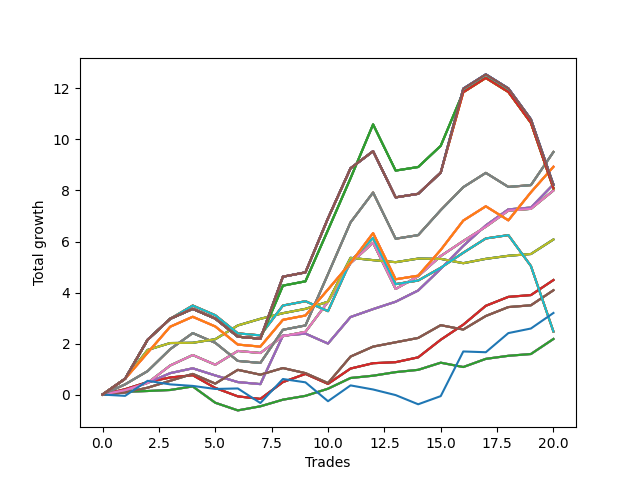

# Short Pointer 002 DB 
- Symbol: SPY_Unlimited
- Date Range: 03/23/2022 - 07/08/2022
- Trading Period: 7:20-12:30
- Number of Trades: 20



| Name | Win Percent | Profit | Avg Profit / Trade | Avg Time / Trade |      | Name | Win Percent | Profit | Avg Profit / Trade | Avg Time / Trade |
| ---- | ----------- | ------ | ------------------ | ---------------- | ---- | ---- | ----------- | ------ | ------------------ | ---------------- |
| Sorted By <br> Profit | | | | | | Sorted By <br> Win Percentage ||||
| Sixty-Nine | 75.00 | 4755.00 | 237.75 | 20:49 |     | Sixty-Eight | 85.00 | 4000.00 | 200.00 | 15:59 |
| Sixty-One | 75.00 | 4755.00 | 237.75 | 20:49 |     | Sixty | 85.00 | 4000.00 | 200.00 | 15:59 |
| Fifty-Three | 75.00 | 4755.00 | 237.75 | 20:49 |     | Fifty-Two | 85.00 | 4000.00 | 200.00 | 15:59 |
| Forty-Five | 75.00 | 4755.00 | 237.75 | 20:49 |     | Forty-Four | 85.00 | 4000.00 | 200.00 | 15:59 |
| Five | 75.00 | 4755.00 | 237.75 | 20:49 |     | Four | 85.00 | 4000.00 | 200.00 | 15:59 |
| One Hundred Twenty-Six | 75.00 | 4465.00 | 223.25 | 20:44 |     | Sixty-Four | 85.00 | 1090.00 | 54.50 | 03:33 |
| One Hundred Twenty-One | 75.00 | 4465.00 | 223.25 | 20:44 |     | Fifty-Six | 85.00 | 1090.00 | 54.50 | 03:33 |
| One Hundred Sixteen | 75.00 | 4465.00 | 223.25 | 20:44 |     | Forty-Eight | 85.00 | 1090.00 | 54.50 | 03:33 |
| One Hundred Eleven | 75.00 | 4465.00 | 223.25 | 20:44 |     | Forty | 85.00 | 1090.00 | 54.50 | 03:33 |
| Eighty-One | 75.00 | 4465.00 | 223.25 | 20:44 |     | Zero | 85.00 | 1090.00 | 54.50 | 03:33 |
| Sixty-Six | 80.00 | 4120.00 | 206.00 | 14:50 |     | Sixty-Six | 80.00 | 4120.00 | 206.00 | 14:50 |
| Fifty-Eight | 80.00 | 4120.00 | 206.00 | 14:50 |     | Fifty-Eight | 80.00 | 4120.00 | 206.00 | 14:50 |
| Fifty | 80.00 | 4120.00 | 206.00 | 14:50 |     | Fifty | 80.00 | 4120.00 | 206.00 | 14:50 |
| Forty-Two | 80.00 | 4120.00 | 206.00 | 14:50 |     | Forty-Two | 80.00 | 4120.00 | 206.00 | 14:50 |
| Two | 80.00 | 4120.00 | 206.00 | 14:50 |     | Two | 80.00 | 4120.00 | 206.00 | 14:50 |
| One Hundred Thirty | 65.00 | 4110.00 | 205.50 | 29:46 |     | Seventy | 80.00 | 3040.00 | 152.00 | 07:44 |
| One Hundred Twenty-Nine | 65.00 | 4110.00 | 205.50 | 29:46 |     | Sixty-Two | 80.00 | 3040.00 | 152.00 | 07:44 |
| One Hundred Twenty-Five | 65.00 | 4110.00 | 205.50 | 29:46 |     | Fifty-Four | 80.00 | 3040.00 | 152.00 | 07:44 |
| One Hundred Twenty-Four | 65.00 | 4110.00 | 205.50 | 29:46 |     | Forty-Six | 80.00 | 3040.00 | 152.00 | 07:44 |
| One Hundred Twenty | 65.00 | 4110.00 | 205.50 | 29:46 |     | Six | 80.00 | 3040.00 | 152.00 | 07:44 |
| One Hundred Ninteen | 65.00 | 4110.00 | 205.50 | 29:46 |     | Sixty-Five | 80.00 | 2245.00 | 112.25 | 08:00 |
| One Hundred Fifteen | 65.00 | 4110.00 | 205.50 | 29:46 |     | Fifty-Seven | 80.00 | 2245.00 | 112.25 | 08:00 |
| One Hundred Fourteen | 65.00 | 4110.00 | 205.50 | 29:46 |     | Forty-Nine | 80.00 | 2245.00 | 112.25 | 08:00 |
| Eighty-Five | 65.00 | 4110.00 | 205.50 | 29:46 |     | Forty-One | 80.00 | 2245.00 | 112.25 | 08:00 |
| Eighty-Four | 65.00 | 4110.00 | 205.50 | 29:46 |     | One | 80.00 | 2245.00 | 112.25 | 08:00 |
| One Hundred Twenty-Seven | 65.00 | 4045.00 | 202.25 | 26:57 |     | Sixty-Nine | 75.00 | 4755.00 | 237.75 | 20:49 |
| One Hundred Twenty-Two | 65.00 | 4045.00 | 202.25 | 26:57 |     | Sixty-One | 75.00 | 4755.00 | 237.75 | 20:49 |
| One Hundred Seventeen | 65.00 | 4045.00 | 202.25 | 26:57 |     | Fifty-Three | 75.00 | 4755.00 | 237.75 | 20:49 |
| One Hundred Twelve | 65.00 | 4045.00 | 202.25 | 26:57 |     | Forty-Five | 75.00 | 4755.00 | 237.75 | 20:49 |
| Eighty-Two | 65.00 | 4045.00 | 202.25 | 26:57 |     | Five | 75.00 | 4755.00 | 237.75 | 20:49 |
| One Hundred Twenty-Eight | 65.00 | 4040.00 | 202.00 | 28:31 |     | One Hundred Twenty-Six | 75.00 | 4465.00 | 223.25 | 20:44 |
| One Hundred Twenty-Three | 65.00 | 4040.00 | 202.00 | 28:31 |     | One Hundred Twenty-One | 75.00 | 4465.00 | 223.25 | 20:44 |
| One Hundred Eighteen | 65.00 | 4040.00 | 202.00 | 28:31 |     | One Hundred Sixteen | 75.00 | 4465.00 | 223.25 | 20:44 |
| One Hundred Thirteen | 65.00 | 4040.00 | 202.00 | 28:31 |     | One Hundred Eleven | 75.00 | 4465.00 | 223.25 | 20:44 |
| Eighty-Three | 65.00 | 4040.00 | 202.00 | 28:31 |     | Eighty-One | 75.00 | 4465.00 | 223.25 | 20:44 |
| Sixty-Eight | 85.00 | 4000.00 | 200.00 | 15:59 |     | Sixty-Seven | 75.00 | 2045.00 | 102.25 | 11:44 |
| Sixty | 85.00 | 4000.00 | 200.00 | 15:59 |     | Fifty-Nine | 75.00 | 2045.00 | 102.25 | 11:44 |
| Fifty-Two | 85.00 | 4000.00 | 200.00 | 15:59 |     | Fifty-One | 75.00 | 2045.00 | 102.25 | 11:44 |
| Forty-Four | 85.00 | 4000.00 | 200.00 | 15:59 |     | Forty-Three | 75.00 | 2045.00 | 102.25 | 11:44 |
| Four | 85.00 | 4000.00 | 200.00 | 15:59 |     | Three | 75.00 | 2045.00 | 102.25 | 11:44 |
| Seventy | 80.00 | 3040.00 | 152.00 | 07:44 |     | One Hundred Thirty | 65.00 | 4110.00 | 205.50 | 29:46 |
| Sixty-Two | 80.00 | 3040.00 | 152.00 | 07:44 |     | One Hundred Twenty-Nine | 65.00 | 4110.00 | 205.50 | 29:46 |
| Fifty-Four | 80.00 | 3040.00 | 152.00 | 07:44 |     | One Hundred Twenty-Five | 65.00 | 4110.00 | 205.50 | 29:46 |
| Forty-Six | 80.00 | 3040.00 | 152.00 | 07:44 |     | One Hundred Twenty-Four | 65.00 | 4110.00 | 205.50 | 29:46 |
| Six | 80.00 | 3040.00 | 152.00 | 07:44 |     | One Hundred Twenty | 65.00 | 4110.00 | 205.50 | 29:46 |
| Sixty-Five | 80.00 | 2245.00 | 112.25 | 08:00 |     | One Hundred Ninteen | 65.00 | 4110.00 | 205.50 | 29:46 |
| Fifty-Seven | 80.00 | 2245.00 | 112.25 | 08:00 |     | One Hundred Fifteen | 65.00 | 4110.00 | 205.50 | 29:46 |
| Forty-Nine | 80.00 | 2245.00 | 112.25 | 08:00 |     | One Hundred Fourteen | 65.00 | 4110.00 | 205.50 | 29:46 |
| Forty-One | 80.00 | 2245.00 | 112.25 | 08:00 |     | Eighty-Five | 65.00 | 4110.00 | 205.50 | 29:46 |
| One | 80.00 | 2245.00 | 112.25 | 08:00 |     | Eighty-Four | 65.00 | 4110.00 | 205.50 | 29:46 |
| Sixty-Seven | 75.00 | 2045.00 | 102.25 | 11:44 |     | One Hundred Twenty-Seven | 65.00 | 4045.00 | 202.25 | 26:57 |
| Fifty-Nine | 75.00 | 2045.00 | 102.25 | 11:44 |     | One Hundred Twenty-Two | 65.00 | 4045.00 | 202.25 | 26:57 |
| Fifty-One | 75.00 | 2045.00 | 102.25 | 11:44 |     | One Hundred Seventeen | 65.00 | 4045.00 | 202.25 | 26:57 |
| Forty-Three | 75.00 | 2045.00 | 102.25 | 11:44 |     | One Hundred Twelve | 65.00 | 4045.00 | 202.25 | 26:57 |
| Three | 75.00 | 2045.00 | 102.25 | 11:44 |     | Eighty-Two | 65.00 | 4045.00 | 202.25 | 26:57 |
| Seventy-Three | 45.00 | 1600.00 | 80.00 | 05:35 |     | One Hundred Twenty-Eight | 65.00 | 4040.00 | 202.00 | 28:31 |
| Seventy-One | 65.00 | 1235.00 | 61.75 | 23:08 |     | One Hundred Twenty-Three | 65.00 | 4040.00 | 202.00 | 28:31 |
| Sixty-Three | 65.00 | 1235.00 | 61.75 | 23:08 |     | One Hundred Eighteen | 65.00 | 4040.00 | 202.00 | 28:31 |
| Fifty-Five | 65.00 | 1235.00 | 61.75 | 23:08 |     | One Hundred Thirteen | 65.00 | 4040.00 | 202.00 | 28:31 |
| Forty-Seven | 65.00 | 1235.00 | 61.75 | 23:08 |     | Eighty-Three | 65.00 | 4040.00 | 202.00 | 28:31 |
| Seven | 65.00 | 1235.00 | 61.75 | 23:08 |     | Seventy-One | 65.00 | 1235.00 | 61.75 | 23:08 |
| Sixty-Four | 85.00 | 1090.00 | 54.50 | 03:33 |     | Sixty-Three | 65.00 | 1235.00 | 61.75 | 23:08 |
| Fifty-Six | 85.00 | 1090.00 | 54.50 | 03:33 |     | Fifty-Five | 65.00 | 1235.00 | 61.75 | 23:08 |
| Forty-Eight | 85.00 | 1090.00 | 54.50 | 03:33 |     | Forty-Seven | 65.00 | 1235.00 | 61.75 | 23:08 |
| Forty | 85.00 | 1090.00 | 54.50 | 03:33 |     | Seven | 65.00 | 1235.00 | 61.75 | 23:08 |
| Zero | 85.00 | 1090.00 | 54.50 | 03:33 |     | Seventy-Three | 45.00 | 1600.00 | 80.00 | 05:35 |

## NO STOPLOSS

### Test Zero
* Sell when price hits the middle line of the 20p bollinger
* No Stoploss
* Results:
```
Total Trades: 20
Percent Up: 15.00
Percent Down: 85.00
Total Points Moved Down: 2.18
Potential Profit: 1090.00
Total Points Ups: 1.11 Count Ups: 3
Total Points Downs: 3.29 Count Downs: 17
```

<details><summary>Trades</summary>

<code>In: 2022-03-25 11:34:00		Out: 2022-03-25 11:35:15		Total Position Time: 01:15		Total Move Down: 0.11		Total to Date: 0.11</code> <br />
<code>In: 2022-03-25 11:57:00		Out: 2022-03-25 11:57:15		Total Position Time: 00:15		Total Move Down: 0.03		Total to Date: 0.14</code> <br />
<code>In: 2022-03-29 08:53:00		Out: 2022-03-29 08:56:20		Total Position Time: 03:20		Total Move Down: 0.04		Total to Date: 0.18</code> <br />
<code>In: 2022-03-30 09:46:00		Out: 2022-03-30 09:50:50		Total Position Time: 04:50		Total Move Down: 0.14		Total to Date: 0.32</code> <br />
<code>In: 2022-03-31 07:39:00		Out: 2022-03-31 08:03:05		Total Position Time: 24:05		Total Move Down: -0.64		Total to Date: -0.32</code> <br />
<code>In: 2022-04-06 10:36:00		Out: 2022-04-06 10:47:10		Total Position Time: 11:10		Total Move Down: -0.30		Total to Date: -0.62</code> <br />
<code>In: 2022-04-25 09:29:00		Out: 2022-04-25 09:31:05		Total Position Time: 02:05		Total Move Down: 0.16		Total to Date: -0.46</code> <br />
<code>In: 2022-04-26 10:02:00		Out: 2022-04-26 10:02:20		Total Position Time: 00:20		Total Move Down: 0.26		Total to Date: -0.20</code> <br />
<code>In: 2022-05-04 09:43:00		Out: 2022-05-04 09:45:30		Total Position Time: 02:30		Total Move Down: 0.15		Total to Date: -0.05</code> <br />
<code>In: 2022-05-09 12:04:00		Out: 2022-05-09 12:04:10		Total Position Time: 00:10		Total Move Down: 0.28		Total to Date: 0.23</code> <br />
<code>In: 2022-05-24 09:19:00		Out: 2022-05-24 09:21:35		Total Position Time: 02:35		Total Move Down: 0.42		Total to Date: 0.65</code> <br />
<code>In: 2022-05-25 10:40:00		Out: 2022-05-25 10:47:20		Total Position Time: 07:20		Total Move Down: 0.09		Total to Date: 0.74</code> <br />
<code>In: 2022-06-01 11:08:00		Out: 2022-06-01 11:08:45		Total Position Time: 00:45		Total Move Down: 0.14		Total to Date: 0.88</code> <br />
<code>In: 2022-06-01 12:19:00		Out: 2022-06-01 12:25:25		Total Position Time: 06:25		Total Move Down: 0.09		Total to Date: 0.97</code> <br />
<code>In: 2022-06-09 08:47:00		Out: 2022-06-09 08:48:20		Total Position Time: 01:20		Total Move Down: 0.28		Total to Date: 1.25</code> <br />
<code>In: 2022-06-15 11:02:00		Out: 2022-06-15 11:02:10		Total Position Time: 00:10		Total Move Down: -0.17		Total to Date: 1.08</code> <br />
<code>In: 2022-06-17 08:21:00		Out: 2022-06-17 08:23:05		Total Position Time: 02:05		Total Move Down: 0.32		Total to Date: 1.40</code> <br />
<code>In: 2022-06-29 10:13:00		Out: 2022-06-29 10:13:10		Total Position Time: 00:10		Total Move Down: 0.12		Total to Date: 1.52</code> <br />
<code>In: 2022-07-06 11:00:00		Out: 2022-07-06 11:00:10		Total Position Time: 00:10		Total Move Down: 0.07		Total to Date: 1.59</code> <br />
<code>In: 2022-07-06 11:11:00		Out: 2022-07-06 11:11:10		Total Position Time: 00:10		Total Move Down: 0.59		Total to Date: 2.18</code> <br />


</details>

### Test One
* Sell when the price hits the upper line of the 20p 1std bollinger
* No Stoploss
* Results:
```
Total Trades: 20
Percent Up: 20.00
Percent Down: 80.00
Total Points Moved Down: 4.49
Potential Profit: 2245.00
Total Points Ups: 1.32 Count Ups: 4
Total Points Downs: 5.81 Count Downs: 16
```

<details><summary>Trades</summary>

<code>In: 2022-03-25 11:34:00		Out: 2022-03-25 11:40:55		Total Position Time: 06:55		Total Move Down: 0.21		Total to Date: 0.21</code> <br />
<code>In: 2022-03-25 11:57:00		Out: 2022-03-25 12:00:50		Total Position Time: 03:50		Total Move Down: 0.28		Total to Date: 0.49</code> <br />
<code>In: 2022-03-29 08:53:00		Out: 2022-03-29 08:58:45		Total Position Time: 05:45		Total Move Down: 0.18		Total to Date: 0.67</code> <br />
<code>In: 2022-03-30 09:46:00		Out: 2022-03-30 10:00:45		Total Position Time: 14:45		Total Move Down: 0.09		Total to Date: 0.76</code> <br />
<code>In: 2022-03-31 07:39:00		Out: 2022-03-31 08:08:00		Total Position Time: 29:00		Total Move Down: -0.50		Total to Date: 0.26</code> <br />
<code>In: 2022-04-06 10:36:00		Out: 2022-04-06 10:56:55		Total Position Time: 20:55		Total Move Down: -0.33		Total to Date: -0.07</code> <br />
<code>In: 2022-04-25 09:29:00		Out: 2022-04-25 09:42:35		Total Position Time: 13:35		Total Move Down: -0.10		Total to Date: -0.17</code> <br />
<code>In: 2022-04-26 10:02:00		Out: 2022-04-26 10:02:50		Total Position Time: 00:50		Total Move Down: 0.66		Total to Date: 0.49</code> <br />
<code>In: 2022-05-04 09:43:00		Out: 2022-05-04 09:46:30		Total Position Time: 03:30		Total Move Down: 0.32		Total to Date: 0.81</code> <br />
<code>In: 2022-05-09 12:04:00		Out: 2022-05-09 12:17:15		Total Position Time: 13:15		Total Move Down: -0.39		Total to Date: 0.42</code> <br />
<code>In: 2022-05-24 09:19:00		Out: 2022-05-24 09:28:55		Total Position Time: 09:55		Total Move Down: 0.60		Total to Date: 1.02</code> <br />
<code>In: 2022-05-25 10:40:00		Out: 2022-05-25 10:51:35		Total Position Time: 11:35		Total Move Down: 0.21		Total to Date: 1.23</code> <br />
<code>In: 2022-06-01 11:08:00		Out: 2022-06-01 11:18:10		Total Position Time: 10:10		Total Move Down: 0.04		Total to Date: 1.27</code> <br />
<code>In: 2022-06-01 12:19:00		Out: 2022-06-01 12:25:45		Total Position Time: 06:45		Total Move Down: 0.19		Total to Date: 1.46</code> <br />
<code>In: 2022-06-09 08:47:00		Out: 2022-06-09 08:49:35		Total Position Time: 02:35		Total Move Down: 0.69		Total to Date: 2.15</code> <br />
<code>In: 2022-06-15 11:02:00		Out: 2022-06-15 11:03:05		Total Position Time: 01:05		Total Move Down: 0.59		Total to Date: 2.74</code> <br />
<code>In: 2022-06-17 08:21:00		Out: 2022-06-17 08:25:20		Total Position Time: 04:20		Total Move Down: 0.74		Total to Date: 3.48</code> <br />
<code>In: 2022-06-29 10:13:00		Out: 2022-06-29 10:14:00		Total Position Time: 01:00		Total Move Down: 0.35		Total to Date: 3.83</code> <br />
<code>In: 2022-07-06 11:00:00		Out: 2022-07-06 11:00:10		Total Position Time: 00:10		Total Move Down: 0.07		Total to Date: 3.90</code> <br />
<code>In: 2022-07-06 11:11:00		Out: 2022-07-06 11:11:10		Total Position Time: 00:10		Total Move Down: 0.59		Total to Date: 4.49</code> <br />


</details>

### Test Two
* Sell when the price hits the upper line of the 20p 2std bollinger
* No Stoploss
* Results:
```
Total Trades: 20
Percent Up: 20.00
Percent Down: 80.00
Total Points Moved Down: 8.24
Potential Profit: 4120.00
Total Points Ups: 1.01 Count Ups: 4
Total Points Downs: 9.25 Count Downs: 16
```

<details><summary>Trades</summary>

<code>In: 2022-03-25 11:34:00		Out: 2022-03-25 12:00:55		Total Position Time: 26:55		Total Move Down: 0.17		Total to Date: 0.17</code> <br />
<code>In: 2022-03-25 11:57:00		Out: 2022-03-25 12:00:55		Total Position Time: 03:55		Total Move Down: 0.29		Total to Date: 0.46</code> <br />
<code>In: 2022-03-29 08:53:00		Out: 2022-03-29 09:01:40		Total Position Time: 08:40		Total Move Down: 0.38		Total to Date: 0.84</code> <br />
<code>In: 2022-03-30 09:46:00		Out: 2022-03-30 10:01:15		Total Position Time: 15:15		Total Move Down: 0.19		Total to Date: 1.03</code> <br />
<code>In: 2022-03-31 07:39:00		Out: 2022-03-31 08:08:30		Total Position Time: 29:30		Total Move Down: -0.28		Total to Date: 0.75</code> <br />
<code>In: 2022-04-06 10:36:00		Out: 2022-04-06 10:57:20		Total Position Time: 21:20		Total Move Down: -0.26		Total to Date: 0.49</code> <br />
<code>In: 2022-04-25 09:29:00		Out: 2022-04-25 09:58:55		Total Position Time: 29:55		Total Move Down: -0.08		Total to Date: 0.41</code> <br />
<code>In: 2022-04-26 10:02:00		Out: 2022-04-26 10:21:25		Total Position Time: 19:25		Total Move Down: 1.90		Total to Date: 2.31</code> <br />
<code>In: 2022-05-04 09:43:00		Out: 2022-05-04 10:11:15		Total Position Time: 28:15		Total Move Down: 0.08		Total to Date: 2.39</code> <br />
<code>In: 2022-05-09 12:04:00		Out: 2022-05-09 12:17:15		Total Position Time: 13:15		Total Move Down: -0.39		Total to Date: 2.00</code> <br />
<code>In: 2022-05-24 09:19:00		Out: 2022-05-24 09:31:20		Total Position Time: 12:20		Total Move Down: 1.04		Total to Date: 3.04</code> <br />
<code>In: 2022-05-25 10:40:00		Out: 2022-05-25 10:52:10		Total Position Time: 12:10		Total Move Down: 0.31		Total to Date: 3.35</code> <br />
<code>In: 2022-06-01 11:08:00		Out: 2022-06-01 11:19:20		Total Position Time: 11:20		Total Move Down: 0.29		Total to Date: 3.64</code> <br />
<code>In: 2022-06-01 12:19:00		Out: 2022-06-01 12:30:05		Total Position Time: 11:05		Total Move Down: 0.44		Total to Date: 4.08</code> <br />
<code>In: 2022-06-09 08:47:00		Out: 2022-06-09 09:11:00		Total Position Time: 24:00		Total Move Down: 0.85		Total to Date: 4.93</code> <br />
<code>In: 2022-06-15 11:02:00		Out: 2022-06-15 11:03:15		Total Position Time: 01:15		Total Move Down: 0.90		Total to Date: 5.83</code> <br />
<code>In: 2022-06-17 08:21:00		Out: 2022-06-17 08:45:15		Total Position Time: 24:15		Total Move Down: 0.80		Total to Date: 6.63</code> <br />
<code>In: 2022-06-29 10:13:00		Out: 2022-06-29 10:16:00		Total Position Time: 03:00		Total Move Down: 0.63		Total to Date: 7.26</code> <br />
<code>In: 2022-07-06 11:00:00		Out: 2022-07-06 11:00:10		Total Position Time: 00:10		Total Move Down: 0.07		Total to Date: 7.33</code> <br />
<code>In: 2022-07-06 11:11:00		Out: 2022-07-06 11:11:45		Total Position Time: 00:45		Total Move Down: 0.91		Total to Date: 8.24</code> <br />


</details>

### Test Three
* Sell when price hits the middle line of the 50p bollinger
* No Stoploss
* Results:
```
Total Trades: 20
Percent Up: 25.00
Percent Down: 75.00
Total Points Moved Down: 4.09
Potential Profit: 2045.00
Total Points Ups: 1.33 Count Ups: 5
Total Points Downs: 5.42 Count Downs: 15
```

<details><summary>Trades</summary>

<code>In: 2022-03-25 11:34:00		Out: 2022-03-25 11:49:30		Total Position Time: 15:30		Total Move Down: 0.08		Total to Date: 0.08</code> <br />
<code>In: 2022-03-25 11:57:00		Out: 2022-03-25 12:00:45		Total Position Time: 03:45		Total Move Down: 0.19		Total to Date: 0.27</code> <br />
<code>In: 2022-03-29 08:53:00		Out: 2022-03-29 09:01:25		Total Position Time: 08:25		Total Move Down: 0.27		Total to Date: 0.54</code> <br />
<code>In: 2022-03-30 09:46:00		Out: 2022-03-30 10:01:45		Total Position Time: 15:45		Total Move Down: 0.27		Total to Date: 0.81</code> <br />
<code>In: 2022-03-31 07:39:00		Out: 2022-03-31 08:08:55		Total Position Time: 29:55		Total Move Down: -0.38		Total to Date: 0.43</code> <br />
<code>In: 2022-04-06 10:36:00		Out: 2022-04-06 11:00:10		Total Position Time: 24:10		Total Move Down: 0.54		Total to Date: 0.97</code> <br />
<code>In: 2022-04-25 09:29:00		Out: 2022-04-25 09:55:05		Total Position Time: 26:05		Total Move Down: -0.19		Total to Date: 0.78</code> <br />
<code>In: 2022-04-26 10:02:00		Out: 2022-04-26 10:02:15		Total Position Time: 00:15		Total Move Down: 0.26		Total to Date: 1.04</code> <br />
<code>In: 2022-05-04 09:43:00		Out: 2022-05-04 10:10:20		Total Position Time: 27:20		Total Move Down: -0.20		Total to Date: 0.84</code> <br />
<code>In: 2022-05-09 12:04:00		Out: 2022-05-09 12:17:15		Total Position Time: 13:15		Total Move Down: -0.39		Total to Date: 0.45</code> <br />
<code>In: 2022-05-24 09:19:00		Out: 2022-05-24 09:31:20		Total Position Time: 12:20		Total Move Down: 1.04		Total to Date: 1.49</code> <br />
<code>In: 2022-05-25 10:40:00		Out: 2022-05-25 10:53:30		Total Position Time: 13:30		Total Move Down: 0.39		Total to Date: 1.88</code> <br />
<code>In: 2022-06-01 11:08:00		Out: 2022-06-01 11:18:40		Total Position Time: 10:40		Total Move Down: 0.17		Total to Date: 2.05</code> <br />
<code>In: 2022-06-01 12:19:00		Out: 2022-06-01 12:25:30		Total Position Time: 06:30		Total Move Down: 0.17		Total to Date: 2.22</code> <br />
<code>In: 2022-06-09 08:47:00		Out: 2022-06-09 08:48:50		Total Position Time: 01:50		Total Move Down: 0.50		Total to Date: 2.72</code> <br />
<code>In: 2022-06-15 11:02:00		Out: 2022-06-15 11:02:10		Total Position Time: 00:10		Total Move Down: -0.17		Total to Date: 2.55</code> <br />
<code>In: 2022-06-17 08:21:00		Out: 2022-06-17 08:45:00		Total Position Time: 24:00		Total Move Down: 0.53		Total to Date: 3.08</code> <br />
<code>In: 2022-06-29 10:13:00		Out: 2022-06-29 10:14:00		Total Position Time: 01:00		Total Move Down: 0.35		Total to Date: 3.43</code> <br />
<code>In: 2022-07-06 11:00:00		Out: 2022-07-06 11:00:10		Total Position Time: 00:10		Total Move Down: 0.07		Total to Date: 3.50</code> <br />
<code>In: 2022-07-06 11:11:00		Out: 2022-07-06 11:11:10		Total Position Time: 00:10		Total Move Down: 0.59		Total to Date: 4.09</code> <br />


</details>

### Test Four
* Sell when the price hits the upper line of the 50p 1std bollinger
* No Stoploss
* Results:
```
Total Trades: 20
Percent Up: 15.00
Percent Down: 85.00
Total Points Moved Down: 8.00
Potential Profit: 4000.00
Total Points Ups: 2.27 Count Ups: 3
Total Points Downs: 10.27 Count Downs: 17
```

<details><summary>Trades</summary>

<code>In: 2022-03-25 11:34:00		Out: 2022-03-25 12:00:55		Total Position Time: 26:55		Total Move Down: 0.17		Total to Date: 0.17</code> <br />
<code>In: 2022-03-25 11:57:00		Out: 2022-03-25 12:00:55		Total Position Time: 03:55		Total Move Down: 0.29		Total to Date: 0.46</code> <br />
<code>In: 2022-03-29 08:53:00		Out: 2022-03-29 09:02:15		Total Position Time: 09:15		Total Move Down: 0.68		Total to Date: 1.14</code> <br />
<code>In: 2022-03-30 09:46:00		Out: 2022-03-30 10:06:35		Total Position Time: 20:35		Total Move Down: 0.41		Total to Date: 1.55</code> <br />
<code>In: 2022-03-31 07:39:00		Out: 2022-03-31 08:08:55		Total Position Time: 29:55		Total Move Down: -0.38		Total to Date: 1.17</code> <br />
<code>In: 2022-04-06 10:36:00		Out: 2022-04-06 11:00:10		Total Position Time: 24:10		Total Move Down: 0.54		Total to Date: 1.71</code> <br />
<code>In: 2022-04-25 09:29:00		Out: 2022-04-25 09:58:55		Total Position Time: 29:55		Total Move Down: -0.08		Total to Date: 1.63</code> <br />
<code>In: 2022-04-26 10:02:00		Out: 2022-04-26 10:02:50		Total Position Time: 00:50		Total Move Down: 0.66		Total to Date: 2.29</code> <br />
<code>In: 2022-05-04 09:43:00		Out: 2022-05-04 10:12:55		Total Position Time: 29:55		Total Move Down: 0.17		Total to Date: 2.46</code> <br />
<code>In: 2022-05-09 12:04:00		Out: 2022-05-09 12:23:25		Total Position Time: 19:25		Total Move Down: 1.18		Total to Date: 3.64</code> <br />
<code>In: 2022-05-24 09:19:00		Out: 2022-05-24 09:33:15		Total Position Time: 14:15		Total Move Down: 1.51		Total to Date: 5.15</code> <br />
<code>In: 2022-05-25 10:40:00		Out: 2022-05-25 11:06:40		Total Position Time: 26:40		Total Move Down: 0.80		Total to Date: 5.95</code> <br />
<code>In: 2022-06-01 11:08:00		Out: 2022-06-01 11:37:55		Total Position Time: 29:55		Total Move Down: -1.81		Total to Date: 4.14</code> <br />
<code>In: 2022-06-01 12:19:00		Out: 2022-06-01 12:35:05		Total Position Time: 16:05		Total Move Down: 0.50		Total to Date: 4.64</code> <br />
<code>In: 2022-06-09 08:47:00		Out: 2022-06-09 08:50:25		Total Position Time: 03:25		Total Move Down: 0.79		Total to Date: 5.43</code> <br />
<code>In: 2022-06-15 11:02:00		Out: 2022-06-15 11:03:05		Total Position Time: 01:05		Total Move Down: 0.59		Total to Date: 6.02</code> <br />
<code>In: 2022-06-17 08:21:00		Out: 2022-06-17 08:50:55		Total Position Time: 29:55		Total Move Down: 0.56		Total to Date: 6.58</code> <br />
<code>In: 2022-06-29 10:13:00		Out: 2022-06-29 10:16:00		Total Position Time: 03:00		Total Move Down: 0.63		Total to Date: 7.21</code> <br />
<code>In: 2022-07-06 11:00:00		Out: 2022-07-06 11:00:10		Total Position Time: 00:10		Total Move Down: 0.07		Total to Date: 7.28</code> <br />
<code>In: 2022-07-06 11:11:00		Out: 2022-07-06 11:11:35		Total Position Time: 00:35		Total Move Down: 0.72		Total to Date: 8.00</code> <br />


</details>

### Test Five
* Sell when the price hits the upper line of the 50p 2std bollinger
* No Stoploss
* Results:
```
Total Trades: 20
Percent Up: 25.00
Percent Down: 75.00
Total Points Moved Down: 9.51
Potential Profit: 4755.00
Total Points Ups: 3.53 Count Ups: 5
Total Points Downs: 13.04 Count Downs: 15
```

<details><summary>Trades</summary>

<code>In: 2022-03-25 11:34:00		Out: 2022-03-25 12:01:55		Total Position Time: 27:55		Total Move Down: 0.40		Total to Date: 0.40</code> <br />
<code>In: 2022-03-25 11:57:00		Out: 2022-03-25 12:01:55		Total Position Time: 04:55		Total Move Down: 0.52		Total to Date: 0.92</code> <br />
<code>In: 2022-03-29 08:53:00		Out: 2022-03-29 09:10:50		Total Position Time: 17:50		Total Move Down: 0.86		Total to Date: 1.78</code> <br />
<code>In: 2022-03-30 09:46:00		Out: 2022-03-30 10:07:20		Total Position Time: 21:20		Total Move Down: 0.63		Total to Date: 2.41</code> <br />
<code>In: 2022-03-31 07:39:00		Out: 2022-03-31 08:08:55		Total Position Time: 29:55		Total Move Down: -0.38		Total to Date: 2.03</code> <br />
<code>In: 2022-04-06 10:36:00		Out: 2022-04-06 11:05:55		Total Position Time: 29:55		Total Move Down: -0.71		Total to Date: 1.32</code> <br />
<code>In: 2022-04-25 09:29:00		Out: 2022-04-25 09:58:55		Total Position Time: 29:55		Total Move Down: -0.08		Total to Date: 1.24</code> <br />
<code>In: 2022-04-26 10:02:00		Out: 2022-04-26 10:14:35		Total Position Time: 12:35		Total Move Down: 1.30		Total to Date: 2.54</code> <br />
<code>In: 2022-05-04 09:43:00		Out: 2022-05-04 10:12:55		Total Position Time: 29:55		Total Move Down: 0.17		Total to Date: 2.71</code> <br />
<code>In: 2022-05-09 12:04:00		Out: 2022-05-09 12:28:05		Total Position Time: 24:05		Total Move Down: 2.01		Total to Date: 4.72</code> <br />
<code>In: 2022-05-24 09:19:00		Out: 2022-05-24 09:36:50		Total Position Time: 17:50		Total Move Down: 2.03		Total to Date: 6.75</code> <br />
<code>In: 2022-05-25 10:40:00		Out: 2022-05-25 11:06:50		Total Position Time: 26:50		Total Move Down: 1.17		Total to Date: 7.92</code> <br />
<code>In: 2022-06-01 11:08:00		Out: 2022-06-01 11:37:55		Total Position Time: 29:55		Total Move Down: -1.81		Total to Date: 6.11</code> <br />
<code>In: 2022-06-01 12:19:00		Out: 2022-06-01 12:46:00		Total Position Time: 27:00		Total Move Down: 0.14		Total to Date: 6.25</code> <br />
<code>In: 2022-06-09 08:47:00		Out: 2022-06-09 09:11:10		Total Position Time: 24:10		Total Move Down: 0.98		Total to Date: 7.23</code> <br />
<code>In: 2022-06-15 11:02:00		Out: 2022-06-15 11:03:15		Total Position Time: 01:15		Total Move Down: 0.90		Total to Date: 8.13</code> <br />
<code>In: 2022-06-17 08:21:00		Out: 2022-06-17 08:50:55		Total Position Time: 29:55		Total Move Down: 0.56		Total to Date: 8.69</code> <br />
<code>In: 2022-06-29 10:13:00		Out: 2022-06-29 10:42:55		Total Position Time: 29:55		Total Move Down: -0.55		Total to Date: 8.14</code> <br />
<code>In: 2022-07-06 11:00:00		Out: 2022-07-06 11:00:10		Total Position Time: 00:10		Total Move Down: 0.07		Total to Date: 8.21</code> <br />
<code>In: 2022-07-06 11:11:00		Out: 2022-07-06 11:12:15		Total Position Time: 01:15		Total Move Down: 1.30		Total to Date: 9.51</code> <br />


</details>

### Test Six
* Sell when the price hits the middle line of the 1std VWAP
* No Stoploss
* Results:
```
Total Trades: 20
Percent Up: 20.00
Percent Down: 80.00
Total Points Moved Down: 6.08
Potential Profit: 3040.00
Total Points Ups: 0.35 Count Ups: 4
Total Points Downs: 6.43 Count Downs: 16
```

<details><summary>Trades</summary>

<code>In: 2022-03-25 11:34:00		Out: 2022-03-25 12:03:55		Total Position Time: 29:55		Total Move Down: 0.62		Total to Date: 0.62</code> <br />
<code>In: 2022-03-25 11:57:00		Out: 2022-03-25 12:07:35		Total Position Time: 10:35		Total Move Down: 1.13		Total to Date: 1.75</code> <br />
<code>In: 2022-03-29 08:53:00		Out: 2022-03-29 09:01:25		Total Position Time: 08:25		Total Move Down: 0.27		Total to Date: 2.02</code> <br />
<code>In: 2022-03-30 09:46:00		Out: 2022-03-30 09:46:10		Total Position Time: 00:10		Total Move Down: 0.01		Total to Date: 2.03</code> <br />
<code>In: 2022-03-31 07:39:00		Out: 2022-03-31 07:41:25		Total Position Time: 02:25		Total Move Down: 0.14		Total to Date: 2.17</code> <br />
<code>In: 2022-04-06 10:36:00		Out: 2022-04-06 11:00:10		Total Position Time: 24:10		Total Move Down: 0.54		Total to Date: 2.71</code> <br />
<code>In: 2022-04-25 09:29:00		Out: 2022-04-25 09:31:10		Total Position Time: 02:10		Total Move Down: 0.26		Total to Date: 2.97</code> <br />
<code>In: 2022-04-26 10:02:00		Out: 2022-04-26 10:02:10		Total Position Time: 00:10		Total Move Down: 0.22		Total to Date: 3.19</code> <br />
<code>In: 2022-05-04 09:43:00		Out: 2022-05-04 10:12:55		Total Position Time: 29:55		Total Move Down: 0.17		Total to Date: 3.36</code> <br />
<code>In: 2022-05-09 12:04:00		Out: 2022-05-09 12:04:10		Total Position Time: 00:10		Total Move Down: 0.28		Total to Date: 3.64</code> <br />
<code>In: 2022-05-24 09:19:00		Out: 2022-05-24 09:36:10		Total Position Time: 17:10		Total Move Down: 1.72		Total to Date: 5.36</code> <br />
<code>In: 2022-05-25 10:40:00		Out: 2022-05-25 10:40:10		Total Position Time: 00:10		Total Move Down: -0.09		Total to Date: 5.27</code> <br />
<code>In: 2022-06-01 11:08:00		Out: 2022-06-01 11:08:10		Total Position Time: 00:10		Total Move Down: -0.08		Total to Date: 5.19</code> <br />
<code>In: 2022-06-01 12:19:00		Out: 2022-06-01 12:46:00		Total Position Time: 27:00		Total Move Down: 0.14		Total to Date: 5.33</code> <br />
<code>In: 2022-06-09 08:47:00		Out: 2022-06-09 08:47:10		Total Position Time: 00:10		Total Move Down: -0.01		Total to Date: 5.32</code> <br />
<code>In: 2022-06-15 11:02:00		Out: 2022-06-15 11:02:10		Total Position Time: 00:10		Total Move Down: -0.17		Total to Date: 5.15</code> <br />
<code>In: 2022-06-17 08:21:00		Out: 2022-06-17 08:22:20		Total Position Time: 01:20		Total Move Down: 0.17		Total to Date: 5.32</code> <br />
<code>In: 2022-06-29 10:13:00		Out: 2022-06-29 10:13:10		Total Position Time: 00:10		Total Move Down: 0.12		Total to Date: 5.44</code> <br />
<code>In: 2022-07-06 11:00:00		Out: 2022-07-06 11:00:10		Total Position Time: 00:10		Total Move Down: 0.07		Total to Date: 5.51</code> <br />
<code>In: 2022-07-06 11:11:00		Out: 2022-07-06 11:11:15		Total Position Time: 00:15		Total Move Down: 0.57		Total to Date: 6.08</code> <br />


</details>

### Test Seven
* Sell when the price hits the upper line of the 1std VWAP
* No Stoploss
* Results:
```
Total Trades: 20
Percent Up: 35.00
Percent Down: 65.00
Total Points Moved Down: 2.47
Potential Profit: 1235.00
Total Points Ups: 7.15 Count Ups: 7
Total Points Downs: 9.62 Count Downs: 13
```

<details><summary>Trades</summary>

<code>In: 2022-03-25 11:34:00		Out: 2022-03-25 12:03:55		Total Position Time: 29:55		Total Move Down: 0.62		Total to Date: 0.62</code> <br />
<code>In: 2022-03-25 11:57:00		Out: 2022-03-25 12:26:55		Total Position Time: 29:55		Total Move Down: 1.53		Total to Date: 2.15</code> <br />
<code>In: 2022-03-29 08:53:00		Out: 2022-03-29 09:22:55		Total Position Time: 29:55		Total Move Down: 0.82		Total to Date: 2.97</code> <br />
<code>In: 2022-03-30 09:46:00		Out: 2022-03-30 10:06:55		Total Position Time: 20:55		Total Move Down: 0.52		Total to Date: 3.49</code> <br />
<code>In: 2022-03-31 07:39:00		Out: 2022-03-31 08:08:55		Total Position Time: 29:55		Total Move Down: -0.38		Total to Date: 3.11</code> <br />
<code>In: 2022-04-06 10:36:00		Out: 2022-04-06 11:05:55		Total Position Time: 29:55		Total Move Down: -0.71		Total to Date: 2.40</code> <br />
<code>In: 2022-04-25 09:29:00		Out: 2022-04-25 09:58:55		Total Position Time: 29:55		Total Move Down: -0.08		Total to Date: 2.32</code> <br />
<code>In: 2022-04-26 10:02:00		Out: 2022-04-26 10:14:15		Total Position Time: 12:15		Total Move Down: 1.17		Total to Date: 3.49</code> <br />
<code>In: 2022-05-04 09:43:00		Out: 2022-05-04 10:12:55		Total Position Time: 29:55		Total Move Down: 0.17		Total to Date: 3.66</code> <br />
<code>In: 2022-05-09 12:04:00		Out: 2022-05-09 12:17:15		Total Position Time: 13:15		Total Move Down: -0.39		Total to Date: 3.27</code> <br />
<code>In: 2022-05-24 09:19:00		Out: 2022-05-24 09:48:55		Total Position Time: 29:55		Total Move Down: 1.96		Total to Date: 5.23</code> <br />
<code>In: 2022-05-25 10:40:00		Out: 2022-05-25 11:06:45		Total Position Time: 26:45		Total Move Down: 0.91		Total to Date: 6.14</code> <br />
<code>In: 2022-06-01 11:08:00		Out: 2022-06-01 11:37:55		Total Position Time: 29:55		Total Move Down: -1.81		Total to Date: 4.33</code> <br />
<code>In: 2022-06-01 12:19:00		Out: 2022-06-01 12:46:00		Total Position Time: 27:00		Total Move Down: 0.14		Total to Date: 4.47</code> <br />
<code>In: 2022-06-09 08:47:00		Out: 2022-06-09 08:48:50		Total Position Time: 01:50		Total Move Down: 0.50		Total to Date: 4.97</code> <br />
<code>In: 2022-06-15 11:02:00		Out: 2022-06-15 11:03:05		Total Position Time: 01:05		Total Move Down: 0.59		Total to Date: 5.56</code> <br />
<code>In: 2022-06-17 08:21:00		Out: 2022-06-17 08:50:55		Total Position Time: 29:55		Total Move Down: 0.56		Total to Date: 6.12</code> <br />
<code>In: 2022-06-29 10:13:00		Out: 2022-06-29 10:13:45		Total Position Time: 00:45		Total Move Down: 0.13		Total to Date: 6.25</code> <br />
<code>In: 2022-07-06 11:00:00		Out: 2022-07-06 11:29:55		Total Position Time: 29:55		Total Move Down: -1.21		Total to Date: 5.04</code> <br />
<code>In: 2022-07-06 11:11:00		Out: 2022-07-06 11:40:55		Total Position Time: 29:55		Total Move Down: -2.57		Total to Date: 2.47</code> <br />


</details>

## STOPLOSS OF 5

### Test Forty
* Sell when price hits the middle line of the 20p bollinger
* Stoploss is -5 points
* Results:
```
Total Trades: 20
Percent Up: 15.00
Percent Down: 85.00
Total Points Moved Down: 2.18
Potential Profit: 1090.00
Total Points Ups: 1.11 Count Ups: 3
Total Points Downs: 3.29 Count Downs: 17
```

<details><summary>Trades</summary>

<code>In: 2022-03-25 11:34:00		Out: 2022-03-25 11:35:15		Total Position Time: 01:15		Total Move Down: 0.11		Total to Date: 0.11</code> <br />
<code>In: 2022-03-25 11:57:00		Out: 2022-03-25 11:57:15		Total Position Time: 00:15		Total Move Down: 0.03		Total to Date: 0.14</code> <br />
<code>In: 2022-03-29 08:53:00		Out: 2022-03-29 08:56:20		Total Position Time: 03:20		Total Move Down: 0.04		Total to Date: 0.18</code> <br />
<code>In: 2022-03-30 09:46:00		Out: 2022-03-30 09:50:50		Total Position Time: 04:50		Total Move Down: 0.14		Total to Date: 0.32</code> <br />
<code>In: 2022-03-31 07:39:00		Out: 2022-03-31 08:03:05		Total Position Time: 24:05		Total Move Down: -0.64		Total to Date: -0.32</code> <br />
<code>In: 2022-04-06 10:36:00		Out: 2022-04-06 10:47:10		Total Position Time: 11:10		Total Move Down: -0.30		Total to Date: -0.62</code> <br />
<code>In: 2022-04-25 09:29:00		Out: 2022-04-25 09:31:05		Total Position Time: 02:05		Total Move Down: 0.16		Total to Date: -0.46</code> <br />
<code>In: 2022-04-26 10:02:00		Out: 2022-04-26 10:02:20		Total Position Time: 00:20		Total Move Down: 0.26		Total to Date: -0.20</code> <br />
<code>In: 2022-05-04 09:43:00		Out: 2022-05-04 09:45:30		Total Position Time: 02:30		Total Move Down: 0.15		Total to Date: -0.05</code> <br />
<code>In: 2022-05-09 12:04:00		Out: 2022-05-09 12:04:10		Total Position Time: 00:10		Total Move Down: 0.28		Total to Date: 0.23</code> <br />
<code>In: 2022-05-24 09:19:00		Out: 2022-05-24 09:21:35		Total Position Time: 02:35		Total Move Down: 0.42		Total to Date: 0.65</code> <br />
<code>In: 2022-05-25 10:40:00		Out: 2022-05-25 10:47:20		Total Position Time: 07:20		Total Move Down: 0.09		Total to Date: 0.74</code> <br />
<code>In: 2022-06-01 11:08:00		Out: 2022-06-01 11:08:45		Total Position Time: 00:45		Total Move Down: 0.14		Total to Date: 0.88</code> <br />
<code>In: 2022-06-01 12:19:00		Out: 2022-06-01 12:25:25		Total Position Time: 06:25		Total Move Down: 0.09		Total to Date: 0.97</code> <br />
<code>In: 2022-06-09 08:47:00		Out: 2022-06-09 08:48:20		Total Position Time: 01:20		Total Move Down: 0.28		Total to Date: 1.25</code> <br />
<code>In: 2022-06-15 11:02:00		Out: 2022-06-15 11:02:10		Total Position Time: 00:10		Total Move Down: -0.17		Total to Date: 1.08</code> <br />
<code>In: 2022-06-17 08:21:00		Out: 2022-06-17 08:23:05		Total Position Time: 02:05		Total Move Down: 0.32		Total to Date: 1.40</code> <br />
<code>In: 2022-06-29 10:13:00		Out: 2022-06-29 10:13:10		Total Position Time: 00:10		Total Move Down: 0.12		Total to Date: 1.52</code> <br />
<code>In: 2022-07-06 11:00:00		Out: 2022-07-06 11:00:10		Total Position Time: 00:10		Total Move Down: 0.07		Total to Date: 1.59</code> <br />
<code>In: 2022-07-06 11:11:00		Out: 2022-07-06 11:11:10		Total Position Time: 00:10		Total Move Down: 0.59		Total to Date: 2.18</code> <br />


</details>

### Test Forty-One
* Sell when the price hits the upper line of the 20p 1std bollinger
* Stoploss is -5 points
* Results:
```
Total Trades: 20
Percent Up: 20.00
Percent Down: 80.00
Total Points Moved Down: 4.49
Potential Profit: 2245.00
Total Points Ups: 1.32 Count Ups: 4
Total Points Downs: 5.81 Count Downs: 16
```

<details><summary>Trades</summary>

<code>In: 2022-03-25 11:34:00		Out: 2022-03-25 11:40:55		Total Position Time: 06:55		Total Move Down: 0.21		Total to Date: 0.21</code> <br />
<code>In: 2022-03-25 11:57:00		Out: 2022-03-25 12:00:50		Total Position Time: 03:50		Total Move Down: 0.28		Total to Date: 0.49</code> <br />
<code>In: 2022-03-29 08:53:00		Out: 2022-03-29 08:58:45		Total Position Time: 05:45		Total Move Down: 0.18		Total to Date: 0.67</code> <br />
<code>In: 2022-03-30 09:46:00		Out: 2022-03-30 10:00:45		Total Position Time: 14:45		Total Move Down: 0.09		Total to Date: 0.76</code> <br />
<code>In: 2022-03-31 07:39:00		Out: 2022-03-31 08:08:00		Total Position Time: 29:00		Total Move Down: -0.50		Total to Date: 0.26</code> <br />
<code>In: 2022-04-06 10:36:00		Out: 2022-04-06 10:56:55		Total Position Time: 20:55		Total Move Down: -0.33		Total to Date: -0.07</code> <br />
<code>In: 2022-04-25 09:29:00		Out: 2022-04-25 09:42:35		Total Position Time: 13:35		Total Move Down: -0.10		Total to Date: -0.17</code> <br />
<code>In: 2022-04-26 10:02:00		Out: 2022-04-26 10:02:50		Total Position Time: 00:50		Total Move Down: 0.66		Total to Date: 0.49</code> <br />
<code>In: 2022-05-04 09:43:00		Out: 2022-05-04 09:46:30		Total Position Time: 03:30		Total Move Down: 0.32		Total to Date: 0.81</code> <br />
<code>In: 2022-05-09 12:04:00		Out: 2022-05-09 12:17:15		Total Position Time: 13:15		Total Move Down: -0.39		Total to Date: 0.42</code> <br />
<code>In: 2022-05-24 09:19:00		Out: 2022-05-24 09:28:55		Total Position Time: 09:55		Total Move Down: 0.60		Total to Date: 1.02</code> <br />
<code>In: 2022-05-25 10:40:00		Out: 2022-05-25 10:51:35		Total Position Time: 11:35		Total Move Down: 0.21		Total to Date: 1.23</code> <br />
<code>In: 2022-06-01 11:08:00		Out: 2022-06-01 11:18:10		Total Position Time: 10:10		Total Move Down: 0.04		Total to Date: 1.27</code> <br />
<code>In: 2022-06-01 12:19:00		Out: 2022-06-01 12:25:45		Total Position Time: 06:45		Total Move Down: 0.19		Total to Date: 1.46</code> <br />
<code>In: 2022-06-09 08:47:00		Out: 2022-06-09 08:49:35		Total Position Time: 02:35		Total Move Down: 0.69		Total to Date: 2.15</code> <br />
<code>In: 2022-06-15 11:02:00		Out: 2022-06-15 11:03:05		Total Position Time: 01:05		Total Move Down: 0.59		Total to Date: 2.74</code> <br />
<code>In: 2022-06-17 08:21:00		Out: 2022-06-17 08:25:20		Total Position Time: 04:20		Total Move Down: 0.74		Total to Date: 3.48</code> <br />
<code>In: 2022-06-29 10:13:00		Out: 2022-06-29 10:14:00		Total Position Time: 01:00		Total Move Down: 0.35		Total to Date: 3.83</code> <br />
<code>In: 2022-07-06 11:00:00		Out: 2022-07-06 11:00:10		Total Position Time: 00:10		Total Move Down: 0.07		Total to Date: 3.90</code> <br />
<code>In: 2022-07-06 11:11:00		Out: 2022-07-06 11:11:10		Total Position Time: 00:10		Total Move Down: 0.59		Total to Date: 4.49</code> <br />


</details>

### Test Forty-Two
* Sell when the price hits the upper line of the 20p 2std bollinger
* Stoploss is -5 points
* Results:
```
Total Trades: 20
Percent Up: 20.00
Percent Down: 80.00
Total Points Moved Down: 8.24
Potential Profit: 4120.00
Total Points Ups: 1.01 Count Ups: 4
Total Points Downs: 9.25 Count Downs: 16
```

<details><summary>Trades</summary>

<code>In: 2022-03-25 11:34:00		Out: 2022-03-25 12:00:55		Total Position Time: 26:55		Total Move Down: 0.17		Total to Date: 0.17</code> <br />
<code>In: 2022-03-25 11:57:00		Out: 2022-03-25 12:00:55		Total Position Time: 03:55		Total Move Down: 0.29		Total to Date: 0.46</code> <br />
<code>In: 2022-03-29 08:53:00		Out: 2022-03-29 09:01:40		Total Position Time: 08:40		Total Move Down: 0.38		Total to Date: 0.84</code> <br />
<code>In: 2022-03-30 09:46:00		Out: 2022-03-30 10:01:15		Total Position Time: 15:15		Total Move Down: 0.19		Total to Date: 1.03</code> <br />
<code>In: 2022-03-31 07:39:00		Out: 2022-03-31 08:08:30		Total Position Time: 29:30		Total Move Down: -0.28		Total to Date: 0.75</code> <br />
<code>In: 2022-04-06 10:36:00		Out: 2022-04-06 10:57:20		Total Position Time: 21:20		Total Move Down: -0.26		Total to Date: 0.49</code> <br />
<code>In: 2022-04-25 09:29:00		Out: 2022-04-25 09:58:55		Total Position Time: 29:55		Total Move Down: -0.08		Total to Date: 0.41</code> <br />
<code>In: 2022-04-26 10:02:00		Out: 2022-04-26 10:21:25		Total Position Time: 19:25		Total Move Down: 1.90		Total to Date: 2.31</code> <br />
<code>In: 2022-05-04 09:43:00		Out: 2022-05-04 10:11:15		Total Position Time: 28:15		Total Move Down: 0.08		Total to Date: 2.39</code> <br />
<code>In: 2022-05-09 12:04:00		Out: 2022-05-09 12:17:15		Total Position Time: 13:15		Total Move Down: -0.39		Total to Date: 2.00</code> <br />
<code>In: 2022-05-24 09:19:00		Out: 2022-05-24 09:31:20		Total Position Time: 12:20		Total Move Down: 1.04		Total to Date: 3.04</code> <br />
<code>In: 2022-05-25 10:40:00		Out: 2022-05-25 10:52:10		Total Position Time: 12:10		Total Move Down: 0.31		Total to Date: 3.35</code> <br />
<code>In: 2022-06-01 11:08:00		Out: 2022-06-01 11:19:20		Total Position Time: 11:20		Total Move Down: 0.29		Total to Date: 3.64</code> <br />
<code>In: 2022-06-01 12:19:00		Out: 2022-06-01 12:30:05		Total Position Time: 11:05		Total Move Down: 0.44		Total to Date: 4.08</code> <br />
<code>In: 2022-06-09 08:47:00		Out: 2022-06-09 09:11:00		Total Position Time: 24:00		Total Move Down: 0.85		Total to Date: 4.93</code> <br />
<code>In: 2022-06-15 11:02:00		Out: 2022-06-15 11:03:15		Total Position Time: 01:15		Total Move Down: 0.90		Total to Date: 5.83</code> <br />
<code>In: 2022-06-17 08:21:00		Out: 2022-06-17 08:45:15		Total Position Time: 24:15		Total Move Down: 0.80		Total to Date: 6.63</code> <br />
<code>In: 2022-06-29 10:13:00		Out: 2022-06-29 10:16:00		Total Position Time: 03:00		Total Move Down: 0.63		Total to Date: 7.26</code> <br />
<code>In: 2022-07-06 11:00:00		Out: 2022-07-06 11:00:10		Total Position Time: 00:10		Total Move Down: 0.07		Total to Date: 7.33</code> <br />
<code>In: 2022-07-06 11:11:00		Out: 2022-07-06 11:11:45		Total Position Time: 00:45		Total Move Down: 0.91		Total to Date: 8.24</code> <br />


</details>

### Test Forty-Three
* Sell when price hits the middle line of the 50p bollinger
* Stoploss is -5 points
* Results:
```
Total Trades: 20
Percent Up: 25.00
Percent Down: 75.00
Total Points Moved Down: 4.09
Potential Profit: 2045.00
Total Points Ups: 1.33 Count Ups: 5
Total Points Downs: 5.42 Count Downs: 15
```

<details><summary>Trades</summary>

<code>In: 2022-03-25 11:34:00		Out: 2022-03-25 11:49:30		Total Position Time: 15:30		Total Move Down: 0.08		Total to Date: 0.08</code> <br />
<code>In: 2022-03-25 11:57:00		Out: 2022-03-25 12:00:45		Total Position Time: 03:45		Total Move Down: 0.19		Total to Date: 0.27</code> <br />
<code>In: 2022-03-29 08:53:00		Out: 2022-03-29 09:01:25		Total Position Time: 08:25		Total Move Down: 0.27		Total to Date: 0.54</code> <br />
<code>In: 2022-03-30 09:46:00		Out: 2022-03-30 10:01:45		Total Position Time: 15:45		Total Move Down: 0.27		Total to Date: 0.81</code> <br />
<code>In: 2022-03-31 07:39:00		Out: 2022-03-31 08:08:55		Total Position Time: 29:55		Total Move Down: -0.38		Total to Date: 0.43</code> <br />
<code>In: 2022-04-06 10:36:00		Out: 2022-04-06 11:00:10		Total Position Time: 24:10		Total Move Down: 0.54		Total to Date: 0.97</code> <br />
<code>In: 2022-04-25 09:29:00		Out: 2022-04-25 09:55:05		Total Position Time: 26:05		Total Move Down: -0.19		Total to Date: 0.78</code> <br />
<code>In: 2022-04-26 10:02:00		Out: 2022-04-26 10:02:15		Total Position Time: 00:15		Total Move Down: 0.26		Total to Date: 1.04</code> <br />
<code>In: 2022-05-04 09:43:00		Out: 2022-05-04 10:10:20		Total Position Time: 27:20		Total Move Down: -0.20		Total to Date: 0.84</code> <br />
<code>In: 2022-05-09 12:04:00		Out: 2022-05-09 12:17:15		Total Position Time: 13:15		Total Move Down: -0.39		Total to Date: 0.45</code> <br />
<code>In: 2022-05-24 09:19:00		Out: 2022-05-24 09:31:20		Total Position Time: 12:20		Total Move Down: 1.04		Total to Date: 1.49</code> <br />
<code>In: 2022-05-25 10:40:00		Out: 2022-05-25 10:53:30		Total Position Time: 13:30		Total Move Down: 0.39		Total to Date: 1.88</code> <br />
<code>In: 2022-06-01 11:08:00		Out: 2022-06-01 11:18:40		Total Position Time: 10:40		Total Move Down: 0.17		Total to Date: 2.05</code> <br />
<code>In: 2022-06-01 12:19:00		Out: 2022-06-01 12:25:30		Total Position Time: 06:30		Total Move Down: 0.17		Total to Date: 2.22</code> <br />
<code>In: 2022-06-09 08:47:00		Out: 2022-06-09 08:48:50		Total Position Time: 01:50		Total Move Down: 0.50		Total to Date: 2.72</code> <br />
<code>In: 2022-06-15 11:02:00		Out: 2022-06-15 11:02:10		Total Position Time: 00:10		Total Move Down: -0.17		Total to Date: 2.55</code> <br />
<code>In: 2022-06-17 08:21:00		Out: 2022-06-17 08:45:00		Total Position Time: 24:00		Total Move Down: 0.53		Total to Date: 3.08</code> <br />
<code>In: 2022-06-29 10:13:00		Out: 2022-06-29 10:14:00		Total Position Time: 01:00		Total Move Down: 0.35		Total to Date: 3.43</code> <br />
<code>In: 2022-07-06 11:00:00		Out: 2022-07-06 11:00:10		Total Position Time: 00:10		Total Move Down: 0.07		Total to Date: 3.50</code> <br />
<code>In: 2022-07-06 11:11:00		Out: 2022-07-06 11:11:10		Total Position Time: 00:10		Total Move Down: 0.59		Total to Date: 4.09</code> <br />


</details>

### Test Forty-Four
* Sell when the price hits the upper line of the 50p 1std bollinger
* Stoploss is -5 points
* Results:
```
Total Trades: 20
Percent Up: 15.00
Percent Down: 85.00
Total Points Moved Down: 8.00
Potential Profit: 4000.00
Total Points Ups: 2.27 Count Ups: 3
Total Points Downs: 10.27 Count Downs: 17
```

<details><summary>Trades</summary>

<code>In: 2022-03-25 11:34:00		Out: 2022-03-25 12:00:55		Total Position Time: 26:55		Total Move Down: 0.17		Total to Date: 0.17</code> <br />
<code>In: 2022-03-25 11:57:00		Out: 2022-03-25 12:00:55		Total Position Time: 03:55		Total Move Down: 0.29		Total to Date: 0.46</code> <br />
<code>In: 2022-03-29 08:53:00		Out: 2022-03-29 09:02:15		Total Position Time: 09:15		Total Move Down: 0.68		Total to Date: 1.14</code> <br />
<code>In: 2022-03-30 09:46:00		Out: 2022-03-30 10:06:35		Total Position Time: 20:35		Total Move Down: 0.41		Total to Date: 1.55</code> <br />
<code>In: 2022-03-31 07:39:00		Out: 2022-03-31 08:08:55		Total Position Time: 29:55		Total Move Down: -0.38		Total to Date: 1.17</code> <br />
<code>In: 2022-04-06 10:36:00		Out: 2022-04-06 11:00:10		Total Position Time: 24:10		Total Move Down: 0.54		Total to Date: 1.71</code> <br />
<code>In: 2022-04-25 09:29:00		Out: 2022-04-25 09:58:55		Total Position Time: 29:55		Total Move Down: -0.08		Total to Date: 1.63</code> <br />
<code>In: 2022-04-26 10:02:00		Out: 2022-04-26 10:02:50		Total Position Time: 00:50		Total Move Down: 0.66		Total to Date: 2.29</code> <br />
<code>In: 2022-05-04 09:43:00		Out: 2022-05-04 10:12:55		Total Position Time: 29:55		Total Move Down: 0.17		Total to Date: 2.46</code> <br />
<code>In: 2022-05-09 12:04:00		Out: 2022-05-09 12:23:25		Total Position Time: 19:25		Total Move Down: 1.18		Total to Date: 3.64</code> <br />
<code>In: 2022-05-24 09:19:00		Out: 2022-05-24 09:33:15		Total Position Time: 14:15		Total Move Down: 1.51		Total to Date: 5.15</code> <br />
<code>In: 2022-05-25 10:40:00		Out: 2022-05-25 11:06:40		Total Position Time: 26:40		Total Move Down: 0.80		Total to Date: 5.95</code> <br />
<code>In: 2022-06-01 11:08:00		Out: 2022-06-01 11:37:55		Total Position Time: 29:55		Total Move Down: -1.81		Total to Date: 4.14</code> <br />
<code>In: 2022-06-01 12:19:00		Out: 2022-06-01 12:35:05		Total Position Time: 16:05		Total Move Down: 0.50		Total to Date: 4.64</code> <br />
<code>In: 2022-06-09 08:47:00		Out: 2022-06-09 08:50:25		Total Position Time: 03:25		Total Move Down: 0.79		Total to Date: 5.43</code> <br />
<code>In: 2022-06-15 11:02:00		Out: 2022-06-15 11:03:05		Total Position Time: 01:05		Total Move Down: 0.59		Total to Date: 6.02</code> <br />
<code>In: 2022-06-17 08:21:00		Out: 2022-06-17 08:50:55		Total Position Time: 29:55		Total Move Down: 0.56		Total to Date: 6.58</code> <br />
<code>In: 2022-06-29 10:13:00		Out: 2022-06-29 10:16:00		Total Position Time: 03:00		Total Move Down: 0.63		Total to Date: 7.21</code> <br />
<code>In: 2022-07-06 11:00:00		Out: 2022-07-06 11:00:10		Total Position Time: 00:10		Total Move Down: 0.07		Total to Date: 7.28</code> <br />
<code>In: 2022-07-06 11:11:00		Out: 2022-07-06 11:11:35		Total Position Time: 00:35		Total Move Down: 0.72		Total to Date: 8.00</code> <br />


</details>

### Test Forty-Five
* Sell when the price hits the upper line of the 50p 2std bollinger
* Stoploss is -5 points
* Results:
```
Total Trades: 20
Percent Up: 25.00
Percent Down: 75.00
Total Points Moved Down: 9.51
Potential Profit: 4755.00
Total Points Ups: 3.53 Count Ups: 5
Total Points Downs: 13.04 Count Downs: 15
```

<details><summary>Trades</summary>

<code>In: 2022-03-25 11:34:00		Out: 2022-03-25 12:01:55		Total Position Time: 27:55		Total Move Down: 0.40		Total to Date: 0.40</code> <br />
<code>In: 2022-03-25 11:57:00		Out: 2022-03-25 12:01:55		Total Position Time: 04:55		Total Move Down: 0.52		Total to Date: 0.92</code> <br />
<code>In: 2022-03-29 08:53:00		Out: 2022-03-29 09:10:50		Total Position Time: 17:50		Total Move Down: 0.86		Total to Date: 1.78</code> <br />
<code>In: 2022-03-30 09:46:00		Out: 2022-03-30 10:07:20		Total Position Time: 21:20		Total Move Down: 0.63		Total to Date: 2.41</code> <br />
<code>In: 2022-03-31 07:39:00		Out: 2022-03-31 08:08:55		Total Position Time: 29:55		Total Move Down: -0.38		Total to Date: 2.03</code> <br />
<code>In: 2022-04-06 10:36:00		Out: 2022-04-06 11:05:55		Total Position Time: 29:55		Total Move Down: -0.71		Total to Date: 1.32</code> <br />
<code>In: 2022-04-25 09:29:00		Out: 2022-04-25 09:58:55		Total Position Time: 29:55		Total Move Down: -0.08		Total to Date: 1.24</code> <br />
<code>In: 2022-04-26 10:02:00		Out: 2022-04-26 10:14:35		Total Position Time: 12:35		Total Move Down: 1.30		Total to Date: 2.54</code> <br />
<code>In: 2022-05-04 09:43:00		Out: 2022-05-04 10:12:55		Total Position Time: 29:55		Total Move Down: 0.17		Total to Date: 2.71</code> <br />
<code>In: 2022-05-09 12:04:00		Out: 2022-05-09 12:28:05		Total Position Time: 24:05		Total Move Down: 2.01		Total to Date: 4.72</code> <br />
<code>In: 2022-05-24 09:19:00		Out: 2022-05-24 09:36:50		Total Position Time: 17:50		Total Move Down: 2.03		Total to Date: 6.75</code> <br />
<code>In: 2022-05-25 10:40:00		Out: 2022-05-25 11:06:50		Total Position Time: 26:50		Total Move Down: 1.17		Total to Date: 7.92</code> <br />
<code>In: 2022-06-01 11:08:00		Out: 2022-06-01 11:37:55		Total Position Time: 29:55		Total Move Down: -1.81		Total to Date: 6.11</code> <br />
<code>In: 2022-06-01 12:19:00		Out: 2022-06-01 12:46:00		Total Position Time: 27:00		Total Move Down: 0.14		Total to Date: 6.25</code> <br />
<code>In: 2022-06-09 08:47:00		Out: 2022-06-09 09:11:10		Total Position Time: 24:10		Total Move Down: 0.98		Total to Date: 7.23</code> <br />
<code>In: 2022-06-15 11:02:00		Out: 2022-06-15 11:03:15		Total Position Time: 01:15		Total Move Down: 0.90		Total to Date: 8.13</code> <br />
<code>In: 2022-06-17 08:21:00		Out: 2022-06-17 08:50:55		Total Position Time: 29:55		Total Move Down: 0.56		Total to Date: 8.69</code> <br />
<code>In: 2022-06-29 10:13:00		Out: 2022-06-29 10:42:55		Total Position Time: 29:55		Total Move Down: -0.55		Total to Date: 8.14</code> <br />
<code>In: 2022-07-06 11:00:00		Out: 2022-07-06 11:00:10		Total Position Time: 00:10		Total Move Down: 0.07		Total to Date: 8.21</code> <br />
<code>In: 2022-07-06 11:11:00		Out: 2022-07-06 11:12:15		Total Position Time: 01:15		Total Move Down: 1.30		Total to Date: 9.51</code> <br />


</details>

### Test Forty-Six
* Sell when the price hits the middle line of the 1std VWAP
* Stoploss is -5 points
* Results:
```
Total Trades: 20
Percent Up: 20.00
Percent Down: 80.00
Total Points Moved Down: 6.08
Potential Profit: 3040.00
Total Points Ups: 0.35 Count Ups: 4
Total Points Downs: 6.43 Count Downs: 16
```

<details><summary>Trades</summary>

<code>In: 2022-03-25 11:34:00		Out: 2022-03-25 12:03:55		Total Position Time: 29:55		Total Move Down: 0.62		Total to Date: 0.62</code> <br />
<code>In: 2022-03-25 11:57:00		Out: 2022-03-25 12:07:35		Total Position Time: 10:35		Total Move Down: 1.13		Total to Date: 1.75</code> <br />
<code>In: 2022-03-29 08:53:00		Out: 2022-03-29 09:01:25		Total Position Time: 08:25		Total Move Down: 0.27		Total to Date: 2.02</code> <br />
<code>In: 2022-03-30 09:46:00		Out: 2022-03-30 09:46:10		Total Position Time: 00:10		Total Move Down: 0.01		Total to Date: 2.03</code> <br />
<code>In: 2022-03-31 07:39:00		Out: 2022-03-31 07:41:25		Total Position Time: 02:25		Total Move Down: 0.14		Total to Date: 2.17</code> <br />
<code>In: 2022-04-06 10:36:00		Out: 2022-04-06 11:00:10		Total Position Time: 24:10		Total Move Down: 0.54		Total to Date: 2.71</code> <br />
<code>In: 2022-04-25 09:29:00		Out: 2022-04-25 09:31:10		Total Position Time: 02:10		Total Move Down: 0.26		Total to Date: 2.97</code> <br />
<code>In: 2022-04-26 10:02:00		Out: 2022-04-26 10:02:10		Total Position Time: 00:10		Total Move Down: 0.22		Total to Date: 3.19</code> <br />
<code>In: 2022-05-04 09:43:00		Out: 2022-05-04 10:12:55		Total Position Time: 29:55		Total Move Down: 0.17		Total to Date: 3.36</code> <br />
<code>In: 2022-05-09 12:04:00		Out: 2022-05-09 12:04:10		Total Position Time: 00:10		Total Move Down: 0.28		Total to Date: 3.64</code> <br />
<code>In: 2022-05-24 09:19:00		Out: 2022-05-24 09:36:10		Total Position Time: 17:10		Total Move Down: 1.72		Total to Date: 5.36</code> <br />
<code>In: 2022-05-25 10:40:00		Out: 2022-05-25 10:40:10		Total Position Time: 00:10		Total Move Down: -0.09		Total to Date: 5.27</code> <br />
<code>In: 2022-06-01 11:08:00		Out: 2022-06-01 11:08:10		Total Position Time: 00:10		Total Move Down: -0.08		Total to Date: 5.19</code> <br />
<code>In: 2022-06-01 12:19:00		Out: 2022-06-01 12:46:00		Total Position Time: 27:00		Total Move Down: 0.14		Total to Date: 5.33</code> <br />
<code>In: 2022-06-09 08:47:00		Out: 2022-06-09 08:47:10		Total Position Time: 00:10		Total Move Down: -0.01		Total to Date: 5.32</code> <br />
<code>In: 2022-06-15 11:02:00		Out: 2022-06-15 11:02:10		Total Position Time: 00:10		Total Move Down: -0.17		Total to Date: 5.15</code> <br />
<code>In: 2022-06-17 08:21:00		Out: 2022-06-17 08:22:20		Total Position Time: 01:20		Total Move Down: 0.17		Total to Date: 5.32</code> <br />
<code>In: 2022-06-29 10:13:00		Out: 2022-06-29 10:13:10		Total Position Time: 00:10		Total Move Down: 0.12		Total to Date: 5.44</code> <br />
<code>In: 2022-07-06 11:00:00		Out: 2022-07-06 11:00:10		Total Position Time: 00:10		Total Move Down: 0.07		Total to Date: 5.51</code> <br />
<code>In: 2022-07-06 11:11:00		Out: 2022-07-06 11:11:15		Total Position Time: 00:15		Total Move Down: 0.57		Total to Date: 6.08</code> <br />


</details>

### Test Forty-Seven
* Sell when the price hits the upper line of the 1std VWAP
* Stoploss is -5 points
* Results:
```
Total Trades: 20
Percent Up: 35.00
Percent Down: 65.00
Total Points Moved Down: 2.47
Potential Profit: 1235.00
Total Points Ups: 7.15 Count Ups: 7
Total Points Downs: 9.62 Count Downs: 13
```

<details><summary>Trades</summary>

<code>In: 2022-03-25 11:34:00		Out: 2022-03-25 12:03:55		Total Position Time: 29:55		Total Move Down: 0.62		Total to Date: 0.62</code> <br />
<code>In: 2022-03-25 11:57:00		Out: 2022-03-25 12:26:55		Total Position Time: 29:55		Total Move Down: 1.53		Total to Date: 2.15</code> <br />
<code>In: 2022-03-29 08:53:00		Out: 2022-03-29 09:22:55		Total Position Time: 29:55		Total Move Down: 0.82		Total to Date: 2.97</code> <br />
<code>In: 2022-03-30 09:46:00		Out: 2022-03-30 10:06:55		Total Position Time: 20:55		Total Move Down: 0.52		Total to Date: 3.49</code> <br />
<code>In: 2022-03-31 07:39:00		Out: 2022-03-31 08:08:55		Total Position Time: 29:55		Total Move Down: -0.38		Total to Date: 3.11</code> <br />
<code>In: 2022-04-06 10:36:00		Out: 2022-04-06 11:05:55		Total Position Time: 29:55		Total Move Down: -0.71		Total to Date: 2.40</code> <br />
<code>In: 2022-04-25 09:29:00		Out: 2022-04-25 09:58:55		Total Position Time: 29:55		Total Move Down: -0.08		Total to Date: 2.32</code> <br />
<code>In: 2022-04-26 10:02:00		Out: 2022-04-26 10:14:15		Total Position Time: 12:15		Total Move Down: 1.17		Total to Date: 3.49</code> <br />
<code>In: 2022-05-04 09:43:00		Out: 2022-05-04 10:12:55		Total Position Time: 29:55		Total Move Down: 0.17		Total to Date: 3.66</code> <br />
<code>In: 2022-05-09 12:04:00		Out: 2022-05-09 12:17:15		Total Position Time: 13:15		Total Move Down: -0.39		Total to Date: 3.27</code> <br />
<code>In: 2022-05-24 09:19:00		Out: 2022-05-24 09:48:55		Total Position Time: 29:55		Total Move Down: 1.96		Total to Date: 5.23</code> <br />
<code>In: 2022-05-25 10:40:00		Out: 2022-05-25 11:06:45		Total Position Time: 26:45		Total Move Down: 0.91		Total to Date: 6.14</code> <br />
<code>In: 2022-06-01 11:08:00		Out: 2022-06-01 11:37:55		Total Position Time: 29:55		Total Move Down: -1.81		Total to Date: 4.33</code> <br />
<code>In: 2022-06-01 12:19:00		Out: 2022-06-01 12:46:00		Total Position Time: 27:00		Total Move Down: 0.14		Total to Date: 4.47</code> <br />
<code>In: 2022-06-09 08:47:00		Out: 2022-06-09 08:48:50		Total Position Time: 01:50		Total Move Down: 0.50		Total to Date: 4.97</code> <br />
<code>In: 2022-06-15 11:02:00		Out: 2022-06-15 11:03:05		Total Position Time: 01:05		Total Move Down: 0.59		Total to Date: 5.56</code> <br />
<code>In: 2022-06-17 08:21:00		Out: 2022-06-17 08:50:55		Total Position Time: 29:55		Total Move Down: 0.56		Total to Date: 6.12</code> <br />
<code>In: 2022-06-29 10:13:00		Out: 2022-06-29 10:13:45		Total Position Time: 00:45		Total Move Down: 0.13		Total to Date: 6.25</code> <br />
<code>In: 2022-07-06 11:00:00		Out: 2022-07-06 11:29:55		Total Position Time: 29:55		Total Move Down: -1.21		Total to Date: 5.04</code> <br />
<code>In: 2022-07-06 11:11:00		Out: 2022-07-06 11:40:55		Total Position Time: 29:55		Total Move Down: -2.57		Total to Date: 2.47</code> <br />


</details>

## TRAIL STOP OF 5

### Test Forty-Eight
* Sell when price hits the middle line of the 20p bollinger
* Trailing Stop is -5 points
* Results:
```
Total Trades: 20
Percent Up: 15.00
Percent Down: 85.00
Total Points Moved Down: 2.18
Potential Profit: 1090.00
Total Points Ups: 1.11 Count Ups: 3
Total Points Downs: 3.29 Count Downs: 17
```

<details><summary>Trades</summary>

<code>In: 2022-03-25 11:34:00		Out: 2022-03-25 11:35:15		Total Position Time: 01:15		Total Move Down: 0.11		Total to Date: 0.11</code> <br />
<code>In: 2022-03-25 11:57:00		Out: 2022-03-25 11:57:15		Total Position Time: 00:15		Total Move Down: 0.03		Total to Date: 0.14</code> <br />
<code>In: 2022-03-29 08:53:00		Out: 2022-03-29 08:56:20		Total Position Time: 03:20		Total Move Down: 0.04		Total to Date: 0.18</code> <br />
<code>In: 2022-03-30 09:46:00		Out: 2022-03-30 09:50:50		Total Position Time: 04:50		Total Move Down: 0.14		Total to Date: 0.32</code> <br />
<code>In: 2022-03-31 07:39:00		Out: 2022-03-31 08:03:05		Total Position Time: 24:05		Total Move Down: -0.64		Total to Date: -0.32</code> <br />
<code>In: 2022-04-06 10:36:00		Out: 2022-04-06 10:47:10		Total Position Time: 11:10		Total Move Down: -0.30		Total to Date: -0.62</code> <br />
<code>In: 2022-04-25 09:29:00		Out: 2022-04-25 09:31:05		Total Position Time: 02:05		Total Move Down: 0.16		Total to Date: -0.46</code> <br />
<code>In: 2022-04-26 10:02:00		Out: 2022-04-26 10:02:20		Total Position Time: 00:20		Total Move Down: 0.26		Total to Date: -0.20</code> <br />
<code>In: 2022-05-04 09:43:00		Out: 2022-05-04 09:45:30		Total Position Time: 02:30		Total Move Down: 0.15		Total to Date: -0.05</code> <br />
<code>In: 2022-05-09 12:04:00		Out: 2022-05-09 12:04:10		Total Position Time: 00:10		Total Move Down: 0.28		Total to Date: 0.23</code> <br />
<code>In: 2022-05-24 09:19:00		Out: 2022-05-24 09:21:35		Total Position Time: 02:35		Total Move Down: 0.42		Total to Date: 0.65</code> <br />
<code>In: 2022-05-25 10:40:00		Out: 2022-05-25 10:47:20		Total Position Time: 07:20		Total Move Down: 0.09		Total to Date: 0.74</code> <br />
<code>In: 2022-06-01 11:08:00		Out: 2022-06-01 11:08:45		Total Position Time: 00:45		Total Move Down: 0.14		Total to Date: 0.88</code> <br />
<code>In: 2022-06-01 12:19:00		Out: 2022-06-01 12:25:25		Total Position Time: 06:25		Total Move Down: 0.09		Total to Date: 0.97</code> <br />
<code>In: 2022-06-09 08:47:00		Out: 2022-06-09 08:48:20		Total Position Time: 01:20		Total Move Down: 0.28		Total to Date: 1.25</code> <br />
<code>In: 2022-06-15 11:02:00		Out: 2022-06-15 11:02:10		Total Position Time: 00:10		Total Move Down: -0.17		Total to Date: 1.08</code> <br />
<code>In: 2022-06-17 08:21:00		Out: 2022-06-17 08:23:05		Total Position Time: 02:05		Total Move Down: 0.32		Total to Date: 1.40</code> <br />
<code>In: 2022-06-29 10:13:00		Out: 2022-06-29 10:13:10		Total Position Time: 00:10		Total Move Down: 0.12		Total to Date: 1.52</code> <br />
<code>In: 2022-07-06 11:00:00		Out: 2022-07-06 11:00:10		Total Position Time: 00:10		Total Move Down: 0.07		Total to Date: 1.59</code> <br />
<code>In: 2022-07-06 11:11:00		Out: 2022-07-06 11:11:10		Total Position Time: 00:10		Total Move Down: 0.59		Total to Date: 2.18</code> <br />


</details>

### Test Forty-Nine
* Sell when the price hits the upper line of the 20p 1std bollinger
* Trailing Stop is -5 points
* Results:
```
Total Trades: 20
Percent Up: 20.00
Percent Down: 80.00
Total Points Moved Down: 4.49
Potential Profit: 2245.00
Total Points Ups: 1.32 Count Ups: 4
Total Points Downs: 5.81 Count Downs: 16
```

<details><summary>Trades</summary>

<code>In: 2022-03-25 11:34:00		Out: 2022-03-25 11:40:55		Total Position Time: 06:55		Total Move Down: 0.21		Total to Date: 0.21</code> <br />
<code>In: 2022-03-25 11:57:00		Out: 2022-03-25 12:00:50		Total Position Time: 03:50		Total Move Down: 0.28		Total to Date: 0.49</code> <br />
<code>In: 2022-03-29 08:53:00		Out: 2022-03-29 08:58:45		Total Position Time: 05:45		Total Move Down: 0.18		Total to Date: 0.67</code> <br />
<code>In: 2022-03-30 09:46:00		Out: 2022-03-30 10:00:45		Total Position Time: 14:45		Total Move Down: 0.09		Total to Date: 0.76</code> <br />
<code>In: 2022-03-31 07:39:00		Out: 2022-03-31 08:08:00		Total Position Time: 29:00		Total Move Down: -0.50		Total to Date: 0.26</code> <br />
<code>In: 2022-04-06 10:36:00		Out: 2022-04-06 10:56:55		Total Position Time: 20:55		Total Move Down: -0.33		Total to Date: -0.07</code> <br />
<code>In: 2022-04-25 09:29:00		Out: 2022-04-25 09:42:35		Total Position Time: 13:35		Total Move Down: -0.10		Total to Date: -0.17</code> <br />
<code>In: 2022-04-26 10:02:00		Out: 2022-04-26 10:02:50		Total Position Time: 00:50		Total Move Down: 0.66		Total to Date: 0.49</code> <br />
<code>In: 2022-05-04 09:43:00		Out: 2022-05-04 09:46:30		Total Position Time: 03:30		Total Move Down: 0.32		Total to Date: 0.81</code> <br />
<code>In: 2022-05-09 12:04:00		Out: 2022-05-09 12:17:15		Total Position Time: 13:15		Total Move Down: -0.39		Total to Date: 0.42</code> <br />
<code>In: 2022-05-24 09:19:00		Out: 2022-05-24 09:28:55		Total Position Time: 09:55		Total Move Down: 0.60		Total to Date: 1.02</code> <br />
<code>In: 2022-05-25 10:40:00		Out: 2022-05-25 10:51:35		Total Position Time: 11:35		Total Move Down: 0.21		Total to Date: 1.23</code> <br />
<code>In: 2022-06-01 11:08:00		Out: 2022-06-01 11:18:10		Total Position Time: 10:10		Total Move Down: 0.04		Total to Date: 1.27</code> <br />
<code>In: 2022-06-01 12:19:00		Out: 2022-06-01 12:25:45		Total Position Time: 06:45		Total Move Down: 0.19		Total to Date: 1.46</code> <br />
<code>In: 2022-06-09 08:47:00		Out: 2022-06-09 08:49:35		Total Position Time: 02:35		Total Move Down: 0.69		Total to Date: 2.15</code> <br />
<code>In: 2022-06-15 11:02:00		Out: 2022-06-15 11:03:05		Total Position Time: 01:05		Total Move Down: 0.59		Total to Date: 2.74</code> <br />
<code>In: 2022-06-17 08:21:00		Out: 2022-06-17 08:25:20		Total Position Time: 04:20		Total Move Down: 0.74		Total to Date: 3.48</code> <br />
<code>In: 2022-06-29 10:13:00		Out: 2022-06-29 10:14:00		Total Position Time: 01:00		Total Move Down: 0.35		Total to Date: 3.83</code> <br />
<code>In: 2022-07-06 11:00:00		Out: 2022-07-06 11:00:10		Total Position Time: 00:10		Total Move Down: 0.07		Total to Date: 3.90</code> <br />
<code>In: 2022-07-06 11:11:00		Out: 2022-07-06 11:11:10		Total Position Time: 00:10		Total Move Down: 0.59		Total to Date: 4.49</code> <br />


</details>

### Test Fifty
* Sell when the price hits the upper line of the 20p 2std bollinger
* Trailing Stop is -5 points
* Results:
```
Total Trades: 20
Percent Up: 20.00
Percent Down: 80.00
Total Points Moved Down: 8.24
Potential Profit: 4120.00
Total Points Ups: 1.01 Count Ups: 4
Total Points Downs: 9.25 Count Downs: 16
```

<details><summary>Trades</summary>

<code>In: 2022-03-25 11:34:00		Out: 2022-03-25 12:00:55		Total Position Time: 26:55		Total Move Down: 0.17		Total to Date: 0.17</code> <br />
<code>In: 2022-03-25 11:57:00		Out: 2022-03-25 12:00:55		Total Position Time: 03:55		Total Move Down: 0.29		Total to Date: 0.46</code> <br />
<code>In: 2022-03-29 08:53:00		Out: 2022-03-29 09:01:40		Total Position Time: 08:40		Total Move Down: 0.38		Total to Date: 0.84</code> <br />
<code>In: 2022-03-30 09:46:00		Out: 2022-03-30 10:01:15		Total Position Time: 15:15		Total Move Down: 0.19		Total to Date: 1.03</code> <br />
<code>In: 2022-03-31 07:39:00		Out: 2022-03-31 08:08:30		Total Position Time: 29:30		Total Move Down: -0.28		Total to Date: 0.75</code> <br />
<code>In: 2022-04-06 10:36:00		Out: 2022-04-06 10:57:20		Total Position Time: 21:20		Total Move Down: -0.26		Total to Date: 0.49</code> <br />
<code>In: 2022-04-25 09:29:00		Out: 2022-04-25 09:58:55		Total Position Time: 29:55		Total Move Down: -0.08		Total to Date: 0.41</code> <br />
<code>In: 2022-04-26 10:02:00		Out: 2022-04-26 10:21:25		Total Position Time: 19:25		Total Move Down: 1.90		Total to Date: 2.31</code> <br />
<code>In: 2022-05-04 09:43:00		Out: 2022-05-04 10:11:15		Total Position Time: 28:15		Total Move Down: 0.08		Total to Date: 2.39</code> <br />
<code>In: 2022-05-09 12:04:00		Out: 2022-05-09 12:17:15		Total Position Time: 13:15		Total Move Down: -0.39		Total to Date: 2.00</code> <br />
<code>In: 2022-05-24 09:19:00		Out: 2022-05-24 09:31:20		Total Position Time: 12:20		Total Move Down: 1.04		Total to Date: 3.04</code> <br />
<code>In: 2022-05-25 10:40:00		Out: 2022-05-25 10:52:10		Total Position Time: 12:10		Total Move Down: 0.31		Total to Date: 3.35</code> <br />
<code>In: 2022-06-01 11:08:00		Out: 2022-06-01 11:19:20		Total Position Time: 11:20		Total Move Down: 0.29		Total to Date: 3.64</code> <br />
<code>In: 2022-06-01 12:19:00		Out: 2022-06-01 12:30:05		Total Position Time: 11:05		Total Move Down: 0.44		Total to Date: 4.08</code> <br />
<code>In: 2022-06-09 08:47:00		Out: 2022-06-09 09:11:00		Total Position Time: 24:00		Total Move Down: 0.85		Total to Date: 4.93</code> <br />
<code>In: 2022-06-15 11:02:00		Out: 2022-06-15 11:03:15		Total Position Time: 01:15		Total Move Down: 0.90		Total to Date: 5.83</code> <br />
<code>In: 2022-06-17 08:21:00		Out: 2022-06-17 08:45:15		Total Position Time: 24:15		Total Move Down: 0.80		Total to Date: 6.63</code> <br />
<code>In: 2022-06-29 10:13:00		Out: 2022-06-29 10:16:00		Total Position Time: 03:00		Total Move Down: 0.63		Total to Date: 7.26</code> <br />
<code>In: 2022-07-06 11:00:00		Out: 2022-07-06 11:00:10		Total Position Time: 00:10		Total Move Down: 0.07		Total to Date: 7.33</code> <br />
<code>In: 2022-07-06 11:11:00		Out: 2022-07-06 11:11:45		Total Position Time: 00:45		Total Move Down: 0.91		Total to Date: 8.24</code> <br />


</details>

### Test Fifty-One
* Sell when price hits the middle line of the 50p bollinger
* Trailing Stop is -5 points
* Results:
```
Total Trades: 20
Percent Up: 25.00
Percent Down: 75.00
Total Points Moved Down: 4.09
Potential Profit: 2045.00
Total Points Ups: 1.33 Count Ups: 5
Total Points Downs: 5.42 Count Downs: 15
```

<details><summary>Trades</summary>

<code>In: 2022-03-25 11:34:00		Out: 2022-03-25 11:49:30		Total Position Time: 15:30		Total Move Down: 0.08		Total to Date: 0.08</code> <br />
<code>In: 2022-03-25 11:57:00		Out: 2022-03-25 12:00:45		Total Position Time: 03:45		Total Move Down: 0.19		Total to Date: 0.27</code> <br />
<code>In: 2022-03-29 08:53:00		Out: 2022-03-29 09:01:25		Total Position Time: 08:25		Total Move Down: 0.27		Total to Date: 0.54</code> <br />
<code>In: 2022-03-30 09:46:00		Out: 2022-03-30 10:01:45		Total Position Time: 15:45		Total Move Down: 0.27		Total to Date: 0.81</code> <br />
<code>In: 2022-03-31 07:39:00		Out: 2022-03-31 08:08:55		Total Position Time: 29:55		Total Move Down: -0.38		Total to Date: 0.43</code> <br />
<code>In: 2022-04-06 10:36:00		Out: 2022-04-06 11:00:10		Total Position Time: 24:10		Total Move Down: 0.54		Total to Date: 0.97</code> <br />
<code>In: 2022-04-25 09:29:00		Out: 2022-04-25 09:55:05		Total Position Time: 26:05		Total Move Down: -0.19		Total to Date: 0.78</code> <br />
<code>In: 2022-04-26 10:02:00		Out: 2022-04-26 10:02:15		Total Position Time: 00:15		Total Move Down: 0.26		Total to Date: 1.04</code> <br />
<code>In: 2022-05-04 09:43:00		Out: 2022-05-04 10:10:20		Total Position Time: 27:20		Total Move Down: -0.20		Total to Date: 0.84</code> <br />
<code>In: 2022-05-09 12:04:00		Out: 2022-05-09 12:17:15		Total Position Time: 13:15		Total Move Down: -0.39		Total to Date: 0.45</code> <br />
<code>In: 2022-05-24 09:19:00		Out: 2022-05-24 09:31:20		Total Position Time: 12:20		Total Move Down: 1.04		Total to Date: 1.49</code> <br />
<code>In: 2022-05-25 10:40:00		Out: 2022-05-25 10:53:30		Total Position Time: 13:30		Total Move Down: 0.39		Total to Date: 1.88</code> <br />
<code>In: 2022-06-01 11:08:00		Out: 2022-06-01 11:18:40		Total Position Time: 10:40		Total Move Down: 0.17		Total to Date: 2.05</code> <br />
<code>In: 2022-06-01 12:19:00		Out: 2022-06-01 12:25:30		Total Position Time: 06:30		Total Move Down: 0.17		Total to Date: 2.22</code> <br />
<code>In: 2022-06-09 08:47:00		Out: 2022-06-09 08:48:50		Total Position Time: 01:50		Total Move Down: 0.50		Total to Date: 2.72</code> <br />
<code>In: 2022-06-15 11:02:00		Out: 2022-06-15 11:02:10		Total Position Time: 00:10		Total Move Down: -0.17		Total to Date: 2.55</code> <br />
<code>In: 2022-06-17 08:21:00		Out: 2022-06-17 08:45:00		Total Position Time: 24:00		Total Move Down: 0.53		Total to Date: 3.08</code> <br />
<code>In: 2022-06-29 10:13:00		Out: 2022-06-29 10:14:00		Total Position Time: 01:00		Total Move Down: 0.35		Total to Date: 3.43</code> <br />
<code>In: 2022-07-06 11:00:00		Out: 2022-07-06 11:00:10		Total Position Time: 00:10		Total Move Down: 0.07		Total to Date: 3.50</code> <br />
<code>In: 2022-07-06 11:11:00		Out: 2022-07-06 11:11:10		Total Position Time: 00:10		Total Move Down: 0.59		Total to Date: 4.09</code> <br />


</details>

### Test Fifty-Two
* Sell when the price hits the upper line of the 50p 1std bollinger
* Trailing Stop is -5 points
* Results:
```
Total Trades: 20
Percent Up: 15.00
Percent Down: 85.00
Total Points Moved Down: 8.00
Potential Profit: 4000.00
Total Points Ups: 2.27 Count Ups: 3
Total Points Downs: 10.27 Count Downs: 17
```

<details><summary>Trades</summary>

<code>In: 2022-03-25 11:34:00		Out: 2022-03-25 12:00:55		Total Position Time: 26:55		Total Move Down: 0.17		Total to Date: 0.17</code> <br />
<code>In: 2022-03-25 11:57:00		Out: 2022-03-25 12:00:55		Total Position Time: 03:55		Total Move Down: 0.29		Total to Date: 0.46</code> <br />
<code>In: 2022-03-29 08:53:00		Out: 2022-03-29 09:02:15		Total Position Time: 09:15		Total Move Down: 0.68		Total to Date: 1.14</code> <br />
<code>In: 2022-03-30 09:46:00		Out: 2022-03-30 10:06:35		Total Position Time: 20:35		Total Move Down: 0.41		Total to Date: 1.55</code> <br />
<code>In: 2022-03-31 07:39:00		Out: 2022-03-31 08:08:55		Total Position Time: 29:55		Total Move Down: -0.38		Total to Date: 1.17</code> <br />
<code>In: 2022-04-06 10:36:00		Out: 2022-04-06 11:00:10		Total Position Time: 24:10		Total Move Down: 0.54		Total to Date: 1.71</code> <br />
<code>In: 2022-04-25 09:29:00		Out: 2022-04-25 09:58:55		Total Position Time: 29:55		Total Move Down: -0.08		Total to Date: 1.63</code> <br />
<code>In: 2022-04-26 10:02:00		Out: 2022-04-26 10:02:50		Total Position Time: 00:50		Total Move Down: 0.66		Total to Date: 2.29</code> <br />
<code>In: 2022-05-04 09:43:00		Out: 2022-05-04 10:12:55		Total Position Time: 29:55		Total Move Down: 0.17		Total to Date: 2.46</code> <br />
<code>In: 2022-05-09 12:04:00		Out: 2022-05-09 12:23:25		Total Position Time: 19:25		Total Move Down: 1.18		Total to Date: 3.64</code> <br />
<code>In: 2022-05-24 09:19:00		Out: 2022-05-24 09:33:15		Total Position Time: 14:15		Total Move Down: 1.51		Total to Date: 5.15</code> <br />
<code>In: 2022-05-25 10:40:00		Out: 2022-05-25 11:06:40		Total Position Time: 26:40		Total Move Down: 0.80		Total to Date: 5.95</code> <br />
<code>In: 2022-06-01 11:08:00		Out: 2022-06-01 11:37:55		Total Position Time: 29:55		Total Move Down: -1.81		Total to Date: 4.14</code> <br />
<code>In: 2022-06-01 12:19:00		Out: 2022-06-01 12:35:05		Total Position Time: 16:05		Total Move Down: 0.50		Total to Date: 4.64</code> <br />
<code>In: 2022-06-09 08:47:00		Out: 2022-06-09 08:50:25		Total Position Time: 03:25		Total Move Down: 0.79		Total to Date: 5.43</code> <br />
<code>In: 2022-06-15 11:02:00		Out: 2022-06-15 11:03:05		Total Position Time: 01:05		Total Move Down: 0.59		Total to Date: 6.02</code> <br />
<code>In: 2022-06-17 08:21:00		Out: 2022-06-17 08:50:55		Total Position Time: 29:55		Total Move Down: 0.56		Total to Date: 6.58</code> <br />
<code>In: 2022-06-29 10:13:00		Out: 2022-06-29 10:16:00		Total Position Time: 03:00		Total Move Down: 0.63		Total to Date: 7.21</code> <br />
<code>In: 2022-07-06 11:00:00		Out: 2022-07-06 11:00:10		Total Position Time: 00:10		Total Move Down: 0.07		Total to Date: 7.28</code> <br />
<code>In: 2022-07-06 11:11:00		Out: 2022-07-06 11:11:35		Total Position Time: 00:35		Total Move Down: 0.72		Total to Date: 8.00</code> <br />


</details>

### Test Fifty-Three
* Sell when the price hits the upper line of the 50p 2std bollinger
* Trailing Stop is -5 points
* Results:
```
Total Trades: 20
Percent Up: 25.00
Percent Down: 75.00
Total Points Moved Down: 9.51
Potential Profit: 4755.00
Total Points Ups: 3.53 Count Ups: 5
Total Points Downs: 13.04 Count Downs: 15
```

<details><summary>Trades</summary>

<code>In: 2022-03-25 11:34:00		Out: 2022-03-25 12:01:55		Total Position Time: 27:55		Total Move Down: 0.40		Total to Date: 0.40</code> <br />
<code>In: 2022-03-25 11:57:00		Out: 2022-03-25 12:01:55		Total Position Time: 04:55		Total Move Down: 0.52		Total to Date: 0.92</code> <br />
<code>In: 2022-03-29 08:53:00		Out: 2022-03-29 09:10:50		Total Position Time: 17:50		Total Move Down: 0.86		Total to Date: 1.78</code> <br />
<code>In: 2022-03-30 09:46:00		Out: 2022-03-30 10:07:20		Total Position Time: 21:20		Total Move Down: 0.63		Total to Date: 2.41</code> <br />
<code>In: 2022-03-31 07:39:00		Out: 2022-03-31 08:08:55		Total Position Time: 29:55		Total Move Down: -0.38		Total to Date: 2.03</code> <br />
<code>In: 2022-04-06 10:36:00		Out: 2022-04-06 11:05:55		Total Position Time: 29:55		Total Move Down: -0.71		Total to Date: 1.32</code> <br />
<code>In: 2022-04-25 09:29:00		Out: 2022-04-25 09:58:55		Total Position Time: 29:55		Total Move Down: -0.08		Total to Date: 1.24</code> <br />
<code>In: 2022-04-26 10:02:00		Out: 2022-04-26 10:14:35		Total Position Time: 12:35		Total Move Down: 1.30		Total to Date: 2.54</code> <br />
<code>In: 2022-05-04 09:43:00		Out: 2022-05-04 10:12:55		Total Position Time: 29:55		Total Move Down: 0.17		Total to Date: 2.71</code> <br />
<code>In: 2022-05-09 12:04:00		Out: 2022-05-09 12:28:05		Total Position Time: 24:05		Total Move Down: 2.01		Total to Date: 4.72</code> <br />
<code>In: 2022-05-24 09:19:00		Out: 2022-05-24 09:36:50		Total Position Time: 17:50		Total Move Down: 2.03		Total to Date: 6.75</code> <br />
<code>In: 2022-05-25 10:40:00		Out: 2022-05-25 11:06:50		Total Position Time: 26:50		Total Move Down: 1.17		Total to Date: 7.92</code> <br />
<code>In: 2022-06-01 11:08:00		Out: 2022-06-01 11:37:55		Total Position Time: 29:55		Total Move Down: -1.81		Total to Date: 6.11</code> <br />
<code>In: 2022-06-01 12:19:00		Out: 2022-06-01 12:46:00		Total Position Time: 27:00		Total Move Down: 0.14		Total to Date: 6.25</code> <br />
<code>In: 2022-06-09 08:47:00		Out: 2022-06-09 09:11:10		Total Position Time: 24:10		Total Move Down: 0.98		Total to Date: 7.23</code> <br />
<code>In: 2022-06-15 11:02:00		Out: 2022-06-15 11:03:15		Total Position Time: 01:15		Total Move Down: 0.90		Total to Date: 8.13</code> <br />
<code>In: 2022-06-17 08:21:00		Out: 2022-06-17 08:50:55		Total Position Time: 29:55		Total Move Down: 0.56		Total to Date: 8.69</code> <br />
<code>In: 2022-06-29 10:13:00		Out: 2022-06-29 10:42:55		Total Position Time: 29:55		Total Move Down: -0.55		Total to Date: 8.14</code> <br />
<code>In: 2022-07-06 11:00:00		Out: 2022-07-06 11:00:10		Total Position Time: 00:10		Total Move Down: 0.07		Total to Date: 8.21</code> <br />
<code>In: 2022-07-06 11:11:00		Out: 2022-07-06 11:12:15		Total Position Time: 01:15		Total Move Down: 1.30		Total to Date: 9.51</code> <br />


</details>

### Test Fifty-Four
* Sell when the price hits the middle line of the 1std VWAP
* Trailing Stop is -5 points
* Results:
```
Total Trades: 20
Percent Up: 20.00
Percent Down: 80.00
Total Points Moved Down: 6.08
Potential Profit: 3040.00
Total Points Ups: 0.35 Count Ups: 4
Total Points Downs: 6.43 Count Downs: 16
```

<details><summary>Trades</summary>

<code>In: 2022-03-25 11:34:00		Out: 2022-03-25 12:03:55		Total Position Time: 29:55		Total Move Down: 0.62		Total to Date: 0.62</code> <br />
<code>In: 2022-03-25 11:57:00		Out: 2022-03-25 12:07:35		Total Position Time: 10:35		Total Move Down: 1.13		Total to Date: 1.75</code> <br />
<code>In: 2022-03-29 08:53:00		Out: 2022-03-29 09:01:25		Total Position Time: 08:25		Total Move Down: 0.27		Total to Date: 2.02</code> <br />
<code>In: 2022-03-30 09:46:00		Out: 2022-03-30 09:46:10		Total Position Time: 00:10		Total Move Down: 0.01		Total to Date: 2.03</code> <br />
<code>In: 2022-03-31 07:39:00		Out: 2022-03-31 07:41:25		Total Position Time: 02:25		Total Move Down: 0.14		Total to Date: 2.17</code> <br />
<code>In: 2022-04-06 10:36:00		Out: 2022-04-06 11:00:10		Total Position Time: 24:10		Total Move Down: 0.54		Total to Date: 2.71</code> <br />
<code>In: 2022-04-25 09:29:00		Out: 2022-04-25 09:31:10		Total Position Time: 02:10		Total Move Down: 0.26		Total to Date: 2.97</code> <br />
<code>In: 2022-04-26 10:02:00		Out: 2022-04-26 10:02:10		Total Position Time: 00:10		Total Move Down: 0.22		Total to Date: 3.19</code> <br />
<code>In: 2022-05-04 09:43:00		Out: 2022-05-04 10:12:55		Total Position Time: 29:55		Total Move Down: 0.17		Total to Date: 3.36</code> <br />
<code>In: 2022-05-09 12:04:00		Out: 2022-05-09 12:04:10		Total Position Time: 00:10		Total Move Down: 0.28		Total to Date: 3.64</code> <br />
<code>In: 2022-05-24 09:19:00		Out: 2022-05-24 09:36:10		Total Position Time: 17:10		Total Move Down: 1.72		Total to Date: 5.36</code> <br />
<code>In: 2022-05-25 10:40:00		Out: 2022-05-25 10:40:10		Total Position Time: 00:10		Total Move Down: -0.09		Total to Date: 5.27</code> <br />
<code>In: 2022-06-01 11:08:00		Out: 2022-06-01 11:08:10		Total Position Time: 00:10		Total Move Down: -0.08		Total to Date: 5.19</code> <br />
<code>In: 2022-06-01 12:19:00		Out: 2022-06-01 12:46:00		Total Position Time: 27:00		Total Move Down: 0.14		Total to Date: 5.33</code> <br />
<code>In: 2022-06-09 08:47:00		Out: 2022-06-09 08:47:10		Total Position Time: 00:10		Total Move Down: -0.01		Total to Date: 5.32</code> <br />
<code>In: 2022-06-15 11:02:00		Out: 2022-06-15 11:02:10		Total Position Time: 00:10		Total Move Down: -0.17		Total to Date: 5.15</code> <br />
<code>In: 2022-06-17 08:21:00		Out: 2022-06-17 08:22:20		Total Position Time: 01:20		Total Move Down: 0.17		Total to Date: 5.32</code> <br />
<code>In: 2022-06-29 10:13:00		Out: 2022-06-29 10:13:10		Total Position Time: 00:10		Total Move Down: 0.12		Total to Date: 5.44</code> <br />
<code>In: 2022-07-06 11:00:00		Out: 2022-07-06 11:00:10		Total Position Time: 00:10		Total Move Down: 0.07		Total to Date: 5.51</code> <br />
<code>In: 2022-07-06 11:11:00		Out: 2022-07-06 11:11:15		Total Position Time: 00:15		Total Move Down: 0.57		Total to Date: 6.08</code> <br />


</details>

### Test Fifty-Five
* Sell when the price hits the upper line of the 1std VWAP
* Trailing Stop is -5 points
* Results:
```
Total Trades: 20
Percent Up: 35.00
Percent Down: 65.00
Total Points Moved Down: 2.47
Potential Profit: 1235.00
Total Points Ups: 7.15 Count Ups: 7
Total Points Downs: 9.62 Count Downs: 13
```

<details><summary>Trades</summary>

<code>In: 2022-03-25 11:34:00		Out: 2022-03-25 12:03:55		Total Position Time: 29:55		Total Move Down: 0.62		Total to Date: 0.62</code> <br />
<code>In: 2022-03-25 11:57:00		Out: 2022-03-25 12:26:55		Total Position Time: 29:55		Total Move Down: 1.53		Total to Date: 2.15</code> <br />
<code>In: 2022-03-29 08:53:00		Out: 2022-03-29 09:22:55		Total Position Time: 29:55		Total Move Down: 0.82		Total to Date: 2.97</code> <br />
<code>In: 2022-03-30 09:46:00		Out: 2022-03-30 10:06:55		Total Position Time: 20:55		Total Move Down: 0.52		Total to Date: 3.49</code> <br />
<code>In: 2022-03-31 07:39:00		Out: 2022-03-31 08:08:55		Total Position Time: 29:55		Total Move Down: -0.38		Total to Date: 3.11</code> <br />
<code>In: 2022-04-06 10:36:00		Out: 2022-04-06 11:05:55		Total Position Time: 29:55		Total Move Down: -0.71		Total to Date: 2.40</code> <br />
<code>In: 2022-04-25 09:29:00		Out: 2022-04-25 09:58:55		Total Position Time: 29:55		Total Move Down: -0.08		Total to Date: 2.32</code> <br />
<code>In: 2022-04-26 10:02:00		Out: 2022-04-26 10:14:15		Total Position Time: 12:15		Total Move Down: 1.17		Total to Date: 3.49</code> <br />
<code>In: 2022-05-04 09:43:00		Out: 2022-05-04 10:12:55		Total Position Time: 29:55		Total Move Down: 0.17		Total to Date: 3.66</code> <br />
<code>In: 2022-05-09 12:04:00		Out: 2022-05-09 12:17:15		Total Position Time: 13:15		Total Move Down: -0.39		Total to Date: 3.27</code> <br />
<code>In: 2022-05-24 09:19:00		Out: 2022-05-24 09:48:55		Total Position Time: 29:55		Total Move Down: 1.96		Total to Date: 5.23</code> <br />
<code>In: 2022-05-25 10:40:00		Out: 2022-05-25 11:06:45		Total Position Time: 26:45		Total Move Down: 0.91		Total to Date: 6.14</code> <br />
<code>In: 2022-06-01 11:08:00		Out: 2022-06-01 11:37:55		Total Position Time: 29:55		Total Move Down: -1.81		Total to Date: 4.33</code> <br />
<code>In: 2022-06-01 12:19:00		Out: 2022-06-01 12:46:00		Total Position Time: 27:00		Total Move Down: 0.14		Total to Date: 4.47</code> <br />
<code>In: 2022-06-09 08:47:00		Out: 2022-06-09 08:48:50		Total Position Time: 01:50		Total Move Down: 0.50		Total to Date: 4.97</code> <br />
<code>In: 2022-06-15 11:02:00		Out: 2022-06-15 11:03:05		Total Position Time: 01:05		Total Move Down: 0.59		Total to Date: 5.56</code> <br />
<code>In: 2022-06-17 08:21:00		Out: 2022-06-17 08:50:55		Total Position Time: 29:55		Total Move Down: 0.56		Total to Date: 6.12</code> <br />
<code>In: 2022-06-29 10:13:00		Out: 2022-06-29 10:13:45		Total Position Time: 00:45		Total Move Down: 0.13		Total to Date: 6.25</code> <br />
<code>In: 2022-07-06 11:00:00		Out: 2022-07-06 11:29:55		Total Position Time: 29:55		Total Move Down: -1.21		Total to Date: 5.04</code> <br />
<code>In: 2022-07-06 11:11:00		Out: 2022-07-06 11:40:55		Total Position Time: 29:55		Total Move Down: -2.57		Total to Date: 2.47</code> <br />


</details>

## STOPLOSS OF 10

### Test Fifty-Six
* Sell when price hits the middle line of the 20p bollinger
* Stoploss is -10 points
* Results:
```
Total Trades: 20
Percent Up: 15.00
Percent Down: 85.00
Total Points Moved Down: 2.18
Potential Profit: 1090.00
Total Points Ups: 1.11 Count Ups: 3
Total Points Downs: 3.29 Count Downs: 17
```

<details><summary>Trades</summary>

<code>In: 2022-03-25 11:34:00		Out: 2022-03-25 11:35:15		Total Position Time: 01:15		Total Move Down: 0.11		Total to Date: 0.11</code> <br />
<code>In: 2022-03-25 11:57:00		Out: 2022-03-25 11:57:15		Total Position Time: 00:15		Total Move Down: 0.03		Total to Date: 0.14</code> <br />
<code>In: 2022-03-29 08:53:00		Out: 2022-03-29 08:56:20		Total Position Time: 03:20		Total Move Down: 0.04		Total to Date: 0.18</code> <br />
<code>In: 2022-03-30 09:46:00		Out: 2022-03-30 09:50:50		Total Position Time: 04:50		Total Move Down: 0.14		Total to Date: 0.32</code> <br />
<code>In: 2022-03-31 07:39:00		Out: 2022-03-31 08:03:05		Total Position Time: 24:05		Total Move Down: -0.64		Total to Date: -0.32</code> <br />
<code>In: 2022-04-06 10:36:00		Out: 2022-04-06 10:47:10		Total Position Time: 11:10		Total Move Down: -0.30		Total to Date: -0.62</code> <br />
<code>In: 2022-04-25 09:29:00		Out: 2022-04-25 09:31:05		Total Position Time: 02:05		Total Move Down: 0.16		Total to Date: -0.46</code> <br />
<code>In: 2022-04-26 10:02:00		Out: 2022-04-26 10:02:20		Total Position Time: 00:20		Total Move Down: 0.26		Total to Date: -0.20</code> <br />
<code>In: 2022-05-04 09:43:00		Out: 2022-05-04 09:45:30		Total Position Time: 02:30		Total Move Down: 0.15		Total to Date: -0.05</code> <br />
<code>In: 2022-05-09 12:04:00		Out: 2022-05-09 12:04:10		Total Position Time: 00:10		Total Move Down: 0.28		Total to Date: 0.23</code> <br />
<code>In: 2022-05-24 09:19:00		Out: 2022-05-24 09:21:35		Total Position Time: 02:35		Total Move Down: 0.42		Total to Date: 0.65</code> <br />
<code>In: 2022-05-25 10:40:00		Out: 2022-05-25 10:47:20		Total Position Time: 07:20		Total Move Down: 0.09		Total to Date: 0.74</code> <br />
<code>In: 2022-06-01 11:08:00		Out: 2022-06-01 11:08:45		Total Position Time: 00:45		Total Move Down: 0.14		Total to Date: 0.88</code> <br />
<code>In: 2022-06-01 12:19:00		Out: 2022-06-01 12:25:25		Total Position Time: 06:25		Total Move Down: 0.09		Total to Date: 0.97</code> <br />
<code>In: 2022-06-09 08:47:00		Out: 2022-06-09 08:48:20		Total Position Time: 01:20		Total Move Down: 0.28		Total to Date: 1.25</code> <br />
<code>In: 2022-06-15 11:02:00		Out: 2022-06-15 11:02:10		Total Position Time: 00:10		Total Move Down: -0.17		Total to Date: 1.08</code> <br />
<code>In: 2022-06-17 08:21:00		Out: 2022-06-17 08:23:05		Total Position Time: 02:05		Total Move Down: 0.32		Total to Date: 1.40</code> <br />
<code>In: 2022-06-29 10:13:00		Out: 2022-06-29 10:13:10		Total Position Time: 00:10		Total Move Down: 0.12		Total to Date: 1.52</code> <br />
<code>In: 2022-07-06 11:00:00		Out: 2022-07-06 11:00:10		Total Position Time: 00:10		Total Move Down: 0.07		Total to Date: 1.59</code> <br />
<code>In: 2022-07-06 11:11:00		Out: 2022-07-06 11:11:10		Total Position Time: 00:10		Total Move Down: 0.59		Total to Date: 2.18</code> <br />


</details>

### Test Fifty-Seven
* Sell when the price hits the upper line of the 20p 1std bollinger
* Stoploss is -10 points
* Results:
```
Total Trades: 20
Percent Up: 20.00
Percent Down: 80.00
Total Points Moved Down: 4.49
Potential Profit: 2245.00
Total Points Ups: 1.32 Count Ups: 4
Total Points Downs: 5.81 Count Downs: 16
```

<details><summary>Trades</summary>

<code>In: 2022-03-25 11:34:00		Out: 2022-03-25 11:40:55		Total Position Time: 06:55		Total Move Down: 0.21		Total to Date: 0.21</code> <br />
<code>In: 2022-03-25 11:57:00		Out: 2022-03-25 12:00:50		Total Position Time: 03:50		Total Move Down: 0.28		Total to Date: 0.49</code> <br />
<code>In: 2022-03-29 08:53:00		Out: 2022-03-29 08:58:45		Total Position Time: 05:45		Total Move Down: 0.18		Total to Date: 0.67</code> <br />
<code>In: 2022-03-30 09:46:00		Out: 2022-03-30 10:00:45		Total Position Time: 14:45		Total Move Down: 0.09		Total to Date: 0.76</code> <br />
<code>In: 2022-03-31 07:39:00		Out: 2022-03-31 08:08:00		Total Position Time: 29:00		Total Move Down: -0.50		Total to Date: 0.26</code> <br />
<code>In: 2022-04-06 10:36:00		Out: 2022-04-06 10:56:55		Total Position Time: 20:55		Total Move Down: -0.33		Total to Date: -0.07</code> <br />
<code>In: 2022-04-25 09:29:00		Out: 2022-04-25 09:42:35		Total Position Time: 13:35		Total Move Down: -0.10		Total to Date: -0.17</code> <br />
<code>In: 2022-04-26 10:02:00		Out: 2022-04-26 10:02:50		Total Position Time: 00:50		Total Move Down: 0.66		Total to Date: 0.49</code> <br />
<code>In: 2022-05-04 09:43:00		Out: 2022-05-04 09:46:30		Total Position Time: 03:30		Total Move Down: 0.32		Total to Date: 0.81</code> <br />
<code>In: 2022-05-09 12:04:00		Out: 2022-05-09 12:17:15		Total Position Time: 13:15		Total Move Down: -0.39		Total to Date: 0.42</code> <br />
<code>In: 2022-05-24 09:19:00		Out: 2022-05-24 09:28:55		Total Position Time: 09:55		Total Move Down: 0.60		Total to Date: 1.02</code> <br />
<code>In: 2022-05-25 10:40:00		Out: 2022-05-25 10:51:35		Total Position Time: 11:35		Total Move Down: 0.21		Total to Date: 1.23</code> <br />
<code>In: 2022-06-01 11:08:00		Out: 2022-06-01 11:18:10		Total Position Time: 10:10		Total Move Down: 0.04		Total to Date: 1.27</code> <br />
<code>In: 2022-06-01 12:19:00		Out: 2022-06-01 12:25:45		Total Position Time: 06:45		Total Move Down: 0.19		Total to Date: 1.46</code> <br />
<code>In: 2022-06-09 08:47:00		Out: 2022-06-09 08:49:35		Total Position Time: 02:35		Total Move Down: 0.69		Total to Date: 2.15</code> <br />
<code>In: 2022-06-15 11:02:00		Out: 2022-06-15 11:03:05		Total Position Time: 01:05		Total Move Down: 0.59		Total to Date: 2.74</code> <br />
<code>In: 2022-06-17 08:21:00		Out: 2022-06-17 08:25:20		Total Position Time: 04:20		Total Move Down: 0.74		Total to Date: 3.48</code> <br />
<code>In: 2022-06-29 10:13:00		Out: 2022-06-29 10:14:00		Total Position Time: 01:00		Total Move Down: 0.35		Total to Date: 3.83</code> <br />
<code>In: 2022-07-06 11:00:00		Out: 2022-07-06 11:00:10		Total Position Time: 00:10		Total Move Down: 0.07		Total to Date: 3.90</code> <br />
<code>In: 2022-07-06 11:11:00		Out: 2022-07-06 11:11:10		Total Position Time: 00:10		Total Move Down: 0.59		Total to Date: 4.49</code> <br />


</details>

### Test Fifty-Eight
* Sell when the price hits the upper line of the 20p 2std bollinger
* Stoploss is -10 points
* Results:
```
Total Trades: 20
Percent Up: 20.00
Percent Down: 80.00
Total Points Moved Down: 8.24
Potential Profit: 4120.00
Total Points Ups: 1.01 Count Ups: 4
Total Points Downs: 9.25 Count Downs: 16
```

<details><summary>Trades</summary>

<code>In: 2022-03-25 11:34:00		Out: 2022-03-25 12:00:55		Total Position Time: 26:55		Total Move Down: 0.17		Total to Date: 0.17</code> <br />
<code>In: 2022-03-25 11:57:00		Out: 2022-03-25 12:00:55		Total Position Time: 03:55		Total Move Down: 0.29		Total to Date: 0.46</code> <br />
<code>In: 2022-03-29 08:53:00		Out: 2022-03-29 09:01:40		Total Position Time: 08:40		Total Move Down: 0.38		Total to Date: 0.84</code> <br />
<code>In: 2022-03-30 09:46:00		Out: 2022-03-30 10:01:15		Total Position Time: 15:15		Total Move Down: 0.19		Total to Date: 1.03</code> <br />
<code>In: 2022-03-31 07:39:00		Out: 2022-03-31 08:08:30		Total Position Time: 29:30		Total Move Down: -0.28		Total to Date: 0.75</code> <br />
<code>In: 2022-04-06 10:36:00		Out: 2022-04-06 10:57:20		Total Position Time: 21:20		Total Move Down: -0.26		Total to Date: 0.49</code> <br />
<code>In: 2022-04-25 09:29:00		Out: 2022-04-25 09:58:55		Total Position Time: 29:55		Total Move Down: -0.08		Total to Date: 0.41</code> <br />
<code>In: 2022-04-26 10:02:00		Out: 2022-04-26 10:21:25		Total Position Time: 19:25		Total Move Down: 1.90		Total to Date: 2.31</code> <br />
<code>In: 2022-05-04 09:43:00		Out: 2022-05-04 10:11:15		Total Position Time: 28:15		Total Move Down: 0.08		Total to Date: 2.39</code> <br />
<code>In: 2022-05-09 12:04:00		Out: 2022-05-09 12:17:15		Total Position Time: 13:15		Total Move Down: -0.39		Total to Date: 2.00</code> <br />
<code>In: 2022-05-24 09:19:00		Out: 2022-05-24 09:31:20		Total Position Time: 12:20		Total Move Down: 1.04		Total to Date: 3.04</code> <br />
<code>In: 2022-05-25 10:40:00		Out: 2022-05-25 10:52:10		Total Position Time: 12:10		Total Move Down: 0.31		Total to Date: 3.35</code> <br />
<code>In: 2022-06-01 11:08:00		Out: 2022-06-01 11:19:20		Total Position Time: 11:20		Total Move Down: 0.29		Total to Date: 3.64</code> <br />
<code>In: 2022-06-01 12:19:00		Out: 2022-06-01 12:30:05		Total Position Time: 11:05		Total Move Down: 0.44		Total to Date: 4.08</code> <br />
<code>In: 2022-06-09 08:47:00		Out: 2022-06-09 09:11:00		Total Position Time: 24:00		Total Move Down: 0.85		Total to Date: 4.93</code> <br />
<code>In: 2022-06-15 11:02:00		Out: 2022-06-15 11:03:15		Total Position Time: 01:15		Total Move Down: 0.90		Total to Date: 5.83</code> <br />
<code>In: 2022-06-17 08:21:00		Out: 2022-06-17 08:45:15		Total Position Time: 24:15		Total Move Down: 0.80		Total to Date: 6.63</code> <br />
<code>In: 2022-06-29 10:13:00		Out: 2022-06-29 10:16:00		Total Position Time: 03:00		Total Move Down: 0.63		Total to Date: 7.26</code> <br />
<code>In: 2022-07-06 11:00:00		Out: 2022-07-06 11:00:10		Total Position Time: 00:10		Total Move Down: 0.07		Total to Date: 7.33</code> <br />
<code>In: 2022-07-06 11:11:00		Out: 2022-07-06 11:11:45		Total Position Time: 00:45		Total Move Down: 0.91		Total to Date: 8.24</code> <br />


</details>

### Test Fifty-Nine
* Sell when price hits the middle line of the 50p bollinger
* Stoploss is -10 points
* Results:
```
Total Trades: 20
Percent Up: 25.00
Percent Down: 75.00
Total Points Moved Down: 4.09
Potential Profit: 2045.00
Total Points Ups: 1.33 Count Ups: 5
Total Points Downs: 5.42 Count Downs: 15
```

<details><summary>Trades</summary>

<code>In: 2022-03-25 11:34:00		Out: 2022-03-25 11:49:30		Total Position Time: 15:30		Total Move Down: 0.08		Total to Date: 0.08</code> <br />
<code>In: 2022-03-25 11:57:00		Out: 2022-03-25 12:00:45		Total Position Time: 03:45		Total Move Down: 0.19		Total to Date: 0.27</code> <br />
<code>In: 2022-03-29 08:53:00		Out: 2022-03-29 09:01:25		Total Position Time: 08:25		Total Move Down: 0.27		Total to Date: 0.54</code> <br />
<code>In: 2022-03-30 09:46:00		Out: 2022-03-30 10:01:45		Total Position Time: 15:45		Total Move Down: 0.27		Total to Date: 0.81</code> <br />
<code>In: 2022-03-31 07:39:00		Out: 2022-03-31 08:08:55		Total Position Time: 29:55		Total Move Down: -0.38		Total to Date: 0.43</code> <br />
<code>In: 2022-04-06 10:36:00		Out: 2022-04-06 11:00:10		Total Position Time: 24:10		Total Move Down: 0.54		Total to Date: 0.97</code> <br />
<code>In: 2022-04-25 09:29:00		Out: 2022-04-25 09:55:05		Total Position Time: 26:05		Total Move Down: -0.19		Total to Date: 0.78</code> <br />
<code>In: 2022-04-26 10:02:00		Out: 2022-04-26 10:02:15		Total Position Time: 00:15		Total Move Down: 0.26		Total to Date: 1.04</code> <br />
<code>In: 2022-05-04 09:43:00		Out: 2022-05-04 10:10:20		Total Position Time: 27:20		Total Move Down: -0.20		Total to Date: 0.84</code> <br />
<code>In: 2022-05-09 12:04:00		Out: 2022-05-09 12:17:15		Total Position Time: 13:15		Total Move Down: -0.39		Total to Date: 0.45</code> <br />
<code>In: 2022-05-24 09:19:00		Out: 2022-05-24 09:31:20		Total Position Time: 12:20		Total Move Down: 1.04		Total to Date: 1.49</code> <br />
<code>In: 2022-05-25 10:40:00		Out: 2022-05-25 10:53:30		Total Position Time: 13:30		Total Move Down: 0.39		Total to Date: 1.88</code> <br />
<code>In: 2022-06-01 11:08:00		Out: 2022-06-01 11:18:40		Total Position Time: 10:40		Total Move Down: 0.17		Total to Date: 2.05</code> <br />
<code>In: 2022-06-01 12:19:00		Out: 2022-06-01 12:25:30		Total Position Time: 06:30		Total Move Down: 0.17		Total to Date: 2.22</code> <br />
<code>In: 2022-06-09 08:47:00		Out: 2022-06-09 08:48:50		Total Position Time: 01:50		Total Move Down: 0.50		Total to Date: 2.72</code> <br />
<code>In: 2022-06-15 11:02:00		Out: 2022-06-15 11:02:10		Total Position Time: 00:10		Total Move Down: -0.17		Total to Date: 2.55</code> <br />
<code>In: 2022-06-17 08:21:00		Out: 2022-06-17 08:45:00		Total Position Time: 24:00		Total Move Down: 0.53		Total to Date: 3.08</code> <br />
<code>In: 2022-06-29 10:13:00		Out: 2022-06-29 10:14:00		Total Position Time: 01:00		Total Move Down: 0.35		Total to Date: 3.43</code> <br />
<code>In: 2022-07-06 11:00:00		Out: 2022-07-06 11:00:10		Total Position Time: 00:10		Total Move Down: 0.07		Total to Date: 3.50</code> <br />
<code>In: 2022-07-06 11:11:00		Out: 2022-07-06 11:11:10		Total Position Time: 00:10		Total Move Down: 0.59		Total to Date: 4.09</code> <br />


</details>

### Test Sixty
* Sell when the price hits the upper line of the 50p 1std bollinger
* Stoploss is -10 points
* Results:
```
Total Trades: 20
Percent Up: 15.00
Percent Down: 85.00
Total Points Moved Down: 8.00
Potential Profit: 4000.00
Total Points Ups: 2.27 Count Ups: 3
Total Points Downs: 10.27 Count Downs: 17
```

<details><summary>Trades</summary>

<code>In: 2022-03-25 11:34:00		Out: 2022-03-25 12:00:55		Total Position Time: 26:55		Total Move Down: 0.17		Total to Date: 0.17</code> <br />
<code>In: 2022-03-25 11:57:00		Out: 2022-03-25 12:00:55		Total Position Time: 03:55		Total Move Down: 0.29		Total to Date: 0.46</code> <br />
<code>In: 2022-03-29 08:53:00		Out: 2022-03-29 09:02:15		Total Position Time: 09:15		Total Move Down: 0.68		Total to Date: 1.14</code> <br />
<code>In: 2022-03-30 09:46:00		Out: 2022-03-30 10:06:35		Total Position Time: 20:35		Total Move Down: 0.41		Total to Date: 1.55</code> <br />
<code>In: 2022-03-31 07:39:00		Out: 2022-03-31 08:08:55		Total Position Time: 29:55		Total Move Down: -0.38		Total to Date: 1.17</code> <br />
<code>In: 2022-04-06 10:36:00		Out: 2022-04-06 11:00:10		Total Position Time: 24:10		Total Move Down: 0.54		Total to Date: 1.71</code> <br />
<code>In: 2022-04-25 09:29:00		Out: 2022-04-25 09:58:55		Total Position Time: 29:55		Total Move Down: -0.08		Total to Date: 1.63</code> <br />
<code>In: 2022-04-26 10:02:00		Out: 2022-04-26 10:02:50		Total Position Time: 00:50		Total Move Down: 0.66		Total to Date: 2.29</code> <br />
<code>In: 2022-05-04 09:43:00		Out: 2022-05-04 10:12:55		Total Position Time: 29:55		Total Move Down: 0.17		Total to Date: 2.46</code> <br />
<code>In: 2022-05-09 12:04:00		Out: 2022-05-09 12:23:25		Total Position Time: 19:25		Total Move Down: 1.18		Total to Date: 3.64</code> <br />
<code>In: 2022-05-24 09:19:00		Out: 2022-05-24 09:33:15		Total Position Time: 14:15		Total Move Down: 1.51		Total to Date: 5.15</code> <br />
<code>In: 2022-05-25 10:40:00		Out: 2022-05-25 11:06:40		Total Position Time: 26:40		Total Move Down: 0.80		Total to Date: 5.95</code> <br />
<code>In: 2022-06-01 11:08:00		Out: 2022-06-01 11:37:55		Total Position Time: 29:55		Total Move Down: -1.81		Total to Date: 4.14</code> <br />
<code>In: 2022-06-01 12:19:00		Out: 2022-06-01 12:35:05		Total Position Time: 16:05		Total Move Down: 0.50		Total to Date: 4.64</code> <br />
<code>In: 2022-06-09 08:47:00		Out: 2022-06-09 08:50:25		Total Position Time: 03:25		Total Move Down: 0.79		Total to Date: 5.43</code> <br />
<code>In: 2022-06-15 11:02:00		Out: 2022-06-15 11:03:05		Total Position Time: 01:05		Total Move Down: 0.59		Total to Date: 6.02</code> <br />
<code>In: 2022-06-17 08:21:00		Out: 2022-06-17 08:50:55		Total Position Time: 29:55		Total Move Down: 0.56		Total to Date: 6.58</code> <br />
<code>In: 2022-06-29 10:13:00		Out: 2022-06-29 10:16:00		Total Position Time: 03:00		Total Move Down: 0.63		Total to Date: 7.21</code> <br />
<code>In: 2022-07-06 11:00:00		Out: 2022-07-06 11:00:10		Total Position Time: 00:10		Total Move Down: 0.07		Total to Date: 7.28</code> <br />
<code>In: 2022-07-06 11:11:00		Out: 2022-07-06 11:11:35		Total Position Time: 00:35		Total Move Down: 0.72		Total to Date: 8.00</code> <br />


</details>

### Test Sixty-One
* Sell when the price hits the upper line of the 50p 2std bollinger
* Stoploss is -10 points
* Results:
```
Total Trades: 20
Percent Up: 25.00
Percent Down: 75.00
Total Points Moved Down: 9.51
Potential Profit: 4755.00
Total Points Ups: 3.53 Count Ups: 5
Total Points Downs: 13.04 Count Downs: 15
```

<details><summary>Trades</summary>

<code>In: 2022-03-25 11:34:00		Out: 2022-03-25 12:01:55		Total Position Time: 27:55		Total Move Down: 0.40		Total to Date: 0.40</code> <br />
<code>In: 2022-03-25 11:57:00		Out: 2022-03-25 12:01:55		Total Position Time: 04:55		Total Move Down: 0.52		Total to Date: 0.92</code> <br />
<code>In: 2022-03-29 08:53:00		Out: 2022-03-29 09:10:50		Total Position Time: 17:50		Total Move Down: 0.86		Total to Date: 1.78</code> <br />
<code>In: 2022-03-30 09:46:00		Out: 2022-03-30 10:07:20		Total Position Time: 21:20		Total Move Down: 0.63		Total to Date: 2.41</code> <br />
<code>In: 2022-03-31 07:39:00		Out: 2022-03-31 08:08:55		Total Position Time: 29:55		Total Move Down: -0.38		Total to Date: 2.03</code> <br />
<code>In: 2022-04-06 10:36:00		Out: 2022-04-06 11:05:55		Total Position Time: 29:55		Total Move Down: -0.71		Total to Date: 1.32</code> <br />
<code>In: 2022-04-25 09:29:00		Out: 2022-04-25 09:58:55		Total Position Time: 29:55		Total Move Down: -0.08		Total to Date: 1.24</code> <br />
<code>In: 2022-04-26 10:02:00		Out: 2022-04-26 10:14:35		Total Position Time: 12:35		Total Move Down: 1.30		Total to Date: 2.54</code> <br />
<code>In: 2022-05-04 09:43:00		Out: 2022-05-04 10:12:55		Total Position Time: 29:55		Total Move Down: 0.17		Total to Date: 2.71</code> <br />
<code>In: 2022-05-09 12:04:00		Out: 2022-05-09 12:28:05		Total Position Time: 24:05		Total Move Down: 2.01		Total to Date: 4.72</code> <br />
<code>In: 2022-05-24 09:19:00		Out: 2022-05-24 09:36:50		Total Position Time: 17:50		Total Move Down: 2.03		Total to Date: 6.75</code> <br />
<code>In: 2022-05-25 10:40:00		Out: 2022-05-25 11:06:50		Total Position Time: 26:50		Total Move Down: 1.17		Total to Date: 7.92</code> <br />
<code>In: 2022-06-01 11:08:00		Out: 2022-06-01 11:37:55		Total Position Time: 29:55		Total Move Down: -1.81		Total to Date: 6.11</code> <br />
<code>In: 2022-06-01 12:19:00		Out: 2022-06-01 12:46:00		Total Position Time: 27:00		Total Move Down: 0.14		Total to Date: 6.25</code> <br />
<code>In: 2022-06-09 08:47:00		Out: 2022-06-09 09:11:10		Total Position Time: 24:10		Total Move Down: 0.98		Total to Date: 7.23</code> <br />
<code>In: 2022-06-15 11:02:00		Out: 2022-06-15 11:03:15		Total Position Time: 01:15		Total Move Down: 0.90		Total to Date: 8.13</code> <br />
<code>In: 2022-06-17 08:21:00		Out: 2022-06-17 08:50:55		Total Position Time: 29:55		Total Move Down: 0.56		Total to Date: 8.69</code> <br />
<code>In: 2022-06-29 10:13:00		Out: 2022-06-29 10:42:55		Total Position Time: 29:55		Total Move Down: -0.55		Total to Date: 8.14</code> <br />
<code>In: 2022-07-06 11:00:00		Out: 2022-07-06 11:00:10		Total Position Time: 00:10		Total Move Down: 0.07		Total to Date: 8.21</code> <br />
<code>In: 2022-07-06 11:11:00		Out: 2022-07-06 11:12:15		Total Position Time: 01:15		Total Move Down: 1.30		Total to Date: 9.51</code> <br />


</details>

### Test Sixty-Two
* Sell when the price hits the middle line of the 1std VWAP
* Stoploss is -10 points
* Results:
```
Total Trades: 20
Percent Up: 20.00
Percent Down: 80.00
Total Points Moved Down: 6.08
Potential Profit: 3040.00
Total Points Ups: 0.35 Count Ups: 4
Total Points Downs: 6.43 Count Downs: 16
```

<details><summary>Trades</summary>

<code>In: 2022-03-25 11:34:00		Out: 2022-03-25 12:03:55		Total Position Time: 29:55		Total Move Down: 0.62		Total to Date: 0.62</code> <br />
<code>In: 2022-03-25 11:57:00		Out: 2022-03-25 12:07:35		Total Position Time: 10:35		Total Move Down: 1.13		Total to Date: 1.75</code> <br />
<code>In: 2022-03-29 08:53:00		Out: 2022-03-29 09:01:25		Total Position Time: 08:25		Total Move Down: 0.27		Total to Date: 2.02</code> <br />
<code>In: 2022-03-30 09:46:00		Out: 2022-03-30 09:46:10		Total Position Time: 00:10		Total Move Down: 0.01		Total to Date: 2.03</code> <br />
<code>In: 2022-03-31 07:39:00		Out: 2022-03-31 07:41:25		Total Position Time: 02:25		Total Move Down: 0.14		Total to Date: 2.17</code> <br />
<code>In: 2022-04-06 10:36:00		Out: 2022-04-06 11:00:10		Total Position Time: 24:10		Total Move Down: 0.54		Total to Date: 2.71</code> <br />
<code>In: 2022-04-25 09:29:00		Out: 2022-04-25 09:31:10		Total Position Time: 02:10		Total Move Down: 0.26		Total to Date: 2.97</code> <br />
<code>In: 2022-04-26 10:02:00		Out: 2022-04-26 10:02:10		Total Position Time: 00:10		Total Move Down: 0.22		Total to Date: 3.19</code> <br />
<code>In: 2022-05-04 09:43:00		Out: 2022-05-04 10:12:55		Total Position Time: 29:55		Total Move Down: 0.17		Total to Date: 3.36</code> <br />
<code>In: 2022-05-09 12:04:00		Out: 2022-05-09 12:04:10		Total Position Time: 00:10		Total Move Down: 0.28		Total to Date: 3.64</code> <br />
<code>In: 2022-05-24 09:19:00		Out: 2022-05-24 09:36:10		Total Position Time: 17:10		Total Move Down: 1.72		Total to Date: 5.36</code> <br />
<code>In: 2022-05-25 10:40:00		Out: 2022-05-25 10:40:10		Total Position Time: 00:10		Total Move Down: -0.09		Total to Date: 5.27</code> <br />
<code>In: 2022-06-01 11:08:00		Out: 2022-06-01 11:08:10		Total Position Time: 00:10		Total Move Down: -0.08		Total to Date: 5.19</code> <br />
<code>In: 2022-06-01 12:19:00		Out: 2022-06-01 12:46:00		Total Position Time: 27:00		Total Move Down: 0.14		Total to Date: 5.33</code> <br />
<code>In: 2022-06-09 08:47:00		Out: 2022-06-09 08:47:10		Total Position Time: 00:10		Total Move Down: -0.01		Total to Date: 5.32</code> <br />
<code>In: 2022-06-15 11:02:00		Out: 2022-06-15 11:02:10		Total Position Time: 00:10		Total Move Down: -0.17		Total to Date: 5.15</code> <br />
<code>In: 2022-06-17 08:21:00		Out: 2022-06-17 08:22:20		Total Position Time: 01:20		Total Move Down: 0.17		Total to Date: 5.32</code> <br />
<code>In: 2022-06-29 10:13:00		Out: 2022-06-29 10:13:10		Total Position Time: 00:10		Total Move Down: 0.12		Total to Date: 5.44</code> <br />
<code>In: 2022-07-06 11:00:00		Out: 2022-07-06 11:00:10		Total Position Time: 00:10		Total Move Down: 0.07		Total to Date: 5.51</code> <br />
<code>In: 2022-07-06 11:11:00		Out: 2022-07-06 11:11:15		Total Position Time: 00:15		Total Move Down: 0.57		Total to Date: 6.08</code> <br />


</details>

### Test Sixty-Three
* Sell when the price hits the upper line of the 1std VWAP
* Stoploss is -10 points
* Results:
```
Total Trades: 20
Percent Up: 35.00
Percent Down: 65.00
Total Points Moved Down: 2.47
Potential Profit: 1235.00
Total Points Ups: 7.15 Count Ups: 7
Total Points Downs: 9.62 Count Downs: 13
```

<details><summary>Trades</summary>

<code>In: 2022-03-25 11:34:00		Out: 2022-03-25 12:03:55		Total Position Time: 29:55		Total Move Down: 0.62		Total to Date: 0.62</code> <br />
<code>In: 2022-03-25 11:57:00		Out: 2022-03-25 12:26:55		Total Position Time: 29:55		Total Move Down: 1.53		Total to Date: 2.15</code> <br />
<code>In: 2022-03-29 08:53:00		Out: 2022-03-29 09:22:55		Total Position Time: 29:55		Total Move Down: 0.82		Total to Date: 2.97</code> <br />
<code>In: 2022-03-30 09:46:00		Out: 2022-03-30 10:06:55		Total Position Time: 20:55		Total Move Down: 0.52		Total to Date: 3.49</code> <br />
<code>In: 2022-03-31 07:39:00		Out: 2022-03-31 08:08:55		Total Position Time: 29:55		Total Move Down: -0.38		Total to Date: 3.11</code> <br />
<code>In: 2022-04-06 10:36:00		Out: 2022-04-06 11:05:55		Total Position Time: 29:55		Total Move Down: -0.71		Total to Date: 2.40</code> <br />
<code>In: 2022-04-25 09:29:00		Out: 2022-04-25 09:58:55		Total Position Time: 29:55		Total Move Down: -0.08		Total to Date: 2.32</code> <br />
<code>In: 2022-04-26 10:02:00		Out: 2022-04-26 10:14:15		Total Position Time: 12:15		Total Move Down: 1.17		Total to Date: 3.49</code> <br />
<code>In: 2022-05-04 09:43:00		Out: 2022-05-04 10:12:55		Total Position Time: 29:55		Total Move Down: 0.17		Total to Date: 3.66</code> <br />
<code>In: 2022-05-09 12:04:00		Out: 2022-05-09 12:17:15		Total Position Time: 13:15		Total Move Down: -0.39		Total to Date: 3.27</code> <br />
<code>In: 2022-05-24 09:19:00		Out: 2022-05-24 09:48:55		Total Position Time: 29:55		Total Move Down: 1.96		Total to Date: 5.23</code> <br />
<code>In: 2022-05-25 10:40:00		Out: 2022-05-25 11:06:45		Total Position Time: 26:45		Total Move Down: 0.91		Total to Date: 6.14</code> <br />
<code>In: 2022-06-01 11:08:00		Out: 2022-06-01 11:37:55		Total Position Time: 29:55		Total Move Down: -1.81		Total to Date: 4.33</code> <br />
<code>In: 2022-06-01 12:19:00		Out: 2022-06-01 12:46:00		Total Position Time: 27:00		Total Move Down: 0.14		Total to Date: 4.47</code> <br />
<code>In: 2022-06-09 08:47:00		Out: 2022-06-09 08:48:50		Total Position Time: 01:50		Total Move Down: 0.50		Total to Date: 4.97</code> <br />
<code>In: 2022-06-15 11:02:00		Out: 2022-06-15 11:03:05		Total Position Time: 01:05		Total Move Down: 0.59		Total to Date: 5.56</code> <br />
<code>In: 2022-06-17 08:21:00		Out: 2022-06-17 08:50:55		Total Position Time: 29:55		Total Move Down: 0.56		Total to Date: 6.12</code> <br />
<code>In: 2022-06-29 10:13:00		Out: 2022-06-29 10:13:45		Total Position Time: 00:45		Total Move Down: 0.13		Total to Date: 6.25</code> <br />
<code>In: 2022-07-06 11:00:00		Out: 2022-07-06 11:29:55		Total Position Time: 29:55		Total Move Down: -1.21		Total to Date: 5.04</code> <br />
<code>In: 2022-07-06 11:11:00		Out: 2022-07-06 11:40:55		Total Position Time: 29:55		Total Move Down: -2.57		Total to Date: 2.47</code> <br />


</details>

## TRAIL STOP OF 10

### Test Sixty-Four
* Sell when price hits the middle line of the 20p bollinger
* Trailing Stop is -10 points
* Results:
```
Total Trades: 20
Percent Up: 15.00
Percent Down: 85.00
Total Points Moved Down: 2.18
Potential Profit: 1090.00
Total Points Ups: 1.11 Count Ups: 3
Total Points Downs: 3.29 Count Downs: 17
```

<details><summary>Trades</summary>

<code>In: 2022-03-25 11:34:00		Out: 2022-03-25 11:35:15		Total Position Time: 01:15		Total Move Down: 0.11		Total to Date: 0.11</code> <br />
<code>In: 2022-03-25 11:57:00		Out: 2022-03-25 11:57:15		Total Position Time: 00:15		Total Move Down: 0.03		Total to Date: 0.14</code> <br />
<code>In: 2022-03-29 08:53:00		Out: 2022-03-29 08:56:20		Total Position Time: 03:20		Total Move Down: 0.04		Total to Date: 0.18</code> <br />
<code>In: 2022-03-30 09:46:00		Out: 2022-03-30 09:50:50		Total Position Time: 04:50		Total Move Down: 0.14		Total to Date: 0.32</code> <br />
<code>In: 2022-03-31 07:39:00		Out: 2022-03-31 08:03:05		Total Position Time: 24:05		Total Move Down: -0.64		Total to Date: -0.32</code> <br />
<code>In: 2022-04-06 10:36:00		Out: 2022-04-06 10:47:10		Total Position Time: 11:10		Total Move Down: -0.30		Total to Date: -0.62</code> <br />
<code>In: 2022-04-25 09:29:00		Out: 2022-04-25 09:31:05		Total Position Time: 02:05		Total Move Down: 0.16		Total to Date: -0.46</code> <br />
<code>In: 2022-04-26 10:02:00		Out: 2022-04-26 10:02:20		Total Position Time: 00:20		Total Move Down: 0.26		Total to Date: -0.20</code> <br />
<code>In: 2022-05-04 09:43:00		Out: 2022-05-04 09:45:30		Total Position Time: 02:30		Total Move Down: 0.15		Total to Date: -0.05</code> <br />
<code>In: 2022-05-09 12:04:00		Out: 2022-05-09 12:04:10		Total Position Time: 00:10		Total Move Down: 0.28		Total to Date: 0.23</code> <br />
<code>In: 2022-05-24 09:19:00		Out: 2022-05-24 09:21:35		Total Position Time: 02:35		Total Move Down: 0.42		Total to Date: 0.65</code> <br />
<code>In: 2022-05-25 10:40:00		Out: 2022-05-25 10:47:20		Total Position Time: 07:20		Total Move Down: 0.09		Total to Date: 0.74</code> <br />
<code>In: 2022-06-01 11:08:00		Out: 2022-06-01 11:08:45		Total Position Time: 00:45		Total Move Down: 0.14		Total to Date: 0.88</code> <br />
<code>In: 2022-06-01 12:19:00		Out: 2022-06-01 12:25:25		Total Position Time: 06:25		Total Move Down: 0.09		Total to Date: 0.97</code> <br />
<code>In: 2022-06-09 08:47:00		Out: 2022-06-09 08:48:20		Total Position Time: 01:20		Total Move Down: 0.28		Total to Date: 1.25</code> <br />
<code>In: 2022-06-15 11:02:00		Out: 2022-06-15 11:02:10		Total Position Time: 00:10		Total Move Down: -0.17		Total to Date: 1.08</code> <br />
<code>In: 2022-06-17 08:21:00		Out: 2022-06-17 08:23:05		Total Position Time: 02:05		Total Move Down: 0.32		Total to Date: 1.40</code> <br />
<code>In: 2022-06-29 10:13:00		Out: 2022-06-29 10:13:10		Total Position Time: 00:10		Total Move Down: 0.12		Total to Date: 1.52</code> <br />
<code>In: 2022-07-06 11:00:00		Out: 2022-07-06 11:00:10		Total Position Time: 00:10		Total Move Down: 0.07		Total to Date: 1.59</code> <br />
<code>In: 2022-07-06 11:11:00		Out: 2022-07-06 11:11:10		Total Position Time: 00:10		Total Move Down: 0.59		Total to Date: 2.18</code> <br />


</details>

### Test Sixty-Five
* Sell when the price hits the upper line of the 20p 1std bollinger
* Trailing Stop is -10 points
* Results:
```
Total Trades: 20
Percent Up: 20.00
Percent Down: 80.00
Total Points Moved Down: 4.49
Potential Profit: 2245.00
Total Points Ups: 1.32 Count Ups: 4
Total Points Downs: 5.81 Count Downs: 16
```

<details><summary>Trades</summary>

<code>In: 2022-03-25 11:34:00		Out: 2022-03-25 11:40:55		Total Position Time: 06:55		Total Move Down: 0.21		Total to Date: 0.21</code> <br />
<code>In: 2022-03-25 11:57:00		Out: 2022-03-25 12:00:50		Total Position Time: 03:50		Total Move Down: 0.28		Total to Date: 0.49</code> <br />
<code>In: 2022-03-29 08:53:00		Out: 2022-03-29 08:58:45		Total Position Time: 05:45		Total Move Down: 0.18		Total to Date: 0.67</code> <br />
<code>In: 2022-03-30 09:46:00		Out: 2022-03-30 10:00:45		Total Position Time: 14:45		Total Move Down: 0.09		Total to Date: 0.76</code> <br />
<code>In: 2022-03-31 07:39:00		Out: 2022-03-31 08:08:00		Total Position Time: 29:00		Total Move Down: -0.50		Total to Date: 0.26</code> <br />
<code>In: 2022-04-06 10:36:00		Out: 2022-04-06 10:56:55		Total Position Time: 20:55		Total Move Down: -0.33		Total to Date: -0.07</code> <br />
<code>In: 2022-04-25 09:29:00		Out: 2022-04-25 09:42:35		Total Position Time: 13:35		Total Move Down: -0.10		Total to Date: -0.17</code> <br />
<code>In: 2022-04-26 10:02:00		Out: 2022-04-26 10:02:50		Total Position Time: 00:50		Total Move Down: 0.66		Total to Date: 0.49</code> <br />
<code>In: 2022-05-04 09:43:00		Out: 2022-05-04 09:46:30		Total Position Time: 03:30		Total Move Down: 0.32		Total to Date: 0.81</code> <br />
<code>In: 2022-05-09 12:04:00		Out: 2022-05-09 12:17:15		Total Position Time: 13:15		Total Move Down: -0.39		Total to Date: 0.42</code> <br />
<code>In: 2022-05-24 09:19:00		Out: 2022-05-24 09:28:55		Total Position Time: 09:55		Total Move Down: 0.60		Total to Date: 1.02</code> <br />
<code>In: 2022-05-25 10:40:00		Out: 2022-05-25 10:51:35		Total Position Time: 11:35		Total Move Down: 0.21		Total to Date: 1.23</code> <br />
<code>In: 2022-06-01 11:08:00		Out: 2022-06-01 11:18:10		Total Position Time: 10:10		Total Move Down: 0.04		Total to Date: 1.27</code> <br />
<code>In: 2022-06-01 12:19:00		Out: 2022-06-01 12:25:45		Total Position Time: 06:45		Total Move Down: 0.19		Total to Date: 1.46</code> <br />
<code>In: 2022-06-09 08:47:00		Out: 2022-06-09 08:49:35		Total Position Time: 02:35		Total Move Down: 0.69		Total to Date: 2.15</code> <br />
<code>In: 2022-06-15 11:02:00		Out: 2022-06-15 11:03:05		Total Position Time: 01:05		Total Move Down: 0.59		Total to Date: 2.74</code> <br />
<code>In: 2022-06-17 08:21:00		Out: 2022-06-17 08:25:20		Total Position Time: 04:20		Total Move Down: 0.74		Total to Date: 3.48</code> <br />
<code>In: 2022-06-29 10:13:00		Out: 2022-06-29 10:14:00		Total Position Time: 01:00		Total Move Down: 0.35		Total to Date: 3.83</code> <br />
<code>In: 2022-07-06 11:00:00		Out: 2022-07-06 11:00:10		Total Position Time: 00:10		Total Move Down: 0.07		Total to Date: 3.90</code> <br />
<code>In: 2022-07-06 11:11:00		Out: 2022-07-06 11:11:10		Total Position Time: 00:10		Total Move Down: 0.59		Total to Date: 4.49</code> <br />


</details>

### Test Sixty-Six
* Sell when the price hits the upper line of the 20p 2std bollinger
* Trailing Stop is -10 points
* Results:
```
Total Trades: 20
Percent Up: 20.00
Percent Down: 80.00
Total Points Moved Down: 8.24
Potential Profit: 4120.00
Total Points Ups: 1.01 Count Ups: 4
Total Points Downs: 9.25 Count Downs: 16
```

<details><summary>Trades</summary>

<code>In: 2022-03-25 11:34:00		Out: 2022-03-25 12:00:55		Total Position Time: 26:55		Total Move Down: 0.17		Total to Date: 0.17</code> <br />
<code>In: 2022-03-25 11:57:00		Out: 2022-03-25 12:00:55		Total Position Time: 03:55		Total Move Down: 0.29		Total to Date: 0.46</code> <br />
<code>In: 2022-03-29 08:53:00		Out: 2022-03-29 09:01:40		Total Position Time: 08:40		Total Move Down: 0.38		Total to Date: 0.84</code> <br />
<code>In: 2022-03-30 09:46:00		Out: 2022-03-30 10:01:15		Total Position Time: 15:15		Total Move Down: 0.19		Total to Date: 1.03</code> <br />
<code>In: 2022-03-31 07:39:00		Out: 2022-03-31 08:08:30		Total Position Time: 29:30		Total Move Down: -0.28		Total to Date: 0.75</code> <br />
<code>In: 2022-04-06 10:36:00		Out: 2022-04-06 10:57:20		Total Position Time: 21:20		Total Move Down: -0.26		Total to Date: 0.49</code> <br />
<code>In: 2022-04-25 09:29:00		Out: 2022-04-25 09:58:55		Total Position Time: 29:55		Total Move Down: -0.08		Total to Date: 0.41</code> <br />
<code>In: 2022-04-26 10:02:00		Out: 2022-04-26 10:21:25		Total Position Time: 19:25		Total Move Down: 1.90		Total to Date: 2.31</code> <br />
<code>In: 2022-05-04 09:43:00		Out: 2022-05-04 10:11:15		Total Position Time: 28:15		Total Move Down: 0.08		Total to Date: 2.39</code> <br />
<code>In: 2022-05-09 12:04:00		Out: 2022-05-09 12:17:15		Total Position Time: 13:15		Total Move Down: -0.39		Total to Date: 2.00</code> <br />
<code>In: 2022-05-24 09:19:00		Out: 2022-05-24 09:31:20		Total Position Time: 12:20		Total Move Down: 1.04		Total to Date: 3.04</code> <br />
<code>In: 2022-05-25 10:40:00		Out: 2022-05-25 10:52:10		Total Position Time: 12:10		Total Move Down: 0.31		Total to Date: 3.35</code> <br />
<code>In: 2022-06-01 11:08:00		Out: 2022-06-01 11:19:20		Total Position Time: 11:20		Total Move Down: 0.29		Total to Date: 3.64</code> <br />
<code>In: 2022-06-01 12:19:00		Out: 2022-06-01 12:30:05		Total Position Time: 11:05		Total Move Down: 0.44		Total to Date: 4.08</code> <br />
<code>In: 2022-06-09 08:47:00		Out: 2022-06-09 09:11:00		Total Position Time: 24:00		Total Move Down: 0.85		Total to Date: 4.93</code> <br />
<code>In: 2022-06-15 11:02:00		Out: 2022-06-15 11:03:15		Total Position Time: 01:15		Total Move Down: 0.90		Total to Date: 5.83</code> <br />
<code>In: 2022-06-17 08:21:00		Out: 2022-06-17 08:45:15		Total Position Time: 24:15		Total Move Down: 0.80		Total to Date: 6.63</code> <br />
<code>In: 2022-06-29 10:13:00		Out: 2022-06-29 10:16:00		Total Position Time: 03:00		Total Move Down: 0.63		Total to Date: 7.26</code> <br />
<code>In: 2022-07-06 11:00:00		Out: 2022-07-06 11:00:10		Total Position Time: 00:10		Total Move Down: 0.07		Total to Date: 7.33</code> <br />
<code>In: 2022-07-06 11:11:00		Out: 2022-07-06 11:11:45		Total Position Time: 00:45		Total Move Down: 0.91		Total to Date: 8.24</code> <br />


</details>

### Test Sixty-Seven
* Sell when price hits the middle line of the 50p bollinger
* Trailing Stop is -10 points
* Results:
```
Total Trades: 20
Percent Up: 25.00
Percent Down: 75.00
Total Points Moved Down: 4.09
Potential Profit: 2045.00
Total Points Ups: 1.33 Count Ups: 5
Total Points Downs: 5.42 Count Downs: 15
```

<details><summary>Trades</summary>

<code>In: 2022-03-25 11:34:00		Out: 2022-03-25 11:49:30		Total Position Time: 15:30		Total Move Down: 0.08		Total to Date: 0.08</code> <br />
<code>In: 2022-03-25 11:57:00		Out: 2022-03-25 12:00:45		Total Position Time: 03:45		Total Move Down: 0.19		Total to Date: 0.27</code> <br />
<code>In: 2022-03-29 08:53:00		Out: 2022-03-29 09:01:25		Total Position Time: 08:25		Total Move Down: 0.27		Total to Date: 0.54</code> <br />
<code>In: 2022-03-30 09:46:00		Out: 2022-03-30 10:01:45		Total Position Time: 15:45		Total Move Down: 0.27		Total to Date: 0.81</code> <br />
<code>In: 2022-03-31 07:39:00		Out: 2022-03-31 08:08:55		Total Position Time: 29:55		Total Move Down: -0.38		Total to Date: 0.43</code> <br />
<code>In: 2022-04-06 10:36:00		Out: 2022-04-06 11:00:10		Total Position Time: 24:10		Total Move Down: 0.54		Total to Date: 0.97</code> <br />
<code>In: 2022-04-25 09:29:00		Out: 2022-04-25 09:55:05		Total Position Time: 26:05		Total Move Down: -0.19		Total to Date: 0.78</code> <br />
<code>In: 2022-04-26 10:02:00		Out: 2022-04-26 10:02:15		Total Position Time: 00:15		Total Move Down: 0.26		Total to Date: 1.04</code> <br />
<code>In: 2022-05-04 09:43:00		Out: 2022-05-04 10:10:20		Total Position Time: 27:20		Total Move Down: -0.20		Total to Date: 0.84</code> <br />
<code>In: 2022-05-09 12:04:00		Out: 2022-05-09 12:17:15		Total Position Time: 13:15		Total Move Down: -0.39		Total to Date: 0.45</code> <br />
<code>In: 2022-05-24 09:19:00		Out: 2022-05-24 09:31:20		Total Position Time: 12:20		Total Move Down: 1.04		Total to Date: 1.49</code> <br />
<code>In: 2022-05-25 10:40:00		Out: 2022-05-25 10:53:30		Total Position Time: 13:30		Total Move Down: 0.39		Total to Date: 1.88</code> <br />
<code>In: 2022-06-01 11:08:00		Out: 2022-06-01 11:18:40		Total Position Time: 10:40		Total Move Down: 0.17		Total to Date: 2.05</code> <br />
<code>In: 2022-06-01 12:19:00		Out: 2022-06-01 12:25:30		Total Position Time: 06:30		Total Move Down: 0.17		Total to Date: 2.22</code> <br />
<code>In: 2022-06-09 08:47:00		Out: 2022-06-09 08:48:50		Total Position Time: 01:50		Total Move Down: 0.50		Total to Date: 2.72</code> <br />
<code>In: 2022-06-15 11:02:00		Out: 2022-06-15 11:02:10		Total Position Time: 00:10		Total Move Down: -0.17		Total to Date: 2.55</code> <br />
<code>In: 2022-06-17 08:21:00		Out: 2022-06-17 08:45:00		Total Position Time: 24:00		Total Move Down: 0.53		Total to Date: 3.08</code> <br />
<code>In: 2022-06-29 10:13:00		Out: 2022-06-29 10:14:00		Total Position Time: 01:00		Total Move Down: 0.35		Total to Date: 3.43</code> <br />
<code>In: 2022-07-06 11:00:00		Out: 2022-07-06 11:00:10		Total Position Time: 00:10		Total Move Down: 0.07		Total to Date: 3.50</code> <br />
<code>In: 2022-07-06 11:11:00		Out: 2022-07-06 11:11:10		Total Position Time: 00:10		Total Move Down: 0.59		Total to Date: 4.09</code> <br />


</details>

### Test Sixty-Eight
* Sell when the price hits the upper line of the 50p 1std bollinger
* Trailing Stop is -10 points
* Results:
```
Total Trades: 20
Percent Up: 15.00
Percent Down: 85.00
Total Points Moved Down: 8.00
Potential Profit: 4000.00
Total Points Ups: 2.27 Count Ups: 3
Total Points Downs: 10.27 Count Downs: 17
```

<details><summary>Trades</summary>

<code>In: 2022-03-25 11:34:00		Out: 2022-03-25 12:00:55		Total Position Time: 26:55		Total Move Down: 0.17		Total to Date: 0.17</code> <br />
<code>In: 2022-03-25 11:57:00		Out: 2022-03-25 12:00:55		Total Position Time: 03:55		Total Move Down: 0.29		Total to Date: 0.46</code> <br />
<code>In: 2022-03-29 08:53:00		Out: 2022-03-29 09:02:15		Total Position Time: 09:15		Total Move Down: 0.68		Total to Date: 1.14</code> <br />
<code>In: 2022-03-30 09:46:00		Out: 2022-03-30 10:06:35		Total Position Time: 20:35		Total Move Down: 0.41		Total to Date: 1.55</code> <br />
<code>In: 2022-03-31 07:39:00		Out: 2022-03-31 08:08:55		Total Position Time: 29:55		Total Move Down: -0.38		Total to Date: 1.17</code> <br />
<code>In: 2022-04-06 10:36:00		Out: 2022-04-06 11:00:10		Total Position Time: 24:10		Total Move Down: 0.54		Total to Date: 1.71</code> <br />
<code>In: 2022-04-25 09:29:00		Out: 2022-04-25 09:58:55		Total Position Time: 29:55		Total Move Down: -0.08		Total to Date: 1.63</code> <br />
<code>In: 2022-04-26 10:02:00		Out: 2022-04-26 10:02:50		Total Position Time: 00:50		Total Move Down: 0.66		Total to Date: 2.29</code> <br />
<code>In: 2022-05-04 09:43:00		Out: 2022-05-04 10:12:55		Total Position Time: 29:55		Total Move Down: 0.17		Total to Date: 2.46</code> <br />
<code>In: 2022-05-09 12:04:00		Out: 2022-05-09 12:23:25		Total Position Time: 19:25		Total Move Down: 1.18		Total to Date: 3.64</code> <br />
<code>In: 2022-05-24 09:19:00		Out: 2022-05-24 09:33:15		Total Position Time: 14:15		Total Move Down: 1.51		Total to Date: 5.15</code> <br />
<code>In: 2022-05-25 10:40:00		Out: 2022-05-25 11:06:40		Total Position Time: 26:40		Total Move Down: 0.80		Total to Date: 5.95</code> <br />
<code>In: 2022-06-01 11:08:00		Out: 2022-06-01 11:37:55		Total Position Time: 29:55		Total Move Down: -1.81		Total to Date: 4.14</code> <br />
<code>In: 2022-06-01 12:19:00		Out: 2022-06-01 12:35:05		Total Position Time: 16:05		Total Move Down: 0.50		Total to Date: 4.64</code> <br />
<code>In: 2022-06-09 08:47:00		Out: 2022-06-09 08:50:25		Total Position Time: 03:25		Total Move Down: 0.79		Total to Date: 5.43</code> <br />
<code>In: 2022-06-15 11:02:00		Out: 2022-06-15 11:03:05		Total Position Time: 01:05		Total Move Down: 0.59		Total to Date: 6.02</code> <br />
<code>In: 2022-06-17 08:21:00		Out: 2022-06-17 08:50:55		Total Position Time: 29:55		Total Move Down: 0.56		Total to Date: 6.58</code> <br />
<code>In: 2022-06-29 10:13:00		Out: 2022-06-29 10:16:00		Total Position Time: 03:00		Total Move Down: 0.63		Total to Date: 7.21</code> <br />
<code>In: 2022-07-06 11:00:00		Out: 2022-07-06 11:00:10		Total Position Time: 00:10		Total Move Down: 0.07		Total to Date: 7.28</code> <br />
<code>In: 2022-07-06 11:11:00		Out: 2022-07-06 11:11:35		Total Position Time: 00:35		Total Move Down: 0.72		Total to Date: 8.00</code> <br />


</details>

### Test Sixty-Nine
* Sell when the price hits the upper line of the 50p 2std bollinger
* Trailing Stop is -10 points
* Results:
```
Total Trades: 20
Percent Up: 25.00
Percent Down: 75.00
Total Points Moved Down: 9.51
Potential Profit: 4755.00
Total Points Ups: 3.53 Count Ups: 5
Total Points Downs: 13.04 Count Downs: 15
```

<details><summary>Trades</summary>

<code>In: 2022-03-25 11:34:00		Out: 2022-03-25 12:01:55		Total Position Time: 27:55		Total Move Down: 0.40		Total to Date: 0.40</code> <br />
<code>In: 2022-03-25 11:57:00		Out: 2022-03-25 12:01:55		Total Position Time: 04:55		Total Move Down: 0.52		Total to Date: 0.92</code> <br />
<code>In: 2022-03-29 08:53:00		Out: 2022-03-29 09:10:50		Total Position Time: 17:50		Total Move Down: 0.86		Total to Date: 1.78</code> <br />
<code>In: 2022-03-30 09:46:00		Out: 2022-03-30 10:07:20		Total Position Time: 21:20		Total Move Down: 0.63		Total to Date: 2.41</code> <br />
<code>In: 2022-03-31 07:39:00		Out: 2022-03-31 08:08:55		Total Position Time: 29:55		Total Move Down: -0.38		Total to Date: 2.03</code> <br />
<code>In: 2022-04-06 10:36:00		Out: 2022-04-06 11:05:55		Total Position Time: 29:55		Total Move Down: -0.71		Total to Date: 1.32</code> <br />
<code>In: 2022-04-25 09:29:00		Out: 2022-04-25 09:58:55		Total Position Time: 29:55		Total Move Down: -0.08		Total to Date: 1.24</code> <br />
<code>In: 2022-04-26 10:02:00		Out: 2022-04-26 10:14:35		Total Position Time: 12:35		Total Move Down: 1.30		Total to Date: 2.54</code> <br />
<code>In: 2022-05-04 09:43:00		Out: 2022-05-04 10:12:55		Total Position Time: 29:55		Total Move Down: 0.17		Total to Date: 2.71</code> <br />
<code>In: 2022-05-09 12:04:00		Out: 2022-05-09 12:28:05		Total Position Time: 24:05		Total Move Down: 2.01		Total to Date: 4.72</code> <br />
<code>In: 2022-05-24 09:19:00		Out: 2022-05-24 09:36:50		Total Position Time: 17:50		Total Move Down: 2.03		Total to Date: 6.75</code> <br />
<code>In: 2022-05-25 10:40:00		Out: 2022-05-25 11:06:50		Total Position Time: 26:50		Total Move Down: 1.17		Total to Date: 7.92</code> <br />
<code>In: 2022-06-01 11:08:00		Out: 2022-06-01 11:37:55		Total Position Time: 29:55		Total Move Down: -1.81		Total to Date: 6.11</code> <br />
<code>In: 2022-06-01 12:19:00		Out: 2022-06-01 12:46:00		Total Position Time: 27:00		Total Move Down: 0.14		Total to Date: 6.25</code> <br />
<code>In: 2022-06-09 08:47:00		Out: 2022-06-09 09:11:10		Total Position Time: 24:10		Total Move Down: 0.98		Total to Date: 7.23</code> <br />
<code>In: 2022-06-15 11:02:00		Out: 2022-06-15 11:03:15		Total Position Time: 01:15		Total Move Down: 0.90		Total to Date: 8.13</code> <br />
<code>In: 2022-06-17 08:21:00		Out: 2022-06-17 08:50:55		Total Position Time: 29:55		Total Move Down: 0.56		Total to Date: 8.69</code> <br />
<code>In: 2022-06-29 10:13:00		Out: 2022-06-29 10:42:55		Total Position Time: 29:55		Total Move Down: -0.55		Total to Date: 8.14</code> <br />
<code>In: 2022-07-06 11:00:00		Out: 2022-07-06 11:00:10		Total Position Time: 00:10		Total Move Down: 0.07		Total to Date: 8.21</code> <br />
<code>In: 2022-07-06 11:11:00		Out: 2022-07-06 11:12:15		Total Position Time: 01:15		Total Move Down: 1.30		Total to Date: 9.51</code> <br />


</details>

### Test Seventy
* Sell when the price hits the middle line of the 1std VWAP
* Trailing Stop is -10 points
* Results:
```
Total Trades: 20
Percent Up: 20.00
Percent Down: 80.00
Total Points Moved Down: 6.08
Potential Profit: 3040.00
Total Points Ups: 0.35 Count Ups: 4
Total Points Downs: 6.43 Count Downs: 16
```

<details><summary>Trades</summary>

<code>In: 2022-03-25 11:34:00		Out: 2022-03-25 12:03:55		Total Position Time: 29:55		Total Move Down: 0.62		Total to Date: 0.62</code> <br />
<code>In: 2022-03-25 11:57:00		Out: 2022-03-25 12:07:35		Total Position Time: 10:35		Total Move Down: 1.13		Total to Date: 1.75</code> <br />
<code>In: 2022-03-29 08:53:00		Out: 2022-03-29 09:01:25		Total Position Time: 08:25		Total Move Down: 0.27		Total to Date: 2.02</code> <br />
<code>In: 2022-03-30 09:46:00		Out: 2022-03-30 09:46:10		Total Position Time: 00:10		Total Move Down: 0.01		Total to Date: 2.03</code> <br />
<code>In: 2022-03-31 07:39:00		Out: 2022-03-31 07:41:25		Total Position Time: 02:25		Total Move Down: 0.14		Total to Date: 2.17</code> <br />
<code>In: 2022-04-06 10:36:00		Out: 2022-04-06 11:00:10		Total Position Time: 24:10		Total Move Down: 0.54		Total to Date: 2.71</code> <br />
<code>In: 2022-04-25 09:29:00		Out: 2022-04-25 09:31:10		Total Position Time: 02:10		Total Move Down: 0.26		Total to Date: 2.97</code> <br />
<code>In: 2022-04-26 10:02:00		Out: 2022-04-26 10:02:10		Total Position Time: 00:10		Total Move Down: 0.22		Total to Date: 3.19</code> <br />
<code>In: 2022-05-04 09:43:00		Out: 2022-05-04 10:12:55		Total Position Time: 29:55		Total Move Down: 0.17		Total to Date: 3.36</code> <br />
<code>In: 2022-05-09 12:04:00		Out: 2022-05-09 12:04:10		Total Position Time: 00:10		Total Move Down: 0.28		Total to Date: 3.64</code> <br />
<code>In: 2022-05-24 09:19:00		Out: 2022-05-24 09:36:10		Total Position Time: 17:10		Total Move Down: 1.72		Total to Date: 5.36</code> <br />
<code>In: 2022-05-25 10:40:00		Out: 2022-05-25 10:40:10		Total Position Time: 00:10		Total Move Down: -0.09		Total to Date: 5.27</code> <br />
<code>In: 2022-06-01 11:08:00		Out: 2022-06-01 11:08:10		Total Position Time: 00:10		Total Move Down: -0.08		Total to Date: 5.19</code> <br />
<code>In: 2022-06-01 12:19:00		Out: 2022-06-01 12:46:00		Total Position Time: 27:00		Total Move Down: 0.14		Total to Date: 5.33</code> <br />
<code>In: 2022-06-09 08:47:00		Out: 2022-06-09 08:47:10		Total Position Time: 00:10		Total Move Down: -0.01		Total to Date: 5.32</code> <br />
<code>In: 2022-06-15 11:02:00		Out: 2022-06-15 11:02:10		Total Position Time: 00:10		Total Move Down: -0.17		Total to Date: 5.15</code> <br />
<code>In: 2022-06-17 08:21:00		Out: 2022-06-17 08:22:20		Total Position Time: 01:20		Total Move Down: 0.17		Total to Date: 5.32</code> <br />
<code>In: 2022-06-29 10:13:00		Out: 2022-06-29 10:13:10		Total Position Time: 00:10		Total Move Down: 0.12		Total to Date: 5.44</code> <br />
<code>In: 2022-07-06 11:00:00		Out: 2022-07-06 11:00:10		Total Position Time: 00:10		Total Move Down: 0.07		Total to Date: 5.51</code> <br />
<code>In: 2022-07-06 11:11:00		Out: 2022-07-06 11:11:15		Total Position Time: 00:15		Total Move Down: 0.57		Total to Date: 6.08</code> <br />


</details>

### Test Seventy-One
* Sell when the price hits the upper line of the 1std VWAP
* Trailing Stop is -10 points
* Results:
```
Total Trades: 20
Percent Up: 35.00
Percent Down: 65.00
Total Points Moved Down: 2.47
Potential Profit: 1235.00
Total Points Ups: 7.15 Count Ups: 7
Total Points Downs: 9.62 Count Downs: 13
```

<details><summary>Trades</summary>

<code>In: 2022-03-25 11:34:00		Out: 2022-03-25 12:03:55		Total Position Time: 29:55		Total Move Down: 0.62		Total to Date: 0.62</code> <br />
<code>In: 2022-03-25 11:57:00		Out: 2022-03-25 12:26:55		Total Position Time: 29:55		Total Move Down: 1.53		Total to Date: 2.15</code> <br />
<code>In: 2022-03-29 08:53:00		Out: 2022-03-29 09:22:55		Total Position Time: 29:55		Total Move Down: 0.82		Total to Date: 2.97</code> <br />
<code>In: 2022-03-30 09:46:00		Out: 2022-03-30 10:06:55		Total Position Time: 20:55		Total Move Down: 0.52		Total to Date: 3.49</code> <br />
<code>In: 2022-03-31 07:39:00		Out: 2022-03-31 08:08:55		Total Position Time: 29:55		Total Move Down: -0.38		Total to Date: 3.11</code> <br />
<code>In: 2022-04-06 10:36:00		Out: 2022-04-06 11:05:55		Total Position Time: 29:55		Total Move Down: -0.71		Total to Date: 2.40</code> <br />
<code>In: 2022-04-25 09:29:00		Out: 2022-04-25 09:58:55		Total Position Time: 29:55		Total Move Down: -0.08		Total to Date: 2.32</code> <br />
<code>In: 2022-04-26 10:02:00		Out: 2022-04-26 10:14:15		Total Position Time: 12:15		Total Move Down: 1.17		Total to Date: 3.49</code> <br />
<code>In: 2022-05-04 09:43:00		Out: 2022-05-04 10:12:55		Total Position Time: 29:55		Total Move Down: 0.17		Total to Date: 3.66</code> <br />
<code>In: 2022-05-09 12:04:00		Out: 2022-05-09 12:17:15		Total Position Time: 13:15		Total Move Down: -0.39		Total to Date: 3.27</code> <br />
<code>In: 2022-05-24 09:19:00		Out: 2022-05-24 09:48:55		Total Position Time: 29:55		Total Move Down: 1.96		Total to Date: 5.23</code> <br />
<code>In: 2022-05-25 10:40:00		Out: 2022-05-25 11:06:45		Total Position Time: 26:45		Total Move Down: 0.91		Total to Date: 6.14</code> <br />
<code>In: 2022-06-01 11:08:00		Out: 2022-06-01 11:37:55		Total Position Time: 29:55		Total Move Down: -1.81		Total to Date: 4.33</code> <br />
<code>In: 2022-06-01 12:19:00		Out: 2022-06-01 12:46:00		Total Position Time: 27:00		Total Move Down: 0.14		Total to Date: 4.47</code> <br />
<code>In: 2022-06-09 08:47:00		Out: 2022-06-09 08:48:50		Total Position Time: 01:50		Total Move Down: 0.50		Total to Date: 4.97</code> <br />
<code>In: 2022-06-15 11:02:00		Out: 2022-06-15 11:03:05		Total Position Time: 01:05		Total Move Down: 0.59		Total to Date: 5.56</code> <br />
<code>In: 2022-06-17 08:21:00		Out: 2022-06-17 08:50:55		Total Position Time: 29:55		Total Move Down: 0.56		Total to Date: 6.12</code> <br />
<code>In: 2022-06-29 10:13:00		Out: 2022-06-29 10:13:45		Total Position Time: 00:45		Total Move Down: 0.13		Total to Date: 6.25</code> <br />
<code>In: 2022-07-06 11:00:00		Out: 2022-07-06 11:29:55		Total Position Time: 29:55		Total Move Down: -1.21		Total to Date: 5.04</code> <br />
<code>In: 2022-07-06 11:11:00		Out: 2022-07-06 11:40:55		Total Position Time: 29:55		Total Move Down: -2.57		Total to Date: 2.47</code> <br />


</details>

## SPECIAL EXIT CONDITIONS 

### Test Seventy-Three
* Sell when the linear regression slope changes to negative
* No Stoploss
* Results:
```
Total Trades: 20
Percent Up: 55.00
Percent Down: 45.00
Total Points Moved Down: 3.20
Potential Profit: 1600.00
Total Points Ups: 2.58 Count Ups: 11
Total Points Downs: 5.78 Count Downs: 9
```

<details><summary>Trades</summary>

<code>In: 2022-03-25 11:34:00		Out: 2022-03-25 11:35:05		Total Position Time: 01:05		Total Move Down: -0.05		Total to Date: -0.05</code> <br />
<code>In: 2022-03-25 11:57:00		Out: 2022-03-25 12:12:05		Total Position Time: 15:05		Total Move Down: 0.59		Total to Date: 0.54</code> <br />
<code>In: 2022-03-29 08:53:00		Out: 2022-03-29 08:54:05		Total Position Time: 01:05		Total Move Down: -0.14		Total to Date: 0.40</code> <br />
<code>In: 2022-03-30 09:46:00		Out: 2022-03-30 09:48:05		Total Position Time: 02:05		Total Move Down: -0.06		Total to Date: 0.34</code> <br />
<code>In: 2022-03-31 07:39:00		Out: 2022-03-31 07:45:05		Total Position Time: 06:05		Total Move Down: -0.12		Total to Date: 0.22</code> <br />
<code>In: 2022-04-06 10:36:00		Out: 2022-04-06 10:37:05		Total Position Time: 01:05		Total Move Down: 0.02		Total to Date: 0.24</code> <br />
<code>In: 2022-04-25 09:29:00		Out: 2022-04-25 09:33:05		Total Position Time: 04:05		Total Move Down: -0.57		Total to Date: -0.33</code> <br />
<code>In: 2022-04-26 10:02:00		Out: 2022-04-26 10:12:05		Total Position Time: 10:05		Total Move Down: 0.94		Total to Date: 0.61</code> <br />
<code>In: 2022-05-04 09:43:00		Out: 2022-05-04 09:45:05		Total Position Time: 02:05		Total Move Down: -0.13		Total to Date: 0.48</code> <br />
<code>In: 2022-05-09 12:04:00		Out: 2022-05-09 12:07:05		Total Position Time: 03:05		Total Move Down: -0.74		Total to Date: -0.26</code> <br />
<code>In: 2022-05-24 09:19:00		Out: 2022-05-24 09:31:05		Total Position Time: 12:05		Total Move Down: 0.62		Total to Date: 0.36</code> <br />
<code>In: 2022-05-25 10:40:00		Out: 2022-05-25 10:43:05		Total Position Time: 03:05		Total Move Down: -0.16		Total to Date: 0.20</code> <br />
<code>In: 2022-06-01 11:08:00		Out: 2022-06-01 11:10:05		Total Position Time: 02:05		Total Move Down: -0.22		Total to Date: -0.02</code> <br />
<code>In: 2022-06-01 12:19:00		Out: 2022-06-01 12:21:05		Total Position Time: 02:05		Total Move Down: -0.36		Total to Date: -0.38</code> <br />
<code>In: 2022-06-09 08:47:00		Out: 2022-06-09 08:57:05		Total Position Time: 10:05		Total Move Down: 0.32		Total to Date: -0.06</code> <br />
<code>In: 2022-06-15 11:02:00		Out: 2022-06-15 11:13:05		Total Position Time: 11:05		Total Move Down: 1.75		Total to Date: 1.69</code> <br />
<code>In: 2022-06-17 08:21:00		Out: 2022-06-17 08:22:05		Total Position Time: 01:05		Total Move Down: -0.03		Total to Date: 1.66</code> <br />
<code>In: 2022-06-29 10:13:00		Out: 2022-06-29 10:24:05		Total Position Time: 11:05		Total Move Down: 0.75		Total to Date: 2.41</code> <br />
<code>In: 2022-07-06 11:00:00		Out: 2022-07-06 11:03:05		Total Position Time: 03:05		Total Move Down: 0.18		Total to Date: 2.59</code> <br />
<code>In: 2022-07-06 11:11:00		Out: 2022-07-06 11:21:05		Total Position Time: 10:05		Total Move Down: 0.61		Total to Date: 3.20</code> <br />


</details>

## TAKE PROFIT

### Test Eighty-One
* Take Profit of 1 Point
* No Stoploss
* Results:
```
Total Trades: 20
Percent Up: 25.00
Percent Down: 75.00
Total Points Moved Down: 8.93
Potential Profit: 4465.00
Total Points Ups: 3.53 Count Ups: 5
Total Points Downs: 12.46 Count Downs: 15
```

<details><summary>Trades</summary>

<code>In: 2022-03-25 11:34:00		Out: 2022-03-25 12:03:55		Total Position Time: 29:55		Total Move Down: 0.62		Total to Date: 0.62</code> <br />
<code>In: 2022-03-25 11:57:00		Out: 2022-03-25 12:07:30		Total Position Time: 10:30		Total Move Down: 1.02		Total to Date: 1.64</code> <br />
<code>In: 2022-03-29 08:53:00		Out: 2022-03-29 09:21:50		Total Position Time: 28:50		Total Move Down: 1.02		Total to Date: 2.66</code> <br />
<code>In: 2022-03-30 09:46:00		Out: 2022-03-30 10:15:55		Total Position Time: 29:55		Total Move Down: 0.39		Total to Date: 3.05</code> <br />
<code>In: 2022-03-31 07:39:00		Out: 2022-03-31 08:08:55		Total Position Time: 29:55		Total Move Down: -0.38		Total to Date: 2.67</code> <br />
<code>In: 2022-04-06 10:36:00		Out: 2022-04-06 11:05:55		Total Position Time: 29:55		Total Move Down: -0.71		Total to Date: 1.96</code> <br />
<code>In: 2022-04-25 09:29:00		Out: 2022-04-25 09:58:55		Total Position Time: 29:55		Total Move Down: -0.08		Total to Date: 1.88</code> <br />
<code>In: 2022-04-26 10:02:00		Out: 2022-04-26 10:04:30		Total Position Time: 02:30		Total Move Down: 1.05		Total to Date: 2.93</code> <br />
<code>In: 2022-05-04 09:43:00		Out: 2022-05-04 10:12:55		Total Position Time: 29:55		Total Move Down: 0.17		Total to Date: 3.10</code> <br />
<code>In: 2022-05-09 12:04:00		Out: 2022-05-09 12:22:05		Total Position Time: 18:05		Total Move Down: 1.02		Total to Date: 4.12</code> <br />
<code>In: 2022-05-24 09:19:00		Out: 2022-05-24 09:31:20		Total Position Time: 12:20		Total Move Down: 1.04		Total to Date: 5.16</code> <br />
<code>In: 2022-05-25 10:40:00		Out: 2022-05-25 11:06:50		Total Position Time: 26:50		Total Move Down: 1.17		Total to Date: 6.33</code> <br />
<code>In: 2022-06-01 11:08:00		Out: 2022-06-01 11:37:55		Total Position Time: 29:55		Total Move Down: -1.81		Total to Date: 4.52</code> <br />
<code>In: 2022-06-01 12:19:00		Out: 2022-06-01 12:46:00		Total Position Time: 27:00		Total Move Down: 0.14		Total to Date: 4.66</code> <br />
<code>In: 2022-06-09 08:47:00		Out: 2022-06-09 08:50:40		Total Position Time: 03:40		Total Move Down: 1.01		Total to Date: 5.67</code> <br />
<code>In: 2022-06-15 11:02:00		Out: 2022-06-15 11:04:20		Total Position Time: 02:20		Total Move Down: 1.15		Total to Date: 6.82</code> <br />
<code>In: 2022-06-17 08:21:00		Out: 2022-06-17 08:50:55		Total Position Time: 29:55		Total Move Down: 0.56		Total to Date: 7.38</code> <br />
<code>In: 2022-06-29 10:13:00		Out: 2022-06-29 10:42:55		Total Position Time: 29:55		Total Move Down: -0.55		Total to Date: 6.83</code> <br />
<code>In: 2022-07-06 11:00:00		Out: 2022-07-06 11:12:15		Total Position Time: 12:15		Total Move Down: 1.10		Total to Date: 7.93</code> <br />
<code>In: 2022-07-06 11:11:00		Out: 2022-07-06 11:12:05		Total Position Time: 01:05		Total Move Down: 1.00		Total to Date: 8.93</code> <br />


</details>

### Test Eighty-Two
* Take Profit of 2 Point
* No Stoploss
* Results:
```
Total Trades: 20
Percent Up: 35.00
Percent Down: 65.00
Total Points Moved Down: 8.09
Potential Profit: 4045.00
Total Points Ups: 7.31 Count Ups: 7
Total Points Downs: 15.40 Count Downs: 13
```

<details><summary>Trades</summary>

<code>In: 2022-03-25 11:34:00		Out: 2022-03-25 12:03:55		Total Position Time: 29:55		Total Move Down: 0.62		Total to Date: 0.62</code> <br />
<code>In: 2022-03-25 11:57:00		Out: 2022-03-25 12:26:55		Total Position Time: 29:55		Total Move Down: 1.53		Total to Date: 2.15</code> <br />
<code>In: 2022-03-29 08:53:00		Out: 2022-03-29 09:22:55		Total Position Time: 29:55		Total Move Down: 0.82		Total to Date: 2.97</code> <br />
<code>In: 2022-03-30 09:46:00		Out: 2022-03-30 10:15:55		Total Position Time: 29:55		Total Move Down: 0.39		Total to Date: 3.36</code> <br />
<code>In: 2022-03-31 07:39:00		Out: 2022-03-31 08:08:55		Total Position Time: 29:55		Total Move Down: -0.38		Total to Date: 2.98</code> <br />
<code>In: 2022-04-06 10:36:00		Out: 2022-04-06 11:05:55		Total Position Time: 29:55		Total Move Down: -0.71		Total to Date: 2.27</code> <br />
<code>In: 2022-04-25 09:29:00		Out: 2022-04-25 09:58:55		Total Position Time: 29:55		Total Move Down: -0.08		Total to Date: 2.19</code> <br />
<code>In: 2022-04-26 10:02:00		Out: 2022-04-26 10:23:15		Total Position Time: 21:15		Total Move Down: 2.08		Total to Date: 4.27</code> <br />
<code>In: 2022-05-04 09:43:00		Out: 2022-05-04 10:12:55		Total Position Time: 29:55		Total Move Down: 0.17		Total to Date: 4.44</code> <br />
<code>In: 2022-05-09 12:04:00		Out: 2022-05-09 12:28:05		Total Position Time: 24:05		Total Move Down: 2.01		Total to Date: 6.45</code> <br />
<code>In: 2022-05-24 09:19:00		Out: 2022-05-24 09:36:50		Total Position Time: 17:50		Total Move Down: 2.03		Total to Date: 8.48</code> <br />
<code>In: 2022-05-25 10:40:00		Out: 2022-05-25 11:07:20		Total Position Time: 27:20		Total Move Down: 2.11		Total to Date: 10.59</code> <br />
<code>In: 2022-06-01 11:08:00		Out: 2022-06-01 11:37:55		Total Position Time: 29:55		Total Move Down: -1.81		Total to Date: 8.78</code> <br />
<code>In: 2022-06-01 12:19:00		Out: 2022-06-01 12:46:00		Total Position Time: 27:00		Total Move Down: 0.14		Total to Date: 8.92</code> <br />
<code>In: 2022-06-09 08:47:00		Out: 2022-06-09 09:16:55		Total Position Time: 29:55		Total Move Down: 0.83		Total to Date: 9.75</code> <br />
<code>In: 2022-06-15 11:02:00		Out: 2022-06-15 11:04:40		Total Position Time: 02:40		Total Move Down: 2.11		Total to Date: 11.86</code> <br />
<code>In: 2022-06-17 08:21:00		Out: 2022-06-17 08:50:55		Total Position Time: 29:55		Total Move Down: 0.56		Total to Date: 12.42</code> <br />
<code>In: 2022-06-29 10:13:00		Out: 2022-06-29 10:42:55		Total Position Time: 29:55		Total Move Down: -0.55		Total to Date: 11.87</code> <br />
<code>In: 2022-07-06 11:00:00		Out: 2022-07-06 11:29:55		Total Position Time: 29:55		Total Move Down: -1.21		Total to Date: 10.66</code> <br />
<code>In: 2022-07-06 11:11:00		Out: 2022-07-06 11:40:55		Total Position Time: 29:55		Total Move Down: -2.57		Total to Date: 8.09</code> <br />


</details>

### Test Eighty-Three
* Take Profit of 3 Point
* No Stoploss
* Results:
```
Total Trades: 20
Percent Up: 35.00
Percent Down: 65.00
Total Points Moved Down: 8.08
Potential Profit: 4040.00
Total Points Ups: 7.31 Count Ups: 7
Total Points Downs: 15.39 Count Downs: 13
```

<details><summary>Trades</summary>

<code>In: 2022-03-25 11:34:00		Out: 2022-03-25 12:03:55		Total Position Time: 29:55		Total Move Down: 0.62		Total to Date: 0.62</code> <br />
<code>In: 2022-03-25 11:57:00		Out: 2022-03-25 12:26:55		Total Position Time: 29:55		Total Move Down: 1.53		Total to Date: 2.15</code> <br />
<code>In: 2022-03-29 08:53:00		Out: 2022-03-29 09:22:55		Total Position Time: 29:55		Total Move Down: 0.82		Total to Date: 2.97</code> <br />
<code>In: 2022-03-30 09:46:00		Out: 2022-03-30 10:15:55		Total Position Time: 29:55		Total Move Down: 0.39		Total to Date: 3.36</code> <br />
<code>In: 2022-03-31 07:39:00		Out: 2022-03-31 08:08:55		Total Position Time: 29:55		Total Move Down: -0.38		Total to Date: 2.98</code> <br />
<code>In: 2022-04-06 10:36:00		Out: 2022-04-06 11:05:55		Total Position Time: 29:55		Total Move Down: -0.71		Total to Date: 2.27</code> <br />
<code>In: 2022-04-25 09:29:00		Out: 2022-04-25 09:58:55		Total Position Time: 29:55		Total Move Down: -0.08		Total to Date: 2.19</code> <br />
<code>In: 2022-04-26 10:02:00		Out: 2022-04-26 10:31:55		Total Position Time: 29:55		Total Move Down: 2.43		Total to Date: 4.62</code> <br />
<code>In: 2022-05-04 09:43:00		Out: 2022-05-04 10:12:55		Total Position Time: 29:55		Total Move Down: 0.17		Total to Date: 4.79</code> <br />
<code>In: 2022-05-09 12:04:00		Out: 2022-05-09 12:33:55		Total Position Time: 29:55		Total Move Down: 2.12		Total to Date: 6.91</code> <br />
<code>In: 2022-05-24 09:19:00		Out: 2022-05-24 09:48:55		Total Position Time: 29:55		Total Move Down: 1.96		Total to Date: 8.87</code> <br />
<code>In: 2022-05-25 10:40:00		Out: 2022-05-25 11:09:55		Total Position Time: 29:55		Total Move Down: 0.67		Total to Date: 9.54</code> <br />
<code>In: 2022-06-01 11:08:00		Out: 2022-06-01 11:37:55		Total Position Time: 29:55		Total Move Down: -1.81		Total to Date: 7.73</code> <br />
<code>In: 2022-06-01 12:19:00		Out: 2022-06-01 12:46:00		Total Position Time: 27:00		Total Move Down: 0.14		Total to Date: 7.87</code> <br />
<code>In: 2022-06-09 08:47:00		Out: 2022-06-09 09:16:55		Total Position Time: 29:55		Total Move Down: 0.83		Total to Date: 8.70</code> <br />
<code>In: 2022-06-15 11:02:00		Out: 2022-06-15 11:06:55		Total Position Time: 04:55		Total Move Down: 3.15		Total to Date: 11.85</code> <br />
<code>In: 2022-06-17 08:21:00		Out: 2022-06-17 08:50:55		Total Position Time: 29:55		Total Move Down: 0.56		Total to Date: 12.41</code> <br />
<code>In: 2022-06-29 10:13:00		Out: 2022-06-29 10:42:55		Total Position Time: 29:55		Total Move Down: -0.55		Total to Date: 11.86</code> <br />
<code>In: 2022-07-06 11:00:00		Out: 2022-07-06 11:29:55		Total Position Time: 29:55		Total Move Down: -1.21		Total to Date: 10.65</code> <br />
<code>In: 2022-07-06 11:11:00		Out: 2022-07-06 11:40:55		Total Position Time: 29:55		Total Move Down: -2.57		Total to Date: 8.08</code> <br />


</details>

### Test Eighty-Four
* Take Profit of 4 Point
* No Stoploss
* Results:
```
Total Trades: 20
Percent Up: 35.00
Percent Down: 65.00
Total Points Moved Down: 8.22
Potential Profit: 4110.00
Total Points Ups: 7.31 Count Ups: 7
Total Points Downs: 15.53 Count Downs: 13
```

<details><summary>Trades</summary>

<code>In: 2022-03-25 11:34:00		Out: 2022-03-25 12:03:55		Total Position Time: 29:55		Total Move Down: 0.62		Total to Date: 0.62</code> <br />
<code>In: 2022-03-25 11:57:00		Out: 2022-03-25 12:26:55		Total Position Time: 29:55		Total Move Down: 1.53		Total to Date: 2.15</code> <br />
<code>In: 2022-03-29 08:53:00		Out: 2022-03-29 09:22:55		Total Position Time: 29:55		Total Move Down: 0.82		Total to Date: 2.97</code> <br />
<code>In: 2022-03-30 09:46:00		Out: 2022-03-30 10:15:55		Total Position Time: 29:55		Total Move Down: 0.39		Total to Date: 3.36</code> <br />
<code>In: 2022-03-31 07:39:00		Out: 2022-03-31 08:08:55		Total Position Time: 29:55		Total Move Down: -0.38		Total to Date: 2.98</code> <br />
<code>In: 2022-04-06 10:36:00		Out: 2022-04-06 11:05:55		Total Position Time: 29:55		Total Move Down: -0.71		Total to Date: 2.27</code> <br />
<code>In: 2022-04-25 09:29:00		Out: 2022-04-25 09:58:55		Total Position Time: 29:55		Total Move Down: -0.08		Total to Date: 2.19</code> <br />
<code>In: 2022-04-26 10:02:00		Out: 2022-04-26 10:31:55		Total Position Time: 29:55		Total Move Down: 2.43		Total to Date: 4.62</code> <br />
<code>In: 2022-05-04 09:43:00		Out: 2022-05-04 10:12:55		Total Position Time: 29:55		Total Move Down: 0.17		Total to Date: 4.79</code> <br />
<code>In: 2022-05-09 12:04:00		Out: 2022-05-09 12:33:55		Total Position Time: 29:55		Total Move Down: 2.12		Total to Date: 6.91</code> <br />
<code>In: 2022-05-24 09:19:00		Out: 2022-05-24 09:48:55		Total Position Time: 29:55		Total Move Down: 1.96		Total to Date: 8.87</code> <br />
<code>In: 2022-05-25 10:40:00		Out: 2022-05-25 11:09:55		Total Position Time: 29:55		Total Move Down: 0.67		Total to Date: 9.54</code> <br />
<code>In: 2022-06-01 11:08:00		Out: 2022-06-01 11:37:55		Total Position Time: 29:55		Total Move Down: -1.81		Total to Date: 7.73</code> <br />
<code>In: 2022-06-01 12:19:00		Out: 2022-06-01 12:46:00		Total Position Time: 27:00		Total Move Down: 0.14		Total to Date: 7.87</code> <br />
<code>In: 2022-06-09 08:47:00		Out: 2022-06-09 09:16:55		Total Position Time: 29:55		Total Move Down: 0.83		Total to Date: 8.70</code> <br />
<code>In: 2022-06-15 11:02:00		Out: 2022-06-15 11:31:55		Total Position Time: 29:55		Total Move Down: 3.29		Total to Date: 11.99</code> <br />
<code>In: 2022-06-17 08:21:00		Out: 2022-06-17 08:50:55		Total Position Time: 29:55		Total Move Down: 0.56		Total to Date: 12.55</code> <br />
<code>In: 2022-06-29 10:13:00		Out: 2022-06-29 10:42:55		Total Position Time: 29:55		Total Move Down: -0.55		Total to Date: 12.00</code> <br />
<code>In: 2022-07-06 11:00:00		Out: 2022-07-06 11:29:55		Total Position Time: 29:55		Total Move Down: -1.21		Total to Date: 10.79</code> <br />
<code>In: 2022-07-06 11:11:00		Out: 2022-07-06 11:40:55		Total Position Time: 29:55		Total Move Down: -2.57		Total to Date: 8.22</code> <br />


</details>

### Test Eighty-Five
* Take Profit of 5 Point
* No Stoploss
* Results:
```
Total Trades: 20
Percent Up: 35.00
Percent Down: 65.00
Total Points Moved Down: 8.22
Potential Profit: 4110.00
Total Points Ups: 7.31 Count Ups: 7
Total Points Downs: 15.53 Count Downs: 13
```

<details><summary>Trades</summary>

<code>In: 2022-03-25 11:34:00		Out: 2022-03-25 12:03:55		Total Position Time: 29:55		Total Move Down: 0.62		Total to Date: 0.62</code> <br />
<code>In: 2022-03-25 11:57:00		Out: 2022-03-25 12:26:55		Total Position Time: 29:55		Total Move Down: 1.53		Total to Date: 2.15</code> <br />
<code>In: 2022-03-29 08:53:00		Out: 2022-03-29 09:22:55		Total Position Time: 29:55		Total Move Down: 0.82		Total to Date: 2.97</code> <br />
<code>In: 2022-03-30 09:46:00		Out: 2022-03-30 10:15:55		Total Position Time: 29:55		Total Move Down: 0.39		Total to Date: 3.36</code> <br />
<code>In: 2022-03-31 07:39:00		Out: 2022-03-31 08:08:55		Total Position Time: 29:55		Total Move Down: -0.38		Total to Date: 2.98</code> <br />
<code>In: 2022-04-06 10:36:00		Out: 2022-04-06 11:05:55		Total Position Time: 29:55		Total Move Down: -0.71		Total to Date: 2.27</code> <br />
<code>In: 2022-04-25 09:29:00		Out: 2022-04-25 09:58:55		Total Position Time: 29:55		Total Move Down: -0.08		Total to Date: 2.19</code> <br />
<code>In: 2022-04-26 10:02:00		Out: 2022-04-26 10:31:55		Total Position Time: 29:55		Total Move Down: 2.43		Total to Date: 4.62</code> <br />
<code>In: 2022-05-04 09:43:00		Out: 2022-05-04 10:12:55		Total Position Time: 29:55		Total Move Down: 0.17		Total to Date: 4.79</code> <br />
<code>In: 2022-05-09 12:04:00		Out: 2022-05-09 12:33:55		Total Position Time: 29:55		Total Move Down: 2.12		Total to Date: 6.91</code> <br />
<code>In: 2022-05-24 09:19:00		Out: 2022-05-24 09:48:55		Total Position Time: 29:55		Total Move Down: 1.96		Total to Date: 8.87</code> <br />
<code>In: 2022-05-25 10:40:00		Out: 2022-05-25 11:09:55		Total Position Time: 29:55		Total Move Down: 0.67		Total to Date: 9.54</code> <br />
<code>In: 2022-06-01 11:08:00		Out: 2022-06-01 11:37:55		Total Position Time: 29:55		Total Move Down: -1.81		Total to Date: 7.73</code> <br />
<code>In: 2022-06-01 12:19:00		Out: 2022-06-01 12:46:00		Total Position Time: 27:00		Total Move Down: 0.14		Total to Date: 7.87</code> <br />
<code>In: 2022-06-09 08:47:00		Out: 2022-06-09 09:16:55		Total Position Time: 29:55		Total Move Down: 0.83		Total to Date: 8.70</code> <br />
<code>In: 2022-06-15 11:02:00		Out: 2022-06-15 11:31:55		Total Position Time: 29:55		Total Move Down: 3.29		Total to Date: 11.99</code> <br />
<code>In: 2022-06-17 08:21:00		Out: 2022-06-17 08:50:55		Total Position Time: 29:55		Total Move Down: 0.56		Total to Date: 12.55</code> <br />
<code>In: 2022-06-29 10:13:00		Out: 2022-06-29 10:42:55		Total Position Time: 29:55		Total Move Down: -0.55		Total to Date: 12.00</code> <br />
<code>In: 2022-07-06 11:00:00		Out: 2022-07-06 11:29:55		Total Position Time: 29:55		Total Move Down: -1.21		Total to Date: 10.79</code> <br />
<code>In: 2022-07-06 11:11:00		Out: 2022-07-06 11:40:55		Total Position Time: 29:55		Total Move Down: -2.57		Total to Date: 8.22</code> <br />


</details>

## TAKE PROFIT Stoploss of Five

### Test One Hundred Eleven
* Take Profit of 1 Point
* Stoploss is -5 points
* Results:
```
Total Trades: 20
Percent Up: 25.00
Percent Down: 75.00
Total Points Moved Down: 8.93
Potential Profit: 4465.00
Total Points Ups: 3.53 Count Ups: 5
Total Points Downs: 12.46 Count Downs: 15
```

<details><summary>Trades</summary>

<code>In: 2022-03-25 11:34:00		Out: 2022-03-25 12:03:55		Total Position Time: 29:55		Total Move Down: 0.62		Total to Date: 0.62</code> <br />
<code>In: 2022-03-25 11:57:00		Out: 2022-03-25 12:07:30		Total Position Time: 10:30		Total Move Down: 1.02		Total to Date: 1.64</code> <br />
<code>In: 2022-03-29 08:53:00		Out: 2022-03-29 09:21:50		Total Position Time: 28:50		Total Move Down: 1.02		Total to Date: 2.66</code> <br />
<code>In: 2022-03-30 09:46:00		Out: 2022-03-30 10:15:55		Total Position Time: 29:55		Total Move Down: 0.39		Total to Date: 3.05</code> <br />
<code>In: 2022-03-31 07:39:00		Out: 2022-03-31 08:08:55		Total Position Time: 29:55		Total Move Down: -0.38		Total to Date: 2.67</code> <br />
<code>In: 2022-04-06 10:36:00		Out: 2022-04-06 11:05:55		Total Position Time: 29:55		Total Move Down: -0.71		Total to Date: 1.96</code> <br />
<code>In: 2022-04-25 09:29:00		Out: 2022-04-25 09:58:55		Total Position Time: 29:55		Total Move Down: -0.08		Total to Date: 1.88</code> <br />
<code>In: 2022-04-26 10:02:00		Out: 2022-04-26 10:04:30		Total Position Time: 02:30		Total Move Down: 1.05		Total to Date: 2.93</code> <br />
<code>In: 2022-05-04 09:43:00		Out: 2022-05-04 10:12:55		Total Position Time: 29:55		Total Move Down: 0.17		Total to Date: 3.10</code> <br />
<code>In: 2022-05-09 12:04:00		Out: 2022-05-09 12:22:05		Total Position Time: 18:05		Total Move Down: 1.02		Total to Date: 4.12</code> <br />
<code>In: 2022-05-24 09:19:00		Out: 2022-05-24 09:31:20		Total Position Time: 12:20		Total Move Down: 1.04		Total to Date: 5.16</code> <br />
<code>In: 2022-05-25 10:40:00		Out: 2022-05-25 11:06:50		Total Position Time: 26:50		Total Move Down: 1.17		Total to Date: 6.33</code> <br />
<code>In: 2022-06-01 11:08:00		Out: 2022-06-01 11:37:55		Total Position Time: 29:55		Total Move Down: -1.81		Total to Date: 4.52</code> <br />
<code>In: 2022-06-01 12:19:00		Out: 2022-06-01 12:46:00		Total Position Time: 27:00		Total Move Down: 0.14		Total to Date: 4.66</code> <br />
<code>In: 2022-06-09 08:47:00		Out: 2022-06-09 08:50:40		Total Position Time: 03:40		Total Move Down: 1.01		Total to Date: 5.67</code> <br />
<code>In: 2022-06-15 11:02:00		Out: 2022-06-15 11:04:20		Total Position Time: 02:20		Total Move Down: 1.15		Total to Date: 6.82</code> <br />
<code>In: 2022-06-17 08:21:00		Out: 2022-06-17 08:50:55		Total Position Time: 29:55		Total Move Down: 0.56		Total to Date: 7.38</code> <br />
<code>In: 2022-06-29 10:13:00		Out: 2022-06-29 10:42:55		Total Position Time: 29:55		Total Move Down: -0.55		Total to Date: 6.83</code> <br />
<code>In: 2022-07-06 11:00:00		Out: 2022-07-06 11:12:15		Total Position Time: 12:15		Total Move Down: 1.10		Total to Date: 7.93</code> <br />
<code>In: 2022-07-06 11:11:00		Out: 2022-07-06 11:12:05		Total Position Time: 01:05		Total Move Down: 1.00		Total to Date: 8.93</code> <br />


</details>

### Test One Hundred Twelve
* Take Profit of 2 Point
* Stoploss is -5 points
* Results:
```
Total Trades: 20
Percent Up: 35.00
Percent Down: 65.00
Total Points Moved Down: 8.09
Potential Profit: 4045.00
Total Points Ups: 7.31 Count Ups: 7
Total Points Downs: 15.40 Count Downs: 13
```

<details><summary>Trades</summary>

<code>In: 2022-03-25 11:34:00		Out: 2022-03-25 12:03:55		Total Position Time: 29:55		Total Move Down: 0.62		Total to Date: 0.62</code> <br />
<code>In: 2022-03-25 11:57:00		Out: 2022-03-25 12:26:55		Total Position Time: 29:55		Total Move Down: 1.53		Total to Date: 2.15</code> <br />
<code>In: 2022-03-29 08:53:00		Out: 2022-03-29 09:22:55		Total Position Time: 29:55		Total Move Down: 0.82		Total to Date: 2.97</code> <br />
<code>In: 2022-03-30 09:46:00		Out: 2022-03-30 10:15:55		Total Position Time: 29:55		Total Move Down: 0.39		Total to Date: 3.36</code> <br />
<code>In: 2022-03-31 07:39:00		Out: 2022-03-31 08:08:55		Total Position Time: 29:55		Total Move Down: -0.38		Total to Date: 2.98</code> <br />
<code>In: 2022-04-06 10:36:00		Out: 2022-04-06 11:05:55		Total Position Time: 29:55		Total Move Down: -0.71		Total to Date: 2.27</code> <br />
<code>In: 2022-04-25 09:29:00		Out: 2022-04-25 09:58:55		Total Position Time: 29:55		Total Move Down: -0.08		Total to Date: 2.19</code> <br />
<code>In: 2022-04-26 10:02:00		Out: 2022-04-26 10:23:15		Total Position Time: 21:15		Total Move Down: 2.08		Total to Date: 4.27</code> <br />
<code>In: 2022-05-04 09:43:00		Out: 2022-05-04 10:12:55		Total Position Time: 29:55		Total Move Down: 0.17		Total to Date: 4.44</code> <br />
<code>In: 2022-05-09 12:04:00		Out: 2022-05-09 12:28:05		Total Position Time: 24:05		Total Move Down: 2.01		Total to Date: 6.45</code> <br />
<code>In: 2022-05-24 09:19:00		Out: 2022-05-24 09:36:50		Total Position Time: 17:50		Total Move Down: 2.03		Total to Date: 8.48</code> <br />
<code>In: 2022-05-25 10:40:00		Out: 2022-05-25 11:07:20		Total Position Time: 27:20		Total Move Down: 2.11		Total to Date: 10.59</code> <br />
<code>In: 2022-06-01 11:08:00		Out: 2022-06-01 11:37:55		Total Position Time: 29:55		Total Move Down: -1.81		Total to Date: 8.78</code> <br />
<code>In: 2022-06-01 12:19:00		Out: 2022-06-01 12:46:00		Total Position Time: 27:00		Total Move Down: 0.14		Total to Date: 8.92</code> <br />
<code>In: 2022-06-09 08:47:00		Out: 2022-06-09 09:16:55		Total Position Time: 29:55		Total Move Down: 0.83		Total to Date: 9.75</code> <br />
<code>In: 2022-06-15 11:02:00		Out: 2022-06-15 11:04:40		Total Position Time: 02:40		Total Move Down: 2.11		Total to Date: 11.86</code> <br />
<code>In: 2022-06-17 08:21:00		Out: 2022-06-17 08:50:55		Total Position Time: 29:55		Total Move Down: 0.56		Total to Date: 12.42</code> <br />
<code>In: 2022-06-29 10:13:00		Out: 2022-06-29 10:42:55		Total Position Time: 29:55		Total Move Down: -0.55		Total to Date: 11.87</code> <br />
<code>In: 2022-07-06 11:00:00		Out: 2022-07-06 11:29:55		Total Position Time: 29:55		Total Move Down: -1.21		Total to Date: 10.66</code> <br />
<code>In: 2022-07-06 11:11:00		Out: 2022-07-06 11:40:55		Total Position Time: 29:55		Total Move Down: -2.57		Total to Date: 8.09</code> <br />


</details>

### Test One Hundred Thirteen
* Take Profit of 3 Point
* Stoploss is -5 points
* Results:
```
Total Trades: 20
Percent Up: 35.00
Percent Down: 65.00
Total Points Moved Down: 8.08
Potential Profit: 4040.00
Total Points Ups: 7.31 Count Ups: 7
Total Points Downs: 15.39 Count Downs: 13
```

<details><summary>Trades</summary>

<code>In: 2022-03-25 11:34:00		Out: 2022-03-25 12:03:55		Total Position Time: 29:55		Total Move Down: 0.62		Total to Date: 0.62</code> <br />
<code>In: 2022-03-25 11:57:00		Out: 2022-03-25 12:26:55		Total Position Time: 29:55		Total Move Down: 1.53		Total to Date: 2.15</code> <br />
<code>In: 2022-03-29 08:53:00		Out: 2022-03-29 09:22:55		Total Position Time: 29:55		Total Move Down: 0.82		Total to Date: 2.97</code> <br />
<code>In: 2022-03-30 09:46:00		Out: 2022-03-30 10:15:55		Total Position Time: 29:55		Total Move Down: 0.39		Total to Date: 3.36</code> <br />
<code>In: 2022-03-31 07:39:00		Out: 2022-03-31 08:08:55		Total Position Time: 29:55		Total Move Down: -0.38		Total to Date: 2.98</code> <br />
<code>In: 2022-04-06 10:36:00		Out: 2022-04-06 11:05:55		Total Position Time: 29:55		Total Move Down: -0.71		Total to Date: 2.27</code> <br />
<code>In: 2022-04-25 09:29:00		Out: 2022-04-25 09:58:55		Total Position Time: 29:55		Total Move Down: -0.08		Total to Date: 2.19</code> <br />
<code>In: 2022-04-26 10:02:00		Out: 2022-04-26 10:31:55		Total Position Time: 29:55		Total Move Down: 2.43		Total to Date: 4.62</code> <br />
<code>In: 2022-05-04 09:43:00		Out: 2022-05-04 10:12:55		Total Position Time: 29:55		Total Move Down: 0.17		Total to Date: 4.79</code> <br />
<code>In: 2022-05-09 12:04:00		Out: 2022-05-09 12:33:55		Total Position Time: 29:55		Total Move Down: 2.12		Total to Date: 6.91</code> <br />
<code>In: 2022-05-24 09:19:00		Out: 2022-05-24 09:48:55		Total Position Time: 29:55		Total Move Down: 1.96		Total to Date: 8.87</code> <br />
<code>In: 2022-05-25 10:40:00		Out: 2022-05-25 11:09:55		Total Position Time: 29:55		Total Move Down: 0.67		Total to Date: 9.54</code> <br />
<code>In: 2022-06-01 11:08:00		Out: 2022-06-01 11:37:55		Total Position Time: 29:55		Total Move Down: -1.81		Total to Date: 7.73</code> <br />
<code>In: 2022-06-01 12:19:00		Out: 2022-06-01 12:46:00		Total Position Time: 27:00		Total Move Down: 0.14		Total to Date: 7.87</code> <br />
<code>In: 2022-06-09 08:47:00		Out: 2022-06-09 09:16:55		Total Position Time: 29:55		Total Move Down: 0.83		Total to Date: 8.70</code> <br />
<code>In: 2022-06-15 11:02:00		Out: 2022-06-15 11:06:55		Total Position Time: 04:55		Total Move Down: 3.15		Total to Date: 11.85</code> <br />
<code>In: 2022-06-17 08:21:00		Out: 2022-06-17 08:50:55		Total Position Time: 29:55		Total Move Down: 0.56		Total to Date: 12.41</code> <br />
<code>In: 2022-06-29 10:13:00		Out: 2022-06-29 10:42:55		Total Position Time: 29:55		Total Move Down: -0.55		Total to Date: 11.86</code> <br />
<code>In: 2022-07-06 11:00:00		Out: 2022-07-06 11:29:55		Total Position Time: 29:55		Total Move Down: -1.21		Total to Date: 10.65</code> <br />
<code>In: 2022-07-06 11:11:00		Out: 2022-07-06 11:40:55		Total Position Time: 29:55		Total Move Down: -2.57		Total to Date: 8.08</code> <br />


</details>

### Test One Hundred Fourteen
* Take Profit of 4 Point
* Stoploss is -5 points
* Results:
```
Total Trades: 20
Percent Up: 35.00
Percent Down: 65.00
Total Points Moved Down: 8.22
Potential Profit: 4110.00
Total Points Ups: 7.31 Count Ups: 7
Total Points Downs: 15.53 Count Downs: 13
```

<details><summary>Trades</summary>

<code>In: 2022-03-25 11:34:00		Out: 2022-03-25 12:03:55		Total Position Time: 29:55		Total Move Down: 0.62		Total to Date: 0.62</code> <br />
<code>In: 2022-03-25 11:57:00		Out: 2022-03-25 12:26:55		Total Position Time: 29:55		Total Move Down: 1.53		Total to Date: 2.15</code> <br />
<code>In: 2022-03-29 08:53:00		Out: 2022-03-29 09:22:55		Total Position Time: 29:55		Total Move Down: 0.82		Total to Date: 2.97</code> <br />
<code>In: 2022-03-30 09:46:00		Out: 2022-03-30 10:15:55		Total Position Time: 29:55		Total Move Down: 0.39		Total to Date: 3.36</code> <br />
<code>In: 2022-03-31 07:39:00		Out: 2022-03-31 08:08:55		Total Position Time: 29:55		Total Move Down: -0.38		Total to Date: 2.98</code> <br />
<code>In: 2022-04-06 10:36:00		Out: 2022-04-06 11:05:55		Total Position Time: 29:55		Total Move Down: -0.71		Total to Date: 2.27</code> <br />
<code>In: 2022-04-25 09:29:00		Out: 2022-04-25 09:58:55		Total Position Time: 29:55		Total Move Down: -0.08		Total to Date: 2.19</code> <br />
<code>In: 2022-04-26 10:02:00		Out: 2022-04-26 10:31:55		Total Position Time: 29:55		Total Move Down: 2.43		Total to Date: 4.62</code> <br />
<code>In: 2022-05-04 09:43:00		Out: 2022-05-04 10:12:55		Total Position Time: 29:55		Total Move Down: 0.17		Total to Date: 4.79</code> <br />
<code>In: 2022-05-09 12:04:00		Out: 2022-05-09 12:33:55		Total Position Time: 29:55		Total Move Down: 2.12		Total to Date: 6.91</code> <br />
<code>In: 2022-05-24 09:19:00		Out: 2022-05-24 09:48:55		Total Position Time: 29:55		Total Move Down: 1.96		Total to Date: 8.87</code> <br />
<code>In: 2022-05-25 10:40:00		Out: 2022-05-25 11:09:55		Total Position Time: 29:55		Total Move Down: 0.67		Total to Date: 9.54</code> <br />
<code>In: 2022-06-01 11:08:00		Out: 2022-06-01 11:37:55		Total Position Time: 29:55		Total Move Down: -1.81		Total to Date: 7.73</code> <br />
<code>In: 2022-06-01 12:19:00		Out: 2022-06-01 12:46:00		Total Position Time: 27:00		Total Move Down: 0.14		Total to Date: 7.87</code> <br />
<code>In: 2022-06-09 08:47:00		Out: 2022-06-09 09:16:55		Total Position Time: 29:55		Total Move Down: 0.83		Total to Date: 8.70</code> <br />
<code>In: 2022-06-15 11:02:00		Out: 2022-06-15 11:31:55		Total Position Time: 29:55		Total Move Down: 3.29		Total to Date: 11.99</code> <br />
<code>In: 2022-06-17 08:21:00		Out: 2022-06-17 08:50:55		Total Position Time: 29:55		Total Move Down: 0.56		Total to Date: 12.55</code> <br />
<code>In: 2022-06-29 10:13:00		Out: 2022-06-29 10:42:55		Total Position Time: 29:55		Total Move Down: -0.55		Total to Date: 12.00</code> <br />
<code>In: 2022-07-06 11:00:00		Out: 2022-07-06 11:29:55		Total Position Time: 29:55		Total Move Down: -1.21		Total to Date: 10.79</code> <br />
<code>In: 2022-07-06 11:11:00		Out: 2022-07-06 11:40:55		Total Position Time: 29:55		Total Move Down: -2.57		Total to Date: 8.22</code> <br />


</details>

### Test One Hundred Fifteen
* Take Profit of 5 Point
* Stoploss is -5 points
* Results:
```
Total Trades: 20
Percent Up: 35.00
Percent Down: 65.00
Total Points Moved Down: 8.22
Potential Profit: 4110.00
Total Points Ups: 7.31 Count Ups: 7
Total Points Downs: 15.53 Count Downs: 13
```

<details><summary>Trades</summary>

<code>In: 2022-03-25 11:34:00		Out: 2022-03-25 12:03:55		Total Position Time: 29:55		Total Move Down: 0.62		Total to Date: 0.62</code> <br />
<code>In: 2022-03-25 11:57:00		Out: 2022-03-25 12:26:55		Total Position Time: 29:55		Total Move Down: 1.53		Total to Date: 2.15</code> <br />
<code>In: 2022-03-29 08:53:00		Out: 2022-03-29 09:22:55		Total Position Time: 29:55		Total Move Down: 0.82		Total to Date: 2.97</code> <br />
<code>In: 2022-03-30 09:46:00		Out: 2022-03-30 10:15:55		Total Position Time: 29:55		Total Move Down: 0.39		Total to Date: 3.36</code> <br />
<code>In: 2022-03-31 07:39:00		Out: 2022-03-31 08:08:55		Total Position Time: 29:55		Total Move Down: -0.38		Total to Date: 2.98</code> <br />
<code>In: 2022-04-06 10:36:00		Out: 2022-04-06 11:05:55		Total Position Time: 29:55		Total Move Down: -0.71		Total to Date: 2.27</code> <br />
<code>In: 2022-04-25 09:29:00		Out: 2022-04-25 09:58:55		Total Position Time: 29:55		Total Move Down: -0.08		Total to Date: 2.19</code> <br />
<code>In: 2022-04-26 10:02:00		Out: 2022-04-26 10:31:55		Total Position Time: 29:55		Total Move Down: 2.43		Total to Date: 4.62</code> <br />
<code>In: 2022-05-04 09:43:00		Out: 2022-05-04 10:12:55		Total Position Time: 29:55		Total Move Down: 0.17		Total to Date: 4.79</code> <br />
<code>In: 2022-05-09 12:04:00		Out: 2022-05-09 12:33:55		Total Position Time: 29:55		Total Move Down: 2.12		Total to Date: 6.91</code> <br />
<code>In: 2022-05-24 09:19:00		Out: 2022-05-24 09:48:55		Total Position Time: 29:55		Total Move Down: 1.96		Total to Date: 8.87</code> <br />
<code>In: 2022-05-25 10:40:00		Out: 2022-05-25 11:09:55		Total Position Time: 29:55		Total Move Down: 0.67		Total to Date: 9.54</code> <br />
<code>In: 2022-06-01 11:08:00		Out: 2022-06-01 11:37:55		Total Position Time: 29:55		Total Move Down: -1.81		Total to Date: 7.73</code> <br />
<code>In: 2022-06-01 12:19:00		Out: 2022-06-01 12:46:00		Total Position Time: 27:00		Total Move Down: 0.14		Total to Date: 7.87</code> <br />
<code>In: 2022-06-09 08:47:00		Out: 2022-06-09 09:16:55		Total Position Time: 29:55		Total Move Down: 0.83		Total to Date: 8.70</code> <br />
<code>In: 2022-06-15 11:02:00		Out: 2022-06-15 11:31:55		Total Position Time: 29:55		Total Move Down: 3.29		Total to Date: 11.99</code> <br />
<code>In: 2022-06-17 08:21:00		Out: 2022-06-17 08:50:55		Total Position Time: 29:55		Total Move Down: 0.56		Total to Date: 12.55</code> <br />
<code>In: 2022-06-29 10:13:00		Out: 2022-06-29 10:42:55		Total Position Time: 29:55		Total Move Down: -0.55		Total to Date: 12.00</code> <br />
<code>In: 2022-07-06 11:00:00		Out: 2022-07-06 11:29:55		Total Position Time: 29:55		Total Move Down: -1.21		Total to Date: 10.79</code> <br />
<code>In: 2022-07-06 11:11:00		Out: 2022-07-06 11:40:55		Total Position Time: 29:55		Total Move Down: -2.57		Total to Date: 8.22</code> <br />


</details>

## TAKE PROFIT Trailstop of Five

### Test One Hundred Sixteen
* Take Profit of 1 Point
* Trailing stop is -5 points
* Results:
```
Total Trades: 20
Percent Up: 25.00
Percent Down: 75.00
Total Points Moved Down: 8.93
Potential Profit: 4465.00
Total Points Ups: 3.53 Count Ups: 5
Total Points Downs: 12.46 Count Downs: 15
```

<details><summary>Trades</summary>

<code>In: 2022-03-25 11:34:00		Out: 2022-03-25 12:03:55		Total Position Time: 29:55		Total Move Down: 0.62		Total to Date: 0.62</code> <br />
<code>In: 2022-03-25 11:57:00		Out: 2022-03-25 12:07:30		Total Position Time: 10:30		Total Move Down: 1.02		Total to Date: 1.64</code> <br />
<code>In: 2022-03-29 08:53:00		Out: 2022-03-29 09:21:50		Total Position Time: 28:50		Total Move Down: 1.02		Total to Date: 2.66</code> <br />
<code>In: 2022-03-30 09:46:00		Out: 2022-03-30 10:15:55		Total Position Time: 29:55		Total Move Down: 0.39		Total to Date: 3.05</code> <br />
<code>In: 2022-03-31 07:39:00		Out: 2022-03-31 08:08:55		Total Position Time: 29:55		Total Move Down: -0.38		Total to Date: 2.67</code> <br />
<code>In: 2022-04-06 10:36:00		Out: 2022-04-06 11:05:55		Total Position Time: 29:55		Total Move Down: -0.71		Total to Date: 1.96</code> <br />
<code>In: 2022-04-25 09:29:00		Out: 2022-04-25 09:58:55		Total Position Time: 29:55		Total Move Down: -0.08		Total to Date: 1.88</code> <br />
<code>In: 2022-04-26 10:02:00		Out: 2022-04-26 10:04:30		Total Position Time: 02:30		Total Move Down: 1.05		Total to Date: 2.93</code> <br />
<code>In: 2022-05-04 09:43:00		Out: 2022-05-04 10:12:55		Total Position Time: 29:55		Total Move Down: 0.17		Total to Date: 3.10</code> <br />
<code>In: 2022-05-09 12:04:00		Out: 2022-05-09 12:22:05		Total Position Time: 18:05		Total Move Down: 1.02		Total to Date: 4.12</code> <br />
<code>In: 2022-05-24 09:19:00		Out: 2022-05-24 09:31:20		Total Position Time: 12:20		Total Move Down: 1.04		Total to Date: 5.16</code> <br />
<code>In: 2022-05-25 10:40:00		Out: 2022-05-25 11:06:50		Total Position Time: 26:50		Total Move Down: 1.17		Total to Date: 6.33</code> <br />
<code>In: 2022-06-01 11:08:00		Out: 2022-06-01 11:37:55		Total Position Time: 29:55		Total Move Down: -1.81		Total to Date: 4.52</code> <br />
<code>In: 2022-06-01 12:19:00		Out: 2022-06-01 12:46:00		Total Position Time: 27:00		Total Move Down: 0.14		Total to Date: 4.66</code> <br />
<code>In: 2022-06-09 08:47:00		Out: 2022-06-09 08:50:40		Total Position Time: 03:40		Total Move Down: 1.01		Total to Date: 5.67</code> <br />
<code>In: 2022-06-15 11:02:00		Out: 2022-06-15 11:04:20		Total Position Time: 02:20		Total Move Down: 1.15		Total to Date: 6.82</code> <br />
<code>In: 2022-06-17 08:21:00		Out: 2022-06-17 08:50:55		Total Position Time: 29:55		Total Move Down: 0.56		Total to Date: 7.38</code> <br />
<code>In: 2022-06-29 10:13:00		Out: 2022-06-29 10:42:55		Total Position Time: 29:55		Total Move Down: -0.55		Total to Date: 6.83</code> <br />
<code>In: 2022-07-06 11:00:00		Out: 2022-07-06 11:12:15		Total Position Time: 12:15		Total Move Down: 1.10		Total to Date: 7.93</code> <br />
<code>In: 2022-07-06 11:11:00		Out: 2022-07-06 11:12:05		Total Position Time: 01:05		Total Move Down: 1.00		Total to Date: 8.93</code> <br />


</details>

### Test One Hundred Seventeen
* Take Profit of 2 Point
* Trailing stop is -5 points
* Results:
```
Total Trades: 20
Percent Up: 35.00
Percent Down: 65.00
Total Points Moved Down: 8.09
Potential Profit: 4045.00
Total Points Ups: 7.31 Count Ups: 7
Total Points Downs: 15.40 Count Downs: 13
```

<details><summary>Trades</summary>

<code>In: 2022-03-25 11:34:00		Out: 2022-03-25 12:03:55		Total Position Time: 29:55		Total Move Down: 0.62		Total to Date: 0.62</code> <br />
<code>In: 2022-03-25 11:57:00		Out: 2022-03-25 12:26:55		Total Position Time: 29:55		Total Move Down: 1.53		Total to Date: 2.15</code> <br />
<code>In: 2022-03-29 08:53:00		Out: 2022-03-29 09:22:55		Total Position Time: 29:55		Total Move Down: 0.82		Total to Date: 2.97</code> <br />
<code>In: 2022-03-30 09:46:00		Out: 2022-03-30 10:15:55		Total Position Time: 29:55		Total Move Down: 0.39		Total to Date: 3.36</code> <br />
<code>In: 2022-03-31 07:39:00		Out: 2022-03-31 08:08:55		Total Position Time: 29:55		Total Move Down: -0.38		Total to Date: 2.98</code> <br />
<code>In: 2022-04-06 10:36:00		Out: 2022-04-06 11:05:55		Total Position Time: 29:55		Total Move Down: -0.71		Total to Date: 2.27</code> <br />
<code>In: 2022-04-25 09:29:00		Out: 2022-04-25 09:58:55		Total Position Time: 29:55		Total Move Down: -0.08		Total to Date: 2.19</code> <br />
<code>In: 2022-04-26 10:02:00		Out: 2022-04-26 10:23:15		Total Position Time: 21:15		Total Move Down: 2.08		Total to Date: 4.27</code> <br />
<code>In: 2022-05-04 09:43:00		Out: 2022-05-04 10:12:55		Total Position Time: 29:55		Total Move Down: 0.17		Total to Date: 4.44</code> <br />
<code>In: 2022-05-09 12:04:00		Out: 2022-05-09 12:28:05		Total Position Time: 24:05		Total Move Down: 2.01		Total to Date: 6.45</code> <br />
<code>In: 2022-05-24 09:19:00		Out: 2022-05-24 09:36:50		Total Position Time: 17:50		Total Move Down: 2.03		Total to Date: 8.48</code> <br />
<code>In: 2022-05-25 10:40:00		Out: 2022-05-25 11:07:20		Total Position Time: 27:20		Total Move Down: 2.11		Total to Date: 10.59</code> <br />
<code>In: 2022-06-01 11:08:00		Out: 2022-06-01 11:37:55		Total Position Time: 29:55		Total Move Down: -1.81		Total to Date: 8.78</code> <br />
<code>In: 2022-06-01 12:19:00		Out: 2022-06-01 12:46:00		Total Position Time: 27:00		Total Move Down: 0.14		Total to Date: 8.92</code> <br />
<code>In: 2022-06-09 08:47:00		Out: 2022-06-09 09:16:55		Total Position Time: 29:55		Total Move Down: 0.83		Total to Date: 9.75</code> <br />
<code>In: 2022-06-15 11:02:00		Out: 2022-06-15 11:04:40		Total Position Time: 02:40		Total Move Down: 2.11		Total to Date: 11.86</code> <br />
<code>In: 2022-06-17 08:21:00		Out: 2022-06-17 08:50:55		Total Position Time: 29:55		Total Move Down: 0.56		Total to Date: 12.42</code> <br />
<code>In: 2022-06-29 10:13:00		Out: 2022-06-29 10:42:55		Total Position Time: 29:55		Total Move Down: -0.55		Total to Date: 11.87</code> <br />
<code>In: 2022-07-06 11:00:00		Out: 2022-07-06 11:29:55		Total Position Time: 29:55		Total Move Down: -1.21		Total to Date: 10.66</code> <br />
<code>In: 2022-07-06 11:11:00		Out: 2022-07-06 11:40:55		Total Position Time: 29:55		Total Move Down: -2.57		Total to Date: 8.09</code> <br />


</details>

### Test One Hundred Eighteen
* Take Profit of 3 Point
* Trailing stop is -5 points
* Results:
```
Total Trades: 20
Percent Up: 35.00
Percent Down: 65.00
Total Points Moved Down: 8.08
Potential Profit: 4040.00
Total Points Ups: 7.31 Count Ups: 7
Total Points Downs: 15.39 Count Downs: 13
```

<details><summary>Trades</summary>

<code>In: 2022-03-25 11:34:00		Out: 2022-03-25 12:03:55		Total Position Time: 29:55		Total Move Down: 0.62		Total to Date: 0.62</code> <br />
<code>In: 2022-03-25 11:57:00		Out: 2022-03-25 12:26:55		Total Position Time: 29:55		Total Move Down: 1.53		Total to Date: 2.15</code> <br />
<code>In: 2022-03-29 08:53:00		Out: 2022-03-29 09:22:55		Total Position Time: 29:55		Total Move Down: 0.82		Total to Date: 2.97</code> <br />
<code>In: 2022-03-30 09:46:00		Out: 2022-03-30 10:15:55		Total Position Time: 29:55		Total Move Down: 0.39		Total to Date: 3.36</code> <br />
<code>In: 2022-03-31 07:39:00		Out: 2022-03-31 08:08:55		Total Position Time: 29:55		Total Move Down: -0.38		Total to Date: 2.98</code> <br />
<code>In: 2022-04-06 10:36:00		Out: 2022-04-06 11:05:55		Total Position Time: 29:55		Total Move Down: -0.71		Total to Date: 2.27</code> <br />
<code>In: 2022-04-25 09:29:00		Out: 2022-04-25 09:58:55		Total Position Time: 29:55		Total Move Down: -0.08		Total to Date: 2.19</code> <br />
<code>In: 2022-04-26 10:02:00		Out: 2022-04-26 10:31:55		Total Position Time: 29:55		Total Move Down: 2.43		Total to Date: 4.62</code> <br />
<code>In: 2022-05-04 09:43:00		Out: 2022-05-04 10:12:55		Total Position Time: 29:55		Total Move Down: 0.17		Total to Date: 4.79</code> <br />
<code>In: 2022-05-09 12:04:00		Out: 2022-05-09 12:33:55		Total Position Time: 29:55		Total Move Down: 2.12		Total to Date: 6.91</code> <br />
<code>In: 2022-05-24 09:19:00		Out: 2022-05-24 09:48:55		Total Position Time: 29:55		Total Move Down: 1.96		Total to Date: 8.87</code> <br />
<code>In: 2022-05-25 10:40:00		Out: 2022-05-25 11:09:55		Total Position Time: 29:55		Total Move Down: 0.67		Total to Date: 9.54</code> <br />
<code>In: 2022-06-01 11:08:00		Out: 2022-06-01 11:37:55		Total Position Time: 29:55		Total Move Down: -1.81		Total to Date: 7.73</code> <br />
<code>In: 2022-06-01 12:19:00		Out: 2022-06-01 12:46:00		Total Position Time: 27:00		Total Move Down: 0.14		Total to Date: 7.87</code> <br />
<code>In: 2022-06-09 08:47:00		Out: 2022-06-09 09:16:55		Total Position Time: 29:55		Total Move Down: 0.83		Total to Date: 8.70</code> <br />
<code>In: 2022-06-15 11:02:00		Out: 2022-06-15 11:06:55		Total Position Time: 04:55		Total Move Down: 3.15		Total to Date: 11.85</code> <br />
<code>In: 2022-06-17 08:21:00		Out: 2022-06-17 08:50:55		Total Position Time: 29:55		Total Move Down: 0.56		Total to Date: 12.41</code> <br />
<code>In: 2022-06-29 10:13:00		Out: 2022-06-29 10:42:55		Total Position Time: 29:55		Total Move Down: -0.55		Total to Date: 11.86</code> <br />
<code>In: 2022-07-06 11:00:00		Out: 2022-07-06 11:29:55		Total Position Time: 29:55		Total Move Down: -1.21		Total to Date: 10.65</code> <br />
<code>In: 2022-07-06 11:11:00		Out: 2022-07-06 11:40:55		Total Position Time: 29:55		Total Move Down: -2.57		Total to Date: 8.08</code> <br />


</details>

### Test One Hundred Ninteen
* Take Profit of 4 Point
* Trailing stop is -5 points
* Results:
```
Total Trades: 20
Percent Up: 35.00
Percent Down: 65.00
Total Points Moved Down: 8.22
Potential Profit: 4110.00
Total Points Ups: 7.31 Count Ups: 7
Total Points Downs: 15.53 Count Downs: 13
```

<details><summary>Trades</summary>

<code>In: 2022-03-25 11:34:00		Out: 2022-03-25 12:03:55		Total Position Time: 29:55		Total Move Down: 0.62		Total to Date: 0.62</code> <br />
<code>In: 2022-03-25 11:57:00		Out: 2022-03-25 12:26:55		Total Position Time: 29:55		Total Move Down: 1.53		Total to Date: 2.15</code> <br />
<code>In: 2022-03-29 08:53:00		Out: 2022-03-29 09:22:55		Total Position Time: 29:55		Total Move Down: 0.82		Total to Date: 2.97</code> <br />
<code>In: 2022-03-30 09:46:00		Out: 2022-03-30 10:15:55		Total Position Time: 29:55		Total Move Down: 0.39		Total to Date: 3.36</code> <br />
<code>In: 2022-03-31 07:39:00		Out: 2022-03-31 08:08:55		Total Position Time: 29:55		Total Move Down: -0.38		Total to Date: 2.98</code> <br />
<code>In: 2022-04-06 10:36:00		Out: 2022-04-06 11:05:55		Total Position Time: 29:55		Total Move Down: -0.71		Total to Date: 2.27</code> <br />
<code>In: 2022-04-25 09:29:00		Out: 2022-04-25 09:58:55		Total Position Time: 29:55		Total Move Down: -0.08		Total to Date: 2.19</code> <br />
<code>In: 2022-04-26 10:02:00		Out: 2022-04-26 10:31:55		Total Position Time: 29:55		Total Move Down: 2.43		Total to Date: 4.62</code> <br />
<code>In: 2022-05-04 09:43:00		Out: 2022-05-04 10:12:55		Total Position Time: 29:55		Total Move Down: 0.17		Total to Date: 4.79</code> <br />
<code>In: 2022-05-09 12:04:00		Out: 2022-05-09 12:33:55		Total Position Time: 29:55		Total Move Down: 2.12		Total to Date: 6.91</code> <br />
<code>In: 2022-05-24 09:19:00		Out: 2022-05-24 09:48:55		Total Position Time: 29:55		Total Move Down: 1.96		Total to Date: 8.87</code> <br />
<code>In: 2022-05-25 10:40:00		Out: 2022-05-25 11:09:55		Total Position Time: 29:55		Total Move Down: 0.67		Total to Date: 9.54</code> <br />
<code>In: 2022-06-01 11:08:00		Out: 2022-06-01 11:37:55		Total Position Time: 29:55		Total Move Down: -1.81		Total to Date: 7.73</code> <br />
<code>In: 2022-06-01 12:19:00		Out: 2022-06-01 12:46:00		Total Position Time: 27:00		Total Move Down: 0.14		Total to Date: 7.87</code> <br />
<code>In: 2022-06-09 08:47:00		Out: 2022-06-09 09:16:55		Total Position Time: 29:55		Total Move Down: 0.83		Total to Date: 8.70</code> <br />
<code>In: 2022-06-15 11:02:00		Out: 2022-06-15 11:31:55		Total Position Time: 29:55		Total Move Down: 3.29		Total to Date: 11.99</code> <br />
<code>In: 2022-06-17 08:21:00		Out: 2022-06-17 08:50:55		Total Position Time: 29:55		Total Move Down: 0.56		Total to Date: 12.55</code> <br />
<code>In: 2022-06-29 10:13:00		Out: 2022-06-29 10:42:55		Total Position Time: 29:55		Total Move Down: -0.55		Total to Date: 12.00</code> <br />
<code>In: 2022-07-06 11:00:00		Out: 2022-07-06 11:29:55		Total Position Time: 29:55		Total Move Down: -1.21		Total to Date: 10.79</code> <br />
<code>In: 2022-07-06 11:11:00		Out: 2022-07-06 11:40:55		Total Position Time: 29:55		Total Move Down: -2.57		Total to Date: 8.22</code> <br />


</details>

### Test One Hundred Twenty
* Take Profit of 5 Point
* Trailing stop is -5 points
* Results:
```
Total Trades: 20
Percent Up: 35.00
Percent Down: 65.00
Total Points Moved Down: 8.22
Potential Profit: 4110.00
Total Points Ups: 7.31 Count Ups: 7
Total Points Downs: 15.53 Count Downs: 13
```

<details><summary>Trades</summary>

<code>In: 2022-03-25 11:34:00		Out: 2022-03-25 12:03:55		Total Position Time: 29:55		Total Move Down: 0.62		Total to Date: 0.62</code> <br />
<code>In: 2022-03-25 11:57:00		Out: 2022-03-25 12:26:55		Total Position Time: 29:55		Total Move Down: 1.53		Total to Date: 2.15</code> <br />
<code>In: 2022-03-29 08:53:00		Out: 2022-03-29 09:22:55		Total Position Time: 29:55		Total Move Down: 0.82		Total to Date: 2.97</code> <br />
<code>In: 2022-03-30 09:46:00		Out: 2022-03-30 10:15:55		Total Position Time: 29:55		Total Move Down: 0.39		Total to Date: 3.36</code> <br />
<code>In: 2022-03-31 07:39:00		Out: 2022-03-31 08:08:55		Total Position Time: 29:55		Total Move Down: -0.38		Total to Date: 2.98</code> <br />
<code>In: 2022-04-06 10:36:00		Out: 2022-04-06 11:05:55		Total Position Time: 29:55		Total Move Down: -0.71		Total to Date: 2.27</code> <br />
<code>In: 2022-04-25 09:29:00		Out: 2022-04-25 09:58:55		Total Position Time: 29:55		Total Move Down: -0.08		Total to Date: 2.19</code> <br />
<code>In: 2022-04-26 10:02:00		Out: 2022-04-26 10:31:55		Total Position Time: 29:55		Total Move Down: 2.43		Total to Date: 4.62</code> <br />
<code>In: 2022-05-04 09:43:00		Out: 2022-05-04 10:12:55		Total Position Time: 29:55		Total Move Down: 0.17		Total to Date: 4.79</code> <br />
<code>In: 2022-05-09 12:04:00		Out: 2022-05-09 12:33:55		Total Position Time: 29:55		Total Move Down: 2.12		Total to Date: 6.91</code> <br />
<code>In: 2022-05-24 09:19:00		Out: 2022-05-24 09:48:55		Total Position Time: 29:55		Total Move Down: 1.96		Total to Date: 8.87</code> <br />
<code>In: 2022-05-25 10:40:00		Out: 2022-05-25 11:09:55		Total Position Time: 29:55		Total Move Down: 0.67		Total to Date: 9.54</code> <br />
<code>In: 2022-06-01 11:08:00		Out: 2022-06-01 11:37:55		Total Position Time: 29:55		Total Move Down: -1.81		Total to Date: 7.73</code> <br />
<code>In: 2022-06-01 12:19:00		Out: 2022-06-01 12:46:00		Total Position Time: 27:00		Total Move Down: 0.14		Total to Date: 7.87</code> <br />
<code>In: 2022-06-09 08:47:00		Out: 2022-06-09 09:16:55		Total Position Time: 29:55		Total Move Down: 0.83		Total to Date: 8.70</code> <br />
<code>In: 2022-06-15 11:02:00		Out: 2022-06-15 11:31:55		Total Position Time: 29:55		Total Move Down: 3.29		Total to Date: 11.99</code> <br />
<code>In: 2022-06-17 08:21:00		Out: 2022-06-17 08:50:55		Total Position Time: 29:55		Total Move Down: 0.56		Total to Date: 12.55</code> <br />
<code>In: 2022-06-29 10:13:00		Out: 2022-06-29 10:42:55		Total Position Time: 29:55		Total Move Down: -0.55		Total to Date: 12.00</code> <br />
<code>In: 2022-07-06 11:00:00		Out: 2022-07-06 11:29:55		Total Position Time: 29:55		Total Move Down: -1.21		Total to Date: 10.79</code> <br />
<code>In: 2022-07-06 11:11:00		Out: 2022-07-06 11:40:55		Total Position Time: 29:55		Total Move Down: -2.57		Total to Date: 8.22</code> <br />


</details>

## TAKE PROFIT Stoploss of Ten

### Test One Hundred Twenty-One
* Take Profit of 1 Point
* Stoploss is -10 points
* Results:
```
Total Trades: 20
Percent Up: 25.00
Percent Down: 75.00
Total Points Moved Down: 8.93
Potential Profit: 4465.00
Total Points Ups: 3.53 Count Ups: 5
Total Points Downs: 12.46 Count Downs: 15
```

<details><summary>Trades</summary>

<code>In: 2022-03-25 11:34:00		Out: 2022-03-25 12:03:55		Total Position Time: 29:55		Total Move Down: 0.62		Total to Date: 0.62</code> <br />
<code>In: 2022-03-25 11:57:00		Out: 2022-03-25 12:07:30		Total Position Time: 10:30		Total Move Down: 1.02		Total to Date: 1.64</code> <br />
<code>In: 2022-03-29 08:53:00		Out: 2022-03-29 09:21:50		Total Position Time: 28:50		Total Move Down: 1.02		Total to Date: 2.66</code> <br />
<code>In: 2022-03-30 09:46:00		Out: 2022-03-30 10:15:55		Total Position Time: 29:55		Total Move Down: 0.39		Total to Date: 3.05</code> <br />
<code>In: 2022-03-31 07:39:00		Out: 2022-03-31 08:08:55		Total Position Time: 29:55		Total Move Down: -0.38		Total to Date: 2.67</code> <br />
<code>In: 2022-04-06 10:36:00		Out: 2022-04-06 11:05:55		Total Position Time: 29:55		Total Move Down: -0.71		Total to Date: 1.96</code> <br />
<code>In: 2022-04-25 09:29:00		Out: 2022-04-25 09:58:55		Total Position Time: 29:55		Total Move Down: -0.08		Total to Date: 1.88</code> <br />
<code>In: 2022-04-26 10:02:00		Out: 2022-04-26 10:04:30		Total Position Time: 02:30		Total Move Down: 1.05		Total to Date: 2.93</code> <br />
<code>In: 2022-05-04 09:43:00		Out: 2022-05-04 10:12:55		Total Position Time: 29:55		Total Move Down: 0.17		Total to Date: 3.10</code> <br />
<code>In: 2022-05-09 12:04:00		Out: 2022-05-09 12:22:05		Total Position Time: 18:05		Total Move Down: 1.02		Total to Date: 4.12</code> <br />
<code>In: 2022-05-24 09:19:00		Out: 2022-05-24 09:31:20		Total Position Time: 12:20		Total Move Down: 1.04		Total to Date: 5.16</code> <br />
<code>In: 2022-05-25 10:40:00		Out: 2022-05-25 11:06:50		Total Position Time: 26:50		Total Move Down: 1.17		Total to Date: 6.33</code> <br />
<code>In: 2022-06-01 11:08:00		Out: 2022-06-01 11:37:55		Total Position Time: 29:55		Total Move Down: -1.81		Total to Date: 4.52</code> <br />
<code>In: 2022-06-01 12:19:00		Out: 2022-06-01 12:46:00		Total Position Time: 27:00		Total Move Down: 0.14		Total to Date: 4.66</code> <br />
<code>In: 2022-06-09 08:47:00		Out: 2022-06-09 08:50:40		Total Position Time: 03:40		Total Move Down: 1.01		Total to Date: 5.67</code> <br />
<code>In: 2022-06-15 11:02:00		Out: 2022-06-15 11:04:20		Total Position Time: 02:20		Total Move Down: 1.15		Total to Date: 6.82</code> <br />
<code>In: 2022-06-17 08:21:00		Out: 2022-06-17 08:50:55		Total Position Time: 29:55		Total Move Down: 0.56		Total to Date: 7.38</code> <br />
<code>In: 2022-06-29 10:13:00		Out: 2022-06-29 10:42:55		Total Position Time: 29:55		Total Move Down: -0.55		Total to Date: 6.83</code> <br />
<code>In: 2022-07-06 11:00:00		Out: 2022-07-06 11:12:15		Total Position Time: 12:15		Total Move Down: 1.10		Total to Date: 7.93</code> <br />
<code>In: 2022-07-06 11:11:00		Out: 2022-07-06 11:12:05		Total Position Time: 01:05		Total Move Down: 1.00		Total to Date: 8.93</code> <br />


</details>

### Test One Hundred Twenty-Two
* Take Profit of 2 Point
* Stoploss is -10 points
* Results:
```
Total Trades: 20
Percent Up: 35.00
Percent Down: 65.00
Total Points Moved Down: 8.09
Potential Profit: 4045.00
Total Points Ups: 7.31 Count Ups: 7
Total Points Downs: 15.40 Count Downs: 13
```

<details><summary>Trades</summary>

<code>In: 2022-03-25 11:34:00		Out: 2022-03-25 12:03:55		Total Position Time: 29:55		Total Move Down: 0.62		Total to Date: 0.62</code> <br />
<code>In: 2022-03-25 11:57:00		Out: 2022-03-25 12:26:55		Total Position Time: 29:55		Total Move Down: 1.53		Total to Date: 2.15</code> <br />
<code>In: 2022-03-29 08:53:00		Out: 2022-03-29 09:22:55		Total Position Time: 29:55		Total Move Down: 0.82		Total to Date: 2.97</code> <br />
<code>In: 2022-03-30 09:46:00		Out: 2022-03-30 10:15:55		Total Position Time: 29:55		Total Move Down: 0.39		Total to Date: 3.36</code> <br />
<code>In: 2022-03-31 07:39:00		Out: 2022-03-31 08:08:55		Total Position Time: 29:55		Total Move Down: -0.38		Total to Date: 2.98</code> <br />
<code>In: 2022-04-06 10:36:00		Out: 2022-04-06 11:05:55		Total Position Time: 29:55		Total Move Down: -0.71		Total to Date: 2.27</code> <br />
<code>In: 2022-04-25 09:29:00		Out: 2022-04-25 09:58:55		Total Position Time: 29:55		Total Move Down: -0.08		Total to Date: 2.19</code> <br />
<code>In: 2022-04-26 10:02:00		Out: 2022-04-26 10:23:15		Total Position Time: 21:15		Total Move Down: 2.08		Total to Date: 4.27</code> <br />
<code>In: 2022-05-04 09:43:00		Out: 2022-05-04 10:12:55		Total Position Time: 29:55		Total Move Down: 0.17		Total to Date: 4.44</code> <br />
<code>In: 2022-05-09 12:04:00		Out: 2022-05-09 12:28:05		Total Position Time: 24:05		Total Move Down: 2.01		Total to Date: 6.45</code> <br />
<code>In: 2022-05-24 09:19:00		Out: 2022-05-24 09:36:50		Total Position Time: 17:50		Total Move Down: 2.03		Total to Date: 8.48</code> <br />
<code>In: 2022-05-25 10:40:00		Out: 2022-05-25 11:07:20		Total Position Time: 27:20		Total Move Down: 2.11		Total to Date: 10.59</code> <br />
<code>In: 2022-06-01 11:08:00		Out: 2022-06-01 11:37:55		Total Position Time: 29:55		Total Move Down: -1.81		Total to Date: 8.78</code> <br />
<code>In: 2022-06-01 12:19:00		Out: 2022-06-01 12:46:00		Total Position Time: 27:00		Total Move Down: 0.14		Total to Date: 8.92</code> <br />
<code>In: 2022-06-09 08:47:00		Out: 2022-06-09 09:16:55		Total Position Time: 29:55		Total Move Down: 0.83		Total to Date: 9.75</code> <br />
<code>In: 2022-06-15 11:02:00		Out: 2022-06-15 11:04:40		Total Position Time: 02:40		Total Move Down: 2.11		Total to Date: 11.86</code> <br />
<code>In: 2022-06-17 08:21:00		Out: 2022-06-17 08:50:55		Total Position Time: 29:55		Total Move Down: 0.56		Total to Date: 12.42</code> <br />
<code>In: 2022-06-29 10:13:00		Out: 2022-06-29 10:42:55		Total Position Time: 29:55		Total Move Down: -0.55		Total to Date: 11.87</code> <br />
<code>In: 2022-07-06 11:00:00		Out: 2022-07-06 11:29:55		Total Position Time: 29:55		Total Move Down: -1.21		Total to Date: 10.66</code> <br />
<code>In: 2022-07-06 11:11:00		Out: 2022-07-06 11:40:55		Total Position Time: 29:55		Total Move Down: -2.57		Total to Date: 8.09</code> <br />


</details>

### Test One Hundred Twenty-Three
* Take Profit of 3 Point
* Stoploss is -10 points
* Results:
```
Total Trades: 20
Percent Up: 35.00
Percent Down: 65.00
Total Points Moved Down: 8.08
Potential Profit: 4040.00
Total Points Ups: 7.31 Count Ups: 7
Total Points Downs: 15.39 Count Downs: 13
```

<details><summary>Trades</summary>

<code>In: 2022-03-25 11:34:00		Out: 2022-03-25 12:03:55		Total Position Time: 29:55		Total Move Down: 0.62		Total to Date: 0.62</code> <br />
<code>In: 2022-03-25 11:57:00		Out: 2022-03-25 12:26:55		Total Position Time: 29:55		Total Move Down: 1.53		Total to Date: 2.15</code> <br />
<code>In: 2022-03-29 08:53:00		Out: 2022-03-29 09:22:55		Total Position Time: 29:55		Total Move Down: 0.82		Total to Date: 2.97</code> <br />
<code>In: 2022-03-30 09:46:00		Out: 2022-03-30 10:15:55		Total Position Time: 29:55		Total Move Down: 0.39		Total to Date: 3.36</code> <br />
<code>In: 2022-03-31 07:39:00		Out: 2022-03-31 08:08:55		Total Position Time: 29:55		Total Move Down: -0.38		Total to Date: 2.98</code> <br />
<code>In: 2022-04-06 10:36:00		Out: 2022-04-06 11:05:55		Total Position Time: 29:55		Total Move Down: -0.71		Total to Date: 2.27</code> <br />
<code>In: 2022-04-25 09:29:00		Out: 2022-04-25 09:58:55		Total Position Time: 29:55		Total Move Down: -0.08		Total to Date: 2.19</code> <br />
<code>In: 2022-04-26 10:02:00		Out: 2022-04-26 10:31:55		Total Position Time: 29:55		Total Move Down: 2.43		Total to Date: 4.62</code> <br />
<code>In: 2022-05-04 09:43:00		Out: 2022-05-04 10:12:55		Total Position Time: 29:55		Total Move Down: 0.17		Total to Date: 4.79</code> <br />
<code>In: 2022-05-09 12:04:00		Out: 2022-05-09 12:33:55		Total Position Time: 29:55		Total Move Down: 2.12		Total to Date: 6.91</code> <br />
<code>In: 2022-05-24 09:19:00		Out: 2022-05-24 09:48:55		Total Position Time: 29:55		Total Move Down: 1.96		Total to Date: 8.87</code> <br />
<code>In: 2022-05-25 10:40:00		Out: 2022-05-25 11:09:55		Total Position Time: 29:55		Total Move Down: 0.67		Total to Date: 9.54</code> <br />
<code>In: 2022-06-01 11:08:00		Out: 2022-06-01 11:37:55		Total Position Time: 29:55		Total Move Down: -1.81		Total to Date: 7.73</code> <br />
<code>In: 2022-06-01 12:19:00		Out: 2022-06-01 12:46:00		Total Position Time: 27:00		Total Move Down: 0.14		Total to Date: 7.87</code> <br />
<code>In: 2022-06-09 08:47:00		Out: 2022-06-09 09:16:55		Total Position Time: 29:55		Total Move Down: 0.83		Total to Date: 8.70</code> <br />
<code>In: 2022-06-15 11:02:00		Out: 2022-06-15 11:06:55		Total Position Time: 04:55		Total Move Down: 3.15		Total to Date: 11.85</code> <br />
<code>In: 2022-06-17 08:21:00		Out: 2022-06-17 08:50:55		Total Position Time: 29:55		Total Move Down: 0.56		Total to Date: 12.41</code> <br />
<code>In: 2022-06-29 10:13:00		Out: 2022-06-29 10:42:55		Total Position Time: 29:55		Total Move Down: -0.55		Total to Date: 11.86</code> <br />
<code>In: 2022-07-06 11:00:00		Out: 2022-07-06 11:29:55		Total Position Time: 29:55		Total Move Down: -1.21		Total to Date: 10.65</code> <br />
<code>In: 2022-07-06 11:11:00		Out: 2022-07-06 11:40:55		Total Position Time: 29:55		Total Move Down: -2.57		Total to Date: 8.08</code> <br />


</details>

### Test One Hundred Twenty-Four
* Take Profit of 4 Point
* Stoploss is -10 points
* Results:
```
Total Trades: 20
Percent Up: 35.00
Percent Down: 65.00
Total Points Moved Down: 8.22
Potential Profit: 4110.00
Total Points Ups: 7.31 Count Ups: 7
Total Points Downs: 15.53 Count Downs: 13
```

<details><summary>Trades</summary>

<code>In: 2022-03-25 11:34:00		Out: 2022-03-25 12:03:55		Total Position Time: 29:55		Total Move Down: 0.62		Total to Date: 0.62</code> <br />
<code>In: 2022-03-25 11:57:00		Out: 2022-03-25 12:26:55		Total Position Time: 29:55		Total Move Down: 1.53		Total to Date: 2.15</code> <br />
<code>In: 2022-03-29 08:53:00		Out: 2022-03-29 09:22:55		Total Position Time: 29:55		Total Move Down: 0.82		Total to Date: 2.97</code> <br />
<code>In: 2022-03-30 09:46:00		Out: 2022-03-30 10:15:55		Total Position Time: 29:55		Total Move Down: 0.39		Total to Date: 3.36</code> <br />
<code>In: 2022-03-31 07:39:00		Out: 2022-03-31 08:08:55		Total Position Time: 29:55		Total Move Down: -0.38		Total to Date: 2.98</code> <br />
<code>In: 2022-04-06 10:36:00		Out: 2022-04-06 11:05:55		Total Position Time: 29:55		Total Move Down: -0.71		Total to Date: 2.27</code> <br />
<code>In: 2022-04-25 09:29:00		Out: 2022-04-25 09:58:55		Total Position Time: 29:55		Total Move Down: -0.08		Total to Date: 2.19</code> <br />
<code>In: 2022-04-26 10:02:00		Out: 2022-04-26 10:31:55		Total Position Time: 29:55		Total Move Down: 2.43		Total to Date: 4.62</code> <br />
<code>In: 2022-05-04 09:43:00		Out: 2022-05-04 10:12:55		Total Position Time: 29:55		Total Move Down: 0.17		Total to Date: 4.79</code> <br />
<code>In: 2022-05-09 12:04:00		Out: 2022-05-09 12:33:55		Total Position Time: 29:55		Total Move Down: 2.12		Total to Date: 6.91</code> <br />
<code>In: 2022-05-24 09:19:00		Out: 2022-05-24 09:48:55		Total Position Time: 29:55		Total Move Down: 1.96		Total to Date: 8.87</code> <br />
<code>In: 2022-05-25 10:40:00		Out: 2022-05-25 11:09:55		Total Position Time: 29:55		Total Move Down: 0.67		Total to Date: 9.54</code> <br />
<code>In: 2022-06-01 11:08:00		Out: 2022-06-01 11:37:55		Total Position Time: 29:55		Total Move Down: -1.81		Total to Date: 7.73</code> <br />
<code>In: 2022-06-01 12:19:00		Out: 2022-06-01 12:46:00		Total Position Time: 27:00		Total Move Down: 0.14		Total to Date: 7.87</code> <br />
<code>In: 2022-06-09 08:47:00		Out: 2022-06-09 09:16:55		Total Position Time: 29:55		Total Move Down: 0.83		Total to Date: 8.70</code> <br />
<code>In: 2022-06-15 11:02:00		Out: 2022-06-15 11:31:55		Total Position Time: 29:55		Total Move Down: 3.29		Total to Date: 11.99</code> <br />
<code>In: 2022-06-17 08:21:00		Out: 2022-06-17 08:50:55		Total Position Time: 29:55		Total Move Down: 0.56		Total to Date: 12.55</code> <br />
<code>In: 2022-06-29 10:13:00		Out: 2022-06-29 10:42:55		Total Position Time: 29:55		Total Move Down: -0.55		Total to Date: 12.00</code> <br />
<code>In: 2022-07-06 11:00:00		Out: 2022-07-06 11:29:55		Total Position Time: 29:55		Total Move Down: -1.21		Total to Date: 10.79</code> <br />
<code>In: 2022-07-06 11:11:00		Out: 2022-07-06 11:40:55		Total Position Time: 29:55		Total Move Down: -2.57		Total to Date: 8.22</code> <br />


</details>

### Test One Hundred Twenty-Five
* Take Profit of 5 Point
* Stoploss is -10 points
* Results:
```
Total Trades: 20
Percent Up: 35.00
Percent Down: 65.00
Total Points Moved Down: 8.22
Potential Profit: 4110.00
Total Points Ups: 7.31 Count Ups: 7
Total Points Downs: 15.53 Count Downs: 13
```

<details><summary>Trades</summary>

<code>In: 2022-03-25 11:34:00		Out: 2022-03-25 12:03:55		Total Position Time: 29:55		Total Move Down: 0.62		Total to Date: 0.62</code> <br />
<code>In: 2022-03-25 11:57:00		Out: 2022-03-25 12:26:55		Total Position Time: 29:55		Total Move Down: 1.53		Total to Date: 2.15</code> <br />
<code>In: 2022-03-29 08:53:00		Out: 2022-03-29 09:22:55		Total Position Time: 29:55		Total Move Down: 0.82		Total to Date: 2.97</code> <br />
<code>In: 2022-03-30 09:46:00		Out: 2022-03-30 10:15:55		Total Position Time: 29:55		Total Move Down: 0.39		Total to Date: 3.36</code> <br />
<code>In: 2022-03-31 07:39:00		Out: 2022-03-31 08:08:55		Total Position Time: 29:55		Total Move Down: -0.38		Total to Date: 2.98</code> <br />
<code>In: 2022-04-06 10:36:00		Out: 2022-04-06 11:05:55		Total Position Time: 29:55		Total Move Down: -0.71		Total to Date: 2.27</code> <br />
<code>In: 2022-04-25 09:29:00		Out: 2022-04-25 09:58:55		Total Position Time: 29:55		Total Move Down: -0.08		Total to Date: 2.19</code> <br />
<code>In: 2022-04-26 10:02:00		Out: 2022-04-26 10:31:55		Total Position Time: 29:55		Total Move Down: 2.43		Total to Date: 4.62</code> <br />
<code>In: 2022-05-04 09:43:00		Out: 2022-05-04 10:12:55		Total Position Time: 29:55		Total Move Down: 0.17		Total to Date: 4.79</code> <br />
<code>In: 2022-05-09 12:04:00		Out: 2022-05-09 12:33:55		Total Position Time: 29:55		Total Move Down: 2.12		Total to Date: 6.91</code> <br />
<code>In: 2022-05-24 09:19:00		Out: 2022-05-24 09:48:55		Total Position Time: 29:55		Total Move Down: 1.96		Total to Date: 8.87</code> <br />
<code>In: 2022-05-25 10:40:00		Out: 2022-05-25 11:09:55		Total Position Time: 29:55		Total Move Down: 0.67		Total to Date: 9.54</code> <br />
<code>In: 2022-06-01 11:08:00		Out: 2022-06-01 11:37:55		Total Position Time: 29:55		Total Move Down: -1.81		Total to Date: 7.73</code> <br />
<code>In: 2022-06-01 12:19:00		Out: 2022-06-01 12:46:00		Total Position Time: 27:00		Total Move Down: 0.14		Total to Date: 7.87</code> <br />
<code>In: 2022-06-09 08:47:00		Out: 2022-06-09 09:16:55		Total Position Time: 29:55		Total Move Down: 0.83		Total to Date: 8.70</code> <br />
<code>In: 2022-06-15 11:02:00		Out: 2022-06-15 11:31:55		Total Position Time: 29:55		Total Move Down: 3.29		Total to Date: 11.99</code> <br />
<code>In: 2022-06-17 08:21:00		Out: 2022-06-17 08:50:55		Total Position Time: 29:55		Total Move Down: 0.56		Total to Date: 12.55</code> <br />
<code>In: 2022-06-29 10:13:00		Out: 2022-06-29 10:42:55		Total Position Time: 29:55		Total Move Down: -0.55		Total to Date: 12.00</code> <br />
<code>In: 2022-07-06 11:00:00		Out: 2022-07-06 11:29:55		Total Position Time: 29:55		Total Move Down: -1.21		Total to Date: 10.79</code> <br />
<code>In: 2022-07-06 11:11:00		Out: 2022-07-06 11:40:55		Total Position Time: 29:55		Total Move Down: -2.57		Total to Date: 8.22</code> <br />


</details>

## TAKE PROFIT Trailstop of Ten

### Test One Hundred Twenty-Six
* Take Profit of 1 Point
* Trailing stop is -10 points
* Results:
```
Total Trades: 20
Percent Up: 25.00
Percent Down: 75.00
Total Points Moved Down: 8.93
Potential Profit: 4465.00
Total Points Ups: 3.53 Count Ups: 5
Total Points Downs: 12.46 Count Downs: 15
```

<details><summary>Trades</summary>

<code>In: 2022-03-25 11:34:00		Out: 2022-03-25 12:03:55		Total Position Time: 29:55		Total Move Down: 0.62		Total to Date: 0.62</code> <br />
<code>In: 2022-03-25 11:57:00		Out: 2022-03-25 12:07:30		Total Position Time: 10:30		Total Move Down: 1.02		Total to Date: 1.64</code> <br />
<code>In: 2022-03-29 08:53:00		Out: 2022-03-29 09:21:50		Total Position Time: 28:50		Total Move Down: 1.02		Total to Date: 2.66</code> <br />
<code>In: 2022-03-30 09:46:00		Out: 2022-03-30 10:15:55		Total Position Time: 29:55		Total Move Down: 0.39		Total to Date: 3.05</code> <br />
<code>In: 2022-03-31 07:39:00		Out: 2022-03-31 08:08:55		Total Position Time: 29:55		Total Move Down: -0.38		Total to Date: 2.67</code> <br />
<code>In: 2022-04-06 10:36:00		Out: 2022-04-06 11:05:55		Total Position Time: 29:55		Total Move Down: -0.71		Total to Date: 1.96</code> <br />
<code>In: 2022-04-25 09:29:00		Out: 2022-04-25 09:58:55		Total Position Time: 29:55		Total Move Down: -0.08		Total to Date: 1.88</code> <br />
<code>In: 2022-04-26 10:02:00		Out: 2022-04-26 10:04:30		Total Position Time: 02:30		Total Move Down: 1.05		Total to Date: 2.93</code> <br />
<code>In: 2022-05-04 09:43:00		Out: 2022-05-04 10:12:55		Total Position Time: 29:55		Total Move Down: 0.17		Total to Date: 3.10</code> <br />
<code>In: 2022-05-09 12:04:00		Out: 2022-05-09 12:22:05		Total Position Time: 18:05		Total Move Down: 1.02		Total to Date: 4.12</code> <br />
<code>In: 2022-05-24 09:19:00		Out: 2022-05-24 09:31:20		Total Position Time: 12:20		Total Move Down: 1.04		Total to Date: 5.16</code> <br />
<code>In: 2022-05-25 10:40:00		Out: 2022-05-25 11:06:50		Total Position Time: 26:50		Total Move Down: 1.17		Total to Date: 6.33</code> <br />
<code>In: 2022-06-01 11:08:00		Out: 2022-06-01 11:37:55		Total Position Time: 29:55		Total Move Down: -1.81		Total to Date: 4.52</code> <br />
<code>In: 2022-06-01 12:19:00		Out: 2022-06-01 12:46:00		Total Position Time: 27:00		Total Move Down: 0.14		Total to Date: 4.66</code> <br />
<code>In: 2022-06-09 08:47:00		Out: 2022-06-09 08:50:40		Total Position Time: 03:40		Total Move Down: 1.01		Total to Date: 5.67</code> <br />
<code>In: 2022-06-15 11:02:00		Out: 2022-06-15 11:04:20		Total Position Time: 02:20		Total Move Down: 1.15		Total to Date: 6.82</code> <br />
<code>In: 2022-06-17 08:21:00		Out: 2022-06-17 08:50:55		Total Position Time: 29:55		Total Move Down: 0.56		Total to Date: 7.38</code> <br />
<code>In: 2022-06-29 10:13:00		Out: 2022-06-29 10:42:55		Total Position Time: 29:55		Total Move Down: -0.55		Total to Date: 6.83</code> <br />
<code>In: 2022-07-06 11:00:00		Out: 2022-07-06 11:12:15		Total Position Time: 12:15		Total Move Down: 1.10		Total to Date: 7.93</code> <br />
<code>In: 2022-07-06 11:11:00		Out: 2022-07-06 11:12:05		Total Position Time: 01:05		Total Move Down: 1.00		Total to Date: 8.93</code> <br />


</details>

### Test One Hundred Twenty-Seven
* Take Profit of 2 Point
* Trailing stop is -10 points
* Results:
```
Total Trades: 20
Percent Up: 35.00
Percent Down: 65.00
Total Points Moved Down: 8.09
Potential Profit: 4045.00
Total Points Ups: 7.31 Count Ups: 7
Total Points Downs: 15.40 Count Downs: 13
```

<details><summary>Trades</summary>

<code>In: 2022-03-25 11:34:00		Out: 2022-03-25 12:03:55		Total Position Time: 29:55		Total Move Down: 0.62		Total to Date: 0.62</code> <br />
<code>In: 2022-03-25 11:57:00		Out: 2022-03-25 12:26:55		Total Position Time: 29:55		Total Move Down: 1.53		Total to Date: 2.15</code> <br />
<code>In: 2022-03-29 08:53:00		Out: 2022-03-29 09:22:55		Total Position Time: 29:55		Total Move Down: 0.82		Total to Date: 2.97</code> <br />
<code>In: 2022-03-30 09:46:00		Out: 2022-03-30 10:15:55		Total Position Time: 29:55		Total Move Down: 0.39		Total to Date: 3.36</code> <br />
<code>In: 2022-03-31 07:39:00		Out: 2022-03-31 08:08:55		Total Position Time: 29:55		Total Move Down: -0.38		Total to Date: 2.98</code> <br />
<code>In: 2022-04-06 10:36:00		Out: 2022-04-06 11:05:55		Total Position Time: 29:55		Total Move Down: -0.71		Total to Date: 2.27</code> <br />
<code>In: 2022-04-25 09:29:00		Out: 2022-04-25 09:58:55		Total Position Time: 29:55		Total Move Down: -0.08		Total to Date: 2.19</code> <br />
<code>In: 2022-04-26 10:02:00		Out: 2022-04-26 10:23:15		Total Position Time: 21:15		Total Move Down: 2.08		Total to Date: 4.27</code> <br />
<code>In: 2022-05-04 09:43:00		Out: 2022-05-04 10:12:55		Total Position Time: 29:55		Total Move Down: 0.17		Total to Date: 4.44</code> <br />
<code>In: 2022-05-09 12:04:00		Out: 2022-05-09 12:28:05		Total Position Time: 24:05		Total Move Down: 2.01		Total to Date: 6.45</code> <br />
<code>In: 2022-05-24 09:19:00		Out: 2022-05-24 09:36:50		Total Position Time: 17:50		Total Move Down: 2.03		Total to Date: 8.48</code> <br />
<code>In: 2022-05-25 10:40:00		Out: 2022-05-25 11:07:20		Total Position Time: 27:20		Total Move Down: 2.11		Total to Date: 10.59</code> <br />
<code>In: 2022-06-01 11:08:00		Out: 2022-06-01 11:37:55		Total Position Time: 29:55		Total Move Down: -1.81		Total to Date: 8.78</code> <br />
<code>In: 2022-06-01 12:19:00		Out: 2022-06-01 12:46:00		Total Position Time: 27:00		Total Move Down: 0.14		Total to Date: 8.92</code> <br />
<code>In: 2022-06-09 08:47:00		Out: 2022-06-09 09:16:55		Total Position Time: 29:55		Total Move Down: 0.83		Total to Date: 9.75</code> <br />
<code>In: 2022-06-15 11:02:00		Out: 2022-06-15 11:04:40		Total Position Time: 02:40		Total Move Down: 2.11		Total to Date: 11.86</code> <br />
<code>In: 2022-06-17 08:21:00		Out: 2022-06-17 08:50:55		Total Position Time: 29:55		Total Move Down: 0.56		Total to Date: 12.42</code> <br />
<code>In: 2022-06-29 10:13:00		Out: 2022-06-29 10:42:55		Total Position Time: 29:55		Total Move Down: -0.55		Total to Date: 11.87</code> <br />
<code>In: 2022-07-06 11:00:00		Out: 2022-07-06 11:29:55		Total Position Time: 29:55		Total Move Down: -1.21		Total to Date: 10.66</code> <br />
<code>In: 2022-07-06 11:11:00		Out: 2022-07-06 11:40:55		Total Position Time: 29:55		Total Move Down: -2.57		Total to Date: 8.09</code> <br />


</details>

### Test One Hundred Twenty-Eight
* Take Profit of 3 Point
* Trailing stop is -10 points
* Results:
```
Total Trades: 20
Percent Up: 35.00
Percent Down: 65.00
Total Points Moved Down: 8.08
Potential Profit: 4040.00
Total Points Ups: 7.31 Count Ups: 7
Total Points Downs: 15.39 Count Downs: 13
```

<details><summary>Trades</summary>

<code>In: 2022-03-25 11:34:00		Out: 2022-03-25 12:03:55		Total Position Time: 29:55		Total Move Down: 0.62		Total to Date: 0.62</code> <br />
<code>In: 2022-03-25 11:57:00		Out: 2022-03-25 12:26:55		Total Position Time: 29:55		Total Move Down: 1.53		Total to Date: 2.15</code> <br />
<code>In: 2022-03-29 08:53:00		Out: 2022-03-29 09:22:55		Total Position Time: 29:55		Total Move Down: 0.82		Total to Date: 2.97</code> <br />
<code>In: 2022-03-30 09:46:00		Out: 2022-03-30 10:15:55		Total Position Time: 29:55		Total Move Down: 0.39		Total to Date: 3.36</code> <br />
<code>In: 2022-03-31 07:39:00		Out: 2022-03-31 08:08:55		Total Position Time: 29:55		Total Move Down: -0.38		Total to Date: 2.98</code> <br />
<code>In: 2022-04-06 10:36:00		Out: 2022-04-06 11:05:55		Total Position Time: 29:55		Total Move Down: -0.71		Total to Date: 2.27</code> <br />
<code>In: 2022-04-25 09:29:00		Out: 2022-04-25 09:58:55		Total Position Time: 29:55		Total Move Down: -0.08		Total to Date: 2.19</code> <br />
<code>In: 2022-04-26 10:02:00		Out: 2022-04-26 10:31:55		Total Position Time: 29:55		Total Move Down: 2.43		Total to Date: 4.62</code> <br />
<code>In: 2022-05-04 09:43:00		Out: 2022-05-04 10:12:55		Total Position Time: 29:55		Total Move Down: 0.17		Total to Date: 4.79</code> <br />
<code>In: 2022-05-09 12:04:00		Out: 2022-05-09 12:33:55		Total Position Time: 29:55		Total Move Down: 2.12		Total to Date: 6.91</code> <br />
<code>In: 2022-05-24 09:19:00		Out: 2022-05-24 09:48:55		Total Position Time: 29:55		Total Move Down: 1.96		Total to Date: 8.87</code> <br />
<code>In: 2022-05-25 10:40:00		Out: 2022-05-25 11:09:55		Total Position Time: 29:55		Total Move Down: 0.67		Total to Date: 9.54</code> <br />
<code>In: 2022-06-01 11:08:00		Out: 2022-06-01 11:37:55		Total Position Time: 29:55		Total Move Down: -1.81		Total to Date: 7.73</code> <br />
<code>In: 2022-06-01 12:19:00		Out: 2022-06-01 12:46:00		Total Position Time: 27:00		Total Move Down: 0.14		Total to Date: 7.87</code> <br />
<code>In: 2022-06-09 08:47:00		Out: 2022-06-09 09:16:55		Total Position Time: 29:55		Total Move Down: 0.83		Total to Date: 8.70</code> <br />
<code>In: 2022-06-15 11:02:00		Out: 2022-06-15 11:06:55		Total Position Time: 04:55		Total Move Down: 3.15		Total to Date: 11.85</code> <br />
<code>In: 2022-06-17 08:21:00		Out: 2022-06-17 08:50:55		Total Position Time: 29:55		Total Move Down: 0.56		Total to Date: 12.41</code> <br />
<code>In: 2022-06-29 10:13:00		Out: 2022-06-29 10:42:55		Total Position Time: 29:55		Total Move Down: -0.55		Total to Date: 11.86</code> <br />
<code>In: 2022-07-06 11:00:00		Out: 2022-07-06 11:29:55		Total Position Time: 29:55		Total Move Down: -1.21		Total to Date: 10.65</code> <br />
<code>In: 2022-07-06 11:11:00		Out: 2022-07-06 11:40:55		Total Position Time: 29:55		Total Move Down: -2.57		Total to Date: 8.08</code> <br />


</details>

### Test One Hundred Twenty-Nine
* Take Profit of 4 Point
* Trailing stop is -10 points
* Results:
```
Total Trades: 20
Percent Up: 35.00
Percent Down: 65.00
Total Points Moved Down: 8.22
Potential Profit: 4110.00
Total Points Ups: 7.31 Count Ups: 7
Total Points Downs: 15.53 Count Downs: 13
```

<details><summary>Trades</summary>

<code>In: 2022-03-25 11:34:00		Out: 2022-03-25 12:03:55		Total Position Time: 29:55		Total Move Down: 0.62		Total to Date: 0.62</code> <br />
<code>In: 2022-03-25 11:57:00		Out: 2022-03-25 12:26:55		Total Position Time: 29:55		Total Move Down: 1.53		Total to Date: 2.15</code> <br />
<code>In: 2022-03-29 08:53:00		Out: 2022-03-29 09:22:55		Total Position Time: 29:55		Total Move Down: 0.82		Total to Date: 2.97</code> <br />
<code>In: 2022-03-30 09:46:00		Out: 2022-03-30 10:15:55		Total Position Time: 29:55		Total Move Down: 0.39		Total to Date: 3.36</code> <br />
<code>In: 2022-03-31 07:39:00		Out: 2022-03-31 08:08:55		Total Position Time: 29:55		Total Move Down: -0.38		Total to Date: 2.98</code> <br />
<code>In: 2022-04-06 10:36:00		Out: 2022-04-06 11:05:55		Total Position Time: 29:55		Total Move Down: -0.71		Total to Date: 2.27</code> <br />
<code>In: 2022-04-25 09:29:00		Out: 2022-04-25 09:58:55		Total Position Time: 29:55		Total Move Down: -0.08		Total to Date: 2.19</code> <br />
<code>In: 2022-04-26 10:02:00		Out: 2022-04-26 10:31:55		Total Position Time: 29:55		Total Move Down: 2.43		Total to Date: 4.62</code> <br />
<code>In: 2022-05-04 09:43:00		Out: 2022-05-04 10:12:55		Total Position Time: 29:55		Total Move Down: 0.17		Total to Date: 4.79</code> <br />
<code>In: 2022-05-09 12:04:00		Out: 2022-05-09 12:33:55		Total Position Time: 29:55		Total Move Down: 2.12		Total to Date: 6.91</code> <br />
<code>In: 2022-05-24 09:19:00		Out: 2022-05-24 09:48:55		Total Position Time: 29:55		Total Move Down: 1.96		Total to Date: 8.87</code> <br />
<code>In: 2022-05-25 10:40:00		Out: 2022-05-25 11:09:55		Total Position Time: 29:55		Total Move Down: 0.67		Total to Date: 9.54</code> <br />
<code>In: 2022-06-01 11:08:00		Out: 2022-06-01 11:37:55		Total Position Time: 29:55		Total Move Down: -1.81		Total to Date: 7.73</code> <br />
<code>In: 2022-06-01 12:19:00		Out: 2022-06-01 12:46:00		Total Position Time: 27:00		Total Move Down: 0.14		Total to Date: 7.87</code> <br />
<code>In: 2022-06-09 08:47:00		Out: 2022-06-09 09:16:55		Total Position Time: 29:55		Total Move Down: 0.83		Total to Date: 8.70</code> <br />
<code>In: 2022-06-15 11:02:00		Out: 2022-06-15 11:31:55		Total Position Time: 29:55		Total Move Down: 3.29		Total to Date: 11.99</code> <br />
<code>In: 2022-06-17 08:21:00		Out: 2022-06-17 08:50:55		Total Position Time: 29:55		Total Move Down: 0.56		Total to Date: 12.55</code> <br />
<code>In: 2022-06-29 10:13:00		Out: 2022-06-29 10:42:55		Total Position Time: 29:55		Total Move Down: -0.55		Total to Date: 12.00</code> <br />
<code>In: 2022-07-06 11:00:00		Out: 2022-07-06 11:29:55		Total Position Time: 29:55		Total Move Down: -1.21		Total to Date: 10.79</code> <br />
<code>In: 2022-07-06 11:11:00		Out: 2022-07-06 11:40:55		Total Position Time: 29:55		Total Move Down: -2.57		Total to Date: 8.22</code> <br />


</details>

### Test One Hundred Thirty
* Take Profit of 5 Point
* Trailing stop is -10 points
* Results:
```
Total Trades: 20
Percent Up: 35.00
Percent Down: 65.00
Total Points Moved Down: 8.22
Potential Profit: 4110.00
Total Points Ups: 7.31 Count Ups: 7
Total Points Downs: 15.53 Count Downs: 13
```

<details><summary>Trades</summary>

<code>In: 2022-03-25 11:34:00		Out: 2022-03-25 12:03:55		Total Position Time: 29:55		Total Move Down: 0.62		Total to Date: 0.62</code> <br />
<code>In: 2022-03-25 11:57:00		Out: 2022-03-25 12:26:55		Total Position Time: 29:55		Total Move Down: 1.53		Total to Date: 2.15</code> <br />
<code>In: 2022-03-29 08:53:00		Out: 2022-03-29 09:22:55		Total Position Time: 29:55		Total Move Down: 0.82		Total to Date: 2.97</code> <br />
<code>In: 2022-03-30 09:46:00		Out: 2022-03-30 10:15:55		Total Position Time: 29:55		Total Move Down: 0.39		Total to Date: 3.36</code> <br />
<code>In: 2022-03-31 07:39:00		Out: 2022-03-31 08:08:55		Total Position Time: 29:55		Total Move Down: -0.38		Total to Date: 2.98</code> <br />
<code>In: 2022-04-06 10:36:00		Out: 2022-04-06 11:05:55		Total Position Time: 29:55		Total Move Down: -0.71		Total to Date: 2.27</code> <br />
<code>In: 2022-04-25 09:29:00		Out: 2022-04-25 09:58:55		Total Position Time: 29:55		Total Move Down: -0.08		Total to Date: 2.19</code> <br />
<code>In: 2022-04-26 10:02:00		Out: 2022-04-26 10:31:55		Total Position Time: 29:55		Total Move Down: 2.43		Total to Date: 4.62</code> <br />
<code>In: 2022-05-04 09:43:00		Out: 2022-05-04 10:12:55		Total Position Time: 29:55		Total Move Down: 0.17		Total to Date: 4.79</code> <br />
<code>In: 2022-05-09 12:04:00		Out: 2022-05-09 12:33:55		Total Position Time: 29:55		Total Move Down: 2.12		Total to Date: 6.91</code> <br />
<code>In: 2022-05-24 09:19:00		Out: 2022-05-24 09:48:55		Total Position Time: 29:55		Total Move Down: 1.96		Total to Date: 8.87</code> <br />
<code>In: 2022-05-25 10:40:00		Out: 2022-05-25 11:09:55		Total Position Time: 29:55		Total Move Down: 0.67		Total to Date: 9.54</code> <br />
<code>In: 2022-06-01 11:08:00		Out: 2022-06-01 11:37:55		Total Position Time: 29:55		Total Move Down: -1.81		Total to Date: 7.73</code> <br />
<code>In: 2022-06-01 12:19:00		Out: 2022-06-01 12:46:00		Total Position Time: 27:00		Total Move Down: 0.14		Total to Date: 7.87</code> <br />
<code>In: 2022-06-09 08:47:00		Out: 2022-06-09 09:16:55		Total Position Time: 29:55		Total Move Down: 0.83		Total to Date: 8.70</code> <br />
<code>In: 2022-06-15 11:02:00		Out: 2022-06-15 11:31:55		Total Position Time: 29:55		Total Move Down: 3.29		Total to Date: 11.99</code> <br />
<code>In: 2022-06-17 08:21:00		Out: 2022-06-17 08:50:55		Total Position Time: 29:55		Total Move Down: 0.56		Total to Date: 12.55</code> <br />
<code>In: 2022-06-29 10:13:00		Out: 2022-06-29 10:42:55		Total Position Time: 29:55		Total Move Down: -0.55		Total to Date: 12.00</code> <br />
<code>In: 2022-07-06 11:00:00		Out: 2022-07-06 11:29:55		Total Position Time: 29:55		Total Move Down: -1.21		Total to Date: 10.79</code> <br />
<code>In: 2022-07-06 11:11:00		Out: 2022-07-06 11:40:55		Total Position Time: 29:55		Total Move Down: -2.57		Total to Date: 8.22</code> <br />


</details>