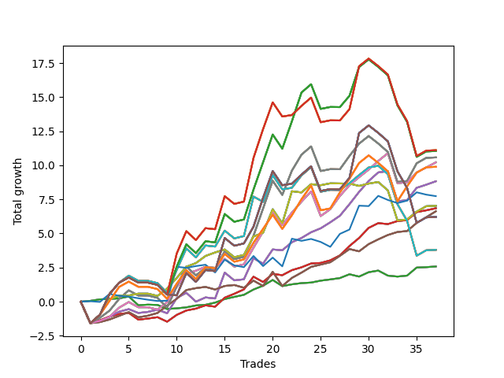

# Short Pointer 002 
- Symbol: SPY_Unlimited
- Date Range: 03/23/2022 - 07/08/2022
- Trading Period: 7:20-12:30
- Number of Trades: 37



| Name | Win Percent | Profit | Avg Profit / Trade | Avg Time / Trade |      | Name | Win Percent | Profit | Avg Profit / Trade | Avg Time / Trade |
| ---- | ----------- | ------ | ------------------ | ---------------- | ---- | ---- | ----------- | ------ | ------------------ | ---------------- |
| Sorted By <br> Profit | | | | | | Sorted By <br> Win Percentage ||||
| One Hundred Twenty-Eight | 56.76 | 5555.00 | 150.14 | 28:35 |     | Sixty-Five | 81.08 | 3425.00 | 92.57 | 07:22 |
| One Hundred Twenty-Three | 56.76 | 5555.00 | 150.14 | 28:35 |     | Fifty-Seven | 81.08 | 3425.00 | 92.57 | 07:22 |
| One Hundred Eighteen | 56.76 | 5555.00 | 150.14 | 28:35 |     | Forty-Nine | 81.08 | 3425.00 | 92.57 | 07:22 |
| One Hundred Thirteen | 56.76 | 5555.00 | 150.14 | 28:35 |     | Forty-One | 81.08 | 3425.00 | 92.57 | 07:22 |
| Eighty-Three | 56.76 | 5555.00 | 150.14 | 28:35 |     | One | 81.08 | 3425.00 | 92.57 | 07:22 |
| One Hundred Twenty-Seven | 56.76 | 5525.00 | 149.32 | 26:39 |     | Sixty-Seven | 81.08 | 3315.00 | 89.59 | 10:44 |
| One Hundred Twenty-Two | 56.76 | 5525.00 | 149.32 | 26:39 |     | Fifty-Nine | 81.08 | 3315.00 | 89.59 | 10:44 |
| One Hundred Seventeen | 56.76 | 5525.00 | 149.32 | 26:39 |     | Fifty-One | 81.08 | 3315.00 | 89.59 | 10:44 |
| One Hundred Twelve | 56.76 | 5525.00 | 149.32 | 26:39 |     | Forty-Three | 81.08 | 3315.00 | 89.59 | 10:44 |
| Eighty-Two | 56.76 | 5525.00 | 149.32 | 26:39 |     | Three | 81.08 | 3315.00 | 89.59 | 10:44 |
| Sixty-Nine | 62.16 | 5290.00 | 142.97 | 22:30 |     | Sixty-Four | 81.08 | 1290.00 | 34.86 | 03:22 |
| Sixty-One | 62.16 | 5290.00 | 142.97 | 22:30 |     | Fifty-Six | 81.08 | 1290.00 | 34.86 | 03:22 |
| Fifty-Three | 62.16 | 5290.00 | 142.97 | 22:30 |     | Forty-Eight | 81.08 | 1290.00 | 34.86 | 03:22 |
| Forty-Five | 62.16 | 5290.00 | 142.97 | 22:30 |     | Forty | 81.08 | 1290.00 | 34.86 | 03:22 |
| Five | 62.16 | 5290.00 | 142.97 | 22:30 |     | Zero | 81.08 | 1290.00 | 34.86 | 03:22 |
| Sixty-Eight | 75.68 | 5110.00 | 138.11 | 17:35 |     | Sixty-Eight | 75.68 | 5110.00 | 138.11 | 17:35 |
| Sixty | 75.68 | 5110.00 | 138.11 | 17:35 |     | Sixty | 75.68 | 5110.00 | 138.11 | 17:35 |
| Fifty-Two | 75.68 | 5110.00 | 138.11 | 17:35 |     | Fifty-Two | 75.68 | 5110.00 | 138.11 | 17:35 |
| Forty-Four | 75.68 | 5110.00 | 138.11 | 17:35 |     | Forty-Four | 75.68 | 5110.00 | 138.11 | 17:35 |
| Four | 75.68 | 5110.00 | 138.11 | 17:35 |     | Four | 75.68 | 5110.00 | 138.11 | 17:35 |
| One Hundred Twenty-Six | 64.86 | 4945.00 | 133.65 | 21:19 |     | Sixty-Six | 75.68 | 4415.00 | 119.32 | 14:26 |
| One Hundred Twenty-One | 64.86 | 4945.00 | 133.65 | 21:19 |     | Fifty-Eight | 75.68 | 4415.00 | 119.32 | 14:26 |
| One Hundred Sixteen | 64.86 | 4945.00 | 133.65 | 21:19 |     | Fifty | 75.68 | 4415.00 | 119.32 | 14:26 |
| One Hundred Eleven | 64.86 | 4945.00 | 133.65 | 21:19 |     | Forty-Two | 75.68 | 4415.00 | 119.32 | 14:26 |
| Eighty-One | 64.86 | 4945.00 | 133.65 | 21:19 |     | Two | 75.68 | 4415.00 | 119.32 | 14:26 |
| Sixty-Six | 75.68 | 4415.00 | 119.32 | 14:26 |     | Seventy | 67.57 | 3515.00 | 95.00 | 14:49 |
| Fifty-Eight | 75.68 | 4415.00 | 119.32 | 14:26 |     | Sixty-Two | 67.57 | 3515.00 | 95.00 | 14:49 |
| Fifty | 75.68 | 4415.00 | 119.32 | 14:26 |     | Fifty-Four | 67.57 | 3515.00 | 95.00 | 14:49 |
| Forty-Two | 75.68 | 4415.00 | 119.32 | 14:26 |     | Forty-Six | 67.57 | 3515.00 | 95.00 | 14:49 |
| Two | 75.68 | 4415.00 | 119.32 | 14:26 |     | Six | 67.57 | 3515.00 | 95.00 | 14:49 |
| Seventy-Three | 45.95 | 3870.00 | 104.59 | 06:06 |     | One Hundred Twenty-Six | 64.86 | 4945.00 | 133.65 | 21:19 |
| Seventy | 67.57 | 3515.00 | 95.00 | 14:49 |     | One Hundred Twenty-One | 64.86 | 4945.00 | 133.65 | 21:19 |
| Sixty-Two | 67.57 | 3515.00 | 95.00 | 14:49 |     | One Hundred Sixteen | 64.86 | 4945.00 | 133.65 | 21:19 |
| Fifty-Four | 67.57 | 3515.00 | 95.00 | 14:49 |     | One Hundred Eleven | 64.86 | 4945.00 | 133.65 | 21:19 |
| Forty-Six | 67.57 | 3515.00 | 95.00 | 14:49 |     | Eighty-One | 64.86 | 4945.00 | 133.65 | 21:19 |
| Six | 67.57 | 3515.00 | 95.00 | 14:49 |     | Sixty-Nine | 62.16 | 5290.00 | 142.97 | 22:30 |
| Sixty-Five | 81.08 | 3425.00 | 92.57 | 07:22 |     | Sixty-One | 62.16 | 5290.00 | 142.97 | 22:30 |
| Fifty-Seven | 81.08 | 3425.00 | 92.57 | 07:22 |     | Fifty-Three | 62.16 | 5290.00 | 142.97 | 22:30 |
| Forty-Nine | 81.08 | 3425.00 | 92.57 | 07:22 |     | Forty-Five | 62.16 | 5290.00 | 142.97 | 22:30 |
| Forty-One | 81.08 | 3425.00 | 92.57 | 07:22 |     | Five | 62.16 | 5290.00 | 142.97 | 22:30 |
| One | 81.08 | 3425.00 | 92.57 | 07:22 |     | One Hundred Twenty-Eight | 56.76 | 5555.00 | 150.14 | 28:35 |
| Sixty-Seven | 81.08 | 3315.00 | 89.59 | 10:44 |     | One Hundred Twenty-Three | 56.76 | 5555.00 | 150.14 | 28:35 |
| Fifty-Nine | 81.08 | 3315.00 | 89.59 | 10:44 |     | One Hundred Eighteen | 56.76 | 5555.00 | 150.14 | 28:35 |
| Fifty-One | 81.08 | 3315.00 | 89.59 | 10:44 |     | One Hundred Thirteen | 56.76 | 5555.00 | 150.14 | 28:35 |
| Forty-Three | 81.08 | 3315.00 | 89.59 | 10:44 |     | Eighty-Three | 56.76 | 5555.00 | 150.14 | 28:35 |
| Three | 81.08 | 3315.00 | 89.59 | 10:44 |     | One Hundred Twenty-Seven | 56.76 | 5525.00 | 149.32 | 26:39 |
| One Hundred Thirty | 54.05 | 3105.00 | 83.92 | 29:50 |     | One Hundred Twenty-Two | 56.76 | 5525.00 | 149.32 | 26:39 |
| One Hundred Twenty-Nine | 54.05 | 3105.00 | 83.92 | 29:50 |     | One Hundred Seventeen | 56.76 | 5525.00 | 149.32 | 26:39 |
| One Hundred Twenty-Five | 54.05 | 3105.00 | 83.92 | 29:50 |     | One Hundred Twelve | 56.76 | 5525.00 | 149.32 | 26:39 |
| One Hundred Twenty-Four | 54.05 | 3105.00 | 83.92 | 29:50 |     | Eighty-Two | 56.76 | 5525.00 | 149.32 | 26:39 |
| One Hundred Twenty | 54.05 | 3105.00 | 83.92 | 29:50 |     | Seventy-One | 56.76 | 1900.00 | 51.35 | 25:13 |
| One Hundred Ninteen | 54.05 | 3105.00 | 83.92 | 29:50 |     | Sixty-Three | 56.76 | 1900.00 | 51.35 | 25:13 |
| One Hundred Fifteen | 54.05 | 3105.00 | 83.92 | 29:50 |     | Fifty-Five | 56.76 | 1900.00 | 51.35 | 25:13 |
| One Hundred Fourteen | 54.05 | 3105.00 | 83.92 | 29:50 |     | Forty-Seven | 56.76 | 1900.00 | 51.35 | 25:13 |
| Eighty-Five | 54.05 | 3105.00 | 83.92 | 29:50 |     | Seven | 56.76 | 1900.00 | 51.35 | 25:13 |
| Eighty-Four | 54.05 | 3105.00 | 83.92 | 29:50 |     | One Hundred Thirty | 54.05 | 3105.00 | 83.92 | 29:50 |
| Seventy-One | 56.76 | 1900.00 | 51.35 | 25:13 |     | One Hundred Twenty-Nine | 54.05 | 3105.00 | 83.92 | 29:50 |
| Sixty-Three | 56.76 | 1900.00 | 51.35 | 25:13 |     | One Hundred Twenty-Five | 54.05 | 3105.00 | 83.92 | 29:50 |
| Fifty-Five | 56.76 | 1900.00 | 51.35 | 25:13 |     | One Hundred Twenty-Four | 54.05 | 3105.00 | 83.92 | 29:50 |
| Forty-Seven | 56.76 | 1900.00 | 51.35 | 25:13 |     | One Hundred Twenty | 54.05 | 3105.00 | 83.92 | 29:50 |
| Seven | 56.76 | 1900.00 | 51.35 | 25:13 |     | One Hundred Ninteen | 54.05 | 3105.00 | 83.92 | 29:50 |
| Sixty-Four | 81.08 | 1290.00 | 34.86 | 03:22 |     | One Hundred Fifteen | 54.05 | 3105.00 | 83.92 | 29:50 |
| Fifty-Six | 81.08 | 1290.00 | 34.86 | 03:22 |     | One Hundred Fourteen | 54.05 | 3105.00 | 83.92 | 29:50 |
| Forty-Eight | 81.08 | 1290.00 | 34.86 | 03:22 |     | Eighty-Five | 54.05 | 3105.00 | 83.92 | 29:50 |
| Forty | 81.08 | 1290.00 | 34.86 | 03:22 |     | Eighty-Four | 54.05 | 3105.00 | 83.92 | 29:50 |
| Zero | 81.08 | 1290.00 | 34.86 | 03:22 |     | Seventy-Three | 45.95 | 3870.00 | 104.59 | 06:06 |

## NO STOPLOSS

### Test Zero
* Sell when price hits the middle line of the 20p bollinger
* No Stoploss
* Results:
```
Total Trades: 37
Percent Up: 18.92
Percent Down: 81.08
Total Points Moved Down: 2.58
Potential Profit: 1290.00
Total Points Ups: 2.02 Count Ups: 7
Total Points Downs: 4.60 Count Downs: 30
```

<details><summary>Trades</summary>

<code>In: 2022-03-24 08:09:00		Out: 2022-03-24 08:09:10		Total Position Time: 00:10		Total Move Down: 0.06		Total to Date: 0.06</code> <br />
<code>In: 2022-03-25 11:34:00		Out: 2022-03-25 11:35:15		Total Position Time: 01:15		Total Move Down: 0.11		Total to Date: 0.17</code> <br />
<code>In: 2022-03-25 11:57:00		Out: 2022-03-25 11:57:15		Total Position Time: 00:15		Total Move Down: 0.03		Total to Date: 0.20</code> <br />
<code>In: 2022-03-29 08:53:00		Out: 2022-03-29 08:56:20		Total Position Time: 03:20		Total Move Down: 0.04		Total to Date: 0.24</code> <br />
<code>In: 2022-03-30 09:46:00		Out: 2022-03-30 09:50:50		Total Position Time: 04:50		Total Move Down: 0.14		Total to Date: 0.38</code> <br />
<code>In: 2022-03-31 07:39:00		Out: 2022-03-31 08:03:05		Total Position Time: 24:05		Total Move Down: -0.64		Total to Date: -0.26</code> <br />
<code>In: 2022-04-04 11:50:00		Out: 2022-04-04 11:51:05		Total Position Time: 01:05		Total Move Down: 0.04		Total to Date: -0.22</code> <br />
<code>In: 2022-04-04 11:57:00		Out: 2022-04-04 11:59:45		Total Position Time: 02:45		Total Move Down: -0.02		Total to Date: -0.24</code> <br />
<code>In: 2022-04-06 10:36:00		Out: 2022-04-06 10:47:10		Total Position Time: 11:10		Total Move Down: -0.30		Total to Date: -0.54</code> <br />
<code>In: 2022-04-06 11:06:00		Out: 2022-04-06 11:06:10		Total Position Time: 00:10		Total Move Down: 0.05		Total to Date: -0.49</code> <br />
<code>In: 2022-04-20 07:58:00		Out: 2022-04-20 08:00:20		Total Position Time: 02:20		Total Move Down: 0.07		Total to Date: -0.42</code> <br />
<code>In: 2022-04-20 10:19:00		Out: 2022-04-20 10:19:10		Total Position Time: 00:10		Total Move Down: 0.14		Total to Date: -0.28</code> <br />
<code>In: 2022-04-20 10:50:00		Out: 2022-04-20 10:50:10		Total Position Time: 00:10		Total Move Down: 0.05		Total to Date: -0.23</code> <br />
<code>In: 2022-04-25 09:29:00		Out: 2022-04-25 09:31:05		Total Position Time: 02:05		Total Move Down: 0.16		Total to Date: -0.07</code> <br />
<code>In: 2022-04-26 10:02:00		Out: 2022-04-26 10:02:20		Total Position Time: 00:20		Total Move Down: 0.26		Total to Date: 0.19</code> <br />
<code>In: 2022-04-28 10:42:00		Out: 2022-04-28 10:42:10		Total Position Time: 00:10		Total Move Down: 0.16		Total to Date: 0.35</code> <br />
<code>In: 2022-05-04 09:43:00		Out: 2022-05-04 09:45:30		Total Position Time: 02:30		Total Move Down: 0.15		Total to Date: 0.50</code> <br />
<code>In: 2022-05-04 11:07:00		Out: 2022-05-04 11:07:10		Total Position Time: 00:10		Total Move Down: 0.39		Total to Date: 0.89</code> <br />
<code>In: 2022-05-09 12:04:00		Out: 2022-05-09 12:04:10		Total Position Time: 00:10		Total Move Down: 0.28		Total to Date: 1.17</code> <br />
<code>In: 2022-05-24 09:19:00		Out: 2022-05-24 09:21:35		Total Position Time: 02:35		Total Move Down: 0.42		Total to Date: 1.59</code> <br />
<code>In: 2022-05-24 10:48:00		Out: 2022-05-24 10:58:10		Total Position Time: 10:10		Total Move Down: -0.45		Total to Date: 1.14</code> <br />
<code>In: 2022-05-24 11:42:00		Out: 2022-05-24 11:42:10		Total Position Time: 00:10		Total Move Down: 0.13		Total to Date: 1.27</code> <br />
<code>In: 2022-05-25 10:40:00		Out: 2022-05-25 10:47:20		Total Position Time: 07:20		Total Move Down: 0.09		Total to Date: 1.36</code> <br />
<code>In: 2022-05-26 10:12:00		Out: 2022-05-26 10:12:10		Total Position Time: 00:10		Total Move Down: 0.04		Total to Date: 1.40</code> <br />
<code>In: 2022-06-01 11:08:00		Out: 2022-06-01 11:08:45		Total Position Time: 00:45		Total Move Down: 0.14		Total to Date: 1.54</code> <br />
<code>In: 2022-06-01 12:19:00		Out: 2022-06-01 12:25:25		Total Position Time: 06:25		Total Move Down: 0.09		Total to Date: 1.63</code> <br />
<code>In: 2022-06-07 11:38:00		Out: 2022-06-07 11:41:30		Total Position Time: 03:30		Total Move Down: 0.10		Total to Date: 1.73</code> <br />
<code>In: 2022-06-09 08:47:00		Out: 2022-06-09 08:48:20		Total Position Time: 01:20		Total Move Down: 0.28		Total to Date: 2.01</code> <br />
<code>In: 2022-06-15 11:02:00		Out: 2022-06-15 11:02:10		Total Position Time: 00:10		Total Move Down: -0.17		Total to Date: 1.84</code> <br />
<code>In: 2022-06-17 08:21:00		Out: 2022-06-17 08:23:05		Total Position Time: 02:05		Total Move Down: 0.32		Total to Date: 2.16</code> <br />
<code>In: 2022-06-29 10:13:00		Out: 2022-06-29 10:13:10		Total Position Time: 00:10		Total Move Down: 0.12		Total to Date: 2.28</code> <br />
<code>In: 2022-06-30 08:51:00		Out: 2022-06-30 09:03:05		Total Position Time: 12:05		Total Move Down: -0.37		Total to Date: 1.91</code> <br />
<code>In: 2022-07-05 11:07:00		Out: 2022-07-05 11:16:00		Total Position Time: 09:00		Total Move Down: -0.07		Total to Date: 1.84</code> <br />
<code>In: 2022-07-06 11:00:00		Out: 2022-07-06 11:00:10		Total Position Time: 00:10		Total Move Down: 0.07		Total to Date: 1.91</code> <br />
<code>In: 2022-07-06 11:11:00		Out: 2022-07-06 11:11:10		Total Position Time: 00:10		Total Move Down: 0.59		Total to Date: 2.50</code> <br />
<code>In: 2022-07-08 11:40:00		Out: 2022-07-08 11:49:15		Total Position Time: 09:15		Total Move Down: 0.03		Total to Date: 2.53</code> <br />
<code>In: 2022-07-08 11:47:00		Out: 2022-07-08 11:49:15		Total Position Time: 02:15		Total Move Down: 0.05		Total to Date: 2.58</code> <br />


</details>

### Test One
* Sell when the price hits the upper line of the 20p 1std bollinger
* No Stoploss
* Results:
```
Total Trades: 37
Percent Up: 18.92
Percent Down: 81.08
Total Points Moved Down: 6.85
Potential Profit: 3425.00
Total Points Ups: 3.07 Count Ups: 7
Total Points Downs: 9.92 Count Downs: 30
```

<details><summary>Trades</summary>

<code>In: 2022-03-24 08:09:00		Out: 2022-03-24 08:38:55		Total Position Time: 29:55		Total Move Down: -1.58		Total to Date: -1.58</code> <br />
<code>In: 2022-03-25 11:34:00		Out: 2022-03-25 11:40:55		Total Position Time: 06:55		Total Move Down: 0.21		Total to Date: -1.37</code> <br />
<code>In: 2022-03-25 11:57:00		Out: 2022-03-25 12:00:50		Total Position Time: 03:50		Total Move Down: 0.28		Total to Date: -1.09</code> <br />
<code>In: 2022-03-29 08:53:00		Out: 2022-03-29 08:58:45		Total Position Time: 05:45		Total Move Down: 0.18		Total to Date: -0.91</code> <br />
<code>In: 2022-03-30 09:46:00		Out: 2022-03-30 10:00:45		Total Position Time: 14:45		Total Move Down: 0.09		Total to Date: -0.82</code> <br />
<code>In: 2022-03-31 07:39:00		Out: 2022-03-31 08:08:00		Total Position Time: 29:00		Total Move Down: -0.50		Total to Date: -1.32</code> <br />
<code>In: 2022-04-04 11:50:00		Out: 2022-04-04 11:51:35		Total Position Time: 01:35		Total Move Down: 0.08		Total to Date: -1.24</code> <br />
<code>In: 2022-04-04 11:57:00		Out: 2022-04-04 12:02:55		Total Position Time: 05:55		Total Move Down: 0.10		Total to Date: -1.14</code> <br />
<code>In: 2022-04-06 10:36:00		Out: 2022-04-06 10:56:55		Total Position Time: 20:55		Total Move Down: -0.33		Total to Date: -1.47</code> <br />
<code>In: 2022-04-06 11:06:00		Out: 2022-04-06 11:07:20		Total Position Time: 01:20		Total Move Down: 0.50		Total to Date: -0.97</code> <br />
<code>In: 2022-04-20 07:58:00		Out: 2022-04-20 08:00:40		Total Position Time: 02:40		Total Move Down: 0.32		Total to Date: -0.65</code> <br />
<code>In: 2022-04-20 10:19:00		Out: 2022-04-20 10:19:10		Total Position Time: 00:10		Total Move Down: 0.14		Total to Date: -0.51</code> <br />
<code>In: 2022-04-20 10:50:00		Out: 2022-04-20 10:53:20		Total Position Time: 03:20		Total Move Down: 0.24		Total to Date: -0.27</code> <br />
<code>In: 2022-04-25 09:29:00		Out: 2022-04-25 09:42:35		Total Position Time: 13:35		Total Move Down: -0.10		Total to Date: -0.37</code> <br />
<code>In: 2022-04-26 10:02:00		Out: 2022-04-26 10:02:50		Total Position Time: 00:50		Total Move Down: 0.66		Total to Date: 0.29</code> <br />
<code>In: 2022-04-28 10:42:00		Out: 2022-04-28 10:44:10		Total Position Time: 02:10		Total Move Down: 0.29		Total to Date: 0.58</code> <br />
<code>In: 2022-05-04 09:43:00		Out: 2022-05-04 09:46:30		Total Position Time: 03:30		Total Move Down: 0.32		Total to Date: 0.90</code> <br />
<code>In: 2022-05-04 11:07:00		Out: 2022-05-04 11:07:20		Total Position Time: 00:20		Total Move Down: 0.93		Total to Date: 1.83</code> <br />
<code>In: 2022-05-09 12:04:00		Out: 2022-05-09 12:17:15		Total Position Time: 13:15		Total Move Down: -0.39		Total to Date: 1.44</code> <br />
<code>In: 2022-05-24 09:19:00		Out: 2022-05-24 09:28:55		Total Position Time: 09:55		Total Move Down: 0.60		Total to Date: 2.04</code> <br />
<code>In: 2022-05-24 10:48:00		Out: 2022-05-24 11:01:40		Total Position Time: 13:40		Total Move Down: -0.10		Total to Date: 1.94</code> <br />
<code>In: 2022-05-24 11:42:00		Out: 2022-05-24 11:43:15		Total Position Time: 01:15		Total Move Down: 0.37		Total to Date: 2.31</code> <br />
<code>In: 2022-05-25 10:40:00		Out: 2022-05-25 10:51:35		Total Position Time: 11:35		Total Move Down: 0.21		Total to Date: 2.52</code> <br />
<code>In: 2022-05-26 10:12:00		Out: 2022-05-26 10:12:45		Total Position Time: 00:45		Total Move Down: 0.28		Total to Date: 2.80</code> <br />
<code>In: 2022-06-01 11:08:00		Out: 2022-06-01 11:18:10		Total Position Time: 10:10		Total Move Down: 0.04		Total to Date: 2.84</code> <br />
<code>In: 2022-06-01 12:19:00		Out: 2022-06-01 12:25:45		Total Position Time: 06:45		Total Move Down: 0.19		Total to Date: 3.03</code> <br />
<code>In: 2022-06-07 11:38:00		Out: 2022-06-07 11:43:00		Total Position Time: 05:00		Total Move Down: 0.36		Total to Date: 3.39</code> <br />
<code>In: 2022-06-09 08:47:00		Out: 2022-06-09 08:49:35		Total Position Time: 02:35		Total Move Down: 0.69		Total to Date: 4.08</code> <br />
<code>In: 2022-06-15 11:02:00		Out: 2022-06-15 11:03:05		Total Position Time: 01:05		Total Move Down: 0.59		Total to Date: 4.67</code> <br />
<code>In: 2022-06-17 08:21:00		Out: 2022-06-17 08:25:20		Total Position Time: 04:20		Total Move Down: 0.74		Total to Date: 5.41</code> <br />
<code>In: 2022-06-29 10:13:00		Out: 2022-06-29 10:14:00		Total Position Time: 01:00		Total Move Down: 0.35		Total to Date: 5.76</code> <br />
<code>In: 2022-06-30 08:51:00		Out: 2022-06-30 09:05:45		Total Position Time: 14:45		Total Move Down: -0.07		Total to Date: 5.69</code> <br />
<code>In: 2022-07-05 11:07:00		Out: 2022-07-05 11:16:35		Total Position Time: 09:35		Total Move Down: 0.22		Total to Date: 5.91</code> <br />
<code>In: 2022-07-06 11:00:00		Out: 2022-07-06 11:00:10		Total Position Time: 00:10		Total Move Down: 0.07		Total to Date: 5.98</code> <br />
<code>In: 2022-07-06 11:11:00		Out: 2022-07-06 11:11:10		Total Position Time: 00:10		Total Move Down: 0.59		Total to Date: 6.57</code> <br />
<code>In: 2022-07-08 11:40:00		Out: 2022-07-08 11:53:40		Total Position Time: 13:40		Total Move Down: 0.13		Total to Date: 6.70</code> <br />
<code>In: 2022-07-08 11:47:00		Out: 2022-07-08 11:53:40		Total Position Time: 06:40		Total Move Down: 0.15		Total to Date: 6.85</code> <br />


</details>

### Test Two
* Sell when the price hits the upper line of the 20p 2std bollinger
* No Stoploss
* Results:
```
Total Trades: 37
Percent Up: 24.32
Percent Down: 75.68
Total Points Moved Down: 8.83
Potential Profit: 4415.00
Total Points Ups: 6.07 Count Ups: 9
Total Points Downs: 14.90 Count Downs: 28
```

<details><summary>Trades</summary>

<code>In: 2022-03-24 08:09:00		Out: 2022-03-24 08:38:55		Total Position Time: 29:55		Total Move Down: -1.58		Total to Date: -1.58</code> <br />
<code>In: 2022-03-25 11:34:00		Out: 2022-03-25 12:00:55		Total Position Time: 26:55		Total Move Down: 0.17		Total to Date: -1.41</code> <br />
<code>In: 2022-03-25 11:57:00		Out: 2022-03-25 12:00:55		Total Position Time: 03:55		Total Move Down: 0.29		Total to Date: -1.12</code> <br />
<code>In: 2022-03-29 08:53:00		Out: 2022-03-29 09:01:40		Total Position Time: 08:40		Total Move Down: 0.38		Total to Date: -0.74</code> <br />
<code>In: 2022-03-30 09:46:00		Out: 2022-03-30 10:01:15		Total Position Time: 15:15		Total Move Down: 0.19		Total to Date: -0.55</code> <br />
<code>In: 2022-03-31 07:39:00		Out: 2022-03-31 08:08:30		Total Position Time: 29:30		Total Move Down: -0.28		Total to Date: -0.83</code> <br />
<code>In: 2022-04-04 11:50:00		Out: 2022-04-04 12:03:40		Total Position Time: 13:40		Total Move Down: 0.08		Total to Date: -0.75</code> <br />
<code>In: 2022-04-04 11:57:00		Out: 2022-04-04 12:03:40		Total Position Time: 06:40		Total Move Down: 0.16		Total to Date: -0.59</code> <br />
<code>In: 2022-04-06 10:36:00		Out: 2022-04-06 10:57:20		Total Position Time: 21:20		Total Move Down: -0.26		Total to Date: -0.85</code> <br />
<code>In: 2022-04-06 11:06:00		Out: 2022-04-06 11:08:10		Total Position Time: 02:10		Total Move Down: 1.11		Total to Date: 0.26</code> <br />
<code>In: 2022-04-20 07:58:00		Out: 2022-04-20 08:00:45		Total Position Time: 02:45		Total Move Down: 0.39		Total to Date: 0.65</code> <br />
<code>In: 2022-04-20 10:19:00		Out: 2022-04-20 10:48:55		Total Position Time: 29:55		Total Move Down: -0.65		Total to Date: -0.00</code> <br />
<code>In: 2022-04-20 10:50:00		Out: 2022-04-20 11:13:55		Total Position Time: 23:55		Total Move Down: 0.31		Total to Date: 0.31</code> <br />
<code>In: 2022-04-25 09:29:00		Out: 2022-04-25 09:58:55		Total Position Time: 29:55		Total Move Down: -0.08		Total to Date: 0.23</code> <br />
<code>In: 2022-04-26 10:02:00		Out: 2022-04-26 10:21:25		Total Position Time: 19:25		Total Move Down: 1.90		Total to Date: 2.13</code> <br />
<code>In: 2022-04-28 10:42:00		Out: 2022-04-28 11:11:55		Total Position Time: 29:55		Total Move Down: -0.57		Total to Date: 1.56</code> <br />
<code>In: 2022-05-04 09:43:00		Out: 2022-05-04 10:11:15		Total Position Time: 28:15		Total Move Down: 0.08		Total to Date: 1.64</code> <br />
<code>In: 2022-05-04 11:07:00		Out: 2022-05-04 11:07:40		Total Position Time: 00:40		Total Move Down: 1.54		Total to Date: 3.18</code> <br />
<code>In: 2022-05-09 12:04:00		Out: 2022-05-09 12:17:15		Total Position Time: 13:15		Total Move Down: -0.39		Total to Date: 2.79</code> <br />
<code>In: 2022-05-24 09:19:00		Out: 2022-05-24 09:31:20		Total Position Time: 12:20		Total Move Down: 1.04		Total to Date: 3.83</code> <br />
<code>In: 2022-05-24 10:48:00		Out: 2022-05-24 11:02:00		Total Position Time: 14:00		Total Move Down: -0.06		Total to Date: 3.77</code> <br />
<code>In: 2022-05-24 11:42:00		Out: 2022-05-24 11:43:50		Total Position Time: 01:50		Total Move Down: 0.59		Total to Date: 4.36</code> <br />
<code>In: 2022-05-25 10:40:00		Out: 2022-05-25 10:52:10		Total Position Time: 12:10		Total Move Down: 0.31		Total to Date: 4.67</code> <br />
<code>In: 2022-05-26 10:12:00		Out: 2022-05-26 10:22:35		Total Position Time: 10:35		Total Move Down: 0.42		Total to Date: 5.09</code> <br />
<code>In: 2022-06-01 11:08:00		Out: 2022-06-01 11:19:20		Total Position Time: 11:20		Total Move Down: 0.29		Total to Date: 5.38</code> <br />
<code>In: 2022-06-01 12:19:00		Out: 2022-06-01 12:30:05		Total Position Time: 11:05		Total Move Down: 0.44		Total to Date: 5.82</code> <br />
<code>In: 2022-06-07 11:38:00		Out: 2022-06-07 11:43:25		Total Position Time: 05:25		Total Move Down: 0.48		Total to Date: 6.30</code> <br />
<code>In: 2022-06-09 08:47:00		Out: 2022-06-09 09:11:00		Total Position Time: 24:00		Total Move Down: 0.85		Total to Date: 7.15</code> <br />
<code>In: 2022-06-15 11:02:00		Out: 2022-06-15 11:03:15		Total Position Time: 01:15		Total Move Down: 0.90		Total to Date: 8.05</code> <br />
<code>In: 2022-06-17 08:21:00		Out: 2022-06-17 08:45:15		Total Position Time: 24:15		Total Move Down: 0.80		Total to Date: 8.85</code> <br />
<code>In: 2022-06-29 10:13:00		Out: 2022-06-29 10:16:00		Total Position Time: 03:00		Total Move Down: 0.63		Total to Date: 9.48</code> <br />
<code>In: 2022-06-30 08:51:00		Out: 2022-06-30 09:06:10		Total Position Time: 15:10		Total Move Down: 0.09		Total to Date: 9.57</code> <br />
<code>In: 2022-07-05 11:07:00		Out: 2022-07-05 11:36:55		Total Position Time: 29:55		Total Move Down: -2.20		Total to Date: 7.37</code> <br />
<code>In: 2022-07-06 11:00:00		Out: 2022-07-06 11:00:10		Total Position Time: 00:10		Total Move Down: 0.07		Total to Date: 7.44</code> <br />
<code>In: 2022-07-06 11:11:00		Out: 2022-07-06 11:11:45		Total Position Time: 00:45		Total Move Down: 0.91		Total to Date: 8.35</code> <br />
<code>In: 2022-07-08 11:40:00		Out: 2022-07-08 11:54:00		Total Position Time: 14:00		Total Move Down: 0.23		Total to Date: 8.58</code> <br />
<code>In: 2022-07-08 11:47:00		Out: 2022-07-08 11:54:00		Total Position Time: 07:00		Total Move Down: 0.25		Total to Date: 8.83</code> <br />


</details>

### Test Three
* Sell when price hits the middle line of the 50p bollinger
* No Stoploss
* Results:
```
Total Trades: 37
Percent Up: 18.92
Percent Down: 81.08
Total Points Moved Down: 6.63
Potential Profit: 3315.00
Total Points Ups: 3.95 Count Ups: 7
Total Points Downs: 10.58 Count Downs: 30
```

<details><summary>Trades</summary>

<code>In: 2022-03-24 08:09:00		Out: 2022-03-24 08:38:55		Total Position Time: 29:55		Total Move Down: -1.58		Total to Date: -1.58</code> <br />
<code>In: 2022-03-25 11:34:00		Out: 2022-03-25 11:49:30		Total Position Time: 15:30		Total Move Down: 0.08		Total to Date: -1.50</code> <br />
<code>In: 2022-03-25 11:57:00		Out: 2022-03-25 12:00:45		Total Position Time: 03:45		Total Move Down: 0.19		Total to Date: -1.31</code> <br />
<code>In: 2022-03-29 08:53:00		Out: 2022-03-29 09:01:25		Total Position Time: 08:25		Total Move Down: 0.27		Total to Date: -1.04</code> <br />
<code>In: 2022-03-30 09:46:00		Out: 2022-03-30 10:01:45		Total Position Time: 15:45		Total Move Down: 0.27		Total to Date: -0.77</code> <br />
<code>In: 2022-03-31 07:39:00		Out: 2022-03-31 08:08:55		Total Position Time: 29:55		Total Move Down: -0.38		Total to Date: -1.15</code> <br />
<code>In: 2022-04-04 11:50:00		Out: 2022-04-04 12:03:50		Total Position Time: 13:50		Total Move Down: 0.12		Total to Date: -1.03</code> <br />
<code>In: 2022-04-04 11:57:00		Out: 2022-04-04 12:03:50		Total Position Time: 06:50		Total Move Down: 0.20		Total to Date: -0.83</code> <br />
<code>In: 2022-04-06 10:36:00		Out: 2022-04-06 11:00:10		Total Position Time: 24:10		Total Move Down: 0.54		Total to Date: -0.29</code> <br />
<code>In: 2022-04-06 11:06:00		Out: 2022-04-06 11:07:20		Total Position Time: 01:20		Total Move Down: 0.50		Total to Date: 0.21</code> <br />
<code>In: 2022-04-20 07:58:00		Out: 2022-04-20 08:02:45		Total Position Time: 04:45		Total Move Down: 0.64		Total to Date: 0.85</code> <br />
<code>In: 2022-04-20 10:19:00		Out: 2022-04-20 10:19:10		Total Position Time: 00:10		Total Move Down: 0.14		Total to Date: 0.99</code> <br />
<code>In: 2022-04-20 10:50:00		Out: 2022-04-20 10:50:20		Total Position Time: 00:20		Total Move Down: 0.09		Total to Date: 1.08</code> <br />
<code>In: 2022-04-25 09:29:00		Out: 2022-04-25 09:55:05		Total Position Time: 26:05		Total Move Down: -0.19		Total to Date: 0.89</code> <br />
<code>In: 2022-04-26 10:02:00		Out: 2022-04-26 10:02:15		Total Position Time: 00:15		Total Move Down: 0.26		Total to Date: 1.15</code> <br />
<code>In: 2022-04-28 10:42:00		Out: 2022-04-28 10:52:25		Total Position Time: 10:25		Total Move Down: 0.07		Total to Date: 1.22</code> <br />
<code>In: 2022-05-04 09:43:00		Out: 2022-05-04 10:10:20		Total Position Time: 27:20		Total Move Down: -0.20		Total to Date: 1.02</code> <br />
<code>In: 2022-05-04 11:07:00		Out: 2022-05-04 11:07:15		Total Position Time: 00:15		Total Move Down: 0.52		Total to Date: 1.54</code> <br />
<code>In: 2022-05-09 12:04:00		Out: 2022-05-09 12:17:15		Total Position Time: 13:15		Total Move Down: -0.39		Total to Date: 1.15</code> <br />
<code>In: 2022-05-24 09:19:00		Out: 2022-05-24 09:31:20		Total Position Time: 12:20		Total Move Down: 1.04		Total to Date: 2.19</code> <br />
<code>In: 2022-05-24 10:48:00		Out: 2022-05-24 11:17:55		Total Position Time: 29:55		Total Move Down: -1.04		Total to Date: 1.15</code> <br />
<code>In: 2022-05-24 11:42:00		Out: 2022-05-24 11:43:25		Total Position Time: 01:25		Total Move Down: 0.59		Total to Date: 1.74</code> <br />
<code>In: 2022-05-25 10:40:00		Out: 2022-05-25 10:53:30		Total Position Time: 13:30		Total Move Down: 0.39		Total to Date: 2.13</code> <br />
<code>In: 2022-05-26 10:12:00		Out: 2022-05-26 10:22:35		Total Position Time: 10:35		Total Move Down: 0.42		Total to Date: 2.55</code> <br />
<code>In: 2022-06-01 11:08:00		Out: 2022-06-01 11:18:40		Total Position Time: 10:40		Total Move Down: 0.17		Total to Date: 2.72</code> <br />
<code>In: 2022-06-01 12:19:00		Out: 2022-06-01 12:25:30		Total Position Time: 06:30		Total Move Down: 0.17		Total to Date: 2.89</code> <br />
<code>In: 2022-06-07 11:38:00		Out: 2022-06-07 11:43:35		Total Position Time: 05:35		Total Move Down: 0.47		Total to Date: 3.36</code> <br />
<code>In: 2022-06-09 08:47:00		Out: 2022-06-09 08:48:50		Total Position Time: 01:50		Total Move Down: 0.50		Total to Date: 3.86</code> <br />
<code>In: 2022-06-15 11:02:00		Out: 2022-06-15 11:02:10		Total Position Time: 00:10		Total Move Down: -0.17		Total to Date: 3.69</code> <br />
<code>In: 2022-06-17 08:21:00		Out: 2022-06-17 08:45:00		Total Position Time: 24:00		Total Move Down: 0.53		Total to Date: 4.22</code> <br />
<code>In: 2022-06-29 10:13:00		Out: 2022-06-29 10:14:00		Total Position Time: 01:00		Total Move Down: 0.35		Total to Date: 4.57</code> <br />
<code>In: 2022-06-30 08:51:00		Out: 2022-06-30 09:06:20		Total Position Time: 15:20		Total Move Down: 0.32		Total to Date: 4.89</code> <br />
<code>In: 2022-07-05 11:07:00		Out: 2022-07-05 11:16:35		Total Position Time: 09:35		Total Move Down: 0.22		Total to Date: 5.11</code> <br />
<code>In: 2022-07-06 11:00:00		Out: 2022-07-06 11:00:10		Total Position Time: 00:10		Total Move Down: 0.07		Total to Date: 5.18</code> <br />
<code>In: 2022-07-06 11:11:00		Out: 2022-07-06 11:11:10		Total Position Time: 00:10		Total Move Down: 0.59		Total to Date: 5.77</code> <br />
<code>In: 2022-07-08 11:40:00		Out: 2022-07-08 11:54:50		Total Position Time: 14:50		Total Move Down: 0.42		Total to Date: 6.19</code> <br />
<code>In: 2022-07-08 11:47:00		Out: 2022-07-08 11:54:50		Total Position Time: 07:50		Total Move Down: 0.44		Total to Date: 6.63</code> <br />


</details>

### Test Four
* Sell when the price hits the upper line of the 50p 1std bollinger
* No Stoploss
* Results:
```
Total Trades: 37
Percent Up: 24.32
Percent Down: 75.68
Total Points Moved Down: 10.22
Potential Profit: 5110.00
Total Points Ups: 7.83 Count Ups: 9
Total Points Downs: 18.05 Count Downs: 28
```

<details><summary>Trades</summary>

<code>In: 2022-03-24 08:09:00		Out: 2022-03-24 08:38:55		Total Position Time: 29:55		Total Move Down: -1.58		Total to Date: -1.58</code> <br />
<code>In: 2022-03-25 11:34:00		Out: 2022-03-25 12:00:55		Total Position Time: 26:55		Total Move Down: 0.17		Total to Date: -1.41</code> <br />
<code>In: 2022-03-25 11:57:00		Out: 2022-03-25 12:00:55		Total Position Time: 03:55		Total Move Down: 0.29		Total to Date: -1.12</code> <br />
<code>In: 2022-03-29 08:53:00		Out: 2022-03-29 09:02:15		Total Position Time: 09:15		Total Move Down: 0.68		Total to Date: -0.44</code> <br />
<code>In: 2022-03-30 09:46:00		Out: 2022-03-30 10:06:35		Total Position Time: 20:35		Total Move Down: 0.41		Total to Date: -0.03</code> <br />
<code>In: 2022-03-31 07:39:00		Out: 2022-03-31 08:08:55		Total Position Time: 29:55		Total Move Down: -0.38		Total to Date: -0.41</code> <br />
<code>In: 2022-04-04 11:50:00		Out: 2022-04-04 12:19:55		Total Position Time: 29:55		Total Move Down: -0.00		Total to Date: -0.41</code> <br />
<code>In: 2022-04-04 11:57:00		Out: 2022-04-04 12:26:55		Total Position Time: 29:55		Total Move Down: -0.17		Total to Date: -0.58</code> <br />
<code>In: 2022-04-06 10:36:00		Out: 2022-04-06 11:00:10		Total Position Time: 24:10		Total Move Down: 0.54		Total to Date: -0.04</code> <br />
<code>In: 2022-04-06 11:06:00		Out: 2022-04-06 11:08:10		Total Position Time: 02:10		Total Move Down: 1.11		Total to Date: 1.07</code> <br />
<code>In: 2022-04-20 07:58:00		Out: 2022-04-20 08:10:20		Total Position Time: 12:20		Total Move Down: 0.97		Total to Date: 2.04</code> <br />
<code>In: 2022-04-20 10:19:00		Out: 2022-04-20 10:33:00		Total Position Time: 14:00		Total Move Down: 0.23		Total to Date: 2.27</code> <br />
<code>In: 2022-04-20 10:50:00		Out: 2022-04-20 11:14:00		Total Position Time: 24:00		Total Move Down: 0.29		Total to Date: 2.56</code> <br />
<code>In: 2022-04-25 09:29:00		Out: 2022-04-25 09:58:55		Total Position Time: 29:55		Total Move Down: -0.08		Total to Date: 2.48</code> <br />
<code>In: 2022-04-26 10:02:00		Out: 2022-04-26 10:02:50		Total Position Time: 00:50		Total Move Down: 0.66		Total to Date: 3.14</code> <br />
<code>In: 2022-04-28 10:42:00		Out: 2022-04-28 11:11:55		Total Position Time: 29:55		Total Move Down: -0.57		Total to Date: 2.57</code> <br />
<code>In: 2022-05-04 09:43:00		Out: 2022-05-04 10:12:55		Total Position Time: 29:55		Total Move Down: 0.17		Total to Date: 2.74</code> <br />
<code>In: 2022-05-04 11:07:00		Out: 2022-05-04 11:07:25		Total Position Time: 00:25		Total Move Down: 1.22		Total to Date: 3.96</code> <br />
<code>In: 2022-05-09 12:04:00		Out: 2022-05-09 12:23:25		Total Position Time: 19:25		Total Move Down: 1.18		Total to Date: 5.14</code> <br />
<code>In: 2022-05-24 09:19:00		Out: 2022-05-24 09:33:15		Total Position Time: 14:15		Total Move Down: 1.51		Total to Date: 6.65</code> <br />
<code>In: 2022-05-24 10:48:00		Out: 2022-05-24 11:17:55		Total Position Time: 29:55		Total Move Down: -1.04		Total to Date: 5.61</code> <br />
<code>In: 2022-05-24 11:42:00		Out: 2022-05-24 11:44:15		Total Position Time: 02:15		Total Move Down: 0.92		Total to Date: 6.53</code> <br />
<code>In: 2022-05-25 10:40:00		Out: 2022-05-25 11:06:40		Total Position Time: 26:40		Total Move Down: 0.80		Total to Date: 7.33</code> <br />
<code>In: 2022-05-26 10:12:00		Out: 2022-05-26 10:23:45		Total Position Time: 11:45		Total Move Down: 0.76		Total to Date: 8.09</code> <br />
<code>In: 2022-06-01 11:08:00		Out: 2022-06-01 11:37:55		Total Position Time: 29:55		Total Move Down: -1.81		Total to Date: 6.28</code> <br />
<code>In: 2022-06-01 12:19:00		Out: 2022-06-01 12:35:05		Total Position Time: 16:05		Total Move Down: 0.50		Total to Date: 6.78</code> <br />
<code>In: 2022-06-07 11:38:00		Out: 2022-06-07 11:47:25		Total Position Time: 09:25		Total Move Down: 0.97		Total to Date: 7.75</code> <br />
<code>In: 2022-06-09 08:47:00		Out: 2022-06-09 08:50:25		Total Position Time: 03:25		Total Move Down: 0.79		Total to Date: 8.54</code> <br />
<code>In: 2022-06-15 11:02:00		Out: 2022-06-15 11:03:05		Total Position Time: 01:05		Total Move Down: 0.59		Total to Date: 9.13</code> <br />
<code>In: 2022-06-17 08:21:00		Out: 2022-06-17 08:50:55		Total Position Time: 29:55		Total Move Down: 0.56		Total to Date: 9.69</code> <br />
<code>In: 2022-06-29 10:13:00		Out: 2022-06-29 10:16:00		Total Position Time: 03:00		Total Move Down: 0.63		Total to Date: 10.32</code> <br />
<code>In: 2022-06-30 08:51:00		Out: 2022-06-30 09:13:40		Total Position Time: 22:40		Total Move Down: 0.57		Total to Date: 10.89</code> <br />
<code>In: 2022-07-05 11:07:00		Out: 2022-07-05 11:36:55		Total Position Time: 29:55		Total Move Down: -2.20		Total to Date: 8.69</code> <br />
<code>In: 2022-07-06 11:00:00		Out: 2022-07-06 11:00:10		Total Position Time: 00:10		Total Move Down: 0.07		Total to Date: 8.76</code> <br />
<code>In: 2022-07-06 11:11:00		Out: 2022-07-06 11:11:35		Total Position Time: 00:35		Total Move Down: 0.72		Total to Date: 9.48</code> <br />
<code>In: 2022-07-08 11:40:00		Out: 2022-07-08 12:09:40		Total Position Time: 29:40		Total Move Down: 0.36		Total to Date: 9.84</code> <br />
<code>In: 2022-07-08 11:47:00		Out: 2022-07-08 12:09:40		Total Position Time: 22:40		Total Move Down: 0.38		Total to Date: 10.22</code> <br />


</details>

### Test Five
* Sell when the price hits the upper line of the 50p 2std bollinger
* No Stoploss
* Results:
```
Total Trades: 37
Percent Up: 37.84
Percent Down: 62.16
Total Points Moved Down: 10.58
Potential Profit: 5290.00
Total Points Ups: 10.37 Count Ups: 14
Total Points Downs: 20.95 Count Downs: 23
```

<details><summary>Trades</summary>

<code>In: 2022-03-24 08:09:00		Out: 2022-03-24 08:38:55		Total Position Time: 29:55		Total Move Down: -1.58		Total to Date: -1.58</code> <br />
<code>In: 2022-03-25 11:34:00		Out: 2022-03-25 12:01:55		Total Position Time: 27:55		Total Move Down: 0.40		Total to Date: -1.18</code> <br />
<code>In: 2022-03-25 11:57:00		Out: 2022-03-25 12:01:55		Total Position Time: 04:55		Total Move Down: 0.52		Total to Date: -0.66</code> <br />
<code>In: 2022-03-29 08:53:00		Out: 2022-03-29 09:10:50		Total Position Time: 17:50		Total Move Down: 0.86		Total to Date: 0.20</code> <br />
<code>In: 2022-03-30 09:46:00		Out: 2022-03-30 10:07:20		Total Position Time: 21:20		Total Move Down: 0.63		Total to Date: 0.83</code> <br />
<code>In: 2022-03-31 07:39:00		Out: 2022-03-31 08:08:55		Total Position Time: 29:55		Total Move Down: -0.38		Total to Date: 0.45</code> <br />
<code>In: 2022-04-04 11:50:00		Out: 2022-04-04 12:19:55		Total Position Time: 29:55		Total Move Down: -0.00		Total to Date: 0.45</code> <br />
<code>In: 2022-04-04 11:57:00		Out: 2022-04-04 12:26:55		Total Position Time: 29:55		Total Move Down: -0.17		Total to Date: 0.28</code> <br />
<code>In: 2022-04-06 10:36:00		Out: 2022-04-06 11:05:55		Total Position Time: 29:55		Total Move Down: -0.71		Total to Date: -0.43</code> <br />
<code>In: 2022-04-06 11:06:00		Out: 2022-04-06 11:09:35		Total Position Time: 03:35		Total Move Down: 1.55		Total to Date: 1.12</code> <br />
<code>In: 2022-04-20 07:58:00		Out: 2022-04-20 08:16:20		Total Position Time: 18:20		Total Move Down: 1.46		Total to Date: 2.58</code> <br />
<code>In: 2022-04-20 10:19:00		Out: 2022-04-20 10:48:55		Total Position Time: 29:55		Total Move Down: -0.65		Total to Date: 1.93</code> <br />
<code>In: 2022-04-20 10:50:00		Out: 2022-04-20 11:17:40		Total Position Time: 27:40		Total Move Down: 0.54		Total to Date: 2.47</code> <br />
<code>In: 2022-04-25 09:29:00		Out: 2022-04-25 09:58:55		Total Position Time: 29:55		Total Move Down: -0.08		Total to Date: 2.39</code> <br />
<code>In: 2022-04-26 10:02:00		Out: 2022-04-26 10:14:35		Total Position Time: 12:35		Total Move Down: 1.30		Total to Date: 3.69</code> <br />
<code>In: 2022-04-28 10:42:00		Out: 2022-04-28 11:11:55		Total Position Time: 29:55		Total Move Down: -0.57		Total to Date: 3.12</code> <br />
<code>In: 2022-05-04 09:43:00		Out: 2022-05-04 10:12:55		Total Position Time: 29:55		Total Move Down: 0.17		Total to Date: 3.29</code> <br />
<code>In: 2022-05-04 11:07:00		Out: 2022-05-04 11:07:40		Total Position Time: 00:40		Total Move Down: 1.54		Total to Date: 4.83</code> <br />
<code>In: 2022-05-09 12:04:00		Out: 2022-05-09 12:28:05		Total Position Time: 24:05		Total Move Down: 2.01		Total to Date: 6.84</code> <br />
<code>In: 2022-05-24 09:19:00		Out: 2022-05-24 09:36:50		Total Position Time: 17:50		Total Move Down: 2.03		Total to Date: 8.87</code> <br />
<code>In: 2022-05-24 10:48:00		Out: 2022-05-24 11:17:55		Total Position Time: 29:55		Total Move Down: -1.04		Total to Date: 7.83</code> <br />
<code>In: 2022-05-24 11:42:00		Out: 2022-05-24 11:49:15		Total Position Time: 07:15		Total Move Down: 1.78		Total to Date: 9.61</code> <br />
<code>In: 2022-05-25 10:40:00		Out: 2022-05-25 11:06:50		Total Position Time: 26:50		Total Move Down: 1.17		Total to Date: 10.78</code> <br />
<code>In: 2022-05-26 10:12:00		Out: 2022-05-26 10:41:55		Total Position Time: 29:55		Total Move Down: 0.61		Total to Date: 11.39</code> <br />
<code>In: 2022-06-01 11:08:00		Out: 2022-06-01 11:37:55		Total Position Time: 29:55		Total Move Down: -1.81		Total to Date: 9.58</code> <br />
<code>In: 2022-06-01 12:19:00		Out: 2022-06-01 12:46:00		Total Position Time: 27:00		Total Move Down: 0.14		Total to Date: 9.72</code> <br />
<code>In: 2022-06-07 11:38:00		Out: 2022-06-07 12:07:55		Total Position Time: 29:55		Total Move Down: -0.01		Total to Date: 9.71</code> <br />
<code>In: 2022-06-09 08:47:00		Out: 2022-06-09 09:11:10		Total Position Time: 24:10		Total Move Down: 0.98		Total to Date: 10.69</code> <br />
<code>In: 2022-06-15 11:02:00		Out: 2022-06-15 11:03:15		Total Position Time: 01:15		Total Move Down: 0.90		Total to Date: 11.59</code> <br />
<code>In: 2022-06-17 08:21:00		Out: 2022-06-17 08:50:55		Total Position Time: 29:55		Total Move Down: 0.56		Total to Date: 12.15</code> <br />
<code>In: 2022-06-29 10:13:00		Out: 2022-06-29 10:42:55		Total Position Time: 29:55		Total Move Down: -0.55		Total to Date: 11.60</code> <br />
<code>In: 2022-06-30 08:51:00		Out: 2022-06-30 09:20:55		Total Position Time: 29:55		Total Move Down: -0.62		Total to Date: 10.98</code> <br />
<code>In: 2022-07-05 11:07:00		Out: 2022-07-05 11:36:55		Total Position Time: 29:55		Total Move Down: -2.20		Total to Date: 8.78</code> <br />
<code>In: 2022-07-06 11:00:00		Out: 2022-07-06 11:00:10		Total Position Time: 00:10		Total Move Down: 0.07		Total to Date: 8.85</code> <br />
<code>In: 2022-07-06 11:11:00		Out: 2022-07-06 11:12:15		Total Position Time: 01:15		Total Move Down: 1.30		Total to Date: 10.15</code> <br />
<code>In: 2022-07-08 11:40:00		Out: 2022-07-08 12:09:55		Total Position Time: 29:55		Total Move Down: 0.40		Total to Date: 10.55</code> <br />
<code>In: 2022-07-08 11:47:00		Out: 2022-07-08 12:16:55		Total Position Time: 29:55		Total Move Down: 0.03		Total to Date: 10.58</code> <br />


</details>

### Test Six
* Sell when the price hits the middle line of the 1std VWAP
* No Stoploss
* Results:
```
Total Trades: 37
Percent Up: 32.43
Percent Down: 67.57
Total Points Moved Down: 7.03
Potential Profit: 3515.00
Total Points Ups: 6.54 Count Ups: 12
Total Points Downs: 13.57 Count Downs: 25
```

<details><summary>Trades</summary>

<code>In: 2022-03-24 08:09:00		Out: 2022-03-24 08:38:55		Total Position Time: 29:55		Total Move Down: -1.58		Total to Date: -1.58</code> <br />
<code>In: 2022-03-25 11:34:00		Out: 2022-03-25 12:03:55		Total Position Time: 29:55		Total Move Down: 0.62		Total to Date: -0.96</code> <br />
<code>In: 2022-03-25 11:57:00		Out: 2022-03-25 12:07:35		Total Position Time: 10:35		Total Move Down: 1.13		Total to Date: 0.17</code> <br />
<code>In: 2022-03-29 08:53:00		Out: 2022-03-29 09:01:25		Total Position Time: 08:25		Total Move Down: 0.27		Total to Date: 0.44</code> <br />
<code>In: 2022-03-30 09:46:00		Out: 2022-03-30 09:46:10		Total Position Time: 00:10		Total Move Down: 0.01		Total to Date: 0.45</code> <br />
<code>In: 2022-03-31 07:39:00		Out: 2022-03-31 07:41:25		Total Position Time: 02:25		Total Move Down: 0.14		Total to Date: 0.59</code> <br />
<code>In: 2022-04-04 11:50:00		Out: 2022-04-04 12:19:55		Total Position Time: 29:55		Total Move Down: -0.00		Total to Date: 0.59</code> <br />
<code>In: 2022-04-04 11:57:00		Out: 2022-04-04 12:26:55		Total Position Time: 29:55		Total Move Down: -0.17		Total to Date: 0.42</code> <br />
<code>In: 2022-04-06 10:36:00		Out: 2022-04-06 11:00:10		Total Position Time: 24:10		Total Move Down: 0.54		Total to Date: 0.96</code> <br />
<code>In: 2022-04-06 11:06:00		Out: 2022-04-06 11:07:35		Total Position Time: 01:35		Total Move Down: 0.78		Total to Date: 1.74</code> <br />
<code>In: 2022-04-20 07:58:00		Out: 2022-04-20 08:04:55		Total Position Time: 06:55		Total Move Down: 0.82		Total to Date: 2.56</code> <br />
<code>In: 2022-04-20 10:19:00		Out: 2022-04-20 10:33:25		Total Position Time: 14:25		Total Move Down: 0.27		Total to Date: 2.83</code> <br />
<code>In: 2022-04-20 10:50:00		Out: 2022-04-20 11:17:15		Total Position Time: 27:15		Total Move Down: 0.52		Total to Date: 3.35</code> <br />
<code>In: 2022-04-25 09:29:00		Out: 2022-04-25 09:31:10		Total Position Time: 02:10		Total Move Down: 0.26		Total to Date: 3.61</code> <br />
<code>In: 2022-04-26 10:02:00		Out: 2022-04-26 10:02:10		Total Position Time: 00:10		Total Move Down: 0.22		Total to Date: 3.83</code> <br />
<code>In: 2022-04-28 10:42:00		Out: 2022-04-28 11:11:55		Total Position Time: 29:55		Total Move Down: -0.57		Total to Date: 3.26</code> <br />
<code>In: 2022-05-04 09:43:00		Out: 2022-05-04 10:12:55		Total Position Time: 29:55		Total Move Down: 0.17		Total to Date: 3.43</code> <br />
<code>In: 2022-05-04 11:07:00		Out: 2022-05-04 11:08:10		Total Position Time: 01:10		Total Move Down: 1.35		Total to Date: 4.78</code> <br />
<code>In: 2022-05-09 12:04:00		Out: 2022-05-09 12:04:10		Total Position Time: 00:10		Total Move Down: 0.28		Total to Date: 5.06</code> <br />
<code>In: 2022-05-24 09:19:00		Out: 2022-05-24 09:36:10		Total Position Time: 17:10		Total Move Down: 1.72		Total to Date: 6.78</code> <br />
<code>In: 2022-05-24 10:48:00		Out: 2022-05-24 11:17:55		Total Position Time: 29:55		Total Move Down: -1.04		Total to Date: 5.74</code> <br />
<code>In: 2022-05-24 11:42:00		Out: 2022-05-24 11:55:10		Total Position Time: 13:10		Total Move Down: 2.36		Total to Date: 8.10</code> <br />
<code>In: 2022-05-25 10:40:00		Out: 2022-05-25 10:40:10		Total Position Time: 00:10		Total Move Down: -0.09		Total to Date: 8.01</code> <br />
<code>In: 2022-05-26 10:12:00		Out: 2022-05-26 10:41:55		Total Position Time: 29:55		Total Move Down: 0.61		Total to Date: 8.62</code> <br />
<code>In: 2022-06-01 11:08:00		Out: 2022-06-01 11:08:10		Total Position Time: 00:10		Total Move Down: -0.08		Total to Date: 8.54</code> <br />
<code>In: 2022-06-01 12:19:00		Out: 2022-06-01 12:46:00		Total Position Time: 27:00		Total Move Down: 0.14		Total to Date: 8.68</code> <br />
<code>In: 2022-06-07 11:38:00		Out: 2022-06-07 12:07:55		Total Position Time: 29:55		Total Move Down: -0.01		Total to Date: 8.67</code> <br />
<code>In: 2022-06-09 08:47:00		Out: 2022-06-09 08:47:10		Total Position Time: 00:10		Total Move Down: -0.01		Total to Date: 8.66</code> <br />
<code>In: 2022-06-15 11:02:00		Out: 2022-06-15 11:02:10		Total Position Time: 00:10		Total Move Down: -0.17		Total to Date: 8.49</code> <br />
<code>In: 2022-06-17 08:21:00		Out: 2022-06-17 08:22:20		Total Position Time: 01:20		Total Move Down: 0.17		Total to Date: 8.66</code> <br />
<code>In: 2022-06-29 10:13:00		Out: 2022-06-29 10:13:10		Total Position Time: 00:10		Total Move Down: 0.12		Total to Date: 8.78</code> <br />
<code>In: 2022-06-30 08:51:00		Out: 2022-06-30 09:20:55		Total Position Time: 29:55		Total Move Down: -0.62		Total to Date: 8.16</code> <br />
<code>In: 2022-07-05 11:07:00		Out: 2022-07-05 11:36:55		Total Position Time: 29:55		Total Move Down: -2.20		Total to Date: 5.96</code> <br />
<code>In: 2022-07-06 11:00:00		Out: 2022-07-06 11:00:10		Total Position Time: 00:10		Total Move Down: 0.07		Total to Date: 6.03</code> <br />
<code>In: 2022-07-06 11:11:00		Out: 2022-07-06 11:11:15		Total Position Time: 00:15		Total Move Down: 0.57		Total to Date: 6.60</code> <br />
<code>In: 2022-07-08 11:40:00		Out: 2022-07-08 12:09:55		Total Position Time: 29:55		Total Move Down: 0.40		Total to Date: 7.00</code> <br />
<code>In: 2022-07-08 11:47:00		Out: 2022-07-08 12:16:55		Total Position Time: 29:55		Total Move Down: 0.03		Total to Date: 7.03</code> <br />


</details>

### Test Seven
* Sell when the price hits the upper line of the 1std VWAP
* No Stoploss
* Results:
```
Total Trades: 37
Percent Up: 43.24
Percent Down: 56.76
Total Points Moved Down: 3.80
Potential Profit: 1900.00
Total Points Ups: 13.99 Count Ups: 16
Total Points Downs: 17.79 Count Downs: 21
```

<details><summary>Trades</summary>

<code>In: 2022-03-24 08:09:00		Out: 2022-03-24 08:38:55		Total Position Time: 29:55		Total Move Down: -1.58		Total to Date: -1.58</code> <br />
<code>In: 2022-03-25 11:34:00		Out: 2022-03-25 12:03:55		Total Position Time: 29:55		Total Move Down: 0.62		Total to Date: -0.96</code> <br />
<code>In: 2022-03-25 11:57:00		Out: 2022-03-25 12:26:55		Total Position Time: 29:55		Total Move Down: 1.53		Total to Date: 0.57</code> <br />
<code>In: 2022-03-29 08:53:00		Out: 2022-03-29 09:22:55		Total Position Time: 29:55		Total Move Down: 0.82		Total to Date: 1.39</code> <br />
<code>In: 2022-03-30 09:46:00		Out: 2022-03-30 10:06:55		Total Position Time: 20:55		Total Move Down: 0.52		Total to Date: 1.91</code> <br />
<code>In: 2022-03-31 07:39:00		Out: 2022-03-31 08:08:55		Total Position Time: 29:55		Total Move Down: -0.38		Total to Date: 1.53</code> <br />
<code>In: 2022-04-04 11:50:00		Out: 2022-04-04 12:19:55		Total Position Time: 29:55		Total Move Down: -0.00		Total to Date: 1.53</code> <br />
<code>In: 2022-04-04 11:57:00		Out: 2022-04-04 12:26:55		Total Position Time: 29:55		Total Move Down: -0.17		Total to Date: 1.36</code> <br />
<code>In: 2022-04-06 10:36:00		Out: 2022-04-06 11:05:55		Total Position Time: 29:55		Total Move Down: -0.71		Total to Date: 0.65</code> <br />
<code>In: 2022-04-06 11:06:00		Out: 2022-04-06 11:09:40		Total Position Time: 03:40		Total Move Down: 1.68		Total to Date: 2.33</code> <br />
<code>In: 2022-04-20 07:58:00		Out: 2022-04-20 08:18:45		Total Position Time: 20:45		Total Move Down: 1.57		Total to Date: 3.90</code> <br />
<code>In: 2022-04-20 10:19:00		Out: 2022-04-20 10:48:55		Total Position Time: 29:55		Total Move Down: -0.65		Total to Date: 3.25</code> <br />
<code>In: 2022-04-20 10:50:00		Out: 2022-04-20 11:19:55		Total Position Time: 29:55		Total Move Down: 0.87		Total to Date: 4.12</code> <br />
<code>In: 2022-04-25 09:29:00		Out: 2022-04-25 09:58:55		Total Position Time: 29:55		Total Move Down: -0.08		Total to Date: 4.04</code> <br />
<code>In: 2022-04-26 10:02:00		Out: 2022-04-26 10:14:15		Total Position Time: 12:15		Total Move Down: 1.17		Total to Date: 5.21</code> <br />
<code>In: 2022-04-28 10:42:00		Out: 2022-04-28 11:11:55		Total Position Time: 29:55		Total Move Down: -0.57		Total to Date: 4.64</code> <br />
<code>In: 2022-05-04 09:43:00		Out: 2022-05-04 10:12:55		Total Position Time: 29:55		Total Move Down: 0.17		Total to Date: 4.81</code> <br />
<code>In: 2022-05-04 11:07:00		Out: 2022-05-04 11:34:00		Total Position Time: 27:00		Total Move Down: 2.90		Total to Date: 7.71</code> <br />
<code>In: 2022-05-09 12:04:00		Out: 2022-05-09 12:17:15		Total Position Time: 13:15		Total Move Down: -0.39		Total to Date: 7.32</code> <br />
<code>In: 2022-05-24 09:19:00		Out: 2022-05-24 09:48:55		Total Position Time: 29:55		Total Move Down: 1.96		Total to Date: 9.28</code> <br />
<code>In: 2022-05-24 10:48:00		Out: 2022-05-24 11:17:55		Total Position Time: 29:55		Total Move Down: -1.04		Total to Date: 8.24</code> <br />
<code>In: 2022-05-24 11:42:00		Out: 2022-05-24 12:11:55		Total Position Time: 29:55		Total Move Down: 0.11		Total to Date: 8.35</code> <br />
<code>In: 2022-05-25 10:40:00		Out: 2022-05-25 11:06:45		Total Position Time: 26:45		Total Move Down: 0.91		Total to Date: 9.26</code> <br />
<code>In: 2022-05-26 10:12:00		Out: 2022-05-26 10:41:55		Total Position Time: 29:55		Total Move Down: 0.61		Total to Date: 9.87</code> <br />
<code>In: 2022-06-01 11:08:00		Out: 2022-06-01 11:37:55		Total Position Time: 29:55		Total Move Down: -1.81		Total to Date: 8.06</code> <br />
<code>In: 2022-06-01 12:19:00		Out: 2022-06-01 12:46:00		Total Position Time: 27:00		Total Move Down: 0.14		Total to Date: 8.20</code> <br />
<code>In: 2022-06-07 11:38:00		Out: 2022-06-07 12:07:55		Total Position Time: 29:55		Total Move Down: -0.01		Total to Date: 8.19</code> <br />
<code>In: 2022-06-09 08:47:00		Out: 2022-06-09 08:48:50		Total Position Time: 01:50		Total Move Down: 0.50		Total to Date: 8.69</code> <br />
<code>In: 2022-06-15 11:02:00		Out: 2022-06-15 11:03:05		Total Position Time: 01:05		Total Move Down: 0.59		Total to Date: 9.28</code> <br />
<code>In: 2022-06-17 08:21:00		Out: 2022-06-17 08:50:55		Total Position Time: 29:55		Total Move Down: 0.56		Total to Date: 9.84</code> <br />
<code>In: 2022-06-29 10:13:00		Out: 2022-06-29 10:13:45		Total Position Time: 00:45		Total Move Down: 0.13		Total to Date: 9.97</code> <br />
<code>In: 2022-06-30 08:51:00		Out: 2022-06-30 09:20:55		Total Position Time: 29:55		Total Move Down: -0.62		Total to Date: 9.35</code> <br />
<code>In: 2022-07-05 11:07:00		Out: 2022-07-05 11:36:55		Total Position Time: 29:55		Total Move Down: -2.20		Total to Date: 7.15</code> <br />
<code>In: 2022-07-06 11:00:00		Out: 2022-07-06 11:29:55		Total Position Time: 29:55		Total Move Down: -1.21		Total to Date: 5.94</code> <br />
<code>In: 2022-07-06 11:11:00		Out: 2022-07-06 11:40:55		Total Position Time: 29:55		Total Move Down: -2.57		Total to Date: 3.37</code> <br />
<code>In: 2022-07-08 11:40:00		Out: 2022-07-08 12:09:55		Total Position Time: 29:55		Total Move Down: 0.40		Total to Date: 3.77</code> <br />
<code>In: 2022-07-08 11:47:00		Out: 2022-07-08 12:16:55		Total Position Time: 29:55		Total Move Down: 0.03		Total to Date: 3.80</code> <br />


</details>

## STOPLOSS OF 5

### Test Forty
* Sell when price hits the middle line of the 20p bollinger
* Stoploss is -5 points
* Results:
```
Total Trades: 37
Percent Up: 18.92
Percent Down: 81.08
Total Points Moved Down: 2.58
Potential Profit: 1290.00
Total Points Ups: 2.02 Count Ups: 7
Total Points Downs: 4.60 Count Downs: 30
```

<details><summary>Trades</summary>

<code>In: 2022-03-24 08:09:00		Out: 2022-03-24 08:09:10		Total Position Time: 00:10		Total Move Down: 0.06		Total to Date: 0.06</code> <br />
<code>In: 2022-03-25 11:34:00		Out: 2022-03-25 11:35:15		Total Position Time: 01:15		Total Move Down: 0.11		Total to Date: 0.17</code> <br />
<code>In: 2022-03-25 11:57:00		Out: 2022-03-25 11:57:15		Total Position Time: 00:15		Total Move Down: 0.03		Total to Date: 0.20</code> <br />
<code>In: 2022-03-29 08:53:00		Out: 2022-03-29 08:56:20		Total Position Time: 03:20		Total Move Down: 0.04		Total to Date: 0.24</code> <br />
<code>In: 2022-03-30 09:46:00		Out: 2022-03-30 09:50:50		Total Position Time: 04:50		Total Move Down: 0.14		Total to Date: 0.38</code> <br />
<code>In: 2022-03-31 07:39:00		Out: 2022-03-31 08:03:05		Total Position Time: 24:05		Total Move Down: -0.64		Total to Date: -0.26</code> <br />
<code>In: 2022-04-04 11:50:00		Out: 2022-04-04 11:51:05		Total Position Time: 01:05		Total Move Down: 0.04		Total to Date: -0.22</code> <br />
<code>In: 2022-04-04 11:57:00		Out: 2022-04-04 11:59:45		Total Position Time: 02:45		Total Move Down: -0.02		Total to Date: -0.24</code> <br />
<code>In: 2022-04-06 10:36:00		Out: 2022-04-06 10:47:10		Total Position Time: 11:10		Total Move Down: -0.30		Total to Date: -0.54</code> <br />
<code>In: 2022-04-06 11:06:00		Out: 2022-04-06 11:06:10		Total Position Time: 00:10		Total Move Down: 0.05		Total to Date: -0.49</code> <br />
<code>In: 2022-04-20 07:58:00		Out: 2022-04-20 08:00:20		Total Position Time: 02:20		Total Move Down: 0.07		Total to Date: -0.42</code> <br />
<code>In: 2022-04-20 10:19:00		Out: 2022-04-20 10:19:10		Total Position Time: 00:10		Total Move Down: 0.14		Total to Date: -0.28</code> <br />
<code>In: 2022-04-20 10:50:00		Out: 2022-04-20 10:50:10		Total Position Time: 00:10		Total Move Down: 0.05		Total to Date: -0.23</code> <br />
<code>In: 2022-04-25 09:29:00		Out: 2022-04-25 09:31:05		Total Position Time: 02:05		Total Move Down: 0.16		Total to Date: -0.07</code> <br />
<code>In: 2022-04-26 10:02:00		Out: 2022-04-26 10:02:20		Total Position Time: 00:20		Total Move Down: 0.26		Total to Date: 0.19</code> <br />
<code>In: 2022-04-28 10:42:00		Out: 2022-04-28 10:42:10		Total Position Time: 00:10		Total Move Down: 0.16		Total to Date: 0.35</code> <br />
<code>In: 2022-05-04 09:43:00		Out: 2022-05-04 09:45:30		Total Position Time: 02:30		Total Move Down: 0.15		Total to Date: 0.50</code> <br />
<code>In: 2022-05-04 11:07:00		Out: 2022-05-04 11:07:10		Total Position Time: 00:10		Total Move Down: 0.39		Total to Date: 0.89</code> <br />
<code>In: 2022-05-09 12:04:00		Out: 2022-05-09 12:04:10		Total Position Time: 00:10		Total Move Down: 0.28		Total to Date: 1.17</code> <br />
<code>In: 2022-05-24 09:19:00		Out: 2022-05-24 09:21:35		Total Position Time: 02:35		Total Move Down: 0.42		Total to Date: 1.59</code> <br />
<code>In: 2022-05-24 10:48:00		Out: 2022-05-24 10:58:10		Total Position Time: 10:10		Total Move Down: -0.45		Total to Date: 1.14</code> <br />
<code>In: 2022-05-24 11:42:00		Out: 2022-05-24 11:42:10		Total Position Time: 00:10		Total Move Down: 0.13		Total to Date: 1.27</code> <br />
<code>In: 2022-05-25 10:40:00		Out: 2022-05-25 10:47:20		Total Position Time: 07:20		Total Move Down: 0.09		Total to Date: 1.36</code> <br />
<code>In: 2022-05-26 10:12:00		Out: 2022-05-26 10:12:10		Total Position Time: 00:10		Total Move Down: 0.04		Total to Date: 1.40</code> <br />
<code>In: 2022-06-01 11:08:00		Out: 2022-06-01 11:08:45		Total Position Time: 00:45		Total Move Down: 0.14		Total to Date: 1.54</code> <br />
<code>In: 2022-06-01 12:19:00		Out: 2022-06-01 12:25:25		Total Position Time: 06:25		Total Move Down: 0.09		Total to Date: 1.63</code> <br />
<code>In: 2022-06-07 11:38:00		Out: 2022-06-07 11:41:30		Total Position Time: 03:30		Total Move Down: 0.10		Total to Date: 1.73</code> <br />
<code>In: 2022-06-09 08:47:00		Out: 2022-06-09 08:48:20		Total Position Time: 01:20		Total Move Down: 0.28		Total to Date: 2.01</code> <br />
<code>In: 2022-06-15 11:02:00		Out: 2022-06-15 11:02:10		Total Position Time: 00:10		Total Move Down: -0.17		Total to Date: 1.84</code> <br />
<code>In: 2022-06-17 08:21:00		Out: 2022-06-17 08:23:05		Total Position Time: 02:05		Total Move Down: 0.32		Total to Date: 2.16</code> <br />
<code>In: 2022-06-29 10:13:00		Out: 2022-06-29 10:13:10		Total Position Time: 00:10		Total Move Down: 0.12		Total to Date: 2.28</code> <br />
<code>In: 2022-06-30 08:51:00		Out: 2022-06-30 09:03:05		Total Position Time: 12:05		Total Move Down: -0.37		Total to Date: 1.91</code> <br />
<code>In: 2022-07-05 11:07:00		Out: 2022-07-05 11:16:00		Total Position Time: 09:00		Total Move Down: -0.07		Total to Date: 1.84</code> <br />
<code>In: 2022-07-06 11:00:00		Out: 2022-07-06 11:00:10		Total Position Time: 00:10		Total Move Down: 0.07		Total to Date: 1.91</code> <br />
<code>In: 2022-07-06 11:11:00		Out: 2022-07-06 11:11:10		Total Position Time: 00:10		Total Move Down: 0.59		Total to Date: 2.50</code> <br />
<code>In: 2022-07-08 11:40:00		Out: 2022-07-08 11:49:15		Total Position Time: 09:15		Total Move Down: 0.03		Total to Date: 2.53</code> <br />
<code>In: 2022-07-08 11:47:00		Out: 2022-07-08 11:49:15		Total Position Time: 02:15		Total Move Down: 0.05		Total to Date: 2.58</code> <br />


</details>

### Test Forty-One
* Sell when the price hits the upper line of the 20p 1std bollinger
* Stoploss is -5 points
* Results:
```
Total Trades: 37
Percent Up: 18.92
Percent Down: 81.08
Total Points Moved Down: 6.85
Potential Profit: 3425.00
Total Points Ups: 3.07 Count Ups: 7
Total Points Downs: 9.92 Count Downs: 30
```

<details><summary>Trades</summary>

<code>In: 2022-03-24 08:09:00		Out: 2022-03-24 08:38:55		Total Position Time: 29:55		Total Move Down: -1.58		Total to Date: -1.58</code> <br />
<code>In: 2022-03-25 11:34:00		Out: 2022-03-25 11:40:55		Total Position Time: 06:55		Total Move Down: 0.21		Total to Date: -1.37</code> <br />
<code>In: 2022-03-25 11:57:00		Out: 2022-03-25 12:00:50		Total Position Time: 03:50		Total Move Down: 0.28		Total to Date: -1.09</code> <br />
<code>In: 2022-03-29 08:53:00		Out: 2022-03-29 08:58:45		Total Position Time: 05:45		Total Move Down: 0.18		Total to Date: -0.91</code> <br />
<code>In: 2022-03-30 09:46:00		Out: 2022-03-30 10:00:45		Total Position Time: 14:45		Total Move Down: 0.09		Total to Date: -0.82</code> <br />
<code>In: 2022-03-31 07:39:00		Out: 2022-03-31 08:08:00		Total Position Time: 29:00		Total Move Down: -0.50		Total to Date: -1.32</code> <br />
<code>In: 2022-04-04 11:50:00		Out: 2022-04-04 11:51:35		Total Position Time: 01:35		Total Move Down: 0.08		Total to Date: -1.24</code> <br />
<code>In: 2022-04-04 11:57:00		Out: 2022-04-04 12:02:55		Total Position Time: 05:55		Total Move Down: 0.10		Total to Date: -1.14</code> <br />
<code>In: 2022-04-06 10:36:00		Out: 2022-04-06 10:56:55		Total Position Time: 20:55		Total Move Down: -0.33		Total to Date: -1.47</code> <br />
<code>In: 2022-04-06 11:06:00		Out: 2022-04-06 11:07:20		Total Position Time: 01:20		Total Move Down: 0.50		Total to Date: -0.97</code> <br />
<code>In: 2022-04-20 07:58:00		Out: 2022-04-20 08:00:40		Total Position Time: 02:40		Total Move Down: 0.32		Total to Date: -0.65</code> <br />
<code>In: 2022-04-20 10:19:00		Out: 2022-04-20 10:19:10		Total Position Time: 00:10		Total Move Down: 0.14		Total to Date: -0.51</code> <br />
<code>In: 2022-04-20 10:50:00		Out: 2022-04-20 10:53:20		Total Position Time: 03:20		Total Move Down: 0.24		Total to Date: -0.27</code> <br />
<code>In: 2022-04-25 09:29:00		Out: 2022-04-25 09:42:35		Total Position Time: 13:35		Total Move Down: -0.10		Total to Date: -0.37</code> <br />
<code>In: 2022-04-26 10:02:00		Out: 2022-04-26 10:02:50		Total Position Time: 00:50		Total Move Down: 0.66		Total to Date: 0.29</code> <br />
<code>In: 2022-04-28 10:42:00		Out: 2022-04-28 10:44:10		Total Position Time: 02:10		Total Move Down: 0.29		Total to Date: 0.58</code> <br />
<code>In: 2022-05-04 09:43:00		Out: 2022-05-04 09:46:30		Total Position Time: 03:30		Total Move Down: 0.32		Total to Date: 0.90</code> <br />
<code>In: 2022-05-04 11:07:00		Out: 2022-05-04 11:07:20		Total Position Time: 00:20		Total Move Down: 0.93		Total to Date: 1.83</code> <br />
<code>In: 2022-05-09 12:04:00		Out: 2022-05-09 12:17:15		Total Position Time: 13:15		Total Move Down: -0.39		Total to Date: 1.44</code> <br />
<code>In: 2022-05-24 09:19:00		Out: 2022-05-24 09:28:55		Total Position Time: 09:55		Total Move Down: 0.60		Total to Date: 2.04</code> <br />
<code>In: 2022-05-24 10:48:00		Out: 2022-05-24 11:01:40		Total Position Time: 13:40		Total Move Down: -0.10		Total to Date: 1.94</code> <br />
<code>In: 2022-05-24 11:42:00		Out: 2022-05-24 11:43:15		Total Position Time: 01:15		Total Move Down: 0.37		Total to Date: 2.31</code> <br />
<code>In: 2022-05-25 10:40:00		Out: 2022-05-25 10:51:35		Total Position Time: 11:35		Total Move Down: 0.21		Total to Date: 2.52</code> <br />
<code>In: 2022-05-26 10:12:00		Out: 2022-05-26 10:12:45		Total Position Time: 00:45		Total Move Down: 0.28		Total to Date: 2.80</code> <br />
<code>In: 2022-06-01 11:08:00		Out: 2022-06-01 11:18:10		Total Position Time: 10:10		Total Move Down: 0.04		Total to Date: 2.84</code> <br />
<code>In: 2022-06-01 12:19:00		Out: 2022-06-01 12:25:45		Total Position Time: 06:45		Total Move Down: 0.19		Total to Date: 3.03</code> <br />
<code>In: 2022-06-07 11:38:00		Out: 2022-06-07 11:43:00		Total Position Time: 05:00		Total Move Down: 0.36		Total to Date: 3.39</code> <br />
<code>In: 2022-06-09 08:47:00		Out: 2022-06-09 08:49:35		Total Position Time: 02:35		Total Move Down: 0.69		Total to Date: 4.08</code> <br />
<code>In: 2022-06-15 11:02:00		Out: 2022-06-15 11:03:05		Total Position Time: 01:05		Total Move Down: 0.59		Total to Date: 4.67</code> <br />
<code>In: 2022-06-17 08:21:00		Out: 2022-06-17 08:25:20		Total Position Time: 04:20		Total Move Down: 0.74		Total to Date: 5.41</code> <br />
<code>In: 2022-06-29 10:13:00		Out: 2022-06-29 10:14:00		Total Position Time: 01:00		Total Move Down: 0.35		Total to Date: 5.76</code> <br />
<code>In: 2022-06-30 08:51:00		Out: 2022-06-30 09:05:45		Total Position Time: 14:45		Total Move Down: -0.07		Total to Date: 5.69</code> <br />
<code>In: 2022-07-05 11:07:00		Out: 2022-07-05 11:16:35		Total Position Time: 09:35		Total Move Down: 0.22		Total to Date: 5.91</code> <br />
<code>In: 2022-07-06 11:00:00		Out: 2022-07-06 11:00:10		Total Position Time: 00:10		Total Move Down: 0.07		Total to Date: 5.98</code> <br />
<code>In: 2022-07-06 11:11:00		Out: 2022-07-06 11:11:10		Total Position Time: 00:10		Total Move Down: 0.59		Total to Date: 6.57</code> <br />
<code>In: 2022-07-08 11:40:00		Out: 2022-07-08 11:53:40		Total Position Time: 13:40		Total Move Down: 0.13		Total to Date: 6.70</code> <br />
<code>In: 2022-07-08 11:47:00		Out: 2022-07-08 11:53:40		Total Position Time: 06:40		Total Move Down: 0.15		Total to Date: 6.85</code> <br />


</details>

### Test Forty-Two
* Sell when the price hits the upper line of the 20p 2std bollinger
* Stoploss is -5 points
* Results:
```
Total Trades: 37
Percent Up: 24.32
Percent Down: 75.68
Total Points Moved Down: 8.83
Potential Profit: 4415.00
Total Points Ups: 6.07 Count Ups: 9
Total Points Downs: 14.90 Count Downs: 28
```

<details><summary>Trades</summary>

<code>In: 2022-03-24 08:09:00		Out: 2022-03-24 08:38:55		Total Position Time: 29:55		Total Move Down: -1.58		Total to Date: -1.58</code> <br />
<code>In: 2022-03-25 11:34:00		Out: 2022-03-25 12:00:55		Total Position Time: 26:55		Total Move Down: 0.17		Total to Date: -1.41</code> <br />
<code>In: 2022-03-25 11:57:00		Out: 2022-03-25 12:00:55		Total Position Time: 03:55		Total Move Down: 0.29		Total to Date: -1.12</code> <br />
<code>In: 2022-03-29 08:53:00		Out: 2022-03-29 09:01:40		Total Position Time: 08:40		Total Move Down: 0.38		Total to Date: -0.74</code> <br />
<code>In: 2022-03-30 09:46:00		Out: 2022-03-30 10:01:15		Total Position Time: 15:15		Total Move Down: 0.19		Total to Date: -0.55</code> <br />
<code>In: 2022-03-31 07:39:00		Out: 2022-03-31 08:08:30		Total Position Time: 29:30		Total Move Down: -0.28		Total to Date: -0.83</code> <br />
<code>In: 2022-04-04 11:50:00		Out: 2022-04-04 12:03:40		Total Position Time: 13:40		Total Move Down: 0.08		Total to Date: -0.75</code> <br />
<code>In: 2022-04-04 11:57:00		Out: 2022-04-04 12:03:40		Total Position Time: 06:40		Total Move Down: 0.16		Total to Date: -0.59</code> <br />
<code>In: 2022-04-06 10:36:00		Out: 2022-04-06 10:57:20		Total Position Time: 21:20		Total Move Down: -0.26		Total to Date: -0.85</code> <br />
<code>In: 2022-04-06 11:06:00		Out: 2022-04-06 11:08:10		Total Position Time: 02:10		Total Move Down: 1.11		Total to Date: 0.26</code> <br />
<code>In: 2022-04-20 07:58:00		Out: 2022-04-20 08:00:45		Total Position Time: 02:45		Total Move Down: 0.39		Total to Date: 0.65</code> <br />
<code>In: 2022-04-20 10:19:00		Out: 2022-04-20 10:48:55		Total Position Time: 29:55		Total Move Down: -0.65		Total to Date: -0.00</code> <br />
<code>In: 2022-04-20 10:50:00		Out: 2022-04-20 11:13:55		Total Position Time: 23:55		Total Move Down: 0.31		Total to Date: 0.31</code> <br />
<code>In: 2022-04-25 09:29:00		Out: 2022-04-25 09:58:55		Total Position Time: 29:55		Total Move Down: -0.08		Total to Date: 0.23</code> <br />
<code>In: 2022-04-26 10:02:00		Out: 2022-04-26 10:21:25		Total Position Time: 19:25		Total Move Down: 1.90		Total to Date: 2.13</code> <br />
<code>In: 2022-04-28 10:42:00		Out: 2022-04-28 11:11:55		Total Position Time: 29:55		Total Move Down: -0.57		Total to Date: 1.56</code> <br />
<code>In: 2022-05-04 09:43:00		Out: 2022-05-04 10:11:15		Total Position Time: 28:15		Total Move Down: 0.08		Total to Date: 1.64</code> <br />
<code>In: 2022-05-04 11:07:00		Out: 2022-05-04 11:07:40		Total Position Time: 00:40		Total Move Down: 1.54		Total to Date: 3.18</code> <br />
<code>In: 2022-05-09 12:04:00		Out: 2022-05-09 12:17:15		Total Position Time: 13:15		Total Move Down: -0.39		Total to Date: 2.79</code> <br />
<code>In: 2022-05-24 09:19:00		Out: 2022-05-24 09:31:20		Total Position Time: 12:20		Total Move Down: 1.04		Total to Date: 3.83</code> <br />
<code>In: 2022-05-24 10:48:00		Out: 2022-05-24 11:02:00		Total Position Time: 14:00		Total Move Down: -0.06		Total to Date: 3.77</code> <br />
<code>In: 2022-05-24 11:42:00		Out: 2022-05-24 11:43:50		Total Position Time: 01:50		Total Move Down: 0.59		Total to Date: 4.36</code> <br />
<code>In: 2022-05-25 10:40:00		Out: 2022-05-25 10:52:10		Total Position Time: 12:10		Total Move Down: 0.31		Total to Date: 4.67</code> <br />
<code>In: 2022-05-26 10:12:00		Out: 2022-05-26 10:22:35		Total Position Time: 10:35		Total Move Down: 0.42		Total to Date: 5.09</code> <br />
<code>In: 2022-06-01 11:08:00		Out: 2022-06-01 11:19:20		Total Position Time: 11:20		Total Move Down: 0.29		Total to Date: 5.38</code> <br />
<code>In: 2022-06-01 12:19:00		Out: 2022-06-01 12:30:05		Total Position Time: 11:05		Total Move Down: 0.44		Total to Date: 5.82</code> <br />
<code>In: 2022-06-07 11:38:00		Out: 2022-06-07 11:43:25		Total Position Time: 05:25		Total Move Down: 0.48		Total to Date: 6.30</code> <br />
<code>In: 2022-06-09 08:47:00		Out: 2022-06-09 09:11:00		Total Position Time: 24:00		Total Move Down: 0.85		Total to Date: 7.15</code> <br />
<code>In: 2022-06-15 11:02:00		Out: 2022-06-15 11:03:15		Total Position Time: 01:15		Total Move Down: 0.90		Total to Date: 8.05</code> <br />
<code>In: 2022-06-17 08:21:00		Out: 2022-06-17 08:45:15		Total Position Time: 24:15		Total Move Down: 0.80		Total to Date: 8.85</code> <br />
<code>In: 2022-06-29 10:13:00		Out: 2022-06-29 10:16:00		Total Position Time: 03:00		Total Move Down: 0.63		Total to Date: 9.48</code> <br />
<code>In: 2022-06-30 08:51:00		Out: 2022-06-30 09:06:10		Total Position Time: 15:10		Total Move Down: 0.09		Total to Date: 9.57</code> <br />
<code>In: 2022-07-05 11:07:00		Out: 2022-07-05 11:36:55		Total Position Time: 29:55		Total Move Down: -2.20		Total to Date: 7.37</code> <br />
<code>In: 2022-07-06 11:00:00		Out: 2022-07-06 11:00:10		Total Position Time: 00:10		Total Move Down: 0.07		Total to Date: 7.44</code> <br />
<code>In: 2022-07-06 11:11:00		Out: 2022-07-06 11:11:45		Total Position Time: 00:45		Total Move Down: 0.91		Total to Date: 8.35</code> <br />
<code>In: 2022-07-08 11:40:00		Out: 2022-07-08 11:54:00		Total Position Time: 14:00		Total Move Down: 0.23		Total to Date: 8.58</code> <br />
<code>In: 2022-07-08 11:47:00		Out: 2022-07-08 11:54:00		Total Position Time: 07:00		Total Move Down: 0.25		Total to Date: 8.83</code> <br />


</details>

### Test Forty-Three
* Sell when price hits the middle line of the 50p bollinger
* Stoploss is -5 points
* Results:
```
Total Trades: 37
Percent Up: 18.92
Percent Down: 81.08
Total Points Moved Down: 6.63
Potential Profit: 3315.00
Total Points Ups: 3.95 Count Ups: 7
Total Points Downs: 10.58 Count Downs: 30
```

<details><summary>Trades</summary>

<code>In: 2022-03-24 08:09:00		Out: 2022-03-24 08:38:55		Total Position Time: 29:55		Total Move Down: -1.58		Total to Date: -1.58</code> <br />
<code>In: 2022-03-25 11:34:00		Out: 2022-03-25 11:49:30		Total Position Time: 15:30		Total Move Down: 0.08		Total to Date: -1.50</code> <br />
<code>In: 2022-03-25 11:57:00		Out: 2022-03-25 12:00:45		Total Position Time: 03:45		Total Move Down: 0.19		Total to Date: -1.31</code> <br />
<code>In: 2022-03-29 08:53:00		Out: 2022-03-29 09:01:25		Total Position Time: 08:25		Total Move Down: 0.27		Total to Date: -1.04</code> <br />
<code>In: 2022-03-30 09:46:00		Out: 2022-03-30 10:01:45		Total Position Time: 15:45		Total Move Down: 0.27		Total to Date: -0.77</code> <br />
<code>In: 2022-03-31 07:39:00		Out: 2022-03-31 08:08:55		Total Position Time: 29:55		Total Move Down: -0.38		Total to Date: -1.15</code> <br />
<code>In: 2022-04-04 11:50:00		Out: 2022-04-04 12:03:50		Total Position Time: 13:50		Total Move Down: 0.12		Total to Date: -1.03</code> <br />
<code>In: 2022-04-04 11:57:00		Out: 2022-04-04 12:03:50		Total Position Time: 06:50		Total Move Down: 0.20		Total to Date: -0.83</code> <br />
<code>In: 2022-04-06 10:36:00		Out: 2022-04-06 11:00:10		Total Position Time: 24:10		Total Move Down: 0.54		Total to Date: -0.29</code> <br />
<code>In: 2022-04-06 11:06:00		Out: 2022-04-06 11:07:20		Total Position Time: 01:20		Total Move Down: 0.50		Total to Date: 0.21</code> <br />
<code>In: 2022-04-20 07:58:00		Out: 2022-04-20 08:02:45		Total Position Time: 04:45		Total Move Down: 0.64		Total to Date: 0.85</code> <br />
<code>In: 2022-04-20 10:19:00		Out: 2022-04-20 10:19:10		Total Position Time: 00:10		Total Move Down: 0.14		Total to Date: 0.99</code> <br />
<code>In: 2022-04-20 10:50:00		Out: 2022-04-20 10:50:20		Total Position Time: 00:20		Total Move Down: 0.09		Total to Date: 1.08</code> <br />
<code>In: 2022-04-25 09:29:00		Out: 2022-04-25 09:55:05		Total Position Time: 26:05		Total Move Down: -0.19		Total to Date: 0.89</code> <br />
<code>In: 2022-04-26 10:02:00		Out: 2022-04-26 10:02:15		Total Position Time: 00:15		Total Move Down: 0.26		Total to Date: 1.15</code> <br />
<code>In: 2022-04-28 10:42:00		Out: 2022-04-28 10:52:25		Total Position Time: 10:25		Total Move Down: 0.07		Total to Date: 1.22</code> <br />
<code>In: 2022-05-04 09:43:00		Out: 2022-05-04 10:10:20		Total Position Time: 27:20		Total Move Down: -0.20		Total to Date: 1.02</code> <br />
<code>In: 2022-05-04 11:07:00		Out: 2022-05-04 11:07:15		Total Position Time: 00:15		Total Move Down: 0.52		Total to Date: 1.54</code> <br />
<code>In: 2022-05-09 12:04:00		Out: 2022-05-09 12:17:15		Total Position Time: 13:15		Total Move Down: -0.39		Total to Date: 1.15</code> <br />
<code>In: 2022-05-24 09:19:00		Out: 2022-05-24 09:31:20		Total Position Time: 12:20		Total Move Down: 1.04		Total to Date: 2.19</code> <br />
<code>In: 2022-05-24 10:48:00		Out: 2022-05-24 11:17:55		Total Position Time: 29:55		Total Move Down: -1.04		Total to Date: 1.15</code> <br />
<code>In: 2022-05-24 11:42:00		Out: 2022-05-24 11:43:25		Total Position Time: 01:25		Total Move Down: 0.59		Total to Date: 1.74</code> <br />
<code>In: 2022-05-25 10:40:00		Out: 2022-05-25 10:53:30		Total Position Time: 13:30		Total Move Down: 0.39		Total to Date: 2.13</code> <br />
<code>In: 2022-05-26 10:12:00		Out: 2022-05-26 10:22:35		Total Position Time: 10:35		Total Move Down: 0.42		Total to Date: 2.55</code> <br />
<code>In: 2022-06-01 11:08:00		Out: 2022-06-01 11:18:40		Total Position Time: 10:40		Total Move Down: 0.17		Total to Date: 2.72</code> <br />
<code>In: 2022-06-01 12:19:00		Out: 2022-06-01 12:25:30		Total Position Time: 06:30		Total Move Down: 0.17		Total to Date: 2.89</code> <br />
<code>In: 2022-06-07 11:38:00		Out: 2022-06-07 11:43:35		Total Position Time: 05:35		Total Move Down: 0.47		Total to Date: 3.36</code> <br />
<code>In: 2022-06-09 08:47:00		Out: 2022-06-09 08:48:50		Total Position Time: 01:50		Total Move Down: 0.50		Total to Date: 3.86</code> <br />
<code>In: 2022-06-15 11:02:00		Out: 2022-06-15 11:02:10		Total Position Time: 00:10		Total Move Down: -0.17		Total to Date: 3.69</code> <br />
<code>In: 2022-06-17 08:21:00		Out: 2022-06-17 08:45:00		Total Position Time: 24:00		Total Move Down: 0.53		Total to Date: 4.22</code> <br />
<code>In: 2022-06-29 10:13:00		Out: 2022-06-29 10:14:00		Total Position Time: 01:00		Total Move Down: 0.35		Total to Date: 4.57</code> <br />
<code>In: 2022-06-30 08:51:00		Out: 2022-06-30 09:06:20		Total Position Time: 15:20		Total Move Down: 0.32		Total to Date: 4.89</code> <br />
<code>In: 2022-07-05 11:07:00		Out: 2022-07-05 11:16:35		Total Position Time: 09:35		Total Move Down: 0.22		Total to Date: 5.11</code> <br />
<code>In: 2022-07-06 11:00:00		Out: 2022-07-06 11:00:10		Total Position Time: 00:10		Total Move Down: 0.07		Total to Date: 5.18</code> <br />
<code>In: 2022-07-06 11:11:00		Out: 2022-07-06 11:11:10		Total Position Time: 00:10		Total Move Down: 0.59		Total to Date: 5.77</code> <br />
<code>In: 2022-07-08 11:40:00		Out: 2022-07-08 11:54:50		Total Position Time: 14:50		Total Move Down: 0.42		Total to Date: 6.19</code> <br />
<code>In: 2022-07-08 11:47:00		Out: 2022-07-08 11:54:50		Total Position Time: 07:50		Total Move Down: 0.44		Total to Date: 6.63</code> <br />


</details>

### Test Forty-Four
* Sell when the price hits the upper line of the 50p 1std bollinger
* Stoploss is -5 points
* Results:
```
Total Trades: 37
Percent Up: 24.32
Percent Down: 75.68
Total Points Moved Down: 10.22
Potential Profit: 5110.00
Total Points Ups: 7.83 Count Ups: 9
Total Points Downs: 18.05 Count Downs: 28
```

<details><summary>Trades</summary>

<code>In: 2022-03-24 08:09:00		Out: 2022-03-24 08:38:55		Total Position Time: 29:55		Total Move Down: -1.58		Total to Date: -1.58</code> <br />
<code>In: 2022-03-25 11:34:00		Out: 2022-03-25 12:00:55		Total Position Time: 26:55		Total Move Down: 0.17		Total to Date: -1.41</code> <br />
<code>In: 2022-03-25 11:57:00		Out: 2022-03-25 12:00:55		Total Position Time: 03:55		Total Move Down: 0.29		Total to Date: -1.12</code> <br />
<code>In: 2022-03-29 08:53:00		Out: 2022-03-29 09:02:15		Total Position Time: 09:15		Total Move Down: 0.68		Total to Date: -0.44</code> <br />
<code>In: 2022-03-30 09:46:00		Out: 2022-03-30 10:06:35		Total Position Time: 20:35		Total Move Down: 0.41		Total to Date: -0.03</code> <br />
<code>In: 2022-03-31 07:39:00		Out: 2022-03-31 08:08:55		Total Position Time: 29:55		Total Move Down: -0.38		Total to Date: -0.41</code> <br />
<code>In: 2022-04-04 11:50:00		Out: 2022-04-04 12:19:55		Total Position Time: 29:55		Total Move Down: -0.00		Total to Date: -0.41</code> <br />
<code>In: 2022-04-04 11:57:00		Out: 2022-04-04 12:26:55		Total Position Time: 29:55		Total Move Down: -0.17		Total to Date: -0.58</code> <br />
<code>In: 2022-04-06 10:36:00		Out: 2022-04-06 11:00:10		Total Position Time: 24:10		Total Move Down: 0.54		Total to Date: -0.04</code> <br />
<code>In: 2022-04-06 11:06:00		Out: 2022-04-06 11:08:10		Total Position Time: 02:10		Total Move Down: 1.11		Total to Date: 1.07</code> <br />
<code>In: 2022-04-20 07:58:00		Out: 2022-04-20 08:10:20		Total Position Time: 12:20		Total Move Down: 0.97		Total to Date: 2.04</code> <br />
<code>In: 2022-04-20 10:19:00		Out: 2022-04-20 10:33:00		Total Position Time: 14:00		Total Move Down: 0.23		Total to Date: 2.27</code> <br />
<code>In: 2022-04-20 10:50:00		Out: 2022-04-20 11:14:00		Total Position Time: 24:00		Total Move Down: 0.29		Total to Date: 2.56</code> <br />
<code>In: 2022-04-25 09:29:00		Out: 2022-04-25 09:58:55		Total Position Time: 29:55		Total Move Down: -0.08		Total to Date: 2.48</code> <br />
<code>In: 2022-04-26 10:02:00		Out: 2022-04-26 10:02:50		Total Position Time: 00:50		Total Move Down: 0.66		Total to Date: 3.14</code> <br />
<code>In: 2022-04-28 10:42:00		Out: 2022-04-28 11:11:55		Total Position Time: 29:55		Total Move Down: -0.57		Total to Date: 2.57</code> <br />
<code>In: 2022-05-04 09:43:00		Out: 2022-05-04 10:12:55		Total Position Time: 29:55		Total Move Down: 0.17		Total to Date: 2.74</code> <br />
<code>In: 2022-05-04 11:07:00		Out: 2022-05-04 11:07:25		Total Position Time: 00:25		Total Move Down: 1.22		Total to Date: 3.96</code> <br />
<code>In: 2022-05-09 12:04:00		Out: 2022-05-09 12:23:25		Total Position Time: 19:25		Total Move Down: 1.18		Total to Date: 5.14</code> <br />
<code>In: 2022-05-24 09:19:00		Out: 2022-05-24 09:33:15		Total Position Time: 14:15		Total Move Down: 1.51		Total to Date: 6.65</code> <br />
<code>In: 2022-05-24 10:48:00		Out: 2022-05-24 11:17:55		Total Position Time: 29:55		Total Move Down: -1.04		Total to Date: 5.61</code> <br />
<code>In: 2022-05-24 11:42:00		Out: 2022-05-24 11:44:15		Total Position Time: 02:15		Total Move Down: 0.92		Total to Date: 6.53</code> <br />
<code>In: 2022-05-25 10:40:00		Out: 2022-05-25 11:06:40		Total Position Time: 26:40		Total Move Down: 0.80		Total to Date: 7.33</code> <br />
<code>In: 2022-05-26 10:12:00		Out: 2022-05-26 10:23:45		Total Position Time: 11:45		Total Move Down: 0.76		Total to Date: 8.09</code> <br />
<code>In: 2022-06-01 11:08:00		Out: 2022-06-01 11:37:55		Total Position Time: 29:55		Total Move Down: -1.81		Total to Date: 6.28</code> <br />
<code>In: 2022-06-01 12:19:00		Out: 2022-06-01 12:35:05		Total Position Time: 16:05		Total Move Down: 0.50		Total to Date: 6.78</code> <br />
<code>In: 2022-06-07 11:38:00		Out: 2022-06-07 11:47:25		Total Position Time: 09:25		Total Move Down: 0.97		Total to Date: 7.75</code> <br />
<code>In: 2022-06-09 08:47:00		Out: 2022-06-09 08:50:25		Total Position Time: 03:25		Total Move Down: 0.79		Total to Date: 8.54</code> <br />
<code>In: 2022-06-15 11:02:00		Out: 2022-06-15 11:03:05		Total Position Time: 01:05		Total Move Down: 0.59		Total to Date: 9.13</code> <br />
<code>In: 2022-06-17 08:21:00		Out: 2022-06-17 08:50:55		Total Position Time: 29:55		Total Move Down: 0.56		Total to Date: 9.69</code> <br />
<code>In: 2022-06-29 10:13:00		Out: 2022-06-29 10:16:00		Total Position Time: 03:00		Total Move Down: 0.63		Total to Date: 10.32</code> <br />
<code>In: 2022-06-30 08:51:00		Out: 2022-06-30 09:13:40		Total Position Time: 22:40		Total Move Down: 0.57		Total to Date: 10.89</code> <br />
<code>In: 2022-07-05 11:07:00		Out: 2022-07-05 11:36:55		Total Position Time: 29:55		Total Move Down: -2.20		Total to Date: 8.69</code> <br />
<code>In: 2022-07-06 11:00:00		Out: 2022-07-06 11:00:10		Total Position Time: 00:10		Total Move Down: 0.07		Total to Date: 8.76</code> <br />
<code>In: 2022-07-06 11:11:00		Out: 2022-07-06 11:11:35		Total Position Time: 00:35		Total Move Down: 0.72		Total to Date: 9.48</code> <br />
<code>In: 2022-07-08 11:40:00		Out: 2022-07-08 12:09:40		Total Position Time: 29:40		Total Move Down: 0.36		Total to Date: 9.84</code> <br />
<code>In: 2022-07-08 11:47:00		Out: 2022-07-08 12:09:40		Total Position Time: 22:40		Total Move Down: 0.38		Total to Date: 10.22</code> <br />


</details>

### Test Forty-Five
* Sell when the price hits the upper line of the 50p 2std bollinger
* Stoploss is -5 points
* Results:
```
Total Trades: 37
Percent Up: 37.84
Percent Down: 62.16
Total Points Moved Down: 10.58
Potential Profit: 5290.00
Total Points Ups: 10.37 Count Ups: 14
Total Points Downs: 20.95 Count Downs: 23
```

<details><summary>Trades</summary>

<code>In: 2022-03-24 08:09:00		Out: 2022-03-24 08:38:55		Total Position Time: 29:55		Total Move Down: -1.58		Total to Date: -1.58</code> <br />
<code>In: 2022-03-25 11:34:00		Out: 2022-03-25 12:01:55		Total Position Time: 27:55		Total Move Down: 0.40		Total to Date: -1.18</code> <br />
<code>In: 2022-03-25 11:57:00		Out: 2022-03-25 12:01:55		Total Position Time: 04:55		Total Move Down: 0.52		Total to Date: -0.66</code> <br />
<code>In: 2022-03-29 08:53:00		Out: 2022-03-29 09:10:50		Total Position Time: 17:50		Total Move Down: 0.86		Total to Date: 0.20</code> <br />
<code>In: 2022-03-30 09:46:00		Out: 2022-03-30 10:07:20		Total Position Time: 21:20		Total Move Down: 0.63		Total to Date: 0.83</code> <br />
<code>In: 2022-03-31 07:39:00		Out: 2022-03-31 08:08:55		Total Position Time: 29:55		Total Move Down: -0.38		Total to Date: 0.45</code> <br />
<code>In: 2022-04-04 11:50:00		Out: 2022-04-04 12:19:55		Total Position Time: 29:55		Total Move Down: -0.00		Total to Date: 0.45</code> <br />
<code>In: 2022-04-04 11:57:00		Out: 2022-04-04 12:26:55		Total Position Time: 29:55		Total Move Down: -0.17		Total to Date: 0.28</code> <br />
<code>In: 2022-04-06 10:36:00		Out: 2022-04-06 11:05:55		Total Position Time: 29:55		Total Move Down: -0.71		Total to Date: -0.43</code> <br />
<code>In: 2022-04-06 11:06:00		Out: 2022-04-06 11:09:35		Total Position Time: 03:35		Total Move Down: 1.55		Total to Date: 1.12</code> <br />
<code>In: 2022-04-20 07:58:00		Out: 2022-04-20 08:16:20		Total Position Time: 18:20		Total Move Down: 1.46		Total to Date: 2.58</code> <br />
<code>In: 2022-04-20 10:19:00		Out: 2022-04-20 10:48:55		Total Position Time: 29:55		Total Move Down: -0.65		Total to Date: 1.93</code> <br />
<code>In: 2022-04-20 10:50:00		Out: 2022-04-20 11:17:40		Total Position Time: 27:40		Total Move Down: 0.54		Total to Date: 2.47</code> <br />
<code>In: 2022-04-25 09:29:00		Out: 2022-04-25 09:58:55		Total Position Time: 29:55		Total Move Down: -0.08		Total to Date: 2.39</code> <br />
<code>In: 2022-04-26 10:02:00		Out: 2022-04-26 10:14:35		Total Position Time: 12:35		Total Move Down: 1.30		Total to Date: 3.69</code> <br />
<code>In: 2022-04-28 10:42:00		Out: 2022-04-28 11:11:55		Total Position Time: 29:55		Total Move Down: -0.57		Total to Date: 3.12</code> <br />
<code>In: 2022-05-04 09:43:00		Out: 2022-05-04 10:12:55		Total Position Time: 29:55		Total Move Down: 0.17		Total to Date: 3.29</code> <br />
<code>In: 2022-05-04 11:07:00		Out: 2022-05-04 11:07:40		Total Position Time: 00:40		Total Move Down: 1.54		Total to Date: 4.83</code> <br />
<code>In: 2022-05-09 12:04:00		Out: 2022-05-09 12:28:05		Total Position Time: 24:05		Total Move Down: 2.01		Total to Date: 6.84</code> <br />
<code>In: 2022-05-24 09:19:00		Out: 2022-05-24 09:36:50		Total Position Time: 17:50		Total Move Down: 2.03		Total to Date: 8.87</code> <br />
<code>In: 2022-05-24 10:48:00		Out: 2022-05-24 11:17:55		Total Position Time: 29:55		Total Move Down: -1.04		Total to Date: 7.83</code> <br />
<code>In: 2022-05-24 11:42:00		Out: 2022-05-24 11:49:15		Total Position Time: 07:15		Total Move Down: 1.78		Total to Date: 9.61</code> <br />
<code>In: 2022-05-25 10:40:00		Out: 2022-05-25 11:06:50		Total Position Time: 26:50		Total Move Down: 1.17		Total to Date: 10.78</code> <br />
<code>In: 2022-05-26 10:12:00		Out: 2022-05-26 10:41:55		Total Position Time: 29:55		Total Move Down: 0.61		Total to Date: 11.39</code> <br />
<code>In: 2022-06-01 11:08:00		Out: 2022-06-01 11:37:55		Total Position Time: 29:55		Total Move Down: -1.81		Total to Date: 9.58</code> <br />
<code>In: 2022-06-01 12:19:00		Out: 2022-06-01 12:46:00		Total Position Time: 27:00		Total Move Down: 0.14		Total to Date: 9.72</code> <br />
<code>In: 2022-06-07 11:38:00		Out: 2022-06-07 12:07:55		Total Position Time: 29:55		Total Move Down: -0.01		Total to Date: 9.71</code> <br />
<code>In: 2022-06-09 08:47:00		Out: 2022-06-09 09:11:10		Total Position Time: 24:10		Total Move Down: 0.98		Total to Date: 10.69</code> <br />
<code>In: 2022-06-15 11:02:00		Out: 2022-06-15 11:03:15		Total Position Time: 01:15		Total Move Down: 0.90		Total to Date: 11.59</code> <br />
<code>In: 2022-06-17 08:21:00		Out: 2022-06-17 08:50:55		Total Position Time: 29:55		Total Move Down: 0.56		Total to Date: 12.15</code> <br />
<code>In: 2022-06-29 10:13:00		Out: 2022-06-29 10:42:55		Total Position Time: 29:55		Total Move Down: -0.55		Total to Date: 11.60</code> <br />
<code>In: 2022-06-30 08:51:00		Out: 2022-06-30 09:20:55		Total Position Time: 29:55		Total Move Down: -0.62		Total to Date: 10.98</code> <br />
<code>In: 2022-07-05 11:07:00		Out: 2022-07-05 11:36:55		Total Position Time: 29:55		Total Move Down: -2.20		Total to Date: 8.78</code> <br />
<code>In: 2022-07-06 11:00:00		Out: 2022-07-06 11:00:10		Total Position Time: 00:10		Total Move Down: 0.07		Total to Date: 8.85</code> <br />
<code>In: 2022-07-06 11:11:00		Out: 2022-07-06 11:12:15		Total Position Time: 01:15		Total Move Down: 1.30		Total to Date: 10.15</code> <br />
<code>In: 2022-07-08 11:40:00		Out: 2022-07-08 12:09:55		Total Position Time: 29:55		Total Move Down: 0.40		Total to Date: 10.55</code> <br />
<code>In: 2022-07-08 11:47:00		Out: 2022-07-08 12:16:55		Total Position Time: 29:55		Total Move Down: 0.03		Total to Date: 10.58</code> <br />


</details>

### Test Forty-Six
* Sell when the price hits the middle line of the 1std VWAP
* Stoploss is -5 points
* Results:
```
Total Trades: 37
Percent Up: 32.43
Percent Down: 67.57
Total Points Moved Down: 7.03
Potential Profit: 3515.00
Total Points Ups: 6.54 Count Ups: 12
Total Points Downs: 13.57 Count Downs: 25
```

<details><summary>Trades</summary>

<code>In: 2022-03-24 08:09:00		Out: 2022-03-24 08:38:55		Total Position Time: 29:55		Total Move Down: -1.58		Total to Date: -1.58</code> <br />
<code>In: 2022-03-25 11:34:00		Out: 2022-03-25 12:03:55		Total Position Time: 29:55		Total Move Down: 0.62		Total to Date: -0.96</code> <br />
<code>In: 2022-03-25 11:57:00		Out: 2022-03-25 12:07:35		Total Position Time: 10:35		Total Move Down: 1.13		Total to Date: 0.17</code> <br />
<code>In: 2022-03-29 08:53:00		Out: 2022-03-29 09:01:25		Total Position Time: 08:25		Total Move Down: 0.27		Total to Date: 0.44</code> <br />
<code>In: 2022-03-30 09:46:00		Out: 2022-03-30 09:46:10		Total Position Time: 00:10		Total Move Down: 0.01		Total to Date: 0.45</code> <br />
<code>In: 2022-03-31 07:39:00		Out: 2022-03-31 07:41:25		Total Position Time: 02:25		Total Move Down: 0.14		Total to Date: 0.59</code> <br />
<code>In: 2022-04-04 11:50:00		Out: 2022-04-04 12:19:55		Total Position Time: 29:55		Total Move Down: -0.00		Total to Date: 0.59</code> <br />
<code>In: 2022-04-04 11:57:00		Out: 2022-04-04 12:26:55		Total Position Time: 29:55		Total Move Down: -0.17		Total to Date: 0.42</code> <br />
<code>In: 2022-04-06 10:36:00		Out: 2022-04-06 11:00:10		Total Position Time: 24:10		Total Move Down: 0.54		Total to Date: 0.96</code> <br />
<code>In: 2022-04-06 11:06:00		Out: 2022-04-06 11:07:35		Total Position Time: 01:35		Total Move Down: 0.78		Total to Date: 1.74</code> <br />
<code>In: 2022-04-20 07:58:00		Out: 2022-04-20 08:04:55		Total Position Time: 06:55		Total Move Down: 0.82		Total to Date: 2.56</code> <br />
<code>In: 2022-04-20 10:19:00		Out: 2022-04-20 10:33:25		Total Position Time: 14:25		Total Move Down: 0.27		Total to Date: 2.83</code> <br />
<code>In: 2022-04-20 10:50:00		Out: 2022-04-20 11:17:15		Total Position Time: 27:15		Total Move Down: 0.52		Total to Date: 3.35</code> <br />
<code>In: 2022-04-25 09:29:00		Out: 2022-04-25 09:31:10		Total Position Time: 02:10		Total Move Down: 0.26		Total to Date: 3.61</code> <br />
<code>In: 2022-04-26 10:02:00		Out: 2022-04-26 10:02:10		Total Position Time: 00:10		Total Move Down: 0.22		Total to Date: 3.83</code> <br />
<code>In: 2022-04-28 10:42:00		Out: 2022-04-28 11:11:55		Total Position Time: 29:55		Total Move Down: -0.57		Total to Date: 3.26</code> <br />
<code>In: 2022-05-04 09:43:00		Out: 2022-05-04 10:12:55		Total Position Time: 29:55		Total Move Down: 0.17		Total to Date: 3.43</code> <br />
<code>In: 2022-05-04 11:07:00		Out: 2022-05-04 11:08:10		Total Position Time: 01:10		Total Move Down: 1.35		Total to Date: 4.78</code> <br />
<code>In: 2022-05-09 12:04:00		Out: 2022-05-09 12:04:10		Total Position Time: 00:10		Total Move Down: 0.28		Total to Date: 5.06</code> <br />
<code>In: 2022-05-24 09:19:00		Out: 2022-05-24 09:36:10		Total Position Time: 17:10		Total Move Down: 1.72		Total to Date: 6.78</code> <br />
<code>In: 2022-05-24 10:48:00		Out: 2022-05-24 11:17:55		Total Position Time: 29:55		Total Move Down: -1.04		Total to Date: 5.74</code> <br />
<code>In: 2022-05-24 11:42:00		Out: 2022-05-24 11:55:10		Total Position Time: 13:10		Total Move Down: 2.36		Total to Date: 8.10</code> <br />
<code>In: 2022-05-25 10:40:00		Out: 2022-05-25 10:40:10		Total Position Time: 00:10		Total Move Down: -0.09		Total to Date: 8.01</code> <br />
<code>In: 2022-05-26 10:12:00		Out: 2022-05-26 10:41:55		Total Position Time: 29:55		Total Move Down: 0.61		Total to Date: 8.62</code> <br />
<code>In: 2022-06-01 11:08:00		Out: 2022-06-01 11:08:10		Total Position Time: 00:10		Total Move Down: -0.08		Total to Date: 8.54</code> <br />
<code>In: 2022-06-01 12:19:00		Out: 2022-06-01 12:46:00		Total Position Time: 27:00		Total Move Down: 0.14		Total to Date: 8.68</code> <br />
<code>In: 2022-06-07 11:38:00		Out: 2022-06-07 12:07:55		Total Position Time: 29:55		Total Move Down: -0.01		Total to Date: 8.67</code> <br />
<code>In: 2022-06-09 08:47:00		Out: 2022-06-09 08:47:10		Total Position Time: 00:10		Total Move Down: -0.01		Total to Date: 8.66</code> <br />
<code>In: 2022-06-15 11:02:00		Out: 2022-06-15 11:02:10		Total Position Time: 00:10		Total Move Down: -0.17		Total to Date: 8.49</code> <br />
<code>In: 2022-06-17 08:21:00		Out: 2022-06-17 08:22:20		Total Position Time: 01:20		Total Move Down: 0.17		Total to Date: 8.66</code> <br />
<code>In: 2022-06-29 10:13:00		Out: 2022-06-29 10:13:10		Total Position Time: 00:10		Total Move Down: 0.12		Total to Date: 8.78</code> <br />
<code>In: 2022-06-30 08:51:00		Out: 2022-06-30 09:20:55		Total Position Time: 29:55		Total Move Down: -0.62		Total to Date: 8.16</code> <br />
<code>In: 2022-07-05 11:07:00		Out: 2022-07-05 11:36:55		Total Position Time: 29:55		Total Move Down: -2.20		Total to Date: 5.96</code> <br />
<code>In: 2022-07-06 11:00:00		Out: 2022-07-06 11:00:10		Total Position Time: 00:10		Total Move Down: 0.07		Total to Date: 6.03</code> <br />
<code>In: 2022-07-06 11:11:00		Out: 2022-07-06 11:11:15		Total Position Time: 00:15		Total Move Down: 0.57		Total to Date: 6.60</code> <br />
<code>In: 2022-07-08 11:40:00		Out: 2022-07-08 12:09:55		Total Position Time: 29:55		Total Move Down: 0.40		Total to Date: 7.00</code> <br />
<code>In: 2022-07-08 11:47:00		Out: 2022-07-08 12:16:55		Total Position Time: 29:55		Total Move Down: 0.03		Total to Date: 7.03</code> <br />


</details>

### Test Forty-Seven
* Sell when the price hits the upper line of the 1std VWAP
* Stoploss is -5 points
* Results:
```
Total Trades: 37
Percent Up: 43.24
Percent Down: 56.76
Total Points Moved Down: 3.80
Potential Profit: 1900.00
Total Points Ups: 13.99 Count Ups: 16
Total Points Downs: 17.79 Count Downs: 21
```

<details><summary>Trades</summary>

<code>In: 2022-03-24 08:09:00		Out: 2022-03-24 08:38:55		Total Position Time: 29:55		Total Move Down: -1.58		Total to Date: -1.58</code> <br />
<code>In: 2022-03-25 11:34:00		Out: 2022-03-25 12:03:55		Total Position Time: 29:55		Total Move Down: 0.62		Total to Date: -0.96</code> <br />
<code>In: 2022-03-25 11:57:00		Out: 2022-03-25 12:26:55		Total Position Time: 29:55		Total Move Down: 1.53		Total to Date: 0.57</code> <br />
<code>In: 2022-03-29 08:53:00		Out: 2022-03-29 09:22:55		Total Position Time: 29:55		Total Move Down: 0.82		Total to Date: 1.39</code> <br />
<code>In: 2022-03-30 09:46:00		Out: 2022-03-30 10:06:55		Total Position Time: 20:55		Total Move Down: 0.52		Total to Date: 1.91</code> <br />
<code>In: 2022-03-31 07:39:00		Out: 2022-03-31 08:08:55		Total Position Time: 29:55		Total Move Down: -0.38		Total to Date: 1.53</code> <br />
<code>In: 2022-04-04 11:50:00		Out: 2022-04-04 12:19:55		Total Position Time: 29:55		Total Move Down: -0.00		Total to Date: 1.53</code> <br />
<code>In: 2022-04-04 11:57:00		Out: 2022-04-04 12:26:55		Total Position Time: 29:55		Total Move Down: -0.17		Total to Date: 1.36</code> <br />
<code>In: 2022-04-06 10:36:00		Out: 2022-04-06 11:05:55		Total Position Time: 29:55		Total Move Down: -0.71		Total to Date: 0.65</code> <br />
<code>In: 2022-04-06 11:06:00		Out: 2022-04-06 11:09:40		Total Position Time: 03:40		Total Move Down: 1.68		Total to Date: 2.33</code> <br />
<code>In: 2022-04-20 07:58:00		Out: 2022-04-20 08:18:45		Total Position Time: 20:45		Total Move Down: 1.57		Total to Date: 3.90</code> <br />
<code>In: 2022-04-20 10:19:00		Out: 2022-04-20 10:48:55		Total Position Time: 29:55		Total Move Down: -0.65		Total to Date: 3.25</code> <br />
<code>In: 2022-04-20 10:50:00		Out: 2022-04-20 11:19:55		Total Position Time: 29:55		Total Move Down: 0.87		Total to Date: 4.12</code> <br />
<code>In: 2022-04-25 09:29:00		Out: 2022-04-25 09:58:55		Total Position Time: 29:55		Total Move Down: -0.08		Total to Date: 4.04</code> <br />
<code>In: 2022-04-26 10:02:00		Out: 2022-04-26 10:14:15		Total Position Time: 12:15		Total Move Down: 1.17		Total to Date: 5.21</code> <br />
<code>In: 2022-04-28 10:42:00		Out: 2022-04-28 11:11:55		Total Position Time: 29:55		Total Move Down: -0.57		Total to Date: 4.64</code> <br />
<code>In: 2022-05-04 09:43:00		Out: 2022-05-04 10:12:55		Total Position Time: 29:55		Total Move Down: 0.17		Total to Date: 4.81</code> <br />
<code>In: 2022-05-04 11:07:00		Out: 2022-05-04 11:34:00		Total Position Time: 27:00		Total Move Down: 2.90		Total to Date: 7.71</code> <br />
<code>In: 2022-05-09 12:04:00		Out: 2022-05-09 12:17:15		Total Position Time: 13:15		Total Move Down: -0.39		Total to Date: 7.32</code> <br />
<code>In: 2022-05-24 09:19:00		Out: 2022-05-24 09:48:55		Total Position Time: 29:55		Total Move Down: 1.96		Total to Date: 9.28</code> <br />
<code>In: 2022-05-24 10:48:00		Out: 2022-05-24 11:17:55		Total Position Time: 29:55		Total Move Down: -1.04		Total to Date: 8.24</code> <br />
<code>In: 2022-05-24 11:42:00		Out: 2022-05-24 12:11:55		Total Position Time: 29:55		Total Move Down: 0.11		Total to Date: 8.35</code> <br />
<code>In: 2022-05-25 10:40:00		Out: 2022-05-25 11:06:45		Total Position Time: 26:45		Total Move Down: 0.91		Total to Date: 9.26</code> <br />
<code>In: 2022-05-26 10:12:00		Out: 2022-05-26 10:41:55		Total Position Time: 29:55		Total Move Down: 0.61		Total to Date: 9.87</code> <br />
<code>In: 2022-06-01 11:08:00		Out: 2022-06-01 11:37:55		Total Position Time: 29:55		Total Move Down: -1.81		Total to Date: 8.06</code> <br />
<code>In: 2022-06-01 12:19:00		Out: 2022-06-01 12:46:00		Total Position Time: 27:00		Total Move Down: 0.14		Total to Date: 8.20</code> <br />
<code>In: 2022-06-07 11:38:00		Out: 2022-06-07 12:07:55		Total Position Time: 29:55		Total Move Down: -0.01		Total to Date: 8.19</code> <br />
<code>In: 2022-06-09 08:47:00		Out: 2022-06-09 08:48:50		Total Position Time: 01:50		Total Move Down: 0.50		Total to Date: 8.69</code> <br />
<code>In: 2022-06-15 11:02:00		Out: 2022-06-15 11:03:05		Total Position Time: 01:05		Total Move Down: 0.59		Total to Date: 9.28</code> <br />
<code>In: 2022-06-17 08:21:00		Out: 2022-06-17 08:50:55		Total Position Time: 29:55		Total Move Down: 0.56		Total to Date: 9.84</code> <br />
<code>In: 2022-06-29 10:13:00		Out: 2022-06-29 10:13:45		Total Position Time: 00:45		Total Move Down: 0.13		Total to Date: 9.97</code> <br />
<code>In: 2022-06-30 08:51:00		Out: 2022-06-30 09:20:55		Total Position Time: 29:55		Total Move Down: -0.62		Total to Date: 9.35</code> <br />
<code>In: 2022-07-05 11:07:00		Out: 2022-07-05 11:36:55		Total Position Time: 29:55		Total Move Down: -2.20		Total to Date: 7.15</code> <br />
<code>In: 2022-07-06 11:00:00		Out: 2022-07-06 11:29:55		Total Position Time: 29:55		Total Move Down: -1.21		Total to Date: 5.94</code> <br />
<code>In: 2022-07-06 11:11:00		Out: 2022-07-06 11:40:55		Total Position Time: 29:55		Total Move Down: -2.57		Total to Date: 3.37</code> <br />
<code>In: 2022-07-08 11:40:00		Out: 2022-07-08 12:09:55		Total Position Time: 29:55		Total Move Down: 0.40		Total to Date: 3.77</code> <br />
<code>In: 2022-07-08 11:47:00		Out: 2022-07-08 12:16:55		Total Position Time: 29:55		Total Move Down: 0.03		Total to Date: 3.80</code> <br />


</details>

## TRAIL STOP OF 5

### Test Forty-Eight
* Sell when price hits the middle line of the 20p bollinger
* Trailing Stop is -5 points
* Results:
```
Total Trades: 37
Percent Up: 18.92
Percent Down: 81.08
Total Points Moved Down: 2.58
Potential Profit: 1290.00
Total Points Ups: 2.02 Count Ups: 7
Total Points Downs: 4.60 Count Downs: 30
```

<details><summary>Trades</summary>

<code>In: 2022-03-24 08:09:00		Out: 2022-03-24 08:09:10		Total Position Time: 00:10		Total Move Down: 0.06		Total to Date: 0.06</code> <br />
<code>In: 2022-03-25 11:34:00		Out: 2022-03-25 11:35:15		Total Position Time: 01:15		Total Move Down: 0.11		Total to Date: 0.17</code> <br />
<code>In: 2022-03-25 11:57:00		Out: 2022-03-25 11:57:15		Total Position Time: 00:15		Total Move Down: 0.03		Total to Date: 0.20</code> <br />
<code>In: 2022-03-29 08:53:00		Out: 2022-03-29 08:56:20		Total Position Time: 03:20		Total Move Down: 0.04		Total to Date: 0.24</code> <br />
<code>In: 2022-03-30 09:46:00		Out: 2022-03-30 09:50:50		Total Position Time: 04:50		Total Move Down: 0.14		Total to Date: 0.38</code> <br />
<code>In: 2022-03-31 07:39:00		Out: 2022-03-31 08:03:05		Total Position Time: 24:05		Total Move Down: -0.64		Total to Date: -0.26</code> <br />
<code>In: 2022-04-04 11:50:00		Out: 2022-04-04 11:51:05		Total Position Time: 01:05		Total Move Down: 0.04		Total to Date: -0.22</code> <br />
<code>In: 2022-04-04 11:57:00		Out: 2022-04-04 11:59:45		Total Position Time: 02:45		Total Move Down: -0.02		Total to Date: -0.24</code> <br />
<code>In: 2022-04-06 10:36:00		Out: 2022-04-06 10:47:10		Total Position Time: 11:10		Total Move Down: -0.30		Total to Date: -0.54</code> <br />
<code>In: 2022-04-06 11:06:00		Out: 2022-04-06 11:06:10		Total Position Time: 00:10		Total Move Down: 0.05		Total to Date: -0.49</code> <br />
<code>In: 2022-04-20 07:58:00		Out: 2022-04-20 08:00:20		Total Position Time: 02:20		Total Move Down: 0.07		Total to Date: -0.42</code> <br />
<code>In: 2022-04-20 10:19:00		Out: 2022-04-20 10:19:10		Total Position Time: 00:10		Total Move Down: 0.14		Total to Date: -0.28</code> <br />
<code>In: 2022-04-20 10:50:00		Out: 2022-04-20 10:50:10		Total Position Time: 00:10		Total Move Down: 0.05		Total to Date: -0.23</code> <br />
<code>In: 2022-04-25 09:29:00		Out: 2022-04-25 09:31:05		Total Position Time: 02:05		Total Move Down: 0.16		Total to Date: -0.07</code> <br />
<code>In: 2022-04-26 10:02:00		Out: 2022-04-26 10:02:20		Total Position Time: 00:20		Total Move Down: 0.26		Total to Date: 0.19</code> <br />
<code>In: 2022-04-28 10:42:00		Out: 2022-04-28 10:42:10		Total Position Time: 00:10		Total Move Down: 0.16		Total to Date: 0.35</code> <br />
<code>In: 2022-05-04 09:43:00		Out: 2022-05-04 09:45:30		Total Position Time: 02:30		Total Move Down: 0.15		Total to Date: 0.50</code> <br />
<code>In: 2022-05-04 11:07:00		Out: 2022-05-04 11:07:10		Total Position Time: 00:10		Total Move Down: 0.39		Total to Date: 0.89</code> <br />
<code>In: 2022-05-09 12:04:00		Out: 2022-05-09 12:04:10		Total Position Time: 00:10		Total Move Down: 0.28		Total to Date: 1.17</code> <br />
<code>In: 2022-05-24 09:19:00		Out: 2022-05-24 09:21:35		Total Position Time: 02:35		Total Move Down: 0.42		Total to Date: 1.59</code> <br />
<code>In: 2022-05-24 10:48:00		Out: 2022-05-24 10:58:10		Total Position Time: 10:10		Total Move Down: -0.45		Total to Date: 1.14</code> <br />
<code>In: 2022-05-24 11:42:00		Out: 2022-05-24 11:42:10		Total Position Time: 00:10		Total Move Down: 0.13		Total to Date: 1.27</code> <br />
<code>In: 2022-05-25 10:40:00		Out: 2022-05-25 10:47:20		Total Position Time: 07:20		Total Move Down: 0.09		Total to Date: 1.36</code> <br />
<code>In: 2022-05-26 10:12:00		Out: 2022-05-26 10:12:10		Total Position Time: 00:10		Total Move Down: 0.04		Total to Date: 1.40</code> <br />
<code>In: 2022-06-01 11:08:00		Out: 2022-06-01 11:08:45		Total Position Time: 00:45		Total Move Down: 0.14		Total to Date: 1.54</code> <br />
<code>In: 2022-06-01 12:19:00		Out: 2022-06-01 12:25:25		Total Position Time: 06:25		Total Move Down: 0.09		Total to Date: 1.63</code> <br />
<code>In: 2022-06-07 11:38:00		Out: 2022-06-07 11:41:30		Total Position Time: 03:30		Total Move Down: 0.10		Total to Date: 1.73</code> <br />
<code>In: 2022-06-09 08:47:00		Out: 2022-06-09 08:48:20		Total Position Time: 01:20		Total Move Down: 0.28		Total to Date: 2.01</code> <br />
<code>In: 2022-06-15 11:02:00		Out: 2022-06-15 11:02:10		Total Position Time: 00:10		Total Move Down: -0.17		Total to Date: 1.84</code> <br />
<code>In: 2022-06-17 08:21:00		Out: 2022-06-17 08:23:05		Total Position Time: 02:05		Total Move Down: 0.32		Total to Date: 2.16</code> <br />
<code>In: 2022-06-29 10:13:00		Out: 2022-06-29 10:13:10		Total Position Time: 00:10		Total Move Down: 0.12		Total to Date: 2.28</code> <br />
<code>In: 2022-06-30 08:51:00		Out: 2022-06-30 09:03:05		Total Position Time: 12:05		Total Move Down: -0.37		Total to Date: 1.91</code> <br />
<code>In: 2022-07-05 11:07:00		Out: 2022-07-05 11:16:00		Total Position Time: 09:00		Total Move Down: -0.07		Total to Date: 1.84</code> <br />
<code>In: 2022-07-06 11:00:00		Out: 2022-07-06 11:00:10		Total Position Time: 00:10		Total Move Down: 0.07		Total to Date: 1.91</code> <br />
<code>In: 2022-07-06 11:11:00		Out: 2022-07-06 11:11:10		Total Position Time: 00:10		Total Move Down: 0.59		Total to Date: 2.50</code> <br />
<code>In: 2022-07-08 11:40:00		Out: 2022-07-08 11:49:15		Total Position Time: 09:15		Total Move Down: 0.03		Total to Date: 2.53</code> <br />
<code>In: 2022-07-08 11:47:00		Out: 2022-07-08 11:49:15		Total Position Time: 02:15		Total Move Down: 0.05		Total to Date: 2.58</code> <br />


</details>

### Test Forty-Nine
* Sell when the price hits the upper line of the 20p 1std bollinger
* Trailing Stop is -5 points
* Results:
```
Total Trades: 37
Percent Up: 18.92
Percent Down: 81.08
Total Points Moved Down: 6.85
Potential Profit: 3425.00
Total Points Ups: 3.07 Count Ups: 7
Total Points Downs: 9.92 Count Downs: 30
```

<details><summary>Trades</summary>

<code>In: 2022-03-24 08:09:00		Out: 2022-03-24 08:38:55		Total Position Time: 29:55		Total Move Down: -1.58		Total to Date: -1.58</code> <br />
<code>In: 2022-03-25 11:34:00		Out: 2022-03-25 11:40:55		Total Position Time: 06:55		Total Move Down: 0.21		Total to Date: -1.37</code> <br />
<code>In: 2022-03-25 11:57:00		Out: 2022-03-25 12:00:50		Total Position Time: 03:50		Total Move Down: 0.28		Total to Date: -1.09</code> <br />
<code>In: 2022-03-29 08:53:00		Out: 2022-03-29 08:58:45		Total Position Time: 05:45		Total Move Down: 0.18		Total to Date: -0.91</code> <br />
<code>In: 2022-03-30 09:46:00		Out: 2022-03-30 10:00:45		Total Position Time: 14:45		Total Move Down: 0.09		Total to Date: -0.82</code> <br />
<code>In: 2022-03-31 07:39:00		Out: 2022-03-31 08:08:00		Total Position Time: 29:00		Total Move Down: -0.50		Total to Date: -1.32</code> <br />
<code>In: 2022-04-04 11:50:00		Out: 2022-04-04 11:51:35		Total Position Time: 01:35		Total Move Down: 0.08		Total to Date: -1.24</code> <br />
<code>In: 2022-04-04 11:57:00		Out: 2022-04-04 12:02:55		Total Position Time: 05:55		Total Move Down: 0.10		Total to Date: -1.14</code> <br />
<code>In: 2022-04-06 10:36:00		Out: 2022-04-06 10:56:55		Total Position Time: 20:55		Total Move Down: -0.33		Total to Date: -1.47</code> <br />
<code>In: 2022-04-06 11:06:00		Out: 2022-04-06 11:07:20		Total Position Time: 01:20		Total Move Down: 0.50		Total to Date: -0.97</code> <br />
<code>In: 2022-04-20 07:58:00		Out: 2022-04-20 08:00:40		Total Position Time: 02:40		Total Move Down: 0.32		Total to Date: -0.65</code> <br />
<code>In: 2022-04-20 10:19:00		Out: 2022-04-20 10:19:10		Total Position Time: 00:10		Total Move Down: 0.14		Total to Date: -0.51</code> <br />
<code>In: 2022-04-20 10:50:00		Out: 2022-04-20 10:53:20		Total Position Time: 03:20		Total Move Down: 0.24		Total to Date: -0.27</code> <br />
<code>In: 2022-04-25 09:29:00		Out: 2022-04-25 09:42:35		Total Position Time: 13:35		Total Move Down: -0.10		Total to Date: -0.37</code> <br />
<code>In: 2022-04-26 10:02:00		Out: 2022-04-26 10:02:50		Total Position Time: 00:50		Total Move Down: 0.66		Total to Date: 0.29</code> <br />
<code>In: 2022-04-28 10:42:00		Out: 2022-04-28 10:44:10		Total Position Time: 02:10		Total Move Down: 0.29		Total to Date: 0.58</code> <br />
<code>In: 2022-05-04 09:43:00		Out: 2022-05-04 09:46:30		Total Position Time: 03:30		Total Move Down: 0.32		Total to Date: 0.90</code> <br />
<code>In: 2022-05-04 11:07:00		Out: 2022-05-04 11:07:20		Total Position Time: 00:20		Total Move Down: 0.93		Total to Date: 1.83</code> <br />
<code>In: 2022-05-09 12:04:00		Out: 2022-05-09 12:17:15		Total Position Time: 13:15		Total Move Down: -0.39		Total to Date: 1.44</code> <br />
<code>In: 2022-05-24 09:19:00		Out: 2022-05-24 09:28:55		Total Position Time: 09:55		Total Move Down: 0.60		Total to Date: 2.04</code> <br />
<code>In: 2022-05-24 10:48:00		Out: 2022-05-24 11:01:40		Total Position Time: 13:40		Total Move Down: -0.10		Total to Date: 1.94</code> <br />
<code>In: 2022-05-24 11:42:00		Out: 2022-05-24 11:43:15		Total Position Time: 01:15		Total Move Down: 0.37		Total to Date: 2.31</code> <br />
<code>In: 2022-05-25 10:40:00		Out: 2022-05-25 10:51:35		Total Position Time: 11:35		Total Move Down: 0.21		Total to Date: 2.52</code> <br />
<code>In: 2022-05-26 10:12:00		Out: 2022-05-26 10:12:45		Total Position Time: 00:45		Total Move Down: 0.28		Total to Date: 2.80</code> <br />
<code>In: 2022-06-01 11:08:00		Out: 2022-06-01 11:18:10		Total Position Time: 10:10		Total Move Down: 0.04		Total to Date: 2.84</code> <br />
<code>In: 2022-06-01 12:19:00		Out: 2022-06-01 12:25:45		Total Position Time: 06:45		Total Move Down: 0.19		Total to Date: 3.03</code> <br />
<code>In: 2022-06-07 11:38:00		Out: 2022-06-07 11:43:00		Total Position Time: 05:00		Total Move Down: 0.36		Total to Date: 3.39</code> <br />
<code>In: 2022-06-09 08:47:00		Out: 2022-06-09 08:49:35		Total Position Time: 02:35		Total Move Down: 0.69		Total to Date: 4.08</code> <br />
<code>In: 2022-06-15 11:02:00		Out: 2022-06-15 11:03:05		Total Position Time: 01:05		Total Move Down: 0.59		Total to Date: 4.67</code> <br />
<code>In: 2022-06-17 08:21:00		Out: 2022-06-17 08:25:20		Total Position Time: 04:20		Total Move Down: 0.74		Total to Date: 5.41</code> <br />
<code>In: 2022-06-29 10:13:00		Out: 2022-06-29 10:14:00		Total Position Time: 01:00		Total Move Down: 0.35		Total to Date: 5.76</code> <br />
<code>In: 2022-06-30 08:51:00		Out: 2022-06-30 09:05:45		Total Position Time: 14:45		Total Move Down: -0.07		Total to Date: 5.69</code> <br />
<code>In: 2022-07-05 11:07:00		Out: 2022-07-05 11:16:35		Total Position Time: 09:35		Total Move Down: 0.22		Total to Date: 5.91</code> <br />
<code>In: 2022-07-06 11:00:00		Out: 2022-07-06 11:00:10		Total Position Time: 00:10		Total Move Down: 0.07		Total to Date: 5.98</code> <br />
<code>In: 2022-07-06 11:11:00		Out: 2022-07-06 11:11:10		Total Position Time: 00:10		Total Move Down: 0.59		Total to Date: 6.57</code> <br />
<code>In: 2022-07-08 11:40:00		Out: 2022-07-08 11:53:40		Total Position Time: 13:40		Total Move Down: 0.13		Total to Date: 6.70</code> <br />
<code>In: 2022-07-08 11:47:00		Out: 2022-07-08 11:53:40		Total Position Time: 06:40		Total Move Down: 0.15		Total to Date: 6.85</code> <br />


</details>

### Test Fifty
* Sell when the price hits the upper line of the 20p 2std bollinger
* Trailing Stop is -5 points
* Results:
```
Total Trades: 37
Percent Up: 24.32
Percent Down: 75.68
Total Points Moved Down: 8.83
Potential Profit: 4415.00
Total Points Ups: 6.07 Count Ups: 9
Total Points Downs: 14.90 Count Downs: 28
```

<details><summary>Trades</summary>

<code>In: 2022-03-24 08:09:00		Out: 2022-03-24 08:38:55		Total Position Time: 29:55		Total Move Down: -1.58		Total to Date: -1.58</code> <br />
<code>In: 2022-03-25 11:34:00		Out: 2022-03-25 12:00:55		Total Position Time: 26:55		Total Move Down: 0.17		Total to Date: -1.41</code> <br />
<code>In: 2022-03-25 11:57:00		Out: 2022-03-25 12:00:55		Total Position Time: 03:55		Total Move Down: 0.29		Total to Date: -1.12</code> <br />
<code>In: 2022-03-29 08:53:00		Out: 2022-03-29 09:01:40		Total Position Time: 08:40		Total Move Down: 0.38		Total to Date: -0.74</code> <br />
<code>In: 2022-03-30 09:46:00		Out: 2022-03-30 10:01:15		Total Position Time: 15:15		Total Move Down: 0.19		Total to Date: -0.55</code> <br />
<code>In: 2022-03-31 07:39:00		Out: 2022-03-31 08:08:30		Total Position Time: 29:30		Total Move Down: -0.28		Total to Date: -0.83</code> <br />
<code>In: 2022-04-04 11:50:00		Out: 2022-04-04 12:03:40		Total Position Time: 13:40		Total Move Down: 0.08		Total to Date: -0.75</code> <br />
<code>In: 2022-04-04 11:57:00		Out: 2022-04-04 12:03:40		Total Position Time: 06:40		Total Move Down: 0.16		Total to Date: -0.59</code> <br />
<code>In: 2022-04-06 10:36:00		Out: 2022-04-06 10:57:20		Total Position Time: 21:20		Total Move Down: -0.26		Total to Date: -0.85</code> <br />
<code>In: 2022-04-06 11:06:00		Out: 2022-04-06 11:08:10		Total Position Time: 02:10		Total Move Down: 1.11		Total to Date: 0.26</code> <br />
<code>In: 2022-04-20 07:58:00		Out: 2022-04-20 08:00:45		Total Position Time: 02:45		Total Move Down: 0.39		Total to Date: 0.65</code> <br />
<code>In: 2022-04-20 10:19:00		Out: 2022-04-20 10:48:55		Total Position Time: 29:55		Total Move Down: -0.65		Total to Date: -0.00</code> <br />
<code>In: 2022-04-20 10:50:00		Out: 2022-04-20 11:13:55		Total Position Time: 23:55		Total Move Down: 0.31		Total to Date: 0.31</code> <br />
<code>In: 2022-04-25 09:29:00		Out: 2022-04-25 09:58:55		Total Position Time: 29:55		Total Move Down: -0.08		Total to Date: 0.23</code> <br />
<code>In: 2022-04-26 10:02:00		Out: 2022-04-26 10:21:25		Total Position Time: 19:25		Total Move Down: 1.90		Total to Date: 2.13</code> <br />
<code>In: 2022-04-28 10:42:00		Out: 2022-04-28 11:11:55		Total Position Time: 29:55		Total Move Down: -0.57		Total to Date: 1.56</code> <br />
<code>In: 2022-05-04 09:43:00		Out: 2022-05-04 10:11:15		Total Position Time: 28:15		Total Move Down: 0.08		Total to Date: 1.64</code> <br />
<code>In: 2022-05-04 11:07:00		Out: 2022-05-04 11:07:40		Total Position Time: 00:40		Total Move Down: 1.54		Total to Date: 3.18</code> <br />
<code>In: 2022-05-09 12:04:00		Out: 2022-05-09 12:17:15		Total Position Time: 13:15		Total Move Down: -0.39		Total to Date: 2.79</code> <br />
<code>In: 2022-05-24 09:19:00		Out: 2022-05-24 09:31:20		Total Position Time: 12:20		Total Move Down: 1.04		Total to Date: 3.83</code> <br />
<code>In: 2022-05-24 10:48:00		Out: 2022-05-24 11:02:00		Total Position Time: 14:00		Total Move Down: -0.06		Total to Date: 3.77</code> <br />
<code>In: 2022-05-24 11:42:00		Out: 2022-05-24 11:43:50		Total Position Time: 01:50		Total Move Down: 0.59		Total to Date: 4.36</code> <br />
<code>In: 2022-05-25 10:40:00		Out: 2022-05-25 10:52:10		Total Position Time: 12:10		Total Move Down: 0.31		Total to Date: 4.67</code> <br />
<code>In: 2022-05-26 10:12:00		Out: 2022-05-26 10:22:35		Total Position Time: 10:35		Total Move Down: 0.42		Total to Date: 5.09</code> <br />
<code>In: 2022-06-01 11:08:00		Out: 2022-06-01 11:19:20		Total Position Time: 11:20		Total Move Down: 0.29		Total to Date: 5.38</code> <br />
<code>In: 2022-06-01 12:19:00		Out: 2022-06-01 12:30:05		Total Position Time: 11:05		Total Move Down: 0.44		Total to Date: 5.82</code> <br />
<code>In: 2022-06-07 11:38:00		Out: 2022-06-07 11:43:25		Total Position Time: 05:25		Total Move Down: 0.48		Total to Date: 6.30</code> <br />
<code>In: 2022-06-09 08:47:00		Out: 2022-06-09 09:11:00		Total Position Time: 24:00		Total Move Down: 0.85		Total to Date: 7.15</code> <br />
<code>In: 2022-06-15 11:02:00		Out: 2022-06-15 11:03:15		Total Position Time: 01:15		Total Move Down: 0.90		Total to Date: 8.05</code> <br />
<code>In: 2022-06-17 08:21:00		Out: 2022-06-17 08:45:15		Total Position Time: 24:15		Total Move Down: 0.80		Total to Date: 8.85</code> <br />
<code>In: 2022-06-29 10:13:00		Out: 2022-06-29 10:16:00		Total Position Time: 03:00		Total Move Down: 0.63		Total to Date: 9.48</code> <br />
<code>In: 2022-06-30 08:51:00		Out: 2022-06-30 09:06:10		Total Position Time: 15:10		Total Move Down: 0.09		Total to Date: 9.57</code> <br />
<code>In: 2022-07-05 11:07:00		Out: 2022-07-05 11:36:55		Total Position Time: 29:55		Total Move Down: -2.20		Total to Date: 7.37</code> <br />
<code>In: 2022-07-06 11:00:00		Out: 2022-07-06 11:00:10		Total Position Time: 00:10		Total Move Down: 0.07		Total to Date: 7.44</code> <br />
<code>In: 2022-07-06 11:11:00		Out: 2022-07-06 11:11:45		Total Position Time: 00:45		Total Move Down: 0.91		Total to Date: 8.35</code> <br />
<code>In: 2022-07-08 11:40:00		Out: 2022-07-08 11:54:00		Total Position Time: 14:00		Total Move Down: 0.23		Total to Date: 8.58</code> <br />
<code>In: 2022-07-08 11:47:00		Out: 2022-07-08 11:54:00		Total Position Time: 07:00		Total Move Down: 0.25		Total to Date: 8.83</code> <br />


</details>

### Test Fifty-One
* Sell when price hits the middle line of the 50p bollinger
* Trailing Stop is -5 points
* Results:
```
Total Trades: 37
Percent Up: 18.92
Percent Down: 81.08
Total Points Moved Down: 6.63
Potential Profit: 3315.00
Total Points Ups: 3.95 Count Ups: 7
Total Points Downs: 10.58 Count Downs: 30
```

<details><summary>Trades</summary>

<code>In: 2022-03-24 08:09:00		Out: 2022-03-24 08:38:55		Total Position Time: 29:55		Total Move Down: -1.58		Total to Date: -1.58</code> <br />
<code>In: 2022-03-25 11:34:00		Out: 2022-03-25 11:49:30		Total Position Time: 15:30		Total Move Down: 0.08		Total to Date: -1.50</code> <br />
<code>In: 2022-03-25 11:57:00		Out: 2022-03-25 12:00:45		Total Position Time: 03:45		Total Move Down: 0.19		Total to Date: -1.31</code> <br />
<code>In: 2022-03-29 08:53:00		Out: 2022-03-29 09:01:25		Total Position Time: 08:25		Total Move Down: 0.27		Total to Date: -1.04</code> <br />
<code>In: 2022-03-30 09:46:00		Out: 2022-03-30 10:01:45		Total Position Time: 15:45		Total Move Down: 0.27		Total to Date: -0.77</code> <br />
<code>In: 2022-03-31 07:39:00		Out: 2022-03-31 08:08:55		Total Position Time: 29:55		Total Move Down: -0.38		Total to Date: -1.15</code> <br />
<code>In: 2022-04-04 11:50:00		Out: 2022-04-04 12:03:50		Total Position Time: 13:50		Total Move Down: 0.12		Total to Date: -1.03</code> <br />
<code>In: 2022-04-04 11:57:00		Out: 2022-04-04 12:03:50		Total Position Time: 06:50		Total Move Down: 0.20		Total to Date: -0.83</code> <br />
<code>In: 2022-04-06 10:36:00		Out: 2022-04-06 11:00:10		Total Position Time: 24:10		Total Move Down: 0.54		Total to Date: -0.29</code> <br />
<code>In: 2022-04-06 11:06:00		Out: 2022-04-06 11:07:20		Total Position Time: 01:20		Total Move Down: 0.50		Total to Date: 0.21</code> <br />
<code>In: 2022-04-20 07:58:00		Out: 2022-04-20 08:02:45		Total Position Time: 04:45		Total Move Down: 0.64		Total to Date: 0.85</code> <br />
<code>In: 2022-04-20 10:19:00		Out: 2022-04-20 10:19:10		Total Position Time: 00:10		Total Move Down: 0.14		Total to Date: 0.99</code> <br />
<code>In: 2022-04-20 10:50:00		Out: 2022-04-20 10:50:20		Total Position Time: 00:20		Total Move Down: 0.09		Total to Date: 1.08</code> <br />
<code>In: 2022-04-25 09:29:00		Out: 2022-04-25 09:55:05		Total Position Time: 26:05		Total Move Down: -0.19		Total to Date: 0.89</code> <br />
<code>In: 2022-04-26 10:02:00		Out: 2022-04-26 10:02:15		Total Position Time: 00:15		Total Move Down: 0.26		Total to Date: 1.15</code> <br />
<code>In: 2022-04-28 10:42:00		Out: 2022-04-28 10:52:25		Total Position Time: 10:25		Total Move Down: 0.07		Total to Date: 1.22</code> <br />
<code>In: 2022-05-04 09:43:00		Out: 2022-05-04 10:10:20		Total Position Time: 27:20		Total Move Down: -0.20		Total to Date: 1.02</code> <br />
<code>In: 2022-05-04 11:07:00		Out: 2022-05-04 11:07:15		Total Position Time: 00:15		Total Move Down: 0.52		Total to Date: 1.54</code> <br />
<code>In: 2022-05-09 12:04:00		Out: 2022-05-09 12:17:15		Total Position Time: 13:15		Total Move Down: -0.39		Total to Date: 1.15</code> <br />
<code>In: 2022-05-24 09:19:00		Out: 2022-05-24 09:31:20		Total Position Time: 12:20		Total Move Down: 1.04		Total to Date: 2.19</code> <br />
<code>In: 2022-05-24 10:48:00		Out: 2022-05-24 11:17:55		Total Position Time: 29:55		Total Move Down: -1.04		Total to Date: 1.15</code> <br />
<code>In: 2022-05-24 11:42:00		Out: 2022-05-24 11:43:25		Total Position Time: 01:25		Total Move Down: 0.59		Total to Date: 1.74</code> <br />
<code>In: 2022-05-25 10:40:00		Out: 2022-05-25 10:53:30		Total Position Time: 13:30		Total Move Down: 0.39		Total to Date: 2.13</code> <br />
<code>In: 2022-05-26 10:12:00		Out: 2022-05-26 10:22:35		Total Position Time: 10:35		Total Move Down: 0.42		Total to Date: 2.55</code> <br />
<code>In: 2022-06-01 11:08:00		Out: 2022-06-01 11:18:40		Total Position Time: 10:40		Total Move Down: 0.17		Total to Date: 2.72</code> <br />
<code>In: 2022-06-01 12:19:00		Out: 2022-06-01 12:25:30		Total Position Time: 06:30		Total Move Down: 0.17		Total to Date: 2.89</code> <br />
<code>In: 2022-06-07 11:38:00		Out: 2022-06-07 11:43:35		Total Position Time: 05:35		Total Move Down: 0.47		Total to Date: 3.36</code> <br />
<code>In: 2022-06-09 08:47:00		Out: 2022-06-09 08:48:50		Total Position Time: 01:50		Total Move Down: 0.50		Total to Date: 3.86</code> <br />
<code>In: 2022-06-15 11:02:00		Out: 2022-06-15 11:02:10		Total Position Time: 00:10		Total Move Down: -0.17		Total to Date: 3.69</code> <br />
<code>In: 2022-06-17 08:21:00		Out: 2022-06-17 08:45:00		Total Position Time: 24:00		Total Move Down: 0.53		Total to Date: 4.22</code> <br />
<code>In: 2022-06-29 10:13:00		Out: 2022-06-29 10:14:00		Total Position Time: 01:00		Total Move Down: 0.35		Total to Date: 4.57</code> <br />
<code>In: 2022-06-30 08:51:00		Out: 2022-06-30 09:06:20		Total Position Time: 15:20		Total Move Down: 0.32		Total to Date: 4.89</code> <br />
<code>In: 2022-07-05 11:07:00		Out: 2022-07-05 11:16:35		Total Position Time: 09:35		Total Move Down: 0.22		Total to Date: 5.11</code> <br />
<code>In: 2022-07-06 11:00:00		Out: 2022-07-06 11:00:10		Total Position Time: 00:10		Total Move Down: 0.07		Total to Date: 5.18</code> <br />
<code>In: 2022-07-06 11:11:00		Out: 2022-07-06 11:11:10		Total Position Time: 00:10		Total Move Down: 0.59		Total to Date: 5.77</code> <br />
<code>In: 2022-07-08 11:40:00		Out: 2022-07-08 11:54:50		Total Position Time: 14:50		Total Move Down: 0.42		Total to Date: 6.19</code> <br />
<code>In: 2022-07-08 11:47:00		Out: 2022-07-08 11:54:50		Total Position Time: 07:50		Total Move Down: 0.44		Total to Date: 6.63</code> <br />


</details>

### Test Fifty-Two
* Sell when the price hits the upper line of the 50p 1std bollinger
* Trailing Stop is -5 points
* Results:
```
Total Trades: 37
Percent Up: 24.32
Percent Down: 75.68
Total Points Moved Down: 10.22
Potential Profit: 5110.00
Total Points Ups: 7.83 Count Ups: 9
Total Points Downs: 18.05 Count Downs: 28
```

<details><summary>Trades</summary>

<code>In: 2022-03-24 08:09:00		Out: 2022-03-24 08:38:55		Total Position Time: 29:55		Total Move Down: -1.58		Total to Date: -1.58</code> <br />
<code>In: 2022-03-25 11:34:00		Out: 2022-03-25 12:00:55		Total Position Time: 26:55		Total Move Down: 0.17		Total to Date: -1.41</code> <br />
<code>In: 2022-03-25 11:57:00		Out: 2022-03-25 12:00:55		Total Position Time: 03:55		Total Move Down: 0.29		Total to Date: -1.12</code> <br />
<code>In: 2022-03-29 08:53:00		Out: 2022-03-29 09:02:15		Total Position Time: 09:15		Total Move Down: 0.68		Total to Date: -0.44</code> <br />
<code>In: 2022-03-30 09:46:00		Out: 2022-03-30 10:06:35		Total Position Time: 20:35		Total Move Down: 0.41		Total to Date: -0.03</code> <br />
<code>In: 2022-03-31 07:39:00		Out: 2022-03-31 08:08:55		Total Position Time: 29:55		Total Move Down: -0.38		Total to Date: -0.41</code> <br />
<code>In: 2022-04-04 11:50:00		Out: 2022-04-04 12:19:55		Total Position Time: 29:55		Total Move Down: -0.00		Total to Date: -0.41</code> <br />
<code>In: 2022-04-04 11:57:00		Out: 2022-04-04 12:26:55		Total Position Time: 29:55		Total Move Down: -0.17		Total to Date: -0.58</code> <br />
<code>In: 2022-04-06 10:36:00		Out: 2022-04-06 11:00:10		Total Position Time: 24:10		Total Move Down: 0.54		Total to Date: -0.04</code> <br />
<code>In: 2022-04-06 11:06:00		Out: 2022-04-06 11:08:10		Total Position Time: 02:10		Total Move Down: 1.11		Total to Date: 1.07</code> <br />
<code>In: 2022-04-20 07:58:00		Out: 2022-04-20 08:10:20		Total Position Time: 12:20		Total Move Down: 0.97		Total to Date: 2.04</code> <br />
<code>In: 2022-04-20 10:19:00		Out: 2022-04-20 10:33:00		Total Position Time: 14:00		Total Move Down: 0.23		Total to Date: 2.27</code> <br />
<code>In: 2022-04-20 10:50:00		Out: 2022-04-20 11:14:00		Total Position Time: 24:00		Total Move Down: 0.29		Total to Date: 2.56</code> <br />
<code>In: 2022-04-25 09:29:00		Out: 2022-04-25 09:58:55		Total Position Time: 29:55		Total Move Down: -0.08		Total to Date: 2.48</code> <br />
<code>In: 2022-04-26 10:02:00		Out: 2022-04-26 10:02:50		Total Position Time: 00:50		Total Move Down: 0.66		Total to Date: 3.14</code> <br />
<code>In: 2022-04-28 10:42:00		Out: 2022-04-28 11:11:55		Total Position Time: 29:55		Total Move Down: -0.57		Total to Date: 2.57</code> <br />
<code>In: 2022-05-04 09:43:00		Out: 2022-05-04 10:12:55		Total Position Time: 29:55		Total Move Down: 0.17		Total to Date: 2.74</code> <br />
<code>In: 2022-05-04 11:07:00		Out: 2022-05-04 11:07:25		Total Position Time: 00:25		Total Move Down: 1.22		Total to Date: 3.96</code> <br />
<code>In: 2022-05-09 12:04:00		Out: 2022-05-09 12:23:25		Total Position Time: 19:25		Total Move Down: 1.18		Total to Date: 5.14</code> <br />
<code>In: 2022-05-24 09:19:00		Out: 2022-05-24 09:33:15		Total Position Time: 14:15		Total Move Down: 1.51		Total to Date: 6.65</code> <br />
<code>In: 2022-05-24 10:48:00		Out: 2022-05-24 11:17:55		Total Position Time: 29:55		Total Move Down: -1.04		Total to Date: 5.61</code> <br />
<code>In: 2022-05-24 11:42:00		Out: 2022-05-24 11:44:15		Total Position Time: 02:15		Total Move Down: 0.92		Total to Date: 6.53</code> <br />
<code>In: 2022-05-25 10:40:00		Out: 2022-05-25 11:06:40		Total Position Time: 26:40		Total Move Down: 0.80		Total to Date: 7.33</code> <br />
<code>In: 2022-05-26 10:12:00		Out: 2022-05-26 10:23:45		Total Position Time: 11:45		Total Move Down: 0.76		Total to Date: 8.09</code> <br />
<code>In: 2022-06-01 11:08:00		Out: 2022-06-01 11:37:55		Total Position Time: 29:55		Total Move Down: -1.81		Total to Date: 6.28</code> <br />
<code>In: 2022-06-01 12:19:00		Out: 2022-06-01 12:35:05		Total Position Time: 16:05		Total Move Down: 0.50		Total to Date: 6.78</code> <br />
<code>In: 2022-06-07 11:38:00		Out: 2022-06-07 11:47:25		Total Position Time: 09:25		Total Move Down: 0.97		Total to Date: 7.75</code> <br />
<code>In: 2022-06-09 08:47:00		Out: 2022-06-09 08:50:25		Total Position Time: 03:25		Total Move Down: 0.79		Total to Date: 8.54</code> <br />
<code>In: 2022-06-15 11:02:00		Out: 2022-06-15 11:03:05		Total Position Time: 01:05		Total Move Down: 0.59		Total to Date: 9.13</code> <br />
<code>In: 2022-06-17 08:21:00		Out: 2022-06-17 08:50:55		Total Position Time: 29:55		Total Move Down: 0.56		Total to Date: 9.69</code> <br />
<code>In: 2022-06-29 10:13:00		Out: 2022-06-29 10:16:00		Total Position Time: 03:00		Total Move Down: 0.63		Total to Date: 10.32</code> <br />
<code>In: 2022-06-30 08:51:00		Out: 2022-06-30 09:13:40		Total Position Time: 22:40		Total Move Down: 0.57		Total to Date: 10.89</code> <br />
<code>In: 2022-07-05 11:07:00		Out: 2022-07-05 11:36:55		Total Position Time: 29:55		Total Move Down: -2.20		Total to Date: 8.69</code> <br />
<code>In: 2022-07-06 11:00:00		Out: 2022-07-06 11:00:10		Total Position Time: 00:10		Total Move Down: 0.07		Total to Date: 8.76</code> <br />
<code>In: 2022-07-06 11:11:00		Out: 2022-07-06 11:11:35		Total Position Time: 00:35		Total Move Down: 0.72		Total to Date: 9.48</code> <br />
<code>In: 2022-07-08 11:40:00		Out: 2022-07-08 12:09:40		Total Position Time: 29:40		Total Move Down: 0.36		Total to Date: 9.84</code> <br />
<code>In: 2022-07-08 11:47:00		Out: 2022-07-08 12:09:40		Total Position Time: 22:40		Total Move Down: 0.38		Total to Date: 10.22</code> <br />


</details>

### Test Fifty-Three
* Sell when the price hits the upper line of the 50p 2std bollinger
* Trailing Stop is -5 points
* Results:
```
Total Trades: 37
Percent Up: 37.84
Percent Down: 62.16
Total Points Moved Down: 10.58
Potential Profit: 5290.00
Total Points Ups: 10.37 Count Ups: 14
Total Points Downs: 20.95 Count Downs: 23
```

<details><summary>Trades</summary>

<code>In: 2022-03-24 08:09:00		Out: 2022-03-24 08:38:55		Total Position Time: 29:55		Total Move Down: -1.58		Total to Date: -1.58</code> <br />
<code>In: 2022-03-25 11:34:00		Out: 2022-03-25 12:01:55		Total Position Time: 27:55		Total Move Down: 0.40		Total to Date: -1.18</code> <br />
<code>In: 2022-03-25 11:57:00		Out: 2022-03-25 12:01:55		Total Position Time: 04:55		Total Move Down: 0.52		Total to Date: -0.66</code> <br />
<code>In: 2022-03-29 08:53:00		Out: 2022-03-29 09:10:50		Total Position Time: 17:50		Total Move Down: 0.86		Total to Date: 0.20</code> <br />
<code>In: 2022-03-30 09:46:00		Out: 2022-03-30 10:07:20		Total Position Time: 21:20		Total Move Down: 0.63		Total to Date: 0.83</code> <br />
<code>In: 2022-03-31 07:39:00		Out: 2022-03-31 08:08:55		Total Position Time: 29:55		Total Move Down: -0.38		Total to Date: 0.45</code> <br />
<code>In: 2022-04-04 11:50:00		Out: 2022-04-04 12:19:55		Total Position Time: 29:55		Total Move Down: -0.00		Total to Date: 0.45</code> <br />
<code>In: 2022-04-04 11:57:00		Out: 2022-04-04 12:26:55		Total Position Time: 29:55		Total Move Down: -0.17		Total to Date: 0.28</code> <br />
<code>In: 2022-04-06 10:36:00		Out: 2022-04-06 11:05:55		Total Position Time: 29:55		Total Move Down: -0.71		Total to Date: -0.43</code> <br />
<code>In: 2022-04-06 11:06:00		Out: 2022-04-06 11:09:35		Total Position Time: 03:35		Total Move Down: 1.55		Total to Date: 1.12</code> <br />
<code>In: 2022-04-20 07:58:00		Out: 2022-04-20 08:16:20		Total Position Time: 18:20		Total Move Down: 1.46		Total to Date: 2.58</code> <br />
<code>In: 2022-04-20 10:19:00		Out: 2022-04-20 10:48:55		Total Position Time: 29:55		Total Move Down: -0.65		Total to Date: 1.93</code> <br />
<code>In: 2022-04-20 10:50:00		Out: 2022-04-20 11:17:40		Total Position Time: 27:40		Total Move Down: 0.54		Total to Date: 2.47</code> <br />
<code>In: 2022-04-25 09:29:00		Out: 2022-04-25 09:58:55		Total Position Time: 29:55		Total Move Down: -0.08		Total to Date: 2.39</code> <br />
<code>In: 2022-04-26 10:02:00		Out: 2022-04-26 10:14:35		Total Position Time: 12:35		Total Move Down: 1.30		Total to Date: 3.69</code> <br />
<code>In: 2022-04-28 10:42:00		Out: 2022-04-28 11:11:55		Total Position Time: 29:55		Total Move Down: -0.57		Total to Date: 3.12</code> <br />
<code>In: 2022-05-04 09:43:00		Out: 2022-05-04 10:12:55		Total Position Time: 29:55		Total Move Down: 0.17		Total to Date: 3.29</code> <br />
<code>In: 2022-05-04 11:07:00		Out: 2022-05-04 11:07:40		Total Position Time: 00:40		Total Move Down: 1.54		Total to Date: 4.83</code> <br />
<code>In: 2022-05-09 12:04:00		Out: 2022-05-09 12:28:05		Total Position Time: 24:05		Total Move Down: 2.01		Total to Date: 6.84</code> <br />
<code>In: 2022-05-24 09:19:00		Out: 2022-05-24 09:36:50		Total Position Time: 17:50		Total Move Down: 2.03		Total to Date: 8.87</code> <br />
<code>In: 2022-05-24 10:48:00		Out: 2022-05-24 11:17:55		Total Position Time: 29:55		Total Move Down: -1.04		Total to Date: 7.83</code> <br />
<code>In: 2022-05-24 11:42:00		Out: 2022-05-24 11:49:15		Total Position Time: 07:15		Total Move Down: 1.78		Total to Date: 9.61</code> <br />
<code>In: 2022-05-25 10:40:00		Out: 2022-05-25 11:06:50		Total Position Time: 26:50		Total Move Down: 1.17		Total to Date: 10.78</code> <br />
<code>In: 2022-05-26 10:12:00		Out: 2022-05-26 10:41:55		Total Position Time: 29:55		Total Move Down: 0.61		Total to Date: 11.39</code> <br />
<code>In: 2022-06-01 11:08:00		Out: 2022-06-01 11:37:55		Total Position Time: 29:55		Total Move Down: -1.81		Total to Date: 9.58</code> <br />
<code>In: 2022-06-01 12:19:00		Out: 2022-06-01 12:46:00		Total Position Time: 27:00		Total Move Down: 0.14		Total to Date: 9.72</code> <br />
<code>In: 2022-06-07 11:38:00		Out: 2022-06-07 12:07:55		Total Position Time: 29:55		Total Move Down: -0.01		Total to Date: 9.71</code> <br />
<code>In: 2022-06-09 08:47:00		Out: 2022-06-09 09:11:10		Total Position Time: 24:10		Total Move Down: 0.98		Total to Date: 10.69</code> <br />
<code>In: 2022-06-15 11:02:00		Out: 2022-06-15 11:03:15		Total Position Time: 01:15		Total Move Down: 0.90		Total to Date: 11.59</code> <br />
<code>In: 2022-06-17 08:21:00		Out: 2022-06-17 08:50:55		Total Position Time: 29:55		Total Move Down: 0.56		Total to Date: 12.15</code> <br />
<code>In: 2022-06-29 10:13:00		Out: 2022-06-29 10:42:55		Total Position Time: 29:55		Total Move Down: -0.55		Total to Date: 11.60</code> <br />
<code>In: 2022-06-30 08:51:00		Out: 2022-06-30 09:20:55		Total Position Time: 29:55		Total Move Down: -0.62		Total to Date: 10.98</code> <br />
<code>In: 2022-07-05 11:07:00		Out: 2022-07-05 11:36:55		Total Position Time: 29:55		Total Move Down: -2.20		Total to Date: 8.78</code> <br />
<code>In: 2022-07-06 11:00:00		Out: 2022-07-06 11:00:10		Total Position Time: 00:10		Total Move Down: 0.07		Total to Date: 8.85</code> <br />
<code>In: 2022-07-06 11:11:00		Out: 2022-07-06 11:12:15		Total Position Time: 01:15		Total Move Down: 1.30		Total to Date: 10.15</code> <br />
<code>In: 2022-07-08 11:40:00		Out: 2022-07-08 12:09:55		Total Position Time: 29:55		Total Move Down: 0.40		Total to Date: 10.55</code> <br />
<code>In: 2022-07-08 11:47:00		Out: 2022-07-08 12:16:55		Total Position Time: 29:55		Total Move Down: 0.03		Total to Date: 10.58</code> <br />


</details>

### Test Fifty-Four
* Sell when the price hits the middle line of the 1std VWAP
* Trailing Stop is -5 points
* Results:
```
Total Trades: 37
Percent Up: 32.43
Percent Down: 67.57
Total Points Moved Down: 7.03
Potential Profit: 3515.00
Total Points Ups: 6.54 Count Ups: 12
Total Points Downs: 13.57 Count Downs: 25
```

<details><summary>Trades</summary>

<code>In: 2022-03-24 08:09:00		Out: 2022-03-24 08:38:55		Total Position Time: 29:55		Total Move Down: -1.58		Total to Date: -1.58</code> <br />
<code>In: 2022-03-25 11:34:00		Out: 2022-03-25 12:03:55		Total Position Time: 29:55		Total Move Down: 0.62		Total to Date: -0.96</code> <br />
<code>In: 2022-03-25 11:57:00		Out: 2022-03-25 12:07:35		Total Position Time: 10:35		Total Move Down: 1.13		Total to Date: 0.17</code> <br />
<code>In: 2022-03-29 08:53:00		Out: 2022-03-29 09:01:25		Total Position Time: 08:25		Total Move Down: 0.27		Total to Date: 0.44</code> <br />
<code>In: 2022-03-30 09:46:00		Out: 2022-03-30 09:46:10		Total Position Time: 00:10		Total Move Down: 0.01		Total to Date: 0.45</code> <br />
<code>In: 2022-03-31 07:39:00		Out: 2022-03-31 07:41:25		Total Position Time: 02:25		Total Move Down: 0.14		Total to Date: 0.59</code> <br />
<code>In: 2022-04-04 11:50:00		Out: 2022-04-04 12:19:55		Total Position Time: 29:55		Total Move Down: -0.00		Total to Date: 0.59</code> <br />
<code>In: 2022-04-04 11:57:00		Out: 2022-04-04 12:26:55		Total Position Time: 29:55		Total Move Down: -0.17		Total to Date: 0.42</code> <br />
<code>In: 2022-04-06 10:36:00		Out: 2022-04-06 11:00:10		Total Position Time: 24:10		Total Move Down: 0.54		Total to Date: 0.96</code> <br />
<code>In: 2022-04-06 11:06:00		Out: 2022-04-06 11:07:35		Total Position Time: 01:35		Total Move Down: 0.78		Total to Date: 1.74</code> <br />
<code>In: 2022-04-20 07:58:00		Out: 2022-04-20 08:04:55		Total Position Time: 06:55		Total Move Down: 0.82		Total to Date: 2.56</code> <br />
<code>In: 2022-04-20 10:19:00		Out: 2022-04-20 10:33:25		Total Position Time: 14:25		Total Move Down: 0.27		Total to Date: 2.83</code> <br />
<code>In: 2022-04-20 10:50:00		Out: 2022-04-20 11:17:15		Total Position Time: 27:15		Total Move Down: 0.52		Total to Date: 3.35</code> <br />
<code>In: 2022-04-25 09:29:00		Out: 2022-04-25 09:31:10		Total Position Time: 02:10		Total Move Down: 0.26		Total to Date: 3.61</code> <br />
<code>In: 2022-04-26 10:02:00		Out: 2022-04-26 10:02:10		Total Position Time: 00:10		Total Move Down: 0.22		Total to Date: 3.83</code> <br />
<code>In: 2022-04-28 10:42:00		Out: 2022-04-28 11:11:55		Total Position Time: 29:55		Total Move Down: -0.57		Total to Date: 3.26</code> <br />
<code>In: 2022-05-04 09:43:00		Out: 2022-05-04 10:12:55		Total Position Time: 29:55		Total Move Down: 0.17		Total to Date: 3.43</code> <br />
<code>In: 2022-05-04 11:07:00		Out: 2022-05-04 11:08:10		Total Position Time: 01:10		Total Move Down: 1.35		Total to Date: 4.78</code> <br />
<code>In: 2022-05-09 12:04:00		Out: 2022-05-09 12:04:10		Total Position Time: 00:10		Total Move Down: 0.28		Total to Date: 5.06</code> <br />
<code>In: 2022-05-24 09:19:00		Out: 2022-05-24 09:36:10		Total Position Time: 17:10		Total Move Down: 1.72		Total to Date: 6.78</code> <br />
<code>In: 2022-05-24 10:48:00		Out: 2022-05-24 11:17:55		Total Position Time: 29:55		Total Move Down: -1.04		Total to Date: 5.74</code> <br />
<code>In: 2022-05-24 11:42:00		Out: 2022-05-24 11:55:10		Total Position Time: 13:10		Total Move Down: 2.36		Total to Date: 8.10</code> <br />
<code>In: 2022-05-25 10:40:00		Out: 2022-05-25 10:40:10		Total Position Time: 00:10		Total Move Down: -0.09		Total to Date: 8.01</code> <br />
<code>In: 2022-05-26 10:12:00		Out: 2022-05-26 10:41:55		Total Position Time: 29:55		Total Move Down: 0.61		Total to Date: 8.62</code> <br />
<code>In: 2022-06-01 11:08:00		Out: 2022-06-01 11:08:10		Total Position Time: 00:10		Total Move Down: -0.08		Total to Date: 8.54</code> <br />
<code>In: 2022-06-01 12:19:00		Out: 2022-06-01 12:46:00		Total Position Time: 27:00		Total Move Down: 0.14		Total to Date: 8.68</code> <br />
<code>In: 2022-06-07 11:38:00		Out: 2022-06-07 12:07:55		Total Position Time: 29:55		Total Move Down: -0.01		Total to Date: 8.67</code> <br />
<code>In: 2022-06-09 08:47:00		Out: 2022-06-09 08:47:10		Total Position Time: 00:10		Total Move Down: -0.01		Total to Date: 8.66</code> <br />
<code>In: 2022-06-15 11:02:00		Out: 2022-06-15 11:02:10		Total Position Time: 00:10		Total Move Down: -0.17		Total to Date: 8.49</code> <br />
<code>In: 2022-06-17 08:21:00		Out: 2022-06-17 08:22:20		Total Position Time: 01:20		Total Move Down: 0.17		Total to Date: 8.66</code> <br />
<code>In: 2022-06-29 10:13:00		Out: 2022-06-29 10:13:10		Total Position Time: 00:10		Total Move Down: 0.12		Total to Date: 8.78</code> <br />
<code>In: 2022-06-30 08:51:00		Out: 2022-06-30 09:20:55		Total Position Time: 29:55		Total Move Down: -0.62		Total to Date: 8.16</code> <br />
<code>In: 2022-07-05 11:07:00		Out: 2022-07-05 11:36:55		Total Position Time: 29:55		Total Move Down: -2.20		Total to Date: 5.96</code> <br />
<code>In: 2022-07-06 11:00:00		Out: 2022-07-06 11:00:10		Total Position Time: 00:10		Total Move Down: 0.07		Total to Date: 6.03</code> <br />
<code>In: 2022-07-06 11:11:00		Out: 2022-07-06 11:11:15		Total Position Time: 00:15		Total Move Down: 0.57		Total to Date: 6.60</code> <br />
<code>In: 2022-07-08 11:40:00		Out: 2022-07-08 12:09:55		Total Position Time: 29:55		Total Move Down: 0.40		Total to Date: 7.00</code> <br />
<code>In: 2022-07-08 11:47:00		Out: 2022-07-08 12:16:55		Total Position Time: 29:55		Total Move Down: 0.03		Total to Date: 7.03</code> <br />


</details>

### Test Fifty-Five
* Sell when the price hits the upper line of the 1std VWAP
* Trailing Stop is -5 points
* Results:
```
Total Trades: 37
Percent Up: 43.24
Percent Down: 56.76
Total Points Moved Down: 3.80
Potential Profit: 1900.00
Total Points Ups: 13.99 Count Ups: 16
Total Points Downs: 17.79 Count Downs: 21
```

<details><summary>Trades</summary>

<code>In: 2022-03-24 08:09:00		Out: 2022-03-24 08:38:55		Total Position Time: 29:55		Total Move Down: -1.58		Total to Date: -1.58</code> <br />
<code>In: 2022-03-25 11:34:00		Out: 2022-03-25 12:03:55		Total Position Time: 29:55		Total Move Down: 0.62		Total to Date: -0.96</code> <br />
<code>In: 2022-03-25 11:57:00		Out: 2022-03-25 12:26:55		Total Position Time: 29:55		Total Move Down: 1.53		Total to Date: 0.57</code> <br />
<code>In: 2022-03-29 08:53:00		Out: 2022-03-29 09:22:55		Total Position Time: 29:55		Total Move Down: 0.82		Total to Date: 1.39</code> <br />
<code>In: 2022-03-30 09:46:00		Out: 2022-03-30 10:06:55		Total Position Time: 20:55		Total Move Down: 0.52		Total to Date: 1.91</code> <br />
<code>In: 2022-03-31 07:39:00		Out: 2022-03-31 08:08:55		Total Position Time: 29:55		Total Move Down: -0.38		Total to Date: 1.53</code> <br />
<code>In: 2022-04-04 11:50:00		Out: 2022-04-04 12:19:55		Total Position Time: 29:55		Total Move Down: -0.00		Total to Date: 1.53</code> <br />
<code>In: 2022-04-04 11:57:00		Out: 2022-04-04 12:26:55		Total Position Time: 29:55		Total Move Down: -0.17		Total to Date: 1.36</code> <br />
<code>In: 2022-04-06 10:36:00		Out: 2022-04-06 11:05:55		Total Position Time: 29:55		Total Move Down: -0.71		Total to Date: 0.65</code> <br />
<code>In: 2022-04-06 11:06:00		Out: 2022-04-06 11:09:40		Total Position Time: 03:40		Total Move Down: 1.68		Total to Date: 2.33</code> <br />
<code>In: 2022-04-20 07:58:00		Out: 2022-04-20 08:18:45		Total Position Time: 20:45		Total Move Down: 1.57		Total to Date: 3.90</code> <br />
<code>In: 2022-04-20 10:19:00		Out: 2022-04-20 10:48:55		Total Position Time: 29:55		Total Move Down: -0.65		Total to Date: 3.25</code> <br />
<code>In: 2022-04-20 10:50:00		Out: 2022-04-20 11:19:55		Total Position Time: 29:55		Total Move Down: 0.87		Total to Date: 4.12</code> <br />
<code>In: 2022-04-25 09:29:00		Out: 2022-04-25 09:58:55		Total Position Time: 29:55		Total Move Down: -0.08		Total to Date: 4.04</code> <br />
<code>In: 2022-04-26 10:02:00		Out: 2022-04-26 10:14:15		Total Position Time: 12:15		Total Move Down: 1.17		Total to Date: 5.21</code> <br />
<code>In: 2022-04-28 10:42:00		Out: 2022-04-28 11:11:55		Total Position Time: 29:55		Total Move Down: -0.57		Total to Date: 4.64</code> <br />
<code>In: 2022-05-04 09:43:00		Out: 2022-05-04 10:12:55		Total Position Time: 29:55		Total Move Down: 0.17		Total to Date: 4.81</code> <br />
<code>In: 2022-05-04 11:07:00		Out: 2022-05-04 11:34:00		Total Position Time: 27:00		Total Move Down: 2.90		Total to Date: 7.71</code> <br />
<code>In: 2022-05-09 12:04:00		Out: 2022-05-09 12:17:15		Total Position Time: 13:15		Total Move Down: -0.39		Total to Date: 7.32</code> <br />
<code>In: 2022-05-24 09:19:00		Out: 2022-05-24 09:48:55		Total Position Time: 29:55		Total Move Down: 1.96		Total to Date: 9.28</code> <br />
<code>In: 2022-05-24 10:48:00		Out: 2022-05-24 11:17:55		Total Position Time: 29:55		Total Move Down: -1.04		Total to Date: 8.24</code> <br />
<code>In: 2022-05-24 11:42:00		Out: 2022-05-24 12:11:55		Total Position Time: 29:55		Total Move Down: 0.11		Total to Date: 8.35</code> <br />
<code>In: 2022-05-25 10:40:00		Out: 2022-05-25 11:06:45		Total Position Time: 26:45		Total Move Down: 0.91		Total to Date: 9.26</code> <br />
<code>In: 2022-05-26 10:12:00		Out: 2022-05-26 10:41:55		Total Position Time: 29:55		Total Move Down: 0.61		Total to Date: 9.87</code> <br />
<code>In: 2022-06-01 11:08:00		Out: 2022-06-01 11:37:55		Total Position Time: 29:55		Total Move Down: -1.81		Total to Date: 8.06</code> <br />
<code>In: 2022-06-01 12:19:00		Out: 2022-06-01 12:46:00		Total Position Time: 27:00		Total Move Down: 0.14		Total to Date: 8.20</code> <br />
<code>In: 2022-06-07 11:38:00		Out: 2022-06-07 12:07:55		Total Position Time: 29:55		Total Move Down: -0.01		Total to Date: 8.19</code> <br />
<code>In: 2022-06-09 08:47:00		Out: 2022-06-09 08:48:50		Total Position Time: 01:50		Total Move Down: 0.50		Total to Date: 8.69</code> <br />
<code>In: 2022-06-15 11:02:00		Out: 2022-06-15 11:03:05		Total Position Time: 01:05		Total Move Down: 0.59		Total to Date: 9.28</code> <br />
<code>In: 2022-06-17 08:21:00		Out: 2022-06-17 08:50:55		Total Position Time: 29:55		Total Move Down: 0.56		Total to Date: 9.84</code> <br />
<code>In: 2022-06-29 10:13:00		Out: 2022-06-29 10:13:45		Total Position Time: 00:45		Total Move Down: 0.13		Total to Date: 9.97</code> <br />
<code>In: 2022-06-30 08:51:00		Out: 2022-06-30 09:20:55		Total Position Time: 29:55		Total Move Down: -0.62		Total to Date: 9.35</code> <br />
<code>In: 2022-07-05 11:07:00		Out: 2022-07-05 11:36:55		Total Position Time: 29:55		Total Move Down: -2.20		Total to Date: 7.15</code> <br />
<code>In: 2022-07-06 11:00:00		Out: 2022-07-06 11:29:55		Total Position Time: 29:55		Total Move Down: -1.21		Total to Date: 5.94</code> <br />
<code>In: 2022-07-06 11:11:00		Out: 2022-07-06 11:40:55		Total Position Time: 29:55		Total Move Down: -2.57		Total to Date: 3.37</code> <br />
<code>In: 2022-07-08 11:40:00		Out: 2022-07-08 12:09:55		Total Position Time: 29:55		Total Move Down: 0.40		Total to Date: 3.77</code> <br />
<code>In: 2022-07-08 11:47:00		Out: 2022-07-08 12:16:55		Total Position Time: 29:55		Total Move Down: 0.03		Total to Date: 3.80</code> <br />


</details>

## STOPLOSS OF 10

### Test Fifty-Six
* Sell when price hits the middle line of the 20p bollinger
* Stoploss is -10 points
* Results:
```
Total Trades: 37
Percent Up: 18.92
Percent Down: 81.08
Total Points Moved Down: 2.58
Potential Profit: 1290.00
Total Points Ups: 2.02 Count Ups: 7
Total Points Downs: 4.60 Count Downs: 30
```

<details><summary>Trades</summary>

<code>In: 2022-03-24 08:09:00		Out: 2022-03-24 08:09:10		Total Position Time: 00:10		Total Move Down: 0.06		Total to Date: 0.06</code> <br />
<code>In: 2022-03-25 11:34:00		Out: 2022-03-25 11:35:15		Total Position Time: 01:15		Total Move Down: 0.11		Total to Date: 0.17</code> <br />
<code>In: 2022-03-25 11:57:00		Out: 2022-03-25 11:57:15		Total Position Time: 00:15		Total Move Down: 0.03		Total to Date: 0.20</code> <br />
<code>In: 2022-03-29 08:53:00		Out: 2022-03-29 08:56:20		Total Position Time: 03:20		Total Move Down: 0.04		Total to Date: 0.24</code> <br />
<code>In: 2022-03-30 09:46:00		Out: 2022-03-30 09:50:50		Total Position Time: 04:50		Total Move Down: 0.14		Total to Date: 0.38</code> <br />
<code>In: 2022-03-31 07:39:00		Out: 2022-03-31 08:03:05		Total Position Time: 24:05		Total Move Down: -0.64		Total to Date: -0.26</code> <br />
<code>In: 2022-04-04 11:50:00		Out: 2022-04-04 11:51:05		Total Position Time: 01:05		Total Move Down: 0.04		Total to Date: -0.22</code> <br />
<code>In: 2022-04-04 11:57:00		Out: 2022-04-04 11:59:45		Total Position Time: 02:45		Total Move Down: -0.02		Total to Date: -0.24</code> <br />
<code>In: 2022-04-06 10:36:00		Out: 2022-04-06 10:47:10		Total Position Time: 11:10		Total Move Down: -0.30		Total to Date: -0.54</code> <br />
<code>In: 2022-04-06 11:06:00		Out: 2022-04-06 11:06:10		Total Position Time: 00:10		Total Move Down: 0.05		Total to Date: -0.49</code> <br />
<code>In: 2022-04-20 07:58:00		Out: 2022-04-20 08:00:20		Total Position Time: 02:20		Total Move Down: 0.07		Total to Date: -0.42</code> <br />
<code>In: 2022-04-20 10:19:00		Out: 2022-04-20 10:19:10		Total Position Time: 00:10		Total Move Down: 0.14		Total to Date: -0.28</code> <br />
<code>In: 2022-04-20 10:50:00		Out: 2022-04-20 10:50:10		Total Position Time: 00:10		Total Move Down: 0.05		Total to Date: -0.23</code> <br />
<code>In: 2022-04-25 09:29:00		Out: 2022-04-25 09:31:05		Total Position Time: 02:05		Total Move Down: 0.16		Total to Date: -0.07</code> <br />
<code>In: 2022-04-26 10:02:00		Out: 2022-04-26 10:02:20		Total Position Time: 00:20		Total Move Down: 0.26		Total to Date: 0.19</code> <br />
<code>In: 2022-04-28 10:42:00		Out: 2022-04-28 10:42:10		Total Position Time: 00:10		Total Move Down: 0.16		Total to Date: 0.35</code> <br />
<code>In: 2022-05-04 09:43:00		Out: 2022-05-04 09:45:30		Total Position Time: 02:30		Total Move Down: 0.15		Total to Date: 0.50</code> <br />
<code>In: 2022-05-04 11:07:00		Out: 2022-05-04 11:07:10		Total Position Time: 00:10		Total Move Down: 0.39		Total to Date: 0.89</code> <br />
<code>In: 2022-05-09 12:04:00		Out: 2022-05-09 12:04:10		Total Position Time: 00:10		Total Move Down: 0.28		Total to Date: 1.17</code> <br />
<code>In: 2022-05-24 09:19:00		Out: 2022-05-24 09:21:35		Total Position Time: 02:35		Total Move Down: 0.42		Total to Date: 1.59</code> <br />
<code>In: 2022-05-24 10:48:00		Out: 2022-05-24 10:58:10		Total Position Time: 10:10		Total Move Down: -0.45		Total to Date: 1.14</code> <br />
<code>In: 2022-05-24 11:42:00		Out: 2022-05-24 11:42:10		Total Position Time: 00:10		Total Move Down: 0.13		Total to Date: 1.27</code> <br />
<code>In: 2022-05-25 10:40:00		Out: 2022-05-25 10:47:20		Total Position Time: 07:20		Total Move Down: 0.09		Total to Date: 1.36</code> <br />
<code>In: 2022-05-26 10:12:00		Out: 2022-05-26 10:12:10		Total Position Time: 00:10		Total Move Down: 0.04		Total to Date: 1.40</code> <br />
<code>In: 2022-06-01 11:08:00		Out: 2022-06-01 11:08:45		Total Position Time: 00:45		Total Move Down: 0.14		Total to Date: 1.54</code> <br />
<code>In: 2022-06-01 12:19:00		Out: 2022-06-01 12:25:25		Total Position Time: 06:25		Total Move Down: 0.09		Total to Date: 1.63</code> <br />
<code>In: 2022-06-07 11:38:00		Out: 2022-06-07 11:41:30		Total Position Time: 03:30		Total Move Down: 0.10		Total to Date: 1.73</code> <br />
<code>In: 2022-06-09 08:47:00		Out: 2022-06-09 08:48:20		Total Position Time: 01:20		Total Move Down: 0.28		Total to Date: 2.01</code> <br />
<code>In: 2022-06-15 11:02:00		Out: 2022-06-15 11:02:10		Total Position Time: 00:10		Total Move Down: -0.17		Total to Date: 1.84</code> <br />
<code>In: 2022-06-17 08:21:00		Out: 2022-06-17 08:23:05		Total Position Time: 02:05		Total Move Down: 0.32		Total to Date: 2.16</code> <br />
<code>In: 2022-06-29 10:13:00		Out: 2022-06-29 10:13:10		Total Position Time: 00:10		Total Move Down: 0.12		Total to Date: 2.28</code> <br />
<code>In: 2022-06-30 08:51:00		Out: 2022-06-30 09:03:05		Total Position Time: 12:05		Total Move Down: -0.37		Total to Date: 1.91</code> <br />
<code>In: 2022-07-05 11:07:00		Out: 2022-07-05 11:16:00		Total Position Time: 09:00		Total Move Down: -0.07		Total to Date: 1.84</code> <br />
<code>In: 2022-07-06 11:00:00		Out: 2022-07-06 11:00:10		Total Position Time: 00:10		Total Move Down: 0.07		Total to Date: 1.91</code> <br />
<code>In: 2022-07-06 11:11:00		Out: 2022-07-06 11:11:10		Total Position Time: 00:10		Total Move Down: 0.59		Total to Date: 2.50</code> <br />
<code>In: 2022-07-08 11:40:00		Out: 2022-07-08 11:49:15		Total Position Time: 09:15		Total Move Down: 0.03		Total to Date: 2.53</code> <br />
<code>In: 2022-07-08 11:47:00		Out: 2022-07-08 11:49:15		Total Position Time: 02:15		Total Move Down: 0.05		Total to Date: 2.58</code> <br />


</details>

### Test Fifty-Seven
* Sell when the price hits the upper line of the 20p 1std bollinger
* Stoploss is -10 points
* Results:
```
Total Trades: 37
Percent Up: 18.92
Percent Down: 81.08
Total Points Moved Down: 6.85
Potential Profit: 3425.00
Total Points Ups: 3.07 Count Ups: 7
Total Points Downs: 9.92 Count Downs: 30
```

<details><summary>Trades</summary>

<code>In: 2022-03-24 08:09:00		Out: 2022-03-24 08:38:55		Total Position Time: 29:55		Total Move Down: -1.58		Total to Date: -1.58</code> <br />
<code>In: 2022-03-25 11:34:00		Out: 2022-03-25 11:40:55		Total Position Time: 06:55		Total Move Down: 0.21		Total to Date: -1.37</code> <br />
<code>In: 2022-03-25 11:57:00		Out: 2022-03-25 12:00:50		Total Position Time: 03:50		Total Move Down: 0.28		Total to Date: -1.09</code> <br />
<code>In: 2022-03-29 08:53:00		Out: 2022-03-29 08:58:45		Total Position Time: 05:45		Total Move Down: 0.18		Total to Date: -0.91</code> <br />
<code>In: 2022-03-30 09:46:00		Out: 2022-03-30 10:00:45		Total Position Time: 14:45		Total Move Down: 0.09		Total to Date: -0.82</code> <br />
<code>In: 2022-03-31 07:39:00		Out: 2022-03-31 08:08:00		Total Position Time: 29:00		Total Move Down: -0.50		Total to Date: -1.32</code> <br />
<code>In: 2022-04-04 11:50:00		Out: 2022-04-04 11:51:35		Total Position Time: 01:35		Total Move Down: 0.08		Total to Date: -1.24</code> <br />
<code>In: 2022-04-04 11:57:00		Out: 2022-04-04 12:02:55		Total Position Time: 05:55		Total Move Down: 0.10		Total to Date: -1.14</code> <br />
<code>In: 2022-04-06 10:36:00		Out: 2022-04-06 10:56:55		Total Position Time: 20:55		Total Move Down: -0.33		Total to Date: -1.47</code> <br />
<code>In: 2022-04-06 11:06:00		Out: 2022-04-06 11:07:20		Total Position Time: 01:20		Total Move Down: 0.50		Total to Date: -0.97</code> <br />
<code>In: 2022-04-20 07:58:00		Out: 2022-04-20 08:00:40		Total Position Time: 02:40		Total Move Down: 0.32		Total to Date: -0.65</code> <br />
<code>In: 2022-04-20 10:19:00		Out: 2022-04-20 10:19:10		Total Position Time: 00:10		Total Move Down: 0.14		Total to Date: -0.51</code> <br />
<code>In: 2022-04-20 10:50:00		Out: 2022-04-20 10:53:20		Total Position Time: 03:20		Total Move Down: 0.24		Total to Date: -0.27</code> <br />
<code>In: 2022-04-25 09:29:00		Out: 2022-04-25 09:42:35		Total Position Time: 13:35		Total Move Down: -0.10		Total to Date: -0.37</code> <br />
<code>In: 2022-04-26 10:02:00		Out: 2022-04-26 10:02:50		Total Position Time: 00:50		Total Move Down: 0.66		Total to Date: 0.29</code> <br />
<code>In: 2022-04-28 10:42:00		Out: 2022-04-28 10:44:10		Total Position Time: 02:10		Total Move Down: 0.29		Total to Date: 0.58</code> <br />
<code>In: 2022-05-04 09:43:00		Out: 2022-05-04 09:46:30		Total Position Time: 03:30		Total Move Down: 0.32		Total to Date: 0.90</code> <br />
<code>In: 2022-05-04 11:07:00		Out: 2022-05-04 11:07:20		Total Position Time: 00:20		Total Move Down: 0.93		Total to Date: 1.83</code> <br />
<code>In: 2022-05-09 12:04:00		Out: 2022-05-09 12:17:15		Total Position Time: 13:15		Total Move Down: -0.39		Total to Date: 1.44</code> <br />
<code>In: 2022-05-24 09:19:00		Out: 2022-05-24 09:28:55		Total Position Time: 09:55		Total Move Down: 0.60		Total to Date: 2.04</code> <br />
<code>In: 2022-05-24 10:48:00		Out: 2022-05-24 11:01:40		Total Position Time: 13:40		Total Move Down: -0.10		Total to Date: 1.94</code> <br />
<code>In: 2022-05-24 11:42:00		Out: 2022-05-24 11:43:15		Total Position Time: 01:15		Total Move Down: 0.37		Total to Date: 2.31</code> <br />
<code>In: 2022-05-25 10:40:00		Out: 2022-05-25 10:51:35		Total Position Time: 11:35		Total Move Down: 0.21		Total to Date: 2.52</code> <br />
<code>In: 2022-05-26 10:12:00		Out: 2022-05-26 10:12:45		Total Position Time: 00:45		Total Move Down: 0.28		Total to Date: 2.80</code> <br />
<code>In: 2022-06-01 11:08:00		Out: 2022-06-01 11:18:10		Total Position Time: 10:10		Total Move Down: 0.04		Total to Date: 2.84</code> <br />
<code>In: 2022-06-01 12:19:00		Out: 2022-06-01 12:25:45		Total Position Time: 06:45		Total Move Down: 0.19		Total to Date: 3.03</code> <br />
<code>In: 2022-06-07 11:38:00		Out: 2022-06-07 11:43:00		Total Position Time: 05:00		Total Move Down: 0.36		Total to Date: 3.39</code> <br />
<code>In: 2022-06-09 08:47:00		Out: 2022-06-09 08:49:35		Total Position Time: 02:35		Total Move Down: 0.69		Total to Date: 4.08</code> <br />
<code>In: 2022-06-15 11:02:00		Out: 2022-06-15 11:03:05		Total Position Time: 01:05		Total Move Down: 0.59		Total to Date: 4.67</code> <br />
<code>In: 2022-06-17 08:21:00		Out: 2022-06-17 08:25:20		Total Position Time: 04:20		Total Move Down: 0.74		Total to Date: 5.41</code> <br />
<code>In: 2022-06-29 10:13:00		Out: 2022-06-29 10:14:00		Total Position Time: 01:00		Total Move Down: 0.35		Total to Date: 5.76</code> <br />
<code>In: 2022-06-30 08:51:00		Out: 2022-06-30 09:05:45		Total Position Time: 14:45		Total Move Down: -0.07		Total to Date: 5.69</code> <br />
<code>In: 2022-07-05 11:07:00		Out: 2022-07-05 11:16:35		Total Position Time: 09:35		Total Move Down: 0.22		Total to Date: 5.91</code> <br />
<code>In: 2022-07-06 11:00:00		Out: 2022-07-06 11:00:10		Total Position Time: 00:10		Total Move Down: 0.07		Total to Date: 5.98</code> <br />
<code>In: 2022-07-06 11:11:00		Out: 2022-07-06 11:11:10		Total Position Time: 00:10		Total Move Down: 0.59		Total to Date: 6.57</code> <br />
<code>In: 2022-07-08 11:40:00		Out: 2022-07-08 11:53:40		Total Position Time: 13:40		Total Move Down: 0.13		Total to Date: 6.70</code> <br />
<code>In: 2022-07-08 11:47:00		Out: 2022-07-08 11:53:40		Total Position Time: 06:40		Total Move Down: 0.15		Total to Date: 6.85</code> <br />


</details>

### Test Fifty-Eight
* Sell when the price hits the upper line of the 20p 2std bollinger
* Stoploss is -10 points
* Results:
```
Total Trades: 37
Percent Up: 24.32
Percent Down: 75.68
Total Points Moved Down: 8.83
Potential Profit: 4415.00
Total Points Ups: 6.07 Count Ups: 9
Total Points Downs: 14.90 Count Downs: 28
```

<details><summary>Trades</summary>

<code>In: 2022-03-24 08:09:00		Out: 2022-03-24 08:38:55		Total Position Time: 29:55		Total Move Down: -1.58		Total to Date: -1.58</code> <br />
<code>In: 2022-03-25 11:34:00		Out: 2022-03-25 12:00:55		Total Position Time: 26:55		Total Move Down: 0.17		Total to Date: -1.41</code> <br />
<code>In: 2022-03-25 11:57:00		Out: 2022-03-25 12:00:55		Total Position Time: 03:55		Total Move Down: 0.29		Total to Date: -1.12</code> <br />
<code>In: 2022-03-29 08:53:00		Out: 2022-03-29 09:01:40		Total Position Time: 08:40		Total Move Down: 0.38		Total to Date: -0.74</code> <br />
<code>In: 2022-03-30 09:46:00		Out: 2022-03-30 10:01:15		Total Position Time: 15:15		Total Move Down: 0.19		Total to Date: -0.55</code> <br />
<code>In: 2022-03-31 07:39:00		Out: 2022-03-31 08:08:30		Total Position Time: 29:30		Total Move Down: -0.28		Total to Date: -0.83</code> <br />
<code>In: 2022-04-04 11:50:00		Out: 2022-04-04 12:03:40		Total Position Time: 13:40		Total Move Down: 0.08		Total to Date: -0.75</code> <br />
<code>In: 2022-04-04 11:57:00		Out: 2022-04-04 12:03:40		Total Position Time: 06:40		Total Move Down: 0.16		Total to Date: -0.59</code> <br />
<code>In: 2022-04-06 10:36:00		Out: 2022-04-06 10:57:20		Total Position Time: 21:20		Total Move Down: -0.26		Total to Date: -0.85</code> <br />
<code>In: 2022-04-06 11:06:00		Out: 2022-04-06 11:08:10		Total Position Time: 02:10		Total Move Down: 1.11		Total to Date: 0.26</code> <br />
<code>In: 2022-04-20 07:58:00		Out: 2022-04-20 08:00:45		Total Position Time: 02:45		Total Move Down: 0.39		Total to Date: 0.65</code> <br />
<code>In: 2022-04-20 10:19:00		Out: 2022-04-20 10:48:55		Total Position Time: 29:55		Total Move Down: -0.65		Total to Date: -0.00</code> <br />
<code>In: 2022-04-20 10:50:00		Out: 2022-04-20 11:13:55		Total Position Time: 23:55		Total Move Down: 0.31		Total to Date: 0.31</code> <br />
<code>In: 2022-04-25 09:29:00		Out: 2022-04-25 09:58:55		Total Position Time: 29:55		Total Move Down: -0.08		Total to Date: 0.23</code> <br />
<code>In: 2022-04-26 10:02:00		Out: 2022-04-26 10:21:25		Total Position Time: 19:25		Total Move Down: 1.90		Total to Date: 2.13</code> <br />
<code>In: 2022-04-28 10:42:00		Out: 2022-04-28 11:11:55		Total Position Time: 29:55		Total Move Down: -0.57		Total to Date: 1.56</code> <br />
<code>In: 2022-05-04 09:43:00		Out: 2022-05-04 10:11:15		Total Position Time: 28:15		Total Move Down: 0.08		Total to Date: 1.64</code> <br />
<code>In: 2022-05-04 11:07:00		Out: 2022-05-04 11:07:40		Total Position Time: 00:40		Total Move Down: 1.54		Total to Date: 3.18</code> <br />
<code>In: 2022-05-09 12:04:00		Out: 2022-05-09 12:17:15		Total Position Time: 13:15		Total Move Down: -0.39		Total to Date: 2.79</code> <br />
<code>In: 2022-05-24 09:19:00		Out: 2022-05-24 09:31:20		Total Position Time: 12:20		Total Move Down: 1.04		Total to Date: 3.83</code> <br />
<code>In: 2022-05-24 10:48:00		Out: 2022-05-24 11:02:00		Total Position Time: 14:00		Total Move Down: -0.06		Total to Date: 3.77</code> <br />
<code>In: 2022-05-24 11:42:00		Out: 2022-05-24 11:43:50		Total Position Time: 01:50		Total Move Down: 0.59		Total to Date: 4.36</code> <br />
<code>In: 2022-05-25 10:40:00		Out: 2022-05-25 10:52:10		Total Position Time: 12:10		Total Move Down: 0.31		Total to Date: 4.67</code> <br />
<code>In: 2022-05-26 10:12:00		Out: 2022-05-26 10:22:35		Total Position Time: 10:35		Total Move Down: 0.42		Total to Date: 5.09</code> <br />
<code>In: 2022-06-01 11:08:00		Out: 2022-06-01 11:19:20		Total Position Time: 11:20		Total Move Down: 0.29		Total to Date: 5.38</code> <br />
<code>In: 2022-06-01 12:19:00		Out: 2022-06-01 12:30:05		Total Position Time: 11:05		Total Move Down: 0.44		Total to Date: 5.82</code> <br />
<code>In: 2022-06-07 11:38:00		Out: 2022-06-07 11:43:25		Total Position Time: 05:25		Total Move Down: 0.48		Total to Date: 6.30</code> <br />
<code>In: 2022-06-09 08:47:00		Out: 2022-06-09 09:11:00		Total Position Time: 24:00		Total Move Down: 0.85		Total to Date: 7.15</code> <br />
<code>In: 2022-06-15 11:02:00		Out: 2022-06-15 11:03:15		Total Position Time: 01:15		Total Move Down: 0.90		Total to Date: 8.05</code> <br />
<code>In: 2022-06-17 08:21:00		Out: 2022-06-17 08:45:15		Total Position Time: 24:15		Total Move Down: 0.80		Total to Date: 8.85</code> <br />
<code>In: 2022-06-29 10:13:00		Out: 2022-06-29 10:16:00		Total Position Time: 03:00		Total Move Down: 0.63		Total to Date: 9.48</code> <br />
<code>In: 2022-06-30 08:51:00		Out: 2022-06-30 09:06:10		Total Position Time: 15:10		Total Move Down: 0.09		Total to Date: 9.57</code> <br />
<code>In: 2022-07-05 11:07:00		Out: 2022-07-05 11:36:55		Total Position Time: 29:55		Total Move Down: -2.20		Total to Date: 7.37</code> <br />
<code>In: 2022-07-06 11:00:00		Out: 2022-07-06 11:00:10		Total Position Time: 00:10		Total Move Down: 0.07		Total to Date: 7.44</code> <br />
<code>In: 2022-07-06 11:11:00		Out: 2022-07-06 11:11:45		Total Position Time: 00:45		Total Move Down: 0.91		Total to Date: 8.35</code> <br />
<code>In: 2022-07-08 11:40:00		Out: 2022-07-08 11:54:00		Total Position Time: 14:00		Total Move Down: 0.23		Total to Date: 8.58</code> <br />
<code>In: 2022-07-08 11:47:00		Out: 2022-07-08 11:54:00		Total Position Time: 07:00		Total Move Down: 0.25		Total to Date: 8.83</code> <br />


</details>

### Test Fifty-Nine
* Sell when price hits the middle line of the 50p bollinger
* Stoploss is -10 points
* Results:
```
Total Trades: 37
Percent Up: 18.92
Percent Down: 81.08
Total Points Moved Down: 6.63
Potential Profit: 3315.00
Total Points Ups: 3.95 Count Ups: 7
Total Points Downs: 10.58 Count Downs: 30
```

<details><summary>Trades</summary>

<code>In: 2022-03-24 08:09:00		Out: 2022-03-24 08:38:55		Total Position Time: 29:55		Total Move Down: -1.58		Total to Date: -1.58</code> <br />
<code>In: 2022-03-25 11:34:00		Out: 2022-03-25 11:49:30		Total Position Time: 15:30		Total Move Down: 0.08		Total to Date: -1.50</code> <br />
<code>In: 2022-03-25 11:57:00		Out: 2022-03-25 12:00:45		Total Position Time: 03:45		Total Move Down: 0.19		Total to Date: -1.31</code> <br />
<code>In: 2022-03-29 08:53:00		Out: 2022-03-29 09:01:25		Total Position Time: 08:25		Total Move Down: 0.27		Total to Date: -1.04</code> <br />
<code>In: 2022-03-30 09:46:00		Out: 2022-03-30 10:01:45		Total Position Time: 15:45		Total Move Down: 0.27		Total to Date: -0.77</code> <br />
<code>In: 2022-03-31 07:39:00		Out: 2022-03-31 08:08:55		Total Position Time: 29:55		Total Move Down: -0.38		Total to Date: -1.15</code> <br />
<code>In: 2022-04-04 11:50:00		Out: 2022-04-04 12:03:50		Total Position Time: 13:50		Total Move Down: 0.12		Total to Date: -1.03</code> <br />
<code>In: 2022-04-04 11:57:00		Out: 2022-04-04 12:03:50		Total Position Time: 06:50		Total Move Down: 0.20		Total to Date: -0.83</code> <br />
<code>In: 2022-04-06 10:36:00		Out: 2022-04-06 11:00:10		Total Position Time: 24:10		Total Move Down: 0.54		Total to Date: -0.29</code> <br />
<code>In: 2022-04-06 11:06:00		Out: 2022-04-06 11:07:20		Total Position Time: 01:20		Total Move Down: 0.50		Total to Date: 0.21</code> <br />
<code>In: 2022-04-20 07:58:00		Out: 2022-04-20 08:02:45		Total Position Time: 04:45		Total Move Down: 0.64		Total to Date: 0.85</code> <br />
<code>In: 2022-04-20 10:19:00		Out: 2022-04-20 10:19:10		Total Position Time: 00:10		Total Move Down: 0.14		Total to Date: 0.99</code> <br />
<code>In: 2022-04-20 10:50:00		Out: 2022-04-20 10:50:20		Total Position Time: 00:20		Total Move Down: 0.09		Total to Date: 1.08</code> <br />
<code>In: 2022-04-25 09:29:00		Out: 2022-04-25 09:55:05		Total Position Time: 26:05		Total Move Down: -0.19		Total to Date: 0.89</code> <br />
<code>In: 2022-04-26 10:02:00		Out: 2022-04-26 10:02:15		Total Position Time: 00:15		Total Move Down: 0.26		Total to Date: 1.15</code> <br />
<code>In: 2022-04-28 10:42:00		Out: 2022-04-28 10:52:25		Total Position Time: 10:25		Total Move Down: 0.07		Total to Date: 1.22</code> <br />
<code>In: 2022-05-04 09:43:00		Out: 2022-05-04 10:10:20		Total Position Time: 27:20		Total Move Down: -0.20		Total to Date: 1.02</code> <br />
<code>In: 2022-05-04 11:07:00		Out: 2022-05-04 11:07:15		Total Position Time: 00:15		Total Move Down: 0.52		Total to Date: 1.54</code> <br />
<code>In: 2022-05-09 12:04:00		Out: 2022-05-09 12:17:15		Total Position Time: 13:15		Total Move Down: -0.39		Total to Date: 1.15</code> <br />
<code>In: 2022-05-24 09:19:00		Out: 2022-05-24 09:31:20		Total Position Time: 12:20		Total Move Down: 1.04		Total to Date: 2.19</code> <br />
<code>In: 2022-05-24 10:48:00		Out: 2022-05-24 11:17:55		Total Position Time: 29:55		Total Move Down: -1.04		Total to Date: 1.15</code> <br />
<code>In: 2022-05-24 11:42:00		Out: 2022-05-24 11:43:25		Total Position Time: 01:25		Total Move Down: 0.59		Total to Date: 1.74</code> <br />
<code>In: 2022-05-25 10:40:00		Out: 2022-05-25 10:53:30		Total Position Time: 13:30		Total Move Down: 0.39		Total to Date: 2.13</code> <br />
<code>In: 2022-05-26 10:12:00		Out: 2022-05-26 10:22:35		Total Position Time: 10:35		Total Move Down: 0.42		Total to Date: 2.55</code> <br />
<code>In: 2022-06-01 11:08:00		Out: 2022-06-01 11:18:40		Total Position Time: 10:40		Total Move Down: 0.17		Total to Date: 2.72</code> <br />
<code>In: 2022-06-01 12:19:00		Out: 2022-06-01 12:25:30		Total Position Time: 06:30		Total Move Down: 0.17		Total to Date: 2.89</code> <br />
<code>In: 2022-06-07 11:38:00		Out: 2022-06-07 11:43:35		Total Position Time: 05:35		Total Move Down: 0.47		Total to Date: 3.36</code> <br />
<code>In: 2022-06-09 08:47:00		Out: 2022-06-09 08:48:50		Total Position Time: 01:50		Total Move Down: 0.50		Total to Date: 3.86</code> <br />
<code>In: 2022-06-15 11:02:00		Out: 2022-06-15 11:02:10		Total Position Time: 00:10		Total Move Down: -0.17		Total to Date: 3.69</code> <br />
<code>In: 2022-06-17 08:21:00		Out: 2022-06-17 08:45:00		Total Position Time: 24:00		Total Move Down: 0.53		Total to Date: 4.22</code> <br />
<code>In: 2022-06-29 10:13:00		Out: 2022-06-29 10:14:00		Total Position Time: 01:00		Total Move Down: 0.35		Total to Date: 4.57</code> <br />
<code>In: 2022-06-30 08:51:00		Out: 2022-06-30 09:06:20		Total Position Time: 15:20		Total Move Down: 0.32		Total to Date: 4.89</code> <br />
<code>In: 2022-07-05 11:07:00		Out: 2022-07-05 11:16:35		Total Position Time: 09:35		Total Move Down: 0.22		Total to Date: 5.11</code> <br />
<code>In: 2022-07-06 11:00:00		Out: 2022-07-06 11:00:10		Total Position Time: 00:10		Total Move Down: 0.07		Total to Date: 5.18</code> <br />
<code>In: 2022-07-06 11:11:00		Out: 2022-07-06 11:11:10		Total Position Time: 00:10		Total Move Down: 0.59		Total to Date: 5.77</code> <br />
<code>In: 2022-07-08 11:40:00		Out: 2022-07-08 11:54:50		Total Position Time: 14:50		Total Move Down: 0.42		Total to Date: 6.19</code> <br />
<code>In: 2022-07-08 11:47:00		Out: 2022-07-08 11:54:50		Total Position Time: 07:50		Total Move Down: 0.44		Total to Date: 6.63</code> <br />


</details>

### Test Sixty
* Sell when the price hits the upper line of the 50p 1std bollinger
* Stoploss is -10 points
* Results:
```
Total Trades: 37
Percent Up: 24.32
Percent Down: 75.68
Total Points Moved Down: 10.22
Potential Profit: 5110.00
Total Points Ups: 7.83 Count Ups: 9
Total Points Downs: 18.05 Count Downs: 28
```

<details><summary>Trades</summary>

<code>In: 2022-03-24 08:09:00		Out: 2022-03-24 08:38:55		Total Position Time: 29:55		Total Move Down: -1.58		Total to Date: -1.58</code> <br />
<code>In: 2022-03-25 11:34:00		Out: 2022-03-25 12:00:55		Total Position Time: 26:55		Total Move Down: 0.17		Total to Date: -1.41</code> <br />
<code>In: 2022-03-25 11:57:00		Out: 2022-03-25 12:00:55		Total Position Time: 03:55		Total Move Down: 0.29		Total to Date: -1.12</code> <br />
<code>In: 2022-03-29 08:53:00		Out: 2022-03-29 09:02:15		Total Position Time: 09:15		Total Move Down: 0.68		Total to Date: -0.44</code> <br />
<code>In: 2022-03-30 09:46:00		Out: 2022-03-30 10:06:35		Total Position Time: 20:35		Total Move Down: 0.41		Total to Date: -0.03</code> <br />
<code>In: 2022-03-31 07:39:00		Out: 2022-03-31 08:08:55		Total Position Time: 29:55		Total Move Down: -0.38		Total to Date: -0.41</code> <br />
<code>In: 2022-04-04 11:50:00		Out: 2022-04-04 12:19:55		Total Position Time: 29:55		Total Move Down: -0.00		Total to Date: -0.41</code> <br />
<code>In: 2022-04-04 11:57:00		Out: 2022-04-04 12:26:55		Total Position Time: 29:55		Total Move Down: -0.17		Total to Date: -0.58</code> <br />
<code>In: 2022-04-06 10:36:00		Out: 2022-04-06 11:00:10		Total Position Time: 24:10		Total Move Down: 0.54		Total to Date: -0.04</code> <br />
<code>In: 2022-04-06 11:06:00		Out: 2022-04-06 11:08:10		Total Position Time: 02:10		Total Move Down: 1.11		Total to Date: 1.07</code> <br />
<code>In: 2022-04-20 07:58:00		Out: 2022-04-20 08:10:20		Total Position Time: 12:20		Total Move Down: 0.97		Total to Date: 2.04</code> <br />
<code>In: 2022-04-20 10:19:00		Out: 2022-04-20 10:33:00		Total Position Time: 14:00		Total Move Down: 0.23		Total to Date: 2.27</code> <br />
<code>In: 2022-04-20 10:50:00		Out: 2022-04-20 11:14:00		Total Position Time: 24:00		Total Move Down: 0.29		Total to Date: 2.56</code> <br />
<code>In: 2022-04-25 09:29:00		Out: 2022-04-25 09:58:55		Total Position Time: 29:55		Total Move Down: -0.08		Total to Date: 2.48</code> <br />
<code>In: 2022-04-26 10:02:00		Out: 2022-04-26 10:02:50		Total Position Time: 00:50		Total Move Down: 0.66		Total to Date: 3.14</code> <br />
<code>In: 2022-04-28 10:42:00		Out: 2022-04-28 11:11:55		Total Position Time: 29:55		Total Move Down: -0.57		Total to Date: 2.57</code> <br />
<code>In: 2022-05-04 09:43:00		Out: 2022-05-04 10:12:55		Total Position Time: 29:55		Total Move Down: 0.17		Total to Date: 2.74</code> <br />
<code>In: 2022-05-04 11:07:00		Out: 2022-05-04 11:07:25		Total Position Time: 00:25		Total Move Down: 1.22		Total to Date: 3.96</code> <br />
<code>In: 2022-05-09 12:04:00		Out: 2022-05-09 12:23:25		Total Position Time: 19:25		Total Move Down: 1.18		Total to Date: 5.14</code> <br />
<code>In: 2022-05-24 09:19:00		Out: 2022-05-24 09:33:15		Total Position Time: 14:15		Total Move Down: 1.51		Total to Date: 6.65</code> <br />
<code>In: 2022-05-24 10:48:00		Out: 2022-05-24 11:17:55		Total Position Time: 29:55		Total Move Down: -1.04		Total to Date: 5.61</code> <br />
<code>In: 2022-05-24 11:42:00		Out: 2022-05-24 11:44:15		Total Position Time: 02:15		Total Move Down: 0.92		Total to Date: 6.53</code> <br />
<code>In: 2022-05-25 10:40:00		Out: 2022-05-25 11:06:40		Total Position Time: 26:40		Total Move Down: 0.80		Total to Date: 7.33</code> <br />
<code>In: 2022-05-26 10:12:00		Out: 2022-05-26 10:23:45		Total Position Time: 11:45		Total Move Down: 0.76		Total to Date: 8.09</code> <br />
<code>In: 2022-06-01 11:08:00		Out: 2022-06-01 11:37:55		Total Position Time: 29:55		Total Move Down: -1.81		Total to Date: 6.28</code> <br />
<code>In: 2022-06-01 12:19:00		Out: 2022-06-01 12:35:05		Total Position Time: 16:05		Total Move Down: 0.50		Total to Date: 6.78</code> <br />
<code>In: 2022-06-07 11:38:00		Out: 2022-06-07 11:47:25		Total Position Time: 09:25		Total Move Down: 0.97		Total to Date: 7.75</code> <br />
<code>In: 2022-06-09 08:47:00		Out: 2022-06-09 08:50:25		Total Position Time: 03:25		Total Move Down: 0.79		Total to Date: 8.54</code> <br />
<code>In: 2022-06-15 11:02:00		Out: 2022-06-15 11:03:05		Total Position Time: 01:05		Total Move Down: 0.59		Total to Date: 9.13</code> <br />
<code>In: 2022-06-17 08:21:00		Out: 2022-06-17 08:50:55		Total Position Time: 29:55		Total Move Down: 0.56		Total to Date: 9.69</code> <br />
<code>In: 2022-06-29 10:13:00		Out: 2022-06-29 10:16:00		Total Position Time: 03:00		Total Move Down: 0.63		Total to Date: 10.32</code> <br />
<code>In: 2022-06-30 08:51:00		Out: 2022-06-30 09:13:40		Total Position Time: 22:40		Total Move Down: 0.57		Total to Date: 10.89</code> <br />
<code>In: 2022-07-05 11:07:00		Out: 2022-07-05 11:36:55		Total Position Time: 29:55		Total Move Down: -2.20		Total to Date: 8.69</code> <br />
<code>In: 2022-07-06 11:00:00		Out: 2022-07-06 11:00:10		Total Position Time: 00:10		Total Move Down: 0.07		Total to Date: 8.76</code> <br />
<code>In: 2022-07-06 11:11:00		Out: 2022-07-06 11:11:35		Total Position Time: 00:35		Total Move Down: 0.72		Total to Date: 9.48</code> <br />
<code>In: 2022-07-08 11:40:00		Out: 2022-07-08 12:09:40		Total Position Time: 29:40		Total Move Down: 0.36		Total to Date: 9.84</code> <br />
<code>In: 2022-07-08 11:47:00		Out: 2022-07-08 12:09:40		Total Position Time: 22:40		Total Move Down: 0.38		Total to Date: 10.22</code> <br />


</details>

### Test Sixty-One
* Sell when the price hits the upper line of the 50p 2std bollinger
* Stoploss is -10 points
* Results:
```
Total Trades: 37
Percent Up: 37.84
Percent Down: 62.16
Total Points Moved Down: 10.58
Potential Profit: 5290.00
Total Points Ups: 10.37 Count Ups: 14
Total Points Downs: 20.95 Count Downs: 23
```

<details><summary>Trades</summary>

<code>In: 2022-03-24 08:09:00		Out: 2022-03-24 08:38:55		Total Position Time: 29:55		Total Move Down: -1.58		Total to Date: -1.58</code> <br />
<code>In: 2022-03-25 11:34:00		Out: 2022-03-25 12:01:55		Total Position Time: 27:55		Total Move Down: 0.40		Total to Date: -1.18</code> <br />
<code>In: 2022-03-25 11:57:00		Out: 2022-03-25 12:01:55		Total Position Time: 04:55		Total Move Down: 0.52		Total to Date: -0.66</code> <br />
<code>In: 2022-03-29 08:53:00		Out: 2022-03-29 09:10:50		Total Position Time: 17:50		Total Move Down: 0.86		Total to Date: 0.20</code> <br />
<code>In: 2022-03-30 09:46:00		Out: 2022-03-30 10:07:20		Total Position Time: 21:20		Total Move Down: 0.63		Total to Date: 0.83</code> <br />
<code>In: 2022-03-31 07:39:00		Out: 2022-03-31 08:08:55		Total Position Time: 29:55		Total Move Down: -0.38		Total to Date: 0.45</code> <br />
<code>In: 2022-04-04 11:50:00		Out: 2022-04-04 12:19:55		Total Position Time: 29:55		Total Move Down: -0.00		Total to Date: 0.45</code> <br />
<code>In: 2022-04-04 11:57:00		Out: 2022-04-04 12:26:55		Total Position Time: 29:55		Total Move Down: -0.17		Total to Date: 0.28</code> <br />
<code>In: 2022-04-06 10:36:00		Out: 2022-04-06 11:05:55		Total Position Time: 29:55		Total Move Down: -0.71		Total to Date: -0.43</code> <br />
<code>In: 2022-04-06 11:06:00		Out: 2022-04-06 11:09:35		Total Position Time: 03:35		Total Move Down: 1.55		Total to Date: 1.12</code> <br />
<code>In: 2022-04-20 07:58:00		Out: 2022-04-20 08:16:20		Total Position Time: 18:20		Total Move Down: 1.46		Total to Date: 2.58</code> <br />
<code>In: 2022-04-20 10:19:00		Out: 2022-04-20 10:48:55		Total Position Time: 29:55		Total Move Down: -0.65		Total to Date: 1.93</code> <br />
<code>In: 2022-04-20 10:50:00		Out: 2022-04-20 11:17:40		Total Position Time: 27:40		Total Move Down: 0.54		Total to Date: 2.47</code> <br />
<code>In: 2022-04-25 09:29:00		Out: 2022-04-25 09:58:55		Total Position Time: 29:55		Total Move Down: -0.08		Total to Date: 2.39</code> <br />
<code>In: 2022-04-26 10:02:00		Out: 2022-04-26 10:14:35		Total Position Time: 12:35		Total Move Down: 1.30		Total to Date: 3.69</code> <br />
<code>In: 2022-04-28 10:42:00		Out: 2022-04-28 11:11:55		Total Position Time: 29:55		Total Move Down: -0.57		Total to Date: 3.12</code> <br />
<code>In: 2022-05-04 09:43:00		Out: 2022-05-04 10:12:55		Total Position Time: 29:55		Total Move Down: 0.17		Total to Date: 3.29</code> <br />
<code>In: 2022-05-04 11:07:00		Out: 2022-05-04 11:07:40		Total Position Time: 00:40		Total Move Down: 1.54		Total to Date: 4.83</code> <br />
<code>In: 2022-05-09 12:04:00		Out: 2022-05-09 12:28:05		Total Position Time: 24:05		Total Move Down: 2.01		Total to Date: 6.84</code> <br />
<code>In: 2022-05-24 09:19:00		Out: 2022-05-24 09:36:50		Total Position Time: 17:50		Total Move Down: 2.03		Total to Date: 8.87</code> <br />
<code>In: 2022-05-24 10:48:00		Out: 2022-05-24 11:17:55		Total Position Time: 29:55		Total Move Down: -1.04		Total to Date: 7.83</code> <br />
<code>In: 2022-05-24 11:42:00		Out: 2022-05-24 11:49:15		Total Position Time: 07:15		Total Move Down: 1.78		Total to Date: 9.61</code> <br />
<code>In: 2022-05-25 10:40:00		Out: 2022-05-25 11:06:50		Total Position Time: 26:50		Total Move Down: 1.17		Total to Date: 10.78</code> <br />
<code>In: 2022-05-26 10:12:00		Out: 2022-05-26 10:41:55		Total Position Time: 29:55		Total Move Down: 0.61		Total to Date: 11.39</code> <br />
<code>In: 2022-06-01 11:08:00		Out: 2022-06-01 11:37:55		Total Position Time: 29:55		Total Move Down: -1.81		Total to Date: 9.58</code> <br />
<code>In: 2022-06-01 12:19:00		Out: 2022-06-01 12:46:00		Total Position Time: 27:00		Total Move Down: 0.14		Total to Date: 9.72</code> <br />
<code>In: 2022-06-07 11:38:00		Out: 2022-06-07 12:07:55		Total Position Time: 29:55		Total Move Down: -0.01		Total to Date: 9.71</code> <br />
<code>In: 2022-06-09 08:47:00		Out: 2022-06-09 09:11:10		Total Position Time: 24:10		Total Move Down: 0.98		Total to Date: 10.69</code> <br />
<code>In: 2022-06-15 11:02:00		Out: 2022-06-15 11:03:15		Total Position Time: 01:15		Total Move Down: 0.90		Total to Date: 11.59</code> <br />
<code>In: 2022-06-17 08:21:00		Out: 2022-06-17 08:50:55		Total Position Time: 29:55		Total Move Down: 0.56		Total to Date: 12.15</code> <br />
<code>In: 2022-06-29 10:13:00		Out: 2022-06-29 10:42:55		Total Position Time: 29:55		Total Move Down: -0.55		Total to Date: 11.60</code> <br />
<code>In: 2022-06-30 08:51:00		Out: 2022-06-30 09:20:55		Total Position Time: 29:55		Total Move Down: -0.62		Total to Date: 10.98</code> <br />
<code>In: 2022-07-05 11:07:00		Out: 2022-07-05 11:36:55		Total Position Time: 29:55		Total Move Down: -2.20		Total to Date: 8.78</code> <br />
<code>In: 2022-07-06 11:00:00		Out: 2022-07-06 11:00:10		Total Position Time: 00:10		Total Move Down: 0.07		Total to Date: 8.85</code> <br />
<code>In: 2022-07-06 11:11:00		Out: 2022-07-06 11:12:15		Total Position Time: 01:15		Total Move Down: 1.30		Total to Date: 10.15</code> <br />
<code>In: 2022-07-08 11:40:00		Out: 2022-07-08 12:09:55		Total Position Time: 29:55		Total Move Down: 0.40		Total to Date: 10.55</code> <br />
<code>In: 2022-07-08 11:47:00		Out: 2022-07-08 12:16:55		Total Position Time: 29:55		Total Move Down: 0.03		Total to Date: 10.58</code> <br />


</details>

### Test Sixty-Two
* Sell when the price hits the middle line of the 1std VWAP
* Stoploss is -10 points
* Results:
```
Total Trades: 37
Percent Up: 32.43
Percent Down: 67.57
Total Points Moved Down: 7.03
Potential Profit: 3515.00
Total Points Ups: 6.54 Count Ups: 12
Total Points Downs: 13.57 Count Downs: 25
```

<details><summary>Trades</summary>

<code>In: 2022-03-24 08:09:00		Out: 2022-03-24 08:38:55		Total Position Time: 29:55		Total Move Down: -1.58		Total to Date: -1.58</code> <br />
<code>In: 2022-03-25 11:34:00		Out: 2022-03-25 12:03:55		Total Position Time: 29:55		Total Move Down: 0.62		Total to Date: -0.96</code> <br />
<code>In: 2022-03-25 11:57:00		Out: 2022-03-25 12:07:35		Total Position Time: 10:35		Total Move Down: 1.13		Total to Date: 0.17</code> <br />
<code>In: 2022-03-29 08:53:00		Out: 2022-03-29 09:01:25		Total Position Time: 08:25		Total Move Down: 0.27		Total to Date: 0.44</code> <br />
<code>In: 2022-03-30 09:46:00		Out: 2022-03-30 09:46:10		Total Position Time: 00:10		Total Move Down: 0.01		Total to Date: 0.45</code> <br />
<code>In: 2022-03-31 07:39:00		Out: 2022-03-31 07:41:25		Total Position Time: 02:25		Total Move Down: 0.14		Total to Date: 0.59</code> <br />
<code>In: 2022-04-04 11:50:00		Out: 2022-04-04 12:19:55		Total Position Time: 29:55		Total Move Down: -0.00		Total to Date: 0.59</code> <br />
<code>In: 2022-04-04 11:57:00		Out: 2022-04-04 12:26:55		Total Position Time: 29:55		Total Move Down: -0.17		Total to Date: 0.42</code> <br />
<code>In: 2022-04-06 10:36:00		Out: 2022-04-06 11:00:10		Total Position Time: 24:10		Total Move Down: 0.54		Total to Date: 0.96</code> <br />
<code>In: 2022-04-06 11:06:00		Out: 2022-04-06 11:07:35		Total Position Time: 01:35		Total Move Down: 0.78		Total to Date: 1.74</code> <br />
<code>In: 2022-04-20 07:58:00		Out: 2022-04-20 08:04:55		Total Position Time: 06:55		Total Move Down: 0.82		Total to Date: 2.56</code> <br />
<code>In: 2022-04-20 10:19:00		Out: 2022-04-20 10:33:25		Total Position Time: 14:25		Total Move Down: 0.27		Total to Date: 2.83</code> <br />
<code>In: 2022-04-20 10:50:00		Out: 2022-04-20 11:17:15		Total Position Time: 27:15		Total Move Down: 0.52		Total to Date: 3.35</code> <br />
<code>In: 2022-04-25 09:29:00		Out: 2022-04-25 09:31:10		Total Position Time: 02:10		Total Move Down: 0.26		Total to Date: 3.61</code> <br />
<code>In: 2022-04-26 10:02:00		Out: 2022-04-26 10:02:10		Total Position Time: 00:10		Total Move Down: 0.22		Total to Date: 3.83</code> <br />
<code>In: 2022-04-28 10:42:00		Out: 2022-04-28 11:11:55		Total Position Time: 29:55		Total Move Down: -0.57		Total to Date: 3.26</code> <br />
<code>In: 2022-05-04 09:43:00		Out: 2022-05-04 10:12:55		Total Position Time: 29:55		Total Move Down: 0.17		Total to Date: 3.43</code> <br />
<code>In: 2022-05-04 11:07:00		Out: 2022-05-04 11:08:10		Total Position Time: 01:10		Total Move Down: 1.35		Total to Date: 4.78</code> <br />
<code>In: 2022-05-09 12:04:00		Out: 2022-05-09 12:04:10		Total Position Time: 00:10		Total Move Down: 0.28		Total to Date: 5.06</code> <br />
<code>In: 2022-05-24 09:19:00		Out: 2022-05-24 09:36:10		Total Position Time: 17:10		Total Move Down: 1.72		Total to Date: 6.78</code> <br />
<code>In: 2022-05-24 10:48:00		Out: 2022-05-24 11:17:55		Total Position Time: 29:55		Total Move Down: -1.04		Total to Date: 5.74</code> <br />
<code>In: 2022-05-24 11:42:00		Out: 2022-05-24 11:55:10		Total Position Time: 13:10		Total Move Down: 2.36		Total to Date: 8.10</code> <br />
<code>In: 2022-05-25 10:40:00		Out: 2022-05-25 10:40:10		Total Position Time: 00:10		Total Move Down: -0.09		Total to Date: 8.01</code> <br />
<code>In: 2022-05-26 10:12:00		Out: 2022-05-26 10:41:55		Total Position Time: 29:55		Total Move Down: 0.61		Total to Date: 8.62</code> <br />
<code>In: 2022-06-01 11:08:00		Out: 2022-06-01 11:08:10		Total Position Time: 00:10		Total Move Down: -0.08		Total to Date: 8.54</code> <br />
<code>In: 2022-06-01 12:19:00		Out: 2022-06-01 12:46:00		Total Position Time: 27:00		Total Move Down: 0.14		Total to Date: 8.68</code> <br />
<code>In: 2022-06-07 11:38:00		Out: 2022-06-07 12:07:55		Total Position Time: 29:55		Total Move Down: -0.01		Total to Date: 8.67</code> <br />
<code>In: 2022-06-09 08:47:00		Out: 2022-06-09 08:47:10		Total Position Time: 00:10		Total Move Down: -0.01		Total to Date: 8.66</code> <br />
<code>In: 2022-06-15 11:02:00		Out: 2022-06-15 11:02:10		Total Position Time: 00:10		Total Move Down: -0.17		Total to Date: 8.49</code> <br />
<code>In: 2022-06-17 08:21:00		Out: 2022-06-17 08:22:20		Total Position Time: 01:20		Total Move Down: 0.17		Total to Date: 8.66</code> <br />
<code>In: 2022-06-29 10:13:00		Out: 2022-06-29 10:13:10		Total Position Time: 00:10		Total Move Down: 0.12		Total to Date: 8.78</code> <br />
<code>In: 2022-06-30 08:51:00		Out: 2022-06-30 09:20:55		Total Position Time: 29:55		Total Move Down: -0.62		Total to Date: 8.16</code> <br />
<code>In: 2022-07-05 11:07:00		Out: 2022-07-05 11:36:55		Total Position Time: 29:55		Total Move Down: -2.20		Total to Date: 5.96</code> <br />
<code>In: 2022-07-06 11:00:00		Out: 2022-07-06 11:00:10		Total Position Time: 00:10		Total Move Down: 0.07		Total to Date: 6.03</code> <br />
<code>In: 2022-07-06 11:11:00		Out: 2022-07-06 11:11:15		Total Position Time: 00:15		Total Move Down: 0.57		Total to Date: 6.60</code> <br />
<code>In: 2022-07-08 11:40:00		Out: 2022-07-08 12:09:55		Total Position Time: 29:55		Total Move Down: 0.40		Total to Date: 7.00</code> <br />
<code>In: 2022-07-08 11:47:00		Out: 2022-07-08 12:16:55		Total Position Time: 29:55		Total Move Down: 0.03		Total to Date: 7.03</code> <br />


</details>

### Test Sixty-Three
* Sell when the price hits the upper line of the 1std VWAP
* Stoploss is -10 points
* Results:
```
Total Trades: 37
Percent Up: 43.24
Percent Down: 56.76
Total Points Moved Down: 3.80
Potential Profit: 1900.00
Total Points Ups: 13.99 Count Ups: 16
Total Points Downs: 17.79 Count Downs: 21
```

<details><summary>Trades</summary>

<code>In: 2022-03-24 08:09:00		Out: 2022-03-24 08:38:55		Total Position Time: 29:55		Total Move Down: -1.58		Total to Date: -1.58</code> <br />
<code>In: 2022-03-25 11:34:00		Out: 2022-03-25 12:03:55		Total Position Time: 29:55		Total Move Down: 0.62		Total to Date: -0.96</code> <br />
<code>In: 2022-03-25 11:57:00		Out: 2022-03-25 12:26:55		Total Position Time: 29:55		Total Move Down: 1.53		Total to Date: 0.57</code> <br />
<code>In: 2022-03-29 08:53:00		Out: 2022-03-29 09:22:55		Total Position Time: 29:55		Total Move Down: 0.82		Total to Date: 1.39</code> <br />
<code>In: 2022-03-30 09:46:00		Out: 2022-03-30 10:06:55		Total Position Time: 20:55		Total Move Down: 0.52		Total to Date: 1.91</code> <br />
<code>In: 2022-03-31 07:39:00		Out: 2022-03-31 08:08:55		Total Position Time: 29:55		Total Move Down: -0.38		Total to Date: 1.53</code> <br />
<code>In: 2022-04-04 11:50:00		Out: 2022-04-04 12:19:55		Total Position Time: 29:55		Total Move Down: -0.00		Total to Date: 1.53</code> <br />
<code>In: 2022-04-04 11:57:00		Out: 2022-04-04 12:26:55		Total Position Time: 29:55		Total Move Down: -0.17		Total to Date: 1.36</code> <br />
<code>In: 2022-04-06 10:36:00		Out: 2022-04-06 11:05:55		Total Position Time: 29:55		Total Move Down: -0.71		Total to Date: 0.65</code> <br />
<code>In: 2022-04-06 11:06:00		Out: 2022-04-06 11:09:40		Total Position Time: 03:40		Total Move Down: 1.68		Total to Date: 2.33</code> <br />
<code>In: 2022-04-20 07:58:00		Out: 2022-04-20 08:18:45		Total Position Time: 20:45		Total Move Down: 1.57		Total to Date: 3.90</code> <br />
<code>In: 2022-04-20 10:19:00		Out: 2022-04-20 10:48:55		Total Position Time: 29:55		Total Move Down: -0.65		Total to Date: 3.25</code> <br />
<code>In: 2022-04-20 10:50:00		Out: 2022-04-20 11:19:55		Total Position Time: 29:55		Total Move Down: 0.87		Total to Date: 4.12</code> <br />
<code>In: 2022-04-25 09:29:00		Out: 2022-04-25 09:58:55		Total Position Time: 29:55		Total Move Down: -0.08		Total to Date: 4.04</code> <br />
<code>In: 2022-04-26 10:02:00		Out: 2022-04-26 10:14:15		Total Position Time: 12:15		Total Move Down: 1.17		Total to Date: 5.21</code> <br />
<code>In: 2022-04-28 10:42:00		Out: 2022-04-28 11:11:55		Total Position Time: 29:55		Total Move Down: -0.57		Total to Date: 4.64</code> <br />
<code>In: 2022-05-04 09:43:00		Out: 2022-05-04 10:12:55		Total Position Time: 29:55		Total Move Down: 0.17		Total to Date: 4.81</code> <br />
<code>In: 2022-05-04 11:07:00		Out: 2022-05-04 11:34:00		Total Position Time: 27:00		Total Move Down: 2.90		Total to Date: 7.71</code> <br />
<code>In: 2022-05-09 12:04:00		Out: 2022-05-09 12:17:15		Total Position Time: 13:15		Total Move Down: -0.39		Total to Date: 7.32</code> <br />
<code>In: 2022-05-24 09:19:00		Out: 2022-05-24 09:48:55		Total Position Time: 29:55		Total Move Down: 1.96		Total to Date: 9.28</code> <br />
<code>In: 2022-05-24 10:48:00		Out: 2022-05-24 11:17:55		Total Position Time: 29:55		Total Move Down: -1.04		Total to Date: 8.24</code> <br />
<code>In: 2022-05-24 11:42:00		Out: 2022-05-24 12:11:55		Total Position Time: 29:55		Total Move Down: 0.11		Total to Date: 8.35</code> <br />
<code>In: 2022-05-25 10:40:00		Out: 2022-05-25 11:06:45		Total Position Time: 26:45		Total Move Down: 0.91		Total to Date: 9.26</code> <br />
<code>In: 2022-05-26 10:12:00		Out: 2022-05-26 10:41:55		Total Position Time: 29:55		Total Move Down: 0.61		Total to Date: 9.87</code> <br />
<code>In: 2022-06-01 11:08:00		Out: 2022-06-01 11:37:55		Total Position Time: 29:55		Total Move Down: -1.81		Total to Date: 8.06</code> <br />
<code>In: 2022-06-01 12:19:00		Out: 2022-06-01 12:46:00		Total Position Time: 27:00		Total Move Down: 0.14		Total to Date: 8.20</code> <br />
<code>In: 2022-06-07 11:38:00		Out: 2022-06-07 12:07:55		Total Position Time: 29:55		Total Move Down: -0.01		Total to Date: 8.19</code> <br />
<code>In: 2022-06-09 08:47:00		Out: 2022-06-09 08:48:50		Total Position Time: 01:50		Total Move Down: 0.50		Total to Date: 8.69</code> <br />
<code>In: 2022-06-15 11:02:00		Out: 2022-06-15 11:03:05		Total Position Time: 01:05		Total Move Down: 0.59		Total to Date: 9.28</code> <br />
<code>In: 2022-06-17 08:21:00		Out: 2022-06-17 08:50:55		Total Position Time: 29:55		Total Move Down: 0.56		Total to Date: 9.84</code> <br />
<code>In: 2022-06-29 10:13:00		Out: 2022-06-29 10:13:45		Total Position Time: 00:45		Total Move Down: 0.13		Total to Date: 9.97</code> <br />
<code>In: 2022-06-30 08:51:00		Out: 2022-06-30 09:20:55		Total Position Time: 29:55		Total Move Down: -0.62		Total to Date: 9.35</code> <br />
<code>In: 2022-07-05 11:07:00		Out: 2022-07-05 11:36:55		Total Position Time: 29:55		Total Move Down: -2.20		Total to Date: 7.15</code> <br />
<code>In: 2022-07-06 11:00:00		Out: 2022-07-06 11:29:55		Total Position Time: 29:55		Total Move Down: -1.21		Total to Date: 5.94</code> <br />
<code>In: 2022-07-06 11:11:00		Out: 2022-07-06 11:40:55		Total Position Time: 29:55		Total Move Down: -2.57		Total to Date: 3.37</code> <br />
<code>In: 2022-07-08 11:40:00		Out: 2022-07-08 12:09:55		Total Position Time: 29:55		Total Move Down: 0.40		Total to Date: 3.77</code> <br />
<code>In: 2022-07-08 11:47:00		Out: 2022-07-08 12:16:55		Total Position Time: 29:55		Total Move Down: 0.03		Total to Date: 3.80</code> <br />


</details>

## TRAIL STOP OF 10

### Test Sixty-Four
* Sell when price hits the middle line of the 20p bollinger
* Trailing Stop is -10 points
* Results:
```
Total Trades: 37
Percent Up: 18.92
Percent Down: 81.08
Total Points Moved Down: 2.58
Potential Profit: 1290.00
Total Points Ups: 2.02 Count Ups: 7
Total Points Downs: 4.60 Count Downs: 30
```

<details><summary>Trades</summary>

<code>In: 2022-03-24 08:09:00		Out: 2022-03-24 08:09:10		Total Position Time: 00:10		Total Move Down: 0.06		Total to Date: 0.06</code> <br />
<code>In: 2022-03-25 11:34:00		Out: 2022-03-25 11:35:15		Total Position Time: 01:15		Total Move Down: 0.11		Total to Date: 0.17</code> <br />
<code>In: 2022-03-25 11:57:00		Out: 2022-03-25 11:57:15		Total Position Time: 00:15		Total Move Down: 0.03		Total to Date: 0.20</code> <br />
<code>In: 2022-03-29 08:53:00		Out: 2022-03-29 08:56:20		Total Position Time: 03:20		Total Move Down: 0.04		Total to Date: 0.24</code> <br />
<code>In: 2022-03-30 09:46:00		Out: 2022-03-30 09:50:50		Total Position Time: 04:50		Total Move Down: 0.14		Total to Date: 0.38</code> <br />
<code>In: 2022-03-31 07:39:00		Out: 2022-03-31 08:03:05		Total Position Time: 24:05		Total Move Down: -0.64		Total to Date: -0.26</code> <br />
<code>In: 2022-04-04 11:50:00		Out: 2022-04-04 11:51:05		Total Position Time: 01:05		Total Move Down: 0.04		Total to Date: -0.22</code> <br />
<code>In: 2022-04-04 11:57:00		Out: 2022-04-04 11:59:45		Total Position Time: 02:45		Total Move Down: -0.02		Total to Date: -0.24</code> <br />
<code>In: 2022-04-06 10:36:00		Out: 2022-04-06 10:47:10		Total Position Time: 11:10		Total Move Down: -0.30		Total to Date: -0.54</code> <br />
<code>In: 2022-04-06 11:06:00		Out: 2022-04-06 11:06:10		Total Position Time: 00:10		Total Move Down: 0.05		Total to Date: -0.49</code> <br />
<code>In: 2022-04-20 07:58:00		Out: 2022-04-20 08:00:20		Total Position Time: 02:20		Total Move Down: 0.07		Total to Date: -0.42</code> <br />
<code>In: 2022-04-20 10:19:00		Out: 2022-04-20 10:19:10		Total Position Time: 00:10		Total Move Down: 0.14		Total to Date: -0.28</code> <br />
<code>In: 2022-04-20 10:50:00		Out: 2022-04-20 10:50:10		Total Position Time: 00:10		Total Move Down: 0.05		Total to Date: -0.23</code> <br />
<code>In: 2022-04-25 09:29:00		Out: 2022-04-25 09:31:05		Total Position Time: 02:05		Total Move Down: 0.16		Total to Date: -0.07</code> <br />
<code>In: 2022-04-26 10:02:00		Out: 2022-04-26 10:02:20		Total Position Time: 00:20		Total Move Down: 0.26		Total to Date: 0.19</code> <br />
<code>In: 2022-04-28 10:42:00		Out: 2022-04-28 10:42:10		Total Position Time: 00:10		Total Move Down: 0.16		Total to Date: 0.35</code> <br />
<code>In: 2022-05-04 09:43:00		Out: 2022-05-04 09:45:30		Total Position Time: 02:30		Total Move Down: 0.15		Total to Date: 0.50</code> <br />
<code>In: 2022-05-04 11:07:00		Out: 2022-05-04 11:07:10		Total Position Time: 00:10		Total Move Down: 0.39		Total to Date: 0.89</code> <br />
<code>In: 2022-05-09 12:04:00		Out: 2022-05-09 12:04:10		Total Position Time: 00:10		Total Move Down: 0.28		Total to Date: 1.17</code> <br />
<code>In: 2022-05-24 09:19:00		Out: 2022-05-24 09:21:35		Total Position Time: 02:35		Total Move Down: 0.42		Total to Date: 1.59</code> <br />
<code>In: 2022-05-24 10:48:00		Out: 2022-05-24 10:58:10		Total Position Time: 10:10		Total Move Down: -0.45		Total to Date: 1.14</code> <br />
<code>In: 2022-05-24 11:42:00		Out: 2022-05-24 11:42:10		Total Position Time: 00:10		Total Move Down: 0.13		Total to Date: 1.27</code> <br />
<code>In: 2022-05-25 10:40:00		Out: 2022-05-25 10:47:20		Total Position Time: 07:20		Total Move Down: 0.09		Total to Date: 1.36</code> <br />
<code>In: 2022-05-26 10:12:00		Out: 2022-05-26 10:12:10		Total Position Time: 00:10		Total Move Down: 0.04		Total to Date: 1.40</code> <br />
<code>In: 2022-06-01 11:08:00		Out: 2022-06-01 11:08:45		Total Position Time: 00:45		Total Move Down: 0.14		Total to Date: 1.54</code> <br />
<code>In: 2022-06-01 12:19:00		Out: 2022-06-01 12:25:25		Total Position Time: 06:25		Total Move Down: 0.09		Total to Date: 1.63</code> <br />
<code>In: 2022-06-07 11:38:00		Out: 2022-06-07 11:41:30		Total Position Time: 03:30		Total Move Down: 0.10		Total to Date: 1.73</code> <br />
<code>In: 2022-06-09 08:47:00		Out: 2022-06-09 08:48:20		Total Position Time: 01:20		Total Move Down: 0.28		Total to Date: 2.01</code> <br />
<code>In: 2022-06-15 11:02:00		Out: 2022-06-15 11:02:10		Total Position Time: 00:10		Total Move Down: -0.17		Total to Date: 1.84</code> <br />
<code>In: 2022-06-17 08:21:00		Out: 2022-06-17 08:23:05		Total Position Time: 02:05		Total Move Down: 0.32		Total to Date: 2.16</code> <br />
<code>In: 2022-06-29 10:13:00		Out: 2022-06-29 10:13:10		Total Position Time: 00:10		Total Move Down: 0.12		Total to Date: 2.28</code> <br />
<code>In: 2022-06-30 08:51:00		Out: 2022-06-30 09:03:05		Total Position Time: 12:05		Total Move Down: -0.37		Total to Date: 1.91</code> <br />
<code>In: 2022-07-05 11:07:00		Out: 2022-07-05 11:16:00		Total Position Time: 09:00		Total Move Down: -0.07		Total to Date: 1.84</code> <br />
<code>In: 2022-07-06 11:00:00		Out: 2022-07-06 11:00:10		Total Position Time: 00:10		Total Move Down: 0.07		Total to Date: 1.91</code> <br />
<code>In: 2022-07-06 11:11:00		Out: 2022-07-06 11:11:10		Total Position Time: 00:10		Total Move Down: 0.59		Total to Date: 2.50</code> <br />
<code>In: 2022-07-08 11:40:00		Out: 2022-07-08 11:49:15		Total Position Time: 09:15		Total Move Down: 0.03		Total to Date: 2.53</code> <br />
<code>In: 2022-07-08 11:47:00		Out: 2022-07-08 11:49:15		Total Position Time: 02:15		Total Move Down: 0.05		Total to Date: 2.58</code> <br />


</details>

### Test Sixty-Five
* Sell when the price hits the upper line of the 20p 1std bollinger
* Trailing Stop is -10 points
* Results:
```
Total Trades: 37
Percent Up: 18.92
Percent Down: 81.08
Total Points Moved Down: 6.85
Potential Profit: 3425.00
Total Points Ups: 3.07 Count Ups: 7
Total Points Downs: 9.92 Count Downs: 30
```

<details><summary>Trades</summary>

<code>In: 2022-03-24 08:09:00		Out: 2022-03-24 08:38:55		Total Position Time: 29:55		Total Move Down: -1.58		Total to Date: -1.58</code> <br />
<code>In: 2022-03-25 11:34:00		Out: 2022-03-25 11:40:55		Total Position Time: 06:55		Total Move Down: 0.21		Total to Date: -1.37</code> <br />
<code>In: 2022-03-25 11:57:00		Out: 2022-03-25 12:00:50		Total Position Time: 03:50		Total Move Down: 0.28		Total to Date: -1.09</code> <br />
<code>In: 2022-03-29 08:53:00		Out: 2022-03-29 08:58:45		Total Position Time: 05:45		Total Move Down: 0.18		Total to Date: -0.91</code> <br />
<code>In: 2022-03-30 09:46:00		Out: 2022-03-30 10:00:45		Total Position Time: 14:45		Total Move Down: 0.09		Total to Date: -0.82</code> <br />
<code>In: 2022-03-31 07:39:00		Out: 2022-03-31 08:08:00		Total Position Time: 29:00		Total Move Down: -0.50		Total to Date: -1.32</code> <br />
<code>In: 2022-04-04 11:50:00		Out: 2022-04-04 11:51:35		Total Position Time: 01:35		Total Move Down: 0.08		Total to Date: -1.24</code> <br />
<code>In: 2022-04-04 11:57:00		Out: 2022-04-04 12:02:55		Total Position Time: 05:55		Total Move Down: 0.10		Total to Date: -1.14</code> <br />
<code>In: 2022-04-06 10:36:00		Out: 2022-04-06 10:56:55		Total Position Time: 20:55		Total Move Down: -0.33		Total to Date: -1.47</code> <br />
<code>In: 2022-04-06 11:06:00		Out: 2022-04-06 11:07:20		Total Position Time: 01:20		Total Move Down: 0.50		Total to Date: -0.97</code> <br />
<code>In: 2022-04-20 07:58:00		Out: 2022-04-20 08:00:40		Total Position Time: 02:40		Total Move Down: 0.32		Total to Date: -0.65</code> <br />
<code>In: 2022-04-20 10:19:00		Out: 2022-04-20 10:19:10		Total Position Time: 00:10		Total Move Down: 0.14		Total to Date: -0.51</code> <br />
<code>In: 2022-04-20 10:50:00		Out: 2022-04-20 10:53:20		Total Position Time: 03:20		Total Move Down: 0.24		Total to Date: -0.27</code> <br />
<code>In: 2022-04-25 09:29:00		Out: 2022-04-25 09:42:35		Total Position Time: 13:35		Total Move Down: -0.10		Total to Date: -0.37</code> <br />
<code>In: 2022-04-26 10:02:00		Out: 2022-04-26 10:02:50		Total Position Time: 00:50		Total Move Down: 0.66		Total to Date: 0.29</code> <br />
<code>In: 2022-04-28 10:42:00		Out: 2022-04-28 10:44:10		Total Position Time: 02:10		Total Move Down: 0.29		Total to Date: 0.58</code> <br />
<code>In: 2022-05-04 09:43:00		Out: 2022-05-04 09:46:30		Total Position Time: 03:30		Total Move Down: 0.32		Total to Date: 0.90</code> <br />
<code>In: 2022-05-04 11:07:00		Out: 2022-05-04 11:07:20		Total Position Time: 00:20		Total Move Down: 0.93		Total to Date: 1.83</code> <br />
<code>In: 2022-05-09 12:04:00		Out: 2022-05-09 12:17:15		Total Position Time: 13:15		Total Move Down: -0.39		Total to Date: 1.44</code> <br />
<code>In: 2022-05-24 09:19:00		Out: 2022-05-24 09:28:55		Total Position Time: 09:55		Total Move Down: 0.60		Total to Date: 2.04</code> <br />
<code>In: 2022-05-24 10:48:00		Out: 2022-05-24 11:01:40		Total Position Time: 13:40		Total Move Down: -0.10		Total to Date: 1.94</code> <br />
<code>In: 2022-05-24 11:42:00		Out: 2022-05-24 11:43:15		Total Position Time: 01:15		Total Move Down: 0.37		Total to Date: 2.31</code> <br />
<code>In: 2022-05-25 10:40:00		Out: 2022-05-25 10:51:35		Total Position Time: 11:35		Total Move Down: 0.21		Total to Date: 2.52</code> <br />
<code>In: 2022-05-26 10:12:00		Out: 2022-05-26 10:12:45		Total Position Time: 00:45		Total Move Down: 0.28		Total to Date: 2.80</code> <br />
<code>In: 2022-06-01 11:08:00		Out: 2022-06-01 11:18:10		Total Position Time: 10:10		Total Move Down: 0.04		Total to Date: 2.84</code> <br />
<code>In: 2022-06-01 12:19:00		Out: 2022-06-01 12:25:45		Total Position Time: 06:45		Total Move Down: 0.19		Total to Date: 3.03</code> <br />
<code>In: 2022-06-07 11:38:00		Out: 2022-06-07 11:43:00		Total Position Time: 05:00		Total Move Down: 0.36		Total to Date: 3.39</code> <br />
<code>In: 2022-06-09 08:47:00		Out: 2022-06-09 08:49:35		Total Position Time: 02:35		Total Move Down: 0.69		Total to Date: 4.08</code> <br />
<code>In: 2022-06-15 11:02:00		Out: 2022-06-15 11:03:05		Total Position Time: 01:05		Total Move Down: 0.59		Total to Date: 4.67</code> <br />
<code>In: 2022-06-17 08:21:00		Out: 2022-06-17 08:25:20		Total Position Time: 04:20		Total Move Down: 0.74		Total to Date: 5.41</code> <br />
<code>In: 2022-06-29 10:13:00		Out: 2022-06-29 10:14:00		Total Position Time: 01:00		Total Move Down: 0.35		Total to Date: 5.76</code> <br />
<code>In: 2022-06-30 08:51:00		Out: 2022-06-30 09:05:45		Total Position Time: 14:45		Total Move Down: -0.07		Total to Date: 5.69</code> <br />
<code>In: 2022-07-05 11:07:00		Out: 2022-07-05 11:16:35		Total Position Time: 09:35		Total Move Down: 0.22		Total to Date: 5.91</code> <br />
<code>In: 2022-07-06 11:00:00		Out: 2022-07-06 11:00:10		Total Position Time: 00:10		Total Move Down: 0.07		Total to Date: 5.98</code> <br />
<code>In: 2022-07-06 11:11:00		Out: 2022-07-06 11:11:10		Total Position Time: 00:10		Total Move Down: 0.59		Total to Date: 6.57</code> <br />
<code>In: 2022-07-08 11:40:00		Out: 2022-07-08 11:53:40		Total Position Time: 13:40		Total Move Down: 0.13		Total to Date: 6.70</code> <br />
<code>In: 2022-07-08 11:47:00		Out: 2022-07-08 11:53:40		Total Position Time: 06:40		Total Move Down: 0.15		Total to Date: 6.85</code> <br />


</details>

### Test Sixty-Six
* Sell when the price hits the upper line of the 20p 2std bollinger
* Trailing Stop is -10 points
* Results:
```
Total Trades: 37
Percent Up: 24.32
Percent Down: 75.68
Total Points Moved Down: 8.83
Potential Profit: 4415.00
Total Points Ups: 6.07 Count Ups: 9
Total Points Downs: 14.90 Count Downs: 28
```

<details><summary>Trades</summary>

<code>In: 2022-03-24 08:09:00		Out: 2022-03-24 08:38:55		Total Position Time: 29:55		Total Move Down: -1.58		Total to Date: -1.58</code> <br />
<code>In: 2022-03-25 11:34:00		Out: 2022-03-25 12:00:55		Total Position Time: 26:55		Total Move Down: 0.17		Total to Date: -1.41</code> <br />
<code>In: 2022-03-25 11:57:00		Out: 2022-03-25 12:00:55		Total Position Time: 03:55		Total Move Down: 0.29		Total to Date: -1.12</code> <br />
<code>In: 2022-03-29 08:53:00		Out: 2022-03-29 09:01:40		Total Position Time: 08:40		Total Move Down: 0.38		Total to Date: -0.74</code> <br />
<code>In: 2022-03-30 09:46:00		Out: 2022-03-30 10:01:15		Total Position Time: 15:15		Total Move Down: 0.19		Total to Date: -0.55</code> <br />
<code>In: 2022-03-31 07:39:00		Out: 2022-03-31 08:08:30		Total Position Time: 29:30		Total Move Down: -0.28		Total to Date: -0.83</code> <br />
<code>In: 2022-04-04 11:50:00		Out: 2022-04-04 12:03:40		Total Position Time: 13:40		Total Move Down: 0.08		Total to Date: -0.75</code> <br />
<code>In: 2022-04-04 11:57:00		Out: 2022-04-04 12:03:40		Total Position Time: 06:40		Total Move Down: 0.16		Total to Date: -0.59</code> <br />
<code>In: 2022-04-06 10:36:00		Out: 2022-04-06 10:57:20		Total Position Time: 21:20		Total Move Down: -0.26		Total to Date: -0.85</code> <br />
<code>In: 2022-04-06 11:06:00		Out: 2022-04-06 11:08:10		Total Position Time: 02:10		Total Move Down: 1.11		Total to Date: 0.26</code> <br />
<code>In: 2022-04-20 07:58:00		Out: 2022-04-20 08:00:45		Total Position Time: 02:45		Total Move Down: 0.39		Total to Date: 0.65</code> <br />
<code>In: 2022-04-20 10:19:00		Out: 2022-04-20 10:48:55		Total Position Time: 29:55		Total Move Down: -0.65		Total to Date: -0.00</code> <br />
<code>In: 2022-04-20 10:50:00		Out: 2022-04-20 11:13:55		Total Position Time: 23:55		Total Move Down: 0.31		Total to Date: 0.31</code> <br />
<code>In: 2022-04-25 09:29:00		Out: 2022-04-25 09:58:55		Total Position Time: 29:55		Total Move Down: -0.08		Total to Date: 0.23</code> <br />
<code>In: 2022-04-26 10:02:00		Out: 2022-04-26 10:21:25		Total Position Time: 19:25		Total Move Down: 1.90		Total to Date: 2.13</code> <br />
<code>In: 2022-04-28 10:42:00		Out: 2022-04-28 11:11:55		Total Position Time: 29:55		Total Move Down: -0.57		Total to Date: 1.56</code> <br />
<code>In: 2022-05-04 09:43:00		Out: 2022-05-04 10:11:15		Total Position Time: 28:15		Total Move Down: 0.08		Total to Date: 1.64</code> <br />
<code>In: 2022-05-04 11:07:00		Out: 2022-05-04 11:07:40		Total Position Time: 00:40		Total Move Down: 1.54		Total to Date: 3.18</code> <br />
<code>In: 2022-05-09 12:04:00		Out: 2022-05-09 12:17:15		Total Position Time: 13:15		Total Move Down: -0.39		Total to Date: 2.79</code> <br />
<code>In: 2022-05-24 09:19:00		Out: 2022-05-24 09:31:20		Total Position Time: 12:20		Total Move Down: 1.04		Total to Date: 3.83</code> <br />
<code>In: 2022-05-24 10:48:00		Out: 2022-05-24 11:02:00		Total Position Time: 14:00		Total Move Down: -0.06		Total to Date: 3.77</code> <br />
<code>In: 2022-05-24 11:42:00		Out: 2022-05-24 11:43:50		Total Position Time: 01:50		Total Move Down: 0.59		Total to Date: 4.36</code> <br />
<code>In: 2022-05-25 10:40:00		Out: 2022-05-25 10:52:10		Total Position Time: 12:10		Total Move Down: 0.31		Total to Date: 4.67</code> <br />
<code>In: 2022-05-26 10:12:00		Out: 2022-05-26 10:22:35		Total Position Time: 10:35		Total Move Down: 0.42		Total to Date: 5.09</code> <br />
<code>In: 2022-06-01 11:08:00		Out: 2022-06-01 11:19:20		Total Position Time: 11:20		Total Move Down: 0.29		Total to Date: 5.38</code> <br />
<code>In: 2022-06-01 12:19:00		Out: 2022-06-01 12:30:05		Total Position Time: 11:05		Total Move Down: 0.44		Total to Date: 5.82</code> <br />
<code>In: 2022-06-07 11:38:00		Out: 2022-06-07 11:43:25		Total Position Time: 05:25		Total Move Down: 0.48		Total to Date: 6.30</code> <br />
<code>In: 2022-06-09 08:47:00		Out: 2022-06-09 09:11:00		Total Position Time: 24:00		Total Move Down: 0.85		Total to Date: 7.15</code> <br />
<code>In: 2022-06-15 11:02:00		Out: 2022-06-15 11:03:15		Total Position Time: 01:15		Total Move Down: 0.90		Total to Date: 8.05</code> <br />
<code>In: 2022-06-17 08:21:00		Out: 2022-06-17 08:45:15		Total Position Time: 24:15		Total Move Down: 0.80		Total to Date: 8.85</code> <br />
<code>In: 2022-06-29 10:13:00		Out: 2022-06-29 10:16:00		Total Position Time: 03:00		Total Move Down: 0.63		Total to Date: 9.48</code> <br />
<code>In: 2022-06-30 08:51:00		Out: 2022-06-30 09:06:10		Total Position Time: 15:10		Total Move Down: 0.09		Total to Date: 9.57</code> <br />
<code>In: 2022-07-05 11:07:00		Out: 2022-07-05 11:36:55		Total Position Time: 29:55		Total Move Down: -2.20		Total to Date: 7.37</code> <br />
<code>In: 2022-07-06 11:00:00		Out: 2022-07-06 11:00:10		Total Position Time: 00:10		Total Move Down: 0.07		Total to Date: 7.44</code> <br />
<code>In: 2022-07-06 11:11:00		Out: 2022-07-06 11:11:45		Total Position Time: 00:45		Total Move Down: 0.91		Total to Date: 8.35</code> <br />
<code>In: 2022-07-08 11:40:00		Out: 2022-07-08 11:54:00		Total Position Time: 14:00		Total Move Down: 0.23		Total to Date: 8.58</code> <br />
<code>In: 2022-07-08 11:47:00		Out: 2022-07-08 11:54:00		Total Position Time: 07:00		Total Move Down: 0.25		Total to Date: 8.83</code> <br />


</details>

### Test Sixty-Seven
* Sell when price hits the middle line of the 50p bollinger
* Trailing Stop is -10 points
* Results:
```
Total Trades: 37
Percent Up: 18.92
Percent Down: 81.08
Total Points Moved Down: 6.63
Potential Profit: 3315.00
Total Points Ups: 3.95 Count Ups: 7
Total Points Downs: 10.58 Count Downs: 30
```

<details><summary>Trades</summary>

<code>In: 2022-03-24 08:09:00		Out: 2022-03-24 08:38:55		Total Position Time: 29:55		Total Move Down: -1.58		Total to Date: -1.58</code> <br />
<code>In: 2022-03-25 11:34:00		Out: 2022-03-25 11:49:30		Total Position Time: 15:30		Total Move Down: 0.08		Total to Date: -1.50</code> <br />
<code>In: 2022-03-25 11:57:00		Out: 2022-03-25 12:00:45		Total Position Time: 03:45		Total Move Down: 0.19		Total to Date: -1.31</code> <br />
<code>In: 2022-03-29 08:53:00		Out: 2022-03-29 09:01:25		Total Position Time: 08:25		Total Move Down: 0.27		Total to Date: -1.04</code> <br />
<code>In: 2022-03-30 09:46:00		Out: 2022-03-30 10:01:45		Total Position Time: 15:45		Total Move Down: 0.27		Total to Date: -0.77</code> <br />
<code>In: 2022-03-31 07:39:00		Out: 2022-03-31 08:08:55		Total Position Time: 29:55		Total Move Down: -0.38		Total to Date: -1.15</code> <br />
<code>In: 2022-04-04 11:50:00		Out: 2022-04-04 12:03:50		Total Position Time: 13:50		Total Move Down: 0.12		Total to Date: -1.03</code> <br />
<code>In: 2022-04-04 11:57:00		Out: 2022-04-04 12:03:50		Total Position Time: 06:50		Total Move Down: 0.20		Total to Date: -0.83</code> <br />
<code>In: 2022-04-06 10:36:00		Out: 2022-04-06 11:00:10		Total Position Time: 24:10		Total Move Down: 0.54		Total to Date: -0.29</code> <br />
<code>In: 2022-04-06 11:06:00		Out: 2022-04-06 11:07:20		Total Position Time: 01:20		Total Move Down: 0.50		Total to Date: 0.21</code> <br />
<code>In: 2022-04-20 07:58:00		Out: 2022-04-20 08:02:45		Total Position Time: 04:45		Total Move Down: 0.64		Total to Date: 0.85</code> <br />
<code>In: 2022-04-20 10:19:00		Out: 2022-04-20 10:19:10		Total Position Time: 00:10		Total Move Down: 0.14		Total to Date: 0.99</code> <br />
<code>In: 2022-04-20 10:50:00		Out: 2022-04-20 10:50:20		Total Position Time: 00:20		Total Move Down: 0.09		Total to Date: 1.08</code> <br />
<code>In: 2022-04-25 09:29:00		Out: 2022-04-25 09:55:05		Total Position Time: 26:05		Total Move Down: -0.19		Total to Date: 0.89</code> <br />
<code>In: 2022-04-26 10:02:00		Out: 2022-04-26 10:02:15		Total Position Time: 00:15		Total Move Down: 0.26		Total to Date: 1.15</code> <br />
<code>In: 2022-04-28 10:42:00		Out: 2022-04-28 10:52:25		Total Position Time: 10:25		Total Move Down: 0.07		Total to Date: 1.22</code> <br />
<code>In: 2022-05-04 09:43:00		Out: 2022-05-04 10:10:20		Total Position Time: 27:20		Total Move Down: -0.20		Total to Date: 1.02</code> <br />
<code>In: 2022-05-04 11:07:00		Out: 2022-05-04 11:07:15		Total Position Time: 00:15		Total Move Down: 0.52		Total to Date: 1.54</code> <br />
<code>In: 2022-05-09 12:04:00		Out: 2022-05-09 12:17:15		Total Position Time: 13:15		Total Move Down: -0.39		Total to Date: 1.15</code> <br />
<code>In: 2022-05-24 09:19:00		Out: 2022-05-24 09:31:20		Total Position Time: 12:20		Total Move Down: 1.04		Total to Date: 2.19</code> <br />
<code>In: 2022-05-24 10:48:00		Out: 2022-05-24 11:17:55		Total Position Time: 29:55		Total Move Down: -1.04		Total to Date: 1.15</code> <br />
<code>In: 2022-05-24 11:42:00		Out: 2022-05-24 11:43:25		Total Position Time: 01:25		Total Move Down: 0.59		Total to Date: 1.74</code> <br />
<code>In: 2022-05-25 10:40:00		Out: 2022-05-25 10:53:30		Total Position Time: 13:30		Total Move Down: 0.39		Total to Date: 2.13</code> <br />
<code>In: 2022-05-26 10:12:00		Out: 2022-05-26 10:22:35		Total Position Time: 10:35		Total Move Down: 0.42		Total to Date: 2.55</code> <br />
<code>In: 2022-06-01 11:08:00		Out: 2022-06-01 11:18:40		Total Position Time: 10:40		Total Move Down: 0.17		Total to Date: 2.72</code> <br />
<code>In: 2022-06-01 12:19:00		Out: 2022-06-01 12:25:30		Total Position Time: 06:30		Total Move Down: 0.17		Total to Date: 2.89</code> <br />
<code>In: 2022-06-07 11:38:00		Out: 2022-06-07 11:43:35		Total Position Time: 05:35		Total Move Down: 0.47		Total to Date: 3.36</code> <br />
<code>In: 2022-06-09 08:47:00		Out: 2022-06-09 08:48:50		Total Position Time: 01:50		Total Move Down: 0.50		Total to Date: 3.86</code> <br />
<code>In: 2022-06-15 11:02:00		Out: 2022-06-15 11:02:10		Total Position Time: 00:10		Total Move Down: -0.17		Total to Date: 3.69</code> <br />
<code>In: 2022-06-17 08:21:00		Out: 2022-06-17 08:45:00		Total Position Time: 24:00		Total Move Down: 0.53		Total to Date: 4.22</code> <br />
<code>In: 2022-06-29 10:13:00		Out: 2022-06-29 10:14:00		Total Position Time: 01:00		Total Move Down: 0.35		Total to Date: 4.57</code> <br />
<code>In: 2022-06-30 08:51:00		Out: 2022-06-30 09:06:20		Total Position Time: 15:20		Total Move Down: 0.32		Total to Date: 4.89</code> <br />
<code>In: 2022-07-05 11:07:00		Out: 2022-07-05 11:16:35		Total Position Time: 09:35		Total Move Down: 0.22		Total to Date: 5.11</code> <br />
<code>In: 2022-07-06 11:00:00		Out: 2022-07-06 11:00:10		Total Position Time: 00:10		Total Move Down: 0.07		Total to Date: 5.18</code> <br />
<code>In: 2022-07-06 11:11:00		Out: 2022-07-06 11:11:10		Total Position Time: 00:10		Total Move Down: 0.59		Total to Date: 5.77</code> <br />
<code>In: 2022-07-08 11:40:00		Out: 2022-07-08 11:54:50		Total Position Time: 14:50		Total Move Down: 0.42		Total to Date: 6.19</code> <br />
<code>In: 2022-07-08 11:47:00		Out: 2022-07-08 11:54:50		Total Position Time: 07:50		Total Move Down: 0.44		Total to Date: 6.63</code> <br />


</details>

### Test Sixty-Eight
* Sell when the price hits the upper line of the 50p 1std bollinger
* Trailing Stop is -10 points
* Results:
```
Total Trades: 37
Percent Up: 24.32
Percent Down: 75.68
Total Points Moved Down: 10.22
Potential Profit: 5110.00
Total Points Ups: 7.83 Count Ups: 9
Total Points Downs: 18.05 Count Downs: 28
```

<details><summary>Trades</summary>

<code>In: 2022-03-24 08:09:00		Out: 2022-03-24 08:38:55		Total Position Time: 29:55		Total Move Down: -1.58		Total to Date: -1.58</code> <br />
<code>In: 2022-03-25 11:34:00		Out: 2022-03-25 12:00:55		Total Position Time: 26:55		Total Move Down: 0.17		Total to Date: -1.41</code> <br />
<code>In: 2022-03-25 11:57:00		Out: 2022-03-25 12:00:55		Total Position Time: 03:55		Total Move Down: 0.29		Total to Date: -1.12</code> <br />
<code>In: 2022-03-29 08:53:00		Out: 2022-03-29 09:02:15		Total Position Time: 09:15		Total Move Down: 0.68		Total to Date: -0.44</code> <br />
<code>In: 2022-03-30 09:46:00		Out: 2022-03-30 10:06:35		Total Position Time: 20:35		Total Move Down: 0.41		Total to Date: -0.03</code> <br />
<code>In: 2022-03-31 07:39:00		Out: 2022-03-31 08:08:55		Total Position Time: 29:55		Total Move Down: -0.38		Total to Date: -0.41</code> <br />
<code>In: 2022-04-04 11:50:00		Out: 2022-04-04 12:19:55		Total Position Time: 29:55		Total Move Down: -0.00		Total to Date: -0.41</code> <br />
<code>In: 2022-04-04 11:57:00		Out: 2022-04-04 12:26:55		Total Position Time: 29:55		Total Move Down: -0.17		Total to Date: -0.58</code> <br />
<code>In: 2022-04-06 10:36:00		Out: 2022-04-06 11:00:10		Total Position Time: 24:10		Total Move Down: 0.54		Total to Date: -0.04</code> <br />
<code>In: 2022-04-06 11:06:00		Out: 2022-04-06 11:08:10		Total Position Time: 02:10		Total Move Down: 1.11		Total to Date: 1.07</code> <br />
<code>In: 2022-04-20 07:58:00		Out: 2022-04-20 08:10:20		Total Position Time: 12:20		Total Move Down: 0.97		Total to Date: 2.04</code> <br />
<code>In: 2022-04-20 10:19:00		Out: 2022-04-20 10:33:00		Total Position Time: 14:00		Total Move Down: 0.23		Total to Date: 2.27</code> <br />
<code>In: 2022-04-20 10:50:00		Out: 2022-04-20 11:14:00		Total Position Time: 24:00		Total Move Down: 0.29		Total to Date: 2.56</code> <br />
<code>In: 2022-04-25 09:29:00		Out: 2022-04-25 09:58:55		Total Position Time: 29:55		Total Move Down: -0.08		Total to Date: 2.48</code> <br />
<code>In: 2022-04-26 10:02:00		Out: 2022-04-26 10:02:50		Total Position Time: 00:50		Total Move Down: 0.66		Total to Date: 3.14</code> <br />
<code>In: 2022-04-28 10:42:00		Out: 2022-04-28 11:11:55		Total Position Time: 29:55		Total Move Down: -0.57		Total to Date: 2.57</code> <br />
<code>In: 2022-05-04 09:43:00		Out: 2022-05-04 10:12:55		Total Position Time: 29:55		Total Move Down: 0.17		Total to Date: 2.74</code> <br />
<code>In: 2022-05-04 11:07:00		Out: 2022-05-04 11:07:25		Total Position Time: 00:25		Total Move Down: 1.22		Total to Date: 3.96</code> <br />
<code>In: 2022-05-09 12:04:00		Out: 2022-05-09 12:23:25		Total Position Time: 19:25		Total Move Down: 1.18		Total to Date: 5.14</code> <br />
<code>In: 2022-05-24 09:19:00		Out: 2022-05-24 09:33:15		Total Position Time: 14:15		Total Move Down: 1.51		Total to Date: 6.65</code> <br />
<code>In: 2022-05-24 10:48:00		Out: 2022-05-24 11:17:55		Total Position Time: 29:55		Total Move Down: -1.04		Total to Date: 5.61</code> <br />
<code>In: 2022-05-24 11:42:00		Out: 2022-05-24 11:44:15		Total Position Time: 02:15		Total Move Down: 0.92		Total to Date: 6.53</code> <br />
<code>In: 2022-05-25 10:40:00		Out: 2022-05-25 11:06:40		Total Position Time: 26:40		Total Move Down: 0.80		Total to Date: 7.33</code> <br />
<code>In: 2022-05-26 10:12:00		Out: 2022-05-26 10:23:45		Total Position Time: 11:45		Total Move Down: 0.76		Total to Date: 8.09</code> <br />
<code>In: 2022-06-01 11:08:00		Out: 2022-06-01 11:37:55		Total Position Time: 29:55		Total Move Down: -1.81		Total to Date: 6.28</code> <br />
<code>In: 2022-06-01 12:19:00		Out: 2022-06-01 12:35:05		Total Position Time: 16:05		Total Move Down: 0.50		Total to Date: 6.78</code> <br />
<code>In: 2022-06-07 11:38:00		Out: 2022-06-07 11:47:25		Total Position Time: 09:25		Total Move Down: 0.97		Total to Date: 7.75</code> <br />
<code>In: 2022-06-09 08:47:00		Out: 2022-06-09 08:50:25		Total Position Time: 03:25		Total Move Down: 0.79		Total to Date: 8.54</code> <br />
<code>In: 2022-06-15 11:02:00		Out: 2022-06-15 11:03:05		Total Position Time: 01:05		Total Move Down: 0.59		Total to Date: 9.13</code> <br />
<code>In: 2022-06-17 08:21:00		Out: 2022-06-17 08:50:55		Total Position Time: 29:55		Total Move Down: 0.56		Total to Date: 9.69</code> <br />
<code>In: 2022-06-29 10:13:00		Out: 2022-06-29 10:16:00		Total Position Time: 03:00		Total Move Down: 0.63		Total to Date: 10.32</code> <br />
<code>In: 2022-06-30 08:51:00		Out: 2022-06-30 09:13:40		Total Position Time: 22:40		Total Move Down: 0.57		Total to Date: 10.89</code> <br />
<code>In: 2022-07-05 11:07:00		Out: 2022-07-05 11:36:55		Total Position Time: 29:55		Total Move Down: -2.20		Total to Date: 8.69</code> <br />
<code>In: 2022-07-06 11:00:00		Out: 2022-07-06 11:00:10		Total Position Time: 00:10		Total Move Down: 0.07		Total to Date: 8.76</code> <br />
<code>In: 2022-07-06 11:11:00		Out: 2022-07-06 11:11:35		Total Position Time: 00:35		Total Move Down: 0.72		Total to Date: 9.48</code> <br />
<code>In: 2022-07-08 11:40:00		Out: 2022-07-08 12:09:40		Total Position Time: 29:40		Total Move Down: 0.36		Total to Date: 9.84</code> <br />
<code>In: 2022-07-08 11:47:00		Out: 2022-07-08 12:09:40		Total Position Time: 22:40		Total Move Down: 0.38		Total to Date: 10.22</code> <br />


</details>

### Test Sixty-Nine
* Sell when the price hits the upper line of the 50p 2std bollinger
* Trailing Stop is -10 points
* Results:
```
Total Trades: 37
Percent Up: 37.84
Percent Down: 62.16
Total Points Moved Down: 10.58
Potential Profit: 5290.00
Total Points Ups: 10.37 Count Ups: 14
Total Points Downs: 20.95 Count Downs: 23
```

<details><summary>Trades</summary>

<code>In: 2022-03-24 08:09:00		Out: 2022-03-24 08:38:55		Total Position Time: 29:55		Total Move Down: -1.58		Total to Date: -1.58</code> <br />
<code>In: 2022-03-25 11:34:00		Out: 2022-03-25 12:01:55		Total Position Time: 27:55		Total Move Down: 0.40		Total to Date: -1.18</code> <br />
<code>In: 2022-03-25 11:57:00		Out: 2022-03-25 12:01:55		Total Position Time: 04:55		Total Move Down: 0.52		Total to Date: -0.66</code> <br />
<code>In: 2022-03-29 08:53:00		Out: 2022-03-29 09:10:50		Total Position Time: 17:50		Total Move Down: 0.86		Total to Date: 0.20</code> <br />
<code>In: 2022-03-30 09:46:00		Out: 2022-03-30 10:07:20		Total Position Time: 21:20		Total Move Down: 0.63		Total to Date: 0.83</code> <br />
<code>In: 2022-03-31 07:39:00		Out: 2022-03-31 08:08:55		Total Position Time: 29:55		Total Move Down: -0.38		Total to Date: 0.45</code> <br />
<code>In: 2022-04-04 11:50:00		Out: 2022-04-04 12:19:55		Total Position Time: 29:55		Total Move Down: -0.00		Total to Date: 0.45</code> <br />
<code>In: 2022-04-04 11:57:00		Out: 2022-04-04 12:26:55		Total Position Time: 29:55		Total Move Down: -0.17		Total to Date: 0.28</code> <br />
<code>In: 2022-04-06 10:36:00		Out: 2022-04-06 11:05:55		Total Position Time: 29:55		Total Move Down: -0.71		Total to Date: -0.43</code> <br />
<code>In: 2022-04-06 11:06:00		Out: 2022-04-06 11:09:35		Total Position Time: 03:35		Total Move Down: 1.55		Total to Date: 1.12</code> <br />
<code>In: 2022-04-20 07:58:00		Out: 2022-04-20 08:16:20		Total Position Time: 18:20		Total Move Down: 1.46		Total to Date: 2.58</code> <br />
<code>In: 2022-04-20 10:19:00		Out: 2022-04-20 10:48:55		Total Position Time: 29:55		Total Move Down: -0.65		Total to Date: 1.93</code> <br />
<code>In: 2022-04-20 10:50:00		Out: 2022-04-20 11:17:40		Total Position Time: 27:40		Total Move Down: 0.54		Total to Date: 2.47</code> <br />
<code>In: 2022-04-25 09:29:00		Out: 2022-04-25 09:58:55		Total Position Time: 29:55		Total Move Down: -0.08		Total to Date: 2.39</code> <br />
<code>In: 2022-04-26 10:02:00		Out: 2022-04-26 10:14:35		Total Position Time: 12:35		Total Move Down: 1.30		Total to Date: 3.69</code> <br />
<code>In: 2022-04-28 10:42:00		Out: 2022-04-28 11:11:55		Total Position Time: 29:55		Total Move Down: -0.57		Total to Date: 3.12</code> <br />
<code>In: 2022-05-04 09:43:00		Out: 2022-05-04 10:12:55		Total Position Time: 29:55		Total Move Down: 0.17		Total to Date: 3.29</code> <br />
<code>In: 2022-05-04 11:07:00		Out: 2022-05-04 11:07:40		Total Position Time: 00:40		Total Move Down: 1.54		Total to Date: 4.83</code> <br />
<code>In: 2022-05-09 12:04:00		Out: 2022-05-09 12:28:05		Total Position Time: 24:05		Total Move Down: 2.01		Total to Date: 6.84</code> <br />
<code>In: 2022-05-24 09:19:00		Out: 2022-05-24 09:36:50		Total Position Time: 17:50		Total Move Down: 2.03		Total to Date: 8.87</code> <br />
<code>In: 2022-05-24 10:48:00		Out: 2022-05-24 11:17:55		Total Position Time: 29:55		Total Move Down: -1.04		Total to Date: 7.83</code> <br />
<code>In: 2022-05-24 11:42:00		Out: 2022-05-24 11:49:15		Total Position Time: 07:15		Total Move Down: 1.78		Total to Date: 9.61</code> <br />
<code>In: 2022-05-25 10:40:00		Out: 2022-05-25 11:06:50		Total Position Time: 26:50		Total Move Down: 1.17		Total to Date: 10.78</code> <br />
<code>In: 2022-05-26 10:12:00		Out: 2022-05-26 10:41:55		Total Position Time: 29:55		Total Move Down: 0.61		Total to Date: 11.39</code> <br />
<code>In: 2022-06-01 11:08:00		Out: 2022-06-01 11:37:55		Total Position Time: 29:55		Total Move Down: -1.81		Total to Date: 9.58</code> <br />
<code>In: 2022-06-01 12:19:00		Out: 2022-06-01 12:46:00		Total Position Time: 27:00		Total Move Down: 0.14		Total to Date: 9.72</code> <br />
<code>In: 2022-06-07 11:38:00		Out: 2022-06-07 12:07:55		Total Position Time: 29:55		Total Move Down: -0.01		Total to Date: 9.71</code> <br />
<code>In: 2022-06-09 08:47:00		Out: 2022-06-09 09:11:10		Total Position Time: 24:10		Total Move Down: 0.98		Total to Date: 10.69</code> <br />
<code>In: 2022-06-15 11:02:00		Out: 2022-06-15 11:03:15		Total Position Time: 01:15		Total Move Down: 0.90		Total to Date: 11.59</code> <br />
<code>In: 2022-06-17 08:21:00		Out: 2022-06-17 08:50:55		Total Position Time: 29:55		Total Move Down: 0.56		Total to Date: 12.15</code> <br />
<code>In: 2022-06-29 10:13:00		Out: 2022-06-29 10:42:55		Total Position Time: 29:55		Total Move Down: -0.55		Total to Date: 11.60</code> <br />
<code>In: 2022-06-30 08:51:00		Out: 2022-06-30 09:20:55		Total Position Time: 29:55		Total Move Down: -0.62		Total to Date: 10.98</code> <br />
<code>In: 2022-07-05 11:07:00		Out: 2022-07-05 11:36:55		Total Position Time: 29:55		Total Move Down: -2.20		Total to Date: 8.78</code> <br />
<code>In: 2022-07-06 11:00:00		Out: 2022-07-06 11:00:10		Total Position Time: 00:10		Total Move Down: 0.07		Total to Date: 8.85</code> <br />
<code>In: 2022-07-06 11:11:00		Out: 2022-07-06 11:12:15		Total Position Time: 01:15		Total Move Down: 1.30		Total to Date: 10.15</code> <br />
<code>In: 2022-07-08 11:40:00		Out: 2022-07-08 12:09:55		Total Position Time: 29:55		Total Move Down: 0.40		Total to Date: 10.55</code> <br />
<code>In: 2022-07-08 11:47:00		Out: 2022-07-08 12:16:55		Total Position Time: 29:55		Total Move Down: 0.03		Total to Date: 10.58</code> <br />


</details>

### Test Seventy
* Sell when the price hits the middle line of the 1std VWAP
* Trailing Stop is -10 points
* Results:
```
Total Trades: 37
Percent Up: 32.43
Percent Down: 67.57
Total Points Moved Down: 7.03
Potential Profit: 3515.00
Total Points Ups: 6.54 Count Ups: 12
Total Points Downs: 13.57 Count Downs: 25
```

<details><summary>Trades</summary>

<code>In: 2022-03-24 08:09:00		Out: 2022-03-24 08:38:55		Total Position Time: 29:55		Total Move Down: -1.58		Total to Date: -1.58</code> <br />
<code>In: 2022-03-25 11:34:00		Out: 2022-03-25 12:03:55		Total Position Time: 29:55		Total Move Down: 0.62		Total to Date: -0.96</code> <br />
<code>In: 2022-03-25 11:57:00		Out: 2022-03-25 12:07:35		Total Position Time: 10:35		Total Move Down: 1.13		Total to Date: 0.17</code> <br />
<code>In: 2022-03-29 08:53:00		Out: 2022-03-29 09:01:25		Total Position Time: 08:25		Total Move Down: 0.27		Total to Date: 0.44</code> <br />
<code>In: 2022-03-30 09:46:00		Out: 2022-03-30 09:46:10		Total Position Time: 00:10		Total Move Down: 0.01		Total to Date: 0.45</code> <br />
<code>In: 2022-03-31 07:39:00		Out: 2022-03-31 07:41:25		Total Position Time: 02:25		Total Move Down: 0.14		Total to Date: 0.59</code> <br />
<code>In: 2022-04-04 11:50:00		Out: 2022-04-04 12:19:55		Total Position Time: 29:55		Total Move Down: -0.00		Total to Date: 0.59</code> <br />
<code>In: 2022-04-04 11:57:00		Out: 2022-04-04 12:26:55		Total Position Time: 29:55		Total Move Down: -0.17		Total to Date: 0.42</code> <br />
<code>In: 2022-04-06 10:36:00		Out: 2022-04-06 11:00:10		Total Position Time: 24:10		Total Move Down: 0.54		Total to Date: 0.96</code> <br />
<code>In: 2022-04-06 11:06:00		Out: 2022-04-06 11:07:35		Total Position Time: 01:35		Total Move Down: 0.78		Total to Date: 1.74</code> <br />
<code>In: 2022-04-20 07:58:00		Out: 2022-04-20 08:04:55		Total Position Time: 06:55		Total Move Down: 0.82		Total to Date: 2.56</code> <br />
<code>In: 2022-04-20 10:19:00		Out: 2022-04-20 10:33:25		Total Position Time: 14:25		Total Move Down: 0.27		Total to Date: 2.83</code> <br />
<code>In: 2022-04-20 10:50:00		Out: 2022-04-20 11:17:15		Total Position Time: 27:15		Total Move Down: 0.52		Total to Date: 3.35</code> <br />
<code>In: 2022-04-25 09:29:00		Out: 2022-04-25 09:31:10		Total Position Time: 02:10		Total Move Down: 0.26		Total to Date: 3.61</code> <br />
<code>In: 2022-04-26 10:02:00		Out: 2022-04-26 10:02:10		Total Position Time: 00:10		Total Move Down: 0.22		Total to Date: 3.83</code> <br />
<code>In: 2022-04-28 10:42:00		Out: 2022-04-28 11:11:55		Total Position Time: 29:55		Total Move Down: -0.57		Total to Date: 3.26</code> <br />
<code>In: 2022-05-04 09:43:00		Out: 2022-05-04 10:12:55		Total Position Time: 29:55		Total Move Down: 0.17		Total to Date: 3.43</code> <br />
<code>In: 2022-05-04 11:07:00		Out: 2022-05-04 11:08:10		Total Position Time: 01:10		Total Move Down: 1.35		Total to Date: 4.78</code> <br />
<code>In: 2022-05-09 12:04:00		Out: 2022-05-09 12:04:10		Total Position Time: 00:10		Total Move Down: 0.28		Total to Date: 5.06</code> <br />
<code>In: 2022-05-24 09:19:00		Out: 2022-05-24 09:36:10		Total Position Time: 17:10		Total Move Down: 1.72		Total to Date: 6.78</code> <br />
<code>In: 2022-05-24 10:48:00		Out: 2022-05-24 11:17:55		Total Position Time: 29:55		Total Move Down: -1.04		Total to Date: 5.74</code> <br />
<code>In: 2022-05-24 11:42:00		Out: 2022-05-24 11:55:10		Total Position Time: 13:10		Total Move Down: 2.36		Total to Date: 8.10</code> <br />
<code>In: 2022-05-25 10:40:00		Out: 2022-05-25 10:40:10		Total Position Time: 00:10		Total Move Down: -0.09		Total to Date: 8.01</code> <br />
<code>In: 2022-05-26 10:12:00		Out: 2022-05-26 10:41:55		Total Position Time: 29:55		Total Move Down: 0.61		Total to Date: 8.62</code> <br />
<code>In: 2022-06-01 11:08:00		Out: 2022-06-01 11:08:10		Total Position Time: 00:10		Total Move Down: -0.08		Total to Date: 8.54</code> <br />
<code>In: 2022-06-01 12:19:00		Out: 2022-06-01 12:46:00		Total Position Time: 27:00		Total Move Down: 0.14		Total to Date: 8.68</code> <br />
<code>In: 2022-06-07 11:38:00		Out: 2022-06-07 12:07:55		Total Position Time: 29:55		Total Move Down: -0.01		Total to Date: 8.67</code> <br />
<code>In: 2022-06-09 08:47:00		Out: 2022-06-09 08:47:10		Total Position Time: 00:10		Total Move Down: -0.01		Total to Date: 8.66</code> <br />
<code>In: 2022-06-15 11:02:00		Out: 2022-06-15 11:02:10		Total Position Time: 00:10		Total Move Down: -0.17		Total to Date: 8.49</code> <br />
<code>In: 2022-06-17 08:21:00		Out: 2022-06-17 08:22:20		Total Position Time: 01:20		Total Move Down: 0.17		Total to Date: 8.66</code> <br />
<code>In: 2022-06-29 10:13:00		Out: 2022-06-29 10:13:10		Total Position Time: 00:10		Total Move Down: 0.12		Total to Date: 8.78</code> <br />
<code>In: 2022-06-30 08:51:00		Out: 2022-06-30 09:20:55		Total Position Time: 29:55		Total Move Down: -0.62		Total to Date: 8.16</code> <br />
<code>In: 2022-07-05 11:07:00		Out: 2022-07-05 11:36:55		Total Position Time: 29:55		Total Move Down: -2.20		Total to Date: 5.96</code> <br />
<code>In: 2022-07-06 11:00:00		Out: 2022-07-06 11:00:10		Total Position Time: 00:10		Total Move Down: 0.07		Total to Date: 6.03</code> <br />
<code>In: 2022-07-06 11:11:00		Out: 2022-07-06 11:11:15		Total Position Time: 00:15		Total Move Down: 0.57		Total to Date: 6.60</code> <br />
<code>In: 2022-07-08 11:40:00		Out: 2022-07-08 12:09:55		Total Position Time: 29:55		Total Move Down: 0.40		Total to Date: 7.00</code> <br />
<code>In: 2022-07-08 11:47:00		Out: 2022-07-08 12:16:55		Total Position Time: 29:55		Total Move Down: 0.03		Total to Date: 7.03</code> <br />


</details>

### Test Seventy-One
* Sell when the price hits the upper line of the 1std VWAP
* Trailing Stop is -10 points
* Results:
```
Total Trades: 37
Percent Up: 43.24
Percent Down: 56.76
Total Points Moved Down: 3.80
Potential Profit: 1900.00
Total Points Ups: 13.99 Count Ups: 16
Total Points Downs: 17.79 Count Downs: 21
```

<details><summary>Trades</summary>

<code>In: 2022-03-24 08:09:00		Out: 2022-03-24 08:38:55		Total Position Time: 29:55		Total Move Down: -1.58		Total to Date: -1.58</code> <br />
<code>In: 2022-03-25 11:34:00		Out: 2022-03-25 12:03:55		Total Position Time: 29:55		Total Move Down: 0.62		Total to Date: -0.96</code> <br />
<code>In: 2022-03-25 11:57:00		Out: 2022-03-25 12:26:55		Total Position Time: 29:55		Total Move Down: 1.53		Total to Date: 0.57</code> <br />
<code>In: 2022-03-29 08:53:00		Out: 2022-03-29 09:22:55		Total Position Time: 29:55		Total Move Down: 0.82		Total to Date: 1.39</code> <br />
<code>In: 2022-03-30 09:46:00		Out: 2022-03-30 10:06:55		Total Position Time: 20:55		Total Move Down: 0.52		Total to Date: 1.91</code> <br />
<code>In: 2022-03-31 07:39:00		Out: 2022-03-31 08:08:55		Total Position Time: 29:55		Total Move Down: -0.38		Total to Date: 1.53</code> <br />
<code>In: 2022-04-04 11:50:00		Out: 2022-04-04 12:19:55		Total Position Time: 29:55		Total Move Down: -0.00		Total to Date: 1.53</code> <br />
<code>In: 2022-04-04 11:57:00		Out: 2022-04-04 12:26:55		Total Position Time: 29:55		Total Move Down: -0.17		Total to Date: 1.36</code> <br />
<code>In: 2022-04-06 10:36:00		Out: 2022-04-06 11:05:55		Total Position Time: 29:55		Total Move Down: -0.71		Total to Date: 0.65</code> <br />
<code>In: 2022-04-06 11:06:00		Out: 2022-04-06 11:09:40		Total Position Time: 03:40		Total Move Down: 1.68		Total to Date: 2.33</code> <br />
<code>In: 2022-04-20 07:58:00		Out: 2022-04-20 08:18:45		Total Position Time: 20:45		Total Move Down: 1.57		Total to Date: 3.90</code> <br />
<code>In: 2022-04-20 10:19:00		Out: 2022-04-20 10:48:55		Total Position Time: 29:55		Total Move Down: -0.65		Total to Date: 3.25</code> <br />
<code>In: 2022-04-20 10:50:00		Out: 2022-04-20 11:19:55		Total Position Time: 29:55		Total Move Down: 0.87		Total to Date: 4.12</code> <br />
<code>In: 2022-04-25 09:29:00		Out: 2022-04-25 09:58:55		Total Position Time: 29:55		Total Move Down: -0.08		Total to Date: 4.04</code> <br />
<code>In: 2022-04-26 10:02:00		Out: 2022-04-26 10:14:15		Total Position Time: 12:15		Total Move Down: 1.17		Total to Date: 5.21</code> <br />
<code>In: 2022-04-28 10:42:00		Out: 2022-04-28 11:11:55		Total Position Time: 29:55		Total Move Down: -0.57		Total to Date: 4.64</code> <br />
<code>In: 2022-05-04 09:43:00		Out: 2022-05-04 10:12:55		Total Position Time: 29:55		Total Move Down: 0.17		Total to Date: 4.81</code> <br />
<code>In: 2022-05-04 11:07:00		Out: 2022-05-04 11:34:00		Total Position Time: 27:00		Total Move Down: 2.90		Total to Date: 7.71</code> <br />
<code>In: 2022-05-09 12:04:00		Out: 2022-05-09 12:17:15		Total Position Time: 13:15		Total Move Down: -0.39		Total to Date: 7.32</code> <br />
<code>In: 2022-05-24 09:19:00		Out: 2022-05-24 09:48:55		Total Position Time: 29:55		Total Move Down: 1.96		Total to Date: 9.28</code> <br />
<code>In: 2022-05-24 10:48:00		Out: 2022-05-24 11:17:55		Total Position Time: 29:55		Total Move Down: -1.04		Total to Date: 8.24</code> <br />
<code>In: 2022-05-24 11:42:00		Out: 2022-05-24 12:11:55		Total Position Time: 29:55		Total Move Down: 0.11		Total to Date: 8.35</code> <br />
<code>In: 2022-05-25 10:40:00		Out: 2022-05-25 11:06:45		Total Position Time: 26:45		Total Move Down: 0.91		Total to Date: 9.26</code> <br />
<code>In: 2022-05-26 10:12:00		Out: 2022-05-26 10:41:55		Total Position Time: 29:55		Total Move Down: 0.61		Total to Date: 9.87</code> <br />
<code>In: 2022-06-01 11:08:00		Out: 2022-06-01 11:37:55		Total Position Time: 29:55		Total Move Down: -1.81		Total to Date: 8.06</code> <br />
<code>In: 2022-06-01 12:19:00		Out: 2022-06-01 12:46:00		Total Position Time: 27:00		Total Move Down: 0.14		Total to Date: 8.20</code> <br />
<code>In: 2022-06-07 11:38:00		Out: 2022-06-07 12:07:55		Total Position Time: 29:55		Total Move Down: -0.01		Total to Date: 8.19</code> <br />
<code>In: 2022-06-09 08:47:00		Out: 2022-06-09 08:48:50		Total Position Time: 01:50		Total Move Down: 0.50		Total to Date: 8.69</code> <br />
<code>In: 2022-06-15 11:02:00		Out: 2022-06-15 11:03:05		Total Position Time: 01:05		Total Move Down: 0.59		Total to Date: 9.28</code> <br />
<code>In: 2022-06-17 08:21:00		Out: 2022-06-17 08:50:55		Total Position Time: 29:55		Total Move Down: 0.56		Total to Date: 9.84</code> <br />
<code>In: 2022-06-29 10:13:00		Out: 2022-06-29 10:13:45		Total Position Time: 00:45		Total Move Down: 0.13		Total to Date: 9.97</code> <br />
<code>In: 2022-06-30 08:51:00		Out: 2022-06-30 09:20:55		Total Position Time: 29:55		Total Move Down: -0.62		Total to Date: 9.35</code> <br />
<code>In: 2022-07-05 11:07:00		Out: 2022-07-05 11:36:55		Total Position Time: 29:55		Total Move Down: -2.20		Total to Date: 7.15</code> <br />
<code>In: 2022-07-06 11:00:00		Out: 2022-07-06 11:29:55		Total Position Time: 29:55		Total Move Down: -1.21		Total to Date: 5.94</code> <br />
<code>In: 2022-07-06 11:11:00		Out: 2022-07-06 11:40:55		Total Position Time: 29:55		Total Move Down: -2.57		Total to Date: 3.37</code> <br />
<code>In: 2022-07-08 11:40:00		Out: 2022-07-08 12:09:55		Total Position Time: 29:55		Total Move Down: 0.40		Total to Date: 3.77</code> <br />
<code>In: 2022-07-08 11:47:00		Out: 2022-07-08 12:16:55		Total Position Time: 29:55		Total Move Down: 0.03		Total to Date: 3.80</code> <br />


</details>

## SPECIAL EXIT CONDITIONS 

### Test Seventy-Three
* Sell when the linear regression slope changes to negative
* No Stoploss
* Results:
```
Total Trades: 37
Percent Up: 54.05
Percent Down: 45.95
Total Points Moved Down: 7.74
Potential Profit: 3870.00
Total Points Ups: 4.73 Count Ups: 20
Total Points Downs: 12.47 Count Downs: 17
```

<details><summary>Trades</summary>

<code>In: 2022-03-24 08:09:00		Out: 2022-03-24 08:10:05		Total Position Time: 01:05		Total Move Down: 0.03		Total to Date: 0.03</code> <br />
<code>In: 2022-03-25 11:34:00		Out: 2022-03-25 11:35:05		Total Position Time: 01:05		Total Move Down: -0.05		Total to Date: -0.02</code> <br />
<code>In: 2022-03-25 11:57:00		Out: 2022-03-25 12:12:05		Total Position Time: 15:05		Total Move Down: 0.59		Total to Date: 0.57</code> <br />
<code>In: 2022-03-29 08:53:00		Out: 2022-03-29 08:54:05		Total Position Time: 01:05		Total Move Down: -0.14		Total to Date: 0.43</code> <br />
<code>In: 2022-03-30 09:46:00		Out: 2022-03-30 09:48:05		Total Position Time: 02:05		Total Move Down: -0.06		Total to Date: 0.37</code> <br />
<code>In: 2022-03-31 07:39:00		Out: 2022-03-31 07:45:05		Total Position Time: 06:05		Total Move Down: -0.12		Total to Date: 0.25</code> <br />
<code>In: 2022-04-04 11:50:00		Out: 2022-04-04 11:54:05		Total Position Time: 04:05		Total Move Down: -0.11		Total to Date: 0.14</code> <br />
<code>In: 2022-04-04 11:57:00		Out: 2022-04-04 11:58:05		Total Position Time: 01:05		Total Move Down: -0.09		Total to Date: 0.05</code> <br />
<code>In: 2022-04-06 10:36:00		Out: 2022-04-06 10:37:05		Total Position Time: 01:05		Total Move Down: 0.02		Total to Date: 0.07</code> <br />
<code>In: 2022-04-06 11:06:00		Out: 2022-04-06 11:21:05		Total Position Time: 15:05		Total Move Down: 2.49		Total to Date: 2.56</code> <br />
<code>In: 2022-04-20 07:58:00		Out: 2022-04-20 07:59:05		Total Position Time: 01:05		Total Move Down: -0.08		Total to Date: 2.48</code> <br />
<code>In: 2022-04-20 10:19:00		Out: 2022-04-20 10:29:05		Total Position Time: 10:05		Total Move Down: 0.13		Total to Date: 2.61</code> <br />
<code>In: 2022-04-20 10:50:00		Out: 2022-04-20 10:58:05		Total Position Time: 08:05		Total Move Down: 0.10		Total to Date: 2.71</code> <br />
<code>In: 2022-04-25 09:29:00		Out: 2022-04-25 09:33:05		Total Position Time: 04:05		Total Move Down: -0.57		Total to Date: 2.14</code> <br />
<code>In: 2022-04-26 10:02:00		Out: 2022-04-26 10:12:05		Total Position Time: 10:05		Total Move Down: 0.94		Total to Date: 3.08</code> <br />
<code>In: 2022-04-28 10:42:00		Out: 2022-04-28 10:48:05		Total Position Time: 06:05		Total Move Down: -0.42		Total to Date: 2.66</code> <br />
<code>In: 2022-05-04 09:43:00		Out: 2022-05-04 09:45:05		Total Position Time: 02:05		Total Move Down: -0.13		Total to Date: 2.53</code> <br />
<code>In: 2022-05-04 11:07:00		Out: 2022-05-04 11:24:05		Total Position Time: 17:05		Total Move Down: 0.82		Total to Date: 3.35</code> <br />
<code>In: 2022-05-09 12:04:00		Out: 2022-05-09 12:07:05		Total Position Time: 03:05		Total Move Down: -0.74		Total to Date: 2.61</code> <br />
<code>In: 2022-05-24 09:19:00		Out: 2022-05-24 09:31:05		Total Position Time: 12:05		Total Move Down: 0.62		Total to Date: 3.23</code> <br />
<code>In: 2022-05-24 10:48:00		Out: 2022-05-24 10:52:05		Total Position Time: 04:05		Total Move Down: -0.64		Total to Date: 2.59</code> <br />
<code>In: 2022-05-24 11:42:00		Out: 2022-05-24 11:57:05		Total Position Time: 15:05		Total Move Down: 2.03		Total to Date: 4.62</code> <br />
<code>In: 2022-05-25 10:40:00		Out: 2022-05-25 10:43:05		Total Position Time: 03:05		Total Move Down: -0.16		Total to Date: 4.46</code> <br />
<code>In: 2022-05-26 10:12:00		Out: 2022-05-26 10:21:05		Total Position Time: 09:05		Total Move Down: 0.14		Total to Date: 4.60</code> <br />
<code>In: 2022-06-01 11:08:00		Out: 2022-06-01 11:10:05		Total Position Time: 02:05		Total Move Down: -0.22		Total to Date: 4.38</code> <br />
<code>In: 2022-06-01 12:19:00		Out: 2022-06-01 12:21:05		Total Position Time: 02:05		Total Move Down: -0.36		Total to Date: 4.02</code> <br />
<code>In: 2022-06-07 11:38:00		Out: 2022-06-07 11:53:05		Total Position Time: 15:05		Total Move Down: 0.95		Total to Date: 4.97</code> <br />
<code>In: 2022-06-09 08:47:00		Out: 2022-06-09 08:57:05		Total Position Time: 10:05		Total Move Down: 0.32		Total to Date: 5.29</code> <br />
<code>In: 2022-06-15 11:02:00		Out: 2022-06-15 11:13:05		Total Position Time: 11:05		Total Move Down: 1.75		Total to Date: 7.04</code> <br />
<code>In: 2022-06-17 08:21:00		Out: 2022-06-17 08:22:05		Total Position Time: 01:05		Total Move Down: -0.03		Total to Date: 7.01</code> <br />
<code>In: 2022-06-29 10:13:00		Out: 2022-06-29 10:24:05		Total Position Time: 11:05		Total Move Down: 0.75		Total to Date: 7.76</code> <br />
<code>In: 2022-06-30 08:51:00		Out: 2022-06-30 08:52:05		Total Position Time: 01:05		Total Move Down: -0.30		Total to Date: 7.46</code> <br />
<code>In: 2022-07-05 11:07:00		Out: 2022-07-05 11:08:05		Total Position Time: 01:05		Total Move Down: -0.23		Total to Date: 7.23</code> <br />
<code>In: 2022-07-06 11:00:00		Out: 2022-07-06 11:03:05		Total Position Time: 03:05		Total Move Down: 0.18		Total to Date: 7.41</code> <br />
<code>In: 2022-07-06 11:11:00		Out: 2022-07-06 11:21:05		Total Position Time: 10:05		Total Move Down: 0.61		Total to Date: 8.02</code> <br />
<code>In: 2022-07-08 11:40:00		Out: 2022-07-08 11:44:05		Total Position Time: 04:05		Total Move Down: -0.17		Total to Date: 7.85</code> <br />
<code>In: 2022-07-08 11:47:00		Out: 2022-07-08 11:48:05		Total Position Time: 01:05		Total Move Down: -0.11		Total to Date: 7.74</code> <br />


</details>

## TAKE PROFIT

### Test Eighty-One
* Take Profit of 1 Point
* No Stoploss
* Results:
```
Total Trades: 37
Percent Up: 35.14
Percent Down: 64.86
Total Points Moved Down: 9.89
Potential Profit: 4945.00
Total Points Ups: 10.36 Count Ups: 13
Total Points Downs: 20.25 Count Downs: 24
```

<details><summary>Trades</summary>

<code>In: 2022-03-24 08:09:00		Out: 2022-03-24 08:38:55		Total Position Time: 29:55		Total Move Down: -1.58		Total to Date: -1.58</code> <br />
<code>In: 2022-03-25 11:34:00		Out: 2022-03-25 12:03:55		Total Position Time: 29:55		Total Move Down: 0.62		Total to Date: -0.96</code> <br />
<code>In: 2022-03-25 11:57:00		Out: 2022-03-25 12:07:30		Total Position Time: 10:30		Total Move Down: 1.02		Total to Date: 0.06</code> <br />
<code>In: 2022-03-29 08:53:00		Out: 2022-03-29 09:21:50		Total Position Time: 28:50		Total Move Down: 1.02		Total to Date: 1.08</code> <br />
<code>In: 2022-03-30 09:46:00		Out: 2022-03-30 10:15:55		Total Position Time: 29:55		Total Move Down: 0.39		Total to Date: 1.47</code> <br />
<code>In: 2022-03-31 07:39:00		Out: 2022-03-31 08:08:55		Total Position Time: 29:55		Total Move Down: -0.38		Total to Date: 1.09</code> <br />
<code>In: 2022-04-04 11:50:00		Out: 2022-04-04 12:19:55		Total Position Time: 29:55		Total Move Down: -0.00		Total to Date: 1.09</code> <br />
<code>In: 2022-04-04 11:57:00		Out: 2022-04-04 12:26:55		Total Position Time: 29:55		Total Move Down: -0.17		Total to Date: 0.92</code> <br />
<code>In: 2022-04-06 10:36:00		Out: 2022-04-06 11:05:55		Total Position Time: 29:55		Total Move Down: -0.71		Total to Date: 0.21</code> <br />
<code>In: 2022-04-06 11:06:00		Out: 2022-04-06 11:08:10		Total Position Time: 02:10		Total Move Down: 1.11		Total to Date: 1.32</code> <br />
<code>In: 2022-04-20 07:58:00		Out: 2022-04-20 08:10:40		Total Position Time: 12:40		Total Move Down: 0.99		Total to Date: 2.31</code> <br />
<code>In: 2022-04-20 10:19:00		Out: 2022-04-20 10:48:55		Total Position Time: 29:55		Total Move Down: -0.65		Total to Date: 1.66</code> <br />
<code>In: 2022-04-20 10:50:00		Out: 2022-04-20 11:19:55		Total Position Time: 29:55		Total Move Down: 0.87		Total to Date: 2.53</code> <br />
<code>In: 2022-04-25 09:29:00		Out: 2022-04-25 09:58:55		Total Position Time: 29:55		Total Move Down: -0.08		Total to Date: 2.45</code> <br />
<code>In: 2022-04-26 10:02:00		Out: 2022-04-26 10:04:30		Total Position Time: 02:30		Total Move Down: 1.05		Total to Date: 3.50</code> <br />
<code>In: 2022-04-28 10:42:00		Out: 2022-04-28 11:11:55		Total Position Time: 29:55		Total Move Down: -0.57		Total to Date: 2.93</code> <br />
<code>In: 2022-05-04 09:43:00		Out: 2022-05-04 10:12:55		Total Position Time: 29:55		Total Move Down: 0.17		Total to Date: 3.10</code> <br />
<code>In: 2022-05-04 11:07:00		Out: 2022-05-04 11:07:25		Total Position Time: 00:25		Total Move Down: 1.22		Total to Date: 4.32</code> <br />
<code>In: 2022-05-09 12:04:00		Out: 2022-05-09 12:22:05		Total Position Time: 18:05		Total Move Down: 1.02		Total to Date: 5.34</code> <br />
<code>In: 2022-05-24 09:19:00		Out: 2022-05-24 09:31:20		Total Position Time: 12:20		Total Move Down: 1.04		Total to Date: 6.38</code> <br />
<code>In: 2022-05-24 10:48:00		Out: 2022-05-24 11:17:55		Total Position Time: 29:55		Total Move Down: -1.04		Total to Date: 5.34</code> <br />
<code>In: 2022-05-24 11:42:00		Out: 2022-05-24 11:45:00		Total Position Time: 03:00		Total Move Down: 1.00		Total to Date: 6.34</code> <br />
<code>In: 2022-05-25 10:40:00		Out: 2022-05-25 11:06:50		Total Position Time: 26:50		Total Move Down: 1.17		Total to Date: 7.51</code> <br />
<code>In: 2022-05-26 10:12:00		Out: 2022-05-26 10:29:15		Total Position Time: 17:15		Total Move Down: 1.00		Total to Date: 8.51</code> <br />
<code>In: 2022-06-01 11:08:00		Out: 2022-06-01 11:37:55		Total Position Time: 29:55		Total Move Down: -1.81		Total to Date: 6.70</code> <br />
<code>In: 2022-06-01 12:19:00		Out: 2022-06-01 12:46:00		Total Position Time: 27:00		Total Move Down: 0.14		Total to Date: 6.84</code> <br />
<code>In: 2022-06-07 11:38:00		Out: 2022-06-07 11:47:35		Total Position Time: 09:35		Total Move Down: 1.17		Total to Date: 8.01</code> <br />
<code>In: 2022-06-09 08:47:00		Out: 2022-06-09 08:50:40		Total Position Time: 03:40		Total Move Down: 1.01		Total to Date: 9.02</code> <br />
<code>In: 2022-06-15 11:02:00		Out: 2022-06-15 11:04:20		Total Position Time: 02:20		Total Move Down: 1.15		Total to Date: 10.17</code> <br />
<code>In: 2022-06-17 08:21:00		Out: 2022-06-17 08:50:55		Total Position Time: 29:55		Total Move Down: 0.56		Total to Date: 10.73</code> <br />
<code>In: 2022-06-29 10:13:00		Out: 2022-06-29 10:42:55		Total Position Time: 29:55		Total Move Down: -0.55		Total to Date: 10.18</code> <br />
<code>In: 2022-06-30 08:51:00		Out: 2022-06-30 09:20:55		Total Position Time: 29:55		Total Move Down: -0.62		Total to Date: 9.56</code> <br />
<code>In: 2022-07-05 11:07:00		Out: 2022-07-05 11:36:55		Total Position Time: 29:55		Total Move Down: -2.20		Total to Date: 7.36</code> <br />
<code>In: 2022-07-06 11:00:00		Out: 2022-07-06 11:12:15		Total Position Time: 12:15		Total Move Down: 1.10		Total to Date: 8.46</code> <br />
<code>In: 2022-07-06 11:11:00		Out: 2022-07-06 11:12:05		Total Position Time: 01:05		Total Move Down: 1.00		Total to Date: 9.46</code> <br />
<code>In: 2022-07-08 11:40:00		Out: 2022-07-08 12:09:55		Total Position Time: 29:55		Total Move Down: 0.40		Total to Date: 9.86</code> <br />
<code>In: 2022-07-08 11:47:00		Out: 2022-07-08 12:16:55		Total Position Time: 29:55		Total Move Down: 0.03		Total to Date: 9.89</code> <br />


</details>

### Test Eighty-Two
* Take Profit of 2 Point
* No Stoploss
* Results:
```
Total Trades: 37
Percent Up: 43.24
Percent Down: 56.76
Total Points Moved Down: 11.05
Potential Profit: 5525.00
Total Points Ups: 14.15 Count Ups: 16
Total Points Downs: 25.20 Count Downs: 21
```

<details><summary>Trades</summary>

<code>In: 2022-03-24 08:09:00		Out: 2022-03-24 08:38:55		Total Position Time: 29:55		Total Move Down: -1.58		Total to Date: -1.58</code> <br />
<code>In: 2022-03-25 11:34:00		Out: 2022-03-25 12:03:55		Total Position Time: 29:55		Total Move Down: 0.62		Total to Date: -0.96</code> <br />
<code>In: 2022-03-25 11:57:00		Out: 2022-03-25 12:26:55		Total Position Time: 29:55		Total Move Down: 1.53		Total to Date: 0.57</code> <br />
<code>In: 2022-03-29 08:53:00		Out: 2022-03-29 09:22:55		Total Position Time: 29:55		Total Move Down: 0.82		Total to Date: 1.39</code> <br />
<code>In: 2022-03-30 09:46:00		Out: 2022-03-30 10:15:55		Total Position Time: 29:55		Total Move Down: 0.39		Total to Date: 1.78</code> <br />
<code>In: 2022-03-31 07:39:00		Out: 2022-03-31 08:08:55		Total Position Time: 29:55		Total Move Down: -0.38		Total to Date: 1.40</code> <br />
<code>In: 2022-04-04 11:50:00		Out: 2022-04-04 12:19:55		Total Position Time: 29:55		Total Move Down: -0.00		Total to Date: 1.40</code> <br />
<code>In: 2022-04-04 11:57:00		Out: 2022-04-04 12:26:55		Total Position Time: 29:55		Total Move Down: -0.17		Total to Date: 1.23</code> <br />
<code>In: 2022-04-06 10:36:00		Out: 2022-04-06 11:05:55		Total Position Time: 29:55		Total Move Down: -0.71		Total to Date: 0.52</code> <br />
<code>In: 2022-04-06 11:06:00		Out: 2022-04-06 11:13:00		Total Position Time: 07:00		Total Move Down: 2.05		Total to Date: 2.57</code> <br />
<code>In: 2022-04-20 07:58:00		Out: 2022-04-20 08:27:55		Total Position Time: 29:55		Total Move Down: 1.64		Total to Date: 4.21</code> <br />
<code>In: 2022-04-20 10:19:00		Out: 2022-04-20 10:48:55		Total Position Time: 29:55		Total Move Down: -0.65		Total to Date: 3.56</code> <br />
<code>In: 2022-04-20 10:50:00		Out: 2022-04-20 11:19:55		Total Position Time: 29:55		Total Move Down: 0.87		Total to Date: 4.43</code> <br />
<code>In: 2022-04-25 09:29:00		Out: 2022-04-25 09:58:55		Total Position Time: 29:55		Total Move Down: -0.08		Total to Date: 4.35</code> <br />
<code>In: 2022-04-26 10:02:00		Out: 2022-04-26 10:23:15		Total Position Time: 21:15		Total Move Down: 2.08		Total to Date: 6.43</code> <br />
<code>In: 2022-04-28 10:42:00		Out: 2022-04-28 11:11:55		Total Position Time: 29:55		Total Move Down: -0.57		Total to Date: 5.86</code> <br />
<code>In: 2022-05-04 09:43:00		Out: 2022-05-04 10:12:55		Total Position Time: 29:55		Total Move Down: 0.17		Total to Date: 6.03</code> <br />
<code>In: 2022-05-04 11:07:00		Out: 2022-05-04 11:20:50		Total Position Time: 13:50		Total Move Down: 2.19		Total to Date: 8.22</code> <br />
<code>In: 2022-05-09 12:04:00		Out: 2022-05-09 12:28:05		Total Position Time: 24:05		Total Move Down: 2.01		Total to Date: 10.23</code> <br />
<code>In: 2022-05-24 09:19:00		Out: 2022-05-24 09:36:50		Total Position Time: 17:50		Total Move Down: 2.03		Total to Date: 12.26</code> <br />
<code>In: 2022-05-24 10:48:00		Out: 2022-05-24 11:17:55		Total Position Time: 29:55		Total Move Down: -1.04		Total to Date: 11.22</code> <br />
<code>In: 2022-05-24 11:42:00		Out: 2022-05-24 11:49:35		Total Position Time: 07:35		Total Move Down: 2.01		Total to Date: 13.23</code> <br />
<code>In: 2022-05-25 10:40:00		Out: 2022-05-25 11:07:20		Total Position Time: 27:20		Total Move Down: 2.11		Total to Date: 15.34</code> <br />
<code>In: 2022-05-26 10:12:00		Out: 2022-05-26 10:41:55		Total Position Time: 29:55		Total Move Down: 0.61		Total to Date: 15.95</code> <br />
<code>In: 2022-06-01 11:08:00		Out: 2022-06-01 11:37:55		Total Position Time: 29:55		Total Move Down: -1.81		Total to Date: 14.14</code> <br />
<code>In: 2022-06-01 12:19:00		Out: 2022-06-01 12:46:00		Total Position Time: 27:00		Total Move Down: 0.14		Total to Date: 14.28</code> <br />
<code>In: 2022-06-07 11:38:00		Out: 2022-06-07 12:07:55		Total Position Time: 29:55		Total Move Down: -0.01		Total to Date: 14.27</code> <br />
<code>In: 2022-06-09 08:47:00		Out: 2022-06-09 09:16:55		Total Position Time: 29:55		Total Move Down: 0.83		Total to Date: 15.10</code> <br />
<code>In: 2022-06-15 11:02:00		Out: 2022-06-15 11:04:40		Total Position Time: 02:40		Total Move Down: 2.11		Total to Date: 17.21</code> <br />
<code>In: 2022-06-17 08:21:00		Out: 2022-06-17 08:50:55		Total Position Time: 29:55		Total Move Down: 0.56		Total to Date: 17.77</code> <br />
<code>In: 2022-06-29 10:13:00		Out: 2022-06-29 10:42:55		Total Position Time: 29:55		Total Move Down: -0.55		Total to Date: 17.22</code> <br />
<code>In: 2022-06-30 08:51:00		Out: 2022-06-30 09:20:55		Total Position Time: 29:55		Total Move Down: -0.62		Total to Date: 16.60</code> <br />
<code>In: 2022-07-05 11:07:00		Out: 2022-07-05 11:36:55		Total Position Time: 29:55		Total Move Down: -2.20		Total to Date: 14.40</code> <br />
<code>In: 2022-07-06 11:00:00		Out: 2022-07-06 11:29:55		Total Position Time: 29:55		Total Move Down: -1.21		Total to Date: 13.19</code> <br />
<code>In: 2022-07-06 11:11:00		Out: 2022-07-06 11:40:55		Total Position Time: 29:55		Total Move Down: -2.57		Total to Date: 10.62</code> <br />
<code>In: 2022-07-08 11:40:00		Out: 2022-07-08 12:09:55		Total Position Time: 29:55		Total Move Down: 0.40		Total to Date: 11.02</code> <br />
<code>In: 2022-07-08 11:47:00		Out: 2022-07-08 12:16:55		Total Position Time: 29:55		Total Move Down: 0.03		Total to Date: 11.05</code> <br />


</details>

### Test Eighty-Three
* Take Profit of 3 Point
* No Stoploss
* Results:
```
Total Trades: 37
Percent Up: 43.24
Percent Down: 56.76
Total Points Moved Down: 11.11
Potential Profit: 5555.00
Total Points Ups: 14.15 Count Ups: 16
Total Points Downs: 25.26 Count Downs: 21
```

<details><summary>Trades</summary>

<code>In: 2022-03-24 08:09:00		Out: 2022-03-24 08:38:55		Total Position Time: 29:55		Total Move Down: -1.58		Total to Date: -1.58</code> <br />
<code>In: 2022-03-25 11:34:00		Out: 2022-03-25 12:03:55		Total Position Time: 29:55		Total Move Down: 0.62		Total to Date: -0.96</code> <br />
<code>In: 2022-03-25 11:57:00		Out: 2022-03-25 12:26:55		Total Position Time: 29:55		Total Move Down: 1.53		Total to Date: 0.57</code> <br />
<code>In: 2022-03-29 08:53:00		Out: 2022-03-29 09:22:55		Total Position Time: 29:55		Total Move Down: 0.82		Total to Date: 1.39</code> <br />
<code>In: 2022-03-30 09:46:00		Out: 2022-03-30 10:15:55		Total Position Time: 29:55		Total Move Down: 0.39		Total to Date: 1.78</code> <br />
<code>In: 2022-03-31 07:39:00		Out: 2022-03-31 08:08:55		Total Position Time: 29:55		Total Move Down: -0.38		Total to Date: 1.40</code> <br />
<code>In: 2022-04-04 11:50:00		Out: 2022-04-04 12:19:55		Total Position Time: 29:55		Total Move Down: -0.00		Total to Date: 1.40</code> <br />
<code>In: 2022-04-04 11:57:00		Out: 2022-04-04 12:26:55		Total Position Time: 29:55		Total Move Down: -0.17		Total to Date: 1.23</code> <br />
<code>In: 2022-04-06 10:36:00		Out: 2022-04-06 11:05:55		Total Position Time: 29:55		Total Move Down: -0.71		Total to Date: 0.52</code> <br />
<code>In: 2022-04-06 11:06:00		Out: 2022-04-06 11:17:20		Total Position Time: 11:20		Total Move Down: 3.01		Total to Date: 3.53</code> <br />
<code>In: 2022-04-20 07:58:00		Out: 2022-04-20 08:27:55		Total Position Time: 29:55		Total Move Down: 1.64		Total to Date: 5.17</code> <br />
<code>In: 2022-04-20 10:19:00		Out: 2022-04-20 10:48:55		Total Position Time: 29:55		Total Move Down: -0.65		Total to Date: 4.52</code> <br />
<code>In: 2022-04-20 10:50:00		Out: 2022-04-20 11:19:55		Total Position Time: 29:55		Total Move Down: 0.87		Total to Date: 5.39</code> <br />
<code>In: 2022-04-25 09:29:00		Out: 2022-04-25 09:58:55		Total Position Time: 29:55		Total Move Down: -0.08		Total to Date: 5.31</code> <br />
<code>In: 2022-04-26 10:02:00		Out: 2022-04-26 10:31:55		Total Position Time: 29:55		Total Move Down: 2.43		Total to Date: 7.74</code> <br />
<code>In: 2022-04-28 10:42:00		Out: 2022-04-28 11:11:55		Total Position Time: 29:55		Total Move Down: -0.57		Total to Date: 7.17</code> <br />
<code>In: 2022-05-04 09:43:00		Out: 2022-05-04 10:12:55		Total Position Time: 29:55		Total Move Down: 0.17		Total to Date: 7.34</code> <br />
<code>In: 2022-05-04 11:07:00		Out: 2022-05-04 11:34:05		Total Position Time: 27:05		Total Move Down: 3.20		Total to Date: 10.54</code> <br />
<code>In: 2022-05-09 12:04:00		Out: 2022-05-09 12:33:55		Total Position Time: 29:55		Total Move Down: 2.12		Total to Date: 12.66</code> <br />
<code>In: 2022-05-24 09:19:00		Out: 2022-05-24 09:48:55		Total Position Time: 29:55		Total Move Down: 1.96		Total to Date: 14.62</code> <br />
<code>In: 2022-05-24 10:48:00		Out: 2022-05-24 11:17:55		Total Position Time: 29:55		Total Move Down: -1.04		Total to Date: 13.58</code> <br />
<code>In: 2022-05-24 11:42:00		Out: 2022-05-24 12:11:55		Total Position Time: 29:55		Total Move Down: 0.11		Total to Date: 13.69</code> <br />
<code>In: 2022-05-25 10:40:00		Out: 2022-05-25 11:09:55		Total Position Time: 29:55		Total Move Down: 0.67		Total to Date: 14.36</code> <br />
<code>In: 2022-05-26 10:12:00		Out: 2022-05-26 10:41:55		Total Position Time: 29:55		Total Move Down: 0.61		Total to Date: 14.97</code> <br />
<code>In: 2022-06-01 11:08:00		Out: 2022-06-01 11:37:55		Total Position Time: 29:55		Total Move Down: -1.81		Total to Date: 13.16</code> <br />
<code>In: 2022-06-01 12:19:00		Out: 2022-06-01 12:46:00		Total Position Time: 27:00		Total Move Down: 0.14		Total to Date: 13.30</code> <br />
<code>In: 2022-06-07 11:38:00		Out: 2022-06-07 12:07:55		Total Position Time: 29:55		Total Move Down: -0.01		Total to Date: 13.29</code> <br />
<code>In: 2022-06-09 08:47:00		Out: 2022-06-09 09:16:55		Total Position Time: 29:55		Total Move Down: 0.83		Total to Date: 14.12</code> <br />
<code>In: 2022-06-15 11:02:00		Out: 2022-06-15 11:06:55		Total Position Time: 04:55		Total Move Down: 3.15		Total to Date: 17.27</code> <br />
<code>In: 2022-06-17 08:21:00		Out: 2022-06-17 08:50:55		Total Position Time: 29:55		Total Move Down: 0.56		Total to Date: 17.83</code> <br />
<code>In: 2022-06-29 10:13:00		Out: 2022-06-29 10:42:55		Total Position Time: 29:55		Total Move Down: -0.55		Total to Date: 17.28</code> <br />
<code>In: 2022-06-30 08:51:00		Out: 2022-06-30 09:20:55		Total Position Time: 29:55		Total Move Down: -0.62		Total to Date: 16.66</code> <br />
<code>In: 2022-07-05 11:07:00		Out: 2022-07-05 11:36:55		Total Position Time: 29:55		Total Move Down: -2.20		Total to Date: 14.46</code> <br />
<code>In: 2022-07-06 11:00:00		Out: 2022-07-06 11:29:55		Total Position Time: 29:55		Total Move Down: -1.21		Total to Date: 13.25</code> <br />
<code>In: 2022-07-06 11:11:00		Out: 2022-07-06 11:40:55		Total Position Time: 29:55		Total Move Down: -2.57		Total to Date: 10.68</code> <br />
<code>In: 2022-07-08 11:40:00		Out: 2022-07-08 12:09:55		Total Position Time: 29:55		Total Move Down: 0.40		Total to Date: 11.08</code> <br />
<code>In: 2022-07-08 11:47:00		Out: 2022-07-08 12:16:55		Total Position Time: 29:55		Total Move Down: 0.03		Total to Date: 11.11</code> <br />


</details>

### Test Eighty-Four
* Take Profit of 4 Point
* No Stoploss
* Results:
```
Total Trades: 37
Percent Up: 45.95
Percent Down: 54.05
Total Points Moved Down: 6.21
Potential Profit: 3105.00
Total Points Ups: 14.21 Count Ups: 17
Total Points Downs: 20.42 Count Downs: 20
```

<details><summary>Trades</summary>

<code>In: 2022-03-24 08:09:00		Out: 2022-03-24 08:38:55		Total Position Time: 29:55		Total Move Down: -1.58		Total to Date: -1.58</code> <br />
<code>In: 2022-03-25 11:34:00		Out: 2022-03-25 12:03:55		Total Position Time: 29:55		Total Move Down: 0.62		Total to Date: -0.96</code> <br />
<code>In: 2022-03-25 11:57:00		Out: 2022-03-25 12:26:55		Total Position Time: 29:55		Total Move Down: 1.53		Total to Date: 0.57</code> <br />
<code>In: 2022-03-29 08:53:00		Out: 2022-03-29 09:22:55		Total Position Time: 29:55		Total Move Down: 0.82		Total to Date: 1.39</code> <br />
<code>In: 2022-03-30 09:46:00		Out: 2022-03-30 10:15:55		Total Position Time: 29:55		Total Move Down: 0.39		Total to Date: 1.78</code> <br />
<code>In: 2022-03-31 07:39:00		Out: 2022-03-31 08:08:55		Total Position Time: 29:55		Total Move Down: -0.38		Total to Date: 1.40</code> <br />
<code>In: 2022-04-04 11:50:00		Out: 2022-04-04 12:19:55		Total Position Time: 29:55		Total Move Down: -0.00		Total to Date: 1.40</code> <br />
<code>In: 2022-04-04 11:57:00		Out: 2022-04-04 12:26:55		Total Position Time: 29:55		Total Move Down: -0.17		Total to Date: 1.23</code> <br />
<code>In: 2022-04-06 10:36:00		Out: 2022-04-06 11:05:55		Total Position Time: 29:55		Total Move Down: -0.71		Total to Date: 0.52</code> <br />
<code>In: 2022-04-06 11:06:00		Out: 2022-04-06 11:35:55		Total Position Time: 29:55		Total Move Down: -0.06		Total to Date: 0.46</code> <br />
<code>In: 2022-04-20 07:58:00		Out: 2022-04-20 08:27:55		Total Position Time: 29:55		Total Move Down: 1.64		Total to Date: 2.10</code> <br />
<code>In: 2022-04-20 10:19:00		Out: 2022-04-20 10:48:55		Total Position Time: 29:55		Total Move Down: -0.65		Total to Date: 1.45</code> <br />
<code>In: 2022-04-20 10:50:00		Out: 2022-04-20 11:19:55		Total Position Time: 29:55		Total Move Down: 0.87		Total to Date: 2.32</code> <br />
<code>In: 2022-04-25 09:29:00		Out: 2022-04-25 09:58:55		Total Position Time: 29:55		Total Move Down: -0.08		Total to Date: 2.24</code> <br />
<code>In: 2022-04-26 10:02:00		Out: 2022-04-26 10:31:55		Total Position Time: 29:55		Total Move Down: 2.43		Total to Date: 4.67</code> <br />
<code>In: 2022-04-28 10:42:00		Out: 2022-04-28 11:11:55		Total Position Time: 29:55		Total Move Down: -0.57		Total to Date: 4.10</code> <br />
<code>In: 2022-05-04 09:43:00		Out: 2022-05-04 10:12:55		Total Position Time: 29:55		Total Move Down: 0.17		Total to Date: 4.27</code> <br />
<code>In: 2022-05-04 11:07:00		Out: 2022-05-04 11:36:55		Total Position Time: 29:55		Total Move Down: 1.23		Total to Date: 5.50</code> <br />
<code>In: 2022-05-09 12:04:00		Out: 2022-05-09 12:33:55		Total Position Time: 29:55		Total Move Down: 2.12		Total to Date: 7.62</code> <br />
<code>In: 2022-05-24 09:19:00		Out: 2022-05-24 09:48:55		Total Position Time: 29:55		Total Move Down: 1.96		Total to Date: 9.58</code> <br />
<code>In: 2022-05-24 10:48:00		Out: 2022-05-24 11:17:55		Total Position Time: 29:55		Total Move Down: -1.04		Total to Date: 8.54</code> <br />
<code>In: 2022-05-24 11:42:00		Out: 2022-05-24 12:11:55		Total Position Time: 29:55		Total Move Down: 0.11		Total to Date: 8.65</code> <br />
<code>In: 2022-05-25 10:40:00		Out: 2022-05-25 11:09:55		Total Position Time: 29:55		Total Move Down: 0.67		Total to Date: 9.32</code> <br />
<code>In: 2022-05-26 10:12:00		Out: 2022-05-26 10:41:55		Total Position Time: 29:55		Total Move Down: 0.61		Total to Date: 9.93</code> <br />
<code>In: 2022-06-01 11:08:00		Out: 2022-06-01 11:37:55		Total Position Time: 29:55		Total Move Down: -1.81		Total to Date: 8.12</code> <br />
<code>In: 2022-06-01 12:19:00		Out: 2022-06-01 12:46:00		Total Position Time: 27:00		Total Move Down: 0.14		Total to Date: 8.26</code> <br />
<code>In: 2022-06-07 11:38:00		Out: 2022-06-07 12:07:55		Total Position Time: 29:55		Total Move Down: -0.01		Total to Date: 8.25</code> <br />
<code>In: 2022-06-09 08:47:00		Out: 2022-06-09 09:16:55		Total Position Time: 29:55		Total Move Down: 0.83		Total to Date: 9.08</code> <br />
<code>In: 2022-06-15 11:02:00		Out: 2022-06-15 11:31:55		Total Position Time: 29:55		Total Move Down: 3.29		Total to Date: 12.37</code> <br />
<code>In: 2022-06-17 08:21:00		Out: 2022-06-17 08:50:55		Total Position Time: 29:55		Total Move Down: 0.56		Total to Date: 12.93</code> <br />
<code>In: 2022-06-29 10:13:00		Out: 2022-06-29 10:42:55		Total Position Time: 29:55		Total Move Down: -0.55		Total to Date: 12.38</code> <br />
<code>In: 2022-06-30 08:51:00		Out: 2022-06-30 09:20:55		Total Position Time: 29:55		Total Move Down: -0.62		Total to Date: 11.76</code> <br />
<code>In: 2022-07-05 11:07:00		Out: 2022-07-05 11:36:55		Total Position Time: 29:55		Total Move Down: -2.20		Total to Date: 9.56</code> <br />
<code>In: 2022-07-06 11:00:00		Out: 2022-07-06 11:29:55		Total Position Time: 29:55		Total Move Down: -1.21		Total to Date: 8.35</code> <br />
<code>In: 2022-07-06 11:11:00		Out: 2022-07-06 11:40:55		Total Position Time: 29:55		Total Move Down: -2.57		Total to Date: 5.78</code> <br />
<code>In: 2022-07-08 11:40:00		Out: 2022-07-08 12:09:55		Total Position Time: 29:55		Total Move Down: 0.40		Total to Date: 6.18</code> <br />
<code>In: 2022-07-08 11:47:00		Out: 2022-07-08 12:16:55		Total Position Time: 29:55		Total Move Down: 0.03		Total to Date: 6.21</code> <br />


</details>

### Test Eighty-Five
* Take Profit of 5 Point
* No Stoploss
* Results:
```
Total Trades: 37
Percent Up: 45.95
Percent Down: 54.05
Total Points Moved Down: 6.21
Potential Profit: 3105.00
Total Points Ups: 14.21 Count Ups: 17
Total Points Downs: 20.42 Count Downs: 20
```

<details><summary>Trades</summary>

<code>In: 2022-03-24 08:09:00		Out: 2022-03-24 08:38:55		Total Position Time: 29:55		Total Move Down: -1.58		Total to Date: -1.58</code> <br />
<code>In: 2022-03-25 11:34:00		Out: 2022-03-25 12:03:55		Total Position Time: 29:55		Total Move Down: 0.62		Total to Date: -0.96</code> <br />
<code>In: 2022-03-25 11:57:00		Out: 2022-03-25 12:26:55		Total Position Time: 29:55		Total Move Down: 1.53		Total to Date: 0.57</code> <br />
<code>In: 2022-03-29 08:53:00		Out: 2022-03-29 09:22:55		Total Position Time: 29:55		Total Move Down: 0.82		Total to Date: 1.39</code> <br />
<code>In: 2022-03-30 09:46:00		Out: 2022-03-30 10:15:55		Total Position Time: 29:55		Total Move Down: 0.39		Total to Date: 1.78</code> <br />
<code>In: 2022-03-31 07:39:00		Out: 2022-03-31 08:08:55		Total Position Time: 29:55		Total Move Down: -0.38		Total to Date: 1.40</code> <br />
<code>In: 2022-04-04 11:50:00		Out: 2022-04-04 12:19:55		Total Position Time: 29:55		Total Move Down: -0.00		Total to Date: 1.40</code> <br />
<code>In: 2022-04-04 11:57:00		Out: 2022-04-04 12:26:55		Total Position Time: 29:55		Total Move Down: -0.17		Total to Date: 1.23</code> <br />
<code>In: 2022-04-06 10:36:00		Out: 2022-04-06 11:05:55		Total Position Time: 29:55		Total Move Down: -0.71		Total to Date: 0.52</code> <br />
<code>In: 2022-04-06 11:06:00		Out: 2022-04-06 11:35:55		Total Position Time: 29:55		Total Move Down: -0.06		Total to Date: 0.46</code> <br />
<code>In: 2022-04-20 07:58:00		Out: 2022-04-20 08:27:55		Total Position Time: 29:55		Total Move Down: 1.64		Total to Date: 2.10</code> <br />
<code>In: 2022-04-20 10:19:00		Out: 2022-04-20 10:48:55		Total Position Time: 29:55		Total Move Down: -0.65		Total to Date: 1.45</code> <br />
<code>In: 2022-04-20 10:50:00		Out: 2022-04-20 11:19:55		Total Position Time: 29:55		Total Move Down: 0.87		Total to Date: 2.32</code> <br />
<code>In: 2022-04-25 09:29:00		Out: 2022-04-25 09:58:55		Total Position Time: 29:55		Total Move Down: -0.08		Total to Date: 2.24</code> <br />
<code>In: 2022-04-26 10:02:00		Out: 2022-04-26 10:31:55		Total Position Time: 29:55		Total Move Down: 2.43		Total to Date: 4.67</code> <br />
<code>In: 2022-04-28 10:42:00		Out: 2022-04-28 11:11:55		Total Position Time: 29:55		Total Move Down: -0.57		Total to Date: 4.10</code> <br />
<code>In: 2022-05-04 09:43:00		Out: 2022-05-04 10:12:55		Total Position Time: 29:55		Total Move Down: 0.17		Total to Date: 4.27</code> <br />
<code>In: 2022-05-04 11:07:00		Out: 2022-05-04 11:36:55		Total Position Time: 29:55		Total Move Down: 1.23		Total to Date: 5.50</code> <br />
<code>In: 2022-05-09 12:04:00		Out: 2022-05-09 12:33:55		Total Position Time: 29:55		Total Move Down: 2.12		Total to Date: 7.62</code> <br />
<code>In: 2022-05-24 09:19:00		Out: 2022-05-24 09:48:55		Total Position Time: 29:55		Total Move Down: 1.96		Total to Date: 9.58</code> <br />
<code>In: 2022-05-24 10:48:00		Out: 2022-05-24 11:17:55		Total Position Time: 29:55		Total Move Down: -1.04		Total to Date: 8.54</code> <br />
<code>In: 2022-05-24 11:42:00		Out: 2022-05-24 12:11:55		Total Position Time: 29:55		Total Move Down: 0.11		Total to Date: 8.65</code> <br />
<code>In: 2022-05-25 10:40:00		Out: 2022-05-25 11:09:55		Total Position Time: 29:55		Total Move Down: 0.67		Total to Date: 9.32</code> <br />
<code>In: 2022-05-26 10:12:00		Out: 2022-05-26 10:41:55		Total Position Time: 29:55		Total Move Down: 0.61		Total to Date: 9.93</code> <br />
<code>In: 2022-06-01 11:08:00		Out: 2022-06-01 11:37:55		Total Position Time: 29:55		Total Move Down: -1.81		Total to Date: 8.12</code> <br />
<code>In: 2022-06-01 12:19:00		Out: 2022-06-01 12:46:00		Total Position Time: 27:00		Total Move Down: 0.14		Total to Date: 8.26</code> <br />
<code>In: 2022-06-07 11:38:00		Out: 2022-06-07 12:07:55		Total Position Time: 29:55		Total Move Down: -0.01		Total to Date: 8.25</code> <br />
<code>In: 2022-06-09 08:47:00		Out: 2022-06-09 09:16:55		Total Position Time: 29:55		Total Move Down: 0.83		Total to Date: 9.08</code> <br />
<code>In: 2022-06-15 11:02:00		Out: 2022-06-15 11:31:55		Total Position Time: 29:55		Total Move Down: 3.29		Total to Date: 12.37</code> <br />
<code>In: 2022-06-17 08:21:00		Out: 2022-06-17 08:50:55		Total Position Time: 29:55		Total Move Down: 0.56		Total to Date: 12.93</code> <br />
<code>In: 2022-06-29 10:13:00		Out: 2022-06-29 10:42:55		Total Position Time: 29:55		Total Move Down: -0.55		Total to Date: 12.38</code> <br />
<code>In: 2022-06-30 08:51:00		Out: 2022-06-30 09:20:55		Total Position Time: 29:55		Total Move Down: -0.62		Total to Date: 11.76</code> <br />
<code>In: 2022-07-05 11:07:00		Out: 2022-07-05 11:36:55		Total Position Time: 29:55		Total Move Down: -2.20		Total to Date: 9.56</code> <br />
<code>In: 2022-07-06 11:00:00		Out: 2022-07-06 11:29:55		Total Position Time: 29:55		Total Move Down: -1.21		Total to Date: 8.35</code> <br />
<code>In: 2022-07-06 11:11:00		Out: 2022-07-06 11:40:55		Total Position Time: 29:55		Total Move Down: -2.57		Total to Date: 5.78</code> <br />
<code>In: 2022-07-08 11:40:00		Out: 2022-07-08 12:09:55		Total Position Time: 29:55		Total Move Down: 0.40		Total to Date: 6.18</code> <br />
<code>In: 2022-07-08 11:47:00		Out: 2022-07-08 12:16:55		Total Position Time: 29:55		Total Move Down: 0.03		Total to Date: 6.21</code> <br />


</details>

## TAKE PROFIT Stoploss of Five

### Test One Hundred Eleven
* Take Profit of 1 Point
* Stoploss is -5 points
* Results:
```
Total Trades: 37
Percent Up: 35.14
Percent Down: 64.86
Total Points Moved Down: 9.89
Potential Profit: 4945.00
Total Points Ups: 10.36 Count Ups: 13
Total Points Downs: 20.25 Count Downs: 24
```

<details><summary>Trades</summary>

<code>In: 2022-03-24 08:09:00		Out: 2022-03-24 08:38:55		Total Position Time: 29:55		Total Move Down: -1.58		Total to Date: -1.58</code> <br />
<code>In: 2022-03-25 11:34:00		Out: 2022-03-25 12:03:55		Total Position Time: 29:55		Total Move Down: 0.62		Total to Date: -0.96</code> <br />
<code>In: 2022-03-25 11:57:00		Out: 2022-03-25 12:07:30		Total Position Time: 10:30		Total Move Down: 1.02		Total to Date: 0.06</code> <br />
<code>In: 2022-03-29 08:53:00		Out: 2022-03-29 09:21:50		Total Position Time: 28:50		Total Move Down: 1.02		Total to Date: 1.08</code> <br />
<code>In: 2022-03-30 09:46:00		Out: 2022-03-30 10:15:55		Total Position Time: 29:55		Total Move Down: 0.39		Total to Date: 1.47</code> <br />
<code>In: 2022-03-31 07:39:00		Out: 2022-03-31 08:08:55		Total Position Time: 29:55		Total Move Down: -0.38		Total to Date: 1.09</code> <br />
<code>In: 2022-04-04 11:50:00		Out: 2022-04-04 12:19:55		Total Position Time: 29:55		Total Move Down: -0.00		Total to Date: 1.09</code> <br />
<code>In: 2022-04-04 11:57:00		Out: 2022-04-04 12:26:55		Total Position Time: 29:55		Total Move Down: -0.17		Total to Date: 0.92</code> <br />
<code>In: 2022-04-06 10:36:00		Out: 2022-04-06 11:05:55		Total Position Time: 29:55		Total Move Down: -0.71		Total to Date: 0.21</code> <br />
<code>In: 2022-04-06 11:06:00		Out: 2022-04-06 11:08:10		Total Position Time: 02:10		Total Move Down: 1.11		Total to Date: 1.32</code> <br />
<code>In: 2022-04-20 07:58:00		Out: 2022-04-20 08:10:40		Total Position Time: 12:40		Total Move Down: 0.99		Total to Date: 2.31</code> <br />
<code>In: 2022-04-20 10:19:00		Out: 2022-04-20 10:48:55		Total Position Time: 29:55		Total Move Down: -0.65		Total to Date: 1.66</code> <br />
<code>In: 2022-04-20 10:50:00		Out: 2022-04-20 11:19:55		Total Position Time: 29:55		Total Move Down: 0.87		Total to Date: 2.53</code> <br />
<code>In: 2022-04-25 09:29:00		Out: 2022-04-25 09:58:55		Total Position Time: 29:55		Total Move Down: -0.08		Total to Date: 2.45</code> <br />
<code>In: 2022-04-26 10:02:00		Out: 2022-04-26 10:04:30		Total Position Time: 02:30		Total Move Down: 1.05		Total to Date: 3.50</code> <br />
<code>In: 2022-04-28 10:42:00		Out: 2022-04-28 11:11:55		Total Position Time: 29:55		Total Move Down: -0.57		Total to Date: 2.93</code> <br />
<code>In: 2022-05-04 09:43:00		Out: 2022-05-04 10:12:55		Total Position Time: 29:55		Total Move Down: 0.17		Total to Date: 3.10</code> <br />
<code>In: 2022-05-04 11:07:00		Out: 2022-05-04 11:07:25		Total Position Time: 00:25		Total Move Down: 1.22		Total to Date: 4.32</code> <br />
<code>In: 2022-05-09 12:04:00		Out: 2022-05-09 12:22:05		Total Position Time: 18:05		Total Move Down: 1.02		Total to Date: 5.34</code> <br />
<code>In: 2022-05-24 09:19:00		Out: 2022-05-24 09:31:20		Total Position Time: 12:20		Total Move Down: 1.04		Total to Date: 6.38</code> <br />
<code>In: 2022-05-24 10:48:00		Out: 2022-05-24 11:17:55		Total Position Time: 29:55		Total Move Down: -1.04		Total to Date: 5.34</code> <br />
<code>In: 2022-05-24 11:42:00		Out: 2022-05-24 11:45:00		Total Position Time: 03:00		Total Move Down: 1.00		Total to Date: 6.34</code> <br />
<code>In: 2022-05-25 10:40:00		Out: 2022-05-25 11:06:50		Total Position Time: 26:50		Total Move Down: 1.17		Total to Date: 7.51</code> <br />
<code>In: 2022-05-26 10:12:00		Out: 2022-05-26 10:29:15		Total Position Time: 17:15		Total Move Down: 1.00		Total to Date: 8.51</code> <br />
<code>In: 2022-06-01 11:08:00		Out: 2022-06-01 11:37:55		Total Position Time: 29:55		Total Move Down: -1.81		Total to Date: 6.70</code> <br />
<code>In: 2022-06-01 12:19:00		Out: 2022-06-01 12:46:00		Total Position Time: 27:00		Total Move Down: 0.14		Total to Date: 6.84</code> <br />
<code>In: 2022-06-07 11:38:00		Out: 2022-06-07 11:47:35		Total Position Time: 09:35		Total Move Down: 1.17		Total to Date: 8.01</code> <br />
<code>In: 2022-06-09 08:47:00		Out: 2022-06-09 08:50:40		Total Position Time: 03:40		Total Move Down: 1.01		Total to Date: 9.02</code> <br />
<code>In: 2022-06-15 11:02:00		Out: 2022-06-15 11:04:20		Total Position Time: 02:20		Total Move Down: 1.15		Total to Date: 10.17</code> <br />
<code>In: 2022-06-17 08:21:00		Out: 2022-06-17 08:50:55		Total Position Time: 29:55		Total Move Down: 0.56		Total to Date: 10.73</code> <br />
<code>In: 2022-06-29 10:13:00		Out: 2022-06-29 10:42:55		Total Position Time: 29:55		Total Move Down: -0.55		Total to Date: 10.18</code> <br />
<code>In: 2022-06-30 08:51:00		Out: 2022-06-30 09:20:55		Total Position Time: 29:55		Total Move Down: -0.62		Total to Date: 9.56</code> <br />
<code>In: 2022-07-05 11:07:00		Out: 2022-07-05 11:36:55		Total Position Time: 29:55		Total Move Down: -2.20		Total to Date: 7.36</code> <br />
<code>In: 2022-07-06 11:00:00		Out: 2022-07-06 11:12:15		Total Position Time: 12:15		Total Move Down: 1.10		Total to Date: 8.46</code> <br />
<code>In: 2022-07-06 11:11:00		Out: 2022-07-06 11:12:05		Total Position Time: 01:05		Total Move Down: 1.00		Total to Date: 9.46</code> <br />
<code>In: 2022-07-08 11:40:00		Out: 2022-07-08 12:09:55		Total Position Time: 29:55		Total Move Down: 0.40		Total to Date: 9.86</code> <br />
<code>In: 2022-07-08 11:47:00		Out: 2022-07-08 12:16:55		Total Position Time: 29:55		Total Move Down: 0.03		Total to Date: 9.89</code> <br />


</details>

### Test One Hundred Twelve
* Take Profit of 2 Point
* Stoploss is -5 points
* Results:
```
Total Trades: 37
Percent Up: 43.24
Percent Down: 56.76
Total Points Moved Down: 11.05
Potential Profit: 5525.00
Total Points Ups: 14.15 Count Ups: 16
Total Points Downs: 25.20 Count Downs: 21
```

<details><summary>Trades</summary>

<code>In: 2022-03-24 08:09:00		Out: 2022-03-24 08:38:55		Total Position Time: 29:55		Total Move Down: -1.58		Total to Date: -1.58</code> <br />
<code>In: 2022-03-25 11:34:00		Out: 2022-03-25 12:03:55		Total Position Time: 29:55		Total Move Down: 0.62		Total to Date: -0.96</code> <br />
<code>In: 2022-03-25 11:57:00		Out: 2022-03-25 12:26:55		Total Position Time: 29:55		Total Move Down: 1.53		Total to Date: 0.57</code> <br />
<code>In: 2022-03-29 08:53:00		Out: 2022-03-29 09:22:55		Total Position Time: 29:55		Total Move Down: 0.82		Total to Date: 1.39</code> <br />
<code>In: 2022-03-30 09:46:00		Out: 2022-03-30 10:15:55		Total Position Time: 29:55		Total Move Down: 0.39		Total to Date: 1.78</code> <br />
<code>In: 2022-03-31 07:39:00		Out: 2022-03-31 08:08:55		Total Position Time: 29:55		Total Move Down: -0.38		Total to Date: 1.40</code> <br />
<code>In: 2022-04-04 11:50:00		Out: 2022-04-04 12:19:55		Total Position Time: 29:55		Total Move Down: -0.00		Total to Date: 1.40</code> <br />
<code>In: 2022-04-04 11:57:00		Out: 2022-04-04 12:26:55		Total Position Time: 29:55		Total Move Down: -0.17		Total to Date: 1.23</code> <br />
<code>In: 2022-04-06 10:36:00		Out: 2022-04-06 11:05:55		Total Position Time: 29:55		Total Move Down: -0.71		Total to Date: 0.52</code> <br />
<code>In: 2022-04-06 11:06:00		Out: 2022-04-06 11:13:00		Total Position Time: 07:00		Total Move Down: 2.05		Total to Date: 2.57</code> <br />
<code>In: 2022-04-20 07:58:00		Out: 2022-04-20 08:27:55		Total Position Time: 29:55		Total Move Down: 1.64		Total to Date: 4.21</code> <br />
<code>In: 2022-04-20 10:19:00		Out: 2022-04-20 10:48:55		Total Position Time: 29:55		Total Move Down: -0.65		Total to Date: 3.56</code> <br />
<code>In: 2022-04-20 10:50:00		Out: 2022-04-20 11:19:55		Total Position Time: 29:55		Total Move Down: 0.87		Total to Date: 4.43</code> <br />
<code>In: 2022-04-25 09:29:00		Out: 2022-04-25 09:58:55		Total Position Time: 29:55		Total Move Down: -0.08		Total to Date: 4.35</code> <br />
<code>In: 2022-04-26 10:02:00		Out: 2022-04-26 10:23:15		Total Position Time: 21:15		Total Move Down: 2.08		Total to Date: 6.43</code> <br />
<code>In: 2022-04-28 10:42:00		Out: 2022-04-28 11:11:55		Total Position Time: 29:55		Total Move Down: -0.57		Total to Date: 5.86</code> <br />
<code>In: 2022-05-04 09:43:00		Out: 2022-05-04 10:12:55		Total Position Time: 29:55		Total Move Down: 0.17		Total to Date: 6.03</code> <br />
<code>In: 2022-05-04 11:07:00		Out: 2022-05-04 11:20:50		Total Position Time: 13:50		Total Move Down: 2.19		Total to Date: 8.22</code> <br />
<code>In: 2022-05-09 12:04:00		Out: 2022-05-09 12:28:05		Total Position Time: 24:05		Total Move Down: 2.01		Total to Date: 10.23</code> <br />
<code>In: 2022-05-24 09:19:00		Out: 2022-05-24 09:36:50		Total Position Time: 17:50		Total Move Down: 2.03		Total to Date: 12.26</code> <br />
<code>In: 2022-05-24 10:48:00		Out: 2022-05-24 11:17:55		Total Position Time: 29:55		Total Move Down: -1.04		Total to Date: 11.22</code> <br />
<code>In: 2022-05-24 11:42:00		Out: 2022-05-24 11:49:35		Total Position Time: 07:35		Total Move Down: 2.01		Total to Date: 13.23</code> <br />
<code>In: 2022-05-25 10:40:00		Out: 2022-05-25 11:07:20		Total Position Time: 27:20		Total Move Down: 2.11		Total to Date: 15.34</code> <br />
<code>In: 2022-05-26 10:12:00		Out: 2022-05-26 10:41:55		Total Position Time: 29:55		Total Move Down: 0.61		Total to Date: 15.95</code> <br />
<code>In: 2022-06-01 11:08:00		Out: 2022-06-01 11:37:55		Total Position Time: 29:55		Total Move Down: -1.81		Total to Date: 14.14</code> <br />
<code>In: 2022-06-01 12:19:00		Out: 2022-06-01 12:46:00		Total Position Time: 27:00		Total Move Down: 0.14		Total to Date: 14.28</code> <br />
<code>In: 2022-06-07 11:38:00		Out: 2022-06-07 12:07:55		Total Position Time: 29:55		Total Move Down: -0.01		Total to Date: 14.27</code> <br />
<code>In: 2022-06-09 08:47:00		Out: 2022-06-09 09:16:55		Total Position Time: 29:55		Total Move Down: 0.83		Total to Date: 15.10</code> <br />
<code>In: 2022-06-15 11:02:00		Out: 2022-06-15 11:04:40		Total Position Time: 02:40		Total Move Down: 2.11		Total to Date: 17.21</code> <br />
<code>In: 2022-06-17 08:21:00		Out: 2022-06-17 08:50:55		Total Position Time: 29:55		Total Move Down: 0.56		Total to Date: 17.77</code> <br />
<code>In: 2022-06-29 10:13:00		Out: 2022-06-29 10:42:55		Total Position Time: 29:55		Total Move Down: -0.55		Total to Date: 17.22</code> <br />
<code>In: 2022-06-30 08:51:00		Out: 2022-06-30 09:20:55		Total Position Time: 29:55		Total Move Down: -0.62		Total to Date: 16.60</code> <br />
<code>In: 2022-07-05 11:07:00		Out: 2022-07-05 11:36:55		Total Position Time: 29:55		Total Move Down: -2.20		Total to Date: 14.40</code> <br />
<code>In: 2022-07-06 11:00:00		Out: 2022-07-06 11:29:55		Total Position Time: 29:55		Total Move Down: -1.21		Total to Date: 13.19</code> <br />
<code>In: 2022-07-06 11:11:00		Out: 2022-07-06 11:40:55		Total Position Time: 29:55		Total Move Down: -2.57		Total to Date: 10.62</code> <br />
<code>In: 2022-07-08 11:40:00		Out: 2022-07-08 12:09:55		Total Position Time: 29:55		Total Move Down: 0.40		Total to Date: 11.02</code> <br />
<code>In: 2022-07-08 11:47:00		Out: 2022-07-08 12:16:55		Total Position Time: 29:55		Total Move Down: 0.03		Total to Date: 11.05</code> <br />


</details>

### Test One Hundred Thirteen
* Take Profit of 3 Point
* Stoploss is -5 points
* Results:
```
Total Trades: 37
Percent Up: 43.24
Percent Down: 56.76
Total Points Moved Down: 11.11
Potential Profit: 5555.00
Total Points Ups: 14.15 Count Ups: 16
Total Points Downs: 25.26 Count Downs: 21
```

<details><summary>Trades</summary>

<code>In: 2022-03-24 08:09:00		Out: 2022-03-24 08:38:55		Total Position Time: 29:55		Total Move Down: -1.58		Total to Date: -1.58</code> <br />
<code>In: 2022-03-25 11:34:00		Out: 2022-03-25 12:03:55		Total Position Time: 29:55		Total Move Down: 0.62		Total to Date: -0.96</code> <br />
<code>In: 2022-03-25 11:57:00		Out: 2022-03-25 12:26:55		Total Position Time: 29:55		Total Move Down: 1.53		Total to Date: 0.57</code> <br />
<code>In: 2022-03-29 08:53:00		Out: 2022-03-29 09:22:55		Total Position Time: 29:55		Total Move Down: 0.82		Total to Date: 1.39</code> <br />
<code>In: 2022-03-30 09:46:00		Out: 2022-03-30 10:15:55		Total Position Time: 29:55		Total Move Down: 0.39		Total to Date: 1.78</code> <br />
<code>In: 2022-03-31 07:39:00		Out: 2022-03-31 08:08:55		Total Position Time: 29:55		Total Move Down: -0.38		Total to Date: 1.40</code> <br />
<code>In: 2022-04-04 11:50:00		Out: 2022-04-04 12:19:55		Total Position Time: 29:55		Total Move Down: -0.00		Total to Date: 1.40</code> <br />
<code>In: 2022-04-04 11:57:00		Out: 2022-04-04 12:26:55		Total Position Time: 29:55		Total Move Down: -0.17		Total to Date: 1.23</code> <br />
<code>In: 2022-04-06 10:36:00		Out: 2022-04-06 11:05:55		Total Position Time: 29:55		Total Move Down: -0.71		Total to Date: 0.52</code> <br />
<code>In: 2022-04-06 11:06:00		Out: 2022-04-06 11:17:20		Total Position Time: 11:20		Total Move Down: 3.01		Total to Date: 3.53</code> <br />
<code>In: 2022-04-20 07:58:00		Out: 2022-04-20 08:27:55		Total Position Time: 29:55		Total Move Down: 1.64		Total to Date: 5.17</code> <br />
<code>In: 2022-04-20 10:19:00		Out: 2022-04-20 10:48:55		Total Position Time: 29:55		Total Move Down: -0.65		Total to Date: 4.52</code> <br />
<code>In: 2022-04-20 10:50:00		Out: 2022-04-20 11:19:55		Total Position Time: 29:55		Total Move Down: 0.87		Total to Date: 5.39</code> <br />
<code>In: 2022-04-25 09:29:00		Out: 2022-04-25 09:58:55		Total Position Time: 29:55		Total Move Down: -0.08		Total to Date: 5.31</code> <br />
<code>In: 2022-04-26 10:02:00		Out: 2022-04-26 10:31:55		Total Position Time: 29:55		Total Move Down: 2.43		Total to Date: 7.74</code> <br />
<code>In: 2022-04-28 10:42:00		Out: 2022-04-28 11:11:55		Total Position Time: 29:55		Total Move Down: -0.57		Total to Date: 7.17</code> <br />
<code>In: 2022-05-04 09:43:00		Out: 2022-05-04 10:12:55		Total Position Time: 29:55		Total Move Down: 0.17		Total to Date: 7.34</code> <br />
<code>In: 2022-05-04 11:07:00		Out: 2022-05-04 11:34:05		Total Position Time: 27:05		Total Move Down: 3.20		Total to Date: 10.54</code> <br />
<code>In: 2022-05-09 12:04:00		Out: 2022-05-09 12:33:55		Total Position Time: 29:55		Total Move Down: 2.12		Total to Date: 12.66</code> <br />
<code>In: 2022-05-24 09:19:00		Out: 2022-05-24 09:48:55		Total Position Time: 29:55		Total Move Down: 1.96		Total to Date: 14.62</code> <br />
<code>In: 2022-05-24 10:48:00		Out: 2022-05-24 11:17:55		Total Position Time: 29:55		Total Move Down: -1.04		Total to Date: 13.58</code> <br />
<code>In: 2022-05-24 11:42:00		Out: 2022-05-24 12:11:55		Total Position Time: 29:55		Total Move Down: 0.11		Total to Date: 13.69</code> <br />
<code>In: 2022-05-25 10:40:00		Out: 2022-05-25 11:09:55		Total Position Time: 29:55		Total Move Down: 0.67		Total to Date: 14.36</code> <br />
<code>In: 2022-05-26 10:12:00		Out: 2022-05-26 10:41:55		Total Position Time: 29:55		Total Move Down: 0.61		Total to Date: 14.97</code> <br />
<code>In: 2022-06-01 11:08:00		Out: 2022-06-01 11:37:55		Total Position Time: 29:55		Total Move Down: -1.81		Total to Date: 13.16</code> <br />
<code>In: 2022-06-01 12:19:00		Out: 2022-06-01 12:46:00		Total Position Time: 27:00		Total Move Down: 0.14		Total to Date: 13.30</code> <br />
<code>In: 2022-06-07 11:38:00		Out: 2022-06-07 12:07:55		Total Position Time: 29:55		Total Move Down: -0.01		Total to Date: 13.29</code> <br />
<code>In: 2022-06-09 08:47:00		Out: 2022-06-09 09:16:55		Total Position Time: 29:55		Total Move Down: 0.83		Total to Date: 14.12</code> <br />
<code>In: 2022-06-15 11:02:00		Out: 2022-06-15 11:06:55		Total Position Time: 04:55		Total Move Down: 3.15		Total to Date: 17.27</code> <br />
<code>In: 2022-06-17 08:21:00		Out: 2022-06-17 08:50:55		Total Position Time: 29:55		Total Move Down: 0.56		Total to Date: 17.83</code> <br />
<code>In: 2022-06-29 10:13:00		Out: 2022-06-29 10:42:55		Total Position Time: 29:55		Total Move Down: -0.55		Total to Date: 17.28</code> <br />
<code>In: 2022-06-30 08:51:00		Out: 2022-06-30 09:20:55		Total Position Time: 29:55		Total Move Down: -0.62		Total to Date: 16.66</code> <br />
<code>In: 2022-07-05 11:07:00		Out: 2022-07-05 11:36:55		Total Position Time: 29:55		Total Move Down: -2.20		Total to Date: 14.46</code> <br />
<code>In: 2022-07-06 11:00:00		Out: 2022-07-06 11:29:55		Total Position Time: 29:55		Total Move Down: -1.21		Total to Date: 13.25</code> <br />
<code>In: 2022-07-06 11:11:00		Out: 2022-07-06 11:40:55		Total Position Time: 29:55		Total Move Down: -2.57		Total to Date: 10.68</code> <br />
<code>In: 2022-07-08 11:40:00		Out: 2022-07-08 12:09:55		Total Position Time: 29:55		Total Move Down: 0.40		Total to Date: 11.08</code> <br />
<code>In: 2022-07-08 11:47:00		Out: 2022-07-08 12:16:55		Total Position Time: 29:55		Total Move Down: 0.03		Total to Date: 11.11</code> <br />


</details>

### Test One Hundred Fourteen
* Take Profit of 4 Point
* Stoploss is -5 points
* Results:
```
Total Trades: 37
Percent Up: 45.95
Percent Down: 54.05
Total Points Moved Down: 6.21
Potential Profit: 3105.00
Total Points Ups: 14.21 Count Ups: 17
Total Points Downs: 20.42 Count Downs: 20
```

<details><summary>Trades</summary>

<code>In: 2022-03-24 08:09:00		Out: 2022-03-24 08:38:55		Total Position Time: 29:55		Total Move Down: -1.58		Total to Date: -1.58</code> <br />
<code>In: 2022-03-25 11:34:00		Out: 2022-03-25 12:03:55		Total Position Time: 29:55		Total Move Down: 0.62		Total to Date: -0.96</code> <br />
<code>In: 2022-03-25 11:57:00		Out: 2022-03-25 12:26:55		Total Position Time: 29:55		Total Move Down: 1.53		Total to Date: 0.57</code> <br />
<code>In: 2022-03-29 08:53:00		Out: 2022-03-29 09:22:55		Total Position Time: 29:55		Total Move Down: 0.82		Total to Date: 1.39</code> <br />
<code>In: 2022-03-30 09:46:00		Out: 2022-03-30 10:15:55		Total Position Time: 29:55		Total Move Down: 0.39		Total to Date: 1.78</code> <br />
<code>In: 2022-03-31 07:39:00		Out: 2022-03-31 08:08:55		Total Position Time: 29:55		Total Move Down: -0.38		Total to Date: 1.40</code> <br />
<code>In: 2022-04-04 11:50:00		Out: 2022-04-04 12:19:55		Total Position Time: 29:55		Total Move Down: -0.00		Total to Date: 1.40</code> <br />
<code>In: 2022-04-04 11:57:00		Out: 2022-04-04 12:26:55		Total Position Time: 29:55		Total Move Down: -0.17		Total to Date: 1.23</code> <br />
<code>In: 2022-04-06 10:36:00		Out: 2022-04-06 11:05:55		Total Position Time: 29:55		Total Move Down: -0.71		Total to Date: 0.52</code> <br />
<code>In: 2022-04-06 11:06:00		Out: 2022-04-06 11:35:55		Total Position Time: 29:55		Total Move Down: -0.06		Total to Date: 0.46</code> <br />
<code>In: 2022-04-20 07:58:00		Out: 2022-04-20 08:27:55		Total Position Time: 29:55		Total Move Down: 1.64		Total to Date: 2.10</code> <br />
<code>In: 2022-04-20 10:19:00		Out: 2022-04-20 10:48:55		Total Position Time: 29:55		Total Move Down: -0.65		Total to Date: 1.45</code> <br />
<code>In: 2022-04-20 10:50:00		Out: 2022-04-20 11:19:55		Total Position Time: 29:55		Total Move Down: 0.87		Total to Date: 2.32</code> <br />
<code>In: 2022-04-25 09:29:00		Out: 2022-04-25 09:58:55		Total Position Time: 29:55		Total Move Down: -0.08		Total to Date: 2.24</code> <br />
<code>In: 2022-04-26 10:02:00		Out: 2022-04-26 10:31:55		Total Position Time: 29:55		Total Move Down: 2.43		Total to Date: 4.67</code> <br />
<code>In: 2022-04-28 10:42:00		Out: 2022-04-28 11:11:55		Total Position Time: 29:55		Total Move Down: -0.57		Total to Date: 4.10</code> <br />
<code>In: 2022-05-04 09:43:00		Out: 2022-05-04 10:12:55		Total Position Time: 29:55		Total Move Down: 0.17		Total to Date: 4.27</code> <br />
<code>In: 2022-05-04 11:07:00		Out: 2022-05-04 11:36:55		Total Position Time: 29:55		Total Move Down: 1.23		Total to Date: 5.50</code> <br />
<code>In: 2022-05-09 12:04:00		Out: 2022-05-09 12:33:55		Total Position Time: 29:55		Total Move Down: 2.12		Total to Date: 7.62</code> <br />
<code>In: 2022-05-24 09:19:00		Out: 2022-05-24 09:48:55		Total Position Time: 29:55		Total Move Down: 1.96		Total to Date: 9.58</code> <br />
<code>In: 2022-05-24 10:48:00		Out: 2022-05-24 11:17:55		Total Position Time: 29:55		Total Move Down: -1.04		Total to Date: 8.54</code> <br />
<code>In: 2022-05-24 11:42:00		Out: 2022-05-24 12:11:55		Total Position Time: 29:55		Total Move Down: 0.11		Total to Date: 8.65</code> <br />
<code>In: 2022-05-25 10:40:00		Out: 2022-05-25 11:09:55		Total Position Time: 29:55		Total Move Down: 0.67		Total to Date: 9.32</code> <br />
<code>In: 2022-05-26 10:12:00		Out: 2022-05-26 10:41:55		Total Position Time: 29:55		Total Move Down: 0.61		Total to Date: 9.93</code> <br />
<code>In: 2022-06-01 11:08:00		Out: 2022-06-01 11:37:55		Total Position Time: 29:55		Total Move Down: -1.81		Total to Date: 8.12</code> <br />
<code>In: 2022-06-01 12:19:00		Out: 2022-06-01 12:46:00		Total Position Time: 27:00		Total Move Down: 0.14		Total to Date: 8.26</code> <br />
<code>In: 2022-06-07 11:38:00		Out: 2022-06-07 12:07:55		Total Position Time: 29:55		Total Move Down: -0.01		Total to Date: 8.25</code> <br />
<code>In: 2022-06-09 08:47:00		Out: 2022-06-09 09:16:55		Total Position Time: 29:55		Total Move Down: 0.83		Total to Date: 9.08</code> <br />
<code>In: 2022-06-15 11:02:00		Out: 2022-06-15 11:31:55		Total Position Time: 29:55		Total Move Down: 3.29		Total to Date: 12.37</code> <br />
<code>In: 2022-06-17 08:21:00		Out: 2022-06-17 08:50:55		Total Position Time: 29:55		Total Move Down: 0.56		Total to Date: 12.93</code> <br />
<code>In: 2022-06-29 10:13:00		Out: 2022-06-29 10:42:55		Total Position Time: 29:55		Total Move Down: -0.55		Total to Date: 12.38</code> <br />
<code>In: 2022-06-30 08:51:00		Out: 2022-06-30 09:20:55		Total Position Time: 29:55		Total Move Down: -0.62		Total to Date: 11.76</code> <br />
<code>In: 2022-07-05 11:07:00		Out: 2022-07-05 11:36:55		Total Position Time: 29:55		Total Move Down: -2.20		Total to Date: 9.56</code> <br />
<code>In: 2022-07-06 11:00:00		Out: 2022-07-06 11:29:55		Total Position Time: 29:55		Total Move Down: -1.21		Total to Date: 8.35</code> <br />
<code>In: 2022-07-06 11:11:00		Out: 2022-07-06 11:40:55		Total Position Time: 29:55		Total Move Down: -2.57		Total to Date: 5.78</code> <br />
<code>In: 2022-07-08 11:40:00		Out: 2022-07-08 12:09:55		Total Position Time: 29:55		Total Move Down: 0.40		Total to Date: 6.18</code> <br />
<code>In: 2022-07-08 11:47:00		Out: 2022-07-08 12:16:55		Total Position Time: 29:55		Total Move Down: 0.03		Total to Date: 6.21</code> <br />


</details>

### Test One Hundred Fifteen
* Take Profit of 5 Point
* Stoploss is -5 points
* Results:
```
Total Trades: 37
Percent Up: 45.95
Percent Down: 54.05
Total Points Moved Down: 6.21
Potential Profit: 3105.00
Total Points Ups: 14.21 Count Ups: 17
Total Points Downs: 20.42 Count Downs: 20
```

<details><summary>Trades</summary>

<code>In: 2022-03-24 08:09:00		Out: 2022-03-24 08:38:55		Total Position Time: 29:55		Total Move Down: -1.58		Total to Date: -1.58</code> <br />
<code>In: 2022-03-25 11:34:00		Out: 2022-03-25 12:03:55		Total Position Time: 29:55		Total Move Down: 0.62		Total to Date: -0.96</code> <br />
<code>In: 2022-03-25 11:57:00		Out: 2022-03-25 12:26:55		Total Position Time: 29:55		Total Move Down: 1.53		Total to Date: 0.57</code> <br />
<code>In: 2022-03-29 08:53:00		Out: 2022-03-29 09:22:55		Total Position Time: 29:55		Total Move Down: 0.82		Total to Date: 1.39</code> <br />
<code>In: 2022-03-30 09:46:00		Out: 2022-03-30 10:15:55		Total Position Time: 29:55		Total Move Down: 0.39		Total to Date: 1.78</code> <br />
<code>In: 2022-03-31 07:39:00		Out: 2022-03-31 08:08:55		Total Position Time: 29:55		Total Move Down: -0.38		Total to Date: 1.40</code> <br />
<code>In: 2022-04-04 11:50:00		Out: 2022-04-04 12:19:55		Total Position Time: 29:55		Total Move Down: -0.00		Total to Date: 1.40</code> <br />
<code>In: 2022-04-04 11:57:00		Out: 2022-04-04 12:26:55		Total Position Time: 29:55		Total Move Down: -0.17		Total to Date: 1.23</code> <br />
<code>In: 2022-04-06 10:36:00		Out: 2022-04-06 11:05:55		Total Position Time: 29:55		Total Move Down: -0.71		Total to Date: 0.52</code> <br />
<code>In: 2022-04-06 11:06:00		Out: 2022-04-06 11:35:55		Total Position Time: 29:55		Total Move Down: -0.06		Total to Date: 0.46</code> <br />
<code>In: 2022-04-20 07:58:00		Out: 2022-04-20 08:27:55		Total Position Time: 29:55		Total Move Down: 1.64		Total to Date: 2.10</code> <br />
<code>In: 2022-04-20 10:19:00		Out: 2022-04-20 10:48:55		Total Position Time: 29:55		Total Move Down: -0.65		Total to Date: 1.45</code> <br />
<code>In: 2022-04-20 10:50:00		Out: 2022-04-20 11:19:55		Total Position Time: 29:55		Total Move Down: 0.87		Total to Date: 2.32</code> <br />
<code>In: 2022-04-25 09:29:00		Out: 2022-04-25 09:58:55		Total Position Time: 29:55		Total Move Down: -0.08		Total to Date: 2.24</code> <br />
<code>In: 2022-04-26 10:02:00		Out: 2022-04-26 10:31:55		Total Position Time: 29:55		Total Move Down: 2.43		Total to Date: 4.67</code> <br />
<code>In: 2022-04-28 10:42:00		Out: 2022-04-28 11:11:55		Total Position Time: 29:55		Total Move Down: -0.57		Total to Date: 4.10</code> <br />
<code>In: 2022-05-04 09:43:00		Out: 2022-05-04 10:12:55		Total Position Time: 29:55		Total Move Down: 0.17		Total to Date: 4.27</code> <br />
<code>In: 2022-05-04 11:07:00		Out: 2022-05-04 11:36:55		Total Position Time: 29:55		Total Move Down: 1.23		Total to Date: 5.50</code> <br />
<code>In: 2022-05-09 12:04:00		Out: 2022-05-09 12:33:55		Total Position Time: 29:55		Total Move Down: 2.12		Total to Date: 7.62</code> <br />
<code>In: 2022-05-24 09:19:00		Out: 2022-05-24 09:48:55		Total Position Time: 29:55		Total Move Down: 1.96		Total to Date: 9.58</code> <br />
<code>In: 2022-05-24 10:48:00		Out: 2022-05-24 11:17:55		Total Position Time: 29:55		Total Move Down: -1.04		Total to Date: 8.54</code> <br />
<code>In: 2022-05-24 11:42:00		Out: 2022-05-24 12:11:55		Total Position Time: 29:55		Total Move Down: 0.11		Total to Date: 8.65</code> <br />
<code>In: 2022-05-25 10:40:00		Out: 2022-05-25 11:09:55		Total Position Time: 29:55		Total Move Down: 0.67		Total to Date: 9.32</code> <br />
<code>In: 2022-05-26 10:12:00		Out: 2022-05-26 10:41:55		Total Position Time: 29:55		Total Move Down: 0.61		Total to Date: 9.93</code> <br />
<code>In: 2022-06-01 11:08:00		Out: 2022-06-01 11:37:55		Total Position Time: 29:55		Total Move Down: -1.81		Total to Date: 8.12</code> <br />
<code>In: 2022-06-01 12:19:00		Out: 2022-06-01 12:46:00		Total Position Time: 27:00		Total Move Down: 0.14		Total to Date: 8.26</code> <br />
<code>In: 2022-06-07 11:38:00		Out: 2022-06-07 12:07:55		Total Position Time: 29:55		Total Move Down: -0.01		Total to Date: 8.25</code> <br />
<code>In: 2022-06-09 08:47:00		Out: 2022-06-09 09:16:55		Total Position Time: 29:55		Total Move Down: 0.83		Total to Date: 9.08</code> <br />
<code>In: 2022-06-15 11:02:00		Out: 2022-06-15 11:31:55		Total Position Time: 29:55		Total Move Down: 3.29		Total to Date: 12.37</code> <br />
<code>In: 2022-06-17 08:21:00		Out: 2022-06-17 08:50:55		Total Position Time: 29:55		Total Move Down: 0.56		Total to Date: 12.93</code> <br />
<code>In: 2022-06-29 10:13:00		Out: 2022-06-29 10:42:55		Total Position Time: 29:55		Total Move Down: -0.55		Total to Date: 12.38</code> <br />
<code>In: 2022-06-30 08:51:00		Out: 2022-06-30 09:20:55		Total Position Time: 29:55		Total Move Down: -0.62		Total to Date: 11.76</code> <br />
<code>In: 2022-07-05 11:07:00		Out: 2022-07-05 11:36:55		Total Position Time: 29:55		Total Move Down: -2.20		Total to Date: 9.56</code> <br />
<code>In: 2022-07-06 11:00:00		Out: 2022-07-06 11:29:55		Total Position Time: 29:55		Total Move Down: -1.21		Total to Date: 8.35</code> <br />
<code>In: 2022-07-06 11:11:00		Out: 2022-07-06 11:40:55		Total Position Time: 29:55		Total Move Down: -2.57		Total to Date: 5.78</code> <br />
<code>In: 2022-07-08 11:40:00		Out: 2022-07-08 12:09:55		Total Position Time: 29:55		Total Move Down: 0.40		Total to Date: 6.18</code> <br />
<code>In: 2022-07-08 11:47:00		Out: 2022-07-08 12:16:55		Total Position Time: 29:55		Total Move Down: 0.03		Total to Date: 6.21</code> <br />


</details>

## TAKE PROFIT Trailstop of Five

### Test One Hundred Sixteen
* Take Profit of 1 Point
* Trailing stop is -5 points
* Results:
```
Total Trades: 37
Percent Up: 35.14
Percent Down: 64.86
Total Points Moved Down: 9.89
Potential Profit: 4945.00
Total Points Ups: 10.36 Count Ups: 13
Total Points Downs: 20.25 Count Downs: 24
```

<details><summary>Trades</summary>

<code>In: 2022-03-24 08:09:00		Out: 2022-03-24 08:38:55		Total Position Time: 29:55		Total Move Down: -1.58		Total to Date: -1.58</code> <br />
<code>In: 2022-03-25 11:34:00		Out: 2022-03-25 12:03:55		Total Position Time: 29:55		Total Move Down: 0.62		Total to Date: -0.96</code> <br />
<code>In: 2022-03-25 11:57:00		Out: 2022-03-25 12:07:30		Total Position Time: 10:30		Total Move Down: 1.02		Total to Date: 0.06</code> <br />
<code>In: 2022-03-29 08:53:00		Out: 2022-03-29 09:21:50		Total Position Time: 28:50		Total Move Down: 1.02		Total to Date: 1.08</code> <br />
<code>In: 2022-03-30 09:46:00		Out: 2022-03-30 10:15:55		Total Position Time: 29:55		Total Move Down: 0.39		Total to Date: 1.47</code> <br />
<code>In: 2022-03-31 07:39:00		Out: 2022-03-31 08:08:55		Total Position Time: 29:55		Total Move Down: -0.38		Total to Date: 1.09</code> <br />
<code>In: 2022-04-04 11:50:00		Out: 2022-04-04 12:19:55		Total Position Time: 29:55		Total Move Down: -0.00		Total to Date: 1.09</code> <br />
<code>In: 2022-04-04 11:57:00		Out: 2022-04-04 12:26:55		Total Position Time: 29:55		Total Move Down: -0.17		Total to Date: 0.92</code> <br />
<code>In: 2022-04-06 10:36:00		Out: 2022-04-06 11:05:55		Total Position Time: 29:55		Total Move Down: -0.71		Total to Date: 0.21</code> <br />
<code>In: 2022-04-06 11:06:00		Out: 2022-04-06 11:08:10		Total Position Time: 02:10		Total Move Down: 1.11		Total to Date: 1.32</code> <br />
<code>In: 2022-04-20 07:58:00		Out: 2022-04-20 08:10:40		Total Position Time: 12:40		Total Move Down: 0.99		Total to Date: 2.31</code> <br />
<code>In: 2022-04-20 10:19:00		Out: 2022-04-20 10:48:55		Total Position Time: 29:55		Total Move Down: -0.65		Total to Date: 1.66</code> <br />
<code>In: 2022-04-20 10:50:00		Out: 2022-04-20 11:19:55		Total Position Time: 29:55		Total Move Down: 0.87		Total to Date: 2.53</code> <br />
<code>In: 2022-04-25 09:29:00		Out: 2022-04-25 09:58:55		Total Position Time: 29:55		Total Move Down: -0.08		Total to Date: 2.45</code> <br />
<code>In: 2022-04-26 10:02:00		Out: 2022-04-26 10:04:30		Total Position Time: 02:30		Total Move Down: 1.05		Total to Date: 3.50</code> <br />
<code>In: 2022-04-28 10:42:00		Out: 2022-04-28 11:11:55		Total Position Time: 29:55		Total Move Down: -0.57		Total to Date: 2.93</code> <br />
<code>In: 2022-05-04 09:43:00		Out: 2022-05-04 10:12:55		Total Position Time: 29:55		Total Move Down: 0.17		Total to Date: 3.10</code> <br />
<code>In: 2022-05-04 11:07:00		Out: 2022-05-04 11:07:25		Total Position Time: 00:25		Total Move Down: 1.22		Total to Date: 4.32</code> <br />
<code>In: 2022-05-09 12:04:00		Out: 2022-05-09 12:22:05		Total Position Time: 18:05		Total Move Down: 1.02		Total to Date: 5.34</code> <br />
<code>In: 2022-05-24 09:19:00		Out: 2022-05-24 09:31:20		Total Position Time: 12:20		Total Move Down: 1.04		Total to Date: 6.38</code> <br />
<code>In: 2022-05-24 10:48:00		Out: 2022-05-24 11:17:55		Total Position Time: 29:55		Total Move Down: -1.04		Total to Date: 5.34</code> <br />
<code>In: 2022-05-24 11:42:00		Out: 2022-05-24 11:45:00		Total Position Time: 03:00		Total Move Down: 1.00		Total to Date: 6.34</code> <br />
<code>In: 2022-05-25 10:40:00		Out: 2022-05-25 11:06:50		Total Position Time: 26:50		Total Move Down: 1.17		Total to Date: 7.51</code> <br />
<code>In: 2022-05-26 10:12:00		Out: 2022-05-26 10:29:15		Total Position Time: 17:15		Total Move Down: 1.00		Total to Date: 8.51</code> <br />
<code>In: 2022-06-01 11:08:00		Out: 2022-06-01 11:37:55		Total Position Time: 29:55		Total Move Down: -1.81		Total to Date: 6.70</code> <br />
<code>In: 2022-06-01 12:19:00		Out: 2022-06-01 12:46:00		Total Position Time: 27:00		Total Move Down: 0.14		Total to Date: 6.84</code> <br />
<code>In: 2022-06-07 11:38:00		Out: 2022-06-07 11:47:35		Total Position Time: 09:35		Total Move Down: 1.17		Total to Date: 8.01</code> <br />
<code>In: 2022-06-09 08:47:00		Out: 2022-06-09 08:50:40		Total Position Time: 03:40		Total Move Down: 1.01		Total to Date: 9.02</code> <br />
<code>In: 2022-06-15 11:02:00		Out: 2022-06-15 11:04:20		Total Position Time: 02:20		Total Move Down: 1.15		Total to Date: 10.17</code> <br />
<code>In: 2022-06-17 08:21:00		Out: 2022-06-17 08:50:55		Total Position Time: 29:55		Total Move Down: 0.56		Total to Date: 10.73</code> <br />
<code>In: 2022-06-29 10:13:00		Out: 2022-06-29 10:42:55		Total Position Time: 29:55		Total Move Down: -0.55		Total to Date: 10.18</code> <br />
<code>In: 2022-06-30 08:51:00		Out: 2022-06-30 09:20:55		Total Position Time: 29:55		Total Move Down: -0.62		Total to Date: 9.56</code> <br />
<code>In: 2022-07-05 11:07:00		Out: 2022-07-05 11:36:55		Total Position Time: 29:55		Total Move Down: -2.20		Total to Date: 7.36</code> <br />
<code>In: 2022-07-06 11:00:00		Out: 2022-07-06 11:12:15		Total Position Time: 12:15		Total Move Down: 1.10		Total to Date: 8.46</code> <br />
<code>In: 2022-07-06 11:11:00		Out: 2022-07-06 11:12:05		Total Position Time: 01:05		Total Move Down: 1.00		Total to Date: 9.46</code> <br />
<code>In: 2022-07-08 11:40:00		Out: 2022-07-08 12:09:55		Total Position Time: 29:55		Total Move Down: 0.40		Total to Date: 9.86</code> <br />
<code>In: 2022-07-08 11:47:00		Out: 2022-07-08 12:16:55		Total Position Time: 29:55		Total Move Down: 0.03		Total to Date: 9.89</code> <br />


</details>

### Test One Hundred Seventeen
* Take Profit of 2 Point
* Trailing stop is -5 points
* Results:
```
Total Trades: 37
Percent Up: 43.24
Percent Down: 56.76
Total Points Moved Down: 11.05
Potential Profit: 5525.00
Total Points Ups: 14.15 Count Ups: 16
Total Points Downs: 25.20 Count Downs: 21
```

<details><summary>Trades</summary>

<code>In: 2022-03-24 08:09:00		Out: 2022-03-24 08:38:55		Total Position Time: 29:55		Total Move Down: -1.58		Total to Date: -1.58</code> <br />
<code>In: 2022-03-25 11:34:00		Out: 2022-03-25 12:03:55		Total Position Time: 29:55		Total Move Down: 0.62		Total to Date: -0.96</code> <br />
<code>In: 2022-03-25 11:57:00		Out: 2022-03-25 12:26:55		Total Position Time: 29:55		Total Move Down: 1.53		Total to Date: 0.57</code> <br />
<code>In: 2022-03-29 08:53:00		Out: 2022-03-29 09:22:55		Total Position Time: 29:55		Total Move Down: 0.82		Total to Date: 1.39</code> <br />
<code>In: 2022-03-30 09:46:00		Out: 2022-03-30 10:15:55		Total Position Time: 29:55		Total Move Down: 0.39		Total to Date: 1.78</code> <br />
<code>In: 2022-03-31 07:39:00		Out: 2022-03-31 08:08:55		Total Position Time: 29:55		Total Move Down: -0.38		Total to Date: 1.40</code> <br />
<code>In: 2022-04-04 11:50:00		Out: 2022-04-04 12:19:55		Total Position Time: 29:55		Total Move Down: -0.00		Total to Date: 1.40</code> <br />
<code>In: 2022-04-04 11:57:00		Out: 2022-04-04 12:26:55		Total Position Time: 29:55		Total Move Down: -0.17		Total to Date: 1.23</code> <br />
<code>In: 2022-04-06 10:36:00		Out: 2022-04-06 11:05:55		Total Position Time: 29:55		Total Move Down: -0.71		Total to Date: 0.52</code> <br />
<code>In: 2022-04-06 11:06:00		Out: 2022-04-06 11:13:00		Total Position Time: 07:00		Total Move Down: 2.05		Total to Date: 2.57</code> <br />
<code>In: 2022-04-20 07:58:00		Out: 2022-04-20 08:27:55		Total Position Time: 29:55		Total Move Down: 1.64		Total to Date: 4.21</code> <br />
<code>In: 2022-04-20 10:19:00		Out: 2022-04-20 10:48:55		Total Position Time: 29:55		Total Move Down: -0.65		Total to Date: 3.56</code> <br />
<code>In: 2022-04-20 10:50:00		Out: 2022-04-20 11:19:55		Total Position Time: 29:55		Total Move Down: 0.87		Total to Date: 4.43</code> <br />
<code>In: 2022-04-25 09:29:00		Out: 2022-04-25 09:58:55		Total Position Time: 29:55		Total Move Down: -0.08		Total to Date: 4.35</code> <br />
<code>In: 2022-04-26 10:02:00		Out: 2022-04-26 10:23:15		Total Position Time: 21:15		Total Move Down: 2.08		Total to Date: 6.43</code> <br />
<code>In: 2022-04-28 10:42:00		Out: 2022-04-28 11:11:55		Total Position Time: 29:55		Total Move Down: -0.57		Total to Date: 5.86</code> <br />
<code>In: 2022-05-04 09:43:00		Out: 2022-05-04 10:12:55		Total Position Time: 29:55		Total Move Down: 0.17		Total to Date: 6.03</code> <br />
<code>In: 2022-05-04 11:07:00		Out: 2022-05-04 11:20:50		Total Position Time: 13:50		Total Move Down: 2.19		Total to Date: 8.22</code> <br />
<code>In: 2022-05-09 12:04:00		Out: 2022-05-09 12:28:05		Total Position Time: 24:05		Total Move Down: 2.01		Total to Date: 10.23</code> <br />
<code>In: 2022-05-24 09:19:00		Out: 2022-05-24 09:36:50		Total Position Time: 17:50		Total Move Down: 2.03		Total to Date: 12.26</code> <br />
<code>In: 2022-05-24 10:48:00		Out: 2022-05-24 11:17:55		Total Position Time: 29:55		Total Move Down: -1.04		Total to Date: 11.22</code> <br />
<code>In: 2022-05-24 11:42:00		Out: 2022-05-24 11:49:35		Total Position Time: 07:35		Total Move Down: 2.01		Total to Date: 13.23</code> <br />
<code>In: 2022-05-25 10:40:00		Out: 2022-05-25 11:07:20		Total Position Time: 27:20		Total Move Down: 2.11		Total to Date: 15.34</code> <br />
<code>In: 2022-05-26 10:12:00		Out: 2022-05-26 10:41:55		Total Position Time: 29:55		Total Move Down: 0.61		Total to Date: 15.95</code> <br />
<code>In: 2022-06-01 11:08:00		Out: 2022-06-01 11:37:55		Total Position Time: 29:55		Total Move Down: -1.81		Total to Date: 14.14</code> <br />
<code>In: 2022-06-01 12:19:00		Out: 2022-06-01 12:46:00		Total Position Time: 27:00		Total Move Down: 0.14		Total to Date: 14.28</code> <br />
<code>In: 2022-06-07 11:38:00		Out: 2022-06-07 12:07:55		Total Position Time: 29:55		Total Move Down: -0.01		Total to Date: 14.27</code> <br />
<code>In: 2022-06-09 08:47:00		Out: 2022-06-09 09:16:55		Total Position Time: 29:55		Total Move Down: 0.83		Total to Date: 15.10</code> <br />
<code>In: 2022-06-15 11:02:00		Out: 2022-06-15 11:04:40		Total Position Time: 02:40		Total Move Down: 2.11		Total to Date: 17.21</code> <br />
<code>In: 2022-06-17 08:21:00		Out: 2022-06-17 08:50:55		Total Position Time: 29:55		Total Move Down: 0.56		Total to Date: 17.77</code> <br />
<code>In: 2022-06-29 10:13:00		Out: 2022-06-29 10:42:55		Total Position Time: 29:55		Total Move Down: -0.55		Total to Date: 17.22</code> <br />
<code>In: 2022-06-30 08:51:00		Out: 2022-06-30 09:20:55		Total Position Time: 29:55		Total Move Down: -0.62		Total to Date: 16.60</code> <br />
<code>In: 2022-07-05 11:07:00		Out: 2022-07-05 11:36:55		Total Position Time: 29:55		Total Move Down: -2.20		Total to Date: 14.40</code> <br />
<code>In: 2022-07-06 11:00:00		Out: 2022-07-06 11:29:55		Total Position Time: 29:55		Total Move Down: -1.21		Total to Date: 13.19</code> <br />
<code>In: 2022-07-06 11:11:00		Out: 2022-07-06 11:40:55		Total Position Time: 29:55		Total Move Down: -2.57		Total to Date: 10.62</code> <br />
<code>In: 2022-07-08 11:40:00		Out: 2022-07-08 12:09:55		Total Position Time: 29:55		Total Move Down: 0.40		Total to Date: 11.02</code> <br />
<code>In: 2022-07-08 11:47:00		Out: 2022-07-08 12:16:55		Total Position Time: 29:55		Total Move Down: 0.03		Total to Date: 11.05</code> <br />


</details>

### Test One Hundred Eighteen
* Take Profit of 3 Point
* Trailing stop is -5 points
* Results:
```
Total Trades: 37
Percent Up: 43.24
Percent Down: 56.76
Total Points Moved Down: 11.11
Potential Profit: 5555.00
Total Points Ups: 14.15 Count Ups: 16
Total Points Downs: 25.26 Count Downs: 21
```

<details><summary>Trades</summary>

<code>In: 2022-03-24 08:09:00		Out: 2022-03-24 08:38:55		Total Position Time: 29:55		Total Move Down: -1.58		Total to Date: -1.58</code> <br />
<code>In: 2022-03-25 11:34:00		Out: 2022-03-25 12:03:55		Total Position Time: 29:55		Total Move Down: 0.62		Total to Date: -0.96</code> <br />
<code>In: 2022-03-25 11:57:00		Out: 2022-03-25 12:26:55		Total Position Time: 29:55		Total Move Down: 1.53		Total to Date: 0.57</code> <br />
<code>In: 2022-03-29 08:53:00		Out: 2022-03-29 09:22:55		Total Position Time: 29:55		Total Move Down: 0.82		Total to Date: 1.39</code> <br />
<code>In: 2022-03-30 09:46:00		Out: 2022-03-30 10:15:55		Total Position Time: 29:55		Total Move Down: 0.39		Total to Date: 1.78</code> <br />
<code>In: 2022-03-31 07:39:00		Out: 2022-03-31 08:08:55		Total Position Time: 29:55		Total Move Down: -0.38		Total to Date: 1.40</code> <br />
<code>In: 2022-04-04 11:50:00		Out: 2022-04-04 12:19:55		Total Position Time: 29:55		Total Move Down: -0.00		Total to Date: 1.40</code> <br />
<code>In: 2022-04-04 11:57:00		Out: 2022-04-04 12:26:55		Total Position Time: 29:55		Total Move Down: -0.17		Total to Date: 1.23</code> <br />
<code>In: 2022-04-06 10:36:00		Out: 2022-04-06 11:05:55		Total Position Time: 29:55		Total Move Down: -0.71		Total to Date: 0.52</code> <br />
<code>In: 2022-04-06 11:06:00		Out: 2022-04-06 11:17:20		Total Position Time: 11:20		Total Move Down: 3.01		Total to Date: 3.53</code> <br />
<code>In: 2022-04-20 07:58:00		Out: 2022-04-20 08:27:55		Total Position Time: 29:55		Total Move Down: 1.64		Total to Date: 5.17</code> <br />
<code>In: 2022-04-20 10:19:00		Out: 2022-04-20 10:48:55		Total Position Time: 29:55		Total Move Down: -0.65		Total to Date: 4.52</code> <br />
<code>In: 2022-04-20 10:50:00		Out: 2022-04-20 11:19:55		Total Position Time: 29:55		Total Move Down: 0.87		Total to Date: 5.39</code> <br />
<code>In: 2022-04-25 09:29:00		Out: 2022-04-25 09:58:55		Total Position Time: 29:55		Total Move Down: -0.08		Total to Date: 5.31</code> <br />
<code>In: 2022-04-26 10:02:00		Out: 2022-04-26 10:31:55		Total Position Time: 29:55		Total Move Down: 2.43		Total to Date: 7.74</code> <br />
<code>In: 2022-04-28 10:42:00		Out: 2022-04-28 11:11:55		Total Position Time: 29:55		Total Move Down: -0.57		Total to Date: 7.17</code> <br />
<code>In: 2022-05-04 09:43:00		Out: 2022-05-04 10:12:55		Total Position Time: 29:55		Total Move Down: 0.17		Total to Date: 7.34</code> <br />
<code>In: 2022-05-04 11:07:00		Out: 2022-05-04 11:34:05		Total Position Time: 27:05		Total Move Down: 3.20		Total to Date: 10.54</code> <br />
<code>In: 2022-05-09 12:04:00		Out: 2022-05-09 12:33:55		Total Position Time: 29:55		Total Move Down: 2.12		Total to Date: 12.66</code> <br />
<code>In: 2022-05-24 09:19:00		Out: 2022-05-24 09:48:55		Total Position Time: 29:55		Total Move Down: 1.96		Total to Date: 14.62</code> <br />
<code>In: 2022-05-24 10:48:00		Out: 2022-05-24 11:17:55		Total Position Time: 29:55		Total Move Down: -1.04		Total to Date: 13.58</code> <br />
<code>In: 2022-05-24 11:42:00		Out: 2022-05-24 12:11:55		Total Position Time: 29:55		Total Move Down: 0.11		Total to Date: 13.69</code> <br />
<code>In: 2022-05-25 10:40:00		Out: 2022-05-25 11:09:55		Total Position Time: 29:55		Total Move Down: 0.67		Total to Date: 14.36</code> <br />
<code>In: 2022-05-26 10:12:00		Out: 2022-05-26 10:41:55		Total Position Time: 29:55		Total Move Down: 0.61		Total to Date: 14.97</code> <br />
<code>In: 2022-06-01 11:08:00		Out: 2022-06-01 11:37:55		Total Position Time: 29:55		Total Move Down: -1.81		Total to Date: 13.16</code> <br />
<code>In: 2022-06-01 12:19:00		Out: 2022-06-01 12:46:00		Total Position Time: 27:00		Total Move Down: 0.14		Total to Date: 13.30</code> <br />
<code>In: 2022-06-07 11:38:00		Out: 2022-06-07 12:07:55		Total Position Time: 29:55		Total Move Down: -0.01		Total to Date: 13.29</code> <br />
<code>In: 2022-06-09 08:47:00		Out: 2022-06-09 09:16:55		Total Position Time: 29:55		Total Move Down: 0.83		Total to Date: 14.12</code> <br />
<code>In: 2022-06-15 11:02:00		Out: 2022-06-15 11:06:55		Total Position Time: 04:55		Total Move Down: 3.15		Total to Date: 17.27</code> <br />
<code>In: 2022-06-17 08:21:00		Out: 2022-06-17 08:50:55		Total Position Time: 29:55		Total Move Down: 0.56		Total to Date: 17.83</code> <br />
<code>In: 2022-06-29 10:13:00		Out: 2022-06-29 10:42:55		Total Position Time: 29:55		Total Move Down: -0.55		Total to Date: 17.28</code> <br />
<code>In: 2022-06-30 08:51:00		Out: 2022-06-30 09:20:55		Total Position Time: 29:55		Total Move Down: -0.62		Total to Date: 16.66</code> <br />
<code>In: 2022-07-05 11:07:00		Out: 2022-07-05 11:36:55		Total Position Time: 29:55		Total Move Down: -2.20		Total to Date: 14.46</code> <br />
<code>In: 2022-07-06 11:00:00		Out: 2022-07-06 11:29:55		Total Position Time: 29:55		Total Move Down: -1.21		Total to Date: 13.25</code> <br />
<code>In: 2022-07-06 11:11:00		Out: 2022-07-06 11:40:55		Total Position Time: 29:55		Total Move Down: -2.57		Total to Date: 10.68</code> <br />
<code>In: 2022-07-08 11:40:00		Out: 2022-07-08 12:09:55		Total Position Time: 29:55		Total Move Down: 0.40		Total to Date: 11.08</code> <br />
<code>In: 2022-07-08 11:47:00		Out: 2022-07-08 12:16:55		Total Position Time: 29:55		Total Move Down: 0.03		Total to Date: 11.11</code> <br />


</details>

### Test One Hundred Ninteen
* Take Profit of 4 Point
* Trailing stop is -5 points
* Results:
```
Total Trades: 37
Percent Up: 45.95
Percent Down: 54.05
Total Points Moved Down: 6.21
Potential Profit: 3105.00
Total Points Ups: 14.21 Count Ups: 17
Total Points Downs: 20.42 Count Downs: 20
```

<details><summary>Trades</summary>

<code>In: 2022-03-24 08:09:00		Out: 2022-03-24 08:38:55		Total Position Time: 29:55		Total Move Down: -1.58		Total to Date: -1.58</code> <br />
<code>In: 2022-03-25 11:34:00		Out: 2022-03-25 12:03:55		Total Position Time: 29:55		Total Move Down: 0.62		Total to Date: -0.96</code> <br />
<code>In: 2022-03-25 11:57:00		Out: 2022-03-25 12:26:55		Total Position Time: 29:55		Total Move Down: 1.53		Total to Date: 0.57</code> <br />
<code>In: 2022-03-29 08:53:00		Out: 2022-03-29 09:22:55		Total Position Time: 29:55		Total Move Down: 0.82		Total to Date: 1.39</code> <br />
<code>In: 2022-03-30 09:46:00		Out: 2022-03-30 10:15:55		Total Position Time: 29:55		Total Move Down: 0.39		Total to Date: 1.78</code> <br />
<code>In: 2022-03-31 07:39:00		Out: 2022-03-31 08:08:55		Total Position Time: 29:55		Total Move Down: -0.38		Total to Date: 1.40</code> <br />
<code>In: 2022-04-04 11:50:00		Out: 2022-04-04 12:19:55		Total Position Time: 29:55		Total Move Down: -0.00		Total to Date: 1.40</code> <br />
<code>In: 2022-04-04 11:57:00		Out: 2022-04-04 12:26:55		Total Position Time: 29:55		Total Move Down: -0.17		Total to Date: 1.23</code> <br />
<code>In: 2022-04-06 10:36:00		Out: 2022-04-06 11:05:55		Total Position Time: 29:55		Total Move Down: -0.71		Total to Date: 0.52</code> <br />
<code>In: 2022-04-06 11:06:00		Out: 2022-04-06 11:35:55		Total Position Time: 29:55		Total Move Down: -0.06		Total to Date: 0.46</code> <br />
<code>In: 2022-04-20 07:58:00		Out: 2022-04-20 08:27:55		Total Position Time: 29:55		Total Move Down: 1.64		Total to Date: 2.10</code> <br />
<code>In: 2022-04-20 10:19:00		Out: 2022-04-20 10:48:55		Total Position Time: 29:55		Total Move Down: -0.65		Total to Date: 1.45</code> <br />
<code>In: 2022-04-20 10:50:00		Out: 2022-04-20 11:19:55		Total Position Time: 29:55		Total Move Down: 0.87		Total to Date: 2.32</code> <br />
<code>In: 2022-04-25 09:29:00		Out: 2022-04-25 09:58:55		Total Position Time: 29:55		Total Move Down: -0.08		Total to Date: 2.24</code> <br />
<code>In: 2022-04-26 10:02:00		Out: 2022-04-26 10:31:55		Total Position Time: 29:55		Total Move Down: 2.43		Total to Date: 4.67</code> <br />
<code>In: 2022-04-28 10:42:00		Out: 2022-04-28 11:11:55		Total Position Time: 29:55		Total Move Down: -0.57		Total to Date: 4.10</code> <br />
<code>In: 2022-05-04 09:43:00		Out: 2022-05-04 10:12:55		Total Position Time: 29:55		Total Move Down: 0.17		Total to Date: 4.27</code> <br />
<code>In: 2022-05-04 11:07:00		Out: 2022-05-04 11:36:55		Total Position Time: 29:55		Total Move Down: 1.23		Total to Date: 5.50</code> <br />
<code>In: 2022-05-09 12:04:00		Out: 2022-05-09 12:33:55		Total Position Time: 29:55		Total Move Down: 2.12		Total to Date: 7.62</code> <br />
<code>In: 2022-05-24 09:19:00		Out: 2022-05-24 09:48:55		Total Position Time: 29:55		Total Move Down: 1.96		Total to Date: 9.58</code> <br />
<code>In: 2022-05-24 10:48:00		Out: 2022-05-24 11:17:55		Total Position Time: 29:55		Total Move Down: -1.04		Total to Date: 8.54</code> <br />
<code>In: 2022-05-24 11:42:00		Out: 2022-05-24 12:11:55		Total Position Time: 29:55		Total Move Down: 0.11		Total to Date: 8.65</code> <br />
<code>In: 2022-05-25 10:40:00		Out: 2022-05-25 11:09:55		Total Position Time: 29:55		Total Move Down: 0.67		Total to Date: 9.32</code> <br />
<code>In: 2022-05-26 10:12:00		Out: 2022-05-26 10:41:55		Total Position Time: 29:55		Total Move Down: 0.61		Total to Date: 9.93</code> <br />
<code>In: 2022-06-01 11:08:00		Out: 2022-06-01 11:37:55		Total Position Time: 29:55		Total Move Down: -1.81		Total to Date: 8.12</code> <br />
<code>In: 2022-06-01 12:19:00		Out: 2022-06-01 12:46:00		Total Position Time: 27:00		Total Move Down: 0.14		Total to Date: 8.26</code> <br />
<code>In: 2022-06-07 11:38:00		Out: 2022-06-07 12:07:55		Total Position Time: 29:55		Total Move Down: -0.01		Total to Date: 8.25</code> <br />
<code>In: 2022-06-09 08:47:00		Out: 2022-06-09 09:16:55		Total Position Time: 29:55		Total Move Down: 0.83		Total to Date: 9.08</code> <br />
<code>In: 2022-06-15 11:02:00		Out: 2022-06-15 11:31:55		Total Position Time: 29:55		Total Move Down: 3.29		Total to Date: 12.37</code> <br />
<code>In: 2022-06-17 08:21:00		Out: 2022-06-17 08:50:55		Total Position Time: 29:55		Total Move Down: 0.56		Total to Date: 12.93</code> <br />
<code>In: 2022-06-29 10:13:00		Out: 2022-06-29 10:42:55		Total Position Time: 29:55		Total Move Down: -0.55		Total to Date: 12.38</code> <br />
<code>In: 2022-06-30 08:51:00		Out: 2022-06-30 09:20:55		Total Position Time: 29:55		Total Move Down: -0.62		Total to Date: 11.76</code> <br />
<code>In: 2022-07-05 11:07:00		Out: 2022-07-05 11:36:55		Total Position Time: 29:55		Total Move Down: -2.20		Total to Date: 9.56</code> <br />
<code>In: 2022-07-06 11:00:00		Out: 2022-07-06 11:29:55		Total Position Time: 29:55		Total Move Down: -1.21		Total to Date: 8.35</code> <br />
<code>In: 2022-07-06 11:11:00		Out: 2022-07-06 11:40:55		Total Position Time: 29:55		Total Move Down: -2.57		Total to Date: 5.78</code> <br />
<code>In: 2022-07-08 11:40:00		Out: 2022-07-08 12:09:55		Total Position Time: 29:55		Total Move Down: 0.40		Total to Date: 6.18</code> <br />
<code>In: 2022-07-08 11:47:00		Out: 2022-07-08 12:16:55		Total Position Time: 29:55		Total Move Down: 0.03		Total to Date: 6.21</code> <br />


</details>

### Test One Hundred Twenty
* Take Profit of 5 Point
* Trailing stop is -5 points
* Results:
```
Total Trades: 37
Percent Up: 45.95
Percent Down: 54.05
Total Points Moved Down: 6.21
Potential Profit: 3105.00
Total Points Ups: 14.21 Count Ups: 17
Total Points Downs: 20.42 Count Downs: 20
```

<details><summary>Trades</summary>

<code>In: 2022-03-24 08:09:00		Out: 2022-03-24 08:38:55		Total Position Time: 29:55		Total Move Down: -1.58		Total to Date: -1.58</code> <br />
<code>In: 2022-03-25 11:34:00		Out: 2022-03-25 12:03:55		Total Position Time: 29:55		Total Move Down: 0.62		Total to Date: -0.96</code> <br />
<code>In: 2022-03-25 11:57:00		Out: 2022-03-25 12:26:55		Total Position Time: 29:55		Total Move Down: 1.53		Total to Date: 0.57</code> <br />
<code>In: 2022-03-29 08:53:00		Out: 2022-03-29 09:22:55		Total Position Time: 29:55		Total Move Down: 0.82		Total to Date: 1.39</code> <br />
<code>In: 2022-03-30 09:46:00		Out: 2022-03-30 10:15:55		Total Position Time: 29:55		Total Move Down: 0.39		Total to Date: 1.78</code> <br />
<code>In: 2022-03-31 07:39:00		Out: 2022-03-31 08:08:55		Total Position Time: 29:55		Total Move Down: -0.38		Total to Date: 1.40</code> <br />
<code>In: 2022-04-04 11:50:00		Out: 2022-04-04 12:19:55		Total Position Time: 29:55		Total Move Down: -0.00		Total to Date: 1.40</code> <br />
<code>In: 2022-04-04 11:57:00		Out: 2022-04-04 12:26:55		Total Position Time: 29:55		Total Move Down: -0.17		Total to Date: 1.23</code> <br />
<code>In: 2022-04-06 10:36:00		Out: 2022-04-06 11:05:55		Total Position Time: 29:55		Total Move Down: -0.71		Total to Date: 0.52</code> <br />
<code>In: 2022-04-06 11:06:00		Out: 2022-04-06 11:35:55		Total Position Time: 29:55		Total Move Down: -0.06		Total to Date: 0.46</code> <br />
<code>In: 2022-04-20 07:58:00		Out: 2022-04-20 08:27:55		Total Position Time: 29:55		Total Move Down: 1.64		Total to Date: 2.10</code> <br />
<code>In: 2022-04-20 10:19:00		Out: 2022-04-20 10:48:55		Total Position Time: 29:55		Total Move Down: -0.65		Total to Date: 1.45</code> <br />
<code>In: 2022-04-20 10:50:00		Out: 2022-04-20 11:19:55		Total Position Time: 29:55		Total Move Down: 0.87		Total to Date: 2.32</code> <br />
<code>In: 2022-04-25 09:29:00		Out: 2022-04-25 09:58:55		Total Position Time: 29:55		Total Move Down: -0.08		Total to Date: 2.24</code> <br />
<code>In: 2022-04-26 10:02:00		Out: 2022-04-26 10:31:55		Total Position Time: 29:55		Total Move Down: 2.43		Total to Date: 4.67</code> <br />
<code>In: 2022-04-28 10:42:00		Out: 2022-04-28 11:11:55		Total Position Time: 29:55		Total Move Down: -0.57		Total to Date: 4.10</code> <br />
<code>In: 2022-05-04 09:43:00		Out: 2022-05-04 10:12:55		Total Position Time: 29:55		Total Move Down: 0.17		Total to Date: 4.27</code> <br />
<code>In: 2022-05-04 11:07:00		Out: 2022-05-04 11:36:55		Total Position Time: 29:55		Total Move Down: 1.23		Total to Date: 5.50</code> <br />
<code>In: 2022-05-09 12:04:00		Out: 2022-05-09 12:33:55		Total Position Time: 29:55		Total Move Down: 2.12		Total to Date: 7.62</code> <br />
<code>In: 2022-05-24 09:19:00		Out: 2022-05-24 09:48:55		Total Position Time: 29:55		Total Move Down: 1.96		Total to Date: 9.58</code> <br />
<code>In: 2022-05-24 10:48:00		Out: 2022-05-24 11:17:55		Total Position Time: 29:55		Total Move Down: -1.04		Total to Date: 8.54</code> <br />
<code>In: 2022-05-24 11:42:00		Out: 2022-05-24 12:11:55		Total Position Time: 29:55		Total Move Down: 0.11		Total to Date: 8.65</code> <br />
<code>In: 2022-05-25 10:40:00		Out: 2022-05-25 11:09:55		Total Position Time: 29:55		Total Move Down: 0.67		Total to Date: 9.32</code> <br />
<code>In: 2022-05-26 10:12:00		Out: 2022-05-26 10:41:55		Total Position Time: 29:55		Total Move Down: 0.61		Total to Date: 9.93</code> <br />
<code>In: 2022-06-01 11:08:00		Out: 2022-06-01 11:37:55		Total Position Time: 29:55		Total Move Down: -1.81		Total to Date: 8.12</code> <br />
<code>In: 2022-06-01 12:19:00		Out: 2022-06-01 12:46:00		Total Position Time: 27:00		Total Move Down: 0.14		Total to Date: 8.26</code> <br />
<code>In: 2022-06-07 11:38:00		Out: 2022-06-07 12:07:55		Total Position Time: 29:55		Total Move Down: -0.01		Total to Date: 8.25</code> <br />
<code>In: 2022-06-09 08:47:00		Out: 2022-06-09 09:16:55		Total Position Time: 29:55		Total Move Down: 0.83		Total to Date: 9.08</code> <br />
<code>In: 2022-06-15 11:02:00		Out: 2022-06-15 11:31:55		Total Position Time: 29:55		Total Move Down: 3.29		Total to Date: 12.37</code> <br />
<code>In: 2022-06-17 08:21:00		Out: 2022-06-17 08:50:55		Total Position Time: 29:55		Total Move Down: 0.56		Total to Date: 12.93</code> <br />
<code>In: 2022-06-29 10:13:00		Out: 2022-06-29 10:42:55		Total Position Time: 29:55		Total Move Down: -0.55		Total to Date: 12.38</code> <br />
<code>In: 2022-06-30 08:51:00		Out: 2022-06-30 09:20:55		Total Position Time: 29:55		Total Move Down: -0.62		Total to Date: 11.76</code> <br />
<code>In: 2022-07-05 11:07:00		Out: 2022-07-05 11:36:55		Total Position Time: 29:55		Total Move Down: -2.20		Total to Date: 9.56</code> <br />
<code>In: 2022-07-06 11:00:00		Out: 2022-07-06 11:29:55		Total Position Time: 29:55		Total Move Down: -1.21		Total to Date: 8.35</code> <br />
<code>In: 2022-07-06 11:11:00		Out: 2022-07-06 11:40:55		Total Position Time: 29:55		Total Move Down: -2.57		Total to Date: 5.78</code> <br />
<code>In: 2022-07-08 11:40:00		Out: 2022-07-08 12:09:55		Total Position Time: 29:55		Total Move Down: 0.40		Total to Date: 6.18</code> <br />
<code>In: 2022-07-08 11:47:00		Out: 2022-07-08 12:16:55		Total Position Time: 29:55		Total Move Down: 0.03		Total to Date: 6.21</code> <br />


</details>

## TAKE PROFIT Stoploss of Ten

### Test One Hundred Twenty-One
* Take Profit of 1 Point
* Stoploss is -10 points
* Results:
```
Total Trades: 37
Percent Up: 35.14
Percent Down: 64.86
Total Points Moved Down: 9.89
Potential Profit: 4945.00
Total Points Ups: 10.36 Count Ups: 13
Total Points Downs: 20.25 Count Downs: 24
```

<details><summary>Trades</summary>

<code>In: 2022-03-24 08:09:00		Out: 2022-03-24 08:38:55		Total Position Time: 29:55		Total Move Down: -1.58		Total to Date: -1.58</code> <br />
<code>In: 2022-03-25 11:34:00		Out: 2022-03-25 12:03:55		Total Position Time: 29:55		Total Move Down: 0.62		Total to Date: -0.96</code> <br />
<code>In: 2022-03-25 11:57:00		Out: 2022-03-25 12:07:30		Total Position Time: 10:30		Total Move Down: 1.02		Total to Date: 0.06</code> <br />
<code>In: 2022-03-29 08:53:00		Out: 2022-03-29 09:21:50		Total Position Time: 28:50		Total Move Down: 1.02		Total to Date: 1.08</code> <br />
<code>In: 2022-03-30 09:46:00		Out: 2022-03-30 10:15:55		Total Position Time: 29:55		Total Move Down: 0.39		Total to Date: 1.47</code> <br />
<code>In: 2022-03-31 07:39:00		Out: 2022-03-31 08:08:55		Total Position Time: 29:55		Total Move Down: -0.38		Total to Date: 1.09</code> <br />
<code>In: 2022-04-04 11:50:00		Out: 2022-04-04 12:19:55		Total Position Time: 29:55		Total Move Down: -0.00		Total to Date: 1.09</code> <br />
<code>In: 2022-04-04 11:57:00		Out: 2022-04-04 12:26:55		Total Position Time: 29:55		Total Move Down: -0.17		Total to Date: 0.92</code> <br />
<code>In: 2022-04-06 10:36:00		Out: 2022-04-06 11:05:55		Total Position Time: 29:55		Total Move Down: -0.71		Total to Date: 0.21</code> <br />
<code>In: 2022-04-06 11:06:00		Out: 2022-04-06 11:08:10		Total Position Time: 02:10		Total Move Down: 1.11		Total to Date: 1.32</code> <br />
<code>In: 2022-04-20 07:58:00		Out: 2022-04-20 08:10:40		Total Position Time: 12:40		Total Move Down: 0.99		Total to Date: 2.31</code> <br />
<code>In: 2022-04-20 10:19:00		Out: 2022-04-20 10:48:55		Total Position Time: 29:55		Total Move Down: -0.65		Total to Date: 1.66</code> <br />
<code>In: 2022-04-20 10:50:00		Out: 2022-04-20 11:19:55		Total Position Time: 29:55		Total Move Down: 0.87		Total to Date: 2.53</code> <br />
<code>In: 2022-04-25 09:29:00		Out: 2022-04-25 09:58:55		Total Position Time: 29:55		Total Move Down: -0.08		Total to Date: 2.45</code> <br />
<code>In: 2022-04-26 10:02:00		Out: 2022-04-26 10:04:30		Total Position Time: 02:30		Total Move Down: 1.05		Total to Date: 3.50</code> <br />
<code>In: 2022-04-28 10:42:00		Out: 2022-04-28 11:11:55		Total Position Time: 29:55		Total Move Down: -0.57		Total to Date: 2.93</code> <br />
<code>In: 2022-05-04 09:43:00		Out: 2022-05-04 10:12:55		Total Position Time: 29:55		Total Move Down: 0.17		Total to Date: 3.10</code> <br />
<code>In: 2022-05-04 11:07:00		Out: 2022-05-04 11:07:25		Total Position Time: 00:25		Total Move Down: 1.22		Total to Date: 4.32</code> <br />
<code>In: 2022-05-09 12:04:00		Out: 2022-05-09 12:22:05		Total Position Time: 18:05		Total Move Down: 1.02		Total to Date: 5.34</code> <br />
<code>In: 2022-05-24 09:19:00		Out: 2022-05-24 09:31:20		Total Position Time: 12:20		Total Move Down: 1.04		Total to Date: 6.38</code> <br />
<code>In: 2022-05-24 10:48:00		Out: 2022-05-24 11:17:55		Total Position Time: 29:55		Total Move Down: -1.04		Total to Date: 5.34</code> <br />
<code>In: 2022-05-24 11:42:00		Out: 2022-05-24 11:45:00		Total Position Time: 03:00		Total Move Down: 1.00		Total to Date: 6.34</code> <br />
<code>In: 2022-05-25 10:40:00		Out: 2022-05-25 11:06:50		Total Position Time: 26:50		Total Move Down: 1.17		Total to Date: 7.51</code> <br />
<code>In: 2022-05-26 10:12:00		Out: 2022-05-26 10:29:15		Total Position Time: 17:15		Total Move Down: 1.00		Total to Date: 8.51</code> <br />
<code>In: 2022-06-01 11:08:00		Out: 2022-06-01 11:37:55		Total Position Time: 29:55		Total Move Down: -1.81		Total to Date: 6.70</code> <br />
<code>In: 2022-06-01 12:19:00		Out: 2022-06-01 12:46:00		Total Position Time: 27:00		Total Move Down: 0.14		Total to Date: 6.84</code> <br />
<code>In: 2022-06-07 11:38:00		Out: 2022-06-07 11:47:35		Total Position Time: 09:35		Total Move Down: 1.17		Total to Date: 8.01</code> <br />
<code>In: 2022-06-09 08:47:00		Out: 2022-06-09 08:50:40		Total Position Time: 03:40		Total Move Down: 1.01		Total to Date: 9.02</code> <br />
<code>In: 2022-06-15 11:02:00		Out: 2022-06-15 11:04:20		Total Position Time: 02:20		Total Move Down: 1.15		Total to Date: 10.17</code> <br />
<code>In: 2022-06-17 08:21:00		Out: 2022-06-17 08:50:55		Total Position Time: 29:55		Total Move Down: 0.56		Total to Date: 10.73</code> <br />
<code>In: 2022-06-29 10:13:00		Out: 2022-06-29 10:42:55		Total Position Time: 29:55		Total Move Down: -0.55		Total to Date: 10.18</code> <br />
<code>In: 2022-06-30 08:51:00		Out: 2022-06-30 09:20:55		Total Position Time: 29:55		Total Move Down: -0.62		Total to Date: 9.56</code> <br />
<code>In: 2022-07-05 11:07:00		Out: 2022-07-05 11:36:55		Total Position Time: 29:55		Total Move Down: -2.20		Total to Date: 7.36</code> <br />
<code>In: 2022-07-06 11:00:00		Out: 2022-07-06 11:12:15		Total Position Time: 12:15		Total Move Down: 1.10		Total to Date: 8.46</code> <br />
<code>In: 2022-07-06 11:11:00		Out: 2022-07-06 11:12:05		Total Position Time: 01:05		Total Move Down: 1.00		Total to Date: 9.46</code> <br />
<code>In: 2022-07-08 11:40:00		Out: 2022-07-08 12:09:55		Total Position Time: 29:55		Total Move Down: 0.40		Total to Date: 9.86</code> <br />
<code>In: 2022-07-08 11:47:00		Out: 2022-07-08 12:16:55		Total Position Time: 29:55		Total Move Down: 0.03		Total to Date: 9.89</code> <br />


</details>

### Test One Hundred Twenty-Two
* Take Profit of 2 Point
* Stoploss is -10 points
* Results:
```
Total Trades: 37
Percent Up: 43.24
Percent Down: 56.76
Total Points Moved Down: 11.05
Potential Profit: 5525.00
Total Points Ups: 14.15 Count Ups: 16
Total Points Downs: 25.20 Count Downs: 21
```

<details><summary>Trades</summary>

<code>In: 2022-03-24 08:09:00		Out: 2022-03-24 08:38:55		Total Position Time: 29:55		Total Move Down: -1.58		Total to Date: -1.58</code> <br />
<code>In: 2022-03-25 11:34:00		Out: 2022-03-25 12:03:55		Total Position Time: 29:55		Total Move Down: 0.62		Total to Date: -0.96</code> <br />
<code>In: 2022-03-25 11:57:00		Out: 2022-03-25 12:26:55		Total Position Time: 29:55		Total Move Down: 1.53		Total to Date: 0.57</code> <br />
<code>In: 2022-03-29 08:53:00		Out: 2022-03-29 09:22:55		Total Position Time: 29:55		Total Move Down: 0.82		Total to Date: 1.39</code> <br />
<code>In: 2022-03-30 09:46:00		Out: 2022-03-30 10:15:55		Total Position Time: 29:55		Total Move Down: 0.39		Total to Date: 1.78</code> <br />
<code>In: 2022-03-31 07:39:00		Out: 2022-03-31 08:08:55		Total Position Time: 29:55		Total Move Down: -0.38		Total to Date: 1.40</code> <br />
<code>In: 2022-04-04 11:50:00		Out: 2022-04-04 12:19:55		Total Position Time: 29:55		Total Move Down: -0.00		Total to Date: 1.40</code> <br />
<code>In: 2022-04-04 11:57:00		Out: 2022-04-04 12:26:55		Total Position Time: 29:55		Total Move Down: -0.17		Total to Date: 1.23</code> <br />
<code>In: 2022-04-06 10:36:00		Out: 2022-04-06 11:05:55		Total Position Time: 29:55		Total Move Down: -0.71		Total to Date: 0.52</code> <br />
<code>In: 2022-04-06 11:06:00		Out: 2022-04-06 11:13:00		Total Position Time: 07:00		Total Move Down: 2.05		Total to Date: 2.57</code> <br />
<code>In: 2022-04-20 07:58:00		Out: 2022-04-20 08:27:55		Total Position Time: 29:55		Total Move Down: 1.64		Total to Date: 4.21</code> <br />
<code>In: 2022-04-20 10:19:00		Out: 2022-04-20 10:48:55		Total Position Time: 29:55		Total Move Down: -0.65		Total to Date: 3.56</code> <br />
<code>In: 2022-04-20 10:50:00		Out: 2022-04-20 11:19:55		Total Position Time: 29:55		Total Move Down: 0.87		Total to Date: 4.43</code> <br />
<code>In: 2022-04-25 09:29:00		Out: 2022-04-25 09:58:55		Total Position Time: 29:55		Total Move Down: -0.08		Total to Date: 4.35</code> <br />
<code>In: 2022-04-26 10:02:00		Out: 2022-04-26 10:23:15		Total Position Time: 21:15		Total Move Down: 2.08		Total to Date: 6.43</code> <br />
<code>In: 2022-04-28 10:42:00		Out: 2022-04-28 11:11:55		Total Position Time: 29:55		Total Move Down: -0.57		Total to Date: 5.86</code> <br />
<code>In: 2022-05-04 09:43:00		Out: 2022-05-04 10:12:55		Total Position Time: 29:55		Total Move Down: 0.17		Total to Date: 6.03</code> <br />
<code>In: 2022-05-04 11:07:00		Out: 2022-05-04 11:20:50		Total Position Time: 13:50		Total Move Down: 2.19		Total to Date: 8.22</code> <br />
<code>In: 2022-05-09 12:04:00		Out: 2022-05-09 12:28:05		Total Position Time: 24:05		Total Move Down: 2.01		Total to Date: 10.23</code> <br />
<code>In: 2022-05-24 09:19:00		Out: 2022-05-24 09:36:50		Total Position Time: 17:50		Total Move Down: 2.03		Total to Date: 12.26</code> <br />
<code>In: 2022-05-24 10:48:00		Out: 2022-05-24 11:17:55		Total Position Time: 29:55		Total Move Down: -1.04		Total to Date: 11.22</code> <br />
<code>In: 2022-05-24 11:42:00		Out: 2022-05-24 11:49:35		Total Position Time: 07:35		Total Move Down: 2.01		Total to Date: 13.23</code> <br />
<code>In: 2022-05-25 10:40:00		Out: 2022-05-25 11:07:20		Total Position Time: 27:20		Total Move Down: 2.11		Total to Date: 15.34</code> <br />
<code>In: 2022-05-26 10:12:00		Out: 2022-05-26 10:41:55		Total Position Time: 29:55		Total Move Down: 0.61		Total to Date: 15.95</code> <br />
<code>In: 2022-06-01 11:08:00		Out: 2022-06-01 11:37:55		Total Position Time: 29:55		Total Move Down: -1.81		Total to Date: 14.14</code> <br />
<code>In: 2022-06-01 12:19:00		Out: 2022-06-01 12:46:00		Total Position Time: 27:00		Total Move Down: 0.14		Total to Date: 14.28</code> <br />
<code>In: 2022-06-07 11:38:00		Out: 2022-06-07 12:07:55		Total Position Time: 29:55		Total Move Down: -0.01		Total to Date: 14.27</code> <br />
<code>In: 2022-06-09 08:47:00		Out: 2022-06-09 09:16:55		Total Position Time: 29:55		Total Move Down: 0.83		Total to Date: 15.10</code> <br />
<code>In: 2022-06-15 11:02:00		Out: 2022-06-15 11:04:40		Total Position Time: 02:40		Total Move Down: 2.11		Total to Date: 17.21</code> <br />
<code>In: 2022-06-17 08:21:00		Out: 2022-06-17 08:50:55		Total Position Time: 29:55		Total Move Down: 0.56		Total to Date: 17.77</code> <br />
<code>In: 2022-06-29 10:13:00		Out: 2022-06-29 10:42:55		Total Position Time: 29:55		Total Move Down: -0.55		Total to Date: 17.22</code> <br />
<code>In: 2022-06-30 08:51:00		Out: 2022-06-30 09:20:55		Total Position Time: 29:55		Total Move Down: -0.62		Total to Date: 16.60</code> <br />
<code>In: 2022-07-05 11:07:00		Out: 2022-07-05 11:36:55		Total Position Time: 29:55		Total Move Down: -2.20		Total to Date: 14.40</code> <br />
<code>In: 2022-07-06 11:00:00		Out: 2022-07-06 11:29:55		Total Position Time: 29:55		Total Move Down: -1.21		Total to Date: 13.19</code> <br />
<code>In: 2022-07-06 11:11:00		Out: 2022-07-06 11:40:55		Total Position Time: 29:55		Total Move Down: -2.57		Total to Date: 10.62</code> <br />
<code>In: 2022-07-08 11:40:00		Out: 2022-07-08 12:09:55		Total Position Time: 29:55		Total Move Down: 0.40		Total to Date: 11.02</code> <br />
<code>In: 2022-07-08 11:47:00		Out: 2022-07-08 12:16:55		Total Position Time: 29:55		Total Move Down: 0.03		Total to Date: 11.05</code> <br />


</details>

### Test One Hundred Twenty-Three
* Take Profit of 3 Point
* Stoploss is -10 points
* Results:
```
Total Trades: 37
Percent Up: 43.24
Percent Down: 56.76
Total Points Moved Down: 11.11
Potential Profit: 5555.00
Total Points Ups: 14.15 Count Ups: 16
Total Points Downs: 25.26 Count Downs: 21
```

<details><summary>Trades</summary>

<code>In: 2022-03-24 08:09:00		Out: 2022-03-24 08:38:55		Total Position Time: 29:55		Total Move Down: -1.58		Total to Date: -1.58</code> <br />
<code>In: 2022-03-25 11:34:00		Out: 2022-03-25 12:03:55		Total Position Time: 29:55		Total Move Down: 0.62		Total to Date: -0.96</code> <br />
<code>In: 2022-03-25 11:57:00		Out: 2022-03-25 12:26:55		Total Position Time: 29:55		Total Move Down: 1.53		Total to Date: 0.57</code> <br />
<code>In: 2022-03-29 08:53:00		Out: 2022-03-29 09:22:55		Total Position Time: 29:55		Total Move Down: 0.82		Total to Date: 1.39</code> <br />
<code>In: 2022-03-30 09:46:00		Out: 2022-03-30 10:15:55		Total Position Time: 29:55		Total Move Down: 0.39		Total to Date: 1.78</code> <br />
<code>In: 2022-03-31 07:39:00		Out: 2022-03-31 08:08:55		Total Position Time: 29:55		Total Move Down: -0.38		Total to Date: 1.40</code> <br />
<code>In: 2022-04-04 11:50:00		Out: 2022-04-04 12:19:55		Total Position Time: 29:55		Total Move Down: -0.00		Total to Date: 1.40</code> <br />
<code>In: 2022-04-04 11:57:00		Out: 2022-04-04 12:26:55		Total Position Time: 29:55		Total Move Down: -0.17		Total to Date: 1.23</code> <br />
<code>In: 2022-04-06 10:36:00		Out: 2022-04-06 11:05:55		Total Position Time: 29:55		Total Move Down: -0.71		Total to Date: 0.52</code> <br />
<code>In: 2022-04-06 11:06:00		Out: 2022-04-06 11:17:20		Total Position Time: 11:20		Total Move Down: 3.01		Total to Date: 3.53</code> <br />
<code>In: 2022-04-20 07:58:00		Out: 2022-04-20 08:27:55		Total Position Time: 29:55		Total Move Down: 1.64		Total to Date: 5.17</code> <br />
<code>In: 2022-04-20 10:19:00		Out: 2022-04-20 10:48:55		Total Position Time: 29:55		Total Move Down: -0.65		Total to Date: 4.52</code> <br />
<code>In: 2022-04-20 10:50:00		Out: 2022-04-20 11:19:55		Total Position Time: 29:55		Total Move Down: 0.87		Total to Date: 5.39</code> <br />
<code>In: 2022-04-25 09:29:00		Out: 2022-04-25 09:58:55		Total Position Time: 29:55		Total Move Down: -0.08		Total to Date: 5.31</code> <br />
<code>In: 2022-04-26 10:02:00		Out: 2022-04-26 10:31:55		Total Position Time: 29:55		Total Move Down: 2.43		Total to Date: 7.74</code> <br />
<code>In: 2022-04-28 10:42:00		Out: 2022-04-28 11:11:55		Total Position Time: 29:55		Total Move Down: -0.57		Total to Date: 7.17</code> <br />
<code>In: 2022-05-04 09:43:00		Out: 2022-05-04 10:12:55		Total Position Time: 29:55		Total Move Down: 0.17		Total to Date: 7.34</code> <br />
<code>In: 2022-05-04 11:07:00		Out: 2022-05-04 11:34:05		Total Position Time: 27:05		Total Move Down: 3.20		Total to Date: 10.54</code> <br />
<code>In: 2022-05-09 12:04:00		Out: 2022-05-09 12:33:55		Total Position Time: 29:55		Total Move Down: 2.12		Total to Date: 12.66</code> <br />
<code>In: 2022-05-24 09:19:00		Out: 2022-05-24 09:48:55		Total Position Time: 29:55		Total Move Down: 1.96		Total to Date: 14.62</code> <br />
<code>In: 2022-05-24 10:48:00		Out: 2022-05-24 11:17:55		Total Position Time: 29:55		Total Move Down: -1.04		Total to Date: 13.58</code> <br />
<code>In: 2022-05-24 11:42:00		Out: 2022-05-24 12:11:55		Total Position Time: 29:55		Total Move Down: 0.11		Total to Date: 13.69</code> <br />
<code>In: 2022-05-25 10:40:00		Out: 2022-05-25 11:09:55		Total Position Time: 29:55		Total Move Down: 0.67		Total to Date: 14.36</code> <br />
<code>In: 2022-05-26 10:12:00		Out: 2022-05-26 10:41:55		Total Position Time: 29:55		Total Move Down: 0.61		Total to Date: 14.97</code> <br />
<code>In: 2022-06-01 11:08:00		Out: 2022-06-01 11:37:55		Total Position Time: 29:55		Total Move Down: -1.81		Total to Date: 13.16</code> <br />
<code>In: 2022-06-01 12:19:00		Out: 2022-06-01 12:46:00		Total Position Time: 27:00		Total Move Down: 0.14		Total to Date: 13.30</code> <br />
<code>In: 2022-06-07 11:38:00		Out: 2022-06-07 12:07:55		Total Position Time: 29:55		Total Move Down: -0.01		Total to Date: 13.29</code> <br />
<code>In: 2022-06-09 08:47:00		Out: 2022-06-09 09:16:55		Total Position Time: 29:55		Total Move Down: 0.83		Total to Date: 14.12</code> <br />
<code>In: 2022-06-15 11:02:00		Out: 2022-06-15 11:06:55		Total Position Time: 04:55		Total Move Down: 3.15		Total to Date: 17.27</code> <br />
<code>In: 2022-06-17 08:21:00		Out: 2022-06-17 08:50:55		Total Position Time: 29:55		Total Move Down: 0.56		Total to Date: 17.83</code> <br />
<code>In: 2022-06-29 10:13:00		Out: 2022-06-29 10:42:55		Total Position Time: 29:55		Total Move Down: -0.55		Total to Date: 17.28</code> <br />
<code>In: 2022-06-30 08:51:00		Out: 2022-06-30 09:20:55		Total Position Time: 29:55		Total Move Down: -0.62		Total to Date: 16.66</code> <br />
<code>In: 2022-07-05 11:07:00		Out: 2022-07-05 11:36:55		Total Position Time: 29:55		Total Move Down: -2.20		Total to Date: 14.46</code> <br />
<code>In: 2022-07-06 11:00:00		Out: 2022-07-06 11:29:55		Total Position Time: 29:55		Total Move Down: -1.21		Total to Date: 13.25</code> <br />
<code>In: 2022-07-06 11:11:00		Out: 2022-07-06 11:40:55		Total Position Time: 29:55		Total Move Down: -2.57		Total to Date: 10.68</code> <br />
<code>In: 2022-07-08 11:40:00		Out: 2022-07-08 12:09:55		Total Position Time: 29:55		Total Move Down: 0.40		Total to Date: 11.08</code> <br />
<code>In: 2022-07-08 11:47:00		Out: 2022-07-08 12:16:55		Total Position Time: 29:55		Total Move Down: 0.03		Total to Date: 11.11</code> <br />


</details>

### Test One Hundred Twenty-Four
* Take Profit of 4 Point
* Stoploss is -10 points
* Results:
```
Total Trades: 37
Percent Up: 45.95
Percent Down: 54.05
Total Points Moved Down: 6.21
Potential Profit: 3105.00
Total Points Ups: 14.21 Count Ups: 17
Total Points Downs: 20.42 Count Downs: 20
```

<details><summary>Trades</summary>

<code>In: 2022-03-24 08:09:00		Out: 2022-03-24 08:38:55		Total Position Time: 29:55		Total Move Down: -1.58		Total to Date: -1.58</code> <br />
<code>In: 2022-03-25 11:34:00		Out: 2022-03-25 12:03:55		Total Position Time: 29:55		Total Move Down: 0.62		Total to Date: -0.96</code> <br />
<code>In: 2022-03-25 11:57:00		Out: 2022-03-25 12:26:55		Total Position Time: 29:55		Total Move Down: 1.53		Total to Date: 0.57</code> <br />
<code>In: 2022-03-29 08:53:00		Out: 2022-03-29 09:22:55		Total Position Time: 29:55		Total Move Down: 0.82		Total to Date: 1.39</code> <br />
<code>In: 2022-03-30 09:46:00		Out: 2022-03-30 10:15:55		Total Position Time: 29:55		Total Move Down: 0.39		Total to Date: 1.78</code> <br />
<code>In: 2022-03-31 07:39:00		Out: 2022-03-31 08:08:55		Total Position Time: 29:55		Total Move Down: -0.38		Total to Date: 1.40</code> <br />
<code>In: 2022-04-04 11:50:00		Out: 2022-04-04 12:19:55		Total Position Time: 29:55		Total Move Down: -0.00		Total to Date: 1.40</code> <br />
<code>In: 2022-04-04 11:57:00		Out: 2022-04-04 12:26:55		Total Position Time: 29:55		Total Move Down: -0.17		Total to Date: 1.23</code> <br />
<code>In: 2022-04-06 10:36:00		Out: 2022-04-06 11:05:55		Total Position Time: 29:55		Total Move Down: -0.71		Total to Date: 0.52</code> <br />
<code>In: 2022-04-06 11:06:00		Out: 2022-04-06 11:35:55		Total Position Time: 29:55		Total Move Down: -0.06		Total to Date: 0.46</code> <br />
<code>In: 2022-04-20 07:58:00		Out: 2022-04-20 08:27:55		Total Position Time: 29:55		Total Move Down: 1.64		Total to Date: 2.10</code> <br />
<code>In: 2022-04-20 10:19:00		Out: 2022-04-20 10:48:55		Total Position Time: 29:55		Total Move Down: -0.65		Total to Date: 1.45</code> <br />
<code>In: 2022-04-20 10:50:00		Out: 2022-04-20 11:19:55		Total Position Time: 29:55		Total Move Down: 0.87		Total to Date: 2.32</code> <br />
<code>In: 2022-04-25 09:29:00		Out: 2022-04-25 09:58:55		Total Position Time: 29:55		Total Move Down: -0.08		Total to Date: 2.24</code> <br />
<code>In: 2022-04-26 10:02:00		Out: 2022-04-26 10:31:55		Total Position Time: 29:55		Total Move Down: 2.43		Total to Date: 4.67</code> <br />
<code>In: 2022-04-28 10:42:00		Out: 2022-04-28 11:11:55		Total Position Time: 29:55		Total Move Down: -0.57		Total to Date: 4.10</code> <br />
<code>In: 2022-05-04 09:43:00		Out: 2022-05-04 10:12:55		Total Position Time: 29:55		Total Move Down: 0.17		Total to Date: 4.27</code> <br />
<code>In: 2022-05-04 11:07:00		Out: 2022-05-04 11:36:55		Total Position Time: 29:55		Total Move Down: 1.23		Total to Date: 5.50</code> <br />
<code>In: 2022-05-09 12:04:00		Out: 2022-05-09 12:33:55		Total Position Time: 29:55		Total Move Down: 2.12		Total to Date: 7.62</code> <br />
<code>In: 2022-05-24 09:19:00		Out: 2022-05-24 09:48:55		Total Position Time: 29:55		Total Move Down: 1.96		Total to Date: 9.58</code> <br />
<code>In: 2022-05-24 10:48:00		Out: 2022-05-24 11:17:55		Total Position Time: 29:55		Total Move Down: -1.04		Total to Date: 8.54</code> <br />
<code>In: 2022-05-24 11:42:00		Out: 2022-05-24 12:11:55		Total Position Time: 29:55		Total Move Down: 0.11		Total to Date: 8.65</code> <br />
<code>In: 2022-05-25 10:40:00		Out: 2022-05-25 11:09:55		Total Position Time: 29:55		Total Move Down: 0.67		Total to Date: 9.32</code> <br />
<code>In: 2022-05-26 10:12:00		Out: 2022-05-26 10:41:55		Total Position Time: 29:55		Total Move Down: 0.61		Total to Date: 9.93</code> <br />
<code>In: 2022-06-01 11:08:00		Out: 2022-06-01 11:37:55		Total Position Time: 29:55		Total Move Down: -1.81		Total to Date: 8.12</code> <br />
<code>In: 2022-06-01 12:19:00		Out: 2022-06-01 12:46:00		Total Position Time: 27:00		Total Move Down: 0.14		Total to Date: 8.26</code> <br />
<code>In: 2022-06-07 11:38:00		Out: 2022-06-07 12:07:55		Total Position Time: 29:55		Total Move Down: -0.01		Total to Date: 8.25</code> <br />
<code>In: 2022-06-09 08:47:00		Out: 2022-06-09 09:16:55		Total Position Time: 29:55		Total Move Down: 0.83		Total to Date: 9.08</code> <br />
<code>In: 2022-06-15 11:02:00		Out: 2022-06-15 11:31:55		Total Position Time: 29:55		Total Move Down: 3.29		Total to Date: 12.37</code> <br />
<code>In: 2022-06-17 08:21:00		Out: 2022-06-17 08:50:55		Total Position Time: 29:55		Total Move Down: 0.56		Total to Date: 12.93</code> <br />
<code>In: 2022-06-29 10:13:00		Out: 2022-06-29 10:42:55		Total Position Time: 29:55		Total Move Down: -0.55		Total to Date: 12.38</code> <br />
<code>In: 2022-06-30 08:51:00		Out: 2022-06-30 09:20:55		Total Position Time: 29:55		Total Move Down: -0.62		Total to Date: 11.76</code> <br />
<code>In: 2022-07-05 11:07:00		Out: 2022-07-05 11:36:55		Total Position Time: 29:55		Total Move Down: -2.20		Total to Date: 9.56</code> <br />
<code>In: 2022-07-06 11:00:00		Out: 2022-07-06 11:29:55		Total Position Time: 29:55		Total Move Down: -1.21		Total to Date: 8.35</code> <br />
<code>In: 2022-07-06 11:11:00		Out: 2022-07-06 11:40:55		Total Position Time: 29:55		Total Move Down: -2.57		Total to Date: 5.78</code> <br />
<code>In: 2022-07-08 11:40:00		Out: 2022-07-08 12:09:55		Total Position Time: 29:55		Total Move Down: 0.40		Total to Date: 6.18</code> <br />
<code>In: 2022-07-08 11:47:00		Out: 2022-07-08 12:16:55		Total Position Time: 29:55		Total Move Down: 0.03		Total to Date: 6.21</code> <br />


</details>

### Test One Hundred Twenty-Five
* Take Profit of 5 Point
* Stoploss is -10 points
* Results:
```
Total Trades: 37
Percent Up: 45.95
Percent Down: 54.05
Total Points Moved Down: 6.21
Potential Profit: 3105.00
Total Points Ups: 14.21 Count Ups: 17
Total Points Downs: 20.42 Count Downs: 20
```

<details><summary>Trades</summary>

<code>In: 2022-03-24 08:09:00		Out: 2022-03-24 08:38:55		Total Position Time: 29:55		Total Move Down: -1.58		Total to Date: -1.58</code> <br />
<code>In: 2022-03-25 11:34:00		Out: 2022-03-25 12:03:55		Total Position Time: 29:55		Total Move Down: 0.62		Total to Date: -0.96</code> <br />
<code>In: 2022-03-25 11:57:00		Out: 2022-03-25 12:26:55		Total Position Time: 29:55		Total Move Down: 1.53		Total to Date: 0.57</code> <br />
<code>In: 2022-03-29 08:53:00		Out: 2022-03-29 09:22:55		Total Position Time: 29:55		Total Move Down: 0.82		Total to Date: 1.39</code> <br />
<code>In: 2022-03-30 09:46:00		Out: 2022-03-30 10:15:55		Total Position Time: 29:55		Total Move Down: 0.39		Total to Date: 1.78</code> <br />
<code>In: 2022-03-31 07:39:00		Out: 2022-03-31 08:08:55		Total Position Time: 29:55		Total Move Down: -0.38		Total to Date: 1.40</code> <br />
<code>In: 2022-04-04 11:50:00		Out: 2022-04-04 12:19:55		Total Position Time: 29:55		Total Move Down: -0.00		Total to Date: 1.40</code> <br />
<code>In: 2022-04-04 11:57:00		Out: 2022-04-04 12:26:55		Total Position Time: 29:55		Total Move Down: -0.17		Total to Date: 1.23</code> <br />
<code>In: 2022-04-06 10:36:00		Out: 2022-04-06 11:05:55		Total Position Time: 29:55		Total Move Down: -0.71		Total to Date: 0.52</code> <br />
<code>In: 2022-04-06 11:06:00		Out: 2022-04-06 11:35:55		Total Position Time: 29:55		Total Move Down: -0.06		Total to Date: 0.46</code> <br />
<code>In: 2022-04-20 07:58:00		Out: 2022-04-20 08:27:55		Total Position Time: 29:55		Total Move Down: 1.64		Total to Date: 2.10</code> <br />
<code>In: 2022-04-20 10:19:00		Out: 2022-04-20 10:48:55		Total Position Time: 29:55		Total Move Down: -0.65		Total to Date: 1.45</code> <br />
<code>In: 2022-04-20 10:50:00		Out: 2022-04-20 11:19:55		Total Position Time: 29:55		Total Move Down: 0.87		Total to Date: 2.32</code> <br />
<code>In: 2022-04-25 09:29:00		Out: 2022-04-25 09:58:55		Total Position Time: 29:55		Total Move Down: -0.08		Total to Date: 2.24</code> <br />
<code>In: 2022-04-26 10:02:00		Out: 2022-04-26 10:31:55		Total Position Time: 29:55		Total Move Down: 2.43		Total to Date: 4.67</code> <br />
<code>In: 2022-04-28 10:42:00		Out: 2022-04-28 11:11:55		Total Position Time: 29:55		Total Move Down: -0.57		Total to Date: 4.10</code> <br />
<code>In: 2022-05-04 09:43:00		Out: 2022-05-04 10:12:55		Total Position Time: 29:55		Total Move Down: 0.17		Total to Date: 4.27</code> <br />
<code>In: 2022-05-04 11:07:00		Out: 2022-05-04 11:36:55		Total Position Time: 29:55		Total Move Down: 1.23		Total to Date: 5.50</code> <br />
<code>In: 2022-05-09 12:04:00		Out: 2022-05-09 12:33:55		Total Position Time: 29:55		Total Move Down: 2.12		Total to Date: 7.62</code> <br />
<code>In: 2022-05-24 09:19:00		Out: 2022-05-24 09:48:55		Total Position Time: 29:55		Total Move Down: 1.96		Total to Date: 9.58</code> <br />
<code>In: 2022-05-24 10:48:00		Out: 2022-05-24 11:17:55		Total Position Time: 29:55		Total Move Down: -1.04		Total to Date: 8.54</code> <br />
<code>In: 2022-05-24 11:42:00		Out: 2022-05-24 12:11:55		Total Position Time: 29:55		Total Move Down: 0.11		Total to Date: 8.65</code> <br />
<code>In: 2022-05-25 10:40:00		Out: 2022-05-25 11:09:55		Total Position Time: 29:55		Total Move Down: 0.67		Total to Date: 9.32</code> <br />
<code>In: 2022-05-26 10:12:00		Out: 2022-05-26 10:41:55		Total Position Time: 29:55		Total Move Down: 0.61		Total to Date: 9.93</code> <br />
<code>In: 2022-06-01 11:08:00		Out: 2022-06-01 11:37:55		Total Position Time: 29:55		Total Move Down: -1.81		Total to Date: 8.12</code> <br />
<code>In: 2022-06-01 12:19:00		Out: 2022-06-01 12:46:00		Total Position Time: 27:00		Total Move Down: 0.14		Total to Date: 8.26</code> <br />
<code>In: 2022-06-07 11:38:00		Out: 2022-06-07 12:07:55		Total Position Time: 29:55		Total Move Down: -0.01		Total to Date: 8.25</code> <br />
<code>In: 2022-06-09 08:47:00		Out: 2022-06-09 09:16:55		Total Position Time: 29:55		Total Move Down: 0.83		Total to Date: 9.08</code> <br />
<code>In: 2022-06-15 11:02:00		Out: 2022-06-15 11:31:55		Total Position Time: 29:55		Total Move Down: 3.29		Total to Date: 12.37</code> <br />
<code>In: 2022-06-17 08:21:00		Out: 2022-06-17 08:50:55		Total Position Time: 29:55		Total Move Down: 0.56		Total to Date: 12.93</code> <br />
<code>In: 2022-06-29 10:13:00		Out: 2022-06-29 10:42:55		Total Position Time: 29:55		Total Move Down: -0.55		Total to Date: 12.38</code> <br />
<code>In: 2022-06-30 08:51:00		Out: 2022-06-30 09:20:55		Total Position Time: 29:55		Total Move Down: -0.62		Total to Date: 11.76</code> <br />
<code>In: 2022-07-05 11:07:00		Out: 2022-07-05 11:36:55		Total Position Time: 29:55		Total Move Down: -2.20		Total to Date: 9.56</code> <br />
<code>In: 2022-07-06 11:00:00		Out: 2022-07-06 11:29:55		Total Position Time: 29:55		Total Move Down: -1.21		Total to Date: 8.35</code> <br />
<code>In: 2022-07-06 11:11:00		Out: 2022-07-06 11:40:55		Total Position Time: 29:55		Total Move Down: -2.57		Total to Date: 5.78</code> <br />
<code>In: 2022-07-08 11:40:00		Out: 2022-07-08 12:09:55		Total Position Time: 29:55		Total Move Down: 0.40		Total to Date: 6.18</code> <br />
<code>In: 2022-07-08 11:47:00		Out: 2022-07-08 12:16:55		Total Position Time: 29:55		Total Move Down: 0.03		Total to Date: 6.21</code> <br />


</details>

## TAKE PROFIT Trailstop of Ten

### Test One Hundred Twenty-Six
* Take Profit of 1 Point
* Trailing stop is -10 points
* Results:
```
Total Trades: 37
Percent Up: 35.14
Percent Down: 64.86
Total Points Moved Down: 9.89
Potential Profit: 4945.00
Total Points Ups: 10.36 Count Ups: 13
Total Points Downs: 20.25 Count Downs: 24
```

<details><summary>Trades</summary>

<code>In: 2022-03-24 08:09:00		Out: 2022-03-24 08:38:55		Total Position Time: 29:55		Total Move Down: -1.58		Total to Date: -1.58</code> <br />
<code>In: 2022-03-25 11:34:00		Out: 2022-03-25 12:03:55		Total Position Time: 29:55		Total Move Down: 0.62		Total to Date: -0.96</code> <br />
<code>In: 2022-03-25 11:57:00		Out: 2022-03-25 12:07:30		Total Position Time: 10:30		Total Move Down: 1.02		Total to Date: 0.06</code> <br />
<code>In: 2022-03-29 08:53:00		Out: 2022-03-29 09:21:50		Total Position Time: 28:50		Total Move Down: 1.02		Total to Date: 1.08</code> <br />
<code>In: 2022-03-30 09:46:00		Out: 2022-03-30 10:15:55		Total Position Time: 29:55		Total Move Down: 0.39		Total to Date: 1.47</code> <br />
<code>In: 2022-03-31 07:39:00		Out: 2022-03-31 08:08:55		Total Position Time: 29:55		Total Move Down: -0.38		Total to Date: 1.09</code> <br />
<code>In: 2022-04-04 11:50:00		Out: 2022-04-04 12:19:55		Total Position Time: 29:55		Total Move Down: -0.00		Total to Date: 1.09</code> <br />
<code>In: 2022-04-04 11:57:00		Out: 2022-04-04 12:26:55		Total Position Time: 29:55		Total Move Down: -0.17		Total to Date: 0.92</code> <br />
<code>In: 2022-04-06 10:36:00		Out: 2022-04-06 11:05:55		Total Position Time: 29:55		Total Move Down: -0.71		Total to Date: 0.21</code> <br />
<code>In: 2022-04-06 11:06:00		Out: 2022-04-06 11:08:10		Total Position Time: 02:10		Total Move Down: 1.11		Total to Date: 1.32</code> <br />
<code>In: 2022-04-20 07:58:00		Out: 2022-04-20 08:10:40		Total Position Time: 12:40		Total Move Down: 0.99		Total to Date: 2.31</code> <br />
<code>In: 2022-04-20 10:19:00		Out: 2022-04-20 10:48:55		Total Position Time: 29:55		Total Move Down: -0.65		Total to Date: 1.66</code> <br />
<code>In: 2022-04-20 10:50:00		Out: 2022-04-20 11:19:55		Total Position Time: 29:55		Total Move Down: 0.87		Total to Date: 2.53</code> <br />
<code>In: 2022-04-25 09:29:00		Out: 2022-04-25 09:58:55		Total Position Time: 29:55		Total Move Down: -0.08		Total to Date: 2.45</code> <br />
<code>In: 2022-04-26 10:02:00		Out: 2022-04-26 10:04:30		Total Position Time: 02:30		Total Move Down: 1.05		Total to Date: 3.50</code> <br />
<code>In: 2022-04-28 10:42:00		Out: 2022-04-28 11:11:55		Total Position Time: 29:55		Total Move Down: -0.57		Total to Date: 2.93</code> <br />
<code>In: 2022-05-04 09:43:00		Out: 2022-05-04 10:12:55		Total Position Time: 29:55		Total Move Down: 0.17		Total to Date: 3.10</code> <br />
<code>In: 2022-05-04 11:07:00		Out: 2022-05-04 11:07:25		Total Position Time: 00:25		Total Move Down: 1.22		Total to Date: 4.32</code> <br />
<code>In: 2022-05-09 12:04:00		Out: 2022-05-09 12:22:05		Total Position Time: 18:05		Total Move Down: 1.02		Total to Date: 5.34</code> <br />
<code>In: 2022-05-24 09:19:00		Out: 2022-05-24 09:31:20		Total Position Time: 12:20		Total Move Down: 1.04		Total to Date: 6.38</code> <br />
<code>In: 2022-05-24 10:48:00		Out: 2022-05-24 11:17:55		Total Position Time: 29:55		Total Move Down: -1.04		Total to Date: 5.34</code> <br />
<code>In: 2022-05-24 11:42:00		Out: 2022-05-24 11:45:00		Total Position Time: 03:00		Total Move Down: 1.00		Total to Date: 6.34</code> <br />
<code>In: 2022-05-25 10:40:00		Out: 2022-05-25 11:06:50		Total Position Time: 26:50		Total Move Down: 1.17		Total to Date: 7.51</code> <br />
<code>In: 2022-05-26 10:12:00		Out: 2022-05-26 10:29:15		Total Position Time: 17:15		Total Move Down: 1.00		Total to Date: 8.51</code> <br />
<code>In: 2022-06-01 11:08:00		Out: 2022-06-01 11:37:55		Total Position Time: 29:55		Total Move Down: -1.81		Total to Date: 6.70</code> <br />
<code>In: 2022-06-01 12:19:00		Out: 2022-06-01 12:46:00		Total Position Time: 27:00		Total Move Down: 0.14		Total to Date: 6.84</code> <br />
<code>In: 2022-06-07 11:38:00		Out: 2022-06-07 11:47:35		Total Position Time: 09:35		Total Move Down: 1.17		Total to Date: 8.01</code> <br />
<code>In: 2022-06-09 08:47:00		Out: 2022-06-09 08:50:40		Total Position Time: 03:40		Total Move Down: 1.01		Total to Date: 9.02</code> <br />
<code>In: 2022-06-15 11:02:00		Out: 2022-06-15 11:04:20		Total Position Time: 02:20		Total Move Down: 1.15		Total to Date: 10.17</code> <br />
<code>In: 2022-06-17 08:21:00		Out: 2022-06-17 08:50:55		Total Position Time: 29:55		Total Move Down: 0.56		Total to Date: 10.73</code> <br />
<code>In: 2022-06-29 10:13:00		Out: 2022-06-29 10:42:55		Total Position Time: 29:55		Total Move Down: -0.55		Total to Date: 10.18</code> <br />
<code>In: 2022-06-30 08:51:00		Out: 2022-06-30 09:20:55		Total Position Time: 29:55		Total Move Down: -0.62		Total to Date: 9.56</code> <br />
<code>In: 2022-07-05 11:07:00		Out: 2022-07-05 11:36:55		Total Position Time: 29:55		Total Move Down: -2.20		Total to Date: 7.36</code> <br />
<code>In: 2022-07-06 11:00:00		Out: 2022-07-06 11:12:15		Total Position Time: 12:15		Total Move Down: 1.10		Total to Date: 8.46</code> <br />
<code>In: 2022-07-06 11:11:00		Out: 2022-07-06 11:12:05		Total Position Time: 01:05		Total Move Down: 1.00		Total to Date: 9.46</code> <br />
<code>In: 2022-07-08 11:40:00		Out: 2022-07-08 12:09:55		Total Position Time: 29:55		Total Move Down: 0.40		Total to Date: 9.86</code> <br />
<code>In: 2022-07-08 11:47:00		Out: 2022-07-08 12:16:55		Total Position Time: 29:55		Total Move Down: 0.03		Total to Date: 9.89</code> <br />


</details>

### Test One Hundred Twenty-Seven
* Take Profit of 2 Point
* Trailing stop is -10 points
* Results:
```
Total Trades: 37
Percent Up: 43.24
Percent Down: 56.76
Total Points Moved Down: 11.05
Potential Profit: 5525.00
Total Points Ups: 14.15 Count Ups: 16
Total Points Downs: 25.20 Count Downs: 21
```

<details><summary>Trades</summary>

<code>In: 2022-03-24 08:09:00		Out: 2022-03-24 08:38:55		Total Position Time: 29:55		Total Move Down: -1.58		Total to Date: -1.58</code> <br />
<code>In: 2022-03-25 11:34:00		Out: 2022-03-25 12:03:55		Total Position Time: 29:55		Total Move Down: 0.62		Total to Date: -0.96</code> <br />
<code>In: 2022-03-25 11:57:00		Out: 2022-03-25 12:26:55		Total Position Time: 29:55		Total Move Down: 1.53		Total to Date: 0.57</code> <br />
<code>In: 2022-03-29 08:53:00		Out: 2022-03-29 09:22:55		Total Position Time: 29:55		Total Move Down: 0.82		Total to Date: 1.39</code> <br />
<code>In: 2022-03-30 09:46:00		Out: 2022-03-30 10:15:55		Total Position Time: 29:55		Total Move Down: 0.39		Total to Date: 1.78</code> <br />
<code>In: 2022-03-31 07:39:00		Out: 2022-03-31 08:08:55		Total Position Time: 29:55		Total Move Down: -0.38		Total to Date: 1.40</code> <br />
<code>In: 2022-04-04 11:50:00		Out: 2022-04-04 12:19:55		Total Position Time: 29:55		Total Move Down: -0.00		Total to Date: 1.40</code> <br />
<code>In: 2022-04-04 11:57:00		Out: 2022-04-04 12:26:55		Total Position Time: 29:55		Total Move Down: -0.17		Total to Date: 1.23</code> <br />
<code>In: 2022-04-06 10:36:00		Out: 2022-04-06 11:05:55		Total Position Time: 29:55		Total Move Down: -0.71		Total to Date: 0.52</code> <br />
<code>In: 2022-04-06 11:06:00		Out: 2022-04-06 11:13:00		Total Position Time: 07:00		Total Move Down: 2.05		Total to Date: 2.57</code> <br />
<code>In: 2022-04-20 07:58:00		Out: 2022-04-20 08:27:55		Total Position Time: 29:55		Total Move Down: 1.64		Total to Date: 4.21</code> <br />
<code>In: 2022-04-20 10:19:00		Out: 2022-04-20 10:48:55		Total Position Time: 29:55		Total Move Down: -0.65		Total to Date: 3.56</code> <br />
<code>In: 2022-04-20 10:50:00		Out: 2022-04-20 11:19:55		Total Position Time: 29:55		Total Move Down: 0.87		Total to Date: 4.43</code> <br />
<code>In: 2022-04-25 09:29:00		Out: 2022-04-25 09:58:55		Total Position Time: 29:55		Total Move Down: -0.08		Total to Date: 4.35</code> <br />
<code>In: 2022-04-26 10:02:00		Out: 2022-04-26 10:23:15		Total Position Time: 21:15		Total Move Down: 2.08		Total to Date: 6.43</code> <br />
<code>In: 2022-04-28 10:42:00		Out: 2022-04-28 11:11:55		Total Position Time: 29:55		Total Move Down: -0.57		Total to Date: 5.86</code> <br />
<code>In: 2022-05-04 09:43:00		Out: 2022-05-04 10:12:55		Total Position Time: 29:55		Total Move Down: 0.17		Total to Date: 6.03</code> <br />
<code>In: 2022-05-04 11:07:00		Out: 2022-05-04 11:20:50		Total Position Time: 13:50		Total Move Down: 2.19		Total to Date: 8.22</code> <br />
<code>In: 2022-05-09 12:04:00		Out: 2022-05-09 12:28:05		Total Position Time: 24:05		Total Move Down: 2.01		Total to Date: 10.23</code> <br />
<code>In: 2022-05-24 09:19:00		Out: 2022-05-24 09:36:50		Total Position Time: 17:50		Total Move Down: 2.03		Total to Date: 12.26</code> <br />
<code>In: 2022-05-24 10:48:00		Out: 2022-05-24 11:17:55		Total Position Time: 29:55		Total Move Down: -1.04		Total to Date: 11.22</code> <br />
<code>In: 2022-05-24 11:42:00		Out: 2022-05-24 11:49:35		Total Position Time: 07:35		Total Move Down: 2.01		Total to Date: 13.23</code> <br />
<code>In: 2022-05-25 10:40:00		Out: 2022-05-25 11:07:20		Total Position Time: 27:20		Total Move Down: 2.11		Total to Date: 15.34</code> <br />
<code>In: 2022-05-26 10:12:00		Out: 2022-05-26 10:41:55		Total Position Time: 29:55		Total Move Down: 0.61		Total to Date: 15.95</code> <br />
<code>In: 2022-06-01 11:08:00		Out: 2022-06-01 11:37:55		Total Position Time: 29:55		Total Move Down: -1.81		Total to Date: 14.14</code> <br />
<code>In: 2022-06-01 12:19:00		Out: 2022-06-01 12:46:00		Total Position Time: 27:00		Total Move Down: 0.14		Total to Date: 14.28</code> <br />
<code>In: 2022-06-07 11:38:00		Out: 2022-06-07 12:07:55		Total Position Time: 29:55		Total Move Down: -0.01		Total to Date: 14.27</code> <br />
<code>In: 2022-06-09 08:47:00		Out: 2022-06-09 09:16:55		Total Position Time: 29:55		Total Move Down: 0.83		Total to Date: 15.10</code> <br />
<code>In: 2022-06-15 11:02:00		Out: 2022-06-15 11:04:40		Total Position Time: 02:40		Total Move Down: 2.11		Total to Date: 17.21</code> <br />
<code>In: 2022-06-17 08:21:00		Out: 2022-06-17 08:50:55		Total Position Time: 29:55		Total Move Down: 0.56		Total to Date: 17.77</code> <br />
<code>In: 2022-06-29 10:13:00		Out: 2022-06-29 10:42:55		Total Position Time: 29:55		Total Move Down: -0.55		Total to Date: 17.22</code> <br />
<code>In: 2022-06-30 08:51:00		Out: 2022-06-30 09:20:55		Total Position Time: 29:55		Total Move Down: -0.62		Total to Date: 16.60</code> <br />
<code>In: 2022-07-05 11:07:00		Out: 2022-07-05 11:36:55		Total Position Time: 29:55		Total Move Down: -2.20		Total to Date: 14.40</code> <br />
<code>In: 2022-07-06 11:00:00		Out: 2022-07-06 11:29:55		Total Position Time: 29:55		Total Move Down: -1.21		Total to Date: 13.19</code> <br />
<code>In: 2022-07-06 11:11:00		Out: 2022-07-06 11:40:55		Total Position Time: 29:55		Total Move Down: -2.57		Total to Date: 10.62</code> <br />
<code>In: 2022-07-08 11:40:00		Out: 2022-07-08 12:09:55		Total Position Time: 29:55		Total Move Down: 0.40		Total to Date: 11.02</code> <br />
<code>In: 2022-07-08 11:47:00		Out: 2022-07-08 12:16:55		Total Position Time: 29:55		Total Move Down: 0.03		Total to Date: 11.05</code> <br />


</details>

### Test One Hundred Twenty-Eight
* Take Profit of 3 Point
* Trailing stop is -10 points
* Results:
```
Total Trades: 37
Percent Up: 43.24
Percent Down: 56.76
Total Points Moved Down: 11.11
Potential Profit: 5555.00
Total Points Ups: 14.15 Count Ups: 16
Total Points Downs: 25.26 Count Downs: 21
```

<details><summary>Trades</summary>

<code>In: 2022-03-24 08:09:00		Out: 2022-03-24 08:38:55		Total Position Time: 29:55		Total Move Down: -1.58		Total to Date: -1.58</code> <br />
<code>In: 2022-03-25 11:34:00		Out: 2022-03-25 12:03:55		Total Position Time: 29:55		Total Move Down: 0.62		Total to Date: -0.96</code> <br />
<code>In: 2022-03-25 11:57:00		Out: 2022-03-25 12:26:55		Total Position Time: 29:55		Total Move Down: 1.53		Total to Date: 0.57</code> <br />
<code>In: 2022-03-29 08:53:00		Out: 2022-03-29 09:22:55		Total Position Time: 29:55		Total Move Down: 0.82		Total to Date: 1.39</code> <br />
<code>In: 2022-03-30 09:46:00		Out: 2022-03-30 10:15:55		Total Position Time: 29:55		Total Move Down: 0.39		Total to Date: 1.78</code> <br />
<code>In: 2022-03-31 07:39:00		Out: 2022-03-31 08:08:55		Total Position Time: 29:55		Total Move Down: -0.38		Total to Date: 1.40</code> <br />
<code>In: 2022-04-04 11:50:00		Out: 2022-04-04 12:19:55		Total Position Time: 29:55		Total Move Down: -0.00		Total to Date: 1.40</code> <br />
<code>In: 2022-04-04 11:57:00		Out: 2022-04-04 12:26:55		Total Position Time: 29:55		Total Move Down: -0.17		Total to Date: 1.23</code> <br />
<code>In: 2022-04-06 10:36:00		Out: 2022-04-06 11:05:55		Total Position Time: 29:55		Total Move Down: -0.71		Total to Date: 0.52</code> <br />
<code>In: 2022-04-06 11:06:00		Out: 2022-04-06 11:17:20		Total Position Time: 11:20		Total Move Down: 3.01		Total to Date: 3.53</code> <br />
<code>In: 2022-04-20 07:58:00		Out: 2022-04-20 08:27:55		Total Position Time: 29:55		Total Move Down: 1.64		Total to Date: 5.17</code> <br />
<code>In: 2022-04-20 10:19:00		Out: 2022-04-20 10:48:55		Total Position Time: 29:55		Total Move Down: -0.65		Total to Date: 4.52</code> <br />
<code>In: 2022-04-20 10:50:00		Out: 2022-04-20 11:19:55		Total Position Time: 29:55		Total Move Down: 0.87		Total to Date: 5.39</code> <br />
<code>In: 2022-04-25 09:29:00		Out: 2022-04-25 09:58:55		Total Position Time: 29:55		Total Move Down: -0.08		Total to Date: 5.31</code> <br />
<code>In: 2022-04-26 10:02:00		Out: 2022-04-26 10:31:55		Total Position Time: 29:55		Total Move Down: 2.43		Total to Date: 7.74</code> <br />
<code>In: 2022-04-28 10:42:00		Out: 2022-04-28 11:11:55		Total Position Time: 29:55		Total Move Down: -0.57		Total to Date: 7.17</code> <br />
<code>In: 2022-05-04 09:43:00		Out: 2022-05-04 10:12:55		Total Position Time: 29:55		Total Move Down: 0.17		Total to Date: 7.34</code> <br />
<code>In: 2022-05-04 11:07:00		Out: 2022-05-04 11:34:05		Total Position Time: 27:05		Total Move Down: 3.20		Total to Date: 10.54</code> <br />
<code>In: 2022-05-09 12:04:00		Out: 2022-05-09 12:33:55		Total Position Time: 29:55		Total Move Down: 2.12		Total to Date: 12.66</code> <br />
<code>In: 2022-05-24 09:19:00		Out: 2022-05-24 09:48:55		Total Position Time: 29:55		Total Move Down: 1.96		Total to Date: 14.62</code> <br />
<code>In: 2022-05-24 10:48:00		Out: 2022-05-24 11:17:55		Total Position Time: 29:55		Total Move Down: -1.04		Total to Date: 13.58</code> <br />
<code>In: 2022-05-24 11:42:00		Out: 2022-05-24 12:11:55		Total Position Time: 29:55		Total Move Down: 0.11		Total to Date: 13.69</code> <br />
<code>In: 2022-05-25 10:40:00		Out: 2022-05-25 11:09:55		Total Position Time: 29:55		Total Move Down: 0.67		Total to Date: 14.36</code> <br />
<code>In: 2022-05-26 10:12:00		Out: 2022-05-26 10:41:55		Total Position Time: 29:55		Total Move Down: 0.61		Total to Date: 14.97</code> <br />
<code>In: 2022-06-01 11:08:00		Out: 2022-06-01 11:37:55		Total Position Time: 29:55		Total Move Down: -1.81		Total to Date: 13.16</code> <br />
<code>In: 2022-06-01 12:19:00		Out: 2022-06-01 12:46:00		Total Position Time: 27:00		Total Move Down: 0.14		Total to Date: 13.30</code> <br />
<code>In: 2022-06-07 11:38:00		Out: 2022-06-07 12:07:55		Total Position Time: 29:55		Total Move Down: -0.01		Total to Date: 13.29</code> <br />
<code>In: 2022-06-09 08:47:00		Out: 2022-06-09 09:16:55		Total Position Time: 29:55		Total Move Down: 0.83		Total to Date: 14.12</code> <br />
<code>In: 2022-06-15 11:02:00		Out: 2022-06-15 11:06:55		Total Position Time: 04:55		Total Move Down: 3.15		Total to Date: 17.27</code> <br />
<code>In: 2022-06-17 08:21:00		Out: 2022-06-17 08:50:55		Total Position Time: 29:55		Total Move Down: 0.56		Total to Date: 17.83</code> <br />
<code>In: 2022-06-29 10:13:00		Out: 2022-06-29 10:42:55		Total Position Time: 29:55		Total Move Down: -0.55		Total to Date: 17.28</code> <br />
<code>In: 2022-06-30 08:51:00		Out: 2022-06-30 09:20:55		Total Position Time: 29:55		Total Move Down: -0.62		Total to Date: 16.66</code> <br />
<code>In: 2022-07-05 11:07:00		Out: 2022-07-05 11:36:55		Total Position Time: 29:55		Total Move Down: -2.20		Total to Date: 14.46</code> <br />
<code>In: 2022-07-06 11:00:00		Out: 2022-07-06 11:29:55		Total Position Time: 29:55		Total Move Down: -1.21		Total to Date: 13.25</code> <br />
<code>In: 2022-07-06 11:11:00		Out: 2022-07-06 11:40:55		Total Position Time: 29:55		Total Move Down: -2.57		Total to Date: 10.68</code> <br />
<code>In: 2022-07-08 11:40:00		Out: 2022-07-08 12:09:55		Total Position Time: 29:55		Total Move Down: 0.40		Total to Date: 11.08</code> <br />
<code>In: 2022-07-08 11:47:00		Out: 2022-07-08 12:16:55		Total Position Time: 29:55		Total Move Down: 0.03		Total to Date: 11.11</code> <br />


</details>

### Test One Hundred Twenty-Nine
* Take Profit of 4 Point
* Trailing stop is -10 points
* Results:
```
Total Trades: 37
Percent Up: 45.95
Percent Down: 54.05
Total Points Moved Down: 6.21
Potential Profit: 3105.00
Total Points Ups: 14.21 Count Ups: 17
Total Points Downs: 20.42 Count Downs: 20
```

<details><summary>Trades</summary>

<code>In: 2022-03-24 08:09:00		Out: 2022-03-24 08:38:55		Total Position Time: 29:55		Total Move Down: -1.58		Total to Date: -1.58</code> <br />
<code>In: 2022-03-25 11:34:00		Out: 2022-03-25 12:03:55		Total Position Time: 29:55		Total Move Down: 0.62		Total to Date: -0.96</code> <br />
<code>In: 2022-03-25 11:57:00		Out: 2022-03-25 12:26:55		Total Position Time: 29:55		Total Move Down: 1.53		Total to Date: 0.57</code> <br />
<code>In: 2022-03-29 08:53:00		Out: 2022-03-29 09:22:55		Total Position Time: 29:55		Total Move Down: 0.82		Total to Date: 1.39</code> <br />
<code>In: 2022-03-30 09:46:00		Out: 2022-03-30 10:15:55		Total Position Time: 29:55		Total Move Down: 0.39		Total to Date: 1.78</code> <br />
<code>In: 2022-03-31 07:39:00		Out: 2022-03-31 08:08:55		Total Position Time: 29:55		Total Move Down: -0.38		Total to Date: 1.40</code> <br />
<code>In: 2022-04-04 11:50:00		Out: 2022-04-04 12:19:55		Total Position Time: 29:55		Total Move Down: -0.00		Total to Date: 1.40</code> <br />
<code>In: 2022-04-04 11:57:00		Out: 2022-04-04 12:26:55		Total Position Time: 29:55		Total Move Down: -0.17		Total to Date: 1.23</code> <br />
<code>In: 2022-04-06 10:36:00		Out: 2022-04-06 11:05:55		Total Position Time: 29:55		Total Move Down: -0.71		Total to Date: 0.52</code> <br />
<code>In: 2022-04-06 11:06:00		Out: 2022-04-06 11:35:55		Total Position Time: 29:55		Total Move Down: -0.06		Total to Date: 0.46</code> <br />
<code>In: 2022-04-20 07:58:00		Out: 2022-04-20 08:27:55		Total Position Time: 29:55		Total Move Down: 1.64		Total to Date: 2.10</code> <br />
<code>In: 2022-04-20 10:19:00		Out: 2022-04-20 10:48:55		Total Position Time: 29:55		Total Move Down: -0.65		Total to Date: 1.45</code> <br />
<code>In: 2022-04-20 10:50:00		Out: 2022-04-20 11:19:55		Total Position Time: 29:55		Total Move Down: 0.87		Total to Date: 2.32</code> <br />
<code>In: 2022-04-25 09:29:00		Out: 2022-04-25 09:58:55		Total Position Time: 29:55		Total Move Down: -0.08		Total to Date: 2.24</code> <br />
<code>In: 2022-04-26 10:02:00		Out: 2022-04-26 10:31:55		Total Position Time: 29:55		Total Move Down: 2.43		Total to Date: 4.67</code> <br />
<code>In: 2022-04-28 10:42:00		Out: 2022-04-28 11:11:55		Total Position Time: 29:55		Total Move Down: -0.57		Total to Date: 4.10</code> <br />
<code>In: 2022-05-04 09:43:00		Out: 2022-05-04 10:12:55		Total Position Time: 29:55		Total Move Down: 0.17		Total to Date: 4.27</code> <br />
<code>In: 2022-05-04 11:07:00		Out: 2022-05-04 11:36:55		Total Position Time: 29:55		Total Move Down: 1.23		Total to Date: 5.50</code> <br />
<code>In: 2022-05-09 12:04:00		Out: 2022-05-09 12:33:55		Total Position Time: 29:55		Total Move Down: 2.12		Total to Date: 7.62</code> <br />
<code>In: 2022-05-24 09:19:00		Out: 2022-05-24 09:48:55		Total Position Time: 29:55		Total Move Down: 1.96		Total to Date: 9.58</code> <br />
<code>In: 2022-05-24 10:48:00		Out: 2022-05-24 11:17:55		Total Position Time: 29:55		Total Move Down: -1.04		Total to Date: 8.54</code> <br />
<code>In: 2022-05-24 11:42:00		Out: 2022-05-24 12:11:55		Total Position Time: 29:55		Total Move Down: 0.11		Total to Date: 8.65</code> <br />
<code>In: 2022-05-25 10:40:00		Out: 2022-05-25 11:09:55		Total Position Time: 29:55		Total Move Down: 0.67		Total to Date: 9.32</code> <br />
<code>In: 2022-05-26 10:12:00		Out: 2022-05-26 10:41:55		Total Position Time: 29:55		Total Move Down: 0.61		Total to Date: 9.93</code> <br />
<code>In: 2022-06-01 11:08:00		Out: 2022-06-01 11:37:55		Total Position Time: 29:55		Total Move Down: -1.81		Total to Date: 8.12</code> <br />
<code>In: 2022-06-01 12:19:00		Out: 2022-06-01 12:46:00		Total Position Time: 27:00		Total Move Down: 0.14		Total to Date: 8.26</code> <br />
<code>In: 2022-06-07 11:38:00		Out: 2022-06-07 12:07:55		Total Position Time: 29:55		Total Move Down: -0.01		Total to Date: 8.25</code> <br />
<code>In: 2022-06-09 08:47:00		Out: 2022-06-09 09:16:55		Total Position Time: 29:55		Total Move Down: 0.83		Total to Date: 9.08</code> <br />
<code>In: 2022-06-15 11:02:00		Out: 2022-06-15 11:31:55		Total Position Time: 29:55		Total Move Down: 3.29		Total to Date: 12.37</code> <br />
<code>In: 2022-06-17 08:21:00		Out: 2022-06-17 08:50:55		Total Position Time: 29:55		Total Move Down: 0.56		Total to Date: 12.93</code> <br />
<code>In: 2022-06-29 10:13:00		Out: 2022-06-29 10:42:55		Total Position Time: 29:55		Total Move Down: -0.55		Total to Date: 12.38</code> <br />
<code>In: 2022-06-30 08:51:00		Out: 2022-06-30 09:20:55		Total Position Time: 29:55		Total Move Down: -0.62		Total to Date: 11.76</code> <br />
<code>In: 2022-07-05 11:07:00		Out: 2022-07-05 11:36:55		Total Position Time: 29:55		Total Move Down: -2.20		Total to Date: 9.56</code> <br />
<code>In: 2022-07-06 11:00:00		Out: 2022-07-06 11:29:55		Total Position Time: 29:55		Total Move Down: -1.21		Total to Date: 8.35</code> <br />
<code>In: 2022-07-06 11:11:00		Out: 2022-07-06 11:40:55		Total Position Time: 29:55		Total Move Down: -2.57		Total to Date: 5.78</code> <br />
<code>In: 2022-07-08 11:40:00		Out: 2022-07-08 12:09:55		Total Position Time: 29:55		Total Move Down: 0.40		Total to Date: 6.18</code> <br />
<code>In: 2022-07-08 11:47:00		Out: 2022-07-08 12:16:55		Total Position Time: 29:55		Total Move Down: 0.03		Total to Date: 6.21</code> <br />


</details>

### Test One Hundred Thirty
* Take Profit of 5 Point
* Trailing stop is -10 points
* Results:
```
Total Trades: 37
Percent Up: 45.95
Percent Down: 54.05
Total Points Moved Down: 6.21
Potential Profit: 3105.00
Total Points Ups: 14.21 Count Ups: 17
Total Points Downs: 20.42 Count Downs: 20
```

<details><summary>Trades</summary>

<code>In: 2022-03-24 08:09:00		Out: 2022-03-24 08:38:55		Total Position Time: 29:55		Total Move Down: -1.58		Total to Date: -1.58</code> <br />
<code>In: 2022-03-25 11:34:00		Out: 2022-03-25 12:03:55		Total Position Time: 29:55		Total Move Down: 0.62		Total to Date: -0.96</code> <br />
<code>In: 2022-03-25 11:57:00		Out: 2022-03-25 12:26:55		Total Position Time: 29:55		Total Move Down: 1.53		Total to Date: 0.57</code> <br />
<code>In: 2022-03-29 08:53:00		Out: 2022-03-29 09:22:55		Total Position Time: 29:55		Total Move Down: 0.82		Total to Date: 1.39</code> <br />
<code>In: 2022-03-30 09:46:00		Out: 2022-03-30 10:15:55		Total Position Time: 29:55		Total Move Down: 0.39		Total to Date: 1.78</code> <br />
<code>In: 2022-03-31 07:39:00		Out: 2022-03-31 08:08:55		Total Position Time: 29:55		Total Move Down: -0.38		Total to Date: 1.40</code> <br />
<code>In: 2022-04-04 11:50:00		Out: 2022-04-04 12:19:55		Total Position Time: 29:55		Total Move Down: -0.00		Total to Date: 1.40</code> <br />
<code>In: 2022-04-04 11:57:00		Out: 2022-04-04 12:26:55		Total Position Time: 29:55		Total Move Down: -0.17		Total to Date: 1.23</code> <br />
<code>In: 2022-04-06 10:36:00		Out: 2022-04-06 11:05:55		Total Position Time: 29:55		Total Move Down: -0.71		Total to Date: 0.52</code> <br />
<code>In: 2022-04-06 11:06:00		Out: 2022-04-06 11:35:55		Total Position Time: 29:55		Total Move Down: -0.06		Total to Date: 0.46</code> <br />
<code>In: 2022-04-20 07:58:00		Out: 2022-04-20 08:27:55		Total Position Time: 29:55		Total Move Down: 1.64		Total to Date: 2.10</code> <br />
<code>In: 2022-04-20 10:19:00		Out: 2022-04-20 10:48:55		Total Position Time: 29:55		Total Move Down: -0.65		Total to Date: 1.45</code> <br />
<code>In: 2022-04-20 10:50:00		Out: 2022-04-20 11:19:55		Total Position Time: 29:55		Total Move Down: 0.87		Total to Date: 2.32</code> <br />
<code>In: 2022-04-25 09:29:00		Out: 2022-04-25 09:58:55		Total Position Time: 29:55		Total Move Down: -0.08		Total to Date: 2.24</code> <br />
<code>In: 2022-04-26 10:02:00		Out: 2022-04-26 10:31:55		Total Position Time: 29:55		Total Move Down: 2.43		Total to Date: 4.67</code> <br />
<code>In: 2022-04-28 10:42:00		Out: 2022-04-28 11:11:55		Total Position Time: 29:55		Total Move Down: -0.57		Total to Date: 4.10</code> <br />
<code>In: 2022-05-04 09:43:00		Out: 2022-05-04 10:12:55		Total Position Time: 29:55		Total Move Down: 0.17		Total to Date: 4.27</code> <br />
<code>In: 2022-05-04 11:07:00		Out: 2022-05-04 11:36:55		Total Position Time: 29:55		Total Move Down: 1.23		Total to Date: 5.50</code> <br />
<code>In: 2022-05-09 12:04:00		Out: 2022-05-09 12:33:55		Total Position Time: 29:55		Total Move Down: 2.12		Total to Date: 7.62</code> <br />
<code>In: 2022-05-24 09:19:00		Out: 2022-05-24 09:48:55		Total Position Time: 29:55		Total Move Down: 1.96		Total to Date: 9.58</code> <br />
<code>In: 2022-05-24 10:48:00		Out: 2022-05-24 11:17:55		Total Position Time: 29:55		Total Move Down: -1.04		Total to Date: 8.54</code> <br />
<code>In: 2022-05-24 11:42:00		Out: 2022-05-24 12:11:55		Total Position Time: 29:55		Total Move Down: 0.11		Total to Date: 8.65</code> <br />
<code>In: 2022-05-25 10:40:00		Out: 2022-05-25 11:09:55		Total Position Time: 29:55		Total Move Down: 0.67		Total to Date: 9.32</code> <br />
<code>In: 2022-05-26 10:12:00		Out: 2022-05-26 10:41:55		Total Position Time: 29:55		Total Move Down: 0.61		Total to Date: 9.93</code> <br />
<code>In: 2022-06-01 11:08:00		Out: 2022-06-01 11:37:55		Total Position Time: 29:55		Total Move Down: -1.81		Total to Date: 8.12</code> <br />
<code>In: 2022-06-01 12:19:00		Out: 2022-06-01 12:46:00		Total Position Time: 27:00		Total Move Down: 0.14		Total to Date: 8.26</code> <br />
<code>In: 2022-06-07 11:38:00		Out: 2022-06-07 12:07:55		Total Position Time: 29:55		Total Move Down: -0.01		Total to Date: 8.25</code> <br />
<code>In: 2022-06-09 08:47:00		Out: 2022-06-09 09:16:55		Total Position Time: 29:55		Total Move Down: 0.83		Total to Date: 9.08</code> <br />
<code>In: 2022-06-15 11:02:00		Out: 2022-06-15 11:31:55		Total Position Time: 29:55		Total Move Down: 3.29		Total to Date: 12.37</code> <br />
<code>In: 2022-06-17 08:21:00		Out: 2022-06-17 08:50:55		Total Position Time: 29:55		Total Move Down: 0.56		Total to Date: 12.93</code> <br />
<code>In: 2022-06-29 10:13:00		Out: 2022-06-29 10:42:55		Total Position Time: 29:55		Total Move Down: -0.55		Total to Date: 12.38</code> <br />
<code>In: 2022-06-30 08:51:00		Out: 2022-06-30 09:20:55		Total Position Time: 29:55		Total Move Down: -0.62		Total to Date: 11.76</code> <br />
<code>In: 2022-07-05 11:07:00		Out: 2022-07-05 11:36:55		Total Position Time: 29:55		Total Move Down: -2.20		Total to Date: 9.56</code> <br />
<code>In: 2022-07-06 11:00:00		Out: 2022-07-06 11:29:55		Total Position Time: 29:55		Total Move Down: -1.21		Total to Date: 8.35</code> <br />
<code>In: 2022-07-06 11:11:00		Out: 2022-07-06 11:40:55		Total Position Time: 29:55		Total Move Down: -2.57		Total to Date: 5.78</code> <br />
<code>In: 2022-07-08 11:40:00		Out: 2022-07-08 12:09:55		Total Position Time: 29:55		Total Move Down: 0.40		Total to Date: 6.18</code> <br />
<code>In: 2022-07-08 11:47:00		Out: 2022-07-08 12:16:55		Total Position Time: 29:55		Total Move Down: 0.03		Total to Date: 6.21</code> <br />


</details>