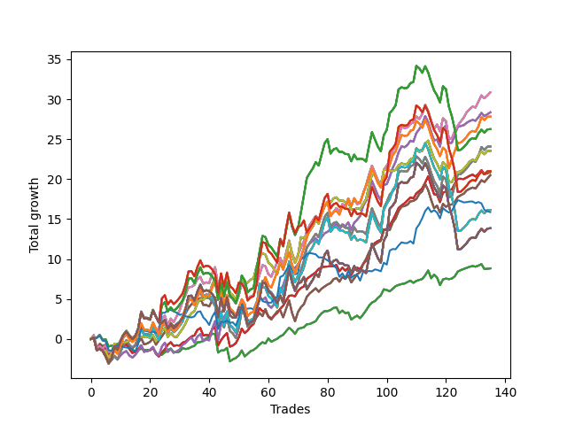

# Short Pointer 003 
- Symbol: SPY_Unlimited
- Date Range: 03/23/2022 - 07/08/2022
- Trading Period: 7:20-12:30
- Number of Trades: 135



| Name | Win Percent | Profit | Avg Profit / Trade | Avg Time / Trade |      | Name | Win Percent | Profit | Avg Profit / Trade | Avg Time / Trade |
| ---- | ----------- | ------ | ------------------ | ---------------- | ---- | ---- | ----------- | ------ | ------------------ | ---------------- |
| Sorted By <br> Profit | | | | | | Sorted By <br> Win Percentage ||||
| Sixty-Eight | 66.67 | 15430.00 | 114.30 | 20:47 |     | Sixty-Five | 75.56 | 10450.00 | 77.41 | 11:36 |
| Sixty | 66.67 | 15430.00 | 114.30 | 20:47 |     | Fifty-Seven | 75.56 | 10450.00 | 77.41 | 11:36 |
| Fifty-Two | 66.67 | 15430.00 | 114.30 | 20:47 |     | Forty-Nine | 75.56 | 10450.00 | 77.41 | 11:36 |
| Forty-Four | 66.67 | 15430.00 | 114.30 | 20:47 |     | Forty-One | 75.56 | 10450.00 | 77.41 | 11:36 |
| Four | 66.67 | 15430.00 | 114.30 | 20:47 |     | One | 75.56 | 10450.00 | 77.41 | 11:36 |
| Sixty-Six | 69.63 | 14185.00 | 105.07 | 17:42 |     | Sixty-Four | 75.56 | 4420.00 | 32.74 | 06:26 |
| Fifty-Eight | 69.63 | 14185.00 | 105.07 | 17:42 |     | Fifty-Six | 75.56 | 4420.00 | 32.74 | 06:26 |
| Fifty | 69.63 | 14185.00 | 105.07 | 17:42 |     | Forty-Eight | 75.56 | 4420.00 | 32.74 | 06:26 |
| Forty-Two | 69.63 | 14185.00 | 105.07 | 17:42 |     | Forty | 75.56 | 4420.00 | 32.74 | 06:26 |
| Two | 69.63 | 14185.00 | 105.07 | 17:42 |     | Zero | 75.56 | 4420.00 | 32.74 | 06:26 |
| One Hundred Twenty-Six | 62.96 | 13915.00 | 103.07 | 22:44 |     | Sixty-Seven | 73.33 | 10255.00 | 75.96 | 15:32 |
| One Hundred Twenty-One | 62.96 | 13915.00 | 103.07 | 22:44 |     | Fifty-Nine | 73.33 | 10255.00 | 75.96 | 15:32 |
| One Hundred Sixteen | 62.96 | 13915.00 | 103.07 | 22:44 |     | Fifty-One | 73.33 | 10255.00 | 75.96 | 15:32 |
| One Hundred Eleven | 62.96 | 13915.00 | 103.07 | 22:44 |     | Forty-Three | 73.33 | 10255.00 | 75.96 | 15:32 |
| Eighty-One | 62.96 | 13915.00 | 103.07 | 22:44 |     | Three | 73.33 | 10255.00 | 75.96 | 15:32 |
| One Hundred Twenty-Seven | 54.81 | 13130.00 | 97.26 | 27:29 |     | Sixty-Six | 69.63 | 14185.00 | 105.07 | 17:42 |
| One Hundred Twenty-Two | 54.81 | 13130.00 | 97.26 | 27:29 |     | Fifty-Eight | 69.63 | 14185.00 | 105.07 | 17:42 |
| One Hundred Seventeen | 54.81 | 13130.00 | 97.26 | 27:29 |     | Fifty | 69.63 | 14185.00 | 105.07 | 17:42 |
| One Hundred Twelve | 54.81 | 13130.00 | 97.26 | 27:29 |     | Forty-Two | 69.63 | 14185.00 | 105.07 | 17:42 |
| Eighty-Two | 54.81 | 13130.00 | 97.26 | 27:29 |     | Two | 69.63 | 14185.00 | 105.07 | 17:42 |
| Sixty-Nine | 57.04 | 12045.00 | 89.22 | 25:12 |     | Sixty-Eight | 66.67 | 15430.00 | 114.30 | 20:47 |
| Sixty-One | 57.04 | 12045.00 | 89.22 | 25:12 |     | Sixty | 66.67 | 15430.00 | 114.30 | 20:47 |
| Fifty-Three | 57.04 | 12045.00 | 89.22 | 25:12 |     | Fifty-Two | 66.67 | 15430.00 | 114.30 | 20:47 |
| Forty-Five | 57.04 | 12045.00 | 89.22 | 25:12 |     | Forty-Four | 66.67 | 15430.00 | 114.30 | 20:47 |
| Five | 57.04 | 12045.00 | 89.22 | 25:12 |     | Four | 66.67 | 15430.00 | 114.30 | 20:47 |
| Seventy | 64.44 | 11775.00 | 87.22 | 18:33 |     | Seventy | 64.44 | 11775.00 | 87.22 | 18:33 |
| Sixty-Two | 64.44 | 11775.00 | 87.22 | 18:33 |     | Sixty-Two | 64.44 | 11775.00 | 87.22 | 18:33 |
| Fifty-Four | 64.44 | 11775.00 | 87.22 | 18:33 |     | Fifty-Four | 64.44 | 11775.00 | 87.22 | 18:33 |
| Forty-Six | 64.44 | 11775.00 | 87.22 | 18:33 |     | Forty-Six | 64.44 | 11775.00 | 87.22 | 18:33 |
| Six | 64.44 | 11775.00 | 87.22 | 18:33 |     | Six | 64.44 | 11775.00 | 87.22 | 18:33 |
| One Hundred Twenty-Eight | 53.33 | 10510.00 | 77.85 | 28:45 |     | One Hundred Twenty-Six | 62.96 | 13915.00 | 103.07 | 22:44 |
| One Hundred Twenty-Three | 53.33 | 10510.00 | 77.85 | 28:45 |     | One Hundred Twenty-One | 62.96 | 13915.00 | 103.07 | 22:44 |
| One Hundred Eighteen | 53.33 | 10510.00 | 77.85 | 28:45 |     | One Hundred Sixteen | 62.96 | 13915.00 | 103.07 | 22:44 |
| One Hundred Thirteen | 53.33 | 10510.00 | 77.85 | 28:45 |     | One Hundred Eleven | 62.96 | 13915.00 | 103.07 | 22:44 |
| Eighty-Three | 53.33 | 10510.00 | 77.85 | 28:45 |     | Eighty-One | 62.96 | 13915.00 | 103.07 | 22:44 |
| Sixty-Five | 75.56 | 10450.00 | 77.41 | 11:36 |     | Sixty-Nine | 57.04 | 12045.00 | 89.22 | 25:12 |
| Fifty-Seven | 75.56 | 10450.00 | 77.41 | 11:36 |     | Sixty-One | 57.04 | 12045.00 | 89.22 | 25:12 |
| Forty-Nine | 75.56 | 10450.00 | 77.41 | 11:36 |     | Fifty-Three | 57.04 | 12045.00 | 89.22 | 25:12 |
| Forty-One | 75.56 | 10450.00 | 77.41 | 11:36 |     | Forty-Five | 57.04 | 12045.00 | 89.22 | 25:12 |
| One | 75.56 | 10450.00 | 77.41 | 11:36 |     | Five | 57.04 | 12045.00 | 89.22 | 25:12 |
| Sixty-Seven | 73.33 | 10255.00 | 75.96 | 15:32 |     | One Hundred Twenty-Seven | 54.81 | 13130.00 | 97.26 | 27:29 |
| Fifty-Nine | 73.33 | 10255.00 | 75.96 | 15:32 |     | One Hundred Twenty-Two | 54.81 | 13130.00 | 97.26 | 27:29 |
| Fifty-One | 73.33 | 10255.00 | 75.96 | 15:32 |     | One Hundred Seventeen | 54.81 | 13130.00 | 97.26 | 27:29 |
| Forty-Three | 73.33 | 10255.00 | 75.96 | 15:32 |     | One Hundred Twelve | 54.81 | 13130.00 | 97.26 | 27:29 |
| Three | 73.33 | 10255.00 | 75.96 | 15:32 |     | Eighty-Two | 54.81 | 13130.00 | 97.26 | 27:29 |
| Seventy-One | 54.81 | 8075.00 | 59.81 | 26:47 |     | Seventy-One | 54.81 | 8075.00 | 59.81 | 26:47 |
| Sixty-Three | 54.81 | 8075.00 | 59.81 | 26:47 |     | Sixty-Three | 54.81 | 8075.00 | 59.81 | 26:47 |
| Fifty-Five | 54.81 | 8075.00 | 59.81 | 26:47 |     | Fifty-Five | 54.81 | 8075.00 | 59.81 | 26:47 |
| Forty-Seven | 54.81 | 8075.00 | 59.81 | 26:47 |     | Forty-Seven | 54.81 | 8075.00 | 59.81 | 26:47 |
| Seven | 54.81 | 8075.00 | 59.81 | 26:47 |     | Seven | 54.81 | 8075.00 | 59.81 | 26:47 |
| Seventy-Three | 48.89 | 7940.00 | 58.81 | 09:17 |     | One Hundred Twenty-Eight | 53.33 | 10510.00 | 77.85 | 28:45 |
| One Hundred Thirty | 52.59 | 6925.00 | 51.30 | 29:18 |     | One Hundred Twenty-Three | 53.33 | 10510.00 | 77.85 | 28:45 |
| One Hundred Twenty-Nine | 52.59 | 6925.00 | 51.30 | 29:18 |     | One Hundred Eighteen | 53.33 | 10510.00 | 77.85 | 28:45 |
| One Hundred Twenty-Five | 52.59 | 6925.00 | 51.30 | 29:18 |     | One Hundred Thirteen | 53.33 | 10510.00 | 77.85 | 28:45 |
| One Hundred Twenty-Four | 52.59 | 6925.00 | 51.30 | 29:18 |     | Eighty-Three | 53.33 | 10510.00 | 77.85 | 28:45 |
| One Hundred Twenty | 52.59 | 6925.00 | 51.30 | 29:18 |     | One Hundred Thirty | 52.59 | 6925.00 | 51.30 | 29:18 |
| One Hundred Ninteen | 52.59 | 6925.00 | 51.30 | 29:18 |     | One Hundred Twenty-Nine | 52.59 | 6925.00 | 51.30 | 29:18 |
| One Hundred Fifteen | 52.59 | 6925.00 | 51.30 | 29:18 |     | One Hundred Twenty-Five | 52.59 | 6925.00 | 51.30 | 29:18 |
| One Hundred Fourteen | 52.59 | 6925.00 | 51.30 | 29:18 |     | One Hundred Twenty-Four | 52.59 | 6925.00 | 51.30 | 29:18 |
| Eighty-Five | 52.59 | 6925.00 | 51.30 | 29:18 |     | One Hundred Twenty | 52.59 | 6925.00 | 51.30 | 29:18 |
| Eighty-Four | 52.59 | 6925.00 | 51.30 | 29:18 |     | One Hundred Ninteen | 52.59 | 6925.00 | 51.30 | 29:18 |
| Sixty-Four | 75.56 | 4420.00 | 32.74 | 06:26 |     | One Hundred Fifteen | 52.59 | 6925.00 | 51.30 | 29:18 |
| Fifty-Six | 75.56 | 4420.00 | 32.74 | 06:26 |     | One Hundred Fourteen | 52.59 | 6925.00 | 51.30 | 29:18 |
| Forty-Eight | 75.56 | 4420.00 | 32.74 | 06:26 |     | Eighty-Five | 52.59 | 6925.00 | 51.30 | 29:18 |
| Forty | 75.56 | 4420.00 | 32.74 | 06:26 |     | Eighty-Four | 52.59 | 6925.00 | 51.30 | 29:18 |
| Zero | 75.56 | 4420.00 | 32.74 | 06:26 |     | Seventy-Three | 48.89 | 7940.00 | 58.81 | 09:17 |

## NO STOPLOSS

### Test Zero
* Sell when price hits the middle line of the 20p bollinger
* No Stoploss
* Results:
```
Total Trades: 135
Percent Up: 24.44
Percent Down: 75.56
Total Points Moved Down: 8.84
Potential Profit: 4420.00
Total Points Ups: 16.55 Count Ups: 33
Total Points Downs: 25.39 Count Downs: 102
```

<details><summary>Trades</summary>

<code>In: 2022-03-23 08:28:00		Out: 2022-03-23 08:32:05		Total Position Time: 04:05		Total Move Down: 0.10		Total to Date: 0.10</code> <br />
<code>In: 2022-03-24 08:09:00		Out: 2022-03-24 08:09:10		Total Position Time: 00:10		Total Move Down: 0.06		Total to Date: 0.16</code> <br />
<code>In: 2022-03-24 12:29:00		Out: 2022-03-24 12:33:25		Total Position Time: 04:25		Total Move Down: 0.36		Total to Date: 0.52</code> <br />
<code>In: 2022-03-25 07:26:00		Out: 2022-03-25 07:51:05		Total Position Time: 25:05		Total Move Down: -0.62		Total to Date: -0.10</code> <br />
<code>In: 2022-03-25 10:22:00		Out: 2022-03-25 10:22:10		Total Position Time: 00:10		Total Move Down: 0.07		Total to Date: -0.03</code> <br />
<code>In: 2022-03-25 10:53:00		Out: 2022-03-25 11:18:10		Total Position Time: 25:10		Total Move Down: -0.91		Total to Date: -0.94</code> <br />
<code>In: 2022-03-25 11:34:00		Out: 2022-03-25 11:35:15		Total Position Time: 01:15		Total Move Down: 0.11		Total to Date: -0.83</code> <br />
<code>In: 2022-03-25 11:57:00		Out: 2022-03-25 11:57:15		Total Position Time: 00:15		Total Move Down: 0.03		Total to Date: -0.80</code> <br />
<code>In: 2022-03-28 11:12:00		Out: 2022-03-28 11:12:10		Total Position Time: 00:10		Total Move Down: 0.19		Total to Date: -0.61</code> <br />
<code>In: 2022-03-29 08:52:00		Out: 2022-03-29 08:56:20		Total Position Time: 04:20		Total Move Down: 0.12		Total to Date: -0.49</code> <br />
<code>In: 2022-03-29 08:53:00		Out: 2022-03-29 08:56:20		Total Position Time: 03:20		Total Move Down: 0.04		Total to Date: -0.45</code> <br />
<code>In: 2022-03-30 09:46:00		Out: 2022-03-30 09:50:50		Total Position Time: 04:50		Total Move Down: 0.14		Total to Date: -0.31</code> <br />
<code>In: 2022-03-31 07:38:00		Out: 2022-03-31 08:03:05		Total Position Time: 25:05		Total Move Down: -0.59		Total to Date: -0.90</code> <br />
<code>In: 2022-03-31 07:39:00		Out: 2022-03-31 08:03:05		Total Position Time: 24:05		Total Move Down: -0.64		Total to Date: -1.54</code> <br />
<code>In: 2022-03-31 07:51:00		Out: 2022-03-31 08:03:05		Total Position Time: 12:05		Total Move Down: -0.02		Total to Date: -1.56</code> <br />
<code>In: 2022-03-31 10:54:00		Out: 2022-03-31 10:58:25		Total Position Time: 04:25		Total Move Down: 0.15		Total to Date: -1.41</code> <br />
<code>In: 2022-03-31 12:05:00		Out: 2022-03-31 12:11:30		Total Position Time: 06:30		Total Move Down: 0.23		Total to Date: -1.18</code> <br />
<code>In: 2022-04-01 11:08:00		Out: 2022-04-01 11:21:05		Total Position Time: 13:05		Total Move Down: -0.23		Total to Date: -1.41</code> <br />
<code>In: 2022-04-04 11:50:00		Out: 2022-04-04 11:51:05		Total Position Time: 01:05		Total Move Down: 0.04		Total to Date: -1.37</code> <br />
<code>In: 2022-04-04 11:57:00		Out: 2022-04-04 11:59:45		Total Position Time: 02:45		Total Move Down: -0.02		Total to Date: -1.39</code> <br />
<code>In: 2022-04-06 08:53:00		Out: 2022-04-06 09:00:40		Total Position Time: 07:40		Total Move Down: 0.25		Total to Date: -1.14</code> <br />
<code>In: 2022-04-06 10:26:00		Out: 2022-04-06 10:47:10		Total Position Time: 21:10		Total Move Down: -0.58		Total to Date: -1.72</code> <br />
<code>In: 2022-04-06 10:36:00		Out: 2022-04-06 10:47:10		Total Position Time: 11:10		Total Move Down: -0.30		Total to Date: -2.02</code> <br />
<code>In: 2022-04-06 11:06:00		Out: 2022-04-06 11:06:10		Total Position Time: 00:10		Total Move Down: 0.05		Total to Date: -1.97</code> <br />
<code>In: 2022-04-07 11:04:00		Out: 2022-04-07 11:15:20		Total Position Time: 11:20		Total Move Down: 0.30		Total to Date: -1.67</code> <br />
<code>In: 2022-04-07 11:29:00		Out: 2022-04-07 11:29:15		Total Position Time: 00:15		Total Move Down: 0.26		Total to Date: -1.41</code> <br />
<code>In: 2022-04-13 08:35:00		Out: 2022-04-13 08:37:20		Total Position Time: 02:20		Total Move Down: 0.22		Total to Date: -1.19</code> <br />
<code>In: 2022-04-13 09:27:00		Out: 2022-04-13 09:53:25		Total Position Time: 26:25		Total Move Down: -0.48		Total to Date: -1.67</code> <br />
<code>In: 2022-04-14 11:03:00		Out: 2022-04-14 11:14:05		Total Position Time: 11:05		Total Move Down: 0.02		Total to Date: -1.65</code> <br />
<code>In: 2022-04-18 07:28:00		Out: 2022-04-18 07:36:45		Total Position Time: 08:45		Total Move Down: 0.08		Total to Date: -1.57</code> <br />
<code>In: 2022-04-18 10:59:00		Out: 2022-04-18 10:59:30		Total Position Time: 00:30		Total Move Down: 0.43		Total to Date: -1.14</code> <br />
<code>In: 2022-04-20 07:43:00		Out: 2022-04-20 08:00:20		Total Position Time: 17:20		Total Move Down: -0.11		Total to Date: -1.25</code> <br />
<code>In: 2022-04-20 07:58:00		Out: 2022-04-20 08:00:20		Total Position Time: 02:20		Total Move Down: 0.07		Total to Date: -1.18</code> <br />
<code>In: 2022-04-20 09:55:00		Out: 2022-04-20 09:59:05		Total Position Time: 04:05		Total Move Down: 0.19		Total to Date: -0.99</code> <br />
<code>In: 2022-04-20 10:19:00		Out: 2022-04-20 10:19:10		Total Position Time: 00:10		Total Move Down: 0.14		Total to Date: -0.85</code> <br />
<code>In: 2022-04-20 10:49:00		Out: 2022-04-20 10:50:05		Total Position Time: 01:05		Total Move Down: 0.43		Total to Date: -0.42</code> <br />
<code>In: 2022-04-20 10:50:00		Out: 2022-04-20 10:50:10		Total Position Time: 00:10		Total Move Down: 0.05		Total to Date: -0.37</code> <br />
<code>In: 2022-04-25 09:13:00		Out: 2022-04-25 09:19:05		Total Position Time: 06:05		Total Move Down: 0.11		Total to Date: -0.26</code> <br />
<code>In: 2022-04-25 09:28:00		Out: 2022-04-25 09:31:05		Total Position Time: 03:05		Total Move Down: 0.35		Total to Date: 0.09</code> <br />
<code>In: 2022-04-25 09:29:00		Out: 2022-04-25 09:31:05		Total Position Time: 02:05		Total Move Down: 0.16		Total to Date: 0.25</code> <br />
<code>In: 2022-04-25 09:52:00		Out: 2022-04-25 09:53:00		Total Position Time: 01:00		Total Move Down: 0.42		Total to Date: 0.67</code> <br />
<code>In: 2022-04-25 09:53:00		Out: 2022-04-25 09:53:10		Total Position Time: 00:10		Total Move Down: -0.06		Total to Date: 0.61</code> <br />
<code>In: 2022-04-25 11:12:00		Out: 2022-04-25 11:39:45		Total Position Time: 27:45		Total Move Down: -2.31		Total to Date: -1.70</code> <br />
<code>In: 2022-04-26 10:02:00		Out: 2022-04-26 10:02:20		Total Position Time: 00:20		Total Move Down: 0.26		Total to Date: -1.44</code> <br />
<code>In: 2022-04-27 08:04:00		Out: 2022-04-27 08:04:10		Total Position Time: 00:10		Total Move Down: 0.01		Total to Date: -1.43</code> <br />
<code>In: 2022-04-27 09:46:00		Out: 2022-04-27 09:46:10		Total Position Time: 00:10		Total Move Down: 0.33		Total to Date: -1.10</code> <br />
<code>In: 2022-04-28 09:50:00		Out: 2022-04-28 10:19:55		Total Position Time: 29:55		Total Move Down: -1.70		Total to Date: -2.80</code> <br />
<code>In: 2022-04-28 10:17:00		Out: 2022-04-28 10:22:05		Total Position Time: 05:05		Total Move Down: 0.26		Total to Date: -2.54</code> <br />
<code>In: 2022-04-28 10:42:00		Out: 2022-04-28 10:42:10		Total Position Time: 00:10		Total Move Down: 0.16		Total to Date: -2.38</code> <br />
<code>In: 2022-04-28 12:26:00		Out: 2022-04-28 12:26:55		Total Position Time: 00:55		Total Move Down: 0.32		Total to Date: -2.06</code> <br />
<code>In: 2022-05-03 07:36:00		Out: 2022-05-03 07:38:00		Total Position Time: 02:00		Total Move Down: 0.63		Total to Date: -1.43</code> <br />
<code>In: 2022-05-03 08:11:00		Out: 2022-05-03 08:35:55		Total Position Time: 24:55		Total Move Down: -0.75		Total to Date: -2.18</code> <br />
<code>In: 2022-05-04 08:57:00		Out: 2022-05-04 09:02:25		Total Position Time: 05:25		Total Move Down: 0.33		Total to Date: -1.85</code> <br />
<code>In: 2022-05-04 09:42:00		Out: 2022-05-04 09:45:30		Total Position Time: 03:30		Total Move Down: 0.33		Total to Date: -1.52</code> <br />
<code>In: 2022-05-04 09:43:00		Out: 2022-05-04 09:45:30		Total Position Time: 02:30		Total Move Down: 0.15		Total to Date: -1.37</code> <br />
<code>In: 2022-05-04 11:03:00		Out: 2022-05-04 11:03:10		Total Position Time: 00:10		Total Move Down: 0.29		Total to Date: -1.08</code> <br />
<code>In: 2022-05-04 11:07:00		Out: 2022-05-04 11:07:10		Total Position Time: 00:10		Total Move Down: 0.39		Total to Date: -0.69</code> <br />
<code>In: 2022-05-09 12:04:00		Out: 2022-05-09 12:04:10		Total Position Time: 00:10		Total Move Down: 0.28		Total to Date: -0.41</code> <br />
<code>In: 2022-05-13 12:21:00		Out: 2022-05-13 12:33:00		Total Position Time: 12:00		Total Move Down: -0.16		Total to Date: -0.57</code> <br />
<code>In: 2022-05-16 10:16:00		Out: 2022-05-16 10:18:25		Total Position Time: 02:25		Total Move Down: 0.65		Total to Date: 0.08</code> <br />
<code>In: 2022-05-17 09:30:00		Out: 2022-05-17 09:51:15		Total Position Time: 21:15		Total Move Down: -0.43		Total to Date: -0.35</code> <br />
<code>In: 2022-05-17 09:48:00		Out: 2022-05-17 09:51:15		Total Position Time: 03:15		Total Move Down: 0.21		Total to Date: -0.14</code> <br />
<code>In: 2022-05-17 09:49:00		Out: 2022-05-17 09:51:15		Total Position Time: 02:15		Total Move Down: 0.17		Total to Date: 0.03</code> <br />
<code>In: 2022-05-17 11:11:00		Out: 2022-05-17 11:11:45		Total Position Time: 00:45		Total Move Down: 0.30		Total to Date: 0.33</code> <br />
<code>In: 2022-05-23 08:38:00		Out: 2022-05-23 08:47:05		Total Position Time: 09:05		Total Move Down: 0.19		Total to Date: 0.52</code> <br />
<code>In: 2022-05-24 09:18:00		Out: 2022-05-24 09:21:35		Total Position Time: 03:35		Total Move Down: 0.46		Total to Date: 0.98</code> <br />
<code>In: 2022-05-24 09:19:00		Out: 2022-05-24 09:21:35		Total Position Time: 02:35		Total Move Down: 0.42		Total to Date: 1.40</code> <br />
<code>In: 2022-05-24 10:44:00		Out: 2022-05-24 10:58:10		Total Position Time: 14:10		Total Move Down: -0.31		Total to Date: 1.09</code> <br />
<code>In: 2022-05-24 10:48:00		Out: 2022-05-24 10:58:10		Total Position Time: 10:10		Total Move Down: -0.45		Total to Date: 0.64</code> <br />
<code>In: 2022-05-24 11:15:00		Out: 2022-05-24 11:18:25		Total Position Time: 03:25		Total Move Down: 0.61		Total to Date: 1.25</code> <br />
<code>In: 2022-05-24 11:42:00		Out: 2022-05-24 11:42:10		Total Position Time: 00:10		Total Move Down: 0.13		Total to Date: 1.38</code> <br />
<code>In: 2022-05-25 10:40:00		Out: 2022-05-25 10:47:20		Total Position Time: 07:20		Total Move Down: 0.09		Total to Date: 1.47</code> <br />
<code>In: 2022-05-25 11:04:00		Out: 2022-05-25 11:06:20		Total Position Time: 02:20		Total Move Down: 0.37		Total to Date: 1.84</code> <br />
<code>In: 2022-05-26 10:12:00		Out: 2022-05-26 10:12:10		Total Position Time: 00:10		Total Move Down: 0.04		Total to Date: 1.88</code> <br />
<code>In: 2022-05-27 09:05:00		Out: 2022-05-27 09:06:35		Total Position Time: 01:35		Total Move Down: 0.18		Total to Date: 2.06</code> <br />
<code>In: 2022-05-27 09:06:00		Out: 2022-05-27 09:06:35		Total Position Time: 00:35		Total Move Down: 0.17		Total to Date: 2.23</code> <br />
<code>In: 2022-05-31 07:24:00		Out: 2022-05-31 07:30:05		Total Position Time: 06:05		Total Move Down: 0.58		Total to Date: 2.81</code> <br />
<code>In: 2022-05-31 07:48:00		Out: 2022-05-31 07:49:55		Total Position Time: 01:55		Total Move Down: 0.41		Total to Date: 3.22</code> <br />
<code>In: 2022-05-31 07:49:00		Out: 2022-05-31 07:49:55		Total Position Time: 00:55		Total Move Down: 0.27		Total to Date: 3.49</code> <br />
<code>In: 2022-05-31 10:58:00		Out: 2022-05-31 11:05:10		Total Position Time: 07:10		Total Move Down: -0.00		Total to Date: 3.49</code> <br />
<code>In: 2022-06-01 11:08:00		Out: 2022-06-01 11:08:45		Total Position Time: 00:45		Total Move Down: 0.14		Total to Date: 3.63</code> <br />
<code>In: 2022-06-01 11:30:00		Out: 2022-06-01 11:40:00		Total Position Time: 10:00		Total Move Down: 0.25		Total to Date: 3.88</code> <br />
<code>In: 2022-06-01 12:19:00		Out: 2022-06-01 12:25:25		Total Position Time: 06:25		Total Move Down: 0.09		Total to Date: 3.97</code> <br />
<code>In: 2022-06-02 08:06:00		Out: 2022-06-02 08:22:05		Total Position Time: 16:05		Total Move Down: -0.73		Total to Date: 3.24</code> <br />
<code>In: 2022-06-03 11:31:00		Out: 2022-06-03 11:33:25		Total Position Time: 02:25		Total Move Down: 0.32		Total to Date: 3.56</code> <br />
<code>In: 2022-06-07 10:12:00		Out: 2022-06-07 10:28:10		Total Position Time: 16:10		Total Move Down: -0.33		Total to Date: 3.23</code> <br />
<code>In: 2022-06-07 11:38:00		Out: 2022-06-07 11:41:30		Total Position Time: 03:30		Total Move Down: 0.10		Total to Date: 3.33</code> <br />
<code>In: 2022-06-07 12:25:00		Out: 2022-06-07 12:46:00		Total Position Time: 21:00		Total Move Down: -0.90		Total to Date: 2.43</code> <br />
<code>In: 2022-06-09 08:47:00		Out: 2022-06-09 08:48:20		Total Position Time: 01:20		Total Move Down: 0.28		Total to Date: 2.71</code> <br />
<code>In: 2022-06-09 09:46:00		Out: 2022-06-09 09:49:20		Total Position Time: 03:20		Total Move Down: 0.21		Total to Date: 2.92</code> <br />
<code>In: 2022-06-10 10:42:00		Out: 2022-06-10 10:54:55		Total Position Time: 12:55		Total Move Down: -0.32		Total to Date: 2.60</code> <br />
<code>In: 2022-06-10 10:53:00		Out: 2022-06-10 10:54:55		Total Position Time: 01:55		Total Move Down: 0.46		Total to Date: 3.06</code> <br />
<code>In: 2022-06-10 11:26:00		Out: 2022-06-10 11:28:25		Total Position Time: 02:25		Total Move Down: 0.52		Total to Date: 3.58</code> <br />
<code>In: 2022-06-10 12:29:00		Out: 2022-06-10 12:30:30		Total Position Time: 01:30		Total Move Down: 0.58		Total to Date: 4.16</code> <br />
<code>In: 2022-06-10 12:30:00		Out: 2022-06-10 12:30:30		Total Position Time: 00:30		Total Move Down: 0.40		Total to Date: 4.56</code> <br />
<code>In: 2022-06-13 08:42:00		Out: 2022-06-13 08:47:55		Total Position Time: 05:55		Total Move Down: 0.18		Total to Date: 4.74</code> <br />
<code>In: 2022-06-13 09:14:00		Out: 2022-06-13 09:17:10		Total Position Time: 03:10		Total Move Down: 0.40		Total to Date: 5.14</code> <br />
<code>In: 2022-06-13 09:15:00		Out: 2022-06-13 09:17:10		Total Position Time: 02:10		Total Move Down: 0.34		Total to Date: 5.48</code> <br />
<code>In: 2022-06-13 09:41:00		Out: 2022-06-13 09:44:05		Total Position Time: 03:05		Total Move Down: 0.74		Total to Date: 6.22</code> <br />
<code>In: 2022-06-15 09:19:00		Out: 2022-06-15 09:30:55		Total Position Time: 11:55		Total Move Down: -0.09		Total to Date: 6.13</code> <br />
<code>In: 2022-06-15 11:02:00		Out: 2022-06-15 11:02:10		Total Position Time: 00:10		Total Move Down: -0.17		Total to Date: 5.96</code> <br />
<code>In: 2022-06-16 08:30:00		Out: 2022-06-16 08:30:35		Total Position Time: 00:35		Total Move Down: 0.33		Total to Date: 6.29</code> <br />
<code>In: 2022-06-17 08:21:00		Out: 2022-06-17 08:23:05		Total Position Time: 02:05		Total Move Down: 0.32		Total to Date: 6.61</code> <br />
<code>In: 2022-06-17 08:34:00		Out: 2022-06-17 08:35:05		Total Position Time: 01:05		Total Move Down: 0.16		Total to Date: 6.77</code> <br />
<code>In: 2022-06-17 11:20:00		Out: 2022-06-17 11:28:55		Total Position Time: 08:55		Total Move Down: 0.10		Total to Date: 6.87</code> <br />
<code>In: 2022-06-21 09:58:00		Out: 2022-06-21 10:05:35		Total Position Time: 07:35		Total Move Down: 0.07		Total to Date: 6.94</code> <br />
<code>In: 2022-06-21 10:01:00		Out: 2022-06-21 10:05:35		Total Position Time: 04:35		Total Move Down: 0.18		Total to Date: 7.12</code> <br />
<code>In: 2022-06-21 10:16:00		Out: 2022-06-21 10:19:10		Total Position Time: 03:10		Total Move Down: 0.19		Total to Date: 7.31</code> <br />
<code>In: 2022-06-21 11:58:00		Out: 2022-06-21 12:15:15		Total Position Time: 17:15		Total Move Down: -0.28		Total to Date: 7.03</code> <br />
<code>In: 2022-06-23 08:16:00		Out: 2022-06-23 08:21:05		Total Position Time: 05:05		Total Move Down: 0.24		Total to Date: 7.27</code> <br />
<code>In: 2022-06-27 07:54:00		Out: 2022-06-27 08:02:15		Total Position Time: 08:15		Total Move Down: 0.12		Total to Date: 7.39</code> <br />
<code>In: 2022-06-29 10:13:00		Out: 2022-06-29 10:13:10		Total Position Time: 00:10		Total Move Down: 0.12		Total to Date: 7.51</code> <br />
<code>In: 2022-06-29 12:31:00		Out: 2022-06-29 12:33:20		Total Position Time: 02:20		Total Move Down: 0.46		Total to Date: 7.97</code> <br />
<code>In: 2022-06-30 07:37:00		Out: 2022-06-30 07:42:05		Total Position Time: 05:05		Total Move Down: 0.61		Total to Date: 8.58</code> <br />
<code>In: 2022-06-30 08:12:00		Out: 2022-06-30 08:35:00		Total Position Time: 23:00		Total Move Down: -0.98		Total to Date: 7.60</code> <br />
<code>In: 2022-06-30 08:30:00		Out: 2022-06-30 08:35:00		Total Position Time: 05:00		Total Move Down: 0.46		Total to Date: 8.06</code> <br />
<code>In: 2022-06-30 08:51:00		Out: 2022-06-30 09:03:05		Total Position Time: 12:05		Total Move Down: -0.37		Total to Date: 7.69</code> <br />
<code>In: 2022-07-01 10:35:00		Out: 2022-07-01 10:58:40		Total Position Time: 23:40		Total Move Down: -0.95		Total to Date: 6.74</code> <br />
<code>In: 2022-07-05 07:41:00		Out: 2022-07-05 07:44:30		Total Position Time: 03:30		Total Move Down: 0.72		Total to Date: 7.46</code> <br />
<code>In: 2022-07-05 08:49:00		Out: 2022-07-05 09:00:10		Total Position Time: 11:10		Total Move Down: 0.10		Total to Date: 7.56</code> <br />
<code>In: 2022-07-05 11:07:00		Out: 2022-07-05 11:16:00		Total Position Time: 09:00		Total Move Down: -0.07		Total to Date: 7.49</code> <br />
<code>In: 2022-07-06 11:00:00		Out: 2022-07-06 11:00:10		Total Position Time: 00:10		Total Move Down: 0.07		Total to Date: 7.56</code> <br />
<code>In: 2022-07-06 11:10:00		Out: 2022-07-06 11:10:10		Total Position Time: 00:10		Total Move Down: 0.29		Total to Date: 7.85</code> <br />
<code>In: 2022-07-06 11:11:00		Out: 2022-07-06 11:11:10		Total Position Time: 00:10		Total Move Down: 0.59		Total to Date: 8.44</code> <br />
<code>In: 2022-07-07 07:56:00		Out: 2022-07-07 08:01:10		Total Position Time: 05:10		Total Move Down: 0.18		Total to Date: 8.62</code> <br />
<code>In: 2022-07-07 07:57:00		Out: 2022-07-07 08:01:10		Total Position Time: 04:10		Total Move Down: 0.14		Total to Date: 8.76</code> <br />
<code>In: 2022-07-07 08:10:00		Out: 2022-07-07 08:11:10		Total Position Time: 01:10		Total Move Down: 0.13		Total to Date: 8.89</code> <br />
<code>In: 2022-07-07 09:37:00		Out: 2022-07-07 09:38:15		Total Position Time: 01:15		Total Move Down: 0.15		Total to Date: 9.04</code> <br />
<code>In: 2022-07-07 09:38:00		Out: 2022-07-07 09:38:15		Total Position Time: 00:15		Total Move Down: 0.09		Total to Date: 9.13</code> <br />
<code>In: 2022-07-07 11:05:00		Out: 2022-07-07 11:16:25		Total Position Time: 11:25		Total Move Down: -0.08		Total to Date: 9.05</code> <br />
<code>In: 2022-07-07 12:18:00		Out: 2022-07-07 12:24:15		Total Position Time: 06:15		Total Move Down: 0.14		Total to Date: 9.19</code> <br />
<code>In: 2022-07-08 08:29:00		Out: 2022-07-08 08:36:15		Total Position Time: 07:15		Total Move Down: 0.18		Total to Date: 9.37</code> <br />
<code>In: 2022-07-08 11:26:00		Out: 2022-07-08 11:49:15		Total Position Time: 23:15		Total Move Down: -0.61		Total to Date: 8.76</code> <br />
<code>In: 2022-07-08 11:40:00		Out: 2022-07-08 11:49:15		Total Position Time: 09:15		Total Move Down: 0.03		Total to Date: 8.79</code> <br />
<code>In: 2022-07-08 11:47:00		Out: 2022-07-08 11:49:15		Total Position Time: 02:15		Total Move Down: 0.05		Total to Date: 8.84</code> <br />


</details>

### Test One
* Sell when the price hits the upper line of the 20p 1std bollinger
* No Stoploss
* Results:
```
Total Trades: 135
Percent Up: 24.44
Percent Down: 75.56
Total Points Moved Down: 20.90
Potential Profit: 10450.00
Total Points Ups: 19.81 Count Ups: 33
Total Points Downs: 40.71 Count Downs: 102
```

<details><summary>Trades</summary>

<code>In: 2022-03-23 08:28:00		Out: 2022-03-23 08:35:15		Total Position Time: 07:15		Total Move Down: 0.25		Total to Date: 0.25</code> <br />
<code>In: 2022-03-24 08:09:00		Out: 2022-03-24 08:38:55		Total Position Time: 29:55		Total Move Down: -1.58		Total to Date: -1.33</code> <br />
<code>In: 2022-03-24 12:29:00		Out: 2022-03-24 12:38:15		Total Position Time: 09:15		Total Move Down: 0.39		Total to Date: -0.94</code> <br />
<code>In: 2022-03-25 07:26:00		Out: 2022-03-25 07:53:50		Total Position Time: 27:50		Total Move Down: -0.48		Total to Date: -1.42</code> <br />
<code>In: 2022-03-25 10:22:00		Out: 2022-03-25 10:23:25		Total Position Time: 01:25		Total Move Down: 0.29		Total to Date: -1.13</code> <br />
<code>In: 2022-03-25 10:53:00		Out: 2022-03-25 11:19:30		Total Position Time: 26:30		Total Move Down: -0.77		Total to Date: -1.90</code> <br />
<code>In: 2022-03-25 11:34:00		Out: 2022-03-25 11:40:55		Total Position Time: 06:55		Total Move Down: 0.21		Total to Date: -1.69</code> <br />
<code>In: 2022-03-25 11:57:00		Out: 2022-03-25 12:00:50		Total Position Time: 03:50		Total Move Down: 0.28		Total to Date: -1.41</code> <br />
<code>In: 2022-03-28 11:12:00		Out: 2022-03-28 11:19:20		Total Position Time: 07:20		Total Move Down: 0.18		Total to Date: -1.23</code> <br />
<code>In: 2022-03-29 08:52:00		Out: 2022-03-29 08:58:45		Total Position Time: 06:45		Total Move Down: 0.26		Total to Date: -0.97</code> <br />
<code>In: 2022-03-29 08:53:00		Out: 2022-03-29 08:58:45		Total Position Time: 05:45		Total Move Down: 0.18		Total to Date: -0.79</code> <br />
<code>In: 2022-03-30 09:46:00		Out: 2022-03-30 10:00:45		Total Position Time: 14:45		Total Move Down: 0.09		Total to Date: -0.70</code> <br />
<code>In: 2022-03-31 07:38:00		Out: 2022-03-31 08:07:55		Total Position Time: 29:55		Total Move Down: -0.54		Total to Date: -1.24</code> <br />
<code>In: 2022-03-31 07:39:00		Out: 2022-03-31 08:08:00		Total Position Time: 29:00		Total Move Down: -0.50		Total to Date: -1.74</code> <br />
<code>In: 2022-03-31 07:51:00		Out: 2022-03-31 08:08:00		Total Position Time: 17:00		Total Move Down: 0.12		Total to Date: -1.62</code> <br />
<code>In: 2022-03-31 10:54:00		Out: 2022-03-31 11:00:10		Total Position Time: 06:10		Total Move Down: 0.34		Total to Date: -1.28</code> <br />
<code>In: 2022-03-31 12:05:00		Out: 2022-03-31 12:16:00		Total Position Time: 11:00		Total Move Down: 0.47		Total to Date: -0.81</code> <br />
<code>In: 2022-04-01 11:08:00		Out: 2022-04-01 11:37:55		Total Position Time: 29:55		Total Move Down: -0.78		Total to Date: -1.59</code> <br />
<code>In: 2022-04-04 11:50:00		Out: 2022-04-04 11:51:35		Total Position Time: 01:35		Total Move Down: 0.08		Total to Date: -1.51</code> <br />
<code>In: 2022-04-04 11:57:00		Out: 2022-04-04 12:02:55		Total Position Time: 05:55		Total Move Down: 0.10		Total to Date: -1.41</code> <br />
<code>In: 2022-04-06 08:53:00		Out: 2022-04-06 09:04:45		Total Position Time: 11:45		Total Move Down: 0.36		Total to Date: -1.05</code> <br />
<code>In: 2022-04-06 10:26:00		Out: 2022-04-06 10:55:55		Total Position Time: 29:55		Total Move Down: -0.81		Total to Date: -1.86</code> <br />
<code>In: 2022-04-06 10:36:00		Out: 2022-04-06 10:56:55		Total Position Time: 20:55		Total Move Down: -0.33		Total to Date: -2.19</code> <br />
<code>In: 2022-04-06 11:06:00		Out: 2022-04-06 11:07:20		Total Position Time: 01:20		Total Move Down: 0.50		Total to Date: -1.69</code> <br />
<code>In: 2022-04-07 11:04:00		Out: 2022-04-07 11:18:00		Total Position Time: 14:00		Total Move Down: 0.39		Total to Date: -1.30</code> <br />
<code>In: 2022-04-07 11:29:00		Out: 2022-04-07 11:30:05		Total Position Time: 01:05		Total Move Down: 0.57		Total to Date: -0.73</code> <br />
<code>In: 2022-04-13 08:35:00		Out: 2022-04-13 08:41:35		Total Position Time: 06:35		Total Move Down: 0.33		Total to Date: -0.40</code> <br />
<code>In: 2022-04-13 09:27:00		Out: 2022-04-13 09:56:55		Total Position Time: 29:55		Total Move Down: -0.46		Total to Date: -0.86</code> <br />
<code>In: 2022-04-14 11:03:00		Out: 2022-04-14 11:17:10		Total Position Time: 14:10		Total Move Down: 0.08		Total to Date: -0.78</code> <br />
<code>In: 2022-04-18 07:28:00		Out: 2022-04-18 07:51:15		Total Position Time: 23:15		Total Move Down: -0.04		Total to Date: -0.82</code> <br />
<code>In: 2022-04-18 10:59:00		Out: 2022-04-18 11:06:20		Total Position Time: 07:20		Total Move Down: 0.36		Total to Date: -0.46</code> <br />
<code>In: 2022-04-20 07:43:00		Out: 2022-04-20 08:00:40		Total Position Time: 17:40		Total Move Down: 0.14		Total to Date: -0.32</code> <br />
<code>In: 2022-04-20 07:58:00		Out: 2022-04-20 08:00:40		Total Position Time: 02:40		Total Move Down: 0.32		Total to Date: -0.00</code> <br />
<code>In: 2022-04-20 09:55:00		Out: 2022-04-20 10:08:15		Total Position Time: 13:15		Total Move Down: 0.31		Total to Date: 0.31</code> <br />
<code>In: 2022-04-20 10:19:00		Out: 2022-04-20 10:19:10		Total Position Time: 00:10		Total Move Down: 0.14		Total to Date: 0.45</code> <br />
<code>In: 2022-04-20 10:49:00		Out: 2022-04-20 10:53:20		Total Position Time: 04:20		Total Move Down: 0.68		Total to Date: 1.13</code> <br />
<code>In: 2022-04-20 10:50:00		Out: 2022-04-20 10:53:20		Total Position Time: 03:20		Total Move Down: 0.24		Total to Date: 1.37</code> <br />
<code>In: 2022-04-25 09:13:00		Out: 2022-04-25 09:42:35		Total Position Time: 29:35		Total Move Down: -0.94		Total to Date: 0.43</code> <br />
<code>In: 2022-04-25 09:28:00		Out: 2022-04-25 09:42:35		Total Position Time: 14:35		Total Move Down: 0.09		Total to Date: 0.52</code> <br />
<code>In: 2022-04-25 09:29:00		Out: 2022-04-25 09:42:35		Total Position Time: 13:35		Total Move Down: -0.10		Total to Date: 0.42</code> <br />
<code>In: 2022-04-25 09:52:00		Out: 2022-04-25 09:55:05		Total Position Time: 03:05		Total Move Down: 0.77		Total to Date: 1.19</code> <br />
<code>In: 2022-04-25 09:53:00		Out: 2022-04-25 09:55:05		Total Position Time: 02:05		Total Move Down: 0.35		Total to Date: 1.54</code> <br />
<code>In: 2022-04-25 11:12:00		Out: 2022-04-25 11:41:55		Total Position Time: 29:55		Total Move Down: -2.34		Total to Date: -0.80</code> <br />
<code>In: 2022-04-26 10:02:00		Out: 2022-04-26 10:02:50		Total Position Time: 00:50		Total Move Down: 0.66		Total to Date: -0.14</code> <br />
<code>In: 2022-04-27 08:04:00		Out: 2022-04-27 08:05:30		Total Position Time: 01:30		Total Move Down: 0.49		Total to Date: 0.35</code> <br />
<code>In: 2022-04-27 09:46:00		Out: 2022-04-27 09:50:25		Total Position Time: 04:25		Total Move Down: 0.39		Total to Date: 0.74</code> <br />
<code>In: 2022-04-28 09:50:00		Out: 2022-04-28 10:19:55		Total Position Time: 29:55		Total Move Down: -1.70		Total to Date: -0.96</code> <br />
<code>In: 2022-04-28 10:17:00		Out: 2022-04-28 10:30:45		Total Position Time: 13:45		Total Move Down: 0.15		Total to Date: -0.81</code> <br />
<code>In: 2022-04-28 10:42:00		Out: 2022-04-28 10:44:10		Total Position Time: 02:10		Total Move Down: 0.29		Total to Date: -0.52</code> <br />
<code>In: 2022-04-28 12:26:00		Out: 2022-04-28 12:30:40		Total Position Time: 04:40		Total Move Down: 0.72		Total to Date: 0.20</code> <br />
<code>In: 2022-05-03 07:36:00		Out: 2022-05-03 07:40:55		Total Position Time: 04:55		Total Move Down: 1.09		Total to Date: 1.29</code> <br />
<code>In: 2022-05-03 08:11:00		Out: 2022-05-03 08:38:05		Total Position Time: 27:05		Total Move Down: -0.55		Total to Date: 0.74</code> <br />
<code>In: 2022-05-04 08:57:00		Out: 2022-05-04 09:07:10		Total Position Time: 10:10		Total Move Down: 0.32		Total to Date: 1.06</code> <br />
<code>In: 2022-05-04 09:42:00		Out: 2022-05-04 09:46:30		Total Position Time: 04:30		Total Move Down: 0.50		Total to Date: 1.56</code> <br />
<code>In: 2022-05-04 09:43:00		Out: 2022-05-04 09:46:30		Total Position Time: 03:30		Total Move Down: 0.32		Total to Date: 1.88</code> <br />
<code>In: 2022-05-04 11:03:00		Out: 2022-05-04 11:07:20		Total Position Time: 04:20		Total Move Down: 1.06		Total to Date: 2.94</code> <br />
<code>In: 2022-05-04 11:07:00		Out: 2022-05-04 11:07:20		Total Position Time: 00:20		Total Move Down: 0.93		Total to Date: 3.87</code> <br />
<code>In: 2022-05-09 12:04:00		Out: 2022-05-09 12:17:15		Total Position Time: 13:15		Total Move Down: -0.39		Total to Date: 3.48</code> <br />
<code>In: 2022-05-13 12:21:00		Out: 2022-05-13 12:33:10		Total Position Time: 12:10		Total Move Down: 0.01		Total to Date: 3.49</code> <br />
<code>In: 2022-05-16 10:16:00		Out: 2022-05-16 10:42:35		Total Position Time: 26:35		Total Move Down: -0.65		Total to Date: 2.84</code> <br />
<code>In: 2022-05-17 09:30:00		Out: 2022-05-17 09:54:40		Total Position Time: 24:40		Total Move Down: -0.27		Total to Date: 2.57</code> <br />
<code>In: 2022-05-17 09:48:00		Out: 2022-05-17 09:54:40		Total Position Time: 06:40		Total Move Down: 0.37		Total to Date: 2.94</code> <br />
<code>In: 2022-05-17 09:49:00		Out: 2022-05-17 09:54:40		Total Position Time: 05:40		Total Move Down: 0.33		Total to Date: 3.27</code> <br />
<code>In: 2022-05-17 11:11:00		Out: 2022-05-17 11:11:50		Total Position Time: 00:50		Total Move Down: 0.51		Total to Date: 3.78</code> <br />
<code>In: 2022-05-23 08:38:00		Out: 2022-05-23 08:48:20		Total Position Time: 10:20		Total Move Down: 0.39		Total to Date: 4.17</code> <br />
<code>In: 2022-05-24 09:18:00		Out: 2022-05-24 09:28:55		Total Position Time: 10:55		Total Move Down: 0.64		Total to Date: 4.81</code> <br />
<code>In: 2022-05-24 09:19:00		Out: 2022-05-24 09:28:55		Total Position Time: 09:55		Total Move Down: 0.60		Total to Date: 5.41</code> <br />
<code>In: 2022-05-24 10:44:00		Out: 2022-05-24 11:01:40		Total Position Time: 17:40		Total Move Down: 0.04		Total to Date: 5.45</code> <br />
<code>In: 2022-05-24 10:48:00		Out: 2022-05-24 11:01:40		Total Position Time: 13:40		Total Move Down: -0.10		Total to Date: 5.35</code> <br />
<code>In: 2022-05-24 11:15:00		Out: 2022-05-24 11:31:25		Total Position Time: 16:25		Total Move Down: 0.66		Total to Date: 6.01</code> <br />
<code>In: 2022-05-24 11:42:00		Out: 2022-05-24 11:43:15		Total Position Time: 01:15		Total Move Down: 0.37		Total to Date: 6.38</code> <br />
<code>In: 2022-05-25 10:40:00		Out: 2022-05-25 10:51:35		Total Position Time: 11:35		Total Move Down: 0.21		Total to Date: 6.59</code> <br />
<code>In: 2022-05-25 11:04:00		Out: 2022-05-25 11:06:35		Total Position Time: 02:35		Total Move Down: 0.94		Total to Date: 7.53</code> <br />
<code>In: 2022-05-26 10:12:00		Out: 2022-05-26 10:12:45		Total Position Time: 00:45		Total Move Down: 0.28		Total to Date: 7.81</code> <br />
<code>In: 2022-05-27 09:05:00		Out: 2022-05-27 09:08:55		Total Position Time: 03:55		Total Move Down: 0.27		Total to Date: 8.08</code> <br />
<code>In: 2022-05-27 09:06:00		Out: 2022-05-27 09:08:55		Total Position Time: 02:55		Total Move Down: 0.26		Total to Date: 8.34</code> <br />
<code>In: 2022-05-31 07:24:00		Out: 2022-05-31 07:38:05		Total Position Time: 14:05		Total Move Down: 0.43		Total to Date: 8.77</code> <br />
<code>In: 2022-05-31 07:48:00		Out: 2022-05-31 08:06:55		Total Position Time: 18:55		Total Move Down: 0.21		Total to Date: 8.98</code> <br />
<code>In: 2022-05-31 07:49:00		Out: 2022-05-31 08:06:55		Total Position Time: 17:55		Total Move Down: 0.07		Total to Date: 9.05</code> <br />
<code>In: 2022-05-31 10:58:00		Out: 2022-05-31 11:13:25		Total Position Time: 15:25		Total Move Down: 0.02		Total to Date: 9.07</code> <br />
<code>In: 2022-06-01 11:08:00		Out: 2022-06-01 11:18:10		Total Position Time: 10:10		Total Move Down: 0.04		Total to Date: 9.11</code> <br />
<code>In: 2022-06-01 11:30:00		Out: 2022-06-01 11:46:40		Total Position Time: 16:40		Total Move Down: -0.02		Total to Date: 9.09</code> <br />
<code>In: 2022-06-01 12:19:00		Out: 2022-06-01 12:25:45		Total Position Time: 06:45		Total Move Down: 0.19		Total to Date: 9.28</code> <br />
<code>In: 2022-06-02 08:06:00		Out: 2022-06-02 08:28:15		Total Position Time: 22:15		Total Move Down: -0.80		Total to Date: 8.48</code> <br />
<code>In: 2022-06-03 11:31:00		Out: 2022-06-03 11:36:10		Total Position Time: 05:10		Total Move Down: 0.45		Total to Date: 8.93</code> <br />
<code>In: 2022-06-07 10:12:00		Out: 2022-06-07 10:34:15		Total Position Time: 22:15		Total Move Down: -0.38		Total to Date: 8.55</code> <br />
<code>In: 2022-06-07 11:38:00		Out: 2022-06-07 11:43:00		Total Position Time: 05:00		Total Move Down: 0.36		Total to Date: 8.91</code> <br />
<code>In: 2022-06-07 12:25:00		Out: 2022-06-07 12:46:00		Total Position Time: 21:00		Total Move Down: -0.90		Total to Date: 8.01</code> <br />
<code>In: 2022-06-09 08:47:00		Out: 2022-06-09 08:49:35		Total Position Time: 02:35		Total Move Down: 0.69		Total to Date: 8.70</code> <br />
<code>In: 2022-06-09 09:46:00		Out: 2022-06-09 09:54:45		Total Position Time: 08:45		Total Move Down: 0.22		Total to Date: 8.92</code> <br />
<code>In: 2022-06-10 10:42:00		Out: 2022-06-10 10:56:05		Total Position Time: 14:05		Total Move Down: -0.17		Total to Date: 8.75</code> <br />
<code>In: 2022-06-10 10:53:00		Out: 2022-06-10 10:56:05		Total Position Time: 03:05		Total Move Down: 0.61		Total to Date: 9.36</code> <br />
<code>In: 2022-06-10 11:26:00		Out: 2022-06-10 11:38:10		Total Position Time: 12:10		Total Move Down: 0.45		Total to Date: 9.81</code> <br />
<code>In: 2022-06-10 12:29:00		Out: 2022-06-10 12:35:45		Total Position Time: 06:45		Total Move Down: 0.96		Total to Date: 10.77</code> <br />
<code>In: 2022-06-10 12:30:00		Out: 2022-06-10 12:35:45		Total Position Time: 05:45		Total Move Down: 0.78		Total to Date: 11.55</code> <br />
<code>In: 2022-06-13 08:42:00		Out: 2022-06-13 08:52:15		Total Position Time: 10:15		Total Move Down: 0.47		Total to Date: 12.02</code> <br />
<code>In: 2022-06-13 09:14:00		Out: 2022-06-13 09:29:20		Total Position Time: 15:20		Total Move Down: 0.23		Total to Date: 12.25</code> <br />
<code>In: 2022-06-13 09:15:00		Out: 2022-06-13 09:29:20		Total Position Time: 14:20		Total Move Down: 0.17		Total to Date: 12.42</code> <br />
<code>In: 2022-06-13 09:41:00		Out: 2022-06-13 09:47:55		Total Position Time: 06:55		Total Move Down: 1.30		Total to Date: 13.72</code> <br />
<code>In: 2022-06-15 09:19:00		Out: 2022-06-15 09:35:10		Total Position Time: 16:10		Total Move Down: -0.07		Total to Date: 13.65</code> <br />
<code>In: 2022-06-15 11:02:00		Out: 2022-06-15 11:03:05		Total Position Time: 01:05		Total Move Down: 0.59		Total to Date: 14.24</code> <br />
<code>In: 2022-06-16 08:30:00		Out: 2022-06-16 08:35:15		Total Position Time: 05:15		Total Move Down: 0.61		Total to Date: 14.85</code> <br />
<code>In: 2022-06-17 08:21:00		Out: 2022-06-17 08:25:20		Total Position Time: 04:20		Total Move Down: 0.74		Total to Date: 15.59</code> <br />
<code>In: 2022-06-17 08:34:00		Out: 2022-06-17 08:39:05		Total Position Time: 05:05		Total Move Down: 0.81		Total to Date: 16.40</code> <br />
<code>In: 2022-06-17 11:20:00		Out: 2022-06-17 11:29:05		Total Position Time: 09:05		Total Move Down: 0.32		Total to Date: 16.72</code> <br />
<code>In: 2022-06-21 09:58:00		Out: 2022-06-21 10:05:55		Total Position Time: 07:55		Total Move Down: 0.26		Total to Date: 16.98</code> <br />
<code>In: 2022-06-21 10:01:00		Out: 2022-06-21 10:05:55		Total Position Time: 04:55		Total Move Down: 0.37		Total to Date: 17.35</code> <br />
<code>In: 2022-06-21 10:16:00		Out: 2022-06-21 10:21:10		Total Position Time: 05:10		Total Move Down: 0.37		Total to Date: 17.72</code> <br />
<code>In: 2022-06-21 11:58:00		Out: 2022-06-21 12:15:35		Total Position Time: 17:35		Total Move Down: -0.13		Total to Date: 17.59</code> <br />
<code>In: 2022-06-23 08:16:00		Out: 2022-06-23 08:23:30		Total Position Time: 07:30		Total Move Down: 0.63		Total to Date: 18.22</code> <br />
<code>In: 2022-06-27 07:54:00		Out: 2022-06-27 08:07:15		Total Position Time: 13:15		Total Move Down: 0.30		Total to Date: 18.52</code> <br />
<code>In: 2022-06-29 10:13:00		Out: 2022-06-29 10:14:00		Total Position Time: 01:00		Total Move Down: 0.35		Total to Date: 18.87</code> <br />
<code>In: 2022-06-29 12:31:00		Out: 2022-06-29 12:34:10		Total Position Time: 03:10		Total Move Down: 0.71		Total to Date: 19.58</code> <br />
<code>In: 2022-06-30 07:37:00		Out: 2022-06-30 07:49:05		Total Position Time: 12:05		Total Move Down: 0.79		Total to Date: 20.37</code> <br />
<code>In: 2022-06-30 08:12:00		Out: 2022-06-30 08:41:55		Total Position Time: 29:55		Total Move Down: -1.21		Total to Date: 19.16</code> <br />
<code>In: 2022-06-30 08:30:00		Out: 2022-06-30 08:59:55		Total Position Time: 29:55		Total Move Down: -1.04		Total to Date: 18.12</code> <br />
<code>In: 2022-06-30 08:51:00		Out: 2022-06-30 09:05:45		Total Position Time: 14:45		Total Move Down: -0.07		Total to Date: 18.05</code> <br />
<code>In: 2022-07-01 10:35:00		Out: 2022-07-01 11:04:25		Total Position Time: 29:25		Total Move Down: -0.92		Total to Date: 17.13</code> <br />
<code>In: 2022-07-05 07:41:00		Out: 2022-07-05 07:45:55		Total Position Time: 04:55		Total Move Down: 1.20		Total to Date: 18.33</code> <br />
<code>In: 2022-07-05 08:49:00		Out: 2022-07-05 09:03:25		Total Position Time: 14:25		Total Move Down: 0.10		Total to Date: 18.43</code> <br />
<code>In: 2022-07-05 11:07:00		Out: 2022-07-05 11:16:35		Total Position Time: 09:35		Total Move Down: 0.22		Total to Date: 18.65</code> <br />
<code>In: 2022-07-06 11:00:00		Out: 2022-07-06 11:00:10		Total Position Time: 00:10		Total Move Down: 0.07		Total to Date: 18.72</code> <br />
<code>In: 2022-07-06 11:10:00		Out: 2022-07-06 11:11:10		Total Position Time: 01:10		Total Move Down: 0.73		Total to Date: 19.45</code> <br />
<code>In: 2022-07-06 11:11:00		Out: 2022-07-06 11:11:10		Total Position Time: 00:10		Total Move Down: 0.59		Total to Date: 20.04</code> <br />
<code>In: 2022-07-07 07:56:00		Out: 2022-07-07 08:20:00		Total Position Time: 24:00		Total Move Down: 0.01		Total to Date: 20.05</code> <br />
<code>In: 2022-07-07 07:57:00		Out: 2022-07-07 08:20:00		Total Position Time: 23:00		Total Move Down: -0.03		Total to Date: 20.02</code> <br />
<code>In: 2022-07-07 08:10:00		Out: 2022-07-07 08:20:00		Total Position Time: 10:00		Total Move Down: 0.19		Total to Date: 20.21</code> <br />
<code>In: 2022-07-07 09:37:00		Out: 2022-07-07 09:45:40		Total Position Time: 08:40		Total Move Down: 0.21		Total to Date: 20.42</code> <br />
<code>In: 2022-07-07 09:38:00		Out: 2022-07-07 09:45:40		Total Position Time: 07:40		Total Move Down: 0.15		Total to Date: 20.57</code> <br />
<code>In: 2022-07-07 11:05:00		Out: 2022-07-07 11:34:25		Total Position Time: 29:25		Total Move Down: -0.23		Total to Date: 20.34</code> <br />
<code>In: 2022-07-07 12:18:00		Out: 2022-07-07 12:25:10		Total Position Time: 07:10		Total Move Down: 0.34		Total to Date: 20.68</code> <br />
<code>In: 2022-07-08 08:29:00		Out: 2022-07-08 08:38:40		Total Position Time: 09:40		Total Move Down: 0.45		Total to Date: 21.13</code> <br />
<code>In: 2022-07-08 11:26:00		Out: 2022-07-08 11:53:40		Total Position Time: 27:40		Total Move Down: -0.51		Total to Date: 20.62</code> <br />
<code>In: 2022-07-08 11:40:00		Out: 2022-07-08 11:53:40		Total Position Time: 13:40		Total Move Down: 0.13		Total to Date: 20.75</code> <br />
<code>In: 2022-07-08 11:47:00		Out: 2022-07-08 11:53:40		Total Position Time: 06:40		Total Move Down: 0.15		Total to Date: 20.90</code> <br />


</details>

### Test Two
* Sell when the price hits the upper line of the 20p 2std bollinger
* No Stoploss
* Results:
```
Total Trades: 135
Percent Up: 30.37
Percent Down: 69.63
Total Points Moved Down: 28.37
Potential Profit: 14185.00
Total Points Ups: 29.96 Count Ups: 41
Total Points Downs: 58.33 Count Downs: 94
```

<details><summary>Trades</summary>

<code>In: 2022-03-23 08:28:00		Out: 2022-03-23 08:42:10		Total Position Time: 14:10		Total Move Down: 0.27		Total to Date: 0.27</code> <br />
<code>In: 2022-03-24 08:09:00		Out: 2022-03-24 08:38:55		Total Position Time: 29:55		Total Move Down: -1.58		Total to Date: -1.31</code> <br />
<code>In: 2022-03-24 12:29:00		Out: 2022-03-24 12:42:05		Total Position Time: 13:05		Total Move Down: 0.64		Total to Date: -0.67</code> <br />
<code>In: 2022-03-25 07:26:00		Out: 2022-03-25 07:54:10		Total Position Time: 28:10		Total Move Down: -0.33		Total to Date: -1.00</code> <br />
<code>In: 2022-03-25 10:22:00		Out: 2022-03-25 10:51:55		Total Position Time: 29:55		Total Move Down: -0.66		Total to Date: -1.66</code> <br />
<code>In: 2022-03-25 10:53:00		Out: 2022-03-25 11:22:55		Total Position Time: 29:55		Total Move Down: -0.89		Total to Date: -2.55</code> <br />
<code>In: 2022-03-25 11:34:00		Out: 2022-03-25 12:00:55		Total Position Time: 26:55		Total Move Down: 0.17		Total to Date: -2.38</code> <br />
<code>In: 2022-03-25 11:57:00		Out: 2022-03-25 12:00:55		Total Position Time: 03:55		Total Move Down: 0.29		Total to Date: -2.09</code> <br />
<code>In: 2022-03-28 11:12:00		Out: 2022-03-28 11:41:55		Total Position Time: 29:55		Total Move Down: -0.45		Total to Date: -2.54</code> <br />
<code>In: 2022-03-29 08:52:00		Out: 2022-03-29 09:01:40		Total Position Time: 09:40		Total Move Down: 0.46		Total to Date: -2.08</code> <br />
<code>In: 2022-03-29 08:53:00		Out: 2022-03-29 09:01:40		Total Position Time: 08:40		Total Move Down: 0.38		Total to Date: -1.70</code> <br />
<code>In: 2022-03-30 09:46:00		Out: 2022-03-30 10:01:15		Total Position Time: 15:15		Total Move Down: 0.19		Total to Date: -1.51</code> <br />
<code>In: 2022-03-31 07:38:00		Out: 2022-03-31 08:07:55		Total Position Time: 29:55		Total Move Down: -0.54		Total to Date: -2.05</code> <br />
<code>In: 2022-03-31 07:39:00		Out: 2022-03-31 08:08:30		Total Position Time: 29:30		Total Move Down: -0.28		Total to Date: -2.33</code> <br />
<code>In: 2022-03-31 07:51:00		Out: 2022-03-31 08:08:30		Total Position Time: 17:30		Total Move Down: 0.34		Total to Date: -1.99</code> <br />
<code>In: 2022-03-31 10:54:00		Out: 2022-03-31 11:00:20		Total Position Time: 06:20		Total Move Down: 0.51		Total to Date: -1.48</code> <br />
<code>In: 2022-03-31 12:05:00		Out: 2022-03-31 12:19:35		Total Position Time: 14:35		Total Move Down: 0.67		Total to Date: -0.81</code> <br />
<code>In: 2022-04-01 11:08:00		Out: 2022-04-01 11:37:55		Total Position Time: 29:55		Total Move Down: -0.78		Total to Date: -1.59</code> <br />
<code>In: 2022-04-04 11:50:00		Out: 2022-04-04 12:03:40		Total Position Time: 13:40		Total Move Down: 0.08		Total to Date: -1.51</code> <br />
<code>In: 2022-04-04 11:57:00		Out: 2022-04-04 12:03:40		Total Position Time: 06:40		Total Move Down: 0.16		Total to Date: -1.35</code> <br />
<code>In: 2022-04-06 08:53:00		Out: 2022-04-06 09:09:40		Total Position Time: 16:40		Total Move Down: 0.36		Total to Date: -0.99</code> <br />
<code>In: 2022-04-06 10:26:00		Out: 2022-04-06 10:55:55		Total Position Time: 29:55		Total Move Down: -0.81		Total to Date: -1.80</code> <br />
<code>In: 2022-04-06 10:36:00		Out: 2022-04-06 10:57:20		Total Position Time: 21:20		Total Move Down: -0.26		Total to Date: -2.06</code> <br />
<code>In: 2022-04-06 11:06:00		Out: 2022-04-06 11:08:10		Total Position Time: 02:10		Total Move Down: 1.11		Total to Date: -0.95</code> <br />
<code>In: 2022-04-07 11:04:00		Out: 2022-04-07 11:18:20		Total Position Time: 14:20		Total Move Down: 0.49		Total to Date: -0.46</code> <br />
<code>In: 2022-04-07 11:29:00		Out: 2022-04-07 11:58:55		Total Position Time: 29:55		Total Move Down: -1.16		Total to Date: -1.62</code> <br />
<code>In: 2022-04-13 08:35:00		Out: 2022-04-13 08:45:15		Total Position Time: 10:15		Total Move Down: 0.36		Total to Date: -1.26</code> <br />
<code>In: 2022-04-13 09:27:00		Out: 2022-04-13 09:56:55		Total Position Time: 29:55		Total Move Down: -0.46		Total to Date: -1.72</code> <br />
<code>In: 2022-04-14 11:03:00		Out: 2022-04-14 11:18:30		Total Position Time: 15:30		Total Move Down: 0.18		Total to Date: -1.54</code> <br />
<code>In: 2022-04-18 07:28:00		Out: 2022-04-18 07:51:45		Total Position Time: 23:45		Total Move Down: 0.21		Total to Date: -1.33</code> <br />
<code>In: 2022-04-18 10:59:00		Out: 2022-04-18 11:10:40		Total Position Time: 11:40		Total Move Down: 0.62		Total to Date: -0.71</code> <br />
<code>In: 2022-04-20 07:43:00		Out: 2022-04-20 08:00:45		Total Position Time: 17:45		Total Move Down: 0.21		Total to Date: -0.50</code> <br />
<code>In: 2022-04-20 07:58:00		Out: 2022-04-20 08:00:45		Total Position Time: 02:45		Total Move Down: 0.39		Total to Date: -0.11</code> <br />
<code>In: 2022-04-20 09:55:00		Out: 2022-04-20 10:08:15		Total Position Time: 13:15		Total Move Down: 0.31		Total to Date: 0.20</code> <br />
<code>In: 2022-04-20 10:19:00		Out: 2022-04-20 10:48:55		Total Position Time: 29:55		Total Move Down: -0.65		Total to Date: -0.45</code> <br />
<code>In: 2022-04-20 10:49:00		Out: 2022-04-20 11:13:55		Total Position Time: 24:55		Total Move Down: 0.75		Total to Date: 0.30</code> <br />
<code>In: 2022-04-20 10:50:00		Out: 2022-04-20 11:13:55		Total Position Time: 23:55		Total Move Down: 0.31		Total to Date: 0.61</code> <br />
<code>In: 2022-04-25 09:13:00		Out: 2022-04-25 09:42:55		Total Position Time: 29:55		Total Move Down: -0.85		Total to Date: -0.24</code> <br />
<code>In: 2022-04-25 09:28:00		Out: 2022-04-25 09:57:55		Total Position Time: 29:55		Total Move Down: 0.16		Total to Date: -0.08</code> <br />
<code>In: 2022-04-25 09:29:00		Out: 2022-04-25 09:58:55		Total Position Time: 29:55		Total Move Down: -0.08		Total to Date: -0.16</code> <br />
<code>In: 2022-04-25 09:52:00		Out: 2022-04-25 10:01:20		Total Position Time: 09:20		Total Move Down: 1.41		Total to Date: 1.25</code> <br />
<code>In: 2022-04-25 09:53:00		Out: 2022-04-25 10:01:20		Total Position Time: 08:20		Total Move Down: 0.99		Total to Date: 2.24</code> <br />
<code>In: 2022-04-25 11:12:00		Out: 2022-04-25 11:41:55		Total Position Time: 29:55		Total Move Down: -2.34		Total to Date: -0.10</code> <br />
<code>In: 2022-04-26 10:02:00		Out: 2022-04-26 10:21:25		Total Position Time: 19:25		Total Move Down: 1.90		Total to Date: 1.80</code> <br />
<code>In: 2022-04-27 08:04:00		Out: 2022-04-27 08:10:35		Total Position Time: 06:35		Total Move Down: 0.89		Total to Date: 2.69</code> <br />
<code>In: 2022-04-27 09:46:00		Out: 2022-04-27 10:00:10		Total Position Time: 14:10		Total Move Down: 0.69		Total to Date: 3.38</code> <br />
<code>In: 2022-04-28 09:50:00		Out: 2022-04-28 10:19:55		Total Position Time: 29:55		Total Move Down: -1.70		Total to Date: 1.68</code> <br />
<code>In: 2022-04-28 10:17:00		Out: 2022-04-28 10:46:55		Total Position Time: 29:55		Total Move Down: -0.32		Total to Date: 1.36</code> <br />
<code>In: 2022-04-28 10:42:00		Out: 2022-04-28 11:11:55		Total Position Time: 29:55		Total Move Down: -0.57		Total to Date: 0.79</code> <br />
<code>In: 2022-04-28 12:26:00		Out: 2022-04-28 12:33:40		Total Position Time: 07:40		Total Move Down: 1.12		Total to Date: 1.91</code> <br />
<code>In: 2022-05-03 07:36:00		Out: 2022-05-03 07:43:50		Total Position Time: 07:50		Total Move Down: 1.63		Total to Date: 3.54</code> <br />
<code>In: 2022-05-03 08:11:00		Out: 2022-05-03 08:39:05		Total Position Time: 28:05		Total Move Down: -0.32		Total to Date: 3.22</code> <br />
<code>In: 2022-05-04 08:57:00		Out: 2022-05-04 09:26:55		Total Position Time: 29:55		Total Move Down: -1.49		Total to Date: 1.73</code> <br />
<code>In: 2022-05-04 09:42:00		Out: 2022-05-04 10:11:15		Total Position Time: 29:15		Total Move Down: 0.26		Total to Date: 1.99</code> <br />
<code>In: 2022-05-04 09:43:00		Out: 2022-05-04 10:11:15		Total Position Time: 28:15		Total Move Down: 0.08		Total to Date: 2.07</code> <br />
<code>In: 2022-05-04 11:03:00		Out: 2022-05-04 11:07:40		Total Position Time: 04:40		Total Move Down: 1.67		Total to Date: 3.74</code> <br />
<code>In: 2022-05-04 11:07:00		Out: 2022-05-04 11:07:40		Total Position Time: 00:40		Total Move Down: 1.54		Total to Date: 5.28</code> <br />
<code>In: 2022-05-09 12:04:00		Out: 2022-05-09 12:17:15		Total Position Time: 13:15		Total Move Down: -0.39		Total to Date: 4.89</code> <br />
<code>In: 2022-05-13 12:21:00		Out: 2022-05-13 12:33:25		Total Position Time: 12:25		Total Move Down: 0.32		Total to Date: 5.21</code> <br />
<code>In: 2022-05-16 10:16:00		Out: 2022-05-16 10:45:55		Total Position Time: 29:55		Total Move Down: -0.99		Total to Date: 4.22</code> <br />
<code>In: 2022-05-17 09:30:00		Out: 2022-05-17 09:59:55		Total Position Time: 29:55		Total Move Down: -0.32		Total to Date: 3.90</code> <br />
<code>In: 2022-05-17 09:48:00		Out: 2022-05-17 10:01:10		Total Position Time: 13:10		Total Move Down: 0.49		Total to Date: 4.39</code> <br />
<code>In: 2022-05-17 09:49:00		Out: 2022-05-17 10:01:10		Total Position Time: 12:10		Total Move Down: 0.45		Total to Date: 4.84</code> <br />
<code>In: 2022-05-17 11:11:00		Out: 2022-05-17 11:13:15		Total Position Time: 02:15		Total Move Down: 1.15		Total to Date: 5.99</code> <br />
<code>In: 2022-05-23 08:38:00		Out: 2022-05-23 08:48:25		Total Position Time: 10:25		Total Move Down: 0.75		Total to Date: 6.74</code> <br />
<code>In: 2022-05-24 09:18:00		Out: 2022-05-24 09:31:20		Total Position Time: 13:20		Total Move Down: 1.08		Total to Date: 7.82</code> <br />
<code>In: 2022-05-24 09:19:00		Out: 2022-05-24 09:31:20		Total Position Time: 12:20		Total Move Down: 1.04		Total to Date: 8.86</code> <br />
<code>In: 2022-05-24 10:44:00		Out: 2022-05-24 11:02:00		Total Position Time: 18:00		Total Move Down: 0.08		Total to Date: 8.94</code> <br />
<code>In: 2022-05-24 10:48:00		Out: 2022-05-24 11:02:00		Total Position Time: 14:00		Total Move Down: -0.06		Total to Date: 8.88</code> <br />
<code>In: 2022-05-24 11:15:00		Out: 2022-05-24 11:43:50		Total Position Time: 28:50		Total Move Down: 0.48		Total to Date: 9.36</code> <br />
<code>In: 2022-05-24 11:42:00		Out: 2022-05-24 11:43:50		Total Position Time: 01:50		Total Move Down: 0.59		Total to Date: 9.95</code> <br />
<code>In: 2022-05-25 10:40:00		Out: 2022-05-25 10:52:10		Total Position Time: 12:10		Total Move Down: 0.31		Total to Date: 10.26</code> <br />
<code>In: 2022-05-25 11:04:00		Out: 2022-05-25 11:06:40		Total Position Time: 02:40		Total Move Down: 1.28		Total to Date: 11.54</code> <br />
<code>In: 2022-05-26 10:12:00		Out: 2022-05-26 10:22:35		Total Position Time: 10:35		Total Move Down: 0.42		Total to Date: 11.96</code> <br />
<code>In: 2022-05-27 09:05:00		Out: 2022-05-27 09:18:35		Total Position Time: 13:35		Total Move Down: 0.32		Total to Date: 12.28</code> <br />
<code>In: 2022-05-27 09:06:00		Out: 2022-05-27 09:18:35		Total Position Time: 12:35		Total Move Down: 0.31		Total to Date: 12.59</code> <br />
<code>In: 2022-05-31 07:24:00		Out: 2022-05-31 07:53:55		Total Position Time: 29:55		Total Move Down: -0.44		Total to Date: 12.15</code> <br />
<code>In: 2022-05-31 07:48:00		Out: 2022-05-31 08:08:15		Total Position Time: 20:15		Total Move Down: 0.61		Total to Date: 12.76</code> <br />
<code>In: 2022-05-31 07:49:00		Out: 2022-05-31 08:08:15		Total Position Time: 19:15		Total Move Down: 0.47		Total to Date: 13.23</code> <br />
<code>In: 2022-05-31 10:58:00		Out: 2022-05-31 11:22:35		Total Position Time: 24:35		Total Move Down: 0.19		Total to Date: 13.42</code> <br />
<code>In: 2022-06-01 11:08:00		Out: 2022-06-01 11:19:20		Total Position Time: 11:20		Total Move Down: 0.29		Total to Date: 13.71</code> <br />
<code>In: 2022-06-01 11:30:00		Out: 2022-06-01 11:51:10		Total Position Time: 21:10		Total Move Down: 0.31		Total to Date: 14.02</code> <br />
<code>In: 2022-06-01 12:19:00		Out: 2022-06-01 12:30:05		Total Position Time: 11:05		Total Move Down: 0.44		Total to Date: 14.46</code> <br />
<code>In: 2022-06-02 08:06:00		Out: 2022-06-02 08:30:55		Total Position Time: 24:55		Total Move Down: -0.81		Total to Date: 13.65</code> <br />
<code>In: 2022-06-03 11:31:00		Out: 2022-06-03 11:37:20		Total Position Time: 06:20		Total Move Down: 0.70		Total to Date: 14.35</code> <br />
<code>In: 2022-06-07 10:12:00		Out: 2022-06-07 10:34:35		Total Position Time: 22:35		Total Move Down: -0.24		Total to Date: 14.11</code> <br />
<code>In: 2022-06-07 11:38:00		Out: 2022-06-07 11:43:25		Total Position Time: 05:25		Total Move Down: 0.48		Total to Date: 14.59</code> <br />
<code>In: 2022-06-07 12:25:00		Out: 2022-06-07 12:46:00		Total Position Time: 21:00		Total Move Down: -0.90		Total to Date: 13.69</code> <br />
<code>In: 2022-06-09 08:47:00		Out: 2022-06-09 09:11:00		Total Position Time: 24:00		Total Move Down: 0.85		Total to Date: 14.54</code> <br />
<code>In: 2022-06-09 09:46:00		Out: 2022-06-09 09:55:00		Total Position Time: 09:00		Total Move Down: 0.39		Total to Date: 14.93</code> <br />
<code>In: 2022-06-10 10:42:00		Out: 2022-06-10 11:01:15		Total Position Time: 19:15		Total Move Down: 0.46		Total to Date: 15.39</code> <br />
<code>In: 2022-06-10 10:53:00		Out: 2022-06-10 11:01:15		Total Position Time: 08:15		Total Move Down: 1.24		Total to Date: 16.63</code> <br />
<code>In: 2022-06-10 11:26:00		Out: 2022-06-10 11:40:10		Total Position Time: 14:10		Total Move Down: 0.67		Total to Date: 17.30</code> <br />
<code>In: 2022-06-10 12:29:00		Out: 2022-06-10 12:42:45		Total Position Time: 13:45		Total Move Down: 1.33		Total to Date: 18.63</code> <br />
<code>In: 2022-06-10 12:30:00		Out: 2022-06-10 12:42:45		Total Position Time: 12:45		Total Move Down: 1.15		Total to Date: 19.78</code> <br />
<code>In: 2022-06-13 08:42:00		Out: 2022-06-13 09:11:55		Total Position Time: 29:55		Total Move Down: -0.91		Total to Date: 18.87</code> <br />
<code>In: 2022-06-13 09:14:00		Out: 2022-06-13 09:43:55		Total Position Time: 29:55		Total Move Down: -0.91		Total to Date: 17.96</code> <br />
<code>In: 2022-06-13 09:15:00		Out: 2022-06-13 09:44:55		Total Position Time: 29:55		Total Move Down: -0.59		Total to Date: 17.37</code> <br />
<code>In: 2022-06-13 09:41:00		Out: 2022-06-13 09:54:45		Total Position Time: 13:45		Total Move Down: 1.88		Total to Date: 19.25</code> <br />
<code>In: 2022-06-15 09:19:00		Out: 2022-06-15 09:36:10		Total Position Time: 17:10		Total Move Down: 0.14		Total to Date: 19.39</code> <br />
<code>In: 2022-06-15 11:02:00		Out: 2022-06-15 11:03:15		Total Position Time: 01:15		Total Move Down: 0.90		Total to Date: 20.29</code> <br />
<code>In: 2022-06-16 08:30:00		Out: 2022-06-16 08:42:05		Total Position Time: 12:05		Total Move Down: 1.11		Total to Date: 21.40</code> <br />
<code>In: 2022-06-17 08:21:00		Out: 2022-06-17 08:45:15		Total Position Time: 24:15		Total Move Down: 0.80		Total to Date: 22.20</code> <br />
<code>In: 2022-06-17 08:34:00		Out: 2022-06-17 08:45:15		Total Position Time: 11:15		Total Move Down: 1.18		Total to Date: 23.38</code> <br />
<code>In: 2022-06-17 11:20:00		Out: 2022-06-17 11:30:15		Total Position Time: 10:15		Total Move Down: 0.73		Total to Date: 24.11</code> <br />
<code>In: 2022-06-21 09:58:00		Out: 2022-06-21 10:27:55		Total Position Time: 29:55		Total Move Down: -0.11		Total to Date: 24.00</code> <br />
<code>In: 2022-06-21 10:01:00		Out: 2022-06-21 10:29:50		Total Position Time: 28:50		Total Move Down: 0.29		Total to Date: 24.29</code> <br />
<code>In: 2022-06-21 10:16:00		Out: 2022-06-21 10:29:50		Total Position Time: 13:50		Total Move Down: 0.53		Total to Date: 24.82</code> <br />
<code>In: 2022-06-21 11:58:00		Out: 2022-06-21 12:18:30		Total Position Time: 20:30		Total Move Down: -0.13		Total to Date: 24.69</code> <br />
<code>In: 2022-06-23 08:16:00		Out: 2022-06-23 08:31:10		Total Position Time: 15:10		Total Move Down: 1.08		Total to Date: 25.77</code> <br />
<code>In: 2022-06-27 07:54:00		Out: 2022-06-27 08:09:45		Total Position Time: 15:45		Total Move Down: 0.50		Total to Date: 26.27</code> <br />
<code>In: 2022-06-29 10:13:00		Out: 2022-06-29 10:16:00		Total Position Time: 03:00		Total Move Down: 0.63		Total to Date: 26.90</code> <br />
<code>In: 2022-06-29 12:31:00		Out: 2022-06-29 12:36:35		Total Position Time: 05:35		Total Move Down: 1.00		Total to Date: 27.90</code> <br />
<code>In: 2022-06-30 07:37:00		Out: 2022-06-30 08:06:55		Total Position Time: 29:55		Total Move Down: -0.79		Total to Date: 27.11</code> <br />
<code>In: 2022-06-30 08:12:00		Out: 2022-06-30 08:41:55		Total Position Time: 29:55		Total Move Down: -1.21		Total to Date: 25.90</code> <br />
<code>In: 2022-06-30 08:30:00		Out: 2022-06-30 08:59:55		Total Position Time: 29:55		Total Move Down: -1.04		Total to Date: 24.86</code> <br />
<code>In: 2022-06-30 08:51:00		Out: 2022-06-30 09:06:10		Total Position Time: 15:10		Total Move Down: 0.09		Total to Date: 24.95</code> <br />
<code>In: 2022-07-01 10:35:00		Out: 2022-07-01 11:04:55		Total Position Time: 29:55		Total Move Down: -0.88		Total to Date: 24.07</code> <br />
<code>In: 2022-07-05 07:41:00		Out: 2022-07-05 08:01:10		Total Position Time: 20:10		Total Move Down: 2.28		Total to Date: 26.35</code> <br />
<code>In: 2022-07-05 08:49:00		Out: 2022-07-05 09:03:50		Total Position Time: 14:50		Total Move Down: 0.35		Total to Date: 26.70</code> <br />
<code>In: 2022-07-05 11:07:00		Out: 2022-07-05 11:36:55		Total Position Time: 29:55		Total Move Down: -2.20		Total to Date: 24.50</code> <br />
<code>In: 2022-07-06 11:00:00		Out: 2022-07-06 11:00:10		Total Position Time: 00:10		Total Move Down: 0.07		Total to Date: 24.57</code> <br />
<code>In: 2022-07-06 11:10:00		Out: 2022-07-06 11:11:45		Total Position Time: 01:45		Total Move Down: 1.05		Total to Date: 25.62</code> <br />
<code>In: 2022-07-06 11:11:00		Out: 2022-07-06 11:11:45		Total Position Time: 00:45		Total Move Down: 0.91		Total to Date: 26.53</code> <br />
<code>In: 2022-07-07 07:56:00		Out: 2022-07-07 08:21:00		Total Position Time: 25:00		Total Move Down: 0.13		Total to Date: 26.66</code> <br />
<code>In: 2022-07-07 07:57:00		Out: 2022-07-07 08:21:00		Total Position Time: 24:00		Total Move Down: 0.09		Total to Date: 26.75</code> <br />
<code>In: 2022-07-07 08:10:00		Out: 2022-07-07 08:21:00		Total Position Time: 11:00		Total Move Down: 0.31		Total to Date: 27.06</code> <br />
<code>In: 2022-07-07 09:37:00		Out: 2022-07-07 09:48:20		Total Position Time: 11:20		Total Move Down: 0.21		Total to Date: 27.27</code> <br />
<code>In: 2022-07-07 09:38:00		Out: 2022-07-07 09:48:20		Total Position Time: 10:20		Total Move Down: 0.15		Total to Date: 27.42</code> <br />
<code>In: 2022-07-07 11:05:00		Out: 2022-07-07 11:34:55		Total Position Time: 29:55		Total Move Down: -0.11		Total to Date: 27.31</code> <br />
<code>In: 2022-07-07 12:18:00		Out: 2022-07-07 12:28:30		Total Position Time: 10:30		Total Move Down: 0.45		Total to Date: 27.76</code> <br />
<code>In: 2022-07-08 08:29:00		Out: 2022-07-08 08:41:35		Total Position Time: 12:35		Total Move Down: 0.54		Total to Date: 28.30</code> <br />
<code>In: 2022-07-08 11:26:00		Out: 2022-07-08 11:54:00		Total Position Time: 28:00		Total Move Down: -0.41		Total to Date: 27.89</code> <br />
<code>In: 2022-07-08 11:40:00		Out: 2022-07-08 11:54:00		Total Position Time: 14:00		Total Move Down: 0.23		Total to Date: 28.12</code> <br />
<code>In: 2022-07-08 11:47:00		Out: 2022-07-08 11:54:00		Total Position Time: 07:00		Total Move Down: 0.25		Total to Date: 28.37</code> <br />


</details>

### Test Three
* Sell when price hits the middle line of the 50p bollinger
* No Stoploss
* Results:
```
Total Trades: 135
Percent Up: 26.67
Percent Down: 73.33
Total Points Moved Down: 20.51
Potential Profit: 10255.00
Total Points Ups: 25.50 Count Ups: 36
Total Points Downs: 46.01 Count Downs: 99
```

<details><summary>Trades</summary>

<code>In: 2022-03-23 08:28:00		Out: 2022-03-23 08:42:15		Total Position Time: 14:15		Total Move Down: 0.24		Total to Date: 0.24</code> <br />
<code>In: 2022-03-24 08:09:00		Out: 2022-03-24 08:38:55		Total Position Time: 29:55		Total Move Down: -1.58		Total to Date: -1.34</code> <br />
<code>In: 2022-03-24 12:29:00		Out: 2022-03-24 12:42:25		Total Position Time: 13:25		Total Move Down: 0.74		Total to Date: -0.60</code> <br />
<code>In: 2022-03-25 07:26:00		Out: 2022-03-25 07:55:55		Total Position Time: 29:55		Total Move Down: -0.28		Total to Date: -0.88</code> <br />
<code>In: 2022-03-25 10:22:00		Out: 2022-03-25 10:23:10		Total Position Time: 01:10		Total Move Down: 0.16		Total to Date: -0.72</code> <br />
<code>In: 2022-03-25 10:53:00		Out: 2022-03-25 11:22:55		Total Position Time: 29:55		Total Move Down: -0.89		Total to Date: -1.61</code> <br />
<code>In: 2022-03-25 11:34:00		Out: 2022-03-25 11:49:30		Total Position Time: 15:30		Total Move Down: 0.08		Total to Date: -1.53</code> <br />
<code>In: 2022-03-25 11:57:00		Out: 2022-03-25 12:00:45		Total Position Time: 03:45		Total Move Down: 0.19		Total to Date: -1.34</code> <br />
<code>In: 2022-03-28 11:12:00		Out: 2022-03-28 11:12:10		Total Position Time: 00:10		Total Move Down: 0.19		Total to Date: -1.15</code> <br />
<code>In: 2022-03-29 08:52:00		Out: 2022-03-29 09:01:25		Total Position Time: 09:25		Total Move Down: 0.35		Total to Date: -0.80</code> <br />
<code>In: 2022-03-29 08:53:00		Out: 2022-03-29 09:01:25		Total Position Time: 08:25		Total Move Down: 0.27		Total to Date: -0.53</code> <br />
<code>In: 2022-03-30 09:46:00		Out: 2022-03-30 10:01:45		Total Position Time: 15:45		Total Move Down: 0.27		Total to Date: -0.26</code> <br />
<code>In: 2022-03-31 07:38:00		Out: 2022-03-31 08:07:55		Total Position Time: 29:55		Total Move Down: -0.54		Total to Date: -0.80</code> <br />
<code>In: 2022-03-31 07:39:00		Out: 2022-03-31 08:08:55		Total Position Time: 29:55		Total Move Down: -0.38		Total to Date: -1.18</code> <br />
<code>In: 2022-03-31 07:51:00		Out: 2022-03-31 08:15:40		Total Position Time: 24:40		Total Move Down: 0.36		Total to Date: -0.82</code> <br />
<code>In: 2022-03-31 10:54:00		Out: 2022-03-31 11:00:15		Total Position Time: 06:15		Total Move Down: 0.40		Total to Date: -0.42</code> <br />
<code>In: 2022-03-31 12:05:00		Out: 2022-03-31 12:16:40		Total Position Time: 11:40		Total Move Down: 0.52		Total to Date: 0.10</code> <br />
<code>In: 2022-04-01 11:08:00		Out: 2022-04-01 11:37:55		Total Position Time: 29:55		Total Move Down: -0.78		Total to Date: -0.68</code> <br />
<code>In: 2022-04-04 11:50:00		Out: 2022-04-04 12:03:50		Total Position Time: 13:50		Total Move Down: 0.12		Total to Date: -0.56</code> <br />
<code>In: 2022-04-04 11:57:00		Out: 2022-04-04 12:03:50		Total Position Time: 06:50		Total Move Down: 0.20		Total to Date: -0.36</code> <br />
<code>In: 2022-04-06 08:53:00		Out: 2022-04-06 09:12:05		Total Position Time: 19:05		Total Move Down: 0.46		Total to Date: 0.10</code> <br />
<code>In: 2022-04-06 10:26:00		Out: 2022-04-06 10:55:55		Total Position Time: 29:55		Total Move Down: -0.81		Total to Date: -0.71</code> <br />
<code>In: 2022-04-06 10:36:00		Out: 2022-04-06 11:00:10		Total Position Time: 24:10		Total Move Down: 0.54		Total to Date: -0.17</code> <br />
<code>In: 2022-04-06 11:06:00		Out: 2022-04-06 11:07:20		Total Position Time: 01:20		Total Move Down: 0.50		Total to Date: 0.33</code> <br />
<code>In: 2022-04-07 11:04:00		Out: 2022-04-07 11:33:40		Total Position Time: 29:40		Total Move Down: 0.54		Total to Date: 0.87</code> <br />
<code>In: 2022-04-07 11:29:00		Out: 2022-04-07 11:33:40		Total Position Time: 04:40		Total Move Down: 0.65		Total to Date: 1.52</code> <br />
<code>In: 2022-04-13 08:35:00		Out: 2022-04-13 08:50:15		Total Position Time: 15:15		Total Move Down: 0.49		Total to Date: 2.01</code> <br />
<code>In: 2022-04-13 09:27:00		Out: 2022-04-13 09:56:55		Total Position Time: 29:55		Total Move Down: -0.46		Total to Date: 1.55</code> <br />
<code>In: 2022-04-14 11:03:00		Out: 2022-04-14 11:19:35		Total Position Time: 16:35		Total Move Down: 0.34		Total to Date: 1.89</code> <br />
<code>In: 2022-04-18 07:28:00		Out: 2022-04-18 07:51:50		Total Position Time: 23:50		Total Move Down: 0.27		Total to Date: 2.16</code> <br />
<code>In: 2022-04-18 10:59:00		Out: 2022-04-18 11:16:30		Total Position Time: 17:30		Total Move Down: 0.62		Total to Date: 2.78</code> <br />
<code>In: 2022-04-20 07:43:00		Out: 2022-04-20 08:02:45		Total Position Time: 19:45		Total Move Down: 0.46		Total to Date: 3.24</code> <br />
<code>In: 2022-04-20 07:58:00		Out: 2022-04-20 08:02:45		Total Position Time: 04:45		Total Move Down: 0.64		Total to Date: 3.88</code> <br />
<code>In: 2022-04-20 09:55:00		Out: 2022-04-20 10:08:35		Total Position Time: 13:35		Total Move Down: 0.47		Total to Date: 4.35</code> <br />
<code>In: 2022-04-20 10:19:00		Out: 2022-04-20 10:19:10		Total Position Time: 00:10		Total Move Down: 0.14		Total to Date: 4.49</code> <br />
<code>In: 2022-04-20 10:49:00		Out: 2022-04-20 10:50:20		Total Position Time: 01:20		Total Move Down: 0.53		Total to Date: 5.02</code> <br />
<code>In: 2022-04-20 10:50:00		Out: 2022-04-20 10:50:20		Total Position Time: 00:20		Total Move Down: 0.09		Total to Date: 5.11</code> <br />
<code>In: 2022-04-25 09:13:00		Out: 2022-04-25 09:42:55		Total Position Time: 29:55		Total Move Down: -0.85		Total to Date: 4.26</code> <br />
<code>In: 2022-04-25 09:28:00		Out: 2022-04-25 09:55:05		Total Position Time: 27:05		Total Move Down: -0.00		Total to Date: 4.26</code> <br />
<code>In: 2022-04-25 09:29:00		Out: 2022-04-25 09:55:05		Total Position Time: 26:05		Total Move Down: -0.19		Total to Date: 4.07</code> <br />
<code>In: 2022-04-25 09:52:00		Out: 2022-04-25 09:55:05		Total Position Time: 03:05		Total Move Down: 0.77		Total to Date: 4.84</code> <br />
<code>In: 2022-04-25 09:53:00		Out: 2022-04-25 09:55:05		Total Position Time: 02:05		Total Move Down: 0.35		Total to Date: 5.19</code> <br />
<code>In: 2022-04-25 11:12:00		Out: 2022-04-25 11:41:55		Total Position Time: 29:55		Total Move Down: -2.34		Total to Date: 2.85</code> <br />
<code>In: 2022-04-26 10:02:00		Out: 2022-04-26 10:02:15		Total Position Time: 00:15		Total Move Down: 0.26		Total to Date: 3.11</code> <br />
<code>In: 2022-04-27 08:04:00		Out: 2022-04-27 08:10:20		Total Position Time: 06:20		Total Move Down: 0.87		Total to Date: 3.98</code> <br />
<code>In: 2022-04-27 09:46:00		Out: 2022-04-27 10:00:10		Total Position Time: 14:10		Total Move Down: 0.69		Total to Date: 4.67</code> <br />
<code>In: 2022-04-28 09:50:00		Out: 2022-04-28 10:19:55		Total Position Time: 29:55		Total Move Down: -1.70		Total to Date: 2.97</code> <br />
<code>In: 2022-04-28 10:17:00		Out: 2022-04-28 10:46:55		Total Position Time: 29:55		Total Move Down: -0.32		Total to Date: 2.65</code> <br />
<code>In: 2022-04-28 10:42:00		Out: 2022-04-28 10:52:25		Total Position Time: 10:25		Total Move Down: 0.07		Total to Date: 2.72</code> <br />
<code>In: 2022-04-28 12:26:00		Out: 2022-04-28 12:29:55		Total Position Time: 03:55		Total Move Down: 0.64		Total to Date: 3.36</code> <br />
<code>In: 2022-05-03 07:36:00		Out: 2022-05-03 07:40:40		Total Position Time: 04:40		Total Move Down: 1.06		Total to Date: 4.42</code> <br />
<code>In: 2022-05-03 08:11:00		Out: 2022-05-03 08:40:55		Total Position Time: 29:55		Total Move Down: -0.63		Total to Date: 3.79</code> <br />
<code>In: 2022-05-04 08:57:00		Out: 2022-05-04 09:26:55		Total Position Time: 29:55		Total Move Down: -1.49		Total to Date: 2.30</code> <br />
<code>In: 2022-05-04 09:42:00		Out: 2022-05-04 10:10:20		Total Position Time: 28:20		Total Move Down: -0.02		Total to Date: 2.28</code> <br />
<code>In: 2022-05-04 09:43:00		Out: 2022-05-04 10:10:20		Total Position Time: 27:20		Total Move Down: -0.20		Total to Date: 2.08</code> <br />
<code>In: 2022-05-04 11:03:00		Out: 2022-05-04 11:07:15		Total Position Time: 04:15		Total Move Down: 0.65		Total to Date: 2.73</code> <br />
<code>In: 2022-05-04 11:07:00		Out: 2022-05-04 11:07:15		Total Position Time: 00:15		Total Move Down: 0.52		Total to Date: 3.25</code> <br />
<code>In: 2022-05-09 12:04:00		Out: 2022-05-09 12:17:15		Total Position Time: 13:15		Total Move Down: -0.39		Total to Date: 2.86</code> <br />
<code>In: 2022-05-13 12:21:00		Out: 2022-05-13 12:34:40		Total Position Time: 13:40		Total Move Down: 0.89		Total to Date: 3.75</code> <br />
<code>In: 2022-05-16 10:16:00		Out: 2022-05-16 10:45:55		Total Position Time: 29:55		Total Move Down: -0.99		Total to Date: 2.76</code> <br />
<code>In: 2022-05-17 09:30:00		Out: 2022-05-17 09:59:55		Total Position Time: 29:55		Total Move Down: -0.32		Total to Date: 2.44</code> <br />
<code>In: 2022-05-17 09:48:00		Out: 2022-05-17 10:01:25		Total Position Time: 13:25		Total Move Down: 0.53		Total to Date: 2.97</code> <br />
<code>In: 2022-05-17 09:49:00		Out: 2022-05-17 10:01:25		Total Position Time: 12:25		Total Move Down: 0.49		Total to Date: 3.46</code> <br />
<code>In: 2022-05-17 11:11:00		Out: 2022-05-17 11:11:35		Total Position Time: 00:35		Total Move Down: 0.13		Total to Date: 3.59</code> <br />
<code>In: 2022-05-23 08:38:00		Out: 2022-05-23 09:07:55		Total Position Time: 29:55		Total Move Down: -0.87		Total to Date: 2.72</code> <br />
<code>In: 2022-05-24 09:18:00		Out: 2022-05-24 09:31:20		Total Position Time: 13:20		Total Move Down: 1.08		Total to Date: 3.80</code> <br />
<code>In: 2022-05-24 09:19:00		Out: 2022-05-24 09:31:20		Total Position Time: 12:20		Total Move Down: 1.04		Total to Date: 4.84</code> <br />
<code>In: 2022-05-24 10:44:00		Out: 2022-05-24 11:13:55		Total Position Time: 29:55		Total Move Down: -1.58		Total to Date: 3.26</code> <br />
<code>In: 2022-05-24 10:48:00		Out: 2022-05-24 11:17:55		Total Position Time: 29:55		Total Move Down: -1.04		Total to Date: 2.22</code> <br />
<code>In: 2022-05-24 11:15:00		Out: 2022-05-24 11:20:25		Total Position Time: 05:25		Total Move Down: 1.16		Total to Date: 3.38</code> <br />
<code>In: 2022-05-24 11:42:00		Out: 2022-05-24 11:43:25		Total Position Time: 01:25		Total Move Down: 0.59		Total to Date: 3.97</code> <br />
<code>In: 2022-05-25 10:40:00		Out: 2022-05-25 10:53:30		Total Position Time: 13:30		Total Move Down: 0.39		Total to Date: 4.36</code> <br />
<code>In: 2022-05-25 11:04:00		Out: 2022-05-25 11:06:35		Total Position Time: 02:35		Total Move Down: 0.94		Total to Date: 5.30</code> <br />
<code>In: 2022-05-26 10:12:00		Out: 2022-05-26 10:22:35		Total Position Time: 10:35		Total Move Down: 0.42		Total to Date: 5.72</code> <br />
<code>In: 2022-05-27 09:05:00		Out: 2022-05-27 09:18:35		Total Position Time: 13:35		Total Move Down: 0.32		Total to Date: 6.04</code> <br />
<code>In: 2022-05-27 09:06:00		Out: 2022-05-27 09:18:35		Total Position Time: 12:35		Total Move Down: 0.31		Total to Date: 6.35</code> <br />
<code>In: 2022-05-31 07:24:00		Out: 2022-05-31 07:53:55		Total Position Time: 29:55		Total Move Down: -0.44		Total to Date: 5.91</code> <br />
<code>In: 2022-05-31 07:48:00		Out: 2022-05-31 08:07:25		Total Position Time: 19:25		Total Move Down: 0.40		Total to Date: 6.31</code> <br />
<code>In: 2022-05-31 07:49:00		Out: 2022-05-31 08:07:25		Total Position Time: 18:25		Total Move Down: 0.26		Total to Date: 6.57</code> <br />
<code>In: 2022-05-31 10:58:00		Out: 2022-05-31 11:22:40		Total Position Time: 24:40		Total Move Down: 0.25		Total to Date: 6.82</code> <br />
<code>In: 2022-06-01 11:08:00		Out: 2022-06-01 11:18:40		Total Position Time: 10:40		Total Move Down: 0.17		Total to Date: 6.99</code> <br />
<code>In: 2022-06-01 11:30:00		Out: 2022-06-01 11:54:40		Total Position Time: 24:40		Total Move Down: 0.48		Total to Date: 7.47</code> <br />
<code>In: 2022-06-01 12:19:00		Out: 2022-06-01 12:25:30		Total Position Time: 06:30		Total Move Down: 0.17		Total to Date: 7.64</code> <br />
<code>In: 2022-06-02 08:06:00		Out: 2022-06-02 08:35:55		Total Position Time: 29:55		Total Move Down: -0.47		Total to Date: 7.17</code> <br />
<code>In: 2022-06-03 11:31:00		Out: 2022-06-03 11:37:10		Total Position Time: 06:10		Total Move Down: 0.60		Total to Date: 7.77</code> <br />
<code>In: 2022-06-07 10:12:00		Out: 2022-06-07 10:41:55		Total Position Time: 29:55		Total Move Down: -0.26		Total to Date: 7.51</code> <br />
<code>In: 2022-06-07 11:38:00		Out: 2022-06-07 11:43:35		Total Position Time: 05:35		Total Move Down: 0.47		Total to Date: 7.98</code> <br />
<code>In: 2022-06-07 12:25:00		Out: 2022-06-07 12:46:00		Total Position Time: 21:00		Total Move Down: -0.90		Total to Date: 7.08</code> <br />
<code>In: 2022-06-09 08:47:00		Out: 2022-06-09 08:48:50		Total Position Time: 01:50		Total Move Down: 0.50		Total to Date: 7.58</code> <br />
<code>In: 2022-06-09 09:46:00		Out: 2022-06-09 09:55:50		Total Position Time: 09:50		Total Move Down: 0.54		Total to Date: 8.12</code> <br />
<code>In: 2022-06-10 10:42:00		Out: 2022-06-10 11:00:50		Total Position Time: 18:50		Total Move Down: 0.24		Total to Date: 8.36</code> <br />
<code>In: 2022-06-10 10:53:00		Out: 2022-06-10 11:00:50		Total Position Time: 07:50		Total Move Down: 1.02		Total to Date: 9.38</code> <br />
<code>In: 2022-06-10 11:26:00		Out: 2022-06-10 11:28:30		Total Position Time: 02:30		Total Move Down: 0.63		Total to Date: 10.01</code> <br />
<code>In: 2022-06-10 12:29:00		Out: 2022-06-10 12:33:15		Total Position Time: 04:15		Total Move Down: 0.84		Total to Date: 10.85</code> <br />
<code>In: 2022-06-10 12:30:00		Out: 2022-06-10 12:33:15		Total Position Time: 03:15		Total Move Down: 0.66		Total to Date: 11.51</code> <br />
<code>In: 2022-06-13 08:42:00		Out: 2022-06-13 09:07:20		Total Position Time: 25:20		Total Move Down: 0.30		Total to Date: 11.81</code> <br />
<code>In: 2022-06-13 09:14:00		Out: 2022-06-13 09:30:50		Total Position Time: 16:50		Total Move Down: 0.27		Total to Date: 12.08</code> <br />
<code>In: 2022-06-13 09:15:00		Out: 2022-06-13 09:30:50		Total Position Time: 15:50		Total Move Down: 0.21		Total to Date: 12.29</code> <br />
<code>In: 2022-06-13 09:41:00		Out: 2022-06-13 09:47:55		Total Position Time: 06:55		Total Move Down: 1.30		Total to Date: 13.59</code> <br />
<code>In: 2022-06-15 09:19:00		Out: 2022-06-15 09:38:40		Total Position Time: 19:40		Total Move Down: 0.21		Total to Date: 13.80</code> <br />
<code>In: 2022-06-15 11:02:00		Out: 2022-06-15 11:02:10		Total Position Time: 00:10		Total Move Down: -0.17		Total to Date: 13.63</code> <br />
<code>In: 2022-06-16 08:30:00		Out: 2022-06-16 08:41:55		Total Position Time: 11:55		Total Move Down: 0.94		Total to Date: 14.57</code> <br />
<code>In: 2022-06-17 08:21:00		Out: 2022-06-17 08:45:00		Total Position Time: 24:00		Total Move Down: 0.53		Total to Date: 15.10</code> <br />
<code>In: 2022-06-17 08:34:00		Out: 2022-06-17 08:45:00		Total Position Time: 11:00		Total Move Down: 0.91		Total to Date: 16.01</code> <br />
<code>In: 2022-06-17 11:20:00		Out: 2022-06-17 11:30:05		Total Position Time: 10:05		Total Move Down: 0.55		Total to Date: 16.56</code> <br />
<code>In: 2022-06-21 09:58:00		Out: 2022-06-21 10:22:55		Total Position Time: 24:55		Total Move Down: 0.07		Total to Date: 16.63</code> <br />
<code>In: 2022-06-21 10:01:00		Out: 2022-06-21 10:22:55		Total Position Time: 21:55		Total Move Down: 0.18		Total to Date: 16.81</code> <br />
<code>In: 2022-06-21 10:16:00		Out: 2022-06-21 10:22:55		Total Position Time: 06:55		Total Move Down: 0.42		Total to Date: 17.23</code> <br />
<code>In: 2022-06-21 11:58:00		Out: 2022-06-21 12:25:50		Total Position Time: 27:50		Total Move Down: 0.05		Total to Date: 17.28</code> <br />
<code>In: 2022-06-23 08:16:00		Out: 2022-06-23 08:21:05		Total Position Time: 05:05		Total Move Down: 0.24		Total to Date: 17.52</code> <br />
<code>In: 2022-06-27 07:54:00		Out: 2022-06-27 08:10:05		Total Position Time: 16:05		Total Move Down: 0.64		Total to Date: 18.16</code> <br />
<code>In: 2022-06-29 10:13:00		Out: 2022-06-29 10:14:00		Total Position Time: 01:00		Total Move Down: 0.35		Total to Date: 18.51</code> <br />
<code>In: 2022-06-29 12:31:00		Out: 2022-06-29 12:34:15		Total Position Time: 03:15		Total Move Down: 0.90		Total to Date: 19.41</code> <br />
<code>In: 2022-06-30 07:37:00		Out: 2022-06-30 08:06:55		Total Position Time: 29:55		Total Move Down: -0.79		Total to Date: 18.62</code> <br />
<code>In: 2022-06-30 08:12:00		Out: 2022-06-30 08:41:55		Total Position Time: 29:55		Total Move Down: -1.21		Total to Date: 17.41</code> <br />
<code>In: 2022-06-30 08:30:00		Out: 2022-06-30 08:59:55		Total Position Time: 29:55		Total Move Down: -1.04		Total to Date: 16.37</code> <br />
<code>In: 2022-06-30 08:51:00		Out: 2022-06-30 09:06:20		Total Position Time: 15:20		Total Move Down: 0.32		Total to Date: 16.69</code> <br />
<code>In: 2022-07-01 10:35:00		Out: 2022-07-01 11:04:55		Total Position Time: 29:55		Total Move Down: -0.88		Total to Date: 15.81</code> <br />
<code>In: 2022-07-05 07:41:00		Out: 2022-07-05 07:45:30		Total Position Time: 04:30		Total Move Down: 1.10		Total to Date: 16.91</code> <br />
<code>In: 2022-07-05 08:49:00		Out: 2022-07-05 09:18:55		Total Position Time: 29:55		Total Move Down: -0.36		Total to Date: 16.55</code> <br />
<code>In: 2022-07-05 11:07:00		Out: 2022-07-05 11:16:35		Total Position Time: 09:35		Total Move Down: 0.22		Total to Date: 16.77</code> <br />
<code>In: 2022-07-06 11:00:00		Out: 2022-07-06 11:00:10		Total Position Time: 00:10		Total Move Down: 0.07		Total to Date: 16.84</code> <br />
<code>In: 2022-07-06 11:10:00		Out: 2022-07-06 11:10:20		Total Position Time: 00:20		Total Move Down: 0.33		Total to Date: 17.17</code> <br />
<code>In: 2022-07-06 11:11:00		Out: 2022-07-06 11:11:10		Total Position Time: 00:10		Total Move Down: 0.59		Total to Date: 17.76</code> <br />
<code>In: 2022-07-07 07:56:00		Out: 2022-07-07 08:22:45		Total Position Time: 26:45		Total Move Down: 0.23		Total to Date: 17.99</code> <br />
<code>In: 2022-07-07 07:57:00		Out: 2022-07-07 08:22:45		Total Position Time: 25:45		Total Move Down: 0.19		Total to Date: 18.18</code> <br />
<code>In: 2022-07-07 08:10:00		Out: 2022-07-07 08:22:45		Total Position Time: 12:45		Total Move Down: 0.41		Total to Date: 18.59</code> <br />
<code>In: 2022-07-07 09:37:00		Out: 2022-07-07 09:48:20		Total Position Time: 11:20		Total Move Down: 0.21		Total to Date: 18.80</code> <br />
<code>In: 2022-07-07 09:38:00		Out: 2022-07-07 09:48:20		Total Position Time: 10:20		Total Move Down: 0.15		Total to Date: 18.95</code> <br />
<code>In: 2022-07-07 11:05:00		Out: 2022-07-07 11:34:55		Total Position Time: 29:55		Total Move Down: -0.11		Total to Date: 18.84</code> <br />
<code>In: 2022-07-07 12:18:00		Out: 2022-07-07 12:30:00		Total Position Time: 12:00		Total Move Down: 0.49		Total to Date: 19.33</code> <br />
<code>In: 2022-07-08 08:29:00		Out: 2022-07-08 08:41:35		Total Position Time: 12:35		Total Move Down: 0.54		Total to Date: 19.87</code> <br />
<code>In: 2022-07-08 11:26:00		Out: 2022-07-08 11:54:50		Total Position Time: 28:50		Total Move Down: -0.22		Total to Date: 19.65</code> <br />
<code>In: 2022-07-08 11:40:00		Out: 2022-07-08 11:54:50		Total Position Time: 14:50		Total Move Down: 0.42		Total to Date: 20.07</code> <br />
<code>In: 2022-07-08 11:47:00		Out: 2022-07-08 11:54:50		Total Position Time: 07:50		Total Move Down: 0.44		Total to Date: 20.51</code> <br />


</details>

### Test Four
* Sell when the price hits the upper line of the 50p 1std bollinger
* No Stoploss
* Results:
```
Total Trades: 135
Percent Up: 33.33
Percent Down: 66.67
Total Points Moved Down: 30.86
Potential Profit: 15430.00
Total Points Ups: 35.91 Count Ups: 45
Total Points Downs: 66.77 Count Downs: 90
```

<details><summary>Trades</summary>

<code>In: 2022-03-23 08:28:00		Out: 2022-03-23 08:43:10		Total Position Time: 15:10		Total Move Down: 0.49		Total to Date: 0.49</code> <br />
<code>In: 2022-03-24 08:09:00		Out: 2022-03-24 08:38:55		Total Position Time: 29:55		Total Move Down: -1.58		Total to Date: -1.09</code> <br />
<code>In: 2022-03-24 12:29:00		Out: 2022-03-24 12:46:00		Total Position Time: 17:00		Total Move Down: 0.20		Total to Date: -0.89</code> <br />
<code>In: 2022-03-25 07:26:00		Out: 2022-03-25 07:55:55		Total Position Time: 29:55		Total Move Down: -0.28		Total to Date: -1.17</code> <br />
<code>In: 2022-03-25 10:22:00		Out: 2022-03-25 10:27:15		Total Position Time: 05:15		Total Move Down: 0.41		Total to Date: -0.76</code> <br />
<code>In: 2022-03-25 10:53:00		Out: 2022-03-25 11:22:55		Total Position Time: 29:55		Total Move Down: -0.89		Total to Date: -1.65</code> <br />
<code>In: 2022-03-25 11:34:00		Out: 2022-03-25 12:00:55		Total Position Time: 26:55		Total Move Down: 0.17		Total to Date: -1.48</code> <br />
<code>In: 2022-03-25 11:57:00		Out: 2022-03-25 12:00:55		Total Position Time: 03:55		Total Move Down: 0.29		Total to Date: -1.19</code> <br />
<code>In: 2022-03-28 11:12:00		Out: 2022-03-28 11:20:40		Total Position Time: 08:40		Total Move Down: 0.25		Total to Date: -0.94</code> <br />
<code>In: 2022-03-29 08:52:00		Out: 2022-03-29 09:02:15		Total Position Time: 10:15		Total Move Down: 0.76		Total to Date: -0.18</code> <br />
<code>In: 2022-03-29 08:53:00		Out: 2022-03-29 09:02:15		Total Position Time: 09:15		Total Move Down: 0.68		Total to Date: 0.50</code> <br />
<code>In: 2022-03-30 09:46:00		Out: 2022-03-30 10:06:35		Total Position Time: 20:35		Total Move Down: 0.41		Total to Date: 0.91</code> <br />
<code>In: 2022-03-31 07:38:00		Out: 2022-03-31 08:07:55		Total Position Time: 29:55		Total Move Down: -0.54		Total to Date: 0.37</code> <br />
<code>In: 2022-03-31 07:39:00		Out: 2022-03-31 08:08:55		Total Position Time: 29:55		Total Move Down: -0.38		Total to Date: -0.01</code> <br />
<code>In: 2022-03-31 07:51:00		Out: 2022-03-31 08:20:55		Total Position Time: 29:55		Total Move Down: 0.34		Total to Date: 0.33</code> <br />
<code>In: 2022-03-31 10:54:00		Out: 2022-03-31 11:01:15		Total Position Time: 07:15		Total Move Down: 0.67		Total to Date: 1.00</code> <br />
<code>In: 2022-03-31 12:05:00		Out: 2022-03-31 12:20:15		Total Position Time: 15:15		Total Move Down: 0.85		Total to Date: 1.85</code> <br />
<code>In: 2022-04-01 11:08:00		Out: 2022-04-01 11:37:55		Total Position Time: 29:55		Total Move Down: -0.78		Total to Date: 1.07</code> <br />
<code>In: 2022-04-04 11:50:00		Out: 2022-04-04 12:19:55		Total Position Time: 29:55		Total Move Down: -0.00		Total to Date: 1.07</code> <br />
<code>In: 2022-04-04 11:57:00		Out: 2022-04-04 12:26:55		Total Position Time: 29:55		Total Move Down: -0.17		Total to Date: 0.90</code> <br />
<code>In: 2022-04-06 08:53:00		Out: 2022-04-06 09:13:55		Total Position Time: 20:55		Total Move Down: 0.77		Total to Date: 1.67</code> <br />
<code>In: 2022-04-06 10:26:00		Out: 2022-04-06 10:55:55		Total Position Time: 29:55		Total Move Down: -0.81		Total to Date: 0.86</code> <br />
<code>In: 2022-04-06 10:36:00		Out: 2022-04-06 11:00:10		Total Position Time: 24:10		Total Move Down: 0.54		Total to Date: 1.40</code> <br />
<code>In: 2022-04-06 11:06:00		Out: 2022-04-06 11:08:10		Total Position Time: 02:10		Total Move Down: 1.11		Total to Date: 2.51</code> <br />
<code>In: 2022-04-07 11:04:00		Out: 2022-04-07 11:33:55		Total Position Time: 29:55		Total Move Down: 0.41		Total to Date: 2.92</code> <br />
<code>In: 2022-04-07 11:29:00		Out: 2022-04-07 11:58:55		Total Position Time: 29:55		Total Move Down: -1.16		Total to Date: 1.76</code> <br />
<code>In: 2022-04-13 08:35:00		Out: 2022-04-13 08:57:00		Total Position Time: 22:00		Total Move Down: 0.80		Total to Date: 2.56</code> <br />
<code>In: 2022-04-13 09:27:00		Out: 2022-04-13 09:56:55		Total Position Time: 29:55		Total Move Down: -0.46		Total to Date: 2.10</code> <br />
<code>In: 2022-04-14 11:03:00		Out: 2022-04-14 11:23:55		Total Position Time: 20:55		Total Move Down: 0.75		Total to Date: 2.85</code> <br />
<code>In: 2022-04-18 07:28:00		Out: 2022-04-18 07:57:05		Total Position Time: 29:05		Total Move Down: 0.72		Total to Date: 3.57</code> <br />
<code>In: 2022-04-18 10:59:00		Out: 2022-04-18 11:18:10		Total Position Time: 19:10		Total Move Down: 1.15		Total to Date: 4.72</code> <br />
<code>In: 2022-04-20 07:43:00		Out: 2022-04-20 08:10:20		Total Position Time: 27:20		Total Move Down: 0.79		Total to Date: 5.51</code> <br />
<code>In: 2022-04-20 07:58:00		Out: 2022-04-20 08:10:20		Total Position Time: 12:20		Total Move Down: 0.97		Total to Date: 6.48</code> <br />
<code>In: 2022-04-20 09:55:00		Out: 2022-04-20 10:24:55		Total Position Time: 29:55		Total Move Down: 0.05		Total to Date: 6.53</code> <br />
<code>In: 2022-04-20 10:19:00		Out: 2022-04-20 10:33:00		Total Position Time: 14:00		Total Move Down: 0.23		Total to Date: 6.76</code> <br />
<code>In: 2022-04-20 10:49:00		Out: 2022-04-20 11:14:00		Total Position Time: 25:00		Total Move Down: 0.73		Total to Date: 7.49</code> <br />
<code>In: 2022-04-20 10:50:00		Out: 2022-04-20 11:14:00		Total Position Time: 24:00		Total Move Down: 0.29		Total to Date: 7.78</code> <br />
<code>In: 2022-04-25 09:13:00		Out: 2022-04-25 09:42:55		Total Position Time: 29:55		Total Move Down: -0.85		Total to Date: 6.93</code> <br />
<code>In: 2022-04-25 09:28:00		Out: 2022-04-25 09:57:55		Total Position Time: 29:55		Total Move Down: 0.16		Total to Date: 7.09</code> <br />
<code>In: 2022-04-25 09:29:00		Out: 2022-04-25 09:58:55		Total Position Time: 29:55		Total Move Down: -0.08		Total to Date: 7.01</code> <br />
<code>In: 2022-04-25 09:52:00		Out: 2022-04-25 10:01:15		Total Position Time: 09:15		Total Move Down: 1.20		Total to Date: 8.21</code> <br />
<code>In: 2022-04-25 09:53:00		Out: 2022-04-25 10:01:15		Total Position Time: 08:15		Total Move Down: 0.78		Total to Date: 8.99</code> <br />
<code>In: 2022-04-25 11:12:00		Out: 2022-04-25 11:41:55		Total Position Time: 29:55		Total Move Down: -2.34		Total to Date: 6.65</code> <br />
<code>In: 2022-04-26 10:02:00		Out: 2022-04-26 10:02:50		Total Position Time: 00:50		Total Move Down: 0.66		Total to Date: 7.31</code> <br />
<code>In: 2022-04-27 08:04:00		Out: 2022-04-27 08:33:55		Total Position Time: 29:55		Total Move Down: -1.67		Total to Date: 5.64</code> <br />
<code>In: 2022-04-27 09:46:00		Out: 2022-04-27 10:01:20		Total Position Time: 15:20		Total Move Down: 1.38		Total to Date: 7.02</code> <br />
<code>In: 2022-04-28 09:50:00		Out: 2022-04-28 10:19:55		Total Position Time: 29:55		Total Move Down: -1.70		Total to Date: 5.32</code> <br />
<code>In: 2022-04-28 10:17:00		Out: 2022-04-28 10:46:55		Total Position Time: 29:55		Total Move Down: -0.32		Total to Date: 5.00</code> <br />
<code>In: 2022-04-28 10:42:00		Out: 2022-04-28 11:11:55		Total Position Time: 29:55		Total Move Down: -0.57		Total to Date: 4.43</code> <br />
<code>In: 2022-04-28 12:26:00		Out: 2022-04-28 12:31:05		Total Position Time: 05:05		Total Move Down: 1.00		Total to Date: 5.43</code> <br />
<code>In: 2022-05-03 07:36:00		Out: 2022-05-03 07:43:50		Total Position Time: 07:50		Total Move Down: 1.63		Total to Date: 7.06</code> <br />
<code>In: 2022-05-03 08:11:00		Out: 2022-05-03 08:40:55		Total Position Time: 29:55		Total Move Down: -0.63		Total to Date: 6.43</code> <br />
<code>In: 2022-05-04 08:57:00		Out: 2022-05-04 09:26:55		Total Position Time: 29:55		Total Move Down: -1.49		Total to Date: 4.94</code> <br />
<code>In: 2022-05-04 09:42:00		Out: 2022-05-04 10:11:55		Total Position Time: 29:55		Total Move Down: 0.38		Total to Date: 5.32</code> <br />
<code>In: 2022-05-04 09:43:00		Out: 2022-05-04 10:12:55		Total Position Time: 29:55		Total Move Down: 0.17		Total to Date: 5.49</code> <br />
<code>In: 2022-05-04 11:03:00		Out: 2022-05-04 11:07:25		Total Position Time: 04:25		Total Move Down: 1.35		Total to Date: 6.84</code> <br />
<code>In: 2022-05-04 11:07:00		Out: 2022-05-04 11:07:25		Total Position Time: 00:25		Total Move Down: 1.22		Total to Date: 8.06</code> <br />
<code>In: 2022-05-09 12:04:00		Out: 2022-05-09 12:23:25		Total Position Time: 19:25		Total Move Down: 1.18		Total to Date: 9.24</code> <br />
<code>In: 2022-05-13 12:21:00		Out: 2022-05-13 12:46:00		Total Position Time: 25:00		Total Move Down: -0.14		Total to Date: 9.10</code> <br />
<code>In: 2022-05-16 10:16:00		Out: 2022-05-16 10:45:55		Total Position Time: 29:55		Total Move Down: -0.99		Total to Date: 8.11</code> <br />
<code>In: 2022-05-17 09:30:00		Out: 2022-05-17 09:59:55		Total Position Time: 29:55		Total Move Down: -0.32		Total to Date: 7.79</code> <br />
<code>In: 2022-05-17 09:48:00		Out: 2022-05-17 10:02:15		Total Position Time: 14:15		Total Move Down: 0.94		Total to Date: 8.73</code> <br />
<code>In: 2022-05-17 09:49:00		Out: 2022-05-17 10:02:15		Total Position Time: 13:15		Total Move Down: 0.90		Total to Date: 9.63</code> <br />
<code>In: 2022-05-17 11:11:00		Out: 2022-05-17 11:11:50		Total Position Time: 00:50		Total Move Down: 0.51		Total to Date: 10.14</code> <br />
<code>In: 2022-05-23 08:38:00		Out: 2022-05-23 09:07:55		Total Position Time: 29:55		Total Move Down: -0.87		Total to Date: 9.27</code> <br />
<code>In: 2022-05-24 09:18:00		Out: 2022-05-24 09:33:15		Total Position Time: 15:15		Total Move Down: 1.55		Total to Date: 10.82</code> <br />
<code>In: 2022-05-24 09:19:00		Out: 2022-05-24 09:33:15		Total Position Time: 14:15		Total Move Down: 1.51		Total to Date: 12.33</code> <br />
<code>In: 2022-05-24 10:44:00		Out: 2022-05-24 11:13:55		Total Position Time: 29:55		Total Move Down: -1.58		Total to Date: 10.75</code> <br />
<code>In: 2022-05-24 10:48:00		Out: 2022-05-24 11:17:55		Total Position Time: 29:55		Total Move Down: -1.04		Total to Date: 9.71</code> <br />
<code>In: 2022-05-24 11:15:00		Out: 2022-05-24 11:44:15		Total Position Time: 29:15		Total Move Down: 0.81		Total to Date: 10.52</code> <br />
<code>In: 2022-05-24 11:42:00		Out: 2022-05-24 11:44:15		Total Position Time: 02:15		Total Move Down: 0.92		Total to Date: 11.44</code> <br />
<code>In: 2022-05-25 10:40:00		Out: 2022-05-25 11:06:40		Total Position Time: 26:40		Total Move Down: 0.80		Total to Date: 12.24</code> <br />
<code>In: 2022-05-25 11:04:00		Out: 2022-05-25 11:06:40		Total Position Time: 02:40		Total Move Down: 1.28		Total to Date: 13.52</code> <br />
<code>In: 2022-05-26 10:12:00		Out: 2022-05-26 10:23:45		Total Position Time: 11:45		Total Move Down: 0.76		Total to Date: 14.28</code> <br />
<code>In: 2022-05-27 09:05:00		Out: 2022-05-27 09:23:15		Total Position Time: 18:15		Total Move Down: 0.57		Total to Date: 14.85</code> <br />
<code>In: 2022-05-27 09:06:00		Out: 2022-05-27 09:23:15		Total Position Time: 17:15		Total Move Down: 0.56		Total to Date: 15.41</code> <br />
<code>In: 2022-05-31 07:24:00		Out: 2022-05-31 07:53:55		Total Position Time: 29:55		Total Move Down: -0.44		Total to Date: 14.97</code> <br />
<code>In: 2022-05-31 07:48:00		Out: 2022-05-31 08:08:40		Total Position Time: 20:40		Total Move Down: 0.87		Total to Date: 15.84</code> <br />
<code>In: 2022-05-31 07:49:00		Out: 2022-05-31 08:08:40		Total Position Time: 19:40		Total Move Down: 0.73		Total to Date: 16.57</code> <br />
<code>In: 2022-05-31 10:58:00		Out: 2022-05-31 11:26:20		Total Position Time: 28:20		Total Move Down: 0.61		Total to Date: 17.18</code> <br />
<code>In: 2022-06-01 11:08:00		Out: 2022-06-01 11:37:55		Total Position Time: 29:55		Total Move Down: -1.81		Total to Date: 15.37</code> <br />
<code>In: 2022-06-01 11:30:00		Out: 2022-06-01 11:59:55		Total Position Time: 29:55		Total Move Down: 0.52		Total to Date: 15.89</code> <br />
<code>In: 2022-06-01 12:19:00		Out: 2022-06-01 12:35:05		Total Position Time: 16:05		Total Move Down: 0.50		Total to Date: 16.39</code> <br />
<code>In: 2022-06-02 08:06:00		Out: 2022-06-02 08:35:55		Total Position Time: 29:55		Total Move Down: -0.47		Total to Date: 15.92</code> <br />
<code>In: 2022-06-03 11:31:00		Out: 2022-06-03 11:38:55		Total Position Time: 07:55		Total Move Down: 0.97		Total to Date: 16.89</code> <br />
<code>In: 2022-06-07 10:12:00		Out: 2022-06-07 10:41:55		Total Position Time: 29:55		Total Move Down: -0.26		Total to Date: 16.63</code> <br />
<code>In: 2022-06-07 11:38:00		Out: 2022-06-07 11:47:25		Total Position Time: 09:25		Total Move Down: 0.97		Total to Date: 17.60</code> <br />
<code>In: 2022-06-07 12:25:00		Out: 2022-06-07 12:46:00		Total Position Time: 21:00		Total Move Down: -0.90		Total to Date: 16.70</code> <br />
<code>In: 2022-06-09 08:47:00		Out: 2022-06-09 08:50:25		Total Position Time: 03:25		Total Move Down: 0.79		Total to Date: 17.49</code> <br />
<code>In: 2022-06-09 09:46:00		Out: 2022-06-09 10:15:55		Total Position Time: 29:55		Total Move Down: -0.60		Total to Date: 16.89</code> <br />
<code>In: 2022-06-10 10:42:00		Out: 2022-06-10 11:11:55		Total Position Time: 29:55		Total Move Down: 0.11		Total to Date: 17.00</code> <br />
<code>In: 2022-06-10 10:53:00		Out: 2022-06-10 11:15:25		Total Position Time: 22:25		Total Move Down: 1.22		Total to Date: 18.22</code> <br />
<code>In: 2022-06-10 11:26:00		Out: 2022-06-10 11:41:45		Total Position Time: 15:45		Total Move Down: 1.03		Total to Date: 19.25</code> <br />
<code>In: 2022-06-10 12:29:00		Out: 2022-06-10 12:42:40		Total Position Time: 13:40		Total Move Down: 1.32		Total to Date: 20.57</code> <br />
<code>In: 2022-06-10 12:30:00		Out: 2022-06-10 12:42:40		Total Position Time: 12:40		Total Move Down: 1.14		Total to Date: 21.71</code> <br />
<code>In: 2022-06-13 08:42:00		Out: 2022-06-13 09:11:55		Total Position Time: 29:55		Total Move Down: -0.91		Total to Date: 20.80</code> <br />
<code>In: 2022-06-13 09:14:00		Out: 2022-06-13 09:43:55		Total Position Time: 29:55		Total Move Down: -0.91		Total to Date: 19.89</code> <br />
<code>In: 2022-06-13 09:15:00		Out: 2022-06-13 09:44:55		Total Position Time: 29:55		Total Move Down: -0.59		Total to Date: 19.30</code> <br />
<code>In: 2022-06-13 09:41:00		Out: 2022-06-13 09:54:50		Total Position Time: 13:50		Total Move Down: 1.87		Total to Date: 21.17</code> <br />
<code>In: 2022-06-15 09:19:00		Out: 2022-06-15 09:41:45		Total Position Time: 22:45		Total Move Down: 0.53		Total to Date: 21.70</code> <br />
<code>In: 2022-06-15 11:02:00		Out: 2022-06-15 11:03:05		Total Position Time: 01:05		Total Move Down: 0.59		Total to Date: 22.29</code> <br />
<code>In: 2022-06-16 08:30:00		Out: 2022-06-16 08:51:45		Total Position Time: 21:45		Total Move Down: 1.33		Total to Date: 23.62</code> <br />
<code>In: 2022-06-17 08:21:00		Out: 2022-06-17 08:50:55		Total Position Time: 29:55		Total Move Down: 0.56		Total to Date: 24.18</code> <br />
<code>In: 2022-06-17 08:34:00		Out: 2022-06-17 08:51:20		Total Position Time: 17:20		Total Move Down: 1.23		Total to Date: 25.41</code> <br />
<code>In: 2022-06-17 11:20:00		Out: 2022-06-17 11:33:45		Total Position Time: 13:45		Total Move Down: 1.12		Total to Date: 26.53</code> <br />
<code>In: 2022-06-21 09:58:00		Out: 2022-06-21 10:27:55		Total Position Time: 29:55		Total Move Down: -0.11		Total to Date: 26.42</code> <br />
<code>In: 2022-06-21 10:01:00		Out: 2022-06-21 10:30:55		Total Position Time: 29:55		Total Move Down: 0.05		Total to Date: 26.47</code> <br />
<code>In: 2022-06-21 10:16:00		Out: 2022-06-21 10:38:15		Total Position Time: 22:15		Total Move Down: 0.47		Total to Date: 26.94</code> <br />
<code>In: 2022-06-21 11:58:00		Out: 2022-06-21 12:27:55		Total Position Time: 29:55		Total Move Down: 0.15		Total to Date: 27.09</code> <br />
<code>In: 2022-06-23 08:16:00		Out: 2022-06-23 08:23:40		Total Position Time: 07:40		Total Move Down: 0.75		Total to Date: 27.84</code> <br />
<code>In: 2022-06-27 07:54:00		Out: 2022-06-27 08:23:55		Total Position Time: 29:55		Total Move Down: -0.31		Total to Date: 27.53</code> <br />
<code>In: 2022-06-29 10:13:00		Out: 2022-06-29 10:16:00		Total Position Time: 03:00		Total Move Down: 0.63		Total to Date: 28.16</code> <br />
<code>In: 2022-06-29 12:31:00		Out: 2022-06-29 12:41:00		Total Position Time: 10:00		Total Move Down: 1.16		Total to Date: 29.32</code> <br />
<code>In: 2022-06-30 07:37:00		Out: 2022-06-30 08:06:55		Total Position Time: 29:55		Total Move Down: -0.79		Total to Date: 28.53</code> <br />
<code>In: 2022-06-30 08:12:00		Out: 2022-06-30 08:41:55		Total Position Time: 29:55		Total Move Down: -1.21		Total to Date: 27.32</code> <br />
<code>In: 2022-06-30 08:30:00		Out: 2022-06-30 08:59:55		Total Position Time: 29:55		Total Move Down: -1.04		Total to Date: 26.28</code> <br />
<code>In: 2022-06-30 08:51:00		Out: 2022-06-30 09:13:40		Total Position Time: 22:40		Total Move Down: 0.57		Total to Date: 26.85</code> <br />
<code>In: 2022-07-01 10:35:00		Out: 2022-07-01 11:04:55		Total Position Time: 29:55		Total Move Down: -0.88		Total to Date: 25.97</code> <br />
<code>In: 2022-07-05 07:41:00		Out: 2022-07-05 07:56:40		Total Position Time: 15:40		Total Move Down: 1.65		Total to Date: 27.62</code> <br />
<code>In: 2022-07-05 08:49:00		Out: 2022-07-05 09:18:55		Total Position Time: 29:55		Total Move Down: -0.36		Total to Date: 27.26</code> <br />
<code>In: 2022-07-05 11:07:00		Out: 2022-07-05 11:36:55		Total Position Time: 29:55		Total Move Down: -2.20		Total to Date: 25.06</code> <br />
<code>In: 2022-07-06 11:00:00		Out: 2022-07-06 11:00:10		Total Position Time: 00:10		Total Move Down: 0.07		Total to Date: 25.13</code> <br />
<code>In: 2022-07-06 11:10:00		Out: 2022-07-06 11:11:35		Total Position Time: 01:35		Total Move Down: 0.86		Total to Date: 25.99</code> <br />
<code>In: 2022-07-06 11:11:00		Out: 2022-07-06 11:11:35		Total Position Time: 00:35		Total Move Down: 0.72		Total to Date: 26.71</code> <br />
<code>In: 2022-07-07 07:56:00		Out: 2022-07-07 08:23:25		Total Position Time: 27:25		Total Move Down: 0.51		Total to Date: 27.22</code> <br />
<code>In: 2022-07-07 07:57:00		Out: 2022-07-07 08:23:25		Total Position Time: 26:25		Total Move Down: 0.47		Total to Date: 27.69</code> <br />
<code>In: 2022-07-07 08:10:00		Out: 2022-07-07 08:23:25		Total Position Time: 13:25		Total Move Down: 0.69		Total to Date: 28.38</code> <br />
<code>In: 2022-07-07 09:37:00		Out: 2022-07-07 09:50:05		Total Position Time: 13:05		Total Move Down: 0.38		Total to Date: 28.76</code> <br />
<code>In: 2022-07-07 09:38:00		Out: 2022-07-07 09:50:05		Total Position Time: 12:05		Total Move Down: 0.32		Total to Date: 29.08</code> <br />
<code>In: 2022-07-07 11:05:00		Out: 2022-07-07 11:34:55		Total Position Time: 29:55		Total Move Down: -0.11		Total to Date: 28.97</code> <br />
<code>In: 2022-07-07 12:18:00		Out: 2022-07-07 12:38:50		Total Position Time: 20:50		Total Move Down: 0.76		Total to Date: 29.73</code> <br />
<code>In: 2022-07-08 08:29:00		Out: 2022-07-08 08:48:05		Total Position Time: 19:05		Total Move Down: 0.76		Total to Date: 30.49</code> <br />
<code>In: 2022-07-08 11:26:00		Out: 2022-07-08 11:55:55		Total Position Time: 29:55		Total Move Down: -0.37		Total to Date: 30.12</code> <br />
<code>In: 2022-07-08 11:40:00		Out: 2022-07-08 12:09:40		Total Position Time: 29:40		Total Move Down: 0.36		Total to Date: 30.48</code> <br />
<code>In: 2022-07-08 11:47:00		Out: 2022-07-08 12:09:40		Total Position Time: 22:40		Total Move Down: 0.38		Total to Date: 30.86</code> <br />


</details>

### Test Five
* Sell when the price hits the upper line of the 50p 2std bollinger
* No Stoploss
* Results:
```
Total Trades: 135
Percent Up: 42.96
Percent Down: 57.04
Total Points Moved Down: 24.09
Potential Profit: 12045.00
Total Points Ups: 42.04 Count Ups: 58
Total Points Downs: 66.13 Count Downs: 77
```

<details><summary>Trades</summary>

<code>In: 2022-03-23 08:28:00		Out: 2022-03-23 08:57:55		Total Position Time: 29:55		Total Move Down: 0.16		Total to Date: 0.16</code> <br />
<code>In: 2022-03-24 08:09:00		Out: 2022-03-24 08:38:55		Total Position Time: 29:55		Total Move Down: -1.58		Total to Date: -1.42</code> <br />
<code>In: 2022-03-24 12:29:00		Out: 2022-03-24 12:46:00		Total Position Time: 17:00		Total Move Down: 0.20		Total to Date: -1.22</code> <br />
<code>In: 2022-03-25 07:26:00		Out: 2022-03-25 07:55:55		Total Position Time: 29:55		Total Move Down: -0.28		Total to Date: -1.50</code> <br />
<code>In: 2022-03-25 10:22:00		Out: 2022-03-25 10:51:55		Total Position Time: 29:55		Total Move Down: -0.66		Total to Date: -2.16</code> <br />
<code>In: 2022-03-25 10:53:00		Out: 2022-03-25 11:22:55		Total Position Time: 29:55		Total Move Down: -0.89		Total to Date: -3.05</code> <br />
<code>In: 2022-03-25 11:34:00		Out: 2022-03-25 12:01:55		Total Position Time: 27:55		Total Move Down: 0.40		Total to Date: -2.65</code> <br />
<code>In: 2022-03-25 11:57:00		Out: 2022-03-25 12:01:55		Total Position Time: 04:55		Total Move Down: 0.52		Total to Date: -2.13</code> <br />
<code>In: 2022-03-28 11:12:00		Out: 2022-03-28 11:41:55		Total Position Time: 29:55		Total Move Down: -0.45		Total to Date: -2.58</code> <br />
<code>In: 2022-03-29 08:52:00		Out: 2022-03-29 09:10:50		Total Position Time: 18:50		Total Move Down: 0.94		Total to Date: -1.64</code> <br />
<code>In: 2022-03-29 08:53:00		Out: 2022-03-29 09:10:50		Total Position Time: 17:50		Total Move Down: 0.86		Total to Date: -0.78</code> <br />
<code>In: 2022-03-30 09:46:00		Out: 2022-03-30 10:07:20		Total Position Time: 21:20		Total Move Down: 0.63		Total to Date: -0.15</code> <br />
<code>In: 2022-03-31 07:38:00		Out: 2022-03-31 08:07:55		Total Position Time: 29:55		Total Move Down: -0.54		Total to Date: -0.69</code> <br />
<code>In: 2022-03-31 07:39:00		Out: 2022-03-31 08:08:55		Total Position Time: 29:55		Total Move Down: -0.38		Total to Date: -1.07</code> <br />
<code>In: 2022-03-31 07:51:00		Out: 2022-03-31 08:20:55		Total Position Time: 29:55		Total Move Down: 0.34		Total to Date: -0.73</code> <br />
<code>In: 2022-03-31 10:54:00		Out: 2022-03-31 11:09:05		Total Position Time: 15:05		Total Move Down: 0.94		Total to Date: 0.21</code> <br />
<code>In: 2022-03-31 12:05:00		Out: 2022-03-31 12:21:50		Total Position Time: 16:50		Total Move Down: 1.21		Total to Date: 1.42</code> <br />
<code>In: 2022-04-01 11:08:00		Out: 2022-04-01 11:37:55		Total Position Time: 29:55		Total Move Down: -0.78		Total to Date: 0.64</code> <br />
<code>In: 2022-04-04 11:50:00		Out: 2022-04-04 12:19:55		Total Position Time: 29:55		Total Move Down: -0.00		Total to Date: 0.64</code> <br />
<code>In: 2022-04-04 11:57:00		Out: 2022-04-04 12:26:55		Total Position Time: 29:55		Total Move Down: -0.17		Total to Date: 0.47</code> <br />
<code>In: 2022-04-06 08:53:00		Out: 2022-04-06 09:20:15		Total Position Time: 27:15		Total Move Down: 1.25		Total to Date: 1.72</code> <br />
<code>In: 2022-04-06 10:26:00		Out: 2022-04-06 10:55:55		Total Position Time: 29:55		Total Move Down: -0.81		Total to Date: 0.91</code> <br />
<code>In: 2022-04-06 10:36:00		Out: 2022-04-06 11:05:55		Total Position Time: 29:55		Total Move Down: -0.71		Total to Date: 0.20</code> <br />
<code>In: 2022-04-06 11:06:00		Out: 2022-04-06 11:09:35		Total Position Time: 03:35		Total Move Down: 1.55		Total to Date: 1.75</code> <br />
<code>In: 2022-04-07 11:04:00		Out: 2022-04-07 11:33:55		Total Position Time: 29:55		Total Move Down: 0.41		Total to Date: 2.16</code> <br />
<code>In: 2022-04-07 11:29:00		Out: 2022-04-07 11:58:55		Total Position Time: 29:55		Total Move Down: -1.16		Total to Date: 1.00</code> <br />
<code>In: 2022-04-13 08:35:00		Out: 2022-04-13 09:04:55		Total Position Time: 29:55		Total Move Down: 0.52		Total to Date: 1.52</code> <br />
<code>In: 2022-04-13 09:27:00		Out: 2022-04-13 09:56:55		Total Position Time: 29:55		Total Move Down: -0.46		Total to Date: 1.06</code> <br />
<code>In: 2022-04-14 11:03:00		Out: 2022-04-14 11:32:55		Total Position Time: 29:55		Total Move Down: 0.33		Total to Date: 1.39</code> <br />
<code>In: 2022-04-18 07:28:00		Out: 2022-04-18 07:57:55		Total Position Time: 29:55		Total Move Down: 0.47		Total to Date: 1.86</code> <br />
<code>In: 2022-04-18 10:59:00		Out: 2022-04-18 11:28:55		Total Position Time: 29:55		Total Move Down: 0.52		Total to Date: 2.38</code> <br />
<code>In: 2022-04-20 07:43:00		Out: 2022-04-20 08:12:55		Total Position Time: 29:55		Total Move Down: 1.11		Total to Date: 3.49</code> <br />
<code>In: 2022-04-20 07:58:00		Out: 2022-04-20 08:16:20		Total Position Time: 18:20		Total Move Down: 1.46		Total to Date: 4.95</code> <br />
<code>In: 2022-04-20 09:55:00		Out: 2022-04-20 10:24:55		Total Position Time: 29:55		Total Move Down: 0.05		Total to Date: 5.00</code> <br />
<code>In: 2022-04-20 10:19:00		Out: 2022-04-20 10:48:55		Total Position Time: 29:55		Total Move Down: -0.65		Total to Date: 4.35</code> <br />
<code>In: 2022-04-20 10:49:00		Out: 2022-04-20 11:17:40		Total Position Time: 28:40		Total Move Down: 0.98		Total to Date: 5.33</code> <br />
<code>In: 2022-04-20 10:50:00		Out: 2022-04-20 11:17:40		Total Position Time: 27:40		Total Move Down: 0.54		Total to Date: 5.87</code> <br />
<code>In: 2022-04-25 09:13:00		Out: 2022-04-25 09:42:55		Total Position Time: 29:55		Total Move Down: -0.85		Total to Date: 5.02</code> <br />
<code>In: 2022-04-25 09:28:00		Out: 2022-04-25 09:57:55		Total Position Time: 29:55		Total Move Down: 0.16		Total to Date: 5.18</code> <br />
<code>In: 2022-04-25 09:29:00		Out: 2022-04-25 09:58:55		Total Position Time: 29:55		Total Move Down: -0.08		Total to Date: 5.10</code> <br />
<code>In: 2022-04-25 09:52:00		Out: 2022-04-25 10:21:55		Total Position Time: 29:55		Total Move Down: -0.38		Total to Date: 4.72</code> <br />
<code>In: 2022-04-25 09:53:00		Out: 2022-04-25 10:22:55		Total Position Time: 29:55		Total Move Down: -0.59		Total to Date: 4.13</code> <br />
<code>In: 2022-04-25 11:12:00		Out: 2022-04-25 11:41:55		Total Position Time: 29:55		Total Move Down: -2.34		Total to Date: 1.79</code> <br />
<code>In: 2022-04-26 10:02:00		Out: 2022-04-26 10:14:35		Total Position Time: 12:35		Total Move Down: 1.30		Total to Date: 3.09</code> <br />
<code>In: 2022-04-27 08:04:00		Out: 2022-04-27 08:33:55		Total Position Time: 29:55		Total Move Down: -1.67		Total to Date: 1.42</code> <br />
<code>In: 2022-04-27 09:46:00		Out: 2022-04-27 10:10:00		Total Position Time: 24:00		Total Move Down: 1.29		Total to Date: 2.71</code> <br />
<code>In: 2022-04-28 09:50:00		Out: 2022-04-28 10:19:55		Total Position Time: 29:55		Total Move Down: -1.70		Total to Date: 1.01</code> <br />
<code>In: 2022-04-28 10:17:00		Out: 2022-04-28 10:46:55		Total Position Time: 29:55		Total Move Down: -0.32		Total to Date: 0.69</code> <br />
<code>In: 2022-04-28 10:42:00		Out: 2022-04-28 11:11:55		Total Position Time: 29:55		Total Move Down: -0.57		Total to Date: 0.12</code> <br />
<code>In: 2022-04-28 12:26:00		Out: 2022-04-28 12:34:00		Total Position Time: 08:00		Total Move Down: 1.26		Total to Date: 1.38</code> <br />
<code>In: 2022-05-03 07:36:00		Out: 2022-05-03 07:47:05		Total Position Time: 11:05		Total Move Down: 2.25		Total to Date: 3.63</code> <br />
<code>In: 2022-05-03 08:11:00		Out: 2022-05-03 08:40:55		Total Position Time: 29:55		Total Move Down: -0.63		Total to Date: 3.00</code> <br />
<code>In: 2022-05-04 08:57:00		Out: 2022-05-04 09:26:55		Total Position Time: 29:55		Total Move Down: -1.49		Total to Date: 1.51</code> <br />
<code>In: 2022-05-04 09:42:00		Out: 2022-05-04 10:11:55		Total Position Time: 29:55		Total Move Down: 0.38		Total to Date: 1.89</code> <br />
<code>In: 2022-05-04 09:43:00		Out: 2022-05-04 10:12:55		Total Position Time: 29:55		Total Move Down: 0.17		Total to Date: 2.06</code> <br />
<code>In: 2022-05-04 11:03:00		Out: 2022-05-04 11:07:40		Total Position Time: 04:40		Total Move Down: 1.67		Total to Date: 3.73</code> <br />
<code>In: 2022-05-04 11:07:00		Out: 2022-05-04 11:07:40		Total Position Time: 00:40		Total Move Down: 1.54		Total to Date: 5.27</code> <br />
<code>In: 2022-05-09 12:04:00		Out: 2022-05-09 12:28:05		Total Position Time: 24:05		Total Move Down: 2.01		Total to Date: 7.28</code> <br />
<code>In: 2022-05-13 12:21:00		Out: 2022-05-13 12:46:00		Total Position Time: 25:00		Total Move Down: -0.14		Total to Date: 7.14</code> <br />
<code>In: 2022-05-16 10:16:00		Out: 2022-05-16 10:45:55		Total Position Time: 29:55		Total Move Down: -0.99		Total to Date: 6.15</code> <br />
<code>In: 2022-05-17 09:30:00		Out: 2022-05-17 09:59:55		Total Position Time: 29:55		Total Move Down: -0.32		Total to Date: 5.83</code> <br />
<code>In: 2022-05-17 09:48:00		Out: 2022-05-17 10:17:55		Total Position Time: 29:55		Total Move Down: -0.58		Total to Date: 5.25</code> <br />
<code>In: 2022-05-17 09:49:00		Out: 2022-05-17 10:18:55		Total Position Time: 29:55		Total Move Down: -0.56		Total to Date: 4.69</code> <br />
<code>In: 2022-05-17 11:11:00		Out: 2022-05-17 11:12:15		Total Position Time: 01:15		Total Move Down: 0.68		Total to Date: 5.37</code> <br />
<code>In: 2022-05-23 08:38:00		Out: 2022-05-23 09:07:55		Total Position Time: 29:55		Total Move Down: -0.87		Total to Date: 4.50</code> <br />
<code>In: 2022-05-24 09:18:00		Out: 2022-05-24 09:36:50		Total Position Time: 18:50		Total Move Down: 2.07		Total to Date: 6.57</code> <br />
<code>In: 2022-05-24 09:19:00		Out: 2022-05-24 09:36:50		Total Position Time: 17:50		Total Move Down: 2.03		Total to Date: 8.60</code> <br />
<code>In: 2022-05-24 10:44:00		Out: 2022-05-24 11:13:55		Total Position Time: 29:55		Total Move Down: -1.58		Total to Date: 7.02</code> <br />
<code>In: 2022-05-24 10:48:00		Out: 2022-05-24 11:17:55		Total Position Time: 29:55		Total Move Down: -1.04		Total to Date: 5.98</code> <br />
<code>In: 2022-05-24 11:15:00		Out: 2022-05-24 11:44:55		Total Position Time: 29:55		Total Move Down: 0.85		Total to Date: 6.83</code> <br />
<code>In: 2022-05-24 11:42:00		Out: 2022-05-24 11:49:15		Total Position Time: 07:15		Total Move Down: 1.78		Total to Date: 8.61</code> <br />
<code>In: 2022-05-25 10:40:00		Out: 2022-05-25 11:06:50		Total Position Time: 26:50		Total Move Down: 1.17		Total to Date: 9.78</code> <br />
<code>In: 2022-05-25 11:04:00		Out: 2022-05-25 11:06:50		Total Position Time: 02:50		Total Move Down: 1.65		Total to Date: 11.43</code> <br />
<code>In: 2022-05-26 10:12:00		Out: 2022-05-26 10:41:55		Total Position Time: 29:55		Total Move Down: 0.61		Total to Date: 12.04</code> <br />
<code>In: 2022-05-27 09:05:00		Out: 2022-05-27 09:34:55		Total Position Time: 29:55		Total Move Down: 0.57		Total to Date: 12.61</code> <br />
<code>In: 2022-05-27 09:06:00		Out: 2022-05-27 09:34:55		Total Position Time: 28:55		Total Move Down: 0.56		Total to Date: 13.17</code> <br />
<code>In: 2022-05-31 07:24:00		Out: 2022-05-31 07:53:55		Total Position Time: 29:55		Total Move Down: -0.44		Total to Date: 12.73</code> <br />
<code>In: 2022-05-31 07:48:00		Out: 2022-05-31 08:14:30		Total Position Time: 26:30		Total Move Down: 1.34		Total to Date: 14.07</code> <br />
<code>In: 2022-05-31 07:49:00		Out: 2022-05-31 08:14:30		Total Position Time: 25:30		Total Move Down: 1.20		Total to Date: 15.27</code> <br />
<code>In: 2022-05-31 10:58:00		Out: 2022-05-31 11:27:55		Total Position Time: 29:55		Total Move Down: 0.52		Total to Date: 15.79</code> <br />
<code>In: 2022-06-01 11:08:00		Out: 2022-06-01 11:37:55		Total Position Time: 29:55		Total Move Down: -1.81		Total to Date: 13.98</code> <br />
<code>In: 2022-06-01 11:30:00		Out: 2022-06-01 11:59:55		Total Position Time: 29:55		Total Move Down: 0.52		Total to Date: 14.50</code> <br />
<code>In: 2022-06-01 12:19:00		Out: 2022-06-01 12:46:00		Total Position Time: 27:00		Total Move Down: 0.14		Total to Date: 14.64</code> <br />
<code>In: 2022-06-02 08:06:00		Out: 2022-06-02 08:35:55		Total Position Time: 29:55		Total Move Down: -0.47		Total to Date: 14.17</code> <br />
<code>In: 2022-06-03 11:31:00		Out: 2022-06-03 12:00:55		Total Position Time: 29:55		Total Move Down: 0.01		Total to Date: 14.18</code> <br />
<code>In: 2022-06-07 10:12:00		Out: 2022-06-07 10:41:55		Total Position Time: 29:55		Total Move Down: -0.26		Total to Date: 13.92</code> <br />
<code>In: 2022-06-07 11:38:00		Out: 2022-06-07 12:07:55		Total Position Time: 29:55		Total Move Down: -0.01		Total to Date: 13.91</code> <br />
<code>In: 2022-06-07 12:25:00		Out: 2022-06-07 12:46:00		Total Position Time: 21:00		Total Move Down: -0.90		Total to Date: 13.01</code> <br />
<code>In: 2022-06-09 08:47:00		Out: 2022-06-09 09:11:10		Total Position Time: 24:10		Total Move Down: 0.98		Total to Date: 13.99</code> <br />
<code>In: 2022-06-09 09:46:00		Out: 2022-06-09 10:15:55		Total Position Time: 29:55		Total Move Down: -0.60		Total to Date: 13.39</code> <br />
<code>In: 2022-06-10 10:42:00		Out: 2022-06-10 11:11:55		Total Position Time: 29:55		Total Move Down: 0.11		Total to Date: 13.50</code> <br />
<code>In: 2022-06-10 10:53:00		Out: 2022-06-10 11:22:55		Total Position Time: 29:55		Total Move Down: -0.08		Total to Date: 13.42</code> <br />
<code>In: 2022-06-10 11:26:00		Out: 2022-06-10 11:55:55		Total Position Time: 29:55		Total Move Down: -0.29		Total to Date: 13.13</code> <br />
<code>In: 2022-06-10 12:29:00		Out: 2022-06-10 12:45:35		Total Position Time: 16:35		Total Move Down: 1.71		Total to Date: 14.84</code> <br />
<code>In: 2022-06-10 12:30:00		Out: 2022-06-10 12:45:35		Total Position Time: 15:35		Total Move Down: 1.53		Total to Date: 16.37</code> <br />
<code>In: 2022-06-13 08:42:00		Out: 2022-06-13 09:11:55		Total Position Time: 29:55		Total Move Down: -0.91		Total to Date: 15.46</code> <br />
<code>In: 2022-06-13 09:14:00		Out: 2022-06-13 09:43:55		Total Position Time: 29:55		Total Move Down: -0.91		Total to Date: 14.55</code> <br />
<code>In: 2022-06-13 09:15:00		Out: 2022-06-13 09:44:55		Total Position Time: 29:55		Total Move Down: -0.59		Total to Date: 13.96</code> <br />
<code>In: 2022-06-13 09:41:00		Out: 2022-06-13 09:58:15		Total Position Time: 17:15		Total Move Down: 2.42		Total to Date: 16.38</code> <br />
<code>In: 2022-06-15 09:19:00		Out: 2022-06-15 09:44:05		Total Position Time: 25:05		Total Move Down: 0.78		Total to Date: 17.16</code> <br />
<code>In: 2022-06-15 11:02:00		Out: 2022-06-15 11:03:15		Total Position Time: 01:15		Total Move Down: 0.90		Total to Date: 18.06</code> <br />
<code>In: 2022-06-16 08:30:00		Out: 2022-06-16 08:59:55		Total Position Time: 29:55		Total Move Down: 0.41		Total to Date: 18.47</code> <br />
<code>In: 2022-06-17 08:21:00		Out: 2022-06-17 08:50:55		Total Position Time: 29:55		Total Move Down: 0.56		Total to Date: 19.03</code> <br />
<code>In: 2022-06-17 08:34:00		Out: 2022-06-17 08:52:05		Total Position Time: 18:05		Total Move Down: 1.78		Total to Date: 20.81</code> <br />
<code>In: 2022-06-17 11:20:00		Out: 2022-06-17 11:49:55		Total Position Time: 29:55		Total Move Down: 0.25		Total to Date: 21.06</code> <br />
<code>In: 2022-06-21 09:58:00		Out: 2022-06-21 10:27:55		Total Position Time: 29:55		Total Move Down: -0.11		Total to Date: 20.95</code> <br />
<code>In: 2022-06-21 10:01:00		Out: 2022-06-21 10:30:55		Total Position Time: 29:55		Total Move Down: 0.05		Total to Date: 21.00</code> <br />
<code>In: 2022-06-21 10:16:00		Out: 2022-06-21 10:40:10		Total Position Time: 24:10		Total Move Down: 0.62		Total to Date: 21.62</code> <br />
<code>In: 2022-06-21 11:58:00		Out: 2022-06-21 12:27:55		Total Position Time: 29:55		Total Move Down: 0.15		Total to Date: 21.77</code> <br />
<code>In: 2022-06-23 08:16:00		Out: 2022-06-23 08:31:10		Total Position Time: 15:10		Total Move Down: 1.08		Total to Date: 22.85</code> <br />
<code>In: 2022-06-27 07:54:00		Out: 2022-06-27 08:23:55		Total Position Time: 29:55		Total Move Down: -0.31		Total to Date: 22.54</code> <br />
<code>In: 2022-06-29 10:13:00		Out: 2022-06-29 10:42:55		Total Position Time: 29:55		Total Move Down: -0.55		Total to Date: 21.99</code> <br />
<code>In: 2022-06-29 12:31:00		Out: 2022-06-29 12:46:00		Total Position Time: 15:00		Total Move Down: 0.82		Total to Date: 22.81</code> <br />
<code>In: 2022-06-30 07:37:00		Out: 2022-06-30 08:06:55		Total Position Time: 29:55		Total Move Down: -0.79		Total to Date: 22.02</code> <br />
<code>In: 2022-06-30 08:12:00		Out: 2022-06-30 08:41:55		Total Position Time: 29:55		Total Move Down: -1.21		Total to Date: 20.81</code> <br />
<code>In: 2022-06-30 08:30:00		Out: 2022-06-30 08:59:55		Total Position Time: 29:55		Total Move Down: -1.04		Total to Date: 19.77</code> <br />
<code>In: 2022-06-30 08:51:00		Out: 2022-06-30 09:20:55		Total Position Time: 29:55		Total Move Down: -0.62		Total to Date: 19.15</code> <br />
<code>In: 2022-07-01 10:35:00		Out: 2022-07-01 11:04:55		Total Position Time: 29:55		Total Move Down: -0.88		Total to Date: 18.27</code> <br />
<code>In: 2022-07-05 07:41:00		Out: 2022-07-05 08:00:50		Total Position Time: 19:50		Total Move Down: 2.06		Total to Date: 20.33</code> <br />
<code>In: 2022-07-05 08:49:00		Out: 2022-07-05 09:18:55		Total Position Time: 29:55		Total Move Down: -0.36		Total to Date: 19.97</code> <br />
<code>In: 2022-07-05 11:07:00		Out: 2022-07-05 11:36:55		Total Position Time: 29:55		Total Move Down: -2.20		Total to Date: 17.77</code> <br />
<code>In: 2022-07-06 11:00:00		Out: 2022-07-06 11:00:10		Total Position Time: 00:10		Total Move Down: 0.07		Total to Date: 17.84</code> <br />
<code>In: 2022-07-06 11:10:00		Out: 2022-07-06 11:12:15		Total Position Time: 02:15		Total Move Down: 1.44		Total to Date: 19.28</code> <br />
<code>In: 2022-07-06 11:11:00		Out: 2022-07-06 11:12:15		Total Position Time: 01:15		Total Move Down: 1.30		Total to Date: 20.58</code> <br />
<code>In: 2022-07-07 07:56:00		Out: 2022-07-07 08:25:55		Total Position Time: 29:55		Total Move Down: 0.05		Total to Date: 20.63</code> <br />
<code>In: 2022-07-07 07:57:00		Out: 2022-07-07 08:26:55		Total Position Time: 29:55		Total Move Down: 0.33		Total to Date: 20.96</code> <br />
<code>In: 2022-07-07 08:10:00		Out: 2022-07-07 08:39:55		Total Position Time: 29:55		Total Move Down: 0.40		Total to Date: 21.36</code> <br />
<code>In: 2022-07-07 09:37:00		Out: 2022-07-07 10:06:20		Total Position Time: 29:20		Total Move Down: 0.50		Total to Date: 21.86</code> <br />
<code>In: 2022-07-07 09:38:00		Out: 2022-07-07 10:06:20		Total Position Time: 28:20		Total Move Down: 0.44		Total to Date: 22.30</code> <br />
<code>In: 2022-07-07 11:05:00		Out: 2022-07-07 11:34:55		Total Position Time: 29:55		Total Move Down: -0.11		Total to Date: 22.19</code> <br />
<code>In: 2022-07-07 12:18:00		Out: 2022-07-07 12:46:00		Total Position Time: 28:00		Total Move Down: 0.70		Total to Date: 22.89</code> <br />
<code>In: 2022-07-08 08:29:00		Out: 2022-07-08 08:48:40		Total Position Time: 19:40		Total Move Down: 1.14		Total to Date: 24.03</code> <br />
<code>In: 2022-07-08 11:26:00		Out: 2022-07-08 11:55:55		Total Position Time: 29:55		Total Move Down: -0.37		Total to Date: 23.66</code> <br />
<code>In: 2022-07-08 11:40:00		Out: 2022-07-08 12:09:55		Total Position Time: 29:55		Total Move Down: 0.40		Total to Date: 24.06</code> <br />
<code>In: 2022-07-08 11:47:00		Out: 2022-07-08 12:16:55		Total Position Time: 29:55		Total Move Down: 0.03		Total to Date: 24.09</code> <br />


</details>

### Test Six
* Sell when the price hits the middle line of the 1std VWAP
* No Stoploss
* Results:
```
Total Trades: 135
Percent Up: 35.56
Percent Down: 64.44
Total Points Moved Down: 23.55
Potential Profit: 11775.00
Total Points Ups: 29.01 Count Ups: 48
Total Points Downs: 52.56 Count Downs: 87
```

<details><summary>Trades</summary>

<code>In: 2022-03-23 08:28:00		Out: 2022-03-23 08:57:55		Total Position Time: 29:55		Total Move Down: 0.16		Total to Date: 0.16</code> <br />
<code>In: 2022-03-24 08:09:00		Out: 2022-03-24 08:38:55		Total Position Time: 29:55		Total Move Down: -1.58		Total to Date: -1.42</code> <br />
<code>In: 2022-03-24 12:29:00		Out: 2022-03-24 12:46:00		Total Position Time: 17:00		Total Move Down: 0.20		Total to Date: -1.22</code> <br />
<code>In: 2022-03-25 07:26:00		Out: 2022-03-25 07:55:55		Total Position Time: 29:55		Total Move Down: -0.28		Total to Date: -1.50</code> <br />
<code>In: 2022-03-25 10:22:00		Out: 2022-03-25 10:22:10		Total Position Time: 00:10		Total Move Down: 0.07		Total to Date: -1.43</code> <br />
<code>In: 2022-03-25 10:53:00		Out: 2022-03-25 11:22:55		Total Position Time: 29:55		Total Move Down: -0.89		Total to Date: -2.32</code> <br />
<code>In: 2022-03-25 11:34:00		Out: 2022-03-25 12:03:55		Total Position Time: 29:55		Total Move Down: 0.62		Total to Date: -1.70</code> <br />
<code>In: 2022-03-25 11:57:00		Out: 2022-03-25 12:07:35		Total Position Time: 10:35		Total Move Down: 1.13		Total to Date: -0.57</code> <br />
<code>In: 2022-03-28 11:12:00		Out: 2022-03-28 11:41:55		Total Position Time: 29:55		Total Move Down: -0.45		Total to Date: -1.02</code> <br />
<code>In: 2022-03-29 08:52:00		Out: 2022-03-29 09:01:25		Total Position Time: 09:25		Total Move Down: 0.35		Total to Date: -0.67</code> <br />
<code>In: 2022-03-29 08:53:00		Out: 2022-03-29 09:01:25		Total Position Time: 08:25		Total Move Down: 0.27		Total to Date: -0.40</code> <br />
<code>In: 2022-03-30 09:46:00		Out: 2022-03-30 09:46:10		Total Position Time: 00:10		Total Move Down: 0.01		Total to Date: -0.39</code> <br />
<code>In: 2022-03-31 07:38:00		Out: 2022-03-31 07:41:25		Total Position Time: 03:25		Total Move Down: 0.19		Total to Date: -0.20</code> <br />
<code>In: 2022-03-31 07:39:00		Out: 2022-03-31 07:41:25		Total Position Time: 02:25		Total Move Down: 0.14		Total to Date: -0.06</code> <br />
<code>In: 2022-03-31 07:51:00		Out: 2022-03-31 08:20:55		Total Position Time: 29:55		Total Move Down: 0.34		Total to Date: 0.28</code> <br />
<code>In: 2022-03-31 10:54:00		Out: 2022-03-31 10:54:10		Total Position Time: 00:10		Total Move Down: -0.07		Total to Date: 0.21</code> <br />
<code>In: 2022-03-31 12:05:00		Out: 2022-03-31 12:05:10		Total Position Time: 00:10		Total Move Down: 0.03		Total to Date: 0.24</code> <br />
<code>In: 2022-04-01 11:08:00		Out: 2022-04-01 11:08:10		Total Position Time: 00:10		Total Move Down: 0.05		Total to Date: 0.29</code> <br />
<code>In: 2022-04-04 11:50:00		Out: 2022-04-04 12:19:55		Total Position Time: 29:55		Total Move Down: -0.00		Total to Date: 0.29</code> <br />
<code>In: 2022-04-04 11:57:00		Out: 2022-04-04 12:26:55		Total Position Time: 29:55		Total Move Down: -0.17		Total to Date: 0.12</code> <br />
<code>In: 2022-04-06 08:53:00		Out: 2022-04-06 09:10:20		Total Position Time: 17:20		Total Move Down: 0.37		Total to Date: 0.49</code> <br />
<code>In: 2022-04-06 10:26:00		Out: 2022-04-06 10:55:55		Total Position Time: 29:55		Total Move Down: -0.81		Total to Date: -0.32</code> <br />
<code>In: 2022-04-06 10:36:00		Out: 2022-04-06 11:00:10		Total Position Time: 24:10		Total Move Down: 0.54		Total to Date: 0.22</code> <br />
<code>In: 2022-04-06 11:06:00		Out: 2022-04-06 11:07:35		Total Position Time: 01:35		Total Move Down: 0.78		Total to Date: 1.00</code> <br />
<code>In: 2022-04-07 11:04:00		Out: 2022-04-07 11:33:55		Total Position Time: 29:55		Total Move Down: 0.41		Total to Date: 1.41</code> <br />
<code>In: 2022-04-07 11:29:00		Out: 2022-04-07 11:58:55		Total Position Time: 29:55		Total Move Down: -1.16		Total to Date: 0.25</code> <br />
<code>In: 2022-04-13 08:35:00		Out: 2022-04-13 09:04:55		Total Position Time: 29:55		Total Move Down: 0.52		Total to Date: 0.77</code> <br />
<code>In: 2022-04-13 09:27:00		Out: 2022-04-13 09:56:55		Total Position Time: 29:55		Total Move Down: -0.46		Total to Date: 0.31</code> <br />
<code>In: 2022-04-14 11:03:00		Out: 2022-04-14 11:03:10		Total Position Time: 00:10		Total Move Down: -0.07		Total to Date: 0.24</code> <br />
<code>In: 2022-04-18 07:28:00		Out: 2022-04-18 07:55:15		Total Position Time: 27:15		Total Move Down: 0.54		Total to Date: 0.78</code> <br />
<code>In: 2022-04-18 10:59:00		Out: 2022-04-18 11:28:55		Total Position Time: 29:55		Total Move Down: 0.52		Total to Date: 1.30</code> <br />
<code>In: 2022-04-20 07:43:00		Out: 2022-04-20 08:04:55		Total Position Time: 21:55		Total Move Down: 0.64		Total to Date: 1.94</code> <br />
<code>In: 2022-04-20 07:58:00		Out: 2022-04-20 08:04:55		Total Position Time: 06:55		Total Move Down: 0.82		Total to Date: 2.76</code> <br />
<code>In: 2022-04-20 09:55:00		Out: 2022-04-20 10:08:35		Total Position Time: 13:35		Total Move Down: 0.47		Total to Date: 3.23</code> <br />
<code>In: 2022-04-20 10:19:00		Out: 2022-04-20 10:33:25		Total Position Time: 14:25		Total Move Down: 0.27		Total to Date: 3.50</code> <br />
<code>In: 2022-04-20 10:49:00		Out: 2022-04-20 11:17:15		Total Position Time: 28:15		Total Move Down: 0.96		Total to Date: 4.46</code> <br />
<code>In: 2022-04-20 10:50:00		Out: 2022-04-20 11:17:15		Total Position Time: 27:15		Total Move Down: 0.52		Total to Date: 4.98</code> <br />
<code>In: 2022-04-25 09:13:00		Out: 2022-04-25 09:13:10		Total Position Time: 00:10		Total Move Down: -0.09		Total to Date: 4.89</code> <br />
<code>In: 2022-04-25 09:28:00		Out: 2022-04-25 09:31:10		Total Position Time: 03:10		Total Move Down: 0.45		Total to Date: 5.34</code> <br />
<code>In: 2022-04-25 09:29:00		Out: 2022-04-25 09:31:10		Total Position Time: 02:10		Total Move Down: 0.26		Total to Date: 5.60</code> <br />
<code>In: 2022-04-25 09:52:00		Out: 2022-04-25 10:01:15		Total Position Time: 09:15		Total Move Down: 1.20		Total to Date: 6.80</code> <br />
<code>In: 2022-04-25 09:53:00		Out: 2022-04-25 10:01:15		Total Position Time: 08:15		Total Move Down: 0.78		Total to Date: 7.58</code> <br />
<code>In: 2022-04-25 11:12:00		Out: 2022-04-25 11:41:55		Total Position Time: 29:55		Total Move Down: -2.34		Total to Date: 5.24</code> <br />
<code>In: 2022-04-26 10:02:00		Out: 2022-04-26 10:02:10		Total Position Time: 00:10		Total Move Down: 0.22		Total to Date: 5.46</code> <br />
<code>In: 2022-04-27 08:04:00		Out: 2022-04-27 08:05:25		Total Position Time: 01:25		Total Move Down: 0.25		Total to Date: 5.71</code> <br />
<code>In: 2022-04-27 09:46:00		Out: 2022-04-27 10:15:55		Total Position Time: 29:55		Total Move Down: 1.78		Total to Date: 7.49</code> <br />
<code>In: 2022-04-28 09:50:00		Out: 2022-04-28 10:19:55		Total Position Time: 29:55		Total Move Down: -1.70		Total to Date: 5.79</code> <br />
<code>In: 2022-04-28 10:17:00		Out: 2022-04-28 10:46:55		Total Position Time: 29:55		Total Move Down: -0.32		Total to Date: 5.47</code> <br />
<code>In: 2022-04-28 10:42:00		Out: 2022-04-28 11:11:55		Total Position Time: 29:55		Total Move Down: -0.57		Total to Date: 4.90</code> <br />
<code>In: 2022-04-28 12:26:00		Out: 2022-04-28 12:46:00		Total Position Time: 20:00		Total Move Down: 1.32		Total to Date: 6.22</code> <br />
<code>In: 2022-05-03 07:36:00		Out: 2022-05-03 07:42:15		Total Position Time: 06:15		Total Move Down: 1.41		Total to Date: 7.63</code> <br />
<code>In: 2022-05-03 08:11:00		Out: 2022-05-03 08:40:55		Total Position Time: 29:55		Total Move Down: -0.63		Total to Date: 7.00</code> <br />
<code>In: 2022-05-04 08:57:00		Out: 2022-05-04 08:57:10		Total Position Time: 00:10		Total Move Down: 0.05		Total to Date: 7.05</code> <br />
<code>In: 2022-05-04 09:42:00		Out: 2022-05-04 10:11:55		Total Position Time: 29:55		Total Move Down: 0.38		Total to Date: 7.43</code> <br />
<code>In: 2022-05-04 09:43:00		Out: 2022-05-04 10:12:55		Total Position Time: 29:55		Total Move Down: 0.17		Total to Date: 7.60</code> <br />
<code>In: 2022-05-04 11:03:00		Out: 2022-05-04 11:08:10		Total Position Time: 05:10		Total Move Down: 1.48		Total to Date: 9.08</code> <br />
<code>In: 2022-05-04 11:07:00		Out: 2022-05-04 11:08:10		Total Position Time: 01:10		Total Move Down: 1.35		Total to Date: 10.43</code> <br />
<code>In: 2022-05-09 12:04:00		Out: 2022-05-09 12:04:10		Total Position Time: 00:10		Total Move Down: 0.28		Total to Date: 10.71</code> <br />
<code>In: 2022-05-13 12:21:00		Out: 2022-05-13 12:46:00		Total Position Time: 25:00		Total Move Down: -0.14		Total to Date: 10.57</code> <br />
<code>In: 2022-05-16 10:16:00		Out: 2022-05-16 10:45:55		Total Position Time: 29:55		Total Move Down: -0.99		Total to Date: 9.58</code> <br />
<code>In: 2022-05-17 09:30:00		Out: 2022-05-17 09:59:55		Total Position Time: 29:55		Total Move Down: -0.32		Total to Date: 9.26</code> <br />
<code>In: 2022-05-17 09:48:00		Out: 2022-05-17 10:17:55		Total Position Time: 29:55		Total Move Down: -0.58		Total to Date: 8.68</code> <br />
<code>In: 2022-05-17 09:49:00		Out: 2022-05-17 10:18:55		Total Position Time: 29:55		Total Move Down: -0.56		Total to Date: 8.12</code> <br />
<code>In: 2022-05-17 11:11:00		Out: 2022-05-17 11:13:30		Total Position Time: 02:30		Total Move Down: 1.43		Total to Date: 9.55</code> <br />
<code>In: 2022-05-23 08:38:00		Out: 2022-05-23 09:07:55		Total Position Time: 29:55		Total Move Down: -0.87		Total to Date: 8.68</code> <br />
<code>In: 2022-05-24 09:18:00		Out: 2022-05-24 09:36:10		Total Position Time: 18:10		Total Move Down: 1.76		Total to Date: 10.44</code> <br />
<code>In: 2022-05-24 09:19:00		Out: 2022-05-24 09:36:10		Total Position Time: 17:10		Total Move Down: 1.72		Total to Date: 12.16</code> <br />
<code>In: 2022-05-24 10:44:00		Out: 2022-05-24 11:13:55		Total Position Time: 29:55		Total Move Down: -1.58		Total to Date: 10.58</code> <br />
<code>In: 2022-05-24 10:48:00		Out: 2022-05-24 11:17:55		Total Position Time: 29:55		Total Move Down: -1.04		Total to Date: 9.54</code> <br />
<code>In: 2022-05-24 11:15:00		Out: 2022-05-24 11:44:55		Total Position Time: 29:55		Total Move Down: 0.85		Total to Date: 10.39</code> <br />
<code>In: 2022-05-24 11:42:00		Out: 2022-05-24 11:55:10		Total Position Time: 13:10		Total Move Down: 2.36		Total to Date: 12.75</code> <br />
<code>In: 2022-05-25 10:40:00		Out: 2022-05-25 10:40:10		Total Position Time: 00:10		Total Move Down: -0.09		Total to Date: 12.66</code> <br />
<code>In: 2022-05-25 11:04:00		Out: 2022-05-25 11:05:45		Total Position Time: 01:45		Total Move Down: 0.24		Total to Date: 12.90</code> <br />
<code>In: 2022-05-26 10:12:00		Out: 2022-05-26 10:41:55		Total Position Time: 29:55		Total Move Down: 0.61		Total to Date: 13.51</code> <br />
<code>In: 2022-05-27 09:05:00		Out: 2022-05-27 09:34:55		Total Position Time: 29:55		Total Move Down: 0.57		Total to Date: 14.08</code> <br />
<code>In: 2022-05-27 09:06:00		Out: 2022-05-27 09:35:55		Total Position Time: 29:55		Total Move Down: 0.79		Total to Date: 14.87</code> <br />
<code>In: 2022-05-31 07:24:00		Out: 2022-05-31 07:53:55		Total Position Time: 29:55		Total Move Down: -0.44		Total to Date: 14.43</code> <br />
<code>In: 2022-05-31 07:48:00		Out: 2022-05-31 08:14:25		Total Position Time: 26:25		Total Move Down: 1.17		Total to Date: 15.60</code> <br />
<code>In: 2022-05-31 07:49:00		Out: 2022-05-31 08:14:25		Total Position Time: 25:25		Total Move Down: 1.03		Total to Date: 16.63</code> <br />
<code>In: 2022-05-31 10:58:00		Out: 2022-05-31 11:27:55		Total Position Time: 29:55		Total Move Down: 0.52		Total to Date: 17.15</code> <br />
<code>In: 2022-06-01 11:08:00		Out: 2022-06-01 11:08:10		Total Position Time: 00:10		Total Move Down: -0.08		Total to Date: 17.07</code> <br />
<code>In: 2022-06-01 11:30:00		Out: 2022-06-01 11:59:55		Total Position Time: 29:55		Total Move Down: 0.52		Total to Date: 17.59</code> <br />
<code>In: 2022-06-01 12:19:00		Out: 2022-06-01 12:46:00		Total Position Time: 27:00		Total Move Down: 0.14		Total to Date: 17.73</code> <br />
<code>In: 2022-06-02 08:06:00		Out: 2022-06-02 08:35:55		Total Position Time: 29:55		Total Move Down: -0.47		Total to Date: 17.26</code> <br />
<code>In: 2022-06-03 11:31:00		Out: 2022-06-03 11:32:35		Total Position Time: 01:35		Total Move Down: 0.12		Total to Date: 17.38</code> <br />
<code>In: 2022-06-07 10:12:00		Out: 2022-06-07 10:41:55		Total Position Time: 29:55		Total Move Down: -0.26		Total to Date: 17.12</code> <br />
<code>In: 2022-06-07 11:38:00		Out: 2022-06-07 12:07:55		Total Position Time: 29:55		Total Move Down: -0.01		Total to Date: 17.11</code> <br />
<code>In: 2022-06-07 12:25:00		Out: 2022-06-07 12:46:00		Total Position Time: 21:00		Total Move Down: -0.90		Total to Date: 16.21</code> <br />
<code>In: 2022-06-09 08:47:00		Out: 2022-06-09 08:47:10		Total Position Time: 00:10		Total Move Down: -0.01		Total to Date: 16.20</code> <br />
<code>In: 2022-06-09 09:46:00		Out: 2022-06-09 09:49:25		Total Position Time: 03:25		Total Move Down: 0.18		Total to Date: 16.38</code> <br />
<code>In: 2022-06-10 10:42:00		Out: 2022-06-10 10:42:10		Total Position Time: 00:10		Total Move Down: -0.14		Total to Date: 16.24</code> <br />
<code>In: 2022-06-10 10:53:00		Out: 2022-06-10 10:55:15		Total Position Time: 02:15		Total Move Down: 0.65		Total to Date: 16.89</code> <br />
<code>In: 2022-06-10 11:26:00		Out: 2022-06-10 11:28:30		Total Position Time: 02:30		Total Move Down: 0.63		Total to Date: 17.52</code> <br />
<code>In: 2022-06-10 12:29:00		Out: 2022-06-10 12:43:55		Total Position Time: 14:55		Total Move Down: 1.62		Total to Date: 19.14</code> <br />
<code>In: 2022-06-10 12:30:00		Out: 2022-06-10 12:43:55		Total Position Time: 13:55		Total Move Down: 1.44		Total to Date: 20.58</code> <br />
<code>In: 2022-06-13 08:42:00		Out: 2022-06-13 08:47:15		Total Position Time: 05:15		Total Move Down: 0.01		Total to Date: 20.59</code> <br />
<code>In: 2022-06-13 09:14:00		Out: 2022-06-13 09:43:55		Total Position Time: 29:55		Total Move Down: -0.91		Total to Date: 19.68</code> <br />
<code>In: 2022-06-13 09:15:00		Out: 2022-06-13 09:44:55		Total Position Time: 29:55		Total Move Down: -0.59		Total to Date: 19.09</code> <br />
<code>In: 2022-06-13 09:41:00		Out: 2022-06-13 09:57:00		Total Position Time: 16:00		Total Move Down: 2.03		Total to Date: 21.12</code> <br />
<code>In: 2022-06-15 09:19:00		Out: 2022-06-15 09:19:10		Total Position Time: 00:10		Total Move Down: 0.12		Total to Date: 21.24</code> <br />
<code>In: 2022-06-15 11:02:00		Out: 2022-06-15 11:02:10		Total Position Time: 00:10		Total Move Down: -0.17		Total to Date: 21.07</code> <br />
<code>In: 2022-06-16 08:30:00		Out: 2022-06-16 08:30:10		Total Position Time: 00:10		Total Move Down: -0.06		Total to Date: 21.01</code> <br />
<code>In: 2022-06-17 08:21:00		Out: 2022-06-17 08:22:20		Total Position Time: 01:20		Total Move Down: 0.17		Total to Date: 21.18</code> <br />
<code>In: 2022-06-17 08:34:00		Out: 2022-06-17 08:37:00		Total Position Time: 03:00		Total Move Down: 0.55		Total to Date: 21.73</code> <br />
<code>In: 2022-06-17 11:20:00		Out: 2022-06-17 11:49:55		Total Position Time: 29:55		Total Move Down: 0.25		Total to Date: 21.98</code> <br />
<code>In: 2022-06-21 09:58:00		Out: 2022-06-21 10:27:55		Total Position Time: 29:55		Total Move Down: -0.11		Total to Date: 21.87</code> <br />
<code>In: 2022-06-21 10:01:00		Out: 2022-06-21 10:30:55		Total Position Time: 29:55		Total Move Down: 0.05		Total to Date: 21.92</code> <br />
<code>In: 2022-06-21 10:16:00		Out: 2022-06-21 10:45:55		Total Position Time: 29:55		Total Move Down: 0.58		Total to Date: 22.50</code> <br />
<code>In: 2022-06-21 11:58:00		Out: 2022-06-21 12:27:55		Total Position Time: 29:55		Total Move Down: 0.15		Total to Date: 22.65</code> <br />
<code>In: 2022-06-23 08:16:00		Out: 2022-06-23 08:31:10		Total Position Time: 15:10		Total Move Down: 1.08		Total to Date: 23.73</code> <br />
<code>In: 2022-06-27 07:54:00		Out: 2022-06-27 08:23:55		Total Position Time: 29:55		Total Move Down: -0.31		Total to Date: 23.42</code> <br />
<code>In: 2022-06-29 10:13:00		Out: 2022-06-29 10:13:10		Total Position Time: 00:10		Total Move Down: 0.12		Total to Date: 23.54</code> <br />
<code>In: 2022-06-29 12:31:00		Out: 2022-06-29 12:34:15		Total Position Time: 03:15		Total Move Down: 0.90		Total to Date: 24.44</code> <br />
<code>In: 2022-06-30 07:37:00		Out: 2022-06-30 07:39:55		Total Position Time: 02:55		Total Move Down: 0.39		Total to Date: 24.83</code> <br />
<code>In: 2022-06-30 08:12:00		Out: 2022-06-30 08:41:55		Total Position Time: 29:55		Total Move Down: -1.21		Total to Date: 23.62</code> <br />
<code>In: 2022-06-30 08:30:00		Out: 2022-06-30 08:59:55		Total Position Time: 29:55		Total Move Down: -1.04		Total to Date: 22.58</code> <br />
<code>In: 2022-06-30 08:51:00		Out: 2022-06-30 09:20:55		Total Position Time: 29:55		Total Move Down: -0.62		Total to Date: 21.96</code> <br />
<code>In: 2022-07-01 10:35:00		Out: 2022-07-01 11:04:55		Total Position Time: 29:55		Total Move Down: -0.88		Total to Date: 21.08</code> <br />
<code>In: 2022-07-05 07:41:00		Out: 2022-07-05 07:45:25		Total Position Time: 04:25		Total Move Down: 1.05		Total to Date: 22.13</code> <br />
<code>In: 2022-07-05 08:49:00		Out: 2022-07-05 09:18:55		Total Position Time: 29:55		Total Move Down: -0.36		Total to Date: 21.77</code> <br />
<code>In: 2022-07-05 11:07:00		Out: 2022-07-05 11:36:55		Total Position Time: 29:55		Total Move Down: -2.20		Total to Date: 19.57</code> <br />
<code>In: 2022-07-06 11:00:00		Out: 2022-07-06 11:00:10		Total Position Time: 00:10		Total Move Down: 0.07		Total to Date: 19.64</code> <br />
<code>In: 2022-07-06 11:10:00		Out: 2022-07-06 11:11:15		Total Position Time: 01:15		Total Move Down: 0.71		Total to Date: 20.35</code> <br />
<code>In: 2022-07-06 11:11:00		Out: 2022-07-06 11:11:15		Total Position Time: 00:15		Total Move Down: 0.57		Total to Date: 20.92</code> <br />
<code>In: 2022-07-07 07:56:00		Out: 2022-07-07 08:25:55		Total Position Time: 29:55		Total Move Down: 0.05		Total to Date: 20.97</code> <br />
<code>In: 2022-07-07 07:57:00		Out: 2022-07-07 08:26:55		Total Position Time: 29:55		Total Move Down: 0.33		Total to Date: 21.30</code> <br />
<code>In: 2022-07-07 08:10:00		Out: 2022-07-07 08:39:55		Total Position Time: 29:55		Total Move Down: 0.40		Total to Date: 21.70</code> <br />
<code>In: 2022-07-07 09:37:00		Out: 2022-07-07 10:06:55		Total Position Time: 29:55		Total Move Down: 0.52		Total to Date: 22.22</code> <br />
<code>In: 2022-07-07 09:38:00		Out: 2022-07-07 10:07:55		Total Position Time: 29:55		Total Move Down: 0.21		Total to Date: 22.43</code> <br />
<code>In: 2022-07-07 11:05:00		Out: 2022-07-07 11:34:55		Total Position Time: 29:55		Total Move Down: -0.11		Total to Date: 22.32</code> <br />
<code>In: 2022-07-07 12:18:00		Out: 2022-07-07 12:46:00		Total Position Time: 28:00		Total Move Down: 0.70		Total to Date: 23.02</code> <br />
<code>In: 2022-07-08 08:29:00		Out: 2022-07-08 08:58:55		Total Position Time: 29:55		Total Move Down: 0.47		Total to Date: 23.49</code> <br />
<code>In: 2022-07-08 11:26:00		Out: 2022-07-08 11:55:55		Total Position Time: 29:55		Total Move Down: -0.37		Total to Date: 23.12</code> <br />
<code>In: 2022-07-08 11:40:00		Out: 2022-07-08 12:09:55		Total Position Time: 29:55		Total Move Down: 0.40		Total to Date: 23.52</code> <br />
<code>In: 2022-07-08 11:47:00		Out: 2022-07-08 12:16:55		Total Position Time: 29:55		Total Move Down: 0.03		Total to Date: 23.55</code> <br />


</details>

### Test Seven
* Sell when the price hits the upper line of the 1std VWAP
* No Stoploss
* Results:
```
Total Trades: 135
Percent Up: 45.19
Percent Down: 54.81
Total Points Moved Down: 16.15
Potential Profit: 8075.00
Total Points Ups: 47.32 Count Ups: 61
Total Points Downs: 63.47 Count Downs: 74
```

<details><summary>Trades</summary>

<code>In: 2022-03-23 08:28:00		Out: 2022-03-23 08:57:55		Total Position Time: 29:55		Total Move Down: 0.16		Total to Date: 0.16</code> <br />
<code>In: 2022-03-24 08:09:00		Out: 2022-03-24 08:38:55		Total Position Time: 29:55		Total Move Down: -1.58		Total to Date: -1.42</code> <br />
<code>In: 2022-03-24 12:29:00		Out: 2022-03-24 12:46:00		Total Position Time: 17:00		Total Move Down: 0.20		Total to Date: -1.22</code> <br />
<code>In: 2022-03-25 07:26:00		Out: 2022-03-25 07:55:55		Total Position Time: 29:55		Total Move Down: -0.28		Total to Date: -1.50</code> <br />
<code>In: 2022-03-25 10:22:00		Out: 2022-03-25 10:51:55		Total Position Time: 29:55		Total Move Down: -0.66		Total to Date: -2.16</code> <br />
<code>In: 2022-03-25 10:53:00		Out: 2022-03-25 11:22:55		Total Position Time: 29:55		Total Move Down: -0.89		Total to Date: -3.05</code> <br />
<code>In: 2022-03-25 11:34:00		Out: 2022-03-25 12:03:55		Total Position Time: 29:55		Total Move Down: 0.62		Total to Date: -2.43</code> <br />
<code>In: 2022-03-25 11:57:00		Out: 2022-03-25 12:26:55		Total Position Time: 29:55		Total Move Down: 1.53		Total to Date: -0.90</code> <br />
<code>In: 2022-03-28 11:12:00		Out: 2022-03-28 11:41:55		Total Position Time: 29:55		Total Move Down: -0.45		Total to Date: -1.35</code> <br />
<code>In: 2022-03-29 08:52:00		Out: 2022-03-29 09:21:55		Total Position Time: 29:55		Total Move Down: 1.05		Total to Date: -0.30</code> <br />
<code>In: 2022-03-29 08:53:00		Out: 2022-03-29 09:22:55		Total Position Time: 29:55		Total Move Down: 0.82		Total to Date: 0.52</code> <br />
<code>In: 2022-03-30 09:46:00		Out: 2022-03-30 10:06:55		Total Position Time: 20:55		Total Move Down: 0.52		Total to Date: 1.04</code> <br />
<code>In: 2022-03-31 07:38:00		Out: 2022-03-31 08:07:55		Total Position Time: 29:55		Total Move Down: -0.54		Total to Date: 0.50</code> <br />
<code>In: 2022-03-31 07:39:00		Out: 2022-03-31 08:08:55		Total Position Time: 29:55		Total Move Down: -0.38		Total to Date: 0.12</code> <br />
<code>In: 2022-03-31 07:51:00		Out: 2022-03-31 08:20:55		Total Position Time: 29:55		Total Move Down: 0.34		Total to Date: 0.46</code> <br />
<code>In: 2022-03-31 10:54:00		Out: 2022-03-31 11:00:10		Total Position Time: 06:10		Total Move Down: 0.34		Total to Date: 0.80</code> <br />
<code>In: 2022-03-31 12:05:00		Out: 2022-03-31 12:14:10		Total Position Time: 09:10		Total Move Down: 0.44		Total to Date: 1.24</code> <br />
<code>In: 2022-04-01 11:08:00		Out: 2022-04-01 11:37:55		Total Position Time: 29:55		Total Move Down: -0.78		Total to Date: 0.46</code> <br />
<code>In: 2022-04-04 11:50:00		Out: 2022-04-04 12:19:55		Total Position Time: 29:55		Total Move Down: -0.00		Total to Date: 0.46</code> <br />
<code>In: 2022-04-04 11:57:00		Out: 2022-04-04 12:26:55		Total Position Time: 29:55		Total Move Down: -0.17		Total to Date: 0.29</code> <br />
<code>In: 2022-04-06 08:53:00		Out: 2022-04-06 09:16:05		Total Position Time: 23:05		Total Move Down: 1.09		Total to Date: 1.38</code> <br />
<code>In: 2022-04-06 10:26:00		Out: 2022-04-06 10:55:55		Total Position Time: 29:55		Total Move Down: -0.81		Total to Date: 0.57</code> <br />
<code>In: 2022-04-06 10:36:00		Out: 2022-04-06 11:05:55		Total Position Time: 29:55		Total Move Down: -0.71		Total to Date: -0.14</code> <br />
<code>In: 2022-04-06 11:06:00		Out: 2022-04-06 11:09:40		Total Position Time: 03:40		Total Move Down: 1.68		Total to Date: 1.54</code> <br />
<code>In: 2022-04-07 11:04:00		Out: 2022-04-07 11:33:55		Total Position Time: 29:55		Total Move Down: 0.41		Total to Date: 1.95</code> <br />
<code>In: 2022-04-07 11:29:00		Out: 2022-04-07 11:58:55		Total Position Time: 29:55		Total Move Down: -1.16		Total to Date: 0.79</code> <br />
<code>In: 2022-04-13 08:35:00		Out: 2022-04-13 09:04:55		Total Position Time: 29:55		Total Move Down: 0.52		Total to Date: 1.31</code> <br />
<code>In: 2022-04-13 09:27:00		Out: 2022-04-13 09:56:55		Total Position Time: 29:55		Total Move Down: -0.46		Total to Date: 0.85</code> <br />
<code>In: 2022-04-14 11:03:00		Out: 2022-04-14 11:32:55		Total Position Time: 29:55		Total Move Down: 0.33		Total to Date: 1.18</code> <br />
<code>In: 2022-04-18 07:28:00		Out: 2022-04-18 07:57:55		Total Position Time: 29:55		Total Move Down: 0.47		Total to Date: 1.65</code> <br />
<code>In: 2022-04-18 10:59:00		Out: 2022-04-18 11:28:55		Total Position Time: 29:55		Total Move Down: 0.52		Total to Date: 2.17</code> <br />
<code>In: 2022-04-20 07:43:00		Out: 2022-04-20 08:12:55		Total Position Time: 29:55		Total Move Down: 1.11		Total to Date: 3.28</code> <br />
<code>In: 2022-04-20 07:58:00		Out: 2022-04-20 08:18:45		Total Position Time: 20:45		Total Move Down: 1.57		Total to Date: 4.85</code> <br />
<code>In: 2022-04-20 09:55:00		Out: 2022-04-20 10:24:55		Total Position Time: 29:55		Total Move Down: 0.05		Total to Date: 4.90</code> <br />
<code>In: 2022-04-20 10:19:00		Out: 2022-04-20 10:48:55		Total Position Time: 29:55		Total Move Down: -0.65		Total to Date: 4.25</code> <br />
<code>In: 2022-04-20 10:49:00		Out: 2022-04-20 11:18:55		Total Position Time: 29:55		Total Move Down: 1.14		Total to Date: 5.39</code> <br />
<code>In: 2022-04-20 10:50:00		Out: 2022-04-20 11:19:55		Total Position Time: 29:55		Total Move Down: 0.87		Total to Date: 6.26</code> <br />
<code>In: 2022-04-25 09:13:00		Out: 2022-04-25 09:42:55		Total Position Time: 29:55		Total Move Down: -0.85		Total to Date: 5.41</code> <br />
<code>In: 2022-04-25 09:28:00		Out: 2022-04-25 09:57:55		Total Position Time: 29:55		Total Move Down: 0.16		Total to Date: 5.57</code> <br />
<code>In: 2022-04-25 09:29:00		Out: 2022-04-25 09:58:55		Total Position Time: 29:55		Total Move Down: -0.08		Total to Date: 5.49</code> <br />
<code>In: 2022-04-25 09:52:00		Out: 2022-04-25 10:21:55		Total Position Time: 29:55		Total Move Down: -0.38		Total to Date: 5.11</code> <br />
<code>In: 2022-04-25 09:53:00		Out: 2022-04-25 10:22:55		Total Position Time: 29:55		Total Move Down: -0.59		Total to Date: 4.52</code> <br />
<code>In: 2022-04-25 11:12:00		Out: 2022-04-25 11:41:55		Total Position Time: 29:55		Total Move Down: -2.34		Total to Date: 2.18</code> <br />
<code>In: 2022-04-26 10:02:00		Out: 2022-04-26 10:14:15		Total Position Time: 12:15		Total Move Down: 1.17		Total to Date: 3.35</code> <br />
<code>In: 2022-04-27 08:04:00		Out: 2022-04-27 08:33:55		Total Position Time: 29:55		Total Move Down: -1.67		Total to Date: 1.68</code> <br />
<code>In: 2022-04-27 09:46:00		Out: 2022-04-27 10:15:55		Total Position Time: 29:55		Total Move Down: 1.78		Total to Date: 3.46</code> <br />
<code>In: 2022-04-28 09:50:00		Out: 2022-04-28 10:19:55		Total Position Time: 29:55		Total Move Down: -1.70		Total to Date: 1.76</code> <br />
<code>In: 2022-04-28 10:17:00		Out: 2022-04-28 10:46:55		Total Position Time: 29:55		Total Move Down: -0.32		Total to Date: 1.44</code> <br />
<code>In: 2022-04-28 10:42:00		Out: 2022-04-28 11:11:55		Total Position Time: 29:55		Total Move Down: -0.57		Total to Date: 0.87</code> <br />
<code>In: 2022-04-28 12:26:00		Out: 2022-04-28 12:46:00		Total Position Time: 20:00		Total Move Down: 1.32		Total to Date: 2.19</code> <br />
<code>In: 2022-05-03 07:36:00		Out: 2022-05-03 07:46:40		Total Position Time: 10:40		Total Move Down: 1.95		Total to Date: 4.14</code> <br />
<code>In: 2022-05-03 08:11:00		Out: 2022-05-03 08:40:55		Total Position Time: 29:55		Total Move Down: -0.63		Total to Date: 3.51</code> <br />
<code>In: 2022-05-04 08:57:00		Out: 2022-05-04 09:26:55		Total Position Time: 29:55		Total Move Down: -1.49		Total to Date: 2.02</code> <br />
<code>In: 2022-05-04 09:42:00		Out: 2022-05-04 10:11:55		Total Position Time: 29:55		Total Move Down: 0.38		Total to Date: 2.40</code> <br />
<code>In: 2022-05-04 09:43:00		Out: 2022-05-04 10:12:55		Total Position Time: 29:55		Total Move Down: 0.17		Total to Date: 2.57</code> <br />
<code>In: 2022-05-04 11:03:00		Out: 2022-05-04 11:32:55		Total Position Time: 29:55		Total Move Down: 1.44		Total to Date: 4.01</code> <br />
<code>In: 2022-05-04 11:07:00		Out: 2022-05-04 11:34:00		Total Position Time: 27:00		Total Move Down: 2.90		Total to Date: 6.91</code> <br />
<code>In: 2022-05-09 12:04:00		Out: 2022-05-09 12:17:15		Total Position Time: 13:15		Total Move Down: -0.39		Total to Date: 6.52</code> <br />
<code>In: 2022-05-13 12:21:00		Out: 2022-05-13 12:46:00		Total Position Time: 25:00		Total Move Down: -0.14		Total to Date: 6.38</code> <br />
<code>In: 2022-05-16 10:16:00		Out: 2022-05-16 10:45:55		Total Position Time: 29:55		Total Move Down: -0.99		Total to Date: 5.39</code> <br />
<code>In: 2022-05-17 09:30:00		Out: 2022-05-17 09:59:55		Total Position Time: 29:55		Total Move Down: -0.32		Total to Date: 5.07</code> <br />
<code>In: 2022-05-17 09:48:00		Out: 2022-05-17 10:17:55		Total Position Time: 29:55		Total Move Down: -0.58		Total to Date: 4.49</code> <br />
<code>In: 2022-05-17 09:49:00		Out: 2022-05-17 10:18:55		Total Position Time: 29:55		Total Move Down: -0.56		Total to Date: 3.93</code> <br />
<code>In: 2022-05-17 11:11:00		Out: 2022-05-17 11:20:25		Total Position Time: 09:25		Total Move Down: 2.48		Total to Date: 6.41</code> <br />
<code>In: 2022-05-23 08:38:00		Out: 2022-05-23 09:07:55		Total Position Time: 29:55		Total Move Down: -0.87		Total to Date: 5.54</code> <br />
<code>In: 2022-05-24 09:18:00		Out: 2022-05-24 09:47:55		Total Position Time: 29:55		Total Move Down: 2.22		Total to Date: 7.76</code> <br />
<code>In: 2022-05-24 09:19:00		Out: 2022-05-24 09:48:55		Total Position Time: 29:55		Total Move Down: 1.96		Total to Date: 9.72</code> <br />
<code>In: 2022-05-24 10:44:00		Out: 2022-05-24 11:13:55		Total Position Time: 29:55		Total Move Down: -1.58		Total to Date: 8.14</code> <br />
<code>In: 2022-05-24 10:48:00		Out: 2022-05-24 11:17:55		Total Position Time: 29:55		Total Move Down: -1.04		Total to Date: 7.10</code> <br />
<code>In: 2022-05-24 11:15:00		Out: 2022-05-24 11:44:55		Total Position Time: 29:55		Total Move Down: 0.85		Total to Date: 7.95</code> <br />
<code>In: 2022-05-24 11:42:00		Out: 2022-05-24 12:11:55		Total Position Time: 29:55		Total Move Down: 0.11		Total to Date: 8.06</code> <br />
<code>In: 2022-05-25 10:40:00		Out: 2022-05-25 11:06:45		Total Position Time: 26:45		Total Move Down: 0.91		Total to Date: 8.97</code> <br />
<code>In: 2022-05-25 11:04:00		Out: 2022-05-25 11:06:45		Total Position Time: 02:45		Total Move Down: 1.39		Total to Date: 10.36</code> <br />
<code>In: 2022-05-26 10:12:00		Out: 2022-05-26 10:41:55		Total Position Time: 29:55		Total Move Down: 0.61		Total to Date: 10.97</code> <br />
<code>In: 2022-05-27 09:05:00		Out: 2022-05-27 09:34:55		Total Position Time: 29:55		Total Move Down: 0.57		Total to Date: 11.54</code> <br />
<code>In: 2022-05-27 09:06:00		Out: 2022-05-27 09:35:55		Total Position Time: 29:55		Total Move Down: 0.79		Total to Date: 12.33</code> <br />
<code>In: 2022-05-31 07:24:00		Out: 2022-05-31 07:53:55		Total Position Time: 29:55		Total Move Down: -0.44		Total to Date: 11.89</code> <br />
<code>In: 2022-05-31 07:48:00		Out: 2022-05-31 08:17:55		Total Position Time: 29:55		Total Move Down: 1.39		Total to Date: 13.28</code> <br />
<code>In: 2022-05-31 07:49:00		Out: 2022-05-31 08:18:55		Total Position Time: 29:55		Total Move Down: 1.41		Total to Date: 14.69</code> <br />
<code>In: 2022-05-31 10:58:00		Out: 2022-05-31 11:27:55		Total Position Time: 29:55		Total Move Down: 0.52		Total to Date: 15.21</code> <br />
<code>In: 2022-06-01 11:08:00		Out: 2022-06-01 11:37:55		Total Position Time: 29:55		Total Move Down: -1.81		Total to Date: 13.40</code> <br />
<code>In: 2022-06-01 11:30:00		Out: 2022-06-01 11:59:55		Total Position Time: 29:55		Total Move Down: 0.52		Total to Date: 13.92</code> <br />
<code>In: 2022-06-01 12:19:00		Out: 2022-06-01 12:46:00		Total Position Time: 27:00		Total Move Down: 0.14		Total to Date: 14.06</code> <br />
<code>In: 2022-06-02 08:06:00		Out: 2022-06-02 08:35:55		Total Position Time: 29:55		Total Move Down: -0.47		Total to Date: 13.59</code> <br />
<code>In: 2022-06-03 11:31:00		Out: 2022-06-03 12:00:55		Total Position Time: 29:55		Total Move Down: 0.01		Total to Date: 13.60</code> <br />
<code>In: 2022-06-07 10:12:00		Out: 2022-06-07 10:41:55		Total Position Time: 29:55		Total Move Down: -0.26		Total to Date: 13.34</code> <br />
<code>In: 2022-06-07 11:38:00		Out: 2022-06-07 12:07:55		Total Position Time: 29:55		Total Move Down: -0.01		Total to Date: 13.33</code> <br />
<code>In: 2022-06-07 12:25:00		Out: 2022-06-07 12:46:00		Total Position Time: 21:00		Total Move Down: -0.90		Total to Date: 12.43</code> <br />
<code>In: 2022-06-09 08:47:00		Out: 2022-06-09 08:48:50		Total Position Time: 01:50		Total Move Down: 0.50		Total to Date: 12.93</code> <br />
<code>In: 2022-06-09 09:46:00		Out: 2022-06-09 10:15:55		Total Position Time: 29:55		Total Move Down: -0.60		Total to Date: 12.33</code> <br />
<code>In: 2022-06-10 10:42:00		Out: 2022-06-10 11:11:55		Total Position Time: 29:55		Total Move Down: 0.11		Total to Date: 12.44</code> <br />
<code>In: 2022-06-10 10:53:00		Out: 2022-06-10 11:22:55		Total Position Time: 29:55		Total Move Down: -0.08		Total to Date: 12.36</code> <br />
<code>In: 2022-06-10 11:26:00		Out: 2022-06-10 11:55:55		Total Position Time: 29:55		Total Move Down: -0.29		Total to Date: 12.07</code> <br />
<code>In: 2022-06-10 12:29:00		Out: 2022-06-10 12:46:00		Total Position Time: 17:00		Total Move Down: 1.93		Total to Date: 14.00</code> <br />
<code>In: 2022-06-10 12:30:00		Out: 2022-06-10 12:46:00		Total Position Time: 16:00		Total Move Down: 1.75		Total to Date: 15.75</code> <br />
<code>In: 2022-06-13 08:42:00		Out: 2022-06-13 09:11:55		Total Position Time: 29:55		Total Move Down: -0.91		Total to Date: 14.84</code> <br />
<code>In: 2022-06-13 09:14:00		Out: 2022-06-13 09:43:55		Total Position Time: 29:55		Total Move Down: -0.91		Total to Date: 13.93</code> <br />
<code>In: 2022-06-13 09:15:00		Out: 2022-06-13 09:44:55		Total Position Time: 29:55		Total Move Down: -0.59		Total to Date: 13.34</code> <br />
<code>In: 2022-06-13 09:41:00		Out: 2022-06-13 10:10:55		Total Position Time: 29:55		Total Move Down: 2.80		Total to Date: 16.14</code> <br />
<code>In: 2022-06-15 09:19:00		Out: 2022-06-15 09:44:05		Total Position Time: 25:05		Total Move Down: 0.78		Total to Date: 16.92</code> <br />
<code>In: 2022-06-15 11:02:00		Out: 2022-06-15 11:03:05		Total Position Time: 01:05		Total Move Down: 0.59		Total to Date: 17.51</code> <br />
<code>In: 2022-06-16 08:30:00		Out: 2022-06-16 08:42:05		Total Position Time: 12:05		Total Move Down: 1.11		Total to Date: 18.62</code> <br />
<code>In: 2022-06-17 08:21:00		Out: 2022-06-17 08:50:55		Total Position Time: 29:55		Total Move Down: 0.56		Total to Date: 19.18</code> <br />
<code>In: 2022-06-17 08:34:00		Out: 2022-06-17 09:03:55		Total Position Time: 29:55		Total Move Down: 2.14		Total to Date: 21.32</code> <br />
<code>In: 2022-06-17 11:20:00		Out: 2022-06-17 11:49:55		Total Position Time: 29:55		Total Move Down: 0.25		Total to Date: 21.57</code> <br />
<code>In: 2022-06-21 09:58:00		Out: 2022-06-21 10:27:55		Total Position Time: 29:55		Total Move Down: -0.11		Total to Date: 21.46</code> <br />
<code>In: 2022-06-21 10:01:00		Out: 2022-06-21 10:30:55		Total Position Time: 29:55		Total Move Down: 0.05		Total to Date: 21.51</code> <br />
<code>In: 2022-06-21 10:16:00		Out: 2022-06-21 10:45:55		Total Position Time: 29:55		Total Move Down: 0.58		Total to Date: 22.09</code> <br />
<code>In: 2022-06-21 11:58:00		Out: 2022-06-21 12:27:55		Total Position Time: 29:55		Total Move Down: 0.15		Total to Date: 22.24</code> <br />
<code>In: 2022-06-23 08:16:00		Out: 2022-06-23 08:35:25		Total Position Time: 19:25		Total Move Down: 1.63		Total to Date: 23.87</code> <br />
<code>In: 2022-06-27 07:54:00		Out: 2022-06-27 08:23:55		Total Position Time: 29:55		Total Move Down: -0.31		Total to Date: 23.56</code> <br />
<code>In: 2022-06-29 10:13:00		Out: 2022-06-29 10:13:45		Total Position Time: 00:45		Total Move Down: 0.13		Total to Date: 23.69</code> <br />
<code>In: 2022-06-29 12:31:00		Out: 2022-06-29 12:46:00		Total Position Time: 15:00		Total Move Down: 0.82		Total to Date: 24.51</code> <br />
<code>In: 2022-06-30 07:37:00		Out: 2022-06-30 08:06:55		Total Position Time: 29:55		Total Move Down: -0.79		Total to Date: 23.72</code> <br />
<code>In: 2022-06-30 08:12:00		Out: 2022-06-30 08:41:55		Total Position Time: 29:55		Total Move Down: -1.21		Total to Date: 22.51</code> <br />
<code>In: 2022-06-30 08:30:00		Out: 2022-06-30 08:59:55		Total Position Time: 29:55		Total Move Down: -1.04		Total to Date: 21.47</code> <br />
<code>In: 2022-06-30 08:51:00		Out: 2022-06-30 09:20:55		Total Position Time: 29:55		Total Move Down: -0.62		Total to Date: 20.85</code> <br />
<code>In: 2022-07-01 10:35:00		Out: 2022-07-01 11:04:55		Total Position Time: 29:55		Total Move Down: -0.88		Total to Date: 19.97</code> <br />
<code>In: 2022-07-05 07:41:00		Out: 2022-07-05 07:53:35		Total Position Time: 12:35		Total Move Down: 1.55		Total to Date: 21.52</code> <br />
<code>In: 2022-07-05 08:49:00		Out: 2022-07-05 09:18:55		Total Position Time: 29:55		Total Move Down: -0.36		Total to Date: 21.16</code> <br />
<code>In: 2022-07-05 11:07:00		Out: 2022-07-05 11:36:55		Total Position Time: 29:55		Total Move Down: -2.20		Total to Date: 18.96</code> <br />
<code>In: 2022-07-06 11:00:00		Out: 2022-07-06 11:29:55		Total Position Time: 29:55		Total Move Down: -1.21		Total to Date: 17.75</code> <br />
<code>In: 2022-07-06 11:10:00		Out: 2022-07-06 11:39:55		Total Position Time: 29:55		Total Move Down: -1.66		Total to Date: 16.09</code> <br />
<code>In: 2022-07-06 11:11:00		Out: 2022-07-06 11:40:55		Total Position Time: 29:55		Total Move Down: -2.57		Total to Date: 13.52</code> <br />
<code>In: 2022-07-07 07:56:00		Out: 2022-07-07 08:25:55		Total Position Time: 29:55		Total Move Down: 0.05		Total to Date: 13.57</code> <br />
<code>In: 2022-07-07 07:57:00		Out: 2022-07-07 08:26:55		Total Position Time: 29:55		Total Move Down: 0.33		Total to Date: 13.90</code> <br />
<code>In: 2022-07-07 08:10:00		Out: 2022-07-07 08:39:55		Total Position Time: 29:55		Total Move Down: 0.40		Total to Date: 14.30</code> <br />
<code>In: 2022-07-07 09:37:00		Out: 2022-07-07 10:06:55		Total Position Time: 29:55		Total Move Down: 0.52		Total to Date: 14.82</code> <br />
<code>In: 2022-07-07 09:38:00		Out: 2022-07-07 10:07:55		Total Position Time: 29:55		Total Move Down: 0.21		Total to Date: 15.03</code> <br />
<code>In: 2022-07-07 11:05:00		Out: 2022-07-07 11:34:55		Total Position Time: 29:55		Total Move Down: -0.11		Total to Date: 14.92</code> <br />
<code>In: 2022-07-07 12:18:00		Out: 2022-07-07 12:46:00		Total Position Time: 28:00		Total Move Down: 0.70		Total to Date: 15.62</code> <br />
<code>In: 2022-07-08 08:29:00		Out: 2022-07-08 08:58:55		Total Position Time: 29:55		Total Move Down: 0.47		Total to Date: 16.09</code> <br />
<code>In: 2022-07-08 11:26:00		Out: 2022-07-08 11:55:55		Total Position Time: 29:55		Total Move Down: -0.37		Total to Date: 15.72</code> <br />
<code>In: 2022-07-08 11:40:00		Out: 2022-07-08 12:09:55		Total Position Time: 29:55		Total Move Down: 0.40		Total to Date: 16.12</code> <br />
<code>In: 2022-07-08 11:47:00		Out: 2022-07-08 12:16:55		Total Position Time: 29:55		Total Move Down: 0.03		Total to Date: 16.15</code> <br />


</details>

## STOPLOSS OF 5

### Test Forty
* Sell when price hits the middle line of the 20p bollinger
* Stoploss is -5 points
* Results:
```
Total Trades: 135
Percent Up: 24.44
Percent Down: 75.56
Total Points Moved Down: 8.84
Potential Profit: 4420.00
Total Points Ups: 16.55 Count Ups: 33
Total Points Downs: 25.39 Count Downs: 102
```

<details><summary>Trades</summary>

<code>In: 2022-03-23 08:28:00		Out: 2022-03-23 08:32:05		Total Position Time: 04:05		Total Move Down: 0.10		Total to Date: 0.10</code> <br />
<code>In: 2022-03-24 08:09:00		Out: 2022-03-24 08:09:10		Total Position Time: 00:10		Total Move Down: 0.06		Total to Date: 0.16</code> <br />
<code>In: 2022-03-24 12:29:00		Out: 2022-03-24 12:33:25		Total Position Time: 04:25		Total Move Down: 0.36		Total to Date: 0.52</code> <br />
<code>In: 2022-03-25 07:26:00		Out: 2022-03-25 07:51:05		Total Position Time: 25:05		Total Move Down: -0.62		Total to Date: -0.10</code> <br />
<code>In: 2022-03-25 10:22:00		Out: 2022-03-25 10:22:10		Total Position Time: 00:10		Total Move Down: 0.07		Total to Date: -0.03</code> <br />
<code>In: 2022-03-25 10:53:00		Out: 2022-03-25 11:18:10		Total Position Time: 25:10		Total Move Down: -0.91		Total to Date: -0.94</code> <br />
<code>In: 2022-03-25 11:34:00		Out: 2022-03-25 11:35:15		Total Position Time: 01:15		Total Move Down: 0.11		Total to Date: -0.83</code> <br />
<code>In: 2022-03-25 11:57:00		Out: 2022-03-25 11:57:15		Total Position Time: 00:15		Total Move Down: 0.03		Total to Date: -0.80</code> <br />
<code>In: 2022-03-28 11:12:00		Out: 2022-03-28 11:12:10		Total Position Time: 00:10		Total Move Down: 0.19		Total to Date: -0.61</code> <br />
<code>In: 2022-03-29 08:52:00		Out: 2022-03-29 08:56:20		Total Position Time: 04:20		Total Move Down: 0.12		Total to Date: -0.49</code> <br />
<code>In: 2022-03-29 08:53:00		Out: 2022-03-29 08:56:20		Total Position Time: 03:20		Total Move Down: 0.04		Total to Date: -0.45</code> <br />
<code>In: 2022-03-30 09:46:00		Out: 2022-03-30 09:50:50		Total Position Time: 04:50		Total Move Down: 0.14		Total to Date: -0.31</code> <br />
<code>In: 2022-03-31 07:38:00		Out: 2022-03-31 08:03:05		Total Position Time: 25:05		Total Move Down: -0.59		Total to Date: -0.90</code> <br />
<code>In: 2022-03-31 07:39:00		Out: 2022-03-31 08:03:05		Total Position Time: 24:05		Total Move Down: -0.64		Total to Date: -1.54</code> <br />
<code>In: 2022-03-31 07:51:00		Out: 2022-03-31 08:03:05		Total Position Time: 12:05		Total Move Down: -0.02		Total to Date: -1.56</code> <br />
<code>In: 2022-03-31 10:54:00		Out: 2022-03-31 10:58:25		Total Position Time: 04:25		Total Move Down: 0.15		Total to Date: -1.41</code> <br />
<code>In: 2022-03-31 12:05:00		Out: 2022-03-31 12:11:30		Total Position Time: 06:30		Total Move Down: 0.23		Total to Date: -1.18</code> <br />
<code>In: 2022-04-01 11:08:00		Out: 2022-04-01 11:21:05		Total Position Time: 13:05		Total Move Down: -0.23		Total to Date: -1.41</code> <br />
<code>In: 2022-04-04 11:50:00		Out: 2022-04-04 11:51:05		Total Position Time: 01:05		Total Move Down: 0.04		Total to Date: -1.37</code> <br />
<code>In: 2022-04-04 11:57:00		Out: 2022-04-04 11:59:45		Total Position Time: 02:45		Total Move Down: -0.02		Total to Date: -1.39</code> <br />
<code>In: 2022-04-06 08:53:00		Out: 2022-04-06 09:00:40		Total Position Time: 07:40		Total Move Down: 0.25		Total to Date: -1.14</code> <br />
<code>In: 2022-04-06 10:26:00		Out: 2022-04-06 10:47:10		Total Position Time: 21:10		Total Move Down: -0.58		Total to Date: -1.72</code> <br />
<code>In: 2022-04-06 10:36:00		Out: 2022-04-06 10:47:10		Total Position Time: 11:10		Total Move Down: -0.30		Total to Date: -2.02</code> <br />
<code>In: 2022-04-06 11:06:00		Out: 2022-04-06 11:06:10		Total Position Time: 00:10		Total Move Down: 0.05		Total to Date: -1.97</code> <br />
<code>In: 2022-04-07 11:04:00		Out: 2022-04-07 11:15:20		Total Position Time: 11:20		Total Move Down: 0.30		Total to Date: -1.67</code> <br />
<code>In: 2022-04-07 11:29:00		Out: 2022-04-07 11:29:15		Total Position Time: 00:15		Total Move Down: 0.26		Total to Date: -1.41</code> <br />
<code>In: 2022-04-13 08:35:00		Out: 2022-04-13 08:37:20		Total Position Time: 02:20		Total Move Down: 0.22		Total to Date: -1.19</code> <br />
<code>In: 2022-04-13 09:27:00		Out: 2022-04-13 09:53:25		Total Position Time: 26:25		Total Move Down: -0.48		Total to Date: -1.67</code> <br />
<code>In: 2022-04-14 11:03:00		Out: 2022-04-14 11:14:05		Total Position Time: 11:05		Total Move Down: 0.02		Total to Date: -1.65</code> <br />
<code>In: 2022-04-18 07:28:00		Out: 2022-04-18 07:36:45		Total Position Time: 08:45		Total Move Down: 0.08		Total to Date: -1.57</code> <br />
<code>In: 2022-04-18 10:59:00		Out: 2022-04-18 10:59:30		Total Position Time: 00:30		Total Move Down: 0.43		Total to Date: -1.14</code> <br />
<code>In: 2022-04-20 07:43:00		Out: 2022-04-20 08:00:20		Total Position Time: 17:20		Total Move Down: -0.11		Total to Date: -1.25</code> <br />
<code>In: 2022-04-20 07:58:00		Out: 2022-04-20 08:00:20		Total Position Time: 02:20		Total Move Down: 0.07		Total to Date: -1.18</code> <br />
<code>In: 2022-04-20 09:55:00		Out: 2022-04-20 09:59:05		Total Position Time: 04:05		Total Move Down: 0.19		Total to Date: -0.99</code> <br />
<code>In: 2022-04-20 10:19:00		Out: 2022-04-20 10:19:10		Total Position Time: 00:10		Total Move Down: 0.14		Total to Date: -0.85</code> <br />
<code>In: 2022-04-20 10:49:00		Out: 2022-04-20 10:50:05		Total Position Time: 01:05		Total Move Down: 0.43		Total to Date: -0.42</code> <br />
<code>In: 2022-04-20 10:50:00		Out: 2022-04-20 10:50:10		Total Position Time: 00:10		Total Move Down: 0.05		Total to Date: -0.37</code> <br />
<code>In: 2022-04-25 09:13:00		Out: 2022-04-25 09:19:05		Total Position Time: 06:05		Total Move Down: 0.11		Total to Date: -0.26</code> <br />
<code>In: 2022-04-25 09:28:00		Out: 2022-04-25 09:31:05		Total Position Time: 03:05		Total Move Down: 0.35		Total to Date: 0.09</code> <br />
<code>In: 2022-04-25 09:29:00		Out: 2022-04-25 09:31:05		Total Position Time: 02:05		Total Move Down: 0.16		Total to Date: 0.25</code> <br />
<code>In: 2022-04-25 09:52:00		Out: 2022-04-25 09:53:00		Total Position Time: 01:00		Total Move Down: 0.42		Total to Date: 0.67</code> <br />
<code>In: 2022-04-25 09:53:00		Out: 2022-04-25 09:53:10		Total Position Time: 00:10		Total Move Down: -0.06		Total to Date: 0.61</code> <br />
<code>In: 2022-04-25 11:12:00		Out: 2022-04-25 11:39:45		Total Position Time: 27:45		Total Move Down: -2.31		Total to Date: -1.70</code> <br />
<code>In: 2022-04-26 10:02:00		Out: 2022-04-26 10:02:20		Total Position Time: 00:20		Total Move Down: 0.26		Total to Date: -1.44</code> <br />
<code>In: 2022-04-27 08:04:00		Out: 2022-04-27 08:04:10		Total Position Time: 00:10		Total Move Down: 0.01		Total to Date: -1.43</code> <br />
<code>In: 2022-04-27 09:46:00		Out: 2022-04-27 09:46:10		Total Position Time: 00:10		Total Move Down: 0.33		Total to Date: -1.10</code> <br />
<code>In: 2022-04-28 09:50:00		Out: 2022-04-28 10:19:55		Total Position Time: 29:55		Total Move Down: -1.70		Total to Date: -2.80</code> <br />
<code>In: 2022-04-28 10:17:00		Out: 2022-04-28 10:22:05		Total Position Time: 05:05		Total Move Down: 0.26		Total to Date: -2.54</code> <br />
<code>In: 2022-04-28 10:42:00		Out: 2022-04-28 10:42:10		Total Position Time: 00:10		Total Move Down: 0.16		Total to Date: -2.38</code> <br />
<code>In: 2022-04-28 12:26:00		Out: 2022-04-28 12:26:55		Total Position Time: 00:55		Total Move Down: 0.32		Total to Date: -2.06</code> <br />
<code>In: 2022-05-03 07:36:00		Out: 2022-05-03 07:38:00		Total Position Time: 02:00		Total Move Down: 0.63		Total to Date: -1.43</code> <br />
<code>In: 2022-05-03 08:11:00		Out: 2022-05-03 08:35:55		Total Position Time: 24:55		Total Move Down: -0.75		Total to Date: -2.18</code> <br />
<code>In: 2022-05-04 08:57:00		Out: 2022-05-04 09:02:25		Total Position Time: 05:25		Total Move Down: 0.33		Total to Date: -1.85</code> <br />
<code>In: 2022-05-04 09:42:00		Out: 2022-05-04 09:45:30		Total Position Time: 03:30		Total Move Down: 0.33		Total to Date: -1.52</code> <br />
<code>In: 2022-05-04 09:43:00		Out: 2022-05-04 09:45:30		Total Position Time: 02:30		Total Move Down: 0.15		Total to Date: -1.37</code> <br />
<code>In: 2022-05-04 11:03:00		Out: 2022-05-04 11:03:10		Total Position Time: 00:10		Total Move Down: 0.29		Total to Date: -1.08</code> <br />
<code>In: 2022-05-04 11:07:00		Out: 2022-05-04 11:07:10		Total Position Time: 00:10		Total Move Down: 0.39		Total to Date: -0.69</code> <br />
<code>In: 2022-05-09 12:04:00		Out: 2022-05-09 12:04:10		Total Position Time: 00:10		Total Move Down: 0.28		Total to Date: -0.41</code> <br />
<code>In: 2022-05-13 12:21:00		Out: 2022-05-13 12:33:00		Total Position Time: 12:00		Total Move Down: -0.16		Total to Date: -0.57</code> <br />
<code>In: 2022-05-16 10:16:00		Out: 2022-05-16 10:18:25		Total Position Time: 02:25		Total Move Down: 0.65		Total to Date: 0.08</code> <br />
<code>In: 2022-05-17 09:30:00		Out: 2022-05-17 09:51:15		Total Position Time: 21:15		Total Move Down: -0.43		Total to Date: -0.35</code> <br />
<code>In: 2022-05-17 09:48:00		Out: 2022-05-17 09:51:15		Total Position Time: 03:15		Total Move Down: 0.21		Total to Date: -0.14</code> <br />
<code>In: 2022-05-17 09:49:00		Out: 2022-05-17 09:51:15		Total Position Time: 02:15		Total Move Down: 0.17		Total to Date: 0.03</code> <br />
<code>In: 2022-05-17 11:11:00		Out: 2022-05-17 11:11:45		Total Position Time: 00:45		Total Move Down: 0.30		Total to Date: 0.33</code> <br />
<code>In: 2022-05-23 08:38:00		Out: 2022-05-23 08:47:05		Total Position Time: 09:05		Total Move Down: 0.19		Total to Date: 0.52</code> <br />
<code>In: 2022-05-24 09:18:00		Out: 2022-05-24 09:21:35		Total Position Time: 03:35		Total Move Down: 0.46		Total to Date: 0.98</code> <br />
<code>In: 2022-05-24 09:19:00		Out: 2022-05-24 09:21:35		Total Position Time: 02:35		Total Move Down: 0.42		Total to Date: 1.40</code> <br />
<code>In: 2022-05-24 10:44:00		Out: 2022-05-24 10:58:10		Total Position Time: 14:10		Total Move Down: -0.31		Total to Date: 1.09</code> <br />
<code>In: 2022-05-24 10:48:00		Out: 2022-05-24 10:58:10		Total Position Time: 10:10		Total Move Down: -0.45		Total to Date: 0.64</code> <br />
<code>In: 2022-05-24 11:15:00		Out: 2022-05-24 11:18:25		Total Position Time: 03:25		Total Move Down: 0.61		Total to Date: 1.25</code> <br />
<code>In: 2022-05-24 11:42:00		Out: 2022-05-24 11:42:10		Total Position Time: 00:10		Total Move Down: 0.13		Total to Date: 1.38</code> <br />
<code>In: 2022-05-25 10:40:00		Out: 2022-05-25 10:47:20		Total Position Time: 07:20		Total Move Down: 0.09		Total to Date: 1.47</code> <br />
<code>In: 2022-05-25 11:04:00		Out: 2022-05-25 11:06:20		Total Position Time: 02:20		Total Move Down: 0.37		Total to Date: 1.84</code> <br />
<code>In: 2022-05-26 10:12:00		Out: 2022-05-26 10:12:10		Total Position Time: 00:10		Total Move Down: 0.04		Total to Date: 1.88</code> <br />
<code>In: 2022-05-27 09:05:00		Out: 2022-05-27 09:06:35		Total Position Time: 01:35		Total Move Down: 0.18		Total to Date: 2.06</code> <br />
<code>In: 2022-05-27 09:06:00		Out: 2022-05-27 09:06:35		Total Position Time: 00:35		Total Move Down: 0.17		Total to Date: 2.23</code> <br />
<code>In: 2022-05-31 07:24:00		Out: 2022-05-31 07:30:05		Total Position Time: 06:05		Total Move Down: 0.58		Total to Date: 2.81</code> <br />
<code>In: 2022-05-31 07:48:00		Out: 2022-05-31 07:49:55		Total Position Time: 01:55		Total Move Down: 0.41		Total to Date: 3.22</code> <br />
<code>In: 2022-05-31 07:49:00		Out: 2022-05-31 07:49:55		Total Position Time: 00:55		Total Move Down: 0.27		Total to Date: 3.49</code> <br />
<code>In: 2022-05-31 10:58:00		Out: 2022-05-31 11:05:10		Total Position Time: 07:10		Total Move Down: -0.00		Total to Date: 3.49</code> <br />
<code>In: 2022-06-01 11:08:00		Out: 2022-06-01 11:08:45		Total Position Time: 00:45		Total Move Down: 0.14		Total to Date: 3.63</code> <br />
<code>In: 2022-06-01 11:30:00		Out: 2022-06-01 11:40:00		Total Position Time: 10:00		Total Move Down: 0.25		Total to Date: 3.88</code> <br />
<code>In: 2022-06-01 12:19:00		Out: 2022-06-01 12:25:25		Total Position Time: 06:25		Total Move Down: 0.09		Total to Date: 3.97</code> <br />
<code>In: 2022-06-02 08:06:00		Out: 2022-06-02 08:22:05		Total Position Time: 16:05		Total Move Down: -0.73		Total to Date: 3.24</code> <br />
<code>In: 2022-06-03 11:31:00		Out: 2022-06-03 11:33:25		Total Position Time: 02:25		Total Move Down: 0.32		Total to Date: 3.56</code> <br />
<code>In: 2022-06-07 10:12:00		Out: 2022-06-07 10:28:10		Total Position Time: 16:10		Total Move Down: -0.33		Total to Date: 3.23</code> <br />
<code>In: 2022-06-07 11:38:00		Out: 2022-06-07 11:41:30		Total Position Time: 03:30		Total Move Down: 0.10		Total to Date: 3.33</code> <br />
<code>In: 2022-06-07 12:25:00		Out: 2022-06-07 12:46:00		Total Position Time: 21:00		Total Move Down: -0.90		Total to Date: 2.43</code> <br />
<code>In: 2022-06-09 08:47:00		Out: 2022-06-09 08:48:20		Total Position Time: 01:20		Total Move Down: 0.28		Total to Date: 2.71</code> <br />
<code>In: 2022-06-09 09:46:00		Out: 2022-06-09 09:49:20		Total Position Time: 03:20		Total Move Down: 0.21		Total to Date: 2.92</code> <br />
<code>In: 2022-06-10 10:42:00		Out: 2022-06-10 10:54:55		Total Position Time: 12:55		Total Move Down: -0.32		Total to Date: 2.60</code> <br />
<code>In: 2022-06-10 10:53:00		Out: 2022-06-10 10:54:55		Total Position Time: 01:55		Total Move Down: 0.46		Total to Date: 3.06</code> <br />
<code>In: 2022-06-10 11:26:00		Out: 2022-06-10 11:28:25		Total Position Time: 02:25		Total Move Down: 0.52		Total to Date: 3.58</code> <br />
<code>In: 2022-06-10 12:29:00		Out: 2022-06-10 12:30:30		Total Position Time: 01:30		Total Move Down: 0.58		Total to Date: 4.16</code> <br />
<code>In: 2022-06-10 12:30:00		Out: 2022-06-10 12:30:30		Total Position Time: 00:30		Total Move Down: 0.40		Total to Date: 4.56</code> <br />
<code>In: 2022-06-13 08:42:00		Out: 2022-06-13 08:47:55		Total Position Time: 05:55		Total Move Down: 0.18		Total to Date: 4.74</code> <br />
<code>In: 2022-06-13 09:14:00		Out: 2022-06-13 09:17:10		Total Position Time: 03:10		Total Move Down: 0.40		Total to Date: 5.14</code> <br />
<code>In: 2022-06-13 09:15:00		Out: 2022-06-13 09:17:10		Total Position Time: 02:10		Total Move Down: 0.34		Total to Date: 5.48</code> <br />
<code>In: 2022-06-13 09:41:00		Out: 2022-06-13 09:44:05		Total Position Time: 03:05		Total Move Down: 0.74		Total to Date: 6.22</code> <br />
<code>In: 2022-06-15 09:19:00		Out: 2022-06-15 09:30:55		Total Position Time: 11:55		Total Move Down: -0.09		Total to Date: 6.13</code> <br />
<code>In: 2022-06-15 11:02:00		Out: 2022-06-15 11:02:10		Total Position Time: 00:10		Total Move Down: -0.17		Total to Date: 5.96</code> <br />
<code>In: 2022-06-16 08:30:00		Out: 2022-06-16 08:30:35		Total Position Time: 00:35		Total Move Down: 0.33		Total to Date: 6.29</code> <br />
<code>In: 2022-06-17 08:21:00		Out: 2022-06-17 08:23:05		Total Position Time: 02:05		Total Move Down: 0.32		Total to Date: 6.61</code> <br />
<code>In: 2022-06-17 08:34:00		Out: 2022-06-17 08:35:05		Total Position Time: 01:05		Total Move Down: 0.16		Total to Date: 6.77</code> <br />
<code>In: 2022-06-17 11:20:00		Out: 2022-06-17 11:28:55		Total Position Time: 08:55		Total Move Down: 0.10		Total to Date: 6.87</code> <br />
<code>In: 2022-06-21 09:58:00		Out: 2022-06-21 10:05:35		Total Position Time: 07:35		Total Move Down: 0.07		Total to Date: 6.94</code> <br />
<code>In: 2022-06-21 10:01:00		Out: 2022-06-21 10:05:35		Total Position Time: 04:35		Total Move Down: 0.18		Total to Date: 7.12</code> <br />
<code>In: 2022-06-21 10:16:00		Out: 2022-06-21 10:19:10		Total Position Time: 03:10		Total Move Down: 0.19		Total to Date: 7.31</code> <br />
<code>In: 2022-06-21 11:58:00		Out: 2022-06-21 12:15:15		Total Position Time: 17:15		Total Move Down: -0.28		Total to Date: 7.03</code> <br />
<code>In: 2022-06-23 08:16:00		Out: 2022-06-23 08:21:05		Total Position Time: 05:05		Total Move Down: 0.24		Total to Date: 7.27</code> <br />
<code>In: 2022-06-27 07:54:00		Out: 2022-06-27 08:02:15		Total Position Time: 08:15		Total Move Down: 0.12		Total to Date: 7.39</code> <br />
<code>In: 2022-06-29 10:13:00		Out: 2022-06-29 10:13:10		Total Position Time: 00:10		Total Move Down: 0.12		Total to Date: 7.51</code> <br />
<code>In: 2022-06-29 12:31:00		Out: 2022-06-29 12:33:20		Total Position Time: 02:20		Total Move Down: 0.46		Total to Date: 7.97</code> <br />
<code>In: 2022-06-30 07:37:00		Out: 2022-06-30 07:42:05		Total Position Time: 05:05		Total Move Down: 0.61		Total to Date: 8.58</code> <br />
<code>In: 2022-06-30 08:12:00		Out: 2022-06-30 08:35:00		Total Position Time: 23:00		Total Move Down: -0.98		Total to Date: 7.60</code> <br />
<code>In: 2022-06-30 08:30:00		Out: 2022-06-30 08:35:00		Total Position Time: 05:00		Total Move Down: 0.46		Total to Date: 8.06</code> <br />
<code>In: 2022-06-30 08:51:00		Out: 2022-06-30 09:03:05		Total Position Time: 12:05		Total Move Down: -0.37		Total to Date: 7.69</code> <br />
<code>In: 2022-07-01 10:35:00		Out: 2022-07-01 10:58:40		Total Position Time: 23:40		Total Move Down: -0.95		Total to Date: 6.74</code> <br />
<code>In: 2022-07-05 07:41:00		Out: 2022-07-05 07:44:30		Total Position Time: 03:30		Total Move Down: 0.72		Total to Date: 7.46</code> <br />
<code>In: 2022-07-05 08:49:00		Out: 2022-07-05 09:00:10		Total Position Time: 11:10		Total Move Down: 0.10		Total to Date: 7.56</code> <br />
<code>In: 2022-07-05 11:07:00		Out: 2022-07-05 11:16:00		Total Position Time: 09:00		Total Move Down: -0.07		Total to Date: 7.49</code> <br />
<code>In: 2022-07-06 11:00:00		Out: 2022-07-06 11:00:10		Total Position Time: 00:10		Total Move Down: 0.07		Total to Date: 7.56</code> <br />
<code>In: 2022-07-06 11:10:00		Out: 2022-07-06 11:10:10		Total Position Time: 00:10		Total Move Down: 0.29		Total to Date: 7.85</code> <br />
<code>In: 2022-07-06 11:11:00		Out: 2022-07-06 11:11:10		Total Position Time: 00:10		Total Move Down: 0.59		Total to Date: 8.44</code> <br />
<code>In: 2022-07-07 07:56:00		Out: 2022-07-07 08:01:10		Total Position Time: 05:10		Total Move Down: 0.18		Total to Date: 8.62</code> <br />
<code>In: 2022-07-07 07:57:00		Out: 2022-07-07 08:01:10		Total Position Time: 04:10		Total Move Down: 0.14		Total to Date: 8.76</code> <br />
<code>In: 2022-07-07 08:10:00		Out: 2022-07-07 08:11:10		Total Position Time: 01:10		Total Move Down: 0.13		Total to Date: 8.89</code> <br />
<code>In: 2022-07-07 09:37:00		Out: 2022-07-07 09:38:15		Total Position Time: 01:15		Total Move Down: 0.15		Total to Date: 9.04</code> <br />
<code>In: 2022-07-07 09:38:00		Out: 2022-07-07 09:38:15		Total Position Time: 00:15		Total Move Down: 0.09		Total to Date: 9.13</code> <br />
<code>In: 2022-07-07 11:05:00		Out: 2022-07-07 11:16:25		Total Position Time: 11:25		Total Move Down: -0.08		Total to Date: 9.05</code> <br />
<code>In: 2022-07-07 12:18:00		Out: 2022-07-07 12:24:15		Total Position Time: 06:15		Total Move Down: 0.14		Total to Date: 9.19</code> <br />
<code>In: 2022-07-08 08:29:00		Out: 2022-07-08 08:36:15		Total Position Time: 07:15		Total Move Down: 0.18		Total to Date: 9.37</code> <br />
<code>In: 2022-07-08 11:26:00		Out: 2022-07-08 11:49:15		Total Position Time: 23:15		Total Move Down: -0.61		Total to Date: 8.76</code> <br />
<code>In: 2022-07-08 11:40:00		Out: 2022-07-08 11:49:15		Total Position Time: 09:15		Total Move Down: 0.03		Total to Date: 8.79</code> <br />
<code>In: 2022-07-08 11:47:00		Out: 2022-07-08 11:49:15		Total Position Time: 02:15		Total Move Down: 0.05		Total to Date: 8.84</code> <br />


</details>

### Test Forty-One
* Sell when the price hits the upper line of the 20p 1std bollinger
* Stoploss is -5 points
* Results:
```
Total Trades: 135
Percent Up: 24.44
Percent Down: 75.56
Total Points Moved Down: 20.90
Potential Profit: 10450.00
Total Points Ups: 19.81 Count Ups: 33
Total Points Downs: 40.71 Count Downs: 102
```

<details><summary>Trades</summary>

<code>In: 2022-03-23 08:28:00		Out: 2022-03-23 08:35:15		Total Position Time: 07:15		Total Move Down: 0.25		Total to Date: 0.25</code> <br />
<code>In: 2022-03-24 08:09:00		Out: 2022-03-24 08:38:55		Total Position Time: 29:55		Total Move Down: -1.58		Total to Date: -1.33</code> <br />
<code>In: 2022-03-24 12:29:00		Out: 2022-03-24 12:38:15		Total Position Time: 09:15		Total Move Down: 0.39		Total to Date: -0.94</code> <br />
<code>In: 2022-03-25 07:26:00		Out: 2022-03-25 07:53:50		Total Position Time: 27:50		Total Move Down: -0.48		Total to Date: -1.42</code> <br />
<code>In: 2022-03-25 10:22:00		Out: 2022-03-25 10:23:25		Total Position Time: 01:25		Total Move Down: 0.29		Total to Date: -1.13</code> <br />
<code>In: 2022-03-25 10:53:00		Out: 2022-03-25 11:19:30		Total Position Time: 26:30		Total Move Down: -0.77		Total to Date: -1.90</code> <br />
<code>In: 2022-03-25 11:34:00		Out: 2022-03-25 11:40:55		Total Position Time: 06:55		Total Move Down: 0.21		Total to Date: -1.69</code> <br />
<code>In: 2022-03-25 11:57:00		Out: 2022-03-25 12:00:50		Total Position Time: 03:50		Total Move Down: 0.28		Total to Date: -1.41</code> <br />
<code>In: 2022-03-28 11:12:00		Out: 2022-03-28 11:19:20		Total Position Time: 07:20		Total Move Down: 0.18		Total to Date: -1.23</code> <br />
<code>In: 2022-03-29 08:52:00		Out: 2022-03-29 08:58:45		Total Position Time: 06:45		Total Move Down: 0.26		Total to Date: -0.97</code> <br />
<code>In: 2022-03-29 08:53:00		Out: 2022-03-29 08:58:45		Total Position Time: 05:45		Total Move Down: 0.18		Total to Date: -0.79</code> <br />
<code>In: 2022-03-30 09:46:00		Out: 2022-03-30 10:00:45		Total Position Time: 14:45		Total Move Down: 0.09		Total to Date: -0.70</code> <br />
<code>In: 2022-03-31 07:38:00		Out: 2022-03-31 08:07:55		Total Position Time: 29:55		Total Move Down: -0.54		Total to Date: -1.24</code> <br />
<code>In: 2022-03-31 07:39:00		Out: 2022-03-31 08:08:00		Total Position Time: 29:00		Total Move Down: -0.50		Total to Date: -1.74</code> <br />
<code>In: 2022-03-31 07:51:00		Out: 2022-03-31 08:08:00		Total Position Time: 17:00		Total Move Down: 0.12		Total to Date: -1.62</code> <br />
<code>In: 2022-03-31 10:54:00		Out: 2022-03-31 11:00:10		Total Position Time: 06:10		Total Move Down: 0.34		Total to Date: -1.28</code> <br />
<code>In: 2022-03-31 12:05:00		Out: 2022-03-31 12:16:00		Total Position Time: 11:00		Total Move Down: 0.47		Total to Date: -0.81</code> <br />
<code>In: 2022-04-01 11:08:00		Out: 2022-04-01 11:37:55		Total Position Time: 29:55		Total Move Down: -0.78		Total to Date: -1.59</code> <br />
<code>In: 2022-04-04 11:50:00		Out: 2022-04-04 11:51:35		Total Position Time: 01:35		Total Move Down: 0.08		Total to Date: -1.51</code> <br />
<code>In: 2022-04-04 11:57:00		Out: 2022-04-04 12:02:55		Total Position Time: 05:55		Total Move Down: 0.10		Total to Date: -1.41</code> <br />
<code>In: 2022-04-06 08:53:00		Out: 2022-04-06 09:04:45		Total Position Time: 11:45		Total Move Down: 0.36		Total to Date: -1.05</code> <br />
<code>In: 2022-04-06 10:26:00		Out: 2022-04-06 10:55:55		Total Position Time: 29:55		Total Move Down: -0.81		Total to Date: -1.86</code> <br />
<code>In: 2022-04-06 10:36:00		Out: 2022-04-06 10:56:55		Total Position Time: 20:55		Total Move Down: -0.33		Total to Date: -2.19</code> <br />
<code>In: 2022-04-06 11:06:00		Out: 2022-04-06 11:07:20		Total Position Time: 01:20		Total Move Down: 0.50		Total to Date: -1.69</code> <br />
<code>In: 2022-04-07 11:04:00		Out: 2022-04-07 11:18:00		Total Position Time: 14:00		Total Move Down: 0.39		Total to Date: -1.30</code> <br />
<code>In: 2022-04-07 11:29:00		Out: 2022-04-07 11:30:05		Total Position Time: 01:05		Total Move Down: 0.57		Total to Date: -0.73</code> <br />
<code>In: 2022-04-13 08:35:00		Out: 2022-04-13 08:41:35		Total Position Time: 06:35		Total Move Down: 0.33		Total to Date: -0.40</code> <br />
<code>In: 2022-04-13 09:27:00		Out: 2022-04-13 09:56:55		Total Position Time: 29:55		Total Move Down: -0.46		Total to Date: -0.86</code> <br />
<code>In: 2022-04-14 11:03:00		Out: 2022-04-14 11:17:10		Total Position Time: 14:10		Total Move Down: 0.08		Total to Date: -0.78</code> <br />
<code>In: 2022-04-18 07:28:00		Out: 2022-04-18 07:51:15		Total Position Time: 23:15		Total Move Down: -0.04		Total to Date: -0.82</code> <br />
<code>In: 2022-04-18 10:59:00		Out: 2022-04-18 11:06:20		Total Position Time: 07:20		Total Move Down: 0.36		Total to Date: -0.46</code> <br />
<code>In: 2022-04-20 07:43:00		Out: 2022-04-20 08:00:40		Total Position Time: 17:40		Total Move Down: 0.14		Total to Date: -0.32</code> <br />
<code>In: 2022-04-20 07:58:00		Out: 2022-04-20 08:00:40		Total Position Time: 02:40		Total Move Down: 0.32		Total to Date: -0.00</code> <br />
<code>In: 2022-04-20 09:55:00		Out: 2022-04-20 10:08:15		Total Position Time: 13:15		Total Move Down: 0.31		Total to Date: 0.31</code> <br />
<code>In: 2022-04-20 10:19:00		Out: 2022-04-20 10:19:10		Total Position Time: 00:10		Total Move Down: 0.14		Total to Date: 0.45</code> <br />
<code>In: 2022-04-20 10:49:00		Out: 2022-04-20 10:53:20		Total Position Time: 04:20		Total Move Down: 0.68		Total to Date: 1.13</code> <br />
<code>In: 2022-04-20 10:50:00		Out: 2022-04-20 10:53:20		Total Position Time: 03:20		Total Move Down: 0.24		Total to Date: 1.37</code> <br />
<code>In: 2022-04-25 09:13:00		Out: 2022-04-25 09:42:35		Total Position Time: 29:35		Total Move Down: -0.94		Total to Date: 0.43</code> <br />
<code>In: 2022-04-25 09:28:00		Out: 2022-04-25 09:42:35		Total Position Time: 14:35		Total Move Down: 0.09		Total to Date: 0.52</code> <br />
<code>In: 2022-04-25 09:29:00		Out: 2022-04-25 09:42:35		Total Position Time: 13:35		Total Move Down: -0.10		Total to Date: 0.42</code> <br />
<code>In: 2022-04-25 09:52:00		Out: 2022-04-25 09:55:05		Total Position Time: 03:05		Total Move Down: 0.77		Total to Date: 1.19</code> <br />
<code>In: 2022-04-25 09:53:00		Out: 2022-04-25 09:55:05		Total Position Time: 02:05		Total Move Down: 0.35		Total to Date: 1.54</code> <br />
<code>In: 2022-04-25 11:12:00		Out: 2022-04-25 11:41:55		Total Position Time: 29:55		Total Move Down: -2.34		Total to Date: -0.80</code> <br />
<code>In: 2022-04-26 10:02:00		Out: 2022-04-26 10:02:50		Total Position Time: 00:50		Total Move Down: 0.66		Total to Date: -0.14</code> <br />
<code>In: 2022-04-27 08:04:00		Out: 2022-04-27 08:05:30		Total Position Time: 01:30		Total Move Down: 0.49		Total to Date: 0.35</code> <br />
<code>In: 2022-04-27 09:46:00		Out: 2022-04-27 09:50:25		Total Position Time: 04:25		Total Move Down: 0.39		Total to Date: 0.74</code> <br />
<code>In: 2022-04-28 09:50:00		Out: 2022-04-28 10:19:55		Total Position Time: 29:55		Total Move Down: -1.70		Total to Date: -0.96</code> <br />
<code>In: 2022-04-28 10:17:00		Out: 2022-04-28 10:30:45		Total Position Time: 13:45		Total Move Down: 0.15		Total to Date: -0.81</code> <br />
<code>In: 2022-04-28 10:42:00		Out: 2022-04-28 10:44:10		Total Position Time: 02:10		Total Move Down: 0.29		Total to Date: -0.52</code> <br />
<code>In: 2022-04-28 12:26:00		Out: 2022-04-28 12:30:40		Total Position Time: 04:40		Total Move Down: 0.72		Total to Date: 0.20</code> <br />
<code>In: 2022-05-03 07:36:00		Out: 2022-05-03 07:40:55		Total Position Time: 04:55		Total Move Down: 1.09		Total to Date: 1.29</code> <br />
<code>In: 2022-05-03 08:11:00		Out: 2022-05-03 08:38:05		Total Position Time: 27:05		Total Move Down: -0.55		Total to Date: 0.74</code> <br />
<code>In: 2022-05-04 08:57:00		Out: 2022-05-04 09:07:10		Total Position Time: 10:10		Total Move Down: 0.32		Total to Date: 1.06</code> <br />
<code>In: 2022-05-04 09:42:00		Out: 2022-05-04 09:46:30		Total Position Time: 04:30		Total Move Down: 0.50		Total to Date: 1.56</code> <br />
<code>In: 2022-05-04 09:43:00		Out: 2022-05-04 09:46:30		Total Position Time: 03:30		Total Move Down: 0.32		Total to Date: 1.88</code> <br />
<code>In: 2022-05-04 11:03:00		Out: 2022-05-04 11:07:20		Total Position Time: 04:20		Total Move Down: 1.06		Total to Date: 2.94</code> <br />
<code>In: 2022-05-04 11:07:00		Out: 2022-05-04 11:07:20		Total Position Time: 00:20		Total Move Down: 0.93		Total to Date: 3.87</code> <br />
<code>In: 2022-05-09 12:04:00		Out: 2022-05-09 12:17:15		Total Position Time: 13:15		Total Move Down: -0.39		Total to Date: 3.48</code> <br />
<code>In: 2022-05-13 12:21:00		Out: 2022-05-13 12:33:10		Total Position Time: 12:10		Total Move Down: 0.01		Total to Date: 3.49</code> <br />
<code>In: 2022-05-16 10:16:00		Out: 2022-05-16 10:42:35		Total Position Time: 26:35		Total Move Down: -0.65		Total to Date: 2.84</code> <br />
<code>In: 2022-05-17 09:30:00		Out: 2022-05-17 09:54:40		Total Position Time: 24:40		Total Move Down: -0.27		Total to Date: 2.57</code> <br />
<code>In: 2022-05-17 09:48:00		Out: 2022-05-17 09:54:40		Total Position Time: 06:40		Total Move Down: 0.37		Total to Date: 2.94</code> <br />
<code>In: 2022-05-17 09:49:00		Out: 2022-05-17 09:54:40		Total Position Time: 05:40		Total Move Down: 0.33		Total to Date: 3.27</code> <br />
<code>In: 2022-05-17 11:11:00		Out: 2022-05-17 11:11:50		Total Position Time: 00:50		Total Move Down: 0.51		Total to Date: 3.78</code> <br />
<code>In: 2022-05-23 08:38:00		Out: 2022-05-23 08:48:20		Total Position Time: 10:20		Total Move Down: 0.39		Total to Date: 4.17</code> <br />
<code>In: 2022-05-24 09:18:00		Out: 2022-05-24 09:28:55		Total Position Time: 10:55		Total Move Down: 0.64		Total to Date: 4.81</code> <br />
<code>In: 2022-05-24 09:19:00		Out: 2022-05-24 09:28:55		Total Position Time: 09:55		Total Move Down: 0.60		Total to Date: 5.41</code> <br />
<code>In: 2022-05-24 10:44:00		Out: 2022-05-24 11:01:40		Total Position Time: 17:40		Total Move Down: 0.04		Total to Date: 5.45</code> <br />
<code>In: 2022-05-24 10:48:00		Out: 2022-05-24 11:01:40		Total Position Time: 13:40		Total Move Down: -0.10		Total to Date: 5.35</code> <br />
<code>In: 2022-05-24 11:15:00		Out: 2022-05-24 11:31:25		Total Position Time: 16:25		Total Move Down: 0.66		Total to Date: 6.01</code> <br />
<code>In: 2022-05-24 11:42:00		Out: 2022-05-24 11:43:15		Total Position Time: 01:15		Total Move Down: 0.37		Total to Date: 6.38</code> <br />
<code>In: 2022-05-25 10:40:00		Out: 2022-05-25 10:51:35		Total Position Time: 11:35		Total Move Down: 0.21		Total to Date: 6.59</code> <br />
<code>In: 2022-05-25 11:04:00		Out: 2022-05-25 11:06:35		Total Position Time: 02:35		Total Move Down: 0.94		Total to Date: 7.53</code> <br />
<code>In: 2022-05-26 10:12:00		Out: 2022-05-26 10:12:45		Total Position Time: 00:45		Total Move Down: 0.28		Total to Date: 7.81</code> <br />
<code>In: 2022-05-27 09:05:00		Out: 2022-05-27 09:08:55		Total Position Time: 03:55		Total Move Down: 0.27		Total to Date: 8.08</code> <br />
<code>In: 2022-05-27 09:06:00		Out: 2022-05-27 09:08:55		Total Position Time: 02:55		Total Move Down: 0.26		Total to Date: 8.34</code> <br />
<code>In: 2022-05-31 07:24:00		Out: 2022-05-31 07:38:05		Total Position Time: 14:05		Total Move Down: 0.43		Total to Date: 8.77</code> <br />
<code>In: 2022-05-31 07:48:00		Out: 2022-05-31 08:06:55		Total Position Time: 18:55		Total Move Down: 0.21		Total to Date: 8.98</code> <br />
<code>In: 2022-05-31 07:49:00		Out: 2022-05-31 08:06:55		Total Position Time: 17:55		Total Move Down: 0.07		Total to Date: 9.05</code> <br />
<code>In: 2022-05-31 10:58:00		Out: 2022-05-31 11:13:25		Total Position Time: 15:25		Total Move Down: 0.02		Total to Date: 9.07</code> <br />
<code>In: 2022-06-01 11:08:00		Out: 2022-06-01 11:18:10		Total Position Time: 10:10		Total Move Down: 0.04		Total to Date: 9.11</code> <br />
<code>In: 2022-06-01 11:30:00		Out: 2022-06-01 11:46:40		Total Position Time: 16:40		Total Move Down: -0.02		Total to Date: 9.09</code> <br />
<code>In: 2022-06-01 12:19:00		Out: 2022-06-01 12:25:45		Total Position Time: 06:45		Total Move Down: 0.19		Total to Date: 9.28</code> <br />
<code>In: 2022-06-02 08:06:00		Out: 2022-06-02 08:28:15		Total Position Time: 22:15		Total Move Down: -0.80		Total to Date: 8.48</code> <br />
<code>In: 2022-06-03 11:31:00		Out: 2022-06-03 11:36:10		Total Position Time: 05:10		Total Move Down: 0.45		Total to Date: 8.93</code> <br />
<code>In: 2022-06-07 10:12:00		Out: 2022-06-07 10:34:15		Total Position Time: 22:15		Total Move Down: -0.38		Total to Date: 8.55</code> <br />
<code>In: 2022-06-07 11:38:00		Out: 2022-06-07 11:43:00		Total Position Time: 05:00		Total Move Down: 0.36		Total to Date: 8.91</code> <br />
<code>In: 2022-06-07 12:25:00		Out: 2022-06-07 12:46:00		Total Position Time: 21:00		Total Move Down: -0.90		Total to Date: 8.01</code> <br />
<code>In: 2022-06-09 08:47:00		Out: 2022-06-09 08:49:35		Total Position Time: 02:35		Total Move Down: 0.69		Total to Date: 8.70</code> <br />
<code>In: 2022-06-09 09:46:00		Out: 2022-06-09 09:54:45		Total Position Time: 08:45		Total Move Down: 0.22		Total to Date: 8.92</code> <br />
<code>In: 2022-06-10 10:42:00		Out: 2022-06-10 10:56:05		Total Position Time: 14:05		Total Move Down: -0.17		Total to Date: 8.75</code> <br />
<code>In: 2022-06-10 10:53:00		Out: 2022-06-10 10:56:05		Total Position Time: 03:05		Total Move Down: 0.61		Total to Date: 9.36</code> <br />
<code>In: 2022-06-10 11:26:00		Out: 2022-06-10 11:38:10		Total Position Time: 12:10		Total Move Down: 0.45		Total to Date: 9.81</code> <br />
<code>In: 2022-06-10 12:29:00		Out: 2022-06-10 12:35:45		Total Position Time: 06:45		Total Move Down: 0.96		Total to Date: 10.77</code> <br />
<code>In: 2022-06-10 12:30:00		Out: 2022-06-10 12:35:45		Total Position Time: 05:45		Total Move Down: 0.78		Total to Date: 11.55</code> <br />
<code>In: 2022-06-13 08:42:00		Out: 2022-06-13 08:52:15		Total Position Time: 10:15		Total Move Down: 0.47		Total to Date: 12.02</code> <br />
<code>In: 2022-06-13 09:14:00		Out: 2022-06-13 09:29:20		Total Position Time: 15:20		Total Move Down: 0.23		Total to Date: 12.25</code> <br />
<code>In: 2022-06-13 09:15:00		Out: 2022-06-13 09:29:20		Total Position Time: 14:20		Total Move Down: 0.17		Total to Date: 12.42</code> <br />
<code>In: 2022-06-13 09:41:00		Out: 2022-06-13 09:47:55		Total Position Time: 06:55		Total Move Down: 1.30		Total to Date: 13.72</code> <br />
<code>In: 2022-06-15 09:19:00		Out: 2022-06-15 09:35:10		Total Position Time: 16:10		Total Move Down: -0.07		Total to Date: 13.65</code> <br />
<code>In: 2022-06-15 11:02:00		Out: 2022-06-15 11:03:05		Total Position Time: 01:05		Total Move Down: 0.59		Total to Date: 14.24</code> <br />
<code>In: 2022-06-16 08:30:00		Out: 2022-06-16 08:35:15		Total Position Time: 05:15		Total Move Down: 0.61		Total to Date: 14.85</code> <br />
<code>In: 2022-06-17 08:21:00		Out: 2022-06-17 08:25:20		Total Position Time: 04:20		Total Move Down: 0.74		Total to Date: 15.59</code> <br />
<code>In: 2022-06-17 08:34:00		Out: 2022-06-17 08:39:05		Total Position Time: 05:05		Total Move Down: 0.81		Total to Date: 16.40</code> <br />
<code>In: 2022-06-17 11:20:00		Out: 2022-06-17 11:29:05		Total Position Time: 09:05		Total Move Down: 0.32		Total to Date: 16.72</code> <br />
<code>In: 2022-06-21 09:58:00		Out: 2022-06-21 10:05:55		Total Position Time: 07:55		Total Move Down: 0.26		Total to Date: 16.98</code> <br />
<code>In: 2022-06-21 10:01:00		Out: 2022-06-21 10:05:55		Total Position Time: 04:55		Total Move Down: 0.37		Total to Date: 17.35</code> <br />
<code>In: 2022-06-21 10:16:00		Out: 2022-06-21 10:21:10		Total Position Time: 05:10		Total Move Down: 0.37		Total to Date: 17.72</code> <br />
<code>In: 2022-06-21 11:58:00		Out: 2022-06-21 12:15:35		Total Position Time: 17:35		Total Move Down: -0.13		Total to Date: 17.59</code> <br />
<code>In: 2022-06-23 08:16:00		Out: 2022-06-23 08:23:30		Total Position Time: 07:30		Total Move Down: 0.63		Total to Date: 18.22</code> <br />
<code>In: 2022-06-27 07:54:00		Out: 2022-06-27 08:07:15		Total Position Time: 13:15		Total Move Down: 0.30		Total to Date: 18.52</code> <br />
<code>In: 2022-06-29 10:13:00		Out: 2022-06-29 10:14:00		Total Position Time: 01:00		Total Move Down: 0.35		Total to Date: 18.87</code> <br />
<code>In: 2022-06-29 12:31:00		Out: 2022-06-29 12:34:10		Total Position Time: 03:10		Total Move Down: 0.71		Total to Date: 19.58</code> <br />
<code>In: 2022-06-30 07:37:00		Out: 2022-06-30 07:49:05		Total Position Time: 12:05		Total Move Down: 0.79		Total to Date: 20.37</code> <br />
<code>In: 2022-06-30 08:12:00		Out: 2022-06-30 08:41:55		Total Position Time: 29:55		Total Move Down: -1.21		Total to Date: 19.16</code> <br />
<code>In: 2022-06-30 08:30:00		Out: 2022-06-30 08:59:55		Total Position Time: 29:55		Total Move Down: -1.04		Total to Date: 18.12</code> <br />
<code>In: 2022-06-30 08:51:00		Out: 2022-06-30 09:05:45		Total Position Time: 14:45		Total Move Down: -0.07		Total to Date: 18.05</code> <br />
<code>In: 2022-07-01 10:35:00		Out: 2022-07-01 11:04:25		Total Position Time: 29:25		Total Move Down: -0.92		Total to Date: 17.13</code> <br />
<code>In: 2022-07-05 07:41:00		Out: 2022-07-05 07:45:55		Total Position Time: 04:55		Total Move Down: 1.20		Total to Date: 18.33</code> <br />
<code>In: 2022-07-05 08:49:00		Out: 2022-07-05 09:03:25		Total Position Time: 14:25		Total Move Down: 0.10		Total to Date: 18.43</code> <br />
<code>In: 2022-07-05 11:07:00		Out: 2022-07-05 11:16:35		Total Position Time: 09:35		Total Move Down: 0.22		Total to Date: 18.65</code> <br />
<code>In: 2022-07-06 11:00:00		Out: 2022-07-06 11:00:10		Total Position Time: 00:10		Total Move Down: 0.07		Total to Date: 18.72</code> <br />
<code>In: 2022-07-06 11:10:00		Out: 2022-07-06 11:11:10		Total Position Time: 01:10		Total Move Down: 0.73		Total to Date: 19.45</code> <br />
<code>In: 2022-07-06 11:11:00		Out: 2022-07-06 11:11:10		Total Position Time: 00:10		Total Move Down: 0.59		Total to Date: 20.04</code> <br />
<code>In: 2022-07-07 07:56:00		Out: 2022-07-07 08:20:00		Total Position Time: 24:00		Total Move Down: 0.01		Total to Date: 20.05</code> <br />
<code>In: 2022-07-07 07:57:00		Out: 2022-07-07 08:20:00		Total Position Time: 23:00		Total Move Down: -0.03		Total to Date: 20.02</code> <br />
<code>In: 2022-07-07 08:10:00		Out: 2022-07-07 08:20:00		Total Position Time: 10:00		Total Move Down: 0.19		Total to Date: 20.21</code> <br />
<code>In: 2022-07-07 09:37:00		Out: 2022-07-07 09:45:40		Total Position Time: 08:40		Total Move Down: 0.21		Total to Date: 20.42</code> <br />
<code>In: 2022-07-07 09:38:00		Out: 2022-07-07 09:45:40		Total Position Time: 07:40		Total Move Down: 0.15		Total to Date: 20.57</code> <br />
<code>In: 2022-07-07 11:05:00		Out: 2022-07-07 11:34:25		Total Position Time: 29:25		Total Move Down: -0.23		Total to Date: 20.34</code> <br />
<code>In: 2022-07-07 12:18:00		Out: 2022-07-07 12:25:10		Total Position Time: 07:10		Total Move Down: 0.34		Total to Date: 20.68</code> <br />
<code>In: 2022-07-08 08:29:00		Out: 2022-07-08 08:38:40		Total Position Time: 09:40		Total Move Down: 0.45		Total to Date: 21.13</code> <br />
<code>In: 2022-07-08 11:26:00		Out: 2022-07-08 11:53:40		Total Position Time: 27:40		Total Move Down: -0.51		Total to Date: 20.62</code> <br />
<code>In: 2022-07-08 11:40:00		Out: 2022-07-08 11:53:40		Total Position Time: 13:40		Total Move Down: 0.13		Total to Date: 20.75</code> <br />
<code>In: 2022-07-08 11:47:00		Out: 2022-07-08 11:53:40		Total Position Time: 06:40		Total Move Down: 0.15		Total to Date: 20.90</code> <br />


</details>

### Test Forty-Two
* Sell when the price hits the upper line of the 20p 2std bollinger
* Stoploss is -5 points
* Results:
```
Total Trades: 135
Percent Up: 30.37
Percent Down: 69.63
Total Points Moved Down: 28.37
Potential Profit: 14185.00
Total Points Ups: 29.96 Count Ups: 41
Total Points Downs: 58.33 Count Downs: 94
```

<details><summary>Trades</summary>

<code>In: 2022-03-23 08:28:00		Out: 2022-03-23 08:42:10		Total Position Time: 14:10		Total Move Down: 0.27		Total to Date: 0.27</code> <br />
<code>In: 2022-03-24 08:09:00		Out: 2022-03-24 08:38:55		Total Position Time: 29:55		Total Move Down: -1.58		Total to Date: -1.31</code> <br />
<code>In: 2022-03-24 12:29:00		Out: 2022-03-24 12:42:05		Total Position Time: 13:05		Total Move Down: 0.64		Total to Date: -0.67</code> <br />
<code>In: 2022-03-25 07:26:00		Out: 2022-03-25 07:54:10		Total Position Time: 28:10		Total Move Down: -0.33		Total to Date: -1.00</code> <br />
<code>In: 2022-03-25 10:22:00		Out: 2022-03-25 10:51:55		Total Position Time: 29:55		Total Move Down: -0.66		Total to Date: -1.66</code> <br />
<code>In: 2022-03-25 10:53:00		Out: 2022-03-25 11:22:55		Total Position Time: 29:55		Total Move Down: -0.89		Total to Date: -2.55</code> <br />
<code>In: 2022-03-25 11:34:00		Out: 2022-03-25 12:00:55		Total Position Time: 26:55		Total Move Down: 0.17		Total to Date: -2.38</code> <br />
<code>In: 2022-03-25 11:57:00		Out: 2022-03-25 12:00:55		Total Position Time: 03:55		Total Move Down: 0.29		Total to Date: -2.09</code> <br />
<code>In: 2022-03-28 11:12:00		Out: 2022-03-28 11:41:55		Total Position Time: 29:55		Total Move Down: -0.45		Total to Date: -2.54</code> <br />
<code>In: 2022-03-29 08:52:00		Out: 2022-03-29 09:01:40		Total Position Time: 09:40		Total Move Down: 0.46		Total to Date: -2.08</code> <br />
<code>In: 2022-03-29 08:53:00		Out: 2022-03-29 09:01:40		Total Position Time: 08:40		Total Move Down: 0.38		Total to Date: -1.70</code> <br />
<code>In: 2022-03-30 09:46:00		Out: 2022-03-30 10:01:15		Total Position Time: 15:15		Total Move Down: 0.19		Total to Date: -1.51</code> <br />
<code>In: 2022-03-31 07:38:00		Out: 2022-03-31 08:07:55		Total Position Time: 29:55		Total Move Down: -0.54		Total to Date: -2.05</code> <br />
<code>In: 2022-03-31 07:39:00		Out: 2022-03-31 08:08:30		Total Position Time: 29:30		Total Move Down: -0.28		Total to Date: -2.33</code> <br />
<code>In: 2022-03-31 07:51:00		Out: 2022-03-31 08:08:30		Total Position Time: 17:30		Total Move Down: 0.34		Total to Date: -1.99</code> <br />
<code>In: 2022-03-31 10:54:00		Out: 2022-03-31 11:00:20		Total Position Time: 06:20		Total Move Down: 0.51		Total to Date: -1.48</code> <br />
<code>In: 2022-03-31 12:05:00		Out: 2022-03-31 12:19:35		Total Position Time: 14:35		Total Move Down: 0.67		Total to Date: -0.81</code> <br />
<code>In: 2022-04-01 11:08:00		Out: 2022-04-01 11:37:55		Total Position Time: 29:55		Total Move Down: -0.78		Total to Date: -1.59</code> <br />
<code>In: 2022-04-04 11:50:00		Out: 2022-04-04 12:03:40		Total Position Time: 13:40		Total Move Down: 0.08		Total to Date: -1.51</code> <br />
<code>In: 2022-04-04 11:57:00		Out: 2022-04-04 12:03:40		Total Position Time: 06:40		Total Move Down: 0.16		Total to Date: -1.35</code> <br />
<code>In: 2022-04-06 08:53:00		Out: 2022-04-06 09:09:40		Total Position Time: 16:40		Total Move Down: 0.36		Total to Date: -0.99</code> <br />
<code>In: 2022-04-06 10:26:00		Out: 2022-04-06 10:55:55		Total Position Time: 29:55		Total Move Down: -0.81		Total to Date: -1.80</code> <br />
<code>In: 2022-04-06 10:36:00		Out: 2022-04-06 10:57:20		Total Position Time: 21:20		Total Move Down: -0.26		Total to Date: -2.06</code> <br />
<code>In: 2022-04-06 11:06:00		Out: 2022-04-06 11:08:10		Total Position Time: 02:10		Total Move Down: 1.11		Total to Date: -0.95</code> <br />
<code>In: 2022-04-07 11:04:00		Out: 2022-04-07 11:18:20		Total Position Time: 14:20		Total Move Down: 0.49		Total to Date: -0.46</code> <br />
<code>In: 2022-04-07 11:29:00		Out: 2022-04-07 11:58:55		Total Position Time: 29:55		Total Move Down: -1.16		Total to Date: -1.62</code> <br />
<code>In: 2022-04-13 08:35:00		Out: 2022-04-13 08:45:15		Total Position Time: 10:15		Total Move Down: 0.36		Total to Date: -1.26</code> <br />
<code>In: 2022-04-13 09:27:00		Out: 2022-04-13 09:56:55		Total Position Time: 29:55		Total Move Down: -0.46		Total to Date: -1.72</code> <br />
<code>In: 2022-04-14 11:03:00		Out: 2022-04-14 11:18:30		Total Position Time: 15:30		Total Move Down: 0.18		Total to Date: -1.54</code> <br />
<code>In: 2022-04-18 07:28:00		Out: 2022-04-18 07:51:45		Total Position Time: 23:45		Total Move Down: 0.21		Total to Date: -1.33</code> <br />
<code>In: 2022-04-18 10:59:00		Out: 2022-04-18 11:10:40		Total Position Time: 11:40		Total Move Down: 0.62		Total to Date: -0.71</code> <br />
<code>In: 2022-04-20 07:43:00		Out: 2022-04-20 08:00:45		Total Position Time: 17:45		Total Move Down: 0.21		Total to Date: -0.50</code> <br />
<code>In: 2022-04-20 07:58:00		Out: 2022-04-20 08:00:45		Total Position Time: 02:45		Total Move Down: 0.39		Total to Date: -0.11</code> <br />
<code>In: 2022-04-20 09:55:00		Out: 2022-04-20 10:08:15		Total Position Time: 13:15		Total Move Down: 0.31		Total to Date: 0.20</code> <br />
<code>In: 2022-04-20 10:19:00		Out: 2022-04-20 10:48:55		Total Position Time: 29:55		Total Move Down: -0.65		Total to Date: -0.45</code> <br />
<code>In: 2022-04-20 10:49:00		Out: 2022-04-20 11:13:55		Total Position Time: 24:55		Total Move Down: 0.75		Total to Date: 0.30</code> <br />
<code>In: 2022-04-20 10:50:00		Out: 2022-04-20 11:13:55		Total Position Time: 23:55		Total Move Down: 0.31		Total to Date: 0.61</code> <br />
<code>In: 2022-04-25 09:13:00		Out: 2022-04-25 09:42:55		Total Position Time: 29:55		Total Move Down: -0.85		Total to Date: -0.24</code> <br />
<code>In: 2022-04-25 09:28:00		Out: 2022-04-25 09:57:55		Total Position Time: 29:55		Total Move Down: 0.16		Total to Date: -0.08</code> <br />
<code>In: 2022-04-25 09:29:00		Out: 2022-04-25 09:58:55		Total Position Time: 29:55		Total Move Down: -0.08		Total to Date: -0.16</code> <br />
<code>In: 2022-04-25 09:52:00		Out: 2022-04-25 10:01:20		Total Position Time: 09:20		Total Move Down: 1.41		Total to Date: 1.25</code> <br />
<code>In: 2022-04-25 09:53:00		Out: 2022-04-25 10:01:20		Total Position Time: 08:20		Total Move Down: 0.99		Total to Date: 2.24</code> <br />
<code>In: 2022-04-25 11:12:00		Out: 2022-04-25 11:41:55		Total Position Time: 29:55		Total Move Down: -2.34		Total to Date: -0.10</code> <br />
<code>In: 2022-04-26 10:02:00		Out: 2022-04-26 10:21:25		Total Position Time: 19:25		Total Move Down: 1.90		Total to Date: 1.80</code> <br />
<code>In: 2022-04-27 08:04:00		Out: 2022-04-27 08:10:35		Total Position Time: 06:35		Total Move Down: 0.89		Total to Date: 2.69</code> <br />
<code>In: 2022-04-27 09:46:00		Out: 2022-04-27 10:00:10		Total Position Time: 14:10		Total Move Down: 0.69		Total to Date: 3.38</code> <br />
<code>In: 2022-04-28 09:50:00		Out: 2022-04-28 10:19:55		Total Position Time: 29:55		Total Move Down: -1.70		Total to Date: 1.68</code> <br />
<code>In: 2022-04-28 10:17:00		Out: 2022-04-28 10:46:55		Total Position Time: 29:55		Total Move Down: -0.32		Total to Date: 1.36</code> <br />
<code>In: 2022-04-28 10:42:00		Out: 2022-04-28 11:11:55		Total Position Time: 29:55		Total Move Down: -0.57		Total to Date: 0.79</code> <br />
<code>In: 2022-04-28 12:26:00		Out: 2022-04-28 12:33:40		Total Position Time: 07:40		Total Move Down: 1.12		Total to Date: 1.91</code> <br />
<code>In: 2022-05-03 07:36:00		Out: 2022-05-03 07:43:50		Total Position Time: 07:50		Total Move Down: 1.63		Total to Date: 3.54</code> <br />
<code>In: 2022-05-03 08:11:00		Out: 2022-05-03 08:39:05		Total Position Time: 28:05		Total Move Down: -0.32		Total to Date: 3.22</code> <br />
<code>In: 2022-05-04 08:57:00		Out: 2022-05-04 09:26:55		Total Position Time: 29:55		Total Move Down: -1.49		Total to Date: 1.73</code> <br />
<code>In: 2022-05-04 09:42:00		Out: 2022-05-04 10:11:15		Total Position Time: 29:15		Total Move Down: 0.26		Total to Date: 1.99</code> <br />
<code>In: 2022-05-04 09:43:00		Out: 2022-05-04 10:11:15		Total Position Time: 28:15		Total Move Down: 0.08		Total to Date: 2.07</code> <br />
<code>In: 2022-05-04 11:03:00		Out: 2022-05-04 11:07:40		Total Position Time: 04:40		Total Move Down: 1.67		Total to Date: 3.74</code> <br />
<code>In: 2022-05-04 11:07:00		Out: 2022-05-04 11:07:40		Total Position Time: 00:40		Total Move Down: 1.54		Total to Date: 5.28</code> <br />
<code>In: 2022-05-09 12:04:00		Out: 2022-05-09 12:17:15		Total Position Time: 13:15		Total Move Down: -0.39		Total to Date: 4.89</code> <br />
<code>In: 2022-05-13 12:21:00		Out: 2022-05-13 12:33:25		Total Position Time: 12:25		Total Move Down: 0.32		Total to Date: 5.21</code> <br />
<code>In: 2022-05-16 10:16:00		Out: 2022-05-16 10:45:55		Total Position Time: 29:55		Total Move Down: -0.99		Total to Date: 4.22</code> <br />
<code>In: 2022-05-17 09:30:00		Out: 2022-05-17 09:59:55		Total Position Time: 29:55		Total Move Down: -0.32		Total to Date: 3.90</code> <br />
<code>In: 2022-05-17 09:48:00		Out: 2022-05-17 10:01:10		Total Position Time: 13:10		Total Move Down: 0.49		Total to Date: 4.39</code> <br />
<code>In: 2022-05-17 09:49:00		Out: 2022-05-17 10:01:10		Total Position Time: 12:10		Total Move Down: 0.45		Total to Date: 4.84</code> <br />
<code>In: 2022-05-17 11:11:00		Out: 2022-05-17 11:13:15		Total Position Time: 02:15		Total Move Down: 1.15		Total to Date: 5.99</code> <br />
<code>In: 2022-05-23 08:38:00		Out: 2022-05-23 08:48:25		Total Position Time: 10:25		Total Move Down: 0.75		Total to Date: 6.74</code> <br />
<code>In: 2022-05-24 09:18:00		Out: 2022-05-24 09:31:20		Total Position Time: 13:20		Total Move Down: 1.08		Total to Date: 7.82</code> <br />
<code>In: 2022-05-24 09:19:00		Out: 2022-05-24 09:31:20		Total Position Time: 12:20		Total Move Down: 1.04		Total to Date: 8.86</code> <br />
<code>In: 2022-05-24 10:44:00		Out: 2022-05-24 11:02:00		Total Position Time: 18:00		Total Move Down: 0.08		Total to Date: 8.94</code> <br />
<code>In: 2022-05-24 10:48:00		Out: 2022-05-24 11:02:00		Total Position Time: 14:00		Total Move Down: -0.06		Total to Date: 8.88</code> <br />
<code>In: 2022-05-24 11:15:00		Out: 2022-05-24 11:43:50		Total Position Time: 28:50		Total Move Down: 0.48		Total to Date: 9.36</code> <br />
<code>In: 2022-05-24 11:42:00		Out: 2022-05-24 11:43:50		Total Position Time: 01:50		Total Move Down: 0.59		Total to Date: 9.95</code> <br />
<code>In: 2022-05-25 10:40:00		Out: 2022-05-25 10:52:10		Total Position Time: 12:10		Total Move Down: 0.31		Total to Date: 10.26</code> <br />
<code>In: 2022-05-25 11:04:00		Out: 2022-05-25 11:06:40		Total Position Time: 02:40		Total Move Down: 1.28		Total to Date: 11.54</code> <br />
<code>In: 2022-05-26 10:12:00		Out: 2022-05-26 10:22:35		Total Position Time: 10:35		Total Move Down: 0.42		Total to Date: 11.96</code> <br />
<code>In: 2022-05-27 09:05:00		Out: 2022-05-27 09:18:35		Total Position Time: 13:35		Total Move Down: 0.32		Total to Date: 12.28</code> <br />
<code>In: 2022-05-27 09:06:00		Out: 2022-05-27 09:18:35		Total Position Time: 12:35		Total Move Down: 0.31		Total to Date: 12.59</code> <br />
<code>In: 2022-05-31 07:24:00		Out: 2022-05-31 07:53:55		Total Position Time: 29:55		Total Move Down: -0.44		Total to Date: 12.15</code> <br />
<code>In: 2022-05-31 07:48:00		Out: 2022-05-31 08:08:15		Total Position Time: 20:15		Total Move Down: 0.61		Total to Date: 12.76</code> <br />
<code>In: 2022-05-31 07:49:00		Out: 2022-05-31 08:08:15		Total Position Time: 19:15		Total Move Down: 0.47		Total to Date: 13.23</code> <br />
<code>In: 2022-05-31 10:58:00		Out: 2022-05-31 11:22:35		Total Position Time: 24:35		Total Move Down: 0.19		Total to Date: 13.42</code> <br />
<code>In: 2022-06-01 11:08:00		Out: 2022-06-01 11:19:20		Total Position Time: 11:20		Total Move Down: 0.29		Total to Date: 13.71</code> <br />
<code>In: 2022-06-01 11:30:00		Out: 2022-06-01 11:51:10		Total Position Time: 21:10		Total Move Down: 0.31		Total to Date: 14.02</code> <br />
<code>In: 2022-06-01 12:19:00		Out: 2022-06-01 12:30:05		Total Position Time: 11:05		Total Move Down: 0.44		Total to Date: 14.46</code> <br />
<code>In: 2022-06-02 08:06:00		Out: 2022-06-02 08:30:55		Total Position Time: 24:55		Total Move Down: -0.81		Total to Date: 13.65</code> <br />
<code>In: 2022-06-03 11:31:00		Out: 2022-06-03 11:37:20		Total Position Time: 06:20		Total Move Down: 0.70		Total to Date: 14.35</code> <br />
<code>In: 2022-06-07 10:12:00		Out: 2022-06-07 10:34:35		Total Position Time: 22:35		Total Move Down: -0.24		Total to Date: 14.11</code> <br />
<code>In: 2022-06-07 11:38:00		Out: 2022-06-07 11:43:25		Total Position Time: 05:25		Total Move Down: 0.48		Total to Date: 14.59</code> <br />
<code>In: 2022-06-07 12:25:00		Out: 2022-06-07 12:46:00		Total Position Time: 21:00		Total Move Down: -0.90		Total to Date: 13.69</code> <br />
<code>In: 2022-06-09 08:47:00		Out: 2022-06-09 09:11:00		Total Position Time: 24:00		Total Move Down: 0.85		Total to Date: 14.54</code> <br />
<code>In: 2022-06-09 09:46:00		Out: 2022-06-09 09:55:00		Total Position Time: 09:00		Total Move Down: 0.39		Total to Date: 14.93</code> <br />
<code>In: 2022-06-10 10:42:00		Out: 2022-06-10 11:01:15		Total Position Time: 19:15		Total Move Down: 0.46		Total to Date: 15.39</code> <br />
<code>In: 2022-06-10 10:53:00		Out: 2022-06-10 11:01:15		Total Position Time: 08:15		Total Move Down: 1.24		Total to Date: 16.63</code> <br />
<code>In: 2022-06-10 11:26:00		Out: 2022-06-10 11:40:10		Total Position Time: 14:10		Total Move Down: 0.67		Total to Date: 17.30</code> <br />
<code>In: 2022-06-10 12:29:00		Out: 2022-06-10 12:42:45		Total Position Time: 13:45		Total Move Down: 1.33		Total to Date: 18.63</code> <br />
<code>In: 2022-06-10 12:30:00		Out: 2022-06-10 12:42:45		Total Position Time: 12:45		Total Move Down: 1.15		Total to Date: 19.78</code> <br />
<code>In: 2022-06-13 08:42:00		Out: 2022-06-13 09:11:55		Total Position Time: 29:55		Total Move Down: -0.91		Total to Date: 18.87</code> <br />
<code>In: 2022-06-13 09:14:00		Out: 2022-06-13 09:43:55		Total Position Time: 29:55		Total Move Down: -0.91		Total to Date: 17.96</code> <br />
<code>In: 2022-06-13 09:15:00		Out: 2022-06-13 09:44:55		Total Position Time: 29:55		Total Move Down: -0.59		Total to Date: 17.37</code> <br />
<code>In: 2022-06-13 09:41:00		Out: 2022-06-13 09:54:45		Total Position Time: 13:45		Total Move Down: 1.88		Total to Date: 19.25</code> <br />
<code>In: 2022-06-15 09:19:00		Out: 2022-06-15 09:36:10		Total Position Time: 17:10		Total Move Down: 0.14		Total to Date: 19.39</code> <br />
<code>In: 2022-06-15 11:02:00		Out: 2022-06-15 11:03:15		Total Position Time: 01:15		Total Move Down: 0.90		Total to Date: 20.29</code> <br />
<code>In: 2022-06-16 08:30:00		Out: 2022-06-16 08:42:05		Total Position Time: 12:05		Total Move Down: 1.11		Total to Date: 21.40</code> <br />
<code>In: 2022-06-17 08:21:00		Out: 2022-06-17 08:45:15		Total Position Time: 24:15		Total Move Down: 0.80		Total to Date: 22.20</code> <br />
<code>In: 2022-06-17 08:34:00		Out: 2022-06-17 08:45:15		Total Position Time: 11:15		Total Move Down: 1.18		Total to Date: 23.38</code> <br />
<code>In: 2022-06-17 11:20:00		Out: 2022-06-17 11:30:15		Total Position Time: 10:15		Total Move Down: 0.73		Total to Date: 24.11</code> <br />
<code>In: 2022-06-21 09:58:00		Out: 2022-06-21 10:27:55		Total Position Time: 29:55		Total Move Down: -0.11		Total to Date: 24.00</code> <br />
<code>In: 2022-06-21 10:01:00		Out: 2022-06-21 10:29:50		Total Position Time: 28:50		Total Move Down: 0.29		Total to Date: 24.29</code> <br />
<code>In: 2022-06-21 10:16:00		Out: 2022-06-21 10:29:50		Total Position Time: 13:50		Total Move Down: 0.53		Total to Date: 24.82</code> <br />
<code>In: 2022-06-21 11:58:00		Out: 2022-06-21 12:18:30		Total Position Time: 20:30		Total Move Down: -0.13		Total to Date: 24.69</code> <br />
<code>In: 2022-06-23 08:16:00		Out: 2022-06-23 08:31:10		Total Position Time: 15:10		Total Move Down: 1.08		Total to Date: 25.77</code> <br />
<code>In: 2022-06-27 07:54:00		Out: 2022-06-27 08:09:45		Total Position Time: 15:45		Total Move Down: 0.50		Total to Date: 26.27</code> <br />
<code>In: 2022-06-29 10:13:00		Out: 2022-06-29 10:16:00		Total Position Time: 03:00		Total Move Down: 0.63		Total to Date: 26.90</code> <br />
<code>In: 2022-06-29 12:31:00		Out: 2022-06-29 12:36:35		Total Position Time: 05:35		Total Move Down: 1.00		Total to Date: 27.90</code> <br />
<code>In: 2022-06-30 07:37:00		Out: 2022-06-30 08:06:55		Total Position Time: 29:55		Total Move Down: -0.79		Total to Date: 27.11</code> <br />
<code>In: 2022-06-30 08:12:00		Out: 2022-06-30 08:41:55		Total Position Time: 29:55		Total Move Down: -1.21		Total to Date: 25.90</code> <br />
<code>In: 2022-06-30 08:30:00		Out: 2022-06-30 08:59:55		Total Position Time: 29:55		Total Move Down: -1.04		Total to Date: 24.86</code> <br />
<code>In: 2022-06-30 08:51:00		Out: 2022-06-30 09:06:10		Total Position Time: 15:10		Total Move Down: 0.09		Total to Date: 24.95</code> <br />
<code>In: 2022-07-01 10:35:00		Out: 2022-07-01 11:04:55		Total Position Time: 29:55		Total Move Down: -0.88		Total to Date: 24.07</code> <br />
<code>In: 2022-07-05 07:41:00		Out: 2022-07-05 08:01:10		Total Position Time: 20:10		Total Move Down: 2.28		Total to Date: 26.35</code> <br />
<code>In: 2022-07-05 08:49:00		Out: 2022-07-05 09:03:50		Total Position Time: 14:50		Total Move Down: 0.35		Total to Date: 26.70</code> <br />
<code>In: 2022-07-05 11:07:00		Out: 2022-07-05 11:36:55		Total Position Time: 29:55		Total Move Down: -2.20		Total to Date: 24.50</code> <br />
<code>In: 2022-07-06 11:00:00		Out: 2022-07-06 11:00:10		Total Position Time: 00:10		Total Move Down: 0.07		Total to Date: 24.57</code> <br />
<code>In: 2022-07-06 11:10:00		Out: 2022-07-06 11:11:45		Total Position Time: 01:45		Total Move Down: 1.05		Total to Date: 25.62</code> <br />
<code>In: 2022-07-06 11:11:00		Out: 2022-07-06 11:11:45		Total Position Time: 00:45		Total Move Down: 0.91		Total to Date: 26.53</code> <br />
<code>In: 2022-07-07 07:56:00		Out: 2022-07-07 08:21:00		Total Position Time: 25:00		Total Move Down: 0.13		Total to Date: 26.66</code> <br />
<code>In: 2022-07-07 07:57:00		Out: 2022-07-07 08:21:00		Total Position Time: 24:00		Total Move Down: 0.09		Total to Date: 26.75</code> <br />
<code>In: 2022-07-07 08:10:00		Out: 2022-07-07 08:21:00		Total Position Time: 11:00		Total Move Down: 0.31		Total to Date: 27.06</code> <br />
<code>In: 2022-07-07 09:37:00		Out: 2022-07-07 09:48:20		Total Position Time: 11:20		Total Move Down: 0.21		Total to Date: 27.27</code> <br />
<code>In: 2022-07-07 09:38:00		Out: 2022-07-07 09:48:20		Total Position Time: 10:20		Total Move Down: 0.15		Total to Date: 27.42</code> <br />
<code>In: 2022-07-07 11:05:00		Out: 2022-07-07 11:34:55		Total Position Time: 29:55		Total Move Down: -0.11		Total to Date: 27.31</code> <br />
<code>In: 2022-07-07 12:18:00		Out: 2022-07-07 12:28:30		Total Position Time: 10:30		Total Move Down: 0.45		Total to Date: 27.76</code> <br />
<code>In: 2022-07-08 08:29:00		Out: 2022-07-08 08:41:35		Total Position Time: 12:35		Total Move Down: 0.54		Total to Date: 28.30</code> <br />
<code>In: 2022-07-08 11:26:00		Out: 2022-07-08 11:54:00		Total Position Time: 28:00		Total Move Down: -0.41		Total to Date: 27.89</code> <br />
<code>In: 2022-07-08 11:40:00		Out: 2022-07-08 11:54:00		Total Position Time: 14:00		Total Move Down: 0.23		Total to Date: 28.12</code> <br />
<code>In: 2022-07-08 11:47:00		Out: 2022-07-08 11:54:00		Total Position Time: 07:00		Total Move Down: 0.25		Total to Date: 28.37</code> <br />


</details>

### Test Forty-Three
* Sell when price hits the middle line of the 50p bollinger
* Stoploss is -5 points
* Results:
```
Total Trades: 135
Percent Up: 26.67
Percent Down: 73.33
Total Points Moved Down: 20.51
Potential Profit: 10255.00
Total Points Ups: 25.50 Count Ups: 36
Total Points Downs: 46.01 Count Downs: 99
```

<details><summary>Trades</summary>

<code>In: 2022-03-23 08:28:00		Out: 2022-03-23 08:42:15		Total Position Time: 14:15		Total Move Down: 0.24		Total to Date: 0.24</code> <br />
<code>In: 2022-03-24 08:09:00		Out: 2022-03-24 08:38:55		Total Position Time: 29:55		Total Move Down: -1.58		Total to Date: -1.34</code> <br />
<code>In: 2022-03-24 12:29:00		Out: 2022-03-24 12:42:25		Total Position Time: 13:25		Total Move Down: 0.74		Total to Date: -0.60</code> <br />
<code>In: 2022-03-25 07:26:00		Out: 2022-03-25 07:55:55		Total Position Time: 29:55		Total Move Down: -0.28		Total to Date: -0.88</code> <br />
<code>In: 2022-03-25 10:22:00		Out: 2022-03-25 10:23:10		Total Position Time: 01:10		Total Move Down: 0.16		Total to Date: -0.72</code> <br />
<code>In: 2022-03-25 10:53:00		Out: 2022-03-25 11:22:55		Total Position Time: 29:55		Total Move Down: -0.89		Total to Date: -1.61</code> <br />
<code>In: 2022-03-25 11:34:00		Out: 2022-03-25 11:49:30		Total Position Time: 15:30		Total Move Down: 0.08		Total to Date: -1.53</code> <br />
<code>In: 2022-03-25 11:57:00		Out: 2022-03-25 12:00:45		Total Position Time: 03:45		Total Move Down: 0.19		Total to Date: -1.34</code> <br />
<code>In: 2022-03-28 11:12:00		Out: 2022-03-28 11:12:10		Total Position Time: 00:10		Total Move Down: 0.19		Total to Date: -1.15</code> <br />
<code>In: 2022-03-29 08:52:00		Out: 2022-03-29 09:01:25		Total Position Time: 09:25		Total Move Down: 0.35		Total to Date: -0.80</code> <br />
<code>In: 2022-03-29 08:53:00		Out: 2022-03-29 09:01:25		Total Position Time: 08:25		Total Move Down: 0.27		Total to Date: -0.53</code> <br />
<code>In: 2022-03-30 09:46:00		Out: 2022-03-30 10:01:45		Total Position Time: 15:45		Total Move Down: 0.27		Total to Date: -0.26</code> <br />
<code>In: 2022-03-31 07:38:00		Out: 2022-03-31 08:07:55		Total Position Time: 29:55		Total Move Down: -0.54		Total to Date: -0.80</code> <br />
<code>In: 2022-03-31 07:39:00		Out: 2022-03-31 08:08:55		Total Position Time: 29:55		Total Move Down: -0.38		Total to Date: -1.18</code> <br />
<code>In: 2022-03-31 07:51:00		Out: 2022-03-31 08:15:40		Total Position Time: 24:40		Total Move Down: 0.36		Total to Date: -0.82</code> <br />
<code>In: 2022-03-31 10:54:00		Out: 2022-03-31 11:00:15		Total Position Time: 06:15		Total Move Down: 0.40		Total to Date: -0.42</code> <br />
<code>In: 2022-03-31 12:05:00		Out: 2022-03-31 12:16:40		Total Position Time: 11:40		Total Move Down: 0.52		Total to Date: 0.10</code> <br />
<code>In: 2022-04-01 11:08:00		Out: 2022-04-01 11:37:55		Total Position Time: 29:55		Total Move Down: -0.78		Total to Date: -0.68</code> <br />
<code>In: 2022-04-04 11:50:00		Out: 2022-04-04 12:03:50		Total Position Time: 13:50		Total Move Down: 0.12		Total to Date: -0.56</code> <br />
<code>In: 2022-04-04 11:57:00		Out: 2022-04-04 12:03:50		Total Position Time: 06:50		Total Move Down: 0.20		Total to Date: -0.36</code> <br />
<code>In: 2022-04-06 08:53:00		Out: 2022-04-06 09:12:05		Total Position Time: 19:05		Total Move Down: 0.46		Total to Date: 0.10</code> <br />
<code>In: 2022-04-06 10:26:00		Out: 2022-04-06 10:55:55		Total Position Time: 29:55		Total Move Down: -0.81		Total to Date: -0.71</code> <br />
<code>In: 2022-04-06 10:36:00		Out: 2022-04-06 11:00:10		Total Position Time: 24:10		Total Move Down: 0.54		Total to Date: -0.17</code> <br />
<code>In: 2022-04-06 11:06:00		Out: 2022-04-06 11:07:20		Total Position Time: 01:20		Total Move Down: 0.50		Total to Date: 0.33</code> <br />
<code>In: 2022-04-07 11:04:00		Out: 2022-04-07 11:33:40		Total Position Time: 29:40		Total Move Down: 0.54		Total to Date: 0.87</code> <br />
<code>In: 2022-04-07 11:29:00		Out: 2022-04-07 11:33:40		Total Position Time: 04:40		Total Move Down: 0.65		Total to Date: 1.52</code> <br />
<code>In: 2022-04-13 08:35:00		Out: 2022-04-13 08:50:15		Total Position Time: 15:15		Total Move Down: 0.49		Total to Date: 2.01</code> <br />
<code>In: 2022-04-13 09:27:00		Out: 2022-04-13 09:56:55		Total Position Time: 29:55		Total Move Down: -0.46		Total to Date: 1.55</code> <br />
<code>In: 2022-04-14 11:03:00		Out: 2022-04-14 11:19:35		Total Position Time: 16:35		Total Move Down: 0.34		Total to Date: 1.89</code> <br />
<code>In: 2022-04-18 07:28:00		Out: 2022-04-18 07:51:50		Total Position Time: 23:50		Total Move Down: 0.27		Total to Date: 2.16</code> <br />
<code>In: 2022-04-18 10:59:00		Out: 2022-04-18 11:16:30		Total Position Time: 17:30		Total Move Down: 0.62		Total to Date: 2.78</code> <br />
<code>In: 2022-04-20 07:43:00		Out: 2022-04-20 08:02:45		Total Position Time: 19:45		Total Move Down: 0.46		Total to Date: 3.24</code> <br />
<code>In: 2022-04-20 07:58:00		Out: 2022-04-20 08:02:45		Total Position Time: 04:45		Total Move Down: 0.64		Total to Date: 3.88</code> <br />
<code>In: 2022-04-20 09:55:00		Out: 2022-04-20 10:08:35		Total Position Time: 13:35		Total Move Down: 0.47		Total to Date: 4.35</code> <br />
<code>In: 2022-04-20 10:19:00		Out: 2022-04-20 10:19:10		Total Position Time: 00:10		Total Move Down: 0.14		Total to Date: 4.49</code> <br />
<code>In: 2022-04-20 10:49:00		Out: 2022-04-20 10:50:20		Total Position Time: 01:20		Total Move Down: 0.53		Total to Date: 5.02</code> <br />
<code>In: 2022-04-20 10:50:00		Out: 2022-04-20 10:50:20		Total Position Time: 00:20		Total Move Down: 0.09		Total to Date: 5.11</code> <br />
<code>In: 2022-04-25 09:13:00		Out: 2022-04-25 09:42:55		Total Position Time: 29:55		Total Move Down: -0.85		Total to Date: 4.26</code> <br />
<code>In: 2022-04-25 09:28:00		Out: 2022-04-25 09:55:05		Total Position Time: 27:05		Total Move Down: -0.00		Total to Date: 4.26</code> <br />
<code>In: 2022-04-25 09:29:00		Out: 2022-04-25 09:55:05		Total Position Time: 26:05		Total Move Down: -0.19		Total to Date: 4.07</code> <br />
<code>In: 2022-04-25 09:52:00		Out: 2022-04-25 09:55:05		Total Position Time: 03:05		Total Move Down: 0.77		Total to Date: 4.84</code> <br />
<code>In: 2022-04-25 09:53:00		Out: 2022-04-25 09:55:05		Total Position Time: 02:05		Total Move Down: 0.35		Total to Date: 5.19</code> <br />
<code>In: 2022-04-25 11:12:00		Out: 2022-04-25 11:41:55		Total Position Time: 29:55		Total Move Down: -2.34		Total to Date: 2.85</code> <br />
<code>In: 2022-04-26 10:02:00		Out: 2022-04-26 10:02:15		Total Position Time: 00:15		Total Move Down: 0.26		Total to Date: 3.11</code> <br />
<code>In: 2022-04-27 08:04:00		Out: 2022-04-27 08:10:20		Total Position Time: 06:20		Total Move Down: 0.87		Total to Date: 3.98</code> <br />
<code>In: 2022-04-27 09:46:00		Out: 2022-04-27 10:00:10		Total Position Time: 14:10		Total Move Down: 0.69		Total to Date: 4.67</code> <br />
<code>In: 2022-04-28 09:50:00		Out: 2022-04-28 10:19:55		Total Position Time: 29:55		Total Move Down: -1.70		Total to Date: 2.97</code> <br />
<code>In: 2022-04-28 10:17:00		Out: 2022-04-28 10:46:55		Total Position Time: 29:55		Total Move Down: -0.32		Total to Date: 2.65</code> <br />
<code>In: 2022-04-28 10:42:00		Out: 2022-04-28 10:52:25		Total Position Time: 10:25		Total Move Down: 0.07		Total to Date: 2.72</code> <br />
<code>In: 2022-04-28 12:26:00		Out: 2022-04-28 12:29:55		Total Position Time: 03:55		Total Move Down: 0.64		Total to Date: 3.36</code> <br />
<code>In: 2022-05-03 07:36:00		Out: 2022-05-03 07:40:40		Total Position Time: 04:40		Total Move Down: 1.06		Total to Date: 4.42</code> <br />
<code>In: 2022-05-03 08:11:00		Out: 2022-05-03 08:40:55		Total Position Time: 29:55		Total Move Down: -0.63		Total to Date: 3.79</code> <br />
<code>In: 2022-05-04 08:57:00		Out: 2022-05-04 09:26:55		Total Position Time: 29:55		Total Move Down: -1.49		Total to Date: 2.30</code> <br />
<code>In: 2022-05-04 09:42:00		Out: 2022-05-04 10:10:20		Total Position Time: 28:20		Total Move Down: -0.02		Total to Date: 2.28</code> <br />
<code>In: 2022-05-04 09:43:00		Out: 2022-05-04 10:10:20		Total Position Time: 27:20		Total Move Down: -0.20		Total to Date: 2.08</code> <br />
<code>In: 2022-05-04 11:03:00		Out: 2022-05-04 11:07:15		Total Position Time: 04:15		Total Move Down: 0.65		Total to Date: 2.73</code> <br />
<code>In: 2022-05-04 11:07:00		Out: 2022-05-04 11:07:15		Total Position Time: 00:15		Total Move Down: 0.52		Total to Date: 3.25</code> <br />
<code>In: 2022-05-09 12:04:00		Out: 2022-05-09 12:17:15		Total Position Time: 13:15		Total Move Down: -0.39		Total to Date: 2.86</code> <br />
<code>In: 2022-05-13 12:21:00		Out: 2022-05-13 12:34:40		Total Position Time: 13:40		Total Move Down: 0.89		Total to Date: 3.75</code> <br />
<code>In: 2022-05-16 10:16:00		Out: 2022-05-16 10:45:55		Total Position Time: 29:55		Total Move Down: -0.99		Total to Date: 2.76</code> <br />
<code>In: 2022-05-17 09:30:00		Out: 2022-05-17 09:59:55		Total Position Time: 29:55		Total Move Down: -0.32		Total to Date: 2.44</code> <br />
<code>In: 2022-05-17 09:48:00		Out: 2022-05-17 10:01:25		Total Position Time: 13:25		Total Move Down: 0.53		Total to Date: 2.97</code> <br />
<code>In: 2022-05-17 09:49:00		Out: 2022-05-17 10:01:25		Total Position Time: 12:25		Total Move Down: 0.49		Total to Date: 3.46</code> <br />
<code>In: 2022-05-17 11:11:00		Out: 2022-05-17 11:11:35		Total Position Time: 00:35		Total Move Down: 0.13		Total to Date: 3.59</code> <br />
<code>In: 2022-05-23 08:38:00		Out: 2022-05-23 09:07:55		Total Position Time: 29:55		Total Move Down: -0.87		Total to Date: 2.72</code> <br />
<code>In: 2022-05-24 09:18:00		Out: 2022-05-24 09:31:20		Total Position Time: 13:20		Total Move Down: 1.08		Total to Date: 3.80</code> <br />
<code>In: 2022-05-24 09:19:00		Out: 2022-05-24 09:31:20		Total Position Time: 12:20		Total Move Down: 1.04		Total to Date: 4.84</code> <br />
<code>In: 2022-05-24 10:44:00		Out: 2022-05-24 11:13:55		Total Position Time: 29:55		Total Move Down: -1.58		Total to Date: 3.26</code> <br />
<code>In: 2022-05-24 10:48:00		Out: 2022-05-24 11:17:55		Total Position Time: 29:55		Total Move Down: -1.04		Total to Date: 2.22</code> <br />
<code>In: 2022-05-24 11:15:00		Out: 2022-05-24 11:20:25		Total Position Time: 05:25		Total Move Down: 1.16		Total to Date: 3.38</code> <br />
<code>In: 2022-05-24 11:42:00		Out: 2022-05-24 11:43:25		Total Position Time: 01:25		Total Move Down: 0.59		Total to Date: 3.97</code> <br />
<code>In: 2022-05-25 10:40:00		Out: 2022-05-25 10:53:30		Total Position Time: 13:30		Total Move Down: 0.39		Total to Date: 4.36</code> <br />
<code>In: 2022-05-25 11:04:00		Out: 2022-05-25 11:06:35		Total Position Time: 02:35		Total Move Down: 0.94		Total to Date: 5.30</code> <br />
<code>In: 2022-05-26 10:12:00		Out: 2022-05-26 10:22:35		Total Position Time: 10:35		Total Move Down: 0.42		Total to Date: 5.72</code> <br />
<code>In: 2022-05-27 09:05:00		Out: 2022-05-27 09:18:35		Total Position Time: 13:35		Total Move Down: 0.32		Total to Date: 6.04</code> <br />
<code>In: 2022-05-27 09:06:00		Out: 2022-05-27 09:18:35		Total Position Time: 12:35		Total Move Down: 0.31		Total to Date: 6.35</code> <br />
<code>In: 2022-05-31 07:24:00		Out: 2022-05-31 07:53:55		Total Position Time: 29:55		Total Move Down: -0.44		Total to Date: 5.91</code> <br />
<code>In: 2022-05-31 07:48:00		Out: 2022-05-31 08:07:25		Total Position Time: 19:25		Total Move Down: 0.40		Total to Date: 6.31</code> <br />
<code>In: 2022-05-31 07:49:00		Out: 2022-05-31 08:07:25		Total Position Time: 18:25		Total Move Down: 0.26		Total to Date: 6.57</code> <br />
<code>In: 2022-05-31 10:58:00		Out: 2022-05-31 11:22:40		Total Position Time: 24:40		Total Move Down: 0.25		Total to Date: 6.82</code> <br />
<code>In: 2022-06-01 11:08:00		Out: 2022-06-01 11:18:40		Total Position Time: 10:40		Total Move Down: 0.17		Total to Date: 6.99</code> <br />
<code>In: 2022-06-01 11:30:00		Out: 2022-06-01 11:54:40		Total Position Time: 24:40		Total Move Down: 0.48		Total to Date: 7.47</code> <br />
<code>In: 2022-06-01 12:19:00		Out: 2022-06-01 12:25:30		Total Position Time: 06:30		Total Move Down: 0.17		Total to Date: 7.64</code> <br />
<code>In: 2022-06-02 08:06:00		Out: 2022-06-02 08:35:55		Total Position Time: 29:55		Total Move Down: -0.47		Total to Date: 7.17</code> <br />
<code>In: 2022-06-03 11:31:00		Out: 2022-06-03 11:37:10		Total Position Time: 06:10		Total Move Down: 0.60		Total to Date: 7.77</code> <br />
<code>In: 2022-06-07 10:12:00		Out: 2022-06-07 10:41:55		Total Position Time: 29:55		Total Move Down: -0.26		Total to Date: 7.51</code> <br />
<code>In: 2022-06-07 11:38:00		Out: 2022-06-07 11:43:35		Total Position Time: 05:35		Total Move Down: 0.47		Total to Date: 7.98</code> <br />
<code>In: 2022-06-07 12:25:00		Out: 2022-06-07 12:46:00		Total Position Time: 21:00		Total Move Down: -0.90		Total to Date: 7.08</code> <br />
<code>In: 2022-06-09 08:47:00		Out: 2022-06-09 08:48:50		Total Position Time: 01:50		Total Move Down: 0.50		Total to Date: 7.58</code> <br />
<code>In: 2022-06-09 09:46:00		Out: 2022-06-09 09:55:50		Total Position Time: 09:50		Total Move Down: 0.54		Total to Date: 8.12</code> <br />
<code>In: 2022-06-10 10:42:00		Out: 2022-06-10 11:00:50		Total Position Time: 18:50		Total Move Down: 0.24		Total to Date: 8.36</code> <br />
<code>In: 2022-06-10 10:53:00		Out: 2022-06-10 11:00:50		Total Position Time: 07:50		Total Move Down: 1.02		Total to Date: 9.38</code> <br />
<code>In: 2022-06-10 11:26:00		Out: 2022-06-10 11:28:30		Total Position Time: 02:30		Total Move Down: 0.63		Total to Date: 10.01</code> <br />
<code>In: 2022-06-10 12:29:00		Out: 2022-06-10 12:33:15		Total Position Time: 04:15		Total Move Down: 0.84		Total to Date: 10.85</code> <br />
<code>In: 2022-06-10 12:30:00		Out: 2022-06-10 12:33:15		Total Position Time: 03:15		Total Move Down: 0.66		Total to Date: 11.51</code> <br />
<code>In: 2022-06-13 08:42:00		Out: 2022-06-13 09:07:20		Total Position Time: 25:20		Total Move Down: 0.30		Total to Date: 11.81</code> <br />
<code>In: 2022-06-13 09:14:00		Out: 2022-06-13 09:30:50		Total Position Time: 16:50		Total Move Down: 0.27		Total to Date: 12.08</code> <br />
<code>In: 2022-06-13 09:15:00		Out: 2022-06-13 09:30:50		Total Position Time: 15:50		Total Move Down: 0.21		Total to Date: 12.29</code> <br />
<code>In: 2022-06-13 09:41:00		Out: 2022-06-13 09:47:55		Total Position Time: 06:55		Total Move Down: 1.30		Total to Date: 13.59</code> <br />
<code>In: 2022-06-15 09:19:00		Out: 2022-06-15 09:38:40		Total Position Time: 19:40		Total Move Down: 0.21		Total to Date: 13.80</code> <br />
<code>In: 2022-06-15 11:02:00		Out: 2022-06-15 11:02:10		Total Position Time: 00:10		Total Move Down: -0.17		Total to Date: 13.63</code> <br />
<code>In: 2022-06-16 08:30:00		Out: 2022-06-16 08:41:55		Total Position Time: 11:55		Total Move Down: 0.94		Total to Date: 14.57</code> <br />
<code>In: 2022-06-17 08:21:00		Out: 2022-06-17 08:45:00		Total Position Time: 24:00		Total Move Down: 0.53		Total to Date: 15.10</code> <br />
<code>In: 2022-06-17 08:34:00		Out: 2022-06-17 08:45:00		Total Position Time: 11:00		Total Move Down: 0.91		Total to Date: 16.01</code> <br />
<code>In: 2022-06-17 11:20:00		Out: 2022-06-17 11:30:05		Total Position Time: 10:05		Total Move Down: 0.55		Total to Date: 16.56</code> <br />
<code>In: 2022-06-21 09:58:00		Out: 2022-06-21 10:22:55		Total Position Time: 24:55		Total Move Down: 0.07		Total to Date: 16.63</code> <br />
<code>In: 2022-06-21 10:01:00		Out: 2022-06-21 10:22:55		Total Position Time: 21:55		Total Move Down: 0.18		Total to Date: 16.81</code> <br />
<code>In: 2022-06-21 10:16:00		Out: 2022-06-21 10:22:55		Total Position Time: 06:55		Total Move Down: 0.42		Total to Date: 17.23</code> <br />
<code>In: 2022-06-21 11:58:00		Out: 2022-06-21 12:25:50		Total Position Time: 27:50		Total Move Down: 0.05		Total to Date: 17.28</code> <br />
<code>In: 2022-06-23 08:16:00		Out: 2022-06-23 08:21:05		Total Position Time: 05:05		Total Move Down: 0.24		Total to Date: 17.52</code> <br />
<code>In: 2022-06-27 07:54:00		Out: 2022-06-27 08:10:05		Total Position Time: 16:05		Total Move Down: 0.64		Total to Date: 18.16</code> <br />
<code>In: 2022-06-29 10:13:00		Out: 2022-06-29 10:14:00		Total Position Time: 01:00		Total Move Down: 0.35		Total to Date: 18.51</code> <br />
<code>In: 2022-06-29 12:31:00		Out: 2022-06-29 12:34:15		Total Position Time: 03:15		Total Move Down: 0.90		Total to Date: 19.41</code> <br />
<code>In: 2022-06-30 07:37:00		Out: 2022-06-30 08:06:55		Total Position Time: 29:55		Total Move Down: -0.79		Total to Date: 18.62</code> <br />
<code>In: 2022-06-30 08:12:00		Out: 2022-06-30 08:41:55		Total Position Time: 29:55		Total Move Down: -1.21		Total to Date: 17.41</code> <br />
<code>In: 2022-06-30 08:30:00		Out: 2022-06-30 08:59:55		Total Position Time: 29:55		Total Move Down: -1.04		Total to Date: 16.37</code> <br />
<code>In: 2022-06-30 08:51:00		Out: 2022-06-30 09:06:20		Total Position Time: 15:20		Total Move Down: 0.32		Total to Date: 16.69</code> <br />
<code>In: 2022-07-01 10:35:00		Out: 2022-07-01 11:04:55		Total Position Time: 29:55		Total Move Down: -0.88		Total to Date: 15.81</code> <br />
<code>In: 2022-07-05 07:41:00		Out: 2022-07-05 07:45:30		Total Position Time: 04:30		Total Move Down: 1.10		Total to Date: 16.91</code> <br />
<code>In: 2022-07-05 08:49:00		Out: 2022-07-05 09:18:55		Total Position Time: 29:55		Total Move Down: -0.36		Total to Date: 16.55</code> <br />
<code>In: 2022-07-05 11:07:00		Out: 2022-07-05 11:16:35		Total Position Time: 09:35		Total Move Down: 0.22		Total to Date: 16.77</code> <br />
<code>In: 2022-07-06 11:00:00		Out: 2022-07-06 11:00:10		Total Position Time: 00:10		Total Move Down: 0.07		Total to Date: 16.84</code> <br />
<code>In: 2022-07-06 11:10:00		Out: 2022-07-06 11:10:20		Total Position Time: 00:20		Total Move Down: 0.33		Total to Date: 17.17</code> <br />
<code>In: 2022-07-06 11:11:00		Out: 2022-07-06 11:11:10		Total Position Time: 00:10		Total Move Down: 0.59		Total to Date: 17.76</code> <br />
<code>In: 2022-07-07 07:56:00		Out: 2022-07-07 08:22:45		Total Position Time: 26:45		Total Move Down: 0.23		Total to Date: 17.99</code> <br />
<code>In: 2022-07-07 07:57:00		Out: 2022-07-07 08:22:45		Total Position Time: 25:45		Total Move Down: 0.19		Total to Date: 18.18</code> <br />
<code>In: 2022-07-07 08:10:00		Out: 2022-07-07 08:22:45		Total Position Time: 12:45		Total Move Down: 0.41		Total to Date: 18.59</code> <br />
<code>In: 2022-07-07 09:37:00		Out: 2022-07-07 09:48:20		Total Position Time: 11:20		Total Move Down: 0.21		Total to Date: 18.80</code> <br />
<code>In: 2022-07-07 09:38:00		Out: 2022-07-07 09:48:20		Total Position Time: 10:20		Total Move Down: 0.15		Total to Date: 18.95</code> <br />
<code>In: 2022-07-07 11:05:00		Out: 2022-07-07 11:34:55		Total Position Time: 29:55		Total Move Down: -0.11		Total to Date: 18.84</code> <br />
<code>In: 2022-07-07 12:18:00		Out: 2022-07-07 12:30:00		Total Position Time: 12:00		Total Move Down: 0.49		Total to Date: 19.33</code> <br />
<code>In: 2022-07-08 08:29:00		Out: 2022-07-08 08:41:35		Total Position Time: 12:35		Total Move Down: 0.54		Total to Date: 19.87</code> <br />
<code>In: 2022-07-08 11:26:00		Out: 2022-07-08 11:54:50		Total Position Time: 28:50		Total Move Down: -0.22		Total to Date: 19.65</code> <br />
<code>In: 2022-07-08 11:40:00		Out: 2022-07-08 11:54:50		Total Position Time: 14:50		Total Move Down: 0.42		Total to Date: 20.07</code> <br />
<code>In: 2022-07-08 11:47:00		Out: 2022-07-08 11:54:50		Total Position Time: 07:50		Total Move Down: 0.44		Total to Date: 20.51</code> <br />


</details>

### Test Forty-Four
* Sell when the price hits the upper line of the 50p 1std bollinger
* Stoploss is -5 points
* Results:
```
Total Trades: 135
Percent Up: 33.33
Percent Down: 66.67
Total Points Moved Down: 30.86
Potential Profit: 15430.00
Total Points Ups: 35.91 Count Ups: 45
Total Points Downs: 66.77 Count Downs: 90
```

<details><summary>Trades</summary>

<code>In: 2022-03-23 08:28:00		Out: 2022-03-23 08:43:10		Total Position Time: 15:10		Total Move Down: 0.49		Total to Date: 0.49</code> <br />
<code>In: 2022-03-24 08:09:00		Out: 2022-03-24 08:38:55		Total Position Time: 29:55		Total Move Down: -1.58		Total to Date: -1.09</code> <br />
<code>In: 2022-03-24 12:29:00		Out: 2022-03-24 12:46:00		Total Position Time: 17:00		Total Move Down: 0.20		Total to Date: -0.89</code> <br />
<code>In: 2022-03-25 07:26:00		Out: 2022-03-25 07:55:55		Total Position Time: 29:55		Total Move Down: -0.28		Total to Date: -1.17</code> <br />
<code>In: 2022-03-25 10:22:00		Out: 2022-03-25 10:27:15		Total Position Time: 05:15		Total Move Down: 0.41		Total to Date: -0.76</code> <br />
<code>In: 2022-03-25 10:53:00		Out: 2022-03-25 11:22:55		Total Position Time: 29:55		Total Move Down: -0.89		Total to Date: -1.65</code> <br />
<code>In: 2022-03-25 11:34:00		Out: 2022-03-25 12:00:55		Total Position Time: 26:55		Total Move Down: 0.17		Total to Date: -1.48</code> <br />
<code>In: 2022-03-25 11:57:00		Out: 2022-03-25 12:00:55		Total Position Time: 03:55		Total Move Down: 0.29		Total to Date: -1.19</code> <br />
<code>In: 2022-03-28 11:12:00		Out: 2022-03-28 11:20:40		Total Position Time: 08:40		Total Move Down: 0.25		Total to Date: -0.94</code> <br />
<code>In: 2022-03-29 08:52:00		Out: 2022-03-29 09:02:15		Total Position Time: 10:15		Total Move Down: 0.76		Total to Date: -0.18</code> <br />
<code>In: 2022-03-29 08:53:00		Out: 2022-03-29 09:02:15		Total Position Time: 09:15		Total Move Down: 0.68		Total to Date: 0.50</code> <br />
<code>In: 2022-03-30 09:46:00		Out: 2022-03-30 10:06:35		Total Position Time: 20:35		Total Move Down: 0.41		Total to Date: 0.91</code> <br />
<code>In: 2022-03-31 07:38:00		Out: 2022-03-31 08:07:55		Total Position Time: 29:55		Total Move Down: -0.54		Total to Date: 0.37</code> <br />
<code>In: 2022-03-31 07:39:00		Out: 2022-03-31 08:08:55		Total Position Time: 29:55		Total Move Down: -0.38		Total to Date: -0.01</code> <br />
<code>In: 2022-03-31 07:51:00		Out: 2022-03-31 08:20:55		Total Position Time: 29:55		Total Move Down: 0.34		Total to Date: 0.33</code> <br />
<code>In: 2022-03-31 10:54:00		Out: 2022-03-31 11:01:15		Total Position Time: 07:15		Total Move Down: 0.67		Total to Date: 1.00</code> <br />
<code>In: 2022-03-31 12:05:00		Out: 2022-03-31 12:20:15		Total Position Time: 15:15		Total Move Down: 0.85		Total to Date: 1.85</code> <br />
<code>In: 2022-04-01 11:08:00		Out: 2022-04-01 11:37:55		Total Position Time: 29:55		Total Move Down: -0.78		Total to Date: 1.07</code> <br />
<code>In: 2022-04-04 11:50:00		Out: 2022-04-04 12:19:55		Total Position Time: 29:55		Total Move Down: -0.00		Total to Date: 1.07</code> <br />
<code>In: 2022-04-04 11:57:00		Out: 2022-04-04 12:26:55		Total Position Time: 29:55		Total Move Down: -0.17		Total to Date: 0.90</code> <br />
<code>In: 2022-04-06 08:53:00		Out: 2022-04-06 09:13:55		Total Position Time: 20:55		Total Move Down: 0.77		Total to Date: 1.67</code> <br />
<code>In: 2022-04-06 10:26:00		Out: 2022-04-06 10:55:55		Total Position Time: 29:55		Total Move Down: -0.81		Total to Date: 0.86</code> <br />
<code>In: 2022-04-06 10:36:00		Out: 2022-04-06 11:00:10		Total Position Time: 24:10		Total Move Down: 0.54		Total to Date: 1.40</code> <br />
<code>In: 2022-04-06 11:06:00		Out: 2022-04-06 11:08:10		Total Position Time: 02:10		Total Move Down: 1.11		Total to Date: 2.51</code> <br />
<code>In: 2022-04-07 11:04:00		Out: 2022-04-07 11:33:55		Total Position Time: 29:55		Total Move Down: 0.41		Total to Date: 2.92</code> <br />
<code>In: 2022-04-07 11:29:00		Out: 2022-04-07 11:58:55		Total Position Time: 29:55		Total Move Down: -1.16		Total to Date: 1.76</code> <br />
<code>In: 2022-04-13 08:35:00		Out: 2022-04-13 08:57:00		Total Position Time: 22:00		Total Move Down: 0.80		Total to Date: 2.56</code> <br />
<code>In: 2022-04-13 09:27:00		Out: 2022-04-13 09:56:55		Total Position Time: 29:55		Total Move Down: -0.46		Total to Date: 2.10</code> <br />
<code>In: 2022-04-14 11:03:00		Out: 2022-04-14 11:23:55		Total Position Time: 20:55		Total Move Down: 0.75		Total to Date: 2.85</code> <br />
<code>In: 2022-04-18 07:28:00		Out: 2022-04-18 07:57:05		Total Position Time: 29:05		Total Move Down: 0.72		Total to Date: 3.57</code> <br />
<code>In: 2022-04-18 10:59:00		Out: 2022-04-18 11:18:10		Total Position Time: 19:10		Total Move Down: 1.15		Total to Date: 4.72</code> <br />
<code>In: 2022-04-20 07:43:00		Out: 2022-04-20 08:10:20		Total Position Time: 27:20		Total Move Down: 0.79		Total to Date: 5.51</code> <br />
<code>In: 2022-04-20 07:58:00		Out: 2022-04-20 08:10:20		Total Position Time: 12:20		Total Move Down: 0.97		Total to Date: 6.48</code> <br />
<code>In: 2022-04-20 09:55:00		Out: 2022-04-20 10:24:55		Total Position Time: 29:55		Total Move Down: 0.05		Total to Date: 6.53</code> <br />
<code>In: 2022-04-20 10:19:00		Out: 2022-04-20 10:33:00		Total Position Time: 14:00		Total Move Down: 0.23		Total to Date: 6.76</code> <br />
<code>In: 2022-04-20 10:49:00		Out: 2022-04-20 11:14:00		Total Position Time: 25:00		Total Move Down: 0.73		Total to Date: 7.49</code> <br />
<code>In: 2022-04-20 10:50:00		Out: 2022-04-20 11:14:00		Total Position Time: 24:00		Total Move Down: 0.29		Total to Date: 7.78</code> <br />
<code>In: 2022-04-25 09:13:00		Out: 2022-04-25 09:42:55		Total Position Time: 29:55		Total Move Down: -0.85		Total to Date: 6.93</code> <br />
<code>In: 2022-04-25 09:28:00		Out: 2022-04-25 09:57:55		Total Position Time: 29:55		Total Move Down: 0.16		Total to Date: 7.09</code> <br />
<code>In: 2022-04-25 09:29:00		Out: 2022-04-25 09:58:55		Total Position Time: 29:55		Total Move Down: -0.08		Total to Date: 7.01</code> <br />
<code>In: 2022-04-25 09:52:00		Out: 2022-04-25 10:01:15		Total Position Time: 09:15		Total Move Down: 1.20		Total to Date: 8.21</code> <br />
<code>In: 2022-04-25 09:53:00		Out: 2022-04-25 10:01:15		Total Position Time: 08:15		Total Move Down: 0.78		Total to Date: 8.99</code> <br />
<code>In: 2022-04-25 11:12:00		Out: 2022-04-25 11:41:55		Total Position Time: 29:55		Total Move Down: -2.34		Total to Date: 6.65</code> <br />
<code>In: 2022-04-26 10:02:00		Out: 2022-04-26 10:02:50		Total Position Time: 00:50		Total Move Down: 0.66		Total to Date: 7.31</code> <br />
<code>In: 2022-04-27 08:04:00		Out: 2022-04-27 08:33:55		Total Position Time: 29:55		Total Move Down: -1.67		Total to Date: 5.64</code> <br />
<code>In: 2022-04-27 09:46:00		Out: 2022-04-27 10:01:20		Total Position Time: 15:20		Total Move Down: 1.38		Total to Date: 7.02</code> <br />
<code>In: 2022-04-28 09:50:00		Out: 2022-04-28 10:19:55		Total Position Time: 29:55		Total Move Down: -1.70		Total to Date: 5.32</code> <br />
<code>In: 2022-04-28 10:17:00		Out: 2022-04-28 10:46:55		Total Position Time: 29:55		Total Move Down: -0.32		Total to Date: 5.00</code> <br />
<code>In: 2022-04-28 10:42:00		Out: 2022-04-28 11:11:55		Total Position Time: 29:55		Total Move Down: -0.57		Total to Date: 4.43</code> <br />
<code>In: 2022-04-28 12:26:00		Out: 2022-04-28 12:31:05		Total Position Time: 05:05		Total Move Down: 1.00		Total to Date: 5.43</code> <br />
<code>In: 2022-05-03 07:36:00		Out: 2022-05-03 07:43:50		Total Position Time: 07:50		Total Move Down: 1.63		Total to Date: 7.06</code> <br />
<code>In: 2022-05-03 08:11:00		Out: 2022-05-03 08:40:55		Total Position Time: 29:55		Total Move Down: -0.63		Total to Date: 6.43</code> <br />
<code>In: 2022-05-04 08:57:00		Out: 2022-05-04 09:26:55		Total Position Time: 29:55		Total Move Down: -1.49		Total to Date: 4.94</code> <br />
<code>In: 2022-05-04 09:42:00		Out: 2022-05-04 10:11:55		Total Position Time: 29:55		Total Move Down: 0.38		Total to Date: 5.32</code> <br />
<code>In: 2022-05-04 09:43:00		Out: 2022-05-04 10:12:55		Total Position Time: 29:55		Total Move Down: 0.17		Total to Date: 5.49</code> <br />
<code>In: 2022-05-04 11:03:00		Out: 2022-05-04 11:07:25		Total Position Time: 04:25		Total Move Down: 1.35		Total to Date: 6.84</code> <br />
<code>In: 2022-05-04 11:07:00		Out: 2022-05-04 11:07:25		Total Position Time: 00:25		Total Move Down: 1.22		Total to Date: 8.06</code> <br />
<code>In: 2022-05-09 12:04:00		Out: 2022-05-09 12:23:25		Total Position Time: 19:25		Total Move Down: 1.18		Total to Date: 9.24</code> <br />
<code>In: 2022-05-13 12:21:00		Out: 2022-05-13 12:46:00		Total Position Time: 25:00		Total Move Down: -0.14		Total to Date: 9.10</code> <br />
<code>In: 2022-05-16 10:16:00		Out: 2022-05-16 10:45:55		Total Position Time: 29:55		Total Move Down: -0.99		Total to Date: 8.11</code> <br />
<code>In: 2022-05-17 09:30:00		Out: 2022-05-17 09:59:55		Total Position Time: 29:55		Total Move Down: -0.32		Total to Date: 7.79</code> <br />
<code>In: 2022-05-17 09:48:00		Out: 2022-05-17 10:02:15		Total Position Time: 14:15		Total Move Down: 0.94		Total to Date: 8.73</code> <br />
<code>In: 2022-05-17 09:49:00		Out: 2022-05-17 10:02:15		Total Position Time: 13:15		Total Move Down: 0.90		Total to Date: 9.63</code> <br />
<code>In: 2022-05-17 11:11:00		Out: 2022-05-17 11:11:50		Total Position Time: 00:50		Total Move Down: 0.51		Total to Date: 10.14</code> <br />
<code>In: 2022-05-23 08:38:00		Out: 2022-05-23 09:07:55		Total Position Time: 29:55		Total Move Down: -0.87		Total to Date: 9.27</code> <br />
<code>In: 2022-05-24 09:18:00		Out: 2022-05-24 09:33:15		Total Position Time: 15:15		Total Move Down: 1.55		Total to Date: 10.82</code> <br />
<code>In: 2022-05-24 09:19:00		Out: 2022-05-24 09:33:15		Total Position Time: 14:15		Total Move Down: 1.51		Total to Date: 12.33</code> <br />
<code>In: 2022-05-24 10:44:00		Out: 2022-05-24 11:13:55		Total Position Time: 29:55		Total Move Down: -1.58		Total to Date: 10.75</code> <br />
<code>In: 2022-05-24 10:48:00		Out: 2022-05-24 11:17:55		Total Position Time: 29:55		Total Move Down: -1.04		Total to Date: 9.71</code> <br />
<code>In: 2022-05-24 11:15:00		Out: 2022-05-24 11:44:15		Total Position Time: 29:15		Total Move Down: 0.81		Total to Date: 10.52</code> <br />
<code>In: 2022-05-24 11:42:00		Out: 2022-05-24 11:44:15		Total Position Time: 02:15		Total Move Down: 0.92		Total to Date: 11.44</code> <br />
<code>In: 2022-05-25 10:40:00		Out: 2022-05-25 11:06:40		Total Position Time: 26:40		Total Move Down: 0.80		Total to Date: 12.24</code> <br />
<code>In: 2022-05-25 11:04:00		Out: 2022-05-25 11:06:40		Total Position Time: 02:40		Total Move Down: 1.28		Total to Date: 13.52</code> <br />
<code>In: 2022-05-26 10:12:00		Out: 2022-05-26 10:23:45		Total Position Time: 11:45		Total Move Down: 0.76		Total to Date: 14.28</code> <br />
<code>In: 2022-05-27 09:05:00		Out: 2022-05-27 09:23:15		Total Position Time: 18:15		Total Move Down: 0.57		Total to Date: 14.85</code> <br />
<code>In: 2022-05-27 09:06:00		Out: 2022-05-27 09:23:15		Total Position Time: 17:15		Total Move Down: 0.56		Total to Date: 15.41</code> <br />
<code>In: 2022-05-31 07:24:00		Out: 2022-05-31 07:53:55		Total Position Time: 29:55		Total Move Down: -0.44		Total to Date: 14.97</code> <br />
<code>In: 2022-05-31 07:48:00		Out: 2022-05-31 08:08:40		Total Position Time: 20:40		Total Move Down: 0.87		Total to Date: 15.84</code> <br />
<code>In: 2022-05-31 07:49:00		Out: 2022-05-31 08:08:40		Total Position Time: 19:40		Total Move Down: 0.73		Total to Date: 16.57</code> <br />
<code>In: 2022-05-31 10:58:00		Out: 2022-05-31 11:26:20		Total Position Time: 28:20		Total Move Down: 0.61		Total to Date: 17.18</code> <br />
<code>In: 2022-06-01 11:08:00		Out: 2022-06-01 11:37:55		Total Position Time: 29:55		Total Move Down: -1.81		Total to Date: 15.37</code> <br />
<code>In: 2022-06-01 11:30:00		Out: 2022-06-01 11:59:55		Total Position Time: 29:55		Total Move Down: 0.52		Total to Date: 15.89</code> <br />
<code>In: 2022-06-01 12:19:00		Out: 2022-06-01 12:35:05		Total Position Time: 16:05		Total Move Down: 0.50		Total to Date: 16.39</code> <br />
<code>In: 2022-06-02 08:06:00		Out: 2022-06-02 08:35:55		Total Position Time: 29:55		Total Move Down: -0.47		Total to Date: 15.92</code> <br />
<code>In: 2022-06-03 11:31:00		Out: 2022-06-03 11:38:55		Total Position Time: 07:55		Total Move Down: 0.97		Total to Date: 16.89</code> <br />
<code>In: 2022-06-07 10:12:00		Out: 2022-06-07 10:41:55		Total Position Time: 29:55		Total Move Down: -0.26		Total to Date: 16.63</code> <br />
<code>In: 2022-06-07 11:38:00		Out: 2022-06-07 11:47:25		Total Position Time: 09:25		Total Move Down: 0.97		Total to Date: 17.60</code> <br />
<code>In: 2022-06-07 12:25:00		Out: 2022-06-07 12:46:00		Total Position Time: 21:00		Total Move Down: -0.90		Total to Date: 16.70</code> <br />
<code>In: 2022-06-09 08:47:00		Out: 2022-06-09 08:50:25		Total Position Time: 03:25		Total Move Down: 0.79		Total to Date: 17.49</code> <br />
<code>In: 2022-06-09 09:46:00		Out: 2022-06-09 10:15:55		Total Position Time: 29:55		Total Move Down: -0.60		Total to Date: 16.89</code> <br />
<code>In: 2022-06-10 10:42:00		Out: 2022-06-10 11:11:55		Total Position Time: 29:55		Total Move Down: 0.11		Total to Date: 17.00</code> <br />
<code>In: 2022-06-10 10:53:00		Out: 2022-06-10 11:15:25		Total Position Time: 22:25		Total Move Down: 1.22		Total to Date: 18.22</code> <br />
<code>In: 2022-06-10 11:26:00		Out: 2022-06-10 11:41:45		Total Position Time: 15:45		Total Move Down: 1.03		Total to Date: 19.25</code> <br />
<code>In: 2022-06-10 12:29:00		Out: 2022-06-10 12:42:40		Total Position Time: 13:40		Total Move Down: 1.32		Total to Date: 20.57</code> <br />
<code>In: 2022-06-10 12:30:00		Out: 2022-06-10 12:42:40		Total Position Time: 12:40		Total Move Down: 1.14		Total to Date: 21.71</code> <br />
<code>In: 2022-06-13 08:42:00		Out: 2022-06-13 09:11:55		Total Position Time: 29:55		Total Move Down: -0.91		Total to Date: 20.80</code> <br />
<code>In: 2022-06-13 09:14:00		Out: 2022-06-13 09:43:55		Total Position Time: 29:55		Total Move Down: -0.91		Total to Date: 19.89</code> <br />
<code>In: 2022-06-13 09:15:00		Out: 2022-06-13 09:44:55		Total Position Time: 29:55		Total Move Down: -0.59		Total to Date: 19.30</code> <br />
<code>In: 2022-06-13 09:41:00		Out: 2022-06-13 09:54:50		Total Position Time: 13:50		Total Move Down: 1.87		Total to Date: 21.17</code> <br />
<code>In: 2022-06-15 09:19:00		Out: 2022-06-15 09:41:45		Total Position Time: 22:45		Total Move Down: 0.53		Total to Date: 21.70</code> <br />
<code>In: 2022-06-15 11:02:00		Out: 2022-06-15 11:03:05		Total Position Time: 01:05		Total Move Down: 0.59		Total to Date: 22.29</code> <br />
<code>In: 2022-06-16 08:30:00		Out: 2022-06-16 08:51:45		Total Position Time: 21:45		Total Move Down: 1.33		Total to Date: 23.62</code> <br />
<code>In: 2022-06-17 08:21:00		Out: 2022-06-17 08:50:55		Total Position Time: 29:55		Total Move Down: 0.56		Total to Date: 24.18</code> <br />
<code>In: 2022-06-17 08:34:00		Out: 2022-06-17 08:51:20		Total Position Time: 17:20		Total Move Down: 1.23		Total to Date: 25.41</code> <br />
<code>In: 2022-06-17 11:20:00		Out: 2022-06-17 11:33:45		Total Position Time: 13:45		Total Move Down: 1.12		Total to Date: 26.53</code> <br />
<code>In: 2022-06-21 09:58:00		Out: 2022-06-21 10:27:55		Total Position Time: 29:55		Total Move Down: -0.11		Total to Date: 26.42</code> <br />
<code>In: 2022-06-21 10:01:00		Out: 2022-06-21 10:30:55		Total Position Time: 29:55		Total Move Down: 0.05		Total to Date: 26.47</code> <br />
<code>In: 2022-06-21 10:16:00		Out: 2022-06-21 10:38:15		Total Position Time: 22:15		Total Move Down: 0.47		Total to Date: 26.94</code> <br />
<code>In: 2022-06-21 11:58:00		Out: 2022-06-21 12:27:55		Total Position Time: 29:55		Total Move Down: 0.15		Total to Date: 27.09</code> <br />
<code>In: 2022-06-23 08:16:00		Out: 2022-06-23 08:23:40		Total Position Time: 07:40		Total Move Down: 0.75		Total to Date: 27.84</code> <br />
<code>In: 2022-06-27 07:54:00		Out: 2022-06-27 08:23:55		Total Position Time: 29:55		Total Move Down: -0.31		Total to Date: 27.53</code> <br />
<code>In: 2022-06-29 10:13:00		Out: 2022-06-29 10:16:00		Total Position Time: 03:00		Total Move Down: 0.63		Total to Date: 28.16</code> <br />
<code>In: 2022-06-29 12:31:00		Out: 2022-06-29 12:41:00		Total Position Time: 10:00		Total Move Down: 1.16		Total to Date: 29.32</code> <br />
<code>In: 2022-06-30 07:37:00		Out: 2022-06-30 08:06:55		Total Position Time: 29:55		Total Move Down: -0.79		Total to Date: 28.53</code> <br />
<code>In: 2022-06-30 08:12:00		Out: 2022-06-30 08:41:55		Total Position Time: 29:55		Total Move Down: -1.21		Total to Date: 27.32</code> <br />
<code>In: 2022-06-30 08:30:00		Out: 2022-06-30 08:59:55		Total Position Time: 29:55		Total Move Down: -1.04		Total to Date: 26.28</code> <br />
<code>In: 2022-06-30 08:51:00		Out: 2022-06-30 09:13:40		Total Position Time: 22:40		Total Move Down: 0.57		Total to Date: 26.85</code> <br />
<code>In: 2022-07-01 10:35:00		Out: 2022-07-01 11:04:55		Total Position Time: 29:55		Total Move Down: -0.88		Total to Date: 25.97</code> <br />
<code>In: 2022-07-05 07:41:00		Out: 2022-07-05 07:56:40		Total Position Time: 15:40		Total Move Down: 1.65		Total to Date: 27.62</code> <br />
<code>In: 2022-07-05 08:49:00		Out: 2022-07-05 09:18:55		Total Position Time: 29:55		Total Move Down: -0.36		Total to Date: 27.26</code> <br />
<code>In: 2022-07-05 11:07:00		Out: 2022-07-05 11:36:55		Total Position Time: 29:55		Total Move Down: -2.20		Total to Date: 25.06</code> <br />
<code>In: 2022-07-06 11:00:00		Out: 2022-07-06 11:00:10		Total Position Time: 00:10		Total Move Down: 0.07		Total to Date: 25.13</code> <br />
<code>In: 2022-07-06 11:10:00		Out: 2022-07-06 11:11:35		Total Position Time: 01:35		Total Move Down: 0.86		Total to Date: 25.99</code> <br />
<code>In: 2022-07-06 11:11:00		Out: 2022-07-06 11:11:35		Total Position Time: 00:35		Total Move Down: 0.72		Total to Date: 26.71</code> <br />
<code>In: 2022-07-07 07:56:00		Out: 2022-07-07 08:23:25		Total Position Time: 27:25		Total Move Down: 0.51		Total to Date: 27.22</code> <br />
<code>In: 2022-07-07 07:57:00		Out: 2022-07-07 08:23:25		Total Position Time: 26:25		Total Move Down: 0.47		Total to Date: 27.69</code> <br />
<code>In: 2022-07-07 08:10:00		Out: 2022-07-07 08:23:25		Total Position Time: 13:25		Total Move Down: 0.69		Total to Date: 28.38</code> <br />
<code>In: 2022-07-07 09:37:00		Out: 2022-07-07 09:50:05		Total Position Time: 13:05		Total Move Down: 0.38		Total to Date: 28.76</code> <br />
<code>In: 2022-07-07 09:38:00		Out: 2022-07-07 09:50:05		Total Position Time: 12:05		Total Move Down: 0.32		Total to Date: 29.08</code> <br />
<code>In: 2022-07-07 11:05:00		Out: 2022-07-07 11:34:55		Total Position Time: 29:55		Total Move Down: -0.11		Total to Date: 28.97</code> <br />
<code>In: 2022-07-07 12:18:00		Out: 2022-07-07 12:38:50		Total Position Time: 20:50		Total Move Down: 0.76		Total to Date: 29.73</code> <br />
<code>In: 2022-07-08 08:29:00		Out: 2022-07-08 08:48:05		Total Position Time: 19:05		Total Move Down: 0.76		Total to Date: 30.49</code> <br />
<code>In: 2022-07-08 11:26:00		Out: 2022-07-08 11:55:55		Total Position Time: 29:55		Total Move Down: -0.37		Total to Date: 30.12</code> <br />
<code>In: 2022-07-08 11:40:00		Out: 2022-07-08 12:09:40		Total Position Time: 29:40		Total Move Down: 0.36		Total to Date: 30.48</code> <br />
<code>In: 2022-07-08 11:47:00		Out: 2022-07-08 12:09:40		Total Position Time: 22:40		Total Move Down: 0.38		Total to Date: 30.86</code> <br />


</details>

### Test Forty-Five
* Sell when the price hits the upper line of the 50p 2std bollinger
* Stoploss is -5 points
* Results:
```
Total Trades: 135
Percent Up: 42.96
Percent Down: 57.04
Total Points Moved Down: 24.09
Potential Profit: 12045.00
Total Points Ups: 42.04 Count Ups: 58
Total Points Downs: 66.13 Count Downs: 77
```

<details><summary>Trades</summary>

<code>In: 2022-03-23 08:28:00		Out: 2022-03-23 08:57:55		Total Position Time: 29:55		Total Move Down: 0.16		Total to Date: 0.16</code> <br />
<code>In: 2022-03-24 08:09:00		Out: 2022-03-24 08:38:55		Total Position Time: 29:55		Total Move Down: -1.58		Total to Date: -1.42</code> <br />
<code>In: 2022-03-24 12:29:00		Out: 2022-03-24 12:46:00		Total Position Time: 17:00		Total Move Down: 0.20		Total to Date: -1.22</code> <br />
<code>In: 2022-03-25 07:26:00		Out: 2022-03-25 07:55:55		Total Position Time: 29:55		Total Move Down: -0.28		Total to Date: -1.50</code> <br />
<code>In: 2022-03-25 10:22:00		Out: 2022-03-25 10:51:55		Total Position Time: 29:55		Total Move Down: -0.66		Total to Date: -2.16</code> <br />
<code>In: 2022-03-25 10:53:00		Out: 2022-03-25 11:22:55		Total Position Time: 29:55		Total Move Down: -0.89		Total to Date: -3.05</code> <br />
<code>In: 2022-03-25 11:34:00		Out: 2022-03-25 12:01:55		Total Position Time: 27:55		Total Move Down: 0.40		Total to Date: -2.65</code> <br />
<code>In: 2022-03-25 11:57:00		Out: 2022-03-25 12:01:55		Total Position Time: 04:55		Total Move Down: 0.52		Total to Date: -2.13</code> <br />
<code>In: 2022-03-28 11:12:00		Out: 2022-03-28 11:41:55		Total Position Time: 29:55		Total Move Down: -0.45		Total to Date: -2.58</code> <br />
<code>In: 2022-03-29 08:52:00		Out: 2022-03-29 09:10:50		Total Position Time: 18:50		Total Move Down: 0.94		Total to Date: -1.64</code> <br />
<code>In: 2022-03-29 08:53:00		Out: 2022-03-29 09:10:50		Total Position Time: 17:50		Total Move Down: 0.86		Total to Date: -0.78</code> <br />
<code>In: 2022-03-30 09:46:00		Out: 2022-03-30 10:07:20		Total Position Time: 21:20		Total Move Down: 0.63		Total to Date: -0.15</code> <br />
<code>In: 2022-03-31 07:38:00		Out: 2022-03-31 08:07:55		Total Position Time: 29:55		Total Move Down: -0.54		Total to Date: -0.69</code> <br />
<code>In: 2022-03-31 07:39:00		Out: 2022-03-31 08:08:55		Total Position Time: 29:55		Total Move Down: -0.38		Total to Date: -1.07</code> <br />
<code>In: 2022-03-31 07:51:00		Out: 2022-03-31 08:20:55		Total Position Time: 29:55		Total Move Down: 0.34		Total to Date: -0.73</code> <br />
<code>In: 2022-03-31 10:54:00		Out: 2022-03-31 11:09:05		Total Position Time: 15:05		Total Move Down: 0.94		Total to Date: 0.21</code> <br />
<code>In: 2022-03-31 12:05:00		Out: 2022-03-31 12:21:50		Total Position Time: 16:50		Total Move Down: 1.21		Total to Date: 1.42</code> <br />
<code>In: 2022-04-01 11:08:00		Out: 2022-04-01 11:37:55		Total Position Time: 29:55		Total Move Down: -0.78		Total to Date: 0.64</code> <br />
<code>In: 2022-04-04 11:50:00		Out: 2022-04-04 12:19:55		Total Position Time: 29:55		Total Move Down: -0.00		Total to Date: 0.64</code> <br />
<code>In: 2022-04-04 11:57:00		Out: 2022-04-04 12:26:55		Total Position Time: 29:55		Total Move Down: -0.17		Total to Date: 0.47</code> <br />
<code>In: 2022-04-06 08:53:00		Out: 2022-04-06 09:20:15		Total Position Time: 27:15		Total Move Down: 1.25		Total to Date: 1.72</code> <br />
<code>In: 2022-04-06 10:26:00		Out: 2022-04-06 10:55:55		Total Position Time: 29:55		Total Move Down: -0.81		Total to Date: 0.91</code> <br />
<code>In: 2022-04-06 10:36:00		Out: 2022-04-06 11:05:55		Total Position Time: 29:55		Total Move Down: -0.71		Total to Date: 0.20</code> <br />
<code>In: 2022-04-06 11:06:00		Out: 2022-04-06 11:09:35		Total Position Time: 03:35		Total Move Down: 1.55		Total to Date: 1.75</code> <br />
<code>In: 2022-04-07 11:04:00		Out: 2022-04-07 11:33:55		Total Position Time: 29:55		Total Move Down: 0.41		Total to Date: 2.16</code> <br />
<code>In: 2022-04-07 11:29:00		Out: 2022-04-07 11:58:55		Total Position Time: 29:55		Total Move Down: -1.16		Total to Date: 1.00</code> <br />
<code>In: 2022-04-13 08:35:00		Out: 2022-04-13 09:04:55		Total Position Time: 29:55		Total Move Down: 0.52		Total to Date: 1.52</code> <br />
<code>In: 2022-04-13 09:27:00		Out: 2022-04-13 09:56:55		Total Position Time: 29:55		Total Move Down: -0.46		Total to Date: 1.06</code> <br />
<code>In: 2022-04-14 11:03:00		Out: 2022-04-14 11:32:55		Total Position Time: 29:55		Total Move Down: 0.33		Total to Date: 1.39</code> <br />
<code>In: 2022-04-18 07:28:00		Out: 2022-04-18 07:57:55		Total Position Time: 29:55		Total Move Down: 0.47		Total to Date: 1.86</code> <br />
<code>In: 2022-04-18 10:59:00		Out: 2022-04-18 11:28:55		Total Position Time: 29:55		Total Move Down: 0.52		Total to Date: 2.38</code> <br />
<code>In: 2022-04-20 07:43:00		Out: 2022-04-20 08:12:55		Total Position Time: 29:55		Total Move Down: 1.11		Total to Date: 3.49</code> <br />
<code>In: 2022-04-20 07:58:00		Out: 2022-04-20 08:16:20		Total Position Time: 18:20		Total Move Down: 1.46		Total to Date: 4.95</code> <br />
<code>In: 2022-04-20 09:55:00		Out: 2022-04-20 10:24:55		Total Position Time: 29:55		Total Move Down: 0.05		Total to Date: 5.00</code> <br />
<code>In: 2022-04-20 10:19:00		Out: 2022-04-20 10:48:55		Total Position Time: 29:55		Total Move Down: -0.65		Total to Date: 4.35</code> <br />
<code>In: 2022-04-20 10:49:00		Out: 2022-04-20 11:17:40		Total Position Time: 28:40		Total Move Down: 0.98		Total to Date: 5.33</code> <br />
<code>In: 2022-04-20 10:50:00		Out: 2022-04-20 11:17:40		Total Position Time: 27:40		Total Move Down: 0.54		Total to Date: 5.87</code> <br />
<code>In: 2022-04-25 09:13:00		Out: 2022-04-25 09:42:55		Total Position Time: 29:55		Total Move Down: -0.85		Total to Date: 5.02</code> <br />
<code>In: 2022-04-25 09:28:00		Out: 2022-04-25 09:57:55		Total Position Time: 29:55		Total Move Down: 0.16		Total to Date: 5.18</code> <br />
<code>In: 2022-04-25 09:29:00		Out: 2022-04-25 09:58:55		Total Position Time: 29:55		Total Move Down: -0.08		Total to Date: 5.10</code> <br />
<code>In: 2022-04-25 09:52:00		Out: 2022-04-25 10:21:55		Total Position Time: 29:55		Total Move Down: -0.38		Total to Date: 4.72</code> <br />
<code>In: 2022-04-25 09:53:00		Out: 2022-04-25 10:22:55		Total Position Time: 29:55		Total Move Down: -0.59		Total to Date: 4.13</code> <br />
<code>In: 2022-04-25 11:12:00		Out: 2022-04-25 11:41:55		Total Position Time: 29:55		Total Move Down: -2.34		Total to Date: 1.79</code> <br />
<code>In: 2022-04-26 10:02:00		Out: 2022-04-26 10:14:35		Total Position Time: 12:35		Total Move Down: 1.30		Total to Date: 3.09</code> <br />
<code>In: 2022-04-27 08:04:00		Out: 2022-04-27 08:33:55		Total Position Time: 29:55		Total Move Down: -1.67		Total to Date: 1.42</code> <br />
<code>In: 2022-04-27 09:46:00		Out: 2022-04-27 10:10:00		Total Position Time: 24:00		Total Move Down: 1.29		Total to Date: 2.71</code> <br />
<code>In: 2022-04-28 09:50:00		Out: 2022-04-28 10:19:55		Total Position Time: 29:55		Total Move Down: -1.70		Total to Date: 1.01</code> <br />
<code>In: 2022-04-28 10:17:00		Out: 2022-04-28 10:46:55		Total Position Time: 29:55		Total Move Down: -0.32		Total to Date: 0.69</code> <br />
<code>In: 2022-04-28 10:42:00		Out: 2022-04-28 11:11:55		Total Position Time: 29:55		Total Move Down: -0.57		Total to Date: 0.12</code> <br />
<code>In: 2022-04-28 12:26:00		Out: 2022-04-28 12:34:00		Total Position Time: 08:00		Total Move Down: 1.26		Total to Date: 1.38</code> <br />
<code>In: 2022-05-03 07:36:00		Out: 2022-05-03 07:47:05		Total Position Time: 11:05		Total Move Down: 2.25		Total to Date: 3.63</code> <br />
<code>In: 2022-05-03 08:11:00		Out: 2022-05-03 08:40:55		Total Position Time: 29:55		Total Move Down: -0.63		Total to Date: 3.00</code> <br />
<code>In: 2022-05-04 08:57:00		Out: 2022-05-04 09:26:55		Total Position Time: 29:55		Total Move Down: -1.49		Total to Date: 1.51</code> <br />
<code>In: 2022-05-04 09:42:00		Out: 2022-05-04 10:11:55		Total Position Time: 29:55		Total Move Down: 0.38		Total to Date: 1.89</code> <br />
<code>In: 2022-05-04 09:43:00		Out: 2022-05-04 10:12:55		Total Position Time: 29:55		Total Move Down: 0.17		Total to Date: 2.06</code> <br />
<code>In: 2022-05-04 11:03:00		Out: 2022-05-04 11:07:40		Total Position Time: 04:40		Total Move Down: 1.67		Total to Date: 3.73</code> <br />
<code>In: 2022-05-04 11:07:00		Out: 2022-05-04 11:07:40		Total Position Time: 00:40		Total Move Down: 1.54		Total to Date: 5.27</code> <br />
<code>In: 2022-05-09 12:04:00		Out: 2022-05-09 12:28:05		Total Position Time: 24:05		Total Move Down: 2.01		Total to Date: 7.28</code> <br />
<code>In: 2022-05-13 12:21:00		Out: 2022-05-13 12:46:00		Total Position Time: 25:00		Total Move Down: -0.14		Total to Date: 7.14</code> <br />
<code>In: 2022-05-16 10:16:00		Out: 2022-05-16 10:45:55		Total Position Time: 29:55		Total Move Down: -0.99		Total to Date: 6.15</code> <br />
<code>In: 2022-05-17 09:30:00		Out: 2022-05-17 09:59:55		Total Position Time: 29:55		Total Move Down: -0.32		Total to Date: 5.83</code> <br />
<code>In: 2022-05-17 09:48:00		Out: 2022-05-17 10:17:55		Total Position Time: 29:55		Total Move Down: -0.58		Total to Date: 5.25</code> <br />
<code>In: 2022-05-17 09:49:00		Out: 2022-05-17 10:18:55		Total Position Time: 29:55		Total Move Down: -0.56		Total to Date: 4.69</code> <br />
<code>In: 2022-05-17 11:11:00		Out: 2022-05-17 11:12:15		Total Position Time: 01:15		Total Move Down: 0.68		Total to Date: 5.37</code> <br />
<code>In: 2022-05-23 08:38:00		Out: 2022-05-23 09:07:55		Total Position Time: 29:55		Total Move Down: -0.87		Total to Date: 4.50</code> <br />
<code>In: 2022-05-24 09:18:00		Out: 2022-05-24 09:36:50		Total Position Time: 18:50		Total Move Down: 2.07		Total to Date: 6.57</code> <br />
<code>In: 2022-05-24 09:19:00		Out: 2022-05-24 09:36:50		Total Position Time: 17:50		Total Move Down: 2.03		Total to Date: 8.60</code> <br />
<code>In: 2022-05-24 10:44:00		Out: 2022-05-24 11:13:55		Total Position Time: 29:55		Total Move Down: -1.58		Total to Date: 7.02</code> <br />
<code>In: 2022-05-24 10:48:00		Out: 2022-05-24 11:17:55		Total Position Time: 29:55		Total Move Down: -1.04		Total to Date: 5.98</code> <br />
<code>In: 2022-05-24 11:15:00		Out: 2022-05-24 11:44:55		Total Position Time: 29:55		Total Move Down: 0.85		Total to Date: 6.83</code> <br />
<code>In: 2022-05-24 11:42:00		Out: 2022-05-24 11:49:15		Total Position Time: 07:15		Total Move Down: 1.78		Total to Date: 8.61</code> <br />
<code>In: 2022-05-25 10:40:00		Out: 2022-05-25 11:06:50		Total Position Time: 26:50		Total Move Down: 1.17		Total to Date: 9.78</code> <br />
<code>In: 2022-05-25 11:04:00		Out: 2022-05-25 11:06:50		Total Position Time: 02:50		Total Move Down: 1.65		Total to Date: 11.43</code> <br />
<code>In: 2022-05-26 10:12:00		Out: 2022-05-26 10:41:55		Total Position Time: 29:55		Total Move Down: 0.61		Total to Date: 12.04</code> <br />
<code>In: 2022-05-27 09:05:00		Out: 2022-05-27 09:34:55		Total Position Time: 29:55		Total Move Down: 0.57		Total to Date: 12.61</code> <br />
<code>In: 2022-05-27 09:06:00		Out: 2022-05-27 09:34:55		Total Position Time: 28:55		Total Move Down: 0.56		Total to Date: 13.17</code> <br />
<code>In: 2022-05-31 07:24:00		Out: 2022-05-31 07:53:55		Total Position Time: 29:55		Total Move Down: -0.44		Total to Date: 12.73</code> <br />
<code>In: 2022-05-31 07:48:00		Out: 2022-05-31 08:14:30		Total Position Time: 26:30		Total Move Down: 1.34		Total to Date: 14.07</code> <br />
<code>In: 2022-05-31 07:49:00		Out: 2022-05-31 08:14:30		Total Position Time: 25:30		Total Move Down: 1.20		Total to Date: 15.27</code> <br />
<code>In: 2022-05-31 10:58:00		Out: 2022-05-31 11:27:55		Total Position Time: 29:55		Total Move Down: 0.52		Total to Date: 15.79</code> <br />
<code>In: 2022-06-01 11:08:00		Out: 2022-06-01 11:37:55		Total Position Time: 29:55		Total Move Down: -1.81		Total to Date: 13.98</code> <br />
<code>In: 2022-06-01 11:30:00		Out: 2022-06-01 11:59:55		Total Position Time: 29:55		Total Move Down: 0.52		Total to Date: 14.50</code> <br />
<code>In: 2022-06-01 12:19:00		Out: 2022-06-01 12:46:00		Total Position Time: 27:00		Total Move Down: 0.14		Total to Date: 14.64</code> <br />
<code>In: 2022-06-02 08:06:00		Out: 2022-06-02 08:35:55		Total Position Time: 29:55		Total Move Down: -0.47		Total to Date: 14.17</code> <br />
<code>In: 2022-06-03 11:31:00		Out: 2022-06-03 12:00:55		Total Position Time: 29:55		Total Move Down: 0.01		Total to Date: 14.18</code> <br />
<code>In: 2022-06-07 10:12:00		Out: 2022-06-07 10:41:55		Total Position Time: 29:55		Total Move Down: -0.26		Total to Date: 13.92</code> <br />
<code>In: 2022-06-07 11:38:00		Out: 2022-06-07 12:07:55		Total Position Time: 29:55		Total Move Down: -0.01		Total to Date: 13.91</code> <br />
<code>In: 2022-06-07 12:25:00		Out: 2022-06-07 12:46:00		Total Position Time: 21:00		Total Move Down: -0.90		Total to Date: 13.01</code> <br />
<code>In: 2022-06-09 08:47:00		Out: 2022-06-09 09:11:10		Total Position Time: 24:10		Total Move Down: 0.98		Total to Date: 13.99</code> <br />
<code>In: 2022-06-09 09:46:00		Out: 2022-06-09 10:15:55		Total Position Time: 29:55		Total Move Down: -0.60		Total to Date: 13.39</code> <br />
<code>In: 2022-06-10 10:42:00		Out: 2022-06-10 11:11:55		Total Position Time: 29:55		Total Move Down: 0.11		Total to Date: 13.50</code> <br />
<code>In: 2022-06-10 10:53:00		Out: 2022-06-10 11:22:55		Total Position Time: 29:55		Total Move Down: -0.08		Total to Date: 13.42</code> <br />
<code>In: 2022-06-10 11:26:00		Out: 2022-06-10 11:55:55		Total Position Time: 29:55		Total Move Down: -0.29		Total to Date: 13.13</code> <br />
<code>In: 2022-06-10 12:29:00		Out: 2022-06-10 12:45:35		Total Position Time: 16:35		Total Move Down: 1.71		Total to Date: 14.84</code> <br />
<code>In: 2022-06-10 12:30:00		Out: 2022-06-10 12:45:35		Total Position Time: 15:35		Total Move Down: 1.53		Total to Date: 16.37</code> <br />
<code>In: 2022-06-13 08:42:00		Out: 2022-06-13 09:11:55		Total Position Time: 29:55		Total Move Down: -0.91		Total to Date: 15.46</code> <br />
<code>In: 2022-06-13 09:14:00		Out: 2022-06-13 09:43:55		Total Position Time: 29:55		Total Move Down: -0.91		Total to Date: 14.55</code> <br />
<code>In: 2022-06-13 09:15:00		Out: 2022-06-13 09:44:55		Total Position Time: 29:55		Total Move Down: -0.59		Total to Date: 13.96</code> <br />
<code>In: 2022-06-13 09:41:00		Out: 2022-06-13 09:58:15		Total Position Time: 17:15		Total Move Down: 2.42		Total to Date: 16.38</code> <br />
<code>In: 2022-06-15 09:19:00		Out: 2022-06-15 09:44:05		Total Position Time: 25:05		Total Move Down: 0.78		Total to Date: 17.16</code> <br />
<code>In: 2022-06-15 11:02:00		Out: 2022-06-15 11:03:15		Total Position Time: 01:15		Total Move Down: 0.90		Total to Date: 18.06</code> <br />
<code>In: 2022-06-16 08:30:00		Out: 2022-06-16 08:59:55		Total Position Time: 29:55		Total Move Down: 0.41		Total to Date: 18.47</code> <br />
<code>In: 2022-06-17 08:21:00		Out: 2022-06-17 08:50:55		Total Position Time: 29:55		Total Move Down: 0.56		Total to Date: 19.03</code> <br />
<code>In: 2022-06-17 08:34:00		Out: 2022-06-17 08:52:05		Total Position Time: 18:05		Total Move Down: 1.78		Total to Date: 20.81</code> <br />
<code>In: 2022-06-17 11:20:00		Out: 2022-06-17 11:49:55		Total Position Time: 29:55		Total Move Down: 0.25		Total to Date: 21.06</code> <br />
<code>In: 2022-06-21 09:58:00		Out: 2022-06-21 10:27:55		Total Position Time: 29:55		Total Move Down: -0.11		Total to Date: 20.95</code> <br />
<code>In: 2022-06-21 10:01:00		Out: 2022-06-21 10:30:55		Total Position Time: 29:55		Total Move Down: 0.05		Total to Date: 21.00</code> <br />
<code>In: 2022-06-21 10:16:00		Out: 2022-06-21 10:40:10		Total Position Time: 24:10		Total Move Down: 0.62		Total to Date: 21.62</code> <br />
<code>In: 2022-06-21 11:58:00		Out: 2022-06-21 12:27:55		Total Position Time: 29:55		Total Move Down: 0.15		Total to Date: 21.77</code> <br />
<code>In: 2022-06-23 08:16:00		Out: 2022-06-23 08:31:10		Total Position Time: 15:10		Total Move Down: 1.08		Total to Date: 22.85</code> <br />
<code>In: 2022-06-27 07:54:00		Out: 2022-06-27 08:23:55		Total Position Time: 29:55		Total Move Down: -0.31		Total to Date: 22.54</code> <br />
<code>In: 2022-06-29 10:13:00		Out: 2022-06-29 10:42:55		Total Position Time: 29:55		Total Move Down: -0.55		Total to Date: 21.99</code> <br />
<code>In: 2022-06-29 12:31:00		Out: 2022-06-29 12:46:00		Total Position Time: 15:00		Total Move Down: 0.82		Total to Date: 22.81</code> <br />
<code>In: 2022-06-30 07:37:00		Out: 2022-06-30 08:06:55		Total Position Time: 29:55		Total Move Down: -0.79		Total to Date: 22.02</code> <br />
<code>In: 2022-06-30 08:12:00		Out: 2022-06-30 08:41:55		Total Position Time: 29:55		Total Move Down: -1.21		Total to Date: 20.81</code> <br />
<code>In: 2022-06-30 08:30:00		Out: 2022-06-30 08:59:55		Total Position Time: 29:55		Total Move Down: -1.04		Total to Date: 19.77</code> <br />
<code>In: 2022-06-30 08:51:00		Out: 2022-06-30 09:20:55		Total Position Time: 29:55		Total Move Down: -0.62		Total to Date: 19.15</code> <br />
<code>In: 2022-07-01 10:35:00		Out: 2022-07-01 11:04:55		Total Position Time: 29:55		Total Move Down: -0.88		Total to Date: 18.27</code> <br />
<code>In: 2022-07-05 07:41:00		Out: 2022-07-05 08:00:50		Total Position Time: 19:50		Total Move Down: 2.06		Total to Date: 20.33</code> <br />
<code>In: 2022-07-05 08:49:00		Out: 2022-07-05 09:18:55		Total Position Time: 29:55		Total Move Down: -0.36		Total to Date: 19.97</code> <br />
<code>In: 2022-07-05 11:07:00		Out: 2022-07-05 11:36:55		Total Position Time: 29:55		Total Move Down: -2.20		Total to Date: 17.77</code> <br />
<code>In: 2022-07-06 11:00:00		Out: 2022-07-06 11:00:10		Total Position Time: 00:10		Total Move Down: 0.07		Total to Date: 17.84</code> <br />
<code>In: 2022-07-06 11:10:00		Out: 2022-07-06 11:12:15		Total Position Time: 02:15		Total Move Down: 1.44		Total to Date: 19.28</code> <br />
<code>In: 2022-07-06 11:11:00		Out: 2022-07-06 11:12:15		Total Position Time: 01:15		Total Move Down: 1.30		Total to Date: 20.58</code> <br />
<code>In: 2022-07-07 07:56:00		Out: 2022-07-07 08:25:55		Total Position Time: 29:55		Total Move Down: 0.05		Total to Date: 20.63</code> <br />
<code>In: 2022-07-07 07:57:00		Out: 2022-07-07 08:26:55		Total Position Time: 29:55		Total Move Down: 0.33		Total to Date: 20.96</code> <br />
<code>In: 2022-07-07 08:10:00		Out: 2022-07-07 08:39:55		Total Position Time: 29:55		Total Move Down: 0.40		Total to Date: 21.36</code> <br />
<code>In: 2022-07-07 09:37:00		Out: 2022-07-07 10:06:20		Total Position Time: 29:20		Total Move Down: 0.50		Total to Date: 21.86</code> <br />
<code>In: 2022-07-07 09:38:00		Out: 2022-07-07 10:06:20		Total Position Time: 28:20		Total Move Down: 0.44		Total to Date: 22.30</code> <br />
<code>In: 2022-07-07 11:05:00		Out: 2022-07-07 11:34:55		Total Position Time: 29:55		Total Move Down: -0.11		Total to Date: 22.19</code> <br />
<code>In: 2022-07-07 12:18:00		Out: 2022-07-07 12:46:00		Total Position Time: 28:00		Total Move Down: 0.70		Total to Date: 22.89</code> <br />
<code>In: 2022-07-08 08:29:00		Out: 2022-07-08 08:48:40		Total Position Time: 19:40		Total Move Down: 1.14		Total to Date: 24.03</code> <br />
<code>In: 2022-07-08 11:26:00		Out: 2022-07-08 11:55:55		Total Position Time: 29:55		Total Move Down: -0.37		Total to Date: 23.66</code> <br />
<code>In: 2022-07-08 11:40:00		Out: 2022-07-08 12:09:55		Total Position Time: 29:55		Total Move Down: 0.40		Total to Date: 24.06</code> <br />
<code>In: 2022-07-08 11:47:00		Out: 2022-07-08 12:16:55		Total Position Time: 29:55		Total Move Down: 0.03		Total to Date: 24.09</code> <br />


</details>

### Test Forty-Six
* Sell when the price hits the middle line of the 1std VWAP
* Stoploss is -5 points
* Results:
```
Total Trades: 135
Percent Up: 35.56
Percent Down: 64.44
Total Points Moved Down: 23.55
Potential Profit: 11775.00
Total Points Ups: 29.01 Count Ups: 48
Total Points Downs: 52.56 Count Downs: 87
```

<details><summary>Trades</summary>

<code>In: 2022-03-23 08:28:00		Out: 2022-03-23 08:57:55		Total Position Time: 29:55		Total Move Down: 0.16		Total to Date: 0.16</code> <br />
<code>In: 2022-03-24 08:09:00		Out: 2022-03-24 08:38:55		Total Position Time: 29:55		Total Move Down: -1.58		Total to Date: -1.42</code> <br />
<code>In: 2022-03-24 12:29:00		Out: 2022-03-24 12:46:00		Total Position Time: 17:00		Total Move Down: 0.20		Total to Date: -1.22</code> <br />
<code>In: 2022-03-25 07:26:00		Out: 2022-03-25 07:55:55		Total Position Time: 29:55		Total Move Down: -0.28		Total to Date: -1.50</code> <br />
<code>In: 2022-03-25 10:22:00		Out: 2022-03-25 10:22:10		Total Position Time: 00:10		Total Move Down: 0.07		Total to Date: -1.43</code> <br />
<code>In: 2022-03-25 10:53:00		Out: 2022-03-25 11:22:55		Total Position Time: 29:55		Total Move Down: -0.89		Total to Date: -2.32</code> <br />
<code>In: 2022-03-25 11:34:00		Out: 2022-03-25 12:03:55		Total Position Time: 29:55		Total Move Down: 0.62		Total to Date: -1.70</code> <br />
<code>In: 2022-03-25 11:57:00		Out: 2022-03-25 12:07:35		Total Position Time: 10:35		Total Move Down: 1.13		Total to Date: -0.57</code> <br />
<code>In: 2022-03-28 11:12:00		Out: 2022-03-28 11:41:55		Total Position Time: 29:55		Total Move Down: -0.45		Total to Date: -1.02</code> <br />
<code>In: 2022-03-29 08:52:00		Out: 2022-03-29 09:01:25		Total Position Time: 09:25		Total Move Down: 0.35		Total to Date: -0.67</code> <br />
<code>In: 2022-03-29 08:53:00		Out: 2022-03-29 09:01:25		Total Position Time: 08:25		Total Move Down: 0.27		Total to Date: -0.40</code> <br />
<code>In: 2022-03-30 09:46:00		Out: 2022-03-30 09:46:10		Total Position Time: 00:10		Total Move Down: 0.01		Total to Date: -0.39</code> <br />
<code>In: 2022-03-31 07:38:00		Out: 2022-03-31 07:41:25		Total Position Time: 03:25		Total Move Down: 0.19		Total to Date: -0.20</code> <br />
<code>In: 2022-03-31 07:39:00		Out: 2022-03-31 07:41:25		Total Position Time: 02:25		Total Move Down: 0.14		Total to Date: -0.06</code> <br />
<code>In: 2022-03-31 07:51:00		Out: 2022-03-31 08:20:55		Total Position Time: 29:55		Total Move Down: 0.34		Total to Date: 0.28</code> <br />
<code>In: 2022-03-31 10:54:00		Out: 2022-03-31 10:54:10		Total Position Time: 00:10		Total Move Down: -0.07		Total to Date: 0.21</code> <br />
<code>In: 2022-03-31 12:05:00		Out: 2022-03-31 12:05:10		Total Position Time: 00:10		Total Move Down: 0.03		Total to Date: 0.24</code> <br />
<code>In: 2022-04-01 11:08:00		Out: 2022-04-01 11:08:10		Total Position Time: 00:10		Total Move Down: 0.05		Total to Date: 0.29</code> <br />
<code>In: 2022-04-04 11:50:00		Out: 2022-04-04 12:19:55		Total Position Time: 29:55		Total Move Down: -0.00		Total to Date: 0.29</code> <br />
<code>In: 2022-04-04 11:57:00		Out: 2022-04-04 12:26:55		Total Position Time: 29:55		Total Move Down: -0.17		Total to Date: 0.12</code> <br />
<code>In: 2022-04-06 08:53:00		Out: 2022-04-06 09:10:20		Total Position Time: 17:20		Total Move Down: 0.37		Total to Date: 0.49</code> <br />
<code>In: 2022-04-06 10:26:00		Out: 2022-04-06 10:55:55		Total Position Time: 29:55		Total Move Down: -0.81		Total to Date: -0.32</code> <br />
<code>In: 2022-04-06 10:36:00		Out: 2022-04-06 11:00:10		Total Position Time: 24:10		Total Move Down: 0.54		Total to Date: 0.22</code> <br />
<code>In: 2022-04-06 11:06:00		Out: 2022-04-06 11:07:35		Total Position Time: 01:35		Total Move Down: 0.78		Total to Date: 1.00</code> <br />
<code>In: 2022-04-07 11:04:00		Out: 2022-04-07 11:33:55		Total Position Time: 29:55		Total Move Down: 0.41		Total to Date: 1.41</code> <br />
<code>In: 2022-04-07 11:29:00		Out: 2022-04-07 11:58:55		Total Position Time: 29:55		Total Move Down: -1.16		Total to Date: 0.25</code> <br />
<code>In: 2022-04-13 08:35:00		Out: 2022-04-13 09:04:55		Total Position Time: 29:55		Total Move Down: 0.52		Total to Date: 0.77</code> <br />
<code>In: 2022-04-13 09:27:00		Out: 2022-04-13 09:56:55		Total Position Time: 29:55		Total Move Down: -0.46		Total to Date: 0.31</code> <br />
<code>In: 2022-04-14 11:03:00		Out: 2022-04-14 11:03:10		Total Position Time: 00:10		Total Move Down: -0.07		Total to Date: 0.24</code> <br />
<code>In: 2022-04-18 07:28:00		Out: 2022-04-18 07:55:15		Total Position Time: 27:15		Total Move Down: 0.54		Total to Date: 0.78</code> <br />
<code>In: 2022-04-18 10:59:00		Out: 2022-04-18 11:28:55		Total Position Time: 29:55		Total Move Down: 0.52		Total to Date: 1.30</code> <br />
<code>In: 2022-04-20 07:43:00		Out: 2022-04-20 08:04:55		Total Position Time: 21:55		Total Move Down: 0.64		Total to Date: 1.94</code> <br />
<code>In: 2022-04-20 07:58:00		Out: 2022-04-20 08:04:55		Total Position Time: 06:55		Total Move Down: 0.82		Total to Date: 2.76</code> <br />
<code>In: 2022-04-20 09:55:00		Out: 2022-04-20 10:08:35		Total Position Time: 13:35		Total Move Down: 0.47		Total to Date: 3.23</code> <br />
<code>In: 2022-04-20 10:19:00		Out: 2022-04-20 10:33:25		Total Position Time: 14:25		Total Move Down: 0.27		Total to Date: 3.50</code> <br />
<code>In: 2022-04-20 10:49:00		Out: 2022-04-20 11:17:15		Total Position Time: 28:15		Total Move Down: 0.96		Total to Date: 4.46</code> <br />
<code>In: 2022-04-20 10:50:00		Out: 2022-04-20 11:17:15		Total Position Time: 27:15		Total Move Down: 0.52		Total to Date: 4.98</code> <br />
<code>In: 2022-04-25 09:13:00		Out: 2022-04-25 09:13:10		Total Position Time: 00:10		Total Move Down: -0.09		Total to Date: 4.89</code> <br />
<code>In: 2022-04-25 09:28:00		Out: 2022-04-25 09:31:10		Total Position Time: 03:10		Total Move Down: 0.45		Total to Date: 5.34</code> <br />
<code>In: 2022-04-25 09:29:00		Out: 2022-04-25 09:31:10		Total Position Time: 02:10		Total Move Down: 0.26		Total to Date: 5.60</code> <br />
<code>In: 2022-04-25 09:52:00		Out: 2022-04-25 10:01:15		Total Position Time: 09:15		Total Move Down: 1.20		Total to Date: 6.80</code> <br />
<code>In: 2022-04-25 09:53:00		Out: 2022-04-25 10:01:15		Total Position Time: 08:15		Total Move Down: 0.78		Total to Date: 7.58</code> <br />
<code>In: 2022-04-25 11:12:00		Out: 2022-04-25 11:41:55		Total Position Time: 29:55		Total Move Down: -2.34		Total to Date: 5.24</code> <br />
<code>In: 2022-04-26 10:02:00		Out: 2022-04-26 10:02:10		Total Position Time: 00:10		Total Move Down: 0.22		Total to Date: 5.46</code> <br />
<code>In: 2022-04-27 08:04:00		Out: 2022-04-27 08:05:25		Total Position Time: 01:25		Total Move Down: 0.25		Total to Date: 5.71</code> <br />
<code>In: 2022-04-27 09:46:00		Out: 2022-04-27 10:15:55		Total Position Time: 29:55		Total Move Down: 1.78		Total to Date: 7.49</code> <br />
<code>In: 2022-04-28 09:50:00		Out: 2022-04-28 10:19:55		Total Position Time: 29:55		Total Move Down: -1.70		Total to Date: 5.79</code> <br />
<code>In: 2022-04-28 10:17:00		Out: 2022-04-28 10:46:55		Total Position Time: 29:55		Total Move Down: -0.32		Total to Date: 5.47</code> <br />
<code>In: 2022-04-28 10:42:00		Out: 2022-04-28 11:11:55		Total Position Time: 29:55		Total Move Down: -0.57		Total to Date: 4.90</code> <br />
<code>In: 2022-04-28 12:26:00		Out: 2022-04-28 12:46:00		Total Position Time: 20:00		Total Move Down: 1.32		Total to Date: 6.22</code> <br />
<code>In: 2022-05-03 07:36:00		Out: 2022-05-03 07:42:15		Total Position Time: 06:15		Total Move Down: 1.41		Total to Date: 7.63</code> <br />
<code>In: 2022-05-03 08:11:00		Out: 2022-05-03 08:40:55		Total Position Time: 29:55		Total Move Down: -0.63		Total to Date: 7.00</code> <br />
<code>In: 2022-05-04 08:57:00		Out: 2022-05-04 08:57:10		Total Position Time: 00:10		Total Move Down: 0.05		Total to Date: 7.05</code> <br />
<code>In: 2022-05-04 09:42:00		Out: 2022-05-04 10:11:55		Total Position Time: 29:55		Total Move Down: 0.38		Total to Date: 7.43</code> <br />
<code>In: 2022-05-04 09:43:00		Out: 2022-05-04 10:12:55		Total Position Time: 29:55		Total Move Down: 0.17		Total to Date: 7.60</code> <br />
<code>In: 2022-05-04 11:03:00		Out: 2022-05-04 11:08:10		Total Position Time: 05:10		Total Move Down: 1.48		Total to Date: 9.08</code> <br />
<code>In: 2022-05-04 11:07:00		Out: 2022-05-04 11:08:10		Total Position Time: 01:10		Total Move Down: 1.35		Total to Date: 10.43</code> <br />
<code>In: 2022-05-09 12:04:00		Out: 2022-05-09 12:04:10		Total Position Time: 00:10		Total Move Down: 0.28		Total to Date: 10.71</code> <br />
<code>In: 2022-05-13 12:21:00		Out: 2022-05-13 12:46:00		Total Position Time: 25:00		Total Move Down: -0.14		Total to Date: 10.57</code> <br />
<code>In: 2022-05-16 10:16:00		Out: 2022-05-16 10:45:55		Total Position Time: 29:55		Total Move Down: -0.99		Total to Date: 9.58</code> <br />
<code>In: 2022-05-17 09:30:00		Out: 2022-05-17 09:59:55		Total Position Time: 29:55		Total Move Down: -0.32		Total to Date: 9.26</code> <br />
<code>In: 2022-05-17 09:48:00		Out: 2022-05-17 10:17:55		Total Position Time: 29:55		Total Move Down: -0.58		Total to Date: 8.68</code> <br />
<code>In: 2022-05-17 09:49:00		Out: 2022-05-17 10:18:55		Total Position Time: 29:55		Total Move Down: -0.56		Total to Date: 8.12</code> <br />
<code>In: 2022-05-17 11:11:00		Out: 2022-05-17 11:13:30		Total Position Time: 02:30		Total Move Down: 1.43		Total to Date: 9.55</code> <br />
<code>In: 2022-05-23 08:38:00		Out: 2022-05-23 09:07:55		Total Position Time: 29:55		Total Move Down: -0.87		Total to Date: 8.68</code> <br />
<code>In: 2022-05-24 09:18:00		Out: 2022-05-24 09:36:10		Total Position Time: 18:10		Total Move Down: 1.76		Total to Date: 10.44</code> <br />
<code>In: 2022-05-24 09:19:00		Out: 2022-05-24 09:36:10		Total Position Time: 17:10		Total Move Down: 1.72		Total to Date: 12.16</code> <br />
<code>In: 2022-05-24 10:44:00		Out: 2022-05-24 11:13:55		Total Position Time: 29:55		Total Move Down: -1.58		Total to Date: 10.58</code> <br />
<code>In: 2022-05-24 10:48:00		Out: 2022-05-24 11:17:55		Total Position Time: 29:55		Total Move Down: -1.04		Total to Date: 9.54</code> <br />
<code>In: 2022-05-24 11:15:00		Out: 2022-05-24 11:44:55		Total Position Time: 29:55		Total Move Down: 0.85		Total to Date: 10.39</code> <br />
<code>In: 2022-05-24 11:42:00		Out: 2022-05-24 11:55:10		Total Position Time: 13:10		Total Move Down: 2.36		Total to Date: 12.75</code> <br />
<code>In: 2022-05-25 10:40:00		Out: 2022-05-25 10:40:10		Total Position Time: 00:10		Total Move Down: -0.09		Total to Date: 12.66</code> <br />
<code>In: 2022-05-25 11:04:00		Out: 2022-05-25 11:05:45		Total Position Time: 01:45		Total Move Down: 0.24		Total to Date: 12.90</code> <br />
<code>In: 2022-05-26 10:12:00		Out: 2022-05-26 10:41:55		Total Position Time: 29:55		Total Move Down: 0.61		Total to Date: 13.51</code> <br />
<code>In: 2022-05-27 09:05:00		Out: 2022-05-27 09:34:55		Total Position Time: 29:55		Total Move Down: 0.57		Total to Date: 14.08</code> <br />
<code>In: 2022-05-27 09:06:00		Out: 2022-05-27 09:35:55		Total Position Time: 29:55		Total Move Down: 0.79		Total to Date: 14.87</code> <br />
<code>In: 2022-05-31 07:24:00		Out: 2022-05-31 07:53:55		Total Position Time: 29:55		Total Move Down: -0.44		Total to Date: 14.43</code> <br />
<code>In: 2022-05-31 07:48:00		Out: 2022-05-31 08:14:25		Total Position Time: 26:25		Total Move Down: 1.17		Total to Date: 15.60</code> <br />
<code>In: 2022-05-31 07:49:00		Out: 2022-05-31 08:14:25		Total Position Time: 25:25		Total Move Down: 1.03		Total to Date: 16.63</code> <br />
<code>In: 2022-05-31 10:58:00		Out: 2022-05-31 11:27:55		Total Position Time: 29:55		Total Move Down: 0.52		Total to Date: 17.15</code> <br />
<code>In: 2022-06-01 11:08:00		Out: 2022-06-01 11:08:10		Total Position Time: 00:10		Total Move Down: -0.08		Total to Date: 17.07</code> <br />
<code>In: 2022-06-01 11:30:00		Out: 2022-06-01 11:59:55		Total Position Time: 29:55		Total Move Down: 0.52		Total to Date: 17.59</code> <br />
<code>In: 2022-06-01 12:19:00		Out: 2022-06-01 12:46:00		Total Position Time: 27:00		Total Move Down: 0.14		Total to Date: 17.73</code> <br />
<code>In: 2022-06-02 08:06:00		Out: 2022-06-02 08:35:55		Total Position Time: 29:55		Total Move Down: -0.47		Total to Date: 17.26</code> <br />
<code>In: 2022-06-03 11:31:00		Out: 2022-06-03 11:32:35		Total Position Time: 01:35		Total Move Down: 0.12		Total to Date: 17.38</code> <br />
<code>In: 2022-06-07 10:12:00		Out: 2022-06-07 10:41:55		Total Position Time: 29:55		Total Move Down: -0.26		Total to Date: 17.12</code> <br />
<code>In: 2022-06-07 11:38:00		Out: 2022-06-07 12:07:55		Total Position Time: 29:55		Total Move Down: -0.01		Total to Date: 17.11</code> <br />
<code>In: 2022-06-07 12:25:00		Out: 2022-06-07 12:46:00		Total Position Time: 21:00		Total Move Down: -0.90		Total to Date: 16.21</code> <br />
<code>In: 2022-06-09 08:47:00		Out: 2022-06-09 08:47:10		Total Position Time: 00:10		Total Move Down: -0.01		Total to Date: 16.20</code> <br />
<code>In: 2022-06-09 09:46:00		Out: 2022-06-09 09:49:25		Total Position Time: 03:25		Total Move Down: 0.18		Total to Date: 16.38</code> <br />
<code>In: 2022-06-10 10:42:00		Out: 2022-06-10 10:42:10		Total Position Time: 00:10		Total Move Down: -0.14		Total to Date: 16.24</code> <br />
<code>In: 2022-06-10 10:53:00		Out: 2022-06-10 10:55:15		Total Position Time: 02:15		Total Move Down: 0.65		Total to Date: 16.89</code> <br />
<code>In: 2022-06-10 11:26:00		Out: 2022-06-10 11:28:30		Total Position Time: 02:30		Total Move Down: 0.63		Total to Date: 17.52</code> <br />
<code>In: 2022-06-10 12:29:00		Out: 2022-06-10 12:43:55		Total Position Time: 14:55		Total Move Down: 1.62		Total to Date: 19.14</code> <br />
<code>In: 2022-06-10 12:30:00		Out: 2022-06-10 12:43:55		Total Position Time: 13:55		Total Move Down: 1.44		Total to Date: 20.58</code> <br />
<code>In: 2022-06-13 08:42:00		Out: 2022-06-13 08:47:15		Total Position Time: 05:15		Total Move Down: 0.01		Total to Date: 20.59</code> <br />
<code>In: 2022-06-13 09:14:00		Out: 2022-06-13 09:43:55		Total Position Time: 29:55		Total Move Down: -0.91		Total to Date: 19.68</code> <br />
<code>In: 2022-06-13 09:15:00		Out: 2022-06-13 09:44:55		Total Position Time: 29:55		Total Move Down: -0.59		Total to Date: 19.09</code> <br />
<code>In: 2022-06-13 09:41:00		Out: 2022-06-13 09:57:00		Total Position Time: 16:00		Total Move Down: 2.03		Total to Date: 21.12</code> <br />
<code>In: 2022-06-15 09:19:00		Out: 2022-06-15 09:19:10		Total Position Time: 00:10		Total Move Down: 0.12		Total to Date: 21.24</code> <br />
<code>In: 2022-06-15 11:02:00		Out: 2022-06-15 11:02:10		Total Position Time: 00:10		Total Move Down: -0.17		Total to Date: 21.07</code> <br />
<code>In: 2022-06-16 08:30:00		Out: 2022-06-16 08:30:10		Total Position Time: 00:10		Total Move Down: -0.06		Total to Date: 21.01</code> <br />
<code>In: 2022-06-17 08:21:00		Out: 2022-06-17 08:22:20		Total Position Time: 01:20		Total Move Down: 0.17		Total to Date: 21.18</code> <br />
<code>In: 2022-06-17 08:34:00		Out: 2022-06-17 08:37:00		Total Position Time: 03:00		Total Move Down: 0.55		Total to Date: 21.73</code> <br />
<code>In: 2022-06-17 11:20:00		Out: 2022-06-17 11:49:55		Total Position Time: 29:55		Total Move Down: 0.25		Total to Date: 21.98</code> <br />
<code>In: 2022-06-21 09:58:00		Out: 2022-06-21 10:27:55		Total Position Time: 29:55		Total Move Down: -0.11		Total to Date: 21.87</code> <br />
<code>In: 2022-06-21 10:01:00		Out: 2022-06-21 10:30:55		Total Position Time: 29:55		Total Move Down: 0.05		Total to Date: 21.92</code> <br />
<code>In: 2022-06-21 10:16:00		Out: 2022-06-21 10:45:55		Total Position Time: 29:55		Total Move Down: 0.58		Total to Date: 22.50</code> <br />
<code>In: 2022-06-21 11:58:00		Out: 2022-06-21 12:27:55		Total Position Time: 29:55		Total Move Down: 0.15		Total to Date: 22.65</code> <br />
<code>In: 2022-06-23 08:16:00		Out: 2022-06-23 08:31:10		Total Position Time: 15:10		Total Move Down: 1.08		Total to Date: 23.73</code> <br />
<code>In: 2022-06-27 07:54:00		Out: 2022-06-27 08:23:55		Total Position Time: 29:55		Total Move Down: -0.31		Total to Date: 23.42</code> <br />
<code>In: 2022-06-29 10:13:00		Out: 2022-06-29 10:13:10		Total Position Time: 00:10		Total Move Down: 0.12		Total to Date: 23.54</code> <br />
<code>In: 2022-06-29 12:31:00		Out: 2022-06-29 12:34:15		Total Position Time: 03:15		Total Move Down: 0.90		Total to Date: 24.44</code> <br />
<code>In: 2022-06-30 07:37:00		Out: 2022-06-30 07:39:55		Total Position Time: 02:55		Total Move Down: 0.39		Total to Date: 24.83</code> <br />
<code>In: 2022-06-30 08:12:00		Out: 2022-06-30 08:41:55		Total Position Time: 29:55		Total Move Down: -1.21		Total to Date: 23.62</code> <br />
<code>In: 2022-06-30 08:30:00		Out: 2022-06-30 08:59:55		Total Position Time: 29:55		Total Move Down: -1.04		Total to Date: 22.58</code> <br />
<code>In: 2022-06-30 08:51:00		Out: 2022-06-30 09:20:55		Total Position Time: 29:55		Total Move Down: -0.62		Total to Date: 21.96</code> <br />
<code>In: 2022-07-01 10:35:00		Out: 2022-07-01 11:04:55		Total Position Time: 29:55		Total Move Down: -0.88		Total to Date: 21.08</code> <br />
<code>In: 2022-07-05 07:41:00		Out: 2022-07-05 07:45:25		Total Position Time: 04:25		Total Move Down: 1.05		Total to Date: 22.13</code> <br />
<code>In: 2022-07-05 08:49:00		Out: 2022-07-05 09:18:55		Total Position Time: 29:55		Total Move Down: -0.36		Total to Date: 21.77</code> <br />
<code>In: 2022-07-05 11:07:00		Out: 2022-07-05 11:36:55		Total Position Time: 29:55		Total Move Down: -2.20		Total to Date: 19.57</code> <br />
<code>In: 2022-07-06 11:00:00		Out: 2022-07-06 11:00:10		Total Position Time: 00:10		Total Move Down: 0.07		Total to Date: 19.64</code> <br />
<code>In: 2022-07-06 11:10:00		Out: 2022-07-06 11:11:15		Total Position Time: 01:15		Total Move Down: 0.71		Total to Date: 20.35</code> <br />
<code>In: 2022-07-06 11:11:00		Out: 2022-07-06 11:11:15		Total Position Time: 00:15		Total Move Down: 0.57		Total to Date: 20.92</code> <br />
<code>In: 2022-07-07 07:56:00		Out: 2022-07-07 08:25:55		Total Position Time: 29:55		Total Move Down: 0.05		Total to Date: 20.97</code> <br />
<code>In: 2022-07-07 07:57:00		Out: 2022-07-07 08:26:55		Total Position Time: 29:55		Total Move Down: 0.33		Total to Date: 21.30</code> <br />
<code>In: 2022-07-07 08:10:00		Out: 2022-07-07 08:39:55		Total Position Time: 29:55		Total Move Down: 0.40		Total to Date: 21.70</code> <br />
<code>In: 2022-07-07 09:37:00		Out: 2022-07-07 10:06:55		Total Position Time: 29:55		Total Move Down: 0.52		Total to Date: 22.22</code> <br />
<code>In: 2022-07-07 09:38:00		Out: 2022-07-07 10:07:55		Total Position Time: 29:55		Total Move Down: 0.21		Total to Date: 22.43</code> <br />
<code>In: 2022-07-07 11:05:00		Out: 2022-07-07 11:34:55		Total Position Time: 29:55		Total Move Down: -0.11		Total to Date: 22.32</code> <br />
<code>In: 2022-07-07 12:18:00		Out: 2022-07-07 12:46:00		Total Position Time: 28:00		Total Move Down: 0.70		Total to Date: 23.02</code> <br />
<code>In: 2022-07-08 08:29:00		Out: 2022-07-08 08:58:55		Total Position Time: 29:55		Total Move Down: 0.47		Total to Date: 23.49</code> <br />
<code>In: 2022-07-08 11:26:00		Out: 2022-07-08 11:55:55		Total Position Time: 29:55		Total Move Down: -0.37		Total to Date: 23.12</code> <br />
<code>In: 2022-07-08 11:40:00		Out: 2022-07-08 12:09:55		Total Position Time: 29:55		Total Move Down: 0.40		Total to Date: 23.52</code> <br />
<code>In: 2022-07-08 11:47:00		Out: 2022-07-08 12:16:55		Total Position Time: 29:55		Total Move Down: 0.03		Total to Date: 23.55</code> <br />


</details>

### Test Forty-Seven
* Sell when the price hits the upper line of the 1std VWAP
* Stoploss is -5 points
* Results:
```
Total Trades: 135
Percent Up: 45.19
Percent Down: 54.81
Total Points Moved Down: 16.15
Potential Profit: 8075.00
Total Points Ups: 47.32 Count Ups: 61
Total Points Downs: 63.47 Count Downs: 74
```

<details><summary>Trades</summary>

<code>In: 2022-03-23 08:28:00		Out: 2022-03-23 08:57:55		Total Position Time: 29:55		Total Move Down: 0.16		Total to Date: 0.16</code> <br />
<code>In: 2022-03-24 08:09:00		Out: 2022-03-24 08:38:55		Total Position Time: 29:55		Total Move Down: -1.58		Total to Date: -1.42</code> <br />
<code>In: 2022-03-24 12:29:00		Out: 2022-03-24 12:46:00		Total Position Time: 17:00		Total Move Down: 0.20		Total to Date: -1.22</code> <br />
<code>In: 2022-03-25 07:26:00		Out: 2022-03-25 07:55:55		Total Position Time: 29:55		Total Move Down: -0.28		Total to Date: -1.50</code> <br />
<code>In: 2022-03-25 10:22:00		Out: 2022-03-25 10:51:55		Total Position Time: 29:55		Total Move Down: -0.66		Total to Date: -2.16</code> <br />
<code>In: 2022-03-25 10:53:00		Out: 2022-03-25 11:22:55		Total Position Time: 29:55		Total Move Down: -0.89		Total to Date: -3.05</code> <br />
<code>In: 2022-03-25 11:34:00		Out: 2022-03-25 12:03:55		Total Position Time: 29:55		Total Move Down: 0.62		Total to Date: -2.43</code> <br />
<code>In: 2022-03-25 11:57:00		Out: 2022-03-25 12:26:55		Total Position Time: 29:55		Total Move Down: 1.53		Total to Date: -0.90</code> <br />
<code>In: 2022-03-28 11:12:00		Out: 2022-03-28 11:41:55		Total Position Time: 29:55		Total Move Down: -0.45		Total to Date: -1.35</code> <br />
<code>In: 2022-03-29 08:52:00		Out: 2022-03-29 09:21:55		Total Position Time: 29:55		Total Move Down: 1.05		Total to Date: -0.30</code> <br />
<code>In: 2022-03-29 08:53:00		Out: 2022-03-29 09:22:55		Total Position Time: 29:55		Total Move Down: 0.82		Total to Date: 0.52</code> <br />
<code>In: 2022-03-30 09:46:00		Out: 2022-03-30 10:06:55		Total Position Time: 20:55		Total Move Down: 0.52		Total to Date: 1.04</code> <br />
<code>In: 2022-03-31 07:38:00		Out: 2022-03-31 08:07:55		Total Position Time: 29:55		Total Move Down: -0.54		Total to Date: 0.50</code> <br />
<code>In: 2022-03-31 07:39:00		Out: 2022-03-31 08:08:55		Total Position Time: 29:55		Total Move Down: -0.38		Total to Date: 0.12</code> <br />
<code>In: 2022-03-31 07:51:00		Out: 2022-03-31 08:20:55		Total Position Time: 29:55		Total Move Down: 0.34		Total to Date: 0.46</code> <br />
<code>In: 2022-03-31 10:54:00		Out: 2022-03-31 11:00:10		Total Position Time: 06:10		Total Move Down: 0.34		Total to Date: 0.80</code> <br />
<code>In: 2022-03-31 12:05:00		Out: 2022-03-31 12:14:10		Total Position Time: 09:10		Total Move Down: 0.44		Total to Date: 1.24</code> <br />
<code>In: 2022-04-01 11:08:00		Out: 2022-04-01 11:37:55		Total Position Time: 29:55		Total Move Down: -0.78		Total to Date: 0.46</code> <br />
<code>In: 2022-04-04 11:50:00		Out: 2022-04-04 12:19:55		Total Position Time: 29:55		Total Move Down: -0.00		Total to Date: 0.46</code> <br />
<code>In: 2022-04-04 11:57:00		Out: 2022-04-04 12:26:55		Total Position Time: 29:55		Total Move Down: -0.17		Total to Date: 0.29</code> <br />
<code>In: 2022-04-06 08:53:00		Out: 2022-04-06 09:16:05		Total Position Time: 23:05		Total Move Down: 1.09		Total to Date: 1.38</code> <br />
<code>In: 2022-04-06 10:26:00		Out: 2022-04-06 10:55:55		Total Position Time: 29:55		Total Move Down: -0.81		Total to Date: 0.57</code> <br />
<code>In: 2022-04-06 10:36:00		Out: 2022-04-06 11:05:55		Total Position Time: 29:55		Total Move Down: -0.71		Total to Date: -0.14</code> <br />
<code>In: 2022-04-06 11:06:00		Out: 2022-04-06 11:09:40		Total Position Time: 03:40		Total Move Down: 1.68		Total to Date: 1.54</code> <br />
<code>In: 2022-04-07 11:04:00		Out: 2022-04-07 11:33:55		Total Position Time: 29:55		Total Move Down: 0.41		Total to Date: 1.95</code> <br />
<code>In: 2022-04-07 11:29:00		Out: 2022-04-07 11:58:55		Total Position Time: 29:55		Total Move Down: -1.16		Total to Date: 0.79</code> <br />
<code>In: 2022-04-13 08:35:00		Out: 2022-04-13 09:04:55		Total Position Time: 29:55		Total Move Down: 0.52		Total to Date: 1.31</code> <br />
<code>In: 2022-04-13 09:27:00		Out: 2022-04-13 09:56:55		Total Position Time: 29:55		Total Move Down: -0.46		Total to Date: 0.85</code> <br />
<code>In: 2022-04-14 11:03:00		Out: 2022-04-14 11:32:55		Total Position Time: 29:55		Total Move Down: 0.33		Total to Date: 1.18</code> <br />
<code>In: 2022-04-18 07:28:00		Out: 2022-04-18 07:57:55		Total Position Time: 29:55		Total Move Down: 0.47		Total to Date: 1.65</code> <br />
<code>In: 2022-04-18 10:59:00		Out: 2022-04-18 11:28:55		Total Position Time: 29:55		Total Move Down: 0.52		Total to Date: 2.17</code> <br />
<code>In: 2022-04-20 07:43:00		Out: 2022-04-20 08:12:55		Total Position Time: 29:55		Total Move Down: 1.11		Total to Date: 3.28</code> <br />
<code>In: 2022-04-20 07:58:00		Out: 2022-04-20 08:18:45		Total Position Time: 20:45		Total Move Down: 1.57		Total to Date: 4.85</code> <br />
<code>In: 2022-04-20 09:55:00		Out: 2022-04-20 10:24:55		Total Position Time: 29:55		Total Move Down: 0.05		Total to Date: 4.90</code> <br />
<code>In: 2022-04-20 10:19:00		Out: 2022-04-20 10:48:55		Total Position Time: 29:55		Total Move Down: -0.65		Total to Date: 4.25</code> <br />
<code>In: 2022-04-20 10:49:00		Out: 2022-04-20 11:18:55		Total Position Time: 29:55		Total Move Down: 1.14		Total to Date: 5.39</code> <br />
<code>In: 2022-04-20 10:50:00		Out: 2022-04-20 11:19:55		Total Position Time: 29:55		Total Move Down: 0.87		Total to Date: 6.26</code> <br />
<code>In: 2022-04-25 09:13:00		Out: 2022-04-25 09:42:55		Total Position Time: 29:55		Total Move Down: -0.85		Total to Date: 5.41</code> <br />
<code>In: 2022-04-25 09:28:00		Out: 2022-04-25 09:57:55		Total Position Time: 29:55		Total Move Down: 0.16		Total to Date: 5.57</code> <br />
<code>In: 2022-04-25 09:29:00		Out: 2022-04-25 09:58:55		Total Position Time: 29:55		Total Move Down: -0.08		Total to Date: 5.49</code> <br />
<code>In: 2022-04-25 09:52:00		Out: 2022-04-25 10:21:55		Total Position Time: 29:55		Total Move Down: -0.38		Total to Date: 5.11</code> <br />
<code>In: 2022-04-25 09:53:00		Out: 2022-04-25 10:22:55		Total Position Time: 29:55		Total Move Down: -0.59		Total to Date: 4.52</code> <br />
<code>In: 2022-04-25 11:12:00		Out: 2022-04-25 11:41:55		Total Position Time: 29:55		Total Move Down: -2.34		Total to Date: 2.18</code> <br />
<code>In: 2022-04-26 10:02:00		Out: 2022-04-26 10:14:15		Total Position Time: 12:15		Total Move Down: 1.17		Total to Date: 3.35</code> <br />
<code>In: 2022-04-27 08:04:00		Out: 2022-04-27 08:33:55		Total Position Time: 29:55		Total Move Down: -1.67		Total to Date: 1.68</code> <br />
<code>In: 2022-04-27 09:46:00		Out: 2022-04-27 10:15:55		Total Position Time: 29:55		Total Move Down: 1.78		Total to Date: 3.46</code> <br />
<code>In: 2022-04-28 09:50:00		Out: 2022-04-28 10:19:55		Total Position Time: 29:55		Total Move Down: -1.70		Total to Date: 1.76</code> <br />
<code>In: 2022-04-28 10:17:00		Out: 2022-04-28 10:46:55		Total Position Time: 29:55		Total Move Down: -0.32		Total to Date: 1.44</code> <br />
<code>In: 2022-04-28 10:42:00		Out: 2022-04-28 11:11:55		Total Position Time: 29:55		Total Move Down: -0.57		Total to Date: 0.87</code> <br />
<code>In: 2022-04-28 12:26:00		Out: 2022-04-28 12:46:00		Total Position Time: 20:00		Total Move Down: 1.32		Total to Date: 2.19</code> <br />
<code>In: 2022-05-03 07:36:00		Out: 2022-05-03 07:46:40		Total Position Time: 10:40		Total Move Down: 1.95		Total to Date: 4.14</code> <br />
<code>In: 2022-05-03 08:11:00		Out: 2022-05-03 08:40:55		Total Position Time: 29:55		Total Move Down: -0.63		Total to Date: 3.51</code> <br />
<code>In: 2022-05-04 08:57:00		Out: 2022-05-04 09:26:55		Total Position Time: 29:55		Total Move Down: -1.49		Total to Date: 2.02</code> <br />
<code>In: 2022-05-04 09:42:00		Out: 2022-05-04 10:11:55		Total Position Time: 29:55		Total Move Down: 0.38		Total to Date: 2.40</code> <br />
<code>In: 2022-05-04 09:43:00		Out: 2022-05-04 10:12:55		Total Position Time: 29:55		Total Move Down: 0.17		Total to Date: 2.57</code> <br />
<code>In: 2022-05-04 11:03:00		Out: 2022-05-04 11:32:55		Total Position Time: 29:55		Total Move Down: 1.44		Total to Date: 4.01</code> <br />
<code>In: 2022-05-04 11:07:00		Out: 2022-05-04 11:34:00		Total Position Time: 27:00		Total Move Down: 2.90		Total to Date: 6.91</code> <br />
<code>In: 2022-05-09 12:04:00		Out: 2022-05-09 12:17:15		Total Position Time: 13:15		Total Move Down: -0.39		Total to Date: 6.52</code> <br />
<code>In: 2022-05-13 12:21:00		Out: 2022-05-13 12:46:00		Total Position Time: 25:00		Total Move Down: -0.14		Total to Date: 6.38</code> <br />
<code>In: 2022-05-16 10:16:00		Out: 2022-05-16 10:45:55		Total Position Time: 29:55		Total Move Down: -0.99		Total to Date: 5.39</code> <br />
<code>In: 2022-05-17 09:30:00		Out: 2022-05-17 09:59:55		Total Position Time: 29:55		Total Move Down: -0.32		Total to Date: 5.07</code> <br />
<code>In: 2022-05-17 09:48:00		Out: 2022-05-17 10:17:55		Total Position Time: 29:55		Total Move Down: -0.58		Total to Date: 4.49</code> <br />
<code>In: 2022-05-17 09:49:00		Out: 2022-05-17 10:18:55		Total Position Time: 29:55		Total Move Down: -0.56		Total to Date: 3.93</code> <br />
<code>In: 2022-05-17 11:11:00		Out: 2022-05-17 11:20:25		Total Position Time: 09:25		Total Move Down: 2.48		Total to Date: 6.41</code> <br />
<code>In: 2022-05-23 08:38:00		Out: 2022-05-23 09:07:55		Total Position Time: 29:55		Total Move Down: -0.87		Total to Date: 5.54</code> <br />
<code>In: 2022-05-24 09:18:00		Out: 2022-05-24 09:47:55		Total Position Time: 29:55		Total Move Down: 2.22		Total to Date: 7.76</code> <br />
<code>In: 2022-05-24 09:19:00		Out: 2022-05-24 09:48:55		Total Position Time: 29:55		Total Move Down: 1.96		Total to Date: 9.72</code> <br />
<code>In: 2022-05-24 10:44:00		Out: 2022-05-24 11:13:55		Total Position Time: 29:55		Total Move Down: -1.58		Total to Date: 8.14</code> <br />
<code>In: 2022-05-24 10:48:00		Out: 2022-05-24 11:17:55		Total Position Time: 29:55		Total Move Down: -1.04		Total to Date: 7.10</code> <br />
<code>In: 2022-05-24 11:15:00		Out: 2022-05-24 11:44:55		Total Position Time: 29:55		Total Move Down: 0.85		Total to Date: 7.95</code> <br />
<code>In: 2022-05-24 11:42:00		Out: 2022-05-24 12:11:55		Total Position Time: 29:55		Total Move Down: 0.11		Total to Date: 8.06</code> <br />
<code>In: 2022-05-25 10:40:00		Out: 2022-05-25 11:06:45		Total Position Time: 26:45		Total Move Down: 0.91		Total to Date: 8.97</code> <br />
<code>In: 2022-05-25 11:04:00		Out: 2022-05-25 11:06:45		Total Position Time: 02:45		Total Move Down: 1.39		Total to Date: 10.36</code> <br />
<code>In: 2022-05-26 10:12:00		Out: 2022-05-26 10:41:55		Total Position Time: 29:55		Total Move Down: 0.61		Total to Date: 10.97</code> <br />
<code>In: 2022-05-27 09:05:00		Out: 2022-05-27 09:34:55		Total Position Time: 29:55		Total Move Down: 0.57		Total to Date: 11.54</code> <br />
<code>In: 2022-05-27 09:06:00		Out: 2022-05-27 09:35:55		Total Position Time: 29:55		Total Move Down: 0.79		Total to Date: 12.33</code> <br />
<code>In: 2022-05-31 07:24:00		Out: 2022-05-31 07:53:55		Total Position Time: 29:55		Total Move Down: -0.44		Total to Date: 11.89</code> <br />
<code>In: 2022-05-31 07:48:00		Out: 2022-05-31 08:17:55		Total Position Time: 29:55		Total Move Down: 1.39		Total to Date: 13.28</code> <br />
<code>In: 2022-05-31 07:49:00		Out: 2022-05-31 08:18:55		Total Position Time: 29:55		Total Move Down: 1.41		Total to Date: 14.69</code> <br />
<code>In: 2022-05-31 10:58:00		Out: 2022-05-31 11:27:55		Total Position Time: 29:55		Total Move Down: 0.52		Total to Date: 15.21</code> <br />
<code>In: 2022-06-01 11:08:00		Out: 2022-06-01 11:37:55		Total Position Time: 29:55		Total Move Down: -1.81		Total to Date: 13.40</code> <br />
<code>In: 2022-06-01 11:30:00		Out: 2022-06-01 11:59:55		Total Position Time: 29:55		Total Move Down: 0.52		Total to Date: 13.92</code> <br />
<code>In: 2022-06-01 12:19:00		Out: 2022-06-01 12:46:00		Total Position Time: 27:00		Total Move Down: 0.14		Total to Date: 14.06</code> <br />
<code>In: 2022-06-02 08:06:00		Out: 2022-06-02 08:35:55		Total Position Time: 29:55		Total Move Down: -0.47		Total to Date: 13.59</code> <br />
<code>In: 2022-06-03 11:31:00		Out: 2022-06-03 12:00:55		Total Position Time: 29:55		Total Move Down: 0.01		Total to Date: 13.60</code> <br />
<code>In: 2022-06-07 10:12:00		Out: 2022-06-07 10:41:55		Total Position Time: 29:55		Total Move Down: -0.26		Total to Date: 13.34</code> <br />
<code>In: 2022-06-07 11:38:00		Out: 2022-06-07 12:07:55		Total Position Time: 29:55		Total Move Down: -0.01		Total to Date: 13.33</code> <br />
<code>In: 2022-06-07 12:25:00		Out: 2022-06-07 12:46:00		Total Position Time: 21:00		Total Move Down: -0.90		Total to Date: 12.43</code> <br />
<code>In: 2022-06-09 08:47:00		Out: 2022-06-09 08:48:50		Total Position Time: 01:50		Total Move Down: 0.50		Total to Date: 12.93</code> <br />
<code>In: 2022-06-09 09:46:00		Out: 2022-06-09 10:15:55		Total Position Time: 29:55		Total Move Down: -0.60		Total to Date: 12.33</code> <br />
<code>In: 2022-06-10 10:42:00		Out: 2022-06-10 11:11:55		Total Position Time: 29:55		Total Move Down: 0.11		Total to Date: 12.44</code> <br />
<code>In: 2022-06-10 10:53:00		Out: 2022-06-10 11:22:55		Total Position Time: 29:55		Total Move Down: -0.08		Total to Date: 12.36</code> <br />
<code>In: 2022-06-10 11:26:00		Out: 2022-06-10 11:55:55		Total Position Time: 29:55		Total Move Down: -0.29		Total to Date: 12.07</code> <br />
<code>In: 2022-06-10 12:29:00		Out: 2022-06-10 12:46:00		Total Position Time: 17:00		Total Move Down: 1.93		Total to Date: 14.00</code> <br />
<code>In: 2022-06-10 12:30:00		Out: 2022-06-10 12:46:00		Total Position Time: 16:00		Total Move Down: 1.75		Total to Date: 15.75</code> <br />
<code>In: 2022-06-13 08:42:00		Out: 2022-06-13 09:11:55		Total Position Time: 29:55		Total Move Down: -0.91		Total to Date: 14.84</code> <br />
<code>In: 2022-06-13 09:14:00		Out: 2022-06-13 09:43:55		Total Position Time: 29:55		Total Move Down: -0.91		Total to Date: 13.93</code> <br />
<code>In: 2022-06-13 09:15:00		Out: 2022-06-13 09:44:55		Total Position Time: 29:55		Total Move Down: -0.59		Total to Date: 13.34</code> <br />
<code>In: 2022-06-13 09:41:00		Out: 2022-06-13 10:10:55		Total Position Time: 29:55		Total Move Down: 2.80		Total to Date: 16.14</code> <br />
<code>In: 2022-06-15 09:19:00		Out: 2022-06-15 09:44:05		Total Position Time: 25:05		Total Move Down: 0.78		Total to Date: 16.92</code> <br />
<code>In: 2022-06-15 11:02:00		Out: 2022-06-15 11:03:05		Total Position Time: 01:05		Total Move Down: 0.59		Total to Date: 17.51</code> <br />
<code>In: 2022-06-16 08:30:00		Out: 2022-06-16 08:42:05		Total Position Time: 12:05		Total Move Down: 1.11		Total to Date: 18.62</code> <br />
<code>In: 2022-06-17 08:21:00		Out: 2022-06-17 08:50:55		Total Position Time: 29:55		Total Move Down: 0.56		Total to Date: 19.18</code> <br />
<code>In: 2022-06-17 08:34:00		Out: 2022-06-17 09:03:55		Total Position Time: 29:55		Total Move Down: 2.14		Total to Date: 21.32</code> <br />
<code>In: 2022-06-17 11:20:00		Out: 2022-06-17 11:49:55		Total Position Time: 29:55		Total Move Down: 0.25		Total to Date: 21.57</code> <br />
<code>In: 2022-06-21 09:58:00		Out: 2022-06-21 10:27:55		Total Position Time: 29:55		Total Move Down: -0.11		Total to Date: 21.46</code> <br />
<code>In: 2022-06-21 10:01:00		Out: 2022-06-21 10:30:55		Total Position Time: 29:55		Total Move Down: 0.05		Total to Date: 21.51</code> <br />
<code>In: 2022-06-21 10:16:00		Out: 2022-06-21 10:45:55		Total Position Time: 29:55		Total Move Down: 0.58		Total to Date: 22.09</code> <br />
<code>In: 2022-06-21 11:58:00		Out: 2022-06-21 12:27:55		Total Position Time: 29:55		Total Move Down: 0.15		Total to Date: 22.24</code> <br />
<code>In: 2022-06-23 08:16:00		Out: 2022-06-23 08:35:25		Total Position Time: 19:25		Total Move Down: 1.63		Total to Date: 23.87</code> <br />
<code>In: 2022-06-27 07:54:00		Out: 2022-06-27 08:23:55		Total Position Time: 29:55		Total Move Down: -0.31		Total to Date: 23.56</code> <br />
<code>In: 2022-06-29 10:13:00		Out: 2022-06-29 10:13:45		Total Position Time: 00:45		Total Move Down: 0.13		Total to Date: 23.69</code> <br />
<code>In: 2022-06-29 12:31:00		Out: 2022-06-29 12:46:00		Total Position Time: 15:00		Total Move Down: 0.82		Total to Date: 24.51</code> <br />
<code>In: 2022-06-30 07:37:00		Out: 2022-06-30 08:06:55		Total Position Time: 29:55		Total Move Down: -0.79		Total to Date: 23.72</code> <br />
<code>In: 2022-06-30 08:12:00		Out: 2022-06-30 08:41:55		Total Position Time: 29:55		Total Move Down: -1.21		Total to Date: 22.51</code> <br />
<code>In: 2022-06-30 08:30:00		Out: 2022-06-30 08:59:55		Total Position Time: 29:55		Total Move Down: -1.04		Total to Date: 21.47</code> <br />
<code>In: 2022-06-30 08:51:00		Out: 2022-06-30 09:20:55		Total Position Time: 29:55		Total Move Down: -0.62		Total to Date: 20.85</code> <br />
<code>In: 2022-07-01 10:35:00		Out: 2022-07-01 11:04:55		Total Position Time: 29:55		Total Move Down: -0.88		Total to Date: 19.97</code> <br />
<code>In: 2022-07-05 07:41:00		Out: 2022-07-05 07:53:35		Total Position Time: 12:35		Total Move Down: 1.55		Total to Date: 21.52</code> <br />
<code>In: 2022-07-05 08:49:00		Out: 2022-07-05 09:18:55		Total Position Time: 29:55		Total Move Down: -0.36		Total to Date: 21.16</code> <br />
<code>In: 2022-07-05 11:07:00		Out: 2022-07-05 11:36:55		Total Position Time: 29:55		Total Move Down: -2.20		Total to Date: 18.96</code> <br />
<code>In: 2022-07-06 11:00:00		Out: 2022-07-06 11:29:55		Total Position Time: 29:55		Total Move Down: -1.21		Total to Date: 17.75</code> <br />
<code>In: 2022-07-06 11:10:00		Out: 2022-07-06 11:39:55		Total Position Time: 29:55		Total Move Down: -1.66		Total to Date: 16.09</code> <br />
<code>In: 2022-07-06 11:11:00		Out: 2022-07-06 11:40:55		Total Position Time: 29:55		Total Move Down: -2.57		Total to Date: 13.52</code> <br />
<code>In: 2022-07-07 07:56:00		Out: 2022-07-07 08:25:55		Total Position Time: 29:55		Total Move Down: 0.05		Total to Date: 13.57</code> <br />
<code>In: 2022-07-07 07:57:00		Out: 2022-07-07 08:26:55		Total Position Time: 29:55		Total Move Down: 0.33		Total to Date: 13.90</code> <br />
<code>In: 2022-07-07 08:10:00		Out: 2022-07-07 08:39:55		Total Position Time: 29:55		Total Move Down: 0.40		Total to Date: 14.30</code> <br />
<code>In: 2022-07-07 09:37:00		Out: 2022-07-07 10:06:55		Total Position Time: 29:55		Total Move Down: 0.52		Total to Date: 14.82</code> <br />
<code>In: 2022-07-07 09:38:00		Out: 2022-07-07 10:07:55		Total Position Time: 29:55		Total Move Down: 0.21		Total to Date: 15.03</code> <br />
<code>In: 2022-07-07 11:05:00		Out: 2022-07-07 11:34:55		Total Position Time: 29:55		Total Move Down: -0.11		Total to Date: 14.92</code> <br />
<code>In: 2022-07-07 12:18:00		Out: 2022-07-07 12:46:00		Total Position Time: 28:00		Total Move Down: 0.70		Total to Date: 15.62</code> <br />
<code>In: 2022-07-08 08:29:00		Out: 2022-07-08 08:58:55		Total Position Time: 29:55		Total Move Down: 0.47		Total to Date: 16.09</code> <br />
<code>In: 2022-07-08 11:26:00		Out: 2022-07-08 11:55:55		Total Position Time: 29:55		Total Move Down: -0.37		Total to Date: 15.72</code> <br />
<code>In: 2022-07-08 11:40:00		Out: 2022-07-08 12:09:55		Total Position Time: 29:55		Total Move Down: 0.40		Total to Date: 16.12</code> <br />
<code>In: 2022-07-08 11:47:00		Out: 2022-07-08 12:16:55		Total Position Time: 29:55		Total Move Down: 0.03		Total to Date: 16.15</code> <br />


</details>

## TRAIL STOP OF 5

### Test Forty-Eight
* Sell when price hits the middle line of the 20p bollinger
* Trailing Stop is -5 points
* Results:
```
Total Trades: 135
Percent Up: 24.44
Percent Down: 75.56
Total Points Moved Down: 8.84
Potential Profit: 4420.00
Total Points Ups: 16.55 Count Ups: 33
Total Points Downs: 25.39 Count Downs: 102
```

<details><summary>Trades</summary>

<code>In: 2022-03-23 08:28:00		Out: 2022-03-23 08:32:05		Total Position Time: 04:05		Total Move Down: 0.10		Total to Date: 0.10</code> <br />
<code>In: 2022-03-24 08:09:00		Out: 2022-03-24 08:09:10		Total Position Time: 00:10		Total Move Down: 0.06		Total to Date: 0.16</code> <br />
<code>In: 2022-03-24 12:29:00		Out: 2022-03-24 12:33:25		Total Position Time: 04:25		Total Move Down: 0.36		Total to Date: 0.52</code> <br />
<code>In: 2022-03-25 07:26:00		Out: 2022-03-25 07:51:05		Total Position Time: 25:05		Total Move Down: -0.62		Total to Date: -0.10</code> <br />
<code>In: 2022-03-25 10:22:00		Out: 2022-03-25 10:22:10		Total Position Time: 00:10		Total Move Down: 0.07		Total to Date: -0.03</code> <br />
<code>In: 2022-03-25 10:53:00		Out: 2022-03-25 11:18:10		Total Position Time: 25:10		Total Move Down: -0.91		Total to Date: -0.94</code> <br />
<code>In: 2022-03-25 11:34:00		Out: 2022-03-25 11:35:15		Total Position Time: 01:15		Total Move Down: 0.11		Total to Date: -0.83</code> <br />
<code>In: 2022-03-25 11:57:00		Out: 2022-03-25 11:57:15		Total Position Time: 00:15		Total Move Down: 0.03		Total to Date: -0.80</code> <br />
<code>In: 2022-03-28 11:12:00		Out: 2022-03-28 11:12:10		Total Position Time: 00:10		Total Move Down: 0.19		Total to Date: -0.61</code> <br />
<code>In: 2022-03-29 08:52:00		Out: 2022-03-29 08:56:20		Total Position Time: 04:20		Total Move Down: 0.12		Total to Date: -0.49</code> <br />
<code>In: 2022-03-29 08:53:00		Out: 2022-03-29 08:56:20		Total Position Time: 03:20		Total Move Down: 0.04		Total to Date: -0.45</code> <br />
<code>In: 2022-03-30 09:46:00		Out: 2022-03-30 09:50:50		Total Position Time: 04:50		Total Move Down: 0.14		Total to Date: -0.31</code> <br />
<code>In: 2022-03-31 07:38:00		Out: 2022-03-31 08:03:05		Total Position Time: 25:05		Total Move Down: -0.59		Total to Date: -0.90</code> <br />
<code>In: 2022-03-31 07:39:00		Out: 2022-03-31 08:03:05		Total Position Time: 24:05		Total Move Down: -0.64		Total to Date: -1.54</code> <br />
<code>In: 2022-03-31 07:51:00		Out: 2022-03-31 08:03:05		Total Position Time: 12:05		Total Move Down: -0.02		Total to Date: -1.56</code> <br />
<code>In: 2022-03-31 10:54:00		Out: 2022-03-31 10:58:25		Total Position Time: 04:25		Total Move Down: 0.15		Total to Date: -1.41</code> <br />
<code>In: 2022-03-31 12:05:00		Out: 2022-03-31 12:11:30		Total Position Time: 06:30		Total Move Down: 0.23		Total to Date: -1.18</code> <br />
<code>In: 2022-04-01 11:08:00		Out: 2022-04-01 11:21:05		Total Position Time: 13:05		Total Move Down: -0.23		Total to Date: -1.41</code> <br />
<code>In: 2022-04-04 11:50:00		Out: 2022-04-04 11:51:05		Total Position Time: 01:05		Total Move Down: 0.04		Total to Date: -1.37</code> <br />
<code>In: 2022-04-04 11:57:00		Out: 2022-04-04 11:59:45		Total Position Time: 02:45		Total Move Down: -0.02		Total to Date: -1.39</code> <br />
<code>In: 2022-04-06 08:53:00		Out: 2022-04-06 09:00:40		Total Position Time: 07:40		Total Move Down: 0.25		Total to Date: -1.14</code> <br />
<code>In: 2022-04-06 10:26:00		Out: 2022-04-06 10:47:10		Total Position Time: 21:10		Total Move Down: -0.58		Total to Date: -1.72</code> <br />
<code>In: 2022-04-06 10:36:00		Out: 2022-04-06 10:47:10		Total Position Time: 11:10		Total Move Down: -0.30		Total to Date: -2.02</code> <br />
<code>In: 2022-04-06 11:06:00		Out: 2022-04-06 11:06:10		Total Position Time: 00:10		Total Move Down: 0.05		Total to Date: -1.97</code> <br />
<code>In: 2022-04-07 11:04:00		Out: 2022-04-07 11:15:20		Total Position Time: 11:20		Total Move Down: 0.30		Total to Date: -1.67</code> <br />
<code>In: 2022-04-07 11:29:00		Out: 2022-04-07 11:29:15		Total Position Time: 00:15		Total Move Down: 0.26		Total to Date: -1.41</code> <br />
<code>In: 2022-04-13 08:35:00		Out: 2022-04-13 08:37:20		Total Position Time: 02:20		Total Move Down: 0.22		Total to Date: -1.19</code> <br />
<code>In: 2022-04-13 09:27:00		Out: 2022-04-13 09:53:25		Total Position Time: 26:25		Total Move Down: -0.48		Total to Date: -1.67</code> <br />
<code>In: 2022-04-14 11:03:00		Out: 2022-04-14 11:14:05		Total Position Time: 11:05		Total Move Down: 0.02		Total to Date: -1.65</code> <br />
<code>In: 2022-04-18 07:28:00		Out: 2022-04-18 07:36:45		Total Position Time: 08:45		Total Move Down: 0.08		Total to Date: -1.57</code> <br />
<code>In: 2022-04-18 10:59:00		Out: 2022-04-18 10:59:30		Total Position Time: 00:30		Total Move Down: 0.43		Total to Date: -1.14</code> <br />
<code>In: 2022-04-20 07:43:00		Out: 2022-04-20 08:00:20		Total Position Time: 17:20		Total Move Down: -0.11		Total to Date: -1.25</code> <br />
<code>In: 2022-04-20 07:58:00		Out: 2022-04-20 08:00:20		Total Position Time: 02:20		Total Move Down: 0.07		Total to Date: -1.18</code> <br />
<code>In: 2022-04-20 09:55:00		Out: 2022-04-20 09:59:05		Total Position Time: 04:05		Total Move Down: 0.19		Total to Date: -0.99</code> <br />
<code>In: 2022-04-20 10:19:00		Out: 2022-04-20 10:19:10		Total Position Time: 00:10		Total Move Down: 0.14		Total to Date: -0.85</code> <br />
<code>In: 2022-04-20 10:49:00		Out: 2022-04-20 10:50:05		Total Position Time: 01:05		Total Move Down: 0.43		Total to Date: -0.42</code> <br />
<code>In: 2022-04-20 10:50:00		Out: 2022-04-20 10:50:10		Total Position Time: 00:10		Total Move Down: 0.05		Total to Date: -0.37</code> <br />
<code>In: 2022-04-25 09:13:00		Out: 2022-04-25 09:19:05		Total Position Time: 06:05		Total Move Down: 0.11		Total to Date: -0.26</code> <br />
<code>In: 2022-04-25 09:28:00		Out: 2022-04-25 09:31:05		Total Position Time: 03:05		Total Move Down: 0.35		Total to Date: 0.09</code> <br />
<code>In: 2022-04-25 09:29:00		Out: 2022-04-25 09:31:05		Total Position Time: 02:05		Total Move Down: 0.16		Total to Date: 0.25</code> <br />
<code>In: 2022-04-25 09:52:00		Out: 2022-04-25 09:53:00		Total Position Time: 01:00		Total Move Down: 0.42		Total to Date: 0.67</code> <br />
<code>In: 2022-04-25 09:53:00		Out: 2022-04-25 09:53:10		Total Position Time: 00:10		Total Move Down: -0.06		Total to Date: 0.61</code> <br />
<code>In: 2022-04-25 11:12:00		Out: 2022-04-25 11:39:45		Total Position Time: 27:45		Total Move Down: -2.31		Total to Date: -1.70</code> <br />
<code>In: 2022-04-26 10:02:00		Out: 2022-04-26 10:02:20		Total Position Time: 00:20		Total Move Down: 0.26		Total to Date: -1.44</code> <br />
<code>In: 2022-04-27 08:04:00		Out: 2022-04-27 08:04:10		Total Position Time: 00:10		Total Move Down: 0.01		Total to Date: -1.43</code> <br />
<code>In: 2022-04-27 09:46:00		Out: 2022-04-27 09:46:10		Total Position Time: 00:10		Total Move Down: 0.33		Total to Date: -1.10</code> <br />
<code>In: 2022-04-28 09:50:00		Out: 2022-04-28 10:19:55		Total Position Time: 29:55		Total Move Down: -1.70		Total to Date: -2.80</code> <br />
<code>In: 2022-04-28 10:17:00		Out: 2022-04-28 10:22:05		Total Position Time: 05:05		Total Move Down: 0.26		Total to Date: -2.54</code> <br />
<code>In: 2022-04-28 10:42:00		Out: 2022-04-28 10:42:10		Total Position Time: 00:10		Total Move Down: 0.16		Total to Date: -2.38</code> <br />
<code>In: 2022-04-28 12:26:00		Out: 2022-04-28 12:26:55		Total Position Time: 00:55		Total Move Down: 0.32		Total to Date: -2.06</code> <br />
<code>In: 2022-05-03 07:36:00		Out: 2022-05-03 07:38:00		Total Position Time: 02:00		Total Move Down: 0.63		Total to Date: -1.43</code> <br />
<code>In: 2022-05-03 08:11:00		Out: 2022-05-03 08:35:55		Total Position Time: 24:55		Total Move Down: -0.75		Total to Date: -2.18</code> <br />
<code>In: 2022-05-04 08:57:00		Out: 2022-05-04 09:02:25		Total Position Time: 05:25		Total Move Down: 0.33		Total to Date: -1.85</code> <br />
<code>In: 2022-05-04 09:42:00		Out: 2022-05-04 09:45:30		Total Position Time: 03:30		Total Move Down: 0.33		Total to Date: -1.52</code> <br />
<code>In: 2022-05-04 09:43:00		Out: 2022-05-04 09:45:30		Total Position Time: 02:30		Total Move Down: 0.15		Total to Date: -1.37</code> <br />
<code>In: 2022-05-04 11:03:00		Out: 2022-05-04 11:03:10		Total Position Time: 00:10		Total Move Down: 0.29		Total to Date: -1.08</code> <br />
<code>In: 2022-05-04 11:07:00		Out: 2022-05-04 11:07:10		Total Position Time: 00:10		Total Move Down: 0.39		Total to Date: -0.69</code> <br />
<code>In: 2022-05-09 12:04:00		Out: 2022-05-09 12:04:10		Total Position Time: 00:10		Total Move Down: 0.28		Total to Date: -0.41</code> <br />
<code>In: 2022-05-13 12:21:00		Out: 2022-05-13 12:33:00		Total Position Time: 12:00		Total Move Down: -0.16		Total to Date: -0.57</code> <br />
<code>In: 2022-05-16 10:16:00		Out: 2022-05-16 10:18:25		Total Position Time: 02:25		Total Move Down: 0.65		Total to Date: 0.08</code> <br />
<code>In: 2022-05-17 09:30:00		Out: 2022-05-17 09:51:15		Total Position Time: 21:15		Total Move Down: -0.43		Total to Date: -0.35</code> <br />
<code>In: 2022-05-17 09:48:00		Out: 2022-05-17 09:51:15		Total Position Time: 03:15		Total Move Down: 0.21		Total to Date: -0.14</code> <br />
<code>In: 2022-05-17 09:49:00		Out: 2022-05-17 09:51:15		Total Position Time: 02:15		Total Move Down: 0.17		Total to Date: 0.03</code> <br />
<code>In: 2022-05-17 11:11:00		Out: 2022-05-17 11:11:45		Total Position Time: 00:45		Total Move Down: 0.30		Total to Date: 0.33</code> <br />
<code>In: 2022-05-23 08:38:00		Out: 2022-05-23 08:47:05		Total Position Time: 09:05		Total Move Down: 0.19		Total to Date: 0.52</code> <br />
<code>In: 2022-05-24 09:18:00		Out: 2022-05-24 09:21:35		Total Position Time: 03:35		Total Move Down: 0.46		Total to Date: 0.98</code> <br />
<code>In: 2022-05-24 09:19:00		Out: 2022-05-24 09:21:35		Total Position Time: 02:35		Total Move Down: 0.42		Total to Date: 1.40</code> <br />
<code>In: 2022-05-24 10:44:00		Out: 2022-05-24 10:58:10		Total Position Time: 14:10		Total Move Down: -0.31		Total to Date: 1.09</code> <br />
<code>In: 2022-05-24 10:48:00		Out: 2022-05-24 10:58:10		Total Position Time: 10:10		Total Move Down: -0.45		Total to Date: 0.64</code> <br />
<code>In: 2022-05-24 11:15:00		Out: 2022-05-24 11:18:25		Total Position Time: 03:25		Total Move Down: 0.61		Total to Date: 1.25</code> <br />
<code>In: 2022-05-24 11:42:00		Out: 2022-05-24 11:42:10		Total Position Time: 00:10		Total Move Down: 0.13		Total to Date: 1.38</code> <br />
<code>In: 2022-05-25 10:40:00		Out: 2022-05-25 10:47:20		Total Position Time: 07:20		Total Move Down: 0.09		Total to Date: 1.47</code> <br />
<code>In: 2022-05-25 11:04:00		Out: 2022-05-25 11:06:20		Total Position Time: 02:20		Total Move Down: 0.37		Total to Date: 1.84</code> <br />
<code>In: 2022-05-26 10:12:00		Out: 2022-05-26 10:12:10		Total Position Time: 00:10		Total Move Down: 0.04		Total to Date: 1.88</code> <br />
<code>In: 2022-05-27 09:05:00		Out: 2022-05-27 09:06:35		Total Position Time: 01:35		Total Move Down: 0.18		Total to Date: 2.06</code> <br />
<code>In: 2022-05-27 09:06:00		Out: 2022-05-27 09:06:35		Total Position Time: 00:35		Total Move Down: 0.17		Total to Date: 2.23</code> <br />
<code>In: 2022-05-31 07:24:00		Out: 2022-05-31 07:30:05		Total Position Time: 06:05		Total Move Down: 0.58		Total to Date: 2.81</code> <br />
<code>In: 2022-05-31 07:48:00		Out: 2022-05-31 07:49:55		Total Position Time: 01:55		Total Move Down: 0.41		Total to Date: 3.22</code> <br />
<code>In: 2022-05-31 07:49:00		Out: 2022-05-31 07:49:55		Total Position Time: 00:55		Total Move Down: 0.27		Total to Date: 3.49</code> <br />
<code>In: 2022-05-31 10:58:00		Out: 2022-05-31 11:05:10		Total Position Time: 07:10		Total Move Down: -0.00		Total to Date: 3.49</code> <br />
<code>In: 2022-06-01 11:08:00		Out: 2022-06-01 11:08:45		Total Position Time: 00:45		Total Move Down: 0.14		Total to Date: 3.63</code> <br />
<code>In: 2022-06-01 11:30:00		Out: 2022-06-01 11:40:00		Total Position Time: 10:00		Total Move Down: 0.25		Total to Date: 3.88</code> <br />
<code>In: 2022-06-01 12:19:00		Out: 2022-06-01 12:25:25		Total Position Time: 06:25		Total Move Down: 0.09		Total to Date: 3.97</code> <br />
<code>In: 2022-06-02 08:06:00		Out: 2022-06-02 08:22:05		Total Position Time: 16:05		Total Move Down: -0.73		Total to Date: 3.24</code> <br />
<code>In: 2022-06-03 11:31:00		Out: 2022-06-03 11:33:25		Total Position Time: 02:25		Total Move Down: 0.32		Total to Date: 3.56</code> <br />
<code>In: 2022-06-07 10:12:00		Out: 2022-06-07 10:28:10		Total Position Time: 16:10		Total Move Down: -0.33		Total to Date: 3.23</code> <br />
<code>In: 2022-06-07 11:38:00		Out: 2022-06-07 11:41:30		Total Position Time: 03:30		Total Move Down: 0.10		Total to Date: 3.33</code> <br />
<code>In: 2022-06-07 12:25:00		Out: 2022-06-07 12:46:00		Total Position Time: 21:00		Total Move Down: -0.90		Total to Date: 2.43</code> <br />
<code>In: 2022-06-09 08:47:00		Out: 2022-06-09 08:48:20		Total Position Time: 01:20		Total Move Down: 0.28		Total to Date: 2.71</code> <br />
<code>In: 2022-06-09 09:46:00		Out: 2022-06-09 09:49:20		Total Position Time: 03:20		Total Move Down: 0.21		Total to Date: 2.92</code> <br />
<code>In: 2022-06-10 10:42:00		Out: 2022-06-10 10:54:55		Total Position Time: 12:55		Total Move Down: -0.32		Total to Date: 2.60</code> <br />
<code>In: 2022-06-10 10:53:00		Out: 2022-06-10 10:54:55		Total Position Time: 01:55		Total Move Down: 0.46		Total to Date: 3.06</code> <br />
<code>In: 2022-06-10 11:26:00		Out: 2022-06-10 11:28:25		Total Position Time: 02:25		Total Move Down: 0.52		Total to Date: 3.58</code> <br />
<code>In: 2022-06-10 12:29:00		Out: 2022-06-10 12:30:30		Total Position Time: 01:30		Total Move Down: 0.58		Total to Date: 4.16</code> <br />
<code>In: 2022-06-10 12:30:00		Out: 2022-06-10 12:30:30		Total Position Time: 00:30		Total Move Down: 0.40		Total to Date: 4.56</code> <br />
<code>In: 2022-06-13 08:42:00		Out: 2022-06-13 08:47:55		Total Position Time: 05:55		Total Move Down: 0.18		Total to Date: 4.74</code> <br />
<code>In: 2022-06-13 09:14:00		Out: 2022-06-13 09:17:10		Total Position Time: 03:10		Total Move Down: 0.40		Total to Date: 5.14</code> <br />
<code>In: 2022-06-13 09:15:00		Out: 2022-06-13 09:17:10		Total Position Time: 02:10		Total Move Down: 0.34		Total to Date: 5.48</code> <br />
<code>In: 2022-06-13 09:41:00		Out: 2022-06-13 09:44:05		Total Position Time: 03:05		Total Move Down: 0.74		Total to Date: 6.22</code> <br />
<code>In: 2022-06-15 09:19:00		Out: 2022-06-15 09:30:55		Total Position Time: 11:55		Total Move Down: -0.09		Total to Date: 6.13</code> <br />
<code>In: 2022-06-15 11:02:00		Out: 2022-06-15 11:02:10		Total Position Time: 00:10		Total Move Down: -0.17		Total to Date: 5.96</code> <br />
<code>In: 2022-06-16 08:30:00		Out: 2022-06-16 08:30:35		Total Position Time: 00:35		Total Move Down: 0.33		Total to Date: 6.29</code> <br />
<code>In: 2022-06-17 08:21:00		Out: 2022-06-17 08:23:05		Total Position Time: 02:05		Total Move Down: 0.32		Total to Date: 6.61</code> <br />
<code>In: 2022-06-17 08:34:00		Out: 2022-06-17 08:35:05		Total Position Time: 01:05		Total Move Down: 0.16		Total to Date: 6.77</code> <br />
<code>In: 2022-06-17 11:20:00		Out: 2022-06-17 11:28:55		Total Position Time: 08:55		Total Move Down: 0.10		Total to Date: 6.87</code> <br />
<code>In: 2022-06-21 09:58:00		Out: 2022-06-21 10:05:35		Total Position Time: 07:35		Total Move Down: 0.07		Total to Date: 6.94</code> <br />
<code>In: 2022-06-21 10:01:00		Out: 2022-06-21 10:05:35		Total Position Time: 04:35		Total Move Down: 0.18		Total to Date: 7.12</code> <br />
<code>In: 2022-06-21 10:16:00		Out: 2022-06-21 10:19:10		Total Position Time: 03:10		Total Move Down: 0.19		Total to Date: 7.31</code> <br />
<code>In: 2022-06-21 11:58:00		Out: 2022-06-21 12:15:15		Total Position Time: 17:15		Total Move Down: -0.28		Total to Date: 7.03</code> <br />
<code>In: 2022-06-23 08:16:00		Out: 2022-06-23 08:21:05		Total Position Time: 05:05		Total Move Down: 0.24		Total to Date: 7.27</code> <br />
<code>In: 2022-06-27 07:54:00		Out: 2022-06-27 08:02:15		Total Position Time: 08:15		Total Move Down: 0.12		Total to Date: 7.39</code> <br />
<code>In: 2022-06-29 10:13:00		Out: 2022-06-29 10:13:10		Total Position Time: 00:10		Total Move Down: 0.12		Total to Date: 7.51</code> <br />
<code>In: 2022-06-29 12:31:00		Out: 2022-06-29 12:33:20		Total Position Time: 02:20		Total Move Down: 0.46		Total to Date: 7.97</code> <br />
<code>In: 2022-06-30 07:37:00		Out: 2022-06-30 07:42:05		Total Position Time: 05:05		Total Move Down: 0.61		Total to Date: 8.58</code> <br />
<code>In: 2022-06-30 08:12:00		Out: 2022-06-30 08:35:00		Total Position Time: 23:00		Total Move Down: -0.98		Total to Date: 7.60</code> <br />
<code>In: 2022-06-30 08:30:00		Out: 2022-06-30 08:35:00		Total Position Time: 05:00		Total Move Down: 0.46		Total to Date: 8.06</code> <br />
<code>In: 2022-06-30 08:51:00		Out: 2022-06-30 09:03:05		Total Position Time: 12:05		Total Move Down: -0.37		Total to Date: 7.69</code> <br />
<code>In: 2022-07-01 10:35:00		Out: 2022-07-01 10:58:40		Total Position Time: 23:40		Total Move Down: -0.95		Total to Date: 6.74</code> <br />
<code>In: 2022-07-05 07:41:00		Out: 2022-07-05 07:44:30		Total Position Time: 03:30		Total Move Down: 0.72		Total to Date: 7.46</code> <br />
<code>In: 2022-07-05 08:49:00		Out: 2022-07-05 09:00:10		Total Position Time: 11:10		Total Move Down: 0.10		Total to Date: 7.56</code> <br />
<code>In: 2022-07-05 11:07:00		Out: 2022-07-05 11:16:00		Total Position Time: 09:00		Total Move Down: -0.07		Total to Date: 7.49</code> <br />
<code>In: 2022-07-06 11:00:00		Out: 2022-07-06 11:00:10		Total Position Time: 00:10		Total Move Down: 0.07		Total to Date: 7.56</code> <br />
<code>In: 2022-07-06 11:10:00		Out: 2022-07-06 11:10:10		Total Position Time: 00:10		Total Move Down: 0.29		Total to Date: 7.85</code> <br />
<code>In: 2022-07-06 11:11:00		Out: 2022-07-06 11:11:10		Total Position Time: 00:10		Total Move Down: 0.59		Total to Date: 8.44</code> <br />
<code>In: 2022-07-07 07:56:00		Out: 2022-07-07 08:01:10		Total Position Time: 05:10		Total Move Down: 0.18		Total to Date: 8.62</code> <br />
<code>In: 2022-07-07 07:57:00		Out: 2022-07-07 08:01:10		Total Position Time: 04:10		Total Move Down: 0.14		Total to Date: 8.76</code> <br />
<code>In: 2022-07-07 08:10:00		Out: 2022-07-07 08:11:10		Total Position Time: 01:10		Total Move Down: 0.13		Total to Date: 8.89</code> <br />
<code>In: 2022-07-07 09:37:00		Out: 2022-07-07 09:38:15		Total Position Time: 01:15		Total Move Down: 0.15		Total to Date: 9.04</code> <br />
<code>In: 2022-07-07 09:38:00		Out: 2022-07-07 09:38:15		Total Position Time: 00:15		Total Move Down: 0.09		Total to Date: 9.13</code> <br />
<code>In: 2022-07-07 11:05:00		Out: 2022-07-07 11:16:25		Total Position Time: 11:25		Total Move Down: -0.08		Total to Date: 9.05</code> <br />
<code>In: 2022-07-07 12:18:00		Out: 2022-07-07 12:24:15		Total Position Time: 06:15		Total Move Down: 0.14		Total to Date: 9.19</code> <br />
<code>In: 2022-07-08 08:29:00		Out: 2022-07-08 08:36:15		Total Position Time: 07:15		Total Move Down: 0.18		Total to Date: 9.37</code> <br />
<code>In: 2022-07-08 11:26:00		Out: 2022-07-08 11:49:15		Total Position Time: 23:15		Total Move Down: -0.61		Total to Date: 8.76</code> <br />
<code>In: 2022-07-08 11:40:00		Out: 2022-07-08 11:49:15		Total Position Time: 09:15		Total Move Down: 0.03		Total to Date: 8.79</code> <br />
<code>In: 2022-07-08 11:47:00		Out: 2022-07-08 11:49:15		Total Position Time: 02:15		Total Move Down: 0.05		Total to Date: 8.84</code> <br />


</details>

### Test Forty-Nine
* Sell when the price hits the upper line of the 20p 1std bollinger
* Trailing Stop is -5 points
* Results:
```
Total Trades: 135
Percent Up: 24.44
Percent Down: 75.56
Total Points Moved Down: 20.90
Potential Profit: 10450.00
Total Points Ups: 19.81 Count Ups: 33
Total Points Downs: 40.71 Count Downs: 102
```

<details><summary>Trades</summary>

<code>In: 2022-03-23 08:28:00		Out: 2022-03-23 08:35:15		Total Position Time: 07:15		Total Move Down: 0.25		Total to Date: 0.25</code> <br />
<code>In: 2022-03-24 08:09:00		Out: 2022-03-24 08:38:55		Total Position Time: 29:55		Total Move Down: -1.58		Total to Date: -1.33</code> <br />
<code>In: 2022-03-24 12:29:00		Out: 2022-03-24 12:38:15		Total Position Time: 09:15		Total Move Down: 0.39		Total to Date: -0.94</code> <br />
<code>In: 2022-03-25 07:26:00		Out: 2022-03-25 07:53:50		Total Position Time: 27:50		Total Move Down: -0.48		Total to Date: -1.42</code> <br />
<code>In: 2022-03-25 10:22:00		Out: 2022-03-25 10:23:25		Total Position Time: 01:25		Total Move Down: 0.29		Total to Date: -1.13</code> <br />
<code>In: 2022-03-25 10:53:00		Out: 2022-03-25 11:19:30		Total Position Time: 26:30		Total Move Down: -0.77		Total to Date: -1.90</code> <br />
<code>In: 2022-03-25 11:34:00		Out: 2022-03-25 11:40:55		Total Position Time: 06:55		Total Move Down: 0.21		Total to Date: -1.69</code> <br />
<code>In: 2022-03-25 11:57:00		Out: 2022-03-25 12:00:50		Total Position Time: 03:50		Total Move Down: 0.28		Total to Date: -1.41</code> <br />
<code>In: 2022-03-28 11:12:00		Out: 2022-03-28 11:19:20		Total Position Time: 07:20		Total Move Down: 0.18		Total to Date: -1.23</code> <br />
<code>In: 2022-03-29 08:52:00		Out: 2022-03-29 08:58:45		Total Position Time: 06:45		Total Move Down: 0.26		Total to Date: -0.97</code> <br />
<code>In: 2022-03-29 08:53:00		Out: 2022-03-29 08:58:45		Total Position Time: 05:45		Total Move Down: 0.18		Total to Date: -0.79</code> <br />
<code>In: 2022-03-30 09:46:00		Out: 2022-03-30 10:00:45		Total Position Time: 14:45		Total Move Down: 0.09		Total to Date: -0.70</code> <br />
<code>In: 2022-03-31 07:38:00		Out: 2022-03-31 08:07:55		Total Position Time: 29:55		Total Move Down: -0.54		Total to Date: -1.24</code> <br />
<code>In: 2022-03-31 07:39:00		Out: 2022-03-31 08:08:00		Total Position Time: 29:00		Total Move Down: -0.50		Total to Date: -1.74</code> <br />
<code>In: 2022-03-31 07:51:00		Out: 2022-03-31 08:08:00		Total Position Time: 17:00		Total Move Down: 0.12		Total to Date: -1.62</code> <br />
<code>In: 2022-03-31 10:54:00		Out: 2022-03-31 11:00:10		Total Position Time: 06:10		Total Move Down: 0.34		Total to Date: -1.28</code> <br />
<code>In: 2022-03-31 12:05:00		Out: 2022-03-31 12:16:00		Total Position Time: 11:00		Total Move Down: 0.47		Total to Date: -0.81</code> <br />
<code>In: 2022-04-01 11:08:00		Out: 2022-04-01 11:37:55		Total Position Time: 29:55		Total Move Down: -0.78		Total to Date: -1.59</code> <br />
<code>In: 2022-04-04 11:50:00		Out: 2022-04-04 11:51:35		Total Position Time: 01:35		Total Move Down: 0.08		Total to Date: -1.51</code> <br />
<code>In: 2022-04-04 11:57:00		Out: 2022-04-04 12:02:55		Total Position Time: 05:55		Total Move Down: 0.10		Total to Date: -1.41</code> <br />
<code>In: 2022-04-06 08:53:00		Out: 2022-04-06 09:04:45		Total Position Time: 11:45		Total Move Down: 0.36		Total to Date: -1.05</code> <br />
<code>In: 2022-04-06 10:26:00		Out: 2022-04-06 10:55:55		Total Position Time: 29:55		Total Move Down: -0.81		Total to Date: -1.86</code> <br />
<code>In: 2022-04-06 10:36:00		Out: 2022-04-06 10:56:55		Total Position Time: 20:55		Total Move Down: -0.33		Total to Date: -2.19</code> <br />
<code>In: 2022-04-06 11:06:00		Out: 2022-04-06 11:07:20		Total Position Time: 01:20		Total Move Down: 0.50		Total to Date: -1.69</code> <br />
<code>In: 2022-04-07 11:04:00		Out: 2022-04-07 11:18:00		Total Position Time: 14:00		Total Move Down: 0.39		Total to Date: -1.30</code> <br />
<code>In: 2022-04-07 11:29:00		Out: 2022-04-07 11:30:05		Total Position Time: 01:05		Total Move Down: 0.57		Total to Date: -0.73</code> <br />
<code>In: 2022-04-13 08:35:00		Out: 2022-04-13 08:41:35		Total Position Time: 06:35		Total Move Down: 0.33		Total to Date: -0.40</code> <br />
<code>In: 2022-04-13 09:27:00		Out: 2022-04-13 09:56:55		Total Position Time: 29:55		Total Move Down: -0.46		Total to Date: -0.86</code> <br />
<code>In: 2022-04-14 11:03:00		Out: 2022-04-14 11:17:10		Total Position Time: 14:10		Total Move Down: 0.08		Total to Date: -0.78</code> <br />
<code>In: 2022-04-18 07:28:00		Out: 2022-04-18 07:51:15		Total Position Time: 23:15		Total Move Down: -0.04		Total to Date: -0.82</code> <br />
<code>In: 2022-04-18 10:59:00		Out: 2022-04-18 11:06:20		Total Position Time: 07:20		Total Move Down: 0.36		Total to Date: -0.46</code> <br />
<code>In: 2022-04-20 07:43:00		Out: 2022-04-20 08:00:40		Total Position Time: 17:40		Total Move Down: 0.14		Total to Date: -0.32</code> <br />
<code>In: 2022-04-20 07:58:00		Out: 2022-04-20 08:00:40		Total Position Time: 02:40		Total Move Down: 0.32		Total to Date: -0.00</code> <br />
<code>In: 2022-04-20 09:55:00		Out: 2022-04-20 10:08:15		Total Position Time: 13:15		Total Move Down: 0.31		Total to Date: 0.31</code> <br />
<code>In: 2022-04-20 10:19:00		Out: 2022-04-20 10:19:10		Total Position Time: 00:10		Total Move Down: 0.14		Total to Date: 0.45</code> <br />
<code>In: 2022-04-20 10:49:00		Out: 2022-04-20 10:53:20		Total Position Time: 04:20		Total Move Down: 0.68		Total to Date: 1.13</code> <br />
<code>In: 2022-04-20 10:50:00		Out: 2022-04-20 10:53:20		Total Position Time: 03:20		Total Move Down: 0.24		Total to Date: 1.37</code> <br />
<code>In: 2022-04-25 09:13:00		Out: 2022-04-25 09:42:35		Total Position Time: 29:35		Total Move Down: -0.94		Total to Date: 0.43</code> <br />
<code>In: 2022-04-25 09:28:00		Out: 2022-04-25 09:42:35		Total Position Time: 14:35		Total Move Down: 0.09		Total to Date: 0.52</code> <br />
<code>In: 2022-04-25 09:29:00		Out: 2022-04-25 09:42:35		Total Position Time: 13:35		Total Move Down: -0.10		Total to Date: 0.42</code> <br />
<code>In: 2022-04-25 09:52:00		Out: 2022-04-25 09:55:05		Total Position Time: 03:05		Total Move Down: 0.77		Total to Date: 1.19</code> <br />
<code>In: 2022-04-25 09:53:00		Out: 2022-04-25 09:55:05		Total Position Time: 02:05		Total Move Down: 0.35		Total to Date: 1.54</code> <br />
<code>In: 2022-04-25 11:12:00		Out: 2022-04-25 11:41:55		Total Position Time: 29:55		Total Move Down: -2.34		Total to Date: -0.80</code> <br />
<code>In: 2022-04-26 10:02:00		Out: 2022-04-26 10:02:50		Total Position Time: 00:50		Total Move Down: 0.66		Total to Date: -0.14</code> <br />
<code>In: 2022-04-27 08:04:00		Out: 2022-04-27 08:05:30		Total Position Time: 01:30		Total Move Down: 0.49		Total to Date: 0.35</code> <br />
<code>In: 2022-04-27 09:46:00		Out: 2022-04-27 09:50:25		Total Position Time: 04:25		Total Move Down: 0.39		Total to Date: 0.74</code> <br />
<code>In: 2022-04-28 09:50:00		Out: 2022-04-28 10:19:55		Total Position Time: 29:55		Total Move Down: -1.70		Total to Date: -0.96</code> <br />
<code>In: 2022-04-28 10:17:00		Out: 2022-04-28 10:30:45		Total Position Time: 13:45		Total Move Down: 0.15		Total to Date: -0.81</code> <br />
<code>In: 2022-04-28 10:42:00		Out: 2022-04-28 10:44:10		Total Position Time: 02:10		Total Move Down: 0.29		Total to Date: -0.52</code> <br />
<code>In: 2022-04-28 12:26:00		Out: 2022-04-28 12:30:40		Total Position Time: 04:40		Total Move Down: 0.72		Total to Date: 0.20</code> <br />
<code>In: 2022-05-03 07:36:00		Out: 2022-05-03 07:40:55		Total Position Time: 04:55		Total Move Down: 1.09		Total to Date: 1.29</code> <br />
<code>In: 2022-05-03 08:11:00		Out: 2022-05-03 08:38:05		Total Position Time: 27:05		Total Move Down: -0.55		Total to Date: 0.74</code> <br />
<code>In: 2022-05-04 08:57:00		Out: 2022-05-04 09:07:10		Total Position Time: 10:10		Total Move Down: 0.32		Total to Date: 1.06</code> <br />
<code>In: 2022-05-04 09:42:00		Out: 2022-05-04 09:46:30		Total Position Time: 04:30		Total Move Down: 0.50		Total to Date: 1.56</code> <br />
<code>In: 2022-05-04 09:43:00		Out: 2022-05-04 09:46:30		Total Position Time: 03:30		Total Move Down: 0.32		Total to Date: 1.88</code> <br />
<code>In: 2022-05-04 11:03:00		Out: 2022-05-04 11:07:20		Total Position Time: 04:20		Total Move Down: 1.06		Total to Date: 2.94</code> <br />
<code>In: 2022-05-04 11:07:00		Out: 2022-05-04 11:07:20		Total Position Time: 00:20		Total Move Down: 0.93		Total to Date: 3.87</code> <br />
<code>In: 2022-05-09 12:04:00		Out: 2022-05-09 12:17:15		Total Position Time: 13:15		Total Move Down: -0.39		Total to Date: 3.48</code> <br />
<code>In: 2022-05-13 12:21:00		Out: 2022-05-13 12:33:10		Total Position Time: 12:10		Total Move Down: 0.01		Total to Date: 3.49</code> <br />
<code>In: 2022-05-16 10:16:00		Out: 2022-05-16 10:42:35		Total Position Time: 26:35		Total Move Down: -0.65		Total to Date: 2.84</code> <br />
<code>In: 2022-05-17 09:30:00		Out: 2022-05-17 09:54:40		Total Position Time: 24:40		Total Move Down: -0.27		Total to Date: 2.57</code> <br />
<code>In: 2022-05-17 09:48:00		Out: 2022-05-17 09:54:40		Total Position Time: 06:40		Total Move Down: 0.37		Total to Date: 2.94</code> <br />
<code>In: 2022-05-17 09:49:00		Out: 2022-05-17 09:54:40		Total Position Time: 05:40		Total Move Down: 0.33		Total to Date: 3.27</code> <br />
<code>In: 2022-05-17 11:11:00		Out: 2022-05-17 11:11:50		Total Position Time: 00:50		Total Move Down: 0.51		Total to Date: 3.78</code> <br />
<code>In: 2022-05-23 08:38:00		Out: 2022-05-23 08:48:20		Total Position Time: 10:20		Total Move Down: 0.39		Total to Date: 4.17</code> <br />
<code>In: 2022-05-24 09:18:00		Out: 2022-05-24 09:28:55		Total Position Time: 10:55		Total Move Down: 0.64		Total to Date: 4.81</code> <br />
<code>In: 2022-05-24 09:19:00		Out: 2022-05-24 09:28:55		Total Position Time: 09:55		Total Move Down: 0.60		Total to Date: 5.41</code> <br />
<code>In: 2022-05-24 10:44:00		Out: 2022-05-24 11:01:40		Total Position Time: 17:40		Total Move Down: 0.04		Total to Date: 5.45</code> <br />
<code>In: 2022-05-24 10:48:00		Out: 2022-05-24 11:01:40		Total Position Time: 13:40		Total Move Down: -0.10		Total to Date: 5.35</code> <br />
<code>In: 2022-05-24 11:15:00		Out: 2022-05-24 11:31:25		Total Position Time: 16:25		Total Move Down: 0.66		Total to Date: 6.01</code> <br />
<code>In: 2022-05-24 11:42:00		Out: 2022-05-24 11:43:15		Total Position Time: 01:15		Total Move Down: 0.37		Total to Date: 6.38</code> <br />
<code>In: 2022-05-25 10:40:00		Out: 2022-05-25 10:51:35		Total Position Time: 11:35		Total Move Down: 0.21		Total to Date: 6.59</code> <br />
<code>In: 2022-05-25 11:04:00		Out: 2022-05-25 11:06:35		Total Position Time: 02:35		Total Move Down: 0.94		Total to Date: 7.53</code> <br />
<code>In: 2022-05-26 10:12:00		Out: 2022-05-26 10:12:45		Total Position Time: 00:45		Total Move Down: 0.28		Total to Date: 7.81</code> <br />
<code>In: 2022-05-27 09:05:00		Out: 2022-05-27 09:08:55		Total Position Time: 03:55		Total Move Down: 0.27		Total to Date: 8.08</code> <br />
<code>In: 2022-05-27 09:06:00		Out: 2022-05-27 09:08:55		Total Position Time: 02:55		Total Move Down: 0.26		Total to Date: 8.34</code> <br />
<code>In: 2022-05-31 07:24:00		Out: 2022-05-31 07:38:05		Total Position Time: 14:05		Total Move Down: 0.43		Total to Date: 8.77</code> <br />
<code>In: 2022-05-31 07:48:00		Out: 2022-05-31 08:06:55		Total Position Time: 18:55		Total Move Down: 0.21		Total to Date: 8.98</code> <br />
<code>In: 2022-05-31 07:49:00		Out: 2022-05-31 08:06:55		Total Position Time: 17:55		Total Move Down: 0.07		Total to Date: 9.05</code> <br />
<code>In: 2022-05-31 10:58:00		Out: 2022-05-31 11:13:25		Total Position Time: 15:25		Total Move Down: 0.02		Total to Date: 9.07</code> <br />
<code>In: 2022-06-01 11:08:00		Out: 2022-06-01 11:18:10		Total Position Time: 10:10		Total Move Down: 0.04		Total to Date: 9.11</code> <br />
<code>In: 2022-06-01 11:30:00		Out: 2022-06-01 11:46:40		Total Position Time: 16:40		Total Move Down: -0.02		Total to Date: 9.09</code> <br />
<code>In: 2022-06-01 12:19:00		Out: 2022-06-01 12:25:45		Total Position Time: 06:45		Total Move Down: 0.19		Total to Date: 9.28</code> <br />
<code>In: 2022-06-02 08:06:00		Out: 2022-06-02 08:28:15		Total Position Time: 22:15		Total Move Down: -0.80		Total to Date: 8.48</code> <br />
<code>In: 2022-06-03 11:31:00		Out: 2022-06-03 11:36:10		Total Position Time: 05:10		Total Move Down: 0.45		Total to Date: 8.93</code> <br />
<code>In: 2022-06-07 10:12:00		Out: 2022-06-07 10:34:15		Total Position Time: 22:15		Total Move Down: -0.38		Total to Date: 8.55</code> <br />
<code>In: 2022-06-07 11:38:00		Out: 2022-06-07 11:43:00		Total Position Time: 05:00		Total Move Down: 0.36		Total to Date: 8.91</code> <br />
<code>In: 2022-06-07 12:25:00		Out: 2022-06-07 12:46:00		Total Position Time: 21:00		Total Move Down: -0.90		Total to Date: 8.01</code> <br />
<code>In: 2022-06-09 08:47:00		Out: 2022-06-09 08:49:35		Total Position Time: 02:35		Total Move Down: 0.69		Total to Date: 8.70</code> <br />
<code>In: 2022-06-09 09:46:00		Out: 2022-06-09 09:54:45		Total Position Time: 08:45		Total Move Down: 0.22		Total to Date: 8.92</code> <br />
<code>In: 2022-06-10 10:42:00		Out: 2022-06-10 10:56:05		Total Position Time: 14:05		Total Move Down: -0.17		Total to Date: 8.75</code> <br />
<code>In: 2022-06-10 10:53:00		Out: 2022-06-10 10:56:05		Total Position Time: 03:05		Total Move Down: 0.61		Total to Date: 9.36</code> <br />
<code>In: 2022-06-10 11:26:00		Out: 2022-06-10 11:38:10		Total Position Time: 12:10		Total Move Down: 0.45		Total to Date: 9.81</code> <br />
<code>In: 2022-06-10 12:29:00		Out: 2022-06-10 12:35:45		Total Position Time: 06:45		Total Move Down: 0.96		Total to Date: 10.77</code> <br />
<code>In: 2022-06-10 12:30:00		Out: 2022-06-10 12:35:45		Total Position Time: 05:45		Total Move Down: 0.78		Total to Date: 11.55</code> <br />
<code>In: 2022-06-13 08:42:00		Out: 2022-06-13 08:52:15		Total Position Time: 10:15		Total Move Down: 0.47		Total to Date: 12.02</code> <br />
<code>In: 2022-06-13 09:14:00		Out: 2022-06-13 09:29:20		Total Position Time: 15:20		Total Move Down: 0.23		Total to Date: 12.25</code> <br />
<code>In: 2022-06-13 09:15:00		Out: 2022-06-13 09:29:20		Total Position Time: 14:20		Total Move Down: 0.17		Total to Date: 12.42</code> <br />
<code>In: 2022-06-13 09:41:00		Out: 2022-06-13 09:47:55		Total Position Time: 06:55		Total Move Down: 1.30		Total to Date: 13.72</code> <br />
<code>In: 2022-06-15 09:19:00		Out: 2022-06-15 09:35:10		Total Position Time: 16:10		Total Move Down: -0.07		Total to Date: 13.65</code> <br />
<code>In: 2022-06-15 11:02:00		Out: 2022-06-15 11:03:05		Total Position Time: 01:05		Total Move Down: 0.59		Total to Date: 14.24</code> <br />
<code>In: 2022-06-16 08:30:00		Out: 2022-06-16 08:35:15		Total Position Time: 05:15		Total Move Down: 0.61		Total to Date: 14.85</code> <br />
<code>In: 2022-06-17 08:21:00		Out: 2022-06-17 08:25:20		Total Position Time: 04:20		Total Move Down: 0.74		Total to Date: 15.59</code> <br />
<code>In: 2022-06-17 08:34:00		Out: 2022-06-17 08:39:05		Total Position Time: 05:05		Total Move Down: 0.81		Total to Date: 16.40</code> <br />
<code>In: 2022-06-17 11:20:00		Out: 2022-06-17 11:29:05		Total Position Time: 09:05		Total Move Down: 0.32		Total to Date: 16.72</code> <br />
<code>In: 2022-06-21 09:58:00		Out: 2022-06-21 10:05:55		Total Position Time: 07:55		Total Move Down: 0.26		Total to Date: 16.98</code> <br />
<code>In: 2022-06-21 10:01:00		Out: 2022-06-21 10:05:55		Total Position Time: 04:55		Total Move Down: 0.37		Total to Date: 17.35</code> <br />
<code>In: 2022-06-21 10:16:00		Out: 2022-06-21 10:21:10		Total Position Time: 05:10		Total Move Down: 0.37		Total to Date: 17.72</code> <br />
<code>In: 2022-06-21 11:58:00		Out: 2022-06-21 12:15:35		Total Position Time: 17:35		Total Move Down: -0.13		Total to Date: 17.59</code> <br />
<code>In: 2022-06-23 08:16:00		Out: 2022-06-23 08:23:30		Total Position Time: 07:30		Total Move Down: 0.63		Total to Date: 18.22</code> <br />
<code>In: 2022-06-27 07:54:00		Out: 2022-06-27 08:07:15		Total Position Time: 13:15		Total Move Down: 0.30		Total to Date: 18.52</code> <br />
<code>In: 2022-06-29 10:13:00		Out: 2022-06-29 10:14:00		Total Position Time: 01:00		Total Move Down: 0.35		Total to Date: 18.87</code> <br />
<code>In: 2022-06-29 12:31:00		Out: 2022-06-29 12:34:10		Total Position Time: 03:10		Total Move Down: 0.71		Total to Date: 19.58</code> <br />
<code>In: 2022-06-30 07:37:00		Out: 2022-06-30 07:49:05		Total Position Time: 12:05		Total Move Down: 0.79		Total to Date: 20.37</code> <br />
<code>In: 2022-06-30 08:12:00		Out: 2022-06-30 08:41:55		Total Position Time: 29:55		Total Move Down: -1.21		Total to Date: 19.16</code> <br />
<code>In: 2022-06-30 08:30:00		Out: 2022-06-30 08:59:55		Total Position Time: 29:55		Total Move Down: -1.04		Total to Date: 18.12</code> <br />
<code>In: 2022-06-30 08:51:00		Out: 2022-06-30 09:05:45		Total Position Time: 14:45		Total Move Down: -0.07		Total to Date: 18.05</code> <br />
<code>In: 2022-07-01 10:35:00		Out: 2022-07-01 11:04:25		Total Position Time: 29:25		Total Move Down: -0.92		Total to Date: 17.13</code> <br />
<code>In: 2022-07-05 07:41:00		Out: 2022-07-05 07:45:55		Total Position Time: 04:55		Total Move Down: 1.20		Total to Date: 18.33</code> <br />
<code>In: 2022-07-05 08:49:00		Out: 2022-07-05 09:03:25		Total Position Time: 14:25		Total Move Down: 0.10		Total to Date: 18.43</code> <br />
<code>In: 2022-07-05 11:07:00		Out: 2022-07-05 11:16:35		Total Position Time: 09:35		Total Move Down: 0.22		Total to Date: 18.65</code> <br />
<code>In: 2022-07-06 11:00:00		Out: 2022-07-06 11:00:10		Total Position Time: 00:10		Total Move Down: 0.07		Total to Date: 18.72</code> <br />
<code>In: 2022-07-06 11:10:00		Out: 2022-07-06 11:11:10		Total Position Time: 01:10		Total Move Down: 0.73		Total to Date: 19.45</code> <br />
<code>In: 2022-07-06 11:11:00		Out: 2022-07-06 11:11:10		Total Position Time: 00:10		Total Move Down: 0.59		Total to Date: 20.04</code> <br />
<code>In: 2022-07-07 07:56:00		Out: 2022-07-07 08:20:00		Total Position Time: 24:00		Total Move Down: 0.01		Total to Date: 20.05</code> <br />
<code>In: 2022-07-07 07:57:00		Out: 2022-07-07 08:20:00		Total Position Time: 23:00		Total Move Down: -0.03		Total to Date: 20.02</code> <br />
<code>In: 2022-07-07 08:10:00		Out: 2022-07-07 08:20:00		Total Position Time: 10:00		Total Move Down: 0.19		Total to Date: 20.21</code> <br />
<code>In: 2022-07-07 09:37:00		Out: 2022-07-07 09:45:40		Total Position Time: 08:40		Total Move Down: 0.21		Total to Date: 20.42</code> <br />
<code>In: 2022-07-07 09:38:00		Out: 2022-07-07 09:45:40		Total Position Time: 07:40		Total Move Down: 0.15		Total to Date: 20.57</code> <br />
<code>In: 2022-07-07 11:05:00		Out: 2022-07-07 11:34:25		Total Position Time: 29:25		Total Move Down: -0.23		Total to Date: 20.34</code> <br />
<code>In: 2022-07-07 12:18:00		Out: 2022-07-07 12:25:10		Total Position Time: 07:10		Total Move Down: 0.34		Total to Date: 20.68</code> <br />
<code>In: 2022-07-08 08:29:00		Out: 2022-07-08 08:38:40		Total Position Time: 09:40		Total Move Down: 0.45		Total to Date: 21.13</code> <br />
<code>In: 2022-07-08 11:26:00		Out: 2022-07-08 11:53:40		Total Position Time: 27:40		Total Move Down: -0.51		Total to Date: 20.62</code> <br />
<code>In: 2022-07-08 11:40:00		Out: 2022-07-08 11:53:40		Total Position Time: 13:40		Total Move Down: 0.13		Total to Date: 20.75</code> <br />
<code>In: 2022-07-08 11:47:00		Out: 2022-07-08 11:53:40		Total Position Time: 06:40		Total Move Down: 0.15		Total to Date: 20.90</code> <br />


</details>

### Test Fifty
* Sell when the price hits the upper line of the 20p 2std bollinger
* Trailing Stop is -5 points
* Results:
```
Total Trades: 135
Percent Up: 30.37
Percent Down: 69.63
Total Points Moved Down: 28.37
Potential Profit: 14185.00
Total Points Ups: 29.96 Count Ups: 41
Total Points Downs: 58.33 Count Downs: 94
```

<details><summary>Trades</summary>

<code>In: 2022-03-23 08:28:00		Out: 2022-03-23 08:42:10		Total Position Time: 14:10		Total Move Down: 0.27		Total to Date: 0.27</code> <br />
<code>In: 2022-03-24 08:09:00		Out: 2022-03-24 08:38:55		Total Position Time: 29:55		Total Move Down: -1.58		Total to Date: -1.31</code> <br />
<code>In: 2022-03-24 12:29:00		Out: 2022-03-24 12:42:05		Total Position Time: 13:05		Total Move Down: 0.64		Total to Date: -0.67</code> <br />
<code>In: 2022-03-25 07:26:00		Out: 2022-03-25 07:54:10		Total Position Time: 28:10		Total Move Down: -0.33		Total to Date: -1.00</code> <br />
<code>In: 2022-03-25 10:22:00		Out: 2022-03-25 10:51:55		Total Position Time: 29:55		Total Move Down: -0.66		Total to Date: -1.66</code> <br />
<code>In: 2022-03-25 10:53:00		Out: 2022-03-25 11:22:55		Total Position Time: 29:55		Total Move Down: -0.89		Total to Date: -2.55</code> <br />
<code>In: 2022-03-25 11:34:00		Out: 2022-03-25 12:00:55		Total Position Time: 26:55		Total Move Down: 0.17		Total to Date: -2.38</code> <br />
<code>In: 2022-03-25 11:57:00		Out: 2022-03-25 12:00:55		Total Position Time: 03:55		Total Move Down: 0.29		Total to Date: -2.09</code> <br />
<code>In: 2022-03-28 11:12:00		Out: 2022-03-28 11:41:55		Total Position Time: 29:55		Total Move Down: -0.45		Total to Date: -2.54</code> <br />
<code>In: 2022-03-29 08:52:00		Out: 2022-03-29 09:01:40		Total Position Time: 09:40		Total Move Down: 0.46		Total to Date: -2.08</code> <br />
<code>In: 2022-03-29 08:53:00		Out: 2022-03-29 09:01:40		Total Position Time: 08:40		Total Move Down: 0.38		Total to Date: -1.70</code> <br />
<code>In: 2022-03-30 09:46:00		Out: 2022-03-30 10:01:15		Total Position Time: 15:15		Total Move Down: 0.19		Total to Date: -1.51</code> <br />
<code>In: 2022-03-31 07:38:00		Out: 2022-03-31 08:07:55		Total Position Time: 29:55		Total Move Down: -0.54		Total to Date: -2.05</code> <br />
<code>In: 2022-03-31 07:39:00		Out: 2022-03-31 08:08:30		Total Position Time: 29:30		Total Move Down: -0.28		Total to Date: -2.33</code> <br />
<code>In: 2022-03-31 07:51:00		Out: 2022-03-31 08:08:30		Total Position Time: 17:30		Total Move Down: 0.34		Total to Date: -1.99</code> <br />
<code>In: 2022-03-31 10:54:00		Out: 2022-03-31 11:00:20		Total Position Time: 06:20		Total Move Down: 0.51		Total to Date: -1.48</code> <br />
<code>In: 2022-03-31 12:05:00		Out: 2022-03-31 12:19:35		Total Position Time: 14:35		Total Move Down: 0.67		Total to Date: -0.81</code> <br />
<code>In: 2022-04-01 11:08:00		Out: 2022-04-01 11:37:55		Total Position Time: 29:55		Total Move Down: -0.78		Total to Date: -1.59</code> <br />
<code>In: 2022-04-04 11:50:00		Out: 2022-04-04 12:03:40		Total Position Time: 13:40		Total Move Down: 0.08		Total to Date: -1.51</code> <br />
<code>In: 2022-04-04 11:57:00		Out: 2022-04-04 12:03:40		Total Position Time: 06:40		Total Move Down: 0.16		Total to Date: -1.35</code> <br />
<code>In: 2022-04-06 08:53:00		Out: 2022-04-06 09:09:40		Total Position Time: 16:40		Total Move Down: 0.36		Total to Date: -0.99</code> <br />
<code>In: 2022-04-06 10:26:00		Out: 2022-04-06 10:55:55		Total Position Time: 29:55		Total Move Down: -0.81		Total to Date: -1.80</code> <br />
<code>In: 2022-04-06 10:36:00		Out: 2022-04-06 10:57:20		Total Position Time: 21:20		Total Move Down: -0.26		Total to Date: -2.06</code> <br />
<code>In: 2022-04-06 11:06:00		Out: 2022-04-06 11:08:10		Total Position Time: 02:10		Total Move Down: 1.11		Total to Date: -0.95</code> <br />
<code>In: 2022-04-07 11:04:00		Out: 2022-04-07 11:18:20		Total Position Time: 14:20		Total Move Down: 0.49		Total to Date: -0.46</code> <br />
<code>In: 2022-04-07 11:29:00		Out: 2022-04-07 11:58:55		Total Position Time: 29:55		Total Move Down: -1.16		Total to Date: -1.62</code> <br />
<code>In: 2022-04-13 08:35:00		Out: 2022-04-13 08:45:15		Total Position Time: 10:15		Total Move Down: 0.36		Total to Date: -1.26</code> <br />
<code>In: 2022-04-13 09:27:00		Out: 2022-04-13 09:56:55		Total Position Time: 29:55		Total Move Down: -0.46		Total to Date: -1.72</code> <br />
<code>In: 2022-04-14 11:03:00		Out: 2022-04-14 11:18:30		Total Position Time: 15:30		Total Move Down: 0.18		Total to Date: -1.54</code> <br />
<code>In: 2022-04-18 07:28:00		Out: 2022-04-18 07:51:45		Total Position Time: 23:45		Total Move Down: 0.21		Total to Date: -1.33</code> <br />
<code>In: 2022-04-18 10:59:00		Out: 2022-04-18 11:10:40		Total Position Time: 11:40		Total Move Down: 0.62		Total to Date: -0.71</code> <br />
<code>In: 2022-04-20 07:43:00		Out: 2022-04-20 08:00:45		Total Position Time: 17:45		Total Move Down: 0.21		Total to Date: -0.50</code> <br />
<code>In: 2022-04-20 07:58:00		Out: 2022-04-20 08:00:45		Total Position Time: 02:45		Total Move Down: 0.39		Total to Date: -0.11</code> <br />
<code>In: 2022-04-20 09:55:00		Out: 2022-04-20 10:08:15		Total Position Time: 13:15		Total Move Down: 0.31		Total to Date: 0.20</code> <br />
<code>In: 2022-04-20 10:19:00		Out: 2022-04-20 10:48:55		Total Position Time: 29:55		Total Move Down: -0.65		Total to Date: -0.45</code> <br />
<code>In: 2022-04-20 10:49:00		Out: 2022-04-20 11:13:55		Total Position Time: 24:55		Total Move Down: 0.75		Total to Date: 0.30</code> <br />
<code>In: 2022-04-20 10:50:00		Out: 2022-04-20 11:13:55		Total Position Time: 23:55		Total Move Down: 0.31		Total to Date: 0.61</code> <br />
<code>In: 2022-04-25 09:13:00		Out: 2022-04-25 09:42:55		Total Position Time: 29:55		Total Move Down: -0.85		Total to Date: -0.24</code> <br />
<code>In: 2022-04-25 09:28:00		Out: 2022-04-25 09:57:55		Total Position Time: 29:55		Total Move Down: 0.16		Total to Date: -0.08</code> <br />
<code>In: 2022-04-25 09:29:00		Out: 2022-04-25 09:58:55		Total Position Time: 29:55		Total Move Down: -0.08		Total to Date: -0.16</code> <br />
<code>In: 2022-04-25 09:52:00		Out: 2022-04-25 10:01:20		Total Position Time: 09:20		Total Move Down: 1.41		Total to Date: 1.25</code> <br />
<code>In: 2022-04-25 09:53:00		Out: 2022-04-25 10:01:20		Total Position Time: 08:20		Total Move Down: 0.99		Total to Date: 2.24</code> <br />
<code>In: 2022-04-25 11:12:00		Out: 2022-04-25 11:41:55		Total Position Time: 29:55		Total Move Down: -2.34		Total to Date: -0.10</code> <br />
<code>In: 2022-04-26 10:02:00		Out: 2022-04-26 10:21:25		Total Position Time: 19:25		Total Move Down: 1.90		Total to Date: 1.80</code> <br />
<code>In: 2022-04-27 08:04:00		Out: 2022-04-27 08:10:35		Total Position Time: 06:35		Total Move Down: 0.89		Total to Date: 2.69</code> <br />
<code>In: 2022-04-27 09:46:00		Out: 2022-04-27 10:00:10		Total Position Time: 14:10		Total Move Down: 0.69		Total to Date: 3.38</code> <br />
<code>In: 2022-04-28 09:50:00		Out: 2022-04-28 10:19:55		Total Position Time: 29:55		Total Move Down: -1.70		Total to Date: 1.68</code> <br />
<code>In: 2022-04-28 10:17:00		Out: 2022-04-28 10:46:55		Total Position Time: 29:55		Total Move Down: -0.32		Total to Date: 1.36</code> <br />
<code>In: 2022-04-28 10:42:00		Out: 2022-04-28 11:11:55		Total Position Time: 29:55		Total Move Down: -0.57		Total to Date: 0.79</code> <br />
<code>In: 2022-04-28 12:26:00		Out: 2022-04-28 12:33:40		Total Position Time: 07:40		Total Move Down: 1.12		Total to Date: 1.91</code> <br />
<code>In: 2022-05-03 07:36:00		Out: 2022-05-03 07:43:50		Total Position Time: 07:50		Total Move Down: 1.63		Total to Date: 3.54</code> <br />
<code>In: 2022-05-03 08:11:00		Out: 2022-05-03 08:39:05		Total Position Time: 28:05		Total Move Down: -0.32		Total to Date: 3.22</code> <br />
<code>In: 2022-05-04 08:57:00		Out: 2022-05-04 09:26:55		Total Position Time: 29:55		Total Move Down: -1.49		Total to Date: 1.73</code> <br />
<code>In: 2022-05-04 09:42:00		Out: 2022-05-04 10:11:15		Total Position Time: 29:15		Total Move Down: 0.26		Total to Date: 1.99</code> <br />
<code>In: 2022-05-04 09:43:00		Out: 2022-05-04 10:11:15		Total Position Time: 28:15		Total Move Down: 0.08		Total to Date: 2.07</code> <br />
<code>In: 2022-05-04 11:03:00		Out: 2022-05-04 11:07:40		Total Position Time: 04:40		Total Move Down: 1.67		Total to Date: 3.74</code> <br />
<code>In: 2022-05-04 11:07:00		Out: 2022-05-04 11:07:40		Total Position Time: 00:40		Total Move Down: 1.54		Total to Date: 5.28</code> <br />
<code>In: 2022-05-09 12:04:00		Out: 2022-05-09 12:17:15		Total Position Time: 13:15		Total Move Down: -0.39		Total to Date: 4.89</code> <br />
<code>In: 2022-05-13 12:21:00		Out: 2022-05-13 12:33:25		Total Position Time: 12:25		Total Move Down: 0.32		Total to Date: 5.21</code> <br />
<code>In: 2022-05-16 10:16:00		Out: 2022-05-16 10:45:55		Total Position Time: 29:55		Total Move Down: -0.99		Total to Date: 4.22</code> <br />
<code>In: 2022-05-17 09:30:00		Out: 2022-05-17 09:59:55		Total Position Time: 29:55		Total Move Down: -0.32		Total to Date: 3.90</code> <br />
<code>In: 2022-05-17 09:48:00		Out: 2022-05-17 10:01:10		Total Position Time: 13:10		Total Move Down: 0.49		Total to Date: 4.39</code> <br />
<code>In: 2022-05-17 09:49:00		Out: 2022-05-17 10:01:10		Total Position Time: 12:10		Total Move Down: 0.45		Total to Date: 4.84</code> <br />
<code>In: 2022-05-17 11:11:00		Out: 2022-05-17 11:13:15		Total Position Time: 02:15		Total Move Down: 1.15		Total to Date: 5.99</code> <br />
<code>In: 2022-05-23 08:38:00		Out: 2022-05-23 08:48:25		Total Position Time: 10:25		Total Move Down: 0.75		Total to Date: 6.74</code> <br />
<code>In: 2022-05-24 09:18:00		Out: 2022-05-24 09:31:20		Total Position Time: 13:20		Total Move Down: 1.08		Total to Date: 7.82</code> <br />
<code>In: 2022-05-24 09:19:00		Out: 2022-05-24 09:31:20		Total Position Time: 12:20		Total Move Down: 1.04		Total to Date: 8.86</code> <br />
<code>In: 2022-05-24 10:44:00		Out: 2022-05-24 11:02:00		Total Position Time: 18:00		Total Move Down: 0.08		Total to Date: 8.94</code> <br />
<code>In: 2022-05-24 10:48:00		Out: 2022-05-24 11:02:00		Total Position Time: 14:00		Total Move Down: -0.06		Total to Date: 8.88</code> <br />
<code>In: 2022-05-24 11:15:00		Out: 2022-05-24 11:43:50		Total Position Time: 28:50		Total Move Down: 0.48		Total to Date: 9.36</code> <br />
<code>In: 2022-05-24 11:42:00		Out: 2022-05-24 11:43:50		Total Position Time: 01:50		Total Move Down: 0.59		Total to Date: 9.95</code> <br />
<code>In: 2022-05-25 10:40:00		Out: 2022-05-25 10:52:10		Total Position Time: 12:10		Total Move Down: 0.31		Total to Date: 10.26</code> <br />
<code>In: 2022-05-25 11:04:00		Out: 2022-05-25 11:06:40		Total Position Time: 02:40		Total Move Down: 1.28		Total to Date: 11.54</code> <br />
<code>In: 2022-05-26 10:12:00		Out: 2022-05-26 10:22:35		Total Position Time: 10:35		Total Move Down: 0.42		Total to Date: 11.96</code> <br />
<code>In: 2022-05-27 09:05:00		Out: 2022-05-27 09:18:35		Total Position Time: 13:35		Total Move Down: 0.32		Total to Date: 12.28</code> <br />
<code>In: 2022-05-27 09:06:00		Out: 2022-05-27 09:18:35		Total Position Time: 12:35		Total Move Down: 0.31		Total to Date: 12.59</code> <br />
<code>In: 2022-05-31 07:24:00		Out: 2022-05-31 07:53:55		Total Position Time: 29:55		Total Move Down: -0.44		Total to Date: 12.15</code> <br />
<code>In: 2022-05-31 07:48:00		Out: 2022-05-31 08:08:15		Total Position Time: 20:15		Total Move Down: 0.61		Total to Date: 12.76</code> <br />
<code>In: 2022-05-31 07:49:00		Out: 2022-05-31 08:08:15		Total Position Time: 19:15		Total Move Down: 0.47		Total to Date: 13.23</code> <br />
<code>In: 2022-05-31 10:58:00		Out: 2022-05-31 11:22:35		Total Position Time: 24:35		Total Move Down: 0.19		Total to Date: 13.42</code> <br />
<code>In: 2022-06-01 11:08:00		Out: 2022-06-01 11:19:20		Total Position Time: 11:20		Total Move Down: 0.29		Total to Date: 13.71</code> <br />
<code>In: 2022-06-01 11:30:00		Out: 2022-06-01 11:51:10		Total Position Time: 21:10		Total Move Down: 0.31		Total to Date: 14.02</code> <br />
<code>In: 2022-06-01 12:19:00		Out: 2022-06-01 12:30:05		Total Position Time: 11:05		Total Move Down: 0.44		Total to Date: 14.46</code> <br />
<code>In: 2022-06-02 08:06:00		Out: 2022-06-02 08:30:55		Total Position Time: 24:55		Total Move Down: -0.81		Total to Date: 13.65</code> <br />
<code>In: 2022-06-03 11:31:00		Out: 2022-06-03 11:37:20		Total Position Time: 06:20		Total Move Down: 0.70		Total to Date: 14.35</code> <br />
<code>In: 2022-06-07 10:12:00		Out: 2022-06-07 10:34:35		Total Position Time: 22:35		Total Move Down: -0.24		Total to Date: 14.11</code> <br />
<code>In: 2022-06-07 11:38:00		Out: 2022-06-07 11:43:25		Total Position Time: 05:25		Total Move Down: 0.48		Total to Date: 14.59</code> <br />
<code>In: 2022-06-07 12:25:00		Out: 2022-06-07 12:46:00		Total Position Time: 21:00		Total Move Down: -0.90		Total to Date: 13.69</code> <br />
<code>In: 2022-06-09 08:47:00		Out: 2022-06-09 09:11:00		Total Position Time: 24:00		Total Move Down: 0.85		Total to Date: 14.54</code> <br />
<code>In: 2022-06-09 09:46:00		Out: 2022-06-09 09:55:00		Total Position Time: 09:00		Total Move Down: 0.39		Total to Date: 14.93</code> <br />
<code>In: 2022-06-10 10:42:00		Out: 2022-06-10 11:01:15		Total Position Time: 19:15		Total Move Down: 0.46		Total to Date: 15.39</code> <br />
<code>In: 2022-06-10 10:53:00		Out: 2022-06-10 11:01:15		Total Position Time: 08:15		Total Move Down: 1.24		Total to Date: 16.63</code> <br />
<code>In: 2022-06-10 11:26:00		Out: 2022-06-10 11:40:10		Total Position Time: 14:10		Total Move Down: 0.67		Total to Date: 17.30</code> <br />
<code>In: 2022-06-10 12:29:00		Out: 2022-06-10 12:42:45		Total Position Time: 13:45		Total Move Down: 1.33		Total to Date: 18.63</code> <br />
<code>In: 2022-06-10 12:30:00		Out: 2022-06-10 12:42:45		Total Position Time: 12:45		Total Move Down: 1.15		Total to Date: 19.78</code> <br />
<code>In: 2022-06-13 08:42:00		Out: 2022-06-13 09:11:55		Total Position Time: 29:55		Total Move Down: -0.91		Total to Date: 18.87</code> <br />
<code>In: 2022-06-13 09:14:00		Out: 2022-06-13 09:43:55		Total Position Time: 29:55		Total Move Down: -0.91		Total to Date: 17.96</code> <br />
<code>In: 2022-06-13 09:15:00		Out: 2022-06-13 09:44:55		Total Position Time: 29:55		Total Move Down: -0.59		Total to Date: 17.37</code> <br />
<code>In: 2022-06-13 09:41:00		Out: 2022-06-13 09:54:45		Total Position Time: 13:45		Total Move Down: 1.88		Total to Date: 19.25</code> <br />
<code>In: 2022-06-15 09:19:00		Out: 2022-06-15 09:36:10		Total Position Time: 17:10		Total Move Down: 0.14		Total to Date: 19.39</code> <br />
<code>In: 2022-06-15 11:02:00		Out: 2022-06-15 11:03:15		Total Position Time: 01:15		Total Move Down: 0.90		Total to Date: 20.29</code> <br />
<code>In: 2022-06-16 08:30:00		Out: 2022-06-16 08:42:05		Total Position Time: 12:05		Total Move Down: 1.11		Total to Date: 21.40</code> <br />
<code>In: 2022-06-17 08:21:00		Out: 2022-06-17 08:45:15		Total Position Time: 24:15		Total Move Down: 0.80		Total to Date: 22.20</code> <br />
<code>In: 2022-06-17 08:34:00		Out: 2022-06-17 08:45:15		Total Position Time: 11:15		Total Move Down: 1.18		Total to Date: 23.38</code> <br />
<code>In: 2022-06-17 11:20:00		Out: 2022-06-17 11:30:15		Total Position Time: 10:15		Total Move Down: 0.73		Total to Date: 24.11</code> <br />
<code>In: 2022-06-21 09:58:00		Out: 2022-06-21 10:27:55		Total Position Time: 29:55		Total Move Down: -0.11		Total to Date: 24.00</code> <br />
<code>In: 2022-06-21 10:01:00		Out: 2022-06-21 10:29:50		Total Position Time: 28:50		Total Move Down: 0.29		Total to Date: 24.29</code> <br />
<code>In: 2022-06-21 10:16:00		Out: 2022-06-21 10:29:50		Total Position Time: 13:50		Total Move Down: 0.53		Total to Date: 24.82</code> <br />
<code>In: 2022-06-21 11:58:00		Out: 2022-06-21 12:18:30		Total Position Time: 20:30		Total Move Down: -0.13		Total to Date: 24.69</code> <br />
<code>In: 2022-06-23 08:16:00		Out: 2022-06-23 08:31:10		Total Position Time: 15:10		Total Move Down: 1.08		Total to Date: 25.77</code> <br />
<code>In: 2022-06-27 07:54:00		Out: 2022-06-27 08:09:45		Total Position Time: 15:45		Total Move Down: 0.50		Total to Date: 26.27</code> <br />
<code>In: 2022-06-29 10:13:00		Out: 2022-06-29 10:16:00		Total Position Time: 03:00		Total Move Down: 0.63		Total to Date: 26.90</code> <br />
<code>In: 2022-06-29 12:31:00		Out: 2022-06-29 12:36:35		Total Position Time: 05:35		Total Move Down: 1.00		Total to Date: 27.90</code> <br />
<code>In: 2022-06-30 07:37:00		Out: 2022-06-30 08:06:55		Total Position Time: 29:55		Total Move Down: -0.79		Total to Date: 27.11</code> <br />
<code>In: 2022-06-30 08:12:00		Out: 2022-06-30 08:41:55		Total Position Time: 29:55		Total Move Down: -1.21		Total to Date: 25.90</code> <br />
<code>In: 2022-06-30 08:30:00		Out: 2022-06-30 08:59:55		Total Position Time: 29:55		Total Move Down: -1.04		Total to Date: 24.86</code> <br />
<code>In: 2022-06-30 08:51:00		Out: 2022-06-30 09:06:10		Total Position Time: 15:10		Total Move Down: 0.09		Total to Date: 24.95</code> <br />
<code>In: 2022-07-01 10:35:00		Out: 2022-07-01 11:04:55		Total Position Time: 29:55		Total Move Down: -0.88		Total to Date: 24.07</code> <br />
<code>In: 2022-07-05 07:41:00		Out: 2022-07-05 08:01:10		Total Position Time: 20:10		Total Move Down: 2.28		Total to Date: 26.35</code> <br />
<code>In: 2022-07-05 08:49:00		Out: 2022-07-05 09:03:50		Total Position Time: 14:50		Total Move Down: 0.35		Total to Date: 26.70</code> <br />
<code>In: 2022-07-05 11:07:00		Out: 2022-07-05 11:36:55		Total Position Time: 29:55		Total Move Down: -2.20		Total to Date: 24.50</code> <br />
<code>In: 2022-07-06 11:00:00		Out: 2022-07-06 11:00:10		Total Position Time: 00:10		Total Move Down: 0.07		Total to Date: 24.57</code> <br />
<code>In: 2022-07-06 11:10:00		Out: 2022-07-06 11:11:45		Total Position Time: 01:45		Total Move Down: 1.05		Total to Date: 25.62</code> <br />
<code>In: 2022-07-06 11:11:00		Out: 2022-07-06 11:11:45		Total Position Time: 00:45		Total Move Down: 0.91		Total to Date: 26.53</code> <br />
<code>In: 2022-07-07 07:56:00		Out: 2022-07-07 08:21:00		Total Position Time: 25:00		Total Move Down: 0.13		Total to Date: 26.66</code> <br />
<code>In: 2022-07-07 07:57:00		Out: 2022-07-07 08:21:00		Total Position Time: 24:00		Total Move Down: 0.09		Total to Date: 26.75</code> <br />
<code>In: 2022-07-07 08:10:00		Out: 2022-07-07 08:21:00		Total Position Time: 11:00		Total Move Down: 0.31		Total to Date: 27.06</code> <br />
<code>In: 2022-07-07 09:37:00		Out: 2022-07-07 09:48:20		Total Position Time: 11:20		Total Move Down: 0.21		Total to Date: 27.27</code> <br />
<code>In: 2022-07-07 09:38:00		Out: 2022-07-07 09:48:20		Total Position Time: 10:20		Total Move Down: 0.15		Total to Date: 27.42</code> <br />
<code>In: 2022-07-07 11:05:00		Out: 2022-07-07 11:34:55		Total Position Time: 29:55		Total Move Down: -0.11		Total to Date: 27.31</code> <br />
<code>In: 2022-07-07 12:18:00		Out: 2022-07-07 12:28:30		Total Position Time: 10:30		Total Move Down: 0.45		Total to Date: 27.76</code> <br />
<code>In: 2022-07-08 08:29:00		Out: 2022-07-08 08:41:35		Total Position Time: 12:35		Total Move Down: 0.54		Total to Date: 28.30</code> <br />
<code>In: 2022-07-08 11:26:00		Out: 2022-07-08 11:54:00		Total Position Time: 28:00		Total Move Down: -0.41		Total to Date: 27.89</code> <br />
<code>In: 2022-07-08 11:40:00		Out: 2022-07-08 11:54:00		Total Position Time: 14:00		Total Move Down: 0.23		Total to Date: 28.12</code> <br />
<code>In: 2022-07-08 11:47:00		Out: 2022-07-08 11:54:00		Total Position Time: 07:00		Total Move Down: 0.25		Total to Date: 28.37</code> <br />


</details>

### Test Fifty-One
* Sell when price hits the middle line of the 50p bollinger
* Trailing Stop is -5 points
* Results:
```
Total Trades: 135
Percent Up: 26.67
Percent Down: 73.33
Total Points Moved Down: 20.51
Potential Profit: 10255.00
Total Points Ups: 25.50 Count Ups: 36
Total Points Downs: 46.01 Count Downs: 99
```

<details><summary>Trades</summary>

<code>In: 2022-03-23 08:28:00		Out: 2022-03-23 08:42:15		Total Position Time: 14:15		Total Move Down: 0.24		Total to Date: 0.24</code> <br />
<code>In: 2022-03-24 08:09:00		Out: 2022-03-24 08:38:55		Total Position Time: 29:55		Total Move Down: -1.58		Total to Date: -1.34</code> <br />
<code>In: 2022-03-24 12:29:00		Out: 2022-03-24 12:42:25		Total Position Time: 13:25		Total Move Down: 0.74		Total to Date: -0.60</code> <br />
<code>In: 2022-03-25 07:26:00		Out: 2022-03-25 07:55:55		Total Position Time: 29:55		Total Move Down: -0.28		Total to Date: -0.88</code> <br />
<code>In: 2022-03-25 10:22:00		Out: 2022-03-25 10:23:10		Total Position Time: 01:10		Total Move Down: 0.16		Total to Date: -0.72</code> <br />
<code>In: 2022-03-25 10:53:00		Out: 2022-03-25 11:22:55		Total Position Time: 29:55		Total Move Down: -0.89		Total to Date: -1.61</code> <br />
<code>In: 2022-03-25 11:34:00		Out: 2022-03-25 11:49:30		Total Position Time: 15:30		Total Move Down: 0.08		Total to Date: -1.53</code> <br />
<code>In: 2022-03-25 11:57:00		Out: 2022-03-25 12:00:45		Total Position Time: 03:45		Total Move Down: 0.19		Total to Date: -1.34</code> <br />
<code>In: 2022-03-28 11:12:00		Out: 2022-03-28 11:12:10		Total Position Time: 00:10		Total Move Down: 0.19		Total to Date: -1.15</code> <br />
<code>In: 2022-03-29 08:52:00		Out: 2022-03-29 09:01:25		Total Position Time: 09:25		Total Move Down: 0.35		Total to Date: -0.80</code> <br />
<code>In: 2022-03-29 08:53:00		Out: 2022-03-29 09:01:25		Total Position Time: 08:25		Total Move Down: 0.27		Total to Date: -0.53</code> <br />
<code>In: 2022-03-30 09:46:00		Out: 2022-03-30 10:01:45		Total Position Time: 15:45		Total Move Down: 0.27		Total to Date: -0.26</code> <br />
<code>In: 2022-03-31 07:38:00		Out: 2022-03-31 08:07:55		Total Position Time: 29:55		Total Move Down: -0.54		Total to Date: -0.80</code> <br />
<code>In: 2022-03-31 07:39:00		Out: 2022-03-31 08:08:55		Total Position Time: 29:55		Total Move Down: -0.38		Total to Date: -1.18</code> <br />
<code>In: 2022-03-31 07:51:00		Out: 2022-03-31 08:15:40		Total Position Time: 24:40		Total Move Down: 0.36		Total to Date: -0.82</code> <br />
<code>In: 2022-03-31 10:54:00		Out: 2022-03-31 11:00:15		Total Position Time: 06:15		Total Move Down: 0.40		Total to Date: -0.42</code> <br />
<code>In: 2022-03-31 12:05:00		Out: 2022-03-31 12:16:40		Total Position Time: 11:40		Total Move Down: 0.52		Total to Date: 0.10</code> <br />
<code>In: 2022-04-01 11:08:00		Out: 2022-04-01 11:37:55		Total Position Time: 29:55		Total Move Down: -0.78		Total to Date: -0.68</code> <br />
<code>In: 2022-04-04 11:50:00		Out: 2022-04-04 12:03:50		Total Position Time: 13:50		Total Move Down: 0.12		Total to Date: -0.56</code> <br />
<code>In: 2022-04-04 11:57:00		Out: 2022-04-04 12:03:50		Total Position Time: 06:50		Total Move Down: 0.20		Total to Date: -0.36</code> <br />
<code>In: 2022-04-06 08:53:00		Out: 2022-04-06 09:12:05		Total Position Time: 19:05		Total Move Down: 0.46		Total to Date: 0.10</code> <br />
<code>In: 2022-04-06 10:26:00		Out: 2022-04-06 10:55:55		Total Position Time: 29:55		Total Move Down: -0.81		Total to Date: -0.71</code> <br />
<code>In: 2022-04-06 10:36:00		Out: 2022-04-06 11:00:10		Total Position Time: 24:10		Total Move Down: 0.54		Total to Date: -0.17</code> <br />
<code>In: 2022-04-06 11:06:00		Out: 2022-04-06 11:07:20		Total Position Time: 01:20		Total Move Down: 0.50		Total to Date: 0.33</code> <br />
<code>In: 2022-04-07 11:04:00		Out: 2022-04-07 11:33:40		Total Position Time: 29:40		Total Move Down: 0.54		Total to Date: 0.87</code> <br />
<code>In: 2022-04-07 11:29:00		Out: 2022-04-07 11:33:40		Total Position Time: 04:40		Total Move Down: 0.65		Total to Date: 1.52</code> <br />
<code>In: 2022-04-13 08:35:00		Out: 2022-04-13 08:50:15		Total Position Time: 15:15		Total Move Down: 0.49		Total to Date: 2.01</code> <br />
<code>In: 2022-04-13 09:27:00		Out: 2022-04-13 09:56:55		Total Position Time: 29:55		Total Move Down: -0.46		Total to Date: 1.55</code> <br />
<code>In: 2022-04-14 11:03:00		Out: 2022-04-14 11:19:35		Total Position Time: 16:35		Total Move Down: 0.34		Total to Date: 1.89</code> <br />
<code>In: 2022-04-18 07:28:00		Out: 2022-04-18 07:51:50		Total Position Time: 23:50		Total Move Down: 0.27		Total to Date: 2.16</code> <br />
<code>In: 2022-04-18 10:59:00		Out: 2022-04-18 11:16:30		Total Position Time: 17:30		Total Move Down: 0.62		Total to Date: 2.78</code> <br />
<code>In: 2022-04-20 07:43:00		Out: 2022-04-20 08:02:45		Total Position Time: 19:45		Total Move Down: 0.46		Total to Date: 3.24</code> <br />
<code>In: 2022-04-20 07:58:00		Out: 2022-04-20 08:02:45		Total Position Time: 04:45		Total Move Down: 0.64		Total to Date: 3.88</code> <br />
<code>In: 2022-04-20 09:55:00		Out: 2022-04-20 10:08:35		Total Position Time: 13:35		Total Move Down: 0.47		Total to Date: 4.35</code> <br />
<code>In: 2022-04-20 10:19:00		Out: 2022-04-20 10:19:10		Total Position Time: 00:10		Total Move Down: 0.14		Total to Date: 4.49</code> <br />
<code>In: 2022-04-20 10:49:00		Out: 2022-04-20 10:50:20		Total Position Time: 01:20		Total Move Down: 0.53		Total to Date: 5.02</code> <br />
<code>In: 2022-04-20 10:50:00		Out: 2022-04-20 10:50:20		Total Position Time: 00:20		Total Move Down: 0.09		Total to Date: 5.11</code> <br />
<code>In: 2022-04-25 09:13:00		Out: 2022-04-25 09:42:55		Total Position Time: 29:55		Total Move Down: -0.85		Total to Date: 4.26</code> <br />
<code>In: 2022-04-25 09:28:00		Out: 2022-04-25 09:55:05		Total Position Time: 27:05		Total Move Down: -0.00		Total to Date: 4.26</code> <br />
<code>In: 2022-04-25 09:29:00		Out: 2022-04-25 09:55:05		Total Position Time: 26:05		Total Move Down: -0.19		Total to Date: 4.07</code> <br />
<code>In: 2022-04-25 09:52:00		Out: 2022-04-25 09:55:05		Total Position Time: 03:05		Total Move Down: 0.77		Total to Date: 4.84</code> <br />
<code>In: 2022-04-25 09:53:00		Out: 2022-04-25 09:55:05		Total Position Time: 02:05		Total Move Down: 0.35		Total to Date: 5.19</code> <br />
<code>In: 2022-04-25 11:12:00		Out: 2022-04-25 11:41:55		Total Position Time: 29:55		Total Move Down: -2.34		Total to Date: 2.85</code> <br />
<code>In: 2022-04-26 10:02:00		Out: 2022-04-26 10:02:15		Total Position Time: 00:15		Total Move Down: 0.26		Total to Date: 3.11</code> <br />
<code>In: 2022-04-27 08:04:00		Out: 2022-04-27 08:10:20		Total Position Time: 06:20		Total Move Down: 0.87		Total to Date: 3.98</code> <br />
<code>In: 2022-04-27 09:46:00		Out: 2022-04-27 10:00:10		Total Position Time: 14:10		Total Move Down: 0.69		Total to Date: 4.67</code> <br />
<code>In: 2022-04-28 09:50:00		Out: 2022-04-28 10:19:55		Total Position Time: 29:55		Total Move Down: -1.70		Total to Date: 2.97</code> <br />
<code>In: 2022-04-28 10:17:00		Out: 2022-04-28 10:46:55		Total Position Time: 29:55		Total Move Down: -0.32		Total to Date: 2.65</code> <br />
<code>In: 2022-04-28 10:42:00		Out: 2022-04-28 10:52:25		Total Position Time: 10:25		Total Move Down: 0.07		Total to Date: 2.72</code> <br />
<code>In: 2022-04-28 12:26:00		Out: 2022-04-28 12:29:55		Total Position Time: 03:55		Total Move Down: 0.64		Total to Date: 3.36</code> <br />
<code>In: 2022-05-03 07:36:00		Out: 2022-05-03 07:40:40		Total Position Time: 04:40		Total Move Down: 1.06		Total to Date: 4.42</code> <br />
<code>In: 2022-05-03 08:11:00		Out: 2022-05-03 08:40:55		Total Position Time: 29:55		Total Move Down: -0.63		Total to Date: 3.79</code> <br />
<code>In: 2022-05-04 08:57:00		Out: 2022-05-04 09:26:55		Total Position Time: 29:55		Total Move Down: -1.49		Total to Date: 2.30</code> <br />
<code>In: 2022-05-04 09:42:00		Out: 2022-05-04 10:10:20		Total Position Time: 28:20		Total Move Down: -0.02		Total to Date: 2.28</code> <br />
<code>In: 2022-05-04 09:43:00		Out: 2022-05-04 10:10:20		Total Position Time: 27:20		Total Move Down: -0.20		Total to Date: 2.08</code> <br />
<code>In: 2022-05-04 11:03:00		Out: 2022-05-04 11:07:15		Total Position Time: 04:15		Total Move Down: 0.65		Total to Date: 2.73</code> <br />
<code>In: 2022-05-04 11:07:00		Out: 2022-05-04 11:07:15		Total Position Time: 00:15		Total Move Down: 0.52		Total to Date: 3.25</code> <br />
<code>In: 2022-05-09 12:04:00		Out: 2022-05-09 12:17:15		Total Position Time: 13:15		Total Move Down: -0.39		Total to Date: 2.86</code> <br />
<code>In: 2022-05-13 12:21:00		Out: 2022-05-13 12:34:40		Total Position Time: 13:40		Total Move Down: 0.89		Total to Date: 3.75</code> <br />
<code>In: 2022-05-16 10:16:00		Out: 2022-05-16 10:45:55		Total Position Time: 29:55		Total Move Down: -0.99		Total to Date: 2.76</code> <br />
<code>In: 2022-05-17 09:30:00		Out: 2022-05-17 09:59:55		Total Position Time: 29:55		Total Move Down: -0.32		Total to Date: 2.44</code> <br />
<code>In: 2022-05-17 09:48:00		Out: 2022-05-17 10:01:25		Total Position Time: 13:25		Total Move Down: 0.53		Total to Date: 2.97</code> <br />
<code>In: 2022-05-17 09:49:00		Out: 2022-05-17 10:01:25		Total Position Time: 12:25		Total Move Down: 0.49		Total to Date: 3.46</code> <br />
<code>In: 2022-05-17 11:11:00		Out: 2022-05-17 11:11:35		Total Position Time: 00:35		Total Move Down: 0.13		Total to Date: 3.59</code> <br />
<code>In: 2022-05-23 08:38:00		Out: 2022-05-23 09:07:55		Total Position Time: 29:55		Total Move Down: -0.87		Total to Date: 2.72</code> <br />
<code>In: 2022-05-24 09:18:00		Out: 2022-05-24 09:31:20		Total Position Time: 13:20		Total Move Down: 1.08		Total to Date: 3.80</code> <br />
<code>In: 2022-05-24 09:19:00		Out: 2022-05-24 09:31:20		Total Position Time: 12:20		Total Move Down: 1.04		Total to Date: 4.84</code> <br />
<code>In: 2022-05-24 10:44:00		Out: 2022-05-24 11:13:55		Total Position Time: 29:55		Total Move Down: -1.58		Total to Date: 3.26</code> <br />
<code>In: 2022-05-24 10:48:00		Out: 2022-05-24 11:17:55		Total Position Time: 29:55		Total Move Down: -1.04		Total to Date: 2.22</code> <br />
<code>In: 2022-05-24 11:15:00		Out: 2022-05-24 11:20:25		Total Position Time: 05:25		Total Move Down: 1.16		Total to Date: 3.38</code> <br />
<code>In: 2022-05-24 11:42:00		Out: 2022-05-24 11:43:25		Total Position Time: 01:25		Total Move Down: 0.59		Total to Date: 3.97</code> <br />
<code>In: 2022-05-25 10:40:00		Out: 2022-05-25 10:53:30		Total Position Time: 13:30		Total Move Down: 0.39		Total to Date: 4.36</code> <br />
<code>In: 2022-05-25 11:04:00		Out: 2022-05-25 11:06:35		Total Position Time: 02:35		Total Move Down: 0.94		Total to Date: 5.30</code> <br />
<code>In: 2022-05-26 10:12:00		Out: 2022-05-26 10:22:35		Total Position Time: 10:35		Total Move Down: 0.42		Total to Date: 5.72</code> <br />
<code>In: 2022-05-27 09:05:00		Out: 2022-05-27 09:18:35		Total Position Time: 13:35		Total Move Down: 0.32		Total to Date: 6.04</code> <br />
<code>In: 2022-05-27 09:06:00		Out: 2022-05-27 09:18:35		Total Position Time: 12:35		Total Move Down: 0.31		Total to Date: 6.35</code> <br />
<code>In: 2022-05-31 07:24:00		Out: 2022-05-31 07:53:55		Total Position Time: 29:55		Total Move Down: -0.44		Total to Date: 5.91</code> <br />
<code>In: 2022-05-31 07:48:00		Out: 2022-05-31 08:07:25		Total Position Time: 19:25		Total Move Down: 0.40		Total to Date: 6.31</code> <br />
<code>In: 2022-05-31 07:49:00		Out: 2022-05-31 08:07:25		Total Position Time: 18:25		Total Move Down: 0.26		Total to Date: 6.57</code> <br />
<code>In: 2022-05-31 10:58:00		Out: 2022-05-31 11:22:40		Total Position Time: 24:40		Total Move Down: 0.25		Total to Date: 6.82</code> <br />
<code>In: 2022-06-01 11:08:00		Out: 2022-06-01 11:18:40		Total Position Time: 10:40		Total Move Down: 0.17		Total to Date: 6.99</code> <br />
<code>In: 2022-06-01 11:30:00		Out: 2022-06-01 11:54:40		Total Position Time: 24:40		Total Move Down: 0.48		Total to Date: 7.47</code> <br />
<code>In: 2022-06-01 12:19:00		Out: 2022-06-01 12:25:30		Total Position Time: 06:30		Total Move Down: 0.17		Total to Date: 7.64</code> <br />
<code>In: 2022-06-02 08:06:00		Out: 2022-06-02 08:35:55		Total Position Time: 29:55		Total Move Down: -0.47		Total to Date: 7.17</code> <br />
<code>In: 2022-06-03 11:31:00		Out: 2022-06-03 11:37:10		Total Position Time: 06:10		Total Move Down: 0.60		Total to Date: 7.77</code> <br />
<code>In: 2022-06-07 10:12:00		Out: 2022-06-07 10:41:55		Total Position Time: 29:55		Total Move Down: -0.26		Total to Date: 7.51</code> <br />
<code>In: 2022-06-07 11:38:00		Out: 2022-06-07 11:43:35		Total Position Time: 05:35		Total Move Down: 0.47		Total to Date: 7.98</code> <br />
<code>In: 2022-06-07 12:25:00		Out: 2022-06-07 12:46:00		Total Position Time: 21:00		Total Move Down: -0.90		Total to Date: 7.08</code> <br />
<code>In: 2022-06-09 08:47:00		Out: 2022-06-09 08:48:50		Total Position Time: 01:50		Total Move Down: 0.50		Total to Date: 7.58</code> <br />
<code>In: 2022-06-09 09:46:00		Out: 2022-06-09 09:55:50		Total Position Time: 09:50		Total Move Down: 0.54		Total to Date: 8.12</code> <br />
<code>In: 2022-06-10 10:42:00		Out: 2022-06-10 11:00:50		Total Position Time: 18:50		Total Move Down: 0.24		Total to Date: 8.36</code> <br />
<code>In: 2022-06-10 10:53:00		Out: 2022-06-10 11:00:50		Total Position Time: 07:50		Total Move Down: 1.02		Total to Date: 9.38</code> <br />
<code>In: 2022-06-10 11:26:00		Out: 2022-06-10 11:28:30		Total Position Time: 02:30		Total Move Down: 0.63		Total to Date: 10.01</code> <br />
<code>In: 2022-06-10 12:29:00		Out: 2022-06-10 12:33:15		Total Position Time: 04:15		Total Move Down: 0.84		Total to Date: 10.85</code> <br />
<code>In: 2022-06-10 12:30:00		Out: 2022-06-10 12:33:15		Total Position Time: 03:15		Total Move Down: 0.66		Total to Date: 11.51</code> <br />
<code>In: 2022-06-13 08:42:00		Out: 2022-06-13 09:07:20		Total Position Time: 25:20		Total Move Down: 0.30		Total to Date: 11.81</code> <br />
<code>In: 2022-06-13 09:14:00		Out: 2022-06-13 09:30:50		Total Position Time: 16:50		Total Move Down: 0.27		Total to Date: 12.08</code> <br />
<code>In: 2022-06-13 09:15:00		Out: 2022-06-13 09:30:50		Total Position Time: 15:50		Total Move Down: 0.21		Total to Date: 12.29</code> <br />
<code>In: 2022-06-13 09:41:00		Out: 2022-06-13 09:47:55		Total Position Time: 06:55		Total Move Down: 1.30		Total to Date: 13.59</code> <br />
<code>In: 2022-06-15 09:19:00		Out: 2022-06-15 09:38:40		Total Position Time: 19:40		Total Move Down: 0.21		Total to Date: 13.80</code> <br />
<code>In: 2022-06-15 11:02:00		Out: 2022-06-15 11:02:10		Total Position Time: 00:10		Total Move Down: -0.17		Total to Date: 13.63</code> <br />
<code>In: 2022-06-16 08:30:00		Out: 2022-06-16 08:41:55		Total Position Time: 11:55		Total Move Down: 0.94		Total to Date: 14.57</code> <br />
<code>In: 2022-06-17 08:21:00		Out: 2022-06-17 08:45:00		Total Position Time: 24:00		Total Move Down: 0.53		Total to Date: 15.10</code> <br />
<code>In: 2022-06-17 08:34:00		Out: 2022-06-17 08:45:00		Total Position Time: 11:00		Total Move Down: 0.91		Total to Date: 16.01</code> <br />
<code>In: 2022-06-17 11:20:00		Out: 2022-06-17 11:30:05		Total Position Time: 10:05		Total Move Down: 0.55		Total to Date: 16.56</code> <br />
<code>In: 2022-06-21 09:58:00		Out: 2022-06-21 10:22:55		Total Position Time: 24:55		Total Move Down: 0.07		Total to Date: 16.63</code> <br />
<code>In: 2022-06-21 10:01:00		Out: 2022-06-21 10:22:55		Total Position Time: 21:55		Total Move Down: 0.18		Total to Date: 16.81</code> <br />
<code>In: 2022-06-21 10:16:00		Out: 2022-06-21 10:22:55		Total Position Time: 06:55		Total Move Down: 0.42		Total to Date: 17.23</code> <br />
<code>In: 2022-06-21 11:58:00		Out: 2022-06-21 12:25:50		Total Position Time: 27:50		Total Move Down: 0.05		Total to Date: 17.28</code> <br />
<code>In: 2022-06-23 08:16:00		Out: 2022-06-23 08:21:05		Total Position Time: 05:05		Total Move Down: 0.24		Total to Date: 17.52</code> <br />
<code>In: 2022-06-27 07:54:00		Out: 2022-06-27 08:10:05		Total Position Time: 16:05		Total Move Down: 0.64		Total to Date: 18.16</code> <br />
<code>In: 2022-06-29 10:13:00		Out: 2022-06-29 10:14:00		Total Position Time: 01:00		Total Move Down: 0.35		Total to Date: 18.51</code> <br />
<code>In: 2022-06-29 12:31:00		Out: 2022-06-29 12:34:15		Total Position Time: 03:15		Total Move Down: 0.90		Total to Date: 19.41</code> <br />
<code>In: 2022-06-30 07:37:00		Out: 2022-06-30 08:06:55		Total Position Time: 29:55		Total Move Down: -0.79		Total to Date: 18.62</code> <br />
<code>In: 2022-06-30 08:12:00		Out: 2022-06-30 08:41:55		Total Position Time: 29:55		Total Move Down: -1.21		Total to Date: 17.41</code> <br />
<code>In: 2022-06-30 08:30:00		Out: 2022-06-30 08:59:55		Total Position Time: 29:55		Total Move Down: -1.04		Total to Date: 16.37</code> <br />
<code>In: 2022-06-30 08:51:00		Out: 2022-06-30 09:06:20		Total Position Time: 15:20		Total Move Down: 0.32		Total to Date: 16.69</code> <br />
<code>In: 2022-07-01 10:35:00		Out: 2022-07-01 11:04:55		Total Position Time: 29:55		Total Move Down: -0.88		Total to Date: 15.81</code> <br />
<code>In: 2022-07-05 07:41:00		Out: 2022-07-05 07:45:30		Total Position Time: 04:30		Total Move Down: 1.10		Total to Date: 16.91</code> <br />
<code>In: 2022-07-05 08:49:00		Out: 2022-07-05 09:18:55		Total Position Time: 29:55		Total Move Down: -0.36		Total to Date: 16.55</code> <br />
<code>In: 2022-07-05 11:07:00		Out: 2022-07-05 11:16:35		Total Position Time: 09:35		Total Move Down: 0.22		Total to Date: 16.77</code> <br />
<code>In: 2022-07-06 11:00:00		Out: 2022-07-06 11:00:10		Total Position Time: 00:10		Total Move Down: 0.07		Total to Date: 16.84</code> <br />
<code>In: 2022-07-06 11:10:00		Out: 2022-07-06 11:10:20		Total Position Time: 00:20		Total Move Down: 0.33		Total to Date: 17.17</code> <br />
<code>In: 2022-07-06 11:11:00		Out: 2022-07-06 11:11:10		Total Position Time: 00:10		Total Move Down: 0.59		Total to Date: 17.76</code> <br />
<code>In: 2022-07-07 07:56:00		Out: 2022-07-07 08:22:45		Total Position Time: 26:45		Total Move Down: 0.23		Total to Date: 17.99</code> <br />
<code>In: 2022-07-07 07:57:00		Out: 2022-07-07 08:22:45		Total Position Time: 25:45		Total Move Down: 0.19		Total to Date: 18.18</code> <br />
<code>In: 2022-07-07 08:10:00		Out: 2022-07-07 08:22:45		Total Position Time: 12:45		Total Move Down: 0.41		Total to Date: 18.59</code> <br />
<code>In: 2022-07-07 09:37:00		Out: 2022-07-07 09:48:20		Total Position Time: 11:20		Total Move Down: 0.21		Total to Date: 18.80</code> <br />
<code>In: 2022-07-07 09:38:00		Out: 2022-07-07 09:48:20		Total Position Time: 10:20		Total Move Down: 0.15		Total to Date: 18.95</code> <br />
<code>In: 2022-07-07 11:05:00		Out: 2022-07-07 11:34:55		Total Position Time: 29:55		Total Move Down: -0.11		Total to Date: 18.84</code> <br />
<code>In: 2022-07-07 12:18:00		Out: 2022-07-07 12:30:00		Total Position Time: 12:00		Total Move Down: 0.49		Total to Date: 19.33</code> <br />
<code>In: 2022-07-08 08:29:00		Out: 2022-07-08 08:41:35		Total Position Time: 12:35		Total Move Down: 0.54		Total to Date: 19.87</code> <br />
<code>In: 2022-07-08 11:26:00		Out: 2022-07-08 11:54:50		Total Position Time: 28:50		Total Move Down: -0.22		Total to Date: 19.65</code> <br />
<code>In: 2022-07-08 11:40:00		Out: 2022-07-08 11:54:50		Total Position Time: 14:50		Total Move Down: 0.42		Total to Date: 20.07</code> <br />
<code>In: 2022-07-08 11:47:00		Out: 2022-07-08 11:54:50		Total Position Time: 07:50		Total Move Down: 0.44		Total to Date: 20.51</code> <br />


</details>

### Test Fifty-Two
* Sell when the price hits the upper line of the 50p 1std bollinger
* Trailing Stop is -5 points
* Results:
```
Total Trades: 135
Percent Up: 33.33
Percent Down: 66.67
Total Points Moved Down: 30.86
Potential Profit: 15430.00
Total Points Ups: 35.91 Count Ups: 45
Total Points Downs: 66.77 Count Downs: 90
```

<details><summary>Trades</summary>

<code>In: 2022-03-23 08:28:00		Out: 2022-03-23 08:43:10		Total Position Time: 15:10		Total Move Down: 0.49		Total to Date: 0.49</code> <br />
<code>In: 2022-03-24 08:09:00		Out: 2022-03-24 08:38:55		Total Position Time: 29:55		Total Move Down: -1.58		Total to Date: -1.09</code> <br />
<code>In: 2022-03-24 12:29:00		Out: 2022-03-24 12:46:00		Total Position Time: 17:00		Total Move Down: 0.20		Total to Date: -0.89</code> <br />
<code>In: 2022-03-25 07:26:00		Out: 2022-03-25 07:55:55		Total Position Time: 29:55		Total Move Down: -0.28		Total to Date: -1.17</code> <br />
<code>In: 2022-03-25 10:22:00		Out: 2022-03-25 10:27:15		Total Position Time: 05:15		Total Move Down: 0.41		Total to Date: -0.76</code> <br />
<code>In: 2022-03-25 10:53:00		Out: 2022-03-25 11:22:55		Total Position Time: 29:55		Total Move Down: -0.89		Total to Date: -1.65</code> <br />
<code>In: 2022-03-25 11:34:00		Out: 2022-03-25 12:00:55		Total Position Time: 26:55		Total Move Down: 0.17		Total to Date: -1.48</code> <br />
<code>In: 2022-03-25 11:57:00		Out: 2022-03-25 12:00:55		Total Position Time: 03:55		Total Move Down: 0.29		Total to Date: -1.19</code> <br />
<code>In: 2022-03-28 11:12:00		Out: 2022-03-28 11:20:40		Total Position Time: 08:40		Total Move Down: 0.25		Total to Date: -0.94</code> <br />
<code>In: 2022-03-29 08:52:00		Out: 2022-03-29 09:02:15		Total Position Time: 10:15		Total Move Down: 0.76		Total to Date: -0.18</code> <br />
<code>In: 2022-03-29 08:53:00		Out: 2022-03-29 09:02:15		Total Position Time: 09:15		Total Move Down: 0.68		Total to Date: 0.50</code> <br />
<code>In: 2022-03-30 09:46:00		Out: 2022-03-30 10:06:35		Total Position Time: 20:35		Total Move Down: 0.41		Total to Date: 0.91</code> <br />
<code>In: 2022-03-31 07:38:00		Out: 2022-03-31 08:07:55		Total Position Time: 29:55		Total Move Down: -0.54		Total to Date: 0.37</code> <br />
<code>In: 2022-03-31 07:39:00		Out: 2022-03-31 08:08:55		Total Position Time: 29:55		Total Move Down: -0.38		Total to Date: -0.01</code> <br />
<code>In: 2022-03-31 07:51:00		Out: 2022-03-31 08:20:55		Total Position Time: 29:55		Total Move Down: 0.34		Total to Date: 0.33</code> <br />
<code>In: 2022-03-31 10:54:00		Out: 2022-03-31 11:01:15		Total Position Time: 07:15		Total Move Down: 0.67		Total to Date: 1.00</code> <br />
<code>In: 2022-03-31 12:05:00		Out: 2022-03-31 12:20:15		Total Position Time: 15:15		Total Move Down: 0.85		Total to Date: 1.85</code> <br />
<code>In: 2022-04-01 11:08:00		Out: 2022-04-01 11:37:55		Total Position Time: 29:55		Total Move Down: -0.78		Total to Date: 1.07</code> <br />
<code>In: 2022-04-04 11:50:00		Out: 2022-04-04 12:19:55		Total Position Time: 29:55		Total Move Down: -0.00		Total to Date: 1.07</code> <br />
<code>In: 2022-04-04 11:57:00		Out: 2022-04-04 12:26:55		Total Position Time: 29:55		Total Move Down: -0.17		Total to Date: 0.90</code> <br />
<code>In: 2022-04-06 08:53:00		Out: 2022-04-06 09:13:55		Total Position Time: 20:55		Total Move Down: 0.77		Total to Date: 1.67</code> <br />
<code>In: 2022-04-06 10:26:00		Out: 2022-04-06 10:55:55		Total Position Time: 29:55		Total Move Down: -0.81		Total to Date: 0.86</code> <br />
<code>In: 2022-04-06 10:36:00		Out: 2022-04-06 11:00:10		Total Position Time: 24:10		Total Move Down: 0.54		Total to Date: 1.40</code> <br />
<code>In: 2022-04-06 11:06:00		Out: 2022-04-06 11:08:10		Total Position Time: 02:10		Total Move Down: 1.11		Total to Date: 2.51</code> <br />
<code>In: 2022-04-07 11:04:00		Out: 2022-04-07 11:33:55		Total Position Time: 29:55		Total Move Down: 0.41		Total to Date: 2.92</code> <br />
<code>In: 2022-04-07 11:29:00		Out: 2022-04-07 11:58:55		Total Position Time: 29:55		Total Move Down: -1.16		Total to Date: 1.76</code> <br />
<code>In: 2022-04-13 08:35:00		Out: 2022-04-13 08:57:00		Total Position Time: 22:00		Total Move Down: 0.80		Total to Date: 2.56</code> <br />
<code>In: 2022-04-13 09:27:00		Out: 2022-04-13 09:56:55		Total Position Time: 29:55		Total Move Down: -0.46		Total to Date: 2.10</code> <br />
<code>In: 2022-04-14 11:03:00		Out: 2022-04-14 11:23:55		Total Position Time: 20:55		Total Move Down: 0.75		Total to Date: 2.85</code> <br />
<code>In: 2022-04-18 07:28:00		Out: 2022-04-18 07:57:05		Total Position Time: 29:05		Total Move Down: 0.72		Total to Date: 3.57</code> <br />
<code>In: 2022-04-18 10:59:00		Out: 2022-04-18 11:18:10		Total Position Time: 19:10		Total Move Down: 1.15		Total to Date: 4.72</code> <br />
<code>In: 2022-04-20 07:43:00		Out: 2022-04-20 08:10:20		Total Position Time: 27:20		Total Move Down: 0.79		Total to Date: 5.51</code> <br />
<code>In: 2022-04-20 07:58:00		Out: 2022-04-20 08:10:20		Total Position Time: 12:20		Total Move Down: 0.97		Total to Date: 6.48</code> <br />
<code>In: 2022-04-20 09:55:00		Out: 2022-04-20 10:24:55		Total Position Time: 29:55		Total Move Down: 0.05		Total to Date: 6.53</code> <br />
<code>In: 2022-04-20 10:19:00		Out: 2022-04-20 10:33:00		Total Position Time: 14:00		Total Move Down: 0.23		Total to Date: 6.76</code> <br />
<code>In: 2022-04-20 10:49:00		Out: 2022-04-20 11:14:00		Total Position Time: 25:00		Total Move Down: 0.73		Total to Date: 7.49</code> <br />
<code>In: 2022-04-20 10:50:00		Out: 2022-04-20 11:14:00		Total Position Time: 24:00		Total Move Down: 0.29		Total to Date: 7.78</code> <br />
<code>In: 2022-04-25 09:13:00		Out: 2022-04-25 09:42:55		Total Position Time: 29:55		Total Move Down: -0.85		Total to Date: 6.93</code> <br />
<code>In: 2022-04-25 09:28:00		Out: 2022-04-25 09:57:55		Total Position Time: 29:55		Total Move Down: 0.16		Total to Date: 7.09</code> <br />
<code>In: 2022-04-25 09:29:00		Out: 2022-04-25 09:58:55		Total Position Time: 29:55		Total Move Down: -0.08		Total to Date: 7.01</code> <br />
<code>In: 2022-04-25 09:52:00		Out: 2022-04-25 10:01:15		Total Position Time: 09:15		Total Move Down: 1.20		Total to Date: 8.21</code> <br />
<code>In: 2022-04-25 09:53:00		Out: 2022-04-25 10:01:15		Total Position Time: 08:15		Total Move Down: 0.78		Total to Date: 8.99</code> <br />
<code>In: 2022-04-25 11:12:00		Out: 2022-04-25 11:41:55		Total Position Time: 29:55		Total Move Down: -2.34		Total to Date: 6.65</code> <br />
<code>In: 2022-04-26 10:02:00		Out: 2022-04-26 10:02:50		Total Position Time: 00:50		Total Move Down: 0.66		Total to Date: 7.31</code> <br />
<code>In: 2022-04-27 08:04:00		Out: 2022-04-27 08:33:55		Total Position Time: 29:55		Total Move Down: -1.67		Total to Date: 5.64</code> <br />
<code>In: 2022-04-27 09:46:00		Out: 2022-04-27 10:01:20		Total Position Time: 15:20		Total Move Down: 1.38		Total to Date: 7.02</code> <br />
<code>In: 2022-04-28 09:50:00		Out: 2022-04-28 10:19:55		Total Position Time: 29:55		Total Move Down: -1.70		Total to Date: 5.32</code> <br />
<code>In: 2022-04-28 10:17:00		Out: 2022-04-28 10:46:55		Total Position Time: 29:55		Total Move Down: -0.32		Total to Date: 5.00</code> <br />
<code>In: 2022-04-28 10:42:00		Out: 2022-04-28 11:11:55		Total Position Time: 29:55		Total Move Down: -0.57		Total to Date: 4.43</code> <br />
<code>In: 2022-04-28 12:26:00		Out: 2022-04-28 12:31:05		Total Position Time: 05:05		Total Move Down: 1.00		Total to Date: 5.43</code> <br />
<code>In: 2022-05-03 07:36:00		Out: 2022-05-03 07:43:50		Total Position Time: 07:50		Total Move Down: 1.63		Total to Date: 7.06</code> <br />
<code>In: 2022-05-03 08:11:00		Out: 2022-05-03 08:40:55		Total Position Time: 29:55		Total Move Down: -0.63		Total to Date: 6.43</code> <br />
<code>In: 2022-05-04 08:57:00		Out: 2022-05-04 09:26:55		Total Position Time: 29:55		Total Move Down: -1.49		Total to Date: 4.94</code> <br />
<code>In: 2022-05-04 09:42:00		Out: 2022-05-04 10:11:55		Total Position Time: 29:55		Total Move Down: 0.38		Total to Date: 5.32</code> <br />
<code>In: 2022-05-04 09:43:00		Out: 2022-05-04 10:12:55		Total Position Time: 29:55		Total Move Down: 0.17		Total to Date: 5.49</code> <br />
<code>In: 2022-05-04 11:03:00		Out: 2022-05-04 11:07:25		Total Position Time: 04:25		Total Move Down: 1.35		Total to Date: 6.84</code> <br />
<code>In: 2022-05-04 11:07:00		Out: 2022-05-04 11:07:25		Total Position Time: 00:25		Total Move Down: 1.22		Total to Date: 8.06</code> <br />
<code>In: 2022-05-09 12:04:00		Out: 2022-05-09 12:23:25		Total Position Time: 19:25		Total Move Down: 1.18		Total to Date: 9.24</code> <br />
<code>In: 2022-05-13 12:21:00		Out: 2022-05-13 12:46:00		Total Position Time: 25:00		Total Move Down: -0.14		Total to Date: 9.10</code> <br />
<code>In: 2022-05-16 10:16:00		Out: 2022-05-16 10:45:55		Total Position Time: 29:55		Total Move Down: -0.99		Total to Date: 8.11</code> <br />
<code>In: 2022-05-17 09:30:00		Out: 2022-05-17 09:59:55		Total Position Time: 29:55		Total Move Down: -0.32		Total to Date: 7.79</code> <br />
<code>In: 2022-05-17 09:48:00		Out: 2022-05-17 10:02:15		Total Position Time: 14:15		Total Move Down: 0.94		Total to Date: 8.73</code> <br />
<code>In: 2022-05-17 09:49:00		Out: 2022-05-17 10:02:15		Total Position Time: 13:15		Total Move Down: 0.90		Total to Date: 9.63</code> <br />
<code>In: 2022-05-17 11:11:00		Out: 2022-05-17 11:11:50		Total Position Time: 00:50		Total Move Down: 0.51		Total to Date: 10.14</code> <br />
<code>In: 2022-05-23 08:38:00		Out: 2022-05-23 09:07:55		Total Position Time: 29:55		Total Move Down: -0.87		Total to Date: 9.27</code> <br />
<code>In: 2022-05-24 09:18:00		Out: 2022-05-24 09:33:15		Total Position Time: 15:15		Total Move Down: 1.55		Total to Date: 10.82</code> <br />
<code>In: 2022-05-24 09:19:00		Out: 2022-05-24 09:33:15		Total Position Time: 14:15		Total Move Down: 1.51		Total to Date: 12.33</code> <br />
<code>In: 2022-05-24 10:44:00		Out: 2022-05-24 11:13:55		Total Position Time: 29:55		Total Move Down: -1.58		Total to Date: 10.75</code> <br />
<code>In: 2022-05-24 10:48:00		Out: 2022-05-24 11:17:55		Total Position Time: 29:55		Total Move Down: -1.04		Total to Date: 9.71</code> <br />
<code>In: 2022-05-24 11:15:00		Out: 2022-05-24 11:44:15		Total Position Time: 29:15		Total Move Down: 0.81		Total to Date: 10.52</code> <br />
<code>In: 2022-05-24 11:42:00		Out: 2022-05-24 11:44:15		Total Position Time: 02:15		Total Move Down: 0.92		Total to Date: 11.44</code> <br />
<code>In: 2022-05-25 10:40:00		Out: 2022-05-25 11:06:40		Total Position Time: 26:40		Total Move Down: 0.80		Total to Date: 12.24</code> <br />
<code>In: 2022-05-25 11:04:00		Out: 2022-05-25 11:06:40		Total Position Time: 02:40		Total Move Down: 1.28		Total to Date: 13.52</code> <br />
<code>In: 2022-05-26 10:12:00		Out: 2022-05-26 10:23:45		Total Position Time: 11:45		Total Move Down: 0.76		Total to Date: 14.28</code> <br />
<code>In: 2022-05-27 09:05:00		Out: 2022-05-27 09:23:15		Total Position Time: 18:15		Total Move Down: 0.57		Total to Date: 14.85</code> <br />
<code>In: 2022-05-27 09:06:00		Out: 2022-05-27 09:23:15		Total Position Time: 17:15		Total Move Down: 0.56		Total to Date: 15.41</code> <br />
<code>In: 2022-05-31 07:24:00		Out: 2022-05-31 07:53:55		Total Position Time: 29:55		Total Move Down: -0.44		Total to Date: 14.97</code> <br />
<code>In: 2022-05-31 07:48:00		Out: 2022-05-31 08:08:40		Total Position Time: 20:40		Total Move Down: 0.87		Total to Date: 15.84</code> <br />
<code>In: 2022-05-31 07:49:00		Out: 2022-05-31 08:08:40		Total Position Time: 19:40		Total Move Down: 0.73		Total to Date: 16.57</code> <br />
<code>In: 2022-05-31 10:58:00		Out: 2022-05-31 11:26:20		Total Position Time: 28:20		Total Move Down: 0.61		Total to Date: 17.18</code> <br />
<code>In: 2022-06-01 11:08:00		Out: 2022-06-01 11:37:55		Total Position Time: 29:55		Total Move Down: -1.81		Total to Date: 15.37</code> <br />
<code>In: 2022-06-01 11:30:00		Out: 2022-06-01 11:59:55		Total Position Time: 29:55		Total Move Down: 0.52		Total to Date: 15.89</code> <br />
<code>In: 2022-06-01 12:19:00		Out: 2022-06-01 12:35:05		Total Position Time: 16:05		Total Move Down: 0.50		Total to Date: 16.39</code> <br />
<code>In: 2022-06-02 08:06:00		Out: 2022-06-02 08:35:55		Total Position Time: 29:55		Total Move Down: -0.47		Total to Date: 15.92</code> <br />
<code>In: 2022-06-03 11:31:00		Out: 2022-06-03 11:38:55		Total Position Time: 07:55		Total Move Down: 0.97		Total to Date: 16.89</code> <br />
<code>In: 2022-06-07 10:12:00		Out: 2022-06-07 10:41:55		Total Position Time: 29:55		Total Move Down: -0.26		Total to Date: 16.63</code> <br />
<code>In: 2022-06-07 11:38:00		Out: 2022-06-07 11:47:25		Total Position Time: 09:25		Total Move Down: 0.97		Total to Date: 17.60</code> <br />
<code>In: 2022-06-07 12:25:00		Out: 2022-06-07 12:46:00		Total Position Time: 21:00		Total Move Down: -0.90		Total to Date: 16.70</code> <br />
<code>In: 2022-06-09 08:47:00		Out: 2022-06-09 08:50:25		Total Position Time: 03:25		Total Move Down: 0.79		Total to Date: 17.49</code> <br />
<code>In: 2022-06-09 09:46:00		Out: 2022-06-09 10:15:55		Total Position Time: 29:55		Total Move Down: -0.60		Total to Date: 16.89</code> <br />
<code>In: 2022-06-10 10:42:00		Out: 2022-06-10 11:11:55		Total Position Time: 29:55		Total Move Down: 0.11		Total to Date: 17.00</code> <br />
<code>In: 2022-06-10 10:53:00		Out: 2022-06-10 11:15:25		Total Position Time: 22:25		Total Move Down: 1.22		Total to Date: 18.22</code> <br />
<code>In: 2022-06-10 11:26:00		Out: 2022-06-10 11:41:45		Total Position Time: 15:45		Total Move Down: 1.03		Total to Date: 19.25</code> <br />
<code>In: 2022-06-10 12:29:00		Out: 2022-06-10 12:42:40		Total Position Time: 13:40		Total Move Down: 1.32		Total to Date: 20.57</code> <br />
<code>In: 2022-06-10 12:30:00		Out: 2022-06-10 12:42:40		Total Position Time: 12:40		Total Move Down: 1.14		Total to Date: 21.71</code> <br />
<code>In: 2022-06-13 08:42:00		Out: 2022-06-13 09:11:55		Total Position Time: 29:55		Total Move Down: -0.91		Total to Date: 20.80</code> <br />
<code>In: 2022-06-13 09:14:00		Out: 2022-06-13 09:43:55		Total Position Time: 29:55		Total Move Down: -0.91		Total to Date: 19.89</code> <br />
<code>In: 2022-06-13 09:15:00		Out: 2022-06-13 09:44:55		Total Position Time: 29:55		Total Move Down: -0.59		Total to Date: 19.30</code> <br />
<code>In: 2022-06-13 09:41:00		Out: 2022-06-13 09:54:50		Total Position Time: 13:50		Total Move Down: 1.87		Total to Date: 21.17</code> <br />
<code>In: 2022-06-15 09:19:00		Out: 2022-06-15 09:41:45		Total Position Time: 22:45		Total Move Down: 0.53		Total to Date: 21.70</code> <br />
<code>In: 2022-06-15 11:02:00		Out: 2022-06-15 11:03:05		Total Position Time: 01:05		Total Move Down: 0.59		Total to Date: 22.29</code> <br />
<code>In: 2022-06-16 08:30:00		Out: 2022-06-16 08:51:45		Total Position Time: 21:45		Total Move Down: 1.33		Total to Date: 23.62</code> <br />
<code>In: 2022-06-17 08:21:00		Out: 2022-06-17 08:50:55		Total Position Time: 29:55		Total Move Down: 0.56		Total to Date: 24.18</code> <br />
<code>In: 2022-06-17 08:34:00		Out: 2022-06-17 08:51:20		Total Position Time: 17:20		Total Move Down: 1.23		Total to Date: 25.41</code> <br />
<code>In: 2022-06-17 11:20:00		Out: 2022-06-17 11:33:45		Total Position Time: 13:45		Total Move Down: 1.12		Total to Date: 26.53</code> <br />
<code>In: 2022-06-21 09:58:00		Out: 2022-06-21 10:27:55		Total Position Time: 29:55		Total Move Down: -0.11		Total to Date: 26.42</code> <br />
<code>In: 2022-06-21 10:01:00		Out: 2022-06-21 10:30:55		Total Position Time: 29:55		Total Move Down: 0.05		Total to Date: 26.47</code> <br />
<code>In: 2022-06-21 10:16:00		Out: 2022-06-21 10:38:15		Total Position Time: 22:15		Total Move Down: 0.47		Total to Date: 26.94</code> <br />
<code>In: 2022-06-21 11:58:00		Out: 2022-06-21 12:27:55		Total Position Time: 29:55		Total Move Down: 0.15		Total to Date: 27.09</code> <br />
<code>In: 2022-06-23 08:16:00		Out: 2022-06-23 08:23:40		Total Position Time: 07:40		Total Move Down: 0.75		Total to Date: 27.84</code> <br />
<code>In: 2022-06-27 07:54:00		Out: 2022-06-27 08:23:55		Total Position Time: 29:55		Total Move Down: -0.31		Total to Date: 27.53</code> <br />
<code>In: 2022-06-29 10:13:00		Out: 2022-06-29 10:16:00		Total Position Time: 03:00		Total Move Down: 0.63		Total to Date: 28.16</code> <br />
<code>In: 2022-06-29 12:31:00		Out: 2022-06-29 12:41:00		Total Position Time: 10:00		Total Move Down: 1.16		Total to Date: 29.32</code> <br />
<code>In: 2022-06-30 07:37:00		Out: 2022-06-30 08:06:55		Total Position Time: 29:55		Total Move Down: -0.79		Total to Date: 28.53</code> <br />
<code>In: 2022-06-30 08:12:00		Out: 2022-06-30 08:41:55		Total Position Time: 29:55		Total Move Down: -1.21		Total to Date: 27.32</code> <br />
<code>In: 2022-06-30 08:30:00		Out: 2022-06-30 08:59:55		Total Position Time: 29:55		Total Move Down: -1.04		Total to Date: 26.28</code> <br />
<code>In: 2022-06-30 08:51:00		Out: 2022-06-30 09:13:40		Total Position Time: 22:40		Total Move Down: 0.57		Total to Date: 26.85</code> <br />
<code>In: 2022-07-01 10:35:00		Out: 2022-07-01 11:04:55		Total Position Time: 29:55		Total Move Down: -0.88		Total to Date: 25.97</code> <br />
<code>In: 2022-07-05 07:41:00		Out: 2022-07-05 07:56:40		Total Position Time: 15:40		Total Move Down: 1.65		Total to Date: 27.62</code> <br />
<code>In: 2022-07-05 08:49:00		Out: 2022-07-05 09:18:55		Total Position Time: 29:55		Total Move Down: -0.36		Total to Date: 27.26</code> <br />
<code>In: 2022-07-05 11:07:00		Out: 2022-07-05 11:36:55		Total Position Time: 29:55		Total Move Down: -2.20		Total to Date: 25.06</code> <br />
<code>In: 2022-07-06 11:00:00		Out: 2022-07-06 11:00:10		Total Position Time: 00:10		Total Move Down: 0.07		Total to Date: 25.13</code> <br />
<code>In: 2022-07-06 11:10:00		Out: 2022-07-06 11:11:35		Total Position Time: 01:35		Total Move Down: 0.86		Total to Date: 25.99</code> <br />
<code>In: 2022-07-06 11:11:00		Out: 2022-07-06 11:11:35		Total Position Time: 00:35		Total Move Down: 0.72		Total to Date: 26.71</code> <br />
<code>In: 2022-07-07 07:56:00		Out: 2022-07-07 08:23:25		Total Position Time: 27:25		Total Move Down: 0.51		Total to Date: 27.22</code> <br />
<code>In: 2022-07-07 07:57:00		Out: 2022-07-07 08:23:25		Total Position Time: 26:25		Total Move Down: 0.47		Total to Date: 27.69</code> <br />
<code>In: 2022-07-07 08:10:00		Out: 2022-07-07 08:23:25		Total Position Time: 13:25		Total Move Down: 0.69		Total to Date: 28.38</code> <br />
<code>In: 2022-07-07 09:37:00		Out: 2022-07-07 09:50:05		Total Position Time: 13:05		Total Move Down: 0.38		Total to Date: 28.76</code> <br />
<code>In: 2022-07-07 09:38:00		Out: 2022-07-07 09:50:05		Total Position Time: 12:05		Total Move Down: 0.32		Total to Date: 29.08</code> <br />
<code>In: 2022-07-07 11:05:00		Out: 2022-07-07 11:34:55		Total Position Time: 29:55		Total Move Down: -0.11		Total to Date: 28.97</code> <br />
<code>In: 2022-07-07 12:18:00		Out: 2022-07-07 12:38:50		Total Position Time: 20:50		Total Move Down: 0.76		Total to Date: 29.73</code> <br />
<code>In: 2022-07-08 08:29:00		Out: 2022-07-08 08:48:05		Total Position Time: 19:05		Total Move Down: 0.76		Total to Date: 30.49</code> <br />
<code>In: 2022-07-08 11:26:00		Out: 2022-07-08 11:55:55		Total Position Time: 29:55		Total Move Down: -0.37		Total to Date: 30.12</code> <br />
<code>In: 2022-07-08 11:40:00		Out: 2022-07-08 12:09:40		Total Position Time: 29:40		Total Move Down: 0.36		Total to Date: 30.48</code> <br />
<code>In: 2022-07-08 11:47:00		Out: 2022-07-08 12:09:40		Total Position Time: 22:40		Total Move Down: 0.38		Total to Date: 30.86</code> <br />


</details>

### Test Fifty-Three
* Sell when the price hits the upper line of the 50p 2std bollinger
* Trailing Stop is -5 points
* Results:
```
Total Trades: 135
Percent Up: 42.96
Percent Down: 57.04
Total Points Moved Down: 24.09
Potential Profit: 12045.00
Total Points Ups: 42.04 Count Ups: 58
Total Points Downs: 66.13 Count Downs: 77
```

<details><summary>Trades</summary>

<code>In: 2022-03-23 08:28:00		Out: 2022-03-23 08:57:55		Total Position Time: 29:55		Total Move Down: 0.16		Total to Date: 0.16</code> <br />
<code>In: 2022-03-24 08:09:00		Out: 2022-03-24 08:38:55		Total Position Time: 29:55		Total Move Down: -1.58		Total to Date: -1.42</code> <br />
<code>In: 2022-03-24 12:29:00		Out: 2022-03-24 12:46:00		Total Position Time: 17:00		Total Move Down: 0.20		Total to Date: -1.22</code> <br />
<code>In: 2022-03-25 07:26:00		Out: 2022-03-25 07:55:55		Total Position Time: 29:55		Total Move Down: -0.28		Total to Date: -1.50</code> <br />
<code>In: 2022-03-25 10:22:00		Out: 2022-03-25 10:51:55		Total Position Time: 29:55		Total Move Down: -0.66		Total to Date: -2.16</code> <br />
<code>In: 2022-03-25 10:53:00		Out: 2022-03-25 11:22:55		Total Position Time: 29:55		Total Move Down: -0.89		Total to Date: -3.05</code> <br />
<code>In: 2022-03-25 11:34:00		Out: 2022-03-25 12:01:55		Total Position Time: 27:55		Total Move Down: 0.40		Total to Date: -2.65</code> <br />
<code>In: 2022-03-25 11:57:00		Out: 2022-03-25 12:01:55		Total Position Time: 04:55		Total Move Down: 0.52		Total to Date: -2.13</code> <br />
<code>In: 2022-03-28 11:12:00		Out: 2022-03-28 11:41:55		Total Position Time: 29:55		Total Move Down: -0.45		Total to Date: -2.58</code> <br />
<code>In: 2022-03-29 08:52:00		Out: 2022-03-29 09:10:50		Total Position Time: 18:50		Total Move Down: 0.94		Total to Date: -1.64</code> <br />
<code>In: 2022-03-29 08:53:00		Out: 2022-03-29 09:10:50		Total Position Time: 17:50		Total Move Down: 0.86		Total to Date: -0.78</code> <br />
<code>In: 2022-03-30 09:46:00		Out: 2022-03-30 10:07:20		Total Position Time: 21:20		Total Move Down: 0.63		Total to Date: -0.15</code> <br />
<code>In: 2022-03-31 07:38:00		Out: 2022-03-31 08:07:55		Total Position Time: 29:55		Total Move Down: -0.54		Total to Date: -0.69</code> <br />
<code>In: 2022-03-31 07:39:00		Out: 2022-03-31 08:08:55		Total Position Time: 29:55		Total Move Down: -0.38		Total to Date: -1.07</code> <br />
<code>In: 2022-03-31 07:51:00		Out: 2022-03-31 08:20:55		Total Position Time: 29:55		Total Move Down: 0.34		Total to Date: -0.73</code> <br />
<code>In: 2022-03-31 10:54:00		Out: 2022-03-31 11:09:05		Total Position Time: 15:05		Total Move Down: 0.94		Total to Date: 0.21</code> <br />
<code>In: 2022-03-31 12:05:00		Out: 2022-03-31 12:21:50		Total Position Time: 16:50		Total Move Down: 1.21		Total to Date: 1.42</code> <br />
<code>In: 2022-04-01 11:08:00		Out: 2022-04-01 11:37:55		Total Position Time: 29:55		Total Move Down: -0.78		Total to Date: 0.64</code> <br />
<code>In: 2022-04-04 11:50:00		Out: 2022-04-04 12:19:55		Total Position Time: 29:55		Total Move Down: -0.00		Total to Date: 0.64</code> <br />
<code>In: 2022-04-04 11:57:00		Out: 2022-04-04 12:26:55		Total Position Time: 29:55		Total Move Down: -0.17		Total to Date: 0.47</code> <br />
<code>In: 2022-04-06 08:53:00		Out: 2022-04-06 09:20:15		Total Position Time: 27:15		Total Move Down: 1.25		Total to Date: 1.72</code> <br />
<code>In: 2022-04-06 10:26:00		Out: 2022-04-06 10:55:55		Total Position Time: 29:55		Total Move Down: -0.81		Total to Date: 0.91</code> <br />
<code>In: 2022-04-06 10:36:00		Out: 2022-04-06 11:05:55		Total Position Time: 29:55		Total Move Down: -0.71		Total to Date: 0.20</code> <br />
<code>In: 2022-04-06 11:06:00		Out: 2022-04-06 11:09:35		Total Position Time: 03:35		Total Move Down: 1.55		Total to Date: 1.75</code> <br />
<code>In: 2022-04-07 11:04:00		Out: 2022-04-07 11:33:55		Total Position Time: 29:55		Total Move Down: 0.41		Total to Date: 2.16</code> <br />
<code>In: 2022-04-07 11:29:00		Out: 2022-04-07 11:58:55		Total Position Time: 29:55		Total Move Down: -1.16		Total to Date: 1.00</code> <br />
<code>In: 2022-04-13 08:35:00		Out: 2022-04-13 09:04:55		Total Position Time: 29:55		Total Move Down: 0.52		Total to Date: 1.52</code> <br />
<code>In: 2022-04-13 09:27:00		Out: 2022-04-13 09:56:55		Total Position Time: 29:55		Total Move Down: -0.46		Total to Date: 1.06</code> <br />
<code>In: 2022-04-14 11:03:00		Out: 2022-04-14 11:32:55		Total Position Time: 29:55		Total Move Down: 0.33		Total to Date: 1.39</code> <br />
<code>In: 2022-04-18 07:28:00		Out: 2022-04-18 07:57:55		Total Position Time: 29:55		Total Move Down: 0.47		Total to Date: 1.86</code> <br />
<code>In: 2022-04-18 10:59:00		Out: 2022-04-18 11:28:55		Total Position Time: 29:55		Total Move Down: 0.52		Total to Date: 2.38</code> <br />
<code>In: 2022-04-20 07:43:00		Out: 2022-04-20 08:12:55		Total Position Time: 29:55		Total Move Down: 1.11		Total to Date: 3.49</code> <br />
<code>In: 2022-04-20 07:58:00		Out: 2022-04-20 08:16:20		Total Position Time: 18:20		Total Move Down: 1.46		Total to Date: 4.95</code> <br />
<code>In: 2022-04-20 09:55:00		Out: 2022-04-20 10:24:55		Total Position Time: 29:55		Total Move Down: 0.05		Total to Date: 5.00</code> <br />
<code>In: 2022-04-20 10:19:00		Out: 2022-04-20 10:48:55		Total Position Time: 29:55		Total Move Down: -0.65		Total to Date: 4.35</code> <br />
<code>In: 2022-04-20 10:49:00		Out: 2022-04-20 11:17:40		Total Position Time: 28:40		Total Move Down: 0.98		Total to Date: 5.33</code> <br />
<code>In: 2022-04-20 10:50:00		Out: 2022-04-20 11:17:40		Total Position Time: 27:40		Total Move Down: 0.54		Total to Date: 5.87</code> <br />
<code>In: 2022-04-25 09:13:00		Out: 2022-04-25 09:42:55		Total Position Time: 29:55		Total Move Down: -0.85		Total to Date: 5.02</code> <br />
<code>In: 2022-04-25 09:28:00		Out: 2022-04-25 09:57:55		Total Position Time: 29:55		Total Move Down: 0.16		Total to Date: 5.18</code> <br />
<code>In: 2022-04-25 09:29:00		Out: 2022-04-25 09:58:55		Total Position Time: 29:55		Total Move Down: -0.08		Total to Date: 5.10</code> <br />
<code>In: 2022-04-25 09:52:00		Out: 2022-04-25 10:21:55		Total Position Time: 29:55		Total Move Down: -0.38		Total to Date: 4.72</code> <br />
<code>In: 2022-04-25 09:53:00		Out: 2022-04-25 10:22:55		Total Position Time: 29:55		Total Move Down: -0.59		Total to Date: 4.13</code> <br />
<code>In: 2022-04-25 11:12:00		Out: 2022-04-25 11:41:55		Total Position Time: 29:55		Total Move Down: -2.34		Total to Date: 1.79</code> <br />
<code>In: 2022-04-26 10:02:00		Out: 2022-04-26 10:14:35		Total Position Time: 12:35		Total Move Down: 1.30		Total to Date: 3.09</code> <br />
<code>In: 2022-04-27 08:04:00		Out: 2022-04-27 08:33:55		Total Position Time: 29:55		Total Move Down: -1.67		Total to Date: 1.42</code> <br />
<code>In: 2022-04-27 09:46:00		Out: 2022-04-27 10:10:00		Total Position Time: 24:00		Total Move Down: 1.29		Total to Date: 2.71</code> <br />
<code>In: 2022-04-28 09:50:00		Out: 2022-04-28 10:19:55		Total Position Time: 29:55		Total Move Down: -1.70		Total to Date: 1.01</code> <br />
<code>In: 2022-04-28 10:17:00		Out: 2022-04-28 10:46:55		Total Position Time: 29:55		Total Move Down: -0.32		Total to Date: 0.69</code> <br />
<code>In: 2022-04-28 10:42:00		Out: 2022-04-28 11:11:55		Total Position Time: 29:55		Total Move Down: -0.57		Total to Date: 0.12</code> <br />
<code>In: 2022-04-28 12:26:00		Out: 2022-04-28 12:34:00		Total Position Time: 08:00		Total Move Down: 1.26		Total to Date: 1.38</code> <br />
<code>In: 2022-05-03 07:36:00		Out: 2022-05-03 07:47:05		Total Position Time: 11:05		Total Move Down: 2.25		Total to Date: 3.63</code> <br />
<code>In: 2022-05-03 08:11:00		Out: 2022-05-03 08:40:55		Total Position Time: 29:55		Total Move Down: -0.63		Total to Date: 3.00</code> <br />
<code>In: 2022-05-04 08:57:00		Out: 2022-05-04 09:26:55		Total Position Time: 29:55		Total Move Down: -1.49		Total to Date: 1.51</code> <br />
<code>In: 2022-05-04 09:42:00		Out: 2022-05-04 10:11:55		Total Position Time: 29:55		Total Move Down: 0.38		Total to Date: 1.89</code> <br />
<code>In: 2022-05-04 09:43:00		Out: 2022-05-04 10:12:55		Total Position Time: 29:55		Total Move Down: 0.17		Total to Date: 2.06</code> <br />
<code>In: 2022-05-04 11:03:00		Out: 2022-05-04 11:07:40		Total Position Time: 04:40		Total Move Down: 1.67		Total to Date: 3.73</code> <br />
<code>In: 2022-05-04 11:07:00		Out: 2022-05-04 11:07:40		Total Position Time: 00:40		Total Move Down: 1.54		Total to Date: 5.27</code> <br />
<code>In: 2022-05-09 12:04:00		Out: 2022-05-09 12:28:05		Total Position Time: 24:05		Total Move Down: 2.01		Total to Date: 7.28</code> <br />
<code>In: 2022-05-13 12:21:00		Out: 2022-05-13 12:46:00		Total Position Time: 25:00		Total Move Down: -0.14		Total to Date: 7.14</code> <br />
<code>In: 2022-05-16 10:16:00		Out: 2022-05-16 10:45:55		Total Position Time: 29:55		Total Move Down: -0.99		Total to Date: 6.15</code> <br />
<code>In: 2022-05-17 09:30:00		Out: 2022-05-17 09:59:55		Total Position Time: 29:55		Total Move Down: -0.32		Total to Date: 5.83</code> <br />
<code>In: 2022-05-17 09:48:00		Out: 2022-05-17 10:17:55		Total Position Time: 29:55		Total Move Down: -0.58		Total to Date: 5.25</code> <br />
<code>In: 2022-05-17 09:49:00		Out: 2022-05-17 10:18:55		Total Position Time: 29:55		Total Move Down: -0.56		Total to Date: 4.69</code> <br />
<code>In: 2022-05-17 11:11:00		Out: 2022-05-17 11:12:15		Total Position Time: 01:15		Total Move Down: 0.68		Total to Date: 5.37</code> <br />
<code>In: 2022-05-23 08:38:00		Out: 2022-05-23 09:07:55		Total Position Time: 29:55		Total Move Down: -0.87		Total to Date: 4.50</code> <br />
<code>In: 2022-05-24 09:18:00		Out: 2022-05-24 09:36:50		Total Position Time: 18:50		Total Move Down: 2.07		Total to Date: 6.57</code> <br />
<code>In: 2022-05-24 09:19:00		Out: 2022-05-24 09:36:50		Total Position Time: 17:50		Total Move Down: 2.03		Total to Date: 8.60</code> <br />
<code>In: 2022-05-24 10:44:00		Out: 2022-05-24 11:13:55		Total Position Time: 29:55		Total Move Down: -1.58		Total to Date: 7.02</code> <br />
<code>In: 2022-05-24 10:48:00		Out: 2022-05-24 11:17:55		Total Position Time: 29:55		Total Move Down: -1.04		Total to Date: 5.98</code> <br />
<code>In: 2022-05-24 11:15:00		Out: 2022-05-24 11:44:55		Total Position Time: 29:55		Total Move Down: 0.85		Total to Date: 6.83</code> <br />
<code>In: 2022-05-24 11:42:00		Out: 2022-05-24 11:49:15		Total Position Time: 07:15		Total Move Down: 1.78		Total to Date: 8.61</code> <br />
<code>In: 2022-05-25 10:40:00		Out: 2022-05-25 11:06:50		Total Position Time: 26:50		Total Move Down: 1.17		Total to Date: 9.78</code> <br />
<code>In: 2022-05-25 11:04:00		Out: 2022-05-25 11:06:50		Total Position Time: 02:50		Total Move Down: 1.65		Total to Date: 11.43</code> <br />
<code>In: 2022-05-26 10:12:00		Out: 2022-05-26 10:41:55		Total Position Time: 29:55		Total Move Down: 0.61		Total to Date: 12.04</code> <br />
<code>In: 2022-05-27 09:05:00		Out: 2022-05-27 09:34:55		Total Position Time: 29:55		Total Move Down: 0.57		Total to Date: 12.61</code> <br />
<code>In: 2022-05-27 09:06:00		Out: 2022-05-27 09:34:55		Total Position Time: 28:55		Total Move Down: 0.56		Total to Date: 13.17</code> <br />
<code>In: 2022-05-31 07:24:00		Out: 2022-05-31 07:53:55		Total Position Time: 29:55		Total Move Down: -0.44		Total to Date: 12.73</code> <br />
<code>In: 2022-05-31 07:48:00		Out: 2022-05-31 08:14:30		Total Position Time: 26:30		Total Move Down: 1.34		Total to Date: 14.07</code> <br />
<code>In: 2022-05-31 07:49:00		Out: 2022-05-31 08:14:30		Total Position Time: 25:30		Total Move Down: 1.20		Total to Date: 15.27</code> <br />
<code>In: 2022-05-31 10:58:00		Out: 2022-05-31 11:27:55		Total Position Time: 29:55		Total Move Down: 0.52		Total to Date: 15.79</code> <br />
<code>In: 2022-06-01 11:08:00		Out: 2022-06-01 11:37:55		Total Position Time: 29:55		Total Move Down: -1.81		Total to Date: 13.98</code> <br />
<code>In: 2022-06-01 11:30:00		Out: 2022-06-01 11:59:55		Total Position Time: 29:55		Total Move Down: 0.52		Total to Date: 14.50</code> <br />
<code>In: 2022-06-01 12:19:00		Out: 2022-06-01 12:46:00		Total Position Time: 27:00		Total Move Down: 0.14		Total to Date: 14.64</code> <br />
<code>In: 2022-06-02 08:06:00		Out: 2022-06-02 08:35:55		Total Position Time: 29:55		Total Move Down: -0.47		Total to Date: 14.17</code> <br />
<code>In: 2022-06-03 11:31:00		Out: 2022-06-03 12:00:55		Total Position Time: 29:55		Total Move Down: 0.01		Total to Date: 14.18</code> <br />
<code>In: 2022-06-07 10:12:00		Out: 2022-06-07 10:41:55		Total Position Time: 29:55		Total Move Down: -0.26		Total to Date: 13.92</code> <br />
<code>In: 2022-06-07 11:38:00		Out: 2022-06-07 12:07:55		Total Position Time: 29:55		Total Move Down: -0.01		Total to Date: 13.91</code> <br />
<code>In: 2022-06-07 12:25:00		Out: 2022-06-07 12:46:00		Total Position Time: 21:00		Total Move Down: -0.90		Total to Date: 13.01</code> <br />
<code>In: 2022-06-09 08:47:00		Out: 2022-06-09 09:11:10		Total Position Time: 24:10		Total Move Down: 0.98		Total to Date: 13.99</code> <br />
<code>In: 2022-06-09 09:46:00		Out: 2022-06-09 10:15:55		Total Position Time: 29:55		Total Move Down: -0.60		Total to Date: 13.39</code> <br />
<code>In: 2022-06-10 10:42:00		Out: 2022-06-10 11:11:55		Total Position Time: 29:55		Total Move Down: 0.11		Total to Date: 13.50</code> <br />
<code>In: 2022-06-10 10:53:00		Out: 2022-06-10 11:22:55		Total Position Time: 29:55		Total Move Down: -0.08		Total to Date: 13.42</code> <br />
<code>In: 2022-06-10 11:26:00		Out: 2022-06-10 11:55:55		Total Position Time: 29:55		Total Move Down: -0.29		Total to Date: 13.13</code> <br />
<code>In: 2022-06-10 12:29:00		Out: 2022-06-10 12:45:35		Total Position Time: 16:35		Total Move Down: 1.71		Total to Date: 14.84</code> <br />
<code>In: 2022-06-10 12:30:00		Out: 2022-06-10 12:45:35		Total Position Time: 15:35		Total Move Down: 1.53		Total to Date: 16.37</code> <br />
<code>In: 2022-06-13 08:42:00		Out: 2022-06-13 09:11:55		Total Position Time: 29:55		Total Move Down: -0.91		Total to Date: 15.46</code> <br />
<code>In: 2022-06-13 09:14:00		Out: 2022-06-13 09:43:55		Total Position Time: 29:55		Total Move Down: -0.91		Total to Date: 14.55</code> <br />
<code>In: 2022-06-13 09:15:00		Out: 2022-06-13 09:44:55		Total Position Time: 29:55		Total Move Down: -0.59		Total to Date: 13.96</code> <br />
<code>In: 2022-06-13 09:41:00		Out: 2022-06-13 09:58:15		Total Position Time: 17:15		Total Move Down: 2.42		Total to Date: 16.38</code> <br />
<code>In: 2022-06-15 09:19:00		Out: 2022-06-15 09:44:05		Total Position Time: 25:05		Total Move Down: 0.78		Total to Date: 17.16</code> <br />
<code>In: 2022-06-15 11:02:00		Out: 2022-06-15 11:03:15		Total Position Time: 01:15		Total Move Down: 0.90		Total to Date: 18.06</code> <br />
<code>In: 2022-06-16 08:30:00		Out: 2022-06-16 08:59:55		Total Position Time: 29:55		Total Move Down: 0.41		Total to Date: 18.47</code> <br />
<code>In: 2022-06-17 08:21:00		Out: 2022-06-17 08:50:55		Total Position Time: 29:55		Total Move Down: 0.56		Total to Date: 19.03</code> <br />
<code>In: 2022-06-17 08:34:00		Out: 2022-06-17 08:52:05		Total Position Time: 18:05		Total Move Down: 1.78		Total to Date: 20.81</code> <br />
<code>In: 2022-06-17 11:20:00		Out: 2022-06-17 11:49:55		Total Position Time: 29:55		Total Move Down: 0.25		Total to Date: 21.06</code> <br />
<code>In: 2022-06-21 09:58:00		Out: 2022-06-21 10:27:55		Total Position Time: 29:55		Total Move Down: -0.11		Total to Date: 20.95</code> <br />
<code>In: 2022-06-21 10:01:00		Out: 2022-06-21 10:30:55		Total Position Time: 29:55		Total Move Down: 0.05		Total to Date: 21.00</code> <br />
<code>In: 2022-06-21 10:16:00		Out: 2022-06-21 10:40:10		Total Position Time: 24:10		Total Move Down: 0.62		Total to Date: 21.62</code> <br />
<code>In: 2022-06-21 11:58:00		Out: 2022-06-21 12:27:55		Total Position Time: 29:55		Total Move Down: 0.15		Total to Date: 21.77</code> <br />
<code>In: 2022-06-23 08:16:00		Out: 2022-06-23 08:31:10		Total Position Time: 15:10		Total Move Down: 1.08		Total to Date: 22.85</code> <br />
<code>In: 2022-06-27 07:54:00		Out: 2022-06-27 08:23:55		Total Position Time: 29:55		Total Move Down: -0.31		Total to Date: 22.54</code> <br />
<code>In: 2022-06-29 10:13:00		Out: 2022-06-29 10:42:55		Total Position Time: 29:55		Total Move Down: -0.55		Total to Date: 21.99</code> <br />
<code>In: 2022-06-29 12:31:00		Out: 2022-06-29 12:46:00		Total Position Time: 15:00		Total Move Down: 0.82		Total to Date: 22.81</code> <br />
<code>In: 2022-06-30 07:37:00		Out: 2022-06-30 08:06:55		Total Position Time: 29:55		Total Move Down: -0.79		Total to Date: 22.02</code> <br />
<code>In: 2022-06-30 08:12:00		Out: 2022-06-30 08:41:55		Total Position Time: 29:55		Total Move Down: -1.21		Total to Date: 20.81</code> <br />
<code>In: 2022-06-30 08:30:00		Out: 2022-06-30 08:59:55		Total Position Time: 29:55		Total Move Down: -1.04		Total to Date: 19.77</code> <br />
<code>In: 2022-06-30 08:51:00		Out: 2022-06-30 09:20:55		Total Position Time: 29:55		Total Move Down: -0.62		Total to Date: 19.15</code> <br />
<code>In: 2022-07-01 10:35:00		Out: 2022-07-01 11:04:55		Total Position Time: 29:55		Total Move Down: -0.88		Total to Date: 18.27</code> <br />
<code>In: 2022-07-05 07:41:00		Out: 2022-07-05 08:00:50		Total Position Time: 19:50		Total Move Down: 2.06		Total to Date: 20.33</code> <br />
<code>In: 2022-07-05 08:49:00		Out: 2022-07-05 09:18:55		Total Position Time: 29:55		Total Move Down: -0.36		Total to Date: 19.97</code> <br />
<code>In: 2022-07-05 11:07:00		Out: 2022-07-05 11:36:55		Total Position Time: 29:55		Total Move Down: -2.20		Total to Date: 17.77</code> <br />
<code>In: 2022-07-06 11:00:00		Out: 2022-07-06 11:00:10		Total Position Time: 00:10		Total Move Down: 0.07		Total to Date: 17.84</code> <br />
<code>In: 2022-07-06 11:10:00		Out: 2022-07-06 11:12:15		Total Position Time: 02:15		Total Move Down: 1.44		Total to Date: 19.28</code> <br />
<code>In: 2022-07-06 11:11:00		Out: 2022-07-06 11:12:15		Total Position Time: 01:15		Total Move Down: 1.30		Total to Date: 20.58</code> <br />
<code>In: 2022-07-07 07:56:00		Out: 2022-07-07 08:25:55		Total Position Time: 29:55		Total Move Down: 0.05		Total to Date: 20.63</code> <br />
<code>In: 2022-07-07 07:57:00		Out: 2022-07-07 08:26:55		Total Position Time: 29:55		Total Move Down: 0.33		Total to Date: 20.96</code> <br />
<code>In: 2022-07-07 08:10:00		Out: 2022-07-07 08:39:55		Total Position Time: 29:55		Total Move Down: 0.40		Total to Date: 21.36</code> <br />
<code>In: 2022-07-07 09:37:00		Out: 2022-07-07 10:06:20		Total Position Time: 29:20		Total Move Down: 0.50		Total to Date: 21.86</code> <br />
<code>In: 2022-07-07 09:38:00		Out: 2022-07-07 10:06:20		Total Position Time: 28:20		Total Move Down: 0.44		Total to Date: 22.30</code> <br />
<code>In: 2022-07-07 11:05:00		Out: 2022-07-07 11:34:55		Total Position Time: 29:55		Total Move Down: -0.11		Total to Date: 22.19</code> <br />
<code>In: 2022-07-07 12:18:00		Out: 2022-07-07 12:46:00		Total Position Time: 28:00		Total Move Down: 0.70		Total to Date: 22.89</code> <br />
<code>In: 2022-07-08 08:29:00		Out: 2022-07-08 08:48:40		Total Position Time: 19:40		Total Move Down: 1.14		Total to Date: 24.03</code> <br />
<code>In: 2022-07-08 11:26:00		Out: 2022-07-08 11:55:55		Total Position Time: 29:55		Total Move Down: -0.37		Total to Date: 23.66</code> <br />
<code>In: 2022-07-08 11:40:00		Out: 2022-07-08 12:09:55		Total Position Time: 29:55		Total Move Down: 0.40		Total to Date: 24.06</code> <br />
<code>In: 2022-07-08 11:47:00		Out: 2022-07-08 12:16:55		Total Position Time: 29:55		Total Move Down: 0.03		Total to Date: 24.09</code> <br />


</details>

### Test Fifty-Four
* Sell when the price hits the middle line of the 1std VWAP
* Trailing Stop is -5 points
* Results:
```
Total Trades: 135
Percent Up: 35.56
Percent Down: 64.44
Total Points Moved Down: 23.55
Potential Profit: 11775.00
Total Points Ups: 29.01 Count Ups: 48
Total Points Downs: 52.56 Count Downs: 87
```

<details><summary>Trades</summary>

<code>In: 2022-03-23 08:28:00		Out: 2022-03-23 08:57:55		Total Position Time: 29:55		Total Move Down: 0.16		Total to Date: 0.16</code> <br />
<code>In: 2022-03-24 08:09:00		Out: 2022-03-24 08:38:55		Total Position Time: 29:55		Total Move Down: -1.58		Total to Date: -1.42</code> <br />
<code>In: 2022-03-24 12:29:00		Out: 2022-03-24 12:46:00		Total Position Time: 17:00		Total Move Down: 0.20		Total to Date: -1.22</code> <br />
<code>In: 2022-03-25 07:26:00		Out: 2022-03-25 07:55:55		Total Position Time: 29:55		Total Move Down: -0.28		Total to Date: -1.50</code> <br />
<code>In: 2022-03-25 10:22:00		Out: 2022-03-25 10:22:10		Total Position Time: 00:10		Total Move Down: 0.07		Total to Date: -1.43</code> <br />
<code>In: 2022-03-25 10:53:00		Out: 2022-03-25 11:22:55		Total Position Time: 29:55		Total Move Down: -0.89		Total to Date: -2.32</code> <br />
<code>In: 2022-03-25 11:34:00		Out: 2022-03-25 12:03:55		Total Position Time: 29:55		Total Move Down: 0.62		Total to Date: -1.70</code> <br />
<code>In: 2022-03-25 11:57:00		Out: 2022-03-25 12:07:35		Total Position Time: 10:35		Total Move Down: 1.13		Total to Date: -0.57</code> <br />
<code>In: 2022-03-28 11:12:00		Out: 2022-03-28 11:41:55		Total Position Time: 29:55		Total Move Down: -0.45		Total to Date: -1.02</code> <br />
<code>In: 2022-03-29 08:52:00		Out: 2022-03-29 09:01:25		Total Position Time: 09:25		Total Move Down: 0.35		Total to Date: -0.67</code> <br />
<code>In: 2022-03-29 08:53:00		Out: 2022-03-29 09:01:25		Total Position Time: 08:25		Total Move Down: 0.27		Total to Date: -0.40</code> <br />
<code>In: 2022-03-30 09:46:00		Out: 2022-03-30 09:46:10		Total Position Time: 00:10		Total Move Down: 0.01		Total to Date: -0.39</code> <br />
<code>In: 2022-03-31 07:38:00		Out: 2022-03-31 07:41:25		Total Position Time: 03:25		Total Move Down: 0.19		Total to Date: -0.20</code> <br />
<code>In: 2022-03-31 07:39:00		Out: 2022-03-31 07:41:25		Total Position Time: 02:25		Total Move Down: 0.14		Total to Date: -0.06</code> <br />
<code>In: 2022-03-31 07:51:00		Out: 2022-03-31 08:20:55		Total Position Time: 29:55		Total Move Down: 0.34		Total to Date: 0.28</code> <br />
<code>In: 2022-03-31 10:54:00		Out: 2022-03-31 10:54:10		Total Position Time: 00:10		Total Move Down: -0.07		Total to Date: 0.21</code> <br />
<code>In: 2022-03-31 12:05:00		Out: 2022-03-31 12:05:10		Total Position Time: 00:10		Total Move Down: 0.03		Total to Date: 0.24</code> <br />
<code>In: 2022-04-01 11:08:00		Out: 2022-04-01 11:08:10		Total Position Time: 00:10		Total Move Down: 0.05		Total to Date: 0.29</code> <br />
<code>In: 2022-04-04 11:50:00		Out: 2022-04-04 12:19:55		Total Position Time: 29:55		Total Move Down: -0.00		Total to Date: 0.29</code> <br />
<code>In: 2022-04-04 11:57:00		Out: 2022-04-04 12:26:55		Total Position Time: 29:55		Total Move Down: -0.17		Total to Date: 0.12</code> <br />
<code>In: 2022-04-06 08:53:00		Out: 2022-04-06 09:10:20		Total Position Time: 17:20		Total Move Down: 0.37		Total to Date: 0.49</code> <br />
<code>In: 2022-04-06 10:26:00		Out: 2022-04-06 10:55:55		Total Position Time: 29:55		Total Move Down: -0.81		Total to Date: -0.32</code> <br />
<code>In: 2022-04-06 10:36:00		Out: 2022-04-06 11:00:10		Total Position Time: 24:10		Total Move Down: 0.54		Total to Date: 0.22</code> <br />
<code>In: 2022-04-06 11:06:00		Out: 2022-04-06 11:07:35		Total Position Time: 01:35		Total Move Down: 0.78		Total to Date: 1.00</code> <br />
<code>In: 2022-04-07 11:04:00		Out: 2022-04-07 11:33:55		Total Position Time: 29:55		Total Move Down: 0.41		Total to Date: 1.41</code> <br />
<code>In: 2022-04-07 11:29:00		Out: 2022-04-07 11:58:55		Total Position Time: 29:55		Total Move Down: -1.16		Total to Date: 0.25</code> <br />
<code>In: 2022-04-13 08:35:00		Out: 2022-04-13 09:04:55		Total Position Time: 29:55		Total Move Down: 0.52		Total to Date: 0.77</code> <br />
<code>In: 2022-04-13 09:27:00		Out: 2022-04-13 09:56:55		Total Position Time: 29:55		Total Move Down: -0.46		Total to Date: 0.31</code> <br />
<code>In: 2022-04-14 11:03:00		Out: 2022-04-14 11:03:10		Total Position Time: 00:10		Total Move Down: -0.07		Total to Date: 0.24</code> <br />
<code>In: 2022-04-18 07:28:00		Out: 2022-04-18 07:55:15		Total Position Time: 27:15		Total Move Down: 0.54		Total to Date: 0.78</code> <br />
<code>In: 2022-04-18 10:59:00		Out: 2022-04-18 11:28:55		Total Position Time: 29:55		Total Move Down: 0.52		Total to Date: 1.30</code> <br />
<code>In: 2022-04-20 07:43:00		Out: 2022-04-20 08:04:55		Total Position Time: 21:55		Total Move Down: 0.64		Total to Date: 1.94</code> <br />
<code>In: 2022-04-20 07:58:00		Out: 2022-04-20 08:04:55		Total Position Time: 06:55		Total Move Down: 0.82		Total to Date: 2.76</code> <br />
<code>In: 2022-04-20 09:55:00		Out: 2022-04-20 10:08:35		Total Position Time: 13:35		Total Move Down: 0.47		Total to Date: 3.23</code> <br />
<code>In: 2022-04-20 10:19:00		Out: 2022-04-20 10:33:25		Total Position Time: 14:25		Total Move Down: 0.27		Total to Date: 3.50</code> <br />
<code>In: 2022-04-20 10:49:00		Out: 2022-04-20 11:17:15		Total Position Time: 28:15		Total Move Down: 0.96		Total to Date: 4.46</code> <br />
<code>In: 2022-04-20 10:50:00		Out: 2022-04-20 11:17:15		Total Position Time: 27:15		Total Move Down: 0.52		Total to Date: 4.98</code> <br />
<code>In: 2022-04-25 09:13:00		Out: 2022-04-25 09:13:10		Total Position Time: 00:10		Total Move Down: -0.09		Total to Date: 4.89</code> <br />
<code>In: 2022-04-25 09:28:00		Out: 2022-04-25 09:31:10		Total Position Time: 03:10		Total Move Down: 0.45		Total to Date: 5.34</code> <br />
<code>In: 2022-04-25 09:29:00		Out: 2022-04-25 09:31:10		Total Position Time: 02:10		Total Move Down: 0.26		Total to Date: 5.60</code> <br />
<code>In: 2022-04-25 09:52:00		Out: 2022-04-25 10:01:15		Total Position Time: 09:15		Total Move Down: 1.20		Total to Date: 6.80</code> <br />
<code>In: 2022-04-25 09:53:00		Out: 2022-04-25 10:01:15		Total Position Time: 08:15		Total Move Down: 0.78		Total to Date: 7.58</code> <br />
<code>In: 2022-04-25 11:12:00		Out: 2022-04-25 11:41:55		Total Position Time: 29:55		Total Move Down: -2.34		Total to Date: 5.24</code> <br />
<code>In: 2022-04-26 10:02:00		Out: 2022-04-26 10:02:10		Total Position Time: 00:10		Total Move Down: 0.22		Total to Date: 5.46</code> <br />
<code>In: 2022-04-27 08:04:00		Out: 2022-04-27 08:05:25		Total Position Time: 01:25		Total Move Down: 0.25		Total to Date: 5.71</code> <br />
<code>In: 2022-04-27 09:46:00		Out: 2022-04-27 10:15:55		Total Position Time: 29:55		Total Move Down: 1.78		Total to Date: 7.49</code> <br />
<code>In: 2022-04-28 09:50:00		Out: 2022-04-28 10:19:55		Total Position Time: 29:55		Total Move Down: -1.70		Total to Date: 5.79</code> <br />
<code>In: 2022-04-28 10:17:00		Out: 2022-04-28 10:46:55		Total Position Time: 29:55		Total Move Down: -0.32		Total to Date: 5.47</code> <br />
<code>In: 2022-04-28 10:42:00		Out: 2022-04-28 11:11:55		Total Position Time: 29:55		Total Move Down: -0.57		Total to Date: 4.90</code> <br />
<code>In: 2022-04-28 12:26:00		Out: 2022-04-28 12:46:00		Total Position Time: 20:00		Total Move Down: 1.32		Total to Date: 6.22</code> <br />
<code>In: 2022-05-03 07:36:00		Out: 2022-05-03 07:42:15		Total Position Time: 06:15		Total Move Down: 1.41		Total to Date: 7.63</code> <br />
<code>In: 2022-05-03 08:11:00		Out: 2022-05-03 08:40:55		Total Position Time: 29:55		Total Move Down: -0.63		Total to Date: 7.00</code> <br />
<code>In: 2022-05-04 08:57:00		Out: 2022-05-04 08:57:10		Total Position Time: 00:10		Total Move Down: 0.05		Total to Date: 7.05</code> <br />
<code>In: 2022-05-04 09:42:00		Out: 2022-05-04 10:11:55		Total Position Time: 29:55		Total Move Down: 0.38		Total to Date: 7.43</code> <br />
<code>In: 2022-05-04 09:43:00		Out: 2022-05-04 10:12:55		Total Position Time: 29:55		Total Move Down: 0.17		Total to Date: 7.60</code> <br />
<code>In: 2022-05-04 11:03:00		Out: 2022-05-04 11:08:10		Total Position Time: 05:10		Total Move Down: 1.48		Total to Date: 9.08</code> <br />
<code>In: 2022-05-04 11:07:00		Out: 2022-05-04 11:08:10		Total Position Time: 01:10		Total Move Down: 1.35		Total to Date: 10.43</code> <br />
<code>In: 2022-05-09 12:04:00		Out: 2022-05-09 12:04:10		Total Position Time: 00:10		Total Move Down: 0.28		Total to Date: 10.71</code> <br />
<code>In: 2022-05-13 12:21:00		Out: 2022-05-13 12:46:00		Total Position Time: 25:00		Total Move Down: -0.14		Total to Date: 10.57</code> <br />
<code>In: 2022-05-16 10:16:00		Out: 2022-05-16 10:45:55		Total Position Time: 29:55		Total Move Down: -0.99		Total to Date: 9.58</code> <br />
<code>In: 2022-05-17 09:30:00		Out: 2022-05-17 09:59:55		Total Position Time: 29:55		Total Move Down: -0.32		Total to Date: 9.26</code> <br />
<code>In: 2022-05-17 09:48:00		Out: 2022-05-17 10:17:55		Total Position Time: 29:55		Total Move Down: -0.58		Total to Date: 8.68</code> <br />
<code>In: 2022-05-17 09:49:00		Out: 2022-05-17 10:18:55		Total Position Time: 29:55		Total Move Down: -0.56		Total to Date: 8.12</code> <br />
<code>In: 2022-05-17 11:11:00		Out: 2022-05-17 11:13:30		Total Position Time: 02:30		Total Move Down: 1.43		Total to Date: 9.55</code> <br />
<code>In: 2022-05-23 08:38:00		Out: 2022-05-23 09:07:55		Total Position Time: 29:55		Total Move Down: -0.87		Total to Date: 8.68</code> <br />
<code>In: 2022-05-24 09:18:00		Out: 2022-05-24 09:36:10		Total Position Time: 18:10		Total Move Down: 1.76		Total to Date: 10.44</code> <br />
<code>In: 2022-05-24 09:19:00		Out: 2022-05-24 09:36:10		Total Position Time: 17:10		Total Move Down: 1.72		Total to Date: 12.16</code> <br />
<code>In: 2022-05-24 10:44:00		Out: 2022-05-24 11:13:55		Total Position Time: 29:55		Total Move Down: -1.58		Total to Date: 10.58</code> <br />
<code>In: 2022-05-24 10:48:00		Out: 2022-05-24 11:17:55		Total Position Time: 29:55		Total Move Down: -1.04		Total to Date: 9.54</code> <br />
<code>In: 2022-05-24 11:15:00		Out: 2022-05-24 11:44:55		Total Position Time: 29:55		Total Move Down: 0.85		Total to Date: 10.39</code> <br />
<code>In: 2022-05-24 11:42:00		Out: 2022-05-24 11:55:10		Total Position Time: 13:10		Total Move Down: 2.36		Total to Date: 12.75</code> <br />
<code>In: 2022-05-25 10:40:00		Out: 2022-05-25 10:40:10		Total Position Time: 00:10		Total Move Down: -0.09		Total to Date: 12.66</code> <br />
<code>In: 2022-05-25 11:04:00		Out: 2022-05-25 11:05:45		Total Position Time: 01:45		Total Move Down: 0.24		Total to Date: 12.90</code> <br />
<code>In: 2022-05-26 10:12:00		Out: 2022-05-26 10:41:55		Total Position Time: 29:55		Total Move Down: 0.61		Total to Date: 13.51</code> <br />
<code>In: 2022-05-27 09:05:00		Out: 2022-05-27 09:34:55		Total Position Time: 29:55		Total Move Down: 0.57		Total to Date: 14.08</code> <br />
<code>In: 2022-05-27 09:06:00		Out: 2022-05-27 09:35:55		Total Position Time: 29:55		Total Move Down: 0.79		Total to Date: 14.87</code> <br />
<code>In: 2022-05-31 07:24:00		Out: 2022-05-31 07:53:55		Total Position Time: 29:55		Total Move Down: -0.44		Total to Date: 14.43</code> <br />
<code>In: 2022-05-31 07:48:00		Out: 2022-05-31 08:14:25		Total Position Time: 26:25		Total Move Down: 1.17		Total to Date: 15.60</code> <br />
<code>In: 2022-05-31 07:49:00		Out: 2022-05-31 08:14:25		Total Position Time: 25:25		Total Move Down: 1.03		Total to Date: 16.63</code> <br />
<code>In: 2022-05-31 10:58:00		Out: 2022-05-31 11:27:55		Total Position Time: 29:55		Total Move Down: 0.52		Total to Date: 17.15</code> <br />
<code>In: 2022-06-01 11:08:00		Out: 2022-06-01 11:08:10		Total Position Time: 00:10		Total Move Down: -0.08		Total to Date: 17.07</code> <br />
<code>In: 2022-06-01 11:30:00		Out: 2022-06-01 11:59:55		Total Position Time: 29:55		Total Move Down: 0.52		Total to Date: 17.59</code> <br />
<code>In: 2022-06-01 12:19:00		Out: 2022-06-01 12:46:00		Total Position Time: 27:00		Total Move Down: 0.14		Total to Date: 17.73</code> <br />
<code>In: 2022-06-02 08:06:00		Out: 2022-06-02 08:35:55		Total Position Time: 29:55		Total Move Down: -0.47		Total to Date: 17.26</code> <br />
<code>In: 2022-06-03 11:31:00		Out: 2022-06-03 11:32:35		Total Position Time: 01:35		Total Move Down: 0.12		Total to Date: 17.38</code> <br />
<code>In: 2022-06-07 10:12:00		Out: 2022-06-07 10:41:55		Total Position Time: 29:55		Total Move Down: -0.26		Total to Date: 17.12</code> <br />
<code>In: 2022-06-07 11:38:00		Out: 2022-06-07 12:07:55		Total Position Time: 29:55		Total Move Down: -0.01		Total to Date: 17.11</code> <br />
<code>In: 2022-06-07 12:25:00		Out: 2022-06-07 12:46:00		Total Position Time: 21:00		Total Move Down: -0.90		Total to Date: 16.21</code> <br />
<code>In: 2022-06-09 08:47:00		Out: 2022-06-09 08:47:10		Total Position Time: 00:10		Total Move Down: -0.01		Total to Date: 16.20</code> <br />
<code>In: 2022-06-09 09:46:00		Out: 2022-06-09 09:49:25		Total Position Time: 03:25		Total Move Down: 0.18		Total to Date: 16.38</code> <br />
<code>In: 2022-06-10 10:42:00		Out: 2022-06-10 10:42:10		Total Position Time: 00:10		Total Move Down: -0.14		Total to Date: 16.24</code> <br />
<code>In: 2022-06-10 10:53:00		Out: 2022-06-10 10:55:15		Total Position Time: 02:15		Total Move Down: 0.65		Total to Date: 16.89</code> <br />
<code>In: 2022-06-10 11:26:00		Out: 2022-06-10 11:28:30		Total Position Time: 02:30		Total Move Down: 0.63		Total to Date: 17.52</code> <br />
<code>In: 2022-06-10 12:29:00		Out: 2022-06-10 12:43:55		Total Position Time: 14:55		Total Move Down: 1.62		Total to Date: 19.14</code> <br />
<code>In: 2022-06-10 12:30:00		Out: 2022-06-10 12:43:55		Total Position Time: 13:55		Total Move Down: 1.44		Total to Date: 20.58</code> <br />
<code>In: 2022-06-13 08:42:00		Out: 2022-06-13 08:47:15		Total Position Time: 05:15		Total Move Down: 0.01		Total to Date: 20.59</code> <br />
<code>In: 2022-06-13 09:14:00		Out: 2022-06-13 09:43:55		Total Position Time: 29:55		Total Move Down: -0.91		Total to Date: 19.68</code> <br />
<code>In: 2022-06-13 09:15:00		Out: 2022-06-13 09:44:55		Total Position Time: 29:55		Total Move Down: -0.59		Total to Date: 19.09</code> <br />
<code>In: 2022-06-13 09:41:00		Out: 2022-06-13 09:57:00		Total Position Time: 16:00		Total Move Down: 2.03		Total to Date: 21.12</code> <br />
<code>In: 2022-06-15 09:19:00		Out: 2022-06-15 09:19:10		Total Position Time: 00:10		Total Move Down: 0.12		Total to Date: 21.24</code> <br />
<code>In: 2022-06-15 11:02:00		Out: 2022-06-15 11:02:10		Total Position Time: 00:10		Total Move Down: -0.17		Total to Date: 21.07</code> <br />
<code>In: 2022-06-16 08:30:00		Out: 2022-06-16 08:30:10		Total Position Time: 00:10		Total Move Down: -0.06		Total to Date: 21.01</code> <br />
<code>In: 2022-06-17 08:21:00		Out: 2022-06-17 08:22:20		Total Position Time: 01:20		Total Move Down: 0.17		Total to Date: 21.18</code> <br />
<code>In: 2022-06-17 08:34:00		Out: 2022-06-17 08:37:00		Total Position Time: 03:00		Total Move Down: 0.55		Total to Date: 21.73</code> <br />
<code>In: 2022-06-17 11:20:00		Out: 2022-06-17 11:49:55		Total Position Time: 29:55		Total Move Down: 0.25		Total to Date: 21.98</code> <br />
<code>In: 2022-06-21 09:58:00		Out: 2022-06-21 10:27:55		Total Position Time: 29:55		Total Move Down: -0.11		Total to Date: 21.87</code> <br />
<code>In: 2022-06-21 10:01:00		Out: 2022-06-21 10:30:55		Total Position Time: 29:55		Total Move Down: 0.05		Total to Date: 21.92</code> <br />
<code>In: 2022-06-21 10:16:00		Out: 2022-06-21 10:45:55		Total Position Time: 29:55		Total Move Down: 0.58		Total to Date: 22.50</code> <br />
<code>In: 2022-06-21 11:58:00		Out: 2022-06-21 12:27:55		Total Position Time: 29:55		Total Move Down: 0.15		Total to Date: 22.65</code> <br />
<code>In: 2022-06-23 08:16:00		Out: 2022-06-23 08:31:10		Total Position Time: 15:10		Total Move Down: 1.08		Total to Date: 23.73</code> <br />
<code>In: 2022-06-27 07:54:00		Out: 2022-06-27 08:23:55		Total Position Time: 29:55		Total Move Down: -0.31		Total to Date: 23.42</code> <br />
<code>In: 2022-06-29 10:13:00		Out: 2022-06-29 10:13:10		Total Position Time: 00:10		Total Move Down: 0.12		Total to Date: 23.54</code> <br />
<code>In: 2022-06-29 12:31:00		Out: 2022-06-29 12:34:15		Total Position Time: 03:15		Total Move Down: 0.90		Total to Date: 24.44</code> <br />
<code>In: 2022-06-30 07:37:00		Out: 2022-06-30 07:39:55		Total Position Time: 02:55		Total Move Down: 0.39		Total to Date: 24.83</code> <br />
<code>In: 2022-06-30 08:12:00		Out: 2022-06-30 08:41:55		Total Position Time: 29:55		Total Move Down: -1.21		Total to Date: 23.62</code> <br />
<code>In: 2022-06-30 08:30:00		Out: 2022-06-30 08:59:55		Total Position Time: 29:55		Total Move Down: -1.04		Total to Date: 22.58</code> <br />
<code>In: 2022-06-30 08:51:00		Out: 2022-06-30 09:20:55		Total Position Time: 29:55		Total Move Down: -0.62		Total to Date: 21.96</code> <br />
<code>In: 2022-07-01 10:35:00		Out: 2022-07-01 11:04:55		Total Position Time: 29:55		Total Move Down: -0.88		Total to Date: 21.08</code> <br />
<code>In: 2022-07-05 07:41:00		Out: 2022-07-05 07:45:25		Total Position Time: 04:25		Total Move Down: 1.05		Total to Date: 22.13</code> <br />
<code>In: 2022-07-05 08:49:00		Out: 2022-07-05 09:18:55		Total Position Time: 29:55		Total Move Down: -0.36		Total to Date: 21.77</code> <br />
<code>In: 2022-07-05 11:07:00		Out: 2022-07-05 11:36:55		Total Position Time: 29:55		Total Move Down: -2.20		Total to Date: 19.57</code> <br />
<code>In: 2022-07-06 11:00:00		Out: 2022-07-06 11:00:10		Total Position Time: 00:10		Total Move Down: 0.07		Total to Date: 19.64</code> <br />
<code>In: 2022-07-06 11:10:00		Out: 2022-07-06 11:11:15		Total Position Time: 01:15		Total Move Down: 0.71		Total to Date: 20.35</code> <br />
<code>In: 2022-07-06 11:11:00		Out: 2022-07-06 11:11:15		Total Position Time: 00:15		Total Move Down: 0.57		Total to Date: 20.92</code> <br />
<code>In: 2022-07-07 07:56:00		Out: 2022-07-07 08:25:55		Total Position Time: 29:55		Total Move Down: 0.05		Total to Date: 20.97</code> <br />
<code>In: 2022-07-07 07:57:00		Out: 2022-07-07 08:26:55		Total Position Time: 29:55		Total Move Down: 0.33		Total to Date: 21.30</code> <br />
<code>In: 2022-07-07 08:10:00		Out: 2022-07-07 08:39:55		Total Position Time: 29:55		Total Move Down: 0.40		Total to Date: 21.70</code> <br />
<code>In: 2022-07-07 09:37:00		Out: 2022-07-07 10:06:55		Total Position Time: 29:55		Total Move Down: 0.52		Total to Date: 22.22</code> <br />
<code>In: 2022-07-07 09:38:00		Out: 2022-07-07 10:07:55		Total Position Time: 29:55		Total Move Down: 0.21		Total to Date: 22.43</code> <br />
<code>In: 2022-07-07 11:05:00		Out: 2022-07-07 11:34:55		Total Position Time: 29:55		Total Move Down: -0.11		Total to Date: 22.32</code> <br />
<code>In: 2022-07-07 12:18:00		Out: 2022-07-07 12:46:00		Total Position Time: 28:00		Total Move Down: 0.70		Total to Date: 23.02</code> <br />
<code>In: 2022-07-08 08:29:00		Out: 2022-07-08 08:58:55		Total Position Time: 29:55		Total Move Down: 0.47		Total to Date: 23.49</code> <br />
<code>In: 2022-07-08 11:26:00		Out: 2022-07-08 11:55:55		Total Position Time: 29:55		Total Move Down: -0.37		Total to Date: 23.12</code> <br />
<code>In: 2022-07-08 11:40:00		Out: 2022-07-08 12:09:55		Total Position Time: 29:55		Total Move Down: 0.40		Total to Date: 23.52</code> <br />
<code>In: 2022-07-08 11:47:00		Out: 2022-07-08 12:16:55		Total Position Time: 29:55		Total Move Down: 0.03		Total to Date: 23.55</code> <br />


</details>

### Test Fifty-Five
* Sell when the price hits the upper line of the 1std VWAP
* Trailing Stop is -5 points
* Results:
```
Total Trades: 135
Percent Up: 45.19
Percent Down: 54.81
Total Points Moved Down: 16.15
Potential Profit: 8075.00
Total Points Ups: 47.32 Count Ups: 61
Total Points Downs: 63.47 Count Downs: 74
```

<details><summary>Trades</summary>

<code>In: 2022-03-23 08:28:00		Out: 2022-03-23 08:57:55		Total Position Time: 29:55		Total Move Down: 0.16		Total to Date: 0.16</code> <br />
<code>In: 2022-03-24 08:09:00		Out: 2022-03-24 08:38:55		Total Position Time: 29:55		Total Move Down: -1.58		Total to Date: -1.42</code> <br />
<code>In: 2022-03-24 12:29:00		Out: 2022-03-24 12:46:00		Total Position Time: 17:00		Total Move Down: 0.20		Total to Date: -1.22</code> <br />
<code>In: 2022-03-25 07:26:00		Out: 2022-03-25 07:55:55		Total Position Time: 29:55		Total Move Down: -0.28		Total to Date: -1.50</code> <br />
<code>In: 2022-03-25 10:22:00		Out: 2022-03-25 10:51:55		Total Position Time: 29:55		Total Move Down: -0.66		Total to Date: -2.16</code> <br />
<code>In: 2022-03-25 10:53:00		Out: 2022-03-25 11:22:55		Total Position Time: 29:55		Total Move Down: -0.89		Total to Date: -3.05</code> <br />
<code>In: 2022-03-25 11:34:00		Out: 2022-03-25 12:03:55		Total Position Time: 29:55		Total Move Down: 0.62		Total to Date: -2.43</code> <br />
<code>In: 2022-03-25 11:57:00		Out: 2022-03-25 12:26:55		Total Position Time: 29:55		Total Move Down: 1.53		Total to Date: -0.90</code> <br />
<code>In: 2022-03-28 11:12:00		Out: 2022-03-28 11:41:55		Total Position Time: 29:55		Total Move Down: -0.45		Total to Date: -1.35</code> <br />
<code>In: 2022-03-29 08:52:00		Out: 2022-03-29 09:21:55		Total Position Time: 29:55		Total Move Down: 1.05		Total to Date: -0.30</code> <br />
<code>In: 2022-03-29 08:53:00		Out: 2022-03-29 09:22:55		Total Position Time: 29:55		Total Move Down: 0.82		Total to Date: 0.52</code> <br />
<code>In: 2022-03-30 09:46:00		Out: 2022-03-30 10:06:55		Total Position Time: 20:55		Total Move Down: 0.52		Total to Date: 1.04</code> <br />
<code>In: 2022-03-31 07:38:00		Out: 2022-03-31 08:07:55		Total Position Time: 29:55		Total Move Down: -0.54		Total to Date: 0.50</code> <br />
<code>In: 2022-03-31 07:39:00		Out: 2022-03-31 08:08:55		Total Position Time: 29:55		Total Move Down: -0.38		Total to Date: 0.12</code> <br />
<code>In: 2022-03-31 07:51:00		Out: 2022-03-31 08:20:55		Total Position Time: 29:55		Total Move Down: 0.34		Total to Date: 0.46</code> <br />
<code>In: 2022-03-31 10:54:00		Out: 2022-03-31 11:00:10		Total Position Time: 06:10		Total Move Down: 0.34		Total to Date: 0.80</code> <br />
<code>In: 2022-03-31 12:05:00		Out: 2022-03-31 12:14:10		Total Position Time: 09:10		Total Move Down: 0.44		Total to Date: 1.24</code> <br />
<code>In: 2022-04-01 11:08:00		Out: 2022-04-01 11:37:55		Total Position Time: 29:55		Total Move Down: -0.78		Total to Date: 0.46</code> <br />
<code>In: 2022-04-04 11:50:00		Out: 2022-04-04 12:19:55		Total Position Time: 29:55		Total Move Down: -0.00		Total to Date: 0.46</code> <br />
<code>In: 2022-04-04 11:57:00		Out: 2022-04-04 12:26:55		Total Position Time: 29:55		Total Move Down: -0.17		Total to Date: 0.29</code> <br />
<code>In: 2022-04-06 08:53:00		Out: 2022-04-06 09:16:05		Total Position Time: 23:05		Total Move Down: 1.09		Total to Date: 1.38</code> <br />
<code>In: 2022-04-06 10:26:00		Out: 2022-04-06 10:55:55		Total Position Time: 29:55		Total Move Down: -0.81		Total to Date: 0.57</code> <br />
<code>In: 2022-04-06 10:36:00		Out: 2022-04-06 11:05:55		Total Position Time: 29:55		Total Move Down: -0.71		Total to Date: -0.14</code> <br />
<code>In: 2022-04-06 11:06:00		Out: 2022-04-06 11:09:40		Total Position Time: 03:40		Total Move Down: 1.68		Total to Date: 1.54</code> <br />
<code>In: 2022-04-07 11:04:00		Out: 2022-04-07 11:33:55		Total Position Time: 29:55		Total Move Down: 0.41		Total to Date: 1.95</code> <br />
<code>In: 2022-04-07 11:29:00		Out: 2022-04-07 11:58:55		Total Position Time: 29:55		Total Move Down: -1.16		Total to Date: 0.79</code> <br />
<code>In: 2022-04-13 08:35:00		Out: 2022-04-13 09:04:55		Total Position Time: 29:55		Total Move Down: 0.52		Total to Date: 1.31</code> <br />
<code>In: 2022-04-13 09:27:00		Out: 2022-04-13 09:56:55		Total Position Time: 29:55		Total Move Down: -0.46		Total to Date: 0.85</code> <br />
<code>In: 2022-04-14 11:03:00		Out: 2022-04-14 11:32:55		Total Position Time: 29:55		Total Move Down: 0.33		Total to Date: 1.18</code> <br />
<code>In: 2022-04-18 07:28:00		Out: 2022-04-18 07:57:55		Total Position Time: 29:55		Total Move Down: 0.47		Total to Date: 1.65</code> <br />
<code>In: 2022-04-18 10:59:00		Out: 2022-04-18 11:28:55		Total Position Time: 29:55		Total Move Down: 0.52		Total to Date: 2.17</code> <br />
<code>In: 2022-04-20 07:43:00		Out: 2022-04-20 08:12:55		Total Position Time: 29:55		Total Move Down: 1.11		Total to Date: 3.28</code> <br />
<code>In: 2022-04-20 07:58:00		Out: 2022-04-20 08:18:45		Total Position Time: 20:45		Total Move Down: 1.57		Total to Date: 4.85</code> <br />
<code>In: 2022-04-20 09:55:00		Out: 2022-04-20 10:24:55		Total Position Time: 29:55		Total Move Down: 0.05		Total to Date: 4.90</code> <br />
<code>In: 2022-04-20 10:19:00		Out: 2022-04-20 10:48:55		Total Position Time: 29:55		Total Move Down: -0.65		Total to Date: 4.25</code> <br />
<code>In: 2022-04-20 10:49:00		Out: 2022-04-20 11:18:55		Total Position Time: 29:55		Total Move Down: 1.14		Total to Date: 5.39</code> <br />
<code>In: 2022-04-20 10:50:00		Out: 2022-04-20 11:19:55		Total Position Time: 29:55		Total Move Down: 0.87		Total to Date: 6.26</code> <br />
<code>In: 2022-04-25 09:13:00		Out: 2022-04-25 09:42:55		Total Position Time: 29:55		Total Move Down: -0.85		Total to Date: 5.41</code> <br />
<code>In: 2022-04-25 09:28:00		Out: 2022-04-25 09:57:55		Total Position Time: 29:55		Total Move Down: 0.16		Total to Date: 5.57</code> <br />
<code>In: 2022-04-25 09:29:00		Out: 2022-04-25 09:58:55		Total Position Time: 29:55		Total Move Down: -0.08		Total to Date: 5.49</code> <br />
<code>In: 2022-04-25 09:52:00		Out: 2022-04-25 10:21:55		Total Position Time: 29:55		Total Move Down: -0.38		Total to Date: 5.11</code> <br />
<code>In: 2022-04-25 09:53:00		Out: 2022-04-25 10:22:55		Total Position Time: 29:55		Total Move Down: -0.59		Total to Date: 4.52</code> <br />
<code>In: 2022-04-25 11:12:00		Out: 2022-04-25 11:41:55		Total Position Time: 29:55		Total Move Down: -2.34		Total to Date: 2.18</code> <br />
<code>In: 2022-04-26 10:02:00		Out: 2022-04-26 10:14:15		Total Position Time: 12:15		Total Move Down: 1.17		Total to Date: 3.35</code> <br />
<code>In: 2022-04-27 08:04:00		Out: 2022-04-27 08:33:55		Total Position Time: 29:55		Total Move Down: -1.67		Total to Date: 1.68</code> <br />
<code>In: 2022-04-27 09:46:00		Out: 2022-04-27 10:15:55		Total Position Time: 29:55		Total Move Down: 1.78		Total to Date: 3.46</code> <br />
<code>In: 2022-04-28 09:50:00		Out: 2022-04-28 10:19:55		Total Position Time: 29:55		Total Move Down: -1.70		Total to Date: 1.76</code> <br />
<code>In: 2022-04-28 10:17:00		Out: 2022-04-28 10:46:55		Total Position Time: 29:55		Total Move Down: -0.32		Total to Date: 1.44</code> <br />
<code>In: 2022-04-28 10:42:00		Out: 2022-04-28 11:11:55		Total Position Time: 29:55		Total Move Down: -0.57		Total to Date: 0.87</code> <br />
<code>In: 2022-04-28 12:26:00		Out: 2022-04-28 12:46:00		Total Position Time: 20:00		Total Move Down: 1.32		Total to Date: 2.19</code> <br />
<code>In: 2022-05-03 07:36:00		Out: 2022-05-03 07:46:40		Total Position Time: 10:40		Total Move Down: 1.95		Total to Date: 4.14</code> <br />
<code>In: 2022-05-03 08:11:00		Out: 2022-05-03 08:40:55		Total Position Time: 29:55		Total Move Down: -0.63		Total to Date: 3.51</code> <br />
<code>In: 2022-05-04 08:57:00		Out: 2022-05-04 09:26:55		Total Position Time: 29:55		Total Move Down: -1.49		Total to Date: 2.02</code> <br />
<code>In: 2022-05-04 09:42:00		Out: 2022-05-04 10:11:55		Total Position Time: 29:55		Total Move Down: 0.38		Total to Date: 2.40</code> <br />
<code>In: 2022-05-04 09:43:00		Out: 2022-05-04 10:12:55		Total Position Time: 29:55		Total Move Down: 0.17		Total to Date: 2.57</code> <br />
<code>In: 2022-05-04 11:03:00		Out: 2022-05-04 11:32:55		Total Position Time: 29:55		Total Move Down: 1.44		Total to Date: 4.01</code> <br />
<code>In: 2022-05-04 11:07:00		Out: 2022-05-04 11:34:00		Total Position Time: 27:00		Total Move Down: 2.90		Total to Date: 6.91</code> <br />
<code>In: 2022-05-09 12:04:00		Out: 2022-05-09 12:17:15		Total Position Time: 13:15		Total Move Down: -0.39		Total to Date: 6.52</code> <br />
<code>In: 2022-05-13 12:21:00		Out: 2022-05-13 12:46:00		Total Position Time: 25:00		Total Move Down: -0.14		Total to Date: 6.38</code> <br />
<code>In: 2022-05-16 10:16:00		Out: 2022-05-16 10:45:55		Total Position Time: 29:55		Total Move Down: -0.99		Total to Date: 5.39</code> <br />
<code>In: 2022-05-17 09:30:00		Out: 2022-05-17 09:59:55		Total Position Time: 29:55		Total Move Down: -0.32		Total to Date: 5.07</code> <br />
<code>In: 2022-05-17 09:48:00		Out: 2022-05-17 10:17:55		Total Position Time: 29:55		Total Move Down: -0.58		Total to Date: 4.49</code> <br />
<code>In: 2022-05-17 09:49:00		Out: 2022-05-17 10:18:55		Total Position Time: 29:55		Total Move Down: -0.56		Total to Date: 3.93</code> <br />
<code>In: 2022-05-17 11:11:00		Out: 2022-05-17 11:20:25		Total Position Time: 09:25		Total Move Down: 2.48		Total to Date: 6.41</code> <br />
<code>In: 2022-05-23 08:38:00		Out: 2022-05-23 09:07:55		Total Position Time: 29:55		Total Move Down: -0.87		Total to Date: 5.54</code> <br />
<code>In: 2022-05-24 09:18:00		Out: 2022-05-24 09:47:55		Total Position Time: 29:55		Total Move Down: 2.22		Total to Date: 7.76</code> <br />
<code>In: 2022-05-24 09:19:00		Out: 2022-05-24 09:48:55		Total Position Time: 29:55		Total Move Down: 1.96		Total to Date: 9.72</code> <br />
<code>In: 2022-05-24 10:44:00		Out: 2022-05-24 11:13:55		Total Position Time: 29:55		Total Move Down: -1.58		Total to Date: 8.14</code> <br />
<code>In: 2022-05-24 10:48:00		Out: 2022-05-24 11:17:55		Total Position Time: 29:55		Total Move Down: -1.04		Total to Date: 7.10</code> <br />
<code>In: 2022-05-24 11:15:00		Out: 2022-05-24 11:44:55		Total Position Time: 29:55		Total Move Down: 0.85		Total to Date: 7.95</code> <br />
<code>In: 2022-05-24 11:42:00		Out: 2022-05-24 12:11:55		Total Position Time: 29:55		Total Move Down: 0.11		Total to Date: 8.06</code> <br />
<code>In: 2022-05-25 10:40:00		Out: 2022-05-25 11:06:45		Total Position Time: 26:45		Total Move Down: 0.91		Total to Date: 8.97</code> <br />
<code>In: 2022-05-25 11:04:00		Out: 2022-05-25 11:06:45		Total Position Time: 02:45		Total Move Down: 1.39		Total to Date: 10.36</code> <br />
<code>In: 2022-05-26 10:12:00		Out: 2022-05-26 10:41:55		Total Position Time: 29:55		Total Move Down: 0.61		Total to Date: 10.97</code> <br />
<code>In: 2022-05-27 09:05:00		Out: 2022-05-27 09:34:55		Total Position Time: 29:55		Total Move Down: 0.57		Total to Date: 11.54</code> <br />
<code>In: 2022-05-27 09:06:00		Out: 2022-05-27 09:35:55		Total Position Time: 29:55		Total Move Down: 0.79		Total to Date: 12.33</code> <br />
<code>In: 2022-05-31 07:24:00		Out: 2022-05-31 07:53:55		Total Position Time: 29:55		Total Move Down: -0.44		Total to Date: 11.89</code> <br />
<code>In: 2022-05-31 07:48:00		Out: 2022-05-31 08:17:55		Total Position Time: 29:55		Total Move Down: 1.39		Total to Date: 13.28</code> <br />
<code>In: 2022-05-31 07:49:00		Out: 2022-05-31 08:18:55		Total Position Time: 29:55		Total Move Down: 1.41		Total to Date: 14.69</code> <br />
<code>In: 2022-05-31 10:58:00		Out: 2022-05-31 11:27:55		Total Position Time: 29:55		Total Move Down: 0.52		Total to Date: 15.21</code> <br />
<code>In: 2022-06-01 11:08:00		Out: 2022-06-01 11:37:55		Total Position Time: 29:55		Total Move Down: -1.81		Total to Date: 13.40</code> <br />
<code>In: 2022-06-01 11:30:00		Out: 2022-06-01 11:59:55		Total Position Time: 29:55		Total Move Down: 0.52		Total to Date: 13.92</code> <br />
<code>In: 2022-06-01 12:19:00		Out: 2022-06-01 12:46:00		Total Position Time: 27:00		Total Move Down: 0.14		Total to Date: 14.06</code> <br />
<code>In: 2022-06-02 08:06:00		Out: 2022-06-02 08:35:55		Total Position Time: 29:55		Total Move Down: -0.47		Total to Date: 13.59</code> <br />
<code>In: 2022-06-03 11:31:00		Out: 2022-06-03 12:00:55		Total Position Time: 29:55		Total Move Down: 0.01		Total to Date: 13.60</code> <br />
<code>In: 2022-06-07 10:12:00		Out: 2022-06-07 10:41:55		Total Position Time: 29:55		Total Move Down: -0.26		Total to Date: 13.34</code> <br />
<code>In: 2022-06-07 11:38:00		Out: 2022-06-07 12:07:55		Total Position Time: 29:55		Total Move Down: -0.01		Total to Date: 13.33</code> <br />
<code>In: 2022-06-07 12:25:00		Out: 2022-06-07 12:46:00		Total Position Time: 21:00		Total Move Down: -0.90		Total to Date: 12.43</code> <br />
<code>In: 2022-06-09 08:47:00		Out: 2022-06-09 08:48:50		Total Position Time: 01:50		Total Move Down: 0.50		Total to Date: 12.93</code> <br />
<code>In: 2022-06-09 09:46:00		Out: 2022-06-09 10:15:55		Total Position Time: 29:55		Total Move Down: -0.60		Total to Date: 12.33</code> <br />
<code>In: 2022-06-10 10:42:00		Out: 2022-06-10 11:11:55		Total Position Time: 29:55		Total Move Down: 0.11		Total to Date: 12.44</code> <br />
<code>In: 2022-06-10 10:53:00		Out: 2022-06-10 11:22:55		Total Position Time: 29:55		Total Move Down: -0.08		Total to Date: 12.36</code> <br />
<code>In: 2022-06-10 11:26:00		Out: 2022-06-10 11:55:55		Total Position Time: 29:55		Total Move Down: -0.29		Total to Date: 12.07</code> <br />
<code>In: 2022-06-10 12:29:00		Out: 2022-06-10 12:46:00		Total Position Time: 17:00		Total Move Down: 1.93		Total to Date: 14.00</code> <br />
<code>In: 2022-06-10 12:30:00		Out: 2022-06-10 12:46:00		Total Position Time: 16:00		Total Move Down: 1.75		Total to Date: 15.75</code> <br />
<code>In: 2022-06-13 08:42:00		Out: 2022-06-13 09:11:55		Total Position Time: 29:55		Total Move Down: -0.91		Total to Date: 14.84</code> <br />
<code>In: 2022-06-13 09:14:00		Out: 2022-06-13 09:43:55		Total Position Time: 29:55		Total Move Down: -0.91		Total to Date: 13.93</code> <br />
<code>In: 2022-06-13 09:15:00		Out: 2022-06-13 09:44:55		Total Position Time: 29:55		Total Move Down: -0.59		Total to Date: 13.34</code> <br />
<code>In: 2022-06-13 09:41:00		Out: 2022-06-13 10:10:55		Total Position Time: 29:55		Total Move Down: 2.80		Total to Date: 16.14</code> <br />
<code>In: 2022-06-15 09:19:00		Out: 2022-06-15 09:44:05		Total Position Time: 25:05		Total Move Down: 0.78		Total to Date: 16.92</code> <br />
<code>In: 2022-06-15 11:02:00		Out: 2022-06-15 11:03:05		Total Position Time: 01:05		Total Move Down: 0.59		Total to Date: 17.51</code> <br />
<code>In: 2022-06-16 08:30:00		Out: 2022-06-16 08:42:05		Total Position Time: 12:05		Total Move Down: 1.11		Total to Date: 18.62</code> <br />
<code>In: 2022-06-17 08:21:00		Out: 2022-06-17 08:50:55		Total Position Time: 29:55		Total Move Down: 0.56		Total to Date: 19.18</code> <br />
<code>In: 2022-06-17 08:34:00		Out: 2022-06-17 09:03:55		Total Position Time: 29:55		Total Move Down: 2.14		Total to Date: 21.32</code> <br />
<code>In: 2022-06-17 11:20:00		Out: 2022-06-17 11:49:55		Total Position Time: 29:55		Total Move Down: 0.25		Total to Date: 21.57</code> <br />
<code>In: 2022-06-21 09:58:00		Out: 2022-06-21 10:27:55		Total Position Time: 29:55		Total Move Down: -0.11		Total to Date: 21.46</code> <br />
<code>In: 2022-06-21 10:01:00		Out: 2022-06-21 10:30:55		Total Position Time: 29:55		Total Move Down: 0.05		Total to Date: 21.51</code> <br />
<code>In: 2022-06-21 10:16:00		Out: 2022-06-21 10:45:55		Total Position Time: 29:55		Total Move Down: 0.58		Total to Date: 22.09</code> <br />
<code>In: 2022-06-21 11:58:00		Out: 2022-06-21 12:27:55		Total Position Time: 29:55		Total Move Down: 0.15		Total to Date: 22.24</code> <br />
<code>In: 2022-06-23 08:16:00		Out: 2022-06-23 08:35:25		Total Position Time: 19:25		Total Move Down: 1.63		Total to Date: 23.87</code> <br />
<code>In: 2022-06-27 07:54:00		Out: 2022-06-27 08:23:55		Total Position Time: 29:55		Total Move Down: -0.31		Total to Date: 23.56</code> <br />
<code>In: 2022-06-29 10:13:00		Out: 2022-06-29 10:13:45		Total Position Time: 00:45		Total Move Down: 0.13		Total to Date: 23.69</code> <br />
<code>In: 2022-06-29 12:31:00		Out: 2022-06-29 12:46:00		Total Position Time: 15:00		Total Move Down: 0.82		Total to Date: 24.51</code> <br />
<code>In: 2022-06-30 07:37:00		Out: 2022-06-30 08:06:55		Total Position Time: 29:55		Total Move Down: -0.79		Total to Date: 23.72</code> <br />
<code>In: 2022-06-30 08:12:00		Out: 2022-06-30 08:41:55		Total Position Time: 29:55		Total Move Down: -1.21		Total to Date: 22.51</code> <br />
<code>In: 2022-06-30 08:30:00		Out: 2022-06-30 08:59:55		Total Position Time: 29:55		Total Move Down: -1.04		Total to Date: 21.47</code> <br />
<code>In: 2022-06-30 08:51:00		Out: 2022-06-30 09:20:55		Total Position Time: 29:55		Total Move Down: -0.62		Total to Date: 20.85</code> <br />
<code>In: 2022-07-01 10:35:00		Out: 2022-07-01 11:04:55		Total Position Time: 29:55		Total Move Down: -0.88		Total to Date: 19.97</code> <br />
<code>In: 2022-07-05 07:41:00		Out: 2022-07-05 07:53:35		Total Position Time: 12:35		Total Move Down: 1.55		Total to Date: 21.52</code> <br />
<code>In: 2022-07-05 08:49:00		Out: 2022-07-05 09:18:55		Total Position Time: 29:55		Total Move Down: -0.36		Total to Date: 21.16</code> <br />
<code>In: 2022-07-05 11:07:00		Out: 2022-07-05 11:36:55		Total Position Time: 29:55		Total Move Down: -2.20		Total to Date: 18.96</code> <br />
<code>In: 2022-07-06 11:00:00		Out: 2022-07-06 11:29:55		Total Position Time: 29:55		Total Move Down: -1.21		Total to Date: 17.75</code> <br />
<code>In: 2022-07-06 11:10:00		Out: 2022-07-06 11:39:55		Total Position Time: 29:55		Total Move Down: -1.66		Total to Date: 16.09</code> <br />
<code>In: 2022-07-06 11:11:00		Out: 2022-07-06 11:40:55		Total Position Time: 29:55		Total Move Down: -2.57		Total to Date: 13.52</code> <br />
<code>In: 2022-07-07 07:56:00		Out: 2022-07-07 08:25:55		Total Position Time: 29:55		Total Move Down: 0.05		Total to Date: 13.57</code> <br />
<code>In: 2022-07-07 07:57:00		Out: 2022-07-07 08:26:55		Total Position Time: 29:55		Total Move Down: 0.33		Total to Date: 13.90</code> <br />
<code>In: 2022-07-07 08:10:00		Out: 2022-07-07 08:39:55		Total Position Time: 29:55		Total Move Down: 0.40		Total to Date: 14.30</code> <br />
<code>In: 2022-07-07 09:37:00		Out: 2022-07-07 10:06:55		Total Position Time: 29:55		Total Move Down: 0.52		Total to Date: 14.82</code> <br />
<code>In: 2022-07-07 09:38:00		Out: 2022-07-07 10:07:55		Total Position Time: 29:55		Total Move Down: 0.21		Total to Date: 15.03</code> <br />
<code>In: 2022-07-07 11:05:00		Out: 2022-07-07 11:34:55		Total Position Time: 29:55		Total Move Down: -0.11		Total to Date: 14.92</code> <br />
<code>In: 2022-07-07 12:18:00		Out: 2022-07-07 12:46:00		Total Position Time: 28:00		Total Move Down: 0.70		Total to Date: 15.62</code> <br />
<code>In: 2022-07-08 08:29:00		Out: 2022-07-08 08:58:55		Total Position Time: 29:55		Total Move Down: 0.47		Total to Date: 16.09</code> <br />
<code>In: 2022-07-08 11:26:00		Out: 2022-07-08 11:55:55		Total Position Time: 29:55		Total Move Down: -0.37		Total to Date: 15.72</code> <br />
<code>In: 2022-07-08 11:40:00		Out: 2022-07-08 12:09:55		Total Position Time: 29:55		Total Move Down: 0.40		Total to Date: 16.12</code> <br />
<code>In: 2022-07-08 11:47:00		Out: 2022-07-08 12:16:55		Total Position Time: 29:55		Total Move Down: 0.03		Total to Date: 16.15</code> <br />


</details>

## STOPLOSS OF 10

### Test Fifty-Six
* Sell when price hits the middle line of the 20p bollinger
* Stoploss is -10 points
* Results:
```
Total Trades: 135
Percent Up: 24.44
Percent Down: 75.56
Total Points Moved Down: 8.84
Potential Profit: 4420.00
Total Points Ups: 16.55 Count Ups: 33
Total Points Downs: 25.39 Count Downs: 102
```

<details><summary>Trades</summary>

<code>In: 2022-03-23 08:28:00		Out: 2022-03-23 08:32:05		Total Position Time: 04:05		Total Move Down: 0.10		Total to Date: 0.10</code> <br />
<code>In: 2022-03-24 08:09:00		Out: 2022-03-24 08:09:10		Total Position Time: 00:10		Total Move Down: 0.06		Total to Date: 0.16</code> <br />
<code>In: 2022-03-24 12:29:00		Out: 2022-03-24 12:33:25		Total Position Time: 04:25		Total Move Down: 0.36		Total to Date: 0.52</code> <br />
<code>In: 2022-03-25 07:26:00		Out: 2022-03-25 07:51:05		Total Position Time: 25:05		Total Move Down: -0.62		Total to Date: -0.10</code> <br />
<code>In: 2022-03-25 10:22:00		Out: 2022-03-25 10:22:10		Total Position Time: 00:10		Total Move Down: 0.07		Total to Date: -0.03</code> <br />
<code>In: 2022-03-25 10:53:00		Out: 2022-03-25 11:18:10		Total Position Time: 25:10		Total Move Down: -0.91		Total to Date: -0.94</code> <br />
<code>In: 2022-03-25 11:34:00		Out: 2022-03-25 11:35:15		Total Position Time: 01:15		Total Move Down: 0.11		Total to Date: -0.83</code> <br />
<code>In: 2022-03-25 11:57:00		Out: 2022-03-25 11:57:15		Total Position Time: 00:15		Total Move Down: 0.03		Total to Date: -0.80</code> <br />
<code>In: 2022-03-28 11:12:00		Out: 2022-03-28 11:12:10		Total Position Time: 00:10		Total Move Down: 0.19		Total to Date: -0.61</code> <br />
<code>In: 2022-03-29 08:52:00		Out: 2022-03-29 08:56:20		Total Position Time: 04:20		Total Move Down: 0.12		Total to Date: -0.49</code> <br />
<code>In: 2022-03-29 08:53:00		Out: 2022-03-29 08:56:20		Total Position Time: 03:20		Total Move Down: 0.04		Total to Date: -0.45</code> <br />
<code>In: 2022-03-30 09:46:00		Out: 2022-03-30 09:50:50		Total Position Time: 04:50		Total Move Down: 0.14		Total to Date: -0.31</code> <br />
<code>In: 2022-03-31 07:38:00		Out: 2022-03-31 08:03:05		Total Position Time: 25:05		Total Move Down: -0.59		Total to Date: -0.90</code> <br />
<code>In: 2022-03-31 07:39:00		Out: 2022-03-31 08:03:05		Total Position Time: 24:05		Total Move Down: -0.64		Total to Date: -1.54</code> <br />
<code>In: 2022-03-31 07:51:00		Out: 2022-03-31 08:03:05		Total Position Time: 12:05		Total Move Down: -0.02		Total to Date: -1.56</code> <br />
<code>In: 2022-03-31 10:54:00		Out: 2022-03-31 10:58:25		Total Position Time: 04:25		Total Move Down: 0.15		Total to Date: -1.41</code> <br />
<code>In: 2022-03-31 12:05:00		Out: 2022-03-31 12:11:30		Total Position Time: 06:30		Total Move Down: 0.23		Total to Date: -1.18</code> <br />
<code>In: 2022-04-01 11:08:00		Out: 2022-04-01 11:21:05		Total Position Time: 13:05		Total Move Down: -0.23		Total to Date: -1.41</code> <br />
<code>In: 2022-04-04 11:50:00		Out: 2022-04-04 11:51:05		Total Position Time: 01:05		Total Move Down: 0.04		Total to Date: -1.37</code> <br />
<code>In: 2022-04-04 11:57:00		Out: 2022-04-04 11:59:45		Total Position Time: 02:45		Total Move Down: -0.02		Total to Date: -1.39</code> <br />
<code>In: 2022-04-06 08:53:00		Out: 2022-04-06 09:00:40		Total Position Time: 07:40		Total Move Down: 0.25		Total to Date: -1.14</code> <br />
<code>In: 2022-04-06 10:26:00		Out: 2022-04-06 10:47:10		Total Position Time: 21:10		Total Move Down: -0.58		Total to Date: -1.72</code> <br />
<code>In: 2022-04-06 10:36:00		Out: 2022-04-06 10:47:10		Total Position Time: 11:10		Total Move Down: -0.30		Total to Date: -2.02</code> <br />
<code>In: 2022-04-06 11:06:00		Out: 2022-04-06 11:06:10		Total Position Time: 00:10		Total Move Down: 0.05		Total to Date: -1.97</code> <br />
<code>In: 2022-04-07 11:04:00		Out: 2022-04-07 11:15:20		Total Position Time: 11:20		Total Move Down: 0.30		Total to Date: -1.67</code> <br />
<code>In: 2022-04-07 11:29:00		Out: 2022-04-07 11:29:15		Total Position Time: 00:15		Total Move Down: 0.26		Total to Date: -1.41</code> <br />
<code>In: 2022-04-13 08:35:00		Out: 2022-04-13 08:37:20		Total Position Time: 02:20		Total Move Down: 0.22		Total to Date: -1.19</code> <br />
<code>In: 2022-04-13 09:27:00		Out: 2022-04-13 09:53:25		Total Position Time: 26:25		Total Move Down: -0.48		Total to Date: -1.67</code> <br />
<code>In: 2022-04-14 11:03:00		Out: 2022-04-14 11:14:05		Total Position Time: 11:05		Total Move Down: 0.02		Total to Date: -1.65</code> <br />
<code>In: 2022-04-18 07:28:00		Out: 2022-04-18 07:36:45		Total Position Time: 08:45		Total Move Down: 0.08		Total to Date: -1.57</code> <br />
<code>In: 2022-04-18 10:59:00		Out: 2022-04-18 10:59:30		Total Position Time: 00:30		Total Move Down: 0.43		Total to Date: -1.14</code> <br />
<code>In: 2022-04-20 07:43:00		Out: 2022-04-20 08:00:20		Total Position Time: 17:20		Total Move Down: -0.11		Total to Date: -1.25</code> <br />
<code>In: 2022-04-20 07:58:00		Out: 2022-04-20 08:00:20		Total Position Time: 02:20		Total Move Down: 0.07		Total to Date: -1.18</code> <br />
<code>In: 2022-04-20 09:55:00		Out: 2022-04-20 09:59:05		Total Position Time: 04:05		Total Move Down: 0.19		Total to Date: -0.99</code> <br />
<code>In: 2022-04-20 10:19:00		Out: 2022-04-20 10:19:10		Total Position Time: 00:10		Total Move Down: 0.14		Total to Date: -0.85</code> <br />
<code>In: 2022-04-20 10:49:00		Out: 2022-04-20 10:50:05		Total Position Time: 01:05		Total Move Down: 0.43		Total to Date: -0.42</code> <br />
<code>In: 2022-04-20 10:50:00		Out: 2022-04-20 10:50:10		Total Position Time: 00:10		Total Move Down: 0.05		Total to Date: -0.37</code> <br />
<code>In: 2022-04-25 09:13:00		Out: 2022-04-25 09:19:05		Total Position Time: 06:05		Total Move Down: 0.11		Total to Date: -0.26</code> <br />
<code>In: 2022-04-25 09:28:00		Out: 2022-04-25 09:31:05		Total Position Time: 03:05		Total Move Down: 0.35		Total to Date: 0.09</code> <br />
<code>In: 2022-04-25 09:29:00		Out: 2022-04-25 09:31:05		Total Position Time: 02:05		Total Move Down: 0.16		Total to Date: 0.25</code> <br />
<code>In: 2022-04-25 09:52:00		Out: 2022-04-25 09:53:00		Total Position Time: 01:00		Total Move Down: 0.42		Total to Date: 0.67</code> <br />
<code>In: 2022-04-25 09:53:00		Out: 2022-04-25 09:53:10		Total Position Time: 00:10		Total Move Down: -0.06		Total to Date: 0.61</code> <br />
<code>In: 2022-04-25 11:12:00		Out: 2022-04-25 11:39:45		Total Position Time: 27:45		Total Move Down: -2.31		Total to Date: -1.70</code> <br />
<code>In: 2022-04-26 10:02:00		Out: 2022-04-26 10:02:20		Total Position Time: 00:20		Total Move Down: 0.26		Total to Date: -1.44</code> <br />
<code>In: 2022-04-27 08:04:00		Out: 2022-04-27 08:04:10		Total Position Time: 00:10		Total Move Down: 0.01		Total to Date: -1.43</code> <br />
<code>In: 2022-04-27 09:46:00		Out: 2022-04-27 09:46:10		Total Position Time: 00:10		Total Move Down: 0.33		Total to Date: -1.10</code> <br />
<code>In: 2022-04-28 09:50:00		Out: 2022-04-28 10:19:55		Total Position Time: 29:55		Total Move Down: -1.70		Total to Date: -2.80</code> <br />
<code>In: 2022-04-28 10:17:00		Out: 2022-04-28 10:22:05		Total Position Time: 05:05		Total Move Down: 0.26		Total to Date: -2.54</code> <br />
<code>In: 2022-04-28 10:42:00		Out: 2022-04-28 10:42:10		Total Position Time: 00:10		Total Move Down: 0.16		Total to Date: -2.38</code> <br />
<code>In: 2022-04-28 12:26:00		Out: 2022-04-28 12:26:55		Total Position Time: 00:55		Total Move Down: 0.32		Total to Date: -2.06</code> <br />
<code>In: 2022-05-03 07:36:00		Out: 2022-05-03 07:38:00		Total Position Time: 02:00		Total Move Down: 0.63		Total to Date: -1.43</code> <br />
<code>In: 2022-05-03 08:11:00		Out: 2022-05-03 08:35:55		Total Position Time: 24:55		Total Move Down: -0.75		Total to Date: -2.18</code> <br />
<code>In: 2022-05-04 08:57:00		Out: 2022-05-04 09:02:25		Total Position Time: 05:25		Total Move Down: 0.33		Total to Date: -1.85</code> <br />
<code>In: 2022-05-04 09:42:00		Out: 2022-05-04 09:45:30		Total Position Time: 03:30		Total Move Down: 0.33		Total to Date: -1.52</code> <br />
<code>In: 2022-05-04 09:43:00		Out: 2022-05-04 09:45:30		Total Position Time: 02:30		Total Move Down: 0.15		Total to Date: -1.37</code> <br />
<code>In: 2022-05-04 11:03:00		Out: 2022-05-04 11:03:10		Total Position Time: 00:10		Total Move Down: 0.29		Total to Date: -1.08</code> <br />
<code>In: 2022-05-04 11:07:00		Out: 2022-05-04 11:07:10		Total Position Time: 00:10		Total Move Down: 0.39		Total to Date: -0.69</code> <br />
<code>In: 2022-05-09 12:04:00		Out: 2022-05-09 12:04:10		Total Position Time: 00:10		Total Move Down: 0.28		Total to Date: -0.41</code> <br />
<code>In: 2022-05-13 12:21:00		Out: 2022-05-13 12:33:00		Total Position Time: 12:00		Total Move Down: -0.16		Total to Date: -0.57</code> <br />
<code>In: 2022-05-16 10:16:00		Out: 2022-05-16 10:18:25		Total Position Time: 02:25		Total Move Down: 0.65		Total to Date: 0.08</code> <br />
<code>In: 2022-05-17 09:30:00		Out: 2022-05-17 09:51:15		Total Position Time: 21:15		Total Move Down: -0.43		Total to Date: -0.35</code> <br />
<code>In: 2022-05-17 09:48:00		Out: 2022-05-17 09:51:15		Total Position Time: 03:15		Total Move Down: 0.21		Total to Date: -0.14</code> <br />
<code>In: 2022-05-17 09:49:00		Out: 2022-05-17 09:51:15		Total Position Time: 02:15		Total Move Down: 0.17		Total to Date: 0.03</code> <br />
<code>In: 2022-05-17 11:11:00		Out: 2022-05-17 11:11:45		Total Position Time: 00:45		Total Move Down: 0.30		Total to Date: 0.33</code> <br />
<code>In: 2022-05-23 08:38:00		Out: 2022-05-23 08:47:05		Total Position Time: 09:05		Total Move Down: 0.19		Total to Date: 0.52</code> <br />
<code>In: 2022-05-24 09:18:00		Out: 2022-05-24 09:21:35		Total Position Time: 03:35		Total Move Down: 0.46		Total to Date: 0.98</code> <br />
<code>In: 2022-05-24 09:19:00		Out: 2022-05-24 09:21:35		Total Position Time: 02:35		Total Move Down: 0.42		Total to Date: 1.40</code> <br />
<code>In: 2022-05-24 10:44:00		Out: 2022-05-24 10:58:10		Total Position Time: 14:10		Total Move Down: -0.31		Total to Date: 1.09</code> <br />
<code>In: 2022-05-24 10:48:00		Out: 2022-05-24 10:58:10		Total Position Time: 10:10		Total Move Down: -0.45		Total to Date: 0.64</code> <br />
<code>In: 2022-05-24 11:15:00		Out: 2022-05-24 11:18:25		Total Position Time: 03:25		Total Move Down: 0.61		Total to Date: 1.25</code> <br />
<code>In: 2022-05-24 11:42:00		Out: 2022-05-24 11:42:10		Total Position Time: 00:10		Total Move Down: 0.13		Total to Date: 1.38</code> <br />
<code>In: 2022-05-25 10:40:00		Out: 2022-05-25 10:47:20		Total Position Time: 07:20		Total Move Down: 0.09		Total to Date: 1.47</code> <br />
<code>In: 2022-05-25 11:04:00		Out: 2022-05-25 11:06:20		Total Position Time: 02:20		Total Move Down: 0.37		Total to Date: 1.84</code> <br />
<code>In: 2022-05-26 10:12:00		Out: 2022-05-26 10:12:10		Total Position Time: 00:10		Total Move Down: 0.04		Total to Date: 1.88</code> <br />
<code>In: 2022-05-27 09:05:00		Out: 2022-05-27 09:06:35		Total Position Time: 01:35		Total Move Down: 0.18		Total to Date: 2.06</code> <br />
<code>In: 2022-05-27 09:06:00		Out: 2022-05-27 09:06:35		Total Position Time: 00:35		Total Move Down: 0.17		Total to Date: 2.23</code> <br />
<code>In: 2022-05-31 07:24:00		Out: 2022-05-31 07:30:05		Total Position Time: 06:05		Total Move Down: 0.58		Total to Date: 2.81</code> <br />
<code>In: 2022-05-31 07:48:00		Out: 2022-05-31 07:49:55		Total Position Time: 01:55		Total Move Down: 0.41		Total to Date: 3.22</code> <br />
<code>In: 2022-05-31 07:49:00		Out: 2022-05-31 07:49:55		Total Position Time: 00:55		Total Move Down: 0.27		Total to Date: 3.49</code> <br />
<code>In: 2022-05-31 10:58:00		Out: 2022-05-31 11:05:10		Total Position Time: 07:10		Total Move Down: -0.00		Total to Date: 3.49</code> <br />
<code>In: 2022-06-01 11:08:00		Out: 2022-06-01 11:08:45		Total Position Time: 00:45		Total Move Down: 0.14		Total to Date: 3.63</code> <br />
<code>In: 2022-06-01 11:30:00		Out: 2022-06-01 11:40:00		Total Position Time: 10:00		Total Move Down: 0.25		Total to Date: 3.88</code> <br />
<code>In: 2022-06-01 12:19:00		Out: 2022-06-01 12:25:25		Total Position Time: 06:25		Total Move Down: 0.09		Total to Date: 3.97</code> <br />
<code>In: 2022-06-02 08:06:00		Out: 2022-06-02 08:22:05		Total Position Time: 16:05		Total Move Down: -0.73		Total to Date: 3.24</code> <br />
<code>In: 2022-06-03 11:31:00		Out: 2022-06-03 11:33:25		Total Position Time: 02:25		Total Move Down: 0.32		Total to Date: 3.56</code> <br />
<code>In: 2022-06-07 10:12:00		Out: 2022-06-07 10:28:10		Total Position Time: 16:10		Total Move Down: -0.33		Total to Date: 3.23</code> <br />
<code>In: 2022-06-07 11:38:00		Out: 2022-06-07 11:41:30		Total Position Time: 03:30		Total Move Down: 0.10		Total to Date: 3.33</code> <br />
<code>In: 2022-06-07 12:25:00		Out: 2022-06-07 12:46:00		Total Position Time: 21:00		Total Move Down: -0.90		Total to Date: 2.43</code> <br />
<code>In: 2022-06-09 08:47:00		Out: 2022-06-09 08:48:20		Total Position Time: 01:20		Total Move Down: 0.28		Total to Date: 2.71</code> <br />
<code>In: 2022-06-09 09:46:00		Out: 2022-06-09 09:49:20		Total Position Time: 03:20		Total Move Down: 0.21		Total to Date: 2.92</code> <br />
<code>In: 2022-06-10 10:42:00		Out: 2022-06-10 10:54:55		Total Position Time: 12:55		Total Move Down: -0.32		Total to Date: 2.60</code> <br />
<code>In: 2022-06-10 10:53:00		Out: 2022-06-10 10:54:55		Total Position Time: 01:55		Total Move Down: 0.46		Total to Date: 3.06</code> <br />
<code>In: 2022-06-10 11:26:00		Out: 2022-06-10 11:28:25		Total Position Time: 02:25		Total Move Down: 0.52		Total to Date: 3.58</code> <br />
<code>In: 2022-06-10 12:29:00		Out: 2022-06-10 12:30:30		Total Position Time: 01:30		Total Move Down: 0.58		Total to Date: 4.16</code> <br />
<code>In: 2022-06-10 12:30:00		Out: 2022-06-10 12:30:30		Total Position Time: 00:30		Total Move Down: 0.40		Total to Date: 4.56</code> <br />
<code>In: 2022-06-13 08:42:00		Out: 2022-06-13 08:47:55		Total Position Time: 05:55		Total Move Down: 0.18		Total to Date: 4.74</code> <br />
<code>In: 2022-06-13 09:14:00		Out: 2022-06-13 09:17:10		Total Position Time: 03:10		Total Move Down: 0.40		Total to Date: 5.14</code> <br />
<code>In: 2022-06-13 09:15:00		Out: 2022-06-13 09:17:10		Total Position Time: 02:10		Total Move Down: 0.34		Total to Date: 5.48</code> <br />
<code>In: 2022-06-13 09:41:00		Out: 2022-06-13 09:44:05		Total Position Time: 03:05		Total Move Down: 0.74		Total to Date: 6.22</code> <br />
<code>In: 2022-06-15 09:19:00		Out: 2022-06-15 09:30:55		Total Position Time: 11:55		Total Move Down: -0.09		Total to Date: 6.13</code> <br />
<code>In: 2022-06-15 11:02:00		Out: 2022-06-15 11:02:10		Total Position Time: 00:10		Total Move Down: -0.17		Total to Date: 5.96</code> <br />
<code>In: 2022-06-16 08:30:00		Out: 2022-06-16 08:30:35		Total Position Time: 00:35		Total Move Down: 0.33		Total to Date: 6.29</code> <br />
<code>In: 2022-06-17 08:21:00		Out: 2022-06-17 08:23:05		Total Position Time: 02:05		Total Move Down: 0.32		Total to Date: 6.61</code> <br />
<code>In: 2022-06-17 08:34:00		Out: 2022-06-17 08:35:05		Total Position Time: 01:05		Total Move Down: 0.16		Total to Date: 6.77</code> <br />
<code>In: 2022-06-17 11:20:00		Out: 2022-06-17 11:28:55		Total Position Time: 08:55		Total Move Down: 0.10		Total to Date: 6.87</code> <br />
<code>In: 2022-06-21 09:58:00		Out: 2022-06-21 10:05:35		Total Position Time: 07:35		Total Move Down: 0.07		Total to Date: 6.94</code> <br />
<code>In: 2022-06-21 10:01:00		Out: 2022-06-21 10:05:35		Total Position Time: 04:35		Total Move Down: 0.18		Total to Date: 7.12</code> <br />
<code>In: 2022-06-21 10:16:00		Out: 2022-06-21 10:19:10		Total Position Time: 03:10		Total Move Down: 0.19		Total to Date: 7.31</code> <br />
<code>In: 2022-06-21 11:58:00		Out: 2022-06-21 12:15:15		Total Position Time: 17:15		Total Move Down: -0.28		Total to Date: 7.03</code> <br />
<code>In: 2022-06-23 08:16:00		Out: 2022-06-23 08:21:05		Total Position Time: 05:05		Total Move Down: 0.24		Total to Date: 7.27</code> <br />
<code>In: 2022-06-27 07:54:00		Out: 2022-06-27 08:02:15		Total Position Time: 08:15		Total Move Down: 0.12		Total to Date: 7.39</code> <br />
<code>In: 2022-06-29 10:13:00		Out: 2022-06-29 10:13:10		Total Position Time: 00:10		Total Move Down: 0.12		Total to Date: 7.51</code> <br />
<code>In: 2022-06-29 12:31:00		Out: 2022-06-29 12:33:20		Total Position Time: 02:20		Total Move Down: 0.46		Total to Date: 7.97</code> <br />
<code>In: 2022-06-30 07:37:00		Out: 2022-06-30 07:42:05		Total Position Time: 05:05		Total Move Down: 0.61		Total to Date: 8.58</code> <br />
<code>In: 2022-06-30 08:12:00		Out: 2022-06-30 08:35:00		Total Position Time: 23:00		Total Move Down: -0.98		Total to Date: 7.60</code> <br />
<code>In: 2022-06-30 08:30:00		Out: 2022-06-30 08:35:00		Total Position Time: 05:00		Total Move Down: 0.46		Total to Date: 8.06</code> <br />
<code>In: 2022-06-30 08:51:00		Out: 2022-06-30 09:03:05		Total Position Time: 12:05		Total Move Down: -0.37		Total to Date: 7.69</code> <br />
<code>In: 2022-07-01 10:35:00		Out: 2022-07-01 10:58:40		Total Position Time: 23:40		Total Move Down: -0.95		Total to Date: 6.74</code> <br />
<code>In: 2022-07-05 07:41:00		Out: 2022-07-05 07:44:30		Total Position Time: 03:30		Total Move Down: 0.72		Total to Date: 7.46</code> <br />
<code>In: 2022-07-05 08:49:00		Out: 2022-07-05 09:00:10		Total Position Time: 11:10		Total Move Down: 0.10		Total to Date: 7.56</code> <br />
<code>In: 2022-07-05 11:07:00		Out: 2022-07-05 11:16:00		Total Position Time: 09:00		Total Move Down: -0.07		Total to Date: 7.49</code> <br />
<code>In: 2022-07-06 11:00:00		Out: 2022-07-06 11:00:10		Total Position Time: 00:10		Total Move Down: 0.07		Total to Date: 7.56</code> <br />
<code>In: 2022-07-06 11:10:00		Out: 2022-07-06 11:10:10		Total Position Time: 00:10		Total Move Down: 0.29		Total to Date: 7.85</code> <br />
<code>In: 2022-07-06 11:11:00		Out: 2022-07-06 11:11:10		Total Position Time: 00:10		Total Move Down: 0.59		Total to Date: 8.44</code> <br />
<code>In: 2022-07-07 07:56:00		Out: 2022-07-07 08:01:10		Total Position Time: 05:10		Total Move Down: 0.18		Total to Date: 8.62</code> <br />
<code>In: 2022-07-07 07:57:00		Out: 2022-07-07 08:01:10		Total Position Time: 04:10		Total Move Down: 0.14		Total to Date: 8.76</code> <br />
<code>In: 2022-07-07 08:10:00		Out: 2022-07-07 08:11:10		Total Position Time: 01:10		Total Move Down: 0.13		Total to Date: 8.89</code> <br />
<code>In: 2022-07-07 09:37:00		Out: 2022-07-07 09:38:15		Total Position Time: 01:15		Total Move Down: 0.15		Total to Date: 9.04</code> <br />
<code>In: 2022-07-07 09:38:00		Out: 2022-07-07 09:38:15		Total Position Time: 00:15		Total Move Down: 0.09		Total to Date: 9.13</code> <br />
<code>In: 2022-07-07 11:05:00		Out: 2022-07-07 11:16:25		Total Position Time: 11:25		Total Move Down: -0.08		Total to Date: 9.05</code> <br />
<code>In: 2022-07-07 12:18:00		Out: 2022-07-07 12:24:15		Total Position Time: 06:15		Total Move Down: 0.14		Total to Date: 9.19</code> <br />
<code>In: 2022-07-08 08:29:00		Out: 2022-07-08 08:36:15		Total Position Time: 07:15		Total Move Down: 0.18		Total to Date: 9.37</code> <br />
<code>In: 2022-07-08 11:26:00		Out: 2022-07-08 11:49:15		Total Position Time: 23:15		Total Move Down: -0.61		Total to Date: 8.76</code> <br />
<code>In: 2022-07-08 11:40:00		Out: 2022-07-08 11:49:15		Total Position Time: 09:15		Total Move Down: 0.03		Total to Date: 8.79</code> <br />
<code>In: 2022-07-08 11:47:00		Out: 2022-07-08 11:49:15		Total Position Time: 02:15		Total Move Down: 0.05		Total to Date: 8.84</code> <br />


</details>

### Test Fifty-Seven
* Sell when the price hits the upper line of the 20p 1std bollinger
* Stoploss is -10 points
* Results:
```
Total Trades: 135
Percent Up: 24.44
Percent Down: 75.56
Total Points Moved Down: 20.90
Potential Profit: 10450.00
Total Points Ups: 19.81 Count Ups: 33
Total Points Downs: 40.71 Count Downs: 102
```

<details><summary>Trades</summary>

<code>In: 2022-03-23 08:28:00		Out: 2022-03-23 08:35:15		Total Position Time: 07:15		Total Move Down: 0.25		Total to Date: 0.25</code> <br />
<code>In: 2022-03-24 08:09:00		Out: 2022-03-24 08:38:55		Total Position Time: 29:55		Total Move Down: -1.58		Total to Date: -1.33</code> <br />
<code>In: 2022-03-24 12:29:00		Out: 2022-03-24 12:38:15		Total Position Time: 09:15		Total Move Down: 0.39		Total to Date: -0.94</code> <br />
<code>In: 2022-03-25 07:26:00		Out: 2022-03-25 07:53:50		Total Position Time: 27:50		Total Move Down: -0.48		Total to Date: -1.42</code> <br />
<code>In: 2022-03-25 10:22:00		Out: 2022-03-25 10:23:25		Total Position Time: 01:25		Total Move Down: 0.29		Total to Date: -1.13</code> <br />
<code>In: 2022-03-25 10:53:00		Out: 2022-03-25 11:19:30		Total Position Time: 26:30		Total Move Down: -0.77		Total to Date: -1.90</code> <br />
<code>In: 2022-03-25 11:34:00		Out: 2022-03-25 11:40:55		Total Position Time: 06:55		Total Move Down: 0.21		Total to Date: -1.69</code> <br />
<code>In: 2022-03-25 11:57:00		Out: 2022-03-25 12:00:50		Total Position Time: 03:50		Total Move Down: 0.28		Total to Date: -1.41</code> <br />
<code>In: 2022-03-28 11:12:00		Out: 2022-03-28 11:19:20		Total Position Time: 07:20		Total Move Down: 0.18		Total to Date: -1.23</code> <br />
<code>In: 2022-03-29 08:52:00		Out: 2022-03-29 08:58:45		Total Position Time: 06:45		Total Move Down: 0.26		Total to Date: -0.97</code> <br />
<code>In: 2022-03-29 08:53:00		Out: 2022-03-29 08:58:45		Total Position Time: 05:45		Total Move Down: 0.18		Total to Date: -0.79</code> <br />
<code>In: 2022-03-30 09:46:00		Out: 2022-03-30 10:00:45		Total Position Time: 14:45		Total Move Down: 0.09		Total to Date: -0.70</code> <br />
<code>In: 2022-03-31 07:38:00		Out: 2022-03-31 08:07:55		Total Position Time: 29:55		Total Move Down: -0.54		Total to Date: -1.24</code> <br />
<code>In: 2022-03-31 07:39:00		Out: 2022-03-31 08:08:00		Total Position Time: 29:00		Total Move Down: -0.50		Total to Date: -1.74</code> <br />
<code>In: 2022-03-31 07:51:00		Out: 2022-03-31 08:08:00		Total Position Time: 17:00		Total Move Down: 0.12		Total to Date: -1.62</code> <br />
<code>In: 2022-03-31 10:54:00		Out: 2022-03-31 11:00:10		Total Position Time: 06:10		Total Move Down: 0.34		Total to Date: -1.28</code> <br />
<code>In: 2022-03-31 12:05:00		Out: 2022-03-31 12:16:00		Total Position Time: 11:00		Total Move Down: 0.47		Total to Date: -0.81</code> <br />
<code>In: 2022-04-01 11:08:00		Out: 2022-04-01 11:37:55		Total Position Time: 29:55		Total Move Down: -0.78		Total to Date: -1.59</code> <br />
<code>In: 2022-04-04 11:50:00		Out: 2022-04-04 11:51:35		Total Position Time: 01:35		Total Move Down: 0.08		Total to Date: -1.51</code> <br />
<code>In: 2022-04-04 11:57:00		Out: 2022-04-04 12:02:55		Total Position Time: 05:55		Total Move Down: 0.10		Total to Date: -1.41</code> <br />
<code>In: 2022-04-06 08:53:00		Out: 2022-04-06 09:04:45		Total Position Time: 11:45		Total Move Down: 0.36		Total to Date: -1.05</code> <br />
<code>In: 2022-04-06 10:26:00		Out: 2022-04-06 10:55:55		Total Position Time: 29:55		Total Move Down: -0.81		Total to Date: -1.86</code> <br />
<code>In: 2022-04-06 10:36:00		Out: 2022-04-06 10:56:55		Total Position Time: 20:55		Total Move Down: -0.33		Total to Date: -2.19</code> <br />
<code>In: 2022-04-06 11:06:00		Out: 2022-04-06 11:07:20		Total Position Time: 01:20		Total Move Down: 0.50		Total to Date: -1.69</code> <br />
<code>In: 2022-04-07 11:04:00		Out: 2022-04-07 11:18:00		Total Position Time: 14:00		Total Move Down: 0.39		Total to Date: -1.30</code> <br />
<code>In: 2022-04-07 11:29:00		Out: 2022-04-07 11:30:05		Total Position Time: 01:05		Total Move Down: 0.57		Total to Date: -0.73</code> <br />
<code>In: 2022-04-13 08:35:00		Out: 2022-04-13 08:41:35		Total Position Time: 06:35		Total Move Down: 0.33		Total to Date: -0.40</code> <br />
<code>In: 2022-04-13 09:27:00		Out: 2022-04-13 09:56:55		Total Position Time: 29:55		Total Move Down: -0.46		Total to Date: -0.86</code> <br />
<code>In: 2022-04-14 11:03:00		Out: 2022-04-14 11:17:10		Total Position Time: 14:10		Total Move Down: 0.08		Total to Date: -0.78</code> <br />
<code>In: 2022-04-18 07:28:00		Out: 2022-04-18 07:51:15		Total Position Time: 23:15		Total Move Down: -0.04		Total to Date: -0.82</code> <br />
<code>In: 2022-04-18 10:59:00		Out: 2022-04-18 11:06:20		Total Position Time: 07:20		Total Move Down: 0.36		Total to Date: -0.46</code> <br />
<code>In: 2022-04-20 07:43:00		Out: 2022-04-20 08:00:40		Total Position Time: 17:40		Total Move Down: 0.14		Total to Date: -0.32</code> <br />
<code>In: 2022-04-20 07:58:00		Out: 2022-04-20 08:00:40		Total Position Time: 02:40		Total Move Down: 0.32		Total to Date: -0.00</code> <br />
<code>In: 2022-04-20 09:55:00		Out: 2022-04-20 10:08:15		Total Position Time: 13:15		Total Move Down: 0.31		Total to Date: 0.31</code> <br />
<code>In: 2022-04-20 10:19:00		Out: 2022-04-20 10:19:10		Total Position Time: 00:10		Total Move Down: 0.14		Total to Date: 0.45</code> <br />
<code>In: 2022-04-20 10:49:00		Out: 2022-04-20 10:53:20		Total Position Time: 04:20		Total Move Down: 0.68		Total to Date: 1.13</code> <br />
<code>In: 2022-04-20 10:50:00		Out: 2022-04-20 10:53:20		Total Position Time: 03:20		Total Move Down: 0.24		Total to Date: 1.37</code> <br />
<code>In: 2022-04-25 09:13:00		Out: 2022-04-25 09:42:35		Total Position Time: 29:35		Total Move Down: -0.94		Total to Date: 0.43</code> <br />
<code>In: 2022-04-25 09:28:00		Out: 2022-04-25 09:42:35		Total Position Time: 14:35		Total Move Down: 0.09		Total to Date: 0.52</code> <br />
<code>In: 2022-04-25 09:29:00		Out: 2022-04-25 09:42:35		Total Position Time: 13:35		Total Move Down: -0.10		Total to Date: 0.42</code> <br />
<code>In: 2022-04-25 09:52:00		Out: 2022-04-25 09:55:05		Total Position Time: 03:05		Total Move Down: 0.77		Total to Date: 1.19</code> <br />
<code>In: 2022-04-25 09:53:00		Out: 2022-04-25 09:55:05		Total Position Time: 02:05		Total Move Down: 0.35		Total to Date: 1.54</code> <br />
<code>In: 2022-04-25 11:12:00		Out: 2022-04-25 11:41:55		Total Position Time: 29:55		Total Move Down: -2.34		Total to Date: -0.80</code> <br />
<code>In: 2022-04-26 10:02:00		Out: 2022-04-26 10:02:50		Total Position Time: 00:50		Total Move Down: 0.66		Total to Date: -0.14</code> <br />
<code>In: 2022-04-27 08:04:00		Out: 2022-04-27 08:05:30		Total Position Time: 01:30		Total Move Down: 0.49		Total to Date: 0.35</code> <br />
<code>In: 2022-04-27 09:46:00		Out: 2022-04-27 09:50:25		Total Position Time: 04:25		Total Move Down: 0.39		Total to Date: 0.74</code> <br />
<code>In: 2022-04-28 09:50:00		Out: 2022-04-28 10:19:55		Total Position Time: 29:55		Total Move Down: -1.70		Total to Date: -0.96</code> <br />
<code>In: 2022-04-28 10:17:00		Out: 2022-04-28 10:30:45		Total Position Time: 13:45		Total Move Down: 0.15		Total to Date: -0.81</code> <br />
<code>In: 2022-04-28 10:42:00		Out: 2022-04-28 10:44:10		Total Position Time: 02:10		Total Move Down: 0.29		Total to Date: -0.52</code> <br />
<code>In: 2022-04-28 12:26:00		Out: 2022-04-28 12:30:40		Total Position Time: 04:40		Total Move Down: 0.72		Total to Date: 0.20</code> <br />
<code>In: 2022-05-03 07:36:00		Out: 2022-05-03 07:40:55		Total Position Time: 04:55		Total Move Down: 1.09		Total to Date: 1.29</code> <br />
<code>In: 2022-05-03 08:11:00		Out: 2022-05-03 08:38:05		Total Position Time: 27:05		Total Move Down: -0.55		Total to Date: 0.74</code> <br />
<code>In: 2022-05-04 08:57:00		Out: 2022-05-04 09:07:10		Total Position Time: 10:10		Total Move Down: 0.32		Total to Date: 1.06</code> <br />
<code>In: 2022-05-04 09:42:00		Out: 2022-05-04 09:46:30		Total Position Time: 04:30		Total Move Down: 0.50		Total to Date: 1.56</code> <br />
<code>In: 2022-05-04 09:43:00		Out: 2022-05-04 09:46:30		Total Position Time: 03:30		Total Move Down: 0.32		Total to Date: 1.88</code> <br />
<code>In: 2022-05-04 11:03:00		Out: 2022-05-04 11:07:20		Total Position Time: 04:20		Total Move Down: 1.06		Total to Date: 2.94</code> <br />
<code>In: 2022-05-04 11:07:00		Out: 2022-05-04 11:07:20		Total Position Time: 00:20		Total Move Down: 0.93		Total to Date: 3.87</code> <br />
<code>In: 2022-05-09 12:04:00		Out: 2022-05-09 12:17:15		Total Position Time: 13:15		Total Move Down: -0.39		Total to Date: 3.48</code> <br />
<code>In: 2022-05-13 12:21:00		Out: 2022-05-13 12:33:10		Total Position Time: 12:10		Total Move Down: 0.01		Total to Date: 3.49</code> <br />
<code>In: 2022-05-16 10:16:00		Out: 2022-05-16 10:42:35		Total Position Time: 26:35		Total Move Down: -0.65		Total to Date: 2.84</code> <br />
<code>In: 2022-05-17 09:30:00		Out: 2022-05-17 09:54:40		Total Position Time: 24:40		Total Move Down: -0.27		Total to Date: 2.57</code> <br />
<code>In: 2022-05-17 09:48:00		Out: 2022-05-17 09:54:40		Total Position Time: 06:40		Total Move Down: 0.37		Total to Date: 2.94</code> <br />
<code>In: 2022-05-17 09:49:00		Out: 2022-05-17 09:54:40		Total Position Time: 05:40		Total Move Down: 0.33		Total to Date: 3.27</code> <br />
<code>In: 2022-05-17 11:11:00		Out: 2022-05-17 11:11:50		Total Position Time: 00:50		Total Move Down: 0.51		Total to Date: 3.78</code> <br />
<code>In: 2022-05-23 08:38:00		Out: 2022-05-23 08:48:20		Total Position Time: 10:20		Total Move Down: 0.39		Total to Date: 4.17</code> <br />
<code>In: 2022-05-24 09:18:00		Out: 2022-05-24 09:28:55		Total Position Time: 10:55		Total Move Down: 0.64		Total to Date: 4.81</code> <br />
<code>In: 2022-05-24 09:19:00		Out: 2022-05-24 09:28:55		Total Position Time: 09:55		Total Move Down: 0.60		Total to Date: 5.41</code> <br />
<code>In: 2022-05-24 10:44:00		Out: 2022-05-24 11:01:40		Total Position Time: 17:40		Total Move Down: 0.04		Total to Date: 5.45</code> <br />
<code>In: 2022-05-24 10:48:00		Out: 2022-05-24 11:01:40		Total Position Time: 13:40		Total Move Down: -0.10		Total to Date: 5.35</code> <br />
<code>In: 2022-05-24 11:15:00		Out: 2022-05-24 11:31:25		Total Position Time: 16:25		Total Move Down: 0.66		Total to Date: 6.01</code> <br />
<code>In: 2022-05-24 11:42:00		Out: 2022-05-24 11:43:15		Total Position Time: 01:15		Total Move Down: 0.37		Total to Date: 6.38</code> <br />
<code>In: 2022-05-25 10:40:00		Out: 2022-05-25 10:51:35		Total Position Time: 11:35		Total Move Down: 0.21		Total to Date: 6.59</code> <br />
<code>In: 2022-05-25 11:04:00		Out: 2022-05-25 11:06:35		Total Position Time: 02:35		Total Move Down: 0.94		Total to Date: 7.53</code> <br />
<code>In: 2022-05-26 10:12:00		Out: 2022-05-26 10:12:45		Total Position Time: 00:45		Total Move Down: 0.28		Total to Date: 7.81</code> <br />
<code>In: 2022-05-27 09:05:00		Out: 2022-05-27 09:08:55		Total Position Time: 03:55		Total Move Down: 0.27		Total to Date: 8.08</code> <br />
<code>In: 2022-05-27 09:06:00		Out: 2022-05-27 09:08:55		Total Position Time: 02:55		Total Move Down: 0.26		Total to Date: 8.34</code> <br />
<code>In: 2022-05-31 07:24:00		Out: 2022-05-31 07:38:05		Total Position Time: 14:05		Total Move Down: 0.43		Total to Date: 8.77</code> <br />
<code>In: 2022-05-31 07:48:00		Out: 2022-05-31 08:06:55		Total Position Time: 18:55		Total Move Down: 0.21		Total to Date: 8.98</code> <br />
<code>In: 2022-05-31 07:49:00		Out: 2022-05-31 08:06:55		Total Position Time: 17:55		Total Move Down: 0.07		Total to Date: 9.05</code> <br />
<code>In: 2022-05-31 10:58:00		Out: 2022-05-31 11:13:25		Total Position Time: 15:25		Total Move Down: 0.02		Total to Date: 9.07</code> <br />
<code>In: 2022-06-01 11:08:00		Out: 2022-06-01 11:18:10		Total Position Time: 10:10		Total Move Down: 0.04		Total to Date: 9.11</code> <br />
<code>In: 2022-06-01 11:30:00		Out: 2022-06-01 11:46:40		Total Position Time: 16:40		Total Move Down: -0.02		Total to Date: 9.09</code> <br />
<code>In: 2022-06-01 12:19:00		Out: 2022-06-01 12:25:45		Total Position Time: 06:45		Total Move Down: 0.19		Total to Date: 9.28</code> <br />
<code>In: 2022-06-02 08:06:00		Out: 2022-06-02 08:28:15		Total Position Time: 22:15		Total Move Down: -0.80		Total to Date: 8.48</code> <br />
<code>In: 2022-06-03 11:31:00		Out: 2022-06-03 11:36:10		Total Position Time: 05:10		Total Move Down: 0.45		Total to Date: 8.93</code> <br />
<code>In: 2022-06-07 10:12:00		Out: 2022-06-07 10:34:15		Total Position Time: 22:15		Total Move Down: -0.38		Total to Date: 8.55</code> <br />
<code>In: 2022-06-07 11:38:00		Out: 2022-06-07 11:43:00		Total Position Time: 05:00		Total Move Down: 0.36		Total to Date: 8.91</code> <br />
<code>In: 2022-06-07 12:25:00		Out: 2022-06-07 12:46:00		Total Position Time: 21:00		Total Move Down: -0.90		Total to Date: 8.01</code> <br />
<code>In: 2022-06-09 08:47:00		Out: 2022-06-09 08:49:35		Total Position Time: 02:35		Total Move Down: 0.69		Total to Date: 8.70</code> <br />
<code>In: 2022-06-09 09:46:00		Out: 2022-06-09 09:54:45		Total Position Time: 08:45		Total Move Down: 0.22		Total to Date: 8.92</code> <br />
<code>In: 2022-06-10 10:42:00		Out: 2022-06-10 10:56:05		Total Position Time: 14:05		Total Move Down: -0.17		Total to Date: 8.75</code> <br />
<code>In: 2022-06-10 10:53:00		Out: 2022-06-10 10:56:05		Total Position Time: 03:05		Total Move Down: 0.61		Total to Date: 9.36</code> <br />
<code>In: 2022-06-10 11:26:00		Out: 2022-06-10 11:38:10		Total Position Time: 12:10		Total Move Down: 0.45		Total to Date: 9.81</code> <br />
<code>In: 2022-06-10 12:29:00		Out: 2022-06-10 12:35:45		Total Position Time: 06:45		Total Move Down: 0.96		Total to Date: 10.77</code> <br />
<code>In: 2022-06-10 12:30:00		Out: 2022-06-10 12:35:45		Total Position Time: 05:45		Total Move Down: 0.78		Total to Date: 11.55</code> <br />
<code>In: 2022-06-13 08:42:00		Out: 2022-06-13 08:52:15		Total Position Time: 10:15		Total Move Down: 0.47		Total to Date: 12.02</code> <br />
<code>In: 2022-06-13 09:14:00		Out: 2022-06-13 09:29:20		Total Position Time: 15:20		Total Move Down: 0.23		Total to Date: 12.25</code> <br />
<code>In: 2022-06-13 09:15:00		Out: 2022-06-13 09:29:20		Total Position Time: 14:20		Total Move Down: 0.17		Total to Date: 12.42</code> <br />
<code>In: 2022-06-13 09:41:00		Out: 2022-06-13 09:47:55		Total Position Time: 06:55		Total Move Down: 1.30		Total to Date: 13.72</code> <br />
<code>In: 2022-06-15 09:19:00		Out: 2022-06-15 09:35:10		Total Position Time: 16:10		Total Move Down: -0.07		Total to Date: 13.65</code> <br />
<code>In: 2022-06-15 11:02:00		Out: 2022-06-15 11:03:05		Total Position Time: 01:05		Total Move Down: 0.59		Total to Date: 14.24</code> <br />
<code>In: 2022-06-16 08:30:00		Out: 2022-06-16 08:35:15		Total Position Time: 05:15		Total Move Down: 0.61		Total to Date: 14.85</code> <br />
<code>In: 2022-06-17 08:21:00		Out: 2022-06-17 08:25:20		Total Position Time: 04:20		Total Move Down: 0.74		Total to Date: 15.59</code> <br />
<code>In: 2022-06-17 08:34:00		Out: 2022-06-17 08:39:05		Total Position Time: 05:05		Total Move Down: 0.81		Total to Date: 16.40</code> <br />
<code>In: 2022-06-17 11:20:00		Out: 2022-06-17 11:29:05		Total Position Time: 09:05		Total Move Down: 0.32		Total to Date: 16.72</code> <br />
<code>In: 2022-06-21 09:58:00		Out: 2022-06-21 10:05:55		Total Position Time: 07:55		Total Move Down: 0.26		Total to Date: 16.98</code> <br />
<code>In: 2022-06-21 10:01:00		Out: 2022-06-21 10:05:55		Total Position Time: 04:55		Total Move Down: 0.37		Total to Date: 17.35</code> <br />
<code>In: 2022-06-21 10:16:00		Out: 2022-06-21 10:21:10		Total Position Time: 05:10		Total Move Down: 0.37		Total to Date: 17.72</code> <br />
<code>In: 2022-06-21 11:58:00		Out: 2022-06-21 12:15:35		Total Position Time: 17:35		Total Move Down: -0.13		Total to Date: 17.59</code> <br />
<code>In: 2022-06-23 08:16:00		Out: 2022-06-23 08:23:30		Total Position Time: 07:30		Total Move Down: 0.63		Total to Date: 18.22</code> <br />
<code>In: 2022-06-27 07:54:00		Out: 2022-06-27 08:07:15		Total Position Time: 13:15		Total Move Down: 0.30		Total to Date: 18.52</code> <br />
<code>In: 2022-06-29 10:13:00		Out: 2022-06-29 10:14:00		Total Position Time: 01:00		Total Move Down: 0.35		Total to Date: 18.87</code> <br />
<code>In: 2022-06-29 12:31:00		Out: 2022-06-29 12:34:10		Total Position Time: 03:10		Total Move Down: 0.71		Total to Date: 19.58</code> <br />
<code>In: 2022-06-30 07:37:00		Out: 2022-06-30 07:49:05		Total Position Time: 12:05		Total Move Down: 0.79		Total to Date: 20.37</code> <br />
<code>In: 2022-06-30 08:12:00		Out: 2022-06-30 08:41:55		Total Position Time: 29:55		Total Move Down: -1.21		Total to Date: 19.16</code> <br />
<code>In: 2022-06-30 08:30:00		Out: 2022-06-30 08:59:55		Total Position Time: 29:55		Total Move Down: -1.04		Total to Date: 18.12</code> <br />
<code>In: 2022-06-30 08:51:00		Out: 2022-06-30 09:05:45		Total Position Time: 14:45		Total Move Down: -0.07		Total to Date: 18.05</code> <br />
<code>In: 2022-07-01 10:35:00		Out: 2022-07-01 11:04:25		Total Position Time: 29:25		Total Move Down: -0.92		Total to Date: 17.13</code> <br />
<code>In: 2022-07-05 07:41:00		Out: 2022-07-05 07:45:55		Total Position Time: 04:55		Total Move Down: 1.20		Total to Date: 18.33</code> <br />
<code>In: 2022-07-05 08:49:00		Out: 2022-07-05 09:03:25		Total Position Time: 14:25		Total Move Down: 0.10		Total to Date: 18.43</code> <br />
<code>In: 2022-07-05 11:07:00		Out: 2022-07-05 11:16:35		Total Position Time: 09:35		Total Move Down: 0.22		Total to Date: 18.65</code> <br />
<code>In: 2022-07-06 11:00:00		Out: 2022-07-06 11:00:10		Total Position Time: 00:10		Total Move Down: 0.07		Total to Date: 18.72</code> <br />
<code>In: 2022-07-06 11:10:00		Out: 2022-07-06 11:11:10		Total Position Time: 01:10		Total Move Down: 0.73		Total to Date: 19.45</code> <br />
<code>In: 2022-07-06 11:11:00		Out: 2022-07-06 11:11:10		Total Position Time: 00:10		Total Move Down: 0.59		Total to Date: 20.04</code> <br />
<code>In: 2022-07-07 07:56:00		Out: 2022-07-07 08:20:00		Total Position Time: 24:00		Total Move Down: 0.01		Total to Date: 20.05</code> <br />
<code>In: 2022-07-07 07:57:00		Out: 2022-07-07 08:20:00		Total Position Time: 23:00		Total Move Down: -0.03		Total to Date: 20.02</code> <br />
<code>In: 2022-07-07 08:10:00		Out: 2022-07-07 08:20:00		Total Position Time: 10:00		Total Move Down: 0.19		Total to Date: 20.21</code> <br />
<code>In: 2022-07-07 09:37:00		Out: 2022-07-07 09:45:40		Total Position Time: 08:40		Total Move Down: 0.21		Total to Date: 20.42</code> <br />
<code>In: 2022-07-07 09:38:00		Out: 2022-07-07 09:45:40		Total Position Time: 07:40		Total Move Down: 0.15		Total to Date: 20.57</code> <br />
<code>In: 2022-07-07 11:05:00		Out: 2022-07-07 11:34:25		Total Position Time: 29:25		Total Move Down: -0.23		Total to Date: 20.34</code> <br />
<code>In: 2022-07-07 12:18:00		Out: 2022-07-07 12:25:10		Total Position Time: 07:10		Total Move Down: 0.34		Total to Date: 20.68</code> <br />
<code>In: 2022-07-08 08:29:00		Out: 2022-07-08 08:38:40		Total Position Time: 09:40		Total Move Down: 0.45		Total to Date: 21.13</code> <br />
<code>In: 2022-07-08 11:26:00		Out: 2022-07-08 11:53:40		Total Position Time: 27:40		Total Move Down: -0.51		Total to Date: 20.62</code> <br />
<code>In: 2022-07-08 11:40:00		Out: 2022-07-08 11:53:40		Total Position Time: 13:40		Total Move Down: 0.13		Total to Date: 20.75</code> <br />
<code>In: 2022-07-08 11:47:00		Out: 2022-07-08 11:53:40		Total Position Time: 06:40		Total Move Down: 0.15		Total to Date: 20.90</code> <br />


</details>

### Test Fifty-Eight
* Sell when the price hits the upper line of the 20p 2std bollinger
* Stoploss is -10 points
* Results:
```
Total Trades: 135
Percent Up: 30.37
Percent Down: 69.63
Total Points Moved Down: 28.37
Potential Profit: 14185.00
Total Points Ups: 29.96 Count Ups: 41
Total Points Downs: 58.33 Count Downs: 94
```

<details><summary>Trades</summary>

<code>In: 2022-03-23 08:28:00		Out: 2022-03-23 08:42:10		Total Position Time: 14:10		Total Move Down: 0.27		Total to Date: 0.27</code> <br />
<code>In: 2022-03-24 08:09:00		Out: 2022-03-24 08:38:55		Total Position Time: 29:55		Total Move Down: -1.58		Total to Date: -1.31</code> <br />
<code>In: 2022-03-24 12:29:00		Out: 2022-03-24 12:42:05		Total Position Time: 13:05		Total Move Down: 0.64		Total to Date: -0.67</code> <br />
<code>In: 2022-03-25 07:26:00		Out: 2022-03-25 07:54:10		Total Position Time: 28:10		Total Move Down: -0.33		Total to Date: -1.00</code> <br />
<code>In: 2022-03-25 10:22:00		Out: 2022-03-25 10:51:55		Total Position Time: 29:55		Total Move Down: -0.66		Total to Date: -1.66</code> <br />
<code>In: 2022-03-25 10:53:00		Out: 2022-03-25 11:22:55		Total Position Time: 29:55		Total Move Down: -0.89		Total to Date: -2.55</code> <br />
<code>In: 2022-03-25 11:34:00		Out: 2022-03-25 12:00:55		Total Position Time: 26:55		Total Move Down: 0.17		Total to Date: -2.38</code> <br />
<code>In: 2022-03-25 11:57:00		Out: 2022-03-25 12:00:55		Total Position Time: 03:55		Total Move Down: 0.29		Total to Date: -2.09</code> <br />
<code>In: 2022-03-28 11:12:00		Out: 2022-03-28 11:41:55		Total Position Time: 29:55		Total Move Down: -0.45		Total to Date: -2.54</code> <br />
<code>In: 2022-03-29 08:52:00		Out: 2022-03-29 09:01:40		Total Position Time: 09:40		Total Move Down: 0.46		Total to Date: -2.08</code> <br />
<code>In: 2022-03-29 08:53:00		Out: 2022-03-29 09:01:40		Total Position Time: 08:40		Total Move Down: 0.38		Total to Date: -1.70</code> <br />
<code>In: 2022-03-30 09:46:00		Out: 2022-03-30 10:01:15		Total Position Time: 15:15		Total Move Down: 0.19		Total to Date: -1.51</code> <br />
<code>In: 2022-03-31 07:38:00		Out: 2022-03-31 08:07:55		Total Position Time: 29:55		Total Move Down: -0.54		Total to Date: -2.05</code> <br />
<code>In: 2022-03-31 07:39:00		Out: 2022-03-31 08:08:30		Total Position Time: 29:30		Total Move Down: -0.28		Total to Date: -2.33</code> <br />
<code>In: 2022-03-31 07:51:00		Out: 2022-03-31 08:08:30		Total Position Time: 17:30		Total Move Down: 0.34		Total to Date: -1.99</code> <br />
<code>In: 2022-03-31 10:54:00		Out: 2022-03-31 11:00:20		Total Position Time: 06:20		Total Move Down: 0.51		Total to Date: -1.48</code> <br />
<code>In: 2022-03-31 12:05:00		Out: 2022-03-31 12:19:35		Total Position Time: 14:35		Total Move Down: 0.67		Total to Date: -0.81</code> <br />
<code>In: 2022-04-01 11:08:00		Out: 2022-04-01 11:37:55		Total Position Time: 29:55		Total Move Down: -0.78		Total to Date: -1.59</code> <br />
<code>In: 2022-04-04 11:50:00		Out: 2022-04-04 12:03:40		Total Position Time: 13:40		Total Move Down: 0.08		Total to Date: -1.51</code> <br />
<code>In: 2022-04-04 11:57:00		Out: 2022-04-04 12:03:40		Total Position Time: 06:40		Total Move Down: 0.16		Total to Date: -1.35</code> <br />
<code>In: 2022-04-06 08:53:00		Out: 2022-04-06 09:09:40		Total Position Time: 16:40		Total Move Down: 0.36		Total to Date: -0.99</code> <br />
<code>In: 2022-04-06 10:26:00		Out: 2022-04-06 10:55:55		Total Position Time: 29:55		Total Move Down: -0.81		Total to Date: -1.80</code> <br />
<code>In: 2022-04-06 10:36:00		Out: 2022-04-06 10:57:20		Total Position Time: 21:20		Total Move Down: -0.26		Total to Date: -2.06</code> <br />
<code>In: 2022-04-06 11:06:00		Out: 2022-04-06 11:08:10		Total Position Time: 02:10		Total Move Down: 1.11		Total to Date: -0.95</code> <br />
<code>In: 2022-04-07 11:04:00		Out: 2022-04-07 11:18:20		Total Position Time: 14:20		Total Move Down: 0.49		Total to Date: -0.46</code> <br />
<code>In: 2022-04-07 11:29:00		Out: 2022-04-07 11:58:55		Total Position Time: 29:55		Total Move Down: -1.16		Total to Date: -1.62</code> <br />
<code>In: 2022-04-13 08:35:00		Out: 2022-04-13 08:45:15		Total Position Time: 10:15		Total Move Down: 0.36		Total to Date: -1.26</code> <br />
<code>In: 2022-04-13 09:27:00		Out: 2022-04-13 09:56:55		Total Position Time: 29:55		Total Move Down: -0.46		Total to Date: -1.72</code> <br />
<code>In: 2022-04-14 11:03:00		Out: 2022-04-14 11:18:30		Total Position Time: 15:30		Total Move Down: 0.18		Total to Date: -1.54</code> <br />
<code>In: 2022-04-18 07:28:00		Out: 2022-04-18 07:51:45		Total Position Time: 23:45		Total Move Down: 0.21		Total to Date: -1.33</code> <br />
<code>In: 2022-04-18 10:59:00		Out: 2022-04-18 11:10:40		Total Position Time: 11:40		Total Move Down: 0.62		Total to Date: -0.71</code> <br />
<code>In: 2022-04-20 07:43:00		Out: 2022-04-20 08:00:45		Total Position Time: 17:45		Total Move Down: 0.21		Total to Date: -0.50</code> <br />
<code>In: 2022-04-20 07:58:00		Out: 2022-04-20 08:00:45		Total Position Time: 02:45		Total Move Down: 0.39		Total to Date: -0.11</code> <br />
<code>In: 2022-04-20 09:55:00		Out: 2022-04-20 10:08:15		Total Position Time: 13:15		Total Move Down: 0.31		Total to Date: 0.20</code> <br />
<code>In: 2022-04-20 10:19:00		Out: 2022-04-20 10:48:55		Total Position Time: 29:55		Total Move Down: -0.65		Total to Date: -0.45</code> <br />
<code>In: 2022-04-20 10:49:00		Out: 2022-04-20 11:13:55		Total Position Time: 24:55		Total Move Down: 0.75		Total to Date: 0.30</code> <br />
<code>In: 2022-04-20 10:50:00		Out: 2022-04-20 11:13:55		Total Position Time: 23:55		Total Move Down: 0.31		Total to Date: 0.61</code> <br />
<code>In: 2022-04-25 09:13:00		Out: 2022-04-25 09:42:55		Total Position Time: 29:55		Total Move Down: -0.85		Total to Date: -0.24</code> <br />
<code>In: 2022-04-25 09:28:00		Out: 2022-04-25 09:57:55		Total Position Time: 29:55		Total Move Down: 0.16		Total to Date: -0.08</code> <br />
<code>In: 2022-04-25 09:29:00		Out: 2022-04-25 09:58:55		Total Position Time: 29:55		Total Move Down: -0.08		Total to Date: -0.16</code> <br />
<code>In: 2022-04-25 09:52:00		Out: 2022-04-25 10:01:20		Total Position Time: 09:20		Total Move Down: 1.41		Total to Date: 1.25</code> <br />
<code>In: 2022-04-25 09:53:00		Out: 2022-04-25 10:01:20		Total Position Time: 08:20		Total Move Down: 0.99		Total to Date: 2.24</code> <br />
<code>In: 2022-04-25 11:12:00		Out: 2022-04-25 11:41:55		Total Position Time: 29:55		Total Move Down: -2.34		Total to Date: -0.10</code> <br />
<code>In: 2022-04-26 10:02:00		Out: 2022-04-26 10:21:25		Total Position Time: 19:25		Total Move Down: 1.90		Total to Date: 1.80</code> <br />
<code>In: 2022-04-27 08:04:00		Out: 2022-04-27 08:10:35		Total Position Time: 06:35		Total Move Down: 0.89		Total to Date: 2.69</code> <br />
<code>In: 2022-04-27 09:46:00		Out: 2022-04-27 10:00:10		Total Position Time: 14:10		Total Move Down: 0.69		Total to Date: 3.38</code> <br />
<code>In: 2022-04-28 09:50:00		Out: 2022-04-28 10:19:55		Total Position Time: 29:55		Total Move Down: -1.70		Total to Date: 1.68</code> <br />
<code>In: 2022-04-28 10:17:00		Out: 2022-04-28 10:46:55		Total Position Time: 29:55		Total Move Down: -0.32		Total to Date: 1.36</code> <br />
<code>In: 2022-04-28 10:42:00		Out: 2022-04-28 11:11:55		Total Position Time: 29:55		Total Move Down: -0.57		Total to Date: 0.79</code> <br />
<code>In: 2022-04-28 12:26:00		Out: 2022-04-28 12:33:40		Total Position Time: 07:40		Total Move Down: 1.12		Total to Date: 1.91</code> <br />
<code>In: 2022-05-03 07:36:00		Out: 2022-05-03 07:43:50		Total Position Time: 07:50		Total Move Down: 1.63		Total to Date: 3.54</code> <br />
<code>In: 2022-05-03 08:11:00		Out: 2022-05-03 08:39:05		Total Position Time: 28:05		Total Move Down: -0.32		Total to Date: 3.22</code> <br />
<code>In: 2022-05-04 08:57:00		Out: 2022-05-04 09:26:55		Total Position Time: 29:55		Total Move Down: -1.49		Total to Date: 1.73</code> <br />
<code>In: 2022-05-04 09:42:00		Out: 2022-05-04 10:11:15		Total Position Time: 29:15		Total Move Down: 0.26		Total to Date: 1.99</code> <br />
<code>In: 2022-05-04 09:43:00		Out: 2022-05-04 10:11:15		Total Position Time: 28:15		Total Move Down: 0.08		Total to Date: 2.07</code> <br />
<code>In: 2022-05-04 11:03:00		Out: 2022-05-04 11:07:40		Total Position Time: 04:40		Total Move Down: 1.67		Total to Date: 3.74</code> <br />
<code>In: 2022-05-04 11:07:00		Out: 2022-05-04 11:07:40		Total Position Time: 00:40		Total Move Down: 1.54		Total to Date: 5.28</code> <br />
<code>In: 2022-05-09 12:04:00		Out: 2022-05-09 12:17:15		Total Position Time: 13:15		Total Move Down: -0.39		Total to Date: 4.89</code> <br />
<code>In: 2022-05-13 12:21:00		Out: 2022-05-13 12:33:25		Total Position Time: 12:25		Total Move Down: 0.32		Total to Date: 5.21</code> <br />
<code>In: 2022-05-16 10:16:00		Out: 2022-05-16 10:45:55		Total Position Time: 29:55		Total Move Down: -0.99		Total to Date: 4.22</code> <br />
<code>In: 2022-05-17 09:30:00		Out: 2022-05-17 09:59:55		Total Position Time: 29:55		Total Move Down: -0.32		Total to Date: 3.90</code> <br />
<code>In: 2022-05-17 09:48:00		Out: 2022-05-17 10:01:10		Total Position Time: 13:10		Total Move Down: 0.49		Total to Date: 4.39</code> <br />
<code>In: 2022-05-17 09:49:00		Out: 2022-05-17 10:01:10		Total Position Time: 12:10		Total Move Down: 0.45		Total to Date: 4.84</code> <br />
<code>In: 2022-05-17 11:11:00		Out: 2022-05-17 11:13:15		Total Position Time: 02:15		Total Move Down: 1.15		Total to Date: 5.99</code> <br />
<code>In: 2022-05-23 08:38:00		Out: 2022-05-23 08:48:25		Total Position Time: 10:25		Total Move Down: 0.75		Total to Date: 6.74</code> <br />
<code>In: 2022-05-24 09:18:00		Out: 2022-05-24 09:31:20		Total Position Time: 13:20		Total Move Down: 1.08		Total to Date: 7.82</code> <br />
<code>In: 2022-05-24 09:19:00		Out: 2022-05-24 09:31:20		Total Position Time: 12:20		Total Move Down: 1.04		Total to Date: 8.86</code> <br />
<code>In: 2022-05-24 10:44:00		Out: 2022-05-24 11:02:00		Total Position Time: 18:00		Total Move Down: 0.08		Total to Date: 8.94</code> <br />
<code>In: 2022-05-24 10:48:00		Out: 2022-05-24 11:02:00		Total Position Time: 14:00		Total Move Down: -0.06		Total to Date: 8.88</code> <br />
<code>In: 2022-05-24 11:15:00		Out: 2022-05-24 11:43:50		Total Position Time: 28:50		Total Move Down: 0.48		Total to Date: 9.36</code> <br />
<code>In: 2022-05-24 11:42:00		Out: 2022-05-24 11:43:50		Total Position Time: 01:50		Total Move Down: 0.59		Total to Date: 9.95</code> <br />
<code>In: 2022-05-25 10:40:00		Out: 2022-05-25 10:52:10		Total Position Time: 12:10		Total Move Down: 0.31		Total to Date: 10.26</code> <br />
<code>In: 2022-05-25 11:04:00		Out: 2022-05-25 11:06:40		Total Position Time: 02:40		Total Move Down: 1.28		Total to Date: 11.54</code> <br />
<code>In: 2022-05-26 10:12:00		Out: 2022-05-26 10:22:35		Total Position Time: 10:35		Total Move Down: 0.42		Total to Date: 11.96</code> <br />
<code>In: 2022-05-27 09:05:00		Out: 2022-05-27 09:18:35		Total Position Time: 13:35		Total Move Down: 0.32		Total to Date: 12.28</code> <br />
<code>In: 2022-05-27 09:06:00		Out: 2022-05-27 09:18:35		Total Position Time: 12:35		Total Move Down: 0.31		Total to Date: 12.59</code> <br />
<code>In: 2022-05-31 07:24:00		Out: 2022-05-31 07:53:55		Total Position Time: 29:55		Total Move Down: -0.44		Total to Date: 12.15</code> <br />
<code>In: 2022-05-31 07:48:00		Out: 2022-05-31 08:08:15		Total Position Time: 20:15		Total Move Down: 0.61		Total to Date: 12.76</code> <br />
<code>In: 2022-05-31 07:49:00		Out: 2022-05-31 08:08:15		Total Position Time: 19:15		Total Move Down: 0.47		Total to Date: 13.23</code> <br />
<code>In: 2022-05-31 10:58:00		Out: 2022-05-31 11:22:35		Total Position Time: 24:35		Total Move Down: 0.19		Total to Date: 13.42</code> <br />
<code>In: 2022-06-01 11:08:00		Out: 2022-06-01 11:19:20		Total Position Time: 11:20		Total Move Down: 0.29		Total to Date: 13.71</code> <br />
<code>In: 2022-06-01 11:30:00		Out: 2022-06-01 11:51:10		Total Position Time: 21:10		Total Move Down: 0.31		Total to Date: 14.02</code> <br />
<code>In: 2022-06-01 12:19:00		Out: 2022-06-01 12:30:05		Total Position Time: 11:05		Total Move Down: 0.44		Total to Date: 14.46</code> <br />
<code>In: 2022-06-02 08:06:00		Out: 2022-06-02 08:30:55		Total Position Time: 24:55		Total Move Down: -0.81		Total to Date: 13.65</code> <br />
<code>In: 2022-06-03 11:31:00		Out: 2022-06-03 11:37:20		Total Position Time: 06:20		Total Move Down: 0.70		Total to Date: 14.35</code> <br />
<code>In: 2022-06-07 10:12:00		Out: 2022-06-07 10:34:35		Total Position Time: 22:35		Total Move Down: -0.24		Total to Date: 14.11</code> <br />
<code>In: 2022-06-07 11:38:00		Out: 2022-06-07 11:43:25		Total Position Time: 05:25		Total Move Down: 0.48		Total to Date: 14.59</code> <br />
<code>In: 2022-06-07 12:25:00		Out: 2022-06-07 12:46:00		Total Position Time: 21:00		Total Move Down: -0.90		Total to Date: 13.69</code> <br />
<code>In: 2022-06-09 08:47:00		Out: 2022-06-09 09:11:00		Total Position Time: 24:00		Total Move Down: 0.85		Total to Date: 14.54</code> <br />
<code>In: 2022-06-09 09:46:00		Out: 2022-06-09 09:55:00		Total Position Time: 09:00		Total Move Down: 0.39		Total to Date: 14.93</code> <br />
<code>In: 2022-06-10 10:42:00		Out: 2022-06-10 11:01:15		Total Position Time: 19:15		Total Move Down: 0.46		Total to Date: 15.39</code> <br />
<code>In: 2022-06-10 10:53:00		Out: 2022-06-10 11:01:15		Total Position Time: 08:15		Total Move Down: 1.24		Total to Date: 16.63</code> <br />
<code>In: 2022-06-10 11:26:00		Out: 2022-06-10 11:40:10		Total Position Time: 14:10		Total Move Down: 0.67		Total to Date: 17.30</code> <br />
<code>In: 2022-06-10 12:29:00		Out: 2022-06-10 12:42:45		Total Position Time: 13:45		Total Move Down: 1.33		Total to Date: 18.63</code> <br />
<code>In: 2022-06-10 12:30:00		Out: 2022-06-10 12:42:45		Total Position Time: 12:45		Total Move Down: 1.15		Total to Date: 19.78</code> <br />
<code>In: 2022-06-13 08:42:00		Out: 2022-06-13 09:11:55		Total Position Time: 29:55		Total Move Down: -0.91		Total to Date: 18.87</code> <br />
<code>In: 2022-06-13 09:14:00		Out: 2022-06-13 09:43:55		Total Position Time: 29:55		Total Move Down: -0.91		Total to Date: 17.96</code> <br />
<code>In: 2022-06-13 09:15:00		Out: 2022-06-13 09:44:55		Total Position Time: 29:55		Total Move Down: -0.59		Total to Date: 17.37</code> <br />
<code>In: 2022-06-13 09:41:00		Out: 2022-06-13 09:54:45		Total Position Time: 13:45		Total Move Down: 1.88		Total to Date: 19.25</code> <br />
<code>In: 2022-06-15 09:19:00		Out: 2022-06-15 09:36:10		Total Position Time: 17:10		Total Move Down: 0.14		Total to Date: 19.39</code> <br />
<code>In: 2022-06-15 11:02:00		Out: 2022-06-15 11:03:15		Total Position Time: 01:15		Total Move Down: 0.90		Total to Date: 20.29</code> <br />
<code>In: 2022-06-16 08:30:00		Out: 2022-06-16 08:42:05		Total Position Time: 12:05		Total Move Down: 1.11		Total to Date: 21.40</code> <br />
<code>In: 2022-06-17 08:21:00		Out: 2022-06-17 08:45:15		Total Position Time: 24:15		Total Move Down: 0.80		Total to Date: 22.20</code> <br />
<code>In: 2022-06-17 08:34:00		Out: 2022-06-17 08:45:15		Total Position Time: 11:15		Total Move Down: 1.18		Total to Date: 23.38</code> <br />
<code>In: 2022-06-17 11:20:00		Out: 2022-06-17 11:30:15		Total Position Time: 10:15		Total Move Down: 0.73		Total to Date: 24.11</code> <br />
<code>In: 2022-06-21 09:58:00		Out: 2022-06-21 10:27:55		Total Position Time: 29:55		Total Move Down: -0.11		Total to Date: 24.00</code> <br />
<code>In: 2022-06-21 10:01:00		Out: 2022-06-21 10:29:50		Total Position Time: 28:50		Total Move Down: 0.29		Total to Date: 24.29</code> <br />
<code>In: 2022-06-21 10:16:00		Out: 2022-06-21 10:29:50		Total Position Time: 13:50		Total Move Down: 0.53		Total to Date: 24.82</code> <br />
<code>In: 2022-06-21 11:58:00		Out: 2022-06-21 12:18:30		Total Position Time: 20:30		Total Move Down: -0.13		Total to Date: 24.69</code> <br />
<code>In: 2022-06-23 08:16:00		Out: 2022-06-23 08:31:10		Total Position Time: 15:10		Total Move Down: 1.08		Total to Date: 25.77</code> <br />
<code>In: 2022-06-27 07:54:00		Out: 2022-06-27 08:09:45		Total Position Time: 15:45		Total Move Down: 0.50		Total to Date: 26.27</code> <br />
<code>In: 2022-06-29 10:13:00		Out: 2022-06-29 10:16:00		Total Position Time: 03:00		Total Move Down: 0.63		Total to Date: 26.90</code> <br />
<code>In: 2022-06-29 12:31:00		Out: 2022-06-29 12:36:35		Total Position Time: 05:35		Total Move Down: 1.00		Total to Date: 27.90</code> <br />
<code>In: 2022-06-30 07:37:00		Out: 2022-06-30 08:06:55		Total Position Time: 29:55		Total Move Down: -0.79		Total to Date: 27.11</code> <br />
<code>In: 2022-06-30 08:12:00		Out: 2022-06-30 08:41:55		Total Position Time: 29:55		Total Move Down: -1.21		Total to Date: 25.90</code> <br />
<code>In: 2022-06-30 08:30:00		Out: 2022-06-30 08:59:55		Total Position Time: 29:55		Total Move Down: -1.04		Total to Date: 24.86</code> <br />
<code>In: 2022-06-30 08:51:00		Out: 2022-06-30 09:06:10		Total Position Time: 15:10		Total Move Down: 0.09		Total to Date: 24.95</code> <br />
<code>In: 2022-07-01 10:35:00		Out: 2022-07-01 11:04:55		Total Position Time: 29:55		Total Move Down: -0.88		Total to Date: 24.07</code> <br />
<code>In: 2022-07-05 07:41:00		Out: 2022-07-05 08:01:10		Total Position Time: 20:10		Total Move Down: 2.28		Total to Date: 26.35</code> <br />
<code>In: 2022-07-05 08:49:00		Out: 2022-07-05 09:03:50		Total Position Time: 14:50		Total Move Down: 0.35		Total to Date: 26.70</code> <br />
<code>In: 2022-07-05 11:07:00		Out: 2022-07-05 11:36:55		Total Position Time: 29:55		Total Move Down: -2.20		Total to Date: 24.50</code> <br />
<code>In: 2022-07-06 11:00:00		Out: 2022-07-06 11:00:10		Total Position Time: 00:10		Total Move Down: 0.07		Total to Date: 24.57</code> <br />
<code>In: 2022-07-06 11:10:00		Out: 2022-07-06 11:11:45		Total Position Time: 01:45		Total Move Down: 1.05		Total to Date: 25.62</code> <br />
<code>In: 2022-07-06 11:11:00		Out: 2022-07-06 11:11:45		Total Position Time: 00:45		Total Move Down: 0.91		Total to Date: 26.53</code> <br />
<code>In: 2022-07-07 07:56:00		Out: 2022-07-07 08:21:00		Total Position Time: 25:00		Total Move Down: 0.13		Total to Date: 26.66</code> <br />
<code>In: 2022-07-07 07:57:00		Out: 2022-07-07 08:21:00		Total Position Time: 24:00		Total Move Down: 0.09		Total to Date: 26.75</code> <br />
<code>In: 2022-07-07 08:10:00		Out: 2022-07-07 08:21:00		Total Position Time: 11:00		Total Move Down: 0.31		Total to Date: 27.06</code> <br />
<code>In: 2022-07-07 09:37:00		Out: 2022-07-07 09:48:20		Total Position Time: 11:20		Total Move Down: 0.21		Total to Date: 27.27</code> <br />
<code>In: 2022-07-07 09:38:00		Out: 2022-07-07 09:48:20		Total Position Time: 10:20		Total Move Down: 0.15		Total to Date: 27.42</code> <br />
<code>In: 2022-07-07 11:05:00		Out: 2022-07-07 11:34:55		Total Position Time: 29:55		Total Move Down: -0.11		Total to Date: 27.31</code> <br />
<code>In: 2022-07-07 12:18:00		Out: 2022-07-07 12:28:30		Total Position Time: 10:30		Total Move Down: 0.45		Total to Date: 27.76</code> <br />
<code>In: 2022-07-08 08:29:00		Out: 2022-07-08 08:41:35		Total Position Time: 12:35		Total Move Down: 0.54		Total to Date: 28.30</code> <br />
<code>In: 2022-07-08 11:26:00		Out: 2022-07-08 11:54:00		Total Position Time: 28:00		Total Move Down: -0.41		Total to Date: 27.89</code> <br />
<code>In: 2022-07-08 11:40:00		Out: 2022-07-08 11:54:00		Total Position Time: 14:00		Total Move Down: 0.23		Total to Date: 28.12</code> <br />
<code>In: 2022-07-08 11:47:00		Out: 2022-07-08 11:54:00		Total Position Time: 07:00		Total Move Down: 0.25		Total to Date: 28.37</code> <br />


</details>

### Test Fifty-Nine
* Sell when price hits the middle line of the 50p bollinger
* Stoploss is -10 points
* Results:
```
Total Trades: 135
Percent Up: 26.67
Percent Down: 73.33
Total Points Moved Down: 20.51
Potential Profit: 10255.00
Total Points Ups: 25.50 Count Ups: 36
Total Points Downs: 46.01 Count Downs: 99
```

<details><summary>Trades</summary>

<code>In: 2022-03-23 08:28:00		Out: 2022-03-23 08:42:15		Total Position Time: 14:15		Total Move Down: 0.24		Total to Date: 0.24</code> <br />
<code>In: 2022-03-24 08:09:00		Out: 2022-03-24 08:38:55		Total Position Time: 29:55		Total Move Down: -1.58		Total to Date: -1.34</code> <br />
<code>In: 2022-03-24 12:29:00		Out: 2022-03-24 12:42:25		Total Position Time: 13:25		Total Move Down: 0.74		Total to Date: -0.60</code> <br />
<code>In: 2022-03-25 07:26:00		Out: 2022-03-25 07:55:55		Total Position Time: 29:55		Total Move Down: -0.28		Total to Date: -0.88</code> <br />
<code>In: 2022-03-25 10:22:00		Out: 2022-03-25 10:23:10		Total Position Time: 01:10		Total Move Down: 0.16		Total to Date: -0.72</code> <br />
<code>In: 2022-03-25 10:53:00		Out: 2022-03-25 11:22:55		Total Position Time: 29:55		Total Move Down: -0.89		Total to Date: -1.61</code> <br />
<code>In: 2022-03-25 11:34:00		Out: 2022-03-25 11:49:30		Total Position Time: 15:30		Total Move Down: 0.08		Total to Date: -1.53</code> <br />
<code>In: 2022-03-25 11:57:00		Out: 2022-03-25 12:00:45		Total Position Time: 03:45		Total Move Down: 0.19		Total to Date: -1.34</code> <br />
<code>In: 2022-03-28 11:12:00		Out: 2022-03-28 11:12:10		Total Position Time: 00:10		Total Move Down: 0.19		Total to Date: -1.15</code> <br />
<code>In: 2022-03-29 08:52:00		Out: 2022-03-29 09:01:25		Total Position Time: 09:25		Total Move Down: 0.35		Total to Date: -0.80</code> <br />
<code>In: 2022-03-29 08:53:00		Out: 2022-03-29 09:01:25		Total Position Time: 08:25		Total Move Down: 0.27		Total to Date: -0.53</code> <br />
<code>In: 2022-03-30 09:46:00		Out: 2022-03-30 10:01:45		Total Position Time: 15:45		Total Move Down: 0.27		Total to Date: -0.26</code> <br />
<code>In: 2022-03-31 07:38:00		Out: 2022-03-31 08:07:55		Total Position Time: 29:55		Total Move Down: -0.54		Total to Date: -0.80</code> <br />
<code>In: 2022-03-31 07:39:00		Out: 2022-03-31 08:08:55		Total Position Time: 29:55		Total Move Down: -0.38		Total to Date: -1.18</code> <br />
<code>In: 2022-03-31 07:51:00		Out: 2022-03-31 08:15:40		Total Position Time: 24:40		Total Move Down: 0.36		Total to Date: -0.82</code> <br />
<code>In: 2022-03-31 10:54:00		Out: 2022-03-31 11:00:15		Total Position Time: 06:15		Total Move Down: 0.40		Total to Date: -0.42</code> <br />
<code>In: 2022-03-31 12:05:00		Out: 2022-03-31 12:16:40		Total Position Time: 11:40		Total Move Down: 0.52		Total to Date: 0.10</code> <br />
<code>In: 2022-04-01 11:08:00		Out: 2022-04-01 11:37:55		Total Position Time: 29:55		Total Move Down: -0.78		Total to Date: -0.68</code> <br />
<code>In: 2022-04-04 11:50:00		Out: 2022-04-04 12:03:50		Total Position Time: 13:50		Total Move Down: 0.12		Total to Date: -0.56</code> <br />
<code>In: 2022-04-04 11:57:00		Out: 2022-04-04 12:03:50		Total Position Time: 06:50		Total Move Down: 0.20		Total to Date: -0.36</code> <br />
<code>In: 2022-04-06 08:53:00		Out: 2022-04-06 09:12:05		Total Position Time: 19:05		Total Move Down: 0.46		Total to Date: 0.10</code> <br />
<code>In: 2022-04-06 10:26:00		Out: 2022-04-06 10:55:55		Total Position Time: 29:55		Total Move Down: -0.81		Total to Date: -0.71</code> <br />
<code>In: 2022-04-06 10:36:00		Out: 2022-04-06 11:00:10		Total Position Time: 24:10		Total Move Down: 0.54		Total to Date: -0.17</code> <br />
<code>In: 2022-04-06 11:06:00		Out: 2022-04-06 11:07:20		Total Position Time: 01:20		Total Move Down: 0.50		Total to Date: 0.33</code> <br />
<code>In: 2022-04-07 11:04:00		Out: 2022-04-07 11:33:40		Total Position Time: 29:40		Total Move Down: 0.54		Total to Date: 0.87</code> <br />
<code>In: 2022-04-07 11:29:00		Out: 2022-04-07 11:33:40		Total Position Time: 04:40		Total Move Down: 0.65		Total to Date: 1.52</code> <br />
<code>In: 2022-04-13 08:35:00		Out: 2022-04-13 08:50:15		Total Position Time: 15:15		Total Move Down: 0.49		Total to Date: 2.01</code> <br />
<code>In: 2022-04-13 09:27:00		Out: 2022-04-13 09:56:55		Total Position Time: 29:55		Total Move Down: -0.46		Total to Date: 1.55</code> <br />
<code>In: 2022-04-14 11:03:00		Out: 2022-04-14 11:19:35		Total Position Time: 16:35		Total Move Down: 0.34		Total to Date: 1.89</code> <br />
<code>In: 2022-04-18 07:28:00		Out: 2022-04-18 07:51:50		Total Position Time: 23:50		Total Move Down: 0.27		Total to Date: 2.16</code> <br />
<code>In: 2022-04-18 10:59:00		Out: 2022-04-18 11:16:30		Total Position Time: 17:30		Total Move Down: 0.62		Total to Date: 2.78</code> <br />
<code>In: 2022-04-20 07:43:00		Out: 2022-04-20 08:02:45		Total Position Time: 19:45		Total Move Down: 0.46		Total to Date: 3.24</code> <br />
<code>In: 2022-04-20 07:58:00		Out: 2022-04-20 08:02:45		Total Position Time: 04:45		Total Move Down: 0.64		Total to Date: 3.88</code> <br />
<code>In: 2022-04-20 09:55:00		Out: 2022-04-20 10:08:35		Total Position Time: 13:35		Total Move Down: 0.47		Total to Date: 4.35</code> <br />
<code>In: 2022-04-20 10:19:00		Out: 2022-04-20 10:19:10		Total Position Time: 00:10		Total Move Down: 0.14		Total to Date: 4.49</code> <br />
<code>In: 2022-04-20 10:49:00		Out: 2022-04-20 10:50:20		Total Position Time: 01:20		Total Move Down: 0.53		Total to Date: 5.02</code> <br />
<code>In: 2022-04-20 10:50:00		Out: 2022-04-20 10:50:20		Total Position Time: 00:20		Total Move Down: 0.09		Total to Date: 5.11</code> <br />
<code>In: 2022-04-25 09:13:00		Out: 2022-04-25 09:42:55		Total Position Time: 29:55		Total Move Down: -0.85		Total to Date: 4.26</code> <br />
<code>In: 2022-04-25 09:28:00		Out: 2022-04-25 09:55:05		Total Position Time: 27:05		Total Move Down: -0.00		Total to Date: 4.26</code> <br />
<code>In: 2022-04-25 09:29:00		Out: 2022-04-25 09:55:05		Total Position Time: 26:05		Total Move Down: -0.19		Total to Date: 4.07</code> <br />
<code>In: 2022-04-25 09:52:00		Out: 2022-04-25 09:55:05		Total Position Time: 03:05		Total Move Down: 0.77		Total to Date: 4.84</code> <br />
<code>In: 2022-04-25 09:53:00		Out: 2022-04-25 09:55:05		Total Position Time: 02:05		Total Move Down: 0.35		Total to Date: 5.19</code> <br />
<code>In: 2022-04-25 11:12:00		Out: 2022-04-25 11:41:55		Total Position Time: 29:55		Total Move Down: -2.34		Total to Date: 2.85</code> <br />
<code>In: 2022-04-26 10:02:00		Out: 2022-04-26 10:02:15		Total Position Time: 00:15		Total Move Down: 0.26		Total to Date: 3.11</code> <br />
<code>In: 2022-04-27 08:04:00		Out: 2022-04-27 08:10:20		Total Position Time: 06:20		Total Move Down: 0.87		Total to Date: 3.98</code> <br />
<code>In: 2022-04-27 09:46:00		Out: 2022-04-27 10:00:10		Total Position Time: 14:10		Total Move Down: 0.69		Total to Date: 4.67</code> <br />
<code>In: 2022-04-28 09:50:00		Out: 2022-04-28 10:19:55		Total Position Time: 29:55		Total Move Down: -1.70		Total to Date: 2.97</code> <br />
<code>In: 2022-04-28 10:17:00		Out: 2022-04-28 10:46:55		Total Position Time: 29:55		Total Move Down: -0.32		Total to Date: 2.65</code> <br />
<code>In: 2022-04-28 10:42:00		Out: 2022-04-28 10:52:25		Total Position Time: 10:25		Total Move Down: 0.07		Total to Date: 2.72</code> <br />
<code>In: 2022-04-28 12:26:00		Out: 2022-04-28 12:29:55		Total Position Time: 03:55		Total Move Down: 0.64		Total to Date: 3.36</code> <br />
<code>In: 2022-05-03 07:36:00		Out: 2022-05-03 07:40:40		Total Position Time: 04:40		Total Move Down: 1.06		Total to Date: 4.42</code> <br />
<code>In: 2022-05-03 08:11:00		Out: 2022-05-03 08:40:55		Total Position Time: 29:55		Total Move Down: -0.63		Total to Date: 3.79</code> <br />
<code>In: 2022-05-04 08:57:00		Out: 2022-05-04 09:26:55		Total Position Time: 29:55		Total Move Down: -1.49		Total to Date: 2.30</code> <br />
<code>In: 2022-05-04 09:42:00		Out: 2022-05-04 10:10:20		Total Position Time: 28:20		Total Move Down: -0.02		Total to Date: 2.28</code> <br />
<code>In: 2022-05-04 09:43:00		Out: 2022-05-04 10:10:20		Total Position Time: 27:20		Total Move Down: -0.20		Total to Date: 2.08</code> <br />
<code>In: 2022-05-04 11:03:00		Out: 2022-05-04 11:07:15		Total Position Time: 04:15		Total Move Down: 0.65		Total to Date: 2.73</code> <br />
<code>In: 2022-05-04 11:07:00		Out: 2022-05-04 11:07:15		Total Position Time: 00:15		Total Move Down: 0.52		Total to Date: 3.25</code> <br />
<code>In: 2022-05-09 12:04:00		Out: 2022-05-09 12:17:15		Total Position Time: 13:15		Total Move Down: -0.39		Total to Date: 2.86</code> <br />
<code>In: 2022-05-13 12:21:00		Out: 2022-05-13 12:34:40		Total Position Time: 13:40		Total Move Down: 0.89		Total to Date: 3.75</code> <br />
<code>In: 2022-05-16 10:16:00		Out: 2022-05-16 10:45:55		Total Position Time: 29:55		Total Move Down: -0.99		Total to Date: 2.76</code> <br />
<code>In: 2022-05-17 09:30:00		Out: 2022-05-17 09:59:55		Total Position Time: 29:55		Total Move Down: -0.32		Total to Date: 2.44</code> <br />
<code>In: 2022-05-17 09:48:00		Out: 2022-05-17 10:01:25		Total Position Time: 13:25		Total Move Down: 0.53		Total to Date: 2.97</code> <br />
<code>In: 2022-05-17 09:49:00		Out: 2022-05-17 10:01:25		Total Position Time: 12:25		Total Move Down: 0.49		Total to Date: 3.46</code> <br />
<code>In: 2022-05-17 11:11:00		Out: 2022-05-17 11:11:35		Total Position Time: 00:35		Total Move Down: 0.13		Total to Date: 3.59</code> <br />
<code>In: 2022-05-23 08:38:00		Out: 2022-05-23 09:07:55		Total Position Time: 29:55		Total Move Down: -0.87		Total to Date: 2.72</code> <br />
<code>In: 2022-05-24 09:18:00		Out: 2022-05-24 09:31:20		Total Position Time: 13:20		Total Move Down: 1.08		Total to Date: 3.80</code> <br />
<code>In: 2022-05-24 09:19:00		Out: 2022-05-24 09:31:20		Total Position Time: 12:20		Total Move Down: 1.04		Total to Date: 4.84</code> <br />
<code>In: 2022-05-24 10:44:00		Out: 2022-05-24 11:13:55		Total Position Time: 29:55		Total Move Down: -1.58		Total to Date: 3.26</code> <br />
<code>In: 2022-05-24 10:48:00		Out: 2022-05-24 11:17:55		Total Position Time: 29:55		Total Move Down: -1.04		Total to Date: 2.22</code> <br />
<code>In: 2022-05-24 11:15:00		Out: 2022-05-24 11:20:25		Total Position Time: 05:25		Total Move Down: 1.16		Total to Date: 3.38</code> <br />
<code>In: 2022-05-24 11:42:00		Out: 2022-05-24 11:43:25		Total Position Time: 01:25		Total Move Down: 0.59		Total to Date: 3.97</code> <br />
<code>In: 2022-05-25 10:40:00		Out: 2022-05-25 10:53:30		Total Position Time: 13:30		Total Move Down: 0.39		Total to Date: 4.36</code> <br />
<code>In: 2022-05-25 11:04:00		Out: 2022-05-25 11:06:35		Total Position Time: 02:35		Total Move Down: 0.94		Total to Date: 5.30</code> <br />
<code>In: 2022-05-26 10:12:00		Out: 2022-05-26 10:22:35		Total Position Time: 10:35		Total Move Down: 0.42		Total to Date: 5.72</code> <br />
<code>In: 2022-05-27 09:05:00		Out: 2022-05-27 09:18:35		Total Position Time: 13:35		Total Move Down: 0.32		Total to Date: 6.04</code> <br />
<code>In: 2022-05-27 09:06:00		Out: 2022-05-27 09:18:35		Total Position Time: 12:35		Total Move Down: 0.31		Total to Date: 6.35</code> <br />
<code>In: 2022-05-31 07:24:00		Out: 2022-05-31 07:53:55		Total Position Time: 29:55		Total Move Down: -0.44		Total to Date: 5.91</code> <br />
<code>In: 2022-05-31 07:48:00		Out: 2022-05-31 08:07:25		Total Position Time: 19:25		Total Move Down: 0.40		Total to Date: 6.31</code> <br />
<code>In: 2022-05-31 07:49:00		Out: 2022-05-31 08:07:25		Total Position Time: 18:25		Total Move Down: 0.26		Total to Date: 6.57</code> <br />
<code>In: 2022-05-31 10:58:00		Out: 2022-05-31 11:22:40		Total Position Time: 24:40		Total Move Down: 0.25		Total to Date: 6.82</code> <br />
<code>In: 2022-06-01 11:08:00		Out: 2022-06-01 11:18:40		Total Position Time: 10:40		Total Move Down: 0.17		Total to Date: 6.99</code> <br />
<code>In: 2022-06-01 11:30:00		Out: 2022-06-01 11:54:40		Total Position Time: 24:40		Total Move Down: 0.48		Total to Date: 7.47</code> <br />
<code>In: 2022-06-01 12:19:00		Out: 2022-06-01 12:25:30		Total Position Time: 06:30		Total Move Down: 0.17		Total to Date: 7.64</code> <br />
<code>In: 2022-06-02 08:06:00		Out: 2022-06-02 08:35:55		Total Position Time: 29:55		Total Move Down: -0.47		Total to Date: 7.17</code> <br />
<code>In: 2022-06-03 11:31:00		Out: 2022-06-03 11:37:10		Total Position Time: 06:10		Total Move Down: 0.60		Total to Date: 7.77</code> <br />
<code>In: 2022-06-07 10:12:00		Out: 2022-06-07 10:41:55		Total Position Time: 29:55		Total Move Down: -0.26		Total to Date: 7.51</code> <br />
<code>In: 2022-06-07 11:38:00		Out: 2022-06-07 11:43:35		Total Position Time: 05:35		Total Move Down: 0.47		Total to Date: 7.98</code> <br />
<code>In: 2022-06-07 12:25:00		Out: 2022-06-07 12:46:00		Total Position Time: 21:00		Total Move Down: -0.90		Total to Date: 7.08</code> <br />
<code>In: 2022-06-09 08:47:00		Out: 2022-06-09 08:48:50		Total Position Time: 01:50		Total Move Down: 0.50		Total to Date: 7.58</code> <br />
<code>In: 2022-06-09 09:46:00		Out: 2022-06-09 09:55:50		Total Position Time: 09:50		Total Move Down: 0.54		Total to Date: 8.12</code> <br />
<code>In: 2022-06-10 10:42:00		Out: 2022-06-10 11:00:50		Total Position Time: 18:50		Total Move Down: 0.24		Total to Date: 8.36</code> <br />
<code>In: 2022-06-10 10:53:00		Out: 2022-06-10 11:00:50		Total Position Time: 07:50		Total Move Down: 1.02		Total to Date: 9.38</code> <br />
<code>In: 2022-06-10 11:26:00		Out: 2022-06-10 11:28:30		Total Position Time: 02:30		Total Move Down: 0.63		Total to Date: 10.01</code> <br />
<code>In: 2022-06-10 12:29:00		Out: 2022-06-10 12:33:15		Total Position Time: 04:15		Total Move Down: 0.84		Total to Date: 10.85</code> <br />
<code>In: 2022-06-10 12:30:00		Out: 2022-06-10 12:33:15		Total Position Time: 03:15		Total Move Down: 0.66		Total to Date: 11.51</code> <br />
<code>In: 2022-06-13 08:42:00		Out: 2022-06-13 09:07:20		Total Position Time: 25:20		Total Move Down: 0.30		Total to Date: 11.81</code> <br />
<code>In: 2022-06-13 09:14:00		Out: 2022-06-13 09:30:50		Total Position Time: 16:50		Total Move Down: 0.27		Total to Date: 12.08</code> <br />
<code>In: 2022-06-13 09:15:00		Out: 2022-06-13 09:30:50		Total Position Time: 15:50		Total Move Down: 0.21		Total to Date: 12.29</code> <br />
<code>In: 2022-06-13 09:41:00		Out: 2022-06-13 09:47:55		Total Position Time: 06:55		Total Move Down: 1.30		Total to Date: 13.59</code> <br />
<code>In: 2022-06-15 09:19:00		Out: 2022-06-15 09:38:40		Total Position Time: 19:40		Total Move Down: 0.21		Total to Date: 13.80</code> <br />
<code>In: 2022-06-15 11:02:00		Out: 2022-06-15 11:02:10		Total Position Time: 00:10		Total Move Down: -0.17		Total to Date: 13.63</code> <br />
<code>In: 2022-06-16 08:30:00		Out: 2022-06-16 08:41:55		Total Position Time: 11:55		Total Move Down: 0.94		Total to Date: 14.57</code> <br />
<code>In: 2022-06-17 08:21:00		Out: 2022-06-17 08:45:00		Total Position Time: 24:00		Total Move Down: 0.53		Total to Date: 15.10</code> <br />
<code>In: 2022-06-17 08:34:00		Out: 2022-06-17 08:45:00		Total Position Time: 11:00		Total Move Down: 0.91		Total to Date: 16.01</code> <br />
<code>In: 2022-06-17 11:20:00		Out: 2022-06-17 11:30:05		Total Position Time: 10:05		Total Move Down: 0.55		Total to Date: 16.56</code> <br />
<code>In: 2022-06-21 09:58:00		Out: 2022-06-21 10:22:55		Total Position Time: 24:55		Total Move Down: 0.07		Total to Date: 16.63</code> <br />
<code>In: 2022-06-21 10:01:00		Out: 2022-06-21 10:22:55		Total Position Time: 21:55		Total Move Down: 0.18		Total to Date: 16.81</code> <br />
<code>In: 2022-06-21 10:16:00		Out: 2022-06-21 10:22:55		Total Position Time: 06:55		Total Move Down: 0.42		Total to Date: 17.23</code> <br />
<code>In: 2022-06-21 11:58:00		Out: 2022-06-21 12:25:50		Total Position Time: 27:50		Total Move Down: 0.05		Total to Date: 17.28</code> <br />
<code>In: 2022-06-23 08:16:00		Out: 2022-06-23 08:21:05		Total Position Time: 05:05		Total Move Down: 0.24		Total to Date: 17.52</code> <br />
<code>In: 2022-06-27 07:54:00		Out: 2022-06-27 08:10:05		Total Position Time: 16:05		Total Move Down: 0.64		Total to Date: 18.16</code> <br />
<code>In: 2022-06-29 10:13:00		Out: 2022-06-29 10:14:00		Total Position Time: 01:00		Total Move Down: 0.35		Total to Date: 18.51</code> <br />
<code>In: 2022-06-29 12:31:00		Out: 2022-06-29 12:34:15		Total Position Time: 03:15		Total Move Down: 0.90		Total to Date: 19.41</code> <br />
<code>In: 2022-06-30 07:37:00		Out: 2022-06-30 08:06:55		Total Position Time: 29:55		Total Move Down: -0.79		Total to Date: 18.62</code> <br />
<code>In: 2022-06-30 08:12:00		Out: 2022-06-30 08:41:55		Total Position Time: 29:55		Total Move Down: -1.21		Total to Date: 17.41</code> <br />
<code>In: 2022-06-30 08:30:00		Out: 2022-06-30 08:59:55		Total Position Time: 29:55		Total Move Down: -1.04		Total to Date: 16.37</code> <br />
<code>In: 2022-06-30 08:51:00		Out: 2022-06-30 09:06:20		Total Position Time: 15:20		Total Move Down: 0.32		Total to Date: 16.69</code> <br />
<code>In: 2022-07-01 10:35:00		Out: 2022-07-01 11:04:55		Total Position Time: 29:55		Total Move Down: -0.88		Total to Date: 15.81</code> <br />
<code>In: 2022-07-05 07:41:00		Out: 2022-07-05 07:45:30		Total Position Time: 04:30		Total Move Down: 1.10		Total to Date: 16.91</code> <br />
<code>In: 2022-07-05 08:49:00		Out: 2022-07-05 09:18:55		Total Position Time: 29:55		Total Move Down: -0.36		Total to Date: 16.55</code> <br />
<code>In: 2022-07-05 11:07:00		Out: 2022-07-05 11:16:35		Total Position Time: 09:35		Total Move Down: 0.22		Total to Date: 16.77</code> <br />
<code>In: 2022-07-06 11:00:00		Out: 2022-07-06 11:00:10		Total Position Time: 00:10		Total Move Down: 0.07		Total to Date: 16.84</code> <br />
<code>In: 2022-07-06 11:10:00		Out: 2022-07-06 11:10:20		Total Position Time: 00:20		Total Move Down: 0.33		Total to Date: 17.17</code> <br />
<code>In: 2022-07-06 11:11:00		Out: 2022-07-06 11:11:10		Total Position Time: 00:10		Total Move Down: 0.59		Total to Date: 17.76</code> <br />
<code>In: 2022-07-07 07:56:00		Out: 2022-07-07 08:22:45		Total Position Time: 26:45		Total Move Down: 0.23		Total to Date: 17.99</code> <br />
<code>In: 2022-07-07 07:57:00		Out: 2022-07-07 08:22:45		Total Position Time: 25:45		Total Move Down: 0.19		Total to Date: 18.18</code> <br />
<code>In: 2022-07-07 08:10:00		Out: 2022-07-07 08:22:45		Total Position Time: 12:45		Total Move Down: 0.41		Total to Date: 18.59</code> <br />
<code>In: 2022-07-07 09:37:00		Out: 2022-07-07 09:48:20		Total Position Time: 11:20		Total Move Down: 0.21		Total to Date: 18.80</code> <br />
<code>In: 2022-07-07 09:38:00		Out: 2022-07-07 09:48:20		Total Position Time: 10:20		Total Move Down: 0.15		Total to Date: 18.95</code> <br />
<code>In: 2022-07-07 11:05:00		Out: 2022-07-07 11:34:55		Total Position Time: 29:55		Total Move Down: -0.11		Total to Date: 18.84</code> <br />
<code>In: 2022-07-07 12:18:00		Out: 2022-07-07 12:30:00		Total Position Time: 12:00		Total Move Down: 0.49		Total to Date: 19.33</code> <br />
<code>In: 2022-07-08 08:29:00		Out: 2022-07-08 08:41:35		Total Position Time: 12:35		Total Move Down: 0.54		Total to Date: 19.87</code> <br />
<code>In: 2022-07-08 11:26:00		Out: 2022-07-08 11:54:50		Total Position Time: 28:50		Total Move Down: -0.22		Total to Date: 19.65</code> <br />
<code>In: 2022-07-08 11:40:00		Out: 2022-07-08 11:54:50		Total Position Time: 14:50		Total Move Down: 0.42		Total to Date: 20.07</code> <br />
<code>In: 2022-07-08 11:47:00		Out: 2022-07-08 11:54:50		Total Position Time: 07:50		Total Move Down: 0.44		Total to Date: 20.51</code> <br />


</details>

### Test Sixty
* Sell when the price hits the upper line of the 50p 1std bollinger
* Stoploss is -10 points
* Results:
```
Total Trades: 135
Percent Up: 33.33
Percent Down: 66.67
Total Points Moved Down: 30.86
Potential Profit: 15430.00
Total Points Ups: 35.91 Count Ups: 45
Total Points Downs: 66.77 Count Downs: 90
```

<details><summary>Trades</summary>

<code>In: 2022-03-23 08:28:00		Out: 2022-03-23 08:43:10		Total Position Time: 15:10		Total Move Down: 0.49		Total to Date: 0.49</code> <br />
<code>In: 2022-03-24 08:09:00		Out: 2022-03-24 08:38:55		Total Position Time: 29:55		Total Move Down: -1.58		Total to Date: -1.09</code> <br />
<code>In: 2022-03-24 12:29:00		Out: 2022-03-24 12:46:00		Total Position Time: 17:00		Total Move Down: 0.20		Total to Date: -0.89</code> <br />
<code>In: 2022-03-25 07:26:00		Out: 2022-03-25 07:55:55		Total Position Time: 29:55		Total Move Down: -0.28		Total to Date: -1.17</code> <br />
<code>In: 2022-03-25 10:22:00		Out: 2022-03-25 10:27:15		Total Position Time: 05:15		Total Move Down: 0.41		Total to Date: -0.76</code> <br />
<code>In: 2022-03-25 10:53:00		Out: 2022-03-25 11:22:55		Total Position Time: 29:55		Total Move Down: -0.89		Total to Date: -1.65</code> <br />
<code>In: 2022-03-25 11:34:00		Out: 2022-03-25 12:00:55		Total Position Time: 26:55		Total Move Down: 0.17		Total to Date: -1.48</code> <br />
<code>In: 2022-03-25 11:57:00		Out: 2022-03-25 12:00:55		Total Position Time: 03:55		Total Move Down: 0.29		Total to Date: -1.19</code> <br />
<code>In: 2022-03-28 11:12:00		Out: 2022-03-28 11:20:40		Total Position Time: 08:40		Total Move Down: 0.25		Total to Date: -0.94</code> <br />
<code>In: 2022-03-29 08:52:00		Out: 2022-03-29 09:02:15		Total Position Time: 10:15		Total Move Down: 0.76		Total to Date: -0.18</code> <br />
<code>In: 2022-03-29 08:53:00		Out: 2022-03-29 09:02:15		Total Position Time: 09:15		Total Move Down: 0.68		Total to Date: 0.50</code> <br />
<code>In: 2022-03-30 09:46:00		Out: 2022-03-30 10:06:35		Total Position Time: 20:35		Total Move Down: 0.41		Total to Date: 0.91</code> <br />
<code>In: 2022-03-31 07:38:00		Out: 2022-03-31 08:07:55		Total Position Time: 29:55		Total Move Down: -0.54		Total to Date: 0.37</code> <br />
<code>In: 2022-03-31 07:39:00		Out: 2022-03-31 08:08:55		Total Position Time: 29:55		Total Move Down: -0.38		Total to Date: -0.01</code> <br />
<code>In: 2022-03-31 07:51:00		Out: 2022-03-31 08:20:55		Total Position Time: 29:55		Total Move Down: 0.34		Total to Date: 0.33</code> <br />
<code>In: 2022-03-31 10:54:00		Out: 2022-03-31 11:01:15		Total Position Time: 07:15		Total Move Down: 0.67		Total to Date: 1.00</code> <br />
<code>In: 2022-03-31 12:05:00		Out: 2022-03-31 12:20:15		Total Position Time: 15:15		Total Move Down: 0.85		Total to Date: 1.85</code> <br />
<code>In: 2022-04-01 11:08:00		Out: 2022-04-01 11:37:55		Total Position Time: 29:55		Total Move Down: -0.78		Total to Date: 1.07</code> <br />
<code>In: 2022-04-04 11:50:00		Out: 2022-04-04 12:19:55		Total Position Time: 29:55		Total Move Down: -0.00		Total to Date: 1.07</code> <br />
<code>In: 2022-04-04 11:57:00		Out: 2022-04-04 12:26:55		Total Position Time: 29:55		Total Move Down: -0.17		Total to Date: 0.90</code> <br />
<code>In: 2022-04-06 08:53:00		Out: 2022-04-06 09:13:55		Total Position Time: 20:55		Total Move Down: 0.77		Total to Date: 1.67</code> <br />
<code>In: 2022-04-06 10:26:00		Out: 2022-04-06 10:55:55		Total Position Time: 29:55		Total Move Down: -0.81		Total to Date: 0.86</code> <br />
<code>In: 2022-04-06 10:36:00		Out: 2022-04-06 11:00:10		Total Position Time: 24:10		Total Move Down: 0.54		Total to Date: 1.40</code> <br />
<code>In: 2022-04-06 11:06:00		Out: 2022-04-06 11:08:10		Total Position Time: 02:10		Total Move Down: 1.11		Total to Date: 2.51</code> <br />
<code>In: 2022-04-07 11:04:00		Out: 2022-04-07 11:33:55		Total Position Time: 29:55		Total Move Down: 0.41		Total to Date: 2.92</code> <br />
<code>In: 2022-04-07 11:29:00		Out: 2022-04-07 11:58:55		Total Position Time: 29:55		Total Move Down: -1.16		Total to Date: 1.76</code> <br />
<code>In: 2022-04-13 08:35:00		Out: 2022-04-13 08:57:00		Total Position Time: 22:00		Total Move Down: 0.80		Total to Date: 2.56</code> <br />
<code>In: 2022-04-13 09:27:00		Out: 2022-04-13 09:56:55		Total Position Time: 29:55		Total Move Down: -0.46		Total to Date: 2.10</code> <br />
<code>In: 2022-04-14 11:03:00		Out: 2022-04-14 11:23:55		Total Position Time: 20:55		Total Move Down: 0.75		Total to Date: 2.85</code> <br />
<code>In: 2022-04-18 07:28:00		Out: 2022-04-18 07:57:05		Total Position Time: 29:05		Total Move Down: 0.72		Total to Date: 3.57</code> <br />
<code>In: 2022-04-18 10:59:00		Out: 2022-04-18 11:18:10		Total Position Time: 19:10		Total Move Down: 1.15		Total to Date: 4.72</code> <br />
<code>In: 2022-04-20 07:43:00		Out: 2022-04-20 08:10:20		Total Position Time: 27:20		Total Move Down: 0.79		Total to Date: 5.51</code> <br />
<code>In: 2022-04-20 07:58:00		Out: 2022-04-20 08:10:20		Total Position Time: 12:20		Total Move Down: 0.97		Total to Date: 6.48</code> <br />
<code>In: 2022-04-20 09:55:00		Out: 2022-04-20 10:24:55		Total Position Time: 29:55		Total Move Down: 0.05		Total to Date: 6.53</code> <br />
<code>In: 2022-04-20 10:19:00		Out: 2022-04-20 10:33:00		Total Position Time: 14:00		Total Move Down: 0.23		Total to Date: 6.76</code> <br />
<code>In: 2022-04-20 10:49:00		Out: 2022-04-20 11:14:00		Total Position Time: 25:00		Total Move Down: 0.73		Total to Date: 7.49</code> <br />
<code>In: 2022-04-20 10:50:00		Out: 2022-04-20 11:14:00		Total Position Time: 24:00		Total Move Down: 0.29		Total to Date: 7.78</code> <br />
<code>In: 2022-04-25 09:13:00		Out: 2022-04-25 09:42:55		Total Position Time: 29:55		Total Move Down: -0.85		Total to Date: 6.93</code> <br />
<code>In: 2022-04-25 09:28:00		Out: 2022-04-25 09:57:55		Total Position Time: 29:55		Total Move Down: 0.16		Total to Date: 7.09</code> <br />
<code>In: 2022-04-25 09:29:00		Out: 2022-04-25 09:58:55		Total Position Time: 29:55		Total Move Down: -0.08		Total to Date: 7.01</code> <br />
<code>In: 2022-04-25 09:52:00		Out: 2022-04-25 10:01:15		Total Position Time: 09:15		Total Move Down: 1.20		Total to Date: 8.21</code> <br />
<code>In: 2022-04-25 09:53:00		Out: 2022-04-25 10:01:15		Total Position Time: 08:15		Total Move Down: 0.78		Total to Date: 8.99</code> <br />
<code>In: 2022-04-25 11:12:00		Out: 2022-04-25 11:41:55		Total Position Time: 29:55		Total Move Down: -2.34		Total to Date: 6.65</code> <br />
<code>In: 2022-04-26 10:02:00		Out: 2022-04-26 10:02:50		Total Position Time: 00:50		Total Move Down: 0.66		Total to Date: 7.31</code> <br />
<code>In: 2022-04-27 08:04:00		Out: 2022-04-27 08:33:55		Total Position Time: 29:55		Total Move Down: -1.67		Total to Date: 5.64</code> <br />
<code>In: 2022-04-27 09:46:00		Out: 2022-04-27 10:01:20		Total Position Time: 15:20		Total Move Down: 1.38		Total to Date: 7.02</code> <br />
<code>In: 2022-04-28 09:50:00		Out: 2022-04-28 10:19:55		Total Position Time: 29:55		Total Move Down: -1.70		Total to Date: 5.32</code> <br />
<code>In: 2022-04-28 10:17:00		Out: 2022-04-28 10:46:55		Total Position Time: 29:55		Total Move Down: -0.32		Total to Date: 5.00</code> <br />
<code>In: 2022-04-28 10:42:00		Out: 2022-04-28 11:11:55		Total Position Time: 29:55		Total Move Down: -0.57		Total to Date: 4.43</code> <br />
<code>In: 2022-04-28 12:26:00		Out: 2022-04-28 12:31:05		Total Position Time: 05:05		Total Move Down: 1.00		Total to Date: 5.43</code> <br />
<code>In: 2022-05-03 07:36:00		Out: 2022-05-03 07:43:50		Total Position Time: 07:50		Total Move Down: 1.63		Total to Date: 7.06</code> <br />
<code>In: 2022-05-03 08:11:00		Out: 2022-05-03 08:40:55		Total Position Time: 29:55		Total Move Down: -0.63		Total to Date: 6.43</code> <br />
<code>In: 2022-05-04 08:57:00		Out: 2022-05-04 09:26:55		Total Position Time: 29:55		Total Move Down: -1.49		Total to Date: 4.94</code> <br />
<code>In: 2022-05-04 09:42:00		Out: 2022-05-04 10:11:55		Total Position Time: 29:55		Total Move Down: 0.38		Total to Date: 5.32</code> <br />
<code>In: 2022-05-04 09:43:00		Out: 2022-05-04 10:12:55		Total Position Time: 29:55		Total Move Down: 0.17		Total to Date: 5.49</code> <br />
<code>In: 2022-05-04 11:03:00		Out: 2022-05-04 11:07:25		Total Position Time: 04:25		Total Move Down: 1.35		Total to Date: 6.84</code> <br />
<code>In: 2022-05-04 11:07:00		Out: 2022-05-04 11:07:25		Total Position Time: 00:25		Total Move Down: 1.22		Total to Date: 8.06</code> <br />
<code>In: 2022-05-09 12:04:00		Out: 2022-05-09 12:23:25		Total Position Time: 19:25		Total Move Down: 1.18		Total to Date: 9.24</code> <br />
<code>In: 2022-05-13 12:21:00		Out: 2022-05-13 12:46:00		Total Position Time: 25:00		Total Move Down: -0.14		Total to Date: 9.10</code> <br />
<code>In: 2022-05-16 10:16:00		Out: 2022-05-16 10:45:55		Total Position Time: 29:55		Total Move Down: -0.99		Total to Date: 8.11</code> <br />
<code>In: 2022-05-17 09:30:00		Out: 2022-05-17 09:59:55		Total Position Time: 29:55		Total Move Down: -0.32		Total to Date: 7.79</code> <br />
<code>In: 2022-05-17 09:48:00		Out: 2022-05-17 10:02:15		Total Position Time: 14:15		Total Move Down: 0.94		Total to Date: 8.73</code> <br />
<code>In: 2022-05-17 09:49:00		Out: 2022-05-17 10:02:15		Total Position Time: 13:15		Total Move Down: 0.90		Total to Date: 9.63</code> <br />
<code>In: 2022-05-17 11:11:00		Out: 2022-05-17 11:11:50		Total Position Time: 00:50		Total Move Down: 0.51		Total to Date: 10.14</code> <br />
<code>In: 2022-05-23 08:38:00		Out: 2022-05-23 09:07:55		Total Position Time: 29:55		Total Move Down: -0.87		Total to Date: 9.27</code> <br />
<code>In: 2022-05-24 09:18:00		Out: 2022-05-24 09:33:15		Total Position Time: 15:15		Total Move Down: 1.55		Total to Date: 10.82</code> <br />
<code>In: 2022-05-24 09:19:00		Out: 2022-05-24 09:33:15		Total Position Time: 14:15		Total Move Down: 1.51		Total to Date: 12.33</code> <br />
<code>In: 2022-05-24 10:44:00		Out: 2022-05-24 11:13:55		Total Position Time: 29:55		Total Move Down: -1.58		Total to Date: 10.75</code> <br />
<code>In: 2022-05-24 10:48:00		Out: 2022-05-24 11:17:55		Total Position Time: 29:55		Total Move Down: -1.04		Total to Date: 9.71</code> <br />
<code>In: 2022-05-24 11:15:00		Out: 2022-05-24 11:44:15		Total Position Time: 29:15		Total Move Down: 0.81		Total to Date: 10.52</code> <br />
<code>In: 2022-05-24 11:42:00		Out: 2022-05-24 11:44:15		Total Position Time: 02:15		Total Move Down: 0.92		Total to Date: 11.44</code> <br />
<code>In: 2022-05-25 10:40:00		Out: 2022-05-25 11:06:40		Total Position Time: 26:40		Total Move Down: 0.80		Total to Date: 12.24</code> <br />
<code>In: 2022-05-25 11:04:00		Out: 2022-05-25 11:06:40		Total Position Time: 02:40		Total Move Down: 1.28		Total to Date: 13.52</code> <br />
<code>In: 2022-05-26 10:12:00		Out: 2022-05-26 10:23:45		Total Position Time: 11:45		Total Move Down: 0.76		Total to Date: 14.28</code> <br />
<code>In: 2022-05-27 09:05:00		Out: 2022-05-27 09:23:15		Total Position Time: 18:15		Total Move Down: 0.57		Total to Date: 14.85</code> <br />
<code>In: 2022-05-27 09:06:00		Out: 2022-05-27 09:23:15		Total Position Time: 17:15		Total Move Down: 0.56		Total to Date: 15.41</code> <br />
<code>In: 2022-05-31 07:24:00		Out: 2022-05-31 07:53:55		Total Position Time: 29:55		Total Move Down: -0.44		Total to Date: 14.97</code> <br />
<code>In: 2022-05-31 07:48:00		Out: 2022-05-31 08:08:40		Total Position Time: 20:40		Total Move Down: 0.87		Total to Date: 15.84</code> <br />
<code>In: 2022-05-31 07:49:00		Out: 2022-05-31 08:08:40		Total Position Time: 19:40		Total Move Down: 0.73		Total to Date: 16.57</code> <br />
<code>In: 2022-05-31 10:58:00		Out: 2022-05-31 11:26:20		Total Position Time: 28:20		Total Move Down: 0.61		Total to Date: 17.18</code> <br />
<code>In: 2022-06-01 11:08:00		Out: 2022-06-01 11:37:55		Total Position Time: 29:55		Total Move Down: -1.81		Total to Date: 15.37</code> <br />
<code>In: 2022-06-01 11:30:00		Out: 2022-06-01 11:59:55		Total Position Time: 29:55		Total Move Down: 0.52		Total to Date: 15.89</code> <br />
<code>In: 2022-06-01 12:19:00		Out: 2022-06-01 12:35:05		Total Position Time: 16:05		Total Move Down: 0.50		Total to Date: 16.39</code> <br />
<code>In: 2022-06-02 08:06:00		Out: 2022-06-02 08:35:55		Total Position Time: 29:55		Total Move Down: -0.47		Total to Date: 15.92</code> <br />
<code>In: 2022-06-03 11:31:00		Out: 2022-06-03 11:38:55		Total Position Time: 07:55		Total Move Down: 0.97		Total to Date: 16.89</code> <br />
<code>In: 2022-06-07 10:12:00		Out: 2022-06-07 10:41:55		Total Position Time: 29:55		Total Move Down: -0.26		Total to Date: 16.63</code> <br />
<code>In: 2022-06-07 11:38:00		Out: 2022-06-07 11:47:25		Total Position Time: 09:25		Total Move Down: 0.97		Total to Date: 17.60</code> <br />
<code>In: 2022-06-07 12:25:00		Out: 2022-06-07 12:46:00		Total Position Time: 21:00		Total Move Down: -0.90		Total to Date: 16.70</code> <br />
<code>In: 2022-06-09 08:47:00		Out: 2022-06-09 08:50:25		Total Position Time: 03:25		Total Move Down: 0.79		Total to Date: 17.49</code> <br />
<code>In: 2022-06-09 09:46:00		Out: 2022-06-09 10:15:55		Total Position Time: 29:55		Total Move Down: -0.60		Total to Date: 16.89</code> <br />
<code>In: 2022-06-10 10:42:00		Out: 2022-06-10 11:11:55		Total Position Time: 29:55		Total Move Down: 0.11		Total to Date: 17.00</code> <br />
<code>In: 2022-06-10 10:53:00		Out: 2022-06-10 11:15:25		Total Position Time: 22:25		Total Move Down: 1.22		Total to Date: 18.22</code> <br />
<code>In: 2022-06-10 11:26:00		Out: 2022-06-10 11:41:45		Total Position Time: 15:45		Total Move Down: 1.03		Total to Date: 19.25</code> <br />
<code>In: 2022-06-10 12:29:00		Out: 2022-06-10 12:42:40		Total Position Time: 13:40		Total Move Down: 1.32		Total to Date: 20.57</code> <br />
<code>In: 2022-06-10 12:30:00		Out: 2022-06-10 12:42:40		Total Position Time: 12:40		Total Move Down: 1.14		Total to Date: 21.71</code> <br />
<code>In: 2022-06-13 08:42:00		Out: 2022-06-13 09:11:55		Total Position Time: 29:55		Total Move Down: -0.91		Total to Date: 20.80</code> <br />
<code>In: 2022-06-13 09:14:00		Out: 2022-06-13 09:43:55		Total Position Time: 29:55		Total Move Down: -0.91		Total to Date: 19.89</code> <br />
<code>In: 2022-06-13 09:15:00		Out: 2022-06-13 09:44:55		Total Position Time: 29:55		Total Move Down: -0.59		Total to Date: 19.30</code> <br />
<code>In: 2022-06-13 09:41:00		Out: 2022-06-13 09:54:50		Total Position Time: 13:50		Total Move Down: 1.87		Total to Date: 21.17</code> <br />
<code>In: 2022-06-15 09:19:00		Out: 2022-06-15 09:41:45		Total Position Time: 22:45		Total Move Down: 0.53		Total to Date: 21.70</code> <br />
<code>In: 2022-06-15 11:02:00		Out: 2022-06-15 11:03:05		Total Position Time: 01:05		Total Move Down: 0.59		Total to Date: 22.29</code> <br />
<code>In: 2022-06-16 08:30:00		Out: 2022-06-16 08:51:45		Total Position Time: 21:45		Total Move Down: 1.33		Total to Date: 23.62</code> <br />
<code>In: 2022-06-17 08:21:00		Out: 2022-06-17 08:50:55		Total Position Time: 29:55		Total Move Down: 0.56		Total to Date: 24.18</code> <br />
<code>In: 2022-06-17 08:34:00		Out: 2022-06-17 08:51:20		Total Position Time: 17:20		Total Move Down: 1.23		Total to Date: 25.41</code> <br />
<code>In: 2022-06-17 11:20:00		Out: 2022-06-17 11:33:45		Total Position Time: 13:45		Total Move Down: 1.12		Total to Date: 26.53</code> <br />
<code>In: 2022-06-21 09:58:00		Out: 2022-06-21 10:27:55		Total Position Time: 29:55		Total Move Down: -0.11		Total to Date: 26.42</code> <br />
<code>In: 2022-06-21 10:01:00		Out: 2022-06-21 10:30:55		Total Position Time: 29:55		Total Move Down: 0.05		Total to Date: 26.47</code> <br />
<code>In: 2022-06-21 10:16:00		Out: 2022-06-21 10:38:15		Total Position Time: 22:15		Total Move Down: 0.47		Total to Date: 26.94</code> <br />
<code>In: 2022-06-21 11:58:00		Out: 2022-06-21 12:27:55		Total Position Time: 29:55		Total Move Down: 0.15		Total to Date: 27.09</code> <br />
<code>In: 2022-06-23 08:16:00		Out: 2022-06-23 08:23:40		Total Position Time: 07:40		Total Move Down: 0.75		Total to Date: 27.84</code> <br />
<code>In: 2022-06-27 07:54:00		Out: 2022-06-27 08:23:55		Total Position Time: 29:55		Total Move Down: -0.31		Total to Date: 27.53</code> <br />
<code>In: 2022-06-29 10:13:00		Out: 2022-06-29 10:16:00		Total Position Time: 03:00		Total Move Down: 0.63		Total to Date: 28.16</code> <br />
<code>In: 2022-06-29 12:31:00		Out: 2022-06-29 12:41:00		Total Position Time: 10:00		Total Move Down: 1.16		Total to Date: 29.32</code> <br />
<code>In: 2022-06-30 07:37:00		Out: 2022-06-30 08:06:55		Total Position Time: 29:55		Total Move Down: -0.79		Total to Date: 28.53</code> <br />
<code>In: 2022-06-30 08:12:00		Out: 2022-06-30 08:41:55		Total Position Time: 29:55		Total Move Down: -1.21		Total to Date: 27.32</code> <br />
<code>In: 2022-06-30 08:30:00		Out: 2022-06-30 08:59:55		Total Position Time: 29:55		Total Move Down: -1.04		Total to Date: 26.28</code> <br />
<code>In: 2022-06-30 08:51:00		Out: 2022-06-30 09:13:40		Total Position Time: 22:40		Total Move Down: 0.57		Total to Date: 26.85</code> <br />
<code>In: 2022-07-01 10:35:00		Out: 2022-07-01 11:04:55		Total Position Time: 29:55		Total Move Down: -0.88		Total to Date: 25.97</code> <br />
<code>In: 2022-07-05 07:41:00		Out: 2022-07-05 07:56:40		Total Position Time: 15:40		Total Move Down: 1.65		Total to Date: 27.62</code> <br />
<code>In: 2022-07-05 08:49:00		Out: 2022-07-05 09:18:55		Total Position Time: 29:55		Total Move Down: -0.36		Total to Date: 27.26</code> <br />
<code>In: 2022-07-05 11:07:00		Out: 2022-07-05 11:36:55		Total Position Time: 29:55		Total Move Down: -2.20		Total to Date: 25.06</code> <br />
<code>In: 2022-07-06 11:00:00		Out: 2022-07-06 11:00:10		Total Position Time: 00:10		Total Move Down: 0.07		Total to Date: 25.13</code> <br />
<code>In: 2022-07-06 11:10:00		Out: 2022-07-06 11:11:35		Total Position Time: 01:35		Total Move Down: 0.86		Total to Date: 25.99</code> <br />
<code>In: 2022-07-06 11:11:00		Out: 2022-07-06 11:11:35		Total Position Time: 00:35		Total Move Down: 0.72		Total to Date: 26.71</code> <br />
<code>In: 2022-07-07 07:56:00		Out: 2022-07-07 08:23:25		Total Position Time: 27:25		Total Move Down: 0.51		Total to Date: 27.22</code> <br />
<code>In: 2022-07-07 07:57:00		Out: 2022-07-07 08:23:25		Total Position Time: 26:25		Total Move Down: 0.47		Total to Date: 27.69</code> <br />
<code>In: 2022-07-07 08:10:00		Out: 2022-07-07 08:23:25		Total Position Time: 13:25		Total Move Down: 0.69		Total to Date: 28.38</code> <br />
<code>In: 2022-07-07 09:37:00		Out: 2022-07-07 09:50:05		Total Position Time: 13:05		Total Move Down: 0.38		Total to Date: 28.76</code> <br />
<code>In: 2022-07-07 09:38:00		Out: 2022-07-07 09:50:05		Total Position Time: 12:05		Total Move Down: 0.32		Total to Date: 29.08</code> <br />
<code>In: 2022-07-07 11:05:00		Out: 2022-07-07 11:34:55		Total Position Time: 29:55		Total Move Down: -0.11		Total to Date: 28.97</code> <br />
<code>In: 2022-07-07 12:18:00		Out: 2022-07-07 12:38:50		Total Position Time: 20:50		Total Move Down: 0.76		Total to Date: 29.73</code> <br />
<code>In: 2022-07-08 08:29:00		Out: 2022-07-08 08:48:05		Total Position Time: 19:05		Total Move Down: 0.76		Total to Date: 30.49</code> <br />
<code>In: 2022-07-08 11:26:00		Out: 2022-07-08 11:55:55		Total Position Time: 29:55		Total Move Down: -0.37		Total to Date: 30.12</code> <br />
<code>In: 2022-07-08 11:40:00		Out: 2022-07-08 12:09:40		Total Position Time: 29:40		Total Move Down: 0.36		Total to Date: 30.48</code> <br />
<code>In: 2022-07-08 11:47:00		Out: 2022-07-08 12:09:40		Total Position Time: 22:40		Total Move Down: 0.38		Total to Date: 30.86</code> <br />


</details>

### Test Sixty-One
* Sell when the price hits the upper line of the 50p 2std bollinger
* Stoploss is -10 points
* Results:
```
Total Trades: 135
Percent Up: 42.96
Percent Down: 57.04
Total Points Moved Down: 24.09
Potential Profit: 12045.00
Total Points Ups: 42.04 Count Ups: 58
Total Points Downs: 66.13 Count Downs: 77
```

<details><summary>Trades</summary>

<code>In: 2022-03-23 08:28:00		Out: 2022-03-23 08:57:55		Total Position Time: 29:55		Total Move Down: 0.16		Total to Date: 0.16</code> <br />
<code>In: 2022-03-24 08:09:00		Out: 2022-03-24 08:38:55		Total Position Time: 29:55		Total Move Down: -1.58		Total to Date: -1.42</code> <br />
<code>In: 2022-03-24 12:29:00		Out: 2022-03-24 12:46:00		Total Position Time: 17:00		Total Move Down: 0.20		Total to Date: -1.22</code> <br />
<code>In: 2022-03-25 07:26:00		Out: 2022-03-25 07:55:55		Total Position Time: 29:55		Total Move Down: -0.28		Total to Date: -1.50</code> <br />
<code>In: 2022-03-25 10:22:00		Out: 2022-03-25 10:51:55		Total Position Time: 29:55		Total Move Down: -0.66		Total to Date: -2.16</code> <br />
<code>In: 2022-03-25 10:53:00		Out: 2022-03-25 11:22:55		Total Position Time: 29:55		Total Move Down: -0.89		Total to Date: -3.05</code> <br />
<code>In: 2022-03-25 11:34:00		Out: 2022-03-25 12:01:55		Total Position Time: 27:55		Total Move Down: 0.40		Total to Date: -2.65</code> <br />
<code>In: 2022-03-25 11:57:00		Out: 2022-03-25 12:01:55		Total Position Time: 04:55		Total Move Down: 0.52		Total to Date: -2.13</code> <br />
<code>In: 2022-03-28 11:12:00		Out: 2022-03-28 11:41:55		Total Position Time: 29:55		Total Move Down: -0.45		Total to Date: -2.58</code> <br />
<code>In: 2022-03-29 08:52:00		Out: 2022-03-29 09:10:50		Total Position Time: 18:50		Total Move Down: 0.94		Total to Date: -1.64</code> <br />
<code>In: 2022-03-29 08:53:00		Out: 2022-03-29 09:10:50		Total Position Time: 17:50		Total Move Down: 0.86		Total to Date: -0.78</code> <br />
<code>In: 2022-03-30 09:46:00		Out: 2022-03-30 10:07:20		Total Position Time: 21:20		Total Move Down: 0.63		Total to Date: -0.15</code> <br />
<code>In: 2022-03-31 07:38:00		Out: 2022-03-31 08:07:55		Total Position Time: 29:55		Total Move Down: -0.54		Total to Date: -0.69</code> <br />
<code>In: 2022-03-31 07:39:00		Out: 2022-03-31 08:08:55		Total Position Time: 29:55		Total Move Down: -0.38		Total to Date: -1.07</code> <br />
<code>In: 2022-03-31 07:51:00		Out: 2022-03-31 08:20:55		Total Position Time: 29:55		Total Move Down: 0.34		Total to Date: -0.73</code> <br />
<code>In: 2022-03-31 10:54:00		Out: 2022-03-31 11:09:05		Total Position Time: 15:05		Total Move Down: 0.94		Total to Date: 0.21</code> <br />
<code>In: 2022-03-31 12:05:00		Out: 2022-03-31 12:21:50		Total Position Time: 16:50		Total Move Down: 1.21		Total to Date: 1.42</code> <br />
<code>In: 2022-04-01 11:08:00		Out: 2022-04-01 11:37:55		Total Position Time: 29:55		Total Move Down: -0.78		Total to Date: 0.64</code> <br />
<code>In: 2022-04-04 11:50:00		Out: 2022-04-04 12:19:55		Total Position Time: 29:55		Total Move Down: -0.00		Total to Date: 0.64</code> <br />
<code>In: 2022-04-04 11:57:00		Out: 2022-04-04 12:26:55		Total Position Time: 29:55		Total Move Down: -0.17		Total to Date: 0.47</code> <br />
<code>In: 2022-04-06 08:53:00		Out: 2022-04-06 09:20:15		Total Position Time: 27:15		Total Move Down: 1.25		Total to Date: 1.72</code> <br />
<code>In: 2022-04-06 10:26:00		Out: 2022-04-06 10:55:55		Total Position Time: 29:55		Total Move Down: -0.81		Total to Date: 0.91</code> <br />
<code>In: 2022-04-06 10:36:00		Out: 2022-04-06 11:05:55		Total Position Time: 29:55		Total Move Down: -0.71		Total to Date: 0.20</code> <br />
<code>In: 2022-04-06 11:06:00		Out: 2022-04-06 11:09:35		Total Position Time: 03:35		Total Move Down: 1.55		Total to Date: 1.75</code> <br />
<code>In: 2022-04-07 11:04:00		Out: 2022-04-07 11:33:55		Total Position Time: 29:55		Total Move Down: 0.41		Total to Date: 2.16</code> <br />
<code>In: 2022-04-07 11:29:00		Out: 2022-04-07 11:58:55		Total Position Time: 29:55		Total Move Down: -1.16		Total to Date: 1.00</code> <br />
<code>In: 2022-04-13 08:35:00		Out: 2022-04-13 09:04:55		Total Position Time: 29:55		Total Move Down: 0.52		Total to Date: 1.52</code> <br />
<code>In: 2022-04-13 09:27:00		Out: 2022-04-13 09:56:55		Total Position Time: 29:55		Total Move Down: -0.46		Total to Date: 1.06</code> <br />
<code>In: 2022-04-14 11:03:00		Out: 2022-04-14 11:32:55		Total Position Time: 29:55		Total Move Down: 0.33		Total to Date: 1.39</code> <br />
<code>In: 2022-04-18 07:28:00		Out: 2022-04-18 07:57:55		Total Position Time: 29:55		Total Move Down: 0.47		Total to Date: 1.86</code> <br />
<code>In: 2022-04-18 10:59:00		Out: 2022-04-18 11:28:55		Total Position Time: 29:55		Total Move Down: 0.52		Total to Date: 2.38</code> <br />
<code>In: 2022-04-20 07:43:00		Out: 2022-04-20 08:12:55		Total Position Time: 29:55		Total Move Down: 1.11		Total to Date: 3.49</code> <br />
<code>In: 2022-04-20 07:58:00		Out: 2022-04-20 08:16:20		Total Position Time: 18:20		Total Move Down: 1.46		Total to Date: 4.95</code> <br />
<code>In: 2022-04-20 09:55:00		Out: 2022-04-20 10:24:55		Total Position Time: 29:55		Total Move Down: 0.05		Total to Date: 5.00</code> <br />
<code>In: 2022-04-20 10:19:00		Out: 2022-04-20 10:48:55		Total Position Time: 29:55		Total Move Down: -0.65		Total to Date: 4.35</code> <br />
<code>In: 2022-04-20 10:49:00		Out: 2022-04-20 11:17:40		Total Position Time: 28:40		Total Move Down: 0.98		Total to Date: 5.33</code> <br />
<code>In: 2022-04-20 10:50:00		Out: 2022-04-20 11:17:40		Total Position Time: 27:40		Total Move Down: 0.54		Total to Date: 5.87</code> <br />
<code>In: 2022-04-25 09:13:00		Out: 2022-04-25 09:42:55		Total Position Time: 29:55		Total Move Down: -0.85		Total to Date: 5.02</code> <br />
<code>In: 2022-04-25 09:28:00		Out: 2022-04-25 09:57:55		Total Position Time: 29:55		Total Move Down: 0.16		Total to Date: 5.18</code> <br />
<code>In: 2022-04-25 09:29:00		Out: 2022-04-25 09:58:55		Total Position Time: 29:55		Total Move Down: -0.08		Total to Date: 5.10</code> <br />
<code>In: 2022-04-25 09:52:00		Out: 2022-04-25 10:21:55		Total Position Time: 29:55		Total Move Down: -0.38		Total to Date: 4.72</code> <br />
<code>In: 2022-04-25 09:53:00		Out: 2022-04-25 10:22:55		Total Position Time: 29:55		Total Move Down: -0.59		Total to Date: 4.13</code> <br />
<code>In: 2022-04-25 11:12:00		Out: 2022-04-25 11:41:55		Total Position Time: 29:55		Total Move Down: -2.34		Total to Date: 1.79</code> <br />
<code>In: 2022-04-26 10:02:00		Out: 2022-04-26 10:14:35		Total Position Time: 12:35		Total Move Down: 1.30		Total to Date: 3.09</code> <br />
<code>In: 2022-04-27 08:04:00		Out: 2022-04-27 08:33:55		Total Position Time: 29:55		Total Move Down: -1.67		Total to Date: 1.42</code> <br />
<code>In: 2022-04-27 09:46:00		Out: 2022-04-27 10:10:00		Total Position Time: 24:00		Total Move Down: 1.29		Total to Date: 2.71</code> <br />
<code>In: 2022-04-28 09:50:00		Out: 2022-04-28 10:19:55		Total Position Time: 29:55		Total Move Down: -1.70		Total to Date: 1.01</code> <br />
<code>In: 2022-04-28 10:17:00		Out: 2022-04-28 10:46:55		Total Position Time: 29:55		Total Move Down: -0.32		Total to Date: 0.69</code> <br />
<code>In: 2022-04-28 10:42:00		Out: 2022-04-28 11:11:55		Total Position Time: 29:55		Total Move Down: -0.57		Total to Date: 0.12</code> <br />
<code>In: 2022-04-28 12:26:00		Out: 2022-04-28 12:34:00		Total Position Time: 08:00		Total Move Down: 1.26		Total to Date: 1.38</code> <br />
<code>In: 2022-05-03 07:36:00		Out: 2022-05-03 07:47:05		Total Position Time: 11:05		Total Move Down: 2.25		Total to Date: 3.63</code> <br />
<code>In: 2022-05-03 08:11:00		Out: 2022-05-03 08:40:55		Total Position Time: 29:55		Total Move Down: -0.63		Total to Date: 3.00</code> <br />
<code>In: 2022-05-04 08:57:00		Out: 2022-05-04 09:26:55		Total Position Time: 29:55		Total Move Down: -1.49		Total to Date: 1.51</code> <br />
<code>In: 2022-05-04 09:42:00		Out: 2022-05-04 10:11:55		Total Position Time: 29:55		Total Move Down: 0.38		Total to Date: 1.89</code> <br />
<code>In: 2022-05-04 09:43:00		Out: 2022-05-04 10:12:55		Total Position Time: 29:55		Total Move Down: 0.17		Total to Date: 2.06</code> <br />
<code>In: 2022-05-04 11:03:00		Out: 2022-05-04 11:07:40		Total Position Time: 04:40		Total Move Down: 1.67		Total to Date: 3.73</code> <br />
<code>In: 2022-05-04 11:07:00		Out: 2022-05-04 11:07:40		Total Position Time: 00:40		Total Move Down: 1.54		Total to Date: 5.27</code> <br />
<code>In: 2022-05-09 12:04:00		Out: 2022-05-09 12:28:05		Total Position Time: 24:05		Total Move Down: 2.01		Total to Date: 7.28</code> <br />
<code>In: 2022-05-13 12:21:00		Out: 2022-05-13 12:46:00		Total Position Time: 25:00		Total Move Down: -0.14		Total to Date: 7.14</code> <br />
<code>In: 2022-05-16 10:16:00		Out: 2022-05-16 10:45:55		Total Position Time: 29:55		Total Move Down: -0.99		Total to Date: 6.15</code> <br />
<code>In: 2022-05-17 09:30:00		Out: 2022-05-17 09:59:55		Total Position Time: 29:55		Total Move Down: -0.32		Total to Date: 5.83</code> <br />
<code>In: 2022-05-17 09:48:00		Out: 2022-05-17 10:17:55		Total Position Time: 29:55		Total Move Down: -0.58		Total to Date: 5.25</code> <br />
<code>In: 2022-05-17 09:49:00		Out: 2022-05-17 10:18:55		Total Position Time: 29:55		Total Move Down: -0.56		Total to Date: 4.69</code> <br />
<code>In: 2022-05-17 11:11:00		Out: 2022-05-17 11:12:15		Total Position Time: 01:15		Total Move Down: 0.68		Total to Date: 5.37</code> <br />
<code>In: 2022-05-23 08:38:00		Out: 2022-05-23 09:07:55		Total Position Time: 29:55		Total Move Down: -0.87		Total to Date: 4.50</code> <br />
<code>In: 2022-05-24 09:18:00		Out: 2022-05-24 09:36:50		Total Position Time: 18:50		Total Move Down: 2.07		Total to Date: 6.57</code> <br />
<code>In: 2022-05-24 09:19:00		Out: 2022-05-24 09:36:50		Total Position Time: 17:50		Total Move Down: 2.03		Total to Date: 8.60</code> <br />
<code>In: 2022-05-24 10:44:00		Out: 2022-05-24 11:13:55		Total Position Time: 29:55		Total Move Down: -1.58		Total to Date: 7.02</code> <br />
<code>In: 2022-05-24 10:48:00		Out: 2022-05-24 11:17:55		Total Position Time: 29:55		Total Move Down: -1.04		Total to Date: 5.98</code> <br />
<code>In: 2022-05-24 11:15:00		Out: 2022-05-24 11:44:55		Total Position Time: 29:55		Total Move Down: 0.85		Total to Date: 6.83</code> <br />
<code>In: 2022-05-24 11:42:00		Out: 2022-05-24 11:49:15		Total Position Time: 07:15		Total Move Down: 1.78		Total to Date: 8.61</code> <br />
<code>In: 2022-05-25 10:40:00		Out: 2022-05-25 11:06:50		Total Position Time: 26:50		Total Move Down: 1.17		Total to Date: 9.78</code> <br />
<code>In: 2022-05-25 11:04:00		Out: 2022-05-25 11:06:50		Total Position Time: 02:50		Total Move Down: 1.65		Total to Date: 11.43</code> <br />
<code>In: 2022-05-26 10:12:00		Out: 2022-05-26 10:41:55		Total Position Time: 29:55		Total Move Down: 0.61		Total to Date: 12.04</code> <br />
<code>In: 2022-05-27 09:05:00		Out: 2022-05-27 09:34:55		Total Position Time: 29:55		Total Move Down: 0.57		Total to Date: 12.61</code> <br />
<code>In: 2022-05-27 09:06:00		Out: 2022-05-27 09:34:55		Total Position Time: 28:55		Total Move Down: 0.56		Total to Date: 13.17</code> <br />
<code>In: 2022-05-31 07:24:00		Out: 2022-05-31 07:53:55		Total Position Time: 29:55		Total Move Down: -0.44		Total to Date: 12.73</code> <br />
<code>In: 2022-05-31 07:48:00		Out: 2022-05-31 08:14:30		Total Position Time: 26:30		Total Move Down: 1.34		Total to Date: 14.07</code> <br />
<code>In: 2022-05-31 07:49:00		Out: 2022-05-31 08:14:30		Total Position Time: 25:30		Total Move Down: 1.20		Total to Date: 15.27</code> <br />
<code>In: 2022-05-31 10:58:00		Out: 2022-05-31 11:27:55		Total Position Time: 29:55		Total Move Down: 0.52		Total to Date: 15.79</code> <br />
<code>In: 2022-06-01 11:08:00		Out: 2022-06-01 11:37:55		Total Position Time: 29:55		Total Move Down: -1.81		Total to Date: 13.98</code> <br />
<code>In: 2022-06-01 11:30:00		Out: 2022-06-01 11:59:55		Total Position Time: 29:55		Total Move Down: 0.52		Total to Date: 14.50</code> <br />
<code>In: 2022-06-01 12:19:00		Out: 2022-06-01 12:46:00		Total Position Time: 27:00		Total Move Down: 0.14		Total to Date: 14.64</code> <br />
<code>In: 2022-06-02 08:06:00		Out: 2022-06-02 08:35:55		Total Position Time: 29:55		Total Move Down: -0.47		Total to Date: 14.17</code> <br />
<code>In: 2022-06-03 11:31:00		Out: 2022-06-03 12:00:55		Total Position Time: 29:55		Total Move Down: 0.01		Total to Date: 14.18</code> <br />
<code>In: 2022-06-07 10:12:00		Out: 2022-06-07 10:41:55		Total Position Time: 29:55		Total Move Down: -0.26		Total to Date: 13.92</code> <br />
<code>In: 2022-06-07 11:38:00		Out: 2022-06-07 12:07:55		Total Position Time: 29:55		Total Move Down: -0.01		Total to Date: 13.91</code> <br />
<code>In: 2022-06-07 12:25:00		Out: 2022-06-07 12:46:00		Total Position Time: 21:00		Total Move Down: -0.90		Total to Date: 13.01</code> <br />
<code>In: 2022-06-09 08:47:00		Out: 2022-06-09 09:11:10		Total Position Time: 24:10		Total Move Down: 0.98		Total to Date: 13.99</code> <br />
<code>In: 2022-06-09 09:46:00		Out: 2022-06-09 10:15:55		Total Position Time: 29:55		Total Move Down: -0.60		Total to Date: 13.39</code> <br />
<code>In: 2022-06-10 10:42:00		Out: 2022-06-10 11:11:55		Total Position Time: 29:55		Total Move Down: 0.11		Total to Date: 13.50</code> <br />
<code>In: 2022-06-10 10:53:00		Out: 2022-06-10 11:22:55		Total Position Time: 29:55		Total Move Down: -0.08		Total to Date: 13.42</code> <br />
<code>In: 2022-06-10 11:26:00		Out: 2022-06-10 11:55:55		Total Position Time: 29:55		Total Move Down: -0.29		Total to Date: 13.13</code> <br />
<code>In: 2022-06-10 12:29:00		Out: 2022-06-10 12:45:35		Total Position Time: 16:35		Total Move Down: 1.71		Total to Date: 14.84</code> <br />
<code>In: 2022-06-10 12:30:00		Out: 2022-06-10 12:45:35		Total Position Time: 15:35		Total Move Down: 1.53		Total to Date: 16.37</code> <br />
<code>In: 2022-06-13 08:42:00		Out: 2022-06-13 09:11:55		Total Position Time: 29:55		Total Move Down: -0.91		Total to Date: 15.46</code> <br />
<code>In: 2022-06-13 09:14:00		Out: 2022-06-13 09:43:55		Total Position Time: 29:55		Total Move Down: -0.91		Total to Date: 14.55</code> <br />
<code>In: 2022-06-13 09:15:00		Out: 2022-06-13 09:44:55		Total Position Time: 29:55		Total Move Down: -0.59		Total to Date: 13.96</code> <br />
<code>In: 2022-06-13 09:41:00		Out: 2022-06-13 09:58:15		Total Position Time: 17:15		Total Move Down: 2.42		Total to Date: 16.38</code> <br />
<code>In: 2022-06-15 09:19:00		Out: 2022-06-15 09:44:05		Total Position Time: 25:05		Total Move Down: 0.78		Total to Date: 17.16</code> <br />
<code>In: 2022-06-15 11:02:00		Out: 2022-06-15 11:03:15		Total Position Time: 01:15		Total Move Down: 0.90		Total to Date: 18.06</code> <br />
<code>In: 2022-06-16 08:30:00		Out: 2022-06-16 08:59:55		Total Position Time: 29:55		Total Move Down: 0.41		Total to Date: 18.47</code> <br />
<code>In: 2022-06-17 08:21:00		Out: 2022-06-17 08:50:55		Total Position Time: 29:55		Total Move Down: 0.56		Total to Date: 19.03</code> <br />
<code>In: 2022-06-17 08:34:00		Out: 2022-06-17 08:52:05		Total Position Time: 18:05		Total Move Down: 1.78		Total to Date: 20.81</code> <br />
<code>In: 2022-06-17 11:20:00		Out: 2022-06-17 11:49:55		Total Position Time: 29:55		Total Move Down: 0.25		Total to Date: 21.06</code> <br />
<code>In: 2022-06-21 09:58:00		Out: 2022-06-21 10:27:55		Total Position Time: 29:55		Total Move Down: -0.11		Total to Date: 20.95</code> <br />
<code>In: 2022-06-21 10:01:00		Out: 2022-06-21 10:30:55		Total Position Time: 29:55		Total Move Down: 0.05		Total to Date: 21.00</code> <br />
<code>In: 2022-06-21 10:16:00		Out: 2022-06-21 10:40:10		Total Position Time: 24:10		Total Move Down: 0.62		Total to Date: 21.62</code> <br />
<code>In: 2022-06-21 11:58:00		Out: 2022-06-21 12:27:55		Total Position Time: 29:55		Total Move Down: 0.15		Total to Date: 21.77</code> <br />
<code>In: 2022-06-23 08:16:00		Out: 2022-06-23 08:31:10		Total Position Time: 15:10		Total Move Down: 1.08		Total to Date: 22.85</code> <br />
<code>In: 2022-06-27 07:54:00		Out: 2022-06-27 08:23:55		Total Position Time: 29:55		Total Move Down: -0.31		Total to Date: 22.54</code> <br />
<code>In: 2022-06-29 10:13:00		Out: 2022-06-29 10:42:55		Total Position Time: 29:55		Total Move Down: -0.55		Total to Date: 21.99</code> <br />
<code>In: 2022-06-29 12:31:00		Out: 2022-06-29 12:46:00		Total Position Time: 15:00		Total Move Down: 0.82		Total to Date: 22.81</code> <br />
<code>In: 2022-06-30 07:37:00		Out: 2022-06-30 08:06:55		Total Position Time: 29:55		Total Move Down: -0.79		Total to Date: 22.02</code> <br />
<code>In: 2022-06-30 08:12:00		Out: 2022-06-30 08:41:55		Total Position Time: 29:55		Total Move Down: -1.21		Total to Date: 20.81</code> <br />
<code>In: 2022-06-30 08:30:00		Out: 2022-06-30 08:59:55		Total Position Time: 29:55		Total Move Down: -1.04		Total to Date: 19.77</code> <br />
<code>In: 2022-06-30 08:51:00		Out: 2022-06-30 09:20:55		Total Position Time: 29:55		Total Move Down: -0.62		Total to Date: 19.15</code> <br />
<code>In: 2022-07-01 10:35:00		Out: 2022-07-01 11:04:55		Total Position Time: 29:55		Total Move Down: -0.88		Total to Date: 18.27</code> <br />
<code>In: 2022-07-05 07:41:00		Out: 2022-07-05 08:00:50		Total Position Time: 19:50		Total Move Down: 2.06		Total to Date: 20.33</code> <br />
<code>In: 2022-07-05 08:49:00		Out: 2022-07-05 09:18:55		Total Position Time: 29:55		Total Move Down: -0.36		Total to Date: 19.97</code> <br />
<code>In: 2022-07-05 11:07:00		Out: 2022-07-05 11:36:55		Total Position Time: 29:55		Total Move Down: -2.20		Total to Date: 17.77</code> <br />
<code>In: 2022-07-06 11:00:00		Out: 2022-07-06 11:00:10		Total Position Time: 00:10		Total Move Down: 0.07		Total to Date: 17.84</code> <br />
<code>In: 2022-07-06 11:10:00		Out: 2022-07-06 11:12:15		Total Position Time: 02:15		Total Move Down: 1.44		Total to Date: 19.28</code> <br />
<code>In: 2022-07-06 11:11:00		Out: 2022-07-06 11:12:15		Total Position Time: 01:15		Total Move Down: 1.30		Total to Date: 20.58</code> <br />
<code>In: 2022-07-07 07:56:00		Out: 2022-07-07 08:25:55		Total Position Time: 29:55		Total Move Down: 0.05		Total to Date: 20.63</code> <br />
<code>In: 2022-07-07 07:57:00		Out: 2022-07-07 08:26:55		Total Position Time: 29:55		Total Move Down: 0.33		Total to Date: 20.96</code> <br />
<code>In: 2022-07-07 08:10:00		Out: 2022-07-07 08:39:55		Total Position Time: 29:55		Total Move Down: 0.40		Total to Date: 21.36</code> <br />
<code>In: 2022-07-07 09:37:00		Out: 2022-07-07 10:06:20		Total Position Time: 29:20		Total Move Down: 0.50		Total to Date: 21.86</code> <br />
<code>In: 2022-07-07 09:38:00		Out: 2022-07-07 10:06:20		Total Position Time: 28:20		Total Move Down: 0.44		Total to Date: 22.30</code> <br />
<code>In: 2022-07-07 11:05:00		Out: 2022-07-07 11:34:55		Total Position Time: 29:55		Total Move Down: -0.11		Total to Date: 22.19</code> <br />
<code>In: 2022-07-07 12:18:00		Out: 2022-07-07 12:46:00		Total Position Time: 28:00		Total Move Down: 0.70		Total to Date: 22.89</code> <br />
<code>In: 2022-07-08 08:29:00		Out: 2022-07-08 08:48:40		Total Position Time: 19:40		Total Move Down: 1.14		Total to Date: 24.03</code> <br />
<code>In: 2022-07-08 11:26:00		Out: 2022-07-08 11:55:55		Total Position Time: 29:55		Total Move Down: -0.37		Total to Date: 23.66</code> <br />
<code>In: 2022-07-08 11:40:00		Out: 2022-07-08 12:09:55		Total Position Time: 29:55		Total Move Down: 0.40		Total to Date: 24.06</code> <br />
<code>In: 2022-07-08 11:47:00		Out: 2022-07-08 12:16:55		Total Position Time: 29:55		Total Move Down: 0.03		Total to Date: 24.09</code> <br />


</details>

### Test Sixty-Two
* Sell when the price hits the middle line of the 1std VWAP
* Stoploss is -10 points
* Results:
```
Total Trades: 135
Percent Up: 35.56
Percent Down: 64.44
Total Points Moved Down: 23.55
Potential Profit: 11775.00
Total Points Ups: 29.01 Count Ups: 48
Total Points Downs: 52.56 Count Downs: 87
```

<details><summary>Trades</summary>

<code>In: 2022-03-23 08:28:00		Out: 2022-03-23 08:57:55		Total Position Time: 29:55		Total Move Down: 0.16		Total to Date: 0.16</code> <br />
<code>In: 2022-03-24 08:09:00		Out: 2022-03-24 08:38:55		Total Position Time: 29:55		Total Move Down: -1.58		Total to Date: -1.42</code> <br />
<code>In: 2022-03-24 12:29:00		Out: 2022-03-24 12:46:00		Total Position Time: 17:00		Total Move Down: 0.20		Total to Date: -1.22</code> <br />
<code>In: 2022-03-25 07:26:00		Out: 2022-03-25 07:55:55		Total Position Time: 29:55		Total Move Down: -0.28		Total to Date: -1.50</code> <br />
<code>In: 2022-03-25 10:22:00		Out: 2022-03-25 10:22:10		Total Position Time: 00:10		Total Move Down: 0.07		Total to Date: -1.43</code> <br />
<code>In: 2022-03-25 10:53:00		Out: 2022-03-25 11:22:55		Total Position Time: 29:55		Total Move Down: -0.89		Total to Date: -2.32</code> <br />
<code>In: 2022-03-25 11:34:00		Out: 2022-03-25 12:03:55		Total Position Time: 29:55		Total Move Down: 0.62		Total to Date: -1.70</code> <br />
<code>In: 2022-03-25 11:57:00		Out: 2022-03-25 12:07:35		Total Position Time: 10:35		Total Move Down: 1.13		Total to Date: -0.57</code> <br />
<code>In: 2022-03-28 11:12:00		Out: 2022-03-28 11:41:55		Total Position Time: 29:55		Total Move Down: -0.45		Total to Date: -1.02</code> <br />
<code>In: 2022-03-29 08:52:00		Out: 2022-03-29 09:01:25		Total Position Time: 09:25		Total Move Down: 0.35		Total to Date: -0.67</code> <br />
<code>In: 2022-03-29 08:53:00		Out: 2022-03-29 09:01:25		Total Position Time: 08:25		Total Move Down: 0.27		Total to Date: -0.40</code> <br />
<code>In: 2022-03-30 09:46:00		Out: 2022-03-30 09:46:10		Total Position Time: 00:10		Total Move Down: 0.01		Total to Date: -0.39</code> <br />
<code>In: 2022-03-31 07:38:00		Out: 2022-03-31 07:41:25		Total Position Time: 03:25		Total Move Down: 0.19		Total to Date: -0.20</code> <br />
<code>In: 2022-03-31 07:39:00		Out: 2022-03-31 07:41:25		Total Position Time: 02:25		Total Move Down: 0.14		Total to Date: -0.06</code> <br />
<code>In: 2022-03-31 07:51:00		Out: 2022-03-31 08:20:55		Total Position Time: 29:55		Total Move Down: 0.34		Total to Date: 0.28</code> <br />
<code>In: 2022-03-31 10:54:00		Out: 2022-03-31 10:54:10		Total Position Time: 00:10		Total Move Down: -0.07		Total to Date: 0.21</code> <br />
<code>In: 2022-03-31 12:05:00		Out: 2022-03-31 12:05:10		Total Position Time: 00:10		Total Move Down: 0.03		Total to Date: 0.24</code> <br />
<code>In: 2022-04-01 11:08:00		Out: 2022-04-01 11:08:10		Total Position Time: 00:10		Total Move Down: 0.05		Total to Date: 0.29</code> <br />
<code>In: 2022-04-04 11:50:00		Out: 2022-04-04 12:19:55		Total Position Time: 29:55		Total Move Down: -0.00		Total to Date: 0.29</code> <br />
<code>In: 2022-04-04 11:57:00		Out: 2022-04-04 12:26:55		Total Position Time: 29:55		Total Move Down: -0.17		Total to Date: 0.12</code> <br />
<code>In: 2022-04-06 08:53:00		Out: 2022-04-06 09:10:20		Total Position Time: 17:20		Total Move Down: 0.37		Total to Date: 0.49</code> <br />
<code>In: 2022-04-06 10:26:00		Out: 2022-04-06 10:55:55		Total Position Time: 29:55		Total Move Down: -0.81		Total to Date: -0.32</code> <br />
<code>In: 2022-04-06 10:36:00		Out: 2022-04-06 11:00:10		Total Position Time: 24:10		Total Move Down: 0.54		Total to Date: 0.22</code> <br />
<code>In: 2022-04-06 11:06:00		Out: 2022-04-06 11:07:35		Total Position Time: 01:35		Total Move Down: 0.78		Total to Date: 1.00</code> <br />
<code>In: 2022-04-07 11:04:00		Out: 2022-04-07 11:33:55		Total Position Time: 29:55		Total Move Down: 0.41		Total to Date: 1.41</code> <br />
<code>In: 2022-04-07 11:29:00		Out: 2022-04-07 11:58:55		Total Position Time: 29:55		Total Move Down: -1.16		Total to Date: 0.25</code> <br />
<code>In: 2022-04-13 08:35:00		Out: 2022-04-13 09:04:55		Total Position Time: 29:55		Total Move Down: 0.52		Total to Date: 0.77</code> <br />
<code>In: 2022-04-13 09:27:00		Out: 2022-04-13 09:56:55		Total Position Time: 29:55		Total Move Down: -0.46		Total to Date: 0.31</code> <br />
<code>In: 2022-04-14 11:03:00		Out: 2022-04-14 11:03:10		Total Position Time: 00:10		Total Move Down: -0.07		Total to Date: 0.24</code> <br />
<code>In: 2022-04-18 07:28:00		Out: 2022-04-18 07:55:15		Total Position Time: 27:15		Total Move Down: 0.54		Total to Date: 0.78</code> <br />
<code>In: 2022-04-18 10:59:00		Out: 2022-04-18 11:28:55		Total Position Time: 29:55		Total Move Down: 0.52		Total to Date: 1.30</code> <br />
<code>In: 2022-04-20 07:43:00		Out: 2022-04-20 08:04:55		Total Position Time: 21:55		Total Move Down: 0.64		Total to Date: 1.94</code> <br />
<code>In: 2022-04-20 07:58:00		Out: 2022-04-20 08:04:55		Total Position Time: 06:55		Total Move Down: 0.82		Total to Date: 2.76</code> <br />
<code>In: 2022-04-20 09:55:00		Out: 2022-04-20 10:08:35		Total Position Time: 13:35		Total Move Down: 0.47		Total to Date: 3.23</code> <br />
<code>In: 2022-04-20 10:19:00		Out: 2022-04-20 10:33:25		Total Position Time: 14:25		Total Move Down: 0.27		Total to Date: 3.50</code> <br />
<code>In: 2022-04-20 10:49:00		Out: 2022-04-20 11:17:15		Total Position Time: 28:15		Total Move Down: 0.96		Total to Date: 4.46</code> <br />
<code>In: 2022-04-20 10:50:00		Out: 2022-04-20 11:17:15		Total Position Time: 27:15		Total Move Down: 0.52		Total to Date: 4.98</code> <br />
<code>In: 2022-04-25 09:13:00		Out: 2022-04-25 09:13:10		Total Position Time: 00:10		Total Move Down: -0.09		Total to Date: 4.89</code> <br />
<code>In: 2022-04-25 09:28:00		Out: 2022-04-25 09:31:10		Total Position Time: 03:10		Total Move Down: 0.45		Total to Date: 5.34</code> <br />
<code>In: 2022-04-25 09:29:00		Out: 2022-04-25 09:31:10		Total Position Time: 02:10		Total Move Down: 0.26		Total to Date: 5.60</code> <br />
<code>In: 2022-04-25 09:52:00		Out: 2022-04-25 10:01:15		Total Position Time: 09:15		Total Move Down: 1.20		Total to Date: 6.80</code> <br />
<code>In: 2022-04-25 09:53:00		Out: 2022-04-25 10:01:15		Total Position Time: 08:15		Total Move Down: 0.78		Total to Date: 7.58</code> <br />
<code>In: 2022-04-25 11:12:00		Out: 2022-04-25 11:41:55		Total Position Time: 29:55		Total Move Down: -2.34		Total to Date: 5.24</code> <br />
<code>In: 2022-04-26 10:02:00		Out: 2022-04-26 10:02:10		Total Position Time: 00:10		Total Move Down: 0.22		Total to Date: 5.46</code> <br />
<code>In: 2022-04-27 08:04:00		Out: 2022-04-27 08:05:25		Total Position Time: 01:25		Total Move Down: 0.25		Total to Date: 5.71</code> <br />
<code>In: 2022-04-27 09:46:00		Out: 2022-04-27 10:15:55		Total Position Time: 29:55		Total Move Down: 1.78		Total to Date: 7.49</code> <br />
<code>In: 2022-04-28 09:50:00		Out: 2022-04-28 10:19:55		Total Position Time: 29:55		Total Move Down: -1.70		Total to Date: 5.79</code> <br />
<code>In: 2022-04-28 10:17:00		Out: 2022-04-28 10:46:55		Total Position Time: 29:55		Total Move Down: -0.32		Total to Date: 5.47</code> <br />
<code>In: 2022-04-28 10:42:00		Out: 2022-04-28 11:11:55		Total Position Time: 29:55		Total Move Down: -0.57		Total to Date: 4.90</code> <br />
<code>In: 2022-04-28 12:26:00		Out: 2022-04-28 12:46:00		Total Position Time: 20:00		Total Move Down: 1.32		Total to Date: 6.22</code> <br />
<code>In: 2022-05-03 07:36:00		Out: 2022-05-03 07:42:15		Total Position Time: 06:15		Total Move Down: 1.41		Total to Date: 7.63</code> <br />
<code>In: 2022-05-03 08:11:00		Out: 2022-05-03 08:40:55		Total Position Time: 29:55		Total Move Down: -0.63		Total to Date: 7.00</code> <br />
<code>In: 2022-05-04 08:57:00		Out: 2022-05-04 08:57:10		Total Position Time: 00:10		Total Move Down: 0.05		Total to Date: 7.05</code> <br />
<code>In: 2022-05-04 09:42:00		Out: 2022-05-04 10:11:55		Total Position Time: 29:55		Total Move Down: 0.38		Total to Date: 7.43</code> <br />
<code>In: 2022-05-04 09:43:00		Out: 2022-05-04 10:12:55		Total Position Time: 29:55		Total Move Down: 0.17		Total to Date: 7.60</code> <br />
<code>In: 2022-05-04 11:03:00		Out: 2022-05-04 11:08:10		Total Position Time: 05:10		Total Move Down: 1.48		Total to Date: 9.08</code> <br />
<code>In: 2022-05-04 11:07:00		Out: 2022-05-04 11:08:10		Total Position Time: 01:10		Total Move Down: 1.35		Total to Date: 10.43</code> <br />
<code>In: 2022-05-09 12:04:00		Out: 2022-05-09 12:04:10		Total Position Time: 00:10		Total Move Down: 0.28		Total to Date: 10.71</code> <br />
<code>In: 2022-05-13 12:21:00		Out: 2022-05-13 12:46:00		Total Position Time: 25:00		Total Move Down: -0.14		Total to Date: 10.57</code> <br />
<code>In: 2022-05-16 10:16:00		Out: 2022-05-16 10:45:55		Total Position Time: 29:55		Total Move Down: -0.99		Total to Date: 9.58</code> <br />
<code>In: 2022-05-17 09:30:00		Out: 2022-05-17 09:59:55		Total Position Time: 29:55		Total Move Down: -0.32		Total to Date: 9.26</code> <br />
<code>In: 2022-05-17 09:48:00		Out: 2022-05-17 10:17:55		Total Position Time: 29:55		Total Move Down: -0.58		Total to Date: 8.68</code> <br />
<code>In: 2022-05-17 09:49:00		Out: 2022-05-17 10:18:55		Total Position Time: 29:55		Total Move Down: -0.56		Total to Date: 8.12</code> <br />
<code>In: 2022-05-17 11:11:00		Out: 2022-05-17 11:13:30		Total Position Time: 02:30		Total Move Down: 1.43		Total to Date: 9.55</code> <br />
<code>In: 2022-05-23 08:38:00		Out: 2022-05-23 09:07:55		Total Position Time: 29:55		Total Move Down: -0.87		Total to Date: 8.68</code> <br />
<code>In: 2022-05-24 09:18:00		Out: 2022-05-24 09:36:10		Total Position Time: 18:10		Total Move Down: 1.76		Total to Date: 10.44</code> <br />
<code>In: 2022-05-24 09:19:00		Out: 2022-05-24 09:36:10		Total Position Time: 17:10		Total Move Down: 1.72		Total to Date: 12.16</code> <br />
<code>In: 2022-05-24 10:44:00		Out: 2022-05-24 11:13:55		Total Position Time: 29:55		Total Move Down: -1.58		Total to Date: 10.58</code> <br />
<code>In: 2022-05-24 10:48:00		Out: 2022-05-24 11:17:55		Total Position Time: 29:55		Total Move Down: -1.04		Total to Date: 9.54</code> <br />
<code>In: 2022-05-24 11:15:00		Out: 2022-05-24 11:44:55		Total Position Time: 29:55		Total Move Down: 0.85		Total to Date: 10.39</code> <br />
<code>In: 2022-05-24 11:42:00		Out: 2022-05-24 11:55:10		Total Position Time: 13:10		Total Move Down: 2.36		Total to Date: 12.75</code> <br />
<code>In: 2022-05-25 10:40:00		Out: 2022-05-25 10:40:10		Total Position Time: 00:10		Total Move Down: -0.09		Total to Date: 12.66</code> <br />
<code>In: 2022-05-25 11:04:00		Out: 2022-05-25 11:05:45		Total Position Time: 01:45		Total Move Down: 0.24		Total to Date: 12.90</code> <br />
<code>In: 2022-05-26 10:12:00		Out: 2022-05-26 10:41:55		Total Position Time: 29:55		Total Move Down: 0.61		Total to Date: 13.51</code> <br />
<code>In: 2022-05-27 09:05:00		Out: 2022-05-27 09:34:55		Total Position Time: 29:55		Total Move Down: 0.57		Total to Date: 14.08</code> <br />
<code>In: 2022-05-27 09:06:00		Out: 2022-05-27 09:35:55		Total Position Time: 29:55		Total Move Down: 0.79		Total to Date: 14.87</code> <br />
<code>In: 2022-05-31 07:24:00		Out: 2022-05-31 07:53:55		Total Position Time: 29:55		Total Move Down: -0.44		Total to Date: 14.43</code> <br />
<code>In: 2022-05-31 07:48:00		Out: 2022-05-31 08:14:25		Total Position Time: 26:25		Total Move Down: 1.17		Total to Date: 15.60</code> <br />
<code>In: 2022-05-31 07:49:00		Out: 2022-05-31 08:14:25		Total Position Time: 25:25		Total Move Down: 1.03		Total to Date: 16.63</code> <br />
<code>In: 2022-05-31 10:58:00		Out: 2022-05-31 11:27:55		Total Position Time: 29:55		Total Move Down: 0.52		Total to Date: 17.15</code> <br />
<code>In: 2022-06-01 11:08:00		Out: 2022-06-01 11:08:10		Total Position Time: 00:10		Total Move Down: -0.08		Total to Date: 17.07</code> <br />
<code>In: 2022-06-01 11:30:00		Out: 2022-06-01 11:59:55		Total Position Time: 29:55		Total Move Down: 0.52		Total to Date: 17.59</code> <br />
<code>In: 2022-06-01 12:19:00		Out: 2022-06-01 12:46:00		Total Position Time: 27:00		Total Move Down: 0.14		Total to Date: 17.73</code> <br />
<code>In: 2022-06-02 08:06:00		Out: 2022-06-02 08:35:55		Total Position Time: 29:55		Total Move Down: -0.47		Total to Date: 17.26</code> <br />
<code>In: 2022-06-03 11:31:00		Out: 2022-06-03 11:32:35		Total Position Time: 01:35		Total Move Down: 0.12		Total to Date: 17.38</code> <br />
<code>In: 2022-06-07 10:12:00		Out: 2022-06-07 10:41:55		Total Position Time: 29:55		Total Move Down: -0.26		Total to Date: 17.12</code> <br />
<code>In: 2022-06-07 11:38:00		Out: 2022-06-07 12:07:55		Total Position Time: 29:55		Total Move Down: -0.01		Total to Date: 17.11</code> <br />
<code>In: 2022-06-07 12:25:00		Out: 2022-06-07 12:46:00		Total Position Time: 21:00		Total Move Down: -0.90		Total to Date: 16.21</code> <br />
<code>In: 2022-06-09 08:47:00		Out: 2022-06-09 08:47:10		Total Position Time: 00:10		Total Move Down: -0.01		Total to Date: 16.20</code> <br />
<code>In: 2022-06-09 09:46:00		Out: 2022-06-09 09:49:25		Total Position Time: 03:25		Total Move Down: 0.18		Total to Date: 16.38</code> <br />
<code>In: 2022-06-10 10:42:00		Out: 2022-06-10 10:42:10		Total Position Time: 00:10		Total Move Down: -0.14		Total to Date: 16.24</code> <br />
<code>In: 2022-06-10 10:53:00		Out: 2022-06-10 10:55:15		Total Position Time: 02:15		Total Move Down: 0.65		Total to Date: 16.89</code> <br />
<code>In: 2022-06-10 11:26:00		Out: 2022-06-10 11:28:30		Total Position Time: 02:30		Total Move Down: 0.63		Total to Date: 17.52</code> <br />
<code>In: 2022-06-10 12:29:00		Out: 2022-06-10 12:43:55		Total Position Time: 14:55		Total Move Down: 1.62		Total to Date: 19.14</code> <br />
<code>In: 2022-06-10 12:30:00		Out: 2022-06-10 12:43:55		Total Position Time: 13:55		Total Move Down: 1.44		Total to Date: 20.58</code> <br />
<code>In: 2022-06-13 08:42:00		Out: 2022-06-13 08:47:15		Total Position Time: 05:15		Total Move Down: 0.01		Total to Date: 20.59</code> <br />
<code>In: 2022-06-13 09:14:00		Out: 2022-06-13 09:43:55		Total Position Time: 29:55		Total Move Down: -0.91		Total to Date: 19.68</code> <br />
<code>In: 2022-06-13 09:15:00		Out: 2022-06-13 09:44:55		Total Position Time: 29:55		Total Move Down: -0.59		Total to Date: 19.09</code> <br />
<code>In: 2022-06-13 09:41:00		Out: 2022-06-13 09:57:00		Total Position Time: 16:00		Total Move Down: 2.03		Total to Date: 21.12</code> <br />
<code>In: 2022-06-15 09:19:00		Out: 2022-06-15 09:19:10		Total Position Time: 00:10		Total Move Down: 0.12		Total to Date: 21.24</code> <br />
<code>In: 2022-06-15 11:02:00		Out: 2022-06-15 11:02:10		Total Position Time: 00:10		Total Move Down: -0.17		Total to Date: 21.07</code> <br />
<code>In: 2022-06-16 08:30:00		Out: 2022-06-16 08:30:10		Total Position Time: 00:10		Total Move Down: -0.06		Total to Date: 21.01</code> <br />
<code>In: 2022-06-17 08:21:00		Out: 2022-06-17 08:22:20		Total Position Time: 01:20		Total Move Down: 0.17		Total to Date: 21.18</code> <br />
<code>In: 2022-06-17 08:34:00		Out: 2022-06-17 08:37:00		Total Position Time: 03:00		Total Move Down: 0.55		Total to Date: 21.73</code> <br />
<code>In: 2022-06-17 11:20:00		Out: 2022-06-17 11:49:55		Total Position Time: 29:55		Total Move Down: 0.25		Total to Date: 21.98</code> <br />
<code>In: 2022-06-21 09:58:00		Out: 2022-06-21 10:27:55		Total Position Time: 29:55		Total Move Down: -0.11		Total to Date: 21.87</code> <br />
<code>In: 2022-06-21 10:01:00		Out: 2022-06-21 10:30:55		Total Position Time: 29:55		Total Move Down: 0.05		Total to Date: 21.92</code> <br />
<code>In: 2022-06-21 10:16:00		Out: 2022-06-21 10:45:55		Total Position Time: 29:55		Total Move Down: 0.58		Total to Date: 22.50</code> <br />
<code>In: 2022-06-21 11:58:00		Out: 2022-06-21 12:27:55		Total Position Time: 29:55		Total Move Down: 0.15		Total to Date: 22.65</code> <br />
<code>In: 2022-06-23 08:16:00		Out: 2022-06-23 08:31:10		Total Position Time: 15:10		Total Move Down: 1.08		Total to Date: 23.73</code> <br />
<code>In: 2022-06-27 07:54:00		Out: 2022-06-27 08:23:55		Total Position Time: 29:55		Total Move Down: -0.31		Total to Date: 23.42</code> <br />
<code>In: 2022-06-29 10:13:00		Out: 2022-06-29 10:13:10		Total Position Time: 00:10		Total Move Down: 0.12		Total to Date: 23.54</code> <br />
<code>In: 2022-06-29 12:31:00		Out: 2022-06-29 12:34:15		Total Position Time: 03:15		Total Move Down: 0.90		Total to Date: 24.44</code> <br />
<code>In: 2022-06-30 07:37:00		Out: 2022-06-30 07:39:55		Total Position Time: 02:55		Total Move Down: 0.39		Total to Date: 24.83</code> <br />
<code>In: 2022-06-30 08:12:00		Out: 2022-06-30 08:41:55		Total Position Time: 29:55		Total Move Down: -1.21		Total to Date: 23.62</code> <br />
<code>In: 2022-06-30 08:30:00		Out: 2022-06-30 08:59:55		Total Position Time: 29:55		Total Move Down: -1.04		Total to Date: 22.58</code> <br />
<code>In: 2022-06-30 08:51:00		Out: 2022-06-30 09:20:55		Total Position Time: 29:55		Total Move Down: -0.62		Total to Date: 21.96</code> <br />
<code>In: 2022-07-01 10:35:00		Out: 2022-07-01 11:04:55		Total Position Time: 29:55		Total Move Down: -0.88		Total to Date: 21.08</code> <br />
<code>In: 2022-07-05 07:41:00		Out: 2022-07-05 07:45:25		Total Position Time: 04:25		Total Move Down: 1.05		Total to Date: 22.13</code> <br />
<code>In: 2022-07-05 08:49:00		Out: 2022-07-05 09:18:55		Total Position Time: 29:55		Total Move Down: -0.36		Total to Date: 21.77</code> <br />
<code>In: 2022-07-05 11:07:00		Out: 2022-07-05 11:36:55		Total Position Time: 29:55		Total Move Down: -2.20		Total to Date: 19.57</code> <br />
<code>In: 2022-07-06 11:00:00		Out: 2022-07-06 11:00:10		Total Position Time: 00:10		Total Move Down: 0.07		Total to Date: 19.64</code> <br />
<code>In: 2022-07-06 11:10:00		Out: 2022-07-06 11:11:15		Total Position Time: 01:15		Total Move Down: 0.71		Total to Date: 20.35</code> <br />
<code>In: 2022-07-06 11:11:00		Out: 2022-07-06 11:11:15		Total Position Time: 00:15		Total Move Down: 0.57		Total to Date: 20.92</code> <br />
<code>In: 2022-07-07 07:56:00		Out: 2022-07-07 08:25:55		Total Position Time: 29:55		Total Move Down: 0.05		Total to Date: 20.97</code> <br />
<code>In: 2022-07-07 07:57:00		Out: 2022-07-07 08:26:55		Total Position Time: 29:55		Total Move Down: 0.33		Total to Date: 21.30</code> <br />
<code>In: 2022-07-07 08:10:00		Out: 2022-07-07 08:39:55		Total Position Time: 29:55		Total Move Down: 0.40		Total to Date: 21.70</code> <br />
<code>In: 2022-07-07 09:37:00		Out: 2022-07-07 10:06:55		Total Position Time: 29:55		Total Move Down: 0.52		Total to Date: 22.22</code> <br />
<code>In: 2022-07-07 09:38:00		Out: 2022-07-07 10:07:55		Total Position Time: 29:55		Total Move Down: 0.21		Total to Date: 22.43</code> <br />
<code>In: 2022-07-07 11:05:00		Out: 2022-07-07 11:34:55		Total Position Time: 29:55		Total Move Down: -0.11		Total to Date: 22.32</code> <br />
<code>In: 2022-07-07 12:18:00		Out: 2022-07-07 12:46:00		Total Position Time: 28:00		Total Move Down: 0.70		Total to Date: 23.02</code> <br />
<code>In: 2022-07-08 08:29:00		Out: 2022-07-08 08:58:55		Total Position Time: 29:55		Total Move Down: 0.47		Total to Date: 23.49</code> <br />
<code>In: 2022-07-08 11:26:00		Out: 2022-07-08 11:55:55		Total Position Time: 29:55		Total Move Down: -0.37		Total to Date: 23.12</code> <br />
<code>In: 2022-07-08 11:40:00		Out: 2022-07-08 12:09:55		Total Position Time: 29:55		Total Move Down: 0.40		Total to Date: 23.52</code> <br />
<code>In: 2022-07-08 11:47:00		Out: 2022-07-08 12:16:55		Total Position Time: 29:55		Total Move Down: 0.03		Total to Date: 23.55</code> <br />


</details>

### Test Sixty-Three
* Sell when the price hits the upper line of the 1std VWAP
* Stoploss is -10 points
* Results:
```
Total Trades: 135
Percent Up: 45.19
Percent Down: 54.81
Total Points Moved Down: 16.15
Potential Profit: 8075.00
Total Points Ups: 47.32 Count Ups: 61
Total Points Downs: 63.47 Count Downs: 74
```

<details><summary>Trades</summary>

<code>In: 2022-03-23 08:28:00		Out: 2022-03-23 08:57:55		Total Position Time: 29:55		Total Move Down: 0.16		Total to Date: 0.16</code> <br />
<code>In: 2022-03-24 08:09:00		Out: 2022-03-24 08:38:55		Total Position Time: 29:55		Total Move Down: -1.58		Total to Date: -1.42</code> <br />
<code>In: 2022-03-24 12:29:00		Out: 2022-03-24 12:46:00		Total Position Time: 17:00		Total Move Down: 0.20		Total to Date: -1.22</code> <br />
<code>In: 2022-03-25 07:26:00		Out: 2022-03-25 07:55:55		Total Position Time: 29:55		Total Move Down: -0.28		Total to Date: -1.50</code> <br />
<code>In: 2022-03-25 10:22:00		Out: 2022-03-25 10:51:55		Total Position Time: 29:55		Total Move Down: -0.66		Total to Date: -2.16</code> <br />
<code>In: 2022-03-25 10:53:00		Out: 2022-03-25 11:22:55		Total Position Time: 29:55		Total Move Down: -0.89		Total to Date: -3.05</code> <br />
<code>In: 2022-03-25 11:34:00		Out: 2022-03-25 12:03:55		Total Position Time: 29:55		Total Move Down: 0.62		Total to Date: -2.43</code> <br />
<code>In: 2022-03-25 11:57:00		Out: 2022-03-25 12:26:55		Total Position Time: 29:55		Total Move Down: 1.53		Total to Date: -0.90</code> <br />
<code>In: 2022-03-28 11:12:00		Out: 2022-03-28 11:41:55		Total Position Time: 29:55		Total Move Down: -0.45		Total to Date: -1.35</code> <br />
<code>In: 2022-03-29 08:52:00		Out: 2022-03-29 09:21:55		Total Position Time: 29:55		Total Move Down: 1.05		Total to Date: -0.30</code> <br />
<code>In: 2022-03-29 08:53:00		Out: 2022-03-29 09:22:55		Total Position Time: 29:55		Total Move Down: 0.82		Total to Date: 0.52</code> <br />
<code>In: 2022-03-30 09:46:00		Out: 2022-03-30 10:06:55		Total Position Time: 20:55		Total Move Down: 0.52		Total to Date: 1.04</code> <br />
<code>In: 2022-03-31 07:38:00		Out: 2022-03-31 08:07:55		Total Position Time: 29:55		Total Move Down: -0.54		Total to Date: 0.50</code> <br />
<code>In: 2022-03-31 07:39:00		Out: 2022-03-31 08:08:55		Total Position Time: 29:55		Total Move Down: -0.38		Total to Date: 0.12</code> <br />
<code>In: 2022-03-31 07:51:00		Out: 2022-03-31 08:20:55		Total Position Time: 29:55		Total Move Down: 0.34		Total to Date: 0.46</code> <br />
<code>In: 2022-03-31 10:54:00		Out: 2022-03-31 11:00:10		Total Position Time: 06:10		Total Move Down: 0.34		Total to Date: 0.80</code> <br />
<code>In: 2022-03-31 12:05:00		Out: 2022-03-31 12:14:10		Total Position Time: 09:10		Total Move Down: 0.44		Total to Date: 1.24</code> <br />
<code>In: 2022-04-01 11:08:00		Out: 2022-04-01 11:37:55		Total Position Time: 29:55		Total Move Down: -0.78		Total to Date: 0.46</code> <br />
<code>In: 2022-04-04 11:50:00		Out: 2022-04-04 12:19:55		Total Position Time: 29:55		Total Move Down: -0.00		Total to Date: 0.46</code> <br />
<code>In: 2022-04-04 11:57:00		Out: 2022-04-04 12:26:55		Total Position Time: 29:55		Total Move Down: -0.17		Total to Date: 0.29</code> <br />
<code>In: 2022-04-06 08:53:00		Out: 2022-04-06 09:16:05		Total Position Time: 23:05		Total Move Down: 1.09		Total to Date: 1.38</code> <br />
<code>In: 2022-04-06 10:26:00		Out: 2022-04-06 10:55:55		Total Position Time: 29:55		Total Move Down: -0.81		Total to Date: 0.57</code> <br />
<code>In: 2022-04-06 10:36:00		Out: 2022-04-06 11:05:55		Total Position Time: 29:55		Total Move Down: -0.71		Total to Date: -0.14</code> <br />
<code>In: 2022-04-06 11:06:00		Out: 2022-04-06 11:09:40		Total Position Time: 03:40		Total Move Down: 1.68		Total to Date: 1.54</code> <br />
<code>In: 2022-04-07 11:04:00		Out: 2022-04-07 11:33:55		Total Position Time: 29:55		Total Move Down: 0.41		Total to Date: 1.95</code> <br />
<code>In: 2022-04-07 11:29:00		Out: 2022-04-07 11:58:55		Total Position Time: 29:55		Total Move Down: -1.16		Total to Date: 0.79</code> <br />
<code>In: 2022-04-13 08:35:00		Out: 2022-04-13 09:04:55		Total Position Time: 29:55		Total Move Down: 0.52		Total to Date: 1.31</code> <br />
<code>In: 2022-04-13 09:27:00		Out: 2022-04-13 09:56:55		Total Position Time: 29:55		Total Move Down: -0.46		Total to Date: 0.85</code> <br />
<code>In: 2022-04-14 11:03:00		Out: 2022-04-14 11:32:55		Total Position Time: 29:55		Total Move Down: 0.33		Total to Date: 1.18</code> <br />
<code>In: 2022-04-18 07:28:00		Out: 2022-04-18 07:57:55		Total Position Time: 29:55		Total Move Down: 0.47		Total to Date: 1.65</code> <br />
<code>In: 2022-04-18 10:59:00		Out: 2022-04-18 11:28:55		Total Position Time: 29:55		Total Move Down: 0.52		Total to Date: 2.17</code> <br />
<code>In: 2022-04-20 07:43:00		Out: 2022-04-20 08:12:55		Total Position Time: 29:55		Total Move Down: 1.11		Total to Date: 3.28</code> <br />
<code>In: 2022-04-20 07:58:00		Out: 2022-04-20 08:18:45		Total Position Time: 20:45		Total Move Down: 1.57		Total to Date: 4.85</code> <br />
<code>In: 2022-04-20 09:55:00		Out: 2022-04-20 10:24:55		Total Position Time: 29:55		Total Move Down: 0.05		Total to Date: 4.90</code> <br />
<code>In: 2022-04-20 10:19:00		Out: 2022-04-20 10:48:55		Total Position Time: 29:55		Total Move Down: -0.65		Total to Date: 4.25</code> <br />
<code>In: 2022-04-20 10:49:00		Out: 2022-04-20 11:18:55		Total Position Time: 29:55		Total Move Down: 1.14		Total to Date: 5.39</code> <br />
<code>In: 2022-04-20 10:50:00		Out: 2022-04-20 11:19:55		Total Position Time: 29:55		Total Move Down: 0.87		Total to Date: 6.26</code> <br />
<code>In: 2022-04-25 09:13:00		Out: 2022-04-25 09:42:55		Total Position Time: 29:55		Total Move Down: -0.85		Total to Date: 5.41</code> <br />
<code>In: 2022-04-25 09:28:00		Out: 2022-04-25 09:57:55		Total Position Time: 29:55		Total Move Down: 0.16		Total to Date: 5.57</code> <br />
<code>In: 2022-04-25 09:29:00		Out: 2022-04-25 09:58:55		Total Position Time: 29:55		Total Move Down: -0.08		Total to Date: 5.49</code> <br />
<code>In: 2022-04-25 09:52:00		Out: 2022-04-25 10:21:55		Total Position Time: 29:55		Total Move Down: -0.38		Total to Date: 5.11</code> <br />
<code>In: 2022-04-25 09:53:00		Out: 2022-04-25 10:22:55		Total Position Time: 29:55		Total Move Down: -0.59		Total to Date: 4.52</code> <br />
<code>In: 2022-04-25 11:12:00		Out: 2022-04-25 11:41:55		Total Position Time: 29:55		Total Move Down: -2.34		Total to Date: 2.18</code> <br />
<code>In: 2022-04-26 10:02:00		Out: 2022-04-26 10:14:15		Total Position Time: 12:15		Total Move Down: 1.17		Total to Date: 3.35</code> <br />
<code>In: 2022-04-27 08:04:00		Out: 2022-04-27 08:33:55		Total Position Time: 29:55		Total Move Down: -1.67		Total to Date: 1.68</code> <br />
<code>In: 2022-04-27 09:46:00		Out: 2022-04-27 10:15:55		Total Position Time: 29:55		Total Move Down: 1.78		Total to Date: 3.46</code> <br />
<code>In: 2022-04-28 09:50:00		Out: 2022-04-28 10:19:55		Total Position Time: 29:55		Total Move Down: -1.70		Total to Date: 1.76</code> <br />
<code>In: 2022-04-28 10:17:00		Out: 2022-04-28 10:46:55		Total Position Time: 29:55		Total Move Down: -0.32		Total to Date: 1.44</code> <br />
<code>In: 2022-04-28 10:42:00		Out: 2022-04-28 11:11:55		Total Position Time: 29:55		Total Move Down: -0.57		Total to Date: 0.87</code> <br />
<code>In: 2022-04-28 12:26:00		Out: 2022-04-28 12:46:00		Total Position Time: 20:00		Total Move Down: 1.32		Total to Date: 2.19</code> <br />
<code>In: 2022-05-03 07:36:00		Out: 2022-05-03 07:46:40		Total Position Time: 10:40		Total Move Down: 1.95		Total to Date: 4.14</code> <br />
<code>In: 2022-05-03 08:11:00		Out: 2022-05-03 08:40:55		Total Position Time: 29:55		Total Move Down: -0.63		Total to Date: 3.51</code> <br />
<code>In: 2022-05-04 08:57:00		Out: 2022-05-04 09:26:55		Total Position Time: 29:55		Total Move Down: -1.49		Total to Date: 2.02</code> <br />
<code>In: 2022-05-04 09:42:00		Out: 2022-05-04 10:11:55		Total Position Time: 29:55		Total Move Down: 0.38		Total to Date: 2.40</code> <br />
<code>In: 2022-05-04 09:43:00		Out: 2022-05-04 10:12:55		Total Position Time: 29:55		Total Move Down: 0.17		Total to Date: 2.57</code> <br />
<code>In: 2022-05-04 11:03:00		Out: 2022-05-04 11:32:55		Total Position Time: 29:55		Total Move Down: 1.44		Total to Date: 4.01</code> <br />
<code>In: 2022-05-04 11:07:00		Out: 2022-05-04 11:34:00		Total Position Time: 27:00		Total Move Down: 2.90		Total to Date: 6.91</code> <br />
<code>In: 2022-05-09 12:04:00		Out: 2022-05-09 12:17:15		Total Position Time: 13:15		Total Move Down: -0.39		Total to Date: 6.52</code> <br />
<code>In: 2022-05-13 12:21:00		Out: 2022-05-13 12:46:00		Total Position Time: 25:00		Total Move Down: -0.14		Total to Date: 6.38</code> <br />
<code>In: 2022-05-16 10:16:00		Out: 2022-05-16 10:45:55		Total Position Time: 29:55		Total Move Down: -0.99		Total to Date: 5.39</code> <br />
<code>In: 2022-05-17 09:30:00		Out: 2022-05-17 09:59:55		Total Position Time: 29:55		Total Move Down: -0.32		Total to Date: 5.07</code> <br />
<code>In: 2022-05-17 09:48:00		Out: 2022-05-17 10:17:55		Total Position Time: 29:55		Total Move Down: -0.58		Total to Date: 4.49</code> <br />
<code>In: 2022-05-17 09:49:00		Out: 2022-05-17 10:18:55		Total Position Time: 29:55		Total Move Down: -0.56		Total to Date: 3.93</code> <br />
<code>In: 2022-05-17 11:11:00		Out: 2022-05-17 11:20:25		Total Position Time: 09:25		Total Move Down: 2.48		Total to Date: 6.41</code> <br />
<code>In: 2022-05-23 08:38:00		Out: 2022-05-23 09:07:55		Total Position Time: 29:55		Total Move Down: -0.87		Total to Date: 5.54</code> <br />
<code>In: 2022-05-24 09:18:00		Out: 2022-05-24 09:47:55		Total Position Time: 29:55		Total Move Down: 2.22		Total to Date: 7.76</code> <br />
<code>In: 2022-05-24 09:19:00		Out: 2022-05-24 09:48:55		Total Position Time: 29:55		Total Move Down: 1.96		Total to Date: 9.72</code> <br />
<code>In: 2022-05-24 10:44:00		Out: 2022-05-24 11:13:55		Total Position Time: 29:55		Total Move Down: -1.58		Total to Date: 8.14</code> <br />
<code>In: 2022-05-24 10:48:00		Out: 2022-05-24 11:17:55		Total Position Time: 29:55		Total Move Down: -1.04		Total to Date: 7.10</code> <br />
<code>In: 2022-05-24 11:15:00		Out: 2022-05-24 11:44:55		Total Position Time: 29:55		Total Move Down: 0.85		Total to Date: 7.95</code> <br />
<code>In: 2022-05-24 11:42:00		Out: 2022-05-24 12:11:55		Total Position Time: 29:55		Total Move Down: 0.11		Total to Date: 8.06</code> <br />
<code>In: 2022-05-25 10:40:00		Out: 2022-05-25 11:06:45		Total Position Time: 26:45		Total Move Down: 0.91		Total to Date: 8.97</code> <br />
<code>In: 2022-05-25 11:04:00		Out: 2022-05-25 11:06:45		Total Position Time: 02:45		Total Move Down: 1.39		Total to Date: 10.36</code> <br />
<code>In: 2022-05-26 10:12:00		Out: 2022-05-26 10:41:55		Total Position Time: 29:55		Total Move Down: 0.61		Total to Date: 10.97</code> <br />
<code>In: 2022-05-27 09:05:00		Out: 2022-05-27 09:34:55		Total Position Time: 29:55		Total Move Down: 0.57		Total to Date: 11.54</code> <br />
<code>In: 2022-05-27 09:06:00		Out: 2022-05-27 09:35:55		Total Position Time: 29:55		Total Move Down: 0.79		Total to Date: 12.33</code> <br />
<code>In: 2022-05-31 07:24:00		Out: 2022-05-31 07:53:55		Total Position Time: 29:55		Total Move Down: -0.44		Total to Date: 11.89</code> <br />
<code>In: 2022-05-31 07:48:00		Out: 2022-05-31 08:17:55		Total Position Time: 29:55		Total Move Down: 1.39		Total to Date: 13.28</code> <br />
<code>In: 2022-05-31 07:49:00		Out: 2022-05-31 08:18:55		Total Position Time: 29:55		Total Move Down: 1.41		Total to Date: 14.69</code> <br />
<code>In: 2022-05-31 10:58:00		Out: 2022-05-31 11:27:55		Total Position Time: 29:55		Total Move Down: 0.52		Total to Date: 15.21</code> <br />
<code>In: 2022-06-01 11:08:00		Out: 2022-06-01 11:37:55		Total Position Time: 29:55		Total Move Down: -1.81		Total to Date: 13.40</code> <br />
<code>In: 2022-06-01 11:30:00		Out: 2022-06-01 11:59:55		Total Position Time: 29:55		Total Move Down: 0.52		Total to Date: 13.92</code> <br />
<code>In: 2022-06-01 12:19:00		Out: 2022-06-01 12:46:00		Total Position Time: 27:00		Total Move Down: 0.14		Total to Date: 14.06</code> <br />
<code>In: 2022-06-02 08:06:00		Out: 2022-06-02 08:35:55		Total Position Time: 29:55		Total Move Down: -0.47		Total to Date: 13.59</code> <br />
<code>In: 2022-06-03 11:31:00		Out: 2022-06-03 12:00:55		Total Position Time: 29:55		Total Move Down: 0.01		Total to Date: 13.60</code> <br />
<code>In: 2022-06-07 10:12:00		Out: 2022-06-07 10:41:55		Total Position Time: 29:55		Total Move Down: -0.26		Total to Date: 13.34</code> <br />
<code>In: 2022-06-07 11:38:00		Out: 2022-06-07 12:07:55		Total Position Time: 29:55		Total Move Down: -0.01		Total to Date: 13.33</code> <br />
<code>In: 2022-06-07 12:25:00		Out: 2022-06-07 12:46:00		Total Position Time: 21:00		Total Move Down: -0.90		Total to Date: 12.43</code> <br />
<code>In: 2022-06-09 08:47:00		Out: 2022-06-09 08:48:50		Total Position Time: 01:50		Total Move Down: 0.50		Total to Date: 12.93</code> <br />
<code>In: 2022-06-09 09:46:00		Out: 2022-06-09 10:15:55		Total Position Time: 29:55		Total Move Down: -0.60		Total to Date: 12.33</code> <br />
<code>In: 2022-06-10 10:42:00		Out: 2022-06-10 11:11:55		Total Position Time: 29:55		Total Move Down: 0.11		Total to Date: 12.44</code> <br />
<code>In: 2022-06-10 10:53:00		Out: 2022-06-10 11:22:55		Total Position Time: 29:55		Total Move Down: -0.08		Total to Date: 12.36</code> <br />
<code>In: 2022-06-10 11:26:00		Out: 2022-06-10 11:55:55		Total Position Time: 29:55		Total Move Down: -0.29		Total to Date: 12.07</code> <br />
<code>In: 2022-06-10 12:29:00		Out: 2022-06-10 12:46:00		Total Position Time: 17:00		Total Move Down: 1.93		Total to Date: 14.00</code> <br />
<code>In: 2022-06-10 12:30:00		Out: 2022-06-10 12:46:00		Total Position Time: 16:00		Total Move Down: 1.75		Total to Date: 15.75</code> <br />
<code>In: 2022-06-13 08:42:00		Out: 2022-06-13 09:11:55		Total Position Time: 29:55		Total Move Down: -0.91		Total to Date: 14.84</code> <br />
<code>In: 2022-06-13 09:14:00		Out: 2022-06-13 09:43:55		Total Position Time: 29:55		Total Move Down: -0.91		Total to Date: 13.93</code> <br />
<code>In: 2022-06-13 09:15:00		Out: 2022-06-13 09:44:55		Total Position Time: 29:55		Total Move Down: -0.59		Total to Date: 13.34</code> <br />
<code>In: 2022-06-13 09:41:00		Out: 2022-06-13 10:10:55		Total Position Time: 29:55		Total Move Down: 2.80		Total to Date: 16.14</code> <br />
<code>In: 2022-06-15 09:19:00		Out: 2022-06-15 09:44:05		Total Position Time: 25:05		Total Move Down: 0.78		Total to Date: 16.92</code> <br />
<code>In: 2022-06-15 11:02:00		Out: 2022-06-15 11:03:05		Total Position Time: 01:05		Total Move Down: 0.59		Total to Date: 17.51</code> <br />
<code>In: 2022-06-16 08:30:00		Out: 2022-06-16 08:42:05		Total Position Time: 12:05		Total Move Down: 1.11		Total to Date: 18.62</code> <br />
<code>In: 2022-06-17 08:21:00		Out: 2022-06-17 08:50:55		Total Position Time: 29:55		Total Move Down: 0.56		Total to Date: 19.18</code> <br />
<code>In: 2022-06-17 08:34:00		Out: 2022-06-17 09:03:55		Total Position Time: 29:55		Total Move Down: 2.14		Total to Date: 21.32</code> <br />
<code>In: 2022-06-17 11:20:00		Out: 2022-06-17 11:49:55		Total Position Time: 29:55		Total Move Down: 0.25		Total to Date: 21.57</code> <br />
<code>In: 2022-06-21 09:58:00		Out: 2022-06-21 10:27:55		Total Position Time: 29:55		Total Move Down: -0.11		Total to Date: 21.46</code> <br />
<code>In: 2022-06-21 10:01:00		Out: 2022-06-21 10:30:55		Total Position Time: 29:55		Total Move Down: 0.05		Total to Date: 21.51</code> <br />
<code>In: 2022-06-21 10:16:00		Out: 2022-06-21 10:45:55		Total Position Time: 29:55		Total Move Down: 0.58		Total to Date: 22.09</code> <br />
<code>In: 2022-06-21 11:58:00		Out: 2022-06-21 12:27:55		Total Position Time: 29:55		Total Move Down: 0.15		Total to Date: 22.24</code> <br />
<code>In: 2022-06-23 08:16:00		Out: 2022-06-23 08:35:25		Total Position Time: 19:25		Total Move Down: 1.63		Total to Date: 23.87</code> <br />
<code>In: 2022-06-27 07:54:00		Out: 2022-06-27 08:23:55		Total Position Time: 29:55		Total Move Down: -0.31		Total to Date: 23.56</code> <br />
<code>In: 2022-06-29 10:13:00		Out: 2022-06-29 10:13:45		Total Position Time: 00:45		Total Move Down: 0.13		Total to Date: 23.69</code> <br />
<code>In: 2022-06-29 12:31:00		Out: 2022-06-29 12:46:00		Total Position Time: 15:00		Total Move Down: 0.82		Total to Date: 24.51</code> <br />
<code>In: 2022-06-30 07:37:00		Out: 2022-06-30 08:06:55		Total Position Time: 29:55		Total Move Down: -0.79		Total to Date: 23.72</code> <br />
<code>In: 2022-06-30 08:12:00		Out: 2022-06-30 08:41:55		Total Position Time: 29:55		Total Move Down: -1.21		Total to Date: 22.51</code> <br />
<code>In: 2022-06-30 08:30:00		Out: 2022-06-30 08:59:55		Total Position Time: 29:55		Total Move Down: -1.04		Total to Date: 21.47</code> <br />
<code>In: 2022-06-30 08:51:00		Out: 2022-06-30 09:20:55		Total Position Time: 29:55		Total Move Down: -0.62		Total to Date: 20.85</code> <br />
<code>In: 2022-07-01 10:35:00		Out: 2022-07-01 11:04:55		Total Position Time: 29:55		Total Move Down: -0.88		Total to Date: 19.97</code> <br />
<code>In: 2022-07-05 07:41:00		Out: 2022-07-05 07:53:35		Total Position Time: 12:35		Total Move Down: 1.55		Total to Date: 21.52</code> <br />
<code>In: 2022-07-05 08:49:00		Out: 2022-07-05 09:18:55		Total Position Time: 29:55		Total Move Down: -0.36		Total to Date: 21.16</code> <br />
<code>In: 2022-07-05 11:07:00		Out: 2022-07-05 11:36:55		Total Position Time: 29:55		Total Move Down: -2.20		Total to Date: 18.96</code> <br />
<code>In: 2022-07-06 11:00:00		Out: 2022-07-06 11:29:55		Total Position Time: 29:55		Total Move Down: -1.21		Total to Date: 17.75</code> <br />
<code>In: 2022-07-06 11:10:00		Out: 2022-07-06 11:39:55		Total Position Time: 29:55		Total Move Down: -1.66		Total to Date: 16.09</code> <br />
<code>In: 2022-07-06 11:11:00		Out: 2022-07-06 11:40:55		Total Position Time: 29:55		Total Move Down: -2.57		Total to Date: 13.52</code> <br />
<code>In: 2022-07-07 07:56:00		Out: 2022-07-07 08:25:55		Total Position Time: 29:55		Total Move Down: 0.05		Total to Date: 13.57</code> <br />
<code>In: 2022-07-07 07:57:00		Out: 2022-07-07 08:26:55		Total Position Time: 29:55		Total Move Down: 0.33		Total to Date: 13.90</code> <br />
<code>In: 2022-07-07 08:10:00		Out: 2022-07-07 08:39:55		Total Position Time: 29:55		Total Move Down: 0.40		Total to Date: 14.30</code> <br />
<code>In: 2022-07-07 09:37:00		Out: 2022-07-07 10:06:55		Total Position Time: 29:55		Total Move Down: 0.52		Total to Date: 14.82</code> <br />
<code>In: 2022-07-07 09:38:00		Out: 2022-07-07 10:07:55		Total Position Time: 29:55		Total Move Down: 0.21		Total to Date: 15.03</code> <br />
<code>In: 2022-07-07 11:05:00		Out: 2022-07-07 11:34:55		Total Position Time: 29:55		Total Move Down: -0.11		Total to Date: 14.92</code> <br />
<code>In: 2022-07-07 12:18:00		Out: 2022-07-07 12:46:00		Total Position Time: 28:00		Total Move Down: 0.70		Total to Date: 15.62</code> <br />
<code>In: 2022-07-08 08:29:00		Out: 2022-07-08 08:58:55		Total Position Time: 29:55		Total Move Down: 0.47		Total to Date: 16.09</code> <br />
<code>In: 2022-07-08 11:26:00		Out: 2022-07-08 11:55:55		Total Position Time: 29:55		Total Move Down: -0.37		Total to Date: 15.72</code> <br />
<code>In: 2022-07-08 11:40:00		Out: 2022-07-08 12:09:55		Total Position Time: 29:55		Total Move Down: 0.40		Total to Date: 16.12</code> <br />
<code>In: 2022-07-08 11:47:00		Out: 2022-07-08 12:16:55		Total Position Time: 29:55		Total Move Down: 0.03		Total to Date: 16.15</code> <br />


</details>

## TRAIL STOP OF 10

### Test Sixty-Four
* Sell when price hits the middle line of the 20p bollinger
* Trailing Stop is -10 points
* Results:
```
Total Trades: 135
Percent Up: 24.44
Percent Down: 75.56
Total Points Moved Down: 8.84
Potential Profit: 4420.00
Total Points Ups: 16.55 Count Ups: 33
Total Points Downs: 25.39 Count Downs: 102
```

<details><summary>Trades</summary>

<code>In: 2022-03-23 08:28:00		Out: 2022-03-23 08:32:05		Total Position Time: 04:05		Total Move Down: 0.10		Total to Date: 0.10</code> <br />
<code>In: 2022-03-24 08:09:00		Out: 2022-03-24 08:09:10		Total Position Time: 00:10		Total Move Down: 0.06		Total to Date: 0.16</code> <br />
<code>In: 2022-03-24 12:29:00		Out: 2022-03-24 12:33:25		Total Position Time: 04:25		Total Move Down: 0.36		Total to Date: 0.52</code> <br />
<code>In: 2022-03-25 07:26:00		Out: 2022-03-25 07:51:05		Total Position Time: 25:05		Total Move Down: -0.62		Total to Date: -0.10</code> <br />
<code>In: 2022-03-25 10:22:00		Out: 2022-03-25 10:22:10		Total Position Time: 00:10		Total Move Down: 0.07		Total to Date: -0.03</code> <br />
<code>In: 2022-03-25 10:53:00		Out: 2022-03-25 11:18:10		Total Position Time: 25:10		Total Move Down: -0.91		Total to Date: -0.94</code> <br />
<code>In: 2022-03-25 11:34:00		Out: 2022-03-25 11:35:15		Total Position Time: 01:15		Total Move Down: 0.11		Total to Date: -0.83</code> <br />
<code>In: 2022-03-25 11:57:00		Out: 2022-03-25 11:57:15		Total Position Time: 00:15		Total Move Down: 0.03		Total to Date: -0.80</code> <br />
<code>In: 2022-03-28 11:12:00		Out: 2022-03-28 11:12:10		Total Position Time: 00:10		Total Move Down: 0.19		Total to Date: -0.61</code> <br />
<code>In: 2022-03-29 08:52:00		Out: 2022-03-29 08:56:20		Total Position Time: 04:20		Total Move Down: 0.12		Total to Date: -0.49</code> <br />
<code>In: 2022-03-29 08:53:00		Out: 2022-03-29 08:56:20		Total Position Time: 03:20		Total Move Down: 0.04		Total to Date: -0.45</code> <br />
<code>In: 2022-03-30 09:46:00		Out: 2022-03-30 09:50:50		Total Position Time: 04:50		Total Move Down: 0.14		Total to Date: -0.31</code> <br />
<code>In: 2022-03-31 07:38:00		Out: 2022-03-31 08:03:05		Total Position Time: 25:05		Total Move Down: -0.59		Total to Date: -0.90</code> <br />
<code>In: 2022-03-31 07:39:00		Out: 2022-03-31 08:03:05		Total Position Time: 24:05		Total Move Down: -0.64		Total to Date: -1.54</code> <br />
<code>In: 2022-03-31 07:51:00		Out: 2022-03-31 08:03:05		Total Position Time: 12:05		Total Move Down: -0.02		Total to Date: -1.56</code> <br />
<code>In: 2022-03-31 10:54:00		Out: 2022-03-31 10:58:25		Total Position Time: 04:25		Total Move Down: 0.15		Total to Date: -1.41</code> <br />
<code>In: 2022-03-31 12:05:00		Out: 2022-03-31 12:11:30		Total Position Time: 06:30		Total Move Down: 0.23		Total to Date: -1.18</code> <br />
<code>In: 2022-04-01 11:08:00		Out: 2022-04-01 11:21:05		Total Position Time: 13:05		Total Move Down: -0.23		Total to Date: -1.41</code> <br />
<code>In: 2022-04-04 11:50:00		Out: 2022-04-04 11:51:05		Total Position Time: 01:05		Total Move Down: 0.04		Total to Date: -1.37</code> <br />
<code>In: 2022-04-04 11:57:00		Out: 2022-04-04 11:59:45		Total Position Time: 02:45		Total Move Down: -0.02		Total to Date: -1.39</code> <br />
<code>In: 2022-04-06 08:53:00		Out: 2022-04-06 09:00:40		Total Position Time: 07:40		Total Move Down: 0.25		Total to Date: -1.14</code> <br />
<code>In: 2022-04-06 10:26:00		Out: 2022-04-06 10:47:10		Total Position Time: 21:10		Total Move Down: -0.58		Total to Date: -1.72</code> <br />
<code>In: 2022-04-06 10:36:00		Out: 2022-04-06 10:47:10		Total Position Time: 11:10		Total Move Down: -0.30		Total to Date: -2.02</code> <br />
<code>In: 2022-04-06 11:06:00		Out: 2022-04-06 11:06:10		Total Position Time: 00:10		Total Move Down: 0.05		Total to Date: -1.97</code> <br />
<code>In: 2022-04-07 11:04:00		Out: 2022-04-07 11:15:20		Total Position Time: 11:20		Total Move Down: 0.30		Total to Date: -1.67</code> <br />
<code>In: 2022-04-07 11:29:00		Out: 2022-04-07 11:29:15		Total Position Time: 00:15		Total Move Down: 0.26		Total to Date: -1.41</code> <br />
<code>In: 2022-04-13 08:35:00		Out: 2022-04-13 08:37:20		Total Position Time: 02:20		Total Move Down: 0.22		Total to Date: -1.19</code> <br />
<code>In: 2022-04-13 09:27:00		Out: 2022-04-13 09:53:25		Total Position Time: 26:25		Total Move Down: -0.48		Total to Date: -1.67</code> <br />
<code>In: 2022-04-14 11:03:00		Out: 2022-04-14 11:14:05		Total Position Time: 11:05		Total Move Down: 0.02		Total to Date: -1.65</code> <br />
<code>In: 2022-04-18 07:28:00		Out: 2022-04-18 07:36:45		Total Position Time: 08:45		Total Move Down: 0.08		Total to Date: -1.57</code> <br />
<code>In: 2022-04-18 10:59:00		Out: 2022-04-18 10:59:30		Total Position Time: 00:30		Total Move Down: 0.43		Total to Date: -1.14</code> <br />
<code>In: 2022-04-20 07:43:00		Out: 2022-04-20 08:00:20		Total Position Time: 17:20		Total Move Down: -0.11		Total to Date: -1.25</code> <br />
<code>In: 2022-04-20 07:58:00		Out: 2022-04-20 08:00:20		Total Position Time: 02:20		Total Move Down: 0.07		Total to Date: -1.18</code> <br />
<code>In: 2022-04-20 09:55:00		Out: 2022-04-20 09:59:05		Total Position Time: 04:05		Total Move Down: 0.19		Total to Date: -0.99</code> <br />
<code>In: 2022-04-20 10:19:00		Out: 2022-04-20 10:19:10		Total Position Time: 00:10		Total Move Down: 0.14		Total to Date: -0.85</code> <br />
<code>In: 2022-04-20 10:49:00		Out: 2022-04-20 10:50:05		Total Position Time: 01:05		Total Move Down: 0.43		Total to Date: -0.42</code> <br />
<code>In: 2022-04-20 10:50:00		Out: 2022-04-20 10:50:10		Total Position Time: 00:10		Total Move Down: 0.05		Total to Date: -0.37</code> <br />
<code>In: 2022-04-25 09:13:00		Out: 2022-04-25 09:19:05		Total Position Time: 06:05		Total Move Down: 0.11		Total to Date: -0.26</code> <br />
<code>In: 2022-04-25 09:28:00		Out: 2022-04-25 09:31:05		Total Position Time: 03:05		Total Move Down: 0.35		Total to Date: 0.09</code> <br />
<code>In: 2022-04-25 09:29:00		Out: 2022-04-25 09:31:05		Total Position Time: 02:05		Total Move Down: 0.16		Total to Date: 0.25</code> <br />
<code>In: 2022-04-25 09:52:00		Out: 2022-04-25 09:53:00		Total Position Time: 01:00		Total Move Down: 0.42		Total to Date: 0.67</code> <br />
<code>In: 2022-04-25 09:53:00		Out: 2022-04-25 09:53:10		Total Position Time: 00:10		Total Move Down: -0.06		Total to Date: 0.61</code> <br />
<code>In: 2022-04-25 11:12:00		Out: 2022-04-25 11:39:45		Total Position Time: 27:45		Total Move Down: -2.31		Total to Date: -1.70</code> <br />
<code>In: 2022-04-26 10:02:00		Out: 2022-04-26 10:02:20		Total Position Time: 00:20		Total Move Down: 0.26		Total to Date: -1.44</code> <br />
<code>In: 2022-04-27 08:04:00		Out: 2022-04-27 08:04:10		Total Position Time: 00:10		Total Move Down: 0.01		Total to Date: -1.43</code> <br />
<code>In: 2022-04-27 09:46:00		Out: 2022-04-27 09:46:10		Total Position Time: 00:10		Total Move Down: 0.33		Total to Date: -1.10</code> <br />
<code>In: 2022-04-28 09:50:00		Out: 2022-04-28 10:19:55		Total Position Time: 29:55		Total Move Down: -1.70		Total to Date: -2.80</code> <br />
<code>In: 2022-04-28 10:17:00		Out: 2022-04-28 10:22:05		Total Position Time: 05:05		Total Move Down: 0.26		Total to Date: -2.54</code> <br />
<code>In: 2022-04-28 10:42:00		Out: 2022-04-28 10:42:10		Total Position Time: 00:10		Total Move Down: 0.16		Total to Date: -2.38</code> <br />
<code>In: 2022-04-28 12:26:00		Out: 2022-04-28 12:26:55		Total Position Time: 00:55		Total Move Down: 0.32		Total to Date: -2.06</code> <br />
<code>In: 2022-05-03 07:36:00		Out: 2022-05-03 07:38:00		Total Position Time: 02:00		Total Move Down: 0.63		Total to Date: -1.43</code> <br />
<code>In: 2022-05-03 08:11:00		Out: 2022-05-03 08:35:55		Total Position Time: 24:55		Total Move Down: -0.75		Total to Date: -2.18</code> <br />
<code>In: 2022-05-04 08:57:00		Out: 2022-05-04 09:02:25		Total Position Time: 05:25		Total Move Down: 0.33		Total to Date: -1.85</code> <br />
<code>In: 2022-05-04 09:42:00		Out: 2022-05-04 09:45:30		Total Position Time: 03:30		Total Move Down: 0.33		Total to Date: -1.52</code> <br />
<code>In: 2022-05-04 09:43:00		Out: 2022-05-04 09:45:30		Total Position Time: 02:30		Total Move Down: 0.15		Total to Date: -1.37</code> <br />
<code>In: 2022-05-04 11:03:00		Out: 2022-05-04 11:03:10		Total Position Time: 00:10		Total Move Down: 0.29		Total to Date: -1.08</code> <br />
<code>In: 2022-05-04 11:07:00		Out: 2022-05-04 11:07:10		Total Position Time: 00:10		Total Move Down: 0.39		Total to Date: -0.69</code> <br />
<code>In: 2022-05-09 12:04:00		Out: 2022-05-09 12:04:10		Total Position Time: 00:10		Total Move Down: 0.28		Total to Date: -0.41</code> <br />
<code>In: 2022-05-13 12:21:00		Out: 2022-05-13 12:33:00		Total Position Time: 12:00		Total Move Down: -0.16		Total to Date: -0.57</code> <br />
<code>In: 2022-05-16 10:16:00		Out: 2022-05-16 10:18:25		Total Position Time: 02:25		Total Move Down: 0.65		Total to Date: 0.08</code> <br />
<code>In: 2022-05-17 09:30:00		Out: 2022-05-17 09:51:15		Total Position Time: 21:15		Total Move Down: -0.43		Total to Date: -0.35</code> <br />
<code>In: 2022-05-17 09:48:00		Out: 2022-05-17 09:51:15		Total Position Time: 03:15		Total Move Down: 0.21		Total to Date: -0.14</code> <br />
<code>In: 2022-05-17 09:49:00		Out: 2022-05-17 09:51:15		Total Position Time: 02:15		Total Move Down: 0.17		Total to Date: 0.03</code> <br />
<code>In: 2022-05-17 11:11:00		Out: 2022-05-17 11:11:45		Total Position Time: 00:45		Total Move Down: 0.30		Total to Date: 0.33</code> <br />
<code>In: 2022-05-23 08:38:00		Out: 2022-05-23 08:47:05		Total Position Time: 09:05		Total Move Down: 0.19		Total to Date: 0.52</code> <br />
<code>In: 2022-05-24 09:18:00		Out: 2022-05-24 09:21:35		Total Position Time: 03:35		Total Move Down: 0.46		Total to Date: 0.98</code> <br />
<code>In: 2022-05-24 09:19:00		Out: 2022-05-24 09:21:35		Total Position Time: 02:35		Total Move Down: 0.42		Total to Date: 1.40</code> <br />
<code>In: 2022-05-24 10:44:00		Out: 2022-05-24 10:58:10		Total Position Time: 14:10		Total Move Down: -0.31		Total to Date: 1.09</code> <br />
<code>In: 2022-05-24 10:48:00		Out: 2022-05-24 10:58:10		Total Position Time: 10:10		Total Move Down: -0.45		Total to Date: 0.64</code> <br />
<code>In: 2022-05-24 11:15:00		Out: 2022-05-24 11:18:25		Total Position Time: 03:25		Total Move Down: 0.61		Total to Date: 1.25</code> <br />
<code>In: 2022-05-24 11:42:00		Out: 2022-05-24 11:42:10		Total Position Time: 00:10		Total Move Down: 0.13		Total to Date: 1.38</code> <br />
<code>In: 2022-05-25 10:40:00		Out: 2022-05-25 10:47:20		Total Position Time: 07:20		Total Move Down: 0.09		Total to Date: 1.47</code> <br />
<code>In: 2022-05-25 11:04:00		Out: 2022-05-25 11:06:20		Total Position Time: 02:20		Total Move Down: 0.37		Total to Date: 1.84</code> <br />
<code>In: 2022-05-26 10:12:00		Out: 2022-05-26 10:12:10		Total Position Time: 00:10		Total Move Down: 0.04		Total to Date: 1.88</code> <br />
<code>In: 2022-05-27 09:05:00		Out: 2022-05-27 09:06:35		Total Position Time: 01:35		Total Move Down: 0.18		Total to Date: 2.06</code> <br />
<code>In: 2022-05-27 09:06:00		Out: 2022-05-27 09:06:35		Total Position Time: 00:35		Total Move Down: 0.17		Total to Date: 2.23</code> <br />
<code>In: 2022-05-31 07:24:00		Out: 2022-05-31 07:30:05		Total Position Time: 06:05		Total Move Down: 0.58		Total to Date: 2.81</code> <br />
<code>In: 2022-05-31 07:48:00		Out: 2022-05-31 07:49:55		Total Position Time: 01:55		Total Move Down: 0.41		Total to Date: 3.22</code> <br />
<code>In: 2022-05-31 07:49:00		Out: 2022-05-31 07:49:55		Total Position Time: 00:55		Total Move Down: 0.27		Total to Date: 3.49</code> <br />
<code>In: 2022-05-31 10:58:00		Out: 2022-05-31 11:05:10		Total Position Time: 07:10		Total Move Down: -0.00		Total to Date: 3.49</code> <br />
<code>In: 2022-06-01 11:08:00		Out: 2022-06-01 11:08:45		Total Position Time: 00:45		Total Move Down: 0.14		Total to Date: 3.63</code> <br />
<code>In: 2022-06-01 11:30:00		Out: 2022-06-01 11:40:00		Total Position Time: 10:00		Total Move Down: 0.25		Total to Date: 3.88</code> <br />
<code>In: 2022-06-01 12:19:00		Out: 2022-06-01 12:25:25		Total Position Time: 06:25		Total Move Down: 0.09		Total to Date: 3.97</code> <br />
<code>In: 2022-06-02 08:06:00		Out: 2022-06-02 08:22:05		Total Position Time: 16:05		Total Move Down: -0.73		Total to Date: 3.24</code> <br />
<code>In: 2022-06-03 11:31:00		Out: 2022-06-03 11:33:25		Total Position Time: 02:25		Total Move Down: 0.32		Total to Date: 3.56</code> <br />
<code>In: 2022-06-07 10:12:00		Out: 2022-06-07 10:28:10		Total Position Time: 16:10		Total Move Down: -0.33		Total to Date: 3.23</code> <br />
<code>In: 2022-06-07 11:38:00		Out: 2022-06-07 11:41:30		Total Position Time: 03:30		Total Move Down: 0.10		Total to Date: 3.33</code> <br />
<code>In: 2022-06-07 12:25:00		Out: 2022-06-07 12:46:00		Total Position Time: 21:00		Total Move Down: -0.90		Total to Date: 2.43</code> <br />
<code>In: 2022-06-09 08:47:00		Out: 2022-06-09 08:48:20		Total Position Time: 01:20		Total Move Down: 0.28		Total to Date: 2.71</code> <br />
<code>In: 2022-06-09 09:46:00		Out: 2022-06-09 09:49:20		Total Position Time: 03:20		Total Move Down: 0.21		Total to Date: 2.92</code> <br />
<code>In: 2022-06-10 10:42:00		Out: 2022-06-10 10:54:55		Total Position Time: 12:55		Total Move Down: -0.32		Total to Date: 2.60</code> <br />
<code>In: 2022-06-10 10:53:00		Out: 2022-06-10 10:54:55		Total Position Time: 01:55		Total Move Down: 0.46		Total to Date: 3.06</code> <br />
<code>In: 2022-06-10 11:26:00		Out: 2022-06-10 11:28:25		Total Position Time: 02:25		Total Move Down: 0.52		Total to Date: 3.58</code> <br />
<code>In: 2022-06-10 12:29:00		Out: 2022-06-10 12:30:30		Total Position Time: 01:30		Total Move Down: 0.58		Total to Date: 4.16</code> <br />
<code>In: 2022-06-10 12:30:00		Out: 2022-06-10 12:30:30		Total Position Time: 00:30		Total Move Down: 0.40		Total to Date: 4.56</code> <br />
<code>In: 2022-06-13 08:42:00		Out: 2022-06-13 08:47:55		Total Position Time: 05:55		Total Move Down: 0.18		Total to Date: 4.74</code> <br />
<code>In: 2022-06-13 09:14:00		Out: 2022-06-13 09:17:10		Total Position Time: 03:10		Total Move Down: 0.40		Total to Date: 5.14</code> <br />
<code>In: 2022-06-13 09:15:00		Out: 2022-06-13 09:17:10		Total Position Time: 02:10		Total Move Down: 0.34		Total to Date: 5.48</code> <br />
<code>In: 2022-06-13 09:41:00		Out: 2022-06-13 09:44:05		Total Position Time: 03:05		Total Move Down: 0.74		Total to Date: 6.22</code> <br />
<code>In: 2022-06-15 09:19:00		Out: 2022-06-15 09:30:55		Total Position Time: 11:55		Total Move Down: -0.09		Total to Date: 6.13</code> <br />
<code>In: 2022-06-15 11:02:00		Out: 2022-06-15 11:02:10		Total Position Time: 00:10		Total Move Down: -0.17		Total to Date: 5.96</code> <br />
<code>In: 2022-06-16 08:30:00		Out: 2022-06-16 08:30:35		Total Position Time: 00:35		Total Move Down: 0.33		Total to Date: 6.29</code> <br />
<code>In: 2022-06-17 08:21:00		Out: 2022-06-17 08:23:05		Total Position Time: 02:05		Total Move Down: 0.32		Total to Date: 6.61</code> <br />
<code>In: 2022-06-17 08:34:00		Out: 2022-06-17 08:35:05		Total Position Time: 01:05		Total Move Down: 0.16		Total to Date: 6.77</code> <br />
<code>In: 2022-06-17 11:20:00		Out: 2022-06-17 11:28:55		Total Position Time: 08:55		Total Move Down: 0.10		Total to Date: 6.87</code> <br />
<code>In: 2022-06-21 09:58:00		Out: 2022-06-21 10:05:35		Total Position Time: 07:35		Total Move Down: 0.07		Total to Date: 6.94</code> <br />
<code>In: 2022-06-21 10:01:00		Out: 2022-06-21 10:05:35		Total Position Time: 04:35		Total Move Down: 0.18		Total to Date: 7.12</code> <br />
<code>In: 2022-06-21 10:16:00		Out: 2022-06-21 10:19:10		Total Position Time: 03:10		Total Move Down: 0.19		Total to Date: 7.31</code> <br />
<code>In: 2022-06-21 11:58:00		Out: 2022-06-21 12:15:15		Total Position Time: 17:15		Total Move Down: -0.28		Total to Date: 7.03</code> <br />
<code>In: 2022-06-23 08:16:00		Out: 2022-06-23 08:21:05		Total Position Time: 05:05		Total Move Down: 0.24		Total to Date: 7.27</code> <br />
<code>In: 2022-06-27 07:54:00		Out: 2022-06-27 08:02:15		Total Position Time: 08:15		Total Move Down: 0.12		Total to Date: 7.39</code> <br />
<code>In: 2022-06-29 10:13:00		Out: 2022-06-29 10:13:10		Total Position Time: 00:10		Total Move Down: 0.12		Total to Date: 7.51</code> <br />
<code>In: 2022-06-29 12:31:00		Out: 2022-06-29 12:33:20		Total Position Time: 02:20		Total Move Down: 0.46		Total to Date: 7.97</code> <br />
<code>In: 2022-06-30 07:37:00		Out: 2022-06-30 07:42:05		Total Position Time: 05:05		Total Move Down: 0.61		Total to Date: 8.58</code> <br />
<code>In: 2022-06-30 08:12:00		Out: 2022-06-30 08:35:00		Total Position Time: 23:00		Total Move Down: -0.98		Total to Date: 7.60</code> <br />
<code>In: 2022-06-30 08:30:00		Out: 2022-06-30 08:35:00		Total Position Time: 05:00		Total Move Down: 0.46		Total to Date: 8.06</code> <br />
<code>In: 2022-06-30 08:51:00		Out: 2022-06-30 09:03:05		Total Position Time: 12:05		Total Move Down: -0.37		Total to Date: 7.69</code> <br />
<code>In: 2022-07-01 10:35:00		Out: 2022-07-01 10:58:40		Total Position Time: 23:40		Total Move Down: -0.95		Total to Date: 6.74</code> <br />
<code>In: 2022-07-05 07:41:00		Out: 2022-07-05 07:44:30		Total Position Time: 03:30		Total Move Down: 0.72		Total to Date: 7.46</code> <br />
<code>In: 2022-07-05 08:49:00		Out: 2022-07-05 09:00:10		Total Position Time: 11:10		Total Move Down: 0.10		Total to Date: 7.56</code> <br />
<code>In: 2022-07-05 11:07:00		Out: 2022-07-05 11:16:00		Total Position Time: 09:00		Total Move Down: -0.07		Total to Date: 7.49</code> <br />
<code>In: 2022-07-06 11:00:00		Out: 2022-07-06 11:00:10		Total Position Time: 00:10		Total Move Down: 0.07		Total to Date: 7.56</code> <br />
<code>In: 2022-07-06 11:10:00		Out: 2022-07-06 11:10:10		Total Position Time: 00:10		Total Move Down: 0.29		Total to Date: 7.85</code> <br />
<code>In: 2022-07-06 11:11:00		Out: 2022-07-06 11:11:10		Total Position Time: 00:10		Total Move Down: 0.59		Total to Date: 8.44</code> <br />
<code>In: 2022-07-07 07:56:00		Out: 2022-07-07 08:01:10		Total Position Time: 05:10		Total Move Down: 0.18		Total to Date: 8.62</code> <br />
<code>In: 2022-07-07 07:57:00		Out: 2022-07-07 08:01:10		Total Position Time: 04:10		Total Move Down: 0.14		Total to Date: 8.76</code> <br />
<code>In: 2022-07-07 08:10:00		Out: 2022-07-07 08:11:10		Total Position Time: 01:10		Total Move Down: 0.13		Total to Date: 8.89</code> <br />
<code>In: 2022-07-07 09:37:00		Out: 2022-07-07 09:38:15		Total Position Time: 01:15		Total Move Down: 0.15		Total to Date: 9.04</code> <br />
<code>In: 2022-07-07 09:38:00		Out: 2022-07-07 09:38:15		Total Position Time: 00:15		Total Move Down: 0.09		Total to Date: 9.13</code> <br />
<code>In: 2022-07-07 11:05:00		Out: 2022-07-07 11:16:25		Total Position Time: 11:25		Total Move Down: -0.08		Total to Date: 9.05</code> <br />
<code>In: 2022-07-07 12:18:00		Out: 2022-07-07 12:24:15		Total Position Time: 06:15		Total Move Down: 0.14		Total to Date: 9.19</code> <br />
<code>In: 2022-07-08 08:29:00		Out: 2022-07-08 08:36:15		Total Position Time: 07:15		Total Move Down: 0.18		Total to Date: 9.37</code> <br />
<code>In: 2022-07-08 11:26:00		Out: 2022-07-08 11:49:15		Total Position Time: 23:15		Total Move Down: -0.61		Total to Date: 8.76</code> <br />
<code>In: 2022-07-08 11:40:00		Out: 2022-07-08 11:49:15		Total Position Time: 09:15		Total Move Down: 0.03		Total to Date: 8.79</code> <br />
<code>In: 2022-07-08 11:47:00		Out: 2022-07-08 11:49:15		Total Position Time: 02:15		Total Move Down: 0.05		Total to Date: 8.84</code> <br />


</details>

### Test Sixty-Five
* Sell when the price hits the upper line of the 20p 1std bollinger
* Trailing Stop is -10 points
* Results:
```
Total Trades: 135
Percent Up: 24.44
Percent Down: 75.56
Total Points Moved Down: 20.90
Potential Profit: 10450.00
Total Points Ups: 19.81 Count Ups: 33
Total Points Downs: 40.71 Count Downs: 102
```

<details><summary>Trades</summary>

<code>In: 2022-03-23 08:28:00		Out: 2022-03-23 08:35:15		Total Position Time: 07:15		Total Move Down: 0.25		Total to Date: 0.25</code> <br />
<code>In: 2022-03-24 08:09:00		Out: 2022-03-24 08:38:55		Total Position Time: 29:55		Total Move Down: -1.58		Total to Date: -1.33</code> <br />
<code>In: 2022-03-24 12:29:00		Out: 2022-03-24 12:38:15		Total Position Time: 09:15		Total Move Down: 0.39		Total to Date: -0.94</code> <br />
<code>In: 2022-03-25 07:26:00		Out: 2022-03-25 07:53:50		Total Position Time: 27:50		Total Move Down: -0.48		Total to Date: -1.42</code> <br />
<code>In: 2022-03-25 10:22:00		Out: 2022-03-25 10:23:25		Total Position Time: 01:25		Total Move Down: 0.29		Total to Date: -1.13</code> <br />
<code>In: 2022-03-25 10:53:00		Out: 2022-03-25 11:19:30		Total Position Time: 26:30		Total Move Down: -0.77		Total to Date: -1.90</code> <br />
<code>In: 2022-03-25 11:34:00		Out: 2022-03-25 11:40:55		Total Position Time: 06:55		Total Move Down: 0.21		Total to Date: -1.69</code> <br />
<code>In: 2022-03-25 11:57:00		Out: 2022-03-25 12:00:50		Total Position Time: 03:50		Total Move Down: 0.28		Total to Date: -1.41</code> <br />
<code>In: 2022-03-28 11:12:00		Out: 2022-03-28 11:19:20		Total Position Time: 07:20		Total Move Down: 0.18		Total to Date: -1.23</code> <br />
<code>In: 2022-03-29 08:52:00		Out: 2022-03-29 08:58:45		Total Position Time: 06:45		Total Move Down: 0.26		Total to Date: -0.97</code> <br />
<code>In: 2022-03-29 08:53:00		Out: 2022-03-29 08:58:45		Total Position Time: 05:45		Total Move Down: 0.18		Total to Date: -0.79</code> <br />
<code>In: 2022-03-30 09:46:00		Out: 2022-03-30 10:00:45		Total Position Time: 14:45		Total Move Down: 0.09		Total to Date: -0.70</code> <br />
<code>In: 2022-03-31 07:38:00		Out: 2022-03-31 08:07:55		Total Position Time: 29:55		Total Move Down: -0.54		Total to Date: -1.24</code> <br />
<code>In: 2022-03-31 07:39:00		Out: 2022-03-31 08:08:00		Total Position Time: 29:00		Total Move Down: -0.50		Total to Date: -1.74</code> <br />
<code>In: 2022-03-31 07:51:00		Out: 2022-03-31 08:08:00		Total Position Time: 17:00		Total Move Down: 0.12		Total to Date: -1.62</code> <br />
<code>In: 2022-03-31 10:54:00		Out: 2022-03-31 11:00:10		Total Position Time: 06:10		Total Move Down: 0.34		Total to Date: -1.28</code> <br />
<code>In: 2022-03-31 12:05:00		Out: 2022-03-31 12:16:00		Total Position Time: 11:00		Total Move Down: 0.47		Total to Date: -0.81</code> <br />
<code>In: 2022-04-01 11:08:00		Out: 2022-04-01 11:37:55		Total Position Time: 29:55		Total Move Down: -0.78		Total to Date: -1.59</code> <br />
<code>In: 2022-04-04 11:50:00		Out: 2022-04-04 11:51:35		Total Position Time: 01:35		Total Move Down: 0.08		Total to Date: -1.51</code> <br />
<code>In: 2022-04-04 11:57:00		Out: 2022-04-04 12:02:55		Total Position Time: 05:55		Total Move Down: 0.10		Total to Date: -1.41</code> <br />
<code>In: 2022-04-06 08:53:00		Out: 2022-04-06 09:04:45		Total Position Time: 11:45		Total Move Down: 0.36		Total to Date: -1.05</code> <br />
<code>In: 2022-04-06 10:26:00		Out: 2022-04-06 10:55:55		Total Position Time: 29:55		Total Move Down: -0.81		Total to Date: -1.86</code> <br />
<code>In: 2022-04-06 10:36:00		Out: 2022-04-06 10:56:55		Total Position Time: 20:55		Total Move Down: -0.33		Total to Date: -2.19</code> <br />
<code>In: 2022-04-06 11:06:00		Out: 2022-04-06 11:07:20		Total Position Time: 01:20		Total Move Down: 0.50		Total to Date: -1.69</code> <br />
<code>In: 2022-04-07 11:04:00		Out: 2022-04-07 11:18:00		Total Position Time: 14:00		Total Move Down: 0.39		Total to Date: -1.30</code> <br />
<code>In: 2022-04-07 11:29:00		Out: 2022-04-07 11:30:05		Total Position Time: 01:05		Total Move Down: 0.57		Total to Date: -0.73</code> <br />
<code>In: 2022-04-13 08:35:00		Out: 2022-04-13 08:41:35		Total Position Time: 06:35		Total Move Down: 0.33		Total to Date: -0.40</code> <br />
<code>In: 2022-04-13 09:27:00		Out: 2022-04-13 09:56:55		Total Position Time: 29:55		Total Move Down: -0.46		Total to Date: -0.86</code> <br />
<code>In: 2022-04-14 11:03:00		Out: 2022-04-14 11:17:10		Total Position Time: 14:10		Total Move Down: 0.08		Total to Date: -0.78</code> <br />
<code>In: 2022-04-18 07:28:00		Out: 2022-04-18 07:51:15		Total Position Time: 23:15		Total Move Down: -0.04		Total to Date: -0.82</code> <br />
<code>In: 2022-04-18 10:59:00		Out: 2022-04-18 11:06:20		Total Position Time: 07:20		Total Move Down: 0.36		Total to Date: -0.46</code> <br />
<code>In: 2022-04-20 07:43:00		Out: 2022-04-20 08:00:40		Total Position Time: 17:40		Total Move Down: 0.14		Total to Date: -0.32</code> <br />
<code>In: 2022-04-20 07:58:00		Out: 2022-04-20 08:00:40		Total Position Time: 02:40		Total Move Down: 0.32		Total to Date: -0.00</code> <br />
<code>In: 2022-04-20 09:55:00		Out: 2022-04-20 10:08:15		Total Position Time: 13:15		Total Move Down: 0.31		Total to Date: 0.31</code> <br />
<code>In: 2022-04-20 10:19:00		Out: 2022-04-20 10:19:10		Total Position Time: 00:10		Total Move Down: 0.14		Total to Date: 0.45</code> <br />
<code>In: 2022-04-20 10:49:00		Out: 2022-04-20 10:53:20		Total Position Time: 04:20		Total Move Down: 0.68		Total to Date: 1.13</code> <br />
<code>In: 2022-04-20 10:50:00		Out: 2022-04-20 10:53:20		Total Position Time: 03:20		Total Move Down: 0.24		Total to Date: 1.37</code> <br />
<code>In: 2022-04-25 09:13:00		Out: 2022-04-25 09:42:35		Total Position Time: 29:35		Total Move Down: -0.94		Total to Date: 0.43</code> <br />
<code>In: 2022-04-25 09:28:00		Out: 2022-04-25 09:42:35		Total Position Time: 14:35		Total Move Down: 0.09		Total to Date: 0.52</code> <br />
<code>In: 2022-04-25 09:29:00		Out: 2022-04-25 09:42:35		Total Position Time: 13:35		Total Move Down: -0.10		Total to Date: 0.42</code> <br />
<code>In: 2022-04-25 09:52:00		Out: 2022-04-25 09:55:05		Total Position Time: 03:05		Total Move Down: 0.77		Total to Date: 1.19</code> <br />
<code>In: 2022-04-25 09:53:00		Out: 2022-04-25 09:55:05		Total Position Time: 02:05		Total Move Down: 0.35		Total to Date: 1.54</code> <br />
<code>In: 2022-04-25 11:12:00		Out: 2022-04-25 11:41:55		Total Position Time: 29:55		Total Move Down: -2.34		Total to Date: -0.80</code> <br />
<code>In: 2022-04-26 10:02:00		Out: 2022-04-26 10:02:50		Total Position Time: 00:50		Total Move Down: 0.66		Total to Date: -0.14</code> <br />
<code>In: 2022-04-27 08:04:00		Out: 2022-04-27 08:05:30		Total Position Time: 01:30		Total Move Down: 0.49		Total to Date: 0.35</code> <br />
<code>In: 2022-04-27 09:46:00		Out: 2022-04-27 09:50:25		Total Position Time: 04:25		Total Move Down: 0.39		Total to Date: 0.74</code> <br />
<code>In: 2022-04-28 09:50:00		Out: 2022-04-28 10:19:55		Total Position Time: 29:55		Total Move Down: -1.70		Total to Date: -0.96</code> <br />
<code>In: 2022-04-28 10:17:00		Out: 2022-04-28 10:30:45		Total Position Time: 13:45		Total Move Down: 0.15		Total to Date: -0.81</code> <br />
<code>In: 2022-04-28 10:42:00		Out: 2022-04-28 10:44:10		Total Position Time: 02:10		Total Move Down: 0.29		Total to Date: -0.52</code> <br />
<code>In: 2022-04-28 12:26:00		Out: 2022-04-28 12:30:40		Total Position Time: 04:40		Total Move Down: 0.72		Total to Date: 0.20</code> <br />
<code>In: 2022-05-03 07:36:00		Out: 2022-05-03 07:40:55		Total Position Time: 04:55		Total Move Down: 1.09		Total to Date: 1.29</code> <br />
<code>In: 2022-05-03 08:11:00		Out: 2022-05-03 08:38:05		Total Position Time: 27:05		Total Move Down: -0.55		Total to Date: 0.74</code> <br />
<code>In: 2022-05-04 08:57:00		Out: 2022-05-04 09:07:10		Total Position Time: 10:10		Total Move Down: 0.32		Total to Date: 1.06</code> <br />
<code>In: 2022-05-04 09:42:00		Out: 2022-05-04 09:46:30		Total Position Time: 04:30		Total Move Down: 0.50		Total to Date: 1.56</code> <br />
<code>In: 2022-05-04 09:43:00		Out: 2022-05-04 09:46:30		Total Position Time: 03:30		Total Move Down: 0.32		Total to Date: 1.88</code> <br />
<code>In: 2022-05-04 11:03:00		Out: 2022-05-04 11:07:20		Total Position Time: 04:20		Total Move Down: 1.06		Total to Date: 2.94</code> <br />
<code>In: 2022-05-04 11:07:00		Out: 2022-05-04 11:07:20		Total Position Time: 00:20		Total Move Down: 0.93		Total to Date: 3.87</code> <br />
<code>In: 2022-05-09 12:04:00		Out: 2022-05-09 12:17:15		Total Position Time: 13:15		Total Move Down: -0.39		Total to Date: 3.48</code> <br />
<code>In: 2022-05-13 12:21:00		Out: 2022-05-13 12:33:10		Total Position Time: 12:10		Total Move Down: 0.01		Total to Date: 3.49</code> <br />
<code>In: 2022-05-16 10:16:00		Out: 2022-05-16 10:42:35		Total Position Time: 26:35		Total Move Down: -0.65		Total to Date: 2.84</code> <br />
<code>In: 2022-05-17 09:30:00		Out: 2022-05-17 09:54:40		Total Position Time: 24:40		Total Move Down: -0.27		Total to Date: 2.57</code> <br />
<code>In: 2022-05-17 09:48:00		Out: 2022-05-17 09:54:40		Total Position Time: 06:40		Total Move Down: 0.37		Total to Date: 2.94</code> <br />
<code>In: 2022-05-17 09:49:00		Out: 2022-05-17 09:54:40		Total Position Time: 05:40		Total Move Down: 0.33		Total to Date: 3.27</code> <br />
<code>In: 2022-05-17 11:11:00		Out: 2022-05-17 11:11:50		Total Position Time: 00:50		Total Move Down: 0.51		Total to Date: 3.78</code> <br />
<code>In: 2022-05-23 08:38:00		Out: 2022-05-23 08:48:20		Total Position Time: 10:20		Total Move Down: 0.39		Total to Date: 4.17</code> <br />
<code>In: 2022-05-24 09:18:00		Out: 2022-05-24 09:28:55		Total Position Time: 10:55		Total Move Down: 0.64		Total to Date: 4.81</code> <br />
<code>In: 2022-05-24 09:19:00		Out: 2022-05-24 09:28:55		Total Position Time: 09:55		Total Move Down: 0.60		Total to Date: 5.41</code> <br />
<code>In: 2022-05-24 10:44:00		Out: 2022-05-24 11:01:40		Total Position Time: 17:40		Total Move Down: 0.04		Total to Date: 5.45</code> <br />
<code>In: 2022-05-24 10:48:00		Out: 2022-05-24 11:01:40		Total Position Time: 13:40		Total Move Down: -0.10		Total to Date: 5.35</code> <br />
<code>In: 2022-05-24 11:15:00		Out: 2022-05-24 11:31:25		Total Position Time: 16:25		Total Move Down: 0.66		Total to Date: 6.01</code> <br />
<code>In: 2022-05-24 11:42:00		Out: 2022-05-24 11:43:15		Total Position Time: 01:15		Total Move Down: 0.37		Total to Date: 6.38</code> <br />
<code>In: 2022-05-25 10:40:00		Out: 2022-05-25 10:51:35		Total Position Time: 11:35		Total Move Down: 0.21		Total to Date: 6.59</code> <br />
<code>In: 2022-05-25 11:04:00		Out: 2022-05-25 11:06:35		Total Position Time: 02:35		Total Move Down: 0.94		Total to Date: 7.53</code> <br />
<code>In: 2022-05-26 10:12:00		Out: 2022-05-26 10:12:45		Total Position Time: 00:45		Total Move Down: 0.28		Total to Date: 7.81</code> <br />
<code>In: 2022-05-27 09:05:00		Out: 2022-05-27 09:08:55		Total Position Time: 03:55		Total Move Down: 0.27		Total to Date: 8.08</code> <br />
<code>In: 2022-05-27 09:06:00		Out: 2022-05-27 09:08:55		Total Position Time: 02:55		Total Move Down: 0.26		Total to Date: 8.34</code> <br />
<code>In: 2022-05-31 07:24:00		Out: 2022-05-31 07:38:05		Total Position Time: 14:05		Total Move Down: 0.43		Total to Date: 8.77</code> <br />
<code>In: 2022-05-31 07:48:00		Out: 2022-05-31 08:06:55		Total Position Time: 18:55		Total Move Down: 0.21		Total to Date: 8.98</code> <br />
<code>In: 2022-05-31 07:49:00		Out: 2022-05-31 08:06:55		Total Position Time: 17:55		Total Move Down: 0.07		Total to Date: 9.05</code> <br />
<code>In: 2022-05-31 10:58:00		Out: 2022-05-31 11:13:25		Total Position Time: 15:25		Total Move Down: 0.02		Total to Date: 9.07</code> <br />
<code>In: 2022-06-01 11:08:00		Out: 2022-06-01 11:18:10		Total Position Time: 10:10		Total Move Down: 0.04		Total to Date: 9.11</code> <br />
<code>In: 2022-06-01 11:30:00		Out: 2022-06-01 11:46:40		Total Position Time: 16:40		Total Move Down: -0.02		Total to Date: 9.09</code> <br />
<code>In: 2022-06-01 12:19:00		Out: 2022-06-01 12:25:45		Total Position Time: 06:45		Total Move Down: 0.19		Total to Date: 9.28</code> <br />
<code>In: 2022-06-02 08:06:00		Out: 2022-06-02 08:28:15		Total Position Time: 22:15		Total Move Down: -0.80		Total to Date: 8.48</code> <br />
<code>In: 2022-06-03 11:31:00		Out: 2022-06-03 11:36:10		Total Position Time: 05:10		Total Move Down: 0.45		Total to Date: 8.93</code> <br />
<code>In: 2022-06-07 10:12:00		Out: 2022-06-07 10:34:15		Total Position Time: 22:15		Total Move Down: -0.38		Total to Date: 8.55</code> <br />
<code>In: 2022-06-07 11:38:00		Out: 2022-06-07 11:43:00		Total Position Time: 05:00		Total Move Down: 0.36		Total to Date: 8.91</code> <br />
<code>In: 2022-06-07 12:25:00		Out: 2022-06-07 12:46:00		Total Position Time: 21:00		Total Move Down: -0.90		Total to Date: 8.01</code> <br />
<code>In: 2022-06-09 08:47:00		Out: 2022-06-09 08:49:35		Total Position Time: 02:35		Total Move Down: 0.69		Total to Date: 8.70</code> <br />
<code>In: 2022-06-09 09:46:00		Out: 2022-06-09 09:54:45		Total Position Time: 08:45		Total Move Down: 0.22		Total to Date: 8.92</code> <br />
<code>In: 2022-06-10 10:42:00		Out: 2022-06-10 10:56:05		Total Position Time: 14:05		Total Move Down: -0.17		Total to Date: 8.75</code> <br />
<code>In: 2022-06-10 10:53:00		Out: 2022-06-10 10:56:05		Total Position Time: 03:05		Total Move Down: 0.61		Total to Date: 9.36</code> <br />
<code>In: 2022-06-10 11:26:00		Out: 2022-06-10 11:38:10		Total Position Time: 12:10		Total Move Down: 0.45		Total to Date: 9.81</code> <br />
<code>In: 2022-06-10 12:29:00		Out: 2022-06-10 12:35:45		Total Position Time: 06:45		Total Move Down: 0.96		Total to Date: 10.77</code> <br />
<code>In: 2022-06-10 12:30:00		Out: 2022-06-10 12:35:45		Total Position Time: 05:45		Total Move Down: 0.78		Total to Date: 11.55</code> <br />
<code>In: 2022-06-13 08:42:00		Out: 2022-06-13 08:52:15		Total Position Time: 10:15		Total Move Down: 0.47		Total to Date: 12.02</code> <br />
<code>In: 2022-06-13 09:14:00		Out: 2022-06-13 09:29:20		Total Position Time: 15:20		Total Move Down: 0.23		Total to Date: 12.25</code> <br />
<code>In: 2022-06-13 09:15:00		Out: 2022-06-13 09:29:20		Total Position Time: 14:20		Total Move Down: 0.17		Total to Date: 12.42</code> <br />
<code>In: 2022-06-13 09:41:00		Out: 2022-06-13 09:47:55		Total Position Time: 06:55		Total Move Down: 1.30		Total to Date: 13.72</code> <br />
<code>In: 2022-06-15 09:19:00		Out: 2022-06-15 09:35:10		Total Position Time: 16:10		Total Move Down: -0.07		Total to Date: 13.65</code> <br />
<code>In: 2022-06-15 11:02:00		Out: 2022-06-15 11:03:05		Total Position Time: 01:05		Total Move Down: 0.59		Total to Date: 14.24</code> <br />
<code>In: 2022-06-16 08:30:00		Out: 2022-06-16 08:35:15		Total Position Time: 05:15		Total Move Down: 0.61		Total to Date: 14.85</code> <br />
<code>In: 2022-06-17 08:21:00		Out: 2022-06-17 08:25:20		Total Position Time: 04:20		Total Move Down: 0.74		Total to Date: 15.59</code> <br />
<code>In: 2022-06-17 08:34:00		Out: 2022-06-17 08:39:05		Total Position Time: 05:05		Total Move Down: 0.81		Total to Date: 16.40</code> <br />
<code>In: 2022-06-17 11:20:00		Out: 2022-06-17 11:29:05		Total Position Time: 09:05		Total Move Down: 0.32		Total to Date: 16.72</code> <br />
<code>In: 2022-06-21 09:58:00		Out: 2022-06-21 10:05:55		Total Position Time: 07:55		Total Move Down: 0.26		Total to Date: 16.98</code> <br />
<code>In: 2022-06-21 10:01:00		Out: 2022-06-21 10:05:55		Total Position Time: 04:55		Total Move Down: 0.37		Total to Date: 17.35</code> <br />
<code>In: 2022-06-21 10:16:00		Out: 2022-06-21 10:21:10		Total Position Time: 05:10		Total Move Down: 0.37		Total to Date: 17.72</code> <br />
<code>In: 2022-06-21 11:58:00		Out: 2022-06-21 12:15:35		Total Position Time: 17:35		Total Move Down: -0.13		Total to Date: 17.59</code> <br />
<code>In: 2022-06-23 08:16:00		Out: 2022-06-23 08:23:30		Total Position Time: 07:30		Total Move Down: 0.63		Total to Date: 18.22</code> <br />
<code>In: 2022-06-27 07:54:00		Out: 2022-06-27 08:07:15		Total Position Time: 13:15		Total Move Down: 0.30		Total to Date: 18.52</code> <br />
<code>In: 2022-06-29 10:13:00		Out: 2022-06-29 10:14:00		Total Position Time: 01:00		Total Move Down: 0.35		Total to Date: 18.87</code> <br />
<code>In: 2022-06-29 12:31:00		Out: 2022-06-29 12:34:10		Total Position Time: 03:10		Total Move Down: 0.71		Total to Date: 19.58</code> <br />
<code>In: 2022-06-30 07:37:00		Out: 2022-06-30 07:49:05		Total Position Time: 12:05		Total Move Down: 0.79		Total to Date: 20.37</code> <br />
<code>In: 2022-06-30 08:12:00		Out: 2022-06-30 08:41:55		Total Position Time: 29:55		Total Move Down: -1.21		Total to Date: 19.16</code> <br />
<code>In: 2022-06-30 08:30:00		Out: 2022-06-30 08:59:55		Total Position Time: 29:55		Total Move Down: -1.04		Total to Date: 18.12</code> <br />
<code>In: 2022-06-30 08:51:00		Out: 2022-06-30 09:05:45		Total Position Time: 14:45		Total Move Down: -0.07		Total to Date: 18.05</code> <br />
<code>In: 2022-07-01 10:35:00		Out: 2022-07-01 11:04:25		Total Position Time: 29:25		Total Move Down: -0.92		Total to Date: 17.13</code> <br />
<code>In: 2022-07-05 07:41:00		Out: 2022-07-05 07:45:55		Total Position Time: 04:55		Total Move Down: 1.20		Total to Date: 18.33</code> <br />
<code>In: 2022-07-05 08:49:00		Out: 2022-07-05 09:03:25		Total Position Time: 14:25		Total Move Down: 0.10		Total to Date: 18.43</code> <br />
<code>In: 2022-07-05 11:07:00		Out: 2022-07-05 11:16:35		Total Position Time: 09:35		Total Move Down: 0.22		Total to Date: 18.65</code> <br />
<code>In: 2022-07-06 11:00:00		Out: 2022-07-06 11:00:10		Total Position Time: 00:10		Total Move Down: 0.07		Total to Date: 18.72</code> <br />
<code>In: 2022-07-06 11:10:00		Out: 2022-07-06 11:11:10		Total Position Time: 01:10		Total Move Down: 0.73		Total to Date: 19.45</code> <br />
<code>In: 2022-07-06 11:11:00		Out: 2022-07-06 11:11:10		Total Position Time: 00:10		Total Move Down: 0.59		Total to Date: 20.04</code> <br />
<code>In: 2022-07-07 07:56:00		Out: 2022-07-07 08:20:00		Total Position Time: 24:00		Total Move Down: 0.01		Total to Date: 20.05</code> <br />
<code>In: 2022-07-07 07:57:00		Out: 2022-07-07 08:20:00		Total Position Time: 23:00		Total Move Down: -0.03		Total to Date: 20.02</code> <br />
<code>In: 2022-07-07 08:10:00		Out: 2022-07-07 08:20:00		Total Position Time: 10:00		Total Move Down: 0.19		Total to Date: 20.21</code> <br />
<code>In: 2022-07-07 09:37:00		Out: 2022-07-07 09:45:40		Total Position Time: 08:40		Total Move Down: 0.21		Total to Date: 20.42</code> <br />
<code>In: 2022-07-07 09:38:00		Out: 2022-07-07 09:45:40		Total Position Time: 07:40		Total Move Down: 0.15		Total to Date: 20.57</code> <br />
<code>In: 2022-07-07 11:05:00		Out: 2022-07-07 11:34:25		Total Position Time: 29:25		Total Move Down: -0.23		Total to Date: 20.34</code> <br />
<code>In: 2022-07-07 12:18:00		Out: 2022-07-07 12:25:10		Total Position Time: 07:10		Total Move Down: 0.34		Total to Date: 20.68</code> <br />
<code>In: 2022-07-08 08:29:00		Out: 2022-07-08 08:38:40		Total Position Time: 09:40		Total Move Down: 0.45		Total to Date: 21.13</code> <br />
<code>In: 2022-07-08 11:26:00		Out: 2022-07-08 11:53:40		Total Position Time: 27:40		Total Move Down: -0.51		Total to Date: 20.62</code> <br />
<code>In: 2022-07-08 11:40:00		Out: 2022-07-08 11:53:40		Total Position Time: 13:40		Total Move Down: 0.13		Total to Date: 20.75</code> <br />
<code>In: 2022-07-08 11:47:00		Out: 2022-07-08 11:53:40		Total Position Time: 06:40		Total Move Down: 0.15		Total to Date: 20.90</code> <br />


</details>

### Test Sixty-Six
* Sell when the price hits the upper line of the 20p 2std bollinger
* Trailing Stop is -10 points
* Results:
```
Total Trades: 135
Percent Up: 30.37
Percent Down: 69.63
Total Points Moved Down: 28.37
Potential Profit: 14185.00
Total Points Ups: 29.96 Count Ups: 41
Total Points Downs: 58.33 Count Downs: 94
```

<details><summary>Trades</summary>

<code>In: 2022-03-23 08:28:00		Out: 2022-03-23 08:42:10		Total Position Time: 14:10		Total Move Down: 0.27		Total to Date: 0.27</code> <br />
<code>In: 2022-03-24 08:09:00		Out: 2022-03-24 08:38:55		Total Position Time: 29:55		Total Move Down: -1.58		Total to Date: -1.31</code> <br />
<code>In: 2022-03-24 12:29:00		Out: 2022-03-24 12:42:05		Total Position Time: 13:05		Total Move Down: 0.64		Total to Date: -0.67</code> <br />
<code>In: 2022-03-25 07:26:00		Out: 2022-03-25 07:54:10		Total Position Time: 28:10		Total Move Down: -0.33		Total to Date: -1.00</code> <br />
<code>In: 2022-03-25 10:22:00		Out: 2022-03-25 10:51:55		Total Position Time: 29:55		Total Move Down: -0.66		Total to Date: -1.66</code> <br />
<code>In: 2022-03-25 10:53:00		Out: 2022-03-25 11:22:55		Total Position Time: 29:55		Total Move Down: -0.89		Total to Date: -2.55</code> <br />
<code>In: 2022-03-25 11:34:00		Out: 2022-03-25 12:00:55		Total Position Time: 26:55		Total Move Down: 0.17		Total to Date: -2.38</code> <br />
<code>In: 2022-03-25 11:57:00		Out: 2022-03-25 12:00:55		Total Position Time: 03:55		Total Move Down: 0.29		Total to Date: -2.09</code> <br />
<code>In: 2022-03-28 11:12:00		Out: 2022-03-28 11:41:55		Total Position Time: 29:55		Total Move Down: -0.45		Total to Date: -2.54</code> <br />
<code>In: 2022-03-29 08:52:00		Out: 2022-03-29 09:01:40		Total Position Time: 09:40		Total Move Down: 0.46		Total to Date: -2.08</code> <br />
<code>In: 2022-03-29 08:53:00		Out: 2022-03-29 09:01:40		Total Position Time: 08:40		Total Move Down: 0.38		Total to Date: -1.70</code> <br />
<code>In: 2022-03-30 09:46:00		Out: 2022-03-30 10:01:15		Total Position Time: 15:15		Total Move Down: 0.19		Total to Date: -1.51</code> <br />
<code>In: 2022-03-31 07:38:00		Out: 2022-03-31 08:07:55		Total Position Time: 29:55		Total Move Down: -0.54		Total to Date: -2.05</code> <br />
<code>In: 2022-03-31 07:39:00		Out: 2022-03-31 08:08:30		Total Position Time: 29:30		Total Move Down: -0.28		Total to Date: -2.33</code> <br />
<code>In: 2022-03-31 07:51:00		Out: 2022-03-31 08:08:30		Total Position Time: 17:30		Total Move Down: 0.34		Total to Date: -1.99</code> <br />
<code>In: 2022-03-31 10:54:00		Out: 2022-03-31 11:00:20		Total Position Time: 06:20		Total Move Down: 0.51		Total to Date: -1.48</code> <br />
<code>In: 2022-03-31 12:05:00		Out: 2022-03-31 12:19:35		Total Position Time: 14:35		Total Move Down: 0.67		Total to Date: -0.81</code> <br />
<code>In: 2022-04-01 11:08:00		Out: 2022-04-01 11:37:55		Total Position Time: 29:55		Total Move Down: -0.78		Total to Date: -1.59</code> <br />
<code>In: 2022-04-04 11:50:00		Out: 2022-04-04 12:03:40		Total Position Time: 13:40		Total Move Down: 0.08		Total to Date: -1.51</code> <br />
<code>In: 2022-04-04 11:57:00		Out: 2022-04-04 12:03:40		Total Position Time: 06:40		Total Move Down: 0.16		Total to Date: -1.35</code> <br />
<code>In: 2022-04-06 08:53:00		Out: 2022-04-06 09:09:40		Total Position Time: 16:40		Total Move Down: 0.36		Total to Date: -0.99</code> <br />
<code>In: 2022-04-06 10:26:00		Out: 2022-04-06 10:55:55		Total Position Time: 29:55		Total Move Down: -0.81		Total to Date: -1.80</code> <br />
<code>In: 2022-04-06 10:36:00		Out: 2022-04-06 10:57:20		Total Position Time: 21:20		Total Move Down: -0.26		Total to Date: -2.06</code> <br />
<code>In: 2022-04-06 11:06:00		Out: 2022-04-06 11:08:10		Total Position Time: 02:10		Total Move Down: 1.11		Total to Date: -0.95</code> <br />
<code>In: 2022-04-07 11:04:00		Out: 2022-04-07 11:18:20		Total Position Time: 14:20		Total Move Down: 0.49		Total to Date: -0.46</code> <br />
<code>In: 2022-04-07 11:29:00		Out: 2022-04-07 11:58:55		Total Position Time: 29:55		Total Move Down: -1.16		Total to Date: -1.62</code> <br />
<code>In: 2022-04-13 08:35:00		Out: 2022-04-13 08:45:15		Total Position Time: 10:15		Total Move Down: 0.36		Total to Date: -1.26</code> <br />
<code>In: 2022-04-13 09:27:00		Out: 2022-04-13 09:56:55		Total Position Time: 29:55		Total Move Down: -0.46		Total to Date: -1.72</code> <br />
<code>In: 2022-04-14 11:03:00		Out: 2022-04-14 11:18:30		Total Position Time: 15:30		Total Move Down: 0.18		Total to Date: -1.54</code> <br />
<code>In: 2022-04-18 07:28:00		Out: 2022-04-18 07:51:45		Total Position Time: 23:45		Total Move Down: 0.21		Total to Date: -1.33</code> <br />
<code>In: 2022-04-18 10:59:00		Out: 2022-04-18 11:10:40		Total Position Time: 11:40		Total Move Down: 0.62		Total to Date: -0.71</code> <br />
<code>In: 2022-04-20 07:43:00		Out: 2022-04-20 08:00:45		Total Position Time: 17:45		Total Move Down: 0.21		Total to Date: -0.50</code> <br />
<code>In: 2022-04-20 07:58:00		Out: 2022-04-20 08:00:45		Total Position Time: 02:45		Total Move Down: 0.39		Total to Date: -0.11</code> <br />
<code>In: 2022-04-20 09:55:00		Out: 2022-04-20 10:08:15		Total Position Time: 13:15		Total Move Down: 0.31		Total to Date: 0.20</code> <br />
<code>In: 2022-04-20 10:19:00		Out: 2022-04-20 10:48:55		Total Position Time: 29:55		Total Move Down: -0.65		Total to Date: -0.45</code> <br />
<code>In: 2022-04-20 10:49:00		Out: 2022-04-20 11:13:55		Total Position Time: 24:55		Total Move Down: 0.75		Total to Date: 0.30</code> <br />
<code>In: 2022-04-20 10:50:00		Out: 2022-04-20 11:13:55		Total Position Time: 23:55		Total Move Down: 0.31		Total to Date: 0.61</code> <br />
<code>In: 2022-04-25 09:13:00		Out: 2022-04-25 09:42:55		Total Position Time: 29:55		Total Move Down: -0.85		Total to Date: -0.24</code> <br />
<code>In: 2022-04-25 09:28:00		Out: 2022-04-25 09:57:55		Total Position Time: 29:55		Total Move Down: 0.16		Total to Date: -0.08</code> <br />
<code>In: 2022-04-25 09:29:00		Out: 2022-04-25 09:58:55		Total Position Time: 29:55		Total Move Down: -0.08		Total to Date: -0.16</code> <br />
<code>In: 2022-04-25 09:52:00		Out: 2022-04-25 10:01:20		Total Position Time: 09:20		Total Move Down: 1.41		Total to Date: 1.25</code> <br />
<code>In: 2022-04-25 09:53:00		Out: 2022-04-25 10:01:20		Total Position Time: 08:20		Total Move Down: 0.99		Total to Date: 2.24</code> <br />
<code>In: 2022-04-25 11:12:00		Out: 2022-04-25 11:41:55		Total Position Time: 29:55		Total Move Down: -2.34		Total to Date: -0.10</code> <br />
<code>In: 2022-04-26 10:02:00		Out: 2022-04-26 10:21:25		Total Position Time: 19:25		Total Move Down: 1.90		Total to Date: 1.80</code> <br />
<code>In: 2022-04-27 08:04:00		Out: 2022-04-27 08:10:35		Total Position Time: 06:35		Total Move Down: 0.89		Total to Date: 2.69</code> <br />
<code>In: 2022-04-27 09:46:00		Out: 2022-04-27 10:00:10		Total Position Time: 14:10		Total Move Down: 0.69		Total to Date: 3.38</code> <br />
<code>In: 2022-04-28 09:50:00		Out: 2022-04-28 10:19:55		Total Position Time: 29:55		Total Move Down: -1.70		Total to Date: 1.68</code> <br />
<code>In: 2022-04-28 10:17:00		Out: 2022-04-28 10:46:55		Total Position Time: 29:55		Total Move Down: -0.32		Total to Date: 1.36</code> <br />
<code>In: 2022-04-28 10:42:00		Out: 2022-04-28 11:11:55		Total Position Time: 29:55		Total Move Down: -0.57		Total to Date: 0.79</code> <br />
<code>In: 2022-04-28 12:26:00		Out: 2022-04-28 12:33:40		Total Position Time: 07:40		Total Move Down: 1.12		Total to Date: 1.91</code> <br />
<code>In: 2022-05-03 07:36:00		Out: 2022-05-03 07:43:50		Total Position Time: 07:50		Total Move Down: 1.63		Total to Date: 3.54</code> <br />
<code>In: 2022-05-03 08:11:00		Out: 2022-05-03 08:39:05		Total Position Time: 28:05		Total Move Down: -0.32		Total to Date: 3.22</code> <br />
<code>In: 2022-05-04 08:57:00		Out: 2022-05-04 09:26:55		Total Position Time: 29:55		Total Move Down: -1.49		Total to Date: 1.73</code> <br />
<code>In: 2022-05-04 09:42:00		Out: 2022-05-04 10:11:15		Total Position Time: 29:15		Total Move Down: 0.26		Total to Date: 1.99</code> <br />
<code>In: 2022-05-04 09:43:00		Out: 2022-05-04 10:11:15		Total Position Time: 28:15		Total Move Down: 0.08		Total to Date: 2.07</code> <br />
<code>In: 2022-05-04 11:03:00		Out: 2022-05-04 11:07:40		Total Position Time: 04:40		Total Move Down: 1.67		Total to Date: 3.74</code> <br />
<code>In: 2022-05-04 11:07:00		Out: 2022-05-04 11:07:40		Total Position Time: 00:40		Total Move Down: 1.54		Total to Date: 5.28</code> <br />
<code>In: 2022-05-09 12:04:00		Out: 2022-05-09 12:17:15		Total Position Time: 13:15		Total Move Down: -0.39		Total to Date: 4.89</code> <br />
<code>In: 2022-05-13 12:21:00		Out: 2022-05-13 12:33:25		Total Position Time: 12:25		Total Move Down: 0.32		Total to Date: 5.21</code> <br />
<code>In: 2022-05-16 10:16:00		Out: 2022-05-16 10:45:55		Total Position Time: 29:55		Total Move Down: -0.99		Total to Date: 4.22</code> <br />
<code>In: 2022-05-17 09:30:00		Out: 2022-05-17 09:59:55		Total Position Time: 29:55		Total Move Down: -0.32		Total to Date: 3.90</code> <br />
<code>In: 2022-05-17 09:48:00		Out: 2022-05-17 10:01:10		Total Position Time: 13:10		Total Move Down: 0.49		Total to Date: 4.39</code> <br />
<code>In: 2022-05-17 09:49:00		Out: 2022-05-17 10:01:10		Total Position Time: 12:10		Total Move Down: 0.45		Total to Date: 4.84</code> <br />
<code>In: 2022-05-17 11:11:00		Out: 2022-05-17 11:13:15		Total Position Time: 02:15		Total Move Down: 1.15		Total to Date: 5.99</code> <br />
<code>In: 2022-05-23 08:38:00		Out: 2022-05-23 08:48:25		Total Position Time: 10:25		Total Move Down: 0.75		Total to Date: 6.74</code> <br />
<code>In: 2022-05-24 09:18:00		Out: 2022-05-24 09:31:20		Total Position Time: 13:20		Total Move Down: 1.08		Total to Date: 7.82</code> <br />
<code>In: 2022-05-24 09:19:00		Out: 2022-05-24 09:31:20		Total Position Time: 12:20		Total Move Down: 1.04		Total to Date: 8.86</code> <br />
<code>In: 2022-05-24 10:44:00		Out: 2022-05-24 11:02:00		Total Position Time: 18:00		Total Move Down: 0.08		Total to Date: 8.94</code> <br />
<code>In: 2022-05-24 10:48:00		Out: 2022-05-24 11:02:00		Total Position Time: 14:00		Total Move Down: -0.06		Total to Date: 8.88</code> <br />
<code>In: 2022-05-24 11:15:00		Out: 2022-05-24 11:43:50		Total Position Time: 28:50		Total Move Down: 0.48		Total to Date: 9.36</code> <br />
<code>In: 2022-05-24 11:42:00		Out: 2022-05-24 11:43:50		Total Position Time: 01:50		Total Move Down: 0.59		Total to Date: 9.95</code> <br />
<code>In: 2022-05-25 10:40:00		Out: 2022-05-25 10:52:10		Total Position Time: 12:10		Total Move Down: 0.31		Total to Date: 10.26</code> <br />
<code>In: 2022-05-25 11:04:00		Out: 2022-05-25 11:06:40		Total Position Time: 02:40		Total Move Down: 1.28		Total to Date: 11.54</code> <br />
<code>In: 2022-05-26 10:12:00		Out: 2022-05-26 10:22:35		Total Position Time: 10:35		Total Move Down: 0.42		Total to Date: 11.96</code> <br />
<code>In: 2022-05-27 09:05:00		Out: 2022-05-27 09:18:35		Total Position Time: 13:35		Total Move Down: 0.32		Total to Date: 12.28</code> <br />
<code>In: 2022-05-27 09:06:00		Out: 2022-05-27 09:18:35		Total Position Time: 12:35		Total Move Down: 0.31		Total to Date: 12.59</code> <br />
<code>In: 2022-05-31 07:24:00		Out: 2022-05-31 07:53:55		Total Position Time: 29:55		Total Move Down: -0.44		Total to Date: 12.15</code> <br />
<code>In: 2022-05-31 07:48:00		Out: 2022-05-31 08:08:15		Total Position Time: 20:15		Total Move Down: 0.61		Total to Date: 12.76</code> <br />
<code>In: 2022-05-31 07:49:00		Out: 2022-05-31 08:08:15		Total Position Time: 19:15		Total Move Down: 0.47		Total to Date: 13.23</code> <br />
<code>In: 2022-05-31 10:58:00		Out: 2022-05-31 11:22:35		Total Position Time: 24:35		Total Move Down: 0.19		Total to Date: 13.42</code> <br />
<code>In: 2022-06-01 11:08:00		Out: 2022-06-01 11:19:20		Total Position Time: 11:20		Total Move Down: 0.29		Total to Date: 13.71</code> <br />
<code>In: 2022-06-01 11:30:00		Out: 2022-06-01 11:51:10		Total Position Time: 21:10		Total Move Down: 0.31		Total to Date: 14.02</code> <br />
<code>In: 2022-06-01 12:19:00		Out: 2022-06-01 12:30:05		Total Position Time: 11:05		Total Move Down: 0.44		Total to Date: 14.46</code> <br />
<code>In: 2022-06-02 08:06:00		Out: 2022-06-02 08:30:55		Total Position Time: 24:55		Total Move Down: -0.81		Total to Date: 13.65</code> <br />
<code>In: 2022-06-03 11:31:00		Out: 2022-06-03 11:37:20		Total Position Time: 06:20		Total Move Down: 0.70		Total to Date: 14.35</code> <br />
<code>In: 2022-06-07 10:12:00		Out: 2022-06-07 10:34:35		Total Position Time: 22:35		Total Move Down: -0.24		Total to Date: 14.11</code> <br />
<code>In: 2022-06-07 11:38:00		Out: 2022-06-07 11:43:25		Total Position Time: 05:25		Total Move Down: 0.48		Total to Date: 14.59</code> <br />
<code>In: 2022-06-07 12:25:00		Out: 2022-06-07 12:46:00		Total Position Time: 21:00		Total Move Down: -0.90		Total to Date: 13.69</code> <br />
<code>In: 2022-06-09 08:47:00		Out: 2022-06-09 09:11:00		Total Position Time: 24:00		Total Move Down: 0.85		Total to Date: 14.54</code> <br />
<code>In: 2022-06-09 09:46:00		Out: 2022-06-09 09:55:00		Total Position Time: 09:00		Total Move Down: 0.39		Total to Date: 14.93</code> <br />
<code>In: 2022-06-10 10:42:00		Out: 2022-06-10 11:01:15		Total Position Time: 19:15		Total Move Down: 0.46		Total to Date: 15.39</code> <br />
<code>In: 2022-06-10 10:53:00		Out: 2022-06-10 11:01:15		Total Position Time: 08:15		Total Move Down: 1.24		Total to Date: 16.63</code> <br />
<code>In: 2022-06-10 11:26:00		Out: 2022-06-10 11:40:10		Total Position Time: 14:10		Total Move Down: 0.67		Total to Date: 17.30</code> <br />
<code>In: 2022-06-10 12:29:00		Out: 2022-06-10 12:42:45		Total Position Time: 13:45		Total Move Down: 1.33		Total to Date: 18.63</code> <br />
<code>In: 2022-06-10 12:30:00		Out: 2022-06-10 12:42:45		Total Position Time: 12:45		Total Move Down: 1.15		Total to Date: 19.78</code> <br />
<code>In: 2022-06-13 08:42:00		Out: 2022-06-13 09:11:55		Total Position Time: 29:55		Total Move Down: -0.91		Total to Date: 18.87</code> <br />
<code>In: 2022-06-13 09:14:00		Out: 2022-06-13 09:43:55		Total Position Time: 29:55		Total Move Down: -0.91		Total to Date: 17.96</code> <br />
<code>In: 2022-06-13 09:15:00		Out: 2022-06-13 09:44:55		Total Position Time: 29:55		Total Move Down: -0.59		Total to Date: 17.37</code> <br />
<code>In: 2022-06-13 09:41:00		Out: 2022-06-13 09:54:45		Total Position Time: 13:45		Total Move Down: 1.88		Total to Date: 19.25</code> <br />
<code>In: 2022-06-15 09:19:00		Out: 2022-06-15 09:36:10		Total Position Time: 17:10		Total Move Down: 0.14		Total to Date: 19.39</code> <br />
<code>In: 2022-06-15 11:02:00		Out: 2022-06-15 11:03:15		Total Position Time: 01:15		Total Move Down: 0.90		Total to Date: 20.29</code> <br />
<code>In: 2022-06-16 08:30:00		Out: 2022-06-16 08:42:05		Total Position Time: 12:05		Total Move Down: 1.11		Total to Date: 21.40</code> <br />
<code>In: 2022-06-17 08:21:00		Out: 2022-06-17 08:45:15		Total Position Time: 24:15		Total Move Down: 0.80		Total to Date: 22.20</code> <br />
<code>In: 2022-06-17 08:34:00		Out: 2022-06-17 08:45:15		Total Position Time: 11:15		Total Move Down: 1.18		Total to Date: 23.38</code> <br />
<code>In: 2022-06-17 11:20:00		Out: 2022-06-17 11:30:15		Total Position Time: 10:15		Total Move Down: 0.73		Total to Date: 24.11</code> <br />
<code>In: 2022-06-21 09:58:00		Out: 2022-06-21 10:27:55		Total Position Time: 29:55		Total Move Down: -0.11		Total to Date: 24.00</code> <br />
<code>In: 2022-06-21 10:01:00		Out: 2022-06-21 10:29:50		Total Position Time: 28:50		Total Move Down: 0.29		Total to Date: 24.29</code> <br />
<code>In: 2022-06-21 10:16:00		Out: 2022-06-21 10:29:50		Total Position Time: 13:50		Total Move Down: 0.53		Total to Date: 24.82</code> <br />
<code>In: 2022-06-21 11:58:00		Out: 2022-06-21 12:18:30		Total Position Time: 20:30		Total Move Down: -0.13		Total to Date: 24.69</code> <br />
<code>In: 2022-06-23 08:16:00		Out: 2022-06-23 08:31:10		Total Position Time: 15:10		Total Move Down: 1.08		Total to Date: 25.77</code> <br />
<code>In: 2022-06-27 07:54:00		Out: 2022-06-27 08:09:45		Total Position Time: 15:45		Total Move Down: 0.50		Total to Date: 26.27</code> <br />
<code>In: 2022-06-29 10:13:00		Out: 2022-06-29 10:16:00		Total Position Time: 03:00		Total Move Down: 0.63		Total to Date: 26.90</code> <br />
<code>In: 2022-06-29 12:31:00		Out: 2022-06-29 12:36:35		Total Position Time: 05:35		Total Move Down: 1.00		Total to Date: 27.90</code> <br />
<code>In: 2022-06-30 07:37:00		Out: 2022-06-30 08:06:55		Total Position Time: 29:55		Total Move Down: -0.79		Total to Date: 27.11</code> <br />
<code>In: 2022-06-30 08:12:00		Out: 2022-06-30 08:41:55		Total Position Time: 29:55		Total Move Down: -1.21		Total to Date: 25.90</code> <br />
<code>In: 2022-06-30 08:30:00		Out: 2022-06-30 08:59:55		Total Position Time: 29:55		Total Move Down: -1.04		Total to Date: 24.86</code> <br />
<code>In: 2022-06-30 08:51:00		Out: 2022-06-30 09:06:10		Total Position Time: 15:10		Total Move Down: 0.09		Total to Date: 24.95</code> <br />
<code>In: 2022-07-01 10:35:00		Out: 2022-07-01 11:04:55		Total Position Time: 29:55		Total Move Down: -0.88		Total to Date: 24.07</code> <br />
<code>In: 2022-07-05 07:41:00		Out: 2022-07-05 08:01:10		Total Position Time: 20:10		Total Move Down: 2.28		Total to Date: 26.35</code> <br />
<code>In: 2022-07-05 08:49:00		Out: 2022-07-05 09:03:50		Total Position Time: 14:50		Total Move Down: 0.35		Total to Date: 26.70</code> <br />
<code>In: 2022-07-05 11:07:00		Out: 2022-07-05 11:36:55		Total Position Time: 29:55		Total Move Down: -2.20		Total to Date: 24.50</code> <br />
<code>In: 2022-07-06 11:00:00		Out: 2022-07-06 11:00:10		Total Position Time: 00:10		Total Move Down: 0.07		Total to Date: 24.57</code> <br />
<code>In: 2022-07-06 11:10:00		Out: 2022-07-06 11:11:45		Total Position Time: 01:45		Total Move Down: 1.05		Total to Date: 25.62</code> <br />
<code>In: 2022-07-06 11:11:00		Out: 2022-07-06 11:11:45		Total Position Time: 00:45		Total Move Down: 0.91		Total to Date: 26.53</code> <br />
<code>In: 2022-07-07 07:56:00		Out: 2022-07-07 08:21:00		Total Position Time: 25:00		Total Move Down: 0.13		Total to Date: 26.66</code> <br />
<code>In: 2022-07-07 07:57:00		Out: 2022-07-07 08:21:00		Total Position Time: 24:00		Total Move Down: 0.09		Total to Date: 26.75</code> <br />
<code>In: 2022-07-07 08:10:00		Out: 2022-07-07 08:21:00		Total Position Time: 11:00		Total Move Down: 0.31		Total to Date: 27.06</code> <br />
<code>In: 2022-07-07 09:37:00		Out: 2022-07-07 09:48:20		Total Position Time: 11:20		Total Move Down: 0.21		Total to Date: 27.27</code> <br />
<code>In: 2022-07-07 09:38:00		Out: 2022-07-07 09:48:20		Total Position Time: 10:20		Total Move Down: 0.15		Total to Date: 27.42</code> <br />
<code>In: 2022-07-07 11:05:00		Out: 2022-07-07 11:34:55		Total Position Time: 29:55		Total Move Down: -0.11		Total to Date: 27.31</code> <br />
<code>In: 2022-07-07 12:18:00		Out: 2022-07-07 12:28:30		Total Position Time: 10:30		Total Move Down: 0.45		Total to Date: 27.76</code> <br />
<code>In: 2022-07-08 08:29:00		Out: 2022-07-08 08:41:35		Total Position Time: 12:35		Total Move Down: 0.54		Total to Date: 28.30</code> <br />
<code>In: 2022-07-08 11:26:00		Out: 2022-07-08 11:54:00		Total Position Time: 28:00		Total Move Down: -0.41		Total to Date: 27.89</code> <br />
<code>In: 2022-07-08 11:40:00		Out: 2022-07-08 11:54:00		Total Position Time: 14:00		Total Move Down: 0.23		Total to Date: 28.12</code> <br />
<code>In: 2022-07-08 11:47:00		Out: 2022-07-08 11:54:00		Total Position Time: 07:00		Total Move Down: 0.25		Total to Date: 28.37</code> <br />


</details>

### Test Sixty-Seven
* Sell when price hits the middle line of the 50p bollinger
* Trailing Stop is -10 points
* Results:
```
Total Trades: 135
Percent Up: 26.67
Percent Down: 73.33
Total Points Moved Down: 20.51
Potential Profit: 10255.00
Total Points Ups: 25.50 Count Ups: 36
Total Points Downs: 46.01 Count Downs: 99
```

<details><summary>Trades</summary>

<code>In: 2022-03-23 08:28:00		Out: 2022-03-23 08:42:15		Total Position Time: 14:15		Total Move Down: 0.24		Total to Date: 0.24</code> <br />
<code>In: 2022-03-24 08:09:00		Out: 2022-03-24 08:38:55		Total Position Time: 29:55		Total Move Down: -1.58		Total to Date: -1.34</code> <br />
<code>In: 2022-03-24 12:29:00		Out: 2022-03-24 12:42:25		Total Position Time: 13:25		Total Move Down: 0.74		Total to Date: -0.60</code> <br />
<code>In: 2022-03-25 07:26:00		Out: 2022-03-25 07:55:55		Total Position Time: 29:55		Total Move Down: -0.28		Total to Date: -0.88</code> <br />
<code>In: 2022-03-25 10:22:00		Out: 2022-03-25 10:23:10		Total Position Time: 01:10		Total Move Down: 0.16		Total to Date: -0.72</code> <br />
<code>In: 2022-03-25 10:53:00		Out: 2022-03-25 11:22:55		Total Position Time: 29:55		Total Move Down: -0.89		Total to Date: -1.61</code> <br />
<code>In: 2022-03-25 11:34:00		Out: 2022-03-25 11:49:30		Total Position Time: 15:30		Total Move Down: 0.08		Total to Date: -1.53</code> <br />
<code>In: 2022-03-25 11:57:00		Out: 2022-03-25 12:00:45		Total Position Time: 03:45		Total Move Down: 0.19		Total to Date: -1.34</code> <br />
<code>In: 2022-03-28 11:12:00		Out: 2022-03-28 11:12:10		Total Position Time: 00:10		Total Move Down: 0.19		Total to Date: -1.15</code> <br />
<code>In: 2022-03-29 08:52:00		Out: 2022-03-29 09:01:25		Total Position Time: 09:25		Total Move Down: 0.35		Total to Date: -0.80</code> <br />
<code>In: 2022-03-29 08:53:00		Out: 2022-03-29 09:01:25		Total Position Time: 08:25		Total Move Down: 0.27		Total to Date: -0.53</code> <br />
<code>In: 2022-03-30 09:46:00		Out: 2022-03-30 10:01:45		Total Position Time: 15:45		Total Move Down: 0.27		Total to Date: -0.26</code> <br />
<code>In: 2022-03-31 07:38:00		Out: 2022-03-31 08:07:55		Total Position Time: 29:55		Total Move Down: -0.54		Total to Date: -0.80</code> <br />
<code>In: 2022-03-31 07:39:00		Out: 2022-03-31 08:08:55		Total Position Time: 29:55		Total Move Down: -0.38		Total to Date: -1.18</code> <br />
<code>In: 2022-03-31 07:51:00		Out: 2022-03-31 08:15:40		Total Position Time: 24:40		Total Move Down: 0.36		Total to Date: -0.82</code> <br />
<code>In: 2022-03-31 10:54:00		Out: 2022-03-31 11:00:15		Total Position Time: 06:15		Total Move Down: 0.40		Total to Date: -0.42</code> <br />
<code>In: 2022-03-31 12:05:00		Out: 2022-03-31 12:16:40		Total Position Time: 11:40		Total Move Down: 0.52		Total to Date: 0.10</code> <br />
<code>In: 2022-04-01 11:08:00		Out: 2022-04-01 11:37:55		Total Position Time: 29:55		Total Move Down: -0.78		Total to Date: -0.68</code> <br />
<code>In: 2022-04-04 11:50:00		Out: 2022-04-04 12:03:50		Total Position Time: 13:50		Total Move Down: 0.12		Total to Date: -0.56</code> <br />
<code>In: 2022-04-04 11:57:00		Out: 2022-04-04 12:03:50		Total Position Time: 06:50		Total Move Down: 0.20		Total to Date: -0.36</code> <br />
<code>In: 2022-04-06 08:53:00		Out: 2022-04-06 09:12:05		Total Position Time: 19:05		Total Move Down: 0.46		Total to Date: 0.10</code> <br />
<code>In: 2022-04-06 10:26:00		Out: 2022-04-06 10:55:55		Total Position Time: 29:55		Total Move Down: -0.81		Total to Date: -0.71</code> <br />
<code>In: 2022-04-06 10:36:00		Out: 2022-04-06 11:00:10		Total Position Time: 24:10		Total Move Down: 0.54		Total to Date: -0.17</code> <br />
<code>In: 2022-04-06 11:06:00		Out: 2022-04-06 11:07:20		Total Position Time: 01:20		Total Move Down: 0.50		Total to Date: 0.33</code> <br />
<code>In: 2022-04-07 11:04:00		Out: 2022-04-07 11:33:40		Total Position Time: 29:40		Total Move Down: 0.54		Total to Date: 0.87</code> <br />
<code>In: 2022-04-07 11:29:00		Out: 2022-04-07 11:33:40		Total Position Time: 04:40		Total Move Down: 0.65		Total to Date: 1.52</code> <br />
<code>In: 2022-04-13 08:35:00		Out: 2022-04-13 08:50:15		Total Position Time: 15:15		Total Move Down: 0.49		Total to Date: 2.01</code> <br />
<code>In: 2022-04-13 09:27:00		Out: 2022-04-13 09:56:55		Total Position Time: 29:55		Total Move Down: -0.46		Total to Date: 1.55</code> <br />
<code>In: 2022-04-14 11:03:00		Out: 2022-04-14 11:19:35		Total Position Time: 16:35		Total Move Down: 0.34		Total to Date: 1.89</code> <br />
<code>In: 2022-04-18 07:28:00		Out: 2022-04-18 07:51:50		Total Position Time: 23:50		Total Move Down: 0.27		Total to Date: 2.16</code> <br />
<code>In: 2022-04-18 10:59:00		Out: 2022-04-18 11:16:30		Total Position Time: 17:30		Total Move Down: 0.62		Total to Date: 2.78</code> <br />
<code>In: 2022-04-20 07:43:00		Out: 2022-04-20 08:02:45		Total Position Time: 19:45		Total Move Down: 0.46		Total to Date: 3.24</code> <br />
<code>In: 2022-04-20 07:58:00		Out: 2022-04-20 08:02:45		Total Position Time: 04:45		Total Move Down: 0.64		Total to Date: 3.88</code> <br />
<code>In: 2022-04-20 09:55:00		Out: 2022-04-20 10:08:35		Total Position Time: 13:35		Total Move Down: 0.47		Total to Date: 4.35</code> <br />
<code>In: 2022-04-20 10:19:00		Out: 2022-04-20 10:19:10		Total Position Time: 00:10		Total Move Down: 0.14		Total to Date: 4.49</code> <br />
<code>In: 2022-04-20 10:49:00		Out: 2022-04-20 10:50:20		Total Position Time: 01:20		Total Move Down: 0.53		Total to Date: 5.02</code> <br />
<code>In: 2022-04-20 10:50:00		Out: 2022-04-20 10:50:20		Total Position Time: 00:20		Total Move Down: 0.09		Total to Date: 5.11</code> <br />
<code>In: 2022-04-25 09:13:00		Out: 2022-04-25 09:42:55		Total Position Time: 29:55		Total Move Down: -0.85		Total to Date: 4.26</code> <br />
<code>In: 2022-04-25 09:28:00		Out: 2022-04-25 09:55:05		Total Position Time: 27:05		Total Move Down: -0.00		Total to Date: 4.26</code> <br />
<code>In: 2022-04-25 09:29:00		Out: 2022-04-25 09:55:05		Total Position Time: 26:05		Total Move Down: -0.19		Total to Date: 4.07</code> <br />
<code>In: 2022-04-25 09:52:00		Out: 2022-04-25 09:55:05		Total Position Time: 03:05		Total Move Down: 0.77		Total to Date: 4.84</code> <br />
<code>In: 2022-04-25 09:53:00		Out: 2022-04-25 09:55:05		Total Position Time: 02:05		Total Move Down: 0.35		Total to Date: 5.19</code> <br />
<code>In: 2022-04-25 11:12:00		Out: 2022-04-25 11:41:55		Total Position Time: 29:55		Total Move Down: -2.34		Total to Date: 2.85</code> <br />
<code>In: 2022-04-26 10:02:00		Out: 2022-04-26 10:02:15		Total Position Time: 00:15		Total Move Down: 0.26		Total to Date: 3.11</code> <br />
<code>In: 2022-04-27 08:04:00		Out: 2022-04-27 08:10:20		Total Position Time: 06:20		Total Move Down: 0.87		Total to Date: 3.98</code> <br />
<code>In: 2022-04-27 09:46:00		Out: 2022-04-27 10:00:10		Total Position Time: 14:10		Total Move Down: 0.69		Total to Date: 4.67</code> <br />
<code>In: 2022-04-28 09:50:00		Out: 2022-04-28 10:19:55		Total Position Time: 29:55		Total Move Down: -1.70		Total to Date: 2.97</code> <br />
<code>In: 2022-04-28 10:17:00		Out: 2022-04-28 10:46:55		Total Position Time: 29:55		Total Move Down: -0.32		Total to Date: 2.65</code> <br />
<code>In: 2022-04-28 10:42:00		Out: 2022-04-28 10:52:25		Total Position Time: 10:25		Total Move Down: 0.07		Total to Date: 2.72</code> <br />
<code>In: 2022-04-28 12:26:00		Out: 2022-04-28 12:29:55		Total Position Time: 03:55		Total Move Down: 0.64		Total to Date: 3.36</code> <br />
<code>In: 2022-05-03 07:36:00		Out: 2022-05-03 07:40:40		Total Position Time: 04:40		Total Move Down: 1.06		Total to Date: 4.42</code> <br />
<code>In: 2022-05-03 08:11:00		Out: 2022-05-03 08:40:55		Total Position Time: 29:55		Total Move Down: -0.63		Total to Date: 3.79</code> <br />
<code>In: 2022-05-04 08:57:00		Out: 2022-05-04 09:26:55		Total Position Time: 29:55		Total Move Down: -1.49		Total to Date: 2.30</code> <br />
<code>In: 2022-05-04 09:42:00		Out: 2022-05-04 10:10:20		Total Position Time: 28:20		Total Move Down: -0.02		Total to Date: 2.28</code> <br />
<code>In: 2022-05-04 09:43:00		Out: 2022-05-04 10:10:20		Total Position Time: 27:20		Total Move Down: -0.20		Total to Date: 2.08</code> <br />
<code>In: 2022-05-04 11:03:00		Out: 2022-05-04 11:07:15		Total Position Time: 04:15		Total Move Down: 0.65		Total to Date: 2.73</code> <br />
<code>In: 2022-05-04 11:07:00		Out: 2022-05-04 11:07:15		Total Position Time: 00:15		Total Move Down: 0.52		Total to Date: 3.25</code> <br />
<code>In: 2022-05-09 12:04:00		Out: 2022-05-09 12:17:15		Total Position Time: 13:15		Total Move Down: -0.39		Total to Date: 2.86</code> <br />
<code>In: 2022-05-13 12:21:00		Out: 2022-05-13 12:34:40		Total Position Time: 13:40		Total Move Down: 0.89		Total to Date: 3.75</code> <br />
<code>In: 2022-05-16 10:16:00		Out: 2022-05-16 10:45:55		Total Position Time: 29:55		Total Move Down: -0.99		Total to Date: 2.76</code> <br />
<code>In: 2022-05-17 09:30:00		Out: 2022-05-17 09:59:55		Total Position Time: 29:55		Total Move Down: -0.32		Total to Date: 2.44</code> <br />
<code>In: 2022-05-17 09:48:00		Out: 2022-05-17 10:01:25		Total Position Time: 13:25		Total Move Down: 0.53		Total to Date: 2.97</code> <br />
<code>In: 2022-05-17 09:49:00		Out: 2022-05-17 10:01:25		Total Position Time: 12:25		Total Move Down: 0.49		Total to Date: 3.46</code> <br />
<code>In: 2022-05-17 11:11:00		Out: 2022-05-17 11:11:35		Total Position Time: 00:35		Total Move Down: 0.13		Total to Date: 3.59</code> <br />
<code>In: 2022-05-23 08:38:00		Out: 2022-05-23 09:07:55		Total Position Time: 29:55		Total Move Down: -0.87		Total to Date: 2.72</code> <br />
<code>In: 2022-05-24 09:18:00		Out: 2022-05-24 09:31:20		Total Position Time: 13:20		Total Move Down: 1.08		Total to Date: 3.80</code> <br />
<code>In: 2022-05-24 09:19:00		Out: 2022-05-24 09:31:20		Total Position Time: 12:20		Total Move Down: 1.04		Total to Date: 4.84</code> <br />
<code>In: 2022-05-24 10:44:00		Out: 2022-05-24 11:13:55		Total Position Time: 29:55		Total Move Down: -1.58		Total to Date: 3.26</code> <br />
<code>In: 2022-05-24 10:48:00		Out: 2022-05-24 11:17:55		Total Position Time: 29:55		Total Move Down: -1.04		Total to Date: 2.22</code> <br />
<code>In: 2022-05-24 11:15:00		Out: 2022-05-24 11:20:25		Total Position Time: 05:25		Total Move Down: 1.16		Total to Date: 3.38</code> <br />
<code>In: 2022-05-24 11:42:00		Out: 2022-05-24 11:43:25		Total Position Time: 01:25		Total Move Down: 0.59		Total to Date: 3.97</code> <br />
<code>In: 2022-05-25 10:40:00		Out: 2022-05-25 10:53:30		Total Position Time: 13:30		Total Move Down: 0.39		Total to Date: 4.36</code> <br />
<code>In: 2022-05-25 11:04:00		Out: 2022-05-25 11:06:35		Total Position Time: 02:35		Total Move Down: 0.94		Total to Date: 5.30</code> <br />
<code>In: 2022-05-26 10:12:00		Out: 2022-05-26 10:22:35		Total Position Time: 10:35		Total Move Down: 0.42		Total to Date: 5.72</code> <br />
<code>In: 2022-05-27 09:05:00		Out: 2022-05-27 09:18:35		Total Position Time: 13:35		Total Move Down: 0.32		Total to Date: 6.04</code> <br />
<code>In: 2022-05-27 09:06:00		Out: 2022-05-27 09:18:35		Total Position Time: 12:35		Total Move Down: 0.31		Total to Date: 6.35</code> <br />
<code>In: 2022-05-31 07:24:00		Out: 2022-05-31 07:53:55		Total Position Time: 29:55		Total Move Down: -0.44		Total to Date: 5.91</code> <br />
<code>In: 2022-05-31 07:48:00		Out: 2022-05-31 08:07:25		Total Position Time: 19:25		Total Move Down: 0.40		Total to Date: 6.31</code> <br />
<code>In: 2022-05-31 07:49:00		Out: 2022-05-31 08:07:25		Total Position Time: 18:25		Total Move Down: 0.26		Total to Date: 6.57</code> <br />
<code>In: 2022-05-31 10:58:00		Out: 2022-05-31 11:22:40		Total Position Time: 24:40		Total Move Down: 0.25		Total to Date: 6.82</code> <br />
<code>In: 2022-06-01 11:08:00		Out: 2022-06-01 11:18:40		Total Position Time: 10:40		Total Move Down: 0.17		Total to Date: 6.99</code> <br />
<code>In: 2022-06-01 11:30:00		Out: 2022-06-01 11:54:40		Total Position Time: 24:40		Total Move Down: 0.48		Total to Date: 7.47</code> <br />
<code>In: 2022-06-01 12:19:00		Out: 2022-06-01 12:25:30		Total Position Time: 06:30		Total Move Down: 0.17		Total to Date: 7.64</code> <br />
<code>In: 2022-06-02 08:06:00		Out: 2022-06-02 08:35:55		Total Position Time: 29:55		Total Move Down: -0.47		Total to Date: 7.17</code> <br />
<code>In: 2022-06-03 11:31:00		Out: 2022-06-03 11:37:10		Total Position Time: 06:10		Total Move Down: 0.60		Total to Date: 7.77</code> <br />
<code>In: 2022-06-07 10:12:00		Out: 2022-06-07 10:41:55		Total Position Time: 29:55		Total Move Down: -0.26		Total to Date: 7.51</code> <br />
<code>In: 2022-06-07 11:38:00		Out: 2022-06-07 11:43:35		Total Position Time: 05:35		Total Move Down: 0.47		Total to Date: 7.98</code> <br />
<code>In: 2022-06-07 12:25:00		Out: 2022-06-07 12:46:00		Total Position Time: 21:00		Total Move Down: -0.90		Total to Date: 7.08</code> <br />
<code>In: 2022-06-09 08:47:00		Out: 2022-06-09 08:48:50		Total Position Time: 01:50		Total Move Down: 0.50		Total to Date: 7.58</code> <br />
<code>In: 2022-06-09 09:46:00		Out: 2022-06-09 09:55:50		Total Position Time: 09:50		Total Move Down: 0.54		Total to Date: 8.12</code> <br />
<code>In: 2022-06-10 10:42:00		Out: 2022-06-10 11:00:50		Total Position Time: 18:50		Total Move Down: 0.24		Total to Date: 8.36</code> <br />
<code>In: 2022-06-10 10:53:00		Out: 2022-06-10 11:00:50		Total Position Time: 07:50		Total Move Down: 1.02		Total to Date: 9.38</code> <br />
<code>In: 2022-06-10 11:26:00		Out: 2022-06-10 11:28:30		Total Position Time: 02:30		Total Move Down: 0.63		Total to Date: 10.01</code> <br />
<code>In: 2022-06-10 12:29:00		Out: 2022-06-10 12:33:15		Total Position Time: 04:15		Total Move Down: 0.84		Total to Date: 10.85</code> <br />
<code>In: 2022-06-10 12:30:00		Out: 2022-06-10 12:33:15		Total Position Time: 03:15		Total Move Down: 0.66		Total to Date: 11.51</code> <br />
<code>In: 2022-06-13 08:42:00		Out: 2022-06-13 09:07:20		Total Position Time: 25:20		Total Move Down: 0.30		Total to Date: 11.81</code> <br />
<code>In: 2022-06-13 09:14:00		Out: 2022-06-13 09:30:50		Total Position Time: 16:50		Total Move Down: 0.27		Total to Date: 12.08</code> <br />
<code>In: 2022-06-13 09:15:00		Out: 2022-06-13 09:30:50		Total Position Time: 15:50		Total Move Down: 0.21		Total to Date: 12.29</code> <br />
<code>In: 2022-06-13 09:41:00		Out: 2022-06-13 09:47:55		Total Position Time: 06:55		Total Move Down: 1.30		Total to Date: 13.59</code> <br />
<code>In: 2022-06-15 09:19:00		Out: 2022-06-15 09:38:40		Total Position Time: 19:40		Total Move Down: 0.21		Total to Date: 13.80</code> <br />
<code>In: 2022-06-15 11:02:00		Out: 2022-06-15 11:02:10		Total Position Time: 00:10		Total Move Down: -0.17		Total to Date: 13.63</code> <br />
<code>In: 2022-06-16 08:30:00		Out: 2022-06-16 08:41:55		Total Position Time: 11:55		Total Move Down: 0.94		Total to Date: 14.57</code> <br />
<code>In: 2022-06-17 08:21:00		Out: 2022-06-17 08:45:00		Total Position Time: 24:00		Total Move Down: 0.53		Total to Date: 15.10</code> <br />
<code>In: 2022-06-17 08:34:00		Out: 2022-06-17 08:45:00		Total Position Time: 11:00		Total Move Down: 0.91		Total to Date: 16.01</code> <br />
<code>In: 2022-06-17 11:20:00		Out: 2022-06-17 11:30:05		Total Position Time: 10:05		Total Move Down: 0.55		Total to Date: 16.56</code> <br />
<code>In: 2022-06-21 09:58:00		Out: 2022-06-21 10:22:55		Total Position Time: 24:55		Total Move Down: 0.07		Total to Date: 16.63</code> <br />
<code>In: 2022-06-21 10:01:00		Out: 2022-06-21 10:22:55		Total Position Time: 21:55		Total Move Down: 0.18		Total to Date: 16.81</code> <br />
<code>In: 2022-06-21 10:16:00		Out: 2022-06-21 10:22:55		Total Position Time: 06:55		Total Move Down: 0.42		Total to Date: 17.23</code> <br />
<code>In: 2022-06-21 11:58:00		Out: 2022-06-21 12:25:50		Total Position Time: 27:50		Total Move Down: 0.05		Total to Date: 17.28</code> <br />
<code>In: 2022-06-23 08:16:00		Out: 2022-06-23 08:21:05		Total Position Time: 05:05		Total Move Down: 0.24		Total to Date: 17.52</code> <br />
<code>In: 2022-06-27 07:54:00		Out: 2022-06-27 08:10:05		Total Position Time: 16:05		Total Move Down: 0.64		Total to Date: 18.16</code> <br />
<code>In: 2022-06-29 10:13:00		Out: 2022-06-29 10:14:00		Total Position Time: 01:00		Total Move Down: 0.35		Total to Date: 18.51</code> <br />
<code>In: 2022-06-29 12:31:00		Out: 2022-06-29 12:34:15		Total Position Time: 03:15		Total Move Down: 0.90		Total to Date: 19.41</code> <br />
<code>In: 2022-06-30 07:37:00		Out: 2022-06-30 08:06:55		Total Position Time: 29:55		Total Move Down: -0.79		Total to Date: 18.62</code> <br />
<code>In: 2022-06-30 08:12:00		Out: 2022-06-30 08:41:55		Total Position Time: 29:55		Total Move Down: -1.21		Total to Date: 17.41</code> <br />
<code>In: 2022-06-30 08:30:00		Out: 2022-06-30 08:59:55		Total Position Time: 29:55		Total Move Down: -1.04		Total to Date: 16.37</code> <br />
<code>In: 2022-06-30 08:51:00		Out: 2022-06-30 09:06:20		Total Position Time: 15:20		Total Move Down: 0.32		Total to Date: 16.69</code> <br />
<code>In: 2022-07-01 10:35:00		Out: 2022-07-01 11:04:55		Total Position Time: 29:55		Total Move Down: -0.88		Total to Date: 15.81</code> <br />
<code>In: 2022-07-05 07:41:00		Out: 2022-07-05 07:45:30		Total Position Time: 04:30		Total Move Down: 1.10		Total to Date: 16.91</code> <br />
<code>In: 2022-07-05 08:49:00		Out: 2022-07-05 09:18:55		Total Position Time: 29:55		Total Move Down: -0.36		Total to Date: 16.55</code> <br />
<code>In: 2022-07-05 11:07:00		Out: 2022-07-05 11:16:35		Total Position Time: 09:35		Total Move Down: 0.22		Total to Date: 16.77</code> <br />
<code>In: 2022-07-06 11:00:00		Out: 2022-07-06 11:00:10		Total Position Time: 00:10		Total Move Down: 0.07		Total to Date: 16.84</code> <br />
<code>In: 2022-07-06 11:10:00		Out: 2022-07-06 11:10:20		Total Position Time: 00:20		Total Move Down: 0.33		Total to Date: 17.17</code> <br />
<code>In: 2022-07-06 11:11:00		Out: 2022-07-06 11:11:10		Total Position Time: 00:10		Total Move Down: 0.59		Total to Date: 17.76</code> <br />
<code>In: 2022-07-07 07:56:00		Out: 2022-07-07 08:22:45		Total Position Time: 26:45		Total Move Down: 0.23		Total to Date: 17.99</code> <br />
<code>In: 2022-07-07 07:57:00		Out: 2022-07-07 08:22:45		Total Position Time: 25:45		Total Move Down: 0.19		Total to Date: 18.18</code> <br />
<code>In: 2022-07-07 08:10:00		Out: 2022-07-07 08:22:45		Total Position Time: 12:45		Total Move Down: 0.41		Total to Date: 18.59</code> <br />
<code>In: 2022-07-07 09:37:00		Out: 2022-07-07 09:48:20		Total Position Time: 11:20		Total Move Down: 0.21		Total to Date: 18.80</code> <br />
<code>In: 2022-07-07 09:38:00		Out: 2022-07-07 09:48:20		Total Position Time: 10:20		Total Move Down: 0.15		Total to Date: 18.95</code> <br />
<code>In: 2022-07-07 11:05:00		Out: 2022-07-07 11:34:55		Total Position Time: 29:55		Total Move Down: -0.11		Total to Date: 18.84</code> <br />
<code>In: 2022-07-07 12:18:00		Out: 2022-07-07 12:30:00		Total Position Time: 12:00		Total Move Down: 0.49		Total to Date: 19.33</code> <br />
<code>In: 2022-07-08 08:29:00		Out: 2022-07-08 08:41:35		Total Position Time: 12:35		Total Move Down: 0.54		Total to Date: 19.87</code> <br />
<code>In: 2022-07-08 11:26:00		Out: 2022-07-08 11:54:50		Total Position Time: 28:50		Total Move Down: -0.22		Total to Date: 19.65</code> <br />
<code>In: 2022-07-08 11:40:00		Out: 2022-07-08 11:54:50		Total Position Time: 14:50		Total Move Down: 0.42		Total to Date: 20.07</code> <br />
<code>In: 2022-07-08 11:47:00		Out: 2022-07-08 11:54:50		Total Position Time: 07:50		Total Move Down: 0.44		Total to Date: 20.51</code> <br />


</details>

### Test Sixty-Eight
* Sell when the price hits the upper line of the 50p 1std bollinger
* Trailing Stop is -10 points
* Results:
```
Total Trades: 135
Percent Up: 33.33
Percent Down: 66.67
Total Points Moved Down: 30.86
Potential Profit: 15430.00
Total Points Ups: 35.91 Count Ups: 45
Total Points Downs: 66.77 Count Downs: 90
```

<details><summary>Trades</summary>

<code>In: 2022-03-23 08:28:00		Out: 2022-03-23 08:43:10		Total Position Time: 15:10		Total Move Down: 0.49		Total to Date: 0.49</code> <br />
<code>In: 2022-03-24 08:09:00		Out: 2022-03-24 08:38:55		Total Position Time: 29:55		Total Move Down: -1.58		Total to Date: -1.09</code> <br />
<code>In: 2022-03-24 12:29:00		Out: 2022-03-24 12:46:00		Total Position Time: 17:00		Total Move Down: 0.20		Total to Date: -0.89</code> <br />
<code>In: 2022-03-25 07:26:00		Out: 2022-03-25 07:55:55		Total Position Time: 29:55		Total Move Down: -0.28		Total to Date: -1.17</code> <br />
<code>In: 2022-03-25 10:22:00		Out: 2022-03-25 10:27:15		Total Position Time: 05:15		Total Move Down: 0.41		Total to Date: -0.76</code> <br />
<code>In: 2022-03-25 10:53:00		Out: 2022-03-25 11:22:55		Total Position Time: 29:55		Total Move Down: -0.89		Total to Date: -1.65</code> <br />
<code>In: 2022-03-25 11:34:00		Out: 2022-03-25 12:00:55		Total Position Time: 26:55		Total Move Down: 0.17		Total to Date: -1.48</code> <br />
<code>In: 2022-03-25 11:57:00		Out: 2022-03-25 12:00:55		Total Position Time: 03:55		Total Move Down: 0.29		Total to Date: -1.19</code> <br />
<code>In: 2022-03-28 11:12:00		Out: 2022-03-28 11:20:40		Total Position Time: 08:40		Total Move Down: 0.25		Total to Date: -0.94</code> <br />
<code>In: 2022-03-29 08:52:00		Out: 2022-03-29 09:02:15		Total Position Time: 10:15		Total Move Down: 0.76		Total to Date: -0.18</code> <br />
<code>In: 2022-03-29 08:53:00		Out: 2022-03-29 09:02:15		Total Position Time: 09:15		Total Move Down: 0.68		Total to Date: 0.50</code> <br />
<code>In: 2022-03-30 09:46:00		Out: 2022-03-30 10:06:35		Total Position Time: 20:35		Total Move Down: 0.41		Total to Date: 0.91</code> <br />
<code>In: 2022-03-31 07:38:00		Out: 2022-03-31 08:07:55		Total Position Time: 29:55		Total Move Down: -0.54		Total to Date: 0.37</code> <br />
<code>In: 2022-03-31 07:39:00		Out: 2022-03-31 08:08:55		Total Position Time: 29:55		Total Move Down: -0.38		Total to Date: -0.01</code> <br />
<code>In: 2022-03-31 07:51:00		Out: 2022-03-31 08:20:55		Total Position Time: 29:55		Total Move Down: 0.34		Total to Date: 0.33</code> <br />
<code>In: 2022-03-31 10:54:00		Out: 2022-03-31 11:01:15		Total Position Time: 07:15		Total Move Down: 0.67		Total to Date: 1.00</code> <br />
<code>In: 2022-03-31 12:05:00		Out: 2022-03-31 12:20:15		Total Position Time: 15:15		Total Move Down: 0.85		Total to Date: 1.85</code> <br />
<code>In: 2022-04-01 11:08:00		Out: 2022-04-01 11:37:55		Total Position Time: 29:55		Total Move Down: -0.78		Total to Date: 1.07</code> <br />
<code>In: 2022-04-04 11:50:00		Out: 2022-04-04 12:19:55		Total Position Time: 29:55		Total Move Down: -0.00		Total to Date: 1.07</code> <br />
<code>In: 2022-04-04 11:57:00		Out: 2022-04-04 12:26:55		Total Position Time: 29:55		Total Move Down: -0.17		Total to Date: 0.90</code> <br />
<code>In: 2022-04-06 08:53:00		Out: 2022-04-06 09:13:55		Total Position Time: 20:55		Total Move Down: 0.77		Total to Date: 1.67</code> <br />
<code>In: 2022-04-06 10:26:00		Out: 2022-04-06 10:55:55		Total Position Time: 29:55		Total Move Down: -0.81		Total to Date: 0.86</code> <br />
<code>In: 2022-04-06 10:36:00		Out: 2022-04-06 11:00:10		Total Position Time: 24:10		Total Move Down: 0.54		Total to Date: 1.40</code> <br />
<code>In: 2022-04-06 11:06:00		Out: 2022-04-06 11:08:10		Total Position Time: 02:10		Total Move Down: 1.11		Total to Date: 2.51</code> <br />
<code>In: 2022-04-07 11:04:00		Out: 2022-04-07 11:33:55		Total Position Time: 29:55		Total Move Down: 0.41		Total to Date: 2.92</code> <br />
<code>In: 2022-04-07 11:29:00		Out: 2022-04-07 11:58:55		Total Position Time: 29:55		Total Move Down: -1.16		Total to Date: 1.76</code> <br />
<code>In: 2022-04-13 08:35:00		Out: 2022-04-13 08:57:00		Total Position Time: 22:00		Total Move Down: 0.80		Total to Date: 2.56</code> <br />
<code>In: 2022-04-13 09:27:00		Out: 2022-04-13 09:56:55		Total Position Time: 29:55		Total Move Down: -0.46		Total to Date: 2.10</code> <br />
<code>In: 2022-04-14 11:03:00		Out: 2022-04-14 11:23:55		Total Position Time: 20:55		Total Move Down: 0.75		Total to Date: 2.85</code> <br />
<code>In: 2022-04-18 07:28:00		Out: 2022-04-18 07:57:05		Total Position Time: 29:05		Total Move Down: 0.72		Total to Date: 3.57</code> <br />
<code>In: 2022-04-18 10:59:00		Out: 2022-04-18 11:18:10		Total Position Time: 19:10		Total Move Down: 1.15		Total to Date: 4.72</code> <br />
<code>In: 2022-04-20 07:43:00		Out: 2022-04-20 08:10:20		Total Position Time: 27:20		Total Move Down: 0.79		Total to Date: 5.51</code> <br />
<code>In: 2022-04-20 07:58:00		Out: 2022-04-20 08:10:20		Total Position Time: 12:20		Total Move Down: 0.97		Total to Date: 6.48</code> <br />
<code>In: 2022-04-20 09:55:00		Out: 2022-04-20 10:24:55		Total Position Time: 29:55		Total Move Down: 0.05		Total to Date: 6.53</code> <br />
<code>In: 2022-04-20 10:19:00		Out: 2022-04-20 10:33:00		Total Position Time: 14:00		Total Move Down: 0.23		Total to Date: 6.76</code> <br />
<code>In: 2022-04-20 10:49:00		Out: 2022-04-20 11:14:00		Total Position Time: 25:00		Total Move Down: 0.73		Total to Date: 7.49</code> <br />
<code>In: 2022-04-20 10:50:00		Out: 2022-04-20 11:14:00		Total Position Time: 24:00		Total Move Down: 0.29		Total to Date: 7.78</code> <br />
<code>In: 2022-04-25 09:13:00		Out: 2022-04-25 09:42:55		Total Position Time: 29:55		Total Move Down: -0.85		Total to Date: 6.93</code> <br />
<code>In: 2022-04-25 09:28:00		Out: 2022-04-25 09:57:55		Total Position Time: 29:55		Total Move Down: 0.16		Total to Date: 7.09</code> <br />
<code>In: 2022-04-25 09:29:00		Out: 2022-04-25 09:58:55		Total Position Time: 29:55		Total Move Down: -0.08		Total to Date: 7.01</code> <br />
<code>In: 2022-04-25 09:52:00		Out: 2022-04-25 10:01:15		Total Position Time: 09:15		Total Move Down: 1.20		Total to Date: 8.21</code> <br />
<code>In: 2022-04-25 09:53:00		Out: 2022-04-25 10:01:15		Total Position Time: 08:15		Total Move Down: 0.78		Total to Date: 8.99</code> <br />
<code>In: 2022-04-25 11:12:00		Out: 2022-04-25 11:41:55		Total Position Time: 29:55		Total Move Down: -2.34		Total to Date: 6.65</code> <br />
<code>In: 2022-04-26 10:02:00		Out: 2022-04-26 10:02:50		Total Position Time: 00:50		Total Move Down: 0.66		Total to Date: 7.31</code> <br />
<code>In: 2022-04-27 08:04:00		Out: 2022-04-27 08:33:55		Total Position Time: 29:55		Total Move Down: -1.67		Total to Date: 5.64</code> <br />
<code>In: 2022-04-27 09:46:00		Out: 2022-04-27 10:01:20		Total Position Time: 15:20		Total Move Down: 1.38		Total to Date: 7.02</code> <br />
<code>In: 2022-04-28 09:50:00		Out: 2022-04-28 10:19:55		Total Position Time: 29:55		Total Move Down: -1.70		Total to Date: 5.32</code> <br />
<code>In: 2022-04-28 10:17:00		Out: 2022-04-28 10:46:55		Total Position Time: 29:55		Total Move Down: -0.32		Total to Date: 5.00</code> <br />
<code>In: 2022-04-28 10:42:00		Out: 2022-04-28 11:11:55		Total Position Time: 29:55		Total Move Down: -0.57		Total to Date: 4.43</code> <br />
<code>In: 2022-04-28 12:26:00		Out: 2022-04-28 12:31:05		Total Position Time: 05:05		Total Move Down: 1.00		Total to Date: 5.43</code> <br />
<code>In: 2022-05-03 07:36:00		Out: 2022-05-03 07:43:50		Total Position Time: 07:50		Total Move Down: 1.63		Total to Date: 7.06</code> <br />
<code>In: 2022-05-03 08:11:00		Out: 2022-05-03 08:40:55		Total Position Time: 29:55		Total Move Down: -0.63		Total to Date: 6.43</code> <br />
<code>In: 2022-05-04 08:57:00		Out: 2022-05-04 09:26:55		Total Position Time: 29:55		Total Move Down: -1.49		Total to Date: 4.94</code> <br />
<code>In: 2022-05-04 09:42:00		Out: 2022-05-04 10:11:55		Total Position Time: 29:55		Total Move Down: 0.38		Total to Date: 5.32</code> <br />
<code>In: 2022-05-04 09:43:00		Out: 2022-05-04 10:12:55		Total Position Time: 29:55		Total Move Down: 0.17		Total to Date: 5.49</code> <br />
<code>In: 2022-05-04 11:03:00		Out: 2022-05-04 11:07:25		Total Position Time: 04:25		Total Move Down: 1.35		Total to Date: 6.84</code> <br />
<code>In: 2022-05-04 11:07:00		Out: 2022-05-04 11:07:25		Total Position Time: 00:25		Total Move Down: 1.22		Total to Date: 8.06</code> <br />
<code>In: 2022-05-09 12:04:00		Out: 2022-05-09 12:23:25		Total Position Time: 19:25		Total Move Down: 1.18		Total to Date: 9.24</code> <br />
<code>In: 2022-05-13 12:21:00		Out: 2022-05-13 12:46:00		Total Position Time: 25:00		Total Move Down: -0.14		Total to Date: 9.10</code> <br />
<code>In: 2022-05-16 10:16:00		Out: 2022-05-16 10:45:55		Total Position Time: 29:55		Total Move Down: -0.99		Total to Date: 8.11</code> <br />
<code>In: 2022-05-17 09:30:00		Out: 2022-05-17 09:59:55		Total Position Time: 29:55		Total Move Down: -0.32		Total to Date: 7.79</code> <br />
<code>In: 2022-05-17 09:48:00		Out: 2022-05-17 10:02:15		Total Position Time: 14:15		Total Move Down: 0.94		Total to Date: 8.73</code> <br />
<code>In: 2022-05-17 09:49:00		Out: 2022-05-17 10:02:15		Total Position Time: 13:15		Total Move Down: 0.90		Total to Date: 9.63</code> <br />
<code>In: 2022-05-17 11:11:00		Out: 2022-05-17 11:11:50		Total Position Time: 00:50		Total Move Down: 0.51		Total to Date: 10.14</code> <br />
<code>In: 2022-05-23 08:38:00		Out: 2022-05-23 09:07:55		Total Position Time: 29:55		Total Move Down: -0.87		Total to Date: 9.27</code> <br />
<code>In: 2022-05-24 09:18:00		Out: 2022-05-24 09:33:15		Total Position Time: 15:15		Total Move Down: 1.55		Total to Date: 10.82</code> <br />
<code>In: 2022-05-24 09:19:00		Out: 2022-05-24 09:33:15		Total Position Time: 14:15		Total Move Down: 1.51		Total to Date: 12.33</code> <br />
<code>In: 2022-05-24 10:44:00		Out: 2022-05-24 11:13:55		Total Position Time: 29:55		Total Move Down: -1.58		Total to Date: 10.75</code> <br />
<code>In: 2022-05-24 10:48:00		Out: 2022-05-24 11:17:55		Total Position Time: 29:55		Total Move Down: -1.04		Total to Date: 9.71</code> <br />
<code>In: 2022-05-24 11:15:00		Out: 2022-05-24 11:44:15		Total Position Time: 29:15		Total Move Down: 0.81		Total to Date: 10.52</code> <br />
<code>In: 2022-05-24 11:42:00		Out: 2022-05-24 11:44:15		Total Position Time: 02:15		Total Move Down: 0.92		Total to Date: 11.44</code> <br />
<code>In: 2022-05-25 10:40:00		Out: 2022-05-25 11:06:40		Total Position Time: 26:40		Total Move Down: 0.80		Total to Date: 12.24</code> <br />
<code>In: 2022-05-25 11:04:00		Out: 2022-05-25 11:06:40		Total Position Time: 02:40		Total Move Down: 1.28		Total to Date: 13.52</code> <br />
<code>In: 2022-05-26 10:12:00		Out: 2022-05-26 10:23:45		Total Position Time: 11:45		Total Move Down: 0.76		Total to Date: 14.28</code> <br />
<code>In: 2022-05-27 09:05:00		Out: 2022-05-27 09:23:15		Total Position Time: 18:15		Total Move Down: 0.57		Total to Date: 14.85</code> <br />
<code>In: 2022-05-27 09:06:00		Out: 2022-05-27 09:23:15		Total Position Time: 17:15		Total Move Down: 0.56		Total to Date: 15.41</code> <br />
<code>In: 2022-05-31 07:24:00		Out: 2022-05-31 07:53:55		Total Position Time: 29:55		Total Move Down: -0.44		Total to Date: 14.97</code> <br />
<code>In: 2022-05-31 07:48:00		Out: 2022-05-31 08:08:40		Total Position Time: 20:40		Total Move Down: 0.87		Total to Date: 15.84</code> <br />
<code>In: 2022-05-31 07:49:00		Out: 2022-05-31 08:08:40		Total Position Time: 19:40		Total Move Down: 0.73		Total to Date: 16.57</code> <br />
<code>In: 2022-05-31 10:58:00		Out: 2022-05-31 11:26:20		Total Position Time: 28:20		Total Move Down: 0.61		Total to Date: 17.18</code> <br />
<code>In: 2022-06-01 11:08:00		Out: 2022-06-01 11:37:55		Total Position Time: 29:55		Total Move Down: -1.81		Total to Date: 15.37</code> <br />
<code>In: 2022-06-01 11:30:00		Out: 2022-06-01 11:59:55		Total Position Time: 29:55		Total Move Down: 0.52		Total to Date: 15.89</code> <br />
<code>In: 2022-06-01 12:19:00		Out: 2022-06-01 12:35:05		Total Position Time: 16:05		Total Move Down: 0.50		Total to Date: 16.39</code> <br />
<code>In: 2022-06-02 08:06:00		Out: 2022-06-02 08:35:55		Total Position Time: 29:55		Total Move Down: -0.47		Total to Date: 15.92</code> <br />
<code>In: 2022-06-03 11:31:00		Out: 2022-06-03 11:38:55		Total Position Time: 07:55		Total Move Down: 0.97		Total to Date: 16.89</code> <br />
<code>In: 2022-06-07 10:12:00		Out: 2022-06-07 10:41:55		Total Position Time: 29:55		Total Move Down: -0.26		Total to Date: 16.63</code> <br />
<code>In: 2022-06-07 11:38:00		Out: 2022-06-07 11:47:25		Total Position Time: 09:25		Total Move Down: 0.97		Total to Date: 17.60</code> <br />
<code>In: 2022-06-07 12:25:00		Out: 2022-06-07 12:46:00		Total Position Time: 21:00		Total Move Down: -0.90		Total to Date: 16.70</code> <br />
<code>In: 2022-06-09 08:47:00		Out: 2022-06-09 08:50:25		Total Position Time: 03:25		Total Move Down: 0.79		Total to Date: 17.49</code> <br />
<code>In: 2022-06-09 09:46:00		Out: 2022-06-09 10:15:55		Total Position Time: 29:55		Total Move Down: -0.60		Total to Date: 16.89</code> <br />
<code>In: 2022-06-10 10:42:00		Out: 2022-06-10 11:11:55		Total Position Time: 29:55		Total Move Down: 0.11		Total to Date: 17.00</code> <br />
<code>In: 2022-06-10 10:53:00		Out: 2022-06-10 11:15:25		Total Position Time: 22:25		Total Move Down: 1.22		Total to Date: 18.22</code> <br />
<code>In: 2022-06-10 11:26:00		Out: 2022-06-10 11:41:45		Total Position Time: 15:45		Total Move Down: 1.03		Total to Date: 19.25</code> <br />
<code>In: 2022-06-10 12:29:00		Out: 2022-06-10 12:42:40		Total Position Time: 13:40		Total Move Down: 1.32		Total to Date: 20.57</code> <br />
<code>In: 2022-06-10 12:30:00		Out: 2022-06-10 12:42:40		Total Position Time: 12:40		Total Move Down: 1.14		Total to Date: 21.71</code> <br />
<code>In: 2022-06-13 08:42:00		Out: 2022-06-13 09:11:55		Total Position Time: 29:55		Total Move Down: -0.91		Total to Date: 20.80</code> <br />
<code>In: 2022-06-13 09:14:00		Out: 2022-06-13 09:43:55		Total Position Time: 29:55		Total Move Down: -0.91		Total to Date: 19.89</code> <br />
<code>In: 2022-06-13 09:15:00		Out: 2022-06-13 09:44:55		Total Position Time: 29:55		Total Move Down: -0.59		Total to Date: 19.30</code> <br />
<code>In: 2022-06-13 09:41:00		Out: 2022-06-13 09:54:50		Total Position Time: 13:50		Total Move Down: 1.87		Total to Date: 21.17</code> <br />
<code>In: 2022-06-15 09:19:00		Out: 2022-06-15 09:41:45		Total Position Time: 22:45		Total Move Down: 0.53		Total to Date: 21.70</code> <br />
<code>In: 2022-06-15 11:02:00		Out: 2022-06-15 11:03:05		Total Position Time: 01:05		Total Move Down: 0.59		Total to Date: 22.29</code> <br />
<code>In: 2022-06-16 08:30:00		Out: 2022-06-16 08:51:45		Total Position Time: 21:45		Total Move Down: 1.33		Total to Date: 23.62</code> <br />
<code>In: 2022-06-17 08:21:00		Out: 2022-06-17 08:50:55		Total Position Time: 29:55		Total Move Down: 0.56		Total to Date: 24.18</code> <br />
<code>In: 2022-06-17 08:34:00		Out: 2022-06-17 08:51:20		Total Position Time: 17:20		Total Move Down: 1.23		Total to Date: 25.41</code> <br />
<code>In: 2022-06-17 11:20:00		Out: 2022-06-17 11:33:45		Total Position Time: 13:45		Total Move Down: 1.12		Total to Date: 26.53</code> <br />
<code>In: 2022-06-21 09:58:00		Out: 2022-06-21 10:27:55		Total Position Time: 29:55		Total Move Down: -0.11		Total to Date: 26.42</code> <br />
<code>In: 2022-06-21 10:01:00		Out: 2022-06-21 10:30:55		Total Position Time: 29:55		Total Move Down: 0.05		Total to Date: 26.47</code> <br />
<code>In: 2022-06-21 10:16:00		Out: 2022-06-21 10:38:15		Total Position Time: 22:15		Total Move Down: 0.47		Total to Date: 26.94</code> <br />
<code>In: 2022-06-21 11:58:00		Out: 2022-06-21 12:27:55		Total Position Time: 29:55		Total Move Down: 0.15		Total to Date: 27.09</code> <br />
<code>In: 2022-06-23 08:16:00		Out: 2022-06-23 08:23:40		Total Position Time: 07:40		Total Move Down: 0.75		Total to Date: 27.84</code> <br />
<code>In: 2022-06-27 07:54:00		Out: 2022-06-27 08:23:55		Total Position Time: 29:55		Total Move Down: -0.31		Total to Date: 27.53</code> <br />
<code>In: 2022-06-29 10:13:00		Out: 2022-06-29 10:16:00		Total Position Time: 03:00		Total Move Down: 0.63		Total to Date: 28.16</code> <br />
<code>In: 2022-06-29 12:31:00		Out: 2022-06-29 12:41:00		Total Position Time: 10:00		Total Move Down: 1.16		Total to Date: 29.32</code> <br />
<code>In: 2022-06-30 07:37:00		Out: 2022-06-30 08:06:55		Total Position Time: 29:55		Total Move Down: -0.79		Total to Date: 28.53</code> <br />
<code>In: 2022-06-30 08:12:00		Out: 2022-06-30 08:41:55		Total Position Time: 29:55		Total Move Down: -1.21		Total to Date: 27.32</code> <br />
<code>In: 2022-06-30 08:30:00		Out: 2022-06-30 08:59:55		Total Position Time: 29:55		Total Move Down: -1.04		Total to Date: 26.28</code> <br />
<code>In: 2022-06-30 08:51:00		Out: 2022-06-30 09:13:40		Total Position Time: 22:40		Total Move Down: 0.57		Total to Date: 26.85</code> <br />
<code>In: 2022-07-01 10:35:00		Out: 2022-07-01 11:04:55		Total Position Time: 29:55		Total Move Down: -0.88		Total to Date: 25.97</code> <br />
<code>In: 2022-07-05 07:41:00		Out: 2022-07-05 07:56:40		Total Position Time: 15:40		Total Move Down: 1.65		Total to Date: 27.62</code> <br />
<code>In: 2022-07-05 08:49:00		Out: 2022-07-05 09:18:55		Total Position Time: 29:55		Total Move Down: -0.36		Total to Date: 27.26</code> <br />
<code>In: 2022-07-05 11:07:00		Out: 2022-07-05 11:36:55		Total Position Time: 29:55		Total Move Down: -2.20		Total to Date: 25.06</code> <br />
<code>In: 2022-07-06 11:00:00		Out: 2022-07-06 11:00:10		Total Position Time: 00:10		Total Move Down: 0.07		Total to Date: 25.13</code> <br />
<code>In: 2022-07-06 11:10:00		Out: 2022-07-06 11:11:35		Total Position Time: 01:35		Total Move Down: 0.86		Total to Date: 25.99</code> <br />
<code>In: 2022-07-06 11:11:00		Out: 2022-07-06 11:11:35		Total Position Time: 00:35		Total Move Down: 0.72		Total to Date: 26.71</code> <br />
<code>In: 2022-07-07 07:56:00		Out: 2022-07-07 08:23:25		Total Position Time: 27:25		Total Move Down: 0.51		Total to Date: 27.22</code> <br />
<code>In: 2022-07-07 07:57:00		Out: 2022-07-07 08:23:25		Total Position Time: 26:25		Total Move Down: 0.47		Total to Date: 27.69</code> <br />
<code>In: 2022-07-07 08:10:00		Out: 2022-07-07 08:23:25		Total Position Time: 13:25		Total Move Down: 0.69		Total to Date: 28.38</code> <br />
<code>In: 2022-07-07 09:37:00		Out: 2022-07-07 09:50:05		Total Position Time: 13:05		Total Move Down: 0.38		Total to Date: 28.76</code> <br />
<code>In: 2022-07-07 09:38:00		Out: 2022-07-07 09:50:05		Total Position Time: 12:05		Total Move Down: 0.32		Total to Date: 29.08</code> <br />
<code>In: 2022-07-07 11:05:00		Out: 2022-07-07 11:34:55		Total Position Time: 29:55		Total Move Down: -0.11		Total to Date: 28.97</code> <br />
<code>In: 2022-07-07 12:18:00		Out: 2022-07-07 12:38:50		Total Position Time: 20:50		Total Move Down: 0.76		Total to Date: 29.73</code> <br />
<code>In: 2022-07-08 08:29:00		Out: 2022-07-08 08:48:05		Total Position Time: 19:05		Total Move Down: 0.76		Total to Date: 30.49</code> <br />
<code>In: 2022-07-08 11:26:00		Out: 2022-07-08 11:55:55		Total Position Time: 29:55		Total Move Down: -0.37		Total to Date: 30.12</code> <br />
<code>In: 2022-07-08 11:40:00		Out: 2022-07-08 12:09:40		Total Position Time: 29:40		Total Move Down: 0.36		Total to Date: 30.48</code> <br />
<code>In: 2022-07-08 11:47:00		Out: 2022-07-08 12:09:40		Total Position Time: 22:40		Total Move Down: 0.38		Total to Date: 30.86</code> <br />


</details>

### Test Sixty-Nine
* Sell when the price hits the upper line of the 50p 2std bollinger
* Trailing Stop is -10 points
* Results:
```
Total Trades: 135
Percent Up: 42.96
Percent Down: 57.04
Total Points Moved Down: 24.09
Potential Profit: 12045.00
Total Points Ups: 42.04 Count Ups: 58
Total Points Downs: 66.13 Count Downs: 77
```

<details><summary>Trades</summary>

<code>In: 2022-03-23 08:28:00		Out: 2022-03-23 08:57:55		Total Position Time: 29:55		Total Move Down: 0.16		Total to Date: 0.16</code> <br />
<code>In: 2022-03-24 08:09:00		Out: 2022-03-24 08:38:55		Total Position Time: 29:55		Total Move Down: -1.58		Total to Date: -1.42</code> <br />
<code>In: 2022-03-24 12:29:00		Out: 2022-03-24 12:46:00		Total Position Time: 17:00		Total Move Down: 0.20		Total to Date: -1.22</code> <br />
<code>In: 2022-03-25 07:26:00		Out: 2022-03-25 07:55:55		Total Position Time: 29:55		Total Move Down: -0.28		Total to Date: -1.50</code> <br />
<code>In: 2022-03-25 10:22:00		Out: 2022-03-25 10:51:55		Total Position Time: 29:55		Total Move Down: -0.66		Total to Date: -2.16</code> <br />
<code>In: 2022-03-25 10:53:00		Out: 2022-03-25 11:22:55		Total Position Time: 29:55		Total Move Down: -0.89		Total to Date: -3.05</code> <br />
<code>In: 2022-03-25 11:34:00		Out: 2022-03-25 12:01:55		Total Position Time: 27:55		Total Move Down: 0.40		Total to Date: -2.65</code> <br />
<code>In: 2022-03-25 11:57:00		Out: 2022-03-25 12:01:55		Total Position Time: 04:55		Total Move Down: 0.52		Total to Date: -2.13</code> <br />
<code>In: 2022-03-28 11:12:00		Out: 2022-03-28 11:41:55		Total Position Time: 29:55		Total Move Down: -0.45		Total to Date: -2.58</code> <br />
<code>In: 2022-03-29 08:52:00		Out: 2022-03-29 09:10:50		Total Position Time: 18:50		Total Move Down: 0.94		Total to Date: -1.64</code> <br />
<code>In: 2022-03-29 08:53:00		Out: 2022-03-29 09:10:50		Total Position Time: 17:50		Total Move Down: 0.86		Total to Date: -0.78</code> <br />
<code>In: 2022-03-30 09:46:00		Out: 2022-03-30 10:07:20		Total Position Time: 21:20		Total Move Down: 0.63		Total to Date: -0.15</code> <br />
<code>In: 2022-03-31 07:38:00		Out: 2022-03-31 08:07:55		Total Position Time: 29:55		Total Move Down: -0.54		Total to Date: -0.69</code> <br />
<code>In: 2022-03-31 07:39:00		Out: 2022-03-31 08:08:55		Total Position Time: 29:55		Total Move Down: -0.38		Total to Date: -1.07</code> <br />
<code>In: 2022-03-31 07:51:00		Out: 2022-03-31 08:20:55		Total Position Time: 29:55		Total Move Down: 0.34		Total to Date: -0.73</code> <br />
<code>In: 2022-03-31 10:54:00		Out: 2022-03-31 11:09:05		Total Position Time: 15:05		Total Move Down: 0.94		Total to Date: 0.21</code> <br />
<code>In: 2022-03-31 12:05:00		Out: 2022-03-31 12:21:50		Total Position Time: 16:50		Total Move Down: 1.21		Total to Date: 1.42</code> <br />
<code>In: 2022-04-01 11:08:00		Out: 2022-04-01 11:37:55		Total Position Time: 29:55		Total Move Down: -0.78		Total to Date: 0.64</code> <br />
<code>In: 2022-04-04 11:50:00		Out: 2022-04-04 12:19:55		Total Position Time: 29:55		Total Move Down: -0.00		Total to Date: 0.64</code> <br />
<code>In: 2022-04-04 11:57:00		Out: 2022-04-04 12:26:55		Total Position Time: 29:55		Total Move Down: -0.17		Total to Date: 0.47</code> <br />
<code>In: 2022-04-06 08:53:00		Out: 2022-04-06 09:20:15		Total Position Time: 27:15		Total Move Down: 1.25		Total to Date: 1.72</code> <br />
<code>In: 2022-04-06 10:26:00		Out: 2022-04-06 10:55:55		Total Position Time: 29:55		Total Move Down: -0.81		Total to Date: 0.91</code> <br />
<code>In: 2022-04-06 10:36:00		Out: 2022-04-06 11:05:55		Total Position Time: 29:55		Total Move Down: -0.71		Total to Date: 0.20</code> <br />
<code>In: 2022-04-06 11:06:00		Out: 2022-04-06 11:09:35		Total Position Time: 03:35		Total Move Down: 1.55		Total to Date: 1.75</code> <br />
<code>In: 2022-04-07 11:04:00		Out: 2022-04-07 11:33:55		Total Position Time: 29:55		Total Move Down: 0.41		Total to Date: 2.16</code> <br />
<code>In: 2022-04-07 11:29:00		Out: 2022-04-07 11:58:55		Total Position Time: 29:55		Total Move Down: -1.16		Total to Date: 1.00</code> <br />
<code>In: 2022-04-13 08:35:00		Out: 2022-04-13 09:04:55		Total Position Time: 29:55		Total Move Down: 0.52		Total to Date: 1.52</code> <br />
<code>In: 2022-04-13 09:27:00		Out: 2022-04-13 09:56:55		Total Position Time: 29:55		Total Move Down: -0.46		Total to Date: 1.06</code> <br />
<code>In: 2022-04-14 11:03:00		Out: 2022-04-14 11:32:55		Total Position Time: 29:55		Total Move Down: 0.33		Total to Date: 1.39</code> <br />
<code>In: 2022-04-18 07:28:00		Out: 2022-04-18 07:57:55		Total Position Time: 29:55		Total Move Down: 0.47		Total to Date: 1.86</code> <br />
<code>In: 2022-04-18 10:59:00		Out: 2022-04-18 11:28:55		Total Position Time: 29:55		Total Move Down: 0.52		Total to Date: 2.38</code> <br />
<code>In: 2022-04-20 07:43:00		Out: 2022-04-20 08:12:55		Total Position Time: 29:55		Total Move Down: 1.11		Total to Date: 3.49</code> <br />
<code>In: 2022-04-20 07:58:00		Out: 2022-04-20 08:16:20		Total Position Time: 18:20		Total Move Down: 1.46		Total to Date: 4.95</code> <br />
<code>In: 2022-04-20 09:55:00		Out: 2022-04-20 10:24:55		Total Position Time: 29:55		Total Move Down: 0.05		Total to Date: 5.00</code> <br />
<code>In: 2022-04-20 10:19:00		Out: 2022-04-20 10:48:55		Total Position Time: 29:55		Total Move Down: -0.65		Total to Date: 4.35</code> <br />
<code>In: 2022-04-20 10:49:00		Out: 2022-04-20 11:17:40		Total Position Time: 28:40		Total Move Down: 0.98		Total to Date: 5.33</code> <br />
<code>In: 2022-04-20 10:50:00		Out: 2022-04-20 11:17:40		Total Position Time: 27:40		Total Move Down: 0.54		Total to Date: 5.87</code> <br />
<code>In: 2022-04-25 09:13:00		Out: 2022-04-25 09:42:55		Total Position Time: 29:55		Total Move Down: -0.85		Total to Date: 5.02</code> <br />
<code>In: 2022-04-25 09:28:00		Out: 2022-04-25 09:57:55		Total Position Time: 29:55		Total Move Down: 0.16		Total to Date: 5.18</code> <br />
<code>In: 2022-04-25 09:29:00		Out: 2022-04-25 09:58:55		Total Position Time: 29:55		Total Move Down: -0.08		Total to Date: 5.10</code> <br />
<code>In: 2022-04-25 09:52:00		Out: 2022-04-25 10:21:55		Total Position Time: 29:55		Total Move Down: -0.38		Total to Date: 4.72</code> <br />
<code>In: 2022-04-25 09:53:00		Out: 2022-04-25 10:22:55		Total Position Time: 29:55		Total Move Down: -0.59		Total to Date: 4.13</code> <br />
<code>In: 2022-04-25 11:12:00		Out: 2022-04-25 11:41:55		Total Position Time: 29:55		Total Move Down: -2.34		Total to Date: 1.79</code> <br />
<code>In: 2022-04-26 10:02:00		Out: 2022-04-26 10:14:35		Total Position Time: 12:35		Total Move Down: 1.30		Total to Date: 3.09</code> <br />
<code>In: 2022-04-27 08:04:00		Out: 2022-04-27 08:33:55		Total Position Time: 29:55		Total Move Down: -1.67		Total to Date: 1.42</code> <br />
<code>In: 2022-04-27 09:46:00		Out: 2022-04-27 10:10:00		Total Position Time: 24:00		Total Move Down: 1.29		Total to Date: 2.71</code> <br />
<code>In: 2022-04-28 09:50:00		Out: 2022-04-28 10:19:55		Total Position Time: 29:55		Total Move Down: -1.70		Total to Date: 1.01</code> <br />
<code>In: 2022-04-28 10:17:00		Out: 2022-04-28 10:46:55		Total Position Time: 29:55		Total Move Down: -0.32		Total to Date: 0.69</code> <br />
<code>In: 2022-04-28 10:42:00		Out: 2022-04-28 11:11:55		Total Position Time: 29:55		Total Move Down: -0.57		Total to Date: 0.12</code> <br />
<code>In: 2022-04-28 12:26:00		Out: 2022-04-28 12:34:00		Total Position Time: 08:00		Total Move Down: 1.26		Total to Date: 1.38</code> <br />
<code>In: 2022-05-03 07:36:00		Out: 2022-05-03 07:47:05		Total Position Time: 11:05		Total Move Down: 2.25		Total to Date: 3.63</code> <br />
<code>In: 2022-05-03 08:11:00		Out: 2022-05-03 08:40:55		Total Position Time: 29:55		Total Move Down: -0.63		Total to Date: 3.00</code> <br />
<code>In: 2022-05-04 08:57:00		Out: 2022-05-04 09:26:55		Total Position Time: 29:55		Total Move Down: -1.49		Total to Date: 1.51</code> <br />
<code>In: 2022-05-04 09:42:00		Out: 2022-05-04 10:11:55		Total Position Time: 29:55		Total Move Down: 0.38		Total to Date: 1.89</code> <br />
<code>In: 2022-05-04 09:43:00		Out: 2022-05-04 10:12:55		Total Position Time: 29:55		Total Move Down: 0.17		Total to Date: 2.06</code> <br />
<code>In: 2022-05-04 11:03:00		Out: 2022-05-04 11:07:40		Total Position Time: 04:40		Total Move Down: 1.67		Total to Date: 3.73</code> <br />
<code>In: 2022-05-04 11:07:00		Out: 2022-05-04 11:07:40		Total Position Time: 00:40		Total Move Down: 1.54		Total to Date: 5.27</code> <br />
<code>In: 2022-05-09 12:04:00		Out: 2022-05-09 12:28:05		Total Position Time: 24:05		Total Move Down: 2.01		Total to Date: 7.28</code> <br />
<code>In: 2022-05-13 12:21:00		Out: 2022-05-13 12:46:00		Total Position Time: 25:00		Total Move Down: -0.14		Total to Date: 7.14</code> <br />
<code>In: 2022-05-16 10:16:00		Out: 2022-05-16 10:45:55		Total Position Time: 29:55		Total Move Down: -0.99		Total to Date: 6.15</code> <br />
<code>In: 2022-05-17 09:30:00		Out: 2022-05-17 09:59:55		Total Position Time: 29:55		Total Move Down: -0.32		Total to Date: 5.83</code> <br />
<code>In: 2022-05-17 09:48:00		Out: 2022-05-17 10:17:55		Total Position Time: 29:55		Total Move Down: -0.58		Total to Date: 5.25</code> <br />
<code>In: 2022-05-17 09:49:00		Out: 2022-05-17 10:18:55		Total Position Time: 29:55		Total Move Down: -0.56		Total to Date: 4.69</code> <br />
<code>In: 2022-05-17 11:11:00		Out: 2022-05-17 11:12:15		Total Position Time: 01:15		Total Move Down: 0.68		Total to Date: 5.37</code> <br />
<code>In: 2022-05-23 08:38:00		Out: 2022-05-23 09:07:55		Total Position Time: 29:55		Total Move Down: -0.87		Total to Date: 4.50</code> <br />
<code>In: 2022-05-24 09:18:00		Out: 2022-05-24 09:36:50		Total Position Time: 18:50		Total Move Down: 2.07		Total to Date: 6.57</code> <br />
<code>In: 2022-05-24 09:19:00		Out: 2022-05-24 09:36:50		Total Position Time: 17:50		Total Move Down: 2.03		Total to Date: 8.60</code> <br />
<code>In: 2022-05-24 10:44:00		Out: 2022-05-24 11:13:55		Total Position Time: 29:55		Total Move Down: -1.58		Total to Date: 7.02</code> <br />
<code>In: 2022-05-24 10:48:00		Out: 2022-05-24 11:17:55		Total Position Time: 29:55		Total Move Down: -1.04		Total to Date: 5.98</code> <br />
<code>In: 2022-05-24 11:15:00		Out: 2022-05-24 11:44:55		Total Position Time: 29:55		Total Move Down: 0.85		Total to Date: 6.83</code> <br />
<code>In: 2022-05-24 11:42:00		Out: 2022-05-24 11:49:15		Total Position Time: 07:15		Total Move Down: 1.78		Total to Date: 8.61</code> <br />
<code>In: 2022-05-25 10:40:00		Out: 2022-05-25 11:06:50		Total Position Time: 26:50		Total Move Down: 1.17		Total to Date: 9.78</code> <br />
<code>In: 2022-05-25 11:04:00		Out: 2022-05-25 11:06:50		Total Position Time: 02:50		Total Move Down: 1.65		Total to Date: 11.43</code> <br />
<code>In: 2022-05-26 10:12:00		Out: 2022-05-26 10:41:55		Total Position Time: 29:55		Total Move Down: 0.61		Total to Date: 12.04</code> <br />
<code>In: 2022-05-27 09:05:00		Out: 2022-05-27 09:34:55		Total Position Time: 29:55		Total Move Down: 0.57		Total to Date: 12.61</code> <br />
<code>In: 2022-05-27 09:06:00		Out: 2022-05-27 09:34:55		Total Position Time: 28:55		Total Move Down: 0.56		Total to Date: 13.17</code> <br />
<code>In: 2022-05-31 07:24:00		Out: 2022-05-31 07:53:55		Total Position Time: 29:55		Total Move Down: -0.44		Total to Date: 12.73</code> <br />
<code>In: 2022-05-31 07:48:00		Out: 2022-05-31 08:14:30		Total Position Time: 26:30		Total Move Down: 1.34		Total to Date: 14.07</code> <br />
<code>In: 2022-05-31 07:49:00		Out: 2022-05-31 08:14:30		Total Position Time: 25:30		Total Move Down: 1.20		Total to Date: 15.27</code> <br />
<code>In: 2022-05-31 10:58:00		Out: 2022-05-31 11:27:55		Total Position Time: 29:55		Total Move Down: 0.52		Total to Date: 15.79</code> <br />
<code>In: 2022-06-01 11:08:00		Out: 2022-06-01 11:37:55		Total Position Time: 29:55		Total Move Down: -1.81		Total to Date: 13.98</code> <br />
<code>In: 2022-06-01 11:30:00		Out: 2022-06-01 11:59:55		Total Position Time: 29:55		Total Move Down: 0.52		Total to Date: 14.50</code> <br />
<code>In: 2022-06-01 12:19:00		Out: 2022-06-01 12:46:00		Total Position Time: 27:00		Total Move Down: 0.14		Total to Date: 14.64</code> <br />
<code>In: 2022-06-02 08:06:00		Out: 2022-06-02 08:35:55		Total Position Time: 29:55		Total Move Down: -0.47		Total to Date: 14.17</code> <br />
<code>In: 2022-06-03 11:31:00		Out: 2022-06-03 12:00:55		Total Position Time: 29:55		Total Move Down: 0.01		Total to Date: 14.18</code> <br />
<code>In: 2022-06-07 10:12:00		Out: 2022-06-07 10:41:55		Total Position Time: 29:55		Total Move Down: -0.26		Total to Date: 13.92</code> <br />
<code>In: 2022-06-07 11:38:00		Out: 2022-06-07 12:07:55		Total Position Time: 29:55		Total Move Down: -0.01		Total to Date: 13.91</code> <br />
<code>In: 2022-06-07 12:25:00		Out: 2022-06-07 12:46:00		Total Position Time: 21:00		Total Move Down: -0.90		Total to Date: 13.01</code> <br />
<code>In: 2022-06-09 08:47:00		Out: 2022-06-09 09:11:10		Total Position Time: 24:10		Total Move Down: 0.98		Total to Date: 13.99</code> <br />
<code>In: 2022-06-09 09:46:00		Out: 2022-06-09 10:15:55		Total Position Time: 29:55		Total Move Down: -0.60		Total to Date: 13.39</code> <br />
<code>In: 2022-06-10 10:42:00		Out: 2022-06-10 11:11:55		Total Position Time: 29:55		Total Move Down: 0.11		Total to Date: 13.50</code> <br />
<code>In: 2022-06-10 10:53:00		Out: 2022-06-10 11:22:55		Total Position Time: 29:55		Total Move Down: -0.08		Total to Date: 13.42</code> <br />
<code>In: 2022-06-10 11:26:00		Out: 2022-06-10 11:55:55		Total Position Time: 29:55		Total Move Down: -0.29		Total to Date: 13.13</code> <br />
<code>In: 2022-06-10 12:29:00		Out: 2022-06-10 12:45:35		Total Position Time: 16:35		Total Move Down: 1.71		Total to Date: 14.84</code> <br />
<code>In: 2022-06-10 12:30:00		Out: 2022-06-10 12:45:35		Total Position Time: 15:35		Total Move Down: 1.53		Total to Date: 16.37</code> <br />
<code>In: 2022-06-13 08:42:00		Out: 2022-06-13 09:11:55		Total Position Time: 29:55		Total Move Down: -0.91		Total to Date: 15.46</code> <br />
<code>In: 2022-06-13 09:14:00		Out: 2022-06-13 09:43:55		Total Position Time: 29:55		Total Move Down: -0.91		Total to Date: 14.55</code> <br />
<code>In: 2022-06-13 09:15:00		Out: 2022-06-13 09:44:55		Total Position Time: 29:55		Total Move Down: -0.59		Total to Date: 13.96</code> <br />
<code>In: 2022-06-13 09:41:00		Out: 2022-06-13 09:58:15		Total Position Time: 17:15		Total Move Down: 2.42		Total to Date: 16.38</code> <br />
<code>In: 2022-06-15 09:19:00		Out: 2022-06-15 09:44:05		Total Position Time: 25:05		Total Move Down: 0.78		Total to Date: 17.16</code> <br />
<code>In: 2022-06-15 11:02:00		Out: 2022-06-15 11:03:15		Total Position Time: 01:15		Total Move Down: 0.90		Total to Date: 18.06</code> <br />
<code>In: 2022-06-16 08:30:00		Out: 2022-06-16 08:59:55		Total Position Time: 29:55		Total Move Down: 0.41		Total to Date: 18.47</code> <br />
<code>In: 2022-06-17 08:21:00		Out: 2022-06-17 08:50:55		Total Position Time: 29:55		Total Move Down: 0.56		Total to Date: 19.03</code> <br />
<code>In: 2022-06-17 08:34:00		Out: 2022-06-17 08:52:05		Total Position Time: 18:05		Total Move Down: 1.78		Total to Date: 20.81</code> <br />
<code>In: 2022-06-17 11:20:00		Out: 2022-06-17 11:49:55		Total Position Time: 29:55		Total Move Down: 0.25		Total to Date: 21.06</code> <br />
<code>In: 2022-06-21 09:58:00		Out: 2022-06-21 10:27:55		Total Position Time: 29:55		Total Move Down: -0.11		Total to Date: 20.95</code> <br />
<code>In: 2022-06-21 10:01:00		Out: 2022-06-21 10:30:55		Total Position Time: 29:55		Total Move Down: 0.05		Total to Date: 21.00</code> <br />
<code>In: 2022-06-21 10:16:00		Out: 2022-06-21 10:40:10		Total Position Time: 24:10		Total Move Down: 0.62		Total to Date: 21.62</code> <br />
<code>In: 2022-06-21 11:58:00		Out: 2022-06-21 12:27:55		Total Position Time: 29:55		Total Move Down: 0.15		Total to Date: 21.77</code> <br />
<code>In: 2022-06-23 08:16:00		Out: 2022-06-23 08:31:10		Total Position Time: 15:10		Total Move Down: 1.08		Total to Date: 22.85</code> <br />
<code>In: 2022-06-27 07:54:00		Out: 2022-06-27 08:23:55		Total Position Time: 29:55		Total Move Down: -0.31		Total to Date: 22.54</code> <br />
<code>In: 2022-06-29 10:13:00		Out: 2022-06-29 10:42:55		Total Position Time: 29:55		Total Move Down: -0.55		Total to Date: 21.99</code> <br />
<code>In: 2022-06-29 12:31:00		Out: 2022-06-29 12:46:00		Total Position Time: 15:00		Total Move Down: 0.82		Total to Date: 22.81</code> <br />
<code>In: 2022-06-30 07:37:00		Out: 2022-06-30 08:06:55		Total Position Time: 29:55		Total Move Down: -0.79		Total to Date: 22.02</code> <br />
<code>In: 2022-06-30 08:12:00		Out: 2022-06-30 08:41:55		Total Position Time: 29:55		Total Move Down: -1.21		Total to Date: 20.81</code> <br />
<code>In: 2022-06-30 08:30:00		Out: 2022-06-30 08:59:55		Total Position Time: 29:55		Total Move Down: -1.04		Total to Date: 19.77</code> <br />
<code>In: 2022-06-30 08:51:00		Out: 2022-06-30 09:20:55		Total Position Time: 29:55		Total Move Down: -0.62		Total to Date: 19.15</code> <br />
<code>In: 2022-07-01 10:35:00		Out: 2022-07-01 11:04:55		Total Position Time: 29:55		Total Move Down: -0.88		Total to Date: 18.27</code> <br />
<code>In: 2022-07-05 07:41:00		Out: 2022-07-05 08:00:50		Total Position Time: 19:50		Total Move Down: 2.06		Total to Date: 20.33</code> <br />
<code>In: 2022-07-05 08:49:00		Out: 2022-07-05 09:18:55		Total Position Time: 29:55		Total Move Down: -0.36		Total to Date: 19.97</code> <br />
<code>In: 2022-07-05 11:07:00		Out: 2022-07-05 11:36:55		Total Position Time: 29:55		Total Move Down: -2.20		Total to Date: 17.77</code> <br />
<code>In: 2022-07-06 11:00:00		Out: 2022-07-06 11:00:10		Total Position Time: 00:10		Total Move Down: 0.07		Total to Date: 17.84</code> <br />
<code>In: 2022-07-06 11:10:00		Out: 2022-07-06 11:12:15		Total Position Time: 02:15		Total Move Down: 1.44		Total to Date: 19.28</code> <br />
<code>In: 2022-07-06 11:11:00		Out: 2022-07-06 11:12:15		Total Position Time: 01:15		Total Move Down: 1.30		Total to Date: 20.58</code> <br />
<code>In: 2022-07-07 07:56:00		Out: 2022-07-07 08:25:55		Total Position Time: 29:55		Total Move Down: 0.05		Total to Date: 20.63</code> <br />
<code>In: 2022-07-07 07:57:00		Out: 2022-07-07 08:26:55		Total Position Time: 29:55		Total Move Down: 0.33		Total to Date: 20.96</code> <br />
<code>In: 2022-07-07 08:10:00		Out: 2022-07-07 08:39:55		Total Position Time: 29:55		Total Move Down: 0.40		Total to Date: 21.36</code> <br />
<code>In: 2022-07-07 09:37:00		Out: 2022-07-07 10:06:20		Total Position Time: 29:20		Total Move Down: 0.50		Total to Date: 21.86</code> <br />
<code>In: 2022-07-07 09:38:00		Out: 2022-07-07 10:06:20		Total Position Time: 28:20		Total Move Down: 0.44		Total to Date: 22.30</code> <br />
<code>In: 2022-07-07 11:05:00		Out: 2022-07-07 11:34:55		Total Position Time: 29:55		Total Move Down: -0.11		Total to Date: 22.19</code> <br />
<code>In: 2022-07-07 12:18:00		Out: 2022-07-07 12:46:00		Total Position Time: 28:00		Total Move Down: 0.70		Total to Date: 22.89</code> <br />
<code>In: 2022-07-08 08:29:00		Out: 2022-07-08 08:48:40		Total Position Time: 19:40		Total Move Down: 1.14		Total to Date: 24.03</code> <br />
<code>In: 2022-07-08 11:26:00		Out: 2022-07-08 11:55:55		Total Position Time: 29:55		Total Move Down: -0.37		Total to Date: 23.66</code> <br />
<code>In: 2022-07-08 11:40:00		Out: 2022-07-08 12:09:55		Total Position Time: 29:55		Total Move Down: 0.40		Total to Date: 24.06</code> <br />
<code>In: 2022-07-08 11:47:00		Out: 2022-07-08 12:16:55		Total Position Time: 29:55		Total Move Down: 0.03		Total to Date: 24.09</code> <br />


</details>

### Test Seventy
* Sell when the price hits the middle line of the 1std VWAP
* Trailing Stop is -10 points
* Results:
```
Total Trades: 135
Percent Up: 35.56
Percent Down: 64.44
Total Points Moved Down: 23.55
Potential Profit: 11775.00
Total Points Ups: 29.01 Count Ups: 48
Total Points Downs: 52.56 Count Downs: 87
```

<details><summary>Trades</summary>

<code>In: 2022-03-23 08:28:00		Out: 2022-03-23 08:57:55		Total Position Time: 29:55		Total Move Down: 0.16		Total to Date: 0.16</code> <br />
<code>In: 2022-03-24 08:09:00		Out: 2022-03-24 08:38:55		Total Position Time: 29:55		Total Move Down: -1.58		Total to Date: -1.42</code> <br />
<code>In: 2022-03-24 12:29:00		Out: 2022-03-24 12:46:00		Total Position Time: 17:00		Total Move Down: 0.20		Total to Date: -1.22</code> <br />
<code>In: 2022-03-25 07:26:00		Out: 2022-03-25 07:55:55		Total Position Time: 29:55		Total Move Down: -0.28		Total to Date: -1.50</code> <br />
<code>In: 2022-03-25 10:22:00		Out: 2022-03-25 10:22:10		Total Position Time: 00:10		Total Move Down: 0.07		Total to Date: -1.43</code> <br />
<code>In: 2022-03-25 10:53:00		Out: 2022-03-25 11:22:55		Total Position Time: 29:55		Total Move Down: -0.89		Total to Date: -2.32</code> <br />
<code>In: 2022-03-25 11:34:00		Out: 2022-03-25 12:03:55		Total Position Time: 29:55		Total Move Down: 0.62		Total to Date: -1.70</code> <br />
<code>In: 2022-03-25 11:57:00		Out: 2022-03-25 12:07:35		Total Position Time: 10:35		Total Move Down: 1.13		Total to Date: -0.57</code> <br />
<code>In: 2022-03-28 11:12:00		Out: 2022-03-28 11:41:55		Total Position Time: 29:55		Total Move Down: -0.45		Total to Date: -1.02</code> <br />
<code>In: 2022-03-29 08:52:00		Out: 2022-03-29 09:01:25		Total Position Time: 09:25		Total Move Down: 0.35		Total to Date: -0.67</code> <br />
<code>In: 2022-03-29 08:53:00		Out: 2022-03-29 09:01:25		Total Position Time: 08:25		Total Move Down: 0.27		Total to Date: -0.40</code> <br />
<code>In: 2022-03-30 09:46:00		Out: 2022-03-30 09:46:10		Total Position Time: 00:10		Total Move Down: 0.01		Total to Date: -0.39</code> <br />
<code>In: 2022-03-31 07:38:00		Out: 2022-03-31 07:41:25		Total Position Time: 03:25		Total Move Down: 0.19		Total to Date: -0.20</code> <br />
<code>In: 2022-03-31 07:39:00		Out: 2022-03-31 07:41:25		Total Position Time: 02:25		Total Move Down: 0.14		Total to Date: -0.06</code> <br />
<code>In: 2022-03-31 07:51:00		Out: 2022-03-31 08:20:55		Total Position Time: 29:55		Total Move Down: 0.34		Total to Date: 0.28</code> <br />
<code>In: 2022-03-31 10:54:00		Out: 2022-03-31 10:54:10		Total Position Time: 00:10		Total Move Down: -0.07		Total to Date: 0.21</code> <br />
<code>In: 2022-03-31 12:05:00		Out: 2022-03-31 12:05:10		Total Position Time: 00:10		Total Move Down: 0.03		Total to Date: 0.24</code> <br />
<code>In: 2022-04-01 11:08:00		Out: 2022-04-01 11:08:10		Total Position Time: 00:10		Total Move Down: 0.05		Total to Date: 0.29</code> <br />
<code>In: 2022-04-04 11:50:00		Out: 2022-04-04 12:19:55		Total Position Time: 29:55		Total Move Down: -0.00		Total to Date: 0.29</code> <br />
<code>In: 2022-04-04 11:57:00		Out: 2022-04-04 12:26:55		Total Position Time: 29:55		Total Move Down: -0.17		Total to Date: 0.12</code> <br />
<code>In: 2022-04-06 08:53:00		Out: 2022-04-06 09:10:20		Total Position Time: 17:20		Total Move Down: 0.37		Total to Date: 0.49</code> <br />
<code>In: 2022-04-06 10:26:00		Out: 2022-04-06 10:55:55		Total Position Time: 29:55		Total Move Down: -0.81		Total to Date: -0.32</code> <br />
<code>In: 2022-04-06 10:36:00		Out: 2022-04-06 11:00:10		Total Position Time: 24:10		Total Move Down: 0.54		Total to Date: 0.22</code> <br />
<code>In: 2022-04-06 11:06:00		Out: 2022-04-06 11:07:35		Total Position Time: 01:35		Total Move Down: 0.78		Total to Date: 1.00</code> <br />
<code>In: 2022-04-07 11:04:00		Out: 2022-04-07 11:33:55		Total Position Time: 29:55		Total Move Down: 0.41		Total to Date: 1.41</code> <br />
<code>In: 2022-04-07 11:29:00		Out: 2022-04-07 11:58:55		Total Position Time: 29:55		Total Move Down: -1.16		Total to Date: 0.25</code> <br />
<code>In: 2022-04-13 08:35:00		Out: 2022-04-13 09:04:55		Total Position Time: 29:55		Total Move Down: 0.52		Total to Date: 0.77</code> <br />
<code>In: 2022-04-13 09:27:00		Out: 2022-04-13 09:56:55		Total Position Time: 29:55		Total Move Down: -0.46		Total to Date: 0.31</code> <br />
<code>In: 2022-04-14 11:03:00		Out: 2022-04-14 11:03:10		Total Position Time: 00:10		Total Move Down: -0.07		Total to Date: 0.24</code> <br />
<code>In: 2022-04-18 07:28:00		Out: 2022-04-18 07:55:15		Total Position Time: 27:15		Total Move Down: 0.54		Total to Date: 0.78</code> <br />
<code>In: 2022-04-18 10:59:00		Out: 2022-04-18 11:28:55		Total Position Time: 29:55		Total Move Down: 0.52		Total to Date: 1.30</code> <br />
<code>In: 2022-04-20 07:43:00		Out: 2022-04-20 08:04:55		Total Position Time: 21:55		Total Move Down: 0.64		Total to Date: 1.94</code> <br />
<code>In: 2022-04-20 07:58:00		Out: 2022-04-20 08:04:55		Total Position Time: 06:55		Total Move Down: 0.82		Total to Date: 2.76</code> <br />
<code>In: 2022-04-20 09:55:00		Out: 2022-04-20 10:08:35		Total Position Time: 13:35		Total Move Down: 0.47		Total to Date: 3.23</code> <br />
<code>In: 2022-04-20 10:19:00		Out: 2022-04-20 10:33:25		Total Position Time: 14:25		Total Move Down: 0.27		Total to Date: 3.50</code> <br />
<code>In: 2022-04-20 10:49:00		Out: 2022-04-20 11:17:15		Total Position Time: 28:15		Total Move Down: 0.96		Total to Date: 4.46</code> <br />
<code>In: 2022-04-20 10:50:00		Out: 2022-04-20 11:17:15		Total Position Time: 27:15		Total Move Down: 0.52		Total to Date: 4.98</code> <br />
<code>In: 2022-04-25 09:13:00		Out: 2022-04-25 09:13:10		Total Position Time: 00:10		Total Move Down: -0.09		Total to Date: 4.89</code> <br />
<code>In: 2022-04-25 09:28:00		Out: 2022-04-25 09:31:10		Total Position Time: 03:10		Total Move Down: 0.45		Total to Date: 5.34</code> <br />
<code>In: 2022-04-25 09:29:00		Out: 2022-04-25 09:31:10		Total Position Time: 02:10		Total Move Down: 0.26		Total to Date: 5.60</code> <br />
<code>In: 2022-04-25 09:52:00		Out: 2022-04-25 10:01:15		Total Position Time: 09:15		Total Move Down: 1.20		Total to Date: 6.80</code> <br />
<code>In: 2022-04-25 09:53:00		Out: 2022-04-25 10:01:15		Total Position Time: 08:15		Total Move Down: 0.78		Total to Date: 7.58</code> <br />
<code>In: 2022-04-25 11:12:00		Out: 2022-04-25 11:41:55		Total Position Time: 29:55		Total Move Down: -2.34		Total to Date: 5.24</code> <br />
<code>In: 2022-04-26 10:02:00		Out: 2022-04-26 10:02:10		Total Position Time: 00:10		Total Move Down: 0.22		Total to Date: 5.46</code> <br />
<code>In: 2022-04-27 08:04:00		Out: 2022-04-27 08:05:25		Total Position Time: 01:25		Total Move Down: 0.25		Total to Date: 5.71</code> <br />
<code>In: 2022-04-27 09:46:00		Out: 2022-04-27 10:15:55		Total Position Time: 29:55		Total Move Down: 1.78		Total to Date: 7.49</code> <br />
<code>In: 2022-04-28 09:50:00		Out: 2022-04-28 10:19:55		Total Position Time: 29:55		Total Move Down: -1.70		Total to Date: 5.79</code> <br />
<code>In: 2022-04-28 10:17:00		Out: 2022-04-28 10:46:55		Total Position Time: 29:55		Total Move Down: -0.32		Total to Date: 5.47</code> <br />
<code>In: 2022-04-28 10:42:00		Out: 2022-04-28 11:11:55		Total Position Time: 29:55		Total Move Down: -0.57		Total to Date: 4.90</code> <br />
<code>In: 2022-04-28 12:26:00		Out: 2022-04-28 12:46:00		Total Position Time: 20:00		Total Move Down: 1.32		Total to Date: 6.22</code> <br />
<code>In: 2022-05-03 07:36:00		Out: 2022-05-03 07:42:15		Total Position Time: 06:15		Total Move Down: 1.41		Total to Date: 7.63</code> <br />
<code>In: 2022-05-03 08:11:00		Out: 2022-05-03 08:40:55		Total Position Time: 29:55		Total Move Down: -0.63		Total to Date: 7.00</code> <br />
<code>In: 2022-05-04 08:57:00		Out: 2022-05-04 08:57:10		Total Position Time: 00:10		Total Move Down: 0.05		Total to Date: 7.05</code> <br />
<code>In: 2022-05-04 09:42:00		Out: 2022-05-04 10:11:55		Total Position Time: 29:55		Total Move Down: 0.38		Total to Date: 7.43</code> <br />
<code>In: 2022-05-04 09:43:00		Out: 2022-05-04 10:12:55		Total Position Time: 29:55		Total Move Down: 0.17		Total to Date: 7.60</code> <br />
<code>In: 2022-05-04 11:03:00		Out: 2022-05-04 11:08:10		Total Position Time: 05:10		Total Move Down: 1.48		Total to Date: 9.08</code> <br />
<code>In: 2022-05-04 11:07:00		Out: 2022-05-04 11:08:10		Total Position Time: 01:10		Total Move Down: 1.35		Total to Date: 10.43</code> <br />
<code>In: 2022-05-09 12:04:00		Out: 2022-05-09 12:04:10		Total Position Time: 00:10		Total Move Down: 0.28		Total to Date: 10.71</code> <br />
<code>In: 2022-05-13 12:21:00		Out: 2022-05-13 12:46:00		Total Position Time: 25:00		Total Move Down: -0.14		Total to Date: 10.57</code> <br />
<code>In: 2022-05-16 10:16:00		Out: 2022-05-16 10:45:55		Total Position Time: 29:55		Total Move Down: -0.99		Total to Date: 9.58</code> <br />
<code>In: 2022-05-17 09:30:00		Out: 2022-05-17 09:59:55		Total Position Time: 29:55		Total Move Down: -0.32		Total to Date: 9.26</code> <br />
<code>In: 2022-05-17 09:48:00		Out: 2022-05-17 10:17:55		Total Position Time: 29:55		Total Move Down: -0.58		Total to Date: 8.68</code> <br />
<code>In: 2022-05-17 09:49:00		Out: 2022-05-17 10:18:55		Total Position Time: 29:55		Total Move Down: -0.56		Total to Date: 8.12</code> <br />
<code>In: 2022-05-17 11:11:00		Out: 2022-05-17 11:13:30		Total Position Time: 02:30		Total Move Down: 1.43		Total to Date: 9.55</code> <br />
<code>In: 2022-05-23 08:38:00		Out: 2022-05-23 09:07:55		Total Position Time: 29:55		Total Move Down: -0.87		Total to Date: 8.68</code> <br />
<code>In: 2022-05-24 09:18:00		Out: 2022-05-24 09:36:10		Total Position Time: 18:10		Total Move Down: 1.76		Total to Date: 10.44</code> <br />
<code>In: 2022-05-24 09:19:00		Out: 2022-05-24 09:36:10		Total Position Time: 17:10		Total Move Down: 1.72		Total to Date: 12.16</code> <br />
<code>In: 2022-05-24 10:44:00		Out: 2022-05-24 11:13:55		Total Position Time: 29:55		Total Move Down: -1.58		Total to Date: 10.58</code> <br />
<code>In: 2022-05-24 10:48:00		Out: 2022-05-24 11:17:55		Total Position Time: 29:55		Total Move Down: -1.04		Total to Date: 9.54</code> <br />
<code>In: 2022-05-24 11:15:00		Out: 2022-05-24 11:44:55		Total Position Time: 29:55		Total Move Down: 0.85		Total to Date: 10.39</code> <br />
<code>In: 2022-05-24 11:42:00		Out: 2022-05-24 11:55:10		Total Position Time: 13:10		Total Move Down: 2.36		Total to Date: 12.75</code> <br />
<code>In: 2022-05-25 10:40:00		Out: 2022-05-25 10:40:10		Total Position Time: 00:10		Total Move Down: -0.09		Total to Date: 12.66</code> <br />
<code>In: 2022-05-25 11:04:00		Out: 2022-05-25 11:05:45		Total Position Time: 01:45		Total Move Down: 0.24		Total to Date: 12.90</code> <br />
<code>In: 2022-05-26 10:12:00		Out: 2022-05-26 10:41:55		Total Position Time: 29:55		Total Move Down: 0.61		Total to Date: 13.51</code> <br />
<code>In: 2022-05-27 09:05:00		Out: 2022-05-27 09:34:55		Total Position Time: 29:55		Total Move Down: 0.57		Total to Date: 14.08</code> <br />
<code>In: 2022-05-27 09:06:00		Out: 2022-05-27 09:35:55		Total Position Time: 29:55		Total Move Down: 0.79		Total to Date: 14.87</code> <br />
<code>In: 2022-05-31 07:24:00		Out: 2022-05-31 07:53:55		Total Position Time: 29:55		Total Move Down: -0.44		Total to Date: 14.43</code> <br />
<code>In: 2022-05-31 07:48:00		Out: 2022-05-31 08:14:25		Total Position Time: 26:25		Total Move Down: 1.17		Total to Date: 15.60</code> <br />
<code>In: 2022-05-31 07:49:00		Out: 2022-05-31 08:14:25		Total Position Time: 25:25		Total Move Down: 1.03		Total to Date: 16.63</code> <br />
<code>In: 2022-05-31 10:58:00		Out: 2022-05-31 11:27:55		Total Position Time: 29:55		Total Move Down: 0.52		Total to Date: 17.15</code> <br />
<code>In: 2022-06-01 11:08:00		Out: 2022-06-01 11:08:10		Total Position Time: 00:10		Total Move Down: -0.08		Total to Date: 17.07</code> <br />
<code>In: 2022-06-01 11:30:00		Out: 2022-06-01 11:59:55		Total Position Time: 29:55		Total Move Down: 0.52		Total to Date: 17.59</code> <br />
<code>In: 2022-06-01 12:19:00		Out: 2022-06-01 12:46:00		Total Position Time: 27:00		Total Move Down: 0.14		Total to Date: 17.73</code> <br />
<code>In: 2022-06-02 08:06:00		Out: 2022-06-02 08:35:55		Total Position Time: 29:55		Total Move Down: -0.47		Total to Date: 17.26</code> <br />
<code>In: 2022-06-03 11:31:00		Out: 2022-06-03 11:32:35		Total Position Time: 01:35		Total Move Down: 0.12		Total to Date: 17.38</code> <br />
<code>In: 2022-06-07 10:12:00		Out: 2022-06-07 10:41:55		Total Position Time: 29:55		Total Move Down: -0.26		Total to Date: 17.12</code> <br />
<code>In: 2022-06-07 11:38:00		Out: 2022-06-07 12:07:55		Total Position Time: 29:55		Total Move Down: -0.01		Total to Date: 17.11</code> <br />
<code>In: 2022-06-07 12:25:00		Out: 2022-06-07 12:46:00		Total Position Time: 21:00		Total Move Down: -0.90		Total to Date: 16.21</code> <br />
<code>In: 2022-06-09 08:47:00		Out: 2022-06-09 08:47:10		Total Position Time: 00:10		Total Move Down: -0.01		Total to Date: 16.20</code> <br />
<code>In: 2022-06-09 09:46:00		Out: 2022-06-09 09:49:25		Total Position Time: 03:25		Total Move Down: 0.18		Total to Date: 16.38</code> <br />
<code>In: 2022-06-10 10:42:00		Out: 2022-06-10 10:42:10		Total Position Time: 00:10		Total Move Down: -0.14		Total to Date: 16.24</code> <br />
<code>In: 2022-06-10 10:53:00		Out: 2022-06-10 10:55:15		Total Position Time: 02:15		Total Move Down: 0.65		Total to Date: 16.89</code> <br />
<code>In: 2022-06-10 11:26:00		Out: 2022-06-10 11:28:30		Total Position Time: 02:30		Total Move Down: 0.63		Total to Date: 17.52</code> <br />
<code>In: 2022-06-10 12:29:00		Out: 2022-06-10 12:43:55		Total Position Time: 14:55		Total Move Down: 1.62		Total to Date: 19.14</code> <br />
<code>In: 2022-06-10 12:30:00		Out: 2022-06-10 12:43:55		Total Position Time: 13:55		Total Move Down: 1.44		Total to Date: 20.58</code> <br />
<code>In: 2022-06-13 08:42:00		Out: 2022-06-13 08:47:15		Total Position Time: 05:15		Total Move Down: 0.01		Total to Date: 20.59</code> <br />
<code>In: 2022-06-13 09:14:00		Out: 2022-06-13 09:43:55		Total Position Time: 29:55		Total Move Down: -0.91		Total to Date: 19.68</code> <br />
<code>In: 2022-06-13 09:15:00		Out: 2022-06-13 09:44:55		Total Position Time: 29:55		Total Move Down: -0.59		Total to Date: 19.09</code> <br />
<code>In: 2022-06-13 09:41:00		Out: 2022-06-13 09:57:00		Total Position Time: 16:00		Total Move Down: 2.03		Total to Date: 21.12</code> <br />
<code>In: 2022-06-15 09:19:00		Out: 2022-06-15 09:19:10		Total Position Time: 00:10		Total Move Down: 0.12		Total to Date: 21.24</code> <br />
<code>In: 2022-06-15 11:02:00		Out: 2022-06-15 11:02:10		Total Position Time: 00:10		Total Move Down: -0.17		Total to Date: 21.07</code> <br />
<code>In: 2022-06-16 08:30:00		Out: 2022-06-16 08:30:10		Total Position Time: 00:10		Total Move Down: -0.06		Total to Date: 21.01</code> <br />
<code>In: 2022-06-17 08:21:00		Out: 2022-06-17 08:22:20		Total Position Time: 01:20		Total Move Down: 0.17		Total to Date: 21.18</code> <br />
<code>In: 2022-06-17 08:34:00		Out: 2022-06-17 08:37:00		Total Position Time: 03:00		Total Move Down: 0.55		Total to Date: 21.73</code> <br />
<code>In: 2022-06-17 11:20:00		Out: 2022-06-17 11:49:55		Total Position Time: 29:55		Total Move Down: 0.25		Total to Date: 21.98</code> <br />
<code>In: 2022-06-21 09:58:00		Out: 2022-06-21 10:27:55		Total Position Time: 29:55		Total Move Down: -0.11		Total to Date: 21.87</code> <br />
<code>In: 2022-06-21 10:01:00		Out: 2022-06-21 10:30:55		Total Position Time: 29:55		Total Move Down: 0.05		Total to Date: 21.92</code> <br />
<code>In: 2022-06-21 10:16:00		Out: 2022-06-21 10:45:55		Total Position Time: 29:55		Total Move Down: 0.58		Total to Date: 22.50</code> <br />
<code>In: 2022-06-21 11:58:00		Out: 2022-06-21 12:27:55		Total Position Time: 29:55		Total Move Down: 0.15		Total to Date: 22.65</code> <br />
<code>In: 2022-06-23 08:16:00		Out: 2022-06-23 08:31:10		Total Position Time: 15:10		Total Move Down: 1.08		Total to Date: 23.73</code> <br />
<code>In: 2022-06-27 07:54:00		Out: 2022-06-27 08:23:55		Total Position Time: 29:55		Total Move Down: -0.31		Total to Date: 23.42</code> <br />
<code>In: 2022-06-29 10:13:00		Out: 2022-06-29 10:13:10		Total Position Time: 00:10		Total Move Down: 0.12		Total to Date: 23.54</code> <br />
<code>In: 2022-06-29 12:31:00		Out: 2022-06-29 12:34:15		Total Position Time: 03:15		Total Move Down: 0.90		Total to Date: 24.44</code> <br />
<code>In: 2022-06-30 07:37:00		Out: 2022-06-30 07:39:55		Total Position Time: 02:55		Total Move Down: 0.39		Total to Date: 24.83</code> <br />
<code>In: 2022-06-30 08:12:00		Out: 2022-06-30 08:41:55		Total Position Time: 29:55		Total Move Down: -1.21		Total to Date: 23.62</code> <br />
<code>In: 2022-06-30 08:30:00		Out: 2022-06-30 08:59:55		Total Position Time: 29:55		Total Move Down: -1.04		Total to Date: 22.58</code> <br />
<code>In: 2022-06-30 08:51:00		Out: 2022-06-30 09:20:55		Total Position Time: 29:55		Total Move Down: -0.62		Total to Date: 21.96</code> <br />
<code>In: 2022-07-01 10:35:00		Out: 2022-07-01 11:04:55		Total Position Time: 29:55		Total Move Down: -0.88		Total to Date: 21.08</code> <br />
<code>In: 2022-07-05 07:41:00		Out: 2022-07-05 07:45:25		Total Position Time: 04:25		Total Move Down: 1.05		Total to Date: 22.13</code> <br />
<code>In: 2022-07-05 08:49:00		Out: 2022-07-05 09:18:55		Total Position Time: 29:55		Total Move Down: -0.36		Total to Date: 21.77</code> <br />
<code>In: 2022-07-05 11:07:00		Out: 2022-07-05 11:36:55		Total Position Time: 29:55		Total Move Down: -2.20		Total to Date: 19.57</code> <br />
<code>In: 2022-07-06 11:00:00		Out: 2022-07-06 11:00:10		Total Position Time: 00:10		Total Move Down: 0.07		Total to Date: 19.64</code> <br />
<code>In: 2022-07-06 11:10:00		Out: 2022-07-06 11:11:15		Total Position Time: 01:15		Total Move Down: 0.71		Total to Date: 20.35</code> <br />
<code>In: 2022-07-06 11:11:00		Out: 2022-07-06 11:11:15		Total Position Time: 00:15		Total Move Down: 0.57		Total to Date: 20.92</code> <br />
<code>In: 2022-07-07 07:56:00		Out: 2022-07-07 08:25:55		Total Position Time: 29:55		Total Move Down: 0.05		Total to Date: 20.97</code> <br />
<code>In: 2022-07-07 07:57:00		Out: 2022-07-07 08:26:55		Total Position Time: 29:55		Total Move Down: 0.33		Total to Date: 21.30</code> <br />
<code>In: 2022-07-07 08:10:00		Out: 2022-07-07 08:39:55		Total Position Time: 29:55		Total Move Down: 0.40		Total to Date: 21.70</code> <br />
<code>In: 2022-07-07 09:37:00		Out: 2022-07-07 10:06:55		Total Position Time: 29:55		Total Move Down: 0.52		Total to Date: 22.22</code> <br />
<code>In: 2022-07-07 09:38:00		Out: 2022-07-07 10:07:55		Total Position Time: 29:55		Total Move Down: 0.21		Total to Date: 22.43</code> <br />
<code>In: 2022-07-07 11:05:00		Out: 2022-07-07 11:34:55		Total Position Time: 29:55		Total Move Down: -0.11		Total to Date: 22.32</code> <br />
<code>In: 2022-07-07 12:18:00		Out: 2022-07-07 12:46:00		Total Position Time: 28:00		Total Move Down: 0.70		Total to Date: 23.02</code> <br />
<code>In: 2022-07-08 08:29:00		Out: 2022-07-08 08:58:55		Total Position Time: 29:55		Total Move Down: 0.47		Total to Date: 23.49</code> <br />
<code>In: 2022-07-08 11:26:00		Out: 2022-07-08 11:55:55		Total Position Time: 29:55		Total Move Down: -0.37		Total to Date: 23.12</code> <br />
<code>In: 2022-07-08 11:40:00		Out: 2022-07-08 12:09:55		Total Position Time: 29:55		Total Move Down: 0.40		Total to Date: 23.52</code> <br />
<code>In: 2022-07-08 11:47:00		Out: 2022-07-08 12:16:55		Total Position Time: 29:55		Total Move Down: 0.03		Total to Date: 23.55</code> <br />


</details>

### Test Seventy-One
* Sell when the price hits the upper line of the 1std VWAP
* Trailing Stop is -10 points
* Results:
```
Total Trades: 135
Percent Up: 45.19
Percent Down: 54.81
Total Points Moved Down: 16.15
Potential Profit: 8075.00
Total Points Ups: 47.32 Count Ups: 61
Total Points Downs: 63.47 Count Downs: 74
```

<details><summary>Trades</summary>

<code>In: 2022-03-23 08:28:00		Out: 2022-03-23 08:57:55		Total Position Time: 29:55		Total Move Down: 0.16		Total to Date: 0.16</code> <br />
<code>In: 2022-03-24 08:09:00		Out: 2022-03-24 08:38:55		Total Position Time: 29:55		Total Move Down: -1.58		Total to Date: -1.42</code> <br />
<code>In: 2022-03-24 12:29:00		Out: 2022-03-24 12:46:00		Total Position Time: 17:00		Total Move Down: 0.20		Total to Date: -1.22</code> <br />
<code>In: 2022-03-25 07:26:00		Out: 2022-03-25 07:55:55		Total Position Time: 29:55		Total Move Down: -0.28		Total to Date: -1.50</code> <br />
<code>In: 2022-03-25 10:22:00		Out: 2022-03-25 10:51:55		Total Position Time: 29:55		Total Move Down: -0.66		Total to Date: -2.16</code> <br />
<code>In: 2022-03-25 10:53:00		Out: 2022-03-25 11:22:55		Total Position Time: 29:55		Total Move Down: -0.89		Total to Date: -3.05</code> <br />
<code>In: 2022-03-25 11:34:00		Out: 2022-03-25 12:03:55		Total Position Time: 29:55		Total Move Down: 0.62		Total to Date: -2.43</code> <br />
<code>In: 2022-03-25 11:57:00		Out: 2022-03-25 12:26:55		Total Position Time: 29:55		Total Move Down: 1.53		Total to Date: -0.90</code> <br />
<code>In: 2022-03-28 11:12:00		Out: 2022-03-28 11:41:55		Total Position Time: 29:55		Total Move Down: -0.45		Total to Date: -1.35</code> <br />
<code>In: 2022-03-29 08:52:00		Out: 2022-03-29 09:21:55		Total Position Time: 29:55		Total Move Down: 1.05		Total to Date: -0.30</code> <br />
<code>In: 2022-03-29 08:53:00		Out: 2022-03-29 09:22:55		Total Position Time: 29:55		Total Move Down: 0.82		Total to Date: 0.52</code> <br />
<code>In: 2022-03-30 09:46:00		Out: 2022-03-30 10:06:55		Total Position Time: 20:55		Total Move Down: 0.52		Total to Date: 1.04</code> <br />
<code>In: 2022-03-31 07:38:00		Out: 2022-03-31 08:07:55		Total Position Time: 29:55		Total Move Down: -0.54		Total to Date: 0.50</code> <br />
<code>In: 2022-03-31 07:39:00		Out: 2022-03-31 08:08:55		Total Position Time: 29:55		Total Move Down: -0.38		Total to Date: 0.12</code> <br />
<code>In: 2022-03-31 07:51:00		Out: 2022-03-31 08:20:55		Total Position Time: 29:55		Total Move Down: 0.34		Total to Date: 0.46</code> <br />
<code>In: 2022-03-31 10:54:00		Out: 2022-03-31 11:00:10		Total Position Time: 06:10		Total Move Down: 0.34		Total to Date: 0.80</code> <br />
<code>In: 2022-03-31 12:05:00		Out: 2022-03-31 12:14:10		Total Position Time: 09:10		Total Move Down: 0.44		Total to Date: 1.24</code> <br />
<code>In: 2022-04-01 11:08:00		Out: 2022-04-01 11:37:55		Total Position Time: 29:55		Total Move Down: -0.78		Total to Date: 0.46</code> <br />
<code>In: 2022-04-04 11:50:00		Out: 2022-04-04 12:19:55		Total Position Time: 29:55		Total Move Down: -0.00		Total to Date: 0.46</code> <br />
<code>In: 2022-04-04 11:57:00		Out: 2022-04-04 12:26:55		Total Position Time: 29:55		Total Move Down: -0.17		Total to Date: 0.29</code> <br />
<code>In: 2022-04-06 08:53:00		Out: 2022-04-06 09:16:05		Total Position Time: 23:05		Total Move Down: 1.09		Total to Date: 1.38</code> <br />
<code>In: 2022-04-06 10:26:00		Out: 2022-04-06 10:55:55		Total Position Time: 29:55		Total Move Down: -0.81		Total to Date: 0.57</code> <br />
<code>In: 2022-04-06 10:36:00		Out: 2022-04-06 11:05:55		Total Position Time: 29:55		Total Move Down: -0.71		Total to Date: -0.14</code> <br />
<code>In: 2022-04-06 11:06:00		Out: 2022-04-06 11:09:40		Total Position Time: 03:40		Total Move Down: 1.68		Total to Date: 1.54</code> <br />
<code>In: 2022-04-07 11:04:00		Out: 2022-04-07 11:33:55		Total Position Time: 29:55		Total Move Down: 0.41		Total to Date: 1.95</code> <br />
<code>In: 2022-04-07 11:29:00		Out: 2022-04-07 11:58:55		Total Position Time: 29:55		Total Move Down: -1.16		Total to Date: 0.79</code> <br />
<code>In: 2022-04-13 08:35:00		Out: 2022-04-13 09:04:55		Total Position Time: 29:55		Total Move Down: 0.52		Total to Date: 1.31</code> <br />
<code>In: 2022-04-13 09:27:00		Out: 2022-04-13 09:56:55		Total Position Time: 29:55		Total Move Down: -0.46		Total to Date: 0.85</code> <br />
<code>In: 2022-04-14 11:03:00		Out: 2022-04-14 11:32:55		Total Position Time: 29:55		Total Move Down: 0.33		Total to Date: 1.18</code> <br />
<code>In: 2022-04-18 07:28:00		Out: 2022-04-18 07:57:55		Total Position Time: 29:55		Total Move Down: 0.47		Total to Date: 1.65</code> <br />
<code>In: 2022-04-18 10:59:00		Out: 2022-04-18 11:28:55		Total Position Time: 29:55		Total Move Down: 0.52		Total to Date: 2.17</code> <br />
<code>In: 2022-04-20 07:43:00		Out: 2022-04-20 08:12:55		Total Position Time: 29:55		Total Move Down: 1.11		Total to Date: 3.28</code> <br />
<code>In: 2022-04-20 07:58:00		Out: 2022-04-20 08:18:45		Total Position Time: 20:45		Total Move Down: 1.57		Total to Date: 4.85</code> <br />
<code>In: 2022-04-20 09:55:00		Out: 2022-04-20 10:24:55		Total Position Time: 29:55		Total Move Down: 0.05		Total to Date: 4.90</code> <br />
<code>In: 2022-04-20 10:19:00		Out: 2022-04-20 10:48:55		Total Position Time: 29:55		Total Move Down: -0.65		Total to Date: 4.25</code> <br />
<code>In: 2022-04-20 10:49:00		Out: 2022-04-20 11:18:55		Total Position Time: 29:55		Total Move Down: 1.14		Total to Date: 5.39</code> <br />
<code>In: 2022-04-20 10:50:00		Out: 2022-04-20 11:19:55		Total Position Time: 29:55		Total Move Down: 0.87		Total to Date: 6.26</code> <br />
<code>In: 2022-04-25 09:13:00		Out: 2022-04-25 09:42:55		Total Position Time: 29:55		Total Move Down: -0.85		Total to Date: 5.41</code> <br />
<code>In: 2022-04-25 09:28:00		Out: 2022-04-25 09:57:55		Total Position Time: 29:55		Total Move Down: 0.16		Total to Date: 5.57</code> <br />
<code>In: 2022-04-25 09:29:00		Out: 2022-04-25 09:58:55		Total Position Time: 29:55		Total Move Down: -0.08		Total to Date: 5.49</code> <br />
<code>In: 2022-04-25 09:52:00		Out: 2022-04-25 10:21:55		Total Position Time: 29:55		Total Move Down: -0.38		Total to Date: 5.11</code> <br />
<code>In: 2022-04-25 09:53:00		Out: 2022-04-25 10:22:55		Total Position Time: 29:55		Total Move Down: -0.59		Total to Date: 4.52</code> <br />
<code>In: 2022-04-25 11:12:00		Out: 2022-04-25 11:41:55		Total Position Time: 29:55		Total Move Down: -2.34		Total to Date: 2.18</code> <br />
<code>In: 2022-04-26 10:02:00		Out: 2022-04-26 10:14:15		Total Position Time: 12:15		Total Move Down: 1.17		Total to Date: 3.35</code> <br />
<code>In: 2022-04-27 08:04:00		Out: 2022-04-27 08:33:55		Total Position Time: 29:55		Total Move Down: -1.67		Total to Date: 1.68</code> <br />
<code>In: 2022-04-27 09:46:00		Out: 2022-04-27 10:15:55		Total Position Time: 29:55		Total Move Down: 1.78		Total to Date: 3.46</code> <br />
<code>In: 2022-04-28 09:50:00		Out: 2022-04-28 10:19:55		Total Position Time: 29:55		Total Move Down: -1.70		Total to Date: 1.76</code> <br />
<code>In: 2022-04-28 10:17:00		Out: 2022-04-28 10:46:55		Total Position Time: 29:55		Total Move Down: -0.32		Total to Date: 1.44</code> <br />
<code>In: 2022-04-28 10:42:00		Out: 2022-04-28 11:11:55		Total Position Time: 29:55		Total Move Down: -0.57		Total to Date: 0.87</code> <br />
<code>In: 2022-04-28 12:26:00		Out: 2022-04-28 12:46:00		Total Position Time: 20:00		Total Move Down: 1.32		Total to Date: 2.19</code> <br />
<code>In: 2022-05-03 07:36:00		Out: 2022-05-03 07:46:40		Total Position Time: 10:40		Total Move Down: 1.95		Total to Date: 4.14</code> <br />
<code>In: 2022-05-03 08:11:00		Out: 2022-05-03 08:40:55		Total Position Time: 29:55		Total Move Down: -0.63		Total to Date: 3.51</code> <br />
<code>In: 2022-05-04 08:57:00		Out: 2022-05-04 09:26:55		Total Position Time: 29:55		Total Move Down: -1.49		Total to Date: 2.02</code> <br />
<code>In: 2022-05-04 09:42:00		Out: 2022-05-04 10:11:55		Total Position Time: 29:55		Total Move Down: 0.38		Total to Date: 2.40</code> <br />
<code>In: 2022-05-04 09:43:00		Out: 2022-05-04 10:12:55		Total Position Time: 29:55		Total Move Down: 0.17		Total to Date: 2.57</code> <br />
<code>In: 2022-05-04 11:03:00		Out: 2022-05-04 11:32:55		Total Position Time: 29:55		Total Move Down: 1.44		Total to Date: 4.01</code> <br />
<code>In: 2022-05-04 11:07:00		Out: 2022-05-04 11:34:00		Total Position Time: 27:00		Total Move Down: 2.90		Total to Date: 6.91</code> <br />
<code>In: 2022-05-09 12:04:00		Out: 2022-05-09 12:17:15		Total Position Time: 13:15		Total Move Down: -0.39		Total to Date: 6.52</code> <br />
<code>In: 2022-05-13 12:21:00		Out: 2022-05-13 12:46:00		Total Position Time: 25:00		Total Move Down: -0.14		Total to Date: 6.38</code> <br />
<code>In: 2022-05-16 10:16:00		Out: 2022-05-16 10:45:55		Total Position Time: 29:55		Total Move Down: -0.99		Total to Date: 5.39</code> <br />
<code>In: 2022-05-17 09:30:00		Out: 2022-05-17 09:59:55		Total Position Time: 29:55		Total Move Down: -0.32		Total to Date: 5.07</code> <br />
<code>In: 2022-05-17 09:48:00		Out: 2022-05-17 10:17:55		Total Position Time: 29:55		Total Move Down: -0.58		Total to Date: 4.49</code> <br />
<code>In: 2022-05-17 09:49:00		Out: 2022-05-17 10:18:55		Total Position Time: 29:55		Total Move Down: -0.56		Total to Date: 3.93</code> <br />
<code>In: 2022-05-17 11:11:00		Out: 2022-05-17 11:20:25		Total Position Time: 09:25		Total Move Down: 2.48		Total to Date: 6.41</code> <br />
<code>In: 2022-05-23 08:38:00		Out: 2022-05-23 09:07:55		Total Position Time: 29:55		Total Move Down: -0.87		Total to Date: 5.54</code> <br />
<code>In: 2022-05-24 09:18:00		Out: 2022-05-24 09:47:55		Total Position Time: 29:55		Total Move Down: 2.22		Total to Date: 7.76</code> <br />
<code>In: 2022-05-24 09:19:00		Out: 2022-05-24 09:48:55		Total Position Time: 29:55		Total Move Down: 1.96		Total to Date: 9.72</code> <br />
<code>In: 2022-05-24 10:44:00		Out: 2022-05-24 11:13:55		Total Position Time: 29:55		Total Move Down: -1.58		Total to Date: 8.14</code> <br />
<code>In: 2022-05-24 10:48:00		Out: 2022-05-24 11:17:55		Total Position Time: 29:55		Total Move Down: -1.04		Total to Date: 7.10</code> <br />
<code>In: 2022-05-24 11:15:00		Out: 2022-05-24 11:44:55		Total Position Time: 29:55		Total Move Down: 0.85		Total to Date: 7.95</code> <br />
<code>In: 2022-05-24 11:42:00		Out: 2022-05-24 12:11:55		Total Position Time: 29:55		Total Move Down: 0.11		Total to Date: 8.06</code> <br />
<code>In: 2022-05-25 10:40:00		Out: 2022-05-25 11:06:45		Total Position Time: 26:45		Total Move Down: 0.91		Total to Date: 8.97</code> <br />
<code>In: 2022-05-25 11:04:00		Out: 2022-05-25 11:06:45		Total Position Time: 02:45		Total Move Down: 1.39		Total to Date: 10.36</code> <br />
<code>In: 2022-05-26 10:12:00		Out: 2022-05-26 10:41:55		Total Position Time: 29:55		Total Move Down: 0.61		Total to Date: 10.97</code> <br />
<code>In: 2022-05-27 09:05:00		Out: 2022-05-27 09:34:55		Total Position Time: 29:55		Total Move Down: 0.57		Total to Date: 11.54</code> <br />
<code>In: 2022-05-27 09:06:00		Out: 2022-05-27 09:35:55		Total Position Time: 29:55		Total Move Down: 0.79		Total to Date: 12.33</code> <br />
<code>In: 2022-05-31 07:24:00		Out: 2022-05-31 07:53:55		Total Position Time: 29:55		Total Move Down: -0.44		Total to Date: 11.89</code> <br />
<code>In: 2022-05-31 07:48:00		Out: 2022-05-31 08:17:55		Total Position Time: 29:55		Total Move Down: 1.39		Total to Date: 13.28</code> <br />
<code>In: 2022-05-31 07:49:00		Out: 2022-05-31 08:18:55		Total Position Time: 29:55		Total Move Down: 1.41		Total to Date: 14.69</code> <br />
<code>In: 2022-05-31 10:58:00		Out: 2022-05-31 11:27:55		Total Position Time: 29:55		Total Move Down: 0.52		Total to Date: 15.21</code> <br />
<code>In: 2022-06-01 11:08:00		Out: 2022-06-01 11:37:55		Total Position Time: 29:55		Total Move Down: -1.81		Total to Date: 13.40</code> <br />
<code>In: 2022-06-01 11:30:00		Out: 2022-06-01 11:59:55		Total Position Time: 29:55		Total Move Down: 0.52		Total to Date: 13.92</code> <br />
<code>In: 2022-06-01 12:19:00		Out: 2022-06-01 12:46:00		Total Position Time: 27:00		Total Move Down: 0.14		Total to Date: 14.06</code> <br />
<code>In: 2022-06-02 08:06:00		Out: 2022-06-02 08:35:55		Total Position Time: 29:55		Total Move Down: -0.47		Total to Date: 13.59</code> <br />
<code>In: 2022-06-03 11:31:00		Out: 2022-06-03 12:00:55		Total Position Time: 29:55		Total Move Down: 0.01		Total to Date: 13.60</code> <br />
<code>In: 2022-06-07 10:12:00		Out: 2022-06-07 10:41:55		Total Position Time: 29:55		Total Move Down: -0.26		Total to Date: 13.34</code> <br />
<code>In: 2022-06-07 11:38:00		Out: 2022-06-07 12:07:55		Total Position Time: 29:55		Total Move Down: -0.01		Total to Date: 13.33</code> <br />
<code>In: 2022-06-07 12:25:00		Out: 2022-06-07 12:46:00		Total Position Time: 21:00		Total Move Down: -0.90		Total to Date: 12.43</code> <br />
<code>In: 2022-06-09 08:47:00		Out: 2022-06-09 08:48:50		Total Position Time: 01:50		Total Move Down: 0.50		Total to Date: 12.93</code> <br />
<code>In: 2022-06-09 09:46:00		Out: 2022-06-09 10:15:55		Total Position Time: 29:55		Total Move Down: -0.60		Total to Date: 12.33</code> <br />
<code>In: 2022-06-10 10:42:00		Out: 2022-06-10 11:11:55		Total Position Time: 29:55		Total Move Down: 0.11		Total to Date: 12.44</code> <br />
<code>In: 2022-06-10 10:53:00		Out: 2022-06-10 11:22:55		Total Position Time: 29:55		Total Move Down: -0.08		Total to Date: 12.36</code> <br />
<code>In: 2022-06-10 11:26:00		Out: 2022-06-10 11:55:55		Total Position Time: 29:55		Total Move Down: -0.29		Total to Date: 12.07</code> <br />
<code>In: 2022-06-10 12:29:00		Out: 2022-06-10 12:46:00		Total Position Time: 17:00		Total Move Down: 1.93		Total to Date: 14.00</code> <br />
<code>In: 2022-06-10 12:30:00		Out: 2022-06-10 12:46:00		Total Position Time: 16:00		Total Move Down: 1.75		Total to Date: 15.75</code> <br />
<code>In: 2022-06-13 08:42:00		Out: 2022-06-13 09:11:55		Total Position Time: 29:55		Total Move Down: -0.91		Total to Date: 14.84</code> <br />
<code>In: 2022-06-13 09:14:00		Out: 2022-06-13 09:43:55		Total Position Time: 29:55		Total Move Down: -0.91		Total to Date: 13.93</code> <br />
<code>In: 2022-06-13 09:15:00		Out: 2022-06-13 09:44:55		Total Position Time: 29:55		Total Move Down: -0.59		Total to Date: 13.34</code> <br />
<code>In: 2022-06-13 09:41:00		Out: 2022-06-13 10:10:55		Total Position Time: 29:55		Total Move Down: 2.80		Total to Date: 16.14</code> <br />
<code>In: 2022-06-15 09:19:00		Out: 2022-06-15 09:44:05		Total Position Time: 25:05		Total Move Down: 0.78		Total to Date: 16.92</code> <br />
<code>In: 2022-06-15 11:02:00		Out: 2022-06-15 11:03:05		Total Position Time: 01:05		Total Move Down: 0.59		Total to Date: 17.51</code> <br />
<code>In: 2022-06-16 08:30:00		Out: 2022-06-16 08:42:05		Total Position Time: 12:05		Total Move Down: 1.11		Total to Date: 18.62</code> <br />
<code>In: 2022-06-17 08:21:00		Out: 2022-06-17 08:50:55		Total Position Time: 29:55		Total Move Down: 0.56		Total to Date: 19.18</code> <br />
<code>In: 2022-06-17 08:34:00		Out: 2022-06-17 09:03:55		Total Position Time: 29:55		Total Move Down: 2.14		Total to Date: 21.32</code> <br />
<code>In: 2022-06-17 11:20:00		Out: 2022-06-17 11:49:55		Total Position Time: 29:55		Total Move Down: 0.25		Total to Date: 21.57</code> <br />
<code>In: 2022-06-21 09:58:00		Out: 2022-06-21 10:27:55		Total Position Time: 29:55		Total Move Down: -0.11		Total to Date: 21.46</code> <br />
<code>In: 2022-06-21 10:01:00		Out: 2022-06-21 10:30:55		Total Position Time: 29:55		Total Move Down: 0.05		Total to Date: 21.51</code> <br />
<code>In: 2022-06-21 10:16:00		Out: 2022-06-21 10:45:55		Total Position Time: 29:55		Total Move Down: 0.58		Total to Date: 22.09</code> <br />
<code>In: 2022-06-21 11:58:00		Out: 2022-06-21 12:27:55		Total Position Time: 29:55		Total Move Down: 0.15		Total to Date: 22.24</code> <br />
<code>In: 2022-06-23 08:16:00		Out: 2022-06-23 08:35:25		Total Position Time: 19:25		Total Move Down: 1.63		Total to Date: 23.87</code> <br />
<code>In: 2022-06-27 07:54:00		Out: 2022-06-27 08:23:55		Total Position Time: 29:55		Total Move Down: -0.31		Total to Date: 23.56</code> <br />
<code>In: 2022-06-29 10:13:00		Out: 2022-06-29 10:13:45		Total Position Time: 00:45		Total Move Down: 0.13		Total to Date: 23.69</code> <br />
<code>In: 2022-06-29 12:31:00		Out: 2022-06-29 12:46:00		Total Position Time: 15:00		Total Move Down: 0.82		Total to Date: 24.51</code> <br />
<code>In: 2022-06-30 07:37:00		Out: 2022-06-30 08:06:55		Total Position Time: 29:55		Total Move Down: -0.79		Total to Date: 23.72</code> <br />
<code>In: 2022-06-30 08:12:00		Out: 2022-06-30 08:41:55		Total Position Time: 29:55		Total Move Down: -1.21		Total to Date: 22.51</code> <br />
<code>In: 2022-06-30 08:30:00		Out: 2022-06-30 08:59:55		Total Position Time: 29:55		Total Move Down: -1.04		Total to Date: 21.47</code> <br />
<code>In: 2022-06-30 08:51:00		Out: 2022-06-30 09:20:55		Total Position Time: 29:55		Total Move Down: -0.62		Total to Date: 20.85</code> <br />
<code>In: 2022-07-01 10:35:00		Out: 2022-07-01 11:04:55		Total Position Time: 29:55		Total Move Down: -0.88		Total to Date: 19.97</code> <br />
<code>In: 2022-07-05 07:41:00		Out: 2022-07-05 07:53:35		Total Position Time: 12:35		Total Move Down: 1.55		Total to Date: 21.52</code> <br />
<code>In: 2022-07-05 08:49:00		Out: 2022-07-05 09:18:55		Total Position Time: 29:55		Total Move Down: -0.36		Total to Date: 21.16</code> <br />
<code>In: 2022-07-05 11:07:00		Out: 2022-07-05 11:36:55		Total Position Time: 29:55		Total Move Down: -2.20		Total to Date: 18.96</code> <br />
<code>In: 2022-07-06 11:00:00		Out: 2022-07-06 11:29:55		Total Position Time: 29:55		Total Move Down: -1.21		Total to Date: 17.75</code> <br />
<code>In: 2022-07-06 11:10:00		Out: 2022-07-06 11:39:55		Total Position Time: 29:55		Total Move Down: -1.66		Total to Date: 16.09</code> <br />
<code>In: 2022-07-06 11:11:00		Out: 2022-07-06 11:40:55		Total Position Time: 29:55		Total Move Down: -2.57		Total to Date: 13.52</code> <br />
<code>In: 2022-07-07 07:56:00		Out: 2022-07-07 08:25:55		Total Position Time: 29:55		Total Move Down: 0.05		Total to Date: 13.57</code> <br />
<code>In: 2022-07-07 07:57:00		Out: 2022-07-07 08:26:55		Total Position Time: 29:55		Total Move Down: 0.33		Total to Date: 13.90</code> <br />
<code>In: 2022-07-07 08:10:00		Out: 2022-07-07 08:39:55		Total Position Time: 29:55		Total Move Down: 0.40		Total to Date: 14.30</code> <br />
<code>In: 2022-07-07 09:37:00		Out: 2022-07-07 10:06:55		Total Position Time: 29:55		Total Move Down: 0.52		Total to Date: 14.82</code> <br />
<code>In: 2022-07-07 09:38:00		Out: 2022-07-07 10:07:55		Total Position Time: 29:55		Total Move Down: 0.21		Total to Date: 15.03</code> <br />
<code>In: 2022-07-07 11:05:00		Out: 2022-07-07 11:34:55		Total Position Time: 29:55		Total Move Down: -0.11		Total to Date: 14.92</code> <br />
<code>In: 2022-07-07 12:18:00		Out: 2022-07-07 12:46:00		Total Position Time: 28:00		Total Move Down: 0.70		Total to Date: 15.62</code> <br />
<code>In: 2022-07-08 08:29:00		Out: 2022-07-08 08:58:55		Total Position Time: 29:55		Total Move Down: 0.47		Total to Date: 16.09</code> <br />
<code>In: 2022-07-08 11:26:00		Out: 2022-07-08 11:55:55		Total Position Time: 29:55		Total Move Down: -0.37		Total to Date: 15.72</code> <br />
<code>In: 2022-07-08 11:40:00		Out: 2022-07-08 12:09:55		Total Position Time: 29:55		Total Move Down: 0.40		Total to Date: 16.12</code> <br />
<code>In: 2022-07-08 11:47:00		Out: 2022-07-08 12:16:55		Total Position Time: 29:55		Total Move Down: 0.03		Total to Date: 16.15</code> <br />


</details>

## SPECIAL EXIT CONDITIONS 

### Test Seventy-Three
* Sell when the linear regression slope changes to negative
* No Stoploss
* Results:
```
Total Trades: 135
Percent Up: 51.11
Percent Down: 48.89
Total Points Moved Down: 15.88
Potential Profit: 7940.00
Total Points Ups: 22.15 Count Ups: 69
Total Points Downs: 38.03 Count Downs: 66
```

<details><summary>Trades</summary>

<code>In: 2022-03-23 08:28:00		Out: 2022-03-23 08:39:05		Total Position Time: 11:05		Total Move Down: 0.09		Total to Date: 0.09</code> <br />
<code>In: 2022-03-24 08:09:00		Out: 2022-03-24 08:10:05		Total Position Time: 01:05		Total Move Down: 0.03		Total to Date: 0.12</code> <br />
<code>In: 2022-03-24 12:29:00		Out: 2022-03-24 12:45:05		Total Position Time: 16:05		Total Move Down: 0.27		Total to Date: 0.39</code> <br />
<code>In: 2022-03-25 07:26:00		Out: 2022-03-25 07:35:05		Total Position Time: 09:05		Total Move Down: -0.61		Total to Date: -0.22</code> <br />
<code>In: 2022-03-25 10:22:00		Out: 2022-03-25 10:31:05		Total Position Time: 09:05		Total Move Down: -0.06		Total to Date: -0.28</code> <br />
<code>In: 2022-03-25 10:53:00		Out: 2022-03-25 11:10:05		Total Position Time: 17:05		Total Move Down: -1.13		Total to Date: -1.41</code> <br />
<code>In: 2022-03-25 11:34:00		Out: 2022-03-25 11:35:05		Total Position Time: 01:05		Total Move Down: -0.05		Total to Date: -1.46</code> <br />
<code>In: 2022-03-25 11:57:00		Out: 2022-03-25 12:12:05		Total Position Time: 15:05		Total Move Down: 0.59		Total to Date: -0.87</code> <br />
<code>In: 2022-03-28 11:12:00		Out: 2022-03-28 11:14:05		Total Position Time: 02:05		Total Move Down: 0.07		Total to Date: -0.80</code> <br />
<code>In: 2022-03-29 08:52:00		Out: 2022-03-29 08:54:05		Total Position Time: 02:05		Total Move Down: -0.06		Total to Date: -0.86</code> <br />
<code>In: 2022-03-29 08:53:00		Out: 2022-03-29 08:54:05		Total Position Time: 01:05		Total Move Down: -0.14		Total to Date: -1.00</code> <br />
<code>In: 2022-03-30 09:46:00		Out: 2022-03-30 09:48:05		Total Position Time: 02:05		Total Move Down: -0.06		Total to Date: -1.06</code> <br />
<code>In: 2022-03-31 07:38:00		Out: 2022-03-31 07:45:05		Total Position Time: 07:05		Total Move Down: -0.07		Total to Date: -1.13</code> <br />
<code>In: 2022-03-31 07:39:00		Out: 2022-03-31 07:45:05		Total Position Time: 06:05		Total Move Down: -0.12		Total to Date: -1.25</code> <br />
<code>In: 2022-03-31 07:51:00		Out: 2022-03-31 07:57:05		Total Position Time: 06:05		Total Move Down: -0.33		Total to Date: -1.58</code> <br />
<code>In: 2022-03-31 10:54:00		Out: 2022-03-31 11:12:05		Total Position Time: 18:05		Total Move Down: 0.95		Total to Date: -0.63</code> <br />
<code>In: 2022-03-31 12:05:00		Out: 2022-03-31 12:34:55		Total Position Time: 29:55		Total Move Down: 2.05		Total to Date: 1.42</code> <br />
<code>In: 2022-04-01 11:08:00		Out: 2022-04-01 11:15:05		Total Position Time: 07:05		Total Move Down: -0.33		Total to Date: 1.09</code> <br />
<code>In: 2022-04-04 11:50:00		Out: 2022-04-04 11:54:05		Total Position Time: 04:05		Total Move Down: -0.11		Total to Date: 0.98</code> <br />
<code>In: 2022-04-04 11:57:00		Out: 2022-04-04 11:58:05		Total Position Time: 01:05		Total Move Down: -0.09		Total to Date: 0.89</code> <br />
<code>In: 2022-04-06 08:53:00		Out: 2022-04-06 09:06:05		Total Position Time: 13:05		Total Move Down: 0.02		Total to Date: 0.91</code> <br />
<code>In: 2022-04-06 10:26:00		Out: 2022-04-06 10:33:05		Total Position Time: 07:05		Total Move Down: -0.14		Total to Date: 0.77</code> <br />
<code>In: 2022-04-06 10:36:00		Out: 2022-04-06 10:37:05		Total Position Time: 01:05		Total Move Down: 0.02		Total to Date: 0.79</code> <br />
<code>In: 2022-04-06 11:06:00		Out: 2022-04-06 11:21:05		Total Position Time: 15:05		Total Move Down: 2.49		Total to Date: 3.28</code> <br />
<code>In: 2022-04-07 11:04:00		Out: 2022-04-07 11:10:05		Total Position Time: 06:05		Total Move Down: -0.00		Total to Date: 3.28</code> <br />
<code>In: 2022-04-07 11:29:00		Out: 2022-04-07 11:40:05		Total Position Time: 11:05		Total Move Down: 0.32		Total to Date: 3.60</code> <br />
<code>In: 2022-04-13 08:35:00		Out: 2022-04-13 08:43:05		Total Position Time: 08:05		Total Move Down: 0.05		Total to Date: 3.65</code> <br />
<code>In: 2022-04-13 09:27:00		Out: 2022-04-13 09:35:05		Total Position Time: 08:05		Total Move Down: -0.20		Total to Date: 3.45</code> <br />
<code>In: 2022-04-14 11:03:00		Out: 2022-04-14 11:16:05		Total Position Time: 13:05		Total Move Down: -0.16		Total to Date: 3.29</code> <br />
<code>In: 2022-04-18 07:28:00		Out: 2022-04-18 07:35:05		Total Position Time: 07:05		Total Move Down: -0.27		Total to Date: 3.02</code> <br />
<code>In: 2022-04-18 10:59:00		Out: 2022-04-18 11:02:05		Total Position Time: 03:05		Total Move Down: 0.09		Total to Date: 3.11</code> <br />
<code>In: 2022-04-20 07:43:00		Out: 2022-04-20 07:52:05		Total Position Time: 09:05		Total Move Down: -0.27		Total to Date: 2.84</code> <br />
<code>In: 2022-04-20 07:58:00		Out: 2022-04-20 07:59:05		Total Position Time: 01:05		Total Move Down: -0.08		Total to Date: 2.76</code> <br />
<code>In: 2022-04-20 09:55:00		Out: 2022-04-20 10:01:05		Total Position Time: 06:05		Total Move Down: -0.06		Total to Date: 2.70</code> <br />
<code>In: 2022-04-20 10:19:00		Out: 2022-04-20 10:29:05		Total Position Time: 10:05		Total Move Down: 0.13		Total to Date: 2.83</code> <br />
<code>In: 2022-04-20 10:49:00		Out: 2022-04-20 10:58:05		Total Position Time: 09:05		Total Move Down: 0.54		Total to Date: 3.37</code> <br />
<code>In: 2022-04-20 10:50:00		Out: 2022-04-20 10:58:05		Total Position Time: 08:05		Total Move Down: 0.10		Total to Date: 3.47</code> <br />
<code>In: 2022-04-25 09:13:00		Out: 2022-04-25 09:21:05		Total Position Time: 08:05		Total Move Down: -0.77		Total to Date: 2.70</code> <br />
<code>In: 2022-04-25 09:28:00		Out: 2022-04-25 09:33:05		Total Position Time: 05:05		Total Move Down: -0.38		Total to Date: 2.32</code> <br />
<code>In: 2022-04-25 09:29:00		Out: 2022-04-25 09:33:05		Total Position Time: 04:05		Total Move Down: -0.57		Total to Date: 1.75</code> <br />
<code>In: 2022-04-25 09:52:00		Out: 2022-04-25 10:07:05		Total Position Time: 15:05		Total Move Down: 1.03		Total to Date: 2.78</code> <br />
<code>In: 2022-04-25 09:53:00		Out: 2022-04-25 10:07:05		Total Position Time: 14:05		Total Move Down: 0.61		Total to Date: 3.39</code> <br />
<code>In: 2022-04-25 11:12:00		Out: 2022-04-25 11:28:05		Total Position Time: 16:05		Total Move Down: -2.14		Total to Date: 1.25</code> <br />
<code>In: 2022-04-26 10:02:00		Out: 2022-04-26 10:12:05		Total Position Time: 10:05		Total Move Down: 0.94		Total to Date: 2.19</code> <br />
<code>In: 2022-04-27 08:04:00		Out: 2022-04-27 08:15:05		Total Position Time: 11:05		Total Move Down: -0.09		Total to Date: 2.10</code> <br />
<code>In: 2022-04-27 09:46:00		Out: 2022-04-27 09:58:05		Total Position Time: 12:05		Total Move Down: 0.20		Total to Date: 2.30</code> <br />
<code>In: 2022-04-28 09:50:00		Out: 2022-04-28 09:59:05		Total Position Time: 09:05		Total Move Down: -0.26		Total to Date: 2.04</code> <br />
<code>In: 2022-04-28 10:17:00		Out: 2022-04-28 10:27:05		Total Position Time: 10:05		Total Move Down: 0.04		Total to Date: 2.08</code> <br />
<code>In: 2022-04-28 10:42:00		Out: 2022-04-28 10:48:05		Total Position Time: 06:05		Total Move Down: -0.42		Total to Date: 1.66</code> <br />
<code>In: 2022-04-28 12:26:00		Out: 2022-04-28 12:41:05		Total Position Time: 15:05		Total Move Down: 1.01		Total to Date: 2.67</code> <br />
<code>In: 2022-05-03 07:36:00		Out: 2022-05-03 07:51:05		Total Position Time: 15:05		Total Move Down: 1.67		Total to Date: 4.34</code> <br />
<code>In: 2022-05-03 08:11:00		Out: 2022-05-03 08:15:05		Total Position Time: 04:05		Total Move Down: -0.67		Total to Date: 3.67</code> <br />
<code>In: 2022-05-04 08:57:00		Out: 2022-05-04 09:08:05		Total Position Time: 11:05		Total Move Down: 0.13		Total to Date: 3.80</code> <br />
<code>In: 2022-05-04 09:42:00		Out: 2022-05-04 09:45:05		Total Position Time: 03:05		Total Move Down: 0.05		Total to Date: 3.85</code> <br />
<code>In: 2022-05-04 09:43:00		Out: 2022-05-04 09:45:05		Total Position Time: 02:05		Total Move Down: -0.13		Total to Date: 3.72</code> <br />
<code>In: 2022-05-04 11:03:00		Out: 2022-05-04 11:24:05		Total Position Time: 21:05		Total Move Down: 0.95		Total to Date: 4.67</code> <br />
<code>In: 2022-05-04 11:07:00		Out: 2022-05-04 11:24:05		Total Position Time: 17:05		Total Move Down: 0.82		Total to Date: 5.49</code> <br />
<code>In: 2022-05-09 12:04:00		Out: 2022-05-09 12:07:05		Total Position Time: 03:05		Total Move Down: -0.74		Total to Date: 4.75</code> <br />
<code>In: 2022-05-13 12:21:00		Out: 2022-05-13 12:23:05		Total Position Time: 02:05		Total Move Down: -0.14		Total to Date: 4.61</code> <br />
<code>In: 2022-05-16 10:16:00		Out: 2022-05-16 10:23:05		Total Position Time: 07:05		Total Move Down: -0.07		Total to Date: 4.54</code> <br />
<code>In: 2022-05-17 09:30:00		Out: 2022-05-17 09:32:05		Total Position Time: 02:05		Total Move Down: 0.01		Total to Date: 4.55</code> <br />
<code>In: 2022-05-17 09:48:00		Out: 2022-05-17 10:01:05		Total Position Time: 13:05		Total Move Down: 0.41		Total to Date: 4.96</code> <br />
<code>In: 2022-05-17 09:49:00		Out: 2022-05-17 10:01:05		Total Position Time: 12:05		Total Move Down: 0.37		Total to Date: 5.33</code> <br />
<code>In: 2022-05-17 11:11:00		Out: 2022-05-17 11:25:05		Total Position Time: 14:05		Total Move Down: 2.43		Total to Date: 7.76</code> <br />
<code>In: 2022-05-23 08:38:00		Out: 2022-05-23 08:54:05		Total Position Time: 16:05		Total Move Down: 0.18		Total to Date: 7.94</code> <br />
<code>In: 2022-05-24 09:18:00		Out: 2022-05-24 09:31:05		Total Position Time: 13:05		Total Move Down: 0.66		Total to Date: 8.60</code> <br />
<code>In: 2022-05-24 09:19:00		Out: 2022-05-24 09:31:05		Total Position Time: 12:05		Total Move Down: 0.62		Total to Date: 9.22</code> <br />
<code>In: 2022-05-24 10:44:00		Out: 2022-05-24 10:52:05		Total Position Time: 08:05		Total Move Down: -0.50		Total to Date: 8.72</code> <br />
<code>In: 2022-05-24 10:48:00		Out: 2022-05-24 10:52:05		Total Position Time: 04:05		Total Move Down: -0.64		Total to Date: 8.08</code> <br />
<code>In: 2022-05-24 11:15:00		Out: 2022-05-24 11:25:05		Total Position Time: 10:05		Total Move Down: 0.17		Total to Date: 8.25</code> <br />
<code>In: 2022-05-24 11:42:00		Out: 2022-05-24 11:57:05		Total Position Time: 15:05		Total Move Down: 2.03		Total to Date: 10.28</code> <br />
<code>In: 2022-05-25 10:40:00		Out: 2022-05-25 10:43:05		Total Position Time: 03:05		Total Move Down: -0.16		Total to Date: 10.12</code> <br />
<code>In: 2022-05-25 11:04:00		Out: 2022-05-25 11:11:05		Total Position Time: 07:05		Total Move Down: 0.51		Total to Date: 10.63</code> <br />
<code>In: 2022-05-26 10:12:00		Out: 2022-05-26 10:21:05		Total Position Time: 09:05		Total Move Down: 0.14		Total to Date: 10.77</code> <br />
<code>In: 2022-05-27 09:05:00		Out: 2022-05-27 09:12:05		Total Position Time: 07:05		Total Move Down: -0.08		Total to Date: 10.69</code> <br />
<code>In: 2022-05-27 09:06:00		Out: 2022-05-27 09:12:05		Total Position Time: 06:05		Total Move Down: -0.09		Total to Date: 10.60</code> <br />
<code>In: 2022-05-31 07:24:00		Out: 2022-05-31 07:32:05		Total Position Time: 08:05		Total Move Down: -0.39		Total to Date: 10.21</code> <br />
<code>In: 2022-05-31 07:48:00		Out: 2022-05-31 07:55:05		Total Position Time: 07:05		Total Move Down: -0.00		Total to Date: 10.21</code> <br />
<code>In: 2022-05-31 07:49:00		Out: 2022-05-31 07:55:05		Total Position Time: 06:05		Total Move Down: -0.14		Total to Date: 10.07</code> <br />
<code>In: 2022-05-31 10:58:00		Out: 2022-05-31 11:11:05		Total Position Time: 13:05		Total Move Down: -0.24		Total to Date: 9.83</code> <br />
<code>In: 2022-06-01 11:08:00		Out: 2022-06-01 11:10:05		Total Position Time: 02:05		Total Move Down: -0.22		Total to Date: 9.61</code> <br />
<code>In: 2022-06-01 11:30:00		Out: 2022-06-01 11:43:05		Total Position Time: 13:05		Total Move Down: -0.40		Total to Date: 9.21</code> <br />
<code>In: 2022-06-01 12:19:00		Out: 2022-06-01 12:21:05		Total Position Time: 02:05		Total Move Down: -0.36		Total to Date: 8.85</code> <br />
<code>In: 2022-06-02 08:06:00		Out: 2022-06-02 08:19:05		Total Position Time: 13:05		Total Move Down: -1.07		Total to Date: 7.78</code> <br />
<code>In: 2022-06-03 11:31:00		Out: 2022-06-03 11:45:05		Total Position Time: 14:05		Total Move Down: 0.43		Total to Date: 8.21</code> <br />
<code>In: 2022-06-07 10:12:00		Out: 2022-06-07 10:22:05		Total Position Time: 10:05		Total Move Down: -0.61		Total to Date: 7.60</code> <br />
<code>In: 2022-06-07 11:38:00		Out: 2022-06-07 11:53:05		Total Position Time: 15:05		Total Move Down: 0.95		Total to Date: 8.55</code> <br />
<code>In: 2022-06-07 12:25:00		Out: 2022-06-07 12:46:00		Total Position Time: 21:00		Total Move Down: -0.90		Total to Date: 7.65</code> <br />
<code>In: 2022-06-09 08:47:00		Out: 2022-06-09 08:57:05		Total Position Time: 10:05		Total Move Down: 0.32		Total to Date: 7.97</code> <br />
<code>In: 2022-06-09 09:46:00		Out: 2022-06-09 09:50:05		Total Position Time: 04:05		Total Move Down: 0.06		Total to Date: 8.03</code> <br />
<code>In: 2022-06-10 10:42:00		Out: 2022-06-10 10:49:05		Total Position Time: 07:05		Total Move Down: -0.73		Total to Date: 7.30</code> <br />
<code>In: 2022-06-10 10:53:00		Out: 2022-06-10 11:06:05		Total Position Time: 13:05		Total Move Down: 1.09		Total to Date: 8.39</code> <br />
<code>In: 2022-06-10 11:26:00		Out: 2022-06-10 11:32:05		Total Position Time: 06:05		Total Move Down: -0.00		Total to Date: 8.39</code> <br />
<code>In: 2022-06-10 12:29:00		Out: 2022-06-10 12:39:05		Total Position Time: 10:05		Total Move Down: 0.13		Total to Date: 8.52</code> <br />
<code>In: 2022-06-10 12:30:00		Out: 2022-06-10 12:39:05		Total Position Time: 09:05		Total Move Down: -0.05		Total to Date: 8.47</code> <br />
<code>In: 2022-06-13 08:42:00		Out: 2022-06-13 08:57:05		Total Position Time: 15:05		Total Move Down: 0.24		Total to Date: 8.71</code> <br />
<code>In: 2022-06-13 09:14:00		Out: 2022-06-13 09:21:05		Total Position Time: 07:05		Total Move Down: -0.09		Total to Date: 8.62</code> <br />
<code>In: 2022-06-13 09:15:00		Out: 2022-06-13 09:21:05		Total Position Time: 06:05		Total Move Down: -0.15		Total to Date: 8.47</code> <br />
<code>In: 2022-06-13 09:41:00		Out: 2022-06-13 09:53:05		Total Position Time: 12:05		Total Move Down: 1.08		Total to Date: 9.55</code> <br />
<code>In: 2022-06-15 09:19:00		Out: 2022-06-15 09:30:05		Total Position Time: 11:05		Total Move Down: -0.24		Total to Date: 9.31</code> <br />
<code>In: 2022-06-15 11:02:00		Out: 2022-06-15 11:13:05		Total Position Time: 11:05		Total Move Down: 1.75		Total to Date: 11.06</code> <br />
<code>In: 2022-06-16 08:30:00		Out: 2022-06-16 08:40:05		Total Position Time: 10:05		Total Move Down: 0.20		Total to Date: 11.26</code> <br />
<code>In: 2022-06-17 08:21:00		Out: 2022-06-17 08:22:05		Total Position Time: 01:05		Total Move Down: -0.03		Total to Date: 11.23</code> <br />
<code>In: 2022-06-17 08:34:00		Out: 2022-06-17 08:49:05		Total Position Time: 15:05		Total Move Down: 0.47		Total to Date: 11.70</code> <br />
<code>In: 2022-06-17 11:20:00		Out: 2022-06-17 11:37:05		Total Position Time: 17:05		Total Move Down: 0.40		Total to Date: 12.10</code> <br />
<code>In: 2022-06-21 09:58:00		Out: 2022-06-21 10:10:05		Total Position Time: 12:05		Total Move Down: -0.10		Total to Date: 12.00</code> <br />
<code>In: 2022-06-21 10:01:00		Out: 2022-06-21 10:10:05		Total Position Time: 09:05		Total Move Down: 0.01		Total to Date: 12.01</code> <br />
<code>In: 2022-06-21 10:16:00		Out: 2022-06-21 10:28:05		Total Position Time: 12:05		Total Move Down: 0.24		Total to Date: 12.25</code> <br />
<code>In: 2022-06-21 11:58:00		Out: 2022-06-21 12:07:05		Total Position Time: 09:05		Total Move Down: -0.31		Total to Date: 11.94</code> <br />
<code>In: 2022-06-23 08:16:00		Out: 2022-06-23 08:43:05		Total Position Time: 27:05		Total Move Down: 1.90		Total to Date: 13.84</code> <br />
<code>In: 2022-06-27 07:54:00		Out: 2022-06-27 08:15:05		Total Position Time: 21:05		Total Move Down: 0.54		Total to Date: 14.38</code> <br />
<code>In: 2022-06-29 10:13:00		Out: 2022-06-29 10:24:05		Total Position Time: 11:05		Total Move Down: 0.75		Total to Date: 15.13</code> <br />
<code>In: 2022-06-29 12:31:00		Out: 2022-06-29 12:43:05		Total Position Time: 12:05		Total Move Down: 0.89		Total to Date: 16.02</code> <br />
<code>In: 2022-06-30 07:37:00		Out: 2022-06-30 07:48:05		Total Position Time: 11:05		Total Move Down: 0.46		Total to Date: 16.48</code> <br />
<code>In: 2022-06-30 08:12:00		Out: 2022-06-30 08:21:05		Total Position Time: 09:05		Total Move Down: -0.60		Total to Date: 15.88</code> <br />
<code>In: 2022-06-30 08:30:00		Out: 2022-06-30 08:40:05		Total Position Time: 10:05		Total Move Down: 0.24		Total to Date: 16.12</code> <br />
<code>In: 2022-06-30 08:51:00		Out: 2022-06-30 08:52:05		Total Position Time: 01:05		Total Move Down: -0.30		Total to Date: 15.82</code> <br />
<code>In: 2022-07-01 10:35:00		Out: 2022-07-01 10:39:05		Total Position Time: 04:05		Total Move Down: -0.73		Total to Date: 15.09</code> <br />
<code>In: 2022-07-05 07:41:00		Out: 2022-07-05 07:54:05		Total Position Time: 13:05		Total Move Down: 1.29		Total to Date: 16.38</code> <br />
<code>In: 2022-07-05 08:49:00		Out: 2022-07-05 08:55:05		Total Position Time: 06:05		Total Move Down: -0.32		Total to Date: 16.06</code> <br />
<code>In: 2022-07-05 11:07:00		Out: 2022-07-05 11:08:05		Total Position Time: 01:05		Total Move Down: -0.23		Total to Date: 15.83</code> <br />
<code>In: 2022-07-06 11:00:00		Out: 2022-07-06 11:03:05		Total Position Time: 03:05		Total Move Down: 0.18		Total to Date: 16.01</code> <br />
<code>In: 2022-07-06 11:10:00		Out: 2022-07-06 11:21:05		Total Position Time: 11:05		Total Move Down: 0.75		Total to Date: 16.76</code> <br />
<code>In: 2022-07-06 11:11:00		Out: 2022-07-06 11:21:05		Total Position Time: 10:05		Total Move Down: 0.61		Total to Date: 17.37</code> <br />
<code>In: 2022-07-07 07:56:00		Out: 2022-07-07 08:04:05		Total Position Time: 08:05		Total Move Down: -0.12		Total to Date: 17.25</code> <br />
<code>In: 2022-07-07 07:57:00		Out: 2022-07-07 08:04:05		Total Position Time: 07:05		Total Move Down: -0.16		Total to Date: 17.09</code> <br />
<code>In: 2022-07-07 08:10:00		Out: 2022-07-07 08:12:05		Total Position Time: 02:05		Total Move Down: 0.04		Total to Date: 17.13</code> <br />
<code>In: 2022-07-07 09:37:00		Out: 2022-07-07 09:49:05		Total Position Time: 12:05		Total Move Down: 0.07		Total to Date: 17.20</code> <br />
<code>In: 2022-07-07 09:38:00		Out: 2022-07-07 09:49:05		Total Position Time: 11:05		Total Move Down: 0.01		Total to Date: 17.21</code> <br />
<code>In: 2022-07-07 11:05:00		Out: 2022-07-07 11:14:05		Total Position Time: 09:05		Total Move Down: -0.21		Total to Date: 17.00</code> <br />
<code>In: 2022-07-07 12:18:00		Out: 2022-07-07 12:32:05		Total Position Time: 14:05		Total Move Down: 0.14		Total to Date: 17.14</code> <br />
<code>In: 2022-07-08 08:29:00		Out: 2022-07-08 08:35:05		Total Position Time: 06:05		Total Move Down: -0.17		Total to Date: 16.97</code> <br />
<code>In: 2022-07-08 11:26:00		Out: 2022-07-08 11:44:05		Total Position Time: 18:05		Total Move Down: -0.81		Total to Date: 16.16</code> <br />
<code>In: 2022-07-08 11:40:00		Out: 2022-07-08 11:44:05		Total Position Time: 04:05		Total Move Down: -0.17		Total to Date: 15.99</code> <br />
<code>In: 2022-07-08 11:47:00		Out: 2022-07-08 11:48:05		Total Position Time: 01:05		Total Move Down: -0.11		Total to Date: 15.88</code> <br />


</details>

## TAKE PROFIT

### Test Eighty-One
* Take Profit of 1 Point
* No Stoploss
* Results:
```
Total Trades: 135
Percent Up: 37.04
Percent Down: 62.96
Total Points Moved Down: 27.83
Potential Profit: 13915.00
Total Points Ups: 39.41 Count Ups: 50
Total Points Downs: 67.24 Count Downs: 85
```

<details><summary>Trades</summary>

<code>In: 2022-03-23 08:28:00		Out: 2022-03-23 08:57:55		Total Position Time: 29:55		Total Move Down: 0.16		Total to Date: 0.16</code> <br />
<code>In: 2022-03-24 08:09:00		Out: 2022-03-24 08:38:55		Total Position Time: 29:55		Total Move Down: -1.58		Total to Date: -1.42</code> <br />
<code>In: 2022-03-24 12:29:00		Out: 2022-03-24 12:46:00		Total Position Time: 17:00		Total Move Down: 0.20		Total to Date: -1.22</code> <br />
<code>In: 2022-03-25 07:26:00		Out: 2022-03-25 07:55:55		Total Position Time: 29:55		Total Move Down: -0.28		Total to Date: -1.50</code> <br />
<code>In: 2022-03-25 10:22:00		Out: 2022-03-25 10:51:55		Total Position Time: 29:55		Total Move Down: -0.66		Total to Date: -2.16</code> <br />
<code>In: 2022-03-25 10:53:00		Out: 2022-03-25 11:22:55		Total Position Time: 29:55		Total Move Down: -0.89		Total to Date: -3.05</code> <br />
<code>In: 2022-03-25 11:34:00		Out: 2022-03-25 12:03:55		Total Position Time: 29:55		Total Move Down: 0.62		Total to Date: -2.43</code> <br />
<code>In: 2022-03-25 11:57:00		Out: 2022-03-25 12:07:30		Total Position Time: 10:30		Total Move Down: 1.02		Total to Date: -1.41</code> <br />
<code>In: 2022-03-28 11:12:00		Out: 2022-03-28 11:41:55		Total Position Time: 29:55		Total Move Down: -0.45		Total to Date: -1.86</code> <br />
<code>In: 2022-03-29 08:52:00		Out: 2022-03-29 09:18:50		Total Position Time: 26:50		Total Move Down: 1.00		Total to Date: -0.86</code> <br />
<code>In: 2022-03-29 08:53:00		Out: 2022-03-29 09:21:50		Total Position Time: 28:50		Total Move Down: 1.02		Total to Date: 0.16</code> <br />
<code>In: 2022-03-30 09:46:00		Out: 2022-03-30 10:15:55		Total Position Time: 29:55		Total Move Down: 0.39		Total to Date: 0.55</code> <br />
<code>In: 2022-03-31 07:38:00		Out: 2022-03-31 08:07:55		Total Position Time: 29:55		Total Move Down: -0.54		Total to Date: 0.01</code> <br />
<code>In: 2022-03-31 07:39:00		Out: 2022-03-31 08:08:55		Total Position Time: 29:55		Total Move Down: -0.38		Total to Date: -0.37</code> <br />
<code>In: 2022-03-31 07:51:00		Out: 2022-03-31 08:20:55		Total Position Time: 29:55		Total Move Down: 0.34		Total to Date: -0.03</code> <br />
<code>In: 2022-03-31 10:54:00		Out: 2022-03-31 11:09:25		Total Position Time: 15:25		Total Move Down: 1.00		Total to Date: 0.97</code> <br />
<code>In: 2022-03-31 12:05:00		Out: 2022-03-31 12:21:10		Total Position Time: 16:10		Total Move Down: 0.99		Total to Date: 1.96</code> <br />
<code>In: 2022-04-01 11:08:00		Out: 2022-04-01 11:37:55		Total Position Time: 29:55		Total Move Down: -0.78		Total to Date: 1.18</code> <br />
<code>In: 2022-04-04 11:50:00		Out: 2022-04-04 12:19:55		Total Position Time: 29:55		Total Move Down: -0.00		Total to Date: 1.18</code> <br />
<code>In: 2022-04-04 11:57:00		Out: 2022-04-04 12:26:55		Total Position Time: 29:55		Total Move Down: -0.17		Total to Date: 1.01</code> <br />
<code>In: 2022-04-06 08:53:00		Out: 2022-04-06 09:16:05		Total Position Time: 23:05		Total Move Down: 1.09		Total to Date: 2.10</code> <br />
<code>In: 2022-04-06 10:26:00		Out: 2022-04-06 10:55:55		Total Position Time: 29:55		Total Move Down: -0.81		Total to Date: 1.29</code> <br />
<code>In: 2022-04-06 10:36:00		Out: 2022-04-06 11:05:55		Total Position Time: 29:55		Total Move Down: -0.71		Total to Date: 0.58</code> <br />
<code>In: 2022-04-06 11:06:00		Out: 2022-04-06 11:08:10		Total Position Time: 02:10		Total Move Down: 1.11		Total to Date: 1.69</code> <br />
<code>In: 2022-04-07 11:04:00		Out: 2022-04-07 11:33:55		Total Position Time: 29:55		Total Move Down: 0.41		Total to Date: 2.10</code> <br />
<code>In: 2022-04-07 11:29:00		Out: 2022-04-07 11:58:55		Total Position Time: 29:55		Total Move Down: -1.16		Total to Date: 0.94</code> <br />
<code>In: 2022-04-13 08:35:00		Out: 2022-04-13 09:04:55		Total Position Time: 29:55		Total Move Down: 0.52		Total to Date: 1.46</code> <br />
<code>In: 2022-04-13 09:27:00		Out: 2022-04-13 09:56:55		Total Position Time: 29:55		Total Move Down: -0.46		Total to Date: 1.00</code> <br />
<code>In: 2022-04-14 11:03:00		Out: 2022-04-14 11:32:55		Total Position Time: 29:55		Total Move Down: 0.33		Total to Date: 1.33</code> <br />
<code>In: 2022-04-18 07:28:00		Out: 2022-04-18 07:57:55		Total Position Time: 29:55		Total Move Down: 0.47		Total to Date: 1.80</code> <br />
<code>In: 2022-04-18 10:59:00		Out: 2022-04-18 11:17:10		Total Position Time: 18:10		Total Move Down: 1.07		Total to Date: 2.87</code> <br />
<code>In: 2022-04-20 07:43:00		Out: 2022-04-20 08:12:20		Total Position Time: 29:20		Total Move Down: 1.01		Total to Date: 3.88</code> <br />
<code>In: 2022-04-20 07:58:00		Out: 2022-04-20 08:10:40		Total Position Time: 12:40		Total Move Down: 0.99		Total to Date: 4.87</code> <br />
<code>In: 2022-04-20 09:55:00		Out: 2022-04-20 10:24:55		Total Position Time: 29:55		Total Move Down: 0.05		Total to Date: 4.92</code> <br />
<code>In: 2022-04-20 10:19:00		Out: 2022-04-20 10:48:55		Total Position Time: 29:55		Total Move Down: -0.65		Total to Date: 4.27</code> <br />
<code>In: 2022-04-20 10:49:00		Out: 2022-04-20 11:17:45		Total Position Time: 28:45		Total Move Down: 1.01		Total to Date: 5.28</code> <br />
<code>In: 2022-04-20 10:50:00		Out: 2022-04-20 11:19:55		Total Position Time: 29:55		Total Move Down: 0.87		Total to Date: 6.15</code> <br />
<code>In: 2022-04-25 09:13:00		Out: 2022-04-25 09:42:55		Total Position Time: 29:55		Total Move Down: -0.85		Total to Date: 5.30</code> <br />
<code>In: 2022-04-25 09:28:00		Out: 2022-04-25 09:57:55		Total Position Time: 29:55		Total Move Down: 0.16		Total to Date: 5.46</code> <br />
<code>In: 2022-04-25 09:29:00		Out: 2022-04-25 09:58:55		Total Position Time: 29:55		Total Move Down: -0.08		Total to Date: 5.38</code> <br />
<code>In: 2022-04-25 09:52:00		Out: 2022-04-25 09:56:20		Total Position Time: 04:20		Total Move Down: 1.03		Total to Date: 6.41</code> <br />
<code>In: 2022-04-25 09:53:00		Out: 2022-04-25 10:01:20		Total Position Time: 08:20		Total Move Down: 0.99		Total to Date: 7.40</code> <br />
<code>In: 2022-04-25 11:12:00		Out: 2022-04-25 11:41:55		Total Position Time: 29:55		Total Move Down: -2.34		Total to Date: 5.06</code> <br />
<code>In: 2022-04-26 10:02:00		Out: 2022-04-26 10:04:30		Total Position Time: 02:30		Total Move Down: 1.05		Total to Date: 6.11</code> <br />
<code>In: 2022-04-27 08:04:00		Out: 2022-04-27 08:33:55		Total Position Time: 29:55		Total Move Down: -1.67		Total to Date: 4.44</code> <br />
<code>In: 2022-04-27 09:46:00		Out: 2022-04-27 10:01:15		Total Position Time: 15:15		Total Move Down: 1.08		Total to Date: 5.52</code> <br />
<code>In: 2022-04-28 09:50:00		Out: 2022-04-28 10:19:55		Total Position Time: 29:55		Total Move Down: -1.70		Total to Date: 3.82</code> <br />
<code>In: 2022-04-28 10:17:00		Out: 2022-04-28 10:46:55		Total Position Time: 29:55		Total Move Down: -0.32		Total to Date: 3.50</code> <br />
<code>In: 2022-04-28 10:42:00		Out: 2022-04-28 11:11:55		Total Position Time: 29:55		Total Move Down: -0.57		Total to Date: 2.93</code> <br />
<code>In: 2022-04-28 12:26:00		Out: 2022-04-28 12:31:05		Total Position Time: 05:05		Total Move Down: 1.00		Total to Date: 3.93</code> <br />
<code>In: 2022-05-03 07:36:00		Out: 2022-05-03 07:40:40		Total Position Time: 04:40		Total Move Down: 1.06		Total to Date: 4.99</code> <br />
<code>In: 2022-05-03 08:11:00		Out: 2022-05-03 08:40:55		Total Position Time: 29:55		Total Move Down: -0.63		Total to Date: 4.36</code> <br />
<code>In: 2022-05-04 08:57:00		Out: 2022-05-04 09:26:55		Total Position Time: 29:55		Total Move Down: -1.49		Total to Date: 2.87</code> <br />
<code>In: 2022-05-04 09:42:00		Out: 2022-05-04 10:11:55		Total Position Time: 29:55		Total Move Down: 0.38		Total to Date: 3.25</code> <br />
<code>In: 2022-05-04 09:43:00		Out: 2022-05-04 10:12:55		Total Position Time: 29:55		Total Move Down: 0.17		Total to Date: 3.42</code> <br />
<code>In: 2022-05-04 11:03:00		Out: 2022-05-04 11:07:20		Total Position Time: 04:20		Total Move Down: 1.06		Total to Date: 4.48</code> <br />
<code>In: 2022-05-04 11:07:00		Out: 2022-05-04 11:07:25		Total Position Time: 00:25		Total Move Down: 1.22		Total to Date: 5.70</code> <br />
<code>In: 2022-05-09 12:04:00		Out: 2022-05-09 12:22:05		Total Position Time: 18:05		Total Move Down: 1.02		Total to Date: 6.72</code> <br />
<code>In: 2022-05-13 12:21:00		Out: 2022-05-13 12:34:45		Total Position Time: 13:45		Total Move Down: 1.02		Total to Date: 7.74</code> <br />
<code>In: 2022-05-16 10:16:00		Out: 2022-05-16 10:45:55		Total Position Time: 29:55		Total Move Down: -0.99		Total to Date: 6.75</code> <br />
<code>In: 2022-05-17 09:30:00		Out: 2022-05-17 09:59:55		Total Position Time: 29:55		Total Move Down: -0.32		Total to Date: 6.43</code> <br />
<code>In: 2022-05-17 09:48:00		Out: 2022-05-17 10:02:20		Total Position Time: 14:20		Total Move Down: 1.02		Total to Date: 7.45</code> <br />
<code>In: 2022-05-17 09:49:00		Out: 2022-05-17 10:02:25		Total Position Time: 13:25		Total Move Down: 1.01		Total to Date: 8.46</code> <br />
<code>In: 2022-05-17 11:11:00		Out: 2022-05-17 11:13:15		Total Position Time: 02:15		Total Move Down: 1.15		Total to Date: 9.61</code> <br />
<code>In: 2022-05-23 08:38:00		Out: 2022-05-23 09:07:55		Total Position Time: 29:55		Total Move Down: -0.87		Total to Date: 8.74</code> <br />
<code>In: 2022-05-24 09:18:00		Out: 2022-05-24 09:31:20		Total Position Time: 13:20		Total Move Down: 1.08		Total to Date: 9.82</code> <br />
<code>In: 2022-05-24 09:19:00		Out: 2022-05-24 09:31:20		Total Position Time: 12:20		Total Move Down: 1.04		Total to Date: 10.86</code> <br />
<code>In: 2022-05-24 10:44:00		Out: 2022-05-24 11:13:55		Total Position Time: 29:55		Total Move Down: -1.58		Total to Date: 9.28</code> <br />
<code>In: 2022-05-24 10:48:00		Out: 2022-05-24 11:17:55		Total Position Time: 29:55		Total Move Down: -1.04		Total to Date: 8.24</code> <br />
<code>In: 2022-05-24 11:15:00		Out: 2022-05-24 11:19:20		Total Position Time: 04:20		Total Move Down: 1.01		Total to Date: 9.25</code> <br />
<code>In: 2022-05-24 11:42:00		Out: 2022-05-24 11:45:00		Total Position Time: 03:00		Total Move Down: 1.00		Total to Date: 10.25</code> <br />
<code>In: 2022-05-25 10:40:00		Out: 2022-05-25 11:06:50		Total Position Time: 26:50		Total Move Down: 1.17		Total to Date: 11.42</code> <br />
<code>In: 2022-05-25 11:04:00		Out: 2022-05-25 11:06:40		Total Position Time: 02:40		Total Move Down: 1.28		Total to Date: 12.70</code> <br />
<code>In: 2022-05-26 10:12:00		Out: 2022-05-26 10:29:15		Total Position Time: 17:15		Total Move Down: 1.00		Total to Date: 13.70</code> <br />
<code>In: 2022-05-27 09:05:00		Out: 2022-05-27 09:34:55		Total Position Time: 29:55		Total Move Down: 0.57		Total to Date: 14.27</code> <br />
<code>In: 2022-05-27 09:06:00		Out: 2022-05-27 09:35:55		Total Position Time: 29:55		Total Move Down: 0.79		Total to Date: 15.06</code> <br />
<code>In: 2022-05-31 07:24:00		Out: 2022-05-31 07:53:55		Total Position Time: 29:55		Total Move Down: -0.44		Total to Date: 14.62</code> <br />
<code>In: 2022-05-31 07:48:00		Out: 2022-05-31 08:12:30		Total Position Time: 24:30		Total Move Down: 1.01		Total to Date: 15.63</code> <br />
<code>In: 2022-05-31 07:49:00		Out: 2022-05-31 08:14:20		Total Position Time: 25:20		Total Move Down: 1.04		Total to Date: 16.67</code> <br />
<code>In: 2022-05-31 10:58:00		Out: 2022-05-31 11:27:55		Total Position Time: 29:55		Total Move Down: 0.52		Total to Date: 17.19</code> <br />
<code>In: 2022-06-01 11:08:00		Out: 2022-06-01 11:37:55		Total Position Time: 29:55		Total Move Down: -1.81		Total to Date: 15.38</code> <br />
<code>In: 2022-06-01 11:30:00		Out: 2022-06-01 11:59:55		Total Position Time: 29:55		Total Move Down: 0.52		Total to Date: 15.90</code> <br />
<code>In: 2022-06-01 12:19:00		Out: 2022-06-01 12:46:00		Total Position Time: 27:00		Total Move Down: 0.14		Total to Date: 16.04</code> <br />
<code>In: 2022-06-02 08:06:00		Out: 2022-06-02 08:35:55		Total Position Time: 29:55		Total Move Down: -0.47		Total to Date: 15.57</code> <br />
<code>In: 2022-06-03 11:31:00		Out: 2022-06-03 11:39:05		Total Position Time: 08:05		Total Move Down: 1.04		Total to Date: 16.61</code> <br />
<code>In: 2022-06-07 10:12:00		Out: 2022-06-07 10:41:55		Total Position Time: 29:55		Total Move Down: -0.26		Total to Date: 16.35</code> <br />
<code>In: 2022-06-07 11:38:00		Out: 2022-06-07 11:47:35		Total Position Time: 09:35		Total Move Down: 1.17		Total to Date: 17.52</code> <br />
<code>In: 2022-06-07 12:25:00		Out: 2022-06-07 12:46:00		Total Position Time: 21:00		Total Move Down: -0.90		Total to Date: 16.62</code> <br />
<code>In: 2022-06-09 08:47:00		Out: 2022-06-09 08:50:40		Total Position Time: 03:40		Total Move Down: 1.01		Total to Date: 17.63</code> <br />
<code>In: 2022-06-09 09:46:00		Out: 2022-06-09 10:15:55		Total Position Time: 29:55		Total Move Down: -0.60		Total to Date: 17.03</code> <br />
<code>In: 2022-06-10 10:42:00		Out: 2022-06-10 11:11:55		Total Position Time: 29:55		Total Move Down: 0.11		Total to Date: 17.14</code> <br />
<code>In: 2022-06-10 10:53:00		Out: 2022-06-10 10:58:20		Total Position Time: 05:20		Total Move Down: 1.01		Total to Date: 18.15</code> <br />
<code>In: 2022-06-10 11:26:00		Out: 2022-06-10 11:41:45		Total Position Time: 15:45		Total Move Down: 1.03		Total to Date: 19.18</code> <br />
<code>In: 2022-06-10 12:29:00		Out: 2022-06-10 12:35:55		Total Position Time: 06:55		Total Move Down: 1.03		Total to Date: 20.21</code> <br />
<code>In: 2022-06-10 12:30:00		Out: 2022-06-10 12:42:40		Total Position Time: 12:40		Total Move Down: 1.14		Total to Date: 21.35</code> <br />
<code>In: 2022-06-13 08:42:00		Out: 2022-06-13 09:11:55		Total Position Time: 29:55		Total Move Down: -0.91		Total to Date: 20.44</code> <br />
<code>In: 2022-06-13 09:14:00		Out: 2022-06-13 09:43:55		Total Position Time: 29:55		Total Move Down: -0.91		Total to Date: 19.53</code> <br />
<code>In: 2022-06-13 09:15:00		Out: 2022-06-13 09:44:55		Total Position Time: 29:55		Total Move Down: -0.59		Total to Date: 18.94</code> <br />
<code>In: 2022-06-13 09:41:00		Out: 2022-06-13 09:45:00		Total Position Time: 04:00		Total Move Down: 1.10		Total to Date: 20.04</code> <br />
<code>In: 2022-06-15 09:19:00		Out: 2022-06-15 09:48:55		Total Position Time: 29:55		Total Move Down: 0.66		Total to Date: 20.70</code> <br />
<code>In: 2022-06-15 11:02:00		Out: 2022-06-15 11:04:20		Total Position Time: 02:20		Total Move Down: 1.15		Total to Date: 21.85</code> <br />
<code>In: 2022-06-16 08:30:00		Out: 2022-06-16 08:42:05		Total Position Time: 12:05		Total Move Down: 1.11		Total to Date: 22.96</code> <br />
<code>In: 2022-06-17 08:21:00		Out: 2022-06-17 08:50:55		Total Position Time: 29:55		Total Move Down: 0.56		Total to Date: 23.52</code> <br />
<code>In: 2022-06-17 08:34:00		Out: 2022-06-17 08:45:05		Total Position Time: 11:05		Total Move Down: 1.00		Total to Date: 24.52</code> <br />
<code>In: 2022-06-17 11:20:00		Out: 2022-06-17 11:33:20		Total Position Time: 13:20		Total Move Down: 1.01		Total to Date: 25.53</code> <br />
<code>In: 2022-06-21 09:58:00		Out: 2022-06-21 10:27:55		Total Position Time: 29:55		Total Move Down: -0.11		Total to Date: 25.42</code> <br />
<code>In: 2022-06-21 10:01:00		Out: 2022-06-21 10:30:55		Total Position Time: 29:55		Total Move Down: 0.05		Total to Date: 25.47</code> <br />
<code>In: 2022-06-21 10:16:00		Out: 2022-06-21 10:45:55		Total Position Time: 29:55		Total Move Down: 0.58		Total to Date: 26.05</code> <br />
<code>In: 2022-06-21 11:58:00		Out: 2022-06-21 12:27:55		Total Position Time: 29:55		Total Move Down: 0.15		Total to Date: 26.20</code> <br />
<code>In: 2022-06-23 08:16:00		Out: 2022-06-23 08:31:10		Total Position Time: 15:10		Total Move Down: 1.08		Total to Date: 27.28</code> <br />
<code>In: 2022-06-27 07:54:00		Out: 2022-06-27 08:23:55		Total Position Time: 29:55		Total Move Down: -0.31		Total to Date: 26.97</code> <br />
<code>In: 2022-06-29 10:13:00		Out: 2022-06-29 10:42:55		Total Position Time: 29:55		Total Move Down: -0.55		Total to Date: 26.42</code> <br />
<code>In: 2022-06-29 12:31:00		Out: 2022-06-29 12:36:55		Total Position Time: 05:55		Total Move Down: 1.01		Total to Date: 27.43</code> <br />
<code>In: 2022-06-30 07:37:00		Out: 2022-06-30 08:06:55		Total Position Time: 29:55		Total Move Down: -0.79		Total to Date: 26.64</code> <br />
<code>In: 2022-06-30 08:12:00		Out: 2022-06-30 08:41:55		Total Position Time: 29:55		Total Move Down: -1.21		Total to Date: 25.43</code> <br />
<code>In: 2022-06-30 08:30:00		Out: 2022-06-30 08:59:55		Total Position Time: 29:55		Total Move Down: -1.04		Total to Date: 24.39</code> <br />
<code>In: 2022-06-30 08:51:00		Out: 2022-06-30 09:20:55		Total Position Time: 29:55		Total Move Down: -0.62		Total to Date: 23.77</code> <br />
<code>In: 2022-07-01 10:35:00		Out: 2022-07-01 11:04:55		Total Position Time: 29:55		Total Move Down: -0.88		Total to Date: 22.89</code> <br />
<code>In: 2022-07-05 07:41:00		Out: 2022-07-05 07:45:25		Total Position Time: 04:25		Total Move Down: 1.05		Total to Date: 23.94</code> <br />
<code>In: 2022-07-05 08:49:00		Out: 2022-07-05 09:18:55		Total Position Time: 29:55		Total Move Down: -0.36		Total to Date: 23.58</code> <br />
<code>In: 2022-07-05 11:07:00		Out: 2022-07-05 11:36:55		Total Position Time: 29:55		Total Move Down: -2.20		Total to Date: 21.38</code> <br />
<code>In: 2022-07-06 11:00:00		Out: 2022-07-06 11:12:15		Total Position Time: 12:15		Total Move Down: 1.10		Total to Date: 22.48</code> <br />
<code>In: 2022-07-06 11:10:00		Out: 2022-07-06 11:11:45		Total Position Time: 01:45		Total Move Down: 1.05		Total to Date: 23.53</code> <br />
<code>In: 2022-07-06 11:11:00		Out: 2022-07-06 11:12:05		Total Position Time: 01:05		Total Move Down: 1.00		Total to Date: 24.53</code> <br />
<code>In: 2022-07-07 07:56:00		Out: 2022-07-07 08:25:55		Total Position Time: 29:55		Total Move Down: 0.05		Total to Date: 24.58</code> <br />
<code>In: 2022-07-07 07:57:00		Out: 2022-07-07 08:26:55		Total Position Time: 29:55		Total Move Down: 0.33		Total to Date: 24.91</code> <br />
<code>In: 2022-07-07 08:10:00		Out: 2022-07-07 08:39:55		Total Position Time: 29:55		Total Move Down: 0.40		Total to Date: 25.31</code> <br />
<code>In: 2022-07-07 09:37:00		Out: 2022-07-07 10:06:55		Total Position Time: 29:55		Total Move Down: 0.52		Total to Date: 25.83</code> <br />
<code>In: 2022-07-07 09:38:00		Out: 2022-07-07 10:07:55		Total Position Time: 29:55		Total Move Down: 0.21		Total to Date: 26.04</code> <br />
<code>In: 2022-07-07 11:05:00		Out: 2022-07-07 11:34:55		Total Position Time: 29:55		Total Move Down: -0.11		Total to Date: 25.93</code> <br />
<code>In: 2022-07-07 12:18:00		Out: 2022-07-07 12:46:00		Total Position Time: 28:00		Total Move Down: 0.70		Total to Date: 26.63</code> <br />
<code>In: 2022-07-08 08:29:00		Out: 2022-07-08 08:48:40		Total Position Time: 19:40		Total Move Down: 1.14		Total to Date: 27.77</code> <br />
<code>In: 2022-07-08 11:26:00		Out: 2022-07-08 11:55:55		Total Position Time: 29:55		Total Move Down: -0.37		Total to Date: 27.40</code> <br />
<code>In: 2022-07-08 11:40:00		Out: 2022-07-08 12:09:55		Total Position Time: 29:55		Total Move Down: 0.40		Total to Date: 27.80</code> <br />
<code>In: 2022-07-08 11:47:00		Out: 2022-07-08 12:16:55		Total Position Time: 29:55		Total Move Down: 0.03		Total to Date: 27.83</code> <br />


</details>

### Test Eighty-Two
* Take Profit of 2 Point
* No Stoploss
* Results:
```
Total Trades: 135
Percent Up: 45.19
Percent Down: 54.81
Total Points Moved Down: 26.26
Potential Profit: 13130.00
Total Points Ups: 47.48 Count Ups: 61
Total Points Downs: 73.74 Count Downs: 74
```

<details><summary>Trades</summary>

<code>In: 2022-03-23 08:28:00		Out: 2022-03-23 08:57:55		Total Position Time: 29:55		Total Move Down: 0.16		Total to Date: 0.16</code> <br />
<code>In: 2022-03-24 08:09:00		Out: 2022-03-24 08:38:55		Total Position Time: 29:55		Total Move Down: -1.58		Total to Date: -1.42</code> <br />
<code>In: 2022-03-24 12:29:00		Out: 2022-03-24 12:46:00		Total Position Time: 17:00		Total Move Down: 0.20		Total to Date: -1.22</code> <br />
<code>In: 2022-03-25 07:26:00		Out: 2022-03-25 07:55:55		Total Position Time: 29:55		Total Move Down: -0.28		Total to Date: -1.50</code> <br />
<code>In: 2022-03-25 10:22:00		Out: 2022-03-25 10:51:55		Total Position Time: 29:55		Total Move Down: -0.66		Total to Date: -2.16</code> <br />
<code>In: 2022-03-25 10:53:00		Out: 2022-03-25 11:22:55		Total Position Time: 29:55		Total Move Down: -0.89		Total to Date: -3.05</code> <br />
<code>In: 2022-03-25 11:34:00		Out: 2022-03-25 12:03:55		Total Position Time: 29:55		Total Move Down: 0.62		Total to Date: -2.43</code> <br />
<code>In: 2022-03-25 11:57:00		Out: 2022-03-25 12:26:55		Total Position Time: 29:55		Total Move Down: 1.53		Total to Date: -0.90</code> <br />
<code>In: 2022-03-28 11:12:00		Out: 2022-03-28 11:41:55		Total Position Time: 29:55		Total Move Down: -0.45		Total to Date: -1.35</code> <br />
<code>In: 2022-03-29 08:52:00		Out: 2022-03-29 09:21:55		Total Position Time: 29:55		Total Move Down: 1.05		Total to Date: -0.30</code> <br />
<code>In: 2022-03-29 08:53:00		Out: 2022-03-29 09:22:55		Total Position Time: 29:55		Total Move Down: 0.82		Total to Date: 0.52</code> <br />
<code>In: 2022-03-30 09:46:00		Out: 2022-03-30 10:15:55		Total Position Time: 29:55		Total Move Down: 0.39		Total to Date: 0.91</code> <br />
<code>In: 2022-03-31 07:38:00		Out: 2022-03-31 08:07:55		Total Position Time: 29:55		Total Move Down: -0.54		Total to Date: 0.37</code> <br />
<code>In: 2022-03-31 07:39:00		Out: 2022-03-31 08:08:55		Total Position Time: 29:55		Total Move Down: -0.38		Total to Date: -0.01</code> <br />
<code>In: 2022-03-31 07:51:00		Out: 2022-03-31 08:20:55		Total Position Time: 29:55		Total Move Down: 0.34		Total to Date: 0.33</code> <br />
<code>In: 2022-03-31 10:54:00		Out: 2022-03-31 11:23:55		Total Position Time: 29:55		Total Move Down: 0.98		Total to Date: 1.31</code> <br />
<code>In: 2022-03-31 12:05:00		Out: 2022-03-31 12:33:05		Total Position Time: 28:05		Total Move Down: 2.13		Total to Date: 3.44</code> <br />
<code>In: 2022-04-01 11:08:00		Out: 2022-04-01 11:37:55		Total Position Time: 29:55		Total Move Down: -0.78		Total to Date: 2.66</code> <br />
<code>In: 2022-04-04 11:50:00		Out: 2022-04-04 12:19:55		Total Position Time: 29:55		Total Move Down: -0.00		Total to Date: 2.66</code> <br />
<code>In: 2022-04-04 11:57:00		Out: 2022-04-04 12:26:55		Total Position Time: 29:55		Total Move Down: -0.17		Total to Date: 2.49</code> <br />
<code>In: 2022-04-06 08:53:00		Out: 2022-04-06 09:22:55		Total Position Time: 29:55		Total Move Down: 1.17		Total to Date: 3.66</code> <br />
<code>In: 2022-04-06 10:26:00		Out: 2022-04-06 10:55:55		Total Position Time: 29:55		Total Move Down: -0.81		Total to Date: 2.85</code> <br />
<code>In: 2022-04-06 10:36:00		Out: 2022-04-06 11:05:55		Total Position Time: 29:55		Total Move Down: -0.71		Total to Date: 2.14</code> <br />
<code>In: 2022-04-06 11:06:00		Out: 2022-04-06 11:13:00		Total Position Time: 07:00		Total Move Down: 2.05		Total to Date: 4.19</code> <br />
<code>In: 2022-04-07 11:04:00		Out: 2022-04-07 11:33:55		Total Position Time: 29:55		Total Move Down: 0.41		Total to Date: 4.60</code> <br />
<code>In: 2022-04-07 11:29:00		Out: 2022-04-07 11:58:55		Total Position Time: 29:55		Total Move Down: -1.16		Total to Date: 3.44</code> <br />
<code>In: 2022-04-13 08:35:00		Out: 2022-04-13 09:04:55		Total Position Time: 29:55		Total Move Down: 0.52		Total to Date: 3.96</code> <br />
<code>In: 2022-04-13 09:27:00		Out: 2022-04-13 09:56:55		Total Position Time: 29:55		Total Move Down: -0.46		Total to Date: 3.50</code> <br />
<code>In: 2022-04-14 11:03:00		Out: 2022-04-14 11:32:55		Total Position Time: 29:55		Total Move Down: 0.33		Total to Date: 3.83</code> <br />
<code>In: 2022-04-18 07:28:00		Out: 2022-04-18 07:57:55		Total Position Time: 29:55		Total Move Down: 0.47		Total to Date: 4.30</code> <br />
<code>In: 2022-04-18 10:59:00		Out: 2022-04-18 11:28:55		Total Position Time: 29:55		Total Move Down: 0.52		Total to Date: 4.82</code> <br />
<code>In: 2022-04-20 07:43:00		Out: 2022-04-20 08:12:55		Total Position Time: 29:55		Total Move Down: 1.11		Total to Date: 5.93</code> <br />
<code>In: 2022-04-20 07:58:00		Out: 2022-04-20 08:27:55		Total Position Time: 29:55		Total Move Down: 1.64		Total to Date: 7.57</code> <br />
<code>In: 2022-04-20 09:55:00		Out: 2022-04-20 10:24:55		Total Position Time: 29:55		Total Move Down: 0.05		Total to Date: 7.62</code> <br />
<code>In: 2022-04-20 10:19:00		Out: 2022-04-20 10:48:55		Total Position Time: 29:55		Total Move Down: -0.65		Total to Date: 6.97</code> <br />
<code>In: 2022-04-20 10:49:00		Out: 2022-04-20 11:18:55		Total Position Time: 29:55		Total Move Down: 1.14		Total to Date: 8.11</code> <br />
<code>In: 2022-04-20 10:50:00		Out: 2022-04-20 11:19:55		Total Position Time: 29:55		Total Move Down: 0.87		Total to Date: 8.98</code> <br />
<code>In: 2022-04-25 09:13:00		Out: 2022-04-25 09:42:55		Total Position Time: 29:55		Total Move Down: -0.85		Total to Date: 8.13</code> <br />
<code>In: 2022-04-25 09:28:00		Out: 2022-04-25 09:57:55		Total Position Time: 29:55		Total Move Down: 0.16		Total to Date: 8.29</code> <br />
<code>In: 2022-04-25 09:29:00		Out: 2022-04-25 09:58:55		Total Position Time: 29:55		Total Move Down: -0.08		Total to Date: 8.21</code> <br />
<code>In: 2022-04-25 09:52:00		Out: 2022-04-25 10:21:55		Total Position Time: 29:55		Total Move Down: -0.38		Total to Date: 7.83</code> <br />
<code>In: 2022-04-25 09:53:00		Out: 2022-04-25 10:22:55		Total Position Time: 29:55		Total Move Down: -0.59		Total to Date: 7.24</code> <br />
<code>In: 2022-04-25 11:12:00		Out: 2022-04-25 11:41:55		Total Position Time: 29:55		Total Move Down: -2.34		Total to Date: 4.90</code> <br />
<code>In: 2022-04-26 10:02:00		Out: 2022-04-26 10:23:15		Total Position Time: 21:15		Total Move Down: 2.08		Total to Date: 6.98</code> <br />
<code>In: 2022-04-27 08:04:00		Out: 2022-04-27 08:33:55		Total Position Time: 29:55		Total Move Down: -1.67		Total to Date: 5.31</code> <br />
<code>In: 2022-04-27 09:46:00		Out: 2022-04-27 10:15:55		Total Position Time: 29:55		Total Move Down: 1.78		Total to Date: 7.09</code> <br />
<code>In: 2022-04-28 09:50:00		Out: 2022-04-28 10:19:55		Total Position Time: 29:55		Total Move Down: -1.70		Total to Date: 5.39</code> <br />
<code>In: 2022-04-28 10:17:00		Out: 2022-04-28 10:46:55		Total Position Time: 29:55		Total Move Down: -0.32		Total to Date: 5.07</code> <br />
<code>In: 2022-04-28 10:42:00		Out: 2022-04-28 11:11:55		Total Position Time: 29:55		Total Move Down: -0.57		Total to Date: 4.50</code> <br />
<code>In: 2022-04-28 12:26:00		Out: 2022-04-28 12:46:00		Total Position Time: 20:00		Total Move Down: 1.32		Total to Date: 5.82</code> <br />
<code>In: 2022-05-03 07:36:00		Out: 2022-05-03 07:46:50		Total Position Time: 10:50		Total Move Down: 2.13		Total to Date: 7.95</code> <br />
<code>In: 2022-05-03 08:11:00		Out: 2022-05-03 08:40:55		Total Position Time: 29:55		Total Move Down: -0.63		Total to Date: 7.32</code> <br />
<code>In: 2022-05-04 08:57:00		Out: 2022-05-04 09:26:55		Total Position Time: 29:55		Total Move Down: -1.49		Total to Date: 5.83</code> <br />
<code>In: 2022-05-04 09:42:00		Out: 2022-05-04 10:11:55		Total Position Time: 29:55		Total Move Down: 0.38		Total to Date: 6.21</code> <br />
<code>In: 2022-05-04 09:43:00		Out: 2022-05-04 10:12:55		Total Position Time: 29:55		Total Move Down: 0.17		Total to Date: 6.38</code> <br />
<code>In: 2022-05-04 11:03:00		Out: 2022-05-04 11:20:50		Total Position Time: 17:50		Total Move Down: 2.32		Total to Date: 8.70</code> <br />
<code>In: 2022-05-04 11:07:00		Out: 2022-05-04 11:20:50		Total Position Time: 13:50		Total Move Down: 2.19		Total to Date: 10.89</code> <br />
<code>In: 2022-05-09 12:04:00		Out: 2022-05-09 12:28:05		Total Position Time: 24:05		Total Move Down: 2.01		Total to Date: 12.90</code> <br />
<code>In: 2022-05-13 12:21:00		Out: 2022-05-13 12:46:00		Total Position Time: 25:00		Total Move Down: -0.14		Total to Date: 12.76</code> <br />
<code>In: 2022-05-16 10:16:00		Out: 2022-05-16 10:45:55		Total Position Time: 29:55		Total Move Down: -0.99		Total to Date: 11.77</code> <br />
<code>In: 2022-05-17 09:30:00		Out: 2022-05-17 09:59:55		Total Position Time: 29:55		Total Move Down: -0.32		Total to Date: 11.45</code> <br />
<code>In: 2022-05-17 09:48:00		Out: 2022-05-17 10:17:55		Total Position Time: 29:55		Total Move Down: -0.58		Total to Date: 10.87</code> <br />
<code>In: 2022-05-17 09:49:00		Out: 2022-05-17 10:18:55		Total Position Time: 29:55		Total Move Down: -0.56		Total to Date: 10.31</code> <br />
<code>In: 2022-05-17 11:11:00		Out: 2022-05-17 11:20:20		Total Position Time: 09:20		Total Move Down: 2.15		Total to Date: 12.46</code> <br />
<code>In: 2022-05-23 08:38:00		Out: 2022-05-23 09:07:55		Total Position Time: 29:55		Total Move Down: -0.87		Total to Date: 11.59</code> <br />
<code>In: 2022-05-24 09:18:00		Out: 2022-05-24 09:36:45		Total Position Time: 18:45		Total Move Down: 2.01		Total to Date: 13.60</code> <br />
<code>In: 2022-05-24 09:19:00		Out: 2022-05-24 09:36:50		Total Position Time: 17:50		Total Move Down: 2.03		Total to Date: 15.63</code> <br />
<code>In: 2022-05-24 10:44:00		Out: 2022-05-24 11:13:55		Total Position Time: 29:55		Total Move Down: -1.58		Total to Date: 14.05</code> <br />
<code>In: 2022-05-24 10:48:00		Out: 2022-05-24 11:17:55		Total Position Time: 29:55		Total Move Down: -1.04		Total to Date: 13.01</code> <br />
<code>In: 2022-05-24 11:15:00		Out: 2022-05-24 11:44:55		Total Position Time: 29:55		Total Move Down: 0.85		Total to Date: 13.86</code> <br />
<code>In: 2022-05-24 11:42:00		Out: 2022-05-24 11:49:35		Total Position Time: 07:35		Total Move Down: 2.01		Total to Date: 15.87</code> <br />
<code>In: 2022-05-25 10:40:00		Out: 2022-05-25 11:07:20		Total Position Time: 27:20		Total Move Down: 2.11		Total to Date: 17.98</code> <br />
<code>In: 2022-05-25 11:04:00		Out: 2022-05-25 11:07:10		Total Position Time: 03:10		Total Move Down: 2.19		Total to Date: 20.17</code> <br />
<code>In: 2022-05-26 10:12:00		Out: 2022-05-26 10:41:55		Total Position Time: 29:55		Total Move Down: 0.61		Total to Date: 20.78</code> <br />
<code>In: 2022-05-27 09:05:00		Out: 2022-05-27 09:34:55		Total Position Time: 29:55		Total Move Down: 0.57		Total to Date: 21.35</code> <br />
<code>In: 2022-05-27 09:06:00		Out: 2022-05-27 09:35:55		Total Position Time: 29:55		Total Move Down: 0.79		Total to Date: 22.14</code> <br />
<code>In: 2022-05-31 07:24:00		Out: 2022-05-31 07:53:55		Total Position Time: 29:55		Total Move Down: -0.44		Total to Date: 21.70</code> <br />
<code>In: 2022-05-31 07:48:00		Out: 2022-05-31 08:17:55		Total Position Time: 29:55		Total Move Down: 1.39		Total to Date: 23.09</code> <br />
<code>In: 2022-05-31 07:49:00		Out: 2022-05-31 08:18:55		Total Position Time: 29:55		Total Move Down: 1.41		Total to Date: 24.50</code> <br />
<code>In: 2022-05-31 10:58:00		Out: 2022-05-31 11:27:55		Total Position Time: 29:55		Total Move Down: 0.52		Total to Date: 25.02</code> <br />
<code>In: 2022-06-01 11:08:00		Out: 2022-06-01 11:37:55		Total Position Time: 29:55		Total Move Down: -1.81		Total to Date: 23.21</code> <br />
<code>In: 2022-06-01 11:30:00		Out: 2022-06-01 11:59:55		Total Position Time: 29:55		Total Move Down: 0.52		Total to Date: 23.73</code> <br />
<code>In: 2022-06-01 12:19:00		Out: 2022-06-01 12:46:00		Total Position Time: 27:00		Total Move Down: 0.14		Total to Date: 23.87</code> <br />
<code>In: 2022-06-02 08:06:00		Out: 2022-06-02 08:35:55		Total Position Time: 29:55		Total Move Down: -0.47		Total to Date: 23.40</code> <br />
<code>In: 2022-06-03 11:31:00		Out: 2022-06-03 12:00:55		Total Position Time: 29:55		Total Move Down: 0.01		Total to Date: 23.41</code> <br />
<code>In: 2022-06-07 10:12:00		Out: 2022-06-07 10:41:55		Total Position Time: 29:55		Total Move Down: -0.26		Total to Date: 23.15</code> <br />
<code>In: 2022-06-07 11:38:00		Out: 2022-06-07 12:07:55		Total Position Time: 29:55		Total Move Down: -0.01		Total to Date: 23.14</code> <br />
<code>In: 2022-06-07 12:25:00		Out: 2022-06-07 12:46:00		Total Position Time: 21:00		Total Move Down: -0.90		Total to Date: 22.24</code> <br />
<code>In: 2022-06-09 08:47:00		Out: 2022-06-09 09:16:55		Total Position Time: 29:55		Total Move Down: 0.83		Total to Date: 23.07</code> <br />
<code>In: 2022-06-09 09:46:00		Out: 2022-06-09 10:15:55		Total Position Time: 29:55		Total Move Down: -0.60		Total to Date: 22.47</code> <br />
<code>In: 2022-06-10 10:42:00		Out: 2022-06-10 11:11:55		Total Position Time: 29:55		Total Move Down: 0.11		Total to Date: 22.58</code> <br />
<code>In: 2022-06-10 10:53:00		Out: 2022-06-10 11:22:55		Total Position Time: 29:55		Total Move Down: -0.08		Total to Date: 22.50</code> <br />
<code>In: 2022-06-10 11:26:00		Out: 2022-06-10 11:55:55		Total Position Time: 29:55		Total Move Down: -0.29		Total to Date: 22.21</code> <br />
<code>In: 2022-06-10 12:29:00		Out: 2022-06-10 12:46:00		Total Position Time: 17:00		Total Move Down: 1.93		Total to Date: 24.14</code> <br />
<code>In: 2022-06-10 12:30:00		Out: 2022-06-10 12:46:00		Total Position Time: 16:00		Total Move Down: 1.75		Total to Date: 25.89</code> <br />
<code>In: 2022-06-13 08:42:00		Out: 2022-06-13 09:11:55		Total Position Time: 29:55		Total Move Down: -0.91		Total to Date: 24.98</code> <br />
<code>In: 2022-06-13 09:14:00		Out: 2022-06-13 09:43:55		Total Position Time: 29:55		Total Move Down: -0.91		Total to Date: 24.07</code> <br />
<code>In: 2022-06-13 09:15:00		Out: 2022-06-13 09:44:55		Total Position Time: 29:55		Total Move Down: -0.59		Total to Date: 23.48</code> <br />
<code>In: 2022-06-13 09:41:00		Out: 2022-06-13 09:57:00		Total Position Time: 16:00		Total Move Down: 2.03		Total to Date: 25.51</code> <br />
<code>In: 2022-06-15 09:19:00		Out: 2022-06-15 09:48:55		Total Position Time: 29:55		Total Move Down: 0.66		Total to Date: 26.17</code> <br />
<code>In: 2022-06-15 11:02:00		Out: 2022-06-15 11:04:40		Total Position Time: 02:40		Total Move Down: 2.11		Total to Date: 28.28</code> <br />
<code>In: 2022-06-16 08:30:00		Out: 2022-06-16 08:59:55		Total Position Time: 29:55		Total Move Down: 0.41		Total to Date: 28.69</code> <br />
<code>In: 2022-06-17 08:21:00		Out: 2022-06-17 08:50:55		Total Position Time: 29:55		Total Move Down: 0.56		Total to Date: 29.25</code> <br />
<code>In: 2022-06-17 08:34:00		Out: 2022-06-17 09:01:10		Total Position Time: 27:10		Total Move Down: 2.00		Total to Date: 31.25</code> <br />
<code>In: 2022-06-17 11:20:00		Out: 2022-06-17 11:49:55		Total Position Time: 29:55		Total Move Down: 0.25		Total to Date: 31.50</code> <br />
<code>In: 2022-06-21 09:58:00		Out: 2022-06-21 10:27:55		Total Position Time: 29:55		Total Move Down: -0.11		Total to Date: 31.39</code> <br />
<code>In: 2022-06-21 10:01:00		Out: 2022-06-21 10:30:55		Total Position Time: 29:55		Total Move Down: 0.05		Total to Date: 31.44</code> <br />
<code>In: 2022-06-21 10:16:00		Out: 2022-06-21 10:45:55		Total Position Time: 29:55		Total Move Down: 0.58		Total to Date: 32.02</code> <br />
<code>In: 2022-06-21 11:58:00		Out: 2022-06-21 12:27:55		Total Position Time: 29:55		Total Move Down: 0.15		Total to Date: 32.17</code> <br />
<code>In: 2022-06-23 08:16:00		Out: 2022-06-23 08:38:15		Total Position Time: 22:15		Total Move Down: 2.01		Total to Date: 34.18</code> <br />
<code>In: 2022-06-27 07:54:00		Out: 2022-06-27 08:23:55		Total Position Time: 29:55		Total Move Down: -0.31		Total to Date: 33.87</code> <br />
<code>In: 2022-06-29 10:13:00		Out: 2022-06-29 10:42:55		Total Position Time: 29:55		Total Move Down: -0.55		Total to Date: 33.32</code> <br />
<code>In: 2022-06-29 12:31:00		Out: 2022-06-29 12:46:00		Total Position Time: 15:00		Total Move Down: 0.82		Total to Date: 34.14</code> <br />
<code>In: 2022-06-30 07:37:00		Out: 2022-06-30 08:06:55		Total Position Time: 29:55		Total Move Down: -0.79		Total to Date: 33.35</code> <br />
<code>In: 2022-06-30 08:12:00		Out: 2022-06-30 08:41:55		Total Position Time: 29:55		Total Move Down: -1.21		Total to Date: 32.14</code> <br />
<code>In: 2022-06-30 08:30:00		Out: 2022-06-30 08:59:55		Total Position Time: 29:55		Total Move Down: -1.04		Total to Date: 31.10</code> <br />
<code>In: 2022-06-30 08:51:00		Out: 2022-06-30 09:20:55		Total Position Time: 29:55		Total Move Down: -0.62		Total to Date: 30.48</code> <br />
<code>In: 2022-07-01 10:35:00		Out: 2022-07-01 11:04:55		Total Position Time: 29:55		Total Move Down: -0.88		Total to Date: 29.60</code> <br />
<code>In: 2022-07-05 07:41:00		Out: 2022-07-05 08:00:40		Total Position Time: 19:40		Total Move Down: 2.03		Total to Date: 31.63</code> <br />
<code>In: 2022-07-05 08:49:00		Out: 2022-07-05 09:18:55		Total Position Time: 29:55		Total Move Down: -0.36		Total to Date: 31.27</code> <br />
<code>In: 2022-07-05 11:07:00		Out: 2022-07-05 11:36:55		Total Position Time: 29:55		Total Move Down: -2.20		Total to Date: 29.07</code> <br />
<code>In: 2022-07-06 11:00:00		Out: 2022-07-06 11:29:55		Total Position Time: 29:55		Total Move Down: -1.21		Total to Date: 27.86</code> <br />
<code>In: 2022-07-06 11:10:00		Out: 2022-07-06 11:39:55		Total Position Time: 29:55		Total Move Down: -1.66		Total to Date: 26.20</code> <br />
<code>In: 2022-07-06 11:11:00		Out: 2022-07-06 11:40:55		Total Position Time: 29:55		Total Move Down: -2.57		Total to Date: 23.63</code> <br />
<code>In: 2022-07-07 07:56:00		Out: 2022-07-07 08:25:55		Total Position Time: 29:55		Total Move Down: 0.05		Total to Date: 23.68</code> <br />
<code>In: 2022-07-07 07:57:00		Out: 2022-07-07 08:26:55		Total Position Time: 29:55		Total Move Down: 0.33		Total to Date: 24.01</code> <br />
<code>In: 2022-07-07 08:10:00		Out: 2022-07-07 08:39:55		Total Position Time: 29:55		Total Move Down: 0.40		Total to Date: 24.41</code> <br />
<code>In: 2022-07-07 09:37:00		Out: 2022-07-07 10:06:55		Total Position Time: 29:55		Total Move Down: 0.52		Total to Date: 24.93</code> <br />
<code>In: 2022-07-07 09:38:00		Out: 2022-07-07 10:07:55		Total Position Time: 29:55		Total Move Down: 0.21		Total to Date: 25.14</code> <br />
<code>In: 2022-07-07 11:05:00		Out: 2022-07-07 11:34:55		Total Position Time: 29:55		Total Move Down: -0.11		Total to Date: 25.03</code> <br />
<code>In: 2022-07-07 12:18:00		Out: 2022-07-07 12:46:00		Total Position Time: 28:00		Total Move Down: 0.70		Total to Date: 25.73</code> <br />
<code>In: 2022-07-08 08:29:00		Out: 2022-07-08 08:58:55		Total Position Time: 29:55		Total Move Down: 0.47		Total to Date: 26.20</code> <br />
<code>In: 2022-07-08 11:26:00		Out: 2022-07-08 11:55:55		Total Position Time: 29:55		Total Move Down: -0.37		Total to Date: 25.83</code> <br />
<code>In: 2022-07-08 11:40:00		Out: 2022-07-08 12:09:55		Total Position Time: 29:55		Total Move Down: 0.40		Total to Date: 26.23</code> <br />
<code>In: 2022-07-08 11:47:00		Out: 2022-07-08 12:16:55		Total Position Time: 29:55		Total Move Down: 0.03		Total to Date: 26.26</code> <br />


</details>

### Test Eighty-Three
* Take Profit of 3 Point
* No Stoploss
* Results:
```
Total Trades: 135
Percent Up: 46.67
Percent Down: 53.33
Total Points Moved Down: 21.02
Potential Profit: 10510.00
Total Points Ups: 49.13 Count Ups: 63
Total Points Downs: 70.15 Count Downs: 72
```

<details><summary>Trades</summary>

<code>In: 2022-03-23 08:28:00		Out: 2022-03-23 08:57:55		Total Position Time: 29:55		Total Move Down: 0.16		Total to Date: 0.16</code> <br />
<code>In: 2022-03-24 08:09:00		Out: 2022-03-24 08:38:55		Total Position Time: 29:55		Total Move Down: -1.58		Total to Date: -1.42</code> <br />
<code>In: 2022-03-24 12:29:00		Out: 2022-03-24 12:46:00		Total Position Time: 17:00		Total Move Down: 0.20		Total to Date: -1.22</code> <br />
<code>In: 2022-03-25 07:26:00		Out: 2022-03-25 07:55:55		Total Position Time: 29:55		Total Move Down: -0.28		Total to Date: -1.50</code> <br />
<code>In: 2022-03-25 10:22:00		Out: 2022-03-25 10:51:55		Total Position Time: 29:55		Total Move Down: -0.66		Total to Date: -2.16</code> <br />
<code>In: 2022-03-25 10:53:00		Out: 2022-03-25 11:22:55		Total Position Time: 29:55		Total Move Down: -0.89		Total to Date: -3.05</code> <br />
<code>In: 2022-03-25 11:34:00		Out: 2022-03-25 12:03:55		Total Position Time: 29:55		Total Move Down: 0.62		Total to Date: -2.43</code> <br />
<code>In: 2022-03-25 11:57:00		Out: 2022-03-25 12:26:55		Total Position Time: 29:55		Total Move Down: 1.53		Total to Date: -0.90</code> <br />
<code>In: 2022-03-28 11:12:00		Out: 2022-03-28 11:41:55		Total Position Time: 29:55		Total Move Down: -0.45		Total to Date: -1.35</code> <br />
<code>In: 2022-03-29 08:52:00		Out: 2022-03-29 09:21:55		Total Position Time: 29:55		Total Move Down: 1.05		Total to Date: -0.30</code> <br />
<code>In: 2022-03-29 08:53:00		Out: 2022-03-29 09:22:55		Total Position Time: 29:55		Total Move Down: 0.82		Total to Date: 0.52</code> <br />
<code>In: 2022-03-30 09:46:00		Out: 2022-03-30 10:15:55		Total Position Time: 29:55		Total Move Down: 0.39		Total to Date: 0.91</code> <br />
<code>In: 2022-03-31 07:38:00		Out: 2022-03-31 08:07:55		Total Position Time: 29:55		Total Move Down: -0.54		Total to Date: 0.37</code> <br />
<code>In: 2022-03-31 07:39:00		Out: 2022-03-31 08:08:55		Total Position Time: 29:55		Total Move Down: -0.38		Total to Date: -0.01</code> <br />
<code>In: 2022-03-31 07:51:00		Out: 2022-03-31 08:20:55		Total Position Time: 29:55		Total Move Down: 0.34		Total to Date: 0.33</code> <br />
<code>In: 2022-03-31 10:54:00		Out: 2022-03-31 11:23:55		Total Position Time: 29:55		Total Move Down: 0.98		Total to Date: 1.31</code> <br />
<code>In: 2022-03-31 12:05:00		Out: 2022-03-31 12:34:55		Total Position Time: 29:55		Total Move Down: 2.05		Total to Date: 3.36</code> <br />
<code>In: 2022-04-01 11:08:00		Out: 2022-04-01 11:37:55		Total Position Time: 29:55		Total Move Down: -0.78		Total to Date: 2.58</code> <br />
<code>In: 2022-04-04 11:50:00		Out: 2022-04-04 12:19:55		Total Position Time: 29:55		Total Move Down: -0.00		Total to Date: 2.58</code> <br />
<code>In: 2022-04-04 11:57:00		Out: 2022-04-04 12:26:55		Total Position Time: 29:55		Total Move Down: -0.17		Total to Date: 2.41</code> <br />
<code>In: 2022-04-06 08:53:00		Out: 2022-04-06 09:22:55		Total Position Time: 29:55		Total Move Down: 1.17		Total to Date: 3.58</code> <br />
<code>In: 2022-04-06 10:26:00		Out: 2022-04-06 10:55:55		Total Position Time: 29:55		Total Move Down: -0.81		Total to Date: 2.77</code> <br />
<code>In: 2022-04-06 10:36:00		Out: 2022-04-06 11:05:55		Total Position Time: 29:55		Total Move Down: -0.71		Total to Date: 2.06</code> <br />
<code>In: 2022-04-06 11:06:00		Out: 2022-04-06 11:17:20		Total Position Time: 11:20		Total Move Down: 3.01		Total to Date: 5.07</code> <br />
<code>In: 2022-04-07 11:04:00		Out: 2022-04-07 11:33:55		Total Position Time: 29:55		Total Move Down: 0.41		Total to Date: 5.48</code> <br />
<code>In: 2022-04-07 11:29:00		Out: 2022-04-07 11:58:55		Total Position Time: 29:55		Total Move Down: -1.16		Total to Date: 4.32</code> <br />
<code>In: 2022-04-13 08:35:00		Out: 2022-04-13 09:04:55		Total Position Time: 29:55		Total Move Down: 0.52		Total to Date: 4.84</code> <br />
<code>In: 2022-04-13 09:27:00		Out: 2022-04-13 09:56:55		Total Position Time: 29:55		Total Move Down: -0.46		Total to Date: 4.38</code> <br />
<code>In: 2022-04-14 11:03:00		Out: 2022-04-14 11:32:55		Total Position Time: 29:55		Total Move Down: 0.33		Total to Date: 4.71</code> <br />
<code>In: 2022-04-18 07:28:00		Out: 2022-04-18 07:57:55		Total Position Time: 29:55		Total Move Down: 0.47		Total to Date: 5.18</code> <br />
<code>In: 2022-04-18 10:59:00		Out: 2022-04-18 11:28:55		Total Position Time: 29:55		Total Move Down: 0.52		Total to Date: 5.70</code> <br />
<code>In: 2022-04-20 07:43:00		Out: 2022-04-20 08:12:55		Total Position Time: 29:55		Total Move Down: 1.11		Total to Date: 6.81</code> <br />
<code>In: 2022-04-20 07:58:00		Out: 2022-04-20 08:27:55		Total Position Time: 29:55		Total Move Down: 1.64		Total to Date: 8.45</code> <br />
<code>In: 2022-04-20 09:55:00		Out: 2022-04-20 10:24:55		Total Position Time: 29:55		Total Move Down: 0.05		Total to Date: 8.50</code> <br />
<code>In: 2022-04-20 10:19:00		Out: 2022-04-20 10:48:55		Total Position Time: 29:55		Total Move Down: -0.65		Total to Date: 7.85</code> <br />
<code>In: 2022-04-20 10:49:00		Out: 2022-04-20 11:18:55		Total Position Time: 29:55		Total Move Down: 1.14		Total to Date: 8.99</code> <br />
<code>In: 2022-04-20 10:50:00		Out: 2022-04-20 11:19:55		Total Position Time: 29:55		Total Move Down: 0.87		Total to Date: 9.86</code> <br />
<code>In: 2022-04-25 09:13:00		Out: 2022-04-25 09:42:55		Total Position Time: 29:55		Total Move Down: -0.85		Total to Date: 9.01</code> <br />
<code>In: 2022-04-25 09:28:00		Out: 2022-04-25 09:57:55		Total Position Time: 29:55		Total Move Down: 0.16		Total to Date: 9.17</code> <br />
<code>In: 2022-04-25 09:29:00		Out: 2022-04-25 09:58:55		Total Position Time: 29:55		Total Move Down: -0.08		Total to Date: 9.09</code> <br />
<code>In: 2022-04-25 09:52:00		Out: 2022-04-25 10:21:55		Total Position Time: 29:55		Total Move Down: -0.38		Total to Date: 8.71</code> <br />
<code>In: 2022-04-25 09:53:00		Out: 2022-04-25 10:22:55		Total Position Time: 29:55		Total Move Down: -0.59		Total to Date: 8.12</code> <br />
<code>In: 2022-04-25 11:12:00		Out: 2022-04-25 11:41:55		Total Position Time: 29:55		Total Move Down: -2.34		Total to Date: 5.78</code> <br />
<code>In: 2022-04-26 10:02:00		Out: 2022-04-26 10:31:55		Total Position Time: 29:55		Total Move Down: 2.43		Total to Date: 8.21</code> <br />
<code>In: 2022-04-27 08:04:00		Out: 2022-04-27 08:33:55		Total Position Time: 29:55		Total Move Down: -1.67		Total to Date: 6.54</code> <br />
<code>In: 2022-04-27 09:46:00		Out: 2022-04-27 10:15:55		Total Position Time: 29:55		Total Move Down: 1.78		Total to Date: 8.32</code> <br />
<code>In: 2022-04-28 09:50:00		Out: 2022-04-28 10:19:55		Total Position Time: 29:55		Total Move Down: -1.70		Total to Date: 6.62</code> <br />
<code>In: 2022-04-28 10:17:00		Out: 2022-04-28 10:46:55		Total Position Time: 29:55		Total Move Down: -0.32		Total to Date: 6.30</code> <br />
<code>In: 2022-04-28 10:42:00		Out: 2022-04-28 11:11:55		Total Position Time: 29:55		Total Move Down: -0.57		Total to Date: 5.73</code> <br />
<code>In: 2022-04-28 12:26:00		Out: 2022-04-28 12:46:00		Total Position Time: 20:00		Total Move Down: 1.32		Total to Date: 7.05</code> <br />
<code>In: 2022-05-03 07:36:00		Out: 2022-05-03 08:05:55		Total Position Time: 29:55		Total Move Down: -0.11		Total to Date: 6.94</code> <br />
<code>In: 2022-05-03 08:11:00		Out: 2022-05-03 08:40:55		Total Position Time: 29:55		Total Move Down: -0.63		Total to Date: 6.31</code> <br />
<code>In: 2022-05-04 08:57:00		Out: 2022-05-04 09:26:55		Total Position Time: 29:55		Total Move Down: -1.49		Total to Date: 4.82</code> <br />
<code>In: 2022-05-04 09:42:00		Out: 2022-05-04 10:11:55		Total Position Time: 29:55		Total Move Down: 0.38		Total to Date: 5.20</code> <br />
<code>In: 2022-05-04 09:43:00		Out: 2022-05-04 10:12:55		Total Position Time: 29:55		Total Move Down: 0.17		Total to Date: 5.37</code> <br />
<code>In: 2022-05-04 11:03:00		Out: 2022-05-04 11:32:55		Total Position Time: 29:55		Total Move Down: 1.44		Total to Date: 6.81</code> <br />
<code>In: 2022-05-04 11:07:00		Out: 2022-05-04 11:34:05		Total Position Time: 27:05		Total Move Down: 3.20		Total to Date: 10.01</code> <br />
<code>In: 2022-05-09 12:04:00		Out: 2022-05-09 12:33:55		Total Position Time: 29:55		Total Move Down: 2.12		Total to Date: 12.13</code> <br />
<code>In: 2022-05-13 12:21:00		Out: 2022-05-13 12:46:00		Total Position Time: 25:00		Total Move Down: -0.14		Total to Date: 11.99</code> <br />
<code>In: 2022-05-16 10:16:00		Out: 2022-05-16 10:45:55		Total Position Time: 29:55		Total Move Down: -0.99		Total to Date: 11.00</code> <br />
<code>In: 2022-05-17 09:30:00		Out: 2022-05-17 09:59:55		Total Position Time: 29:55		Total Move Down: -0.32		Total to Date: 10.68</code> <br />
<code>In: 2022-05-17 09:48:00		Out: 2022-05-17 10:17:55		Total Position Time: 29:55		Total Move Down: -0.58		Total to Date: 10.10</code> <br />
<code>In: 2022-05-17 09:49:00		Out: 2022-05-17 10:18:55		Total Position Time: 29:55		Total Move Down: -0.56		Total to Date: 9.54</code> <br />
<code>In: 2022-05-17 11:11:00		Out: 2022-05-17 11:22:15		Total Position Time: 11:15		Total Move Down: 2.99		Total to Date: 12.53</code> <br />
<code>In: 2022-05-23 08:38:00		Out: 2022-05-23 09:07:55		Total Position Time: 29:55		Total Move Down: -0.87		Total to Date: 11.66</code> <br />
<code>In: 2022-05-24 09:18:00		Out: 2022-05-24 09:47:55		Total Position Time: 29:55		Total Move Down: 2.22		Total to Date: 13.88</code> <br />
<code>In: 2022-05-24 09:19:00		Out: 2022-05-24 09:48:55		Total Position Time: 29:55		Total Move Down: 1.96		Total to Date: 15.84</code> <br />
<code>In: 2022-05-24 10:44:00		Out: 2022-05-24 11:13:55		Total Position Time: 29:55		Total Move Down: -1.58		Total to Date: 14.26</code> <br />
<code>In: 2022-05-24 10:48:00		Out: 2022-05-24 11:17:55		Total Position Time: 29:55		Total Move Down: -1.04		Total to Date: 13.22</code> <br />
<code>In: 2022-05-24 11:15:00		Out: 2022-05-24 11:44:55		Total Position Time: 29:55		Total Move Down: 0.85		Total to Date: 14.07</code> <br />
<code>In: 2022-05-24 11:42:00		Out: 2022-05-24 12:11:55		Total Position Time: 29:55		Total Move Down: 0.11		Total to Date: 14.18</code> <br />
<code>In: 2022-05-25 10:40:00		Out: 2022-05-25 11:09:55		Total Position Time: 29:55		Total Move Down: 0.67		Total to Date: 14.85</code> <br />
<code>In: 2022-05-25 11:04:00		Out: 2022-05-25 11:33:55		Total Position Time: 29:55		Total Move Down: -1.54		Total to Date: 13.31</code> <br />
<code>In: 2022-05-26 10:12:00		Out: 2022-05-26 10:41:55		Total Position Time: 29:55		Total Move Down: 0.61		Total to Date: 13.92</code> <br />
<code>In: 2022-05-27 09:05:00		Out: 2022-05-27 09:34:55		Total Position Time: 29:55		Total Move Down: 0.57		Total to Date: 14.49</code> <br />
<code>In: 2022-05-27 09:06:00		Out: 2022-05-27 09:35:55		Total Position Time: 29:55		Total Move Down: 0.79		Total to Date: 15.28</code> <br />
<code>In: 2022-05-31 07:24:00		Out: 2022-05-31 07:53:55		Total Position Time: 29:55		Total Move Down: -0.44		Total to Date: 14.84</code> <br />
<code>In: 2022-05-31 07:48:00		Out: 2022-05-31 08:17:55		Total Position Time: 29:55		Total Move Down: 1.39		Total to Date: 16.23</code> <br />
<code>In: 2022-05-31 07:49:00		Out: 2022-05-31 08:18:55		Total Position Time: 29:55		Total Move Down: 1.41		Total to Date: 17.64</code> <br />
<code>In: 2022-05-31 10:58:00		Out: 2022-05-31 11:27:55		Total Position Time: 29:55		Total Move Down: 0.52		Total to Date: 18.16</code> <br />
<code>In: 2022-06-01 11:08:00		Out: 2022-06-01 11:37:55		Total Position Time: 29:55		Total Move Down: -1.81		Total to Date: 16.35</code> <br />
<code>In: 2022-06-01 11:30:00		Out: 2022-06-01 11:59:55		Total Position Time: 29:55		Total Move Down: 0.52		Total to Date: 16.87</code> <br />
<code>In: 2022-06-01 12:19:00		Out: 2022-06-01 12:46:00		Total Position Time: 27:00		Total Move Down: 0.14		Total to Date: 17.01</code> <br />
<code>In: 2022-06-02 08:06:00		Out: 2022-06-02 08:35:55		Total Position Time: 29:55		Total Move Down: -0.47		Total to Date: 16.54</code> <br />
<code>In: 2022-06-03 11:31:00		Out: 2022-06-03 12:00:55		Total Position Time: 29:55		Total Move Down: 0.01		Total to Date: 16.55</code> <br />
<code>In: 2022-06-07 10:12:00		Out: 2022-06-07 10:41:55		Total Position Time: 29:55		Total Move Down: -0.26		Total to Date: 16.29</code> <br />
<code>In: 2022-06-07 11:38:00		Out: 2022-06-07 12:07:55		Total Position Time: 29:55		Total Move Down: -0.01		Total to Date: 16.28</code> <br />
<code>In: 2022-06-07 12:25:00		Out: 2022-06-07 12:46:00		Total Position Time: 21:00		Total Move Down: -0.90		Total to Date: 15.38</code> <br />
<code>In: 2022-06-09 08:47:00		Out: 2022-06-09 09:16:55		Total Position Time: 29:55		Total Move Down: 0.83		Total to Date: 16.21</code> <br />
<code>In: 2022-06-09 09:46:00		Out: 2022-06-09 10:15:55		Total Position Time: 29:55		Total Move Down: -0.60		Total to Date: 15.61</code> <br />
<code>In: 2022-06-10 10:42:00		Out: 2022-06-10 11:11:55		Total Position Time: 29:55		Total Move Down: 0.11		Total to Date: 15.72</code> <br />
<code>In: 2022-06-10 10:53:00		Out: 2022-06-10 11:22:55		Total Position Time: 29:55		Total Move Down: -0.08		Total to Date: 15.64</code> <br />
<code>In: 2022-06-10 11:26:00		Out: 2022-06-10 11:55:55		Total Position Time: 29:55		Total Move Down: -0.29		Total to Date: 15.35</code> <br />
<code>In: 2022-06-10 12:29:00		Out: 2022-06-10 12:46:00		Total Position Time: 17:00		Total Move Down: 1.93		Total to Date: 17.28</code> <br />
<code>In: 2022-06-10 12:30:00		Out: 2022-06-10 12:46:00		Total Position Time: 16:00		Total Move Down: 1.75		Total to Date: 19.03</code> <br />
<code>In: 2022-06-13 08:42:00		Out: 2022-06-13 09:11:55		Total Position Time: 29:55		Total Move Down: -0.91		Total to Date: 18.12</code> <br />
<code>In: 2022-06-13 09:14:00		Out: 2022-06-13 09:43:55		Total Position Time: 29:55		Total Move Down: -0.91		Total to Date: 17.21</code> <br />
<code>In: 2022-06-13 09:15:00		Out: 2022-06-13 09:44:55		Total Position Time: 29:55		Total Move Down: -0.59		Total to Date: 16.62</code> <br />
<code>In: 2022-06-13 09:41:00		Out: 2022-06-13 10:03:15		Total Position Time: 22:15		Total Move Down: 3.02		Total to Date: 19.64</code> <br />
<code>In: 2022-06-15 09:19:00		Out: 2022-06-15 09:48:55		Total Position Time: 29:55		Total Move Down: 0.66		Total to Date: 20.30</code> <br />
<code>In: 2022-06-15 11:02:00		Out: 2022-06-15 11:06:55		Total Position Time: 04:55		Total Move Down: 3.15		Total to Date: 23.45</code> <br />
<code>In: 2022-06-16 08:30:00		Out: 2022-06-16 08:59:55		Total Position Time: 29:55		Total Move Down: 0.41		Total to Date: 23.86</code> <br />
<code>In: 2022-06-17 08:21:00		Out: 2022-06-17 08:50:55		Total Position Time: 29:55		Total Move Down: 0.56		Total to Date: 24.42</code> <br />
<code>In: 2022-06-17 08:34:00		Out: 2022-06-17 09:03:55		Total Position Time: 29:55		Total Move Down: 2.14		Total to Date: 26.56</code> <br />
<code>In: 2022-06-17 11:20:00		Out: 2022-06-17 11:49:55		Total Position Time: 29:55		Total Move Down: 0.25		Total to Date: 26.81</code> <br />
<code>In: 2022-06-21 09:58:00		Out: 2022-06-21 10:27:55		Total Position Time: 29:55		Total Move Down: -0.11		Total to Date: 26.70</code> <br />
<code>In: 2022-06-21 10:01:00		Out: 2022-06-21 10:30:55		Total Position Time: 29:55		Total Move Down: 0.05		Total to Date: 26.75</code> <br />
<code>In: 2022-06-21 10:16:00		Out: 2022-06-21 10:45:55		Total Position Time: 29:55		Total Move Down: 0.58		Total to Date: 27.33</code> <br />
<code>In: 2022-06-21 11:58:00		Out: 2022-06-21 12:27:55		Total Position Time: 29:55		Total Move Down: 0.15		Total to Date: 27.48</code> <br />
<code>In: 2022-06-23 08:16:00		Out: 2022-06-23 08:45:55		Total Position Time: 29:55		Total Move Down: 1.75		Total to Date: 29.23</code> <br />
<code>In: 2022-06-27 07:54:00		Out: 2022-06-27 08:23:55		Total Position Time: 29:55		Total Move Down: -0.31		Total to Date: 28.92</code> <br />
<code>In: 2022-06-29 10:13:00		Out: 2022-06-29 10:42:55		Total Position Time: 29:55		Total Move Down: -0.55		Total to Date: 28.37</code> <br />
<code>In: 2022-06-29 12:31:00		Out: 2022-06-29 12:46:00		Total Position Time: 15:00		Total Move Down: 0.82		Total to Date: 29.19</code> <br />
<code>In: 2022-06-30 07:37:00		Out: 2022-06-30 08:06:55		Total Position Time: 29:55		Total Move Down: -0.79		Total to Date: 28.40</code> <br />
<code>In: 2022-06-30 08:12:00		Out: 2022-06-30 08:41:55		Total Position Time: 29:55		Total Move Down: -1.21		Total to Date: 27.19</code> <br />
<code>In: 2022-06-30 08:30:00		Out: 2022-06-30 08:59:55		Total Position Time: 29:55		Total Move Down: -1.04		Total to Date: 26.15</code> <br />
<code>In: 2022-06-30 08:51:00		Out: 2022-06-30 09:20:55		Total Position Time: 29:55		Total Move Down: -0.62		Total to Date: 25.53</code> <br />
<code>In: 2022-07-01 10:35:00		Out: 2022-07-01 11:04:55		Total Position Time: 29:55		Total Move Down: -0.88		Total to Date: 24.65</code> <br />
<code>In: 2022-07-05 07:41:00		Out: 2022-07-05 08:10:55		Total Position Time: 29:55		Total Move Down: 1.74		Total to Date: 26.39</code> <br />
<code>In: 2022-07-05 08:49:00		Out: 2022-07-05 09:18:55		Total Position Time: 29:55		Total Move Down: -0.36		Total to Date: 26.03</code> <br />
<code>In: 2022-07-05 11:07:00		Out: 2022-07-05 11:36:55		Total Position Time: 29:55		Total Move Down: -2.20		Total to Date: 23.83</code> <br />
<code>In: 2022-07-06 11:00:00		Out: 2022-07-06 11:29:55		Total Position Time: 29:55		Total Move Down: -1.21		Total to Date: 22.62</code> <br />
<code>In: 2022-07-06 11:10:00		Out: 2022-07-06 11:39:55		Total Position Time: 29:55		Total Move Down: -1.66		Total to Date: 20.96</code> <br />
<code>In: 2022-07-06 11:11:00		Out: 2022-07-06 11:40:55		Total Position Time: 29:55		Total Move Down: -2.57		Total to Date: 18.39</code> <br />
<code>In: 2022-07-07 07:56:00		Out: 2022-07-07 08:25:55		Total Position Time: 29:55		Total Move Down: 0.05		Total to Date: 18.44</code> <br />
<code>In: 2022-07-07 07:57:00		Out: 2022-07-07 08:26:55		Total Position Time: 29:55		Total Move Down: 0.33		Total to Date: 18.77</code> <br />
<code>In: 2022-07-07 08:10:00		Out: 2022-07-07 08:39:55		Total Position Time: 29:55		Total Move Down: 0.40		Total to Date: 19.17</code> <br />
<code>In: 2022-07-07 09:37:00		Out: 2022-07-07 10:06:55		Total Position Time: 29:55		Total Move Down: 0.52		Total to Date: 19.69</code> <br />
<code>In: 2022-07-07 09:38:00		Out: 2022-07-07 10:07:55		Total Position Time: 29:55		Total Move Down: 0.21		Total to Date: 19.90</code> <br />
<code>In: 2022-07-07 11:05:00		Out: 2022-07-07 11:34:55		Total Position Time: 29:55		Total Move Down: -0.11		Total to Date: 19.79</code> <br />
<code>In: 2022-07-07 12:18:00		Out: 2022-07-07 12:46:00		Total Position Time: 28:00		Total Move Down: 0.70		Total to Date: 20.49</code> <br />
<code>In: 2022-07-08 08:29:00		Out: 2022-07-08 08:58:55		Total Position Time: 29:55		Total Move Down: 0.47		Total to Date: 20.96</code> <br />
<code>In: 2022-07-08 11:26:00		Out: 2022-07-08 11:55:55		Total Position Time: 29:55		Total Move Down: -0.37		Total to Date: 20.59</code> <br />
<code>In: 2022-07-08 11:40:00		Out: 2022-07-08 12:09:55		Total Position Time: 29:55		Total Move Down: 0.40		Total to Date: 20.99</code> <br />
<code>In: 2022-07-08 11:47:00		Out: 2022-07-08 12:16:55		Total Position Time: 29:55		Total Move Down: 0.03		Total to Date: 21.02</code> <br />


</details>

### Test Eighty-Four
* Take Profit of 4 Point
* No Stoploss
* Results:
```
Total Trades: 135
Percent Up: 47.41
Percent Down: 52.59
Total Points Moved Down: 13.85
Potential Profit: 6925.00
Total Points Ups: 49.19 Count Ups: 64
Total Points Downs: 63.04 Count Downs: 71
```

<details><summary>Trades</summary>

<code>In: 2022-03-23 08:28:00		Out: 2022-03-23 08:57:55		Total Position Time: 29:55		Total Move Down: 0.16		Total to Date: 0.16</code> <br />
<code>In: 2022-03-24 08:09:00		Out: 2022-03-24 08:38:55		Total Position Time: 29:55		Total Move Down: -1.58		Total to Date: -1.42</code> <br />
<code>In: 2022-03-24 12:29:00		Out: 2022-03-24 12:46:00		Total Position Time: 17:00		Total Move Down: 0.20		Total to Date: -1.22</code> <br />
<code>In: 2022-03-25 07:26:00		Out: 2022-03-25 07:55:55		Total Position Time: 29:55		Total Move Down: -0.28		Total to Date: -1.50</code> <br />
<code>In: 2022-03-25 10:22:00		Out: 2022-03-25 10:51:55		Total Position Time: 29:55		Total Move Down: -0.66		Total to Date: -2.16</code> <br />
<code>In: 2022-03-25 10:53:00		Out: 2022-03-25 11:22:55		Total Position Time: 29:55		Total Move Down: -0.89		Total to Date: -3.05</code> <br />
<code>In: 2022-03-25 11:34:00		Out: 2022-03-25 12:03:55		Total Position Time: 29:55		Total Move Down: 0.62		Total to Date: -2.43</code> <br />
<code>In: 2022-03-25 11:57:00		Out: 2022-03-25 12:26:55		Total Position Time: 29:55		Total Move Down: 1.53		Total to Date: -0.90</code> <br />
<code>In: 2022-03-28 11:12:00		Out: 2022-03-28 11:41:55		Total Position Time: 29:55		Total Move Down: -0.45		Total to Date: -1.35</code> <br />
<code>In: 2022-03-29 08:52:00		Out: 2022-03-29 09:21:55		Total Position Time: 29:55		Total Move Down: 1.05		Total to Date: -0.30</code> <br />
<code>In: 2022-03-29 08:53:00		Out: 2022-03-29 09:22:55		Total Position Time: 29:55		Total Move Down: 0.82		Total to Date: 0.52</code> <br />
<code>In: 2022-03-30 09:46:00		Out: 2022-03-30 10:15:55		Total Position Time: 29:55		Total Move Down: 0.39		Total to Date: 0.91</code> <br />
<code>In: 2022-03-31 07:38:00		Out: 2022-03-31 08:07:55		Total Position Time: 29:55		Total Move Down: -0.54		Total to Date: 0.37</code> <br />
<code>In: 2022-03-31 07:39:00		Out: 2022-03-31 08:08:55		Total Position Time: 29:55		Total Move Down: -0.38		Total to Date: -0.01</code> <br />
<code>In: 2022-03-31 07:51:00		Out: 2022-03-31 08:20:55		Total Position Time: 29:55		Total Move Down: 0.34		Total to Date: 0.33</code> <br />
<code>In: 2022-03-31 10:54:00		Out: 2022-03-31 11:23:55		Total Position Time: 29:55		Total Move Down: 0.98		Total to Date: 1.31</code> <br />
<code>In: 2022-03-31 12:05:00		Out: 2022-03-31 12:34:55		Total Position Time: 29:55		Total Move Down: 2.05		Total to Date: 3.36</code> <br />
<code>In: 2022-04-01 11:08:00		Out: 2022-04-01 11:37:55		Total Position Time: 29:55		Total Move Down: -0.78		Total to Date: 2.58</code> <br />
<code>In: 2022-04-04 11:50:00		Out: 2022-04-04 12:19:55		Total Position Time: 29:55		Total Move Down: -0.00		Total to Date: 2.58</code> <br />
<code>In: 2022-04-04 11:57:00		Out: 2022-04-04 12:26:55		Total Position Time: 29:55		Total Move Down: -0.17		Total to Date: 2.41</code> <br />
<code>In: 2022-04-06 08:53:00		Out: 2022-04-06 09:22:55		Total Position Time: 29:55		Total Move Down: 1.17		Total to Date: 3.58</code> <br />
<code>In: 2022-04-06 10:26:00		Out: 2022-04-06 10:55:55		Total Position Time: 29:55		Total Move Down: -0.81		Total to Date: 2.77</code> <br />
<code>In: 2022-04-06 10:36:00		Out: 2022-04-06 11:05:55		Total Position Time: 29:55		Total Move Down: -0.71		Total to Date: 2.06</code> <br />
<code>In: 2022-04-06 11:06:00		Out: 2022-04-06 11:35:55		Total Position Time: 29:55		Total Move Down: -0.06		Total to Date: 2.00</code> <br />
<code>In: 2022-04-07 11:04:00		Out: 2022-04-07 11:33:55		Total Position Time: 29:55		Total Move Down: 0.41		Total to Date: 2.41</code> <br />
<code>In: 2022-04-07 11:29:00		Out: 2022-04-07 11:58:55		Total Position Time: 29:55		Total Move Down: -1.16		Total to Date: 1.25</code> <br />
<code>In: 2022-04-13 08:35:00		Out: 2022-04-13 09:04:55		Total Position Time: 29:55		Total Move Down: 0.52		Total to Date: 1.77</code> <br />
<code>In: 2022-04-13 09:27:00		Out: 2022-04-13 09:56:55		Total Position Time: 29:55		Total Move Down: -0.46		Total to Date: 1.31</code> <br />
<code>In: 2022-04-14 11:03:00		Out: 2022-04-14 11:32:55		Total Position Time: 29:55		Total Move Down: 0.33		Total to Date: 1.64</code> <br />
<code>In: 2022-04-18 07:28:00		Out: 2022-04-18 07:57:55		Total Position Time: 29:55		Total Move Down: 0.47		Total to Date: 2.11</code> <br />
<code>In: 2022-04-18 10:59:00		Out: 2022-04-18 11:28:55		Total Position Time: 29:55		Total Move Down: 0.52		Total to Date: 2.63</code> <br />
<code>In: 2022-04-20 07:43:00		Out: 2022-04-20 08:12:55		Total Position Time: 29:55		Total Move Down: 1.11		Total to Date: 3.74</code> <br />
<code>In: 2022-04-20 07:58:00		Out: 2022-04-20 08:27:55		Total Position Time: 29:55		Total Move Down: 1.64		Total to Date: 5.38</code> <br />
<code>In: 2022-04-20 09:55:00		Out: 2022-04-20 10:24:55		Total Position Time: 29:55		Total Move Down: 0.05		Total to Date: 5.43</code> <br />
<code>In: 2022-04-20 10:19:00		Out: 2022-04-20 10:48:55		Total Position Time: 29:55		Total Move Down: -0.65		Total to Date: 4.78</code> <br />
<code>In: 2022-04-20 10:49:00		Out: 2022-04-20 11:18:55		Total Position Time: 29:55		Total Move Down: 1.14		Total to Date: 5.92</code> <br />
<code>In: 2022-04-20 10:50:00		Out: 2022-04-20 11:19:55		Total Position Time: 29:55		Total Move Down: 0.87		Total to Date: 6.79</code> <br />
<code>In: 2022-04-25 09:13:00		Out: 2022-04-25 09:42:55		Total Position Time: 29:55		Total Move Down: -0.85		Total to Date: 5.94</code> <br />
<code>In: 2022-04-25 09:28:00		Out: 2022-04-25 09:57:55		Total Position Time: 29:55		Total Move Down: 0.16		Total to Date: 6.10</code> <br />
<code>In: 2022-04-25 09:29:00		Out: 2022-04-25 09:58:55		Total Position Time: 29:55		Total Move Down: -0.08		Total to Date: 6.02</code> <br />
<code>In: 2022-04-25 09:52:00		Out: 2022-04-25 10:21:55		Total Position Time: 29:55		Total Move Down: -0.38		Total to Date: 5.64</code> <br />
<code>In: 2022-04-25 09:53:00		Out: 2022-04-25 10:22:55		Total Position Time: 29:55		Total Move Down: -0.59		Total to Date: 5.05</code> <br />
<code>In: 2022-04-25 11:12:00		Out: 2022-04-25 11:41:55		Total Position Time: 29:55		Total Move Down: -2.34		Total to Date: 2.71</code> <br />
<code>In: 2022-04-26 10:02:00		Out: 2022-04-26 10:31:55		Total Position Time: 29:55		Total Move Down: 2.43		Total to Date: 5.14</code> <br />
<code>In: 2022-04-27 08:04:00		Out: 2022-04-27 08:33:55		Total Position Time: 29:55		Total Move Down: -1.67		Total to Date: 3.47</code> <br />
<code>In: 2022-04-27 09:46:00		Out: 2022-04-27 10:15:55		Total Position Time: 29:55		Total Move Down: 1.78		Total to Date: 5.25</code> <br />
<code>In: 2022-04-28 09:50:00		Out: 2022-04-28 10:19:55		Total Position Time: 29:55		Total Move Down: -1.70		Total to Date: 3.55</code> <br />
<code>In: 2022-04-28 10:17:00		Out: 2022-04-28 10:46:55		Total Position Time: 29:55		Total Move Down: -0.32		Total to Date: 3.23</code> <br />
<code>In: 2022-04-28 10:42:00		Out: 2022-04-28 11:11:55		Total Position Time: 29:55		Total Move Down: -0.57		Total to Date: 2.66</code> <br />
<code>In: 2022-04-28 12:26:00		Out: 2022-04-28 12:46:00		Total Position Time: 20:00		Total Move Down: 1.32		Total to Date: 3.98</code> <br />
<code>In: 2022-05-03 07:36:00		Out: 2022-05-03 08:05:55		Total Position Time: 29:55		Total Move Down: -0.11		Total to Date: 3.87</code> <br />
<code>In: 2022-05-03 08:11:00		Out: 2022-05-03 08:40:55		Total Position Time: 29:55		Total Move Down: -0.63		Total to Date: 3.24</code> <br />
<code>In: 2022-05-04 08:57:00		Out: 2022-05-04 09:26:55		Total Position Time: 29:55		Total Move Down: -1.49		Total to Date: 1.75</code> <br />
<code>In: 2022-05-04 09:42:00		Out: 2022-05-04 10:11:55		Total Position Time: 29:55		Total Move Down: 0.38		Total to Date: 2.13</code> <br />
<code>In: 2022-05-04 09:43:00		Out: 2022-05-04 10:12:55		Total Position Time: 29:55		Total Move Down: 0.17		Total to Date: 2.30</code> <br />
<code>In: 2022-05-04 11:03:00		Out: 2022-05-04 11:32:55		Total Position Time: 29:55		Total Move Down: 1.44		Total to Date: 3.74</code> <br />
<code>In: 2022-05-04 11:07:00		Out: 2022-05-04 11:36:55		Total Position Time: 29:55		Total Move Down: 1.23		Total to Date: 4.97</code> <br />
<code>In: 2022-05-09 12:04:00		Out: 2022-05-09 12:33:55		Total Position Time: 29:55		Total Move Down: 2.12		Total to Date: 7.09</code> <br />
<code>In: 2022-05-13 12:21:00		Out: 2022-05-13 12:46:00		Total Position Time: 25:00		Total Move Down: -0.14		Total to Date: 6.95</code> <br />
<code>In: 2022-05-16 10:16:00		Out: 2022-05-16 10:45:55		Total Position Time: 29:55		Total Move Down: -0.99		Total to Date: 5.96</code> <br />
<code>In: 2022-05-17 09:30:00		Out: 2022-05-17 09:59:55		Total Position Time: 29:55		Total Move Down: -0.32		Total to Date: 5.64</code> <br />
<code>In: 2022-05-17 09:48:00		Out: 2022-05-17 10:17:55		Total Position Time: 29:55		Total Move Down: -0.58		Total to Date: 5.06</code> <br />
<code>In: 2022-05-17 09:49:00		Out: 2022-05-17 10:18:55		Total Position Time: 29:55		Total Move Down: -0.56		Total to Date: 4.50</code> <br />
<code>In: 2022-05-17 11:11:00		Out: 2022-05-17 11:40:55		Total Position Time: 29:55		Total Move Down: 0.94		Total to Date: 5.44</code> <br />
<code>In: 2022-05-23 08:38:00		Out: 2022-05-23 09:07:55		Total Position Time: 29:55		Total Move Down: -0.87		Total to Date: 4.57</code> <br />
<code>In: 2022-05-24 09:18:00		Out: 2022-05-24 09:47:55		Total Position Time: 29:55		Total Move Down: 2.22		Total to Date: 6.79</code> <br />
<code>In: 2022-05-24 09:19:00		Out: 2022-05-24 09:48:55		Total Position Time: 29:55		Total Move Down: 1.96		Total to Date: 8.75</code> <br />
<code>In: 2022-05-24 10:44:00		Out: 2022-05-24 11:13:55		Total Position Time: 29:55		Total Move Down: -1.58		Total to Date: 7.17</code> <br />
<code>In: 2022-05-24 10:48:00		Out: 2022-05-24 11:17:55		Total Position Time: 29:55		Total Move Down: -1.04		Total to Date: 6.13</code> <br />
<code>In: 2022-05-24 11:15:00		Out: 2022-05-24 11:44:55		Total Position Time: 29:55		Total Move Down: 0.85		Total to Date: 6.98</code> <br />
<code>In: 2022-05-24 11:42:00		Out: 2022-05-24 12:11:55		Total Position Time: 29:55		Total Move Down: 0.11		Total to Date: 7.09</code> <br />
<code>In: 2022-05-25 10:40:00		Out: 2022-05-25 11:09:55		Total Position Time: 29:55		Total Move Down: 0.67		Total to Date: 7.76</code> <br />
<code>In: 2022-05-25 11:04:00		Out: 2022-05-25 11:33:55		Total Position Time: 29:55		Total Move Down: -1.54		Total to Date: 6.22</code> <br />
<code>In: 2022-05-26 10:12:00		Out: 2022-05-26 10:41:55		Total Position Time: 29:55		Total Move Down: 0.61		Total to Date: 6.83</code> <br />
<code>In: 2022-05-27 09:05:00		Out: 2022-05-27 09:34:55		Total Position Time: 29:55		Total Move Down: 0.57		Total to Date: 7.40</code> <br />
<code>In: 2022-05-27 09:06:00		Out: 2022-05-27 09:35:55		Total Position Time: 29:55		Total Move Down: 0.79		Total to Date: 8.19</code> <br />
<code>In: 2022-05-31 07:24:00		Out: 2022-05-31 07:53:55		Total Position Time: 29:55		Total Move Down: -0.44		Total to Date: 7.75</code> <br />
<code>In: 2022-05-31 07:48:00		Out: 2022-05-31 08:17:55		Total Position Time: 29:55		Total Move Down: 1.39		Total to Date: 9.14</code> <br />
<code>In: 2022-05-31 07:49:00		Out: 2022-05-31 08:18:55		Total Position Time: 29:55		Total Move Down: 1.41		Total to Date: 10.55</code> <br />
<code>In: 2022-05-31 10:58:00		Out: 2022-05-31 11:27:55		Total Position Time: 29:55		Total Move Down: 0.52		Total to Date: 11.07</code> <br />
<code>In: 2022-06-01 11:08:00		Out: 2022-06-01 11:37:55		Total Position Time: 29:55		Total Move Down: -1.81		Total to Date: 9.26</code> <br />
<code>In: 2022-06-01 11:30:00		Out: 2022-06-01 11:59:55		Total Position Time: 29:55		Total Move Down: 0.52		Total to Date: 9.78</code> <br />
<code>In: 2022-06-01 12:19:00		Out: 2022-06-01 12:46:00		Total Position Time: 27:00		Total Move Down: 0.14		Total to Date: 9.92</code> <br />
<code>In: 2022-06-02 08:06:00		Out: 2022-06-02 08:35:55		Total Position Time: 29:55		Total Move Down: -0.47		Total to Date: 9.45</code> <br />
<code>In: 2022-06-03 11:31:00		Out: 2022-06-03 12:00:55		Total Position Time: 29:55		Total Move Down: 0.01		Total to Date: 9.46</code> <br />
<code>In: 2022-06-07 10:12:00		Out: 2022-06-07 10:41:55		Total Position Time: 29:55		Total Move Down: -0.26		Total to Date: 9.20</code> <br />
<code>In: 2022-06-07 11:38:00		Out: 2022-06-07 12:07:55		Total Position Time: 29:55		Total Move Down: -0.01		Total to Date: 9.19</code> <br />
<code>In: 2022-06-07 12:25:00		Out: 2022-06-07 12:46:00		Total Position Time: 21:00		Total Move Down: -0.90		Total to Date: 8.29</code> <br />
<code>In: 2022-06-09 08:47:00		Out: 2022-06-09 09:16:55		Total Position Time: 29:55		Total Move Down: 0.83		Total to Date: 9.12</code> <br />
<code>In: 2022-06-09 09:46:00		Out: 2022-06-09 10:15:55		Total Position Time: 29:55		Total Move Down: -0.60		Total to Date: 8.52</code> <br />
<code>In: 2022-06-10 10:42:00		Out: 2022-06-10 11:11:55		Total Position Time: 29:55		Total Move Down: 0.11		Total to Date: 8.63</code> <br />
<code>In: 2022-06-10 10:53:00		Out: 2022-06-10 11:22:55		Total Position Time: 29:55		Total Move Down: -0.08		Total to Date: 8.55</code> <br />
<code>In: 2022-06-10 11:26:00		Out: 2022-06-10 11:55:55		Total Position Time: 29:55		Total Move Down: -0.29		Total to Date: 8.26</code> <br />
<code>In: 2022-06-10 12:29:00		Out: 2022-06-10 12:46:00		Total Position Time: 17:00		Total Move Down: 1.93		Total to Date: 10.19</code> <br />
<code>In: 2022-06-10 12:30:00		Out: 2022-06-10 12:46:00		Total Position Time: 16:00		Total Move Down: 1.75		Total to Date: 11.94</code> <br />
<code>In: 2022-06-13 08:42:00		Out: 2022-06-13 09:11:55		Total Position Time: 29:55		Total Move Down: -0.91		Total to Date: 11.03</code> <br />
<code>In: 2022-06-13 09:14:00		Out: 2022-06-13 09:43:55		Total Position Time: 29:55		Total Move Down: -0.91		Total to Date: 10.12</code> <br />
<code>In: 2022-06-13 09:15:00		Out: 2022-06-13 09:44:55		Total Position Time: 29:55		Total Move Down: -0.59		Total to Date: 9.53</code> <br />
<code>In: 2022-06-13 09:41:00		Out: 2022-06-13 10:10:55		Total Position Time: 29:55		Total Move Down: 2.80		Total to Date: 12.33</code> <br />
<code>In: 2022-06-15 09:19:00		Out: 2022-06-15 09:48:55		Total Position Time: 29:55		Total Move Down: 0.66		Total to Date: 12.99</code> <br />
<code>In: 2022-06-15 11:02:00		Out: 2022-06-15 11:31:55		Total Position Time: 29:55		Total Move Down: 3.29		Total to Date: 16.28</code> <br />
<code>In: 2022-06-16 08:30:00		Out: 2022-06-16 08:59:55		Total Position Time: 29:55		Total Move Down: 0.41		Total to Date: 16.69</code> <br />
<code>In: 2022-06-17 08:21:00		Out: 2022-06-17 08:50:55		Total Position Time: 29:55		Total Move Down: 0.56		Total to Date: 17.25</code> <br />
<code>In: 2022-06-17 08:34:00		Out: 2022-06-17 09:03:55		Total Position Time: 29:55		Total Move Down: 2.14		Total to Date: 19.39</code> <br />
<code>In: 2022-06-17 11:20:00		Out: 2022-06-17 11:49:55		Total Position Time: 29:55		Total Move Down: 0.25		Total to Date: 19.64</code> <br />
<code>In: 2022-06-21 09:58:00		Out: 2022-06-21 10:27:55		Total Position Time: 29:55		Total Move Down: -0.11		Total to Date: 19.53</code> <br />
<code>In: 2022-06-21 10:01:00		Out: 2022-06-21 10:30:55		Total Position Time: 29:55		Total Move Down: 0.05		Total to Date: 19.58</code> <br />
<code>In: 2022-06-21 10:16:00		Out: 2022-06-21 10:45:55		Total Position Time: 29:55		Total Move Down: 0.58		Total to Date: 20.16</code> <br />
<code>In: 2022-06-21 11:58:00		Out: 2022-06-21 12:27:55		Total Position Time: 29:55		Total Move Down: 0.15		Total to Date: 20.31</code> <br />
<code>In: 2022-06-23 08:16:00		Out: 2022-06-23 08:45:55		Total Position Time: 29:55		Total Move Down: 1.75		Total to Date: 22.06</code> <br />
<code>In: 2022-06-27 07:54:00		Out: 2022-06-27 08:23:55		Total Position Time: 29:55		Total Move Down: -0.31		Total to Date: 21.75</code> <br />
<code>In: 2022-06-29 10:13:00		Out: 2022-06-29 10:42:55		Total Position Time: 29:55		Total Move Down: -0.55		Total to Date: 21.20</code> <br />
<code>In: 2022-06-29 12:31:00		Out: 2022-06-29 12:46:00		Total Position Time: 15:00		Total Move Down: 0.82		Total to Date: 22.02</code> <br />
<code>In: 2022-06-30 07:37:00		Out: 2022-06-30 08:06:55		Total Position Time: 29:55		Total Move Down: -0.79		Total to Date: 21.23</code> <br />
<code>In: 2022-06-30 08:12:00		Out: 2022-06-30 08:41:55		Total Position Time: 29:55		Total Move Down: -1.21		Total to Date: 20.02</code> <br />
<code>In: 2022-06-30 08:30:00		Out: 2022-06-30 08:59:55		Total Position Time: 29:55		Total Move Down: -1.04		Total to Date: 18.98</code> <br />
<code>In: 2022-06-30 08:51:00		Out: 2022-06-30 09:20:55		Total Position Time: 29:55		Total Move Down: -0.62		Total to Date: 18.36</code> <br />
<code>In: 2022-07-01 10:35:00		Out: 2022-07-01 11:04:55		Total Position Time: 29:55		Total Move Down: -0.88		Total to Date: 17.48</code> <br />
<code>In: 2022-07-05 07:41:00		Out: 2022-07-05 08:10:55		Total Position Time: 29:55		Total Move Down: 1.74		Total to Date: 19.22</code> <br />
<code>In: 2022-07-05 08:49:00		Out: 2022-07-05 09:18:55		Total Position Time: 29:55		Total Move Down: -0.36		Total to Date: 18.86</code> <br />
<code>In: 2022-07-05 11:07:00		Out: 2022-07-05 11:36:55		Total Position Time: 29:55		Total Move Down: -2.20		Total to Date: 16.66</code> <br />
<code>In: 2022-07-06 11:00:00		Out: 2022-07-06 11:29:55		Total Position Time: 29:55		Total Move Down: -1.21		Total to Date: 15.45</code> <br />
<code>In: 2022-07-06 11:10:00		Out: 2022-07-06 11:39:55		Total Position Time: 29:55		Total Move Down: -1.66		Total to Date: 13.79</code> <br />
<code>In: 2022-07-06 11:11:00		Out: 2022-07-06 11:40:55		Total Position Time: 29:55		Total Move Down: -2.57		Total to Date: 11.22</code> <br />
<code>In: 2022-07-07 07:56:00		Out: 2022-07-07 08:25:55		Total Position Time: 29:55		Total Move Down: 0.05		Total to Date: 11.27</code> <br />
<code>In: 2022-07-07 07:57:00		Out: 2022-07-07 08:26:55		Total Position Time: 29:55		Total Move Down: 0.33		Total to Date: 11.60</code> <br />
<code>In: 2022-07-07 08:10:00		Out: 2022-07-07 08:39:55		Total Position Time: 29:55		Total Move Down: 0.40		Total to Date: 12.00</code> <br />
<code>In: 2022-07-07 09:37:00		Out: 2022-07-07 10:06:55		Total Position Time: 29:55		Total Move Down: 0.52		Total to Date: 12.52</code> <br />
<code>In: 2022-07-07 09:38:00		Out: 2022-07-07 10:07:55		Total Position Time: 29:55		Total Move Down: 0.21		Total to Date: 12.73</code> <br />
<code>In: 2022-07-07 11:05:00		Out: 2022-07-07 11:34:55		Total Position Time: 29:55		Total Move Down: -0.11		Total to Date: 12.62</code> <br />
<code>In: 2022-07-07 12:18:00		Out: 2022-07-07 12:46:00		Total Position Time: 28:00		Total Move Down: 0.70		Total to Date: 13.32</code> <br />
<code>In: 2022-07-08 08:29:00		Out: 2022-07-08 08:58:55		Total Position Time: 29:55		Total Move Down: 0.47		Total to Date: 13.79</code> <br />
<code>In: 2022-07-08 11:26:00		Out: 2022-07-08 11:55:55		Total Position Time: 29:55		Total Move Down: -0.37		Total to Date: 13.42</code> <br />
<code>In: 2022-07-08 11:40:00		Out: 2022-07-08 12:09:55		Total Position Time: 29:55		Total Move Down: 0.40		Total to Date: 13.82</code> <br />
<code>In: 2022-07-08 11:47:00		Out: 2022-07-08 12:16:55		Total Position Time: 29:55		Total Move Down: 0.03		Total to Date: 13.85</code> <br />


</details>

### Test Eighty-Five
* Take Profit of 5 Point
* No Stoploss
* Results:
```
Total Trades: 135
Percent Up: 47.41
Percent Down: 52.59
Total Points Moved Down: 13.85
Potential Profit: 6925.00
Total Points Ups: 49.19 Count Ups: 64
Total Points Downs: 63.04 Count Downs: 71
```

<details><summary>Trades</summary>

<code>In: 2022-03-23 08:28:00		Out: 2022-03-23 08:57:55		Total Position Time: 29:55		Total Move Down: 0.16		Total to Date: 0.16</code> <br />
<code>In: 2022-03-24 08:09:00		Out: 2022-03-24 08:38:55		Total Position Time: 29:55		Total Move Down: -1.58		Total to Date: -1.42</code> <br />
<code>In: 2022-03-24 12:29:00		Out: 2022-03-24 12:46:00		Total Position Time: 17:00		Total Move Down: 0.20		Total to Date: -1.22</code> <br />
<code>In: 2022-03-25 07:26:00		Out: 2022-03-25 07:55:55		Total Position Time: 29:55		Total Move Down: -0.28		Total to Date: -1.50</code> <br />
<code>In: 2022-03-25 10:22:00		Out: 2022-03-25 10:51:55		Total Position Time: 29:55		Total Move Down: -0.66		Total to Date: -2.16</code> <br />
<code>In: 2022-03-25 10:53:00		Out: 2022-03-25 11:22:55		Total Position Time: 29:55		Total Move Down: -0.89		Total to Date: -3.05</code> <br />
<code>In: 2022-03-25 11:34:00		Out: 2022-03-25 12:03:55		Total Position Time: 29:55		Total Move Down: 0.62		Total to Date: -2.43</code> <br />
<code>In: 2022-03-25 11:57:00		Out: 2022-03-25 12:26:55		Total Position Time: 29:55		Total Move Down: 1.53		Total to Date: -0.90</code> <br />
<code>In: 2022-03-28 11:12:00		Out: 2022-03-28 11:41:55		Total Position Time: 29:55		Total Move Down: -0.45		Total to Date: -1.35</code> <br />
<code>In: 2022-03-29 08:52:00		Out: 2022-03-29 09:21:55		Total Position Time: 29:55		Total Move Down: 1.05		Total to Date: -0.30</code> <br />
<code>In: 2022-03-29 08:53:00		Out: 2022-03-29 09:22:55		Total Position Time: 29:55		Total Move Down: 0.82		Total to Date: 0.52</code> <br />
<code>In: 2022-03-30 09:46:00		Out: 2022-03-30 10:15:55		Total Position Time: 29:55		Total Move Down: 0.39		Total to Date: 0.91</code> <br />
<code>In: 2022-03-31 07:38:00		Out: 2022-03-31 08:07:55		Total Position Time: 29:55		Total Move Down: -0.54		Total to Date: 0.37</code> <br />
<code>In: 2022-03-31 07:39:00		Out: 2022-03-31 08:08:55		Total Position Time: 29:55		Total Move Down: -0.38		Total to Date: -0.01</code> <br />
<code>In: 2022-03-31 07:51:00		Out: 2022-03-31 08:20:55		Total Position Time: 29:55		Total Move Down: 0.34		Total to Date: 0.33</code> <br />
<code>In: 2022-03-31 10:54:00		Out: 2022-03-31 11:23:55		Total Position Time: 29:55		Total Move Down: 0.98		Total to Date: 1.31</code> <br />
<code>In: 2022-03-31 12:05:00		Out: 2022-03-31 12:34:55		Total Position Time: 29:55		Total Move Down: 2.05		Total to Date: 3.36</code> <br />
<code>In: 2022-04-01 11:08:00		Out: 2022-04-01 11:37:55		Total Position Time: 29:55		Total Move Down: -0.78		Total to Date: 2.58</code> <br />
<code>In: 2022-04-04 11:50:00		Out: 2022-04-04 12:19:55		Total Position Time: 29:55		Total Move Down: -0.00		Total to Date: 2.58</code> <br />
<code>In: 2022-04-04 11:57:00		Out: 2022-04-04 12:26:55		Total Position Time: 29:55		Total Move Down: -0.17		Total to Date: 2.41</code> <br />
<code>In: 2022-04-06 08:53:00		Out: 2022-04-06 09:22:55		Total Position Time: 29:55		Total Move Down: 1.17		Total to Date: 3.58</code> <br />
<code>In: 2022-04-06 10:26:00		Out: 2022-04-06 10:55:55		Total Position Time: 29:55		Total Move Down: -0.81		Total to Date: 2.77</code> <br />
<code>In: 2022-04-06 10:36:00		Out: 2022-04-06 11:05:55		Total Position Time: 29:55		Total Move Down: -0.71		Total to Date: 2.06</code> <br />
<code>In: 2022-04-06 11:06:00		Out: 2022-04-06 11:35:55		Total Position Time: 29:55		Total Move Down: -0.06		Total to Date: 2.00</code> <br />
<code>In: 2022-04-07 11:04:00		Out: 2022-04-07 11:33:55		Total Position Time: 29:55		Total Move Down: 0.41		Total to Date: 2.41</code> <br />
<code>In: 2022-04-07 11:29:00		Out: 2022-04-07 11:58:55		Total Position Time: 29:55		Total Move Down: -1.16		Total to Date: 1.25</code> <br />
<code>In: 2022-04-13 08:35:00		Out: 2022-04-13 09:04:55		Total Position Time: 29:55		Total Move Down: 0.52		Total to Date: 1.77</code> <br />
<code>In: 2022-04-13 09:27:00		Out: 2022-04-13 09:56:55		Total Position Time: 29:55		Total Move Down: -0.46		Total to Date: 1.31</code> <br />
<code>In: 2022-04-14 11:03:00		Out: 2022-04-14 11:32:55		Total Position Time: 29:55		Total Move Down: 0.33		Total to Date: 1.64</code> <br />
<code>In: 2022-04-18 07:28:00		Out: 2022-04-18 07:57:55		Total Position Time: 29:55		Total Move Down: 0.47		Total to Date: 2.11</code> <br />
<code>In: 2022-04-18 10:59:00		Out: 2022-04-18 11:28:55		Total Position Time: 29:55		Total Move Down: 0.52		Total to Date: 2.63</code> <br />
<code>In: 2022-04-20 07:43:00		Out: 2022-04-20 08:12:55		Total Position Time: 29:55		Total Move Down: 1.11		Total to Date: 3.74</code> <br />
<code>In: 2022-04-20 07:58:00		Out: 2022-04-20 08:27:55		Total Position Time: 29:55		Total Move Down: 1.64		Total to Date: 5.38</code> <br />
<code>In: 2022-04-20 09:55:00		Out: 2022-04-20 10:24:55		Total Position Time: 29:55		Total Move Down: 0.05		Total to Date: 5.43</code> <br />
<code>In: 2022-04-20 10:19:00		Out: 2022-04-20 10:48:55		Total Position Time: 29:55		Total Move Down: -0.65		Total to Date: 4.78</code> <br />
<code>In: 2022-04-20 10:49:00		Out: 2022-04-20 11:18:55		Total Position Time: 29:55		Total Move Down: 1.14		Total to Date: 5.92</code> <br />
<code>In: 2022-04-20 10:50:00		Out: 2022-04-20 11:19:55		Total Position Time: 29:55		Total Move Down: 0.87		Total to Date: 6.79</code> <br />
<code>In: 2022-04-25 09:13:00		Out: 2022-04-25 09:42:55		Total Position Time: 29:55		Total Move Down: -0.85		Total to Date: 5.94</code> <br />
<code>In: 2022-04-25 09:28:00		Out: 2022-04-25 09:57:55		Total Position Time: 29:55		Total Move Down: 0.16		Total to Date: 6.10</code> <br />
<code>In: 2022-04-25 09:29:00		Out: 2022-04-25 09:58:55		Total Position Time: 29:55		Total Move Down: -0.08		Total to Date: 6.02</code> <br />
<code>In: 2022-04-25 09:52:00		Out: 2022-04-25 10:21:55		Total Position Time: 29:55		Total Move Down: -0.38		Total to Date: 5.64</code> <br />
<code>In: 2022-04-25 09:53:00		Out: 2022-04-25 10:22:55		Total Position Time: 29:55		Total Move Down: -0.59		Total to Date: 5.05</code> <br />
<code>In: 2022-04-25 11:12:00		Out: 2022-04-25 11:41:55		Total Position Time: 29:55		Total Move Down: -2.34		Total to Date: 2.71</code> <br />
<code>In: 2022-04-26 10:02:00		Out: 2022-04-26 10:31:55		Total Position Time: 29:55		Total Move Down: 2.43		Total to Date: 5.14</code> <br />
<code>In: 2022-04-27 08:04:00		Out: 2022-04-27 08:33:55		Total Position Time: 29:55		Total Move Down: -1.67		Total to Date: 3.47</code> <br />
<code>In: 2022-04-27 09:46:00		Out: 2022-04-27 10:15:55		Total Position Time: 29:55		Total Move Down: 1.78		Total to Date: 5.25</code> <br />
<code>In: 2022-04-28 09:50:00		Out: 2022-04-28 10:19:55		Total Position Time: 29:55		Total Move Down: -1.70		Total to Date: 3.55</code> <br />
<code>In: 2022-04-28 10:17:00		Out: 2022-04-28 10:46:55		Total Position Time: 29:55		Total Move Down: -0.32		Total to Date: 3.23</code> <br />
<code>In: 2022-04-28 10:42:00		Out: 2022-04-28 11:11:55		Total Position Time: 29:55		Total Move Down: -0.57		Total to Date: 2.66</code> <br />
<code>In: 2022-04-28 12:26:00		Out: 2022-04-28 12:46:00		Total Position Time: 20:00		Total Move Down: 1.32		Total to Date: 3.98</code> <br />
<code>In: 2022-05-03 07:36:00		Out: 2022-05-03 08:05:55		Total Position Time: 29:55		Total Move Down: -0.11		Total to Date: 3.87</code> <br />
<code>In: 2022-05-03 08:11:00		Out: 2022-05-03 08:40:55		Total Position Time: 29:55		Total Move Down: -0.63		Total to Date: 3.24</code> <br />
<code>In: 2022-05-04 08:57:00		Out: 2022-05-04 09:26:55		Total Position Time: 29:55		Total Move Down: -1.49		Total to Date: 1.75</code> <br />
<code>In: 2022-05-04 09:42:00		Out: 2022-05-04 10:11:55		Total Position Time: 29:55		Total Move Down: 0.38		Total to Date: 2.13</code> <br />
<code>In: 2022-05-04 09:43:00		Out: 2022-05-04 10:12:55		Total Position Time: 29:55		Total Move Down: 0.17		Total to Date: 2.30</code> <br />
<code>In: 2022-05-04 11:03:00		Out: 2022-05-04 11:32:55		Total Position Time: 29:55		Total Move Down: 1.44		Total to Date: 3.74</code> <br />
<code>In: 2022-05-04 11:07:00		Out: 2022-05-04 11:36:55		Total Position Time: 29:55		Total Move Down: 1.23		Total to Date: 4.97</code> <br />
<code>In: 2022-05-09 12:04:00		Out: 2022-05-09 12:33:55		Total Position Time: 29:55		Total Move Down: 2.12		Total to Date: 7.09</code> <br />
<code>In: 2022-05-13 12:21:00		Out: 2022-05-13 12:46:00		Total Position Time: 25:00		Total Move Down: -0.14		Total to Date: 6.95</code> <br />
<code>In: 2022-05-16 10:16:00		Out: 2022-05-16 10:45:55		Total Position Time: 29:55		Total Move Down: -0.99		Total to Date: 5.96</code> <br />
<code>In: 2022-05-17 09:30:00		Out: 2022-05-17 09:59:55		Total Position Time: 29:55		Total Move Down: -0.32		Total to Date: 5.64</code> <br />
<code>In: 2022-05-17 09:48:00		Out: 2022-05-17 10:17:55		Total Position Time: 29:55		Total Move Down: -0.58		Total to Date: 5.06</code> <br />
<code>In: 2022-05-17 09:49:00		Out: 2022-05-17 10:18:55		Total Position Time: 29:55		Total Move Down: -0.56		Total to Date: 4.50</code> <br />
<code>In: 2022-05-17 11:11:00		Out: 2022-05-17 11:40:55		Total Position Time: 29:55		Total Move Down: 0.94		Total to Date: 5.44</code> <br />
<code>In: 2022-05-23 08:38:00		Out: 2022-05-23 09:07:55		Total Position Time: 29:55		Total Move Down: -0.87		Total to Date: 4.57</code> <br />
<code>In: 2022-05-24 09:18:00		Out: 2022-05-24 09:47:55		Total Position Time: 29:55		Total Move Down: 2.22		Total to Date: 6.79</code> <br />
<code>In: 2022-05-24 09:19:00		Out: 2022-05-24 09:48:55		Total Position Time: 29:55		Total Move Down: 1.96		Total to Date: 8.75</code> <br />
<code>In: 2022-05-24 10:44:00		Out: 2022-05-24 11:13:55		Total Position Time: 29:55		Total Move Down: -1.58		Total to Date: 7.17</code> <br />
<code>In: 2022-05-24 10:48:00		Out: 2022-05-24 11:17:55		Total Position Time: 29:55		Total Move Down: -1.04		Total to Date: 6.13</code> <br />
<code>In: 2022-05-24 11:15:00		Out: 2022-05-24 11:44:55		Total Position Time: 29:55		Total Move Down: 0.85		Total to Date: 6.98</code> <br />
<code>In: 2022-05-24 11:42:00		Out: 2022-05-24 12:11:55		Total Position Time: 29:55		Total Move Down: 0.11		Total to Date: 7.09</code> <br />
<code>In: 2022-05-25 10:40:00		Out: 2022-05-25 11:09:55		Total Position Time: 29:55		Total Move Down: 0.67		Total to Date: 7.76</code> <br />
<code>In: 2022-05-25 11:04:00		Out: 2022-05-25 11:33:55		Total Position Time: 29:55		Total Move Down: -1.54		Total to Date: 6.22</code> <br />
<code>In: 2022-05-26 10:12:00		Out: 2022-05-26 10:41:55		Total Position Time: 29:55		Total Move Down: 0.61		Total to Date: 6.83</code> <br />
<code>In: 2022-05-27 09:05:00		Out: 2022-05-27 09:34:55		Total Position Time: 29:55		Total Move Down: 0.57		Total to Date: 7.40</code> <br />
<code>In: 2022-05-27 09:06:00		Out: 2022-05-27 09:35:55		Total Position Time: 29:55		Total Move Down: 0.79		Total to Date: 8.19</code> <br />
<code>In: 2022-05-31 07:24:00		Out: 2022-05-31 07:53:55		Total Position Time: 29:55		Total Move Down: -0.44		Total to Date: 7.75</code> <br />
<code>In: 2022-05-31 07:48:00		Out: 2022-05-31 08:17:55		Total Position Time: 29:55		Total Move Down: 1.39		Total to Date: 9.14</code> <br />
<code>In: 2022-05-31 07:49:00		Out: 2022-05-31 08:18:55		Total Position Time: 29:55		Total Move Down: 1.41		Total to Date: 10.55</code> <br />
<code>In: 2022-05-31 10:58:00		Out: 2022-05-31 11:27:55		Total Position Time: 29:55		Total Move Down: 0.52		Total to Date: 11.07</code> <br />
<code>In: 2022-06-01 11:08:00		Out: 2022-06-01 11:37:55		Total Position Time: 29:55		Total Move Down: -1.81		Total to Date: 9.26</code> <br />
<code>In: 2022-06-01 11:30:00		Out: 2022-06-01 11:59:55		Total Position Time: 29:55		Total Move Down: 0.52		Total to Date: 9.78</code> <br />
<code>In: 2022-06-01 12:19:00		Out: 2022-06-01 12:46:00		Total Position Time: 27:00		Total Move Down: 0.14		Total to Date: 9.92</code> <br />
<code>In: 2022-06-02 08:06:00		Out: 2022-06-02 08:35:55		Total Position Time: 29:55		Total Move Down: -0.47		Total to Date: 9.45</code> <br />
<code>In: 2022-06-03 11:31:00		Out: 2022-06-03 12:00:55		Total Position Time: 29:55		Total Move Down: 0.01		Total to Date: 9.46</code> <br />
<code>In: 2022-06-07 10:12:00		Out: 2022-06-07 10:41:55		Total Position Time: 29:55		Total Move Down: -0.26		Total to Date: 9.20</code> <br />
<code>In: 2022-06-07 11:38:00		Out: 2022-06-07 12:07:55		Total Position Time: 29:55		Total Move Down: -0.01		Total to Date: 9.19</code> <br />
<code>In: 2022-06-07 12:25:00		Out: 2022-06-07 12:46:00		Total Position Time: 21:00		Total Move Down: -0.90		Total to Date: 8.29</code> <br />
<code>In: 2022-06-09 08:47:00		Out: 2022-06-09 09:16:55		Total Position Time: 29:55		Total Move Down: 0.83		Total to Date: 9.12</code> <br />
<code>In: 2022-06-09 09:46:00		Out: 2022-06-09 10:15:55		Total Position Time: 29:55		Total Move Down: -0.60		Total to Date: 8.52</code> <br />
<code>In: 2022-06-10 10:42:00		Out: 2022-06-10 11:11:55		Total Position Time: 29:55		Total Move Down: 0.11		Total to Date: 8.63</code> <br />
<code>In: 2022-06-10 10:53:00		Out: 2022-06-10 11:22:55		Total Position Time: 29:55		Total Move Down: -0.08		Total to Date: 8.55</code> <br />
<code>In: 2022-06-10 11:26:00		Out: 2022-06-10 11:55:55		Total Position Time: 29:55		Total Move Down: -0.29		Total to Date: 8.26</code> <br />
<code>In: 2022-06-10 12:29:00		Out: 2022-06-10 12:46:00		Total Position Time: 17:00		Total Move Down: 1.93		Total to Date: 10.19</code> <br />
<code>In: 2022-06-10 12:30:00		Out: 2022-06-10 12:46:00		Total Position Time: 16:00		Total Move Down: 1.75		Total to Date: 11.94</code> <br />
<code>In: 2022-06-13 08:42:00		Out: 2022-06-13 09:11:55		Total Position Time: 29:55		Total Move Down: -0.91		Total to Date: 11.03</code> <br />
<code>In: 2022-06-13 09:14:00		Out: 2022-06-13 09:43:55		Total Position Time: 29:55		Total Move Down: -0.91		Total to Date: 10.12</code> <br />
<code>In: 2022-06-13 09:15:00		Out: 2022-06-13 09:44:55		Total Position Time: 29:55		Total Move Down: -0.59		Total to Date: 9.53</code> <br />
<code>In: 2022-06-13 09:41:00		Out: 2022-06-13 10:10:55		Total Position Time: 29:55		Total Move Down: 2.80		Total to Date: 12.33</code> <br />
<code>In: 2022-06-15 09:19:00		Out: 2022-06-15 09:48:55		Total Position Time: 29:55		Total Move Down: 0.66		Total to Date: 12.99</code> <br />
<code>In: 2022-06-15 11:02:00		Out: 2022-06-15 11:31:55		Total Position Time: 29:55		Total Move Down: 3.29		Total to Date: 16.28</code> <br />
<code>In: 2022-06-16 08:30:00		Out: 2022-06-16 08:59:55		Total Position Time: 29:55		Total Move Down: 0.41		Total to Date: 16.69</code> <br />
<code>In: 2022-06-17 08:21:00		Out: 2022-06-17 08:50:55		Total Position Time: 29:55		Total Move Down: 0.56		Total to Date: 17.25</code> <br />
<code>In: 2022-06-17 08:34:00		Out: 2022-06-17 09:03:55		Total Position Time: 29:55		Total Move Down: 2.14		Total to Date: 19.39</code> <br />
<code>In: 2022-06-17 11:20:00		Out: 2022-06-17 11:49:55		Total Position Time: 29:55		Total Move Down: 0.25		Total to Date: 19.64</code> <br />
<code>In: 2022-06-21 09:58:00		Out: 2022-06-21 10:27:55		Total Position Time: 29:55		Total Move Down: -0.11		Total to Date: 19.53</code> <br />
<code>In: 2022-06-21 10:01:00		Out: 2022-06-21 10:30:55		Total Position Time: 29:55		Total Move Down: 0.05		Total to Date: 19.58</code> <br />
<code>In: 2022-06-21 10:16:00		Out: 2022-06-21 10:45:55		Total Position Time: 29:55		Total Move Down: 0.58		Total to Date: 20.16</code> <br />
<code>In: 2022-06-21 11:58:00		Out: 2022-06-21 12:27:55		Total Position Time: 29:55		Total Move Down: 0.15		Total to Date: 20.31</code> <br />
<code>In: 2022-06-23 08:16:00		Out: 2022-06-23 08:45:55		Total Position Time: 29:55		Total Move Down: 1.75		Total to Date: 22.06</code> <br />
<code>In: 2022-06-27 07:54:00		Out: 2022-06-27 08:23:55		Total Position Time: 29:55		Total Move Down: -0.31		Total to Date: 21.75</code> <br />
<code>In: 2022-06-29 10:13:00		Out: 2022-06-29 10:42:55		Total Position Time: 29:55		Total Move Down: -0.55		Total to Date: 21.20</code> <br />
<code>In: 2022-06-29 12:31:00		Out: 2022-06-29 12:46:00		Total Position Time: 15:00		Total Move Down: 0.82		Total to Date: 22.02</code> <br />
<code>In: 2022-06-30 07:37:00		Out: 2022-06-30 08:06:55		Total Position Time: 29:55		Total Move Down: -0.79		Total to Date: 21.23</code> <br />
<code>In: 2022-06-30 08:12:00		Out: 2022-06-30 08:41:55		Total Position Time: 29:55		Total Move Down: -1.21		Total to Date: 20.02</code> <br />
<code>In: 2022-06-30 08:30:00		Out: 2022-06-30 08:59:55		Total Position Time: 29:55		Total Move Down: -1.04		Total to Date: 18.98</code> <br />
<code>In: 2022-06-30 08:51:00		Out: 2022-06-30 09:20:55		Total Position Time: 29:55		Total Move Down: -0.62		Total to Date: 18.36</code> <br />
<code>In: 2022-07-01 10:35:00		Out: 2022-07-01 11:04:55		Total Position Time: 29:55		Total Move Down: -0.88		Total to Date: 17.48</code> <br />
<code>In: 2022-07-05 07:41:00		Out: 2022-07-05 08:10:55		Total Position Time: 29:55		Total Move Down: 1.74		Total to Date: 19.22</code> <br />
<code>In: 2022-07-05 08:49:00		Out: 2022-07-05 09:18:55		Total Position Time: 29:55		Total Move Down: -0.36		Total to Date: 18.86</code> <br />
<code>In: 2022-07-05 11:07:00		Out: 2022-07-05 11:36:55		Total Position Time: 29:55		Total Move Down: -2.20		Total to Date: 16.66</code> <br />
<code>In: 2022-07-06 11:00:00		Out: 2022-07-06 11:29:55		Total Position Time: 29:55		Total Move Down: -1.21		Total to Date: 15.45</code> <br />
<code>In: 2022-07-06 11:10:00		Out: 2022-07-06 11:39:55		Total Position Time: 29:55		Total Move Down: -1.66		Total to Date: 13.79</code> <br />
<code>In: 2022-07-06 11:11:00		Out: 2022-07-06 11:40:55		Total Position Time: 29:55		Total Move Down: -2.57		Total to Date: 11.22</code> <br />
<code>In: 2022-07-07 07:56:00		Out: 2022-07-07 08:25:55		Total Position Time: 29:55		Total Move Down: 0.05		Total to Date: 11.27</code> <br />
<code>In: 2022-07-07 07:57:00		Out: 2022-07-07 08:26:55		Total Position Time: 29:55		Total Move Down: 0.33		Total to Date: 11.60</code> <br />
<code>In: 2022-07-07 08:10:00		Out: 2022-07-07 08:39:55		Total Position Time: 29:55		Total Move Down: 0.40		Total to Date: 12.00</code> <br />
<code>In: 2022-07-07 09:37:00		Out: 2022-07-07 10:06:55		Total Position Time: 29:55		Total Move Down: 0.52		Total to Date: 12.52</code> <br />
<code>In: 2022-07-07 09:38:00		Out: 2022-07-07 10:07:55		Total Position Time: 29:55		Total Move Down: 0.21		Total to Date: 12.73</code> <br />
<code>In: 2022-07-07 11:05:00		Out: 2022-07-07 11:34:55		Total Position Time: 29:55		Total Move Down: -0.11		Total to Date: 12.62</code> <br />
<code>In: 2022-07-07 12:18:00		Out: 2022-07-07 12:46:00		Total Position Time: 28:00		Total Move Down: 0.70		Total to Date: 13.32</code> <br />
<code>In: 2022-07-08 08:29:00		Out: 2022-07-08 08:58:55		Total Position Time: 29:55		Total Move Down: 0.47		Total to Date: 13.79</code> <br />
<code>In: 2022-07-08 11:26:00		Out: 2022-07-08 11:55:55		Total Position Time: 29:55		Total Move Down: -0.37		Total to Date: 13.42</code> <br />
<code>In: 2022-07-08 11:40:00		Out: 2022-07-08 12:09:55		Total Position Time: 29:55		Total Move Down: 0.40		Total to Date: 13.82</code> <br />
<code>In: 2022-07-08 11:47:00		Out: 2022-07-08 12:16:55		Total Position Time: 29:55		Total Move Down: 0.03		Total to Date: 13.85</code> <br />


</details>

## TAKE PROFIT Stoploss of Five

### Test One Hundred Eleven
* Take Profit of 1 Point
* Stoploss is -5 points
* Results:
```
Total Trades: 135
Percent Up: 37.04
Percent Down: 62.96
Total Points Moved Down: 27.83
Potential Profit: 13915.00
Total Points Ups: 39.41 Count Ups: 50
Total Points Downs: 67.24 Count Downs: 85
```

<details><summary>Trades</summary>

<code>In: 2022-03-23 08:28:00		Out: 2022-03-23 08:57:55		Total Position Time: 29:55		Total Move Down: 0.16		Total to Date: 0.16</code> <br />
<code>In: 2022-03-24 08:09:00		Out: 2022-03-24 08:38:55		Total Position Time: 29:55		Total Move Down: -1.58		Total to Date: -1.42</code> <br />
<code>In: 2022-03-24 12:29:00		Out: 2022-03-24 12:46:00		Total Position Time: 17:00		Total Move Down: 0.20		Total to Date: -1.22</code> <br />
<code>In: 2022-03-25 07:26:00		Out: 2022-03-25 07:55:55		Total Position Time: 29:55		Total Move Down: -0.28		Total to Date: -1.50</code> <br />
<code>In: 2022-03-25 10:22:00		Out: 2022-03-25 10:51:55		Total Position Time: 29:55		Total Move Down: -0.66		Total to Date: -2.16</code> <br />
<code>In: 2022-03-25 10:53:00		Out: 2022-03-25 11:22:55		Total Position Time: 29:55		Total Move Down: -0.89		Total to Date: -3.05</code> <br />
<code>In: 2022-03-25 11:34:00		Out: 2022-03-25 12:03:55		Total Position Time: 29:55		Total Move Down: 0.62		Total to Date: -2.43</code> <br />
<code>In: 2022-03-25 11:57:00		Out: 2022-03-25 12:07:30		Total Position Time: 10:30		Total Move Down: 1.02		Total to Date: -1.41</code> <br />
<code>In: 2022-03-28 11:12:00		Out: 2022-03-28 11:41:55		Total Position Time: 29:55		Total Move Down: -0.45		Total to Date: -1.86</code> <br />
<code>In: 2022-03-29 08:52:00		Out: 2022-03-29 09:18:50		Total Position Time: 26:50		Total Move Down: 1.00		Total to Date: -0.86</code> <br />
<code>In: 2022-03-29 08:53:00		Out: 2022-03-29 09:21:50		Total Position Time: 28:50		Total Move Down: 1.02		Total to Date: 0.16</code> <br />
<code>In: 2022-03-30 09:46:00		Out: 2022-03-30 10:15:55		Total Position Time: 29:55		Total Move Down: 0.39		Total to Date: 0.55</code> <br />
<code>In: 2022-03-31 07:38:00		Out: 2022-03-31 08:07:55		Total Position Time: 29:55		Total Move Down: -0.54		Total to Date: 0.01</code> <br />
<code>In: 2022-03-31 07:39:00		Out: 2022-03-31 08:08:55		Total Position Time: 29:55		Total Move Down: -0.38		Total to Date: -0.37</code> <br />
<code>In: 2022-03-31 07:51:00		Out: 2022-03-31 08:20:55		Total Position Time: 29:55		Total Move Down: 0.34		Total to Date: -0.03</code> <br />
<code>In: 2022-03-31 10:54:00		Out: 2022-03-31 11:09:25		Total Position Time: 15:25		Total Move Down: 1.00		Total to Date: 0.97</code> <br />
<code>In: 2022-03-31 12:05:00		Out: 2022-03-31 12:21:10		Total Position Time: 16:10		Total Move Down: 0.99		Total to Date: 1.96</code> <br />
<code>In: 2022-04-01 11:08:00		Out: 2022-04-01 11:37:55		Total Position Time: 29:55		Total Move Down: -0.78		Total to Date: 1.18</code> <br />
<code>In: 2022-04-04 11:50:00		Out: 2022-04-04 12:19:55		Total Position Time: 29:55		Total Move Down: -0.00		Total to Date: 1.18</code> <br />
<code>In: 2022-04-04 11:57:00		Out: 2022-04-04 12:26:55		Total Position Time: 29:55		Total Move Down: -0.17		Total to Date: 1.01</code> <br />
<code>In: 2022-04-06 08:53:00		Out: 2022-04-06 09:16:05		Total Position Time: 23:05		Total Move Down: 1.09		Total to Date: 2.10</code> <br />
<code>In: 2022-04-06 10:26:00		Out: 2022-04-06 10:55:55		Total Position Time: 29:55		Total Move Down: -0.81		Total to Date: 1.29</code> <br />
<code>In: 2022-04-06 10:36:00		Out: 2022-04-06 11:05:55		Total Position Time: 29:55		Total Move Down: -0.71		Total to Date: 0.58</code> <br />
<code>In: 2022-04-06 11:06:00		Out: 2022-04-06 11:08:10		Total Position Time: 02:10		Total Move Down: 1.11		Total to Date: 1.69</code> <br />
<code>In: 2022-04-07 11:04:00		Out: 2022-04-07 11:33:55		Total Position Time: 29:55		Total Move Down: 0.41		Total to Date: 2.10</code> <br />
<code>In: 2022-04-07 11:29:00		Out: 2022-04-07 11:58:55		Total Position Time: 29:55		Total Move Down: -1.16		Total to Date: 0.94</code> <br />
<code>In: 2022-04-13 08:35:00		Out: 2022-04-13 09:04:55		Total Position Time: 29:55		Total Move Down: 0.52		Total to Date: 1.46</code> <br />
<code>In: 2022-04-13 09:27:00		Out: 2022-04-13 09:56:55		Total Position Time: 29:55		Total Move Down: -0.46		Total to Date: 1.00</code> <br />
<code>In: 2022-04-14 11:03:00		Out: 2022-04-14 11:32:55		Total Position Time: 29:55		Total Move Down: 0.33		Total to Date: 1.33</code> <br />
<code>In: 2022-04-18 07:28:00		Out: 2022-04-18 07:57:55		Total Position Time: 29:55		Total Move Down: 0.47		Total to Date: 1.80</code> <br />
<code>In: 2022-04-18 10:59:00		Out: 2022-04-18 11:17:10		Total Position Time: 18:10		Total Move Down: 1.07		Total to Date: 2.87</code> <br />
<code>In: 2022-04-20 07:43:00		Out: 2022-04-20 08:12:20		Total Position Time: 29:20		Total Move Down: 1.01		Total to Date: 3.88</code> <br />
<code>In: 2022-04-20 07:58:00		Out: 2022-04-20 08:10:40		Total Position Time: 12:40		Total Move Down: 0.99		Total to Date: 4.87</code> <br />
<code>In: 2022-04-20 09:55:00		Out: 2022-04-20 10:24:55		Total Position Time: 29:55		Total Move Down: 0.05		Total to Date: 4.92</code> <br />
<code>In: 2022-04-20 10:19:00		Out: 2022-04-20 10:48:55		Total Position Time: 29:55		Total Move Down: -0.65		Total to Date: 4.27</code> <br />
<code>In: 2022-04-20 10:49:00		Out: 2022-04-20 11:17:45		Total Position Time: 28:45		Total Move Down: 1.01		Total to Date: 5.28</code> <br />
<code>In: 2022-04-20 10:50:00		Out: 2022-04-20 11:19:55		Total Position Time: 29:55		Total Move Down: 0.87		Total to Date: 6.15</code> <br />
<code>In: 2022-04-25 09:13:00		Out: 2022-04-25 09:42:55		Total Position Time: 29:55		Total Move Down: -0.85		Total to Date: 5.30</code> <br />
<code>In: 2022-04-25 09:28:00		Out: 2022-04-25 09:57:55		Total Position Time: 29:55		Total Move Down: 0.16		Total to Date: 5.46</code> <br />
<code>In: 2022-04-25 09:29:00		Out: 2022-04-25 09:58:55		Total Position Time: 29:55		Total Move Down: -0.08		Total to Date: 5.38</code> <br />
<code>In: 2022-04-25 09:52:00		Out: 2022-04-25 09:56:20		Total Position Time: 04:20		Total Move Down: 1.03		Total to Date: 6.41</code> <br />
<code>In: 2022-04-25 09:53:00		Out: 2022-04-25 10:01:20		Total Position Time: 08:20		Total Move Down: 0.99		Total to Date: 7.40</code> <br />
<code>In: 2022-04-25 11:12:00		Out: 2022-04-25 11:41:55		Total Position Time: 29:55		Total Move Down: -2.34		Total to Date: 5.06</code> <br />
<code>In: 2022-04-26 10:02:00		Out: 2022-04-26 10:04:30		Total Position Time: 02:30		Total Move Down: 1.05		Total to Date: 6.11</code> <br />
<code>In: 2022-04-27 08:04:00		Out: 2022-04-27 08:33:55		Total Position Time: 29:55		Total Move Down: -1.67		Total to Date: 4.44</code> <br />
<code>In: 2022-04-27 09:46:00		Out: 2022-04-27 10:01:15		Total Position Time: 15:15		Total Move Down: 1.08		Total to Date: 5.52</code> <br />
<code>In: 2022-04-28 09:50:00		Out: 2022-04-28 10:19:55		Total Position Time: 29:55		Total Move Down: -1.70		Total to Date: 3.82</code> <br />
<code>In: 2022-04-28 10:17:00		Out: 2022-04-28 10:46:55		Total Position Time: 29:55		Total Move Down: -0.32		Total to Date: 3.50</code> <br />
<code>In: 2022-04-28 10:42:00		Out: 2022-04-28 11:11:55		Total Position Time: 29:55		Total Move Down: -0.57		Total to Date: 2.93</code> <br />
<code>In: 2022-04-28 12:26:00		Out: 2022-04-28 12:31:05		Total Position Time: 05:05		Total Move Down: 1.00		Total to Date: 3.93</code> <br />
<code>In: 2022-05-03 07:36:00		Out: 2022-05-03 07:40:40		Total Position Time: 04:40		Total Move Down: 1.06		Total to Date: 4.99</code> <br />
<code>In: 2022-05-03 08:11:00		Out: 2022-05-03 08:40:55		Total Position Time: 29:55		Total Move Down: -0.63		Total to Date: 4.36</code> <br />
<code>In: 2022-05-04 08:57:00		Out: 2022-05-04 09:26:55		Total Position Time: 29:55		Total Move Down: -1.49		Total to Date: 2.87</code> <br />
<code>In: 2022-05-04 09:42:00		Out: 2022-05-04 10:11:55		Total Position Time: 29:55		Total Move Down: 0.38		Total to Date: 3.25</code> <br />
<code>In: 2022-05-04 09:43:00		Out: 2022-05-04 10:12:55		Total Position Time: 29:55		Total Move Down: 0.17		Total to Date: 3.42</code> <br />
<code>In: 2022-05-04 11:03:00		Out: 2022-05-04 11:07:20		Total Position Time: 04:20		Total Move Down: 1.06		Total to Date: 4.48</code> <br />
<code>In: 2022-05-04 11:07:00		Out: 2022-05-04 11:07:25		Total Position Time: 00:25		Total Move Down: 1.22		Total to Date: 5.70</code> <br />
<code>In: 2022-05-09 12:04:00		Out: 2022-05-09 12:22:05		Total Position Time: 18:05		Total Move Down: 1.02		Total to Date: 6.72</code> <br />
<code>In: 2022-05-13 12:21:00		Out: 2022-05-13 12:34:45		Total Position Time: 13:45		Total Move Down: 1.02		Total to Date: 7.74</code> <br />
<code>In: 2022-05-16 10:16:00		Out: 2022-05-16 10:45:55		Total Position Time: 29:55		Total Move Down: -0.99		Total to Date: 6.75</code> <br />
<code>In: 2022-05-17 09:30:00		Out: 2022-05-17 09:59:55		Total Position Time: 29:55		Total Move Down: -0.32		Total to Date: 6.43</code> <br />
<code>In: 2022-05-17 09:48:00		Out: 2022-05-17 10:02:20		Total Position Time: 14:20		Total Move Down: 1.02		Total to Date: 7.45</code> <br />
<code>In: 2022-05-17 09:49:00		Out: 2022-05-17 10:02:25		Total Position Time: 13:25		Total Move Down: 1.01		Total to Date: 8.46</code> <br />
<code>In: 2022-05-17 11:11:00		Out: 2022-05-17 11:13:15		Total Position Time: 02:15		Total Move Down: 1.15		Total to Date: 9.61</code> <br />
<code>In: 2022-05-23 08:38:00		Out: 2022-05-23 09:07:55		Total Position Time: 29:55		Total Move Down: -0.87		Total to Date: 8.74</code> <br />
<code>In: 2022-05-24 09:18:00		Out: 2022-05-24 09:31:20		Total Position Time: 13:20		Total Move Down: 1.08		Total to Date: 9.82</code> <br />
<code>In: 2022-05-24 09:19:00		Out: 2022-05-24 09:31:20		Total Position Time: 12:20		Total Move Down: 1.04		Total to Date: 10.86</code> <br />
<code>In: 2022-05-24 10:44:00		Out: 2022-05-24 11:13:55		Total Position Time: 29:55		Total Move Down: -1.58		Total to Date: 9.28</code> <br />
<code>In: 2022-05-24 10:48:00		Out: 2022-05-24 11:17:55		Total Position Time: 29:55		Total Move Down: -1.04		Total to Date: 8.24</code> <br />
<code>In: 2022-05-24 11:15:00		Out: 2022-05-24 11:19:20		Total Position Time: 04:20		Total Move Down: 1.01		Total to Date: 9.25</code> <br />
<code>In: 2022-05-24 11:42:00		Out: 2022-05-24 11:45:00		Total Position Time: 03:00		Total Move Down: 1.00		Total to Date: 10.25</code> <br />
<code>In: 2022-05-25 10:40:00		Out: 2022-05-25 11:06:50		Total Position Time: 26:50		Total Move Down: 1.17		Total to Date: 11.42</code> <br />
<code>In: 2022-05-25 11:04:00		Out: 2022-05-25 11:06:40		Total Position Time: 02:40		Total Move Down: 1.28		Total to Date: 12.70</code> <br />
<code>In: 2022-05-26 10:12:00		Out: 2022-05-26 10:29:15		Total Position Time: 17:15		Total Move Down: 1.00		Total to Date: 13.70</code> <br />
<code>In: 2022-05-27 09:05:00		Out: 2022-05-27 09:34:55		Total Position Time: 29:55		Total Move Down: 0.57		Total to Date: 14.27</code> <br />
<code>In: 2022-05-27 09:06:00		Out: 2022-05-27 09:35:55		Total Position Time: 29:55		Total Move Down: 0.79		Total to Date: 15.06</code> <br />
<code>In: 2022-05-31 07:24:00		Out: 2022-05-31 07:53:55		Total Position Time: 29:55		Total Move Down: -0.44		Total to Date: 14.62</code> <br />
<code>In: 2022-05-31 07:48:00		Out: 2022-05-31 08:12:30		Total Position Time: 24:30		Total Move Down: 1.01		Total to Date: 15.63</code> <br />
<code>In: 2022-05-31 07:49:00		Out: 2022-05-31 08:14:20		Total Position Time: 25:20		Total Move Down: 1.04		Total to Date: 16.67</code> <br />
<code>In: 2022-05-31 10:58:00		Out: 2022-05-31 11:27:55		Total Position Time: 29:55		Total Move Down: 0.52		Total to Date: 17.19</code> <br />
<code>In: 2022-06-01 11:08:00		Out: 2022-06-01 11:37:55		Total Position Time: 29:55		Total Move Down: -1.81		Total to Date: 15.38</code> <br />
<code>In: 2022-06-01 11:30:00		Out: 2022-06-01 11:59:55		Total Position Time: 29:55		Total Move Down: 0.52		Total to Date: 15.90</code> <br />
<code>In: 2022-06-01 12:19:00		Out: 2022-06-01 12:46:00		Total Position Time: 27:00		Total Move Down: 0.14		Total to Date: 16.04</code> <br />
<code>In: 2022-06-02 08:06:00		Out: 2022-06-02 08:35:55		Total Position Time: 29:55		Total Move Down: -0.47		Total to Date: 15.57</code> <br />
<code>In: 2022-06-03 11:31:00		Out: 2022-06-03 11:39:05		Total Position Time: 08:05		Total Move Down: 1.04		Total to Date: 16.61</code> <br />
<code>In: 2022-06-07 10:12:00		Out: 2022-06-07 10:41:55		Total Position Time: 29:55		Total Move Down: -0.26		Total to Date: 16.35</code> <br />
<code>In: 2022-06-07 11:38:00		Out: 2022-06-07 11:47:35		Total Position Time: 09:35		Total Move Down: 1.17		Total to Date: 17.52</code> <br />
<code>In: 2022-06-07 12:25:00		Out: 2022-06-07 12:46:00		Total Position Time: 21:00		Total Move Down: -0.90		Total to Date: 16.62</code> <br />
<code>In: 2022-06-09 08:47:00		Out: 2022-06-09 08:50:40		Total Position Time: 03:40		Total Move Down: 1.01		Total to Date: 17.63</code> <br />
<code>In: 2022-06-09 09:46:00		Out: 2022-06-09 10:15:55		Total Position Time: 29:55		Total Move Down: -0.60		Total to Date: 17.03</code> <br />
<code>In: 2022-06-10 10:42:00		Out: 2022-06-10 11:11:55		Total Position Time: 29:55		Total Move Down: 0.11		Total to Date: 17.14</code> <br />
<code>In: 2022-06-10 10:53:00		Out: 2022-06-10 10:58:20		Total Position Time: 05:20		Total Move Down: 1.01		Total to Date: 18.15</code> <br />
<code>In: 2022-06-10 11:26:00		Out: 2022-06-10 11:41:45		Total Position Time: 15:45		Total Move Down: 1.03		Total to Date: 19.18</code> <br />
<code>In: 2022-06-10 12:29:00		Out: 2022-06-10 12:35:55		Total Position Time: 06:55		Total Move Down: 1.03		Total to Date: 20.21</code> <br />
<code>In: 2022-06-10 12:30:00		Out: 2022-06-10 12:42:40		Total Position Time: 12:40		Total Move Down: 1.14		Total to Date: 21.35</code> <br />
<code>In: 2022-06-13 08:42:00		Out: 2022-06-13 09:11:55		Total Position Time: 29:55		Total Move Down: -0.91		Total to Date: 20.44</code> <br />
<code>In: 2022-06-13 09:14:00		Out: 2022-06-13 09:43:55		Total Position Time: 29:55		Total Move Down: -0.91		Total to Date: 19.53</code> <br />
<code>In: 2022-06-13 09:15:00		Out: 2022-06-13 09:44:55		Total Position Time: 29:55		Total Move Down: -0.59		Total to Date: 18.94</code> <br />
<code>In: 2022-06-13 09:41:00		Out: 2022-06-13 09:45:00		Total Position Time: 04:00		Total Move Down: 1.10		Total to Date: 20.04</code> <br />
<code>In: 2022-06-15 09:19:00		Out: 2022-06-15 09:48:55		Total Position Time: 29:55		Total Move Down: 0.66		Total to Date: 20.70</code> <br />
<code>In: 2022-06-15 11:02:00		Out: 2022-06-15 11:04:20		Total Position Time: 02:20		Total Move Down: 1.15		Total to Date: 21.85</code> <br />
<code>In: 2022-06-16 08:30:00		Out: 2022-06-16 08:42:05		Total Position Time: 12:05		Total Move Down: 1.11		Total to Date: 22.96</code> <br />
<code>In: 2022-06-17 08:21:00		Out: 2022-06-17 08:50:55		Total Position Time: 29:55		Total Move Down: 0.56		Total to Date: 23.52</code> <br />
<code>In: 2022-06-17 08:34:00		Out: 2022-06-17 08:45:05		Total Position Time: 11:05		Total Move Down: 1.00		Total to Date: 24.52</code> <br />
<code>In: 2022-06-17 11:20:00		Out: 2022-06-17 11:33:20		Total Position Time: 13:20		Total Move Down: 1.01		Total to Date: 25.53</code> <br />
<code>In: 2022-06-21 09:58:00		Out: 2022-06-21 10:27:55		Total Position Time: 29:55		Total Move Down: -0.11		Total to Date: 25.42</code> <br />
<code>In: 2022-06-21 10:01:00		Out: 2022-06-21 10:30:55		Total Position Time: 29:55		Total Move Down: 0.05		Total to Date: 25.47</code> <br />
<code>In: 2022-06-21 10:16:00		Out: 2022-06-21 10:45:55		Total Position Time: 29:55		Total Move Down: 0.58		Total to Date: 26.05</code> <br />
<code>In: 2022-06-21 11:58:00		Out: 2022-06-21 12:27:55		Total Position Time: 29:55		Total Move Down: 0.15		Total to Date: 26.20</code> <br />
<code>In: 2022-06-23 08:16:00		Out: 2022-06-23 08:31:10		Total Position Time: 15:10		Total Move Down: 1.08		Total to Date: 27.28</code> <br />
<code>In: 2022-06-27 07:54:00		Out: 2022-06-27 08:23:55		Total Position Time: 29:55		Total Move Down: -0.31		Total to Date: 26.97</code> <br />
<code>In: 2022-06-29 10:13:00		Out: 2022-06-29 10:42:55		Total Position Time: 29:55		Total Move Down: -0.55		Total to Date: 26.42</code> <br />
<code>In: 2022-06-29 12:31:00		Out: 2022-06-29 12:36:55		Total Position Time: 05:55		Total Move Down: 1.01		Total to Date: 27.43</code> <br />
<code>In: 2022-06-30 07:37:00		Out: 2022-06-30 08:06:55		Total Position Time: 29:55		Total Move Down: -0.79		Total to Date: 26.64</code> <br />
<code>In: 2022-06-30 08:12:00		Out: 2022-06-30 08:41:55		Total Position Time: 29:55		Total Move Down: -1.21		Total to Date: 25.43</code> <br />
<code>In: 2022-06-30 08:30:00		Out: 2022-06-30 08:59:55		Total Position Time: 29:55		Total Move Down: -1.04		Total to Date: 24.39</code> <br />
<code>In: 2022-06-30 08:51:00		Out: 2022-06-30 09:20:55		Total Position Time: 29:55		Total Move Down: -0.62		Total to Date: 23.77</code> <br />
<code>In: 2022-07-01 10:35:00		Out: 2022-07-01 11:04:55		Total Position Time: 29:55		Total Move Down: -0.88		Total to Date: 22.89</code> <br />
<code>In: 2022-07-05 07:41:00		Out: 2022-07-05 07:45:25		Total Position Time: 04:25		Total Move Down: 1.05		Total to Date: 23.94</code> <br />
<code>In: 2022-07-05 08:49:00		Out: 2022-07-05 09:18:55		Total Position Time: 29:55		Total Move Down: -0.36		Total to Date: 23.58</code> <br />
<code>In: 2022-07-05 11:07:00		Out: 2022-07-05 11:36:55		Total Position Time: 29:55		Total Move Down: -2.20		Total to Date: 21.38</code> <br />
<code>In: 2022-07-06 11:00:00		Out: 2022-07-06 11:12:15		Total Position Time: 12:15		Total Move Down: 1.10		Total to Date: 22.48</code> <br />
<code>In: 2022-07-06 11:10:00		Out: 2022-07-06 11:11:45		Total Position Time: 01:45		Total Move Down: 1.05		Total to Date: 23.53</code> <br />
<code>In: 2022-07-06 11:11:00		Out: 2022-07-06 11:12:05		Total Position Time: 01:05		Total Move Down: 1.00		Total to Date: 24.53</code> <br />
<code>In: 2022-07-07 07:56:00		Out: 2022-07-07 08:25:55		Total Position Time: 29:55		Total Move Down: 0.05		Total to Date: 24.58</code> <br />
<code>In: 2022-07-07 07:57:00		Out: 2022-07-07 08:26:55		Total Position Time: 29:55		Total Move Down: 0.33		Total to Date: 24.91</code> <br />
<code>In: 2022-07-07 08:10:00		Out: 2022-07-07 08:39:55		Total Position Time: 29:55		Total Move Down: 0.40		Total to Date: 25.31</code> <br />
<code>In: 2022-07-07 09:37:00		Out: 2022-07-07 10:06:55		Total Position Time: 29:55		Total Move Down: 0.52		Total to Date: 25.83</code> <br />
<code>In: 2022-07-07 09:38:00		Out: 2022-07-07 10:07:55		Total Position Time: 29:55		Total Move Down: 0.21		Total to Date: 26.04</code> <br />
<code>In: 2022-07-07 11:05:00		Out: 2022-07-07 11:34:55		Total Position Time: 29:55		Total Move Down: -0.11		Total to Date: 25.93</code> <br />
<code>In: 2022-07-07 12:18:00		Out: 2022-07-07 12:46:00		Total Position Time: 28:00		Total Move Down: 0.70		Total to Date: 26.63</code> <br />
<code>In: 2022-07-08 08:29:00		Out: 2022-07-08 08:48:40		Total Position Time: 19:40		Total Move Down: 1.14		Total to Date: 27.77</code> <br />
<code>In: 2022-07-08 11:26:00		Out: 2022-07-08 11:55:55		Total Position Time: 29:55		Total Move Down: -0.37		Total to Date: 27.40</code> <br />
<code>In: 2022-07-08 11:40:00		Out: 2022-07-08 12:09:55		Total Position Time: 29:55		Total Move Down: 0.40		Total to Date: 27.80</code> <br />
<code>In: 2022-07-08 11:47:00		Out: 2022-07-08 12:16:55		Total Position Time: 29:55		Total Move Down: 0.03		Total to Date: 27.83</code> <br />


</details>

### Test One Hundred Twelve
* Take Profit of 2 Point
* Stoploss is -5 points
* Results:
```
Total Trades: 135
Percent Up: 45.19
Percent Down: 54.81
Total Points Moved Down: 26.26
Potential Profit: 13130.00
Total Points Ups: 47.48 Count Ups: 61
Total Points Downs: 73.74 Count Downs: 74
```

<details><summary>Trades</summary>

<code>In: 2022-03-23 08:28:00		Out: 2022-03-23 08:57:55		Total Position Time: 29:55		Total Move Down: 0.16		Total to Date: 0.16</code> <br />
<code>In: 2022-03-24 08:09:00		Out: 2022-03-24 08:38:55		Total Position Time: 29:55		Total Move Down: -1.58		Total to Date: -1.42</code> <br />
<code>In: 2022-03-24 12:29:00		Out: 2022-03-24 12:46:00		Total Position Time: 17:00		Total Move Down: 0.20		Total to Date: -1.22</code> <br />
<code>In: 2022-03-25 07:26:00		Out: 2022-03-25 07:55:55		Total Position Time: 29:55		Total Move Down: -0.28		Total to Date: -1.50</code> <br />
<code>In: 2022-03-25 10:22:00		Out: 2022-03-25 10:51:55		Total Position Time: 29:55		Total Move Down: -0.66		Total to Date: -2.16</code> <br />
<code>In: 2022-03-25 10:53:00		Out: 2022-03-25 11:22:55		Total Position Time: 29:55		Total Move Down: -0.89		Total to Date: -3.05</code> <br />
<code>In: 2022-03-25 11:34:00		Out: 2022-03-25 12:03:55		Total Position Time: 29:55		Total Move Down: 0.62		Total to Date: -2.43</code> <br />
<code>In: 2022-03-25 11:57:00		Out: 2022-03-25 12:26:55		Total Position Time: 29:55		Total Move Down: 1.53		Total to Date: -0.90</code> <br />
<code>In: 2022-03-28 11:12:00		Out: 2022-03-28 11:41:55		Total Position Time: 29:55		Total Move Down: -0.45		Total to Date: -1.35</code> <br />
<code>In: 2022-03-29 08:52:00		Out: 2022-03-29 09:21:55		Total Position Time: 29:55		Total Move Down: 1.05		Total to Date: -0.30</code> <br />
<code>In: 2022-03-29 08:53:00		Out: 2022-03-29 09:22:55		Total Position Time: 29:55		Total Move Down: 0.82		Total to Date: 0.52</code> <br />
<code>In: 2022-03-30 09:46:00		Out: 2022-03-30 10:15:55		Total Position Time: 29:55		Total Move Down: 0.39		Total to Date: 0.91</code> <br />
<code>In: 2022-03-31 07:38:00		Out: 2022-03-31 08:07:55		Total Position Time: 29:55		Total Move Down: -0.54		Total to Date: 0.37</code> <br />
<code>In: 2022-03-31 07:39:00		Out: 2022-03-31 08:08:55		Total Position Time: 29:55		Total Move Down: -0.38		Total to Date: -0.01</code> <br />
<code>In: 2022-03-31 07:51:00		Out: 2022-03-31 08:20:55		Total Position Time: 29:55		Total Move Down: 0.34		Total to Date: 0.33</code> <br />
<code>In: 2022-03-31 10:54:00		Out: 2022-03-31 11:23:55		Total Position Time: 29:55		Total Move Down: 0.98		Total to Date: 1.31</code> <br />
<code>In: 2022-03-31 12:05:00		Out: 2022-03-31 12:33:05		Total Position Time: 28:05		Total Move Down: 2.13		Total to Date: 3.44</code> <br />
<code>In: 2022-04-01 11:08:00		Out: 2022-04-01 11:37:55		Total Position Time: 29:55		Total Move Down: -0.78		Total to Date: 2.66</code> <br />
<code>In: 2022-04-04 11:50:00		Out: 2022-04-04 12:19:55		Total Position Time: 29:55		Total Move Down: -0.00		Total to Date: 2.66</code> <br />
<code>In: 2022-04-04 11:57:00		Out: 2022-04-04 12:26:55		Total Position Time: 29:55		Total Move Down: -0.17		Total to Date: 2.49</code> <br />
<code>In: 2022-04-06 08:53:00		Out: 2022-04-06 09:22:55		Total Position Time: 29:55		Total Move Down: 1.17		Total to Date: 3.66</code> <br />
<code>In: 2022-04-06 10:26:00		Out: 2022-04-06 10:55:55		Total Position Time: 29:55		Total Move Down: -0.81		Total to Date: 2.85</code> <br />
<code>In: 2022-04-06 10:36:00		Out: 2022-04-06 11:05:55		Total Position Time: 29:55		Total Move Down: -0.71		Total to Date: 2.14</code> <br />
<code>In: 2022-04-06 11:06:00		Out: 2022-04-06 11:13:00		Total Position Time: 07:00		Total Move Down: 2.05		Total to Date: 4.19</code> <br />
<code>In: 2022-04-07 11:04:00		Out: 2022-04-07 11:33:55		Total Position Time: 29:55		Total Move Down: 0.41		Total to Date: 4.60</code> <br />
<code>In: 2022-04-07 11:29:00		Out: 2022-04-07 11:58:55		Total Position Time: 29:55		Total Move Down: -1.16		Total to Date: 3.44</code> <br />
<code>In: 2022-04-13 08:35:00		Out: 2022-04-13 09:04:55		Total Position Time: 29:55		Total Move Down: 0.52		Total to Date: 3.96</code> <br />
<code>In: 2022-04-13 09:27:00		Out: 2022-04-13 09:56:55		Total Position Time: 29:55		Total Move Down: -0.46		Total to Date: 3.50</code> <br />
<code>In: 2022-04-14 11:03:00		Out: 2022-04-14 11:32:55		Total Position Time: 29:55		Total Move Down: 0.33		Total to Date: 3.83</code> <br />
<code>In: 2022-04-18 07:28:00		Out: 2022-04-18 07:57:55		Total Position Time: 29:55		Total Move Down: 0.47		Total to Date: 4.30</code> <br />
<code>In: 2022-04-18 10:59:00		Out: 2022-04-18 11:28:55		Total Position Time: 29:55		Total Move Down: 0.52		Total to Date: 4.82</code> <br />
<code>In: 2022-04-20 07:43:00		Out: 2022-04-20 08:12:55		Total Position Time: 29:55		Total Move Down: 1.11		Total to Date: 5.93</code> <br />
<code>In: 2022-04-20 07:58:00		Out: 2022-04-20 08:27:55		Total Position Time: 29:55		Total Move Down: 1.64		Total to Date: 7.57</code> <br />
<code>In: 2022-04-20 09:55:00		Out: 2022-04-20 10:24:55		Total Position Time: 29:55		Total Move Down: 0.05		Total to Date: 7.62</code> <br />
<code>In: 2022-04-20 10:19:00		Out: 2022-04-20 10:48:55		Total Position Time: 29:55		Total Move Down: -0.65		Total to Date: 6.97</code> <br />
<code>In: 2022-04-20 10:49:00		Out: 2022-04-20 11:18:55		Total Position Time: 29:55		Total Move Down: 1.14		Total to Date: 8.11</code> <br />
<code>In: 2022-04-20 10:50:00		Out: 2022-04-20 11:19:55		Total Position Time: 29:55		Total Move Down: 0.87		Total to Date: 8.98</code> <br />
<code>In: 2022-04-25 09:13:00		Out: 2022-04-25 09:42:55		Total Position Time: 29:55		Total Move Down: -0.85		Total to Date: 8.13</code> <br />
<code>In: 2022-04-25 09:28:00		Out: 2022-04-25 09:57:55		Total Position Time: 29:55		Total Move Down: 0.16		Total to Date: 8.29</code> <br />
<code>In: 2022-04-25 09:29:00		Out: 2022-04-25 09:58:55		Total Position Time: 29:55		Total Move Down: -0.08		Total to Date: 8.21</code> <br />
<code>In: 2022-04-25 09:52:00		Out: 2022-04-25 10:21:55		Total Position Time: 29:55		Total Move Down: -0.38		Total to Date: 7.83</code> <br />
<code>In: 2022-04-25 09:53:00		Out: 2022-04-25 10:22:55		Total Position Time: 29:55		Total Move Down: -0.59		Total to Date: 7.24</code> <br />
<code>In: 2022-04-25 11:12:00		Out: 2022-04-25 11:41:55		Total Position Time: 29:55		Total Move Down: -2.34		Total to Date: 4.90</code> <br />
<code>In: 2022-04-26 10:02:00		Out: 2022-04-26 10:23:15		Total Position Time: 21:15		Total Move Down: 2.08		Total to Date: 6.98</code> <br />
<code>In: 2022-04-27 08:04:00		Out: 2022-04-27 08:33:55		Total Position Time: 29:55		Total Move Down: -1.67		Total to Date: 5.31</code> <br />
<code>In: 2022-04-27 09:46:00		Out: 2022-04-27 10:15:55		Total Position Time: 29:55		Total Move Down: 1.78		Total to Date: 7.09</code> <br />
<code>In: 2022-04-28 09:50:00		Out: 2022-04-28 10:19:55		Total Position Time: 29:55		Total Move Down: -1.70		Total to Date: 5.39</code> <br />
<code>In: 2022-04-28 10:17:00		Out: 2022-04-28 10:46:55		Total Position Time: 29:55		Total Move Down: -0.32		Total to Date: 5.07</code> <br />
<code>In: 2022-04-28 10:42:00		Out: 2022-04-28 11:11:55		Total Position Time: 29:55		Total Move Down: -0.57		Total to Date: 4.50</code> <br />
<code>In: 2022-04-28 12:26:00		Out: 2022-04-28 12:46:00		Total Position Time: 20:00		Total Move Down: 1.32		Total to Date: 5.82</code> <br />
<code>In: 2022-05-03 07:36:00		Out: 2022-05-03 07:46:50		Total Position Time: 10:50		Total Move Down: 2.13		Total to Date: 7.95</code> <br />
<code>In: 2022-05-03 08:11:00		Out: 2022-05-03 08:40:55		Total Position Time: 29:55		Total Move Down: -0.63		Total to Date: 7.32</code> <br />
<code>In: 2022-05-04 08:57:00		Out: 2022-05-04 09:26:55		Total Position Time: 29:55		Total Move Down: -1.49		Total to Date: 5.83</code> <br />
<code>In: 2022-05-04 09:42:00		Out: 2022-05-04 10:11:55		Total Position Time: 29:55		Total Move Down: 0.38		Total to Date: 6.21</code> <br />
<code>In: 2022-05-04 09:43:00		Out: 2022-05-04 10:12:55		Total Position Time: 29:55		Total Move Down: 0.17		Total to Date: 6.38</code> <br />
<code>In: 2022-05-04 11:03:00		Out: 2022-05-04 11:20:50		Total Position Time: 17:50		Total Move Down: 2.32		Total to Date: 8.70</code> <br />
<code>In: 2022-05-04 11:07:00		Out: 2022-05-04 11:20:50		Total Position Time: 13:50		Total Move Down: 2.19		Total to Date: 10.89</code> <br />
<code>In: 2022-05-09 12:04:00		Out: 2022-05-09 12:28:05		Total Position Time: 24:05		Total Move Down: 2.01		Total to Date: 12.90</code> <br />
<code>In: 2022-05-13 12:21:00		Out: 2022-05-13 12:46:00		Total Position Time: 25:00		Total Move Down: -0.14		Total to Date: 12.76</code> <br />
<code>In: 2022-05-16 10:16:00		Out: 2022-05-16 10:45:55		Total Position Time: 29:55		Total Move Down: -0.99		Total to Date: 11.77</code> <br />
<code>In: 2022-05-17 09:30:00		Out: 2022-05-17 09:59:55		Total Position Time: 29:55		Total Move Down: -0.32		Total to Date: 11.45</code> <br />
<code>In: 2022-05-17 09:48:00		Out: 2022-05-17 10:17:55		Total Position Time: 29:55		Total Move Down: -0.58		Total to Date: 10.87</code> <br />
<code>In: 2022-05-17 09:49:00		Out: 2022-05-17 10:18:55		Total Position Time: 29:55		Total Move Down: -0.56		Total to Date: 10.31</code> <br />
<code>In: 2022-05-17 11:11:00		Out: 2022-05-17 11:20:20		Total Position Time: 09:20		Total Move Down: 2.15		Total to Date: 12.46</code> <br />
<code>In: 2022-05-23 08:38:00		Out: 2022-05-23 09:07:55		Total Position Time: 29:55		Total Move Down: -0.87		Total to Date: 11.59</code> <br />
<code>In: 2022-05-24 09:18:00		Out: 2022-05-24 09:36:45		Total Position Time: 18:45		Total Move Down: 2.01		Total to Date: 13.60</code> <br />
<code>In: 2022-05-24 09:19:00		Out: 2022-05-24 09:36:50		Total Position Time: 17:50		Total Move Down: 2.03		Total to Date: 15.63</code> <br />
<code>In: 2022-05-24 10:44:00		Out: 2022-05-24 11:13:55		Total Position Time: 29:55		Total Move Down: -1.58		Total to Date: 14.05</code> <br />
<code>In: 2022-05-24 10:48:00		Out: 2022-05-24 11:17:55		Total Position Time: 29:55		Total Move Down: -1.04		Total to Date: 13.01</code> <br />
<code>In: 2022-05-24 11:15:00		Out: 2022-05-24 11:44:55		Total Position Time: 29:55		Total Move Down: 0.85		Total to Date: 13.86</code> <br />
<code>In: 2022-05-24 11:42:00		Out: 2022-05-24 11:49:35		Total Position Time: 07:35		Total Move Down: 2.01		Total to Date: 15.87</code> <br />
<code>In: 2022-05-25 10:40:00		Out: 2022-05-25 11:07:20		Total Position Time: 27:20		Total Move Down: 2.11		Total to Date: 17.98</code> <br />
<code>In: 2022-05-25 11:04:00		Out: 2022-05-25 11:07:10		Total Position Time: 03:10		Total Move Down: 2.19		Total to Date: 20.17</code> <br />
<code>In: 2022-05-26 10:12:00		Out: 2022-05-26 10:41:55		Total Position Time: 29:55		Total Move Down: 0.61		Total to Date: 20.78</code> <br />
<code>In: 2022-05-27 09:05:00		Out: 2022-05-27 09:34:55		Total Position Time: 29:55		Total Move Down: 0.57		Total to Date: 21.35</code> <br />
<code>In: 2022-05-27 09:06:00		Out: 2022-05-27 09:35:55		Total Position Time: 29:55		Total Move Down: 0.79		Total to Date: 22.14</code> <br />
<code>In: 2022-05-31 07:24:00		Out: 2022-05-31 07:53:55		Total Position Time: 29:55		Total Move Down: -0.44		Total to Date: 21.70</code> <br />
<code>In: 2022-05-31 07:48:00		Out: 2022-05-31 08:17:55		Total Position Time: 29:55		Total Move Down: 1.39		Total to Date: 23.09</code> <br />
<code>In: 2022-05-31 07:49:00		Out: 2022-05-31 08:18:55		Total Position Time: 29:55		Total Move Down: 1.41		Total to Date: 24.50</code> <br />
<code>In: 2022-05-31 10:58:00		Out: 2022-05-31 11:27:55		Total Position Time: 29:55		Total Move Down: 0.52		Total to Date: 25.02</code> <br />
<code>In: 2022-06-01 11:08:00		Out: 2022-06-01 11:37:55		Total Position Time: 29:55		Total Move Down: -1.81		Total to Date: 23.21</code> <br />
<code>In: 2022-06-01 11:30:00		Out: 2022-06-01 11:59:55		Total Position Time: 29:55		Total Move Down: 0.52		Total to Date: 23.73</code> <br />
<code>In: 2022-06-01 12:19:00		Out: 2022-06-01 12:46:00		Total Position Time: 27:00		Total Move Down: 0.14		Total to Date: 23.87</code> <br />
<code>In: 2022-06-02 08:06:00		Out: 2022-06-02 08:35:55		Total Position Time: 29:55		Total Move Down: -0.47		Total to Date: 23.40</code> <br />
<code>In: 2022-06-03 11:31:00		Out: 2022-06-03 12:00:55		Total Position Time: 29:55		Total Move Down: 0.01		Total to Date: 23.41</code> <br />
<code>In: 2022-06-07 10:12:00		Out: 2022-06-07 10:41:55		Total Position Time: 29:55		Total Move Down: -0.26		Total to Date: 23.15</code> <br />
<code>In: 2022-06-07 11:38:00		Out: 2022-06-07 12:07:55		Total Position Time: 29:55		Total Move Down: -0.01		Total to Date: 23.14</code> <br />
<code>In: 2022-06-07 12:25:00		Out: 2022-06-07 12:46:00		Total Position Time: 21:00		Total Move Down: -0.90		Total to Date: 22.24</code> <br />
<code>In: 2022-06-09 08:47:00		Out: 2022-06-09 09:16:55		Total Position Time: 29:55		Total Move Down: 0.83		Total to Date: 23.07</code> <br />
<code>In: 2022-06-09 09:46:00		Out: 2022-06-09 10:15:55		Total Position Time: 29:55		Total Move Down: -0.60		Total to Date: 22.47</code> <br />
<code>In: 2022-06-10 10:42:00		Out: 2022-06-10 11:11:55		Total Position Time: 29:55		Total Move Down: 0.11		Total to Date: 22.58</code> <br />
<code>In: 2022-06-10 10:53:00		Out: 2022-06-10 11:22:55		Total Position Time: 29:55		Total Move Down: -0.08		Total to Date: 22.50</code> <br />
<code>In: 2022-06-10 11:26:00		Out: 2022-06-10 11:55:55		Total Position Time: 29:55		Total Move Down: -0.29		Total to Date: 22.21</code> <br />
<code>In: 2022-06-10 12:29:00		Out: 2022-06-10 12:46:00		Total Position Time: 17:00		Total Move Down: 1.93		Total to Date: 24.14</code> <br />
<code>In: 2022-06-10 12:30:00		Out: 2022-06-10 12:46:00		Total Position Time: 16:00		Total Move Down: 1.75		Total to Date: 25.89</code> <br />
<code>In: 2022-06-13 08:42:00		Out: 2022-06-13 09:11:55		Total Position Time: 29:55		Total Move Down: -0.91		Total to Date: 24.98</code> <br />
<code>In: 2022-06-13 09:14:00		Out: 2022-06-13 09:43:55		Total Position Time: 29:55		Total Move Down: -0.91		Total to Date: 24.07</code> <br />
<code>In: 2022-06-13 09:15:00		Out: 2022-06-13 09:44:55		Total Position Time: 29:55		Total Move Down: -0.59		Total to Date: 23.48</code> <br />
<code>In: 2022-06-13 09:41:00		Out: 2022-06-13 09:57:00		Total Position Time: 16:00		Total Move Down: 2.03		Total to Date: 25.51</code> <br />
<code>In: 2022-06-15 09:19:00		Out: 2022-06-15 09:48:55		Total Position Time: 29:55		Total Move Down: 0.66		Total to Date: 26.17</code> <br />
<code>In: 2022-06-15 11:02:00		Out: 2022-06-15 11:04:40		Total Position Time: 02:40		Total Move Down: 2.11		Total to Date: 28.28</code> <br />
<code>In: 2022-06-16 08:30:00		Out: 2022-06-16 08:59:55		Total Position Time: 29:55		Total Move Down: 0.41		Total to Date: 28.69</code> <br />
<code>In: 2022-06-17 08:21:00		Out: 2022-06-17 08:50:55		Total Position Time: 29:55		Total Move Down: 0.56		Total to Date: 29.25</code> <br />
<code>In: 2022-06-17 08:34:00		Out: 2022-06-17 09:01:10		Total Position Time: 27:10		Total Move Down: 2.00		Total to Date: 31.25</code> <br />
<code>In: 2022-06-17 11:20:00		Out: 2022-06-17 11:49:55		Total Position Time: 29:55		Total Move Down: 0.25		Total to Date: 31.50</code> <br />
<code>In: 2022-06-21 09:58:00		Out: 2022-06-21 10:27:55		Total Position Time: 29:55		Total Move Down: -0.11		Total to Date: 31.39</code> <br />
<code>In: 2022-06-21 10:01:00		Out: 2022-06-21 10:30:55		Total Position Time: 29:55		Total Move Down: 0.05		Total to Date: 31.44</code> <br />
<code>In: 2022-06-21 10:16:00		Out: 2022-06-21 10:45:55		Total Position Time: 29:55		Total Move Down: 0.58		Total to Date: 32.02</code> <br />
<code>In: 2022-06-21 11:58:00		Out: 2022-06-21 12:27:55		Total Position Time: 29:55		Total Move Down: 0.15		Total to Date: 32.17</code> <br />
<code>In: 2022-06-23 08:16:00		Out: 2022-06-23 08:38:15		Total Position Time: 22:15		Total Move Down: 2.01		Total to Date: 34.18</code> <br />
<code>In: 2022-06-27 07:54:00		Out: 2022-06-27 08:23:55		Total Position Time: 29:55		Total Move Down: -0.31		Total to Date: 33.87</code> <br />
<code>In: 2022-06-29 10:13:00		Out: 2022-06-29 10:42:55		Total Position Time: 29:55		Total Move Down: -0.55		Total to Date: 33.32</code> <br />
<code>In: 2022-06-29 12:31:00		Out: 2022-06-29 12:46:00		Total Position Time: 15:00		Total Move Down: 0.82		Total to Date: 34.14</code> <br />
<code>In: 2022-06-30 07:37:00		Out: 2022-06-30 08:06:55		Total Position Time: 29:55		Total Move Down: -0.79		Total to Date: 33.35</code> <br />
<code>In: 2022-06-30 08:12:00		Out: 2022-06-30 08:41:55		Total Position Time: 29:55		Total Move Down: -1.21		Total to Date: 32.14</code> <br />
<code>In: 2022-06-30 08:30:00		Out: 2022-06-30 08:59:55		Total Position Time: 29:55		Total Move Down: -1.04		Total to Date: 31.10</code> <br />
<code>In: 2022-06-30 08:51:00		Out: 2022-06-30 09:20:55		Total Position Time: 29:55		Total Move Down: -0.62		Total to Date: 30.48</code> <br />
<code>In: 2022-07-01 10:35:00		Out: 2022-07-01 11:04:55		Total Position Time: 29:55		Total Move Down: -0.88		Total to Date: 29.60</code> <br />
<code>In: 2022-07-05 07:41:00		Out: 2022-07-05 08:00:40		Total Position Time: 19:40		Total Move Down: 2.03		Total to Date: 31.63</code> <br />
<code>In: 2022-07-05 08:49:00		Out: 2022-07-05 09:18:55		Total Position Time: 29:55		Total Move Down: -0.36		Total to Date: 31.27</code> <br />
<code>In: 2022-07-05 11:07:00		Out: 2022-07-05 11:36:55		Total Position Time: 29:55		Total Move Down: -2.20		Total to Date: 29.07</code> <br />
<code>In: 2022-07-06 11:00:00		Out: 2022-07-06 11:29:55		Total Position Time: 29:55		Total Move Down: -1.21		Total to Date: 27.86</code> <br />
<code>In: 2022-07-06 11:10:00		Out: 2022-07-06 11:39:55		Total Position Time: 29:55		Total Move Down: -1.66		Total to Date: 26.20</code> <br />
<code>In: 2022-07-06 11:11:00		Out: 2022-07-06 11:40:55		Total Position Time: 29:55		Total Move Down: -2.57		Total to Date: 23.63</code> <br />
<code>In: 2022-07-07 07:56:00		Out: 2022-07-07 08:25:55		Total Position Time: 29:55		Total Move Down: 0.05		Total to Date: 23.68</code> <br />
<code>In: 2022-07-07 07:57:00		Out: 2022-07-07 08:26:55		Total Position Time: 29:55		Total Move Down: 0.33		Total to Date: 24.01</code> <br />
<code>In: 2022-07-07 08:10:00		Out: 2022-07-07 08:39:55		Total Position Time: 29:55		Total Move Down: 0.40		Total to Date: 24.41</code> <br />
<code>In: 2022-07-07 09:37:00		Out: 2022-07-07 10:06:55		Total Position Time: 29:55		Total Move Down: 0.52		Total to Date: 24.93</code> <br />
<code>In: 2022-07-07 09:38:00		Out: 2022-07-07 10:07:55		Total Position Time: 29:55		Total Move Down: 0.21		Total to Date: 25.14</code> <br />
<code>In: 2022-07-07 11:05:00		Out: 2022-07-07 11:34:55		Total Position Time: 29:55		Total Move Down: -0.11		Total to Date: 25.03</code> <br />
<code>In: 2022-07-07 12:18:00		Out: 2022-07-07 12:46:00		Total Position Time: 28:00		Total Move Down: 0.70		Total to Date: 25.73</code> <br />
<code>In: 2022-07-08 08:29:00		Out: 2022-07-08 08:58:55		Total Position Time: 29:55		Total Move Down: 0.47		Total to Date: 26.20</code> <br />
<code>In: 2022-07-08 11:26:00		Out: 2022-07-08 11:55:55		Total Position Time: 29:55		Total Move Down: -0.37		Total to Date: 25.83</code> <br />
<code>In: 2022-07-08 11:40:00		Out: 2022-07-08 12:09:55		Total Position Time: 29:55		Total Move Down: 0.40		Total to Date: 26.23</code> <br />
<code>In: 2022-07-08 11:47:00		Out: 2022-07-08 12:16:55		Total Position Time: 29:55		Total Move Down: 0.03		Total to Date: 26.26</code> <br />


</details>

### Test One Hundred Thirteen
* Take Profit of 3 Point
* Stoploss is -5 points
* Results:
```
Total Trades: 135
Percent Up: 46.67
Percent Down: 53.33
Total Points Moved Down: 21.02
Potential Profit: 10510.00
Total Points Ups: 49.13 Count Ups: 63
Total Points Downs: 70.15 Count Downs: 72
```

<details><summary>Trades</summary>

<code>In: 2022-03-23 08:28:00		Out: 2022-03-23 08:57:55		Total Position Time: 29:55		Total Move Down: 0.16		Total to Date: 0.16</code> <br />
<code>In: 2022-03-24 08:09:00		Out: 2022-03-24 08:38:55		Total Position Time: 29:55		Total Move Down: -1.58		Total to Date: -1.42</code> <br />
<code>In: 2022-03-24 12:29:00		Out: 2022-03-24 12:46:00		Total Position Time: 17:00		Total Move Down: 0.20		Total to Date: -1.22</code> <br />
<code>In: 2022-03-25 07:26:00		Out: 2022-03-25 07:55:55		Total Position Time: 29:55		Total Move Down: -0.28		Total to Date: -1.50</code> <br />
<code>In: 2022-03-25 10:22:00		Out: 2022-03-25 10:51:55		Total Position Time: 29:55		Total Move Down: -0.66		Total to Date: -2.16</code> <br />
<code>In: 2022-03-25 10:53:00		Out: 2022-03-25 11:22:55		Total Position Time: 29:55		Total Move Down: -0.89		Total to Date: -3.05</code> <br />
<code>In: 2022-03-25 11:34:00		Out: 2022-03-25 12:03:55		Total Position Time: 29:55		Total Move Down: 0.62		Total to Date: -2.43</code> <br />
<code>In: 2022-03-25 11:57:00		Out: 2022-03-25 12:26:55		Total Position Time: 29:55		Total Move Down: 1.53		Total to Date: -0.90</code> <br />
<code>In: 2022-03-28 11:12:00		Out: 2022-03-28 11:41:55		Total Position Time: 29:55		Total Move Down: -0.45		Total to Date: -1.35</code> <br />
<code>In: 2022-03-29 08:52:00		Out: 2022-03-29 09:21:55		Total Position Time: 29:55		Total Move Down: 1.05		Total to Date: -0.30</code> <br />
<code>In: 2022-03-29 08:53:00		Out: 2022-03-29 09:22:55		Total Position Time: 29:55		Total Move Down: 0.82		Total to Date: 0.52</code> <br />
<code>In: 2022-03-30 09:46:00		Out: 2022-03-30 10:15:55		Total Position Time: 29:55		Total Move Down: 0.39		Total to Date: 0.91</code> <br />
<code>In: 2022-03-31 07:38:00		Out: 2022-03-31 08:07:55		Total Position Time: 29:55		Total Move Down: -0.54		Total to Date: 0.37</code> <br />
<code>In: 2022-03-31 07:39:00		Out: 2022-03-31 08:08:55		Total Position Time: 29:55		Total Move Down: -0.38		Total to Date: -0.01</code> <br />
<code>In: 2022-03-31 07:51:00		Out: 2022-03-31 08:20:55		Total Position Time: 29:55		Total Move Down: 0.34		Total to Date: 0.33</code> <br />
<code>In: 2022-03-31 10:54:00		Out: 2022-03-31 11:23:55		Total Position Time: 29:55		Total Move Down: 0.98		Total to Date: 1.31</code> <br />
<code>In: 2022-03-31 12:05:00		Out: 2022-03-31 12:34:55		Total Position Time: 29:55		Total Move Down: 2.05		Total to Date: 3.36</code> <br />
<code>In: 2022-04-01 11:08:00		Out: 2022-04-01 11:37:55		Total Position Time: 29:55		Total Move Down: -0.78		Total to Date: 2.58</code> <br />
<code>In: 2022-04-04 11:50:00		Out: 2022-04-04 12:19:55		Total Position Time: 29:55		Total Move Down: -0.00		Total to Date: 2.58</code> <br />
<code>In: 2022-04-04 11:57:00		Out: 2022-04-04 12:26:55		Total Position Time: 29:55		Total Move Down: -0.17		Total to Date: 2.41</code> <br />
<code>In: 2022-04-06 08:53:00		Out: 2022-04-06 09:22:55		Total Position Time: 29:55		Total Move Down: 1.17		Total to Date: 3.58</code> <br />
<code>In: 2022-04-06 10:26:00		Out: 2022-04-06 10:55:55		Total Position Time: 29:55		Total Move Down: -0.81		Total to Date: 2.77</code> <br />
<code>In: 2022-04-06 10:36:00		Out: 2022-04-06 11:05:55		Total Position Time: 29:55		Total Move Down: -0.71		Total to Date: 2.06</code> <br />
<code>In: 2022-04-06 11:06:00		Out: 2022-04-06 11:17:20		Total Position Time: 11:20		Total Move Down: 3.01		Total to Date: 5.07</code> <br />
<code>In: 2022-04-07 11:04:00		Out: 2022-04-07 11:33:55		Total Position Time: 29:55		Total Move Down: 0.41		Total to Date: 5.48</code> <br />
<code>In: 2022-04-07 11:29:00		Out: 2022-04-07 11:58:55		Total Position Time: 29:55		Total Move Down: -1.16		Total to Date: 4.32</code> <br />
<code>In: 2022-04-13 08:35:00		Out: 2022-04-13 09:04:55		Total Position Time: 29:55		Total Move Down: 0.52		Total to Date: 4.84</code> <br />
<code>In: 2022-04-13 09:27:00		Out: 2022-04-13 09:56:55		Total Position Time: 29:55		Total Move Down: -0.46		Total to Date: 4.38</code> <br />
<code>In: 2022-04-14 11:03:00		Out: 2022-04-14 11:32:55		Total Position Time: 29:55		Total Move Down: 0.33		Total to Date: 4.71</code> <br />
<code>In: 2022-04-18 07:28:00		Out: 2022-04-18 07:57:55		Total Position Time: 29:55		Total Move Down: 0.47		Total to Date: 5.18</code> <br />
<code>In: 2022-04-18 10:59:00		Out: 2022-04-18 11:28:55		Total Position Time: 29:55		Total Move Down: 0.52		Total to Date: 5.70</code> <br />
<code>In: 2022-04-20 07:43:00		Out: 2022-04-20 08:12:55		Total Position Time: 29:55		Total Move Down: 1.11		Total to Date: 6.81</code> <br />
<code>In: 2022-04-20 07:58:00		Out: 2022-04-20 08:27:55		Total Position Time: 29:55		Total Move Down: 1.64		Total to Date: 8.45</code> <br />
<code>In: 2022-04-20 09:55:00		Out: 2022-04-20 10:24:55		Total Position Time: 29:55		Total Move Down: 0.05		Total to Date: 8.50</code> <br />
<code>In: 2022-04-20 10:19:00		Out: 2022-04-20 10:48:55		Total Position Time: 29:55		Total Move Down: -0.65		Total to Date: 7.85</code> <br />
<code>In: 2022-04-20 10:49:00		Out: 2022-04-20 11:18:55		Total Position Time: 29:55		Total Move Down: 1.14		Total to Date: 8.99</code> <br />
<code>In: 2022-04-20 10:50:00		Out: 2022-04-20 11:19:55		Total Position Time: 29:55		Total Move Down: 0.87		Total to Date: 9.86</code> <br />
<code>In: 2022-04-25 09:13:00		Out: 2022-04-25 09:42:55		Total Position Time: 29:55		Total Move Down: -0.85		Total to Date: 9.01</code> <br />
<code>In: 2022-04-25 09:28:00		Out: 2022-04-25 09:57:55		Total Position Time: 29:55		Total Move Down: 0.16		Total to Date: 9.17</code> <br />
<code>In: 2022-04-25 09:29:00		Out: 2022-04-25 09:58:55		Total Position Time: 29:55		Total Move Down: -0.08		Total to Date: 9.09</code> <br />
<code>In: 2022-04-25 09:52:00		Out: 2022-04-25 10:21:55		Total Position Time: 29:55		Total Move Down: -0.38		Total to Date: 8.71</code> <br />
<code>In: 2022-04-25 09:53:00		Out: 2022-04-25 10:22:55		Total Position Time: 29:55		Total Move Down: -0.59		Total to Date: 8.12</code> <br />
<code>In: 2022-04-25 11:12:00		Out: 2022-04-25 11:41:55		Total Position Time: 29:55		Total Move Down: -2.34		Total to Date: 5.78</code> <br />
<code>In: 2022-04-26 10:02:00		Out: 2022-04-26 10:31:55		Total Position Time: 29:55		Total Move Down: 2.43		Total to Date: 8.21</code> <br />
<code>In: 2022-04-27 08:04:00		Out: 2022-04-27 08:33:55		Total Position Time: 29:55		Total Move Down: -1.67		Total to Date: 6.54</code> <br />
<code>In: 2022-04-27 09:46:00		Out: 2022-04-27 10:15:55		Total Position Time: 29:55		Total Move Down: 1.78		Total to Date: 8.32</code> <br />
<code>In: 2022-04-28 09:50:00		Out: 2022-04-28 10:19:55		Total Position Time: 29:55		Total Move Down: -1.70		Total to Date: 6.62</code> <br />
<code>In: 2022-04-28 10:17:00		Out: 2022-04-28 10:46:55		Total Position Time: 29:55		Total Move Down: -0.32		Total to Date: 6.30</code> <br />
<code>In: 2022-04-28 10:42:00		Out: 2022-04-28 11:11:55		Total Position Time: 29:55		Total Move Down: -0.57		Total to Date: 5.73</code> <br />
<code>In: 2022-04-28 12:26:00		Out: 2022-04-28 12:46:00		Total Position Time: 20:00		Total Move Down: 1.32		Total to Date: 7.05</code> <br />
<code>In: 2022-05-03 07:36:00		Out: 2022-05-03 08:05:55		Total Position Time: 29:55		Total Move Down: -0.11		Total to Date: 6.94</code> <br />
<code>In: 2022-05-03 08:11:00		Out: 2022-05-03 08:40:55		Total Position Time: 29:55		Total Move Down: -0.63		Total to Date: 6.31</code> <br />
<code>In: 2022-05-04 08:57:00		Out: 2022-05-04 09:26:55		Total Position Time: 29:55		Total Move Down: -1.49		Total to Date: 4.82</code> <br />
<code>In: 2022-05-04 09:42:00		Out: 2022-05-04 10:11:55		Total Position Time: 29:55		Total Move Down: 0.38		Total to Date: 5.20</code> <br />
<code>In: 2022-05-04 09:43:00		Out: 2022-05-04 10:12:55		Total Position Time: 29:55		Total Move Down: 0.17		Total to Date: 5.37</code> <br />
<code>In: 2022-05-04 11:03:00		Out: 2022-05-04 11:32:55		Total Position Time: 29:55		Total Move Down: 1.44		Total to Date: 6.81</code> <br />
<code>In: 2022-05-04 11:07:00		Out: 2022-05-04 11:34:05		Total Position Time: 27:05		Total Move Down: 3.20		Total to Date: 10.01</code> <br />
<code>In: 2022-05-09 12:04:00		Out: 2022-05-09 12:33:55		Total Position Time: 29:55		Total Move Down: 2.12		Total to Date: 12.13</code> <br />
<code>In: 2022-05-13 12:21:00		Out: 2022-05-13 12:46:00		Total Position Time: 25:00		Total Move Down: -0.14		Total to Date: 11.99</code> <br />
<code>In: 2022-05-16 10:16:00		Out: 2022-05-16 10:45:55		Total Position Time: 29:55		Total Move Down: -0.99		Total to Date: 11.00</code> <br />
<code>In: 2022-05-17 09:30:00		Out: 2022-05-17 09:59:55		Total Position Time: 29:55		Total Move Down: -0.32		Total to Date: 10.68</code> <br />
<code>In: 2022-05-17 09:48:00		Out: 2022-05-17 10:17:55		Total Position Time: 29:55		Total Move Down: -0.58		Total to Date: 10.10</code> <br />
<code>In: 2022-05-17 09:49:00		Out: 2022-05-17 10:18:55		Total Position Time: 29:55		Total Move Down: -0.56		Total to Date: 9.54</code> <br />
<code>In: 2022-05-17 11:11:00		Out: 2022-05-17 11:22:15		Total Position Time: 11:15		Total Move Down: 2.99		Total to Date: 12.53</code> <br />
<code>In: 2022-05-23 08:38:00		Out: 2022-05-23 09:07:55		Total Position Time: 29:55		Total Move Down: -0.87		Total to Date: 11.66</code> <br />
<code>In: 2022-05-24 09:18:00		Out: 2022-05-24 09:47:55		Total Position Time: 29:55		Total Move Down: 2.22		Total to Date: 13.88</code> <br />
<code>In: 2022-05-24 09:19:00		Out: 2022-05-24 09:48:55		Total Position Time: 29:55		Total Move Down: 1.96		Total to Date: 15.84</code> <br />
<code>In: 2022-05-24 10:44:00		Out: 2022-05-24 11:13:55		Total Position Time: 29:55		Total Move Down: -1.58		Total to Date: 14.26</code> <br />
<code>In: 2022-05-24 10:48:00		Out: 2022-05-24 11:17:55		Total Position Time: 29:55		Total Move Down: -1.04		Total to Date: 13.22</code> <br />
<code>In: 2022-05-24 11:15:00		Out: 2022-05-24 11:44:55		Total Position Time: 29:55		Total Move Down: 0.85		Total to Date: 14.07</code> <br />
<code>In: 2022-05-24 11:42:00		Out: 2022-05-24 12:11:55		Total Position Time: 29:55		Total Move Down: 0.11		Total to Date: 14.18</code> <br />
<code>In: 2022-05-25 10:40:00		Out: 2022-05-25 11:09:55		Total Position Time: 29:55		Total Move Down: 0.67		Total to Date: 14.85</code> <br />
<code>In: 2022-05-25 11:04:00		Out: 2022-05-25 11:33:55		Total Position Time: 29:55		Total Move Down: -1.54		Total to Date: 13.31</code> <br />
<code>In: 2022-05-26 10:12:00		Out: 2022-05-26 10:41:55		Total Position Time: 29:55		Total Move Down: 0.61		Total to Date: 13.92</code> <br />
<code>In: 2022-05-27 09:05:00		Out: 2022-05-27 09:34:55		Total Position Time: 29:55		Total Move Down: 0.57		Total to Date: 14.49</code> <br />
<code>In: 2022-05-27 09:06:00		Out: 2022-05-27 09:35:55		Total Position Time: 29:55		Total Move Down: 0.79		Total to Date: 15.28</code> <br />
<code>In: 2022-05-31 07:24:00		Out: 2022-05-31 07:53:55		Total Position Time: 29:55		Total Move Down: -0.44		Total to Date: 14.84</code> <br />
<code>In: 2022-05-31 07:48:00		Out: 2022-05-31 08:17:55		Total Position Time: 29:55		Total Move Down: 1.39		Total to Date: 16.23</code> <br />
<code>In: 2022-05-31 07:49:00		Out: 2022-05-31 08:18:55		Total Position Time: 29:55		Total Move Down: 1.41		Total to Date: 17.64</code> <br />
<code>In: 2022-05-31 10:58:00		Out: 2022-05-31 11:27:55		Total Position Time: 29:55		Total Move Down: 0.52		Total to Date: 18.16</code> <br />
<code>In: 2022-06-01 11:08:00		Out: 2022-06-01 11:37:55		Total Position Time: 29:55		Total Move Down: -1.81		Total to Date: 16.35</code> <br />
<code>In: 2022-06-01 11:30:00		Out: 2022-06-01 11:59:55		Total Position Time: 29:55		Total Move Down: 0.52		Total to Date: 16.87</code> <br />
<code>In: 2022-06-01 12:19:00		Out: 2022-06-01 12:46:00		Total Position Time: 27:00		Total Move Down: 0.14		Total to Date: 17.01</code> <br />
<code>In: 2022-06-02 08:06:00		Out: 2022-06-02 08:35:55		Total Position Time: 29:55		Total Move Down: -0.47		Total to Date: 16.54</code> <br />
<code>In: 2022-06-03 11:31:00		Out: 2022-06-03 12:00:55		Total Position Time: 29:55		Total Move Down: 0.01		Total to Date: 16.55</code> <br />
<code>In: 2022-06-07 10:12:00		Out: 2022-06-07 10:41:55		Total Position Time: 29:55		Total Move Down: -0.26		Total to Date: 16.29</code> <br />
<code>In: 2022-06-07 11:38:00		Out: 2022-06-07 12:07:55		Total Position Time: 29:55		Total Move Down: -0.01		Total to Date: 16.28</code> <br />
<code>In: 2022-06-07 12:25:00		Out: 2022-06-07 12:46:00		Total Position Time: 21:00		Total Move Down: -0.90		Total to Date: 15.38</code> <br />
<code>In: 2022-06-09 08:47:00		Out: 2022-06-09 09:16:55		Total Position Time: 29:55		Total Move Down: 0.83		Total to Date: 16.21</code> <br />
<code>In: 2022-06-09 09:46:00		Out: 2022-06-09 10:15:55		Total Position Time: 29:55		Total Move Down: -0.60		Total to Date: 15.61</code> <br />
<code>In: 2022-06-10 10:42:00		Out: 2022-06-10 11:11:55		Total Position Time: 29:55		Total Move Down: 0.11		Total to Date: 15.72</code> <br />
<code>In: 2022-06-10 10:53:00		Out: 2022-06-10 11:22:55		Total Position Time: 29:55		Total Move Down: -0.08		Total to Date: 15.64</code> <br />
<code>In: 2022-06-10 11:26:00		Out: 2022-06-10 11:55:55		Total Position Time: 29:55		Total Move Down: -0.29		Total to Date: 15.35</code> <br />
<code>In: 2022-06-10 12:29:00		Out: 2022-06-10 12:46:00		Total Position Time: 17:00		Total Move Down: 1.93		Total to Date: 17.28</code> <br />
<code>In: 2022-06-10 12:30:00		Out: 2022-06-10 12:46:00		Total Position Time: 16:00		Total Move Down: 1.75		Total to Date: 19.03</code> <br />
<code>In: 2022-06-13 08:42:00		Out: 2022-06-13 09:11:55		Total Position Time: 29:55		Total Move Down: -0.91		Total to Date: 18.12</code> <br />
<code>In: 2022-06-13 09:14:00		Out: 2022-06-13 09:43:55		Total Position Time: 29:55		Total Move Down: -0.91		Total to Date: 17.21</code> <br />
<code>In: 2022-06-13 09:15:00		Out: 2022-06-13 09:44:55		Total Position Time: 29:55		Total Move Down: -0.59		Total to Date: 16.62</code> <br />
<code>In: 2022-06-13 09:41:00		Out: 2022-06-13 10:03:15		Total Position Time: 22:15		Total Move Down: 3.02		Total to Date: 19.64</code> <br />
<code>In: 2022-06-15 09:19:00		Out: 2022-06-15 09:48:55		Total Position Time: 29:55		Total Move Down: 0.66		Total to Date: 20.30</code> <br />
<code>In: 2022-06-15 11:02:00		Out: 2022-06-15 11:06:55		Total Position Time: 04:55		Total Move Down: 3.15		Total to Date: 23.45</code> <br />
<code>In: 2022-06-16 08:30:00		Out: 2022-06-16 08:59:55		Total Position Time: 29:55		Total Move Down: 0.41		Total to Date: 23.86</code> <br />
<code>In: 2022-06-17 08:21:00		Out: 2022-06-17 08:50:55		Total Position Time: 29:55		Total Move Down: 0.56		Total to Date: 24.42</code> <br />
<code>In: 2022-06-17 08:34:00		Out: 2022-06-17 09:03:55		Total Position Time: 29:55		Total Move Down: 2.14		Total to Date: 26.56</code> <br />
<code>In: 2022-06-17 11:20:00		Out: 2022-06-17 11:49:55		Total Position Time: 29:55		Total Move Down: 0.25		Total to Date: 26.81</code> <br />
<code>In: 2022-06-21 09:58:00		Out: 2022-06-21 10:27:55		Total Position Time: 29:55		Total Move Down: -0.11		Total to Date: 26.70</code> <br />
<code>In: 2022-06-21 10:01:00		Out: 2022-06-21 10:30:55		Total Position Time: 29:55		Total Move Down: 0.05		Total to Date: 26.75</code> <br />
<code>In: 2022-06-21 10:16:00		Out: 2022-06-21 10:45:55		Total Position Time: 29:55		Total Move Down: 0.58		Total to Date: 27.33</code> <br />
<code>In: 2022-06-21 11:58:00		Out: 2022-06-21 12:27:55		Total Position Time: 29:55		Total Move Down: 0.15		Total to Date: 27.48</code> <br />
<code>In: 2022-06-23 08:16:00		Out: 2022-06-23 08:45:55		Total Position Time: 29:55		Total Move Down: 1.75		Total to Date: 29.23</code> <br />
<code>In: 2022-06-27 07:54:00		Out: 2022-06-27 08:23:55		Total Position Time: 29:55		Total Move Down: -0.31		Total to Date: 28.92</code> <br />
<code>In: 2022-06-29 10:13:00		Out: 2022-06-29 10:42:55		Total Position Time: 29:55		Total Move Down: -0.55		Total to Date: 28.37</code> <br />
<code>In: 2022-06-29 12:31:00		Out: 2022-06-29 12:46:00		Total Position Time: 15:00		Total Move Down: 0.82		Total to Date: 29.19</code> <br />
<code>In: 2022-06-30 07:37:00		Out: 2022-06-30 08:06:55		Total Position Time: 29:55		Total Move Down: -0.79		Total to Date: 28.40</code> <br />
<code>In: 2022-06-30 08:12:00		Out: 2022-06-30 08:41:55		Total Position Time: 29:55		Total Move Down: -1.21		Total to Date: 27.19</code> <br />
<code>In: 2022-06-30 08:30:00		Out: 2022-06-30 08:59:55		Total Position Time: 29:55		Total Move Down: -1.04		Total to Date: 26.15</code> <br />
<code>In: 2022-06-30 08:51:00		Out: 2022-06-30 09:20:55		Total Position Time: 29:55		Total Move Down: -0.62		Total to Date: 25.53</code> <br />
<code>In: 2022-07-01 10:35:00		Out: 2022-07-01 11:04:55		Total Position Time: 29:55		Total Move Down: -0.88		Total to Date: 24.65</code> <br />
<code>In: 2022-07-05 07:41:00		Out: 2022-07-05 08:10:55		Total Position Time: 29:55		Total Move Down: 1.74		Total to Date: 26.39</code> <br />
<code>In: 2022-07-05 08:49:00		Out: 2022-07-05 09:18:55		Total Position Time: 29:55		Total Move Down: -0.36		Total to Date: 26.03</code> <br />
<code>In: 2022-07-05 11:07:00		Out: 2022-07-05 11:36:55		Total Position Time: 29:55		Total Move Down: -2.20		Total to Date: 23.83</code> <br />
<code>In: 2022-07-06 11:00:00		Out: 2022-07-06 11:29:55		Total Position Time: 29:55		Total Move Down: -1.21		Total to Date: 22.62</code> <br />
<code>In: 2022-07-06 11:10:00		Out: 2022-07-06 11:39:55		Total Position Time: 29:55		Total Move Down: -1.66		Total to Date: 20.96</code> <br />
<code>In: 2022-07-06 11:11:00		Out: 2022-07-06 11:40:55		Total Position Time: 29:55		Total Move Down: -2.57		Total to Date: 18.39</code> <br />
<code>In: 2022-07-07 07:56:00		Out: 2022-07-07 08:25:55		Total Position Time: 29:55		Total Move Down: 0.05		Total to Date: 18.44</code> <br />
<code>In: 2022-07-07 07:57:00		Out: 2022-07-07 08:26:55		Total Position Time: 29:55		Total Move Down: 0.33		Total to Date: 18.77</code> <br />
<code>In: 2022-07-07 08:10:00		Out: 2022-07-07 08:39:55		Total Position Time: 29:55		Total Move Down: 0.40		Total to Date: 19.17</code> <br />
<code>In: 2022-07-07 09:37:00		Out: 2022-07-07 10:06:55		Total Position Time: 29:55		Total Move Down: 0.52		Total to Date: 19.69</code> <br />
<code>In: 2022-07-07 09:38:00		Out: 2022-07-07 10:07:55		Total Position Time: 29:55		Total Move Down: 0.21		Total to Date: 19.90</code> <br />
<code>In: 2022-07-07 11:05:00		Out: 2022-07-07 11:34:55		Total Position Time: 29:55		Total Move Down: -0.11		Total to Date: 19.79</code> <br />
<code>In: 2022-07-07 12:18:00		Out: 2022-07-07 12:46:00		Total Position Time: 28:00		Total Move Down: 0.70		Total to Date: 20.49</code> <br />
<code>In: 2022-07-08 08:29:00		Out: 2022-07-08 08:58:55		Total Position Time: 29:55		Total Move Down: 0.47		Total to Date: 20.96</code> <br />
<code>In: 2022-07-08 11:26:00		Out: 2022-07-08 11:55:55		Total Position Time: 29:55		Total Move Down: -0.37		Total to Date: 20.59</code> <br />
<code>In: 2022-07-08 11:40:00		Out: 2022-07-08 12:09:55		Total Position Time: 29:55		Total Move Down: 0.40		Total to Date: 20.99</code> <br />
<code>In: 2022-07-08 11:47:00		Out: 2022-07-08 12:16:55		Total Position Time: 29:55		Total Move Down: 0.03		Total to Date: 21.02</code> <br />


</details>

### Test One Hundred Fourteen
* Take Profit of 4 Point
* Stoploss is -5 points
* Results:
```
Total Trades: 135
Percent Up: 47.41
Percent Down: 52.59
Total Points Moved Down: 13.85
Potential Profit: 6925.00
Total Points Ups: 49.19 Count Ups: 64
Total Points Downs: 63.04 Count Downs: 71
```

<details><summary>Trades</summary>

<code>In: 2022-03-23 08:28:00		Out: 2022-03-23 08:57:55		Total Position Time: 29:55		Total Move Down: 0.16		Total to Date: 0.16</code> <br />
<code>In: 2022-03-24 08:09:00		Out: 2022-03-24 08:38:55		Total Position Time: 29:55		Total Move Down: -1.58		Total to Date: -1.42</code> <br />
<code>In: 2022-03-24 12:29:00		Out: 2022-03-24 12:46:00		Total Position Time: 17:00		Total Move Down: 0.20		Total to Date: -1.22</code> <br />
<code>In: 2022-03-25 07:26:00		Out: 2022-03-25 07:55:55		Total Position Time: 29:55		Total Move Down: -0.28		Total to Date: -1.50</code> <br />
<code>In: 2022-03-25 10:22:00		Out: 2022-03-25 10:51:55		Total Position Time: 29:55		Total Move Down: -0.66		Total to Date: -2.16</code> <br />
<code>In: 2022-03-25 10:53:00		Out: 2022-03-25 11:22:55		Total Position Time: 29:55		Total Move Down: -0.89		Total to Date: -3.05</code> <br />
<code>In: 2022-03-25 11:34:00		Out: 2022-03-25 12:03:55		Total Position Time: 29:55		Total Move Down: 0.62		Total to Date: -2.43</code> <br />
<code>In: 2022-03-25 11:57:00		Out: 2022-03-25 12:26:55		Total Position Time: 29:55		Total Move Down: 1.53		Total to Date: -0.90</code> <br />
<code>In: 2022-03-28 11:12:00		Out: 2022-03-28 11:41:55		Total Position Time: 29:55		Total Move Down: -0.45		Total to Date: -1.35</code> <br />
<code>In: 2022-03-29 08:52:00		Out: 2022-03-29 09:21:55		Total Position Time: 29:55		Total Move Down: 1.05		Total to Date: -0.30</code> <br />
<code>In: 2022-03-29 08:53:00		Out: 2022-03-29 09:22:55		Total Position Time: 29:55		Total Move Down: 0.82		Total to Date: 0.52</code> <br />
<code>In: 2022-03-30 09:46:00		Out: 2022-03-30 10:15:55		Total Position Time: 29:55		Total Move Down: 0.39		Total to Date: 0.91</code> <br />
<code>In: 2022-03-31 07:38:00		Out: 2022-03-31 08:07:55		Total Position Time: 29:55		Total Move Down: -0.54		Total to Date: 0.37</code> <br />
<code>In: 2022-03-31 07:39:00		Out: 2022-03-31 08:08:55		Total Position Time: 29:55		Total Move Down: -0.38		Total to Date: -0.01</code> <br />
<code>In: 2022-03-31 07:51:00		Out: 2022-03-31 08:20:55		Total Position Time: 29:55		Total Move Down: 0.34		Total to Date: 0.33</code> <br />
<code>In: 2022-03-31 10:54:00		Out: 2022-03-31 11:23:55		Total Position Time: 29:55		Total Move Down: 0.98		Total to Date: 1.31</code> <br />
<code>In: 2022-03-31 12:05:00		Out: 2022-03-31 12:34:55		Total Position Time: 29:55		Total Move Down: 2.05		Total to Date: 3.36</code> <br />
<code>In: 2022-04-01 11:08:00		Out: 2022-04-01 11:37:55		Total Position Time: 29:55		Total Move Down: -0.78		Total to Date: 2.58</code> <br />
<code>In: 2022-04-04 11:50:00		Out: 2022-04-04 12:19:55		Total Position Time: 29:55		Total Move Down: -0.00		Total to Date: 2.58</code> <br />
<code>In: 2022-04-04 11:57:00		Out: 2022-04-04 12:26:55		Total Position Time: 29:55		Total Move Down: -0.17		Total to Date: 2.41</code> <br />
<code>In: 2022-04-06 08:53:00		Out: 2022-04-06 09:22:55		Total Position Time: 29:55		Total Move Down: 1.17		Total to Date: 3.58</code> <br />
<code>In: 2022-04-06 10:26:00		Out: 2022-04-06 10:55:55		Total Position Time: 29:55		Total Move Down: -0.81		Total to Date: 2.77</code> <br />
<code>In: 2022-04-06 10:36:00		Out: 2022-04-06 11:05:55		Total Position Time: 29:55		Total Move Down: -0.71		Total to Date: 2.06</code> <br />
<code>In: 2022-04-06 11:06:00		Out: 2022-04-06 11:35:55		Total Position Time: 29:55		Total Move Down: -0.06		Total to Date: 2.00</code> <br />
<code>In: 2022-04-07 11:04:00		Out: 2022-04-07 11:33:55		Total Position Time: 29:55		Total Move Down: 0.41		Total to Date: 2.41</code> <br />
<code>In: 2022-04-07 11:29:00		Out: 2022-04-07 11:58:55		Total Position Time: 29:55		Total Move Down: -1.16		Total to Date: 1.25</code> <br />
<code>In: 2022-04-13 08:35:00		Out: 2022-04-13 09:04:55		Total Position Time: 29:55		Total Move Down: 0.52		Total to Date: 1.77</code> <br />
<code>In: 2022-04-13 09:27:00		Out: 2022-04-13 09:56:55		Total Position Time: 29:55		Total Move Down: -0.46		Total to Date: 1.31</code> <br />
<code>In: 2022-04-14 11:03:00		Out: 2022-04-14 11:32:55		Total Position Time: 29:55		Total Move Down: 0.33		Total to Date: 1.64</code> <br />
<code>In: 2022-04-18 07:28:00		Out: 2022-04-18 07:57:55		Total Position Time: 29:55		Total Move Down: 0.47		Total to Date: 2.11</code> <br />
<code>In: 2022-04-18 10:59:00		Out: 2022-04-18 11:28:55		Total Position Time: 29:55		Total Move Down: 0.52		Total to Date: 2.63</code> <br />
<code>In: 2022-04-20 07:43:00		Out: 2022-04-20 08:12:55		Total Position Time: 29:55		Total Move Down: 1.11		Total to Date: 3.74</code> <br />
<code>In: 2022-04-20 07:58:00		Out: 2022-04-20 08:27:55		Total Position Time: 29:55		Total Move Down: 1.64		Total to Date: 5.38</code> <br />
<code>In: 2022-04-20 09:55:00		Out: 2022-04-20 10:24:55		Total Position Time: 29:55		Total Move Down: 0.05		Total to Date: 5.43</code> <br />
<code>In: 2022-04-20 10:19:00		Out: 2022-04-20 10:48:55		Total Position Time: 29:55		Total Move Down: -0.65		Total to Date: 4.78</code> <br />
<code>In: 2022-04-20 10:49:00		Out: 2022-04-20 11:18:55		Total Position Time: 29:55		Total Move Down: 1.14		Total to Date: 5.92</code> <br />
<code>In: 2022-04-20 10:50:00		Out: 2022-04-20 11:19:55		Total Position Time: 29:55		Total Move Down: 0.87		Total to Date: 6.79</code> <br />
<code>In: 2022-04-25 09:13:00		Out: 2022-04-25 09:42:55		Total Position Time: 29:55		Total Move Down: -0.85		Total to Date: 5.94</code> <br />
<code>In: 2022-04-25 09:28:00		Out: 2022-04-25 09:57:55		Total Position Time: 29:55		Total Move Down: 0.16		Total to Date: 6.10</code> <br />
<code>In: 2022-04-25 09:29:00		Out: 2022-04-25 09:58:55		Total Position Time: 29:55		Total Move Down: -0.08		Total to Date: 6.02</code> <br />
<code>In: 2022-04-25 09:52:00		Out: 2022-04-25 10:21:55		Total Position Time: 29:55		Total Move Down: -0.38		Total to Date: 5.64</code> <br />
<code>In: 2022-04-25 09:53:00		Out: 2022-04-25 10:22:55		Total Position Time: 29:55		Total Move Down: -0.59		Total to Date: 5.05</code> <br />
<code>In: 2022-04-25 11:12:00		Out: 2022-04-25 11:41:55		Total Position Time: 29:55		Total Move Down: -2.34		Total to Date: 2.71</code> <br />
<code>In: 2022-04-26 10:02:00		Out: 2022-04-26 10:31:55		Total Position Time: 29:55		Total Move Down: 2.43		Total to Date: 5.14</code> <br />
<code>In: 2022-04-27 08:04:00		Out: 2022-04-27 08:33:55		Total Position Time: 29:55		Total Move Down: -1.67		Total to Date: 3.47</code> <br />
<code>In: 2022-04-27 09:46:00		Out: 2022-04-27 10:15:55		Total Position Time: 29:55		Total Move Down: 1.78		Total to Date: 5.25</code> <br />
<code>In: 2022-04-28 09:50:00		Out: 2022-04-28 10:19:55		Total Position Time: 29:55		Total Move Down: -1.70		Total to Date: 3.55</code> <br />
<code>In: 2022-04-28 10:17:00		Out: 2022-04-28 10:46:55		Total Position Time: 29:55		Total Move Down: -0.32		Total to Date: 3.23</code> <br />
<code>In: 2022-04-28 10:42:00		Out: 2022-04-28 11:11:55		Total Position Time: 29:55		Total Move Down: -0.57		Total to Date: 2.66</code> <br />
<code>In: 2022-04-28 12:26:00		Out: 2022-04-28 12:46:00		Total Position Time: 20:00		Total Move Down: 1.32		Total to Date: 3.98</code> <br />
<code>In: 2022-05-03 07:36:00		Out: 2022-05-03 08:05:55		Total Position Time: 29:55		Total Move Down: -0.11		Total to Date: 3.87</code> <br />
<code>In: 2022-05-03 08:11:00		Out: 2022-05-03 08:40:55		Total Position Time: 29:55		Total Move Down: -0.63		Total to Date: 3.24</code> <br />
<code>In: 2022-05-04 08:57:00		Out: 2022-05-04 09:26:55		Total Position Time: 29:55		Total Move Down: -1.49		Total to Date: 1.75</code> <br />
<code>In: 2022-05-04 09:42:00		Out: 2022-05-04 10:11:55		Total Position Time: 29:55		Total Move Down: 0.38		Total to Date: 2.13</code> <br />
<code>In: 2022-05-04 09:43:00		Out: 2022-05-04 10:12:55		Total Position Time: 29:55		Total Move Down: 0.17		Total to Date: 2.30</code> <br />
<code>In: 2022-05-04 11:03:00		Out: 2022-05-04 11:32:55		Total Position Time: 29:55		Total Move Down: 1.44		Total to Date: 3.74</code> <br />
<code>In: 2022-05-04 11:07:00		Out: 2022-05-04 11:36:55		Total Position Time: 29:55		Total Move Down: 1.23		Total to Date: 4.97</code> <br />
<code>In: 2022-05-09 12:04:00		Out: 2022-05-09 12:33:55		Total Position Time: 29:55		Total Move Down: 2.12		Total to Date: 7.09</code> <br />
<code>In: 2022-05-13 12:21:00		Out: 2022-05-13 12:46:00		Total Position Time: 25:00		Total Move Down: -0.14		Total to Date: 6.95</code> <br />
<code>In: 2022-05-16 10:16:00		Out: 2022-05-16 10:45:55		Total Position Time: 29:55		Total Move Down: -0.99		Total to Date: 5.96</code> <br />
<code>In: 2022-05-17 09:30:00		Out: 2022-05-17 09:59:55		Total Position Time: 29:55		Total Move Down: -0.32		Total to Date: 5.64</code> <br />
<code>In: 2022-05-17 09:48:00		Out: 2022-05-17 10:17:55		Total Position Time: 29:55		Total Move Down: -0.58		Total to Date: 5.06</code> <br />
<code>In: 2022-05-17 09:49:00		Out: 2022-05-17 10:18:55		Total Position Time: 29:55		Total Move Down: -0.56		Total to Date: 4.50</code> <br />
<code>In: 2022-05-17 11:11:00		Out: 2022-05-17 11:40:55		Total Position Time: 29:55		Total Move Down: 0.94		Total to Date: 5.44</code> <br />
<code>In: 2022-05-23 08:38:00		Out: 2022-05-23 09:07:55		Total Position Time: 29:55		Total Move Down: -0.87		Total to Date: 4.57</code> <br />
<code>In: 2022-05-24 09:18:00		Out: 2022-05-24 09:47:55		Total Position Time: 29:55		Total Move Down: 2.22		Total to Date: 6.79</code> <br />
<code>In: 2022-05-24 09:19:00		Out: 2022-05-24 09:48:55		Total Position Time: 29:55		Total Move Down: 1.96		Total to Date: 8.75</code> <br />
<code>In: 2022-05-24 10:44:00		Out: 2022-05-24 11:13:55		Total Position Time: 29:55		Total Move Down: -1.58		Total to Date: 7.17</code> <br />
<code>In: 2022-05-24 10:48:00		Out: 2022-05-24 11:17:55		Total Position Time: 29:55		Total Move Down: -1.04		Total to Date: 6.13</code> <br />
<code>In: 2022-05-24 11:15:00		Out: 2022-05-24 11:44:55		Total Position Time: 29:55		Total Move Down: 0.85		Total to Date: 6.98</code> <br />
<code>In: 2022-05-24 11:42:00		Out: 2022-05-24 12:11:55		Total Position Time: 29:55		Total Move Down: 0.11		Total to Date: 7.09</code> <br />
<code>In: 2022-05-25 10:40:00		Out: 2022-05-25 11:09:55		Total Position Time: 29:55		Total Move Down: 0.67		Total to Date: 7.76</code> <br />
<code>In: 2022-05-25 11:04:00		Out: 2022-05-25 11:33:55		Total Position Time: 29:55		Total Move Down: -1.54		Total to Date: 6.22</code> <br />
<code>In: 2022-05-26 10:12:00		Out: 2022-05-26 10:41:55		Total Position Time: 29:55		Total Move Down: 0.61		Total to Date: 6.83</code> <br />
<code>In: 2022-05-27 09:05:00		Out: 2022-05-27 09:34:55		Total Position Time: 29:55		Total Move Down: 0.57		Total to Date: 7.40</code> <br />
<code>In: 2022-05-27 09:06:00		Out: 2022-05-27 09:35:55		Total Position Time: 29:55		Total Move Down: 0.79		Total to Date: 8.19</code> <br />
<code>In: 2022-05-31 07:24:00		Out: 2022-05-31 07:53:55		Total Position Time: 29:55		Total Move Down: -0.44		Total to Date: 7.75</code> <br />
<code>In: 2022-05-31 07:48:00		Out: 2022-05-31 08:17:55		Total Position Time: 29:55		Total Move Down: 1.39		Total to Date: 9.14</code> <br />
<code>In: 2022-05-31 07:49:00		Out: 2022-05-31 08:18:55		Total Position Time: 29:55		Total Move Down: 1.41		Total to Date: 10.55</code> <br />
<code>In: 2022-05-31 10:58:00		Out: 2022-05-31 11:27:55		Total Position Time: 29:55		Total Move Down: 0.52		Total to Date: 11.07</code> <br />
<code>In: 2022-06-01 11:08:00		Out: 2022-06-01 11:37:55		Total Position Time: 29:55		Total Move Down: -1.81		Total to Date: 9.26</code> <br />
<code>In: 2022-06-01 11:30:00		Out: 2022-06-01 11:59:55		Total Position Time: 29:55		Total Move Down: 0.52		Total to Date: 9.78</code> <br />
<code>In: 2022-06-01 12:19:00		Out: 2022-06-01 12:46:00		Total Position Time: 27:00		Total Move Down: 0.14		Total to Date: 9.92</code> <br />
<code>In: 2022-06-02 08:06:00		Out: 2022-06-02 08:35:55		Total Position Time: 29:55		Total Move Down: -0.47		Total to Date: 9.45</code> <br />
<code>In: 2022-06-03 11:31:00		Out: 2022-06-03 12:00:55		Total Position Time: 29:55		Total Move Down: 0.01		Total to Date: 9.46</code> <br />
<code>In: 2022-06-07 10:12:00		Out: 2022-06-07 10:41:55		Total Position Time: 29:55		Total Move Down: -0.26		Total to Date: 9.20</code> <br />
<code>In: 2022-06-07 11:38:00		Out: 2022-06-07 12:07:55		Total Position Time: 29:55		Total Move Down: -0.01		Total to Date: 9.19</code> <br />
<code>In: 2022-06-07 12:25:00		Out: 2022-06-07 12:46:00		Total Position Time: 21:00		Total Move Down: -0.90		Total to Date: 8.29</code> <br />
<code>In: 2022-06-09 08:47:00		Out: 2022-06-09 09:16:55		Total Position Time: 29:55		Total Move Down: 0.83		Total to Date: 9.12</code> <br />
<code>In: 2022-06-09 09:46:00		Out: 2022-06-09 10:15:55		Total Position Time: 29:55		Total Move Down: -0.60		Total to Date: 8.52</code> <br />
<code>In: 2022-06-10 10:42:00		Out: 2022-06-10 11:11:55		Total Position Time: 29:55		Total Move Down: 0.11		Total to Date: 8.63</code> <br />
<code>In: 2022-06-10 10:53:00		Out: 2022-06-10 11:22:55		Total Position Time: 29:55		Total Move Down: -0.08		Total to Date: 8.55</code> <br />
<code>In: 2022-06-10 11:26:00		Out: 2022-06-10 11:55:55		Total Position Time: 29:55		Total Move Down: -0.29		Total to Date: 8.26</code> <br />
<code>In: 2022-06-10 12:29:00		Out: 2022-06-10 12:46:00		Total Position Time: 17:00		Total Move Down: 1.93		Total to Date: 10.19</code> <br />
<code>In: 2022-06-10 12:30:00		Out: 2022-06-10 12:46:00		Total Position Time: 16:00		Total Move Down: 1.75		Total to Date: 11.94</code> <br />
<code>In: 2022-06-13 08:42:00		Out: 2022-06-13 09:11:55		Total Position Time: 29:55		Total Move Down: -0.91		Total to Date: 11.03</code> <br />
<code>In: 2022-06-13 09:14:00		Out: 2022-06-13 09:43:55		Total Position Time: 29:55		Total Move Down: -0.91		Total to Date: 10.12</code> <br />
<code>In: 2022-06-13 09:15:00		Out: 2022-06-13 09:44:55		Total Position Time: 29:55		Total Move Down: -0.59		Total to Date: 9.53</code> <br />
<code>In: 2022-06-13 09:41:00		Out: 2022-06-13 10:10:55		Total Position Time: 29:55		Total Move Down: 2.80		Total to Date: 12.33</code> <br />
<code>In: 2022-06-15 09:19:00		Out: 2022-06-15 09:48:55		Total Position Time: 29:55		Total Move Down: 0.66		Total to Date: 12.99</code> <br />
<code>In: 2022-06-15 11:02:00		Out: 2022-06-15 11:31:55		Total Position Time: 29:55		Total Move Down: 3.29		Total to Date: 16.28</code> <br />
<code>In: 2022-06-16 08:30:00		Out: 2022-06-16 08:59:55		Total Position Time: 29:55		Total Move Down: 0.41		Total to Date: 16.69</code> <br />
<code>In: 2022-06-17 08:21:00		Out: 2022-06-17 08:50:55		Total Position Time: 29:55		Total Move Down: 0.56		Total to Date: 17.25</code> <br />
<code>In: 2022-06-17 08:34:00		Out: 2022-06-17 09:03:55		Total Position Time: 29:55		Total Move Down: 2.14		Total to Date: 19.39</code> <br />
<code>In: 2022-06-17 11:20:00		Out: 2022-06-17 11:49:55		Total Position Time: 29:55		Total Move Down: 0.25		Total to Date: 19.64</code> <br />
<code>In: 2022-06-21 09:58:00		Out: 2022-06-21 10:27:55		Total Position Time: 29:55		Total Move Down: -0.11		Total to Date: 19.53</code> <br />
<code>In: 2022-06-21 10:01:00		Out: 2022-06-21 10:30:55		Total Position Time: 29:55		Total Move Down: 0.05		Total to Date: 19.58</code> <br />
<code>In: 2022-06-21 10:16:00		Out: 2022-06-21 10:45:55		Total Position Time: 29:55		Total Move Down: 0.58		Total to Date: 20.16</code> <br />
<code>In: 2022-06-21 11:58:00		Out: 2022-06-21 12:27:55		Total Position Time: 29:55		Total Move Down: 0.15		Total to Date: 20.31</code> <br />
<code>In: 2022-06-23 08:16:00		Out: 2022-06-23 08:45:55		Total Position Time: 29:55		Total Move Down: 1.75		Total to Date: 22.06</code> <br />
<code>In: 2022-06-27 07:54:00		Out: 2022-06-27 08:23:55		Total Position Time: 29:55		Total Move Down: -0.31		Total to Date: 21.75</code> <br />
<code>In: 2022-06-29 10:13:00		Out: 2022-06-29 10:42:55		Total Position Time: 29:55		Total Move Down: -0.55		Total to Date: 21.20</code> <br />
<code>In: 2022-06-29 12:31:00		Out: 2022-06-29 12:46:00		Total Position Time: 15:00		Total Move Down: 0.82		Total to Date: 22.02</code> <br />
<code>In: 2022-06-30 07:37:00		Out: 2022-06-30 08:06:55		Total Position Time: 29:55		Total Move Down: -0.79		Total to Date: 21.23</code> <br />
<code>In: 2022-06-30 08:12:00		Out: 2022-06-30 08:41:55		Total Position Time: 29:55		Total Move Down: -1.21		Total to Date: 20.02</code> <br />
<code>In: 2022-06-30 08:30:00		Out: 2022-06-30 08:59:55		Total Position Time: 29:55		Total Move Down: -1.04		Total to Date: 18.98</code> <br />
<code>In: 2022-06-30 08:51:00		Out: 2022-06-30 09:20:55		Total Position Time: 29:55		Total Move Down: -0.62		Total to Date: 18.36</code> <br />
<code>In: 2022-07-01 10:35:00		Out: 2022-07-01 11:04:55		Total Position Time: 29:55		Total Move Down: -0.88		Total to Date: 17.48</code> <br />
<code>In: 2022-07-05 07:41:00		Out: 2022-07-05 08:10:55		Total Position Time: 29:55		Total Move Down: 1.74		Total to Date: 19.22</code> <br />
<code>In: 2022-07-05 08:49:00		Out: 2022-07-05 09:18:55		Total Position Time: 29:55		Total Move Down: -0.36		Total to Date: 18.86</code> <br />
<code>In: 2022-07-05 11:07:00		Out: 2022-07-05 11:36:55		Total Position Time: 29:55		Total Move Down: -2.20		Total to Date: 16.66</code> <br />
<code>In: 2022-07-06 11:00:00		Out: 2022-07-06 11:29:55		Total Position Time: 29:55		Total Move Down: -1.21		Total to Date: 15.45</code> <br />
<code>In: 2022-07-06 11:10:00		Out: 2022-07-06 11:39:55		Total Position Time: 29:55		Total Move Down: -1.66		Total to Date: 13.79</code> <br />
<code>In: 2022-07-06 11:11:00		Out: 2022-07-06 11:40:55		Total Position Time: 29:55		Total Move Down: -2.57		Total to Date: 11.22</code> <br />
<code>In: 2022-07-07 07:56:00		Out: 2022-07-07 08:25:55		Total Position Time: 29:55		Total Move Down: 0.05		Total to Date: 11.27</code> <br />
<code>In: 2022-07-07 07:57:00		Out: 2022-07-07 08:26:55		Total Position Time: 29:55		Total Move Down: 0.33		Total to Date: 11.60</code> <br />
<code>In: 2022-07-07 08:10:00		Out: 2022-07-07 08:39:55		Total Position Time: 29:55		Total Move Down: 0.40		Total to Date: 12.00</code> <br />
<code>In: 2022-07-07 09:37:00		Out: 2022-07-07 10:06:55		Total Position Time: 29:55		Total Move Down: 0.52		Total to Date: 12.52</code> <br />
<code>In: 2022-07-07 09:38:00		Out: 2022-07-07 10:07:55		Total Position Time: 29:55		Total Move Down: 0.21		Total to Date: 12.73</code> <br />
<code>In: 2022-07-07 11:05:00		Out: 2022-07-07 11:34:55		Total Position Time: 29:55		Total Move Down: -0.11		Total to Date: 12.62</code> <br />
<code>In: 2022-07-07 12:18:00		Out: 2022-07-07 12:46:00		Total Position Time: 28:00		Total Move Down: 0.70		Total to Date: 13.32</code> <br />
<code>In: 2022-07-08 08:29:00		Out: 2022-07-08 08:58:55		Total Position Time: 29:55		Total Move Down: 0.47		Total to Date: 13.79</code> <br />
<code>In: 2022-07-08 11:26:00		Out: 2022-07-08 11:55:55		Total Position Time: 29:55		Total Move Down: -0.37		Total to Date: 13.42</code> <br />
<code>In: 2022-07-08 11:40:00		Out: 2022-07-08 12:09:55		Total Position Time: 29:55		Total Move Down: 0.40		Total to Date: 13.82</code> <br />
<code>In: 2022-07-08 11:47:00		Out: 2022-07-08 12:16:55		Total Position Time: 29:55		Total Move Down: 0.03		Total to Date: 13.85</code> <br />


</details>

### Test One Hundred Fifteen
* Take Profit of 5 Point
* Stoploss is -5 points
* Results:
```
Total Trades: 135
Percent Up: 47.41
Percent Down: 52.59
Total Points Moved Down: 13.85
Potential Profit: 6925.00
Total Points Ups: 49.19 Count Ups: 64
Total Points Downs: 63.04 Count Downs: 71
```

<details><summary>Trades</summary>

<code>In: 2022-03-23 08:28:00		Out: 2022-03-23 08:57:55		Total Position Time: 29:55		Total Move Down: 0.16		Total to Date: 0.16</code> <br />
<code>In: 2022-03-24 08:09:00		Out: 2022-03-24 08:38:55		Total Position Time: 29:55		Total Move Down: -1.58		Total to Date: -1.42</code> <br />
<code>In: 2022-03-24 12:29:00		Out: 2022-03-24 12:46:00		Total Position Time: 17:00		Total Move Down: 0.20		Total to Date: -1.22</code> <br />
<code>In: 2022-03-25 07:26:00		Out: 2022-03-25 07:55:55		Total Position Time: 29:55		Total Move Down: -0.28		Total to Date: -1.50</code> <br />
<code>In: 2022-03-25 10:22:00		Out: 2022-03-25 10:51:55		Total Position Time: 29:55		Total Move Down: -0.66		Total to Date: -2.16</code> <br />
<code>In: 2022-03-25 10:53:00		Out: 2022-03-25 11:22:55		Total Position Time: 29:55		Total Move Down: -0.89		Total to Date: -3.05</code> <br />
<code>In: 2022-03-25 11:34:00		Out: 2022-03-25 12:03:55		Total Position Time: 29:55		Total Move Down: 0.62		Total to Date: -2.43</code> <br />
<code>In: 2022-03-25 11:57:00		Out: 2022-03-25 12:26:55		Total Position Time: 29:55		Total Move Down: 1.53		Total to Date: -0.90</code> <br />
<code>In: 2022-03-28 11:12:00		Out: 2022-03-28 11:41:55		Total Position Time: 29:55		Total Move Down: -0.45		Total to Date: -1.35</code> <br />
<code>In: 2022-03-29 08:52:00		Out: 2022-03-29 09:21:55		Total Position Time: 29:55		Total Move Down: 1.05		Total to Date: -0.30</code> <br />
<code>In: 2022-03-29 08:53:00		Out: 2022-03-29 09:22:55		Total Position Time: 29:55		Total Move Down: 0.82		Total to Date: 0.52</code> <br />
<code>In: 2022-03-30 09:46:00		Out: 2022-03-30 10:15:55		Total Position Time: 29:55		Total Move Down: 0.39		Total to Date: 0.91</code> <br />
<code>In: 2022-03-31 07:38:00		Out: 2022-03-31 08:07:55		Total Position Time: 29:55		Total Move Down: -0.54		Total to Date: 0.37</code> <br />
<code>In: 2022-03-31 07:39:00		Out: 2022-03-31 08:08:55		Total Position Time: 29:55		Total Move Down: -0.38		Total to Date: -0.01</code> <br />
<code>In: 2022-03-31 07:51:00		Out: 2022-03-31 08:20:55		Total Position Time: 29:55		Total Move Down: 0.34		Total to Date: 0.33</code> <br />
<code>In: 2022-03-31 10:54:00		Out: 2022-03-31 11:23:55		Total Position Time: 29:55		Total Move Down: 0.98		Total to Date: 1.31</code> <br />
<code>In: 2022-03-31 12:05:00		Out: 2022-03-31 12:34:55		Total Position Time: 29:55		Total Move Down: 2.05		Total to Date: 3.36</code> <br />
<code>In: 2022-04-01 11:08:00		Out: 2022-04-01 11:37:55		Total Position Time: 29:55		Total Move Down: -0.78		Total to Date: 2.58</code> <br />
<code>In: 2022-04-04 11:50:00		Out: 2022-04-04 12:19:55		Total Position Time: 29:55		Total Move Down: -0.00		Total to Date: 2.58</code> <br />
<code>In: 2022-04-04 11:57:00		Out: 2022-04-04 12:26:55		Total Position Time: 29:55		Total Move Down: -0.17		Total to Date: 2.41</code> <br />
<code>In: 2022-04-06 08:53:00		Out: 2022-04-06 09:22:55		Total Position Time: 29:55		Total Move Down: 1.17		Total to Date: 3.58</code> <br />
<code>In: 2022-04-06 10:26:00		Out: 2022-04-06 10:55:55		Total Position Time: 29:55		Total Move Down: -0.81		Total to Date: 2.77</code> <br />
<code>In: 2022-04-06 10:36:00		Out: 2022-04-06 11:05:55		Total Position Time: 29:55		Total Move Down: -0.71		Total to Date: 2.06</code> <br />
<code>In: 2022-04-06 11:06:00		Out: 2022-04-06 11:35:55		Total Position Time: 29:55		Total Move Down: -0.06		Total to Date: 2.00</code> <br />
<code>In: 2022-04-07 11:04:00		Out: 2022-04-07 11:33:55		Total Position Time: 29:55		Total Move Down: 0.41		Total to Date: 2.41</code> <br />
<code>In: 2022-04-07 11:29:00		Out: 2022-04-07 11:58:55		Total Position Time: 29:55		Total Move Down: -1.16		Total to Date: 1.25</code> <br />
<code>In: 2022-04-13 08:35:00		Out: 2022-04-13 09:04:55		Total Position Time: 29:55		Total Move Down: 0.52		Total to Date: 1.77</code> <br />
<code>In: 2022-04-13 09:27:00		Out: 2022-04-13 09:56:55		Total Position Time: 29:55		Total Move Down: -0.46		Total to Date: 1.31</code> <br />
<code>In: 2022-04-14 11:03:00		Out: 2022-04-14 11:32:55		Total Position Time: 29:55		Total Move Down: 0.33		Total to Date: 1.64</code> <br />
<code>In: 2022-04-18 07:28:00		Out: 2022-04-18 07:57:55		Total Position Time: 29:55		Total Move Down: 0.47		Total to Date: 2.11</code> <br />
<code>In: 2022-04-18 10:59:00		Out: 2022-04-18 11:28:55		Total Position Time: 29:55		Total Move Down: 0.52		Total to Date: 2.63</code> <br />
<code>In: 2022-04-20 07:43:00		Out: 2022-04-20 08:12:55		Total Position Time: 29:55		Total Move Down: 1.11		Total to Date: 3.74</code> <br />
<code>In: 2022-04-20 07:58:00		Out: 2022-04-20 08:27:55		Total Position Time: 29:55		Total Move Down: 1.64		Total to Date: 5.38</code> <br />
<code>In: 2022-04-20 09:55:00		Out: 2022-04-20 10:24:55		Total Position Time: 29:55		Total Move Down: 0.05		Total to Date: 5.43</code> <br />
<code>In: 2022-04-20 10:19:00		Out: 2022-04-20 10:48:55		Total Position Time: 29:55		Total Move Down: -0.65		Total to Date: 4.78</code> <br />
<code>In: 2022-04-20 10:49:00		Out: 2022-04-20 11:18:55		Total Position Time: 29:55		Total Move Down: 1.14		Total to Date: 5.92</code> <br />
<code>In: 2022-04-20 10:50:00		Out: 2022-04-20 11:19:55		Total Position Time: 29:55		Total Move Down: 0.87		Total to Date: 6.79</code> <br />
<code>In: 2022-04-25 09:13:00		Out: 2022-04-25 09:42:55		Total Position Time: 29:55		Total Move Down: -0.85		Total to Date: 5.94</code> <br />
<code>In: 2022-04-25 09:28:00		Out: 2022-04-25 09:57:55		Total Position Time: 29:55		Total Move Down: 0.16		Total to Date: 6.10</code> <br />
<code>In: 2022-04-25 09:29:00		Out: 2022-04-25 09:58:55		Total Position Time: 29:55		Total Move Down: -0.08		Total to Date: 6.02</code> <br />
<code>In: 2022-04-25 09:52:00		Out: 2022-04-25 10:21:55		Total Position Time: 29:55		Total Move Down: -0.38		Total to Date: 5.64</code> <br />
<code>In: 2022-04-25 09:53:00		Out: 2022-04-25 10:22:55		Total Position Time: 29:55		Total Move Down: -0.59		Total to Date: 5.05</code> <br />
<code>In: 2022-04-25 11:12:00		Out: 2022-04-25 11:41:55		Total Position Time: 29:55		Total Move Down: -2.34		Total to Date: 2.71</code> <br />
<code>In: 2022-04-26 10:02:00		Out: 2022-04-26 10:31:55		Total Position Time: 29:55		Total Move Down: 2.43		Total to Date: 5.14</code> <br />
<code>In: 2022-04-27 08:04:00		Out: 2022-04-27 08:33:55		Total Position Time: 29:55		Total Move Down: -1.67		Total to Date: 3.47</code> <br />
<code>In: 2022-04-27 09:46:00		Out: 2022-04-27 10:15:55		Total Position Time: 29:55		Total Move Down: 1.78		Total to Date: 5.25</code> <br />
<code>In: 2022-04-28 09:50:00		Out: 2022-04-28 10:19:55		Total Position Time: 29:55		Total Move Down: -1.70		Total to Date: 3.55</code> <br />
<code>In: 2022-04-28 10:17:00		Out: 2022-04-28 10:46:55		Total Position Time: 29:55		Total Move Down: -0.32		Total to Date: 3.23</code> <br />
<code>In: 2022-04-28 10:42:00		Out: 2022-04-28 11:11:55		Total Position Time: 29:55		Total Move Down: -0.57		Total to Date: 2.66</code> <br />
<code>In: 2022-04-28 12:26:00		Out: 2022-04-28 12:46:00		Total Position Time: 20:00		Total Move Down: 1.32		Total to Date: 3.98</code> <br />
<code>In: 2022-05-03 07:36:00		Out: 2022-05-03 08:05:55		Total Position Time: 29:55		Total Move Down: -0.11		Total to Date: 3.87</code> <br />
<code>In: 2022-05-03 08:11:00		Out: 2022-05-03 08:40:55		Total Position Time: 29:55		Total Move Down: -0.63		Total to Date: 3.24</code> <br />
<code>In: 2022-05-04 08:57:00		Out: 2022-05-04 09:26:55		Total Position Time: 29:55		Total Move Down: -1.49		Total to Date: 1.75</code> <br />
<code>In: 2022-05-04 09:42:00		Out: 2022-05-04 10:11:55		Total Position Time: 29:55		Total Move Down: 0.38		Total to Date: 2.13</code> <br />
<code>In: 2022-05-04 09:43:00		Out: 2022-05-04 10:12:55		Total Position Time: 29:55		Total Move Down: 0.17		Total to Date: 2.30</code> <br />
<code>In: 2022-05-04 11:03:00		Out: 2022-05-04 11:32:55		Total Position Time: 29:55		Total Move Down: 1.44		Total to Date: 3.74</code> <br />
<code>In: 2022-05-04 11:07:00		Out: 2022-05-04 11:36:55		Total Position Time: 29:55		Total Move Down: 1.23		Total to Date: 4.97</code> <br />
<code>In: 2022-05-09 12:04:00		Out: 2022-05-09 12:33:55		Total Position Time: 29:55		Total Move Down: 2.12		Total to Date: 7.09</code> <br />
<code>In: 2022-05-13 12:21:00		Out: 2022-05-13 12:46:00		Total Position Time: 25:00		Total Move Down: -0.14		Total to Date: 6.95</code> <br />
<code>In: 2022-05-16 10:16:00		Out: 2022-05-16 10:45:55		Total Position Time: 29:55		Total Move Down: -0.99		Total to Date: 5.96</code> <br />
<code>In: 2022-05-17 09:30:00		Out: 2022-05-17 09:59:55		Total Position Time: 29:55		Total Move Down: -0.32		Total to Date: 5.64</code> <br />
<code>In: 2022-05-17 09:48:00		Out: 2022-05-17 10:17:55		Total Position Time: 29:55		Total Move Down: -0.58		Total to Date: 5.06</code> <br />
<code>In: 2022-05-17 09:49:00		Out: 2022-05-17 10:18:55		Total Position Time: 29:55		Total Move Down: -0.56		Total to Date: 4.50</code> <br />
<code>In: 2022-05-17 11:11:00		Out: 2022-05-17 11:40:55		Total Position Time: 29:55		Total Move Down: 0.94		Total to Date: 5.44</code> <br />
<code>In: 2022-05-23 08:38:00		Out: 2022-05-23 09:07:55		Total Position Time: 29:55		Total Move Down: -0.87		Total to Date: 4.57</code> <br />
<code>In: 2022-05-24 09:18:00		Out: 2022-05-24 09:47:55		Total Position Time: 29:55		Total Move Down: 2.22		Total to Date: 6.79</code> <br />
<code>In: 2022-05-24 09:19:00		Out: 2022-05-24 09:48:55		Total Position Time: 29:55		Total Move Down: 1.96		Total to Date: 8.75</code> <br />
<code>In: 2022-05-24 10:44:00		Out: 2022-05-24 11:13:55		Total Position Time: 29:55		Total Move Down: -1.58		Total to Date: 7.17</code> <br />
<code>In: 2022-05-24 10:48:00		Out: 2022-05-24 11:17:55		Total Position Time: 29:55		Total Move Down: -1.04		Total to Date: 6.13</code> <br />
<code>In: 2022-05-24 11:15:00		Out: 2022-05-24 11:44:55		Total Position Time: 29:55		Total Move Down: 0.85		Total to Date: 6.98</code> <br />
<code>In: 2022-05-24 11:42:00		Out: 2022-05-24 12:11:55		Total Position Time: 29:55		Total Move Down: 0.11		Total to Date: 7.09</code> <br />
<code>In: 2022-05-25 10:40:00		Out: 2022-05-25 11:09:55		Total Position Time: 29:55		Total Move Down: 0.67		Total to Date: 7.76</code> <br />
<code>In: 2022-05-25 11:04:00		Out: 2022-05-25 11:33:55		Total Position Time: 29:55		Total Move Down: -1.54		Total to Date: 6.22</code> <br />
<code>In: 2022-05-26 10:12:00		Out: 2022-05-26 10:41:55		Total Position Time: 29:55		Total Move Down: 0.61		Total to Date: 6.83</code> <br />
<code>In: 2022-05-27 09:05:00		Out: 2022-05-27 09:34:55		Total Position Time: 29:55		Total Move Down: 0.57		Total to Date: 7.40</code> <br />
<code>In: 2022-05-27 09:06:00		Out: 2022-05-27 09:35:55		Total Position Time: 29:55		Total Move Down: 0.79		Total to Date: 8.19</code> <br />
<code>In: 2022-05-31 07:24:00		Out: 2022-05-31 07:53:55		Total Position Time: 29:55		Total Move Down: -0.44		Total to Date: 7.75</code> <br />
<code>In: 2022-05-31 07:48:00		Out: 2022-05-31 08:17:55		Total Position Time: 29:55		Total Move Down: 1.39		Total to Date: 9.14</code> <br />
<code>In: 2022-05-31 07:49:00		Out: 2022-05-31 08:18:55		Total Position Time: 29:55		Total Move Down: 1.41		Total to Date: 10.55</code> <br />
<code>In: 2022-05-31 10:58:00		Out: 2022-05-31 11:27:55		Total Position Time: 29:55		Total Move Down: 0.52		Total to Date: 11.07</code> <br />
<code>In: 2022-06-01 11:08:00		Out: 2022-06-01 11:37:55		Total Position Time: 29:55		Total Move Down: -1.81		Total to Date: 9.26</code> <br />
<code>In: 2022-06-01 11:30:00		Out: 2022-06-01 11:59:55		Total Position Time: 29:55		Total Move Down: 0.52		Total to Date: 9.78</code> <br />
<code>In: 2022-06-01 12:19:00		Out: 2022-06-01 12:46:00		Total Position Time: 27:00		Total Move Down: 0.14		Total to Date: 9.92</code> <br />
<code>In: 2022-06-02 08:06:00		Out: 2022-06-02 08:35:55		Total Position Time: 29:55		Total Move Down: -0.47		Total to Date: 9.45</code> <br />
<code>In: 2022-06-03 11:31:00		Out: 2022-06-03 12:00:55		Total Position Time: 29:55		Total Move Down: 0.01		Total to Date: 9.46</code> <br />
<code>In: 2022-06-07 10:12:00		Out: 2022-06-07 10:41:55		Total Position Time: 29:55		Total Move Down: -0.26		Total to Date: 9.20</code> <br />
<code>In: 2022-06-07 11:38:00		Out: 2022-06-07 12:07:55		Total Position Time: 29:55		Total Move Down: -0.01		Total to Date: 9.19</code> <br />
<code>In: 2022-06-07 12:25:00		Out: 2022-06-07 12:46:00		Total Position Time: 21:00		Total Move Down: -0.90		Total to Date: 8.29</code> <br />
<code>In: 2022-06-09 08:47:00		Out: 2022-06-09 09:16:55		Total Position Time: 29:55		Total Move Down: 0.83		Total to Date: 9.12</code> <br />
<code>In: 2022-06-09 09:46:00		Out: 2022-06-09 10:15:55		Total Position Time: 29:55		Total Move Down: -0.60		Total to Date: 8.52</code> <br />
<code>In: 2022-06-10 10:42:00		Out: 2022-06-10 11:11:55		Total Position Time: 29:55		Total Move Down: 0.11		Total to Date: 8.63</code> <br />
<code>In: 2022-06-10 10:53:00		Out: 2022-06-10 11:22:55		Total Position Time: 29:55		Total Move Down: -0.08		Total to Date: 8.55</code> <br />
<code>In: 2022-06-10 11:26:00		Out: 2022-06-10 11:55:55		Total Position Time: 29:55		Total Move Down: -0.29		Total to Date: 8.26</code> <br />
<code>In: 2022-06-10 12:29:00		Out: 2022-06-10 12:46:00		Total Position Time: 17:00		Total Move Down: 1.93		Total to Date: 10.19</code> <br />
<code>In: 2022-06-10 12:30:00		Out: 2022-06-10 12:46:00		Total Position Time: 16:00		Total Move Down: 1.75		Total to Date: 11.94</code> <br />
<code>In: 2022-06-13 08:42:00		Out: 2022-06-13 09:11:55		Total Position Time: 29:55		Total Move Down: -0.91		Total to Date: 11.03</code> <br />
<code>In: 2022-06-13 09:14:00		Out: 2022-06-13 09:43:55		Total Position Time: 29:55		Total Move Down: -0.91		Total to Date: 10.12</code> <br />
<code>In: 2022-06-13 09:15:00		Out: 2022-06-13 09:44:55		Total Position Time: 29:55		Total Move Down: -0.59		Total to Date: 9.53</code> <br />
<code>In: 2022-06-13 09:41:00		Out: 2022-06-13 10:10:55		Total Position Time: 29:55		Total Move Down: 2.80		Total to Date: 12.33</code> <br />
<code>In: 2022-06-15 09:19:00		Out: 2022-06-15 09:48:55		Total Position Time: 29:55		Total Move Down: 0.66		Total to Date: 12.99</code> <br />
<code>In: 2022-06-15 11:02:00		Out: 2022-06-15 11:31:55		Total Position Time: 29:55		Total Move Down: 3.29		Total to Date: 16.28</code> <br />
<code>In: 2022-06-16 08:30:00		Out: 2022-06-16 08:59:55		Total Position Time: 29:55		Total Move Down: 0.41		Total to Date: 16.69</code> <br />
<code>In: 2022-06-17 08:21:00		Out: 2022-06-17 08:50:55		Total Position Time: 29:55		Total Move Down: 0.56		Total to Date: 17.25</code> <br />
<code>In: 2022-06-17 08:34:00		Out: 2022-06-17 09:03:55		Total Position Time: 29:55		Total Move Down: 2.14		Total to Date: 19.39</code> <br />
<code>In: 2022-06-17 11:20:00		Out: 2022-06-17 11:49:55		Total Position Time: 29:55		Total Move Down: 0.25		Total to Date: 19.64</code> <br />
<code>In: 2022-06-21 09:58:00		Out: 2022-06-21 10:27:55		Total Position Time: 29:55		Total Move Down: -0.11		Total to Date: 19.53</code> <br />
<code>In: 2022-06-21 10:01:00		Out: 2022-06-21 10:30:55		Total Position Time: 29:55		Total Move Down: 0.05		Total to Date: 19.58</code> <br />
<code>In: 2022-06-21 10:16:00		Out: 2022-06-21 10:45:55		Total Position Time: 29:55		Total Move Down: 0.58		Total to Date: 20.16</code> <br />
<code>In: 2022-06-21 11:58:00		Out: 2022-06-21 12:27:55		Total Position Time: 29:55		Total Move Down: 0.15		Total to Date: 20.31</code> <br />
<code>In: 2022-06-23 08:16:00		Out: 2022-06-23 08:45:55		Total Position Time: 29:55		Total Move Down: 1.75		Total to Date: 22.06</code> <br />
<code>In: 2022-06-27 07:54:00		Out: 2022-06-27 08:23:55		Total Position Time: 29:55		Total Move Down: -0.31		Total to Date: 21.75</code> <br />
<code>In: 2022-06-29 10:13:00		Out: 2022-06-29 10:42:55		Total Position Time: 29:55		Total Move Down: -0.55		Total to Date: 21.20</code> <br />
<code>In: 2022-06-29 12:31:00		Out: 2022-06-29 12:46:00		Total Position Time: 15:00		Total Move Down: 0.82		Total to Date: 22.02</code> <br />
<code>In: 2022-06-30 07:37:00		Out: 2022-06-30 08:06:55		Total Position Time: 29:55		Total Move Down: -0.79		Total to Date: 21.23</code> <br />
<code>In: 2022-06-30 08:12:00		Out: 2022-06-30 08:41:55		Total Position Time: 29:55		Total Move Down: -1.21		Total to Date: 20.02</code> <br />
<code>In: 2022-06-30 08:30:00		Out: 2022-06-30 08:59:55		Total Position Time: 29:55		Total Move Down: -1.04		Total to Date: 18.98</code> <br />
<code>In: 2022-06-30 08:51:00		Out: 2022-06-30 09:20:55		Total Position Time: 29:55		Total Move Down: -0.62		Total to Date: 18.36</code> <br />
<code>In: 2022-07-01 10:35:00		Out: 2022-07-01 11:04:55		Total Position Time: 29:55		Total Move Down: -0.88		Total to Date: 17.48</code> <br />
<code>In: 2022-07-05 07:41:00		Out: 2022-07-05 08:10:55		Total Position Time: 29:55		Total Move Down: 1.74		Total to Date: 19.22</code> <br />
<code>In: 2022-07-05 08:49:00		Out: 2022-07-05 09:18:55		Total Position Time: 29:55		Total Move Down: -0.36		Total to Date: 18.86</code> <br />
<code>In: 2022-07-05 11:07:00		Out: 2022-07-05 11:36:55		Total Position Time: 29:55		Total Move Down: -2.20		Total to Date: 16.66</code> <br />
<code>In: 2022-07-06 11:00:00		Out: 2022-07-06 11:29:55		Total Position Time: 29:55		Total Move Down: -1.21		Total to Date: 15.45</code> <br />
<code>In: 2022-07-06 11:10:00		Out: 2022-07-06 11:39:55		Total Position Time: 29:55		Total Move Down: -1.66		Total to Date: 13.79</code> <br />
<code>In: 2022-07-06 11:11:00		Out: 2022-07-06 11:40:55		Total Position Time: 29:55		Total Move Down: -2.57		Total to Date: 11.22</code> <br />
<code>In: 2022-07-07 07:56:00		Out: 2022-07-07 08:25:55		Total Position Time: 29:55		Total Move Down: 0.05		Total to Date: 11.27</code> <br />
<code>In: 2022-07-07 07:57:00		Out: 2022-07-07 08:26:55		Total Position Time: 29:55		Total Move Down: 0.33		Total to Date: 11.60</code> <br />
<code>In: 2022-07-07 08:10:00		Out: 2022-07-07 08:39:55		Total Position Time: 29:55		Total Move Down: 0.40		Total to Date: 12.00</code> <br />
<code>In: 2022-07-07 09:37:00		Out: 2022-07-07 10:06:55		Total Position Time: 29:55		Total Move Down: 0.52		Total to Date: 12.52</code> <br />
<code>In: 2022-07-07 09:38:00		Out: 2022-07-07 10:07:55		Total Position Time: 29:55		Total Move Down: 0.21		Total to Date: 12.73</code> <br />
<code>In: 2022-07-07 11:05:00		Out: 2022-07-07 11:34:55		Total Position Time: 29:55		Total Move Down: -0.11		Total to Date: 12.62</code> <br />
<code>In: 2022-07-07 12:18:00		Out: 2022-07-07 12:46:00		Total Position Time: 28:00		Total Move Down: 0.70		Total to Date: 13.32</code> <br />
<code>In: 2022-07-08 08:29:00		Out: 2022-07-08 08:58:55		Total Position Time: 29:55		Total Move Down: 0.47		Total to Date: 13.79</code> <br />
<code>In: 2022-07-08 11:26:00		Out: 2022-07-08 11:55:55		Total Position Time: 29:55		Total Move Down: -0.37		Total to Date: 13.42</code> <br />
<code>In: 2022-07-08 11:40:00		Out: 2022-07-08 12:09:55		Total Position Time: 29:55		Total Move Down: 0.40		Total to Date: 13.82</code> <br />
<code>In: 2022-07-08 11:47:00		Out: 2022-07-08 12:16:55		Total Position Time: 29:55		Total Move Down: 0.03		Total to Date: 13.85</code> <br />


</details>

## TAKE PROFIT Trailstop of Five

### Test One Hundred Sixteen
* Take Profit of 1 Point
* Trailing stop is -5 points
* Results:
```
Total Trades: 135
Percent Up: 37.04
Percent Down: 62.96
Total Points Moved Down: 27.83
Potential Profit: 13915.00
Total Points Ups: 39.41 Count Ups: 50
Total Points Downs: 67.24 Count Downs: 85
```

<details><summary>Trades</summary>

<code>In: 2022-03-23 08:28:00		Out: 2022-03-23 08:57:55		Total Position Time: 29:55		Total Move Down: 0.16		Total to Date: 0.16</code> <br />
<code>In: 2022-03-24 08:09:00		Out: 2022-03-24 08:38:55		Total Position Time: 29:55		Total Move Down: -1.58		Total to Date: -1.42</code> <br />
<code>In: 2022-03-24 12:29:00		Out: 2022-03-24 12:46:00		Total Position Time: 17:00		Total Move Down: 0.20		Total to Date: -1.22</code> <br />
<code>In: 2022-03-25 07:26:00		Out: 2022-03-25 07:55:55		Total Position Time: 29:55		Total Move Down: -0.28		Total to Date: -1.50</code> <br />
<code>In: 2022-03-25 10:22:00		Out: 2022-03-25 10:51:55		Total Position Time: 29:55		Total Move Down: -0.66		Total to Date: -2.16</code> <br />
<code>In: 2022-03-25 10:53:00		Out: 2022-03-25 11:22:55		Total Position Time: 29:55		Total Move Down: -0.89		Total to Date: -3.05</code> <br />
<code>In: 2022-03-25 11:34:00		Out: 2022-03-25 12:03:55		Total Position Time: 29:55		Total Move Down: 0.62		Total to Date: -2.43</code> <br />
<code>In: 2022-03-25 11:57:00		Out: 2022-03-25 12:07:30		Total Position Time: 10:30		Total Move Down: 1.02		Total to Date: -1.41</code> <br />
<code>In: 2022-03-28 11:12:00		Out: 2022-03-28 11:41:55		Total Position Time: 29:55		Total Move Down: -0.45		Total to Date: -1.86</code> <br />
<code>In: 2022-03-29 08:52:00		Out: 2022-03-29 09:18:50		Total Position Time: 26:50		Total Move Down: 1.00		Total to Date: -0.86</code> <br />
<code>In: 2022-03-29 08:53:00		Out: 2022-03-29 09:21:50		Total Position Time: 28:50		Total Move Down: 1.02		Total to Date: 0.16</code> <br />
<code>In: 2022-03-30 09:46:00		Out: 2022-03-30 10:15:55		Total Position Time: 29:55		Total Move Down: 0.39		Total to Date: 0.55</code> <br />
<code>In: 2022-03-31 07:38:00		Out: 2022-03-31 08:07:55		Total Position Time: 29:55		Total Move Down: -0.54		Total to Date: 0.01</code> <br />
<code>In: 2022-03-31 07:39:00		Out: 2022-03-31 08:08:55		Total Position Time: 29:55		Total Move Down: -0.38		Total to Date: -0.37</code> <br />
<code>In: 2022-03-31 07:51:00		Out: 2022-03-31 08:20:55		Total Position Time: 29:55		Total Move Down: 0.34		Total to Date: -0.03</code> <br />
<code>In: 2022-03-31 10:54:00		Out: 2022-03-31 11:09:25		Total Position Time: 15:25		Total Move Down: 1.00		Total to Date: 0.97</code> <br />
<code>In: 2022-03-31 12:05:00		Out: 2022-03-31 12:21:10		Total Position Time: 16:10		Total Move Down: 0.99		Total to Date: 1.96</code> <br />
<code>In: 2022-04-01 11:08:00		Out: 2022-04-01 11:37:55		Total Position Time: 29:55		Total Move Down: -0.78		Total to Date: 1.18</code> <br />
<code>In: 2022-04-04 11:50:00		Out: 2022-04-04 12:19:55		Total Position Time: 29:55		Total Move Down: -0.00		Total to Date: 1.18</code> <br />
<code>In: 2022-04-04 11:57:00		Out: 2022-04-04 12:26:55		Total Position Time: 29:55		Total Move Down: -0.17		Total to Date: 1.01</code> <br />
<code>In: 2022-04-06 08:53:00		Out: 2022-04-06 09:16:05		Total Position Time: 23:05		Total Move Down: 1.09		Total to Date: 2.10</code> <br />
<code>In: 2022-04-06 10:26:00		Out: 2022-04-06 10:55:55		Total Position Time: 29:55		Total Move Down: -0.81		Total to Date: 1.29</code> <br />
<code>In: 2022-04-06 10:36:00		Out: 2022-04-06 11:05:55		Total Position Time: 29:55		Total Move Down: -0.71		Total to Date: 0.58</code> <br />
<code>In: 2022-04-06 11:06:00		Out: 2022-04-06 11:08:10		Total Position Time: 02:10		Total Move Down: 1.11		Total to Date: 1.69</code> <br />
<code>In: 2022-04-07 11:04:00		Out: 2022-04-07 11:33:55		Total Position Time: 29:55		Total Move Down: 0.41		Total to Date: 2.10</code> <br />
<code>In: 2022-04-07 11:29:00		Out: 2022-04-07 11:58:55		Total Position Time: 29:55		Total Move Down: -1.16		Total to Date: 0.94</code> <br />
<code>In: 2022-04-13 08:35:00		Out: 2022-04-13 09:04:55		Total Position Time: 29:55		Total Move Down: 0.52		Total to Date: 1.46</code> <br />
<code>In: 2022-04-13 09:27:00		Out: 2022-04-13 09:56:55		Total Position Time: 29:55		Total Move Down: -0.46		Total to Date: 1.00</code> <br />
<code>In: 2022-04-14 11:03:00		Out: 2022-04-14 11:32:55		Total Position Time: 29:55		Total Move Down: 0.33		Total to Date: 1.33</code> <br />
<code>In: 2022-04-18 07:28:00		Out: 2022-04-18 07:57:55		Total Position Time: 29:55		Total Move Down: 0.47		Total to Date: 1.80</code> <br />
<code>In: 2022-04-18 10:59:00		Out: 2022-04-18 11:17:10		Total Position Time: 18:10		Total Move Down: 1.07		Total to Date: 2.87</code> <br />
<code>In: 2022-04-20 07:43:00		Out: 2022-04-20 08:12:20		Total Position Time: 29:20		Total Move Down: 1.01		Total to Date: 3.88</code> <br />
<code>In: 2022-04-20 07:58:00		Out: 2022-04-20 08:10:40		Total Position Time: 12:40		Total Move Down: 0.99		Total to Date: 4.87</code> <br />
<code>In: 2022-04-20 09:55:00		Out: 2022-04-20 10:24:55		Total Position Time: 29:55		Total Move Down: 0.05		Total to Date: 4.92</code> <br />
<code>In: 2022-04-20 10:19:00		Out: 2022-04-20 10:48:55		Total Position Time: 29:55		Total Move Down: -0.65		Total to Date: 4.27</code> <br />
<code>In: 2022-04-20 10:49:00		Out: 2022-04-20 11:17:45		Total Position Time: 28:45		Total Move Down: 1.01		Total to Date: 5.28</code> <br />
<code>In: 2022-04-20 10:50:00		Out: 2022-04-20 11:19:55		Total Position Time: 29:55		Total Move Down: 0.87		Total to Date: 6.15</code> <br />
<code>In: 2022-04-25 09:13:00		Out: 2022-04-25 09:42:55		Total Position Time: 29:55		Total Move Down: -0.85		Total to Date: 5.30</code> <br />
<code>In: 2022-04-25 09:28:00		Out: 2022-04-25 09:57:55		Total Position Time: 29:55		Total Move Down: 0.16		Total to Date: 5.46</code> <br />
<code>In: 2022-04-25 09:29:00		Out: 2022-04-25 09:58:55		Total Position Time: 29:55		Total Move Down: -0.08		Total to Date: 5.38</code> <br />
<code>In: 2022-04-25 09:52:00		Out: 2022-04-25 09:56:20		Total Position Time: 04:20		Total Move Down: 1.03		Total to Date: 6.41</code> <br />
<code>In: 2022-04-25 09:53:00		Out: 2022-04-25 10:01:20		Total Position Time: 08:20		Total Move Down: 0.99		Total to Date: 7.40</code> <br />
<code>In: 2022-04-25 11:12:00		Out: 2022-04-25 11:41:55		Total Position Time: 29:55		Total Move Down: -2.34		Total to Date: 5.06</code> <br />
<code>In: 2022-04-26 10:02:00		Out: 2022-04-26 10:04:30		Total Position Time: 02:30		Total Move Down: 1.05		Total to Date: 6.11</code> <br />
<code>In: 2022-04-27 08:04:00		Out: 2022-04-27 08:33:55		Total Position Time: 29:55		Total Move Down: -1.67		Total to Date: 4.44</code> <br />
<code>In: 2022-04-27 09:46:00		Out: 2022-04-27 10:01:15		Total Position Time: 15:15		Total Move Down: 1.08		Total to Date: 5.52</code> <br />
<code>In: 2022-04-28 09:50:00		Out: 2022-04-28 10:19:55		Total Position Time: 29:55		Total Move Down: -1.70		Total to Date: 3.82</code> <br />
<code>In: 2022-04-28 10:17:00		Out: 2022-04-28 10:46:55		Total Position Time: 29:55		Total Move Down: -0.32		Total to Date: 3.50</code> <br />
<code>In: 2022-04-28 10:42:00		Out: 2022-04-28 11:11:55		Total Position Time: 29:55		Total Move Down: -0.57		Total to Date: 2.93</code> <br />
<code>In: 2022-04-28 12:26:00		Out: 2022-04-28 12:31:05		Total Position Time: 05:05		Total Move Down: 1.00		Total to Date: 3.93</code> <br />
<code>In: 2022-05-03 07:36:00		Out: 2022-05-03 07:40:40		Total Position Time: 04:40		Total Move Down: 1.06		Total to Date: 4.99</code> <br />
<code>In: 2022-05-03 08:11:00		Out: 2022-05-03 08:40:55		Total Position Time: 29:55		Total Move Down: -0.63		Total to Date: 4.36</code> <br />
<code>In: 2022-05-04 08:57:00		Out: 2022-05-04 09:26:55		Total Position Time: 29:55		Total Move Down: -1.49		Total to Date: 2.87</code> <br />
<code>In: 2022-05-04 09:42:00		Out: 2022-05-04 10:11:55		Total Position Time: 29:55		Total Move Down: 0.38		Total to Date: 3.25</code> <br />
<code>In: 2022-05-04 09:43:00		Out: 2022-05-04 10:12:55		Total Position Time: 29:55		Total Move Down: 0.17		Total to Date: 3.42</code> <br />
<code>In: 2022-05-04 11:03:00		Out: 2022-05-04 11:07:20		Total Position Time: 04:20		Total Move Down: 1.06		Total to Date: 4.48</code> <br />
<code>In: 2022-05-04 11:07:00		Out: 2022-05-04 11:07:25		Total Position Time: 00:25		Total Move Down: 1.22		Total to Date: 5.70</code> <br />
<code>In: 2022-05-09 12:04:00		Out: 2022-05-09 12:22:05		Total Position Time: 18:05		Total Move Down: 1.02		Total to Date: 6.72</code> <br />
<code>In: 2022-05-13 12:21:00		Out: 2022-05-13 12:34:45		Total Position Time: 13:45		Total Move Down: 1.02		Total to Date: 7.74</code> <br />
<code>In: 2022-05-16 10:16:00		Out: 2022-05-16 10:45:55		Total Position Time: 29:55		Total Move Down: -0.99		Total to Date: 6.75</code> <br />
<code>In: 2022-05-17 09:30:00		Out: 2022-05-17 09:59:55		Total Position Time: 29:55		Total Move Down: -0.32		Total to Date: 6.43</code> <br />
<code>In: 2022-05-17 09:48:00		Out: 2022-05-17 10:02:20		Total Position Time: 14:20		Total Move Down: 1.02		Total to Date: 7.45</code> <br />
<code>In: 2022-05-17 09:49:00		Out: 2022-05-17 10:02:25		Total Position Time: 13:25		Total Move Down: 1.01		Total to Date: 8.46</code> <br />
<code>In: 2022-05-17 11:11:00		Out: 2022-05-17 11:13:15		Total Position Time: 02:15		Total Move Down: 1.15		Total to Date: 9.61</code> <br />
<code>In: 2022-05-23 08:38:00		Out: 2022-05-23 09:07:55		Total Position Time: 29:55		Total Move Down: -0.87		Total to Date: 8.74</code> <br />
<code>In: 2022-05-24 09:18:00		Out: 2022-05-24 09:31:20		Total Position Time: 13:20		Total Move Down: 1.08		Total to Date: 9.82</code> <br />
<code>In: 2022-05-24 09:19:00		Out: 2022-05-24 09:31:20		Total Position Time: 12:20		Total Move Down: 1.04		Total to Date: 10.86</code> <br />
<code>In: 2022-05-24 10:44:00		Out: 2022-05-24 11:13:55		Total Position Time: 29:55		Total Move Down: -1.58		Total to Date: 9.28</code> <br />
<code>In: 2022-05-24 10:48:00		Out: 2022-05-24 11:17:55		Total Position Time: 29:55		Total Move Down: -1.04		Total to Date: 8.24</code> <br />
<code>In: 2022-05-24 11:15:00		Out: 2022-05-24 11:19:20		Total Position Time: 04:20		Total Move Down: 1.01		Total to Date: 9.25</code> <br />
<code>In: 2022-05-24 11:42:00		Out: 2022-05-24 11:45:00		Total Position Time: 03:00		Total Move Down: 1.00		Total to Date: 10.25</code> <br />
<code>In: 2022-05-25 10:40:00		Out: 2022-05-25 11:06:50		Total Position Time: 26:50		Total Move Down: 1.17		Total to Date: 11.42</code> <br />
<code>In: 2022-05-25 11:04:00		Out: 2022-05-25 11:06:40		Total Position Time: 02:40		Total Move Down: 1.28		Total to Date: 12.70</code> <br />
<code>In: 2022-05-26 10:12:00		Out: 2022-05-26 10:29:15		Total Position Time: 17:15		Total Move Down: 1.00		Total to Date: 13.70</code> <br />
<code>In: 2022-05-27 09:05:00		Out: 2022-05-27 09:34:55		Total Position Time: 29:55		Total Move Down: 0.57		Total to Date: 14.27</code> <br />
<code>In: 2022-05-27 09:06:00		Out: 2022-05-27 09:35:55		Total Position Time: 29:55		Total Move Down: 0.79		Total to Date: 15.06</code> <br />
<code>In: 2022-05-31 07:24:00		Out: 2022-05-31 07:53:55		Total Position Time: 29:55		Total Move Down: -0.44		Total to Date: 14.62</code> <br />
<code>In: 2022-05-31 07:48:00		Out: 2022-05-31 08:12:30		Total Position Time: 24:30		Total Move Down: 1.01		Total to Date: 15.63</code> <br />
<code>In: 2022-05-31 07:49:00		Out: 2022-05-31 08:14:20		Total Position Time: 25:20		Total Move Down: 1.04		Total to Date: 16.67</code> <br />
<code>In: 2022-05-31 10:58:00		Out: 2022-05-31 11:27:55		Total Position Time: 29:55		Total Move Down: 0.52		Total to Date: 17.19</code> <br />
<code>In: 2022-06-01 11:08:00		Out: 2022-06-01 11:37:55		Total Position Time: 29:55		Total Move Down: -1.81		Total to Date: 15.38</code> <br />
<code>In: 2022-06-01 11:30:00		Out: 2022-06-01 11:59:55		Total Position Time: 29:55		Total Move Down: 0.52		Total to Date: 15.90</code> <br />
<code>In: 2022-06-01 12:19:00		Out: 2022-06-01 12:46:00		Total Position Time: 27:00		Total Move Down: 0.14		Total to Date: 16.04</code> <br />
<code>In: 2022-06-02 08:06:00		Out: 2022-06-02 08:35:55		Total Position Time: 29:55		Total Move Down: -0.47		Total to Date: 15.57</code> <br />
<code>In: 2022-06-03 11:31:00		Out: 2022-06-03 11:39:05		Total Position Time: 08:05		Total Move Down: 1.04		Total to Date: 16.61</code> <br />
<code>In: 2022-06-07 10:12:00		Out: 2022-06-07 10:41:55		Total Position Time: 29:55		Total Move Down: -0.26		Total to Date: 16.35</code> <br />
<code>In: 2022-06-07 11:38:00		Out: 2022-06-07 11:47:35		Total Position Time: 09:35		Total Move Down: 1.17		Total to Date: 17.52</code> <br />
<code>In: 2022-06-07 12:25:00		Out: 2022-06-07 12:46:00		Total Position Time: 21:00		Total Move Down: -0.90		Total to Date: 16.62</code> <br />
<code>In: 2022-06-09 08:47:00		Out: 2022-06-09 08:50:40		Total Position Time: 03:40		Total Move Down: 1.01		Total to Date: 17.63</code> <br />
<code>In: 2022-06-09 09:46:00		Out: 2022-06-09 10:15:55		Total Position Time: 29:55		Total Move Down: -0.60		Total to Date: 17.03</code> <br />
<code>In: 2022-06-10 10:42:00		Out: 2022-06-10 11:11:55		Total Position Time: 29:55		Total Move Down: 0.11		Total to Date: 17.14</code> <br />
<code>In: 2022-06-10 10:53:00		Out: 2022-06-10 10:58:20		Total Position Time: 05:20		Total Move Down: 1.01		Total to Date: 18.15</code> <br />
<code>In: 2022-06-10 11:26:00		Out: 2022-06-10 11:41:45		Total Position Time: 15:45		Total Move Down: 1.03		Total to Date: 19.18</code> <br />
<code>In: 2022-06-10 12:29:00		Out: 2022-06-10 12:35:55		Total Position Time: 06:55		Total Move Down: 1.03		Total to Date: 20.21</code> <br />
<code>In: 2022-06-10 12:30:00		Out: 2022-06-10 12:42:40		Total Position Time: 12:40		Total Move Down: 1.14		Total to Date: 21.35</code> <br />
<code>In: 2022-06-13 08:42:00		Out: 2022-06-13 09:11:55		Total Position Time: 29:55		Total Move Down: -0.91		Total to Date: 20.44</code> <br />
<code>In: 2022-06-13 09:14:00		Out: 2022-06-13 09:43:55		Total Position Time: 29:55		Total Move Down: -0.91		Total to Date: 19.53</code> <br />
<code>In: 2022-06-13 09:15:00		Out: 2022-06-13 09:44:55		Total Position Time: 29:55		Total Move Down: -0.59		Total to Date: 18.94</code> <br />
<code>In: 2022-06-13 09:41:00		Out: 2022-06-13 09:45:00		Total Position Time: 04:00		Total Move Down: 1.10		Total to Date: 20.04</code> <br />
<code>In: 2022-06-15 09:19:00		Out: 2022-06-15 09:48:55		Total Position Time: 29:55		Total Move Down: 0.66		Total to Date: 20.70</code> <br />
<code>In: 2022-06-15 11:02:00		Out: 2022-06-15 11:04:20		Total Position Time: 02:20		Total Move Down: 1.15		Total to Date: 21.85</code> <br />
<code>In: 2022-06-16 08:30:00		Out: 2022-06-16 08:42:05		Total Position Time: 12:05		Total Move Down: 1.11		Total to Date: 22.96</code> <br />
<code>In: 2022-06-17 08:21:00		Out: 2022-06-17 08:50:55		Total Position Time: 29:55		Total Move Down: 0.56		Total to Date: 23.52</code> <br />
<code>In: 2022-06-17 08:34:00		Out: 2022-06-17 08:45:05		Total Position Time: 11:05		Total Move Down: 1.00		Total to Date: 24.52</code> <br />
<code>In: 2022-06-17 11:20:00		Out: 2022-06-17 11:33:20		Total Position Time: 13:20		Total Move Down: 1.01		Total to Date: 25.53</code> <br />
<code>In: 2022-06-21 09:58:00		Out: 2022-06-21 10:27:55		Total Position Time: 29:55		Total Move Down: -0.11		Total to Date: 25.42</code> <br />
<code>In: 2022-06-21 10:01:00		Out: 2022-06-21 10:30:55		Total Position Time: 29:55		Total Move Down: 0.05		Total to Date: 25.47</code> <br />
<code>In: 2022-06-21 10:16:00		Out: 2022-06-21 10:45:55		Total Position Time: 29:55		Total Move Down: 0.58		Total to Date: 26.05</code> <br />
<code>In: 2022-06-21 11:58:00		Out: 2022-06-21 12:27:55		Total Position Time: 29:55		Total Move Down: 0.15		Total to Date: 26.20</code> <br />
<code>In: 2022-06-23 08:16:00		Out: 2022-06-23 08:31:10		Total Position Time: 15:10		Total Move Down: 1.08		Total to Date: 27.28</code> <br />
<code>In: 2022-06-27 07:54:00		Out: 2022-06-27 08:23:55		Total Position Time: 29:55		Total Move Down: -0.31		Total to Date: 26.97</code> <br />
<code>In: 2022-06-29 10:13:00		Out: 2022-06-29 10:42:55		Total Position Time: 29:55		Total Move Down: -0.55		Total to Date: 26.42</code> <br />
<code>In: 2022-06-29 12:31:00		Out: 2022-06-29 12:36:55		Total Position Time: 05:55		Total Move Down: 1.01		Total to Date: 27.43</code> <br />
<code>In: 2022-06-30 07:37:00		Out: 2022-06-30 08:06:55		Total Position Time: 29:55		Total Move Down: -0.79		Total to Date: 26.64</code> <br />
<code>In: 2022-06-30 08:12:00		Out: 2022-06-30 08:41:55		Total Position Time: 29:55		Total Move Down: -1.21		Total to Date: 25.43</code> <br />
<code>In: 2022-06-30 08:30:00		Out: 2022-06-30 08:59:55		Total Position Time: 29:55		Total Move Down: -1.04		Total to Date: 24.39</code> <br />
<code>In: 2022-06-30 08:51:00		Out: 2022-06-30 09:20:55		Total Position Time: 29:55		Total Move Down: -0.62		Total to Date: 23.77</code> <br />
<code>In: 2022-07-01 10:35:00		Out: 2022-07-01 11:04:55		Total Position Time: 29:55		Total Move Down: -0.88		Total to Date: 22.89</code> <br />
<code>In: 2022-07-05 07:41:00		Out: 2022-07-05 07:45:25		Total Position Time: 04:25		Total Move Down: 1.05		Total to Date: 23.94</code> <br />
<code>In: 2022-07-05 08:49:00		Out: 2022-07-05 09:18:55		Total Position Time: 29:55		Total Move Down: -0.36		Total to Date: 23.58</code> <br />
<code>In: 2022-07-05 11:07:00		Out: 2022-07-05 11:36:55		Total Position Time: 29:55		Total Move Down: -2.20		Total to Date: 21.38</code> <br />
<code>In: 2022-07-06 11:00:00		Out: 2022-07-06 11:12:15		Total Position Time: 12:15		Total Move Down: 1.10		Total to Date: 22.48</code> <br />
<code>In: 2022-07-06 11:10:00		Out: 2022-07-06 11:11:45		Total Position Time: 01:45		Total Move Down: 1.05		Total to Date: 23.53</code> <br />
<code>In: 2022-07-06 11:11:00		Out: 2022-07-06 11:12:05		Total Position Time: 01:05		Total Move Down: 1.00		Total to Date: 24.53</code> <br />
<code>In: 2022-07-07 07:56:00		Out: 2022-07-07 08:25:55		Total Position Time: 29:55		Total Move Down: 0.05		Total to Date: 24.58</code> <br />
<code>In: 2022-07-07 07:57:00		Out: 2022-07-07 08:26:55		Total Position Time: 29:55		Total Move Down: 0.33		Total to Date: 24.91</code> <br />
<code>In: 2022-07-07 08:10:00		Out: 2022-07-07 08:39:55		Total Position Time: 29:55		Total Move Down: 0.40		Total to Date: 25.31</code> <br />
<code>In: 2022-07-07 09:37:00		Out: 2022-07-07 10:06:55		Total Position Time: 29:55		Total Move Down: 0.52		Total to Date: 25.83</code> <br />
<code>In: 2022-07-07 09:38:00		Out: 2022-07-07 10:07:55		Total Position Time: 29:55		Total Move Down: 0.21		Total to Date: 26.04</code> <br />
<code>In: 2022-07-07 11:05:00		Out: 2022-07-07 11:34:55		Total Position Time: 29:55		Total Move Down: -0.11		Total to Date: 25.93</code> <br />
<code>In: 2022-07-07 12:18:00		Out: 2022-07-07 12:46:00		Total Position Time: 28:00		Total Move Down: 0.70		Total to Date: 26.63</code> <br />
<code>In: 2022-07-08 08:29:00		Out: 2022-07-08 08:48:40		Total Position Time: 19:40		Total Move Down: 1.14		Total to Date: 27.77</code> <br />
<code>In: 2022-07-08 11:26:00		Out: 2022-07-08 11:55:55		Total Position Time: 29:55		Total Move Down: -0.37		Total to Date: 27.40</code> <br />
<code>In: 2022-07-08 11:40:00		Out: 2022-07-08 12:09:55		Total Position Time: 29:55		Total Move Down: 0.40		Total to Date: 27.80</code> <br />
<code>In: 2022-07-08 11:47:00		Out: 2022-07-08 12:16:55		Total Position Time: 29:55		Total Move Down: 0.03		Total to Date: 27.83</code> <br />


</details>

### Test One Hundred Seventeen
* Take Profit of 2 Point
* Trailing stop is -5 points
* Results:
```
Total Trades: 135
Percent Up: 45.19
Percent Down: 54.81
Total Points Moved Down: 26.26
Potential Profit: 13130.00
Total Points Ups: 47.48 Count Ups: 61
Total Points Downs: 73.74 Count Downs: 74
```

<details><summary>Trades</summary>

<code>In: 2022-03-23 08:28:00		Out: 2022-03-23 08:57:55		Total Position Time: 29:55		Total Move Down: 0.16		Total to Date: 0.16</code> <br />
<code>In: 2022-03-24 08:09:00		Out: 2022-03-24 08:38:55		Total Position Time: 29:55		Total Move Down: -1.58		Total to Date: -1.42</code> <br />
<code>In: 2022-03-24 12:29:00		Out: 2022-03-24 12:46:00		Total Position Time: 17:00		Total Move Down: 0.20		Total to Date: -1.22</code> <br />
<code>In: 2022-03-25 07:26:00		Out: 2022-03-25 07:55:55		Total Position Time: 29:55		Total Move Down: -0.28		Total to Date: -1.50</code> <br />
<code>In: 2022-03-25 10:22:00		Out: 2022-03-25 10:51:55		Total Position Time: 29:55		Total Move Down: -0.66		Total to Date: -2.16</code> <br />
<code>In: 2022-03-25 10:53:00		Out: 2022-03-25 11:22:55		Total Position Time: 29:55		Total Move Down: -0.89		Total to Date: -3.05</code> <br />
<code>In: 2022-03-25 11:34:00		Out: 2022-03-25 12:03:55		Total Position Time: 29:55		Total Move Down: 0.62		Total to Date: -2.43</code> <br />
<code>In: 2022-03-25 11:57:00		Out: 2022-03-25 12:26:55		Total Position Time: 29:55		Total Move Down: 1.53		Total to Date: -0.90</code> <br />
<code>In: 2022-03-28 11:12:00		Out: 2022-03-28 11:41:55		Total Position Time: 29:55		Total Move Down: -0.45		Total to Date: -1.35</code> <br />
<code>In: 2022-03-29 08:52:00		Out: 2022-03-29 09:21:55		Total Position Time: 29:55		Total Move Down: 1.05		Total to Date: -0.30</code> <br />
<code>In: 2022-03-29 08:53:00		Out: 2022-03-29 09:22:55		Total Position Time: 29:55		Total Move Down: 0.82		Total to Date: 0.52</code> <br />
<code>In: 2022-03-30 09:46:00		Out: 2022-03-30 10:15:55		Total Position Time: 29:55		Total Move Down: 0.39		Total to Date: 0.91</code> <br />
<code>In: 2022-03-31 07:38:00		Out: 2022-03-31 08:07:55		Total Position Time: 29:55		Total Move Down: -0.54		Total to Date: 0.37</code> <br />
<code>In: 2022-03-31 07:39:00		Out: 2022-03-31 08:08:55		Total Position Time: 29:55		Total Move Down: -0.38		Total to Date: -0.01</code> <br />
<code>In: 2022-03-31 07:51:00		Out: 2022-03-31 08:20:55		Total Position Time: 29:55		Total Move Down: 0.34		Total to Date: 0.33</code> <br />
<code>In: 2022-03-31 10:54:00		Out: 2022-03-31 11:23:55		Total Position Time: 29:55		Total Move Down: 0.98		Total to Date: 1.31</code> <br />
<code>In: 2022-03-31 12:05:00		Out: 2022-03-31 12:33:05		Total Position Time: 28:05		Total Move Down: 2.13		Total to Date: 3.44</code> <br />
<code>In: 2022-04-01 11:08:00		Out: 2022-04-01 11:37:55		Total Position Time: 29:55		Total Move Down: -0.78		Total to Date: 2.66</code> <br />
<code>In: 2022-04-04 11:50:00		Out: 2022-04-04 12:19:55		Total Position Time: 29:55		Total Move Down: -0.00		Total to Date: 2.66</code> <br />
<code>In: 2022-04-04 11:57:00		Out: 2022-04-04 12:26:55		Total Position Time: 29:55		Total Move Down: -0.17		Total to Date: 2.49</code> <br />
<code>In: 2022-04-06 08:53:00		Out: 2022-04-06 09:22:55		Total Position Time: 29:55		Total Move Down: 1.17		Total to Date: 3.66</code> <br />
<code>In: 2022-04-06 10:26:00		Out: 2022-04-06 10:55:55		Total Position Time: 29:55		Total Move Down: -0.81		Total to Date: 2.85</code> <br />
<code>In: 2022-04-06 10:36:00		Out: 2022-04-06 11:05:55		Total Position Time: 29:55		Total Move Down: -0.71		Total to Date: 2.14</code> <br />
<code>In: 2022-04-06 11:06:00		Out: 2022-04-06 11:13:00		Total Position Time: 07:00		Total Move Down: 2.05		Total to Date: 4.19</code> <br />
<code>In: 2022-04-07 11:04:00		Out: 2022-04-07 11:33:55		Total Position Time: 29:55		Total Move Down: 0.41		Total to Date: 4.60</code> <br />
<code>In: 2022-04-07 11:29:00		Out: 2022-04-07 11:58:55		Total Position Time: 29:55		Total Move Down: -1.16		Total to Date: 3.44</code> <br />
<code>In: 2022-04-13 08:35:00		Out: 2022-04-13 09:04:55		Total Position Time: 29:55		Total Move Down: 0.52		Total to Date: 3.96</code> <br />
<code>In: 2022-04-13 09:27:00		Out: 2022-04-13 09:56:55		Total Position Time: 29:55		Total Move Down: -0.46		Total to Date: 3.50</code> <br />
<code>In: 2022-04-14 11:03:00		Out: 2022-04-14 11:32:55		Total Position Time: 29:55		Total Move Down: 0.33		Total to Date: 3.83</code> <br />
<code>In: 2022-04-18 07:28:00		Out: 2022-04-18 07:57:55		Total Position Time: 29:55		Total Move Down: 0.47		Total to Date: 4.30</code> <br />
<code>In: 2022-04-18 10:59:00		Out: 2022-04-18 11:28:55		Total Position Time: 29:55		Total Move Down: 0.52		Total to Date: 4.82</code> <br />
<code>In: 2022-04-20 07:43:00		Out: 2022-04-20 08:12:55		Total Position Time: 29:55		Total Move Down: 1.11		Total to Date: 5.93</code> <br />
<code>In: 2022-04-20 07:58:00		Out: 2022-04-20 08:27:55		Total Position Time: 29:55		Total Move Down: 1.64		Total to Date: 7.57</code> <br />
<code>In: 2022-04-20 09:55:00		Out: 2022-04-20 10:24:55		Total Position Time: 29:55		Total Move Down: 0.05		Total to Date: 7.62</code> <br />
<code>In: 2022-04-20 10:19:00		Out: 2022-04-20 10:48:55		Total Position Time: 29:55		Total Move Down: -0.65		Total to Date: 6.97</code> <br />
<code>In: 2022-04-20 10:49:00		Out: 2022-04-20 11:18:55		Total Position Time: 29:55		Total Move Down: 1.14		Total to Date: 8.11</code> <br />
<code>In: 2022-04-20 10:50:00		Out: 2022-04-20 11:19:55		Total Position Time: 29:55		Total Move Down: 0.87		Total to Date: 8.98</code> <br />
<code>In: 2022-04-25 09:13:00		Out: 2022-04-25 09:42:55		Total Position Time: 29:55		Total Move Down: -0.85		Total to Date: 8.13</code> <br />
<code>In: 2022-04-25 09:28:00		Out: 2022-04-25 09:57:55		Total Position Time: 29:55		Total Move Down: 0.16		Total to Date: 8.29</code> <br />
<code>In: 2022-04-25 09:29:00		Out: 2022-04-25 09:58:55		Total Position Time: 29:55		Total Move Down: -0.08		Total to Date: 8.21</code> <br />
<code>In: 2022-04-25 09:52:00		Out: 2022-04-25 10:21:55		Total Position Time: 29:55		Total Move Down: -0.38		Total to Date: 7.83</code> <br />
<code>In: 2022-04-25 09:53:00		Out: 2022-04-25 10:22:55		Total Position Time: 29:55		Total Move Down: -0.59		Total to Date: 7.24</code> <br />
<code>In: 2022-04-25 11:12:00		Out: 2022-04-25 11:41:55		Total Position Time: 29:55		Total Move Down: -2.34		Total to Date: 4.90</code> <br />
<code>In: 2022-04-26 10:02:00		Out: 2022-04-26 10:23:15		Total Position Time: 21:15		Total Move Down: 2.08		Total to Date: 6.98</code> <br />
<code>In: 2022-04-27 08:04:00		Out: 2022-04-27 08:33:55		Total Position Time: 29:55		Total Move Down: -1.67		Total to Date: 5.31</code> <br />
<code>In: 2022-04-27 09:46:00		Out: 2022-04-27 10:15:55		Total Position Time: 29:55		Total Move Down: 1.78		Total to Date: 7.09</code> <br />
<code>In: 2022-04-28 09:50:00		Out: 2022-04-28 10:19:55		Total Position Time: 29:55		Total Move Down: -1.70		Total to Date: 5.39</code> <br />
<code>In: 2022-04-28 10:17:00		Out: 2022-04-28 10:46:55		Total Position Time: 29:55		Total Move Down: -0.32		Total to Date: 5.07</code> <br />
<code>In: 2022-04-28 10:42:00		Out: 2022-04-28 11:11:55		Total Position Time: 29:55		Total Move Down: -0.57		Total to Date: 4.50</code> <br />
<code>In: 2022-04-28 12:26:00		Out: 2022-04-28 12:46:00		Total Position Time: 20:00		Total Move Down: 1.32		Total to Date: 5.82</code> <br />
<code>In: 2022-05-03 07:36:00		Out: 2022-05-03 07:46:50		Total Position Time: 10:50		Total Move Down: 2.13		Total to Date: 7.95</code> <br />
<code>In: 2022-05-03 08:11:00		Out: 2022-05-03 08:40:55		Total Position Time: 29:55		Total Move Down: -0.63		Total to Date: 7.32</code> <br />
<code>In: 2022-05-04 08:57:00		Out: 2022-05-04 09:26:55		Total Position Time: 29:55		Total Move Down: -1.49		Total to Date: 5.83</code> <br />
<code>In: 2022-05-04 09:42:00		Out: 2022-05-04 10:11:55		Total Position Time: 29:55		Total Move Down: 0.38		Total to Date: 6.21</code> <br />
<code>In: 2022-05-04 09:43:00		Out: 2022-05-04 10:12:55		Total Position Time: 29:55		Total Move Down: 0.17		Total to Date: 6.38</code> <br />
<code>In: 2022-05-04 11:03:00		Out: 2022-05-04 11:20:50		Total Position Time: 17:50		Total Move Down: 2.32		Total to Date: 8.70</code> <br />
<code>In: 2022-05-04 11:07:00		Out: 2022-05-04 11:20:50		Total Position Time: 13:50		Total Move Down: 2.19		Total to Date: 10.89</code> <br />
<code>In: 2022-05-09 12:04:00		Out: 2022-05-09 12:28:05		Total Position Time: 24:05		Total Move Down: 2.01		Total to Date: 12.90</code> <br />
<code>In: 2022-05-13 12:21:00		Out: 2022-05-13 12:46:00		Total Position Time: 25:00		Total Move Down: -0.14		Total to Date: 12.76</code> <br />
<code>In: 2022-05-16 10:16:00		Out: 2022-05-16 10:45:55		Total Position Time: 29:55		Total Move Down: -0.99		Total to Date: 11.77</code> <br />
<code>In: 2022-05-17 09:30:00		Out: 2022-05-17 09:59:55		Total Position Time: 29:55		Total Move Down: -0.32		Total to Date: 11.45</code> <br />
<code>In: 2022-05-17 09:48:00		Out: 2022-05-17 10:17:55		Total Position Time: 29:55		Total Move Down: -0.58		Total to Date: 10.87</code> <br />
<code>In: 2022-05-17 09:49:00		Out: 2022-05-17 10:18:55		Total Position Time: 29:55		Total Move Down: -0.56		Total to Date: 10.31</code> <br />
<code>In: 2022-05-17 11:11:00		Out: 2022-05-17 11:20:20		Total Position Time: 09:20		Total Move Down: 2.15		Total to Date: 12.46</code> <br />
<code>In: 2022-05-23 08:38:00		Out: 2022-05-23 09:07:55		Total Position Time: 29:55		Total Move Down: -0.87		Total to Date: 11.59</code> <br />
<code>In: 2022-05-24 09:18:00		Out: 2022-05-24 09:36:45		Total Position Time: 18:45		Total Move Down: 2.01		Total to Date: 13.60</code> <br />
<code>In: 2022-05-24 09:19:00		Out: 2022-05-24 09:36:50		Total Position Time: 17:50		Total Move Down: 2.03		Total to Date: 15.63</code> <br />
<code>In: 2022-05-24 10:44:00		Out: 2022-05-24 11:13:55		Total Position Time: 29:55		Total Move Down: -1.58		Total to Date: 14.05</code> <br />
<code>In: 2022-05-24 10:48:00		Out: 2022-05-24 11:17:55		Total Position Time: 29:55		Total Move Down: -1.04		Total to Date: 13.01</code> <br />
<code>In: 2022-05-24 11:15:00		Out: 2022-05-24 11:44:55		Total Position Time: 29:55		Total Move Down: 0.85		Total to Date: 13.86</code> <br />
<code>In: 2022-05-24 11:42:00		Out: 2022-05-24 11:49:35		Total Position Time: 07:35		Total Move Down: 2.01		Total to Date: 15.87</code> <br />
<code>In: 2022-05-25 10:40:00		Out: 2022-05-25 11:07:20		Total Position Time: 27:20		Total Move Down: 2.11		Total to Date: 17.98</code> <br />
<code>In: 2022-05-25 11:04:00		Out: 2022-05-25 11:07:10		Total Position Time: 03:10		Total Move Down: 2.19		Total to Date: 20.17</code> <br />
<code>In: 2022-05-26 10:12:00		Out: 2022-05-26 10:41:55		Total Position Time: 29:55		Total Move Down: 0.61		Total to Date: 20.78</code> <br />
<code>In: 2022-05-27 09:05:00		Out: 2022-05-27 09:34:55		Total Position Time: 29:55		Total Move Down: 0.57		Total to Date: 21.35</code> <br />
<code>In: 2022-05-27 09:06:00		Out: 2022-05-27 09:35:55		Total Position Time: 29:55		Total Move Down: 0.79		Total to Date: 22.14</code> <br />
<code>In: 2022-05-31 07:24:00		Out: 2022-05-31 07:53:55		Total Position Time: 29:55		Total Move Down: -0.44		Total to Date: 21.70</code> <br />
<code>In: 2022-05-31 07:48:00		Out: 2022-05-31 08:17:55		Total Position Time: 29:55		Total Move Down: 1.39		Total to Date: 23.09</code> <br />
<code>In: 2022-05-31 07:49:00		Out: 2022-05-31 08:18:55		Total Position Time: 29:55		Total Move Down: 1.41		Total to Date: 24.50</code> <br />
<code>In: 2022-05-31 10:58:00		Out: 2022-05-31 11:27:55		Total Position Time: 29:55		Total Move Down: 0.52		Total to Date: 25.02</code> <br />
<code>In: 2022-06-01 11:08:00		Out: 2022-06-01 11:37:55		Total Position Time: 29:55		Total Move Down: -1.81		Total to Date: 23.21</code> <br />
<code>In: 2022-06-01 11:30:00		Out: 2022-06-01 11:59:55		Total Position Time: 29:55		Total Move Down: 0.52		Total to Date: 23.73</code> <br />
<code>In: 2022-06-01 12:19:00		Out: 2022-06-01 12:46:00		Total Position Time: 27:00		Total Move Down: 0.14		Total to Date: 23.87</code> <br />
<code>In: 2022-06-02 08:06:00		Out: 2022-06-02 08:35:55		Total Position Time: 29:55		Total Move Down: -0.47		Total to Date: 23.40</code> <br />
<code>In: 2022-06-03 11:31:00		Out: 2022-06-03 12:00:55		Total Position Time: 29:55		Total Move Down: 0.01		Total to Date: 23.41</code> <br />
<code>In: 2022-06-07 10:12:00		Out: 2022-06-07 10:41:55		Total Position Time: 29:55		Total Move Down: -0.26		Total to Date: 23.15</code> <br />
<code>In: 2022-06-07 11:38:00		Out: 2022-06-07 12:07:55		Total Position Time: 29:55		Total Move Down: -0.01		Total to Date: 23.14</code> <br />
<code>In: 2022-06-07 12:25:00		Out: 2022-06-07 12:46:00		Total Position Time: 21:00		Total Move Down: -0.90		Total to Date: 22.24</code> <br />
<code>In: 2022-06-09 08:47:00		Out: 2022-06-09 09:16:55		Total Position Time: 29:55		Total Move Down: 0.83		Total to Date: 23.07</code> <br />
<code>In: 2022-06-09 09:46:00		Out: 2022-06-09 10:15:55		Total Position Time: 29:55		Total Move Down: -0.60		Total to Date: 22.47</code> <br />
<code>In: 2022-06-10 10:42:00		Out: 2022-06-10 11:11:55		Total Position Time: 29:55		Total Move Down: 0.11		Total to Date: 22.58</code> <br />
<code>In: 2022-06-10 10:53:00		Out: 2022-06-10 11:22:55		Total Position Time: 29:55		Total Move Down: -0.08		Total to Date: 22.50</code> <br />
<code>In: 2022-06-10 11:26:00		Out: 2022-06-10 11:55:55		Total Position Time: 29:55		Total Move Down: -0.29		Total to Date: 22.21</code> <br />
<code>In: 2022-06-10 12:29:00		Out: 2022-06-10 12:46:00		Total Position Time: 17:00		Total Move Down: 1.93		Total to Date: 24.14</code> <br />
<code>In: 2022-06-10 12:30:00		Out: 2022-06-10 12:46:00		Total Position Time: 16:00		Total Move Down: 1.75		Total to Date: 25.89</code> <br />
<code>In: 2022-06-13 08:42:00		Out: 2022-06-13 09:11:55		Total Position Time: 29:55		Total Move Down: -0.91		Total to Date: 24.98</code> <br />
<code>In: 2022-06-13 09:14:00		Out: 2022-06-13 09:43:55		Total Position Time: 29:55		Total Move Down: -0.91		Total to Date: 24.07</code> <br />
<code>In: 2022-06-13 09:15:00		Out: 2022-06-13 09:44:55		Total Position Time: 29:55		Total Move Down: -0.59		Total to Date: 23.48</code> <br />
<code>In: 2022-06-13 09:41:00		Out: 2022-06-13 09:57:00		Total Position Time: 16:00		Total Move Down: 2.03		Total to Date: 25.51</code> <br />
<code>In: 2022-06-15 09:19:00		Out: 2022-06-15 09:48:55		Total Position Time: 29:55		Total Move Down: 0.66		Total to Date: 26.17</code> <br />
<code>In: 2022-06-15 11:02:00		Out: 2022-06-15 11:04:40		Total Position Time: 02:40		Total Move Down: 2.11		Total to Date: 28.28</code> <br />
<code>In: 2022-06-16 08:30:00		Out: 2022-06-16 08:59:55		Total Position Time: 29:55		Total Move Down: 0.41		Total to Date: 28.69</code> <br />
<code>In: 2022-06-17 08:21:00		Out: 2022-06-17 08:50:55		Total Position Time: 29:55		Total Move Down: 0.56		Total to Date: 29.25</code> <br />
<code>In: 2022-06-17 08:34:00		Out: 2022-06-17 09:01:10		Total Position Time: 27:10		Total Move Down: 2.00		Total to Date: 31.25</code> <br />
<code>In: 2022-06-17 11:20:00		Out: 2022-06-17 11:49:55		Total Position Time: 29:55		Total Move Down: 0.25		Total to Date: 31.50</code> <br />
<code>In: 2022-06-21 09:58:00		Out: 2022-06-21 10:27:55		Total Position Time: 29:55		Total Move Down: -0.11		Total to Date: 31.39</code> <br />
<code>In: 2022-06-21 10:01:00		Out: 2022-06-21 10:30:55		Total Position Time: 29:55		Total Move Down: 0.05		Total to Date: 31.44</code> <br />
<code>In: 2022-06-21 10:16:00		Out: 2022-06-21 10:45:55		Total Position Time: 29:55		Total Move Down: 0.58		Total to Date: 32.02</code> <br />
<code>In: 2022-06-21 11:58:00		Out: 2022-06-21 12:27:55		Total Position Time: 29:55		Total Move Down: 0.15		Total to Date: 32.17</code> <br />
<code>In: 2022-06-23 08:16:00		Out: 2022-06-23 08:38:15		Total Position Time: 22:15		Total Move Down: 2.01		Total to Date: 34.18</code> <br />
<code>In: 2022-06-27 07:54:00		Out: 2022-06-27 08:23:55		Total Position Time: 29:55		Total Move Down: -0.31		Total to Date: 33.87</code> <br />
<code>In: 2022-06-29 10:13:00		Out: 2022-06-29 10:42:55		Total Position Time: 29:55		Total Move Down: -0.55		Total to Date: 33.32</code> <br />
<code>In: 2022-06-29 12:31:00		Out: 2022-06-29 12:46:00		Total Position Time: 15:00		Total Move Down: 0.82		Total to Date: 34.14</code> <br />
<code>In: 2022-06-30 07:37:00		Out: 2022-06-30 08:06:55		Total Position Time: 29:55		Total Move Down: -0.79		Total to Date: 33.35</code> <br />
<code>In: 2022-06-30 08:12:00		Out: 2022-06-30 08:41:55		Total Position Time: 29:55		Total Move Down: -1.21		Total to Date: 32.14</code> <br />
<code>In: 2022-06-30 08:30:00		Out: 2022-06-30 08:59:55		Total Position Time: 29:55		Total Move Down: -1.04		Total to Date: 31.10</code> <br />
<code>In: 2022-06-30 08:51:00		Out: 2022-06-30 09:20:55		Total Position Time: 29:55		Total Move Down: -0.62		Total to Date: 30.48</code> <br />
<code>In: 2022-07-01 10:35:00		Out: 2022-07-01 11:04:55		Total Position Time: 29:55		Total Move Down: -0.88		Total to Date: 29.60</code> <br />
<code>In: 2022-07-05 07:41:00		Out: 2022-07-05 08:00:40		Total Position Time: 19:40		Total Move Down: 2.03		Total to Date: 31.63</code> <br />
<code>In: 2022-07-05 08:49:00		Out: 2022-07-05 09:18:55		Total Position Time: 29:55		Total Move Down: -0.36		Total to Date: 31.27</code> <br />
<code>In: 2022-07-05 11:07:00		Out: 2022-07-05 11:36:55		Total Position Time: 29:55		Total Move Down: -2.20		Total to Date: 29.07</code> <br />
<code>In: 2022-07-06 11:00:00		Out: 2022-07-06 11:29:55		Total Position Time: 29:55		Total Move Down: -1.21		Total to Date: 27.86</code> <br />
<code>In: 2022-07-06 11:10:00		Out: 2022-07-06 11:39:55		Total Position Time: 29:55		Total Move Down: -1.66		Total to Date: 26.20</code> <br />
<code>In: 2022-07-06 11:11:00		Out: 2022-07-06 11:40:55		Total Position Time: 29:55		Total Move Down: -2.57		Total to Date: 23.63</code> <br />
<code>In: 2022-07-07 07:56:00		Out: 2022-07-07 08:25:55		Total Position Time: 29:55		Total Move Down: 0.05		Total to Date: 23.68</code> <br />
<code>In: 2022-07-07 07:57:00		Out: 2022-07-07 08:26:55		Total Position Time: 29:55		Total Move Down: 0.33		Total to Date: 24.01</code> <br />
<code>In: 2022-07-07 08:10:00		Out: 2022-07-07 08:39:55		Total Position Time: 29:55		Total Move Down: 0.40		Total to Date: 24.41</code> <br />
<code>In: 2022-07-07 09:37:00		Out: 2022-07-07 10:06:55		Total Position Time: 29:55		Total Move Down: 0.52		Total to Date: 24.93</code> <br />
<code>In: 2022-07-07 09:38:00		Out: 2022-07-07 10:07:55		Total Position Time: 29:55		Total Move Down: 0.21		Total to Date: 25.14</code> <br />
<code>In: 2022-07-07 11:05:00		Out: 2022-07-07 11:34:55		Total Position Time: 29:55		Total Move Down: -0.11		Total to Date: 25.03</code> <br />
<code>In: 2022-07-07 12:18:00		Out: 2022-07-07 12:46:00		Total Position Time: 28:00		Total Move Down: 0.70		Total to Date: 25.73</code> <br />
<code>In: 2022-07-08 08:29:00		Out: 2022-07-08 08:58:55		Total Position Time: 29:55		Total Move Down: 0.47		Total to Date: 26.20</code> <br />
<code>In: 2022-07-08 11:26:00		Out: 2022-07-08 11:55:55		Total Position Time: 29:55		Total Move Down: -0.37		Total to Date: 25.83</code> <br />
<code>In: 2022-07-08 11:40:00		Out: 2022-07-08 12:09:55		Total Position Time: 29:55		Total Move Down: 0.40		Total to Date: 26.23</code> <br />
<code>In: 2022-07-08 11:47:00		Out: 2022-07-08 12:16:55		Total Position Time: 29:55		Total Move Down: 0.03		Total to Date: 26.26</code> <br />


</details>

### Test One Hundred Eighteen
* Take Profit of 3 Point
* Trailing stop is -5 points
* Results:
```
Total Trades: 135
Percent Up: 46.67
Percent Down: 53.33
Total Points Moved Down: 21.02
Potential Profit: 10510.00
Total Points Ups: 49.13 Count Ups: 63
Total Points Downs: 70.15 Count Downs: 72
```

<details><summary>Trades</summary>

<code>In: 2022-03-23 08:28:00		Out: 2022-03-23 08:57:55		Total Position Time: 29:55		Total Move Down: 0.16		Total to Date: 0.16</code> <br />
<code>In: 2022-03-24 08:09:00		Out: 2022-03-24 08:38:55		Total Position Time: 29:55		Total Move Down: -1.58		Total to Date: -1.42</code> <br />
<code>In: 2022-03-24 12:29:00		Out: 2022-03-24 12:46:00		Total Position Time: 17:00		Total Move Down: 0.20		Total to Date: -1.22</code> <br />
<code>In: 2022-03-25 07:26:00		Out: 2022-03-25 07:55:55		Total Position Time: 29:55		Total Move Down: -0.28		Total to Date: -1.50</code> <br />
<code>In: 2022-03-25 10:22:00		Out: 2022-03-25 10:51:55		Total Position Time: 29:55		Total Move Down: -0.66		Total to Date: -2.16</code> <br />
<code>In: 2022-03-25 10:53:00		Out: 2022-03-25 11:22:55		Total Position Time: 29:55		Total Move Down: -0.89		Total to Date: -3.05</code> <br />
<code>In: 2022-03-25 11:34:00		Out: 2022-03-25 12:03:55		Total Position Time: 29:55		Total Move Down: 0.62		Total to Date: -2.43</code> <br />
<code>In: 2022-03-25 11:57:00		Out: 2022-03-25 12:26:55		Total Position Time: 29:55		Total Move Down: 1.53		Total to Date: -0.90</code> <br />
<code>In: 2022-03-28 11:12:00		Out: 2022-03-28 11:41:55		Total Position Time: 29:55		Total Move Down: -0.45		Total to Date: -1.35</code> <br />
<code>In: 2022-03-29 08:52:00		Out: 2022-03-29 09:21:55		Total Position Time: 29:55		Total Move Down: 1.05		Total to Date: -0.30</code> <br />
<code>In: 2022-03-29 08:53:00		Out: 2022-03-29 09:22:55		Total Position Time: 29:55		Total Move Down: 0.82		Total to Date: 0.52</code> <br />
<code>In: 2022-03-30 09:46:00		Out: 2022-03-30 10:15:55		Total Position Time: 29:55		Total Move Down: 0.39		Total to Date: 0.91</code> <br />
<code>In: 2022-03-31 07:38:00		Out: 2022-03-31 08:07:55		Total Position Time: 29:55		Total Move Down: -0.54		Total to Date: 0.37</code> <br />
<code>In: 2022-03-31 07:39:00		Out: 2022-03-31 08:08:55		Total Position Time: 29:55		Total Move Down: -0.38		Total to Date: -0.01</code> <br />
<code>In: 2022-03-31 07:51:00		Out: 2022-03-31 08:20:55		Total Position Time: 29:55		Total Move Down: 0.34		Total to Date: 0.33</code> <br />
<code>In: 2022-03-31 10:54:00		Out: 2022-03-31 11:23:55		Total Position Time: 29:55		Total Move Down: 0.98		Total to Date: 1.31</code> <br />
<code>In: 2022-03-31 12:05:00		Out: 2022-03-31 12:34:55		Total Position Time: 29:55		Total Move Down: 2.05		Total to Date: 3.36</code> <br />
<code>In: 2022-04-01 11:08:00		Out: 2022-04-01 11:37:55		Total Position Time: 29:55		Total Move Down: -0.78		Total to Date: 2.58</code> <br />
<code>In: 2022-04-04 11:50:00		Out: 2022-04-04 12:19:55		Total Position Time: 29:55		Total Move Down: -0.00		Total to Date: 2.58</code> <br />
<code>In: 2022-04-04 11:57:00		Out: 2022-04-04 12:26:55		Total Position Time: 29:55		Total Move Down: -0.17		Total to Date: 2.41</code> <br />
<code>In: 2022-04-06 08:53:00		Out: 2022-04-06 09:22:55		Total Position Time: 29:55		Total Move Down: 1.17		Total to Date: 3.58</code> <br />
<code>In: 2022-04-06 10:26:00		Out: 2022-04-06 10:55:55		Total Position Time: 29:55		Total Move Down: -0.81		Total to Date: 2.77</code> <br />
<code>In: 2022-04-06 10:36:00		Out: 2022-04-06 11:05:55		Total Position Time: 29:55		Total Move Down: -0.71		Total to Date: 2.06</code> <br />
<code>In: 2022-04-06 11:06:00		Out: 2022-04-06 11:17:20		Total Position Time: 11:20		Total Move Down: 3.01		Total to Date: 5.07</code> <br />
<code>In: 2022-04-07 11:04:00		Out: 2022-04-07 11:33:55		Total Position Time: 29:55		Total Move Down: 0.41		Total to Date: 5.48</code> <br />
<code>In: 2022-04-07 11:29:00		Out: 2022-04-07 11:58:55		Total Position Time: 29:55		Total Move Down: -1.16		Total to Date: 4.32</code> <br />
<code>In: 2022-04-13 08:35:00		Out: 2022-04-13 09:04:55		Total Position Time: 29:55		Total Move Down: 0.52		Total to Date: 4.84</code> <br />
<code>In: 2022-04-13 09:27:00		Out: 2022-04-13 09:56:55		Total Position Time: 29:55		Total Move Down: -0.46		Total to Date: 4.38</code> <br />
<code>In: 2022-04-14 11:03:00		Out: 2022-04-14 11:32:55		Total Position Time: 29:55		Total Move Down: 0.33		Total to Date: 4.71</code> <br />
<code>In: 2022-04-18 07:28:00		Out: 2022-04-18 07:57:55		Total Position Time: 29:55		Total Move Down: 0.47		Total to Date: 5.18</code> <br />
<code>In: 2022-04-18 10:59:00		Out: 2022-04-18 11:28:55		Total Position Time: 29:55		Total Move Down: 0.52		Total to Date: 5.70</code> <br />
<code>In: 2022-04-20 07:43:00		Out: 2022-04-20 08:12:55		Total Position Time: 29:55		Total Move Down: 1.11		Total to Date: 6.81</code> <br />
<code>In: 2022-04-20 07:58:00		Out: 2022-04-20 08:27:55		Total Position Time: 29:55		Total Move Down: 1.64		Total to Date: 8.45</code> <br />
<code>In: 2022-04-20 09:55:00		Out: 2022-04-20 10:24:55		Total Position Time: 29:55		Total Move Down: 0.05		Total to Date: 8.50</code> <br />
<code>In: 2022-04-20 10:19:00		Out: 2022-04-20 10:48:55		Total Position Time: 29:55		Total Move Down: -0.65		Total to Date: 7.85</code> <br />
<code>In: 2022-04-20 10:49:00		Out: 2022-04-20 11:18:55		Total Position Time: 29:55		Total Move Down: 1.14		Total to Date: 8.99</code> <br />
<code>In: 2022-04-20 10:50:00		Out: 2022-04-20 11:19:55		Total Position Time: 29:55		Total Move Down: 0.87		Total to Date: 9.86</code> <br />
<code>In: 2022-04-25 09:13:00		Out: 2022-04-25 09:42:55		Total Position Time: 29:55		Total Move Down: -0.85		Total to Date: 9.01</code> <br />
<code>In: 2022-04-25 09:28:00		Out: 2022-04-25 09:57:55		Total Position Time: 29:55		Total Move Down: 0.16		Total to Date: 9.17</code> <br />
<code>In: 2022-04-25 09:29:00		Out: 2022-04-25 09:58:55		Total Position Time: 29:55		Total Move Down: -0.08		Total to Date: 9.09</code> <br />
<code>In: 2022-04-25 09:52:00		Out: 2022-04-25 10:21:55		Total Position Time: 29:55		Total Move Down: -0.38		Total to Date: 8.71</code> <br />
<code>In: 2022-04-25 09:53:00		Out: 2022-04-25 10:22:55		Total Position Time: 29:55		Total Move Down: -0.59		Total to Date: 8.12</code> <br />
<code>In: 2022-04-25 11:12:00		Out: 2022-04-25 11:41:55		Total Position Time: 29:55		Total Move Down: -2.34		Total to Date: 5.78</code> <br />
<code>In: 2022-04-26 10:02:00		Out: 2022-04-26 10:31:55		Total Position Time: 29:55		Total Move Down: 2.43		Total to Date: 8.21</code> <br />
<code>In: 2022-04-27 08:04:00		Out: 2022-04-27 08:33:55		Total Position Time: 29:55		Total Move Down: -1.67		Total to Date: 6.54</code> <br />
<code>In: 2022-04-27 09:46:00		Out: 2022-04-27 10:15:55		Total Position Time: 29:55		Total Move Down: 1.78		Total to Date: 8.32</code> <br />
<code>In: 2022-04-28 09:50:00		Out: 2022-04-28 10:19:55		Total Position Time: 29:55		Total Move Down: -1.70		Total to Date: 6.62</code> <br />
<code>In: 2022-04-28 10:17:00		Out: 2022-04-28 10:46:55		Total Position Time: 29:55		Total Move Down: -0.32		Total to Date: 6.30</code> <br />
<code>In: 2022-04-28 10:42:00		Out: 2022-04-28 11:11:55		Total Position Time: 29:55		Total Move Down: -0.57		Total to Date: 5.73</code> <br />
<code>In: 2022-04-28 12:26:00		Out: 2022-04-28 12:46:00		Total Position Time: 20:00		Total Move Down: 1.32		Total to Date: 7.05</code> <br />
<code>In: 2022-05-03 07:36:00		Out: 2022-05-03 08:05:55		Total Position Time: 29:55		Total Move Down: -0.11		Total to Date: 6.94</code> <br />
<code>In: 2022-05-03 08:11:00		Out: 2022-05-03 08:40:55		Total Position Time: 29:55		Total Move Down: -0.63		Total to Date: 6.31</code> <br />
<code>In: 2022-05-04 08:57:00		Out: 2022-05-04 09:26:55		Total Position Time: 29:55		Total Move Down: -1.49		Total to Date: 4.82</code> <br />
<code>In: 2022-05-04 09:42:00		Out: 2022-05-04 10:11:55		Total Position Time: 29:55		Total Move Down: 0.38		Total to Date: 5.20</code> <br />
<code>In: 2022-05-04 09:43:00		Out: 2022-05-04 10:12:55		Total Position Time: 29:55		Total Move Down: 0.17		Total to Date: 5.37</code> <br />
<code>In: 2022-05-04 11:03:00		Out: 2022-05-04 11:32:55		Total Position Time: 29:55		Total Move Down: 1.44		Total to Date: 6.81</code> <br />
<code>In: 2022-05-04 11:07:00		Out: 2022-05-04 11:34:05		Total Position Time: 27:05		Total Move Down: 3.20		Total to Date: 10.01</code> <br />
<code>In: 2022-05-09 12:04:00		Out: 2022-05-09 12:33:55		Total Position Time: 29:55		Total Move Down: 2.12		Total to Date: 12.13</code> <br />
<code>In: 2022-05-13 12:21:00		Out: 2022-05-13 12:46:00		Total Position Time: 25:00		Total Move Down: -0.14		Total to Date: 11.99</code> <br />
<code>In: 2022-05-16 10:16:00		Out: 2022-05-16 10:45:55		Total Position Time: 29:55		Total Move Down: -0.99		Total to Date: 11.00</code> <br />
<code>In: 2022-05-17 09:30:00		Out: 2022-05-17 09:59:55		Total Position Time: 29:55		Total Move Down: -0.32		Total to Date: 10.68</code> <br />
<code>In: 2022-05-17 09:48:00		Out: 2022-05-17 10:17:55		Total Position Time: 29:55		Total Move Down: -0.58		Total to Date: 10.10</code> <br />
<code>In: 2022-05-17 09:49:00		Out: 2022-05-17 10:18:55		Total Position Time: 29:55		Total Move Down: -0.56		Total to Date: 9.54</code> <br />
<code>In: 2022-05-17 11:11:00		Out: 2022-05-17 11:22:15		Total Position Time: 11:15		Total Move Down: 2.99		Total to Date: 12.53</code> <br />
<code>In: 2022-05-23 08:38:00		Out: 2022-05-23 09:07:55		Total Position Time: 29:55		Total Move Down: -0.87		Total to Date: 11.66</code> <br />
<code>In: 2022-05-24 09:18:00		Out: 2022-05-24 09:47:55		Total Position Time: 29:55		Total Move Down: 2.22		Total to Date: 13.88</code> <br />
<code>In: 2022-05-24 09:19:00		Out: 2022-05-24 09:48:55		Total Position Time: 29:55		Total Move Down: 1.96		Total to Date: 15.84</code> <br />
<code>In: 2022-05-24 10:44:00		Out: 2022-05-24 11:13:55		Total Position Time: 29:55		Total Move Down: -1.58		Total to Date: 14.26</code> <br />
<code>In: 2022-05-24 10:48:00		Out: 2022-05-24 11:17:55		Total Position Time: 29:55		Total Move Down: -1.04		Total to Date: 13.22</code> <br />
<code>In: 2022-05-24 11:15:00		Out: 2022-05-24 11:44:55		Total Position Time: 29:55		Total Move Down: 0.85		Total to Date: 14.07</code> <br />
<code>In: 2022-05-24 11:42:00		Out: 2022-05-24 12:11:55		Total Position Time: 29:55		Total Move Down: 0.11		Total to Date: 14.18</code> <br />
<code>In: 2022-05-25 10:40:00		Out: 2022-05-25 11:09:55		Total Position Time: 29:55		Total Move Down: 0.67		Total to Date: 14.85</code> <br />
<code>In: 2022-05-25 11:04:00		Out: 2022-05-25 11:33:55		Total Position Time: 29:55		Total Move Down: -1.54		Total to Date: 13.31</code> <br />
<code>In: 2022-05-26 10:12:00		Out: 2022-05-26 10:41:55		Total Position Time: 29:55		Total Move Down: 0.61		Total to Date: 13.92</code> <br />
<code>In: 2022-05-27 09:05:00		Out: 2022-05-27 09:34:55		Total Position Time: 29:55		Total Move Down: 0.57		Total to Date: 14.49</code> <br />
<code>In: 2022-05-27 09:06:00		Out: 2022-05-27 09:35:55		Total Position Time: 29:55		Total Move Down: 0.79		Total to Date: 15.28</code> <br />
<code>In: 2022-05-31 07:24:00		Out: 2022-05-31 07:53:55		Total Position Time: 29:55		Total Move Down: -0.44		Total to Date: 14.84</code> <br />
<code>In: 2022-05-31 07:48:00		Out: 2022-05-31 08:17:55		Total Position Time: 29:55		Total Move Down: 1.39		Total to Date: 16.23</code> <br />
<code>In: 2022-05-31 07:49:00		Out: 2022-05-31 08:18:55		Total Position Time: 29:55		Total Move Down: 1.41		Total to Date: 17.64</code> <br />
<code>In: 2022-05-31 10:58:00		Out: 2022-05-31 11:27:55		Total Position Time: 29:55		Total Move Down: 0.52		Total to Date: 18.16</code> <br />
<code>In: 2022-06-01 11:08:00		Out: 2022-06-01 11:37:55		Total Position Time: 29:55		Total Move Down: -1.81		Total to Date: 16.35</code> <br />
<code>In: 2022-06-01 11:30:00		Out: 2022-06-01 11:59:55		Total Position Time: 29:55		Total Move Down: 0.52		Total to Date: 16.87</code> <br />
<code>In: 2022-06-01 12:19:00		Out: 2022-06-01 12:46:00		Total Position Time: 27:00		Total Move Down: 0.14		Total to Date: 17.01</code> <br />
<code>In: 2022-06-02 08:06:00		Out: 2022-06-02 08:35:55		Total Position Time: 29:55		Total Move Down: -0.47		Total to Date: 16.54</code> <br />
<code>In: 2022-06-03 11:31:00		Out: 2022-06-03 12:00:55		Total Position Time: 29:55		Total Move Down: 0.01		Total to Date: 16.55</code> <br />
<code>In: 2022-06-07 10:12:00		Out: 2022-06-07 10:41:55		Total Position Time: 29:55		Total Move Down: -0.26		Total to Date: 16.29</code> <br />
<code>In: 2022-06-07 11:38:00		Out: 2022-06-07 12:07:55		Total Position Time: 29:55		Total Move Down: -0.01		Total to Date: 16.28</code> <br />
<code>In: 2022-06-07 12:25:00		Out: 2022-06-07 12:46:00		Total Position Time: 21:00		Total Move Down: -0.90		Total to Date: 15.38</code> <br />
<code>In: 2022-06-09 08:47:00		Out: 2022-06-09 09:16:55		Total Position Time: 29:55		Total Move Down: 0.83		Total to Date: 16.21</code> <br />
<code>In: 2022-06-09 09:46:00		Out: 2022-06-09 10:15:55		Total Position Time: 29:55		Total Move Down: -0.60		Total to Date: 15.61</code> <br />
<code>In: 2022-06-10 10:42:00		Out: 2022-06-10 11:11:55		Total Position Time: 29:55		Total Move Down: 0.11		Total to Date: 15.72</code> <br />
<code>In: 2022-06-10 10:53:00		Out: 2022-06-10 11:22:55		Total Position Time: 29:55		Total Move Down: -0.08		Total to Date: 15.64</code> <br />
<code>In: 2022-06-10 11:26:00		Out: 2022-06-10 11:55:55		Total Position Time: 29:55		Total Move Down: -0.29		Total to Date: 15.35</code> <br />
<code>In: 2022-06-10 12:29:00		Out: 2022-06-10 12:46:00		Total Position Time: 17:00		Total Move Down: 1.93		Total to Date: 17.28</code> <br />
<code>In: 2022-06-10 12:30:00		Out: 2022-06-10 12:46:00		Total Position Time: 16:00		Total Move Down: 1.75		Total to Date: 19.03</code> <br />
<code>In: 2022-06-13 08:42:00		Out: 2022-06-13 09:11:55		Total Position Time: 29:55		Total Move Down: -0.91		Total to Date: 18.12</code> <br />
<code>In: 2022-06-13 09:14:00		Out: 2022-06-13 09:43:55		Total Position Time: 29:55		Total Move Down: -0.91		Total to Date: 17.21</code> <br />
<code>In: 2022-06-13 09:15:00		Out: 2022-06-13 09:44:55		Total Position Time: 29:55		Total Move Down: -0.59		Total to Date: 16.62</code> <br />
<code>In: 2022-06-13 09:41:00		Out: 2022-06-13 10:03:15		Total Position Time: 22:15		Total Move Down: 3.02		Total to Date: 19.64</code> <br />
<code>In: 2022-06-15 09:19:00		Out: 2022-06-15 09:48:55		Total Position Time: 29:55		Total Move Down: 0.66		Total to Date: 20.30</code> <br />
<code>In: 2022-06-15 11:02:00		Out: 2022-06-15 11:06:55		Total Position Time: 04:55		Total Move Down: 3.15		Total to Date: 23.45</code> <br />
<code>In: 2022-06-16 08:30:00		Out: 2022-06-16 08:59:55		Total Position Time: 29:55		Total Move Down: 0.41		Total to Date: 23.86</code> <br />
<code>In: 2022-06-17 08:21:00		Out: 2022-06-17 08:50:55		Total Position Time: 29:55		Total Move Down: 0.56		Total to Date: 24.42</code> <br />
<code>In: 2022-06-17 08:34:00		Out: 2022-06-17 09:03:55		Total Position Time: 29:55		Total Move Down: 2.14		Total to Date: 26.56</code> <br />
<code>In: 2022-06-17 11:20:00		Out: 2022-06-17 11:49:55		Total Position Time: 29:55		Total Move Down: 0.25		Total to Date: 26.81</code> <br />
<code>In: 2022-06-21 09:58:00		Out: 2022-06-21 10:27:55		Total Position Time: 29:55		Total Move Down: -0.11		Total to Date: 26.70</code> <br />
<code>In: 2022-06-21 10:01:00		Out: 2022-06-21 10:30:55		Total Position Time: 29:55		Total Move Down: 0.05		Total to Date: 26.75</code> <br />
<code>In: 2022-06-21 10:16:00		Out: 2022-06-21 10:45:55		Total Position Time: 29:55		Total Move Down: 0.58		Total to Date: 27.33</code> <br />
<code>In: 2022-06-21 11:58:00		Out: 2022-06-21 12:27:55		Total Position Time: 29:55		Total Move Down: 0.15		Total to Date: 27.48</code> <br />
<code>In: 2022-06-23 08:16:00		Out: 2022-06-23 08:45:55		Total Position Time: 29:55		Total Move Down: 1.75		Total to Date: 29.23</code> <br />
<code>In: 2022-06-27 07:54:00		Out: 2022-06-27 08:23:55		Total Position Time: 29:55		Total Move Down: -0.31		Total to Date: 28.92</code> <br />
<code>In: 2022-06-29 10:13:00		Out: 2022-06-29 10:42:55		Total Position Time: 29:55		Total Move Down: -0.55		Total to Date: 28.37</code> <br />
<code>In: 2022-06-29 12:31:00		Out: 2022-06-29 12:46:00		Total Position Time: 15:00		Total Move Down: 0.82		Total to Date: 29.19</code> <br />
<code>In: 2022-06-30 07:37:00		Out: 2022-06-30 08:06:55		Total Position Time: 29:55		Total Move Down: -0.79		Total to Date: 28.40</code> <br />
<code>In: 2022-06-30 08:12:00		Out: 2022-06-30 08:41:55		Total Position Time: 29:55		Total Move Down: -1.21		Total to Date: 27.19</code> <br />
<code>In: 2022-06-30 08:30:00		Out: 2022-06-30 08:59:55		Total Position Time: 29:55		Total Move Down: -1.04		Total to Date: 26.15</code> <br />
<code>In: 2022-06-30 08:51:00		Out: 2022-06-30 09:20:55		Total Position Time: 29:55		Total Move Down: -0.62		Total to Date: 25.53</code> <br />
<code>In: 2022-07-01 10:35:00		Out: 2022-07-01 11:04:55		Total Position Time: 29:55		Total Move Down: -0.88		Total to Date: 24.65</code> <br />
<code>In: 2022-07-05 07:41:00		Out: 2022-07-05 08:10:55		Total Position Time: 29:55		Total Move Down: 1.74		Total to Date: 26.39</code> <br />
<code>In: 2022-07-05 08:49:00		Out: 2022-07-05 09:18:55		Total Position Time: 29:55		Total Move Down: -0.36		Total to Date: 26.03</code> <br />
<code>In: 2022-07-05 11:07:00		Out: 2022-07-05 11:36:55		Total Position Time: 29:55		Total Move Down: -2.20		Total to Date: 23.83</code> <br />
<code>In: 2022-07-06 11:00:00		Out: 2022-07-06 11:29:55		Total Position Time: 29:55		Total Move Down: -1.21		Total to Date: 22.62</code> <br />
<code>In: 2022-07-06 11:10:00		Out: 2022-07-06 11:39:55		Total Position Time: 29:55		Total Move Down: -1.66		Total to Date: 20.96</code> <br />
<code>In: 2022-07-06 11:11:00		Out: 2022-07-06 11:40:55		Total Position Time: 29:55		Total Move Down: -2.57		Total to Date: 18.39</code> <br />
<code>In: 2022-07-07 07:56:00		Out: 2022-07-07 08:25:55		Total Position Time: 29:55		Total Move Down: 0.05		Total to Date: 18.44</code> <br />
<code>In: 2022-07-07 07:57:00		Out: 2022-07-07 08:26:55		Total Position Time: 29:55		Total Move Down: 0.33		Total to Date: 18.77</code> <br />
<code>In: 2022-07-07 08:10:00		Out: 2022-07-07 08:39:55		Total Position Time: 29:55		Total Move Down: 0.40		Total to Date: 19.17</code> <br />
<code>In: 2022-07-07 09:37:00		Out: 2022-07-07 10:06:55		Total Position Time: 29:55		Total Move Down: 0.52		Total to Date: 19.69</code> <br />
<code>In: 2022-07-07 09:38:00		Out: 2022-07-07 10:07:55		Total Position Time: 29:55		Total Move Down: 0.21		Total to Date: 19.90</code> <br />
<code>In: 2022-07-07 11:05:00		Out: 2022-07-07 11:34:55		Total Position Time: 29:55		Total Move Down: -0.11		Total to Date: 19.79</code> <br />
<code>In: 2022-07-07 12:18:00		Out: 2022-07-07 12:46:00		Total Position Time: 28:00		Total Move Down: 0.70		Total to Date: 20.49</code> <br />
<code>In: 2022-07-08 08:29:00		Out: 2022-07-08 08:58:55		Total Position Time: 29:55		Total Move Down: 0.47		Total to Date: 20.96</code> <br />
<code>In: 2022-07-08 11:26:00		Out: 2022-07-08 11:55:55		Total Position Time: 29:55		Total Move Down: -0.37		Total to Date: 20.59</code> <br />
<code>In: 2022-07-08 11:40:00		Out: 2022-07-08 12:09:55		Total Position Time: 29:55		Total Move Down: 0.40		Total to Date: 20.99</code> <br />
<code>In: 2022-07-08 11:47:00		Out: 2022-07-08 12:16:55		Total Position Time: 29:55		Total Move Down: 0.03		Total to Date: 21.02</code> <br />


</details>

### Test One Hundred Ninteen
* Take Profit of 4 Point
* Trailing stop is -5 points
* Results:
```
Total Trades: 135
Percent Up: 47.41
Percent Down: 52.59
Total Points Moved Down: 13.85
Potential Profit: 6925.00
Total Points Ups: 49.19 Count Ups: 64
Total Points Downs: 63.04 Count Downs: 71
```

<details><summary>Trades</summary>

<code>In: 2022-03-23 08:28:00		Out: 2022-03-23 08:57:55		Total Position Time: 29:55		Total Move Down: 0.16		Total to Date: 0.16</code> <br />
<code>In: 2022-03-24 08:09:00		Out: 2022-03-24 08:38:55		Total Position Time: 29:55		Total Move Down: -1.58		Total to Date: -1.42</code> <br />
<code>In: 2022-03-24 12:29:00		Out: 2022-03-24 12:46:00		Total Position Time: 17:00		Total Move Down: 0.20		Total to Date: -1.22</code> <br />
<code>In: 2022-03-25 07:26:00		Out: 2022-03-25 07:55:55		Total Position Time: 29:55		Total Move Down: -0.28		Total to Date: -1.50</code> <br />
<code>In: 2022-03-25 10:22:00		Out: 2022-03-25 10:51:55		Total Position Time: 29:55		Total Move Down: -0.66		Total to Date: -2.16</code> <br />
<code>In: 2022-03-25 10:53:00		Out: 2022-03-25 11:22:55		Total Position Time: 29:55		Total Move Down: -0.89		Total to Date: -3.05</code> <br />
<code>In: 2022-03-25 11:34:00		Out: 2022-03-25 12:03:55		Total Position Time: 29:55		Total Move Down: 0.62		Total to Date: -2.43</code> <br />
<code>In: 2022-03-25 11:57:00		Out: 2022-03-25 12:26:55		Total Position Time: 29:55		Total Move Down: 1.53		Total to Date: -0.90</code> <br />
<code>In: 2022-03-28 11:12:00		Out: 2022-03-28 11:41:55		Total Position Time: 29:55		Total Move Down: -0.45		Total to Date: -1.35</code> <br />
<code>In: 2022-03-29 08:52:00		Out: 2022-03-29 09:21:55		Total Position Time: 29:55		Total Move Down: 1.05		Total to Date: -0.30</code> <br />
<code>In: 2022-03-29 08:53:00		Out: 2022-03-29 09:22:55		Total Position Time: 29:55		Total Move Down: 0.82		Total to Date: 0.52</code> <br />
<code>In: 2022-03-30 09:46:00		Out: 2022-03-30 10:15:55		Total Position Time: 29:55		Total Move Down: 0.39		Total to Date: 0.91</code> <br />
<code>In: 2022-03-31 07:38:00		Out: 2022-03-31 08:07:55		Total Position Time: 29:55		Total Move Down: -0.54		Total to Date: 0.37</code> <br />
<code>In: 2022-03-31 07:39:00		Out: 2022-03-31 08:08:55		Total Position Time: 29:55		Total Move Down: -0.38		Total to Date: -0.01</code> <br />
<code>In: 2022-03-31 07:51:00		Out: 2022-03-31 08:20:55		Total Position Time: 29:55		Total Move Down: 0.34		Total to Date: 0.33</code> <br />
<code>In: 2022-03-31 10:54:00		Out: 2022-03-31 11:23:55		Total Position Time: 29:55		Total Move Down: 0.98		Total to Date: 1.31</code> <br />
<code>In: 2022-03-31 12:05:00		Out: 2022-03-31 12:34:55		Total Position Time: 29:55		Total Move Down: 2.05		Total to Date: 3.36</code> <br />
<code>In: 2022-04-01 11:08:00		Out: 2022-04-01 11:37:55		Total Position Time: 29:55		Total Move Down: -0.78		Total to Date: 2.58</code> <br />
<code>In: 2022-04-04 11:50:00		Out: 2022-04-04 12:19:55		Total Position Time: 29:55		Total Move Down: -0.00		Total to Date: 2.58</code> <br />
<code>In: 2022-04-04 11:57:00		Out: 2022-04-04 12:26:55		Total Position Time: 29:55		Total Move Down: -0.17		Total to Date: 2.41</code> <br />
<code>In: 2022-04-06 08:53:00		Out: 2022-04-06 09:22:55		Total Position Time: 29:55		Total Move Down: 1.17		Total to Date: 3.58</code> <br />
<code>In: 2022-04-06 10:26:00		Out: 2022-04-06 10:55:55		Total Position Time: 29:55		Total Move Down: -0.81		Total to Date: 2.77</code> <br />
<code>In: 2022-04-06 10:36:00		Out: 2022-04-06 11:05:55		Total Position Time: 29:55		Total Move Down: -0.71		Total to Date: 2.06</code> <br />
<code>In: 2022-04-06 11:06:00		Out: 2022-04-06 11:35:55		Total Position Time: 29:55		Total Move Down: -0.06		Total to Date: 2.00</code> <br />
<code>In: 2022-04-07 11:04:00		Out: 2022-04-07 11:33:55		Total Position Time: 29:55		Total Move Down: 0.41		Total to Date: 2.41</code> <br />
<code>In: 2022-04-07 11:29:00		Out: 2022-04-07 11:58:55		Total Position Time: 29:55		Total Move Down: -1.16		Total to Date: 1.25</code> <br />
<code>In: 2022-04-13 08:35:00		Out: 2022-04-13 09:04:55		Total Position Time: 29:55		Total Move Down: 0.52		Total to Date: 1.77</code> <br />
<code>In: 2022-04-13 09:27:00		Out: 2022-04-13 09:56:55		Total Position Time: 29:55		Total Move Down: -0.46		Total to Date: 1.31</code> <br />
<code>In: 2022-04-14 11:03:00		Out: 2022-04-14 11:32:55		Total Position Time: 29:55		Total Move Down: 0.33		Total to Date: 1.64</code> <br />
<code>In: 2022-04-18 07:28:00		Out: 2022-04-18 07:57:55		Total Position Time: 29:55		Total Move Down: 0.47		Total to Date: 2.11</code> <br />
<code>In: 2022-04-18 10:59:00		Out: 2022-04-18 11:28:55		Total Position Time: 29:55		Total Move Down: 0.52		Total to Date: 2.63</code> <br />
<code>In: 2022-04-20 07:43:00		Out: 2022-04-20 08:12:55		Total Position Time: 29:55		Total Move Down: 1.11		Total to Date: 3.74</code> <br />
<code>In: 2022-04-20 07:58:00		Out: 2022-04-20 08:27:55		Total Position Time: 29:55		Total Move Down: 1.64		Total to Date: 5.38</code> <br />
<code>In: 2022-04-20 09:55:00		Out: 2022-04-20 10:24:55		Total Position Time: 29:55		Total Move Down: 0.05		Total to Date: 5.43</code> <br />
<code>In: 2022-04-20 10:19:00		Out: 2022-04-20 10:48:55		Total Position Time: 29:55		Total Move Down: -0.65		Total to Date: 4.78</code> <br />
<code>In: 2022-04-20 10:49:00		Out: 2022-04-20 11:18:55		Total Position Time: 29:55		Total Move Down: 1.14		Total to Date: 5.92</code> <br />
<code>In: 2022-04-20 10:50:00		Out: 2022-04-20 11:19:55		Total Position Time: 29:55		Total Move Down: 0.87		Total to Date: 6.79</code> <br />
<code>In: 2022-04-25 09:13:00		Out: 2022-04-25 09:42:55		Total Position Time: 29:55		Total Move Down: -0.85		Total to Date: 5.94</code> <br />
<code>In: 2022-04-25 09:28:00		Out: 2022-04-25 09:57:55		Total Position Time: 29:55		Total Move Down: 0.16		Total to Date: 6.10</code> <br />
<code>In: 2022-04-25 09:29:00		Out: 2022-04-25 09:58:55		Total Position Time: 29:55		Total Move Down: -0.08		Total to Date: 6.02</code> <br />
<code>In: 2022-04-25 09:52:00		Out: 2022-04-25 10:21:55		Total Position Time: 29:55		Total Move Down: -0.38		Total to Date: 5.64</code> <br />
<code>In: 2022-04-25 09:53:00		Out: 2022-04-25 10:22:55		Total Position Time: 29:55		Total Move Down: -0.59		Total to Date: 5.05</code> <br />
<code>In: 2022-04-25 11:12:00		Out: 2022-04-25 11:41:55		Total Position Time: 29:55		Total Move Down: -2.34		Total to Date: 2.71</code> <br />
<code>In: 2022-04-26 10:02:00		Out: 2022-04-26 10:31:55		Total Position Time: 29:55		Total Move Down: 2.43		Total to Date: 5.14</code> <br />
<code>In: 2022-04-27 08:04:00		Out: 2022-04-27 08:33:55		Total Position Time: 29:55		Total Move Down: -1.67		Total to Date: 3.47</code> <br />
<code>In: 2022-04-27 09:46:00		Out: 2022-04-27 10:15:55		Total Position Time: 29:55		Total Move Down: 1.78		Total to Date: 5.25</code> <br />
<code>In: 2022-04-28 09:50:00		Out: 2022-04-28 10:19:55		Total Position Time: 29:55		Total Move Down: -1.70		Total to Date: 3.55</code> <br />
<code>In: 2022-04-28 10:17:00		Out: 2022-04-28 10:46:55		Total Position Time: 29:55		Total Move Down: -0.32		Total to Date: 3.23</code> <br />
<code>In: 2022-04-28 10:42:00		Out: 2022-04-28 11:11:55		Total Position Time: 29:55		Total Move Down: -0.57		Total to Date: 2.66</code> <br />
<code>In: 2022-04-28 12:26:00		Out: 2022-04-28 12:46:00		Total Position Time: 20:00		Total Move Down: 1.32		Total to Date: 3.98</code> <br />
<code>In: 2022-05-03 07:36:00		Out: 2022-05-03 08:05:55		Total Position Time: 29:55		Total Move Down: -0.11		Total to Date: 3.87</code> <br />
<code>In: 2022-05-03 08:11:00		Out: 2022-05-03 08:40:55		Total Position Time: 29:55		Total Move Down: -0.63		Total to Date: 3.24</code> <br />
<code>In: 2022-05-04 08:57:00		Out: 2022-05-04 09:26:55		Total Position Time: 29:55		Total Move Down: -1.49		Total to Date: 1.75</code> <br />
<code>In: 2022-05-04 09:42:00		Out: 2022-05-04 10:11:55		Total Position Time: 29:55		Total Move Down: 0.38		Total to Date: 2.13</code> <br />
<code>In: 2022-05-04 09:43:00		Out: 2022-05-04 10:12:55		Total Position Time: 29:55		Total Move Down: 0.17		Total to Date: 2.30</code> <br />
<code>In: 2022-05-04 11:03:00		Out: 2022-05-04 11:32:55		Total Position Time: 29:55		Total Move Down: 1.44		Total to Date: 3.74</code> <br />
<code>In: 2022-05-04 11:07:00		Out: 2022-05-04 11:36:55		Total Position Time: 29:55		Total Move Down: 1.23		Total to Date: 4.97</code> <br />
<code>In: 2022-05-09 12:04:00		Out: 2022-05-09 12:33:55		Total Position Time: 29:55		Total Move Down: 2.12		Total to Date: 7.09</code> <br />
<code>In: 2022-05-13 12:21:00		Out: 2022-05-13 12:46:00		Total Position Time: 25:00		Total Move Down: -0.14		Total to Date: 6.95</code> <br />
<code>In: 2022-05-16 10:16:00		Out: 2022-05-16 10:45:55		Total Position Time: 29:55		Total Move Down: -0.99		Total to Date: 5.96</code> <br />
<code>In: 2022-05-17 09:30:00		Out: 2022-05-17 09:59:55		Total Position Time: 29:55		Total Move Down: -0.32		Total to Date: 5.64</code> <br />
<code>In: 2022-05-17 09:48:00		Out: 2022-05-17 10:17:55		Total Position Time: 29:55		Total Move Down: -0.58		Total to Date: 5.06</code> <br />
<code>In: 2022-05-17 09:49:00		Out: 2022-05-17 10:18:55		Total Position Time: 29:55		Total Move Down: -0.56		Total to Date: 4.50</code> <br />
<code>In: 2022-05-17 11:11:00		Out: 2022-05-17 11:40:55		Total Position Time: 29:55		Total Move Down: 0.94		Total to Date: 5.44</code> <br />
<code>In: 2022-05-23 08:38:00		Out: 2022-05-23 09:07:55		Total Position Time: 29:55		Total Move Down: -0.87		Total to Date: 4.57</code> <br />
<code>In: 2022-05-24 09:18:00		Out: 2022-05-24 09:47:55		Total Position Time: 29:55		Total Move Down: 2.22		Total to Date: 6.79</code> <br />
<code>In: 2022-05-24 09:19:00		Out: 2022-05-24 09:48:55		Total Position Time: 29:55		Total Move Down: 1.96		Total to Date: 8.75</code> <br />
<code>In: 2022-05-24 10:44:00		Out: 2022-05-24 11:13:55		Total Position Time: 29:55		Total Move Down: -1.58		Total to Date: 7.17</code> <br />
<code>In: 2022-05-24 10:48:00		Out: 2022-05-24 11:17:55		Total Position Time: 29:55		Total Move Down: -1.04		Total to Date: 6.13</code> <br />
<code>In: 2022-05-24 11:15:00		Out: 2022-05-24 11:44:55		Total Position Time: 29:55		Total Move Down: 0.85		Total to Date: 6.98</code> <br />
<code>In: 2022-05-24 11:42:00		Out: 2022-05-24 12:11:55		Total Position Time: 29:55		Total Move Down: 0.11		Total to Date: 7.09</code> <br />
<code>In: 2022-05-25 10:40:00		Out: 2022-05-25 11:09:55		Total Position Time: 29:55		Total Move Down: 0.67		Total to Date: 7.76</code> <br />
<code>In: 2022-05-25 11:04:00		Out: 2022-05-25 11:33:55		Total Position Time: 29:55		Total Move Down: -1.54		Total to Date: 6.22</code> <br />
<code>In: 2022-05-26 10:12:00		Out: 2022-05-26 10:41:55		Total Position Time: 29:55		Total Move Down: 0.61		Total to Date: 6.83</code> <br />
<code>In: 2022-05-27 09:05:00		Out: 2022-05-27 09:34:55		Total Position Time: 29:55		Total Move Down: 0.57		Total to Date: 7.40</code> <br />
<code>In: 2022-05-27 09:06:00		Out: 2022-05-27 09:35:55		Total Position Time: 29:55		Total Move Down: 0.79		Total to Date: 8.19</code> <br />
<code>In: 2022-05-31 07:24:00		Out: 2022-05-31 07:53:55		Total Position Time: 29:55		Total Move Down: -0.44		Total to Date: 7.75</code> <br />
<code>In: 2022-05-31 07:48:00		Out: 2022-05-31 08:17:55		Total Position Time: 29:55		Total Move Down: 1.39		Total to Date: 9.14</code> <br />
<code>In: 2022-05-31 07:49:00		Out: 2022-05-31 08:18:55		Total Position Time: 29:55		Total Move Down: 1.41		Total to Date: 10.55</code> <br />
<code>In: 2022-05-31 10:58:00		Out: 2022-05-31 11:27:55		Total Position Time: 29:55		Total Move Down: 0.52		Total to Date: 11.07</code> <br />
<code>In: 2022-06-01 11:08:00		Out: 2022-06-01 11:37:55		Total Position Time: 29:55		Total Move Down: -1.81		Total to Date: 9.26</code> <br />
<code>In: 2022-06-01 11:30:00		Out: 2022-06-01 11:59:55		Total Position Time: 29:55		Total Move Down: 0.52		Total to Date: 9.78</code> <br />
<code>In: 2022-06-01 12:19:00		Out: 2022-06-01 12:46:00		Total Position Time: 27:00		Total Move Down: 0.14		Total to Date: 9.92</code> <br />
<code>In: 2022-06-02 08:06:00		Out: 2022-06-02 08:35:55		Total Position Time: 29:55		Total Move Down: -0.47		Total to Date: 9.45</code> <br />
<code>In: 2022-06-03 11:31:00		Out: 2022-06-03 12:00:55		Total Position Time: 29:55		Total Move Down: 0.01		Total to Date: 9.46</code> <br />
<code>In: 2022-06-07 10:12:00		Out: 2022-06-07 10:41:55		Total Position Time: 29:55		Total Move Down: -0.26		Total to Date: 9.20</code> <br />
<code>In: 2022-06-07 11:38:00		Out: 2022-06-07 12:07:55		Total Position Time: 29:55		Total Move Down: -0.01		Total to Date: 9.19</code> <br />
<code>In: 2022-06-07 12:25:00		Out: 2022-06-07 12:46:00		Total Position Time: 21:00		Total Move Down: -0.90		Total to Date: 8.29</code> <br />
<code>In: 2022-06-09 08:47:00		Out: 2022-06-09 09:16:55		Total Position Time: 29:55		Total Move Down: 0.83		Total to Date: 9.12</code> <br />
<code>In: 2022-06-09 09:46:00		Out: 2022-06-09 10:15:55		Total Position Time: 29:55		Total Move Down: -0.60		Total to Date: 8.52</code> <br />
<code>In: 2022-06-10 10:42:00		Out: 2022-06-10 11:11:55		Total Position Time: 29:55		Total Move Down: 0.11		Total to Date: 8.63</code> <br />
<code>In: 2022-06-10 10:53:00		Out: 2022-06-10 11:22:55		Total Position Time: 29:55		Total Move Down: -0.08		Total to Date: 8.55</code> <br />
<code>In: 2022-06-10 11:26:00		Out: 2022-06-10 11:55:55		Total Position Time: 29:55		Total Move Down: -0.29		Total to Date: 8.26</code> <br />
<code>In: 2022-06-10 12:29:00		Out: 2022-06-10 12:46:00		Total Position Time: 17:00		Total Move Down: 1.93		Total to Date: 10.19</code> <br />
<code>In: 2022-06-10 12:30:00		Out: 2022-06-10 12:46:00		Total Position Time: 16:00		Total Move Down: 1.75		Total to Date: 11.94</code> <br />
<code>In: 2022-06-13 08:42:00		Out: 2022-06-13 09:11:55		Total Position Time: 29:55		Total Move Down: -0.91		Total to Date: 11.03</code> <br />
<code>In: 2022-06-13 09:14:00		Out: 2022-06-13 09:43:55		Total Position Time: 29:55		Total Move Down: -0.91		Total to Date: 10.12</code> <br />
<code>In: 2022-06-13 09:15:00		Out: 2022-06-13 09:44:55		Total Position Time: 29:55		Total Move Down: -0.59		Total to Date: 9.53</code> <br />
<code>In: 2022-06-13 09:41:00		Out: 2022-06-13 10:10:55		Total Position Time: 29:55		Total Move Down: 2.80		Total to Date: 12.33</code> <br />
<code>In: 2022-06-15 09:19:00		Out: 2022-06-15 09:48:55		Total Position Time: 29:55		Total Move Down: 0.66		Total to Date: 12.99</code> <br />
<code>In: 2022-06-15 11:02:00		Out: 2022-06-15 11:31:55		Total Position Time: 29:55		Total Move Down: 3.29		Total to Date: 16.28</code> <br />
<code>In: 2022-06-16 08:30:00		Out: 2022-06-16 08:59:55		Total Position Time: 29:55		Total Move Down: 0.41		Total to Date: 16.69</code> <br />
<code>In: 2022-06-17 08:21:00		Out: 2022-06-17 08:50:55		Total Position Time: 29:55		Total Move Down: 0.56		Total to Date: 17.25</code> <br />
<code>In: 2022-06-17 08:34:00		Out: 2022-06-17 09:03:55		Total Position Time: 29:55		Total Move Down: 2.14		Total to Date: 19.39</code> <br />
<code>In: 2022-06-17 11:20:00		Out: 2022-06-17 11:49:55		Total Position Time: 29:55		Total Move Down: 0.25		Total to Date: 19.64</code> <br />
<code>In: 2022-06-21 09:58:00		Out: 2022-06-21 10:27:55		Total Position Time: 29:55		Total Move Down: -0.11		Total to Date: 19.53</code> <br />
<code>In: 2022-06-21 10:01:00		Out: 2022-06-21 10:30:55		Total Position Time: 29:55		Total Move Down: 0.05		Total to Date: 19.58</code> <br />
<code>In: 2022-06-21 10:16:00		Out: 2022-06-21 10:45:55		Total Position Time: 29:55		Total Move Down: 0.58		Total to Date: 20.16</code> <br />
<code>In: 2022-06-21 11:58:00		Out: 2022-06-21 12:27:55		Total Position Time: 29:55		Total Move Down: 0.15		Total to Date: 20.31</code> <br />
<code>In: 2022-06-23 08:16:00		Out: 2022-06-23 08:45:55		Total Position Time: 29:55		Total Move Down: 1.75		Total to Date: 22.06</code> <br />
<code>In: 2022-06-27 07:54:00		Out: 2022-06-27 08:23:55		Total Position Time: 29:55		Total Move Down: -0.31		Total to Date: 21.75</code> <br />
<code>In: 2022-06-29 10:13:00		Out: 2022-06-29 10:42:55		Total Position Time: 29:55		Total Move Down: -0.55		Total to Date: 21.20</code> <br />
<code>In: 2022-06-29 12:31:00		Out: 2022-06-29 12:46:00		Total Position Time: 15:00		Total Move Down: 0.82		Total to Date: 22.02</code> <br />
<code>In: 2022-06-30 07:37:00		Out: 2022-06-30 08:06:55		Total Position Time: 29:55		Total Move Down: -0.79		Total to Date: 21.23</code> <br />
<code>In: 2022-06-30 08:12:00		Out: 2022-06-30 08:41:55		Total Position Time: 29:55		Total Move Down: -1.21		Total to Date: 20.02</code> <br />
<code>In: 2022-06-30 08:30:00		Out: 2022-06-30 08:59:55		Total Position Time: 29:55		Total Move Down: -1.04		Total to Date: 18.98</code> <br />
<code>In: 2022-06-30 08:51:00		Out: 2022-06-30 09:20:55		Total Position Time: 29:55		Total Move Down: -0.62		Total to Date: 18.36</code> <br />
<code>In: 2022-07-01 10:35:00		Out: 2022-07-01 11:04:55		Total Position Time: 29:55		Total Move Down: -0.88		Total to Date: 17.48</code> <br />
<code>In: 2022-07-05 07:41:00		Out: 2022-07-05 08:10:55		Total Position Time: 29:55		Total Move Down: 1.74		Total to Date: 19.22</code> <br />
<code>In: 2022-07-05 08:49:00		Out: 2022-07-05 09:18:55		Total Position Time: 29:55		Total Move Down: -0.36		Total to Date: 18.86</code> <br />
<code>In: 2022-07-05 11:07:00		Out: 2022-07-05 11:36:55		Total Position Time: 29:55		Total Move Down: -2.20		Total to Date: 16.66</code> <br />
<code>In: 2022-07-06 11:00:00		Out: 2022-07-06 11:29:55		Total Position Time: 29:55		Total Move Down: -1.21		Total to Date: 15.45</code> <br />
<code>In: 2022-07-06 11:10:00		Out: 2022-07-06 11:39:55		Total Position Time: 29:55		Total Move Down: -1.66		Total to Date: 13.79</code> <br />
<code>In: 2022-07-06 11:11:00		Out: 2022-07-06 11:40:55		Total Position Time: 29:55		Total Move Down: -2.57		Total to Date: 11.22</code> <br />
<code>In: 2022-07-07 07:56:00		Out: 2022-07-07 08:25:55		Total Position Time: 29:55		Total Move Down: 0.05		Total to Date: 11.27</code> <br />
<code>In: 2022-07-07 07:57:00		Out: 2022-07-07 08:26:55		Total Position Time: 29:55		Total Move Down: 0.33		Total to Date: 11.60</code> <br />
<code>In: 2022-07-07 08:10:00		Out: 2022-07-07 08:39:55		Total Position Time: 29:55		Total Move Down: 0.40		Total to Date: 12.00</code> <br />
<code>In: 2022-07-07 09:37:00		Out: 2022-07-07 10:06:55		Total Position Time: 29:55		Total Move Down: 0.52		Total to Date: 12.52</code> <br />
<code>In: 2022-07-07 09:38:00		Out: 2022-07-07 10:07:55		Total Position Time: 29:55		Total Move Down: 0.21		Total to Date: 12.73</code> <br />
<code>In: 2022-07-07 11:05:00		Out: 2022-07-07 11:34:55		Total Position Time: 29:55		Total Move Down: -0.11		Total to Date: 12.62</code> <br />
<code>In: 2022-07-07 12:18:00		Out: 2022-07-07 12:46:00		Total Position Time: 28:00		Total Move Down: 0.70		Total to Date: 13.32</code> <br />
<code>In: 2022-07-08 08:29:00		Out: 2022-07-08 08:58:55		Total Position Time: 29:55		Total Move Down: 0.47		Total to Date: 13.79</code> <br />
<code>In: 2022-07-08 11:26:00		Out: 2022-07-08 11:55:55		Total Position Time: 29:55		Total Move Down: -0.37		Total to Date: 13.42</code> <br />
<code>In: 2022-07-08 11:40:00		Out: 2022-07-08 12:09:55		Total Position Time: 29:55		Total Move Down: 0.40		Total to Date: 13.82</code> <br />
<code>In: 2022-07-08 11:47:00		Out: 2022-07-08 12:16:55		Total Position Time: 29:55		Total Move Down: 0.03		Total to Date: 13.85</code> <br />


</details>

### Test One Hundred Twenty
* Take Profit of 5 Point
* Trailing stop is -5 points
* Results:
```
Total Trades: 135
Percent Up: 47.41
Percent Down: 52.59
Total Points Moved Down: 13.85
Potential Profit: 6925.00
Total Points Ups: 49.19 Count Ups: 64
Total Points Downs: 63.04 Count Downs: 71
```

<details><summary>Trades</summary>

<code>In: 2022-03-23 08:28:00		Out: 2022-03-23 08:57:55		Total Position Time: 29:55		Total Move Down: 0.16		Total to Date: 0.16</code> <br />
<code>In: 2022-03-24 08:09:00		Out: 2022-03-24 08:38:55		Total Position Time: 29:55		Total Move Down: -1.58		Total to Date: -1.42</code> <br />
<code>In: 2022-03-24 12:29:00		Out: 2022-03-24 12:46:00		Total Position Time: 17:00		Total Move Down: 0.20		Total to Date: -1.22</code> <br />
<code>In: 2022-03-25 07:26:00		Out: 2022-03-25 07:55:55		Total Position Time: 29:55		Total Move Down: -0.28		Total to Date: -1.50</code> <br />
<code>In: 2022-03-25 10:22:00		Out: 2022-03-25 10:51:55		Total Position Time: 29:55		Total Move Down: -0.66		Total to Date: -2.16</code> <br />
<code>In: 2022-03-25 10:53:00		Out: 2022-03-25 11:22:55		Total Position Time: 29:55		Total Move Down: -0.89		Total to Date: -3.05</code> <br />
<code>In: 2022-03-25 11:34:00		Out: 2022-03-25 12:03:55		Total Position Time: 29:55		Total Move Down: 0.62		Total to Date: -2.43</code> <br />
<code>In: 2022-03-25 11:57:00		Out: 2022-03-25 12:26:55		Total Position Time: 29:55		Total Move Down: 1.53		Total to Date: -0.90</code> <br />
<code>In: 2022-03-28 11:12:00		Out: 2022-03-28 11:41:55		Total Position Time: 29:55		Total Move Down: -0.45		Total to Date: -1.35</code> <br />
<code>In: 2022-03-29 08:52:00		Out: 2022-03-29 09:21:55		Total Position Time: 29:55		Total Move Down: 1.05		Total to Date: -0.30</code> <br />
<code>In: 2022-03-29 08:53:00		Out: 2022-03-29 09:22:55		Total Position Time: 29:55		Total Move Down: 0.82		Total to Date: 0.52</code> <br />
<code>In: 2022-03-30 09:46:00		Out: 2022-03-30 10:15:55		Total Position Time: 29:55		Total Move Down: 0.39		Total to Date: 0.91</code> <br />
<code>In: 2022-03-31 07:38:00		Out: 2022-03-31 08:07:55		Total Position Time: 29:55		Total Move Down: -0.54		Total to Date: 0.37</code> <br />
<code>In: 2022-03-31 07:39:00		Out: 2022-03-31 08:08:55		Total Position Time: 29:55		Total Move Down: -0.38		Total to Date: -0.01</code> <br />
<code>In: 2022-03-31 07:51:00		Out: 2022-03-31 08:20:55		Total Position Time: 29:55		Total Move Down: 0.34		Total to Date: 0.33</code> <br />
<code>In: 2022-03-31 10:54:00		Out: 2022-03-31 11:23:55		Total Position Time: 29:55		Total Move Down: 0.98		Total to Date: 1.31</code> <br />
<code>In: 2022-03-31 12:05:00		Out: 2022-03-31 12:34:55		Total Position Time: 29:55		Total Move Down: 2.05		Total to Date: 3.36</code> <br />
<code>In: 2022-04-01 11:08:00		Out: 2022-04-01 11:37:55		Total Position Time: 29:55		Total Move Down: -0.78		Total to Date: 2.58</code> <br />
<code>In: 2022-04-04 11:50:00		Out: 2022-04-04 12:19:55		Total Position Time: 29:55		Total Move Down: -0.00		Total to Date: 2.58</code> <br />
<code>In: 2022-04-04 11:57:00		Out: 2022-04-04 12:26:55		Total Position Time: 29:55		Total Move Down: -0.17		Total to Date: 2.41</code> <br />
<code>In: 2022-04-06 08:53:00		Out: 2022-04-06 09:22:55		Total Position Time: 29:55		Total Move Down: 1.17		Total to Date: 3.58</code> <br />
<code>In: 2022-04-06 10:26:00		Out: 2022-04-06 10:55:55		Total Position Time: 29:55		Total Move Down: -0.81		Total to Date: 2.77</code> <br />
<code>In: 2022-04-06 10:36:00		Out: 2022-04-06 11:05:55		Total Position Time: 29:55		Total Move Down: -0.71		Total to Date: 2.06</code> <br />
<code>In: 2022-04-06 11:06:00		Out: 2022-04-06 11:35:55		Total Position Time: 29:55		Total Move Down: -0.06		Total to Date: 2.00</code> <br />
<code>In: 2022-04-07 11:04:00		Out: 2022-04-07 11:33:55		Total Position Time: 29:55		Total Move Down: 0.41		Total to Date: 2.41</code> <br />
<code>In: 2022-04-07 11:29:00		Out: 2022-04-07 11:58:55		Total Position Time: 29:55		Total Move Down: -1.16		Total to Date: 1.25</code> <br />
<code>In: 2022-04-13 08:35:00		Out: 2022-04-13 09:04:55		Total Position Time: 29:55		Total Move Down: 0.52		Total to Date: 1.77</code> <br />
<code>In: 2022-04-13 09:27:00		Out: 2022-04-13 09:56:55		Total Position Time: 29:55		Total Move Down: -0.46		Total to Date: 1.31</code> <br />
<code>In: 2022-04-14 11:03:00		Out: 2022-04-14 11:32:55		Total Position Time: 29:55		Total Move Down: 0.33		Total to Date: 1.64</code> <br />
<code>In: 2022-04-18 07:28:00		Out: 2022-04-18 07:57:55		Total Position Time: 29:55		Total Move Down: 0.47		Total to Date: 2.11</code> <br />
<code>In: 2022-04-18 10:59:00		Out: 2022-04-18 11:28:55		Total Position Time: 29:55		Total Move Down: 0.52		Total to Date: 2.63</code> <br />
<code>In: 2022-04-20 07:43:00		Out: 2022-04-20 08:12:55		Total Position Time: 29:55		Total Move Down: 1.11		Total to Date: 3.74</code> <br />
<code>In: 2022-04-20 07:58:00		Out: 2022-04-20 08:27:55		Total Position Time: 29:55		Total Move Down: 1.64		Total to Date: 5.38</code> <br />
<code>In: 2022-04-20 09:55:00		Out: 2022-04-20 10:24:55		Total Position Time: 29:55		Total Move Down: 0.05		Total to Date: 5.43</code> <br />
<code>In: 2022-04-20 10:19:00		Out: 2022-04-20 10:48:55		Total Position Time: 29:55		Total Move Down: -0.65		Total to Date: 4.78</code> <br />
<code>In: 2022-04-20 10:49:00		Out: 2022-04-20 11:18:55		Total Position Time: 29:55		Total Move Down: 1.14		Total to Date: 5.92</code> <br />
<code>In: 2022-04-20 10:50:00		Out: 2022-04-20 11:19:55		Total Position Time: 29:55		Total Move Down: 0.87		Total to Date: 6.79</code> <br />
<code>In: 2022-04-25 09:13:00		Out: 2022-04-25 09:42:55		Total Position Time: 29:55		Total Move Down: -0.85		Total to Date: 5.94</code> <br />
<code>In: 2022-04-25 09:28:00		Out: 2022-04-25 09:57:55		Total Position Time: 29:55		Total Move Down: 0.16		Total to Date: 6.10</code> <br />
<code>In: 2022-04-25 09:29:00		Out: 2022-04-25 09:58:55		Total Position Time: 29:55		Total Move Down: -0.08		Total to Date: 6.02</code> <br />
<code>In: 2022-04-25 09:52:00		Out: 2022-04-25 10:21:55		Total Position Time: 29:55		Total Move Down: -0.38		Total to Date: 5.64</code> <br />
<code>In: 2022-04-25 09:53:00		Out: 2022-04-25 10:22:55		Total Position Time: 29:55		Total Move Down: -0.59		Total to Date: 5.05</code> <br />
<code>In: 2022-04-25 11:12:00		Out: 2022-04-25 11:41:55		Total Position Time: 29:55		Total Move Down: -2.34		Total to Date: 2.71</code> <br />
<code>In: 2022-04-26 10:02:00		Out: 2022-04-26 10:31:55		Total Position Time: 29:55		Total Move Down: 2.43		Total to Date: 5.14</code> <br />
<code>In: 2022-04-27 08:04:00		Out: 2022-04-27 08:33:55		Total Position Time: 29:55		Total Move Down: -1.67		Total to Date: 3.47</code> <br />
<code>In: 2022-04-27 09:46:00		Out: 2022-04-27 10:15:55		Total Position Time: 29:55		Total Move Down: 1.78		Total to Date: 5.25</code> <br />
<code>In: 2022-04-28 09:50:00		Out: 2022-04-28 10:19:55		Total Position Time: 29:55		Total Move Down: -1.70		Total to Date: 3.55</code> <br />
<code>In: 2022-04-28 10:17:00		Out: 2022-04-28 10:46:55		Total Position Time: 29:55		Total Move Down: -0.32		Total to Date: 3.23</code> <br />
<code>In: 2022-04-28 10:42:00		Out: 2022-04-28 11:11:55		Total Position Time: 29:55		Total Move Down: -0.57		Total to Date: 2.66</code> <br />
<code>In: 2022-04-28 12:26:00		Out: 2022-04-28 12:46:00		Total Position Time: 20:00		Total Move Down: 1.32		Total to Date: 3.98</code> <br />
<code>In: 2022-05-03 07:36:00		Out: 2022-05-03 08:05:55		Total Position Time: 29:55		Total Move Down: -0.11		Total to Date: 3.87</code> <br />
<code>In: 2022-05-03 08:11:00		Out: 2022-05-03 08:40:55		Total Position Time: 29:55		Total Move Down: -0.63		Total to Date: 3.24</code> <br />
<code>In: 2022-05-04 08:57:00		Out: 2022-05-04 09:26:55		Total Position Time: 29:55		Total Move Down: -1.49		Total to Date: 1.75</code> <br />
<code>In: 2022-05-04 09:42:00		Out: 2022-05-04 10:11:55		Total Position Time: 29:55		Total Move Down: 0.38		Total to Date: 2.13</code> <br />
<code>In: 2022-05-04 09:43:00		Out: 2022-05-04 10:12:55		Total Position Time: 29:55		Total Move Down: 0.17		Total to Date: 2.30</code> <br />
<code>In: 2022-05-04 11:03:00		Out: 2022-05-04 11:32:55		Total Position Time: 29:55		Total Move Down: 1.44		Total to Date: 3.74</code> <br />
<code>In: 2022-05-04 11:07:00		Out: 2022-05-04 11:36:55		Total Position Time: 29:55		Total Move Down: 1.23		Total to Date: 4.97</code> <br />
<code>In: 2022-05-09 12:04:00		Out: 2022-05-09 12:33:55		Total Position Time: 29:55		Total Move Down: 2.12		Total to Date: 7.09</code> <br />
<code>In: 2022-05-13 12:21:00		Out: 2022-05-13 12:46:00		Total Position Time: 25:00		Total Move Down: -0.14		Total to Date: 6.95</code> <br />
<code>In: 2022-05-16 10:16:00		Out: 2022-05-16 10:45:55		Total Position Time: 29:55		Total Move Down: -0.99		Total to Date: 5.96</code> <br />
<code>In: 2022-05-17 09:30:00		Out: 2022-05-17 09:59:55		Total Position Time: 29:55		Total Move Down: -0.32		Total to Date: 5.64</code> <br />
<code>In: 2022-05-17 09:48:00		Out: 2022-05-17 10:17:55		Total Position Time: 29:55		Total Move Down: -0.58		Total to Date: 5.06</code> <br />
<code>In: 2022-05-17 09:49:00		Out: 2022-05-17 10:18:55		Total Position Time: 29:55		Total Move Down: -0.56		Total to Date: 4.50</code> <br />
<code>In: 2022-05-17 11:11:00		Out: 2022-05-17 11:40:55		Total Position Time: 29:55		Total Move Down: 0.94		Total to Date: 5.44</code> <br />
<code>In: 2022-05-23 08:38:00		Out: 2022-05-23 09:07:55		Total Position Time: 29:55		Total Move Down: -0.87		Total to Date: 4.57</code> <br />
<code>In: 2022-05-24 09:18:00		Out: 2022-05-24 09:47:55		Total Position Time: 29:55		Total Move Down: 2.22		Total to Date: 6.79</code> <br />
<code>In: 2022-05-24 09:19:00		Out: 2022-05-24 09:48:55		Total Position Time: 29:55		Total Move Down: 1.96		Total to Date: 8.75</code> <br />
<code>In: 2022-05-24 10:44:00		Out: 2022-05-24 11:13:55		Total Position Time: 29:55		Total Move Down: -1.58		Total to Date: 7.17</code> <br />
<code>In: 2022-05-24 10:48:00		Out: 2022-05-24 11:17:55		Total Position Time: 29:55		Total Move Down: -1.04		Total to Date: 6.13</code> <br />
<code>In: 2022-05-24 11:15:00		Out: 2022-05-24 11:44:55		Total Position Time: 29:55		Total Move Down: 0.85		Total to Date: 6.98</code> <br />
<code>In: 2022-05-24 11:42:00		Out: 2022-05-24 12:11:55		Total Position Time: 29:55		Total Move Down: 0.11		Total to Date: 7.09</code> <br />
<code>In: 2022-05-25 10:40:00		Out: 2022-05-25 11:09:55		Total Position Time: 29:55		Total Move Down: 0.67		Total to Date: 7.76</code> <br />
<code>In: 2022-05-25 11:04:00		Out: 2022-05-25 11:33:55		Total Position Time: 29:55		Total Move Down: -1.54		Total to Date: 6.22</code> <br />
<code>In: 2022-05-26 10:12:00		Out: 2022-05-26 10:41:55		Total Position Time: 29:55		Total Move Down: 0.61		Total to Date: 6.83</code> <br />
<code>In: 2022-05-27 09:05:00		Out: 2022-05-27 09:34:55		Total Position Time: 29:55		Total Move Down: 0.57		Total to Date: 7.40</code> <br />
<code>In: 2022-05-27 09:06:00		Out: 2022-05-27 09:35:55		Total Position Time: 29:55		Total Move Down: 0.79		Total to Date: 8.19</code> <br />
<code>In: 2022-05-31 07:24:00		Out: 2022-05-31 07:53:55		Total Position Time: 29:55		Total Move Down: -0.44		Total to Date: 7.75</code> <br />
<code>In: 2022-05-31 07:48:00		Out: 2022-05-31 08:17:55		Total Position Time: 29:55		Total Move Down: 1.39		Total to Date: 9.14</code> <br />
<code>In: 2022-05-31 07:49:00		Out: 2022-05-31 08:18:55		Total Position Time: 29:55		Total Move Down: 1.41		Total to Date: 10.55</code> <br />
<code>In: 2022-05-31 10:58:00		Out: 2022-05-31 11:27:55		Total Position Time: 29:55		Total Move Down: 0.52		Total to Date: 11.07</code> <br />
<code>In: 2022-06-01 11:08:00		Out: 2022-06-01 11:37:55		Total Position Time: 29:55		Total Move Down: -1.81		Total to Date: 9.26</code> <br />
<code>In: 2022-06-01 11:30:00		Out: 2022-06-01 11:59:55		Total Position Time: 29:55		Total Move Down: 0.52		Total to Date: 9.78</code> <br />
<code>In: 2022-06-01 12:19:00		Out: 2022-06-01 12:46:00		Total Position Time: 27:00		Total Move Down: 0.14		Total to Date: 9.92</code> <br />
<code>In: 2022-06-02 08:06:00		Out: 2022-06-02 08:35:55		Total Position Time: 29:55		Total Move Down: -0.47		Total to Date: 9.45</code> <br />
<code>In: 2022-06-03 11:31:00		Out: 2022-06-03 12:00:55		Total Position Time: 29:55		Total Move Down: 0.01		Total to Date: 9.46</code> <br />
<code>In: 2022-06-07 10:12:00		Out: 2022-06-07 10:41:55		Total Position Time: 29:55		Total Move Down: -0.26		Total to Date: 9.20</code> <br />
<code>In: 2022-06-07 11:38:00		Out: 2022-06-07 12:07:55		Total Position Time: 29:55		Total Move Down: -0.01		Total to Date: 9.19</code> <br />
<code>In: 2022-06-07 12:25:00		Out: 2022-06-07 12:46:00		Total Position Time: 21:00		Total Move Down: -0.90		Total to Date: 8.29</code> <br />
<code>In: 2022-06-09 08:47:00		Out: 2022-06-09 09:16:55		Total Position Time: 29:55		Total Move Down: 0.83		Total to Date: 9.12</code> <br />
<code>In: 2022-06-09 09:46:00		Out: 2022-06-09 10:15:55		Total Position Time: 29:55		Total Move Down: -0.60		Total to Date: 8.52</code> <br />
<code>In: 2022-06-10 10:42:00		Out: 2022-06-10 11:11:55		Total Position Time: 29:55		Total Move Down: 0.11		Total to Date: 8.63</code> <br />
<code>In: 2022-06-10 10:53:00		Out: 2022-06-10 11:22:55		Total Position Time: 29:55		Total Move Down: -0.08		Total to Date: 8.55</code> <br />
<code>In: 2022-06-10 11:26:00		Out: 2022-06-10 11:55:55		Total Position Time: 29:55		Total Move Down: -0.29		Total to Date: 8.26</code> <br />
<code>In: 2022-06-10 12:29:00		Out: 2022-06-10 12:46:00		Total Position Time: 17:00		Total Move Down: 1.93		Total to Date: 10.19</code> <br />
<code>In: 2022-06-10 12:30:00		Out: 2022-06-10 12:46:00		Total Position Time: 16:00		Total Move Down: 1.75		Total to Date: 11.94</code> <br />
<code>In: 2022-06-13 08:42:00		Out: 2022-06-13 09:11:55		Total Position Time: 29:55		Total Move Down: -0.91		Total to Date: 11.03</code> <br />
<code>In: 2022-06-13 09:14:00		Out: 2022-06-13 09:43:55		Total Position Time: 29:55		Total Move Down: -0.91		Total to Date: 10.12</code> <br />
<code>In: 2022-06-13 09:15:00		Out: 2022-06-13 09:44:55		Total Position Time: 29:55		Total Move Down: -0.59		Total to Date: 9.53</code> <br />
<code>In: 2022-06-13 09:41:00		Out: 2022-06-13 10:10:55		Total Position Time: 29:55		Total Move Down: 2.80		Total to Date: 12.33</code> <br />
<code>In: 2022-06-15 09:19:00		Out: 2022-06-15 09:48:55		Total Position Time: 29:55		Total Move Down: 0.66		Total to Date: 12.99</code> <br />
<code>In: 2022-06-15 11:02:00		Out: 2022-06-15 11:31:55		Total Position Time: 29:55		Total Move Down: 3.29		Total to Date: 16.28</code> <br />
<code>In: 2022-06-16 08:30:00		Out: 2022-06-16 08:59:55		Total Position Time: 29:55		Total Move Down: 0.41		Total to Date: 16.69</code> <br />
<code>In: 2022-06-17 08:21:00		Out: 2022-06-17 08:50:55		Total Position Time: 29:55		Total Move Down: 0.56		Total to Date: 17.25</code> <br />
<code>In: 2022-06-17 08:34:00		Out: 2022-06-17 09:03:55		Total Position Time: 29:55		Total Move Down: 2.14		Total to Date: 19.39</code> <br />
<code>In: 2022-06-17 11:20:00		Out: 2022-06-17 11:49:55		Total Position Time: 29:55		Total Move Down: 0.25		Total to Date: 19.64</code> <br />
<code>In: 2022-06-21 09:58:00		Out: 2022-06-21 10:27:55		Total Position Time: 29:55		Total Move Down: -0.11		Total to Date: 19.53</code> <br />
<code>In: 2022-06-21 10:01:00		Out: 2022-06-21 10:30:55		Total Position Time: 29:55		Total Move Down: 0.05		Total to Date: 19.58</code> <br />
<code>In: 2022-06-21 10:16:00		Out: 2022-06-21 10:45:55		Total Position Time: 29:55		Total Move Down: 0.58		Total to Date: 20.16</code> <br />
<code>In: 2022-06-21 11:58:00		Out: 2022-06-21 12:27:55		Total Position Time: 29:55		Total Move Down: 0.15		Total to Date: 20.31</code> <br />
<code>In: 2022-06-23 08:16:00		Out: 2022-06-23 08:45:55		Total Position Time: 29:55		Total Move Down: 1.75		Total to Date: 22.06</code> <br />
<code>In: 2022-06-27 07:54:00		Out: 2022-06-27 08:23:55		Total Position Time: 29:55		Total Move Down: -0.31		Total to Date: 21.75</code> <br />
<code>In: 2022-06-29 10:13:00		Out: 2022-06-29 10:42:55		Total Position Time: 29:55		Total Move Down: -0.55		Total to Date: 21.20</code> <br />
<code>In: 2022-06-29 12:31:00		Out: 2022-06-29 12:46:00		Total Position Time: 15:00		Total Move Down: 0.82		Total to Date: 22.02</code> <br />
<code>In: 2022-06-30 07:37:00		Out: 2022-06-30 08:06:55		Total Position Time: 29:55		Total Move Down: -0.79		Total to Date: 21.23</code> <br />
<code>In: 2022-06-30 08:12:00		Out: 2022-06-30 08:41:55		Total Position Time: 29:55		Total Move Down: -1.21		Total to Date: 20.02</code> <br />
<code>In: 2022-06-30 08:30:00		Out: 2022-06-30 08:59:55		Total Position Time: 29:55		Total Move Down: -1.04		Total to Date: 18.98</code> <br />
<code>In: 2022-06-30 08:51:00		Out: 2022-06-30 09:20:55		Total Position Time: 29:55		Total Move Down: -0.62		Total to Date: 18.36</code> <br />
<code>In: 2022-07-01 10:35:00		Out: 2022-07-01 11:04:55		Total Position Time: 29:55		Total Move Down: -0.88		Total to Date: 17.48</code> <br />
<code>In: 2022-07-05 07:41:00		Out: 2022-07-05 08:10:55		Total Position Time: 29:55		Total Move Down: 1.74		Total to Date: 19.22</code> <br />
<code>In: 2022-07-05 08:49:00		Out: 2022-07-05 09:18:55		Total Position Time: 29:55		Total Move Down: -0.36		Total to Date: 18.86</code> <br />
<code>In: 2022-07-05 11:07:00		Out: 2022-07-05 11:36:55		Total Position Time: 29:55		Total Move Down: -2.20		Total to Date: 16.66</code> <br />
<code>In: 2022-07-06 11:00:00		Out: 2022-07-06 11:29:55		Total Position Time: 29:55		Total Move Down: -1.21		Total to Date: 15.45</code> <br />
<code>In: 2022-07-06 11:10:00		Out: 2022-07-06 11:39:55		Total Position Time: 29:55		Total Move Down: -1.66		Total to Date: 13.79</code> <br />
<code>In: 2022-07-06 11:11:00		Out: 2022-07-06 11:40:55		Total Position Time: 29:55		Total Move Down: -2.57		Total to Date: 11.22</code> <br />
<code>In: 2022-07-07 07:56:00		Out: 2022-07-07 08:25:55		Total Position Time: 29:55		Total Move Down: 0.05		Total to Date: 11.27</code> <br />
<code>In: 2022-07-07 07:57:00		Out: 2022-07-07 08:26:55		Total Position Time: 29:55		Total Move Down: 0.33		Total to Date: 11.60</code> <br />
<code>In: 2022-07-07 08:10:00		Out: 2022-07-07 08:39:55		Total Position Time: 29:55		Total Move Down: 0.40		Total to Date: 12.00</code> <br />
<code>In: 2022-07-07 09:37:00		Out: 2022-07-07 10:06:55		Total Position Time: 29:55		Total Move Down: 0.52		Total to Date: 12.52</code> <br />
<code>In: 2022-07-07 09:38:00		Out: 2022-07-07 10:07:55		Total Position Time: 29:55		Total Move Down: 0.21		Total to Date: 12.73</code> <br />
<code>In: 2022-07-07 11:05:00		Out: 2022-07-07 11:34:55		Total Position Time: 29:55		Total Move Down: -0.11		Total to Date: 12.62</code> <br />
<code>In: 2022-07-07 12:18:00		Out: 2022-07-07 12:46:00		Total Position Time: 28:00		Total Move Down: 0.70		Total to Date: 13.32</code> <br />
<code>In: 2022-07-08 08:29:00		Out: 2022-07-08 08:58:55		Total Position Time: 29:55		Total Move Down: 0.47		Total to Date: 13.79</code> <br />
<code>In: 2022-07-08 11:26:00		Out: 2022-07-08 11:55:55		Total Position Time: 29:55		Total Move Down: -0.37		Total to Date: 13.42</code> <br />
<code>In: 2022-07-08 11:40:00		Out: 2022-07-08 12:09:55		Total Position Time: 29:55		Total Move Down: 0.40		Total to Date: 13.82</code> <br />
<code>In: 2022-07-08 11:47:00		Out: 2022-07-08 12:16:55		Total Position Time: 29:55		Total Move Down: 0.03		Total to Date: 13.85</code> <br />


</details>

## TAKE PROFIT Stoploss of Ten

### Test One Hundred Twenty-One
* Take Profit of 1 Point
* Stoploss is -10 points
* Results:
```
Total Trades: 135
Percent Up: 37.04
Percent Down: 62.96
Total Points Moved Down: 27.83
Potential Profit: 13915.00
Total Points Ups: 39.41 Count Ups: 50
Total Points Downs: 67.24 Count Downs: 85
```

<details><summary>Trades</summary>

<code>In: 2022-03-23 08:28:00		Out: 2022-03-23 08:57:55		Total Position Time: 29:55		Total Move Down: 0.16		Total to Date: 0.16</code> <br />
<code>In: 2022-03-24 08:09:00		Out: 2022-03-24 08:38:55		Total Position Time: 29:55		Total Move Down: -1.58		Total to Date: -1.42</code> <br />
<code>In: 2022-03-24 12:29:00		Out: 2022-03-24 12:46:00		Total Position Time: 17:00		Total Move Down: 0.20		Total to Date: -1.22</code> <br />
<code>In: 2022-03-25 07:26:00		Out: 2022-03-25 07:55:55		Total Position Time: 29:55		Total Move Down: -0.28		Total to Date: -1.50</code> <br />
<code>In: 2022-03-25 10:22:00		Out: 2022-03-25 10:51:55		Total Position Time: 29:55		Total Move Down: -0.66		Total to Date: -2.16</code> <br />
<code>In: 2022-03-25 10:53:00		Out: 2022-03-25 11:22:55		Total Position Time: 29:55		Total Move Down: -0.89		Total to Date: -3.05</code> <br />
<code>In: 2022-03-25 11:34:00		Out: 2022-03-25 12:03:55		Total Position Time: 29:55		Total Move Down: 0.62		Total to Date: -2.43</code> <br />
<code>In: 2022-03-25 11:57:00		Out: 2022-03-25 12:07:30		Total Position Time: 10:30		Total Move Down: 1.02		Total to Date: -1.41</code> <br />
<code>In: 2022-03-28 11:12:00		Out: 2022-03-28 11:41:55		Total Position Time: 29:55		Total Move Down: -0.45		Total to Date: -1.86</code> <br />
<code>In: 2022-03-29 08:52:00		Out: 2022-03-29 09:18:50		Total Position Time: 26:50		Total Move Down: 1.00		Total to Date: -0.86</code> <br />
<code>In: 2022-03-29 08:53:00		Out: 2022-03-29 09:21:50		Total Position Time: 28:50		Total Move Down: 1.02		Total to Date: 0.16</code> <br />
<code>In: 2022-03-30 09:46:00		Out: 2022-03-30 10:15:55		Total Position Time: 29:55		Total Move Down: 0.39		Total to Date: 0.55</code> <br />
<code>In: 2022-03-31 07:38:00		Out: 2022-03-31 08:07:55		Total Position Time: 29:55		Total Move Down: -0.54		Total to Date: 0.01</code> <br />
<code>In: 2022-03-31 07:39:00		Out: 2022-03-31 08:08:55		Total Position Time: 29:55		Total Move Down: -0.38		Total to Date: -0.37</code> <br />
<code>In: 2022-03-31 07:51:00		Out: 2022-03-31 08:20:55		Total Position Time: 29:55		Total Move Down: 0.34		Total to Date: -0.03</code> <br />
<code>In: 2022-03-31 10:54:00		Out: 2022-03-31 11:09:25		Total Position Time: 15:25		Total Move Down: 1.00		Total to Date: 0.97</code> <br />
<code>In: 2022-03-31 12:05:00		Out: 2022-03-31 12:21:10		Total Position Time: 16:10		Total Move Down: 0.99		Total to Date: 1.96</code> <br />
<code>In: 2022-04-01 11:08:00		Out: 2022-04-01 11:37:55		Total Position Time: 29:55		Total Move Down: -0.78		Total to Date: 1.18</code> <br />
<code>In: 2022-04-04 11:50:00		Out: 2022-04-04 12:19:55		Total Position Time: 29:55		Total Move Down: -0.00		Total to Date: 1.18</code> <br />
<code>In: 2022-04-04 11:57:00		Out: 2022-04-04 12:26:55		Total Position Time: 29:55		Total Move Down: -0.17		Total to Date: 1.01</code> <br />
<code>In: 2022-04-06 08:53:00		Out: 2022-04-06 09:16:05		Total Position Time: 23:05		Total Move Down: 1.09		Total to Date: 2.10</code> <br />
<code>In: 2022-04-06 10:26:00		Out: 2022-04-06 10:55:55		Total Position Time: 29:55		Total Move Down: -0.81		Total to Date: 1.29</code> <br />
<code>In: 2022-04-06 10:36:00		Out: 2022-04-06 11:05:55		Total Position Time: 29:55		Total Move Down: -0.71		Total to Date: 0.58</code> <br />
<code>In: 2022-04-06 11:06:00		Out: 2022-04-06 11:08:10		Total Position Time: 02:10		Total Move Down: 1.11		Total to Date: 1.69</code> <br />
<code>In: 2022-04-07 11:04:00		Out: 2022-04-07 11:33:55		Total Position Time: 29:55		Total Move Down: 0.41		Total to Date: 2.10</code> <br />
<code>In: 2022-04-07 11:29:00		Out: 2022-04-07 11:58:55		Total Position Time: 29:55		Total Move Down: -1.16		Total to Date: 0.94</code> <br />
<code>In: 2022-04-13 08:35:00		Out: 2022-04-13 09:04:55		Total Position Time: 29:55		Total Move Down: 0.52		Total to Date: 1.46</code> <br />
<code>In: 2022-04-13 09:27:00		Out: 2022-04-13 09:56:55		Total Position Time: 29:55		Total Move Down: -0.46		Total to Date: 1.00</code> <br />
<code>In: 2022-04-14 11:03:00		Out: 2022-04-14 11:32:55		Total Position Time: 29:55		Total Move Down: 0.33		Total to Date: 1.33</code> <br />
<code>In: 2022-04-18 07:28:00		Out: 2022-04-18 07:57:55		Total Position Time: 29:55		Total Move Down: 0.47		Total to Date: 1.80</code> <br />
<code>In: 2022-04-18 10:59:00		Out: 2022-04-18 11:17:10		Total Position Time: 18:10		Total Move Down: 1.07		Total to Date: 2.87</code> <br />
<code>In: 2022-04-20 07:43:00		Out: 2022-04-20 08:12:20		Total Position Time: 29:20		Total Move Down: 1.01		Total to Date: 3.88</code> <br />
<code>In: 2022-04-20 07:58:00		Out: 2022-04-20 08:10:40		Total Position Time: 12:40		Total Move Down: 0.99		Total to Date: 4.87</code> <br />
<code>In: 2022-04-20 09:55:00		Out: 2022-04-20 10:24:55		Total Position Time: 29:55		Total Move Down: 0.05		Total to Date: 4.92</code> <br />
<code>In: 2022-04-20 10:19:00		Out: 2022-04-20 10:48:55		Total Position Time: 29:55		Total Move Down: -0.65		Total to Date: 4.27</code> <br />
<code>In: 2022-04-20 10:49:00		Out: 2022-04-20 11:17:45		Total Position Time: 28:45		Total Move Down: 1.01		Total to Date: 5.28</code> <br />
<code>In: 2022-04-20 10:50:00		Out: 2022-04-20 11:19:55		Total Position Time: 29:55		Total Move Down: 0.87		Total to Date: 6.15</code> <br />
<code>In: 2022-04-25 09:13:00		Out: 2022-04-25 09:42:55		Total Position Time: 29:55		Total Move Down: -0.85		Total to Date: 5.30</code> <br />
<code>In: 2022-04-25 09:28:00		Out: 2022-04-25 09:57:55		Total Position Time: 29:55		Total Move Down: 0.16		Total to Date: 5.46</code> <br />
<code>In: 2022-04-25 09:29:00		Out: 2022-04-25 09:58:55		Total Position Time: 29:55		Total Move Down: -0.08		Total to Date: 5.38</code> <br />
<code>In: 2022-04-25 09:52:00		Out: 2022-04-25 09:56:20		Total Position Time: 04:20		Total Move Down: 1.03		Total to Date: 6.41</code> <br />
<code>In: 2022-04-25 09:53:00		Out: 2022-04-25 10:01:20		Total Position Time: 08:20		Total Move Down: 0.99		Total to Date: 7.40</code> <br />
<code>In: 2022-04-25 11:12:00		Out: 2022-04-25 11:41:55		Total Position Time: 29:55		Total Move Down: -2.34		Total to Date: 5.06</code> <br />
<code>In: 2022-04-26 10:02:00		Out: 2022-04-26 10:04:30		Total Position Time: 02:30		Total Move Down: 1.05		Total to Date: 6.11</code> <br />
<code>In: 2022-04-27 08:04:00		Out: 2022-04-27 08:33:55		Total Position Time: 29:55		Total Move Down: -1.67		Total to Date: 4.44</code> <br />
<code>In: 2022-04-27 09:46:00		Out: 2022-04-27 10:01:15		Total Position Time: 15:15		Total Move Down: 1.08		Total to Date: 5.52</code> <br />
<code>In: 2022-04-28 09:50:00		Out: 2022-04-28 10:19:55		Total Position Time: 29:55		Total Move Down: -1.70		Total to Date: 3.82</code> <br />
<code>In: 2022-04-28 10:17:00		Out: 2022-04-28 10:46:55		Total Position Time: 29:55		Total Move Down: -0.32		Total to Date: 3.50</code> <br />
<code>In: 2022-04-28 10:42:00		Out: 2022-04-28 11:11:55		Total Position Time: 29:55		Total Move Down: -0.57		Total to Date: 2.93</code> <br />
<code>In: 2022-04-28 12:26:00		Out: 2022-04-28 12:31:05		Total Position Time: 05:05		Total Move Down: 1.00		Total to Date: 3.93</code> <br />
<code>In: 2022-05-03 07:36:00		Out: 2022-05-03 07:40:40		Total Position Time: 04:40		Total Move Down: 1.06		Total to Date: 4.99</code> <br />
<code>In: 2022-05-03 08:11:00		Out: 2022-05-03 08:40:55		Total Position Time: 29:55		Total Move Down: -0.63		Total to Date: 4.36</code> <br />
<code>In: 2022-05-04 08:57:00		Out: 2022-05-04 09:26:55		Total Position Time: 29:55		Total Move Down: -1.49		Total to Date: 2.87</code> <br />
<code>In: 2022-05-04 09:42:00		Out: 2022-05-04 10:11:55		Total Position Time: 29:55		Total Move Down: 0.38		Total to Date: 3.25</code> <br />
<code>In: 2022-05-04 09:43:00		Out: 2022-05-04 10:12:55		Total Position Time: 29:55		Total Move Down: 0.17		Total to Date: 3.42</code> <br />
<code>In: 2022-05-04 11:03:00		Out: 2022-05-04 11:07:20		Total Position Time: 04:20		Total Move Down: 1.06		Total to Date: 4.48</code> <br />
<code>In: 2022-05-04 11:07:00		Out: 2022-05-04 11:07:25		Total Position Time: 00:25		Total Move Down: 1.22		Total to Date: 5.70</code> <br />
<code>In: 2022-05-09 12:04:00		Out: 2022-05-09 12:22:05		Total Position Time: 18:05		Total Move Down: 1.02		Total to Date: 6.72</code> <br />
<code>In: 2022-05-13 12:21:00		Out: 2022-05-13 12:34:45		Total Position Time: 13:45		Total Move Down: 1.02		Total to Date: 7.74</code> <br />
<code>In: 2022-05-16 10:16:00		Out: 2022-05-16 10:45:55		Total Position Time: 29:55		Total Move Down: -0.99		Total to Date: 6.75</code> <br />
<code>In: 2022-05-17 09:30:00		Out: 2022-05-17 09:59:55		Total Position Time: 29:55		Total Move Down: -0.32		Total to Date: 6.43</code> <br />
<code>In: 2022-05-17 09:48:00		Out: 2022-05-17 10:02:20		Total Position Time: 14:20		Total Move Down: 1.02		Total to Date: 7.45</code> <br />
<code>In: 2022-05-17 09:49:00		Out: 2022-05-17 10:02:25		Total Position Time: 13:25		Total Move Down: 1.01		Total to Date: 8.46</code> <br />
<code>In: 2022-05-17 11:11:00		Out: 2022-05-17 11:13:15		Total Position Time: 02:15		Total Move Down: 1.15		Total to Date: 9.61</code> <br />
<code>In: 2022-05-23 08:38:00		Out: 2022-05-23 09:07:55		Total Position Time: 29:55		Total Move Down: -0.87		Total to Date: 8.74</code> <br />
<code>In: 2022-05-24 09:18:00		Out: 2022-05-24 09:31:20		Total Position Time: 13:20		Total Move Down: 1.08		Total to Date: 9.82</code> <br />
<code>In: 2022-05-24 09:19:00		Out: 2022-05-24 09:31:20		Total Position Time: 12:20		Total Move Down: 1.04		Total to Date: 10.86</code> <br />
<code>In: 2022-05-24 10:44:00		Out: 2022-05-24 11:13:55		Total Position Time: 29:55		Total Move Down: -1.58		Total to Date: 9.28</code> <br />
<code>In: 2022-05-24 10:48:00		Out: 2022-05-24 11:17:55		Total Position Time: 29:55		Total Move Down: -1.04		Total to Date: 8.24</code> <br />
<code>In: 2022-05-24 11:15:00		Out: 2022-05-24 11:19:20		Total Position Time: 04:20		Total Move Down: 1.01		Total to Date: 9.25</code> <br />
<code>In: 2022-05-24 11:42:00		Out: 2022-05-24 11:45:00		Total Position Time: 03:00		Total Move Down: 1.00		Total to Date: 10.25</code> <br />
<code>In: 2022-05-25 10:40:00		Out: 2022-05-25 11:06:50		Total Position Time: 26:50		Total Move Down: 1.17		Total to Date: 11.42</code> <br />
<code>In: 2022-05-25 11:04:00		Out: 2022-05-25 11:06:40		Total Position Time: 02:40		Total Move Down: 1.28		Total to Date: 12.70</code> <br />
<code>In: 2022-05-26 10:12:00		Out: 2022-05-26 10:29:15		Total Position Time: 17:15		Total Move Down: 1.00		Total to Date: 13.70</code> <br />
<code>In: 2022-05-27 09:05:00		Out: 2022-05-27 09:34:55		Total Position Time: 29:55		Total Move Down: 0.57		Total to Date: 14.27</code> <br />
<code>In: 2022-05-27 09:06:00		Out: 2022-05-27 09:35:55		Total Position Time: 29:55		Total Move Down: 0.79		Total to Date: 15.06</code> <br />
<code>In: 2022-05-31 07:24:00		Out: 2022-05-31 07:53:55		Total Position Time: 29:55		Total Move Down: -0.44		Total to Date: 14.62</code> <br />
<code>In: 2022-05-31 07:48:00		Out: 2022-05-31 08:12:30		Total Position Time: 24:30		Total Move Down: 1.01		Total to Date: 15.63</code> <br />
<code>In: 2022-05-31 07:49:00		Out: 2022-05-31 08:14:20		Total Position Time: 25:20		Total Move Down: 1.04		Total to Date: 16.67</code> <br />
<code>In: 2022-05-31 10:58:00		Out: 2022-05-31 11:27:55		Total Position Time: 29:55		Total Move Down: 0.52		Total to Date: 17.19</code> <br />
<code>In: 2022-06-01 11:08:00		Out: 2022-06-01 11:37:55		Total Position Time: 29:55		Total Move Down: -1.81		Total to Date: 15.38</code> <br />
<code>In: 2022-06-01 11:30:00		Out: 2022-06-01 11:59:55		Total Position Time: 29:55		Total Move Down: 0.52		Total to Date: 15.90</code> <br />
<code>In: 2022-06-01 12:19:00		Out: 2022-06-01 12:46:00		Total Position Time: 27:00		Total Move Down: 0.14		Total to Date: 16.04</code> <br />
<code>In: 2022-06-02 08:06:00		Out: 2022-06-02 08:35:55		Total Position Time: 29:55		Total Move Down: -0.47		Total to Date: 15.57</code> <br />
<code>In: 2022-06-03 11:31:00		Out: 2022-06-03 11:39:05		Total Position Time: 08:05		Total Move Down: 1.04		Total to Date: 16.61</code> <br />
<code>In: 2022-06-07 10:12:00		Out: 2022-06-07 10:41:55		Total Position Time: 29:55		Total Move Down: -0.26		Total to Date: 16.35</code> <br />
<code>In: 2022-06-07 11:38:00		Out: 2022-06-07 11:47:35		Total Position Time: 09:35		Total Move Down: 1.17		Total to Date: 17.52</code> <br />
<code>In: 2022-06-07 12:25:00		Out: 2022-06-07 12:46:00		Total Position Time: 21:00		Total Move Down: -0.90		Total to Date: 16.62</code> <br />
<code>In: 2022-06-09 08:47:00		Out: 2022-06-09 08:50:40		Total Position Time: 03:40		Total Move Down: 1.01		Total to Date: 17.63</code> <br />
<code>In: 2022-06-09 09:46:00		Out: 2022-06-09 10:15:55		Total Position Time: 29:55		Total Move Down: -0.60		Total to Date: 17.03</code> <br />
<code>In: 2022-06-10 10:42:00		Out: 2022-06-10 11:11:55		Total Position Time: 29:55		Total Move Down: 0.11		Total to Date: 17.14</code> <br />
<code>In: 2022-06-10 10:53:00		Out: 2022-06-10 10:58:20		Total Position Time: 05:20		Total Move Down: 1.01		Total to Date: 18.15</code> <br />
<code>In: 2022-06-10 11:26:00		Out: 2022-06-10 11:41:45		Total Position Time: 15:45		Total Move Down: 1.03		Total to Date: 19.18</code> <br />
<code>In: 2022-06-10 12:29:00		Out: 2022-06-10 12:35:55		Total Position Time: 06:55		Total Move Down: 1.03		Total to Date: 20.21</code> <br />
<code>In: 2022-06-10 12:30:00		Out: 2022-06-10 12:42:40		Total Position Time: 12:40		Total Move Down: 1.14		Total to Date: 21.35</code> <br />
<code>In: 2022-06-13 08:42:00		Out: 2022-06-13 09:11:55		Total Position Time: 29:55		Total Move Down: -0.91		Total to Date: 20.44</code> <br />
<code>In: 2022-06-13 09:14:00		Out: 2022-06-13 09:43:55		Total Position Time: 29:55		Total Move Down: -0.91		Total to Date: 19.53</code> <br />
<code>In: 2022-06-13 09:15:00		Out: 2022-06-13 09:44:55		Total Position Time: 29:55		Total Move Down: -0.59		Total to Date: 18.94</code> <br />
<code>In: 2022-06-13 09:41:00		Out: 2022-06-13 09:45:00		Total Position Time: 04:00		Total Move Down: 1.10		Total to Date: 20.04</code> <br />
<code>In: 2022-06-15 09:19:00		Out: 2022-06-15 09:48:55		Total Position Time: 29:55		Total Move Down: 0.66		Total to Date: 20.70</code> <br />
<code>In: 2022-06-15 11:02:00		Out: 2022-06-15 11:04:20		Total Position Time: 02:20		Total Move Down: 1.15		Total to Date: 21.85</code> <br />
<code>In: 2022-06-16 08:30:00		Out: 2022-06-16 08:42:05		Total Position Time: 12:05		Total Move Down: 1.11		Total to Date: 22.96</code> <br />
<code>In: 2022-06-17 08:21:00		Out: 2022-06-17 08:50:55		Total Position Time: 29:55		Total Move Down: 0.56		Total to Date: 23.52</code> <br />
<code>In: 2022-06-17 08:34:00		Out: 2022-06-17 08:45:05		Total Position Time: 11:05		Total Move Down: 1.00		Total to Date: 24.52</code> <br />
<code>In: 2022-06-17 11:20:00		Out: 2022-06-17 11:33:20		Total Position Time: 13:20		Total Move Down: 1.01		Total to Date: 25.53</code> <br />
<code>In: 2022-06-21 09:58:00		Out: 2022-06-21 10:27:55		Total Position Time: 29:55		Total Move Down: -0.11		Total to Date: 25.42</code> <br />
<code>In: 2022-06-21 10:01:00		Out: 2022-06-21 10:30:55		Total Position Time: 29:55		Total Move Down: 0.05		Total to Date: 25.47</code> <br />
<code>In: 2022-06-21 10:16:00		Out: 2022-06-21 10:45:55		Total Position Time: 29:55		Total Move Down: 0.58		Total to Date: 26.05</code> <br />
<code>In: 2022-06-21 11:58:00		Out: 2022-06-21 12:27:55		Total Position Time: 29:55		Total Move Down: 0.15		Total to Date: 26.20</code> <br />
<code>In: 2022-06-23 08:16:00		Out: 2022-06-23 08:31:10		Total Position Time: 15:10		Total Move Down: 1.08		Total to Date: 27.28</code> <br />
<code>In: 2022-06-27 07:54:00		Out: 2022-06-27 08:23:55		Total Position Time: 29:55		Total Move Down: -0.31		Total to Date: 26.97</code> <br />
<code>In: 2022-06-29 10:13:00		Out: 2022-06-29 10:42:55		Total Position Time: 29:55		Total Move Down: -0.55		Total to Date: 26.42</code> <br />
<code>In: 2022-06-29 12:31:00		Out: 2022-06-29 12:36:55		Total Position Time: 05:55		Total Move Down: 1.01		Total to Date: 27.43</code> <br />
<code>In: 2022-06-30 07:37:00		Out: 2022-06-30 08:06:55		Total Position Time: 29:55		Total Move Down: -0.79		Total to Date: 26.64</code> <br />
<code>In: 2022-06-30 08:12:00		Out: 2022-06-30 08:41:55		Total Position Time: 29:55		Total Move Down: -1.21		Total to Date: 25.43</code> <br />
<code>In: 2022-06-30 08:30:00		Out: 2022-06-30 08:59:55		Total Position Time: 29:55		Total Move Down: -1.04		Total to Date: 24.39</code> <br />
<code>In: 2022-06-30 08:51:00		Out: 2022-06-30 09:20:55		Total Position Time: 29:55		Total Move Down: -0.62		Total to Date: 23.77</code> <br />
<code>In: 2022-07-01 10:35:00		Out: 2022-07-01 11:04:55		Total Position Time: 29:55		Total Move Down: -0.88		Total to Date: 22.89</code> <br />
<code>In: 2022-07-05 07:41:00		Out: 2022-07-05 07:45:25		Total Position Time: 04:25		Total Move Down: 1.05		Total to Date: 23.94</code> <br />
<code>In: 2022-07-05 08:49:00		Out: 2022-07-05 09:18:55		Total Position Time: 29:55		Total Move Down: -0.36		Total to Date: 23.58</code> <br />
<code>In: 2022-07-05 11:07:00		Out: 2022-07-05 11:36:55		Total Position Time: 29:55		Total Move Down: -2.20		Total to Date: 21.38</code> <br />
<code>In: 2022-07-06 11:00:00		Out: 2022-07-06 11:12:15		Total Position Time: 12:15		Total Move Down: 1.10		Total to Date: 22.48</code> <br />
<code>In: 2022-07-06 11:10:00		Out: 2022-07-06 11:11:45		Total Position Time: 01:45		Total Move Down: 1.05		Total to Date: 23.53</code> <br />
<code>In: 2022-07-06 11:11:00		Out: 2022-07-06 11:12:05		Total Position Time: 01:05		Total Move Down: 1.00		Total to Date: 24.53</code> <br />
<code>In: 2022-07-07 07:56:00		Out: 2022-07-07 08:25:55		Total Position Time: 29:55		Total Move Down: 0.05		Total to Date: 24.58</code> <br />
<code>In: 2022-07-07 07:57:00		Out: 2022-07-07 08:26:55		Total Position Time: 29:55		Total Move Down: 0.33		Total to Date: 24.91</code> <br />
<code>In: 2022-07-07 08:10:00		Out: 2022-07-07 08:39:55		Total Position Time: 29:55		Total Move Down: 0.40		Total to Date: 25.31</code> <br />
<code>In: 2022-07-07 09:37:00		Out: 2022-07-07 10:06:55		Total Position Time: 29:55		Total Move Down: 0.52		Total to Date: 25.83</code> <br />
<code>In: 2022-07-07 09:38:00		Out: 2022-07-07 10:07:55		Total Position Time: 29:55		Total Move Down: 0.21		Total to Date: 26.04</code> <br />
<code>In: 2022-07-07 11:05:00		Out: 2022-07-07 11:34:55		Total Position Time: 29:55		Total Move Down: -0.11		Total to Date: 25.93</code> <br />
<code>In: 2022-07-07 12:18:00		Out: 2022-07-07 12:46:00		Total Position Time: 28:00		Total Move Down: 0.70		Total to Date: 26.63</code> <br />
<code>In: 2022-07-08 08:29:00		Out: 2022-07-08 08:48:40		Total Position Time: 19:40		Total Move Down: 1.14		Total to Date: 27.77</code> <br />
<code>In: 2022-07-08 11:26:00		Out: 2022-07-08 11:55:55		Total Position Time: 29:55		Total Move Down: -0.37		Total to Date: 27.40</code> <br />
<code>In: 2022-07-08 11:40:00		Out: 2022-07-08 12:09:55		Total Position Time: 29:55		Total Move Down: 0.40		Total to Date: 27.80</code> <br />
<code>In: 2022-07-08 11:47:00		Out: 2022-07-08 12:16:55		Total Position Time: 29:55		Total Move Down: 0.03		Total to Date: 27.83</code> <br />


</details>

### Test One Hundred Twenty-Two
* Take Profit of 2 Point
* Stoploss is -10 points
* Results:
```
Total Trades: 135
Percent Up: 45.19
Percent Down: 54.81
Total Points Moved Down: 26.26
Potential Profit: 13130.00
Total Points Ups: 47.48 Count Ups: 61
Total Points Downs: 73.74 Count Downs: 74
```

<details><summary>Trades</summary>

<code>In: 2022-03-23 08:28:00		Out: 2022-03-23 08:57:55		Total Position Time: 29:55		Total Move Down: 0.16		Total to Date: 0.16</code> <br />
<code>In: 2022-03-24 08:09:00		Out: 2022-03-24 08:38:55		Total Position Time: 29:55		Total Move Down: -1.58		Total to Date: -1.42</code> <br />
<code>In: 2022-03-24 12:29:00		Out: 2022-03-24 12:46:00		Total Position Time: 17:00		Total Move Down: 0.20		Total to Date: -1.22</code> <br />
<code>In: 2022-03-25 07:26:00		Out: 2022-03-25 07:55:55		Total Position Time: 29:55		Total Move Down: -0.28		Total to Date: -1.50</code> <br />
<code>In: 2022-03-25 10:22:00		Out: 2022-03-25 10:51:55		Total Position Time: 29:55		Total Move Down: -0.66		Total to Date: -2.16</code> <br />
<code>In: 2022-03-25 10:53:00		Out: 2022-03-25 11:22:55		Total Position Time: 29:55		Total Move Down: -0.89		Total to Date: -3.05</code> <br />
<code>In: 2022-03-25 11:34:00		Out: 2022-03-25 12:03:55		Total Position Time: 29:55		Total Move Down: 0.62		Total to Date: -2.43</code> <br />
<code>In: 2022-03-25 11:57:00		Out: 2022-03-25 12:26:55		Total Position Time: 29:55		Total Move Down: 1.53		Total to Date: -0.90</code> <br />
<code>In: 2022-03-28 11:12:00		Out: 2022-03-28 11:41:55		Total Position Time: 29:55		Total Move Down: -0.45		Total to Date: -1.35</code> <br />
<code>In: 2022-03-29 08:52:00		Out: 2022-03-29 09:21:55		Total Position Time: 29:55		Total Move Down: 1.05		Total to Date: -0.30</code> <br />
<code>In: 2022-03-29 08:53:00		Out: 2022-03-29 09:22:55		Total Position Time: 29:55		Total Move Down: 0.82		Total to Date: 0.52</code> <br />
<code>In: 2022-03-30 09:46:00		Out: 2022-03-30 10:15:55		Total Position Time: 29:55		Total Move Down: 0.39		Total to Date: 0.91</code> <br />
<code>In: 2022-03-31 07:38:00		Out: 2022-03-31 08:07:55		Total Position Time: 29:55		Total Move Down: -0.54		Total to Date: 0.37</code> <br />
<code>In: 2022-03-31 07:39:00		Out: 2022-03-31 08:08:55		Total Position Time: 29:55		Total Move Down: -0.38		Total to Date: -0.01</code> <br />
<code>In: 2022-03-31 07:51:00		Out: 2022-03-31 08:20:55		Total Position Time: 29:55		Total Move Down: 0.34		Total to Date: 0.33</code> <br />
<code>In: 2022-03-31 10:54:00		Out: 2022-03-31 11:23:55		Total Position Time: 29:55		Total Move Down: 0.98		Total to Date: 1.31</code> <br />
<code>In: 2022-03-31 12:05:00		Out: 2022-03-31 12:33:05		Total Position Time: 28:05		Total Move Down: 2.13		Total to Date: 3.44</code> <br />
<code>In: 2022-04-01 11:08:00		Out: 2022-04-01 11:37:55		Total Position Time: 29:55		Total Move Down: -0.78		Total to Date: 2.66</code> <br />
<code>In: 2022-04-04 11:50:00		Out: 2022-04-04 12:19:55		Total Position Time: 29:55		Total Move Down: -0.00		Total to Date: 2.66</code> <br />
<code>In: 2022-04-04 11:57:00		Out: 2022-04-04 12:26:55		Total Position Time: 29:55		Total Move Down: -0.17		Total to Date: 2.49</code> <br />
<code>In: 2022-04-06 08:53:00		Out: 2022-04-06 09:22:55		Total Position Time: 29:55		Total Move Down: 1.17		Total to Date: 3.66</code> <br />
<code>In: 2022-04-06 10:26:00		Out: 2022-04-06 10:55:55		Total Position Time: 29:55		Total Move Down: -0.81		Total to Date: 2.85</code> <br />
<code>In: 2022-04-06 10:36:00		Out: 2022-04-06 11:05:55		Total Position Time: 29:55		Total Move Down: -0.71		Total to Date: 2.14</code> <br />
<code>In: 2022-04-06 11:06:00		Out: 2022-04-06 11:13:00		Total Position Time: 07:00		Total Move Down: 2.05		Total to Date: 4.19</code> <br />
<code>In: 2022-04-07 11:04:00		Out: 2022-04-07 11:33:55		Total Position Time: 29:55		Total Move Down: 0.41		Total to Date: 4.60</code> <br />
<code>In: 2022-04-07 11:29:00		Out: 2022-04-07 11:58:55		Total Position Time: 29:55		Total Move Down: -1.16		Total to Date: 3.44</code> <br />
<code>In: 2022-04-13 08:35:00		Out: 2022-04-13 09:04:55		Total Position Time: 29:55		Total Move Down: 0.52		Total to Date: 3.96</code> <br />
<code>In: 2022-04-13 09:27:00		Out: 2022-04-13 09:56:55		Total Position Time: 29:55		Total Move Down: -0.46		Total to Date: 3.50</code> <br />
<code>In: 2022-04-14 11:03:00		Out: 2022-04-14 11:32:55		Total Position Time: 29:55		Total Move Down: 0.33		Total to Date: 3.83</code> <br />
<code>In: 2022-04-18 07:28:00		Out: 2022-04-18 07:57:55		Total Position Time: 29:55		Total Move Down: 0.47		Total to Date: 4.30</code> <br />
<code>In: 2022-04-18 10:59:00		Out: 2022-04-18 11:28:55		Total Position Time: 29:55		Total Move Down: 0.52		Total to Date: 4.82</code> <br />
<code>In: 2022-04-20 07:43:00		Out: 2022-04-20 08:12:55		Total Position Time: 29:55		Total Move Down: 1.11		Total to Date: 5.93</code> <br />
<code>In: 2022-04-20 07:58:00		Out: 2022-04-20 08:27:55		Total Position Time: 29:55		Total Move Down: 1.64		Total to Date: 7.57</code> <br />
<code>In: 2022-04-20 09:55:00		Out: 2022-04-20 10:24:55		Total Position Time: 29:55		Total Move Down: 0.05		Total to Date: 7.62</code> <br />
<code>In: 2022-04-20 10:19:00		Out: 2022-04-20 10:48:55		Total Position Time: 29:55		Total Move Down: -0.65		Total to Date: 6.97</code> <br />
<code>In: 2022-04-20 10:49:00		Out: 2022-04-20 11:18:55		Total Position Time: 29:55		Total Move Down: 1.14		Total to Date: 8.11</code> <br />
<code>In: 2022-04-20 10:50:00		Out: 2022-04-20 11:19:55		Total Position Time: 29:55		Total Move Down: 0.87		Total to Date: 8.98</code> <br />
<code>In: 2022-04-25 09:13:00		Out: 2022-04-25 09:42:55		Total Position Time: 29:55		Total Move Down: -0.85		Total to Date: 8.13</code> <br />
<code>In: 2022-04-25 09:28:00		Out: 2022-04-25 09:57:55		Total Position Time: 29:55		Total Move Down: 0.16		Total to Date: 8.29</code> <br />
<code>In: 2022-04-25 09:29:00		Out: 2022-04-25 09:58:55		Total Position Time: 29:55		Total Move Down: -0.08		Total to Date: 8.21</code> <br />
<code>In: 2022-04-25 09:52:00		Out: 2022-04-25 10:21:55		Total Position Time: 29:55		Total Move Down: -0.38		Total to Date: 7.83</code> <br />
<code>In: 2022-04-25 09:53:00		Out: 2022-04-25 10:22:55		Total Position Time: 29:55		Total Move Down: -0.59		Total to Date: 7.24</code> <br />
<code>In: 2022-04-25 11:12:00		Out: 2022-04-25 11:41:55		Total Position Time: 29:55		Total Move Down: -2.34		Total to Date: 4.90</code> <br />
<code>In: 2022-04-26 10:02:00		Out: 2022-04-26 10:23:15		Total Position Time: 21:15		Total Move Down: 2.08		Total to Date: 6.98</code> <br />
<code>In: 2022-04-27 08:04:00		Out: 2022-04-27 08:33:55		Total Position Time: 29:55		Total Move Down: -1.67		Total to Date: 5.31</code> <br />
<code>In: 2022-04-27 09:46:00		Out: 2022-04-27 10:15:55		Total Position Time: 29:55		Total Move Down: 1.78		Total to Date: 7.09</code> <br />
<code>In: 2022-04-28 09:50:00		Out: 2022-04-28 10:19:55		Total Position Time: 29:55		Total Move Down: -1.70		Total to Date: 5.39</code> <br />
<code>In: 2022-04-28 10:17:00		Out: 2022-04-28 10:46:55		Total Position Time: 29:55		Total Move Down: -0.32		Total to Date: 5.07</code> <br />
<code>In: 2022-04-28 10:42:00		Out: 2022-04-28 11:11:55		Total Position Time: 29:55		Total Move Down: -0.57		Total to Date: 4.50</code> <br />
<code>In: 2022-04-28 12:26:00		Out: 2022-04-28 12:46:00		Total Position Time: 20:00		Total Move Down: 1.32		Total to Date: 5.82</code> <br />
<code>In: 2022-05-03 07:36:00		Out: 2022-05-03 07:46:50		Total Position Time: 10:50		Total Move Down: 2.13		Total to Date: 7.95</code> <br />
<code>In: 2022-05-03 08:11:00		Out: 2022-05-03 08:40:55		Total Position Time: 29:55		Total Move Down: -0.63		Total to Date: 7.32</code> <br />
<code>In: 2022-05-04 08:57:00		Out: 2022-05-04 09:26:55		Total Position Time: 29:55		Total Move Down: -1.49		Total to Date: 5.83</code> <br />
<code>In: 2022-05-04 09:42:00		Out: 2022-05-04 10:11:55		Total Position Time: 29:55		Total Move Down: 0.38		Total to Date: 6.21</code> <br />
<code>In: 2022-05-04 09:43:00		Out: 2022-05-04 10:12:55		Total Position Time: 29:55		Total Move Down: 0.17		Total to Date: 6.38</code> <br />
<code>In: 2022-05-04 11:03:00		Out: 2022-05-04 11:20:50		Total Position Time: 17:50		Total Move Down: 2.32		Total to Date: 8.70</code> <br />
<code>In: 2022-05-04 11:07:00		Out: 2022-05-04 11:20:50		Total Position Time: 13:50		Total Move Down: 2.19		Total to Date: 10.89</code> <br />
<code>In: 2022-05-09 12:04:00		Out: 2022-05-09 12:28:05		Total Position Time: 24:05		Total Move Down: 2.01		Total to Date: 12.90</code> <br />
<code>In: 2022-05-13 12:21:00		Out: 2022-05-13 12:46:00		Total Position Time: 25:00		Total Move Down: -0.14		Total to Date: 12.76</code> <br />
<code>In: 2022-05-16 10:16:00		Out: 2022-05-16 10:45:55		Total Position Time: 29:55		Total Move Down: -0.99		Total to Date: 11.77</code> <br />
<code>In: 2022-05-17 09:30:00		Out: 2022-05-17 09:59:55		Total Position Time: 29:55		Total Move Down: -0.32		Total to Date: 11.45</code> <br />
<code>In: 2022-05-17 09:48:00		Out: 2022-05-17 10:17:55		Total Position Time: 29:55		Total Move Down: -0.58		Total to Date: 10.87</code> <br />
<code>In: 2022-05-17 09:49:00		Out: 2022-05-17 10:18:55		Total Position Time: 29:55		Total Move Down: -0.56		Total to Date: 10.31</code> <br />
<code>In: 2022-05-17 11:11:00		Out: 2022-05-17 11:20:20		Total Position Time: 09:20		Total Move Down: 2.15		Total to Date: 12.46</code> <br />
<code>In: 2022-05-23 08:38:00		Out: 2022-05-23 09:07:55		Total Position Time: 29:55		Total Move Down: -0.87		Total to Date: 11.59</code> <br />
<code>In: 2022-05-24 09:18:00		Out: 2022-05-24 09:36:45		Total Position Time: 18:45		Total Move Down: 2.01		Total to Date: 13.60</code> <br />
<code>In: 2022-05-24 09:19:00		Out: 2022-05-24 09:36:50		Total Position Time: 17:50		Total Move Down: 2.03		Total to Date: 15.63</code> <br />
<code>In: 2022-05-24 10:44:00		Out: 2022-05-24 11:13:55		Total Position Time: 29:55		Total Move Down: -1.58		Total to Date: 14.05</code> <br />
<code>In: 2022-05-24 10:48:00		Out: 2022-05-24 11:17:55		Total Position Time: 29:55		Total Move Down: -1.04		Total to Date: 13.01</code> <br />
<code>In: 2022-05-24 11:15:00		Out: 2022-05-24 11:44:55		Total Position Time: 29:55		Total Move Down: 0.85		Total to Date: 13.86</code> <br />
<code>In: 2022-05-24 11:42:00		Out: 2022-05-24 11:49:35		Total Position Time: 07:35		Total Move Down: 2.01		Total to Date: 15.87</code> <br />
<code>In: 2022-05-25 10:40:00		Out: 2022-05-25 11:07:20		Total Position Time: 27:20		Total Move Down: 2.11		Total to Date: 17.98</code> <br />
<code>In: 2022-05-25 11:04:00		Out: 2022-05-25 11:07:10		Total Position Time: 03:10		Total Move Down: 2.19		Total to Date: 20.17</code> <br />
<code>In: 2022-05-26 10:12:00		Out: 2022-05-26 10:41:55		Total Position Time: 29:55		Total Move Down: 0.61		Total to Date: 20.78</code> <br />
<code>In: 2022-05-27 09:05:00		Out: 2022-05-27 09:34:55		Total Position Time: 29:55		Total Move Down: 0.57		Total to Date: 21.35</code> <br />
<code>In: 2022-05-27 09:06:00		Out: 2022-05-27 09:35:55		Total Position Time: 29:55		Total Move Down: 0.79		Total to Date: 22.14</code> <br />
<code>In: 2022-05-31 07:24:00		Out: 2022-05-31 07:53:55		Total Position Time: 29:55		Total Move Down: -0.44		Total to Date: 21.70</code> <br />
<code>In: 2022-05-31 07:48:00		Out: 2022-05-31 08:17:55		Total Position Time: 29:55		Total Move Down: 1.39		Total to Date: 23.09</code> <br />
<code>In: 2022-05-31 07:49:00		Out: 2022-05-31 08:18:55		Total Position Time: 29:55		Total Move Down: 1.41		Total to Date: 24.50</code> <br />
<code>In: 2022-05-31 10:58:00		Out: 2022-05-31 11:27:55		Total Position Time: 29:55		Total Move Down: 0.52		Total to Date: 25.02</code> <br />
<code>In: 2022-06-01 11:08:00		Out: 2022-06-01 11:37:55		Total Position Time: 29:55		Total Move Down: -1.81		Total to Date: 23.21</code> <br />
<code>In: 2022-06-01 11:30:00		Out: 2022-06-01 11:59:55		Total Position Time: 29:55		Total Move Down: 0.52		Total to Date: 23.73</code> <br />
<code>In: 2022-06-01 12:19:00		Out: 2022-06-01 12:46:00		Total Position Time: 27:00		Total Move Down: 0.14		Total to Date: 23.87</code> <br />
<code>In: 2022-06-02 08:06:00		Out: 2022-06-02 08:35:55		Total Position Time: 29:55		Total Move Down: -0.47		Total to Date: 23.40</code> <br />
<code>In: 2022-06-03 11:31:00		Out: 2022-06-03 12:00:55		Total Position Time: 29:55		Total Move Down: 0.01		Total to Date: 23.41</code> <br />
<code>In: 2022-06-07 10:12:00		Out: 2022-06-07 10:41:55		Total Position Time: 29:55		Total Move Down: -0.26		Total to Date: 23.15</code> <br />
<code>In: 2022-06-07 11:38:00		Out: 2022-06-07 12:07:55		Total Position Time: 29:55		Total Move Down: -0.01		Total to Date: 23.14</code> <br />
<code>In: 2022-06-07 12:25:00		Out: 2022-06-07 12:46:00		Total Position Time: 21:00		Total Move Down: -0.90		Total to Date: 22.24</code> <br />
<code>In: 2022-06-09 08:47:00		Out: 2022-06-09 09:16:55		Total Position Time: 29:55		Total Move Down: 0.83		Total to Date: 23.07</code> <br />
<code>In: 2022-06-09 09:46:00		Out: 2022-06-09 10:15:55		Total Position Time: 29:55		Total Move Down: -0.60		Total to Date: 22.47</code> <br />
<code>In: 2022-06-10 10:42:00		Out: 2022-06-10 11:11:55		Total Position Time: 29:55		Total Move Down: 0.11		Total to Date: 22.58</code> <br />
<code>In: 2022-06-10 10:53:00		Out: 2022-06-10 11:22:55		Total Position Time: 29:55		Total Move Down: -0.08		Total to Date: 22.50</code> <br />
<code>In: 2022-06-10 11:26:00		Out: 2022-06-10 11:55:55		Total Position Time: 29:55		Total Move Down: -0.29		Total to Date: 22.21</code> <br />
<code>In: 2022-06-10 12:29:00		Out: 2022-06-10 12:46:00		Total Position Time: 17:00		Total Move Down: 1.93		Total to Date: 24.14</code> <br />
<code>In: 2022-06-10 12:30:00		Out: 2022-06-10 12:46:00		Total Position Time: 16:00		Total Move Down: 1.75		Total to Date: 25.89</code> <br />
<code>In: 2022-06-13 08:42:00		Out: 2022-06-13 09:11:55		Total Position Time: 29:55		Total Move Down: -0.91		Total to Date: 24.98</code> <br />
<code>In: 2022-06-13 09:14:00		Out: 2022-06-13 09:43:55		Total Position Time: 29:55		Total Move Down: -0.91		Total to Date: 24.07</code> <br />
<code>In: 2022-06-13 09:15:00		Out: 2022-06-13 09:44:55		Total Position Time: 29:55		Total Move Down: -0.59		Total to Date: 23.48</code> <br />
<code>In: 2022-06-13 09:41:00		Out: 2022-06-13 09:57:00		Total Position Time: 16:00		Total Move Down: 2.03		Total to Date: 25.51</code> <br />
<code>In: 2022-06-15 09:19:00		Out: 2022-06-15 09:48:55		Total Position Time: 29:55		Total Move Down: 0.66		Total to Date: 26.17</code> <br />
<code>In: 2022-06-15 11:02:00		Out: 2022-06-15 11:04:40		Total Position Time: 02:40		Total Move Down: 2.11		Total to Date: 28.28</code> <br />
<code>In: 2022-06-16 08:30:00		Out: 2022-06-16 08:59:55		Total Position Time: 29:55		Total Move Down: 0.41		Total to Date: 28.69</code> <br />
<code>In: 2022-06-17 08:21:00		Out: 2022-06-17 08:50:55		Total Position Time: 29:55		Total Move Down: 0.56		Total to Date: 29.25</code> <br />
<code>In: 2022-06-17 08:34:00		Out: 2022-06-17 09:01:10		Total Position Time: 27:10		Total Move Down: 2.00		Total to Date: 31.25</code> <br />
<code>In: 2022-06-17 11:20:00		Out: 2022-06-17 11:49:55		Total Position Time: 29:55		Total Move Down: 0.25		Total to Date: 31.50</code> <br />
<code>In: 2022-06-21 09:58:00		Out: 2022-06-21 10:27:55		Total Position Time: 29:55		Total Move Down: -0.11		Total to Date: 31.39</code> <br />
<code>In: 2022-06-21 10:01:00		Out: 2022-06-21 10:30:55		Total Position Time: 29:55		Total Move Down: 0.05		Total to Date: 31.44</code> <br />
<code>In: 2022-06-21 10:16:00		Out: 2022-06-21 10:45:55		Total Position Time: 29:55		Total Move Down: 0.58		Total to Date: 32.02</code> <br />
<code>In: 2022-06-21 11:58:00		Out: 2022-06-21 12:27:55		Total Position Time: 29:55		Total Move Down: 0.15		Total to Date: 32.17</code> <br />
<code>In: 2022-06-23 08:16:00		Out: 2022-06-23 08:38:15		Total Position Time: 22:15		Total Move Down: 2.01		Total to Date: 34.18</code> <br />
<code>In: 2022-06-27 07:54:00		Out: 2022-06-27 08:23:55		Total Position Time: 29:55		Total Move Down: -0.31		Total to Date: 33.87</code> <br />
<code>In: 2022-06-29 10:13:00		Out: 2022-06-29 10:42:55		Total Position Time: 29:55		Total Move Down: -0.55		Total to Date: 33.32</code> <br />
<code>In: 2022-06-29 12:31:00		Out: 2022-06-29 12:46:00		Total Position Time: 15:00		Total Move Down: 0.82		Total to Date: 34.14</code> <br />
<code>In: 2022-06-30 07:37:00		Out: 2022-06-30 08:06:55		Total Position Time: 29:55		Total Move Down: -0.79		Total to Date: 33.35</code> <br />
<code>In: 2022-06-30 08:12:00		Out: 2022-06-30 08:41:55		Total Position Time: 29:55		Total Move Down: -1.21		Total to Date: 32.14</code> <br />
<code>In: 2022-06-30 08:30:00		Out: 2022-06-30 08:59:55		Total Position Time: 29:55		Total Move Down: -1.04		Total to Date: 31.10</code> <br />
<code>In: 2022-06-30 08:51:00		Out: 2022-06-30 09:20:55		Total Position Time: 29:55		Total Move Down: -0.62		Total to Date: 30.48</code> <br />
<code>In: 2022-07-01 10:35:00		Out: 2022-07-01 11:04:55		Total Position Time: 29:55		Total Move Down: -0.88		Total to Date: 29.60</code> <br />
<code>In: 2022-07-05 07:41:00		Out: 2022-07-05 08:00:40		Total Position Time: 19:40		Total Move Down: 2.03		Total to Date: 31.63</code> <br />
<code>In: 2022-07-05 08:49:00		Out: 2022-07-05 09:18:55		Total Position Time: 29:55		Total Move Down: -0.36		Total to Date: 31.27</code> <br />
<code>In: 2022-07-05 11:07:00		Out: 2022-07-05 11:36:55		Total Position Time: 29:55		Total Move Down: -2.20		Total to Date: 29.07</code> <br />
<code>In: 2022-07-06 11:00:00		Out: 2022-07-06 11:29:55		Total Position Time: 29:55		Total Move Down: -1.21		Total to Date: 27.86</code> <br />
<code>In: 2022-07-06 11:10:00		Out: 2022-07-06 11:39:55		Total Position Time: 29:55		Total Move Down: -1.66		Total to Date: 26.20</code> <br />
<code>In: 2022-07-06 11:11:00		Out: 2022-07-06 11:40:55		Total Position Time: 29:55		Total Move Down: -2.57		Total to Date: 23.63</code> <br />
<code>In: 2022-07-07 07:56:00		Out: 2022-07-07 08:25:55		Total Position Time: 29:55		Total Move Down: 0.05		Total to Date: 23.68</code> <br />
<code>In: 2022-07-07 07:57:00		Out: 2022-07-07 08:26:55		Total Position Time: 29:55		Total Move Down: 0.33		Total to Date: 24.01</code> <br />
<code>In: 2022-07-07 08:10:00		Out: 2022-07-07 08:39:55		Total Position Time: 29:55		Total Move Down: 0.40		Total to Date: 24.41</code> <br />
<code>In: 2022-07-07 09:37:00		Out: 2022-07-07 10:06:55		Total Position Time: 29:55		Total Move Down: 0.52		Total to Date: 24.93</code> <br />
<code>In: 2022-07-07 09:38:00		Out: 2022-07-07 10:07:55		Total Position Time: 29:55		Total Move Down: 0.21		Total to Date: 25.14</code> <br />
<code>In: 2022-07-07 11:05:00		Out: 2022-07-07 11:34:55		Total Position Time: 29:55		Total Move Down: -0.11		Total to Date: 25.03</code> <br />
<code>In: 2022-07-07 12:18:00		Out: 2022-07-07 12:46:00		Total Position Time: 28:00		Total Move Down: 0.70		Total to Date: 25.73</code> <br />
<code>In: 2022-07-08 08:29:00		Out: 2022-07-08 08:58:55		Total Position Time: 29:55		Total Move Down: 0.47		Total to Date: 26.20</code> <br />
<code>In: 2022-07-08 11:26:00		Out: 2022-07-08 11:55:55		Total Position Time: 29:55		Total Move Down: -0.37		Total to Date: 25.83</code> <br />
<code>In: 2022-07-08 11:40:00		Out: 2022-07-08 12:09:55		Total Position Time: 29:55		Total Move Down: 0.40		Total to Date: 26.23</code> <br />
<code>In: 2022-07-08 11:47:00		Out: 2022-07-08 12:16:55		Total Position Time: 29:55		Total Move Down: 0.03		Total to Date: 26.26</code> <br />


</details>

### Test One Hundred Twenty-Three
* Take Profit of 3 Point
* Stoploss is -10 points
* Results:
```
Total Trades: 135
Percent Up: 46.67
Percent Down: 53.33
Total Points Moved Down: 21.02
Potential Profit: 10510.00
Total Points Ups: 49.13 Count Ups: 63
Total Points Downs: 70.15 Count Downs: 72
```

<details><summary>Trades</summary>

<code>In: 2022-03-23 08:28:00		Out: 2022-03-23 08:57:55		Total Position Time: 29:55		Total Move Down: 0.16		Total to Date: 0.16</code> <br />
<code>In: 2022-03-24 08:09:00		Out: 2022-03-24 08:38:55		Total Position Time: 29:55		Total Move Down: -1.58		Total to Date: -1.42</code> <br />
<code>In: 2022-03-24 12:29:00		Out: 2022-03-24 12:46:00		Total Position Time: 17:00		Total Move Down: 0.20		Total to Date: -1.22</code> <br />
<code>In: 2022-03-25 07:26:00		Out: 2022-03-25 07:55:55		Total Position Time: 29:55		Total Move Down: -0.28		Total to Date: -1.50</code> <br />
<code>In: 2022-03-25 10:22:00		Out: 2022-03-25 10:51:55		Total Position Time: 29:55		Total Move Down: -0.66		Total to Date: -2.16</code> <br />
<code>In: 2022-03-25 10:53:00		Out: 2022-03-25 11:22:55		Total Position Time: 29:55		Total Move Down: -0.89		Total to Date: -3.05</code> <br />
<code>In: 2022-03-25 11:34:00		Out: 2022-03-25 12:03:55		Total Position Time: 29:55		Total Move Down: 0.62		Total to Date: -2.43</code> <br />
<code>In: 2022-03-25 11:57:00		Out: 2022-03-25 12:26:55		Total Position Time: 29:55		Total Move Down: 1.53		Total to Date: -0.90</code> <br />
<code>In: 2022-03-28 11:12:00		Out: 2022-03-28 11:41:55		Total Position Time: 29:55		Total Move Down: -0.45		Total to Date: -1.35</code> <br />
<code>In: 2022-03-29 08:52:00		Out: 2022-03-29 09:21:55		Total Position Time: 29:55		Total Move Down: 1.05		Total to Date: -0.30</code> <br />
<code>In: 2022-03-29 08:53:00		Out: 2022-03-29 09:22:55		Total Position Time: 29:55		Total Move Down: 0.82		Total to Date: 0.52</code> <br />
<code>In: 2022-03-30 09:46:00		Out: 2022-03-30 10:15:55		Total Position Time: 29:55		Total Move Down: 0.39		Total to Date: 0.91</code> <br />
<code>In: 2022-03-31 07:38:00		Out: 2022-03-31 08:07:55		Total Position Time: 29:55		Total Move Down: -0.54		Total to Date: 0.37</code> <br />
<code>In: 2022-03-31 07:39:00		Out: 2022-03-31 08:08:55		Total Position Time: 29:55		Total Move Down: -0.38		Total to Date: -0.01</code> <br />
<code>In: 2022-03-31 07:51:00		Out: 2022-03-31 08:20:55		Total Position Time: 29:55		Total Move Down: 0.34		Total to Date: 0.33</code> <br />
<code>In: 2022-03-31 10:54:00		Out: 2022-03-31 11:23:55		Total Position Time: 29:55		Total Move Down: 0.98		Total to Date: 1.31</code> <br />
<code>In: 2022-03-31 12:05:00		Out: 2022-03-31 12:34:55		Total Position Time: 29:55		Total Move Down: 2.05		Total to Date: 3.36</code> <br />
<code>In: 2022-04-01 11:08:00		Out: 2022-04-01 11:37:55		Total Position Time: 29:55		Total Move Down: -0.78		Total to Date: 2.58</code> <br />
<code>In: 2022-04-04 11:50:00		Out: 2022-04-04 12:19:55		Total Position Time: 29:55		Total Move Down: -0.00		Total to Date: 2.58</code> <br />
<code>In: 2022-04-04 11:57:00		Out: 2022-04-04 12:26:55		Total Position Time: 29:55		Total Move Down: -0.17		Total to Date: 2.41</code> <br />
<code>In: 2022-04-06 08:53:00		Out: 2022-04-06 09:22:55		Total Position Time: 29:55		Total Move Down: 1.17		Total to Date: 3.58</code> <br />
<code>In: 2022-04-06 10:26:00		Out: 2022-04-06 10:55:55		Total Position Time: 29:55		Total Move Down: -0.81		Total to Date: 2.77</code> <br />
<code>In: 2022-04-06 10:36:00		Out: 2022-04-06 11:05:55		Total Position Time: 29:55		Total Move Down: -0.71		Total to Date: 2.06</code> <br />
<code>In: 2022-04-06 11:06:00		Out: 2022-04-06 11:17:20		Total Position Time: 11:20		Total Move Down: 3.01		Total to Date: 5.07</code> <br />
<code>In: 2022-04-07 11:04:00		Out: 2022-04-07 11:33:55		Total Position Time: 29:55		Total Move Down: 0.41		Total to Date: 5.48</code> <br />
<code>In: 2022-04-07 11:29:00		Out: 2022-04-07 11:58:55		Total Position Time: 29:55		Total Move Down: -1.16		Total to Date: 4.32</code> <br />
<code>In: 2022-04-13 08:35:00		Out: 2022-04-13 09:04:55		Total Position Time: 29:55		Total Move Down: 0.52		Total to Date: 4.84</code> <br />
<code>In: 2022-04-13 09:27:00		Out: 2022-04-13 09:56:55		Total Position Time: 29:55		Total Move Down: -0.46		Total to Date: 4.38</code> <br />
<code>In: 2022-04-14 11:03:00		Out: 2022-04-14 11:32:55		Total Position Time: 29:55		Total Move Down: 0.33		Total to Date: 4.71</code> <br />
<code>In: 2022-04-18 07:28:00		Out: 2022-04-18 07:57:55		Total Position Time: 29:55		Total Move Down: 0.47		Total to Date: 5.18</code> <br />
<code>In: 2022-04-18 10:59:00		Out: 2022-04-18 11:28:55		Total Position Time: 29:55		Total Move Down: 0.52		Total to Date: 5.70</code> <br />
<code>In: 2022-04-20 07:43:00		Out: 2022-04-20 08:12:55		Total Position Time: 29:55		Total Move Down: 1.11		Total to Date: 6.81</code> <br />
<code>In: 2022-04-20 07:58:00		Out: 2022-04-20 08:27:55		Total Position Time: 29:55		Total Move Down: 1.64		Total to Date: 8.45</code> <br />
<code>In: 2022-04-20 09:55:00		Out: 2022-04-20 10:24:55		Total Position Time: 29:55		Total Move Down: 0.05		Total to Date: 8.50</code> <br />
<code>In: 2022-04-20 10:19:00		Out: 2022-04-20 10:48:55		Total Position Time: 29:55		Total Move Down: -0.65		Total to Date: 7.85</code> <br />
<code>In: 2022-04-20 10:49:00		Out: 2022-04-20 11:18:55		Total Position Time: 29:55		Total Move Down: 1.14		Total to Date: 8.99</code> <br />
<code>In: 2022-04-20 10:50:00		Out: 2022-04-20 11:19:55		Total Position Time: 29:55		Total Move Down: 0.87		Total to Date: 9.86</code> <br />
<code>In: 2022-04-25 09:13:00		Out: 2022-04-25 09:42:55		Total Position Time: 29:55		Total Move Down: -0.85		Total to Date: 9.01</code> <br />
<code>In: 2022-04-25 09:28:00		Out: 2022-04-25 09:57:55		Total Position Time: 29:55		Total Move Down: 0.16		Total to Date: 9.17</code> <br />
<code>In: 2022-04-25 09:29:00		Out: 2022-04-25 09:58:55		Total Position Time: 29:55		Total Move Down: -0.08		Total to Date: 9.09</code> <br />
<code>In: 2022-04-25 09:52:00		Out: 2022-04-25 10:21:55		Total Position Time: 29:55		Total Move Down: -0.38		Total to Date: 8.71</code> <br />
<code>In: 2022-04-25 09:53:00		Out: 2022-04-25 10:22:55		Total Position Time: 29:55		Total Move Down: -0.59		Total to Date: 8.12</code> <br />
<code>In: 2022-04-25 11:12:00		Out: 2022-04-25 11:41:55		Total Position Time: 29:55		Total Move Down: -2.34		Total to Date: 5.78</code> <br />
<code>In: 2022-04-26 10:02:00		Out: 2022-04-26 10:31:55		Total Position Time: 29:55		Total Move Down: 2.43		Total to Date: 8.21</code> <br />
<code>In: 2022-04-27 08:04:00		Out: 2022-04-27 08:33:55		Total Position Time: 29:55		Total Move Down: -1.67		Total to Date: 6.54</code> <br />
<code>In: 2022-04-27 09:46:00		Out: 2022-04-27 10:15:55		Total Position Time: 29:55		Total Move Down: 1.78		Total to Date: 8.32</code> <br />
<code>In: 2022-04-28 09:50:00		Out: 2022-04-28 10:19:55		Total Position Time: 29:55		Total Move Down: -1.70		Total to Date: 6.62</code> <br />
<code>In: 2022-04-28 10:17:00		Out: 2022-04-28 10:46:55		Total Position Time: 29:55		Total Move Down: -0.32		Total to Date: 6.30</code> <br />
<code>In: 2022-04-28 10:42:00		Out: 2022-04-28 11:11:55		Total Position Time: 29:55		Total Move Down: -0.57		Total to Date: 5.73</code> <br />
<code>In: 2022-04-28 12:26:00		Out: 2022-04-28 12:46:00		Total Position Time: 20:00		Total Move Down: 1.32		Total to Date: 7.05</code> <br />
<code>In: 2022-05-03 07:36:00		Out: 2022-05-03 08:05:55		Total Position Time: 29:55		Total Move Down: -0.11		Total to Date: 6.94</code> <br />
<code>In: 2022-05-03 08:11:00		Out: 2022-05-03 08:40:55		Total Position Time: 29:55		Total Move Down: -0.63		Total to Date: 6.31</code> <br />
<code>In: 2022-05-04 08:57:00		Out: 2022-05-04 09:26:55		Total Position Time: 29:55		Total Move Down: -1.49		Total to Date: 4.82</code> <br />
<code>In: 2022-05-04 09:42:00		Out: 2022-05-04 10:11:55		Total Position Time: 29:55		Total Move Down: 0.38		Total to Date: 5.20</code> <br />
<code>In: 2022-05-04 09:43:00		Out: 2022-05-04 10:12:55		Total Position Time: 29:55		Total Move Down: 0.17		Total to Date: 5.37</code> <br />
<code>In: 2022-05-04 11:03:00		Out: 2022-05-04 11:32:55		Total Position Time: 29:55		Total Move Down: 1.44		Total to Date: 6.81</code> <br />
<code>In: 2022-05-04 11:07:00		Out: 2022-05-04 11:34:05		Total Position Time: 27:05		Total Move Down: 3.20		Total to Date: 10.01</code> <br />
<code>In: 2022-05-09 12:04:00		Out: 2022-05-09 12:33:55		Total Position Time: 29:55		Total Move Down: 2.12		Total to Date: 12.13</code> <br />
<code>In: 2022-05-13 12:21:00		Out: 2022-05-13 12:46:00		Total Position Time: 25:00		Total Move Down: -0.14		Total to Date: 11.99</code> <br />
<code>In: 2022-05-16 10:16:00		Out: 2022-05-16 10:45:55		Total Position Time: 29:55		Total Move Down: -0.99		Total to Date: 11.00</code> <br />
<code>In: 2022-05-17 09:30:00		Out: 2022-05-17 09:59:55		Total Position Time: 29:55		Total Move Down: -0.32		Total to Date: 10.68</code> <br />
<code>In: 2022-05-17 09:48:00		Out: 2022-05-17 10:17:55		Total Position Time: 29:55		Total Move Down: -0.58		Total to Date: 10.10</code> <br />
<code>In: 2022-05-17 09:49:00		Out: 2022-05-17 10:18:55		Total Position Time: 29:55		Total Move Down: -0.56		Total to Date: 9.54</code> <br />
<code>In: 2022-05-17 11:11:00		Out: 2022-05-17 11:22:15		Total Position Time: 11:15		Total Move Down: 2.99		Total to Date: 12.53</code> <br />
<code>In: 2022-05-23 08:38:00		Out: 2022-05-23 09:07:55		Total Position Time: 29:55		Total Move Down: -0.87		Total to Date: 11.66</code> <br />
<code>In: 2022-05-24 09:18:00		Out: 2022-05-24 09:47:55		Total Position Time: 29:55		Total Move Down: 2.22		Total to Date: 13.88</code> <br />
<code>In: 2022-05-24 09:19:00		Out: 2022-05-24 09:48:55		Total Position Time: 29:55		Total Move Down: 1.96		Total to Date: 15.84</code> <br />
<code>In: 2022-05-24 10:44:00		Out: 2022-05-24 11:13:55		Total Position Time: 29:55		Total Move Down: -1.58		Total to Date: 14.26</code> <br />
<code>In: 2022-05-24 10:48:00		Out: 2022-05-24 11:17:55		Total Position Time: 29:55		Total Move Down: -1.04		Total to Date: 13.22</code> <br />
<code>In: 2022-05-24 11:15:00		Out: 2022-05-24 11:44:55		Total Position Time: 29:55		Total Move Down: 0.85		Total to Date: 14.07</code> <br />
<code>In: 2022-05-24 11:42:00		Out: 2022-05-24 12:11:55		Total Position Time: 29:55		Total Move Down: 0.11		Total to Date: 14.18</code> <br />
<code>In: 2022-05-25 10:40:00		Out: 2022-05-25 11:09:55		Total Position Time: 29:55		Total Move Down: 0.67		Total to Date: 14.85</code> <br />
<code>In: 2022-05-25 11:04:00		Out: 2022-05-25 11:33:55		Total Position Time: 29:55		Total Move Down: -1.54		Total to Date: 13.31</code> <br />
<code>In: 2022-05-26 10:12:00		Out: 2022-05-26 10:41:55		Total Position Time: 29:55		Total Move Down: 0.61		Total to Date: 13.92</code> <br />
<code>In: 2022-05-27 09:05:00		Out: 2022-05-27 09:34:55		Total Position Time: 29:55		Total Move Down: 0.57		Total to Date: 14.49</code> <br />
<code>In: 2022-05-27 09:06:00		Out: 2022-05-27 09:35:55		Total Position Time: 29:55		Total Move Down: 0.79		Total to Date: 15.28</code> <br />
<code>In: 2022-05-31 07:24:00		Out: 2022-05-31 07:53:55		Total Position Time: 29:55		Total Move Down: -0.44		Total to Date: 14.84</code> <br />
<code>In: 2022-05-31 07:48:00		Out: 2022-05-31 08:17:55		Total Position Time: 29:55		Total Move Down: 1.39		Total to Date: 16.23</code> <br />
<code>In: 2022-05-31 07:49:00		Out: 2022-05-31 08:18:55		Total Position Time: 29:55		Total Move Down: 1.41		Total to Date: 17.64</code> <br />
<code>In: 2022-05-31 10:58:00		Out: 2022-05-31 11:27:55		Total Position Time: 29:55		Total Move Down: 0.52		Total to Date: 18.16</code> <br />
<code>In: 2022-06-01 11:08:00		Out: 2022-06-01 11:37:55		Total Position Time: 29:55		Total Move Down: -1.81		Total to Date: 16.35</code> <br />
<code>In: 2022-06-01 11:30:00		Out: 2022-06-01 11:59:55		Total Position Time: 29:55		Total Move Down: 0.52		Total to Date: 16.87</code> <br />
<code>In: 2022-06-01 12:19:00		Out: 2022-06-01 12:46:00		Total Position Time: 27:00		Total Move Down: 0.14		Total to Date: 17.01</code> <br />
<code>In: 2022-06-02 08:06:00		Out: 2022-06-02 08:35:55		Total Position Time: 29:55		Total Move Down: -0.47		Total to Date: 16.54</code> <br />
<code>In: 2022-06-03 11:31:00		Out: 2022-06-03 12:00:55		Total Position Time: 29:55		Total Move Down: 0.01		Total to Date: 16.55</code> <br />
<code>In: 2022-06-07 10:12:00		Out: 2022-06-07 10:41:55		Total Position Time: 29:55		Total Move Down: -0.26		Total to Date: 16.29</code> <br />
<code>In: 2022-06-07 11:38:00		Out: 2022-06-07 12:07:55		Total Position Time: 29:55		Total Move Down: -0.01		Total to Date: 16.28</code> <br />
<code>In: 2022-06-07 12:25:00		Out: 2022-06-07 12:46:00		Total Position Time: 21:00		Total Move Down: -0.90		Total to Date: 15.38</code> <br />
<code>In: 2022-06-09 08:47:00		Out: 2022-06-09 09:16:55		Total Position Time: 29:55		Total Move Down: 0.83		Total to Date: 16.21</code> <br />
<code>In: 2022-06-09 09:46:00		Out: 2022-06-09 10:15:55		Total Position Time: 29:55		Total Move Down: -0.60		Total to Date: 15.61</code> <br />
<code>In: 2022-06-10 10:42:00		Out: 2022-06-10 11:11:55		Total Position Time: 29:55		Total Move Down: 0.11		Total to Date: 15.72</code> <br />
<code>In: 2022-06-10 10:53:00		Out: 2022-06-10 11:22:55		Total Position Time: 29:55		Total Move Down: -0.08		Total to Date: 15.64</code> <br />
<code>In: 2022-06-10 11:26:00		Out: 2022-06-10 11:55:55		Total Position Time: 29:55		Total Move Down: -0.29		Total to Date: 15.35</code> <br />
<code>In: 2022-06-10 12:29:00		Out: 2022-06-10 12:46:00		Total Position Time: 17:00		Total Move Down: 1.93		Total to Date: 17.28</code> <br />
<code>In: 2022-06-10 12:30:00		Out: 2022-06-10 12:46:00		Total Position Time: 16:00		Total Move Down: 1.75		Total to Date: 19.03</code> <br />
<code>In: 2022-06-13 08:42:00		Out: 2022-06-13 09:11:55		Total Position Time: 29:55		Total Move Down: -0.91		Total to Date: 18.12</code> <br />
<code>In: 2022-06-13 09:14:00		Out: 2022-06-13 09:43:55		Total Position Time: 29:55		Total Move Down: -0.91		Total to Date: 17.21</code> <br />
<code>In: 2022-06-13 09:15:00		Out: 2022-06-13 09:44:55		Total Position Time: 29:55		Total Move Down: -0.59		Total to Date: 16.62</code> <br />
<code>In: 2022-06-13 09:41:00		Out: 2022-06-13 10:03:15		Total Position Time: 22:15		Total Move Down: 3.02		Total to Date: 19.64</code> <br />
<code>In: 2022-06-15 09:19:00		Out: 2022-06-15 09:48:55		Total Position Time: 29:55		Total Move Down: 0.66		Total to Date: 20.30</code> <br />
<code>In: 2022-06-15 11:02:00		Out: 2022-06-15 11:06:55		Total Position Time: 04:55		Total Move Down: 3.15		Total to Date: 23.45</code> <br />
<code>In: 2022-06-16 08:30:00		Out: 2022-06-16 08:59:55		Total Position Time: 29:55		Total Move Down: 0.41		Total to Date: 23.86</code> <br />
<code>In: 2022-06-17 08:21:00		Out: 2022-06-17 08:50:55		Total Position Time: 29:55		Total Move Down: 0.56		Total to Date: 24.42</code> <br />
<code>In: 2022-06-17 08:34:00		Out: 2022-06-17 09:03:55		Total Position Time: 29:55		Total Move Down: 2.14		Total to Date: 26.56</code> <br />
<code>In: 2022-06-17 11:20:00		Out: 2022-06-17 11:49:55		Total Position Time: 29:55		Total Move Down: 0.25		Total to Date: 26.81</code> <br />
<code>In: 2022-06-21 09:58:00		Out: 2022-06-21 10:27:55		Total Position Time: 29:55		Total Move Down: -0.11		Total to Date: 26.70</code> <br />
<code>In: 2022-06-21 10:01:00		Out: 2022-06-21 10:30:55		Total Position Time: 29:55		Total Move Down: 0.05		Total to Date: 26.75</code> <br />
<code>In: 2022-06-21 10:16:00		Out: 2022-06-21 10:45:55		Total Position Time: 29:55		Total Move Down: 0.58		Total to Date: 27.33</code> <br />
<code>In: 2022-06-21 11:58:00		Out: 2022-06-21 12:27:55		Total Position Time: 29:55		Total Move Down: 0.15		Total to Date: 27.48</code> <br />
<code>In: 2022-06-23 08:16:00		Out: 2022-06-23 08:45:55		Total Position Time: 29:55		Total Move Down: 1.75		Total to Date: 29.23</code> <br />
<code>In: 2022-06-27 07:54:00		Out: 2022-06-27 08:23:55		Total Position Time: 29:55		Total Move Down: -0.31		Total to Date: 28.92</code> <br />
<code>In: 2022-06-29 10:13:00		Out: 2022-06-29 10:42:55		Total Position Time: 29:55		Total Move Down: -0.55		Total to Date: 28.37</code> <br />
<code>In: 2022-06-29 12:31:00		Out: 2022-06-29 12:46:00		Total Position Time: 15:00		Total Move Down: 0.82		Total to Date: 29.19</code> <br />
<code>In: 2022-06-30 07:37:00		Out: 2022-06-30 08:06:55		Total Position Time: 29:55		Total Move Down: -0.79		Total to Date: 28.40</code> <br />
<code>In: 2022-06-30 08:12:00		Out: 2022-06-30 08:41:55		Total Position Time: 29:55		Total Move Down: -1.21		Total to Date: 27.19</code> <br />
<code>In: 2022-06-30 08:30:00		Out: 2022-06-30 08:59:55		Total Position Time: 29:55		Total Move Down: -1.04		Total to Date: 26.15</code> <br />
<code>In: 2022-06-30 08:51:00		Out: 2022-06-30 09:20:55		Total Position Time: 29:55		Total Move Down: -0.62		Total to Date: 25.53</code> <br />
<code>In: 2022-07-01 10:35:00		Out: 2022-07-01 11:04:55		Total Position Time: 29:55		Total Move Down: -0.88		Total to Date: 24.65</code> <br />
<code>In: 2022-07-05 07:41:00		Out: 2022-07-05 08:10:55		Total Position Time: 29:55		Total Move Down: 1.74		Total to Date: 26.39</code> <br />
<code>In: 2022-07-05 08:49:00		Out: 2022-07-05 09:18:55		Total Position Time: 29:55		Total Move Down: -0.36		Total to Date: 26.03</code> <br />
<code>In: 2022-07-05 11:07:00		Out: 2022-07-05 11:36:55		Total Position Time: 29:55		Total Move Down: -2.20		Total to Date: 23.83</code> <br />
<code>In: 2022-07-06 11:00:00		Out: 2022-07-06 11:29:55		Total Position Time: 29:55		Total Move Down: -1.21		Total to Date: 22.62</code> <br />
<code>In: 2022-07-06 11:10:00		Out: 2022-07-06 11:39:55		Total Position Time: 29:55		Total Move Down: -1.66		Total to Date: 20.96</code> <br />
<code>In: 2022-07-06 11:11:00		Out: 2022-07-06 11:40:55		Total Position Time: 29:55		Total Move Down: -2.57		Total to Date: 18.39</code> <br />
<code>In: 2022-07-07 07:56:00		Out: 2022-07-07 08:25:55		Total Position Time: 29:55		Total Move Down: 0.05		Total to Date: 18.44</code> <br />
<code>In: 2022-07-07 07:57:00		Out: 2022-07-07 08:26:55		Total Position Time: 29:55		Total Move Down: 0.33		Total to Date: 18.77</code> <br />
<code>In: 2022-07-07 08:10:00		Out: 2022-07-07 08:39:55		Total Position Time: 29:55		Total Move Down: 0.40		Total to Date: 19.17</code> <br />
<code>In: 2022-07-07 09:37:00		Out: 2022-07-07 10:06:55		Total Position Time: 29:55		Total Move Down: 0.52		Total to Date: 19.69</code> <br />
<code>In: 2022-07-07 09:38:00		Out: 2022-07-07 10:07:55		Total Position Time: 29:55		Total Move Down: 0.21		Total to Date: 19.90</code> <br />
<code>In: 2022-07-07 11:05:00		Out: 2022-07-07 11:34:55		Total Position Time: 29:55		Total Move Down: -0.11		Total to Date: 19.79</code> <br />
<code>In: 2022-07-07 12:18:00		Out: 2022-07-07 12:46:00		Total Position Time: 28:00		Total Move Down: 0.70		Total to Date: 20.49</code> <br />
<code>In: 2022-07-08 08:29:00		Out: 2022-07-08 08:58:55		Total Position Time: 29:55		Total Move Down: 0.47		Total to Date: 20.96</code> <br />
<code>In: 2022-07-08 11:26:00		Out: 2022-07-08 11:55:55		Total Position Time: 29:55		Total Move Down: -0.37		Total to Date: 20.59</code> <br />
<code>In: 2022-07-08 11:40:00		Out: 2022-07-08 12:09:55		Total Position Time: 29:55		Total Move Down: 0.40		Total to Date: 20.99</code> <br />
<code>In: 2022-07-08 11:47:00		Out: 2022-07-08 12:16:55		Total Position Time: 29:55		Total Move Down: 0.03		Total to Date: 21.02</code> <br />


</details>

### Test One Hundred Twenty-Four
* Take Profit of 4 Point
* Stoploss is -10 points
* Results:
```
Total Trades: 135
Percent Up: 47.41
Percent Down: 52.59
Total Points Moved Down: 13.85
Potential Profit: 6925.00
Total Points Ups: 49.19 Count Ups: 64
Total Points Downs: 63.04 Count Downs: 71
```

<details><summary>Trades</summary>

<code>In: 2022-03-23 08:28:00		Out: 2022-03-23 08:57:55		Total Position Time: 29:55		Total Move Down: 0.16		Total to Date: 0.16</code> <br />
<code>In: 2022-03-24 08:09:00		Out: 2022-03-24 08:38:55		Total Position Time: 29:55		Total Move Down: -1.58		Total to Date: -1.42</code> <br />
<code>In: 2022-03-24 12:29:00		Out: 2022-03-24 12:46:00		Total Position Time: 17:00		Total Move Down: 0.20		Total to Date: -1.22</code> <br />
<code>In: 2022-03-25 07:26:00		Out: 2022-03-25 07:55:55		Total Position Time: 29:55		Total Move Down: -0.28		Total to Date: -1.50</code> <br />
<code>In: 2022-03-25 10:22:00		Out: 2022-03-25 10:51:55		Total Position Time: 29:55		Total Move Down: -0.66		Total to Date: -2.16</code> <br />
<code>In: 2022-03-25 10:53:00		Out: 2022-03-25 11:22:55		Total Position Time: 29:55		Total Move Down: -0.89		Total to Date: -3.05</code> <br />
<code>In: 2022-03-25 11:34:00		Out: 2022-03-25 12:03:55		Total Position Time: 29:55		Total Move Down: 0.62		Total to Date: -2.43</code> <br />
<code>In: 2022-03-25 11:57:00		Out: 2022-03-25 12:26:55		Total Position Time: 29:55		Total Move Down: 1.53		Total to Date: -0.90</code> <br />
<code>In: 2022-03-28 11:12:00		Out: 2022-03-28 11:41:55		Total Position Time: 29:55		Total Move Down: -0.45		Total to Date: -1.35</code> <br />
<code>In: 2022-03-29 08:52:00		Out: 2022-03-29 09:21:55		Total Position Time: 29:55		Total Move Down: 1.05		Total to Date: -0.30</code> <br />
<code>In: 2022-03-29 08:53:00		Out: 2022-03-29 09:22:55		Total Position Time: 29:55		Total Move Down: 0.82		Total to Date: 0.52</code> <br />
<code>In: 2022-03-30 09:46:00		Out: 2022-03-30 10:15:55		Total Position Time: 29:55		Total Move Down: 0.39		Total to Date: 0.91</code> <br />
<code>In: 2022-03-31 07:38:00		Out: 2022-03-31 08:07:55		Total Position Time: 29:55		Total Move Down: -0.54		Total to Date: 0.37</code> <br />
<code>In: 2022-03-31 07:39:00		Out: 2022-03-31 08:08:55		Total Position Time: 29:55		Total Move Down: -0.38		Total to Date: -0.01</code> <br />
<code>In: 2022-03-31 07:51:00		Out: 2022-03-31 08:20:55		Total Position Time: 29:55		Total Move Down: 0.34		Total to Date: 0.33</code> <br />
<code>In: 2022-03-31 10:54:00		Out: 2022-03-31 11:23:55		Total Position Time: 29:55		Total Move Down: 0.98		Total to Date: 1.31</code> <br />
<code>In: 2022-03-31 12:05:00		Out: 2022-03-31 12:34:55		Total Position Time: 29:55		Total Move Down: 2.05		Total to Date: 3.36</code> <br />
<code>In: 2022-04-01 11:08:00		Out: 2022-04-01 11:37:55		Total Position Time: 29:55		Total Move Down: -0.78		Total to Date: 2.58</code> <br />
<code>In: 2022-04-04 11:50:00		Out: 2022-04-04 12:19:55		Total Position Time: 29:55		Total Move Down: -0.00		Total to Date: 2.58</code> <br />
<code>In: 2022-04-04 11:57:00		Out: 2022-04-04 12:26:55		Total Position Time: 29:55		Total Move Down: -0.17		Total to Date: 2.41</code> <br />
<code>In: 2022-04-06 08:53:00		Out: 2022-04-06 09:22:55		Total Position Time: 29:55		Total Move Down: 1.17		Total to Date: 3.58</code> <br />
<code>In: 2022-04-06 10:26:00		Out: 2022-04-06 10:55:55		Total Position Time: 29:55		Total Move Down: -0.81		Total to Date: 2.77</code> <br />
<code>In: 2022-04-06 10:36:00		Out: 2022-04-06 11:05:55		Total Position Time: 29:55		Total Move Down: -0.71		Total to Date: 2.06</code> <br />
<code>In: 2022-04-06 11:06:00		Out: 2022-04-06 11:35:55		Total Position Time: 29:55		Total Move Down: -0.06		Total to Date: 2.00</code> <br />
<code>In: 2022-04-07 11:04:00		Out: 2022-04-07 11:33:55		Total Position Time: 29:55		Total Move Down: 0.41		Total to Date: 2.41</code> <br />
<code>In: 2022-04-07 11:29:00		Out: 2022-04-07 11:58:55		Total Position Time: 29:55		Total Move Down: -1.16		Total to Date: 1.25</code> <br />
<code>In: 2022-04-13 08:35:00		Out: 2022-04-13 09:04:55		Total Position Time: 29:55		Total Move Down: 0.52		Total to Date: 1.77</code> <br />
<code>In: 2022-04-13 09:27:00		Out: 2022-04-13 09:56:55		Total Position Time: 29:55		Total Move Down: -0.46		Total to Date: 1.31</code> <br />
<code>In: 2022-04-14 11:03:00		Out: 2022-04-14 11:32:55		Total Position Time: 29:55		Total Move Down: 0.33		Total to Date: 1.64</code> <br />
<code>In: 2022-04-18 07:28:00		Out: 2022-04-18 07:57:55		Total Position Time: 29:55		Total Move Down: 0.47		Total to Date: 2.11</code> <br />
<code>In: 2022-04-18 10:59:00		Out: 2022-04-18 11:28:55		Total Position Time: 29:55		Total Move Down: 0.52		Total to Date: 2.63</code> <br />
<code>In: 2022-04-20 07:43:00		Out: 2022-04-20 08:12:55		Total Position Time: 29:55		Total Move Down: 1.11		Total to Date: 3.74</code> <br />
<code>In: 2022-04-20 07:58:00		Out: 2022-04-20 08:27:55		Total Position Time: 29:55		Total Move Down: 1.64		Total to Date: 5.38</code> <br />
<code>In: 2022-04-20 09:55:00		Out: 2022-04-20 10:24:55		Total Position Time: 29:55		Total Move Down: 0.05		Total to Date: 5.43</code> <br />
<code>In: 2022-04-20 10:19:00		Out: 2022-04-20 10:48:55		Total Position Time: 29:55		Total Move Down: -0.65		Total to Date: 4.78</code> <br />
<code>In: 2022-04-20 10:49:00		Out: 2022-04-20 11:18:55		Total Position Time: 29:55		Total Move Down: 1.14		Total to Date: 5.92</code> <br />
<code>In: 2022-04-20 10:50:00		Out: 2022-04-20 11:19:55		Total Position Time: 29:55		Total Move Down: 0.87		Total to Date: 6.79</code> <br />
<code>In: 2022-04-25 09:13:00		Out: 2022-04-25 09:42:55		Total Position Time: 29:55		Total Move Down: -0.85		Total to Date: 5.94</code> <br />
<code>In: 2022-04-25 09:28:00		Out: 2022-04-25 09:57:55		Total Position Time: 29:55		Total Move Down: 0.16		Total to Date: 6.10</code> <br />
<code>In: 2022-04-25 09:29:00		Out: 2022-04-25 09:58:55		Total Position Time: 29:55		Total Move Down: -0.08		Total to Date: 6.02</code> <br />
<code>In: 2022-04-25 09:52:00		Out: 2022-04-25 10:21:55		Total Position Time: 29:55		Total Move Down: -0.38		Total to Date: 5.64</code> <br />
<code>In: 2022-04-25 09:53:00		Out: 2022-04-25 10:22:55		Total Position Time: 29:55		Total Move Down: -0.59		Total to Date: 5.05</code> <br />
<code>In: 2022-04-25 11:12:00		Out: 2022-04-25 11:41:55		Total Position Time: 29:55		Total Move Down: -2.34		Total to Date: 2.71</code> <br />
<code>In: 2022-04-26 10:02:00		Out: 2022-04-26 10:31:55		Total Position Time: 29:55		Total Move Down: 2.43		Total to Date: 5.14</code> <br />
<code>In: 2022-04-27 08:04:00		Out: 2022-04-27 08:33:55		Total Position Time: 29:55		Total Move Down: -1.67		Total to Date: 3.47</code> <br />
<code>In: 2022-04-27 09:46:00		Out: 2022-04-27 10:15:55		Total Position Time: 29:55		Total Move Down: 1.78		Total to Date: 5.25</code> <br />
<code>In: 2022-04-28 09:50:00		Out: 2022-04-28 10:19:55		Total Position Time: 29:55		Total Move Down: -1.70		Total to Date: 3.55</code> <br />
<code>In: 2022-04-28 10:17:00		Out: 2022-04-28 10:46:55		Total Position Time: 29:55		Total Move Down: -0.32		Total to Date: 3.23</code> <br />
<code>In: 2022-04-28 10:42:00		Out: 2022-04-28 11:11:55		Total Position Time: 29:55		Total Move Down: -0.57		Total to Date: 2.66</code> <br />
<code>In: 2022-04-28 12:26:00		Out: 2022-04-28 12:46:00		Total Position Time: 20:00		Total Move Down: 1.32		Total to Date: 3.98</code> <br />
<code>In: 2022-05-03 07:36:00		Out: 2022-05-03 08:05:55		Total Position Time: 29:55		Total Move Down: -0.11		Total to Date: 3.87</code> <br />
<code>In: 2022-05-03 08:11:00		Out: 2022-05-03 08:40:55		Total Position Time: 29:55		Total Move Down: -0.63		Total to Date: 3.24</code> <br />
<code>In: 2022-05-04 08:57:00		Out: 2022-05-04 09:26:55		Total Position Time: 29:55		Total Move Down: -1.49		Total to Date: 1.75</code> <br />
<code>In: 2022-05-04 09:42:00		Out: 2022-05-04 10:11:55		Total Position Time: 29:55		Total Move Down: 0.38		Total to Date: 2.13</code> <br />
<code>In: 2022-05-04 09:43:00		Out: 2022-05-04 10:12:55		Total Position Time: 29:55		Total Move Down: 0.17		Total to Date: 2.30</code> <br />
<code>In: 2022-05-04 11:03:00		Out: 2022-05-04 11:32:55		Total Position Time: 29:55		Total Move Down: 1.44		Total to Date: 3.74</code> <br />
<code>In: 2022-05-04 11:07:00		Out: 2022-05-04 11:36:55		Total Position Time: 29:55		Total Move Down: 1.23		Total to Date: 4.97</code> <br />
<code>In: 2022-05-09 12:04:00		Out: 2022-05-09 12:33:55		Total Position Time: 29:55		Total Move Down: 2.12		Total to Date: 7.09</code> <br />
<code>In: 2022-05-13 12:21:00		Out: 2022-05-13 12:46:00		Total Position Time: 25:00		Total Move Down: -0.14		Total to Date: 6.95</code> <br />
<code>In: 2022-05-16 10:16:00		Out: 2022-05-16 10:45:55		Total Position Time: 29:55		Total Move Down: -0.99		Total to Date: 5.96</code> <br />
<code>In: 2022-05-17 09:30:00		Out: 2022-05-17 09:59:55		Total Position Time: 29:55		Total Move Down: -0.32		Total to Date: 5.64</code> <br />
<code>In: 2022-05-17 09:48:00		Out: 2022-05-17 10:17:55		Total Position Time: 29:55		Total Move Down: -0.58		Total to Date: 5.06</code> <br />
<code>In: 2022-05-17 09:49:00		Out: 2022-05-17 10:18:55		Total Position Time: 29:55		Total Move Down: -0.56		Total to Date: 4.50</code> <br />
<code>In: 2022-05-17 11:11:00		Out: 2022-05-17 11:40:55		Total Position Time: 29:55		Total Move Down: 0.94		Total to Date: 5.44</code> <br />
<code>In: 2022-05-23 08:38:00		Out: 2022-05-23 09:07:55		Total Position Time: 29:55		Total Move Down: -0.87		Total to Date: 4.57</code> <br />
<code>In: 2022-05-24 09:18:00		Out: 2022-05-24 09:47:55		Total Position Time: 29:55		Total Move Down: 2.22		Total to Date: 6.79</code> <br />
<code>In: 2022-05-24 09:19:00		Out: 2022-05-24 09:48:55		Total Position Time: 29:55		Total Move Down: 1.96		Total to Date: 8.75</code> <br />
<code>In: 2022-05-24 10:44:00		Out: 2022-05-24 11:13:55		Total Position Time: 29:55		Total Move Down: -1.58		Total to Date: 7.17</code> <br />
<code>In: 2022-05-24 10:48:00		Out: 2022-05-24 11:17:55		Total Position Time: 29:55		Total Move Down: -1.04		Total to Date: 6.13</code> <br />
<code>In: 2022-05-24 11:15:00		Out: 2022-05-24 11:44:55		Total Position Time: 29:55		Total Move Down: 0.85		Total to Date: 6.98</code> <br />
<code>In: 2022-05-24 11:42:00		Out: 2022-05-24 12:11:55		Total Position Time: 29:55		Total Move Down: 0.11		Total to Date: 7.09</code> <br />
<code>In: 2022-05-25 10:40:00		Out: 2022-05-25 11:09:55		Total Position Time: 29:55		Total Move Down: 0.67		Total to Date: 7.76</code> <br />
<code>In: 2022-05-25 11:04:00		Out: 2022-05-25 11:33:55		Total Position Time: 29:55		Total Move Down: -1.54		Total to Date: 6.22</code> <br />
<code>In: 2022-05-26 10:12:00		Out: 2022-05-26 10:41:55		Total Position Time: 29:55		Total Move Down: 0.61		Total to Date: 6.83</code> <br />
<code>In: 2022-05-27 09:05:00		Out: 2022-05-27 09:34:55		Total Position Time: 29:55		Total Move Down: 0.57		Total to Date: 7.40</code> <br />
<code>In: 2022-05-27 09:06:00		Out: 2022-05-27 09:35:55		Total Position Time: 29:55		Total Move Down: 0.79		Total to Date: 8.19</code> <br />
<code>In: 2022-05-31 07:24:00		Out: 2022-05-31 07:53:55		Total Position Time: 29:55		Total Move Down: -0.44		Total to Date: 7.75</code> <br />
<code>In: 2022-05-31 07:48:00		Out: 2022-05-31 08:17:55		Total Position Time: 29:55		Total Move Down: 1.39		Total to Date: 9.14</code> <br />
<code>In: 2022-05-31 07:49:00		Out: 2022-05-31 08:18:55		Total Position Time: 29:55		Total Move Down: 1.41		Total to Date: 10.55</code> <br />
<code>In: 2022-05-31 10:58:00		Out: 2022-05-31 11:27:55		Total Position Time: 29:55		Total Move Down: 0.52		Total to Date: 11.07</code> <br />
<code>In: 2022-06-01 11:08:00		Out: 2022-06-01 11:37:55		Total Position Time: 29:55		Total Move Down: -1.81		Total to Date: 9.26</code> <br />
<code>In: 2022-06-01 11:30:00		Out: 2022-06-01 11:59:55		Total Position Time: 29:55		Total Move Down: 0.52		Total to Date: 9.78</code> <br />
<code>In: 2022-06-01 12:19:00		Out: 2022-06-01 12:46:00		Total Position Time: 27:00		Total Move Down: 0.14		Total to Date: 9.92</code> <br />
<code>In: 2022-06-02 08:06:00		Out: 2022-06-02 08:35:55		Total Position Time: 29:55		Total Move Down: -0.47		Total to Date: 9.45</code> <br />
<code>In: 2022-06-03 11:31:00		Out: 2022-06-03 12:00:55		Total Position Time: 29:55		Total Move Down: 0.01		Total to Date: 9.46</code> <br />
<code>In: 2022-06-07 10:12:00		Out: 2022-06-07 10:41:55		Total Position Time: 29:55		Total Move Down: -0.26		Total to Date: 9.20</code> <br />
<code>In: 2022-06-07 11:38:00		Out: 2022-06-07 12:07:55		Total Position Time: 29:55		Total Move Down: -0.01		Total to Date: 9.19</code> <br />
<code>In: 2022-06-07 12:25:00		Out: 2022-06-07 12:46:00		Total Position Time: 21:00		Total Move Down: -0.90		Total to Date: 8.29</code> <br />
<code>In: 2022-06-09 08:47:00		Out: 2022-06-09 09:16:55		Total Position Time: 29:55		Total Move Down: 0.83		Total to Date: 9.12</code> <br />
<code>In: 2022-06-09 09:46:00		Out: 2022-06-09 10:15:55		Total Position Time: 29:55		Total Move Down: -0.60		Total to Date: 8.52</code> <br />
<code>In: 2022-06-10 10:42:00		Out: 2022-06-10 11:11:55		Total Position Time: 29:55		Total Move Down: 0.11		Total to Date: 8.63</code> <br />
<code>In: 2022-06-10 10:53:00		Out: 2022-06-10 11:22:55		Total Position Time: 29:55		Total Move Down: -0.08		Total to Date: 8.55</code> <br />
<code>In: 2022-06-10 11:26:00		Out: 2022-06-10 11:55:55		Total Position Time: 29:55		Total Move Down: -0.29		Total to Date: 8.26</code> <br />
<code>In: 2022-06-10 12:29:00		Out: 2022-06-10 12:46:00		Total Position Time: 17:00		Total Move Down: 1.93		Total to Date: 10.19</code> <br />
<code>In: 2022-06-10 12:30:00		Out: 2022-06-10 12:46:00		Total Position Time: 16:00		Total Move Down: 1.75		Total to Date: 11.94</code> <br />
<code>In: 2022-06-13 08:42:00		Out: 2022-06-13 09:11:55		Total Position Time: 29:55		Total Move Down: -0.91		Total to Date: 11.03</code> <br />
<code>In: 2022-06-13 09:14:00		Out: 2022-06-13 09:43:55		Total Position Time: 29:55		Total Move Down: -0.91		Total to Date: 10.12</code> <br />
<code>In: 2022-06-13 09:15:00		Out: 2022-06-13 09:44:55		Total Position Time: 29:55		Total Move Down: -0.59		Total to Date: 9.53</code> <br />
<code>In: 2022-06-13 09:41:00		Out: 2022-06-13 10:10:55		Total Position Time: 29:55		Total Move Down: 2.80		Total to Date: 12.33</code> <br />
<code>In: 2022-06-15 09:19:00		Out: 2022-06-15 09:48:55		Total Position Time: 29:55		Total Move Down: 0.66		Total to Date: 12.99</code> <br />
<code>In: 2022-06-15 11:02:00		Out: 2022-06-15 11:31:55		Total Position Time: 29:55		Total Move Down: 3.29		Total to Date: 16.28</code> <br />
<code>In: 2022-06-16 08:30:00		Out: 2022-06-16 08:59:55		Total Position Time: 29:55		Total Move Down: 0.41		Total to Date: 16.69</code> <br />
<code>In: 2022-06-17 08:21:00		Out: 2022-06-17 08:50:55		Total Position Time: 29:55		Total Move Down: 0.56		Total to Date: 17.25</code> <br />
<code>In: 2022-06-17 08:34:00		Out: 2022-06-17 09:03:55		Total Position Time: 29:55		Total Move Down: 2.14		Total to Date: 19.39</code> <br />
<code>In: 2022-06-17 11:20:00		Out: 2022-06-17 11:49:55		Total Position Time: 29:55		Total Move Down: 0.25		Total to Date: 19.64</code> <br />
<code>In: 2022-06-21 09:58:00		Out: 2022-06-21 10:27:55		Total Position Time: 29:55		Total Move Down: -0.11		Total to Date: 19.53</code> <br />
<code>In: 2022-06-21 10:01:00		Out: 2022-06-21 10:30:55		Total Position Time: 29:55		Total Move Down: 0.05		Total to Date: 19.58</code> <br />
<code>In: 2022-06-21 10:16:00		Out: 2022-06-21 10:45:55		Total Position Time: 29:55		Total Move Down: 0.58		Total to Date: 20.16</code> <br />
<code>In: 2022-06-21 11:58:00		Out: 2022-06-21 12:27:55		Total Position Time: 29:55		Total Move Down: 0.15		Total to Date: 20.31</code> <br />
<code>In: 2022-06-23 08:16:00		Out: 2022-06-23 08:45:55		Total Position Time: 29:55		Total Move Down: 1.75		Total to Date: 22.06</code> <br />
<code>In: 2022-06-27 07:54:00		Out: 2022-06-27 08:23:55		Total Position Time: 29:55		Total Move Down: -0.31		Total to Date: 21.75</code> <br />
<code>In: 2022-06-29 10:13:00		Out: 2022-06-29 10:42:55		Total Position Time: 29:55		Total Move Down: -0.55		Total to Date: 21.20</code> <br />
<code>In: 2022-06-29 12:31:00		Out: 2022-06-29 12:46:00		Total Position Time: 15:00		Total Move Down: 0.82		Total to Date: 22.02</code> <br />
<code>In: 2022-06-30 07:37:00		Out: 2022-06-30 08:06:55		Total Position Time: 29:55		Total Move Down: -0.79		Total to Date: 21.23</code> <br />
<code>In: 2022-06-30 08:12:00		Out: 2022-06-30 08:41:55		Total Position Time: 29:55		Total Move Down: -1.21		Total to Date: 20.02</code> <br />
<code>In: 2022-06-30 08:30:00		Out: 2022-06-30 08:59:55		Total Position Time: 29:55		Total Move Down: -1.04		Total to Date: 18.98</code> <br />
<code>In: 2022-06-30 08:51:00		Out: 2022-06-30 09:20:55		Total Position Time: 29:55		Total Move Down: -0.62		Total to Date: 18.36</code> <br />
<code>In: 2022-07-01 10:35:00		Out: 2022-07-01 11:04:55		Total Position Time: 29:55		Total Move Down: -0.88		Total to Date: 17.48</code> <br />
<code>In: 2022-07-05 07:41:00		Out: 2022-07-05 08:10:55		Total Position Time: 29:55		Total Move Down: 1.74		Total to Date: 19.22</code> <br />
<code>In: 2022-07-05 08:49:00		Out: 2022-07-05 09:18:55		Total Position Time: 29:55		Total Move Down: -0.36		Total to Date: 18.86</code> <br />
<code>In: 2022-07-05 11:07:00		Out: 2022-07-05 11:36:55		Total Position Time: 29:55		Total Move Down: -2.20		Total to Date: 16.66</code> <br />
<code>In: 2022-07-06 11:00:00		Out: 2022-07-06 11:29:55		Total Position Time: 29:55		Total Move Down: -1.21		Total to Date: 15.45</code> <br />
<code>In: 2022-07-06 11:10:00		Out: 2022-07-06 11:39:55		Total Position Time: 29:55		Total Move Down: -1.66		Total to Date: 13.79</code> <br />
<code>In: 2022-07-06 11:11:00		Out: 2022-07-06 11:40:55		Total Position Time: 29:55		Total Move Down: -2.57		Total to Date: 11.22</code> <br />
<code>In: 2022-07-07 07:56:00		Out: 2022-07-07 08:25:55		Total Position Time: 29:55		Total Move Down: 0.05		Total to Date: 11.27</code> <br />
<code>In: 2022-07-07 07:57:00		Out: 2022-07-07 08:26:55		Total Position Time: 29:55		Total Move Down: 0.33		Total to Date: 11.60</code> <br />
<code>In: 2022-07-07 08:10:00		Out: 2022-07-07 08:39:55		Total Position Time: 29:55		Total Move Down: 0.40		Total to Date: 12.00</code> <br />
<code>In: 2022-07-07 09:37:00		Out: 2022-07-07 10:06:55		Total Position Time: 29:55		Total Move Down: 0.52		Total to Date: 12.52</code> <br />
<code>In: 2022-07-07 09:38:00		Out: 2022-07-07 10:07:55		Total Position Time: 29:55		Total Move Down: 0.21		Total to Date: 12.73</code> <br />
<code>In: 2022-07-07 11:05:00		Out: 2022-07-07 11:34:55		Total Position Time: 29:55		Total Move Down: -0.11		Total to Date: 12.62</code> <br />
<code>In: 2022-07-07 12:18:00		Out: 2022-07-07 12:46:00		Total Position Time: 28:00		Total Move Down: 0.70		Total to Date: 13.32</code> <br />
<code>In: 2022-07-08 08:29:00		Out: 2022-07-08 08:58:55		Total Position Time: 29:55		Total Move Down: 0.47		Total to Date: 13.79</code> <br />
<code>In: 2022-07-08 11:26:00		Out: 2022-07-08 11:55:55		Total Position Time: 29:55		Total Move Down: -0.37		Total to Date: 13.42</code> <br />
<code>In: 2022-07-08 11:40:00		Out: 2022-07-08 12:09:55		Total Position Time: 29:55		Total Move Down: 0.40		Total to Date: 13.82</code> <br />
<code>In: 2022-07-08 11:47:00		Out: 2022-07-08 12:16:55		Total Position Time: 29:55		Total Move Down: 0.03		Total to Date: 13.85</code> <br />


</details>

### Test One Hundred Twenty-Five
* Take Profit of 5 Point
* Stoploss is -10 points
* Results:
```
Total Trades: 135
Percent Up: 47.41
Percent Down: 52.59
Total Points Moved Down: 13.85
Potential Profit: 6925.00
Total Points Ups: 49.19 Count Ups: 64
Total Points Downs: 63.04 Count Downs: 71
```

<details><summary>Trades</summary>

<code>In: 2022-03-23 08:28:00		Out: 2022-03-23 08:57:55		Total Position Time: 29:55		Total Move Down: 0.16		Total to Date: 0.16</code> <br />
<code>In: 2022-03-24 08:09:00		Out: 2022-03-24 08:38:55		Total Position Time: 29:55		Total Move Down: -1.58		Total to Date: -1.42</code> <br />
<code>In: 2022-03-24 12:29:00		Out: 2022-03-24 12:46:00		Total Position Time: 17:00		Total Move Down: 0.20		Total to Date: -1.22</code> <br />
<code>In: 2022-03-25 07:26:00		Out: 2022-03-25 07:55:55		Total Position Time: 29:55		Total Move Down: -0.28		Total to Date: -1.50</code> <br />
<code>In: 2022-03-25 10:22:00		Out: 2022-03-25 10:51:55		Total Position Time: 29:55		Total Move Down: -0.66		Total to Date: -2.16</code> <br />
<code>In: 2022-03-25 10:53:00		Out: 2022-03-25 11:22:55		Total Position Time: 29:55		Total Move Down: -0.89		Total to Date: -3.05</code> <br />
<code>In: 2022-03-25 11:34:00		Out: 2022-03-25 12:03:55		Total Position Time: 29:55		Total Move Down: 0.62		Total to Date: -2.43</code> <br />
<code>In: 2022-03-25 11:57:00		Out: 2022-03-25 12:26:55		Total Position Time: 29:55		Total Move Down: 1.53		Total to Date: -0.90</code> <br />
<code>In: 2022-03-28 11:12:00		Out: 2022-03-28 11:41:55		Total Position Time: 29:55		Total Move Down: -0.45		Total to Date: -1.35</code> <br />
<code>In: 2022-03-29 08:52:00		Out: 2022-03-29 09:21:55		Total Position Time: 29:55		Total Move Down: 1.05		Total to Date: -0.30</code> <br />
<code>In: 2022-03-29 08:53:00		Out: 2022-03-29 09:22:55		Total Position Time: 29:55		Total Move Down: 0.82		Total to Date: 0.52</code> <br />
<code>In: 2022-03-30 09:46:00		Out: 2022-03-30 10:15:55		Total Position Time: 29:55		Total Move Down: 0.39		Total to Date: 0.91</code> <br />
<code>In: 2022-03-31 07:38:00		Out: 2022-03-31 08:07:55		Total Position Time: 29:55		Total Move Down: -0.54		Total to Date: 0.37</code> <br />
<code>In: 2022-03-31 07:39:00		Out: 2022-03-31 08:08:55		Total Position Time: 29:55		Total Move Down: -0.38		Total to Date: -0.01</code> <br />
<code>In: 2022-03-31 07:51:00		Out: 2022-03-31 08:20:55		Total Position Time: 29:55		Total Move Down: 0.34		Total to Date: 0.33</code> <br />
<code>In: 2022-03-31 10:54:00		Out: 2022-03-31 11:23:55		Total Position Time: 29:55		Total Move Down: 0.98		Total to Date: 1.31</code> <br />
<code>In: 2022-03-31 12:05:00		Out: 2022-03-31 12:34:55		Total Position Time: 29:55		Total Move Down: 2.05		Total to Date: 3.36</code> <br />
<code>In: 2022-04-01 11:08:00		Out: 2022-04-01 11:37:55		Total Position Time: 29:55		Total Move Down: -0.78		Total to Date: 2.58</code> <br />
<code>In: 2022-04-04 11:50:00		Out: 2022-04-04 12:19:55		Total Position Time: 29:55		Total Move Down: -0.00		Total to Date: 2.58</code> <br />
<code>In: 2022-04-04 11:57:00		Out: 2022-04-04 12:26:55		Total Position Time: 29:55		Total Move Down: -0.17		Total to Date: 2.41</code> <br />
<code>In: 2022-04-06 08:53:00		Out: 2022-04-06 09:22:55		Total Position Time: 29:55		Total Move Down: 1.17		Total to Date: 3.58</code> <br />
<code>In: 2022-04-06 10:26:00		Out: 2022-04-06 10:55:55		Total Position Time: 29:55		Total Move Down: -0.81		Total to Date: 2.77</code> <br />
<code>In: 2022-04-06 10:36:00		Out: 2022-04-06 11:05:55		Total Position Time: 29:55		Total Move Down: -0.71		Total to Date: 2.06</code> <br />
<code>In: 2022-04-06 11:06:00		Out: 2022-04-06 11:35:55		Total Position Time: 29:55		Total Move Down: -0.06		Total to Date: 2.00</code> <br />
<code>In: 2022-04-07 11:04:00		Out: 2022-04-07 11:33:55		Total Position Time: 29:55		Total Move Down: 0.41		Total to Date: 2.41</code> <br />
<code>In: 2022-04-07 11:29:00		Out: 2022-04-07 11:58:55		Total Position Time: 29:55		Total Move Down: -1.16		Total to Date: 1.25</code> <br />
<code>In: 2022-04-13 08:35:00		Out: 2022-04-13 09:04:55		Total Position Time: 29:55		Total Move Down: 0.52		Total to Date: 1.77</code> <br />
<code>In: 2022-04-13 09:27:00		Out: 2022-04-13 09:56:55		Total Position Time: 29:55		Total Move Down: -0.46		Total to Date: 1.31</code> <br />
<code>In: 2022-04-14 11:03:00		Out: 2022-04-14 11:32:55		Total Position Time: 29:55		Total Move Down: 0.33		Total to Date: 1.64</code> <br />
<code>In: 2022-04-18 07:28:00		Out: 2022-04-18 07:57:55		Total Position Time: 29:55		Total Move Down: 0.47		Total to Date: 2.11</code> <br />
<code>In: 2022-04-18 10:59:00		Out: 2022-04-18 11:28:55		Total Position Time: 29:55		Total Move Down: 0.52		Total to Date: 2.63</code> <br />
<code>In: 2022-04-20 07:43:00		Out: 2022-04-20 08:12:55		Total Position Time: 29:55		Total Move Down: 1.11		Total to Date: 3.74</code> <br />
<code>In: 2022-04-20 07:58:00		Out: 2022-04-20 08:27:55		Total Position Time: 29:55		Total Move Down: 1.64		Total to Date: 5.38</code> <br />
<code>In: 2022-04-20 09:55:00		Out: 2022-04-20 10:24:55		Total Position Time: 29:55		Total Move Down: 0.05		Total to Date: 5.43</code> <br />
<code>In: 2022-04-20 10:19:00		Out: 2022-04-20 10:48:55		Total Position Time: 29:55		Total Move Down: -0.65		Total to Date: 4.78</code> <br />
<code>In: 2022-04-20 10:49:00		Out: 2022-04-20 11:18:55		Total Position Time: 29:55		Total Move Down: 1.14		Total to Date: 5.92</code> <br />
<code>In: 2022-04-20 10:50:00		Out: 2022-04-20 11:19:55		Total Position Time: 29:55		Total Move Down: 0.87		Total to Date: 6.79</code> <br />
<code>In: 2022-04-25 09:13:00		Out: 2022-04-25 09:42:55		Total Position Time: 29:55		Total Move Down: -0.85		Total to Date: 5.94</code> <br />
<code>In: 2022-04-25 09:28:00		Out: 2022-04-25 09:57:55		Total Position Time: 29:55		Total Move Down: 0.16		Total to Date: 6.10</code> <br />
<code>In: 2022-04-25 09:29:00		Out: 2022-04-25 09:58:55		Total Position Time: 29:55		Total Move Down: -0.08		Total to Date: 6.02</code> <br />
<code>In: 2022-04-25 09:52:00		Out: 2022-04-25 10:21:55		Total Position Time: 29:55		Total Move Down: -0.38		Total to Date: 5.64</code> <br />
<code>In: 2022-04-25 09:53:00		Out: 2022-04-25 10:22:55		Total Position Time: 29:55		Total Move Down: -0.59		Total to Date: 5.05</code> <br />
<code>In: 2022-04-25 11:12:00		Out: 2022-04-25 11:41:55		Total Position Time: 29:55		Total Move Down: -2.34		Total to Date: 2.71</code> <br />
<code>In: 2022-04-26 10:02:00		Out: 2022-04-26 10:31:55		Total Position Time: 29:55		Total Move Down: 2.43		Total to Date: 5.14</code> <br />
<code>In: 2022-04-27 08:04:00		Out: 2022-04-27 08:33:55		Total Position Time: 29:55		Total Move Down: -1.67		Total to Date: 3.47</code> <br />
<code>In: 2022-04-27 09:46:00		Out: 2022-04-27 10:15:55		Total Position Time: 29:55		Total Move Down: 1.78		Total to Date: 5.25</code> <br />
<code>In: 2022-04-28 09:50:00		Out: 2022-04-28 10:19:55		Total Position Time: 29:55		Total Move Down: -1.70		Total to Date: 3.55</code> <br />
<code>In: 2022-04-28 10:17:00		Out: 2022-04-28 10:46:55		Total Position Time: 29:55		Total Move Down: -0.32		Total to Date: 3.23</code> <br />
<code>In: 2022-04-28 10:42:00		Out: 2022-04-28 11:11:55		Total Position Time: 29:55		Total Move Down: -0.57		Total to Date: 2.66</code> <br />
<code>In: 2022-04-28 12:26:00		Out: 2022-04-28 12:46:00		Total Position Time: 20:00		Total Move Down: 1.32		Total to Date: 3.98</code> <br />
<code>In: 2022-05-03 07:36:00		Out: 2022-05-03 08:05:55		Total Position Time: 29:55		Total Move Down: -0.11		Total to Date: 3.87</code> <br />
<code>In: 2022-05-03 08:11:00		Out: 2022-05-03 08:40:55		Total Position Time: 29:55		Total Move Down: -0.63		Total to Date: 3.24</code> <br />
<code>In: 2022-05-04 08:57:00		Out: 2022-05-04 09:26:55		Total Position Time: 29:55		Total Move Down: -1.49		Total to Date: 1.75</code> <br />
<code>In: 2022-05-04 09:42:00		Out: 2022-05-04 10:11:55		Total Position Time: 29:55		Total Move Down: 0.38		Total to Date: 2.13</code> <br />
<code>In: 2022-05-04 09:43:00		Out: 2022-05-04 10:12:55		Total Position Time: 29:55		Total Move Down: 0.17		Total to Date: 2.30</code> <br />
<code>In: 2022-05-04 11:03:00		Out: 2022-05-04 11:32:55		Total Position Time: 29:55		Total Move Down: 1.44		Total to Date: 3.74</code> <br />
<code>In: 2022-05-04 11:07:00		Out: 2022-05-04 11:36:55		Total Position Time: 29:55		Total Move Down: 1.23		Total to Date: 4.97</code> <br />
<code>In: 2022-05-09 12:04:00		Out: 2022-05-09 12:33:55		Total Position Time: 29:55		Total Move Down: 2.12		Total to Date: 7.09</code> <br />
<code>In: 2022-05-13 12:21:00		Out: 2022-05-13 12:46:00		Total Position Time: 25:00		Total Move Down: -0.14		Total to Date: 6.95</code> <br />
<code>In: 2022-05-16 10:16:00		Out: 2022-05-16 10:45:55		Total Position Time: 29:55		Total Move Down: -0.99		Total to Date: 5.96</code> <br />
<code>In: 2022-05-17 09:30:00		Out: 2022-05-17 09:59:55		Total Position Time: 29:55		Total Move Down: -0.32		Total to Date: 5.64</code> <br />
<code>In: 2022-05-17 09:48:00		Out: 2022-05-17 10:17:55		Total Position Time: 29:55		Total Move Down: -0.58		Total to Date: 5.06</code> <br />
<code>In: 2022-05-17 09:49:00		Out: 2022-05-17 10:18:55		Total Position Time: 29:55		Total Move Down: -0.56		Total to Date: 4.50</code> <br />
<code>In: 2022-05-17 11:11:00		Out: 2022-05-17 11:40:55		Total Position Time: 29:55		Total Move Down: 0.94		Total to Date: 5.44</code> <br />
<code>In: 2022-05-23 08:38:00		Out: 2022-05-23 09:07:55		Total Position Time: 29:55		Total Move Down: -0.87		Total to Date: 4.57</code> <br />
<code>In: 2022-05-24 09:18:00		Out: 2022-05-24 09:47:55		Total Position Time: 29:55		Total Move Down: 2.22		Total to Date: 6.79</code> <br />
<code>In: 2022-05-24 09:19:00		Out: 2022-05-24 09:48:55		Total Position Time: 29:55		Total Move Down: 1.96		Total to Date: 8.75</code> <br />
<code>In: 2022-05-24 10:44:00		Out: 2022-05-24 11:13:55		Total Position Time: 29:55		Total Move Down: -1.58		Total to Date: 7.17</code> <br />
<code>In: 2022-05-24 10:48:00		Out: 2022-05-24 11:17:55		Total Position Time: 29:55		Total Move Down: -1.04		Total to Date: 6.13</code> <br />
<code>In: 2022-05-24 11:15:00		Out: 2022-05-24 11:44:55		Total Position Time: 29:55		Total Move Down: 0.85		Total to Date: 6.98</code> <br />
<code>In: 2022-05-24 11:42:00		Out: 2022-05-24 12:11:55		Total Position Time: 29:55		Total Move Down: 0.11		Total to Date: 7.09</code> <br />
<code>In: 2022-05-25 10:40:00		Out: 2022-05-25 11:09:55		Total Position Time: 29:55		Total Move Down: 0.67		Total to Date: 7.76</code> <br />
<code>In: 2022-05-25 11:04:00		Out: 2022-05-25 11:33:55		Total Position Time: 29:55		Total Move Down: -1.54		Total to Date: 6.22</code> <br />
<code>In: 2022-05-26 10:12:00		Out: 2022-05-26 10:41:55		Total Position Time: 29:55		Total Move Down: 0.61		Total to Date: 6.83</code> <br />
<code>In: 2022-05-27 09:05:00		Out: 2022-05-27 09:34:55		Total Position Time: 29:55		Total Move Down: 0.57		Total to Date: 7.40</code> <br />
<code>In: 2022-05-27 09:06:00		Out: 2022-05-27 09:35:55		Total Position Time: 29:55		Total Move Down: 0.79		Total to Date: 8.19</code> <br />
<code>In: 2022-05-31 07:24:00		Out: 2022-05-31 07:53:55		Total Position Time: 29:55		Total Move Down: -0.44		Total to Date: 7.75</code> <br />
<code>In: 2022-05-31 07:48:00		Out: 2022-05-31 08:17:55		Total Position Time: 29:55		Total Move Down: 1.39		Total to Date: 9.14</code> <br />
<code>In: 2022-05-31 07:49:00		Out: 2022-05-31 08:18:55		Total Position Time: 29:55		Total Move Down: 1.41		Total to Date: 10.55</code> <br />
<code>In: 2022-05-31 10:58:00		Out: 2022-05-31 11:27:55		Total Position Time: 29:55		Total Move Down: 0.52		Total to Date: 11.07</code> <br />
<code>In: 2022-06-01 11:08:00		Out: 2022-06-01 11:37:55		Total Position Time: 29:55		Total Move Down: -1.81		Total to Date: 9.26</code> <br />
<code>In: 2022-06-01 11:30:00		Out: 2022-06-01 11:59:55		Total Position Time: 29:55		Total Move Down: 0.52		Total to Date: 9.78</code> <br />
<code>In: 2022-06-01 12:19:00		Out: 2022-06-01 12:46:00		Total Position Time: 27:00		Total Move Down: 0.14		Total to Date: 9.92</code> <br />
<code>In: 2022-06-02 08:06:00		Out: 2022-06-02 08:35:55		Total Position Time: 29:55		Total Move Down: -0.47		Total to Date: 9.45</code> <br />
<code>In: 2022-06-03 11:31:00		Out: 2022-06-03 12:00:55		Total Position Time: 29:55		Total Move Down: 0.01		Total to Date: 9.46</code> <br />
<code>In: 2022-06-07 10:12:00		Out: 2022-06-07 10:41:55		Total Position Time: 29:55		Total Move Down: -0.26		Total to Date: 9.20</code> <br />
<code>In: 2022-06-07 11:38:00		Out: 2022-06-07 12:07:55		Total Position Time: 29:55		Total Move Down: -0.01		Total to Date: 9.19</code> <br />
<code>In: 2022-06-07 12:25:00		Out: 2022-06-07 12:46:00		Total Position Time: 21:00		Total Move Down: -0.90		Total to Date: 8.29</code> <br />
<code>In: 2022-06-09 08:47:00		Out: 2022-06-09 09:16:55		Total Position Time: 29:55		Total Move Down: 0.83		Total to Date: 9.12</code> <br />
<code>In: 2022-06-09 09:46:00		Out: 2022-06-09 10:15:55		Total Position Time: 29:55		Total Move Down: -0.60		Total to Date: 8.52</code> <br />
<code>In: 2022-06-10 10:42:00		Out: 2022-06-10 11:11:55		Total Position Time: 29:55		Total Move Down: 0.11		Total to Date: 8.63</code> <br />
<code>In: 2022-06-10 10:53:00		Out: 2022-06-10 11:22:55		Total Position Time: 29:55		Total Move Down: -0.08		Total to Date: 8.55</code> <br />
<code>In: 2022-06-10 11:26:00		Out: 2022-06-10 11:55:55		Total Position Time: 29:55		Total Move Down: -0.29		Total to Date: 8.26</code> <br />
<code>In: 2022-06-10 12:29:00		Out: 2022-06-10 12:46:00		Total Position Time: 17:00		Total Move Down: 1.93		Total to Date: 10.19</code> <br />
<code>In: 2022-06-10 12:30:00		Out: 2022-06-10 12:46:00		Total Position Time: 16:00		Total Move Down: 1.75		Total to Date: 11.94</code> <br />
<code>In: 2022-06-13 08:42:00		Out: 2022-06-13 09:11:55		Total Position Time: 29:55		Total Move Down: -0.91		Total to Date: 11.03</code> <br />
<code>In: 2022-06-13 09:14:00		Out: 2022-06-13 09:43:55		Total Position Time: 29:55		Total Move Down: -0.91		Total to Date: 10.12</code> <br />
<code>In: 2022-06-13 09:15:00		Out: 2022-06-13 09:44:55		Total Position Time: 29:55		Total Move Down: -0.59		Total to Date: 9.53</code> <br />
<code>In: 2022-06-13 09:41:00		Out: 2022-06-13 10:10:55		Total Position Time: 29:55		Total Move Down: 2.80		Total to Date: 12.33</code> <br />
<code>In: 2022-06-15 09:19:00		Out: 2022-06-15 09:48:55		Total Position Time: 29:55		Total Move Down: 0.66		Total to Date: 12.99</code> <br />
<code>In: 2022-06-15 11:02:00		Out: 2022-06-15 11:31:55		Total Position Time: 29:55		Total Move Down: 3.29		Total to Date: 16.28</code> <br />
<code>In: 2022-06-16 08:30:00		Out: 2022-06-16 08:59:55		Total Position Time: 29:55		Total Move Down: 0.41		Total to Date: 16.69</code> <br />
<code>In: 2022-06-17 08:21:00		Out: 2022-06-17 08:50:55		Total Position Time: 29:55		Total Move Down: 0.56		Total to Date: 17.25</code> <br />
<code>In: 2022-06-17 08:34:00		Out: 2022-06-17 09:03:55		Total Position Time: 29:55		Total Move Down: 2.14		Total to Date: 19.39</code> <br />
<code>In: 2022-06-17 11:20:00		Out: 2022-06-17 11:49:55		Total Position Time: 29:55		Total Move Down: 0.25		Total to Date: 19.64</code> <br />
<code>In: 2022-06-21 09:58:00		Out: 2022-06-21 10:27:55		Total Position Time: 29:55		Total Move Down: -0.11		Total to Date: 19.53</code> <br />
<code>In: 2022-06-21 10:01:00		Out: 2022-06-21 10:30:55		Total Position Time: 29:55		Total Move Down: 0.05		Total to Date: 19.58</code> <br />
<code>In: 2022-06-21 10:16:00		Out: 2022-06-21 10:45:55		Total Position Time: 29:55		Total Move Down: 0.58		Total to Date: 20.16</code> <br />
<code>In: 2022-06-21 11:58:00		Out: 2022-06-21 12:27:55		Total Position Time: 29:55		Total Move Down: 0.15		Total to Date: 20.31</code> <br />
<code>In: 2022-06-23 08:16:00		Out: 2022-06-23 08:45:55		Total Position Time: 29:55		Total Move Down: 1.75		Total to Date: 22.06</code> <br />
<code>In: 2022-06-27 07:54:00		Out: 2022-06-27 08:23:55		Total Position Time: 29:55		Total Move Down: -0.31		Total to Date: 21.75</code> <br />
<code>In: 2022-06-29 10:13:00		Out: 2022-06-29 10:42:55		Total Position Time: 29:55		Total Move Down: -0.55		Total to Date: 21.20</code> <br />
<code>In: 2022-06-29 12:31:00		Out: 2022-06-29 12:46:00		Total Position Time: 15:00		Total Move Down: 0.82		Total to Date: 22.02</code> <br />
<code>In: 2022-06-30 07:37:00		Out: 2022-06-30 08:06:55		Total Position Time: 29:55		Total Move Down: -0.79		Total to Date: 21.23</code> <br />
<code>In: 2022-06-30 08:12:00		Out: 2022-06-30 08:41:55		Total Position Time: 29:55		Total Move Down: -1.21		Total to Date: 20.02</code> <br />
<code>In: 2022-06-30 08:30:00		Out: 2022-06-30 08:59:55		Total Position Time: 29:55		Total Move Down: -1.04		Total to Date: 18.98</code> <br />
<code>In: 2022-06-30 08:51:00		Out: 2022-06-30 09:20:55		Total Position Time: 29:55		Total Move Down: -0.62		Total to Date: 18.36</code> <br />
<code>In: 2022-07-01 10:35:00		Out: 2022-07-01 11:04:55		Total Position Time: 29:55		Total Move Down: -0.88		Total to Date: 17.48</code> <br />
<code>In: 2022-07-05 07:41:00		Out: 2022-07-05 08:10:55		Total Position Time: 29:55		Total Move Down: 1.74		Total to Date: 19.22</code> <br />
<code>In: 2022-07-05 08:49:00		Out: 2022-07-05 09:18:55		Total Position Time: 29:55		Total Move Down: -0.36		Total to Date: 18.86</code> <br />
<code>In: 2022-07-05 11:07:00		Out: 2022-07-05 11:36:55		Total Position Time: 29:55		Total Move Down: -2.20		Total to Date: 16.66</code> <br />
<code>In: 2022-07-06 11:00:00		Out: 2022-07-06 11:29:55		Total Position Time: 29:55		Total Move Down: -1.21		Total to Date: 15.45</code> <br />
<code>In: 2022-07-06 11:10:00		Out: 2022-07-06 11:39:55		Total Position Time: 29:55		Total Move Down: -1.66		Total to Date: 13.79</code> <br />
<code>In: 2022-07-06 11:11:00		Out: 2022-07-06 11:40:55		Total Position Time: 29:55		Total Move Down: -2.57		Total to Date: 11.22</code> <br />
<code>In: 2022-07-07 07:56:00		Out: 2022-07-07 08:25:55		Total Position Time: 29:55		Total Move Down: 0.05		Total to Date: 11.27</code> <br />
<code>In: 2022-07-07 07:57:00		Out: 2022-07-07 08:26:55		Total Position Time: 29:55		Total Move Down: 0.33		Total to Date: 11.60</code> <br />
<code>In: 2022-07-07 08:10:00		Out: 2022-07-07 08:39:55		Total Position Time: 29:55		Total Move Down: 0.40		Total to Date: 12.00</code> <br />
<code>In: 2022-07-07 09:37:00		Out: 2022-07-07 10:06:55		Total Position Time: 29:55		Total Move Down: 0.52		Total to Date: 12.52</code> <br />
<code>In: 2022-07-07 09:38:00		Out: 2022-07-07 10:07:55		Total Position Time: 29:55		Total Move Down: 0.21		Total to Date: 12.73</code> <br />
<code>In: 2022-07-07 11:05:00		Out: 2022-07-07 11:34:55		Total Position Time: 29:55		Total Move Down: -0.11		Total to Date: 12.62</code> <br />
<code>In: 2022-07-07 12:18:00		Out: 2022-07-07 12:46:00		Total Position Time: 28:00		Total Move Down: 0.70		Total to Date: 13.32</code> <br />
<code>In: 2022-07-08 08:29:00		Out: 2022-07-08 08:58:55		Total Position Time: 29:55		Total Move Down: 0.47		Total to Date: 13.79</code> <br />
<code>In: 2022-07-08 11:26:00		Out: 2022-07-08 11:55:55		Total Position Time: 29:55		Total Move Down: -0.37		Total to Date: 13.42</code> <br />
<code>In: 2022-07-08 11:40:00		Out: 2022-07-08 12:09:55		Total Position Time: 29:55		Total Move Down: 0.40		Total to Date: 13.82</code> <br />
<code>In: 2022-07-08 11:47:00		Out: 2022-07-08 12:16:55		Total Position Time: 29:55		Total Move Down: 0.03		Total to Date: 13.85</code> <br />


</details>

## TAKE PROFIT Trailstop of Ten

### Test One Hundred Twenty-Six
* Take Profit of 1 Point
* Trailing stop is -10 points
* Results:
```
Total Trades: 135
Percent Up: 37.04
Percent Down: 62.96
Total Points Moved Down: 27.83
Potential Profit: 13915.00
Total Points Ups: 39.41 Count Ups: 50
Total Points Downs: 67.24 Count Downs: 85
```

<details><summary>Trades</summary>

<code>In: 2022-03-23 08:28:00		Out: 2022-03-23 08:57:55		Total Position Time: 29:55		Total Move Down: 0.16		Total to Date: 0.16</code> <br />
<code>In: 2022-03-24 08:09:00		Out: 2022-03-24 08:38:55		Total Position Time: 29:55		Total Move Down: -1.58		Total to Date: -1.42</code> <br />
<code>In: 2022-03-24 12:29:00		Out: 2022-03-24 12:46:00		Total Position Time: 17:00		Total Move Down: 0.20		Total to Date: -1.22</code> <br />
<code>In: 2022-03-25 07:26:00		Out: 2022-03-25 07:55:55		Total Position Time: 29:55		Total Move Down: -0.28		Total to Date: -1.50</code> <br />
<code>In: 2022-03-25 10:22:00		Out: 2022-03-25 10:51:55		Total Position Time: 29:55		Total Move Down: -0.66		Total to Date: -2.16</code> <br />
<code>In: 2022-03-25 10:53:00		Out: 2022-03-25 11:22:55		Total Position Time: 29:55		Total Move Down: -0.89		Total to Date: -3.05</code> <br />
<code>In: 2022-03-25 11:34:00		Out: 2022-03-25 12:03:55		Total Position Time: 29:55		Total Move Down: 0.62		Total to Date: -2.43</code> <br />
<code>In: 2022-03-25 11:57:00		Out: 2022-03-25 12:07:30		Total Position Time: 10:30		Total Move Down: 1.02		Total to Date: -1.41</code> <br />
<code>In: 2022-03-28 11:12:00		Out: 2022-03-28 11:41:55		Total Position Time: 29:55		Total Move Down: -0.45		Total to Date: -1.86</code> <br />
<code>In: 2022-03-29 08:52:00		Out: 2022-03-29 09:18:50		Total Position Time: 26:50		Total Move Down: 1.00		Total to Date: -0.86</code> <br />
<code>In: 2022-03-29 08:53:00		Out: 2022-03-29 09:21:50		Total Position Time: 28:50		Total Move Down: 1.02		Total to Date: 0.16</code> <br />
<code>In: 2022-03-30 09:46:00		Out: 2022-03-30 10:15:55		Total Position Time: 29:55		Total Move Down: 0.39		Total to Date: 0.55</code> <br />
<code>In: 2022-03-31 07:38:00		Out: 2022-03-31 08:07:55		Total Position Time: 29:55		Total Move Down: -0.54		Total to Date: 0.01</code> <br />
<code>In: 2022-03-31 07:39:00		Out: 2022-03-31 08:08:55		Total Position Time: 29:55		Total Move Down: -0.38		Total to Date: -0.37</code> <br />
<code>In: 2022-03-31 07:51:00		Out: 2022-03-31 08:20:55		Total Position Time: 29:55		Total Move Down: 0.34		Total to Date: -0.03</code> <br />
<code>In: 2022-03-31 10:54:00		Out: 2022-03-31 11:09:25		Total Position Time: 15:25		Total Move Down: 1.00		Total to Date: 0.97</code> <br />
<code>In: 2022-03-31 12:05:00		Out: 2022-03-31 12:21:10		Total Position Time: 16:10		Total Move Down: 0.99		Total to Date: 1.96</code> <br />
<code>In: 2022-04-01 11:08:00		Out: 2022-04-01 11:37:55		Total Position Time: 29:55		Total Move Down: -0.78		Total to Date: 1.18</code> <br />
<code>In: 2022-04-04 11:50:00		Out: 2022-04-04 12:19:55		Total Position Time: 29:55		Total Move Down: -0.00		Total to Date: 1.18</code> <br />
<code>In: 2022-04-04 11:57:00		Out: 2022-04-04 12:26:55		Total Position Time: 29:55		Total Move Down: -0.17		Total to Date: 1.01</code> <br />
<code>In: 2022-04-06 08:53:00		Out: 2022-04-06 09:16:05		Total Position Time: 23:05		Total Move Down: 1.09		Total to Date: 2.10</code> <br />
<code>In: 2022-04-06 10:26:00		Out: 2022-04-06 10:55:55		Total Position Time: 29:55		Total Move Down: -0.81		Total to Date: 1.29</code> <br />
<code>In: 2022-04-06 10:36:00		Out: 2022-04-06 11:05:55		Total Position Time: 29:55		Total Move Down: -0.71		Total to Date: 0.58</code> <br />
<code>In: 2022-04-06 11:06:00		Out: 2022-04-06 11:08:10		Total Position Time: 02:10		Total Move Down: 1.11		Total to Date: 1.69</code> <br />
<code>In: 2022-04-07 11:04:00		Out: 2022-04-07 11:33:55		Total Position Time: 29:55		Total Move Down: 0.41		Total to Date: 2.10</code> <br />
<code>In: 2022-04-07 11:29:00		Out: 2022-04-07 11:58:55		Total Position Time: 29:55		Total Move Down: -1.16		Total to Date: 0.94</code> <br />
<code>In: 2022-04-13 08:35:00		Out: 2022-04-13 09:04:55		Total Position Time: 29:55		Total Move Down: 0.52		Total to Date: 1.46</code> <br />
<code>In: 2022-04-13 09:27:00		Out: 2022-04-13 09:56:55		Total Position Time: 29:55		Total Move Down: -0.46		Total to Date: 1.00</code> <br />
<code>In: 2022-04-14 11:03:00		Out: 2022-04-14 11:32:55		Total Position Time: 29:55		Total Move Down: 0.33		Total to Date: 1.33</code> <br />
<code>In: 2022-04-18 07:28:00		Out: 2022-04-18 07:57:55		Total Position Time: 29:55		Total Move Down: 0.47		Total to Date: 1.80</code> <br />
<code>In: 2022-04-18 10:59:00		Out: 2022-04-18 11:17:10		Total Position Time: 18:10		Total Move Down: 1.07		Total to Date: 2.87</code> <br />
<code>In: 2022-04-20 07:43:00		Out: 2022-04-20 08:12:20		Total Position Time: 29:20		Total Move Down: 1.01		Total to Date: 3.88</code> <br />
<code>In: 2022-04-20 07:58:00		Out: 2022-04-20 08:10:40		Total Position Time: 12:40		Total Move Down: 0.99		Total to Date: 4.87</code> <br />
<code>In: 2022-04-20 09:55:00		Out: 2022-04-20 10:24:55		Total Position Time: 29:55		Total Move Down: 0.05		Total to Date: 4.92</code> <br />
<code>In: 2022-04-20 10:19:00		Out: 2022-04-20 10:48:55		Total Position Time: 29:55		Total Move Down: -0.65		Total to Date: 4.27</code> <br />
<code>In: 2022-04-20 10:49:00		Out: 2022-04-20 11:17:45		Total Position Time: 28:45		Total Move Down: 1.01		Total to Date: 5.28</code> <br />
<code>In: 2022-04-20 10:50:00		Out: 2022-04-20 11:19:55		Total Position Time: 29:55		Total Move Down: 0.87		Total to Date: 6.15</code> <br />
<code>In: 2022-04-25 09:13:00		Out: 2022-04-25 09:42:55		Total Position Time: 29:55		Total Move Down: -0.85		Total to Date: 5.30</code> <br />
<code>In: 2022-04-25 09:28:00		Out: 2022-04-25 09:57:55		Total Position Time: 29:55		Total Move Down: 0.16		Total to Date: 5.46</code> <br />
<code>In: 2022-04-25 09:29:00		Out: 2022-04-25 09:58:55		Total Position Time: 29:55		Total Move Down: -0.08		Total to Date: 5.38</code> <br />
<code>In: 2022-04-25 09:52:00		Out: 2022-04-25 09:56:20		Total Position Time: 04:20		Total Move Down: 1.03		Total to Date: 6.41</code> <br />
<code>In: 2022-04-25 09:53:00		Out: 2022-04-25 10:01:20		Total Position Time: 08:20		Total Move Down: 0.99		Total to Date: 7.40</code> <br />
<code>In: 2022-04-25 11:12:00		Out: 2022-04-25 11:41:55		Total Position Time: 29:55		Total Move Down: -2.34		Total to Date: 5.06</code> <br />
<code>In: 2022-04-26 10:02:00		Out: 2022-04-26 10:04:30		Total Position Time: 02:30		Total Move Down: 1.05		Total to Date: 6.11</code> <br />
<code>In: 2022-04-27 08:04:00		Out: 2022-04-27 08:33:55		Total Position Time: 29:55		Total Move Down: -1.67		Total to Date: 4.44</code> <br />
<code>In: 2022-04-27 09:46:00		Out: 2022-04-27 10:01:15		Total Position Time: 15:15		Total Move Down: 1.08		Total to Date: 5.52</code> <br />
<code>In: 2022-04-28 09:50:00		Out: 2022-04-28 10:19:55		Total Position Time: 29:55		Total Move Down: -1.70		Total to Date: 3.82</code> <br />
<code>In: 2022-04-28 10:17:00		Out: 2022-04-28 10:46:55		Total Position Time: 29:55		Total Move Down: -0.32		Total to Date: 3.50</code> <br />
<code>In: 2022-04-28 10:42:00		Out: 2022-04-28 11:11:55		Total Position Time: 29:55		Total Move Down: -0.57		Total to Date: 2.93</code> <br />
<code>In: 2022-04-28 12:26:00		Out: 2022-04-28 12:31:05		Total Position Time: 05:05		Total Move Down: 1.00		Total to Date: 3.93</code> <br />
<code>In: 2022-05-03 07:36:00		Out: 2022-05-03 07:40:40		Total Position Time: 04:40		Total Move Down: 1.06		Total to Date: 4.99</code> <br />
<code>In: 2022-05-03 08:11:00		Out: 2022-05-03 08:40:55		Total Position Time: 29:55		Total Move Down: -0.63		Total to Date: 4.36</code> <br />
<code>In: 2022-05-04 08:57:00		Out: 2022-05-04 09:26:55		Total Position Time: 29:55		Total Move Down: -1.49		Total to Date: 2.87</code> <br />
<code>In: 2022-05-04 09:42:00		Out: 2022-05-04 10:11:55		Total Position Time: 29:55		Total Move Down: 0.38		Total to Date: 3.25</code> <br />
<code>In: 2022-05-04 09:43:00		Out: 2022-05-04 10:12:55		Total Position Time: 29:55		Total Move Down: 0.17		Total to Date: 3.42</code> <br />
<code>In: 2022-05-04 11:03:00		Out: 2022-05-04 11:07:20		Total Position Time: 04:20		Total Move Down: 1.06		Total to Date: 4.48</code> <br />
<code>In: 2022-05-04 11:07:00		Out: 2022-05-04 11:07:25		Total Position Time: 00:25		Total Move Down: 1.22		Total to Date: 5.70</code> <br />
<code>In: 2022-05-09 12:04:00		Out: 2022-05-09 12:22:05		Total Position Time: 18:05		Total Move Down: 1.02		Total to Date: 6.72</code> <br />
<code>In: 2022-05-13 12:21:00		Out: 2022-05-13 12:34:45		Total Position Time: 13:45		Total Move Down: 1.02		Total to Date: 7.74</code> <br />
<code>In: 2022-05-16 10:16:00		Out: 2022-05-16 10:45:55		Total Position Time: 29:55		Total Move Down: -0.99		Total to Date: 6.75</code> <br />
<code>In: 2022-05-17 09:30:00		Out: 2022-05-17 09:59:55		Total Position Time: 29:55		Total Move Down: -0.32		Total to Date: 6.43</code> <br />
<code>In: 2022-05-17 09:48:00		Out: 2022-05-17 10:02:20		Total Position Time: 14:20		Total Move Down: 1.02		Total to Date: 7.45</code> <br />
<code>In: 2022-05-17 09:49:00		Out: 2022-05-17 10:02:25		Total Position Time: 13:25		Total Move Down: 1.01		Total to Date: 8.46</code> <br />
<code>In: 2022-05-17 11:11:00		Out: 2022-05-17 11:13:15		Total Position Time: 02:15		Total Move Down: 1.15		Total to Date: 9.61</code> <br />
<code>In: 2022-05-23 08:38:00		Out: 2022-05-23 09:07:55		Total Position Time: 29:55		Total Move Down: -0.87		Total to Date: 8.74</code> <br />
<code>In: 2022-05-24 09:18:00		Out: 2022-05-24 09:31:20		Total Position Time: 13:20		Total Move Down: 1.08		Total to Date: 9.82</code> <br />
<code>In: 2022-05-24 09:19:00		Out: 2022-05-24 09:31:20		Total Position Time: 12:20		Total Move Down: 1.04		Total to Date: 10.86</code> <br />
<code>In: 2022-05-24 10:44:00		Out: 2022-05-24 11:13:55		Total Position Time: 29:55		Total Move Down: -1.58		Total to Date: 9.28</code> <br />
<code>In: 2022-05-24 10:48:00		Out: 2022-05-24 11:17:55		Total Position Time: 29:55		Total Move Down: -1.04		Total to Date: 8.24</code> <br />
<code>In: 2022-05-24 11:15:00		Out: 2022-05-24 11:19:20		Total Position Time: 04:20		Total Move Down: 1.01		Total to Date: 9.25</code> <br />
<code>In: 2022-05-24 11:42:00		Out: 2022-05-24 11:45:00		Total Position Time: 03:00		Total Move Down: 1.00		Total to Date: 10.25</code> <br />
<code>In: 2022-05-25 10:40:00		Out: 2022-05-25 11:06:50		Total Position Time: 26:50		Total Move Down: 1.17		Total to Date: 11.42</code> <br />
<code>In: 2022-05-25 11:04:00		Out: 2022-05-25 11:06:40		Total Position Time: 02:40		Total Move Down: 1.28		Total to Date: 12.70</code> <br />
<code>In: 2022-05-26 10:12:00		Out: 2022-05-26 10:29:15		Total Position Time: 17:15		Total Move Down: 1.00		Total to Date: 13.70</code> <br />
<code>In: 2022-05-27 09:05:00		Out: 2022-05-27 09:34:55		Total Position Time: 29:55		Total Move Down: 0.57		Total to Date: 14.27</code> <br />
<code>In: 2022-05-27 09:06:00		Out: 2022-05-27 09:35:55		Total Position Time: 29:55		Total Move Down: 0.79		Total to Date: 15.06</code> <br />
<code>In: 2022-05-31 07:24:00		Out: 2022-05-31 07:53:55		Total Position Time: 29:55		Total Move Down: -0.44		Total to Date: 14.62</code> <br />
<code>In: 2022-05-31 07:48:00		Out: 2022-05-31 08:12:30		Total Position Time: 24:30		Total Move Down: 1.01		Total to Date: 15.63</code> <br />
<code>In: 2022-05-31 07:49:00		Out: 2022-05-31 08:14:20		Total Position Time: 25:20		Total Move Down: 1.04		Total to Date: 16.67</code> <br />
<code>In: 2022-05-31 10:58:00		Out: 2022-05-31 11:27:55		Total Position Time: 29:55		Total Move Down: 0.52		Total to Date: 17.19</code> <br />
<code>In: 2022-06-01 11:08:00		Out: 2022-06-01 11:37:55		Total Position Time: 29:55		Total Move Down: -1.81		Total to Date: 15.38</code> <br />
<code>In: 2022-06-01 11:30:00		Out: 2022-06-01 11:59:55		Total Position Time: 29:55		Total Move Down: 0.52		Total to Date: 15.90</code> <br />
<code>In: 2022-06-01 12:19:00		Out: 2022-06-01 12:46:00		Total Position Time: 27:00		Total Move Down: 0.14		Total to Date: 16.04</code> <br />
<code>In: 2022-06-02 08:06:00		Out: 2022-06-02 08:35:55		Total Position Time: 29:55		Total Move Down: -0.47		Total to Date: 15.57</code> <br />
<code>In: 2022-06-03 11:31:00		Out: 2022-06-03 11:39:05		Total Position Time: 08:05		Total Move Down: 1.04		Total to Date: 16.61</code> <br />
<code>In: 2022-06-07 10:12:00		Out: 2022-06-07 10:41:55		Total Position Time: 29:55		Total Move Down: -0.26		Total to Date: 16.35</code> <br />
<code>In: 2022-06-07 11:38:00		Out: 2022-06-07 11:47:35		Total Position Time: 09:35		Total Move Down: 1.17		Total to Date: 17.52</code> <br />
<code>In: 2022-06-07 12:25:00		Out: 2022-06-07 12:46:00		Total Position Time: 21:00		Total Move Down: -0.90		Total to Date: 16.62</code> <br />
<code>In: 2022-06-09 08:47:00		Out: 2022-06-09 08:50:40		Total Position Time: 03:40		Total Move Down: 1.01		Total to Date: 17.63</code> <br />
<code>In: 2022-06-09 09:46:00		Out: 2022-06-09 10:15:55		Total Position Time: 29:55		Total Move Down: -0.60		Total to Date: 17.03</code> <br />
<code>In: 2022-06-10 10:42:00		Out: 2022-06-10 11:11:55		Total Position Time: 29:55		Total Move Down: 0.11		Total to Date: 17.14</code> <br />
<code>In: 2022-06-10 10:53:00		Out: 2022-06-10 10:58:20		Total Position Time: 05:20		Total Move Down: 1.01		Total to Date: 18.15</code> <br />
<code>In: 2022-06-10 11:26:00		Out: 2022-06-10 11:41:45		Total Position Time: 15:45		Total Move Down: 1.03		Total to Date: 19.18</code> <br />
<code>In: 2022-06-10 12:29:00		Out: 2022-06-10 12:35:55		Total Position Time: 06:55		Total Move Down: 1.03		Total to Date: 20.21</code> <br />
<code>In: 2022-06-10 12:30:00		Out: 2022-06-10 12:42:40		Total Position Time: 12:40		Total Move Down: 1.14		Total to Date: 21.35</code> <br />
<code>In: 2022-06-13 08:42:00		Out: 2022-06-13 09:11:55		Total Position Time: 29:55		Total Move Down: -0.91		Total to Date: 20.44</code> <br />
<code>In: 2022-06-13 09:14:00		Out: 2022-06-13 09:43:55		Total Position Time: 29:55		Total Move Down: -0.91		Total to Date: 19.53</code> <br />
<code>In: 2022-06-13 09:15:00		Out: 2022-06-13 09:44:55		Total Position Time: 29:55		Total Move Down: -0.59		Total to Date: 18.94</code> <br />
<code>In: 2022-06-13 09:41:00		Out: 2022-06-13 09:45:00		Total Position Time: 04:00		Total Move Down: 1.10		Total to Date: 20.04</code> <br />
<code>In: 2022-06-15 09:19:00		Out: 2022-06-15 09:48:55		Total Position Time: 29:55		Total Move Down: 0.66		Total to Date: 20.70</code> <br />
<code>In: 2022-06-15 11:02:00		Out: 2022-06-15 11:04:20		Total Position Time: 02:20		Total Move Down: 1.15		Total to Date: 21.85</code> <br />
<code>In: 2022-06-16 08:30:00		Out: 2022-06-16 08:42:05		Total Position Time: 12:05		Total Move Down: 1.11		Total to Date: 22.96</code> <br />
<code>In: 2022-06-17 08:21:00		Out: 2022-06-17 08:50:55		Total Position Time: 29:55		Total Move Down: 0.56		Total to Date: 23.52</code> <br />
<code>In: 2022-06-17 08:34:00		Out: 2022-06-17 08:45:05		Total Position Time: 11:05		Total Move Down: 1.00		Total to Date: 24.52</code> <br />
<code>In: 2022-06-17 11:20:00		Out: 2022-06-17 11:33:20		Total Position Time: 13:20		Total Move Down: 1.01		Total to Date: 25.53</code> <br />
<code>In: 2022-06-21 09:58:00		Out: 2022-06-21 10:27:55		Total Position Time: 29:55		Total Move Down: -0.11		Total to Date: 25.42</code> <br />
<code>In: 2022-06-21 10:01:00		Out: 2022-06-21 10:30:55		Total Position Time: 29:55		Total Move Down: 0.05		Total to Date: 25.47</code> <br />
<code>In: 2022-06-21 10:16:00		Out: 2022-06-21 10:45:55		Total Position Time: 29:55		Total Move Down: 0.58		Total to Date: 26.05</code> <br />
<code>In: 2022-06-21 11:58:00		Out: 2022-06-21 12:27:55		Total Position Time: 29:55		Total Move Down: 0.15		Total to Date: 26.20</code> <br />
<code>In: 2022-06-23 08:16:00		Out: 2022-06-23 08:31:10		Total Position Time: 15:10		Total Move Down: 1.08		Total to Date: 27.28</code> <br />
<code>In: 2022-06-27 07:54:00		Out: 2022-06-27 08:23:55		Total Position Time: 29:55		Total Move Down: -0.31		Total to Date: 26.97</code> <br />
<code>In: 2022-06-29 10:13:00		Out: 2022-06-29 10:42:55		Total Position Time: 29:55		Total Move Down: -0.55		Total to Date: 26.42</code> <br />
<code>In: 2022-06-29 12:31:00		Out: 2022-06-29 12:36:55		Total Position Time: 05:55		Total Move Down: 1.01		Total to Date: 27.43</code> <br />
<code>In: 2022-06-30 07:37:00		Out: 2022-06-30 08:06:55		Total Position Time: 29:55		Total Move Down: -0.79		Total to Date: 26.64</code> <br />
<code>In: 2022-06-30 08:12:00		Out: 2022-06-30 08:41:55		Total Position Time: 29:55		Total Move Down: -1.21		Total to Date: 25.43</code> <br />
<code>In: 2022-06-30 08:30:00		Out: 2022-06-30 08:59:55		Total Position Time: 29:55		Total Move Down: -1.04		Total to Date: 24.39</code> <br />
<code>In: 2022-06-30 08:51:00		Out: 2022-06-30 09:20:55		Total Position Time: 29:55		Total Move Down: -0.62		Total to Date: 23.77</code> <br />
<code>In: 2022-07-01 10:35:00		Out: 2022-07-01 11:04:55		Total Position Time: 29:55		Total Move Down: -0.88		Total to Date: 22.89</code> <br />
<code>In: 2022-07-05 07:41:00		Out: 2022-07-05 07:45:25		Total Position Time: 04:25		Total Move Down: 1.05		Total to Date: 23.94</code> <br />
<code>In: 2022-07-05 08:49:00		Out: 2022-07-05 09:18:55		Total Position Time: 29:55		Total Move Down: -0.36		Total to Date: 23.58</code> <br />
<code>In: 2022-07-05 11:07:00		Out: 2022-07-05 11:36:55		Total Position Time: 29:55		Total Move Down: -2.20		Total to Date: 21.38</code> <br />
<code>In: 2022-07-06 11:00:00		Out: 2022-07-06 11:12:15		Total Position Time: 12:15		Total Move Down: 1.10		Total to Date: 22.48</code> <br />
<code>In: 2022-07-06 11:10:00		Out: 2022-07-06 11:11:45		Total Position Time: 01:45		Total Move Down: 1.05		Total to Date: 23.53</code> <br />
<code>In: 2022-07-06 11:11:00		Out: 2022-07-06 11:12:05		Total Position Time: 01:05		Total Move Down: 1.00		Total to Date: 24.53</code> <br />
<code>In: 2022-07-07 07:56:00		Out: 2022-07-07 08:25:55		Total Position Time: 29:55		Total Move Down: 0.05		Total to Date: 24.58</code> <br />
<code>In: 2022-07-07 07:57:00		Out: 2022-07-07 08:26:55		Total Position Time: 29:55		Total Move Down: 0.33		Total to Date: 24.91</code> <br />
<code>In: 2022-07-07 08:10:00		Out: 2022-07-07 08:39:55		Total Position Time: 29:55		Total Move Down: 0.40		Total to Date: 25.31</code> <br />
<code>In: 2022-07-07 09:37:00		Out: 2022-07-07 10:06:55		Total Position Time: 29:55		Total Move Down: 0.52		Total to Date: 25.83</code> <br />
<code>In: 2022-07-07 09:38:00		Out: 2022-07-07 10:07:55		Total Position Time: 29:55		Total Move Down: 0.21		Total to Date: 26.04</code> <br />
<code>In: 2022-07-07 11:05:00		Out: 2022-07-07 11:34:55		Total Position Time: 29:55		Total Move Down: -0.11		Total to Date: 25.93</code> <br />
<code>In: 2022-07-07 12:18:00		Out: 2022-07-07 12:46:00		Total Position Time: 28:00		Total Move Down: 0.70		Total to Date: 26.63</code> <br />
<code>In: 2022-07-08 08:29:00		Out: 2022-07-08 08:48:40		Total Position Time: 19:40		Total Move Down: 1.14		Total to Date: 27.77</code> <br />
<code>In: 2022-07-08 11:26:00		Out: 2022-07-08 11:55:55		Total Position Time: 29:55		Total Move Down: -0.37		Total to Date: 27.40</code> <br />
<code>In: 2022-07-08 11:40:00		Out: 2022-07-08 12:09:55		Total Position Time: 29:55		Total Move Down: 0.40		Total to Date: 27.80</code> <br />
<code>In: 2022-07-08 11:47:00		Out: 2022-07-08 12:16:55		Total Position Time: 29:55		Total Move Down: 0.03		Total to Date: 27.83</code> <br />


</details>

### Test One Hundred Twenty-Seven
* Take Profit of 2 Point
* Trailing stop is -10 points
* Results:
```
Total Trades: 135
Percent Up: 45.19
Percent Down: 54.81
Total Points Moved Down: 26.26
Potential Profit: 13130.00
Total Points Ups: 47.48 Count Ups: 61
Total Points Downs: 73.74 Count Downs: 74
```

<details><summary>Trades</summary>

<code>In: 2022-03-23 08:28:00		Out: 2022-03-23 08:57:55		Total Position Time: 29:55		Total Move Down: 0.16		Total to Date: 0.16</code> <br />
<code>In: 2022-03-24 08:09:00		Out: 2022-03-24 08:38:55		Total Position Time: 29:55		Total Move Down: -1.58		Total to Date: -1.42</code> <br />
<code>In: 2022-03-24 12:29:00		Out: 2022-03-24 12:46:00		Total Position Time: 17:00		Total Move Down: 0.20		Total to Date: -1.22</code> <br />
<code>In: 2022-03-25 07:26:00		Out: 2022-03-25 07:55:55		Total Position Time: 29:55		Total Move Down: -0.28		Total to Date: -1.50</code> <br />
<code>In: 2022-03-25 10:22:00		Out: 2022-03-25 10:51:55		Total Position Time: 29:55		Total Move Down: -0.66		Total to Date: -2.16</code> <br />
<code>In: 2022-03-25 10:53:00		Out: 2022-03-25 11:22:55		Total Position Time: 29:55		Total Move Down: -0.89		Total to Date: -3.05</code> <br />
<code>In: 2022-03-25 11:34:00		Out: 2022-03-25 12:03:55		Total Position Time: 29:55		Total Move Down: 0.62		Total to Date: -2.43</code> <br />
<code>In: 2022-03-25 11:57:00		Out: 2022-03-25 12:26:55		Total Position Time: 29:55		Total Move Down: 1.53		Total to Date: -0.90</code> <br />
<code>In: 2022-03-28 11:12:00		Out: 2022-03-28 11:41:55		Total Position Time: 29:55		Total Move Down: -0.45		Total to Date: -1.35</code> <br />
<code>In: 2022-03-29 08:52:00		Out: 2022-03-29 09:21:55		Total Position Time: 29:55		Total Move Down: 1.05		Total to Date: -0.30</code> <br />
<code>In: 2022-03-29 08:53:00		Out: 2022-03-29 09:22:55		Total Position Time: 29:55		Total Move Down: 0.82		Total to Date: 0.52</code> <br />
<code>In: 2022-03-30 09:46:00		Out: 2022-03-30 10:15:55		Total Position Time: 29:55		Total Move Down: 0.39		Total to Date: 0.91</code> <br />
<code>In: 2022-03-31 07:38:00		Out: 2022-03-31 08:07:55		Total Position Time: 29:55		Total Move Down: -0.54		Total to Date: 0.37</code> <br />
<code>In: 2022-03-31 07:39:00		Out: 2022-03-31 08:08:55		Total Position Time: 29:55		Total Move Down: -0.38		Total to Date: -0.01</code> <br />
<code>In: 2022-03-31 07:51:00		Out: 2022-03-31 08:20:55		Total Position Time: 29:55		Total Move Down: 0.34		Total to Date: 0.33</code> <br />
<code>In: 2022-03-31 10:54:00		Out: 2022-03-31 11:23:55		Total Position Time: 29:55		Total Move Down: 0.98		Total to Date: 1.31</code> <br />
<code>In: 2022-03-31 12:05:00		Out: 2022-03-31 12:33:05		Total Position Time: 28:05		Total Move Down: 2.13		Total to Date: 3.44</code> <br />
<code>In: 2022-04-01 11:08:00		Out: 2022-04-01 11:37:55		Total Position Time: 29:55		Total Move Down: -0.78		Total to Date: 2.66</code> <br />
<code>In: 2022-04-04 11:50:00		Out: 2022-04-04 12:19:55		Total Position Time: 29:55		Total Move Down: -0.00		Total to Date: 2.66</code> <br />
<code>In: 2022-04-04 11:57:00		Out: 2022-04-04 12:26:55		Total Position Time: 29:55		Total Move Down: -0.17		Total to Date: 2.49</code> <br />
<code>In: 2022-04-06 08:53:00		Out: 2022-04-06 09:22:55		Total Position Time: 29:55		Total Move Down: 1.17		Total to Date: 3.66</code> <br />
<code>In: 2022-04-06 10:26:00		Out: 2022-04-06 10:55:55		Total Position Time: 29:55		Total Move Down: -0.81		Total to Date: 2.85</code> <br />
<code>In: 2022-04-06 10:36:00		Out: 2022-04-06 11:05:55		Total Position Time: 29:55		Total Move Down: -0.71		Total to Date: 2.14</code> <br />
<code>In: 2022-04-06 11:06:00		Out: 2022-04-06 11:13:00		Total Position Time: 07:00		Total Move Down: 2.05		Total to Date: 4.19</code> <br />
<code>In: 2022-04-07 11:04:00		Out: 2022-04-07 11:33:55		Total Position Time: 29:55		Total Move Down: 0.41		Total to Date: 4.60</code> <br />
<code>In: 2022-04-07 11:29:00		Out: 2022-04-07 11:58:55		Total Position Time: 29:55		Total Move Down: -1.16		Total to Date: 3.44</code> <br />
<code>In: 2022-04-13 08:35:00		Out: 2022-04-13 09:04:55		Total Position Time: 29:55		Total Move Down: 0.52		Total to Date: 3.96</code> <br />
<code>In: 2022-04-13 09:27:00		Out: 2022-04-13 09:56:55		Total Position Time: 29:55		Total Move Down: -0.46		Total to Date: 3.50</code> <br />
<code>In: 2022-04-14 11:03:00		Out: 2022-04-14 11:32:55		Total Position Time: 29:55		Total Move Down: 0.33		Total to Date: 3.83</code> <br />
<code>In: 2022-04-18 07:28:00		Out: 2022-04-18 07:57:55		Total Position Time: 29:55		Total Move Down: 0.47		Total to Date: 4.30</code> <br />
<code>In: 2022-04-18 10:59:00		Out: 2022-04-18 11:28:55		Total Position Time: 29:55		Total Move Down: 0.52		Total to Date: 4.82</code> <br />
<code>In: 2022-04-20 07:43:00		Out: 2022-04-20 08:12:55		Total Position Time: 29:55		Total Move Down: 1.11		Total to Date: 5.93</code> <br />
<code>In: 2022-04-20 07:58:00		Out: 2022-04-20 08:27:55		Total Position Time: 29:55		Total Move Down: 1.64		Total to Date: 7.57</code> <br />
<code>In: 2022-04-20 09:55:00		Out: 2022-04-20 10:24:55		Total Position Time: 29:55		Total Move Down: 0.05		Total to Date: 7.62</code> <br />
<code>In: 2022-04-20 10:19:00		Out: 2022-04-20 10:48:55		Total Position Time: 29:55		Total Move Down: -0.65		Total to Date: 6.97</code> <br />
<code>In: 2022-04-20 10:49:00		Out: 2022-04-20 11:18:55		Total Position Time: 29:55		Total Move Down: 1.14		Total to Date: 8.11</code> <br />
<code>In: 2022-04-20 10:50:00		Out: 2022-04-20 11:19:55		Total Position Time: 29:55		Total Move Down: 0.87		Total to Date: 8.98</code> <br />
<code>In: 2022-04-25 09:13:00		Out: 2022-04-25 09:42:55		Total Position Time: 29:55		Total Move Down: -0.85		Total to Date: 8.13</code> <br />
<code>In: 2022-04-25 09:28:00		Out: 2022-04-25 09:57:55		Total Position Time: 29:55		Total Move Down: 0.16		Total to Date: 8.29</code> <br />
<code>In: 2022-04-25 09:29:00		Out: 2022-04-25 09:58:55		Total Position Time: 29:55		Total Move Down: -0.08		Total to Date: 8.21</code> <br />
<code>In: 2022-04-25 09:52:00		Out: 2022-04-25 10:21:55		Total Position Time: 29:55		Total Move Down: -0.38		Total to Date: 7.83</code> <br />
<code>In: 2022-04-25 09:53:00		Out: 2022-04-25 10:22:55		Total Position Time: 29:55		Total Move Down: -0.59		Total to Date: 7.24</code> <br />
<code>In: 2022-04-25 11:12:00		Out: 2022-04-25 11:41:55		Total Position Time: 29:55		Total Move Down: -2.34		Total to Date: 4.90</code> <br />
<code>In: 2022-04-26 10:02:00		Out: 2022-04-26 10:23:15		Total Position Time: 21:15		Total Move Down: 2.08		Total to Date: 6.98</code> <br />
<code>In: 2022-04-27 08:04:00		Out: 2022-04-27 08:33:55		Total Position Time: 29:55		Total Move Down: -1.67		Total to Date: 5.31</code> <br />
<code>In: 2022-04-27 09:46:00		Out: 2022-04-27 10:15:55		Total Position Time: 29:55		Total Move Down: 1.78		Total to Date: 7.09</code> <br />
<code>In: 2022-04-28 09:50:00		Out: 2022-04-28 10:19:55		Total Position Time: 29:55		Total Move Down: -1.70		Total to Date: 5.39</code> <br />
<code>In: 2022-04-28 10:17:00		Out: 2022-04-28 10:46:55		Total Position Time: 29:55		Total Move Down: -0.32		Total to Date: 5.07</code> <br />
<code>In: 2022-04-28 10:42:00		Out: 2022-04-28 11:11:55		Total Position Time: 29:55		Total Move Down: -0.57		Total to Date: 4.50</code> <br />
<code>In: 2022-04-28 12:26:00		Out: 2022-04-28 12:46:00		Total Position Time: 20:00		Total Move Down: 1.32		Total to Date: 5.82</code> <br />
<code>In: 2022-05-03 07:36:00		Out: 2022-05-03 07:46:50		Total Position Time: 10:50		Total Move Down: 2.13		Total to Date: 7.95</code> <br />
<code>In: 2022-05-03 08:11:00		Out: 2022-05-03 08:40:55		Total Position Time: 29:55		Total Move Down: -0.63		Total to Date: 7.32</code> <br />
<code>In: 2022-05-04 08:57:00		Out: 2022-05-04 09:26:55		Total Position Time: 29:55		Total Move Down: -1.49		Total to Date: 5.83</code> <br />
<code>In: 2022-05-04 09:42:00		Out: 2022-05-04 10:11:55		Total Position Time: 29:55		Total Move Down: 0.38		Total to Date: 6.21</code> <br />
<code>In: 2022-05-04 09:43:00		Out: 2022-05-04 10:12:55		Total Position Time: 29:55		Total Move Down: 0.17		Total to Date: 6.38</code> <br />
<code>In: 2022-05-04 11:03:00		Out: 2022-05-04 11:20:50		Total Position Time: 17:50		Total Move Down: 2.32		Total to Date: 8.70</code> <br />
<code>In: 2022-05-04 11:07:00		Out: 2022-05-04 11:20:50		Total Position Time: 13:50		Total Move Down: 2.19		Total to Date: 10.89</code> <br />
<code>In: 2022-05-09 12:04:00		Out: 2022-05-09 12:28:05		Total Position Time: 24:05		Total Move Down: 2.01		Total to Date: 12.90</code> <br />
<code>In: 2022-05-13 12:21:00		Out: 2022-05-13 12:46:00		Total Position Time: 25:00		Total Move Down: -0.14		Total to Date: 12.76</code> <br />
<code>In: 2022-05-16 10:16:00		Out: 2022-05-16 10:45:55		Total Position Time: 29:55		Total Move Down: -0.99		Total to Date: 11.77</code> <br />
<code>In: 2022-05-17 09:30:00		Out: 2022-05-17 09:59:55		Total Position Time: 29:55		Total Move Down: -0.32		Total to Date: 11.45</code> <br />
<code>In: 2022-05-17 09:48:00		Out: 2022-05-17 10:17:55		Total Position Time: 29:55		Total Move Down: -0.58		Total to Date: 10.87</code> <br />
<code>In: 2022-05-17 09:49:00		Out: 2022-05-17 10:18:55		Total Position Time: 29:55		Total Move Down: -0.56		Total to Date: 10.31</code> <br />
<code>In: 2022-05-17 11:11:00		Out: 2022-05-17 11:20:20		Total Position Time: 09:20		Total Move Down: 2.15		Total to Date: 12.46</code> <br />
<code>In: 2022-05-23 08:38:00		Out: 2022-05-23 09:07:55		Total Position Time: 29:55		Total Move Down: -0.87		Total to Date: 11.59</code> <br />
<code>In: 2022-05-24 09:18:00		Out: 2022-05-24 09:36:45		Total Position Time: 18:45		Total Move Down: 2.01		Total to Date: 13.60</code> <br />
<code>In: 2022-05-24 09:19:00		Out: 2022-05-24 09:36:50		Total Position Time: 17:50		Total Move Down: 2.03		Total to Date: 15.63</code> <br />
<code>In: 2022-05-24 10:44:00		Out: 2022-05-24 11:13:55		Total Position Time: 29:55		Total Move Down: -1.58		Total to Date: 14.05</code> <br />
<code>In: 2022-05-24 10:48:00		Out: 2022-05-24 11:17:55		Total Position Time: 29:55		Total Move Down: -1.04		Total to Date: 13.01</code> <br />
<code>In: 2022-05-24 11:15:00		Out: 2022-05-24 11:44:55		Total Position Time: 29:55		Total Move Down: 0.85		Total to Date: 13.86</code> <br />
<code>In: 2022-05-24 11:42:00		Out: 2022-05-24 11:49:35		Total Position Time: 07:35		Total Move Down: 2.01		Total to Date: 15.87</code> <br />
<code>In: 2022-05-25 10:40:00		Out: 2022-05-25 11:07:20		Total Position Time: 27:20		Total Move Down: 2.11		Total to Date: 17.98</code> <br />
<code>In: 2022-05-25 11:04:00		Out: 2022-05-25 11:07:10		Total Position Time: 03:10		Total Move Down: 2.19		Total to Date: 20.17</code> <br />
<code>In: 2022-05-26 10:12:00		Out: 2022-05-26 10:41:55		Total Position Time: 29:55		Total Move Down: 0.61		Total to Date: 20.78</code> <br />
<code>In: 2022-05-27 09:05:00		Out: 2022-05-27 09:34:55		Total Position Time: 29:55		Total Move Down: 0.57		Total to Date: 21.35</code> <br />
<code>In: 2022-05-27 09:06:00		Out: 2022-05-27 09:35:55		Total Position Time: 29:55		Total Move Down: 0.79		Total to Date: 22.14</code> <br />
<code>In: 2022-05-31 07:24:00		Out: 2022-05-31 07:53:55		Total Position Time: 29:55		Total Move Down: -0.44		Total to Date: 21.70</code> <br />
<code>In: 2022-05-31 07:48:00		Out: 2022-05-31 08:17:55		Total Position Time: 29:55		Total Move Down: 1.39		Total to Date: 23.09</code> <br />
<code>In: 2022-05-31 07:49:00		Out: 2022-05-31 08:18:55		Total Position Time: 29:55		Total Move Down: 1.41		Total to Date: 24.50</code> <br />
<code>In: 2022-05-31 10:58:00		Out: 2022-05-31 11:27:55		Total Position Time: 29:55		Total Move Down: 0.52		Total to Date: 25.02</code> <br />
<code>In: 2022-06-01 11:08:00		Out: 2022-06-01 11:37:55		Total Position Time: 29:55		Total Move Down: -1.81		Total to Date: 23.21</code> <br />
<code>In: 2022-06-01 11:30:00		Out: 2022-06-01 11:59:55		Total Position Time: 29:55		Total Move Down: 0.52		Total to Date: 23.73</code> <br />
<code>In: 2022-06-01 12:19:00		Out: 2022-06-01 12:46:00		Total Position Time: 27:00		Total Move Down: 0.14		Total to Date: 23.87</code> <br />
<code>In: 2022-06-02 08:06:00		Out: 2022-06-02 08:35:55		Total Position Time: 29:55		Total Move Down: -0.47		Total to Date: 23.40</code> <br />
<code>In: 2022-06-03 11:31:00		Out: 2022-06-03 12:00:55		Total Position Time: 29:55		Total Move Down: 0.01		Total to Date: 23.41</code> <br />
<code>In: 2022-06-07 10:12:00		Out: 2022-06-07 10:41:55		Total Position Time: 29:55		Total Move Down: -0.26		Total to Date: 23.15</code> <br />
<code>In: 2022-06-07 11:38:00		Out: 2022-06-07 12:07:55		Total Position Time: 29:55		Total Move Down: -0.01		Total to Date: 23.14</code> <br />
<code>In: 2022-06-07 12:25:00		Out: 2022-06-07 12:46:00		Total Position Time: 21:00		Total Move Down: -0.90		Total to Date: 22.24</code> <br />
<code>In: 2022-06-09 08:47:00		Out: 2022-06-09 09:16:55		Total Position Time: 29:55		Total Move Down: 0.83		Total to Date: 23.07</code> <br />
<code>In: 2022-06-09 09:46:00		Out: 2022-06-09 10:15:55		Total Position Time: 29:55		Total Move Down: -0.60		Total to Date: 22.47</code> <br />
<code>In: 2022-06-10 10:42:00		Out: 2022-06-10 11:11:55		Total Position Time: 29:55		Total Move Down: 0.11		Total to Date: 22.58</code> <br />
<code>In: 2022-06-10 10:53:00		Out: 2022-06-10 11:22:55		Total Position Time: 29:55		Total Move Down: -0.08		Total to Date: 22.50</code> <br />
<code>In: 2022-06-10 11:26:00		Out: 2022-06-10 11:55:55		Total Position Time: 29:55		Total Move Down: -0.29		Total to Date: 22.21</code> <br />
<code>In: 2022-06-10 12:29:00		Out: 2022-06-10 12:46:00		Total Position Time: 17:00		Total Move Down: 1.93		Total to Date: 24.14</code> <br />
<code>In: 2022-06-10 12:30:00		Out: 2022-06-10 12:46:00		Total Position Time: 16:00		Total Move Down: 1.75		Total to Date: 25.89</code> <br />
<code>In: 2022-06-13 08:42:00		Out: 2022-06-13 09:11:55		Total Position Time: 29:55		Total Move Down: -0.91		Total to Date: 24.98</code> <br />
<code>In: 2022-06-13 09:14:00		Out: 2022-06-13 09:43:55		Total Position Time: 29:55		Total Move Down: -0.91		Total to Date: 24.07</code> <br />
<code>In: 2022-06-13 09:15:00		Out: 2022-06-13 09:44:55		Total Position Time: 29:55		Total Move Down: -0.59		Total to Date: 23.48</code> <br />
<code>In: 2022-06-13 09:41:00		Out: 2022-06-13 09:57:00		Total Position Time: 16:00		Total Move Down: 2.03		Total to Date: 25.51</code> <br />
<code>In: 2022-06-15 09:19:00		Out: 2022-06-15 09:48:55		Total Position Time: 29:55		Total Move Down: 0.66		Total to Date: 26.17</code> <br />
<code>In: 2022-06-15 11:02:00		Out: 2022-06-15 11:04:40		Total Position Time: 02:40		Total Move Down: 2.11		Total to Date: 28.28</code> <br />
<code>In: 2022-06-16 08:30:00		Out: 2022-06-16 08:59:55		Total Position Time: 29:55		Total Move Down: 0.41		Total to Date: 28.69</code> <br />
<code>In: 2022-06-17 08:21:00		Out: 2022-06-17 08:50:55		Total Position Time: 29:55		Total Move Down: 0.56		Total to Date: 29.25</code> <br />
<code>In: 2022-06-17 08:34:00		Out: 2022-06-17 09:01:10		Total Position Time: 27:10		Total Move Down: 2.00		Total to Date: 31.25</code> <br />
<code>In: 2022-06-17 11:20:00		Out: 2022-06-17 11:49:55		Total Position Time: 29:55		Total Move Down: 0.25		Total to Date: 31.50</code> <br />
<code>In: 2022-06-21 09:58:00		Out: 2022-06-21 10:27:55		Total Position Time: 29:55		Total Move Down: -0.11		Total to Date: 31.39</code> <br />
<code>In: 2022-06-21 10:01:00		Out: 2022-06-21 10:30:55		Total Position Time: 29:55		Total Move Down: 0.05		Total to Date: 31.44</code> <br />
<code>In: 2022-06-21 10:16:00		Out: 2022-06-21 10:45:55		Total Position Time: 29:55		Total Move Down: 0.58		Total to Date: 32.02</code> <br />
<code>In: 2022-06-21 11:58:00		Out: 2022-06-21 12:27:55		Total Position Time: 29:55		Total Move Down: 0.15		Total to Date: 32.17</code> <br />
<code>In: 2022-06-23 08:16:00		Out: 2022-06-23 08:38:15		Total Position Time: 22:15		Total Move Down: 2.01		Total to Date: 34.18</code> <br />
<code>In: 2022-06-27 07:54:00		Out: 2022-06-27 08:23:55		Total Position Time: 29:55		Total Move Down: -0.31		Total to Date: 33.87</code> <br />
<code>In: 2022-06-29 10:13:00		Out: 2022-06-29 10:42:55		Total Position Time: 29:55		Total Move Down: -0.55		Total to Date: 33.32</code> <br />
<code>In: 2022-06-29 12:31:00		Out: 2022-06-29 12:46:00		Total Position Time: 15:00		Total Move Down: 0.82		Total to Date: 34.14</code> <br />
<code>In: 2022-06-30 07:37:00		Out: 2022-06-30 08:06:55		Total Position Time: 29:55		Total Move Down: -0.79		Total to Date: 33.35</code> <br />
<code>In: 2022-06-30 08:12:00		Out: 2022-06-30 08:41:55		Total Position Time: 29:55		Total Move Down: -1.21		Total to Date: 32.14</code> <br />
<code>In: 2022-06-30 08:30:00		Out: 2022-06-30 08:59:55		Total Position Time: 29:55		Total Move Down: -1.04		Total to Date: 31.10</code> <br />
<code>In: 2022-06-30 08:51:00		Out: 2022-06-30 09:20:55		Total Position Time: 29:55		Total Move Down: -0.62		Total to Date: 30.48</code> <br />
<code>In: 2022-07-01 10:35:00		Out: 2022-07-01 11:04:55		Total Position Time: 29:55		Total Move Down: -0.88		Total to Date: 29.60</code> <br />
<code>In: 2022-07-05 07:41:00		Out: 2022-07-05 08:00:40		Total Position Time: 19:40		Total Move Down: 2.03		Total to Date: 31.63</code> <br />
<code>In: 2022-07-05 08:49:00		Out: 2022-07-05 09:18:55		Total Position Time: 29:55		Total Move Down: -0.36		Total to Date: 31.27</code> <br />
<code>In: 2022-07-05 11:07:00		Out: 2022-07-05 11:36:55		Total Position Time: 29:55		Total Move Down: -2.20		Total to Date: 29.07</code> <br />
<code>In: 2022-07-06 11:00:00		Out: 2022-07-06 11:29:55		Total Position Time: 29:55		Total Move Down: -1.21		Total to Date: 27.86</code> <br />
<code>In: 2022-07-06 11:10:00		Out: 2022-07-06 11:39:55		Total Position Time: 29:55		Total Move Down: -1.66		Total to Date: 26.20</code> <br />
<code>In: 2022-07-06 11:11:00		Out: 2022-07-06 11:40:55		Total Position Time: 29:55		Total Move Down: -2.57		Total to Date: 23.63</code> <br />
<code>In: 2022-07-07 07:56:00		Out: 2022-07-07 08:25:55		Total Position Time: 29:55		Total Move Down: 0.05		Total to Date: 23.68</code> <br />
<code>In: 2022-07-07 07:57:00		Out: 2022-07-07 08:26:55		Total Position Time: 29:55		Total Move Down: 0.33		Total to Date: 24.01</code> <br />
<code>In: 2022-07-07 08:10:00		Out: 2022-07-07 08:39:55		Total Position Time: 29:55		Total Move Down: 0.40		Total to Date: 24.41</code> <br />
<code>In: 2022-07-07 09:37:00		Out: 2022-07-07 10:06:55		Total Position Time: 29:55		Total Move Down: 0.52		Total to Date: 24.93</code> <br />
<code>In: 2022-07-07 09:38:00		Out: 2022-07-07 10:07:55		Total Position Time: 29:55		Total Move Down: 0.21		Total to Date: 25.14</code> <br />
<code>In: 2022-07-07 11:05:00		Out: 2022-07-07 11:34:55		Total Position Time: 29:55		Total Move Down: -0.11		Total to Date: 25.03</code> <br />
<code>In: 2022-07-07 12:18:00		Out: 2022-07-07 12:46:00		Total Position Time: 28:00		Total Move Down: 0.70		Total to Date: 25.73</code> <br />
<code>In: 2022-07-08 08:29:00		Out: 2022-07-08 08:58:55		Total Position Time: 29:55		Total Move Down: 0.47		Total to Date: 26.20</code> <br />
<code>In: 2022-07-08 11:26:00		Out: 2022-07-08 11:55:55		Total Position Time: 29:55		Total Move Down: -0.37		Total to Date: 25.83</code> <br />
<code>In: 2022-07-08 11:40:00		Out: 2022-07-08 12:09:55		Total Position Time: 29:55		Total Move Down: 0.40		Total to Date: 26.23</code> <br />
<code>In: 2022-07-08 11:47:00		Out: 2022-07-08 12:16:55		Total Position Time: 29:55		Total Move Down: 0.03		Total to Date: 26.26</code> <br />


</details>

### Test One Hundred Twenty-Eight
* Take Profit of 3 Point
* Trailing stop is -10 points
* Results:
```
Total Trades: 135
Percent Up: 46.67
Percent Down: 53.33
Total Points Moved Down: 21.02
Potential Profit: 10510.00
Total Points Ups: 49.13 Count Ups: 63
Total Points Downs: 70.15 Count Downs: 72
```

<details><summary>Trades</summary>

<code>In: 2022-03-23 08:28:00		Out: 2022-03-23 08:57:55		Total Position Time: 29:55		Total Move Down: 0.16		Total to Date: 0.16</code> <br />
<code>In: 2022-03-24 08:09:00		Out: 2022-03-24 08:38:55		Total Position Time: 29:55		Total Move Down: -1.58		Total to Date: -1.42</code> <br />
<code>In: 2022-03-24 12:29:00		Out: 2022-03-24 12:46:00		Total Position Time: 17:00		Total Move Down: 0.20		Total to Date: -1.22</code> <br />
<code>In: 2022-03-25 07:26:00		Out: 2022-03-25 07:55:55		Total Position Time: 29:55		Total Move Down: -0.28		Total to Date: -1.50</code> <br />
<code>In: 2022-03-25 10:22:00		Out: 2022-03-25 10:51:55		Total Position Time: 29:55		Total Move Down: -0.66		Total to Date: -2.16</code> <br />
<code>In: 2022-03-25 10:53:00		Out: 2022-03-25 11:22:55		Total Position Time: 29:55		Total Move Down: -0.89		Total to Date: -3.05</code> <br />
<code>In: 2022-03-25 11:34:00		Out: 2022-03-25 12:03:55		Total Position Time: 29:55		Total Move Down: 0.62		Total to Date: -2.43</code> <br />
<code>In: 2022-03-25 11:57:00		Out: 2022-03-25 12:26:55		Total Position Time: 29:55		Total Move Down: 1.53		Total to Date: -0.90</code> <br />
<code>In: 2022-03-28 11:12:00		Out: 2022-03-28 11:41:55		Total Position Time: 29:55		Total Move Down: -0.45		Total to Date: -1.35</code> <br />
<code>In: 2022-03-29 08:52:00		Out: 2022-03-29 09:21:55		Total Position Time: 29:55		Total Move Down: 1.05		Total to Date: -0.30</code> <br />
<code>In: 2022-03-29 08:53:00		Out: 2022-03-29 09:22:55		Total Position Time: 29:55		Total Move Down: 0.82		Total to Date: 0.52</code> <br />
<code>In: 2022-03-30 09:46:00		Out: 2022-03-30 10:15:55		Total Position Time: 29:55		Total Move Down: 0.39		Total to Date: 0.91</code> <br />
<code>In: 2022-03-31 07:38:00		Out: 2022-03-31 08:07:55		Total Position Time: 29:55		Total Move Down: -0.54		Total to Date: 0.37</code> <br />
<code>In: 2022-03-31 07:39:00		Out: 2022-03-31 08:08:55		Total Position Time: 29:55		Total Move Down: -0.38		Total to Date: -0.01</code> <br />
<code>In: 2022-03-31 07:51:00		Out: 2022-03-31 08:20:55		Total Position Time: 29:55		Total Move Down: 0.34		Total to Date: 0.33</code> <br />
<code>In: 2022-03-31 10:54:00		Out: 2022-03-31 11:23:55		Total Position Time: 29:55		Total Move Down: 0.98		Total to Date: 1.31</code> <br />
<code>In: 2022-03-31 12:05:00		Out: 2022-03-31 12:34:55		Total Position Time: 29:55		Total Move Down: 2.05		Total to Date: 3.36</code> <br />
<code>In: 2022-04-01 11:08:00		Out: 2022-04-01 11:37:55		Total Position Time: 29:55		Total Move Down: -0.78		Total to Date: 2.58</code> <br />
<code>In: 2022-04-04 11:50:00		Out: 2022-04-04 12:19:55		Total Position Time: 29:55		Total Move Down: -0.00		Total to Date: 2.58</code> <br />
<code>In: 2022-04-04 11:57:00		Out: 2022-04-04 12:26:55		Total Position Time: 29:55		Total Move Down: -0.17		Total to Date: 2.41</code> <br />
<code>In: 2022-04-06 08:53:00		Out: 2022-04-06 09:22:55		Total Position Time: 29:55		Total Move Down: 1.17		Total to Date: 3.58</code> <br />
<code>In: 2022-04-06 10:26:00		Out: 2022-04-06 10:55:55		Total Position Time: 29:55		Total Move Down: -0.81		Total to Date: 2.77</code> <br />
<code>In: 2022-04-06 10:36:00		Out: 2022-04-06 11:05:55		Total Position Time: 29:55		Total Move Down: -0.71		Total to Date: 2.06</code> <br />
<code>In: 2022-04-06 11:06:00		Out: 2022-04-06 11:17:20		Total Position Time: 11:20		Total Move Down: 3.01		Total to Date: 5.07</code> <br />
<code>In: 2022-04-07 11:04:00		Out: 2022-04-07 11:33:55		Total Position Time: 29:55		Total Move Down: 0.41		Total to Date: 5.48</code> <br />
<code>In: 2022-04-07 11:29:00		Out: 2022-04-07 11:58:55		Total Position Time: 29:55		Total Move Down: -1.16		Total to Date: 4.32</code> <br />
<code>In: 2022-04-13 08:35:00		Out: 2022-04-13 09:04:55		Total Position Time: 29:55		Total Move Down: 0.52		Total to Date: 4.84</code> <br />
<code>In: 2022-04-13 09:27:00		Out: 2022-04-13 09:56:55		Total Position Time: 29:55		Total Move Down: -0.46		Total to Date: 4.38</code> <br />
<code>In: 2022-04-14 11:03:00		Out: 2022-04-14 11:32:55		Total Position Time: 29:55		Total Move Down: 0.33		Total to Date: 4.71</code> <br />
<code>In: 2022-04-18 07:28:00		Out: 2022-04-18 07:57:55		Total Position Time: 29:55		Total Move Down: 0.47		Total to Date: 5.18</code> <br />
<code>In: 2022-04-18 10:59:00		Out: 2022-04-18 11:28:55		Total Position Time: 29:55		Total Move Down: 0.52		Total to Date: 5.70</code> <br />
<code>In: 2022-04-20 07:43:00		Out: 2022-04-20 08:12:55		Total Position Time: 29:55		Total Move Down: 1.11		Total to Date: 6.81</code> <br />
<code>In: 2022-04-20 07:58:00		Out: 2022-04-20 08:27:55		Total Position Time: 29:55		Total Move Down: 1.64		Total to Date: 8.45</code> <br />
<code>In: 2022-04-20 09:55:00		Out: 2022-04-20 10:24:55		Total Position Time: 29:55		Total Move Down: 0.05		Total to Date: 8.50</code> <br />
<code>In: 2022-04-20 10:19:00		Out: 2022-04-20 10:48:55		Total Position Time: 29:55		Total Move Down: -0.65		Total to Date: 7.85</code> <br />
<code>In: 2022-04-20 10:49:00		Out: 2022-04-20 11:18:55		Total Position Time: 29:55		Total Move Down: 1.14		Total to Date: 8.99</code> <br />
<code>In: 2022-04-20 10:50:00		Out: 2022-04-20 11:19:55		Total Position Time: 29:55		Total Move Down: 0.87		Total to Date: 9.86</code> <br />
<code>In: 2022-04-25 09:13:00		Out: 2022-04-25 09:42:55		Total Position Time: 29:55		Total Move Down: -0.85		Total to Date: 9.01</code> <br />
<code>In: 2022-04-25 09:28:00		Out: 2022-04-25 09:57:55		Total Position Time: 29:55		Total Move Down: 0.16		Total to Date: 9.17</code> <br />
<code>In: 2022-04-25 09:29:00		Out: 2022-04-25 09:58:55		Total Position Time: 29:55		Total Move Down: -0.08		Total to Date: 9.09</code> <br />
<code>In: 2022-04-25 09:52:00		Out: 2022-04-25 10:21:55		Total Position Time: 29:55		Total Move Down: -0.38		Total to Date: 8.71</code> <br />
<code>In: 2022-04-25 09:53:00		Out: 2022-04-25 10:22:55		Total Position Time: 29:55		Total Move Down: -0.59		Total to Date: 8.12</code> <br />
<code>In: 2022-04-25 11:12:00		Out: 2022-04-25 11:41:55		Total Position Time: 29:55		Total Move Down: -2.34		Total to Date: 5.78</code> <br />
<code>In: 2022-04-26 10:02:00		Out: 2022-04-26 10:31:55		Total Position Time: 29:55		Total Move Down: 2.43		Total to Date: 8.21</code> <br />
<code>In: 2022-04-27 08:04:00		Out: 2022-04-27 08:33:55		Total Position Time: 29:55		Total Move Down: -1.67		Total to Date: 6.54</code> <br />
<code>In: 2022-04-27 09:46:00		Out: 2022-04-27 10:15:55		Total Position Time: 29:55		Total Move Down: 1.78		Total to Date: 8.32</code> <br />
<code>In: 2022-04-28 09:50:00		Out: 2022-04-28 10:19:55		Total Position Time: 29:55		Total Move Down: -1.70		Total to Date: 6.62</code> <br />
<code>In: 2022-04-28 10:17:00		Out: 2022-04-28 10:46:55		Total Position Time: 29:55		Total Move Down: -0.32		Total to Date: 6.30</code> <br />
<code>In: 2022-04-28 10:42:00		Out: 2022-04-28 11:11:55		Total Position Time: 29:55		Total Move Down: -0.57		Total to Date: 5.73</code> <br />
<code>In: 2022-04-28 12:26:00		Out: 2022-04-28 12:46:00		Total Position Time: 20:00		Total Move Down: 1.32		Total to Date: 7.05</code> <br />
<code>In: 2022-05-03 07:36:00		Out: 2022-05-03 08:05:55		Total Position Time: 29:55		Total Move Down: -0.11		Total to Date: 6.94</code> <br />
<code>In: 2022-05-03 08:11:00		Out: 2022-05-03 08:40:55		Total Position Time: 29:55		Total Move Down: -0.63		Total to Date: 6.31</code> <br />
<code>In: 2022-05-04 08:57:00		Out: 2022-05-04 09:26:55		Total Position Time: 29:55		Total Move Down: -1.49		Total to Date: 4.82</code> <br />
<code>In: 2022-05-04 09:42:00		Out: 2022-05-04 10:11:55		Total Position Time: 29:55		Total Move Down: 0.38		Total to Date: 5.20</code> <br />
<code>In: 2022-05-04 09:43:00		Out: 2022-05-04 10:12:55		Total Position Time: 29:55		Total Move Down: 0.17		Total to Date: 5.37</code> <br />
<code>In: 2022-05-04 11:03:00		Out: 2022-05-04 11:32:55		Total Position Time: 29:55		Total Move Down: 1.44		Total to Date: 6.81</code> <br />
<code>In: 2022-05-04 11:07:00		Out: 2022-05-04 11:34:05		Total Position Time: 27:05		Total Move Down: 3.20		Total to Date: 10.01</code> <br />
<code>In: 2022-05-09 12:04:00		Out: 2022-05-09 12:33:55		Total Position Time: 29:55		Total Move Down: 2.12		Total to Date: 12.13</code> <br />
<code>In: 2022-05-13 12:21:00		Out: 2022-05-13 12:46:00		Total Position Time: 25:00		Total Move Down: -0.14		Total to Date: 11.99</code> <br />
<code>In: 2022-05-16 10:16:00		Out: 2022-05-16 10:45:55		Total Position Time: 29:55		Total Move Down: -0.99		Total to Date: 11.00</code> <br />
<code>In: 2022-05-17 09:30:00		Out: 2022-05-17 09:59:55		Total Position Time: 29:55		Total Move Down: -0.32		Total to Date: 10.68</code> <br />
<code>In: 2022-05-17 09:48:00		Out: 2022-05-17 10:17:55		Total Position Time: 29:55		Total Move Down: -0.58		Total to Date: 10.10</code> <br />
<code>In: 2022-05-17 09:49:00		Out: 2022-05-17 10:18:55		Total Position Time: 29:55		Total Move Down: -0.56		Total to Date: 9.54</code> <br />
<code>In: 2022-05-17 11:11:00		Out: 2022-05-17 11:22:15		Total Position Time: 11:15		Total Move Down: 2.99		Total to Date: 12.53</code> <br />
<code>In: 2022-05-23 08:38:00		Out: 2022-05-23 09:07:55		Total Position Time: 29:55		Total Move Down: -0.87		Total to Date: 11.66</code> <br />
<code>In: 2022-05-24 09:18:00		Out: 2022-05-24 09:47:55		Total Position Time: 29:55		Total Move Down: 2.22		Total to Date: 13.88</code> <br />
<code>In: 2022-05-24 09:19:00		Out: 2022-05-24 09:48:55		Total Position Time: 29:55		Total Move Down: 1.96		Total to Date: 15.84</code> <br />
<code>In: 2022-05-24 10:44:00		Out: 2022-05-24 11:13:55		Total Position Time: 29:55		Total Move Down: -1.58		Total to Date: 14.26</code> <br />
<code>In: 2022-05-24 10:48:00		Out: 2022-05-24 11:17:55		Total Position Time: 29:55		Total Move Down: -1.04		Total to Date: 13.22</code> <br />
<code>In: 2022-05-24 11:15:00		Out: 2022-05-24 11:44:55		Total Position Time: 29:55		Total Move Down: 0.85		Total to Date: 14.07</code> <br />
<code>In: 2022-05-24 11:42:00		Out: 2022-05-24 12:11:55		Total Position Time: 29:55		Total Move Down: 0.11		Total to Date: 14.18</code> <br />
<code>In: 2022-05-25 10:40:00		Out: 2022-05-25 11:09:55		Total Position Time: 29:55		Total Move Down: 0.67		Total to Date: 14.85</code> <br />
<code>In: 2022-05-25 11:04:00		Out: 2022-05-25 11:33:55		Total Position Time: 29:55		Total Move Down: -1.54		Total to Date: 13.31</code> <br />
<code>In: 2022-05-26 10:12:00		Out: 2022-05-26 10:41:55		Total Position Time: 29:55		Total Move Down: 0.61		Total to Date: 13.92</code> <br />
<code>In: 2022-05-27 09:05:00		Out: 2022-05-27 09:34:55		Total Position Time: 29:55		Total Move Down: 0.57		Total to Date: 14.49</code> <br />
<code>In: 2022-05-27 09:06:00		Out: 2022-05-27 09:35:55		Total Position Time: 29:55		Total Move Down: 0.79		Total to Date: 15.28</code> <br />
<code>In: 2022-05-31 07:24:00		Out: 2022-05-31 07:53:55		Total Position Time: 29:55		Total Move Down: -0.44		Total to Date: 14.84</code> <br />
<code>In: 2022-05-31 07:48:00		Out: 2022-05-31 08:17:55		Total Position Time: 29:55		Total Move Down: 1.39		Total to Date: 16.23</code> <br />
<code>In: 2022-05-31 07:49:00		Out: 2022-05-31 08:18:55		Total Position Time: 29:55		Total Move Down: 1.41		Total to Date: 17.64</code> <br />
<code>In: 2022-05-31 10:58:00		Out: 2022-05-31 11:27:55		Total Position Time: 29:55		Total Move Down: 0.52		Total to Date: 18.16</code> <br />
<code>In: 2022-06-01 11:08:00		Out: 2022-06-01 11:37:55		Total Position Time: 29:55		Total Move Down: -1.81		Total to Date: 16.35</code> <br />
<code>In: 2022-06-01 11:30:00		Out: 2022-06-01 11:59:55		Total Position Time: 29:55		Total Move Down: 0.52		Total to Date: 16.87</code> <br />
<code>In: 2022-06-01 12:19:00		Out: 2022-06-01 12:46:00		Total Position Time: 27:00		Total Move Down: 0.14		Total to Date: 17.01</code> <br />
<code>In: 2022-06-02 08:06:00		Out: 2022-06-02 08:35:55		Total Position Time: 29:55		Total Move Down: -0.47		Total to Date: 16.54</code> <br />
<code>In: 2022-06-03 11:31:00		Out: 2022-06-03 12:00:55		Total Position Time: 29:55		Total Move Down: 0.01		Total to Date: 16.55</code> <br />
<code>In: 2022-06-07 10:12:00		Out: 2022-06-07 10:41:55		Total Position Time: 29:55		Total Move Down: -0.26		Total to Date: 16.29</code> <br />
<code>In: 2022-06-07 11:38:00		Out: 2022-06-07 12:07:55		Total Position Time: 29:55		Total Move Down: -0.01		Total to Date: 16.28</code> <br />
<code>In: 2022-06-07 12:25:00		Out: 2022-06-07 12:46:00		Total Position Time: 21:00		Total Move Down: -0.90		Total to Date: 15.38</code> <br />
<code>In: 2022-06-09 08:47:00		Out: 2022-06-09 09:16:55		Total Position Time: 29:55		Total Move Down: 0.83		Total to Date: 16.21</code> <br />
<code>In: 2022-06-09 09:46:00		Out: 2022-06-09 10:15:55		Total Position Time: 29:55		Total Move Down: -0.60		Total to Date: 15.61</code> <br />
<code>In: 2022-06-10 10:42:00		Out: 2022-06-10 11:11:55		Total Position Time: 29:55		Total Move Down: 0.11		Total to Date: 15.72</code> <br />
<code>In: 2022-06-10 10:53:00		Out: 2022-06-10 11:22:55		Total Position Time: 29:55		Total Move Down: -0.08		Total to Date: 15.64</code> <br />
<code>In: 2022-06-10 11:26:00		Out: 2022-06-10 11:55:55		Total Position Time: 29:55		Total Move Down: -0.29		Total to Date: 15.35</code> <br />
<code>In: 2022-06-10 12:29:00		Out: 2022-06-10 12:46:00		Total Position Time: 17:00		Total Move Down: 1.93		Total to Date: 17.28</code> <br />
<code>In: 2022-06-10 12:30:00		Out: 2022-06-10 12:46:00		Total Position Time: 16:00		Total Move Down: 1.75		Total to Date: 19.03</code> <br />
<code>In: 2022-06-13 08:42:00		Out: 2022-06-13 09:11:55		Total Position Time: 29:55		Total Move Down: -0.91		Total to Date: 18.12</code> <br />
<code>In: 2022-06-13 09:14:00		Out: 2022-06-13 09:43:55		Total Position Time: 29:55		Total Move Down: -0.91		Total to Date: 17.21</code> <br />
<code>In: 2022-06-13 09:15:00		Out: 2022-06-13 09:44:55		Total Position Time: 29:55		Total Move Down: -0.59		Total to Date: 16.62</code> <br />
<code>In: 2022-06-13 09:41:00		Out: 2022-06-13 10:03:15		Total Position Time: 22:15		Total Move Down: 3.02		Total to Date: 19.64</code> <br />
<code>In: 2022-06-15 09:19:00		Out: 2022-06-15 09:48:55		Total Position Time: 29:55		Total Move Down: 0.66		Total to Date: 20.30</code> <br />
<code>In: 2022-06-15 11:02:00		Out: 2022-06-15 11:06:55		Total Position Time: 04:55		Total Move Down: 3.15		Total to Date: 23.45</code> <br />
<code>In: 2022-06-16 08:30:00		Out: 2022-06-16 08:59:55		Total Position Time: 29:55		Total Move Down: 0.41		Total to Date: 23.86</code> <br />
<code>In: 2022-06-17 08:21:00		Out: 2022-06-17 08:50:55		Total Position Time: 29:55		Total Move Down: 0.56		Total to Date: 24.42</code> <br />
<code>In: 2022-06-17 08:34:00		Out: 2022-06-17 09:03:55		Total Position Time: 29:55		Total Move Down: 2.14		Total to Date: 26.56</code> <br />
<code>In: 2022-06-17 11:20:00		Out: 2022-06-17 11:49:55		Total Position Time: 29:55		Total Move Down: 0.25		Total to Date: 26.81</code> <br />
<code>In: 2022-06-21 09:58:00		Out: 2022-06-21 10:27:55		Total Position Time: 29:55		Total Move Down: -0.11		Total to Date: 26.70</code> <br />
<code>In: 2022-06-21 10:01:00		Out: 2022-06-21 10:30:55		Total Position Time: 29:55		Total Move Down: 0.05		Total to Date: 26.75</code> <br />
<code>In: 2022-06-21 10:16:00		Out: 2022-06-21 10:45:55		Total Position Time: 29:55		Total Move Down: 0.58		Total to Date: 27.33</code> <br />
<code>In: 2022-06-21 11:58:00		Out: 2022-06-21 12:27:55		Total Position Time: 29:55		Total Move Down: 0.15		Total to Date: 27.48</code> <br />
<code>In: 2022-06-23 08:16:00		Out: 2022-06-23 08:45:55		Total Position Time: 29:55		Total Move Down: 1.75		Total to Date: 29.23</code> <br />
<code>In: 2022-06-27 07:54:00		Out: 2022-06-27 08:23:55		Total Position Time: 29:55		Total Move Down: -0.31		Total to Date: 28.92</code> <br />
<code>In: 2022-06-29 10:13:00		Out: 2022-06-29 10:42:55		Total Position Time: 29:55		Total Move Down: -0.55		Total to Date: 28.37</code> <br />
<code>In: 2022-06-29 12:31:00		Out: 2022-06-29 12:46:00		Total Position Time: 15:00		Total Move Down: 0.82		Total to Date: 29.19</code> <br />
<code>In: 2022-06-30 07:37:00		Out: 2022-06-30 08:06:55		Total Position Time: 29:55		Total Move Down: -0.79		Total to Date: 28.40</code> <br />
<code>In: 2022-06-30 08:12:00		Out: 2022-06-30 08:41:55		Total Position Time: 29:55		Total Move Down: -1.21		Total to Date: 27.19</code> <br />
<code>In: 2022-06-30 08:30:00		Out: 2022-06-30 08:59:55		Total Position Time: 29:55		Total Move Down: -1.04		Total to Date: 26.15</code> <br />
<code>In: 2022-06-30 08:51:00		Out: 2022-06-30 09:20:55		Total Position Time: 29:55		Total Move Down: -0.62		Total to Date: 25.53</code> <br />
<code>In: 2022-07-01 10:35:00		Out: 2022-07-01 11:04:55		Total Position Time: 29:55		Total Move Down: -0.88		Total to Date: 24.65</code> <br />
<code>In: 2022-07-05 07:41:00		Out: 2022-07-05 08:10:55		Total Position Time: 29:55		Total Move Down: 1.74		Total to Date: 26.39</code> <br />
<code>In: 2022-07-05 08:49:00		Out: 2022-07-05 09:18:55		Total Position Time: 29:55		Total Move Down: -0.36		Total to Date: 26.03</code> <br />
<code>In: 2022-07-05 11:07:00		Out: 2022-07-05 11:36:55		Total Position Time: 29:55		Total Move Down: -2.20		Total to Date: 23.83</code> <br />
<code>In: 2022-07-06 11:00:00		Out: 2022-07-06 11:29:55		Total Position Time: 29:55		Total Move Down: -1.21		Total to Date: 22.62</code> <br />
<code>In: 2022-07-06 11:10:00		Out: 2022-07-06 11:39:55		Total Position Time: 29:55		Total Move Down: -1.66		Total to Date: 20.96</code> <br />
<code>In: 2022-07-06 11:11:00		Out: 2022-07-06 11:40:55		Total Position Time: 29:55		Total Move Down: -2.57		Total to Date: 18.39</code> <br />
<code>In: 2022-07-07 07:56:00		Out: 2022-07-07 08:25:55		Total Position Time: 29:55		Total Move Down: 0.05		Total to Date: 18.44</code> <br />
<code>In: 2022-07-07 07:57:00		Out: 2022-07-07 08:26:55		Total Position Time: 29:55		Total Move Down: 0.33		Total to Date: 18.77</code> <br />
<code>In: 2022-07-07 08:10:00		Out: 2022-07-07 08:39:55		Total Position Time: 29:55		Total Move Down: 0.40		Total to Date: 19.17</code> <br />
<code>In: 2022-07-07 09:37:00		Out: 2022-07-07 10:06:55		Total Position Time: 29:55		Total Move Down: 0.52		Total to Date: 19.69</code> <br />
<code>In: 2022-07-07 09:38:00		Out: 2022-07-07 10:07:55		Total Position Time: 29:55		Total Move Down: 0.21		Total to Date: 19.90</code> <br />
<code>In: 2022-07-07 11:05:00		Out: 2022-07-07 11:34:55		Total Position Time: 29:55		Total Move Down: -0.11		Total to Date: 19.79</code> <br />
<code>In: 2022-07-07 12:18:00		Out: 2022-07-07 12:46:00		Total Position Time: 28:00		Total Move Down: 0.70		Total to Date: 20.49</code> <br />
<code>In: 2022-07-08 08:29:00		Out: 2022-07-08 08:58:55		Total Position Time: 29:55		Total Move Down: 0.47		Total to Date: 20.96</code> <br />
<code>In: 2022-07-08 11:26:00		Out: 2022-07-08 11:55:55		Total Position Time: 29:55		Total Move Down: -0.37		Total to Date: 20.59</code> <br />
<code>In: 2022-07-08 11:40:00		Out: 2022-07-08 12:09:55		Total Position Time: 29:55		Total Move Down: 0.40		Total to Date: 20.99</code> <br />
<code>In: 2022-07-08 11:47:00		Out: 2022-07-08 12:16:55		Total Position Time: 29:55		Total Move Down: 0.03		Total to Date: 21.02</code> <br />


</details>

### Test One Hundred Twenty-Nine
* Take Profit of 4 Point
* Trailing stop is -10 points
* Results:
```
Total Trades: 135
Percent Up: 47.41
Percent Down: 52.59
Total Points Moved Down: 13.85
Potential Profit: 6925.00
Total Points Ups: 49.19 Count Ups: 64
Total Points Downs: 63.04 Count Downs: 71
```

<details><summary>Trades</summary>

<code>In: 2022-03-23 08:28:00		Out: 2022-03-23 08:57:55		Total Position Time: 29:55		Total Move Down: 0.16		Total to Date: 0.16</code> <br />
<code>In: 2022-03-24 08:09:00		Out: 2022-03-24 08:38:55		Total Position Time: 29:55		Total Move Down: -1.58		Total to Date: -1.42</code> <br />
<code>In: 2022-03-24 12:29:00		Out: 2022-03-24 12:46:00		Total Position Time: 17:00		Total Move Down: 0.20		Total to Date: -1.22</code> <br />
<code>In: 2022-03-25 07:26:00		Out: 2022-03-25 07:55:55		Total Position Time: 29:55		Total Move Down: -0.28		Total to Date: -1.50</code> <br />
<code>In: 2022-03-25 10:22:00		Out: 2022-03-25 10:51:55		Total Position Time: 29:55		Total Move Down: -0.66		Total to Date: -2.16</code> <br />
<code>In: 2022-03-25 10:53:00		Out: 2022-03-25 11:22:55		Total Position Time: 29:55		Total Move Down: -0.89		Total to Date: -3.05</code> <br />
<code>In: 2022-03-25 11:34:00		Out: 2022-03-25 12:03:55		Total Position Time: 29:55		Total Move Down: 0.62		Total to Date: -2.43</code> <br />
<code>In: 2022-03-25 11:57:00		Out: 2022-03-25 12:26:55		Total Position Time: 29:55		Total Move Down: 1.53		Total to Date: -0.90</code> <br />
<code>In: 2022-03-28 11:12:00		Out: 2022-03-28 11:41:55		Total Position Time: 29:55		Total Move Down: -0.45		Total to Date: -1.35</code> <br />
<code>In: 2022-03-29 08:52:00		Out: 2022-03-29 09:21:55		Total Position Time: 29:55		Total Move Down: 1.05		Total to Date: -0.30</code> <br />
<code>In: 2022-03-29 08:53:00		Out: 2022-03-29 09:22:55		Total Position Time: 29:55		Total Move Down: 0.82		Total to Date: 0.52</code> <br />
<code>In: 2022-03-30 09:46:00		Out: 2022-03-30 10:15:55		Total Position Time: 29:55		Total Move Down: 0.39		Total to Date: 0.91</code> <br />
<code>In: 2022-03-31 07:38:00		Out: 2022-03-31 08:07:55		Total Position Time: 29:55		Total Move Down: -0.54		Total to Date: 0.37</code> <br />
<code>In: 2022-03-31 07:39:00		Out: 2022-03-31 08:08:55		Total Position Time: 29:55		Total Move Down: -0.38		Total to Date: -0.01</code> <br />
<code>In: 2022-03-31 07:51:00		Out: 2022-03-31 08:20:55		Total Position Time: 29:55		Total Move Down: 0.34		Total to Date: 0.33</code> <br />
<code>In: 2022-03-31 10:54:00		Out: 2022-03-31 11:23:55		Total Position Time: 29:55		Total Move Down: 0.98		Total to Date: 1.31</code> <br />
<code>In: 2022-03-31 12:05:00		Out: 2022-03-31 12:34:55		Total Position Time: 29:55		Total Move Down: 2.05		Total to Date: 3.36</code> <br />
<code>In: 2022-04-01 11:08:00		Out: 2022-04-01 11:37:55		Total Position Time: 29:55		Total Move Down: -0.78		Total to Date: 2.58</code> <br />
<code>In: 2022-04-04 11:50:00		Out: 2022-04-04 12:19:55		Total Position Time: 29:55		Total Move Down: -0.00		Total to Date: 2.58</code> <br />
<code>In: 2022-04-04 11:57:00		Out: 2022-04-04 12:26:55		Total Position Time: 29:55		Total Move Down: -0.17		Total to Date: 2.41</code> <br />
<code>In: 2022-04-06 08:53:00		Out: 2022-04-06 09:22:55		Total Position Time: 29:55		Total Move Down: 1.17		Total to Date: 3.58</code> <br />
<code>In: 2022-04-06 10:26:00		Out: 2022-04-06 10:55:55		Total Position Time: 29:55		Total Move Down: -0.81		Total to Date: 2.77</code> <br />
<code>In: 2022-04-06 10:36:00		Out: 2022-04-06 11:05:55		Total Position Time: 29:55		Total Move Down: -0.71		Total to Date: 2.06</code> <br />
<code>In: 2022-04-06 11:06:00		Out: 2022-04-06 11:35:55		Total Position Time: 29:55		Total Move Down: -0.06		Total to Date: 2.00</code> <br />
<code>In: 2022-04-07 11:04:00		Out: 2022-04-07 11:33:55		Total Position Time: 29:55		Total Move Down: 0.41		Total to Date: 2.41</code> <br />
<code>In: 2022-04-07 11:29:00		Out: 2022-04-07 11:58:55		Total Position Time: 29:55		Total Move Down: -1.16		Total to Date: 1.25</code> <br />
<code>In: 2022-04-13 08:35:00		Out: 2022-04-13 09:04:55		Total Position Time: 29:55		Total Move Down: 0.52		Total to Date: 1.77</code> <br />
<code>In: 2022-04-13 09:27:00		Out: 2022-04-13 09:56:55		Total Position Time: 29:55		Total Move Down: -0.46		Total to Date: 1.31</code> <br />
<code>In: 2022-04-14 11:03:00		Out: 2022-04-14 11:32:55		Total Position Time: 29:55		Total Move Down: 0.33		Total to Date: 1.64</code> <br />
<code>In: 2022-04-18 07:28:00		Out: 2022-04-18 07:57:55		Total Position Time: 29:55		Total Move Down: 0.47		Total to Date: 2.11</code> <br />
<code>In: 2022-04-18 10:59:00		Out: 2022-04-18 11:28:55		Total Position Time: 29:55		Total Move Down: 0.52		Total to Date: 2.63</code> <br />
<code>In: 2022-04-20 07:43:00		Out: 2022-04-20 08:12:55		Total Position Time: 29:55		Total Move Down: 1.11		Total to Date: 3.74</code> <br />
<code>In: 2022-04-20 07:58:00		Out: 2022-04-20 08:27:55		Total Position Time: 29:55		Total Move Down: 1.64		Total to Date: 5.38</code> <br />
<code>In: 2022-04-20 09:55:00		Out: 2022-04-20 10:24:55		Total Position Time: 29:55		Total Move Down: 0.05		Total to Date: 5.43</code> <br />
<code>In: 2022-04-20 10:19:00		Out: 2022-04-20 10:48:55		Total Position Time: 29:55		Total Move Down: -0.65		Total to Date: 4.78</code> <br />
<code>In: 2022-04-20 10:49:00		Out: 2022-04-20 11:18:55		Total Position Time: 29:55		Total Move Down: 1.14		Total to Date: 5.92</code> <br />
<code>In: 2022-04-20 10:50:00		Out: 2022-04-20 11:19:55		Total Position Time: 29:55		Total Move Down: 0.87		Total to Date: 6.79</code> <br />
<code>In: 2022-04-25 09:13:00		Out: 2022-04-25 09:42:55		Total Position Time: 29:55		Total Move Down: -0.85		Total to Date: 5.94</code> <br />
<code>In: 2022-04-25 09:28:00		Out: 2022-04-25 09:57:55		Total Position Time: 29:55		Total Move Down: 0.16		Total to Date: 6.10</code> <br />
<code>In: 2022-04-25 09:29:00		Out: 2022-04-25 09:58:55		Total Position Time: 29:55		Total Move Down: -0.08		Total to Date: 6.02</code> <br />
<code>In: 2022-04-25 09:52:00		Out: 2022-04-25 10:21:55		Total Position Time: 29:55		Total Move Down: -0.38		Total to Date: 5.64</code> <br />
<code>In: 2022-04-25 09:53:00		Out: 2022-04-25 10:22:55		Total Position Time: 29:55		Total Move Down: -0.59		Total to Date: 5.05</code> <br />
<code>In: 2022-04-25 11:12:00		Out: 2022-04-25 11:41:55		Total Position Time: 29:55		Total Move Down: -2.34		Total to Date: 2.71</code> <br />
<code>In: 2022-04-26 10:02:00		Out: 2022-04-26 10:31:55		Total Position Time: 29:55		Total Move Down: 2.43		Total to Date: 5.14</code> <br />
<code>In: 2022-04-27 08:04:00		Out: 2022-04-27 08:33:55		Total Position Time: 29:55		Total Move Down: -1.67		Total to Date: 3.47</code> <br />
<code>In: 2022-04-27 09:46:00		Out: 2022-04-27 10:15:55		Total Position Time: 29:55		Total Move Down: 1.78		Total to Date: 5.25</code> <br />
<code>In: 2022-04-28 09:50:00		Out: 2022-04-28 10:19:55		Total Position Time: 29:55		Total Move Down: -1.70		Total to Date: 3.55</code> <br />
<code>In: 2022-04-28 10:17:00		Out: 2022-04-28 10:46:55		Total Position Time: 29:55		Total Move Down: -0.32		Total to Date: 3.23</code> <br />
<code>In: 2022-04-28 10:42:00		Out: 2022-04-28 11:11:55		Total Position Time: 29:55		Total Move Down: -0.57		Total to Date: 2.66</code> <br />
<code>In: 2022-04-28 12:26:00		Out: 2022-04-28 12:46:00		Total Position Time: 20:00		Total Move Down: 1.32		Total to Date: 3.98</code> <br />
<code>In: 2022-05-03 07:36:00		Out: 2022-05-03 08:05:55		Total Position Time: 29:55		Total Move Down: -0.11		Total to Date: 3.87</code> <br />
<code>In: 2022-05-03 08:11:00		Out: 2022-05-03 08:40:55		Total Position Time: 29:55		Total Move Down: -0.63		Total to Date: 3.24</code> <br />
<code>In: 2022-05-04 08:57:00		Out: 2022-05-04 09:26:55		Total Position Time: 29:55		Total Move Down: -1.49		Total to Date: 1.75</code> <br />
<code>In: 2022-05-04 09:42:00		Out: 2022-05-04 10:11:55		Total Position Time: 29:55		Total Move Down: 0.38		Total to Date: 2.13</code> <br />
<code>In: 2022-05-04 09:43:00		Out: 2022-05-04 10:12:55		Total Position Time: 29:55		Total Move Down: 0.17		Total to Date: 2.30</code> <br />
<code>In: 2022-05-04 11:03:00		Out: 2022-05-04 11:32:55		Total Position Time: 29:55		Total Move Down: 1.44		Total to Date: 3.74</code> <br />
<code>In: 2022-05-04 11:07:00		Out: 2022-05-04 11:36:55		Total Position Time: 29:55		Total Move Down: 1.23		Total to Date: 4.97</code> <br />
<code>In: 2022-05-09 12:04:00		Out: 2022-05-09 12:33:55		Total Position Time: 29:55		Total Move Down: 2.12		Total to Date: 7.09</code> <br />
<code>In: 2022-05-13 12:21:00		Out: 2022-05-13 12:46:00		Total Position Time: 25:00		Total Move Down: -0.14		Total to Date: 6.95</code> <br />
<code>In: 2022-05-16 10:16:00		Out: 2022-05-16 10:45:55		Total Position Time: 29:55		Total Move Down: -0.99		Total to Date: 5.96</code> <br />
<code>In: 2022-05-17 09:30:00		Out: 2022-05-17 09:59:55		Total Position Time: 29:55		Total Move Down: -0.32		Total to Date: 5.64</code> <br />
<code>In: 2022-05-17 09:48:00		Out: 2022-05-17 10:17:55		Total Position Time: 29:55		Total Move Down: -0.58		Total to Date: 5.06</code> <br />
<code>In: 2022-05-17 09:49:00		Out: 2022-05-17 10:18:55		Total Position Time: 29:55		Total Move Down: -0.56		Total to Date: 4.50</code> <br />
<code>In: 2022-05-17 11:11:00		Out: 2022-05-17 11:40:55		Total Position Time: 29:55		Total Move Down: 0.94		Total to Date: 5.44</code> <br />
<code>In: 2022-05-23 08:38:00		Out: 2022-05-23 09:07:55		Total Position Time: 29:55		Total Move Down: -0.87		Total to Date: 4.57</code> <br />
<code>In: 2022-05-24 09:18:00		Out: 2022-05-24 09:47:55		Total Position Time: 29:55		Total Move Down: 2.22		Total to Date: 6.79</code> <br />
<code>In: 2022-05-24 09:19:00		Out: 2022-05-24 09:48:55		Total Position Time: 29:55		Total Move Down: 1.96		Total to Date: 8.75</code> <br />
<code>In: 2022-05-24 10:44:00		Out: 2022-05-24 11:13:55		Total Position Time: 29:55		Total Move Down: -1.58		Total to Date: 7.17</code> <br />
<code>In: 2022-05-24 10:48:00		Out: 2022-05-24 11:17:55		Total Position Time: 29:55		Total Move Down: -1.04		Total to Date: 6.13</code> <br />
<code>In: 2022-05-24 11:15:00		Out: 2022-05-24 11:44:55		Total Position Time: 29:55		Total Move Down: 0.85		Total to Date: 6.98</code> <br />
<code>In: 2022-05-24 11:42:00		Out: 2022-05-24 12:11:55		Total Position Time: 29:55		Total Move Down: 0.11		Total to Date: 7.09</code> <br />
<code>In: 2022-05-25 10:40:00		Out: 2022-05-25 11:09:55		Total Position Time: 29:55		Total Move Down: 0.67		Total to Date: 7.76</code> <br />
<code>In: 2022-05-25 11:04:00		Out: 2022-05-25 11:33:55		Total Position Time: 29:55		Total Move Down: -1.54		Total to Date: 6.22</code> <br />
<code>In: 2022-05-26 10:12:00		Out: 2022-05-26 10:41:55		Total Position Time: 29:55		Total Move Down: 0.61		Total to Date: 6.83</code> <br />
<code>In: 2022-05-27 09:05:00		Out: 2022-05-27 09:34:55		Total Position Time: 29:55		Total Move Down: 0.57		Total to Date: 7.40</code> <br />
<code>In: 2022-05-27 09:06:00		Out: 2022-05-27 09:35:55		Total Position Time: 29:55		Total Move Down: 0.79		Total to Date: 8.19</code> <br />
<code>In: 2022-05-31 07:24:00		Out: 2022-05-31 07:53:55		Total Position Time: 29:55		Total Move Down: -0.44		Total to Date: 7.75</code> <br />
<code>In: 2022-05-31 07:48:00		Out: 2022-05-31 08:17:55		Total Position Time: 29:55		Total Move Down: 1.39		Total to Date: 9.14</code> <br />
<code>In: 2022-05-31 07:49:00		Out: 2022-05-31 08:18:55		Total Position Time: 29:55		Total Move Down: 1.41		Total to Date: 10.55</code> <br />
<code>In: 2022-05-31 10:58:00		Out: 2022-05-31 11:27:55		Total Position Time: 29:55		Total Move Down: 0.52		Total to Date: 11.07</code> <br />
<code>In: 2022-06-01 11:08:00		Out: 2022-06-01 11:37:55		Total Position Time: 29:55		Total Move Down: -1.81		Total to Date: 9.26</code> <br />
<code>In: 2022-06-01 11:30:00		Out: 2022-06-01 11:59:55		Total Position Time: 29:55		Total Move Down: 0.52		Total to Date: 9.78</code> <br />
<code>In: 2022-06-01 12:19:00		Out: 2022-06-01 12:46:00		Total Position Time: 27:00		Total Move Down: 0.14		Total to Date: 9.92</code> <br />
<code>In: 2022-06-02 08:06:00		Out: 2022-06-02 08:35:55		Total Position Time: 29:55		Total Move Down: -0.47		Total to Date: 9.45</code> <br />
<code>In: 2022-06-03 11:31:00		Out: 2022-06-03 12:00:55		Total Position Time: 29:55		Total Move Down: 0.01		Total to Date: 9.46</code> <br />
<code>In: 2022-06-07 10:12:00		Out: 2022-06-07 10:41:55		Total Position Time: 29:55		Total Move Down: -0.26		Total to Date: 9.20</code> <br />
<code>In: 2022-06-07 11:38:00		Out: 2022-06-07 12:07:55		Total Position Time: 29:55		Total Move Down: -0.01		Total to Date: 9.19</code> <br />
<code>In: 2022-06-07 12:25:00		Out: 2022-06-07 12:46:00		Total Position Time: 21:00		Total Move Down: -0.90		Total to Date: 8.29</code> <br />
<code>In: 2022-06-09 08:47:00		Out: 2022-06-09 09:16:55		Total Position Time: 29:55		Total Move Down: 0.83		Total to Date: 9.12</code> <br />
<code>In: 2022-06-09 09:46:00		Out: 2022-06-09 10:15:55		Total Position Time: 29:55		Total Move Down: -0.60		Total to Date: 8.52</code> <br />
<code>In: 2022-06-10 10:42:00		Out: 2022-06-10 11:11:55		Total Position Time: 29:55		Total Move Down: 0.11		Total to Date: 8.63</code> <br />
<code>In: 2022-06-10 10:53:00		Out: 2022-06-10 11:22:55		Total Position Time: 29:55		Total Move Down: -0.08		Total to Date: 8.55</code> <br />
<code>In: 2022-06-10 11:26:00		Out: 2022-06-10 11:55:55		Total Position Time: 29:55		Total Move Down: -0.29		Total to Date: 8.26</code> <br />
<code>In: 2022-06-10 12:29:00		Out: 2022-06-10 12:46:00		Total Position Time: 17:00		Total Move Down: 1.93		Total to Date: 10.19</code> <br />
<code>In: 2022-06-10 12:30:00		Out: 2022-06-10 12:46:00		Total Position Time: 16:00		Total Move Down: 1.75		Total to Date: 11.94</code> <br />
<code>In: 2022-06-13 08:42:00		Out: 2022-06-13 09:11:55		Total Position Time: 29:55		Total Move Down: -0.91		Total to Date: 11.03</code> <br />
<code>In: 2022-06-13 09:14:00		Out: 2022-06-13 09:43:55		Total Position Time: 29:55		Total Move Down: -0.91		Total to Date: 10.12</code> <br />
<code>In: 2022-06-13 09:15:00		Out: 2022-06-13 09:44:55		Total Position Time: 29:55		Total Move Down: -0.59		Total to Date: 9.53</code> <br />
<code>In: 2022-06-13 09:41:00		Out: 2022-06-13 10:10:55		Total Position Time: 29:55		Total Move Down: 2.80		Total to Date: 12.33</code> <br />
<code>In: 2022-06-15 09:19:00		Out: 2022-06-15 09:48:55		Total Position Time: 29:55		Total Move Down: 0.66		Total to Date: 12.99</code> <br />
<code>In: 2022-06-15 11:02:00		Out: 2022-06-15 11:31:55		Total Position Time: 29:55		Total Move Down: 3.29		Total to Date: 16.28</code> <br />
<code>In: 2022-06-16 08:30:00		Out: 2022-06-16 08:59:55		Total Position Time: 29:55		Total Move Down: 0.41		Total to Date: 16.69</code> <br />
<code>In: 2022-06-17 08:21:00		Out: 2022-06-17 08:50:55		Total Position Time: 29:55		Total Move Down: 0.56		Total to Date: 17.25</code> <br />
<code>In: 2022-06-17 08:34:00		Out: 2022-06-17 09:03:55		Total Position Time: 29:55		Total Move Down: 2.14		Total to Date: 19.39</code> <br />
<code>In: 2022-06-17 11:20:00		Out: 2022-06-17 11:49:55		Total Position Time: 29:55		Total Move Down: 0.25		Total to Date: 19.64</code> <br />
<code>In: 2022-06-21 09:58:00		Out: 2022-06-21 10:27:55		Total Position Time: 29:55		Total Move Down: -0.11		Total to Date: 19.53</code> <br />
<code>In: 2022-06-21 10:01:00		Out: 2022-06-21 10:30:55		Total Position Time: 29:55		Total Move Down: 0.05		Total to Date: 19.58</code> <br />
<code>In: 2022-06-21 10:16:00		Out: 2022-06-21 10:45:55		Total Position Time: 29:55		Total Move Down: 0.58		Total to Date: 20.16</code> <br />
<code>In: 2022-06-21 11:58:00		Out: 2022-06-21 12:27:55		Total Position Time: 29:55		Total Move Down: 0.15		Total to Date: 20.31</code> <br />
<code>In: 2022-06-23 08:16:00		Out: 2022-06-23 08:45:55		Total Position Time: 29:55		Total Move Down: 1.75		Total to Date: 22.06</code> <br />
<code>In: 2022-06-27 07:54:00		Out: 2022-06-27 08:23:55		Total Position Time: 29:55		Total Move Down: -0.31		Total to Date: 21.75</code> <br />
<code>In: 2022-06-29 10:13:00		Out: 2022-06-29 10:42:55		Total Position Time: 29:55		Total Move Down: -0.55		Total to Date: 21.20</code> <br />
<code>In: 2022-06-29 12:31:00		Out: 2022-06-29 12:46:00		Total Position Time: 15:00		Total Move Down: 0.82		Total to Date: 22.02</code> <br />
<code>In: 2022-06-30 07:37:00		Out: 2022-06-30 08:06:55		Total Position Time: 29:55		Total Move Down: -0.79		Total to Date: 21.23</code> <br />
<code>In: 2022-06-30 08:12:00		Out: 2022-06-30 08:41:55		Total Position Time: 29:55		Total Move Down: -1.21		Total to Date: 20.02</code> <br />
<code>In: 2022-06-30 08:30:00		Out: 2022-06-30 08:59:55		Total Position Time: 29:55		Total Move Down: -1.04		Total to Date: 18.98</code> <br />
<code>In: 2022-06-30 08:51:00		Out: 2022-06-30 09:20:55		Total Position Time: 29:55		Total Move Down: -0.62		Total to Date: 18.36</code> <br />
<code>In: 2022-07-01 10:35:00		Out: 2022-07-01 11:04:55		Total Position Time: 29:55		Total Move Down: -0.88		Total to Date: 17.48</code> <br />
<code>In: 2022-07-05 07:41:00		Out: 2022-07-05 08:10:55		Total Position Time: 29:55		Total Move Down: 1.74		Total to Date: 19.22</code> <br />
<code>In: 2022-07-05 08:49:00		Out: 2022-07-05 09:18:55		Total Position Time: 29:55		Total Move Down: -0.36		Total to Date: 18.86</code> <br />
<code>In: 2022-07-05 11:07:00		Out: 2022-07-05 11:36:55		Total Position Time: 29:55		Total Move Down: -2.20		Total to Date: 16.66</code> <br />
<code>In: 2022-07-06 11:00:00		Out: 2022-07-06 11:29:55		Total Position Time: 29:55		Total Move Down: -1.21		Total to Date: 15.45</code> <br />
<code>In: 2022-07-06 11:10:00		Out: 2022-07-06 11:39:55		Total Position Time: 29:55		Total Move Down: -1.66		Total to Date: 13.79</code> <br />
<code>In: 2022-07-06 11:11:00		Out: 2022-07-06 11:40:55		Total Position Time: 29:55		Total Move Down: -2.57		Total to Date: 11.22</code> <br />
<code>In: 2022-07-07 07:56:00		Out: 2022-07-07 08:25:55		Total Position Time: 29:55		Total Move Down: 0.05		Total to Date: 11.27</code> <br />
<code>In: 2022-07-07 07:57:00		Out: 2022-07-07 08:26:55		Total Position Time: 29:55		Total Move Down: 0.33		Total to Date: 11.60</code> <br />
<code>In: 2022-07-07 08:10:00		Out: 2022-07-07 08:39:55		Total Position Time: 29:55		Total Move Down: 0.40		Total to Date: 12.00</code> <br />
<code>In: 2022-07-07 09:37:00		Out: 2022-07-07 10:06:55		Total Position Time: 29:55		Total Move Down: 0.52		Total to Date: 12.52</code> <br />
<code>In: 2022-07-07 09:38:00		Out: 2022-07-07 10:07:55		Total Position Time: 29:55		Total Move Down: 0.21		Total to Date: 12.73</code> <br />
<code>In: 2022-07-07 11:05:00		Out: 2022-07-07 11:34:55		Total Position Time: 29:55		Total Move Down: -0.11		Total to Date: 12.62</code> <br />
<code>In: 2022-07-07 12:18:00		Out: 2022-07-07 12:46:00		Total Position Time: 28:00		Total Move Down: 0.70		Total to Date: 13.32</code> <br />
<code>In: 2022-07-08 08:29:00		Out: 2022-07-08 08:58:55		Total Position Time: 29:55		Total Move Down: 0.47		Total to Date: 13.79</code> <br />
<code>In: 2022-07-08 11:26:00		Out: 2022-07-08 11:55:55		Total Position Time: 29:55		Total Move Down: -0.37		Total to Date: 13.42</code> <br />
<code>In: 2022-07-08 11:40:00		Out: 2022-07-08 12:09:55		Total Position Time: 29:55		Total Move Down: 0.40		Total to Date: 13.82</code> <br />
<code>In: 2022-07-08 11:47:00		Out: 2022-07-08 12:16:55		Total Position Time: 29:55		Total Move Down: 0.03		Total to Date: 13.85</code> <br />


</details>

### Test One Hundred Thirty
* Take Profit of 5 Point
* Trailing stop is -10 points
* Results:
```
Total Trades: 135
Percent Up: 47.41
Percent Down: 52.59
Total Points Moved Down: 13.85
Potential Profit: 6925.00
Total Points Ups: 49.19 Count Ups: 64
Total Points Downs: 63.04 Count Downs: 71
```

<details><summary>Trades</summary>

<code>In: 2022-03-23 08:28:00		Out: 2022-03-23 08:57:55		Total Position Time: 29:55		Total Move Down: 0.16		Total to Date: 0.16</code> <br />
<code>In: 2022-03-24 08:09:00		Out: 2022-03-24 08:38:55		Total Position Time: 29:55		Total Move Down: -1.58		Total to Date: -1.42</code> <br />
<code>In: 2022-03-24 12:29:00		Out: 2022-03-24 12:46:00		Total Position Time: 17:00		Total Move Down: 0.20		Total to Date: -1.22</code> <br />
<code>In: 2022-03-25 07:26:00		Out: 2022-03-25 07:55:55		Total Position Time: 29:55		Total Move Down: -0.28		Total to Date: -1.50</code> <br />
<code>In: 2022-03-25 10:22:00		Out: 2022-03-25 10:51:55		Total Position Time: 29:55		Total Move Down: -0.66		Total to Date: -2.16</code> <br />
<code>In: 2022-03-25 10:53:00		Out: 2022-03-25 11:22:55		Total Position Time: 29:55		Total Move Down: -0.89		Total to Date: -3.05</code> <br />
<code>In: 2022-03-25 11:34:00		Out: 2022-03-25 12:03:55		Total Position Time: 29:55		Total Move Down: 0.62		Total to Date: -2.43</code> <br />
<code>In: 2022-03-25 11:57:00		Out: 2022-03-25 12:26:55		Total Position Time: 29:55		Total Move Down: 1.53		Total to Date: -0.90</code> <br />
<code>In: 2022-03-28 11:12:00		Out: 2022-03-28 11:41:55		Total Position Time: 29:55		Total Move Down: -0.45		Total to Date: -1.35</code> <br />
<code>In: 2022-03-29 08:52:00		Out: 2022-03-29 09:21:55		Total Position Time: 29:55		Total Move Down: 1.05		Total to Date: -0.30</code> <br />
<code>In: 2022-03-29 08:53:00		Out: 2022-03-29 09:22:55		Total Position Time: 29:55		Total Move Down: 0.82		Total to Date: 0.52</code> <br />
<code>In: 2022-03-30 09:46:00		Out: 2022-03-30 10:15:55		Total Position Time: 29:55		Total Move Down: 0.39		Total to Date: 0.91</code> <br />
<code>In: 2022-03-31 07:38:00		Out: 2022-03-31 08:07:55		Total Position Time: 29:55		Total Move Down: -0.54		Total to Date: 0.37</code> <br />
<code>In: 2022-03-31 07:39:00		Out: 2022-03-31 08:08:55		Total Position Time: 29:55		Total Move Down: -0.38		Total to Date: -0.01</code> <br />
<code>In: 2022-03-31 07:51:00		Out: 2022-03-31 08:20:55		Total Position Time: 29:55		Total Move Down: 0.34		Total to Date: 0.33</code> <br />
<code>In: 2022-03-31 10:54:00		Out: 2022-03-31 11:23:55		Total Position Time: 29:55		Total Move Down: 0.98		Total to Date: 1.31</code> <br />
<code>In: 2022-03-31 12:05:00		Out: 2022-03-31 12:34:55		Total Position Time: 29:55		Total Move Down: 2.05		Total to Date: 3.36</code> <br />
<code>In: 2022-04-01 11:08:00		Out: 2022-04-01 11:37:55		Total Position Time: 29:55		Total Move Down: -0.78		Total to Date: 2.58</code> <br />
<code>In: 2022-04-04 11:50:00		Out: 2022-04-04 12:19:55		Total Position Time: 29:55		Total Move Down: -0.00		Total to Date: 2.58</code> <br />
<code>In: 2022-04-04 11:57:00		Out: 2022-04-04 12:26:55		Total Position Time: 29:55		Total Move Down: -0.17		Total to Date: 2.41</code> <br />
<code>In: 2022-04-06 08:53:00		Out: 2022-04-06 09:22:55		Total Position Time: 29:55		Total Move Down: 1.17		Total to Date: 3.58</code> <br />
<code>In: 2022-04-06 10:26:00		Out: 2022-04-06 10:55:55		Total Position Time: 29:55		Total Move Down: -0.81		Total to Date: 2.77</code> <br />
<code>In: 2022-04-06 10:36:00		Out: 2022-04-06 11:05:55		Total Position Time: 29:55		Total Move Down: -0.71		Total to Date: 2.06</code> <br />
<code>In: 2022-04-06 11:06:00		Out: 2022-04-06 11:35:55		Total Position Time: 29:55		Total Move Down: -0.06		Total to Date: 2.00</code> <br />
<code>In: 2022-04-07 11:04:00		Out: 2022-04-07 11:33:55		Total Position Time: 29:55		Total Move Down: 0.41		Total to Date: 2.41</code> <br />
<code>In: 2022-04-07 11:29:00		Out: 2022-04-07 11:58:55		Total Position Time: 29:55		Total Move Down: -1.16		Total to Date: 1.25</code> <br />
<code>In: 2022-04-13 08:35:00		Out: 2022-04-13 09:04:55		Total Position Time: 29:55		Total Move Down: 0.52		Total to Date: 1.77</code> <br />
<code>In: 2022-04-13 09:27:00		Out: 2022-04-13 09:56:55		Total Position Time: 29:55		Total Move Down: -0.46		Total to Date: 1.31</code> <br />
<code>In: 2022-04-14 11:03:00		Out: 2022-04-14 11:32:55		Total Position Time: 29:55		Total Move Down: 0.33		Total to Date: 1.64</code> <br />
<code>In: 2022-04-18 07:28:00		Out: 2022-04-18 07:57:55		Total Position Time: 29:55		Total Move Down: 0.47		Total to Date: 2.11</code> <br />
<code>In: 2022-04-18 10:59:00		Out: 2022-04-18 11:28:55		Total Position Time: 29:55		Total Move Down: 0.52		Total to Date: 2.63</code> <br />
<code>In: 2022-04-20 07:43:00		Out: 2022-04-20 08:12:55		Total Position Time: 29:55		Total Move Down: 1.11		Total to Date: 3.74</code> <br />
<code>In: 2022-04-20 07:58:00		Out: 2022-04-20 08:27:55		Total Position Time: 29:55		Total Move Down: 1.64		Total to Date: 5.38</code> <br />
<code>In: 2022-04-20 09:55:00		Out: 2022-04-20 10:24:55		Total Position Time: 29:55		Total Move Down: 0.05		Total to Date: 5.43</code> <br />
<code>In: 2022-04-20 10:19:00		Out: 2022-04-20 10:48:55		Total Position Time: 29:55		Total Move Down: -0.65		Total to Date: 4.78</code> <br />
<code>In: 2022-04-20 10:49:00		Out: 2022-04-20 11:18:55		Total Position Time: 29:55		Total Move Down: 1.14		Total to Date: 5.92</code> <br />
<code>In: 2022-04-20 10:50:00		Out: 2022-04-20 11:19:55		Total Position Time: 29:55		Total Move Down: 0.87		Total to Date: 6.79</code> <br />
<code>In: 2022-04-25 09:13:00		Out: 2022-04-25 09:42:55		Total Position Time: 29:55		Total Move Down: -0.85		Total to Date: 5.94</code> <br />
<code>In: 2022-04-25 09:28:00		Out: 2022-04-25 09:57:55		Total Position Time: 29:55		Total Move Down: 0.16		Total to Date: 6.10</code> <br />
<code>In: 2022-04-25 09:29:00		Out: 2022-04-25 09:58:55		Total Position Time: 29:55		Total Move Down: -0.08		Total to Date: 6.02</code> <br />
<code>In: 2022-04-25 09:52:00		Out: 2022-04-25 10:21:55		Total Position Time: 29:55		Total Move Down: -0.38		Total to Date: 5.64</code> <br />
<code>In: 2022-04-25 09:53:00		Out: 2022-04-25 10:22:55		Total Position Time: 29:55		Total Move Down: -0.59		Total to Date: 5.05</code> <br />
<code>In: 2022-04-25 11:12:00		Out: 2022-04-25 11:41:55		Total Position Time: 29:55		Total Move Down: -2.34		Total to Date: 2.71</code> <br />
<code>In: 2022-04-26 10:02:00		Out: 2022-04-26 10:31:55		Total Position Time: 29:55		Total Move Down: 2.43		Total to Date: 5.14</code> <br />
<code>In: 2022-04-27 08:04:00		Out: 2022-04-27 08:33:55		Total Position Time: 29:55		Total Move Down: -1.67		Total to Date: 3.47</code> <br />
<code>In: 2022-04-27 09:46:00		Out: 2022-04-27 10:15:55		Total Position Time: 29:55		Total Move Down: 1.78		Total to Date: 5.25</code> <br />
<code>In: 2022-04-28 09:50:00		Out: 2022-04-28 10:19:55		Total Position Time: 29:55		Total Move Down: -1.70		Total to Date: 3.55</code> <br />
<code>In: 2022-04-28 10:17:00		Out: 2022-04-28 10:46:55		Total Position Time: 29:55		Total Move Down: -0.32		Total to Date: 3.23</code> <br />
<code>In: 2022-04-28 10:42:00		Out: 2022-04-28 11:11:55		Total Position Time: 29:55		Total Move Down: -0.57		Total to Date: 2.66</code> <br />
<code>In: 2022-04-28 12:26:00		Out: 2022-04-28 12:46:00		Total Position Time: 20:00		Total Move Down: 1.32		Total to Date: 3.98</code> <br />
<code>In: 2022-05-03 07:36:00		Out: 2022-05-03 08:05:55		Total Position Time: 29:55		Total Move Down: -0.11		Total to Date: 3.87</code> <br />
<code>In: 2022-05-03 08:11:00		Out: 2022-05-03 08:40:55		Total Position Time: 29:55		Total Move Down: -0.63		Total to Date: 3.24</code> <br />
<code>In: 2022-05-04 08:57:00		Out: 2022-05-04 09:26:55		Total Position Time: 29:55		Total Move Down: -1.49		Total to Date: 1.75</code> <br />
<code>In: 2022-05-04 09:42:00		Out: 2022-05-04 10:11:55		Total Position Time: 29:55		Total Move Down: 0.38		Total to Date: 2.13</code> <br />
<code>In: 2022-05-04 09:43:00		Out: 2022-05-04 10:12:55		Total Position Time: 29:55		Total Move Down: 0.17		Total to Date: 2.30</code> <br />
<code>In: 2022-05-04 11:03:00		Out: 2022-05-04 11:32:55		Total Position Time: 29:55		Total Move Down: 1.44		Total to Date: 3.74</code> <br />
<code>In: 2022-05-04 11:07:00		Out: 2022-05-04 11:36:55		Total Position Time: 29:55		Total Move Down: 1.23		Total to Date: 4.97</code> <br />
<code>In: 2022-05-09 12:04:00		Out: 2022-05-09 12:33:55		Total Position Time: 29:55		Total Move Down: 2.12		Total to Date: 7.09</code> <br />
<code>In: 2022-05-13 12:21:00		Out: 2022-05-13 12:46:00		Total Position Time: 25:00		Total Move Down: -0.14		Total to Date: 6.95</code> <br />
<code>In: 2022-05-16 10:16:00		Out: 2022-05-16 10:45:55		Total Position Time: 29:55		Total Move Down: -0.99		Total to Date: 5.96</code> <br />
<code>In: 2022-05-17 09:30:00		Out: 2022-05-17 09:59:55		Total Position Time: 29:55		Total Move Down: -0.32		Total to Date: 5.64</code> <br />
<code>In: 2022-05-17 09:48:00		Out: 2022-05-17 10:17:55		Total Position Time: 29:55		Total Move Down: -0.58		Total to Date: 5.06</code> <br />
<code>In: 2022-05-17 09:49:00		Out: 2022-05-17 10:18:55		Total Position Time: 29:55		Total Move Down: -0.56		Total to Date: 4.50</code> <br />
<code>In: 2022-05-17 11:11:00		Out: 2022-05-17 11:40:55		Total Position Time: 29:55		Total Move Down: 0.94		Total to Date: 5.44</code> <br />
<code>In: 2022-05-23 08:38:00		Out: 2022-05-23 09:07:55		Total Position Time: 29:55		Total Move Down: -0.87		Total to Date: 4.57</code> <br />
<code>In: 2022-05-24 09:18:00		Out: 2022-05-24 09:47:55		Total Position Time: 29:55		Total Move Down: 2.22		Total to Date: 6.79</code> <br />
<code>In: 2022-05-24 09:19:00		Out: 2022-05-24 09:48:55		Total Position Time: 29:55		Total Move Down: 1.96		Total to Date: 8.75</code> <br />
<code>In: 2022-05-24 10:44:00		Out: 2022-05-24 11:13:55		Total Position Time: 29:55		Total Move Down: -1.58		Total to Date: 7.17</code> <br />
<code>In: 2022-05-24 10:48:00		Out: 2022-05-24 11:17:55		Total Position Time: 29:55		Total Move Down: -1.04		Total to Date: 6.13</code> <br />
<code>In: 2022-05-24 11:15:00		Out: 2022-05-24 11:44:55		Total Position Time: 29:55		Total Move Down: 0.85		Total to Date: 6.98</code> <br />
<code>In: 2022-05-24 11:42:00		Out: 2022-05-24 12:11:55		Total Position Time: 29:55		Total Move Down: 0.11		Total to Date: 7.09</code> <br />
<code>In: 2022-05-25 10:40:00		Out: 2022-05-25 11:09:55		Total Position Time: 29:55		Total Move Down: 0.67		Total to Date: 7.76</code> <br />
<code>In: 2022-05-25 11:04:00		Out: 2022-05-25 11:33:55		Total Position Time: 29:55		Total Move Down: -1.54		Total to Date: 6.22</code> <br />
<code>In: 2022-05-26 10:12:00		Out: 2022-05-26 10:41:55		Total Position Time: 29:55		Total Move Down: 0.61		Total to Date: 6.83</code> <br />
<code>In: 2022-05-27 09:05:00		Out: 2022-05-27 09:34:55		Total Position Time: 29:55		Total Move Down: 0.57		Total to Date: 7.40</code> <br />
<code>In: 2022-05-27 09:06:00		Out: 2022-05-27 09:35:55		Total Position Time: 29:55		Total Move Down: 0.79		Total to Date: 8.19</code> <br />
<code>In: 2022-05-31 07:24:00		Out: 2022-05-31 07:53:55		Total Position Time: 29:55		Total Move Down: -0.44		Total to Date: 7.75</code> <br />
<code>In: 2022-05-31 07:48:00		Out: 2022-05-31 08:17:55		Total Position Time: 29:55		Total Move Down: 1.39		Total to Date: 9.14</code> <br />
<code>In: 2022-05-31 07:49:00		Out: 2022-05-31 08:18:55		Total Position Time: 29:55		Total Move Down: 1.41		Total to Date: 10.55</code> <br />
<code>In: 2022-05-31 10:58:00		Out: 2022-05-31 11:27:55		Total Position Time: 29:55		Total Move Down: 0.52		Total to Date: 11.07</code> <br />
<code>In: 2022-06-01 11:08:00		Out: 2022-06-01 11:37:55		Total Position Time: 29:55		Total Move Down: -1.81		Total to Date: 9.26</code> <br />
<code>In: 2022-06-01 11:30:00		Out: 2022-06-01 11:59:55		Total Position Time: 29:55		Total Move Down: 0.52		Total to Date: 9.78</code> <br />
<code>In: 2022-06-01 12:19:00		Out: 2022-06-01 12:46:00		Total Position Time: 27:00		Total Move Down: 0.14		Total to Date: 9.92</code> <br />
<code>In: 2022-06-02 08:06:00		Out: 2022-06-02 08:35:55		Total Position Time: 29:55		Total Move Down: -0.47		Total to Date: 9.45</code> <br />
<code>In: 2022-06-03 11:31:00		Out: 2022-06-03 12:00:55		Total Position Time: 29:55		Total Move Down: 0.01		Total to Date: 9.46</code> <br />
<code>In: 2022-06-07 10:12:00		Out: 2022-06-07 10:41:55		Total Position Time: 29:55		Total Move Down: -0.26		Total to Date: 9.20</code> <br />
<code>In: 2022-06-07 11:38:00		Out: 2022-06-07 12:07:55		Total Position Time: 29:55		Total Move Down: -0.01		Total to Date: 9.19</code> <br />
<code>In: 2022-06-07 12:25:00		Out: 2022-06-07 12:46:00		Total Position Time: 21:00		Total Move Down: -0.90		Total to Date: 8.29</code> <br />
<code>In: 2022-06-09 08:47:00		Out: 2022-06-09 09:16:55		Total Position Time: 29:55		Total Move Down: 0.83		Total to Date: 9.12</code> <br />
<code>In: 2022-06-09 09:46:00		Out: 2022-06-09 10:15:55		Total Position Time: 29:55		Total Move Down: -0.60		Total to Date: 8.52</code> <br />
<code>In: 2022-06-10 10:42:00		Out: 2022-06-10 11:11:55		Total Position Time: 29:55		Total Move Down: 0.11		Total to Date: 8.63</code> <br />
<code>In: 2022-06-10 10:53:00		Out: 2022-06-10 11:22:55		Total Position Time: 29:55		Total Move Down: -0.08		Total to Date: 8.55</code> <br />
<code>In: 2022-06-10 11:26:00		Out: 2022-06-10 11:55:55		Total Position Time: 29:55		Total Move Down: -0.29		Total to Date: 8.26</code> <br />
<code>In: 2022-06-10 12:29:00		Out: 2022-06-10 12:46:00		Total Position Time: 17:00		Total Move Down: 1.93		Total to Date: 10.19</code> <br />
<code>In: 2022-06-10 12:30:00		Out: 2022-06-10 12:46:00		Total Position Time: 16:00		Total Move Down: 1.75		Total to Date: 11.94</code> <br />
<code>In: 2022-06-13 08:42:00		Out: 2022-06-13 09:11:55		Total Position Time: 29:55		Total Move Down: -0.91		Total to Date: 11.03</code> <br />
<code>In: 2022-06-13 09:14:00		Out: 2022-06-13 09:43:55		Total Position Time: 29:55		Total Move Down: -0.91		Total to Date: 10.12</code> <br />
<code>In: 2022-06-13 09:15:00		Out: 2022-06-13 09:44:55		Total Position Time: 29:55		Total Move Down: -0.59		Total to Date: 9.53</code> <br />
<code>In: 2022-06-13 09:41:00		Out: 2022-06-13 10:10:55		Total Position Time: 29:55		Total Move Down: 2.80		Total to Date: 12.33</code> <br />
<code>In: 2022-06-15 09:19:00		Out: 2022-06-15 09:48:55		Total Position Time: 29:55		Total Move Down: 0.66		Total to Date: 12.99</code> <br />
<code>In: 2022-06-15 11:02:00		Out: 2022-06-15 11:31:55		Total Position Time: 29:55		Total Move Down: 3.29		Total to Date: 16.28</code> <br />
<code>In: 2022-06-16 08:30:00		Out: 2022-06-16 08:59:55		Total Position Time: 29:55		Total Move Down: 0.41		Total to Date: 16.69</code> <br />
<code>In: 2022-06-17 08:21:00		Out: 2022-06-17 08:50:55		Total Position Time: 29:55		Total Move Down: 0.56		Total to Date: 17.25</code> <br />
<code>In: 2022-06-17 08:34:00		Out: 2022-06-17 09:03:55		Total Position Time: 29:55		Total Move Down: 2.14		Total to Date: 19.39</code> <br />
<code>In: 2022-06-17 11:20:00		Out: 2022-06-17 11:49:55		Total Position Time: 29:55		Total Move Down: 0.25		Total to Date: 19.64</code> <br />
<code>In: 2022-06-21 09:58:00		Out: 2022-06-21 10:27:55		Total Position Time: 29:55		Total Move Down: -0.11		Total to Date: 19.53</code> <br />
<code>In: 2022-06-21 10:01:00		Out: 2022-06-21 10:30:55		Total Position Time: 29:55		Total Move Down: 0.05		Total to Date: 19.58</code> <br />
<code>In: 2022-06-21 10:16:00		Out: 2022-06-21 10:45:55		Total Position Time: 29:55		Total Move Down: 0.58		Total to Date: 20.16</code> <br />
<code>In: 2022-06-21 11:58:00		Out: 2022-06-21 12:27:55		Total Position Time: 29:55		Total Move Down: 0.15		Total to Date: 20.31</code> <br />
<code>In: 2022-06-23 08:16:00		Out: 2022-06-23 08:45:55		Total Position Time: 29:55		Total Move Down: 1.75		Total to Date: 22.06</code> <br />
<code>In: 2022-06-27 07:54:00		Out: 2022-06-27 08:23:55		Total Position Time: 29:55		Total Move Down: -0.31		Total to Date: 21.75</code> <br />
<code>In: 2022-06-29 10:13:00		Out: 2022-06-29 10:42:55		Total Position Time: 29:55		Total Move Down: -0.55		Total to Date: 21.20</code> <br />
<code>In: 2022-06-29 12:31:00		Out: 2022-06-29 12:46:00		Total Position Time: 15:00		Total Move Down: 0.82		Total to Date: 22.02</code> <br />
<code>In: 2022-06-30 07:37:00		Out: 2022-06-30 08:06:55		Total Position Time: 29:55		Total Move Down: -0.79		Total to Date: 21.23</code> <br />
<code>In: 2022-06-30 08:12:00		Out: 2022-06-30 08:41:55		Total Position Time: 29:55		Total Move Down: -1.21		Total to Date: 20.02</code> <br />
<code>In: 2022-06-30 08:30:00		Out: 2022-06-30 08:59:55		Total Position Time: 29:55		Total Move Down: -1.04		Total to Date: 18.98</code> <br />
<code>In: 2022-06-30 08:51:00		Out: 2022-06-30 09:20:55		Total Position Time: 29:55		Total Move Down: -0.62		Total to Date: 18.36</code> <br />
<code>In: 2022-07-01 10:35:00		Out: 2022-07-01 11:04:55		Total Position Time: 29:55		Total Move Down: -0.88		Total to Date: 17.48</code> <br />
<code>In: 2022-07-05 07:41:00		Out: 2022-07-05 08:10:55		Total Position Time: 29:55		Total Move Down: 1.74		Total to Date: 19.22</code> <br />
<code>In: 2022-07-05 08:49:00		Out: 2022-07-05 09:18:55		Total Position Time: 29:55		Total Move Down: -0.36		Total to Date: 18.86</code> <br />
<code>In: 2022-07-05 11:07:00		Out: 2022-07-05 11:36:55		Total Position Time: 29:55		Total Move Down: -2.20		Total to Date: 16.66</code> <br />
<code>In: 2022-07-06 11:00:00		Out: 2022-07-06 11:29:55		Total Position Time: 29:55		Total Move Down: -1.21		Total to Date: 15.45</code> <br />
<code>In: 2022-07-06 11:10:00		Out: 2022-07-06 11:39:55		Total Position Time: 29:55		Total Move Down: -1.66		Total to Date: 13.79</code> <br />
<code>In: 2022-07-06 11:11:00		Out: 2022-07-06 11:40:55		Total Position Time: 29:55		Total Move Down: -2.57		Total to Date: 11.22</code> <br />
<code>In: 2022-07-07 07:56:00		Out: 2022-07-07 08:25:55		Total Position Time: 29:55		Total Move Down: 0.05		Total to Date: 11.27</code> <br />
<code>In: 2022-07-07 07:57:00		Out: 2022-07-07 08:26:55		Total Position Time: 29:55		Total Move Down: 0.33		Total to Date: 11.60</code> <br />
<code>In: 2022-07-07 08:10:00		Out: 2022-07-07 08:39:55		Total Position Time: 29:55		Total Move Down: 0.40		Total to Date: 12.00</code> <br />
<code>In: 2022-07-07 09:37:00		Out: 2022-07-07 10:06:55		Total Position Time: 29:55		Total Move Down: 0.52		Total to Date: 12.52</code> <br />
<code>In: 2022-07-07 09:38:00		Out: 2022-07-07 10:07:55		Total Position Time: 29:55		Total Move Down: 0.21		Total to Date: 12.73</code> <br />
<code>In: 2022-07-07 11:05:00		Out: 2022-07-07 11:34:55		Total Position Time: 29:55		Total Move Down: -0.11		Total to Date: 12.62</code> <br />
<code>In: 2022-07-07 12:18:00		Out: 2022-07-07 12:46:00		Total Position Time: 28:00		Total Move Down: 0.70		Total to Date: 13.32</code> <br />
<code>In: 2022-07-08 08:29:00		Out: 2022-07-08 08:58:55		Total Position Time: 29:55		Total Move Down: 0.47		Total to Date: 13.79</code> <br />
<code>In: 2022-07-08 11:26:00		Out: 2022-07-08 11:55:55		Total Position Time: 29:55		Total Move Down: -0.37		Total to Date: 13.42</code> <br />
<code>In: 2022-07-08 11:40:00		Out: 2022-07-08 12:09:55		Total Position Time: 29:55		Total Move Down: 0.40		Total to Date: 13.82</code> <br />
<code>In: 2022-07-08 11:47:00		Out: 2022-07-08 12:16:55		Total Position Time: 29:55		Total Move Down: 0.03		Total to Date: 13.85</code> <br />


</details>