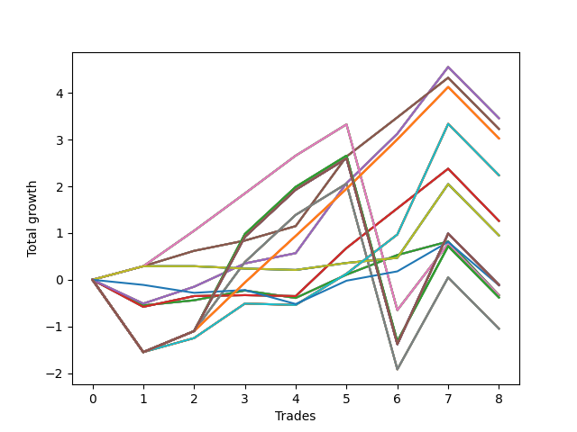

# Short Pointer 004 
- Symbol: SPY_Unlimited
- Date Range: 03/23/2022 - 07/08/2022
- Trading Period: 7:20-12:30
- Number of Trades: 8



| Name | Win Percent | Profit | Avg Profit / Trade | Avg Time / Trade |      | Name | Win Percent | Profit | Avg Profit / Trade | Avg Time / Trade |
| ---- | ----------- | ------ | ------------------ | ---------------- | ---- | ---- | ----------- | ------ | ------------------ | ---------------- |
| Sorted By <br> Profit | | | | | | Sorted By <br> Win Percentage ||||
| Sixty-Six | 75.00 | 1730.00 | 216.25 | 18:10 |     | Sixty-Seven | 87.50 | 1615.00 | 201.87 | 14:42 |
| Fifty-Eight | 75.00 | 1730.00 | 216.25 | 18:10 |     | Fifty-Nine | 87.50 | 1615.00 | 201.87 | 14:42 |
| Fifty | 75.00 | 1730.00 | 216.25 | 18:10 |     | Fifty-One | 87.50 | 1615.00 | 201.87 | 14:42 |
| Forty-Two | 75.00 | 1730.00 | 216.25 | 18:10 |     | Forty-Three | 87.50 | 1615.00 | 201.87 | 14:42 |
| Two | 75.00 | 1730.00 | 216.25 | 18:10 |     | Three | 87.50 | 1615.00 | 201.87 | 14:42 |
| Sixty-Seven | 87.50 | 1615.00 | 201.87 | 14:42 |     | Sixty-Six | 75.00 | 1730.00 | 216.25 | 18:10 |
| Fifty-Nine | 87.50 | 1615.00 | 201.87 | 14:42 |     | Fifty-Eight | 75.00 | 1730.00 | 216.25 | 18:10 |
| Fifty-One | 87.50 | 1615.00 | 201.87 | 14:42 |     | Fifty | 75.00 | 1730.00 | 216.25 | 18:10 |
| Forty-Three | 87.50 | 1615.00 | 201.87 | 14:42 |     | Forty-Two | 75.00 | 1730.00 | 216.25 | 18:10 |
| Three | 87.50 | 1615.00 | 201.87 | 14:42 |     | Two | 75.00 | 1730.00 | 216.25 | 18:10 |
| One Hundred Twenty-Six | 75.00 | 1515.00 | 189.37 | 21:02 |     | One Hundred Twenty-Six | 75.00 | 1515.00 | 189.37 | 21:02 |
| One Hundred Twenty-One | 75.00 | 1515.00 | 189.37 | 21:02 |     | One Hundred Twenty-One | 75.00 | 1515.00 | 189.37 | 21:02 |
| One Hundred Sixteen | 75.00 | 1515.00 | 189.37 | 21:02 |     | One Hundred Sixteen | 75.00 | 1515.00 | 189.37 | 21:02 |
| One Hundred Eleven | 75.00 | 1515.00 | 189.37 | 21:02 |     | One Hundred Eleven | 75.00 | 1515.00 | 189.37 | 21:02 |
| Eighty-One | 75.00 | 1515.00 | 189.37 | 21:02 |     | Eighty-One | 75.00 | 1515.00 | 189.37 | 21:02 |
| Seventy-One | 62.50 | 1120.00 | 140.00 | 19:25 |     | Sixty-Eight | 75.00 | -165.00 | -20.63 | 23:26 |
| Sixty-Three | 62.50 | 1120.00 | 140.00 | 19:25 |     | Sixty | 75.00 | -165.00 | -20.63 | 23:26 |
| Fifty-Five | 62.50 | 1120.00 | 140.00 | 19:25 |     | Fifty-Two | 75.00 | -165.00 | -20.63 | 23:26 |
| Forty-Seven | 62.50 | 1120.00 | 140.00 | 19:25 |     | Forty-Four | 75.00 | -165.00 | -20.63 | 23:26 |
| Seven | 62.50 | 1120.00 | 140.00 | 19:25 |     | Four | 75.00 | -165.00 | -20.63 | 23:26 |
| Sixty-Five | 62.50 | 630.00 | 78.75 | 13:17 |     | Seventy-One | 62.50 | 1120.00 | 140.00 | 19:25 |
| Fifty-Seven | 62.50 | 630.00 | 78.75 | 13:17 |     | Sixty-Three | 62.50 | 1120.00 | 140.00 | 19:25 |
| Forty-Nine | 62.50 | 630.00 | 78.75 | 13:17 |     | Fifty-Five | 62.50 | 1120.00 | 140.00 | 19:25 |
| Forty-One | 62.50 | 630.00 | 78.75 | 13:17 |     | Forty-Seven | 62.50 | 1120.00 | 140.00 | 19:25 |
| One | 62.50 | 630.00 | 78.75 | 13:17 |     | Seven | 62.50 | 1120.00 | 140.00 | 19:25 |
| Seventy | 50.00 | 475.00 | 59.38 | 09:14 |     | Sixty-Five | 62.50 | 630.00 | 78.75 | 13:17 |
| Sixty-Two | 50.00 | 475.00 | 59.38 | 09:14 |     | Fifty-Seven | 62.50 | 630.00 | 78.75 | 13:17 |
| Fifty-Four | 50.00 | 475.00 | 59.38 | 09:14 |     | Forty-Nine | 62.50 | 630.00 | 78.75 | 13:17 |
| Forty-Six | 50.00 | 475.00 | 59.38 | 09:14 |     | Forty-One | 62.50 | 630.00 | 78.75 | 13:17 |
| Six | 50.00 | 475.00 | 59.38 | 09:14 |     | One | 62.50 | 630.00 | 78.75 | 13:17 |
| One Hundred Thirty | 62.50 | -55.00 | -6.88 | 29:55 |     | One Hundred Thirty | 62.50 | -55.00 | -6.88 | 29:55 |
| One Hundred Twenty-Nine | 62.50 | -55.00 | -6.88 | 29:55 |     | One Hundred Twenty-Nine | 62.50 | -55.00 | -6.88 | 29:55 |
| One Hundred Twenty-Eight | 62.50 | -55.00 | -6.88 | 29:55 |     | One Hundred Twenty-Eight | 62.50 | -55.00 | -6.88 | 29:55 |
| One Hundred Twenty-Five | 62.50 | -55.00 | -6.88 | 29:55 |     | One Hundred Twenty-Five | 62.50 | -55.00 | -6.88 | 29:55 |
| One Hundred Twenty-Four | 62.50 | -55.00 | -6.88 | 29:55 |     | One Hundred Twenty-Four | 62.50 | -55.00 | -6.88 | 29:55 |
| One Hundred Twenty-Three | 62.50 | -55.00 | -6.88 | 29:55 |     | One Hundred Twenty-Three | 62.50 | -55.00 | -6.88 | 29:55 |
| One Hundred Twenty | 62.50 | -55.00 | -6.88 | 29:55 |     | One Hundred Twenty | 62.50 | -55.00 | -6.88 | 29:55 |
| One Hundred Ninteen | 62.50 | -55.00 | -6.88 | 29:55 |     | One Hundred Ninteen | 62.50 | -55.00 | -6.88 | 29:55 |
| One Hundred Eighteen | 62.50 | -55.00 | -6.88 | 29:55 |     | One Hundred Eighteen | 62.50 | -55.00 | -6.88 | 29:55 |
| One Hundred Fifteen | 62.50 | -55.00 | -6.88 | 29:55 |     | One Hundred Fifteen | 62.50 | -55.00 | -6.88 | 29:55 |
| One Hundred Fourteen | 62.50 | -55.00 | -6.88 | 29:55 |     | One Hundred Fourteen | 62.50 | -55.00 | -6.88 | 29:55 |
| One Hundred Thirteen | 62.50 | -55.00 | -6.88 | 29:55 |     | One Hundred Thirteen | 62.50 | -55.00 | -6.88 | 29:55 |
| Eighty-Five | 62.50 | -55.00 | -6.88 | 29:55 |     | Eighty-Five | 62.50 | -55.00 | -6.88 | 29:55 |
| Eighty-Four | 62.50 | -55.00 | -6.88 | 29:55 |     | Eighty-Four | 62.50 | -55.00 | -6.88 | 29:55 |
| Eighty-Three | 62.50 | -55.00 | -6.88 | 29:55 |     | Eighty-Three | 62.50 | -55.00 | -6.88 | 29:55 |
| Seventy-Three | 50.00 | -60.00 | -7.50 | 05:50 |     | Sixty-Four | 62.50 | -165.00 | -20.62 | 08:10 |
| Sixty-Eight | 75.00 | -165.00 | -20.63 | 23:26 |     | Fifty-Six | 62.50 | -165.00 | -20.62 | 08:10 |
| Sixty | 75.00 | -165.00 | -20.63 | 23:26 |     | Forty-Eight | 62.50 | -165.00 | -20.62 | 08:10 |
| Fifty-Two | 75.00 | -165.00 | -20.63 | 23:26 |     | Forty | 62.50 | -165.00 | -20.62 | 08:10 |
| Forty-Four | 75.00 | -165.00 | -20.63 | 23:26 |     | Zero | 62.50 | -165.00 | -20.62 | 08:10 |
| Four | 75.00 | -165.00 | -20.63 | 23:26 |     | One Hundred Twenty-Seven | 62.50 | -190.00 | -23.75 | 27:58 |
| Sixty-Four | 62.50 | -165.00 | -20.62 | 08:10 |     | One Hundred Twenty-Two | 62.50 | -190.00 | -23.75 | 27:58 |
| Fifty-Six | 62.50 | -165.00 | -20.62 | 08:10 |     | One Hundred Seventeen | 62.50 | -190.00 | -23.75 | 27:58 |
| Forty-Eight | 62.50 | -165.00 | -20.62 | 08:10 |     | One Hundred Twelve | 62.50 | -190.00 | -23.75 | 27:58 |
| Forty | 62.50 | -165.00 | -20.62 | 08:10 |     | Eighty-Two | 62.50 | -190.00 | -23.75 | 27:58 |
| Zero | 62.50 | -165.00 | -20.62 | 08:10 |     | Sixty-Nine | 62.50 | -525.00 | -65.63 | 27:38 |
| One Hundred Twenty-Seven | 62.50 | -190.00 | -23.75 | 27:58 |     | Sixty-One | 62.50 | -525.00 | -65.63 | 27:38 |
| One Hundred Twenty-Two | 62.50 | -190.00 | -23.75 | 27:58 |     | Fifty-Three | 62.50 | -525.00 | -65.63 | 27:38 |
| One Hundred Seventeen | 62.50 | -190.00 | -23.75 | 27:58 |     | Forty-Five | 62.50 | -525.00 | -65.63 | 27:38 |
| One Hundred Twelve | 62.50 | -190.00 | -23.75 | 27:58 |     | Five | 62.50 | -525.00 | -65.63 | 27:38 |
| Eighty-Two | 62.50 | -190.00 | -23.75 | 27:58 |     | Seventy | 50.00 | 475.00 | 59.38 | 09:14 |
| Sixty-Nine | 62.50 | -525.00 | -65.63 | 27:38 |     | Sixty-Two | 50.00 | 475.00 | 59.38 | 09:14 |
| Sixty-One | 62.50 | -525.00 | -65.63 | 27:38 |     | Fifty-Four | 50.00 | 475.00 | 59.38 | 09:14 |
| Fifty-Three | 62.50 | -525.00 | -65.63 | 27:38 |     | Forty-Six | 50.00 | 475.00 | 59.38 | 09:14 |
| Forty-Five | 62.50 | -525.00 | -65.63 | 27:38 |     | Six | 50.00 | 475.00 | 59.38 | 09:14 |
| Five | 62.50 | -525.00 | -65.63 | 27:38 |     | Seventy-Three | 50.00 | -60.00 | -7.50 | 05:50 |

## NO STOPLOSS

### Test Zero
* Sell when price hits the middle line of the 20p bollinger
* No Stoploss
* Results:
```
Total Trades: 8
Percent Up: 37.50
Percent Down: 62.50
Total Points Moved Down: -0.33
Potential Profit: -165.00
Total Points Ups: 1.86 Count Ups: 3
Total Points Downs: 1.53 Count Downs: 5
```

<details><summary>Trades</summary>

<code>In: 2022-04-06 10:32:00		Out: 2022-04-06 10:47:10		Total Position Time: 15:10		Total Move Down: -0.55		Total to Date: -0.55</code> <br />
<code>In: 2022-04-11 10:09:00		Out: 2022-04-11 10:16:10		Total Position Time: 07:10		Total Move Down: 0.11		Total to Date: -0.44</code> <br />
<code>In: 2022-04-29 08:37:00		Out: 2022-04-29 08:39:05		Total Position Time: 02:05		Total Move Down: 0.21		Total to Date: -0.23</code> <br />
<code>In: 2022-04-29 10:29:00		Out: 2022-04-29 10:40:30		Total Position Time: 11:30		Total Move Down: -0.16		Total to Date: -0.39</code> <br />
<code>In: 2022-05-05 10:11:00		Out: 2022-05-05 10:12:50		Total Position Time: 01:50		Total Move Down: 0.50		Total to Date: 0.11</code> <br />
<code>In: 2022-05-10 10:11:00		Out: 2022-05-10 10:13:55		Total Position Time: 02:55		Total Move Down: 0.42		Total to Date: 0.53</code> <br />
<code>In: 2022-06-13 09:42:00		Out: 2022-06-13 09:44:05		Total Position Time: 02:05		Total Move Down: 0.29		Total to Date: 0.82</code> <br />
<code>In: 2022-07-01 10:36:00		Out: 2022-07-01 10:58:40		Total Position Time: 22:40		Total Move Down: -1.15		Total to Date: -0.33</code> <br />


</details>

### Test One
* Sell when the price hits the upper line of the 20p 1std bollinger
* No Stoploss
* Results:
```
Total Trades: 8
Percent Up: 37.50
Percent Down: 62.50
Total Points Moved Down: 1.26
Potential Profit: 630.00
Total Points Ups: 1.72 Count Ups: 3
Total Points Downs: 2.98 Count Downs: 5
```

<details><summary>Trades</summary>

<code>In: 2022-04-06 10:32:00		Out: 2022-04-06 10:56:55		Total Position Time: 24:55		Total Move Down: -0.58		Total to Date: -0.58</code> <br />
<code>In: 2022-04-11 10:09:00		Out: 2022-04-11 10:17:05		Total Position Time: 08:05		Total Move Down: 0.23		Total to Date: -0.35</code> <br />
<code>In: 2022-04-29 08:37:00		Out: 2022-04-29 08:52:25		Total Position Time: 15:25		Total Move Down: 0.02		Total to Date: -0.33</code> <br />
<code>In: 2022-04-29 10:29:00		Out: 2022-04-29 10:41:05		Total Position Time: 12:05		Total Move Down: -0.02		Total to Date: -0.35</code> <br />
<code>In: 2022-05-05 10:11:00		Out: 2022-05-05 10:16:05		Total Position Time: 05:05		Total Move Down: 1.03		Total to Date: 0.68</code> <br />
<code>In: 2022-05-10 10:11:00		Out: 2022-05-10 10:17:25		Total Position Time: 06:25		Total Move Down: 0.85		Total to Date: 1.53</code> <br />
<code>In: 2022-06-13 09:42:00		Out: 2022-06-13 09:47:55		Total Position Time: 05:55		Total Move Down: 0.85		Total to Date: 2.38</code> <br />
<code>In: 2022-07-01 10:36:00		Out: 2022-07-01 11:04:25		Total Position Time: 28:25		Total Move Down: -1.12		Total to Date: 1.26</code> <br />


</details>

### Test Two
* Sell when the price hits the upper line of the 20p 2std bollinger
* No Stoploss
* Results:
```
Total Trades: 8
Percent Up: 25.00
Percent Down: 75.00
Total Points Moved Down: 3.46
Potential Profit: 1730.00
Total Points Ups: 1.61 Count Ups: 2
Total Points Downs: 5.07 Count Downs: 6
```

<details><summary>Trades</summary>

<code>In: 2022-04-06 10:32:00		Out: 2022-04-06 10:57:20		Total Position Time: 25:20		Total Move Down: -0.51		Total to Date: -0.51</code> <br />
<code>In: 2022-04-11 10:09:00		Out: 2022-04-11 10:19:05		Total Position Time: 10:05		Total Move Down: 0.36		Total to Date: -0.15</code> <br />
<code>In: 2022-04-29 08:37:00		Out: 2022-04-29 08:57:25		Total Position Time: 20:25		Total Move Down: 0.50		Total to Date: 0.35</code> <br />
<code>In: 2022-04-29 10:29:00		Out: 2022-04-29 10:43:20		Total Position Time: 14:20		Total Move Down: 0.22		Total to Date: 0.57</code> <br />
<code>In: 2022-05-05 10:11:00		Out: 2022-05-05 10:30:30		Total Position Time: 19:30		Total Move Down: 1.50		Total to Date: 2.07</code> <br />
<code>In: 2022-05-10 10:11:00		Out: 2022-05-10 10:24:00		Total Position Time: 13:00		Total Move Down: 1.06		Total to Date: 3.13</code> <br />
<code>In: 2022-06-13 09:42:00		Out: 2022-06-13 09:54:45		Total Position Time: 12:45		Total Move Down: 1.43		Total to Date: 4.56</code> <br />
<code>In: 2022-07-01 10:36:00		Out: 2022-07-01 11:05:55		Total Position Time: 29:55		Total Move Down: -1.10		Total to Date: 3.46</code> <br />


</details>

### Test Three
* Sell when price hits the middle line of the 50p bollinger
* No Stoploss
* Results:
```
Total Trades: 8
Percent Up: 12.50
Percent Down: 87.50
Total Points Moved Down: 3.23
Potential Profit: 1615.00
Total Points Ups: 1.10 Count Ups: 1
Total Points Downs: 4.33 Count Downs: 7
```

<details><summary>Trades</summary>

<code>In: 2022-04-06 10:32:00		Out: 2022-04-06 11:00:10		Total Position Time: 28:10		Total Move Down: 0.29		Total to Date: 0.29</code> <br />
<code>In: 2022-04-11 10:09:00		Out: 2022-04-11 10:18:35		Total Position Time: 09:35		Total Move Down: 0.33		Total to Date: 0.62</code> <br />
<code>In: 2022-04-29 08:37:00		Out: 2022-04-29 08:56:15		Total Position Time: 19:15		Total Move Down: 0.22		Total to Date: 0.84</code> <br />
<code>In: 2022-04-29 10:29:00		Out: 2022-04-29 10:43:40		Total Position Time: 14:40		Total Move Down: 0.31		Total to Date: 1.15</code> <br />
<code>In: 2022-05-05 10:11:00		Out: 2022-05-05 10:16:30		Total Position Time: 05:30		Total Move Down: 1.49		Total to Date: 2.64</code> <br />
<code>In: 2022-05-10 10:11:00		Out: 2022-05-10 10:15:40		Total Position Time: 04:40		Total Move Down: 0.84		Total to Date: 3.48</code> <br />
<code>In: 2022-06-13 09:42:00		Out: 2022-06-13 09:47:55		Total Position Time: 05:55		Total Move Down: 0.85		Total to Date: 4.33</code> <br />
<code>In: 2022-07-01 10:36:00		Out: 2022-07-01 11:05:55		Total Position Time: 29:55		Total Move Down: -1.10		Total to Date: 3.23</code> <br />


</details>

### Test Four
* Sell when the price hits the upper line of the 50p 1std bollinger
* No Stoploss
* Results:
```
Total Trades: 8
Percent Up: 25.00
Percent Down: 75.00
Total Points Moved Down: -0.33
Potential Profit: -165.00
Total Points Ups: 5.08 Count Ups: 2
Total Points Downs: 4.75 Count Downs: 6
```

<details><summary>Trades</summary>

<code>In: 2022-04-06 10:32:00		Out: 2022-04-06 11:00:10		Total Position Time: 28:10		Total Move Down: 0.29		Total to Date: 0.29</code> <br />
<code>In: 2022-04-11 10:09:00		Out: 2022-04-11 10:24:35		Total Position Time: 15:35		Total Move Down: 0.76		Total to Date: 1.05</code> <br />
<code>In: 2022-04-29 08:37:00		Out: 2022-04-29 08:59:50		Total Position Time: 22:50		Total Move Down: 0.80		Total to Date: 1.85</code> <br />
<code>In: 2022-04-29 10:29:00		Out: 2022-04-29 10:47:20		Total Position Time: 18:20		Total Move Down: 0.81		Total to Date: 2.66</code> <br />
<code>In: 2022-05-05 10:11:00		Out: 2022-05-05 10:40:55		Total Position Time: 29:55		Total Move Down: 0.67		Total to Date: 3.33</code> <br />
<code>In: 2022-05-10 10:11:00		Out: 2022-05-10 10:40:55		Total Position Time: 29:55		Total Move Down: -3.98		Total to Date: -0.65</code> <br />
<code>In: 2022-06-13 09:42:00		Out: 2022-06-13 09:54:50		Total Position Time: 12:50		Total Move Down: 1.42		Total to Date: 0.77</code> <br />
<code>In: 2022-07-01 10:36:00		Out: 2022-07-01 11:05:55		Total Position Time: 29:55		Total Move Down: -1.10		Total to Date: -0.33</code> <br />


</details>

### Test Five
* Sell when the price hits the upper line of the 50p 2std bollinger
* No Stoploss
* Results:
```
Total Trades: 8
Percent Up: 37.50
Percent Down: 62.50
Total Points Moved Down: -1.05
Potential Profit: -525.00
Total Points Ups: 6.63 Count Ups: 3
Total Points Downs: 5.58 Count Downs: 5
```

<details><summary>Trades</summary>

<code>In: 2022-04-06 10:32:00		Out: 2022-04-06 11:01:55		Total Position Time: 29:55		Total Move Down: -1.55		Total to Date: -1.55</code> <br />
<code>In: 2022-04-11 10:09:00		Out: 2022-04-11 10:38:55		Total Position Time: 29:55		Total Move Down: 0.45		Total to Date: -1.10</code> <br />
<code>In: 2022-04-29 08:37:00		Out: 2022-04-29 09:02:25		Total Position Time: 25:25		Total Move Down: 1.48		Total to Date: 0.38</code> <br />
<code>In: 2022-04-29 10:29:00		Out: 2022-04-29 10:58:55		Total Position Time: 29:55		Total Move Down: 1.01		Total to Date: 1.39</code> <br />
<code>In: 2022-05-05 10:11:00		Out: 2022-05-05 10:40:55		Total Position Time: 29:55		Total Move Down: 0.67		Total to Date: 2.06</code> <br />
<code>In: 2022-05-10 10:11:00		Out: 2022-05-10 10:40:55		Total Position Time: 29:55		Total Move Down: -3.98		Total to Date: -1.92</code> <br />
<code>In: 2022-06-13 09:42:00		Out: 2022-06-13 09:58:15		Total Position Time: 16:15		Total Move Down: 1.97		Total to Date: 0.05</code> <br />
<code>In: 2022-07-01 10:36:00		Out: 2022-07-01 11:05:55		Total Position Time: 29:55		Total Move Down: -1.10		Total to Date: -1.05</code> <br />


</details>

### Test Six
* Sell when the price hits the middle line of the 1std VWAP
* No Stoploss
* Results:
```
Total Trades: 8
Percent Up: 50.00
Percent Down: 50.00
Total Points Moved Down: 0.95
Potential Profit: 475.00
Total Points Ups: 1.18 Count Ups: 4
Total Points Downs: 2.13 Count Downs: 4
```

<details><summary>Trades</summary>

<code>In: 2022-04-06 10:32:00		Out: 2022-04-06 11:00:10		Total Position Time: 28:10		Total Move Down: 0.29		Total to Date: 0.29</code> <br />
<code>In: 2022-04-11 10:09:00		Out: 2022-04-11 10:09:10		Total Position Time: 00:10		Total Move Down: -0.00		Total to Date: 0.29</code> <br />
<code>In: 2022-04-29 08:37:00		Out: 2022-04-29 08:37:10		Total Position Time: 00:10		Total Move Down: -0.05		Total to Date: 0.24</code> <br />
<code>In: 2022-04-29 10:29:00		Out: 2022-04-29 10:29:10		Total Position Time: 00:10		Total Move Down: -0.03		Total to Date: 0.21</code> <br />
<code>In: 2022-05-05 10:11:00		Out: 2022-05-05 10:11:10		Total Position Time: 00:10		Total Move Down: 0.15		Total to Date: 0.36</code> <br />
<code>In: 2022-05-10 10:11:00		Out: 2022-05-10 10:11:10		Total Position Time: 00:10		Total Move Down: 0.11		Total to Date: 0.47</code> <br />
<code>In: 2022-06-13 09:42:00		Out: 2022-06-13 09:57:00		Total Position Time: 15:00		Total Move Down: 1.58		Total to Date: 2.05</code> <br />
<code>In: 2022-07-01 10:36:00		Out: 2022-07-01 11:05:55		Total Position Time: 29:55		Total Move Down: -1.10		Total to Date: 0.95</code> <br />


</details>

### Test Seven
* Sell when the price hits the upper line of the 1std VWAP
* No Stoploss
* Results:
```
Total Trades: 8
Percent Up: 37.50
Percent Down: 62.50
Total Points Moved Down: 2.24
Potential Profit: 1120.00
Total Points Ups: 2.68 Count Ups: 3
Total Points Downs: 4.92 Count Downs: 5
```

<details><summary>Trades</summary>

<code>In: 2022-04-06 10:32:00		Out: 2022-04-06 11:01:55		Total Position Time: 29:55		Total Move Down: -1.55		Total to Date: -1.55</code> <br />
<code>In: 2022-04-11 10:09:00		Out: 2022-04-11 10:18:20		Total Position Time: 09:20		Total Move Down: 0.30		Total to Date: -1.25</code> <br />
<code>In: 2022-04-29 08:37:00		Out: 2022-04-29 08:58:30		Total Position Time: 21:30		Total Move Down: 0.74		Total to Date: -0.51</code> <br />
<code>In: 2022-04-29 10:29:00		Out: 2022-04-29 10:29:10		Total Position Time: 00:10		Total Move Down: -0.03		Total to Date: -0.54</code> <br />
<code>In: 2022-05-05 10:11:00		Out: 2022-05-05 10:40:55		Total Position Time: 29:55		Total Move Down: 0.67		Total to Date: 0.13</code> <br />
<code>In: 2022-05-10 10:11:00		Out: 2022-05-10 10:15:40		Total Position Time: 04:40		Total Move Down: 0.84		Total to Date: 0.97</code> <br />
<code>In: 2022-06-13 09:42:00		Out: 2022-06-13 10:11:55		Total Position Time: 29:55		Total Move Down: 2.37		Total to Date: 3.34</code> <br />
<code>In: 2022-07-01 10:36:00		Out: 2022-07-01 11:05:55		Total Position Time: 29:55		Total Move Down: -1.10		Total to Date: 2.24</code> <br />


</details>

## STOPLOSS OF 5

### Test Forty
* Sell when price hits the middle line of the 20p bollinger
* Stoploss is -5 points
* Results:
```
Total Trades: 8
Percent Up: 37.50
Percent Down: 62.50
Total Points Moved Down: -0.33
Potential Profit: -165.00
Total Points Ups: 1.86 Count Ups: 3
Total Points Downs: 1.53 Count Downs: 5
```

<details><summary>Trades</summary>

<code>In: 2022-04-06 10:32:00		Out: 2022-04-06 10:47:10		Total Position Time: 15:10		Total Move Down: -0.55		Total to Date: -0.55</code> <br />
<code>In: 2022-04-11 10:09:00		Out: 2022-04-11 10:16:10		Total Position Time: 07:10		Total Move Down: 0.11		Total to Date: -0.44</code> <br />
<code>In: 2022-04-29 08:37:00		Out: 2022-04-29 08:39:05		Total Position Time: 02:05		Total Move Down: 0.21		Total to Date: -0.23</code> <br />
<code>In: 2022-04-29 10:29:00		Out: 2022-04-29 10:40:30		Total Position Time: 11:30		Total Move Down: -0.16		Total to Date: -0.39</code> <br />
<code>In: 2022-05-05 10:11:00		Out: 2022-05-05 10:12:50		Total Position Time: 01:50		Total Move Down: 0.50		Total to Date: 0.11</code> <br />
<code>In: 2022-05-10 10:11:00		Out: 2022-05-10 10:13:55		Total Position Time: 02:55		Total Move Down: 0.42		Total to Date: 0.53</code> <br />
<code>In: 2022-06-13 09:42:00		Out: 2022-06-13 09:44:05		Total Position Time: 02:05		Total Move Down: 0.29		Total to Date: 0.82</code> <br />
<code>In: 2022-07-01 10:36:00		Out: 2022-07-01 10:58:40		Total Position Time: 22:40		Total Move Down: -1.15		Total to Date: -0.33</code> <br />


</details>

### Test Forty-One
* Sell when the price hits the upper line of the 20p 1std bollinger
* Stoploss is -5 points
* Results:
```
Total Trades: 8
Percent Up: 37.50
Percent Down: 62.50
Total Points Moved Down: 1.26
Potential Profit: 630.00
Total Points Ups: 1.72 Count Ups: 3
Total Points Downs: 2.98 Count Downs: 5
```

<details><summary>Trades</summary>

<code>In: 2022-04-06 10:32:00		Out: 2022-04-06 10:56:55		Total Position Time: 24:55		Total Move Down: -0.58		Total to Date: -0.58</code> <br />
<code>In: 2022-04-11 10:09:00		Out: 2022-04-11 10:17:05		Total Position Time: 08:05		Total Move Down: 0.23		Total to Date: -0.35</code> <br />
<code>In: 2022-04-29 08:37:00		Out: 2022-04-29 08:52:25		Total Position Time: 15:25		Total Move Down: 0.02		Total to Date: -0.33</code> <br />
<code>In: 2022-04-29 10:29:00		Out: 2022-04-29 10:41:05		Total Position Time: 12:05		Total Move Down: -0.02		Total to Date: -0.35</code> <br />
<code>In: 2022-05-05 10:11:00		Out: 2022-05-05 10:16:05		Total Position Time: 05:05		Total Move Down: 1.03		Total to Date: 0.68</code> <br />
<code>In: 2022-05-10 10:11:00		Out: 2022-05-10 10:17:25		Total Position Time: 06:25		Total Move Down: 0.85		Total to Date: 1.53</code> <br />
<code>In: 2022-06-13 09:42:00		Out: 2022-06-13 09:47:55		Total Position Time: 05:55		Total Move Down: 0.85		Total to Date: 2.38</code> <br />
<code>In: 2022-07-01 10:36:00		Out: 2022-07-01 11:04:25		Total Position Time: 28:25		Total Move Down: -1.12		Total to Date: 1.26</code> <br />


</details>

### Test Forty-Two
* Sell when the price hits the upper line of the 20p 2std bollinger
* Stoploss is -5 points
* Results:
```
Total Trades: 8
Percent Up: 25.00
Percent Down: 75.00
Total Points Moved Down: 3.46
Potential Profit: 1730.00
Total Points Ups: 1.61 Count Ups: 2
Total Points Downs: 5.07 Count Downs: 6
```

<details><summary>Trades</summary>

<code>In: 2022-04-06 10:32:00		Out: 2022-04-06 10:57:20		Total Position Time: 25:20		Total Move Down: -0.51		Total to Date: -0.51</code> <br />
<code>In: 2022-04-11 10:09:00		Out: 2022-04-11 10:19:05		Total Position Time: 10:05		Total Move Down: 0.36		Total to Date: -0.15</code> <br />
<code>In: 2022-04-29 08:37:00		Out: 2022-04-29 08:57:25		Total Position Time: 20:25		Total Move Down: 0.50		Total to Date: 0.35</code> <br />
<code>In: 2022-04-29 10:29:00		Out: 2022-04-29 10:43:20		Total Position Time: 14:20		Total Move Down: 0.22		Total to Date: 0.57</code> <br />
<code>In: 2022-05-05 10:11:00		Out: 2022-05-05 10:30:30		Total Position Time: 19:30		Total Move Down: 1.50		Total to Date: 2.07</code> <br />
<code>In: 2022-05-10 10:11:00		Out: 2022-05-10 10:24:00		Total Position Time: 13:00		Total Move Down: 1.06		Total to Date: 3.13</code> <br />
<code>In: 2022-06-13 09:42:00		Out: 2022-06-13 09:54:45		Total Position Time: 12:45		Total Move Down: 1.43		Total to Date: 4.56</code> <br />
<code>In: 2022-07-01 10:36:00		Out: 2022-07-01 11:05:55		Total Position Time: 29:55		Total Move Down: -1.10		Total to Date: 3.46</code> <br />


</details>

### Test Forty-Three
* Sell when price hits the middle line of the 50p bollinger
* Stoploss is -5 points
* Results:
```
Total Trades: 8
Percent Up: 12.50
Percent Down: 87.50
Total Points Moved Down: 3.23
Potential Profit: 1615.00
Total Points Ups: 1.10 Count Ups: 1
Total Points Downs: 4.33 Count Downs: 7
```

<details><summary>Trades</summary>

<code>In: 2022-04-06 10:32:00		Out: 2022-04-06 11:00:10		Total Position Time: 28:10		Total Move Down: 0.29		Total to Date: 0.29</code> <br />
<code>In: 2022-04-11 10:09:00		Out: 2022-04-11 10:18:35		Total Position Time: 09:35		Total Move Down: 0.33		Total to Date: 0.62</code> <br />
<code>In: 2022-04-29 08:37:00		Out: 2022-04-29 08:56:15		Total Position Time: 19:15		Total Move Down: 0.22		Total to Date: 0.84</code> <br />
<code>In: 2022-04-29 10:29:00		Out: 2022-04-29 10:43:40		Total Position Time: 14:40		Total Move Down: 0.31		Total to Date: 1.15</code> <br />
<code>In: 2022-05-05 10:11:00		Out: 2022-05-05 10:16:30		Total Position Time: 05:30		Total Move Down: 1.49		Total to Date: 2.64</code> <br />
<code>In: 2022-05-10 10:11:00		Out: 2022-05-10 10:15:40		Total Position Time: 04:40		Total Move Down: 0.84		Total to Date: 3.48</code> <br />
<code>In: 2022-06-13 09:42:00		Out: 2022-06-13 09:47:55		Total Position Time: 05:55		Total Move Down: 0.85		Total to Date: 4.33</code> <br />
<code>In: 2022-07-01 10:36:00		Out: 2022-07-01 11:05:55		Total Position Time: 29:55		Total Move Down: -1.10		Total to Date: 3.23</code> <br />


</details>

### Test Forty-Four
* Sell when the price hits the upper line of the 50p 1std bollinger
* Stoploss is -5 points
* Results:
```
Total Trades: 8
Percent Up: 25.00
Percent Down: 75.00
Total Points Moved Down: -0.33
Potential Profit: -165.00
Total Points Ups: 5.08 Count Ups: 2
Total Points Downs: 4.75 Count Downs: 6
```

<details><summary>Trades</summary>

<code>In: 2022-04-06 10:32:00		Out: 2022-04-06 11:00:10		Total Position Time: 28:10		Total Move Down: 0.29		Total to Date: 0.29</code> <br />
<code>In: 2022-04-11 10:09:00		Out: 2022-04-11 10:24:35		Total Position Time: 15:35		Total Move Down: 0.76		Total to Date: 1.05</code> <br />
<code>In: 2022-04-29 08:37:00		Out: 2022-04-29 08:59:50		Total Position Time: 22:50		Total Move Down: 0.80		Total to Date: 1.85</code> <br />
<code>In: 2022-04-29 10:29:00		Out: 2022-04-29 10:47:20		Total Position Time: 18:20		Total Move Down: 0.81		Total to Date: 2.66</code> <br />
<code>In: 2022-05-05 10:11:00		Out: 2022-05-05 10:40:55		Total Position Time: 29:55		Total Move Down: 0.67		Total to Date: 3.33</code> <br />
<code>In: 2022-05-10 10:11:00		Out: 2022-05-10 10:40:55		Total Position Time: 29:55		Total Move Down: -3.98		Total to Date: -0.65</code> <br />
<code>In: 2022-06-13 09:42:00		Out: 2022-06-13 09:54:50		Total Position Time: 12:50		Total Move Down: 1.42		Total to Date: 0.77</code> <br />
<code>In: 2022-07-01 10:36:00		Out: 2022-07-01 11:05:55		Total Position Time: 29:55		Total Move Down: -1.10		Total to Date: -0.33</code> <br />


</details>

### Test Forty-Five
* Sell when the price hits the upper line of the 50p 2std bollinger
* Stoploss is -5 points
* Results:
```
Total Trades: 8
Percent Up: 37.50
Percent Down: 62.50
Total Points Moved Down: -1.05
Potential Profit: -525.00
Total Points Ups: 6.63 Count Ups: 3
Total Points Downs: 5.58 Count Downs: 5
```

<details><summary>Trades</summary>

<code>In: 2022-04-06 10:32:00		Out: 2022-04-06 11:01:55		Total Position Time: 29:55		Total Move Down: -1.55		Total to Date: -1.55</code> <br />
<code>In: 2022-04-11 10:09:00		Out: 2022-04-11 10:38:55		Total Position Time: 29:55		Total Move Down: 0.45		Total to Date: -1.10</code> <br />
<code>In: 2022-04-29 08:37:00		Out: 2022-04-29 09:02:25		Total Position Time: 25:25		Total Move Down: 1.48		Total to Date: 0.38</code> <br />
<code>In: 2022-04-29 10:29:00		Out: 2022-04-29 10:58:55		Total Position Time: 29:55		Total Move Down: 1.01		Total to Date: 1.39</code> <br />
<code>In: 2022-05-05 10:11:00		Out: 2022-05-05 10:40:55		Total Position Time: 29:55		Total Move Down: 0.67		Total to Date: 2.06</code> <br />
<code>In: 2022-05-10 10:11:00		Out: 2022-05-10 10:40:55		Total Position Time: 29:55		Total Move Down: -3.98		Total to Date: -1.92</code> <br />
<code>In: 2022-06-13 09:42:00		Out: 2022-06-13 09:58:15		Total Position Time: 16:15		Total Move Down: 1.97		Total to Date: 0.05</code> <br />
<code>In: 2022-07-01 10:36:00		Out: 2022-07-01 11:05:55		Total Position Time: 29:55		Total Move Down: -1.10		Total to Date: -1.05</code> <br />


</details>

### Test Forty-Six
* Sell when the price hits the middle line of the 1std VWAP
* Stoploss is -5 points
* Results:
```
Total Trades: 8
Percent Up: 50.00
Percent Down: 50.00
Total Points Moved Down: 0.95
Potential Profit: 475.00
Total Points Ups: 1.18 Count Ups: 4
Total Points Downs: 2.13 Count Downs: 4
```

<details><summary>Trades</summary>

<code>In: 2022-04-06 10:32:00		Out: 2022-04-06 11:00:10		Total Position Time: 28:10		Total Move Down: 0.29		Total to Date: 0.29</code> <br />
<code>In: 2022-04-11 10:09:00		Out: 2022-04-11 10:09:10		Total Position Time: 00:10		Total Move Down: -0.00		Total to Date: 0.29</code> <br />
<code>In: 2022-04-29 08:37:00		Out: 2022-04-29 08:37:10		Total Position Time: 00:10		Total Move Down: -0.05		Total to Date: 0.24</code> <br />
<code>In: 2022-04-29 10:29:00		Out: 2022-04-29 10:29:10		Total Position Time: 00:10		Total Move Down: -0.03		Total to Date: 0.21</code> <br />
<code>In: 2022-05-05 10:11:00		Out: 2022-05-05 10:11:10		Total Position Time: 00:10		Total Move Down: 0.15		Total to Date: 0.36</code> <br />
<code>In: 2022-05-10 10:11:00		Out: 2022-05-10 10:11:10		Total Position Time: 00:10		Total Move Down: 0.11		Total to Date: 0.47</code> <br />
<code>In: 2022-06-13 09:42:00		Out: 2022-06-13 09:57:00		Total Position Time: 15:00		Total Move Down: 1.58		Total to Date: 2.05</code> <br />
<code>In: 2022-07-01 10:36:00		Out: 2022-07-01 11:05:55		Total Position Time: 29:55		Total Move Down: -1.10		Total to Date: 0.95</code> <br />


</details>

### Test Forty-Seven
* Sell when the price hits the upper line of the 1std VWAP
* Stoploss is -5 points
* Results:
```
Total Trades: 8
Percent Up: 37.50
Percent Down: 62.50
Total Points Moved Down: 2.24
Potential Profit: 1120.00
Total Points Ups: 2.68 Count Ups: 3
Total Points Downs: 4.92 Count Downs: 5
```

<details><summary>Trades</summary>

<code>In: 2022-04-06 10:32:00		Out: 2022-04-06 11:01:55		Total Position Time: 29:55		Total Move Down: -1.55		Total to Date: -1.55</code> <br />
<code>In: 2022-04-11 10:09:00		Out: 2022-04-11 10:18:20		Total Position Time: 09:20		Total Move Down: 0.30		Total to Date: -1.25</code> <br />
<code>In: 2022-04-29 08:37:00		Out: 2022-04-29 08:58:30		Total Position Time: 21:30		Total Move Down: 0.74		Total to Date: -0.51</code> <br />
<code>In: 2022-04-29 10:29:00		Out: 2022-04-29 10:29:10		Total Position Time: 00:10		Total Move Down: -0.03		Total to Date: -0.54</code> <br />
<code>In: 2022-05-05 10:11:00		Out: 2022-05-05 10:40:55		Total Position Time: 29:55		Total Move Down: 0.67		Total to Date: 0.13</code> <br />
<code>In: 2022-05-10 10:11:00		Out: 2022-05-10 10:15:40		Total Position Time: 04:40		Total Move Down: 0.84		Total to Date: 0.97</code> <br />
<code>In: 2022-06-13 09:42:00		Out: 2022-06-13 10:11:55		Total Position Time: 29:55		Total Move Down: 2.37		Total to Date: 3.34</code> <br />
<code>In: 2022-07-01 10:36:00		Out: 2022-07-01 11:05:55		Total Position Time: 29:55		Total Move Down: -1.10		Total to Date: 2.24</code> <br />


</details>

## TRAIL STOP OF 5

### Test Forty-Eight
* Sell when price hits the middle line of the 20p bollinger
* Trailing Stop is -5 points
* Results:
```
Total Trades: 8
Percent Up: 37.50
Percent Down: 62.50
Total Points Moved Down: -0.33
Potential Profit: -165.00
Total Points Ups: 1.86 Count Ups: 3
Total Points Downs: 1.53 Count Downs: 5
```

<details><summary>Trades</summary>

<code>In: 2022-04-06 10:32:00		Out: 2022-04-06 10:47:10		Total Position Time: 15:10		Total Move Down: -0.55		Total to Date: -0.55</code> <br />
<code>In: 2022-04-11 10:09:00		Out: 2022-04-11 10:16:10		Total Position Time: 07:10		Total Move Down: 0.11		Total to Date: -0.44</code> <br />
<code>In: 2022-04-29 08:37:00		Out: 2022-04-29 08:39:05		Total Position Time: 02:05		Total Move Down: 0.21		Total to Date: -0.23</code> <br />
<code>In: 2022-04-29 10:29:00		Out: 2022-04-29 10:40:30		Total Position Time: 11:30		Total Move Down: -0.16		Total to Date: -0.39</code> <br />
<code>In: 2022-05-05 10:11:00		Out: 2022-05-05 10:12:50		Total Position Time: 01:50		Total Move Down: 0.50		Total to Date: 0.11</code> <br />
<code>In: 2022-05-10 10:11:00		Out: 2022-05-10 10:13:55		Total Position Time: 02:55		Total Move Down: 0.42		Total to Date: 0.53</code> <br />
<code>In: 2022-06-13 09:42:00		Out: 2022-06-13 09:44:05		Total Position Time: 02:05		Total Move Down: 0.29		Total to Date: 0.82</code> <br />
<code>In: 2022-07-01 10:36:00		Out: 2022-07-01 10:58:40		Total Position Time: 22:40		Total Move Down: -1.15		Total to Date: -0.33</code> <br />


</details>

### Test Forty-Nine
* Sell when the price hits the upper line of the 20p 1std bollinger
* Trailing Stop is -5 points
* Results:
```
Total Trades: 8
Percent Up: 37.50
Percent Down: 62.50
Total Points Moved Down: 1.26
Potential Profit: 630.00
Total Points Ups: 1.72 Count Ups: 3
Total Points Downs: 2.98 Count Downs: 5
```

<details><summary>Trades</summary>

<code>In: 2022-04-06 10:32:00		Out: 2022-04-06 10:56:55		Total Position Time: 24:55		Total Move Down: -0.58		Total to Date: -0.58</code> <br />
<code>In: 2022-04-11 10:09:00		Out: 2022-04-11 10:17:05		Total Position Time: 08:05		Total Move Down: 0.23		Total to Date: -0.35</code> <br />
<code>In: 2022-04-29 08:37:00		Out: 2022-04-29 08:52:25		Total Position Time: 15:25		Total Move Down: 0.02		Total to Date: -0.33</code> <br />
<code>In: 2022-04-29 10:29:00		Out: 2022-04-29 10:41:05		Total Position Time: 12:05		Total Move Down: -0.02		Total to Date: -0.35</code> <br />
<code>In: 2022-05-05 10:11:00		Out: 2022-05-05 10:16:05		Total Position Time: 05:05		Total Move Down: 1.03		Total to Date: 0.68</code> <br />
<code>In: 2022-05-10 10:11:00		Out: 2022-05-10 10:17:25		Total Position Time: 06:25		Total Move Down: 0.85		Total to Date: 1.53</code> <br />
<code>In: 2022-06-13 09:42:00		Out: 2022-06-13 09:47:55		Total Position Time: 05:55		Total Move Down: 0.85		Total to Date: 2.38</code> <br />
<code>In: 2022-07-01 10:36:00		Out: 2022-07-01 11:04:25		Total Position Time: 28:25		Total Move Down: -1.12		Total to Date: 1.26</code> <br />


</details>

### Test Fifty
* Sell when the price hits the upper line of the 20p 2std bollinger
* Trailing Stop is -5 points
* Results:
```
Total Trades: 8
Percent Up: 25.00
Percent Down: 75.00
Total Points Moved Down: 3.46
Potential Profit: 1730.00
Total Points Ups: 1.61 Count Ups: 2
Total Points Downs: 5.07 Count Downs: 6
```

<details><summary>Trades</summary>

<code>In: 2022-04-06 10:32:00		Out: 2022-04-06 10:57:20		Total Position Time: 25:20		Total Move Down: -0.51		Total to Date: -0.51</code> <br />
<code>In: 2022-04-11 10:09:00		Out: 2022-04-11 10:19:05		Total Position Time: 10:05		Total Move Down: 0.36		Total to Date: -0.15</code> <br />
<code>In: 2022-04-29 08:37:00		Out: 2022-04-29 08:57:25		Total Position Time: 20:25		Total Move Down: 0.50		Total to Date: 0.35</code> <br />
<code>In: 2022-04-29 10:29:00		Out: 2022-04-29 10:43:20		Total Position Time: 14:20		Total Move Down: 0.22		Total to Date: 0.57</code> <br />
<code>In: 2022-05-05 10:11:00		Out: 2022-05-05 10:30:30		Total Position Time: 19:30		Total Move Down: 1.50		Total to Date: 2.07</code> <br />
<code>In: 2022-05-10 10:11:00		Out: 2022-05-10 10:24:00		Total Position Time: 13:00		Total Move Down: 1.06		Total to Date: 3.13</code> <br />
<code>In: 2022-06-13 09:42:00		Out: 2022-06-13 09:54:45		Total Position Time: 12:45		Total Move Down: 1.43		Total to Date: 4.56</code> <br />
<code>In: 2022-07-01 10:36:00		Out: 2022-07-01 11:05:55		Total Position Time: 29:55		Total Move Down: -1.10		Total to Date: 3.46</code> <br />


</details>

### Test Fifty-One
* Sell when price hits the middle line of the 50p bollinger
* Trailing Stop is -5 points
* Results:
```
Total Trades: 8
Percent Up: 12.50
Percent Down: 87.50
Total Points Moved Down: 3.23
Potential Profit: 1615.00
Total Points Ups: 1.10 Count Ups: 1
Total Points Downs: 4.33 Count Downs: 7
```

<details><summary>Trades</summary>

<code>In: 2022-04-06 10:32:00		Out: 2022-04-06 11:00:10		Total Position Time: 28:10		Total Move Down: 0.29		Total to Date: 0.29</code> <br />
<code>In: 2022-04-11 10:09:00		Out: 2022-04-11 10:18:35		Total Position Time: 09:35		Total Move Down: 0.33		Total to Date: 0.62</code> <br />
<code>In: 2022-04-29 08:37:00		Out: 2022-04-29 08:56:15		Total Position Time: 19:15		Total Move Down: 0.22		Total to Date: 0.84</code> <br />
<code>In: 2022-04-29 10:29:00		Out: 2022-04-29 10:43:40		Total Position Time: 14:40		Total Move Down: 0.31		Total to Date: 1.15</code> <br />
<code>In: 2022-05-05 10:11:00		Out: 2022-05-05 10:16:30		Total Position Time: 05:30		Total Move Down: 1.49		Total to Date: 2.64</code> <br />
<code>In: 2022-05-10 10:11:00		Out: 2022-05-10 10:15:40		Total Position Time: 04:40		Total Move Down: 0.84		Total to Date: 3.48</code> <br />
<code>In: 2022-06-13 09:42:00		Out: 2022-06-13 09:47:55		Total Position Time: 05:55		Total Move Down: 0.85		Total to Date: 4.33</code> <br />
<code>In: 2022-07-01 10:36:00		Out: 2022-07-01 11:05:55		Total Position Time: 29:55		Total Move Down: -1.10		Total to Date: 3.23</code> <br />


</details>

### Test Fifty-Two
* Sell when the price hits the upper line of the 50p 1std bollinger
* Trailing Stop is -5 points
* Results:
```
Total Trades: 8
Percent Up: 25.00
Percent Down: 75.00
Total Points Moved Down: -0.33
Potential Profit: -165.00
Total Points Ups: 5.08 Count Ups: 2
Total Points Downs: 4.75 Count Downs: 6
```

<details><summary>Trades</summary>

<code>In: 2022-04-06 10:32:00		Out: 2022-04-06 11:00:10		Total Position Time: 28:10		Total Move Down: 0.29		Total to Date: 0.29</code> <br />
<code>In: 2022-04-11 10:09:00		Out: 2022-04-11 10:24:35		Total Position Time: 15:35		Total Move Down: 0.76		Total to Date: 1.05</code> <br />
<code>In: 2022-04-29 08:37:00		Out: 2022-04-29 08:59:50		Total Position Time: 22:50		Total Move Down: 0.80		Total to Date: 1.85</code> <br />
<code>In: 2022-04-29 10:29:00		Out: 2022-04-29 10:47:20		Total Position Time: 18:20		Total Move Down: 0.81		Total to Date: 2.66</code> <br />
<code>In: 2022-05-05 10:11:00		Out: 2022-05-05 10:40:55		Total Position Time: 29:55		Total Move Down: 0.67		Total to Date: 3.33</code> <br />
<code>In: 2022-05-10 10:11:00		Out: 2022-05-10 10:40:55		Total Position Time: 29:55		Total Move Down: -3.98		Total to Date: -0.65</code> <br />
<code>In: 2022-06-13 09:42:00		Out: 2022-06-13 09:54:50		Total Position Time: 12:50		Total Move Down: 1.42		Total to Date: 0.77</code> <br />
<code>In: 2022-07-01 10:36:00		Out: 2022-07-01 11:05:55		Total Position Time: 29:55		Total Move Down: -1.10		Total to Date: -0.33</code> <br />


</details>

### Test Fifty-Three
* Sell when the price hits the upper line of the 50p 2std bollinger
* Trailing Stop is -5 points
* Results:
```
Total Trades: 8
Percent Up: 37.50
Percent Down: 62.50
Total Points Moved Down: -1.05
Potential Profit: -525.00
Total Points Ups: 6.63 Count Ups: 3
Total Points Downs: 5.58 Count Downs: 5
```

<details><summary>Trades</summary>

<code>In: 2022-04-06 10:32:00		Out: 2022-04-06 11:01:55		Total Position Time: 29:55		Total Move Down: -1.55		Total to Date: -1.55</code> <br />
<code>In: 2022-04-11 10:09:00		Out: 2022-04-11 10:38:55		Total Position Time: 29:55		Total Move Down: 0.45		Total to Date: -1.10</code> <br />
<code>In: 2022-04-29 08:37:00		Out: 2022-04-29 09:02:25		Total Position Time: 25:25		Total Move Down: 1.48		Total to Date: 0.38</code> <br />
<code>In: 2022-04-29 10:29:00		Out: 2022-04-29 10:58:55		Total Position Time: 29:55		Total Move Down: 1.01		Total to Date: 1.39</code> <br />
<code>In: 2022-05-05 10:11:00		Out: 2022-05-05 10:40:55		Total Position Time: 29:55		Total Move Down: 0.67		Total to Date: 2.06</code> <br />
<code>In: 2022-05-10 10:11:00		Out: 2022-05-10 10:40:55		Total Position Time: 29:55		Total Move Down: -3.98		Total to Date: -1.92</code> <br />
<code>In: 2022-06-13 09:42:00		Out: 2022-06-13 09:58:15		Total Position Time: 16:15		Total Move Down: 1.97		Total to Date: 0.05</code> <br />
<code>In: 2022-07-01 10:36:00		Out: 2022-07-01 11:05:55		Total Position Time: 29:55		Total Move Down: -1.10		Total to Date: -1.05</code> <br />


</details>

### Test Fifty-Four
* Sell when the price hits the middle line of the 1std VWAP
* Trailing Stop is -5 points
* Results:
```
Total Trades: 8
Percent Up: 50.00
Percent Down: 50.00
Total Points Moved Down: 0.95
Potential Profit: 475.00
Total Points Ups: 1.18 Count Ups: 4
Total Points Downs: 2.13 Count Downs: 4
```

<details><summary>Trades</summary>

<code>In: 2022-04-06 10:32:00		Out: 2022-04-06 11:00:10		Total Position Time: 28:10		Total Move Down: 0.29		Total to Date: 0.29</code> <br />
<code>In: 2022-04-11 10:09:00		Out: 2022-04-11 10:09:10		Total Position Time: 00:10		Total Move Down: -0.00		Total to Date: 0.29</code> <br />
<code>In: 2022-04-29 08:37:00		Out: 2022-04-29 08:37:10		Total Position Time: 00:10		Total Move Down: -0.05		Total to Date: 0.24</code> <br />
<code>In: 2022-04-29 10:29:00		Out: 2022-04-29 10:29:10		Total Position Time: 00:10		Total Move Down: -0.03		Total to Date: 0.21</code> <br />
<code>In: 2022-05-05 10:11:00		Out: 2022-05-05 10:11:10		Total Position Time: 00:10		Total Move Down: 0.15		Total to Date: 0.36</code> <br />
<code>In: 2022-05-10 10:11:00		Out: 2022-05-10 10:11:10		Total Position Time: 00:10		Total Move Down: 0.11		Total to Date: 0.47</code> <br />
<code>In: 2022-06-13 09:42:00		Out: 2022-06-13 09:57:00		Total Position Time: 15:00		Total Move Down: 1.58		Total to Date: 2.05</code> <br />
<code>In: 2022-07-01 10:36:00		Out: 2022-07-01 11:05:55		Total Position Time: 29:55		Total Move Down: -1.10		Total to Date: 0.95</code> <br />


</details>

### Test Fifty-Five
* Sell when the price hits the upper line of the 1std VWAP
* Trailing Stop is -5 points
* Results:
```
Total Trades: 8
Percent Up: 37.50
Percent Down: 62.50
Total Points Moved Down: 2.24
Potential Profit: 1120.00
Total Points Ups: 2.68 Count Ups: 3
Total Points Downs: 4.92 Count Downs: 5
```

<details><summary>Trades</summary>

<code>In: 2022-04-06 10:32:00		Out: 2022-04-06 11:01:55		Total Position Time: 29:55		Total Move Down: -1.55		Total to Date: -1.55</code> <br />
<code>In: 2022-04-11 10:09:00		Out: 2022-04-11 10:18:20		Total Position Time: 09:20		Total Move Down: 0.30		Total to Date: -1.25</code> <br />
<code>In: 2022-04-29 08:37:00		Out: 2022-04-29 08:58:30		Total Position Time: 21:30		Total Move Down: 0.74		Total to Date: -0.51</code> <br />
<code>In: 2022-04-29 10:29:00		Out: 2022-04-29 10:29:10		Total Position Time: 00:10		Total Move Down: -0.03		Total to Date: -0.54</code> <br />
<code>In: 2022-05-05 10:11:00		Out: 2022-05-05 10:40:55		Total Position Time: 29:55		Total Move Down: 0.67		Total to Date: 0.13</code> <br />
<code>In: 2022-05-10 10:11:00		Out: 2022-05-10 10:15:40		Total Position Time: 04:40		Total Move Down: 0.84		Total to Date: 0.97</code> <br />
<code>In: 2022-06-13 09:42:00		Out: 2022-06-13 10:11:55		Total Position Time: 29:55		Total Move Down: 2.37		Total to Date: 3.34</code> <br />
<code>In: 2022-07-01 10:36:00		Out: 2022-07-01 11:05:55		Total Position Time: 29:55		Total Move Down: -1.10		Total to Date: 2.24</code> <br />


</details>

## STOPLOSS OF 10

### Test Fifty-Six
* Sell when price hits the middle line of the 20p bollinger
* Stoploss is -10 points
* Results:
```
Total Trades: 8
Percent Up: 37.50
Percent Down: 62.50
Total Points Moved Down: -0.33
Potential Profit: -165.00
Total Points Ups: 1.86 Count Ups: 3
Total Points Downs: 1.53 Count Downs: 5
```

<details><summary>Trades</summary>

<code>In: 2022-04-06 10:32:00		Out: 2022-04-06 10:47:10		Total Position Time: 15:10		Total Move Down: -0.55		Total to Date: -0.55</code> <br />
<code>In: 2022-04-11 10:09:00		Out: 2022-04-11 10:16:10		Total Position Time: 07:10		Total Move Down: 0.11		Total to Date: -0.44</code> <br />
<code>In: 2022-04-29 08:37:00		Out: 2022-04-29 08:39:05		Total Position Time: 02:05		Total Move Down: 0.21		Total to Date: -0.23</code> <br />
<code>In: 2022-04-29 10:29:00		Out: 2022-04-29 10:40:30		Total Position Time: 11:30		Total Move Down: -0.16		Total to Date: -0.39</code> <br />
<code>In: 2022-05-05 10:11:00		Out: 2022-05-05 10:12:50		Total Position Time: 01:50		Total Move Down: 0.50		Total to Date: 0.11</code> <br />
<code>In: 2022-05-10 10:11:00		Out: 2022-05-10 10:13:55		Total Position Time: 02:55		Total Move Down: 0.42		Total to Date: 0.53</code> <br />
<code>In: 2022-06-13 09:42:00		Out: 2022-06-13 09:44:05		Total Position Time: 02:05		Total Move Down: 0.29		Total to Date: 0.82</code> <br />
<code>In: 2022-07-01 10:36:00		Out: 2022-07-01 10:58:40		Total Position Time: 22:40		Total Move Down: -1.15		Total to Date: -0.33</code> <br />


</details>

### Test Fifty-Seven
* Sell when the price hits the upper line of the 20p 1std bollinger
* Stoploss is -10 points
* Results:
```
Total Trades: 8
Percent Up: 37.50
Percent Down: 62.50
Total Points Moved Down: 1.26
Potential Profit: 630.00
Total Points Ups: 1.72 Count Ups: 3
Total Points Downs: 2.98 Count Downs: 5
```

<details><summary>Trades</summary>

<code>In: 2022-04-06 10:32:00		Out: 2022-04-06 10:56:55		Total Position Time: 24:55		Total Move Down: -0.58		Total to Date: -0.58</code> <br />
<code>In: 2022-04-11 10:09:00		Out: 2022-04-11 10:17:05		Total Position Time: 08:05		Total Move Down: 0.23		Total to Date: -0.35</code> <br />
<code>In: 2022-04-29 08:37:00		Out: 2022-04-29 08:52:25		Total Position Time: 15:25		Total Move Down: 0.02		Total to Date: -0.33</code> <br />
<code>In: 2022-04-29 10:29:00		Out: 2022-04-29 10:41:05		Total Position Time: 12:05		Total Move Down: -0.02		Total to Date: -0.35</code> <br />
<code>In: 2022-05-05 10:11:00		Out: 2022-05-05 10:16:05		Total Position Time: 05:05		Total Move Down: 1.03		Total to Date: 0.68</code> <br />
<code>In: 2022-05-10 10:11:00		Out: 2022-05-10 10:17:25		Total Position Time: 06:25		Total Move Down: 0.85		Total to Date: 1.53</code> <br />
<code>In: 2022-06-13 09:42:00		Out: 2022-06-13 09:47:55		Total Position Time: 05:55		Total Move Down: 0.85		Total to Date: 2.38</code> <br />
<code>In: 2022-07-01 10:36:00		Out: 2022-07-01 11:04:25		Total Position Time: 28:25		Total Move Down: -1.12		Total to Date: 1.26</code> <br />


</details>

### Test Fifty-Eight
* Sell when the price hits the upper line of the 20p 2std bollinger
* Stoploss is -10 points
* Results:
```
Total Trades: 8
Percent Up: 25.00
Percent Down: 75.00
Total Points Moved Down: 3.46
Potential Profit: 1730.00
Total Points Ups: 1.61 Count Ups: 2
Total Points Downs: 5.07 Count Downs: 6
```

<details><summary>Trades</summary>

<code>In: 2022-04-06 10:32:00		Out: 2022-04-06 10:57:20		Total Position Time: 25:20		Total Move Down: -0.51		Total to Date: -0.51</code> <br />
<code>In: 2022-04-11 10:09:00		Out: 2022-04-11 10:19:05		Total Position Time: 10:05		Total Move Down: 0.36		Total to Date: -0.15</code> <br />
<code>In: 2022-04-29 08:37:00		Out: 2022-04-29 08:57:25		Total Position Time: 20:25		Total Move Down: 0.50		Total to Date: 0.35</code> <br />
<code>In: 2022-04-29 10:29:00		Out: 2022-04-29 10:43:20		Total Position Time: 14:20		Total Move Down: 0.22		Total to Date: 0.57</code> <br />
<code>In: 2022-05-05 10:11:00		Out: 2022-05-05 10:30:30		Total Position Time: 19:30		Total Move Down: 1.50		Total to Date: 2.07</code> <br />
<code>In: 2022-05-10 10:11:00		Out: 2022-05-10 10:24:00		Total Position Time: 13:00		Total Move Down: 1.06		Total to Date: 3.13</code> <br />
<code>In: 2022-06-13 09:42:00		Out: 2022-06-13 09:54:45		Total Position Time: 12:45		Total Move Down: 1.43		Total to Date: 4.56</code> <br />
<code>In: 2022-07-01 10:36:00		Out: 2022-07-01 11:05:55		Total Position Time: 29:55		Total Move Down: -1.10		Total to Date: 3.46</code> <br />


</details>

### Test Fifty-Nine
* Sell when price hits the middle line of the 50p bollinger
* Stoploss is -10 points
* Results:
```
Total Trades: 8
Percent Up: 12.50
Percent Down: 87.50
Total Points Moved Down: 3.23
Potential Profit: 1615.00
Total Points Ups: 1.10 Count Ups: 1
Total Points Downs: 4.33 Count Downs: 7
```

<details><summary>Trades</summary>

<code>In: 2022-04-06 10:32:00		Out: 2022-04-06 11:00:10		Total Position Time: 28:10		Total Move Down: 0.29		Total to Date: 0.29</code> <br />
<code>In: 2022-04-11 10:09:00		Out: 2022-04-11 10:18:35		Total Position Time: 09:35		Total Move Down: 0.33		Total to Date: 0.62</code> <br />
<code>In: 2022-04-29 08:37:00		Out: 2022-04-29 08:56:15		Total Position Time: 19:15		Total Move Down: 0.22		Total to Date: 0.84</code> <br />
<code>In: 2022-04-29 10:29:00		Out: 2022-04-29 10:43:40		Total Position Time: 14:40		Total Move Down: 0.31		Total to Date: 1.15</code> <br />
<code>In: 2022-05-05 10:11:00		Out: 2022-05-05 10:16:30		Total Position Time: 05:30		Total Move Down: 1.49		Total to Date: 2.64</code> <br />
<code>In: 2022-05-10 10:11:00		Out: 2022-05-10 10:15:40		Total Position Time: 04:40		Total Move Down: 0.84		Total to Date: 3.48</code> <br />
<code>In: 2022-06-13 09:42:00		Out: 2022-06-13 09:47:55		Total Position Time: 05:55		Total Move Down: 0.85		Total to Date: 4.33</code> <br />
<code>In: 2022-07-01 10:36:00		Out: 2022-07-01 11:05:55		Total Position Time: 29:55		Total Move Down: -1.10		Total to Date: 3.23</code> <br />


</details>

### Test Sixty
* Sell when the price hits the upper line of the 50p 1std bollinger
* Stoploss is -10 points
* Results:
```
Total Trades: 8
Percent Up: 25.00
Percent Down: 75.00
Total Points Moved Down: -0.33
Potential Profit: -165.00
Total Points Ups: 5.08 Count Ups: 2
Total Points Downs: 4.75 Count Downs: 6
```

<details><summary>Trades</summary>

<code>In: 2022-04-06 10:32:00		Out: 2022-04-06 11:00:10		Total Position Time: 28:10		Total Move Down: 0.29		Total to Date: 0.29</code> <br />
<code>In: 2022-04-11 10:09:00		Out: 2022-04-11 10:24:35		Total Position Time: 15:35		Total Move Down: 0.76		Total to Date: 1.05</code> <br />
<code>In: 2022-04-29 08:37:00		Out: 2022-04-29 08:59:50		Total Position Time: 22:50		Total Move Down: 0.80		Total to Date: 1.85</code> <br />
<code>In: 2022-04-29 10:29:00		Out: 2022-04-29 10:47:20		Total Position Time: 18:20		Total Move Down: 0.81		Total to Date: 2.66</code> <br />
<code>In: 2022-05-05 10:11:00		Out: 2022-05-05 10:40:55		Total Position Time: 29:55		Total Move Down: 0.67		Total to Date: 3.33</code> <br />
<code>In: 2022-05-10 10:11:00		Out: 2022-05-10 10:40:55		Total Position Time: 29:55		Total Move Down: -3.98		Total to Date: -0.65</code> <br />
<code>In: 2022-06-13 09:42:00		Out: 2022-06-13 09:54:50		Total Position Time: 12:50		Total Move Down: 1.42		Total to Date: 0.77</code> <br />
<code>In: 2022-07-01 10:36:00		Out: 2022-07-01 11:05:55		Total Position Time: 29:55		Total Move Down: -1.10		Total to Date: -0.33</code> <br />


</details>

### Test Sixty-One
* Sell when the price hits the upper line of the 50p 2std bollinger
* Stoploss is -10 points
* Results:
```
Total Trades: 8
Percent Up: 37.50
Percent Down: 62.50
Total Points Moved Down: -1.05
Potential Profit: -525.00
Total Points Ups: 6.63 Count Ups: 3
Total Points Downs: 5.58 Count Downs: 5
```

<details><summary>Trades</summary>

<code>In: 2022-04-06 10:32:00		Out: 2022-04-06 11:01:55		Total Position Time: 29:55		Total Move Down: -1.55		Total to Date: -1.55</code> <br />
<code>In: 2022-04-11 10:09:00		Out: 2022-04-11 10:38:55		Total Position Time: 29:55		Total Move Down: 0.45		Total to Date: -1.10</code> <br />
<code>In: 2022-04-29 08:37:00		Out: 2022-04-29 09:02:25		Total Position Time: 25:25		Total Move Down: 1.48		Total to Date: 0.38</code> <br />
<code>In: 2022-04-29 10:29:00		Out: 2022-04-29 10:58:55		Total Position Time: 29:55		Total Move Down: 1.01		Total to Date: 1.39</code> <br />
<code>In: 2022-05-05 10:11:00		Out: 2022-05-05 10:40:55		Total Position Time: 29:55		Total Move Down: 0.67		Total to Date: 2.06</code> <br />
<code>In: 2022-05-10 10:11:00		Out: 2022-05-10 10:40:55		Total Position Time: 29:55		Total Move Down: -3.98		Total to Date: -1.92</code> <br />
<code>In: 2022-06-13 09:42:00		Out: 2022-06-13 09:58:15		Total Position Time: 16:15		Total Move Down: 1.97		Total to Date: 0.05</code> <br />
<code>In: 2022-07-01 10:36:00		Out: 2022-07-01 11:05:55		Total Position Time: 29:55		Total Move Down: -1.10		Total to Date: -1.05</code> <br />


</details>

### Test Sixty-Two
* Sell when the price hits the middle line of the 1std VWAP
* Stoploss is -10 points
* Results:
```
Total Trades: 8
Percent Up: 50.00
Percent Down: 50.00
Total Points Moved Down: 0.95
Potential Profit: 475.00
Total Points Ups: 1.18 Count Ups: 4
Total Points Downs: 2.13 Count Downs: 4
```

<details><summary>Trades</summary>

<code>In: 2022-04-06 10:32:00		Out: 2022-04-06 11:00:10		Total Position Time: 28:10		Total Move Down: 0.29		Total to Date: 0.29</code> <br />
<code>In: 2022-04-11 10:09:00		Out: 2022-04-11 10:09:10		Total Position Time: 00:10		Total Move Down: -0.00		Total to Date: 0.29</code> <br />
<code>In: 2022-04-29 08:37:00		Out: 2022-04-29 08:37:10		Total Position Time: 00:10		Total Move Down: -0.05		Total to Date: 0.24</code> <br />
<code>In: 2022-04-29 10:29:00		Out: 2022-04-29 10:29:10		Total Position Time: 00:10		Total Move Down: -0.03		Total to Date: 0.21</code> <br />
<code>In: 2022-05-05 10:11:00		Out: 2022-05-05 10:11:10		Total Position Time: 00:10		Total Move Down: 0.15		Total to Date: 0.36</code> <br />
<code>In: 2022-05-10 10:11:00		Out: 2022-05-10 10:11:10		Total Position Time: 00:10		Total Move Down: 0.11		Total to Date: 0.47</code> <br />
<code>In: 2022-06-13 09:42:00		Out: 2022-06-13 09:57:00		Total Position Time: 15:00		Total Move Down: 1.58		Total to Date: 2.05</code> <br />
<code>In: 2022-07-01 10:36:00		Out: 2022-07-01 11:05:55		Total Position Time: 29:55		Total Move Down: -1.10		Total to Date: 0.95</code> <br />


</details>

### Test Sixty-Three
* Sell when the price hits the upper line of the 1std VWAP
* Stoploss is -10 points
* Results:
```
Total Trades: 8
Percent Up: 37.50
Percent Down: 62.50
Total Points Moved Down: 2.24
Potential Profit: 1120.00
Total Points Ups: 2.68 Count Ups: 3
Total Points Downs: 4.92 Count Downs: 5
```

<details><summary>Trades</summary>

<code>In: 2022-04-06 10:32:00		Out: 2022-04-06 11:01:55		Total Position Time: 29:55		Total Move Down: -1.55		Total to Date: -1.55</code> <br />
<code>In: 2022-04-11 10:09:00		Out: 2022-04-11 10:18:20		Total Position Time: 09:20		Total Move Down: 0.30		Total to Date: -1.25</code> <br />
<code>In: 2022-04-29 08:37:00		Out: 2022-04-29 08:58:30		Total Position Time: 21:30		Total Move Down: 0.74		Total to Date: -0.51</code> <br />
<code>In: 2022-04-29 10:29:00		Out: 2022-04-29 10:29:10		Total Position Time: 00:10		Total Move Down: -0.03		Total to Date: -0.54</code> <br />
<code>In: 2022-05-05 10:11:00		Out: 2022-05-05 10:40:55		Total Position Time: 29:55		Total Move Down: 0.67		Total to Date: 0.13</code> <br />
<code>In: 2022-05-10 10:11:00		Out: 2022-05-10 10:15:40		Total Position Time: 04:40		Total Move Down: 0.84		Total to Date: 0.97</code> <br />
<code>In: 2022-06-13 09:42:00		Out: 2022-06-13 10:11:55		Total Position Time: 29:55		Total Move Down: 2.37		Total to Date: 3.34</code> <br />
<code>In: 2022-07-01 10:36:00		Out: 2022-07-01 11:05:55		Total Position Time: 29:55		Total Move Down: -1.10		Total to Date: 2.24</code> <br />


</details>

## TRAIL STOP OF 10

### Test Sixty-Four
* Sell when price hits the middle line of the 20p bollinger
* Trailing Stop is -10 points
* Results:
```
Total Trades: 8
Percent Up: 37.50
Percent Down: 62.50
Total Points Moved Down: -0.33
Potential Profit: -165.00
Total Points Ups: 1.86 Count Ups: 3
Total Points Downs: 1.53 Count Downs: 5
```

<details><summary>Trades</summary>

<code>In: 2022-04-06 10:32:00		Out: 2022-04-06 10:47:10		Total Position Time: 15:10		Total Move Down: -0.55		Total to Date: -0.55</code> <br />
<code>In: 2022-04-11 10:09:00		Out: 2022-04-11 10:16:10		Total Position Time: 07:10		Total Move Down: 0.11		Total to Date: -0.44</code> <br />
<code>In: 2022-04-29 08:37:00		Out: 2022-04-29 08:39:05		Total Position Time: 02:05		Total Move Down: 0.21		Total to Date: -0.23</code> <br />
<code>In: 2022-04-29 10:29:00		Out: 2022-04-29 10:40:30		Total Position Time: 11:30		Total Move Down: -0.16		Total to Date: -0.39</code> <br />
<code>In: 2022-05-05 10:11:00		Out: 2022-05-05 10:12:50		Total Position Time: 01:50		Total Move Down: 0.50		Total to Date: 0.11</code> <br />
<code>In: 2022-05-10 10:11:00		Out: 2022-05-10 10:13:55		Total Position Time: 02:55		Total Move Down: 0.42		Total to Date: 0.53</code> <br />
<code>In: 2022-06-13 09:42:00		Out: 2022-06-13 09:44:05		Total Position Time: 02:05		Total Move Down: 0.29		Total to Date: 0.82</code> <br />
<code>In: 2022-07-01 10:36:00		Out: 2022-07-01 10:58:40		Total Position Time: 22:40		Total Move Down: -1.15		Total to Date: -0.33</code> <br />


</details>

### Test Sixty-Five
* Sell when the price hits the upper line of the 20p 1std bollinger
* Trailing Stop is -10 points
* Results:
```
Total Trades: 8
Percent Up: 37.50
Percent Down: 62.50
Total Points Moved Down: 1.26
Potential Profit: 630.00
Total Points Ups: 1.72 Count Ups: 3
Total Points Downs: 2.98 Count Downs: 5
```

<details><summary>Trades</summary>

<code>In: 2022-04-06 10:32:00		Out: 2022-04-06 10:56:55		Total Position Time: 24:55		Total Move Down: -0.58		Total to Date: -0.58</code> <br />
<code>In: 2022-04-11 10:09:00		Out: 2022-04-11 10:17:05		Total Position Time: 08:05		Total Move Down: 0.23		Total to Date: -0.35</code> <br />
<code>In: 2022-04-29 08:37:00		Out: 2022-04-29 08:52:25		Total Position Time: 15:25		Total Move Down: 0.02		Total to Date: -0.33</code> <br />
<code>In: 2022-04-29 10:29:00		Out: 2022-04-29 10:41:05		Total Position Time: 12:05		Total Move Down: -0.02		Total to Date: -0.35</code> <br />
<code>In: 2022-05-05 10:11:00		Out: 2022-05-05 10:16:05		Total Position Time: 05:05		Total Move Down: 1.03		Total to Date: 0.68</code> <br />
<code>In: 2022-05-10 10:11:00		Out: 2022-05-10 10:17:25		Total Position Time: 06:25		Total Move Down: 0.85		Total to Date: 1.53</code> <br />
<code>In: 2022-06-13 09:42:00		Out: 2022-06-13 09:47:55		Total Position Time: 05:55		Total Move Down: 0.85		Total to Date: 2.38</code> <br />
<code>In: 2022-07-01 10:36:00		Out: 2022-07-01 11:04:25		Total Position Time: 28:25		Total Move Down: -1.12		Total to Date: 1.26</code> <br />


</details>

### Test Sixty-Six
* Sell when the price hits the upper line of the 20p 2std bollinger
* Trailing Stop is -10 points
* Results:
```
Total Trades: 8
Percent Up: 25.00
Percent Down: 75.00
Total Points Moved Down: 3.46
Potential Profit: 1730.00
Total Points Ups: 1.61 Count Ups: 2
Total Points Downs: 5.07 Count Downs: 6
```

<details><summary>Trades</summary>

<code>In: 2022-04-06 10:32:00		Out: 2022-04-06 10:57:20		Total Position Time: 25:20		Total Move Down: -0.51		Total to Date: -0.51</code> <br />
<code>In: 2022-04-11 10:09:00		Out: 2022-04-11 10:19:05		Total Position Time: 10:05		Total Move Down: 0.36		Total to Date: -0.15</code> <br />
<code>In: 2022-04-29 08:37:00		Out: 2022-04-29 08:57:25		Total Position Time: 20:25		Total Move Down: 0.50		Total to Date: 0.35</code> <br />
<code>In: 2022-04-29 10:29:00		Out: 2022-04-29 10:43:20		Total Position Time: 14:20		Total Move Down: 0.22		Total to Date: 0.57</code> <br />
<code>In: 2022-05-05 10:11:00		Out: 2022-05-05 10:30:30		Total Position Time: 19:30		Total Move Down: 1.50		Total to Date: 2.07</code> <br />
<code>In: 2022-05-10 10:11:00		Out: 2022-05-10 10:24:00		Total Position Time: 13:00		Total Move Down: 1.06		Total to Date: 3.13</code> <br />
<code>In: 2022-06-13 09:42:00		Out: 2022-06-13 09:54:45		Total Position Time: 12:45		Total Move Down: 1.43		Total to Date: 4.56</code> <br />
<code>In: 2022-07-01 10:36:00		Out: 2022-07-01 11:05:55		Total Position Time: 29:55		Total Move Down: -1.10		Total to Date: 3.46</code> <br />


</details>

### Test Sixty-Seven
* Sell when price hits the middle line of the 50p bollinger
* Trailing Stop is -10 points
* Results:
```
Total Trades: 8
Percent Up: 12.50
Percent Down: 87.50
Total Points Moved Down: 3.23
Potential Profit: 1615.00
Total Points Ups: 1.10 Count Ups: 1
Total Points Downs: 4.33 Count Downs: 7
```

<details><summary>Trades</summary>

<code>In: 2022-04-06 10:32:00		Out: 2022-04-06 11:00:10		Total Position Time: 28:10		Total Move Down: 0.29		Total to Date: 0.29</code> <br />
<code>In: 2022-04-11 10:09:00		Out: 2022-04-11 10:18:35		Total Position Time: 09:35		Total Move Down: 0.33		Total to Date: 0.62</code> <br />
<code>In: 2022-04-29 08:37:00		Out: 2022-04-29 08:56:15		Total Position Time: 19:15		Total Move Down: 0.22		Total to Date: 0.84</code> <br />
<code>In: 2022-04-29 10:29:00		Out: 2022-04-29 10:43:40		Total Position Time: 14:40		Total Move Down: 0.31		Total to Date: 1.15</code> <br />
<code>In: 2022-05-05 10:11:00		Out: 2022-05-05 10:16:30		Total Position Time: 05:30		Total Move Down: 1.49		Total to Date: 2.64</code> <br />
<code>In: 2022-05-10 10:11:00		Out: 2022-05-10 10:15:40		Total Position Time: 04:40		Total Move Down: 0.84		Total to Date: 3.48</code> <br />
<code>In: 2022-06-13 09:42:00		Out: 2022-06-13 09:47:55		Total Position Time: 05:55		Total Move Down: 0.85		Total to Date: 4.33</code> <br />
<code>In: 2022-07-01 10:36:00		Out: 2022-07-01 11:05:55		Total Position Time: 29:55		Total Move Down: -1.10		Total to Date: 3.23</code> <br />


</details>

### Test Sixty-Eight
* Sell when the price hits the upper line of the 50p 1std bollinger
* Trailing Stop is -10 points
* Results:
```
Total Trades: 8
Percent Up: 25.00
Percent Down: 75.00
Total Points Moved Down: -0.33
Potential Profit: -165.00
Total Points Ups: 5.08 Count Ups: 2
Total Points Downs: 4.75 Count Downs: 6
```

<details><summary>Trades</summary>

<code>In: 2022-04-06 10:32:00		Out: 2022-04-06 11:00:10		Total Position Time: 28:10		Total Move Down: 0.29		Total to Date: 0.29</code> <br />
<code>In: 2022-04-11 10:09:00		Out: 2022-04-11 10:24:35		Total Position Time: 15:35		Total Move Down: 0.76		Total to Date: 1.05</code> <br />
<code>In: 2022-04-29 08:37:00		Out: 2022-04-29 08:59:50		Total Position Time: 22:50		Total Move Down: 0.80		Total to Date: 1.85</code> <br />
<code>In: 2022-04-29 10:29:00		Out: 2022-04-29 10:47:20		Total Position Time: 18:20		Total Move Down: 0.81		Total to Date: 2.66</code> <br />
<code>In: 2022-05-05 10:11:00		Out: 2022-05-05 10:40:55		Total Position Time: 29:55		Total Move Down: 0.67		Total to Date: 3.33</code> <br />
<code>In: 2022-05-10 10:11:00		Out: 2022-05-10 10:40:55		Total Position Time: 29:55		Total Move Down: -3.98		Total to Date: -0.65</code> <br />
<code>In: 2022-06-13 09:42:00		Out: 2022-06-13 09:54:50		Total Position Time: 12:50		Total Move Down: 1.42		Total to Date: 0.77</code> <br />
<code>In: 2022-07-01 10:36:00		Out: 2022-07-01 11:05:55		Total Position Time: 29:55		Total Move Down: -1.10		Total to Date: -0.33</code> <br />


</details>

### Test Sixty-Nine
* Sell when the price hits the upper line of the 50p 2std bollinger
* Trailing Stop is -10 points
* Results:
```
Total Trades: 8
Percent Up: 37.50
Percent Down: 62.50
Total Points Moved Down: -1.05
Potential Profit: -525.00
Total Points Ups: 6.63 Count Ups: 3
Total Points Downs: 5.58 Count Downs: 5
```

<details><summary>Trades</summary>

<code>In: 2022-04-06 10:32:00		Out: 2022-04-06 11:01:55		Total Position Time: 29:55		Total Move Down: -1.55		Total to Date: -1.55</code> <br />
<code>In: 2022-04-11 10:09:00		Out: 2022-04-11 10:38:55		Total Position Time: 29:55		Total Move Down: 0.45		Total to Date: -1.10</code> <br />
<code>In: 2022-04-29 08:37:00		Out: 2022-04-29 09:02:25		Total Position Time: 25:25		Total Move Down: 1.48		Total to Date: 0.38</code> <br />
<code>In: 2022-04-29 10:29:00		Out: 2022-04-29 10:58:55		Total Position Time: 29:55		Total Move Down: 1.01		Total to Date: 1.39</code> <br />
<code>In: 2022-05-05 10:11:00		Out: 2022-05-05 10:40:55		Total Position Time: 29:55		Total Move Down: 0.67		Total to Date: 2.06</code> <br />
<code>In: 2022-05-10 10:11:00		Out: 2022-05-10 10:40:55		Total Position Time: 29:55		Total Move Down: -3.98		Total to Date: -1.92</code> <br />
<code>In: 2022-06-13 09:42:00		Out: 2022-06-13 09:58:15		Total Position Time: 16:15		Total Move Down: 1.97		Total to Date: 0.05</code> <br />
<code>In: 2022-07-01 10:36:00		Out: 2022-07-01 11:05:55		Total Position Time: 29:55		Total Move Down: -1.10		Total to Date: -1.05</code> <br />


</details>

### Test Seventy
* Sell when the price hits the middle line of the 1std VWAP
* Trailing Stop is -10 points
* Results:
```
Total Trades: 8
Percent Up: 50.00
Percent Down: 50.00
Total Points Moved Down: 0.95
Potential Profit: 475.00
Total Points Ups: 1.18 Count Ups: 4
Total Points Downs: 2.13 Count Downs: 4
```

<details><summary>Trades</summary>

<code>In: 2022-04-06 10:32:00		Out: 2022-04-06 11:00:10		Total Position Time: 28:10		Total Move Down: 0.29		Total to Date: 0.29</code> <br />
<code>In: 2022-04-11 10:09:00		Out: 2022-04-11 10:09:10		Total Position Time: 00:10		Total Move Down: -0.00		Total to Date: 0.29</code> <br />
<code>In: 2022-04-29 08:37:00		Out: 2022-04-29 08:37:10		Total Position Time: 00:10		Total Move Down: -0.05		Total to Date: 0.24</code> <br />
<code>In: 2022-04-29 10:29:00		Out: 2022-04-29 10:29:10		Total Position Time: 00:10		Total Move Down: -0.03		Total to Date: 0.21</code> <br />
<code>In: 2022-05-05 10:11:00		Out: 2022-05-05 10:11:10		Total Position Time: 00:10		Total Move Down: 0.15		Total to Date: 0.36</code> <br />
<code>In: 2022-05-10 10:11:00		Out: 2022-05-10 10:11:10		Total Position Time: 00:10		Total Move Down: 0.11		Total to Date: 0.47</code> <br />
<code>In: 2022-06-13 09:42:00		Out: 2022-06-13 09:57:00		Total Position Time: 15:00		Total Move Down: 1.58		Total to Date: 2.05</code> <br />
<code>In: 2022-07-01 10:36:00		Out: 2022-07-01 11:05:55		Total Position Time: 29:55		Total Move Down: -1.10		Total to Date: 0.95</code> <br />


</details>

### Test Seventy-One
* Sell when the price hits the upper line of the 1std VWAP
* Trailing Stop is -10 points
* Results:
```
Total Trades: 8
Percent Up: 37.50
Percent Down: 62.50
Total Points Moved Down: 2.24
Potential Profit: 1120.00
Total Points Ups: 2.68 Count Ups: 3
Total Points Downs: 4.92 Count Downs: 5
```

<details><summary>Trades</summary>

<code>In: 2022-04-06 10:32:00		Out: 2022-04-06 11:01:55		Total Position Time: 29:55		Total Move Down: -1.55		Total to Date: -1.55</code> <br />
<code>In: 2022-04-11 10:09:00		Out: 2022-04-11 10:18:20		Total Position Time: 09:20		Total Move Down: 0.30		Total to Date: -1.25</code> <br />
<code>In: 2022-04-29 08:37:00		Out: 2022-04-29 08:58:30		Total Position Time: 21:30		Total Move Down: 0.74		Total to Date: -0.51</code> <br />
<code>In: 2022-04-29 10:29:00		Out: 2022-04-29 10:29:10		Total Position Time: 00:10		Total Move Down: -0.03		Total to Date: -0.54</code> <br />
<code>In: 2022-05-05 10:11:00		Out: 2022-05-05 10:40:55		Total Position Time: 29:55		Total Move Down: 0.67		Total to Date: 0.13</code> <br />
<code>In: 2022-05-10 10:11:00		Out: 2022-05-10 10:15:40		Total Position Time: 04:40		Total Move Down: 0.84		Total to Date: 0.97</code> <br />
<code>In: 2022-06-13 09:42:00		Out: 2022-06-13 10:11:55		Total Position Time: 29:55		Total Move Down: 2.37		Total to Date: 3.34</code> <br />
<code>In: 2022-07-01 10:36:00		Out: 2022-07-01 11:05:55		Total Position Time: 29:55		Total Move Down: -1.10		Total to Date: 2.24</code> <br />


</details>

## SPECIAL EXIT CONDITIONS 

### Test Seventy-Three
* Sell when the linear regression slope changes to negative
* No Stoploss
* Results:
```
Total Trades: 8
Percent Up: 50.00
Percent Down: 50.00
Total Points Moved Down: -0.12
Potential Profit: -60.00
Total Points Ups: 1.51 Count Ups: 4
Total Points Downs: 1.39 Count Downs: 4
```

<details><summary>Trades</summary>

<code>In: 2022-04-06 10:32:00		Out: 2022-04-06 10:33:05		Total Position Time: 01:05		Total Move Down: -0.11		Total to Date: -0.11</code> <br />
<code>In: 2022-04-11 10:09:00		Out: 2022-04-11 10:15:05		Total Position Time: 06:05		Total Move Down: -0.17		Total to Date: -0.28</code> <br />
<code>In: 2022-04-29 08:37:00		Out: 2022-04-29 08:38:05		Total Position Time: 01:05		Total Move Down: 0.06		Total to Date: -0.22</code> <br />
<code>In: 2022-04-29 10:29:00		Out: 2022-04-29 10:31:05		Total Position Time: 02:05		Total Move Down: -0.30		Total to Date: -0.52</code> <br />
<code>In: 2022-05-05 10:11:00		Out: 2022-05-05 10:22:05		Total Position Time: 11:05		Total Move Down: 0.50		Total to Date: -0.02</code> <br />
<code>In: 2022-05-10 10:11:00		Out: 2022-05-10 10:22:05		Total Position Time: 11:05		Total Move Down: 0.20		Total to Date: 0.18</code> <br />
<code>In: 2022-06-13 09:42:00		Out: 2022-06-13 09:53:05		Total Position Time: 11:05		Total Move Down: 0.63		Total to Date: 0.81</code> <br />
<code>In: 2022-07-01 10:36:00		Out: 2022-07-01 10:39:05		Total Position Time: 03:05		Total Move Down: -0.93		Total to Date: -0.12</code> <br />


</details>

## TAKE PROFIT

### Test Eighty-One
* Take Profit of 1 Point
* No Stoploss
* Results:
```
Total Trades: 8
Percent Up: 25.00
Percent Down: 75.00
Total Points Moved Down: 3.03
Potential Profit: 1515.00
Total Points Ups: 2.65 Count Ups: 2
Total Points Downs: 5.68 Count Downs: 6
```

<details><summary>Trades</summary>

<code>In: 2022-04-06 10:32:00		Out: 2022-04-06 11:01:55		Total Position Time: 29:55		Total Move Down: -1.55		Total to Date: -1.55</code> <br />
<code>In: 2022-04-11 10:09:00		Out: 2022-04-11 10:38:55		Total Position Time: 29:55		Total Move Down: 0.45		Total to Date: -1.10</code> <br />
<code>In: 2022-04-29 08:37:00		Out: 2022-04-29 09:00:50		Total Position Time: 23:50		Total Move Down: 1.04		Total to Date: -0.06</code> <br />
<code>In: 2022-04-29 10:29:00		Out: 2022-04-29 10:55:15		Total Position Time: 26:15		Total Move Down: 1.00		Total to Date: 0.94</code> <br />
<code>In: 2022-05-05 10:11:00		Out: 2022-05-05 10:14:20		Total Position Time: 03:20		Total Move Down: 1.01		Total to Date: 1.95</code> <br />
<code>In: 2022-05-10 10:11:00		Out: 2022-05-10 10:24:00		Total Position Time: 13:00		Total Move Down: 1.06		Total to Date: 3.01</code> <br />
<code>In: 2022-06-13 09:42:00		Out: 2022-06-13 09:54:10		Total Position Time: 12:10		Total Move Down: 1.12		Total to Date: 4.13</code> <br />
<code>In: 2022-07-01 10:36:00		Out: 2022-07-01 11:05:55		Total Position Time: 29:55		Total Move Down: -1.10		Total to Date: 3.03</code> <br />


</details>

### Test Eighty-Two
* Take Profit of 2 Point
* No Stoploss
* Results:
```
Total Trades: 8
Percent Up: 37.50
Percent Down: 62.50
Total Points Moved Down: -0.38
Potential Profit: -190.00
Total Points Ups: 6.63 Count Ups: 3
Total Points Downs: 6.25 Count Downs: 5
```

<details><summary>Trades</summary>

<code>In: 2022-04-06 10:32:00		Out: 2022-04-06 11:01:55		Total Position Time: 29:55		Total Move Down: -1.55		Total to Date: -1.55</code> <br />
<code>In: 2022-04-11 10:09:00		Out: 2022-04-11 10:38:55		Total Position Time: 29:55		Total Move Down: 0.45		Total to Date: -1.10</code> <br />
<code>In: 2022-04-29 08:37:00		Out: 2022-04-29 09:04:05		Total Position Time: 27:05		Total Move Down: 2.08		Total to Date: 0.98</code> <br />
<code>In: 2022-04-29 10:29:00		Out: 2022-04-29 10:58:55		Total Position Time: 29:55		Total Move Down: 1.01		Total to Date: 1.99</code> <br />
<code>In: 2022-05-05 10:11:00		Out: 2022-05-05 10:40:55		Total Position Time: 29:55		Total Move Down: 0.67		Total to Date: 2.66</code> <br />
<code>In: 2022-05-10 10:11:00		Out: 2022-05-10 10:40:55		Total Position Time: 29:55		Total Move Down: -3.98		Total to Date: -1.32</code> <br />
<code>In: 2022-06-13 09:42:00		Out: 2022-06-13 09:59:10		Total Position Time: 17:10		Total Move Down: 2.04		Total to Date: 0.72</code> <br />
<code>In: 2022-07-01 10:36:00		Out: 2022-07-01 11:05:55		Total Position Time: 29:55		Total Move Down: -1.10		Total to Date: -0.38</code> <br />


</details>

### Test Eighty-Three
* Take Profit of 3 Point
* No Stoploss
* Results:
```
Total Trades: 8
Percent Up: 37.50
Percent Down: 62.50
Total Points Moved Down: -0.11
Potential Profit: -55.00
Total Points Ups: 6.63 Count Ups: 3
Total Points Downs: 6.52 Count Downs: 5
```

<details><summary>Trades</summary>

<code>In: 2022-04-06 10:32:00		Out: 2022-04-06 11:01:55		Total Position Time: 29:55		Total Move Down: -1.55		Total to Date: -1.55</code> <br />
<code>In: 2022-04-11 10:09:00		Out: 2022-04-11 10:38:55		Total Position Time: 29:55		Total Move Down: 0.45		Total to Date: -1.10</code> <br />
<code>In: 2022-04-29 08:37:00		Out: 2022-04-29 09:06:55		Total Position Time: 29:55		Total Move Down: 2.02		Total to Date: 0.92</code> <br />
<code>In: 2022-04-29 10:29:00		Out: 2022-04-29 10:58:55		Total Position Time: 29:55		Total Move Down: 1.01		Total to Date: 1.93</code> <br />
<code>In: 2022-05-05 10:11:00		Out: 2022-05-05 10:40:55		Total Position Time: 29:55		Total Move Down: 0.67		Total to Date: 2.60</code> <br />
<code>In: 2022-05-10 10:11:00		Out: 2022-05-10 10:40:55		Total Position Time: 29:55		Total Move Down: -3.98		Total to Date: -1.38</code> <br />
<code>In: 2022-06-13 09:42:00		Out: 2022-06-13 10:11:55		Total Position Time: 29:55		Total Move Down: 2.37		Total to Date: 0.99</code> <br />
<code>In: 2022-07-01 10:36:00		Out: 2022-07-01 11:05:55		Total Position Time: 29:55		Total Move Down: -1.10		Total to Date: -0.11</code> <br />


</details>

### Test Eighty-Four
* Take Profit of 4 Point
* No Stoploss
* Results:
```
Total Trades: 8
Percent Up: 37.50
Percent Down: 62.50
Total Points Moved Down: -0.11
Potential Profit: -55.00
Total Points Ups: 6.63 Count Ups: 3
Total Points Downs: 6.52 Count Downs: 5
```

<details><summary>Trades</summary>

<code>In: 2022-04-06 10:32:00		Out: 2022-04-06 11:01:55		Total Position Time: 29:55		Total Move Down: -1.55		Total to Date: -1.55</code> <br />
<code>In: 2022-04-11 10:09:00		Out: 2022-04-11 10:38:55		Total Position Time: 29:55		Total Move Down: 0.45		Total to Date: -1.10</code> <br />
<code>In: 2022-04-29 08:37:00		Out: 2022-04-29 09:06:55		Total Position Time: 29:55		Total Move Down: 2.02		Total to Date: 0.92</code> <br />
<code>In: 2022-04-29 10:29:00		Out: 2022-04-29 10:58:55		Total Position Time: 29:55		Total Move Down: 1.01		Total to Date: 1.93</code> <br />
<code>In: 2022-05-05 10:11:00		Out: 2022-05-05 10:40:55		Total Position Time: 29:55		Total Move Down: 0.67		Total to Date: 2.60</code> <br />
<code>In: 2022-05-10 10:11:00		Out: 2022-05-10 10:40:55		Total Position Time: 29:55		Total Move Down: -3.98		Total to Date: -1.38</code> <br />
<code>In: 2022-06-13 09:42:00		Out: 2022-06-13 10:11:55		Total Position Time: 29:55		Total Move Down: 2.37		Total to Date: 0.99</code> <br />
<code>In: 2022-07-01 10:36:00		Out: 2022-07-01 11:05:55		Total Position Time: 29:55		Total Move Down: -1.10		Total to Date: -0.11</code> <br />


</details>

### Test Eighty-Five
* Take Profit of 5 Point
* No Stoploss
* Results:
```
Total Trades: 8
Percent Up: 37.50
Percent Down: 62.50
Total Points Moved Down: -0.11
Potential Profit: -55.00
Total Points Ups: 6.63 Count Ups: 3
Total Points Downs: 6.52 Count Downs: 5
```

<details><summary>Trades</summary>

<code>In: 2022-04-06 10:32:00		Out: 2022-04-06 11:01:55		Total Position Time: 29:55		Total Move Down: -1.55		Total to Date: -1.55</code> <br />
<code>In: 2022-04-11 10:09:00		Out: 2022-04-11 10:38:55		Total Position Time: 29:55		Total Move Down: 0.45		Total to Date: -1.10</code> <br />
<code>In: 2022-04-29 08:37:00		Out: 2022-04-29 09:06:55		Total Position Time: 29:55		Total Move Down: 2.02		Total to Date: 0.92</code> <br />
<code>In: 2022-04-29 10:29:00		Out: 2022-04-29 10:58:55		Total Position Time: 29:55		Total Move Down: 1.01		Total to Date: 1.93</code> <br />
<code>In: 2022-05-05 10:11:00		Out: 2022-05-05 10:40:55		Total Position Time: 29:55		Total Move Down: 0.67		Total to Date: 2.60</code> <br />
<code>In: 2022-05-10 10:11:00		Out: 2022-05-10 10:40:55		Total Position Time: 29:55		Total Move Down: -3.98		Total to Date: -1.38</code> <br />
<code>In: 2022-06-13 09:42:00		Out: 2022-06-13 10:11:55		Total Position Time: 29:55		Total Move Down: 2.37		Total to Date: 0.99</code> <br />
<code>In: 2022-07-01 10:36:00		Out: 2022-07-01 11:05:55		Total Position Time: 29:55		Total Move Down: -1.10		Total to Date: -0.11</code> <br />


</details>

## TAKE PROFIT Stoploss of Five

### Test One Hundred Eleven
* Take Profit of 1 Point
* Stoploss is -5 points
* Results:
```
Total Trades: 8
Percent Up: 25.00
Percent Down: 75.00
Total Points Moved Down: 3.03
Potential Profit: 1515.00
Total Points Ups: 2.65 Count Ups: 2
Total Points Downs: 5.68 Count Downs: 6
```

<details><summary>Trades</summary>

<code>In: 2022-04-06 10:32:00		Out: 2022-04-06 11:01:55		Total Position Time: 29:55		Total Move Down: -1.55		Total to Date: -1.55</code> <br />
<code>In: 2022-04-11 10:09:00		Out: 2022-04-11 10:38:55		Total Position Time: 29:55		Total Move Down: 0.45		Total to Date: -1.10</code> <br />
<code>In: 2022-04-29 08:37:00		Out: 2022-04-29 09:00:50		Total Position Time: 23:50		Total Move Down: 1.04		Total to Date: -0.06</code> <br />
<code>In: 2022-04-29 10:29:00		Out: 2022-04-29 10:55:15		Total Position Time: 26:15		Total Move Down: 1.00		Total to Date: 0.94</code> <br />
<code>In: 2022-05-05 10:11:00		Out: 2022-05-05 10:14:20		Total Position Time: 03:20		Total Move Down: 1.01		Total to Date: 1.95</code> <br />
<code>In: 2022-05-10 10:11:00		Out: 2022-05-10 10:24:00		Total Position Time: 13:00		Total Move Down: 1.06		Total to Date: 3.01</code> <br />
<code>In: 2022-06-13 09:42:00		Out: 2022-06-13 09:54:10		Total Position Time: 12:10		Total Move Down: 1.12		Total to Date: 4.13</code> <br />
<code>In: 2022-07-01 10:36:00		Out: 2022-07-01 11:05:55		Total Position Time: 29:55		Total Move Down: -1.10		Total to Date: 3.03</code> <br />


</details>

### Test One Hundred Twelve
* Take Profit of 2 Point
* Stoploss is -5 points
* Results:
```
Total Trades: 8
Percent Up: 37.50
Percent Down: 62.50
Total Points Moved Down: -0.38
Potential Profit: -190.00
Total Points Ups: 6.63 Count Ups: 3
Total Points Downs: 6.25 Count Downs: 5
```

<details><summary>Trades</summary>

<code>In: 2022-04-06 10:32:00		Out: 2022-04-06 11:01:55		Total Position Time: 29:55		Total Move Down: -1.55		Total to Date: -1.55</code> <br />
<code>In: 2022-04-11 10:09:00		Out: 2022-04-11 10:38:55		Total Position Time: 29:55		Total Move Down: 0.45		Total to Date: -1.10</code> <br />
<code>In: 2022-04-29 08:37:00		Out: 2022-04-29 09:04:05		Total Position Time: 27:05		Total Move Down: 2.08		Total to Date: 0.98</code> <br />
<code>In: 2022-04-29 10:29:00		Out: 2022-04-29 10:58:55		Total Position Time: 29:55		Total Move Down: 1.01		Total to Date: 1.99</code> <br />
<code>In: 2022-05-05 10:11:00		Out: 2022-05-05 10:40:55		Total Position Time: 29:55		Total Move Down: 0.67		Total to Date: 2.66</code> <br />
<code>In: 2022-05-10 10:11:00		Out: 2022-05-10 10:40:55		Total Position Time: 29:55		Total Move Down: -3.98		Total to Date: -1.32</code> <br />
<code>In: 2022-06-13 09:42:00		Out: 2022-06-13 09:59:10		Total Position Time: 17:10		Total Move Down: 2.04		Total to Date: 0.72</code> <br />
<code>In: 2022-07-01 10:36:00		Out: 2022-07-01 11:05:55		Total Position Time: 29:55		Total Move Down: -1.10		Total to Date: -0.38</code> <br />


</details>

### Test One Hundred Thirteen
* Take Profit of 3 Point
* Stoploss is -5 points
* Results:
```
Total Trades: 8
Percent Up: 37.50
Percent Down: 62.50
Total Points Moved Down: -0.11
Potential Profit: -55.00
Total Points Ups: 6.63 Count Ups: 3
Total Points Downs: 6.52 Count Downs: 5
```

<details><summary>Trades</summary>

<code>In: 2022-04-06 10:32:00		Out: 2022-04-06 11:01:55		Total Position Time: 29:55		Total Move Down: -1.55		Total to Date: -1.55</code> <br />
<code>In: 2022-04-11 10:09:00		Out: 2022-04-11 10:38:55		Total Position Time: 29:55		Total Move Down: 0.45		Total to Date: -1.10</code> <br />
<code>In: 2022-04-29 08:37:00		Out: 2022-04-29 09:06:55		Total Position Time: 29:55		Total Move Down: 2.02		Total to Date: 0.92</code> <br />
<code>In: 2022-04-29 10:29:00		Out: 2022-04-29 10:58:55		Total Position Time: 29:55		Total Move Down: 1.01		Total to Date: 1.93</code> <br />
<code>In: 2022-05-05 10:11:00		Out: 2022-05-05 10:40:55		Total Position Time: 29:55		Total Move Down: 0.67		Total to Date: 2.60</code> <br />
<code>In: 2022-05-10 10:11:00		Out: 2022-05-10 10:40:55		Total Position Time: 29:55		Total Move Down: -3.98		Total to Date: -1.38</code> <br />
<code>In: 2022-06-13 09:42:00		Out: 2022-06-13 10:11:55		Total Position Time: 29:55		Total Move Down: 2.37		Total to Date: 0.99</code> <br />
<code>In: 2022-07-01 10:36:00		Out: 2022-07-01 11:05:55		Total Position Time: 29:55		Total Move Down: -1.10		Total to Date: -0.11</code> <br />


</details>

### Test One Hundred Fourteen
* Take Profit of 4 Point
* Stoploss is -5 points
* Results:
```
Total Trades: 8
Percent Up: 37.50
Percent Down: 62.50
Total Points Moved Down: -0.11
Potential Profit: -55.00
Total Points Ups: 6.63 Count Ups: 3
Total Points Downs: 6.52 Count Downs: 5
```

<details><summary>Trades</summary>

<code>In: 2022-04-06 10:32:00		Out: 2022-04-06 11:01:55		Total Position Time: 29:55		Total Move Down: -1.55		Total to Date: -1.55</code> <br />
<code>In: 2022-04-11 10:09:00		Out: 2022-04-11 10:38:55		Total Position Time: 29:55		Total Move Down: 0.45		Total to Date: -1.10</code> <br />
<code>In: 2022-04-29 08:37:00		Out: 2022-04-29 09:06:55		Total Position Time: 29:55		Total Move Down: 2.02		Total to Date: 0.92</code> <br />
<code>In: 2022-04-29 10:29:00		Out: 2022-04-29 10:58:55		Total Position Time: 29:55		Total Move Down: 1.01		Total to Date: 1.93</code> <br />
<code>In: 2022-05-05 10:11:00		Out: 2022-05-05 10:40:55		Total Position Time: 29:55		Total Move Down: 0.67		Total to Date: 2.60</code> <br />
<code>In: 2022-05-10 10:11:00		Out: 2022-05-10 10:40:55		Total Position Time: 29:55		Total Move Down: -3.98		Total to Date: -1.38</code> <br />
<code>In: 2022-06-13 09:42:00		Out: 2022-06-13 10:11:55		Total Position Time: 29:55		Total Move Down: 2.37		Total to Date: 0.99</code> <br />
<code>In: 2022-07-01 10:36:00		Out: 2022-07-01 11:05:55		Total Position Time: 29:55		Total Move Down: -1.10		Total to Date: -0.11</code> <br />


</details>

### Test One Hundred Fifteen
* Take Profit of 5 Point
* Stoploss is -5 points
* Results:
```
Total Trades: 8
Percent Up: 37.50
Percent Down: 62.50
Total Points Moved Down: -0.11
Potential Profit: -55.00
Total Points Ups: 6.63 Count Ups: 3
Total Points Downs: 6.52 Count Downs: 5
```

<details><summary>Trades</summary>

<code>In: 2022-04-06 10:32:00		Out: 2022-04-06 11:01:55		Total Position Time: 29:55		Total Move Down: -1.55		Total to Date: -1.55</code> <br />
<code>In: 2022-04-11 10:09:00		Out: 2022-04-11 10:38:55		Total Position Time: 29:55		Total Move Down: 0.45		Total to Date: -1.10</code> <br />
<code>In: 2022-04-29 08:37:00		Out: 2022-04-29 09:06:55		Total Position Time: 29:55		Total Move Down: 2.02		Total to Date: 0.92</code> <br />
<code>In: 2022-04-29 10:29:00		Out: 2022-04-29 10:58:55		Total Position Time: 29:55		Total Move Down: 1.01		Total to Date: 1.93</code> <br />
<code>In: 2022-05-05 10:11:00		Out: 2022-05-05 10:40:55		Total Position Time: 29:55		Total Move Down: 0.67		Total to Date: 2.60</code> <br />
<code>In: 2022-05-10 10:11:00		Out: 2022-05-10 10:40:55		Total Position Time: 29:55		Total Move Down: -3.98		Total to Date: -1.38</code> <br />
<code>In: 2022-06-13 09:42:00		Out: 2022-06-13 10:11:55		Total Position Time: 29:55		Total Move Down: 2.37		Total to Date: 0.99</code> <br />
<code>In: 2022-07-01 10:36:00		Out: 2022-07-01 11:05:55		Total Position Time: 29:55		Total Move Down: -1.10		Total to Date: -0.11</code> <br />


</details>

## TAKE PROFIT Trailstop of Five

### Test One Hundred Sixteen
* Take Profit of 1 Point
* Trailing stop is -5 points
* Results:
```
Total Trades: 8
Percent Up: 25.00
Percent Down: 75.00
Total Points Moved Down: 3.03
Potential Profit: 1515.00
Total Points Ups: 2.65 Count Ups: 2
Total Points Downs: 5.68 Count Downs: 6
```

<details><summary>Trades</summary>

<code>In: 2022-04-06 10:32:00		Out: 2022-04-06 11:01:55		Total Position Time: 29:55		Total Move Down: -1.55		Total to Date: -1.55</code> <br />
<code>In: 2022-04-11 10:09:00		Out: 2022-04-11 10:38:55		Total Position Time: 29:55		Total Move Down: 0.45		Total to Date: -1.10</code> <br />
<code>In: 2022-04-29 08:37:00		Out: 2022-04-29 09:00:50		Total Position Time: 23:50		Total Move Down: 1.04		Total to Date: -0.06</code> <br />
<code>In: 2022-04-29 10:29:00		Out: 2022-04-29 10:55:15		Total Position Time: 26:15		Total Move Down: 1.00		Total to Date: 0.94</code> <br />
<code>In: 2022-05-05 10:11:00		Out: 2022-05-05 10:14:20		Total Position Time: 03:20		Total Move Down: 1.01		Total to Date: 1.95</code> <br />
<code>In: 2022-05-10 10:11:00		Out: 2022-05-10 10:24:00		Total Position Time: 13:00		Total Move Down: 1.06		Total to Date: 3.01</code> <br />
<code>In: 2022-06-13 09:42:00		Out: 2022-06-13 09:54:10		Total Position Time: 12:10		Total Move Down: 1.12		Total to Date: 4.13</code> <br />
<code>In: 2022-07-01 10:36:00		Out: 2022-07-01 11:05:55		Total Position Time: 29:55		Total Move Down: -1.10		Total to Date: 3.03</code> <br />


</details>

### Test One Hundred Seventeen
* Take Profit of 2 Point
* Trailing stop is -5 points
* Results:
```
Total Trades: 8
Percent Up: 37.50
Percent Down: 62.50
Total Points Moved Down: -0.38
Potential Profit: -190.00
Total Points Ups: 6.63 Count Ups: 3
Total Points Downs: 6.25 Count Downs: 5
```

<details><summary>Trades</summary>

<code>In: 2022-04-06 10:32:00		Out: 2022-04-06 11:01:55		Total Position Time: 29:55		Total Move Down: -1.55		Total to Date: -1.55</code> <br />
<code>In: 2022-04-11 10:09:00		Out: 2022-04-11 10:38:55		Total Position Time: 29:55		Total Move Down: 0.45		Total to Date: -1.10</code> <br />
<code>In: 2022-04-29 08:37:00		Out: 2022-04-29 09:04:05		Total Position Time: 27:05		Total Move Down: 2.08		Total to Date: 0.98</code> <br />
<code>In: 2022-04-29 10:29:00		Out: 2022-04-29 10:58:55		Total Position Time: 29:55		Total Move Down: 1.01		Total to Date: 1.99</code> <br />
<code>In: 2022-05-05 10:11:00		Out: 2022-05-05 10:40:55		Total Position Time: 29:55		Total Move Down: 0.67		Total to Date: 2.66</code> <br />
<code>In: 2022-05-10 10:11:00		Out: 2022-05-10 10:40:55		Total Position Time: 29:55		Total Move Down: -3.98		Total to Date: -1.32</code> <br />
<code>In: 2022-06-13 09:42:00		Out: 2022-06-13 09:59:10		Total Position Time: 17:10		Total Move Down: 2.04		Total to Date: 0.72</code> <br />
<code>In: 2022-07-01 10:36:00		Out: 2022-07-01 11:05:55		Total Position Time: 29:55		Total Move Down: -1.10		Total to Date: -0.38</code> <br />


</details>

### Test One Hundred Eighteen
* Take Profit of 3 Point
* Trailing stop is -5 points
* Results:
```
Total Trades: 8
Percent Up: 37.50
Percent Down: 62.50
Total Points Moved Down: -0.11
Potential Profit: -55.00
Total Points Ups: 6.63 Count Ups: 3
Total Points Downs: 6.52 Count Downs: 5
```

<details><summary>Trades</summary>

<code>In: 2022-04-06 10:32:00		Out: 2022-04-06 11:01:55		Total Position Time: 29:55		Total Move Down: -1.55		Total to Date: -1.55</code> <br />
<code>In: 2022-04-11 10:09:00		Out: 2022-04-11 10:38:55		Total Position Time: 29:55		Total Move Down: 0.45		Total to Date: -1.10</code> <br />
<code>In: 2022-04-29 08:37:00		Out: 2022-04-29 09:06:55		Total Position Time: 29:55		Total Move Down: 2.02		Total to Date: 0.92</code> <br />
<code>In: 2022-04-29 10:29:00		Out: 2022-04-29 10:58:55		Total Position Time: 29:55		Total Move Down: 1.01		Total to Date: 1.93</code> <br />
<code>In: 2022-05-05 10:11:00		Out: 2022-05-05 10:40:55		Total Position Time: 29:55		Total Move Down: 0.67		Total to Date: 2.60</code> <br />
<code>In: 2022-05-10 10:11:00		Out: 2022-05-10 10:40:55		Total Position Time: 29:55		Total Move Down: -3.98		Total to Date: -1.38</code> <br />
<code>In: 2022-06-13 09:42:00		Out: 2022-06-13 10:11:55		Total Position Time: 29:55		Total Move Down: 2.37		Total to Date: 0.99</code> <br />
<code>In: 2022-07-01 10:36:00		Out: 2022-07-01 11:05:55		Total Position Time: 29:55		Total Move Down: -1.10		Total to Date: -0.11</code> <br />


</details>

### Test One Hundred Ninteen
* Take Profit of 4 Point
* Trailing stop is -5 points
* Results:
```
Total Trades: 8
Percent Up: 37.50
Percent Down: 62.50
Total Points Moved Down: -0.11
Potential Profit: -55.00
Total Points Ups: 6.63 Count Ups: 3
Total Points Downs: 6.52 Count Downs: 5
```

<details><summary>Trades</summary>

<code>In: 2022-04-06 10:32:00		Out: 2022-04-06 11:01:55		Total Position Time: 29:55		Total Move Down: -1.55		Total to Date: -1.55</code> <br />
<code>In: 2022-04-11 10:09:00		Out: 2022-04-11 10:38:55		Total Position Time: 29:55		Total Move Down: 0.45		Total to Date: -1.10</code> <br />
<code>In: 2022-04-29 08:37:00		Out: 2022-04-29 09:06:55		Total Position Time: 29:55		Total Move Down: 2.02		Total to Date: 0.92</code> <br />
<code>In: 2022-04-29 10:29:00		Out: 2022-04-29 10:58:55		Total Position Time: 29:55		Total Move Down: 1.01		Total to Date: 1.93</code> <br />
<code>In: 2022-05-05 10:11:00		Out: 2022-05-05 10:40:55		Total Position Time: 29:55		Total Move Down: 0.67		Total to Date: 2.60</code> <br />
<code>In: 2022-05-10 10:11:00		Out: 2022-05-10 10:40:55		Total Position Time: 29:55		Total Move Down: -3.98		Total to Date: -1.38</code> <br />
<code>In: 2022-06-13 09:42:00		Out: 2022-06-13 10:11:55		Total Position Time: 29:55		Total Move Down: 2.37		Total to Date: 0.99</code> <br />
<code>In: 2022-07-01 10:36:00		Out: 2022-07-01 11:05:55		Total Position Time: 29:55		Total Move Down: -1.10		Total to Date: -0.11</code> <br />


</details>

### Test One Hundred Twenty
* Take Profit of 5 Point
* Trailing stop is -5 points
* Results:
```
Total Trades: 8
Percent Up: 37.50
Percent Down: 62.50
Total Points Moved Down: -0.11
Potential Profit: -55.00
Total Points Ups: 6.63 Count Ups: 3
Total Points Downs: 6.52 Count Downs: 5
```

<details><summary>Trades</summary>

<code>In: 2022-04-06 10:32:00		Out: 2022-04-06 11:01:55		Total Position Time: 29:55		Total Move Down: -1.55		Total to Date: -1.55</code> <br />
<code>In: 2022-04-11 10:09:00		Out: 2022-04-11 10:38:55		Total Position Time: 29:55		Total Move Down: 0.45		Total to Date: -1.10</code> <br />
<code>In: 2022-04-29 08:37:00		Out: 2022-04-29 09:06:55		Total Position Time: 29:55		Total Move Down: 2.02		Total to Date: 0.92</code> <br />
<code>In: 2022-04-29 10:29:00		Out: 2022-04-29 10:58:55		Total Position Time: 29:55		Total Move Down: 1.01		Total to Date: 1.93</code> <br />
<code>In: 2022-05-05 10:11:00		Out: 2022-05-05 10:40:55		Total Position Time: 29:55		Total Move Down: 0.67		Total to Date: 2.60</code> <br />
<code>In: 2022-05-10 10:11:00		Out: 2022-05-10 10:40:55		Total Position Time: 29:55		Total Move Down: -3.98		Total to Date: -1.38</code> <br />
<code>In: 2022-06-13 09:42:00		Out: 2022-06-13 10:11:55		Total Position Time: 29:55		Total Move Down: 2.37		Total to Date: 0.99</code> <br />
<code>In: 2022-07-01 10:36:00		Out: 2022-07-01 11:05:55		Total Position Time: 29:55		Total Move Down: -1.10		Total to Date: -0.11</code> <br />


</details>

## TAKE PROFIT Stoploss of Ten

### Test One Hundred Twenty-One
* Take Profit of 1 Point
* Stoploss is -10 points
* Results:
```
Total Trades: 8
Percent Up: 25.00
Percent Down: 75.00
Total Points Moved Down: 3.03
Potential Profit: 1515.00
Total Points Ups: 2.65 Count Ups: 2
Total Points Downs: 5.68 Count Downs: 6
```

<details><summary>Trades</summary>

<code>In: 2022-04-06 10:32:00		Out: 2022-04-06 11:01:55		Total Position Time: 29:55		Total Move Down: -1.55		Total to Date: -1.55</code> <br />
<code>In: 2022-04-11 10:09:00		Out: 2022-04-11 10:38:55		Total Position Time: 29:55		Total Move Down: 0.45		Total to Date: -1.10</code> <br />
<code>In: 2022-04-29 08:37:00		Out: 2022-04-29 09:00:50		Total Position Time: 23:50		Total Move Down: 1.04		Total to Date: -0.06</code> <br />
<code>In: 2022-04-29 10:29:00		Out: 2022-04-29 10:55:15		Total Position Time: 26:15		Total Move Down: 1.00		Total to Date: 0.94</code> <br />
<code>In: 2022-05-05 10:11:00		Out: 2022-05-05 10:14:20		Total Position Time: 03:20		Total Move Down: 1.01		Total to Date: 1.95</code> <br />
<code>In: 2022-05-10 10:11:00		Out: 2022-05-10 10:24:00		Total Position Time: 13:00		Total Move Down: 1.06		Total to Date: 3.01</code> <br />
<code>In: 2022-06-13 09:42:00		Out: 2022-06-13 09:54:10		Total Position Time: 12:10		Total Move Down: 1.12		Total to Date: 4.13</code> <br />
<code>In: 2022-07-01 10:36:00		Out: 2022-07-01 11:05:55		Total Position Time: 29:55		Total Move Down: -1.10		Total to Date: 3.03</code> <br />


</details>

### Test One Hundred Twenty-Two
* Take Profit of 2 Point
* Stoploss is -10 points
* Results:
```
Total Trades: 8
Percent Up: 37.50
Percent Down: 62.50
Total Points Moved Down: -0.38
Potential Profit: -190.00
Total Points Ups: 6.63 Count Ups: 3
Total Points Downs: 6.25 Count Downs: 5
```

<details><summary>Trades</summary>

<code>In: 2022-04-06 10:32:00		Out: 2022-04-06 11:01:55		Total Position Time: 29:55		Total Move Down: -1.55		Total to Date: -1.55</code> <br />
<code>In: 2022-04-11 10:09:00		Out: 2022-04-11 10:38:55		Total Position Time: 29:55		Total Move Down: 0.45		Total to Date: -1.10</code> <br />
<code>In: 2022-04-29 08:37:00		Out: 2022-04-29 09:04:05		Total Position Time: 27:05		Total Move Down: 2.08		Total to Date: 0.98</code> <br />
<code>In: 2022-04-29 10:29:00		Out: 2022-04-29 10:58:55		Total Position Time: 29:55		Total Move Down: 1.01		Total to Date: 1.99</code> <br />
<code>In: 2022-05-05 10:11:00		Out: 2022-05-05 10:40:55		Total Position Time: 29:55		Total Move Down: 0.67		Total to Date: 2.66</code> <br />
<code>In: 2022-05-10 10:11:00		Out: 2022-05-10 10:40:55		Total Position Time: 29:55		Total Move Down: -3.98		Total to Date: -1.32</code> <br />
<code>In: 2022-06-13 09:42:00		Out: 2022-06-13 09:59:10		Total Position Time: 17:10		Total Move Down: 2.04		Total to Date: 0.72</code> <br />
<code>In: 2022-07-01 10:36:00		Out: 2022-07-01 11:05:55		Total Position Time: 29:55		Total Move Down: -1.10		Total to Date: -0.38</code> <br />


</details>

### Test One Hundred Twenty-Three
* Take Profit of 3 Point
* Stoploss is -10 points
* Results:
```
Total Trades: 8
Percent Up: 37.50
Percent Down: 62.50
Total Points Moved Down: -0.11
Potential Profit: -55.00
Total Points Ups: 6.63 Count Ups: 3
Total Points Downs: 6.52 Count Downs: 5
```

<details><summary>Trades</summary>

<code>In: 2022-04-06 10:32:00		Out: 2022-04-06 11:01:55		Total Position Time: 29:55		Total Move Down: -1.55		Total to Date: -1.55</code> <br />
<code>In: 2022-04-11 10:09:00		Out: 2022-04-11 10:38:55		Total Position Time: 29:55		Total Move Down: 0.45		Total to Date: -1.10</code> <br />
<code>In: 2022-04-29 08:37:00		Out: 2022-04-29 09:06:55		Total Position Time: 29:55		Total Move Down: 2.02		Total to Date: 0.92</code> <br />
<code>In: 2022-04-29 10:29:00		Out: 2022-04-29 10:58:55		Total Position Time: 29:55		Total Move Down: 1.01		Total to Date: 1.93</code> <br />
<code>In: 2022-05-05 10:11:00		Out: 2022-05-05 10:40:55		Total Position Time: 29:55		Total Move Down: 0.67		Total to Date: 2.60</code> <br />
<code>In: 2022-05-10 10:11:00		Out: 2022-05-10 10:40:55		Total Position Time: 29:55		Total Move Down: -3.98		Total to Date: -1.38</code> <br />
<code>In: 2022-06-13 09:42:00		Out: 2022-06-13 10:11:55		Total Position Time: 29:55		Total Move Down: 2.37		Total to Date: 0.99</code> <br />
<code>In: 2022-07-01 10:36:00		Out: 2022-07-01 11:05:55		Total Position Time: 29:55		Total Move Down: -1.10		Total to Date: -0.11</code> <br />


</details>

### Test One Hundred Twenty-Four
* Take Profit of 4 Point
* Stoploss is -10 points
* Results:
```
Total Trades: 8
Percent Up: 37.50
Percent Down: 62.50
Total Points Moved Down: -0.11
Potential Profit: -55.00
Total Points Ups: 6.63 Count Ups: 3
Total Points Downs: 6.52 Count Downs: 5
```

<details><summary>Trades</summary>

<code>In: 2022-04-06 10:32:00		Out: 2022-04-06 11:01:55		Total Position Time: 29:55		Total Move Down: -1.55		Total to Date: -1.55</code> <br />
<code>In: 2022-04-11 10:09:00		Out: 2022-04-11 10:38:55		Total Position Time: 29:55		Total Move Down: 0.45		Total to Date: -1.10</code> <br />
<code>In: 2022-04-29 08:37:00		Out: 2022-04-29 09:06:55		Total Position Time: 29:55		Total Move Down: 2.02		Total to Date: 0.92</code> <br />
<code>In: 2022-04-29 10:29:00		Out: 2022-04-29 10:58:55		Total Position Time: 29:55		Total Move Down: 1.01		Total to Date: 1.93</code> <br />
<code>In: 2022-05-05 10:11:00		Out: 2022-05-05 10:40:55		Total Position Time: 29:55		Total Move Down: 0.67		Total to Date: 2.60</code> <br />
<code>In: 2022-05-10 10:11:00		Out: 2022-05-10 10:40:55		Total Position Time: 29:55		Total Move Down: -3.98		Total to Date: -1.38</code> <br />
<code>In: 2022-06-13 09:42:00		Out: 2022-06-13 10:11:55		Total Position Time: 29:55		Total Move Down: 2.37		Total to Date: 0.99</code> <br />
<code>In: 2022-07-01 10:36:00		Out: 2022-07-01 11:05:55		Total Position Time: 29:55		Total Move Down: -1.10		Total to Date: -0.11</code> <br />


</details>

### Test One Hundred Twenty-Five
* Take Profit of 5 Point
* Stoploss is -10 points
* Results:
```
Total Trades: 8
Percent Up: 37.50
Percent Down: 62.50
Total Points Moved Down: -0.11
Potential Profit: -55.00
Total Points Ups: 6.63 Count Ups: 3
Total Points Downs: 6.52 Count Downs: 5
```

<details><summary>Trades</summary>

<code>In: 2022-04-06 10:32:00		Out: 2022-04-06 11:01:55		Total Position Time: 29:55		Total Move Down: -1.55		Total to Date: -1.55</code> <br />
<code>In: 2022-04-11 10:09:00		Out: 2022-04-11 10:38:55		Total Position Time: 29:55		Total Move Down: 0.45		Total to Date: -1.10</code> <br />
<code>In: 2022-04-29 08:37:00		Out: 2022-04-29 09:06:55		Total Position Time: 29:55		Total Move Down: 2.02		Total to Date: 0.92</code> <br />
<code>In: 2022-04-29 10:29:00		Out: 2022-04-29 10:58:55		Total Position Time: 29:55		Total Move Down: 1.01		Total to Date: 1.93</code> <br />
<code>In: 2022-05-05 10:11:00		Out: 2022-05-05 10:40:55		Total Position Time: 29:55		Total Move Down: 0.67		Total to Date: 2.60</code> <br />
<code>In: 2022-05-10 10:11:00		Out: 2022-05-10 10:40:55		Total Position Time: 29:55		Total Move Down: -3.98		Total to Date: -1.38</code> <br />
<code>In: 2022-06-13 09:42:00		Out: 2022-06-13 10:11:55		Total Position Time: 29:55		Total Move Down: 2.37		Total to Date: 0.99</code> <br />
<code>In: 2022-07-01 10:36:00		Out: 2022-07-01 11:05:55		Total Position Time: 29:55		Total Move Down: -1.10		Total to Date: -0.11</code> <br />


</details>

## TAKE PROFIT Trailstop of Ten

### Test One Hundred Twenty-Six
* Take Profit of 1 Point
* Trailing stop is -10 points
* Results:
```
Total Trades: 8
Percent Up: 25.00
Percent Down: 75.00
Total Points Moved Down: 3.03
Potential Profit: 1515.00
Total Points Ups: 2.65 Count Ups: 2
Total Points Downs: 5.68 Count Downs: 6
```

<details><summary>Trades</summary>

<code>In: 2022-04-06 10:32:00		Out: 2022-04-06 11:01:55		Total Position Time: 29:55		Total Move Down: -1.55		Total to Date: -1.55</code> <br />
<code>In: 2022-04-11 10:09:00		Out: 2022-04-11 10:38:55		Total Position Time: 29:55		Total Move Down: 0.45		Total to Date: -1.10</code> <br />
<code>In: 2022-04-29 08:37:00		Out: 2022-04-29 09:00:50		Total Position Time: 23:50		Total Move Down: 1.04		Total to Date: -0.06</code> <br />
<code>In: 2022-04-29 10:29:00		Out: 2022-04-29 10:55:15		Total Position Time: 26:15		Total Move Down: 1.00		Total to Date: 0.94</code> <br />
<code>In: 2022-05-05 10:11:00		Out: 2022-05-05 10:14:20		Total Position Time: 03:20		Total Move Down: 1.01		Total to Date: 1.95</code> <br />
<code>In: 2022-05-10 10:11:00		Out: 2022-05-10 10:24:00		Total Position Time: 13:00		Total Move Down: 1.06		Total to Date: 3.01</code> <br />
<code>In: 2022-06-13 09:42:00		Out: 2022-06-13 09:54:10		Total Position Time: 12:10		Total Move Down: 1.12		Total to Date: 4.13</code> <br />
<code>In: 2022-07-01 10:36:00		Out: 2022-07-01 11:05:55		Total Position Time: 29:55		Total Move Down: -1.10		Total to Date: 3.03</code> <br />


</details>

### Test One Hundred Twenty-Seven
* Take Profit of 2 Point
* Trailing stop is -10 points
* Results:
```
Total Trades: 8
Percent Up: 37.50
Percent Down: 62.50
Total Points Moved Down: -0.38
Potential Profit: -190.00
Total Points Ups: 6.63 Count Ups: 3
Total Points Downs: 6.25 Count Downs: 5
```

<details><summary>Trades</summary>

<code>In: 2022-04-06 10:32:00		Out: 2022-04-06 11:01:55		Total Position Time: 29:55		Total Move Down: -1.55		Total to Date: -1.55</code> <br />
<code>In: 2022-04-11 10:09:00		Out: 2022-04-11 10:38:55		Total Position Time: 29:55		Total Move Down: 0.45		Total to Date: -1.10</code> <br />
<code>In: 2022-04-29 08:37:00		Out: 2022-04-29 09:04:05		Total Position Time: 27:05		Total Move Down: 2.08		Total to Date: 0.98</code> <br />
<code>In: 2022-04-29 10:29:00		Out: 2022-04-29 10:58:55		Total Position Time: 29:55		Total Move Down: 1.01		Total to Date: 1.99</code> <br />
<code>In: 2022-05-05 10:11:00		Out: 2022-05-05 10:40:55		Total Position Time: 29:55		Total Move Down: 0.67		Total to Date: 2.66</code> <br />
<code>In: 2022-05-10 10:11:00		Out: 2022-05-10 10:40:55		Total Position Time: 29:55		Total Move Down: -3.98		Total to Date: -1.32</code> <br />
<code>In: 2022-06-13 09:42:00		Out: 2022-06-13 09:59:10		Total Position Time: 17:10		Total Move Down: 2.04		Total to Date: 0.72</code> <br />
<code>In: 2022-07-01 10:36:00		Out: 2022-07-01 11:05:55		Total Position Time: 29:55		Total Move Down: -1.10		Total to Date: -0.38</code> <br />


</details>

### Test One Hundred Twenty-Eight
* Take Profit of 3 Point
* Trailing stop is -10 points
* Results:
```
Total Trades: 8
Percent Up: 37.50
Percent Down: 62.50
Total Points Moved Down: -0.11
Potential Profit: -55.00
Total Points Ups: 6.63 Count Ups: 3
Total Points Downs: 6.52 Count Downs: 5
```

<details><summary>Trades</summary>

<code>In: 2022-04-06 10:32:00		Out: 2022-04-06 11:01:55		Total Position Time: 29:55		Total Move Down: -1.55		Total to Date: -1.55</code> <br />
<code>In: 2022-04-11 10:09:00		Out: 2022-04-11 10:38:55		Total Position Time: 29:55		Total Move Down: 0.45		Total to Date: -1.10</code> <br />
<code>In: 2022-04-29 08:37:00		Out: 2022-04-29 09:06:55		Total Position Time: 29:55		Total Move Down: 2.02		Total to Date: 0.92</code> <br />
<code>In: 2022-04-29 10:29:00		Out: 2022-04-29 10:58:55		Total Position Time: 29:55		Total Move Down: 1.01		Total to Date: 1.93</code> <br />
<code>In: 2022-05-05 10:11:00		Out: 2022-05-05 10:40:55		Total Position Time: 29:55		Total Move Down: 0.67		Total to Date: 2.60</code> <br />
<code>In: 2022-05-10 10:11:00		Out: 2022-05-10 10:40:55		Total Position Time: 29:55		Total Move Down: -3.98		Total to Date: -1.38</code> <br />
<code>In: 2022-06-13 09:42:00		Out: 2022-06-13 10:11:55		Total Position Time: 29:55		Total Move Down: 2.37		Total to Date: 0.99</code> <br />
<code>In: 2022-07-01 10:36:00		Out: 2022-07-01 11:05:55		Total Position Time: 29:55		Total Move Down: -1.10		Total to Date: -0.11</code> <br />


</details>

### Test One Hundred Twenty-Nine
* Take Profit of 4 Point
* Trailing stop is -10 points
* Results:
```
Total Trades: 8
Percent Up: 37.50
Percent Down: 62.50
Total Points Moved Down: -0.11
Potential Profit: -55.00
Total Points Ups: 6.63 Count Ups: 3
Total Points Downs: 6.52 Count Downs: 5
```

<details><summary>Trades</summary>

<code>In: 2022-04-06 10:32:00		Out: 2022-04-06 11:01:55		Total Position Time: 29:55		Total Move Down: -1.55		Total to Date: -1.55</code> <br />
<code>In: 2022-04-11 10:09:00		Out: 2022-04-11 10:38:55		Total Position Time: 29:55		Total Move Down: 0.45		Total to Date: -1.10</code> <br />
<code>In: 2022-04-29 08:37:00		Out: 2022-04-29 09:06:55		Total Position Time: 29:55		Total Move Down: 2.02		Total to Date: 0.92</code> <br />
<code>In: 2022-04-29 10:29:00		Out: 2022-04-29 10:58:55		Total Position Time: 29:55		Total Move Down: 1.01		Total to Date: 1.93</code> <br />
<code>In: 2022-05-05 10:11:00		Out: 2022-05-05 10:40:55		Total Position Time: 29:55		Total Move Down: 0.67		Total to Date: 2.60</code> <br />
<code>In: 2022-05-10 10:11:00		Out: 2022-05-10 10:40:55		Total Position Time: 29:55		Total Move Down: -3.98		Total to Date: -1.38</code> <br />
<code>In: 2022-06-13 09:42:00		Out: 2022-06-13 10:11:55		Total Position Time: 29:55		Total Move Down: 2.37		Total to Date: 0.99</code> <br />
<code>In: 2022-07-01 10:36:00		Out: 2022-07-01 11:05:55		Total Position Time: 29:55		Total Move Down: -1.10		Total to Date: -0.11</code> <br />


</details>

### Test One Hundred Thirty
* Take Profit of 5 Point
* Trailing stop is -10 points
* Results:
```
Total Trades: 8
Percent Up: 37.50
Percent Down: 62.50
Total Points Moved Down: -0.11
Potential Profit: -55.00
Total Points Ups: 6.63 Count Ups: 3
Total Points Downs: 6.52 Count Downs: 5
```

<details><summary>Trades</summary>

<code>In: 2022-04-06 10:32:00		Out: 2022-04-06 11:01:55		Total Position Time: 29:55		Total Move Down: -1.55		Total to Date: -1.55</code> <br />
<code>In: 2022-04-11 10:09:00		Out: 2022-04-11 10:38:55		Total Position Time: 29:55		Total Move Down: 0.45		Total to Date: -1.10</code> <br />
<code>In: 2022-04-29 08:37:00		Out: 2022-04-29 09:06:55		Total Position Time: 29:55		Total Move Down: 2.02		Total to Date: 0.92</code> <br />
<code>In: 2022-04-29 10:29:00		Out: 2022-04-29 10:58:55		Total Position Time: 29:55		Total Move Down: 1.01		Total to Date: 1.93</code> <br />
<code>In: 2022-05-05 10:11:00		Out: 2022-05-05 10:40:55		Total Position Time: 29:55		Total Move Down: 0.67		Total to Date: 2.60</code> <br />
<code>In: 2022-05-10 10:11:00		Out: 2022-05-10 10:40:55		Total Position Time: 29:55		Total Move Down: -3.98		Total to Date: -1.38</code> <br />
<code>In: 2022-06-13 09:42:00		Out: 2022-06-13 10:11:55		Total Position Time: 29:55		Total Move Down: 2.37		Total to Date: 0.99</code> <br />
<code>In: 2022-07-01 10:36:00		Out: 2022-07-01 11:05:55		Total Position Time: 29:55		Total Move Down: -1.10		Total to Date: -0.11</code> <br />


</details>