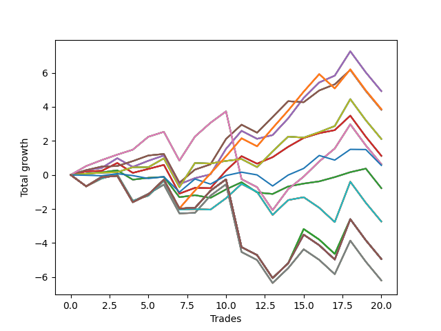

# Short Pointer 005 
- Symbol: SPY_Unlimited
- Date Range: 03/23/2022 - 07/08/2022
- Trading Period: 7:20-12:30
- Number of Trades: 20



| Name | Win Percent | Profit | Avg Profit / Trade | Avg Time / Trade |      | Name | Win Percent | Profit | Avg Profit / Trade | Avg Time / Trade |
| ---- | ----------- | ------ | ------------------ | ---------------- | ---- | ---- | ----------- | ------ | ------------------ | ---------------- |
| Sorted By <br> Profit | | | | | | Sorted By <br> Win Percentage ||||
| Sixty-Six | 75.00 | 2460.00 | 123.00 | 16:09 |     | Sixty-Six | 75.00 | 2460.00 | 123.00 | 16:09 |
| Fifty-Eight | 75.00 | 2460.00 | 123.00 | 16:09 |     | Fifty-Eight | 75.00 | 2460.00 | 123.00 | 16:09 |
| Fifty | 75.00 | 2460.00 | 123.00 | 16:09 |     | Fifty | 75.00 | 2460.00 | 123.00 | 16:09 |
| Forty-Two | 75.00 | 2460.00 | 123.00 | 16:09 |     | Forty-Two | 75.00 | 2460.00 | 123.00 | 16:09 |
| Two | 75.00 | 2460.00 | 123.00 | 16:09 |     | Two | 75.00 | 2460.00 | 123.00 | 16:09 |
| One Hundred Twenty-Six | 65.00 | 1930.00 | 96.50 | 21:44 |     | Sixty-Seven | 75.00 | 1915.00 | 95.75 | 12:34 |
| One Hundred Twenty-One | 65.00 | 1930.00 | 96.50 | 21:44 |     | Fifty-Nine | 75.00 | 1915.00 | 95.75 | 12:34 |
| One Hundred Sixteen | 65.00 | 1930.00 | 96.50 | 21:44 |     | Fifty-One | 75.00 | 1915.00 | 95.75 | 12:34 |
| One Hundred Eleven | 65.00 | 1930.00 | 96.50 | 21:44 |     | Forty-Three | 75.00 | 1915.00 | 95.75 | 12:34 |
| Eighty-One | 65.00 | 1930.00 | 96.50 | 21:44 |     | Three | 75.00 | 1915.00 | 95.75 | 12:34 |
| Sixty-Seven | 75.00 | 1915.00 | 95.75 | 12:34 |     | Sixty-Five | 70.00 | 560.00 | 28.00 | 11:06 |
| Fifty-Nine | 75.00 | 1915.00 | 95.75 | 12:34 |     | Fifty-Seven | 70.00 | 560.00 | 28.00 | 11:06 |
| Fifty-One | 75.00 | 1915.00 | 95.75 | 12:34 |     | Forty-Nine | 70.00 | 560.00 | 28.00 | 11:06 |
| Forty-Three | 75.00 | 1915.00 | 95.75 | 12:34 |     | Forty-One | 70.00 | 560.00 | 28.00 | 11:06 |
| Three | 75.00 | 1915.00 | 95.75 | 12:34 |     | One | 70.00 | 560.00 | 28.00 | 11:06 |
| Seventy | 65.00 | 1055.00 | 52.75 | 12:27 |     | Sixty-Eight | 70.00 | 315.00 | 15.75 | 20:53 |
| Sixty-Two | 65.00 | 1055.00 | 52.75 | 12:27 |     | Sixty | 70.00 | 315.00 | 15.75 | 20:53 |
| Fifty-Four | 65.00 | 1055.00 | 52.75 | 12:27 |     | Fifty-Two | 70.00 | 315.00 | 15.75 | 20:53 |
| Forty-Six | 65.00 | 1055.00 | 52.75 | 12:27 |     | Forty-Four | 70.00 | 315.00 | 15.75 | 20:53 |
| Six | 65.00 | 1055.00 | 52.75 | 12:27 |     | Four | 70.00 | 315.00 | 15.75 | 20:53 |
| Sixty-Five | 70.00 | 560.00 | 28.00 | 11:06 |     | Sixty-Four | 70.00 | -390.00 | -19.50 | 06:05 |
| Fifty-Seven | 70.00 | 560.00 | 28.00 | 11:06 |     | Fifty-Six | 70.00 | -390.00 | -19.50 | 06:05 |
| Forty-Nine | 70.00 | 560.00 | 28.00 | 11:06 |     | Forty-Eight | 70.00 | -390.00 | -19.50 | 06:05 |
| Forty-One | 70.00 | 560.00 | 28.00 | 11:06 |     | Forty | 70.00 | -390.00 | -19.50 | 06:05 |
| One | 70.00 | 560.00 | 28.00 | 11:06 |     | Zero | 70.00 | -390.00 | -19.50 | 06:05 |
| Sixty-Eight | 70.00 | 315.00 | 15.75 | 20:53 |     | One Hundred Twenty-Six | 65.00 | 1930.00 | 96.50 | 21:44 |
| Sixty | 70.00 | 315.00 | 15.75 | 20:53 |     | One Hundred Twenty-One | 65.00 | 1930.00 | 96.50 | 21:44 |
| Fifty-Two | 70.00 | 315.00 | 15.75 | 20:53 |     | One Hundred Sixteen | 65.00 | 1930.00 | 96.50 | 21:44 |
| Forty-Four | 70.00 | 315.00 | 15.75 | 20:53 |     | One Hundred Eleven | 65.00 | 1930.00 | 96.50 | 21:44 |
| Four | 70.00 | 315.00 | 15.75 | 20:53 |     | Eighty-One | 65.00 | 1930.00 | 96.50 | 21:44 |
| Seventy-Three | 45.00 | 280.00 | 14.00 | 07:38 |     | Seventy | 65.00 | 1055.00 | 52.75 | 12:27 |
| Sixty-Four | 70.00 | -390.00 | -19.50 | 06:05 |     | Sixty-Two | 65.00 | 1055.00 | 52.75 | 12:27 |
| Fifty-Six | 70.00 | -390.00 | -19.50 | 06:05 |     | Fifty-Four | 65.00 | 1055.00 | 52.75 | 12:27 |
| Forty-Eight | 70.00 | -390.00 | -19.50 | 06:05 |     | Forty-Six | 65.00 | 1055.00 | 52.75 | 12:27 |
| Forty | 70.00 | -390.00 | -19.50 | 06:05 |     | Six | 65.00 | 1055.00 | 52.75 | 12:27 |
| Zero | 70.00 | -390.00 | -19.50 | 06:05 |     | Seventy-One | 50.00 | -1370.00 | -68.50 | 22:02 |
| Seventy-One | 50.00 | -1370.00 | -68.50 | 22:02 |     | Sixty-Three | 50.00 | -1370.00 | -68.50 | 22:02 |
| Sixty-Three | 50.00 | -1370.00 | -68.50 | 22:02 |     | Fifty-Five | 50.00 | -1370.00 | -68.50 | 22:02 |
| Fifty-Five | 50.00 | -1370.00 | -68.50 | 22:02 |     | Forty-Seven | 50.00 | -1370.00 | -68.50 | 22:02 |
| Forty-Seven | 50.00 | -1370.00 | -68.50 | 22:02 |     | Seven | 50.00 | -1370.00 | -68.50 | 22:02 |
| Seven | 50.00 | -1370.00 | -68.50 | 22:02 |     | One Hundred Thirty | 50.00 | -2470.00 | -123.50 | 29:19 |
| One Hundred Thirty | 50.00 | -2470.00 | -123.50 | 29:19 |     | One Hundred Twenty-Nine | 50.00 | -2470.00 | -123.50 | 29:19 |
| One Hundred Twenty-Nine | 50.00 | -2470.00 | -123.50 | 29:19 |     | One Hundred Twenty-Eight | 50.00 | -2470.00 | -123.50 | 29:19 |
| One Hundred Twenty-Eight | 50.00 | -2470.00 | -123.50 | 29:19 |     | One Hundred Twenty-Seven | 50.00 | -2470.00 | -123.50 | 28:24 |
| One Hundred Twenty-Seven | 50.00 | -2470.00 | -123.50 | 28:24 |     | One Hundred Twenty-Five | 50.00 | -2470.00 | -123.50 | 29:19 |
| One Hundred Twenty-Five | 50.00 | -2470.00 | -123.50 | 29:19 |     | One Hundred Twenty-Four | 50.00 | -2470.00 | -123.50 | 29:19 |
| One Hundred Twenty-Four | 50.00 | -2470.00 | -123.50 | 29:19 |     | One Hundred Twenty-Three | 50.00 | -2470.00 | -123.50 | 29:19 |
| One Hundred Twenty-Three | 50.00 | -2470.00 | -123.50 | 29:19 |     | One Hundred Twenty-Two | 50.00 | -2470.00 | -123.50 | 28:24 |
| One Hundred Twenty-Two | 50.00 | -2470.00 | -123.50 | 28:24 |     | One Hundred Twenty | 50.00 | -2470.00 | -123.50 | 29:19 |
| One Hundred Twenty | 50.00 | -2470.00 | -123.50 | 29:19 |     | One Hundred Ninteen | 50.00 | -2470.00 | -123.50 | 29:19 |
| One Hundred Ninteen | 50.00 | -2470.00 | -123.50 | 29:19 |     | One Hundred Eighteen | 50.00 | -2470.00 | -123.50 | 29:19 |
| One Hundred Eighteen | 50.00 | -2470.00 | -123.50 | 29:19 |     | One Hundred Seventeen | 50.00 | -2470.00 | -123.50 | 28:24 |
| One Hundred Seventeen | 50.00 | -2470.00 | -123.50 | 28:24 |     | One Hundred Fifteen | 50.00 | -2470.00 | -123.50 | 29:19 |
| One Hundred Fifteen | 50.00 | -2470.00 | -123.50 | 29:19 |     | One Hundred Fourteen | 50.00 | -2470.00 | -123.50 | 29:19 |
| One Hundred Fourteen | 50.00 | -2470.00 | -123.50 | 29:19 |     | One Hundred Thirteen | 50.00 | -2470.00 | -123.50 | 29:19 |
| One Hundred Thirteen | 50.00 | -2470.00 | -123.50 | 29:19 |     | One Hundred Twelve | 50.00 | -2470.00 | -123.50 | 28:24 |
| One Hundred Twelve | 50.00 | -2470.00 | -123.50 | 28:24 |     | Eighty-Five | 50.00 | -2470.00 | -123.50 | 29:19 |
| Eighty-Five | 50.00 | -2470.00 | -123.50 | 29:19 |     | Eighty-Four | 50.00 | -2470.00 | -123.50 | 29:19 |
| Eighty-Four | 50.00 | -2470.00 | -123.50 | 29:19 |     | Eighty-Three | 50.00 | -2470.00 | -123.50 | 29:19 |
| Eighty-Three | 50.00 | -2470.00 | -123.50 | 29:19 |     | Eighty-Two | 50.00 | -2470.00 | -123.50 | 28:24 |
| Eighty-Two | 50.00 | -2470.00 | -123.50 | 28:24 |     | Sixty-Nine | 50.00 | -3100.00 | -155.00 | 27:11 |
| Sixty-Nine | 50.00 | -3100.00 | -155.00 | 27:11 |     | Sixty-One | 50.00 | -3100.00 | -155.00 | 27:11 |
| Sixty-One | 50.00 | -3100.00 | -155.00 | 27:11 |     | Fifty-Three | 50.00 | -3100.00 | -155.00 | 27:11 |
| Fifty-Three | 50.00 | -3100.00 | -155.00 | 27:11 |     | Forty-Five | 50.00 | -3100.00 | -155.00 | 27:11 |
| Forty-Five | 50.00 | -3100.00 | -155.00 | 27:11 |     | Five | 50.00 | -3100.00 | -155.00 | 27:11 |
| Five | 50.00 | -3100.00 | -155.00 | 27:11 |     | Seventy-Three | 45.00 | 280.00 | 14.00 | 07:38 |

## NO STOPLOSS

### Test Zero
* Sell when price hits the middle line of the 20p bollinger
* No Stoploss
* Results:
```
Total Trades: 20
Percent Up: 30.00
Percent Down: 70.00
Total Points Moved Down: -0.78
Potential Profit: -390.00
Total Points Ups: 3.74 Count Ups: 6
Total Points Downs: 2.96 Count Downs: 14
```

<details><summary>Trades</summary>

<code>In: 2022-03-29 08:03:00		Out: 2022-03-29 08:03:10		Total Position Time: 00:10		Total Move Down: 0.07		Total to Date: 0.07</code> <br />
<code>In: 2022-03-30 09:50:00		Out: 2022-03-30 09:50:50		Total Position Time: 00:50		Total Move Down: 0.08		Total to Date: 0.15</code> <br />
<code>In: 2022-04-06 07:26:00		Out: 2022-04-06 07:27:45		Total Position Time: 01:45		Total Move Down: 0.12		Total to Date: 0.27</code> <br />
<code>In: 2022-04-06 10:32:00		Out: 2022-04-06 10:47:10		Total Position Time: 15:10		Total Move Down: -0.55		Total to Date: -0.28</code> <br />
<code>In: 2022-04-11 10:09:00		Out: 2022-04-11 10:16:10		Total Position Time: 07:10		Total Move Down: 0.11		Total to Date: -0.17</code> <br />
<code>In: 2022-04-20 10:50:00		Out: 2022-04-20 10:50:10		Total Position Time: 00:10		Total Move Down: 0.05		Total to Date: -0.12</code> <br />
<code>In: 2022-04-25 12:28:00		Out: 2022-04-25 12:42:35		Total Position Time: 14:35		Total Move Down: -1.19		Total to Date: -1.31</code> <br />
<code>In: 2022-04-27 08:40:00		Out: 2022-04-27 08:45:05		Total Position Time: 05:05		Total Move Down: 0.12		Total to Date: -1.19</code> <br />
<code>In: 2022-04-29 10:29:00		Out: 2022-04-29 10:40:30		Total Position Time: 11:30		Total Move Down: -0.16		Total to Date: -1.35</code> <br />
<code>In: 2022-05-05 10:11:00		Out: 2022-05-05 10:12:50		Total Position Time: 01:50		Total Move Down: 0.50		Total to Date: -0.85</code> <br />
<code>In: 2022-05-10 10:11:00		Out: 2022-05-10 10:13:55		Total Position Time: 02:55		Total Move Down: 0.42		Total to Date: -0.43</code> <br />
<code>In: 2022-05-17 09:31:00		Out: 2022-05-17 09:51:15		Total Position Time: 20:15		Total Move Down: -0.60		Total to Date: -1.03</code> <br />
<code>In: 2022-05-23 07:38:00		Out: 2022-05-23 07:46:40		Total Position Time: 08:40		Total Move Down: -0.09		Total to Date: -1.12</code> <br />
<code>In: 2022-05-25 07:41:00		Out: 2022-05-25 07:42:00		Total Position Time: 01:00		Total Move Down: 0.44		Total to Date: -0.68</code> <br />
<code>In: 2022-06-01 08:01:00		Out: 2022-06-01 08:01:35		Total Position Time: 00:35		Total Move Down: 0.17		Total to Date: -0.51</code> <br />
<code>In: 2022-06-10 10:54:00		Out: 2022-06-10 10:54:55		Total Position Time: 00:55		Total Move Down: 0.13		Total to Date: -0.38</code> <br />
<code>In: 2022-06-10 11:27:00		Out: 2022-06-10 11:28:25		Total Position Time: 01:25		Total Move Down: 0.25		Total to Date: -0.13</code> <br />
<code>In: 2022-06-13 09:42:00		Out: 2022-06-13 09:44:05		Total Position Time: 02:05		Total Move Down: 0.29		Total to Date: 0.16</code> <br />
<code>In: 2022-06-30 08:32:00		Out: 2022-06-30 08:35:00		Total Position Time: 03:00		Total Move Down: 0.21		Total to Date: 0.37</code> <br />
<code>In: 2022-07-01 10:36:00		Out: 2022-07-01 10:58:40		Total Position Time: 22:40		Total Move Down: -1.15		Total to Date: -0.78</code> <br />


</details>

### Test One
* Sell when the price hits the upper line of the 20p 1std bollinger
* No Stoploss
* Results:
```
Total Trades: 20
Percent Up: 30.00
Percent Down: 70.00
Total Points Moved Down: 1.12
Potential Profit: 560.00
Total Points Ups: 5.09 Count Ups: 6
Total Points Downs: 6.21 Count Downs: 14
```

<details><summary>Trades</summary>

<code>In: 2022-03-29 08:03:00		Out: 2022-03-29 08:07:15		Total Position Time: 04:15		Total Move Down: 0.21		Total to Date: 0.21</code> <br />
<code>In: 2022-03-30 09:50:00		Out: 2022-03-30 10:00:45		Total Position Time: 10:45		Total Move Down: 0.03		Total to Date: 0.24</code> <br />
<code>In: 2022-04-06 07:26:00		Out: 2022-04-06 07:30:00		Total Position Time: 04:00		Total Move Down: 0.46		Total to Date: 0.70</code> <br />
<code>In: 2022-04-06 10:32:00		Out: 2022-04-06 10:56:55		Total Position Time: 24:55		Total Move Down: -0.58		Total to Date: 0.12</code> <br />
<code>In: 2022-04-11 10:09:00		Out: 2022-04-11 10:17:05		Total Position Time: 08:05		Total Move Down: 0.23		Total to Date: 0.35</code> <br />
<code>In: 2022-04-20 10:50:00		Out: 2022-04-20 10:53:20		Total Position Time: 03:20		Total Move Down: 0.24		Total to Date: 0.59</code> <br />
<code>In: 2022-04-25 12:28:00		Out: 2022-04-25 12:46:00		Total Position Time: 18:00		Total Move Down: -1.69		Total to Date: -1.10</code> <br />
<code>In: 2022-04-27 08:40:00		Out: 2022-04-27 08:48:05		Total Position Time: 08:05		Total Move Down: 0.34		Total to Date: -0.76</code> <br />
<code>In: 2022-04-29 10:29:00		Out: 2022-04-29 10:41:05		Total Position Time: 12:05		Total Move Down: -0.02		Total to Date: -0.78</code> <br />
<code>In: 2022-05-05 10:11:00		Out: 2022-05-05 10:16:05		Total Position Time: 05:05		Total Move Down: 1.03		Total to Date: 0.25</code> <br />
<code>In: 2022-05-10 10:11:00		Out: 2022-05-10 10:17:25		Total Position Time: 06:25		Total Move Down: 0.85		Total to Date: 1.10</code> <br />
<code>In: 2022-05-17 09:31:00		Out: 2022-05-17 09:54:40		Total Position Time: 23:40		Total Move Down: -0.44		Total to Date: 0.66</code> <br />
<code>In: 2022-05-23 07:38:00		Out: 2022-05-23 07:47:10		Total Position Time: 09:10		Total Move Down: 0.38		Total to Date: 1.04</code> <br />
<code>In: 2022-05-25 07:41:00		Out: 2022-05-25 07:46:40		Total Position Time: 05:40		Total Move Down: 0.61		Total to Date: 1.65</code> <br />
<code>In: 2022-06-01 08:01:00		Out: 2022-06-01 08:02:10		Total Position Time: 01:10		Total Move Down: 0.52		Total to Date: 2.17</code> <br />
<code>In: 2022-06-10 10:54:00		Out: 2022-06-10 10:56:05		Total Position Time: 02:05		Total Move Down: 0.28		Total to Date: 2.45</code> <br />
<code>In: 2022-06-10 11:27:00		Out: 2022-06-10 11:38:10		Total Position Time: 11:10		Total Move Down: 0.18		Total to Date: 2.63</code> <br />
<code>In: 2022-06-13 09:42:00		Out: 2022-06-13 09:47:55		Total Position Time: 05:55		Total Move Down: 0.85		Total to Date: 3.48</code> <br />
<code>In: 2022-06-30 08:32:00		Out: 2022-06-30 09:01:55		Total Position Time: 29:55		Total Move Down: -1.24		Total to Date: 2.24</code> <br />
<code>In: 2022-07-01 10:36:00		Out: 2022-07-01 11:04:25		Total Position Time: 28:25		Total Move Down: -1.12		Total to Date: 1.12</code> <br />


</details>

### Test Two
* Sell when the price hits the upper line of the 20p 2std bollinger
* No Stoploss
* Results:
```
Total Trades: 20
Percent Up: 25.00
Percent Down: 75.00
Total Points Moved Down: 4.92
Potential Profit: 2460.00
Total Points Ups: 5.01 Count Ups: 5
Total Points Downs: 9.93 Count Downs: 15
```

<details><summary>Trades</summary>

<code>In: 2022-03-29 08:03:00		Out: 2022-03-29 08:13:30		Total Position Time: 10:30		Total Move Down: 0.28		Total to Date: 0.28</code> <br />
<code>In: 2022-03-30 09:50:00		Out: 2022-03-30 10:01:15		Total Position Time: 11:15		Total Move Down: 0.13		Total to Date: 0.41</code> <br />
<code>In: 2022-04-06 07:26:00		Out: 2022-04-06 07:33:40		Total Position Time: 07:40		Total Move Down: 0.57		Total to Date: 0.98</code> <br />
<code>In: 2022-04-06 10:32:00		Out: 2022-04-06 10:57:20		Total Position Time: 25:20		Total Move Down: -0.51		Total to Date: 0.47</code> <br />
<code>In: 2022-04-11 10:09:00		Out: 2022-04-11 10:19:05		Total Position Time: 10:05		Total Move Down: 0.36		Total to Date: 0.83</code> <br />
<code>In: 2022-04-20 10:50:00		Out: 2022-04-20 11:13:55		Total Position Time: 23:55		Total Move Down: 0.31		Total to Date: 1.14</code> <br />
<code>In: 2022-04-25 12:28:00		Out: 2022-04-25 12:46:00		Total Position Time: 18:00		Total Move Down: -1.69		Total to Date: -0.55</code> <br />
<code>In: 2022-04-27 08:40:00		Out: 2022-04-27 08:50:10		Total Position Time: 10:10		Total Move Down: 0.36		Total to Date: -0.19</code> <br />
<code>In: 2022-04-29 10:29:00		Out: 2022-04-29 10:43:20		Total Position Time: 14:20		Total Move Down: 0.22		Total to Date: 0.03</code> <br />
<code>In: 2022-05-05 10:11:00		Out: 2022-05-05 10:30:30		Total Position Time: 19:30		Total Move Down: 1.50		Total to Date: 1.53</code> <br />
<code>In: 2022-05-10 10:11:00		Out: 2022-05-10 10:24:00		Total Position Time: 13:00		Total Move Down: 1.06		Total to Date: 2.59</code> <br />
<code>In: 2022-05-17 09:31:00		Out: 2022-05-17 10:00:55		Total Position Time: 29:55		Total Move Down: -0.47		Total to Date: 2.12</code> <br />
<code>In: 2022-05-23 07:38:00		Out: 2022-05-23 07:51:20		Total Position Time: 13:20		Total Move Down: 0.22		Total to Date: 2.34</code> <br />
<code>In: 2022-05-25 07:41:00		Out: 2022-05-25 07:48:10		Total Position Time: 07:10		Total Move Down: 0.98		Total to Date: 3.32</code> <br />
<code>In: 2022-06-01 08:01:00		Out: 2022-06-01 08:17:00		Total Position Time: 16:00		Total Move Down: 1.20		Total to Date: 4.52</code> <br />
<code>In: 2022-06-10 10:54:00		Out: 2022-06-10 11:01:15		Total Position Time: 07:15		Total Move Down: 0.91		Total to Date: 5.43</code> <br />
<code>In: 2022-06-10 11:27:00		Out: 2022-06-10 11:40:10		Total Position Time: 13:10		Total Move Down: 0.40		Total to Date: 5.83</code> <br />
<code>In: 2022-06-13 09:42:00		Out: 2022-06-13 09:54:45		Total Position Time: 12:45		Total Move Down: 1.43		Total to Date: 7.26</code> <br />
<code>In: 2022-06-30 08:32:00		Out: 2022-06-30 09:01:55		Total Position Time: 29:55		Total Move Down: -1.24		Total to Date: 6.02</code> <br />
<code>In: 2022-07-01 10:36:00		Out: 2022-07-01 11:05:55		Total Position Time: 29:55		Total Move Down: -1.10		Total to Date: 4.92</code> <br />


</details>

### Test Three
* Sell when price hits the middle line of the 50p bollinger
* No Stoploss
* Results:
```
Total Trades: 20
Percent Up: 25.00
Percent Down: 75.00
Total Points Moved Down: 3.83
Potential Profit: 1915.00
Total Points Ups: 4.56 Count Ups: 5
Total Points Downs: 8.39 Count Downs: 15
```

<details><summary>Trades</summary>

<code>In: 2022-03-29 08:03:00		Out: 2022-03-29 08:13:30		Total Position Time: 10:30		Total Move Down: 0.28		Total to Date: 0.28</code> <br />
<code>In: 2022-03-30 09:50:00		Out: 2022-03-30 10:01:45		Total Position Time: 11:45		Total Move Down: 0.21		Total to Date: 0.49</code> <br />
<code>In: 2022-04-06 07:26:00		Out: 2022-04-06 07:26:10		Total Position Time: 00:10		Total Move Down: 0.03		Total to Date: 0.52</code> <br />
<code>In: 2022-04-06 10:32:00		Out: 2022-04-06 11:00:10		Total Position Time: 28:10		Total Move Down: 0.29		Total to Date: 0.81</code> <br />
<code>In: 2022-04-11 10:09:00		Out: 2022-04-11 10:18:35		Total Position Time: 09:35		Total Move Down: 0.33		Total to Date: 1.14</code> <br />
<code>In: 2022-04-20 10:50:00		Out: 2022-04-20 10:50:20		Total Position Time: 00:20		Total Move Down: 0.09		Total to Date: 1.23</code> <br />
<code>In: 2022-04-25 12:28:00		Out: 2022-04-25 12:46:00		Total Position Time: 18:00		Total Move Down: -1.69		Total to Date: -0.46</code> <br />
<code>In: 2022-04-27 08:40:00		Out: 2022-04-27 08:52:30		Total Position Time: 12:30		Total Move Down: 0.77		Total to Date: 0.31</code> <br />
<code>In: 2022-04-29 10:29:00		Out: 2022-04-29 10:43:40		Total Position Time: 14:40		Total Move Down: 0.31		Total to Date: 0.62</code> <br />
<code>In: 2022-05-05 10:11:00		Out: 2022-05-05 10:16:30		Total Position Time: 05:30		Total Move Down: 1.49		Total to Date: 2.11</code> <br />
<code>In: 2022-05-10 10:11:00		Out: 2022-05-10 10:15:40		Total Position Time: 04:40		Total Move Down: 0.84		Total to Date: 2.95</code> <br />
<code>In: 2022-05-17 09:31:00		Out: 2022-05-17 10:00:55		Total Position Time: 29:55		Total Move Down: -0.47		Total to Date: 2.48</code> <br />
<code>In: 2022-05-23 07:38:00		Out: 2022-05-23 07:53:00		Total Position Time: 15:00		Total Move Down: 0.92		Total to Date: 3.40</code> <br />
<code>In: 2022-05-25 07:41:00		Out: 2022-05-25 07:57:20		Total Position Time: 16:20		Total Move Down: 0.93		Total to Date: 4.33</code> <br />
<code>In: 2022-06-01 08:01:00		Out: 2022-06-01 08:01:10		Total Position Time: 00:10		Total Move Down: -0.06		Total to Date: 4.27</code> <br />
<code>In: 2022-06-10 10:54:00		Out: 2022-06-10 11:00:50		Total Position Time: 06:50		Total Move Down: 0.69		Total to Date: 4.96</code> <br />
<code>In: 2022-06-10 11:27:00		Out: 2022-06-10 11:28:30		Total Position Time: 01:30		Total Move Down: 0.36		Total to Date: 5.32</code> <br />
<code>In: 2022-06-13 09:42:00		Out: 2022-06-13 09:47:55		Total Position Time: 05:55		Total Move Down: 0.85		Total to Date: 6.17</code> <br />
<code>In: 2022-06-30 08:32:00		Out: 2022-06-30 09:01:55		Total Position Time: 29:55		Total Move Down: -1.24		Total to Date: 4.93</code> <br />
<code>In: 2022-07-01 10:36:00		Out: 2022-07-01 11:05:55		Total Position Time: 29:55		Total Move Down: -1.10		Total to Date: 3.83</code> <br />


</details>

### Test Four
* Sell when the price hits the upper line of the 50p 1std bollinger
* No Stoploss
* Results:
```
Total Trades: 20
Percent Up: 30.00
Percent Down: 70.00
Total Points Moved Down: 0.63
Potential Profit: 315.00
Total Points Ups: 9.83 Count Ups: 6
Total Points Downs: 10.46 Count Downs: 14
```

<details><summary>Trades</summary>

<code>In: 2022-03-29 08:03:00		Out: 2022-03-29 08:22:25		Total Position Time: 19:25		Total Move Down: 0.52		Total to Date: 0.52</code> <br />
<code>In: 2022-03-30 09:50:00		Out: 2022-03-30 10:06:35		Total Position Time: 16:35		Total Move Down: 0.35		Total to Date: 0.87</code> <br />
<code>In: 2022-04-06 07:26:00		Out: 2022-04-06 07:28:10		Total Position Time: 02:10		Total Move Down: 0.32		Total to Date: 1.19</code> <br />
<code>In: 2022-04-06 10:32:00		Out: 2022-04-06 11:00:10		Total Position Time: 28:10		Total Move Down: 0.29		Total to Date: 1.48</code> <br />
<code>In: 2022-04-11 10:09:00		Out: 2022-04-11 10:24:35		Total Position Time: 15:35		Total Move Down: 0.76		Total to Date: 2.24</code> <br />
<code>In: 2022-04-20 10:50:00		Out: 2022-04-20 11:14:00		Total Position Time: 24:00		Total Move Down: 0.29		Total to Date: 2.53</code> <br />
<code>In: 2022-04-25 12:28:00		Out: 2022-04-25 12:46:00		Total Position Time: 18:00		Total Move Down: -1.69		Total to Date: 0.84</code> <br />
<code>In: 2022-04-27 08:40:00		Out: 2022-04-27 09:01:45		Total Position Time: 21:45		Total Move Down: 1.41		Total to Date: 2.25</code> <br />
<code>In: 2022-04-29 10:29:00		Out: 2022-04-29 10:47:20		Total Position Time: 18:20		Total Move Down: 0.81		Total to Date: 3.06</code> <br />
<code>In: 2022-05-05 10:11:00		Out: 2022-05-05 10:40:55		Total Position Time: 29:55		Total Move Down: 0.67		Total to Date: 3.73</code> <br />
<code>In: 2022-05-10 10:11:00		Out: 2022-05-10 10:40:55		Total Position Time: 29:55		Total Move Down: -3.98		Total to Date: -0.25</code> <br />
<code>In: 2022-05-17 09:31:00		Out: 2022-05-17 10:00:55		Total Position Time: 29:55		Total Move Down: -0.47		Total to Date: -0.72</code> <br />
<code>In: 2022-05-23 07:38:00		Out: 2022-05-23 08:07:55		Total Position Time: 29:55		Total Move Down: -1.35		Total to Date: -2.07</code> <br />
<code>In: 2022-05-25 07:41:00		Out: 2022-05-25 08:04:45		Total Position Time: 23:45		Total Move Down: 1.23		Total to Date: -0.84</code> <br />
<code>In: 2022-06-01 08:01:00		Out: 2022-06-01 08:02:25		Total Position Time: 01:25		Total Move Down: 0.74		Total to Date: -0.10</code> <br />
<code>In: 2022-06-10 10:54:00		Out: 2022-06-10 11:15:25		Total Position Time: 21:25		Total Move Down: 0.89		Total to Date: 0.79</code> <br />
<code>In: 2022-06-10 11:27:00		Out: 2022-06-10 11:41:45		Total Position Time: 14:45		Total Move Down: 0.76		Total to Date: 1.55</code> <br />
<code>In: 2022-06-13 09:42:00		Out: 2022-06-13 09:54:50		Total Position Time: 12:50		Total Move Down: 1.42		Total to Date: 2.97</code> <br />
<code>In: 2022-06-30 08:32:00		Out: 2022-06-30 09:01:55		Total Position Time: 29:55		Total Move Down: -1.24		Total to Date: 1.73</code> <br />
<code>In: 2022-07-01 10:36:00		Out: 2022-07-01 11:05:55		Total Position Time: 29:55		Total Move Down: -1.10		Total to Date: 0.63</code> <br />


</details>

### Test Five
* Sell when the price hits the upper line of the 50p 2std bollinger
* No Stoploss
* Results:
```
Total Trades: 20
Percent Up: 50.00
Percent Down: 50.00
Total Points Moved Down: -6.20
Potential Profit: -3100.00
Total Points Ups: 13.51 Count Ups: 10
Total Points Downs: 7.31 Count Downs: 10
```

<details><summary>Trades</summary>

<code>In: 2022-03-29 08:03:00		Out: 2022-03-29 08:32:55		Total Position Time: 29:55		Total Move Down: -0.67		Total to Date: -0.67</code> <br />
<code>In: 2022-03-30 09:50:00		Out: 2022-03-30 10:07:20		Total Position Time: 17:20		Total Move Down: 0.57		Total to Date: -0.10</code> <br />
<code>In: 2022-04-06 07:26:00		Out: 2022-04-06 07:55:55		Total Position Time: 29:55		Total Move Down: 0.09		Total to Date: -0.01</code> <br />
<code>In: 2022-04-06 10:32:00		Out: 2022-04-06 11:01:55		Total Position Time: 29:55		Total Move Down: -1.55		Total to Date: -1.56</code> <br />
<code>In: 2022-04-11 10:09:00		Out: 2022-04-11 10:38:55		Total Position Time: 29:55		Total Move Down: 0.45		Total to Date: -1.11</code> <br />
<code>In: 2022-04-20 10:50:00		Out: 2022-04-20 11:17:40		Total Position Time: 27:40		Total Move Down: 0.54		Total to Date: -0.57</code> <br />
<code>In: 2022-04-25 12:28:00		Out: 2022-04-25 12:46:00		Total Position Time: 18:00		Total Move Down: -1.69		Total to Date: -2.26</code> <br />
<code>In: 2022-04-27 08:40:00		Out: 2022-04-27 09:09:55		Total Position Time: 29:55		Total Move Down: 0.03		Total to Date: -2.23</code> <br />
<code>In: 2022-04-29 10:29:00		Out: 2022-04-29 10:58:55		Total Position Time: 29:55		Total Move Down: 1.01		Total to Date: -1.22</code> <br />
<code>In: 2022-05-05 10:11:00		Out: 2022-05-05 10:40:55		Total Position Time: 29:55		Total Move Down: 0.67		Total to Date: -0.55</code> <br />
<code>In: 2022-05-10 10:11:00		Out: 2022-05-10 10:40:55		Total Position Time: 29:55		Total Move Down: -3.98		Total to Date: -4.53</code> <br />
<code>In: 2022-05-17 09:31:00		Out: 2022-05-17 10:00:55		Total Position Time: 29:55		Total Move Down: -0.47		Total to Date: -5.00</code> <br />
<code>In: 2022-05-23 07:38:00		Out: 2022-05-23 08:07:55		Total Position Time: 29:55		Total Move Down: -1.35		Total to Date: -6.35</code> <br />
<code>In: 2022-05-25 07:41:00		Out: 2022-05-25 08:10:55		Total Position Time: 29:55		Total Move Down: 0.87		Total to Date: -5.48</code> <br />
<code>In: 2022-06-01 08:01:00		Out: 2022-06-01 08:16:55		Total Position Time: 15:55		Total Move Down: 1.11		Total to Date: -4.37</code> <br />
<code>In: 2022-06-10 10:54:00		Out: 2022-06-10 11:23:55		Total Position Time: 29:55		Total Move Down: -0.62		Total to Date: -4.99</code> <br />
<code>In: 2022-06-10 11:27:00		Out: 2022-06-10 11:56:55		Total Position Time: 29:55		Total Move Down: -0.84		Total to Date: -5.83</code> <br />
<code>In: 2022-06-13 09:42:00		Out: 2022-06-13 09:58:15		Total Position Time: 16:15		Total Move Down: 1.97		Total to Date: -3.86</code> <br />
<code>In: 2022-06-30 08:32:00		Out: 2022-06-30 09:01:55		Total Position Time: 29:55		Total Move Down: -1.24		Total to Date: -5.10</code> <br />
<code>In: 2022-07-01 10:36:00		Out: 2022-07-01 11:05:55		Total Position Time: 29:55		Total Move Down: -1.10		Total to Date: -6.20</code> <br />


</details>

### Test Six
* Sell when the price hits the middle line of the 1std VWAP
* No Stoploss
* Results:
```
Total Trades: 20
Percent Up: 35.00
Percent Down: 65.00
Total Points Moved Down: 2.11
Potential Profit: 1055.00
Total Points Ups: 4.59 Count Ups: 7
Total Points Downs: 6.70 Count Downs: 13
```

<details><summary>Trades</summary>

<code>In: 2022-03-29 08:03:00		Out: 2022-03-29 08:03:10		Total Position Time: 00:10		Total Move Down: 0.07		Total to Date: 0.07</code> <br />
<code>In: 2022-03-30 09:50:00		Out: 2022-03-30 09:50:10		Total Position Time: 00:10		Total Move Down: 0.06		Total to Date: 0.13</code> <br />
<code>In: 2022-04-06 07:26:00		Out: 2022-04-06 07:26:10		Total Position Time: 00:10		Total Move Down: 0.03		Total to Date: 0.16</code> <br />
<code>In: 2022-04-06 10:32:00		Out: 2022-04-06 11:00:10		Total Position Time: 28:10		Total Move Down: 0.29		Total to Date: 0.45</code> <br />
<code>In: 2022-04-11 10:09:00		Out: 2022-04-11 10:09:10		Total Position Time: 00:10		Total Move Down: -0.00		Total to Date: 0.45</code> <br />
<code>In: 2022-04-20 10:50:00		Out: 2022-04-20 11:17:15		Total Position Time: 27:15		Total Move Down: 0.52		Total to Date: 0.97</code> <br />
<code>In: 2022-04-25 12:28:00		Out: 2022-04-25 12:46:00		Total Position Time: 18:00		Total Move Down: -1.69		Total to Date: -0.72</code> <br />
<code>In: 2022-04-27 08:40:00		Out: 2022-04-27 09:01:55		Total Position Time: 21:55		Total Move Down: 1.42		Total to Date: 0.70</code> <br />
<code>In: 2022-04-29 10:29:00		Out: 2022-04-29 10:29:10		Total Position Time: 00:10		Total Move Down: -0.03		Total to Date: 0.67</code> <br />
<code>In: 2022-05-05 10:11:00		Out: 2022-05-05 10:11:10		Total Position Time: 00:10		Total Move Down: 0.15		Total to Date: 0.82</code> <br />
<code>In: 2022-05-10 10:11:00		Out: 2022-05-10 10:11:10		Total Position Time: 00:10		Total Move Down: 0.11		Total to Date: 0.93</code> <br />
<code>In: 2022-05-17 09:31:00		Out: 2022-05-17 10:00:55		Total Position Time: 29:55		Total Move Down: -0.47		Total to Date: 0.46</code> <br />
<code>In: 2022-05-23 07:38:00		Out: 2022-05-23 07:53:00		Total Position Time: 15:00		Total Move Down: 0.92		Total to Date: 1.38</code> <br />
<code>In: 2022-05-25 07:41:00		Out: 2022-05-25 08:10:55		Total Position Time: 29:55		Total Move Down: 0.87		Total to Date: 2.25</code> <br />
<code>In: 2022-06-01 08:01:00		Out: 2022-06-01 08:01:10		Total Position Time: 00:10		Total Move Down: -0.06		Total to Date: 2.19</code> <br />
<code>In: 2022-06-10 10:54:00		Out: 2022-06-10 10:55:15		Total Position Time: 01:15		Total Move Down: 0.32		Total to Date: 2.51</code> <br />
<code>In: 2022-06-10 11:27:00		Out: 2022-06-10 11:28:30		Total Position Time: 01:30		Total Move Down: 0.36		Total to Date: 2.87</code> <br />
<code>In: 2022-06-13 09:42:00		Out: 2022-06-13 09:57:00		Total Position Time: 15:00		Total Move Down: 1.58		Total to Date: 4.45</code> <br />
<code>In: 2022-06-30 08:32:00		Out: 2022-06-30 09:01:55		Total Position Time: 29:55		Total Move Down: -1.24		Total to Date: 3.21</code> <br />
<code>In: 2022-07-01 10:36:00		Out: 2022-07-01 11:05:55		Total Position Time: 29:55		Total Move Down: -1.10		Total to Date: 2.11</code> <br />


</details>

### Test Seven
* Sell when the price hits the upper line of the 1std VWAP
* No Stoploss
* Results:
```
Total Trades: 20
Percent Up: 50.00
Percent Down: 50.00
Total Points Moved Down: -2.74
Potential Profit: -1370.00
Total Points Ups: 9.56 Count Ups: 10
Total Points Downs: 6.82 Count Downs: 10
```

<details><summary>Trades</summary>

<code>In: 2022-03-29 08:03:00		Out: 2022-03-29 08:32:55		Total Position Time: 29:55		Total Move Down: -0.67		Total to Date: -0.67</code> <br />
<code>In: 2022-03-30 09:50:00		Out: 2022-03-30 10:06:55		Total Position Time: 16:55		Total Move Down: 0.46		Total to Date: -0.21</code> <br />
<code>In: 2022-04-06 07:26:00		Out: 2022-04-06 07:28:05		Total Position Time: 02:05		Total Move Down: 0.24		Total to Date: 0.03</code> <br />
<code>In: 2022-04-06 10:32:00		Out: 2022-04-06 11:01:55		Total Position Time: 29:55		Total Move Down: -1.55		Total to Date: -1.52</code> <br />
<code>In: 2022-04-11 10:09:00		Out: 2022-04-11 10:18:20		Total Position Time: 09:20		Total Move Down: 0.30		Total to Date: -1.22</code> <br />
<code>In: 2022-04-20 10:50:00		Out: 2022-04-20 11:19:55		Total Position Time: 29:55		Total Move Down: 0.87		Total to Date: -0.35</code> <br />
<code>In: 2022-04-25 12:28:00		Out: 2022-04-25 12:46:00		Total Position Time: 18:00		Total Move Down: -1.69		Total to Date: -2.04</code> <br />
<code>In: 2022-04-27 08:40:00		Out: 2022-04-27 09:09:55		Total Position Time: 29:55		Total Move Down: 0.03		Total to Date: -2.01</code> <br />
<code>In: 2022-04-29 10:29:00		Out: 2022-04-29 10:29:10		Total Position Time: 00:10		Total Move Down: -0.03		Total to Date: -2.04</code> <br />
<code>In: 2022-05-05 10:11:00		Out: 2022-05-05 10:40:55		Total Position Time: 29:55		Total Move Down: 0.67		Total to Date: -1.37</code> <br />
<code>In: 2022-05-10 10:11:00		Out: 2022-05-10 10:15:40		Total Position Time: 04:40		Total Move Down: 0.84		Total to Date: -0.53</code> <br />
<code>In: 2022-05-17 09:31:00		Out: 2022-05-17 10:00:55		Total Position Time: 29:55		Total Move Down: -0.47		Total to Date: -1.00</code> <br />
<code>In: 2022-05-23 07:38:00		Out: 2022-05-23 08:07:55		Total Position Time: 29:55		Total Move Down: -1.35		Total to Date: -2.35</code> <br />
<code>In: 2022-05-25 07:41:00		Out: 2022-05-25 08:10:55		Total Position Time: 29:55		Total Move Down: 0.87		Total to Date: -1.48</code> <br />
<code>In: 2022-06-01 08:01:00		Out: 2022-06-01 08:01:35		Total Position Time: 00:35		Total Move Down: 0.17		Total to Date: -1.31</code> <br />
<code>In: 2022-06-10 10:54:00		Out: 2022-06-10 11:23:55		Total Position Time: 29:55		Total Move Down: -0.62		Total to Date: -1.93</code> <br />
<code>In: 2022-06-10 11:27:00		Out: 2022-06-10 11:56:55		Total Position Time: 29:55		Total Move Down: -0.84		Total to Date: -2.77</code> <br />
<code>In: 2022-06-13 09:42:00		Out: 2022-06-13 10:11:55		Total Position Time: 29:55		Total Move Down: 2.37		Total to Date: -0.40</code> <br />
<code>In: 2022-06-30 08:32:00		Out: 2022-06-30 09:01:55		Total Position Time: 29:55		Total Move Down: -1.24		Total to Date: -1.64</code> <br />
<code>In: 2022-07-01 10:36:00		Out: 2022-07-01 11:05:55		Total Position Time: 29:55		Total Move Down: -1.10		Total to Date: -2.74</code> <br />


</details>

## STOPLOSS OF 5

### Test Forty
* Sell when price hits the middle line of the 20p bollinger
* Stoploss is -5 points
* Results:
```
Total Trades: 20
Percent Up: 30.00
Percent Down: 70.00
Total Points Moved Down: -0.78
Potential Profit: -390.00
Total Points Ups: 3.74 Count Ups: 6
Total Points Downs: 2.96 Count Downs: 14
```

<details><summary>Trades</summary>

<code>In: 2022-03-29 08:03:00		Out: 2022-03-29 08:03:10		Total Position Time: 00:10		Total Move Down: 0.07		Total to Date: 0.07</code> <br />
<code>In: 2022-03-30 09:50:00		Out: 2022-03-30 09:50:50		Total Position Time: 00:50		Total Move Down: 0.08		Total to Date: 0.15</code> <br />
<code>In: 2022-04-06 07:26:00		Out: 2022-04-06 07:27:45		Total Position Time: 01:45		Total Move Down: 0.12		Total to Date: 0.27</code> <br />
<code>In: 2022-04-06 10:32:00		Out: 2022-04-06 10:47:10		Total Position Time: 15:10		Total Move Down: -0.55		Total to Date: -0.28</code> <br />
<code>In: 2022-04-11 10:09:00		Out: 2022-04-11 10:16:10		Total Position Time: 07:10		Total Move Down: 0.11		Total to Date: -0.17</code> <br />
<code>In: 2022-04-20 10:50:00		Out: 2022-04-20 10:50:10		Total Position Time: 00:10		Total Move Down: 0.05		Total to Date: -0.12</code> <br />
<code>In: 2022-04-25 12:28:00		Out: 2022-04-25 12:42:35		Total Position Time: 14:35		Total Move Down: -1.19		Total to Date: -1.31</code> <br />
<code>In: 2022-04-27 08:40:00		Out: 2022-04-27 08:45:05		Total Position Time: 05:05		Total Move Down: 0.12		Total to Date: -1.19</code> <br />
<code>In: 2022-04-29 10:29:00		Out: 2022-04-29 10:40:30		Total Position Time: 11:30		Total Move Down: -0.16		Total to Date: -1.35</code> <br />
<code>In: 2022-05-05 10:11:00		Out: 2022-05-05 10:12:50		Total Position Time: 01:50		Total Move Down: 0.50		Total to Date: -0.85</code> <br />
<code>In: 2022-05-10 10:11:00		Out: 2022-05-10 10:13:55		Total Position Time: 02:55		Total Move Down: 0.42		Total to Date: -0.43</code> <br />
<code>In: 2022-05-17 09:31:00		Out: 2022-05-17 09:51:15		Total Position Time: 20:15		Total Move Down: -0.60		Total to Date: -1.03</code> <br />
<code>In: 2022-05-23 07:38:00		Out: 2022-05-23 07:46:40		Total Position Time: 08:40		Total Move Down: -0.09		Total to Date: -1.12</code> <br />
<code>In: 2022-05-25 07:41:00		Out: 2022-05-25 07:42:00		Total Position Time: 01:00		Total Move Down: 0.44		Total to Date: -0.68</code> <br />
<code>In: 2022-06-01 08:01:00		Out: 2022-06-01 08:01:35		Total Position Time: 00:35		Total Move Down: 0.17		Total to Date: -0.51</code> <br />
<code>In: 2022-06-10 10:54:00		Out: 2022-06-10 10:54:55		Total Position Time: 00:55		Total Move Down: 0.13		Total to Date: -0.38</code> <br />
<code>In: 2022-06-10 11:27:00		Out: 2022-06-10 11:28:25		Total Position Time: 01:25		Total Move Down: 0.25		Total to Date: -0.13</code> <br />
<code>In: 2022-06-13 09:42:00		Out: 2022-06-13 09:44:05		Total Position Time: 02:05		Total Move Down: 0.29		Total to Date: 0.16</code> <br />
<code>In: 2022-06-30 08:32:00		Out: 2022-06-30 08:35:00		Total Position Time: 03:00		Total Move Down: 0.21		Total to Date: 0.37</code> <br />
<code>In: 2022-07-01 10:36:00		Out: 2022-07-01 10:58:40		Total Position Time: 22:40		Total Move Down: -1.15		Total to Date: -0.78</code> <br />


</details>

### Test Forty-One
* Sell when the price hits the upper line of the 20p 1std bollinger
* Stoploss is -5 points
* Results:
```
Total Trades: 20
Percent Up: 30.00
Percent Down: 70.00
Total Points Moved Down: 1.12
Potential Profit: 560.00
Total Points Ups: 5.09 Count Ups: 6
Total Points Downs: 6.21 Count Downs: 14
```

<details><summary>Trades</summary>

<code>In: 2022-03-29 08:03:00		Out: 2022-03-29 08:07:15		Total Position Time: 04:15		Total Move Down: 0.21		Total to Date: 0.21</code> <br />
<code>In: 2022-03-30 09:50:00		Out: 2022-03-30 10:00:45		Total Position Time: 10:45		Total Move Down: 0.03		Total to Date: 0.24</code> <br />
<code>In: 2022-04-06 07:26:00		Out: 2022-04-06 07:30:00		Total Position Time: 04:00		Total Move Down: 0.46		Total to Date: 0.70</code> <br />
<code>In: 2022-04-06 10:32:00		Out: 2022-04-06 10:56:55		Total Position Time: 24:55		Total Move Down: -0.58		Total to Date: 0.12</code> <br />
<code>In: 2022-04-11 10:09:00		Out: 2022-04-11 10:17:05		Total Position Time: 08:05		Total Move Down: 0.23		Total to Date: 0.35</code> <br />
<code>In: 2022-04-20 10:50:00		Out: 2022-04-20 10:53:20		Total Position Time: 03:20		Total Move Down: 0.24		Total to Date: 0.59</code> <br />
<code>In: 2022-04-25 12:28:00		Out: 2022-04-25 12:46:00		Total Position Time: 18:00		Total Move Down: -1.69		Total to Date: -1.10</code> <br />
<code>In: 2022-04-27 08:40:00		Out: 2022-04-27 08:48:05		Total Position Time: 08:05		Total Move Down: 0.34		Total to Date: -0.76</code> <br />
<code>In: 2022-04-29 10:29:00		Out: 2022-04-29 10:41:05		Total Position Time: 12:05		Total Move Down: -0.02		Total to Date: -0.78</code> <br />
<code>In: 2022-05-05 10:11:00		Out: 2022-05-05 10:16:05		Total Position Time: 05:05		Total Move Down: 1.03		Total to Date: 0.25</code> <br />
<code>In: 2022-05-10 10:11:00		Out: 2022-05-10 10:17:25		Total Position Time: 06:25		Total Move Down: 0.85		Total to Date: 1.10</code> <br />
<code>In: 2022-05-17 09:31:00		Out: 2022-05-17 09:54:40		Total Position Time: 23:40		Total Move Down: -0.44		Total to Date: 0.66</code> <br />
<code>In: 2022-05-23 07:38:00		Out: 2022-05-23 07:47:10		Total Position Time: 09:10		Total Move Down: 0.38		Total to Date: 1.04</code> <br />
<code>In: 2022-05-25 07:41:00		Out: 2022-05-25 07:46:40		Total Position Time: 05:40		Total Move Down: 0.61		Total to Date: 1.65</code> <br />
<code>In: 2022-06-01 08:01:00		Out: 2022-06-01 08:02:10		Total Position Time: 01:10		Total Move Down: 0.52		Total to Date: 2.17</code> <br />
<code>In: 2022-06-10 10:54:00		Out: 2022-06-10 10:56:05		Total Position Time: 02:05		Total Move Down: 0.28		Total to Date: 2.45</code> <br />
<code>In: 2022-06-10 11:27:00		Out: 2022-06-10 11:38:10		Total Position Time: 11:10		Total Move Down: 0.18		Total to Date: 2.63</code> <br />
<code>In: 2022-06-13 09:42:00		Out: 2022-06-13 09:47:55		Total Position Time: 05:55		Total Move Down: 0.85		Total to Date: 3.48</code> <br />
<code>In: 2022-06-30 08:32:00		Out: 2022-06-30 09:01:55		Total Position Time: 29:55		Total Move Down: -1.24		Total to Date: 2.24</code> <br />
<code>In: 2022-07-01 10:36:00		Out: 2022-07-01 11:04:25		Total Position Time: 28:25		Total Move Down: -1.12		Total to Date: 1.12</code> <br />


</details>

### Test Forty-Two
* Sell when the price hits the upper line of the 20p 2std bollinger
* Stoploss is -5 points
* Results:
```
Total Trades: 20
Percent Up: 25.00
Percent Down: 75.00
Total Points Moved Down: 4.92
Potential Profit: 2460.00
Total Points Ups: 5.01 Count Ups: 5
Total Points Downs: 9.93 Count Downs: 15
```

<details><summary>Trades</summary>

<code>In: 2022-03-29 08:03:00		Out: 2022-03-29 08:13:30		Total Position Time: 10:30		Total Move Down: 0.28		Total to Date: 0.28</code> <br />
<code>In: 2022-03-30 09:50:00		Out: 2022-03-30 10:01:15		Total Position Time: 11:15		Total Move Down: 0.13		Total to Date: 0.41</code> <br />
<code>In: 2022-04-06 07:26:00		Out: 2022-04-06 07:33:40		Total Position Time: 07:40		Total Move Down: 0.57		Total to Date: 0.98</code> <br />
<code>In: 2022-04-06 10:32:00		Out: 2022-04-06 10:57:20		Total Position Time: 25:20		Total Move Down: -0.51		Total to Date: 0.47</code> <br />
<code>In: 2022-04-11 10:09:00		Out: 2022-04-11 10:19:05		Total Position Time: 10:05		Total Move Down: 0.36		Total to Date: 0.83</code> <br />
<code>In: 2022-04-20 10:50:00		Out: 2022-04-20 11:13:55		Total Position Time: 23:55		Total Move Down: 0.31		Total to Date: 1.14</code> <br />
<code>In: 2022-04-25 12:28:00		Out: 2022-04-25 12:46:00		Total Position Time: 18:00		Total Move Down: -1.69		Total to Date: -0.55</code> <br />
<code>In: 2022-04-27 08:40:00		Out: 2022-04-27 08:50:10		Total Position Time: 10:10		Total Move Down: 0.36		Total to Date: -0.19</code> <br />
<code>In: 2022-04-29 10:29:00		Out: 2022-04-29 10:43:20		Total Position Time: 14:20		Total Move Down: 0.22		Total to Date: 0.03</code> <br />
<code>In: 2022-05-05 10:11:00		Out: 2022-05-05 10:30:30		Total Position Time: 19:30		Total Move Down: 1.50		Total to Date: 1.53</code> <br />
<code>In: 2022-05-10 10:11:00		Out: 2022-05-10 10:24:00		Total Position Time: 13:00		Total Move Down: 1.06		Total to Date: 2.59</code> <br />
<code>In: 2022-05-17 09:31:00		Out: 2022-05-17 10:00:55		Total Position Time: 29:55		Total Move Down: -0.47		Total to Date: 2.12</code> <br />
<code>In: 2022-05-23 07:38:00		Out: 2022-05-23 07:51:20		Total Position Time: 13:20		Total Move Down: 0.22		Total to Date: 2.34</code> <br />
<code>In: 2022-05-25 07:41:00		Out: 2022-05-25 07:48:10		Total Position Time: 07:10		Total Move Down: 0.98		Total to Date: 3.32</code> <br />
<code>In: 2022-06-01 08:01:00		Out: 2022-06-01 08:17:00		Total Position Time: 16:00		Total Move Down: 1.20		Total to Date: 4.52</code> <br />
<code>In: 2022-06-10 10:54:00		Out: 2022-06-10 11:01:15		Total Position Time: 07:15		Total Move Down: 0.91		Total to Date: 5.43</code> <br />
<code>In: 2022-06-10 11:27:00		Out: 2022-06-10 11:40:10		Total Position Time: 13:10		Total Move Down: 0.40		Total to Date: 5.83</code> <br />
<code>In: 2022-06-13 09:42:00		Out: 2022-06-13 09:54:45		Total Position Time: 12:45		Total Move Down: 1.43		Total to Date: 7.26</code> <br />
<code>In: 2022-06-30 08:32:00		Out: 2022-06-30 09:01:55		Total Position Time: 29:55		Total Move Down: -1.24		Total to Date: 6.02</code> <br />
<code>In: 2022-07-01 10:36:00		Out: 2022-07-01 11:05:55		Total Position Time: 29:55		Total Move Down: -1.10		Total to Date: 4.92</code> <br />


</details>

### Test Forty-Three
* Sell when price hits the middle line of the 50p bollinger
* Stoploss is -5 points
* Results:
```
Total Trades: 20
Percent Up: 25.00
Percent Down: 75.00
Total Points Moved Down: 3.83
Potential Profit: 1915.00
Total Points Ups: 4.56 Count Ups: 5
Total Points Downs: 8.39 Count Downs: 15
```

<details><summary>Trades</summary>

<code>In: 2022-03-29 08:03:00		Out: 2022-03-29 08:13:30		Total Position Time: 10:30		Total Move Down: 0.28		Total to Date: 0.28</code> <br />
<code>In: 2022-03-30 09:50:00		Out: 2022-03-30 10:01:45		Total Position Time: 11:45		Total Move Down: 0.21		Total to Date: 0.49</code> <br />
<code>In: 2022-04-06 07:26:00		Out: 2022-04-06 07:26:10		Total Position Time: 00:10		Total Move Down: 0.03		Total to Date: 0.52</code> <br />
<code>In: 2022-04-06 10:32:00		Out: 2022-04-06 11:00:10		Total Position Time: 28:10		Total Move Down: 0.29		Total to Date: 0.81</code> <br />
<code>In: 2022-04-11 10:09:00		Out: 2022-04-11 10:18:35		Total Position Time: 09:35		Total Move Down: 0.33		Total to Date: 1.14</code> <br />
<code>In: 2022-04-20 10:50:00		Out: 2022-04-20 10:50:20		Total Position Time: 00:20		Total Move Down: 0.09		Total to Date: 1.23</code> <br />
<code>In: 2022-04-25 12:28:00		Out: 2022-04-25 12:46:00		Total Position Time: 18:00		Total Move Down: -1.69		Total to Date: -0.46</code> <br />
<code>In: 2022-04-27 08:40:00		Out: 2022-04-27 08:52:30		Total Position Time: 12:30		Total Move Down: 0.77		Total to Date: 0.31</code> <br />
<code>In: 2022-04-29 10:29:00		Out: 2022-04-29 10:43:40		Total Position Time: 14:40		Total Move Down: 0.31		Total to Date: 0.62</code> <br />
<code>In: 2022-05-05 10:11:00		Out: 2022-05-05 10:16:30		Total Position Time: 05:30		Total Move Down: 1.49		Total to Date: 2.11</code> <br />
<code>In: 2022-05-10 10:11:00		Out: 2022-05-10 10:15:40		Total Position Time: 04:40		Total Move Down: 0.84		Total to Date: 2.95</code> <br />
<code>In: 2022-05-17 09:31:00		Out: 2022-05-17 10:00:55		Total Position Time: 29:55		Total Move Down: -0.47		Total to Date: 2.48</code> <br />
<code>In: 2022-05-23 07:38:00		Out: 2022-05-23 07:53:00		Total Position Time: 15:00		Total Move Down: 0.92		Total to Date: 3.40</code> <br />
<code>In: 2022-05-25 07:41:00		Out: 2022-05-25 07:57:20		Total Position Time: 16:20		Total Move Down: 0.93		Total to Date: 4.33</code> <br />
<code>In: 2022-06-01 08:01:00		Out: 2022-06-01 08:01:10		Total Position Time: 00:10		Total Move Down: -0.06		Total to Date: 4.27</code> <br />
<code>In: 2022-06-10 10:54:00		Out: 2022-06-10 11:00:50		Total Position Time: 06:50		Total Move Down: 0.69		Total to Date: 4.96</code> <br />
<code>In: 2022-06-10 11:27:00		Out: 2022-06-10 11:28:30		Total Position Time: 01:30		Total Move Down: 0.36		Total to Date: 5.32</code> <br />
<code>In: 2022-06-13 09:42:00		Out: 2022-06-13 09:47:55		Total Position Time: 05:55		Total Move Down: 0.85		Total to Date: 6.17</code> <br />
<code>In: 2022-06-30 08:32:00		Out: 2022-06-30 09:01:55		Total Position Time: 29:55		Total Move Down: -1.24		Total to Date: 4.93</code> <br />
<code>In: 2022-07-01 10:36:00		Out: 2022-07-01 11:05:55		Total Position Time: 29:55		Total Move Down: -1.10		Total to Date: 3.83</code> <br />


</details>

### Test Forty-Four
* Sell when the price hits the upper line of the 50p 1std bollinger
* Stoploss is -5 points
* Results:
```
Total Trades: 20
Percent Up: 30.00
Percent Down: 70.00
Total Points Moved Down: 0.63
Potential Profit: 315.00
Total Points Ups: 9.83 Count Ups: 6
Total Points Downs: 10.46 Count Downs: 14
```

<details><summary>Trades</summary>

<code>In: 2022-03-29 08:03:00		Out: 2022-03-29 08:22:25		Total Position Time: 19:25		Total Move Down: 0.52		Total to Date: 0.52</code> <br />
<code>In: 2022-03-30 09:50:00		Out: 2022-03-30 10:06:35		Total Position Time: 16:35		Total Move Down: 0.35		Total to Date: 0.87</code> <br />
<code>In: 2022-04-06 07:26:00		Out: 2022-04-06 07:28:10		Total Position Time: 02:10		Total Move Down: 0.32		Total to Date: 1.19</code> <br />
<code>In: 2022-04-06 10:32:00		Out: 2022-04-06 11:00:10		Total Position Time: 28:10		Total Move Down: 0.29		Total to Date: 1.48</code> <br />
<code>In: 2022-04-11 10:09:00		Out: 2022-04-11 10:24:35		Total Position Time: 15:35		Total Move Down: 0.76		Total to Date: 2.24</code> <br />
<code>In: 2022-04-20 10:50:00		Out: 2022-04-20 11:14:00		Total Position Time: 24:00		Total Move Down: 0.29		Total to Date: 2.53</code> <br />
<code>In: 2022-04-25 12:28:00		Out: 2022-04-25 12:46:00		Total Position Time: 18:00		Total Move Down: -1.69		Total to Date: 0.84</code> <br />
<code>In: 2022-04-27 08:40:00		Out: 2022-04-27 09:01:45		Total Position Time: 21:45		Total Move Down: 1.41		Total to Date: 2.25</code> <br />
<code>In: 2022-04-29 10:29:00		Out: 2022-04-29 10:47:20		Total Position Time: 18:20		Total Move Down: 0.81		Total to Date: 3.06</code> <br />
<code>In: 2022-05-05 10:11:00		Out: 2022-05-05 10:40:55		Total Position Time: 29:55		Total Move Down: 0.67		Total to Date: 3.73</code> <br />
<code>In: 2022-05-10 10:11:00		Out: 2022-05-10 10:40:55		Total Position Time: 29:55		Total Move Down: -3.98		Total to Date: -0.25</code> <br />
<code>In: 2022-05-17 09:31:00		Out: 2022-05-17 10:00:55		Total Position Time: 29:55		Total Move Down: -0.47		Total to Date: -0.72</code> <br />
<code>In: 2022-05-23 07:38:00		Out: 2022-05-23 08:07:55		Total Position Time: 29:55		Total Move Down: -1.35		Total to Date: -2.07</code> <br />
<code>In: 2022-05-25 07:41:00		Out: 2022-05-25 08:04:45		Total Position Time: 23:45		Total Move Down: 1.23		Total to Date: -0.84</code> <br />
<code>In: 2022-06-01 08:01:00		Out: 2022-06-01 08:02:25		Total Position Time: 01:25		Total Move Down: 0.74		Total to Date: -0.10</code> <br />
<code>In: 2022-06-10 10:54:00		Out: 2022-06-10 11:15:25		Total Position Time: 21:25		Total Move Down: 0.89		Total to Date: 0.79</code> <br />
<code>In: 2022-06-10 11:27:00		Out: 2022-06-10 11:41:45		Total Position Time: 14:45		Total Move Down: 0.76		Total to Date: 1.55</code> <br />
<code>In: 2022-06-13 09:42:00		Out: 2022-06-13 09:54:50		Total Position Time: 12:50		Total Move Down: 1.42		Total to Date: 2.97</code> <br />
<code>In: 2022-06-30 08:32:00		Out: 2022-06-30 09:01:55		Total Position Time: 29:55		Total Move Down: -1.24		Total to Date: 1.73</code> <br />
<code>In: 2022-07-01 10:36:00		Out: 2022-07-01 11:05:55		Total Position Time: 29:55		Total Move Down: -1.10		Total to Date: 0.63</code> <br />


</details>

### Test Forty-Five
* Sell when the price hits the upper line of the 50p 2std bollinger
* Stoploss is -5 points
* Results:
```
Total Trades: 20
Percent Up: 50.00
Percent Down: 50.00
Total Points Moved Down: -6.20
Potential Profit: -3100.00
Total Points Ups: 13.51 Count Ups: 10
Total Points Downs: 7.31 Count Downs: 10
```

<details><summary>Trades</summary>

<code>In: 2022-03-29 08:03:00		Out: 2022-03-29 08:32:55		Total Position Time: 29:55		Total Move Down: -0.67		Total to Date: -0.67</code> <br />
<code>In: 2022-03-30 09:50:00		Out: 2022-03-30 10:07:20		Total Position Time: 17:20		Total Move Down: 0.57		Total to Date: -0.10</code> <br />
<code>In: 2022-04-06 07:26:00		Out: 2022-04-06 07:55:55		Total Position Time: 29:55		Total Move Down: 0.09		Total to Date: -0.01</code> <br />
<code>In: 2022-04-06 10:32:00		Out: 2022-04-06 11:01:55		Total Position Time: 29:55		Total Move Down: -1.55		Total to Date: -1.56</code> <br />
<code>In: 2022-04-11 10:09:00		Out: 2022-04-11 10:38:55		Total Position Time: 29:55		Total Move Down: 0.45		Total to Date: -1.11</code> <br />
<code>In: 2022-04-20 10:50:00		Out: 2022-04-20 11:17:40		Total Position Time: 27:40		Total Move Down: 0.54		Total to Date: -0.57</code> <br />
<code>In: 2022-04-25 12:28:00		Out: 2022-04-25 12:46:00		Total Position Time: 18:00		Total Move Down: -1.69		Total to Date: -2.26</code> <br />
<code>In: 2022-04-27 08:40:00		Out: 2022-04-27 09:09:55		Total Position Time: 29:55		Total Move Down: 0.03		Total to Date: -2.23</code> <br />
<code>In: 2022-04-29 10:29:00		Out: 2022-04-29 10:58:55		Total Position Time: 29:55		Total Move Down: 1.01		Total to Date: -1.22</code> <br />
<code>In: 2022-05-05 10:11:00		Out: 2022-05-05 10:40:55		Total Position Time: 29:55		Total Move Down: 0.67		Total to Date: -0.55</code> <br />
<code>In: 2022-05-10 10:11:00		Out: 2022-05-10 10:40:55		Total Position Time: 29:55		Total Move Down: -3.98		Total to Date: -4.53</code> <br />
<code>In: 2022-05-17 09:31:00		Out: 2022-05-17 10:00:55		Total Position Time: 29:55		Total Move Down: -0.47		Total to Date: -5.00</code> <br />
<code>In: 2022-05-23 07:38:00		Out: 2022-05-23 08:07:55		Total Position Time: 29:55		Total Move Down: -1.35		Total to Date: -6.35</code> <br />
<code>In: 2022-05-25 07:41:00		Out: 2022-05-25 08:10:55		Total Position Time: 29:55		Total Move Down: 0.87		Total to Date: -5.48</code> <br />
<code>In: 2022-06-01 08:01:00		Out: 2022-06-01 08:16:55		Total Position Time: 15:55		Total Move Down: 1.11		Total to Date: -4.37</code> <br />
<code>In: 2022-06-10 10:54:00		Out: 2022-06-10 11:23:55		Total Position Time: 29:55		Total Move Down: -0.62		Total to Date: -4.99</code> <br />
<code>In: 2022-06-10 11:27:00		Out: 2022-06-10 11:56:55		Total Position Time: 29:55		Total Move Down: -0.84		Total to Date: -5.83</code> <br />
<code>In: 2022-06-13 09:42:00		Out: 2022-06-13 09:58:15		Total Position Time: 16:15		Total Move Down: 1.97		Total to Date: -3.86</code> <br />
<code>In: 2022-06-30 08:32:00		Out: 2022-06-30 09:01:55		Total Position Time: 29:55		Total Move Down: -1.24		Total to Date: -5.10</code> <br />
<code>In: 2022-07-01 10:36:00		Out: 2022-07-01 11:05:55		Total Position Time: 29:55		Total Move Down: -1.10		Total to Date: -6.20</code> <br />


</details>

### Test Forty-Six
* Sell when the price hits the middle line of the 1std VWAP
* Stoploss is -5 points
* Results:
```
Total Trades: 20
Percent Up: 35.00
Percent Down: 65.00
Total Points Moved Down: 2.11
Potential Profit: 1055.00
Total Points Ups: 4.59 Count Ups: 7
Total Points Downs: 6.70 Count Downs: 13
```

<details><summary>Trades</summary>

<code>In: 2022-03-29 08:03:00		Out: 2022-03-29 08:03:10		Total Position Time: 00:10		Total Move Down: 0.07		Total to Date: 0.07</code> <br />
<code>In: 2022-03-30 09:50:00		Out: 2022-03-30 09:50:10		Total Position Time: 00:10		Total Move Down: 0.06		Total to Date: 0.13</code> <br />
<code>In: 2022-04-06 07:26:00		Out: 2022-04-06 07:26:10		Total Position Time: 00:10		Total Move Down: 0.03		Total to Date: 0.16</code> <br />
<code>In: 2022-04-06 10:32:00		Out: 2022-04-06 11:00:10		Total Position Time: 28:10		Total Move Down: 0.29		Total to Date: 0.45</code> <br />
<code>In: 2022-04-11 10:09:00		Out: 2022-04-11 10:09:10		Total Position Time: 00:10		Total Move Down: -0.00		Total to Date: 0.45</code> <br />
<code>In: 2022-04-20 10:50:00		Out: 2022-04-20 11:17:15		Total Position Time: 27:15		Total Move Down: 0.52		Total to Date: 0.97</code> <br />
<code>In: 2022-04-25 12:28:00		Out: 2022-04-25 12:46:00		Total Position Time: 18:00		Total Move Down: -1.69		Total to Date: -0.72</code> <br />
<code>In: 2022-04-27 08:40:00		Out: 2022-04-27 09:01:55		Total Position Time: 21:55		Total Move Down: 1.42		Total to Date: 0.70</code> <br />
<code>In: 2022-04-29 10:29:00		Out: 2022-04-29 10:29:10		Total Position Time: 00:10		Total Move Down: -0.03		Total to Date: 0.67</code> <br />
<code>In: 2022-05-05 10:11:00		Out: 2022-05-05 10:11:10		Total Position Time: 00:10		Total Move Down: 0.15		Total to Date: 0.82</code> <br />
<code>In: 2022-05-10 10:11:00		Out: 2022-05-10 10:11:10		Total Position Time: 00:10		Total Move Down: 0.11		Total to Date: 0.93</code> <br />
<code>In: 2022-05-17 09:31:00		Out: 2022-05-17 10:00:55		Total Position Time: 29:55		Total Move Down: -0.47		Total to Date: 0.46</code> <br />
<code>In: 2022-05-23 07:38:00		Out: 2022-05-23 07:53:00		Total Position Time: 15:00		Total Move Down: 0.92		Total to Date: 1.38</code> <br />
<code>In: 2022-05-25 07:41:00		Out: 2022-05-25 08:10:55		Total Position Time: 29:55		Total Move Down: 0.87		Total to Date: 2.25</code> <br />
<code>In: 2022-06-01 08:01:00		Out: 2022-06-01 08:01:10		Total Position Time: 00:10		Total Move Down: -0.06		Total to Date: 2.19</code> <br />
<code>In: 2022-06-10 10:54:00		Out: 2022-06-10 10:55:15		Total Position Time: 01:15		Total Move Down: 0.32		Total to Date: 2.51</code> <br />
<code>In: 2022-06-10 11:27:00		Out: 2022-06-10 11:28:30		Total Position Time: 01:30		Total Move Down: 0.36		Total to Date: 2.87</code> <br />
<code>In: 2022-06-13 09:42:00		Out: 2022-06-13 09:57:00		Total Position Time: 15:00		Total Move Down: 1.58		Total to Date: 4.45</code> <br />
<code>In: 2022-06-30 08:32:00		Out: 2022-06-30 09:01:55		Total Position Time: 29:55		Total Move Down: -1.24		Total to Date: 3.21</code> <br />
<code>In: 2022-07-01 10:36:00		Out: 2022-07-01 11:05:55		Total Position Time: 29:55		Total Move Down: -1.10		Total to Date: 2.11</code> <br />


</details>

### Test Forty-Seven
* Sell when the price hits the upper line of the 1std VWAP
* Stoploss is -5 points
* Results:
```
Total Trades: 20
Percent Up: 50.00
Percent Down: 50.00
Total Points Moved Down: -2.74
Potential Profit: -1370.00
Total Points Ups: 9.56 Count Ups: 10
Total Points Downs: 6.82 Count Downs: 10
```

<details><summary>Trades</summary>

<code>In: 2022-03-29 08:03:00		Out: 2022-03-29 08:32:55		Total Position Time: 29:55		Total Move Down: -0.67		Total to Date: -0.67</code> <br />
<code>In: 2022-03-30 09:50:00		Out: 2022-03-30 10:06:55		Total Position Time: 16:55		Total Move Down: 0.46		Total to Date: -0.21</code> <br />
<code>In: 2022-04-06 07:26:00		Out: 2022-04-06 07:28:05		Total Position Time: 02:05		Total Move Down: 0.24		Total to Date: 0.03</code> <br />
<code>In: 2022-04-06 10:32:00		Out: 2022-04-06 11:01:55		Total Position Time: 29:55		Total Move Down: -1.55		Total to Date: -1.52</code> <br />
<code>In: 2022-04-11 10:09:00		Out: 2022-04-11 10:18:20		Total Position Time: 09:20		Total Move Down: 0.30		Total to Date: -1.22</code> <br />
<code>In: 2022-04-20 10:50:00		Out: 2022-04-20 11:19:55		Total Position Time: 29:55		Total Move Down: 0.87		Total to Date: -0.35</code> <br />
<code>In: 2022-04-25 12:28:00		Out: 2022-04-25 12:46:00		Total Position Time: 18:00		Total Move Down: -1.69		Total to Date: -2.04</code> <br />
<code>In: 2022-04-27 08:40:00		Out: 2022-04-27 09:09:55		Total Position Time: 29:55		Total Move Down: 0.03		Total to Date: -2.01</code> <br />
<code>In: 2022-04-29 10:29:00		Out: 2022-04-29 10:29:10		Total Position Time: 00:10		Total Move Down: -0.03		Total to Date: -2.04</code> <br />
<code>In: 2022-05-05 10:11:00		Out: 2022-05-05 10:40:55		Total Position Time: 29:55		Total Move Down: 0.67		Total to Date: -1.37</code> <br />
<code>In: 2022-05-10 10:11:00		Out: 2022-05-10 10:15:40		Total Position Time: 04:40		Total Move Down: 0.84		Total to Date: -0.53</code> <br />
<code>In: 2022-05-17 09:31:00		Out: 2022-05-17 10:00:55		Total Position Time: 29:55		Total Move Down: -0.47		Total to Date: -1.00</code> <br />
<code>In: 2022-05-23 07:38:00		Out: 2022-05-23 08:07:55		Total Position Time: 29:55		Total Move Down: -1.35		Total to Date: -2.35</code> <br />
<code>In: 2022-05-25 07:41:00		Out: 2022-05-25 08:10:55		Total Position Time: 29:55		Total Move Down: 0.87		Total to Date: -1.48</code> <br />
<code>In: 2022-06-01 08:01:00		Out: 2022-06-01 08:01:35		Total Position Time: 00:35		Total Move Down: 0.17		Total to Date: -1.31</code> <br />
<code>In: 2022-06-10 10:54:00		Out: 2022-06-10 11:23:55		Total Position Time: 29:55		Total Move Down: -0.62		Total to Date: -1.93</code> <br />
<code>In: 2022-06-10 11:27:00		Out: 2022-06-10 11:56:55		Total Position Time: 29:55		Total Move Down: -0.84		Total to Date: -2.77</code> <br />
<code>In: 2022-06-13 09:42:00		Out: 2022-06-13 10:11:55		Total Position Time: 29:55		Total Move Down: 2.37		Total to Date: -0.40</code> <br />
<code>In: 2022-06-30 08:32:00		Out: 2022-06-30 09:01:55		Total Position Time: 29:55		Total Move Down: -1.24		Total to Date: -1.64</code> <br />
<code>In: 2022-07-01 10:36:00		Out: 2022-07-01 11:05:55		Total Position Time: 29:55		Total Move Down: -1.10		Total to Date: -2.74</code> <br />


</details>

## TRAIL STOP OF 5

### Test Forty-Eight
* Sell when price hits the middle line of the 20p bollinger
* Trailing Stop is -5 points
* Results:
```
Total Trades: 20
Percent Up: 30.00
Percent Down: 70.00
Total Points Moved Down: -0.78
Potential Profit: -390.00
Total Points Ups: 3.74 Count Ups: 6
Total Points Downs: 2.96 Count Downs: 14
```

<details><summary>Trades</summary>

<code>In: 2022-03-29 08:03:00		Out: 2022-03-29 08:03:10		Total Position Time: 00:10		Total Move Down: 0.07		Total to Date: 0.07</code> <br />
<code>In: 2022-03-30 09:50:00		Out: 2022-03-30 09:50:50		Total Position Time: 00:50		Total Move Down: 0.08		Total to Date: 0.15</code> <br />
<code>In: 2022-04-06 07:26:00		Out: 2022-04-06 07:27:45		Total Position Time: 01:45		Total Move Down: 0.12		Total to Date: 0.27</code> <br />
<code>In: 2022-04-06 10:32:00		Out: 2022-04-06 10:47:10		Total Position Time: 15:10		Total Move Down: -0.55		Total to Date: -0.28</code> <br />
<code>In: 2022-04-11 10:09:00		Out: 2022-04-11 10:16:10		Total Position Time: 07:10		Total Move Down: 0.11		Total to Date: -0.17</code> <br />
<code>In: 2022-04-20 10:50:00		Out: 2022-04-20 10:50:10		Total Position Time: 00:10		Total Move Down: 0.05		Total to Date: -0.12</code> <br />
<code>In: 2022-04-25 12:28:00		Out: 2022-04-25 12:42:35		Total Position Time: 14:35		Total Move Down: -1.19		Total to Date: -1.31</code> <br />
<code>In: 2022-04-27 08:40:00		Out: 2022-04-27 08:45:05		Total Position Time: 05:05		Total Move Down: 0.12		Total to Date: -1.19</code> <br />
<code>In: 2022-04-29 10:29:00		Out: 2022-04-29 10:40:30		Total Position Time: 11:30		Total Move Down: -0.16		Total to Date: -1.35</code> <br />
<code>In: 2022-05-05 10:11:00		Out: 2022-05-05 10:12:50		Total Position Time: 01:50		Total Move Down: 0.50		Total to Date: -0.85</code> <br />
<code>In: 2022-05-10 10:11:00		Out: 2022-05-10 10:13:55		Total Position Time: 02:55		Total Move Down: 0.42		Total to Date: -0.43</code> <br />
<code>In: 2022-05-17 09:31:00		Out: 2022-05-17 09:51:15		Total Position Time: 20:15		Total Move Down: -0.60		Total to Date: -1.03</code> <br />
<code>In: 2022-05-23 07:38:00		Out: 2022-05-23 07:46:40		Total Position Time: 08:40		Total Move Down: -0.09		Total to Date: -1.12</code> <br />
<code>In: 2022-05-25 07:41:00		Out: 2022-05-25 07:42:00		Total Position Time: 01:00		Total Move Down: 0.44		Total to Date: -0.68</code> <br />
<code>In: 2022-06-01 08:01:00		Out: 2022-06-01 08:01:35		Total Position Time: 00:35		Total Move Down: 0.17		Total to Date: -0.51</code> <br />
<code>In: 2022-06-10 10:54:00		Out: 2022-06-10 10:54:55		Total Position Time: 00:55		Total Move Down: 0.13		Total to Date: -0.38</code> <br />
<code>In: 2022-06-10 11:27:00		Out: 2022-06-10 11:28:25		Total Position Time: 01:25		Total Move Down: 0.25		Total to Date: -0.13</code> <br />
<code>In: 2022-06-13 09:42:00		Out: 2022-06-13 09:44:05		Total Position Time: 02:05		Total Move Down: 0.29		Total to Date: 0.16</code> <br />
<code>In: 2022-06-30 08:32:00		Out: 2022-06-30 08:35:00		Total Position Time: 03:00		Total Move Down: 0.21		Total to Date: 0.37</code> <br />
<code>In: 2022-07-01 10:36:00		Out: 2022-07-01 10:58:40		Total Position Time: 22:40		Total Move Down: -1.15		Total to Date: -0.78</code> <br />


</details>

### Test Forty-Nine
* Sell when the price hits the upper line of the 20p 1std bollinger
* Trailing Stop is -5 points
* Results:
```
Total Trades: 20
Percent Up: 30.00
Percent Down: 70.00
Total Points Moved Down: 1.12
Potential Profit: 560.00
Total Points Ups: 5.09 Count Ups: 6
Total Points Downs: 6.21 Count Downs: 14
```

<details><summary>Trades</summary>

<code>In: 2022-03-29 08:03:00		Out: 2022-03-29 08:07:15		Total Position Time: 04:15		Total Move Down: 0.21		Total to Date: 0.21</code> <br />
<code>In: 2022-03-30 09:50:00		Out: 2022-03-30 10:00:45		Total Position Time: 10:45		Total Move Down: 0.03		Total to Date: 0.24</code> <br />
<code>In: 2022-04-06 07:26:00		Out: 2022-04-06 07:30:00		Total Position Time: 04:00		Total Move Down: 0.46		Total to Date: 0.70</code> <br />
<code>In: 2022-04-06 10:32:00		Out: 2022-04-06 10:56:55		Total Position Time: 24:55		Total Move Down: -0.58		Total to Date: 0.12</code> <br />
<code>In: 2022-04-11 10:09:00		Out: 2022-04-11 10:17:05		Total Position Time: 08:05		Total Move Down: 0.23		Total to Date: 0.35</code> <br />
<code>In: 2022-04-20 10:50:00		Out: 2022-04-20 10:53:20		Total Position Time: 03:20		Total Move Down: 0.24		Total to Date: 0.59</code> <br />
<code>In: 2022-04-25 12:28:00		Out: 2022-04-25 12:46:00		Total Position Time: 18:00		Total Move Down: -1.69		Total to Date: -1.10</code> <br />
<code>In: 2022-04-27 08:40:00		Out: 2022-04-27 08:48:05		Total Position Time: 08:05		Total Move Down: 0.34		Total to Date: -0.76</code> <br />
<code>In: 2022-04-29 10:29:00		Out: 2022-04-29 10:41:05		Total Position Time: 12:05		Total Move Down: -0.02		Total to Date: -0.78</code> <br />
<code>In: 2022-05-05 10:11:00		Out: 2022-05-05 10:16:05		Total Position Time: 05:05		Total Move Down: 1.03		Total to Date: 0.25</code> <br />
<code>In: 2022-05-10 10:11:00		Out: 2022-05-10 10:17:25		Total Position Time: 06:25		Total Move Down: 0.85		Total to Date: 1.10</code> <br />
<code>In: 2022-05-17 09:31:00		Out: 2022-05-17 09:54:40		Total Position Time: 23:40		Total Move Down: -0.44		Total to Date: 0.66</code> <br />
<code>In: 2022-05-23 07:38:00		Out: 2022-05-23 07:47:10		Total Position Time: 09:10		Total Move Down: 0.38		Total to Date: 1.04</code> <br />
<code>In: 2022-05-25 07:41:00		Out: 2022-05-25 07:46:40		Total Position Time: 05:40		Total Move Down: 0.61		Total to Date: 1.65</code> <br />
<code>In: 2022-06-01 08:01:00		Out: 2022-06-01 08:02:10		Total Position Time: 01:10		Total Move Down: 0.52		Total to Date: 2.17</code> <br />
<code>In: 2022-06-10 10:54:00		Out: 2022-06-10 10:56:05		Total Position Time: 02:05		Total Move Down: 0.28		Total to Date: 2.45</code> <br />
<code>In: 2022-06-10 11:27:00		Out: 2022-06-10 11:38:10		Total Position Time: 11:10		Total Move Down: 0.18		Total to Date: 2.63</code> <br />
<code>In: 2022-06-13 09:42:00		Out: 2022-06-13 09:47:55		Total Position Time: 05:55		Total Move Down: 0.85		Total to Date: 3.48</code> <br />
<code>In: 2022-06-30 08:32:00		Out: 2022-06-30 09:01:55		Total Position Time: 29:55		Total Move Down: -1.24		Total to Date: 2.24</code> <br />
<code>In: 2022-07-01 10:36:00		Out: 2022-07-01 11:04:25		Total Position Time: 28:25		Total Move Down: -1.12		Total to Date: 1.12</code> <br />


</details>

### Test Fifty
* Sell when the price hits the upper line of the 20p 2std bollinger
* Trailing Stop is -5 points
* Results:
```
Total Trades: 20
Percent Up: 25.00
Percent Down: 75.00
Total Points Moved Down: 4.92
Potential Profit: 2460.00
Total Points Ups: 5.01 Count Ups: 5
Total Points Downs: 9.93 Count Downs: 15
```

<details><summary>Trades</summary>

<code>In: 2022-03-29 08:03:00		Out: 2022-03-29 08:13:30		Total Position Time: 10:30		Total Move Down: 0.28		Total to Date: 0.28</code> <br />
<code>In: 2022-03-30 09:50:00		Out: 2022-03-30 10:01:15		Total Position Time: 11:15		Total Move Down: 0.13		Total to Date: 0.41</code> <br />
<code>In: 2022-04-06 07:26:00		Out: 2022-04-06 07:33:40		Total Position Time: 07:40		Total Move Down: 0.57		Total to Date: 0.98</code> <br />
<code>In: 2022-04-06 10:32:00		Out: 2022-04-06 10:57:20		Total Position Time: 25:20		Total Move Down: -0.51		Total to Date: 0.47</code> <br />
<code>In: 2022-04-11 10:09:00		Out: 2022-04-11 10:19:05		Total Position Time: 10:05		Total Move Down: 0.36		Total to Date: 0.83</code> <br />
<code>In: 2022-04-20 10:50:00		Out: 2022-04-20 11:13:55		Total Position Time: 23:55		Total Move Down: 0.31		Total to Date: 1.14</code> <br />
<code>In: 2022-04-25 12:28:00		Out: 2022-04-25 12:46:00		Total Position Time: 18:00		Total Move Down: -1.69		Total to Date: -0.55</code> <br />
<code>In: 2022-04-27 08:40:00		Out: 2022-04-27 08:50:10		Total Position Time: 10:10		Total Move Down: 0.36		Total to Date: -0.19</code> <br />
<code>In: 2022-04-29 10:29:00		Out: 2022-04-29 10:43:20		Total Position Time: 14:20		Total Move Down: 0.22		Total to Date: 0.03</code> <br />
<code>In: 2022-05-05 10:11:00		Out: 2022-05-05 10:30:30		Total Position Time: 19:30		Total Move Down: 1.50		Total to Date: 1.53</code> <br />
<code>In: 2022-05-10 10:11:00		Out: 2022-05-10 10:24:00		Total Position Time: 13:00		Total Move Down: 1.06		Total to Date: 2.59</code> <br />
<code>In: 2022-05-17 09:31:00		Out: 2022-05-17 10:00:55		Total Position Time: 29:55		Total Move Down: -0.47		Total to Date: 2.12</code> <br />
<code>In: 2022-05-23 07:38:00		Out: 2022-05-23 07:51:20		Total Position Time: 13:20		Total Move Down: 0.22		Total to Date: 2.34</code> <br />
<code>In: 2022-05-25 07:41:00		Out: 2022-05-25 07:48:10		Total Position Time: 07:10		Total Move Down: 0.98		Total to Date: 3.32</code> <br />
<code>In: 2022-06-01 08:01:00		Out: 2022-06-01 08:17:00		Total Position Time: 16:00		Total Move Down: 1.20		Total to Date: 4.52</code> <br />
<code>In: 2022-06-10 10:54:00		Out: 2022-06-10 11:01:15		Total Position Time: 07:15		Total Move Down: 0.91		Total to Date: 5.43</code> <br />
<code>In: 2022-06-10 11:27:00		Out: 2022-06-10 11:40:10		Total Position Time: 13:10		Total Move Down: 0.40		Total to Date: 5.83</code> <br />
<code>In: 2022-06-13 09:42:00		Out: 2022-06-13 09:54:45		Total Position Time: 12:45		Total Move Down: 1.43		Total to Date: 7.26</code> <br />
<code>In: 2022-06-30 08:32:00		Out: 2022-06-30 09:01:55		Total Position Time: 29:55		Total Move Down: -1.24		Total to Date: 6.02</code> <br />
<code>In: 2022-07-01 10:36:00		Out: 2022-07-01 11:05:55		Total Position Time: 29:55		Total Move Down: -1.10		Total to Date: 4.92</code> <br />


</details>

### Test Fifty-One
* Sell when price hits the middle line of the 50p bollinger
* Trailing Stop is -5 points
* Results:
```
Total Trades: 20
Percent Up: 25.00
Percent Down: 75.00
Total Points Moved Down: 3.83
Potential Profit: 1915.00
Total Points Ups: 4.56 Count Ups: 5
Total Points Downs: 8.39 Count Downs: 15
```

<details><summary>Trades</summary>

<code>In: 2022-03-29 08:03:00		Out: 2022-03-29 08:13:30		Total Position Time: 10:30		Total Move Down: 0.28		Total to Date: 0.28</code> <br />
<code>In: 2022-03-30 09:50:00		Out: 2022-03-30 10:01:45		Total Position Time: 11:45		Total Move Down: 0.21		Total to Date: 0.49</code> <br />
<code>In: 2022-04-06 07:26:00		Out: 2022-04-06 07:26:10		Total Position Time: 00:10		Total Move Down: 0.03		Total to Date: 0.52</code> <br />
<code>In: 2022-04-06 10:32:00		Out: 2022-04-06 11:00:10		Total Position Time: 28:10		Total Move Down: 0.29		Total to Date: 0.81</code> <br />
<code>In: 2022-04-11 10:09:00		Out: 2022-04-11 10:18:35		Total Position Time: 09:35		Total Move Down: 0.33		Total to Date: 1.14</code> <br />
<code>In: 2022-04-20 10:50:00		Out: 2022-04-20 10:50:20		Total Position Time: 00:20		Total Move Down: 0.09		Total to Date: 1.23</code> <br />
<code>In: 2022-04-25 12:28:00		Out: 2022-04-25 12:46:00		Total Position Time: 18:00		Total Move Down: -1.69		Total to Date: -0.46</code> <br />
<code>In: 2022-04-27 08:40:00		Out: 2022-04-27 08:52:30		Total Position Time: 12:30		Total Move Down: 0.77		Total to Date: 0.31</code> <br />
<code>In: 2022-04-29 10:29:00		Out: 2022-04-29 10:43:40		Total Position Time: 14:40		Total Move Down: 0.31		Total to Date: 0.62</code> <br />
<code>In: 2022-05-05 10:11:00		Out: 2022-05-05 10:16:30		Total Position Time: 05:30		Total Move Down: 1.49		Total to Date: 2.11</code> <br />
<code>In: 2022-05-10 10:11:00		Out: 2022-05-10 10:15:40		Total Position Time: 04:40		Total Move Down: 0.84		Total to Date: 2.95</code> <br />
<code>In: 2022-05-17 09:31:00		Out: 2022-05-17 10:00:55		Total Position Time: 29:55		Total Move Down: -0.47		Total to Date: 2.48</code> <br />
<code>In: 2022-05-23 07:38:00		Out: 2022-05-23 07:53:00		Total Position Time: 15:00		Total Move Down: 0.92		Total to Date: 3.40</code> <br />
<code>In: 2022-05-25 07:41:00		Out: 2022-05-25 07:57:20		Total Position Time: 16:20		Total Move Down: 0.93		Total to Date: 4.33</code> <br />
<code>In: 2022-06-01 08:01:00		Out: 2022-06-01 08:01:10		Total Position Time: 00:10		Total Move Down: -0.06		Total to Date: 4.27</code> <br />
<code>In: 2022-06-10 10:54:00		Out: 2022-06-10 11:00:50		Total Position Time: 06:50		Total Move Down: 0.69		Total to Date: 4.96</code> <br />
<code>In: 2022-06-10 11:27:00		Out: 2022-06-10 11:28:30		Total Position Time: 01:30		Total Move Down: 0.36		Total to Date: 5.32</code> <br />
<code>In: 2022-06-13 09:42:00		Out: 2022-06-13 09:47:55		Total Position Time: 05:55		Total Move Down: 0.85		Total to Date: 6.17</code> <br />
<code>In: 2022-06-30 08:32:00		Out: 2022-06-30 09:01:55		Total Position Time: 29:55		Total Move Down: -1.24		Total to Date: 4.93</code> <br />
<code>In: 2022-07-01 10:36:00		Out: 2022-07-01 11:05:55		Total Position Time: 29:55		Total Move Down: -1.10		Total to Date: 3.83</code> <br />


</details>

### Test Fifty-Two
* Sell when the price hits the upper line of the 50p 1std bollinger
* Trailing Stop is -5 points
* Results:
```
Total Trades: 20
Percent Up: 30.00
Percent Down: 70.00
Total Points Moved Down: 0.63
Potential Profit: 315.00
Total Points Ups: 9.83 Count Ups: 6
Total Points Downs: 10.46 Count Downs: 14
```

<details><summary>Trades</summary>

<code>In: 2022-03-29 08:03:00		Out: 2022-03-29 08:22:25		Total Position Time: 19:25		Total Move Down: 0.52		Total to Date: 0.52</code> <br />
<code>In: 2022-03-30 09:50:00		Out: 2022-03-30 10:06:35		Total Position Time: 16:35		Total Move Down: 0.35		Total to Date: 0.87</code> <br />
<code>In: 2022-04-06 07:26:00		Out: 2022-04-06 07:28:10		Total Position Time: 02:10		Total Move Down: 0.32		Total to Date: 1.19</code> <br />
<code>In: 2022-04-06 10:32:00		Out: 2022-04-06 11:00:10		Total Position Time: 28:10		Total Move Down: 0.29		Total to Date: 1.48</code> <br />
<code>In: 2022-04-11 10:09:00		Out: 2022-04-11 10:24:35		Total Position Time: 15:35		Total Move Down: 0.76		Total to Date: 2.24</code> <br />
<code>In: 2022-04-20 10:50:00		Out: 2022-04-20 11:14:00		Total Position Time: 24:00		Total Move Down: 0.29		Total to Date: 2.53</code> <br />
<code>In: 2022-04-25 12:28:00		Out: 2022-04-25 12:46:00		Total Position Time: 18:00		Total Move Down: -1.69		Total to Date: 0.84</code> <br />
<code>In: 2022-04-27 08:40:00		Out: 2022-04-27 09:01:45		Total Position Time: 21:45		Total Move Down: 1.41		Total to Date: 2.25</code> <br />
<code>In: 2022-04-29 10:29:00		Out: 2022-04-29 10:47:20		Total Position Time: 18:20		Total Move Down: 0.81		Total to Date: 3.06</code> <br />
<code>In: 2022-05-05 10:11:00		Out: 2022-05-05 10:40:55		Total Position Time: 29:55		Total Move Down: 0.67		Total to Date: 3.73</code> <br />
<code>In: 2022-05-10 10:11:00		Out: 2022-05-10 10:40:55		Total Position Time: 29:55		Total Move Down: -3.98		Total to Date: -0.25</code> <br />
<code>In: 2022-05-17 09:31:00		Out: 2022-05-17 10:00:55		Total Position Time: 29:55		Total Move Down: -0.47		Total to Date: -0.72</code> <br />
<code>In: 2022-05-23 07:38:00		Out: 2022-05-23 08:07:55		Total Position Time: 29:55		Total Move Down: -1.35		Total to Date: -2.07</code> <br />
<code>In: 2022-05-25 07:41:00		Out: 2022-05-25 08:04:45		Total Position Time: 23:45		Total Move Down: 1.23		Total to Date: -0.84</code> <br />
<code>In: 2022-06-01 08:01:00		Out: 2022-06-01 08:02:25		Total Position Time: 01:25		Total Move Down: 0.74		Total to Date: -0.10</code> <br />
<code>In: 2022-06-10 10:54:00		Out: 2022-06-10 11:15:25		Total Position Time: 21:25		Total Move Down: 0.89		Total to Date: 0.79</code> <br />
<code>In: 2022-06-10 11:27:00		Out: 2022-06-10 11:41:45		Total Position Time: 14:45		Total Move Down: 0.76		Total to Date: 1.55</code> <br />
<code>In: 2022-06-13 09:42:00		Out: 2022-06-13 09:54:50		Total Position Time: 12:50		Total Move Down: 1.42		Total to Date: 2.97</code> <br />
<code>In: 2022-06-30 08:32:00		Out: 2022-06-30 09:01:55		Total Position Time: 29:55		Total Move Down: -1.24		Total to Date: 1.73</code> <br />
<code>In: 2022-07-01 10:36:00		Out: 2022-07-01 11:05:55		Total Position Time: 29:55		Total Move Down: -1.10		Total to Date: 0.63</code> <br />


</details>

### Test Fifty-Three
* Sell when the price hits the upper line of the 50p 2std bollinger
* Trailing Stop is -5 points
* Results:
```
Total Trades: 20
Percent Up: 50.00
Percent Down: 50.00
Total Points Moved Down: -6.20
Potential Profit: -3100.00
Total Points Ups: 13.51 Count Ups: 10
Total Points Downs: 7.31 Count Downs: 10
```

<details><summary>Trades</summary>

<code>In: 2022-03-29 08:03:00		Out: 2022-03-29 08:32:55		Total Position Time: 29:55		Total Move Down: -0.67		Total to Date: -0.67</code> <br />
<code>In: 2022-03-30 09:50:00		Out: 2022-03-30 10:07:20		Total Position Time: 17:20		Total Move Down: 0.57		Total to Date: -0.10</code> <br />
<code>In: 2022-04-06 07:26:00		Out: 2022-04-06 07:55:55		Total Position Time: 29:55		Total Move Down: 0.09		Total to Date: -0.01</code> <br />
<code>In: 2022-04-06 10:32:00		Out: 2022-04-06 11:01:55		Total Position Time: 29:55		Total Move Down: -1.55		Total to Date: -1.56</code> <br />
<code>In: 2022-04-11 10:09:00		Out: 2022-04-11 10:38:55		Total Position Time: 29:55		Total Move Down: 0.45		Total to Date: -1.11</code> <br />
<code>In: 2022-04-20 10:50:00		Out: 2022-04-20 11:17:40		Total Position Time: 27:40		Total Move Down: 0.54		Total to Date: -0.57</code> <br />
<code>In: 2022-04-25 12:28:00		Out: 2022-04-25 12:46:00		Total Position Time: 18:00		Total Move Down: -1.69		Total to Date: -2.26</code> <br />
<code>In: 2022-04-27 08:40:00		Out: 2022-04-27 09:09:55		Total Position Time: 29:55		Total Move Down: 0.03		Total to Date: -2.23</code> <br />
<code>In: 2022-04-29 10:29:00		Out: 2022-04-29 10:58:55		Total Position Time: 29:55		Total Move Down: 1.01		Total to Date: -1.22</code> <br />
<code>In: 2022-05-05 10:11:00		Out: 2022-05-05 10:40:55		Total Position Time: 29:55		Total Move Down: 0.67		Total to Date: -0.55</code> <br />
<code>In: 2022-05-10 10:11:00		Out: 2022-05-10 10:40:55		Total Position Time: 29:55		Total Move Down: -3.98		Total to Date: -4.53</code> <br />
<code>In: 2022-05-17 09:31:00		Out: 2022-05-17 10:00:55		Total Position Time: 29:55		Total Move Down: -0.47		Total to Date: -5.00</code> <br />
<code>In: 2022-05-23 07:38:00		Out: 2022-05-23 08:07:55		Total Position Time: 29:55		Total Move Down: -1.35		Total to Date: -6.35</code> <br />
<code>In: 2022-05-25 07:41:00		Out: 2022-05-25 08:10:55		Total Position Time: 29:55		Total Move Down: 0.87		Total to Date: -5.48</code> <br />
<code>In: 2022-06-01 08:01:00		Out: 2022-06-01 08:16:55		Total Position Time: 15:55		Total Move Down: 1.11		Total to Date: -4.37</code> <br />
<code>In: 2022-06-10 10:54:00		Out: 2022-06-10 11:23:55		Total Position Time: 29:55		Total Move Down: -0.62		Total to Date: -4.99</code> <br />
<code>In: 2022-06-10 11:27:00		Out: 2022-06-10 11:56:55		Total Position Time: 29:55		Total Move Down: -0.84		Total to Date: -5.83</code> <br />
<code>In: 2022-06-13 09:42:00		Out: 2022-06-13 09:58:15		Total Position Time: 16:15		Total Move Down: 1.97		Total to Date: -3.86</code> <br />
<code>In: 2022-06-30 08:32:00		Out: 2022-06-30 09:01:55		Total Position Time: 29:55		Total Move Down: -1.24		Total to Date: -5.10</code> <br />
<code>In: 2022-07-01 10:36:00		Out: 2022-07-01 11:05:55		Total Position Time: 29:55		Total Move Down: -1.10		Total to Date: -6.20</code> <br />


</details>

### Test Fifty-Four
* Sell when the price hits the middle line of the 1std VWAP
* Trailing Stop is -5 points
* Results:
```
Total Trades: 20
Percent Up: 35.00
Percent Down: 65.00
Total Points Moved Down: 2.11
Potential Profit: 1055.00
Total Points Ups: 4.59 Count Ups: 7
Total Points Downs: 6.70 Count Downs: 13
```

<details><summary>Trades</summary>

<code>In: 2022-03-29 08:03:00		Out: 2022-03-29 08:03:10		Total Position Time: 00:10		Total Move Down: 0.07		Total to Date: 0.07</code> <br />
<code>In: 2022-03-30 09:50:00		Out: 2022-03-30 09:50:10		Total Position Time: 00:10		Total Move Down: 0.06		Total to Date: 0.13</code> <br />
<code>In: 2022-04-06 07:26:00		Out: 2022-04-06 07:26:10		Total Position Time: 00:10		Total Move Down: 0.03		Total to Date: 0.16</code> <br />
<code>In: 2022-04-06 10:32:00		Out: 2022-04-06 11:00:10		Total Position Time: 28:10		Total Move Down: 0.29		Total to Date: 0.45</code> <br />
<code>In: 2022-04-11 10:09:00		Out: 2022-04-11 10:09:10		Total Position Time: 00:10		Total Move Down: -0.00		Total to Date: 0.45</code> <br />
<code>In: 2022-04-20 10:50:00		Out: 2022-04-20 11:17:15		Total Position Time: 27:15		Total Move Down: 0.52		Total to Date: 0.97</code> <br />
<code>In: 2022-04-25 12:28:00		Out: 2022-04-25 12:46:00		Total Position Time: 18:00		Total Move Down: -1.69		Total to Date: -0.72</code> <br />
<code>In: 2022-04-27 08:40:00		Out: 2022-04-27 09:01:55		Total Position Time: 21:55		Total Move Down: 1.42		Total to Date: 0.70</code> <br />
<code>In: 2022-04-29 10:29:00		Out: 2022-04-29 10:29:10		Total Position Time: 00:10		Total Move Down: -0.03		Total to Date: 0.67</code> <br />
<code>In: 2022-05-05 10:11:00		Out: 2022-05-05 10:11:10		Total Position Time: 00:10		Total Move Down: 0.15		Total to Date: 0.82</code> <br />
<code>In: 2022-05-10 10:11:00		Out: 2022-05-10 10:11:10		Total Position Time: 00:10		Total Move Down: 0.11		Total to Date: 0.93</code> <br />
<code>In: 2022-05-17 09:31:00		Out: 2022-05-17 10:00:55		Total Position Time: 29:55		Total Move Down: -0.47		Total to Date: 0.46</code> <br />
<code>In: 2022-05-23 07:38:00		Out: 2022-05-23 07:53:00		Total Position Time: 15:00		Total Move Down: 0.92		Total to Date: 1.38</code> <br />
<code>In: 2022-05-25 07:41:00		Out: 2022-05-25 08:10:55		Total Position Time: 29:55		Total Move Down: 0.87		Total to Date: 2.25</code> <br />
<code>In: 2022-06-01 08:01:00		Out: 2022-06-01 08:01:10		Total Position Time: 00:10		Total Move Down: -0.06		Total to Date: 2.19</code> <br />
<code>In: 2022-06-10 10:54:00		Out: 2022-06-10 10:55:15		Total Position Time: 01:15		Total Move Down: 0.32		Total to Date: 2.51</code> <br />
<code>In: 2022-06-10 11:27:00		Out: 2022-06-10 11:28:30		Total Position Time: 01:30		Total Move Down: 0.36		Total to Date: 2.87</code> <br />
<code>In: 2022-06-13 09:42:00		Out: 2022-06-13 09:57:00		Total Position Time: 15:00		Total Move Down: 1.58		Total to Date: 4.45</code> <br />
<code>In: 2022-06-30 08:32:00		Out: 2022-06-30 09:01:55		Total Position Time: 29:55		Total Move Down: -1.24		Total to Date: 3.21</code> <br />
<code>In: 2022-07-01 10:36:00		Out: 2022-07-01 11:05:55		Total Position Time: 29:55		Total Move Down: -1.10		Total to Date: 2.11</code> <br />


</details>

### Test Fifty-Five
* Sell when the price hits the upper line of the 1std VWAP
* Trailing Stop is -5 points
* Results:
```
Total Trades: 20
Percent Up: 50.00
Percent Down: 50.00
Total Points Moved Down: -2.74
Potential Profit: -1370.00
Total Points Ups: 9.56 Count Ups: 10
Total Points Downs: 6.82 Count Downs: 10
```

<details><summary>Trades</summary>

<code>In: 2022-03-29 08:03:00		Out: 2022-03-29 08:32:55		Total Position Time: 29:55		Total Move Down: -0.67		Total to Date: -0.67</code> <br />
<code>In: 2022-03-30 09:50:00		Out: 2022-03-30 10:06:55		Total Position Time: 16:55		Total Move Down: 0.46		Total to Date: -0.21</code> <br />
<code>In: 2022-04-06 07:26:00		Out: 2022-04-06 07:28:05		Total Position Time: 02:05		Total Move Down: 0.24		Total to Date: 0.03</code> <br />
<code>In: 2022-04-06 10:32:00		Out: 2022-04-06 11:01:55		Total Position Time: 29:55		Total Move Down: -1.55		Total to Date: -1.52</code> <br />
<code>In: 2022-04-11 10:09:00		Out: 2022-04-11 10:18:20		Total Position Time: 09:20		Total Move Down: 0.30		Total to Date: -1.22</code> <br />
<code>In: 2022-04-20 10:50:00		Out: 2022-04-20 11:19:55		Total Position Time: 29:55		Total Move Down: 0.87		Total to Date: -0.35</code> <br />
<code>In: 2022-04-25 12:28:00		Out: 2022-04-25 12:46:00		Total Position Time: 18:00		Total Move Down: -1.69		Total to Date: -2.04</code> <br />
<code>In: 2022-04-27 08:40:00		Out: 2022-04-27 09:09:55		Total Position Time: 29:55		Total Move Down: 0.03		Total to Date: -2.01</code> <br />
<code>In: 2022-04-29 10:29:00		Out: 2022-04-29 10:29:10		Total Position Time: 00:10		Total Move Down: -0.03		Total to Date: -2.04</code> <br />
<code>In: 2022-05-05 10:11:00		Out: 2022-05-05 10:40:55		Total Position Time: 29:55		Total Move Down: 0.67		Total to Date: -1.37</code> <br />
<code>In: 2022-05-10 10:11:00		Out: 2022-05-10 10:15:40		Total Position Time: 04:40		Total Move Down: 0.84		Total to Date: -0.53</code> <br />
<code>In: 2022-05-17 09:31:00		Out: 2022-05-17 10:00:55		Total Position Time: 29:55		Total Move Down: -0.47		Total to Date: -1.00</code> <br />
<code>In: 2022-05-23 07:38:00		Out: 2022-05-23 08:07:55		Total Position Time: 29:55		Total Move Down: -1.35		Total to Date: -2.35</code> <br />
<code>In: 2022-05-25 07:41:00		Out: 2022-05-25 08:10:55		Total Position Time: 29:55		Total Move Down: 0.87		Total to Date: -1.48</code> <br />
<code>In: 2022-06-01 08:01:00		Out: 2022-06-01 08:01:35		Total Position Time: 00:35		Total Move Down: 0.17		Total to Date: -1.31</code> <br />
<code>In: 2022-06-10 10:54:00		Out: 2022-06-10 11:23:55		Total Position Time: 29:55		Total Move Down: -0.62		Total to Date: -1.93</code> <br />
<code>In: 2022-06-10 11:27:00		Out: 2022-06-10 11:56:55		Total Position Time: 29:55		Total Move Down: -0.84		Total to Date: -2.77</code> <br />
<code>In: 2022-06-13 09:42:00		Out: 2022-06-13 10:11:55		Total Position Time: 29:55		Total Move Down: 2.37		Total to Date: -0.40</code> <br />
<code>In: 2022-06-30 08:32:00		Out: 2022-06-30 09:01:55		Total Position Time: 29:55		Total Move Down: -1.24		Total to Date: -1.64</code> <br />
<code>In: 2022-07-01 10:36:00		Out: 2022-07-01 11:05:55		Total Position Time: 29:55		Total Move Down: -1.10		Total to Date: -2.74</code> <br />


</details>

## STOPLOSS OF 10

### Test Fifty-Six
* Sell when price hits the middle line of the 20p bollinger
* Stoploss is -10 points
* Results:
```
Total Trades: 20
Percent Up: 30.00
Percent Down: 70.00
Total Points Moved Down: -0.78
Potential Profit: -390.00
Total Points Ups: 3.74 Count Ups: 6
Total Points Downs: 2.96 Count Downs: 14
```

<details><summary>Trades</summary>

<code>In: 2022-03-29 08:03:00		Out: 2022-03-29 08:03:10		Total Position Time: 00:10		Total Move Down: 0.07		Total to Date: 0.07</code> <br />
<code>In: 2022-03-30 09:50:00		Out: 2022-03-30 09:50:50		Total Position Time: 00:50		Total Move Down: 0.08		Total to Date: 0.15</code> <br />
<code>In: 2022-04-06 07:26:00		Out: 2022-04-06 07:27:45		Total Position Time: 01:45		Total Move Down: 0.12		Total to Date: 0.27</code> <br />
<code>In: 2022-04-06 10:32:00		Out: 2022-04-06 10:47:10		Total Position Time: 15:10		Total Move Down: -0.55		Total to Date: -0.28</code> <br />
<code>In: 2022-04-11 10:09:00		Out: 2022-04-11 10:16:10		Total Position Time: 07:10		Total Move Down: 0.11		Total to Date: -0.17</code> <br />
<code>In: 2022-04-20 10:50:00		Out: 2022-04-20 10:50:10		Total Position Time: 00:10		Total Move Down: 0.05		Total to Date: -0.12</code> <br />
<code>In: 2022-04-25 12:28:00		Out: 2022-04-25 12:42:35		Total Position Time: 14:35		Total Move Down: -1.19		Total to Date: -1.31</code> <br />
<code>In: 2022-04-27 08:40:00		Out: 2022-04-27 08:45:05		Total Position Time: 05:05		Total Move Down: 0.12		Total to Date: -1.19</code> <br />
<code>In: 2022-04-29 10:29:00		Out: 2022-04-29 10:40:30		Total Position Time: 11:30		Total Move Down: -0.16		Total to Date: -1.35</code> <br />
<code>In: 2022-05-05 10:11:00		Out: 2022-05-05 10:12:50		Total Position Time: 01:50		Total Move Down: 0.50		Total to Date: -0.85</code> <br />
<code>In: 2022-05-10 10:11:00		Out: 2022-05-10 10:13:55		Total Position Time: 02:55		Total Move Down: 0.42		Total to Date: -0.43</code> <br />
<code>In: 2022-05-17 09:31:00		Out: 2022-05-17 09:51:15		Total Position Time: 20:15		Total Move Down: -0.60		Total to Date: -1.03</code> <br />
<code>In: 2022-05-23 07:38:00		Out: 2022-05-23 07:46:40		Total Position Time: 08:40		Total Move Down: -0.09		Total to Date: -1.12</code> <br />
<code>In: 2022-05-25 07:41:00		Out: 2022-05-25 07:42:00		Total Position Time: 01:00		Total Move Down: 0.44		Total to Date: -0.68</code> <br />
<code>In: 2022-06-01 08:01:00		Out: 2022-06-01 08:01:35		Total Position Time: 00:35		Total Move Down: 0.17		Total to Date: -0.51</code> <br />
<code>In: 2022-06-10 10:54:00		Out: 2022-06-10 10:54:55		Total Position Time: 00:55		Total Move Down: 0.13		Total to Date: -0.38</code> <br />
<code>In: 2022-06-10 11:27:00		Out: 2022-06-10 11:28:25		Total Position Time: 01:25		Total Move Down: 0.25		Total to Date: -0.13</code> <br />
<code>In: 2022-06-13 09:42:00		Out: 2022-06-13 09:44:05		Total Position Time: 02:05		Total Move Down: 0.29		Total to Date: 0.16</code> <br />
<code>In: 2022-06-30 08:32:00		Out: 2022-06-30 08:35:00		Total Position Time: 03:00		Total Move Down: 0.21		Total to Date: 0.37</code> <br />
<code>In: 2022-07-01 10:36:00		Out: 2022-07-01 10:58:40		Total Position Time: 22:40		Total Move Down: -1.15		Total to Date: -0.78</code> <br />


</details>

### Test Fifty-Seven
* Sell when the price hits the upper line of the 20p 1std bollinger
* Stoploss is -10 points
* Results:
```
Total Trades: 20
Percent Up: 30.00
Percent Down: 70.00
Total Points Moved Down: 1.12
Potential Profit: 560.00
Total Points Ups: 5.09 Count Ups: 6
Total Points Downs: 6.21 Count Downs: 14
```

<details><summary>Trades</summary>

<code>In: 2022-03-29 08:03:00		Out: 2022-03-29 08:07:15		Total Position Time: 04:15		Total Move Down: 0.21		Total to Date: 0.21</code> <br />
<code>In: 2022-03-30 09:50:00		Out: 2022-03-30 10:00:45		Total Position Time: 10:45		Total Move Down: 0.03		Total to Date: 0.24</code> <br />
<code>In: 2022-04-06 07:26:00		Out: 2022-04-06 07:30:00		Total Position Time: 04:00		Total Move Down: 0.46		Total to Date: 0.70</code> <br />
<code>In: 2022-04-06 10:32:00		Out: 2022-04-06 10:56:55		Total Position Time: 24:55		Total Move Down: -0.58		Total to Date: 0.12</code> <br />
<code>In: 2022-04-11 10:09:00		Out: 2022-04-11 10:17:05		Total Position Time: 08:05		Total Move Down: 0.23		Total to Date: 0.35</code> <br />
<code>In: 2022-04-20 10:50:00		Out: 2022-04-20 10:53:20		Total Position Time: 03:20		Total Move Down: 0.24		Total to Date: 0.59</code> <br />
<code>In: 2022-04-25 12:28:00		Out: 2022-04-25 12:46:00		Total Position Time: 18:00		Total Move Down: -1.69		Total to Date: -1.10</code> <br />
<code>In: 2022-04-27 08:40:00		Out: 2022-04-27 08:48:05		Total Position Time: 08:05		Total Move Down: 0.34		Total to Date: -0.76</code> <br />
<code>In: 2022-04-29 10:29:00		Out: 2022-04-29 10:41:05		Total Position Time: 12:05		Total Move Down: -0.02		Total to Date: -0.78</code> <br />
<code>In: 2022-05-05 10:11:00		Out: 2022-05-05 10:16:05		Total Position Time: 05:05		Total Move Down: 1.03		Total to Date: 0.25</code> <br />
<code>In: 2022-05-10 10:11:00		Out: 2022-05-10 10:17:25		Total Position Time: 06:25		Total Move Down: 0.85		Total to Date: 1.10</code> <br />
<code>In: 2022-05-17 09:31:00		Out: 2022-05-17 09:54:40		Total Position Time: 23:40		Total Move Down: -0.44		Total to Date: 0.66</code> <br />
<code>In: 2022-05-23 07:38:00		Out: 2022-05-23 07:47:10		Total Position Time: 09:10		Total Move Down: 0.38		Total to Date: 1.04</code> <br />
<code>In: 2022-05-25 07:41:00		Out: 2022-05-25 07:46:40		Total Position Time: 05:40		Total Move Down: 0.61		Total to Date: 1.65</code> <br />
<code>In: 2022-06-01 08:01:00		Out: 2022-06-01 08:02:10		Total Position Time: 01:10		Total Move Down: 0.52		Total to Date: 2.17</code> <br />
<code>In: 2022-06-10 10:54:00		Out: 2022-06-10 10:56:05		Total Position Time: 02:05		Total Move Down: 0.28		Total to Date: 2.45</code> <br />
<code>In: 2022-06-10 11:27:00		Out: 2022-06-10 11:38:10		Total Position Time: 11:10		Total Move Down: 0.18		Total to Date: 2.63</code> <br />
<code>In: 2022-06-13 09:42:00		Out: 2022-06-13 09:47:55		Total Position Time: 05:55		Total Move Down: 0.85		Total to Date: 3.48</code> <br />
<code>In: 2022-06-30 08:32:00		Out: 2022-06-30 09:01:55		Total Position Time: 29:55		Total Move Down: -1.24		Total to Date: 2.24</code> <br />
<code>In: 2022-07-01 10:36:00		Out: 2022-07-01 11:04:25		Total Position Time: 28:25		Total Move Down: -1.12		Total to Date: 1.12</code> <br />


</details>

### Test Fifty-Eight
* Sell when the price hits the upper line of the 20p 2std bollinger
* Stoploss is -10 points
* Results:
```
Total Trades: 20
Percent Up: 25.00
Percent Down: 75.00
Total Points Moved Down: 4.92
Potential Profit: 2460.00
Total Points Ups: 5.01 Count Ups: 5
Total Points Downs: 9.93 Count Downs: 15
```

<details><summary>Trades</summary>

<code>In: 2022-03-29 08:03:00		Out: 2022-03-29 08:13:30		Total Position Time: 10:30		Total Move Down: 0.28		Total to Date: 0.28</code> <br />
<code>In: 2022-03-30 09:50:00		Out: 2022-03-30 10:01:15		Total Position Time: 11:15		Total Move Down: 0.13		Total to Date: 0.41</code> <br />
<code>In: 2022-04-06 07:26:00		Out: 2022-04-06 07:33:40		Total Position Time: 07:40		Total Move Down: 0.57		Total to Date: 0.98</code> <br />
<code>In: 2022-04-06 10:32:00		Out: 2022-04-06 10:57:20		Total Position Time: 25:20		Total Move Down: -0.51		Total to Date: 0.47</code> <br />
<code>In: 2022-04-11 10:09:00		Out: 2022-04-11 10:19:05		Total Position Time: 10:05		Total Move Down: 0.36		Total to Date: 0.83</code> <br />
<code>In: 2022-04-20 10:50:00		Out: 2022-04-20 11:13:55		Total Position Time: 23:55		Total Move Down: 0.31		Total to Date: 1.14</code> <br />
<code>In: 2022-04-25 12:28:00		Out: 2022-04-25 12:46:00		Total Position Time: 18:00		Total Move Down: -1.69		Total to Date: -0.55</code> <br />
<code>In: 2022-04-27 08:40:00		Out: 2022-04-27 08:50:10		Total Position Time: 10:10		Total Move Down: 0.36		Total to Date: -0.19</code> <br />
<code>In: 2022-04-29 10:29:00		Out: 2022-04-29 10:43:20		Total Position Time: 14:20		Total Move Down: 0.22		Total to Date: 0.03</code> <br />
<code>In: 2022-05-05 10:11:00		Out: 2022-05-05 10:30:30		Total Position Time: 19:30		Total Move Down: 1.50		Total to Date: 1.53</code> <br />
<code>In: 2022-05-10 10:11:00		Out: 2022-05-10 10:24:00		Total Position Time: 13:00		Total Move Down: 1.06		Total to Date: 2.59</code> <br />
<code>In: 2022-05-17 09:31:00		Out: 2022-05-17 10:00:55		Total Position Time: 29:55		Total Move Down: -0.47		Total to Date: 2.12</code> <br />
<code>In: 2022-05-23 07:38:00		Out: 2022-05-23 07:51:20		Total Position Time: 13:20		Total Move Down: 0.22		Total to Date: 2.34</code> <br />
<code>In: 2022-05-25 07:41:00		Out: 2022-05-25 07:48:10		Total Position Time: 07:10		Total Move Down: 0.98		Total to Date: 3.32</code> <br />
<code>In: 2022-06-01 08:01:00		Out: 2022-06-01 08:17:00		Total Position Time: 16:00		Total Move Down: 1.20		Total to Date: 4.52</code> <br />
<code>In: 2022-06-10 10:54:00		Out: 2022-06-10 11:01:15		Total Position Time: 07:15		Total Move Down: 0.91		Total to Date: 5.43</code> <br />
<code>In: 2022-06-10 11:27:00		Out: 2022-06-10 11:40:10		Total Position Time: 13:10		Total Move Down: 0.40		Total to Date: 5.83</code> <br />
<code>In: 2022-06-13 09:42:00		Out: 2022-06-13 09:54:45		Total Position Time: 12:45		Total Move Down: 1.43		Total to Date: 7.26</code> <br />
<code>In: 2022-06-30 08:32:00		Out: 2022-06-30 09:01:55		Total Position Time: 29:55		Total Move Down: -1.24		Total to Date: 6.02</code> <br />
<code>In: 2022-07-01 10:36:00		Out: 2022-07-01 11:05:55		Total Position Time: 29:55		Total Move Down: -1.10		Total to Date: 4.92</code> <br />


</details>

### Test Fifty-Nine
* Sell when price hits the middle line of the 50p bollinger
* Stoploss is -10 points
* Results:
```
Total Trades: 20
Percent Up: 25.00
Percent Down: 75.00
Total Points Moved Down: 3.83
Potential Profit: 1915.00
Total Points Ups: 4.56 Count Ups: 5
Total Points Downs: 8.39 Count Downs: 15
```

<details><summary>Trades</summary>

<code>In: 2022-03-29 08:03:00		Out: 2022-03-29 08:13:30		Total Position Time: 10:30		Total Move Down: 0.28		Total to Date: 0.28</code> <br />
<code>In: 2022-03-30 09:50:00		Out: 2022-03-30 10:01:45		Total Position Time: 11:45		Total Move Down: 0.21		Total to Date: 0.49</code> <br />
<code>In: 2022-04-06 07:26:00		Out: 2022-04-06 07:26:10		Total Position Time: 00:10		Total Move Down: 0.03		Total to Date: 0.52</code> <br />
<code>In: 2022-04-06 10:32:00		Out: 2022-04-06 11:00:10		Total Position Time: 28:10		Total Move Down: 0.29		Total to Date: 0.81</code> <br />
<code>In: 2022-04-11 10:09:00		Out: 2022-04-11 10:18:35		Total Position Time: 09:35		Total Move Down: 0.33		Total to Date: 1.14</code> <br />
<code>In: 2022-04-20 10:50:00		Out: 2022-04-20 10:50:20		Total Position Time: 00:20		Total Move Down: 0.09		Total to Date: 1.23</code> <br />
<code>In: 2022-04-25 12:28:00		Out: 2022-04-25 12:46:00		Total Position Time: 18:00		Total Move Down: -1.69		Total to Date: -0.46</code> <br />
<code>In: 2022-04-27 08:40:00		Out: 2022-04-27 08:52:30		Total Position Time: 12:30		Total Move Down: 0.77		Total to Date: 0.31</code> <br />
<code>In: 2022-04-29 10:29:00		Out: 2022-04-29 10:43:40		Total Position Time: 14:40		Total Move Down: 0.31		Total to Date: 0.62</code> <br />
<code>In: 2022-05-05 10:11:00		Out: 2022-05-05 10:16:30		Total Position Time: 05:30		Total Move Down: 1.49		Total to Date: 2.11</code> <br />
<code>In: 2022-05-10 10:11:00		Out: 2022-05-10 10:15:40		Total Position Time: 04:40		Total Move Down: 0.84		Total to Date: 2.95</code> <br />
<code>In: 2022-05-17 09:31:00		Out: 2022-05-17 10:00:55		Total Position Time: 29:55		Total Move Down: -0.47		Total to Date: 2.48</code> <br />
<code>In: 2022-05-23 07:38:00		Out: 2022-05-23 07:53:00		Total Position Time: 15:00		Total Move Down: 0.92		Total to Date: 3.40</code> <br />
<code>In: 2022-05-25 07:41:00		Out: 2022-05-25 07:57:20		Total Position Time: 16:20		Total Move Down: 0.93		Total to Date: 4.33</code> <br />
<code>In: 2022-06-01 08:01:00		Out: 2022-06-01 08:01:10		Total Position Time: 00:10		Total Move Down: -0.06		Total to Date: 4.27</code> <br />
<code>In: 2022-06-10 10:54:00		Out: 2022-06-10 11:00:50		Total Position Time: 06:50		Total Move Down: 0.69		Total to Date: 4.96</code> <br />
<code>In: 2022-06-10 11:27:00		Out: 2022-06-10 11:28:30		Total Position Time: 01:30		Total Move Down: 0.36		Total to Date: 5.32</code> <br />
<code>In: 2022-06-13 09:42:00		Out: 2022-06-13 09:47:55		Total Position Time: 05:55		Total Move Down: 0.85		Total to Date: 6.17</code> <br />
<code>In: 2022-06-30 08:32:00		Out: 2022-06-30 09:01:55		Total Position Time: 29:55		Total Move Down: -1.24		Total to Date: 4.93</code> <br />
<code>In: 2022-07-01 10:36:00		Out: 2022-07-01 11:05:55		Total Position Time: 29:55		Total Move Down: -1.10		Total to Date: 3.83</code> <br />


</details>

### Test Sixty
* Sell when the price hits the upper line of the 50p 1std bollinger
* Stoploss is -10 points
* Results:
```
Total Trades: 20
Percent Up: 30.00
Percent Down: 70.00
Total Points Moved Down: 0.63
Potential Profit: 315.00
Total Points Ups: 9.83 Count Ups: 6
Total Points Downs: 10.46 Count Downs: 14
```

<details><summary>Trades</summary>

<code>In: 2022-03-29 08:03:00		Out: 2022-03-29 08:22:25		Total Position Time: 19:25		Total Move Down: 0.52		Total to Date: 0.52</code> <br />
<code>In: 2022-03-30 09:50:00		Out: 2022-03-30 10:06:35		Total Position Time: 16:35		Total Move Down: 0.35		Total to Date: 0.87</code> <br />
<code>In: 2022-04-06 07:26:00		Out: 2022-04-06 07:28:10		Total Position Time: 02:10		Total Move Down: 0.32		Total to Date: 1.19</code> <br />
<code>In: 2022-04-06 10:32:00		Out: 2022-04-06 11:00:10		Total Position Time: 28:10		Total Move Down: 0.29		Total to Date: 1.48</code> <br />
<code>In: 2022-04-11 10:09:00		Out: 2022-04-11 10:24:35		Total Position Time: 15:35		Total Move Down: 0.76		Total to Date: 2.24</code> <br />
<code>In: 2022-04-20 10:50:00		Out: 2022-04-20 11:14:00		Total Position Time: 24:00		Total Move Down: 0.29		Total to Date: 2.53</code> <br />
<code>In: 2022-04-25 12:28:00		Out: 2022-04-25 12:46:00		Total Position Time: 18:00		Total Move Down: -1.69		Total to Date: 0.84</code> <br />
<code>In: 2022-04-27 08:40:00		Out: 2022-04-27 09:01:45		Total Position Time: 21:45		Total Move Down: 1.41		Total to Date: 2.25</code> <br />
<code>In: 2022-04-29 10:29:00		Out: 2022-04-29 10:47:20		Total Position Time: 18:20		Total Move Down: 0.81		Total to Date: 3.06</code> <br />
<code>In: 2022-05-05 10:11:00		Out: 2022-05-05 10:40:55		Total Position Time: 29:55		Total Move Down: 0.67		Total to Date: 3.73</code> <br />
<code>In: 2022-05-10 10:11:00		Out: 2022-05-10 10:40:55		Total Position Time: 29:55		Total Move Down: -3.98		Total to Date: -0.25</code> <br />
<code>In: 2022-05-17 09:31:00		Out: 2022-05-17 10:00:55		Total Position Time: 29:55		Total Move Down: -0.47		Total to Date: -0.72</code> <br />
<code>In: 2022-05-23 07:38:00		Out: 2022-05-23 08:07:55		Total Position Time: 29:55		Total Move Down: -1.35		Total to Date: -2.07</code> <br />
<code>In: 2022-05-25 07:41:00		Out: 2022-05-25 08:04:45		Total Position Time: 23:45		Total Move Down: 1.23		Total to Date: -0.84</code> <br />
<code>In: 2022-06-01 08:01:00		Out: 2022-06-01 08:02:25		Total Position Time: 01:25		Total Move Down: 0.74		Total to Date: -0.10</code> <br />
<code>In: 2022-06-10 10:54:00		Out: 2022-06-10 11:15:25		Total Position Time: 21:25		Total Move Down: 0.89		Total to Date: 0.79</code> <br />
<code>In: 2022-06-10 11:27:00		Out: 2022-06-10 11:41:45		Total Position Time: 14:45		Total Move Down: 0.76		Total to Date: 1.55</code> <br />
<code>In: 2022-06-13 09:42:00		Out: 2022-06-13 09:54:50		Total Position Time: 12:50		Total Move Down: 1.42		Total to Date: 2.97</code> <br />
<code>In: 2022-06-30 08:32:00		Out: 2022-06-30 09:01:55		Total Position Time: 29:55		Total Move Down: -1.24		Total to Date: 1.73</code> <br />
<code>In: 2022-07-01 10:36:00		Out: 2022-07-01 11:05:55		Total Position Time: 29:55		Total Move Down: -1.10		Total to Date: 0.63</code> <br />


</details>

### Test Sixty-One
* Sell when the price hits the upper line of the 50p 2std bollinger
* Stoploss is -10 points
* Results:
```
Total Trades: 20
Percent Up: 50.00
Percent Down: 50.00
Total Points Moved Down: -6.20
Potential Profit: -3100.00
Total Points Ups: 13.51 Count Ups: 10
Total Points Downs: 7.31 Count Downs: 10
```

<details><summary>Trades</summary>

<code>In: 2022-03-29 08:03:00		Out: 2022-03-29 08:32:55		Total Position Time: 29:55		Total Move Down: -0.67		Total to Date: -0.67</code> <br />
<code>In: 2022-03-30 09:50:00		Out: 2022-03-30 10:07:20		Total Position Time: 17:20		Total Move Down: 0.57		Total to Date: -0.10</code> <br />
<code>In: 2022-04-06 07:26:00		Out: 2022-04-06 07:55:55		Total Position Time: 29:55		Total Move Down: 0.09		Total to Date: -0.01</code> <br />
<code>In: 2022-04-06 10:32:00		Out: 2022-04-06 11:01:55		Total Position Time: 29:55		Total Move Down: -1.55		Total to Date: -1.56</code> <br />
<code>In: 2022-04-11 10:09:00		Out: 2022-04-11 10:38:55		Total Position Time: 29:55		Total Move Down: 0.45		Total to Date: -1.11</code> <br />
<code>In: 2022-04-20 10:50:00		Out: 2022-04-20 11:17:40		Total Position Time: 27:40		Total Move Down: 0.54		Total to Date: -0.57</code> <br />
<code>In: 2022-04-25 12:28:00		Out: 2022-04-25 12:46:00		Total Position Time: 18:00		Total Move Down: -1.69		Total to Date: -2.26</code> <br />
<code>In: 2022-04-27 08:40:00		Out: 2022-04-27 09:09:55		Total Position Time: 29:55		Total Move Down: 0.03		Total to Date: -2.23</code> <br />
<code>In: 2022-04-29 10:29:00		Out: 2022-04-29 10:58:55		Total Position Time: 29:55		Total Move Down: 1.01		Total to Date: -1.22</code> <br />
<code>In: 2022-05-05 10:11:00		Out: 2022-05-05 10:40:55		Total Position Time: 29:55		Total Move Down: 0.67		Total to Date: -0.55</code> <br />
<code>In: 2022-05-10 10:11:00		Out: 2022-05-10 10:40:55		Total Position Time: 29:55		Total Move Down: -3.98		Total to Date: -4.53</code> <br />
<code>In: 2022-05-17 09:31:00		Out: 2022-05-17 10:00:55		Total Position Time: 29:55		Total Move Down: -0.47		Total to Date: -5.00</code> <br />
<code>In: 2022-05-23 07:38:00		Out: 2022-05-23 08:07:55		Total Position Time: 29:55		Total Move Down: -1.35		Total to Date: -6.35</code> <br />
<code>In: 2022-05-25 07:41:00		Out: 2022-05-25 08:10:55		Total Position Time: 29:55		Total Move Down: 0.87		Total to Date: -5.48</code> <br />
<code>In: 2022-06-01 08:01:00		Out: 2022-06-01 08:16:55		Total Position Time: 15:55		Total Move Down: 1.11		Total to Date: -4.37</code> <br />
<code>In: 2022-06-10 10:54:00		Out: 2022-06-10 11:23:55		Total Position Time: 29:55		Total Move Down: -0.62		Total to Date: -4.99</code> <br />
<code>In: 2022-06-10 11:27:00		Out: 2022-06-10 11:56:55		Total Position Time: 29:55		Total Move Down: -0.84		Total to Date: -5.83</code> <br />
<code>In: 2022-06-13 09:42:00		Out: 2022-06-13 09:58:15		Total Position Time: 16:15		Total Move Down: 1.97		Total to Date: -3.86</code> <br />
<code>In: 2022-06-30 08:32:00		Out: 2022-06-30 09:01:55		Total Position Time: 29:55		Total Move Down: -1.24		Total to Date: -5.10</code> <br />
<code>In: 2022-07-01 10:36:00		Out: 2022-07-01 11:05:55		Total Position Time: 29:55		Total Move Down: -1.10		Total to Date: -6.20</code> <br />


</details>

### Test Sixty-Two
* Sell when the price hits the middle line of the 1std VWAP
* Stoploss is -10 points
* Results:
```
Total Trades: 20
Percent Up: 35.00
Percent Down: 65.00
Total Points Moved Down: 2.11
Potential Profit: 1055.00
Total Points Ups: 4.59 Count Ups: 7
Total Points Downs: 6.70 Count Downs: 13
```

<details><summary>Trades</summary>

<code>In: 2022-03-29 08:03:00		Out: 2022-03-29 08:03:10		Total Position Time: 00:10		Total Move Down: 0.07		Total to Date: 0.07</code> <br />
<code>In: 2022-03-30 09:50:00		Out: 2022-03-30 09:50:10		Total Position Time: 00:10		Total Move Down: 0.06		Total to Date: 0.13</code> <br />
<code>In: 2022-04-06 07:26:00		Out: 2022-04-06 07:26:10		Total Position Time: 00:10		Total Move Down: 0.03		Total to Date: 0.16</code> <br />
<code>In: 2022-04-06 10:32:00		Out: 2022-04-06 11:00:10		Total Position Time: 28:10		Total Move Down: 0.29		Total to Date: 0.45</code> <br />
<code>In: 2022-04-11 10:09:00		Out: 2022-04-11 10:09:10		Total Position Time: 00:10		Total Move Down: -0.00		Total to Date: 0.45</code> <br />
<code>In: 2022-04-20 10:50:00		Out: 2022-04-20 11:17:15		Total Position Time: 27:15		Total Move Down: 0.52		Total to Date: 0.97</code> <br />
<code>In: 2022-04-25 12:28:00		Out: 2022-04-25 12:46:00		Total Position Time: 18:00		Total Move Down: -1.69		Total to Date: -0.72</code> <br />
<code>In: 2022-04-27 08:40:00		Out: 2022-04-27 09:01:55		Total Position Time: 21:55		Total Move Down: 1.42		Total to Date: 0.70</code> <br />
<code>In: 2022-04-29 10:29:00		Out: 2022-04-29 10:29:10		Total Position Time: 00:10		Total Move Down: -0.03		Total to Date: 0.67</code> <br />
<code>In: 2022-05-05 10:11:00		Out: 2022-05-05 10:11:10		Total Position Time: 00:10		Total Move Down: 0.15		Total to Date: 0.82</code> <br />
<code>In: 2022-05-10 10:11:00		Out: 2022-05-10 10:11:10		Total Position Time: 00:10		Total Move Down: 0.11		Total to Date: 0.93</code> <br />
<code>In: 2022-05-17 09:31:00		Out: 2022-05-17 10:00:55		Total Position Time: 29:55		Total Move Down: -0.47		Total to Date: 0.46</code> <br />
<code>In: 2022-05-23 07:38:00		Out: 2022-05-23 07:53:00		Total Position Time: 15:00		Total Move Down: 0.92		Total to Date: 1.38</code> <br />
<code>In: 2022-05-25 07:41:00		Out: 2022-05-25 08:10:55		Total Position Time: 29:55		Total Move Down: 0.87		Total to Date: 2.25</code> <br />
<code>In: 2022-06-01 08:01:00		Out: 2022-06-01 08:01:10		Total Position Time: 00:10		Total Move Down: -0.06		Total to Date: 2.19</code> <br />
<code>In: 2022-06-10 10:54:00		Out: 2022-06-10 10:55:15		Total Position Time: 01:15		Total Move Down: 0.32		Total to Date: 2.51</code> <br />
<code>In: 2022-06-10 11:27:00		Out: 2022-06-10 11:28:30		Total Position Time: 01:30		Total Move Down: 0.36		Total to Date: 2.87</code> <br />
<code>In: 2022-06-13 09:42:00		Out: 2022-06-13 09:57:00		Total Position Time: 15:00		Total Move Down: 1.58		Total to Date: 4.45</code> <br />
<code>In: 2022-06-30 08:32:00		Out: 2022-06-30 09:01:55		Total Position Time: 29:55		Total Move Down: -1.24		Total to Date: 3.21</code> <br />
<code>In: 2022-07-01 10:36:00		Out: 2022-07-01 11:05:55		Total Position Time: 29:55		Total Move Down: -1.10		Total to Date: 2.11</code> <br />


</details>

### Test Sixty-Three
* Sell when the price hits the upper line of the 1std VWAP
* Stoploss is -10 points
* Results:
```
Total Trades: 20
Percent Up: 50.00
Percent Down: 50.00
Total Points Moved Down: -2.74
Potential Profit: -1370.00
Total Points Ups: 9.56 Count Ups: 10
Total Points Downs: 6.82 Count Downs: 10
```

<details><summary>Trades</summary>

<code>In: 2022-03-29 08:03:00		Out: 2022-03-29 08:32:55		Total Position Time: 29:55		Total Move Down: -0.67		Total to Date: -0.67</code> <br />
<code>In: 2022-03-30 09:50:00		Out: 2022-03-30 10:06:55		Total Position Time: 16:55		Total Move Down: 0.46		Total to Date: -0.21</code> <br />
<code>In: 2022-04-06 07:26:00		Out: 2022-04-06 07:28:05		Total Position Time: 02:05		Total Move Down: 0.24		Total to Date: 0.03</code> <br />
<code>In: 2022-04-06 10:32:00		Out: 2022-04-06 11:01:55		Total Position Time: 29:55		Total Move Down: -1.55		Total to Date: -1.52</code> <br />
<code>In: 2022-04-11 10:09:00		Out: 2022-04-11 10:18:20		Total Position Time: 09:20		Total Move Down: 0.30		Total to Date: -1.22</code> <br />
<code>In: 2022-04-20 10:50:00		Out: 2022-04-20 11:19:55		Total Position Time: 29:55		Total Move Down: 0.87		Total to Date: -0.35</code> <br />
<code>In: 2022-04-25 12:28:00		Out: 2022-04-25 12:46:00		Total Position Time: 18:00		Total Move Down: -1.69		Total to Date: -2.04</code> <br />
<code>In: 2022-04-27 08:40:00		Out: 2022-04-27 09:09:55		Total Position Time: 29:55		Total Move Down: 0.03		Total to Date: -2.01</code> <br />
<code>In: 2022-04-29 10:29:00		Out: 2022-04-29 10:29:10		Total Position Time: 00:10		Total Move Down: -0.03		Total to Date: -2.04</code> <br />
<code>In: 2022-05-05 10:11:00		Out: 2022-05-05 10:40:55		Total Position Time: 29:55		Total Move Down: 0.67		Total to Date: -1.37</code> <br />
<code>In: 2022-05-10 10:11:00		Out: 2022-05-10 10:15:40		Total Position Time: 04:40		Total Move Down: 0.84		Total to Date: -0.53</code> <br />
<code>In: 2022-05-17 09:31:00		Out: 2022-05-17 10:00:55		Total Position Time: 29:55		Total Move Down: -0.47		Total to Date: -1.00</code> <br />
<code>In: 2022-05-23 07:38:00		Out: 2022-05-23 08:07:55		Total Position Time: 29:55		Total Move Down: -1.35		Total to Date: -2.35</code> <br />
<code>In: 2022-05-25 07:41:00		Out: 2022-05-25 08:10:55		Total Position Time: 29:55		Total Move Down: 0.87		Total to Date: -1.48</code> <br />
<code>In: 2022-06-01 08:01:00		Out: 2022-06-01 08:01:35		Total Position Time: 00:35		Total Move Down: 0.17		Total to Date: -1.31</code> <br />
<code>In: 2022-06-10 10:54:00		Out: 2022-06-10 11:23:55		Total Position Time: 29:55		Total Move Down: -0.62		Total to Date: -1.93</code> <br />
<code>In: 2022-06-10 11:27:00		Out: 2022-06-10 11:56:55		Total Position Time: 29:55		Total Move Down: -0.84		Total to Date: -2.77</code> <br />
<code>In: 2022-06-13 09:42:00		Out: 2022-06-13 10:11:55		Total Position Time: 29:55		Total Move Down: 2.37		Total to Date: -0.40</code> <br />
<code>In: 2022-06-30 08:32:00		Out: 2022-06-30 09:01:55		Total Position Time: 29:55		Total Move Down: -1.24		Total to Date: -1.64</code> <br />
<code>In: 2022-07-01 10:36:00		Out: 2022-07-01 11:05:55		Total Position Time: 29:55		Total Move Down: -1.10		Total to Date: -2.74</code> <br />


</details>

## TRAIL STOP OF 10

### Test Sixty-Four
* Sell when price hits the middle line of the 20p bollinger
* Trailing Stop is -10 points
* Results:
```
Total Trades: 20
Percent Up: 30.00
Percent Down: 70.00
Total Points Moved Down: -0.78
Potential Profit: -390.00
Total Points Ups: 3.74 Count Ups: 6
Total Points Downs: 2.96 Count Downs: 14
```

<details><summary>Trades</summary>

<code>In: 2022-03-29 08:03:00		Out: 2022-03-29 08:03:10		Total Position Time: 00:10		Total Move Down: 0.07		Total to Date: 0.07</code> <br />
<code>In: 2022-03-30 09:50:00		Out: 2022-03-30 09:50:50		Total Position Time: 00:50		Total Move Down: 0.08		Total to Date: 0.15</code> <br />
<code>In: 2022-04-06 07:26:00		Out: 2022-04-06 07:27:45		Total Position Time: 01:45		Total Move Down: 0.12		Total to Date: 0.27</code> <br />
<code>In: 2022-04-06 10:32:00		Out: 2022-04-06 10:47:10		Total Position Time: 15:10		Total Move Down: -0.55		Total to Date: -0.28</code> <br />
<code>In: 2022-04-11 10:09:00		Out: 2022-04-11 10:16:10		Total Position Time: 07:10		Total Move Down: 0.11		Total to Date: -0.17</code> <br />
<code>In: 2022-04-20 10:50:00		Out: 2022-04-20 10:50:10		Total Position Time: 00:10		Total Move Down: 0.05		Total to Date: -0.12</code> <br />
<code>In: 2022-04-25 12:28:00		Out: 2022-04-25 12:42:35		Total Position Time: 14:35		Total Move Down: -1.19		Total to Date: -1.31</code> <br />
<code>In: 2022-04-27 08:40:00		Out: 2022-04-27 08:45:05		Total Position Time: 05:05		Total Move Down: 0.12		Total to Date: -1.19</code> <br />
<code>In: 2022-04-29 10:29:00		Out: 2022-04-29 10:40:30		Total Position Time: 11:30		Total Move Down: -0.16		Total to Date: -1.35</code> <br />
<code>In: 2022-05-05 10:11:00		Out: 2022-05-05 10:12:50		Total Position Time: 01:50		Total Move Down: 0.50		Total to Date: -0.85</code> <br />
<code>In: 2022-05-10 10:11:00		Out: 2022-05-10 10:13:55		Total Position Time: 02:55		Total Move Down: 0.42		Total to Date: -0.43</code> <br />
<code>In: 2022-05-17 09:31:00		Out: 2022-05-17 09:51:15		Total Position Time: 20:15		Total Move Down: -0.60		Total to Date: -1.03</code> <br />
<code>In: 2022-05-23 07:38:00		Out: 2022-05-23 07:46:40		Total Position Time: 08:40		Total Move Down: -0.09		Total to Date: -1.12</code> <br />
<code>In: 2022-05-25 07:41:00		Out: 2022-05-25 07:42:00		Total Position Time: 01:00		Total Move Down: 0.44		Total to Date: -0.68</code> <br />
<code>In: 2022-06-01 08:01:00		Out: 2022-06-01 08:01:35		Total Position Time: 00:35		Total Move Down: 0.17		Total to Date: -0.51</code> <br />
<code>In: 2022-06-10 10:54:00		Out: 2022-06-10 10:54:55		Total Position Time: 00:55		Total Move Down: 0.13		Total to Date: -0.38</code> <br />
<code>In: 2022-06-10 11:27:00		Out: 2022-06-10 11:28:25		Total Position Time: 01:25		Total Move Down: 0.25		Total to Date: -0.13</code> <br />
<code>In: 2022-06-13 09:42:00		Out: 2022-06-13 09:44:05		Total Position Time: 02:05		Total Move Down: 0.29		Total to Date: 0.16</code> <br />
<code>In: 2022-06-30 08:32:00		Out: 2022-06-30 08:35:00		Total Position Time: 03:00		Total Move Down: 0.21		Total to Date: 0.37</code> <br />
<code>In: 2022-07-01 10:36:00		Out: 2022-07-01 10:58:40		Total Position Time: 22:40		Total Move Down: -1.15		Total to Date: -0.78</code> <br />


</details>

### Test Sixty-Five
* Sell when the price hits the upper line of the 20p 1std bollinger
* Trailing Stop is -10 points
* Results:
```
Total Trades: 20
Percent Up: 30.00
Percent Down: 70.00
Total Points Moved Down: 1.12
Potential Profit: 560.00
Total Points Ups: 5.09 Count Ups: 6
Total Points Downs: 6.21 Count Downs: 14
```

<details><summary>Trades</summary>

<code>In: 2022-03-29 08:03:00		Out: 2022-03-29 08:07:15		Total Position Time: 04:15		Total Move Down: 0.21		Total to Date: 0.21</code> <br />
<code>In: 2022-03-30 09:50:00		Out: 2022-03-30 10:00:45		Total Position Time: 10:45		Total Move Down: 0.03		Total to Date: 0.24</code> <br />
<code>In: 2022-04-06 07:26:00		Out: 2022-04-06 07:30:00		Total Position Time: 04:00		Total Move Down: 0.46		Total to Date: 0.70</code> <br />
<code>In: 2022-04-06 10:32:00		Out: 2022-04-06 10:56:55		Total Position Time: 24:55		Total Move Down: -0.58		Total to Date: 0.12</code> <br />
<code>In: 2022-04-11 10:09:00		Out: 2022-04-11 10:17:05		Total Position Time: 08:05		Total Move Down: 0.23		Total to Date: 0.35</code> <br />
<code>In: 2022-04-20 10:50:00		Out: 2022-04-20 10:53:20		Total Position Time: 03:20		Total Move Down: 0.24		Total to Date: 0.59</code> <br />
<code>In: 2022-04-25 12:28:00		Out: 2022-04-25 12:46:00		Total Position Time: 18:00		Total Move Down: -1.69		Total to Date: -1.10</code> <br />
<code>In: 2022-04-27 08:40:00		Out: 2022-04-27 08:48:05		Total Position Time: 08:05		Total Move Down: 0.34		Total to Date: -0.76</code> <br />
<code>In: 2022-04-29 10:29:00		Out: 2022-04-29 10:41:05		Total Position Time: 12:05		Total Move Down: -0.02		Total to Date: -0.78</code> <br />
<code>In: 2022-05-05 10:11:00		Out: 2022-05-05 10:16:05		Total Position Time: 05:05		Total Move Down: 1.03		Total to Date: 0.25</code> <br />
<code>In: 2022-05-10 10:11:00		Out: 2022-05-10 10:17:25		Total Position Time: 06:25		Total Move Down: 0.85		Total to Date: 1.10</code> <br />
<code>In: 2022-05-17 09:31:00		Out: 2022-05-17 09:54:40		Total Position Time: 23:40		Total Move Down: -0.44		Total to Date: 0.66</code> <br />
<code>In: 2022-05-23 07:38:00		Out: 2022-05-23 07:47:10		Total Position Time: 09:10		Total Move Down: 0.38		Total to Date: 1.04</code> <br />
<code>In: 2022-05-25 07:41:00		Out: 2022-05-25 07:46:40		Total Position Time: 05:40		Total Move Down: 0.61		Total to Date: 1.65</code> <br />
<code>In: 2022-06-01 08:01:00		Out: 2022-06-01 08:02:10		Total Position Time: 01:10		Total Move Down: 0.52		Total to Date: 2.17</code> <br />
<code>In: 2022-06-10 10:54:00		Out: 2022-06-10 10:56:05		Total Position Time: 02:05		Total Move Down: 0.28		Total to Date: 2.45</code> <br />
<code>In: 2022-06-10 11:27:00		Out: 2022-06-10 11:38:10		Total Position Time: 11:10		Total Move Down: 0.18		Total to Date: 2.63</code> <br />
<code>In: 2022-06-13 09:42:00		Out: 2022-06-13 09:47:55		Total Position Time: 05:55		Total Move Down: 0.85		Total to Date: 3.48</code> <br />
<code>In: 2022-06-30 08:32:00		Out: 2022-06-30 09:01:55		Total Position Time: 29:55		Total Move Down: -1.24		Total to Date: 2.24</code> <br />
<code>In: 2022-07-01 10:36:00		Out: 2022-07-01 11:04:25		Total Position Time: 28:25		Total Move Down: -1.12		Total to Date: 1.12</code> <br />


</details>

### Test Sixty-Six
* Sell when the price hits the upper line of the 20p 2std bollinger
* Trailing Stop is -10 points
* Results:
```
Total Trades: 20
Percent Up: 25.00
Percent Down: 75.00
Total Points Moved Down: 4.92
Potential Profit: 2460.00
Total Points Ups: 5.01 Count Ups: 5
Total Points Downs: 9.93 Count Downs: 15
```

<details><summary>Trades</summary>

<code>In: 2022-03-29 08:03:00		Out: 2022-03-29 08:13:30		Total Position Time: 10:30		Total Move Down: 0.28		Total to Date: 0.28</code> <br />
<code>In: 2022-03-30 09:50:00		Out: 2022-03-30 10:01:15		Total Position Time: 11:15		Total Move Down: 0.13		Total to Date: 0.41</code> <br />
<code>In: 2022-04-06 07:26:00		Out: 2022-04-06 07:33:40		Total Position Time: 07:40		Total Move Down: 0.57		Total to Date: 0.98</code> <br />
<code>In: 2022-04-06 10:32:00		Out: 2022-04-06 10:57:20		Total Position Time: 25:20		Total Move Down: -0.51		Total to Date: 0.47</code> <br />
<code>In: 2022-04-11 10:09:00		Out: 2022-04-11 10:19:05		Total Position Time: 10:05		Total Move Down: 0.36		Total to Date: 0.83</code> <br />
<code>In: 2022-04-20 10:50:00		Out: 2022-04-20 11:13:55		Total Position Time: 23:55		Total Move Down: 0.31		Total to Date: 1.14</code> <br />
<code>In: 2022-04-25 12:28:00		Out: 2022-04-25 12:46:00		Total Position Time: 18:00		Total Move Down: -1.69		Total to Date: -0.55</code> <br />
<code>In: 2022-04-27 08:40:00		Out: 2022-04-27 08:50:10		Total Position Time: 10:10		Total Move Down: 0.36		Total to Date: -0.19</code> <br />
<code>In: 2022-04-29 10:29:00		Out: 2022-04-29 10:43:20		Total Position Time: 14:20		Total Move Down: 0.22		Total to Date: 0.03</code> <br />
<code>In: 2022-05-05 10:11:00		Out: 2022-05-05 10:30:30		Total Position Time: 19:30		Total Move Down: 1.50		Total to Date: 1.53</code> <br />
<code>In: 2022-05-10 10:11:00		Out: 2022-05-10 10:24:00		Total Position Time: 13:00		Total Move Down: 1.06		Total to Date: 2.59</code> <br />
<code>In: 2022-05-17 09:31:00		Out: 2022-05-17 10:00:55		Total Position Time: 29:55		Total Move Down: -0.47		Total to Date: 2.12</code> <br />
<code>In: 2022-05-23 07:38:00		Out: 2022-05-23 07:51:20		Total Position Time: 13:20		Total Move Down: 0.22		Total to Date: 2.34</code> <br />
<code>In: 2022-05-25 07:41:00		Out: 2022-05-25 07:48:10		Total Position Time: 07:10		Total Move Down: 0.98		Total to Date: 3.32</code> <br />
<code>In: 2022-06-01 08:01:00		Out: 2022-06-01 08:17:00		Total Position Time: 16:00		Total Move Down: 1.20		Total to Date: 4.52</code> <br />
<code>In: 2022-06-10 10:54:00		Out: 2022-06-10 11:01:15		Total Position Time: 07:15		Total Move Down: 0.91		Total to Date: 5.43</code> <br />
<code>In: 2022-06-10 11:27:00		Out: 2022-06-10 11:40:10		Total Position Time: 13:10		Total Move Down: 0.40		Total to Date: 5.83</code> <br />
<code>In: 2022-06-13 09:42:00		Out: 2022-06-13 09:54:45		Total Position Time: 12:45		Total Move Down: 1.43		Total to Date: 7.26</code> <br />
<code>In: 2022-06-30 08:32:00		Out: 2022-06-30 09:01:55		Total Position Time: 29:55		Total Move Down: -1.24		Total to Date: 6.02</code> <br />
<code>In: 2022-07-01 10:36:00		Out: 2022-07-01 11:05:55		Total Position Time: 29:55		Total Move Down: -1.10		Total to Date: 4.92</code> <br />


</details>

### Test Sixty-Seven
* Sell when price hits the middle line of the 50p bollinger
* Trailing Stop is -10 points
* Results:
```
Total Trades: 20
Percent Up: 25.00
Percent Down: 75.00
Total Points Moved Down: 3.83
Potential Profit: 1915.00
Total Points Ups: 4.56 Count Ups: 5
Total Points Downs: 8.39 Count Downs: 15
```

<details><summary>Trades</summary>

<code>In: 2022-03-29 08:03:00		Out: 2022-03-29 08:13:30		Total Position Time: 10:30		Total Move Down: 0.28		Total to Date: 0.28</code> <br />
<code>In: 2022-03-30 09:50:00		Out: 2022-03-30 10:01:45		Total Position Time: 11:45		Total Move Down: 0.21		Total to Date: 0.49</code> <br />
<code>In: 2022-04-06 07:26:00		Out: 2022-04-06 07:26:10		Total Position Time: 00:10		Total Move Down: 0.03		Total to Date: 0.52</code> <br />
<code>In: 2022-04-06 10:32:00		Out: 2022-04-06 11:00:10		Total Position Time: 28:10		Total Move Down: 0.29		Total to Date: 0.81</code> <br />
<code>In: 2022-04-11 10:09:00		Out: 2022-04-11 10:18:35		Total Position Time: 09:35		Total Move Down: 0.33		Total to Date: 1.14</code> <br />
<code>In: 2022-04-20 10:50:00		Out: 2022-04-20 10:50:20		Total Position Time: 00:20		Total Move Down: 0.09		Total to Date: 1.23</code> <br />
<code>In: 2022-04-25 12:28:00		Out: 2022-04-25 12:46:00		Total Position Time: 18:00		Total Move Down: -1.69		Total to Date: -0.46</code> <br />
<code>In: 2022-04-27 08:40:00		Out: 2022-04-27 08:52:30		Total Position Time: 12:30		Total Move Down: 0.77		Total to Date: 0.31</code> <br />
<code>In: 2022-04-29 10:29:00		Out: 2022-04-29 10:43:40		Total Position Time: 14:40		Total Move Down: 0.31		Total to Date: 0.62</code> <br />
<code>In: 2022-05-05 10:11:00		Out: 2022-05-05 10:16:30		Total Position Time: 05:30		Total Move Down: 1.49		Total to Date: 2.11</code> <br />
<code>In: 2022-05-10 10:11:00		Out: 2022-05-10 10:15:40		Total Position Time: 04:40		Total Move Down: 0.84		Total to Date: 2.95</code> <br />
<code>In: 2022-05-17 09:31:00		Out: 2022-05-17 10:00:55		Total Position Time: 29:55		Total Move Down: -0.47		Total to Date: 2.48</code> <br />
<code>In: 2022-05-23 07:38:00		Out: 2022-05-23 07:53:00		Total Position Time: 15:00		Total Move Down: 0.92		Total to Date: 3.40</code> <br />
<code>In: 2022-05-25 07:41:00		Out: 2022-05-25 07:57:20		Total Position Time: 16:20		Total Move Down: 0.93		Total to Date: 4.33</code> <br />
<code>In: 2022-06-01 08:01:00		Out: 2022-06-01 08:01:10		Total Position Time: 00:10		Total Move Down: -0.06		Total to Date: 4.27</code> <br />
<code>In: 2022-06-10 10:54:00		Out: 2022-06-10 11:00:50		Total Position Time: 06:50		Total Move Down: 0.69		Total to Date: 4.96</code> <br />
<code>In: 2022-06-10 11:27:00		Out: 2022-06-10 11:28:30		Total Position Time: 01:30		Total Move Down: 0.36		Total to Date: 5.32</code> <br />
<code>In: 2022-06-13 09:42:00		Out: 2022-06-13 09:47:55		Total Position Time: 05:55		Total Move Down: 0.85		Total to Date: 6.17</code> <br />
<code>In: 2022-06-30 08:32:00		Out: 2022-06-30 09:01:55		Total Position Time: 29:55		Total Move Down: -1.24		Total to Date: 4.93</code> <br />
<code>In: 2022-07-01 10:36:00		Out: 2022-07-01 11:05:55		Total Position Time: 29:55		Total Move Down: -1.10		Total to Date: 3.83</code> <br />


</details>

### Test Sixty-Eight
* Sell when the price hits the upper line of the 50p 1std bollinger
* Trailing Stop is -10 points
* Results:
```
Total Trades: 20
Percent Up: 30.00
Percent Down: 70.00
Total Points Moved Down: 0.63
Potential Profit: 315.00
Total Points Ups: 9.83 Count Ups: 6
Total Points Downs: 10.46 Count Downs: 14
```

<details><summary>Trades</summary>

<code>In: 2022-03-29 08:03:00		Out: 2022-03-29 08:22:25		Total Position Time: 19:25		Total Move Down: 0.52		Total to Date: 0.52</code> <br />
<code>In: 2022-03-30 09:50:00		Out: 2022-03-30 10:06:35		Total Position Time: 16:35		Total Move Down: 0.35		Total to Date: 0.87</code> <br />
<code>In: 2022-04-06 07:26:00		Out: 2022-04-06 07:28:10		Total Position Time: 02:10		Total Move Down: 0.32		Total to Date: 1.19</code> <br />
<code>In: 2022-04-06 10:32:00		Out: 2022-04-06 11:00:10		Total Position Time: 28:10		Total Move Down: 0.29		Total to Date: 1.48</code> <br />
<code>In: 2022-04-11 10:09:00		Out: 2022-04-11 10:24:35		Total Position Time: 15:35		Total Move Down: 0.76		Total to Date: 2.24</code> <br />
<code>In: 2022-04-20 10:50:00		Out: 2022-04-20 11:14:00		Total Position Time: 24:00		Total Move Down: 0.29		Total to Date: 2.53</code> <br />
<code>In: 2022-04-25 12:28:00		Out: 2022-04-25 12:46:00		Total Position Time: 18:00		Total Move Down: -1.69		Total to Date: 0.84</code> <br />
<code>In: 2022-04-27 08:40:00		Out: 2022-04-27 09:01:45		Total Position Time: 21:45		Total Move Down: 1.41		Total to Date: 2.25</code> <br />
<code>In: 2022-04-29 10:29:00		Out: 2022-04-29 10:47:20		Total Position Time: 18:20		Total Move Down: 0.81		Total to Date: 3.06</code> <br />
<code>In: 2022-05-05 10:11:00		Out: 2022-05-05 10:40:55		Total Position Time: 29:55		Total Move Down: 0.67		Total to Date: 3.73</code> <br />
<code>In: 2022-05-10 10:11:00		Out: 2022-05-10 10:40:55		Total Position Time: 29:55		Total Move Down: -3.98		Total to Date: -0.25</code> <br />
<code>In: 2022-05-17 09:31:00		Out: 2022-05-17 10:00:55		Total Position Time: 29:55		Total Move Down: -0.47		Total to Date: -0.72</code> <br />
<code>In: 2022-05-23 07:38:00		Out: 2022-05-23 08:07:55		Total Position Time: 29:55		Total Move Down: -1.35		Total to Date: -2.07</code> <br />
<code>In: 2022-05-25 07:41:00		Out: 2022-05-25 08:04:45		Total Position Time: 23:45		Total Move Down: 1.23		Total to Date: -0.84</code> <br />
<code>In: 2022-06-01 08:01:00		Out: 2022-06-01 08:02:25		Total Position Time: 01:25		Total Move Down: 0.74		Total to Date: -0.10</code> <br />
<code>In: 2022-06-10 10:54:00		Out: 2022-06-10 11:15:25		Total Position Time: 21:25		Total Move Down: 0.89		Total to Date: 0.79</code> <br />
<code>In: 2022-06-10 11:27:00		Out: 2022-06-10 11:41:45		Total Position Time: 14:45		Total Move Down: 0.76		Total to Date: 1.55</code> <br />
<code>In: 2022-06-13 09:42:00		Out: 2022-06-13 09:54:50		Total Position Time: 12:50		Total Move Down: 1.42		Total to Date: 2.97</code> <br />
<code>In: 2022-06-30 08:32:00		Out: 2022-06-30 09:01:55		Total Position Time: 29:55		Total Move Down: -1.24		Total to Date: 1.73</code> <br />
<code>In: 2022-07-01 10:36:00		Out: 2022-07-01 11:05:55		Total Position Time: 29:55		Total Move Down: -1.10		Total to Date: 0.63</code> <br />


</details>

### Test Sixty-Nine
* Sell when the price hits the upper line of the 50p 2std bollinger
* Trailing Stop is -10 points
* Results:
```
Total Trades: 20
Percent Up: 50.00
Percent Down: 50.00
Total Points Moved Down: -6.20
Potential Profit: -3100.00
Total Points Ups: 13.51 Count Ups: 10
Total Points Downs: 7.31 Count Downs: 10
```

<details><summary>Trades</summary>

<code>In: 2022-03-29 08:03:00		Out: 2022-03-29 08:32:55		Total Position Time: 29:55		Total Move Down: -0.67		Total to Date: -0.67</code> <br />
<code>In: 2022-03-30 09:50:00		Out: 2022-03-30 10:07:20		Total Position Time: 17:20		Total Move Down: 0.57		Total to Date: -0.10</code> <br />
<code>In: 2022-04-06 07:26:00		Out: 2022-04-06 07:55:55		Total Position Time: 29:55		Total Move Down: 0.09		Total to Date: -0.01</code> <br />
<code>In: 2022-04-06 10:32:00		Out: 2022-04-06 11:01:55		Total Position Time: 29:55		Total Move Down: -1.55		Total to Date: -1.56</code> <br />
<code>In: 2022-04-11 10:09:00		Out: 2022-04-11 10:38:55		Total Position Time: 29:55		Total Move Down: 0.45		Total to Date: -1.11</code> <br />
<code>In: 2022-04-20 10:50:00		Out: 2022-04-20 11:17:40		Total Position Time: 27:40		Total Move Down: 0.54		Total to Date: -0.57</code> <br />
<code>In: 2022-04-25 12:28:00		Out: 2022-04-25 12:46:00		Total Position Time: 18:00		Total Move Down: -1.69		Total to Date: -2.26</code> <br />
<code>In: 2022-04-27 08:40:00		Out: 2022-04-27 09:09:55		Total Position Time: 29:55		Total Move Down: 0.03		Total to Date: -2.23</code> <br />
<code>In: 2022-04-29 10:29:00		Out: 2022-04-29 10:58:55		Total Position Time: 29:55		Total Move Down: 1.01		Total to Date: -1.22</code> <br />
<code>In: 2022-05-05 10:11:00		Out: 2022-05-05 10:40:55		Total Position Time: 29:55		Total Move Down: 0.67		Total to Date: -0.55</code> <br />
<code>In: 2022-05-10 10:11:00		Out: 2022-05-10 10:40:55		Total Position Time: 29:55		Total Move Down: -3.98		Total to Date: -4.53</code> <br />
<code>In: 2022-05-17 09:31:00		Out: 2022-05-17 10:00:55		Total Position Time: 29:55		Total Move Down: -0.47		Total to Date: -5.00</code> <br />
<code>In: 2022-05-23 07:38:00		Out: 2022-05-23 08:07:55		Total Position Time: 29:55		Total Move Down: -1.35		Total to Date: -6.35</code> <br />
<code>In: 2022-05-25 07:41:00		Out: 2022-05-25 08:10:55		Total Position Time: 29:55		Total Move Down: 0.87		Total to Date: -5.48</code> <br />
<code>In: 2022-06-01 08:01:00		Out: 2022-06-01 08:16:55		Total Position Time: 15:55		Total Move Down: 1.11		Total to Date: -4.37</code> <br />
<code>In: 2022-06-10 10:54:00		Out: 2022-06-10 11:23:55		Total Position Time: 29:55		Total Move Down: -0.62		Total to Date: -4.99</code> <br />
<code>In: 2022-06-10 11:27:00		Out: 2022-06-10 11:56:55		Total Position Time: 29:55		Total Move Down: -0.84		Total to Date: -5.83</code> <br />
<code>In: 2022-06-13 09:42:00		Out: 2022-06-13 09:58:15		Total Position Time: 16:15		Total Move Down: 1.97		Total to Date: -3.86</code> <br />
<code>In: 2022-06-30 08:32:00		Out: 2022-06-30 09:01:55		Total Position Time: 29:55		Total Move Down: -1.24		Total to Date: -5.10</code> <br />
<code>In: 2022-07-01 10:36:00		Out: 2022-07-01 11:05:55		Total Position Time: 29:55		Total Move Down: -1.10		Total to Date: -6.20</code> <br />


</details>

### Test Seventy
* Sell when the price hits the middle line of the 1std VWAP
* Trailing Stop is -10 points
* Results:
```
Total Trades: 20
Percent Up: 35.00
Percent Down: 65.00
Total Points Moved Down: 2.11
Potential Profit: 1055.00
Total Points Ups: 4.59 Count Ups: 7
Total Points Downs: 6.70 Count Downs: 13
```

<details><summary>Trades</summary>

<code>In: 2022-03-29 08:03:00		Out: 2022-03-29 08:03:10		Total Position Time: 00:10		Total Move Down: 0.07		Total to Date: 0.07</code> <br />
<code>In: 2022-03-30 09:50:00		Out: 2022-03-30 09:50:10		Total Position Time: 00:10		Total Move Down: 0.06		Total to Date: 0.13</code> <br />
<code>In: 2022-04-06 07:26:00		Out: 2022-04-06 07:26:10		Total Position Time: 00:10		Total Move Down: 0.03		Total to Date: 0.16</code> <br />
<code>In: 2022-04-06 10:32:00		Out: 2022-04-06 11:00:10		Total Position Time: 28:10		Total Move Down: 0.29		Total to Date: 0.45</code> <br />
<code>In: 2022-04-11 10:09:00		Out: 2022-04-11 10:09:10		Total Position Time: 00:10		Total Move Down: -0.00		Total to Date: 0.45</code> <br />
<code>In: 2022-04-20 10:50:00		Out: 2022-04-20 11:17:15		Total Position Time: 27:15		Total Move Down: 0.52		Total to Date: 0.97</code> <br />
<code>In: 2022-04-25 12:28:00		Out: 2022-04-25 12:46:00		Total Position Time: 18:00		Total Move Down: -1.69		Total to Date: -0.72</code> <br />
<code>In: 2022-04-27 08:40:00		Out: 2022-04-27 09:01:55		Total Position Time: 21:55		Total Move Down: 1.42		Total to Date: 0.70</code> <br />
<code>In: 2022-04-29 10:29:00		Out: 2022-04-29 10:29:10		Total Position Time: 00:10		Total Move Down: -0.03		Total to Date: 0.67</code> <br />
<code>In: 2022-05-05 10:11:00		Out: 2022-05-05 10:11:10		Total Position Time: 00:10		Total Move Down: 0.15		Total to Date: 0.82</code> <br />
<code>In: 2022-05-10 10:11:00		Out: 2022-05-10 10:11:10		Total Position Time: 00:10		Total Move Down: 0.11		Total to Date: 0.93</code> <br />
<code>In: 2022-05-17 09:31:00		Out: 2022-05-17 10:00:55		Total Position Time: 29:55		Total Move Down: -0.47		Total to Date: 0.46</code> <br />
<code>In: 2022-05-23 07:38:00		Out: 2022-05-23 07:53:00		Total Position Time: 15:00		Total Move Down: 0.92		Total to Date: 1.38</code> <br />
<code>In: 2022-05-25 07:41:00		Out: 2022-05-25 08:10:55		Total Position Time: 29:55		Total Move Down: 0.87		Total to Date: 2.25</code> <br />
<code>In: 2022-06-01 08:01:00		Out: 2022-06-01 08:01:10		Total Position Time: 00:10		Total Move Down: -0.06		Total to Date: 2.19</code> <br />
<code>In: 2022-06-10 10:54:00		Out: 2022-06-10 10:55:15		Total Position Time: 01:15		Total Move Down: 0.32		Total to Date: 2.51</code> <br />
<code>In: 2022-06-10 11:27:00		Out: 2022-06-10 11:28:30		Total Position Time: 01:30		Total Move Down: 0.36		Total to Date: 2.87</code> <br />
<code>In: 2022-06-13 09:42:00		Out: 2022-06-13 09:57:00		Total Position Time: 15:00		Total Move Down: 1.58		Total to Date: 4.45</code> <br />
<code>In: 2022-06-30 08:32:00		Out: 2022-06-30 09:01:55		Total Position Time: 29:55		Total Move Down: -1.24		Total to Date: 3.21</code> <br />
<code>In: 2022-07-01 10:36:00		Out: 2022-07-01 11:05:55		Total Position Time: 29:55		Total Move Down: -1.10		Total to Date: 2.11</code> <br />


</details>

### Test Seventy-One
* Sell when the price hits the upper line of the 1std VWAP
* Trailing Stop is -10 points
* Results:
```
Total Trades: 20
Percent Up: 50.00
Percent Down: 50.00
Total Points Moved Down: -2.74
Potential Profit: -1370.00
Total Points Ups: 9.56 Count Ups: 10
Total Points Downs: 6.82 Count Downs: 10
```

<details><summary>Trades</summary>

<code>In: 2022-03-29 08:03:00		Out: 2022-03-29 08:32:55		Total Position Time: 29:55		Total Move Down: -0.67		Total to Date: -0.67</code> <br />
<code>In: 2022-03-30 09:50:00		Out: 2022-03-30 10:06:55		Total Position Time: 16:55		Total Move Down: 0.46		Total to Date: -0.21</code> <br />
<code>In: 2022-04-06 07:26:00		Out: 2022-04-06 07:28:05		Total Position Time: 02:05		Total Move Down: 0.24		Total to Date: 0.03</code> <br />
<code>In: 2022-04-06 10:32:00		Out: 2022-04-06 11:01:55		Total Position Time: 29:55		Total Move Down: -1.55		Total to Date: -1.52</code> <br />
<code>In: 2022-04-11 10:09:00		Out: 2022-04-11 10:18:20		Total Position Time: 09:20		Total Move Down: 0.30		Total to Date: -1.22</code> <br />
<code>In: 2022-04-20 10:50:00		Out: 2022-04-20 11:19:55		Total Position Time: 29:55		Total Move Down: 0.87		Total to Date: -0.35</code> <br />
<code>In: 2022-04-25 12:28:00		Out: 2022-04-25 12:46:00		Total Position Time: 18:00		Total Move Down: -1.69		Total to Date: -2.04</code> <br />
<code>In: 2022-04-27 08:40:00		Out: 2022-04-27 09:09:55		Total Position Time: 29:55		Total Move Down: 0.03		Total to Date: -2.01</code> <br />
<code>In: 2022-04-29 10:29:00		Out: 2022-04-29 10:29:10		Total Position Time: 00:10		Total Move Down: -0.03		Total to Date: -2.04</code> <br />
<code>In: 2022-05-05 10:11:00		Out: 2022-05-05 10:40:55		Total Position Time: 29:55		Total Move Down: 0.67		Total to Date: -1.37</code> <br />
<code>In: 2022-05-10 10:11:00		Out: 2022-05-10 10:15:40		Total Position Time: 04:40		Total Move Down: 0.84		Total to Date: -0.53</code> <br />
<code>In: 2022-05-17 09:31:00		Out: 2022-05-17 10:00:55		Total Position Time: 29:55		Total Move Down: -0.47		Total to Date: -1.00</code> <br />
<code>In: 2022-05-23 07:38:00		Out: 2022-05-23 08:07:55		Total Position Time: 29:55		Total Move Down: -1.35		Total to Date: -2.35</code> <br />
<code>In: 2022-05-25 07:41:00		Out: 2022-05-25 08:10:55		Total Position Time: 29:55		Total Move Down: 0.87		Total to Date: -1.48</code> <br />
<code>In: 2022-06-01 08:01:00		Out: 2022-06-01 08:01:35		Total Position Time: 00:35		Total Move Down: 0.17		Total to Date: -1.31</code> <br />
<code>In: 2022-06-10 10:54:00		Out: 2022-06-10 11:23:55		Total Position Time: 29:55		Total Move Down: -0.62		Total to Date: -1.93</code> <br />
<code>In: 2022-06-10 11:27:00		Out: 2022-06-10 11:56:55		Total Position Time: 29:55		Total Move Down: -0.84		Total to Date: -2.77</code> <br />
<code>In: 2022-06-13 09:42:00		Out: 2022-06-13 10:11:55		Total Position Time: 29:55		Total Move Down: 2.37		Total to Date: -0.40</code> <br />
<code>In: 2022-06-30 08:32:00		Out: 2022-06-30 09:01:55		Total Position Time: 29:55		Total Move Down: -1.24		Total to Date: -1.64</code> <br />
<code>In: 2022-07-01 10:36:00		Out: 2022-07-01 11:05:55		Total Position Time: 29:55		Total Move Down: -1.10		Total to Date: -2.74</code> <br />


</details>

## SPECIAL EXIT CONDITIONS 

### Test Seventy-Three
* Sell when the linear regression slope changes to negative
* No Stoploss
* Results:
```
Total Trades: 20
Percent Up: 55.00
Percent Down: 45.00
Total Points Moved Down: 0.56
Potential Profit: 280.00
Total Points Ups: 3.55 Count Ups: 11
Total Points Downs: 4.11 Count Downs: 9
```

<details><summary>Trades</summary>

<code>In: 2022-03-29 08:03:00		Out: 2022-03-29 08:12:05		Total Position Time: 09:05		Total Move Down: -0.02		Total to Date: -0.02</code> <br />
<code>In: 2022-03-30 09:50:00		Out: 2022-03-30 09:58:05		Total Position Time: 08:05		Total Move Down: -0.03		Total to Date: -0.05</code> <br />
<code>In: 2022-04-06 07:26:00		Out: 2022-04-06 07:36:05		Total Position Time: 10:05		Total Move Down: 0.12		Total to Date: 0.07</code> <br />
<code>In: 2022-04-06 10:32:00		Out: 2022-04-06 10:33:05		Total Position Time: 01:05		Total Move Down: -0.11		Total to Date: -0.04</code> <br />
<code>In: 2022-04-11 10:09:00		Out: 2022-04-11 10:15:05		Total Position Time: 06:05		Total Move Down: -0.17		Total to Date: -0.21</code> <br />
<code>In: 2022-04-20 10:50:00		Out: 2022-04-20 10:58:05		Total Position Time: 08:05		Total Move Down: 0.10		Total to Date: -0.11</code> <br />
<code>In: 2022-04-25 12:28:00		Out: 2022-04-25 12:30:05		Total Position Time: 02:05		Total Move Down: -0.90		Total to Date: -1.01</code> <br />
<code>In: 2022-04-27 08:40:00		Out: 2022-04-27 09:00:05		Total Position Time: 20:05		Total Move Down: 0.77		Total to Date: -0.24</code> <br />
<code>In: 2022-04-29 10:29:00		Out: 2022-04-29 10:31:05		Total Position Time: 02:05		Total Move Down: -0.30		Total to Date: -0.54</code> <br />
<code>In: 2022-05-05 10:11:00		Out: 2022-05-05 10:22:05		Total Position Time: 11:05		Total Move Down: 0.50		Total to Date: -0.04</code> <br />
<code>In: 2022-05-10 10:11:00		Out: 2022-05-10 10:22:05		Total Position Time: 11:05		Total Move Down: 0.20		Total to Date: 0.16</code> <br />
<code>In: 2022-05-17 09:31:00		Out: 2022-05-17 09:32:05		Total Position Time: 01:05		Total Move Down: -0.16		Total to Date: -0.00</code> <br />
<code>In: 2022-05-23 07:38:00		Out: 2022-05-23 07:39:05		Total Position Time: 01:05		Total Move Down: -0.65		Total to Date: -0.65</code> <br />
<code>In: 2022-05-25 07:41:00		Out: 2022-05-25 07:52:05		Total Position Time: 11:05		Total Move Down: 0.64		Total to Date: -0.01</code> <br />
<code>In: 2022-06-01 08:01:00		Out: 2022-06-01 08:12:05		Total Position Time: 11:05		Total Move Down: 0.39		Total to Date: 0.38</code> <br />
<code>In: 2022-06-10 10:54:00		Out: 2022-06-10 11:06:05		Total Position Time: 12:05		Total Move Down: 0.76		Total to Date: 1.14</code> <br />
<code>In: 2022-06-10 11:27:00		Out: 2022-06-10 11:32:05		Total Position Time: 05:05		Total Move Down: -0.27		Total to Date: 0.87</code> <br />
<code>In: 2022-06-13 09:42:00		Out: 2022-06-13 09:53:05		Total Position Time: 11:05		Total Move Down: 0.63		Total to Date: 1.50</code> <br />
<code>In: 2022-06-30 08:32:00		Out: 2022-06-30 08:40:05		Total Position Time: 08:05		Total Move Down: -0.01		Total to Date: 1.49</code> <br />
<code>In: 2022-07-01 10:36:00		Out: 2022-07-01 10:39:05		Total Position Time: 03:05		Total Move Down: -0.93		Total to Date: 0.56</code> <br />


</details>

## TAKE PROFIT

### Test Eighty-One
* Take Profit of 1 Point
* No Stoploss
* Results:
```
Total Trades: 20
Percent Up: 35.00
Percent Down: 65.00
Total Points Moved Down: 3.86
Potential Profit: 1930.00
Total Points Ups: 7.56 Count Ups: 7
Total Points Downs: 11.42 Count Downs: 13
```

<details><summary>Trades</summary>

<code>In: 2022-03-29 08:03:00		Out: 2022-03-29 08:32:55		Total Position Time: 29:55		Total Move Down: -0.67		Total to Date: -0.67</code> <br />
<code>In: 2022-03-30 09:50:00		Out: 2022-03-30 10:19:55		Total Position Time: 29:55		Total Move Down: 0.53		Total to Date: -0.14</code> <br />
<code>In: 2022-04-06 07:26:00		Out: 2022-04-06 07:55:55		Total Position Time: 29:55		Total Move Down: 0.09		Total to Date: -0.05</code> <br />
<code>In: 2022-04-06 10:32:00		Out: 2022-04-06 11:01:55		Total Position Time: 29:55		Total Move Down: -1.55		Total to Date: -1.60</code> <br />
<code>In: 2022-04-11 10:09:00		Out: 2022-04-11 10:38:55		Total Position Time: 29:55		Total Move Down: 0.45		Total to Date: -1.15</code> <br />
<code>In: 2022-04-20 10:50:00		Out: 2022-04-20 11:19:55		Total Position Time: 29:55		Total Move Down: 0.87		Total to Date: -0.28</code> <br />
<code>In: 2022-04-25 12:28:00		Out: 2022-04-25 12:46:00		Total Position Time: 18:00		Total Move Down: -1.69		Total to Date: -1.97</code> <br />
<code>In: 2022-04-27 08:40:00		Out: 2022-04-27 08:54:00		Total Position Time: 14:00		Total Move Down: 1.05		Total to Date: -0.92</code> <br />
<code>In: 2022-04-29 10:29:00		Out: 2022-04-29 10:55:15		Total Position Time: 26:15		Total Move Down: 1.00		Total to Date: 0.08</code> <br />
<code>In: 2022-05-05 10:11:00		Out: 2022-05-05 10:14:20		Total Position Time: 03:20		Total Move Down: 1.01		Total to Date: 1.09</code> <br />
<code>In: 2022-05-10 10:11:00		Out: 2022-05-10 10:24:00		Total Position Time: 13:00		Total Move Down: 1.06		Total to Date: 2.15</code> <br />
<code>In: 2022-05-17 09:31:00		Out: 2022-05-17 10:00:55		Total Position Time: 29:55		Total Move Down: -0.47		Total to Date: 1.68</code> <br />
<code>In: 2022-05-23 07:38:00		Out: 2022-05-23 07:53:05		Total Position Time: 15:05		Total Move Down: 1.07		Total to Date: 2.75</code> <br />
<code>In: 2022-05-25 07:41:00		Out: 2022-05-25 07:48:15		Total Position Time: 07:15		Total Move Down: 1.03		Total to Date: 3.78</code> <br />
<code>In: 2022-06-01 08:01:00		Out: 2022-06-01 08:16:55		Total Position Time: 15:55		Total Move Down: 1.11		Total to Date: 4.89</code> <br />
<code>In: 2022-06-10 10:54:00		Out: 2022-06-10 11:04:35		Total Position Time: 10:35		Total Move Down: 1.03		Total to Date: 5.92</code> <br />
<code>In: 2022-06-10 11:27:00		Out: 2022-06-10 11:56:55		Total Position Time: 29:55		Total Move Down: -0.84		Total to Date: 5.08</code> <br />
<code>In: 2022-06-13 09:42:00		Out: 2022-06-13 09:54:10		Total Position Time: 12:10		Total Move Down: 1.12		Total to Date: 6.20</code> <br />
<code>In: 2022-06-30 08:32:00		Out: 2022-06-30 09:01:55		Total Position Time: 29:55		Total Move Down: -1.24		Total to Date: 4.96</code> <br />
<code>In: 2022-07-01 10:36:00		Out: 2022-07-01 11:05:55		Total Position Time: 29:55		Total Move Down: -1.10		Total to Date: 3.86</code> <br />


</details>

### Test Eighty-Two
* Take Profit of 2 Point
* No Stoploss
* Results:
```
Total Trades: 20
Percent Up: 50.00
Percent Down: 50.00
Total Points Moved Down: -4.94
Potential Profit: -2470.00
Total Points Ups: 13.51 Count Ups: 10
Total Points Downs: 8.57 Count Downs: 10
```

<details><summary>Trades</summary>

<code>In: 2022-03-29 08:03:00		Out: 2022-03-29 08:32:55		Total Position Time: 29:55		Total Move Down: -0.67		Total to Date: -0.67</code> <br />
<code>In: 2022-03-30 09:50:00		Out: 2022-03-30 10:19:55		Total Position Time: 29:55		Total Move Down: 0.53		Total to Date: -0.14</code> <br />
<code>In: 2022-04-06 07:26:00		Out: 2022-04-06 07:55:55		Total Position Time: 29:55		Total Move Down: 0.09		Total to Date: -0.05</code> <br />
<code>In: 2022-04-06 10:32:00		Out: 2022-04-06 11:01:55		Total Position Time: 29:55		Total Move Down: -1.55		Total to Date: -1.60</code> <br />
<code>In: 2022-04-11 10:09:00		Out: 2022-04-11 10:38:55		Total Position Time: 29:55		Total Move Down: 0.45		Total to Date: -1.15</code> <br />
<code>In: 2022-04-20 10:50:00		Out: 2022-04-20 11:19:55		Total Position Time: 29:55		Total Move Down: 0.87		Total to Date: -0.28</code> <br />
<code>In: 2022-04-25 12:28:00		Out: 2022-04-25 12:46:00		Total Position Time: 18:00		Total Move Down: -1.69		Total to Date: -1.97</code> <br />
<code>In: 2022-04-27 08:40:00		Out: 2022-04-27 09:09:55		Total Position Time: 29:55		Total Move Down: 0.03		Total to Date: -1.94</code> <br />
<code>In: 2022-04-29 10:29:00		Out: 2022-04-29 10:58:55		Total Position Time: 29:55		Total Move Down: 1.01		Total to Date: -0.93</code> <br />
<code>In: 2022-05-05 10:11:00		Out: 2022-05-05 10:40:55		Total Position Time: 29:55		Total Move Down: 0.67		Total to Date: -0.26</code> <br />
<code>In: 2022-05-10 10:11:00		Out: 2022-05-10 10:40:55		Total Position Time: 29:55		Total Move Down: -3.98		Total to Date: -4.24</code> <br />
<code>In: 2022-05-17 09:31:00		Out: 2022-05-17 10:00:55		Total Position Time: 29:55		Total Move Down: -0.47		Total to Date: -4.71</code> <br />
<code>In: 2022-05-23 07:38:00		Out: 2022-05-23 08:07:55		Total Position Time: 29:55		Total Move Down: -1.35		Total to Date: -6.06</code> <br />
<code>In: 2022-05-25 07:41:00		Out: 2022-05-25 08:10:55		Total Position Time: 29:55		Total Move Down: 0.87		Total to Date: -5.19</code> <br />
<code>In: 2022-06-01 08:01:00		Out: 2022-06-01 08:25:30		Total Position Time: 24:30		Total Move Down: 2.01		Total to Date: -3.18</code> <br />
<code>In: 2022-06-10 10:54:00		Out: 2022-06-10 11:23:55		Total Position Time: 29:55		Total Move Down: -0.62		Total to Date: -3.80</code> <br />
<code>In: 2022-06-10 11:27:00		Out: 2022-06-10 11:56:55		Total Position Time: 29:55		Total Move Down: -0.84		Total to Date: -4.64</code> <br />
<code>In: 2022-06-13 09:42:00		Out: 2022-06-13 09:59:10		Total Position Time: 17:10		Total Move Down: 2.04		Total to Date: -2.60</code> <br />
<code>In: 2022-06-30 08:32:00		Out: 2022-06-30 09:01:55		Total Position Time: 29:55		Total Move Down: -1.24		Total to Date: -3.84</code> <br />
<code>In: 2022-07-01 10:36:00		Out: 2022-07-01 11:05:55		Total Position Time: 29:55		Total Move Down: -1.10		Total to Date: -4.94</code> <br />


</details>

### Test Eighty-Three
* Take Profit of 3 Point
* No Stoploss
* Results:
```
Total Trades: 20
Percent Up: 50.00
Percent Down: 50.00
Total Points Moved Down: -4.94
Potential Profit: -2470.00
Total Points Ups: 13.51 Count Ups: 10
Total Points Downs: 8.57 Count Downs: 10
```

<details><summary>Trades</summary>

<code>In: 2022-03-29 08:03:00		Out: 2022-03-29 08:32:55		Total Position Time: 29:55		Total Move Down: -0.67		Total to Date: -0.67</code> <br />
<code>In: 2022-03-30 09:50:00		Out: 2022-03-30 10:19:55		Total Position Time: 29:55		Total Move Down: 0.53		Total to Date: -0.14</code> <br />
<code>In: 2022-04-06 07:26:00		Out: 2022-04-06 07:55:55		Total Position Time: 29:55		Total Move Down: 0.09		Total to Date: -0.05</code> <br />
<code>In: 2022-04-06 10:32:00		Out: 2022-04-06 11:01:55		Total Position Time: 29:55		Total Move Down: -1.55		Total to Date: -1.60</code> <br />
<code>In: 2022-04-11 10:09:00		Out: 2022-04-11 10:38:55		Total Position Time: 29:55		Total Move Down: 0.45		Total to Date: -1.15</code> <br />
<code>In: 2022-04-20 10:50:00		Out: 2022-04-20 11:19:55		Total Position Time: 29:55		Total Move Down: 0.87		Total to Date: -0.28</code> <br />
<code>In: 2022-04-25 12:28:00		Out: 2022-04-25 12:46:00		Total Position Time: 18:00		Total Move Down: -1.69		Total to Date: -1.97</code> <br />
<code>In: 2022-04-27 08:40:00		Out: 2022-04-27 09:09:55		Total Position Time: 29:55		Total Move Down: 0.03		Total to Date: -1.94</code> <br />
<code>In: 2022-04-29 10:29:00		Out: 2022-04-29 10:58:55		Total Position Time: 29:55		Total Move Down: 1.01		Total to Date: -0.93</code> <br />
<code>In: 2022-05-05 10:11:00		Out: 2022-05-05 10:40:55		Total Position Time: 29:55		Total Move Down: 0.67		Total to Date: -0.26</code> <br />
<code>In: 2022-05-10 10:11:00		Out: 2022-05-10 10:40:55		Total Position Time: 29:55		Total Move Down: -3.98		Total to Date: -4.24</code> <br />
<code>In: 2022-05-17 09:31:00		Out: 2022-05-17 10:00:55		Total Position Time: 29:55		Total Move Down: -0.47		Total to Date: -4.71</code> <br />
<code>In: 2022-05-23 07:38:00		Out: 2022-05-23 08:07:55		Total Position Time: 29:55		Total Move Down: -1.35		Total to Date: -6.06</code> <br />
<code>In: 2022-05-25 07:41:00		Out: 2022-05-25 08:10:55		Total Position Time: 29:55		Total Move Down: 0.87		Total to Date: -5.19</code> <br />
<code>In: 2022-06-01 08:01:00		Out: 2022-06-01 08:30:55		Total Position Time: 29:55		Total Move Down: 1.68		Total to Date: -3.51</code> <br />
<code>In: 2022-06-10 10:54:00		Out: 2022-06-10 11:23:55		Total Position Time: 29:55		Total Move Down: -0.62		Total to Date: -4.13</code> <br />
<code>In: 2022-06-10 11:27:00		Out: 2022-06-10 11:56:55		Total Position Time: 29:55		Total Move Down: -0.84		Total to Date: -4.97</code> <br />
<code>In: 2022-06-13 09:42:00		Out: 2022-06-13 10:11:55		Total Position Time: 29:55		Total Move Down: 2.37		Total to Date: -2.60</code> <br />
<code>In: 2022-06-30 08:32:00		Out: 2022-06-30 09:01:55		Total Position Time: 29:55		Total Move Down: -1.24		Total to Date: -3.84</code> <br />
<code>In: 2022-07-01 10:36:00		Out: 2022-07-01 11:05:55		Total Position Time: 29:55		Total Move Down: -1.10		Total to Date: -4.94</code> <br />


</details>

### Test Eighty-Four
* Take Profit of 4 Point
* No Stoploss
* Results:
```
Total Trades: 20
Percent Up: 50.00
Percent Down: 50.00
Total Points Moved Down: -4.94
Potential Profit: -2470.00
Total Points Ups: 13.51 Count Ups: 10
Total Points Downs: 8.57 Count Downs: 10
```

<details><summary>Trades</summary>

<code>In: 2022-03-29 08:03:00		Out: 2022-03-29 08:32:55		Total Position Time: 29:55		Total Move Down: -0.67		Total to Date: -0.67</code> <br />
<code>In: 2022-03-30 09:50:00		Out: 2022-03-30 10:19:55		Total Position Time: 29:55		Total Move Down: 0.53		Total to Date: -0.14</code> <br />
<code>In: 2022-04-06 07:26:00		Out: 2022-04-06 07:55:55		Total Position Time: 29:55		Total Move Down: 0.09		Total to Date: -0.05</code> <br />
<code>In: 2022-04-06 10:32:00		Out: 2022-04-06 11:01:55		Total Position Time: 29:55		Total Move Down: -1.55		Total to Date: -1.60</code> <br />
<code>In: 2022-04-11 10:09:00		Out: 2022-04-11 10:38:55		Total Position Time: 29:55		Total Move Down: 0.45		Total to Date: -1.15</code> <br />
<code>In: 2022-04-20 10:50:00		Out: 2022-04-20 11:19:55		Total Position Time: 29:55		Total Move Down: 0.87		Total to Date: -0.28</code> <br />
<code>In: 2022-04-25 12:28:00		Out: 2022-04-25 12:46:00		Total Position Time: 18:00		Total Move Down: -1.69		Total to Date: -1.97</code> <br />
<code>In: 2022-04-27 08:40:00		Out: 2022-04-27 09:09:55		Total Position Time: 29:55		Total Move Down: 0.03		Total to Date: -1.94</code> <br />
<code>In: 2022-04-29 10:29:00		Out: 2022-04-29 10:58:55		Total Position Time: 29:55		Total Move Down: 1.01		Total to Date: -0.93</code> <br />
<code>In: 2022-05-05 10:11:00		Out: 2022-05-05 10:40:55		Total Position Time: 29:55		Total Move Down: 0.67		Total to Date: -0.26</code> <br />
<code>In: 2022-05-10 10:11:00		Out: 2022-05-10 10:40:55		Total Position Time: 29:55		Total Move Down: -3.98		Total to Date: -4.24</code> <br />
<code>In: 2022-05-17 09:31:00		Out: 2022-05-17 10:00:55		Total Position Time: 29:55		Total Move Down: -0.47		Total to Date: -4.71</code> <br />
<code>In: 2022-05-23 07:38:00		Out: 2022-05-23 08:07:55		Total Position Time: 29:55		Total Move Down: -1.35		Total to Date: -6.06</code> <br />
<code>In: 2022-05-25 07:41:00		Out: 2022-05-25 08:10:55		Total Position Time: 29:55		Total Move Down: 0.87		Total to Date: -5.19</code> <br />
<code>In: 2022-06-01 08:01:00		Out: 2022-06-01 08:30:55		Total Position Time: 29:55		Total Move Down: 1.68		Total to Date: -3.51</code> <br />
<code>In: 2022-06-10 10:54:00		Out: 2022-06-10 11:23:55		Total Position Time: 29:55		Total Move Down: -0.62		Total to Date: -4.13</code> <br />
<code>In: 2022-06-10 11:27:00		Out: 2022-06-10 11:56:55		Total Position Time: 29:55		Total Move Down: -0.84		Total to Date: -4.97</code> <br />
<code>In: 2022-06-13 09:42:00		Out: 2022-06-13 10:11:55		Total Position Time: 29:55		Total Move Down: 2.37		Total to Date: -2.60</code> <br />
<code>In: 2022-06-30 08:32:00		Out: 2022-06-30 09:01:55		Total Position Time: 29:55		Total Move Down: -1.24		Total to Date: -3.84</code> <br />
<code>In: 2022-07-01 10:36:00		Out: 2022-07-01 11:05:55		Total Position Time: 29:55		Total Move Down: -1.10		Total to Date: -4.94</code> <br />


</details>

### Test Eighty-Five
* Take Profit of 5 Point
* No Stoploss
* Results:
```
Total Trades: 20
Percent Up: 50.00
Percent Down: 50.00
Total Points Moved Down: -4.94
Potential Profit: -2470.00
Total Points Ups: 13.51 Count Ups: 10
Total Points Downs: 8.57 Count Downs: 10
```

<details><summary>Trades</summary>

<code>In: 2022-03-29 08:03:00		Out: 2022-03-29 08:32:55		Total Position Time: 29:55		Total Move Down: -0.67		Total to Date: -0.67</code> <br />
<code>In: 2022-03-30 09:50:00		Out: 2022-03-30 10:19:55		Total Position Time: 29:55		Total Move Down: 0.53		Total to Date: -0.14</code> <br />
<code>In: 2022-04-06 07:26:00		Out: 2022-04-06 07:55:55		Total Position Time: 29:55		Total Move Down: 0.09		Total to Date: -0.05</code> <br />
<code>In: 2022-04-06 10:32:00		Out: 2022-04-06 11:01:55		Total Position Time: 29:55		Total Move Down: -1.55		Total to Date: -1.60</code> <br />
<code>In: 2022-04-11 10:09:00		Out: 2022-04-11 10:38:55		Total Position Time: 29:55		Total Move Down: 0.45		Total to Date: -1.15</code> <br />
<code>In: 2022-04-20 10:50:00		Out: 2022-04-20 11:19:55		Total Position Time: 29:55		Total Move Down: 0.87		Total to Date: -0.28</code> <br />
<code>In: 2022-04-25 12:28:00		Out: 2022-04-25 12:46:00		Total Position Time: 18:00		Total Move Down: -1.69		Total to Date: -1.97</code> <br />
<code>In: 2022-04-27 08:40:00		Out: 2022-04-27 09:09:55		Total Position Time: 29:55		Total Move Down: 0.03		Total to Date: -1.94</code> <br />
<code>In: 2022-04-29 10:29:00		Out: 2022-04-29 10:58:55		Total Position Time: 29:55		Total Move Down: 1.01		Total to Date: -0.93</code> <br />
<code>In: 2022-05-05 10:11:00		Out: 2022-05-05 10:40:55		Total Position Time: 29:55		Total Move Down: 0.67		Total to Date: -0.26</code> <br />
<code>In: 2022-05-10 10:11:00		Out: 2022-05-10 10:40:55		Total Position Time: 29:55		Total Move Down: -3.98		Total to Date: -4.24</code> <br />
<code>In: 2022-05-17 09:31:00		Out: 2022-05-17 10:00:55		Total Position Time: 29:55		Total Move Down: -0.47		Total to Date: -4.71</code> <br />
<code>In: 2022-05-23 07:38:00		Out: 2022-05-23 08:07:55		Total Position Time: 29:55		Total Move Down: -1.35		Total to Date: -6.06</code> <br />
<code>In: 2022-05-25 07:41:00		Out: 2022-05-25 08:10:55		Total Position Time: 29:55		Total Move Down: 0.87		Total to Date: -5.19</code> <br />
<code>In: 2022-06-01 08:01:00		Out: 2022-06-01 08:30:55		Total Position Time: 29:55		Total Move Down: 1.68		Total to Date: -3.51</code> <br />
<code>In: 2022-06-10 10:54:00		Out: 2022-06-10 11:23:55		Total Position Time: 29:55		Total Move Down: -0.62		Total to Date: -4.13</code> <br />
<code>In: 2022-06-10 11:27:00		Out: 2022-06-10 11:56:55		Total Position Time: 29:55		Total Move Down: -0.84		Total to Date: -4.97</code> <br />
<code>In: 2022-06-13 09:42:00		Out: 2022-06-13 10:11:55		Total Position Time: 29:55		Total Move Down: 2.37		Total to Date: -2.60</code> <br />
<code>In: 2022-06-30 08:32:00		Out: 2022-06-30 09:01:55		Total Position Time: 29:55		Total Move Down: -1.24		Total to Date: -3.84</code> <br />
<code>In: 2022-07-01 10:36:00		Out: 2022-07-01 11:05:55		Total Position Time: 29:55		Total Move Down: -1.10		Total to Date: -4.94</code> <br />


</details>

## TAKE PROFIT Stoploss of Five

### Test One Hundred Eleven
* Take Profit of 1 Point
* Stoploss is -5 points
* Results:
```
Total Trades: 20
Percent Up: 35.00
Percent Down: 65.00
Total Points Moved Down: 3.86
Potential Profit: 1930.00
Total Points Ups: 7.56 Count Ups: 7
Total Points Downs: 11.42 Count Downs: 13
```

<details><summary>Trades</summary>

<code>In: 2022-03-29 08:03:00		Out: 2022-03-29 08:32:55		Total Position Time: 29:55		Total Move Down: -0.67		Total to Date: -0.67</code> <br />
<code>In: 2022-03-30 09:50:00		Out: 2022-03-30 10:19:55		Total Position Time: 29:55		Total Move Down: 0.53		Total to Date: -0.14</code> <br />
<code>In: 2022-04-06 07:26:00		Out: 2022-04-06 07:55:55		Total Position Time: 29:55		Total Move Down: 0.09		Total to Date: -0.05</code> <br />
<code>In: 2022-04-06 10:32:00		Out: 2022-04-06 11:01:55		Total Position Time: 29:55		Total Move Down: -1.55		Total to Date: -1.60</code> <br />
<code>In: 2022-04-11 10:09:00		Out: 2022-04-11 10:38:55		Total Position Time: 29:55		Total Move Down: 0.45		Total to Date: -1.15</code> <br />
<code>In: 2022-04-20 10:50:00		Out: 2022-04-20 11:19:55		Total Position Time: 29:55		Total Move Down: 0.87		Total to Date: -0.28</code> <br />
<code>In: 2022-04-25 12:28:00		Out: 2022-04-25 12:46:00		Total Position Time: 18:00		Total Move Down: -1.69		Total to Date: -1.97</code> <br />
<code>In: 2022-04-27 08:40:00		Out: 2022-04-27 08:54:00		Total Position Time: 14:00		Total Move Down: 1.05		Total to Date: -0.92</code> <br />
<code>In: 2022-04-29 10:29:00		Out: 2022-04-29 10:55:15		Total Position Time: 26:15		Total Move Down: 1.00		Total to Date: 0.08</code> <br />
<code>In: 2022-05-05 10:11:00		Out: 2022-05-05 10:14:20		Total Position Time: 03:20		Total Move Down: 1.01		Total to Date: 1.09</code> <br />
<code>In: 2022-05-10 10:11:00		Out: 2022-05-10 10:24:00		Total Position Time: 13:00		Total Move Down: 1.06		Total to Date: 2.15</code> <br />
<code>In: 2022-05-17 09:31:00		Out: 2022-05-17 10:00:55		Total Position Time: 29:55		Total Move Down: -0.47		Total to Date: 1.68</code> <br />
<code>In: 2022-05-23 07:38:00		Out: 2022-05-23 07:53:05		Total Position Time: 15:05		Total Move Down: 1.07		Total to Date: 2.75</code> <br />
<code>In: 2022-05-25 07:41:00		Out: 2022-05-25 07:48:15		Total Position Time: 07:15		Total Move Down: 1.03		Total to Date: 3.78</code> <br />
<code>In: 2022-06-01 08:01:00		Out: 2022-06-01 08:16:55		Total Position Time: 15:55		Total Move Down: 1.11		Total to Date: 4.89</code> <br />
<code>In: 2022-06-10 10:54:00		Out: 2022-06-10 11:04:35		Total Position Time: 10:35		Total Move Down: 1.03		Total to Date: 5.92</code> <br />
<code>In: 2022-06-10 11:27:00		Out: 2022-06-10 11:56:55		Total Position Time: 29:55		Total Move Down: -0.84		Total to Date: 5.08</code> <br />
<code>In: 2022-06-13 09:42:00		Out: 2022-06-13 09:54:10		Total Position Time: 12:10		Total Move Down: 1.12		Total to Date: 6.20</code> <br />
<code>In: 2022-06-30 08:32:00		Out: 2022-06-30 09:01:55		Total Position Time: 29:55		Total Move Down: -1.24		Total to Date: 4.96</code> <br />
<code>In: 2022-07-01 10:36:00		Out: 2022-07-01 11:05:55		Total Position Time: 29:55		Total Move Down: -1.10		Total to Date: 3.86</code> <br />


</details>

### Test One Hundred Twelve
* Take Profit of 2 Point
* Stoploss is -5 points
* Results:
```
Total Trades: 20
Percent Up: 50.00
Percent Down: 50.00
Total Points Moved Down: -4.94
Potential Profit: -2470.00
Total Points Ups: 13.51 Count Ups: 10
Total Points Downs: 8.57 Count Downs: 10
```

<details><summary>Trades</summary>

<code>In: 2022-03-29 08:03:00		Out: 2022-03-29 08:32:55		Total Position Time: 29:55		Total Move Down: -0.67		Total to Date: -0.67</code> <br />
<code>In: 2022-03-30 09:50:00		Out: 2022-03-30 10:19:55		Total Position Time: 29:55		Total Move Down: 0.53		Total to Date: -0.14</code> <br />
<code>In: 2022-04-06 07:26:00		Out: 2022-04-06 07:55:55		Total Position Time: 29:55		Total Move Down: 0.09		Total to Date: -0.05</code> <br />
<code>In: 2022-04-06 10:32:00		Out: 2022-04-06 11:01:55		Total Position Time: 29:55		Total Move Down: -1.55		Total to Date: -1.60</code> <br />
<code>In: 2022-04-11 10:09:00		Out: 2022-04-11 10:38:55		Total Position Time: 29:55		Total Move Down: 0.45		Total to Date: -1.15</code> <br />
<code>In: 2022-04-20 10:50:00		Out: 2022-04-20 11:19:55		Total Position Time: 29:55		Total Move Down: 0.87		Total to Date: -0.28</code> <br />
<code>In: 2022-04-25 12:28:00		Out: 2022-04-25 12:46:00		Total Position Time: 18:00		Total Move Down: -1.69		Total to Date: -1.97</code> <br />
<code>In: 2022-04-27 08:40:00		Out: 2022-04-27 09:09:55		Total Position Time: 29:55		Total Move Down: 0.03		Total to Date: -1.94</code> <br />
<code>In: 2022-04-29 10:29:00		Out: 2022-04-29 10:58:55		Total Position Time: 29:55		Total Move Down: 1.01		Total to Date: -0.93</code> <br />
<code>In: 2022-05-05 10:11:00		Out: 2022-05-05 10:40:55		Total Position Time: 29:55		Total Move Down: 0.67		Total to Date: -0.26</code> <br />
<code>In: 2022-05-10 10:11:00		Out: 2022-05-10 10:40:55		Total Position Time: 29:55		Total Move Down: -3.98		Total to Date: -4.24</code> <br />
<code>In: 2022-05-17 09:31:00		Out: 2022-05-17 10:00:55		Total Position Time: 29:55		Total Move Down: -0.47		Total to Date: -4.71</code> <br />
<code>In: 2022-05-23 07:38:00		Out: 2022-05-23 08:07:55		Total Position Time: 29:55		Total Move Down: -1.35		Total to Date: -6.06</code> <br />
<code>In: 2022-05-25 07:41:00		Out: 2022-05-25 08:10:55		Total Position Time: 29:55		Total Move Down: 0.87		Total to Date: -5.19</code> <br />
<code>In: 2022-06-01 08:01:00		Out: 2022-06-01 08:25:30		Total Position Time: 24:30		Total Move Down: 2.01		Total to Date: -3.18</code> <br />
<code>In: 2022-06-10 10:54:00		Out: 2022-06-10 11:23:55		Total Position Time: 29:55		Total Move Down: -0.62		Total to Date: -3.80</code> <br />
<code>In: 2022-06-10 11:27:00		Out: 2022-06-10 11:56:55		Total Position Time: 29:55		Total Move Down: -0.84		Total to Date: -4.64</code> <br />
<code>In: 2022-06-13 09:42:00		Out: 2022-06-13 09:59:10		Total Position Time: 17:10		Total Move Down: 2.04		Total to Date: -2.60</code> <br />
<code>In: 2022-06-30 08:32:00		Out: 2022-06-30 09:01:55		Total Position Time: 29:55		Total Move Down: -1.24		Total to Date: -3.84</code> <br />
<code>In: 2022-07-01 10:36:00		Out: 2022-07-01 11:05:55		Total Position Time: 29:55		Total Move Down: -1.10		Total to Date: -4.94</code> <br />


</details>

### Test One Hundred Thirteen
* Take Profit of 3 Point
* Stoploss is -5 points
* Results:
```
Total Trades: 20
Percent Up: 50.00
Percent Down: 50.00
Total Points Moved Down: -4.94
Potential Profit: -2470.00
Total Points Ups: 13.51 Count Ups: 10
Total Points Downs: 8.57 Count Downs: 10
```

<details><summary>Trades</summary>

<code>In: 2022-03-29 08:03:00		Out: 2022-03-29 08:32:55		Total Position Time: 29:55		Total Move Down: -0.67		Total to Date: -0.67</code> <br />
<code>In: 2022-03-30 09:50:00		Out: 2022-03-30 10:19:55		Total Position Time: 29:55		Total Move Down: 0.53		Total to Date: -0.14</code> <br />
<code>In: 2022-04-06 07:26:00		Out: 2022-04-06 07:55:55		Total Position Time: 29:55		Total Move Down: 0.09		Total to Date: -0.05</code> <br />
<code>In: 2022-04-06 10:32:00		Out: 2022-04-06 11:01:55		Total Position Time: 29:55		Total Move Down: -1.55		Total to Date: -1.60</code> <br />
<code>In: 2022-04-11 10:09:00		Out: 2022-04-11 10:38:55		Total Position Time: 29:55		Total Move Down: 0.45		Total to Date: -1.15</code> <br />
<code>In: 2022-04-20 10:50:00		Out: 2022-04-20 11:19:55		Total Position Time: 29:55		Total Move Down: 0.87		Total to Date: -0.28</code> <br />
<code>In: 2022-04-25 12:28:00		Out: 2022-04-25 12:46:00		Total Position Time: 18:00		Total Move Down: -1.69		Total to Date: -1.97</code> <br />
<code>In: 2022-04-27 08:40:00		Out: 2022-04-27 09:09:55		Total Position Time: 29:55		Total Move Down: 0.03		Total to Date: -1.94</code> <br />
<code>In: 2022-04-29 10:29:00		Out: 2022-04-29 10:58:55		Total Position Time: 29:55		Total Move Down: 1.01		Total to Date: -0.93</code> <br />
<code>In: 2022-05-05 10:11:00		Out: 2022-05-05 10:40:55		Total Position Time: 29:55		Total Move Down: 0.67		Total to Date: -0.26</code> <br />
<code>In: 2022-05-10 10:11:00		Out: 2022-05-10 10:40:55		Total Position Time: 29:55		Total Move Down: -3.98		Total to Date: -4.24</code> <br />
<code>In: 2022-05-17 09:31:00		Out: 2022-05-17 10:00:55		Total Position Time: 29:55		Total Move Down: -0.47		Total to Date: -4.71</code> <br />
<code>In: 2022-05-23 07:38:00		Out: 2022-05-23 08:07:55		Total Position Time: 29:55		Total Move Down: -1.35		Total to Date: -6.06</code> <br />
<code>In: 2022-05-25 07:41:00		Out: 2022-05-25 08:10:55		Total Position Time: 29:55		Total Move Down: 0.87		Total to Date: -5.19</code> <br />
<code>In: 2022-06-01 08:01:00		Out: 2022-06-01 08:30:55		Total Position Time: 29:55		Total Move Down: 1.68		Total to Date: -3.51</code> <br />
<code>In: 2022-06-10 10:54:00		Out: 2022-06-10 11:23:55		Total Position Time: 29:55		Total Move Down: -0.62		Total to Date: -4.13</code> <br />
<code>In: 2022-06-10 11:27:00		Out: 2022-06-10 11:56:55		Total Position Time: 29:55		Total Move Down: -0.84		Total to Date: -4.97</code> <br />
<code>In: 2022-06-13 09:42:00		Out: 2022-06-13 10:11:55		Total Position Time: 29:55		Total Move Down: 2.37		Total to Date: -2.60</code> <br />
<code>In: 2022-06-30 08:32:00		Out: 2022-06-30 09:01:55		Total Position Time: 29:55		Total Move Down: -1.24		Total to Date: -3.84</code> <br />
<code>In: 2022-07-01 10:36:00		Out: 2022-07-01 11:05:55		Total Position Time: 29:55		Total Move Down: -1.10		Total to Date: -4.94</code> <br />


</details>

### Test One Hundred Fourteen
* Take Profit of 4 Point
* Stoploss is -5 points
* Results:
```
Total Trades: 20
Percent Up: 50.00
Percent Down: 50.00
Total Points Moved Down: -4.94
Potential Profit: -2470.00
Total Points Ups: 13.51 Count Ups: 10
Total Points Downs: 8.57 Count Downs: 10
```

<details><summary>Trades</summary>

<code>In: 2022-03-29 08:03:00		Out: 2022-03-29 08:32:55		Total Position Time: 29:55		Total Move Down: -0.67		Total to Date: -0.67</code> <br />
<code>In: 2022-03-30 09:50:00		Out: 2022-03-30 10:19:55		Total Position Time: 29:55		Total Move Down: 0.53		Total to Date: -0.14</code> <br />
<code>In: 2022-04-06 07:26:00		Out: 2022-04-06 07:55:55		Total Position Time: 29:55		Total Move Down: 0.09		Total to Date: -0.05</code> <br />
<code>In: 2022-04-06 10:32:00		Out: 2022-04-06 11:01:55		Total Position Time: 29:55		Total Move Down: -1.55		Total to Date: -1.60</code> <br />
<code>In: 2022-04-11 10:09:00		Out: 2022-04-11 10:38:55		Total Position Time: 29:55		Total Move Down: 0.45		Total to Date: -1.15</code> <br />
<code>In: 2022-04-20 10:50:00		Out: 2022-04-20 11:19:55		Total Position Time: 29:55		Total Move Down: 0.87		Total to Date: -0.28</code> <br />
<code>In: 2022-04-25 12:28:00		Out: 2022-04-25 12:46:00		Total Position Time: 18:00		Total Move Down: -1.69		Total to Date: -1.97</code> <br />
<code>In: 2022-04-27 08:40:00		Out: 2022-04-27 09:09:55		Total Position Time: 29:55		Total Move Down: 0.03		Total to Date: -1.94</code> <br />
<code>In: 2022-04-29 10:29:00		Out: 2022-04-29 10:58:55		Total Position Time: 29:55		Total Move Down: 1.01		Total to Date: -0.93</code> <br />
<code>In: 2022-05-05 10:11:00		Out: 2022-05-05 10:40:55		Total Position Time: 29:55		Total Move Down: 0.67		Total to Date: -0.26</code> <br />
<code>In: 2022-05-10 10:11:00		Out: 2022-05-10 10:40:55		Total Position Time: 29:55		Total Move Down: -3.98		Total to Date: -4.24</code> <br />
<code>In: 2022-05-17 09:31:00		Out: 2022-05-17 10:00:55		Total Position Time: 29:55		Total Move Down: -0.47		Total to Date: -4.71</code> <br />
<code>In: 2022-05-23 07:38:00		Out: 2022-05-23 08:07:55		Total Position Time: 29:55		Total Move Down: -1.35		Total to Date: -6.06</code> <br />
<code>In: 2022-05-25 07:41:00		Out: 2022-05-25 08:10:55		Total Position Time: 29:55		Total Move Down: 0.87		Total to Date: -5.19</code> <br />
<code>In: 2022-06-01 08:01:00		Out: 2022-06-01 08:30:55		Total Position Time: 29:55		Total Move Down: 1.68		Total to Date: -3.51</code> <br />
<code>In: 2022-06-10 10:54:00		Out: 2022-06-10 11:23:55		Total Position Time: 29:55		Total Move Down: -0.62		Total to Date: -4.13</code> <br />
<code>In: 2022-06-10 11:27:00		Out: 2022-06-10 11:56:55		Total Position Time: 29:55		Total Move Down: -0.84		Total to Date: -4.97</code> <br />
<code>In: 2022-06-13 09:42:00		Out: 2022-06-13 10:11:55		Total Position Time: 29:55		Total Move Down: 2.37		Total to Date: -2.60</code> <br />
<code>In: 2022-06-30 08:32:00		Out: 2022-06-30 09:01:55		Total Position Time: 29:55		Total Move Down: -1.24		Total to Date: -3.84</code> <br />
<code>In: 2022-07-01 10:36:00		Out: 2022-07-01 11:05:55		Total Position Time: 29:55		Total Move Down: -1.10		Total to Date: -4.94</code> <br />


</details>

### Test One Hundred Fifteen
* Take Profit of 5 Point
* Stoploss is -5 points
* Results:
```
Total Trades: 20
Percent Up: 50.00
Percent Down: 50.00
Total Points Moved Down: -4.94
Potential Profit: -2470.00
Total Points Ups: 13.51 Count Ups: 10
Total Points Downs: 8.57 Count Downs: 10
```

<details><summary>Trades</summary>

<code>In: 2022-03-29 08:03:00		Out: 2022-03-29 08:32:55		Total Position Time: 29:55		Total Move Down: -0.67		Total to Date: -0.67</code> <br />
<code>In: 2022-03-30 09:50:00		Out: 2022-03-30 10:19:55		Total Position Time: 29:55		Total Move Down: 0.53		Total to Date: -0.14</code> <br />
<code>In: 2022-04-06 07:26:00		Out: 2022-04-06 07:55:55		Total Position Time: 29:55		Total Move Down: 0.09		Total to Date: -0.05</code> <br />
<code>In: 2022-04-06 10:32:00		Out: 2022-04-06 11:01:55		Total Position Time: 29:55		Total Move Down: -1.55		Total to Date: -1.60</code> <br />
<code>In: 2022-04-11 10:09:00		Out: 2022-04-11 10:38:55		Total Position Time: 29:55		Total Move Down: 0.45		Total to Date: -1.15</code> <br />
<code>In: 2022-04-20 10:50:00		Out: 2022-04-20 11:19:55		Total Position Time: 29:55		Total Move Down: 0.87		Total to Date: -0.28</code> <br />
<code>In: 2022-04-25 12:28:00		Out: 2022-04-25 12:46:00		Total Position Time: 18:00		Total Move Down: -1.69		Total to Date: -1.97</code> <br />
<code>In: 2022-04-27 08:40:00		Out: 2022-04-27 09:09:55		Total Position Time: 29:55		Total Move Down: 0.03		Total to Date: -1.94</code> <br />
<code>In: 2022-04-29 10:29:00		Out: 2022-04-29 10:58:55		Total Position Time: 29:55		Total Move Down: 1.01		Total to Date: -0.93</code> <br />
<code>In: 2022-05-05 10:11:00		Out: 2022-05-05 10:40:55		Total Position Time: 29:55		Total Move Down: 0.67		Total to Date: -0.26</code> <br />
<code>In: 2022-05-10 10:11:00		Out: 2022-05-10 10:40:55		Total Position Time: 29:55		Total Move Down: -3.98		Total to Date: -4.24</code> <br />
<code>In: 2022-05-17 09:31:00		Out: 2022-05-17 10:00:55		Total Position Time: 29:55		Total Move Down: -0.47		Total to Date: -4.71</code> <br />
<code>In: 2022-05-23 07:38:00		Out: 2022-05-23 08:07:55		Total Position Time: 29:55		Total Move Down: -1.35		Total to Date: -6.06</code> <br />
<code>In: 2022-05-25 07:41:00		Out: 2022-05-25 08:10:55		Total Position Time: 29:55		Total Move Down: 0.87		Total to Date: -5.19</code> <br />
<code>In: 2022-06-01 08:01:00		Out: 2022-06-01 08:30:55		Total Position Time: 29:55		Total Move Down: 1.68		Total to Date: -3.51</code> <br />
<code>In: 2022-06-10 10:54:00		Out: 2022-06-10 11:23:55		Total Position Time: 29:55		Total Move Down: -0.62		Total to Date: -4.13</code> <br />
<code>In: 2022-06-10 11:27:00		Out: 2022-06-10 11:56:55		Total Position Time: 29:55		Total Move Down: -0.84		Total to Date: -4.97</code> <br />
<code>In: 2022-06-13 09:42:00		Out: 2022-06-13 10:11:55		Total Position Time: 29:55		Total Move Down: 2.37		Total to Date: -2.60</code> <br />
<code>In: 2022-06-30 08:32:00		Out: 2022-06-30 09:01:55		Total Position Time: 29:55		Total Move Down: -1.24		Total to Date: -3.84</code> <br />
<code>In: 2022-07-01 10:36:00		Out: 2022-07-01 11:05:55		Total Position Time: 29:55		Total Move Down: -1.10		Total to Date: -4.94</code> <br />


</details>

## TAKE PROFIT Trailstop of Five

### Test One Hundred Sixteen
* Take Profit of 1 Point
* Trailing stop is -5 points
* Results:
```
Total Trades: 20
Percent Up: 35.00
Percent Down: 65.00
Total Points Moved Down: 3.86
Potential Profit: 1930.00
Total Points Ups: 7.56 Count Ups: 7
Total Points Downs: 11.42 Count Downs: 13
```

<details><summary>Trades</summary>

<code>In: 2022-03-29 08:03:00		Out: 2022-03-29 08:32:55		Total Position Time: 29:55		Total Move Down: -0.67		Total to Date: -0.67</code> <br />
<code>In: 2022-03-30 09:50:00		Out: 2022-03-30 10:19:55		Total Position Time: 29:55		Total Move Down: 0.53		Total to Date: -0.14</code> <br />
<code>In: 2022-04-06 07:26:00		Out: 2022-04-06 07:55:55		Total Position Time: 29:55		Total Move Down: 0.09		Total to Date: -0.05</code> <br />
<code>In: 2022-04-06 10:32:00		Out: 2022-04-06 11:01:55		Total Position Time: 29:55		Total Move Down: -1.55		Total to Date: -1.60</code> <br />
<code>In: 2022-04-11 10:09:00		Out: 2022-04-11 10:38:55		Total Position Time: 29:55		Total Move Down: 0.45		Total to Date: -1.15</code> <br />
<code>In: 2022-04-20 10:50:00		Out: 2022-04-20 11:19:55		Total Position Time: 29:55		Total Move Down: 0.87		Total to Date: -0.28</code> <br />
<code>In: 2022-04-25 12:28:00		Out: 2022-04-25 12:46:00		Total Position Time: 18:00		Total Move Down: -1.69		Total to Date: -1.97</code> <br />
<code>In: 2022-04-27 08:40:00		Out: 2022-04-27 08:54:00		Total Position Time: 14:00		Total Move Down: 1.05		Total to Date: -0.92</code> <br />
<code>In: 2022-04-29 10:29:00		Out: 2022-04-29 10:55:15		Total Position Time: 26:15		Total Move Down: 1.00		Total to Date: 0.08</code> <br />
<code>In: 2022-05-05 10:11:00		Out: 2022-05-05 10:14:20		Total Position Time: 03:20		Total Move Down: 1.01		Total to Date: 1.09</code> <br />
<code>In: 2022-05-10 10:11:00		Out: 2022-05-10 10:24:00		Total Position Time: 13:00		Total Move Down: 1.06		Total to Date: 2.15</code> <br />
<code>In: 2022-05-17 09:31:00		Out: 2022-05-17 10:00:55		Total Position Time: 29:55		Total Move Down: -0.47		Total to Date: 1.68</code> <br />
<code>In: 2022-05-23 07:38:00		Out: 2022-05-23 07:53:05		Total Position Time: 15:05		Total Move Down: 1.07		Total to Date: 2.75</code> <br />
<code>In: 2022-05-25 07:41:00		Out: 2022-05-25 07:48:15		Total Position Time: 07:15		Total Move Down: 1.03		Total to Date: 3.78</code> <br />
<code>In: 2022-06-01 08:01:00		Out: 2022-06-01 08:16:55		Total Position Time: 15:55		Total Move Down: 1.11		Total to Date: 4.89</code> <br />
<code>In: 2022-06-10 10:54:00		Out: 2022-06-10 11:04:35		Total Position Time: 10:35		Total Move Down: 1.03		Total to Date: 5.92</code> <br />
<code>In: 2022-06-10 11:27:00		Out: 2022-06-10 11:56:55		Total Position Time: 29:55		Total Move Down: -0.84		Total to Date: 5.08</code> <br />
<code>In: 2022-06-13 09:42:00		Out: 2022-06-13 09:54:10		Total Position Time: 12:10		Total Move Down: 1.12		Total to Date: 6.20</code> <br />
<code>In: 2022-06-30 08:32:00		Out: 2022-06-30 09:01:55		Total Position Time: 29:55		Total Move Down: -1.24		Total to Date: 4.96</code> <br />
<code>In: 2022-07-01 10:36:00		Out: 2022-07-01 11:05:55		Total Position Time: 29:55		Total Move Down: -1.10		Total to Date: 3.86</code> <br />


</details>

### Test One Hundred Seventeen
* Take Profit of 2 Point
* Trailing stop is -5 points
* Results:
```
Total Trades: 20
Percent Up: 50.00
Percent Down: 50.00
Total Points Moved Down: -4.94
Potential Profit: -2470.00
Total Points Ups: 13.51 Count Ups: 10
Total Points Downs: 8.57 Count Downs: 10
```

<details><summary>Trades</summary>

<code>In: 2022-03-29 08:03:00		Out: 2022-03-29 08:32:55		Total Position Time: 29:55		Total Move Down: -0.67		Total to Date: -0.67</code> <br />
<code>In: 2022-03-30 09:50:00		Out: 2022-03-30 10:19:55		Total Position Time: 29:55		Total Move Down: 0.53		Total to Date: -0.14</code> <br />
<code>In: 2022-04-06 07:26:00		Out: 2022-04-06 07:55:55		Total Position Time: 29:55		Total Move Down: 0.09		Total to Date: -0.05</code> <br />
<code>In: 2022-04-06 10:32:00		Out: 2022-04-06 11:01:55		Total Position Time: 29:55		Total Move Down: -1.55		Total to Date: -1.60</code> <br />
<code>In: 2022-04-11 10:09:00		Out: 2022-04-11 10:38:55		Total Position Time: 29:55		Total Move Down: 0.45		Total to Date: -1.15</code> <br />
<code>In: 2022-04-20 10:50:00		Out: 2022-04-20 11:19:55		Total Position Time: 29:55		Total Move Down: 0.87		Total to Date: -0.28</code> <br />
<code>In: 2022-04-25 12:28:00		Out: 2022-04-25 12:46:00		Total Position Time: 18:00		Total Move Down: -1.69		Total to Date: -1.97</code> <br />
<code>In: 2022-04-27 08:40:00		Out: 2022-04-27 09:09:55		Total Position Time: 29:55		Total Move Down: 0.03		Total to Date: -1.94</code> <br />
<code>In: 2022-04-29 10:29:00		Out: 2022-04-29 10:58:55		Total Position Time: 29:55		Total Move Down: 1.01		Total to Date: -0.93</code> <br />
<code>In: 2022-05-05 10:11:00		Out: 2022-05-05 10:40:55		Total Position Time: 29:55		Total Move Down: 0.67		Total to Date: -0.26</code> <br />
<code>In: 2022-05-10 10:11:00		Out: 2022-05-10 10:40:55		Total Position Time: 29:55		Total Move Down: -3.98		Total to Date: -4.24</code> <br />
<code>In: 2022-05-17 09:31:00		Out: 2022-05-17 10:00:55		Total Position Time: 29:55		Total Move Down: -0.47		Total to Date: -4.71</code> <br />
<code>In: 2022-05-23 07:38:00		Out: 2022-05-23 08:07:55		Total Position Time: 29:55		Total Move Down: -1.35		Total to Date: -6.06</code> <br />
<code>In: 2022-05-25 07:41:00		Out: 2022-05-25 08:10:55		Total Position Time: 29:55		Total Move Down: 0.87		Total to Date: -5.19</code> <br />
<code>In: 2022-06-01 08:01:00		Out: 2022-06-01 08:25:30		Total Position Time: 24:30		Total Move Down: 2.01		Total to Date: -3.18</code> <br />
<code>In: 2022-06-10 10:54:00		Out: 2022-06-10 11:23:55		Total Position Time: 29:55		Total Move Down: -0.62		Total to Date: -3.80</code> <br />
<code>In: 2022-06-10 11:27:00		Out: 2022-06-10 11:56:55		Total Position Time: 29:55		Total Move Down: -0.84		Total to Date: -4.64</code> <br />
<code>In: 2022-06-13 09:42:00		Out: 2022-06-13 09:59:10		Total Position Time: 17:10		Total Move Down: 2.04		Total to Date: -2.60</code> <br />
<code>In: 2022-06-30 08:32:00		Out: 2022-06-30 09:01:55		Total Position Time: 29:55		Total Move Down: -1.24		Total to Date: -3.84</code> <br />
<code>In: 2022-07-01 10:36:00		Out: 2022-07-01 11:05:55		Total Position Time: 29:55		Total Move Down: -1.10		Total to Date: -4.94</code> <br />


</details>

### Test One Hundred Eighteen
* Take Profit of 3 Point
* Trailing stop is -5 points
* Results:
```
Total Trades: 20
Percent Up: 50.00
Percent Down: 50.00
Total Points Moved Down: -4.94
Potential Profit: -2470.00
Total Points Ups: 13.51 Count Ups: 10
Total Points Downs: 8.57 Count Downs: 10
```

<details><summary>Trades</summary>

<code>In: 2022-03-29 08:03:00		Out: 2022-03-29 08:32:55		Total Position Time: 29:55		Total Move Down: -0.67		Total to Date: -0.67</code> <br />
<code>In: 2022-03-30 09:50:00		Out: 2022-03-30 10:19:55		Total Position Time: 29:55		Total Move Down: 0.53		Total to Date: -0.14</code> <br />
<code>In: 2022-04-06 07:26:00		Out: 2022-04-06 07:55:55		Total Position Time: 29:55		Total Move Down: 0.09		Total to Date: -0.05</code> <br />
<code>In: 2022-04-06 10:32:00		Out: 2022-04-06 11:01:55		Total Position Time: 29:55		Total Move Down: -1.55		Total to Date: -1.60</code> <br />
<code>In: 2022-04-11 10:09:00		Out: 2022-04-11 10:38:55		Total Position Time: 29:55		Total Move Down: 0.45		Total to Date: -1.15</code> <br />
<code>In: 2022-04-20 10:50:00		Out: 2022-04-20 11:19:55		Total Position Time: 29:55		Total Move Down: 0.87		Total to Date: -0.28</code> <br />
<code>In: 2022-04-25 12:28:00		Out: 2022-04-25 12:46:00		Total Position Time: 18:00		Total Move Down: -1.69		Total to Date: -1.97</code> <br />
<code>In: 2022-04-27 08:40:00		Out: 2022-04-27 09:09:55		Total Position Time: 29:55		Total Move Down: 0.03		Total to Date: -1.94</code> <br />
<code>In: 2022-04-29 10:29:00		Out: 2022-04-29 10:58:55		Total Position Time: 29:55		Total Move Down: 1.01		Total to Date: -0.93</code> <br />
<code>In: 2022-05-05 10:11:00		Out: 2022-05-05 10:40:55		Total Position Time: 29:55		Total Move Down: 0.67		Total to Date: -0.26</code> <br />
<code>In: 2022-05-10 10:11:00		Out: 2022-05-10 10:40:55		Total Position Time: 29:55		Total Move Down: -3.98		Total to Date: -4.24</code> <br />
<code>In: 2022-05-17 09:31:00		Out: 2022-05-17 10:00:55		Total Position Time: 29:55		Total Move Down: -0.47		Total to Date: -4.71</code> <br />
<code>In: 2022-05-23 07:38:00		Out: 2022-05-23 08:07:55		Total Position Time: 29:55		Total Move Down: -1.35		Total to Date: -6.06</code> <br />
<code>In: 2022-05-25 07:41:00		Out: 2022-05-25 08:10:55		Total Position Time: 29:55		Total Move Down: 0.87		Total to Date: -5.19</code> <br />
<code>In: 2022-06-01 08:01:00		Out: 2022-06-01 08:30:55		Total Position Time: 29:55		Total Move Down: 1.68		Total to Date: -3.51</code> <br />
<code>In: 2022-06-10 10:54:00		Out: 2022-06-10 11:23:55		Total Position Time: 29:55		Total Move Down: -0.62		Total to Date: -4.13</code> <br />
<code>In: 2022-06-10 11:27:00		Out: 2022-06-10 11:56:55		Total Position Time: 29:55		Total Move Down: -0.84		Total to Date: -4.97</code> <br />
<code>In: 2022-06-13 09:42:00		Out: 2022-06-13 10:11:55		Total Position Time: 29:55		Total Move Down: 2.37		Total to Date: -2.60</code> <br />
<code>In: 2022-06-30 08:32:00		Out: 2022-06-30 09:01:55		Total Position Time: 29:55		Total Move Down: -1.24		Total to Date: -3.84</code> <br />
<code>In: 2022-07-01 10:36:00		Out: 2022-07-01 11:05:55		Total Position Time: 29:55		Total Move Down: -1.10		Total to Date: -4.94</code> <br />


</details>

### Test One Hundred Ninteen
* Take Profit of 4 Point
* Trailing stop is -5 points
* Results:
```
Total Trades: 20
Percent Up: 50.00
Percent Down: 50.00
Total Points Moved Down: -4.94
Potential Profit: -2470.00
Total Points Ups: 13.51 Count Ups: 10
Total Points Downs: 8.57 Count Downs: 10
```

<details><summary>Trades</summary>

<code>In: 2022-03-29 08:03:00		Out: 2022-03-29 08:32:55		Total Position Time: 29:55		Total Move Down: -0.67		Total to Date: -0.67</code> <br />
<code>In: 2022-03-30 09:50:00		Out: 2022-03-30 10:19:55		Total Position Time: 29:55		Total Move Down: 0.53		Total to Date: -0.14</code> <br />
<code>In: 2022-04-06 07:26:00		Out: 2022-04-06 07:55:55		Total Position Time: 29:55		Total Move Down: 0.09		Total to Date: -0.05</code> <br />
<code>In: 2022-04-06 10:32:00		Out: 2022-04-06 11:01:55		Total Position Time: 29:55		Total Move Down: -1.55		Total to Date: -1.60</code> <br />
<code>In: 2022-04-11 10:09:00		Out: 2022-04-11 10:38:55		Total Position Time: 29:55		Total Move Down: 0.45		Total to Date: -1.15</code> <br />
<code>In: 2022-04-20 10:50:00		Out: 2022-04-20 11:19:55		Total Position Time: 29:55		Total Move Down: 0.87		Total to Date: -0.28</code> <br />
<code>In: 2022-04-25 12:28:00		Out: 2022-04-25 12:46:00		Total Position Time: 18:00		Total Move Down: -1.69		Total to Date: -1.97</code> <br />
<code>In: 2022-04-27 08:40:00		Out: 2022-04-27 09:09:55		Total Position Time: 29:55		Total Move Down: 0.03		Total to Date: -1.94</code> <br />
<code>In: 2022-04-29 10:29:00		Out: 2022-04-29 10:58:55		Total Position Time: 29:55		Total Move Down: 1.01		Total to Date: -0.93</code> <br />
<code>In: 2022-05-05 10:11:00		Out: 2022-05-05 10:40:55		Total Position Time: 29:55		Total Move Down: 0.67		Total to Date: -0.26</code> <br />
<code>In: 2022-05-10 10:11:00		Out: 2022-05-10 10:40:55		Total Position Time: 29:55		Total Move Down: -3.98		Total to Date: -4.24</code> <br />
<code>In: 2022-05-17 09:31:00		Out: 2022-05-17 10:00:55		Total Position Time: 29:55		Total Move Down: -0.47		Total to Date: -4.71</code> <br />
<code>In: 2022-05-23 07:38:00		Out: 2022-05-23 08:07:55		Total Position Time: 29:55		Total Move Down: -1.35		Total to Date: -6.06</code> <br />
<code>In: 2022-05-25 07:41:00		Out: 2022-05-25 08:10:55		Total Position Time: 29:55		Total Move Down: 0.87		Total to Date: -5.19</code> <br />
<code>In: 2022-06-01 08:01:00		Out: 2022-06-01 08:30:55		Total Position Time: 29:55		Total Move Down: 1.68		Total to Date: -3.51</code> <br />
<code>In: 2022-06-10 10:54:00		Out: 2022-06-10 11:23:55		Total Position Time: 29:55		Total Move Down: -0.62		Total to Date: -4.13</code> <br />
<code>In: 2022-06-10 11:27:00		Out: 2022-06-10 11:56:55		Total Position Time: 29:55		Total Move Down: -0.84		Total to Date: -4.97</code> <br />
<code>In: 2022-06-13 09:42:00		Out: 2022-06-13 10:11:55		Total Position Time: 29:55		Total Move Down: 2.37		Total to Date: -2.60</code> <br />
<code>In: 2022-06-30 08:32:00		Out: 2022-06-30 09:01:55		Total Position Time: 29:55		Total Move Down: -1.24		Total to Date: -3.84</code> <br />
<code>In: 2022-07-01 10:36:00		Out: 2022-07-01 11:05:55		Total Position Time: 29:55		Total Move Down: -1.10		Total to Date: -4.94</code> <br />


</details>

### Test One Hundred Twenty
* Take Profit of 5 Point
* Trailing stop is -5 points
* Results:
```
Total Trades: 20
Percent Up: 50.00
Percent Down: 50.00
Total Points Moved Down: -4.94
Potential Profit: -2470.00
Total Points Ups: 13.51 Count Ups: 10
Total Points Downs: 8.57 Count Downs: 10
```

<details><summary>Trades</summary>

<code>In: 2022-03-29 08:03:00		Out: 2022-03-29 08:32:55		Total Position Time: 29:55		Total Move Down: -0.67		Total to Date: -0.67</code> <br />
<code>In: 2022-03-30 09:50:00		Out: 2022-03-30 10:19:55		Total Position Time: 29:55		Total Move Down: 0.53		Total to Date: -0.14</code> <br />
<code>In: 2022-04-06 07:26:00		Out: 2022-04-06 07:55:55		Total Position Time: 29:55		Total Move Down: 0.09		Total to Date: -0.05</code> <br />
<code>In: 2022-04-06 10:32:00		Out: 2022-04-06 11:01:55		Total Position Time: 29:55		Total Move Down: -1.55		Total to Date: -1.60</code> <br />
<code>In: 2022-04-11 10:09:00		Out: 2022-04-11 10:38:55		Total Position Time: 29:55		Total Move Down: 0.45		Total to Date: -1.15</code> <br />
<code>In: 2022-04-20 10:50:00		Out: 2022-04-20 11:19:55		Total Position Time: 29:55		Total Move Down: 0.87		Total to Date: -0.28</code> <br />
<code>In: 2022-04-25 12:28:00		Out: 2022-04-25 12:46:00		Total Position Time: 18:00		Total Move Down: -1.69		Total to Date: -1.97</code> <br />
<code>In: 2022-04-27 08:40:00		Out: 2022-04-27 09:09:55		Total Position Time: 29:55		Total Move Down: 0.03		Total to Date: -1.94</code> <br />
<code>In: 2022-04-29 10:29:00		Out: 2022-04-29 10:58:55		Total Position Time: 29:55		Total Move Down: 1.01		Total to Date: -0.93</code> <br />
<code>In: 2022-05-05 10:11:00		Out: 2022-05-05 10:40:55		Total Position Time: 29:55		Total Move Down: 0.67		Total to Date: -0.26</code> <br />
<code>In: 2022-05-10 10:11:00		Out: 2022-05-10 10:40:55		Total Position Time: 29:55		Total Move Down: -3.98		Total to Date: -4.24</code> <br />
<code>In: 2022-05-17 09:31:00		Out: 2022-05-17 10:00:55		Total Position Time: 29:55		Total Move Down: -0.47		Total to Date: -4.71</code> <br />
<code>In: 2022-05-23 07:38:00		Out: 2022-05-23 08:07:55		Total Position Time: 29:55		Total Move Down: -1.35		Total to Date: -6.06</code> <br />
<code>In: 2022-05-25 07:41:00		Out: 2022-05-25 08:10:55		Total Position Time: 29:55		Total Move Down: 0.87		Total to Date: -5.19</code> <br />
<code>In: 2022-06-01 08:01:00		Out: 2022-06-01 08:30:55		Total Position Time: 29:55		Total Move Down: 1.68		Total to Date: -3.51</code> <br />
<code>In: 2022-06-10 10:54:00		Out: 2022-06-10 11:23:55		Total Position Time: 29:55		Total Move Down: -0.62		Total to Date: -4.13</code> <br />
<code>In: 2022-06-10 11:27:00		Out: 2022-06-10 11:56:55		Total Position Time: 29:55		Total Move Down: -0.84		Total to Date: -4.97</code> <br />
<code>In: 2022-06-13 09:42:00		Out: 2022-06-13 10:11:55		Total Position Time: 29:55		Total Move Down: 2.37		Total to Date: -2.60</code> <br />
<code>In: 2022-06-30 08:32:00		Out: 2022-06-30 09:01:55		Total Position Time: 29:55		Total Move Down: -1.24		Total to Date: -3.84</code> <br />
<code>In: 2022-07-01 10:36:00		Out: 2022-07-01 11:05:55		Total Position Time: 29:55		Total Move Down: -1.10		Total to Date: -4.94</code> <br />


</details>

## TAKE PROFIT Stoploss of Ten

### Test One Hundred Twenty-One
* Take Profit of 1 Point
* Stoploss is -10 points
* Results:
```
Total Trades: 20
Percent Up: 35.00
Percent Down: 65.00
Total Points Moved Down: 3.86
Potential Profit: 1930.00
Total Points Ups: 7.56 Count Ups: 7
Total Points Downs: 11.42 Count Downs: 13
```

<details><summary>Trades</summary>

<code>In: 2022-03-29 08:03:00		Out: 2022-03-29 08:32:55		Total Position Time: 29:55		Total Move Down: -0.67		Total to Date: -0.67</code> <br />
<code>In: 2022-03-30 09:50:00		Out: 2022-03-30 10:19:55		Total Position Time: 29:55		Total Move Down: 0.53		Total to Date: -0.14</code> <br />
<code>In: 2022-04-06 07:26:00		Out: 2022-04-06 07:55:55		Total Position Time: 29:55		Total Move Down: 0.09		Total to Date: -0.05</code> <br />
<code>In: 2022-04-06 10:32:00		Out: 2022-04-06 11:01:55		Total Position Time: 29:55		Total Move Down: -1.55		Total to Date: -1.60</code> <br />
<code>In: 2022-04-11 10:09:00		Out: 2022-04-11 10:38:55		Total Position Time: 29:55		Total Move Down: 0.45		Total to Date: -1.15</code> <br />
<code>In: 2022-04-20 10:50:00		Out: 2022-04-20 11:19:55		Total Position Time: 29:55		Total Move Down: 0.87		Total to Date: -0.28</code> <br />
<code>In: 2022-04-25 12:28:00		Out: 2022-04-25 12:46:00		Total Position Time: 18:00		Total Move Down: -1.69		Total to Date: -1.97</code> <br />
<code>In: 2022-04-27 08:40:00		Out: 2022-04-27 08:54:00		Total Position Time: 14:00		Total Move Down: 1.05		Total to Date: -0.92</code> <br />
<code>In: 2022-04-29 10:29:00		Out: 2022-04-29 10:55:15		Total Position Time: 26:15		Total Move Down: 1.00		Total to Date: 0.08</code> <br />
<code>In: 2022-05-05 10:11:00		Out: 2022-05-05 10:14:20		Total Position Time: 03:20		Total Move Down: 1.01		Total to Date: 1.09</code> <br />
<code>In: 2022-05-10 10:11:00		Out: 2022-05-10 10:24:00		Total Position Time: 13:00		Total Move Down: 1.06		Total to Date: 2.15</code> <br />
<code>In: 2022-05-17 09:31:00		Out: 2022-05-17 10:00:55		Total Position Time: 29:55		Total Move Down: -0.47		Total to Date: 1.68</code> <br />
<code>In: 2022-05-23 07:38:00		Out: 2022-05-23 07:53:05		Total Position Time: 15:05		Total Move Down: 1.07		Total to Date: 2.75</code> <br />
<code>In: 2022-05-25 07:41:00		Out: 2022-05-25 07:48:15		Total Position Time: 07:15		Total Move Down: 1.03		Total to Date: 3.78</code> <br />
<code>In: 2022-06-01 08:01:00		Out: 2022-06-01 08:16:55		Total Position Time: 15:55		Total Move Down: 1.11		Total to Date: 4.89</code> <br />
<code>In: 2022-06-10 10:54:00		Out: 2022-06-10 11:04:35		Total Position Time: 10:35		Total Move Down: 1.03		Total to Date: 5.92</code> <br />
<code>In: 2022-06-10 11:27:00		Out: 2022-06-10 11:56:55		Total Position Time: 29:55		Total Move Down: -0.84		Total to Date: 5.08</code> <br />
<code>In: 2022-06-13 09:42:00		Out: 2022-06-13 09:54:10		Total Position Time: 12:10		Total Move Down: 1.12		Total to Date: 6.20</code> <br />
<code>In: 2022-06-30 08:32:00		Out: 2022-06-30 09:01:55		Total Position Time: 29:55		Total Move Down: -1.24		Total to Date: 4.96</code> <br />
<code>In: 2022-07-01 10:36:00		Out: 2022-07-01 11:05:55		Total Position Time: 29:55		Total Move Down: -1.10		Total to Date: 3.86</code> <br />


</details>

### Test One Hundred Twenty-Two
* Take Profit of 2 Point
* Stoploss is -10 points
* Results:
```
Total Trades: 20
Percent Up: 50.00
Percent Down: 50.00
Total Points Moved Down: -4.94
Potential Profit: -2470.00
Total Points Ups: 13.51 Count Ups: 10
Total Points Downs: 8.57 Count Downs: 10
```

<details><summary>Trades</summary>

<code>In: 2022-03-29 08:03:00		Out: 2022-03-29 08:32:55		Total Position Time: 29:55		Total Move Down: -0.67		Total to Date: -0.67</code> <br />
<code>In: 2022-03-30 09:50:00		Out: 2022-03-30 10:19:55		Total Position Time: 29:55		Total Move Down: 0.53		Total to Date: -0.14</code> <br />
<code>In: 2022-04-06 07:26:00		Out: 2022-04-06 07:55:55		Total Position Time: 29:55		Total Move Down: 0.09		Total to Date: -0.05</code> <br />
<code>In: 2022-04-06 10:32:00		Out: 2022-04-06 11:01:55		Total Position Time: 29:55		Total Move Down: -1.55		Total to Date: -1.60</code> <br />
<code>In: 2022-04-11 10:09:00		Out: 2022-04-11 10:38:55		Total Position Time: 29:55		Total Move Down: 0.45		Total to Date: -1.15</code> <br />
<code>In: 2022-04-20 10:50:00		Out: 2022-04-20 11:19:55		Total Position Time: 29:55		Total Move Down: 0.87		Total to Date: -0.28</code> <br />
<code>In: 2022-04-25 12:28:00		Out: 2022-04-25 12:46:00		Total Position Time: 18:00		Total Move Down: -1.69		Total to Date: -1.97</code> <br />
<code>In: 2022-04-27 08:40:00		Out: 2022-04-27 09:09:55		Total Position Time: 29:55		Total Move Down: 0.03		Total to Date: -1.94</code> <br />
<code>In: 2022-04-29 10:29:00		Out: 2022-04-29 10:58:55		Total Position Time: 29:55		Total Move Down: 1.01		Total to Date: -0.93</code> <br />
<code>In: 2022-05-05 10:11:00		Out: 2022-05-05 10:40:55		Total Position Time: 29:55		Total Move Down: 0.67		Total to Date: -0.26</code> <br />
<code>In: 2022-05-10 10:11:00		Out: 2022-05-10 10:40:55		Total Position Time: 29:55		Total Move Down: -3.98		Total to Date: -4.24</code> <br />
<code>In: 2022-05-17 09:31:00		Out: 2022-05-17 10:00:55		Total Position Time: 29:55		Total Move Down: -0.47		Total to Date: -4.71</code> <br />
<code>In: 2022-05-23 07:38:00		Out: 2022-05-23 08:07:55		Total Position Time: 29:55		Total Move Down: -1.35		Total to Date: -6.06</code> <br />
<code>In: 2022-05-25 07:41:00		Out: 2022-05-25 08:10:55		Total Position Time: 29:55		Total Move Down: 0.87		Total to Date: -5.19</code> <br />
<code>In: 2022-06-01 08:01:00		Out: 2022-06-01 08:25:30		Total Position Time: 24:30		Total Move Down: 2.01		Total to Date: -3.18</code> <br />
<code>In: 2022-06-10 10:54:00		Out: 2022-06-10 11:23:55		Total Position Time: 29:55		Total Move Down: -0.62		Total to Date: -3.80</code> <br />
<code>In: 2022-06-10 11:27:00		Out: 2022-06-10 11:56:55		Total Position Time: 29:55		Total Move Down: -0.84		Total to Date: -4.64</code> <br />
<code>In: 2022-06-13 09:42:00		Out: 2022-06-13 09:59:10		Total Position Time: 17:10		Total Move Down: 2.04		Total to Date: -2.60</code> <br />
<code>In: 2022-06-30 08:32:00		Out: 2022-06-30 09:01:55		Total Position Time: 29:55		Total Move Down: -1.24		Total to Date: -3.84</code> <br />
<code>In: 2022-07-01 10:36:00		Out: 2022-07-01 11:05:55		Total Position Time: 29:55		Total Move Down: -1.10		Total to Date: -4.94</code> <br />


</details>

### Test One Hundred Twenty-Three
* Take Profit of 3 Point
* Stoploss is -10 points
* Results:
```
Total Trades: 20
Percent Up: 50.00
Percent Down: 50.00
Total Points Moved Down: -4.94
Potential Profit: -2470.00
Total Points Ups: 13.51 Count Ups: 10
Total Points Downs: 8.57 Count Downs: 10
```

<details><summary>Trades</summary>

<code>In: 2022-03-29 08:03:00		Out: 2022-03-29 08:32:55		Total Position Time: 29:55		Total Move Down: -0.67		Total to Date: -0.67</code> <br />
<code>In: 2022-03-30 09:50:00		Out: 2022-03-30 10:19:55		Total Position Time: 29:55		Total Move Down: 0.53		Total to Date: -0.14</code> <br />
<code>In: 2022-04-06 07:26:00		Out: 2022-04-06 07:55:55		Total Position Time: 29:55		Total Move Down: 0.09		Total to Date: -0.05</code> <br />
<code>In: 2022-04-06 10:32:00		Out: 2022-04-06 11:01:55		Total Position Time: 29:55		Total Move Down: -1.55		Total to Date: -1.60</code> <br />
<code>In: 2022-04-11 10:09:00		Out: 2022-04-11 10:38:55		Total Position Time: 29:55		Total Move Down: 0.45		Total to Date: -1.15</code> <br />
<code>In: 2022-04-20 10:50:00		Out: 2022-04-20 11:19:55		Total Position Time: 29:55		Total Move Down: 0.87		Total to Date: -0.28</code> <br />
<code>In: 2022-04-25 12:28:00		Out: 2022-04-25 12:46:00		Total Position Time: 18:00		Total Move Down: -1.69		Total to Date: -1.97</code> <br />
<code>In: 2022-04-27 08:40:00		Out: 2022-04-27 09:09:55		Total Position Time: 29:55		Total Move Down: 0.03		Total to Date: -1.94</code> <br />
<code>In: 2022-04-29 10:29:00		Out: 2022-04-29 10:58:55		Total Position Time: 29:55		Total Move Down: 1.01		Total to Date: -0.93</code> <br />
<code>In: 2022-05-05 10:11:00		Out: 2022-05-05 10:40:55		Total Position Time: 29:55		Total Move Down: 0.67		Total to Date: -0.26</code> <br />
<code>In: 2022-05-10 10:11:00		Out: 2022-05-10 10:40:55		Total Position Time: 29:55		Total Move Down: -3.98		Total to Date: -4.24</code> <br />
<code>In: 2022-05-17 09:31:00		Out: 2022-05-17 10:00:55		Total Position Time: 29:55		Total Move Down: -0.47		Total to Date: -4.71</code> <br />
<code>In: 2022-05-23 07:38:00		Out: 2022-05-23 08:07:55		Total Position Time: 29:55		Total Move Down: -1.35		Total to Date: -6.06</code> <br />
<code>In: 2022-05-25 07:41:00		Out: 2022-05-25 08:10:55		Total Position Time: 29:55		Total Move Down: 0.87		Total to Date: -5.19</code> <br />
<code>In: 2022-06-01 08:01:00		Out: 2022-06-01 08:30:55		Total Position Time: 29:55		Total Move Down: 1.68		Total to Date: -3.51</code> <br />
<code>In: 2022-06-10 10:54:00		Out: 2022-06-10 11:23:55		Total Position Time: 29:55		Total Move Down: -0.62		Total to Date: -4.13</code> <br />
<code>In: 2022-06-10 11:27:00		Out: 2022-06-10 11:56:55		Total Position Time: 29:55		Total Move Down: -0.84		Total to Date: -4.97</code> <br />
<code>In: 2022-06-13 09:42:00		Out: 2022-06-13 10:11:55		Total Position Time: 29:55		Total Move Down: 2.37		Total to Date: -2.60</code> <br />
<code>In: 2022-06-30 08:32:00		Out: 2022-06-30 09:01:55		Total Position Time: 29:55		Total Move Down: -1.24		Total to Date: -3.84</code> <br />
<code>In: 2022-07-01 10:36:00		Out: 2022-07-01 11:05:55		Total Position Time: 29:55		Total Move Down: -1.10		Total to Date: -4.94</code> <br />


</details>

### Test One Hundred Twenty-Four
* Take Profit of 4 Point
* Stoploss is -10 points
* Results:
```
Total Trades: 20
Percent Up: 50.00
Percent Down: 50.00
Total Points Moved Down: -4.94
Potential Profit: -2470.00
Total Points Ups: 13.51 Count Ups: 10
Total Points Downs: 8.57 Count Downs: 10
```

<details><summary>Trades</summary>

<code>In: 2022-03-29 08:03:00		Out: 2022-03-29 08:32:55		Total Position Time: 29:55		Total Move Down: -0.67		Total to Date: -0.67</code> <br />
<code>In: 2022-03-30 09:50:00		Out: 2022-03-30 10:19:55		Total Position Time: 29:55		Total Move Down: 0.53		Total to Date: -0.14</code> <br />
<code>In: 2022-04-06 07:26:00		Out: 2022-04-06 07:55:55		Total Position Time: 29:55		Total Move Down: 0.09		Total to Date: -0.05</code> <br />
<code>In: 2022-04-06 10:32:00		Out: 2022-04-06 11:01:55		Total Position Time: 29:55		Total Move Down: -1.55		Total to Date: -1.60</code> <br />
<code>In: 2022-04-11 10:09:00		Out: 2022-04-11 10:38:55		Total Position Time: 29:55		Total Move Down: 0.45		Total to Date: -1.15</code> <br />
<code>In: 2022-04-20 10:50:00		Out: 2022-04-20 11:19:55		Total Position Time: 29:55		Total Move Down: 0.87		Total to Date: -0.28</code> <br />
<code>In: 2022-04-25 12:28:00		Out: 2022-04-25 12:46:00		Total Position Time: 18:00		Total Move Down: -1.69		Total to Date: -1.97</code> <br />
<code>In: 2022-04-27 08:40:00		Out: 2022-04-27 09:09:55		Total Position Time: 29:55		Total Move Down: 0.03		Total to Date: -1.94</code> <br />
<code>In: 2022-04-29 10:29:00		Out: 2022-04-29 10:58:55		Total Position Time: 29:55		Total Move Down: 1.01		Total to Date: -0.93</code> <br />
<code>In: 2022-05-05 10:11:00		Out: 2022-05-05 10:40:55		Total Position Time: 29:55		Total Move Down: 0.67		Total to Date: -0.26</code> <br />
<code>In: 2022-05-10 10:11:00		Out: 2022-05-10 10:40:55		Total Position Time: 29:55		Total Move Down: -3.98		Total to Date: -4.24</code> <br />
<code>In: 2022-05-17 09:31:00		Out: 2022-05-17 10:00:55		Total Position Time: 29:55		Total Move Down: -0.47		Total to Date: -4.71</code> <br />
<code>In: 2022-05-23 07:38:00		Out: 2022-05-23 08:07:55		Total Position Time: 29:55		Total Move Down: -1.35		Total to Date: -6.06</code> <br />
<code>In: 2022-05-25 07:41:00		Out: 2022-05-25 08:10:55		Total Position Time: 29:55		Total Move Down: 0.87		Total to Date: -5.19</code> <br />
<code>In: 2022-06-01 08:01:00		Out: 2022-06-01 08:30:55		Total Position Time: 29:55		Total Move Down: 1.68		Total to Date: -3.51</code> <br />
<code>In: 2022-06-10 10:54:00		Out: 2022-06-10 11:23:55		Total Position Time: 29:55		Total Move Down: -0.62		Total to Date: -4.13</code> <br />
<code>In: 2022-06-10 11:27:00		Out: 2022-06-10 11:56:55		Total Position Time: 29:55		Total Move Down: -0.84		Total to Date: -4.97</code> <br />
<code>In: 2022-06-13 09:42:00		Out: 2022-06-13 10:11:55		Total Position Time: 29:55		Total Move Down: 2.37		Total to Date: -2.60</code> <br />
<code>In: 2022-06-30 08:32:00		Out: 2022-06-30 09:01:55		Total Position Time: 29:55		Total Move Down: -1.24		Total to Date: -3.84</code> <br />
<code>In: 2022-07-01 10:36:00		Out: 2022-07-01 11:05:55		Total Position Time: 29:55		Total Move Down: -1.10		Total to Date: -4.94</code> <br />


</details>

### Test One Hundred Twenty-Five
* Take Profit of 5 Point
* Stoploss is -10 points
* Results:
```
Total Trades: 20
Percent Up: 50.00
Percent Down: 50.00
Total Points Moved Down: -4.94
Potential Profit: -2470.00
Total Points Ups: 13.51 Count Ups: 10
Total Points Downs: 8.57 Count Downs: 10
```

<details><summary>Trades</summary>

<code>In: 2022-03-29 08:03:00		Out: 2022-03-29 08:32:55		Total Position Time: 29:55		Total Move Down: -0.67		Total to Date: -0.67</code> <br />
<code>In: 2022-03-30 09:50:00		Out: 2022-03-30 10:19:55		Total Position Time: 29:55		Total Move Down: 0.53		Total to Date: -0.14</code> <br />
<code>In: 2022-04-06 07:26:00		Out: 2022-04-06 07:55:55		Total Position Time: 29:55		Total Move Down: 0.09		Total to Date: -0.05</code> <br />
<code>In: 2022-04-06 10:32:00		Out: 2022-04-06 11:01:55		Total Position Time: 29:55		Total Move Down: -1.55		Total to Date: -1.60</code> <br />
<code>In: 2022-04-11 10:09:00		Out: 2022-04-11 10:38:55		Total Position Time: 29:55		Total Move Down: 0.45		Total to Date: -1.15</code> <br />
<code>In: 2022-04-20 10:50:00		Out: 2022-04-20 11:19:55		Total Position Time: 29:55		Total Move Down: 0.87		Total to Date: -0.28</code> <br />
<code>In: 2022-04-25 12:28:00		Out: 2022-04-25 12:46:00		Total Position Time: 18:00		Total Move Down: -1.69		Total to Date: -1.97</code> <br />
<code>In: 2022-04-27 08:40:00		Out: 2022-04-27 09:09:55		Total Position Time: 29:55		Total Move Down: 0.03		Total to Date: -1.94</code> <br />
<code>In: 2022-04-29 10:29:00		Out: 2022-04-29 10:58:55		Total Position Time: 29:55		Total Move Down: 1.01		Total to Date: -0.93</code> <br />
<code>In: 2022-05-05 10:11:00		Out: 2022-05-05 10:40:55		Total Position Time: 29:55		Total Move Down: 0.67		Total to Date: -0.26</code> <br />
<code>In: 2022-05-10 10:11:00		Out: 2022-05-10 10:40:55		Total Position Time: 29:55		Total Move Down: -3.98		Total to Date: -4.24</code> <br />
<code>In: 2022-05-17 09:31:00		Out: 2022-05-17 10:00:55		Total Position Time: 29:55		Total Move Down: -0.47		Total to Date: -4.71</code> <br />
<code>In: 2022-05-23 07:38:00		Out: 2022-05-23 08:07:55		Total Position Time: 29:55		Total Move Down: -1.35		Total to Date: -6.06</code> <br />
<code>In: 2022-05-25 07:41:00		Out: 2022-05-25 08:10:55		Total Position Time: 29:55		Total Move Down: 0.87		Total to Date: -5.19</code> <br />
<code>In: 2022-06-01 08:01:00		Out: 2022-06-01 08:30:55		Total Position Time: 29:55		Total Move Down: 1.68		Total to Date: -3.51</code> <br />
<code>In: 2022-06-10 10:54:00		Out: 2022-06-10 11:23:55		Total Position Time: 29:55		Total Move Down: -0.62		Total to Date: -4.13</code> <br />
<code>In: 2022-06-10 11:27:00		Out: 2022-06-10 11:56:55		Total Position Time: 29:55		Total Move Down: -0.84		Total to Date: -4.97</code> <br />
<code>In: 2022-06-13 09:42:00		Out: 2022-06-13 10:11:55		Total Position Time: 29:55		Total Move Down: 2.37		Total to Date: -2.60</code> <br />
<code>In: 2022-06-30 08:32:00		Out: 2022-06-30 09:01:55		Total Position Time: 29:55		Total Move Down: -1.24		Total to Date: -3.84</code> <br />
<code>In: 2022-07-01 10:36:00		Out: 2022-07-01 11:05:55		Total Position Time: 29:55		Total Move Down: -1.10		Total to Date: -4.94</code> <br />


</details>

## TAKE PROFIT Trailstop of Ten

### Test One Hundred Twenty-Six
* Take Profit of 1 Point
* Trailing stop is -10 points
* Results:
```
Total Trades: 20
Percent Up: 35.00
Percent Down: 65.00
Total Points Moved Down: 3.86
Potential Profit: 1930.00
Total Points Ups: 7.56 Count Ups: 7
Total Points Downs: 11.42 Count Downs: 13
```

<details><summary>Trades</summary>

<code>In: 2022-03-29 08:03:00		Out: 2022-03-29 08:32:55		Total Position Time: 29:55		Total Move Down: -0.67		Total to Date: -0.67</code> <br />
<code>In: 2022-03-30 09:50:00		Out: 2022-03-30 10:19:55		Total Position Time: 29:55		Total Move Down: 0.53		Total to Date: -0.14</code> <br />
<code>In: 2022-04-06 07:26:00		Out: 2022-04-06 07:55:55		Total Position Time: 29:55		Total Move Down: 0.09		Total to Date: -0.05</code> <br />
<code>In: 2022-04-06 10:32:00		Out: 2022-04-06 11:01:55		Total Position Time: 29:55		Total Move Down: -1.55		Total to Date: -1.60</code> <br />
<code>In: 2022-04-11 10:09:00		Out: 2022-04-11 10:38:55		Total Position Time: 29:55		Total Move Down: 0.45		Total to Date: -1.15</code> <br />
<code>In: 2022-04-20 10:50:00		Out: 2022-04-20 11:19:55		Total Position Time: 29:55		Total Move Down: 0.87		Total to Date: -0.28</code> <br />
<code>In: 2022-04-25 12:28:00		Out: 2022-04-25 12:46:00		Total Position Time: 18:00		Total Move Down: -1.69		Total to Date: -1.97</code> <br />
<code>In: 2022-04-27 08:40:00		Out: 2022-04-27 08:54:00		Total Position Time: 14:00		Total Move Down: 1.05		Total to Date: -0.92</code> <br />
<code>In: 2022-04-29 10:29:00		Out: 2022-04-29 10:55:15		Total Position Time: 26:15		Total Move Down: 1.00		Total to Date: 0.08</code> <br />
<code>In: 2022-05-05 10:11:00		Out: 2022-05-05 10:14:20		Total Position Time: 03:20		Total Move Down: 1.01		Total to Date: 1.09</code> <br />
<code>In: 2022-05-10 10:11:00		Out: 2022-05-10 10:24:00		Total Position Time: 13:00		Total Move Down: 1.06		Total to Date: 2.15</code> <br />
<code>In: 2022-05-17 09:31:00		Out: 2022-05-17 10:00:55		Total Position Time: 29:55		Total Move Down: -0.47		Total to Date: 1.68</code> <br />
<code>In: 2022-05-23 07:38:00		Out: 2022-05-23 07:53:05		Total Position Time: 15:05		Total Move Down: 1.07		Total to Date: 2.75</code> <br />
<code>In: 2022-05-25 07:41:00		Out: 2022-05-25 07:48:15		Total Position Time: 07:15		Total Move Down: 1.03		Total to Date: 3.78</code> <br />
<code>In: 2022-06-01 08:01:00		Out: 2022-06-01 08:16:55		Total Position Time: 15:55		Total Move Down: 1.11		Total to Date: 4.89</code> <br />
<code>In: 2022-06-10 10:54:00		Out: 2022-06-10 11:04:35		Total Position Time: 10:35		Total Move Down: 1.03		Total to Date: 5.92</code> <br />
<code>In: 2022-06-10 11:27:00		Out: 2022-06-10 11:56:55		Total Position Time: 29:55		Total Move Down: -0.84		Total to Date: 5.08</code> <br />
<code>In: 2022-06-13 09:42:00		Out: 2022-06-13 09:54:10		Total Position Time: 12:10		Total Move Down: 1.12		Total to Date: 6.20</code> <br />
<code>In: 2022-06-30 08:32:00		Out: 2022-06-30 09:01:55		Total Position Time: 29:55		Total Move Down: -1.24		Total to Date: 4.96</code> <br />
<code>In: 2022-07-01 10:36:00		Out: 2022-07-01 11:05:55		Total Position Time: 29:55		Total Move Down: -1.10		Total to Date: 3.86</code> <br />


</details>

### Test One Hundred Twenty-Seven
* Take Profit of 2 Point
* Trailing stop is -10 points
* Results:
```
Total Trades: 20
Percent Up: 50.00
Percent Down: 50.00
Total Points Moved Down: -4.94
Potential Profit: -2470.00
Total Points Ups: 13.51 Count Ups: 10
Total Points Downs: 8.57 Count Downs: 10
```

<details><summary>Trades</summary>

<code>In: 2022-03-29 08:03:00		Out: 2022-03-29 08:32:55		Total Position Time: 29:55		Total Move Down: -0.67		Total to Date: -0.67</code> <br />
<code>In: 2022-03-30 09:50:00		Out: 2022-03-30 10:19:55		Total Position Time: 29:55		Total Move Down: 0.53		Total to Date: -0.14</code> <br />
<code>In: 2022-04-06 07:26:00		Out: 2022-04-06 07:55:55		Total Position Time: 29:55		Total Move Down: 0.09		Total to Date: -0.05</code> <br />
<code>In: 2022-04-06 10:32:00		Out: 2022-04-06 11:01:55		Total Position Time: 29:55		Total Move Down: -1.55		Total to Date: -1.60</code> <br />
<code>In: 2022-04-11 10:09:00		Out: 2022-04-11 10:38:55		Total Position Time: 29:55		Total Move Down: 0.45		Total to Date: -1.15</code> <br />
<code>In: 2022-04-20 10:50:00		Out: 2022-04-20 11:19:55		Total Position Time: 29:55		Total Move Down: 0.87		Total to Date: -0.28</code> <br />
<code>In: 2022-04-25 12:28:00		Out: 2022-04-25 12:46:00		Total Position Time: 18:00		Total Move Down: -1.69		Total to Date: -1.97</code> <br />
<code>In: 2022-04-27 08:40:00		Out: 2022-04-27 09:09:55		Total Position Time: 29:55		Total Move Down: 0.03		Total to Date: -1.94</code> <br />
<code>In: 2022-04-29 10:29:00		Out: 2022-04-29 10:58:55		Total Position Time: 29:55		Total Move Down: 1.01		Total to Date: -0.93</code> <br />
<code>In: 2022-05-05 10:11:00		Out: 2022-05-05 10:40:55		Total Position Time: 29:55		Total Move Down: 0.67		Total to Date: -0.26</code> <br />
<code>In: 2022-05-10 10:11:00		Out: 2022-05-10 10:40:55		Total Position Time: 29:55		Total Move Down: -3.98		Total to Date: -4.24</code> <br />
<code>In: 2022-05-17 09:31:00		Out: 2022-05-17 10:00:55		Total Position Time: 29:55		Total Move Down: -0.47		Total to Date: -4.71</code> <br />
<code>In: 2022-05-23 07:38:00		Out: 2022-05-23 08:07:55		Total Position Time: 29:55		Total Move Down: -1.35		Total to Date: -6.06</code> <br />
<code>In: 2022-05-25 07:41:00		Out: 2022-05-25 08:10:55		Total Position Time: 29:55		Total Move Down: 0.87		Total to Date: -5.19</code> <br />
<code>In: 2022-06-01 08:01:00		Out: 2022-06-01 08:25:30		Total Position Time: 24:30		Total Move Down: 2.01		Total to Date: -3.18</code> <br />
<code>In: 2022-06-10 10:54:00		Out: 2022-06-10 11:23:55		Total Position Time: 29:55		Total Move Down: -0.62		Total to Date: -3.80</code> <br />
<code>In: 2022-06-10 11:27:00		Out: 2022-06-10 11:56:55		Total Position Time: 29:55		Total Move Down: -0.84		Total to Date: -4.64</code> <br />
<code>In: 2022-06-13 09:42:00		Out: 2022-06-13 09:59:10		Total Position Time: 17:10		Total Move Down: 2.04		Total to Date: -2.60</code> <br />
<code>In: 2022-06-30 08:32:00		Out: 2022-06-30 09:01:55		Total Position Time: 29:55		Total Move Down: -1.24		Total to Date: -3.84</code> <br />
<code>In: 2022-07-01 10:36:00		Out: 2022-07-01 11:05:55		Total Position Time: 29:55		Total Move Down: -1.10		Total to Date: -4.94</code> <br />


</details>

### Test One Hundred Twenty-Eight
* Take Profit of 3 Point
* Trailing stop is -10 points
* Results:
```
Total Trades: 20
Percent Up: 50.00
Percent Down: 50.00
Total Points Moved Down: -4.94
Potential Profit: -2470.00
Total Points Ups: 13.51 Count Ups: 10
Total Points Downs: 8.57 Count Downs: 10
```

<details><summary>Trades</summary>

<code>In: 2022-03-29 08:03:00		Out: 2022-03-29 08:32:55		Total Position Time: 29:55		Total Move Down: -0.67		Total to Date: -0.67</code> <br />
<code>In: 2022-03-30 09:50:00		Out: 2022-03-30 10:19:55		Total Position Time: 29:55		Total Move Down: 0.53		Total to Date: -0.14</code> <br />
<code>In: 2022-04-06 07:26:00		Out: 2022-04-06 07:55:55		Total Position Time: 29:55		Total Move Down: 0.09		Total to Date: -0.05</code> <br />
<code>In: 2022-04-06 10:32:00		Out: 2022-04-06 11:01:55		Total Position Time: 29:55		Total Move Down: -1.55		Total to Date: -1.60</code> <br />
<code>In: 2022-04-11 10:09:00		Out: 2022-04-11 10:38:55		Total Position Time: 29:55		Total Move Down: 0.45		Total to Date: -1.15</code> <br />
<code>In: 2022-04-20 10:50:00		Out: 2022-04-20 11:19:55		Total Position Time: 29:55		Total Move Down: 0.87		Total to Date: -0.28</code> <br />
<code>In: 2022-04-25 12:28:00		Out: 2022-04-25 12:46:00		Total Position Time: 18:00		Total Move Down: -1.69		Total to Date: -1.97</code> <br />
<code>In: 2022-04-27 08:40:00		Out: 2022-04-27 09:09:55		Total Position Time: 29:55		Total Move Down: 0.03		Total to Date: -1.94</code> <br />
<code>In: 2022-04-29 10:29:00		Out: 2022-04-29 10:58:55		Total Position Time: 29:55		Total Move Down: 1.01		Total to Date: -0.93</code> <br />
<code>In: 2022-05-05 10:11:00		Out: 2022-05-05 10:40:55		Total Position Time: 29:55		Total Move Down: 0.67		Total to Date: -0.26</code> <br />
<code>In: 2022-05-10 10:11:00		Out: 2022-05-10 10:40:55		Total Position Time: 29:55		Total Move Down: -3.98		Total to Date: -4.24</code> <br />
<code>In: 2022-05-17 09:31:00		Out: 2022-05-17 10:00:55		Total Position Time: 29:55		Total Move Down: -0.47		Total to Date: -4.71</code> <br />
<code>In: 2022-05-23 07:38:00		Out: 2022-05-23 08:07:55		Total Position Time: 29:55		Total Move Down: -1.35		Total to Date: -6.06</code> <br />
<code>In: 2022-05-25 07:41:00		Out: 2022-05-25 08:10:55		Total Position Time: 29:55		Total Move Down: 0.87		Total to Date: -5.19</code> <br />
<code>In: 2022-06-01 08:01:00		Out: 2022-06-01 08:30:55		Total Position Time: 29:55		Total Move Down: 1.68		Total to Date: -3.51</code> <br />
<code>In: 2022-06-10 10:54:00		Out: 2022-06-10 11:23:55		Total Position Time: 29:55		Total Move Down: -0.62		Total to Date: -4.13</code> <br />
<code>In: 2022-06-10 11:27:00		Out: 2022-06-10 11:56:55		Total Position Time: 29:55		Total Move Down: -0.84		Total to Date: -4.97</code> <br />
<code>In: 2022-06-13 09:42:00		Out: 2022-06-13 10:11:55		Total Position Time: 29:55		Total Move Down: 2.37		Total to Date: -2.60</code> <br />
<code>In: 2022-06-30 08:32:00		Out: 2022-06-30 09:01:55		Total Position Time: 29:55		Total Move Down: -1.24		Total to Date: -3.84</code> <br />
<code>In: 2022-07-01 10:36:00		Out: 2022-07-01 11:05:55		Total Position Time: 29:55		Total Move Down: -1.10		Total to Date: -4.94</code> <br />


</details>

### Test One Hundred Twenty-Nine
* Take Profit of 4 Point
* Trailing stop is -10 points
* Results:
```
Total Trades: 20
Percent Up: 50.00
Percent Down: 50.00
Total Points Moved Down: -4.94
Potential Profit: -2470.00
Total Points Ups: 13.51 Count Ups: 10
Total Points Downs: 8.57 Count Downs: 10
```

<details><summary>Trades</summary>

<code>In: 2022-03-29 08:03:00		Out: 2022-03-29 08:32:55		Total Position Time: 29:55		Total Move Down: -0.67		Total to Date: -0.67</code> <br />
<code>In: 2022-03-30 09:50:00		Out: 2022-03-30 10:19:55		Total Position Time: 29:55		Total Move Down: 0.53		Total to Date: -0.14</code> <br />
<code>In: 2022-04-06 07:26:00		Out: 2022-04-06 07:55:55		Total Position Time: 29:55		Total Move Down: 0.09		Total to Date: -0.05</code> <br />
<code>In: 2022-04-06 10:32:00		Out: 2022-04-06 11:01:55		Total Position Time: 29:55		Total Move Down: -1.55		Total to Date: -1.60</code> <br />
<code>In: 2022-04-11 10:09:00		Out: 2022-04-11 10:38:55		Total Position Time: 29:55		Total Move Down: 0.45		Total to Date: -1.15</code> <br />
<code>In: 2022-04-20 10:50:00		Out: 2022-04-20 11:19:55		Total Position Time: 29:55		Total Move Down: 0.87		Total to Date: -0.28</code> <br />
<code>In: 2022-04-25 12:28:00		Out: 2022-04-25 12:46:00		Total Position Time: 18:00		Total Move Down: -1.69		Total to Date: -1.97</code> <br />
<code>In: 2022-04-27 08:40:00		Out: 2022-04-27 09:09:55		Total Position Time: 29:55		Total Move Down: 0.03		Total to Date: -1.94</code> <br />
<code>In: 2022-04-29 10:29:00		Out: 2022-04-29 10:58:55		Total Position Time: 29:55		Total Move Down: 1.01		Total to Date: -0.93</code> <br />
<code>In: 2022-05-05 10:11:00		Out: 2022-05-05 10:40:55		Total Position Time: 29:55		Total Move Down: 0.67		Total to Date: -0.26</code> <br />
<code>In: 2022-05-10 10:11:00		Out: 2022-05-10 10:40:55		Total Position Time: 29:55		Total Move Down: -3.98		Total to Date: -4.24</code> <br />
<code>In: 2022-05-17 09:31:00		Out: 2022-05-17 10:00:55		Total Position Time: 29:55		Total Move Down: -0.47		Total to Date: -4.71</code> <br />
<code>In: 2022-05-23 07:38:00		Out: 2022-05-23 08:07:55		Total Position Time: 29:55		Total Move Down: -1.35		Total to Date: -6.06</code> <br />
<code>In: 2022-05-25 07:41:00		Out: 2022-05-25 08:10:55		Total Position Time: 29:55		Total Move Down: 0.87		Total to Date: -5.19</code> <br />
<code>In: 2022-06-01 08:01:00		Out: 2022-06-01 08:30:55		Total Position Time: 29:55		Total Move Down: 1.68		Total to Date: -3.51</code> <br />
<code>In: 2022-06-10 10:54:00		Out: 2022-06-10 11:23:55		Total Position Time: 29:55		Total Move Down: -0.62		Total to Date: -4.13</code> <br />
<code>In: 2022-06-10 11:27:00		Out: 2022-06-10 11:56:55		Total Position Time: 29:55		Total Move Down: -0.84		Total to Date: -4.97</code> <br />
<code>In: 2022-06-13 09:42:00		Out: 2022-06-13 10:11:55		Total Position Time: 29:55		Total Move Down: 2.37		Total to Date: -2.60</code> <br />
<code>In: 2022-06-30 08:32:00		Out: 2022-06-30 09:01:55		Total Position Time: 29:55		Total Move Down: -1.24		Total to Date: -3.84</code> <br />
<code>In: 2022-07-01 10:36:00		Out: 2022-07-01 11:05:55		Total Position Time: 29:55		Total Move Down: -1.10		Total to Date: -4.94</code> <br />


</details>

### Test One Hundred Thirty
* Take Profit of 5 Point
* Trailing stop is -10 points
* Results:
```
Total Trades: 20
Percent Up: 50.00
Percent Down: 50.00
Total Points Moved Down: -4.94
Potential Profit: -2470.00
Total Points Ups: 13.51 Count Ups: 10
Total Points Downs: 8.57 Count Downs: 10
```

<details><summary>Trades</summary>

<code>In: 2022-03-29 08:03:00		Out: 2022-03-29 08:32:55		Total Position Time: 29:55		Total Move Down: -0.67		Total to Date: -0.67</code> <br />
<code>In: 2022-03-30 09:50:00		Out: 2022-03-30 10:19:55		Total Position Time: 29:55		Total Move Down: 0.53		Total to Date: -0.14</code> <br />
<code>In: 2022-04-06 07:26:00		Out: 2022-04-06 07:55:55		Total Position Time: 29:55		Total Move Down: 0.09		Total to Date: -0.05</code> <br />
<code>In: 2022-04-06 10:32:00		Out: 2022-04-06 11:01:55		Total Position Time: 29:55		Total Move Down: -1.55		Total to Date: -1.60</code> <br />
<code>In: 2022-04-11 10:09:00		Out: 2022-04-11 10:38:55		Total Position Time: 29:55		Total Move Down: 0.45		Total to Date: -1.15</code> <br />
<code>In: 2022-04-20 10:50:00		Out: 2022-04-20 11:19:55		Total Position Time: 29:55		Total Move Down: 0.87		Total to Date: -0.28</code> <br />
<code>In: 2022-04-25 12:28:00		Out: 2022-04-25 12:46:00		Total Position Time: 18:00		Total Move Down: -1.69		Total to Date: -1.97</code> <br />
<code>In: 2022-04-27 08:40:00		Out: 2022-04-27 09:09:55		Total Position Time: 29:55		Total Move Down: 0.03		Total to Date: -1.94</code> <br />
<code>In: 2022-04-29 10:29:00		Out: 2022-04-29 10:58:55		Total Position Time: 29:55		Total Move Down: 1.01		Total to Date: -0.93</code> <br />
<code>In: 2022-05-05 10:11:00		Out: 2022-05-05 10:40:55		Total Position Time: 29:55		Total Move Down: 0.67		Total to Date: -0.26</code> <br />
<code>In: 2022-05-10 10:11:00		Out: 2022-05-10 10:40:55		Total Position Time: 29:55		Total Move Down: -3.98		Total to Date: -4.24</code> <br />
<code>In: 2022-05-17 09:31:00		Out: 2022-05-17 10:00:55		Total Position Time: 29:55		Total Move Down: -0.47		Total to Date: -4.71</code> <br />
<code>In: 2022-05-23 07:38:00		Out: 2022-05-23 08:07:55		Total Position Time: 29:55		Total Move Down: -1.35		Total to Date: -6.06</code> <br />
<code>In: 2022-05-25 07:41:00		Out: 2022-05-25 08:10:55		Total Position Time: 29:55		Total Move Down: 0.87		Total to Date: -5.19</code> <br />
<code>In: 2022-06-01 08:01:00		Out: 2022-06-01 08:30:55		Total Position Time: 29:55		Total Move Down: 1.68		Total to Date: -3.51</code> <br />
<code>In: 2022-06-10 10:54:00		Out: 2022-06-10 11:23:55		Total Position Time: 29:55		Total Move Down: -0.62		Total to Date: -4.13</code> <br />
<code>In: 2022-06-10 11:27:00		Out: 2022-06-10 11:56:55		Total Position Time: 29:55		Total Move Down: -0.84		Total to Date: -4.97</code> <br />
<code>In: 2022-06-13 09:42:00		Out: 2022-06-13 10:11:55		Total Position Time: 29:55		Total Move Down: 2.37		Total to Date: -2.60</code> <br />
<code>In: 2022-06-30 08:32:00		Out: 2022-06-30 09:01:55		Total Position Time: 29:55		Total Move Down: -1.24		Total to Date: -3.84</code> <br />
<code>In: 2022-07-01 10:36:00		Out: 2022-07-01 11:05:55		Total Position Time: 29:55		Total Move Down: -1.10		Total to Date: -4.94</code> <br />


</details>