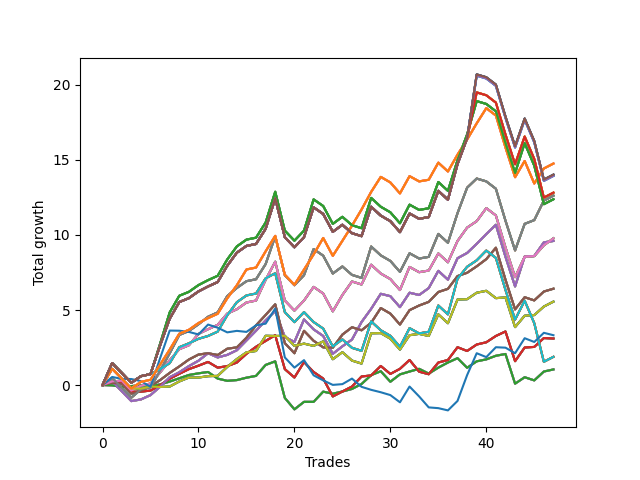

# Short Pointer 006 
- Symbol: SPY_Unlimited
- Date Range: 03/23/2022 - 07/08/2022
- Trading Period: 7:20-12:30
- Number of Trades: 47



| Name | Win Percent | Profit | Avg Profit / Trade | Avg Time / Trade |      | Name | Win Percent | Profit | Avg Profit / Trade | Avg Time / Trade |
| ---- | ----------- | ------ | ------------------ | ---------------- | ---- | ---- | ----------- | ------ | ------------------ | ---------------- |
| Sorted By <br> Profit | | | | | | Sorted By <br> Win Percentage ||||
| One Hundred Twenty-Six | 72.34 | 7380.00 | 157.02 | 21:22 |     | One Hundred Twenty-Six | 72.34 | 7380.00 | 157.02 | 21:22 |
| One Hundred Twenty-One | 72.34 | 7380.00 | 157.02 | 21:22 |     | One Hundred Twenty-One | 72.34 | 7380.00 | 157.02 | 21:22 |
| One Hundred Sixteen | 72.34 | 7380.00 | 157.02 | 21:22 |     | One Hundred Sixteen | 72.34 | 7380.00 | 157.02 | 21:22 |
| One Hundred Eleven | 72.34 | 7380.00 | 157.02 | 21:22 |     | One Hundred Eleven | 72.34 | 7380.00 | 157.02 | 21:22 |
| Eighty-One | 72.34 | 7380.00 | 157.02 | 21:22 |     | Eighty-One | 72.34 | 7380.00 | 157.02 | 21:22 |
| One Hundred Thirty | 59.57 | 7010.00 | 149.15 | 29:18 |     | Sixty-Eight | 70.21 | 4890.00 | 104.04 | 20:52 |
| One Hundred Twenty-Five | 59.57 | 7010.00 | 149.15 | 29:18 |     | Sixty | 70.21 | 4890.00 | 104.04 | 20:52 |
| One Hundred Twenty | 59.57 | 7010.00 | 149.15 | 29:18 |     | Fifty-Two | 70.21 | 4890.00 | 104.04 | 20:52 |
| One Hundred Fifteen | 59.57 | 7010.00 | 149.15 | 29:18 |     | Forty-Four | 70.21 | 4890.00 | 104.04 | 20:52 |
| Eighty-Five | 59.57 | 7010.00 | 149.15 | 29:18 |     | Four | 70.21 | 4890.00 | 104.04 | 20:52 |
| One Hundred Twenty-Nine | 59.57 | 6970.00 | 148.30 | 29:18 |     | Sixty-Six | 70.21 | 4800.00 | 102.13 | 16:33 |
| One Hundred Twenty-Four | 59.57 | 6970.00 | 148.30 | 29:18 |     | Fifty-Eight | 70.21 | 4800.00 | 102.13 | 16:33 |
| One Hundred Ninteen | 59.57 | 6970.00 | 148.30 | 29:18 |     | Fifty | 70.21 | 4800.00 | 102.13 | 16:33 |
| One Hundred Fourteen | 59.57 | 6970.00 | 148.30 | 29:18 |     | Forty-Two | 70.21 | 4800.00 | 102.13 | 16:33 |
| Eighty-Four | 59.57 | 6970.00 | 148.30 | 29:18 |     | Two | 70.21 | 4800.00 | 102.13 | 16:33 |
| One Hundred Twenty-Eight | 59.57 | 6410.00 | 136.38 | 28:45 |     | Sixty-Seven | 70.21 | 3210.00 | 68.30 | 14:13 |
| One Hundred Twenty-Three | 59.57 | 6410.00 | 136.38 | 28:45 |     | Fifty-Nine | 70.21 | 3210.00 | 68.30 | 14:13 |
| One Hundred Eighteen | 59.57 | 6410.00 | 136.38 | 28:45 |     | Fifty-One | 70.21 | 3210.00 | 68.30 | 14:13 |
| One Hundred Thirteen | 59.57 | 6410.00 | 136.38 | 28:45 |     | Forty-Three | 70.21 | 3210.00 | 68.30 | 14:13 |
| Eighty-Three | 59.57 | 6410.00 | 136.38 | 28:45 |     | Three | 70.21 | 3210.00 | 68.30 | 14:13 |
| Sixty-Nine | 63.83 | 6310.00 | 134.26 | 24:19 |     | Sixty-Five | 70.21 | 1550.00 | 32.98 | 11:42 |
| Sixty-One | 63.83 | 6310.00 | 134.26 | 24:19 |     | Fifty-Seven | 70.21 | 1550.00 | 32.98 | 11:42 |
| Fifty-Three | 63.83 | 6310.00 | 134.26 | 24:19 |     | Forty-Nine | 70.21 | 1550.00 | 32.98 | 11:42 |
| Forty-Five | 63.83 | 6310.00 | 134.26 | 24:19 |     | Forty-One | 70.21 | 1550.00 | 32.98 | 11:42 |
| Five | 63.83 | 6310.00 | 134.26 | 24:19 |     | One | 70.21 | 1550.00 | 32.98 | 11:42 |
| One Hundred Twenty-Seven | 59.57 | 6190.00 | 131.70 | 27:49 |     | Sixty-Four | 70.21 | 520.00 | 11.06 | 06:01 |
| One Hundred Twenty-Two | 59.57 | 6190.00 | 131.70 | 27:49 |     | Fifty-Six | 70.21 | 520.00 | 11.06 | 06:01 |
| One Hundred Seventeen | 59.57 | 6190.00 | 131.70 | 27:49 |     | Forty-Eight | 70.21 | 520.00 | 11.06 | 06:01 |
| One Hundred Twelve | 59.57 | 6190.00 | 131.70 | 27:49 |     | Forty | 70.21 | 520.00 | 11.06 | 06:01 |
| Eighty-Two | 59.57 | 6190.00 | 131.70 | 27:49 |     | Zero | 70.21 | 520.00 | 11.06 | 06:01 |
| Sixty-Eight | 70.21 | 4890.00 | 104.04 | 20:52 |     | Sixty-Nine | 63.83 | 6310.00 | 134.26 | 24:19 |
| Sixty | 70.21 | 4890.00 | 104.04 | 20:52 |     | Sixty-One | 63.83 | 6310.00 | 134.26 | 24:19 |
| Fifty-Two | 70.21 | 4890.00 | 104.04 | 20:52 |     | Fifty-Three | 63.83 | 6310.00 | 134.26 | 24:19 |
| Forty-Four | 70.21 | 4890.00 | 104.04 | 20:52 |     | Forty-Five | 63.83 | 6310.00 | 134.26 | 24:19 |
| Four | 70.21 | 4890.00 | 104.04 | 20:52 |     | Five | 63.83 | 6310.00 | 134.26 | 24:19 |
| Sixty-Six | 70.21 | 4800.00 | 102.13 | 16:33 |     | Seventy | 63.83 | 2780.00 | 59.15 | 13:54 |
| Fifty-Eight | 70.21 | 4800.00 | 102.13 | 16:33 |     | Sixty-Two | 63.83 | 2780.00 | 59.15 | 13:54 |
| Fifty | 70.21 | 4800.00 | 102.13 | 16:33 |     | Fifty-Four | 63.83 | 2780.00 | 59.15 | 13:54 |
| Forty-Two | 70.21 | 4800.00 | 102.13 | 16:33 |     | Forty-Six | 63.83 | 2780.00 | 59.15 | 13:54 |
| Two | 70.21 | 4800.00 | 102.13 | 16:33 |     | Six | 63.83 | 2780.00 | 59.15 | 13:54 |
| Sixty-Seven | 70.21 | 3210.00 | 68.30 | 14:13 |     | One Hundred Thirty | 59.57 | 7010.00 | 149.15 | 29:18 |
| Fifty-Nine | 70.21 | 3210.00 | 68.30 | 14:13 |     | One Hundred Twenty-Five | 59.57 | 7010.00 | 149.15 | 29:18 |
| Fifty-One | 70.21 | 3210.00 | 68.30 | 14:13 |     | One Hundred Twenty | 59.57 | 7010.00 | 149.15 | 29:18 |
| Forty-Three | 70.21 | 3210.00 | 68.30 | 14:13 |     | One Hundred Fifteen | 59.57 | 7010.00 | 149.15 | 29:18 |
| Three | 70.21 | 3210.00 | 68.30 | 14:13 |     | Eighty-Five | 59.57 | 7010.00 | 149.15 | 29:18 |
| Seventy | 63.83 | 2780.00 | 59.15 | 13:54 |     | One Hundred Twenty-Nine | 59.57 | 6970.00 | 148.30 | 29:18 |
| Sixty-Two | 63.83 | 2780.00 | 59.15 | 13:54 |     | One Hundred Twenty-Four | 59.57 | 6970.00 | 148.30 | 29:18 |
| Fifty-Four | 63.83 | 2780.00 | 59.15 | 13:54 |     | One Hundred Ninteen | 59.57 | 6970.00 | 148.30 | 29:18 |
| Forty-Six | 63.83 | 2780.00 | 59.15 | 13:54 |     | One Hundred Fourteen | 59.57 | 6970.00 | 148.30 | 29:18 |
| Six | 63.83 | 2780.00 | 59.15 | 13:54 |     | Eighty-Four | 59.57 | 6970.00 | 148.30 | 29:18 |
| Seventy-Three | 38.30 | 1660.00 | 35.32 | 09:10 |     | One Hundred Twenty-Eight | 59.57 | 6410.00 | 136.38 | 28:45 |
| Sixty-Five | 70.21 | 1550.00 | 32.98 | 11:42 |     | One Hundred Twenty-Three | 59.57 | 6410.00 | 136.38 | 28:45 |
| Fifty-Seven | 70.21 | 1550.00 | 32.98 | 11:42 |     | One Hundred Eighteen | 59.57 | 6410.00 | 136.38 | 28:45 |
| Forty-Nine | 70.21 | 1550.00 | 32.98 | 11:42 |     | One Hundred Thirteen | 59.57 | 6410.00 | 136.38 | 28:45 |
| Forty-One | 70.21 | 1550.00 | 32.98 | 11:42 |     | Eighty-Three | 59.57 | 6410.00 | 136.38 | 28:45 |
| One | 70.21 | 1550.00 | 32.98 | 11:42 |     | One Hundred Twenty-Seven | 59.57 | 6190.00 | 131.70 | 27:49 |
| Seventy-One | 59.57 | 940.00 | 20.00 | 24:15 |     | One Hundred Twenty-Two | 59.57 | 6190.00 | 131.70 | 27:49 |
| Sixty-Three | 59.57 | 940.00 | 20.00 | 24:15 |     | One Hundred Seventeen | 59.57 | 6190.00 | 131.70 | 27:49 |
| Fifty-Five | 59.57 | 940.00 | 20.00 | 24:15 |     | One Hundred Twelve | 59.57 | 6190.00 | 131.70 | 27:49 |
| Forty-Seven | 59.57 | 940.00 | 20.00 | 24:15 |     | Eighty-Two | 59.57 | 6190.00 | 131.70 | 27:49 |
| Seven | 59.57 | 940.00 | 20.00 | 24:15 |     | Seventy-One | 59.57 | 940.00 | 20.00 | 24:15 |
| Sixty-Four | 70.21 | 520.00 | 11.06 | 06:01 |     | Sixty-Three | 59.57 | 940.00 | 20.00 | 24:15 |
| Fifty-Six | 70.21 | 520.00 | 11.06 | 06:01 |     | Fifty-Five | 59.57 | 940.00 | 20.00 | 24:15 |
| Forty-Eight | 70.21 | 520.00 | 11.06 | 06:01 |     | Forty-Seven | 59.57 | 940.00 | 20.00 | 24:15 |
| Forty | 70.21 | 520.00 | 11.06 | 06:01 |     | Seven | 59.57 | 940.00 | 20.00 | 24:15 |
| Zero | 70.21 | 520.00 | 11.06 | 06:01 |     | Seventy-Three | 38.30 | 1660.00 | 35.32 | 09:10 |

## NO STOPLOSS

### Test Zero
* Sell when price hits the middle line of the 20p bollinger
* No Stoploss
* Results:
```
Total Trades: 47
Percent Up: 29.79
Percent Down: 70.21
Total Points Moved Down: 1.04
Potential Profit: 520.00
Total Points Ups: 7.98 Count Ups: 14
Total Points Downs: 9.02 Count Downs: 33
```

<details><summary>Trades</summary>

<code>In: 2022-03-25 11:58:00		Out: 2022-03-25 11:58:10		Total Position Time: 00:10		Total Move Down: -0.02		Total to Date: -0.02</code> <br />
<code>In: 2022-03-28 11:13:00		Out: 2022-03-28 11:13:10		Total Position Time: 00:10		Total Move Down: -0.11		Total to Date: -0.13</code> <br />
<code>In: 2022-03-28 12:02:00		Out: 2022-03-28 12:08:05		Total Position Time: 06:05		Total Move Down: 0.06		Total to Date: -0.07</code> <br />
<code>In: 2022-03-30 09:47:00		Out: 2022-03-30 09:50:50		Total Position Time: 03:50		Total Move Down: 0.06		Total to Date: -0.01</code> <br />
<code>In: 2022-03-31 07:52:00		Out: 2022-03-31 08:03:05		Total Position Time: 11:05		Total Move Down: -0.07		Total to Date: -0.08</code> <br />
<code>In: 2022-03-31 12:06:00		Out: 2022-03-31 12:11:30		Total Position Time: 05:30		Total Move Down: 0.12		Total to Date: 0.04</code> <br />
<code>In: 2022-03-31 12:09:00		Out: 2022-03-31 12:11:30		Total Position Time: 02:30		Total Move Down: 0.19		Total to Date: 0.23</code> <br />
<code>In: 2022-04-06 08:54:00		Out: 2022-04-06 09:00:40		Total Position Time: 06:40		Total Move Down: 0.22		Total to Date: 0.45</code> <br />
<code>In: 2022-04-07 11:05:00		Out: 2022-04-07 11:15:20		Total Position Time: 10:20		Total Move Down: 0.22		Total to Date: 0.67</code> <br />
<code>In: 2022-04-11 10:09:00		Out: 2022-04-11 10:16:10		Total Position Time: 07:10		Total Move Down: 0.11		Total to Date: 0.78</code> <br />
<code>In: 2022-04-11 11:13:00		Out: 2022-04-11 11:13:10		Total Position Time: 00:10		Total Move Down: 0.09		Total to Date: 0.87</code> <br />
<code>In: 2022-04-14 10:54:00		Out: 2022-04-14 11:14:05		Total Position Time: 20:05		Total Move Down: -0.44		Total to Date: 0.43</code> <br />
<code>In: 2022-04-20 07:44:00		Out: 2022-04-20 08:00:20		Total Position Time: 16:20		Total Move Down: -0.15		Total to Date: 0.28</code> <br />
<code>In: 2022-04-20 10:50:00		Out: 2022-04-20 10:50:10		Total Position Time: 00:10		Total Move Down: 0.05		Total to Date: 0.33</code> <br />
<code>In: 2022-04-25 10:19:00		Out: 2022-04-25 10:26:25		Total Position Time: 07:25		Total Move Down: 0.16		Total to Date: 0.49</code> <br />
<code>In: 2022-04-26 09:32:00		Out: 2022-04-26 09:37:15		Total Position Time: 05:15		Total Move Down: 0.12		Total to Date: 0.61</code> <br />
<code>In: 2022-04-27 09:33:00		Out: 2022-04-27 09:37:00		Total Position Time: 04:00		Total Move Down: 0.73		Total to Date: 1.34</code> <br />
<code>In: 2022-04-29 10:40:00		Out: 2022-04-29 10:40:30		Total Position Time: 00:30		Total Move Down: 0.24		Total to Date: 1.58</code> <br />
<code>In: 2022-05-02 12:18:00		Out: 2022-05-02 12:39:35		Total Position Time: 21:35		Total Move Down: -2.44		Total to Date: -0.86</code> <br />
<code>In: 2022-05-03 08:12:00		Out: 2022-05-03 08:35:55		Total Position Time: 23:55		Total Move Down: -0.76		Total to Date: -1.62</code> <br />
<code>In: 2022-05-05 10:11:00		Out: 2022-05-05 10:12:50		Total Position Time: 01:50		Total Move Down: 0.50		Total to Date: -1.12</code> <br />
<code>In: 2022-05-09 12:05:00		Out: 2022-05-09 12:05:45		Total Position Time: 00:45		Total Move Down: -0.00		Total to Date: -1.12</code> <br />
<code>In: 2022-05-12 12:29:00		Out: 2022-05-12 12:35:25		Total Position Time: 06:25		Total Move Down: 0.68		Total to Date: -0.44</code> <br />
<code>In: 2022-05-16 11:12:00		Out: 2022-05-16 11:15:25		Total Position Time: 03:25		Total Move Down: -0.14		Total to Date: -0.58</code> <br />
<code>In: 2022-05-16 11:36:00		Out: 2022-05-16 11:41:45		Total Position Time: 05:45		Total Move Down: 0.15		Total to Date: -0.43</code> <br />
<code>In: 2022-05-17 09:49:00		Out: 2022-05-17 09:51:15		Total Position Time: 02:15		Total Move Down: 0.17		Total to Date: -0.26</code> <br />
<code>In: 2022-05-19 08:46:00		Out: 2022-05-19 08:53:40		Total Position Time: 07:40		Total Move Down: 0.33		Total to Date: 0.07</code> <br />
<code>In: 2022-05-19 11:57:00		Out: 2022-05-19 11:57:50		Total Position Time: 00:50		Total Move Down: 0.59		Total to Date: 0.66</code> <br />
<code>In: 2022-05-20 11:57:00		Out: 2022-05-20 12:02:25		Total Position Time: 05:25		Total Move Down: 0.26		Total to Date: 0.92</code> <br />
<code>In: 2022-05-25 07:25:00		Out: 2022-05-25 07:42:00		Total Position Time: 17:00		Total Move Down: -0.70		Total to Date: 0.22</code> <br />
<code>In: 2022-05-31 07:25:00		Out: 2022-05-31 07:30:05		Total Position Time: 05:05		Total Move Down: 0.49		Total to Date: 0.71</code> <br />
<code>In: 2022-06-03 10:09:00		Out: 2022-06-03 10:13:20		Total Position Time: 04:20		Total Move Down: 0.19		Total to Date: 0.90</code> <br />
<code>In: 2022-06-10 10:32:00		Out: 2022-06-10 10:32:15		Total Position Time: 00:15		Total Move Down: 0.18		Total to Date: 1.08</code> <br />
<code>In: 2022-06-10 10:42:00		Out: 2022-06-10 10:54:55		Total Position Time: 12:55		Total Move Down: -0.32		Total to Date: 0.76</code> <br />
<code>In: 2022-06-10 12:30:00		Out: 2022-06-10 12:30:30		Total Position Time: 00:30		Total Move Down: 0.40		Total to Date: 1.16</code> <br />
<code>In: 2022-06-13 09:15:00		Out: 2022-06-13 09:17:10		Total Position Time: 02:10		Total Move Down: 0.34		Total to Date: 1.50</code> <br />
<code>In: 2022-06-13 09:42:00		Out: 2022-06-13 09:44:05		Total Position Time: 02:05		Total Move Down: 0.29		Total to Date: 1.79</code> <br />
<code>In: 2022-06-14 10:15:00		Out: 2022-06-14 10:26:40		Total Position Time: 11:40		Total Move Down: -0.64		Total to Date: 1.15</code> <br />
<code>In: 2022-06-15 11:03:00		Out: 2022-06-15 11:03:10		Total Position Time: 00:10		Total Move Down: 0.43		Total to Date: 1.58</code> <br />
<code>In: 2022-06-16 08:31:00		Out: 2022-06-16 08:31:10		Total Position Time: 00:10		Total Move Down: 0.13		Total to Date: 1.71</code> <br />
<code>In: 2022-06-27 08:00:00		Out: 2022-06-27 08:02:15		Total Position Time: 02:15		Total Move Down: 0.24		Total to Date: 1.95</code> <br />
<code>In: 2022-06-30 07:40:00		Out: 2022-06-30 07:42:05		Total Position Time: 02:05		Total Move Down: 0.12		Total to Date: 2.07</code> <br />
<code>In: 2022-06-30 08:02:00		Out: 2022-06-30 08:31:55		Total Position Time: 29:55		Total Move Down: -1.98		Total to Date: 0.09</code> <br />
<code>In: 2022-07-05 07:44:00		Out: 2022-07-05 07:44:30		Total Position Time: 00:30		Total Move Down: 0.43		Total to Date: 0.52</code> <br />
<code>In: 2022-07-06 11:01:00		Out: 2022-07-06 11:01:10		Total Position Time: 00:10		Total Move Down: -0.21		Total to Date: 0.31</code> <br />
<code>In: 2022-07-06 11:11:00		Out: 2022-07-06 11:11:10		Total Position Time: 00:10		Total Move Down: 0.59		Total to Date: 0.90</code> <br />
<code>In: 2022-07-07 07:57:00		Out: 2022-07-07 08:01:10		Total Position Time: 04:10		Total Move Down: 0.14		Total to Date: 1.04</code> <br />


</details>

### Test One
* Sell when the price hits the upper line of the 20p 1std bollinger
* No Stoploss
* Results:
```
Total Trades: 47
Percent Up: 29.79
Percent Down: 70.21
Total Points Moved Down: 3.10
Potential Profit: 1550.00
Total Points Ups: 9.91 Count Ups: 14
Total Points Downs: 13.01 Count Downs: 33
```

<details><summary>Trades</summary>

<code>In: 2022-03-25 11:58:00		Out: 2022-03-25 12:00:50		Total Position Time: 02:50		Total Move Down: 0.23		Total to Date: 0.23</code> <br />
<code>In: 2022-03-28 11:13:00		Out: 2022-03-28 11:19:20		Total Position Time: 06:20		Total Move Down: -0.02		Total to Date: 0.21</code> <br />
<code>In: 2022-03-28 12:02:00		Out: 2022-03-28 12:31:55		Total Position Time: 29:55		Total Move Down: -0.66		Total to Date: -0.45</code> <br />
<code>In: 2022-03-30 09:47:00		Out: 2022-03-30 10:00:45		Total Position Time: 13:45		Total Move Down: 0.01		Total to Date: -0.44</code> <br />
<code>In: 2022-03-31 07:52:00		Out: 2022-03-31 08:08:00		Total Position Time: 16:00		Total Move Down: 0.07		Total to Date: -0.37</code> <br />
<code>In: 2022-03-31 12:06:00		Out: 2022-03-31 12:16:00		Total Position Time: 10:00		Total Move Down: 0.36		Total to Date: -0.01</code> <br />
<code>In: 2022-03-31 12:09:00		Out: 2022-03-31 12:16:00		Total Position Time: 07:00		Total Move Down: 0.43		Total to Date: 0.42</code> <br />
<code>In: 2022-04-06 08:54:00		Out: 2022-04-06 09:04:45		Total Position Time: 10:45		Total Move Down: 0.33		Total to Date: 0.75</code> <br />
<code>In: 2022-04-07 11:05:00		Out: 2022-04-07 11:18:00		Total Position Time: 13:00		Total Move Down: 0.31		Total to Date: 1.06</code> <br />
<code>In: 2022-04-11 10:09:00		Out: 2022-04-11 10:17:05		Total Position Time: 08:05		Total Move Down: 0.23		Total to Date: 1.29</code> <br />
<code>In: 2022-04-11 11:13:00		Out: 2022-04-11 11:14:20		Total Position Time: 01:20		Total Move Down: 0.25		Total to Date: 1.54</code> <br />
<code>In: 2022-04-14 10:54:00		Out: 2022-04-14 11:17:10		Total Position Time: 23:10		Total Move Down: -0.38		Total to Date: 1.16</code> <br />
<code>In: 2022-04-20 07:44:00		Out: 2022-04-20 08:00:40		Total Position Time: 16:40		Total Move Down: 0.10		Total to Date: 1.26</code> <br />
<code>In: 2022-04-20 10:50:00		Out: 2022-04-20 10:53:20		Total Position Time: 03:20		Total Move Down: 0.24		Total to Date: 1.50</code> <br />
<code>In: 2022-04-25 10:19:00		Out: 2022-04-25 10:27:10		Total Position Time: 08:10		Total Move Down: 0.58		Total to Date: 2.08</code> <br />
<code>In: 2022-04-26 09:32:00		Out: 2022-04-26 09:38:00		Total Position Time: 06:00		Total Move Down: 0.47		Total to Date: 2.55</code> <br />
<code>In: 2022-04-27 09:33:00		Out: 2022-04-27 09:50:25		Total Position Time: 17:25		Total Move Down: 0.39		Total to Date: 2.94</code> <br />
<code>In: 2022-04-29 10:40:00		Out: 2022-04-29 10:41:05		Total Position Time: 01:05		Total Move Down: 0.38		Total to Date: 3.32</code> <br />
<code>In: 2022-05-02 12:18:00		Out: 2022-05-02 12:44:05		Total Position Time: 26:05		Total Move Down: -2.26		Total to Date: 1.06</code> <br />
<code>In: 2022-05-03 08:12:00		Out: 2022-05-03 08:38:05		Total Position Time: 26:05		Total Move Down: -0.56		Total to Date: 0.50</code> <br />
<code>In: 2022-05-05 10:11:00		Out: 2022-05-05 10:16:05		Total Position Time: 05:05		Total Move Down: 1.03		Total to Date: 1.53</code> <br />
<code>In: 2022-05-09 12:05:00		Out: 2022-05-09 12:17:15		Total Position Time: 12:15		Total Move Down: -0.66		Total to Date: 0.87</code> <br />
<code>In: 2022-05-12 12:29:00		Out: 2022-05-12 12:46:00		Total Position Time: 17:00		Total Move Down: -0.44		Total to Date: 0.43</code> <br />
<code>In: 2022-05-16 11:12:00		Out: 2022-05-16 11:41:55		Total Position Time: 29:55		Total Move Down: -1.19		Total to Date: -0.76</code> <br />
<code>In: 2022-05-16 11:36:00		Out: 2022-05-16 11:44:50		Total Position Time: 08:50		Total Move Down: 0.33		Total to Date: -0.43</code> <br />
<code>In: 2022-05-17 09:49:00		Out: 2022-05-17 09:54:40		Total Position Time: 05:40		Total Move Down: 0.33		Total to Date: -0.10</code> <br />
<code>In: 2022-05-19 08:46:00		Out: 2022-05-19 08:54:45		Total Position Time: 08:45		Total Move Down: 0.67		Total to Date: 0.57</code> <br />
<code>In: 2022-05-19 11:57:00		Out: 2022-05-19 12:10:10		Total Position Time: 13:10		Total Move Down: 0.07		Total to Date: 0.64</code> <br />
<code>In: 2022-05-20 11:57:00		Out: 2022-05-20 12:03:35		Total Position Time: 06:35		Total Move Down: 0.63		Total to Date: 1.27</code> <br />
<code>In: 2022-05-25 07:25:00		Out: 2022-05-25 07:46:40		Total Position Time: 21:40		Total Move Down: -0.53		Total to Date: 0.74</code> <br />
<code>In: 2022-05-31 07:25:00		Out: 2022-05-31 07:38:05		Total Position Time: 13:05		Total Move Down: 0.34		Total to Date: 1.08</code> <br />
<code>In: 2022-06-03 10:09:00		Out: 2022-06-03 10:15:10		Total Position Time: 06:10		Total Move Down: 0.59		Total to Date: 1.67</code> <br />
<code>In: 2022-06-10 10:32:00		Out: 2022-06-10 10:56:05		Total Position Time: 24:05		Total Move Down: -0.78		Total to Date: 0.89</code> <br />
<code>In: 2022-06-10 10:42:00		Out: 2022-06-10 10:56:05		Total Position Time: 14:05		Total Move Down: -0.17		Total to Date: 0.72</code> <br />
<code>In: 2022-06-10 12:30:00		Out: 2022-06-10 12:35:45		Total Position Time: 05:45		Total Move Down: 0.78		Total to Date: 1.50</code> <br />
<code>In: 2022-06-13 09:15:00		Out: 2022-06-13 09:29:20		Total Position Time: 14:20		Total Move Down: 0.17		Total to Date: 1.67</code> <br />
<code>In: 2022-06-13 09:42:00		Out: 2022-06-13 09:47:55		Total Position Time: 05:55		Total Move Down: 0.85		Total to Date: 2.52</code> <br />
<code>In: 2022-06-14 10:15:00		Out: 2022-06-14 10:29:50		Total Position Time: 14:50		Total Move Down: -0.25		Total to Date: 2.27</code> <br />
<code>In: 2022-06-15 11:03:00		Out: 2022-06-15 11:03:10		Total Position Time: 00:10		Total Move Down: 0.43		Total to Date: 2.70</code> <br />
<code>In: 2022-06-16 08:31:00		Out: 2022-06-16 08:35:15		Total Position Time: 04:15		Total Move Down: 0.15		Total to Date: 2.85</code> <br />
<code>In: 2022-06-27 08:00:00		Out: 2022-06-27 08:07:15		Total Position Time: 07:15		Total Move Down: 0.42		Total to Date: 3.27</code> <br />
<code>In: 2022-06-30 07:40:00		Out: 2022-06-30 07:49:05		Total Position Time: 09:05		Total Move Down: 0.30		Total to Date: 3.57</code> <br />
<code>In: 2022-06-30 08:02:00		Out: 2022-06-30 08:31:55		Total Position Time: 29:55		Total Move Down: -1.98		Total to Date: 1.59</code> <br />
<code>In: 2022-07-05 07:44:00		Out: 2022-07-05 07:45:55		Total Position Time: 01:55		Total Move Down: 0.91		Total to Date: 2.50</code> <br />
<code>In: 2022-07-06 11:01:00		Out: 2022-07-06 11:01:15		Total Position Time: 00:15		Total Move Down: 0.04		Total to Date: 2.54</code> <br />
<code>In: 2022-07-06 11:11:00		Out: 2022-07-06 11:11:10		Total Position Time: 00:10		Total Move Down: 0.59		Total to Date: 3.13</code> <br />
<code>In: 2022-07-07 07:57:00		Out: 2022-07-07 08:20:00		Total Position Time: 23:00		Total Move Down: -0.03		Total to Date: 3.10</code> <br />


</details>

### Test Two
* Sell when the price hits the upper line of the 20p 2std bollinger
* No Stoploss
* Results:
```
Total Trades: 47
Percent Up: 29.79
Percent Down: 70.21
Total Points Moved Down: 9.60
Potential Profit: 4800.00
Total Points Ups: 11.68 Count Ups: 14
Total Points Downs: 21.28 Count Downs: 33
```

<details><summary>Trades</summary>

<code>In: 2022-03-25 11:58:00		Out: 2022-03-25 12:00:55		Total Position Time: 02:55		Total Move Down: 0.24		Total to Date: 0.24</code> <br />
<code>In: 2022-03-28 11:13:00		Out: 2022-03-28 11:42:55		Total Position Time: 29:55		Total Move Down: -0.65		Total to Date: -0.41</code> <br />
<code>In: 2022-03-28 12:02:00		Out: 2022-03-28 12:31:55		Total Position Time: 29:55		Total Move Down: -0.66		Total to Date: -1.07</code> <br />
<code>In: 2022-03-30 09:47:00		Out: 2022-03-30 10:01:15		Total Position Time: 14:15		Total Move Down: 0.11		Total to Date: -0.96</code> <br />
<code>In: 2022-03-31 07:52:00		Out: 2022-03-31 08:08:30		Total Position Time: 16:30		Total Move Down: 0.29		Total to Date: -0.67</code> <br />
<code>In: 2022-03-31 12:06:00		Out: 2022-03-31 12:19:35		Total Position Time: 13:35		Total Move Down: 0.56		Total to Date: -0.11</code> <br />
<code>In: 2022-03-31 12:09:00		Out: 2022-03-31 12:19:35		Total Position Time: 10:35		Total Move Down: 0.63		Total to Date: 0.52</code> <br />
<code>In: 2022-04-06 08:54:00		Out: 2022-04-06 09:09:40		Total Position Time: 15:40		Total Move Down: 0.33		Total to Date: 0.85</code> <br />
<code>In: 2022-04-07 11:05:00		Out: 2022-04-07 11:18:20		Total Position Time: 13:20		Total Move Down: 0.41		Total to Date: 1.26</code> <br />
<code>In: 2022-04-11 10:09:00		Out: 2022-04-11 10:19:05		Total Position Time: 10:05		Total Move Down: 0.36		Total to Date: 1.62</code> <br />
<code>In: 2022-04-11 11:13:00		Out: 2022-04-11 11:14:35		Total Position Time: 01:35		Total Move Down: 0.50		Total to Date: 2.12</code> <br />
<code>In: 2022-04-14 10:54:00		Out: 2022-04-14 11:18:30		Total Position Time: 24:30		Total Move Down: -0.28		Total to Date: 1.84</code> <br />
<code>In: 2022-04-20 07:44:00		Out: 2022-04-20 08:00:45		Total Position Time: 16:45		Total Move Down: 0.17		Total to Date: 2.01</code> <br />
<code>In: 2022-04-20 10:50:00		Out: 2022-04-20 11:13:55		Total Position Time: 23:55		Total Move Down: 0.31		Total to Date: 2.32</code> <br />
<code>In: 2022-04-25 10:19:00		Out: 2022-04-25 10:33:35		Total Position Time: 14:35		Total Move Down: 0.65		Total to Date: 2.97</code> <br />
<code>In: 2022-04-26 09:32:00		Out: 2022-04-26 09:40:15		Total Position Time: 08:15		Total Move Down: 0.65		Total to Date: 3.62</code> <br />
<code>In: 2022-04-27 09:33:00		Out: 2022-04-27 10:00:10		Total Position Time: 27:10		Total Move Down: 0.69		Total to Date: 4.31</code> <br />
<code>In: 2022-04-29 10:40:00		Out: 2022-04-29 10:43:20		Total Position Time: 03:20		Total Move Down: 0.62		Total to Date: 4.93</code> <br />
<code>In: 2022-05-02 12:18:00		Out: 2022-05-02 12:45:05		Total Position Time: 27:05		Total Move Down: -1.73		Total to Date: 3.20</code> <br />
<code>In: 2022-05-03 08:12:00		Out: 2022-05-03 08:39:05		Total Position Time: 27:05		Total Move Down: -0.33		Total to Date: 2.87</code> <br />
<code>In: 2022-05-05 10:11:00		Out: 2022-05-05 10:30:30		Total Position Time: 19:30		Total Move Down: 1.50		Total to Date: 4.37</code> <br />
<code>In: 2022-05-09 12:05:00		Out: 2022-05-09 12:17:15		Total Position Time: 12:15		Total Move Down: -0.66		Total to Date: 3.71</code> <br />
<code>In: 2022-05-12 12:29:00		Out: 2022-05-12 12:46:00		Total Position Time: 17:00		Total Move Down: -0.44		Total to Date: 3.27</code> <br />
<code>In: 2022-05-16 11:12:00		Out: 2022-05-16 11:41:55		Total Position Time: 29:55		Total Move Down: -1.19		Total to Date: 2.08</code> <br />
<code>In: 2022-05-16 11:36:00		Out: 2022-05-16 11:45:35		Total Position Time: 09:35		Total Move Down: 0.50		Total to Date: 2.58</code> <br />
<code>In: 2022-05-17 09:49:00		Out: 2022-05-17 10:01:10		Total Position Time: 12:10		Total Move Down: 0.45		Total to Date: 3.03</code> <br />
<code>In: 2022-05-19 08:46:00		Out: 2022-05-19 08:56:05		Total Position Time: 10:05		Total Move Down: 1.17		Total to Date: 4.20</code> <br />
<code>In: 2022-05-19 11:57:00		Out: 2022-05-19 12:14:05		Total Position Time: 17:05		Total Move Down: 0.88		Total to Date: 5.08</code> <br />
<code>In: 2022-05-20 11:57:00		Out: 2022-05-20 12:07:20		Total Position Time: 10:20		Total Move Down: 1.00		Total to Date: 6.08</code> <br />
<code>In: 2022-05-25 07:25:00		Out: 2022-05-25 07:48:10		Total Position Time: 23:10		Total Move Down: -0.16		Total to Date: 5.92</code> <br />
<code>In: 2022-05-31 07:25:00		Out: 2022-05-31 07:54:55		Total Position Time: 29:55		Total Move Down: -0.73		Total to Date: 5.19</code> <br />
<code>In: 2022-06-03 10:09:00		Out: 2022-06-03 10:17:55		Total Position Time: 08:55		Total Move Down: 0.96		Total to Date: 6.15</code> <br />
<code>In: 2022-06-10 10:32:00		Out: 2022-06-10 11:01:15		Total Position Time: 29:15		Total Move Down: -0.15		Total to Date: 6.00</code> <br />
<code>In: 2022-06-10 10:42:00		Out: 2022-06-10 11:01:15		Total Position Time: 19:15		Total Move Down: 0.46		Total to Date: 6.46</code> <br />
<code>In: 2022-06-10 12:30:00		Out: 2022-06-10 12:42:45		Total Position Time: 12:45		Total Move Down: 1.15		Total to Date: 7.61</code> <br />
<code>In: 2022-06-13 09:15:00		Out: 2022-06-13 09:44:55		Total Position Time: 29:55		Total Move Down: -0.59		Total to Date: 7.02</code> <br />
<code>In: 2022-06-13 09:42:00		Out: 2022-06-13 09:54:45		Total Position Time: 12:45		Total Move Down: 1.43		Total to Date: 8.45</code> <br />
<code>In: 2022-06-14 10:15:00		Out: 2022-06-14 10:34:30		Total Position Time: 19:30		Total Move Down: 0.35		Total to Date: 8.80</code> <br />
<code>In: 2022-06-15 11:03:00		Out: 2022-06-15 11:03:15		Total Position Time: 00:15		Total Move Down: 0.61		Total to Date: 9.41</code> <br />
<code>In: 2022-06-16 08:31:00		Out: 2022-06-16 08:42:05		Total Position Time: 11:05		Total Move Down: 0.65		Total to Date: 10.06</code> <br />
<code>In: 2022-06-27 08:00:00		Out: 2022-06-27 08:09:45		Total Position Time: 09:45		Total Move Down: 0.62		Total to Date: 10.68</code> <br />
<code>In: 2022-06-30 07:40:00		Out: 2022-06-30 08:09:55		Total Position Time: 29:55		Total Move Down: -2.13		Total to Date: 8.55</code> <br />
<code>In: 2022-06-30 08:02:00		Out: 2022-06-30 08:31:55		Total Position Time: 29:55		Total Move Down: -1.98		Total to Date: 6.57</code> <br />
<code>In: 2022-07-05 07:44:00		Out: 2022-07-05 08:01:10		Total Position Time: 17:10		Total Move Down: 1.99		Total to Date: 8.56</code> <br />
<code>In: 2022-07-06 11:01:00		Out: 2022-07-06 11:02:20		Total Position Time: 01:20		Total Move Down: 0.04		Total to Date: 8.60</code> <br />
<code>In: 2022-07-06 11:11:00		Out: 2022-07-06 11:11:45		Total Position Time: 00:45		Total Move Down: 0.91		Total to Date: 9.51</code> <br />
<code>In: 2022-07-07 07:57:00		Out: 2022-07-07 08:21:00		Total Position Time: 24:00		Total Move Down: 0.09		Total to Date: 9.60</code> <br />


</details>

### Test Three
* Sell when price hits the middle line of the 50p bollinger
* No Stoploss
* Results:
```
Total Trades: 47
Percent Up: 29.79
Percent Down: 70.21
Total Points Moved Down: 6.42
Potential Profit: 3210.00
Total Points Ups: 10.84 Count Ups: 14
Total Points Downs: 17.26 Count Downs: 33
```

<details><summary>Trades</summary>

<code>In: 2022-03-25 11:58:00		Out: 2022-03-25 12:00:45		Total Position Time: 02:45		Total Move Down: 0.14		Total to Date: 0.14</code> <br />
<code>In: 2022-03-28 11:13:00		Out: 2022-03-28 11:13:35		Total Position Time: 00:35		Total Move Down: -0.06		Total to Date: 0.08</code> <br />
<code>In: 2022-03-28 12:02:00		Out: 2022-03-28 12:31:55		Total Position Time: 29:55		Total Move Down: -0.66		Total to Date: -0.58</code> <br />
<code>In: 2022-03-30 09:47:00		Out: 2022-03-30 10:01:45		Total Position Time: 14:45		Total Move Down: 0.19		Total to Date: -0.39</code> <br />
<code>In: 2022-03-31 07:52:00		Out: 2022-03-31 08:15:40		Total Position Time: 23:40		Total Move Down: 0.31		Total to Date: -0.08</code> <br />
<code>In: 2022-03-31 12:06:00		Out: 2022-03-31 12:16:40		Total Position Time: 10:40		Total Move Down: 0.41		Total to Date: 0.33</code> <br />
<code>In: 2022-03-31 12:09:00		Out: 2022-03-31 12:16:40		Total Position Time: 07:40		Total Move Down: 0.48		Total to Date: 0.81</code> <br />
<code>In: 2022-04-06 08:54:00		Out: 2022-04-06 09:12:05		Total Position Time: 18:05		Total Move Down: 0.43		Total to Date: 1.24</code> <br />
<code>In: 2022-04-07 11:05:00		Out: 2022-04-07 11:33:40		Total Position Time: 28:40		Total Move Down: 0.46		Total to Date: 1.70</code> <br />
<code>In: 2022-04-11 10:09:00		Out: 2022-04-11 10:18:35		Total Position Time: 09:35		Total Move Down: 0.33		Total to Date: 2.03</code> <br />
<code>In: 2022-04-11 11:13:00		Out: 2022-04-11 11:13:10		Total Position Time: 00:10		Total Move Down: 0.09		Total to Date: 2.12</code> <br />
<code>In: 2022-04-14 10:54:00		Out: 2022-04-14 11:19:35		Total Position Time: 25:35		Total Move Down: -0.12		Total to Date: 2.00</code> <br />
<code>In: 2022-04-20 07:44:00		Out: 2022-04-20 08:02:45		Total Position Time: 18:45		Total Move Down: 0.42		Total to Date: 2.42</code> <br />
<code>In: 2022-04-20 10:50:00		Out: 2022-04-20 10:50:20		Total Position Time: 00:20		Total Move Down: 0.09		Total to Date: 2.51</code> <br />
<code>In: 2022-04-25 10:19:00		Out: 2022-04-25 10:28:15		Total Position Time: 09:15		Total Move Down: 0.64		Total to Date: 3.15</code> <br />
<code>In: 2022-04-26 09:32:00		Out: 2022-04-26 09:46:10		Total Position Time: 14:10		Total Move Down: 0.83		Total to Date: 3.98</code> <br />
<code>In: 2022-04-27 09:33:00		Out: 2022-04-27 10:00:10		Total Position Time: 27:10		Total Move Down: 0.69		Total to Date: 4.67</code> <br />
<code>In: 2022-04-29 10:40:00		Out: 2022-04-29 10:43:40		Total Position Time: 03:40		Total Move Down: 0.71		Total to Date: 5.38</code> <br />
<code>In: 2022-05-02 12:18:00		Out: 2022-05-02 12:46:00		Total Position Time: 28:00		Total Move Down: -2.59		Total to Date: 2.79</code> <br />
<code>In: 2022-05-03 08:12:00		Out: 2022-05-03 08:41:55		Total Position Time: 29:55		Total Move Down: -0.67		Total to Date: 2.12</code> <br />
<code>In: 2022-05-05 10:11:00		Out: 2022-05-05 10:16:30		Total Position Time: 05:30		Total Move Down: 1.49		Total to Date: 3.61</code> <br />
<code>In: 2022-05-09 12:05:00		Out: 2022-05-09 12:17:15		Total Position Time: 12:15		Total Move Down: -0.66		Total to Date: 2.95</code> <br />
<code>In: 2022-05-12 12:29:00		Out: 2022-05-12 12:46:00		Total Position Time: 17:00		Total Move Down: -0.44		Total to Date: 2.51</code> <br />
<code>In: 2022-05-16 11:12:00		Out: 2022-05-16 11:17:30		Total Position Time: 05:30		Total Move Down: -0.02		Total to Date: 2.49</code> <br />
<code>In: 2022-05-16 11:36:00		Out: 2022-05-16 11:49:00		Total Position Time: 13:00		Total Move Down: 0.87		Total to Date: 3.36</code> <br />
<code>In: 2022-05-17 09:49:00		Out: 2022-05-17 10:01:25		Total Position Time: 12:25		Total Move Down: 0.49		Total to Date: 3.85</code> <br />
<code>In: 2022-05-19 08:46:00		Out: 2022-05-19 09:15:55		Total Position Time: 29:55		Total Move Down: -0.20		Total to Date: 3.65</code> <br />
<code>In: 2022-05-19 11:57:00		Out: 2022-05-19 12:13:40		Total Position Time: 16:40		Total Move Down: 0.50		Total to Date: 4.15</code> <br />
<code>In: 2022-05-20 11:57:00		Out: 2022-05-20 12:07:15		Total Position Time: 10:15		Total Move Down: 0.98		Total to Date: 5.13</code> <br />
<code>In: 2022-05-25 07:25:00		Out: 2022-05-25 07:54:55		Total Position Time: 29:55		Total Move Down: -0.37		Total to Date: 4.76</code> <br />
<code>In: 2022-05-31 07:25:00		Out: 2022-05-31 07:54:55		Total Position Time: 29:55		Total Move Down: -0.73		Total to Date: 4.03</code> <br />
<code>In: 2022-06-03 10:09:00		Out: 2022-06-03 10:17:55		Total Position Time: 08:55		Total Move Down: 0.96		Total to Date: 4.99</code> <br />
<code>In: 2022-06-10 10:32:00		Out: 2022-06-10 10:34:35		Total Position Time: 02:35		Total Move Down: 0.31		Total to Date: 5.30</code> <br />
<code>In: 2022-06-10 10:42:00		Out: 2022-06-10 11:00:50		Total Position Time: 18:50		Total Move Down: 0.24		Total to Date: 5.54</code> <br />
<code>In: 2022-06-10 12:30:00		Out: 2022-06-10 12:33:15		Total Position Time: 03:15		Total Move Down: 0.66		Total to Date: 6.20</code> <br />
<code>In: 2022-06-13 09:15:00		Out: 2022-06-13 09:30:50		Total Position Time: 15:50		Total Move Down: 0.21		Total to Date: 6.41</code> <br />
<code>In: 2022-06-13 09:42:00		Out: 2022-06-13 09:47:55		Total Position Time: 05:55		Total Move Down: 0.85		Total to Date: 7.26</code> <br />
<code>In: 2022-06-14 10:15:00		Out: 2022-06-14 10:34:00		Total Position Time: 19:00		Total Move Down: 0.22		Total to Date: 7.48</code> <br />
<code>In: 2022-06-15 11:03:00		Out: 2022-06-15 11:03:10		Total Position Time: 00:10		Total Move Down: 0.43		Total to Date: 7.91</code> <br />
<code>In: 2022-06-16 08:31:00		Out: 2022-06-16 08:41:55		Total Position Time: 10:55		Total Move Down: 0.48		Total to Date: 8.39</code> <br />
<code>In: 2022-06-27 08:00:00		Out: 2022-06-27 08:10:05		Total Position Time: 10:05		Total Move Down: 0.76		Total to Date: 9.15</code> <br />
<code>In: 2022-06-30 07:40:00		Out: 2022-06-30 08:09:55		Total Position Time: 29:55		Total Move Down: -2.13		Total to Date: 7.02</code> <br />
<code>In: 2022-06-30 08:02:00		Out: 2022-06-30 08:31:55		Total Position Time: 29:55		Total Move Down: -1.98		Total to Date: 5.04</code> <br />
<code>In: 2022-07-05 07:44:00		Out: 2022-07-05 07:45:30		Total Position Time: 01:30		Total Move Down: 0.81		Total to Date: 5.85</code> <br />
<code>In: 2022-07-06 11:01:00		Out: 2022-07-06 11:01:10		Total Position Time: 00:10		Total Move Down: -0.21		Total to Date: 5.64</code> <br />
<code>In: 2022-07-06 11:11:00		Out: 2022-07-06 11:11:10		Total Position Time: 00:10		Total Move Down: 0.59		Total to Date: 6.23</code> <br />
<code>In: 2022-07-07 07:57:00		Out: 2022-07-07 08:22:45		Total Position Time: 25:45		Total Move Down: 0.19		Total to Date: 6.42</code> <br />


</details>

### Test Four
* Sell when the price hits the upper line of the 50p 1std bollinger
* No Stoploss
* Results:
```
Total Trades: 47
Percent Up: 29.79
Percent Down: 70.21
Total Points Moved Down: 9.78
Potential Profit: 4890.00
Total Points Ups: 12.98 Count Ups: 14
Total Points Downs: 22.76 Count Downs: 33
```

<details><summary>Trades</summary>

<code>In: 2022-03-25 11:58:00		Out: 2022-03-25 12:00:55		Total Position Time: 02:55		Total Move Down: 0.24		Total to Date: 0.24</code> <br />
<code>In: 2022-03-28 11:13:00		Out: 2022-03-28 11:20:40		Total Position Time: 07:40		Total Move Down: 0.05		Total to Date: 0.29</code> <br />
<code>In: 2022-03-28 12:02:00		Out: 2022-03-28 12:31:55		Total Position Time: 29:55		Total Move Down: -0.66		Total to Date: -0.37</code> <br />
<code>In: 2022-03-30 09:47:00		Out: 2022-03-30 10:06:35		Total Position Time: 19:35		Total Move Down: 0.33		Total to Date: -0.04</code> <br />
<code>In: 2022-03-31 07:52:00		Out: 2022-03-31 08:21:55		Total Position Time: 29:55		Total Move Down: 0.14		Total to Date: 0.10</code> <br />
<code>In: 2022-03-31 12:06:00		Out: 2022-03-31 12:20:15		Total Position Time: 14:15		Total Move Down: 0.74		Total to Date: 0.84</code> <br />
<code>In: 2022-03-31 12:09:00		Out: 2022-03-31 12:20:15		Total Position Time: 11:15		Total Move Down: 0.81		Total to Date: 1.65</code> <br />
<code>In: 2022-04-06 08:54:00		Out: 2022-04-06 09:13:55		Total Position Time: 19:55		Total Move Down: 0.74		Total to Date: 2.39</code> <br />
<code>In: 2022-04-07 11:05:00		Out: 2022-04-07 11:34:55		Total Position Time: 29:55		Total Move Down: 0.26		Total to Date: 2.65</code> <br />
<code>In: 2022-04-11 10:09:00		Out: 2022-04-11 10:24:35		Total Position Time: 15:35		Total Move Down: 0.76		Total to Date: 3.41</code> <br />
<code>In: 2022-04-11 11:13:00		Out: 2022-04-11 11:14:25		Total Position Time: 01:25		Total Move Down: 0.31		Total to Date: 3.72</code> <br />
<code>In: 2022-04-14 10:54:00		Out: 2022-04-14 11:23:55		Total Position Time: 29:55		Total Move Down: 0.29		Total to Date: 4.01</code> <br />
<code>In: 2022-04-20 07:44:00		Out: 2022-04-20 08:10:20		Total Position Time: 26:20		Total Move Down: 0.75		Total to Date: 4.76</code> <br />
<code>In: 2022-04-20 10:50:00		Out: 2022-04-20 11:14:00		Total Position Time: 24:00		Total Move Down: 0.29		Total to Date: 5.05</code> <br />
<code>In: 2022-04-25 10:19:00		Out: 2022-04-25 10:48:55		Total Position Time: 29:55		Total Move Down: 0.45		Total to Date: 5.50</code> <br />
<code>In: 2022-04-26 09:32:00		Out: 2022-04-26 10:01:55		Total Position Time: 29:55		Total Move Down: 0.13		Total to Date: 5.63</code> <br />
<code>In: 2022-04-27 09:33:00		Out: 2022-04-27 10:01:20		Total Position Time: 28:20		Total Move Down: 1.38		Total to Date: 7.01</code> <br />
<code>In: 2022-04-29 10:40:00		Out: 2022-04-29 10:47:20		Total Position Time: 07:20		Total Move Down: 1.21		Total to Date: 8.22</code> <br />
<code>In: 2022-05-02 12:18:00		Out: 2022-05-02 12:46:00		Total Position Time: 28:00		Total Move Down: -2.59		Total to Date: 5.63</code> <br />
<code>In: 2022-05-03 08:12:00		Out: 2022-05-03 08:41:55		Total Position Time: 29:55		Total Move Down: -0.67		Total to Date: 4.96</code> <br />
<code>In: 2022-05-05 10:11:00		Out: 2022-05-05 10:40:55		Total Position Time: 29:55		Total Move Down: 0.67		Total to Date: 5.63</code> <br />
<code>In: 2022-05-09 12:05:00		Out: 2022-05-09 12:23:25		Total Position Time: 18:25		Total Move Down: 0.91		Total to Date: 6.54</code> <br />
<code>In: 2022-05-12 12:29:00		Out: 2022-05-12 12:46:00		Total Position Time: 17:00		Total Move Down: -0.44		Total to Date: 6.10</code> <br />
<code>In: 2022-05-16 11:12:00		Out: 2022-05-16 11:41:55		Total Position Time: 29:55		Total Move Down: -1.19		Total to Date: 4.91</code> <br />
<code>In: 2022-05-16 11:36:00		Out: 2022-05-16 11:51:05		Total Position Time: 15:05		Total Move Down: 1.09		Total to Date: 6.00</code> <br />
<code>In: 2022-05-17 09:49:00		Out: 2022-05-17 10:02:15		Total Position Time: 13:15		Total Move Down: 0.90		Total to Date: 6.90</code> <br />
<code>In: 2022-05-19 08:46:00		Out: 2022-05-19 09:15:55		Total Position Time: 29:55		Total Move Down: -0.20		Total to Date: 6.70</code> <br />
<code>In: 2022-05-19 11:57:00		Out: 2022-05-19 12:18:25		Total Position Time: 21:25		Total Move Down: 1.32		Total to Date: 8.02</code> <br />
<code>In: 2022-05-20 11:57:00		Out: 2022-05-20 12:26:55		Total Position Time: 29:55		Total Move Down: -0.59		Total to Date: 7.43</code> <br />
<code>In: 2022-05-25 07:25:00		Out: 2022-05-25 07:54:55		Total Position Time: 29:55		Total Move Down: -0.37		Total to Date: 7.06</code> <br />
<code>In: 2022-05-31 07:25:00		Out: 2022-05-31 07:54:55		Total Position Time: 29:55		Total Move Down: -0.73		Total to Date: 6.33</code> <br />
<code>In: 2022-06-03 10:09:00		Out: 2022-06-03 10:19:00		Total Position Time: 10:00		Total Move Down: 1.54		Total to Date: 7.87</code> <br />
<code>In: 2022-06-10 10:32:00		Out: 2022-06-10 11:01:55		Total Position Time: 29:55		Total Move Down: -0.35		Total to Date: 7.52</code> <br />
<code>In: 2022-06-10 10:42:00		Out: 2022-06-10 11:11:55		Total Position Time: 29:55		Total Move Down: 0.11		Total to Date: 7.63</code> <br />
<code>In: 2022-06-10 12:30:00		Out: 2022-06-10 12:42:40		Total Position Time: 12:40		Total Move Down: 1.14		Total to Date: 8.77</code> <br />
<code>In: 2022-06-13 09:15:00		Out: 2022-06-13 09:44:55		Total Position Time: 29:55		Total Move Down: -0.59		Total to Date: 8.18</code> <br />
<code>In: 2022-06-13 09:42:00		Out: 2022-06-13 09:54:50		Total Position Time: 12:50		Total Move Down: 1.42		Total to Date: 9.60</code> <br />
<code>In: 2022-06-14 10:15:00		Out: 2022-06-14 10:39:15		Total Position Time: 24:15		Total Move Down: 0.89		Total to Date: 10.49</code> <br />
<code>In: 2022-06-15 11:03:00		Out: 2022-06-15 11:03:10		Total Position Time: 00:10		Total Move Down: 0.43		Total to Date: 10.92</code> <br />
<code>In: 2022-06-16 08:31:00		Out: 2022-06-16 08:51:45		Total Position Time: 20:45		Total Move Down: 0.87		Total to Date: 11.79</code> <br />
<code>In: 2022-06-27 08:00:00		Out: 2022-06-27 08:29:55		Total Position Time: 29:55		Total Move Down: -0.49		Total to Date: 11.30</code> <br />
<code>In: 2022-06-30 07:40:00		Out: 2022-06-30 08:09:55		Total Position Time: 29:55		Total Move Down: -2.13		Total to Date: 9.17</code> <br />
<code>In: 2022-06-30 08:02:00		Out: 2022-06-30 08:31:55		Total Position Time: 29:55		Total Move Down: -1.98		Total to Date: 7.19</code> <br />
<code>In: 2022-07-05 07:44:00		Out: 2022-07-05 07:56:40		Total Position Time: 12:40		Total Move Down: 1.36		Total to Date: 8.55</code> <br />
<code>In: 2022-07-06 11:01:00		Out: 2022-07-06 11:01:15		Total Position Time: 00:15		Total Move Down: 0.04		Total to Date: 8.59</code> <br />
<code>In: 2022-07-06 11:11:00		Out: 2022-07-06 11:11:35		Total Position Time: 00:35		Total Move Down: 0.72		Total to Date: 9.31</code> <br />
<code>In: 2022-07-07 07:57:00		Out: 2022-07-07 08:23:25		Total Position Time: 26:25		Total Move Down: 0.47		Total to Date: 9.78</code> <br />


</details>

### Test Five
* Sell when the price hits the upper line of the 50p 2std bollinger
* No Stoploss
* Results:
```
Total Trades: 47
Percent Up: 36.17
Percent Down: 63.83
Total Points Moved Down: 12.62
Potential Profit: 6310.00
Total Points Ups: 14.38 Count Ups: 17
Total Points Downs: 27.00 Count Downs: 30
```

<details><summary>Trades</summary>

<code>In: 2022-03-25 11:58:00		Out: 2022-03-25 12:01:55		Total Position Time: 03:55		Total Move Down: 0.47		Total to Date: 0.47</code> <br />
<code>In: 2022-03-28 11:13:00		Out: 2022-03-28 11:42:55		Total Position Time: 29:55		Total Move Down: -0.65		Total to Date: -0.18</code> <br />
<code>In: 2022-03-28 12:02:00		Out: 2022-03-28 12:31:55		Total Position Time: 29:55		Total Move Down: -0.66		Total to Date: -0.84</code> <br />
<code>In: 2022-03-30 09:47:00		Out: 2022-03-30 10:07:20		Total Position Time: 20:20		Total Move Down: 0.55		Total to Date: -0.29</code> <br />
<code>In: 2022-03-31 07:52:00		Out: 2022-03-31 08:21:55		Total Position Time: 29:55		Total Move Down: 0.14		Total to Date: -0.15</code> <br />
<code>In: 2022-03-31 12:06:00		Out: 2022-03-31 12:21:50		Total Position Time: 15:50		Total Move Down: 1.10		Total to Date: 0.95</code> <br />
<code>In: 2022-03-31 12:09:00		Out: 2022-03-31 12:21:50		Total Position Time: 12:50		Total Move Down: 1.17		Total to Date: 2.12</code> <br />
<code>In: 2022-04-06 08:54:00		Out: 2022-04-06 09:20:15		Total Position Time: 26:15		Total Move Down: 1.22		Total to Date: 3.34</code> <br />
<code>In: 2022-04-07 11:05:00		Out: 2022-04-07 11:34:55		Total Position Time: 29:55		Total Move Down: 0.26		Total to Date: 3.60</code> <br />
<code>In: 2022-04-11 10:09:00		Out: 2022-04-11 10:38:55		Total Position Time: 29:55		Total Move Down: 0.45		Total to Date: 4.05</code> <br />
<code>In: 2022-04-11 11:13:00		Out: 2022-04-11 11:14:35		Total Position Time: 01:35		Total Move Down: 0.50		Total to Date: 4.55</code> <br />
<code>In: 2022-04-14 10:54:00		Out: 2022-04-14 11:23:55		Total Position Time: 29:55		Total Move Down: 0.29		Total to Date: 4.84</code> <br />
<code>In: 2022-04-20 07:44:00		Out: 2022-04-20 08:13:55		Total Position Time: 29:55		Total Move Down: 1.09		Total to Date: 5.93</code> <br />
<code>In: 2022-04-20 10:50:00		Out: 2022-04-20 11:17:40		Total Position Time: 27:40		Total Move Down: 0.54		Total to Date: 6.47</code> <br />
<code>In: 2022-04-25 10:19:00		Out: 2022-04-25 10:48:55		Total Position Time: 29:55		Total Move Down: 0.45		Total to Date: 6.92</code> <br />
<code>In: 2022-04-26 09:32:00		Out: 2022-04-26 10:01:55		Total Position Time: 29:55		Total Move Down: 0.13		Total to Date: 7.05</code> <br />
<code>In: 2022-04-27 09:33:00		Out: 2022-04-27 10:02:55		Total Position Time: 29:55		Total Move Down: 1.01		Total to Date: 8.06</code> <br />
<code>In: 2022-04-29 10:40:00		Out: 2022-04-29 11:01:10		Total Position Time: 21:10		Total Move Down: 1.85		Total to Date: 9.91</code> <br />
<code>In: 2022-05-02 12:18:00		Out: 2022-05-02 12:46:00		Total Position Time: 28:00		Total Move Down: -2.59		Total to Date: 7.32</code> <br />
<code>In: 2022-05-03 08:12:00		Out: 2022-05-03 08:41:55		Total Position Time: 29:55		Total Move Down: -0.67		Total to Date: 6.65</code> <br />
<code>In: 2022-05-05 10:11:00		Out: 2022-05-05 10:40:55		Total Position Time: 29:55		Total Move Down: 0.67		Total to Date: 7.32</code> <br />
<code>In: 2022-05-09 12:05:00		Out: 2022-05-09 12:28:05		Total Position Time: 23:05		Total Move Down: 1.74		Total to Date: 9.06</code> <br />
<code>In: 2022-05-12 12:29:00		Out: 2022-05-12 12:46:00		Total Position Time: 17:00		Total Move Down: -0.44		Total to Date: 8.62</code> <br />
<code>In: 2022-05-16 11:12:00		Out: 2022-05-16 11:41:55		Total Position Time: 29:55		Total Move Down: -1.19		Total to Date: 7.43</code> <br />
<code>In: 2022-05-16 11:36:00		Out: 2022-05-16 12:05:55		Total Position Time: 29:55		Total Move Down: 0.47		Total to Date: 7.90</code> <br />
<code>In: 2022-05-17 09:49:00		Out: 2022-05-17 10:18:55		Total Position Time: 29:55		Total Move Down: -0.56		Total to Date: 7.34</code> <br />
<code>In: 2022-05-19 08:46:00		Out: 2022-05-19 09:15:55		Total Position Time: 29:55		Total Move Down: -0.20		Total to Date: 7.14</code> <br />
<code>In: 2022-05-19 11:57:00		Out: 2022-05-19 12:24:40		Total Position Time: 27:40		Total Move Down: 2.09		Total to Date: 9.23</code> <br />
<code>In: 2022-05-20 11:57:00		Out: 2022-05-20 12:26:55		Total Position Time: 29:55		Total Move Down: -0.59		Total to Date: 8.64</code> <br />
<code>In: 2022-05-25 07:25:00		Out: 2022-05-25 07:54:55		Total Position Time: 29:55		Total Move Down: -0.37		Total to Date: 8.27</code> <br />
<code>In: 2022-05-31 07:25:00		Out: 2022-05-31 07:54:55		Total Position Time: 29:55		Total Move Down: -0.73		Total to Date: 7.54</code> <br />
<code>In: 2022-06-03 10:09:00		Out: 2022-06-03 10:38:55		Total Position Time: 29:55		Total Move Down: 1.24		Total to Date: 8.78</code> <br />
<code>In: 2022-06-10 10:32:00		Out: 2022-06-10 11:01:55		Total Position Time: 29:55		Total Move Down: -0.35		Total to Date: 8.43</code> <br />
<code>In: 2022-06-10 10:42:00		Out: 2022-06-10 11:11:55		Total Position Time: 29:55		Total Move Down: 0.11		Total to Date: 8.54</code> <br />
<code>In: 2022-06-10 12:30:00		Out: 2022-06-10 12:45:35		Total Position Time: 15:35		Total Move Down: 1.53		Total to Date: 10.07</code> <br />
<code>In: 2022-06-13 09:15:00		Out: 2022-06-13 09:44:55		Total Position Time: 29:55		Total Move Down: -0.59		Total to Date: 9.48</code> <br />
<code>In: 2022-06-13 09:42:00		Out: 2022-06-13 09:58:15		Total Position Time: 16:15		Total Move Down: 1.97		Total to Date: 11.45</code> <br />
<code>In: 2022-06-14 10:15:00		Out: 2022-06-14 10:43:55		Total Position Time: 28:55		Total Move Down: 1.70		Total to Date: 13.15</code> <br />
<code>In: 2022-06-15 11:03:00		Out: 2022-06-15 11:03:15		Total Position Time: 00:15		Total Move Down: 0.61		Total to Date: 13.76</code> <br />
<code>In: 2022-06-16 08:31:00		Out: 2022-06-16 09:00:55		Total Position Time: 29:55		Total Move Down: -0.19		Total to Date: 13.57</code> <br />
<code>In: 2022-06-27 08:00:00		Out: 2022-06-27 08:29:55		Total Position Time: 29:55		Total Move Down: -0.49		Total to Date: 13.08</code> <br />
<code>In: 2022-06-30 07:40:00		Out: 2022-06-30 08:09:55		Total Position Time: 29:55		Total Move Down: -2.13		Total to Date: 10.95</code> <br />
<code>In: 2022-06-30 08:02:00		Out: 2022-06-30 08:31:55		Total Position Time: 29:55		Total Move Down: -1.98		Total to Date: 8.97</code> <br />
<code>In: 2022-07-05 07:44:00		Out: 2022-07-05 08:00:50		Total Position Time: 16:50		Total Move Down: 1.77		Total to Date: 10.74</code> <br />
<code>In: 2022-07-06 11:01:00		Out: 2022-07-06 11:02:25		Total Position Time: 01:25		Total Move Down: 0.25		Total to Date: 10.99</code> <br />
<code>In: 2022-07-06 11:11:00		Out: 2022-07-06 11:12:15		Total Position Time: 01:15		Total Move Down: 1.30		Total to Date: 12.29</code> <br />
<code>In: 2022-07-07 07:57:00		Out: 2022-07-07 08:26:55		Total Position Time: 29:55		Total Move Down: 0.33		Total to Date: 12.62</code> <br />


</details>

### Test Six
* Sell when the price hits the middle line of the 1std VWAP
* No Stoploss
* Results:
```
Total Trades: 47
Percent Up: 36.17
Percent Down: 63.83
Total Points Moved Down: 5.56
Potential Profit: 2780.00
Total Points Ups: 8.43 Count Ups: 17
Total Points Downs: 13.99 Count Downs: 30
```

<details><summary>Trades</summary>

<code>In: 2022-03-25 11:58:00		Out: 2022-03-25 12:07:35		Total Position Time: 09:35		Total Move Down: 1.08		Total to Date: 1.08</code> <br />
<code>In: 2022-03-28 11:13:00		Out: 2022-03-28 11:42:55		Total Position Time: 29:55		Total Move Down: -0.65		Total to Date: 0.43</code> <br />
<code>In: 2022-03-28 12:02:00		Out: 2022-03-28 12:31:55		Total Position Time: 29:55		Total Move Down: -0.66		Total to Date: -0.23</code> <br />
<code>In: 2022-03-30 09:47:00		Out: 2022-03-30 09:47:10		Total Position Time: 00:10		Total Move Down: -0.01		Total to Date: -0.24</code> <br />
<code>In: 2022-03-31 07:52:00		Out: 2022-03-31 08:21:55		Total Position Time: 29:55		Total Move Down: 0.14		Total to Date: -0.10</code> <br />
<code>In: 2022-03-31 12:06:00		Out: 2022-03-31 12:06:10		Total Position Time: 00:10		Total Move Down: -0.03		Total to Date: -0.13</code> <br />
<code>In: 2022-03-31 12:09:00		Out: 2022-03-31 12:09:10		Total Position Time: 00:10		Total Move Down: 0.03		Total to Date: -0.10</code> <br />
<code>In: 2022-04-06 08:54:00		Out: 2022-04-06 09:10:20		Total Position Time: 16:20		Total Move Down: 0.34		Total to Date: 0.24</code> <br />
<code>In: 2022-04-07 11:05:00		Out: 2022-04-07 11:34:55		Total Position Time: 29:55		Total Move Down: 0.26		Total to Date: 0.50</code> <br />
<code>In: 2022-04-11 10:09:00		Out: 2022-04-11 10:09:10		Total Position Time: 00:10		Total Move Down: -0.00		Total to Date: 0.50</code> <br />
<code>In: 2022-04-11 11:13:00		Out: 2022-04-11 11:13:10		Total Position Time: 00:10		Total Move Down: 0.09		Total to Date: 0.59</code> <br />
<code>In: 2022-04-14 10:54:00		Out: 2022-04-14 10:54:10		Total Position Time: 00:10		Total Move Down: 0.02		Total to Date: 0.61</code> <br />
<code>In: 2022-04-20 07:44:00		Out: 2022-04-20 08:04:55		Total Position Time: 20:55		Total Move Down: 0.60		Total to Date: 1.21</code> <br />
<code>In: 2022-04-20 10:50:00		Out: 2022-04-20 11:17:15		Total Position Time: 27:15		Total Move Down: 0.52		Total to Date: 1.73</code> <br />
<code>In: 2022-04-25 10:19:00		Out: 2022-04-25 10:48:55		Total Position Time: 29:55		Total Move Down: 0.45		Total to Date: 2.18</code> <br />
<code>In: 2022-04-26 09:32:00		Out: 2022-04-26 09:32:10		Total Position Time: 00:10		Total Move Down: 0.09		Total to Date: 2.27</code> <br />
<code>In: 2022-04-27 09:33:00		Out: 2022-04-27 10:02:55		Total Position Time: 29:55		Total Move Down: 1.01		Total to Date: 3.28</code> <br />
<code>In: 2022-04-29 10:40:00		Out: 2022-04-29 10:40:10		Total Position Time: 00:10		Total Move Down: -0.01		Total to Date: 3.27</code> <br />
<code>In: 2022-05-02 12:18:00		Out: 2022-05-02 12:18:10		Total Position Time: 00:10		Total Move Down: 0.01		Total to Date: 3.28</code> <br />
<code>In: 2022-05-03 08:12:00		Out: 2022-05-03 08:41:55		Total Position Time: 29:55		Total Move Down: -0.67		Total to Date: 2.61</code> <br />
<code>In: 2022-05-05 10:11:00		Out: 2022-05-05 10:11:10		Total Position Time: 00:10		Total Move Down: 0.15		Total to Date: 2.76</code> <br />
<code>In: 2022-05-09 12:05:00		Out: 2022-05-09 12:05:10		Total Position Time: 00:10		Total Move Down: -0.15		Total to Date: 2.61</code> <br />
<code>In: 2022-05-12 12:29:00		Out: 2022-05-12 12:29:10		Total Position Time: 00:10		Total Move Down: 0.30		Total to Date: 2.91</code> <br />
<code>In: 2022-05-16 11:12:00		Out: 2022-05-16 11:41:55		Total Position Time: 29:55		Total Move Down: -1.19		Total to Date: 1.72</code> <br />
<code>In: 2022-05-16 11:36:00		Out: 2022-05-16 12:05:55		Total Position Time: 29:55		Total Move Down: 0.47		Total to Date: 2.19</code> <br />
<code>In: 2022-05-17 09:49:00		Out: 2022-05-17 10:18:55		Total Position Time: 29:55		Total Move Down: -0.56		Total to Date: 1.63</code> <br />
<code>In: 2022-05-19 08:46:00		Out: 2022-05-19 09:15:55		Total Position Time: 29:55		Total Move Down: -0.20		Total to Date: 1.43</code> <br />
<code>In: 2022-05-19 11:57:00		Out: 2022-05-19 12:23:55		Total Position Time: 26:55		Total Move Down: 2.02		Total to Date: 3.45</code> <br />
<code>In: 2022-05-20 11:57:00		Out: 2022-05-20 11:57:10		Total Position Time: 00:10		Total Move Down: 0.01		Total to Date: 3.46</code> <br />
<code>In: 2022-05-25 07:25:00		Out: 2022-05-25 07:54:55		Total Position Time: 29:55		Total Move Down: -0.37		Total to Date: 3.09</code> <br />
<code>In: 2022-05-31 07:25:00		Out: 2022-05-31 07:54:55		Total Position Time: 29:55		Total Move Down: -0.73		Total to Date: 2.36</code> <br />
<code>In: 2022-06-03 10:09:00		Out: 2022-06-03 10:17:55		Total Position Time: 08:55		Total Move Down: 0.96		Total to Date: 3.32</code> <br />
<code>In: 2022-06-10 10:32:00		Out: 2022-06-10 10:32:10		Total Position Time: 00:10		Total Move Down: 0.09		Total to Date: 3.41</code> <br />
<code>In: 2022-06-10 10:42:00		Out: 2022-06-10 10:42:10		Total Position Time: 00:10		Total Move Down: -0.14		Total to Date: 3.27</code> <br />
<code>In: 2022-06-10 12:30:00		Out: 2022-06-10 12:43:55		Total Position Time: 13:55		Total Move Down: 1.44		Total to Date: 4.71</code> <br />
<code>In: 2022-06-13 09:15:00		Out: 2022-06-13 09:44:55		Total Position Time: 29:55		Total Move Down: -0.59		Total to Date: 4.12</code> <br />
<code>In: 2022-06-13 09:42:00		Out: 2022-06-13 09:57:00		Total Position Time: 15:00		Total Move Down: 1.58		Total to Date: 5.70</code> <br />
<code>In: 2022-06-14 10:15:00		Out: 2022-06-14 10:15:10		Total Position Time: 00:10		Total Move Down: 0.02		Total to Date: 5.72</code> <br />
<code>In: 2022-06-15 11:03:00		Out: 2022-06-15 11:03:10		Total Position Time: 00:10		Total Move Down: 0.43		Total to Date: 6.15</code> <br />
<code>In: 2022-06-16 08:31:00		Out: 2022-06-16 08:31:10		Total Position Time: 00:10		Total Move Down: 0.13		Total to Date: 6.28</code> <br />
<code>In: 2022-06-27 08:00:00		Out: 2022-06-27 08:29:55		Total Position Time: 29:55		Total Move Down: -0.49		Total to Date: 5.79</code> <br />
<code>In: 2022-06-30 07:40:00		Out: 2022-06-30 07:40:10		Total Position Time: 00:10		Total Move Down: 0.05		Total to Date: 5.84</code> <br />
<code>In: 2022-06-30 08:02:00		Out: 2022-06-30 08:31:55		Total Position Time: 29:55		Total Move Down: -1.98		Total to Date: 3.86</code> <br />
<code>In: 2022-07-05 07:44:00		Out: 2022-07-05 07:45:25		Total Position Time: 01:25		Total Move Down: 0.76		Total to Date: 4.62</code> <br />
<code>In: 2022-07-06 11:01:00		Out: 2022-07-06 11:02:20		Total Position Time: 01:20		Total Move Down: 0.04		Total to Date: 4.66</code> <br />
<code>In: 2022-07-06 11:11:00		Out: 2022-07-06 11:11:15		Total Position Time: 00:15		Total Move Down: 0.57		Total to Date: 5.23</code> <br />
<code>In: 2022-07-07 07:57:00		Out: 2022-07-07 08:26:55		Total Position Time: 29:55		Total Move Down: 0.33		Total to Date: 5.56</code> <br />


</details>

### Test Seven
* Sell when the price hits the upper line of the 1std VWAP
* No Stoploss
* Results:
```
Total Trades: 47
Percent Up: 40.43
Percent Down: 59.57
Total Points Moved Down: 1.88
Potential Profit: 940.00
Total Points Ups: 18.92 Count Ups: 19
Total Points Downs: 20.80 Count Downs: 28
```

<details><summary>Trades</summary>

<code>In: 2022-03-25 11:58:00		Out: 2022-03-25 12:27:55		Total Position Time: 29:55		Total Move Down: 1.46		Total to Date: 1.46</code> <br />
<code>In: 2022-03-28 11:13:00		Out: 2022-03-28 11:42:55		Total Position Time: 29:55		Total Move Down: -0.65		Total to Date: 0.81</code> <br />
<code>In: 2022-03-28 12:02:00		Out: 2022-03-28 12:31:55		Total Position Time: 29:55		Total Move Down: -0.66		Total to Date: 0.15</code> <br />
<code>In: 2022-03-30 09:47:00		Out: 2022-03-30 10:06:55		Total Position Time: 19:55		Total Move Down: 0.44		Total to Date: 0.59</code> <br />
<code>In: 2022-03-31 07:52:00		Out: 2022-03-31 08:21:55		Total Position Time: 29:55		Total Move Down: 0.14		Total to Date: 0.73</code> <br />
<code>In: 2022-03-31 12:06:00		Out: 2022-03-31 12:14:10		Total Position Time: 08:10		Total Move Down: 0.33		Total to Date: 1.06</code> <br />
<code>In: 2022-03-31 12:09:00		Out: 2022-03-31 12:14:10		Total Position Time: 05:10		Total Move Down: 0.40		Total to Date: 1.46</code> <br />
<code>In: 2022-04-06 08:54:00		Out: 2022-04-06 09:16:05		Total Position Time: 22:05		Total Move Down: 1.06		Total to Date: 2.52</code> <br />
<code>In: 2022-04-07 11:05:00		Out: 2022-04-07 11:34:55		Total Position Time: 29:55		Total Move Down: 0.26		Total to Date: 2.78</code> <br />
<code>In: 2022-04-11 10:09:00		Out: 2022-04-11 10:18:20		Total Position Time: 09:20		Total Move Down: 0.30		Total to Date: 3.08</code> <br />
<code>In: 2022-04-11 11:13:00		Out: 2022-04-11 11:13:30		Total Position Time: 00:30		Total Move Down: 0.19		Total to Date: 3.27</code> <br />
<code>In: 2022-04-14 10:54:00		Out: 2022-04-14 11:23:55		Total Position Time: 29:55		Total Move Down: 0.29		Total to Date: 3.56</code> <br />
<code>In: 2022-04-20 07:44:00		Out: 2022-04-20 08:13:55		Total Position Time: 29:55		Total Move Down: 1.09		Total to Date: 4.65</code> <br />
<code>In: 2022-04-20 10:50:00		Out: 2022-04-20 11:19:55		Total Position Time: 29:55		Total Move Down: 0.87		Total to Date: 5.52</code> <br />
<code>In: 2022-04-25 10:19:00		Out: 2022-04-25 10:48:55		Total Position Time: 29:55		Total Move Down: 0.45		Total to Date: 5.97</code> <br />
<code>In: 2022-04-26 09:32:00		Out: 2022-04-26 10:01:55		Total Position Time: 29:55		Total Move Down: 0.13		Total to Date: 6.10</code> <br />
<code>In: 2022-04-27 09:33:00		Out: 2022-04-27 10:02:55		Total Position Time: 29:55		Total Move Down: 1.01		Total to Date: 7.11</code> <br />
<code>In: 2022-04-29 10:40:00		Out: 2022-04-29 10:40:40		Total Position Time: 00:40		Total Move Down: 0.34		Total to Date: 7.45</code> <br />
<code>In: 2022-05-02 12:18:00		Out: 2022-05-02 12:46:00		Total Position Time: 28:00		Total Move Down: -2.59		Total to Date: 4.86</code> <br />
<code>In: 2022-05-03 08:12:00		Out: 2022-05-03 08:41:55		Total Position Time: 29:55		Total Move Down: -0.67		Total to Date: 4.19</code> <br />
<code>In: 2022-05-05 10:11:00		Out: 2022-05-05 10:40:55		Total Position Time: 29:55		Total Move Down: 0.67		Total to Date: 4.86</code> <br />
<code>In: 2022-05-09 12:05:00		Out: 2022-05-09 12:17:15		Total Position Time: 12:15		Total Move Down: -0.66		Total to Date: 4.20</code> <br />
<code>In: 2022-05-12 12:29:00		Out: 2022-05-12 12:46:00		Total Position Time: 17:00		Total Move Down: -0.44		Total to Date: 3.76</code> <br />
<code>In: 2022-05-16 11:12:00		Out: 2022-05-16 11:41:55		Total Position Time: 29:55		Total Move Down: -1.19		Total to Date: 2.57</code> <br />
<code>In: 2022-05-16 11:36:00		Out: 2022-05-16 12:05:55		Total Position Time: 29:55		Total Move Down: 0.47		Total to Date: 3.04</code> <br />
<code>In: 2022-05-17 09:49:00		Out: 2022-05-17 10:18:55		Total Position Time: 29:55		Total Move Down: -0.56		Total to Date: 2.48</code> <br />
<code>In: 2022-05-19 08:46:00		Out: 2022-05-19 09:15:55		Total Position Time: 29:55		Total Move Down: -0.20		Total to Date: 2.28</code> <br />
<code>In: 2022-05-19 11:57:00		Out: 2022-05-19 12:26:55		Total Position Time: 29:55		Total Move Down: 1.96		Total to Date: 4.24</code> <br />
<code>In: 2022-05-20 11:57:00		Out: 2022-05-20 12:26:55		Total Position Time: 29:55		Total Move Down: -0.59		Total to Date: 3.65</code> <br />
<code>In: 2022-05-25 07:25:00		Out: 2022-05-25 07:54:55		Total Position Time: 29:55		Total Move Down: -0.37		Total to Date: 3.28</code> <br />
<code>In: 2022-05-31 07:25:00		Out: 2022-05-31 07:54:55		Total Position Time: 29:55		Total Move Down: -0.73		Total to Date: 2.55</code> <br />
<code>In: 2022-06-03 10:09:00		Out: 2022-06-03 10:38:55		Total Position Time: 29:55		Total Move Down: 1.24		Total to Date: 3.79</code> <br />
<code>In: 2022-06-10 10:32:00		Out: 2022-06-10 11:01:55		Total Position Time: 29:55		Total Move Down: -0.35		Total to Date: 3.44</code> <br />
<code>In: 2022-06-10 10:42:00		Out: 2022-06-10 11:11:55		Total Position Time: 29:55		Total Move Down: 0.11		Total to Date: 3.55</code> <br />
<code>In: 2022-06-10 12:30:00		Out: 2022-06-10 12:46:00		Total Position Time: 16:00		Total Move Down: 1.75		Total to Date: 5.30</code> <br />
<code>In: 2022-06-13 09:15:00		Out: 2022-06-13 09:44:55		Total Position Time: 29:55		Total Move Down: -0.59		Total to Date: 4.71</code> <br />
<code>In: 2022-06-13 09:42:00		Out: 2022-06-13 10:11:55		Total Position Time: 29:55		Total Move Down: 2.37		Total to Date: 7.08</code> <br />
<code>In: 2022-06-14 10:15:00		Out: 2022-06-14 10:37:40		Total Position Time: 22:40		Total Move Down: 0.80		Total to Date: 7.88</code> <br />
<code>In: 2022-06-15 11:03:00		Out: 2022-06-15 11:03:10		Total Position Time: 00:10		Total Move Down: 0.43		Total to Date: 8.31</code> <br />
<code>In: 2022-06-16 08:31:00		Out: 2022-06-16 08:42:05		Total Position Time: 11:05		Total Move Down: 0.65		Total to Date: 8.96</code> <br />
<code>In: 2022-06-27 08:00:00		Out: 2022-06-27 08:29:55		Total Position Time: 29:55		Total Move Down: -0.49		Total to Date: 8.47</code> <br />
<code>In: 2022-06-30 07:40:00		Out: 2022-06-30 08:09:55		Total Position Time: 29:55		Total Move Down: -2.13		Total to Date: 6.34</code> <br />
<code>In: 2022-06-30 08:02:00		Out: 2022-06-30 08:31:55		Total Position Time: 29:55		Total Move Down: -1.98		Total to Date: 4.36</code> <br />
<code>In: 2022-07-05 07:44:00		Out: 2022-07-05 07:53:35		Total Position Time: 09:35		Total Move Down: 1.26		Total to Date: 5.62</code> <br />
<code>In: 2022-07-06 11:01:00		Out: 2022-07-06 11:30:55		Total Position Time: 29:55		Total Move Down: -1.50		Total to Date: 4.12</code> <br />
<code>In: 2022-07-06 11:11:00		Out: 2022-07-06 11:40:55		Total Position Time: 29:55		Total Move Down: -2.57		Total to Date: 1.55</code> <br />
<code>In: 2022-07-07 07:57:00		Out: 2022-07-07 08:26:55		Total Position Time: 29:55		Total Move Down: 0.33		Total to Date: 1.88</code> <br />


</details>

## STOPLOSS OF 5

### Test Forty
* Sell when price hits the middle line of the 20p bollinger
* Stoploss is -5 points
* Results:
```
Total Trades: 47
Percent Up: 29.79
Percent Down: 70.21
Total Points Moved Down: 1.04
Potential Profit: 520.00
Total Points Ups: 7.98 Count Ups: 14
Total Points Downs: 9.02 Count Downs: 33
```

<details><summary>Trades</summary>

<code>In: 2022-03-25 11:58:00		Out: 2022-03-25 11:58:10		Total Position Time: 00:10		Total Move Down: -0.02		Total to Date: -0.02</code> <br />
<code>In: 2022-03-28 11:13:00		Out: 2022-03-28 11:13:10		Total Position Time: 00:10		Total Move Down: -0.11		Total to Date: -0.13</code> <br />
<code>In: 2022-03-28 12:02:00		Out: 2022-03-28 12:08:05		Total Position Time: 06:05		Total Move Down: 0.06		Total to Date: -0.07</code> <br />
<code>In: 2022-03-30 09:47:00		Out: 2022-03-30 09:50:50		Total Position Time: 03:50		Total Move Down: 0.06		Total to Date: -0.01</code> <br />
<code>In: 2022-03-31 07:52:00		Out: 2022-03-31 08:03:05		Total Position Time: 11:05		Total Move Down: -0.07		Total to Date: -0.08</code> <br />
<code>In: 2022-03-31 12:06:00		Out: 2022-03-31 12:11:30		Total Position Time: 05:30		Total Move Down: 0.12		Total to Date: 0.04</code> <br />
<code>In: 2022-03-31 12:09:00		Out: 2022-03-31 12:11:30		Total Position Time: 02:30		Total Move Down: 0.19		Total to Date: 0.23</code> <br />
<code>In: 2022-04-06 08:54:00		Out: 2022-04-06 09:00:40		Total Position Time: 06:40		Total Move Down: 0.22		Total to Date: 0.45</code> <br />
<code>In: 2022-04-07 11:05:00		Out: 2022-04-07 11:15:20		Total Position Time: 10:20		Total Move Down: 0.22		Total to Date: 0.67</code> <br />
<code>In: 2022-04-11 10:09:00		Out: 2022-04-11 10:16:10		Total Position Time: 07:10		Total Move Down: 0.11		Total to Date: 0.78</code> <br />
<code>In: 2022-04-11 11:13:00		Out: 2022-04-11 11:13:10		Total Position Time: 00:10		Total Move Down: 0.09		Total to Date: 0.87</code> <br />
<code>In: 2022-04-14 10:54:00		Out: 2022-04-14 11:14:05		Total Position Time: 20:05		Total Move Down: -0.44		Total to Date: 0.43</code> <br />
<code>In: 2022-04-20 07:44:00		Out: 2022-04-20 08:00:20		Total Position Time: 16:20		Total Move Down: -0.15		Total to Date: 0.28</code> <br />
<code>In: 2022-04-20 10:50:00		Out: 2022-04-20 10:50:10		Total Position Time: 00:10		Total Move Down: 0.05		Total to Date: 0.33</code> <br />
<code>In: 2022-04-25 10:19:00		Out: 2022-04-25 10:26:25		Total Position Time: 07:25		Total Move Down: 0.16		Total to Date: 0.49</code> <br />
<code>In: 2022-04-26 09:32:00		Out: 2022-04-26 09:37:15		Total Position Time: 05:15		Total Move Down: 0.12		Total to Date: 0.61</code> <br />
<code>In: 2022-04-27 09:33:00		Out: 2022-04-27 09:37:00		Total Position Time: 04:00		Total Move Down: 0.73		Total to Date: 1.34</code> <br />
<code>In: 2022-04-29 10:40:00		Out: 2022-04-29 10:40:30		Total Position Time: 00:30		Total Move Down: 0.24		Total to Date: 1.58</code> <br />
<code>In: 2022-05-02 12:18:00		Out: 2022-05-02 12:39:35		Total Position Time: 21:35		Total Move Down: -2.44		Total to Date: -0.86</code> <br />
<code>In: 2022-05-03 08:12:00		Out: 2022-05-03 08:35:55		Total Position Time: 23:55		Total Move Down: -0.76		Total to Date: -1.62</code> <br />
<code>In: 2022-05-05 10:11:00		Out: 2022-05-05 10:12:50		Total Position Time: 01:50		Total Move Down: 0.50		Total to Date: -1.12</code> <br />
<code>In: 2022-05-09 12:05:00		Out: 2022-05-09 12:05:45		Total Position Time: 00:45		Total Move Down: -0.00		Total to Date: -1.12</code> <br />
<code>In: 2022-05-12 12:29:00		Out: 2022-05-12 12:35:25		Total Position Time: 06:25		Total Move Down: 0.68		Total to Date: -0.44</code> <br />
<code>In: 2022-05-16 11:12:00		Out: 2022-05-16 11:15:25		Total Position Time: 03:25		Total Move Down: -0.14		Total to Date: -0.58</code> <br />
<code>In: 2022-05-16 11:36:00		Out: 2022-05-16 11:41:45		Total Position Time: 05:45		Total Move Down: 0.15		Total to Date: -0.43</code> <br />
<code>In: 2022-05-17 09:49:00		Out: 2022-05-17 09:51:15		Total Position Time: 02:15		Total Move Down: 0.17		Total to Date: -0.26</code> <br />
<code>In: 2022-05-19 08:46:00		Out: 2022-05-19 08:53:40		Total Position Time: 07:40		Total Move Down: 0.33		Total to Date: 0.07</code> <br />
<code>In: 2022-05-19 11:57:00		Out: 2022-05-19 11:57:50		Total Position Time: 00:50		Total Move Down: 0.59		Total to Date: 0.66</code> <br />
<code>In: 2022-05-20 11:57:00		Out: 2022-05-20 12:02:25		Total Position Time: 05:25		Total Move Down: 0.26		Total to Date: 0.92</code> <br />
<code>In: 2022-05-25 07:25:00		Out: 2022-05-25 07:42:00		Total Position Time: 17:00		Total Move Down: -0.70		Total to Date: 0.22</code> <br />
<code>In: 2022-05-31 07:25:00		Out: 2022-05-31 07:30:05		Total Position Time: 05:05		Total Move Down: 0.49		Total to Date: 0.71</code> <br />
<code>In: 2022-06-03 10:09:00		Out: 2022-06-03 10:13:20		Total Position Time: 04:20		Total Move Down: 0.19		Total to Date: 0.90</code> <br />
<code>In: 2022-06-10 10:32:00		Out: 2022-06-10 10:32:15		Total Position Time: 00:15		Total Move Down: 0.18		Total to Date: 1.08</code> <br />
<code>In: 2022-06-10 10:42:00		Out: 2022-06-10 10:54:55		Total Position Time: 12:55		Total Move Down: -0.32		Total to Date: 0.76</code> <br />
<code>In: 2022-06-10 12:30:00		Out: 2022-06-10 12:30:30		Total Position Time: 00:30		Total Move Down: 0.40		Total to Date: 1.16</code> <br />
<code>In: 2022-06-13 09:15:00		Out: 2022-06-13 09:17:10		Total Position Time: 02:10		Total Move Down: 0.34		Total to Date: 1.50</code> <br />
<code>In: 2022-06-13 09:42:00		Out: 2022-06-13 09:44:05		Total Position Time: 02:05		Total Move Down: 0.29		Total to Date: 1.79</code> <br />
<code>In: 2022-06-14 10:15:00		Out: 2022-06-14 10:26:40		Total Position Time: 11:40		Total Move Down: -0.64		Total to Date: 1.15</code> <br />
<code>In: 2022-06-15 11:03:00		Out: 2022-06-15 11:03:10		Total Position Time: 00:10		Total Move Down: 0.43		Total to Date: 1.58</code> <br />
<code>In: 2022-06-16 08:31:00		Out: 2022-06-16 08:31:10		Total Position Time: 00:10		Total Move Down: 0.13		Total to Date: 1.71</code> <br />
<code>In: 2022-06-27 08:00:00		Out: 2022-06-27 08:02:15		Total Position Time: 02:15		Total Move Down: 0.24		Total to Date: 1.95</code> <br />
<code>In: 2022-06-30 07:40:00		Out: 2022-06-30 07:42:05		Total Position Time: 02:05		Total Move Down: 0.12		Total to Date: 2.07</code> <br />
<code>In: 2022-06-30 08:02:00		Out: 2022-06-30 08:31:55		Total Position Time: 29:55		Total Move Down: -1.98		Total to Date: 0.09</code> <br />
<code>In: 2022-07-05 07:44:00		Out: 2022-07-05 07:44:30		Total Position Time: 00:30		Total Move Down: 0.43		Total to Date: 0.52</code> <br />
<code>In: 2022-07-06 11:01:00		Out: 2022-07-06 11:01:10		Total Position Time: 00:10		Total Move Down: -0.21		Total to Date: 0.31</code> <br />
<code>In: 2022-07-06 11:11:00		Out: 2022-07-06 11:11:10		Total Position Time: 00:10		Total Move Down: 0.59		Total to Date: 0.90</code> <br />
<code>In: 2022-07-07 07:57:00		Out: 2022-07-07 08:01:10		Total Position Time: 04:10		Total Move Down: 0.14		Total to Date: 1.04</code> <br />


</details>

### Test Forty-One
* Sell when the price hits the upper line of the 20p 1std bollinger
* Stoploss is -5 points
* Results:
```
Total Trades: 47
Percent Up: 29.79
Percent Down: 70.21
Total Points Moved Down: 3.10
Potential Profit: 1550.00
Total Points Ups: 9.91 Count Ups: 14
Total Points Downs: 13.01 Count Downs: 33
```

<details><summary>Trades</summary>

<code>In: 2022-03-25 11:58:00		Out: 2022-03-25 12:00:50		Total Position Time: 02:50		Total Move Down: 0.23		Total to Date: 0.23</code> <br />
<code>In: 2022-03-28 11:13:00		Out: 2022-03-28 11:19:20		Total Position Time: 06:20		Total Move Down: -0.02		Total to Date: 0.21</code> <br />
<code>In: 2022-03-28 12:02:00		Out: 2022-03-28 12:31:55		Total Position Time: 29:55		Total Move Down: -0.66		Total to Date: -0.45</code> <br />
<code>In: 2022-03-30 09:47:00		Out: 2022-03-30 10:00:45		Total Position Time: 13:45		Total Move Down: 0.01		Total to Date: -0.44</code> <br />
<code>In: 2022-03-31 07:52:00		Out: 2022-03-31 08:08:00		Total Position Time: 16:00		Total Move Down: 0.07		Total to Date: -0.37</code> <br />
<code>In: 2022-03-31 12:06:00		Out: 2022-03-31 12:16:00		Total Position Time: 10:00		Total Move Down: 0.36		Total to Date: -0.01</code> <br />
<code>In: 2022-03-31 12:09:00		Out: 2022-03-31 12:16:00		Total Position Time: 07:00		Total Move Down: 0.43		Total to Date: 0.42</code> <br />
<code>In: 2022-04-06 08:54:00		Out: 2022-04-06 09:04:45		Total Position Time: 10:45		Total Move Down: 0.33		Total to Date: 0.75</code> <br />
<code>In: 2022-04-07 11:05:00		Out: 2022-04-07 11:18:00		Total Position Time: 13:00		Total Move Down: 0.31		Total to Date: 1.06</code> <br />
<code>In: 2022-04-11 10:09:00		Out: 2022-04-11 10:17:05		Total Position Time: 08:05		Total Move Down: 0.23		Total to Date: 1.29</code> <br />
<code>In: 2022-04-11 11:13:00		Out: 2022-04-11 11:14:20		Total Position Time: 01:20		Total Move Down: 0.25		Total to Date: 1.54</code> <br />
<code>In: 2022-04-14 10:54:00		Out: 2022-04-14 11:17:10		Total Position Time: 23:10		Total Move Down: -0.38		Total to Date: 1.16</code> <br />
<code>In: 2022-04-20 07:44:00		Out: 2022-04-20 08:00:40		Total Position Time: 16:40		Total Move Down: 0.10		Total to Date: 1.26</code> <br />
<code>In: 2022-04-20 10:50:00		Out: 2022-04-20 10:53:20		Total Position Time: 03:20		Total Move Down: 0.24		Total to Date: 1.50</code> <br />
<code>In: 2022-04-25 10:19:00		Out: 2022-04-25 10:27:10		Total Position Time: 08:10		Total Move Down: 0.58		Total to Date: 2.08</code> <br />
<code>In: 2022-04-26 09:32:00		Out: 2022-04-26 09:38:00		Total Position Time: 06:00		Total Move Down: 0.47		Total to Date: 2.55</code> <br />
<code>In: 2022-04-27 09:33:00		Out: 2022-04-27 09:50:25		Total Position Time: 17:25		Total Move Down: 0.39		Total to Date: 2.94</code> <br />
<code>In: 2022-04-29 10:40:00		Out: 2022-04-29 10:41:05		Total Position Time: 01:05		Total Move Down: 0.38		Total to Date: 3.32</code> <br />
<code>In: 2022-05-02 12:18:00		Out: 2022-05-02 12:44:05		Total Position Time: 26:05		Total Move Down: -2.26		Total to Date: 1.06</code> <br />
<code>In: 2022-05-03 08:12:00		Out: 2022-05-03 08:38:05		Total Position Time: 26:05		Total Move Down: -0.56		Total to Date: 0.50</code> <br />
<code>In: 2022-05-05 10:11:00		Out: 2022-05-05 10:16:05		Total Position Time: 05:05		Total Move Down: 1.03		Total to Date: 1.53</code> <br />
<code>In: 2022-05-09 12:05:00		Out: 2022-05-09 12:17:15		Total Position Time: 12:15		Total Move Down: -0.66		Total to Date: 0.87</code> <br />
<code>In: 2022-05-12 12:29:00		Out: 2022-05-12 12:46:00		Total Position Time: 17:00		Total Move Down: -0.44		Total to Date: 0.43</code> <br />
<code>In: 2022-05-16 11:12:00		Out: 2022-05-16 11:41:55		Total Position Time: 29:55		Total Move Down: -1.19		Total to Date: -0.76</code> <br />
<code>In: 2022-05-16 11:36:00		Out: 2022-05-16 11:44:50		Total Position Time: 08:50		Total Move Down: 0.33		Total to Date: -0.43</code> <br />
<code>In: 2022-05-17 09:49:00		Out: 2022-05-17 09:54:40		Total Position Time: 05:40		Total Move Down: 0.33		Total to Date: -0.10</code> <br />
<code>In: 2022-05-19 08:46:00		Out: 2022-05-19 08:54:45		Total Position Time: 08:45		Total Move Down: 0.67		Total to Date: 0.57</code> <br />
<code>In: 2022-05-19 11:57:00		Out: 2022-05-19 12:10:10		Total Position Time: 13:10		Total Move Down: 0.07		Total to Date: 0.64</code> <br />
<code>In: 2022-05-20 11:57:00		Out: 2022-05-20 12:03:35		Total Position Time: 06:35		Total Move Down: 0.63		Total to Date: 1.27</code> <br />
<code>In: 2022-05-25 07:25:00		Out: 2022-05-25 07:46:40		Total Position Time: 21:40		Total Move Down: -0.53		Total to Date: 0.74</code> <br />
<code>In: 2022-05-31 07:25:00		Out: 2022-05-31 07:38:05		Total Position Time: 13:05		Total Move Down: 0.34		Total to Date: 1.08</code> <br />
<code>In: 2022-06-03 10:09:00		Out: 2022-06-03 10:15:10		Total Position Time: 06:10		Total Move Down: 0.59		Total to Date: 1.67</code> <br />
<code>In: 2022-06-10 10:32:00		Out: 2022-06-10 10:56:05		Total Position Time: 24:05		Total Move Down: -0.78		Total to Date: 0.89</code> <br />
<code>In: 2022-06-10 10:42:00		Out: 2022-06-10 10:56:05		Total Position Time: 14:05		Total Move Down: -0.17		Total to Date: 0.72</code> <br />
<code>In: 2022-06-10 12:30:00		Out: 2022-06-10 12:35:45		Total Position Time: 05:45		Total Move Down: 0.78		Total to Date: 1.50</code> <br />
<code>In: 2022-06-13 09:15:00		Out: 2022-06-13 09:29:20		Total Position Time: 14:20		Total Move Down: 0.17		Total to Date: 1.67</code> <br />
<code>In: 2022-06-13 09:42:00		Out: 2022-06-13 09:47:55		Total Position Time: 05:55		Total Move Down: 0.85		Total to Date: 2.52</code> <br />
<code>In: 2022-06-14 10:15:00		Out: 2022-06-14 10:29:50		Total Position Time: 14:50		Total Move Down: -0.25		Total to Date: 2.27</code> <br />
<code>In: 2022-06-15 11:03:00		Out: 2022-06-15 11:03:10		Total Position Time: 00:10		Total Move Down: 0.43		Total to Date: 2.70</code> <br />
<code>In: 2022-06-16 08:31:00		Out: 2022-06-16 08:35:15		Total Position Time: 04:15		Total Move Down: 0.15		Total to Date: 2.85</code> <br />
<code>In: 2022-06-27 08:00:00		Out: 2022-06-27 08:07:15		Total Position Time: 07:15		Total Move Down: 0.42		Total to Date: 3.27</code> <br />
<code>In: 2022-06-30 07:40:00		Out: 2022-06-30 07:49:05		Total Position Time: 09:05		Total Move Down: 0.30		Total to Date: 3.57</code> <br />
<code>In: 2022-06-30 08:02:00		Out: 2022-06-30 08:31:55		Total Position Time: 29:55		Total Move Down: -1.98		Total to Date: 1.59</code> <br />
<code>In: 2022-07-05 07:44:00		Out: 2022-07-05 07:45:55		Total Position Time: 01:55		Total Move Down: 0.91		Total to Date: 2.50</code> <br />
<code>In: 2022-07-06 11:01:00		Out: 2022-07-06 11:01:15		Total Position Time: 00:15		Total Move Down: 0.04		Total to Date: 2.54</code> <br />
<code>In: 2022-07-06 11:11:00		Out: 2022-07-06 11:11:10		Total Position Time: 00:10		Total Move Down: 0.59		Total to Date: 3.13</code> <br />
<code>In: 2022-07-07 07:57:00		Out: 2022-07-07 08:20:00		Total Position Time: 23:00		Total Move Down: -0.03		Total to Date: 3.10</code> <br />


</details>

### Test Forty-Two
* Sell when the price hits the upper line of the 20p 2std bollinger
* Stoploss is -5 points
* Results:
```
Total Trades: 47
Percent Up: 29.79
Percent Down: 70.21
Total Points Moved Down: 9.60
Potential Profit: 4800.00
Total Points Ups: 11.68 Count Ups: 14
Total Points Downs: 21.28 Count Downs: 33
```

<details><summary>Trades</summary>

<code>In: 2022-03-25 11:58:00		Out: 2022-03-25 12:00:55		Total Position Time: 02:55		Total Move Down: 0.24		Total to Date: 0.24</code> <br />
<code>In: 2022-03-28 11:13:00		Out: 2022-03-28 11:42:55		Total Position Time: 29:55		Total Move Down: -0.65		Total to Date: -0.41</code> <br />
<code>In: 2022-03-28 12:02:00		Out: 2022-03-28 12:31:55		Total Position Time: 29:55		Total Move Down: -0.66		Total to Date: -1.07</code> <br />
<code>In: 2022-03-30 09:47:00		Out: 2022-03-30 10:01:15		Total Position Time: 14:15		Total Move Down: 0.11		Total to Date: -0.96</code> <br />
<code>In: 2022-03-31 07:52:00		Out: 2022-03-31 08:08:30		Total Position Time: 16:30		Total Move Down: 0.29		Total to Date: -0.67</code> <br />
<code>In: 2022-03-31 12:06:00		Out: 2022-03-31 12:19:35		Total Position Time: 13:35		Total Move Down: 0.56		Total to Date: -0.11</code> <br />
<code>In: 2022-03-31 12:09:00		Out: 2022-03-31 12:19:35		Total Position Time: 10:35		Total Move Down: 0.63		Total to Date: 0.52</code> <br />
<code>In: 2022-04-06 08:54:00		Out: 2022-04-06 09:09:40		Total Position Time: 15:40		Total Move Down: 0.33		Total to Date: 0.85</code> <br />
<code>In: 2022-04-07 11:05:00		Out: 2022-04-07 11:18:20		Total Position Time: 13:20		Total Move Down: 0.41		Total to Date: 1.26</code> <br />
<code>In: 2022-04-11 10:09:00		Out: 2022-04-11 10:19:05		Total Position Time: 10:05		Total Move Down: 0.36		Total to Date: 1.62</code> <br />
<code>In: 2022-04-11 11:13:00		Out: 2022-04-11 11:14:35		Total Position Time: 01:35		Total Move Down: 0.50		Total to Date: 2.12</code> <br />
<code>In: 2022-04-14 10:54:00		Out: 2022-04-14 11:18:30		Total Position Time: 24:30		Total Move Down: -0.28		Total to Date: 1.84</code> <br />
<code>In: 2022-04-20 07:44:00		Out: 2022-04-20 08:00:45		Total Position Time: 16:45		Total Move Down: 0.17		Total to Date: 2.01</code> <br />
<code>In: 2022-04-20 10:50:00		Out: 2022-04-20 11:13:55		Total Position Time: 23:55		Total Move Down: 0.31		Total to Date: 2.32</code> <br />
<code>In: 2022-04-25 10:19:00		Out: 2022-04-25 10:33:35		Total Position Time: 14:35		Total Move Down: 0.65		Total to Date: 2.97</code> <br />
<code>In: 2022-04-26 09:32:00		Out: 2022-04-26 09:40:15		Total Position Time: 08:15		Total Move Down: 0.65		Total to Date: 3.62</code> <br />
<code>In: 2022-04-27 09:33:00		Out: 2022-04-27 10:00:10		Total Position Time: 27:10		Total Move Down: 0.69		Total to Date: 4.31</code> <br />
<code>In: 2022-04-29 10:40:00		Out: 2022-04-29 10:43:20		Total Position Time: 03:20		Total Move Down: 0.62		Total to Date: 4.93</code> <br />
<code>In: 2022-05-02 12:18:00		Out: 2022-05-02 12:45:05		Total Position Time: 27:05		Total Move Down: -1.73		Total to Date: 3.20</code> <br />
<code>In: 2022-05-03 08:12:00		Out: 2022-05-03 08:39:05		Total Position Time: 27:05		Total Move Down: -0.33		Total to Date: 2.87</code> <br />
<code>In: 2022-05-05 10:11:00		Out: 2022-05-05 10:30:30		Total Position Time: 19:30		Total Move Down: 1.50		Total to Date: 4.37</code> <br />
<code>In: 2022-05-09 12:05:00		Out: 2022-05-09 12:17:15		Total Position Time: 12:15		Total Move Down: -0.66		Total to Date: 3.71</code> <br />
<code>In: 2022-05-12 12:29:00		Out: 2022-05-12 12:46:00		Total Position Time: 17:00		Total Move Down: -0.44		Total to Date: 3.27</code> <br />
<code>In: 2022-05-16 11:12:00		Out: 2022-05-16 11:41:55		Total Position Time: 29:55		Total Move Down: -1.19		Total to Date: 2.08</code> <br />
<code>In: 2022-05-16 11:36:00		Out: 2022-05-16 11:45:35		Total Position Time: 09:35		Total Move Down: 0.50		Total to Date: 2.58</code> <br />
<code>In: 2022-05-17 09:49:00		Out: 2022-05-17 10:01:10		Total Position Time: 12:10		Total Move Down: 0.45		Total to Date: 3.03</code> <br />
<code>In: 2022-05-19 08:46:00		Out: 2022-05-19 08:56:05		Total Position Time: 10:05		Total Move Down: 1.17		Total to Date: 4.20</code> <br />
<code>In: 2022-05-19 11:57:00		Out: 2022-05-19 12:14:05		Total Position Time: 17:05		Total Move Down: 0.88		Total to Date: 5.08</code> <br />
<code>In: 2022-05-20 11:57:00		Out: 2022-05-20 12:07:20		Total Position Time: 10:20		Total Move Down: 1.00		Total to Date: 6.08</code> <br />
<code>In: 2022-05-25 07:25:00		Out: 2022-05-25 07:48:10		Total Position Time: 23:10		Total Move Down: -0.16		Total to Date: 5.92</code> <br />
<code>In: 2022-05-31 07:25:00		Out: 2022-05-31 07:54:55		Total Position Time: 29:55		Total Move Down: -0.73		Total to Date: 5.19</code> <br />
<code>In: 2022-06-03 10:09:00		Out: 2022-06-03 10:17:55		Total Position Time: 08:55		Total Move Down: 0.96		Total to Date: 6.15</code> <br />
<code>In: 2022-06-10 10:32:00		Out: 2022-06-10 11:01:15		Total Position Time: 29:15		Total Move Down: -0.15		Total to Date: 6.00</code> <br />
<code>In: 2022-06-10 10:42:00		Out: 2022-06-10 11:01:15		Total Position Time: 19:15		Total Move Down: 0.46		Total to Date: 6.46</code> <br />
<code>In: 2022-06-10 12:30:00		Out: 2022-06-10 12:42:45		Total Position Time: 12:45		Total Move Down: 1.15		Total to Date: 7.61</code> <br />
<code>In: 2022-06-13 09:15:00		Out: 2022-06-13 09:44:55		Total Position Time: 29:55		Total Move Down: -0.59		Total to Date: 7.02</code> <br />
<code>In: 2022-06-13 09:42:00		Out: 2022-06-13 09:54:45		Total Position Time: 12:45		Total Move Down: 1.43		Total to Date: 8.45</code> <br />
<code>In: 2022-06-14 10:15:00		Out: 2022-06-14 10:34:30		Total Position Time: 19:30		Total Move Down: 0.35		Total to Date: 8.80</code> <br />
<code>In: 2022-06-15 11:03:00		Out: 2022-06-15 11:03:15		Total Position Time: 00:15		Total Move Down: 0.61		Total to Date: 9.41</code> <br />
<code>In: 2022-06-16 08:31:00		Out: 2022-06-16 08:42:05		Total Position Time: 11:05		Total Move Down: 0.65		Total to Date: 10.06</code> <br />
<code>In: 2022-06-27 08:00:00		Out: 2022-06-27 08:09:45		Total Position Time: 09:45		Total Move Down: 0.62		Total to Date: 10.68</code> <br />
<code>In: 2022-06-30 07:40:00		Out: 2022-06-30 08:09:55		Total Position Time: 29:55		Total Move Down: -2.13		Total to Date: 8.55</code> <br />
<code>In: 2022-06-30 08:02:00		Out: 2022-06-30 08:31:55		Total Position Time: 29:55		Total Move Down: -1.98		Total to Date: 6.57</code> <br />
<code>In: 2022-07-05 07:44:00		Out: 2022-07-05 08:01:10		Total Position Time: 17:10		Total Move Down: 1.99		Total to Date: 8.56</code> <br />
<code>In: 2022-07-06 11:01:00		Out: 2022-07-06 11:02:20		Total Position Time: 01:20		Total Move Down: 0.04		Total to Date: 8.60</code> <br />
<code>In: 2022-07-06 11:11:00		Out: 2022-07-06 11:11:45		Total Position Time: 00:45		Total Move Down: 0.91		Total to Date: 9.51</code> <br />
<code>In: 2022-07-07 07:57:00		Out: 2022-07-07 08:21:00		Total Position Time: 24:00		Total Move Down: 0.09		Total to Date: 9.60</code> <br />


</details>

### Test Forty-Three
* Sell when price hits the middle line of the 50p bollinger
* Stoploss is -5 points
* Results:
```
Total Trades: 47
Percent Up: 29.79
Percent Down: 70.21
Total Points Moved Down: 6.42
Potential Profit: 3210.00
Total Points Ups: 10.84 Count Ups: 14
Total Points Downs: 17.26 Count Downs: 33
```

<details><summary>Trades</summary>

<code>In: 2022-03-25 11:58:00		Out: 2022-03-25 12:00:45		Total Position Time: 02:45		Total Move Down: 0.14		Total to Date: 0.14</code> <br />
<code>In: 2022-03-28 11:13:00		Out: 2022-03-28 11:13:35		Total Position Time: 00:35		Total Move Down: -0.06		Total to Date: 0.08</code> <br />
<code>In: 2022-03-28 12:02:00		Out: 2022-03-28 12:31:55		Total Position Time: 29:55		Total Move Down: -0.66		Total to Date: -0.58</code> <br />
<code>In: 2022-03-30 09:47:00		Out: 2022-03-30 10:01:45		Total Position Time: 14:45		Total Move Down: 0.19		Total to Date: -0.39</code> <br />
<code>In: 2022-03-31 07:52:00		Out: 2022-03-31 08:15:40		Total Position Time: 23:40		Total Move Down: 0.31		Total to Date: -0.08</code> <br />
<code>In: 2022-03-31 12:06:00		Out: 2022-03-31 12:16:40		Total Position Time: 10:40		Total Move Down: 0.41		Total to Date: 0.33</code> <br />
<code>In: 2022-03-31 12:09:00		Out: 2022-03-31 12:16:40		Total Position Time: 07:40		Total Move Down: 0.48		Total to Date: 0.81</code> <br />
<code>In: 2022-04-06 08:54:00		Out: 2022-04-06 09:12:05		Total Position Time: 18:05		Total Move Down: 0.43		Total to Date: 1.24</code> <br />
<code>In: 2022-04-07 11:05:00		Out: 2022-04-07 11:33:40		Total Position Time: 28:40		Total Move Down: 0.46		Total to Date: 1.70</code> <br />
<code>In: 2022-04-11 10:09:00		Out: 2022-04-11 10:18:35		Total Position Time: 09:35		Total Move Down: 0.33		Total to Date: 2.03</code> <br />
<code>In: 2022-04-11 11:13:00		Out: 2022-04-11 11:13:10		Total Position Time: 00:10		Total Move Down: 0.09		Total to Date: 2.12</code> <br />
<code>In: 2022-04-14 10:54:00		Out: 2022-04-14 11:19:35		Total Position Time: 25:35		Total Move Down: -0.12		Total to Date: 2.00</code> <br />
<code>In: 2022-04-20 07:44:00		Out: 2022-04-20 08:02:45		Total Position Time: 18:45		Total Move Down: 0.42		Total to Date: 2.42</code> <br />
<code>In: 2022-04-20 10:50:00		Out: 2022-04-20 10:50:20		Total Position Time: 00:20		Total Move Down: 0.09		Total to Date: 2.51</code> <br />
<code>In: 2022-04-25 10:19:00		Out: 2022-04-25 10:28:15		Total Position Time: 09:15		Total Move Down: 0.64		Total to Date: 3.15</code> <br />
<code>In: 2022-04-26 09:32:00		Out: 2022-04-26 09:46:10		Total Position Time: 14:10		Total Move Down: 0.83		Total to Date: 3.98</code> <br />
<code>In: 2022-04-27 09:33:00		Out: 2022-04-27 10:00:10		Total Position Time: 27:10		Total Move Down: 0.69		Total to Date: 4.67</code> <br />
<code>In: 2022-04-29 10:40:00		Out: 2022-04-29 10:43:40		Total Position Time: 03:40		Total Move Down: 0.71		Total to Date: 5.38</code> <br />
<code>In: 2022-05-02 12:18:00		Out: 2022-05-02 12:46:00		Total Position Time: 28:00		Total Move Down: -2.59		Total to Date: 2.79</code> <br />
<code>In: 2022-05-03 08:12:00		Out: 2022-05-03 08:41:55		Total Position Time: 29:55		Total Move Down: -0.67		Total to Date: 2.12</code> <br />
<code>In: 2022-05-05 10:11:00		Out: 2022-05-05 10:16:30		Total Position Time: 05:30		Total Move Down: 1.49		Total to Date: 3.61</code> <br />
<code>In: 2022-05-09 12:05:00		Out: 2022-05-09 12:17:15		Total Position Time: 12:15		Total Move Down: -0.66		Total to Date: 2.95</code> <br />
<code>In: 2022-05-12 12:29:00		Out: 2022-05-12 12:46:00		Total Position Time: 17:00		Total Move Down: -0.44		Total to Date: 2.51</code> <br />
<code>In: 2022-05-16 11:12:00		Out: 2022-05-16 11:17:30		Total Position Time: 05:30		Total Move Down: -0.02		Total to Date: 2.49</code> <br />
<code>In: 2022-05-16 11:36:00		Out: 2022-05-16 11:49:00		Total Position Time: 13:00		Total Move Down: 0.87		Total to Date: 3.36</code> <br />
<code>In: 2022-05-17 09:49:00		Out: 2022-05-17 10:01:25		Total Position Time: 12:25		Total Move Down: 0.49		Total to Date: 3.85</code> <br />
<code>In: 2022-05-19 08:46:00		Out: 2022-05-19 09:15:55		Total Position Time: 29:55		Total Move Down: -0.20		Total to Date: 3.65</code> <br />
<code>In: 2022-05-19 11:57:00		Out: 2022-05-19 12:13:40		Total Position Time: 16:40		Total Move Down: 0.50		Total to Date: 4.15</code> <br />
<code>In: 2022-05-20 11:57:00		Out: 2022-05-20 12:07:15		Total Position Time: 10:15		Total Move Down: 0.98		Total to Date: 5.13</code> <br />
<code>In: 2022-05-25 07:25:00		Out: 2022-05-25 07:54:55		Total Position Time: 29:55		Total Move Down: -0.37		Total to Date: 4.76</code> <br />
<code>In: 2022-05-31 07:25:00		Out: 2022-05-31 07:54:55		Total Position Time: 29:55		Total Move Down: -0.73		Total to Date: 4.03</code> <br />
<code>In: 2022-06-03 10:09:00		Out: 2022-06-03 10:17:55		Total Position Time: 08:55		Total Move Down: 0.96		Total to Date: 4.99</code> <br />
<code>In: 2022-06-10 10:32:00		Out: 2022-06-10 10:34:35		Total Position Time: 02:35		Total Move Down: 0.31		Total to Date: 5.30</code> <br />
<code>In: 2022-06-10 10:42:00		Out: 2022-06-10 11:00:50		Total Position Time: 18:50		Total Move Down: 0.24		Total to Date: 5.54</code> <br />
<code>In: 2022-06-10 12:30:00		Out: 2022-06-10 12:33:15		Total Position Time: 03:15		Total Move Down: 0.66		Total to Date: 6.20</code> <br />
<code>In: 2022-06-13 09:15:00		Out: 2022-06-13 09:30:50		Total Position Time: 15:50		Total Move Down: 0.21		Total to Date: 6.41</code> <br />
<code>In: 2022-06-13 09:42:00		Out: 2022-06-13 09:47:55		Total Position Time: 05:55		Total Move Down: 0.85		Total to Date: 7.26</code> <br />
<code>In: 2022-06-14 10:15:00		Out: 2022-06-14 10:34:00		Total Position Time: 19:00		Total Move Down: 0.22		Total to Date: 7.48</code> <br />
<code>In: 2022-06-15 11:03:00		Out: 2022-06-15 11:03:10		Total Position Time: 00:10		Total Move Down: 0.43		Total to Date: 7.91</code> <br />
<code>In: 2022-06-16 08:31:00		Out: 2022-06-16 08:41:55		Total Position Time: 10:55		Total Move Down: 0.48		Total to Date: 8.39</code> <br />
<code>In: 2022-06-27 08:00:00		Out: 2022-06-27 08:10:05		Total Position Time: 10:05		Total Move Down: 0.76		Total to Date: 9.15</code> <br />
<code>In: 2022-06-30 07:40:00		Out: 2022-06-30 08:09:55		Total Position Time: 29:55		Total Move Down: -2.13		Total to Date: 7.02</code> <br />
<code>In: 2022-06-30 08:02:00		Out: 2022-06-30 08:31:55		Total Position Time: 29:55		Total Move Down: -1.98		Total to Date: 5.04</code> <br />
<code>In: 2022-07-05 07:44:00		Out: 2022-07-05 07:45:30		Total Position Time: 01:30		Total Move Down: 0.81		Total to Date: 5.85</code> <br />
<code>In: 2022-07-06 11:01:00		Out: 2022-07-06 11:01:10		Total Position Time: 00:10		Total Move Down: -0.21		Total to Date: 5.64</code> <br />
<code>In: 2022-07-06 11:11:00		Out: 2022-07-06 11:11:10		Total Position Time: 00:10		Total Move Down: 0.59		Total to Date: 6.23</code> <br />
<code>In: 2022-07-07 07:57:00		Out: 2022-07-07 08:22:45		Total Position Time: 25:45		Total Move Down: 0.19		Total to Date: 6.42</code> <br />


</details>

### Test Forty-Four
* Sell when the price hits the upper line of the 50p 1std bollinger
* Stoploss is -5 points
* Results:
```
Total Trades: 47
Percent Up: 29.79
Percent Down: 70.21
Total Points Moved Down: 9.78
Potential Profit: 4890.00
Total Points Ups: 12.98 Count Ups: 14
Total Points Downs: 22.76 Count Downs: 33
```

<details><summary>Trades</summary>

<code>In: 2022-03-25 11:58:00		Out: 2022-03-25 12:00:55		Total Position Time: 02:55		Total Move Down: 0.24		Total to Date: 0.24</code> <br />
<code>In: 2022-03-28 11:13:00		Out: 2022-03-28 11:20:40		Total Position Time: 07:40		Total Move Down: 0.05		Total to Date: 0.29</code> <br />
<code>In: 2022-03-28 12:02:00		Out: 2022-03-28 12:31:55		Total Position Time: 29:55		Total Move Down: -0.66		Total to Date: -0.37</code> <br />
<code>In: 2022-03-30 09:47:00		Out: 2022-03-30 10:06:35		Total Position Time: 19:35		Total Move Down: 0.33		Total to Date: -0.04</code> <br />
<code>In: 2022-03-31 07:52:00		Out: 2022-03-31 08:21:55		Total Position Time: 29:55		Total Move Down: 0.14		Total to Date: 0.10</code> <br />
<code>In: 2022-03-31 12:06:00		Out: 2022-03-31 12:20:15		Total Position Time: 14:15		Total Move Down: 0.74		Total to Date: 0.84</code> <br />
<code>In: 2022-03-31 12:09:00		Out: 2022-03-31 12:20:15		Total Position Time: 11:15		Total Move Down: 0.81		Total to Date: 1.65</code> <br />
<code>In: 2022-04-06 08:54:00		Out: 2022-04-06 09:13:55		Total Position Time: 19:55		Total Move Down: 0.74		Total to Date: 2.39</code> <br />
<code>In: 2022-04-07 11:05:00		Out: 2022-04-07 11:34:55		Total Position Time: 29:55		Total Move Down: 0.26		Total to Date: 2.65</code> <br />
<code>In: 2022-04-11 10:09:00		Out: 2022-04-11 10:24:35		Total Position Time: 15:35		Total Move Down: 0.76		Total to Date: 3.41</code> <br />
<code>In: 2022-04-11 11:13:00		Out: 2022-04-11 11:14:25		Total Position Time: 01:25		Total Move Down: 0.31		Total to Date: 3.72</code> <br />
<code>In: 2022-04-14 10:54:00		Out: 2022-04-14 11:23:55		Total Position Time: 29:55		Total Move Down: 0.29		Total to Date: 4.01</code> <br />
<code>In: 2022-04-20 07:44:00		Out: 2022-04-20 08:10:20		Total Position Time: 26:20		Total Move Down: 0.75		Total to Date: 4.76</code> <br />
<code>In: 2022-04-20 10:50:00		Out: 2022-04-20 11:14:00		Total Position Time: 24:00		Total Move Down: 0.29		Total to Date: 5.05</code> <br />
<code>In: 2022-04-25 10:19:00		Out: 2022-04-25 10:48:55		Total Position Time: 29:55		Total Move Down: 0.45		Total to Date: 5.50</code> <br />
<code>In: 2022-04-26 09:32:00		Out: 2022-04-26 10:01:55		Total Position Time: 29:55		Total Move Down: 0.13		Total to Date: 5.63</code> <br />
<code>In: 2022-04-27 09:33:00		Out: 2022-04-27 10:01:20		Total Position Time: 28:20		Total Move Down: 1.38		Total to Date: 7.01</code> <br />
<code>In: 2022-04-29 10:40:00		Out: 2022-04-29 10:47:20		Total Position Time: 07:20		Total Move Down: 1.21		Total to Date: 8.22</code> <br />
<code>In: 2022-05-02 12:18:00		Out: 2022-05-02 12:46:00		Total Position Time: 28:00		Total Move Down: -2.59		Total to Date: 5.63</code> <br />
<code>In: 2022-05-03 08:12:00		Out: 2022-05-03 08:41:55		Total Position Time: 29:55		Total Move Down: -0.67		Total to Date: 4.96</code> <br />
<code>In: 2022-05-05 10:11:00		Out: 2022-05-05 10:40:55		Total Position Time: 29:55		Total Move Down: 0.67		Total to Date: 5.63</code> <br />
<code>In: 2022-05-09 12:05:00		Out: 2022-05-09 12:23:25		Total Position Time: 18:25		Total Move Down: 0.91		Total to Date: 6.54</code> <br />
<code>In: 2022-05-12 12:29:00		Out: 2022-05-12 12:46:00		Total Position Time: 17:00		Total Move Down: -0.44		Total to Date: 6.10</code> <br />
<code>In: 2022-05-16 11:12:00		Out: 2022-05-16 11:41:55		Total Position Time: 29:55		Total Move Down: -1.19		Total to Date: 4.91</code> <br />
<code>In: 2022-05-16 11:36:00		Out: 2022-05-16 11:51:05		Total Position Time: 15:05		Total Move Down: 1.09		Total to Date: 6.00</code> <br />
<code>In: 2022-05-17 09:49:00		Out: 2022-05-17 10:02:15		Total Position Time: 13:15		Total Move Down: 0.90		Total to Date: 6.90</code> <br />
<code>In: 2022-05-19 08:46:00		Out: 2022-05-19 09:15:55		Total Position Time: 29:55		Total Move Down: -0.20		Total to Date: 6.70</code> <br />
<code>In: 2022-05-19 11:57:00		Out: 2022-05-19 12:18:25		Total Position Time: 21:25		Total Move Down: 1.32		Total to Date: 8.02</code> <br />
<code>In: 2022-05-20 11:57:00		Out: 2022-05-20 12:26:55		Total Position Time: 29:55		Total Move Down: -0.59		Total to Date: 7.43</code> <br />
<code>In: 2022-05-25 07:25:00		Out: 2022-05-25 07:54:55		Total Position Time: 29:55		Total Move Down: -0.37		Total to Date: 7.06</code> <br />
<code>In: 2022-05-31 07:25:00		Out: 2022-05-31 07:54:55		Total Position Time: 29:55		Total Move Down: -0.73		Total to Date: 6.33</code> <br />
<code>In: 2022-06-03 10:09:00		Out: 2022-06-03 10:19:00		Total Position Time: 10:00		Total Move Down: 1.54		Total to Date: 7.87</code> <br />
<code>In: 2022-06-10 10:32:00		Out: 2022-06-10 11:01:55		Total Position Time: 29:55		Total Move Down: -0.35		Total to Date: 7.52</code> <br />
<code>In: 2022-06-10 10:42:00		Out: 2022-06-10 11:11:55		Total Position Time: 29:55		Total Move Down: 0.11		Total to Date: 7.63</code> <br />
<code>In: 2022-06-10 12:30:00		Out: 2022-06-10 12:42:40		Total Position Time: 12:40		Total Move Down: 1.14		Total to Date: 8.77</code> <br />
<code>In: 2022-06-13 09:15:00		Out: 2022-06-13 09:44:55		Total Position Time: 29:55		Total Move Down: -0.59		Total to Date: 8.18</code> <br />
<code>In: 2022-06-13 09:42:00		Out: 2022-06-13 09:54:50		Total Position Time: 12:50		Total Move Down: 1.42		Total to Date: 9.60</code> <br />
<code>In: 2022-06-14 10:15:00		Out: 2022-06-14 10:39:15		Total Position Time: 24:15		Total Move Down: 0.89		Total to Date: 10.49</code> <br />
<code>In: 2022-06-15 11:03:00		Out: 2022-06-15 11:03:10		Total Position Time: 00:10		Total Move Down: 0.43		Total to Date: 10.92</code> <br />
<code>In: 2022-06-16 08:31:00		Out: 2022-06-16 08:51:45		Total Position Time: 20:45		Total Move Down: 0.87		Total to Date: 11.79</code> <br />
<code>In: 2022-06-27 08:00:00		Out: 2022-06-27 08:29:55		Total Position Time: 29:55		Total Move Down: -0.49		Total to Date: 11.30</code> <br />
<code>In: 2022-06-30 07:40:00		Out: 2022-06-30 08:09:55		Total Position Time: 29:55		Total Move Down: -2.13		Total to Date: 9.17</code> <br />
<code>In: 2022-06-30 08:02:00		Out: 2022-06-30 08:31:55		Total Position Time: 29:55		Total Move Down: -1.98		Total to Date: 7.19</code> <br />
<code>In: 2022-07-05 07:44:00		Out: 2022-07-05 07:56:40		Total Position Time: 12:40		Total Move Down: 1.36		Total to Date: 8.55</code> <br />
<code>In: 2022-07-06 11:01:00		Out: 2022-07-06 11:01:15		Total Position Time: 00:15		Total Move Down: 0.04		Total to Date: 8.59</code> <br />
<code>In: 2022-07-06 11:11:00		Out: 2022-07-06 11:11:35		Total Position Time: 00:35		Total Move Down: 0.72		Total to Date: 9.31</code> <br />
<code>In: 2022-07-07 07:57:00		Out: 2022-07-07 08:23:25		Total Position Time: 26:25		Total Move Down: 0.47		Total to Date: 9.78</code> <br />


</details>

### Test Forty-Five
* Sell when the price hits the upper line of the 50p 2std bollinger
* Stoploss is -5 points
* Results:
```
Total Trades: 47
Percent Up: 36.17
Percent Down: 63.83
Total Points Moved Down: 12.62
Potential Profit: 6310.00
Total Points Ups: 14.38 Count Ups: 17
Total Points Downs: 27.00 Count Downs: 30
```

<details><summary>Trades</summary>

<code>In: 2022-03-25 11:58:00		Out: 2022-03-25 12:01:55		Total Position Time: 03:55		Total Move Down: 0.47		Total to Date: 0.47</code> <br />
<code>In: 2022-03-28 11:13:00		Out: 2022-03-28 11:42:55		Total Position Time: 29:55		Total Move Down: -0.65		Total to Date: -0.18</code> <br />
<code>In: 2022-03-28 12:02:00		Out: 2022-03-28 12:31:55		Total Position Time: 29:55		Total Move Down: -0.66		Total to Date: -0.84</code> <br />
<code>In: 2022-03-30 09:47:00		Out: 2022-03-30 10:07:20		Total Position Time: 20:20		Total Move Down: 0.55		Total to Date: -0.29</code> <br />
<code>In: 2022-03-31 07:52:00		Out: 2022-03-31 08:21:55		Total Position Time: 29:55		Total Move Down: 0.14		Total to Date: -0.15</code> <br />
<code>In: 2022-03-31 12:06:00		Out: 2022-03-31 12:21:50		Total Position Time: 15:50		Total Move Down: 1.10		Total to Date: 0.95</code> <br />
<code>In: 2022-03-31 12:09:00		Out: 2022-03-31 12:21:50		Total Position Time: 12:50		Total Move Down: 1.17		Total to Date: 2.12</code> <br />
<code>In: 2022-04-06 08:54:00		Out: 2022-04-06 09:20:15		Total Position Time: 26:15		Total Move Down: 1.22		Total to Date: 3.34</code> <br />
<code>In: 2022-04-07 11:05:00		Out: 2022-04-07 11:34:55		Total Position Time: 29:55		Total Move Down: 0.26		Total to Date: 3.60</code> <br />
<code>In: 2022-04-11 10:09:00		Out: 2022-04-11 10:38:55		Total Position Time: 29:55		Total Move Down: 0.45		Total to Date: 4.05</code> <br />
<code>In: 2022-04-11 11:13:00		Out: 2022-04-11 11:14:35		Total Position Time: 01:35		Total Move Down: 0.50		Total to Date: 4.55</code> <br />
<code>In: 2022-04-14 10:54:00		Out: 2022-04-14 11:23:55		Total Position Time: 29:55		Total Move Down: 0.29		Total to Date: 4.84</code> <br />
<code>In: 2022-04-20 07:44:00		Out: 2022-04-20 08:13:55		Total Position Time: 29:55		Total Move Down: 1.09		Total to Date: 5.93</code> <br />
<code>In: 2022-04-20 10:50:00		Out: 2022-04-20 11:17:40		Total Position Time: 27:40		Total Move Down: 0.54		Total to Date: 6.47</code> <br />
<code>In: 2022-04-25 10:19:00		Out: 2022-04-25 10:48:55		Total Position Time: 29:55		Total Move Down: 0.45		Total to Date: 6.92</code> <br />
<code>In: 2022-04-26 09:32:00		Out: 2022-04-26 10:01:55		Total Position Time: 29:55		Total Move Down: 0.13		Total to Date: 7.05</code> <br />
<code>In: 2022-04-27 09:33:00		Out: 2022-04-27 10:02:55		Total Position Time: 29:55		Total Move Down: 1.01		Total to Date: 8.06</code> <br />
<code>In: 2022-04-29 10:40:00		Out: 2022-04-29 11:01:10		Total Position Time: 21:10		Total Move Down: 1.85		Total to Date: 9.91</code> <br />
<code>In: 2022-05-02 12:18:00		Out: 2022-05-02 12:46:00		Total Position Time: 28:00		Total Move Down: -2.59		Total to Date: 7.32</code> <br />
<code>In: 2022-05-03 08:12:00		Out: 2022-05-03 08:41:55		Total Position Time: 29:55		Total Move Down: -0.67		Total to Date: 6.65</code> <br />
<code>In: 2022-05-05 10:11:00		Out: 2022-05-05 10:40:55		Total Position Time: 29:55		Total Move Down: 0.67		Total to Date: 7.32</code> <br />
<code>In: 2022-05-09 12:05:00		Out: 2022-05-09 12:28:05		Total Position Time: 23:05		Total Move Down: 1.74		Total to Date: 9.06</code> <br />
<code>In: 2022-05-12 12:29:00		Out: 2022-05-12 12:46:00		Total Position Time: 17:00		Total Move Down: -0.44		Total to Date: 8.62</code> <br />
<code>In: 2022-05-16 11:12:00		Out: 2022-05-16 11:41:55		Total Position Time: 29:55		Total Move Down: -1.19		Total to Date: 7.43</code> <br />
<code>In: 2022-05-16 11:36:00		Out: 2022-05-16 12:05:55		Total Position Time: 29:55		Total Move Down: 0.47		Total to Date: 7.90</code> <br />
<code>In: 2022-05-17 09:49:00		Out: 2022-05-17 10:18:55		Total Position Time: 29:55		Total Move Down: -0.56		Total to Date: 7.34</code> <br />
<code>In: 2022-05-19 08:46:00		Out: 2022-05-19 09:15:55		Total Position Time: 29:55		Total Move Down: -0.20		Total to Date: 7.14</code> <br />
<code>In: 2022-05-19 11:57:00		Out: 2022-05-19 12:24:40		Total Position Time: 27:40		Total Move Down: 2.09		Total to Date: 9.23</code> <br />
<code>In: 2022-05-20 11:57:00		Out: 2022-05-20 12:26:55		Total Position Time: 29:55		Total Move Down: -0.59		Total to Date: 8.64</code> <br />
<code>In: 2022-05-25 07:25:00		Out: 2022-05-25 07:54:55		Total Position Time: 29:55		Total Move Down: -0.37		Total to Date: 8.27</code> <br />
<code>In: 2022-05-31 07:25:00		Out: 2022-05-31 07:54:55		Total Position Time: 29:55		Total Move Down: -0.73		Total to Date: 7.54</code> <br />
<code>In: 2022-06-03 10:09:00		Out: 2022-06-03 10:38:55		Total Position Time: 29:55		Total Move Down: 1.24		Total to Date: 8.78</code> <br />
<code>In: 2022-06-10 10:32:00		Out: 2022-06-10 11:01:55		Total Position Time: 29:55		Total Move Down: -0.35		Total to Date: 8.43</code> <br />
<code>In: 2022-06-10 10:42:00		Out: 2022-06-10 11:11:55		Total Position Time: 29:55		Total Move Down: 0.11		Total to Date: 8.54</code> <br />
<code>In: 2022-06-10 12:30:00		Out: 2022-06-10 12:45:35		Total Position Time: 15:35		Total Move Down: 1.53		Total to Date: 10.07</code> <br />
<code>In: 2022-06-13 09:15:00		Out: 2022-06-13 09:44:55		Total Position Time: 29:55		Total Move Down: -0.59		Total to Date: 9.48</code> <br />
<code>In: 2022-06-13 09:42:00		Out: 2022-06-13 09:58:15		Total Position Time: 16:15		Total Move Down: 1.97		Total to Date: 11.45</code> <br />
<code>In: 2022-06-14 10:15:00		Out: 2022-06-14 10:43:55		Total Position Time: 28:55		Total Move Down: 1.70		Total to Date: 13.15</code> <br />
<code>In: 2022-06-15 11:03:00		Out: 2022-06-15 11:03:15		Total Position Time: 00:15		Total Move Down: 0.61		Total to Date: 13.76</code> <br />
<code>In: 2022-06-16 08:31:00		Out: 2022-06-16 09:00:55		Total Position Time: 29:55		Total Move Down: -0.19		Total to Date: 13.57</code> <br />
<code>In: 2022-06-27 08:00:00		Out: 2022-06-27 08:29:55		Total Position Time: 29:55		Total Move Down: -0.49		Total to Date: 13.08</code> <br />
<code>In: 2022-06-30 07:40:00		Out: 2022-06-30 08:09:55		Total Position Time: 29:55		Total Move Down: -2.13		Total to Date: 10.95</code> <br />
<code>In: 2022-06-30 08:02:00		Out: 2022-06-30 08:31:55		Total Position Time: 29:55		Total Move Down: -1.98		Total to Date: 8.97</code> <br />
<code>In: 2022-07-05 07:44:00		Out: 2022-07-05 08:00:50		Total Position Time: 16:50		Total Move Down: 1.77		Total to Date: 10.74</code> <br />
<code>In: 2022-07-06 11:01:00		Out: 2022-07-06 11:02:25		Total Position Time: 01:25		Total Move Down: 0.25		Total to Date: 10.99</code> <br />
<code>In: 2022-07-06 11:11:00		Out: 2022-07-06 11:12:15		Total Position Time: 01:15		Total Move Down: 1.30		Total to Date: 12.29</code> <br />
<code>In: 2022-07-07 07:57:00		Out: 2022-07-07 08:26:55		Total Position Time: 29:55		Total Move Down: 0.33		Total to Date: 12.62</code> <br />


</details>

### Test Forty-Six
* Sell when the price hits the middle line of the 1std VWAP
* Stoploss is -5 points
* Results:
```
Total Trades: 47
Percent Up: 36.17
Percent Down: 63.83
Total Points Moved Down: 5.56
Potential Profit: 2780.00
Total Points Ups: 8.43 Count Ups: 17
Total Points Downs: 13.99 Count Downs: 30
```

<details><summary>Trades</summary>

<code>In: 2022-03-25 11:58:00		Out: 2022-03-25 12:07:35		Total Position Time: 09:35		Total Move Down: 1.08		Total to Date: 1.08</code> <br />
<code>In: 2022-03-28 11:13:00		Out: 2022-03-28 11:42:55		Total Position Time: 29:55		Total Move Down: -0.65		Total to Date: 0.43</code> <br />
<code>In: 2022-03-28 12:02:00		Out: 2022-03-28 12:31:55		Total Position Time: 29:55		Total Move Down: -0.66		Total to Date: -0.23</code> <br />
<code>In: 2022-03-30 09:47:00		Out: 2022-03-30 09:47:10		Total Position Time: 00:10		Total Move Down: -0.01		Total to Date: -0.24</code> <br />
<code>In: 2022-03-31 07:52:00		Out: 2022-03-31 08:21:55		Total Position Time: 29:55		Total Move Down: 0.14		Total to Date: -0.10</code> <br />
<code>In: 2022-03-31 12:06:00		Out: 2022-03-31 12:06:10		Total Position Time: 00:10		Total Move Down: -0.03		Total to Date: -0.13</code> <br />
<code>In: 2022-03-31 12:09:00		Out: 2022-03-31 12:09:10		Total Position Time: 00:10		Total Move Down: 0.03		Total to Date: -0.10</code> <br />
<code>In: 2022-04-06 08:54:00		Out: 2022-04-06 09:10:20		Total Position Time: 16:20		Total Move Down: 0.34		Total to Date: 0.24</code> <br />
<code>In: 2022-04-07 11:05:00		Out: 2022-04-07 11:34:55		Total Position Time: 29:55		Total Move Down: 0.26		Total to Date: 0.50</code> <br />
<code>In: 2022-04-11 10:09:00		Out: 2022-04-11 10:09:10		Total Position Time: 00:10		Total Move Down: -0.00		Total to Date: 0.50</code> <br />
<code>In: 2022-04-11 11:13:00		Out: 2022-04-11 11:13:10		Total Position Time: 00:10		Total Move Down: 0.09		Total to Date: 0.59</code> <br />
<code>In: 2022-04-14 10:54:00		Out: 2022-04-14 10:54:10		Total Position Time: 00:10		Total Move Down: 0.02		Total to Date: 0.61</code> <br />
<code>In: 2022-04-20 07:44:00		Out: 2022-04-20 08:04:55		Total Position Time: 20:55		Total Move Down: 0.60		Total to Date: 1.21</code> <br />
<code>In: 2022-04-20 10:50:00		Out: 2022-04-20 11:17:15		Total Position Time: 27:15		Total Move Down: 0.52		Total to Date: 1.73</code> <br />
<code>In: 2022-04-25 10:19:00		Out: 2022-04-25 10:48:55		Total Position Time: 29:55		Total Move Down: 0.45		Total to Date: 2.18</code> <br />
<code>In: 2022-04-26 09:32:00		Out: 2022-04-26 09:32:10		Total Position Time: 00:10		Total Move Down: 0.09		Total to Date: 2.27</code> <br />
<code>In: 2022-04-27 09:33:00		Out: 2022-04-27 10:02:55		Total Position Time: 29:55		Total Move Down: 1.01		Total to Date: 3.28</code> <br />
<code>In: 2022-04-29 10:40:00		Out: 2022-04-29 10:40:10		Total Position Time: 00:10		Total Move Down: -0.01		Total to Date: 3.27</code> <br />
<code>In: 2022-05-02 12:18:00		Out: 2022-05-02 12:18:10		Total Position Time: 00:10		Total Move Down: 0.01		Total to Date: 3.28</code> <br />
<code>In: 2022-05-03 08:12:00		Out: 2022-05-03 08:41:55		Total Position Time: 29:55		Total Move Down: -0.67		Total to Date: 2.61</code> <br />
<code>In: 2022-05-05 10:11:00		Out: 2022-05-05 10:11:10		Total Position Time: 00:10		Total Move Down: 0.15		Total to Date: 2.76</code> <br />
<code>In: 2022-05-09 12:05:00		Out: 2022-05-09 12:05:10		Total Position Time: 00:10		Total Move Down: -0.15		Total to Date: 2.61</code> <br />
<code>In: 2022-05-12 12:29:00		Out: 2022-05-12 12:29:10		Total Position Time: 00:10		Total Move Down: 0.30		Total to Date: 2.91</code> <br />
<code>In: 2022-05-16 11:12:00		Out: 2022-05-16 11:41:55		Total Position Time: 29:55		Total Move Down: -1.19		Total to Date: 1.72</code> <br />
<code>In: 2022-05-16 11:36:00		Out: 2022-05-16 12:05:55		Total Position Time: 29:55		Total Move Down: 0.47		Total to Date: 2.19</code> <br />
<code>In: 2022-05-17 09:49:00		Out: 2022-05-17 10:18:55		Total Position Time: 29:55		Total Move Down: -0.56		Total to Date: 1.63</code> <br />
<code>In: 2022-05-19 08:46:00		Out: 2022-05-19 09:15:55		Total Position Time: 29:55		Total Move Down: -0.20		Total to Date: 1.43</code> <br />
<code>In: 2022-05-19 11:57:00		Out: 2022-05-19 12:23:55		Total Position Time: 26:55		Total Move Down: 2.02		Total to Date: 3.45</code> <br />
<code>In: 2022-05-20 11:57:00		Out: 2022-05-20 11:57:10		Total Position Time: 00:10		Total Move Down: 0.01		Total to Date: 3.46</code> <br />
<code>In: 2022-05-25 07:25:00		Out: 2022-05-25 07:54:55		Total Position Time: 29:55		Total Move Down: -0.37		Total to Date: 3.09</code> <br />
<code>In: 2022-05-31 07:25:00		Out: 2022-05-31 07:54:55		Total Position Time: 29:55		Total Move Down: -0.73		Total to Date: 2.36</code> <br />
<code>In: 2022-06-03 10:09:00		Out: 2022-06-03 10:17:55		Total Position Time: 08:55		Total Move Down: 0.96		Total to Date: 3.32</code> <br />
<code>In: 2022-06-10 10:32:00		Out: 2022-06-10 10:32:10		Total Position Time: 00:10		Total Move Down: 0.09		Total to Date: 3.41</code> <br />
<code>In: 2022-06-10 10:42:00		Out: 2022-06-10 10:42:10		Total Position Time: 00:10		Total Move Down: -0.14		Total to Date: 3.27</code> <br />
<code>In: 2022-06-10 12:30:00		Out: 2022-06-10 12:43:55		Total Position Time: 13:55		Total Move Down: 1.44		Total to Date: 4.71</code> <br />
<code>In: 2022-06-13 09:15:00		Out: 2022-06-13 09:44:55		Total Position Time: 29:55		Total Move Down: -0.59		Total to Date: 4.12</code> <br />
<code>In: 2022-06-13 09:42:00		Out: 2022-06-13 09:57:00		Total Position Time: 15:00		Total Move Down: 1.58		Total to Date: 5.70</code> <br />
<code>In: 2022-06-14 10:15:00		Out: 2022-06-14 10:15:10		Total Position Time: 00:10		Total Move Down: 0.02		Total to Date: 5.72</code> <br />
<code>In: 2022-06-15 11:03:00		Out: 2022-06-15 11:03:10		Total Position Time: 00:10		Total Move Down: 0.43		Total to Date: 6.15</code> <br />
<code>In: 2022-06-16 08:31:00		Out: 2022-06-16 08:31:10		Total Position Time: 00:10		Total Move Down: 0.13		Total to Date: 6.28</code> <br />
<code>In: 2022-06-27 08:00:00		Out: 2022-06-27 08:29:55		Total Position Time: 29:55		Total Move Down: -0.49		Total to Date: 5.79</code> <br />
<code>In: 2022-06-30 07:40:00		Out: 2022-06-30 07:40:10		Total Position Time: 00:10		Total Move Down: 0.05		Total to Date: 5.84</code> <br />
<code>In: 2022-06-30 08:02:00		Out: 2022-06-30 08:31:55		Total Position Time: 29:55		Total Move Down: -1.98		Total to Date: 3.86</code> <br />
<code>In: 2022-07-05 07:44:00		Out: 2022-07-05 07:45:25		Total Position Time: 01:25		Total Move Down: 0.76		Total to Date: 4.62</code> <br />
<code>In: 2022-07-06 11:01:00		Out: 2022-07-06 11:02:20		Total Position Time: 01:20		Total Move Down: 0.04		Total to Date: 4.66</code> <br />
<code>In: 2022-07-06 11:11:00		Out: 2022-07-06 11:11:15		Total Position Time: 00:15		Total Move Down: 0.57		Total to Date: 5.23</code> <br />
<code>In: 2022-07-07 07:57:00		Out: 2022-07-07 08:26:55		Total Position Time: 29:55		Total Move Down: 0.33		Total to Date: 5.56</code> <br />


</details>

### Test Forty-Seven
* Sell when the price hits the upper line of the 1std VWAP
* Stoploss is -5 points
* Results:
```
Total Trades: 47
Percent Up: 40.43
Percent Down: 59.57
Total Points Moved Down: 1.88
Potential Profit: 940.00
Total Points Ups: 18.92 Count Ups: 19
Total Points Downs: 20.80 Count Downs: 28
```

<details><summary>Trades</summary>

<code>In: 2022-03-25 11:58:00		Out: 2022-03-25 12:27:55		Total Position Time: 29:55		Total Move Down: 1.46		Total to Date: 1.46</code> <br />
<code>In: 2022-03-28 11:13:00		Out: 2022-03-28 11:42:55		Total Position Time: 29:55		Total Move Down: -0.65		Total to Date: 0.81</code> <br />
<code>In: 2022-03-28 12:02:00		Out: 2022-03-28 12:31:55		Total Position Time: 29:55		Total Move Down: -0.66		Total to Date: 0.15</code> <br />
<code>In: 2022-03-30 09:47:00		Out: 2022-03-30 10:06:55		Total Position Time: 19:55		Total Move Down: 0.44		Total to Date: 0.59</code> <br />
<code>In: 2022-03-31 07:52:00		Out: 2022-03-31 08:21:55		Total Position Time: 29:55		Total Move Down: 0.14		Total to Date: 0.73</code> <br />
<code>In: 2022-03-31 12:06:00		Out: 2022-03-31 12:14:10		Total Position Time: 08:10		Total Move Down: 0.33		Total to Date: 1.06</code> <br />
<code>In: 2022-03-31 12:09:00		Out: 2022-03-31 12:14:10		Total Position Time: 05:10		Total Move Down: 0.40		Total to Date: 1.46</code> <br />
<code>In: 2022-04-06 08:54:00		Out: 2022-04-06 09:16:05		Total Position Time: 22:05		Total Move Down: 1.06		Total to Date: 2.52</code> <br />
<code>In: 2022-04-07 11:05:00		Out: 2022-04-07 11:34:55		Total Position Time: 29:55		Total Move Down: 0.26		Total to Date: 2.78</code> <br />
<code>In: 2022-04-11 10:09:00		Out: 2022-04-11 10:18:20		Total Position Time: 09:20		Total Move Down: 0.30		Total to Date: 3.08</code> <br />
<code>In: 2022-04-11 11:13:00		Out: 2022-04-11 11:13:30		Total Position Time: 00:30		Total Move Down: 0.19		Total to Date: 3.27</code> <br />
<code>In: 2022-04-14 10:54:00		Out: 2022-04-14 11:23:55		Total Position Time: 29:55		Total Move Down: 0.29		Total to Date: 3.56</code> <br />
<code>In: 2022-04-20 07:44:00		Out: 2022-04-20 08:13:55		Total Position Time: 29:55		Total Move Down: 1.09		Total to Date: 4.65</code> <br />
<code>In: 2022-04-20 10:50:00		Out: 2022-04-20 11:19:55		Total Position Time: 29:55		Total Move Down: 0.87		Total to Date: 5.52</code> <br />
<code>In: 2022-04-25 10:19:00		Out: 2022-04-25 10:48:55		Total Position Time: 29:55		Total Move Down: 0.45		Total to Date: 5.97</code> <br />
<code>In: 2022-04-26 09:32:00		Out: 2022-04-26 10:01:55		Total Position Time: 29:55		Total Move Down: 0.13		Total to Date: 6.10</code> <br />
<code>In: 2022-04-27 09:33:00		Out: 2022-04-27 10:02:55		Total Position Time: 29:55		Total Move Down: 1.01		Total to Date: 7.11</code> <br />
<code>In: 2022-04-29 10:40:00		Out: 2022-04-29 10:40:40		Total Position Time: 00:40		Total Move Down: 0.34		Total to Date: 7.45</code> <br />
<code>In: 2022-05-02 12:18:00		Out: 2022-05-02 12:46:00		Total Position Time: 28:00		Total Move Down: -2.59		Total to Date: 4.86</code> <br />
<code>In: 2022-05-03 08:12:00		Out: 2022-05-03 08:41:55		Total Position Time: 29:55		Total Move Down: -0.67		Total to Date: 4.19</code> <br />
<code>In: 2022-05-05 10:11:00		Out: 2022-05-05 10:40:55		Total Position Time: 29:55		Total Move Down: 0.67		Total to Date: 4.86</code> <br />
<code>In: 2022-05-09 12:05:00		Out: 2022-05-09 12:17:15		Total Position Time: 12:15		Total Move Down: -0.66		Total to Date: 4.20</code> <br />
<code>In: 2022-05-12 12:29:00		Out: 2022-05-12 12:46:00		Total Position Time: 17:00		Total Move Down: -0.44		Total to Date: 3.76</code> <br />
<code>In: 2022-05-16 11:12:00		Out: 2022-05-16 11:41:55		Total Position Time: 29:55		Total Move Down: -1.19		Total to Date: 2.57</code> <br />
<code>In: 2022-05-16 11:36:00		Out: 2022-05-16 12:05:55		Total Position Time: 29:55		Total Move Down: 0.47		Total to Date: 3.04</code> <br />
<code>In: 2022-05-17 09:49:00		Out: 2022-05-17 10:18:55		Total Position Time: 29:55		Total Move Down: -0.56		Total to Date: 2.48</code> <br />
<code>In: 2022-05-19 08:46:00		Out: 2022-05-19 09:15:55		Total Position Time: 29:55		Total Move Down: -0.20		Total to Date: 2.28</code> <br />
<code>In: 2022-05-19 11:57:00		Out: 2022-05-19 12:26:55		Total Position Time: 29:55		Total Move Down: 1.96		Total to Date: 4.24</code> <br />
<code>In: 2022-05-20 11:57:00		Out: 2022-05-20 12:26:55		Total Position Time: 29:55		Total Move Down: -0.59		Total to Date: 3.65</code> <br />
<code>In: 2022-05-25 07:25:00		Out: 2022-05-25 07:54:55		Total Position Time: 29:55		Total Move Down: -0.37		Total to Date: 3.28</code> <br />
<code>In: 2022-05-31 07:25:00		Out: 2022-05-31 07:54:55		Total Position Time: 29:55		Total Move Down: -0.73		Total to Date: 2.55</code> <br />
<code>In: 2022-06-03 10:09:00		Out: 2022-06-03 10:38:55		Total Position Time: 29:55		Total Move Down: 1.24		Total to Date: 3.79</code> <br />
<code>In: 2022-06-10 10:32:00		Out: 2022-06-10 11:01:55		Total Position Time: 29:55		Total Move Down: -0.35		Total to Date: 3.44</code> <br />
<code>In: 2022-06-10 10:42:00		Out: 2022-06-10 11:11:55		Total Position Time: 29:55		Total Move Down: 0.11		Total to Date: 3.55</code> <br />
<code>In: 2022-06-10 12:30:00		Out: 2022-06-10 12:46:00		Total Position Time: 16:00		Total Move Down: 1.75		Total to Date: 5.30</code> <br />
<code>In: 2022-06-13 09:15:00		Out: 2022-06-13 09:44:55		Total Position Time: 29:55		Total Move Down: -0.59		Total to Date: 4.71</code> <br />
<code>In: 2022-06-13 09:42:00		Out: 2022-06-13 10:11:55		Total Position Time: 29:55		Total Move Down: 2.37		Total to Date: 7.08</code> <br />
<code>In: 2022-06-14 10:15:00		Out: 2022-06-14 10:37:40		Total Position Time: 22:40		Total Move Down: 0.80		Total to Date: 7.88</code> <br />
<code>In: 2022-06-15 11:03:00		Out: 2022-06-15 11:03:10		Total Position Time: 00:10		Total Move Down: 0.43		Total to Date: 8.31</code> <br />
<code>In: 2022-06-16 08:31:00		Out: 2022-06-16 08:42:05		Total Position Time: 11:05		Total Move Down: 0.65		Total to Date: 8.96</code> <br />
<code>In: 2022-06-27 08:00:00		Out: 2022-06-27 08:29:55		Total Position Time: 29:55		Total Move Down: -0.49		Total to Date: 8.47</code> <br />
<code>In: 2022-06-30 07:40:00		Out: 2022-06-30 08:09:55		Total Position Time: 29:55		Total Move Down: -2.13		Total to Date: 6.34</code> <br />
<code>In: 2022-06-30 08:02:00		Out: 2022-06-30 08:31:55		Total Position Time: 29:55		Total Move Down: -1.98		Total to Date: 4.36</code> <br />
<code>In: 2022-07-05 07:44:00		Out: 2022-07-05 07:53:35		Total Position Time: 09:35		Total Move Down: 1.26		Total to Date: 5.62</code> <br />
<code>In: 2022-07-06 11:01:00		Out: 2022-07-06 11:30:55		Total Position Time: 29:55		Total Move Down: -1.50		Total to Date: 4.12</code> <br />
<code>In: 2022-07-06 11:11:00		Out: 2022-07-06 11:40:55		Total Position Time: 29:55		Total Move Down: -2.57		Total to Date: 1.55</code> <br />
<code>In: 2022-07-07 07:57:00		Out: 2022-07-07 08:26:55		Total Position Time: 29:55		Total Move Down: 0.33		Total to Date: 1.88</code> <br />


</details>

## TRAIL STOP OF 5

### Test Forty-Eight
* Sell when price hits the middle line of the 20p bollinger
* Trailing Stop is -5 points
* Results:
```
Total Trades: 47
Percent Up: 29.79
Percent Down: 70.21
Total Points Moved Down: 1.04
Potential Profit: 520.00
Total Points Ups: 7.98 Count Ups: 14
Total Points Downs: 9.02 Count Downs: 33
```

<details><summary>Trades</summary>

<code>In: 2022-03-25 11:58:00		Out: 2022-03-25 11:58:10		Total Position Time: 00:10		Total Move Down: -0.02		Total to Date: -0.02</code> <br />
<code>In: 2022-03-28 11:13:00		Out: 2022-03-28 11:13:10		Total Position Time: 00:10		Total Move Down: -0.11		Total to Date: -0.13</code> <br />
<code>In: 2022-03-28 12:02:00		Out: 2022-03-28 12:08:05		Total Position Time: 06:05		Total Move Down: 0.06		Total to Date: -0.07</code> <br />
<code>In: 2022-03-30 09:47:00		Out: 2022-03-30 09:50:50		Total Position Time: 03:50		Total Move Down: 0.06		Total to Date: -0.01</code> <br />
<code>In: 2022-03-31 07:52:00		Out: 2022-03-31 08:03:05		Total Position Time: 11:05		Total Move Down: -0.07		Total to Date: -0.08</code> <br />
<code>In: 2022-03-31 12:06:00		Out: 2022-03-31 12:11:30		Total Position Time: 05:30		Total Move Down: 0.12		Total to Date: 0.04</code> <br />
<code>In: 2022-03-31 12:09:00		Out: 2022-03-31 12:11:30		Total Position Time: 02:30		Total Move Down: 0.19		Total to Date: 0.23</code> <br />
<code>In: 2022-04-06 08:54:00		Out: 2022-04-06 09:00:40		Total Position Time: 06:40		Total Move Down: 0.22		Total to Date: 0.45</code> <br />
<code>In: 2022-04-07 11:05:00		Out: 2022-04-07 11:15:20		Total Position Time: 10:20		Total Move Down: 0.22		Total to Date: 0.67</code> <br />
<code>In: 2022-04-11 10:09:00		Out: 2022-04-11 10:16:10		Total Position Time: 07:10		Total Move Down: 0.11		Total to Date: 0.78</code> <br />
<code>In: 2022-04-11 11:13:00		Out: 2022-04-11 11:13:10		Total Position Time: 00:10		Total Move Down: 0.09		Total to Date: 0.87</code> <br />
<code>In: 2022-04-14 10:54:00		Out: 2022-04-14 11:14:05		Total Position Time: 20:05		Total Move Down: -0.44		Total to Date: 0.43</code> <br />
<code>In: 2022-04-20 07:44:00		Out: 2022-04-20 08:00:20		Total Position Time: 16:20		Total Move Down: -0.15		Total to Date: 0.28</code> <br />
<code>In: 2022-04-20 10:50:00		Out: 2022-04-20 10:50:10		Total Position Time: 00:10		Total Move Down: 0.05		Total to Date: 0.33</code> <br />
<code>In: 2022-04-25 10:19:00		Out: 2022-04-25 10:26:25		Total Position Time: 07:25		Total Move Down: 0.16		Total to Date: 0.49</code> <br />
<code>In: 2022-04-26 09:32:00		Out: 2022-04-26 09:37:15		Total Position Time: 05:15		Total Move Down: 0.12		Total to Date: 0.61</code> <br />
<code>In: 2022-04-27 09:33:00		Out: 2022-04-27 09:37:00		Total Position Time: 04:00		Total Move Down: 0.73		Total to Date: 1.34</code> <br />
<code>In: 2022-04-29 10:40:00		Out: 2022-04-29 10:40:30		Total Position Time: 00:30		Total Move Down: 0.24		Total to Date: 1.58</code> <br />
<code>In: 2022-05-02 12:18:00		Out: 2022-05-02 12:39:35		Total Position Time: 21:35		Total Move Down: -2.44		Total to Date: -0.86</code> <br />
<code>In: 2022-05-03 08:12:00		Out: 2022-05-03 08:35:55		Total Position Time: 23:55		Total Move Down: -0.76		Total to Date: -1.62</code> <br />
<code>In: 2022-05-05 10:11:00		Out: 2022-05-05 10:12:50		Total Position Time: 01:50		Total Move Down: 0.50		Total to Date: -1.12</code> <br />
<code>In: 2022-05-09 12:05:00		Out: 2022-05-09 12:05:45		Total Position Time: 00:45		Total Move Down: -0.00		Total to Date: -1.12</code> <br />
<code>In: 2022-05-12 12:29:00		Out: 2022-05-12 12:35:25		Total Position Time: 06:25		Total Move Down: 0.68		Total to Date: -0.44</code> <br />
<code>In: 2022-05-16 11:12:00		Out: 2022-05-16 11:15:25		Total Position Time: 03:25		Total Move Down: -0.14		Total to Date: -0.58</code> <br />
<code>In: 2022-05-16 11:36:00		Out: 2022-05-16 11:41:45		Total Position Time: 05:45		Total Move Down: 0.15		Total to Date: -0.43</code> <br />
<code>In: 2022-05-17 09:49:00		Out: 2022-05-17 09:51:15		Total Position Time: 02:15		Total Move Down: 0.17		Total to Date: -0.26</code> <br />
<code>In: 2022-05-19 08:46:00		Out: 2022-05-19 08:53:40		Total Position Time: 07:40		Total Move Down: 0.33		Total to Date: 0.07</code> <br />
<code>In: 2022-05-19 11:57:00		Out: 2022-05-19 11:57:50		Total Position Time: 00:50		Total Move Down: 0.59		Total to Date: 0.66</code> <br />
<code>In: 2022-05-20 11:57:00		Out: 2022-05-20 12:02:25		Total Position Time: 05:25		Total Move Down: 0.26		Total to Date: 0.92</code> <br />
<code>In: 2022-05-25 07:25:00		Out: 2022-05-25 07:42:00		Total Position Time: 17:00		Total Move Down: -0.70		Total to Date: 0.22</code> <br />
<code>In: 2022-05-31 07:25:00		Out: 2022-05-31 07:30:05		Total Position Time: 05:05		Total Move Down: 0.49		Total to Date: 0.71</code> <br />
<code>In: 2022-06-03 10:09:00		Out: 2022-06-03 10:13:20		Total Position Time: 04:20		Total Move Down: 0.19		Total to Date: 0.90</code> <br />
<code>In: 2022-06-10 10:32:00		Out: 2022-06-10 10:32:15		Total Position Time: 00:15		Total Move Down: 0.18		Total to Date: 1.08</code> <br />
<code>In: 2022-06-10 10:42:00		Out: 2022-06-10 10:54:55		Total Position Time: 12:55		Total Move Down: -0.32		Total to Date: 0.76</code> <br />
<code>In: 2022-06-10 12:30:00		Out: 2022-06-10 12:30:30		Total Position Time: 00:30		Total Move Down: 0.40		Total to Date: 1.16</code> <br />
<code>In: 2022-06-13 09:15:00		Out: 2022-06-13 09:17:10		Total Position Time: 02:10		Total Move Down: 0.34		Total to Date: 1.50</code> <br />
<code>In: 2022-06-13 09:42:00		Out: 2022-06-13 09:44:05		Total Position Time: 02:05		Total Move Down: 0.29		Total to Date: 1.79</code> <br />
<code>In: 2022-06-14 10:15:00		Out: 2022-06-14 10:26:40		Total Position Time: 11:40		Total Move Down: -0.64		Total to Date: 1.15</code> <br />
<code>In: 2022-06-15 11:03:00		Out: 2022-06-15 11:03:10		Total Position Time: 00:10		Total Move Down: 0.43		Total to Date: 1.58</code> <br />
<code>In: 2022-06-16 08:31:00		Out: 2022-06-16 08:31:10		Total Position Time: 00:10		Total Move Down: 0.13		Total to Date: 1.71</code> <br />
<code>In: 2022-06-27 08:00:00		Out: 2022-06-27 08:02:15		Total Position Time: 02:15		Total Move Down: 0.24		Total to Date: 1.95</code> <br />
<code>In: 2022-06-30 07:40:00		Out: 2022-06-30 07:42:05		Total Position Time: 02:05		Total Move Down: 0.12		Total to Date: 2.07</code> <br />
<code>In: 2022-06-30 08:02:00		Out: 2022-06-30 08:31:55		Total Position Time: 29:55		Total Move Down: -1.98		Total to Date: 0.09</code> <br />
<code>In: 2022-07-05 07:44:00		Out: 2022-07-05 07:44:30		Total Position Time: 00:30		Total Move Down: 0.43		Total to Date: 0.52</code> <br />
<code>In: 2022-07-06 11:01:00		Out: 2022-07-06 11:01:10		Total Position Time: 00:10		Total Move Down: -0.21		Total to Date: 0.31</code> <br />
<code>In: 2022-07-06 11:11:00		Out: 2022-07-06 11:11:10		Total Position Time: 00:10		Total Move Down: 0.59		Total to Date: 0.90</code> <br />
<code>In: 2022-07-07 07:57:00		Out: 2022-07-07 08:01:10		Total Position Time: 04:10		Total Move Down: 0.14		Total to Date: 1.04</code> <br />


</details>

### Test Forty-Nine
* Sell when the price hits the upper line of the 20p 1std bollinger
* Trailing Stop is -5 points
* Results:
```
Total Trades: 47
Percent Up: 29.79
Percent Down: 70.21
Total Points Moved Down: 3.10
Potential Profit: 1550.00
Total Points Ups: 9.91 Count Ups: 14
Total Points Downs: 13.01 Count Downs: 33
```

<details><summary>Trades</summary>

<code>In: 2022-03-25 11:58:00		Out: 2022-03-25 12:00:50		Total Position Time: 02:50		Total Move Down: 0.23		Total to Date: 0.23</code> <br />
<code>In: 2022-03-28 11:13:00		Out: 2022-03-28 11:19:20		Total Position Time: 06:20		Total Move Down: -0.02		Total to Date: 0.21</code> <br />
<code>In: 2022-03-28 12:02:00		Out: 2022-03-28 12:31:55		Total Position Time: 29:55		Total Move Down: -0.66		Total to Date: -0.45</code> <br />
<code>In: 2022-03-30 09:47:00		Out: 2022-03-30 10:00:45		Total Position Time: 13:45		Total Move Down: 0.01		Total to Date: -0.44</code> <br />
<code>In: 2022-03-31 07:52:00		Out: 2022-03-31 08:08:00		Total Position Time: 16:00		Total Move Down: 0.07		Total to Date: -0.37</code> <br />
<code>In: 2022-03-31 12:06:00		Out: 2022-03-31 12:16:00		Total Position Time: 10:00		Total Move Down: 0.36		Total to Date: -0.01</code> <br />
<code>In: 2022-03-31 12:09:00		Out: 2022-03-31 12:16:00		Total Position Time: 07:00		Total Move Down: 0.43		Total to Date: 0.42</code> <br />
<code>In: 2022-04-06 08:54:00		Out: 2022-04-06 09:04:45		Total Position Time: 10:45		Total Move Down: 0.33		Total to Date: 0.75</code> <br />
<code>In: 2022-04-07 11:05:00		Out: 2022-04-07 11:18:00		Total Position Time: 13:00		Total Move Down: 0.31		Total to Date: 1.06</code> <br />
<code>In: 2022-04-11 10:09:00		Out: 2022-04-11 10:17:05		Total Position Time: 08:05		Total Move Down: 0.23		Total to Date: 1.29</code> <br />
<code>In: 2022-04-11 11:13:00		Out: 2022-04-11 11:14:20		Total Position Time: 01:20		Total Move Down: 0.25		Total to Date: 1.54</code> <br />
<code>In: 2022-04-14 10:54:00		Out: 2022-04-14 11:17:10		Total Position Time: 23:10		Total Move Down: -0.38		Total to Date: 1.16</code> <br />
<code>In: 2022-04-20 07:44:00		Out: 2022-04-20 08:00:40		Total Position Time: 16:40		Total Move Down: 0.10		Total to Date: 1.26</code> <br />
<code>In: 2022-04-20 10:50:00		Out: 2022-04-20 10:53:20		Total Position Time: 03:20		Total Move Down: 0.24		Total to Date: 1.50</code> <br />
<code>In: 2022-04-25 10:19:00		Out: 2022-04-25 10:27:10		Total Position Time: 08:10		Total Move Down: 0.58		Total to Date: 2.08</code> <br />
<code>In: 2022-04-26 09:32:00		Out: 2022-04-26 09:38:00		Total Position Time: 06:00		Total Move Down: 0.47		Total to Date: 2.55</code> <br />
<code>In: 2022-04-27 09:33:00		Out: 2022-04-27 09:50:25		Total Position Time: 17:25		Total Move Down: 0.39		Total to Date: 2.94</code> <br />
<code>In: 2022-04-29 10:40:00		Out: 2022-04-29 10:41:05		Total Position Time: 01:05		Total Move Down: 0.38		Total to Date: 3.32</code> <br />
<code>In: 2022-05-02 12:18:00		Out: 2022-05-02 12:44:05		Total Position Time: 26:05		Total Move Down: -2.26		Total to Date: 1.06</code> <br />
<code>In: 2022-05-03 08:12:00		Out: 2022-05-03 08:38:05		Total Position Time: 26:05		Total Move Down: -0.56		Total to Date: 0.50</code> <br />
<code>In: 2022-05-05 10:11:00		Out: 2022-05-05 10:16:05		Total Position Time: 05:05		Total Move Down: 1.03		Total to Date: 1.53</code> <br />
<code>In: 2022-05-09 12:05:00		Out: 2022-05-09 12:17:15		Total Position Time: 12:15		Total Move Down: -0.66		Total to Date: 0.87</code> <br />
<code>In: 2022-05-12 12:29:00		Out: 2022-05-12 12:46:00		Total Position Time: 17:00		Total Move Down: -0.44		Total to Date: 0.43</code> <br />
<code>In: 2022-05-16 11:12:00		Out: 2022-05-16 11:41:55		Total Position Time: 29:55		Total Move Down: -1.19		Total to Date: -0.76</code> <br />
<code>In: 2022-05-16 11:36:00		Out: 2022-05-16 11:44:50		Total Position Time: 08:50		Total Move Down: 0.33		Total to Date: -0.43</code> <br />
<code>In: 2022-05-17 09:49:00		Out: 2022-05-17 09:54:40		Total Position Time: 05:40		Total Move Down: 0.33		Total to Date: -0.10</code> <br />
<code>In: 2022-05-19 08:46:00		Out: 2022-05-19 08:54:45		Total Position Time: 08:45		Total Move Down: 0.67		Total to Date: 0.57</code> <br />
<code>In: 2022-05-19 11:57:00		Out: 2022-05-19 12:10:10		Total Position Time: 13:10		Total Move Down: 0.07		Total to Date: 0.64</code> <br />
<code>In: 2022-05-20 11:57:00		Out: 2022-05-20 12:03:35		Total Position Time: 06:35		Total Move Down: 0.63		Total to Date: 1.27</code> <br />
<code>In: 2022-05-25 07:25:00		Out: 2022-05-25 07:46:40		Total Position Time: 21:40		Total Move Down: -0.53		Total to Date: 0.74</code> <br />
<code>In: 2022-05-31 07:25:00		Out: 2022-05-31 07:38:05		Total Position Time: 13:05		Total Move Down: 0.34		Total to Date: 1.08</code> <br />
<code>In: 2022-06-03 10:09:00		Out: 2022-06-03 10:15:10		Total Position Time: 06:10		Total Move Down: 0.59		Total to Date: 1.67</code> <br />
<code>In: 2022-06-10 10:32:00		Out: 2022-06-10 10:56:05		Total Position Time: 24:05		Total Move Down: -0.78		Total to Date: 0.89</code> <br />
<code>In: 2022-06-10 10:42:00		Out: 2022-06-10 10:56:05		Total Position Time: 14:05		Total Move Down: -0.17		Total to Date: 0.72</code> <br />
<code>In: 2022-06-10 12:30:00		Out: 2022-06-10 12:35:45		Total Position Time: 05:45		Total Move Down: 0.78		Total to Date: 1.50</code> <br />
<code>In: 2022-06-13 09:15:00		Out: 2022-06-13 09:29:20		Total Position Time: 14:20		Total Move Down: 0.17		Total to Date: 1.67</code> <br />
<code>In: 2022-06-13 09:42:00		Out: 2022-06-13 09:47:55		Total Position Time: 05:55		Total Move Down: 0.85		Total to Date: 2.52</code> <br />
<code>In: 2022-06-14 10:15:00		Out: 2022-06-14 10:29:50		Total Position Time: 14:50		Total Move Down: -0.25		Total to Date: 2.27</code> <br />
<code>In: 2022-06-15 11:03:00		Out: 2022-06-15 11:03:10		Total Position Time: 00:10		Total Move Down: 0.43		Total to Date: 2.70</code> <br />
<code>In: 2022-06-16 08:31:00		Out: 2022-06-16 08:35:15		Total Position Time: 04:15		Total Move Down: 0.15		Total to Date: 2.85</code> <br />
<code>In: 2022-06-27 08:00:00		Out: 2022-06-27 08:07:15		Total Position Time: 07:15		Total Move Down: 0.42		Total to Date: 3.27</code> <br />
<code>In: 2022-06-30 07:40:00		Out: 2022-06-30 07:49:05		Total Position Time: 09:05		Total Move Down: 0.30		Total to Date: 3.57</code> <br />
<code>In: 2022-06-30 08:02:00		Out: 2022-06-30 08:31:55		Total Position Time: 29:55		Total Move Down: -1.98		Total to Date: 1.59</code> <br />
<code>In: 2022-07-05 07:44:00		Out: 2022-07-05 07:45:55		Total Position Time: 01:55		Total Move Down: 0.91		Total to Date: 2.50</code> <br />
<code>In: 2022-07-06 11:01:00		Out: 2022-07-06 11:01:15		Total Position Time: 00:15		Total Move Down: 0.04		Total to Date: 2.54</code> <br />
<code>In: 2022-07-06 11:11:00		Out: 2022-07-06 11:11:10		Total Position Time: 00:10		Total Move Down: 0.59		Total to Date: 3.13</code> <br />
<code>In: 2022-07-07 07:57:00		Out: 2022-07-07 08:20:00		Total Position Time: 23:00		Total Move Down: -0.03		Total to Date: 3.10</code> <br />


</details>

### Test Fifty
* Sell when the price hits the upper line of the 20p 2std bollinger
* Trailing Stop is -5 points
* Results:
```
Total Trades: 47
Percent Up: 29.79
Percent Down: 70.21
Total Points Moved Down: 9.60
Potential Profit: 4800.00
Total Points Ups: 11.68 Count Ups: 14
Total Points Downs: 21.28 Count Downs: 33
```

<details><summary>Trades</summary>

<code>In: 2022-03-25 11:58:00		Out: 2022-03-25 12:00:55		Total Position Time: 02:55		Total Move Down: 0.24		Total to Date: 0.24</code> <br />
<code>In: 2022-03-28 11:13:00		Out: 2022-03-28 11:42:55		Total Position Time: 29:55		Total Move Down: -0.65		Total to Date: -0.41</code> <br />
<code>In: 2022-03-28 12:02:00		Out: 2022-03-28 12:31:55		Total Position Time: 29:55		Total Move Down: -0.66		Total to Date: -1.07</code> <br />
<code>In: 2022-03-30 09:47:00		Out: 2022-03-30 10:01:15		Total Position Time: 14:15		Total Move Down: 0.11		Total to Date: -0.96</code> <br />
<code>In: 2022-03-31 07:52:00		Out: 2022-03-31 08:08:30		Total Position Time: 16:30		Total Move Down: 0.29		Total to Date: -0.67</code> <br />
<code>In: 2022-03-31 12:06:00		Out: 2022-03-31 12:19:35		Total Position Time: 13:35		Total Move Down: 0.56		Total to Date: -0.11</code> <br />
<code>In: 2022-03-31 12:09:00		Out: 2022-03-31 12:19:35		Total Position Time: 10:35		Total Move Down: 0.63		Total to Date: 0.52</code> <br />
<code>In: 2022-04-06 08:54:00		Out: 2022-04-06 09:09:40		Total Position Time: 15:40		Total Move Down: 0.33		Total to Date: 0.85</code> <br />
<code>In: 2022-04-07 11:05:00		Out: 2022-04-07 11:18:20		Total Position Time: 13:20		Total Move Down: 0.41		Total to Date: 1.26</code> <br />
<code>In: 2022-04-11 10:09:00		Out: 2022-04-11 10:19:05		Total Position Time: 10:05		Total Move Down: 0.36		Total to Date: 1.62</code> <br />
<code>In: 2022-04-11 11:13:00		Out: 2022-04-11 11:14:35		Total Position Time: 01:35		Total Move Down: 0.50		Total to Date: 2.12</code> <br />
<code>In: 2022-04-14 10:54:00		Out: 2022-04-14 11:18:30		Total Position Time: 24:30		Total Move Down: -0.28		Total to Date: 1.84</code> <br />
<code>In: 2022-04-20 07:44:00		Out: 2022-04-20 08:00:45		Total Position Time: 16:45		Total Move Down: 0.17		Total to Date: 2.01</code> <br />
<code>In: 2022-04-20 10:50:00		Out: 2022-04-20 11:13:55		Total Position Time: 23:55		Total Move Down: 0.31		Total to Date: 2.32</code> <br />
<code>In: 2022-04-25 10:19:00		Out: 2022-04-25 10:33:35		Total Position Time: 14:35		Total Move Down: 0.65		Total to Date: 2.97</code> <br />
<code>In: 2022-04-26 09:32:00		Out: 2022-04-26 09:40:15		Total Position Time: 08:15		Total Move Down: 0.65		Total to Date: 3.62</code> <br />
<code>In: 2022-04-27 09:33:00		Out: 2022-04-27 10:00:10		Total Position Time: 27:10		Total Move Down: 0.69		Total to Date: 4.31</code> <br />
<code>In: 2022-04-29 10:40:00		Out: 2022-04-29 10:43:20		Total Position Time: 03:20		Total Move Down: 0.62		Total to Date: 4.93</code> <br />
<code>In: 2022-05-02 12:18:00		Out: 2022-05-02 12:45:05		Total Position Time: 27:05		Total Move Down: -1.73		Total to Date: 3.20</code> <br />
<code>In: 2022-05-03 08:12:00		Out: 2022-05-03 08:39:05		Total Position Time: 27:05		Total Move Down: -0.33		Total to Date: 2.87</code> <br />
<code>In: 2022-05-05 10:11:00		Out: 2022-05-05 10:30:30		Total Position Time: 19:30		Total Move Down: 1.50		Total to Date: 4.37</code> <br />
<code>In: 2022-05-09 12:05:00		Out: 2022-05-09 12:17:15		Total Position Time: 12:15		Total Move Down: -0.66		Total to Date: 3.71</code> <br />
<code>In: 2022-05-12 12:29:00		Out: 2022-05-12 12:46:00		Total Position Time: 17:00		Total Move Down: -0.44		Total to Date: 3.27</code> <br />
<code>In: 2022-05-16 11:12:00		Out: 2022-05-16 11:41:55		Total Position Time: 29:55		Total Move Down: -1.19		Total to Date: 2.08</code> <br />
<code>In: 2022-05-16 11:36:00		Out: 2022-05-16 11:45:35		Total Position Time: 09:35		Total Move Down: 0.50		Total to Date: 2.58</code> <br />
<code>In: 2022-05-17 09:49:00		Out: 2022-05-17 10:01:10		Total Position Time: 12:10		Total Move Down: 0.45		Total to Date: 3.03</code> <br />
<code>In: 2022-05-19 08:46:00		Out: 2022-05-19 08:56:05		Total Position Time: 10:05		Total Move Down: 1.17		Total to Date: 4.20</code> <br />
<code>In: 2022-05-19 11:57:00		Out: 2022-05-19 12:14:05		Total Position Time: 17:05		Total Move Down: 0.88		Total to Date: 5.08</code> <br />
<code>In: 2022-05-20 11:57:00		Out: 2022-05-20 12:07:20		Total Position Time: 10:20		Total Move Down: 1.00		Total to Date: 6.08</code> <br />
<code>In: 2022-05-25 07:25:00		Out: 2022-05-25 07:48:10		Total Position Time: 23:10		Total Move Down: -0.16		Total to Date: 5.92</code> <br />
<code>In: 2022-05-31 07:25:00		Out: 2022-05-31 07:54:55		Total Position Time: 29:55		Total Move Down: -0.73		Total to Date: 5.19</code> <br />
<code>In: 2022-06-03 10:09:00		Out: 2022-06-03 10:17:55		Total Position Time: 08:55		Total Move Down: 0.96		Total to Date: 6.15</code> <br />
<code>In: 2022-06-10 10:32:00		Out: 2022-06-10 11:01:15		Total Position Time: 29:15		Total Move Down: -0.15		Total to Date: 6.00</code> <br />
<code>In: 2022-06-10 10:42:00		Out: 2022-06-10 11:01:15		Total Position Time: 19:15		Total Move Down: 0.46		Total to Date: 6.46</code> <br />
<code>In: 2022-06-10 12:30:00		Out: 2022-06-10 12:42:45		Total Position Time: 12:45		Total Move Down: 1.15		Total to Date: 7.61</code> <br />
<code>In: 2022-06-13 09:15:00		Out: 2022-06-13 09:44:55		Total Position Time: 29:55		Total Move Down: -0.59		Total to Date: 7.02</code> <br />
<code>In: 2022-06-13 09:42:00		Out: 2022-06-13 09:54:45		Total Position Time: 12:45		Total Move Down: 1.43		Total to Date: 8.45</code> <br />
<code>In: 2022-06-14 10:15:00		Out: 2022-06-14 10:34:30		Total Position Time: 19:30		Total Move Down: 0.35		Total to Date: 8.80</code> <br />
<code>In: 2022-06-15 11:03:00		Out: 2022-06-15 11:03:15		Total Position Time: 00:15		Total Move Down: 0.61		Total to Date: 9.41</code> <br />
<code>In: 2022-06-16 08:31:00		Out: 2022-06-16 08:42:05		Total Position Time: 11:05		Total Move Down: 0.65		Total to Date: 10.06</code> <br />
<code>In: 2022-06-27 08:00:00		Out: 2022-06-27 08:09:45		Total Position Time: 09:45		Total Move Down: 0.62		Total to Date: 10.68</code> <br />
<code>In: 2022-06-30 07:40:00		Out: 2022-06-30 08:09:55		Total Position Time: 29:55		Total Move Down: -2.13		Total to Date: 8.55</code> <br />
<code>In: 2022-06-30 08:02:00		Out: 2022-06-30 08:31:55		Total Position Time: 29:55		Total Move Down: -1.98		Total to Date: 6.57</code> <br />
<code>In: 2022-07-05 07:44:00		Out: 2022-07-05 08:01:10		Total Position Time: 17:10		Total Move Down: 1.99		Total to Date: 8.56</code> <br />
<code>In: 2022-07-06 11:01:00		Out: 2022-07-06 11:02:20		Total Position Time: 01:20		Total Move Down: 0.04		Total to Date: 8.60</code> <br />
<code>In: 2022-07-06 11:11:00		Out: 2022-07-06 11:11:45		Total Position Time: 00:45		Total Move Down: 0.91		Total to Date: 9.51</code> <br />
<code>In: 2022-07-07 07:57:00		Out: 2022-07-07 08:21:00		Total Position Time: 24:00		Total Move Down: 0.09		Total to Date: 9.60</code> <br />


</details>

### Test Fifty-One
* Sell when price hits the middle line of the 50p bollinger
* Trailing Stop is -5 points
* Results:
```
Total Trades: 47
Percent Up: 29.79
Percent Down: 70.21
Total Points Moved Down: 6.42
Potential Profit: 3210.00
Total Points Ups: 10.84 Count Ups: 14
Total Points Downs: 17.26 Count Downs: 33
```

<details><summary>Trades</summary>

<code>In: 2022-03-25 11:58:00		Out: 2022-03-25 12:00:45		Total Position Time: 02:45		Total Move Down: 0.14		Total to Date: 0.14</code> <br />
<code>In: 2022-03-28 11:13:00		Out: 2022-03-28 11:13:35		Total Position Time: 00:35		Total Move Down: -0.06		Total to Date: 0.08</code> <br />
<code>In: 2022-03-28 12:02:00		Out: 2022-03-28 12:31:55		Total Position Time: 29:55		Total Move Down: -0.66		Total to Date: -0.58</code> <br />
<code>In: 2022-03-30 09:47:00		Out: 2022-03-30 10:01:45		Total Position Time: 14:45		Total Move Down: 0.19		Total to Date: -0.39</code> <br />
<code>In: 2022-03-31 07:52:00		Out: 2022-03-31 08:15:40		Total Position Time: 23:40		Total Move Down: 0.31		Total to Date: -0.08</code> <br />
<code>In: 2022-03-31 12:06:00		Out: 2022-03-31 12:16:40		Total Position Time: 10:40		Total Move Down: 0.41		Total to Date: 0.33</code> <br />
<code>In: 2022-03-31 12:09:00		Out: 2022-03-31 12:16:40		Total Position Time: 07:40		Total Move Down: 0.48		Total to Date: 0.81</code> <br />
<code>In: 2022-04-06 08:54:00		Out: 2022-04-06 09:12:05		Total Position Time: 18:05		Total Move Down: 0.43		Total to Date: 1.24</code> <br />
<code>In: 2022-04-07 11:05:00		Out: 2022-04-07 11:33:40		Total Position Time: 28:40		Total Move Down: 0.46		Total to Date: 1.70</code> <br />
<code>In: 2022-04-11 10:09:00		Out: 2022-04-11 10:18:35		Total Position Time: 09:35		Total Move Down: 0.33		Total to Date: 2.03</code> <br />
<code>In: 2022-04-11 11:13:00		Out: 2022-04-11 11:13:10		Total Position Time: 00:10		Total Move Down: 0.09		Total to Date: 2.12</code> <br />
<code>In: 2022-04-14 10:54:00		Out: 2022-04-14 11:19:35		Total Position Time: 25:35		Total Move Down: -0.12		Total to Date: 2.00</code> <br />
<code>In: 2022-04-20 07:44:00		Out: 2022-04-20 08:02:45		Total Position Time: 18:45		Total Move Down: 0.42		Total to Date: 2.42</code> <br />
<code>In: 2022-04-20 10:50:00		Out: 2022-04-20 10:50:20		Total Position Time: 00:20		Total Move Down: 0.09		Total to Date: 2.51</code> <br />
<code>In: 2022-04-25 10:19:00		Out: 2022-04-25 10:28:15		Total Position Time: 09:15		Total Move Down: 0.64		Total to Date: 3.15</code> <br />
<code>In: 2022-04-26 09:32:00		Out: 2022-04-26 09:46:10		Total Position Time: 14:10		Total Move Down: 0.83		Total to Date: 3.98</code> <br />
<code>In: 2022-04-27 09:33:00		Out: 2022-04-27 10:00:10		Total Position Time: 27:10		Total Move Down: 0.69		Total to Date: 4.67</code> <br />
<code>In: 2022-04-29 10:40:00		Out: 2022-04-29 10:43:40		Total Position Time: 03:40		Total Move Down: 0.71		Total to Date: 5.38</code> <br />
<code>In: 2022-05-02 12:18:00		Out: 2022-05-02 12:46:00		Total Position Time: 28:00		Total Move Down: -2.59		Total to Date: 2.79</code> <br />
<code>In: 2022-05-03 08:12:00		Out: 2022-05-03 08:41:55		Total Position Time: 29:55		Total Move Down: -0.67		Total to Date: 2.12</code> <br />
<code>In: 2022-05-05 10:11:00		Out: 2022-05-05 10:16:30		Total Position Time: 05:30		Total Move Down: 1.49		Total to Date: 3.61</code> <br />
<code>In: 2022-05-09 12:05:00		Out: 2022-05-09 12:17:15		Total Position Time: 12:15		Total Move Down: -0.66		Total to Date: 2.95</code> <br />
<code>In: 2022-05-12 12:29:00		Out: 2022-05-12 12:46:00		Total Position Time: 17:00		Total Move Down: -0.44		Total to Date: 2.51</code> <br />
<code>In: 2022-05-16 11:12:00		Out: 2022-05-16 11:17:30		Total Position Time: 05:30		Total Move Down: -0.02		Total to Date: 2.49</code> <br />
<code>In: 2022-05-16 11:36:00		Out: 2022-05-16 11:49:00		Total Position Time: 13:00		Total Move Down: 0.87		Total to Date: 3.36</code> <br />
<code>In: 2022-05-17 09:49:00		Out: 2022-05-17 10:01:25		Total Position Time: 12:25		Total Move Down: 0.49		Total to Date: 3.85</code> <br />
<code>In: 2022-05-19 08:46:00		Out: 2022-05-19 09:15:55		Total Position Time: 29:55		Total Move Down: -0.20		Total to Date: 3.65</code> <br />
<code>In: 2022-05-19 11:57:00		Out: 2022-05-19 12:13:40		Total Position Time: 16:40		Total Move Down: 0.50		Total to Date: 4.15</code> <br />
<code>In: 2022-05-20 11:57:00		Out: 2022-05-20 12:07:15		Total Position Time: 10:15		Total Move Down: 0.98		Total to Date: 5.13</code> <br />
<code>In: 2022-05-25 07:25:00		Out: 2022-05-25 07:54:55		Total Position Time: 29:55		Total Move Down: -0.37		Total to Date: 4.76</code> <br />
<code>In: 2022-05-31 07:25:00		Out: 2022-05-31 07:54:55		Total Position Time: 29:55		Total Move Down: -0.73		Total to Date: 4.03</code> <br />
<code>In: 2022-06-03 10:09:00		Out: 2022-06-03 10:17:55		Total Position Time: 08:55		Total Move Down: 0.96		Total to Date: 4.99</code> <br />
<code>In: 2022-06-10 10:32:00		Out: 2022-06-10 10:34:35		Total Position Time: 02:35		Total Move Down: 0.31		Total to Date: 5.30</code> <br />
<code>In: 2022-06-10 10:42:00		Out: 2022-06-10 11:00:50		Total Position Time: 18:50		Total Move Down: 0.24		Total to Date: 5.54</code> <br />
<code>In: 2022-06-10 12:30:00		Out: 2022-06-10 12:33:15		Total Position Time: 03:15		Total Move Down: 0.66		Total to Date: 6.20</code> <br />
<code>In: 2022-06-13 09:15:00		Out: 2022-06-13 09:30:50		Total Position Time: 15:50		Total Move Down: 0.21		Total to Date: 6.41</code> <br />
<code>In: 2022-06-13 09:42:00		Out: 2022-06-13 09:47:55		Total Position Time: 05:55		Total Move Down: 0.85		Total to Date: 7.26</code> <br />
<code>In: 2022-06-14 10:15:00		Out: 2022-06-14 10:34:00		Total Position Time: 19:00		Total Move Down: 0.22		Total to Date: 7.48</code> <br />
<code>In: 2022-06-15 11:03:00		Out: 2022-06-15 11:03:10		Total Position Time: 00:10		Total Move Down: 0.43		Total to Date: 7.91</code> <br />
<code>In: 2022-06-16 08:31:00		Out: 2022-06-16 08:41:55		Total Position Time: 10:55		Total Move Down: 0.48		Total to Date: 8.39</code> <br />
<code>In: 2022-06-27 08:00:00		Out: 2022-06-27 08:10:05		Total Position Time: 10:05		Total Move Down: 0.76		Total to Date: 9.15</code> <br />
<code>In: 2022-06-30 07:40:00		Out: 2022-06-30 08:09:55		Total Position Time: 29:55		Total Move Down: -2.13		Total to Date: 7.02</code> <br />
<code>In: 2022-06-30 08:02:00		Out: 2022-06-30 08:31:55		Total Position Time: 29:55		Total Move Down: -1.98		Total to Date: 5.04</code> <br />
<code>In: 2022-07-05 07:44:00		Out: 2022-07-05 07:45:30		Total Position Time: 01:30		Total Move Down: 0.81		Total to Date: 5.85</code> <br />
<code>In: 2022-07-06 11:01:00		Out: 2022-07-06 11:01:10		Total Position Time: 00:10		Total Move Down: -0.21		Total to Date: 5.64</code> <br />
<code>In: 2022-07-06 11:11:00		Out: 2022-07-06 11:11:10		Total Position Time: 00:10		Total Move Down: 0.59		Total to Date: 6.23</code> <br />
<code>In: 2022-07-07 07:57:00		Out: 2022-07-07 08:22:45		Total Position Time: 25:45		Total Move Down: 0.19		Total to Date: 6.42</code> <br />


</details>

### Test Fifty-Two
* Sell when the price hits the upper line of the 50p 1std bollinger
* Trailing Stop is -5 points
* Results:
```
Total Trades: 47
Percent Up: 29.79
Percent Down: 70.21
Total Points Moved Down: 9.78
Potential Profit: 4890.00
Total Points Ups: 12.98 Count Ups: 14
Total Points Downs: 22.76 Count Downs: 33
```

<details><summary>Trades</summary>

<code>In: 2022-03-25 11:58:00		Out: 2022-03-25 12:00:55		Total Position Time: 02:55		Total Move Down: 0.24		Total to Date: 0.24</code> <br />
<code>In: 2022-03-28 11:13:00		Out: 2022-03-28 11:20:40		Total Position Time: 07:40		Total Move Down: 0.05		Total to Date: 0.29</code> <br />
<code>In: 2022-03-28 12:02:00		Out: 2022-03-28 12:31:55		Total Position Time: 29:55		Total Move Down: -0.66		Total to Date: -0.37</code> <br />
<code>In: 2022-03-30 09:47:00		Out: 2022-03-30 10:06:35		Total Position Time: 19:35		Total Move Down: 0.33		Total to Date: -0.04</code> <br />
<code>In: 2022-03-31 07:52:00		Out: 2022-03-31 08:21:55		Total Position Time: 29:55		Total Move Down: 0.14		Total to Date: 0.10</code> <br />
<code>In: 2022-03-31 12:06:00		Out: 2022-03-31 12:20:15		Total Position Time: 14:15		Total Move Down: 0.74		Total to Date: 0.84</code> <br />
<code>In: 2022-03-31 12:09:00		Out: 2022-03-31 12:20:15		Total Position Time: 11:15		Total Move Down: 0.81		Total to Date: 1.65</code> <br />
<code>In: 2022-04-06 08:54:00		Out: 2022-04-06 09:13:55		Total Position Time: 19:55		Total Move Down: 0.74		Total to Date: 2.39</code> <br />
<code>In: 2022-04-07 11:05:00		Out: 2022-04-07 11:34:55		Total Position Time: 29:55		Total Move Down: 0.26		Total to Date: 2.65</code> <br />
<code>In: 2022-04-11 10:09:00		Out: 2022-04-11 10:24:35		Total Position Time: 15:35		Total Move Down: 0.76		Total to Date: 3.41</code> <br />
<code>In: 2022-04-11 11:13:00		Out: 2022-04-11 11:14:25		Total Position Time: 01:25		Total Move Down: 0.31		Total to Date: 3.72</code> <br />
<code>In: 2022-04-14 10:54:00		Out: 2022-04-14 11:23:55		Total Position Time: 29:55		Total Move Down: 0.29		Total to Date: 4.01</code> <br />
<code>In: 2022-04-20 07:44:00		Out: 2022-04-20 08:10:20		Total Position Time: 26:20		Total Move Down: 0.75		Total to Date: 4.76</code> <br />
<code>In: 2022-04-20 10:50:00		Out: 2022-04-20 11:14:00		Total Position Time: 24:00		Total Move Down: 0.29		Total to Date: 5.05</code> <br />
<code>In: 2022-04-25 10:19:00		Out: 2022-04-25 10:48:55		Total Position Time: 29:55		Total Move Down: 0.45		Total to Date: 5.50</code> <br />
<code>In: 2022-04-26 09:32:00		Out: 2022-04-26 10:01:55		Total Position Time: 29:55		Total Move Down: 0.13		Total to Date: 5.63</code> <br />
<code>In: 2022-04-27 09:33:00		Out: 2022-04-27 10:01:20		Total Position Time: 28:20		Total Move Down: 1.38		Total to Date: 7.01</code> <br />
<code>In: 2022-04-29 10:40:00		Out: 2022-04-29 10:47:20		Total Position Time: 07:20		Total Move Down: 1.21		Total to Date: 8.22</code> <br />
<code>In: 2022-05-02 12:18:00		Out: 2022-05-02 12:46:00		Total Position Time: 28:00		Total Move Down: -2.59		Total to Date: 5.63</code> <br />
<code>In: 2022-05-03 08:12:00		Out: 2022-05-03 08:41:55		Total Position Time: 29:55		Total Move Down: -0.67		Total to Date: 4.96</code> <br />
<code>In: 2022-05-05 10:11:00		Out: 2022-05-05 10:40:55		Total Position Time: 29:55		Total Move Down: 0.67		Total to Date: 5.63</code> <br />
<code>In: 2022-05-09 12:05:00		Out: 2022-05-09 12:23:25		Total Position Time: 18:25		Total Move Down: 0.91		Total to Date: 6.54</code> <br />
<code>In: 2022-05-12 12:29:00		Out: 2022-05-12 12:46:00		Total Position Time: 17:00		Total Move Down: -0.44		Total to Date: 6.10</code> <br />
<code>In: 2022-05-16 11:12:00		Out: 2022-05-16 11:41:55		Total Position Time: 29:55		Total Move Down: -1.19		Total to Date: 4.91</code> <br />
<code>In: 2022-05-16 11:36:00		Out: 2022-05-16 11:51:05		Total Position Time: 15:05		Total Move Down: 1.09		Total to Date: 6.00</code> <br />
<code>In: 2022-05-17 09:49:00		Out: 2022-05-17 10:02:15		Total Position Time: 13:15		Total Move Down: 0.90		Total to Date: 6.90</code> <br />
<code>In: 2022-05-19 08:46:00		Out: 2022-05-19 09:15:55		Total Position Time: 29:55		Total Move Down: -0.20		Total to Date: 6.70</code> <br />
<code>In: 2022-05-19 11:57:00		Out: 2022-05-19 12:18:25		Total Position Time: 21:25		Total Move Down: 1.32		Total to Date: 8.02</code> <br />
<code>In: 2022-05-20 11:57:00		Out: 2022-05-20 12:26:55		Total Position Time: 29:55		Total Move Down: -0.59		Total to Date: 7.43</code> <br />
<code>In: 2022-05-25 07:25:00		Out: 2022-05-25 07:54:55		Total Position Time: 29:55		Total Move Down: -0.37		Total to Date: 7.06</code> <br />
<code>In: 2022-05-31 07:25:00		Out: 2022-05-31 07:54:55		Total Position Time: 29:55		Total Move Down: -0.73		Total to Date: 6.33</code> <br />
<code>In: 2022-06-03 10:09:00		Out: 2022-06-03 10:19:00		Total Position Time: 10:00		Total Move Down: 1.54		Total to Date: 7.87</code> <br />
<code>In: 2022-06-10 10:32:00		Out: 2022-06-10 11:01:55		Total Position Time: 29:55		Total Move Down: -0.35		Total to Date: 7.52</code> <br />
<code>In: 2022-06-10 10:42:00		Out: 2022-06-10 11:11:55		Total Position Time: 29:55		Total Move Down: 0.11		Total to Date: 7.63</code> <br />
<code>In: 2022-06-10 12:30:00		Out: 2022-06-10 12:42:40		Total Position Time: 12:40		Total Move Down: 1.14		Total to Date: 8.77</code> <br />
<code>In: 2022-06-13 09:15:00		Out: 2022-06-13 09:44:55		Total Position Time: 29:55		Total Move Down: -0.59		Total to Date: 8.18</code> <br />
<code>In: 2022-06-13 09:42:00		Out: 2022-06-13 09:54:50		Total Position Time: 12:50		Total Move Down: 1.42		Total to Date: 9.60</code> <br />
<code>In: 2022-06-14 10:15:00		Out: 2022-06-14 10:39:15		Total Position Time: 24:15		Total Move Down: 0.89		Total to Date: 10.49</code> <br />
<code>In: 2022-06-15 11:03:00		Out: 2022-06-15 11:03:10		Total Position Time: 00:10		Total Move Down: 0.43		Total to Date: 10.92</code> <br />
<code>In: 2022-06-16 08:31:00		Out: 2022-06-16 08:51:45		Total Position Time: 20:45		Total Move Down: 0.87		Total to Date: 11.79</code> <br />
<code>In: 2022-06-27 08:00:00		Out: 2022-06-27 08:29:55		Total Position Time: 29:55		Total Move Down: -0.49		Total to Date: 11.30</code> <br />
<code>In: 2022-06-30 07:40:00		Out: 2022-06-30 08:09:55		Total Position Time: 29:55		Total Move Down: -2.13		Total to Date: 9.17</code> <br />
<code>In: 2022-06-30 08:02:00		Out: 2022-06-30 08:31:55		Total Position Time: 29:55		Total Move Down: -1.98		Total to Date: 7.19</code> <br />
<code>In: 2022-07-05 07:44:00		Out: 2022-07-05 07:56:40		Total Position Time: 12:40		Total Move Down: 1.36		Total to Date: 8.55</code> <br />
<code>In: 2022-07-06 11:01:00		Out: 2022-07-06 11:01:15		Total Position Time: 00:15		Total Move Down: 0.04		Total to Date: 8.59</code> <br />
<code>In: 2022-07-06 11:11:00		Out: 2022-07-06 11:11:35		Total Position Time: 00:35		Total Move Down: 0.72		Total to Date: 9.31</code> <br />
<code>In: 2022-07-07 07:57:00		Out: 2022-07-07 08:23:25		Total Position Time: 26:25		Total Move Down: 0.47		Total to Date: 9.78</code> <br />


</details>

### Test Fifty-Three
* Sell when the price hits the upper line of the 50p 2std bollinger
* Trailing Stop is -5 points
* Results:
```
Total Trades: 47
Percent Up: 36.17
Percent Down: 63.83
Total Points Moved Down: 12.62
Potential Profit: 6310.00
Total Points Ups: 14.38 Count Ups: 17
Total Points Downs: 27.00 Count Downs: 30
```

<details><summary>Trades</summary>

<code>In: 2022-03-25 11:58:00		Out: 2022-03-25 12:01:55		Total Position Time: 03:55		Total Move Down: 0.47		Total to Date: 0.47</code> <br />
<code>In: 2022-03-28 11:13:00		Out: 2022-03-28 11:42:55		Total Position Time: 29:55		Total Move Down: -0.65		Total to Date: -0.18</code> <br />
<code>In: 2022-03-28 12:02:00		Out: 2022-03-28 12:31:55		Total Position Time: 29:55		Total Move Down: -0.66		Total to Date: -0.84</code> <br />
<code>In: 2022-03-30 09:47:00		Out: 2022-03-30 10:07:20		Total Position Time: 20:20		Total Move Down: 0.55		Total to Date: -0.29</code> <br />
<code>In: 2022-03-31 07:52:00		Out: 2022-03-31 08:21:55		Total Position Time: 29:55		Total Move Down: 0.14		Total to Date: -0.15</code> <br />
<code>In: 2022-03-31 12:06:00		Out: 2022-03-31 12:21:50		Total Position Time: 15:50		Total Move Down: 1.10		Total to Date: 0.95</code> <br />
<code>In: 2022-03-31 12:09:00		Out: 2022-03-31 12:21:50		Total Position Time: 12:50		Total Move Down: 1.17		Total to Date: 2.12</code> <br />
<code>In: 2022-04-06 08:54:00		Out: 2022-04-06 09:20:15		Total Position Time: 26:15		Total Move Down: 1.22		Total to Date: 3.34</code> <br />
<code>In: 2022-04-07 11:05:00		Out: 2022-04-07 11:34:55		Total Position Time: 29:55		Total Move Down: 0.26		Total to Date: 3.60</code> <br />
<code>In: 2022-04-11 10:09:00		Out: 2022-04-11 10:38:55		Total Position Time: 29:55		Total Move Down: 0.45		Total to Date: 4.05</code> <br />
<code>In: 2022-04-11 11:13:00		Out: 2022-04-11 11:14:35		Total Position Time: 01:35		Total Move Down: 0.50		Total to Date: 4.55</code> <br />
<code>In: 2022-04-14 10:54:00		Out: 2022-04-14 11:23:55		Total Position Time: 29:55		Total Move Down: 0.29		Total to Date: 4.84</code> <br />
<code>In: 2022-04-20 07:44:00		Out: 2022-04-20 08:13:55		Total Position Time: 29:55		Total Move Down: 1.09		Total to Date: 5.93</code> <br />
<code>In: 2022-04-20 10:50:00		Out: 2022-04-20 11:17:40		Total Position Time: 27:40		Total Move Down: 0.54		Total to Date: 6.47</code> <br />
<code>In: 2022-04-25 10:19:00		Out: 2022-04-25 10:48:55		Total Position Time: 29:55		Total Move Down: 0.45		Total to Date: 6.92</code> <br />
<code>In: 2022-04-26 09:32:00		Out: 2022-04-26 10:01:55		Total Position Time: 29:55		Total Move Down: 0.13		Total to Date: 7.05</code> <br />
<code>In: 2022-04-27 09:33:00		Out: 2022-04-27 10:02:55		Total Position Time: 29:55		Total Move Down: 1.01		Total to Date: 8.06</code> <br />
<code>In: 2022-04-29 10:40:00		Out: 2022-04-29 11:01:10		Total Position Time: 21:10		Total Move Down: 1.85		Total to Date: 9.91</code> <br />
<code>In: 2022-05-02 12:18:00		Out: 2022-05-02 12:46:00		Total Position Time: 28:00		Total Move Down: -2.59		Total to Date: 7.32</code> <br />
<code>In: 2022-05-03 08:12:00		Out: 2022-05-03 08:41:55		Total Position Time: 29:55		Total Move Down: -0.67		Total to Date: 6.65</code> <br />
<code>In: 2022-05-05 10:11:00		Out: 2022-05-05 10:40:55		Total Position Time: 29:55		Total Move Down: 0.67		Total to Date: 7.32</code> <br />
<code>In: 2022-05-09 12:05:00		Out: 2022-05-09 12:28:05		Total Position Time: 23:05		Total Move Down: 1.74		Total to Date: 9.06</code> <br />
<code>In: 2022-05-12 12:29:00		Out: 2022-05-12 12:46:00		Total Position Time: 17:00		Total Move Down: -0.44		Total to Date: 8.62</code> <br />
<code>In: 2022-05-16 11:12:00		Out: 2022-05-16 11:41:55		Total Position Time: 29:55		Total Move Down: -1.19		Total to Date: 7.43</code> <br />
<code>In: 2022-05-16 11:36:00		Out: 2022-05-16 12:05:55		Total Position Time: 29:55		Total Move Down: 0.47		Total to Date: 7.90</code> <br />
<code>In: 2022-05-17 09:49:00		Out: 2022-05-17 10:18:55		Total Position Time: 29:55		Total Move Down: -0.56		Total to Date: 7.34</code> <br />
<code>In: 2022-05-19 08:46:00		Out: 2022-05-19 09:15:55		Total Position Time: 29:55		Total Move Down: -0.20		Total to Date: 7.14</code> <br />
<code>In: 2022-05-19 11:57:00		Out: 2022-05-19 12:24:40		Total Position Time: 27:40		Total Move Down: 2.09		Total to Date: 9.23</code> <br />
<code>In: 2022-05-20 11:57:00		Out: 2022-05-20 12:26:55		Total Position Time: 29:55		Total Move Down: -0.59		Total to Date: 8.64</code> <br />
<code>In: 2022-05-25 07:25:00		Out: 2022-05-25 07:54:55		Total Position Time: 29:55		Total Move Down: -0.37		Total to Date: 8.27</code> <br />
<code>In: 2022-05-31 07:25:00		Out: 2022-05-31 07:54:55		Total Position Time: 29:55		Total Move Down: -0.73		Total to Date: 7.54</code> <br />
<code>In: 2022-06-03 10:09:00		Out: 2022-06-03 10:38:55		Total Position Time: 29:55		Total Move Down: 1.24		Total to Date: 8.78</code> <br />
<code>In: 2022-06-10 10:32:00		Out: 2022-06-10 11:01:55		Total Position Time: 29:55		Total Move Down: -0.35		Total to Date: 8.43</code> <br />
<code>In: 2022-06-10 10:42:00		Out: 2022-06-10 11:11:55		Total Position Time: 29:55		Total Move Down: 0.11		Total to Date: 8.54</code> <br />
<code>In: 2022-06-10 12:30:00		Out: 2022-06-10 12:45:35		Total Position Time: 15:35		Total Move Down: 1.53		Total to Date: 10.07</code> <br />
<code>In: 2022-06-13 09:15:00		Out: 2022-06-13 09:44:55		Total Position Time: 29:55		Total Move Down: -0.59		Total to Date: 9.48</code> <br />
<code>In: 2022-06-13 09:42:00		Out: 2022-06-13 09:58:15		Total Position Time: 16:15		Total Move Down: 1.97		Total to Date: 11.45</code> <br />
<code>In: 2022-06-14 10:15:00		Out: 2022-06-14 10:43:55		Total Position Time: 28:55		Total Move Down: 1.70		Total to Date: 13.15</code> <br />
<code>In: 2022-06-15 11:03:00		Out: 2022-06-15 11:03:15		Total Position Time: 00:15		Total Move Down: 0.61		Total to Date: 13.76</code> <br />
<code>In: 2022-06-16 08:31:00		Out: 2022-06-16 09:00:55		Total Position Time: 29:55		Total Move Down: -0.19		Total to Date: 13.57</code> <br />
<code>In: 2022-06-27 08:00:00		Out: 2022-06-27 08:29:55		Total Position Time: 29:55		Total Move Down: -0.49		Total to Date: 13.08</code> <br />
<code>In: 2022-06-30 07:40:00		Out: 2022-06-30 08:09:55		Total Position Time: 29:55		Total Move Down: -2.13		Total to Date: 10.95</code> <br />
<code>In: 2022-06-30 08:02:00		Out: 2022-06-30 08:31:55		Total Position Time: 29:55		Total Move Down: -1.98		Total to Date: 8.97</code> <br />
<code>In: 2022-07-05 07:44:00		Out: 2022-07-05 08:00:50		Total Position Time: 16:50		Total Move Down: 1.77		Total to Date: 10.74</code> <br />
<code>In: 2022-07-06 11:01:00		Out: 2022-07-06 11:02:25		Total Position Time: 01:25		Total Move Down: 0.25		Total to Date: 10.99</code> <br />
<code>In: 2022-07-06 11:11:00		Out: 2022-07-06 11:12:15		Total Position Time: 01:15		Total Move Down: 1.30		Total to Date: 12.29</code> <br />
<code>In: 2022-07-07 07:57:00		Out: 2022-07-07 08:26:55		Total Position Time: 29:55		Total Move Down: 0.33		Total to Date: 12.62</code> <br />


</details>

### Test Fifty-Four
* Sell when the price hits the middle line of the 1std VWAP
* Trailing Stop is -5 points
* Results:
```
Total Trades: 47
Percent Up: 36.17
Percent Down: 63.83
Total Points Moved Down: 5.56
Potential Profit: 2780.00
Total Points Ups: 8.43 Count Ups: 17
Total Points Downs: 13.99 Count Downs: 30
```

<details><summary>Trades</summary>

<code>In: 2022-03-25 11:58:00		Out: 2022-03-25 12:07:35		Total Position Time: 09:35		Total Move Down: 1.08		Total to Date: 1.08</code> <br />
<code>In: 2022-03-28 11:13:00		Out: 2022-03-28 11:42:55		Total Position Time: 29:55		Total Move Down: -0.65		Total to Date: 0.43</code> <br />
<code>In: 2022-03-28 12:02:00		Out: 2022-03-28 12:31:55		Total Position Time: 29:55		Total Move Down: -0.66		Total to Date: -0.23</code> <br />
<code>In: 2022-03-30 09:47:00		Out: 2022-03-30 09:47:10		Total Position Time: 00:10		Total Move Down: -0.01		Total to Date: -0.24</code> <br />
<code>In: 2022-03-31 07:52:00		Out: 2022-03-31 08:21:55		Total Position Time: 29:55		Total Move Down: 0.14		Total to Date: -0.10</code> <br />
<code>In: 2022-03-31 12:06:00		Out: 2022-03-31 12:06:10		Total Position Time: 00:10		Total Move Down: -0.03		Total to Date: -0.13</code> <br />
<code>In: 2022-03-31 12:09:00		Out: 2022-03-31 12:09:10		Total Position Time: 00:10		Total Move Down: 0.03		Total to Date: -0.10</code> <br />
<code>In: 2022-04-06 08:54:00		Out: 2022-04-06 09:10:20		Total Position Time: 16:20		Total Move Down: 0.34		Total to Date: 0.24</code> <br />
<code>In: 2022-04-07 11:05:00		Out: 2022-04-07 11:34:55		Total Position Time: 29:55		Total Move Down: 0.26		Total to Date: 0.50</code> <br />
<code>In: 2022-04-11 10:09:00		Out: 2022-04-11 10:09:10		Total Position Time: 00:10		Total Move Down: -0.00		Total to Date: 0.50</code> <br />
<code>In: 2022-04-11 11:13:00		Out: 2022-04-11 11:13:10		Total Position Time: 00:10		Total Move Down: 0.09		Total to Date: 0.59</code> <br />
<code>In: 2022-04-14 10:54:00		Out: 2022-04-14 10:54:10		Total Position Time: 00:10		Total Move Down: 0.02		Total to Date: 0.61</code> <br />
<code>In: 2022-04-20 07:44:00		Out: 2022-04-20 08:04:55		Total Position Time: 20:55		Total Move Down: 0.60		Total to Date: 1.21</code> <br />
<code>In: 2022-04-20 10:50:00		Out: 2022-04-20 11:17:15		Total Position Time: 27:15		Total Move Down: 0.52		Total to Date: 1.73</code> <br />
<code>In: 2022-04-25 10:19:00		Out: 2022-04-25 10:48:55		Total Position Time: 29:55		Total Move Down: 0.45		Total to Date: 2.18</code> <br />
<code>In: 2022-04-26 09:32:00		Out: 2022-04-26 09:32:10		Total Position Time: 00:10		Total Move Down: 0.09		Total to Date: 2.27</code> <br />
<code>In: 2022-04-27 09:33:00		Out: 2022-04-27 10:02:55		Total Position Time: 29:55		Total Move Down: 1.01		Total to Date: 3.28</code> <br />
<code>In: 2022-04-29 10:40:00		Out: 2022-04-29 10:40:10		Total Position Time: 00:10		Total Move Down: -0.01		Total to Date: 3.27</code> <br />
<code>In: 2022-05-02 12:18:00		Out: 2022-05-02 12:18:10		Total Position Time: 00:10		Total Move Down: 0.01		Total to Date: 3.28</code> <br />
<code>In: 2022-05-03 08:12:00		Out: 2022-05-03 08:41:55		Total Position Time: 29:55		Total Move Down: -0.67		Total to Date: 2.61</code> <br />
<code>In: 2022-05-05 10:11:00		Out: 2022-05-05 10:11:10		Total Position Time: 00:10		Total Move Down: 0.15		Total to Date: 2.76</code> <br />
<code>In: 2022-05-09 12:05:00		Out: 2022-05-09 12:05:10		Total Position Time: 00:10		Total Move Down: -0.15		Total to Date: 2.61</code> <br />
<code>In: 2022-05-12 12:29:00		Out: 2022-05-12 12:29:10		Total Position Time: 00:10		Total Move Down: 0.30		Total to Date: 2.91</code> <br />
<code>In: 2022-05-16 11:12:00		Out: 2022-05-16 11:41:55		Total Position Time: 29:55		Total Move Down: -1.19		Total to Date: 1.72</code> <br />
<code>In: 2022-05-16 11:36:00		Out: 2022-05-16 12:05:55		Total Position Time: 29:55		Total Move Down: 0.47		Total to Date: 2.19</code> <br />
<code>In: 2022-05-17 09:49:00		Out: 2022-05-17 10:18:55		Total Position Time: 29:55		Total Move Down: -0.56		Total to Date: 1.63</code> <br />
<code>In: 2022-05-19 08:46:00		Out: 2022-05-19 09:15:55		Total Position Time: 29:55		Total Move Down: -0.20		Total to Date: 1.43</code> <br />
<code>In: 2022-05-19 11:57:00		Out: 2022-05-19 12:23:55		Total Position Time: 26:55		Total Move Down: 2.02		Total to Date: 3.45</code> <br />
<code>In: 2022-05-20 11:57:00		Out: 2022-05-20 11:57:10		Total Position Time: 00:10		Total Move Down: 0.01		Total to Date: 3.46</code> <br />
<code>In: 2022-05-25 07:25:00		Out: 2022-05-25 07:54:55		Total Position Time: 29:55		Total Move Down: -0.37		Total to Date: 3.09</code> <br />
<code>In: 2022-05-31 07:25:00		Out: 2022-05-31 07:54:55		Total Position Time: 29:55		Total Move Down: -0.73		Total to Date: 2.36</code> <br />
<code>In: 2022-06-03 10:09:00		Out: 2022-06-03 10:17:55		Total Position Time: 08:55		Total Move Down: 0.96		Total to Date: 3.32</code> <br />
<code>In: 2022-06-10 10:32:00		Out: 2022-06-10 10:32:10		Total Position Time: 00:10		Total Move Down: 0.09		Total to Date: 3.41</code> <br />
<code>In: 2022-06-10 10:42:00		Out: 2022-06-10 10:42:10		Total Position Time: 00:10		Total Move Down: -0.14		Total to Date: 3.27</code> <br />
<code>In: 2022-06-10 12:30:00		Out: 2022-06-10 12:43:55		Total Position Time: 13:55		Total Move Down: 1.44		Total to Date: 4.71</code> <br />
<code>In: 2022-06-13 09:15:00		Out: 2022-06-13 09:44:55		Total Position Time: 29:55		Total Move Down: -0.59		Total to Date: 4.12</code> <br />
<code>In: 2022-06-13 09:42:00		Out: 2022-06-13 09:57:00		Total Position Time: 15:00		Total Move Down: 1.58		Total to Date: 5.70</code> <br />
<code>In: 2022-06-14 10:15:00		Out: 2022-06-14 10:15:10		Total Position Time: 00:10		Total Move Down: 0.02		Total to Date: 5.72</code> <br />
<code>In: 2022-06-15 11:03:00		Out: 2022-06-15 11:03:10		Total Position Time: 00:10		Total Move Down: 0.43		Total to Date: 6.15</code> <br />
<code>In: 2022-06-16 08:31:00		Out: 2022-06-16 08:31:10		Total Position Time: 00:10		Total Move Down: 0.13		Total to Date: 6.28</code> <br />
<code>In: 2022-06-27 08:00:00		Out: 2022-06-27 08:29:55		Total Position Time: 29:55		Total Move Down: -0.49		Total to Date: 5.79</code> <br />
<code>In: 2022-06-30 07:40:00		Out: 2022-06-30 07:40:10		Total Position Time: 00:10		Total Move Down: 0.05		Total to Date: 5.84</code> <br />
<code>In: 2022-06-30 08:02:00		Out: 2022-06-30 08:31:55		Total Position Time: 29:55		Total Move Down: -1.98		Total to Date: 3.86</code> <br />
<code>In: 2022-07-05 07:44:00		Out: 2022-07-05 07:45:25		Total Position Time: 01:25		Total Move Down: 0.76		Total to Date: 4.62</code> <br />
<code>In: 2022-07-06 11:01:00		Out: 2022-07-06 11:02:20		Total Position Time: 01:20		Total Move Down: 0.04		Total to Date: 4.66</code> <br />
<code>In: 2022-07-06 11:11:00		Out: 2022-07-06 11:11:15		Total Position Time: 00:15		Total Move Down: 0.57		Total to Date: 5.23</code> <br />
<code>In: 2022-07-07 07:57:00		Out: 2022-07-07 08:26:55		Total Position Time: 29:55		Total Move Down: 0.33		Total to Date: 5.56</code> <br />


</details>

### Test Fifty-Five
* Sell when the price hits the upper line of the 1std VWAP
* Trailing Stop is -5 points
* Results:
```
Total Trades: 47
Percent Up: 40.43
Percent Down: 59.57
Total Points Moved Down: 1.88
Potential Profit: 940.00
Total Points Ups: 18.92 Count Ups: 19
Total Points Downs: 20.80 Count Downs: 28
```

<details><summary>Trades</summary>

<code>In: 2022-03-25 11:58:00		Out: 2022-03-25 12:27:55		Total Position Time: 29:55		Total Move Down: 1.46		Total to Date: 1.46</code> <br />
<code>In: 2022-03-28 11:13:00		Out: 2022-03-28 11:42:55		Total Position Time: 29:55		Total Move Down: -0.65		Total to Date: 0.81</code> <br />
<code>In: 2022-03-28 12:02:00		Out: 2022-03-28 12:31:55		Total Position Time: 29:55		Total Move Down: -0.66		Total to Date: 0.15</code> <br />
<code>In: 2022-03-30 09:47:00		Out: 2022-03-30 10:06:55		Total Position Time: 19:55		Total Move Down: 0.44		Total to Date: 0.59</code> <br />
<code>In: 2022-03-31 07:52:00		Out: 2022-03-31 08:21:55		Total Position Time: 29:55		Total Move Down: 0.14		Total to Date: 0.73</code> <br />
<code>In: 2022-03-31 12:06:00		Out: 2022-03-31 12:14:10		Total Position Time: 08:10		Total Move Down: 0.33		Total to Date: 1.06</code> <br />
<code>In: 2022-03-31 12:09:00		Out: 2022-03-31 12:14:10		Total Position Time: 05:10		Total Move Down: 0.40		Total to Date: 1.46</code> <br />
<code>In: 2022-04-06 08:54:00		Out: 2022-04-06 09:16:05		Total Position Time: 22:05		Total Move Down: 1.06		Total to Date: 2.52</code> <br />
<code>In: 2022-04-07 11:05:00		Out: 2022-04-07 11:34:55		Total Position Time: 29:55		Total Move Down: 0.26		Total to Date: 2.78</code> <br />
<code>In: 2022-04-11 10:09:00		Out: 2022-04-11 10:18:20		Total Position Time: 09:20		Total Move Down: 0.30		Total to Date: 3.08</code> <br />
<code>In: 2022-04-11 11:13:00		Out: 2022-04-11 11:13:30		Total Position Time: 00:30		Total Move Down: 0.19		Total to Date: 3.27</code> <br />
<code>In: 2022-04-14 10:54:00		Out: 2022-04-14 11:23:55		Total Position Time: 29:55		Total Move Down: 0.29		Total to Date: 3.56</code> <br />
<code>In: 2022-04-20 07:44:00		Out: 2022-04-20 08:13:55		Total Position Time: 29:55		Total Move Down: 1.09		Total to Date: 4.65</code> <br />
<code>In: 2022-04-20 10:50:00		Out: 2022-04-20 11:19:55		Total Position Time: 29:55		Total Move Down: 0.87		Total to Date: 5.52</code> <br />
<code>In: 2022-04-25 10:19:00		Out: 2022-04-25 10:48:55		Total Position Time: 29:55		Total Move Down: 0.45		Total to Date: 5.97</code> <br />
<code>In: 2022-04-26 09:32:00		Out: 2022-04-26 10:01:55		Total Position Time: 29:55		Total Move Down: 0.13		Total to Date: 6.10</code> <br />
<code>In: 2022-04-27 09:33:00		Out: 2022-04-27 10:02:55		Total Position Time: 29:55		Total Move Down: 1.01		Total to Date: 7.11</code> <br />
<code>In: 2022-04-29 10:40:00		Out: 2022-04-29 10:40:40		Total Position Time: 00:40		Total Move Down: 0.34		Total to Date: 7.45</code> <br />
<code>In: 2022-05-02 12:18:00		Out: 2022-05-02 12:46:00		Total Position Time: 28:00		Total Move Down: -2.59		Total to Date: 4.86</code> <br />
<code>In: 2022-05-03 08:12:00		Out: 2022-05-03 08:41:55		Total Position Time: 29:55		Total Move Down: -0.67		Total to Date: 4.19</code> <br />
<code>In: 2022-05-05 10:11:00		Out: 2022-05-05 10:40:55		Total Position Time: 29:55		Total Move Down: 0.67		Total to Date: 4.86</code> <br />
<code>In: 2022-05-09 12:05:00		Out: 2022-05-09 12:17:15		Total Position Time: 12:15		Total Move Down: -0.66		Total to Date: 4.20</code> <br />
<code>In: 2022-05-12 12:29:00		Out: 2022-05-12 12:46:00		Total Position Time: 17:00		Total Move Down: -0.44		Total to Date: 3.76</code> <br />
<code>In: 2022-05-16 11:12:00		Out: 2022-05-16 11:41:55		Total Position Time: 29:55		Total Move Down: -1.19		Total to Date: 2.57</code> <br />
<code>In: 2022-05-16 11:36:00		Out: 2022-05-16 12:05:55		Total Position Time: 29:55		Total Move Down: 0.47		Total to Date: 3.04</code> <br />
<code>In: 2022-05-17 09:49:00		Out: 2022-05-17 10:18:55		Total Position Time: 29:55		Total Move Down: -0.56		Total to Date: 2.48</code> <br />
<code>In: 2022-05-19 08:46:00		Out: 2022-05-19 09:15:55		Total Position Time: 29:55		Total Move Down: -0.20		Total to Date: 2.28</code> <br />
<code>In: 2022-05-19 11:57:00		Out: 2022-05-19 12:26:55		Total Position Time: 29:55		Total Move Down: 1.96		Total to Date: 4.24</code> <br />
<code>In: 2022-05-20 11:57:00		Out: 2022-05-20 12:26:55		Total Position Time: 29:55		Total Move Down: -0.59		Total to Date: 3.65</code> <br />
<code>In: 2022-05-25 07:25:00		Out: 2022-05-25 07:54:55		Total Position Time: 29:55		Total Move Down: -0.37		Total to Date: 3.28</code> <br />
<code>In: 2022-05-31 07:25:00		Out: 2022-05-31 07:54:55		Total Position Time: 29:55		Total Move Down: -0.73		Total to Date: 2.55</code> <br />
<code>In: 2022-06-03 10:09:00		Out: 2022-06-03 10:38:55		Total Position Time: 29:55		Total Move Down: 1.24		Total to Date: 3.79</code> <br />
<code>In: 2022-06-10 10:32:00		Out: 2022-06-10 11:01:55		Total Position Time: 29:55		Total Move Down: -0.35		Total to Date: 3.44</code> <br />
<code>In: 2022-06-10 10:42:00		Out: 2022-06-10 11:11:55		Total Position Time: 29:55		Total Move Down: 0.11		Total to Date: 3.55</code> <br />
<code>In: 2022-06-10 12:30:00		Out: 2022-06-10 12:46:00		Total Position Time: 16:00		Total Move Down: 1.75		Total to Date: 5.30</code> <br />
<code>In: 2022-06-13 09:15:00		Out: 2022-06-13 09:44:55		Total Position Time: 29:55		Total Move Down: -0.59		Total to Date: 4.71</code> <br />
<code>In: 2022-06-13 09:42:00		Out: 2022-06-13 10:11:55		Total Position Time: 29:55		Total Move Down: 2.37		Total to Date: 7.08</code> <br />
<code>In: 2022-06-14 10:15:00		Out: 2022-06-14 10:37:40		Total Position Time: 22:40		Total Move Down: 0.80		Total to Date: 7.88</code> <br />
<code>In: 2022-06-15 11:03:00		Out: 2022-06-15 11:03:10		Total Position Time: 00:10		Total Move Down: 0.43		Total to Date: 8.31</code> <br />
<code>In: 2022-06-16 08:31:00		Out: 2022-06-16 08:42:05		Total Position Time: 11:05		Total Move Down: 0.65		Total to Date: 8.96</code> <br />
<code>In: 2022-06-27 08:00:00		Out: 2022-06-27 08:29:55		Total Position Time: 29:55		Total Move Down: -0.49		Total to Date: 8.47</code> <br />
<code>In: 2022-06-30 07:40:00		Out: 2022-06-30 08:09:55		Total Position Time: 29:55		Total Move Down: -2.13		Total to Date: 6.34</code> <br />
<code>In: 2022-06-30 08:02:00		Out: 2022-06-30 08:31:55		Total Position Time: 29:55		Total Move Down: -1.98		Total to Date: 4.36</code> <br />
<code>In: 2022-07-05 07:44:00		Out: 2022-07-05 07:53:35		Total Position Time: 09:35		Total Move Down: 1.26		Total to Date: 5.62</code> <br />
<code>In: 2022-07-06 11:01:00		Out: 2022-07-06 11:30:55		Total Position Time: 29:55		Total Move Down: -1.50		Total to Date: 4.12</code> <br />
<code>In: 2022-07-06 11:11:00		Out: 2022-07-06 11:40:55		Total Position Time: 29:55		Total Move Down: -2.57		Total to Date: 1.55</code> <br />
<code>In: 2022-07-07 07:57:00		Out: 2022-07-07 08:26:55		Total Position Time: 29:55		Total Move Down: 0.33		Total to Date: 1.88</code> <br />


</details>

## STOPLOSS OF 10

### Test Fifty-Six
* Sell when price hits the middle line of the 20p bollinger
* Stoploss is -10 points
* Results:
```
Total Trades: 47
Percent Up: 29.79
Percent Down: 70.21
Total Points Moved Down: 1.04
Potential Profit: 520.00
Total Points Ups: 7.98 Count Ups: 14
Total Points Downs: 9.02 Count Downs: 33
```

<details><summary>Trades</summary>

<code>In: 2022-03-25 11:58:00		Out: 2022-03-25 11:58:10		Total Position Time: 00:10		Total Move Down: -0.02		Total to Date: -0.02</code> <br />
<code>In: 2022-03-28 11:13:00		Out: 2022-03-28 11:13:10		Total Position Time: 00:10		Total Move Down: -0.11		Total to Date: -0.13</code> <br />
<code>In: 2022-03-28 12:02:00		Out: 2022-03-28 12:08:05		Total Position Time: 06:05		Total Move Down: 0.06		Total to Date: -0.07</code> <br />
<code>In: 2022-03-30 09:47:00		Out: 2022-03-30 09:50:50		Total Position Time: 03:50		Total Move Down: 0.06		Total to Date: -0.01</code> <br />
<code>In: 2022-03-31 07:52:00		Out: 2022-03-31 08:03:05		Total Position Time: 11:05		Total Move Down: -0.07		Total to Date: -0.08</code> <br />
<code>In: 2022-03-31 12:06:00		Out: 2022-03-31 12:11:30		Total Position Time: 05:30		Total Move Down: 0.12		Total to Date: 0.04</code> <br />
<code>In: 2022-03-31 12:09:00		Out: 2022-03-31 12:11:30		Total Position Time: 02:30		Total Move Down: 0.19		Total to Date: 0.23</code> <br />
<code>In: 2022-04-06 08:54:00		Out: 2022-04-06 09:00:40		Total Position Time: 06:40		Total Move Down: 0.22		Total to Date: 0.45</code> <br />
<code>In: 2022-04-07 11:05:00		Out: 2022-04-07 11:15:20		Total Position Time: 10:20		Total Move Down: 0.22		Total to Date: 0.67</code> <br />
<code>In: 2022-04-11 10:09:00		Out: 2022-04-11 10:16:10		Total Position Time: 07:10		Total Move Down: 0.11		Total to Date: 0.78</code> <br />
<code>In: 2022-04-11 11:13:00		Out: 2022-04-11 11:13:10		Total Position Time: 00:10		Total Move Down: 0.09		Total to Date: 0.87</code> <br />
<code>In: 2022-04-14 10:54:00		Out: 2022-04-14 11:14:05		Total Position Time: 20:05		Total Move Down: -0.44		Total to Date: 0.43</code> <br />
<code>In: 2022-04-20 07:44:00		Out: 2022-04-20 08:00:20		Total Position Time: 16:20		Total Move Down: -0.15		Total to Date: 0.28</code> <br />
<code>In: 2022-04-20 10:50:00		Out: 2022-04-20 10:50:10		Total Position Time: 00:10		Total Move Down: 0.05		Total to Date: 0.33</code> <br />
<code>In: 2022-04-25 10:19:00		Out: 2022-04-25 10:26:25		Total Position Time: 07:25		Total Move Down: 0.16		Total to Date: 0.49</code> <br />
<code>In: 2022-04-26 09:32:00		Out: 2022-04-26 09:37:15		Total Position Time: 05:15		Total Move Down: 0.12		Total to Date: 0.61</code> <br />
<code>In: 2022-04-27 09:33:00		Out: 2022-04-27 09:37:00		Total Position Time: 04:00		Total Move Down: 0.73		Total to Date: 1.34</code> <br />
<code>In: 2022-04-29 10:40:00		Out: 2022-04-29 10:40:30		Total Position Time: 00:30		Total Move Down: 0.24		Total to Date: 1.58</code> <br />
<code>In: 2022-05-02 12:18:00		Out: 2022-05-02 12:39:35		Total Position Time: 21:35		Total Move Down: -2.44		Total to Date: -0.86</code> <br />
<code>In: 2022-05-03 08:12:00		Out: 2022-05-03 08:35:55		Total Position Time: 23:55		Total Move Down: -0.76		Total to Date: -1.62</code> <br />
<code>In: 2022-05-05 10:11:00		Out: 2022-05-05 10:12:50		Total Position Time: 01:50		Total Move Down: 0.50		Total to Date: -1.12</code> <br />
<code>In: 2022-05-09 12:05:00		Out: 2022-05-09 12:05:45		Total Position Time: 00:45		Total Move Down: -0.00		Total to Date: -1.12</code> <br />
<code>In: 2022-05-12 12:29:00		Out: 2022-05-12 12:35:25		Total Position Time: 06:25		Total Move Down: 0.68		Total to Date: -0.44</code> <br />
<code>In: 2022-05-16 11:12:00		Out: 2022-05-16 11:15:25		Total Position Time: 03:25		Total Move Down: -0.14		Total to Date: -0.58</code> <br />
<code>In: 2022-05-16 11:36:00		Out: 2022-05-16 11:41:45		Total Position Time: 05:45		Total Move Down: 0.15		Total to Date: -0.43</code> <br />
<code>In: 2022-05-17 09:49:00		Out: 2022-05-17 09:51:15		Total Position Time: 02:15		Total Move Down: 0.17		Total to Date: -0.26</code> <br />
<code>In: 2022-05-19 08:46:00		Out: 2022-05-19 08:53:40		Total Position Time: 07:40		Total Move Down: 0.33		Total to Date: 0.07</code> <br />
<code>In: 2022-05-19 11:57:00		Out: 2022-05-19 11:57:50		Total Position Time: 00:50		Total Move Down: 0.59		Total to Date: 0.66</code> <br />
<code>In: 2022-05-20 11:57:00		Out: 2022-05-20 12:02:25		Total Position Time: 05:25		Total Move Down: 0.26		Total to Date: 0.92</code> <br />
<code>In: 2022-05-25 07:25:00		Out: 2022-05-25 07:42:00		Total Position Time: 17:00		Total Move Down: -0.70		Total to Date: 0.22</code> <br />
<code>In: 2022-05-31 07:25:00		Out: 2022-05-31 07:30:05		Total Position Time: 05:05		Total Move Down: 0.49		Total to Date: 0.71</code> <br />
<code>In: 2022-06-03 10:09:00		Out: 2022-06-03 10:13:20		Total Position Time: 04:20		Total Move Down: 0.19		Total to Date: 0.90</code> <br />
<code>In: 2022-06-10 10:32:00		Out: 2022-06-10 10:32:15		Total Position Time: 00:15		Total Move Down: 0.18		Total to Date: 1.08</code> <br />
<code>In: 2022-06-10 10:42:00		Out: 2022-06-10 10:54:55		Total Position Time: 12:55		Total Move Down: -0.32		Total to Date: 0.76</code> <br />
<code>In: 2022-06-10 12:30:00		Out: 2022-06-10 12:30:30		Total Position Time: 00:30		Total Move Down: 0.40		Total to Date: 1.16</code> <br />
<code>In: 2022-06-13 09:15:00		Out: 2022-06-13 09:17:10		Total Position Time: 02:10		Total Move Down: 0.34		Total to Date: 1.50</code> <br />
<code>In: 2022-06-13 09:42:00		Out: 2022-06-13 09:44:05		Total Position Time: 02:05		Total Move Down: 0.29		Total to Date: 1.79</code> <br />
<code>In: 2022-06-14 10:15:00		Out: 2022-06-14 10:26:40		Total Position Time: 11:40		Total Move Down: -0.64		Total to Date: 1.15</code> <br />
<code>In: 2022-06-15 11:03:00		Out: 2022-06-15 11:03:10		Total Position Time: 00:10		Total Move Down: 0.43		Total to Date: 1.58</code> <br />
<code>In: 2022-06-16 08:31:00		Out: 2022-06-16 08:31:10		Total Position Time: 00:10		Total Move Down: 0.13		Total to Date: 1.71</code> <br />
<code>In: 2022-06-27 08:00:00		Out: 2022-06-27 08:02:15		Total Position Time: 02:15		Total Move Down: 0.24		Total to Date: 1.95</code> <br />
<code>In: 2022-06-30 07:40:00		Out: 2022-06-30 07:42:05		Total Position Time: 02:05		Total Move Down: 0.12		Total to Date: 2.07</code> <br />
<code>In: 2022-06-30 08:02:00		Out: 2022-06-30 08:31:55		Total Position Time: 29:55		Total Move Down: -1.98		Total to Date: 0.09</code> <br />
<code>In: 2022-07-05 07:44:00		Out: 2022-07-05 07:44:30		Total Position Time: 00:30		Total Move Down: 0.43		Total to Date: 0.52</code> <br />
<code>In: 2022-07-06 11:01:00		Out: 2022-07-06 11:01:10		Total Position Time: 00:10		Total Move Down: -0.21		Total to Date: 0.31</code> <br />
<code>In: 2022-07-06 11:11:00		Out: 2022-07-06 11:11:10		Total Position Time: 00:10		Total Move Down: 0.59		Total to Date: 0.90</code> <br />
<code>In: 2022-07-07 07:57:00		Out: 2022-07-07 08:01:10		Total Position Time: 04:10		Total Move Down: 0.14		Total to Date: 1.04</code> <br />


</details>

### Test Fifty-Seven
* Sell when the price hits the upper line of the 20p 1std bollinger
* Stoploss is -10 points
* Results:
```
Total Trades: 47
Percent Up: 29.79
Percent Down: 70.21
Total Points Moved Down: 3.10
Potential Profit: 1550.00
Total Points Ups: 9.91 Count Ups: 14
Total Points Downs: 13.01 Count Downs: 33
```

<details><summary>Trades</summary>

<code>In: 2022-03-25 11:58:00		Out: 2022-03-25 12:00:50		Total Position Time: 02:50		Total Move Down: 0.23		Total to Date: 0.23</code> <br />
<code>In: 2022-03-28 11:13:00		Out: 2022-03-28 11:19:20		Total Position Time: 06:20		Total Move Down: -0.02		Total to Date: 0.21</code> <br />
<code>In: 2022-03-28 12:02:00		Out: 2022-03-28 12:31:55		Total Position Time: 29:55		Total Move Down: -0.66		Total to Date: -0.45</code> <br />
<code>In: 2022-03-30 09:47:00		Out: 2022-03-30 10:00:45		Total Position Time: 13:45		Total Move Down: 0.01		Total to Date: -0.44</code> <br />
<code>In: 2022-03-31 07:52:00		Out: 2022-03-31 08:08:00		Total Position Time: 16:00		Total Move Down: 0.07		Total to Date: -0.37</code> <br />
<code>In: 2022-03-31 12:06:00		Out: 2022-03-31 12:16:00		Total Position Time: 10:00		Total Move Down: 0.36		Total to Date: -0.01</code> <br />
<code>In: 2022-03-31 12:09:00		Out: 2022-03-31 12:16:00		Total Position Time: 07:00		Total Move Down: 0.43		Total to Date: 0.42</code> <br />
<code>In: 2022-04-06 08:54:00		Out: 2022-04-06 09:04:45		Total Position Time: 10:45		Total Move Down: 0.33		Total to Date: 0.75</code> <br />
<code>In: 2022-04-07 11:05:00		Out: 2022-04-07 11:18:00		Total Position Time: 13:00		Total Move Down: 0.31		Total to Date: 1.06</code> <br />
<code>In: 2022-04-11 10:09:00		Out: 2022-04-11 10:17:05		Total Position Time: 08:05		Total Move Down: 0.23		Total to Date: 1.29</code> <br />
<code>In: 2022-04-11 11:13:00		Out: 2022-04-11 11:14:20		Total Position Time: 01:20		Total Move Down: 0.25		Total to Date: 1.54</code> <br />
<code>In: 2022-04-14 10:54:00		Out: 2022-04-14 11:17:10		Total Position Time: 23:10		Total Move Down: -0.38		Total to Date: 1.16</code> <br />
<code>In: 2022-04-20 07:44:00		Out: 2022-04-20 08:00:40		Total Position Time: 16:40		Total Move Down: 0.10		Total to Date: 1.26</code> <br />
<code>In: 2022-04-20 10:50:00		Out: 2022-04-20 10:53:20		Total Position Time: 03:20		Total Move Down: 0.24		Total to Date: 1.50</code> <br />
<code>In: 2022-04-25 10:19:00		Out: 2022-04-25 10:27:10		Total Position Time: 08:10		Total Move Down: 0.58		Total to Date: 2.08</code> <br />
<code>In: 2022-04-26 09:32:00		Out: 2022-04-26 09:38:00		Total Position Time: 06:00		Total Move Down: 0.47		Total to Date: 2.55</code> <br />
<code>In: 2022-04-27 09:33:00		Out: 2022-04-27 09:50:25		Total Position Time: 17:25		Total Move Down: 0.39		Total to Date: 2.94</code> <br />
<code>In: 2022-04-29 10:40:00		Out: 2022-04-29 10:41:05		Total Position Time: 01:05		Total Move Down: 0.38		Total to Date: 3.32</code> <br />
<code>In: 2022-05-02 12:18:00		Out: 2022-05-02 12:44:05		Total Position Time: 26:05		Total Move Down: -2.26		Total to Date: 1.06</code> <br />
<code>In: 2022-05-03 08:12:00		Out: 2022-05-03 08:38:05		Total Position Time: 26:05		Total Move Down: -0.56		Total to Date: 0.50</code> <br />
<code>In: 2022-05-05 10:11:00		Out: 2022-05-05 10:16:05		Total Position Time: 05:05		Total Move Down: 1.03		Total to Date: 1.53</code> <br />
<code>In: 2022-05-09 12:05:00		Out: 2022-05-09 12:17:15		Total Position Time: 12:15		Total Move Down: -0.66		Total to Date: 0.87</code> <br />
<code>In: 2022-05-12 12:29:00		Out: 2022-05-12 12:46:00		Total Position Time: 17:00		Total Move Down: -0.44		Total to Date: 0.43</code> <br />
<code>In: 2022-05-16 11:12:00		Out: 2022-05-16 11:41:55		Total Position Time: 29:55		Total Move Down: -1.19		Total to Date: -0.76</code> <br />
<code>In: 2022-05-16 11:36:00		Out: 2022-05-16 11:44:50		Total Position Time: 08:50		Total Move Down: 0.33		Total to Date: -0.43</code> <br />
<code>In: 2022-05-17 09:49:00		Out: 2022-05-17 09:54:40		Total Position Time: 05:40		Total Move Down: 0.33		Total to Date: -0.10</code> <br />
<code>In: 2022-05-19 08:46:00		Out: 2022-05-19 08:54:45		Total Position Time: 08:45		Total Move Down: 0.67		Total to Date: 0.57</code> <br />
<code>In: 2022-05-19 11:57:00		Out: 2022-05-19 12:10:10		Total Position Time: 13:10		Total Move Down: 0.07		Total to Date: 0.64</code> <br />
<code>In: 2022-05-20 11:57:00		Out: 2022-05-20 12:03:35		Total Position Time: 06:35		Total Move Down: 0.63		Total to Date: 1.27</code> <br />
<code>In: 2022-05-25 07:25:00		Out: 2022-05-25 07:46:40		Total Position Time: 21:40		Total Move Down: -0.53		Total to Date: 0.74</code> <br />
<code>In: 2022-05-31 07:25:00		Out: 2022-05-31 07:38:05		Total Position Time: 13:05		Total Move Down: 0.34		Total to Date: 1.08</code> <br />
<code>In: 2022-06-03 10:09:00		Out: 2022-06-03 10:15:10		Total Position Time: 06:10		Total Move Down: 0.59		Total to Date: 1.67</code> <br />
<code>In: 2022-06-10 10:32:00		Out: 2022-06-10 10:56:05		Total Position Time: 24:05		Total Move Down: -0.78		Total to Date: 0.89</code> <br />
<code>In: 2022-06-10 10:42:00		Out: 2022-06-10 10:56:05		Total Position Time: 14:05		Total Move Down: -0.17		Total to Date: 0.72</code> <br />
<code>In: 2022-06-10 12:30:00		Out: 2022-06-10 12:35:45		Total Position Time: 05:45		Total Move Down: 0.78		Total to Date: 1.50</code> <br />
<code>In: 2022-06-13 09:15:00		Out: 2022-06-13 09:29:20		Total Position Time: 14:20		Total Move Down: 0.17		Total to Date: 1.67</code> <br />
<code>In: 2022-06-13 09:42:00		Out: 2022-06-13 09:47:55		Total Position Time: 05:55		Total Move Down: 0.85		Total to Date: 2.52</code> <br />
<code>In: 2022-06-14 10:15:00		Out: 2022-06-14 10:29:50		Total Position Time: 14:50		Total Move Down: -0.25		Total to Date: 2.27</code> <br />
<code>In: 2022-06-15 11:03:00		Out: 2022-06-15 11:03:10		Total Position Time: 00:10		Total Move Down: 0.43		Total to Date: 2.70</code> <br />
<code>In: 2022-06-16 08:31:00		Out: 2022-06-16 08:35:15		Total Position Time: 04:15		Total Move Down: 0.15		Total to Date: 2.85</code> <br />
<code>In: 2022-06-27 08:00:00		Out: 2022-06-27 08:07:15		Total Position Time: 07:15		Total Move Down: 0.42		Total to Date: 3.27</code> <br />
<code>In: 2022-06-30 07:40:00		Out: 2022-06-30 07:49:05		Total Position Time: 09:05		Total Move Down: 0.30		Total to Date: 3.57</code> <br />
<code>In: 2022-06-30 08:02:00		Out: 2022-06-30 08:31:55		Total Position Time: 29:55		Total Move Down: -1.98		Total to Date: 1.59</code> <br />
<code>In: 2022-07-05 07:44:00		Out: 2022-07-05 07:45:55		Total Position Time: 01:55		Total Move Down: 0.91		Total to Date: 2.50</code> <br />
<code>In: 2022-07-06 11:01:00		Out: 2022-07-06 11:01:15		Total Position Time: 00:15		Total Move Down: 0.04		Total to Date: 2.54</code> <br />
<code>In: 2022-07-06 11:11:00		Out: 2022-07-06 11:11:10		Total Position Time: 00:10		Total Move Down: 0.59		Total to Date: 3.13</code> <br />
<code>In: 2022-07-07 07:57:00		Out: 2022-07-07 08:20:00		Total Position Time: 23:00		Total Move Down: -0.03		Total to Date: 3.10</code> <br />


</details>

### Test Fifty-Eight
* Sell when the price hits the upper line of the 20p 2std bollinger
* Stoploss is -10 points
* Results:
```
Total Trades: 47
Percent Up: 29.79
Percent Down: 70.21
Total Points Moved Down: 9.60
Potential Profit: 4800.00
Total Points Ups: 11.68 Count Ups: 14
Total Points Downs: 21.28 Count Downs: 33
```

<details><summary>Trades</summary>

<code>In: 2022-03-25 11:58:00		Out: 2022-03-25 12:00:55		Total Position Time: 02:55		Total Move Down: 0.24		Total to Date: 0.24</code> <br />
<code>In: 2022-03-28 11:13:00		Out: 2022-03-28 11:42:55		Total Position Time: 29:55		Total Move Down: -0.65		Total to Date: -0.41</code> <br />
<code>In: 2022-03-28 12:02:00		Out: 2022-03-28 12:31:55		Total Position Time: 29:55		Total Move Down: -0.66		Total to Date: -1.07</code> <br />
<code>In: 2022-03-30 09:47:00		Out: 2022-03-30 10:01:15		Total Position Time: 14:15		Total Move Down: 0.11		Total to Date: -0.96</code> <br />
<code>In: 2022-03-31 07:52:00		Out: 2022-03-31 08:08:30		Total Position Time: 16:30		Total Move Down: 0.29		Total to Date: -0.67</code> <br />
<code>In: 2022-03-31 12:06:00		Out: 2022-03-31 12:19:35		Total Position Time: 13:35		Total Move Down: 0.56		Total to Date: -0.11</code> <br />
<code>In: 2022-03-31 12:09:00		Out: 2022-03-31 12:19:35		Total Position Time: 10:35		Total Move Down: 0.63		Total to Date: 0.52</code> <br />
<code>In: 2022-04-06 08:54:00		Out: 2022-04-06 09:09:40		Total Position Time: 15:40		Total Move Down: 0.33		Total to Date: 0.85</code> <br />
<code>In: 2022-04-07 11:05:00		Out: 2022-04-07 11:18:20		Total Position Time: 13:20		Total Move Down: 0.41		Total to Date: 1.26</code> <br />
<code>In: 2022-04-11 10:09:00		Out: 2022-04-11 10:19:05		Total Position Time: 10:05		Total Move Down: 0.36		Total to Date: 1.62</code> <br />
<code>In: 2022-04-11 11:13:00		Out: 2022-04-11 11:14:35		Total Position Time: 01:35		Total Move Down: 0.50		Total to Date: 2.12</code> <br />
<code>In: 2022-04-14 10:54:00		Out: 2022-04-14 11:18:30		Total Position Time: 24:30		Total Move Down: -0.28		Total to Date: 1.84</code> <br />
<code>In: 2022-04-20 07:44:00		Out: 2022-04-20 08:00:45		Total Position Time: 16:45		Total Move Down: 0.17		Total to Date: 2.01</code> <br />
<code>In: 2022-04-20 10:50:00		Out: 2022-04-20 11:13:55		Total Position Time: 23:55		Total Move Down: 0.31		Total to Date: 2.32</code> <br />
<code>In: 2022-04-25 10:19:00		Out: 2022-04-25 10:33:35		Total Position Time: 14:35		Total Move Down: 0.65		Total to Date: 2.97</code> <br />
<code>In: 2022-04-26 09:32:00		Out: 2022-04-26 09:40:15		Total Position Time: 08:15		Total Move Down: 0.65		Total to Date: 3.62</code> <br />
<code>In: 2022-04-27 09:33:00		Out: 2022-04-27 10:00:10		Total Position Time: 27:10		Total Move Down: 0.69		Total to Date: 4.31</code> <br />
<code>In: 2022-04-29 10:40:00		Out: 2022-04-29 10:43:20		Total Position Time: 03:20		Total Move Down: 0.62		Total to Date: 4.93</code> <br />
<code>In: 2022-05-02 12:18:00		Out: 2022-05-02 12:45:05		Total Position Time: 27:05		Total Move Down: -1.73		Total to Date: 3.20</code> <br />
<code>In: 2022-05-03 08:12:00		Out: 2022-05-03 08:39:05		Total Position Time: 27:05		Total Move Down: -0.33		Total to Date: 2.87</code> <br />
<code>In: 2022-05-05 10:11:00		Out: 2022-05-05 10:30:30		Total Position Time: 19:30		Total Move Down: 1.50		Total to Date: 4.37</code> <br />
<code>In: 2022-05-09 12:05:00		Out: 2022-05-09 12:17:15		Total Position Time: 12:15		Total Move Down: -0.66		Total to Date: 3.71</code> <br />
<code>In: 2022-05-12 12:29:00		Out: 2022-05-12 12:46:00		Total Position Time: 17:00		Total Move Down: -0.44		Total to Date: 3.27</code> <br />
<code>In: 2022-05-16 11:12:00		Out: 2022-05-16 11:41:55		Total Position Time: 29:55		Total Move Down: -1.19		Total to Date: 2.08</code> <br />
<code>In: 2022-05-16 11:36:00		Out: 2022-05-16 11:45:35		Total Position Time: 09:35		Total Move Down: 0.50		Total to Date: 2.58</code> <br />
<code>In: 2022-05-17 09:49:00		Out: 2022-05-17 10:01:10		Total Position Time: 12:10		Total Move Down: 0.45		Total to Date: 3.03</code> <br />
<code>In: 2022-05-19 08:46:00		Out: 2022-05-19 08:56:05		Total Position Time: 10:05		Total Move Down: 1.17		Total to Date: 4.20</code> <br />
<code>In: 2022-05-19 11:57:00		Out: 2022-05-19 12:14:05		Total Position Time: 17:05		Total Move Down: 0.88		Total to Date: 5.08</code> <br />
<code>In: 2022-05-20 11:57:00		Out: 2022-05-20 12:07:20		Total Position Time: 10:20		Total Move Down: 1.00		Total to Date: 6.08</code> <br />
<code>In: 2022-05-25 07:25:00		Out: 2022-05-25 07:48:10		Total Position Time: 23:10		Total Move Down: -0.16		Total to Date: 5.92</code> <br />
<code>In: 2022-05-31 07:25:00		Out: 2022-05-31 07:54:55		Total Position Time: 29:55		Total Move Down: -0.73		Total to Date: 5.19</code> <br />
<code>In: 2022-06-03 10:09:00		Out: 2022-06-03 10:17:55		Total Position Time: 08:55		Total Move Down: 0.96		Total to Date: 6.15</code> <br />
<code>In: 2022-06-10 10:32:00		Out: 2022-06-10 11:01:15		Total Position Time: 29:15		Total Move Down: -0.15		Total to Date: 6.00</code> <br />
<code>In: 2022-06-10 10:42:00		Out: 2022-06-10 11:01:15		Total Position Time: 19:15		Total Move Down: 0.46		Total to Date: 6.46</code> <br />
<code>In: 2022-06-10 12:30:00		Out: 2022-06-10 12:42:45		Total Position Time: 12:45		Total Move Down: 1.15		Total to Date: 7.61</code> <br />
<code>In: 2022-06-13 09:15:00		Out: 2022-06-13 09:44:55		Total Position Time: 29:55		Total Move Down: -0.59		Total to Date: 7.02</code> <br />
<code>In: 2022-06-13 09:42:00		Out: 2022-06-13 09:54:45		Total Position Time: 12:45		Total Move Down: 1.43		Total to Date: 8.45</code> <br />
<code>In: 2022-06-14 10:15:00		Out: 2022-06-14 10:34:30		Total Position Time: 19:30		Total Move Down: 0.35		Total to Date: 8.80</code> <br />
<code>In: 2022-06-15 11:03:00		Out: 2022-06-15 11:03:15		Total Position Time: 00:15		Total Move Down: 0.61		Total to Date: 9.41</code> <br />
<code>In: 2022-06-16 08:31:00		Out: 2022-06-16 08:42:05		Total Position Time: 11:05		Total Move Down: 0.65		Total to Date: 10.06</code> <br />
<code>In: 2022-06-27 08:00:00		Out: 2022-06-27 08:09:45		Total Position Time: 09:45		Total Move Down: 0.62		Total to Date: 10.68</code> <br />
<code>In: 2022-06-30 07:40:00		Out: 2022-06-30 08:09:55		Total Position Time: 29:55		Total Move Down: -2.13		Total to Date: 8.55</code> <br />
<code>In: 2022-06-30 08:02:00		Out: 2022-06-30 08:31:55		Total Position Time: 29:55		Total Move Down: -1.98		Total to Date: 6.57</code> <br />
<code>In: 2022-07-05 07:44:00		Out: 2022-07-05 08:01:10		Total Position Time: 17:10		Total Move Down: 1.99		Total to Date: 8.56</code> <br />
<code>In: 2022-07-06 11:01:00		Out: 2022-07-06 11:02:20		Total Position Time: 01:20		Total Move Down: 0.04		Total to Date: 8.60</code> <br />
<code>In: 2022-07-06 11:11:00		Out: 2022-07-06 11:11:45		Total Position Time: 00:45		Total Move Down: 0.91		Total to Date: 9.51</code> <br />
<code>In: 2022-07-07 07:57:00		Out: 2022-07-07 08:21:00		Total Position Time: 24:00		Total Move Down: 0.09		Total to Date: 9.60</code> <br />


</details>

### Test Fifty-Nine
* Sell when price hits the middle line of the 50p bollinger
* Stoploss is -10 points
* Results:
```
Total Trades: 47
Percent Up: 29.79
Percent Down: 70.21
Total Points Moved Down: 6.42
Potential Profit: 3210.00
Total Points Ups: 10.84 Count Ups: 14
Total Points Downs: 17.26 Count Downs: 33
```

<details><summary>Trades</summary>

<code>In: 2022-03-25 11:58:00		Out: 2022-03-25 12:00:45		Total Position Time: 02:45		Total Move Down: 0.14		Total to Date: 0.14</code> <br />
<code>In: 2022-03-28 11:13:00		Out: 2022-03-28 11:13:35		Total Position Time: 00:35		Total Move Down: -0.06		Total to Date: 0.08</code> <br />
<code>In: 2022-03-28 12:02:00		Out: 2022-03-28 12:31:55		Total Position Time: 29:55		Total Move Down: -0.66		Total to Date: -0.58</code> <br />
<code>In: 2022-03-30 09:47:00		Out: 2022-03-30 10:01:45		Total Position Time: 14:45		Total Move Down: 0.19		Total to Date: -0.39</code> <br />
<code>In: 2022-03-31 07:52:00		Out: 2022-03-31 08:15:40		Total Position Time: 23:40		Total Move Down: 0.31		Total to Date: -0.08</code> <br />
<code>In: 2022-03-31 12:06:00		Out: 2022-03-31 12:16:40		Total Position Time: 10:40		Total Move Down: 0.41		Total to Date: 0.33</code> <br />
<code>In: 2022-03-31 12:09:00		Out: 2022-03-31 12:16:40		Total Position Time: 07:40		Total Move Down: 0.48		Total to Date: 0.81</code> <br />
<code>In: 2022-04-06 08:54:00		Out: 2022-04-06 09:12:05		Total Position Time: 18:05		Total Move Down: 0.43		Total to Date: 1.24</code> <br />
<code>In: 2022-04-07 11:05:00		Out: 2022-04-07 11:33:40		Total Position Time: 28:40		Total Move Down: 0.46		Total to Date: 1.70</code> <br />
<code>In: 2022-04-11 10:09:00		Out: 2022-04-11 10:18:35		Total Position Time: 09:35		Total Move Down: 0.33		Total to Date: 2.03</code> <br />
<code>In: 2022-04-11 11:13:00		Out: 2022-04-11 11:13:10		Total Position Time: 00:10		Total Move Down: 0.09		Total to Date: 2.12</code> <br />
<code>In: 2022-04-14 10:54:00		Out: 2022-04-14 11:19:35		Total Position Time: 25:35		Total Move Down: -0.12		Total to Date: 2.00</code> <br />
<code>In: 2022-04-20 07:44:00		Out: 2022-04-20 08:02:45		Total Position Time: 18:45		Total Move Down: 0.42		Total to Date: 2.42</code> <br />
<code>In: 2022-04-20 10:50:00		Out: 2022-04-20 10:50:20		Total Position Time: 00:20		Total Move Down: 0.09		Total to Date: 2.51</code> <br />
<code>In: 2022-04-25 10:19:00		Out: 2022-04-25 10:28:15		Total Position Time: 09:15		Total Move Down: 0.64		Total to Date: 3.15</code> <br />
<code>In: 2022-04-26 09:32:00		Out: 2022-04-26 09:46:10		Total Position Time: 14:10		Total Move Down: 0.83		Total to Date: 3.98</code> <br />
<code>In: 2022-04-27 09:33:00		Out: 2022-04-27 10:00:10		Total Position Time: 27:10		Total Move Down: 0.69		Total to Date: 4.67</code> <br />
<code>In: 2022-04-29 10:40:00		Out: 2022-04-29 10:43:40		Total Position Time: 03:40		Total Move Down: 0.71		Total to Date: 5.38</code> <br />
<code>In: 2022-05-02 12:18:00		Out: 2022-05-02 12:46:00		Total Position Time: 28:00		Total Move Down: -2.59		Total to Date: 2.79</code> <br />
<code>In: 2022-05-03 08:12:00		Out: 2022-05-03 08:41:55		Total Position Time: 29:55		Total Move Down: -0.67		Total to Date: 2.12</code> <br />
<code>In: 2022-05-05 10:11:00		Out: 2022-05-05 10:16:30		Total Position Time: 05:30		Total Move Down: 1.49		Total to Date: 3.61</code> <br />
<code>In: 2022-05-09 12:05:00		Out: 2022-05-09 12:17:15		Total Position Time: 12:15		Total Move Down: -0.66		Total to Date: 2.95</code> <br />
<code>In: 2022-05-12 12:29:00		Out: 2022-05-12 12:46:00		Total Position Time: 17:00		Total Move Down: -0.44		Total to Date: 2.51</code> <br />
<code>In: 2022-05-16 11:12:00		Out: 2022-05-16 11:17:30		Total Position Time: 05:30		Total Move Down: -0.02		Total to Date: 2.49</code> <br />
<code>In: 2022-05-16 11:36:00		Out: 2022-05-16 11:49:00		Total Position Time: 13:00		Total Move Down: 0.87		Total to Date: 3.36</code> <br />
<code>In: 2022-05-17 09:49:00		Out: 2022-05-17 10:01:25		Total Position Time: 12:25		Total Move Down: 0.49		Total to Date: 3.85</code> <br />
<code>In: 2022-05-19 08:46:00		Out: 2022-05-19 09:15:55		Total Position Time: 29:55		Total Move Down: -0.20		Total to Date: 3.65</code> <br />
<code>In: 2022-05-19 11:57:00		Out: 2022-05-19 12:13:40		Total Position Time: 16:40		Total Move Down: 0.50		Total to Date: 4.15</code> <br />
<code>In: 2022-05-20 11:57:00		Out: 2022-05-20 12:07:15		Total Position Time: 10:15		Total Move Down: 0.98		Total to Date: 5.13</code> <br />
<code>In: 2022-05-25 07:25:00		Out: 2022-05-25 07:54:55		Total Position Time: 29:55		Total Move Down: -0.37		Total to Date: 4.76</code> <br />
<code>In: 2022-05-31 07:25:00		Out: 2022-05-31 07:54:55		Total Position Time: 29:55		Total Move Down: -0.73		Total to Date: 4.03</code> <br />
<code>In: 2022-06-03 10:09:00		Out: 2022-06-03 10:17:55		Total Position Time: 08:55		Total Move Down: 0.96		Total to Date: 4.99</code> <br />
<code>In: 2022-06-10 10:32:00		Out: 2022-06-10 10:34:35		Total Position Time: 02:35		Total Move Down: 0.31		Total to Date: 5.30</code> <br />
<code>In: 2022-06-10 10:42:00		Out: 2022-06-10 11:00:50		Total Position Time: 18:50		Total Move Down: 0.24		Total to Date: 5.54</code> <br />
<code>In: 2022-06-10 12:30:00		Out: 2022-06-10 12:33:15		Total Position Time: 03:15		Total Move Down: 0.66		Total to Date: 6.20</code> <br />
<code>In: 2022-06-13 09:15:00		Out: 2022-06-13 09:30:50		Total Position Time: 15:50		Total Move Down: 0.21		Total to Date: 6.41</code> <br />
<code>In: 2022-06-13 09:42:00		Out: 2022-06-13 09:47:55		Total Position Time: 05:55		Total Move Down: 0.85		Total to Date: 7.26</code> <br />
<code>In: 2022-06-14 10:15:00		Out: 2022-06-14 10:34:00		Total Position Time: 19:00		Total Move Down: 0.22		Total to Date: 7.48</code> <br />
<code>In: 2022-06-15 11:03:00		Out: 2022-06-15 11:03:10		Total Position Time: 00:10		Total Move Down: 0.43		Total to Date: 7.91</code> <br />
<code>In: 2022-06-16 08:31:00		Out: 2022-06-16 08:41:55		Total Position Time: 10:55		Total Move Down: 0.48		Total to Date: 8.39</code> <br />
<code>In: 2022-06-27 08:00:00		Out: 2022-06-27 08:10:05		Total Position Time: 10:05		Total Move Down: 0.76		Total to Date: 9.15</code> <br />
<code>In: 2022-06-30 07:40:00		Out: 2022-06-30 08:09:55		Total Position Time: 29:55		Total Move Down: -2.13		Total to Date: 7.02</code> <br />
<code>In: 2022-06-30 08:02:00		Out: 2022-06-30 08:31:55		Total Position Time: 29:55		Total Move Down: -1.98		Total to Date: 5.04</code> <br />
<code>In: 2022-07-05 07:44:00		Out: 2022-07-05 07:45:30		Total Position Time: 01:30		Total Move Down: 0.81		Total to Date: 5.85</code> <br />
<code>In: 2022-07-06 11:01:00		Out: 2022-07-06 11:01:10		Total Position Time: 00:10		Total Move Down: -0.21		Total to Date: 5.64</code> <br />
<code>In: 2022-07-06 11:11:00		Out: 2022-07-06 11:11:10		Total Position Time: 00:10		Total Move Down: 0.59		Total to Date: 6.23</code> <br />
<code>In: 2022-07-07 07:57:00		Out: 2022-07-07 08:22:45		Total Position Time: 25:45		Total Move Down: 0.19		Total to Date: 6.42</code> <br />


</details>

### Test Sixty
* Sell when the price hits the upper line of the 50p 1std bollinger
* Stoploss is -10 points
* Results:
```
Total Trades: 47
Percent Up: 29.79
Percent Down: 70.21
Total Points Moved Down: 9.78
Potential Profit: 4890.00
Total Points Ups: 12.98 Count Ups: 14
Total Points Downs: 22.76 Count Downs: 33
```

<details><summary>Trades</summary>

<code>In: 2022-03-25 11:58:00		Out: 2022-03-25 12:00:55		Total Position Time: 02:55		Total Move Down: 0.24		Total to Date: 0.24</code> <br />
<code>In: 2022-03-28 11:13:00		Out: 2022-03-28 11:20:40		Total Position Time: 07:40		Total Move Down: 0.05		Total to Date: 0.29</code> <br />
<code>In: 2022-03-28 12:02:00		Out: 2022-03-28 12:31:55		Total Position Time: 29:55		Total Move Down: -0.66		Total to Date: -0.37</code> <br />
<code>In: 2022-03-30 09:47:00		Out: 2022-03-30 10:06:35		Total Position Time: 19:35		Total Move Down: 0.33		Total to Date: -0.04</code> <br />
<code>In: 2022-03-31 07:52:00		Out: 2022-03-31 08:21:55		Total Position Time: 29:55		Total Move Down: 0.14		Total to Date: 0.10</code> <br />
<code>In: 2022-03-31 12:06:00		Out: 2022-03-31 12:20:15		Total Position Time: 14:15		Total Move Down: 0.74		Total to Date: 0.84</code> <br />
<code>In: 2022-03-31 12:09:00		Out: 2022-03-31 12:20:15		Total Position Time: 11:15		Total Move Down: 0.81		Total to Date: 1.65</code> <br />
<code>In: 2022-04-06 08:54:00		Out: 2022-04-06 09:13:55		Total Position Time: 19:55		Total Move Down: 0.74		Total to Date: 2.39</code> <br />
<code>In: 2022-04-07 11:05:00		Out: 2022-04-07 11:34:55		Total Position Time: 29:55		Total Move Down: 0.26		Total to Date: 2.65</code> <br />
<code>In: 2022-04-11 10:09:00		Out: 2022-04-11 10:24:35		Total Position Time: 15:35		Total Move Down: 0.76		Total to Date: 3.41</code> <br />
<code>In: 2022-04-11 11:13:00		Out: 2022-04-11 11:14:25		Total Position Time: 01:25		Total Move Down: 0.31		Total to Date: 3.72</code> <br />
<code>In: 2022-04-14 10:54:00		Out: 2022-04-14 11:23:55		Total Position Time: 29:55		Total Move Down: 0.29		Total to Date: 4.01</code> <br />
<code>In: 2022-04-20 07:44:00		Out: 2022-04-20 08:10:20		Total Position Time: 26:20		Total Move Down: 0.75		Total to Date: 4.76</code> <br />
<code>In: 2022-04-20 10:50:00		Out: 2022-04-20 11:14:00		Total Position Time: 24:00		Total Move Down: 0.29		Total to Date: 5.05</code> <br />
<code>In: 2022-04-25 10:19:00		Out: 2022-04-25 10:48:55		Total Position Time: 29:55		Total Move Down: 0.45		Total to Date: 5.50</code> <br />
<code>In: 2022-04-26 09:32:00		Out: 2022-04-26 10:01:55		Total Position Time: 29:55		Total Move Down: 0.13		Total to Date: 5.63</code> <br />
<code>In: 2022-04-27 09:33:00		Out: 2022-04-27 10:01:20		Total Position Time: 28:20		Total Move Down: 1.38		Total to Date: 7.01</code> <br />
<code>In: 2022-04-29 10:40:00		Out: 2022-04-29 10:47:20		Total Position Time: 07:20		Total Move Down: 1.21		Total to Date: 8.22</code> <br />
<code>In: 2022-05-02 12:18:00		Out: 2022-05-02 12:46:00		Total Position Time: 28:00		Total Move Down: -2.59		Total to Date: 5.63</code> <br />
<code>In: 2022-05-03 08:12:00		Out: 2022-05-03 08:41:55		Total Position Time: 29:55		Total Move Down: -0.67		Total to Date: 4.96</code> <br />
<code>In: 2022-05-05 10:11:00		Out: 2022-05-05 10:40:55		Total Position Time: 29:55		Total Move Down: 0.67		Total to Date: 5.63</code> <br />
<code>In: 2022-05-09 12:05:00		Out: 2022-05-09 12:23:25		Total Position Time: 18:25		Total Move Down: 0.91		Total to Date: 6.54</code> <br />
<code>In: 2022-05-12 12:29:00		Out: 2022-05-12 12:46:00		Total Position Time: 17:00		Total Move Down: -0.44		Total to Date: 6.10</code> <br />
<code>In: 2022-05-16 11:12:00		Out: 2022-05-16 11:41:55		Total Position Time: 29:55		Total Move Down: -1.19		Total to Date: 4.91</code> <br />
<code>In: 2022-05-16 11:36:00		Out: 2022-05-16 11:51:05		Total Position Time: 15:05		Total Move Down: 1.09		Total to Date: 6.00</code> <br />
<code>In: 2022-05-17 09:49:00		Out: 2022-05-17 10:02:15		Total Position Time: 13:15		Total Move Down: 0.90		Total to Date: 6.90</code> <br />
<code>In: 2022-05-19 08:46:00		Out: 2022-05-19 09:15:55		Total Position Time: 29:55		Total Move Down: -0.20		Total to Date: 6.70</code> <br />
<code>In: 2022-05-19 11:57:00		Out: 2022-05-19 12:18:25		Total Position Time: 21:25		Total Move Down: 1.32		Total to Date: 8.02</code> <br />
<code>In: 2022-05-20 11:57:00		Out: 2022-05-20 12:26:55		Total Position Time: 29:55		Total Move Down: -0.59		Total to Date: 7.43</code> <br />
<code>In: 2022-05-25 07:25:00		Out: 2022-05-25 07:54:55		Total Position Time: 29:55		Total Move Down: -0.37		Total to Date: 7.06</code> <br />
<code>In: 2022-05-31 07:25:00		Out: 2022-05-31 07:54:55		Total Position Time: 29:55		Total Move Down: -0.73		Total to Date: 6.33</code> <br />
<code>In: 2022-06-03 10:09:00		Out: 2022-06-03 10:19:00		Total Position Time: 10:00		Total Move Down: 1.54		Total to Date: 7.87</code> <br />
<code>In: 2022-06-10 10:32:00		Out: 2022-06-10 11:01:55		Total Position Time: 29:55		Total Move Down: -0.35		Total to Date: 7.52</code> <br />
<code>In: 2022-06-10 10:42:00		Out: 2022-06-10 11:11:55		Total Position Time: 29:55		Total Move Down: 0.11		Total to Date: 7.63</code> <br />
<code>In: 2022-06-10 12:30:00		Out: 2022-06-10 12:42:40		Total Position Time: 12:40		Total Move Down: 1.14		Total to Date: 8.77</code> <br />
<code>In: 2022-06-13 09:15:00		Out: 2022-06-13 09:44:55		Total Position Time: 29:55		Total Move Down: -0.59		Total to Date: 8.18</code> <br />
<code>In: 2022-06-13 09:42:00		Out: 2022-06-13 09:54:50		Total Position Time: 12:50		Total Move Down: 1.42		Total to Date: 9.60</code> <br />
<code>In: 2022-06-14 10:15:00		Out: 2022-06-14 10:39:15		Total Position Time: 24:15		Total Move Down: 0.89		Total to Date: 10.49</code> <br />
<code>In: 2022-06-15 11:03:00		Out: 2022-06-15 11:03:10		Total Position Time: 00:10		Total Move Down: 0.43		Total to Date: 10.92</code> <br />
<code>In: 2022-06-16 08:31:00		Out: 2022-06-16 08:51:45		Total Position Time: 20:45		Total Move Down: 0.87		Total to Date: 11.79</code> <br />
<code>In: 2022-06-27 08:00:00		Out: 2022-06-27 08:29:55		Total Position Time: 29:55		Total Move Down: -0.49		Total to Date: 11.30</code> <br />
<code>In: 2022-06-30 07:40:00		Out: 2022-06-30 08:09:55		Total Position Time: 29:55		Total Move Down: -2.13		Total to Date: 9.17</code> <br />
<code>In: 2022-06-30 08:02:00		Out: 2022-06-30 08:31:55		Total Position Time: 29:55		Total Move Down: -1.98		Total to Date: 7.19</code> <br />
<code>In: 2022-07-05 07:44:00		Out: 2022-07-05 07:56:40		Total Position Time: 12:40		Total Move Down: 1.36		Total to Date: 8.55</code> <br />
<code>In: 2022-07-06 11:01:00		Out: 2022-07-06 11:01:15		Total Position Time: 00:15		Total Move Down: 0.04		Total to Date: 8.59</code> <br />
<code>In: 2022-07-06 11:11:00		Out: 2022-07-06 11:11:35		Total Position Time: 00:35		Total Move Down: 0.72		Total to Date: 9.31</code> <br />
<code>In: 2022-07-07 07:57:00		Out: 2022-07-07 08:23:25		Total Position Time: 26:25		Total Move Down: 0.47		Total to Date: 9.78</code> <br />


</details>

### Test Sixty-One
* Sell when the price hits the upper line of the 50p 2std bollinger
* Stoploss is -10 points
* Results:
```
Total Trades: 47
Percent Up: 36.17
Percent Down: 63.83
Total Points Moved Down: 12.62
Potential Profit: 6310.00
Total Points Ups: 14.38 Count Ups: 17
Total Points Downs: 27.00 Count Downs: 30
```

<details><summary>Trades</summary>

<code>In: 2022-03-25 11:58:00		Out: 2022-03-25 12:01:55		Total Position Time: 03:55		Total Move Down: 0.47		Total to Date: 0.47</code> <br />
<code>In: 2022-03-28 11:13:00		Out: 2022-03-28 11:42:55		Total Position Time: 29:55		Total Move Down: -0.65		Total to Date: -0.18</code> <br />
<code>In: 2022-03-28 12:02:00		Out: 2022-03-28 12:31:55		Total Position Time: 29:55		Total Move Down: -0.66		Total to Date: -0.84</code> <br />
<code>In: 2022-03-30 09:47:00		Out: 2022-03-30 10:07:20		Total Position Time: 20:20		Total Move Down: 0.55		Total to Date: -0.29</code> <br />
<code>In: 2022-03-31 07:52:00		Out: 2022-03-31 08:21:55		Total Position Time: 29:55		Total Move Down: 0.14		Total to Date: -0.15</code> <br />
<code>In: 2022-03-31 12:06:00		Out: 2022-03-31 12:21:50		Total Position Time: 15:50		Total Move Down: 1.10		Total to Date: 0.95</code> <br />
<code>In: 2022-03-31 12:09:00		Out: 2022-03-31 12:21:50		Total Position Time: 12:50		Total Move Down: 1.17		Total to Date: 2.12</code> <br />
<code>In: 2022-04-06 08:54:00		Out: 2022-04-06 09:20:15		Total Position Time: 26:15		Total Move Down: 1.22		Total to Date: 3.34</code> <br />
<code>In: 2022-04-07 11:05:00		Out: 2022-04-07 11:34:55		Total Position Time: 29:55		Total Move Down: 0.26		Total to Date: 3.60</code> <br />
<code>In: 2022-04-11 10:09:00		Out: 2022-04-11 10:38:55		Total Position Time: 29:55		Total Move Down: 0.45		Total to Date: 4.05</code> <br />
<code>In: 2022-04-11 11:13:00		Out: 2022-04-11 11:14:35		Total Position Time: 01:35		Total Move Down: 0.50		Total to Date: 4.55</code> <br />
<code>In: 2022-04-14 10:54:00		Out: 2022-04-14 11:23:55		Total Position Time: 29:55		Total Move Down: 0.29		Total to Date: 4.84</code> <br />
<code>In: 2022-04-20 07:44:00		Out: 2022-04-20 08:13:55		Total Position Time: 29:55		Total Move Down: 1.09		Total to Date: 5.93</code> <br />
<code>In: 2022-04-20 10:50:00		Out: 2022-04-20 11:17:40		Total Position Time: 27:40		Total Move Down: 0.54		Total to Date: 6.47</code> <br />
<code>In: 2022-04-25 10:19:00		Out: 2022-04-25 10:48:55		Total Position Time: 29:55		Total Move Down: 0.45		Total to Date: 6.92</code> <br />
<code>In: 2022-04-26 09:32:00		Out: 2022-04-26 10:01:55		Total Position Time: 29:55		Total Move Down: 0.13		Total to Date: 7.05</code> <br />
<code>In: 2022-04-27 09:33:00		Out: 2022-04-27 10:02:55		Total Position Time: 29:55		Total Move Down: 1.01		Total to Date: 8.06</code> <br />
<code>In: 2022-04-29 10:40:00		Out: 2022-04-29 11:01:10		Total Position Time: 21:10		Total Move Down: 1.85		Total to Date: 9.91</code> <br />
<code>In: 2022-05-02 12:18:00		Out: 2022-05-02 12:46:00		Total Position Time: 28:00		Total Move Down: -2.59		Total to Date: 7.32</code> <br />
<code>In: 2022-05-03 08:12:00		Out: 2022-05-03 08:41:55		Total Position Time: 29:55		Total Move Down: -0.67		Total to Date: 6.65</code> <br />
<code>In: 2022-05-05 10:11:00		Out: 2022-05-05 10:40:55		Total Position Time: 29:55		Total Move Down: 0.67		Total to Date: 7.32</code> <br />
<code>In: 2022-05-09 12:05:00		Out: 2022-05-09 12:28:05		Total Position Time: 23:05		Total Move Down: 1.74		Total to Date: 9.06</code> <br />
<code>In: 2022-05-12 12:29:00		Out: 2022-05-12 12:46:00		Total Position Time: 17:00		Total Move Down: -0.44		Total to Date: 8.62</code> <br />
<code>In: 2022-05-16 11:12:00		Out: 2022-05-16 11:41:55		Total Position Time: 29:55		Total Move Down: -1.19		Total to Date: 7.43</code> <br />
<code>In: 2022-05-16 11:36:00		Out: 2022-05-16 12:05:55		Total Position Time: 29:55		Total Move Down: 0.47		Total to Date: 7.90</code> <br />
<code>In: 2022-05-17 09:49:00		Out: 2022-05-17 10:18:55		Total Position Time: 29:55		Total Move Down: -0.56		Total to Date: 7.34</code> <br />
<code>In: 2022-05-19 08:46:00		Out: 2022-05-19 09:15:55		Total Position Time: 29:55		Total Move Down: -0.20		Total to Date: 7.14</code> <br />
<code>In: 2022-05-19 11:57:00		Out: 2022-05-19 12:24:40		Total Position Time: 27:40		Total Move Down: 2.09		Total to Date: 9.23</code> <br />
<code>In: 2022-05-20 11:57:00		Out: 2022-05-20 12:26:55		Total Position Time: 29:55		Total Move Down: -0.59		Total to Date: 8.64</code> <br />
<code>In: 2022-05-25 07:25:00		Out: 2022-05-25 07:54:55		Total Position Time: 29:55		Total Move Down: -0.37		Total to Date: 8.27</code> <br />
<code>In: 2022-05-31 07:25:00		Out: 2022-05-31 07:54:55		Total Position Time: 29:55		Total Move Down: -0.73		Total to Date: 7.54</code> <br />
<code>In: 2022-06-03 10:09:00		Out: 2022-06-03 10:38:55		Total Position Time: 29:55		Total Move Down: 1.24		Total to Date: 8.78</code> <br />
<code>In: 2022-06-10 10:32:00		Out: 2022-06-10 11:01:55		Total Position Time: 29:55		Total Move Down: -0.35		Total to Date: 8.43</code> <br />
<code>In: 2022-06-10 10:42:00		Out: 2022-06-10 11:11:55		Total Position Time: 29:55		Total Move Down: 0.11		Total to Date: 8.54</code> <br />
<code>In: 2022-06-10 12:30:00		Out: 2022-06-10 12:45:35		Total Position Time: 15:35		Total Move Down: 1.53		Total to Date: 10.07</code> <br />
<code>In: 2022-06-13 09:15:00		Out: 2022-06-13 09:44:55		Total Position Time: 29:55		Total Move Down: -0.59		Total to Date: 9.48</code> <br />
<code>In: 2022-06-13 09:42:00		Out: 2022-06-13 09:58:15		Total Position Time: 16:15		Total Move Down: 1.97		Total to Date: 11.45</code> <br />
<code>In: 2022-06-14 10:15:00		Out: 2022-06-14 10:43:55		Total Position Time: 28:55		Total Move Down: 1.70		Total to Date: 13.15</code> <br />
<code>In: 2022-06-15 11:03:00		Out: 2022-06-15 11:03:15		Total Position Time: 00:15		Total Move Down: 0.61		Total to Date: 13.76</code> <br />
<code>In: 2022-06-16 08:31:00		Out: 2022-06-16 09:00:55		Total Position Time: 29:55		Total Move Down: -0.19		Total to Date: 13.57</code> <br />
<code>In: 2022-06-27 08:00:00		Out: 2022-06-27 08:29:55		Total Position Time: 29:55		Total Move Down: -0.49		Total to Date: 13.08</code> <br />
<code>In: 2022-06-30 07:40:00		Out: 2022-06-30 08:09:55		Total Position Time: 29:55		Total Move Down: -2.13		Total to Date: 10.95</code> <br />
<code>In: 2022-06-30 08:02:00		Out: 2022-06-30 08:31:55		Total Position Time: 29:55		Total Move Down: -1.98		Total to Date: 8.97</code> <br />
<code>In: 2022-07-05 07:44:00		Out: 2022-07-05 08:00:50		Total Position Time: 16:50		Total Move Down: 1.77		Total to Date: 10.74</code> <br />
<code>In: 2022-07-06 11:01:00		Out: 2022-07-06 11:02:25		Total Position Time: 01:25		Total Move Down: 0.25		Total to Date: 10.99</code> <br />
<code>In: 2022-07-06 11:11:00		Out: 2022-07-06 11:12:15		Total Position Time: 01:15		Total Move Down: 1.30		Total to Date: 12.29</code> <br />
<code>In: 2022-07-07 07:57:00		Out: 2022-07-07 08:26:55		Total Position Time: 29:55		Total Move Down: 0.33		Total to Date: 12.62</code> <br />


</details>

### Test Sixty-Two
* Sell when the price hits the middle line of the 1std VWAP
* Stoploss is -10 points
* Results:
```
Total Trades: 47
Percent Up: 36.17
Percent Down: 63.83
Total Points Moved Down: 5.56
Potential Profit: 2780.00
Total Points Ups: 8.43 Count Ups: 17
Total Points Downs: 13.99 Count Downs: 30
```

<details><summary>Trades</summary>

<code>In: 2022-03-25 11:58:00		Out: 2022-03-25 12:07:35		Total Position Time: 09:35		Total Move Down: 1.08		Total to Date: 1.08</code> <br />
<code>In: 2022-03-28 11:13:00		Out: 2022-03-28 11:42:55		Total Position Time: 29:55		Total Move Down: -0.65		Total to Date: 0.43</code> <br />
<code>In: 2022-03-28 12:02:00		Out: 2022-03-28 12:31:55		Total Position Time: 29:55		Total Move Down: -0.66		Total to Date: -0.23</code> <br />
<code>In: 2022-03-30 09:47:00		Out: 2022-03-30 09:47:10		Total Position Time: 00:10		Total Move Down: -0.01		Total to Date: -0.24</code> <br />
<code>In: 2022-03-31 07:52:00		Out: 2022-03-31 08:21:55		Total Position Time: 29:55		Total Move Down: 0.14		Total to Date: -0.10</code> <br />
<code>In: 2022-03-31 12:06:00		Out: 2022-03-31 12:06:10		Total Position Time: 00:10		Total Move Down: -0.03		Total to Date: -0.13</code> <br />
<code>In: 2022-03-31 12:09:00		Out: 2022-03-31 12:09:10		Total Position Time: 00:10		Total Move Down: 0.03		Total to Date: -0.10</code> <br />
<code>In: 2022-04-06 08:54:00		Out: 2022-04-06 09:10:20		Total Position Time: 16:20		Total Move Down: 0.34		Total to Date: 0.24</code> <br />
<code>In: 2022-04-07 11:05:00		Out: 2022-04-07 11:34:55		Total Position Time: 29:55		Total Move Down: 0.26		Total to Date: 0.50</code> <br />
<code>In: 2022-04-11 10:09:00		Out: 2022-04-11 10:09:10		Total Position Time: 00:10		Total Move Down: -0.00		Total to Date: 0.50</code> <br />
<code>In: 2022-04-11 11:13:00		Out: 2022-04-11 11:13:10		Total Position Time: 00:10		Total Move Down: 0.09		Total to Date: 0.59</code> <br />
<code>In: 2022-04-14 10:54:00		Out: 2022-04-14 10:54:10		Total Position Time: 00:10		Total Move Down: 0.02		Total to Date: 0.61</code> <br />
<code>In: 2022-04-20 07:44:00		Out: 2022-04-20 08:04:55		Total Position Time: 20:55		Total Move Down: 0.60		Total to Date: 1.21</code> <br />
<code>In: 2022-04-20 10:50:00		Out: 2022-04-20 11:17:15		Total Position Time: 27:15		Total Move Down: 0.52		Total to Date: 1.73</code> <br />
<code>In: 2022-04-25 10:19:00		Out: 2022-04-25 10:48:55		Total Position Time: 29:55		Total Move Down: 0.45		Total to Date: 2.18</code> <br />
<code>In: 2022-04-26 09:32:00		Out: 2022-04-26 09:32:10		Total Position Time: 00:10		Total Move Down: 0.09		Total to Date: 2.27</code> <br />
<code>In: 2022-04-27 09:33:00		Out: 2022-04-27 10:02:55		Total Position Time: 29:55		Total Move Down: 1.01		Total to Date: 3.28</code> <br />
<code>In: 2022-04-29 10:40:00		Out: 2022-04-29 10:40:10		Total Position Time: 00:10		Total Move Down: -0.01		Total to Date: 3.27</code> <br />
<code>In: 2022-05-02 12:18:00		Out: 2022-05-02 12:18:10		Total Position Time: 00:10		Total Move Down: 0.01		Total to Date: 3.28</code> <br />
<code>In: 2022-05-03 08:12:00		Out: 2022-05-03 08:41:55		Total Position Time: 29:55		Total Move Down: -0.67		Total to Date: 2.61</code> <br />
<code>In: 2022-05-05 10:11:00		Out: 2022-05-05 10:11:10		Total Position Time: 00:10		Total Move Down: 0.15		Total to Date: 2.76</code> <br />
<code>In: 2022-05-09 12:05:00		Out: 2022-05-09 12:05:10		Total Position Time: 00:10		Total Move Down: -0.15		Total to Date: 2.61</code> <br />
<code>In: 2022-05-12 12:29:00		Out: 2022-05-12 12:29:10		Total Position Time: 00:10		Total Move Down: 0.30		Total to Date: 2.91</code> <br />
<code>In: 2022-05-16 11:12:00		Out: 2022-05-16 11:41:55		Total Position Time: 29:55		Total Move Down: -1.19		Total to Date: 1.72</code> <br />
<code>In: 2022-05-16 11:36:00		Out: 2022-05-16 12:05:55		Total Position Time: 29:55		Total Move Down: 0.47		Total to Date: 2.19</code> <br />
<code>In: 2022-05-17 09:49:00		Out: 2022-05-17 10:18:55		Total Position Time: 29:55		Total Move Down: -0.56		Total to Date: 1.63</code> <br />
<code>In: 2022-05-19 08:46:00		Out: 2022-05-19 09:15:55		Total Position Time: 29:55		Total Move Down: -0.20		Total to Date: 1.43</code> <br />
<code>In: 2022-05-19 11:57:00		Out: 2022-05-19 12:23:55		Total Position Time: 26:55		Total Move Down: 2.02		Total to Date: 3.45</code> <br />
<code>In: 2022-05-20 11:57:00		Out: 2022-05-20 11:57:10		Total Position Time: 00:10		Total Move Down: 0.01		Total to Date: 3.46</code> <br />
<code>In: 2022-05-25 07:25:00		Out: 2022-05-25 07:54:55		Total Position Time: 29:55		Total Move Down: -0.37		Total to Date: 3.09</code> <br />
<code>In: 2022-05-31 07:25:00		Out: 2022-05-31 07:54:55		Total Position Time: 29:55		Total Move Down: -0.73		Total to Date: 2.36</code> <br />
<code>In: 2022-06-03 10:09:00		Out: 2022-06-03 10:17:55		Total Position Time: 08:55		Total Move Down: 0.96		Total to Date: 3.32</code> <br />
<code>In: 2022-06-10 10:32:00		Out: 2022-06-10 10:32:10		Total Position Time: 00:10		Total Move Down: 0.09		Total to Date: 3.41</code> <br />
<code>In: 2022-06-10 10:42:00		Out: 2022-06-10 10:42:10		Total Position Time: 00:10		Total Move Down: -0.14		Total to Date: 3.27</code> <br />
<code>In: 2022-06-10 12:30:00		Out: 2022-06-10 12:43:55		Total Position Time: 13:55		Total Move Down: 1.44		Total to Date: 4.71</code> <br />
<code>In: 2022-06-13 09:15:00		Out: 2022-06-13 09:44:55		Total Position Time: 29:55		Total Move Down: -0.59		Total to Date: 4.12</code> <br />
<code>In: 2022-06-13 09:42:00		Out: 2022-06-13 09:57:00		Total Position Time: 15:00		Total Move Down: 1.58		Total to Date: 5.70</code> <br />
<code>In: 2022-06-14 10:15:00		Out: 2022-06-14 10:15:10		Total Position Time: 00:10		Total Move Down: 0.02		Total to Date: 5.72</code> <br />
<code>In: 2022-06-15 11:03:00		Out: 2022-06-15 11:03:10		Total Position Time: 00:10		Total Move Down: 0.43		Total to Date: 6.15</code> <br />
<code>In: 2022-06-16 08:31:00		Out: 2022-06-16 08:31:10		Total Position Time: 00:10		Total Move Down: 0.13		Total to Date: 6.28</code> <br />
<code>In: 2022-06-27 08:00:00		Out: 2022-06-27 08:29:55		Total Position Time: 29:55		Total Move Down: -0.49		Total to Date: 5.79</code> <br />
<code>In: 2022-06-30 07:40:00		Out: 2022-06-30 07:40:10		Total Position Time: 00:10		Total Move Down: 0.05		Total to Date: 5.84</code> <br />
<code>In: 2022-06-30 08:02:00		Out: 2022-06-30 08:31:55		Total Position Time: 29:55		Total Move Down: -1.98		Total to Date: 3.86</code> <br />
<code>In: 2022-07-05 07:44:00		Out: 2022-07-05 07:45:25		Total Position Time: 01:25		Total Move Down: 0.76		Total to Date: 4.62</code> <br />
<code>In: 2022-07-06 11:01:00		Out: 2022-07-06 11:02:20		Total Position Time: 01:20		Total Move Down: 0.04		Total to Date: 4.66</code> <br />
<code>In: 2022-07-06 11:11:00		Out: 2022-07-06 11:11:15		Total Position Time: 00:15		Total Move Down: 0.57		Total to Date: 5.23</code> <br />
<code>In: 2022-07-07 07:57:00		Out: 2022-07-07 08:26:55		Total Position Time: 29:55		Total Move Down: 0.33		Total to Date: 5.56</code> <br />


</details>

### Test Sixty-Three
* Sell when the price hits the upper line of the 1std VWAP
* Stoploss is -10 points
* Results:
```
Total Trades: 47
Percent Up: 40.43
Percent Down: 59.57
Total Points Moved Down: 1.88
Potential Profit: 940.00
Total Points Ups: 18.92 Count Ups: 19
Total Points Downs: 20.80 Count Downs: 28
```

<details><summary>Trades</summary>

<code>In: 2022-03-25 11:58:00		Out: 2022-03-25 12:27:55		Total Position Time: 29:55		Total Move Down: 1.46		Total to Date: 1.46</code> <br />
<code>In: 2022-03-28 11:13:00		Out: 2022-03-28 11:42:55		Total Position Time: 29:55		Total Move Down: -0.65		Total to Date: 0.81</code> <br />
<code>In: 2022-03-28 12:02:00		Out: 2022-03-28 12:31:55		Total Position Time: 29:55		Total Move Down: -0.66		Total to Date: 0.15</code> <br />
<code>In: 2022-03-30 09:47:00		Out: 2022-03-30 10:06:55		Total Position Time: 19:55		Total Move Down: 0.44		Total to Date: 0.59</code> <br />
<code>In: 2022-03-31 07:52:00		Out: 2022-03-31 08:21:55		Total Position Time: 29:55		Total Move Down: 0.14		Total to Date: 0.73</code> <br />
<code>In: 2022-03-31 12:06:00		Out: 2022-03-31 12:14:10		Total Position Time: 08:10		Total Move Down: 0.33		Total to Date: 1.06</code> <br />
<code>In: 2022-03-31 12:09:00		Out: 2022-03-31 12:14:10		Total Position Time: 05:10		Total Move Down: 0.40		Total to Date: 1.46</code> <br />
<code>In: 2022-04-06 08:54:00		Out: 2022-04-06 09:16:05		Total Position Time: 22:05		Total Move Down: 1.06		Total to Date: 2.52</code> <br />
<code>In: 2022-04-07 11:05:00		Out: 2022-04-07 11:34:55		Total Position Time: 29:55		Total Move Down: 0.26		Total to Date: 2.78</code> <br />
<code>In: 2022-04-11 10:09:00		Out: 2022-04-11 10:18:20		Total Position Time: 09:20		Total Move Down: 0.30		Total to Date: 3.08</code> <br />
<code>In: 2022-04-11 11:13:00		Out: 2022-04-11 11:13:30		Total Position Time: 00:30		Total Move Down: 0.19		Total to Date: 3.27</code> <br />
<code>In: 2022-04-14 10:54:00		Out: 2022-04-14 11:23:55		Total Position Time: 29:55		Total Move Down: 0.29		Total to Date: 3.56</code> <br />
<code>In: 2022-04-20 07:44:00		Out: 2022-04-20 08:13:55		Total Position Time: 29:55		Total Move Down: 1.09		Total to Date: 4.65</code> <br />
<code>In: 2022-04-20 10:50:00		Out: 2022-04-20 11:19:55		Total Position Time: 29:55		Total Move Down: 0.87		Total to Date: 5.52</code> <br />
<code>In: 2022-04-25 10:19:00		Out: 2022-04-25 10:48:55		Total Position Time: 29:55		Total Move Down: 0.45		Total to Date: 5.97</code> <br />
<code>In: 2022-04-26 09:32:00		Out: 2022-04-26 10:01:55		Total Position Time: 29:55		Total Move Down: 0.13		Total to Date: 6.10</code> <br />
<code>In: 2022-04-27 09:33:00		Out: 2022-04-27 10:02:55		Total Position Time: 29:55		Total Move Down: 1.01		Total to Date: 7.11</code> <br />
<code>In: 2022-04-29 10:40:00		Out: 2022-04-29 10:40:40		Total Position Time: 00:40		Total Move Down: 0.34		Total to Date: 7.45</code> <br />
<code>In: 2022-05-02 12:18:00		Out: 2022-05-02 12:46:00		Total Position Time: 28:00		Total Move Down: -2.59		Total to Date: 4.86</code> <br />
<code>In: 2022-05-03 08:12:00		Out: 2022-05-03 08:41:55		Total Position Time: 29:55		Total Move Down: -0.67		Total to Date: 4.19</code> <br />
<code>In: 2022-05-05 10:11:00		Out: 2022-05-05 10:40:55		Total Position Time: 29:55		Total Move Down: 0.67		Total to Date: 4.86</code> <br />
<code>In: 2022-05-09 12:05:00		Out: 2022-05-09 12:17:15		Total Position Time: 12:15		Total Move Down: -0.66		Total to Date: 4.20</code> <br />
<code>In: 2022-05-12 12:29:00		Out: 2022-05-12 12:46:00		Total Position Time: 17:00		Total Move Down: -0.44		Total to Date: 3.76</code> <br />
<code>In: 2022-05-16 11:12:00		Out: 2022-05-16 11:41:55		Total Position Time: 29:55		Total Move Down: -1.19		Total to Date: 2.57</code> <br />
<code>In: 2022-05-16 11:36:00		Out: 2022-05-16 12:05:55		Total Position Time: 29:55		Total Move Down: 0.47		Total to Date: 3.04</code> <br />
<code>In: 2022-05-17 09:49:00		Out: 2022-05-17 10:18:55		Total Position Time: 29:55		Total Move Down: -0.56		Total to Date: 2.48</code> <br />
<code>In: 2022-05-19 08:46:00		Out: 2022-05-19 09:15:55		Total Position Time: 29:55		Total Move Down: -0.20		Total to Date: 2.28</code> <br />
<code>In: 2022-05-19 11:57:00		Out: 2022-05-19 12:26:55		Total Position Time: 29:55		Total Move Down: 1.96		Total to Date: 4.24</code> <br />
<code>In: 2022-05-20 11:57:00		Out: 2022-05-20 12:26:55		Total Position Time: 29:55		Total Move Down: -0.59		Total to Date: 3.65</code> <br />
<code>In: 2022-05-25 07:25:00		Out: 2022-05-25 07:54:55		Total Position Time: 29:55		Total Move Down: -0.37		Total to Date: 3.28</code> <br />
<code>In: 2022-05-31 07:25:00		Out: 2022-05-31 07:54:55		Total Position Time: 29:55		Total Move Down: -0.73		Total to Date: 2.55</code> <br />
<code>In: 2022-06-03 10:09:00		Out: 2022-06-03 10:38:55		Total Position Time: 29:55		Total Move Down: 1.24		Total to Date: 3.79</code> <br />
<code>In: 2022-06-10 10:32:00		Out: 2022-06-10 11:01:55		Total Position Time: 29:55		Total Move Down: -0.35		Total to Date: 3.44</code> <br />
<code>In: 2022-06-10 10:42:00		Out: 2022-06-10 11:11:55		Total Position Time: 29:55		Total Move Down: 0.11		Total to Date: 3.55</code> <br />
<code>In: 2022-06-10 12:30:00		Out: 2022-06-10 12:46:00		Total Position Time: 16:00		Total Move Down: 1.75		Total to Date: 5.30</code> <br />
<code>In: 2022-06-13 09:15:00		Out: 2022-06-13 09:44:55		Total Position Time: 29:55		Total Move Down: -0.59		Total to Date: 4.71</code> <br />
<code>In: 2022-06-13 09:42:00		Out: 2022-06-13 10:11:55		Total Position Time: 29:55		Total Move Down: 2.37		Total to Date: 7.08</code> <br />
<code>In: 2022-06-14 10:15:00		Out: 2022-06-14 10:37:40		Total Position Time: 22:40		Total Move Down: 0.80		Total to Date: 7.88</code> <br />
<code>In: 2022-06-15 11:03:00		Out: 2022-06-15 11:03:10		Total Position Time: 00:10		Total Move Down: 0.43		Total to Date: 8.31</code> <br />
<code>In: 2022-06-16 08:31:00		Out: 2022-06-16 08:42:05		Total Position Time: 11:05		Total Move Down: 0.65		Total to Date: 8.96</code> <br />
<code>In: 2022-06-27 08:00:00		Out: 2022-06-27 08:29:55		Total Position Time: 29:55		Total Move Down: -0.49		Total to Date: 8.47</code> <br />
<code>In: 2022-06-30 07:40:00		Out: 2022-06-30 08:09:55		Total Position Time: 29:55		Total Move Down: -2.13		Total to Date: 6.34</code> <br />
<code>In: 2022-06-30 08:02:00		Out: 2022-06-30 08:31:55		Total Position Time: 29:55		Total Move Down: -1.98		Total to Date: 4.36</code> <br />
<code>In: 2022-07-05 07:44:00		Out: 2022-07-05 07:53:35		Total Position Time: 09:35		Total Move Down: 1.26		Total to Date: 5.62</code> <br />
<code>In: 2022-07-06 11:01:00		Out: 2022-07-06 11:30:55		Total Position Time: 29:55		Total Move Down: -1.50		Total to Date: 4.12</code> <br />
<code>In: 2022-07-06 11:11:00		Out: 2022-07-06 11:40:55		Total Position Time: 29:55		Total Move Down: -2.57		Total to Date: 1.55</code> <br />
<code>In: 2022-07-07 07:57:00		Out: 2022-07-07 08:26:55		Total Position Time: 29:55		Total Move Down: 0.33		Total to Date: 1.88</code> <br />


</details>

## TRAIL STOP OF 10

### Test Sixty-Four
* Sell when price hits the middle line of the 20p bollinger
* Trailing Stop is -10 points
* Results:
```
Total Trades: 47
Percent Up: 29.79
Percent Down: 70.21
Total Points Moved Down: 1.04
Potential Profit: 520.00
Total Points Ups: 7.98 Count Ups: 14
Total Points Downs: 9.02 Count Downs: 33
```

<details><summary>Trades</summary>

<code>In: 2022-03-25 11:58:00		Out: 2022-03-25 11:58:10		Total Position Time: 00:10		Total Move Down: -0.02		Total to Date: -0.02</code> <br />
<code>In: 2022-03-28 11:13:00		Out: 2022-03-28 11:13:10		Total Position Time: 00:10		Total Move Down: -0.11		Total to Date: -0.13</code> <br />
<code>In: 2022-03-28 12:02:00		Out: 2022-03-28 12:08:05		Total Position Time: 06:05		Total Move Down: 0.06		Total to Date: -0.07</code> <br />
<code>In: 2022-03-30 09:47:00		Out: 2022-03-30 09:50:50		Total Position Time: 03:50		Total Move Down: 0.06		Total to Date: -0.01</code> <br />
<code>In: 2022-03-31 07:52:00		Out: 2022-03-31 08:03:05		Total Position Time: 11:05		Total Move Down: -0.07		Total to Date: -0.08</code> <br />
<code>In: 2022-03-31 12:06:00		Out: 2022-03-31 12:11:30		Total Position Time: 05:30		Total Move Down: 0.12		Total to Date: 0.04</code> <br />
<code>In: 2022-03-31 12:09:00		Out: 2022-03-31 12:11:30		Total Position Time: 02:30		Total Move Down: 0.19		Total to Date: 0.23</code> <br />
<code>In: 2022-04-06 08:54:00		Out: 2022-04-06 09:00:40		Total Position Time: 06:40		Total Move Down: 0.22		Total to Date: 0.45</code> <br />
<code>In: 2022-04-07 11:05:00		Out: 2022-04-07 11:15:20		Total Position Time: 10:20		Total Move Down: 0.22		Total to Date: 0.67</code> <br />
<code>In: 2022-04-11 10:09:00		Out: 2022-04-11 10:16:10		Total Position Time: 07:10		Total Move Down: 0.11		Total to Date: 0.78</code> <br />
<code>In: 2022-04-11 11:13:00		Out: 2022-04-11 11:13:10		Total Position Time: 00:10		Total Move Down: 0.09		Total to Date: 0.87</code> <br />
<code>In: 2022-04-14 10:54:00		Out: 2022-04-14 11:14:05		Total Position Time: 20:05		Total Move Down: -0.44		Total to Date: 0.43</code> <br />
<code>In: 2022-04-20 07:44:00		Out: 2022-04-20 08:00:20		Total Position Time: 16:20		Total Move Down: -0.15		Total to Date: 0.28</code> <br />
<code>In: 2022-04-20 10:50:00		Out: 2022-04-20 10:50:10		Total Position Time: 00:10		Total Move Down: 0.05		Total to Date: 0.33</code> <br />
<code>In: 2022-04-25 10:19:00		Out: 2022-04-25 10:26:25		Total Position Time: 07:25		Total Move Down: 0.16		Total to Date: 0.49</code> <br />
<code>In: 2022-04-26 09:32:00		Out: 2022-04-26 09:37:15		Total Position Time: 05:15		Total Move Down: 0.12		Total to Date: 0.61</code> <br />
<code>In: 2022-04-27 09:33:00		Out: 2022-04-27 09:37:00		Total Position Time: 04:00		Total Move Down: 0.73		Total to Date: 1.34</code> <br />
<code>In: 2022-04-29 10:40:00		Out: 2022-04-29 10:40:30		Total Position Time: 00:30		Total Move Down: 0.24		Total to Date: 1.58</code> <br />
<code>In: 2022-05-02 12:18:00		Out: 2022-05-02 12:39:35		Total Position Time: 21:35		Total Move Down: -2.44		Total to Date: -0.86</code> <br />
<code>In: 2022-05-03 08:12:00		Out: 2022-05-03 08:35:55		Total Position Time: 23:55		Total Move Down: -0.76		Total to Date: -1.62</code> <br />
<code>In: 2022-05-05 10:11:00		Out: 2022-05-05 10:12:50		Total Position Time: 01:50		Total Move Down: 0.50		Total to Date: -1.12</code> <br />
<code>In: 2022-05-09 12:05:00		Out: 2022-05-09 12:05:45		Total Position Time: 00:45		Total Move Down: -0.00		Total to Date: -1.12</code> <br />
<code>In: 2022-05-12 12:29:00		Out: 2022-05-12 12:35:25		Total Position Time: 06:25		Total Move Down: 0.68		Total to Date: -0.44</code> <br />
<code>In: 2022-05-16 11:12:00		Out: 2022-05-16 11:15:25		Total Position Time: 03:25		Total Move Down: -0.14		Total to Date: -0.58</code> <br />
<code>In: 2022-05-16 11:36:00		Out: 2022-05-16 11:41:45		Total Position Time: 05:45		Total Move Down: 0.15		Total to Date: -0.43</code> <br />
<code>In: 2022-05-17 09:49:00		Out: 2022-05-17 09:51:15		Total Position Time: 02:15		Total Move Down: 0.17		Total to Date: -0.26</code> <br />
<code>In: 2022-05-19 08:46:00		Out: 2022-05-19 08:53:40		Total Position Time: 07:40		Total Move Down: 0.33		Total to Date: 0.07</code> <br />
<code>In: 2022-05-19 11:57:00		Out: 2022-05-19 11:57:50		Total Position Time: 00:50		Total Move Down: 0.59		Total to Date: 0.66</code> <br />
<code>In: 2022-05-20 11:57:00		Out: 2022-05-20 12:02:25		Total Position Time: 05:25		Total Move Down: 0.26		Total to Date: 0.92</code> <br />
<code>In: 2022-05-25 07:25:00		Out: 2022-05-25 07:42:00		Total Position Time: 17:00		Total Move Down: -0.70		Total to Date: 0.22</code> <br />
<code>In: 2022-05-31 07:25:00		Out: 2022-05-31 07:30:05		Total Position Time: 05:05		Total Move Down: 0.49		Total to Date: 0.71</code> <br />
<code>In: 2022-06-03 10:09:00		Out: 2022-06-03 10:13:20		Total Position Time: 04:20		Total Move Down: 0.19		Total to Date: 0.90</code> <br />
<code>In: 2022-06-10 10:32:00		Out: 2022-06-10 10:32:15		Total Position Time: 00:15		Total Move Down: 0.18		Total to Date: 1.08</code> <br />
<code>In: 2022-06-10 10:42:00		Out: 2022-06-10 10:54:55		Total Position Time: 12:55		Total Move Down: -0.32		Total to Date: 0.76</code> <br />
<code>In: 2022-06-10 12:30:00		Out: 2022-06-10 12:30:30		Total Position Time: 00:30		Total Move Down: 0.40		Total to Date: 1.16</code> <br />
<code>In: 2022-06-13 09:15:00		Out: 2022-06-13 09:17:10		Total Position Time: 02:10		Total Move Down: 0.34		Total to Date: 1.50</code> <br />
<code>In: 2022-06-13 09:42:00		Out: 2022-06-13 09:44:05		Total Position Time: 02:05		Total Move Down: 0.29		Total to Date: 1.79</code> <br />
<code>In: 2022-06-14 10:15:00		Out: 2022-06-14 10:26:40		Total Position Time: 11:40		Total Move Down: -0.64		Total to Date: 1.15</code> <br />
<code>In: 2022-06-15 11:03:00		Out: 2022-06-15 11:03:10		Total Position Time: 00:10		Total Move Down: 0.43		Total to Date: 1.58</code> <br />
<code>In: 2022-06-16 08:31:00		Out: 2022-06-16 08:31:10		Total Position Time: 00:10		Total Move Down: 0.13		Total to Date: 1.71</code> <br />
<code>In: 2022-06-27 08:00:00		Out: 2022-06-27 08:02:15		Total Position Time: 02:15		Total Move Down: 0.24		Total to Date: 1.95</code> <br />
<code>In: 2022-06-30 07:40:00		Out: 2022-06-30 07:42:05		Total Position Time: 02:05		Total Move Down: 0.12		Total to Date: 2.07</code> <br />
<code>In: 2022-06-30 08:02:00		Out: 2022-06-30 08:31:55		Total Position Time: 29:55		Total Move Down: -1.98		Total to Date: 0.09</code> <br />
<code>In: 2022-07-05 07:44:00		Out: 2022-07-05 07:44:30		Total Position Time: 00:30		Total Move Down: 0.43		Total to Date: 0.52</code> <br />
<code>In: 2022-07-06 11:01:00		Out: 2022-07-06 11:01:10		Total Position Time: 00:10		Total Move Down: -0.21		Total to Date: 0.31</code> <br />
<code>In: 2022-07-06 11:11:00		Out: 2022-07-06 11:11:10		Total Position Time: 00:10		Total Move Down: 0.59		Total to Date: 0.90</code> <br />
<code>In: 2022-07-07 07:57:00		Out: 2022-07-07 08:01:10		Total Position Time: 04:10		Total Move Down: 0.14		Total to Date: 1.04</code> <br />


</details>

### Test Sixty-Five
* Sell when the price hits the upper line of the 20p 1std bollinger
* Trailing Stop is -10 points
* Results:
```
Total Trades: 47
Percent Up: 29.79
Percent Down: 70.21
Total Points Moved Down: 3.10
Potential Profit: 1550.00
Total Points Ups: 9.91 Count Ups: 14
Total Points Downs: 13.01 Count Downs: 33
```

<details><summary>Trades</summary>

<code>In: 2022-03-25 11:58:00		Out: 2022-03-25 12:00:50		Total Position Time: 02:50		Total Move Down: 0.23		Total to Date: 0.23</code> <br />
<code>In: 2022-03-28 11:13:00		Out: 2022-03-28 11:19:20		Total Position Time: 06:20		Total Move Down: -0.02		Total to Date: 0.21</code> <br />
<code>In: 2022-03-28 12:02:00		Out: 2022-03-28 12:31:55		Total Position Time: 29:55		Total Move Down: -0.66		Total to Date: -0.45</code> <br />
<code>In: 2022-03-30 09:47:00		Out: 2022-03-30 10:00:45		Total Position Time: 13:45		Total Move Down: 0.01		Total to Date: -0.44</code> <br />
<code>In: 2022-03-31 07:52:00		Out: 2022-03-31 08:08:00		Total Position Time: 16:00		Total Move Down: 0.07		Total to Date: -0.37</code> <br />
<code>In: 2022-03-31 12:06:00		Out: 2022-03-31 12:16:00		Total Position Time: 10:00		Total Move Down: 0.36		Total to Date: -0.01</code> <br />
<code>In: 2022-03-31 12:09:00		Out: 2022-03-31 12:16:00		Total Position Time: 07:00		Total Move Down: 0.43		Total to Date: 0.42</code> <br />
<code>In: 2022-04-06 08:54:00		Out: 2022-04-06 09:04:45		Total Position Time: 10:45		Total Move Down: 0.33		Total to Date: 0.75</code> <br />
<code>In: 2022-04-07 11:05:00		Out: 2022-04-07 11:18:00		Total Position Time: 13:00		Total Move Down: 0.31		Total to Date: 1.06</code> <br />
<code>In: 2022-04-11 10:09:00		Out: 2022-04-11 10:17:05		Total Position Time: 08:05		Total Move Down: 0.23		Total to Date: 1.29</code> <br />
<code>In: 2022-04-11 11:13:00		Out: 2022-04-11 11:14:20		Total Position Time: 01:20		Total Move Down: 0.25		Total to Date: 1.54</code> <br />
<code>In: 2022-04-14 10:54:00		Out: 2022-04-14 11:17:10		Total Position Time: 23:10		Total Move Down: -0.38		Total to Date: 1.16</code> <br />
<code>In: 2022-04-20 07:44:00		Out: 2022-04-20 08:00:40		Total Position Time: 16:40		Total Move Down: 0.10		Total to Date: 1.26</code> <br />
<code>In: 2022-04-20 10:50:00		Out: 2022-04-20 10:53:20		Total Position Time: 03:20		Total Move Down: 0.24		Total to Date: 1.50</code> <br />
<code>In: 2022-04-25 10:19:00		Out: 2022-04-25 10:27:10		Total Position Time: 08:10		Total Move Down: 0.58		Total to Date: 2.08</code> <br />
<code>In: 2022-04-26 09:32:00		Out: 2022-04-26 09:38:00		Total Position Time: 06:00		Total Move Down: 0.47		Total to Date: 2.55</code> <br />
<code>In: 2022-04-27 09:33:00		Out: 2022-04-27 09:50:25		Total Position Time: 17:25		Total Move Down: 0.39		Total to Date: 2.94</code> <br />
<code>In: 2022-04-29 10:40:00		Out: 2022-04-29 10:41:05		Total Position Time: 01:05		Total Move Down: 0.38		Total to Date: 3.32</code> <br />
<code>In: 2022-05-02 12:18:00		Out: 2022-05-02 12:44:05		Total Position Time: 26:05		Total Move Down: -2.26		Total to Date: 1.06</code> <br />
<code>In: 2022-05-03 08:12:00		Out: 2022-05-03 08:38:05		Total Position Time: 26:05		Total Move Down: -0.56		Total to Date: 0.50</code> <br />
<code>In: 2022-05-05 10:11:00		Out: 2022-05-05 10:16:05		Total Position Time: 05:05		Total Move Down: 1.03		Total to Date: 1.53</code> <br />
<code>In: 2022-05-09 12:05:00		Out: 2022-05-09 12:17:15		Total Position Time: 12:15		Total Move Down: -0.66		Total to Date: 0.87</code> <br />
<code>In: 2022-05-12 12:29:00		Out: 2022-05-12 12:46:00		Total Position Time: 17:00		Total Move Down: -0.44		Total to Date: 0.43</code> <br />
<code>In: 2022-05-16 11:12:00		Out: 2022-05-16 11:41:55		Total Position Time: 29:55		Total Move Down: -1.19		Total to Date: -0.76</code> <br />
<code>In: 2022-05-16 11:36:00		Out: 2022-05-16 11:44:50		Total Position Time: 08:50		Total Move Down: 0.33		Total to Date: -0.43</code> <br />
<code>In: 2022-05-17 09:49:00		Out: 2022-05-17 09:54:40		Total Position Time: 05:40		Total Move Down: 0.33		Total to Date: -0.10</code> <br />
<code>In: 2022-05-19 08:46:00		Out: 2022-05-19 08:54:45		Total Position Time: 08:45		Total Move Down: 0.67		Total to Date: 0.57</code> <br />
<code>In: 2022-05-19 11:57:00		Out: 2022-05-19 12:10:10		Total Position Time: 13:10		Total Move Down: 0.07		Total to Date: 0.64</code> <br />
<code>In: 2022-05-20 11:57:00		Out: 2022-05-20 12:03:35		Total Position Time: 06:35		Total Move Down: 0.63		Total to Date: 1.27</code> <br />
<code>In: 2022-05-25 07:25:00		Out: 2022-05-25 07:46:40		Total Position Time: 21:40		Total Move Down: -0.53		Total to Date: 0.74</code> <br />
<code>In: 2022-05-31 07:25:00		Out: 2022-05-31 07:38:05		Total Position Time: 13:05		Total Move Down: 0.34		Total to Date: 1.08</code> <br />
<code>In: 2022-06-03 10:09:00		Out: 2022-06-03 10:15:10		Total Position Time: 06:10		Total Move Down: 0.59		Total to Date: 1.67</code> <br />
<code>In: 2022-06-10 10:32:00		Out: 2022-06-10 10:56:05		Total Position Time: 24:05		Total Move Down: -0.78		Total to Date: 0.89</code> <br />
<code>In: 2022-06-10 10:42:00		Out: 2022-06-10 10:56:05		Total Position Time: 14:05		Total Move Down: -0.17		Total to Date: 0.72</code> <br />
<code>In: 2022-06-10 12:30:00		Out: 2022-06-10 12:35:45		Total Position Time: 05:45		Total Move Down: 0.78		Total to Date: 1.50</code> <br />
<code>In: 2022-06-13 09:15:00		Out: 2022-06-13 09:29:20		Total Position Time: 14:20		Total Move Down: 0.17		Total to Date: 1.67</code> <br />
<code>In: 2022-06-13 09:42:00		Out: 2022-06-13 09:47:55		Total Position Time: 05:55		Total Move Down: 0.85		Total to Date: 2.52</code> <br />
<code>In: 2022-06-14 10:15:00		Out: 2022-06-14 10:29:50		Total Position Time: 14:50		Total Move Down: -0.25		Total to Date: 2.27</code> <br />
<code>In: 2022-06-15 11:03:00		Out: 2022-06-15 11:03:10		Total Position Time: 00:10		Total Move Down: 0.43		Total to Date: 2.70</code> <br />
<code>In: 2022-06-16 08:31:00		Out: 2022-06-16 08:35:15		Total Position Time: 04:15		Total Move Down: 0.15		Total to Date: 2.85</code> <br />
<code>In: 2022-06-27 08:00:00		Out: 2022-06-27 08:07:15		Total Position Time: 07:15		Total Move Down: 0.42		Total to Date: 3.27</code> <br />
<code>In: 2022-06-30 07:40:00		Out: 2022-06-30 07:49:05		Total Position Time: 09:05		Total Move Down: 0.30		Total to Date: 3.57</code> <br />
<code>In: 2022-06-30 08:02:00		Out: 2022-06-30 08:31:55		Total Position Time: 29:55		Total Move Down: -1.98		Total to Date: 1.59</code> <br />
<code>In: 2022-07-05 07:44:00		Out: 2022-07-05 07:45:55		Total Position Time: 01:55		Total Move Down: 0.91		Total to Date: 2.50</code> <br />
<code>In: 2022-07-06 11:01:00		Out: 2022-07-06 11:01:15		Total Position Time: 00:15		Total Move Down: 0.04		Total to Date: 2.54</code> <br />
<code>In: 2022-07-06 11:11:00		Out: 2022-07-06 11:11:10		Total Position Time: 00:10		Total Move Down: 0.59		Total to Date: 3.13</code> <br />
<code>In: 2022-07-07 07:57:00		Out: 2022-07-07 08:20:00		Total Position Time: 23:00		Total Move Down: -0.03		Total to Date: 3.10</code> <br />


</details>

### Test Sixty-Six
* Sell when the price hits the upper line of the 20p 2std bollinger
* Trailing Stop is -10 points
* Results:
```
Total Trades: 47
Percent Up: 29.79
Percent Down: 70.21
Total Points Moved Down: 9.60
Potential Profit: 4800.00
Total Points Ups: 11.68 Count Ups: 14
Total Points Downs: 21.28 Count Downs: 33
```

<details><summary>Trades</summary>

<code>In: 2022-03-25 11:58:00		Out: 2022-03-25 12:00:55		Total Position Time: 02:55		Total Move Down: 0.24		Total to Date: 0.24</code> <br />
<code>In: 2022-03-28 11:13:00		Out: 2022-03-28 11:42:55		Total Position Time: 29:55		Total Move Down: -0.65		Total to Date: -0.41</code> <br />
<code>In: 2022-03-28 12:02:00		Out: 2022-03-28 12:31:55		Total Position Time: 29:55		Total Move Down: -0.66		Total to Date: -1.07</code> <br />
<code>In: 2022-03-30 09:47:00		Out: 2022-03-30 10:01:15		Total Position Time: 14:15		Total Move Down: 0.11		Total to Date: -0.96</code> <br />
<code>In: 2022-03-31 07:52:00		Out: 2022-03-31 08:08:30		Total Position Time: 16:30		Total Move Down: 0.29		Total to Date: -0.67</code> <br />
<code>In: 2022-03-31 12:06:00		Out: 2022-03-31 12:19:35		Total Position Time: 13:35		Total Move Down: 0.56		Total to Date: -0.11</code> <br />
<code>In: 2022-03-31 12:09:00		Out: 2022-03-31 12:19:35		Total Position Time: 10:35		Total Move Down: 0.63		Total to Date: 0.52</code> <br />
<code>In: 2022-04-06 08:54:00		Out: 2022-04-06 09:09:40		Total Position Time: 15:40		Total Move Down: 0.33		Total to Date: 0.85</code> <br />
<code>In: 2022-04-07 11:05:00		Out: 2022-04-07 11:18:20		Total Position Time: 13:20		Total Move Down: 0.41		Total to Date: 1.26</code> <br />
<code>In: 2022-04-11 10:09:00		Out: 2022-04-11 10:19:05		Total Position Time: 10:05		Total Move Down: 0.36		Total to Date: 1.62</code> <br />
<code>In: 2022-04-11 11:13:00		Out: 2022-04-11 11:14:35		Total Position Time: 01:35		Total Move Down: 0.50		Total to Date: 2.12</code> <br />
<code>In: 2022-04-14 10:54:00		Out: 2022-04-14 11:18:30		Total Position Time: 24:30		Total Move Down: -0.28		Total to Date: 1.84</code> <br />
<code>In: 2022-04-20 07:44:00		Out: 2022-04-20 08:00:45		Total Position Time: 16:45		Total Move Down: 0.17		Total to Date: 2.01</code> <br />
<code>In: 2022-04-20 10:50:00		Out: 2022-04-20 11:13:55		Total Position Time: 23:55		Total Move Down: 0.31		Total to Date: 2.32</code> <br />
<code>In: 2022-04-25 10:19:00		Out: 2022-04-25 10:33:35		Total Position Time: 14:35		Total Move Down: 0.65		Total to Date: 2.97</code> <br />
<code>In: 2022-04-26 09:32:00		Out: 2022-04-26 09:40:15		Total Position Time: 08:15		Total Move Down: 0.65		Total to Date: 3.62</code> <br />
<code>In: 2022-04-27 09:33:00		Out: 2022-04-27 10:00:10		Total Position Time: 27:10		Total Move Down: 0.69		Total to Date: 4.31</code> <br />
<code>In: 2022-04-29 10:40:00		Out: 2022-04-29 10:43:20		Total Position Time: 03:20		Total Move Down: 0.62		Total to Date: 4.93</code> <br />
<code>In: 2022-05-02 12:18:00		Out: 2022-05-02 12:45:05		Total Position Time: 27:05		Total Move Down: -1.73		Total to Date: 3.20</code> <br />
<code>In: 2022-05-03 08:12:00		Out: 2022-05-03 08:39:05		Total Position Time: 27:05		Total Move Down: -0.33		Total to Date: 2.87</code> <br />
<code>In: 2022-05-05 10:11:00		Out: 2022-05-05 10:30:30		Total Position Time: 19:30		Total Move Down: 1.50		Total to Date: 4.37</code> <br />
<code>In: 2022-05-09 12:05:00		Out: 2022-05-09 12:17:15		Total Position Time: 12:15		Total Move Down: -0.66		Total to Date: 3.71</code> <br />
<code>In: 2022-05-12 12:29:00		Out: 2022-05-12 12:46:00		Total Position Time: 17:00		Total Move Down: -0.44		Total to Date: 3.27</code> <br />
<code>In: 2022-05-16 11:12:00		Out: 2022-05-16 11:41:55		Total Position Time: 29:55		Total Move Down: -1.19		Total to Date: 2.08</code> <br />
<code>In: 2022-05-16 11:36:00		Out: 2022-05-16 11:45:35		Total Position Time: 09:35		Total Move Down: 0.50		Total to Date: 2.58</code> <br />
<code>In: 2022-05-17 09:49:00		Out: 2022-05-17 10:01:10		Total Position Time: 12:10		Total Move Down: 0.45		Total to Date: 3.03</code> <br />
<code>In: 2022-05-19 08:46:00		Out: 2022-05-19 08:56:05		Total Position Time: 10:05		Total Move Down: 1.17		Total to Date: 4.20</code> <br />
<code>In: 2022-05-19 11:57:00		Out: 2022-05-19 12:14:05		Total Position Time: 17:05		Total Move Down: 0.88		Total to Date: 5.08</code> <br />
<code>In: 2022-05-20 11:57:00		Out: 2022-05-20 12:07:20		Total Position Time: 10:20		Total Move Down: 1.00		Total to Date: 6.08</code> <br />
<code>In: 2022-05-25 07:25:00		Out: 2022-05-25 07:48:10		Total Position Time: 23:10		Total Move Down: -0.16		Total to Date: 5.92</code> <br />
<code>In: 2022-05-31 07:25:00		Out: 2022-05-31 07:54:55		Total Position Time: 29:55		Total Move Down: -0.73		Total to Date: 5.19</code> <br />
<code>In: 2022-06-03 10:09:00		Out: 2022-06-03 10:17:55		Total Position Time: 08:55		Total Move Down: 0.96		Total to Date: 6.15</code> <br />
<code>In: 2022-06-10 10:32:00		Out: 2022-06-10 11:01:15		Total Position Time: 29:15		Total Move Down: -0.15		Total to Date: 6.00</code> <br />
<code>In: 2022-06-10 10:42:00		Out: 2022-06-10 11:01:15		Total Position Time: 19:15		Total Move Down: 0.46		Total to Date: 6.46</code> <br />
<code>In: 2022-06-10 12:30:00		Out: 2022-06-10 12:42:45		Total Position Time: 12:45		Total Move Down: 1.15		Total to Date: 7.61</code> <br />
<code>In: 2022-06-13 09:15:00		Out: 2022-06-13 09:44:55		Total Position Time: 29:55		Total Move Down: -0.59		Total to Date: 7.02</code> <br />
<code>In: 2022-06-13 09:42:00		Out: 2022-06-13 09:54:45		Total Position Time: 12:45		Total Move Down: 1.43		Total to Date: 8.45</code> <br />
<code>In: 2022-06-14 10:15:00		Out: 2022-06-14 10:34:30		Total Position Time: 19:30		Total Move Down: 0.35		Total to Date: 8.80</code> <br />
<code>In: 2022-06-15 11:03:00		Out: 2022-06-15 11:03:15		Total Position Time: 00:15		Total Move Down: 0.61		Total to Date: 9.41</code> <br />
<code>In: 2022-06-16 08:31:00		Out: 2022-06-16 08:42:05		Total Position Time: 11:05		Total Move Down: 0.65		Total to Date: 10.06</code> <br />
<code>In: 2022-06-27 08:00:00		Out: 2022-06-27 08:09:45		Total Position Time: 09:45		Total Move Down: 0.62		Total to Date: 10.68</code> <br />
<code>In: 2022-06-30 07:40:00		Out: 2022-06-30 08:09:55		Total Position Time: 29:55		Total Move Down: -2.13		Total to Date: 8.55</code> <br />
<code>In: 2022-06-30 08:02:00		Out: 2022-06-30 08:31:55		Total Position Time: 29:55		Total Move Down: -1.98		Total to Date: 6.57</code> <br />
<code>In: 2022-07-05 07:44:00		Out: 2022-07-05 08:01:10		Total Position Time: 17:10		Total Move Down: 1.99		Total to Date: 8.56</code> <br />
<code>In: 2022-07-06 11:01:00		Out: 2022-07-06 11:02:20		Total Position Time: 01:20		Total Move Down: 0.04		Total to Date: 8.60</code> <br />
<code>In: 2022-07-06 11:11:00		Out: 2022-07-06 11:11:45		Total Position Time: 00:45		Total Move Down: 0.91		Total to Date: 9.51</code> <br />
<code>In: 2022-07-07 07:57:00		Out: 2022-07-07 08:21:00		Total Position Time: 24:00		Total Move Down: 0.09		Total to Date: 9.60</code> <br />


</details>

### Test Sixty-Seven
* Sell when price hits the middle line of the 50p bollinger
* Trailing Stop is -10 points
* Results:
```
Total Trades: 47
Percent Up: 29.79
Percent Down: 70.21
Total Points Moved Down: 6.42
Potential Profit: 3210.00
Total Points Ups: 10.84 Count Ups: 14
Total Points Downs: 17.26 Count Downs: 33
```

<details><summary>Trades</summary>

<code>In: 2022-03-25 11:58:00		Out: 2022-03-25 12:00:45		Total Position Time: 02:45		Total Move Down: 0.14		Total to Date: 0.14</code> <br />
<code>In: 2022-03-28 11:13:00		Out: 2022-03-28 11:13:35		Total Position Time: 00:35		Total Move Down: -0.06		Total to Date: 0.08</code> <br />
<code>In: 2022-03-28 12:02:00		Out: 2022-03-28 12:31:55		Total Position Time: 29:55		Total Move Down: -0.66		Total to Date: -0.58</code> <br />
<code>In: 2022-03-30 09:47:00		Out: 2022-03-30 10:01:45		Total Position Time: 14:45		Total Move Down: 0.19		Total to Date: -0.39</code> <br />
<code>In: 2022-03-31 07:52:00		Out: 2022-03-31 08:15:40		Total Position Time: 23:40		Total Move Down: 0.31		Total to Date: -0.08</code> <br />
<code>In: 2022-03-31 12:06:00		Out: 2022-03-31 12:16:40		Total Position Time: 10:40		Total Move Down: 0.41		Total to Date: 0.33</code> <br />
<code>In: 2022-03-31 12:09:00		Out: 2022-03-31 12:16:40		Total Position Time: 07:40		Total Move Down: 0.48		Total to Date: 0.81</code> <br />
<code>In: 2022-04-06 08:54:00		Out: 2022-04-06 09:12:05		Total Position Time: 18:05		Total Move Down: 0.43		Total to Date: 1.24</code> <br />
<code>In: 2022-04-07 11:05:00		Out: 2022-04-07 11:33:40		Total Position Time: 28:40		Total Move Down: 0.46		Total to Date: 1.70</code> <br />
<code>In: 2022-04-11 10:09:00		Out: 2022-04-11 10:18:35		Total Position Time: 09:35		Total Move Down: 0.33		Total to Date: 2.03</code> <br />
<code>In: 2022-04-11 11:13:00		Out: 2022-04-11 11:13:10		Total Position Time: 00:10		Total Move Down: 0.09		Total to Date: 2.12</code> <br />
<code>In: 2022-04-14 10:54:00		Out: 2022-04-14 11:19:35		Total Position Time: 25:35		Total Move Down: -0.12		Total to Date: 2.00</code> <br />
<code>In: 2022-04-20 07:44:00		Out: 2022-04-20 08:02:45		Total Position Time: 18:45		Total Move Down: 0.42		Total to Date: 2.42</code> <br />
<code>In: 2022-04-20 10:50:00		Out: 2022-04-20 10:50:20		Total Position Time: 00:20		Total Move Down: 0.09		Total to Date: 2.51</code> <br />
<code>In: 2022-04-25 10:19:00		Out: 2022-04-25 10:28:15		Total Position Time: 09:15		Total Move Down: 0.64		Total to Date: 3.15</code> <br />
<code>In: 2022-04-26 09:32:00		Out: 2022-04-26 09:46:10		Total Position Time: 14:10		Total Move Down: 0.83		Total to Date: 3.98</code> <br />
<code>In: 2022-04-27 09:33:00		Out: 2022-04-27 10:00:10		Total Position Time: 27:10		Total Move Down: 0.69		Total to Date: 4.67</code> <br />
<code>In: 2022-04-29 10:40:00		Out: 2022-04-29 10:43:40		Total Position Time: 03:40		Total Move Down: 0.71		Total to Date: 5.38</code> <br />
<code>In: 2022-05-02 12:18:00		Out: 2022-05-02 12:46:00		Total Position Time: 28:00		Total Move Down: -2.59		Total to Date: 2.79</code> <br />
<code>In: 2022-05-03 08:12:00		Out: 2022-05-03 08:41:55		Total Position Time: 29:55		Total Move Down: -0.67		Total to Date: 2.12</code> <br />
<code>In: 2022-05-05 10:11:00		Out: 2022-05-05 10:16:30		Total Position Time: 05:30		Total Move Down: 1.49		Total to Date: 3.61</code> <br />
<code>In: 2022-05-09 12:05:00		Out: 2022-05-09 12:17:15		Total Position Time: 12:15		Total Move Down: -0.66		Total to Date: 2.95</code> <br />
<code>In: 2022-05-12 12:29:00		Out: 2022-05-12 12:46:00		Total Position Time: 17:00		Total Move Down: -0.44		Total to Date: 2.51</code> <br />
<code>In: 2022-05-16 11:12:00		Out: 2022-05-16 11:17:30		Total Position Time: 05:30		Total Move Down: -0.02		Total to Date: 2.49</code> <br />
<code>In: 2022-05-16 11:36:00		Out: 2022-05-16 11:49:00		Total Position Time: 13:00		Total Move Down: 0.87		Total to Date: 3.36</code> <br />
<code>In: 2022-05-17 09:49:00		Out: 2022-05-17 10:01:25		Total Position Time: 12:25		Total Move Down: 0.49		Total to Date: 3.85</code> <br />
<code>In: 2022-05-19 08:46:00		Out: 2022-05-19 09:15:55		Total Position Time: 29:55		Total Move Down: -0.20		Total to Date: 3.65</code> <br />
<code>In: 2022-05-19 11:57:00		Out: 2022-05-19 12:13:40		Total Position Time: 16:40		Total Move Down: 0.50		Total to Date: 4.15</code> <br />
<code>In: 2022-05-20 11:57:00		Out: 2022-05-20 12:07:15		Total Position Time: 10:15		Total Move Down: 0.98		Total to Date: 5.13</code> <br />
<code>In: 2022-05-25 07:25:00		Out: 2022-05-25 07:54:55		Total Position Time: 29:55		Total Move Down: -0.37		Total to Date: 4.76</code> <br />
<code>In: 2022-05-31 07:25:00		Out: 2022-05-31 07:54:55		Total Position Time: 29:55		Total Move Down: -0.73		Total to Date: 4.03</code> <br />
<code>In: 2022-06-03 10:09:00		Out: 2022-06-03 10:17:55		Total Position Time: 08:55		Total Move Down: 0.96		Total to Date: 4.99</code> <br />
<code>In: 2022-06-10 10:32:00		Out: 2022-06-10 10:34:35		Total Position Time: 02:35		Total Move Down: 0.31		Total to Date: 5.30</code> <br />
<code>In: 2022-06-10 10:42:00		Out: 2022-06-10 11:00:50		Total Position Time: 18:50		Total Move Down: 0.24		Total to Date: 5.54</code> <br />
<code>In: 2022-06-10 12:30:00		Out: 2022-06-10 12:33:15		Total Position Time: 03:15		Total Move Down: 0.66		Total to Date: 6.20</code> <br />
<code>In: 2022-06-13 09:15:00		Out: 2022-06-13 09:30:50		Total Position Time: 15:50		Total Move Down: 0.21		Total to Date: 6.41</code> <br />
<code>In: 2022-06-13 09:42:00		Out: 2022-06-13 09:47:55		Total Position Time: 05:55		Total Move Down: 0.85		Total to Date: 7.26</code> <br />
<code>In: 2022-06-14 10:15:00		Out: 2022-06-14 10:34:00		Total Position Time: 19:00		Total Move Down: 0.22		Total to Date: 7.48</code> <br />
<code>In: 2022-06-15 11:03:00		Out: 2022-06-15 11:03:10		Total Position Time: 00:10		Total Move Down: 0.43		Total to Date: 7.91</code> <br />
<code>In: 2022-06-16 08:31:00		Out: 2022-06-16 08:41:55		Total Position Time: 10:55		Total Move Down: 0.48		Total to Date: 8.39</code> <br />
<code>In: 2022-06-27 08:00:00		Out: 2022-06-27 08:10:05		Total Position Time: 10:05		Total Move Down: 0.76		Total to Date: 9.15</code> <br />
<code>In: 2022-06-30 07:40:00		Out: 2022-06-30 08:09:55		Total Position Time: 29:55		Total Move Down: -2.13		Total to Date: 7.02</code> <br />
<code>In: 2022-06-30 08:02:00		Out: 2022-06-30 08:31:55		Total Position Time: 29:55		Total Move Down: -1.98		Total to Date: 5.04</code> <br />
<code>In: 2022-07-05 07:44:00		Out: 2022-07-05 07:45:30		Total Position Time: 01:30		Total Move Down: 0.81		Total to Date: 5.85</code> <br />
<code>In: 2022-07-06 11:01:00		Out: 2022-07-06 11:01:10		Total Position Time: 00:10		Total Move Down: -0.21		Total to Date: 5.64</code> <br />
<code>In: 2022-07-06 11:11:00		Out: 2022-07-06 11:11:10		Total Position Time: 00:10		Total Move Down: 0.59		Total to Date: 6.23</code> <br />
<code>In: 2022-07-07 07:57:00		Out: 2022-07-07 08:22:45		Total Position Time: 25:45		Total Move Down: 0.19		Total to Date: 6.42</code> <br />


</details>

### Test Sixty-Eight
* Sell when the price hits the upper line of the 50p 1std bollinger
* Trailing Stop is -10 points
* Results:
```
Total Trades: 47
Percent Up: 29.79
Percent Down: 70.21
Total Points Moved Down: 9.78
Potential Profit: 4890.00
Total Points Ups: 12.98 Count Ups: 14
Total Points Downs: 22.76 Count Downs: 33
```

<details><summary>Trades</summary>

<code>In: 2022-03-25 11:58:00		Out: 2022-03-25 12:00:55		Total Position Time: 02:55		Total Move Down: 0.24		Total to Date: 0.24</code> <br />
<code>In: 2022-03-28 11:13:00		Out: 2022-03-28 11:20:40		Total Position Time: 07:40		Total Move Down: 0.05		Total to Date: 0.29</code> <br />
<code>In: 2022-03-28 12:02:00		Out: 2022-03-28 12:31:55		Total Position Time: 29:55		Total Move Down: -0.66		Total to Date: -0.37</code> <br />
<code>In: 2022-03-30 09:47:00		Out: 2022-03-30 10:06:35		Total Position Time: 19:35		Total Move Down: 0.33		Total to Date: -0.04</code> <br />
<code>In: 2022-03-31 07:52:00		Out: 2022-03-31 08:21:55		Total Position Time: 29:55		Total Move Down: 0.14		Total to Date: 0.10</code> <br />
<code>In: 2022-03-31 12:06:00		Out: 2022-03-31 12:20:15		Total Position Time: 14:15		Total Move Down: 0.74		Total to Date: 0.84</code> <br />
<code>In: 2022-03-31 12:09:00		Out: 2022-03-31 12:20:15		Total Position Time: 11:15		Total Move Down: 0.81		Total to Date: 1.65</code> <br />
<code>In: 2022-04-06 08:54:00		Out: 2022-04-06 09:13:55		Total Position Time: 19:55		Total Move Down: 0.74		Total to Date: 2.39</code> <br />
<code>In: 2022-04-07 11:05:00		Out: 2022-04-07 11:34:55		Total Position Time: 29:55		Total Move Down: 0.26		Total to Date: 2.65</code> <br />
<code>In: 2022-04-11 10:09:00		Out: 2022-04-11 10:24:35		Total Position Time: 15:35		Total Move Down: 0.76		Total to Date: 3.41</code> <br />
<code>In: 2022-04-11 11:13:00		Out: 2022-04-11 11:14:25		Total Position Time: 01:25		Total Move Down: 0.31		Total to Date: 3.72</code> <br />
<code>In: 2022-04-14 10:54:00		Out: 2022-04-14 11:23:55		Total Position Time: 29:55		Total Move Down: 0.29		Total to Date: 4.01</code> <br />
<code>In: 2022-04-20 07:44:00		Out: 2022-04-20 08:10:20		Total Position Time: 26:20		Total Move Down: 0.75		Total to Date: 4.76</code> <br />
<code>In: 2022-04-20 10:50:00		Out: 2022-04-20 11:14:00		Total Position Time: 24:00		Total Move Down: 0.29		Total to Date: 5.05</code> <br />
<code>In: 2022-04-25 10:19:00		Out: 2022-04-25 10:48:55		Total Position Time: 29:55		Total Move Down: 0.45		Total to Date: 5.50</code> <br />
<code>In: 2022-04-26 09:32:00		Out: 2022-04-26 10:01:55		Total Position Time: 29:55		Total Move Down: 0.13		Total to Date: 5.63</code> <br />
<code>In: 2022-04-27 09:33:00		Out: 2022-04-27 10:01:20		Total Position Time: 28:20		Total Move Down: 1.38		Total to Date: 7.01</code> <br />
<code>In: 2022-04-29 10:40:00		Out: 2022-04-29 10:47:20		Total Position Time: 07:20		Total Move Down: 1.21		Total to Date: 8.22</code> <br />
<code>In: 2022-05-02 12:18:00		Out: 2022-05-02 12:46:00		Total Position Time: 28:00		Total Move Down: -2.59		Total to Date: 5.63</code> <br />
<code>In: 2022-05-03 08:12:00		Out: 2022-05-03 08:41:55		Total Position Time: 29:55		Total Move Down: -0.67		Total to Date: 4.96</code> <br />
<code>In: 2022-05-05 10:11:00		Out: 2022-05-05 10:40:55		Total Position Time: 29:55		Total Move Down: 0.67		Total to Date: 5.63</code> <br />
<code>In: 2022-05-09 12:05:00		Out: 2022-05-09 12:23:25		Total Position Time: 18:25		Total Move Down: 0.91		Total to Date: 6.54</code> <br />
<code>In: 2022-05-12 12:29:00		Out: 2022-05-12 12:46:00		Total Position Time: 17:00		Total Move Down: -0.44		Total to Date: 6.10</code> <br />
<code>In: 2022-05-16 11:12:00		Out: 2022-05-16 11:41:55		Total Position Time: 29:55		Total Move Down: -1.19		Total to Date: 4.91</code> <br />
<code>In: 2022-05-16 11:36:00		Out: 2022-05-16 11:51:05		Total Position Time: 15:05		Total Move Down: 1.09		Total to Date: 6.00</code> <br />
<code>In: 2022-05-17 09:49:00		Out: 2022-05-17 10:02:15		Total Position Time: 13:15		Total Move Down: 0.90		Total to Date: 6.90</code> <br />
<code>In: 2022-05-19 08:46:00		Out: 2022-05-19 09:15:55		Total Position Time: 29:55		Total Move Down: -0.20		Total to Date: 6.70</code> <br />
<code>In: 2022-05-19 11:57:00		Out: 2022-05-19 12:18:25		Total Position Time: 21:25		Total Move Down: 1.32		Total to Date: 8.02</code> <br />
<code>In: 2022-05-20 11:57:00		Out: 2022-05-20 12:26:55		Total Position Time: 29:55		Total Move Down: -0.59		Total to Date: 7.43</code> <br />
<code>In: 2022-05-25 07:25:00		Out: 2022-05-25 07:54:55		Total Position Time: 29:55		Total Move Down: -0.37		Total to Date: 7.06</code> <br />
<code>In: 2022-05-31 07:25:00		Out: 2022-05-31 07:54:55		Total Position Time: 29:55		Total Move Down: -0.73		Total to Date: 6.33</code> <br />
<code>In: 2022-06-03 10:09:00		Out: 2022-06-03 10:19:00		Total Position Time: 10:00		Total Move Down: 1.54		Total to Date: 7.87</code> <br />
<code>In: 2022-06-10 10:32:00		Out: 2022-06-10 11:01:55		Total Position Time: 29:55		Total Move Down: -0.35		Total to Date: 7.52</code> <br />
<code>In: 2022-06-10 10:42:00		Out: 2022-06-10 11:11:55		Total Position Time: 29:55		Total Move Down: 0.11		Total to Date: 7.63</code> <br />
<code>In: 2022-06-10 12:30:00		Out: 2022-06-10 12:42:40		Total Position Time: 12:40		Total Move Down: 1.14		Total to Date: 8.77</code> <br />
<code>In: 2022-06-13 09:15:00		Out: 2022-06-13 09:44:55		Total Position Time: 29:55		Total Move Down: -0.59		Total to Date: 8.18</code> <br />
<code>In: 2022-06-13 09:42:00		Out: 2022-06-13 09:54:50		Total Position Time: 12:50		Total Move Down: 1.42		Total to Date: 9.60</code> <br />
<code>In: 2022-06-14 10:15:00		Out: 2022-06-14 10:39:15		Total Position Time: 24:15		Total Move Down: 0.89		Total to Date: 10.49</code> <br />
<code>In: 2022-06-15 11:03:00		Out: 2022-06-15 11:03:10		Total Position Time: 00:10		Total Move Down: 0.43		Total to Date: 10.92</code> <br />
<code>In: 2022-06-16 08:31:00		Out: 2022-06-16 08:51:45		Total Position Time: 20:45		Total Move Down: 0.87		Total to Date: 11.79</code> <br />
<code>In: 2022-06-27 08:00:00		Out: 2022-06-27 08:29:55		Total Position Time: 29:55		Total Move Down: -0.49		Total to Date: 11.30</code> <br />
<code>In: 2022-06-30 07:40:00		Out: 2022-06-30 08:09:55		Total Position Time: 29:55		Total Move Down: -2.13		Total to Date: 9.17</code> <br />
<code>In: 2022-06-30 08:02:00		Out: 2022-06-30 08:31:55		Total Position Time: 29:55		Total Move Down: -1.98		Total to Date: 7.19</code> <br />
<code>In: 2022-07-05 07:44:00		Out: 2022-07-05 07:56:40		Total Position Time: 12:40		Total Move Down: 1.36		Total to Date: 8.55</code> <br />
<code>In: 2022-07-06 11:01:00		Out: 2022-07-06 11:01:15		Total Position Time: 00:15		Total Move Down: 0.04		Total to Date: 8.59</code> <br />
<code>In: 2022-07-06 11:11:00		Out: 2022-07-06 11:11:35		Total Position Time: 00:35		Total Move Down: 0.72		Total to Date: 9.31</code> <br />
<code>In: 2022-07-07 07:57:00		Out: 2022-07-07 08:23:25		Total Position Time: 26:25		Total Move Down: 0.47		Total to Date: 9.78</code> <br />


</details>

### Test Sixty-Nine
* Sell when the price hits the upper line of the 50p 2std bollinger
* Trailing Stop is -10 points
* Results:
```
Total Trades: 47
Percent Up: 36.17
Percent Down: 63.83
Total Points Moved Down: 12.62
Potential Profit: 6310.00
Total Points Ups: 14.38 Count Ups: 17
Total Points Downs: 27.00 Count Downs: 30
```

<details><summary>Trades</summary>

<code>In: 2022-03-25 11:58:00		Out: 2022-03-25 12:01:55		Total Position Time: 03:55		Total Move Down: 0.47		Total to Date: 0.47</code> <br />
<code>In: 2022-03-28 11:13:00		Out: 2022-03-28 11:42:55		Total Position Time: 29:55		Total Move Down: -0.65		Total to Date: -0.18</code> <br />
<code>In: 2022-03-28 12:02:00		Out: 2022-03-28 12:31:55		Total Position Time: 29:55		Total Move Down: -0.66		Total to Date: -0.84</code> <br />
<code>In: 2022-03-30 09:47:00		Out: 2022-03-30 10:07:20		Total Position Time: 20:20		Total Move Down: 0.55		Total to Date: -0.29</code> <br />
<code>In: 2022-03-31 07:52:00		Out: 2022-03-31 08:21:55		Total Position Time: 29:55		Total Move Down: 0.14		Total to Date: -0.15</code> <br />
<code>In: 2022-03-31 12:06:00		Out: 2022-03-31 12:21:50		Total Position Time: 15:50		Total Move Down: 1.10		Total to Date: 0.95</code> <br />
<code>In: 2022-03-31 12:09:00		Out: 2022-03-31 12:21:50		Total Position Time: 12:50		Total Move Down: 1.17		Total to Date: 2.12</code> <br />
<code>In: 2022-04-06 08:54:00		Out: 2022-04-06 09:20:15		Total Position Time: 26:15		Total Move Down: 1.22		Total to Date: 3.34</code> <br />
<code>In: 2022-04-07 11:05:00		Out: 2022-04-07 11:34:55		Total Position Time: 29:55		Total Move Down: 0.26		Total to Date: 3.60</code> <br />
<code>In: 2022-04-11 10:09:00		Out: 2022-04-11 10:38:55		Total Position Time: 29:55		Total Move Down: 0.45		Total to Date: 4.05</code> <br />
<code>In: 2022-04-11 11:13:00		Out: 2022-04-11 11:14:35		Total Position Time: 01:35		Total Move Down: 0.50		Total to Date: 4.55</code> <br />
<code>In: 2022-04-14 10:54:00		Out: 2022-04-14 11:23:55		Total Position Time: 29:55		Total Move Down: 0.29		Total to Date: 4.84</code> <br />
<code>In: 2022-04-20 07:44:00		Out: 2022-04-20 08:13:55		Total Position Time: 29:55		Total Move Down: 1.09		Total to Date: 5.93</code> <br />
<code>In: 2022-04-20 10:50:00		Out: 2022-04-20 11:17:40		Total Position Time: 27:40		Total Move Down: 0.54		Total to Date: 6.47</code> <br />
<code>In: 2022-04-25 10:19:00		Out: 2022-04-25 10:48:55		Total Position Time: 29:55		Total Move Down: 0.45		Total to Date: 6.92</code> <br />
<code>In: 2022-04-26 09:32:00		Out: 2022-04-26 10:01:55		Total Position Time: 29:55		Total Move Down: 0.13		Total to Date: 7.05</code> <br />
<code>In: 2022-04-27 09:33:00		Out: 2022-04-27 10:02:55		Total Position Time: 29:55		Total Move Down: 1.01		Total to Date: 8.06</code> <br />
<code>In: 2022-04-29 10:40:00		Out: 2022-04-29 11:01:10		Total Position Time: 21:10		Total Move Down: 1.85		Total to Date: 9.91</code> <br />
<code>In: 2022-05-02 12:18:00		Out: 2022-05-02 12:46:00		Total Position Time: 28:00		Total Move Down: -2.59		Total to Date: 7.32</code> <br />
<code>In: 2022-05-03 08:12:00		Out: 2022-05-03 08:41:55		Total Position Time: 29:55		Total Move Down: -0.67		Total to Date: 6.65</code> <br />
<code>In: 2022-05-05 10:11:00		Out: 2022-05-05 10:40:55		Total Position Time: 29:55		Total Move Down: 0.67		Total to Date: 7.32</code> <br />
<code>In: 2022-05-09 12:05:00		Out: 2022-05-09 12:28:05		Total Position Time: 23:05		Total Move Down: 1.74		Total to Date: 9.06</code> <br />
<code>In: 2022-05-12 12:29:00		Out: 2022-05-12 12:46:00		Total Position Time: 17:00		Total Move Down: -0.44		Total to Date: 8.62</code> <br />
<code>In: 2022-05-16 11:12:00		Out: 2022-05-16 11:41:55		Total Position Time: 29:55		Total Move Down: -1.19		Total to Date: 7.43</code> <br />
<code>In: 2022-05-16 11:36:00		Out: 2022-05-16 12:05:55		Total Position Time: 29:55		Total Move Down: 0.47		Total to Date: 7.90</code> <br />
<code>In: 2022-05-17 09:49:00		Out: 2022-05-17 10:18:55		Total Position Time: 29:55		Total Move Down: -0.56		Total to Date: 7.34</code> <br />
<code>In: 2022-05-19 08:46:00		Out: 2022-05-19 09:15:55		Total Position Time: 29:55		Total Move Down: -0.20		Total to Date: 7.14</code> <br />
<code>In: 2022-05-19 11:57:00		Out: 2022-05-19 12:24:40		Total Position Time: 27:40		Total Move Down: 2.09		Total to Date: 9.23</code> <br />
<code>In: 2022-05-20 11:57:00		Out: 2022-05-20 12:26:55		Total Position Time: 29:55		Total Move Down: -0.59		Total to Date: 8.64</code> <br />
<code>In: 2022-05-25 07:25:00		Out: 2022-05-25 07:54:55		Total Position Time: 29:55		Total Move Down: -0.37		Total to Date: 8.27</code> <br />
<code>In: 2022-05-31 07:25:00		Out: 2022-05-31 07:54:55		Total Position Time: 29:55		Total Move Down: -0.73		Total to Date: 7.54</code> <br />
<code>In: 2022-06-03 10:09:00		Out: 2022-06-03 10:38:55		Total Position Time: 29:55		Total Move Down: 1.24		Total to Date: 8.78</code> <br />
<code>In: 2022-06-10 10:32:00		Out: 2022-06-10 11:01:55		Total Position Time: 29:55		Total Move Down: -0.35		Total to Date: 8.43</code> <br />
<code>In: 2022-06-10 10:42:00		Out: 2022-06-10 11:11:55		Total Position Time: 29:55		Total Move Down: 0.11		Total to Date: 8.54</code> <br />
<code>In: 2022-06-10 12:30:00		Out: 2022-06-10 12:45:35		Total Position Time: 15:35		Total Move Down: 1.53		Total to Date: 10.07</code> <br />
<code>In: 2022-06-13 09:15:00		Out: 2022-06-13 09:44:55		Total Position Time: 29:55		Total Move Down: -0.59		Total to Date: 9.48</code> <br />
<code>In: 2022-06-13 09:42:00		Out: 2022-06-13 09:58:15		Total Position Time: 16:15		Total Move Down: 1.97		Total to Date: 11.45</code> <br />
<code>In: 2022-06-14 10:15:00		Out: 2022-06-14 10:43:55		Total Position Time: 28:55		Total Move Down: 1.70		Total to Date: 13.15</code> <br />
<code>In: 2022-06-15 11:03:00		Out: 2022-06-15 11:03:15		Total Position Time: 00:15		Total Move Down: 0.61		Total to Date: 13.76</code> <br />
<code>In: 2022-06-16 08:31:00		Out: 2022-06-16 09:00:55		Total Position Time: 29:55		Total Move Down: -0.19		Total to Date: 13.57</code> <br />
<code>In: 2022-06-27 08:00:00		Out: 2022-06-27 08:29:55		Total Position Time: 29:55		Total Move Down: -0.49		Total to Date: 13.08</code> <br />
<code>In: 2022-06-30 07:40:00		Out: 2022-06-30 08:09:55		Total Position Time: 29:55		Total Move Down: -2.13		Total to Date: 10.95</code> <br />
<code>In: 2022-06-30 08:02:00		Out: 2022-06-30 08:31:55		Total Position Time: 29:55		Total Move Down: -1.98		Total to Date: 8.97</code> <br />
<code>In: 2022-07-05 07:44:00		Out: 2022-07-05 08:00:50		Total Position Time: 16:50		Total Move Down: 1.77		Total to Date: 10.74</code> <br />
<code>In: 2022-07-06 11:01:00		Out: 2022-07-06 11:02:25		Total Position Time: 01:25		Total Move Down: 0.25		Total to Date: 10.99</code> <br />
<code>In: 2022-07-06 11:11:00		Out: 2022-07-06 11:12:15		Total Position Time: 01:15		Total Move Down: 1.30		Total to Date: 12.29</code> <br />
<code>In: 2022-07-07 07:57:00		Out: 2022-07-07 08:26:55		Total Position Time: 29:55		Total Move Down: 0.33		Total to Date: 12.62</code> <br />


</details>

### Test Seventy
* Sell when the price hits the middle line of the 1std VWAP
* Trailing Stop is -10 points
* Results:
```
Total Trades: 47
Percent Up: 36.17
Percent Down: 63.83
Total Points Moved Down: 5.56
Potential Profit: 2780.00
Total Points Ups: 8.43 Count Ups: 17
Total Points Downs: 13.99 Count Downs: 30
```

<details><summary>Trades</summary>

<code>In: 2022-03-25 11:58:00		Out: 2022-03-25 12:07:35		Total Position Time: 09:35		Total Move Down: 1.08		Total to Date: 1.08</code> <br />
<code>In: 2022-03-28 11:13:00		Out: 2022-03-28 11:42:55		Total Position Time: 29:55		Total Move Down: -0.65		Total to Date: 0.43</code> <br />
<code>In: 2022-03-28 12:02:00		Out: 2022-03-28 12:31:55		Total Position Time: 29:55		Total Move Down: -0.66		Total to Date: -0.23</code> <br />
<code>In: 2022-03-30 09:47:00		Out: 2022-03-30 09:47:10		Total Position Time: 00:10		Total Move Down: -0.01		Total to Date: -0.24</code> <br />
<code>In: 2022-03-31 07:52:00		Out: 2022-03-31 08:21:55		Total Position Time: 29:55		Total Move Down: 0.14		Total to Date: -0.10</code> <br />
<code>In: 2022-03-31 12:06:00		Out: 2022-03-31 12:06:10		Total Position Time: 00:10		Total Move Down: -0.03		Total to Date: -0.13</code> <br />
<code>In: 2022-03-31 12:09:00		Out: 2022-03-31 12:09:10		Total Position Time: 00:10		Total Move Down: 0.03		Total to Date: -0.10</code> <br />
<code>In: 2022-04-06 08:54:00		Out: 2022-04-06 09:10:20		Total Position Time: 16:20		Total Move Down: 0.34		Total to Date: 0.24</code> <br />
<code>In: 2022-04-07 11:05:00		Out: 2022-04-07 11:34:55		Total Position Time: 29:55		Total Move Down: 0.26		Total to Date: 0.50</code> <br />
<code>In: 2022-04-11 10:09:00		Out: 2022-04-11 10:09:10		Total Position Time: 00:10		Total Move Down: -0.00		Total to Date: 0.50</code> <br />
<code>In: 2022-04-11 11:13:00		Out: 2022-04-11 11:13:10		Total Position Time: 00:10		Total Move Down: 0.09		Total to Date: 0.59</code> <br />
<code>In: 2022-04-14 10:54:00		Out: 2022-04-14 10:54:10		Total Position Time: 00:10		Total Move Down: 0.02		Total to Date: 0.61</code> <br />
<code>In: 2022-04-20 07:44:00		Out: 2022-04-20 08:04:55		Total Position Time: 20:55		Total Move Down: 0.60		Total to Date: 1.21</code> <br />
<code>In: 2022-04-20 10:50:00		Out: 2022-04-20 11:17:15		Total Position Time: 27:15		Total Move Down: 0.52		Total to Date: 1.73</code> <br />
<code>In: 2022-04-25 10:19:00		Out: 2022-04-25 10:48:55		Total Position Time: 29:55		Total Move Down: 0.45		Total to Date: 2.18</code> <br />
<code>In: 2022-04-26 09:32:00		Out: 2022-04-26 09:32:10		Total Position Time: 00:10		Total Move Down: 0.09		Total to Date: 2.27</code> <br />
<code>In: 2022-04-27 09:33:00		Out: 2022-04-27 10:02:55		Total Position Time: 29:55		Total Move Down: 1.01		Total to Date: 3.28</code> <br />
<code>In: 2022-04-29 10:40:00		Out: 2022-04-29 10:40:10		Total Position Time: 00:10		Total Move Down: -0.01		Total to Date: 3.27</code> <br />
<code>In: 2022-05-02 12:18:00		Out: 2022-05-02 12:18:10		Total Position Time: 00:10		Total Move Down: 0.01		Total to Date: 3.28</code> <br />
<code>In: 2022-05-03 08:12:00		Out: 2022-05-03 08:41:55		Total Position Time: 29:55		Total Move Down: -0.67		Total to Date: 2.61</code> <br />
<code>In: 2022-05-05 10:11:00		Out: 2022-05-05 10:11:10		Total Position Time: 00:10		Total Move Down: 0.15		Total to Date: 2.76</code> <br />
<code>In: 2022-05-09 12:05:00		Out: 2022-05-09 12:05:10		Total Position Time: 00:10		Total Move Down: -0.15		Total to Date: 2.61</code> <br />
<code>In: 2022-05-12 12:29:00		Out: 2022-05-12 12:29:10		Total Position Time: 00:10		Total Move Down: 0.30		Total to Date: 2.91</code> <br />
<code>In: 2022-05-16 11:12:00		Out: 2022-05-16 11:41:55		Total Position Time: 29:55		Total Move Down: -1.19		Total to Date: 1.72</code> <br />
<code>In: 2022-05-16 11:36:00		Out: 2022-05-16 12:05:55		Total Position Time: 29:55		Total Move Down: 0.47		Total to Date: 2.19</code> <br />
<code>In: 2022-05-17 09:49:00		Out: 2022-05-17 10:18:55		Total Position Time: 29:55		Total Move Down: -0.56		Total to Date: 1.63</code> <br />
<code>In: 2022-05-19 08:46:00		Out: 2022-05-19 09:15:55		Total Position Time: 29:55		Total Move Down: -0.20		Total to Date: 1.43</code> <br />
<code>In: 2022-05-19 11:57:00		Out: 2022-05-19 12:23:55		Total Position Time: 26:55		Total Move Down: 2.02		Total to Date: 3.45</code> <br />
<code>In: 2022-05-20 11:57:00		Out: 2022-05-20 11:57:10		Total Position Time: 00:10		Total Move Down: 0.01		Total to Date: 3.46</code> <br />
<code>In: 2022-05-25 07:25:00		Out: 2022-05-25 07:54:55		Total Position Time: 29:55		Total Move Down: -0.37		Total to Date: 3.09</code> <br />
<code>In: 2022-05-31 07:25:00		Out: 2022-05-31 07:54:55		Total Position Time: 29:55		Total Move Down: -0.73		Total to Date: 2.36</code> <br />
<code>In: 2022-06-03 10:09:00		Out: 2022-06-03 10:17:55		Total Position Time: 08:55		Total Move Down: 0.96		Total to Date: 3.32</code> <br />
<code>In: 2022-06-10 10:32:00		Out: 2022-06-10 10:32:10		Total Position Time: 00:10		Total Move Down: 0.09		Total to Date: 3.41</code> <br />
<code>In: 2022-06-10 10:42:00		Out: 2022-06-10 10:42:10		Total Position Time: 00:10		Total Move Down: -0.14		Total to Date: 3.27</code> <br />
<code>In: 2022-06-10 12:30:00		Out: 2022-06-10 12:43:55		Total Position Time: 13:55		Total Move Down: 1.44		Total to Date: 4.71</code> <br />
<code>In: 2022-06-13 09:15:00		Out: 2022-06-13 09:44:55		Total Position Time: 29:55		Total Move Down: -0.59		Total to Date: 4.12</code> <br />
<code>In: 2022-06-13 09:42:00		Out: 2022-06-13 09:57:00		Total Position Time: 15:00		Total Move Down: 1.58		Total to Date: 5.70</code> <br />
<code>In: 2022-06-14 10:15:00		Out: 2022-06-14 10:15:10		Total Position Time: 00:10		Total Move Down: 0.02		Total to Date: 5.72</code> <br />
<code>In: 2022-06-15 11:03:00		Out: 2022-06-15 11:03:10		Total Position Time: 00:10		Total Move Down: 0.43		Total to Date: 6.15</code> <br />
<code>In: 2022-06-16 08:31:00		Out: 2022-06-16 08:31:10		Total Position Time: 00:10		Total Move Down: 0.13		Total to Date: 6.28</code> <br />
<code>In: 2022-06-27 08:00:00		Out: 2022-06-27 08:29:55		Total Position Time: 29:55		Total Move Down: -0.49		Total to Date: 5.79</code> <br />
<code>In: 2022-06-30 07:40:00		Out: 2022-06-30 07:40:10		Total Position Time: 00:10		Total Move Down: 0.05		Total to Date: 5.84</code> <br />
<code>In: 2022-06-30 08:02:00		Out: 2022-06-30 08:31:55		Total Position Time: 29:55		Total Move Down: -1.98		Total to Date: 3.86</code> <br />
<code>In: 2022-07-05 07:44:00		Out: 2022-07-05 07:45:25		Total Position Time: 01:25		Total Move Down: 0.76		Total to Date: 4.62</code> <br />
<code>In: 2022-07-06 11:01:00		Out: 2022-07-06 11:02:20		Total Position Time: 01:20		Total Move Down: 0.04		Total to Date: 4.66</code> <br />
<code>In: 2022-07-06 11:11:00		Out: 2022-07-06 11:11:15		Total Position Time: 00:15		Total Move Down: 0.57		Total to Date: 5.23</code> <br />
<code>In: 2022-07-07 07:57:00		Out: 2022-07-07 08:26:55		Total Position Time: 29:55		Total Move Down: 0.33		Total to Date: 5.56</code> <br />


</details>

### Test Seventy-One
* Sell when the price hits the upper line of the 1std VWAP
* Trailing Stop is -10 points
* Results:
```
Total Trades: 47
Percent Up: 40.43
Percent Down: 59.57
Total Points Moved Down: 1.88
Potential Profit: 940.00
Total Points Ups: 18.92 Count Ups: 19
Total Points Downs: 20.80 Count Downs: 28
```

<details><summary>Trades</summary>

<code>In: 2022-03-25 11:58:00		Out: 2022-03-25 12:27:55		Total Position Time: 29:55		Total Move Down: 1.46		Total to Date: 1.46</code> <br />
<code>In: 2022-03-28 11:13:00		Out: 2022-03-28 11:42:55		Total Position Time: 29:55		Total Move Down: -0.65		Total to Date: 0.81</code> <br />
<code>In: 2022-03-28 12:02:00		Out: 2022-03-28 12:31:55		Total Position Time: 29:55		Total Move Down: -0.66		Total to Date: 0.15</code> <br />
<code>In: 2022-03-30 09:47:00		Out: 2022-03-30 10:06:55		Total Position Time: 19:55		Total Move Down: 0.44		Total to Date: 0.59</code> <br />
<code>In: 2022-03-31 07:52:00		Out: 2022-03-31 08:21:55		Total Position Time: 29:55		Total Move Down: 0.14		Total to Date: 0.73</code> <br />
<code>In: 2022-03-31 12:06:00		Out: 2022-03-31 12:14:10		Total Position Time: 08:10		Total Move Down: 0.33		Total to Date: 1.06</code> <br />
<code>In: 2022-03-31 12:09:00		Out: 2022-03-31 12:14:10		Total Position Time: 05:10		Total Move Down: 0.40		Total to Date: 1.46</code> <br />
<code>In: 2022-04-06 08:54:00		Out: 2022-04-06 09:16:05		Total Position Time: 22:05		Total Move Down: 1.06		Total to Date: 2.52</code> <br />
<code>In: 2022-04-07 11:05:00		Out: 2022-04-07 11:34:55		Total Position Time: 29:55		Total Move Down: 0.26		Total to Date: 2.78</code> <br />
<code>In: 2022-04-11 10:09:00		Out: 2022-04-11 10:18:20		Total Position Time: 09:20		Total Move Down: 0.30		Total to Date: 3.08</code> <br />
<code>In: 2022-04-11 11:13:00		Out: 2022-04-11 11:13:30		Total Position Time: 00:30		Total Move Down: 0.19		Total to Date: 3.27</code> <br />
<code>In: 2022-04-14 10:54:00		Out: 2022-04-14 11:23:55		Total Position Time: 29:55		Total Move Down: 0.29		Total to Date: 3.56</code> <br />
<code>In: 2022-04-20 07:44:00		Out: 2022-04-20 08:13:55		Total Position Time: 29:55		Total Move Down: 1.09		Total to Date: 4.65</code> <br />
<code>In: 2022-04-20 10:50:00		Out: 2022-04-20 11:19:55		Total Position Time: 29:55		Total Move Down: 0.87		Total to Date: 5.52</code> <br />
<code>In: 2022-04-25 10:19:00		Out: 2022-04-25 10:48:55		Total Position Time: 29:55		Total Move Down: 0.45		Total to Date: 5.97</code> <br />
<code>In: 2022-04-26 09:32:00		Out: 2022-04-26 10:01:55		Total Position Time: 29:55		Total Move Down: 0.13		Total to Date: 6.10</code> <br />
<code>In: 2022-04-27 09:33:00		Out: 2022-04-27 10:02:55		Total Position Time: 29:55		Total Move Down: 1.01		Total to Date: 7.11</code> <br />
<code>In: 2022-04-29 10:40:00		Out: 2022-04-29 10:40:40		Total Position Time: 00:40		Total Move Down: 0.34		Total to Date: 7.45</code> <br />
<code>In: 2022-05-02 12:18:00		Out: 2022-05-02 12:46:00		Total Position Time: 28:00		Total Move Down: -2.59		Total to Date: 4.86</code> <br />
<code>In: 2022-05-03 08:12:00		Out: 2022-05-03 08:41:55		Total Position Time: 29:55		Total Move Down: -0.67		Total to Date: 4.19</code> <br />
<code>In: 2022-05-05 10:11:00		Out: 2022-05-05 10:40:55		Total Position Time: 29:55		Total Move Down: 0.67		Total to Date: 4.86</code> <br />
<code>In: 2022-05-09 12:05:00		Out: 2022-05-09 12:17:15		Total Position Time: 12:15		Total Move Down: -0.66		Total to Date: 4.20</code> <br />
<code>In: 2022-05-12 12:29:00		Out: 2022-05-12 12:46:00		Total Position Time: 17:00		Total Move Down: -0.44		Total to Date: 3.76</code> <br />
<code>In: 2022-05-16 11:12:00		Out: 2022-05-16 11:41:55		Total Position Time: 29:55		Total Move Down: -1.19		Total to Date: 2.57</code> <br />
<code>In: 2022-05-16 11:36:00		Out: 2022-05-16 12:05:55		Total Position Time: 29:55		Total Move Down: 0.47		Total to Date: 3.04</code> <br />
<code>In: 2022-05-17 09:49:00		Out: 2022-05-17 10:18:55		Total Position Time: 29:55		Total Move Down: -0.56		Total to Date: 2.48</code> <br />
<code>In: 2022-05-19 08:46:00		Out: 2022-05-19 09:15:55		Total Position Time: 29:55		Total Move Down: -0.20		Total to Date: 2.28</code> <br />
<code>In: 2022-05-19 11:57:00		Out: 2022-05-19 12:26:55		Total Position Time: 29:55		Total Move Down: 1.96		Total to Date: 4.24</code> <br />
<code>In: 2022-05-20 11:57:00		Out: 2022-05-20 12:26:55		Total Position Time: 29:55		Total Move Down: -0.59		Total to Date: 3.65</code> <br />
<code>In: 2022-05-25 07:25:00		Out: 2022-05-25 07:54:55		Total Position Time: 29:55		Total Move Down: -0.37		Total to Date: 3.28</code> <br />
<code>In: 2022-05-31 07:25:00		Out: 2022-05-31 07:54:55		Total Position Time: 29:55		Total Move Down: -0.73		Total to Date: 2.55</code> <br />
<code>In: 2022-06-03 10:09:00		Out: 2022-06-03 10:38:55		Total Position Time: 29:55		Total Move Down: 1.24		Total to Date: 3.79</code> <br />
<code>In: 2022-06-10 10:32:00		Out: 2022-06-10 11:01:55		Total Position Time: 29:55		Total Move Down: -0.35		Total to Date: 3.44</code> <br />
<code>In: 2022-06-10 10:42:00		Out: 2022-06-10 11:11:55		Total Position Time: 29:55		Total Move Down: 0.11		Total to Date: 3.55</code> <br />
<code>In: 2022-06-10 12:30:00		Out: 2022-06-10 12:46:00		Total Position Time: 16:00		Total Move Down: 1.75		Total to Date: 5.30</code> <br />
<code>In: 2022-06-13 09:15:00		Out: 2022-06-13 09:44:55		Total Position Time: 29:55		Total Move Down: -0.59		Total to Date: 4.71</code> <br />
<code>In: 2022-06-13 09:42:00		Out: 2022-06-13 10:11:55		Total Position Time: 29:55		Total Move Down: 2.37		Total to Date: 7.08</code> <br />
<code>In: 2022-06-14 10:15:00		Out: 2022-06-14 10:37:40		Total Position Time: 22:40		Total Move Down: 0.80		Total to Date: 7.88</code> <br />
<code>In: 2022-06-15 11:03:00		Out: 2022-06-15 11:03:10		Total Position Time: 00:10		Total Move Down: 0.43		Total to Date: 8.31</code> <br />
<code>In: 2022-06-16 08:31:00		Out: 2022-06-16 08:42:05		Total Position Time: 11:05		Total Move Down: 0.65		Total to Date: 8.96</code> <br />
<code>In: 2022-06-27 08:00:00		Out: 2022-06-27 08:29:55		Total Position Time: 29:55		Total Move Down: -0.49		Total to Date: 8.47</code> <br />
<code>In: 2022-06-30 07:40:00		Out: 2022-06-30 08:09:55		Total Position Time: 29:55		Total Move Down: -2.13		Total to Date: 6.34</code> <br />
<code>In: 2022-06-30 08:02:00		Out: 2022-06-30 08:31:55		Total Position Time: 29:55		Total Move Down: -1.98		Total to Date: 4.36</code> <br />
<code>In: 2022-07-05 07:44:00		Out: 2022-07-05 07:53:35		Total Position Time: 09:35		Total Move Down: 1.26		Total to Date: 5.62</code> <br />
<code>In: 2022-07-06 11:01:00		Out: 2022-07-06 11:30:55		Total Position Time: 29:55		Total Move Down: -1.50		Total to Date: 4.12</code> <br />
<code>In: 2022-07-06 11:11:00		Out: 2022-07-06 11:40:55		Total Position Time: 29:55		Total Move Down: -2.57		Total to Date: 1.55</code> <br />
<code>In: 2022-07-07 07:57:00		Out: 2022-07-07 08:26:55		Total Position Time: 29:55		Total Move Down: 0.33		Total to Date: 1.88</code> <br />


</details>

## SPECIAL EXIT CONDITIONS 

### Test Seventy-Three
* Sell when the linear regression slope changes to negative
* No Stoploss
* Results:
```
Total Trades: 47
Percent Up: 61.70
Percent Down: 38.30
Total Points Moved Down: 3.32
Potential Profit: 1660.00
Total Points Ups: 11.34 Count Ups: 29
Total Points Downs: 14.66 Count Downs: 18
```

<details><summary>Trades</summary>

<code>In: 2022-03-25 11:58:00		Out: 2022-03-25 12:12:05		Total Position Time: 14:05		Total Move Down: 0.54		Total to Date: 0.54</code> <br />
<code>In: 2022-03-28 11:13:00		Out: 2022-03-28 11:14:05		Total Position Time: 01:05		Total Move Down: -0.13		Total to Date: 0.41</code> <br />
<code>In: 2022-03-28 12:02:00		Out: 2022-03-28 12:10:05		Total Position Time: 08:05		Total Move Down: -0.01		Total to Date: 0.40</code> <br />
<code>In: 2022-03-30 09:47:00		Out: 2022-03-30 09:48:05		Total Position Time: 01:05		Total Move Down: -0.14		Total to Date: 0.26</code> <br />
<code>In: 2022-03-31 07:52:00		Out: 2022-03-31 07:57:05		Total Position Time: 05:05		Total Move Down: -0.38		Total to Date: -0.12</code> <br />
<code>In: 2022-03-31 12:06:00		Out: 2022-03-31 12:35:55		Total Position Time: 29:55		Total Move Down: 1.91		Total to Date: 1.79</code> <br />
<code>In: 2022-03-31 12:09:00		Out: 2022-03-31 12:37:05		Total Position Time: 28:05		Total Move Down: 1.84		Total to Date: 3.63</code> <br />
<code>In: 2022-04-06 08:54:00		Out: 2022-04-06 09:06:05		Total Position Time: 12:05		Total Move Down: -0.01		Total to Date: 3.62</code> <br />
<code>In: 2022-04-07 11:05:00		Out: 2022-04-07 11:10:05		Total Position Time: 05:05		Total Move Down: -0.08		Total to Date: 3.54</code> <br />
<code>In: 2022-04-11 10:09:00		Out: 2022-04-11 10:15:05		Total Position Time: 06:05		Total Move Down: -0.17		Total to Date: 3.37</code> <br />
<code>In: 2022-04-11 11:13:00		Out: 2022-04-11 11:23:05		Total Position Time: 10:05		Total Move Down: 0.66		Total to Date: 4.03</code> <br />
<code>In: 2022-04-14 10:54:00		Out: 2022-04-14 10:59:05		Total Position Time: 05:05		Total Move Down: -0.21		Total to Date: 3.82</code> <br />
<code>In: 2022-04-20 07:44:00		Out: 2022-04-20 07:52:05		Total Position Time: 08:05		Total Move Down: -0.31		Total to Date: 3.51</code> <br />
<code>In: 2022-04-20 10:50:00		Out: 2022-04-20 10:58:05		Total Position Time: 08:05		Total Move Down: 0.10		Total to Date: 3.61</code> <br />
<code>In: 2022-04-25 10:19:00		Out: 2022-04-25 10:26:05		Total Position Time: 07:05		Total Move Down: -0.07		Total to Date: 3.54</code> <br />
<code>In: 2022-04-26 09:32:00		Out: 2022-04-26 09:43:05		Total Position Time: 11:05		Total Move Down: 0.44		Total to Date: 3.98</code> <br />
<code>In: 2022-04-27 09:33:00		Out: 2022-04-27 09:42:05		Total Position Time: 09:05		Total Move Down: 0.11		Total to Date: 4.09</code> <br />
<code>In: 2022-04-29 10:40:00		Out: 2022-04-29 10:52:05		Total Position Time: 12:05		Total Move Down: 1.01		Total to Date: 5.10</code> <br />
<code>In: 2022-05-02 12:18:00		Out: 2022-05-02 12:42:05		Total Position Time: 24:05		Total Move Down: -3.26		Total to Date: 1.84</code> <br />
<code>In: 2022-05-03 08:12:00		Out: 2022-05-03 08:15:05		Total Position Time: 03:05		Total Move Down: -0.68		Total to Date: 1.16</code> <br />
<code>In: 2022-05-05 10:11:00		Out: 2022-05-05 10:22:05		Total Position Time: 11:05		Total Move Down: 0.50		Total to Date: 1.66</code> <br />
<code>In: 2022-05-09 12:05:00		Out: 2022-05-09 12:07:05		Total Position Time: 02:05		Total Move Down: -1.01		Total to Date: 0.65</code> <br />
<code>In: 2022-05-12 12:29:00		Out: 2022-05-12 12:33:05		Total Position Time: 04:05		Total Move Down: -0.34		Total to Date: 0.31</code> <br />
<code>In: 2022-05-16 11:12:00		Out: 2022-05-16 11:20:05		Total Position Time: 08:05		Total Move Down: -0.30		Total to Date: 0.01</code> <br />
<code>In: 2022-05-16 11:36:00		Out: 2022-05-16 11:44:05		Total Position Time: 08:05		Total Move Down: 0.05		Total to Date: 0.06</code> <br />
<code>In: 2022-05-17 09:49:00		Out: 2022-05-17 10:01:05		Total Position Time: 12:05		Total Move Down: 0.37		Total to Date: 0.43</code> <br />
<code>In: 2022-05-19 08:46:00		Out: 2022-05-19 08:49:05		Total Position Time: 03:05		Total Move Down: -0.55		Total to Date: -0.12</code> <br />
<code>In: 2022-05-19 11:57:00		Out: 2022-05-19 12:00:05		Total Position Time: 03:05		Total Move Down: -0.20		Total to Date: -0.32</code> <br />
<code>In: 2022-05-20 11:57:00		Out: 2022-05-20 11:58:05		Total Position Time: 01:05		Total Move Down: -0.16		Total to Date: -0.48</code> <br />
<code>In: 2022-05-25 07:25:00		Out: 2022-05-25 07:27:05		Total Position Time: 02:05		Total Move Down: -0.19		Total to Date: -0.67</code> <br />
<code>In: 2022-05-31 07:25:00		Out: 2022-05-31 07:32:05		Total Position Time: 07:05		Total Move Down: -0.48		Total to Date: -1.15</code> <br />
<code>In: 2022-06-03 10:09:00		Out: 2022-06-03 10:25:05		Total Position Time: 16:05		Total Move Down: 1.05		Total to Date: -0.10</code> <br />
<code>In: 2022-06-10 10:32:00		Out: 2022-06-10 10:36:05		Total Position Time: 04:05		Total Move Down: -0.66		Total to Date: -0.76</code> <br />
<code>In: 2022-06-10 10:42:00		Out: 2022-06-10 10:49:05		Total Position Time: 07:05		Total Move Down: -0.73		Total to Date: -1.49</code> <br />
<code>In: 2022-06-10 12:30:00		Out: 2022-06-10 12:39:05		Total Position Time: 09:05		Total Move Down: -0.05		Total to Date: -1.54</code> <br />
<code>In: 2022-06-13 09:15:00		Out: 2022-06-13 09:21:05		Total Position Time: 06:05		Total Move Down: -0.15		Total to Date: -1.69</code> <br />
<code>In: 2022-06-13 09:42:00		Out: 2022-06-13 09:53:05		Total Position Time: 11:05		Total Move Down: 0.63		Total to Date: -1.06</code> <br />
<code>In: 2022-06-14 10:15:00		Out: 2022-06-14 10:44:55		Total Position Time: 29:55		Total Move Down: 1.72		Total to Date: 0.66</code> <br />
<code>In: 2022-06-15 11:03:00		Out: 2022-06-15 11:13:05		Total Position Time: 10:05		Total Move Down: 1.46		Total to Date: 2.12</code> <br />
<code>In: 2022-06-16 08:31:00		Out: 2022-06-16 08:40:05		Total Position Time: 09:05		Total Move Down: -0.26		Total to Date: 1.86</code> <br />
<code>In: 2022-06-27 08:00:00		Out: 2022-06-27 08:15:05		Total Position Time: 15:05		Total Move Down: 0.66		Total to Date: 2.52</code> <br />
<code>In: 2022-06-30 07:40:00		Out: 2022-06-30 07:48:05		Total Position Time: 08:05		Total Move Down: -0.03		Total to Date: 2.49</code> <br />
<code>In: 2022-06-30 08:02:00		Out: 2022-06-30 08:08:05		Total Position Time: 06:05		Total Move Down: -0.37		Total to Date: 2.12</code> <br />
<code>In: 2022-07-05 07:44:00		Out: 2022-07-05 07:54:05		Total Position Time: 10:05		Total Move Down: 1.00		Total to Date: 3.12</code> <br />
<code>In: 2022-07-06 11:01:00		Out: 2022-07-06 11:03:05		Total Position Time: 02:05		Total Move Down: -0.25		Total to Date: 2.87</code> <br />
<code>In: 2022-07-06 11:11:00		Out: 2022-07-06 11:21:05		Total Position Time: 10:05		Total Move Down: 0.61		Total to Date: 3.48</code> <br />
<code>In: 2022-07-07 07:57:00		Out: 2022-07-07 08:04:05		Total Position Time: 07:05		Total Move Down: -0.16		Total to Date: 3.32</code> <br />


</details>

## TAKE PROFIT

### Test Eighty-One
* Take Profit of 1 Point
* No Stoploss
* Results:
```
Total Trades: 47
Percent Up: 27.66
Percent Down: 72.34
Total Points Moved Down: 14.76
Potential Profit: 7380.00
Total Points Ups: 13.90 Count Ups: 13
Total Points Downs: 28.66 Count Downs: 34
```

<details><summary>Trades</summary>

<code>In: 2022-03-25 11:58:00		Out: 2022-03-25 12:07:35		Total Position Time: 09:35		Total Move Down: 1.08		Total to Date: 1.08</code> <br />
<code>In: 2022-03-28 11:13:00		Out: 2022-03-28 11:42:55		Total Position Time: 29:55		Total Move Down: -0.65		Total to Date: 0.43</code> <br />
<code>In: 2022-03-28 12:02:00		Out: 2022-03-28 12:31:55		Total Position Time: 29:55		Total Move Down: -0.66		Total to Date: -0.23</code> <br />
<code>In: 2022-03-30 09:47:00		Out: 2022-03-30 10:16:55		Total Position Time: 29:55		Total Move Down: 0.44		Total to Date: 0.21</code> <br />
<code>In: 2022-03-31 07:52:00		Out: 2022-03-31 08:21:55		Total Position Time: 29:55		Total Move Down: 0.14		Total to Date: 0.35</code> <br />
<code>In: 2022-03-31 12:06:00		Out: 2022-03-31 12:21:30		Total Position Time: 15:30		Total Move Down: 1.01		Total to Date: 1.36</code> <br />
<code>In: 2022-03-31 12:09:00		Out: 2022-03-31 12:21:20		Total Position Time: 12:20		Total Move Down: 1.00		Total to Date: 2.36</code> <br />
<code>In: 2022-04-06 08:54:00		Out: 2022-04-06 09:16:05		Total Position Time: 22:05		Total Move Down: 1.06		Total to Date: 3.42</code> <br />
<code>In: 2022-04-07 11:05:00		Out: 2022-04-07 11:34:55		Total Position Time: 29:55		Total Move Down: 0.26		Total to Date: 3.68</code> <br />
<code>In: 2022-04-11 10:09:00		Out: 2022-04-11 10:38:55		Total Position Time: 29:55		Total Move Down: 0.45		Total to Date: 4.13</code> <br />
<code>In: 2022-04-11 11:13:00		Out: 2022-04-11 11:42:55		Total Position Time: 29:55		Total Move Down: 0.33		Total to Date: 4.46</code> <br />
<code>In: 2022-04-14 10:54:00		Out: 2022-04-14 11:23:55		Total Position Time: 29:55		Total Move Down: 0.29		Total to Date: 4.75</code> <br />
<code>In: 2022-04-20 07:44:00		Out: 2022-04-20 08:12:45		Total Position Time: 28:45		Total Move Down: 1.03		Total to Date: 5.78</code> <br />
<code>In: 2022-04-20 10:50:00		Out: 2022-04-20 11:19:55		Total Position Time: 29:55		Total Move Down: 0.87		Total to Date: 6.65</code> <br />
<code>In: 2022-04-25 10:19:00		Out: 2022-04-25 10:36:55		Total Position Time: 17:55		Total Move Down: 1.05		Total to Date: 7.70</code> <br />
<code>In: 2022-04-26 09:32:00		Out: 2022-04-26 10:01:55		Total Position Time: 29:55		Total Move Down: 0.13		Total to Date: 7.83</code> <br />
<code>In: 2022-04-27 09:33:00		Out: 2022-04-27 10:01:15		Total Position Time: 28:15		Total Move Down: 1.08		Total to Date: 8.91</code> <br />
<code>In: 2022-04-29 10:40:00		Out: 2022-04-29 10:46:05		Total Position Time: 06:05		Total Move Down: 1.03		Total to Date: 9.94</code> <br />
<code>In: 2022-05-02 12:18:00		Out: 2022-05-02 12:46:00		Total Position Time: 28:00		Total Move Down: -2.59		Total to Date: 7.35</code> <br />
<code>In: 2022-05-03 08:12:00		Out: 2022-05-03 08:41:55		Total Position Time: 29:55		Total Move Down: -0.67		Total to Date: 6.68</code> <br />
<code>In: 2022-05-05 10:11:00		Out: 2022-05-05 10:14:20		Total Position Time: 03:20		Total Move Down: 1.01		Total to Date: 7.69</code> <br />
<code>In: 2022-05-09 12:05:00		Out: 2022-05-09 12:24:10		Total Position Time: 19:10		Total Move Down: 1.01		Total to Date: 8.70</code> <br />
<code>In: 2022-05-12 12:29:00		Out: 2022-05-12 12:29:35		Total Position Time: 00:35		Total Move Down: 1.10		Total to Date: 9.80</code> <br />
<code>In: 2022-05-16 11:12:00		Out: 2022-05-16 11:41:55		Total Position Time: 29:55		Total Move Down: -1.19		Total to Date: 8.61</code> <br />
<code>In: 2022-05-16 11:36:00		Out: 2022-05-16 11:50:55		Total Position Time: 14:55		Total Move Down: 1.00		Total to Date: 9.61</code> <br />
<code>In: 2022-05-17 09:49:00		Out: 2022-05-17 10:02:25		Total Position Time: 13:25		Total Move Down: 1.01		Total to Date: 10.62</code> <br />
<code>In: 2022-05-19 08:46:00		Out: 2022-05-19 08:55:25		Total Position Time: 09:25		Total Move Down: 1.08		Total to Date: 11.70</code> <br />
<code>In: 2022-05-19 11:57:00		Out: 2022-05-19 12:18:20		Total Position Time: 21:20		Total Move Down: 1.17		Total to Date: 12.87</code> <br />
<code>In: 2022-05-20 11:57:00		Out: 2022-05-20 12:07:20		Total Position Time: 10:20		Total Move Down: 1.00		Total to Date: 13.87</code> <br />
<code>In: 2022-05-25 07:25:00		Out: 2022-05-25 07:54:55		Total Position Time: 29:55		Total Move Down: -0.37		Total to Date: 13.50</code> <br />
<code>In: 2022-05-31 07:25:00		Out: 2022-05-31 07:54:55		Total Position Time: 29:55		Total Move Down: -0.73		Total to Date: 12.77</code> <br />
<code>In: 2022-06-03 10:09:00		Out: 2022-06-03 10:18:05		Total Position Time: 09:05		Total Move Down: 1.15		Total to Date: 13.92</code> <br />
<code>In: 2022-06-10 10:32:00		Out: 2022-06-10 11:01:55		Total Position Time: 29:55		Total Move Down: -0.35		Total to Date: 13.57</code> <br />
<code>In: 2022-06-10 10:42:00		Out: 2022-06-10 11:11:55		Total Position Time: 29:55		Total Move Down: 0.11		Total to Date: 13.68</code> <br />
<code>In: 2022-06-10 12:30:00		Out: 2022-06-10 12:42:40		Total Position Time: 12:40		Total Move Down: 1.14		Total to Date: 14.82</code> <br />
<code>In: 2022-06-13 09:15:00		Out: 2022-06-13 09:44:55		Total Position Time: 29:55		Total Move Down: -0.59		Total to Date: 14.23</code> <br />
<code>In: 2022-06-13 09:42:00		Out: 2022-06-13 09:54:10		Total Position Time: 12:10		Total Move Down: 1.12		Total to Date: 15.35</code> <br />
<code>In: 2022-06-14 10:15:00		Out: 2022-06-14 10:39:45		Total Position Time: 24:45		Total Move Down: 1.01		Total to Date: 16.36</code> <br />
<code>In: 2022-06-15 11:03:00		Out: 2022-06-15 11:04:30		Total Position Time: 01:30		Total Move Down: 1.08		Total to Date: 17.44</code> <br />
<code>In: 2022-06-16 08:31:00		Out: 2022-06-16 08:51:50		Total Position Time: 20:50		Total Move Down: 1.01		Total to Date: 18.45</code> <br />
<code>In: 2022-06-27 08:00:00		Out: 2022-06-27 08:29:55		Total Position Time: 29:55		Total Move Down: -0.49		Total to Date: 17.96</code> <br />
<code>In: 2022-06-30 07:40:00		Out: 2022-06-30 08:09:55		Total Position Time: 29:55		Total Move Down: -2.13		Total to Date: 15.83</code> <br />
<code>In: 2022-06-30 08:02:00		Out: 2022-06-30 08:31:55		Total Position Time: 29:55		Total Move Down: -1.98		Total to Date: 13.85</code> <br />
<code>In: 2022-07-05 07:44:00		Out: 2022-07-05 07:47:05		Total Position Time: 03:05		Total Move Down: 1.08		Total to Date: 14.93</code> <br />
<code>In: 2022-07-06 11:01:00		Out: 2022-07-06 11:30:55		Total Position Time: 29:55		Total Move Down: -1.50		Total to Date: 13.43</code> <br />
<code>In: 2022-07-06 11:11:00		Out: 2022-07-06 11:12:05		Total Position Time: 01:05		Total Move Down: 1.00		Total to Date: 14.43</code> <br />
<code>In: 2022-07-07 07:57:00		Out: 2022-07-07 08:26:55		Total Position Time: 29:55		Total Move Down: 0.33		Total to Date: 14.76</code> <br />


</details>

### Test Eighty-Two
* Take Profit of 2 Point
* No Stoploss
* Results:
```
Total Trades: 47
Percent Up: 40.43
Percent Down: 59.57
Total Points Moved Down: 12.38
Potential Profit: 6190.00
Total Points Ups: 18.45 Count Ups: 19
Total Points Downs: 30.83 Count Downs: 28
```

<details><summary>Trades</summary>

<code>In: 2022-03-25 11:58:00		Out: 2022-03-25 12:27:55		Total Position Time: 29:55		Total Move Down: 1.46		Total to Date: 1.46</code> <br />
<code>In: 2022-03-28 11:13:00		Out: 2022-03-28 11:42:55		Total Position Time: 29:55		Total Move Down: -0.65		Total to Date: 0.81</code> <br />
<code>In: 2022-03-28 12:02:00		Out: 2022-03-28 12:31:55		Total Position Time: 29:55		Total Move Down: -0.66		Total to Date: 0.15</code> <br />
<code>In: 2022-03-30 09:47:00		Out: 2022-03-30 10:16:55		Total Position Time: 29:55		Total Move Down: 0.44		Total to Date: 0.59</code> <br />
<code>In: 2022-03-31 07:52:00		Out: 2022-03-31 08:21:55		Total Position Time: 29:55		Total Move Down: 0.14		Total to Date: 0.73</code> <br />
<code>In: 2022-03-31 12:06:00		Out: 2022-03-31 12:33:05		Total Position Time: 27:05		Total Move Down: 2.02		Total to Date: 2.75</code> <br />
<code>In: 2022-03-31 12:09:00		Out: 2022-03-31 12:33:05		Total Position Time: 24:05		Total Move Down: 2.09		Total to Date: 4.84</code> <br />
<code>In: 2022-04-06 08:54:00		Out: 2022-04-06 09:23:55		Total Position Time: 29:55		Total Move Down: 1.11		Total to Date: 5.95</code> <br />
<code>In: 2022-04-07 11:05:00		Out: 2022-04-07 11:34:55		Total Position Time: 29:55		Total Move Down: 0.26		Total to Date: 6.21</code> <br />
<code>In: 2022-04-11 10:09:00		Out: 2022-04-11 10:38:55		Total Position Time: 29:55		Total Move Down: 0.45		Total to Date: 6.66</code> <br />
<code>In: 2022-04-11 11:13:00		Out: 2022-04-11 11:42:55		Total Position Time: 29:55		Total Move Down: 0.33		Total to Date: 6.99</code> <br />
<code>In: 2022-04-14 10:54:00		Out: 2022-04-14 11:23:55		Total Position Time: 29:55		Total Move Down: 0.29		Total to Date: 7.28</code> <br />
<code>In: 2022-04-20 07:44:00		Out: 2022-04-20 08:13:55		Total Position Time: 29:55		Total Move Down: 1.09		Total to Date: 8.37</code> <br />
<code>In: 2022-04-20 10:50:00		Out: 2022-04-20 11:19:55		Total Position Time: 29:55		Total Move Down: 0.87		Total to Date: 9.24</code> <br />
<code>In: 2022-04-25 10:19:00		Out: 2022-04-25 10:48:55		Total Position Time: 29:55		Total Move Down: 0.45		Total to Date: 9.69</code> <br />
<code>In: 2022-04-26 09:32:00		Out: 2022-04-26 10:01:55		Total Position Time: 29:55		Total Move Down: 0.13		Total to Date: 9.82</code> <br />
<code>In: 2022-04-27 09:33:00		Out: 2022-04-27 10:02:55		Total Position Time: 29:55		Total Move Down: 1.01		Total to Date: 10.83</code> <br />
<code>In: 2022-04-29 10:40:00		Out: 2022-04-29 11:06:40		Total Position Time: 26:40		Total Move Down: 2.05		Total to Date: 12.88</code> <br />
<code>In: 2022-05-02 12:18:00		Out: 2022-05-02 12:46:00		Total Position Time: 28:00		Total Move Down: -2.59		Total to Date: 10.29</code> <br />
<code>In: 2022-05-03 08:12:00		Out: 2022-05-03 08:41:55		Total Position Time: 29:55		Total Move Down: -0.67		Total to Date: 9.62</code> <br />
<code>In: 2022-05-05 10:11:00		Out: 2022-05-05 10:40:55		Total Position Time: 29:55		Total Move Down: 0.67		Total to Date: 10.29</code> <br />
<code>In: 2022-05-09 12:05:00		Out: 2022-05-09 12:32:05		Total Position Time: 27:05		Total Move Down: 2.08		Total to Date: 12.37</code> <br />
<code>In: 2022-05-12 12:29:00		Out: 2022-05-12 12:46:00		Total Position Time: 17:00		Total Move Down: -0.44		Total to Date: 11.93</code> <br />
<code>In: 2022-05-16 11:12:00		Out: 2022-05-16 11:41:55		Total Position Time: 29:55		Total Move Down: -1.19		Total to Date: 10.74</code> <br />
<code>In: 2022-05-16 11:36:00		Out: 2022-05-16 12:05:55		Total Position Time: 29:55		Total Move Down: 0.47		Total to Date: 11.21</code> <br />
<code>In: 2022-05-17 09:49:00		Out: 2022-05-17 10:18:55		Total Position Time: 29:55		Total Move Down: -0.56		Total to Date: 10.65</code> <br />
<code>In: 2022-05-19 08:46:00		Out: 2022-05-19 09:15:55		Total Position Time: 29:55		Total Move Down: -0.20		Total to Date: 10.45</code> <br />
<code>In: 2022-05-19 11:57:00		Out: 2022-05-19 12:23:55		Total Position Time: 26:55		Total Move Down: 2.02		Total to Date: 12.47</code> <br />
<code>In: 2022-05-20 11:57:00		Out: 2022-05-20 12:26:55		Total Position Time: 29:55		Total Move Down: -0.59		Total to Date: 11.88</code> <br />
<code>In: 2022-05-25 07:25:00		Out: 2022-05-25 07:54:55		Total Position Time: 29:55		Total Move Down: -0.37		Total to Date: 11.51</code> <br />
<code>In: 2022-05-31 07:25:00		Out: 2022-05-31 07:54:55		Total Position Time: 29:55		Total Move Down: -0.73		Total to Date: 10.78</code> <br />
<code>In: 2022-06-03 10:09:00		Out: 2022-06-03 10:38:55		Total Position Time: 29:55		Total Move Down: 1.24		Total to Date: 12.02</code> <br />
<code>In: 2022-06-10 10:32:00		Out: 2022-06-10 11:01:55		Total Position Time: 29:55		Total Move Down: -0.35		Total to Date: 11.67</code> <br />
<code>In: 2022-06-10 10:42:00		Out: 2022-06-10 11:11:55		Total Position Time: 29:55		Total Move Down: 0.11		Total to Date: 11.78</code> <br />
<code>In: 2022-06-10 12:30:00		Out: 2022-06-10 12:46:00		Total Position Time: 16:00		Total Move Down: 1.75		Total to Date: 13.53</code> <br />
<code>In: 2022-06-13 09:15:00		Out: 2022-06-13 09:44:55		Total Position Time: 29:55		Total Move Down: -0.59		Total to Date: 12.94</code> <br />
<code>In: 2022-06-13 09:42:00		Out: 2022-06-13 09:59:10		Total Position Time: 17:10		Total Move Down: 2.04		Total to Date: 14.98</code> <br />
<code>In: 2022-06-14 10:15:00		Out: 2022-06-14 10:44:55		Total Position Time: 29:55		Total Move Down: 1.72		Total to Date: 16.70</code> <br />
<code>In: 2022-06-15 11:03:00		Out: 2022-06-15 11:06:30		Total Position Time: 03:30		Total Move Down: 2.22		Total to Date: 18.92</code> <br />
<code>In: 2022-06-16 08:31:00		Out: 2022-06-16 09:00:55		Total Position Time: 29:55		Total Move Down: -0.19		Total to Date: 18.73</code> <br />
<code>In: 2022-06-27 08:00:00		Out: 2022-06-27 08:29:55		Total Position Time: 29:55		Total Move Down: -0.49		Total to Date: 18.24</code> <br />
<code>In: 2022-06-30 07:40:00		Out: 2022-06-30 08:09:55		Total Position Time: 29:55		Total Move Down: -2.13		Total to Date: 16.11</code> <br />
<code>In: 2022-06-30 08:02:00		Out: 2022-06-30 08:31:55		Total Position Time: 29:55		Total Move Down: -1.98		Total to Date: 14.13</code> <br />
<code>In: 2022-07-05 07:44:00		Out: 2022-07-05 08:01:10		Total Position Time: 17:10		Total Move Down: 1.99		Total to Date: 16.12</code> <br />
<code>In: 2022-07-06 11:01:00		Out: 2022-07-06 11:30:55		Total Position Time: 29:55		Total Move Down: -1.50		Total to Date: 14.62</code> <br />
<code>In: 2022-07-06 11:11:00		Out: 2022-07-06 11:40:55		Total Position Time: 29:55		Total Move Down: -2.57		Total to Date: 12.05</code> <br />
<code>In: 2022-07-07 07:57:00		Out: 2022-07-07 08:26:55		Total Position Time: 29:55		Total Move Down: 0.33		Total to Date: 12.38</code> <br />


</details>

### Test Eighty-Three
* Take Profit of 3 Point
* No Stoploss
* Results:
```
Total Trades: 47
Percent Up: 40.43
Percent Down: 59.57
Total Points Moved Down: 12.82
Potential Profit: 6410.00
Total Points Ups: 18.45 Count Ups: 19
Total Points Downs: 31.27 Count Downs: 28
```

<details><summary>Trades</summary>

<code>In: 2022-03-25 11:58:00		Out: 2022-03-25 12:27:55		Total Position Time: 29:55		Total Move Down: 1.46		Total to Date: 1.46</code> <br />
<code>In: 2022-03-28 11:13:00		Out: 2022-03-28 11:42:55		Total Position Time: 29:55		Total Move Down: -0.65		Total to Date: 0.81</code> <br />
<code>In: 2022-03-28 12:02:00		Out: 2022-03-28 12:31:55		Total Position Time: 29:55		Total Move Down: -0.66		Total to Date: 0.15</code> <br />
<code>In: 2022-03-30 09:47:00		Out: 2022-03-30 10:16:55		Total Position Time: 29:55		Total Move Down: 0.44		Total to Date: 0.59</code> <br />
<code>In: 2022-03-31 07:52:00		Out: 2022-03-31 08:21:55		Total Position Time: 29:55		Total Move Down: 0.14		Total to Date: 0.73</code> <br />
<code>In: 2022-03-31 12:06:00		Out: 2022-03-31 12:35:55		Total Position Time: 29:55		Total Move Down: 1.91		Total to Date: 2.64</code> <br />
<code>In: 2022-03-31 12:09:00		Out: 2022-03-31 12:38:55		Total Position Time: 29:55		Total Move Down: 1.78		Total to Date: 4.42</code> <br />
<code>In: 2022-04-06 08:54:00		Out: 2022-04-06 09:23:55		Total Position Time: 29:55		Total Move Down: 1.11		Total to Date: 5.53</code> <br />
<code>In: 2022-04-07 11:05:00		Out: 2022-04-07 11:34:55		Total Position Time: 29:55		Total Move Down: 0.26		Total to Date: 5.79</code> <br />
<code>In: 2022-04-11 10:09:00		Out: 2022-04-11 10:38:55		Total Position Time: 29:55		Total Move Down: 0.45		Total to Date: 6.24</code> <br />
<code>In: 2022-04-11 11:13:00		Out: 2022-04-11 11:42:55		Total Position Time: 29:55		Total Move Down: 0.33		Total to Date: 6.57</code> <br />
<code>In: 2022-04-14 10:54:00		Out: 2022-04-14 11:23:55		Total Position Time: 29:55		Total Move Down: 0.29		Total to Date: 6.86</code> <br />
<code>In: 2022-04-20 07:44:00		Out: 2022-04-20 08:13:55		Total Position Time: 29:55		Total Move Down: 1.09		Total to Date: 7.95</code> <br />
<code>In: 2022-04-20 10:50:00		Out: 2022-04-20 11:19:55		Total Position Time: 29:55		Total Move Down: 0.87		Total to Date: 8.82</code> <br />
<code>In: 2022-04-25 10:19:00		Out: 2022-04-25 10:48:55		Total Position Time: 29:55		Total Move Down: 0.45		Total to Date: 9.27</code> <br />
<code>In: 2022-04-26 09:32:00		Out: 2022-04-26 10:01:55		Total Position Time: 29:55		Total Move Down: 0.13		Total to Date: 9.40</code> <br />
<code>In: 2022-04-27 09:33:00		Out: 2022-04-27 10:02:55		Total Position Time: 29:55		Total Move Down: 1.01		Total to Date: 10.41</code> <br />
<code>In: 2022-04-29 10:40:00		Out: 2022-04-29 11:09:55		Total Position Time: 29:55		Total Move Down: 2.03		Total to Date: 12.44</code> <br />
<code>In: 2022-05-02 12:18:00		Out: 2022-05-02 12:46:00		Total Position Time: 28:00		Total Move Down: -2.59		Total to Date: 9.85</code> <br />
<code>In: 2022-05-03 08:12:00		Out: 2022-05-03 08:41:55		Total Position Time: 29:55		Total Move Down: -0.67		Total to Date: 9.18</code> <br />
<code>In: 2022-05-05 10:11:00		Out: 2022-05-05 10:40:55		Total Position Time: 29:55		Total Move Down: 0.67		Total to Date: 9.85</code> <br />
<code>In: 2022-05-09 12:05:00		Out: 2022-05-09 12:34:55		Total Position Time: 29:55		Total Move Down: 1.99		Total to Date: 11.84</code> <br />
<code>In: 2022-05-12 12:29:00		Out: 2022-05-12 12:46:00		Total Position Time: 17:00		Total Move Down: -0.44		Total to Date: 11.40</code> <br />
<code>In: 2022-05-16 11:12:00		Out: 2022-05-16 11:41:55		Total Position Time: 29:55		Total Move Down: -1.19		Total to Date: 10.21</code> <br />
<code>In: 2022-05-16 11:36:00		Out: 2022-05-16 12:05:55		Total Position Time: 29:55		Total Move Down: 0.47		Total to Date: 10.68</code> <br />
<code>In: 2022-05-17 09:49:00		Out: 2022-05-17 10:18:55		Total Position Time: 29:55		Total Move Down: -0.56		Total to Date: 10.12</code> <br />
<code>In: 2022-05-19 08:46:00		Out: 2022-05-19 09:15:55		Total Position Time: 29:55		Total Move Down: -0.20		Total to Date: 9.92</code> <br />
<code>In: 2022-05-19 11:57:00		Out: 2022-05-19 12:26:55		Total Position Time: 29:55		Total Move Down: 1.96		Total to Date: 11.88</code> <br />
<code>In: 2022-05-20 11:57:00		Out: 2022-05-20 12:26:55		Total Position Time: 29:55		Total Move Down: -0.59		Total to Date: 11.29</code> <br />
<code>In: 2022-05-25 07:25:00		Out: 2022-05-25 07:54:55		Total Position Time: 29:55		Total Move Down: -0.37		Total to Date: 10.92</code> <br />
<code>In: 2022-05-31 07:25:00		Out: 2022-05-31 07:54:55		Total Position Time: 29:55		Total Move Down: -0.73		Total to Date: 10.19</code> <br />
<code>In: 2022-06-03 10:09:00		Out: 2022-06-03 10:38:55		Total Position Time: 29:55		Total Move Down: 1.24		Total to Date: 11.43</code> <br />
<code>In: 2022-06-10 10:32:00		Out: 2022-06-10 11:01:55		Total Position Time: 29:55		Total Move Down: -0.35		Total to Date: 11.08</code> <br />
<code>In: 2022-06-10 10:42:00		Out: 2022-06-10 11:11:55		Total Position Time: 29:55		Total Move Down: 0.11		Total to Date: 11.19</code> <br />
<code>In: 2022-06-10 12:30:00		Out: 2022-06-10 12:46:00		Total Position Time: 16:00		Total Move Down: 1.75		Total to Date: 12.94</code> <br />
<code>In: 2022-06-13 09:15:00		Out: 2022-06-13 09:44:55		Total Position Time: 29:55		Total Move Down: -0.59		Total to Date: 12.35</code> <br />
<code>In: 2022-06-13 09:42:00		Out: 2022-06-13 10:11:55		Total Position Time: 29:55		Total Move Down: 2.37		Total to Date: 14.72</code> <br />
<code>In: 2022-06-14 10:15:00		Out: 2022-06-14 10:44:55		Total Position Time: 29:55		Total Move Down: 1.72		Total to Date: 16.44</code> <br />
<code>In: 2022-06-15 11:03:00		Out: 2022-06-15 11:07:00		Total Position Time: 04:00		Total Move Down: 3.06		Total to Date: 19.50</code> <br />
<code>In: 2022-06-16 08:31:00		Out: 2022-06-16 09:00:55		Total Position Time: 29:55		Total Move Down: -0.19		Total to Date: 19.31</code> <br />
<code>In: 2022-06-27 08:00:00		Out: 2022-06-27 08:29:55		Total Position Time: 29:55		Total Move Down: -0.49		Total to Date: 18.82</code> <br />
<code>In: 2022-06-30 07:40:00		Out: 2022-06-30 08:09:55		Total Position Time: 29:55		Total Move Down: -2.13		Total to Date: 16.69</code> <br />
<code>In: 2022-06-30 08:02:00		Out: 2022-06-30 08:31:55		Total Position Time: 29:55		Total Move Down: -1.98		Total to Date: 14.71</code> <br />
<code>In: 2022-07-05 07:44:00		Out: 2022-07-05 08:13:55		Total Position Time: 29:55		Total Move Down: 1.85		Total to Date: 16.56</code> <br />
<code>In: 2022-07-06 11:01:00		Out: 2022-07-06 11:30:55		Total Position Time: 29:55		Total Move Down: -1.50		Total to Date: 15.06</code> <br />
<code>In: 2022-07-06 11:11:00		Out: 2022-07-06 11:40:55		Total Position Time: 29:55		Total Move Down: -2.57		Total to Date: 12.49</code> <br />
<code>In: 2022-07-07 07:57:00		Out: 2022-07-07 08:26:55		Total Position Time: 29:55		Total Move Down: 0.33		Total to Date: 12.82</code> <br />


</details>

### Test Eighty-Four
* Take Profit of 4 Point
* No Stoploss
* Results:
```
Total Trades: 47
Percent Up: 40.43
Percent Down: 59.57
Total Points Moved Down: 13.94
Potential Profit: 6970.00
Total Points Ups: 18.45 Count Ups: 19
Total Points Downs: 32.39 Count Downs: 28
```

<details><summary>Trades</summary>

<code>In: 2022-03-25 11:58:00		Out: 2022-03-25 12:27:55		Total Position Time: 29:55		Total Move Down: 1.46		Total to Date: 1.46</code> <br />
<code>In: 2022-03-28 11:13:00		Out: 2022-03-28 11:42:55		Total Position Time: 29:55		Total Move Down: -0.65		Total to Date: 0.81</code> <br />
<code>In: 2022-03-28 12:02:00		Out: 2022-03-28 12:31:55		Total Position Time: 29:55		Total Move Down: -0.66		Total to Date: 0.15</code> <br />
<code>In: 2022-03-30 09:47:00		Out: 2022-03-30 10:16:55		Total Position Time: 29:55		Total Move Down: 0.44		Total to Date: 0.59</code> <br />
<code>In: 2022-03-31 07:52:00		Out: 2022-03-31 08:21:55		Total Position Time: 29:55		Total Move Down: 0.14		Total to Date: 0.73</code> <br />
<code>In: 2022-03-31 12:06:00		Out: 2022-03-31 12:35:55		Total Position Time: 29:55		Total Move Down: 1.91		Total to Date: 2.64</code> <br />
<code>In: 2022-03-31 12:09:00		Out: 2022-03-31 12:38:55		Total Position Time: 29:55		Total Move Down: 1.78		Total to Date: 4.42</code> <br />
<code>In: 2022-04-06 08:54:00		Out: 2022-04-06 09:23:55		Total Position Time: 29:55		Total Move Down: 1.11		Total to Date: 5.53</code> <br />
<code>In: 2022-04-07 11:05:00		Out: 2022-04-07 11:34:55		Total Position Time: 29:55		Total Move Down: 0.26		Total to Date: 5.79</code> <br />
<code>In: 2022-04-11 10:09:00		Out: 2022-04-11 10:38:55		Total Position Time: 29:55		Total Move Down: 0.45		Total to Date: 6.24</code> <br />
<code>In: 2022-04-11 11:13:00		Out: 2022-04-11 11:42:55		Total Position Time: 29:55		Total Move Down: 0.33		Total to Date: 6.57</code> <br />
<code>In: 2022-04-14 10:54:00		Out: 2022-04-14 11:23:55		Total Position Time: 29:55		Total Move Down: 0.29		Total to Date: 6.86</code> <br />
<code>In: 2022-04-20 07:44:00		Out: 2022-04-20 08:13:55		Total Position Time: 29:55		Total Move Down: 1.09		Total to Date: 7.95</code> <br />
<code>In: 2022-04-20 10:50:00		Out: 2022-04-20 11:19:55		Total Position Time: 29:55		Total Move Down: 0.87		Total to Date: 8.82</code> <br />
<code>In: 2022-04-25 10:19:00		Out: 2022-04-25 10:48:55		Total Position Time: 29:55		Total Move Down: 0.45		Total to Date: 9.27</code> <br />
<code>In: 2022-04-26 09:32:00		Out: 2022-04-26 10:01:55		Total Position Time: 29:55		Total Move Down: 0.13		Total to Date: 9.40</code> <br />
<code>In: 2022-04-27 09:33:00		Out: 2022-04-27 10:02:55		Total Position Time: 29:55		Total Move Down: 1.01		Total to Date: 10.41</code> <br />
<code>In: 2022-04-29 10:40:00		Out: 2022-04-29 11:09:55		Total Position Time: 29:55		Total Move Down: 2.03		Total to Date: 12.44</code> <br />
<code>In: 2022-05-02 12:18:00		Out: 2022-05-02 12:46:00		Total Position Time: 28:00		Total Move Down: -2.59		Total to Date: 9.85</code> <br />
<code>In: 2022-05-03 08:12:00		Out: 2022-05-03 08:41:55		Total Position Time: 29:55		Total Move Down: -0.67		Total to Date: 9.18</code> <br />
<code>In: 2022-05-05 10:11:00		Out: 2022-05-05 10:40:55		Total Position Time: 29:55		Total Move Down: 0.67		Total to Date: 9.85</code> <br />
<code>In: 2022-05-09 12:05:00		Out: 2022-05-09 12:34:55		Total Position Time: 29:55		Total Move Down: 1.99		Total to Date: 11.84</code> <br />
<code>In: 2022-05-12 12:29:00		Out: 2022-05-12 12:46:00		Total Position Time: 17:00		Total Move Down: -0.44		Total to Date: 11.40</code> <br />
<code>In: 2022-05-16 11:12:00		Out: 2022-05-16 11:41:55		Total Position Time: 29:55		Total Move Down: -1.19		Total to Date: 10.21</code> <br />
<code>In: 2022-05-16 11:36:00		Out: 2022-05-16 12:05:55		Total Position Time: 29:55		Total Move Down: 0.47		Total to Date: 10.68</code> <br />
<code>In: 2022-05-17 09:49:00		Out: 2022-05-17 10:18:55		Total Position Time: 29:55		Total Move Down: -0.56		Total to Date: 10.12</code> <br />
<code>In: 2022-05-19 08:46:00		Out: 2022-05-19 09:15:55		Total Position Time: 29:55		Total Move Down: -0.20		Total to Date: 9.92</code> <br />
<code>In: 2022-05-19 11:57:00		Out: 2022-05-19 12:26:55		Total Position Time: 29:55		Total Move Down: 1.96		Total to Date: 11.88</code> <br />
<code>In: 2022-05-20 11:57:00		Out: 2022-05-20 12:26:55		Total Position Time: 29:55		Total Move Down: -0.59		Total to Date: 11.29</code> <br />
<code>In: 2022-05-25 07:25:00		Out: 2022-05-25 07:54:55		Total Position Time: 29:55		Total Move Down: -0.37		Total to Date: 10.92</code> <br />
<code>In: 2022-05-31 07:25:00		Out: 2022-05-31 07:54:55		Total Position Time: 29:55		Total Move Down: -0.73		Total to Date: 10.19</code> <br />
<code>In: 2022-06-03 10:09:00		Out: 2022-06-03 10:38:55		Total Position Time: 29:55		Total Move Down: 1.24		Total to Date: 11.43</code> <br />
<code>In: 2022-06-10 10:32:00		Out: 2022-06-10 11:01:55		Total Position Time: 29:55		Total Move Down: -0.35		Total to Date: 11.08</code> <br />
<code>In: 2022-06-10 10:42:00		Out: 2022-06-10 11:11:55		Total Position Time: 29:55		Total Move Down: 0.11		Total to Date: 11.19</code> <br />
<code>In: 2022-06-10 12:30:00		Out: 2022-06-10 12:46:00		Total Position Time: 16:00		Total Move Down: 1.75		Total to Date: 12.94</code> <br />
<code>In: 2022-06-13 09:15:00		Out: 2022-06-13 09:44:55		Total Position Time: 29:55		Total Move Down: -0.59		Total to Date: 12.35</code> <br />
<code>In: 2022-06-13 09:42:00		Out: 2022-06-13 10:11:55		Total Position Time: 29:55		Total Move Down: 2.37		Total to Date: 14.72</code> <br />
<code>In: 2022-06-14 10:15:00		Out: 2022-06-14 10:44:55		Total Position Time: 29:55		Total Move Down: 1.72		Total to Date: 16.44</code> <br />
<code>In: 2022-06-15 11:03:00		Out: 2022-06-15 11:32:50		Total Position Time: 29:50		Total Move Down: 4.18		Total to Date: 20.62</code> <br />
<code>In: 2022-06-16 08:31:00		Out: 2022-06-16 09:00:55		Total Position Time: 29:55		Total Move Down: -0.19		Total to Date: 20.43</code> <br />
<code>In: 2022-06-27 08:00:00		Out: 2022-06-27 08:29:55		Total Position Time: 29:55		Total Move Down: -0.49		Total to Date: 19.94</code> <br />
<code>In: 2022-06-30 07:40:00		Out: 2022-06-30 08:09:55		Total Position Time: 29:55		Total Move Down: -2.13		Total to Date: 17.81</code> <br />
<code>In: 2022-06-30 08:02:00		Out: 2022-06-30 08:31:55		Total Position Time: 29:55		Total Move Down: -1.98		Total to Date: 15.83</code> <br />
<code>In: 2022-07-05 07:44:00		Out: 2022-07-05 08:13:55		Total Position Time: 29:55		Total Move Down: 1.85		Total to Date: 17.68</code> <br />
<code>In: 2022-07-06 11:01:00		Out: 2022-07-06 11:30:55		Total Position Time: 29:55		Total Move Down: -1.50		Total to Date: 16.18</code> <br />
<code>In: 2022-07-06 11:11:00		Out: 2022-07-06 11:40:55		Total Position Time: 29:55		Total Move Down: -2.57		Total to Date: 13.61</code> <br />
<code>In: 2022-07-07 07:57:00		Out: 2022-07-07 08:26:55		Total Position Time: 29:55		Total Move Down: 0.33		Total to Date: 13.94</code> <br />


</details>

### Test Eighty-Five
* Take Profit of 5 Point
* No Stoploss
* Results:
```
Total Trades: 47
Percent Up: 40.43
Percent Down: 59.57
Total Points Moved Down: 14.02
Potential Profit: 7010.00
Total Points Ups: 18.45 Count Ups: 19
Total Points Downs: 32.47 Count Downs: 28
```

<details><summary>Trades</summary>

<code>In: 2022-03-25 11:58:00		Out: 2022-03-25 12:27:55		Total Position Time: 29:55		Total Move Down: 1.46		Total to Date: 1.46</code> <br />
<code>In: 2022-03-28 11:13:00		Out: 2022-03-28 11:42:55		Total Position Time: 29:55		Total Move Down: -0.65		Total to Date: 0.81</code> <br />
<code>In: 2022-03-28 12:02:00		Out: 2022-03-28 12:31:55		Total Position Time: 29:55		Total Move Down: -0.66		Total to Date: 0.15</code> <br />
<code>In: 2022-03-30 09:47:00		Out: 2022-03-30 10:16:55		Total Position Time: 29:55		Total Move Down: 0.44		Total to Date: 0.59</code> <br />
<code>In: 2022-03-31 07:52:00		Out: 2022-03-31 08:21:55		Total Position Time: 29:55		Total Move Down: 0.14		Total to Date: 0.73</code> <br />
<code>In: 2022-03-31 12:06:00		Out: 2022-03-31 12:35:55		Total Position Time: 29:55		Total Move Down: 1.91		Total to Date: 2.64</code> <br />
<code>In: 2022-03-31 12:09:00		Out: 2022-03-31 12:38:55		Total Position Time: 29:55		Total Move Down: 1.78		Total to Date: 4.42</code> <br />
<code>In: 2022-04-06 08:54:00		Out: 2022-04-06 09:23:55		Total Position Time: 29:55		Total Move Down: 1.11		Total to Date: 5.53</code> <br />
<code>In: 2022-04-07 11:05:00		Out: 2022-04-07 11:34:55		Total Position Time: 29:55		Total Move Down: 0.26		Total to Date: 5.79</code> <br />
<code>In: 2022-04-11 10:09:00		Out: 2022-04-11 10:38:55		Total Position Time: 29:55		Total Move Down: 0.45		Total to Date: 6.24</code> <br />
<code>In: 2022-04-11 11:13:00		Out: 2022-04-11 11:42:55		Total Position Time: 29:55		Total Move Down: 0.33		Total to Date: 6.57</code> <br />
<code>In: 2022-04-14 10:54:00		Out: 2022-04-14 11:23:55		Total Position Time: 29:55		Total Move Down: 0.29		Total to Date: 6.86</code> <br />
<code>In: 2022-04-20 07:44:00		Out: 2022-04-20 08:13:55		Total Position Time: 29:55		Total Move Down: 1.09		Total to Date: 7.95</code> <br />
<code>In: 2022-04-20 10:50:00		Out: 2022-04-20 11:19:55		Total Position Time: 29:55		Total Move Down: 0.87		Total to Date: 8.82</code> <br />
<code>In: 2022-04-25 10:19:00		Out: 2022-04-25 10:48:55		Total Position Time: 29:55		Total Move Down: 0.45		Total to Date: 9.27</code> <br />
<code>In: 2022-04-26 09:32:00		Out: 2022-04-26 10:01:55		Total Position Time: 29:55		Total Move Down: 0.13		Total to Date: 9.40</code> <br />
<code>In: 2022-04-27 09:33:00		Out: 2022-04-27 10:02:55		Total Position Time: 29:55		Total Move Down: 1.01		Total to Date: 10.41</code> <br />
<code>In: 2022-04-29 10:40:00		Out: 2022-04-29 11:09:55		Total Position Time: 29:55		Total Move Down: 2.03		Total to Date: 12.44</code> <br />
<code>In: 2022-05-02 12:18:00		Out: 2022-05-02 12:46:00		Total Position Time: 28:00		Total Move Down: -2.59		Total to Date: 9.85</code> <br />
<code>In: 2022-05-03 08:12:00		Out: 2022-05-03 08:41:55		Total Position Time: 29:55		Total Move Down: -0.67		Total to Date: 9.18</code> <br />
<code>In: 2022-05-05 10:11:00		Out: 2022-05-05 10:40:55		Total Position Time: 29:55		Total Move Down: 0.67		Total to Date: 9.85</code> <br />
<code>In: 2022-05-09 12:05:00		Out: 2022-05-09 12:34:55		Total Position Time: 29:55		Total Move Down: 1.99		Total to Date: 11.84</code> <br />
<code>In: 2022-05-12 12:29:00		Out: 2022-05-12 12:46:00		Total Position Time: 17:00		Total Move Down: -0.44		Total to Date: 11.40</code> <br />
<code>In: 2022-05-16 11:12:00		Out: 2022-05-16 11:41:55		Total Position Time: 29:55		Total Move Down: -1.19		Total to Date: 10.21</code> <br />
<code>In: 2022-05-16 11:36:00		Out: 2022-05-16 12:05:55		Total Position Time: 29:55		Total Move Down: 0.47		Total to Date: 10.68</code> <br />
<code>In: 2022-05-17 09:49:00		Out: 2022-05-17 10:18:55		Total Position Time: 29:55		Total Move Down: -0.56		Total to Date: 10.12</code> <br />
<code>In: 2022-05-19 08:46:00		Out: 2022-05-19 09:15:55		Total Position Time: 29:55		Total Move Down: -0.20		Total to Date: 9.92</code> <br />
<code>In: 2022-05-19 11:57:00		Out: 2022-05-19 12:26:55		Total Position Time: 29:55		Total Move Down: 1.96		Total to Date: 11.88</code> <br />
<code>In: 2022-05-20 11:57:00		Out: 2022-05-20 12:26:55		Total Position Time: 29:55		Total Move Down: -0.59		Total to Date: 11.29</code> <br />
<code>In: 2022-05-25 07:25:00		Out: 2022-05-25 07:54:55		Total Position Time: 29:55		Total Move Down: -0.37		Total to Date: 10.92</code> <br />
<code>In: 2022-05-31 07:25:00		Out: 2022-05-31 07:54:55		Total Position Time: 29:55		Total Move Down: -0.73		Total to Date: 10.19</code> <br />
<code>In: 2022-06-03 10:09:00		Out: 2022-06-03 10:38:55		Total Position Time: 29:55		Total Move Down: 1.24		Total to Date: 11.43</code> <br />
<code>In: 2022-06-10 10:32:00		Out: 2022-06-10 11:01:55		Total Position Time: 29:55		Total Move Down: -0.35		Total to Date: 11.08</code> <br />
<code>In: 2022-06-10 10:42:00		Out: 2022-06-10 11:11:55		Total Position Time: 29:55		Total Move Down: 0.11		Total to Date: 11.19</code> <br />
<code>In: 2022-06-10 12:30:00		Out: 2022-06-10 12:46:00		Total Position Time: 16:00		Total Move Down: 1.75		Total to Date: 12.94</code> <br />
<code>In: 2022-06-13 09:15:00		Out: 2022-06-13 09:44:55		Total Position Time: 29:55		Total Move Down: -0.59		Total to Date: 12.35</code> <br />
<code>In: 2022-06-13 09:42:00		Out: 2022-06-13 10:11:55		Total Position Time: 29:55		Total Move Down: 2.37		Total to Date: 14.72</code> <br />
<code>In: 2022-06-14 10:15:00		Out: 2022-06-14 10:44:55		Total Position Time: 29:55		Total Move Down: 1.72		Total to Date: 16.44</code> <br />
<code>In: 2022-06-15 11:03:00		Out: 2022-06-15 11:32:55		Total Position Time: 29:55		Total Move Down: 4.26		Total to Date: 20.70</code> <br />
<code>In: 2022-06-16 08:31:00		Out: 2022-06-16 09:00:55		Total Position Time: 29:55		Total Move Down: -0.19		Total to Date: 20.51</code> <br />
<code>In: 2022-06-27 08:00:00		Out: 2022-06-27 08:29:55		Total Position Time: 29:55		Total Move Down: -0.49		Total to Date: 20.02</code> <br />
<code>In: 2022-06-30 07:40:00		Out: 2022-06-30 08:09:55		Total Position Time: 29:55		Total Move Down: -2.13		Total to Date: 17.89</code> <br />
<code>In: 2022-06-30 08:02:00		Out: 2022-06-30 08:31:55		Total Position Time: 29:55		Total Move Down: -1.98		Total to Date: 15.91</code> <br />
<code>In: 2022-07-05 07:44:00		Out: 2022-07-05 08:13:55		Total Position Time: 29:55		Total Move Down: 1.85		Total to Date: 17.76</code> <br />
<code>In: 2022-07-06 11:01:00		Out: 2022-07-06 11:30:55		Total Position Time: 29:55		Total Move Down: -1.50		Total to Date: 16.26</code> <br />
<code>In: 2022-07-06 11:11:00		Out: 2022-07-06 11:40:55		Total Position Time: 29:55		Total Move Down: -2.57		Total to Date: 13.69</code> <br />
<code>In: 2022-07-07 07:57:00		Out: 2022-07-07 08:26:55		Total Position Time: 29:55		Total Move Down: 0.33		Total to Date: 14.02</code> <br />


</details>

## TAKE PROFIT Stoploss of Five

### Test One Hundred Eleven
* Take Profit of 1 Point
* Stoploss is -5 points
* Results:
```
Total Trades: 47
Percent Up: 27.66
Percent Down: 72.34
Total Points Moved Down: 14.76
Potential Profit: 7380.00
Total Points Ups: 13.90 Count Ups: 13
Total Points Downs: 28.66 Count Downs: 34
```

<details><summary>Trades</summary>

<code>In: 2022-03-25 11:58:00		Out: 2022-03-25 12:07:35		Total Position Time: 09:35		Total Move Down: 1.08		Total to Date: 1.08</code> <br />
<code>In: 2022-03-28 11:13:00		Out: 2022-03-28 11:42:55		Total Position Time: 29:55		Total Move Down: -0.65		Total to Date: 0.43</code> <br />
<code>In: 2022-03-28 12:02:00		Out: 2022-03-28 12:31:55		Total Position Time: 29:55		Total Move Down: -0.66		Total to Date: -0.23</code> <br />
<code>In: 2022-03-30 09:47:00		Out: 2022-03-30 10:16:55		Total Position Time: 29:55		Total Move Down: 0.44		Total to Date: 0.21</code> <br />
<code>In: 2022-03-31 07:52:00		Out: 2022-03-31 08:21:55		Total Position Time: 29:55		Total Move Down: 0.14		Total to Date: 0.35</code> <br />
<code>In: 2022-03-31 12:06:00		Out: 2022-03-31 12:21:30		Total Position Time: 15:30		Total Move Down: 1.01		Total to Date: 1.36</code> <br />
<code>In: 2022-03-31 12:09:00		Out: 2022-03-31 12:21:20		Total Position Time: 12:20		Total Move Down: 1.00		Total to Date: 2.36</code> <br />
<code>In: 2022-04-06 08:54:00		Out: 2022-04-06 09:16:05		Total Position Time: 22:05		Total Move Down: 1.06		Total to Date: 3.42</code> <br />
<code>In: 2022-04-07 11:05:00		Out: 2022-04-07 11:34:55		Total Position Time: 29:55		Total Move Down: 0.26		Total to Date: 3.68</code> <br />
<code>In: 2022-04-11 10:09:00		Out: 2022-04-11 10:38:55		Total Position Time: 29:55		Total Move Down: 0.45		Total to Date: 4.13</code> <br />
<code>In: 2022-04-11 11:13:00		Out: 2022-04-11 11:42:55		Total Position Time: 29:55		Total Move Down: 0.33		Total to Date: 4.46</code> <br />
<code>In: 2022-04-14 10:54:00		Out: 2022-04-14 11:23:55		Total Position Time: 29:55		Total Move Down: 0.29		Total to Date: 4.75</code> <br />
<code>In: 2022-04-20 07:44:00		Out: 2022-04-20 08:12:45		Total Position Time: 28:45		Total Move Down: 1.03		Total to Date: 5.78</code> <br />
<code>In: 2022-04-20 10:50:00		Out: 2022-04-20 11:19:55		Total Position Time: 29:55		Total Move Down: 0.87		Total to Date: 6.65</code> <br />
<code>In: 2022-04-25 10:19:00		Out: 2022-04-25 10:36:55		Total Position Time: 17:55		Total Move Down: 1.05		Total to Date: 7.70</code> <br />
<code>In: 2022-04-26 09:32:00		Out: 2022-04-26 10:01:55		Total Position Time: 29:55		Total Move Down: 0.13		Total to Date: 7.83</code> <br />
<code>In: 2022-04-27 09:33:00		Out: 2022-04-27 10:01:15		Total Position Time: 28:15		Total Move Down: 1.08		Total to Date: 8.91</code> <br />
<code>In: 2022-04-29 10:40:00		Out: 2022-04-29 10:46:05		Total Position Time: 06:05		Total Move Down: 1.03		Total to Date: 9.94</code> <br />
<code>In: 2022-05-02 12:18:00		Out: 2022-05-02 12:46:00		Total Position Time: 28:00		Total Move Down: -2.59		Total to Date: 7.35</code> <br />
<code>In: 2022-05-03 08:12:00		Out: 2022-05-03 08:41:55		Total Position Time: 29:55		Total Move Down: -0.67		Total to Date: 6.68</code> <br />
<code>In: 2022-05-05 10:11:00		Out: 2022-05-05 10:14:20		Total Position Time: 03:20		Total Move Down: 1.01		Total to Date: 7.69</code> <br />
<code>In: 2022-05-09 12:05:00		Out: 2022-05-09 12:24:10		Total Position Time: 19:10		Total Move Down: 1.01		Total to Date: 8.70</code> <br />
<code>In: 2022-05-12 12:29:00		Out: 2022-05-12 12:29:35		Total Position Time: 00:35		Total Move Down: 1.10		Total to Date: 9.80</code> <br />
<code>In: 2022-05-16 11:12:00		Out: 2022-05-16 11:41:55		Total Position Time: 29:55		Total Move Down: -1.19		Total to Date: 8.61</code> <br />
<code>In: 2022-05-16 11:36:00		Out: 2022-05-16 11:50:55		Total Position Time: 14:55		Total Move Down: 1.00		Total to Date: 9.61</code> <br />
<code>In: 2022-05-17 09:49:00		Out: 2022-05-17 10:02:25		Total Position Time: 13:25		Total Move Down: 1.01		Total to Date: 10.62</code> <br />
<code>In: 2022-05-19 08:46:00		Out: 2022-05-19 08:55:25		Total Position Time: 09:25		Total Move Down: 1.08		Total to Date: 11.70</code> <br />
<code>In: 2022-05-19 11:57:00		Out: 2022-05-19 12:18:20		Total Position Time: 21:20		Total Move Down: 1.17		Total to Date: 12.87</code> <br />
<code>In: 2022-05-20 11:57:00		Out: 2022-05-20 12:07:20		Total Position Time: 10:20		Total Move Down: 1.00		Total to Date: 13.87</code> <br />
<code>In: 2022-05-25 07:25:00		Out: 2022-05-25 07:54:55		Total Position Time: 29:55		Total Move Down: -0.37		Total to Date: 13.50</code> <br />
<code>In: 2022-05-31 07:25:00		Out: 2022-05-31 07:54:55		Total Position Time: 29:55		Total Move Down: -0.73		Total to Date: 12.77</code> <br />
<code>In: 2022-06-03 10:09:00		Out: 2022-06-03 10:18:05		Total Position Time: 09:05		Total Move Down: 1.15		Total to Date: 13.92</code> <br />
<code>In: 2022-06-10 10:32:00		Out: 2022-06-10 11:01:55		Total Position Time: 29:55		Total Move Down: -0.35		Total to Date: 13.57</code> <br />
<code>In: 2022-06-10 10:42:00		Out: 2022-06-10 11:11:55		Total Position Time: 29:55		Total Move Down: 0.11		Total to Date: 13.68</code> <br />
<code>In: 2022-06-10 12:30:00		Out: 2022-06-10 12:42:40		Total Position Time: 12:40		Total Move Down: 1.14		Total to Date: 14.82</code> <br />
<code>In: 2022-06-13 09:15:00		Out: 2022-06-13 09:44:55		Total Position Time: 29:55		Total Move Down: -0.59		Total to Date: 14.23</code> <br />
<code>In: 2022-06-13 09:42:00		Out: 2022-06-13 09:54:10		Total Position Time: 12:10		Total Move Down: 1.12		Total to Date: 15.35</code> <br />
<code>In: 2022-06-14 10:15:00		Out: 2022-06-14 10:39:45		Total Position Time: 24:45		Total Move Down: 1.01		Total to Date: 16.36</code> <br />
<code>In: 2022-06-15 11:03:00		Out: 2022-06-15 11:04:30		Total Position Time: 01:30		Total Move Down: 1.08		Total to Date: 17.44</code> <br />
<code>In: 2022-06-16 08:31:00		Out: 2022-06-16 08:51:50		Total Position Time: 20:50		Total Move Down: 1.01		Total to Date: 18.45</code> <br />
<code>In: 2022-06-27 08:00:00		Out: 2022-06-27 08:29:55		Total Position Time: 29:55		Total Move Down: -0.49		Total to Date: 17.96</code> <br />
<code>In: 2022-06-30 07:40:00		Out: 2022-06-30 08:09:55		Total Position Time: 29:55		Total Move Down: -2.13		Total to Date: 15.83</code> <br />
<code>In: 2022-06-30 08:02:00		Out: 2022-06-30 08:31:55		Total Position Time: 29:55		Total Move Down: -1.98		Total to Date: 13.85</code> <br />
<code>In: 2022-07-05 07:44:00		Out: 2022-07-05 07:47:05		Total Position Time: 03:05		Total Move Down: 1.08		Total to Date: 14.93</code> <br />
<code>In: 2022-07-06 11:01:00		Out: 2022-07-06 11:30:55		Total Position Time: 29:55		Total Move Down: -1.50		Total to Date: 13.43</code> <br />
<code>In: 2022-07-06 11:11:00		Out: 2022-07-06 11:12:05		Total Position Time: 01:05		Total Move Down: 1.00		Total to Date: 14.43</code> <br />
<code>In: 2022-07-07 07:57:00		Out: 2022-07-07 08:26:55		Total Position Time: 29:55		Total Move Down: 0.33		Total to Date: 14.76</code> <br />


</details>

### Test One Hundred Twelve
* Take Profit of 2 Point
* Stoploss is -5 points
* Results:
```
Total Trades: 47
Percent Up: 40.43
Percent Down: 59.57
Total Points Moved Down: 12.38
Potential Profit: 6190.00
Total Points Ups: 18.45 Count Ups: 19
Total Points Downs: 30.83 Count Downs: 28
```

<details><summary>Trades</summary>

<code>In: 2022-03-25 11:58:00		Out: 2022-03-25 12:27:55		Total Position Time: 29:55		Total Move Down: 1.46		Total to Date: 1.46</code> <br />
<code>In: 2022-03-28 11:13:00		Out: 2022-03-28 11:42:55		Total Position Time: 29:55		Total Move Down: -0.65		Total to Date: 0.81</code> <br />
<code>In: 2022-03-28 12:02:00		Out: 2022-03-28 12:31:55		Total Position Time: 29:55		Total Move Down: -0.66		Total to Date: 0.15</code> <br />
<code>In: 2022-03-30 09:47:00		Out: 2022-03-30 10:16:55		Total Position Time: 29:55		Total Move Down: 0.44		Total to Date: 0.59</code> <br />
<code>In: 2022-03-31 07:52:00		Out: 2022-03-31 08:21:55		Total Position Time: 29:55		Total Move Down: 0.14		Total to Date: 0.73</code> <br />
<code>In: 2022-03-31 12:06:00		Out: 2022-03-31 12:33:05		Total Position Time: 27:05		Total Move Down: 2.02		Total to Date: 2.75</code> <br />
<code>In: 2022-03-31 12:09:00		Out: 2022-03-31 12:33:05		Total Position Time: 24:05		Total Move Down: 2.09		Total to Date: 4.84</code> <br />
<code>In: 2022-04-06 08:54:00		Out: 2022-04-06 09:23:55		Total Position Time: 29:55		Total Move Down: 1.11		Total to Date: 5.95</code> <br />
<code>In: 2022-04-07 11:05:00		Out: 2022-04-07 11:34:55		Total Position Time: 29:55		Total Move Down: 0.26		Total to Date: 6.21</code> <br />
<code>In: 2022-04-11 10:09:00		Out: 2022-04-11 10:38:55		Total Position Time: 29:55		Total Move Down: 0.45		Total to Date: 6.66</code> <br />
<code>In: 2022-04-11 11:13:00		Out: 2022-04-11 11:42:55		Total Position Time: 29:55		Total Move Down: 0.33		Total to Date: 6.99</code> <br />
<code>In: 2022-04-14 10:54:00		Out: 2022-04-14 11:23:55		Total Position Time: 29:55		Total Move Down: 0.29		Total to Date: 7.28</code> <br />
<code>In: 2022-04-20 07:44:00		Out: 2022-04-20 08:13:55		Total Position Time: 29:55		Total Move Down: 1.09		Total to Date: 8.37</code> <br />
<code>In: 2022-04-20 10:50:00		Out: 2022-04-20 11:19:55		Total Position Time: 29:55		Total Move Down: 0.87		Total to Date: 9.24</code> <br />
<code>In: 2022-04-25 10:19:00		Out: 2022-04-25 10:48:55		Total Position Time: 29:55		Total Move Down: 0.45		Total to Date: 9.69</code> <br />
<code>In: 2022-04-26 09:32:00		Out: 2022-04-26 10:01:55		Total Position Time: 29:55		Total Move Down: 0.13		Total to Date: 9.82</code> <br />
<code>In: 2022-04-27 09:33:00		Out: 2022-04-27 10:02:55		Total Position Time: 29:55		Total Move Down: 1.01		Total to Date: 10.83</code> <br />
<code>In: 2022-04-29 10:40:00		Out: 2022-04-29 11:06:40		Total Position Time: 26:40		Total Move Down: 2.05		Total to Date: 12.88</code> <br />
<code>In: 2022-05-02 12:18:00		Out: 2022-05-02 12:46:00		Total Position Time: 28:00		Total Move Down: -2.59		Total to Date: 10.29</code> <br />
<code>In: 2022-05-03 08:12:00		Out: 2022-05-03 08:41:55		Total Position Time: 29:55		Total Move Down: -0.67		Total to Date: 9.62</code> <br />
<code>In: 2022-05-05 10:11:00		Out: 2022-05-05 10:40:55		Total Position Time: 29:55		Total Move Down: 0.67		Total to Date: 10.29</code> <br />
<code>In: 2022-05-09 12:05:00		Out: 2022-05-09 12:32:05		Total Position Time: 27:05		Total Move Down: 2.08		Total to Date: 12.37</code> <br />
<code>In: 2022-05-12 12:29:00		Out: 2022-05-12 12:46:00		Total Position Time: 17:00		Total Move Down: -0.44		Total to Date: 11.93</code> <br />
<code>In: 2022-05-16 11:12:00		Out: 2022-05-16 11:41:55		Total Position Time: 29:55		Total Move Down: -1.19		Total to Date: 10.74</code> <br />
<code>In: 2022-05-16 11:36:00		Out: 2022-05-16 12:05:55		Total Position Time: 29:55		Total Move Down: 0.47		Total to Date: 11.21</code> <br />
<code>In: 2022-05-17 09:49:00		Out: 2022-05-17 10:18:55		Total Position Time: 29:55		Total Move Down: -0.56		Total to Date: 10.65</code> <br />
<code>In: 2022-05-19 08:46:00		Out: 2022-05-19 09:15:55		Total Position Time: 29:55		Total Move Down: -0.20		Total to Date: 10.45</code> <br />
<code>In: 2022-05-19 11:57:00		Out: 2022-05-19 12:23:55		Total Position Time: 26:55		Total Move Down: 2.02		Total to Date: 12.47</code> <br />
<code>In: 2022-05-20 11:57:00		Out: 2022-05-20 12:26:55		Total Position Time: 29:55		Total Move Down: -0.59		Total to Date: 11.88</code> <br />
<code>In: 2022-05-25 07:25:00		Out: 2022-05-25 07:54:55		Total Position Time: 29:55		Total Move Down: -0.37		Total to Date: 11.51</code> <br />
<code>In: 2022-05-31 07:25:00		Out: 2022-05-31 07:54:55		Total Position Time: 29:55		Total Move Down: -0.73		Total to Date: 10.78</code> <br />
<code>In: 2022-06-03 10:09:00		Out: 2022-06-03 10:38:55		Total Position Time: 29:55		Total Move Down: 1.24		Total to Date: 12.02</code> <br />
<code>In: 2022-06-10 10:32:00		Out: 2022-06-10 11:01:55		Total Position Time: 29:55		Total Move Down: -0.35		Total to Date: 11.67</code> <br />
<code>In: 2022-06-10 10:42:00		Out: 2022-06-10 11:11:55		Total Position Time: 29:55		Total Move Down: 0.11		Total to Date: 11.78</code> <br />
<code>In: 2022-06-10 12:30:00		Out: 2022-06-10 12:46:00		Total Position Time: 16:00		Total Move Down: 1.75		Total to Date: 13.53</code> <br />
<code>In: 2022-06-13 09:15:00		Out: 2022-06-13 09:44:55		Total Position Time: 29:55		Total Move Down: -0.59		Total to Date: 12.94</code> <br />
<code>In: 2022-06-13 09:42:00		Out: 2022-06-13 09:59:10		Total Position Time: 17:10		Total Move Down: 2.04		Total to Date: 14.98</code> <br />
<code>In: 2022-06-14 10:15:00		Out: 2022-06-14 10:44:55		Total Position Time: 29:55		Total Move Down: 1.72		Total to Date: 16.70</code> <br />
<code>In: 2022-06-15 11:03:00		Out: 2022-06-15 11:06:30		Total Position Time: 03:30		Total Move Down: 2.22		Total to Date: 18.92</code> <br />
<code>In: 2022-06-16 08:31:00		Out: 2022-06-16 09:00:55		Total Position Time: 29:55		Total Move Down: -0.19		Total to Date: 18.73</code> <br />
<code>In: 2022-06-27 08:00:00		Out: 2022-06-27 08:29:55		Total Position Time: 29:55		Total Move Down: -0.49		Total to Date: 18.24</code> <br />
<code>In: 2022-06-30 07:40:00		Out: 2022-06-30 08:09:55		Total Position Time: 29:55		Total Move Down: -2.13		Total to Date: 16.11</code> <br />
<code>In: 2022-06-30 08:02:00		Out: 2022-06-30 08:31:55		Total Position Time: 29:55		Total Move Down: -1.98		Total to Date: 14.13</code> <br />
<code>In: 2022-07-05 07:44:00		Out: 2022-07-05 08:01:10		Total Position Time: 17:10		Total Move Down: 1.99		Total to Date: 16.12</code> <br />
<code>In: 2022-07-06 11:01:00		Out: 2022-07-06 11:30:55		Total Position Time: 29:55		Total Move Down: -1.50		Total to Date: 14.62</code> <br />
<code>In: 2022-07-06 11:11:00		Out: 2022-07-06 11:40:55		Total Position Time: 29:55		Total Move Down: -2.57		Total to Date: 12.05</code> <br />
<code>In: 2022-07-07 07:57:00		Out: 2022-07-07 08:26:55		Total Position Time: 29:55		Total Move Down: 0.33		Total to Date: 12.38</code> <br />


</details>

### Test One Hundred Thirteen
* Take Profit of 3 Point
* Stoploss is -5 points
* Results:
```
Total Trades: 47
Percent Up: 40.43
Percent Down: 59.57
Total Points Moved Down: 12.82
Potential Profit: 6410.00
Total Points Ups: 18.45 Count Ups: 19
Total Points Downs: 31.27 Count Downs: 28
```

<details><summary>Trades</summary>

<code>In: 2022-03-25 11:58:00		Out: 2022-03-25 12:27:55		Total Position Time: 29:55		Total Move Down: 1.46		Total to Date: 1.46</code> <br />
<code>In: 2022-03-28 11:13:00		Out: 2022-03-28 11:42:55		Total Position Time: 29:55		Total Move Down: -0.65		Total to Date: 0.81</code> <br />
<code>In: 2022-03-28 12:02:00		Out: 2022-03-28 12:31:55		Total Position Time: 29:55		Total Move Down: -0.66		Total to Date: 0.15</code> <br />
<code>In: 2022-03-30 09:47:00		Out: 2022-03-30 10:16:55		Total Position Time: 29:55		Total Move Down: 0.44		Total to Date: 0.59</code> <br />
<code>In: 2022-03-31 07:52:00		Out: 2022-03-31 08:21:55		Total Position Time: 29:55		Total Move Down: 0.14		Total to Date: 0.73</code> <br />
<code>In: 2022-03-31 12:06:00		Out: 2022-03-31 12:35:55		Total Position Time: 29:55		Total Move Down: 1.91		Total to Date: 2.64</code> <br />
<code>In: 2022-03-31 12:09:00		Out: 2022-03-31 12:38:55		Total Position Time: 29:55		Total Move Down: 1.78		Total to Date: 4.42</code> <br />
<code>In: 2022-04-06 08:54:00		Out: 2022-04-06 09:23:55		Total Position Time: 29:55		Total Move Down: 1.11		Total to Date: 5.53</code> <br />
<code>In: 2022-04-07 11:05:00		Out: 2022-04-07 11:34:55		Total Position Time: 29:55		Total Move Down: 0.26		Total to Date: 5.79</code> <br />
<code>In: 2022-04-11 10:09:00		Out: 2022-04-11 10:38:55		Total Position Time: 29:55		Total Move Down: 0.45		Total to Date: 6.24</code> <br />
<code>In: 2022-04-11 11:13:00		Out: 2022-04-11 11:42:55		Total Position Time: 29:55		Total Move Down: 0.33		Total to Date: 6.57</code> <br />
<code>In: 2022-04-14 10:54:00		Out: 2022-04-14 11:23:55		Total Position Time: 29:55		Total Move Down: 0.29		Total to Date: 6.86</code> <br />
<code>In: 2022-04-20 07:44:00		Out: 2022-04-20 08:13:55		Total Position Time: 29:55		Total Move Down: 1.09		Total to Date: 7.95</code> <br />
<code>In: 2022-04-20 10:50:00		Out: 2022-04-20 11:19:55		Total Position Time: 29:55		Total Move Down: 0.87		Total to Date: 8.82</code> <br />
<code>In: 2022-04-25 10:19:00		Out: 2022-04-25 10:48:55		Total Position Time: 29:55		Total Move Down: 0.45		Total to Date: 9.27</code> <br />
<code>In: 2022-04-26 09:32:00		Out: 2022-04-26 10:01:55		Total Position Time: 29:55		Total Move Down: 0.13		Total to Date: 9.40</code> <br />
<code>In: 2022-04-27 09:33:00		Out: 2022-04-27 10:02:55		Total Position Time: 29:55		Total Move Down: 1.01		Total to Date: 10.41</code> <br />
<code>In: 2022-04-29 10:40:00		Out: 2022-04-29 11:09:55		Total Position Time: 29:55		Total Move Down: 2.03		Total to Date: 12.44</code> <br />
<code>In: 2022-05-02 12:18:00		Out: 2022-05-02 12:46:00		Total Position Time: 28:00		Total Move Down: -2.59		Total to Date: 9.85</code> <br />
<code>In: 2022-05-03 08:12:00		Out: 2022-05-03 08:41:55		Total Position Time: 29:55		Total Move Down: -0.67		Total to Date: 9.18</code> <br />
<code>In: 2022-05-05 10:11:00		Out: 2022-05-05 10:40:55		Total Position Time: 29:55		Total Move Down: 0.67		Total to Date: 9.85</code> <br />
<code>In: 2022-05-09 12:05:00		Out: 2022-05-09 12:34:55		Total Position Time: 29:55		Total Move Down: 1.99		Total to Date: 11.84</code> <br />
<code>In: 2022-05-12 12:29:00		Out: 2022-05-12 12:46:00		Total Position Time: 17:00		Total Move Down: -0.44		Total to Date: 11.40</code> <br />
<code>In: 2022-05-16 11:12:00		Out: 2022-05-16 11:41:55		Total Position Time: 29:55		Total Move Down: -1.19		Total to Date: 10.21</code> <br />
<code>In: 2022-05-16 11:36:00		Out: 2022-05-16 12:05:55		Total Position Time: 29:55		Total Move Down: 0.47		Total to Date: 10.68</code> <br />
<code>In: 2022-05-17 09:49:00		Out: 2022-05-17 10:18:55		Total Position Time: 29:55		Total Move Down: -0.56		Total to Date: 10.12</code> <br />
<code>In: 2022-05-19 08:46:00		Out: 2022-05-19 09:15:55		Total Position Time: 29:55		Total Move Down: -0.20		Total to Date: 9.92</code> <br />
<code>In: 2022-05-19 11:57:00		Out: 2022-05-19 12:26:55		Total Position Time: 29:55		Total Move Down: 1.96		Total to Date: 11.88</code> <br />
<code>In: 2022-05-20 11:57:00		Out: 2022-05-20 12:26:55		Total Position Time: 29:55		Total Move Down: -0.59		Total to Date: 11.29</code> <br />
<code>In: 2022-05-25 07:25:00		Out: 2022-05-25 07:54:55		Total Position Time: 29:55		Total Move Down: -0.37		Total to Date: 10.92</code> <br />
<code>In: 2022-05-31 07:25:00		Out: 2022-05-31 07:54:55		Total Position Time: 29:55		Total Move Down: -0.73		Total to Date: 10.19</code> <br />
<code>In: 2022-06-03 10:09:00		Out: 2022-06-03 10:38:55		Total Position Time: 29:55		Total Move Down: 1.24		Total to Date: 11.43</code> <br />
<code>In: 2022-06-10 10:32:00		Out: 2022-06-10 11:01:55		Total Position Time: 29:55		Total Move Down: -0.35		Total to Date: 11.08</code> <br />
<code>In: 2022-06-10 10:42:00		Out: 2022-06-10 11:11:55		Total Position Time: 29:55		Total Move Down: 0.11		Total to Date: 11.19</code> <br />
<code>In: 2022-06-10 12:30:00		Out: 2022-06-10 12:46:00		Total Position Time: 16:00		Total Move Down: 1.75		Total to Date: 12.94</code> <br />
<code>In: 2022-06-13 09:15:00		Out: 2022-06-13 09:44:55		Total Position Time: 29:55		Total Move Down: -0.59		Total to Date: 12.35</code> <br />
<code>In: 2022-06-13 09:42:00		Out: 2022-06-13 10:11:55		Total Position Time: 29:55		Total Move Down: 2.37		Total to Date: 14.72</code> <br />
<code>In: 2022-06-14 10:15:00		Out: 2022-06-14 10:44:55		Total Position Time: 29:55		Total Move Down: 1.72		Total to Date: 16.44</code> <br />
<code>In: 2022-06-15 11:03:00		Out: 2022-06-15 11:07:00		Total Position Time: 04:00		Total Move Down: 3.06		Total to Date: 19.50</code> <br />
<code>In: 2022-06-16 08:31:00		Out: 2022-06-16 09:00:55		Total Position Time: 29:55		Total Move Down: -0.19		Total to Date: 19.31</code> <br />
<code>In: 2022-06-27 08:00:00		Out: 2022-06-27 08:29:55		Total Position Time: 29:55		Total Move Down: -0.49		Total to Date: 18.82</code> <br />
<code>In: 2022-06-30 07:40:00		Out: 2022-06-30 08:09:55		Total Position Time: 29:55		Total Move Down: -2.13		Total to Date: 16.69</code> <br />
<code>In: 2022-06-30 08:02:00		Out: 2022-06-30 08:31:55		Total Position Time: 29:55		Total Move Down: -1.98		Total to Date: 14.71</code> <br />
<code>In: 2022-07-05 07:44:00		Out: 2022-07-05 08:13:55		Total Position Time: 29:55		Total Move Down: 1.85		Total to Date: 16.56</code> <br />
<code>In: 2022-07-06 11:01:00		Out: 2022-07-06 11:30:55		Total Position Time: 29:55		Total Move Down: -1.50		Total to Date: 15.06</code> <br />
<code>In: 2022-07-06 11:11:00		Out: 2022-07-06 11:40:55		Total Position Time: 29:55		Total Move Down: -2.57		Total to Date: 12.49</code> <br />
<code>In: 2022-07-07 07:57:00		Out: 2022-07-07 08:26:55		Total Position Time: 29:55		Total Move Down: 0.33		Total to Date: 12.82</code> <br />


</details>

### Test One Hundred Fourteen
* Take Profit of 4 Point
* Stoploss is -5 points
* Results:
```
Total Trades: 47
Percent Up: 40.43
Percent Down: 59.57
Total Points Moved Down: 13.94
Potential Profit: 6970.00
Total Points Ups: 18.45 Count Ups: 19
Total Points Downs: 32.39 Count Downs: 28
```

<details><summary>Trades</summary>

<code>In: 2022-03-25 11:58:00		Out: 2022-03-25 12:27:55		Total Position Time: 29:55		Total Move Down: 1.46		Total to Date: 1.46</code> <br />
<code>In: 2022-03-28 11:13:00		Out: 2022-03-28 11:42:55		Total Position Time: 29:55		Total Move Down: -0.65		Total to Date: 0.81</code> <br />
<code>In: 2022-03-28 12:02:00		Out: 2022-03-28 12:31:55		Total Position Time: 29:55		Total Move Down: -0.66		Total to Date: 0.15</code> <br />
<code>In: 2022-03-30 09:47:00		Out: 2022-03-30 10:16:55		Total Position Time: 29:55		Total Move Down: 0.44		Total to Date: 0.59</code> <br />
<code>In: 2022-03-31 07:52:00		Out: 2022-03-31 08:21:55		Total Position Time: 29:55		Total Move Down: 0.14		Total to Date: 0.73</code> <br />
<code>In: 2022-03-31 12:06:00		Out: 2022-03-31 12:35:55		Total Position Time: 29:55		Total Move Down: 1.91		Total to Date: 2.64</code> <br />
<code>In: 2022-03-31 12:09:00		Out: 2022-03-31 12:38:55		Total Position Time: 29:55		Total Move Down: 1.78		Total to Date: 4.42</code> <br />
<code>In: 2022-04-06 08:54:00		Out: 2022-04-06 09:23:55		Total Position Time: 29:55		Total Move Down: 1.11		Total to Date: 5.53</code> <br />
<code>In: 2022-04-07 11:05:00		Out: 2022-04-07 11:34:55		Total Position Time: 29:55		Total Move Down: 0.26		Total to Date: 5.79</code> <br />
<code>In: 2022-04-11 10:09:00		Out: 2022-04-11 10:38:55		Total Position Time: 29:55		Total Move Down: 0.45		Total to Date: 6.24</code> <br />
<code>In: 2022-04-11 11:13:00		Out: 2022-04-11 11:42:55		Total Position Time: 29:55		Total Move Down: 0.33		Total to Date: 6.57</code> <br />
<code>In: 2022-04-14 10:54:00		Out: 2022-04-14 11:23:55		Total Position Time: 29:55		Total Move Down: 0.29		Total to Date: 6.86</code> <br />
<code>In: 2022-04-20 07:44:00		Out: 2022-04-20 08:13:55		Total Position Time: 29:55		Total Move Down: 1.09		Total to Date: 7.95</code> <br />
<code>In: 2022-04-20 10:50:00		Out: 2022-04-20 11:19:55		Total Position Time: 29:55		Total Move Down: 0.87		Total to Date: 8.82</code> <br />
<code>In: 2022-04-25 10:19:00		Out: 2022-04-25 10:48:55		Total Position Time: 29:55		Total Move Down: 0.45		Total to Date: 9.27</code> <br />
<code>In: 2022-04-26 09:32:00		Out: 2022-04-26 10:01:55		Total Position Time: 29:55		Total Move Down: 0.13		Total to Date: 9.40</code> <br />
<code>In: 2022-04-27 09:33:00		Out: 2022-04-27 10:02:55		Total Position Time: 29:55		Total Move Down: 1.01		Total to Date: 10.41</code> <br />
<code>In: 2022-04-29 10:40:00		Out: 2022-04-29 11:09:55		Total Position Time: 29:55		Total Move Down: 2.03		Total to Date: 12.44</code> <br />
<code>In: 2022-05-02 12:18:00		Out: 2022-05-02 12:46:00		Total Position Time: 28:00		Total Move Down: -2.59		Total to Date: 9.85</code> <br />
<code>In: 2022-05-03 08:12:00		Out: 2022-05-03 08:41:55		Total Position Time: 29:55		Total Move Down: -0.67		Total to Date: 9.18</code> <br />
<code>In: 2022-05-05 10:11:00		Out: 2022-05-05 10:40:55		Total Position Time: 29:55		Total Move Down: 0.67		Total to Date: 9.85</code> <br />
<code>In: 2022-05-09 12:05:00		Out: 2022-05-09 12:34:55		Total Position Time: 29:55		Total Move Down: 1.99		Total to Date: 11.84</code> <br />
<code>In: 2022-05-12 12:29:00		Out: 2022-05-12 12:46:00		Total Position Time: 17:00		Total Move Down: -0.44		Total to Date: 11.40</code> <br />
<code>In: 2022-05-16 11:12:00		Out: 2022-05-16 11:41:55		Total Position Time: 29:55		Total Move Down: -1.19		Total to Date: 10.21</code> <br />
<code>In: 2022-05-16 11:36:00		Out: 2022-05-16 12:05:55		Total Position Time: 29:55		Total Move Down: 0.47		Total to Date: 10.68</code> <br />
<code>In: 2022-05-17 09:49:00		Out: 2022-05-17 10:18:55		Total Position Time: 29:55		Total Move Down: -0.56		Total to Date: 10.12</code> <br />
<code>In: 2022-05-19 08:46:00		Out: 2022-05-19 09:15:55		Total Position Time: 29:55		Total Move Down: -0.20		Total to Date: 9.92</code> <br />
<code>In: 2022-05-19 11:57:00		Out: 2022-05-19 12:26:55		Total Position Time: 29:55		Total Move Down: 1.96		Total to Date: 11.88</code> <br />
<code>In: 2022-05-20 11:57:00		Out: 2022-05-20 12:26:55		Total Position Time: 29:55		Total Move Down: -0.59		Total to Date: 11.29</code> <br />
<code>In: 2022-05-25 07:25:00		Out: 2022-05-25 07:54:55		Total Position Time: 29:55		Total Move Down: -0.37		Total to Date: 10.92</code> <br />
<code>In: 2022-05-31 07:25:00		Out: 2022-05-31 07:54:55		Total Position Time: 29:55		Total Move Down: -0.73		Total to Date: 10.19</code> <br />
<code>In: 2022-06-03 10:09:00		Out: 2022-06-03 10:38:55		Total Position Time: 29:55		Total Move Down: 1.24		Total to Date: 11.43</code> <br />
<code>In: 2022-06-10 10:32:00		Out: 2022-06-10 11:01:55		Total Position Time: 29:55		Total Move Down: -0.35		Total to Date: 11.08</code> <br />
<code>In: 2022-06-10 10:42:00		Out: 2022-06-10 11:11:55		Total Position Time: 29:55		Total Move Down: 0.11		Total to Date: 11.19</code> <br />
<code>In: 2022-06-10 12:30:00		Out: 2022-06-10 12:46:00		Total Position Time: 16:00		Total Move Down: 1.75		Total to Date: 12.94</code> <br />
<code>In: 2022-06-13 09:15:00		Out: 2022-06-13 09:44:55		Total Position Time: 29:55		Total Move Down: -0.59		Total to Date: 12.35</code> <br />
<code>In: 2022-06-13 09:42:00		Out: 2022-06-13 10:11:55		Total Position Time: 29:55		Total Move Down: 2.37		Total to Date: 14.72</code> <br />
<code>In: 2022-06-14 10:15:00		Out: 2022-06-14 10:44:55		Total Position Time: 29:55		Total Move Down: 1.72		Total to Date: 16.44</code> <br />
<code>In: 2022-06-15 11:03:00		Out: 2022-06-15 11:32:50		Total Position Time: 29:50		Total Move Down: 4.18		Total to Date: 20.62</code> <br />
<code>In: 2022-06-16 08:31:00		Out: 2022-06-16 09:00:55		Total Position Time: 29:55		Total Move Down: -0.19		Total to Date: 20.43</code> <br />
<code>In: 2022-06-27 08:00:00		Out: 2022-06-27 08:29:55		Total Position Time: 29:55		Total Move Down: -0.49		Total to Date: 19.94</code> <br />
<code>In: 2022-06-30 07:40:00		Out: 2022-06-30 08:09:55		Total Position Time: 29:55		Total Move Down: -2.13		Total to Date: 17.81</code> <br />
<code>In: 2022-06-30 08:02:00		Out: 2022-06-30 08:31:55		Total Position Time: 29:55		Total Move Down: -1.98		Total to Date: 15.83</code> <br />
<code>In: 2022-07-05 07:44:00		Out: 2022-07-05 08:13:55		Total Position Time: 29:55		Total Move Down: 1.85		Total to Date: 17.68</code> <br />
<code>In: 2022-07-06 11:01:00		Out: 2022-07-06 11:30:55		Total Position Time: 29:55		Total Move Down: -1.50		Total to Date: 16.18</code> <br />
<code>In: 2022-07-06 11:11:00		Out: 2022-07-06 11:40:55		Total Position Time: 29:55		Total Move Down: -2.57		Total to Date: 13.61</code> <br />
<code>In: 2022-07-07 07:57:00		Out: 2022-07-07 08:26:55		Total Position Time: 29:55		Total Move Down: 0.33		Total to Date: 13.94</code> <br />


</details>

### Test One Hundred Fifteen
* Take Profit of 5 Point
* Stoploss is -5 points
* Results:
```
Total Trades: 47
Percent Up: 40.43
Percent Down: 59.57
Total Points Moved Down: 14.02
Potential Profit: 7010.00
Total Points Ups: 18.45 Count Ups: 19
Total Points Downs: 32.47 Count Downs: 28
```

<details><summary>Trades</summary>

<code>In: 2022-03-25 11:58:00		Out: 2022-03-25 12:27:55		Total Position Time: 29:55		Total Move Down: 1.46		Total to Date: 1.46</code> <br />
<code>In: 2022-03-28 11:13:00		Out: 2022-03-28 11:42:55		Total Position Time: 29:55		Total Move Down: -0.65		Total to Date: 0.81</code> <br />
<code>In: 2022-03-28 12:02:00		Out: 2022-03-28 12:31:55		Total Position Time: 29:55		Total Move Down: -0.66		Total to Date: 0.15</code> <br />
<code>In: 2022-03-30 09:47:00		Out: 2022-03-30 10:16:55		Total Position Time: 29:55		Total Move Down: 0.44		Total to Date: 0.59</code> <br />
<code>In: 2022-03-31 07:52:00		Out: 2022-03-31 08:21:55		Total Position Time: 29:55		Total Move Down: 0.14		Total to Date: 0.73</code> <br />
<code>In: 2022-03-31 12:06:00		Out: 2022-03-31 12:35:55		Total Position Time: 29:55		Total Move Down: 1.91		Total to Date: 2.64</code> <br />
<code>In: 2022-03-31 12:09:00		Out: 2022-03-31 12:38:55		Total Position Time: 29:55		Total Move Down: 1.78		Total to Date: 4.42</code> <br />
<code>In: 2022-04-06 08:54:00		Out: 2022-04-06 09:23:55		Total Position Time: 29:55		Total Move Down: 1.11		Total to Date: 5.53</code> <br />
<code>In: 2022-04-07 11:05:00		Out: 2022-04-07 11:34:55		Total Position Time: 29:55		Total Move Down: 0.26		Total to Date: 5.79</code> <br />
<code>In: 2022-04-11 10:09:00		Out: 2022-04-11 10:38:55		Total Position Time: 29:55		Total Move Down: 0.45		Total to Date: 6.24</code> <br />
<code>In: 2022-04-11 11:13:00		Out: 2022-04-11 11:42:55		Total Position Time: 29:55		Total Move Down: 0.33		Total to Date: 6.57</code> <br />
<code>In: 2022-04-14 10:54:00		Out: 2022-04-14 11:23:55		Total Position Time: 29:55		Total Move Down: 0.29		Total to Date: 6.86</code> <br />
<code>In: 2022-04-20 07:44:00		Out: 2022-04-20 08:13:55		Total Position Time: 29:55		Total Move Down: 1.09		Total to Date: 7.95</code> <br />
<code>In: 2022-04-20 10:50:00		Out: 2022-04-20 11:19:55		Total Position Time: 29:55		Total Move Down: 0.87		Total to Date: 8.82</code> <br />
<code>In: 2022-04-25 10:19:00		Out: 2022-04-25 10:48:55		Total Position Time: 29:55		Total Move Down: 0.45		Total to Date: 9.27</code> <br />
<code>In: 2022-04-26 09:32:00		Out: 2022-04-26 10:01:55		Total Position Time: 29:55		Total Move Down: 0.13		Total to Date: 9.40</code> <br />
<code>In: 2022-04-27 09:33:00		Out: 2022-04-27 10:02:55		Total Position Time: 29:55		Total Move Down: 1.01		Total to Date: 10.41</code> <br />
<code>In: 2022-04-29 10:40:00		Out: 2022-04-29 11:09:55		Total Position Time: 29:55		Total Move Down: 2.03		Total to Date: 12.44</code> <br />
<code>In: 2022-05-02 12:18:00		Out: 2022-05-02 12:46:00		Total Position Time: 28:00		Total Move Down: -2.59		Total to Date: 9.85</code> <br />
<code>In: 2022-05-03 08:12:00		Out: 2022-05-03 08:41:55		Total Position Time: 29:55		Total Move Down: -0.67		Total to Date: 9.18</code> <br />
<code>In: 2022-05-05 10:11:00		Out: 2022-05-05 10:40:55		Total Position Time: 29:55		Total Move Down: 0.67		Total to Date: 9.85</code> <br />
<code>In: 2022-05-09 12:05:00		Out: 2022-05-09 12:34:55		Total Position Time: 29:55		Total Move Down: 1.99		Total to Date: 11.84</code> <br />
<code>In: 2022-05-12 12:29:00		Out: 2022-05-12 12:46:00		Total Position Time: 17:00		Total Move Down: -0.44		Total to Date: 11.40</code> <br />
<code>In: 2022-05-16 11:12:00		Out: 2022-05-16 11:41:55		Total Position Time: 29:55		Total Move Down: -1.19		Total to Date: 10.21</code> <br />
<code>In: 2022-05-16 11:36:00		Out: 2022-05-16 12:05:55		Total Position Time: 29:55		Total Move Down: 0.47		Total to Date: 10.68</code> <br />
<code>In: 2022-05-17 09:49:00		Out: 2022-05-17 10:18:55		Total Position Time: 29:55		Total Move Down: -0.56		Total to Date: 10.12</code> <br />
<code>In: 2022-05-19 08:46:00		Out: 2022-05-19 09:15:55		Total Position Time: 29:55		Total Move Down: -0.20		Total to Date: 9.92</code> <br />
<code>In: 2022-05-19 11:57:00		Out: 2022-05-19 12:26:55		Total Position Time: 29:55		Total Move Down: 1.96		Total to Date: 11.88</code> <br />
<code>In: 2022-05-20 11:57:00		Out: 2022-05-20 12:26:55		Total Position Time: 29:55		Total Move Down: -0.59		Total to Date: 11.29</code> <br />
<code>In: 2022-05-25 07:25:00		Out: 2022-05-25 07:54:55		Total Position Time: 29:55		Total Move Down: -0.37		Total to Date: 10.92</code> <br />
<code>In: 2022-05-31 07:25:00		Out: 2022-05-31 07:54:55		Total Position Time: 29:55		Total Move Down: -0.73		Total to Date: 10.19</code> <br />
<code>In: 2022-06-03 10:09:00		Out: 2022-06-03 10:38:55		Total Position Time: 29:55		Total Move Down: 1.24		Total to Date: 11.43</code> <br />
<code>In: 2022-06-10 10:32:00		Out: 2022-06-10 11:01:55		Total Position Time: 29:55		Total Move Down: -0.35		Total to Date: 11.08</code> <br />
<code>In: 2022-06-10 10:42:00		Out: 2022-06-10 11:11:55		Total Position Time: 29:55		Total Move Down: 0.11		Total to Date: 11.19</code> <br />
<code>In: 2022-06-10 12:30:00		Out: 2022-06-10 12:46:00		Total Position Time: 16:00		Total Move Down: 1.75		Total to Date: 12.94</code> <br />
<code>In: 2022-06-13 09:15:00		Out: 2022-06-13 09:44:55		Total Position Time: 29:55		Total Move Down: -0.59		Total to Date: 12.35</code> <br />
<code>In: 2022-06-13 09:42:00		Out: 2022-06-13 10:11:55		Total Position Time: 29:55		Total Move Down: 2.37		Total to Date: 14.72</code> <br />
<code>In: 2022-06-14 10:15:00		Out: 2022-06-14 10:44:55		Total Position Time: 29:55		Total Move Down: 1.72		Total to Date: 16.44</code> <br />
<code>In: 2022-06-15 11:03:00		Out: 2022-06-15 11:32:55		Total Position Time: 29:55		Total Move Down: 4.26		Total to Date: 20.70</code> <br />
<code>In: 2022-06-16 08:31:00		Out: 2022-06-16 09:00:55		Total Position Time: 29:55		Total Move Down: -0.19		Total to Date: 20.51</code> <br />
<code>In: 2022-06-27 08:00:00		Out: 2022-06-27 08:29:55		Total Position Time: 29:55		Total Move Down: -0.49		Total to Date: 20.02</code> <br />
<code>In: 2022-06-30 07:40:00		Out: 2022-06-30 08:09:55		Total Position Time: 29:55		Total Move Down: -2.13		Total to Date: 17.89</code> <br />
<code>In: 2022-06-30 08:02:00		Out: 2022-06-30 08:31:55		Total Position Time: 29:55		Total Move Down: -1.98		Total to Date: 15.91</code> <br />
<code>In: 2022-07-05 07:44:00		Out: 2022-07-05 08:13:55		Total Position Time: 29:55		Total Move Down: 1.85		Total to Date: 17.76</code> <br />
<code>In: 2022-07-06 11:01:00		Out: 2022-07-06 11:30:55		Total Position Time: 29:55		Total Move Down: -1.50		Total to Date: 16.26</code> <br />
<code>In: 2022-07-06 11:11:00		Out: 2022-07-06 11:40:55		Total Position Time: 29:55		Total Move Down: -2.57		Total to Date: 13.69</code> <br />
<code>In: 2022-07-07 07:57:00		Out: 2022-07-07 08:26:55		Total Position Time: 29:55		Total Move Down: 0.33		Total to Date: 14.02</code> <br />


</details>

## TAKE PROFIT Trailstop of Five

### Test One Hundred Sixteen
* Take Profit of 1 Point
* Trailing stop is -5 points
* Results:
```
Total Trades: 47
Percent Up: 27.66
Percent Down: 72.34
Total Points Moved Down: 14.76
Potential Profit: 7380.00
Total Points Ups: 13.90 Count Ups: 13
Total Points Downs: 28.66 Count Downs: 34
```

<details><summary>Trades</summary>

<code>In: 2022-03-25 11:58:00		Out: 2022-03-25 12:07:35		Total Position Time: 09:35		Total Move Down: 1.08		Total to Date: 1.08</code> <br />
<code>In: 2022-03-28 11:13:00		Out: 2022-03-28 11:42:55		Total Position Time: 29:55		Total Move Down: -0.65		Total to Date: 0.43</code> <br />
<code>In: 2022-03-28 12:02:00		Out: 2022-03-28 12:31:55		Total Position Time: 29:55		Total Move Down: -0.66		Total to Date: -0.23</code> <br />
<code>In: 2022-03-30 09:47:00		Out: 2022-03-30 10:16:55		Total Position Time: 29:55		Total Move Down: 0.44		Total to Date: 0.21</code> <br />
<code>In: 2022-03-31 07:52:00		Out: 2022-03-31 08:21:55		Total Position Time: 29:55		Total Move Down: 0.14		Total to Date: 0.35</code> <br />
<code>In: 2022-03-31 12:06:00		Out: 2022-03-31 12:21:30		Total Position Time: 15:30		Total Move Down: 1.01		Total to Date: 1.36</code> <br />
<code>In: 2022-03-31 12:09:00		Out: 2022-03-31 12:21:20		Total Position Time: 12:20		Total Move Down: 1.00		Total to Date: 2.36</code> <br />
<code>In: 2022-04-06 08:54:00		Out: 2022-04-06 09:16:05		Total Position Time: 22:05		Total Move Down: 1.06		Total to Date: 3.42</code> <br />
<code>In: 2022-04-07 11:05:00		Out: 2022-04-07 11:34:55		Total Position Time: 29:55		Total Move Down: 0.26		Total to Date: 3.68</code> <br />
<code>In: 2022-04-11 10:09:00		Out: 2022-04-11 10:38:55		Total Position Time: 29:55		Total Move Down: 0.45		Total to Date: 4.13</code> <br />
<code>In: 2022-04-11 11:13:00		Out: 2022-04-11 11:42:55		Total Position Time: 29:55		Total Move Down: 0.33		Total to Date: 4.46</code> <br />
<code>In: 2022-04-14 10:54:00		Out: 2022-04-14 11:23:55		Total Position Time: 29:55		Total Move Down: 0.29		Total to Date: 4.75</code> <br />
<code>In: 2022-04-20 07:44:00		Out: 2022-04-20 08:12:45		Total Position Time: 28:45		Total Move Down: 1.03		Total to Date: 5.78</code> <br />
<code>In: 2022-04-20 10:50:00		Out: 2022-04-20 11:19:55		Total Position Time: 29:55		Total Move Down: 0.87		Total to Date: 6.65</code> <br />
<code>In: 2022-04-25 10:19:00		Out: 2022-04-25 10:36:55		Total Position Time: 17:55		Total Move Down: 1.05		Total to Date: 7.70</code> <br />
<code>In: 2022-04-26 09:32:00		Out: 2022-04-26 10:01:55		Total Position Time: 29:55		Total Move Down: 0.13		Total to Date: 7.83</code> <br />
<code>In: 2022-04-27 09:33:00		Out: 2022-04-27 10:01:15		Total Position Time: 28:15		Total Move Down: 1.08		Total to Date: 8.91</code> <br />
<code>In: 2022-04-29 10:40:00		Out: 2022-04-29 10:46:05		Total Position Time: 06:05		Total Move Down: 1.03		Total to Date: 9.94</code> <br />
<code>In: 2022-05-02 12:18:00		Out: 2022-05-02 12:46:00		Total Position Time: 28:00		Total Move Down: -2.59		Total to Date: 7.35</code> <br />
<code>In: 2022-05-03 08:12:00		Out: 2022-05-03 08:41:55		Total Position Time: 29:55		Total Move Down: -0.67		Total to Date: 6.68</code> <br />
<code>In: 2022-05-05 10:11:00		Out: 2022-05-05 10:14:20		Total Position Time: 03:20		Total Move Down: 1.01		Total to Date: 7.69</code> <br />
<code>In: 2022-05-09 12:05:00		Out: 2022-05-09 12:24:10		Total Position Time: 19:10		Total Move Down: 1.01		Total to Date: 8.70</code> <br />
<code>In: 2022-05-12 12:29:00		Out: 2022-05-12 12:29:35		Total Position Time: 00:35		Total Move Down: 1.10		Total to Date: 9.80</code> <br />
<code>In: 2022-05-16 11:12:00		Out: 2022-05-16 11:41:55		Total Position Time: 29:55		Total Move Down: -1.19		Total to Date: 8.61</code> <br />
<code>In: 2022-05-16 11:36:00		Out: 2022-05-16 11:50:55		Total Position Time: 14:55		Total Move Down: 1.00		Total to Date: 9.61</code> <br />
<code>In: 2022-05-17 09:49:00		Out: 2022-05-17 10:02:25		Total Position Time: 13:25		Total Move Down: 1.01		Total to Date: 10.62</code> <br />
<code>In: 2022-05-19 08:46:00		Out: 2022-05-19 08:55:25		Total Position Time: 09:25		Total Move Down: 1.08		Total to Date: 11.70</code> <br />
<code>In: 2022-05-19 11:57:00		Out: 2022-05-19 12:18:20		Total Position Time: 21:20		Total Move Down: 1.17		Total to Date: 12.87</code> <br />
<code>In: 2022-05-20 11:57:00		Out: 2022-05-20 12:07:20		Total Position Time: 10:20		Total Move Down: 1.00		Total to Date: 13.87</code> <br />
<code>In: 2022-05-25 07:25:00		Out: 2022-05-25 07:54:55		Total Position Time: 29:55		Total Move Down: -0.37		Total to Date: 13.50</code> <br />
<code>In: 2022-05-31 07:25:00		Out: 2022-05-31 07:54:55		Total Position Time: 29:55		Total Move Down: -0.73		Total to Date: 12.77</code> <br />
<code>In: 2022-06-03 10:09:00		Out: 2022-06-03 10:18:05		Total Position Time: 09:05		Total Move Down: 1.15		Total to Date: 13.92</code> <br />
<code>In: 2022-06-10 10:32:00		Out: 2022-06-10 11:01:55		Total Position Time: 29:55		Total Move Down: -0.35		Total to Date: 13.57</code> <br />
<code>In: 2022-06-10 10:42:00		Out: 2022-06-10 11:11:55		Total Position Time: 29:55		Total Move Down: 0.11		Total to Date: 13.68</code> <br />
<code>In: 2022-06-10 12:30:00		Out: 2022-06-10 12:42:40		Total Position Time: 12:40		Total Move Down: 1.14		Total to Date: 14.82</code> <br />
<code>In: 2022-06-13 09:15:00		Out: 2022-06-13 09:44:55		Total Position Time: 29:55		Total Move Down: -0.59		Total to Date: 14.23</code> <br />
<code>In: 2022-06-13 09:42:00		Out: 2022-06-13 09:54:10		Total Position Time: 12:10		Total Move Down: 1.12		Total to Date: 15.35</code> <br />
<code>In: 2022-06-14 10:15:00		Out: 2022-06-14 10:39:45		Total Position Time: 24:45		Total Move Down: 1.01		Total to Date: 16.36</code> <br />
<code>In: 2022-06-15 11:03:00		Out: 2022-06-15 11:04:30		Total Position Time: 01:30		Total Move Down: 1.08		Total to Date: 17.44</code> <br />
<code>In: 2022-06-16 08:31:00		Out: 2022-06-16 08:51:50		Total Position Time: 20:50		Total Move Down: 1.01		Total to Date: 18.45</code> <br />
<code>In: 2022-06-27 08:00:00		Out: 2022-06-27 08:29:55		Total Position Time: 29:55		Total Move Down: -0.49		Total to Date: 17.96</code> <br />
<code>In: 2022-06-30 07:40:00		Out: 2022-06-30 08:09:55		Total Position Time: 29:55		Total Move Down: -2.13		Total to Date: 15.83</code> <br />
<code>In: 2022-06-30 08:02:00		Out: 2022-06-30 08:31:55		Total Position Time: 29:55		Total Move Down: -1.98		Total to Date: 13.85</code> <br />
<code>In: 2022-07-05 07:44:00		Out: 2022-07-05 07:47:05		Total Position Time: 03:05		Total Move Down: 1.08		Total to Date: 14.93</code> <br />
<code>In: 2022-07-06 11:01:00		Out: 2022-07-06 11:30:55		Total Position Time: 29:55		Total Move Down: -1.50		Total to Date: 13.43</code> <br />
<code>In: 2022-07-06 11:11:00		Out: 2022-07-06 11:12:05		Total Position Time: 01:05		Total Move Down: 1.00		Total to Date: 14.43</code> <br />
<code>In: 2022-07-07 07:57:00		Out: 2022-07-07 08:26:55		Total Position Time: 29:55		Total Move Down: 0.33		Total to Date: 14.76</code> <br />


</details>

### Test One Hundred Seventeen
* Take Profit of 2 Point
* Trailing stop is -5 points
* Results:
```
Total Trades: 47
Percent Up: 40.43
Percent Down: 59.57
Total Points Moved Down: 12.38
Potential Profit: 6190.00
Total Points Ups: 18.45 Count Ups: 19
Total Points Downs: 30.83 Count Downs: 28
```

<details><summary>Trades</summary>

<code>In: 2022-03-25 11:58:00		Out: 2022-03-25 12:27:55		Total Position Time: 29:55		Total Move Down: 1.46		Total to Date: 1.46</code> <br />
<code>In: 2022-03-28 11:13:00		Out: 2022-03-28 11:42:55		Total Position Time: 29:55		Total Move Down: -0.65		Total to Date: 0.81</code> <br />
<code>In: 2022-03-28 12:02:00		Out: 2022-03-28 12:31:55		Total Position Time: 29:55		Total Move Down: -0.66		Total to Date: 0.15</code> <br />
<code>In: 2022-03-30 09:47:00		Out: 2022-03-30 10:16:55		Total Position Time: 29:55		Total Move Down: 0.44		Total to Date: 0.59</code> <br />
<code>In: 2022-03-31 07:52:00		Out: 2022-03-31 08:21:55		Total Position Time: 29:55		Total Move Down: 0.14		Total to Date: 0.73</code> <br />
<code>In: 2022-03-31 12:06:00		Out: 2022-03-31 12:33:05		Total Position Time: 27:05		Total Move Down: 2.02		Total to Date: 2.75</code> <br />
<code>In: 2022-03-31 12:09:00		Out: 2022-03-31 12:33:05		Total Position Time: 24:05		Total Move Down: 2.09		Total to Date: 4.84</code> <br />
<code>In: 2022-04-06 08:54:00		Out: 2022-04-06 09:23:55		Total Position Time: 29:55		Total Move Down: 1.11		Total to Date: 5.95</code> <br />
<code>In: 2022-04-07 11:05:00		Out: 2022-04-07 11:34:55		Total Position Time: 29:55		Total Move Down: 0.26		Total to Date: 6.21</code> <br />
<code>In: 2022-04-11 10:09:00		Out: 2022-04-11 10:38:55		Total Position Time: 29:55		Total Move Down: 0.45		Total to Date: 6.66</code> <br />
<code>In: 2022-04-11 11:13:00		Out: 2022-04-11 11:42:55		Total Position Time: 29:55		Total Move Down: 0.33		Total to Date: 6.99</code> <br />
<code>In: 2022-04-14 10:54:00		Out: 2022-04-14 11:23:55		Total Position Time: 29:55		Total Move Down: 0.29		Total to Date: 7.28</code> <br />
<code>In: 2022-04-20 07:44:00		Out: 2022-04-20 08:13:55		Total Position Time: 29:55		Total Move Down: 1.09		Total to Date: 8.37</code> <br />
<code>In: 2022-04-20 10:50:00		Out: 2022-04-20 11:19:55		Total Position Time: 29:55		Total Move Down: 0.87		Total to Date: 9.24</code> <br />
<code>In: 2022-04-25 10:19:00		Out: 2022-04-25 10:48:55		Total Position Time: 29:55		Total Move Down: 0.45		Total to Date: 9.69</code> <br />
<code>In: 2022-04-26 09:32:00		Out: 2022-04-26 10:01:55		Total Position Time: 29:55		Total Move Down: 0.13		Total to Date: 9.82</code> <br />
<code>In: 2022-04-27 09:33:00		Out: 2022-04-27 10:02:55		Total Position Time: 29:55		Total Move Down: 1.01		Total to Date: 10.83</code> <br />
<code>In: 2022-04-29 10:40:00		Out: 2022-04-29 11:06:40		Total Position Time: 26:40		Total Move Down: 2.05		Total to Date: 12.88</code> <br />
<code>In: 2022-05-02 12:18:00		Out: 2022-05-02 12:46:00		Total Position Time: 28:00		Total Move Down: -2.59		Total to Date: 10.29</code> <br />
<code>In: 2022-05-03 08:12:00		Out: 2022-05-03 08:41:55		Total Position Time: 29:55		Total Move Down: -0.67		Total to Date: 9.62</code> <br />
<code>In: 2022-05-05 10:11:00		Out: 2022-05-05 10:40:55		Total Position Time: 29:55		Total Move Down: 0.67		Total to Date: 10.29</code> <br />
<code>In: 2022-05-09 12:05:00		Out: 2022-05-09 12:32:05		Total Position Time: 27:05		Total Move Down: 2.08		Total to Date: 12.37</code> <br />
<code>In: 2022-05-12 12:29:00		Out: 2022-05-12 12:46:00		Total Position Time: 17:00		Total Move Down: -0.44		Total to Date: 11.93</code> <br />
<code>In: 2022-05-16 11:12:00		Out: 2022-05-16 11:41:55		Total Position Time: 29:55		Total Move Down: -1.19		Total to Date: 10.74</code> <br />
<code>In: 2022-05-16 11:36:00		Out: 2022-05-16 12:05:55		Total Position Time: 29:55		Total Move Down: 0.47		Total to Date: 11.21</code> <br />
<code>In: 2022-05-17 09:49:00		Out: 2022-05-17 10:18:55		Total Position Time: 29:55		Total Move Down: -0.56		Total to Date: 10.65</code> <br />
<code>In: 2022-05-19 08:46:00		Out: 2022-05-19 09:15:55		Total Position Time: 29:55		Total Move Down: -0.20		Total to Date: 10.45</code> <br />
<code>In: 2022-05-19 11:57:00		Out: 2022-05-19 12:23:55		Total Position Time: 26:55		Total Move Down: 2.02		Total to Date: 12.47</code> <br />
<code>In: 2022-05-20 11:57:00		Out: 2022-05-20 12:26:55		Total Position Time: 29:55		Total Move Down: -0.59		Total to Date: 11.88</code> <br />
<code>In: 2022-05-25 07:25:00		Out: 2022-05-25 07:54:55		Total Position Time: 29:55		Total Move Down: -0.37		Total to Date: 11.51</code> <br />
<code>In: 2022-05-31 07:25:00		Out: 2022-05-31 07:54:55		Total Position Time: 29:55		Total Move Down: -0.73		Total to Date: 10.78</code> <br />
<code>In: 2022-06-03 10:09:00		Out: 2022-06-03 10:38:55		Total Position Time: 29:55		Total Move Down: 1.24		Total to Date: 12.02</code> <br />
<code>In: 2022-06-10 10:32:00		Out: 2022-06-10 11:01:55		Total Position Time: 29:55		Total Move Down: -0.35		Total to Date: 11.67</code> <br />
<code>In: 2022-06-10 10:42:00		Out: 2022-06-10 11:11:55		Total Position Time: 29:55		Total Move Down: 0.11		Total to Date: 11.78</code> <br />
<code>In: 2022-06-10 12:30:00		Out: 2022-06-10 12:46:00		Total Position Time: 16:00		Total Move Down: 1.75		Total to Date: 13.53</code> <br />
<code>In: 2022-06-13 09:15:00		Out: 2022-06-13 09:44:55		Total Position Time: 29:55		Total Move Down: -0.59		Total to Date: 12.94</code> <br />
<code>In: 2022-06-13 09:42:00		Out: 2022-06-13 09:59:10		Total Position Time: 17:10		Total Move Down: 2.04		Total to Date: 14.98</code> <br />
<code>In: 2022-06-14 10:15:00		Out: 2022-06-14 10:44:55		Total Position Time: 29:55		Total Move Down: 1.72		Total to Date: 16.70</code> <br />
<code>In: 2022-06-15 11:03:00		Out: 2022-06-15 11:06:30		Total Position Time: 03:30		Total Move Down: 2.22		Total to Date: 18.92</code> <br />
<code>In: 2022-06-16 08:31:00		Out: 2022-06-16 09:00:55		Total Position Time: 29:55		Total Move Down: -0.19		Total to Date: 18.73</code> <br />
<code>In: 2022-06-27 08:00:00		Out: 2022-06-27 08:29:55		Total Position Time: 29:55		Total Move Down: -0.49		Total to Date: 18.24</code> <br />
<code>In: 2022-06-30 07:40:00		Out: 2022-06-30 08:09:55		Total Position Time: 29:55		Total Move Down: -2.13		Total to Date: 16.11</code> <br />
<code>In: 2022-06-30 08:02:00		Out: 2022-06-30 08:31:55		Total Position Time: 29:55		Total Move Down: -1.98		Total to Date: 14.13</code> <br />
<code>In: 2022-07-05 07:44:00		Out: 2022-07-05 08:01:10		Total Position Time: 17:10		Total Move Down: 1.99		Total to Date: 16.12</code> <br />
<code>In: 2022-07-06 11:01:00		Out: 2022-07-06 11:30:55		Total Position Time: 29:55		Total Move Down: -1.50		Total to Date: 14.62</code> <br />
<code>In: 2022-07-06 11:11:00		Out: 2022-07-06 11:40:55		Total Position Time: 29:55		Total Move Down: -2.57		Total to Date: 12.05</code> <br />
<code>In: 2022-07-07 07:57:00		Out: 2022-07-07 08:26:55		Total Position Time: 29:55		Total Move Down: 0.33		Total to Date: 12.38</code> <br />


</details>

### Test One Hundred Eighteen
* Take Profit of 3 Point
* Trailing stop is -5 points
* Results:
```
Total Trades: 47
Percent Up: 40.43
Percent Down: 59.57
Total Points Moved Down: 12.82
Potential Profit: 6410.00
Total Points Ups: 18.45 Count Ups: 19
Total Points Downs: 31.27 Count Downs: 28
```

<details><summary>Trades</summary>

<code>In: 2022-03-25 11:58:00		Out: 2022-03-25 12:27:55		Total Position Time: 29:55		Total Move Down: 1.46		Total to Date: 1.46</code> <br />
<code>In: 2022-03-28 11:13:00		Out: 2022-03-28 11:42:55		Total Position Time: 29:55		Total Move Down: -0.65		Total to Date: 0.81</code> <br />
<code>In: 2022-03-28 12:02:00		Out: 2022-03-28 12:31:55		Total Position Time: 29:55		Total Move Down: -0.66		Total to Date: 0.15</code> <br />
<code>In: 2022-03-30 09:47:00		Out: 2022-03-30 10:16:55		Total Position Time: 29:55		Total Move Down: 0.44		Total to Date: 0.59</code> <br />
<code>In: 2022-03-31 07:52:00		Out: 2022-03-31 08:21:55		Total Position Time: 29:55		Total Move Down: 0.14		Total to Date: 0.73</code> <br />
<code>In: 2022-03-31 12:06:00		Out: 2022-03-31 12:35:55		Total Position Time: 29:55		Total Move Down: 1.91		Total to Date: 2.64</code> <br />
<code>In: 2022-03-31 12:09:00		Out: 2022-03-31 12:38:55		Total Position Time: 29:55		Total Move Down: 1.78		Total to Date: 4.42</code> <br />
<code>In: 2022-04-06 08:54:00		Out: 2022-04-06 09:23:55		Total Position Time: 29:55		Total Move Down: 1.11		Total to Date: 5.53</code> <br />
<code>In: 2022-04-07 11:05:00		Out: 2022-04-07 11:34:55		Total Position Time: 29:55		Total Move Down: 0.26		Total to Date: 5.79</code> <br />
<code>In: 2022-04-11 10:09:00		Out: 2022-04-11 10:38:55		Total Position Time: 29:55		Total Move Down: 0.45		Total to Date: 6.24</code> <br />
<code>In: 2022-04-11 11:13:00		Out: 2022-04-11 11:42:55		Total Position Time: 29:55		Total Move Down: 0.33		Total to Date: 6.57</code> <br />
<code>In: 2022-04-14 10:54:00		Out: 2022-04-14 11:23:55		Total Position Time: 29:55		Total Move Down: 0.29		Total to Date: 6.86</code> <br />
<code>In: 2022-04-20 07:44:00		Out: 2022-04-20 08:13:55		Total Position Time: 29:55		Total Move Down: 1.09		Total to Date: 7.95</code> <br />
<code>In: 2022-04-20 10:50:00		Out: 2022-04-20 11:19:55		Total Position Time: 29:55		Total Move Down: 0.87		Total to Date: 8.82</code> <br />
<code>In: 2022-04-25 10:19:00		Out: 2022-04-25 10:48:55		Total Position Time: 29:55		Total Move Down: 0.45		Total to Date: 9.27</code> <br />
<code>In: 2022-04-26 09:32:00		Out: 2022-04-26 10:01:55		Total Position Time: 29:55		Total Move Down: 0.13		Total to Date: 9.40</code> <br />
<code>In: 2022-04-27 09:33:00		Out: 2022-04-27 10:02:55		Total Position Time: 29:55		Total Move Down: 1.01		Total to Date: 10.41</code> <br />
<code>In: 2022-04-29 10:40:00		Out: 2022-04-29 11:09:55		Total Position Time: 29:55		Total Move Down: 2.03		Total to Date: 12.44</code> <br />
<code>In: 2022-05-02 12:18:00		Out: 2022-05-02 12:46:00		Total Position Time: 28:00		Total Move Down: -2.59		Total to Date: 9.85</code> <br />
<code>In: 2022-05-03 08:12:00		Out: 2022-05-03 08:41:55		Total Position Time: 29:55		Total Move Down: -0.67		Total to Date: 9.18</code> <br />
<code>In: 2022-05-05 10:11:00		Out: 2022-05-05 10:40:55		Total Position Time: 29:55		Total Move Down: 0.67		Total to Date: 9.85</code> <br />
<code>In: 2022-05-09 12:05:00		Out: 2022-05-09 12:34:55		Total Position Time: 29:55		Total Move Down: 1.99		Total to Date: 11.84</code> <br />
<code>In: 2022-05-12 12:29:00		Out: 2022-05-12 12:46:00		Total Position Time: 17:00		Total Move Down: -0.44		Total to Date: 11.40</code> <br />
<code>In: 2022-05-16 11:12:00		Out: 2022-05-16 11:41:55		Total Position Time: 29:55		Total Move Down: -1.19		Total to Date: 10.21</code> <br />
<code>In: 2022-05-16 11:36:00		Out: 2022-05-16 12:05:55		Total Position Time: 29:55		Total Move Down: 0.47		Total to Date: 10.68</code> <br />
<code>In: 2022-05-17 09:49:00		Out: 2022-05-17 10:18:55		Total Position Time: 29:55		Total Move Down: -0.56		Total to Date: 10.12</code> <br />
<code>In: 2022-05-19 08:46:00		Out: 2022-05-19 09:15:55		Total Position Time: 29:55		Total Move Down: -0.20		Total to Date: 9.92</code> <br />
<code>In: 2022-05-19 11:57:00		Out: 2022-05-19 12:26:55		Total Position Time: 29:55		Total Move Down: 1.96		Total to Date: 11.88</code> <br />
<code>In: 2022-05-20 11:57:00		Out: 2022-05-20 12:26:55		Total Position Time: 29:55		Total Move Down: -0.59		Total to Date: 11.29</code> <br />
<code>In: 2022-05-25 07:25:00		Out: 2022-05-25 07:54:55		Total Position Time: 29:55		Total Move Down: -0.37		Total to Date: 10.92</code> <br />
<code>In: 2022-05-31 07:25:00		Out: 2022-05-31 07:54:55		Total Position Time: 29:55		Total Move Down: -0.73		Total to Date: 10.19</code> <br />
<code>In: 2022-06-03 10:09:00		Out: 2022-06-03 10:38:55		Total Position Time: 29:55		Total Move Down: 1.24		Total to Date: 11.43</code> <br />
<code>In: 2022-06-10 10:32:00		Out: 2022-06-10 11:01:55		Total Position Time: 29:55		Total Move Down: -0.35		Total to Date: 11.08</code> <br />
<code>In: 2022-06-10 10:42:00		Out: 2022-06-10 11:11:55		Total Position Time: 29:55		Total Move Down: 0.11		Total to Date: 11.19</code> <br />
<code>In: 2022-06-10 12:30:00		Out: 2022-06-10 12:46:00		Total Position Time: 16:00		Total Move Down: 1.75		Total to Date: 12.94</code> <br />
<code>In: 2022-06-13 09:15:00		Out: 2022-06-13 09:44:55		Total Position Time: 29:55		Total Move Down: -0.59		Total to Date: 12.35</code> <br />
<code>In: 2022-06-13 09:42:00		Out: 2022-06-13 10:11:55		Total Position Time: 29:55		Total Move Down: 2.37		Total to Date: 14.72</code> <br />
<code>In: 2022-06-14 10:15:00		Out: 2022-06-14 10:44:55		Total Position Time: 29:55		Total Move Down: 1.72		Total to Date: 16.44</code> <br />
<code>In: 2022-06-15 11:03:00		Out: 2022-06-15 11:07:00		Total Position Time: 04:00		Total Move Down: 3.06		Total to Date: 19.50</code> <br />
<code>In: 2022-06-16 08:31:00		Out: 2022-06-16 09:00:55		Total Position Time: 29:55		Total Move Down: -0.19		Total to Date: 19.31</code> <br />
<code>In: 2022-06-27 08:00:00		Out: 2022-06-27 08:29:55		Total Position Time: 29:55		Total Move Down: -0.49		Total to Date: 18.82</code> <br />
<code>In: 2022-06-30 07:40:00		Out: 2022-06-30 08:09:55		Total Position Time: 29:55		Total Move Down: -2.13		Total to Date: 16.69</code> <br />
<code>In: 2022-06-30 08:02:00		Out: 2022-06-30 08:31:55		Total Position Time: 29:55		Total Move Down: -1.98		Total to Date: 14.71</code> <br />
<code>In: 2022-07-05 07:44:00		Out: 2022-07-05 08:13:55		Total Position Time: 29:55		Total Move Down: 1.85		Total to Date: 16.56</code> <br />
<code>In: 2022-07-06 11:01:00		Out: 2022-07-06 11:30:55		Total Position Time: 29:55		Total Move Down: -1.50		Total to Date: 15.06</code> <br />
<code>In: 2022-07-06 11:11:00		Out: 2022-07-06 11:40:55		Total Position Time: 29:55		Total Move Down: -2.57		Total to Date: 12.49</code> <br />
<code>In: 2022-07-07 07:57:00		Out: 2022-07-07 08:26:55		Total Position Time: 29:55		Total Move Down: 0.33		Total to Date: 12.82</code> <br />


</details>

### Test One Hundred Ninteen
* Take Profit of 4 Point
* Trailing stop is -5 points
* Results:
```
Total Trades: 47
Percent Up: 40.43
Percent Down: 59.57
Total Points Moved Down: 13.94
Potential Profit: 6970.00
Total Points Ups: 18.45 Count Ups: 19
Total Points Downs: 32.39 Count Downs: 28
```

<details><summary>Trades</summary>

<code>In: 2022-03-25 11:58:00		Out: 2022-03-25 12:27:55		Total Position Time: 29:55		Total Move Down: 1.46		Total to Date: 1.46</code> <br />
<code>In: 2022-03-28 11:13:00		Out: 2022-03-28 11:42:55		Total Position Time: 29:55		Total Move Down: -0.65		Total to Date: 0.81</code> <br />
<code>In: 2022-03-28 12:02:00		Out: 2022-03-28 12:31:55		Total Position Time: 29:55		Total Move Down: -0.66		Total to Date: 0.15</code> <br />
<code>In: 2022-03-30 09:47:00		Out: 2022-03-30 10:16:55		Total Position Time: 29:55		Total Move Down: 0.44		Total to Date: 0.59</code> <br />
<code>In: 2022-03-31 07:52:00		Out: 2022-03-31 08:21:55		Total Position Time: 29:55		Total Move Down: 0.14		Total to Date: 0.73</code> <br />
<code>In: 2022-03-31 12:06:00		Out: 2022-03-31 12:35:55		Total Position Time: 29:55		Total Move Down: 1.91		Total to Date: 2.64</code> <br />
<code>In: 2022-03-31 12:09:00		Out: 2022-03-31 12:38:55		Total Position Time: 29:55		Total Move Down: 1.78		Total to Date: 4.42</code> <br />
<code>In: 2022-04-06 08:54:00		Out: 2022-04-06 09:23:55		Total Position Time: 29:55		Total Move Down: 1.11		Total to Date: 5.53</code> <br />
<code>In: 2022-04-07 11:05:00		Out: 2022-04-07 11:34:55		Total Position Time: 29:55		Total Move Down: 0.26		Total to Date: 5.79</code> <br />
<code>In: 2022-04-11 10:09:00		Out: 2022-04-11 10:38:55		Total Position Time: 29:55		Total Move Down: 0.45		Total to Date: 6.24</code> <br />
<code>In: 2022-04-11 11:13:00		Out: 2022-04-11 11:42:55		Total Position Time: 29:55		Total Move Down: 0.33		Total to Date: 6.57</code> <br />
<code>In: 2022-04-14 10:54:00		Out: 2022-04-14 11:23:55		Total Position Time: 29:55		Total Move Down: 0.29		Total to Date: 6.86</code> <br />
<code>In: 2022-04-20 07:44:00		Out: 2022-04-20 08:13:55		Total Position Time: 29:55		Total Move Down: 1.09		Total to Date: 7.95</code> <br />
<code>In: 2022-04-20 10:50:00		Out: 2022-04-20 11:19:55		Total Position Time: 29:55		Total Move Down: 0.87		Total to Date: 8.82</code> <br />
<code>In: 2022-04-25 10:19:00		Out: 2022-04-25 10:48:55		Total Position Time: 29:55		Total Move Down: 0.45		Total to Date: 9.27</code> <br />
<code>In: 2022-04-26 09:32:00		Out: 2022-04-26 10:01:55		Total Position Time: 29:55		Total Move Down: 0.13		Total to Date: 9.40</code> <br />
<code>In: 2022-04-27 09:33:00		Out: 2022-04-27 10:02:55		Total Position Time: 29:55		Total Move Down: 1.01		Total to Date: 10.41</code> <br />
<code>In: 2022-04-29 10:40:00		Out: 2022-04-29 11:09:55		Total Position Time: 29:55		Total Move Down: 2.03		Total to Date: 12.44</code> <br />
<code>In: 2022-05-02 12:18:00		Out: 2022-05-02 12:46:00		Total Position Time: 28:00		Total Move Down: -2.59		Total to Date: 9.85</code> <br />
<code>In: 2022-05-03 08:12:00		Out: 2022-05-03 08:41:55		Total Position Time: 29:55		Total Move Down: -0.67		Total to Date: 9.18</code> <br />
<code>In: 2022-05-05 10:11:00		Out: 2022-05-05 10:40:55		Total Position Time: 29:55		Total Move Down: 0.67		Total to Date: 9.85</code> <br />
<code>In: 2022-05-09 12:05:00		Out: 2022-05-09 12:34:55		Total Position Time: 29:55		Total Move Down: 1.99		Total to Date: 11.84</code> <br />
<code>In: 2022-05-12 12:29:00		Out: 2022-05-12 12:46:00		Total Position Time: 17:00		Total Move Down: -0.44		Total to Date: 11.40</code> <br />
<code>In: 2022-05-16 11:12:00		Out: 2022-05-16 11:41:55		Total Position Time: 29:55		Total Move Down: -1.19		Total to Date: 10.21</code> <br />
<code>In: 2022-05-16 11:36:00		Out: 2022-05-16 12:05:55		Total Position Time: 29:55		Total Move Down: 0.47		Total to Date: 10.68</code> <br />
<code>In: 2022-05-17 09:49:00		Out: 2022-05-17 10:18:55		Total Position Time: 29:55		Total Move Down: -0.56		Total to Date: 10.12</code> <br />
<code>In: 2022-05-19 08:46:00		Out: 2022-05-19 09:15:55		Total Position Time: 29:55		Total Move Down: -0.20		Total to Date: 9.92</code> <br />
<code>In: 2022-05-19 11:57:00		Out: 2022-05-19 12:26:55		Total Position Time: 29:55		Total Move Down: 1.96		Total to Date: 11.88</code> <br />
<code>In: 2022-05-20 11:57:00		Out: 2022-05-20 12:26:55		Total Position Time: 29:55		Total Move Down: -0.59		Total to Date: 11.29</code> <br />
<code>In: 2022-05-25 07:25:00		Out: 2022-05-25 07:54:55		Total Position Time: 29:55		Total Move Down: -0.37		Total to Date: 10.92</code> <br />
<code>In: 2022-05-31 07:25:00		Out: 2022-05-31 07:54:55		Total Position Time: 29:55		Total Move Down: -0.73		Total to Date: 10.19</code> <br />
<code>In: 2022-06-03 10:09:00		Out: 2022-06-03 10:38:55		Total Position Time: 29:55		Total Move Down: 1.24		Total to Date: 11.43</code> <br />
<code>In: 2022-06-10 10:32:00		Out: 2022-06-10 11:01:55		Total Position Time: 29:55		Total Move Down: -0.35		Total to Date: 11.08</code> <br />
<code>In: 2022-06-10 10:42:00		Out: 2022-06-10 11:11:55		Total Position Time: 29:55		Total Move Down: 0.11		Total to Date: 11.19</code> <br />
<code>In: 2022-06-10 12:30:00		Out: 2022-06-10 12:46:00		Total Position Time: 16:00		Total Move Down: 1.75		Total to Date: 12.94</code> <br />
<code>In: 2022-06-13 09:15:00		Out: 2022-06-13 09:44:55		Total Position Time: 29:55		Total Move Down: -0.59		Total to Date: 12.35</code> <br />
<code>In: 2022-06-13 09:42:00		Out: 2022-06-13 10:11:55		Total Position Time: 29:55		Total Move Down: 2.37		Total to Date: 14.72</code> <br />
<code>In: 2022-06-14 10:15:00		Out: 2022-06-14 10:44:55		Total Position Time: 29:55		Total Move Down: 1.72		Total to Date: 16.44</code> <br />
<code>In: 2022-06-15 11:03:00		Out: 2022-06-15 11:32:50		Total Position Time: 29:50		Total Move Down: 4.18		Total to Date: 20.62</code> <br />
<code>In: 2022-06-16 08:31:00		Out: 2022-06-16 09:00:55		Total Position Time: 29:55		Total Move Down: -0.19		Total to Date: 20.43</code> <br />
<code>In: 2022-06-27 08:00:00		Out: 2022-06-27 08:29:55		Total Position Time: 29:55		Total Move Down: -0.49		Total to Date: 19.94</code> <br />
<code>In: 2022-06-30 07:40:00		Out: 2022-06-30 08:09:55		Total Position Time: 29:55		Total Move Down: -2.13		Total to Date: 17.81</code> <br />
<code>In: 2022-06-30 08:02:00		Out: 2022-06-30 08:31:55		Total Position Time: 29:55		Total Move Down: -1.98		Total to Date: 15.83</code> <br />
<code>In: 2022-07-05 07:44:00		Out: 2022-07-05 08:13:55		Total Position Time: 29:55		Total Move Down: 1.85		Total to Date: 17.68</code> <br />
<code>In: 2022-07-06 11:01:00		Out: 2022-07-06 11:30:55		Total Position Time: 29:55		Total Move Down: -1.50		Total to Date: 16.18</code> <br />
<code>In: 2022-07-06 11:11:00		Out: 2022-07-06 11:40:55		Total Position Time: 29:55		Total Move Down: -2.57		Total to Date: 13.61</code> <br />
<code>In: 2022-07-07 07:57:00		Out: 2022-07-07 08:26:55		Total Position Time: 29:55		Total Move Down: 0.33		Total to Date: 13.94</code> <br />


</details>

### Test One Hundred Twenty
* Take Profit of 5 Point
* Trailing stop is -5 points
* Results:
```
Total Trades: 47
Percent Up: 40.43
Percent Down: 59.57
Total Points Moved Down: 14.02
Potential Profit: 7010.00
Total Points Ups: 18.45 Count Ups: 19
Total Points Downs: 32.47 Count Downs: 28
```

<details><summary>Trades</summary>

<code>In: 2022-03-25 11:58:00		Out: 2022-03-25 12:27:55		Total Position Time: 29:55		Total Move Down: 1.46		Total to Date: 1.46</code> <br />
<code>In: 2022-03-28 11:13:00		Out: 2022-03-28 11:42:55		Total Position Time: 29:55		Total Move Down: -0.65		Total to Date: 0.81</code> <br />
<code>In: 2022-03-28 12:02:00		Out: 2022-03-28 12:31:55		Total Position Time: 29:55		Total Move Down: -0.66		Total to Date: 0.15</code> <br />
<code>In: 2022-03-30 09:47:00		Out: 2022-03-30 10:16:55		Total Position Time: 29:55		Total Move Down: 0.44		Total to Date: 0.59</code> <br />
<code>In: 2022-03-31 07:52:00		Out: 2022-03-31 08:21:55		Total Position Time: 29:55		Total Move Down: 0.14		Total to Date: 0.73</code> <br />
<code>In: 2022-03-31 12:06:00		Out: 2022-03-31 12:35:55		Total Position Time: 29:55		Total Move Down: 1.91		Total to Date: 2.64</code> <br />
<code>In: 2022-03-31 12:09:00		Out: 2022-03-31 12:38:55		Total Position Time: 29:55		Total Move Down: 1.78		Total to Date: 4.42</code> <br />
<code>In: 2022-04-06 08:54:00		Out: 2022-04-06 09:23:55		Total Position Time: 29:55		Total Move Down: 1.11		Total to Date: 5.53</code> <br />
<code>In: 2022-04-07 11:05:00		Out: 2022-04-07 11:34:55		Total Position Time: 29:55		Total Move Down: 0.26		Total to Date: 5.79</code> <br />
<code>In: 2022-04-11 10:09:00		Out: 2022-04-11 10:38:55		Total Position Time: 29:55		Total Move Down: 0.45		Total to Date: 6.24</code> <br />
<code>In: 2022-04-11 11:13:00		Out: 2022-04-11 11:42:55		Total Position Time: 29:55		Total Move Down: 0.33		Total to Date: 6.57</code> <br />
<code>In: 2022-04-14 10:54:00		Out: 2022-04-14 11:23:55		Total Position Time: 29:55		Total Move Down: 0.29		Total to Date: 6.86</code> <br />
<code>In: 2022-04-20 07:44:00		Out: 2022-04-20 08:13:55		Total Position Time: 29:55		Total Move Down: 1.09		Total to Date: 7.95</code> <br />
<code>In: 2022-04-20 10:50:00		Out: 2022-04-20 11:19:55		Total Position Time: 29:55		Total Move Down: 0.87		Total to Date: 8.82</code> <br />
<code>In: 2022-04-25 10:19:00		Out: 2022-04-25 10:48:55		Total Position Time: 29:55		Total Move Down: 0.45		Total to Date: 9.27</code> <br />
<code>In: 2022-04-26 09:32:00		Out: 2022-04-26 10:01:55		Total Position Time: 29:55		Total Move Down: 0.13		Total to Date: 9.40</code> <br />
<code>In: 2022-04-27 09:33:00		Out: 2022-04-27 10:02:55		Total Position Time: 29:55		Total Move Down: 1.01		Total to Date: 10.41</code> <br />
<code>In: 2022-04-29 10:40:00		Out: 2022-04-29 11:09:55		Total Position Time: 29:55		Total Move Down: 2.03		Total to Date: 12.44</code> <br />
<code>In: 2022-05-02 12:18:00		Out: 2022-05-02 12:46:00		Total Position Time: 28:00		Total Move Down: -2.59		Total to Date: 9.85</code> <br />
<code>In: 2022-05-03 08:12:00		Out: 2022-05-03 08:41:55		Total Position Time: 29:55		Total Move Down: -0.67		Total to Date: 9.18</code> <br />
<code>In: 2022-05-05 10:11:00		Out: 2022-05-05 10:40:55		Total Position Time: 29:55		Total Move Down: 0.67		Total to Date: 9.85</code> <br />
<code>In: 2022-05-09 12:05:00		Out: 2022-05-09 12:34:55		Total Position Time: 29:55		Total Move Down: 1.99		Total to Date: 11.84</code> <br />
<code>In: 2022-05-12 12:29:00		Out: 2022-05-12 12:46:00		Total Position Time: 17:00		Total Move Down: -0.44		Total to Date: 11.40</code> <br />
<code>In: 2022-05-16 11:12:00		Out: 2022-05-16 11:41:55		Total Position Time: 29:55		Total Move Down: -1.19		Total to Date: 10.21</code> <br />
<code>In: 2022-05-16 11:36:00		Out: 2022-05-16 12:05:55		Total Position Time: 29:55		Total Move Down: 0.47		Total to Date: 10.68</code> <br />
<code>In: 2022-05-17 09:49:00		Out: 2022-05-17 10:18:55		Total Position Time: 29:55		Total Move Down: -0.56		Total to Date: 10.12</code> <br />
<code>In: 2022-05-19 08:46:00		Out: 2022-05-19 09:15:55		Total Position Time: 29:55		Total Move Down: -0.20		Total to Date: 9.92</code> <br />
<code>In: 2022-05-19 11:57:00		Out: 2022-05-19 12:26:55		Total Position Time: 29:55		Total Move Down: 1.96		Total to Date: 11.88</code> <br />
<code>In: 2022-05-20 11:57:00		Out: 2022-05-20 12:26:55		Total Position Time: 29:55		Total Move Down: -0.59		Total to Date: 11.29</code> <br />
<code>In: 2022-05-25 07:25:00		Out: 2022-05-25 07:54:55		Total Position Time: 29:55		Total Move Down: -0.37		Total to Date: 10.92</code> <br />
<code>In: 2022-05-31 07:25:00		Out: 2022-05-31 07:54:55		Total Position Time: 29:55		Total Move Down: -0.73		Total to Date: 10.19</code> <br />
<code>In: 2022-06-03 10:09:00		Out: 2022-06-03 10:38:55		Total Position Time: 29:55		Total Move Down: 1.24		Total to Date: 11.43</code> <br />
<code>In: 2022-06-10 10:32:00		Out: 2022-06-10 11:01:55		Total Position Time: 29:55		Total Move Down: -0.35		Total to Date: 11.08</code> <br />
<code>In: 2022-06-10 10:42:00		Out: 2022-06-10 11:11:55		Total Position Time: 29:55		Total Move Down: 0.11		Total to Date: 11.19</code> <br />
<code>In: 2022-06-10 12:30:00		Out: 2022-06-10 12:46:00		Total Position Time: 16:00		Total Move Down: 1.75		Total to Date: 12.94</code> <br />
<code>In: 2022-06-13 09:15:00		Out: 2022-06-13 09:44:55		Total Position Time: 29:55		Total Move Down: -0.59		Total to Date: 12.35</code> <br />
<code>In: 2022-06-13 09:42:00		Out: 2022-06-13 10:11:55		Total Position Time: 29:55		Total Move Down: 2.37		Total to Date: 14.72</code> <br />
<code>In: 2022-06-14 10:15:00		Out: 2022-06-14 10:44:55		Total Position Time: 29:55		Total Move Down: 1.72		Total to Date: 16.44</code> <br />
<code>In: 2022-06-15 11:03:00		Out: 2022-06-15 11:32:55		Total Position Time: 29:55		Total Move Down: 4.26		Total to Date: 20.70</code> <br />
<code>In: 2022-06-16 08:31:00		Out: 2022-06-16 09:00:55		Total Position Time: 29:55		Total Move Down: -0.19		Total to Date: 20.51</code> <br />
<code>In: 2022-06-27 08:00:00		Out: 2022-06-27 08:29:55		Total Position Time: 29:55		Total Move Down: -0.49		Total to Date: 20.02</code> <br />
<code>In: 2022-06-30 07:40:00		Out: 2022-06-30 08:09:55		Total Position Time: 29:55		Total Move Down: -2.13		Total to Date: 17.89</code> <br />
<code>In: 2022-06-30 08:02:00		Out: 2022-06-30 08:31:55		Total Position Time: 29:55		Total Move Down: -1.98		Total to Date: 15.91</code> <br />
<code>In: 2022-07-05 07:44:00		Out: 2022-07-05 08:13:55		Total Position Time: 29:55		Total Move Down: 1.85		Total to Date: 17.76</code> <br />
<code>In: 2022-07-06 11:01:00		Out: 2022-07-06 11:30:55		Total Position Time: 29:55		Total Move Down: -1.50		Total to Date: 16.26</code> <br />
<code>In: 2022-07-06 11:11:00		Out: 2022-07-06 11:40:55		Total Position Time: 29:55		Total Move Down: -2.57		Total to Date: 13.69</code> <br />
<code>In: 2022-07-07 07:57:00		Out: 2022-07-07 08:26:55		Total Position Time: 29:55		Total Move Down: 0.33		Total to Date: 14.02</code> <br />


</details>

## TAKE PROFIT Stoploss of Ten

### Test One Hundred Twenty-One
* Take Profit of 1 Point
* Stoploss is -10 points
* Results:
```
Total Trades: 47
Percent Up: 27.66
Percent Down: 72.34
Total Points Moved Down: 14.76
Potential Profit: 7380.00
Total Points Ups: 13.90 Count Ups: 13
Total Points Downs: 28.66 Count Downs: 34
```

<details><summary>Trades</summary>

<code>In: 2022-03-25 11:58:00		Out: 2022-03-25 12:07:35		Total Position Time: 09:35		Total Move Down: 1.08		Total to Date: 1.08</code> <br />
<code>In: 2022-03-28 11:13:00		Out: 2022-03-28 11:42:55		Total Position Time: 29:55		Total Move Down: -0.65		Total to Date: 0.43</code> <br />
<code>In: 2022-03-28 12:02:00		Out: 2022-03-28 12:31:55		Total Position Time: 29:55		Total Move Down: -0.66		Total to Date: -0.23</code> <br />
<code>In: 2022-03-30 09:47:00		Out: 2022-03-30 10:16:55		Total Position Time: 29:55		Total Move Down: 0.44		Total to Date: 0.21</code> <br />
<code>In: 2022-03-31 07:52:00		Out: 2022-03-31 08:21:55		Total Position Time: 29:55		Total Move Down: 0.14		Total to Date: 0.35</code> <br />
<code>In: 2022-03-31 12:06:00		Out: 2022-03-31 12:21:30		Total Position Time: 15:30		Total Move Down: 1.01		Total to Date: 1.36</code> <br />
<code>In: 2022-03-31 12:09:00		Out: 2022-03-31 12:21:20		Total Position Time: 12:20		Total Move Down: 1.00		Total to Date: 2.36</code> <br />
<code>In: 2022-04-06 08:54:00		Out: 2022-04-06 09:16:05		Total Position Time: 22:05		Total Move Down: 1.06		Total to Date: 3.42</code> <br />
<code>In: 2022-04-07 11:05:00		Out: 2022-04-07 11:34:55		Total Position Time: 29:55		Total Move Down: 0.26		Total to Date: 3.68</code> <br />
<code>In: 2022-04-11 10:09:00		Out: 2022-04-11 10:38:55		Total Position Time: 29:55		Total Move Down: 0.45		Total to Date: 4.13</code> <br />
<code>In: 2022-04-11 11:13:00		Out: 2022-04-11 11:42:55		Total Position Time: 29:55		Total Move Down: 0.33		Total to Date: 4.46</code> <br />
<code>In: 2022-04-14 10:54:00		Out: 2022-04-14 11:23:55		Total Position Time: 29:55		Total Move Down: 0.29		Total to Date: 4.75</code> <br />
<code>In: 2022-04-20 07:44:00		Out: 2022-04-20 08:12:45		Total Position Time: 28:45		Total Move Down: 1.03		Total to Date: 5.78</code> <br />
<code>In: 2022-04-20 10:50:00		Out: 2022-04-20 11:19:55		Total Position Time: 29:55		Total Move Down: 0.87		Total to Date: 6.65</code> <br />
<code>In: 2022-04-25 10:19:00		Out: 2022-04-25 10:36:55		Total Position Time: 17:55		Total Move Down: 1.05		Total to Date: 7.70</code> <br />
<code>In: 2022-04-26 09:32:00		Out: 2022-04-26 10:01:55		Total Position Time: 29:55		Total Move Down: 0.13		Total to Date: 7.83</code> <br />
<code>In: 2022-04-27 09:33:00		Out: 2022-04-27 10:01:15		Total Position Time: 28:15		Total Move Down: 1.08		Total to Date: 8.91</code> <br />
<code>In: 2022-04-29 10:40:00		Out: 2022-04-29 10:46:05		Total Position Time: 06:05		Total Move Down: 1.03		Total to Date: 9.94</code> <br />
<code>In: 2022-05-02 12:18:00		Out: 2022-05-02 12:46:00		Total Position Time: 28:00		Total Move Down: -2.59		Total to Date: 7.35</code> <br />
<code>In: 2022-05-03 08:12:00		Out: 2022-05-03 08:41:55		Total Position Time: 29:55		Total Move Down: -0.67		Total to Date: 6.68</code> <br />
<code>In: 2022-05-05 10:11:00		Out: 2022-05-05 10:14:20		Total Position Time: 03:20		Total Move Down: 1.01		Total to Date: 7.69</code> <br />
<code>In: 2022-05-09 12:05:00		Out: 2022-05-09 12:24:10		Total Position Time: 19:10		Total Move Down: 1.01		Total to Date: 8.70</code> <br />
<code>In: 2022-05-12 12:29:00		Out: 2022-05-12 12:29:35		Total Position Time: 00:35		Total Move Down: 1.10		Total to Date: 9.80</code> <br />
<code>In: 2022-05-16 11:12:00		Out: 2022-05-16 11:41:55		Total Position Time: 29:55		Total Move Down: -1.19		Total to Date: 8.61</code> <br />
<code>In: 2022-05-16 11:36:00		Out: 2022-05-16 11:50:55		Total Position Time: 14:55		Total Move Down: 1.00		Total to Date: 9.61</code> <br />
<code>In: 2022-05-17 09:49:00		Out: 2022-05-17 10:02:25		Total Position Time: 13:25		Total Move Down: 1.01		Total to Date: 10.62</code> <br />
<code>In: 2022-05-19 08:46:00		Out: 2022-05-19 08:55:25		Total Position Time: 09:25		Total Move Down: 1.08		Total to Date: 11.70</code> <br />
<code>In: 2022-05-19 11:57:00		Out: 2022-05-19 12:18:20		Total Position Time: 21:20		Total Move Down: 1.17		Total to Date: 12.87</code> <br />
<code>In: 2022-05-20 11:57:00		Out: 2022-05-20 12:07:20		Total Position Time: 10:20		Total Move Down: 1.00		Total to Date: 13.87</code> <br />
<code>In: 2022-05-25 07:25:00		Out: 2022-05-25 07:54:55		Total Position Time: 29:55		Total Move Down: -0.37		Total to Date: 13.50</code> <br />
<code>In: 2022-05-31 07:25:00		Out: 2022-05-31 07:54:55		Total Position Time: 29:55		Total Move Down: -0.73		Total to Date: 12.77</code> <br />
<code>In: 2022-06-03 10:09:00		Out: 2022-06-03 10:18:05		Total Position Time: 09:05		Total Move Down: 1.15		Total to Date: 13.92</code> <br />
<code>In: 2022-06-10 10:32:00		Out: 2022-06-10 11:01:55		Total Position Time: 29:55		Total Move Down: -0.35		Total to Date: 13.57</code> <br />
<code>In: 2022-06-10 10:42:00		Out: 2022-06-10 11:11:55		Total Position Time: 29:55		Total Move Down: 0.11		Total to Date: 13.68</code> <br />
<code>In: 2022-06-10 12:30:00		Out: 2022-06-10 12:42:40		Total Position Time: 12:40		Total Move Down: 1.14		Total to Date: 14.82</code> <br />
<code>In: 2022-06-13 09:15:00		Out: 2022-06-13 09:44:55		Total Position Time: 29:55		Total Move Down: -0.59		Total to Date: 14.23</code> <br />
<code>In: 2022-06-13 09:42:00		Out: 2022-06-13 09:54:10		Total Position Time: 12:10		Total Move Down: 1.12		Total to Date: 15.35</code> <br />
<code>In: 2022-06-14 10:15:00		Out: 2022-06-14 10:39:45		Total Position Time: 24:45		Total Move Down: 1.01		Total to Date: 16.36</code> <br />
<code>In: 2022-06-15 11:03:00		Out: 2022-06-15 11:04:30		Total Position Time: 01:30		Total Move Down: 1.08		Total to Date: 17.44</code> <br />
<code>In: 2022-06-16 08:31:00		Out: 2022-06-16 08:51:50		Total Position Time: 20:50		Total Move Down: 1.01		Total to Date: 18.45</code> <br />
<code>In: 2022-06-27 08:00:00		Out: 2022-06-27 08:29:55		Total Position Time: 29:55		Total Move Down: -0.49		Total to Date: 17.96</code> <br />
<code>In: 2022-06-30 07:40:00		Out: 2022-06-30 08:09:55		Total Position Time: 29:55		Total Move Down: -2.13		Total to Date: 15.83</code> <br />
<code>In: 2022-06-30 08:02:00		Out: 2022-06-30 08:31:55		Total Position Time: 29:55		Total Move Down: -1.98		Total to Date: 13.85</code> <br />
<code>In: 2022-07-05 07:44:00		Out: 2022-07-05 07:47:05		Total Position Time: 03:05		Total Move Down: 1.08		Total to Date: 14.93</code> <br />
<code>In: 2022-07-06 11:01:00		Out: 2022-07-06 11:30:55		Total Position Time: 29:55		Total Move Down: -1.50		Total to Date: 13.43</code> <br />
<code>In: 2022-07-06 11:11:00		Out: 2022-07-06 11:12:05		Total Position Time: 01:05		Total Move Down: 1.00		Total to Date: 14.43</code> <br />
<code>In: 2022-07-07 07:57:00		Out: 2022-07-07 08:26:55		Total Position Time: 29:55		Total Move Down: 0.33		Total to Date: 14.76</code> <br />


</details>

### Test One Hundred Twenty-Two
* Take Profit of 2 Point
* Stoploss is -10 points
* Results:
```
Total Trades: 47
Percent Up: 40.43
Percent Down: 59.57
Total Points Moved Down: 12.38
Potential Profit: 6190.00
Total Points Ups: 18.45 Count Ups: 19
Total Points Downs: 30.83 Count Downs: 28
```

<details><summary>Trades</summary>

<code>In: 2022-03-25 11:58:00		Out: 2022-03-25 12:27:55		Total Position Time: 29:55		Total Move Down: 1.46		Total to Date: 1.46</code> <br />
<code>In: 2022-03-28 11:13:00		Out: 2022-03-28 11:42:55		Total Position Time: 29:55		Total Move Down: -0.65		Total to Date: 0.81</code> <br />
<code>In: 2022-03-28 12:02:00		Out: 2022-03-28 12:31:55		Total Position Time: 29:55		Total Move Down: -0.66		Total to Date: 0.15</code> <br />
<code>In: 2022-03-30 09:47:00		Out: 2022-03-30 10:16:55		Total Position Time: 29:55		Total Move Down: 0.44		Total to Date: 0.59</code> <br />
<code>In: 2022-03-31 07:52:00		Out: 2022-03-31 08:21:55		Total Position Time: 29:55		Total Move Down: 0.14		Total to Date: 0.73</code> <br />
<code>In: 2022-03-31 12:06:00		Out: 2022-03-31 12:33:05		Total Position Time: 27:05		Total Move Down: 2.02		Total to Date: 2.75</code> <br />
<code>In: 2022-03-31 12:09:00		Out: 2022-03-31 12:33:05		Total Position Time: 24:05		Total Move Down: 2.09		Total to Date: 4.84</code> <br />
<code>In: 2022-04-06 08:54:00		Out: 2022-04-06 09:23:55		Total Position Time: 29:55		Total Move Down: 1.11		Total to Date: 5.95</code> <br />
<code>In: 2022-04-07 11:05:00		Out: 2022-04-07 11:34:55		Total Position Time: 29:55		Total Move Down: 0.26		Total to Date: 6.21</code> <br />
<code>In: 2022-04-11 10:09:00		Out: 2022-04-11 10:38:55		Total Position Time: 29:55		Total Move Down: 0.45		Total to Date: 6.66</code> <br />
<code>In: 2022-04-11 11:13:00		Out: 2022-04-11 11:42:55		Total Position Time: 29:55		Total Move Down: 0.33		Total to Date: 6.99</code> <br />
<code>In: 2022-04-14 10:54:00		Out: 2022-04-14 11:23:55		Total Position Time: 29:55		Total Move Down: 0.29		Total to Date: 7.28</code> <br />
<code>In: 2022-04-20 07:44:00		Out: 2022-04-20 08:13:55		Total Position Time: 29:55		Total Move Down: 1.09		Total to Date: 8.37</code> <br />
<code>In: 2022-04-20 10:50:00		Out: 2022-04-20 11:19:55		Total Position Time: 29:55		Total Move Down: 0.87		Total to Date: 9.24</code> <br />
<code>In: 2022-04-25 10:19:00		Out: 2022-04-25 10:48:55		Total Position Time: 29:55		Total Move Down: 0.45		Total to Date: 9.69</code> <br />
<code>In: 2022-04-26 09:32:00		Out: 2022-04-26 10:01:55		Total Position Time: 29:55		Total Move Down: 0.13		Total to Date: 9.82</code> <br />
<code>In: 2022-04-27 09:33:00		Out: 2022-04-27 10:02:55		Total Position Time: 29:55		Total Move Down: 1.01		Total to Date: 10.83</code> <br />
<code>In: 2022-04-29 10:40:00		Out: 2022-04-29 11:06:40		Total Position Time: 26:40		Total Move Down: 2.05		Total to Date: 12.88</code> <br />
<code>In: 2022-05-02 12:18:00		Out: 2022-05-02 12:46:00		Total Position Time: 28:00		Total Move Down: -2.59		Total to Date: 10.29</code> <br />
<code>In: 2022-05-03 08:12:00		Out: 2022-05-03 08:41:55		Total Position Time: 29:55		Total Move Down: -0.67		Total to Date: 9.62</code> <br />
<code>In: 2022-05-05 10:11:00		Out: 2022-05-05 10:40:55		Total Position Time: 29:55		Total Move Down: 0.67		Total to Date: 10.29</code> <br />
<code>In: 2022-05-09 12:05:00		Out: 2022-05-09 12:32:05		Total Position Time: 27:05		Total Move Down: 2.08		Total to Date: 12.37</code> <br />
<code>In: 2022-05-12 12:29:00		Out: 2022-05-12 12:46:00		Total Position Time: 17:00		Total Move Down: -0.44		Total to Date: 11.93</code> <br />
<code>In: 2022-05-16 11:12:00		Out: 2022-05-16 11:41:55		Total Position Time: 29:55		Total Move Down: -1.19		Total to Date: 10.74</code> <br />
<code>In: 2022-05-16 11:36:00		Out: 2022-05-16 12:05:55		Total Position Time: 29:55		Total Move Down: 0.47		Total to Date: 11.21</code> <br />
<code>In: 2022-05-17 09:49:00		Out: 2022-05-17 10:18:55		Total Position Time: 29:55		Total Move Down: -0.56		Total to Date: 10.65</code> <br />
<code>In: 2022-05-19 08:46:00		Out: 2022-05-19 09:15:55		Total Position Time: 29:55		Total Move Down: -0.20		Total to Date: 10.45</code> <br />
<code>In: 2022-05-19 11:57:00		Out: 2022-05-19 12:23:55		Total Position Time: 26:55		Total Move Down: 2.02		Total to Date: 12.47</code> <br />
<code>In: 2022-05-20 11:57:00		Out: 2022-05-20 12:26:55		Total Position Time: 29:55		Total Move Down: -0.59		Total to Date: 11.88</code> <br />
<code>In: 2022-05-25 07:25:00		Out: 2022-05-25 07:54:55		Total Position Time: 29:55		Total Move Down: -0.37		Total to Date: 11.51</code> <br />
<code>In: 2022-05-31 07:25:00		Out: 2022-05-31 07:54:55		Total Position Time: 29:55		Total Move Down: -0.73		Total to Date: 10.78</code> <br />
<code>In: 2022-06-03 10:09:00		Out: 2022-06-03 10:38:55		Total Position Time: 29:55		Total Move Down: 1.24		Total to Date: 12.02</code> <br />
<code>In: 2022-06-10 10:32:00		Out: 2022-06-10 11:01:55		Total Position Time: 29:55		Total Move Down: -0.35		Total to Date: 11.67</code> <br />
<code>In: 2022-06-10 10:42:00		Out: 2022-06-10 11:11:55		Total Position Time: 29:55		Total Move Down: 0.11		Total to Date: 11.78</code> <br />
<code>In: 2022-06-10 12:30:00		Out: 2022-06-10 12:46:00		Total Position Time: 16:00		Total Move Down: 1.75		Total to Date: 13.53</code> <br />
<code>In: 2022-06-13 09:15:00		Out: 2022-06-13 09:44:55		Total Position Time: 29:55		Total Move Down: -0.59		Total to Date: 12.94</code> <br />
<code>In: 2022-06-13 09:42:00		Out: 2022-06-13 09:59:10		Total Position Time: 17:10		Total Move Down: 2.04		Total to Date: 14.98</code> <br />
<code>In: 2022-06-14 10:15:00		Out: 2022-06-14 10:44:55		Total Position Time: 29:55		Total Move Down: 1.72		Total to Date: 16.70</code> <br />
<code>In: 2022-06-15 11:03:00		Out: 2022-06-15 11:06:30		Total Position Time: 03:30		Total Move Down: 2.22		Total to Date: 18.92</code> <br />
<code>In: 2022-06-16 08:31:00		Out: 2022-06-16 09:00:55		Total Position Time: 29:55		Total Move Down: -0.19		Total to Date: 18.73</code> <br />
<code>In: 2022-06-27 08:00:00		Out: 2022-06-27 08:29:55		Total Position Time: 29:55		Total Move Down: -0.49		Total to Date: 18.24</code> <br />
<code>In: 2022-06-30 07:40:00		Out: 2022-06-30 08:09:55		Total Position Time: 29:55		Total Move Down: -2.13		Total to Date: 16.11</code> <br />
<code>In: 2022-06-30 08:02:00		Out: 2022-06-30 08:31:55		Total Position Time: 29:55		Total Move Down: -1.98		Total to Date: 14.13</code> <br />
<code>In: 2022-07-05 07:44:00		Out: 2022-07-05 08:01:10		Total Position Time: 17:10		Total Move Down: 1.99		Total to Date: 16.12</code> <br />
<code>In: 2022-07-06 11:01:00		Out: 2022-07-06 11:30:55		Total Position Time: 29:55		Total Move Down: -1.50		Total to Date: 14.62</code> <br />
<code>In: 2022-07-06 11:11:00		Out: 2022-07-06 11:40:55		Total Position Time: 29:55		Total Move Down: -2.57		Total to Date: 12.05</code> <br />
<code>In: 2022-07-07 07:57:00		Out: 2022-07-07 08:26:55		Total Position Time: 29:55		Total Move Down: 0.33		Total to Date: 12.38</code> <br />


</details>

### Test One Hundred Twenty-Three
* Take Profit of 3 Point
* Stoploss is -10 points
* Results:
```
Total Trades: 47
Percent Up: 40.43
Percent Down: 59.57
Total Points Moved Down: 12.82
Potential Profit: 6410.00
Total Points Ups: 18.45 Count Ups: 19
Total Points Downs: 31.27 Count Downs: 28
```

<details><summary>Trades</summary>

<code>In: 2022-03-25 11:58:00		Out: 2022-03-25 12:27:55		Total Position Time: 29:55		Total Move Down: 1.46		Total to Date: 1.46</code> <br />
<code>In: 2022-03-28 11:13:00		Out: 2022-03-28 11:42:55		Total Position Time: 29:55		Total Move Down: -0.65		Total to Date: 0.81</code> <br />
<code>In: 2022-03-28 12:02:00		Out: 2022-03-28 12:31:55		Total Position Time: 29:55		Total Move Down: -0.66		Total to Date: 0.15</code> <br />
<code>In: 2022-03-30 09:47:00		Out: 2022-03-30 10:16:55		Total Position Time: 29:55		Total Move Down: 0.44		Total to Date: 0.59</code> <br />
<code>In: 2022-03-31 07:52:00		Out: 2022-03-31 08:21:55		Total Position Time: 29:55		Total Move Down: 0.14		Total to Date: 0.73</code> <br />
<code>In: 2022-03-31 12:06:00		Out: 2022-03-31 12:35:55		Total Position Time: 29:55		Total Move Down: 1.91		Total to Date: 2.64</code> <br />
<code>In: 2022-03-31 12:09:00		Out: 2022-03-31 12:38:55		Total Position Time: 29:55		Total Move Down: 1.78		Total to Date: 4.42</code> <br />
<code>In: 2022-04-06 08:54:00		Out: 2022-04-06 09:23:55		Total Position Time: 29:55		Total Move Down: 1.11		Total to Date: 5.53</code> <br />
<code>In: 2022-04-07 11:05:00		Out: 2022-04-07 11:34:55		Total Position Time: 29:55		Total Move Down: 0.26		Total to Date: 5.79</code> <br />
<code>In: 2022-04-11 10:09:00		Out: 2022-04-11 10:38:55		Total Position Time: 29:55		Total Move Down: 0.45		Total to Date: 6.24</code> <br />
<code>In: 2022-04-11 11:13:00		Out: 2022-04-11 11:42:55		Total Position Time: 29:55		Total Move Down: 0.33		Total to Date: 6.57</code> <br />
<code>In: 2022-04-14 10:54:00		Out: 2022-04-14 11:23:55		Total Position Time: 29:55		Total Move Down: 0.29		Total to Date: 6.86</code> <br />
<code>In: 2022-04-20 07:44:00		Out: 2022-04-20 08:13:55		Total Position Time: 29:55		Total Move Down: 1.09		Total to Date: 7.95</code> <br />
<code>In: 2022-04-20 10:50:00		Out: 2022-04-20 11:19:55		Total Position Time: 29:55		Total Move Down: 0.87		Total to Date: 8.82</code> <br />
<code>In: 2022-04-25 10:19:00		Out: 2022-04-25 10:48:55		Total Position Time: 29:55		Total Move Down: 0.45		Total to Date: 9.27</code> <br />
<code>In: 2022-04-26 09:32:00		Out: 2022-04-26 10:01:55		Total Position Time: 29:55		Total Move Down: 0.13		Total to Date: 9.40</code> <br />
<code>In: 2022-04-27 09:33:00		Out: 2022-04-27 10:02:55		Total Position Time: 29:55		Total Move Down: 1.01		Total to Date: 10.41</code> <br />
<code>In: 2022-04-29 10:40:00		Out: 2022-04-29 11:09:55		Total Position Time: 29:55		Total Move Down: 2.03		Total to Date: 12.44</code> <br />
<code>In: 2022-05-02 12:18:00		Out: 2022-05-02 12:46:00		Total Position Time: 28:00		Total Move Down: -2.59		Total to Date: 9.85</code> <br />
<code>In: 2022-05-03 08:12:00		Out: 2022-05-03 08:41:55		Total Position Time: 29:55		Total Move Down: -0.67		Total to Date: 9.18</code> <br />
<code>In: 2022-05-05 10:11:00		Out: 2022-05-05 10:40:55		Total Position Time: 29:55		Total Move Down: 0.67		Total to Date: 9.85</code> <br />
<code>In: 2022-05-09 12:05:00		Out: 2022-05-09 12:34:55		Total Position Time: 29:55		Total Move Down: 1.99		Total to Date: 11.84</code> <br />
<code>In: 2022-05-12 12:29:00		Out: 2022-05-12 12:46:00		Total Position Time: 17:00		Total Move Down: -0.44		Total to Date: 11.40</code> <br />
<code>In: 2022-05-16 11:12:00		Out: 2022-05-16 11:41:55		Total Position Time: 29:55		Total Move Down: -1.19		Total to Date: 10.21</code> <br />
<code>In: 2022-05-16 11:36:00		Out: 2022-05-16 12:05:55		Total Position Time: 29:55		Total Move Down: 0.47		Total to Date: 10.68</code> <br />
<code>In: 2022-05-17 09:49:00		Out: 2022-05-17 10:18:55		Total Position Time: 29:55		Total Move Down: -0.56		Total to Date: 10.12</code> <br />
<code>In: 2022-05-19 08:46:00		Out: 2022-05-19 09:15:55		Total Position Time: 29:55		Total Move Down: -0.20		Total to Date: 9.92</code> <br />
<code>In: 2022-05-19 11:57:00		Out: 2022-05-19 12:26:55		Total Position Time: 29:55		Total Move Down: 1.96		Total to Date: 11.88</code> <br />
<code>In: 2022-05-20 11:57:00		Out: 2022-05-20 12:26:55		Total Position Time: 29:55		Total Move Down: -0.59		Total to Date: 11.29</code> <br />
<code>In: 2022-05-25 07:25:00		Out: 2022-05-25 07:54:55		Total Position Time: 29:55		Total Move Down: -0.37		Total to Date: 10.92</code> <br />
<code>In: 2022-05-31 07:25:00		Out: 2022-05-31 07:54:55		Total Position Time: 29:55		Total Move Down: -0.73		Total to Date: 10.19</code> <br />
<code>In: 2022-06-03 10:09:00		Out: 2022-06-03 10:38:55		Total Position Time: 29:55		Total Move Down: 1.24		Total to Date: 11.43</code> <br />
<code>In: 2022-06-10 10:32:00		Out: 2022-06-10 11:01:55		Total Position Time: 29:55		Total Move Down: -0.35		Total to Date: 11.08</code> <br />
<code>In: 2022-06-10 10:42:00		Out: 2022-06-10 11:11:55		Total Position Time: 29:55		Total Move Down: 0.11		Total to Date: 11.19</code> <br />
<code>In: 2022-06-10 12:30:00		Out: 2022-06-10 12:46:00		Total Position Time: 16:00		Total Move Down: 1.75		Total to Date: 12.94</code> <br />
<code>In: 2022-06-13 09:15:00		Out: 2022-06-13 09:44:55		Total Position Time: 29:55		Total Move Down: -0.59		Total to Date: 12.35</code> <br />
<code>In: 2022-06-13 09:42:00		Out: 2022-06-13 10:11:55		Total Position Time: 29:55		Total Move Down: 2.37		Total to Date: 14.72</code> <br />
<code>In: 2022-06-14 10:15:00		Out: 2022-06-14 10:44:55		Total Position Time: 29:55		Total Move Down: 1.72		Total to Date: 16.44</code> <br />
<code>In: 2022-06-15 11:03:00		Out: 2022-06-15 11:07:00		Total Position Time: 04:00		Total Move Down: 3.06		Total to Date: 19.50</code> <br />
<code>In: 2022-06-16 08:31:00		Out: 2022-06-16 09:00:55		Total Position Time: 29:55		Total Move Down: -0.19		Total to Date: 19.31</code> <br />
<code>In: 2022-06-27 08:00:00		Out: 2022-06-27 08:29:55		Total Position Time: 29:55		Total Move Down: -0.49		Total to Date: 18.82</code> <br />
<code>In: 2022-06-30 07:40:00		Out: 2022-06-30 08:09:55		Total Position Time: 29:55		Total Move Down: -2.13		Total to Date: 16.69</code> <br />
<code>In: 2022-06-30 08:02:00		Out: 2022-06-30 08:31:55		Total Position Time: 29:55		Total Move Down: -1.98		Total to Date: 14.71</code> <br />
<code>In: 2022-07-05 07:44:00		Out: 2022-07-05 08:13:55		Total Position Time: 29:55		Total Move Down: 1.85		Total to Date: 16.56</code> <br />
<code>In: 2022-07-06 11:01:00		Out: 2022-07-06 11:30:55		Total Position Time: 29:55		Total Move Down: -1.50		Total to Date: 15.06</code> <br />
<code>In: 2022-07-06 11:11:00		Out: 2022-07-06 11:40:55		Total Position Time: 29:55		Total Move Down: -2.57		Total to Date: 12.49</code> <br />
<code>In: 2022-07-07 07:57:00		Out: 2022-07-07 08:26:55		Total Position Time: 29:55		Total Move Down: 0.33		Total to Date: 12.82</code> <br />


</details>

### Test One Hundred Twenty-Four
* Take Profit of 4 Point
* Stoploss is -10 points
* Results:
```
Total Trades: 47
Percent Up: 40.43
Percent Down: 59.57
Total Points Moved Down: 13.94
Potential Profit: 6970.00
Total Points Ups: 18.45 Count Ups: 19
Total Points Downs: 32.39 Count Downs: 28
```

<details><summary>Trades</summary>

<code>In: 2022-03-25 11:58:00		Out: 2022-03-25 12:27:55		Total Position Time: 29:55		Total Move Down: 1.46		Total to Date: 1.46</code> <br />
<code>In: 2022-03-28 11:13:00		Out: 2022-03-28 11:42:55		Total Position Time: 29:55		Total Move Down: -0.65		Total to Date: 0.81</code> <br />
<code>In: 2022-03-28 12:02:00		Out: 2022-03-28 12:31:55		Total Position Time: 29:55		Total Move Down: -0.66		Total to Date: 0.15</code> <br />
<code>In: 2022-03-30 09:47:00		Out: 2022-03-30 10:16:55		Total Position Time: 29:55		Total Move Down: 0.44		Total to Date: 0.59</code> <br />
<code>In: 2022-03-31 07:52:00		Out: 2022-03-31 08:21:55		Total Position Time: 29:55		Total Move Down: 0.14		Total to Date: 0.73</code> <br />
<code>In: 2022-03-31 12:06:00		Out: 2022-03-31 12:35:55		Total Position Time: 29:55		Total Move Down: 1.91		Total to Date: 2.64</code> <br />
<code>In: 2022-03-31 12:09:00		Out: 2022-03-31 12:38:55		Total Position Time: 29:55		Total Move Down: 1.78		Total to Date: 4.42</code> <br />
<code>In: 2022-04-06 08:54:00		Out: 2022-04-06 09:23:55		Total Position Time: 29:55		Total Move Down: 1.11		Total to Date: 5.53</code> <br />
<code>In: 2022-04-07 11:05:00		Out: 2022-04-07 11:34:55		Total Position Time: 29:55		Total Move Down: 0.26		Total to Date: 5.79</code> <br />
<code>In: 2022-04-11 10:09:00		Out: 2022-04-11 10:38:55		Total Position Time: 29:55		Total Move Down: 0.45		Total to Date: 6.24</code> <br />
<code>In: 2022-04-11 11:13:00		Out: 2022-04-11 11:42:55		Total Position Time: 29:55		Total Move Down: 0.33		Total to Date: 6.57</code> <br />
<code>In: 2022-04-14 10:54:00		Out: 2022-04-14 11:23:55		Total Position Time: 29:55		Total Move Down: 0.29		Total to Date: 6.86</code> <br />
<code>In: 2022-04-20 07:44:00		Out: 2022-04-20 08:13:55		Total Position Time: 29:55		Total Move Down: 1.09		Total to Date: 7.95</code> <br />
<code>In: 2022-04-20 10:50:00		Out: 2022-04-20 11:19:55		Total Position Time: 29:55		Total Move Down: 0.87		Total to Date: 8.82</code> <br />
<code>In: 2022-04-25 10:19:00		Out: 2022-04-25 10:48:55		Total Position Time: 29:55		Total Move Down: 0.45		Total to Date: 9.27</code> <br />
<code>In: 2022-04-26 09:32:00		Out: 2022-04-26 10:01:55		Total Position Time: 29:55		Total Move Down: 0.13		Total to Date: 9.40</code> <br />
<code>In: 2022-04-27 09:33:00		Out: 2022-04-27 10:02:55		Total Position Time: 29:55		Total Move Down: 1.01		Total to Date: 10.41</code> <br />
<code>In: 2022-04-29 10:40:00		Out: 2022-04-29 11:09:55		Total Position Time: 29:55		Total Move Down: 2.03		Total to Date: 12.44</code> <br />
<code>In: 2022-05-02 12:18:00		Out: 2022-05-02 12:46:00		Total Position Time: 28:00		Total Move Down: -2.59		Total to Date: 9.85</code> <br />
<code>In: 2022-05-03 08:12:00		Out: 2022-05-03 08:41:55		Total Position Time: 29:55		Total Move Down: -0.67		Total to Date: 9.18</code> <br />
<code>In: 2022-05-05 10:11:00		Out: 2022-05-05 10:40:55		Total Position Time: 29:55		Total Move Down: 0.67		Total to Date: 9.85</code> <br />
<code>In: 2022-05-09 12:05:00		Out: 2022-05-09 12:34:55		Total Position Time: 29:55		Total Move Down: 1.99		Total to Date: 11.84</code> <br />
<code>In: 2022-05-12 12:29:00		Out: 2022-05-12 12:46:00		Total Position Time: 17:00		Total Move Down: -0.44		Total to Date: 11.40</code> <br />
<code>In: 2022-05-16 11:12:00		Out: 2022-05-16 11:41:55		Total Position Time: 29:55		Total Move Down: -1.19		Total to Date: 10.21</code> <br />
<code>In: 2022-05-16 11:36:00		Out: 2022-05-16 12:05:55		Total Position Time: 29:55		Total Move Down: 0.47		Total to Date: 10.68</code> <br />
<code>In: 2022-05-17 09:49:00		Out: 2022-05-17 10:18:55		Total Position Time: 29:55		Total Move Down: -0.56		Total to Date: 10.12</code> <br />
<code>In: 2022-05-19 08:46:00		Out: 2022-05-19 09:15:55		Total Position Time: 29:55		Total Move Down: -0.20		Total to Date: 9.92</code> <br />
<code>In: 2022-05-19 11:57:00		Out: 2022-05-19 12:26:55		Total Position Time: 29:55		Total Move Down: 1.96		Total to Date: 11.88</code> <br />
<code>In: 2022-05-20 11:57:00		Out: 2022-05-20 12:26:55		Total Position Time: 29:55		Total Move Down: -0.59		Total to Date: 11.29</code> <br />
<code>In: 2022-05-25 07:25:00		Out: 2022-05-25 07:54:55		Total Position Time: 29:55		Total Move Down: -0.37		Total to Date: 10.92</code> <br />
<code>In: 2022-05-31 07:25:00		Out: 2022-05-31 07:54:55		Total Position Time: 29:55		Total Move Down: -0.73		Total to Date: 10.19</code> <br />
<code>In: 2022-06-03 10:09:00		Out: 2022-06-03 10:38:55		Total Position Time: 29:55		Total Move Down: 1.24		Total to Date: 11.43</code> <br />
<code>In: 2022-06-10 10:32:00		Out: 2022-06-10 11:01:55		Total Position Time: 29:55		Total Move Down: -0.35		Total to Date: 11.08</code> <br />
<code>In: 2022-06-10 10:42:00		Out: 2022-06-10 11:11:55		Total Position Time: 29:55		Total Move Down: 0.11		Total to Date: 11.19</code> <br />
<code>In: 2022-06-10 12:30:00		Out: 2022-06-10 12:46:00		Total Position Time: 16:00		Total Move Down: 1.75		Total to Date: 12.94</code> <br />
<code>In: 2022-06-13 09:15:00		Out: 2022-06-13 09:44:55		Total Position Time: 29:55		Total Move Down: -0.59		Total to Date: 12.35</code> <br />
<code>In: 2022-06-13 09:42:00		Out: 2022-06-13 10:11:55		Total Position Time: 29:55		Total Move Down: 2.37		Total to Date: 14.72</code> <br />
<code>In: 2022-06-14 10:15:00		Out: 2022-06-14 10:44:55		Total Position Time: 29:55		Total Move Down: 1.72		Total to Date: 16.44</code> <br />
<code>In: 2022-06-15 11:03:00		Out: 2022-06-15 11:32:50		Total Position Time: 29:50		Total Move Down: 4.18		Total to Date: 20.62</code> <br />
<code>In: 2022-06-16 08:31:00		Out: 2022-06-16 09:00:55		Total Position Time: 29:55		Total Move Down: -0.19		Total to Date: 20.43</code> <br />
<code>In: 2022-06-27 08:00:00		Out: 2022-06-27 08:29:55		Total Position Time: 29:55		Total Move Down: -0.49		Total to Date: 19.94</code> <br />
<code>In: 2022-06-30 07:40:00		Out: 2022-06-30 08:09:55		Total Position Time: 29:55		Total Move Down: -2.13		Total to Date: 17.81</code> <br />
<code>In: 2022-06-30 08:02:00		Out: 2022-06-30 08:31:55		Total Position Time: 29:55		Total Move Down: -1.98		Total to Date: 15.83</code> <br />
<code>In: 2022-07-05 07:44:00		Out: 2022-07-05 08:13:55		Total Position Time: 29:55		Total Move Down: 1.85		Total to Date: 17.68</code> <br />
<code>In: 2022-07-06 11:01:00		Out: 2022-07-06 11:30:55		Total Position Time: 29:55		Total Move Down: -1.50		Total to Date: 16.18</code> <br />
<code>In: 2022-07-06 11:11:00		Out: 2022-07-06 11:40:55		Total Position Time: 29:55		Total Move Down: -2.57		Total to Date: 13.61</code> <br />
<code>In: 2022-07-07 07:57:00		Out: 2022-07-07 08:26:55		Total Position Time: 29:55		Total Move Down: 0.33		Total to Date: 13.94</code> <br />


</details>

### Test One Hundred Twenty-Five
* Take Profit of 5 Point
* Stoploss is -10 points
* Results:
```
Total Trades: 47
Percent Up: 40.43
Percent Down: 59.57
Total Points Moved Down: 14.02
Potential Profit: 7010.00
Total Points Ups: 18.45 Count Ups: 19
Total Points Downs: 32.47 Count Downs: 28
```

<details><summary>Trades</summary>

<code>In: 2022-03-25 11:58:00		Out: 2022-03-25 12:27:55		Total Position Time: 29:55		Total Move Down: 1.46		Total to Date: 1.46</code> <br />
<code>In: 2022-03-28 11:13:00		Out: 2022-03-28 11:42:55		Total Position Time: 29:55		Total Move Down: -0.65		Total to Date: 0.81</code> <br />
<code>In: 2022-03-28 12:02:00		Out: 2022-03-28 12:31:55		Total Position Time: 29:55		Total Move Down: -0.66		Total to Date: 0.15</code> <br />
<code>In: 2022-03-30 09:47:00		Out: 2022-03-30 10:16:55		Total Position Time: 29:55		Total Move Down: 0.44		Total to Date: 0.59</code> <br />
<code>In: 2022-03-31 07:52:00		Out: 2022-03-31 08:21:55		Total Position Time: 29:55		Total Move Down: 0.14		Total to Date: 0.73</code> <br />
<code>In: 2022-03-31 12:06:00		Out: 2022-03-31 12:35:55		Total Position Time: 29:55		Total Move Down: 1.91		Total to Date: 2.64</code> <br />
<code>In: 2022-03-31 12:09:00		Out: 2022-03-31 12:38:55		Total Position Time: 29:55		Total Move Down: 1.78		Total to Date: 4.42</code> <br />
<code>In: 2022-04-06 08:54:00		Out: 2022-04-06 09:23:55		Total Position Time: 29:55		Total Move Down: 1.11		Total to Date: 5.53</code> <br />
<code>In: 2022-04-07 11:05:00		Out: 2022-04-07 11:34:55		Total Position Time: 29:55		Total Move Down: 0.26		Total to Date: 5.79</code> <br />
<code>In: 2022-04-11 10:09:00		Out: 2022-04-11 10:38:55		Total Position Time: 29:55		Total Move Down: 0.45		Total to Date: 6.24</code> <br />
<code>In: 2022-04-11 11:13:00		Out: 2022-04-11 11:42:55		Total Position Time: 29:55		Total Move Down: 0.33		Total to Date: 6.57</code> <br />
<code>In: 2022-04-14 10:54:00		Out: 2022-04-14 11:23:55		Total Position Time: 29:55		Total Move Down: 0.29		Total to Date: 6.86</code> <br />
<code>In: 2022-04-20 07:44:00		Out: 2022-04-20 08:13:55		Total Position Time: 29:55		Total Move Down: 1.09		Total to Date: 7.95</code> <br />
<code>In: 2022-04-20 10:50:00		Out: 2022-04-20 11:19:55		Total Position Time: 29:55		Total Move Down: 0.87		Total to Date: 8.82</code> <br />
<code>In: 2022-04-25 10:19:00		Out: 2022-04-25 10:48:55		Total Position Time: 29:55		Total Move Down: 0.45		Total to Date: 9.27</code> <br />
<code>In: 2022-04-26 09:32:00		Out: 2022-04-26 10:01:55		Total Position Time: 29:55		Total Move Down: 0.13		Total to Date: 9.40</code> <br />
<code>In: 2022-04-27 09:33:00		Out: 2022-04-27 10:02:55		Total Position Time: 29:55		Total Move Down: 1.01		Total to Date: 10.41</code> <br />
<code>In: 2022-04-29 10:40:00		Out: 2022-04-29 11:09:55		Total Position Time: 29:55		Total Move Down: 2.03		Total to Date: 12.44</code> <br />
<code>In: 2022-05-02 12:18:00		Out: 2022-05-02 12:46:00		Total Position Time: 28:00		Total Move Down: -2.59		Total to Date: 9.85</code> <br />
<code>In: 2022-05-03 08:12:00		Out: 2022-05-03 08:41:55		Total Position Time: 29:55		Total Move Down: -0.67		Total to Date: 9.18</code> <br />
<code>In: 2022-05-05 10:11:00		Out: 2022-05-05 10:40:55		Total Position Time: 29:55		Total Move Down: 0.67		Total to Date: 9.85</code> <br />
<code>In: 2022-05-09 12:05:00		Out: 2022-05-09 12:34:55		Total Position Time: 29:55		Total Move Down: 1.99		Total to Date: 11.84</code> <br />
<code>In: 2022-05-12 12:29:00		Out: 2022-05-12 12:46:00		Total Position Time: 17:00		Total Move Down: -0.44		Total to Date: 11.40</code> <br />
<code>In: 2022-05-16 11:12:00		Out: 2022-05-16 11:41:55		Total Position Time: 29:55		Total Move Down: -1.19		Total to Date: 10.21</code> <br />
<code>In: 2022-05-16 11:36:00		Out: 2022-05-16 12:05:55		Total Position Time: 29:55		Total Move Down: 0.47		Total to Date: 10.68</code> <br />
<code>In: 2022-05-17 09:49:00		Out: 2022-05-17 10:18:55		Total Position Time: 29:55		Total Move Down: -0.56		Total to Date: 10.12</code> <br />
<code>In: 2022-05-19 08:46:00		Out: 2022-05-19 09:15:55		Total Position Time: 29:55		Total Move Down: -0.20		Total to Date: 9.92</code> <br />
<code>In: 2022-05-19 11:57:00		Out: 2022-05-19 12:26:55		Total Position Time: 29:55		Total Move Down: 1.96		Total to Date: 11.88</code> <br />
<code>In: 2022-05-20 11:57:00		Out: 2022-05-20 12:26:55		Total Position Time: 29:55		Total Move Down: -0.59		Total to Date: 11.29</code> <br />
<code>In: 2022-05-25 07:25:00		Out: 2022-05-25 07:54:55		Total Position Time: 29:55		Total Move Down: -0.37		Total to Date: 10.92</code> <br />
<code>In: 2022-05-31 07:25:00		Out: 2022-05-31 07:54:55		Total Position Time: 29:55		Total Move Down: -0.73		Total to Date: 10.19</code> <br />
<code>In: 2022-06-03 10:09:00		Out: 2022-06-03 10:38:55		Total Position Time: 29:55		Total Move Down: 1.24		Total to Date: 11.43</code> <br />
<code>In: 2022-06-10 10:32:00		Out: 2022-06-10 11:01:55		Total Position Time: 29:55		Total Move Down: -0.35		Total to Date: 11.08</code> <br />
<code>In: 2022-06-10 10:42:00		Out: 2022-06-10 11:11:55		Total Position Time: 29:55		Total Move Down: 0.11		Total to Date: 11.19</code> <br />
<code>In: 2022-06-10 12:30:00		Out: 2022-06-10 12:46:00		Total Position Time: 16:00		Total Move Down: 1.75		Total to Date: 12.94</code> <br />
<code>In: 2022-06-13 09:15:00		Out: 2022-06-13 09:44:55		Total Position Time: 29:55		Total Move Down: -0.59		Total to Date: 12.35</code> <br />
<code>In: 2022-06-13 09:42:00		Out: 2022-06-13 10:11:55		Total Position Time: 29:55		Total Move Down: 2.37		Total to Date: 14.72</code> <br />
<code>In: 2022-06-14 10:15:00		Out: 2022-06-14 10:44:55		Total Position Time: 29:55		Total Move Down: 1.72		Total to Date: 16.44</code> <br />
<code>In: 2022-06-15 11:03:00		Out: 2022-06-15 11:32:55		Total Position Time: 29:55		Total Move Down: 4.26		Total to Date: 20.70</code> <br />
<code>In: 2022-06-16 08:31:00		Out: 2022-06-16 09:00:55		Total Position Time: 29:55		Total Move Down: -0.19		Total to Date: 20.51</code> <br />
<code>In: 2022-06-27 08:00:00		Out: 2022-06-27 08:29:55		Total Position Time: 29:55		Total Move Down: -0.49		Total to Date: 20.02</code> <br />
<code>In: 2022-06-30 07:40:00		Out: 2022-06-30 08:09:55		Total Position Time: 29:55		Total Move Down: -2.13		Total to Date: 17.89</code> <br />
<code>In: 2022-06-30 08:02:00		Out: 2022-06-30 08:31:55		Total Position Time: 29:55		Total Move Down: -1.98		Total to Date: 15.91</code> <br />
<code>In: 2022-07-05 07:44:00		Out: 2022-07-05 08:13:55		Total Position Time: 29:55		Total Move Down: 1.85		Total to Date: 17.76</code> <br />
<code>In: 2022-07-06 11:01:00		Out: 2022-07-06 11:30:55		Total Position Time: 29:55		Total Move Down: -1.50		Total to Date: 16.26</code> <br />
<code>In: 2022-07-06 11:11:00		Out: 2022-07-06 11:40:55		Total Position Time: 29:55		Total Move Down: -2.57		Total to Date: 13.69</code> <br />
<code>In: 2022-07-07 07:57:00		Out: 2022-07-07 08:26:55		Total Position Time: 29:55		Total Move Down: 0.33		Total to Date: 14.02</code> <br />


</details>

## TAKE PROFIT Trailstop of Ten

### Test One Hundred Twenty-Six
* Take Profit of 1 Point
* Trailing stop is -10 points
* Results:
```
Total Trades: 47
Percent Up: 27.66
Percent Down: 72.34
Total Points Moved Down: 14.76
Potential Profit: 7380.00
Total Points Ups: 13.90 Count Ups: 13
Total Points Downs: 28.66 Count Downs: 34
```

<details><summary>Trades</summary>

<code>In: 2022-03-25 11:58:00		Out: 2022-03-25 12:07:35		Total Position Time: 09:35		Total Move Down: 1.08		Total to Date: 1.08</code> <br />
<code>In: 2022-03-28 11:13:00		Out: 2022-03-28 11:42:55		Total Position Time: 29:55		Total Move Down: -0.65		Total to Date: 0.43</code> <br />
<code>In: 2022-03-28 12:02:00		Out: 2022-03-28 12:31:55		Total Position Time: 29:55		Total Move Down: -0.66		Total to Date: -0.23</code> <br />
<code>In: 2022-03-30 09:47:00		Out: 2022-03-30 10:16:55		Total Position Time: 29:55		Total Move Down: 0.44		Total to Date: 0.21</code> <br />
<code>In: 2022-03-31 07:52:00		Out: 2022-03-31 08:21:55		Total Position Time: 29:55		Total Move Down: 0.14		Total to Date: 0.35</code> <br />
<code>In: 2022-03-31 12:06:00		Out: 2022-03-31 12:21:30		Total Position Time: 15:30		Total Move Down: 1.01		Total to Date: 1.36</code> <br />
<code>In: 2022-03-31 12:09:00		Out: 2022-03-31 12:21:20		Total Position Time: 12:20		Total Move Down: 1.00		Total to Date: 2.36</code> <br />
<code>In: 2022-04-06 08:54:00		Out: 2022-04-06 09:16:05		Total Position Time: 22:05		Total Move Down: 1.06		Total to Date: 3.42</code> <br />
<code>In: 2022-04-07 11:05:00		Out: 2022-04-07 11:34:55		Total Position Time: 29:55		Total Move Down: 0.26		Total to Date: 3.68</code> <br />
<code>In: 2022-04-11 10:09:00		Out: 2022-04-11 10:38:55		Total Position Time: 29:55		Total Move Down: 0.45		Total to Date: 4.13</code> <br />
<code>In: 2022-04-11 11:13:00		Out: 2022-04-11 11:42:55		Total Position Time: 29:55		Total Move Down: 0.33		Total to Date: 4.46</code> <br />
<code>In: 2022-04-14 10:54:00		Out: 2022-04-14 11:23:55		Total Position Time: 29:55		Total Move Down: 0.29		Total to Date: 4.75</code> <br />
<code>In: 2022-04-20 07:44:00		Out: 2022-04-20 08:12:45		Total Position Time: 28:45		Total Move Down: 1.03		Total to Date: 5.78</code> <br />
<code>In: 2022-04-20 10:50:00		Out: 2022-04-20 11:19:55		Total Position Time: 29:55		Total Move Down: 0.87		Total to Date: 6.65</code> <br />
<code>In: 2022-04-25 10:19:00		Out: 2022-04-25 10:36:55		Total Position Time: 17:55		Total Move Down: 1.05		Total to Date: 7.70</code> <br />
<code>In: 2022-04-26 09:32:00		Out: 2022-04-26 10:01:55		Total Position Time: 29:55		Total Move Down: 0.13		Total to Date: 7.83</code> <br />
<code>In: 2022-04-27 09:33:00		Out: 2022-04-27 10:01:15		Total Position Time: 28:15		Total Move Down: 1.08		Total to Date: 8.91</code> <br />
<code>In: 2022-04-29 10:40:00		Out: 2022-04-29 10:46:05		Total Position Time: 06:05		Total Move Down: 1.03		Total to Date: 9.94</code> <br />
<code>In: 2022-05-02 12:18:00		Out: 2022-05-02 12:46:00		Total Position Time: 28:00		Total Move Down: -2.59		Total to Date: 7.35</code> <br />
<code>In: 2022-05-03 08:12:00		Out: 2022-05-03 08:41:55		Total Position Time: 29:55		Total Move Down: -0.67		Total to Date: 6.68</code> <br />
<code>In: 2022-05-05 10:11:00		Out: 2022-05-05 10:14:20		Total Position Time: 03:20		Total Move Down: 1.01		Total to Date: 7.69</code> <br />
<code>In: 2022-05-09 12:05:00		Out: 2022-05-09 12:24:10		Total Position Time: 19:10		Total Move Down: 1.01		Total to Date: 8.70</code> <br />
<code>In: 2022-05-12 12:29:00		Out: 2022-05-12 12:29:35		Total Position Time: 00:35		Total Move Down: 1.10		Total to Date: 9.80</code> <br />
<code>In: 2022-05-16 11:12:00		Out: 2022-05-16 11:41:55		Total Position Time: 29:55		Total Move Down: -1.19		Total to Date: 8.61</code> <br />
<code>In: 2022-05-16 11:36:00		Out: 2022-05-16 11:50:55		Total Position Time: 14:55		Total Move Down: 1.00		Total to Date: 9.61</code> <br />
<code>In: 2022-05-17 09:49:00		Out: 2022-05-17 10:02:25		Total Position Time: 13:25		Total Move Down: 1.01		Total to Date: 10.62</code> <br />
<code>In: 2022-05-19 08:46:00		Out: 2022-05-19 08:55:25		Total Position Time: 09:25		Total Move Down: 1.08		Total to Date: 11.70</code> <br />
<code>In: 2022-05-19 11:57:00		Out: 2022-05-19 12:18:20		Total Position Time: 21:20		Total Move Down: 1.17		Total to Date: 12.87</code> <br />
<code>In: 2022-05-20 11:57:00		Out: 2022-05-20 12:07:20		Total Position Time: 10:20		Total Move Down: 1.00		Total to Date: 13.87</code> <br />
<code>In: 2022-05-25 07:25:00		Out: 2022-05-25 07:54:55		Total Position Time: 29:55		Total Move Down: -0.37		Total to Date: 13.50</code> <br />
<code>In: 2022-05-31 07:25:00		Out: 2022-05-31 07:54:55		Total Position Time: 29:55		Total Move Down: -0.73		Total to Date: 12.77</code> <br />
<code>In: 2022-06-03 10:09:00		Out: 2022-06-03 10:18:05		Total Position Time: 09:05		Total Move Down: 1.15		Total to Date: 13.92</code> <br />
<code>In: 2022-06-10 10:32:00		Out: 2022-06-10 11:01:55		Total Position Time: 29:55		Total Move Down: -0.35		Total to Date: 13.57</code> <br />
<code>In: 2022-06-10 10:42:00		Out: 2022-06-10 11:11:55		Total Position Time: 29:55		Total Move Down: 0.11		Total to Date: 13.68</code> <br />
<code>In: 2022-06-10 12:30:00		Out: 2022-06-10 12:42:40		Total Position Time: 12:40		Total Move Down: 1.14		Total to Date: 14.82</code> <br />
<code>In: 2022-06-13 09:15:00		Out: 2022-06-13 09:44:55		Total Position Time: 29:55		Total Move Down: -0.59		Total to Date: 14.23</code> <br />
<code>In: 2022-06-13 09:42:00		Out: 2022-06-13 09:54:10		Total Position Time: 12:10		Total Move Down: 1.12		Total to Date: 15.35</code> <br />
<code>In: 2022-06-14 10:15:00		Out: 2022-06-14 10:39:45		Total Position Time: 24:45		Total Move Down: 1.01		Total to Date: 16.36</code> <br />
<code>In: 2022-06-15 11:03:00		Out: 2022-06-15 11:04:30		Total Position Time: 01:30		Total Move Down: 1.08		Total to Date: 17.44</code> <br />
<code>In: 2022-06-16 08:31:00		Out: 2022-06-16 08:51:50		Total Position Time: 20:50		Total Move Down: 1.01		Total to Date: 18.45</code> <br />
<code>In: 2022-06-27 08:00:00		Out: 2022-06-27 08:29:55		Total Position Time: 29:55		Total Move Down: -0.49		Total to Date: 17.96</code> <br />
<code>In: 2022-06-30 07:40:00		Out: 2022-06-30 08:09:55		Total Position Time: 29:55		Total Move Down: -2.13		Total to Date: 15.83</code> <br />
<code>In: 2022-06-30 08:02:00		Out: 2022-06-30 08:31:55		Total Position Time: 29:55		Total Move Down: -1.98		Total to Date: 13.85</code> <br />
<code>In: 2022-07-05 07:44:00		Out: 2022-07-05 07:47:05		Total Position Time: 03:05		Total Move Down: 1.08		Total to Date: 14.93</code> <br />
<code>In: 2022-07-06 11:01:00		Out: 2022-07-06 11:30:55		Total Position Time: 29:55		Total Move Down: -1.50		Total to Date: 13.43</code> <br />
<code>In: 2022-07-06 11:11:00		Out: 2022-07-06 11:12:05		Total Position Time: 01:05		Total Move Down: 1.00		Total to Date: 14.43</code> <br />
<code>In: 2022-07-07 07:57:00		Out: 2022-07-07 08:26:55		Total Position Time: 29:55		Total Move Down: 0.33		Total to Date: 14.76</code> <br />


</details>

### Test One Hundred Twenty-Seven
* Take Profit of 2 Point
* Trailing stop is -10 points
* Results:
```
Total Trades: 47
Percent Up: 40.43
Percent Down: 59.57
Total Points Moved Down: 12.38
Potential Profit: 6190.00
Total Points Ups: 18.45 Count Ups: 19
Total Points Downs: 30.83 Count Downs: 28
```

<details><summary>Trades</summary>

<code>In: 2022-03-25 11:58:00		Out: 2022-03-25 12:27:55		Total Position Time: 29:55		Total Move Down: 1.46		Total to Date: 1.46</code> <br />
<code>In: 2022-03-28 11:13:00		Out: 2022-03-28 11:42:55		Total Position Time: 29:55		Total Move Down: -0.65		Total to Date: 0.81</code> <br />
<code>In: 2022-03-28 12:02:00		Out: 2022-03-28 12:31:55		Total Position Time: 29:55		Total Move Down: -0.66		Total to Date: 0.15</code> <br />
<code>In: 2022-03-30 09:47:00		Out: 2022-03-30 10:16:55		Total Position Time: 29:55		Total Move Down: 0.44		Total to Date: 0.59</code> <br />
<code>In: 2022-03-31 07:52:00		Out: 2022-03-31 08:21:55		Total Position Time: 29:55		Total Move Down: 0.14		Total to Date: 0.73</code> <br />
<code>In: 2022-03-31 12:06:00		Out: 2022-03-31 12:33:05		Total Position Time: 27:05		Total Move Down: 2.02		Total to Date: 2.75</code> <br />
<code>In: 2022-03-31 12:09:00		Out: 2022-03-31 12:33:05		Total Position Time: 24:05		Total Move Down: 2.09		Total to Date: 4.84</code> <br />
<code>In: 2022-04-06 08:54:00		Out: 2022-04-06 09:23:55		Total Position Time: 29:55		Total Move Down: 1.11		Total to Date: 5.95</code> <br />
<code>In: 2022-04-07 11:05:00		Out: 2022-04-07 11:34:55		Total Position Time: 29:55		Total Move Down: 0.26		Total to Date: 6.21</code> <br />
<code>In: 2022-04-11 10:09:00		Out: 2022-04-11 10:38:55		Total Position Time: 29:55		Total Move Down: 0.45		Total to Date: 6.66</code> <br />
<code>In: 2022-04-11 11:13:00		Out: 2022-04-11 11:42:55		Total Position Time: 29:55		Total Move Down: 0.33		Total to Date: 6.99</code> <br />
<code>In: 2022-04-14 10:54:00		Out: 2022-04-14 11:23:55		Total Position Time: 29:55		Total Move Down: 0.29		Total to Date: 7.28</code> <br />
<code>In: 2022-04-20 07:44:00		Out: 2022-04-20 08:13:55		Total Position Time: 29:55		Total Move Down: 1.09		Total to Date: 8.37</code> <br />
<code>In: 2022-04-20 10:50:00		Out: 2022-04-20 11:19:55		Total Position Time: 29:55		Total Move Down: 0.87		Total to Date: 9.24</code> <br />
<code>In: 2022-04-25 10:19:00		Out: 2022-04-25 10:48:55		Total Position Time: 29:55		Total Move Down: 0.45		Total to Date: 9.69</code> <br />
<code>In: 2022-04-26 09:32:00		Out: 2022-04-26 10:01:55		Total Position Time: 29:55		Total Move Down: 0.13		Total to Date: 9.82</code> <br />
<code>In: 2022-04-27 09:33:00		Out: 2022-04-27 10:02:55		Total Position Time: 29:55		Total Move Down: 1.01		Total to Date: 10.83</code> <br />
<code>In: 2022-04-29 10:40:00		Out: 2022-04-29 11:06:40		Total Position Time: 26:40		Total Move Down: 2.05		Total to Date: 12.88</code> <br />
<code>In: 2022-05-02 12:18:00		Out: 2022-05-02 12:46:00		Total Position Time: 28:00		Total Move Down: -2.59		Total to Date: 10.29</code> <br />
<code>In: 2022-05-03 08:12:00		Out: 2022-05-03 08:41:55		Total Position Time: 29:55		Total Move Down: -0.67		Total to Date: 9.62</code> <br />
<code>In: 2022-05-05 10:11:00		Out: 2022-05-05 10:40:55		Total Position Time: 29:55		Total Move Down: 0.67		Total to Date: 10.29</code> <br />
<code>In: 2022-05-09 12:05:00		Out: 2022-05-09 12:32:05		Total Position Time: 27:05		Total Move Down: 2.08		Total to Date: 12.37</code> <br />
<code>In: 2022-05-12 12:29:00		Out: 2022-05-12 12:46:00		Total Position Time: 17:00		Total Move Down: -0.44		Total to Date: 11.93</code> <br />
<code>In: 2022-05-16 11:12:00		Out: 2022-05-16 11:41:55		Total Position Time: 29:55		Total Move Down: -1.19		Total to Date: 10.74</code> <br />
<code>In: 2022-05-16 11:36:00		Out: 2022-05-16 12:05:55		Total Position Time: 29:55		Total Move Down: 0.47		Total to Date: 11.21</code> <br />
<code>In: 2022-05-17 09:49:00		Out: 2022-05-17 10:18:55		Total Position Time: 29:55		Total Move Down: -0.56		Total to Date: 10.65</code> <br />
<code>In: 2022-05-19 08:46:00		Out: 2022-05-19 09:15:55		Total Position Time: 29:55		Total Move Down: -0.20		Total to Date: 10.45</code> <br />
<code>In: 2022-05-19 11:57:00		Out: 2022-05-19 12:23:55		Total Position Time: 26:55		Total Move Down: 2.02		Total to Date: 12.47</code> <br />
<code>In: 2022-05-20 11:57:00		Out: 2022-05-20 12:26:55		Total Position Time: 29:55		Total Move Down: -0.59		Total to Date: 11.88</code> <br />
<code>In: 2022-05-25 07:25:00		Out: 2022-05-25 07:54:55		Total Position Time: 29:55		Total Move Down: -0.37		Total to Date: 11.51</code> <br />
<code>In: 2022-05-31 07:25:00		Out: 2022-05-31 07:54:55		Total Position Time: 29:55		Total Move Down: -0.73		Total to Date: 10.78</code> <br />
<code>In: 2022-06-03 10:09:00		Out: 2022-06-03 10:38:55		Total Position Time: 29:55		Total Move Down: 1.24		Total to Date: 12.02</code> <br />
<code>In: 2022-06-10 10:32:00		Out: 2022-06-10 11:01:55		Total Position Time: 29:55		Total Move Down: -0.35		Total to Date: 11.67</code> <br />
<code>In: 2022-06-10 10:42:00		Out: 2022-06-10 11:11:55		Total Position Time: 29:55		Total Move Down: 0.11		Total to Date: 11.78</code> <br />
<code>In: 2022-06-10 12:30:00		Out: 2022-06-10 12:46:00		Total Position Time: 16:00		Total Move Down: 1.75		Total to Date: 13.53</code> <br />
<code>In: 2022-06-13 09:15:00		Out: 2022-06-13 09:44:55		Total Position Time: 29:55		Total Move Down: -0.59		Total to Date: 12.94</code> <br />
<code>In: 2022-06-13 09:42:00		Out: 2022-06-13 09:59:10		Total Position Time: 17:10		Total Move Down: 2.04		Total to Date: 14.98</code> <br />
<code>In: 2022-06-14 10:15:00		Out: 2022-06-14 10:44:55		Total Position Time: 29:55		Total Move Down: 1.72		Total to Date: 16.70</code> <br />
<code>In: 2022-06-15 11:03:00		Out: 2022-06-15 11:06:30		Total Position Time: 03:30		Total Move Down: 2.22		Total to Date: 18.92</code> <br />
<code>In: 2022-06-16 08:31:00		Out: 2022-06-16 09:00:55		Total Position Time: 29:55		Total Move Down: -0.19		Total to Date: 18.73</code> <br />
<code>In: 2022-06-27 08:00:00		Out: 2022-06-27 08:29:55		Total Position Time: 29:55		Total Move Down: -0.49		Total to Date: 18.24</code> <br />
<code>In: 2022-06-30 07:40:00		Out: 2022-06-30 08:09:55		Total Position Time: 29:55		Total Move Down: -2.13		Total to Date: 16.11</code> <br />
<code>In: 2022-06-30 08:02:00		Out: 2022-06-30 08:31:55		Total Position Time: 29:55		Total Move Down: -1.98		Total to Date: 14.13</code> <br />
<code>In: 2022-07-05 07:44:00		Out: 2022-07-05 08:01:10		Total Position Time: 17:10		Total Move Down: 1.99		Total to Date: 16.12</code> <br />
<code>In: 2022-07-06 11:01:00		Out: 2022-07-06 11:30:55		Total Position Time: 29:55		Total Move Down: -1.50		Total to Date: 14.62</code> <br />
<code>In: 2022-07-06 11:11:00		Out: 2022-07-06 11:40:55		Total Position Time: 29:55		Total Move Down: -2.57		Total to Date: 12.05</code> <br />
<code>In: 2022-07-07 07:57:00		Out: 2022-07-07 08:26:55		Total Position Time: 29:55		Total Move Down: 0.33		Total to Date: 12.38</code> <br />


</details>

### Test One Hundred Twenty-Eight
* Take Profit of 3 Point
* Trailing stop is -10 points
* Results:
```
Total Trades: 47
Percent Up: 40.43
Percent Down: 59.57
Total Points Moved Down: 12.82
Potential Profit: 6410.00
Total Points Ups: 18.45 Count Ups: 19
Total Points Downs: 31.27 Count Downs: 28
```

<details><summary>Trades</summary>

<code>In: 2022-03-25 11:58:00		Out: 2022-03-25 12:27:55		Total Position Time: 29:55		Total Move Down: 1.46		Total to Date: 1.46</code> <br />
<code>In: 2022-03-28 11:13:00		Out: 2022-03-28 11:42:55		Total Position Time: 29:55		Total Move Down: -0.65		Total to Date: 0.81</code> <br />
<code>In: 2022-03-28 12:02:00		Out: 2022-03-28 12:31:55		Total Position Time: 29:55		Total Move Down: -0.66		Total to Date: 0.15</code> <br />
<code>In: 2022-03-30 09:47:00		Out: 2022-03-30 10:16:55		Total Position Time: 29:55		Total Move Down: 0.44		Total to Date: 0.59</code> <br />
<code>In: 2022-03-31 07:52:00		Out: 2022-03-31 08:21:55		Total Position Time: 29:55		Total Move Down: 0.14		Total to Date: 0.73</code> <br />
<code>In: 2022-03-31 12:06:00		Out: 2022-03-31 12:35:55		Total Position Time: 29:55		Total Move Down: 1.91		Total to Date: 2.64</code> <br />
<code>In: 2022-03-31 12:09:00		Out: 2022-03-31 12:38:55		Total Position Time: 29:55		Total Move Down: 1.78		Total to Date: 4.42</code> <br />
<code>In: 2022-04-06 08:54:00		Out: 2022-04-06 09:23:55		Total Position Time: 29:55		Total Move Down: 1.11		Total to Date: 5.53</code> <br />
<code>In: 2022-04-07 11:05:00		Out: 2022-04-07 11:34:55		Total Position Time: 29:55		Total Move Down: 0.26		Total to Date: 5.79</code> <br />
<code>In: 2022-04-11 10:09:00		Out: 2022-04-11 10:38:55		Total Position Time: 29:55		Total Move Down: 0.45		Total to Date: 6.24</code> <br />
<code>In: 2022-04-11 11:13:00		Out: 2022-04-11 11:42:55		Total Position Time: 29:55		Total Move Down: 0.33		Total to Date: 6.57</code> <br />
<code>In: 2022-04-14 10:54:00		Out: 2022-04-14 11:23:55		Total Position Time: 29:55		Total Move Down: 0.29		Total to Date: 6.86</code> <br />
<code>In: 2022-04-20 07:44:00		Out: 2022-04-20 08:13:55		Total Position Time: 29:55		Total Move Down: 1.09		Total to Date: 7.95</code> <br />
<code>In: 2022-04-20 10:50:00		Out: 2022-04-20 11:19:55		Total Position Time: 29:55		Total Move Down: 0.87		Total to Date: 8.82</code> <br />
<code>In: 2022-04-25 10:19:00		Out: 2022-04-25 10:48:55		Total Position Time: 29:55		Total Move Down: 0.45		Total to Date: 9.27</code> <br />
<code>In: 2022-04-26 09:32:00		Out: 2022-04-26 10:01:55		Total Position Time: 29:55		Total Move Down: 0.13		Total to Date: 9.40</code> <br />
<code>In: 2022-04-27 09:33:00		Out: 2022-04-27 10:02:55		Total Position Time: 29:55		Total Move Down: 1.01		Total to Date: 10.41</code> <br />
<code>In: 2022-04-29 10:40:00		Out: 2022-04-29 11:09:55		Total Position Time: 29:55		Total Move Down: 2.03		Total to Date: 12.44</code> <br />
<code>In: 2022-05-02 12:18:00		Out: 2022-05-02 12:46:00		Total Position Time: 28:00		Total Move Down: -2.59		Total to Date: 9.85</code> <br />
<code>In: 2022-05-03 08:12:00		Out: 2022-05-03 08:41:55		Total Position Time: 29:55		Total Move Down: -0.67		Total to Date: 9.18</code> <br />
<code>In: 2022-05-05 10:11:00		Out: 2022-05-05 10:40:55		Total Position Time: 29:55		Total Move Down: 0.67		Total to Date: 9.85</code> <br />
<code>In: 2022-05-09 12:05:00		Out: 2022-05-09 12:34:55		Total Position Time: 29:55		Total Move Down: 1.99		Total to Date: 11.84</code> <br />
<code>In: 2022-05-12 12:29:00		Out: 2022-05-12 12:46:00		Total Position Time: 17:00		Total Move Down: -0.44		Total to Date: 11.40</code> <br />
<code>In: 2022-05-16 11:12:00		Out: 2022-05-16 11:41:55		Total Position Time: 29:55		Total Move Down: -1.19		Total to Date: 10.21</code> <br />
<code>In: 2022-05-16 11:36:00		Out: 2022-05-16 12:05:55		Total Position Time: 29:55		Total Move Down: 0.47		Total to Date: 10.68</code> <br />
<code>In: 2022-05-17 09:49:00		Out: 2022-05-17 10:18:55		Total Position Time: 29:55		Total Move Down: -0.56		Total to Date: 10.12</code> <br />
<code>In: 2022-05-19 08:46:00		Out: 2022-05-19 09:15:55		Total Position Time: 29:55		Total Move Down: -0.20		Total to Date: 9.92</code> <br />
<code>In: 2022-05-19 11:57:00		Out: 2022-05-19 12:26:55		Total Position Time: 29:55		Total Move Down: 1.96		Total to Date: 11.88</code> <br />
<code>In: 2022-05-20 11:57:00		Out: 2022-05-20 12:26:55		Total Position Time: 29:55		Total Move Down: -0.59		Total to Date: 11.29</code> <br />
<code>In: 2022-05-25 07:25:00		Out: 2022-05-25 07:54:55		Total Position Time: 29:55		Total Move Down: -0.37		Total to Date: 10.92</code> <br />
<code>In: 2022-05-31 07:25:00		Out: 2022-05-31 07:54:55		Total Position Time: 29:55		Total Move Down: -0.73		Total to Date: 10.19</code> <br />
<code>In: 2022-06-03 10:09:00		Out: 2022-06-03 10:38:55		Total Position Time: 29:55		Total Move Down: 1.24		Total to Date: 11.43</code> <br />
<code>In: 2022-06-10 10:32:00		Out: 2022-06-10 11:01:55		Total Position Time: 29:55		Total Move Down: -0.35		Total to Date: 11.08</code> <br />
<code>In: 2022-06-10 10:42:00		Out: 2022-06-10 11:11:55		Total Position Time: 29:55		Total Move Down: 0.11		Total to Date: 11.19</code> <br />
<code>In: 2022-06-10 12:30:00		Out: 2022-06-10 12:46:00		Total Position Time: 16:00		Total Move Down: 1.75		Total to Date: 12.94</code> <br />
<code>In: 2022-06-13 09:15:00		Out: 2022-06-13 09:44:55		Total Position Time: 29:55		Total Move Down: -0.59		Total to Date: 12.35</code> <br />
<code>In: 2022-06-13 09:42:00		Out: 2022-06-13 10:11:55		Total Position Time: 29:55		Total Move Down: 2.37		Total to Date: 14.72</code> <br />
<code>In: 2022-06-14 10:15:00		Out: 2022-06-14 10:44:55		Total Position Time: 29:55		Total Move Down: 1.72		Total to Date: 16.44</code> <br />
<code>In: 2022-06-15 11:03:00		Out: 2022-06-15 11:07:00		Total Position Time: 04:00		Total Move Down: 3.06		Total to Date: 19.50</code> <br />
<code>In: 2022-06-16 08:31:00		Out: 2022-06-16 09:00:55		Total Position Time: 29:55		Total Move Down: -0.19		Total to Date: 19.31</code> <br />
<code>In: 2022-06-27 08:00:00		Out: 2022-06-27 08:29:55		Total Position Time: 29:55		Total Move Down: -0.49		Total to Date: 18.82</code> <br />
<code>In: 2022-06-30 07:40:00		Out: 2022-06-30 08:09:55		Total Position Time: 29:55		Total Move Down: -2.13		Total to Date: 16.69</code> <br />
<code>In: 2022-06-30 08:02:00		Out: 2022-06-30 08:31:55		Total Position Time: 29:55		Total Move Down: -1.98		Total to Date: 14.71</code> <br />
<code>In: 2022-07-05 07:44:00		Out: 2022-07-05 08:13:55		Total Position Time: 29:55		Total Move Down: 1.85		Total to Date: 16.56</code> <br />
<code>In: 2022-07-06 11:01:00		Out: 2022-07-06 11:30:55		Total Position Time: 29:55		Total Move Down: -1.50		Total to Date: 15.06</code> <br />
<code>In: 2022-07-06 11:11:00		Out: 2022-07-06 11:40:55		Total Position Time: 29:55		Total Move Down: -2.57		Total to Date: 12.49</code> <br />
<code>In: 2022-07-07 07:57:00		Out: 2022-07-07 08:26:55		Total Position Time: 29:55		Total Move Down: 0.33		Total to Date: 12.82</code> <br />


</details>

### Test One Hundred Twenty-Nine
* Take Profit of 4 Point
* Trailing stop is -10 points
* Results:
```
Total Trades: 47
Percent Up: 40.43
Percent Down: 59.57
Total Points Moved Down: 13.94
Potential Profit: 6970.00
Total Points Ups: 18.45 Count Ups: 19
Total Points Downs: 32.39 Count Downs: 28
```

<details><summary>Trades</summary>

<code>In: 2022-03-25 11:58:00		Out: 2022-03-25 12:27:55		Total Position Time: 29:55		Total Move Down: 1.46		Total to Date: 1.46</code> <br />
<code>In: 2022-03-28 11:13:00		Out: 2022-03-28 11:42:55		Total Position Time: 29:55		Total Move Down: -0.65		Total to Date: 0.81</code> <br />
<code>In: 2022-03-28 12:02:00		Out: 2022-03-28 12:31:55		Total Position Time: 29:55		Total Move Down: -0.66		Total to Date: 0.15</code> <br />
<code>In: 2022-03-30 09:47:00		Out: 2022-03-30 10:16:55		Total Position Time: 29:55		Total Move Down: 0.44		Total to Date: 0.59</code> <br />
<code>In: 2022-03-31 07:52:00		Out: 2022-03-31 08:21:55		Total Position Time: 29:55		Total Move Down: 0.14		Total to Date: 0.73</code> <br />
<code>In: 2022-03-31 12:06:00		Out: 2022-03-31 12:35:55		Total Position Time: 29:55		Total Move Down: 1.91		Total to Date: 2.64</code> <br />
<code>In: 2022-03-31 12:09:00		Out: 2022-03-31 12:38:55		Total Position Time: 29:55		Total Move Down: 1.78		Total to Date: 4.42</code> <br />
<code>In: 2022-04-06 08:54:00		Out: 2022-04-06 09:23:55		Total Position Time: 29:55		Total Move Down: 1.11		Total to Date: 5.53</code> <br />
<code>In: 2022-04-07 11:05:00		Out: 2022-04-07 11:34:55		Total Position Time: 29:55		Total Move Down: 0.26		Total to Date: 5.79</code> <br />
<code>In: 2022-04-11 10:09:00		Out: 2022-04-11 10:38:55		Total Position Time: 29:55		Total Move Down: 0.45		Total to Date: 6.24</code> <br />
<code>In: 2022-04-11 11:13:00		Out: 2022-04-11 11:42:55		Total Position Time: 29:55		Total Move Down: 0.33		Total to Date: 6.57</code> <br />
<code>In: 2022-04-14 10:54:00		Out: 2022-04-14 11:23:55		Total Position Time: 29:55		Total Move Down: 0.29		Total to Date: 6.86</code> <br />
<code>In: 2022-04-20 07:44:00		Out: 2022-04-20 08:13:55		Total Position Time: 29:55		Total Move Down: 1.09		Total to Date: 7.95</code> <br />
<code>In: 2022-04-20 10:50:00		Out: 2022-04-20 11:19:55		Total Position Time: 29:55		Total Move Down: 0.87		Total to Date: 8.82</code> <br />
<code>In: 2022-04-25 10:19:00		Out: 2022-04-25 10:48:55		Total Position Time: 29:55		Total Move Down: 0.45		Total to Date: 9.27</code> <br />
<code>In: 2022-04-26 09:32:00		Out: 2022-04-26 10:01:55		Total Position Time: 29:55		Total Move Down: 0.13		Total to Date: 9.40</code> <br />
<code>In: 2022-04-27 09:33:00		Out: 2022-04-27 10:02:55		Total Position Time: 29:55		Total Move Down: 1.01		Total to Date: 10.41</code> <br />
<code>In: 2022-04-29 10:40:00		Out: 2022-04-29 11:09:55		Total Position Time: 29:55		Total Move Down: 2.03		Total to Date: 12.44</code> <br />
<code>In: 2022-05-02 12:18:00		Out: 2022-05-02 12:46:00		Total Position Time: 28:00		Total Move Down: -2.59		Total to Date: 9.85</code> <br />
<code>In: 2022-05-03 08:12:00		Out: 2022-05-03 08:41:55		Total Position Time: 29:55		Total Move Down: -0.67		Total to Date: 9.18</code> <br />
<code>In: 2022-05-05 10:11:00		Out: 2022-05-05 10:40:55		Total Position Time: 29:55		Total Move Down: 0.67		Total to Date: 9.85</code> <br />
<code>In: 2022-05-09 12:05:00		Out: 2022-05-09 12:34:55		Total Position Time: 29:55		Total Move Down: 1.99		Total to Date: 11.84</code> <br />
<code>In: 2022-05-12 12:29:00		Out: 2022-05-12 12:46:00		Total Position Time: 17:00		Total Move Down: -0.44		Total to Date: 11.40</code> <br />
<code>In: 2022-05-16 11:12:00		Out: 2022-05-16 11:41:55		Total Position Time: 29:55		Total Move Down: -1.19		Total to Date: 10.21</code> <br />
<code>In: 2022-05-16 11:36:00		Out: 2022-05-16 12:05:55		Total Position Time: 29:55		Total Move Down: 0.47		Total to Date: 10.68</code> <br />
<code>In: 2022-05-17 09:49:00		Out: 2022-05-17 10:18:55		Total Position Time: 29:55		Total Move Down: -0.56		Total to Date: 10.12</code> <br />
<code>In: 2022-05-19 08:46:00		Out: 2022-05-19 09:15:55		Total Position Time: 29:55		Total Move Down: -0.20		Total to Date: 9.92</code> <br />
<code>In: 2022-05-19 11:57:00		Out: 2022-05-19 12:26:55		Total Position Time: 29:55		Total Move Down: 1.96		Total to Date: 11.88</code> <br />
<code>In: 2022-05-20 11:57:00		Out: 2022-05-20 12:26:55		Total Position Time: 29:55		Total Move Down: -0.59		Total to Date: 11.29</code> <br />
<code>In: 2022-05-25 07:25:00		Out: 2022-05-25 07:54:55		Total Position Time: 29:55		Total Move Down: -0.37		Total to Date: 10.92</code> <br />
<code>In: 2022-05-31 07:25:00		Out: 2022-05-31 07:54:55		Total Position Time: 29:55		Total Move Down: -0.73		Total to Date: 10.19</code> <br />
<code>In: 2022-06-03 10:09:00		Out: 2022-06-03 10:38:55		Total Position Time: 29:55		Total Move Down: 1.24		Total to Date: 11.43</code> <br />
<code>In: 2022-06-10 10:32:00		Out: 2022-06-10 11:01:55		Total Position Time: 29:55		Total Move Down: -0.35		Total to Date: 11.08</code> <br />
<code>In: 2022-06-10 10:42:00		Out: 2022-06-10 11:11:55		Total Position Time: 29:55		Total Move Down: 0.11		Total to Date: 11.19</code> <br />
<code>In: 2022-06-10 12:30:00		Out: 2022-06-10 12:46:00		Total Position Time: 16:00		Total Move Down: 1.75		Total to Date: 12.94</code> <br />
<code>In: 2022-06-13 09:15:00		Out: 2022-06-13 09:44:55		Total Position Time: 29:55		Total Move Down: -0.59		Total to Date: 12.35</code> <br />
<code>In: 2022-06-13 09:42:00		Out: 2022-06-13 10:11:55		Total Position Time: 29:55		Total Move Down: 2.37		Total to Date: 14.72</code> <br />
<code>In: 2022-06-14 10:15:00		Out: 2022-06-14 10:44:55		Total Position Time: 29:55		Total Move Down: 1.72		Total to Date: 16.44</code> <br />
<code>In: 2022-06-15 11:03:00		Out: 2022-06-15 11:32:50		Total Position Time: 29:50		Total Move Down: 4.18		Total to Date: 20.62</code> <br />
<code>In: 2022-06-16 08:31:00		Out: 2022-06-16 09:00:55		Total Position Time: 29:55		Total Move Down: -0.19		Total to Date: 20.43</code> <br />
<code>In: 2022-06-27 08:00:00		Out: 2022-06-27 08:29:55		Total Position Time: 29:55		Total Move Down: -0.49		Total to Date: 19.94</code> <br />
<code>In: 2022-06-30 07:40:00		Out: 2022-06-30 08:09:55		Total Position Time: 29:55		Total Move Down: -2.13		Total to Date: 17.81</code> <br />
<code>In: 2022-06-30 08:02:00		Out: 2022-06-30 08:31:55		Total Position Time: 29:55		Total Move Down: -1.98		Total to Date: 15.83</code> <br />
<code>In: 2022-07-05 07:44:00		Out: 2022-07-05 08:13:55		Total Position Time: 29:55		Total Move Down: 1.85		Total to Date: 17.68</code> <br />
<code>In: 2022-07-06 11:01:00		Out: 2022-07-06 11:30:55		Total Position Time: 29:55		Total Move Down: -1.50		Total to Date: 16.18</code> <br />
<code>In: 2022-07-06 11:11:00		Out: 2022-07-06 11:40:55		Total Position Time: 29:55		Total Move Down: -2.57		Total to Date: 13.61</code> <br />
<code>In: 2022-07-07 07:57:00		Out: 2022-07-07 08:26:55		Total Position Time: 29:55		Total Move Down: 0.33		Total to Date: 13.94</code> <br />


</details>

### Test One Hundred Thirty
* Take Profit of 5 Point
* Trailing stop is -10 points
* Results:
```
Total Trades: 47
Percent Up: 40.43
Percent Down: 59.57
Total Points Moved Down: 14.02
Potential Profit: 7010.00
Total Points Ups: 18.45 Count Ups: 19
Total Points Downs: 32.47 Count Downs: 28
```

<details><summary>Trades</summary>

<code>In: 2022-03-25 11:58:00		Out: 2022-03-25 12:27:55		Total Position Time: 29:55		Total Move Down: 1.46		Total to Date: 1.46</code> <br />
<code>In: 2022-03-28 11:13:00		Out: 2022-03-28 11:42:55		Total Position Time: 29:55		Total Move Down: -0.65		Total to Date: 0.81</code> <br />
<code>In: 2022-03-28 12:02:00		Out: 2022-03-28 12:31:55		Total Position Time: 29:55		Total Move Down: -0.66		Total to Date: 0.15</code> <br />
<code>In: 2022-03-30 09:47:00		Out: 2022-03-30 10:16:55		Total Position Time: 29:55		Total Move Down: 0.44		Total to Date: 0.59</code> <br />
<code>In: 2022-03-31 07:52:00		Out: 2022-03-31 08:21:55		Total Position Time: 29:55		Total Move Down: 0.14		Total to Date: 0.73</code> <br />
<code>In: 2022-03-31 12:06:00		Out: 2022-03-31 12:35:55		Total Position Time: 29:55		Total Move Down: 1.91		Total to Date: 2.64</code> <br />
<code>In: 2022-03-31 12:09:00		Out: 2022-03-31 12:38:55		Total Position Time: 29:55		Total Move Down: 1.78		Total to Date: 4.42</code> <br />
<code>In: 2022-04-06 08:54:00		Out: 2022-04-06 09:23:55		Total Position Time: 29:55		Total Move Down: 1.11		Total to Date: 5.53</code> <br />
<code>In: 2022-04-07 11:05:00		Out: 2022-04-07 11:34:55		Total Position Time: 29:55		Total Move Down: 0.26		Total to Date: 5.79</code> <br />
<code>In: 2022-04-11 10:09:00		Out: 2022-04-11 10:38:55		Total Position Time: 29:55		Total Move Down: 0.45		Total to Date: 6.24</code> <br />
<code>In: 2022-04-11 11:13:00		Out: 2022-04-11 11:42:55		Total Position Time: 29:55		Total Move Down: 0.33		Total to Date: 6.57</code> <br />
<code>In: 2022-04-14 10:54:00		Out: 2022-04-14 11:23:55		Total Position Time: 29:55		Total Move Down: 0.29		Total to Date: 6.86</code> <br />
<code>In: 2022-04-20 07:44:00		Out: 2022-04-20 08:13:55		Total Position Time: 29:55		Total Move Down: 1.09		Total to Date: 7.95</code> <br />
<code>In: 2022-04-20 10:50:00		Out: 2022-04-20 11:19:55		Total Position Time: 29:55		Total Move Down: 0.87		Total to Date: 8.82</code> <br />
<code>In: 2022-04-25 10:19:00		Out: 2022-04-25 10:48:55		Total Position Time: 29:55		Total Move Down: 0.45		Total to Date: 9.27</code> <br />
<code>In: 2022-04-26 09:32:00		Out: 2022-04-26 10:01:55		Total Position Time: 29:55		Total Move Down: 0.13		Total to Date: 9.40</code> <br />
<code>In: 2022-04-27 09:33:00		Out: 2022-04-27 10:02:55		Total Position Time: 29:55		Total Move Down: 1.01		Total to Date: 10.41</code> <br />
<code>In: 2022-04-29 10:40:00		Out: 2022-04-29 11:09:55		Total Position Time: 29:55		Total Move Down: 2.03		Total to Date: 12.44</code> <br />
<code>In: 2022-05-02 12:18:00		Out: 2022-05-02 12:46:00		Total Position Time: 28:00		Total Move Down: -2.59		Total to Date: 9.85</code> <br />
<code>In: 2022-05-03 08:12:00		Out: 2022-05-03 08:41:55		Total Position Time: 29:55		Total Move Down: -0.67		Total to Date: 9.18</code> <br />
<code>In: 2022-05-05 10:11:00		Out: 2022-05-05 10:40:55		Total Position Time: 29:55		Total Move Down: 0.67		Total to Date: 9.85</code> <br />
<code>In: 2022-05-09 12:05:00		Out: 2022-05-09 12:34:55		Total Position Time: 29:55		Total Move Down: 1.99		Total to Date: 11.84</code> <br />
<code>In: 2022-05-12 12:29:00		Out: 2022-05-12 12:46:00		Total Position Time: 17:00		Total Move Down: -0.44		Total to Date: 11.40</code> <br />
<code>In: 2022-05-16 11:12:00		Out: 2022-05-16 11:41:55		Total Position Time: 29:55		Total Move Down: -1.19		Total to Date: 10.21</code> <br />
<code>In: 2022-05-16 11:36:00		Out: 2022-05-16 12:05:55		Total Position Time: 29:55		Total Move Down: 0.47		Total to Date: 10.68</code> <br />
<code>In: 2022-05-17 09:49:00		Out: 2022-05-17 10:18:55		Total Position Time: 29:55		Total Move Down: -0.56		Total to Date: 10.12</code> <br />
<code>In: 2022-05-19 08:46:00		Out: 2022-05-19 09:15:55		Total Position Time: 29:55		Total Move Down: -0.20		Total to Date: 9.92</code> <br />
<code>In: 2022-05-19 11:57:00		Out: 2022-05-19 12:26:55		Total Position Time: 29:55		Total Move Down: 1.96		Total to Date: 11.88</code> <br />
<code>In: 2022-05-20 11:57:00		Out: 2022-05-20 12:26:55		Total Position Time: 29:55		Total Move Down: -0.59		Total to Date: 11.29</code> <br />
<code>In: 2022-05-25 07:25:00		Out: 2022-05-25 07:54:55		Total Position Time: 29:55		Total Move Down: -0.37		Total to Date: 10.92</code> <br />
<code>In: 2022-05-31 07:25:00		Out: 2022-05-31 07:54:55		Total Position Time: 29:55		Total Move Down: -0.73		Total to Date: 10.19</code> <br />
<code>In: 2022-06-03 10:09:00		Out: 2022-06-03 10:38:55		Total Position Time: 29:55		Total Move Down: 1.24		Total to Date: 11.43</code> <br />
<code>In: 2022-06-10 10:32:00		Out: 2022-06-10 11:01:55		Total Position Time: 29:55		Total Move Down: -0.35		Total to Date: 11.08</code> <br />
<code>In: 2022-06-10 10:42:00		Out: 2022-06-10 11:11:55		Total Position Time: 29:55		Total Move Down: 0.11		Total to Date: 11.19</code> <br />
<code>In: 2022-06-10 12:30:00		Out: 2022-06-10 12:46:00		Total Position Time: 16:00		Total Move Down: 1.75		Total to Date: 12.94</code> <br />
<code>In: 2022-06-13 09:15:00		Out: 2022-06-13 09:44:55		Total Position Time: 29:55		Total Move Down: -0.59		Total to Date: 12.35</code> <br />
<code>In: 2022-06-13 09:42:00		Out: 2022-06-13 10:11:55		Total Position Time: 29:55		Total Move Down: 2.37		Total to Date: 14.72</code> <br />
<code>In: 2022-06-14 10:15:00		Out: 2022-06-14 10:44:55		Total Position Time: 29:55		Total Move Down: 1.72		Total to Date: 16.44</code> <br />
<code>In: 2022-06-15 11:03:00		Out: 2022-06-15 11:32:55		Total Position Time: 29:55		Total Move Down: 4.26		Total to Date: 20.70</code> <br />
<code>In: 2022-06-16 08:31:00		Out: 2022-06-16 09:00:55		Total Position Time: 29:55		Total Move Down: -0.19		Total to Date: 20.51</code> <br />
<code>In: 2022-06-27 08:00:00		Out: 2022-06-27 08:29:55		Total Position Time: 29:55		Total Move Down: -0.49		Total to Date: 20.02</code> <br />
<code>In: 2022-06-30 07:40:00		Out: 2022-06-30 08:09:55		Total Position Time: 29:55		Total Move Down: -2.13		Total to Date: 17.89</code> <br />
<code>In: 2022-06-30 08:02:00		Out: 2022-06-30 08:31:55		Total Position Time: 29:55		Total Move Down: -1.98		Total to Date: 15.91</code> <br />
<code>In: 2022-07-05 07:44:00		Out: 2022-07-05 08:13:55		Total Position Time: 29:55		Total Move Down: 1.85		Total to Date: 17.76</code> <br />
<code>In: 2022-07-06 11:01:00		Out: 2022-07-06 11:30:55		Total Position Time: 29:55		Total Move Down: -1.50		Total to Date: 16.26</code> <br />
<code>In: 2022-07-06 11:11:00		Out: 2022-07-06 11:40:55		Total Position Time: 29:55		Total Move Down: -2.57		Total to Date: 13.69</code> <br />
<code>In: 2022-07-07 07:57:00		Out: 2022-07-07 08:26:55		Total Position Time: 29:55		Total Move Down: 0.33		Total to Date: 14.02</code> <br />


</details>