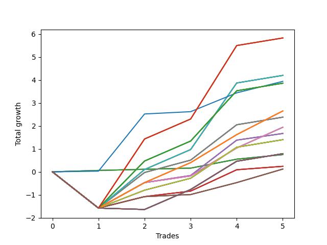

# Short Pointer 008 
- Symbol: SPY_Unlimited
- Date Range: 03/23/2022 - 07/08/2022
- Trading Period: 7:20-12:30
- Number of Trades: 5



| Name | Win Percent | Profit | Avg Profit / Trade | Avg Time / Trade |      | Name | Win Percent | Profit | Avg Profit / Trade | Avg Time / Trade |
| ---- | ----------- | ------ | ------------------ | ---------------- | ---- | ---- | ----------- | ------ | ------------------ | ---------------- |
| Sorted By <br> Profit | | | | | | Sorted By <br> Win Percentage ||||
| One Hundred Twenty-Eight | 80.00 | 2915.00 | 583.00 | 25:38 |     | Seventy-Three | 100.00 | 1970.00 | 394.00 | 11:41 |
| One Hundred Twenty-Three | 80.00 | 2915.00 | 583.00 | 25:38 |     | Sixty-Four | 100.00 | 375.00 | 75.00 | 00:10 |
| One Hundred Eighteen | 80.00 | 2915.00 | 583.00 | 25:38 |     | Fifty-Six | 100.00 | 375.00 | 75.00 | 00:10 |
| One Hundred Thirteen | 80.00 | 2915.00 | 583.00 | 25:38 |     | Forty-Eight | 100.00 | 375.00 | 75.00 | 00:10 |
| Eighty-Three | 80.00 | 2915.00 | 583.00 | 25:38 |     | Forty | 100.00 | 375.00 | 75.00 | 00:10 |
| Seventy-One | 80.00 | 2100.00 | 420.00 | 24:05 |     | Zero | 100.00 | 375.00 | 75.00 | 00:10 |
| Sixty-Three | 80.00 | 2100.00 | 420.00 | 24:05 |     | One Hundred Twenty-Eight | 80.00 | 2915.00 | 583.00 | 25:38 |
| Fifty-Five | 80.00 | 2100.00 | 420.00 | 24:05 |     | One Hundred Twenty-Three | 80.00 | 2915.00 | 583.00 | 25:38 |
| Forty-Seven | 80.00 | 2100.00 | 420.00 | 24:05 |     | One Hundred Eighteen | 80.00 | 2915.00 | 583.00 | 25:38 |
| Seven | 80.00 | 2100.00 | 420.00 | 24:05 |     | One Hundred Thirteen | 80.00 | 2915.00 | 583.00 | 25:38 |
| Seventy-Three | 100.00 | 1970.00 | 394.00 | 11:41 |     | Eighty-Three | 80.00 | 2915.00 | 583.00 | 25:38 |
| One Hundred Twenty-Seven | 80.00 | 1930.00 | 386.00 | 22:07 |     | Seventy-One | 80.00 | 2100.00 | 420.00 | 24:05 |
| One Hundred Twenty-Two | 80.00 | 1930.00 | 386.00 | 22:07 |     | Sixty-Three | 80.00 | 2100.00 | 420.00 | 24:05 |
| One Hundred Seventeen | 80.00 | 1930.00 | 386.00 | 22:07 |     | Fifty-Five | 80.00 | 2100.00 | 420.00 | 24:05 |
| One Hundred Twelve | 80.00 | 1930.00 | 386.00 | 22:07 |     | Forty-Seven | 80.00 | 2100.00 | 420.00 | 24:05 |
| Eighty-Two | 80.00 | 1930.00 | 386.00 | 22:07 |     | Seven | 80.00 | 2100.00 | 420.00 | 24:05 |
| One Hundred Twenty-Six | 80.00 | 1325.00 | 265.00 | 16:10 |     | One Hundred Twenty-Seven | 80.00 | 1930.00 | 386.00 | 22:07 |
| One Hundred Twenty-One | 80.00 | 1325.00 | 265.00 | 16:10 |     | One Hundred Twenty-Two | 80.00 | 1930.00 | 386.00 | 22:07 |
| One Hundred Sixteen | 80.00 | 1325.00 | 265.00 | 16:10 |     | One Hundred Seventeen | 80.00 | 1930.00 | 386.00 | 22:07 |
| One Hundred Eleven | 80.00 | 1325.00 | 265.00 | 16:10 |     | One Hundred Twelve | 80.00 | 1930.00 | 386.00 | 22:07 |
| Eighty-One | 80.00 | 1325.00 | 265.00 | 16:10 |     | Eighty-Two | 80.00 | 1930.00 | 386.00 | 22:07 |
| Sixty-Nine | 80.00 | 1190.00 | 238.00 | 18:21 |     | One Hundred Twenty-Six | 80.00 | 1325.00 | 265.00 | 16:10 |
| Sixty-One | 80.00 | 1190.00 | 238.00 | 18:21 |     | One Hundred Twenty-One | 80.00 | 1325.00 | 265.00 | 16:10 |
| Fifty-Three | 80.00 | 1190.00 | 238.00 | 18:21 |     | One Hundred Sixteen | 80.00 | 1325.00 | 265.00 | 16:10 |
| Forty-Five | 80.00 | 1190.00 | 238.00 | 18:21 |     | One Hundred Eleven | 80.00 | 1325.00 | 265.00 | 16:10 |
| Five | 80.00 | 1190.00 | 238.00 | 18:21 |     | Eighty-One | 80.00 | 1325.00 | 265.00 | 16:10 |
| Sixty-Eight | 80.00 | 970.00 | 194.00 | 16:17 |     | Sixty-Nine | 80.00 | 1190.00 | 238.00 | 18:21 |
| Sixty | 80.00 | 970.00 | 194.00 | 16:17 |     | Sixty-One | 80.00 | 1190.00 | 238.00 | 18:21 |
| Fifty-Two | 80.00 | 970.00 | 194.00 | 16:17 |     | Fifty-Three | 80.00 | 1190.00 | 238.00 | 18:21 |
| Forty-Four | 80.00 | 970.00 | 194.00 | 16:17 |     | Forty-Five | 80.00 | 1190.00 | 238.00 | 18:21 |
| Four | 80.00 | 970.00 | 194.00 | 16:17 |     | Five | 80.00 | 1190.00 | 238.00 | 18:21 |
| Sixty-Six | 80.00 | 835.00 | 167.00 | 12:27 |     | Sixty-Eight | 80.00 | 970.00 | 194.00 | 16:17 |
| Fifty-Eight | 80.00 | 835.00 | 167.00 | 12:27 |     | Sixty | 80.00 | 970.00 | 194.00 | 16:17 |
| Fifty | 80.00 | 835.00 | 167.00 | 12:27 |     | Fifty-Two | 80.00 | 970.00 | 194.00 | 16:17 |
| Forty-Two | 80.00 | 835.00 | 167.00 | 12:27 |     | Forty-Four | 80.00 | 970.00 | 194.00 | 16:17 |
| Two | 80.00 | 835.00 | 167.00 | 12:27 |     | Four | 80.00 | 970.00 | 194.00 | 16:17 |
| Seventy | 80.00 | 700.00 | 140.00 | 17:58 |     | Sixty-Six | 80.00 | 835.00 | 167.00 | 12:27 |
| Sixty-Two | 80.00 | 700.00 | 140.00 | 17:58 |     | Fifty-Eight | 80.00 | 835.00 | 167.00 | 12:27 |
| Fifty-Four | 80.00 | 700.00 | 140.00 | 17:58 |     | Fifty | 80.00 | 835.00 | 167.00 | 12:27 |
| Forty-Six | 80.00 | 700.00 | 140.00 | 17:58 |     | Forty-Two | 80.00 | 835.00 | 167.00 | 12:27 |
| Six | 80.00 | 700.00 | 140.00 | 17:58 |     | Two | 80.00 | 835.00 | 167.00 | 12:27 |
| One Hundred Thirty | 60.00 | 395.00 | 79.00 | 29:55 |     | Seventy | 80.00 | 700.00 | 140.00 | 17:58 |
| One Hundred Twenty-Nine | 60.00 | 395.00 | 79.00 | 29:55 |     | Sixty-Two | 80.00 | 700.00 | 140.00 | 17:58 |
| One Hundred Twenty-Five | 60.00 | 395.00 | 79.00 | 29:55 |     | Fifty-Four | 80.00 | 700.00 | 140.00 | 17:58 |
| One Hundred Twenty-Four | 60.00 | 395.00 | 79.00 | 29:55 |     | Forty-Six | 80.00 | 700.00 | 140.00 | 17:58 |
| One Hundred Twenty | 60.00 | 395.00 | 79.00 | 29:55 |     | Six | 80.00 | 700.00 | 140.00 | 17:58 |
| One Hundred Ninteen | 60.00 | 395.00 | 79.00 | 29:55 |     | Sixty-Five | 80.00 | 120.00 | 24.00 | 07:02 |
| One Hundred Fifteen | 60.00 | 395.00 | 79.00 | 29:55 |     | Fifty-Seven | 80.00 | 120.00 | 24.00 | 07:02 |
| One Hundred Fourteen | 60.00 | 395.00 | 79.00 | 29:55 |     | Forty-Nine | 80.00 | 120.00 | 24.00 | 07:02 |
| Eighty-Five | 60.00 | 395.00 | 79.00 | 29:55 |     | Forty-One | 80.00 | 120.00 | 24.00 | 07:02 |
| Eighty-Four | 60.00 | 395.00 | 79.00 | 29:55 |     | One | 80.00 | 120.00 | 24.00 | 07:02 |
| Sixty-Four | 100.00 | 375.00 | 75.00 | 00:10 |     | Sixty-Seven | 80.00 | 60.00 | 12.00 | 08:16 |
| Fifty-Six | 100.00 | 375.00 | 75.00 | 00:10 |     | Fifty-Nine | 80.00 | 60.00 | 12.00 | 08:16 |
| Forty-Eight | 100.00 | 375.00 | 75.00 | 00:10 |     | Fifty-One | 80.00 | 60.00 | 12.00 | 08:16 |
| Forty | 100.00 | 375.00 | 75.00 | 00:10 |     | Forty-Three | 80.00 | 60.00 | 12.00 | 08:16 |
| Zero | 100.00 | 375.00 | 75.00 | 00:10 |     | Three | 80.00 | 60.00 | 12.00 | 08:16 |
| Sixty-Five | 80.00 | 120.00 | 24.00 | 07:02 |     | One Hundred Thirty | 60.00 | 395.00 | 79.00 | 29:55 |
| Fifty-Seven | 80.00 | 120.00 | 24.00 | 07:02 |     | One Hundred Twenty-Nine | 60.00 | 395.00 | 79.00 | 29:55 |
| Forty-Nine | 80.00 | 120.00 | 24.00 | 07:02 |     | One Hundred Twenty-Five | 60.00 | 395.00 | 79.00 | 29:55 |
| Forty-One | 80.00 | 120.00 | 24.00 | 07:02 |     | One Hundred Twenty-Four | 60.00 | 395.00 | 79.00 | 29:55 |
| One | 80.00 | 120.00 | 24.00 | 07:02 |     | One Hundred Twenty | 60.00 | 395.00 | 79.00 | 29:55 |
| Sixty-Seven | 80.00 | 60.00 | 12.00 | 08:16 |     | One Hundred Ninteen | 60.00 | 395.00 | 79.00 | 29:55 |
| Fifty-Nine | 80.00 | 60.00 | 12.00 | 08:16 |     | One Hundred Fifteen | 60.00 | 395.00 | 79.00 | 29:55 |
| Fifty-One | 80.00 | 60.00 | 12.00 | 08:16 |     | One Hundred Fourteen | 60.00 | 395.00 | 79.00 | 29:55 |
| Forty-Three | 80.00 | 60.00 | 12.00 | 08:16 |     | Eighty-Five | 60.00 | 395.00 | 79.00 | 29:55 |
| Three | 80.00 | 60.00 | 12.00 | 08:16 |     | Eighty-Four | 60.00 | 395.00 | 79.00 | 29:55 |

## NO STOPLOSS

### Test Zero
* Sell when price hits the middle line of the 20p bollinger
* No Stoploss
* Results:
```
Total Trades: 5
Percent Up: 0.00
Percent Down: 100.00
Total Points Moved Down: 0.75
Potential Profit: 375.00
Total Points Ups: 0.00 Count Ups: 0
Total Points Downs: 0.75 Count Downs: 5
```

<details><summary>Trades</summary>

<code>In: 2022-03-24 08:09:00		Out: 2022-03-24 08:09:10		Total Position Time: 00:10		Total Move Down: 0.06		Total to Date: 0.06</code> <br />
<code>In: 2022-04-06 11:06:00		Out: 2022-04-06 11:06:10		Total Position Time: 00:10		Total Move Down: 0.05		Total to Date: 0.11</code> <br />
<code>In: 2022-04-20 10:50:00		Out: 2022-04-20 10:50:10		Total Position Time: 00:10		Total Move Down: 0.05		Total to Date: 0.16</code> <br />
<code>In: 2022-05-04 11:07:00		Out: 2022-05-04 11:07:10		Total Position Time: 00:10		Total Move Down: 0.39		Total to Date: 0.55</code> <br />
<code>In: 2022-05-16 09:06:00		Out: 2022-05-16 09:06:10		Total Position Time: 00:10		Total Move Down: 0.20		Total to Date: 0.75</code> <br />


</details>

### Test One
* Sell when the price hits the upper line of the 20p 1std bollinger
* No Stoploss
* Results:
```
Total Trades: 5
Percent Up: 20.00
Percent Down: 80.00
Total Points Moved Down: 0.24
Potential Profit: 120.00
Total Points Ups: 1.58 Count Ups: 1
Total Points Downs: 1.82 Count Downs: 4
```

<details><summary>Trades</summary>

<code>In: 2022-03-24 08:09:00		Out: 2022-03-24 08:38:55		Total Position Time: 29:55		Total Move Down: -1.58		Total to Date: -1.58</code> <br />
<code>In: 2022-04-06 11:06:00		Out: 2022-04-06 11:07:20		Total Position Time: 01:20		Total Move Down: 0.50		Total to Date: -1.08</code> <br />
<code>In: 2022-04-20 10:50:00		Out: 2022-04-20 10:53:20		Total Position Time: 03:20		Total Move Down: 0.24		Total to Date: -0.84</code> <br />
<code>In: 2022-05-04 11:07:00		Out: 2022-05-04 11:07:20		Total Position Time: 00:20		Total Move Down: 0.93		Total to Date: 0.09</code> <br />
<code>In: 2022-05-16 09:06:00		Out: 2022-05-16 09:06:15		Total Position Time: 00:15		Total Move Down: 0.15		Total to Date: 0.24</code> <br />


</details>

### Test Two
* Sell when the price hits the upper line of the 20p 2std bollinger
* No Stoploss
* Results:
```
Total Trades: 5
Percent Up: 20.00
Percent Down: 80.00
Total Points Moved Down: 1.67
Potential Profit: 835.00
Total Points Ups: 1.58 Count Ups: 1
Total Points Downs: 3.25 Count Downs: 4
```

<details><summary>Trades</summary>

<code>In: 2022-03-24 08:09:00		Out: 2022-03-24 08:38:55		Total Position Time: 29:55		Total Move Down: -1.58		Total to Date: -1.58</code> <br />
<code>In: 2022-04-06 11:06:00		Out: 2022-04-06 11:08:10		Total Position Time: 02:10		Total Move Down: 1.11		Total to Date: -0.47</code> <br />
<code>In: 2022-04-20 10:50:00		Out: 2022-04-20 11:13:55		Total Position Time: 23:55		Total Move Down: 0.31		Total to Date: -0.16</code> <br />
<code>In: 2022-05-04 11:07:00		Out: 2022-05-04 11:07:40		Total Position Time: 00:40		Total Move Down: 1.54		Total to Date: 1.38</code> <br />
<code>In: 2022-05-16 09:06:00		Out: 2022-05-16 09:11:35		Total Position Time: 05:35		Total Move Down: 0.29		Total to Date: 1.67</code> <br />


</details>

### Test Three
* Sell when price hits the middle line of the 50p bollinger
* No Stoploss
* Results:
```
Total Trades: 5
Percent Up: 20.00
Percent Down: 80.00
Total Points Moved Down: 0.12
Potential Profit: 60.00
Total Points Ups: 1.58 Count Ups: 1
Total Points Downs: 1.70 Count Downs: 4
```

<details><summary>Trades</summary>

<code>In: 2022-03-24 08:09:00		Out: 2022-03-24 08:38:55		Total Position Time: 29:55		Total Move Down: -1.58		Total to Date: -1.58</code> <br />
<code>In: 2022-04-06 11:06:00		Out: 2022-04-06 11:07:20		Total Position Time: 01:20		Total Move Down: 0.50		Total to Date: -1.08</code> <br />
<code>In: 2022-04-20 10:50:00		Out: 2022-04-20 10:50:20		Total Position Time: 00:20		Total Move Down: 0.09		Total to Date: -0.99</code> <br />
<code>In: 2022-05-04 11:07:00		Out: 2022-05-04 11:07:15		Total Position Time: 00:15		Total Move Down: 0.52		Total to Date: -0.47</code> <br />
<code>In: 2022-05-16 09:06:00		Out: 2022-05-16 09:15:30		Total Position Time: 09:30		Total Move Down: 0.59		Total to Date: 0.12</code> <br />


</details>

### Test Four
* Sell when the price hits the upper line of the 50p 1std bollinger
* No Stoploss
* Results:
```
Total Trades: 5
Percent Up: 20.00
Percent Down: 80.00
Total Points Moved Down: 1.94
Potential Profit: 970.00
Total Points Ups: 1.58 Count Ups: 1
Total Points Downs: 3.52 Count Downs: 4
```

<details><summary>Trades</summary>

<code>In: 2022-03-24 08:09:00		Out: 2022-03-24 08:38:55		Total Position Time: 29:55		Total Move Down: -1.58		Total to Date: -1.58</code> <br />
<code>In: 2022-04-06 11:06:00		Out: 2022-04-06 11:08:10		Total Position Time: 02:10		Total Move Down: 1.11		Total to Date: -0.47</code> <br />
<code>In: 2022-04-20 10:50:00		Out: 2022-04-20 11:14:00		Total Position Time: 24:00		Total Move Down: 0.29		Total to Date: -0.18</code> <br />
<code>In: 2022-05-04 11:07:00		Out: 2022-05-04 11:07:25		Total Position Time: 00:25		Total Move Down: 1.22		Total to Date: 1.04</code> <br />
<code>In: 2022-05-16 09:06:00		Out: 2022-05-16 09:30:55		Total Position Time: 24:55		Total Move Down: 0.90		Total to Date: 1.94</code> <br />


</details>

### Test Five
* Sell when the price hits the upper line of the 50p 2std bollinger
* No Stoploss
* Results:
```
Total Trades: 5
Percent Up: 20.00
Percent Down: 80.00
Total Points Moved Down: 2.38
Potential Profit: 1190.00
Total Points Ups: 1.58 Count Ups: 1
Total Points Downs: 3.96 Count Downs: 4
```

<details><summary>Trades</summary>

<code>In: 2022-03-24 08:09:00		Out: 2022-03-24 08:38:55		Total Position Time: 29:55		Total Move Down: -1.58		Total to Date: -1.58</code> <br />
<code>In: 2022-04-06 11:06:00		Out: 2022-04-06 11:09:35		Total Position Time: 03:35		Total Move Down: 1.55		Total to Date: -0.03</code> <br />
<code>In: 2022-04-20 10:50:00		Out: 2022-04-20 11:17:40		Total Position Time: 27:40		Total Move Down: 0.54		Total to Date: 0.51</code> <br />
<code>In: 2022-05-04 11:07:00		Out: 2022-05-04 11:07:40		Total Position Time: 00:40		Total Move Down: 1.54		Total to Date: 2.05</code> <br />
<code>In: 2022-05-16 09:06:00		Out: 2022-05-16 09:35:55		Total Position Time: 29:55		Total Move Down: 0.33		Total to Date: 2.38</code> <br />


</details>

### Test Six
* Sell when the price hits the middle line of the 1std VWAP
* No Stoploss
* Results:
```
Total Trades: 5
Percent Up: 20.00
Percent Down: 80.00
Total Points Moved Down: 1.40
Potential Profit: 700.00
Total Points Ups: 1.58 Count Ups: 1
Total Points Downs: 2.98 Count Downs: 4
```

<details><summary>Trades</summary>

<code>In: 2022-03-24 08:09:00		Out: 2022-03-24 08:38:55		Total Position Time: 29:55		Total Move Down: -1.58		Total to Date: -1.58</code> <br />
<code>In: 2022-04-06 11:06:00		Out: 2022-04-06 11:07:35		Total Position Time: 01:35		Total Move Down: 0.78		Total to Date: -0.80</code> <br />
<code>In: 2022-04-20 10:50:00		Out: 2022-04-20 11:17:15		Total Position Time: 27:15		Total Move Down: 0.52		Total to Date: -0.28</code> <br />
<code>In: 2022-05-04 11:07:00		Out: 2022-05-04 11:08:10		Total Position Time: 01:10		Total Move Down: 1.35		Total to Date: 1.07</code> <br />
<code>In: 2022-05-16 09:06:00		Out: 2022-05-16 09:35:55		Total Position Time: 29:55		Total Move Down: 0.33		Total to Date: 1.40</code> <br />


</details>

### Test Seven
* Sell when the price hits the upper line of the 1std VWAP
* No Stoploss
* Results:
```
Total Trades: 5
Percent Up: 20.00
Percent Down: 80.00
Total Points Moved Down: 4.20
Potential Profit: 2100.00
Total Points Ups: 1.58 Count Ups: 1
Total Points Downs: 5.78 Count Downs: 4
```

<details><summary>Trades</summary>

<code>In: 2022-03-24 08:09:00		Out: 2022-03-24 08:38:55		Total Position Time: 29:55		Total Move Down: -1.58		Total to Date: -1.58</code> <br />
<code>In: 2022-04-06 11:06:00		Out: 2022-04-06 11:09:40		Total Position Time: 03:40		Total Move Down: 1.68		Total to Date: 0.10</code> <br />
<code>In: 2022-04-20 10:50:00		Out: 2022-04-20 11:19:55		Total Position Time: 29:55		Total Move Down: 0.87		Total to Date: 0.97</code> <br />
<code>In: 2022-05-04 11:07:00		Out: 2022-05-04 11:34:00		Total Position Time: 27:00		Total Move Down: 2.90		Total to Date: 3.87</code> <br />
<code>In: 2022-05-16 09:06:00		Out: 2022-05-16 09:35:55		Total Position Time: 29:55		Total Move Down: 0.33		Total to Date: 4.20</code> <br />


</details>

## STOPLOSS OF 5

### Test Forty
* Sell when price hits the middle line of the 20p bollinger
* Stoploss is -5 points
* Results:
```
Total Trades: 5
Percent Up: 0.00
Percent Down: 100.00
Total Points Moved Down: 0.75
Potential Profit: 375.00
Total Points Ups: 0.00 Count Ups: 0
Total Points Downs: 0.75 Count Downs: 5
```

<details><summary>Trades</summary>

<code>In: 2022-03-24 08:09:00		Out: 2022-03-24 08:09:10		Total Position Time: 00:10		Total Move Down: 0.06		Total to Date: 0.06</code> <br />
<code>In: 2022-04-06 11:06:00		Out: 2022-04-06 11:06:10		Total Position Time: 00:10		Total Move Down: 0.05		Total to Date: 0.11</code> <br />
<code>In: 2022-04-20 10:50:00		Out: 2022-04-20 10:50:10		Total Position Time: 00:10		Total Move Down: 0.05		Total to Date: 0.16</code> <br />
<code>In: 2022-05-04 11:07:00		Out: 2022-05-04 11:07:10		Total Position Time: 00:10		Total Move Down: 0.39		Total to Date: 0.55</code> <br />
<code>In: 2022-05-16 09:06:00		Out: 2022-05-16 09:06:10		Total Position Time: 00:10		Total Move Down: 0.20		Total to Date: 0.75</code> <br />


</details>

### Test Forty-One
* Sell when the price hits the upper line of the 20p 1std bollinger
* Stoploss is -5 points
* Results:
```
Total Trades: 5
Percent Up: 20.00
Percent Down: 80.00
Total Points Moved Down: 0.24
Potential Profit: 120.00
Total Points Ups: 1.58 Count Ups: 1
Total Points Downs: 1.82 Count Downs: 4
```

<details><summary>Trades</summary>

<code>In: 2022-03-24 08:09:00		Out: 2022-03-24 08:38:55		Total Position Time: 29:55		Total Move Down: -1.58		Total to Date: -1.58</code> <br />
<code>In: 2022-04-06 11:06:00		Out: 2022-04-06 11:07:20		Total Position Time: 01:20		Total Move Down: 0.50		Total to Date: -1.08</code> <br />
<code>In: 2022-04-20 10:50:00		Out: 2022-04-20 10:53:20		Total Position Time: 03:20		Total Move Down: 0.24		Total to Date: -0.84</code> <br />
<code>In: 2022-05-04 11:07:00		Out: 2022-05-04 11:07:20		Total Position Time: 00:20		Total Move Down: 0.93		Total to Date: 0.09</code> <br />
<code>In: 2022-05-16 09:06:00		Out: 2022-05-16 09:06:15		Total Position Time: 00:15		Total Move Down: 0.15		Total to Date: 0.24</code> <br />


</details>

### Test Forty-Two
* Sell when the price hits the upper line of the 20p 2std bollinger
* Stoploss is -5 points
* Results:
```
Total Trades: 5
Percent Up: 20.00
Percent Down: 80.00
Total Points Moved Down: 1.67
Potential Profit: 835.00
Total Points Ups: 1.58 Count Ups: 1
Total Points Downs: 3.25 Count Downs: 4
```

<details><summary>Trades</summary>

<code>In: 2022-03-24 08:09:00		Out: 2022-03-24 08:38:55		Total Position Time: 29:55		Total Move Down: -1.58		Total to Date: -1.58</code> <br />
<code>In: 2022-04-06 11:06:00		Out: 2022-04-06 11:08:10		Total Position Time: 02:10		Total Move Down: 1.11		Total to Date: -0.47</code> <br />
<code>In: 2022-04-20 10:50:00		Out: 2022-04-20 11:13:55		Total Position Time: 23:55		Total Move Down: 0.31		Total to Date: -0.16</code> <br />
<code>In: 2022-05-04 11:07:00		Out: 2022-05-04 11:07:40		Total Position Time: 00:40		Total Move Down: 1.54		Total to Date: 1.38</code> <br />
<code>In: 2022-05-16 09:06:00		Out: 2022-05-16 09:11:35		Total Position Time: 05:35		Total Move Down: 0.29		Total to Date: 1.67</code> <br />


</details>

### Test Forty-Three
* Sell when price hits the middle line of the 50p bollinger
* Stoploss is -5 points
* Results:
```
Total Trades: 5
Percent Up: 20.00
Percent Down: 80.00
Total Points Moved Down: 0.12
Potential Profit: 60.00
Total Points Ups: 1.58 Count Ups: 1
Total Points Downs: 1.70 Count Downs: 4
```

<details><summary>Trades</summary>

<code>In: 2022-03-24 08:09:00		Out: 2022-03-24 08:38:55		Total Position Time: 29:55		Total Move Down: -1.58		Total to Date: -1.58</code> <br />
<code>In: 2022-04-06 11:06:00		Out: 2022-04-06 11:07:20		Total Position Time: 01:20		Total Move Down: 0.50		Total to Date: -1.08</code> <br />
<code>In: 2022-04-20 10:50:00		Out: 2022-04-20 10:50:20		Total Position Time: 00:20		Total Move Down: 0.09		Total to Date: -0.99</code> <br />
<code>In: 2022-05-04 11:07:00		Out: 2022-05-04 11:07:15		Total Position Time: 00:15		Total Move Down: 0.52		Total to Date: -0.47</code> <br />
<code>In: 2022-05-16 09:06:00		Out: 2022-05-16 09:15:30		Total Position Time: 09:30		Total Move Down: 0.59		Total to Date: 0.12</code> <br />


</details>

### Test Forty-Four
* Sell when the price hits the upper line of the 50p 1std bollinger
* Stoploss is -5 points
* Results:
```
Total Trades: 5
Percent Up: 20.00
Percent Down: 80.00
Total Points Moved Down: 1.94
Potential Profit: 970.00
Total Points Ups: 1.58 Count Ups: 1
Total Points Downs: 3.52 Count Downs: 4
```

<details><summary>Trades</summary>

<code>In: 2022-03-24 08:09:00		Out: 2022-03-24 08:38:55		Total Position Time: 29:55		Total Move Down: -1.58		Total to Date: -1.58</code> <br />
<code>In: 2022-04-06 11:06:00		Out: 2022-04-06 11:08:10		Total Position Time: 02:10		Total Move Down: 1.11		Total to Date: -0.47</code> <br />
<code>In: 2022-04-20 10:50:00		Out: 2022-04-20 11:14:00		Total Position Time: 24:00		Total Move Down: 0.29		Total to Date: -0.18</code> <br />
<code>In: 2022-05-04 11:07:00		Out: 2022-05-04 11:07:25		Total Position Time: 00:25		Total Move Down: 1.22		Total to Date: 1.04</code> <br />
<code>In: 2022-05-16 09:06:00		Out: 2022-05-16 09:30:55		Total Position Time: 24:55		Total Move Down: 0.90		Total to Date: 1.94</code> <br />


</details>

### Test Forty-Five
* Sell when the price hits the upper line of the 50p 2std bollinger
* Stoploss is -5 points
* Results:
```
Total Trades: 5
Percent Up: 20.00
Percent Down: 80.00
Total Points Moved Down: 2.38
Potential Profit: 1190.00
Total Points Ups: 1.58 Count Ups: 1
Total Points Downs: 3.96 Count Downs: 4
```

<details><summary>Trades</summary>

<code>In: 2022-03-24 08:09:00		Out: 2022-03-24 08:38:55		Total Position Time: 29:55		Total Move Down: -1.58		Total to Date: -1.58</code> <br />
<code>In: 2022-04-06 11:06:00		Out: 2022-04-06 11:09:35		Total Position Time: 03:35		Total Move Down: 1.55		Total to Date: -0.03</code> <br />
<code>In: 2022-04-20 10:50:00		Out: 2022-04-20 11:17:40		Total Position Time: 27:40		Total Move Down: 0.54		Total to Date: 0.51</code> <br />
<code>In: 2022-05-04 11:07:00		Out: 2022-05-04 11:07:40		Total Position Time: 00:40		Total Move Down: 1.54		Total to Date: 2.05</code> <br />
<code>In: 2022-05-16 09:06:00		Out: 2022-05-16 09:35:55		Total Position Time: 29:55		Total Move Down: 0.33		Total to Date: 2.38</code> <br />


</details>

### Test Forty-Six
* Sell when the price hits the middle line of the 1std VWAP
* Stoploss is -5 points
* Results:
```
Total Trades: 5
Percent Up: 20.00
Percent Down: 80.00
Total Points Moved Down: 1.40
Potential Profit: 700.00
Total Points Ups: 1.58 Count Ups: 1
Total Points Downs: 2.98 Count Downs: 4
```

<details><summary>Trades</summary>

<code>In: 2022-03-24 08:09:00		Out: 2022-03-24 08:38:55		Total Position Time: 29:55		Total Move Down: -1.58		Total to Date: -1.58</code> <br />
<code>In: 2022-04-06 11:06:00		Out: 2022-04-06 11:07:35		Total Position Time: 01:35		Total Move Down: 0.78		Total to Date: -0.80</code> <br />
<code>In: 2022-04-20 10:50:00		Out: 2022-04-20 11:17:15		Total Position Time: 27:15		Total Move Down: 0.52		Total to Date: -0.28</code> <br />
<code>In: 2022-05-04 11:07:00		Out: 2022-05-04 11:08:10		Total Position Time: 01:10		Total Move Down: 1.35		Total to Date: 1.07</code> <br />
<code>In: 2022-05-16 09:06:00		Out: 2022-05-16 09:35:55		Total Position Time: 29:55		Total Move Down: 0.33		Total to Date: 1.40</code> <br />


</details>

### Test Forty-Seven
* Sell when the price hits the upper line of the 1std VWAP
* Stoploss is -5 points
* Results:
```
Total Trades: 5
Percent Up: 20.00
Percent Down: 80.00
Total Points Moved Down: 4.20
Potential Profit: 2100.00
Total Points Ups: 1.58 Count Ups: 1
Total Points Downs: 5.78 Count Downs: 4
```

<details><summary>Trades</summary>

<code>In: 2022-03-24 08:09:00		Out: 2022-03-24 08:38:55		Total Position Time: 29:55		Total Move Down: -1.58		Total to Date: -1.58</code> <br />
<code>In: 2022-04-06 11:06:00		Out: 2022-04-06 11:09:40		Total Position Time: 03:40		Total Move Down: 1.68		Total to Date: 0.10</code> <br />
<code>In: 2022-04-20 10:50:00		Out: 2022-04-20 11:19:55		Total Position Time: 29:55		Total Move Down: 0.87		Total to Date: 0.97</code> <br />
<code>In: 2022-05-04 11:07:00		Out: 2022-05-04 11:34:00		Total Position Time: 27:00		Total Move Down: 2.90		Total to Date: 3.87</code> <br />
<code>In: 2022-05-16 09:06:00		Out: 2022-05-16 09:35:55		Total Position Time: 29:55		Total Move Down: 0.33		Total to Date: 4.20</code> <br />


</details>

## TRAIL STOP OF 5

### Test Forty-Eight
* Sell when price hits the middle line of the 20p bollinger
* Trailing Stop is -5 points
* Results:
```
Total Trades: 5
Percent Up: 0.00
Percent Down: 100.00
Total Points Moved Down: 0.75
Potential Profit: 375.00
Total Points Ups: 0.00 Count Ups: 0
Total Points Downs: 0.75 Count Downs: 5
```

<details><summary>Trades</summary>

<code>In: 2022-03-24 08:09:00		Out: 2022-03-24 08:09:10		Total Position Time: 00:10		Total Move Down: 0.06		Total to Date: 0.06</code> <br />
<code>In: 2022-04-06 11:06:00		Out: 2022-04-06 11:06:10		Total Position Time: 00:10		Total Move Down: 0.05		Total to Date: 0.11</code> <br />
<code>In: 2022-04-20 10:50:00		Out: 2022-04-20 10:50:10		Total Position Time: 00:10		Total Move Down: 0.05		Total to Date: 0.16</code> <br />
<code>In: 2022-05-04 11:07:00		Out: 2022-05-04 11:07:10		Total Position Time: 00:10		Total Move Down: 0.39		Total to Date: 0.55</code> <br />
<code>In: 2022-05-16 09:06:00		Out: 2022-05-16 09:06:10		Total Position Time: 00:10		Total Move Down: 0.20		Total to Date: 0.75</code> <br />


</details>

### Test Forty-Nine
* Sell when the price hits the upper line of the 20p 1std bollinger
* Trailing Stop is -5 points
* Results:
```
Total Trades: 5
Percent Up: 20.00
Percent Down: 80.00
Total Points Moved Down: 0.24
Potential Profit: 120.00
Total Points Ups: 1.58 Count Ups: 1
Total Points Downs: 1.82 Count Downs: 4
```

<details><summary>Trades</summary>

<code>In: 2022-03-24 08:09:00		Out: 2022-03-24 08:38:55		Total Position Time: 29:55		Total Move Down: -1.58		Total to Date: -1.58</code> <br />
<code>In: 2022-04-06 11:06:00		Out: 2022-04-06 11:07:20		Total Position Time: 01:20		Total Move Down: 0.50		Total to Date: -1.08</code> <br />
<code>In: 2022-04-20 10:50:00		Out: 2022-04-20 10:53:20		Total Position Time: 03:20		Total Move Down: 0.24		Total to Date: -0.84</code> <br />
<code>In: 2022-05-04 11:07:00		Out: 2022-05-04 11:07:20		Total Position Time: 00:20		Total Move Down: 0.93		Total to Date: 0.09</code> <br />
<code>In: 2022-05-16 09:06:00		Out: 2022-05-16 09:06:15		Total Position Time: 00:15		Total Move Down: 0.15		Total to Date: 0.24</code> <br />


</details>

### Test Fifty
* Sell when the price hits the upper line of the 20p 2std bollinger
* Trailing Stop is -5 points
* Results:
```
Total Trades: 5
Percent Up: 20.00
Percent Down: 80.00
Total Points Moved Down: 1.67
Potential Profit: 835.00
Total Points Ups: 1.58 Count Ups: 1
Total Points Downs: 3.25 Count Downs: 4
```

<details><summary>Trades</summary>

<code>In: 2022-03-24 08:09:00		Out: 2022-03-24 08:38:55		Total Position Time: 29:55		Total Move Down: -1.58		Total to Date: -1.58</code> <br />
<code>In: 2022-04-06 11:06:00		Out: 2022-04-06 11:08:10		Total Position Time: 02:10		Total Move Down: 1.11		Total to Date: -0.47</code> <br />
<code>In: 2022-04-20 10:50:00		Out: 2022-04-20 11:13:55		Total Position Time: 23:55		Total Move Down: 0.31		Total to Date: -0.16</code> <br />
<code>In: 2022-05-04 11:07:00		Out: 2022-05-04 11:07:40		Total Position Time: 00:40		Total Move Down: 1.54		Total to Date: 1.38</code> <br />
<code>In: 2022-05-16 09:06:00		Out: 2022-05-16 09:11:35		Total Position Time: 05:35		Total Move Down: 0.29		Total to Date: 1.67</code> <br />


</details>

### Test Fifty-One
* Sell when price hits the middle line of the 50p bollinger
* Trailing Stop is -5 points
* Results:
```
Total Trades: 5
Percent Up: 20.00
Percent Down: 80.00
Total Points Moved Down: 0.12
Potential Profit: 60.00
Total Points Ups: 1.58 Count Ups: 1
Total Points Downs: 1.70 Count Downs: 4
```

<details><summary>Trades</summary>

<code>In: 2022-03-24 08:09:00		Out: 2022-03-24 08:38:55		Total Position Time: 29:55		Total Move Down: -1.58		Total to Date: -1.58</code> <br />
<code>In: 2022-04-06 11:06:00		Out: 2022-04-06 11:07:20		Total Position Time: 01:20		Total Move Down: 0.50		Total to Date: -1.08</code> <br />
<code>In: 2022-04-20 10:50:00		Out: 2022-04-20 10:50:20		Total Position Time: 00:20		Total Move Down: 0.09		Total to Date: -0.99</code> <br />
<code>In: 2022-05-04 11:07:00		Out: 2022-05-04 11:07:15		Total Position Time: 00:15		Total Move Down: 0.52		Total to Date: -0.47</code> <br />
<code>In: 2022-05-16 09:06:00		Out: 2022-05-16 09:15:30		Total Position Time: 09:30		Total Move Down: 0.59		Total to Date: 0.12</code> <br />


</details>

### Test Fifty-Two
* Sell when the price hits the upper line of the 50p 1std bollinger
* Trailing Stop is -5 points
* Results:
```
Total Trades: 5
Percent Up: 20.00
Percent Down: 80.00
Total Points Moved Down: 1.94
Potential Profit: 970.00
Total Points Ups: 1.58 Count Ups: 1
Total Points Downs: 3.52 Count Downs: 4
```

<details><summary>Trades</summary>

<code>In: 2022-03-24 08:09:00		Out: 2022-03-24 08:38:55		Total Position Time: 29:55		Total Move Down: -1.58		Total to Date: -1.58</code> <br />
<code>In: 2022-04-06 11:06:00		Out: 2022-04-06 11:08:10		Total Position Time: 02:10		Total Move Down: 1.11		Total to Date: -0.47</code> <br />
<code>In: 2022-04-20 10:50:00		Out: 2022-04-20 11:14:00		Total Position Time: 24:00		Total Move Down: 0.29		Total to Date: -0.18</code> <br />
<code>In: 2022-05-04 11:07:00		Out: 2022-05-04 11:07:25		Total Position Time: 00:25		Total Move Down: 1.22		Total to Date: 1.04</code> <br />
<code>In: 2022-05-16 09:06:00		Out: 2022-05-16 09:30:55		Total Position Time: 24:55		Total Move Down: 0.90		Total to Date: 1.94</code> <br />


</details>

### Test Fifty-Three
* Sell when the price hits the upper line of the 50p 2std bollinger
* Trailing Stop is -5 points
* Results:
```
Total Trades: 5
Percent Up: 20.00
Percent Down: 80.00
Total Points Moved Down: 2.38
Potential Profit: 1190.00
Total Points Ups: 1.58 Count Ups: 1
Total Points Downs: 3.96 Count Downs: 4
```

<details><summary>Trades</summary>

<code>In: 2022-03-24 08:09:00		Out: 2022-03-24 08:38:55		Total Position Time: 29:55		Total Move Down: -1.58		Total to Date: -1.58</code> <br />
<code>In: 2022-04-06 11:06:00		Out: 2022-04-06 11:09:35		Total Position Time: 03:35		Total Move Down: 1.55		Total to Date: -0.03</code> <br />
<code>In: 2022-04-20 10:50:00		Out: 2022-04-20 11:17:40		Total Position Time: 27:40		Total Move Down: 0.54		Total to Date: 0.51</code> <br />
<code>In: 2022-05-04 11:07:00		Out: 2022-05-04 11:07:40		Total Position Time: 00:40		Total Move Down: 1.54		Total to Date: 2.05</code> <br />
<code>In: 2022-05-16 09:06:00		Out: 2022-05-16 09:35:55		Total Position Time: 29:55		Total Move Down: 0.33		Total to Date: 2.38</code> <br />


</details>

### Test Fifty-Four
* Sell when the price hits the middle line of the 1std VWAP
* Trailing Stop is -5 points
* Results:
```
Total Trades: 5
Percent Up: 20.00
Percent Down: 80.00
Total Points Moved Down: 1.40
Potential Profit: 700.00
Total Points Ups: 1.58 Count Ups: 1
Total Points Downs: 2.98 Count Downs: 4
```

<details><summary>Trades</summary>

<code>In: 2022-03-24 08:09:00		Out: 2022-03-24 08:38:55		Total Position Time: 29:55		Total Move Down: -1.58		Total to Date: -1.58</code> <br />
<code>In: 2022-04-06 11:06:00		Out: 2022-04-06 11:07:35		Total Position Time: 01:35		Total Move Down: 0.78		Total to Date: -0.80</code> <br />
<code>In: 2022-04-20 10:50:00		Out: 2022-04-20 11:17:15		Total Position Time: 27:15		Total Move Down: 0.52		Total to Date: -0.28</code> <br />
<code>In: 2022-05-04 11:07:00		Out: 2022-05-04 11:08:10		Total Position Time: 01:10		Total Move Down: 1.35		Total to Date: 1.07</code> <br />
<code>In: 2022-05-16 09:06:00		Out: 2022-05-16 09:35:55		Total Position Time: 29:55		Total Move Down: 0.33		Total to Date: 1.40</code> <br />


</details>

### Test Fifty-Five
* Sell when the price hits the upper line of the 1std VWAP
* Trailing Stop is -5 points
* Results:
```
Total Trades: 5
Percent Up: 20.00
Percent Down: 80.00
Total Points Moved Down: 4.20
Potential Profit: 2100.00
Total Points Ups: 1.58 Count Ups: 1
Total Points Downs: 5.78 Count Downs: 4
```

<details><summary>Trades</summary>

<code>In: 2022-03-24 08:09:00		Out: 2022-03-24 08:38:55		Total Position Time: 29:55		Total Move Down: -1.58		Total to Date: -1.58</code> <br />
<code>In: 2022-04-06 11:06:00		Out: 2022-04-06 11:09:40		Total Position Time: 03:40		Total Move Down: 1.68		Total to Date: 0.10</code> <br />
<code>In: 2022-04-20 10:50:00		Out: 2022-04-20 11:19:55		Total Position Time: 29:55		Total Move Down: 0.87		Total to Date: 0.97</code> <br />
<code>In: 2022-05-04 11:07:00		Out: 2022-05-04 11:34:00		Total Position Time: 27:00		Total Move Down: 2.90		Total to Date: 3.87</code> <br />
<code>In: 2022-05-16 09:06:00		Out: 2022-05-16 09:35:55		Total Position Time: 29:55		Total Move Down: 0.33		Total to Date: 4.20</code> <br />


</details>

## STOPLOSS OF 10

### Test Fifty-Six
* Sell when price hits the middle line of the 20p bollinger
* Stoploss is -10 points
* Results:
```
Total Trades: 5
Percent Up: 0.00
Percent Down: 100.00
Total Points Moved Down: 0.75
Potential Profit: 375.00
Total Points Ups: 0.00 Count Ups: 0
Total Points Downs: 0.75 Count Downs: 5
```

<details><summary>Trades</summary>

<code>In: 2022-03-24 08:09:00		Out: 2022-03-24 08:09:10		Total Position Time: 00:10		Total Move Down: 0.06		Total to Date: 0.06</code> <br />
<code>In: 2022-04-06 11:06:00		Out: 2022-04-06 11:06:10		Total Position Time: 00:10		Total Move Down: 0.05		Total to Date: 0.11</code> <br />
<code>In: 2022-04-20 10:50:00		Out: 2022-04-20 10:50:10		Total Position Time: 00:10		Total Move Down: 0.05		Total to Date: 0.16</code> <br />
<code>In: 2022-05-04 11:07:00		Out: 2022-05-04 11:07:10		Total Position Time: 00:10		Total Move Down: 0.39		Total to Date: 0.55</code> <br />
<code>In: 2022-05-16 09:06:00		Out: 2022-05-16 09:06:10		Total Position Time: 00:10		Total Move Down: 0.20		Total to Date: 0.75</code> <br />


</details>

### Test Fifty-Seven
* Sell when the price hits the upper line of the 20p 1std bollinger
* Stoploss is -10 points
* Results:
```
Total Trades: 5
Percent Up: 20.00
Percent Down: 80.00
Total Points Moved Down: 0.24
Potential Profit: 120.00
Total Points Ups: 1.58 Count Ups: 1
Total Points Downs: 1.82 Count Downs: 4
```

<details><summary>Trades</summary>

<code>In: 2022-03-24 08:09:00		Out: 2022-03-24 08:38:55		Total Position Time: 29:55		Total Move Down: -1.58		Total to Date: -1.58</code> <br />
<code>In: 2022-04-06 11:06:00		Out: 2022-04-06 11:07:20		Total Position Time: 01:20		Total Move Down: 0.50		Total to Date: -1.08</code> <br />
<code>In: 2022-04-20 10:50:00		Out: 2022-04-20 10:53:20		Total Position Time: 03:20		Total Move Down: 0.24		Total to Date: -0.84</code> <br />
<code>In: 2022-05-04 11:07:00		Out: 2022-05-04 11:07:20		Total Position Time: 00:20		Total Move Down: 0.93		Total to Date: 0.09</code> <br />
<code>In: 2022-05-16 09:06:00		Out: 2022-05-16 09:06:15		Total Position Time: 00:15		Total Move Down: 0.15		Total to Date: 0.24</code> <br />


</details>

### Test Fifty-Eight
* Sell when the price hits the upper line of the 20p 2std bollinger
* Stoploss is -10 points
* Results:
```
Total Trades: 5
Percent Up: 20.00
Percent Down: 80.00
Total Points Moved Down: 1.67
Potential Profit: 835.00
Total Points Ups: 1.58 Count Ups: 1
Total Points Downs: 3.25 Count Downs: 4
```

<details><summary>Trades</summary>

<code>In: 2022-03-24 08:09:00		Out: 2022-03-24 08:38:55		Total Position Time: 29:55		Total Move Down: -1.58		Total to Date: -1.58</code> <br />
<code>In: 2022-04-06 11:06:00		Out: 2022-04-06 11:08:10		Total Position Time: 02:10		Total Move Down: 1.11		Total to Date: -0.47</code> <br />
<code>In: 2022-04-20 10:50:00		Out: 2022-04-20 11:13:55		Total Position Time: 23:55		Total Move Down: 0.31		Total to Date: -0.16</code> <br />
<code>In: 2022-05-04 11:07:00		Out: 2022-05-04 11:07:40		Total Position Time: 00:40		Total Move Down: 1.54		Total to Date: 1.38</code> <br />
<code>In: 2022-05-16 09:06:00		Out: 2022-05-16 09:11:35		Total Position Time: 05:35		Total Move Down: 0.29		Total to Date: 1.67</code> <br />


</details>

### Test Fifty-Nine
* Sell when price hits the middle line of the 50p bollinger
* Stoploss is -10 points
* Results:
```
Total Trades: 5
Percent Up: 20.00
Percent Down: 80.00
Total Points Moved Down: 0.12
Potential Profit: 60.00
Total Points Ups: 1.58 Count Ups: 1
Total Points Downs: 1.70 Count Downs: 4
```

<details><summary>Trades</summary>

<code>In: 2022-03-24 08:09:00		Out: 2022-03-24 08:38:55		Total Position Time: 29:55		Total Move Down: -1.58		Total to Date: -1.58</code> <br />
<code>In: 2022-04-06 11:06:00		Out: 2022-04-06 11:07:20		Total Position Time: 01:20		Total Move Down: 0.50		Total to Date: -1.08</code> <br />
<code>In: 2022-04-20 10:50:00		Out: 2022-04-20 10:50:20		Total Position Time: 00:20		Total Move Down: 0.09		Total to Date: -0.99</code> <br />
<code>In: 2022-05-04 11:07:00		Out: 2022-05-04 11:07:15		Total Position Time: 00:15		Total Move Down: 0.52		Total to Date: -0.47</code> <br />
<code>In: 2022-05-16 09:06:00		Out: 2022-05-16 09:15:30		Total Position Time: 09:30		Total Move Down: 0.59		Total to Date: 0.12</code> <br />


</details>

### Test Sixty
* Sell when the price hits the upper line of the 50p 1std bollinger
* Stoploss is -10 points
* Results:
```
Total Trades: 5
Percent Up: 20.00
Percent Down: 80.00
Total Points Moved Down: 1.94
Potential Profit: 970.00
Total Points Ups: 1.58 Count Ups: 1
Total Points Downs: 3.52 Count Downs: 4
```

<details><summary>Trades</summary>

<code>In: 2022-03-24 08:09:00		Out: 2022-03-24 08:38:55		Total Position Time: 29:55		Total Move Down: -1.58		Total to Date: -1.58</code> <br />
<code>In: 2022-04-06 11:06:00		Out: 2022-04-06 11:08:10		Total Position Time: 02:10		Total Move Down: 1.11		Total to Date: -0.47</code> <br />
<code>In: 2022-04-20 10:50:00		Out: 2022-04-20 11:14:00		Total Position Time: 24:00		Total Move Down: 0.29		Total to Date: -0.18</code> <br />
<code>In: 2022-05-04 11:07:00		Out: 2022-05-04 11:07:25		Total Position Time: 00:25		Total Move Down: 1.22		Total to Date: 1.04</code> <br />
<code>In: 2022-05-16 09:06:00		Out: 2022-05-16 09:30:55		Total Position Time: 24:55		Total Move Down: 0.90		Total to Date: 1.94</code> <br />


</details>

### Test Sixty-One
* Sell when the price hits the upper line of the 50p 2std bollinger
* Stoploss is -10 points
* Results:
```
Total Trades: 5
Percent Up: 20.00
Percent Down: 80.00
Total Points Moved Down: 2.38
Potential Profit: 1190.00
Total Points Ups: 1.58 Count Ups: 1
Total Points Downs: 3.96 Count Downs: 4
```

<details><summary>Trades</summary>

<code>In: 2022-03-24 08:09:00		Out: 2022-03-24 08:38:55		Total Position Time: 29:55		Total Move Down: -1.58		Total to Date: -1.58</code> <br />
<code>In: 2022-04-06 11:06:00		Out: 2022-04-06 11:09:35		Total Position Time: 03:35		Total Move Down: 1.55		Total to Date: -0.03</code> <br />
<code>In: 2022-04-20 10:50:00		Out: 2022-04-20 11:17:40		Total Position Time: 27:40		Total Move Down: 0.54		Total to Date: 0.51</code> <br />
<code>In: 2022-05-04 11:07:00		Out: 2022-05-04 11:07:40		Total Position Time: 00:40		Total Move Down: 1.54		Total to Date: 2.05</code> <br />
<code>In: 2022-05-16 09:06:00		Out: 2022-05-16 09:35:55		Total Position Time: 29:55		Total Move Down: 0.33		Total to Date: 2.38</code> <br />


</details>

### Test Sixty-Two
* Sell when the price hits the middle line of the 1std VWAP
* Stoploss is -10 points
* Results:
```
Total Trades: 5
Percent Up: 20.00
Percent Down: 80.00
Total Points Moved Down: 1.40
Potential Profit: 700.00
Total Points Ups: 1.58 Count Ups: 1
Total Points Downs: 2.98 Count Downs: 4
```

<details><summary>Trades</summary>

<code>In: 2022-03-24 08:09:00		Out: 2022-03-24 08:38:55		Total Position Time: 29:55		Total Move Down: -1.58		Total to Date: -1.58</code> <br />
<code>In: 2022-04-06 11:06:00		Out: 2022-04-06 11:07:35		Total Position Time: 01:35		Total Move Down: 0.78		Total to Date: -0.80</code> <br />
<code>In: 2022-04-20 10:50:00		Out: 2022-04-20 11:17:15		Total Position Time: 27:15		Total Move Down: 0.52		Total to Date: -0.28</code> <br />
<code>In: 2022-05-04 11:07:00		Out: 2022-05-04 11:08:10		Total Position Time: 01:10		Total Move Down: 1.35		Total to Date: 1.07</code> <br />
<code>In: 2022-05-16 09:06:00		Out: 2022-05-16 09:35:55		Total Position Time: 29:55		Total Move Down: 0.33		Total to Date: 1.40</code> <br />


</details>

### Test Sixty-Three
* Sell when the price hits the upper line of the 1std VWAP
* Stoploss is -10 points
* Results:
```
Total Trades: 5
Percent Up: 20.00
Percent Down: 80.00
Total Points Moved Down: 4.20
Potential Profit: 2100.00
Total Points Ups: 1.58 Count Ups: 1
Total Points Downs: 5.78 Count Downs: 4
```

<details><summary>Trades</summary>

<code>In: 2022-03-24 08:09:00		Out: 2022-03-24 08:38:55		Total Position Time: 29:55		Total Move Down: -1.58		Total to Date: -1.58</code> <br />
<code>In: 2022-04-06 11:06:00		Out: 2022-04-06 11:09:40		Total Position Time: 03:40		Total Move Down: 1.68		Total to Date: 0.10</code> <br />
<code>In: 2022-04-20 10:50:00		Out: 2022-04-20 11:19:55		Total Position Time: 29:55		Total Move Down: 0.87		Total to Date: 0.97</code> <br />
<code>In: 2022-05-04 11:07:00		Out: 2022-05-04 11:34:00		Total Position Time: 27:00		Total Move Down: 2.90		Total to Date: 3.87</code> <br />
<code>In: 2022-05-16 09:06:00		Out: 2022-05-16 09:35:55		Total Position Time: 29:55		Total Move Down: 0.33		Total to Date: 4.20</code> <br />


</details>

## TRAIL STOP OF 10

### Test Sixty-Four
* Sell when price hits the middle line of the 20p bollinger
* Trailing Stop is -10 points
* Results:
```
Total Trades: 5
Percent Up: 0.00
Percent Down: 100.00
Total Points Moved Down: 0.75
Potential Profit: 375.00
Total Points Ups: 0.00 Count Ups: 0
Total Points Downs: 0.75 Count Downs: 5
```

<details><summary>Trades</summary>

<code>In: 2022-03-24 08:09:00		Out: 2022-03-24 08:09:10		Total Position Time: 00:10		Total Move Down: 0.06		Total to Date: 0.06</code> <br />
<code>In: 2022-04-06 11:06:00		Out: 2022-04-06 11:06:10		Total Position Time: 00:10		Total Move Down: 0.05		Total to Date: 0.11</code> <br />
<code>In: 2022-04-20 10:50:00		Out: 2022-04-20 10:50:10		Total Position Time: 00:10		Total Move Down: 0.05		Total to Date: 0.16</code> <br />
<code>In: 2022-05-04 11:07:00		Out: 2022-05-04 11:07:10		Total Position Time: 00:10		Total Move Down: 0.39		Total to Date: 0.55</code> <br />
<code>In: 2022-05-16 09:06:00		Out: 2022-05-16 09:06:10		Total Position Time: 00:10		Total Move Down: 0.20		Total to Date: 0.75</code> <br />


</details>

### Test Sixty-Five
* Sell when the price hits the upper line of the 20p 1std bollinger
* Trailing Stop is -10 points
* Results:
```
Total Trades: 5
Percent Up: 20.00
Percent Down: 80.00
Total Points Moved Down: 0.24
Potential Profit: 120.00
Total Points Ups: 1.58 Count Ups: 1
Total Points Downs: 1.82 Count Downs: 4
```

<details><summary>Trades</summary>

<code>In: 2022-03-24 08:09:00		Out: 2022-03-24 08:38:55		Total Position Time: 29:55		Total Move Down: -1.58		Total to Date: -1.58</code> <br />
<code>In: 2022-04-06 11:06:00		Out: 2022-04-06 11:07:20		Total Position Time: 01:20		Total Move Down: 0.50		Total to Date: -1.08</code> <br />
<code>In: 2022-04-20 10:50:00		Out: 2022-04-20 10:53:20		Total Position Time: 03:20		Total Move Down: 0.24		Total to Date: -0.84</code> <br />
<code>In: 2022-05-04 11:07:00		Out: 2022-05-04 11:07:20		Total Position Time: 00:20		Total Move Down: 0.93		Total to Date: 0.09</code> <br />
<code>In: 2022-05-16 09:06:00		Out: 2022-05-16 09:06:15		Total Position Time: 00:15		Total Move Down: 0.15		Total to Date: 0.24</code> <br />


</details>

### Test Sixty-Six
* Sell when the price hits the upper line of the 20p 2std bollinger
* Trailing Stop is -10 points
* Results:
```
Total Trades: 5
Percent Up: 20.00
Percent Down: 80.00
Total Points Moved Down: 1.67
Potential Profit: 835.00
Total Points Ups: 1.58 Count Ups: 1
Total Points Downs: 3.25 Count Downs: 4
```

<details><summary>Trades</summary>

<code>In: 2022-03-24 08:09:00		Out: 2022-03-24 08:38:55		Total Position Time: 29:55		Total Move Down: -1.58		Total to Date: -1.58</code> <br />
<code>In: 2022-04-06 11:06:00		Out: 2022-04-06 11:08:10		Total Position Time: 02:10		Total Move Down: 1.11		Total to Date: -0.47</code> <br />
<code>In: 2022-04-20 10:50:00		Out: 2022-04-20 11:13:55		Total Position Time: 23:55		Total Move Down: 0.31		Total to Date: -0.16</code> <br />
<code>In: 2022-05-04 11:07:00		Out: 2022-05-04 11:07:40		Total Position Time: 00:40		Total Move Down: 1.54		Total to Date: 1.38</code> <br />
<code>In: 2022-05-16 09:06:00		Out: 2022-05-16 09:11:35		Total Position Time: 05:35		Total Move Down: 0.29		Total to Date: 1.67</code> <br />


</details>

### Test Sixty-Seven
* Sell when price hits the middle line of the 50p bollinger
* Trailing Stop is -10 points
* Results:
```
Total Trades: 5
Percent Up: 20.00
Percent Down: 80.00
Total Points Moved Down: 0.12
Potential Profit: 60.00
Total Points Ups: 1.58 Count Ups: 1
Total Points Downs: 1.70 Count Downs: 4
```

<details><summary>Trades</summary>

<code>In: 2022-03-24 08:09:00		Out: 2022-03-24 08:38:55		Total Position Time: 29:55		Total Move Down: -1.58		Total to Date: -1.58</code> <br />
<code>In: 2022-04-06 11:06:00		Out: 2022-04-06 11:07:20		Total Position Time: 01:20		Total Move Down: 0.50		Total to Date: -1.08</code> <br />
<code>In: 2022-04-20 10:50:00		Out: 2022-04-20 10:50:20		Total Position Time: 00:20		Total Move Down: 0.09		Total to Date: -0.99</code> <br />
<code>In: 2022-05-04 11:07:00		Out: 2022-05-04 11:07:15		Total Position Time: 00:15		Total Move Down: 0.52		Total to Date: -0.47</code> <br />
<code>In: 2022-05-16 09:06:00		Out: 2022-05-16 09:15:30		Total Position Time: 09:30		Total Move Down: 0.59		Total to Date: 0.12</code> <br />


</details>

### Test Sixty-Eight
* Sell when the price hits the upper line of the 50p 1std bollinger
* Trailing Stop is -10 points
* Results:
```
Total Trades: 5
Percent Up: 20.00
Percent Down: 80.00
Total Points Moved Down: 1.94
Potential Profit: 970.00
Total Points Ups: 1.58 Count Ups: 1
Total Points Downs: 3.52 Count Downs: 4
```

<details><summary>Trades</summary>

<code>In: 2022-03-24 08:09:00		Out: 2022-03-24 08:38:55		Total Position Time: 29:55		Total Move Down: -1.58		Total to Date: -1.58</code> <br />
<code>In: 2022-04-06 11:06:00		Out: 2022-04-06 11:08:10		Total Position Time: 02:10		Total Move Down: 1.11		Total to Date: -0.47</code> <br />
<code>In: 2022-04-20 10:50:00		Out: 2022-04-20 11:14:00		Total Position Time: 24:00		Total Move Down: 0.29		Total to Date: -0.18</code> <br />
<code>In: 2022-05-04 11:07:00		Out: 2022-05-04 11:07:25		Total Position Time: 00:25		Total Move Down: 1.22		Total to Date: 1.04</code> <br />
<code>In: 2022-05-16 09:06:00		Out: 2022-05-16 09:30:55		Total Position Time: 24:55		Total Move Down: 0.90		Total to Date: 1.94</code> <br />


</details>

### Test Sixty-Nine
* Sell when the price hits the upper line of the 50p 2std bollinger
* Trailing Stop is -10 points
* Results:
```
Total Trades: 5
Percent Up: 20.00
Percent Down: 80.00
Total Points Moved Down: 2.38
Potential Profit: 1190.00
Total Points Ups: 1.58 Count Ups: 1
Total Points Downs: 3.96 Count Downs: 4
```

<details><summary>Trades</summary>

<code>In: 2022-03-24 08:09:00		Out: 2022-03-24 08:38:55		Total Position Time: 29:55		Total Move Down: -1.58		Total to Date: -1.58</code> <br />
<code>In: 2022-04-06 11:06:00		Out: 2022-04-06 11:09:35		Total Position Time: 03:35		Total Move Down: 1.55		Total to Date: -0.03</code> <br />
<code>In: 2022-04-20 10:50:00		Out: 2022-04-20 11:17:40		Total Position Time: 27:40		Total Move Down: 0.54		Total to Date: 0.51</code> <br />
<code>In: 2022-05-04 11:07:00		Out: 2022-05-04 11:07:40		Total Position Time: 00:40		Total Move Down: 1.54		Total to Date: 2.05</code> <br />
<code>In: 2022-05-16 09:06:00		Out: 2022-05-16 09:35:55		Total Position Time: 29:55		Total Move Down: 0.33		Total to Date: 2.38</code> <br />


</details>

### Test Seventy
* Sell when the price hits the middle line of the 1std VWAP
* Trailing Stop is -10 points
* Results:
```
Total Trades: 5
Percent Up: 20.00
Percent Down: 80.00
Total Points Moved Down: 1.40
Potential Profit: 700.00
Total Points Ups: 1.58 Count Ups: 1
Total Points Downs: 2.98 Count Downs: 4
```

<details><summary>Trades</summary>

<code>In: 2022-03-24 08:09:00		Out: 2022-03-24 08:38:55		Total Position Time: 29:55		Total Move Down: -1.58		Total to Date: -1.58</code> <br />
<code>In: 2022-04-06 11:06:00		Out: 2022-04-06 11:07:35		Total Position Time: 01:35		Total Move Down: 0.78		Total to Date: -0.80</code> <br />
<code>In: 2022-04-20 10:50:00		Out: 2022-04-20 11:17:15		Total Position Time: 27:15		Total Move Down: 0.52		Total to Date: -0.28</code> <br />
<code>In: 2022-05-04 11:07:00		Out: 2022-05-04 11:08:10		Total Position Time: 01:10		Total Move Down: 1.35		Total to Date: 1.07</code> <br />
<code>In: 2022-05-16 09:06:00		Out: 2022-05-16 09:35:55		Total Position Time: 29:55		Total Move Down: 0.33		Total to Date: 1.40</code> <br />


</details>

### Test Seventy-One
* Sell when the price hits the upper line of the 1std VWAP
* Trailing Stop is -10 points
* Results:
```
Total Trades: 5
Percent Up: 20.00
Percent Down: 80.00
Total Points Moved Down: 4.20
Potential Profit: 2100.00
Total Points Ups: 1.58 Count Ups: 1
Total Points Downs: 5.78 Count Downs: 4
```

<details><summary>Trades</summary>

<code>In: 2022-03-24 08:09:00		Out: 2022-03-24 08:38:55		Total Position Time: 29:55		Total Move Down: -1.58		Total to Date: -1.58</code> <br />
<code>In: 2022-04-06 11:06:00		Out: 2022-04-06 11:09:40		Total Position Time: 03:40		Total Move Down: 1.68		Total to Date: 0.10</code> <br />
<code>In: 2022-04-20 10:50:00		Out: 2022-04-20 11:19:55		Total Position Time: 29:55		Total Move Down: 0.87		Total to Date: 0.97</code> <br />
<code>In: 2022-05-04 11:07:00		Out: 2022-05-04 11:34:00		Total Position Time: 27:00		Total Move Down: 2.90		Total to Date: 3.87</code> <br />
<code>In: 2022-05-16 09:06:00		Out: 2022-05-16 09:35:55		Total Position Time: 29:55		Total Move Down: 0.33		Total to Date: 4.20</code> <br />


</details>

## SPECIAL EXIT CONDITIONS 

### Test Seventy-Three
* Sell when the linear regression slope changes to negative
* No Stoploss
* Results:
```
Total Trades: 5
Percent Up: 0.00
Percent Down: 100.00
Total Points Moved Down: 3.94
Potential Profit: 1970.00
Total Points Ups: 0.00 Count Ups: 0
Total Points Downs: 3.94 Count Downs: 5
```

<details><summary>Trades</summary>

<code>In: 2022-03-24 08:09:00		Out: 2022-03-24 08:10:05		Total Position Time: 01:05		Total Move Down: 0.03		Total to Date: 0.03</code> <br />
<code>In: 2022-04-06 11:06:00		Out: 2022-04-06 11:21:05		Total Position Time: 15:05		Total Move Down: 2.49		Total to Date: 2.52</code> <br />
<code>In: 2022-04-20 10:50:00		Out: 2022-04-20 10:58:05		Total Position Time: 08:05		Total Move Down: 0.10		Total to Date: 2.62</code> <br />
<code>In: 2022-05-04 11:07:00		Out: 2022-05-04 11:24:05		Total Position Time: 17:05		Total Move Down: 0.82		Total to Date: 3.44</code> <br />
<code>In: 2022-05-16 09:06:00		Out: 2022-05-16 09:23:05		Total Position Time: 17:05		Total Move Down: 0.50		Total to Date: 3.94</code> <br />


</details>

## TAKE PROFIT

### Test Eighty-One
* Take Profit of 1 Point
* No Stoploss
* Results:
```
Total Trades: 5
Percent Up: 20.00
Percent Down: 80.00
Total Points Moved Down: 2.65
Potential Profit: 1325.00
Total Points Ups: 1.58 Count Ups: 1
Total Points Downs: 4.23 Count Downs: 4
```

<details><summary>Trades</summary>

<code>In: 2022-03-24 08:09:00		Out: 2022-03-24 08:38:55		Total Position Time: 29:55		Total Move Down: -1.58		Total to Date: -1.58</code> <br />
<code>In: 2022-04-06 11:06:00		Out: 2022-04-06 11:08:10		Total Position Time: 02:10		Total Move Down: 1.11		Total to Date: -0.47</code> <br />
<code>In: 2022-04-20 10:50:00		Out: 2022-04-20 11:19:55		Total Position Time: 29:55		Total Move Down: 0.87		Total to Date: 0.40</code> <br />
<code>In: 2022-05-04 11:07:00		Out: 2022-05-04 11:07:25		Total Position Time: 00:25		Total Move Down: 1.22		Total to Date: 1.62</code> <br />
<code>In: 2022-05-16 09:06:00		Out: 2022-05-16 09:24:25		Total Position Time: 18:25		Total Move Down: 1.03		Total to Date: 2.65</code> <br />


</details>

### Test Eighty-Two
* Take Profit of 2 Point
* No Stoploss
* Results:
```
Total Trades: 5
Percent Up: 20.00
Percent Down: 80.00
Total Points Moved Down: 3.86
Potential Profit: 1930.00
Total Points Ups: 1.58 Count Ups: 1
Total Points Downs: 5.44 Count Downs: 4
```

<details><summary>Trades</summary>

<code>In: 2022-03-24 08:09:00		Out: 2022-03-24 08:38:55		Total Position Time: 29:55		Total Move Down: -1.58		Total to Date: -1.58</code> <br />
<code>In: 2022-04-06 11:06:00		Out: 2022-04-06 11:13:00		Total Position Time: 07:00		Total Move Down: 2.05		Total to Date: 0.47</code> <br />
<code>In: 2022-04-20 10:50:00		Out: 2022-04-20 11:19:55		Total Position Time: 29:55		Total Move Down: 0.87		Total to Date: 1.34</code> <br />
<code>In: 2022-05-04 11:07:00		Out: 2022-05-04 11:20:50		Total Position Time: 13:50		Total Move Down: 2.19		Total to Date: 3.53</code> <br />
<code>In: 2022-05-16 09:06:00		Out: 2022-05-16 09:35:55		Total Position Time: 29:55		Total Move Down: 0.33		Total to Date: 3.86</code> <br />


</details>

### Test Eighty-Three
* Take Profit of 3 Point
* No Stoploss
* Results:
```
Total Trades: 5
Percent Up: 20.00
Percent Down: 80.00
Total Points Moved Down: 5.83
Potential Profit: 2915.00
Total Points Ups: 1.58 Count Ups: 1
Total Points Downs: 7.41 Count Downs: 4
```

<details><summary>Trades</summary>

<code>In: 2022-03-24 08:09:00		Out: 2022-03-24 08:38:55		Total Position Time: 29:55		Total Move Down: -1.58		Total to Date: -1.58</code> <br />
<code>In: 2022-04-06 11:06:00		Out: 2022-04-06 11:17:20		Total Position Time: 11:20		Total Move Down: 3.01		Total to Date: 1.43</code> <br />
<code>In: 2022-04-20 10:50:00		Out: 2022-04-20 11:19:55		Total Position Time: 29:55		Total Move Down: 0.87		Total to Date: 2.30</code> <br />
<code>In: 2022-05-04 11:07:00		Out: 2022-05-04 11:34:05		Total Position Time: 27:05		Total Move Down: 3.20		Total to Date: 5.50</code> <br />
<code>In: 2022-05-16 09:06:00		Out: 2022-05-16 09:35:55		Total Position Time: 29:55		Total Move Down: 0.33		Total to Date: 5.83</code> <br />


</details>

### Test Eighty-Four
* Take Profit of 4 Point
* No Stoploss
* Results:
```
Total Trades: 5
Percent Up: 40.00
Percent Down: 60.00
Total Points Moved Down: 0.79
Potential Profit: 395.00
Total Points Ups: 1.64 Count Ups: 2
Total Points Downs: 2.43 Count Downs: 3
```

<details><summary>Trades</summary>

<code>In: 2022-03-24 08:09:00		Out: 2022-03-24 08:38:55		Total Position Time: 29:55		Total Move Down: -1.58		Total to Date: -1.58</code> <br />
<code>In: 2022-04-06 11:06:00		Out: 2022-04-06 11:35:55		Total Position Time: 29:55		Total Move Down: -0.06		Total to Date: -1.64</code> <br />
<code>In: 2022-04-20 10:50:00		Out: 2022-04-20 11:19:55		Total Position Time: 29:55		Total Move Down: 0.87		Total to Date: -0.77</code> <br />
<code>In: 2022-05-04 11:07:00		Out: 2022-05-04 11:36:55		Total Position Time: 29:55		Total Move Down: 1.23		Total to Date: 0.46</code> <br />
<code>In: 2022-05-16 09:06:00		Out: 2022-05-16 09:35:55		Total Position Time: 29:55		Total Move Down: 0.33		Total to Date: 0.79</code> <br />


</details>

### Test Eighty-Five
* Take Profit of 5 Point
* No Stoploss
* Results:
```
Total Trades: 5
Percent Up: 40.00
Percent Down: 60.00
Total Points Moved Down: 0.79
Potential Profit: 395.00
Total Points Ups: 1.64 Count Ups: 2
Total Points Downs: 2.43 Count Downs: 3
```

<details><summary>Trades</summary>

<code>In: 2022-03-24 08:09:00		Out: 2022-03-24 08:38:55		Total Position Time: 29:55		Total Move Down: -1.58		Total to Date: -1.58</code> <br />
<code>In: 2022-04-06 11:06:00		Out: 2022-04-06 11:35:55		Total Position Time: 29:55		Total Move Down: -0.06		Total to Date: -1.64</code> <br />
<code>In: 2022-04-20 10:50:00		Out: 2022-04-20 11:19:55		Total Position Time: 29:55		Total Move Down: 0.87		Total to Date: -0.77</code> <br />
<code>In: 2022-05-04 11:07:00		Out: 2022-05-04 11:36:55		Total Position Time: 29:55		Total Move Down: 1.23		Total to Date: 0.46</code> <br />
<code>In: 2022-05-16 09:06:00		Out: 2022-05-16 09:35:55		Total Position Time: 29:55		Total Move Down: 0.33		Total to Date: 0.79</code> <br />


</details>

## TAKE PROFIT Stoploss of Five

### Test One Hundred Eleven
* Take Profit of 1 Point
* Stoploss is -5 points
* Results:
```
Total Trades: 5
Percent Up: 20.00
Percent Down: 80.00
Total Points Moved Down: 2.65
Potential Profit: 1325.00
Total Points Ups: 1.58 Count Ups: 1
Total Points Downs: 4.23 Count Downs: 4
```

<details><summary>Trades</summary>

<code>In: 2022-03-24 08:09:00		Out: 2022-03-24 08:38:55		Total Position Time: 29:55		Total Move Down: -1.58		Total to Date: -1.58</code> <br />
<code>In: 2022-04-06 11:06:00		Out: 2022-04-06 11:08:10		Total Position Time: 02:10		Total Move Down: 1.11		Total to Date: -0.47</code> <br />
<code>In: 2022-04-20 10:50:00		Out: 2022-04-20 11:19:55		Total Position Time: 29:55		Total Move Down: 0.87		Total to Date: 0.40</code> <br />
<code>In: 2022-05-04 11:07:00		Out: 2022-05-04 11:07:25		Total Position Time: 00:25		Total Move Down: 1.22		Total to Date: 1.62</code> <br />
<code>In: 2022-05-16 09:06:00		Out: 2022-05-16 09:24:25		Total Position Time: 18:25		Total Move Down: 1.03		Total to Date: 2.65</code> <br />


</details>

### Test One Hundred Twelve
* Take Profit of 2 Point
* Stoploss is -5 points
* Results:
```
Total Trades: 5
Percent Up: 20.00
Percent Down: 80.00
Total Points Moved Down: 3.86
Potential Profit: 1930.00
Total Points Ups: 1.58 Count Ups: 1
Total Points Downs: 5.44 Count Downs: 4
```

<details><summary>Trades</summary>

<code>In: 2022-03-24 08:09:00		Out: 2022-03-24 08:38:55		Total Position Time: 29:55		Total Move Down: -1.58		Total to Date: -1.58</code> <br />
<code>In: 2022-04-06 11:06:00		Out: 2022-04-06 11:13:00		Total Position Time: 07:00		Total Move Down: 2.05		Total to Date: 0.47</code> <br />
<code>In: 2022-04-20 10:50:00		Out: 2022-04-20 11:19:55		Total Position Time: 29:55		Total Move Down: 0.87		Total to Date: 1.34</code> <br />
<code>In: 2022-05-04 11:07:00		Out: 2022-05-04 11:20:50		Total Position Time: 13:50		Total Move Down: 2.19		Total to Date: 3.53</code> <br />
<code>In: 2022-05-16 09:06:00		Out: 2022-05-16 09:35:55		Total Position Time: 29:55		Total Move Down: 0.33		Total to Date: 3.86</code> <br />


</details>

### Test One Hundred Thirteen
* Take Profit of 3 Point
* Stoploss is -5 points
* Results:
```
Total Trades: 5
Percent Up: 20.00
Percent Down: 80.00
Total Points Moved Down: 5.83
Potential Profit: 2915.00
Total Points Ups: 1.58 Count Ups: 1
Total Points Downs: 7.41 Count Downs: 4
```

<details><summary>Trades</summary>

<code>In: 2022-03-24 08:09:00		Out: 2022-03-24 08:38:55		Total Position Time: 29:55		Total Move Down: -1.58		Total to Date: -1.58</code> <br />
<code>In: 2022-04-06 11:06:00		Out: 2022-04-06 11:17:20		Total Position Time: 11:20		Total Move Down: 3.01		Total to Date: 1.43</code> <br />
<code>In: 2022-04-20 10:50:00		Out: 2022-04-20 11:19:55		Total Position Time: 29:55		Total Move Down: 0.87		Total to Date: 2.30</code> <br />
<code>In: 2022-05-04 11:07:00		Out: 2022-05-04 11:34:05		Total Position Time: 27:05		Total Move Down: 3.20		Total to Date: 5.50</code> <br />
<code>In: 2022-05-16 09:06:00		Out: 2022-05-16 09:35:55		Total Position Time: 29:55		Total Move Down: 0.33		Total to Date: 5.83</code> <br />


</details>

### Test One Hundred Fourteen
* Take Profit of 4 Point
* Stoploss is -5 points
* Results:
```
Total Trades: 5
Percent Up: 40.00
Percent Down: 60.00
Total Points Moved Down: 0.79
Potential Profit: 395.00
Total Points Ups: 1.64 Count Ups: 2
Total Points Downs: 2.43 Count Downs: 3
```

<details><summary>Trades</summary>

<code>In: 2022-03-24 08:09:00		Out: 2022-03-24 08:38:55		Total Position Time: 29:55		Total Move Down: -1.58		Total to Date: -1.58</code> <br />
<code>In: 2022-04-06 11:06:00		Out: 2022-04-06 11:35:55		Total Position Time: 29:55		Total Move Down: -0.06		Total to Date: -1.64</code> <br />
<code>In: 2022-04-20 10:50:00		Out: 2022-04-20 11:19:55		Total Position Time: 29:55		Total Move Down: 0.87		Total to Date: -0.77</code> <br />
<code>In: 2022-05-04 11:07:00		Out: 2022-05-04 11:36:55		Total Position Time: 29:55		Total Move Down: 1.23		Total to Date: 0.46</code> <br />
<code>In: 2022-05-16 09:06:00		Out: 2022-05-16 09:35:55		Total Position Time: 29:55		Total Move Down: 0.33		Total to Date: 0.79</code> <br />


</details>

### Test One Hundred Fifteen
* Take Profit of 5 Point
* Stoploss is -5 points
* Results:
```
Total Trades: 5
Percent Up: 40.00
Percent Down: 60.00
Total Points Moved Down: 0.79
Potential Profit: 395.00
Total Points Ups: 1.64 Count Ups: 2
Total Points Downs: 2.43 Count Downs: 3
```

<details><summary>Trades</summary>

<code>In: 2022-03-24 08:09:00		Out: 2022-03-24 08:38:55		Total Position Time: 29:55		Total Move Down: -1.58		Total to Date: -1.58</code> <br />
<code>In: 2022-04-06 11:06:00		Out: 2022-04-06 11:35:55		Total Position Time: 29:55		Total Move Down: -0.06		Total to Date: -1.64</code> <br />
<code>In: 2022-04-20 10:50:00		Out: 2022-04-20 11:19:55		Total Position Time: 29:55		Total Move Down: 0.87		Total to Date: -0.77</code> <br />
<code>In: 2022-05-04 11:07:00		Out: 2022-05-04 11:36:55		Total Position Time: 29:55		Total Move Down: 1.23		Total to Date: 0.46</code> <br />
<code>In: 2022-05-16 09:06:00		Out: 2022-05-16 09:35:55		Total Position Time: 29:55		Total Move Down: 0.33		Total to Date: 0.79</code> <br />


</details>

## TAKE PROFIT Trailstop of Five

### Test One Hundred Sixteen
* Take Profit of 1 Point
* Trailing stop is -5 points
* Results:
```
Total Trades: 5
Percent Up: 20.00
Percent Down: 80.00
Total Points Moved Down: 2.65
Potential Profit: 1325.00
Total Points Ups: 1.58 Count Ups: 1
Total Points Downs: 4.23 Count Downs: 4
```

<details><summary>Trades</summary>

<code>In: 2022-03-24 08:09:00		Out: 2022-03-24 08:38:55		Total Position Time: 29:55		Total Move Down: -1.58		Total to Date: -1.58</code> <br />
<code>In: 2022-04-06 11:06:00		Out: 2022-04-06 11:08:10		Total Position Time: 02:10		Total Move Down: 1.11		Total to Date: -0.47</code> <br />
<code>In: 2022-04-20 10:50:00		Out: 2022-04-20 11:19:55		Total Position Time: 29:55		Total Move Down: 0.87		Total to Date: 0.40</code> <br />
<code>In: 2022-05-04 11:07:00		Out: 2022-05-04 11:07:25		Total Position Time: 00:25		Total Move Down: 1.22		Total to Date: 1.62</code> <br />
<code>In: 2022-05-16 09:06:00		Out: 2022-05-16 09:24:25		Total Position Time: 18:25		Total Move Down: 1.03		Total to Date: 2.65</code> <br />


</details>

### Test One Hundred Seventeen
* Take Profit of 2 Point
* Trailing stop is -5 points
* Results:
```
Total Trades: 5
Percent Up: 20.00
Percent Down: 80.00
Total Points Moved Down: 3.86
Potential Profit: 1930.00
Total Points Ups: 1.58 Count Ups: 1
Total Points Downs: 5.44 Count Downs: 4
```

<details><summary>Trades</summary>

<code>In: 2022-03-24 08:09:00		Out: 2022-03-24 08:38:55		Total Position Time: 29:55		Total Move Down: -1.58		Total to Date: -1.58</code> <br />
<code>In: 2022-04-06 11:06:00		Out: 2022-04-06 11:13:00		Total Position Time: 07:00		Total Move Down: 2.05		Total to Date: 0.47</code> <br />
<code>In: 2022-04-20 10:50:00		Out: 2022-04-20 11:19:55		Total Position Time: 29:55		Total Move Down: 0.87		Total to Date: 1.34</code> <br />
<code>In: 2022-05-04 11:07:00		Out: 2022-05-04 11:20:50		Total Position Time: 13:50		Total Move Down: 2.19		Total to Date: 3.53</code> <br />
<code>In: 2022-05-16 09:06:00		Out: 2022-05-16 09:35:55		Total Position Time: 29:55		Total Move Down: 0.33		Total to Date: 3.86</code> <br />


</details>

### Test One Hundred Eighteen
* Take Profit of 3 Point
* Trailing stop is -5 points
* Results:
```
Total Trades: 5
Percent Up: 20.00
Percent Down: 80.00
Total Points Moved Down: 5.83
Potential Profit: 2915.00
Total Points Ups: 1.58 Count Ups: 1
Total Points Downs: 7.41 Count Downs: 4
```

<details><summary>Trades</summary>

<code>In: 2022-03-24 08:09:00		Out: 2022-03-24 08:38:55		Total Position Time: 29:55		Total Move Down: -1.58		Total to Date: -1.58</code> <br />
<code>In: 2022-04-06 11:06:00		Out: 2022-04-06 11:17:20		Total Position Time: 11:20		Total Move Down: 3.01		Total to Date: 1.43</code> <br />
<code>In: 2022-04-20 10:50:00		Out: 2022-04-20 11:19:55		Total Position Time: 29:55		Total Move Down: 0.87		Total to Date: 2.30</code> <br />
<code>In: 2022-05-04 11:07:00		Out: 2022-05-04 11:34:05		Total Position Time: 27:05		Total Move Down: 3.20		Total to Date: 5.50</code> <br />
<code>In: 2022-05-16 09:06:00		Out: 2022-05-16 09:35:55		Total Position Time: 29:55		Total Move Down: 0.33		Total to Date: 5.83</code> <br />


</details>

### Test One Hundred Ninteen
* Take Profit of 4 Point
* Trailing stop is -5 points
* Results:
```
Total Trades: 5
Percent Up: 40.00
Percent Down: 60.00
Total Points Moved Down: 0.79
Potential Profit: 395.00
Total Points Ups: 1.64 Count Ups: 2
Total Points Downs: 2.43 Count Downs: 3
```

<details><summary>Trades</summary>

<code>In: 2022-03-24 08:09:00		Out: 2022-03-24 08:38:55		Total Position Time: 29:55		Total Move Down: -1.58		Total to Date: -1.58</code> <br />
<code>In: 2022-04-06 11:06:00		Out: 2022-04-06 11:35:55		Total Position Time: 29:55		Total Move Down: -0.06		Total to Date: -1.64</code> <br />
<code>In: 2022-04-20 10:50:00		Out: 2022-04-20 11:19:55		Total Position Time: 29:55		Total Move Down: 0.87		Total to Date: -0.77</code> <br />
<code>In: 2022-05-04 11:07:00		Out: 2022-05-04 11:36:55		Total Position Time: 29:55		Total Move Down: 1.23		Total to Date: 0.46</code> <br />
<code>In: 2022-05-16 09:06:00		Out: 2022-05-16 09:35:55		Total Position Time: 29:55		Total Move Down: 0.33		Total to Date: 0.79</code> <br />


</details>

### Test One Hundred Twenty
* Take Profit of 5 Point
* Trailing stop is -5 points
* Results:
```
Total Trades: 5
Percent Up: 40.00
Percent Down: 60.00
Total Points Moved Down: 0.79
Potential Profit: 395.00
Total Points Ups: 1.64 Count Ups: 2
Total Points Downs: 2.43 Count Downs: 3
```

<details><summary>Trades</summary>

<code>In: 2022-03-24 08:09:00		Out: 2022-03-24 08:38:55		Total Position Time: 29:55		Total Move Down: -1.58		Total to Date: -1.58</code> <br />
<code>In: 2022-04-06 11:06:00		Out: 2022-04-06 11:35:55		Total Position Time: 29:55		Total Move Down: -0.06		Total to Date: -1.64</code> <br />
<code>In: 2022-04-20 10:50:00		Out: 2022-04-20 11:19:55		Total Position Time: 29:55		Total Move Down: 0.87		Total to Date: -0.77</code> <br />
<code>In: 2022-05-04 11:07:00		Out: 2022-05-04 11:36:55		Total Position Time: 29:55		Total Move Down: 1.23		Total to Date: 0.46</code> <br />
<code>In: 2022-05-16 09:06:00		Out: 2022-05-16 09:35:55		Total Position Time: 29:55		Total Move Down: 0.33		Total to Date: 0.79</code> <br />


</details>

## TAKE PROFIT Stoploss of Ten

### Test One Hundred Twenty-One
* Take Profit of 1 Point
* Stoploss is -10 points
* Results:
```
Total Trades: 5
Percent Up: 20.00
Percent Down: 80.00
Total Points Moved Down: 2.65
Potential Profit: 1325.00
Total Points Ups: 1.58 Count Ups: 1
Total Points Downs: 4.23 Count Downs: 4
```

<details><summary>Trades</summary>

<code>In: 2022-03-24 08:09:00		Out: 2022-03-24 08:38:55		Total Position Time: 29:55		Total Move Down: -1.58		Total to Date: -1.58</code> <br />
<code>In: 2022-04-06 11:06:00		Out: 2022-04-06 11:08:10		Total Position Time: 02:10		Total Move Down: 1.11		Total to Date: -0.47</code> <br />
<code>In: 2022-04-20 10:50:00		Out: 2022-04-20 11:19:55		Total Position Time: 29:55		Total Move Down: 0.87		Total to Date: 0.40</code> <br />
<code>In: 2022-05-04 11:07:00		Out: 2022-05-04 11:07:25		Total Position Time: 00:25		Total Move Down: 1.22		Total to Date: 1.62</code> <br />
<code>In: 2022-05-16 09:06:00		Out: 2022-05-16 09:24:25		Total Position Time: 18:25		Total Move Down: 1.03		Total to Date: 2.65</code> <br />


</details>

### Test One Hundred Twenty-Two
* Take Profit of 2 Point
* Stoploss is -10 points
* Results:
```
Total Trades: 5
Percent Up: 20.00
Percent Down: 80.00
Total Points Moved Down: 3.86
Potential Profit: 1930.00
Total Points Ups: 1.58 Count Ups: 1
Total Points Downs: 5.44 Count Downs: 4
```

<details><summary>Trades</summary>

<code>In: 2022-03-24 08:09:00		Out: 2022-03-24 08:38:55		Total Position Time: 29:55		Total Move Down: -1.58		Total to Date: -1.58</code> <br />
<code>In: 2022-04-06 11:06:00		Out: 2022-04-06 11:13:00		Total Position Time: 07:00		Total Move Down: 2.05		Total to Date: 0.47</code> <br />
<code>In: 2022-04-20 10:50:00		Out: 2022-04-20 11:19:55		Total Position Time: 29:55		Total Move Down: 0.87		Total to Date: 1.34</code> <br />
<code>In: 2022-05-04 11:07:00		Out: 2022-05-04 11:20:50		Total Position Time: 13:50		Total Move Down: 2.19		Total to Date: 3.53</code> <br />
<code>In: 2022-05-16 09:06:00		Out: 2022-05-16 09:35:55		Total Position Time: 29:55		Total Move Down: 0.33		Total to Date: 3.86</code> <br />


</details>

### Test One Hundred Twenty-Three
* Take Profit of 3 Point
* Stoploss is -10 points
* Results:
```
Total Trades: 5
Percent Up: 20.00
Percent Down: 80.00
Total Points Moved Down: 5.83
Potential Profit: 2915.00
Total Points Ups: 1.58 Count Ups: 1
Total Points Downs: 7.41 Count Downs: 4
```

<details><summary>Trades</summary>

<code>In: 2022-03-24 08:09:00		Out: 2022-03-24 08:38:55		Total Position Time: 29:55		Total Move Down: -1.58		Total to Date: -1.58</code> <br />
<code>In: 2022-04-06 11:06:00		Out: 2022-04-06 11:17:20		Total Position Time: 11:20		Total Move Down: 3.01		Total to Date: 1.43</code> <br />
<code>In: 2022-04-20 10:50:00		Out: 2022-04-20 11:19:55		Total Position Time: 29:55		Total Move Down: 0.87		Total to Date: 2.30</code> <br />
<code>In: 2022-05-04 11:07:00		Out: 2022-05-04 11:34:05		Total Position Time: 27:05		Total Move Down: 3.20		Total to Date: 5.50</code> <br />
<code>In: 2022-05-16 09:06:00		Out: 2022-05-16 09:35:55		Total Position Time: 29:55		Total Move Down: 0.33		Total to Date: 5.83</code> <br />


</details>

### Test One Hundred Twenty-Four
* Take Profit of 4 Point
* Stoploss is -10 points
* Results:
```
Total Trades: 5
Percent Up: 40.00
Percent Down: 60.00
Total Points Moved Down: 0.79
Potential Profit: 395.00
Total Points Ups: 1.64 Count Ups: 2
Total Points Downs: 2.43 Count Downs: 3
```

<details><summary>Trades</summary>

<code>In: 2022-03-24 08:09:00		Out: 2022-03-24 08:38:55		Total Position Time: 29:55		Total Move Down: -1.58		Total to Date: -1.58</code> <br />
<code>In: 2022-04-06 11:06:00		Out: 2022-04-06 11:35:55		Total Position Time: 29:55		Total Move Down: -0.06		Total to Date: -1.64</code> <br />
<code>In: 2022-04-20 10:50:00		Out: 2022-04-20 11:19:55		Total Position Time: 29:55		Total Move Down: 0.87		Total to Date: -0.77</code> <br />
<code>In: 2022-05-04 11:07:00		Out: 2022-05-04 11:36:55		Total Position Time: 29:55		Total Move Down: 1.23		Total to Date: 0.46</code> <br />
<code>In: 2022-05-16 09:06:00		Out: 2022-05-16 09:35:55		Total Position Time: 29:55		Total Move Down: 0.33		Total to Date: 0.79</code> <br />


</details>

### Test One Hundred Twenty-Five
* Take Profit of 5 Point
* Stoploss is -10 points
* Results:
```
Total Trades: 5
Percent Up: 40.00
Percent Down: 60.00
Total Points Moved Down: 0.79
Potential Profit: 395.00
Total Points Ups: 1.64 Count Ups: 2
Total Points Downs: 2.43 Count Downs: 3
```

<details><summary>Trades</summary>

<code>In: 2022-03-24 08:09:00		Out: 2022-03-24 08:38:55		Total Position Time: 29:55		Total Move Down: -1.58		Total to Date: -1.58</code> <br />
<code>In: 2022-04-06 11:06:00		Out: 2022-04-06 11:35:55		Total Position Time: 29:55		Total Move Down: -0.06		Total to Date: -1.64</code> <br />
<code>In: 2022-04-20 10:50:00		Out: 2022-04-20 11:19:55		Total Position Time: 29:55		Total Move Down: 0.87		Total to Date: -0.77</code> <br />
<code>In: 2022-05-04 11:07:00		Out: 2022-05-04 11:36:55		Total Position Time: 29:55		Total Move Down: 1.23		Total to Date: 0.46</code> <br />
<code>In: 2022-05-16 09:06:00		Out: 2022-05-16 09:35:55		Total Position Time: 29:55		Total Move Down: 0.33		Total to Date: 0.79</code> <br />


</details>

## TAKE PROFIT Trailstop of Ten

### Test One Hundred Twenty-Six
* Take Profit of 1 Point
* Trailing stop is -10 points
* Results:
```
Total Trades: 5
Percent Up: 20.00
Percent Down: 80.00
Total Points Moved Down: 2.65
Potential Profit: 1325.00
Total Points Ups: 1.58 Count Ups: 1
Total Points Downs: 4.23 Count Downs: 4
```

<details><summary>Trades</summary>

<code>In: 2022-03-24 08:09:00		Out: 2022-03-24 08:38:55		Total Position Time: 29:55		Total Move Down: -1.58		Total to Date: -1.58</code> <br />
<code>In: 2022-04-06 11:06:00		Out: 2022-04-06 11:08:10		Total Position Time: 02:10		Total Move Down: 1.11		Total to Date: -0.47</code> <br />
<code>In: 2022-04-20 10:50:00		Out: 2022-04-20 11:19:55		Total Position Time: 29:55		Total Move Down: 0.87		Total to Date: 0.40</code> <br />
<code>In: 2022-05-04 11:07:00		Out: 2022-05-04 11:07:25		Total Position Time: 00:25		Total Move Down: 1.22		Total to Date: 1.62</code> <br />
<code>In: 2022-05-16 09:06:00		Out: 2022-05-16 09:24:25		Total Position Time: 18:25		Total Move Down: 1.03		Total to Date: 2.65</code> <br />


</details>

### Test One Hundred Twenty-Seven
* Take Profit of 2 Point
* Trailing stop is -10 points
* Results:
```
Total Trades: 5
Percent Up: 20.00
Percent Down: 80.00
Total Points Moved Down: 3.86
Potential Profit: 1930.00
Total Points Ups: 1.58 Count Ups: 1
Total Points Downs: 5.44 Count Downs: 4
```

<details><summary>Trades</summary>

<code>In: 2022-03-24 08:09:00		Out: 2022-03-24 08:38:55		Total Position Time: 29:55		Total Move Down: -1.58		Total to Date: -1.58</code> <br />
<code>In: 2022-04-06 11:06:00		Out: 2022-04-06 11:13:00		Total Position Time: 07:00		Total Move Down: 2.05		Total to Date: 0.47</code> <br />
<code>In: 2022-04-20 10:50:00		Out: 2022-04-20 11:19:55		Total Position Time: 29:55		Total Move Down: 0.87		Total to Date: 1.34</code> <br />
<code>In: 2022-05-04 11:07:00		Out: 2022-05-04 11:20:50		Total Position Time: 13:50		Total Move Down: 2.19		Total to Date: 3.53</code> <br />
<code>In: 2022-05-16 09:06:00		Out: 2022-05-16 09:35:55		Total Position Time: 29:55		Total Move Down: 0.33		Total to Date: 3.86</code> <br />


</details>

### Test One Hundred Twenty-Eight
* Take Profit of 3 Point
* Trailing stop is -10 points
* Results:
```
Total Trades: 5
Percent Up: 20.00
Percent Down: 80.00
Total Points Moved Down: 5.83
Potential Profit: 2915.00
Total Points Ups: 1.58 Count Ups: 1
Total Points Downs: 7.41 Count Downs: 4
```

<details><summary>Trades</summary>

<code>In: 2022-03-24 08:09:00		Out: 2022-03-24 08:38:55		Total Position Time: 29:55		Total Move Down: -1.58		Total to Date: -1.58</code> <br />
<code>In: 2022-04-06 11:06:00		Out: 2022-04-06 11:17:20		Total Position Time: 11:20		Total Move Down: 3.01		Total to Date: 1.43</code> <br />
<code>In: 2022-04-20 10:50:00		Out: 2022-04-20 11:19:55		Total Position Time: 29:55		Total Move Down: 0.87		Total to Date: 2.30</code> <br />
<code>In: 2022-05-04 11:07:00		Out: 2022-05-04 11:34:05		Total Position Time: 27:05		Total Move Down: 3.20		Total to Date: 5.50</code> <br />
<code>In: 2022-05-16 09:06:00		Out: 2022-05-16 09:35:55		Total Position Time: 29:55		Total Move Down: 0.33		Total to Date: 5.83</code> <br />


</details>

### Test One Hundred Twenty-Nine
* Take Profit of 4 Point
* Trailing stop is -10 points
* Results:
```
Total Trades: 5
Percent Up: 40.00
Percent Down: 60.00
Total Points Moved Down: 0.79
Potential Profit: 395.00
Total Points Ups: 1.64 Count Ups: 2
Total Points Downs: 2.43 Count Downs: 3
```

<details><summary>Trades</summary>

<code>In: 2022-03-24 08:09:00		Out: 2022-03-24 08:38:55		Total Position Time: 29:55		Total Move Down: -1.58		Total to Date: -1.58</code> <br />
<code>In: 2022-04-06 11:06:00		Out: 2022-04-06 11:35:55		Total Position Time: 29:55		Total Move Down: -0.06		Total to Date: -1.64</code> <br />
<code>In: 2022-04-20 10:50:00		Out: 2022-04-20 11:19:55		Total Position Time: 29:55		Total Move Down: 0.87		Total to Date: -0.77</code> <br />
<code>In: 2022-05-04 11:07:00		Out: 2022-05-04 11:36:55		Total Position Time: 29:55		Total Move Down: 1.23		Total to Date: 0.46</code> <br />
<code>In: 2022-05-16 09:06:00		Out: 2022-05-16 09:35:55		Total Position Time: 29:55		Total Move Down: 0.33		Total to Date: 0.79</code> <br />


</details>

### Test One Hundred Thirty
* Take Profit of 5 Point
* Trailing stop is -10 points
* Results:
```
Total Trades: 5
Percent Up: 40.00
Percent Down: 60.00
Total Points Moved Down: 0.79
Potential Profit: 395.00
Total Points Ups: 1.64 Count Ups: 2
Total Points Downs: 2.43 Count Downs: 3
```

<details><summary>Trades</summary>

<code>In: 2022-03-24 08:09:00		Out: 2022-03-24 08:38:55		Total Position Time: 29:55		Total Move Down: -1.58		Total to Date: -1.58</code> <br />
<code>In: 2022-04-06 11:06:00		Out: 2022-04-06 11:35:55		Total Position Time: 29:55		Total Move Down: -0.06		Total to Date: -1.64</code> <br />
<code>In: 2022-04-20 10:50:00		Out: 2022-04-20 11:19:55		Total Position Time: 29:55		Total Move Down: 0.87		Total to Date: -0.77</code> <br />
<code>In: 2022-05-04 11:07:00		Out: 2022-05-04 11:36:55		Total Position Time: 29:55		Total Move Down: 1.23		Total to Date: 0.46</code> <br />
<code>In: 2022-05-16 09:06:00		Out: 2022-05-16 09:35:55		Total Position Time: 29:55		Total Move Down: 0.33		Total to Date: 0.79</code> <br />


</details>