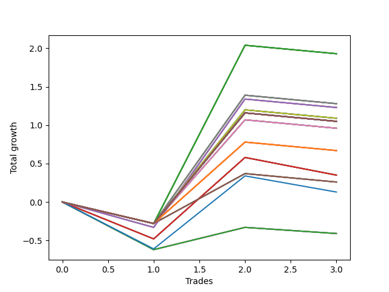

# Short Pointer 010 
- Symbol: SPY_Unlimited
- Date Range: 03/23/2022 - 07/08/2022
- Trading Period: 7:20-12:30
- Number of Trades: 3



| Name | Win Percent | Profit | Avg Profit / Trade | Avg Time / Trade |      | Name | Win Percent | Profit | Avg Profit / Trade | Avg Time / Trade |
| ---- | ----------- | ------ | ------------------ | ---------------- | ---- | ---- | ----------- | ------ | ------------------ | ---------------- |
| Sorted By <br> Profit | | | | | | Sorted By <br> Win Percentage ||||
| One Hundred Twenty-Seven | 33.33 | 965.00 | 321.67 | 25:53 |     | One Hundred Twenty-Seven | 33.33 | 965.00 | 321.67 | 25:53 |
| One Hundred Twenty-Two | 33.33 | 965.00 | 321.67 | 25:53 |     | One Hundred Twenty-Two | 33.33 | 965.00 | 321.67 | 25:53 |
| One Hundred Seventeen | 33.33 | 965.00 | 321.67 | 25:53 |     | One Hundred Seventeen | 33.33 | 965.00 | 321.67 | 25:53 |
| One Hundred Twelve | 33.33 | 965.00 | 321.67 | 25:53 |     | One Hundred Twelve | 33.33 | 965.00 | 321.67 | 25:53 |
| Eighty-Two | 33.33 | 965.00 | 321.67 | 25:53 |     | Eighty-Two | 33.33 | 965.00 | 321.67 | 25:53 |
| Sixty-Nine | 33.33 | 640.00 | 213.33 | 21:30 |     | Sixty-Nine | 33.33 | 640.00 | 213.33 | 21:30 |
| Sixty-One | 33.33 | 640.00 | 213.33 | 21:30 |     | Sixty-One | 33.33 | 640.00 | 213.33 | 21:30 |
| Fifty-Three | 33.33 | 640.00 | 213.33 | 21:30 |     | Fifty-Three | 33.33 | 640.00 | 213.33 | 21:30 |
| Forty-Five | 33.33 | 640.00 | 213.33 | 21:30 |     | Forty-Five | 33.33 | 640.00 | 213.33 | 21:30 |
| Five | 33.33 | 640.00 | 213.33 | 21:30 |     | Five | 33.33 | 640.00 | 213.33 | 21:30 |
| Sixty-Six | 33.33 | 615.00 | 205.00 | 20:55 |     | Sixty-Six | 33.33 | 615.00 | 205.00 | 20:55 |
| Fifty-Eight | 33.33 | 615.00 | 205.00 | 20:55 |     | Fifty-Eight | 33.33 | 615.00 | 205.00 | 20:55 |
| Fifty | 33.33 | 615.00 | 205.00 | 20:55 |     | Fifty | 33.33 | 615.00 | 205.00 | 20:55 |
| Forty-Two | 33.33 | 615.00 | 205.00 | 20:55 |     | Forty-Two | 33.33 | 615.00 | 205.00 | 20:55 |
| Two | 33.33 | 615.00 | 205.00 | 20:55 |     | Two | 33.33 | 615.00 | 205.00 | 20:55 |
| Seventy | 33.33 | 545.00 | 181.67 | 21:40 |     | Seventy | 33.33 | 545.00 | 181.67 | 21:40 |
| Sixty-Two | 33.33 | 545.00 | 181.67 | 21:40 |     | Sixty-Two | 33.33 | 545.00 | 181.67 | 21:40 |
| Fifty-Four | 33.33 | 545.00 | 181.67 | 21:40 |     | Fifty-Four | 33.33 | 545.00 | 181.67 | 21:40 |
| Forty-Six | 33.33 | 545.00 | 181.67 | 21:40 |     | Forty-Six | 33.33 | 545.00 | 181.67 | 21:40 |
| Six | 33.33 | 545.00 | 181.67 | 21:40 |     | Six | 33.33 | 545.00 | 181.67 | 21:40 |
| One Hundred Thirty | 33.33 | 525.00 | 175.00 | 29:55 |     | One Hundred Thirty | 33.33 | 525.00 | 175.00 | 29:55 |
| One Hundred Twenty-Nine | 33.33 | 525.00 | 175.00 | 29:55 |     | One Hundred Twenty-Nine | 33.33 | 525.00 | 175.00 | 29:55 |
| One Hundred Twenty-Eight | 33.33 | 525.00 | 175.00 | 29:55 |     | One Hundred Twenty-Eight | 33.33 | 525.00 | 175.00 | 29:55 |
| One Hundred Twenty-Five | 33.33 | 525.00 | 175.00 | 29:55 |     | One Hundred Twenty-Five | 33.33 | 525.00 | 175.00 | 29:55 |
| One Hundred Twenty-Four | 33.33 | 525.00 | 175.00 | 29:55 |     | One Hundred Twenty-Four | 33.33 | 525.00 | 175.00 | 29:55 |
| One Hundred Twenty-Three | 33.33 | 525.00 | 175.00 | 29:55 |     | One Hundred Twenty-Three | 33.33 | 525.00 | 175.00 | 29:55 |
| One Hundred Twenty | 33.33 | 525.00 | 175.00 | 29:55 |     | One Hundred Twenty | 33.33 | 525.00 | 175.00 | 29:55 |
| One Hundred Ninteen | 33.33 | 525.00 | 175.00 | 29:55 |     | One Hundred Ninteen | 33.33 | 525.00 | 175.00 | 29:55 |
| One Hundred Eighteen | 33.33 | 525.00 | 175.00 | 29:55 |     | One Hundred Eighteen | 33.33 | 525.00 | 175.00 | 29:55 |
| One Hundred Fifteen | 33.33 | 525.00 | 175.00 | 29:55 |     | One Hundred Fifteen | 33.33 | 525.00 | 175.00 | 29:55 |
| One Hundred Fourteen | 33.33 | 525.00 | 175.00 | 29:55 |     | One Hundred Fourteen | 33.33 | 525.00 | 175.00 | 29:55 |
| One Hundred Thirteen | 33.33 | 525.00 | 175.00 | 29:55 |     | One Hundred Thirteen | 33.33 | 525.00 | 175.00 | 29:55 |
| Eighty-Five | 33.33 | 525.00 | 175.00 | 29:55 |     | Eighty-Five | 33.33 | 525.00 | 175.00 | 29:55 |
| Eighty-Four | 33.33 | 525.00 | 175.00 | 29:55 |     | Eighty-Four | 33.33 | 525.00 | 175.00 | 29:55 |
| Eighty-Three | 33.33 | 525.00 | 175.00 | 29:55 |     | Eighty-Three | 33.33 | 525.00 | 175.00 | 29:55 |
| Seventy-One | 33.33 | 525.00 | 175.00 | 29:55 |     | Seventy-One | 33.33 | 525.00 | 175.00 | 29:55 |
| Sixty-Three | 33.33 | 525.00 | 175.00 | 29:55 |     | Sixty-Three | 33.33 | 525.00 | 175.00 | 29:55 |
| Fifty-Five | 33.33 | 525.00 | 175.00 | 29:55 |     | Fifty-Five | 33.33 | 525.00 | 175.00 | 29:55 |
| Forty-Seven | 33.33 | 525.00 | 175.00 | 29:55 |     | Forty-Seven | 33.33 | 525.00 | 175.00 | 29:55 |
| Seven | 33.33 | 525.00 | 175.00 | 29:55 |     | Seven | 33.33 | 525.00 | 175.00 | 29:55 |
| Sixty-Eight | 33.33 | 480.00 | 160.00 | 21:25 |     | Sixty-Eight | 33.33 | 480.00 | 160.00 | 21:25 |
| Sixty | 33.33 | 480.00 | 160.00 | 21:25 |     | Sixty | 33.33 | 480.00 | 160.00 | 21:25 |
| Fifty-Two | 33.33 | 480.00 | 160.00 | 21:25 |     | Fifty-Two | 33.33 | 480.00 | 160.00 | 21:25 |
| Forty-Four | 33.33 | 480.00 | 160.00 | 21:25 |     | Forty-Four | 33.33 | 480.00 | 160.00 | 21:25 |
| Four | 33.33 | 480.00 | 160.00 | 21:25 |     | Four | 33.33 | 480.00 | 160.00 | 21:25 |
| One Hundred Twenty-Six | 33.33 | 335.00 | 111.67 | 21:23 |     | One Hundred Twenty-Six | 33.33 | 335.00 | 111.67 | 21:23 |
| One Hundred Twenty-One | 33.33 | 335.00 | 111.67 | 21:23 |     | One Hundred Twenty-One | 33.33 | 335.00 | 111.67 | 21:23 |
| One Hundred Sixteen | 33.33 | 335.00 | 111.67 | 21:23 |     | One Hundred Sixteen | 33.33 | 335.00 | 111.67 | 21:23 |
| One Hundred Eleven | 33.33 | 335.00 | 111.67 | 21:23 |     | One Hundred Eleven | 33.33 | 335.00 | 111.67 | 21:23 |
| Eighty-One | 33.33 | 335.00 | 111.67 | 21:23 |     | Eighty-One | 33.33 | 335.00 | 111.67 | 21:23 |
| Sixty-Five | 33.33 | 175.00 | 58.33 | 20:31 |     | Sixty-Five | 33.33 | 175.00 | 58.33 | 20:31 |
| Fifty-Seven | 33.33 | 175.00 | 58.33 | 20:31 |     | Fifty-Seven | 33.33 | 175.00 | 58.33 | 20:31 |
| Forty-Nine | 33.33 | 175.00 | 58.33 | 20:31 |     | Forty-Nine | 33.33 | 175.00 | 58.33 | 20:31 |
| Forty-One | 33.33 | 175.00 | 58.33 | 20:31 |     | Forty-One | 33.33 | 175.00 | 58.33 | 20:31 |
| One | 33.33 | 175.00 | 58.33 | 20:31 |     | One | 33.33 | 175.00 | 58.33 | 20:31 |
| Sixty-Seven | 33.33 | 130.00 | 43.33 | 21:21 |     | Sixty-Seven | 33.33 | 130.00 | 43.33 | 21:21 |
| Fifty-Nine | 33.33 | 130.00 | 43.33 | 21:21 |     | Fifty-Nine | 33.33 | 130.00 | 43.33 | 21:21 |
| Fifty-One | 33.33 | 130.00 | 43.33 | 21:21 |     | Fifty-One | 33.33 | 130.00 | 43.33 | 21:21 |
| Forty-Three | 33.33 | 130.00 | 43.33 | 21:21 |     | Forty-Three | 33.33 | 130.00 | 43.33 | 21:21 |
| Three | 33.33 | 130.00 | 43.33 | 21:21 |     | Three | 33.33 | 130.00 | 43.33 | 21:21 |
| Seventy-Three | 33.33 | 65.00 | 21.67 | 13:05 |     | Seventy-Three | 33.33 | 65.00 | 21.67 | 13:05 |
| Sixty-Four | 33.33 | -205.00 | -68.33 | 12:13 |     | Sixty-Four | 33.33 | -205.00 | -68.33 | 12:13 |
| Fifty-Six | 33.33 | -205.00 | -68.33 | 12:13 |     | Fifty-Six | 33.33 | -205.00 | -68.33 | 12:13 |
| Forty-Eight | 33.33 | -205.00 | -68.33 | 12:13 |     | Forty-Eight | 33.33 | -205.00 | -68.33 | 12:13 |
| Forty | 33.33 | -205.00 | -68.33 | 12:13 |     | Forty | 33.33 | -205.00 | -68.33 | 12:13 |
| Zero | 33.33 | -205.00 | -68.33 | 12:13 |     | Zero | 33.33 | -205.00 | -68.33 | 12:13 |

## NO STOPLOSS

### Test Zero
* Sell when price hits the middle line of the 20p bollinger
* No Stoploss
* Results:
```
Total Trades: 3
Percent Up: 66.67
Percent Down: 33.33
Total Points Moved Down: -0.41
Potential Profit: -205.00
Total Points Ups: 0.70 Count Ups: 2
Total Points Downs: 0.29 Count Downs: 1
```

<details><summary>Trades</summary>

<code>In: 2022-03-25 07:26:00		Out: 2022-03-25 07:51:05		Total Position Time: 25:05		Total Move Down: -0.62		Total to Date: -0.62</code> <br />
<code>In: 2022-05-04 11:03:00		Out: 2022-05-04 11:03:10		Total Position Time: 00:10		Total Move Down: 0.29		Total to Date: -0.33</code> <br />
<code>In: 2022-07-07 11:05:00		Out: 2022-07-07 11:16:25		Total Position Time: 11:25		Total Move Down: -0.08		Total to Date: -0.41</code> <br />


</details>

### Test One
* Sell when the price hits the upper line of the 20p 1std bollinger
* No Stoploss
* Results:
```
Total Trades: 3
Percent Up: 66.67
Percent Down: 33.33
Total Points Moved Down: 0.35
Potential Profit: 175.00
Total Points Ups: 0.71 Count Ups: 2
Total Points Downs: 1.06 Count Downs: 1
```

<details><summary>Trades</summary>

<code>In: 2022-03-25 07:26:00		Out: 2022-03-25 07:53:50		Total Position Time: 27:50		Total Move Down: -0.48		Total to Date: -0.48</code> <br />
<code>In: 2022-05-04 11:03:00		Out: 2022-05-04 11:07:20		Total Position Time: 04:20		Total Move Down: 1.06		Total to Date: 0.58</code> <br />
<code>In: 2022-07-07 11:05:00		Out: 2022-07-07 11:34:25		Total Position Time: 29:25		Total Move Down: -0.23		Total to Date: 0.35</code> <br />


</details>

### Test Two
* Sell when the price hits the upper line of the 20p 2std bollinger
* No Stoploss
* Results:
```
Total Trades: 3
Percent Up: 66.67
Percent Down: 33.33
Total Points Moved Down: 1.23
Potential Profit: 615.00
Total Points Ups: 0.44 Count Ups: 2
Total Points Downs: 1.67 Count Downs: 1
```

<details><summary>Trades</summary>

<code>In: 2022-03-25 07:26:00		Out: 2022-03-25 07:54:10		Total Position Time: 28:10		Total Move Down: -0.33		Total to Date: -0.33</code> <br />
<code>In: 2022-05-04 11:03:00		Out: 2022-05-04 11:07:40		Total Position Time: 04:40		Total Move Down: 1.67		Total to Date: 1.34</code> <br />
<code>In: 2022-07-07 11:05:00		Out: 2022-07-07 11:34:55		Total Position Time: 29:55		Total Move Down: -0.11		Total to Date: 1.23</code> <br />


</details>

### Test Three
* Sell when price hits the middle line of the 50p bollinger
* No Stoploss
* Results:
```
Total Trades: 3
Percent Up: 66.67
Percent Down: 33.33
Total Points Moved Down: 0.26
Potential Profit: 130.00
Total Points Ups: 0.39 Count Ups: 2
Total Points Downs: 0.65 Count Downs: 1
```

<details><summary>Trades</summary>

<code>In: 2022-03-25 07:26:00		Out: 2022-03-25 07:55:55		Total Position Time: 29:55		Total Move Down: -0.28		Total to Date: -0.28</code> <br />
<code>In: 2022-05-04 11:03:00		Out: 2022-05-04 11:07:15		Total Position Time: 04:15		Total Move Down: 0.65		Total to Date: 0.37</code> <br />
<code>In: 2022-07-07 11:05:00		Out: 2022-07-07 11:34:55		Total Position Time: 29:55		Total Move Down: -0.11		Total to Date: 0.26</code> <br />


</details>

### Test Four
* Sell when the price hits the upper line of the 50p 1std bollinger
* No Stoploss
* Results:
```
Total Trades: 3
Percent Up: 66.67
Percent Down: 33.33
Total Points Moved Down: 0.96
Potential Profit: 480.00
Total Points Ups: 0.39 Count Ups: 2
Total Points Downs: 1.35 Count Downs: 1
```

<details><summary>Trades</summary>

<code>In: 2022-03-25 07:26:00		Out: 2022-03-25 07:55:55		Total Position Time: 29:55		Total Move Down: -0.28		Total to Date: -0.28</code> <br />
<code>In: 2022-05-04 11:03:00		Out: 2022-05-04 11:07:25		Total Position Time: 04:25		Total Move Down: 1.35		Total to Date: 1.07</code> <br />
<code>In: 2022-07-07 11:05:00		Out: 2022-07-07 11:34:55		Total Position Time: 29:55		Total Move Down: -0.11		Total to Date: 0.96</code> <br />


</details>

### Test Five
* Sell when the price hits the upper line of the 50p 2std bollinger
* No Stoploss
* Results:
```
Total Trades: 3
Percent Up: 66.67
Percent Down: 33.33
Total Points Moved Down: 1.28
Potential Profit: 640.00
Total Points Ups: 0.39 Count Ups: 2
Total Points Downs: 1.67 Count Downs: 1
```

<details><summary>Trades</summary>

<code>In: 2022-03-25 07:26:00		Out: 2022-03-25 07:55:55		Total Position Time: 29:55		Total Move Down: -0.28		Total to Date: -0.28</code> <br />
<code>In: 2022-05-04 11:03:00		Out: 2022-05-04 11:07:40		Total Position Time: 04:40		Total Move Down: 1.67		Total to Date: 1.39</code> <br />
<code>In: 2022-07-07 11:05:00		Out: 2022-07-07 11:34:55		Total Position Time: 29:55		Total Move Down: -0.11		Total to Date: 1.28</code> <br />


</details>

### Test Six
* Sell when the price hits the middle line of the 1std VWAP
* No Stoploss
* Results:
```
Total Trades: 3
Percent Up: 66.67
Percent Down: 33.33
Total Points Moved Down: 1.09
Potential Profit: 545.00
Total Points Ups: 0.39 Count Ups: 2
Total Points Downs: 1.48 Count Downs: 1
```

<details><summary>Trades</summary>

<code>In: 2022-03-25 07:26:00		Out: 2022-03-25 07:55:55		Total Position Time: 29:55		Total Move Down: -0.28		Total to Date: -0.28</code> <br />
<code>In: 2022-05-04 11:03:00		Out: 2022-05-04 11:08:10		Total Position Time: 05:10		Total Move Down: 1.48		Total to Date: 1.20</code> <br />
<code>In: 2022-07-07 11:05:00		Out: 2022-07-07 11:34:55		Total Position Time: 29:55		Total Move Down: -0.11		Total to Date: 1.09</code> <br />


</details>

### Test Seven
* Sell when the price hits the upper line of the 1std VWAP
* No Stoploss
* Results:
```
Total Trades: 3
Percent Up: 66.67
Percent Down: 33.33
Total Points Moved Down: 1.05
Potential Profit: 525.00
Total Points Ups: 0.39 Count Ups: 2
Total Points Downs: 1.44 Count Downs: 1
```

<details><summary>Trades</summary>

<code>In: 2022-03-25 07:26:00		Out: 2022-03-25 07:55:55		Total Position Time: 29:55		Total Move Down: -0.28		Total to Date: -0.28</code> <br />
<code>In: 2022-05-04 11:03:00		Out: 2022-05-04 11:32:55		Total Position Time: 29:55		Total Move Down: 1.44		Total to Date: 1.16</code> <br />
<code>In: 2022-07-07 11:05:00		Out: 2022-07-07 11:34:55		Total Position Time: 29:55		Total Move Down: -0.11		Total to Date: 1.05</code> <br />


</details>

## STOPLOSS OF 5

### Test Forty
* Sell when price hits the middle line of the 20p bollinger
* Stoploss is -5 points
* Results:
```
Total Trades: 3
Percent Up: 66.67
Percent Down: 33.33
Total Points Moved Down: -0.41
Potential Profit: -205.00
Total Points Ups: 0.70 Count Ups: 2
Total Points Downs: 0.29 Count Downs: 1
```

<details><summary>Trades</summary>

<code>In: 2022-03-25 07:26:00		Out: 2022-03-25 07:51:05		Total Position Time: 25:05		Total Move Down: -0.62		Total to Date: -0.62</code> <br />
<code>In: 2022-05-04 11:03:00		Out: 2022-05-04 11:03:10		Total Position Time: 00:10		Total Move Down: 0.29		Total to Date: -0.33</code> <br />
<code>In: 2022-07-07 11:05:00		Out: 2022-07-07 11:16:25		Total Position Time: 11:25		Total Move Down: -0.08		Total to Date: -0.41</code> <br />


</details>

### Test Forty-One
* Sell when the price hits the upper line of the 20p 1std bollinger
* Stoploss is -5 points
* Results:
```
Total Trades: 3
Percent Up: 66.67
Percent Down: 33.33
Total Points Moved Down: 0.35
Potential Profit: 175.00
Total Points Ups: 0.71 Count Ups: 2
Total Points Downs: 1.06 Count Downs: 1
```

<details><summary>Trades</summary>

<code>In: 2022-03-25 07:26:00		Out: 2022-03-25 07:53:50		Total Position Time: 27:50		Total Move Down: -0.48		Total to Date: -0.48</code> <br />
<code>In: 2022-05-04 11:03:00		Out: 2022-05-04 11:07:20		Total Position Time: 04:20		Total Move Down: 1.06		Total to Date: 0.58</code> <br />
<code>In: 2022-07-07 11:05:00		Out: 2022-07-07 11:34:25		Total Position Time: 29:25		Total Move Down: -0.23		Total to Date: 0.35</code> <br />


</details>

### Test Forty-Two
* Sell when the price hits the upper line of the 20p 2std bollinger
* Stoploss is -5 points
* Results:
```
Total Trades: 3
Percent Up: 66.67
Percent Down: 33.33
Total Points Moved Down: 1.23
Potential Profit: 615.00
Total Points Ups: 0.44 Count Ups: 2
Total Points Downs: 1.67 Count Downs: 1
```

<details><summary>Trades</summary>

<code>In: 2022-03-25 07:26:00		Out: 2022-03-25 07:54:10		Total Position Time: 28:10		Total Move Down: -0.33		Total to Date: -0.33</code> <br />
<code>In: 2022-05-04 11:03:00		Out: 2022-05-04 11:07:40		Total Position Time: 04:40		Total Move Down: 1.67		Total to Date: 1.34</code> <br />
<code>In: 2022-07-07 11:05:00		Out: 2022-07-07 11:34:55		Total Position Time: 29:55		Total Move Down: -0.11		Total to Date: 1.23</code> <br />


</details>

### Test Forty-Three
* Sell when price hits the middle line of the 50p bollinger
* Stoploss is -5 points
* Results:
```
Total Trades: 3
Percent Up: 66.67
Percent Down: 33.33
Total Points Moved Down: 0.26
Potential Profit: 130.00
Total Points Ups: 0.39 Count Ups: 2
Total Points Downs: 0.65 Count Downs: 1
```

<details><summary>Trades</summary>

<code>In: 2022-03-25 07:26:00		Out: 2022-03-25 07:55:55		Total Position Time: 29:55		Total Move Down: -0.28		Total to Date: -0.28</code> <br />
<code>In: 2022-05-04 11:03:00		Out: 2022-05-04 11:07:15		Total Position Time: 04:15		Total Move Down: 0.65		Total to Date: 0.37</code> <br />
<code>In: 2022-07-07 11:05:00		Out: 2022-07-07 11:34:55		Total Position Time: 29:55		Total Move Down: -0.11		Total to Date: 0.26</code> <br />


</details>

### Test Forty-Four
* Sell when the price hits the upper line of the 50p 1std bollinger
* Stoploss is -5 points
* Results:
```
Total Trades: 3
Percent Up: 66.67
Percent Down: 33.33
Total Points Moved Down: 0.96
Potential Profit: 480.00
Total Points Ups: 0.39 Count Ups: 2
Total Points Downs: 1.35 Count Downs: 1
```

<details><summary>Trades</summary>

<code>In: 2022-03-25 07:26:00		Out: 2022-03-25 07:55:55		Total Position Time: 29:55		Total Move Down: -0.28		Total to Date: -0.28</code> <br />
<code>In: 2022-05-04 11:03:00		Out: 2022-05-04 11:07:25		Total Position Time: 04:25		Total Move Down: 1.35		Total to Date: 1.07</code> <br />
<code>In: 2022-07-07 11:05:00		Out: 2022-07-07 11:34:55		Total Position Time: 29:55		Total Move Down: -0.11		Total to Date: 0.96</code> <br />


</details>

### Test Forty-Five
* Sell when the price hits the upper line of the 50p 2std bollinger
* Stoploss is -5 points
* Results:
```
Total Trades: 3
Percent Up: 66.67
Percent Down: 33.33
Total Points Moved Down: 1.28
Potential Profit: 640.00
Total Points Ups: 0.39 Count Ups: 2
Total Points Downs: 1.67 Count Downs: 1
```

<details><summary>Trades</summary>

<code>In: 2022-03-25 07:26:00		Out: 2022-03-25 07:55:55		Total Position Time: 29:55		Total Move Down: -0.28		Total to Date: -0.28</code> <br />
<code>In: 2022-05-04 11:03:00		Out: 2022-05-04 11:07:40		Total Position Time: 04:40		Total Move Down: 1.67		Total to Date: 1.39</code> <br />
<code>In: 2022-07-07 11:05:00		Out: 2022-07-07 11:34:55		Total Position Time: 29:55		Total Move Down: -0.11		Total to Date: 1.28</code> <br />


</details>

### Test Forty-Six
* Sell when the price hits the middle line of the 1std VWAP
* Stoploss is -5 points
* Results:
```
Total Trades: 3
Percent Up: 66.67
Percent Down: 33.33
Total Points Moved Down: 1.09
Potential Profit: 545.00
Total Points Ups: 0.39 Count Ups: 2
Total Points Downs: 1.48 Count Downs: 1
```

<details><summary>Trades</summary>

<code>In: 2022-03-25 07:26:00		Out: 2022-03-25 07:55:55		Total Position Time: 29:55		Total Move Down: -0.28		Total to Date: -0.28</code> <br />
<code>In: 2022-05-04 11:03:00		Out: 2022-05-04 11:08:10		Total Position Time: 05:10		Total Move Down: 1.48		Total to Date: 1.20</code> <br />
<code>In: 2022-07-07 11:05:00		Out: 2022-07-07 11:34:55		Total Position Time: 29:55		Total Move Down: -0.11		Total to Date: 1.09</code> <br />


</details>

### Test Forty-Seven
* Sell when the price hits the upper line of the 1std VWAP
* Stoploss is -5 points
* Results:
```
Total Trades: 3
Percent Up: 66.67
Percent Down: 33.33
Total Points Moved Down: 1.05
Potential Profit: 525.00
Total Points Ups: 0.39 Count Ups: 2
Total Points Downs: 1.44 Count Downs: 1
```

<details><summary>Trades</summary>

<code>In: 2022-03-25 07:26:00		Out: 2022-03-25 07:55:55		Total Position Time: 29:55		Total Move Down: -0.28		Total to Date: -0.28</code> <br />
<code>In: 2022-05-04 11:03:00		Out: 2022-05-04 11:32:55		Total Position Time: 29:55		Total Move Down: 1.44		Total to Date: 1.16</code> <br />
<code>In: 2022-07-07 11:05:00		Out: 2022-07-07 11:34:55		Total Position Time: 29:55		Total Move Down: -0.11		Total to Date: 1.05</code> <br />


</details>

## TRAIL STOP OF 5

### Test Forty-Eight
* Sell when price hits the middle line of the 20p bollinger
* Trailing Stop is -5 points
* Results:
```
Total Trades: 3
Percent Up: 66.67
Percent Down: 33.33
Total Points Moved Down: -0.41
Potential Profit: -205.00
Total Points Ups: 0.70 Count Ups: 2
Total Points Downs: 0.29 Count Downs: 1
```

<details><summary>Trades</summary>

<code>In: 2022-03-25 07:26:00		Out: 2022-03-25 07:51:05		Total Position Time: 25:05		Total Move Down: -0.62		Total to Date: -0.62</code> <br />
<code>In: 2022-05-04 11:03:00		Out: 2022-05-04 11:03:10		Total Position Time: 00:10		Total Move Down: 0.29		Total to Date: -0.33</code> <br />
<code>In: 2022-07-07 11:05:00		Out: 2022-07-07 11:16:25		Total Position Time: 11:25		Total Move Down: -0.08		Total to Date: -0.41</code> <br />


</details>

### Test Forty-Nine
* Sell when the price hits the upper line of the 20p 1std bollinger
* Trailing Stop is -5 points
* Results:
```
Total Trades: 3
Percent Up: 66.67
Percent Down: 33.33
Total Points Moved Down: 0.35
Potential Profit: 175.00
Total Points Ups: 0.71 Count Ups: 2
Total Points Downs: 1.06 Count Downs: 1
```

<details><summary>Trades</summary>

<code>In: 2022-03-25 07:26:00		Out: 2022-03-25 07:53:50		Total Position Time: 27:50		Total Move Down: -0.48		Total to Date: -0.48</code> <br />
<code>In: 2022-05-04 11:03:00		Out: 2022-05-04 11:07:20		Total Position Time: 04:20		Total Move Down: 1.06		Total to Date: 0.58</code> <br />
<code>In: 2022-07-07 11:05:00		Out: 2022-07-07 11:34:25		Total Position Time: 29:25		Total Move Down: -0.23		Total to Date: 0.35</code> <br />


</details>

### Test Fifty
* Sell when the price hits the upper line of the 20p 2std bollinger
* Trailing Stop is -5 points
* Results:
```
Total Trades: 3
Percent Up: 66.67
Percent Down: 33.33
Total Points Moved Down: 1.23
Potential Profit: 615.00
Total Points Ups: 0.44 Count Ups: 2
Total Points Downs: 1.67 Count Downs: 1
```

<details><summary>Trades</summary>

<code>In: 2022-03-25 07:26:00		Out: 2022-03-25 07:54:10		Total Position Time: 28:10		Total Move Down: -0.33		Total to Date: -0.33</code> <br />
<code>In: 2022-05-04 11:03:00		Out: 2022-05-04 11:07:40		Total Position Time: 04:40		Total Move Down: 1.67		Total to Date: 1.34</code> <br />
<code>In: 2022-07-07 11:05:00		Out: 2022-07-07 11:34:55		Total Position Time: 29:55		Total Move Down: -0.11		Total to Date: 1.23</code> <br />


</details>

### Test Fifty-One
* Sell when price hits the middle line of the 50p bollinger
* Trailing Stop is -5 points
* Results:
```
Total Trades: 3
Percent Up: 66.67
Percent Down: 33.33
Total Points Moved Down: 0.26
Potential Profit: 130.00
Total Points Ups: 0.39 Count Ups: 2
Total Points Downs: 0.65 Count Downs: 1
```

<details><summary>Trades</summary>

<code>In: 2022-03-25 07:26:00		Out: 2022-03-25 07:55:55		Total Position Time: 29:55		Total Move Down: -0.28		Total to Date: -0.28</code> <br />
<code>In: 2022-05-04 11:03:00		Out: 2022-05-04 11:07:15		Total Position Time: 04:15		Total Move Down: 0.65		Total to Date: 0.37</code> <br />
<code>In: 2022-07-07 11:05:00		Out: 2022-07-07 11:34:55		Total Position Time: 29:55		Total Move Down: -0.11		Total to Date: 0.26</code> <br />


</details>

### Test Fifty-Two
* Sell when the price hits the upper line of the 50p 1std bollinger
* Trailing Stop is -5 points
* Results:
```
Total Trades: 3
Percent Up: 66.67
Percent Down: 33.33
Total Points Moved Down: 0.96
Potential Profit: 480.00
Total Points Ups: 0.39 Count Ups: 2
Total Points Downs: 1.35 Count Downs: 1
```

<details><summary>Trades</summary>

<code>In: 2022-03-25 07:26:00		Out: 2022-03-25 07:55:55		Total Position Time: 29:55		Total Move Down: -0.28		Total to Date: -0.28</code> <br />
<code>In: 2022-05-04 11:03:00		Out: 2022-05-04 11:07:25		Total Position Time: 04:25		Total Move Down: 1.35		Total to Date: 1.07</code> <br />
<code>In: 2022-07-07 11:05:00		Out: 2022-07-07 11:34:55		Total Position Time: 29:55		Total Move Down: -0.11		Total to Date: 0.96</code> <br />


</details>

### Test Fifty-Three
* Sell when the price hits the upper line of the 50p 2std bollinger
* Trailing Stop is -5 points
* Results:
```
Total Trades: 3
Percent Up: 66.67
Percent Down: 33.33
Total Points Moved Down: 1.28
Potential Profit: 640.00
Total Points Ups: 0.39 Count Ups: 2
Total Points Downs: 1.67 Count Downs: 1
```

<details><summary>Trades</summary>

<code>In: 2022-03-25 07:26:00		Out: 2022-03-25 07:55:55		Total Position Time: 29:55		Total Move Down: -0.28		Total to Date: -0.28</code> <br />
<code>In: 2022-05-04 11:03:00		Out: 2022-05-04 11:07:40		Total Position Time: 04:40		Total Move Down: 1.67		Total to Date: 1.39</code> <br />
<code>In: 2022-07-07 11:05:00		Out: 2022-07-07 11:34:55		Total Position Time: 29:55		Total Move Down: -0.11		Total to Date: 1.28</code> <br />


</details>

### Test Fifty-Four
* Sell when the price hits the middle line of the 1std VWAP
* Trailing Stop is -5 points
* Results:
```
Total Trades: 3
Percent Up: 66.67
Percent Down: 33.33
Total Points Moved Down: 1.09
Potential Profit: 545.00
Total Points Ups: 0.39 Count Ups: 2
Total Points Downs: 1.48 Count Downs: 1
```

<details><summary>Trades</summary>

<code>In: 2022-03-25 07:26:00		Out: 2022-03-25 07:55:55		Total Position Time: 29:55		Total Move Down: -0.28		Total to Date: -0.28</code> <br />
<code>In: 2022-05-04 11:03:00		Out: 2022-05-04 11:08:10		Total Position Time: 05:10		Total Move Down: 1.48		Total to Date: 1.20</code> <br />
<code>In: 2022-07-07 11:05:00		Out: 2022-07-07 11:34:55		Total Position Time: 29:55		Total Move Down: -0.11		Total to Date: 1.09</code> <br />


</details>

### Test Fifty-Five
* Sell when the price hits the upper line of the 1std VWAP
* Trailing Stop is -5 points
* Results:
```
Total Trades: 3
Percent Up: 66.67
Percent Down: 33.33
Total Points Moved Down: 1.05
Potential Profit: 525.00
Total Points Ups: 0.39 Count Ups: 2
Total Points Downs: 1.44 Count Downs: 1
```

<details><summary>Trades</summary>

<code>In: 2022-03-25 07:26:00		Out: 2022-03-25 07:55:55		Total Position Time: 29:55		Total Move Down: -0.28		Total to Date: -0.28</code> <br />
<code>In: 2022-05-04 11:03:00		Out: 2022-05-04 11:32:55		Total Position Time: 29:55		Total Move Down: 1.44		Total to Date: 1.16</code> <br />
<code>In: 2022-07-07 11:05:00		Out: 2022-07-07 11:34:55		Total Position Time: 29:55		Total Move Down: -0.11		Total to Date: 1.05</code> <br />


</details>

## STOPLOSS OF 10

### Test Fifty-Six
* Sell when price hits the middle line of the 20p bollinger
* Stoploss is -10 points
* Results:
```
Total Trades: 3
Percent Up: 66.67
Percent Down: 33.33
Total Points Moved Down: -0.41
Potential Profit: -205.00
Total Points Ups: 0.70 Count Ups: 2
Total Points Downs: 0.29 Count Downs: 1
```

<details><summary>Trades</summary>

<code>In: 2022-03-25 07:26:00		Out: 2022-03-25 07:51:05		Total Position Time: 25:05		Total Move Down: -0.62		Total to Date: -0.62</code> <br />
<code>In: 2022-05-04 11:03:00		Out: 2022-05-04 11:03:10		Total Position Time: 00:10		Total Move Down: 0.29		Total to Date: -0.33</code> <br />
<code>In: 2022-07-07 11:05:00		Out: 2022-07-07 11:16:25		Total Position Time: 11:25		Total Move Down: -0.08		Total to Date: -0.41</code> <br />


</details>

### Test Fifty-Seven
* Sell when the price hits the upper line of the 20p 1std bollinger
* Stoploss is -10 points
* Results:
```
Total Trades: 3
Percent Up: 66.67
Percent Down: 33.33
Total Points Moved Down: 0.35
Potential Profit: 175.00
Total Points Ups: 0.71 Count Ups: 2
Total Points Downs: 1.06 Count Downs: 1
```

<details><summary>Trades</summary>

<code>In: 2022-03-25 07:26:00		Out: 2022-03-25 07:53:50		Total Position Time: 27:50		Total Move Down: -0.48		Total to Date: -0.48</code> <br />
<code>In: 2022-05-04 11:03:00		Out: 2022-05-04 11:07:20		Total Position Time: 04:20		Total Move Down: 1.06		Total to Date: 0.58</code> <br />
<code>In: 2022-07-07 11:05:00		Out: 2022-07-07 11:34:25		Total Position Time: 29:25		Total Move Down: -0.23		Total to Date: 0.35</code> <br />


</details>

### Test Fifty-Eight
* Sell when the price hits the upper line of the 20p 2std bollinger
* Stoploss is -10 points
* Results:
```
Total Trades: 3
Percent Up: 66.67
Percent Down: 33.33
Total Points Moved Down: 1.23
Potential Profit: 615.00
Total Points Ups: 0.44 Count Ups: 2
Total Points Downs: 1.67 Count Downs: 1
```

<details><summary>Trades</summary>

<code>In: 2022-03-25 07:26:00		Out: 2022-03-25 07:54:10		Total Position Time: 28:10		Total Move Down: -0.33		Total to Date: -0.33</code> <br />
<code>In: 2022-05-04 11:03:00		Out: 2022-05-04 11:07:40		Total Position Time: 04:40		Total Move Down: 1.67		Total to Date: 1.34</code> <br />
<code>In: 2022-07-07 11:05:00		Out: 2022-07-07 11:34:55		Total Position Time: 29:55		Total Move Down: -0.11		Total to Date: 1.23</code> <br />


</details>

### Test Fifty-Nine
* Sell when price hits the middle line of the 50p bollinger
* Stoploss is -10 points
* Results:
```
Total Trades: 3
Percent Up: 66.67
Percent Down: 33.33
Total Points Moved Down: 0.26
Potential Profit: 130.00
Total Points Ups: 0.39 Count Ups: 2
Total Points Downs: 0.65 Count Downs: 1
```

<details><summary>Trades</summary>

<code>In: 2022-03-25 07:26:00		Out: 2022-03-25 07:55:55		Total Position Time: 29:55		Total Move Down: -0.28		Total to Date: -0.28</code> <br />
<code>In: 2022-05-04 11:03:00		Out: 2022-05-04 11:07:15		Total Position Time: 04:15		Total Move Down: 0.65		Total to Date: 0.37</code> <br />
<code>In: 2022-07-07 11:05:00		Out: 2022-07-07 11:34:55		Total Position Time: 29:55		Total Move Down: -0.11		Total to Date: 0.26</code> <br />


</details>

### Test Sixty
* Sell when the price hits the upper line of the 50p 1std bollinger
* Stoploss is -10 points
* Results:
```
Total Trades: 3
Percent Up: 66.67
Percent Down: 33.33
Total Points Moved Down: 0.96
Potential Profit: 480.00
Total Points Ups: 0.39 Count Ups: 2
Total Points Downs: 1.35 Count Downs: 1
```

<details><summary>Trades</summary>

<code>In: 2022-03-25 07:26:00		Out: 2022-03-25 07:55:55		Total Position Time: 29:55		Total Move Down: -0.28		Total to Date: -0.28</code> <br />
<code>In: 2022-05-04 11:03:00		Out: 2022-05-04 11:07:25		Total Position Time: 04:25		Total Move Down: 1.35		Total to Date: 1.07</code> <br />
<code>In: 2022-07-07 11:05:00		Out: 2022-07-07 11:34:55		Total Position Time: 29:55		Total Move Down: -0.11		Total to Date: 0.96</code> <br />


</details>

### Test Sixty-One
* Sell when the price hits the upper line of the 50p 2std bollinger
* Stoploss is -10 points
* Results:
```
Total Trades: 3
Percent Up: 66.67
Percent Down: 33.33
Total Points Moved Down: 1.28
Potential Profit: 640.00
Total Points Ups: 0.39 Count Ups: 2
Total Points Downs: 1.67 Count Downs: 1
```

<details><summary>Trades</summary>

<code>In: 2022-03-25 07:26:00		Out: 2022-03-25 07:55:55		Total Position Time: 29:55		Total Move Down: -0.28		Total to Date: -0.28</code> <br />
<code>In: 2022-05-04 11:03:00		Out: 2022-05-04 11:07:40		Total Position Time: 04:40		Total Move Down: 1.67		Total to Date: 1.39</code> <br />
<code>In: 2022-07-07 11:05:00		Out: 2022-07-07 11:34:55		Total Position Time: 29:55		Total Move Down: -0.11		Total to Date: 1.28</code> <br />


</details>

### Test Sixty-Two
* Sell when the price hits the middle line of the 1std VWAP
* Stoploss is -10 points
* Results:
```
Total Trades: 3
Percent Up: 66.67
Percent Down: 33.33
Total Points Moved Down: 1.09
Potential Profit: 545.00
Total Points Ups: 0.39 Count Ups: 2
Total Points Downs: 1.48 Count Downs: 1
```

<details><summary>Trades</summary>

<code>In: 2022-03-25 07:26:00		Out: 2022-03-25 07:55:55		Total Position Time: 29:55		Total Move Down: -0.28		Total to Date: -0.28</code> <br />
<code>In: 2022-05-04 11:03:00		Out: 2022-05-04 11:08:10		Total Position Time: 05:10		Total Move Down: 1.48		Total to Date: 1.20</code> <br />
<code>In: 2022-07-07 11:05:00		Out: 2022-07-07 11:34:55		Total Position Time: 29:55		Total Move Down: -0.11		Total to Date: 1.09</code> <br />


</details>

### Test Sixty-Three
* Sell when the price hits the upper line of the 1std VWAP
* Stoploss is -10 points
* Results:
```
Total Trades: 3
Percent Up: 66.67
Percent Down: 33.33
Total Points Moved Down: 1.05
Potential Profit: 525.00
Total Points Ups: 0.39 Count Ups: 2
Total Points Downs: 1.44 Count Downs: 1
```

<details><summary>Trades</summary>

<code>In: 2022-03-25 07:26:00		Out: 2022-03-25 07:55:55		Total Position Time: 29:55		Total Move Down: -0.28		Total to Date: -0.28</code> <br />
<code>In: 2022-05-04 11:03:00		Out: 2022-05-04 11:32:55		Total Position Time: 29:55		Total Move Down: 1.44		Total to Date: 1.16</code> <br />
<code>In: 2022-07-07 11:05:00		Out: 2022-07-07 11:34:55		Total Position Time: 29:55		Total Move Down: -0.11		Total to Date: 1.05</code> <br />


</details>

## TRAIL STOP OF 10

### Test Sixty-Four
* Sell when price hits the middle line of the 20p bollinger
* Trailing Stop is -10 points
* Results:
```
Total Trades: 3
Percent Up: 66.67
Percent Down: 33.33
Total Points Moved Down: -0.41
Potential Profit: -205.00
Total Points Ups: 0.70 Count Ups: 2
Total Points Downs: 0.29 Count Downs: 1
```

<details><summary>Trades</summary>

<code>In: 2022-03-25 07:26:00		Out: 2022-03-25 07:51:05		Total Position Time: 25:05		Total Move Down: -0.62		Total to Date: -0.62</code> <br />
<code>In: 2022-05-04 11:03:00		Out: 2022-05-04 11:03:10		Total Position Time: 00:10		Total Move Down: 0.29		Total to Date: -0.33</code> <br />
<code>In: 2022-07-07 11:05:00		Out: 2022-07-07 11:16:25		Total Position Time: 11:25		Total Move Down: -0.08		Total to Date: -0.41</code> <br />


</details>

### Test Sixty-Five
* Sell when the price hits the upper line of the 20p 1std bollinger
* Trailing Stop is -10 points
* Results:
```
Total Trades: 3
Percent Up: 66.67
Percent Down: 33.33
Total Points Moved Down: 0.35
Potential Profit: 175.00
Total Points Ups: 0.71 Count Ups: 2
Total Points Downs: 1.06 Count Downs: 1
```

<details><summary>Trades</summary>

<code>In: 2022-03-25 07:26:00		Out: 2022-03-25 07:53:50		Total Position Time: 27:50		Total Move Down: -0.48		Total to Date: -0.48</code> <br />
<code>In: 2022-05-04 11:03:00		Out: 2022-05-04 11:07:20		Total Position Time: 04:20		Total Move Down: 1.06		Total to Date: 0.58</code> <br />
<code>In: 2022-07-07 11:05:00		Out: 2022-07-07 11:34:25		Total Position Time: 29:25		Total Move Down: -0.23		Total to Date: 0.35</code> <br />


</details>

### Test Sixty-Six
* Sell when the price hits the upper line of the 20p 2std bollinger
* Trailing Stop is -10 points
* Results:
```
Total Trades: 3
Percent Up: 66.67
Percent Down: 33.33
Total Points Moved Down: 1.23
Potential Profit: 615.00
Total Points Ups: 0.44 Count Ups: 2
Total Points Downs: 1.67 Count Downs: 1
```

<details><summary>Trades</summary>

<code>In: 2022-03-25 07:26:00		Out: 2022-03-25 07:54:10		Total Position Time: 28:10		Total Move Down: -0.33		Total to Date: -0.33</code> <br />
<code>In: 2022-05-04 11:03:00		Out: 2022-05-04 11:07:40		Total Position Time: 04:40		Total Move Down: 1.67		Total to Date: 1.34</code> <br />
<code>In: 2022-07-07 11:05:00		Out: 2022-07-07 11:34:55		Total Position Time: 29:55		Total Move Down: -0.11		Total to Date: 1.23</code> <br />


</details>

### Test Sixty-Seven
* Sell when price hits the middle line of the 50p bollinger
* Trailing Stop is -10 points
* Results:
```
Total Trades: 3
Percent Up: 66.67
Percent Down: 33.33
Total Points Moved Down: 0.26
Potential Profit: 130.00
Total Points Ups: 0.39 Count Ups: 2
Total Points Downs: 0.65 Count Downs: 1
```

<details><summary>Trades</summary>

<code>In: 2022-03-25 07:26:00		Out: 2022-03-25 07:55:55		Total Position Time: 29:55		Total Move Down: -0.28		Total to Date: -0.28</code> <br />
<code>In: 2022-05-04 11:03:00		Out: 2022-05-04 11:07:15		Total Position Time: 04:15		Total Move Down: 0.65		Total to Date: 0.37</code> <br />
<code>In: 2022-07-07 11:05:00		Out: 2022-07-07 11:34:55		Total Position Time: 29:55		Total Move Down: -0.11		Total to Date: 0.26</code> <br />


</details>

### Test Sixty-Eight
* Sell when the price hits the upper line of the 50p 1std bollinger
* Trailing Stop is -10 points
* Results:
```
Total Trades: 3
Percent Up: 66.67
Percent Down: 33.33
Total Points Moved Down: 0.96
Potential Profit: 480.00
Total Points Ups: 0.39 Count Ups: 2
Total Points Downs: 1.35 Count Downs: 1
```

<details><summary>Trades</summary>

<code>In: 2022-03-25 07:26:00		Out: 2022-03-25 07:55:55		Total Position Time: 29:55		Total Move Down: -0.28		Total to Date: -0.28</code> <br />
<code>In: 2022-05-04 11:03:00		Out: 2022-05-04 11:07:25		Total Position Time: 04:25		Total Move Down: 1.35		Total to Date: 1.07</code> <br />
<code>In: 2022-07-07 11:05:00		Out: 2022-07-07 11:34:55		Total Position Time: 29:55		Total Move Down: -0.11		Total to Date: 0.96</code> <br />


</details>

### Test Sixty-Nine
* Sell when the price hits the upper line of the 50p 2std bollinger
* Trailing Stop is -10 points
* Results:
```
Total Trades: 3
Percent Up: 66.67
Percent Down: 33.33
Total Points Moved Down: 1.28
Potential Profit: 640.00
Total Points Ups: 0.39 Count Ups: 2
Total Points Downs: 1.67 Count Downs: 1
```

<details><summary>Trades</summary>

<code>In: 2022-03-25 07:26:00		Out: 2022-03-25 07:55:55		Total Position Time: 29:55		Total Move Down: -0.28		Total to Date: -0.28</code> <br />
<code>In: 2022-05-04 11:03:00		Out: 2022-05-04 11:07:40		Total Position Time: 04:40		Total Move Down: 1.67		Total to Date: 1.39</code> <br />
<code>In: 2022-07-07 11:05:00		Out: 2022-07-07 11:34:55		Total Position Time: 29:55		Total Move Down: -0.11		Total to Date: 1.28</code> <br />


</details>

### Test Seventy
* Sell when the price hits the middle line of the 1std VWAP
* Trailing Stop is -10 points
* Results:
```
Total Trades: 3
Percent Up: 66.67
Percent Down: 33.33
Total Points Moved Down: 1.09
Potential Profit: 545.00
Total Points Ups: 0.39 Count Ups: 2
Total Points Downs: 1.48 Count Downs: 1
```

<details><summary>Trades</summary>

<code>In: 2022-03-25 07:26:00		Out: 2022-03-25 07:55:55		Total Position Time: 29:55		Total Move Down: -0.28		Total to Date: -0.28</code> <br />
<code>In: 2022-05-04 11:03:00		Out: 2022-05-04 11:08:10		Total Position Time: 05:10		Total Move Down: 1.48		Total to Date: 1.20</code> <br />
<code>In: 2022-07-07 11:05:00		Out: 2022-07-07 11:34:55		Total Position Time: 29:55		Total Move Down: -0.11		Total to Date: 1.09</code> <br />


</details>

### Test Seventy-One
* Sell when the price hits the upper line of the 1std VWAP
* Trailing Stop is -10 points
* Results:
```
Total Trades: 3
Percent Up: 66.67
Percent Down: 33.33
Total Points Moved Down: 1.05
Potential Profit: 525.00
Total Points Ups: 0.39 Count Ups: 2
Total Points Downs: 1.44 Count Downs: 1
```

<details><summary>Trades</summary>

<code>In: 2022-03-25 07:26:00		Out: 2022-03-25 07:55:55		Total Position Time: 29:55		Total Move Down: -0.28		Total to Date: -0.28</code> <br />
<code>In: 2022-05-04 11:03:00		Out: 2022-05-04 11:32:55		Total Position Time: 29:55		Total Move Down: 1.44		Total to Date: 1.16</code> <br />
<code>In: 2022-07-07 11:05:00		Out: 2022-07-07 11:34:55		Total Position Time: 29:55		Total Move Down: -0.11		Total to Date: 1.05</code> <br />


</details>

## SPECIAL EXIT CONDITIONS 

### Test Seventy-Three
* Sell when the linear regression slope changes to negative
* No Stoploss
* Results:
```
Total Trades: 3
Percent Up: 66.67
Percent Down: 33.33
Total Points Moved Down: 0.13
Potential Profit: 65.00
Total Points Ups: 0.82 Count Ups: 2
Total Points Downs: 0.95 Count Downs: 1
```

<details><summary>Trades</summary>

<code>In: 2022-03-25 07:26:00		Out: 2022-03-25 07:35:05		Total Position Time: 09:05		Total Move Down: -0.61		Total to Date: -0.61</code> <br />
<code>In: 2022-05-04 11:03:00		Out: 2022-05-04 11:24:05		Total Position Time: 21:05		Total Move Down: 0.95		Total to Date: 0.34</code> <br />
<code>In: 2022-07-07 11:05:00		Out: 2022-07-07 11:14:05		Total Position Time: 09:05		Total Move Down: -0.21		Total to Date: 0.13</code> <br />


</details>

## TAKE PROFIT

### Test Eighty-One
* Take Profit of 1 Point
* No Stoploss
* Results:
```
Total Trades: 3
Percent Up: 66.67
Percent Down: 33.33
Total Points Moved Down: 0.67
Potential Profit: 335.00
Total Points Ups: 0.39 Count Ups: 2
Total Points Downs: 1.06 Count Downs: 1
```

<details><summary>Trades</summary>

<code>In: 2022-03-25 07:26:00		Out: 2022-03-25 07:55:55		Total Position Time: 29:55		Total Move Down: -0.28		Total to Date: -0.28</code> <br />
<code>In: 2022-05-04 11:03:00		Out: 2022-05-04 11:07:20		Total Position Time: 04:20		Total Move Down: 1.06		Total to Date: 0.78</code> <br />
<code>In: 2022-07-07 11:05:00		Out: 2022-07-07 11:34:55		Total Position Time: 29:55		Total Move Down: -0.11		Total to Date: 0.67</code> <br />


</details>

### Test Eighty-Two
* Take Profit of 2 Point
* No Stoploss
* Results:
```
Total Trades: 3
Percent Up: 66.67
Percent Down: 33.33
Total Points Moved Down: 1.93
Potential Profit: 965.00
Total Points Ups: 0.39 Count Ups: 2
Total Points Downs: 2.32 Count Downs: 1
```

<details><summary>Trades</summary>

<code>In: 2022-03-25 07:26:00		Out: 2022-03-25 07:55:55		Total Position Time: 29:55		Total Move Down: -0.28		Total to Date: -0.28</code> <br />
<code>In: 2022-05-04 11:03:00		Out: 2022-05-04 11:20:50		Total Position Time: 17:50		Total Move Down: 2.32		Total to Date: 2.04</code> <br />
<code>In: 2022-07-07 11:05:00		Out: 2022-07-07 11:34:55		Total Position Time: 29:55		Total Move Down: -0.11		Total to Date: 1.93</code> <br />


</details>

### Test Eighty-Three
* Take Profit of 3 Point
* No Stoploss
* Results:
```
Total Trades: 3
Percent Up: 66.67
Percent Down: 33.33
Total Points Moved Down: 1.05
Potential Profit: 525.00
Total Points Ups: 0.39 Count Ups: 2
Total Points Downs: 1.44 Count Downs: 1
```

<details><summary>Trades</summary>

<code>In: 2022-03-25 07:26:00		Out: 2022-03-25 07:55:55		Total Position Time: 29:55		Total Move Down: -0.28		Total to Date: -0.28</code> <br />
<code>In: 2022-05-04 11:03:00		Out: 2022-05-04 11:32:55		Total Position Time: 29:55		Total Move Down: 1.44		Total to Date: 1.16</code> <br />
<code>In: 2022-07-07 11:05:00		Out: 2022-07-07 11:34:55		Total Position Time: 29:55		Total Move Down: -0.11		Total to Date: 1.05</code> <br />


</details>

### Test Eighty-Four
* Take Profit of 4 Point
* No Stoploss
* Results:
```
Total Trades: 3
Percent Up: 66.67
Percent Down: 33.33
Total Points Moved Down: 1.05
Potential Profit: 525.00
Total Points Ups: 0.39 Count Ups: 2
Total Points Downs: 1.44 Count Downs: 1
```

<details><summary>Trades</summary>

<code>In: 2022-03-25 07:26:00		Out: 2022-03-25 07:55:55		Total Position Time: 29:55		Total Move Down: -0.28		Total to Date: -0.28</code> <br />
<code>In: 2022-05-04 11:03:00		Out: 2022-05-04 11:32:55		Total Position Time: 29:55		Total Move Down: 1.44		Total to Date: 1.16</code> <br />
<code>In: 2022-07-07 11:05:00		Out: 2022-07-07 11:34:55		Total Position Time: 29:55		Total Move Down: -0.11		Total to Date: 1.05</code> <br />


</details>

### Test Eighty-Five
* Take Profit of 5 Point
* No Stoploss
* Results:
```
Total Trades: 3
Percent Up: 66.67
Percent Down: 33.33
Total Points Moved Down: 1.05
Potential Profit: 525.00
Total Points Ups: 0.39 Count Ups: 2
Total Points Downs: 1.44 Count Downs: 1
```

<details><summary>Trades</summary>

<code>In: 2022-03-25 07:26:00		Out: 2022-03-25 07:55:55		Total Position Time: 29:55		Total Move Down: -0.28		Total to Date: -0.28</code> <br />
<code>In: 2022-05-04 11:03:00		Out: 2022-05-04 11:32:55		Total Position Time: 29:55		Total Move Down: 1.44		Total to Date: 1.16</code> <br />
<code>In: 2022-07-07 11:05:00		Out: 2022-07-07 11:34:55		Total Position Time: 29:55		Total Move Down: -0.11		Total to Date: 1.05</code> <br />


</details>

## TAKE PROFIT Stoploss of Five

### Test One Hundred Eleven
* Take Profit of 1 Point
* Stoploss is -5 points
* Results:
```
Total Trades: 3
Percent Up: 66.67
Percent Down: 33.33
Total Points Moved Down: 0.67
Potential Profit: 335.00
Total Points Ups: 0.39 Count Ups: 2
Total Points Downs: 1.06 Count Downs: 1
```

<details><summary>Trades</summary>

<code>In: 2022-03-25 07:26:00		Out: 2022-03-25 07:55:55		Total Position Time: 29:55		Total Move Down: -0.28		Total to Date: -0.28</code> <br />
<code>In: 2022-05-04 11:03:00		Out: 2022-05-04 11:07:20		Total Position Time: 04:20		Total Move Down: 1.06		Total to Date: 0.78</code> <br />
<code>In: 2022-07-07 11:05:00		Out: 2022-07-07 11:34:55		Total Position Time: 29:55		Total Move Down: -0.11		Total to Date: 0.67</code> <br />


</details>

### Test One Hundred Twelve
* Take Profit of 2 Point
* Stoploss is -5 points
* Results:
```
Total Trades: 3
Percent Up: 66.67
Percent Down: 33.33
Total Points Moved Down: 1.93
Potential Profit: 965.00
Total Points Ups: 0.39 Count Ups: 2
Total Points Downs: 2.32 Count Downs: 1
```

<details><summary>Trades</summary>

<code>In: 2022-03-25 07:26:00		Out: 2022-03-25 07:55:55		Total Position Time: 29:55		Total Move Down: -0.28		Total to Date: -0.28</code> <br />
<code>In: 2022-05-04 11:03:00		Out: 2022-05-04 11:20:50		Total Position Time: 17:50		Total Move Down: 2.32		Total to Date: 2.04</code> <br />
<code>In: 2022-07-07 11:05:00		Out: 2022-07-07 11:34:55		Total Position Time: 29:55		Total Move Down: -0.11		Total to Date: 1.93</code> <br />


</details>

### Test One Hundred Thirteen
* Take Profit of 3 Point
* Stoploss is -5 points
* Results:
```
Total Trades: 3
Percent Up: 66.67
Percent Down: 33.33
Total Points Moved Down: 1.05
Potential Profit: 525.00
Total Points Ups: 0.39 Count Ups: 2
Total Points Downs: 1.44 Count Downs: 1
```

<details><summary>Trades</summary>

<code>In: 2022-03-25 07:26:00		Out: 2022-03-25 07:55:55		Total Position Time: 29:55		Total Move Down: -0.28		Total to Date: -0.28</code> <br />
<code>In: 2022-05-04 11:03:00		Out: 2022-05-04 11:32:55		Total Position Time: 29:55		Total Move Down: 1.44		Total to Date: 1.16</code> <br />
<code>In: 2022-07-07 11:05:00		Out: 2022-07-07 11:34:55		Total Position Time: 29:55		Total Move Down: -0.11		Total to Date: 1.05</code> <br />


</details>

### Test One Hundred Fourteen
* Take Profit of 4 Point
* Stoploss is -5 points
* Results:
```
Total Trades: 3
Percent Up: 66.67
Percent Down: 33.33
Total Points Moved Down: 1.05
Potential Profit: 525.00
Total Points Ups: 0.39 Count Ups: 2
Total Points Downs: 1.44 Count Downs: 1
```

<details><summary>Trades</summary>

<code>In: 2022-03-25 07:26:00		Out: 2022-03-25 07:55:55		Total Position Time: 29:55		Total Move Down: -0.28		Total to Date: -0.28</code> <br />
<code>In: 2022-05-04 11:03:00		Out: 2022-05-04 11:32:55		Total Position Time: 29:55		Total Move Down: 1.44		Total to Date: 1.16</code> <br />
<code>In: 2022-07-07 11:05:00		Out: 2022-07-07 11:34:55		Total Position Time: 29:55		Total Move Down: -0.11		Total to Date: 1.05</code> <br />


</details>

### Test One Hundred Fifteen
* Take Profit of 5 Point
* Stoploss is -5 points
* Results:
```
Total Trades: 3
Percent Up: 66.67
Percent Down: 33.33
Total Points Moved Down: 1.05
Potential Profit: 525.00
Total Points Ups: 0.39 Count Ups: 2
Total Points Downs: 1.44 Count Downs: 1
```

<details><summary>Trades</summary>

<code>In: 2022-03-25 07:26:00		Out: 2022-03-25 07:55:55		Total Position Time: 29:55		Total Move Down: -0.28		Total to Date: -0.28</code> <br />
<code>In: 2022-05-04 11:03:00		Out: 2022-05-04 11:32:55		Total Position Time: 29:55		Total Move Down: 1.44		Total to Date: 1.16</code> <br />
<code>In: 2022-07-07 11:05:00		Out: 2022-07-07 11:34:55		Total Position Time: 29:55		Total Move Down: -0.11		Total to Date: 1.05</code> <br />


</details>

## TAKE PROFIT Trailstop of Five

### Test One Hundred Sixteen
* Take Profit of 1 Point
* Trailing stop is -5 points
* Results:
```
Total Trades: 3
Percent Up: 66.67
Percent Down: 33.33
Total Points Moved Down: 0.67
Potential Profit: 335.00
Total Points Ups: 0.39 Count Ups: 2
Total Points Downs: 1.06 Count Downs: 1
```

<details><summary>Trades</summary>

<code>In: 2022-03-25 07:26:00		Out: 2022-03-25 07:55:55		Total Position Time: 29:55		Total Move Down: -0.28		Total to Date: -0.28</code> <br />
<code>In: 2022-05-04 11:03:00		Out: 2022-05-04 11:07:20		Total Position Time: 04:20		Total Move Down: 1.06		Total to Date: 0.78</code> <br />
<code>In: 2022-07-07 11:05:00		Out: 2022-07-07 11:34:55		Total Position Time: 29:55		Total Move Down: -0.11		Total to Date: 0.67</code> <br />


</details>

### Test One Hundred Seventeen
* Take Profit of 2 Point
* Trailing stop is -5 points
* Results:
```
Total Trades: 3
Percent Up: 66.67
Percent Down: 33.33
Total Points Moved Down: 1.93
Potential Profit: 965.00
Total Points Ups: 0.39 Count Ups: 2
Total Points Downs: 2.32 Count Downs: 1
```

<details><summary>Trades</summary>

<code>In: 2022-03-25 07:26:00		Out: 2022-03-25 07:55:55		Total Position Time: 29:55		Total Move Down: -0.28		Total to Date: -0.28</code> <br />
<code>In: 2022-05-04 11:03:00		Out: 2022-05-04 11:20:50		Total Position Time: 17:50		Total Move Down: 2.32		Total to Date: 2.04</code> <br />
<code>In: 2022-07-07 11:05:00		Out: 2022-07-07 11:34:55		Total Position Time: 29:55		Total Move Down: -0.11		Total to Date: 1.93</code> <br />


</details>

### Test One Hundred Eighteen
* Take Profit of 3 Point
* Trailing stop is -5 points
* Results:
```
Total Trades: 3
Percent Up: 66.67
Percent Down: 33.33
Total Points Moved Down: 1.05
Potential Profit: 525.00
Total Points Ups: 0.39 Count Ups: 2
Total Points Downs: 1.44 Count Downs: 1
```

<details><summary>Trades</summary>

<code>In: 2022-03-25 07:26:00		Out: 2022-03-25 07:55:55		Total Position Time: 29:55		Total Move Down: -0.28		Total to Date: -0.28</code> <br />
<code>In: 2022-05-04 11:03:00		Out: 2022-05-04 11:32:55		Total Position Time: 29:55		Total Move Down: 1.44		Total to Date: 1.16</code> <br />
<code>In: 2022-07-07 11:05:00		Out: 2022-07-07 11:34:55		Total Position Time: 29:55		Total Move Down: -0.11		Total to Date: 1.05</code> <br />


</details>

### Test One Hundred Ninteen
* Take Profit of 4 Point
* Trailing stop is -5 points
* Results:
```
Total Trades: 3
Percent Up: 66.67
Percent Down: 33.33
Total Points Moved Down: 1.05
Potential Profit: 525.00
Total Points Ups: 0.39 Count Ups: 2
Total Points Downs: 1.44 Count Downs: 1
```

<details><summary>Trades</summary>

<code>In: 2022-03-25 07:26:00		Out: 2022-03-25 07:55:55		Total Position Time: 29:55		Total Move Down: -0.28		Total to Date: -0.28</code> <br />
<code>In: 2022-05-04 11:03:00		Out: 2022-05-04 11:32:55		Total Position Time: 29:55		Total Move Down: 1.44		Total to Date: 1.16</code> <br />
<code>In: 2022-07-07 11:05:00		Out: 2022-07-07 11:34:55		Total Position Time: 29:55		Total Move Down: -0.11		Total to Date: 1.05</code> <br />


</details>

### Test One Hundred Twenty
* Take Profit of 5 Point
* Trailing stop is -5 points
* Results:
```
Total Trades: 3
Percent Up: 66.67
Percent Down: 33.33
Total Points Moved Down: 1.05
Potential Profit: 525.00
Total Points Ups: 0.39 Count Ups: 2
Total Points Downs: 1.44 Count Downs: 1
```

<details><summary>Trades</summary>

<code>In: 2022-03-25 07:26:00		Out: 2022-03-25 07:55:55		Total Position Time: 29:55		Total Move Down: -0.28		Total to Date: -0.28</code> <br />
<code>In: 2022-05-04 11:03:00		Out: 2022-05-04 11:32:55		Total Position Time: 29:55		Total Move Down: 1.44		Total to Date: 1.16</code> <br />
<code>In: 2022-07-07 11:05:00		Out: 2022-07-07 11:34:55		Total Position Time: 29:55		Total Move Down: -0.11		Total to Date: 1.05</code> <br />


</details>

## TAKE PROFIT Stoploss of Ten

### Test One Hundred Twenty-One
* Take Profit of 1 Point
* Stoploss is -10 points
* Results:
```
Total Trades: 3
Percent Up: 66.67
Percent Down: 33.33
Total Points Moved Down: 0.67
Potential Profit: 335.00
Total Points Ups: 0.39 Count Ups: 2
Total Points Downs: 1.06 Count Downs: 1
```

<details><summary>Trades</summary>

<code>In: 2022-03-25 07:26:00		Out: 2022-03-25 07:55:55		Total Position Time: 29:55		Total Move Down: -0.28		Total to Date: -0.28</code> <br />
<code>In: 2022-05-04 11:03:00		Out: 2022-05-04 11:07:20		Total Position Time: 04:20		Total Move Down: 1.06		Total to Date: 0.78</code> <br />
<code>In: 2022-07-07 11:05:00		Out: 2022-07-07 11:34:55		Total Position Time: 29:55		Total Move Down: -0.11		Total to Date: 0.67</code> <br />


</details>

### Test One Hundred Twenty-Two
* Take Profit of 2 Point
* Stoploss is -10 points
* Results:
```
Total Trades: 3
Percent Up: 66.67
Percent Down: 33.33
Total Points Moved Down: 1.93
Potential Profit: 965.00
Total Points Ups: 0.39 Count Ups: 2
Total Points Downs: 2.32 Count Downs: 1
```

<details><summary>Trades</summary>

<code>In: 2022-03-25 07:26:00		Out: 2022-03-25 07:55:55		Total Position Time: 29:55		Total Move Down: -0.28		Total to Date: -0.28</code> <br />
<code>In: 2022-05-04 11:03:00		Out: 2022-05-04 11:20:50		Total Position Time: 17:50		Total Move Down: 2.32		Total to Date: 2.04</code> <br />
<code>In: 2022-07-07 11:05:00		Out: 2022-07-07 11:34:55		Total Position Time: 29:55		Total Move Down: -0.11		Total to Date: 1.93</code> <br />


</details>

### Test One Hundred Twenty-Three
* Take Profit of 3 Point
* Stoploss is -10 points
* Results:
```
Total Trades: 3
Percent Up: 66.67
Percent Down: 33.33
Total Points Moved Down: 1.05
Potential Profit: 525.00
Total Points Ups: 0.39 Count Ups: 2
Total Points Downs: 1.44 Count Downs: 1
```

<details><summary>Trades</summary>

<code>In: 2022-03-25 07:26:00		Out: 2022-03-25 07:55:55		Total Position Time: 29:55		Total Move Down: -0.28		Total to Date: -0.28</code> <br />
<code>In: 2022-05-04 11:03:00		Out: 2022-05-04 11:32:55		Total Position Time: 29:55		Total Move Down: 1.44		Total to Date: 1.16</code> <br />
<code>In: 2022-07-07 11:05:00		Out: 2022-07-07 11:34:55		Total Position Time: 29:55		Total Move Down: -0.11		Total to Date: 1.05</code> <br />


</details>

### Test One Hundred Twenty-Four
* Take Profit of 4 Point
* Stoploss is -10 points
* Results:
```
Total Trades: 3
Percent Up: 66.67
Percent Down: 33.33
Total Points Moved Down: 1.05
Potential Profit: 525.00
Total Points Ups: 0.39 Count Ups: 2
Total Points Downs: 1.44 Count Downs: 1
```

<details><summary>Trades</summary>

<code>In: 2022-03-25 07:26:00		Out: 2022-03-25 07:55:55		Total Position Time: 29:55		Total Move Down: -0.28		Total to Date: -0.28</code> <br />
<code>In: 2022-05-04 11:03:00		Out: 2022-05-04 11:32:55		Total Position Time: 29:55		Total Move Down: 1.44		Total to Date: 1.16</code> <br />
<code>In: 2022-07-07 11:05:00		Out: 2022-07-07 11:34:55		Total Position Time: 29:55		Total Move Down: -0.11		Total to Date: 1.05</code> <br />


</details>

### Test One Hundred Twenty-Five
* Take Profit of 5 Point
* Stoploss is -10 points
* Results:
```
Total Trades: 3
Percent Up: 66.67
Percent Down: 33.33
Total Points Moved Down: 1.05
Potential Profit: 525.00
Total Points Ups: 0.39 Count Ups: 2
Total Points Downs: 1.44 Count Downs: 1
```

<details><summary>Trades</summary>

<code>In: 2022-03-25 07:26:00		Out: 2022-03-25 07:55:55		Total Position Time: 29:55		Total Move Down: -0.28		Total to Date: -0.28</code> <br />
<code>In: 2022-05-04 11:03:00		Out: 2022-05-04 11:32:55		Total Position Time: 29:55		Total Move Down: 1.44		Total to Date: 1.16</code> <br />
<code>In: 2022-07-07 11:05:00		Out: 2022-07-07 11:34:55		Total Position Time: 29:55		Total Move Down: -0.11		Total to Date: 1.05</code> <br />


</details>

## TAKE PROFIT Trailstop of Ten

### Test One Hundred Twenty-Six
* Take Profit of 1 Point
* Trailing stop is -10 points
* Results:
```
Total Trades: 3
Percent Up: 66.67
Percent Down: 33.33
Total Points Moved Down: 0.67
Potential Profit: 335.00
Total Points Ups: 0.39 Count Ups: 2
Total Points Downs: 1.06 Count Downs: 1
```

<details><summary>Trades</summary>

<code>In: 2022-03-25 07:26:00		Out: 2022-03-25 07:55:55		Total Position Time: 29:55		Total Move Down: -0.28		Total to Date: -0.28</code> <br />
<code>In: 2022-05-04 11:03:00		Out: 2022-05-04 11:07:20		Total Position Time: 04:20		Total Move Down: 1.06		Total to Date: 0.78</code> <br />
<code>In: 2022-07-07 11:05:00		Out: 2022-07-07 11:34:55		Total Position Time: 29:55		Total Move Down: -0.11		Total to Date: 0.67</code> <br />


</details>

### Test One Hundred Twenty-Seven
* Take Profit of 2 Point
* Trailing stop is -10 points
* Results:
```
Total Trades: 3
Percent Up: 66.67
Percent Down: 33.33
Total Points Moved Down: 1.93
Potential Profit: 965.00
Total Points Ups: 0.39 Count Ups: 2
Total Points Downs: 2.32 Count Downs: 1
```

<details><summary>Trades</summary>

<code>In: 2022-03-25 07:26:00		Out: 2022-03-25 07:55:55		Total Position Time: 29:55		Total Move Down: -0.28		Total to Date: -0.28</code> <br />
<code>In: 2022-05-04 11:03:00		Out: 2022-05-04 11:20:50		Total Position Time: 17:50		Total Move Down: 2.32		Total to Date: 2.04</code> <br />
<code>In: 2022-07-07 11:05:00		Out: 2022-07-07 11:34:55		Total Position Time: 29:55		Total Move Down: -0.11		Total to Date: 1.93</code> <br />


</details>

### Test One Hundred Twenty-Eight
* Take Profit of 3 Point
* Trailing stop is -10 points
* Results:
```
Total Trades: 3
Percent Up: 66.67
Percent Down: 33.33
Total Points Moved Down: 1.05
Potential Profit: 525.00
Total Points Ups: 0.39 Count Ups: 2
Total Points Downs: 1.44 Count Downs: 1
```

<details><summary>Trades</summary>

<code>In: 2022-03-25 07:26:00		Out: 2022-03-25 07:55:55		Total Position Time: 29:55		Total Move Down: -0.28		Total to Date: -0.28</code> <br />
<code>In: 2022-05-04 11:03:00		Out: 2022-05-04 11:32:55		Total Position Time: 29:55		Total Move Down: 1.44		Total to Date: 1.16</code> <br />
<code>In: 2022-07-07 11:05:00		Out: 2022-07-07 11:34:55		Total Position Time: 29:55		Total Move Down: -0.11		Total to Date: 1.05</code> <br />


</details>

### Test One Hundred Twenty-Nine
* Take Profit of 4 Point
* Trailing stop is -10 points
* Results:
```
Total Trades: 3
Percent Up: 66.67
Percent Down: 33.33
Total Points Moved Down: 1.05
Potential Profit: 525.00
Total Points Ups: 0.39 Count Ups: 2
Total Points Downs: 1.44 Count Downs: 1
```

<details><summary>Trades</summary>

<code>In: 2022-03-25 07:26:00		Out: 2022-03-25 07:55:55		Total Position Time: 29:55		Total Move Down: -0.28		Total to Date: -0.28</code> <br />
<code>In: 2022-05-04 11:03:00		Out: 2022-05-04 11:32:55		Total Position Time: 29:55		Total Move Down: 1.44		Total to Date: 1.16</code> <br />
<code>In: 2022-07-07 11:05:00		Out: 2022-07-07 11:34:55		Total Position Time: 29:55		Total Move Down: -0.11		Total to Date: 1.05</code> <br />


</details>

### Test One Hundred Thirty
* Take Profit of 5 Point
* Trailing stop is -10 points
* Results:
```
Total Trades: 3
Percent Up: 66.67
Percent Down: 33.33
Total Points Moved Down: 1.05
Potential Profit: 525.00
Total Points Ups: 0.39 Count Ups: 2
Total Points Downs: 1.44 Count Downs: 1
```

<details><summary>Trades</summary>

<code>In: 2022-03-25 07:26:00		Out: 2022-03-25 07:55:55		Total Position Time: 29:55		Total Move Down: -0.28		Total to Date: -0.28</code> <br />
<code>In: 2022-05-04 11:03:00		Out: 2022-05-04 11:32:55		Total Position Time: 29:55		Total Move Down: 1.44		Total to Date: 1.16</code> <br />
<code>In: 2022-07-07 11:05:00		Out: 2022-07-07 11:34:55		Total Position Time: 29:55		Total Move Down: -0.11		Total to Date: 1.05</code> <br />


</details>