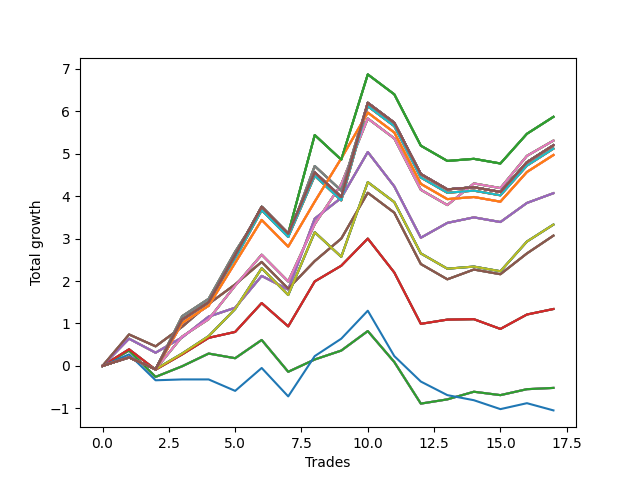

# Short Pointer 011 
- Symbol: SPY_Unlimited
- Date Range: 03/23/2022 - 07/08/2022
- Trading Period: 7:20-12:30
- Number of Trades: 17



| Name | Win Percent | Profit | Avg Profit / Trade | Avg Time / Trade |      | Name | Win Percent | Profit | Avg Profit / Trade | Avg Time / Trade |
| ---- | ----------- | ------ | ------------------ | ---------------- | ---- | ---- | ----------- | ------ | ------------------ | ---------------- |
| Sorted By <br> Profit | | | | | | Sorted By <br> Win Percentage ||||
| One Hundred Twenty-Seven | 58.82 | 2935.00 | 172.65 | 27:40 |     | Sixty-Six | 70.59 | 2035.00 | 119.71 | 19:00 |
| One Hundred Twenty-Two | 58.82 | 2935.00 | 172.65 | 27:40 |     | Fifty-Eight | 70.59 | 2035.00 | 119.71 | 19:00 |
| One Hundred Seventeen | 58.82 | 2935.00 | 172.65 | 27:40 |     | Fifty | 70.59 | 2035.00 | 119.71 | 19:00 |
| One Hundred Twelve | 58.82 | 2935.00 | 172.65 | 27:40 |     | Forty-Two | 70.59 | 2035.00 | 119.71 | 19:00 |
| Eighty-Two | 58.82 | 2935.00 | 172.65 | 27:40 |     | Two | 70.59 | 2035.00 | 119.71 | 19:00 |
| Sixty-Eight | 64.71 | 2655.00 | 156.18 | 24:12 |     | Sixty-Five | 70.59 | 670.00 | 39.41 | 16:09 |
| Sixty | 64.71 | 2655.00 | 156.18 | 24:12 |     | Fifty-Seven | 70.59 | 670.00 | 39.41 | 16:09 |
| Fifty-Two | 64.71 | 2655.00 | 156.18 | 24:12 |     | Forty-Nine | 70.59 | 670.00 | 39.41 | 16:09 |
| Forty-Four | 64.71 | 2655.00 | 156.18 | 24:12 |     | Forty-One | 70.59 | 670.00 | 39.41 | 16:09 |
| Four | 64.71 | 2655.00 | 156.18 | 24:12 |     | One | 70.59 | 670.00 | 39.41 | 16:09 |
| One Hundred Thirty | 58.82 | 2600.00 | 152.94 | 29:02 |     | Sixty-Eight | 64.71 | 2655.00 | 156.18 | 24:12 |
| One Hundred Twenty-Nine | 58.82 | 2600.00 | 152.94 | 29:02 |     | Sixty | 64.71 | 2655.00 | 156.18 | 24:12 |
| One Hundred Twenty-Eight | 58.82 | 2600.00 | 152.94 | 29:02 |     | Fifty-Two | 64.71 | 2655.00 | 156.18 | 24:12 |
| One Hundred Twenty-Five | 58.82 | 2600.00 | 152.94 | 29:02 |     | Forty-Four | 64.71 | 2655.00 | 156.18 | 24:12 |
| One Hundred Twenty-Four | 58.82 | 2600.00 | 152.94 | 29:02 |     | Four | 64.71 | 2655.00 | 156.18 | 24:12 |
| One Hundred Twenty-Three | 58.82 | 2600.00 | 152.94 | 29:02 |     | One Hundred Twenty-Six | 64.71 | 2485.00 | 146.18 | 25:08 |
| One Hundred Twenty | 58.82 | 2600.00 | 152.94 | 29:02 |     | One Hundred Twenty-One | 64.71 | 2485.00 | 146.18 | 25:08 |
| One Hundred Ninteen | 58.82 | 2600.00 | 152.94 | 29:02 |     | One Hundred Sixteen | 64.71 | 2485.00 | 146.18 | 25:08 |
| One Hundred Eighteen | 58.82 | 2600.00 | 152.94 | 29:02 |     | One Hundred Eleven | 64.71 | 2485.00 | 146.18 | 25:08 |
| One Hundred Fifteen | 58.82 | 2600.00 | 152.94 | 29:02 |     | Eighty-One | 64.71 | 2485.00 | 146.18 | 25:08 |
| One Hundred Fourteen | 58.82 | 2600.00 | 152.94 | 29:02 |     | Sixty-Seven | 64.71 | 1535.00 | 90.29 | 20:25 |
| One Hundred Thirteen | 58.82 | 2600.00 | 152.94 | 29:02 |     | Fifty-Nine | 64.71 | 1535.00 | 90.29 | 20:25 |
| Eighty-Five | 58.82 | 2600.00 | 152.94 | 29:02 |     | Fifty-One | 64.71 | 1535.00 | 90.29 | 20:25 |
| Eighty-Four | 58.82 | 2600.00 | 152.94 | 29:02 |     | Forty-Three | 64.71 | 1535.00 | 90.29 | 20:25 |
| Eighty-Three | 58.82 | 2600.00 | 152.94 | 29:02 |     | Three | 64.71 | 1535.00 | 90.29 | 20:25 |
| Sixty-Nine | 58.82 | 2600.00 | 152.94 | 26:40 |     | Sixty-Four | 64.71 | -260.00 | -15.29 | 10:39 |
| Sixty-One | 58.82 | 2600.00 | 152.94 | 26:40 |     | Fifty-Six | 64.71 | -260.00 | -15.29 | 10:39 |
| Fifty-Three | 58.82 | 2600.00 | 152.94 | 26:40 |     | Forty-Eight | 64.71 | -260.00 | -15.29 | 10:39 |
| Forty-Five | 58.82 | 2600.00 | 152.94 | 26:40 |     | Forty | 64.71 | -260.00 | -15.29 | 10:39 |
| Five | 58.82 | 2600.00 | 152.94 | 26:40 |     | Zero | 64.71 | -260.00 | -15.29 | 10:39 |
| Seventy-One | 58.82 | 2560.00 | 150.59 | 28:38 |     | One Hundred Twenty-Seven | 58.82 | 2935.00 | 172.65 | 27:40 |
| Sixty-Three | 58.82 | 2560.00 | 150.59 | 28:38 |     | One Hundred Twenty-Two | 58.82 | 2935.00 | 172.65 | 27:40 |
| Fifty-Five | 58.82 | 2560.00 | 150.59 | 28:38 |     | One Hundred Seventeen | 58.82 | 2935.00 | 172.65 | 27:40 |
| Forty-Seven | 58.82 | 2560.00 | 150.59 | 28:38 |     | One Hundred Twelve | 58.82 | 2935.00 | 172.65 | 27:40 |
| Seven | 58.82 | 2560.00 | 150.59 | 28:38 |     | Eighty-Two | 58.82 | 2935.00 | 172.65 | 27:40 |
| One Hundred Twenty-Six | 64.71 | 2485.00 | 146.18 | 25:08 |     | One Hundred Thirty | 58.82 | 2600.00 | 152.94 | 29:02 |
| One Hundred Twenty-One | 64.71 | 2485.00 | 146.18 | 25:08 |     | One Hundred Twenty-Nine | 58.82 | 2600.00 | 152.94 | 29:02 |
| One Hundred Sixteen | 64.71 | 2485.00 | 146.18 | 25:08 |     | One Hundred Twenty-Eight | 58.82 | 2600.00 | 152.94 | 29:02 |
| One Hundred Eleven | 64.71 | 2485.00 | 146.18 | 25:08 |     | One Hundred Twenty-Five | 58.82 | 2600.00 | 152.94 | 29:02 |
| Eighty-One | 64.71 | 2485.00 | 146.18 | 25:08 |     | One Hundred Twenty-Four | 58.82 | 2600.00 | 152.94 | 29:02 |
| Sixty-Six | 70.59 | 2035.00 | 119.71 | 19:00 |     | One Hundred Twenty-Three | 58.82 | 2600.00 | 152.94 | 29:02 |
| Fifty-Eight | 70.59 | 2035.00 | 119.71 | 19:00 |     | One Hundred Twenty | 58.82 | 2600.00 | 152.94 | 29:02 |
| Fifty | 70.59 | 2035.00 | 119.71 | 19:00 |     | One Hundred Ninteen | 58.82 | 2600.00 | 152.94 | 29:02 |
| Forty-Two | 70.59 | 2035.00 | 119.71 | 19:00 |     | One Hundred Eighteen | 58.82 | 2600.00 | 152.94 | 29:02 |
| Two | 70.59 | 2035.00 | 119.71 | 19:00 |     | One Hundred Fifteen | 58.82 | 2600.00 | 152.94 | 29:02 |
| Seventy | 58.82 | 1665.00 | 97.94 | 25:35 |     | One Hundred Fourteen | 58.82 | 2600.00 | 152.94 | 29:02 |
| Sixty-Two | 58.82 | 1665.00 | 97.94 | 25:35 |     | One Hundred Thirteen | 58.82 | 2600.00 | 152.94 | 29:02 |
| Fifty-Four | 58.82 | 1665.00 | 97.94 | 25:35 |     | Eighty-Five | 58.82 | 2600.00 | 152.94 | 29:02 |
| Forty-Six | 58.82 | 1665.00 | 97.94 | 25:35 |     | Eighty-Four | 58.82 | 2600.00 | 152.94 | 29:02 |
| Six | 58.82 | 1665.00 | 97.94 | 25:35 |     | Eighty-Three | 58.82 | 2600.00 | 152.94 | 29:02 |
| Sixty-Seven | 64.71 | 1535.00 | 90.29 | 20:25 |     | Sixty-Nine | 58.82 | 2600.00 | 152.94 | 26:40 |
| Fifty-Nine | 64.71 | 1535.00 | 90.29 | 20:25 |     | Sixty-One | 58.82 | 2600.00 | 152.94 | 26:40 |
| Fifty-One | 64.71 | 1535.00 | 90.29 | 20:25 |     | Fifty-Three | 58.82 | 2600.00 | 152.94 | 26:40 |
| Forty-Three | 64.71 | 1535.00 | 90.29 | 20:25 |     | Forty-Five | 58.82 | 2600.00 | 152.94 | 26:40 |
| Three | 64.71 | 1535.00 | 90.29 | 20:25 |     | Five | 58.82 | 2600.00 | 152.94 | 26:40 |
| Sixty-Five | 70.59 | 670.00 | 39.41 | 16:09 |     | Seventy-One | 58.82 | 2560.00 | 150.59 | 28:38 |
| Fifty-Seven | 70.59 | 670.00 | 39.41 | 16:09 |     | Sixty-Three | 58.82 | 2560.00 | 150.59 | 28:38 |
| Forty-Nine | 70.59 | 670.00 | 39.41 | 16:09 |     | Fifty-Five | 58.82 | 2560.00 | 150.59 | 28:38 |
| Forty-One | 70.59 | 670.00 | 39.41 | 16:09 |     | Forty-Seven | 58.82 | 2560.00 | 150.59 | 28:38 |
| One | 70.59 | 670.00 | 39.41 | 16:09 |     | Seven | 58.82 | 2560.00 | 150.59 | 28:38 |
| Sixty-Four | 64.71 | -260.00 | -15.29 | 10:39 |     | Seventy | 58.82 | 1665.00 | 97.94 | 25:35 |
| Fifty-Six | 64.71 | -260.00 | -15.29 | 10:39 |     | Sixty-Two | 58.82 | 1665.00 | 97.94 | 25:35 |
| Forty-Eight | 64.71 | -260.00 | -15.29 | 10:39 |     | Fifty-Four | 58.82 | 1665.00 | 97.94 | 25:35 |
| Forty | 64.71 | -260.00 | -15.29 | 10:39 |     | Forty-Six | 58.82 | 1665.00 | 97.94 | 25:35 |
| Zero | 64.71 | -260.00 | -15.29 | 10:39 |     | Six | 58.82 | 1665.00 | 97.94 | 25:35 |
| Seventy-Three | 41.18 | -525.00 | -30.88 | 10:26 |     | Seventy-Three | 41.18 | -525.00 | -30.88 | 10:26 |

## NO STOPLOSS

### Test Zero
* Sell when price hits the middle line of the 20p bollinger
* No Stoploss
* Results:
```
Total Trades: 17
Percent Up: 35.29
Percent Down: 64.71
Total Points Moved Down: -0.52
Potential Profit: -260.00
Total Points Ups: 3.27 Count Ups: 6
Total Points Downs: 2.75 Count Downs: 11
```

<details><summary>Trades</summary>

<code>In: 2022-03-24 12:29:00		Out: 2022-03-24 12:33:25		Total Position Time: 04:25		Total Move Down: 0.36		Total to Date: 0.36</code> <br />
<code>In: 2022-03-25 07:26:00		Out: 2022-03-25 07:51:05		Total Position Time: 25:05		Total Move Down: -0.62		Total to Date: -0.26</code> <br />
<code>In: 2022-04-06 08:53:00		Out: 2022-04-06 09:00:40		Total Position Time: 07:40		Total Move Down: 0.25		Total to Date: -0.01</code> <br />
<code>In: 2022-04-07 11:04:00		Out: 2022-04-07 11:15:20		Total Position Time: 11:20		Total Move Down: 0.30		Total to Date: 0.29</code> <br />
<code>In: 2022-04-20 07:43:00		Out: 2022-04-20 08:00:20		Total Position Time: 17:20		Total Move Down: -0.11		Total to Date: 0.18</code> <br />
<code>In: 2022-04-20 10:49:00		Out: 2022-04-20 10:50:05		Total Position Time: 01:05		Total Move Down: 0.43		Total to Date: 0.61</code> <br />
<code>In: 2022-05-03 08:11:00		Out: 2022-05-03 08:35:55		Total Position Time: 24:55		Total Move Down: -0.75		Total to Date: -0.14</code> <br />
<code>In: 2022-05-04 11:03:00		Out: 2022-05-04 11:03:10		Total Position Time: 00:10		Total Move Down: 0.29		Total to Date: 0.15</code> <br />
<code>In: 2022-05-17 09:48:00		Out: 2022-05-17 09:51:15		Total Position Time: 03:15		Total Move Down: 0.21		Total to Date: 0.36</code> <br />
<code>In: 2022-05-24 09:18:00		Out: 2022-05-24 09:21:35		Total Position Time: 03:35		Total Move Down: 0.46		Total to Date: 0.82</code> <br />
<code>In: 2022-06-02 08:06:00		Out: 2022-06-02 08:22:05		Total Position Time: 16:05		Total Move Down: -0.73		Total to Date: 0.09</code> <br />
<code>In: 2022-06-30 08:12:00		Out: 2022-06-30 08:35:00		Total Position Time: 23:00		Total Move Down: -0.98		Total to Date: -0.89</code> <br />
<code>In: 2022-07-05 08:49:00		Out: 2022-07-05 09:00:10		Total Position Time: 11:10		Total Move Down: 0.10		Total to Date: -0.79</code> <br />
<code>In: 2022-07-07 07:56:00		Out: 2022-07-07 08:01:10		Total Position Time: 05:10		Total Move Down: 0.18		Total to Date: -0.61</code> <br />
<code>In: 2022-07-07 11:05:00		Out: 2022-07-07 11:16:25		Total Position Time: 11:25		Total Move Down: -0.08		Total to Date: -0.69</code> <br />
<code>In: 2022-07-07 12:18:00		Out: 2022-07-07 12:24:15		Total Position Time: 06:15		Total Move Down: 0.14		Total to Date: -0.55</code> <br />
<code>In: 2022-07-08 11:40:00		Out: 2022-07-08 11:49:15		Total Position Time: 09:15		Total Move Down: 0.03		Total to Date: -0.52</code> <br />


</details>

### Test One
* Sell when the price hits the upper line of the 20p 1std bollinger
* No Stoploss
* Results:
```
Total Trades: 17
Percent Up: 29.41
Percent Down: 70.59
Total Points Moved Down: 1.34
Potential Profit: 670.00
Total Points Ups: 3.27 Count Ups: 5
Total Points Downs: 4.61 Count Downs: 12
```

<details><summary>Trades</summary>

<code>In: 2022-03-24 12:29:00		Out: 2022-03-24 12:38:15		Total Position Time: 09:15		Total Move Down: 0.39		Total to Date: 0.39</code> <br />
<code>In: 2022-03-25 07:26:00		Out: 2022-03-25 07:53:50		Total Position Time: 27:50		Total Move Down: -0.48		Total to Date: -0.09</code> <br />
<code>In: 2022-04-06 08:53:00		Out: 2022-04-06 09:04:45		Total Position Time: 11:45		Total Move Down: 0.36		Total to Date: 0.27</code> <br />
<code>In: 2022-04-07 11:04:00		Out: 2022-04-07 11:18:00		Total Position Time: 14:00		Total Move Down: 0.39		Total to Date: 0.66</code> <br />
<code>In: 2022-04-20 07:43:00		Out: 2022-04-20 08:00:40		Total Position Time: 17:40		Total Move Down: 0.14		Total to Date: 0.80</code> <br />
<code>In: 2022-04-20 10:49:00		Out: 2022-04-20 10:53:20		Total Position Time: 04:20		Total Move Down: 0.68		Total to Date: 1.48</code> <br />
<code>In: 2022-05-03 08:11:00		Out: 2022-05-03 08:38:05		Total Position Time: 27:05		Total Move Down: -0.55		Total to Date: 0.93</code> <br />
<code>In: 2022-05-04 11:03:00		Out: 2022-05-04 11:07:20		Total Position Time: 04:20		Total Move Down: 1.06		Total to Date: 1.99</code> <br />
<code>In: 2022-05-17 09:48:00		Out: 2022-05-17 09:54:40		Total Position Time: 06:40		Total Move Down: 0.37		Total to Date: 2.36</code> <br />
<code>In: 2022-05-24 09:18:00		Out: 2022-05-24 09:28:55		Total Position Time: 10:55		Total Move Down: 0.64		Total to Date: 3.00</code> <br />
<code>In: 2022-06-02 08:06:00		Out: 2022-06-02 08:28:15		Total Position Time: 22:15		Total Move Down: -0.80		Total to Date: 2.20</code> <br />
<code>In: 2022-06-30 08:12:00		Out: 2022-06-30 08:41:55		Total Position Time: 29:55		Total Move Down: -1.21		Total to Date: 0.99</code> <br />
<code>In: 2022-07-05 08:49:00		Out: 2022-07-05 09:03:25		Total Position Time: 14:25		Total Move Down: 0.10		Total to Date: 1.09</code> <br />
<code>In: 2022-07-07 07:56:00		Out: 2022-07-07 08:20:00		Total Position Time: 24:00		Total Move Down: 0.01		Total to Date: 1.10</code> <br />
<code>In: 2022-07-07 11:05:00		Out: 2022-07-07 11:34:25		Total Position Time: 29:25		Total Move Down: -0.23		Total to Date: 0.87</code> <br />
<code>In: 2022-07-07 12:18:00		Out: 2022-07-07 12:25:10		Total Position Time: 07:10		Total Move Down: 0.34		Total to Date: 1.21</code> <br />
<code>In: 2022-07-08 11:40:00		Out: 2022-07-08 11:53:40		Total Position Time: 13:40		Total Move Down: 0.13		Total to Date: 1.34</code> <br />


</details>

### Test Two
* Sell when the price hits the upper line of the 20p 2std bollinger
* No Stoploss
* Results:
```
Total Trades: 17
Percent Up: 29.41
Percent Down: 70.59
Total Points Moved Down: 4.07
Potential Profit: 2035.00
Total Points Ups: 2.78 Count Ups: 5
Total Points Downs: 6.85 Count Downs: 12
```

<details><summary>Trades</summary>

<code>In: 2022-03-24 12:29:00		Out: 2022-03-24 12:42:05		Total Position Time: 13:05		Total Move Down: 0.64		Total to Date: 0.64</code> <br />
<code>In: 2022-03-25 07:26:00		Out: 2022-03-25 07:54:10		Total Position Time: 28:10		Total Move Down: -0.33		Total to Date: 0.31</code> <br />
<code>In: 2022-04-06 08:53:00		Out: 2022-04-06 09:09:40		Total Position Time: 16:40		Total Move Down: 0.36		Total to Date: 0.67</code> <br />
<code>In: 2022-04-07 11:04:00		Out: 2022-04-07 11:18:20		Total Position Time: 14:20		Total Move Down: 0.49		Total to Date: 1.16</code> <br />
<code>In: 2022-04-20 07:43:00		Out: 2022-04-20 08:00:45		Total Position Time: 17:45		Total Move Down: 0.21		Total to Date: 1.37</code> <br />
<code>In: 2022-04-20 10:49:00		Out: 2022-04-20 11:13:55		Total Position Time: 24:55		Total Move Down: 0.75		Total to Date: 2.12</code> <br />
<code>In: 2022-05-03 08:11:00		Out: 2022-05-03 08:39:05		Total Position Time: 28:05		Total Move Down: -0.32		Total to Date: 1.80</code> <br />
<code>In: 2022-05-04 11:03:00		Out: 2022-05-04 11:07:40		Total Position Time: 04:40		Total Move Down: 1.67		Total to Date: 3.47</code> <br />
<code>In: 2022-05-17 09:48:00		Out: 2022-05-17 10:01:10		Total Position Time: 13:10		Total Move Down: 0.49		Total to Date: 3.96</code> <br />
<code>In: 2022-05-24 09:18:00		Out: 2022-05-24 09:31:20		Total Position Time: 13:20		Total Move Down: 1.08		Total to Date: 5.04</code> <br />
<code>In: 2022-06-02 08:06:00		Out: 2022-06-02 08:30:55		Total Position Time: 24:55		Total Move Down: -0.81		Total to Date: 4.23</code> <br />
<code>In: 2022-06-30 08:12:00		Out: 2022-06-30 08:41:55		Total Position Time: 29:55		Total Move Down: -1.21		Total to Date: 3.02</code> <br />
<code>In: 2022-07-05 08:49:00		Out: 2022-07-05 09:03:50		Total Position Time: 14:50		Total Move Down: 0.35		Total to Date: 3.37</code> <br />
<code>In: 2022-07-07 07:56:00		Out: 2022-07-07 08:21:00		Total Position Time: 25:00		Total Move Down: 0.13		Total to Date: 3.50</code> <br />
<code>In: 2022-07-07 11:05:00		Out: 2022-07-07 11:34:55		Total Position Time: 29:55		Total Move Down: -0.11		Total to Date: 3.39</code> <br />
<code>In: 2022-07-07 12:18:00		Out: 2022-07-07 12:28:30		Total Position Time: 10:30		Total Move Down: 0.45		Total to Date: 3.84</code> <br />
<code>In: 2022-07-08 11:40:00		Out: 2022-07-08 11:54:00		Total Position Time: 14:00		Total Move Down: 0.23		Total to Date: 4.07</code> <br />


</details>

### Test Three
* Sell when price hits the middle line of the 50p bollinger
* No Stoploss
* Results:
```
Total Trades: 17
Percent Up: 35.29
Percent Down: 64.71
Total Points Moved Down: 3.07
Potential Profit: 1535.00
Total Points Ups: 3.06 Count Ups: 6
Total Points Downs: 6.13 Count Downs: 11
```

<details><summary>Trades</summary>

<code>In: 2022-03-24 12:29:00		Out: 2022-03-24 12:42:25		Total Position Time: 13:25		Total Move Down: 0.74		Total to Date: 0.74</code> <br />
<code>In: 2022-03-25 07:26:00		Out: 2022-03-25 07:55:55		Total Position Time: 29:55		Total Move Down: -0.28		Total to Date: 0.46</code> <br />
<code>In: 2022-04-06 08:53:00		Out: 2022-04-06 09:12:05		Total Position Time: 19:05		Total Move Down: 0.46		Total to Date: 0.92</code> <br />
<code>In: 2022-04-07 11:04:00		Out: 2022-04-07 11:33:40		Total Position Time: 29:40		Total Move Down: 0.54		Total to Date: 1.46</code> <br />
<code>In: 2022-04-20 07:43:00		Out: 2022-04-20 08:02:45		Total Position Time: 19:45		Total Move Down: 0.46		Total to Date: 1.92</code> <br />
<code>In: 2022-04-20 10:49:00		Out: 2022-04-20 10:50:20		Total Position Time: 01:20		Total Move Down: 0.53		Total to Date: 2.45</code> <br />
<code>In: 2022-05-03 08:11:00		Out: 2022-05-03 08:40:55		Total Position Time: 29:55		Total Move Down: -0.63		Total to Date: 1.82</code> <br />
<code>In: 2022-05-04 11:03:00		Out: 2022-05-04 11:07:15		Total Position Time: 04:15		Total Move Down: 0.65		Total to Date: 2.47</code> <br />
<code>In: 2022-05-17 09:48:00		Out: 2022-05-17 10:01:25		Total Position Time: 13:25		Total Move Down: 0.53		Total to Date: 3.00</code> <br />
<code>In: 2022-05-24 09:18:00		Out: 2022-05-24 09:31:20		Total Position Time: 13:20		Total Move Down: 1.08		Total to Date: 4.08</code> <br />
<code>In: 2022-06-02 08:06:00		Out: 2022-06-02 08:35:55		Total Position Time: 29:55		Total Move Down: -0.47		Total to Date: 3.61</code> <br />
<code>In: 2022-06-30 08:12:00		Out: 2022-06-30 08:41:55		Total Position Time: 29:55		Total Move Down: -1.21		Total to Date: 2.40</code> <br />
<code>In: 2022-07-05 08:49:00		Out: 2022-07-05 09:18:55		Total Position Time: 29:55		Total Move Down: -0.36		Total to Date: 2.04</code> <br />
<code>In: 2022-07-07 07:56:00		Out: 2022-07-07 08:22:45		Total Position Time: 26:45		Total Move Down: 0.23		Total to Date: 2.27</code> <br />
<code>In: 2022-07-07 11:05:00		Out: 2022-07-07 11:34:55		Total Position Time: 29:55		Total Move Down: -0.11		Total to Date: 2.16</code> <br />
<code>In: 2022-07-07 12:18:00		Out: 2022-07-07 12:30:00		Total Position Time: 12:00		Total Move Down: 0.49		Total to Date: 2.65</code> <br />
<code>In: 2022-07-08 11:40:00		Out: 2022-07-08 11:54:50		Total Position Time: 14:50		Total Move Down: 0.42		Total to Date: 3.07</code> <br />


</details>

### Test Four
* Sell when the price hits the upper line of the 50p 1std bollinger
* No Stoploss
* Results:
```
Total Trades: 17
Percent Up: 35.29
Percent Down: 64.71
Total Points Moved Down: 5.31
Potential Profit: 2655.00
Total Points Ups: 3.06 Count Ups: 6
Total Points Downs: 8.37 Count Downs: 11
```

<details><summary>Trades</summary>

<code>In: 2022-03-24 12:29:00		Out: 2022-03-24 12:46:00		Total Position Time: 17:00		Total Move Down: 0.20		Total to Date: 0.20</code> <br />
<code>In: 2022-03-25 07:26:00		Out: 2022-03-25 07:55:55		Total Position Time: 29:55		Total Move Down: -0.28		Total to Date: -0.08</code> <br />
<code>In: 2022-04-06 08:53:00		Out: 2022-04-06 09:13:55		Total Position Time: 20:55		Total Move Down: 0.77		Total to Date: 0.69</code> <br />
<code>In: 2022-04-07 11:04:00		Out: 2022-04-07 11:33:55		Total Position Time: 29:55		Total Move Down: 0.41		Total to Date: 1.10</code> <br />
<code>In: 2022-04-20 07:43:00		Out: 2022-04-20 08:10:20		Total Position Time: 27:20		Total Move Down: 0.79		Total to Date: 1.89</code> <br />
<code>In: 2022-04-20 10:49:00		Out: 2022-04-20 11:14:00		Total Position Time: 25:00		Total Move Down: 0.73		Total to Date: 2.62</code> <br />
<code>In: 2022-05-03 08:11:00		Out: 2022-05-03 08:40:55		Total Position Time: 29:55		Total Move Down: -0.63		Total to Date: 1.99</code> <br />
<code>In: 2022-05-04 11:03:00		Out: 2022-05-04 11:07:25		Total Position Time: 04:25		Total Move Down: 1.35		Total to Date: 3.34</code> <br />
<code>In: 2022-05-17 09:48:00		Out: 2022-05-17 10:02:15		Total Position Time: 14:15		Total Move Down: 0.94		Total to Date: 4.28</code> <br />
<code>In: 2022-05-24 09:18:00		Out: 2022-05-24 09:33:15		Total Position Time: 15:15		Total Move Down: 1.55		Total to Date: 5.83</code> <br />
<code>In: 2022-06-02 08:06:00		Out: 2022-06-02 08:35:55		Total Position Time: 29:55		Total Move Down: -0.47		Total to Date: 5.36</code> <br />
<code>In: 2022-06-30 08:12:00		Out: 2022-06-30 08:41:55		Total Position Time: 29:55		Total Move Down: -1.21		Total to Date: 4.15</code> <br />
<code>In: 2022-07-05 08:49:00		Out: 2022-07-05 09:18:55		Total Position Time: 29:55		Total Move Down: -0.36		Total to Date: 3.79</code> <br />
<code>In: 2022-07-07 07:56:00		Out: 2022-07-07 08:23:25		Total Position Time: 27:25		Total Move Down: 0.51		Total to Date: 4.30</code> <br />
<code>In: 2022-07-07 11:05:00		Out: 2022-07-07 11:34:55		Total Position Time: 29:55		Total Move Down: -0.11		Total to Date: 4.19</code> <br />
<code>In: 2022-07-07 12:18:00		Out: 2022-07-07 12:38:50		Total Position Time: 20:50		Total Move Down: 0.76		Total to Date: 4.95</code> <br />
<code>In: 2022-07-08 11:40:00		Out: 2022-07-08 12:09:40		Total Position Time: 29:40		Total Move Down: 0.36		Total to Date: 5.31</code> <br />


</details>

### Test Five
* Sell when the price hits the upper line of the 50p 2std bollinger
* No Stoploss
* Results:
```
Total Trades: 17
Percent Up: 41.18
Percent Down: 58.82
Total Points Moved Down: 5.20
Potential Profit: 2600.00
Total Points Ups: 3.64 Count Ups: 7
Total Points Downs: 8.84 Count Downs: 10
```

<details><summary>Trades</summary>

<code>In: 2022-03-24 12:29:00		Out: 2022-03-24 12:46:00		Total Position Time: 17:00		Total Move Down: 0.20		Total to Date: 0.20</code> <br />
<code>In: 2022-03-25 07:26:00		Out: 2022-03-25 07:55:55		Total Position Time: 29:55		Total Move Down: -0.28		Total to Date: -0.08</code> <br />
<code>In: 2022-04-06 08:53:00		Out: 2022-04-06 09:20:15		Total Position Time: 27:15		Total Move Down: 1.25		Total to Date: 1.17</code> <br />
<code>In: 2022-04-07 11:04:00		Out: 2022-04-07 11:33:55		Total Position Time: 29:55		Total Move Down: 0.41		Total to Date: 1.58</code> <br />
<code>In: 2022-04-20 07:43:00		Out: 2022-04-20 08:12:55		Total Position Time: 29:55		Total Move Down: 1.11		Total to Date: 2.69</code> <br />
<code>In: 2022-04-20 10:49:00		Out: 2022-04-20 11:17:40		Total Position Time: 28:40		Total Move Down: 0.98		Total to Date: 3.67</code> <br />
<code>In: 2022-05-03 08:11:00		Out: 2022-05-03 08:40:55		Total Position Time: 29:55		Total Move Down: -0.63		Total to Date: 3.04</code> <br />
<code>In: 2022-05-04 11:03:00		Out: 2022-05-04 11:07:40		Total Position Time: 04:40		Total Move Down: 1.67		Total to Date: 4.71</code> <br />
<code>In: 2022-05-17 09:48:00		Out: 2022-05-17 10:17:55		Total Position Time: 29:55		Total Move Down: -0.58		Total to Date: 4.13</code> <br />
<code>In: 2022-05-24 09:18:00		Out: 2022-05-24 09:36:50		Total Position Time: 18:50		Total Move Down: 2.07		Total to Date: 6.20</code> <br />
<code>In: 2022-06-02 08:06:00		Out: 2022-06-02 08:35:55		Total Position Time: 29:55		Total Move Down: -0.47		Total to Date: 5.73</code> <br />
<code>In: 2022-06-30 08:12:00		Out: 2022-06-30 08:41:55		Total Position Time: 29:55		Total Move Down: -1.21		Total to Date: 4.52</code> <br />
<code>In: 2022-07-05 08:49:00		Out: 2022-07-05 09:18:55		Total Position Time: 29:55		Total Move Down: -0.36		Total to Date: 4.16</code> <br />
<code>In: 2022-07-07 07:56:00		Out: 2022-07-07 08:25:55		Total Position Time: 29:55		Total Move Down: 0.05		Total to Date: 4.21</code> <br />
<code>In: 2022-07-07 11:05:00		Out: 2022-07-07 11:34:55		Total Position Time: 29:55		Total Move Down: -0.11		Total to Date: 4.10</code> <br />
<code>In: 2022-07-07 12:18:00		Out: 2022-07-07 12:46:00		Total Position Time: 28:00		Total Move Down: 0.70		Total to Date: 4.80</code> <br />
<code>In: 2022-07-08 11:40:00		Out: 2022-07-08 12:09:55		Total Position Time: 29:55		Total Move Down: 0.40		Total to Date: 5.20</code> <br />


</details>

### Test Six
* Sell when the price hits the middle line of the 1std VWAP
* No Stoploss
* Results:
```
Total Trades: 17
Percent Up: 41.18
Percent Down: 58.82
Total Points Moved Down: 3.33
Potential Profit: 1665.00
Total Points Ups: 3.64 Count Ups: 7
Total Points Downs: 6.97 Count Downs: 10
```

<details><summary>Trades</summary>

<code>In: 2022-03-24 12:29:00		Out: 2022-03-24 12:46:00		Total Position Time: 17:00		Total Move Down: 0.20		Total to Date: 0.20</code> <br />
<code>In: 2022-03-25 07:26:00		Out: 2022-03-25 07:55:55		Total Position Time: 29:55		Total Move Down: -0.28		Total to Date: -0.08</code> <br />
<code>In: 2022-04-06 08:53:00		Out: 2022-04-06 09:10:20		Total Position Time: 17:20		Total Move Down: 0.37		Total to Date: 0.29</code> <br />
<code>In: 2022-04-07 11:04:00		Out: 2022-04-07 11:33:55		Total Position Time: 29:55		Total Move Down: 0.41		Total to Date: 0.70</code> <br />
<code>In: 2022-04-20 07:43:00		Out: 2022-04-20 08:04:55		Total Position Time: 21:55		Total Move Down: 0.64		Total to Date: 1.34</code> <br />
<code>In: 2022-04-20 10:49:00		Out: 2022-04-20 11:17:15		Total Position Time: 28:15		Total Move Down: 0.96		Total to Date: 2.30</code> <br />
<code>In: 2022-05-03 08:11:00		Out: 2022-05-03 08:40:55		Total Position Time: 29:55		Total Move Down: -0.63		Total to Date: 1.67</code> <br />
<code>In: 2022-05-04 11:03:00		Out: 2022-05-04 11:08:10		Total Position Time: 05:10		Total Move Down: 1.48		Total to Date: 3.15</code> <br />
<code>In: 2022-05-17 09:48:00		Out: 2022-05-17 10:17:55		Total Position Time: 29:55		Total Move Down: -0.58		Total to Date: 2.57</code> <br />
<code>In: 2022-05-24 09:18:00		Out: 2022-05-24 09:36:10		Total Position Time: 18:10		Total Move Down: 1.76		Total to Date: 4.33</code> <br />
<code>In: 2022-06-02 08:06:00		Out: 2022-06-02 08:35:55		Total Position Time: 29:55		Total Move Down: -0.47		Total to Date: 3.86</code> <br />
<code>In: 2022-06-30 08:12:00		Out: 2022-06-30 08:41:55		Total Position Time: 29:55		Total Move Down: -1.21		Total to Date: 2.65</code> <br />
<code>In: 2022-07-05 08:49:00		Out: 2022-07-05 09:18:55		Total Position Time: 29:55		Total Move Down: -0.36		Total to Date: 2.29</code> <br />
<code>In: 2022-07-07 07:56:00		Out: 2022-07-07 08:25:55		Total Position Time: 29:55		Total Move Down: 0.05		Total to Date: 2.34</code> <br />
<code>In: 2022-07-07 11:05:00		Out: 2022-07-07 11:34:55		Total Position Time: 29:55		Total Move Down: -0.11		Total to Date: 2.23</code> <br />
<code>In: 2022-07-07 12:18:00		Out: 2022-07-07 12:46:00		Total Position Time: 28:00		Total Move Down: 0.70		Total to Date: 2.93</code> <br />
<code>In: 2022-07-08 11:40:00		Out: 2022-07-08 12:09:55		Total Position Time: 29:55		Total Move Down: 0.40		Total to Date: 3.33</code> <br />


</details>

### Test Seven
* Sell when the price hits the upper line of the 1std VWAP
* No Stoploss
* Results:
```
Total Trades: 17
Percent Up: 41.18
Percent Down: 58.82
Total Points Moved Down: 5.12
Potential Profit: 2560.00
Total Points Ups: 3.64 Count Ups: 7
Total Points Downs: 8.76 Count Downs: 10
```

<details><summary>Trades</summary>

<code>In: 2022-03-24 12:29:00		Out: 2022-03-24 12:46:00		Total Position Time: 17:00		Total Move Down: 0.20		Total to Date: 0.20</code> <br />
<code>In: 2022-03-25 07:26:00		Out: 2022-03-25 07:55:55		Total Position Time: 29:55		Total Move Down: -0.28		Total to Date: -0.08</code> <br />
<code>In: 2022-04-06 08:53:00		Out: 2022-04-06 09:16:05		Total Position Time: 23:05		Total Move Down: 1.09		Total to Date: 1.01</code> <br />
<code>In: 2022-04-07 11:04:00		Out: 2022-04-07 11:33:55		Total Position Time: 29:55		Total Move Down: 0.41		Total to Date: 1.42</code> <br />
<code>In: 2022-04-20 07:43:00		Out: 2022-04-20 08:12:55		Total Position Time: 29:55		Total Move Down: 1.11		Total to Date: 2.53</code> <br />
<code>In: 2022-04-20 10:49:00		Out: 2022-04-20 11:18:55		Total Position Time: 29:55		Total Move Down: 1.14		Total to Date: 3.67</code> <br />
<code>In: 2022-05-03 08:11:00		Out: 2022-05-03 08:40:55		Total Position Time: 29:55		Total Move Down: -0.63		Total to Date: 3.04</code> <br />
<code>In: 2022-05-04 11:03:00		Out: 2022-05-04 11:32:55		Total Position Time: 29:55		Total Move Down: 1.44		Total to Date: 4.48</code> <br />
<code>In: 2022-05-17 09:48:00		Out: 2022-05-17 10:17:55		Total Position Time: 29:55		Total Move Down: -0.58		Total to Date: 3.90</code> <br />
<code>In: 2022-05-24 09:18:00		Out: 2022-05-24 09:47:55		Total Position Time: 29:55		Total Move Down: 2.22		Total to Date: 6.12</code> <br />
<code>In: 2022-06-02 08:06:00		Out: 2022-06-02 08:35:55		Total Position Time: 29:55		Total Move Down: -0.47		Total to Date: 5.65</code> <br />
<code>In: 2022-06-30 08:12:00		Out: 2022-06-30 08:41:55		Total Position Time: 29:55		Total Move Down: -1.21		Total to Date: 4.44</code> <br />
<code>In: 2022-07-05 08:49:00		Out: 2022-07-05 09:18:55		Total Position Time: 29:55		Total Move Down: -0.36		Total to Date: 4.08</code> <br />
<code>In: 2022-07-07 07:56:00		Out: 2022-07-07 08:25:55		Total Position Time: 29:55		Total Move Down: 0.05		Total to Date: 4.13</code> <br />
<code>In: 2022-07-07 11:05:00		Out: 2022-07-07 11:34:55		Total Position Time: 29:55		Total Move Down: -0.11		Total to Date: 4.02</code> <br />
<code>In: 2022-07-07 12:18:00		Out: 2022-07-07 12:46:00		Total Position Time: 28:00		Total Move Down: 0.70		Total to Date: 4.72</code> <br />
<code>In: 2022-07-08 11:40:00		Out: 2022-07-08 12:09:55		Total Position Time: 29:55		Total Move Down: 0.40		Total to Date: 5.12</code> <br />


</details>

## STOPLOSS OF 5

### Test Forty
* Sell when price hits the middle line of the 20p bollinger
* Stoploss is -5 points
* Results:
```
Total Trades: 17
Percent Up: 35.29
Percent Down: 64.71
Total Points Moved Down: -0.52
Potential Profit: -260.00
Total Points Ups: 3.27 Count Ups: 6
Total Points Downs: 2.75 Count Downs: 11
```

<details><summary>Trades</summary>

<code>In: 2022-03-24 12:29:00		Out: 2022-03-24 12:33:25		Total Position Time: 04:25		Total Move Down: 0.36		Total to Date: 0.36</code> <br />
<code>In: 2022-03-25 07:26:00		Out: 2022-03-25 07:51:05		Total Position Time: 25:05		Total Move Down: -0.62		Total to Date: -0.26</code> <br />
<code>In: 2022-04-06 08:53:00		Out: 2022-04-06 09:00:40		Total Position Time: 07:40		Total Move Down: 0.25		Total to Date: -0.01</code> <br />
<code>In: 2022-04-07 11:04:00		Out: 2022-04-07 11:15:20		Total Position Time: 11:20		Total Move Down: 0.30		Total to Date: 0.29</code> <br />
<code>In: 2022-04-20 07:43:00		Out: 2022-04-20 08:00:20		Total Position Time: 17:20		Total Move Down: -0.11		Total to Date: 0.18</code> <br />
<code>In: 2022-04-20 10:49:00		Out: 2022-04-20 10:50:05		Total Position Time: 01:05		Total Move Down: 0.43		Total to Date: 0.61</code> <br />
<code>In: 2022-05-03 08:11:00		Out: 2022-05-03 08:35:55		Total Position Time: 24:55		Total Move Down: -0.75		Total to Date: -0.14</code> <br />
<code>In: 2022-05-04 11:03:00		Out: 2022-05-04 11:03:10		Total Position Time: 00:10		Total Move Down: 0.29		Total to Date: 0.15</code> <br />
<code>In: 2022-05-17 09:48:00		Out: 2022-05-17 09:51:15		Total Position Time: 03:15		Total Move Down: 0.21		Total to Date: 0.36</code> <br />
<code>In: 2022-05-24 09:18:00		Out: 2022-05-24 09:21:35		Total Position Time: 03:35		Total Move Down: 0.46		Total to Date: 0.82</code> <br />
<code>In: 2022-06-02 08:06:00		Out: 2022-06-02 08:22:05		Total Position Time: 16:05		Total Move Down: -0.73		Total to Date: 0.09</code> <br />
<code>In: 2022-06-30 08:12:00		Out: 2022-06-30 08:35:00		Total Position Time: 23:00		Total Move Down: -0.98		Total to Date: -0.89</code> <br />
<code>In: 2022-07-05 08:49:00		Out: 2022-07-05 09:00:10		Total Position Time: 11:10		Total Move Down: 0.10		Total to Date: -0.79</code> <br />
<code>In: 2022-07-07 07:56:00		Out: 2022-07-07 08:01:10		Total Position Time: 05:10		Total Move Down: 0.18		Total to Date: -0.61</code> <br />
<code>In: 2022-07-07 11:05:00		Out: 2022-07-07 11:16:25		Total Position Time: 11:25		Total Move Down: -0.08		Total to Date: -0.69</code> <br />
<code>In: 2022-07-07 12:18:00		Out: 2022-07-07 12:24:15		Total Position Time: 06:15		Total Move Down: 0.14		Total to Date: -0.55</code> <br />
<code>In: 2022-07-08 11:40:00		Out: 2022-07-08 11:49:15		Total Position Time: 09:15		Total Move Down: 0.03		Total to Date: -0.52</code> <br />


</details>

### Test Forty-One
* Sell when the price hits the upper line of the 20p 1std bollinger
* Stoploss is -5 points
* Results:
```
Total Trades: 17
Percent Up: 29.41
Percent Down: 70.59
Total Points Moved Down: 1.34
Potential Profit: 670.00
Total Points Ups: 3.27 Count Ups: 5
Total Points Downs: 4.61 Count Downs: 12
```

<details><summary>Trades</summary>

<code>In: 2022-03-24 12:29:00		Out: 2022-03-24 12:38:15		Total Position Time: 09:15		Total Move Down: 0.39		Total to Date: 0.39</code> <br />
<code>In: 2022-03-25 07:26:00		Out: 2022-03-25 07:53:50		Total Position Time: 27:50		Total Move Down: -0.48		Total to Date: -0.09</code> <br />
<code>In: 2022-04-06 08:53:00		Out: 2022-04-06 09:04:45		Total Position Time: 11:45		Total Move Down: 0.36		Total to Date: 0.27</code> <br />
<code>In: 2022-04-07 11:04:00		Out: 2022-04-07 11:18:00		Total Position Time: 14:00		Total Move Down: 0.39		Total to Date: 0.66</code> <br />
<code>In: 2022-04-20 07:43:00		Out: 2022-04-20 08:00:40		Total Position Time: 17:40		Total Move Down: 0.14		Total to Date: 0.80</code> <br />
<code>In: 2022-04-20 10:49:00		Out: 2022-04-20 10:53:20		Total Position Time: 04:20		Total Move Down: 0.68		Total to Date: 1.48</code> <br />
<code>In: 2022-05-03 08:11:00		Out: 2022-05-03 08:38:05		Total Position Time: 27:05		Total Move Down: -0.55		Total to Date: 0.93</code> <br />
<code>In: 2022-05-04 11:03:00		Out: 2022-05-04 11:07:20		Total Position Time: 04:20		Total Move Down: 1.06		Total to Date: 1.99</code> <br />
<code>In: 2022-05-17 09:48:00		Out: 2022-05-17 09:54:40		Total Position Time: 06:40		Total Move Down: 0.37		Total to Date: 2.36</code> <br />
<code>In: 2022-05-24 09:18:00		Out: 2022-05-24 09:28:55		Total Position Time: 10:55		Total Move Down: 0.64		Total to Date: 3.00</code> <br />
<code>In: 2022-06-02 08:06:00		Out: 2022-06-02 08:28:15		Total Position Time: 22:15		Total Move Down: -0.80		Total to Date: 2.20</code> <br />
<code>In: 2022-06-30 08:12:00		Out: 2022-06-30 08:41:55		Total Position Time: 29:55		Total Move Down: -1.21		Total to Date: 0.99</code> <br />
<code>In: 2022-07-05 08:49:00		Out: 2022-07-05 09:03:25		Total Position Time: 14:25		Total Move Down: 0.10		Total to Date: 1.09</code> <br />
<code>In: 2022-07-07 07:56:00		Out: 2022-07-07 08:20:00		Total Position Time: 24:00		Total Move Down: 0.01		Total to Date: 1.10</code> <br />
<code>In: 2022-07-07 11:05:00		Out: 2022-07-07 11:34:25		Total Position Time: 29:25		Total Move Down: -0.23		Total to Date: 0.87</code> <br />
<code>In: 2022-07-07 12:18:00		Out: 2022-07-07 12:25:10		Total Position Time: 07:10		Total Move Down: 0.34		Total to Date: 1.21</code> <br />
<code>In: 2022-07-08 11:40:00		Out: 2022-07-08 11:53:40		Total Position Time: 13:40		Total Move Down: 0.13		Total to Date: 1.34</code> <br />


</details>

### Test Forty-Two
* Sell when the price hits the upper line of the 20p 2std bollinger
* Stoploss is -5 points
* Results:
```
Total Trades: 17
Percent Up: 29.41
Percent Down: 70.59
Total Points Moved Down: 4.07
Potential Profit: 2035.00
Total Points Ups: 2.78 Count Ups: 5
Total Points Downs: 6.85 Count Downs: 12
```

<details><summary>Trades</summary>

<code>In: 2022-03-24 12:29:00		Out: 2022-03-24 12:42:05		Total Position Time: 13:05		Total Move Down: 0.64		Total to Date: 0.64</code> <br />
<code>In: 2022-03-25 07:26:00		Out: 2022-03-25 07:54:10		Total Position Time: 28:10		Total Move Down: -0.33		Total to Date: 0.31</code> <br />
<code>In: 2022-04-06 08:53:00		Out: 2022-04-06 09:09:40		Total Position Time: 16:40		Total Move Down: 0.36		Total to Date: 0.67</code> <br />
<code>In: 2022-04-07 11:04:00		Out: 2022-04-07 11:18:20		Total Position Time: 14:20		Total Move Down: 0.49		Total to Date: 1.16</code> <br />
<code>In: 2022-04-20 07:43:00		Out: 2022-04-20 08:00:45		Total Position Time: 17:45		Total Move Down: 0.21		Total to Date: 1.37</code> <br />
<code>In: 2022-04-20 10:49:00		Out: 2022-04-20 11:13:55		Total Position Time: 24:55		Total Move Down: 0.75		Total to Date: 2.12</code> <br />
<code>In: 2022-05-03 08:11:00		Out: 2022-05-03 08:39:05		Total Position Time: 28:05		Total Move Down: -0.32		Total to Date: 1.80</code> <br />
<code>In: 2022-05-04 11:03:00		Out: 2022-05-04 11:07:40		Total Position Time: 04:40		Total Move Down: 1.67		Total to Date: 3.47</code> <br />
<code>In: 2022-05-17 09:48:00		Out: 2022-05-17 10:01:10		Total Position Time: 13:10		Total Move Down: 0.49		Total to Date: 3.96</code> <br />
<code>In: 2022-05-24 09:18:00		Out: 2022-05-24 09:31:20		Total Position Time: 13:20		Total Move Down: 1.08		Total to Date: 5.04</code> <br />
<code>In: 2022-06-02 08:06:00		Out: 2022-06-02 08:30:55		Total Position Time: 24:55		Total Move Down: -0.81		Total to Date: 4.23</code> <br />
<code>In: 2022-06-30 08:12:00		Out: 2022-06-30 08:41:55		Total Position Time: 29:55		Total Move Down: -1.21		Total to Date: 3.02</code> <br />
<code>In: 2022-07-05 08:49:00		Out: 2022-07-05 09:03:50		Total Position Time: 14:50		Total Move Down: 0.35		Total to Date: 3.37</code> <br />
<code>In: 2022-07-07 07:56:00		Out: 2022-07-07 08:21:00		Total Position Time: 25:00		Total Move Down: 0.13		Total to Date: 3.50</code> <br />
<code>In: 2022-07-07 11:05:00		Out: 2022-07-07 11:34:55		Total Position Time: 29:55		Total Move Down: -0.11		Total to Date: 3.39</code> <br />
<code>In: 2022-07-07 12:18:00		Out: 2022-07-07 12:28:30		Total Position Time: 10:30		Total Move Down: 0.45		Total to Date: 3.84</code> <br />
<code>In: 2022-07-08 11:40:00		Out: 2022-07-08 11:54:00		Total Position Time: 14:00		Total Move Down: 0.23		Total to Date: 4.07</code> <br />


</details>

### Test Forty-Three
* Sell when price hits the middle line of the 50p bollinger
* Stoploss is -5 points
* Results:
```
Total Trades: 17
Percent Up: 35.29
Percent Down: 64.71
Total Points Moved Down: 3.07
Potential Profit: 1535.00
Total Points Ups: 3.06 Count Ups: 6
Total Points Downs: 6.13 Count Downs: 11
```

<details><summary>Trades</summary>

<code>In: 2022-03-24 12:29:00		Out: 2022-03-24 12:42:25		Total Position Time: 13:25		Total Move Down: 0.74		Total to Date: 0.74</code> <br />
<code>In: 2022-03-25 07:26:00		Out: 2022-03-25 07:55:55		Total Position Time: 29:55		Total Move Down: -0.28		Total to Date: 0.46</code> <br />
<code>In: 2022-04-06 08:53:00		Out: 2022-04-06 09:12:05		Total Position Time: 19:05		Total Move Down: 0.46		Total to Date: 0.92</code> <br />
<code>In: 2022-04-07 11:04:00		Out: 2022-04-07 11:33:40		Total Position Time: 29:40		Total Move Down: 0.54		Total to Date: 1.46</code> <br />
<code>In: 2022-04-20 07:43:00		Out: 2022-04-20 08:02:45		Total Position Time: 19:45		Total Move Down: 0.46		Total to Date: 1.92</code> <br />
<code>In: 2022-04-20 10:49:00		Out: 2022-04-20 10:50:20		Total Position Time: 01:20		Total Move Down: 0.53		Total to Date: 2.45</code> <br />
<code>In: 2022-05-03 08:11:00		Out: 2022-05-03 08:40:55		Total Position Time: 29:55		Total Move Down: -0.63		Total to Date: 1.82</code> <br />
<code>In: 2022-05-04 11:03:00		Out: 2022-05-04 11:07:15		Total Position Time: 04:15		Total Move Down: 0.65		Total to Date: 2.47</code> <br />
<code>In: 2022-05-17 09:48:00		Out: 2022-05-17 10:01:25		Total Position Time: 13:25		Total Move Down: 0.53		Total to Date: 3.00</code> <br />
<code>In: 2022-05-24 09:18:00		Out: 2022-05-24 09:31:20		Total Position Time: 13:20		Total Move Down: 1.08		Total to Date: 4.08</code> <br />
<code>In: 2022-06-02 08:06:00		Out: 2022-06-02 08:35:55		Total Position Time: 29:55		Total Move Down: -0.47		Total to Date: 3.61</code> <br />
<code>In: 2022-06-30 08:12:00		Out: 2022-06-30 08:41:55		Total Position Time: 29:55		Total Move Down: -1.21		Total to Date: 2.40</code> <br />
<code>In: 2022-07-05 08:49:00		Out: 2022-07-05 09:18:55		Total Position Time: 29:55		Total Move Down: -0.36		Total to Date: 2.04</code> <br />
<code>In: 2022-07-07 07:56:00		Out: 2022-07-07 08:22:45		Total Position Time: 26:45		Total Move Down: 0.23		Total to Date: 2.27</code> <br />
<code>In: 2022-07-07 11:05:00		Out: 2022-07-07 11:34:55		Total Position Time: 29:55		Total Move Down: -0.11		Total to Date: 2.16</code> <br />
<code>In: 2022-07-07 12:18:00		Out: 2022-07-07 12:30:00		Total Position Time: 12:00		Total Move Down: 0.49		Total to Date: 2.65</code> <br />
<code>In: 2022-07-08 11:40:00		Out: 2022-07-08 11:54:50		Total Position Time: 14:50		Total Move Down: 0.42		Total to Date: 3.07</code> <br />


</details>

### Test Forty-Four
* Sell when the price hits the upper line of the 50p 1std bollinger
* Stoploss is -5 points
* Results:
```
Total Trades: 17
Percent Up: 35.29
Percent Down: 64.71
Total Points Moved Down: 5.31
Potential Profit: 2655.00
Total Points Ups: 3.06 Count Ups: 6
Total Points Downs: 8.37 Count Downs: 11
```

<details><summary>Trades</summary>

<code>In: 2022-03-24 12:29:00		Out: 2022-03-24 12:46:00		Total Position Time: 17:00		Total Move Down: 0.20		Total to Date: 0.20</code> <br />
<code>In: 2022-03-25 07:26:00		Out: 2022-03-25 07:55:55		Total Position Time: 29:55		Total Move Down: -0.28		Total to Date: -0.08</code> <br />
<code>In: 2022-04-06 08:53:00		Out: 2022-04-06 09:13:55		Total Position Time: 20:55		Total Move Down: 0.77		Total to Date: 0.69</code> <br />
<code>In: 2022-04-07 11:04:00		Out: 2022-04-07 11:33:55		Total Position Time: 29:55		Total Move Down: 0.41		Total to Date: 1.10</code> <br />
<code>In: 2022-04-20 07:43:00		Out: 2022-04-20 08:10:20		Total Position Time: 27:20		Total Move Down: 0.79		Total to Date: 1.89</code> <br />
<code>In: 2022-04-20 10:49:00		Out: 2022-04-20 11:14:00		Total Position Time: 25:00		Total Move Down: 0.73		Total to Date: 2.62</code> <br />
<code>In: 2022-05-03 08:11:00		Out: 2022-05-03 08:40:55		Total Position Time: 29:55		Total Move Down: -0.63		Total to Date: 1.99</code> <br />
<code>In: 2022-05-04 11:03:00		Out: 2022-05-04 11:07:25		Total Position Time: 04:25		Total Move Down: 1.35		Total to Date: 3.34</code> <br />
<code>In: 2022-05-17 09:48:00		Out: 2022-05-17 10:02:15		Total Position Time: 14:15		Total Move Down: 0.94		Total to Date: 4.28</code> <br />
<code>In: 2022-05-24 09:18:00		Out: 2022-05-24 09:33:15		Total Position Time: 15:15		Total Move Down: 1.55		Total to Date: 5.83</code> <br />
<code>In: 2022-06-02 08:06:00		Out: 2022-06-02 08:35:55		Total Position Time: 29:55		Total Move Down: -0.47		Total to Date: 5.36</code> <br />
<code>In: 2022-06-30 08:12:00		Out: 2022-06-30 08:41:55		Total Position Time: 29:55		Total Move Down: -1.21		Total to Date: 4.15</code> <br />
<code>In: 2022-07-05 08:49:00		Out: 2022-07-05 09:18:55		Total Position Time: 29:55		Total Move Down: -0.36		Total to Date: 3.79</code> <br />
<code>In: 2022-07-07 07:56:00		Out: 2022-07-07 08:23:25		Total Position Time: 27:25		Total Move Down: 0.51		Total to Date: 4.30</code> <br />
<code>In: 2022-07-07 11:05:00		Out: 2022-07-07 11:34:55		Total Position Time: 29:55		Total Move Down: -0.11		Total to Date: 4.19</code> <br />
<code>In: 2022-07-07 12:18:00		Out: 2022-07-07 12:38:50		Total Position Time: 20:50		Total Move Down: 0.76		Total to Date: 4.95</code> <br />
<code>In: 2022-07-08 11:40:00		Out: 2022-07-08 12:09:40		Total Position Time: 29:40		Total Move Down: 0.36		Total to Date: 5.31</code> <br />


</details>

### Test Forty-Five
* Sell when the price hits the upper line of the 50p 2std bollinger
* Stoploss is -5 points
* Results:
```
Total Trades: 17
Percent Up: 41.18
Percent Down: 58.82
Total Points Moved Down: 5.20
Potential Profit: 2600.00
Total Points Ups: 3.64 Count Ups: 7
Total Points Downs: 8.84 Count Downs: 10
```

<details><summary>Trades</summary>

<code>In: 2022-03-24 12:29:00		Out: 2022-03-24 12:46:00		Total Position Time: 17:00		Total Move Down: 0.20		Total to Date: 0.20</code> <br />
<code>In: 2022-03-25 07:26:00		Out: 2022-03-25 07:55:55		Total Position Time: 29:55		Total Move Down: -0.28		Total to Date: -0.08</code> <br />
<code>In: 2022-04-06 08:53:00		Out: 2022-04-06 09:20:15		Total Position Time: 27:15		Total Move Down: 1.25		Total to Date: 1.17</code> <br />
<code>In: 2022-04-07 11:04:00		Out: 2022-04-07 11:33:55		Total Position Time: 29:55		Total Move Down: 0.41		Total to Date: 1.58</code> <br />
<code>In: 2022-04-20 07:43:00		Out: 2022-04-20 08:12:55		Total Position Time: 29:55		Total Move Down: 1.11		Total to Date: 2.69</code> <br />
<code>In: 2022-04-20 10:49:00		Out: 2022-04-20 11:17:40		Total Position Time: 28:40		Total Move Down: 0.98		Total to Date: 3.67</code> <br />
<code>In: 2022-05-03 08:11:00		Out: 2022-05-03 08:40:55		Total Position Time: 29:55		Total Move Down: -0.63		Total to Date: 3.04</code> <br />
<code>In: 2022-05-04 11:03:00		Out: 2022-05-04 11:07:40		Total Position Time: 04:40		Total Move Down: 1.67		Total to Date: 4.71</code> <br />
<code>In: 2022-05-17 09:48:00		Out: 2022-05-17 10:17:55		Total Position Time: 29:55		Total Move Down: -0.58		Total to Date: 4.13</code> <br />
<code>In: 2022-05-24 09:18:00		Out: 2022-05-24 09:36:50		Total Position Time: 18:50		Total Move Down: 2.07		Total to Date: 6.20</code> <br />
<code>In: 2022-06-02 08:06:00		Out: 2022-06-02 08:35:55		Total Position Time: 29:55		Total Move Down: -0.47		Total to Date: 5.73</code> <br />
<code>In: 2022-06-30 08:12:00		Out: 2022-06-30 08:41:55		Total Position Time: 29:55		Total Move Down: -1.21		Total to Date: 4.52</code> <br />
<code>In: 2022-07-05 08:49:00		Out: 2022-07-05 09:18:55		Total Position Time: 29:55		Total Move Down: -0.36		Total to Date: 4.16</code> <br />
<code>In: 2022-07-07 07:56:00		Out: 2022-07-07 08:25:55		Total Position Time: 29:55		Total Move Down: 0.05		Total to Date: 4.21</code> <br />
<code>In: 2022-07-07 11:05:00		Out: 2022-07-07 11:34:55		Total Position Time: 29:55		Total Move Down: -0.11		Total to Date: 4.10</code> <br />
<code>In: 2022-07-07 12:18:00		Out: 2022-07-07 12:46:00		Total Position Time: 28:00		Total Move Down: 0.70		Total to Date: 4.80</code> <br />
<code>In: 2022-07-08 11:40:00		Out: 2022-07-08 12:09:55		Total Position Time: 29:55		Total Move Down: 0.40		Total to Date: 5.20</code> <br />


</details>

### Test Forty-Six
* Sell when the price hits the middle line of the 1std VWAP
* Stoploss is -5 points
* Results:
```
Total Trades: 17
Percent Up: 41.18
Percent Down: 58.82
Total Points Moved Down: 3.33
Potential Profit: 1665.00
Total Points Ups: 3.64 Count Ups: 7
Total Points Downs: 6.97 Count Downs: 10
```

<details><summary>Trades</summary>

<code>In: 2022-03-24 12:29:00		Out: 2022-03-24 12:46:00		Total Position Time: 17:00		Total Move Down: 0.20		Total to Date: 0.20</code> <br />
<code>In: 2022-03-25 07:26:00		Out: 2022-03-25 07:55:55		Total Position Time: 29:55		Total Move Down: -0.28		Total to Date: -0.08</code> <br />
<code>In: 2022-04-06 08:53:00		Out: 2022-04-06 09:10:20		Total Position Time: 17:20		Total Move Down: 0.37		Total to Date: 0.29</code> <br />
<code>In: 2022-04-07 11:04:00		Out: 2022-04-07 11:33:55		Total Position Time: 29:55		Total Move Down: 0.41		Total to Date: 0.70</code> <br />
<code>In: 2022-04-20 07:43:00		Out: 2022-04-20 08:04:55		Total Position Time: 21:55		Total Move Down: 0.64		Total to Date: 1.34</code> <br />
<code>In: 2022-04-20 10:49:00		Out: 2022-04-20 11:17:15		Total Position Time: 28:15		Total Move Down: 0.96		Total to Date: 2.30</code> <br />
<code>In: 2022-05-03 08:11:00		Out: 2022-05-03 08:40:55		Total Position Time: 29:55		Total Move Down: -0.63		Total to Date: 1.67</code> <br />
<code>In: 2022-05-04 11:03:00		Out: 2022-05-04 11:08:10		Total Position Time: 05:10		Total Move Down: 1.48		Total to Date: 3.15</code> <br />
<code>In: 2022-05-17 09:48:00		Out: 2022-05-17 10:17:55		Total Position Time: 29:55		Total Move Down: -0.58		Total to Date: 2.57</code> <br />
<code>In: 2022-05-24 09:18:00		Out: 2022-05-24 09:36:10		Total Position Time: 18:10		Total Move Down: 1.76		Total to Date: 4.33</code> <br />
<code>In: 2022-06-02 08:06:00		Out: 2022-06-02 08:35:55		Total Position Time: 29:55		Total Move Down: -0.47		Total to Date: 3.86</code> <br />
<code>In: 2022-06-30 08:12:00		Out: 2022-06-30 08:41:55		Total Position Time: 29:55		Total Move Down: -1.21		Total to Date: 2.65</code> <br />
<code>In: 2022-07-05 08:49:00		Out: 2022-07-05 09:18:55		Total Position Time: 29:55		Total Move Down: -0.36		Total to Date: 2.29</code> <br />
<code>In: 2022-07-07 07:56:00		Out: 2022-07-07 08:25:55		Total Position Time: 29:55		Total Move Down: 0.05		Total to Date: 2.34</code> <br />
<code>In: 2022-07-07 11:05:00		Out: 2022-07-07 11:34:55		Total Position Time: 29:55		Total Move Down: -0.11		Total to Date: 2.23</code> <br />
<code>In: 2022-07-07 12:18:00		Out: 2022-07-07 12:46:00		Total Position Time: 28:00		Total Move Down: 0.70		Total to Date: 2.93</code> <br />
<code>In: 2022-07-08 11:40:00		Out: 2022-07-08 12:09:55		Total Position Time: 29:55		Total Move Down: 0.40		Total to Date: 3.33</code> <br />


</details>

### Test Forty-Seven
* Sell when the price hits the upper line of the 1std VWAP
* Stoploss is -5 points
* Results:
```
Total Trades: 17
Percent Up: 41.18
Percent Down: 58.82
Total Points Moved Down: 5.12
Potential Profit: 2560.00
Total Points Ups: 3.64 Count Ups: 7
Total Points Downs: 8.76 Count Downs: 10
```

<details><summary>Trades</summary>

<code>In: 2022-03-24 12:29:00		Out: 2022-03-24 12:46:00		Total Position Time: 17:00		Total Move Down: 0.20		Total to Date: 0.20</code> <br />
<code>In: 2022-03-25 07:26:00		Out: 2022-03-25 07:55:55		Total Position Time: 29:55		Total Move Down: -0.28		Total to Date: -0.08</code> <br />
<code>In: 2022-04-06 08:53:00		Out: 2022-04-06 09:16:05		Total Position Time: 23:05		Total Move Down: 1.09		Total to Date: 1.01</code> <br />
<code>In: 2022-04-07 11:04:00		Out: 2022-04-07 11:33:55		Total Position Time: 29:55		Total Move Down: 0.41		Total to Date: 1.42</code> <br />
<code>In: 2022-04-20 07:43:00		Out: 2022-04-20 08:12:55		Total Position Time: 29:55		Total Move Down: 1.11		Total to Date: 2.53</code> <br />
<code>In: 2022-04-20 10:49:00		Out: 2022-04-20 11:18:55		Total Position Time: 29:55		Total Move Down: 1.14		Total to Date: 3.67</code> <br />
<code>In: 2022-05-03 08:11:00		Out: 2022-05-03 08:40:55		Total Position Time: 29:55		Total Move Down: -0.63		Total to Date: 3.04</code> <br />
<code>In: 2022-05-04 11:03:00		Out: 2022-05-04 11:32:55		Total Position Time: 29:55		Total Move Down: 1.44		Total to Date: 4.48</code> <br />
<code>In: 2022-05-17 09:48:00		Out: 2022-05-17 10:17:55		Total Position Time: 29:55		Total Move Down: -0.58		Total to Date: 3.90</code> <br />
<code>In: 2022-05-24 09:18:00		Out: 2022-05-24 09:47:55		Total Position Time: 29:55		Total Move Down: 2.22		Total to Date: 6.12</code> <br />
<code>In: 2022-06-02 08:06:00		Out: 2022-06-02 08:35:55		Total Position Time: 29:55		Total Move Down: -0.47		Total to Date: 5.65</code> <br />
<code>In: 2022-06-30 08:12:00		Out: 2022-06-30 08:41:55		Total Position Time: 29:55		Total Move Down: -1.21		Total to Date: 4.44</code> <br />
<code>In: 2022-07-05 08:49:00		Out: 2022-07-05 09:18:55		Total Position Time: 29:55		Total Move Down: -0.36		Total to Date: 4.08</code> <br />
<code>In: 2022-07-07 07:56:00		Out: 2022-07-07 08:25:55		Total Position Time: 29:55		Total Move Down: 0.05		Total to Date: 4.13</code> <br />
<code>In: 2022-07-07 11:05:00		Out: 2022-07-07 11:34:55		Total Position Time: 29:55		Total Move Down: -0.11		Total to Date: 4.02</code> <br />
<code>In: 2022-07-07 12:18:00		Out: 2022-07-07 12:46:00		Total Position Time: 28:00		Total Move Down: 0.70		Total to Date: 4.72</code> <br />
<code>In: 2022-07-08 11:40:00		Out: 2022-07-08 12:09:55		Total Position Time: 29:55		Total Move Down: 0.40		Total to Date: 5.12</code> <br />


</details>

## TRAIL STOP OF 5

### Test Forty-Eight
* Sell when price hits the middle line of the 20p bollinger
* Trailing Stop is -5 points
* Results:
```
Total Trades: 17
Percent Up: 35.29
Percent Down: 64.71
Total Points Moved Down: -0.52
Potential Profit: -260.00
Total Points Ups: 3.27 Count Ups: 6
Total Points Downs: 2.75 Count Downs: 11
```

<details><summary>Trades</summary>

<code>In: 2022-03-24 12:29:00		Out: 2022-03-24 12:33:25		Total Position Time: 04:25		Total Move Down: 0.36		Total to Date: 0.36</code> <br />
<code>In: 2022-03-25 07:26:00		Out: 2022-03-25 07:51:05		Total Position Time: 25:05		Total Move Down: -0.62		Total to Date: -0.26</code> <br />
<code>In: 2022-04-06 08:53:00		Out: 2022-04-06 09:00:40		Total Position Time: 07:40		Total Move Down: 0.25		Total to Date: -0.01</code> <br />
<code>In: 2022-04-07 11:04:00		Out: 2022-04-07 11:15:20		Total Position Time: 11:20		Total Move Down: 0.30		Total to Date: 0.29</code> <br />
<code>In: 2022-04-20 07:43:00		Out: 2022-04-20 08:00:20		Total Position Time: 17:20		Total Move Down: -0.11		Total to Date: 0.18</code> <br />
<code>In: 2022-04-20 10:49:00		Out: 2022-04-20 10:50:05		Total Position Time: 01:05		Total Move Down: 0.43		Total to Date: 0.61</code> <br />
<code>In: 2022-05-03 08:11:00		Out: 2022-05-03 08:35:55		Total Position Time: 24:55		Total Move Down: -0.75		Total to Date: -0.14</code> <br />
<code>In: 2022-05-04 11:03:00		Out: 2022-05-04 11:03:10		Total Position Time: 00:10		Total Move Down: 0.29		Total to Date: 0.15</code> <br />
<code>In: 2022-05-17 09:48:00		Out: 2022-05-17 09:51:15		Total Position Time: 03:15		Total Move Down: 0.21		Total to Date: 0.36</code> <br />
<code>In: 2022-05-24 09:18:00		Out: 2022-05-24 09:21:35		Total Position Time: 03:35		Total Move Down: 0.46		Total to Date: 0.82</code> <br />
<code>In: 2022-06-02 08:06:00		Out: 2022-06-02 08:22:05		Total Position Time: 16:05		Total Move Down: -0.73		Total to Date: 0.09</code> <br />
<code>In: 2022-06-30 08:12:00		Out: 2022-06-30 08:35:00		Total Position Time: 23:00		Total Move Down: -0.98		Total to Date: -0.89</code> <br />
<code>In: 2022-07-05 08:49:00		Out: 2022-07-05 09:00:10		Total Position Time: 11:10		Total Move Down: 0.10		Total to Date: -0.79</code> <br />
<code>In: 2022-07-07 07:56:00		Out: 2022-07-07 08:01:10		Total Position Time: 05:10		Total Move Down: 0.18		Total to Date: -0.61</code> <br />
<code>In: 2022-07-07 11:05:00		Out: 2022-07-07 11:16:25		Total Position Time: 11:25		Total Move Down: -0.08		Total to Date: -0.69</code> <br />
<code>In: 2022-07-07 12:18:00		Out: 2022-07-07 12:24:15		Total Position Time: 06:15		Total Move Down: 0.14		Total to Date: -0.55</code> <br />
<code>In: 2022-07-08 11:40:00		Out: 2022-07-08 11:49:15		Total Position Time: 09:15		Total Move Down: 0.03		Total to Date: -0.52</code> <br />


</details>

### Test Forty-Nine
* Sell when the price hits the upper line of the 20p 1std bollinger
* Trailing Stop is -5 points
* Results:
```
Total Trades: 17
Percent Up: 29.41
Percent Down: 70.59
Total Points Moved Down: 1.34
Potential Profit: 670.00
Total Points Ups: 3.27 Count Ups: 5
Total Points Downs: 4.61 Count Downs: 12
```

<details><summary>Trades</summary>

<code>In: 2022-03-24 12:29:00		Out: 2022-03-24 12:38:15		Total Position Time: 09:15		Total Move Down: 0.39		Total to Date: 0.39</code> <br />
<code>In: 2022-03-25 07:26:00		Out: 2022-03-25 07:53:50		Total Position Time: 27:50		Total Move Down: -0.48		Total to Date: -0.09</code> <br />
<code>In: 2022-04-06 08:53:00		Out: 2022-04-06 09:04:45		Total Position Time: 11:45		Total Move Down: 0.36		Total to Date: 0.27</code> <br />
<code>In: 2022-04-07 11:04:00		Out: 2022-04-07 11:18:00		Total Position Time: 14:00		Total Move Down: 0.39		Total to Date: 0.66</code> <br />
<code>In: 2022-04-20 07:43:00		Out: 2022-04-20 08:00:40		Total Position Time: 17:40		Total Move Down: 0.14		Total to Date: 0.80</code> <br />
<code>In: 2022-04-20 10:49:00		Out: 2022-04-20 10:53:20		Total Position Time: 04:20		Total Move Down: 0.68		Total to Date: 1.48</code> <br />
<code>In: 2022-05-03 08:11:00		Out: 2022-05-03 08:38:05		Total Position Time: 27:05		Total Move Down: -0.55		Total to Date: 0.93</code> <br />
<code>In: 2022-05-04 11:03:00		Out: 2022-05-04 11:07:20		Total Position Time: 04:20		Total Move Down: 1.06		Total to Date: 1.99</code> <br />
<code>In: 2022-05-17 09:48:00		Out: 2022-05-17 09:54:40		Total Position Time: 06:40		Total Move Down: 0.37		Total to Date: 2.36</code> <br />
<code>In: 2022-05-24 09:18:00		Out: 2022-05-24 09:28:55		Total Position Time: 10:55		Total Move Down: 0.64		Total to Date: 3.00</code> <br />
<code>In: 2022-06-02 08:06:00		Out: 2022-06-02 08:28:15		Total Position Time: 22:15		Total Move Down: -0.80		Total to Date: 2.20</code> <br />
<code>In: 2022-06-30 08:12:00		Out: 2022-06-30 08:41:55		Total Position Time: 29:55		Total Move Down: -1.21		Total to Date: 0.99</code> <br />
<code>In: 2022-07-05 08:49:00		Out: 2022-07-05 09:03:25		Total Position Time: 14:25		Total Move Down: 0.10		Total to Date: 1.09</code> <br />
<code>In: 2022-07-07 07:56:00		Out: 2022-07-07 08:20:00		Total Position Time: 24:00		Total Move Down: 0.01		Total to Date: 1.10</code> <br />
<code>In: 2022-07-07 11:05:00		Out: 2022-07-07 11:34:25		Total Position Time: 29:25		Total Move Down: -0.23		Total to Date: 0.87</code> <br />
<code>In: 2022-07-07 12:18:00		Out: 2022-07-07 12:25:10		Total Position Time: 07:10		Total Move Down: 0.34		Total to Date: 1.21</code> <br />
<code>In: 2022-07-08 11:40:00		Out: 2022-07-08 11:53:40		Total Position Time: 13:40		Total Move Down: 0.13		Total to Date: 1.34</code> <br />


</details>

### Test Fifty
* Sell when the price hits the upper line of the 20p 2std bollinger
* Trailing Stop is -5 points
* Results:
```
Total Trades: 17
Percent Up: 29.41
Percent Down: 70.59
Total Points Moved Down: 4.07
Potential Profit: 2035.00
Total Points Ups: 2.78 Count Ups: 5
Total Points Downs: 6.85 Count Downs: 12
```

<details><summary>Trades</summary>

<code>In: 2022-03-24 12:29:00		Out: 2022-03-24 12:42:05		Total Position Time: 13:05		Total Move Down: 0.64		Total to Date: 0.64</code> <br />
<code>In: 2022-03-25 07:26:00		Out: 2022-03-25 07:54:10		Total Position Time: 28:10		Total Move Down: -0.33		Total to Date: 0.31</code> <br />
<code>In: 2022-04-06 08:53:00		Out: 2022-04-06 09:09:40		Total Position Time: 16:40		Total Move Down: 0.36		Total to Date: 0.67</code> <br />
<code>In: 2022-04-07 11:04:00		Out: 2022-04-07 11:18:20		Total Position Time: 14:20		Total Move Down: 0.49		Total to Date: 1.16</code> <br />
<code>In: 2022-04-20 07:43:00		Out: 2022-04-20 08:00:45		Total Position Time: 17:45		Total Move Down: 0.21		Total to Date: 1.37</code> <br />
<code>In: 2022-04-20 10:49:00		Out: 2022-04-20 11:13:55		Total Position Time: 24:55		Total Move Down: 0.75		Total to Date: 2.12</code> <br />
<code>In: 2022-05-03 08:11:00		Out: 2022-05-03 08:39:05		Total Position Time: 28:05		Total Move Down: -0.32		Total to Date: 1.80</code> <br />
<code>In: 2022-05-04 11:03:00		Out: 2022-05-04 11:07:40		Total Position Time: 04:40		Total Move Down: 1.67		Total to Date: 3.47</code> <br />
<code>In: 2022-05-17 09:48:00		Out: 2022-05-17 10:01:10		Total Position Time: 13:10		Total Move Down: 0.49		Total to Date: 3.96</code> <br />
<code>In: 2022-05-24 09:18:00		Out: 2022-05-24 09:31:20		Total Position Time: 13:20		Total Move Down: 1.08		Total to Date: 5.04</code> <br />
<code>In: 2022-06-02 08:06:00		Out: 2022-06-02 08:30:55		Total Position Time: 24:55		Total Move Down: -0.81		Total to Date: 4.23</code> <br />
<code>In: 2022-06-30 08:12:00		Out: 2022-06-30 08:41:55		Total Position Time: 29:55		Total Move Down: -1.21		Total to Date: 3.02</code> <br />
<code>In: 2022-07-05 08:49:00		Out: 2022-07-05 09:03:50		Total Position Time: 14:50		Total Move Down: 0.35		Total to Date: 3.37</code> <br />
<code>In: 2022-07-07 07:56:00		Out: 2022-07-07 08:21:00		Total Position Time: 25:00		Total Move Down: 0.13		Total to Date: 3.50</code> <br />
<code>In: 2022-07-07 11:05:00		Out: 2022-07-07 11:34:55		Total Position Time: 29:55		Total Move Down: -0.11		Total to Date: 3.39</code> <br />
<code>In: 2022-07-07 12:18:00		Out: 2022-07-07 12:28:30		Total Position Time: 10:30		Total Move Down: 0.45		Total to Date: 3.84</code> <br />
<code>In: 2022-07-08 11:40:00		Out: 2022-07-08 11:54:00		Total Position Time: 14:00		Total Move Down: 0.23		Total to Date: 4.07</code> <br />


</details>

### Test Fifty-One
* Sell when price hits the middle line of the 50p bollinger
* Trailing Stop is -5 points
* Results:
```
Total Trades: 17
Percent Up: 35.29
Percent Down: 64.71
Total Points Moved Down: 3.07
Potential Profit: 1535.00
Total Points Ups: 3.06 Count Ups: 6
Total Points Downs: 6.13 Count Downs: 11
```

<details><summary>Trades</summary>

<code>In: 2022-03-24 12:29:00		Out: 2022-03-24 12:42:25		Total Position Time: 13:25		Total Move Down: 0.74		Total to Date: 0.74</code> <br />
<code>In: 2022-03-25 07:26:00		Out: 2022-03-25 07:55:55		Total Position Time: 29:55		Total Move Down: -0.28		Total to Date: 0.46</code> <br />
<code>In: 2022-04-06 08:53:00		Out: 2022-04-06 09:12:05		Total Position Time: 19:05		Total Move Down: 0.46		Total to Date: 0.92</code> <br />
<code>In: 2022-04-07 11:04:00		Out: 2022-04-07 11:33:40		Total Position Time: 29:40		Total Move Down: 0.54		Total to Date: 1.46</code> <br />
<code>In: 2022-04-20 07:43:00		Out: 2022-04-20 08:02:45		Total Position Time: 19:45		Total Move Down: 0.46		Total to Date: 1.92</code> <br />
<code>In: 2022-04-20 10:49:00		Out: 2022-04-20 10:50:20		Total Position Time: 01:20		Total Move Down: 0.53		Total to Date: 2.45</code> <br />
<code>In: 2022-05-03 08:11:00		Out: 2022-05-03 08:40:55		Total Position Time: 29:55		Total Move Down: -0.63		Total to Date: 1.82</code> <br />
<code>In: 2022-05-04 11:03:00		Out: 2022-05-04 11:07:15		Total Position Time: 04:15		Total Move Down: 0.65		Total to Date: 2.47</code> <br />
<code>In: 2022-05-17 09:48:00		Out: 2022-05-17 10:01:25		Total Position Time: 13:25		Total Move Down: 0.53		Total to Date: 3.00</code> <br />
<code>In: 2022-05-24 09:18:00		Out: 2022-05-24 09:31:20		Total Position Time: 13:20		Total Move Down: 1.08		Total to Date: 4.08</code> <br />
<code>In: 2022-06-02 08:06:00		Out: 2022-06-02 08:35:55		Total Position Time: 29:55		Total Move Down: -0.47		Total to Date: 3.61</code> <br />
<code>In: 2022-06-30 08:12:00		Out: 2022-06-30 08:41:55		Total Position Time: 29:55		Total Move Down: -1.21		Total to Date: 2.40</code> <br />
<code>In: 2022-07-05 08:49:00		Out: 2022-07-05 09:18:55		Total Position Time: 29:55		Total Move Down: -0.36		Total to Date: 2.04</code> <br />
<code>In: 2022-07-07 07:56:00		Out: 2022-07-07 08:22:45		Total Position Time: 26:45		Total Move Down: 0.23		Total to Date: 2.27</code> <br />
<code>In: 2022-07-07 11:05:00		Out: 2022-07-07 11:34:55		Total Position Time: 29:55		Total Move Down: -0.11		Total to Date: 2.16</code> <br />
<code>In: 2022-07-07 12:18:00		Out: 2022-07-07 12:30:00		Total Position Time: 12:00		Total Move Down: 0.49		Total to Date: 2.65</code> <br />
<code>In: 2022-07-08 11:40:00		Out: 2022-07-08 11:54:50		Total Position Time: 14:50		Total Move Down: 0.42		Total to Date: 3.07</code> <br />


</details>

### Test Fifty-Two
* Sell when the price hits the upper line of the 50p 1std bollinger
* Trailing Stop is -5 points
* Results:
```
Total Trades: 17
Percent Up: 35.29
Percent Down: 64.71
Total Points Moved Down: 5.31
Potential Profit: 2655.00
Total Points Ups: 3.06 Count Ups: 6
Total Points Downs: 8.37 Count Downs: 11
```

<details><summary>Trades</summary>

<code>In: 2022-03-24 12:29:00		Out: 2022-03-24 12:46:00		Total Position Time: 17:00		Total Move Down: 0.20		Total to Date: 0.20</code> <br />
<code>In: 2022-03-25 07:26:00		Out: 2022-03-25 07:55:55		Total Position Time: 29:55		Total Move Down: -0.28		Total to Date: -0.08</code> <br />
<code>In: 2022-04-06 08:53:00		Out: 2022-04-06 09:13:55		Total Position Time: 20:55		Total Move Down: 0.77		Total to Date: 0.69</code> <br />
<code>In: 2022-04-07 11:04:00		Out: 2022-04-07 11:33:55		Total Position Time: 29:55		Total Move Down: 0.41		Total to Date: 1.10</code> <br />
<code>In: 2022-04-20 07:43:00		Out: 2022-04-20 08:10:20		Total Position Time: 27:20		Total Move Down: 0.79		Total to Date: 1.89</code> <br />
<code>In: 2022-04-20 10:49:00		Out: 2022-04-20 11:14:00		Total Position Time: 25:00		Total Move Down: 0.73		Total to Date: 2.62</code> <br />
<code>In: 2022-05-03 08:11:00		Out: 2022-05-03 08:40:55		Total Position Time: 29:55		Total Move Down: -0.63		Total to Date: 1.99</code> <br />
<code>In: 2022-05-04 11:03:00		Out: 2022-05-04 11:07:25		Total Position Time: 04:25		Total Move Down: 1.35		Total to Date: 3.34</code> <br />
<code>In: 2022-05-17 09:48:00		Out: 2022-05-17 10:02:15		Total Position Time: 14:15		Total Move Down: 0.94		Total to Date: 4.28</code> <br />
<code>In: 2022-05-24 09:18:00		Out: 2022-05-24 09:33:15		Total Position Time: 15:15		Total Move Down: 1.55		Total to Date: 5.83</code> <br />
<code>In: 2022-06-02 08:06:00		Out: 2022-06-02 08:35:55		Total Position Time: 29:55		Total Move Down: -0.47		Total to Date: 5.36</code> <br />
<code>In: 2022-06-30 08:12:00		Out: 2022-06-30 08:41:55		Total Position Time: 29:55		Total Move Down: -1.21		Total to Date: 4.15</code> <br />
<code>In: 2022-07-05 08:49:00		Out: 2022-07-05 09:18:55		Total Position Time: 29:55		Total Move Down: -0.36		Total to Date: 3.79</code> <br />
<code>In: 2022-07-07 07:56:00		Out: 2022-07-07 08:23:25		Total Position Time: 27:25		Total Move Down: 0.51		Total to Date: 4.30</code> <br />
<code>In: 2022-07-07 11:05:00		Out: 2022-07-07 11:34:55		Total Position Time: 29:55		Total Move Down: -0.11		Total to Date: 4.19</code> <br />
<code>In: 2022-07-07 12:18:00		Out: 2022-07-07 12:38:50		Total Position Time: 20:50		Total Move Down: 0.76		Total to Date: 4.95</code> <br />
<code>In: 2022-07-08 11:40:00		Out: 2022-07-08 12:09:40		Total Position Time: 29:40		Total Move Down: 0.36		Total to Date: 5.31</code> <br />


</details>

### Test Fifty-Three
* Sell when the price hits the upper line of the 50p 2std bollinger
* Trailing Stop is -5 points
* Results:
```
Total Trades: 17
Percent Up: 41.18
Percent Down: 58.82
Total Points Moved Down: 5.20
Potential Profit: 2600.00
Total Points Ups: 3.64 Count Ups: 7
Total Points Downs: 8.84 Count Downs: 10
```

<details><summary>Trades</summary>

<code>In: 2022-03-24 12:29:00		Out: 2022-03-24 12:46:00		Total Position Time: 17:00		Total Move Down: 0.20		Total to Date: 0.20</code> <br />
<code>In: 2022-03-25 07:26:00		Out: 2022-03-25 07:55:55		Total Position Time: 29:55		Total Move Down: -0.28		Total to Date: -0.08</code> <br />
<code>In: 2022-04-06 08:53:00		Out: 2022-04-06 09:20:15		Total Position Time: 27:15		Total Move Down: 1.25		Total to Date: 1.17</code> <br />
<code>In: 2022-04-07 11:04:00		Out: 2022-04-07 11:33:55		Total Position Time: 29:55		Total Move Down: 0.41		Total to Date: 1.58</code> <br />
<code>In: 2022-04-20 07:43:00		Out: 2022-04-20 08:12:55		Total Position Time: 29:55		Total Move Down: 1.11		Total to Date: 2.69</code> <br />
<code>In: 2022-04-20 10:49:00		Out: 2022-04-20 11:17:40		Total Position Time: 28:40		Total Move Down: 0.98		Total to Date: 3.67</code> <br />
<code>In: 2022-05-03 08:11:00		Out: 2022-05-03 08:40:55		Total Position Time: 29:55		Total Move Down: -0.63		Total to Date: 3.04</code> <br />
<code>In: 2022-05-04 11:03:00		Out: 2022-05-04 11:07:40		Total Position Time: 04:40		Total Move Down: 1.67		Total to Date: 4.71</code> <br />
<code>In: 2022-05-17 09:48:00		Out: 2022-05-17 10:17:55		Total Position Time: 29:55		Total Move Down: -0.58		Total to Date: 4.13</code> <br />
<code>In: 2022-05-24 09:18:00		Out: 2022-05-24 09:36:50		Total Position Time: 18:50		Total Move Down: 2.07		Total to Date: 6.20</code> <br />
<code>In: 2022-06-02 08:06:00		Out: 2022-06-02 08:35:55		Total Position Time: 29:55		Total Move Down: -0.47		Total to Date: 5.73</code> <br />
<code>In: 2022-06-30 08:12:00		Out: 2022-06-30 08:41:55		Total Position Time: 29:55		Total Move Down: -1.21		Total to Date: 4.52</code> <br />
<code>In: 2022-07-05 08:49:00		Out: 2022-07-05 09:18:55		Total Position Time: 29:55		Total Move Down: -0.36		Total to Date: 4.16</code> <br />
<code>In: 2022-07-07 07:56:00		Out: 2022-07-07 08:25:55		Total Position Time: 29:55		Total Move Down: 0.05		Total to Date: 4.21</code> <br />
<code>In: 2022-07-07 11:05:00		Out: 2022-07-07 11:34:55		Total Position Time: 29:55		Total Move Down: -0.11		Total to Date: 4.10</code> <br />
<code>In: 2022-07-07 12:18:00		Out: 2022-07-07 12:46:00		Total Position Time: 28:00		Total Move Down: 0.70		Total to Date: 4.80</code> <br />
<code>In: 2022-07-08 11:40:00		Out: 2022-07-08 12:09:55		Total Position Time: 29:55		Total Move Down: 0.40		Total to Date: 5.20</code> <br />


</details>

### Test Fifty-Four
* Sell when the price hits the middle line of the 1std VWAP
* Trailing Stop is -5 points
* Results:
```
Total Trades: 17
Percent Up: 41.18
Percent Down: 58.82
Total Points Moved Down: 3.33
Potential Profit: 1665.00
Total Points Ups: 3.64 Count Ups: 7
Total Points Downs: 6.97 Count Downs: 10
```

<details><summary>Trades</summary>

<code>In: 2022-03-24 12:29:00		Out: 2022-03-24 12:46:00		Total Position Time: 17:00		Total Move Down: 0.20		Total to Date: 0.20</code> <br />
<code>In: 2022-03-25 07:26:00		Out: 2022-03-25 07:55:55		Total Position Time: 29:55		Total Move Down: -0.28		Total to Date: -0.08</code> <br />
<code>In: 2022-04-06 08:53:00		Out: 2022-04-06 09:10:20		Total Position Time: 17:20		Total Move Down: 0.37		Total to Date: 0.29</code> <br />
<code>In: 2022-04-07 11:04:00		Out: 2022-04-07 11:33:55		Total Position Time: 29:55		Total Move Down: 0.41		Total to Date: 0.70</code> <br />
<code>In: 2022-04-20 07:43:00		Out: 2022-04-20 08:04:55		Total Position Time: 21:55		Total Move Down: 0.64		Total to Date: 1.34</code> <br />
<code>In: 2022-04-20 10:49:00		Out: 2022-04-20 11:17:15		Total Position Time: 28:15		Total Move Down: 0.96		Total to Date: 2.30</code> <br />
<code>In: 2022-05-03 08:11:00		Out: 2022-05-03 08:40:55		Total Position Time: 29:55		Total Move Down: -0.63		Total to Date: 1.67</code> <br />
<code>In: 2022-05-04 11:03:00		Out: 2022-05-04 11:08:10		Total Position Time: 05:10		Total Move Down: 1.48		Total to Date: 3.15</code> <br />
<code>In: 2022-05-17 09:48:00		Out: 2022-05-17 10:17:55		Total Position Time: 29:55		Total Move Down: -0.58		Total to Date: 2.57</code> <br />
<code>In: 2022-05-24 09:18:00		Out: 2022-05-24 09:36:10		Total Position Time: 18:10		Total Move Down: 1.76		Total to Date: 4.33</code> <br />
<code>In: 2022-06-02 08:06:00		Out: 2022-06-02 08:35:55		Total Position Time: 29:55		Total Move Down: -0.47		Total to Date: 3.86</code> <br />
<code>In: 2022-06-30 08:12:00		Out: 2022-06-30 08:41:55		Total Position Time: 29:55		Total Move Down: -1.21		Total to Date: 2.65</code> <br />
<code>In: 2022-07-05 08:49:00		Out: 2022-07-05 09:18:55		Total Position Time: 29:55		Total Move Down: -0.36		Total to Date: 2.29</code> <br />
<code>In: 2022-07-07 07:56:00		Out: 2022-07-07 08:25:55		Total Position Time: 29:55		Total Move Down: 0.05		Total to Date: 2.34</code> <br />
<code>In: 2022-07-07 11:05:00		Out: 2022-07-07 11:34:55		Total Position Time: 29:55		Total Move Down: -0.11		Total to Date: 2.23</code> <br />
<code>In: 2022-07-07 12:18:00		Out: 2022-07-07 12:46:00		Total Position Time: 28:00		Total Move Down: 0.70		Total to Date: 2.93</code> <br />
<code>In: 2022-07-08 11:40:00		Out: 2022-07-08 12:09:55		Total Position Time: 29:55		Total Move Down: 0.40		Total to Date: 3.33</code> <br />


</details>

### Test Fifty-Five
* Sell when the price hits the upper line of the 1std VWAP
* Trailing Stop is -5 points
* Results:
```
Total Trades: 17
Percent Up: 41.18
Percent Down: 58.82
Total Points Moved Down: 5.12
Potential Profit: 2560.00
Total Points Ups: 3.64 Count Ups: 7
Total Points Downs: 8.76 Count Downs: 10
```

<details><summary>Trades</summary>

<code>In: 2022-03-24 12:29:00		Out: 2022-03-24 12:46:00		Total Position Time: 17:00		Total Move Down: 0.20		Total to Date: 0.20</code> <br />
<code>In: 2022-03-25 07:26:00		Out: 2022-03-25 07:55:55		Total Position Time: 29:55		Total Move Down: -0.28		Total to Date: -0.08</code> <br />
<code>In: 2022-04-06 08:53:00		Out: 2022-04-06 09:16:05		Total Position Time: 23:05		Total Move Down: 1.09		Total to Date: 1.01</code> <br />
<code>In: 2022-04-07 11:04:00		Out: 2022-04-07 11:33:55		Total Position Time: 29:55		Total Move Down: 0.41		Total to Date: 1.42</code> <br />
<code>In: 2022-04-20 07:43:00		Out: 2022-04-20 08:12:55		Total Position Time: 29:55		Total Move Down: 1.11		Total to Date: 2.53</code> <br />
<code>In: 2022-04-20 10:49:00		Out: 2022-04-20 11:18:55		Total Position Time: 29:55		Total Move Down: 1.14		Total to Date: 3.67</code> <br />
<code>In: 2022-05-03 08:11:00		Out: 2022-05-03 08:40:55		Total Position Time: 29:55		Total Move Down: -0.63		Total to Date: 3.04</code> <br />
<code>In: 2022-05-04 11:03:00		Out: 2022-05-04 11:32:55		Total Position Time: 29:55		Total Move Down: 1.44		Total to Date: 4.48</code> <br />
<code>In: 2022-05-17 09:48:00		Out: 2022-05-17 10:17:55		Total Position Time: 29:55		Total Move Down: -0.58		Total to Date: 3.90</code> <br />
<code>In: 2022-05-24 09:18:00		Out: 2022-05-24 09:47:55		Total Position Time: 29:55		Total Move Down: 2.22		Total to Date: 6.12</code> <br />
<code>In: 2022-06-02 08:06:00		Out: 2022-06-02 08:35:55		Total Position Time: 29:55		Total Move Down: -0.47		Total to Date: 5.65</code> <br />
<code>In: 2022-06-30 08:12:00		Out: 2022-06-30 08:41:55		Total Position Time: 29:55		Total Move Down: -1.21		Total to Date: 4.44</code> <br />
<code>In: 2022-07-05 08:49:00		Out: 2022-07-05 09:18:55		Total Position Time: 29:55		Total Move Down: -0.36		Total to Date: 4.08</code> <br />
<code>In: 2022-07-07 07:56:00		Out: 2022-07-07 08:25:55		Total Position Time: 29:55		Total Move Down: 0.05		Total to Date: 4.13</code> <br />
<code>In: 2022-07-07 11:05:00		Out: 2022-07-07 11:34:55		Total Position Time: 29:55		Total Move Down: -0.11		Total to Date: 4.02</code> <br />
<code>In: 2022-07-07 12:18:00		Out: 2022-07-07 12:46:00		Total Position Time: 28:00		Total Move Down: 0.70		Total to Date: 4.72</code> <br />
<code>In: 2022-07-08 11:40:00		Out: 2022-07-08 12:09:55		Total Position Time: 29:55		Total Move Down: 0.40		Total to Date: 5.12</code> <br />


</details>

## STOPLOSS OF 10

### Test Fifty-Six
* Sell when price hits the middle line of the 20p bollinger
* Stoploss is -10 points
* Results:
```
Total Trades: 17
Percent Up: 35.29
Percent Down: 64.71
Total Points Moved Down: -0.52
Potential Profit: -260.00
Total Points Ups: 3.27 Count Ups: 6
Total Points Downs: 2.75 Count Downs: 11
```

<details><summary>Trades</summary>

<code>In: 2022-03-24 12:29:00		Out: 2022-03-24 12:33:25		Total Position Time: 04:25		Total Move Down: 0.36		Total to Date: 0.36</code> <br />
<code>In: 2022-03-25 07:26:00		Out: 2022-03-25 07:51:05		Total Position Time: 25:05		Total Move Down: -0.62		Total to Date: -0.26</code> <br />
<code>In: 2022-04-06 08:53:00		Out: 2022-04-06 09:00:40		Total Position Time: 07:40		Total Move Down: 0.25		Total to Date: -0.01</code> <br />
<code>In: 2022-04-07 11:04:00		Out: 2022-04-07 11:15:20		Total Position Time: 11:20		Total Move Down: 0.30		Total to Date: 0.29</code> <br />
<code>In: 2022-04-20 07:43:00		Out: 2022-04-20 08:00:20		Total Position Time: 17:20		Total Move Down: -0.11		Total to Date: 0.18</code> <br />
<code>In: 2022-04-20 10:49:00		Out: 2022-04-20 10:50:05		Total Position Time: 01:05		Total Move Down: 0.43		Total to Date: 0.61</code> <br />
<code>In: 2022-05-03 08:11:00		Out: 2022-05-03 08:35:55		Total Position Time: 24:55		Total Move Down: -0.75		Total to Date: -0.14</code> <br />
<code>In: 2022-05-04 11:03:00		Out: 2022-05-04 11:03:10		Total Position Time: 00:10		Total Move Down: 0.29		Total to Date: 0.15</code> <br />
<code>In: 2022-05-17 09:48:00		Out: 2022-05-17 09:51:15		Total Position Time: 03:15		Total Move Down: 0.21		Total to Date: 0.36</code> <br />
<code>In: 2022-05-24 09:18:00		Out: 2022-05-24 09:21:35		Total Position Time: 03:35		Total Move Down: 0.46		Total to Date: 0.82</code> <br />
<code>In: 2022-06-02 08:06:00		Out: 2022-06-02 08:22:05		Total Position Time: 16:05		Total Move Down: -0.73		Total to Date: 0.09</code> <br />
<code>In: 2022-06-30 08:12:00		Out: 2022-06-30 08:35:00		Total Position Time: 23:00		Total Move Down: -0.98		Total to Date: -0.89</code> <br />
<code>In: 2022-07-05 08:49:00		Out: 2022-07-05 09:00:10		Total Position Time: 11:10		Total Move Down: 0.10		Total to Date: -0.79</code> <br />
<code>In: 2022-07-07 07:56:00		Out: 2022-07-07 08:01:10		Total Position Time: 05:10		Total Move Down: 0.18		Total to Date: -0.61</code> <br />
<code>In: 2022-07-07 11:05:00		Out: 2022-07-07 11:16:25		Total Position Time: 11:25		Total Move Down: -0.08		Total to Date: -0.69</code> <br />
<code>In: 2022-07-07 12:18:00		Out: 2022-07-07 12:24:15		Total Position Time: 06:15		Total Move Down: 0.14		Total to Date: -0.55</code> <br />
<code>In: 2022-07-08 11:40:00		Out: 2022-07-08 11:49:15		Total Position Time: 09:15		Total Move Down: 0.03		Total to Date: -0.52</code> <br />


</details>

### Test Fifty-Seven
* Sell when the price hits the upper line of the 20p 1std bollinger
* Stoploss is -10 points
* Results:
```
Total Trades: 17
Percent Up: 29.41
Percent Down: 70.59
Total Points Moved Down: 1.34
Potential Profit: 670.00
Total Points Ups: 3.27 Count Ups: 5
Total Points Downs: 4.61 Count Downs: 12
```

<details><summary>Trades</summary>

<code>In: 2022-03-24 12:29:00		Out: 2022-03-24 12:38:15		Total Position Time: 09:15		Total Move Down: 0.39		Total to Date: 0.39</code> <br />
<code>In: 2022-03-25 07:26:00		Out: 2022-03-25 07:53:50		Total Position Time: 27:50		Total Move Down: -0.48		Total to Date: -0.09</code> <br />
<code>In: 2022-04-06 08:53:00		Out: 2022-04-06 09:04:45		Total Position Time: 11:45		Total Move Down: 0.36		Total to Date: 0.27</code> <br />
<code>In: 2022-04-07 11:04:00		Out: 2022-04-07 11:18:00		Total Position Time: 14:00		Total Move Down: 0.39		Total to Date: 0.66</code> <br />
<code>In: 2022-04-20 07:43:00		Out: 2022-04-20 08:00:40		Total Position Time: 17:40		Total Move Down: 0.14		Total to Date: 0.80</code> <br />
<code>In: 2022-04-20 10:49:00		Out: 2022-04-20 10:53:20		Total Position Time: 04:20		Total Move Down: 0.68		Total to Date: 1.48</code> <br />
<code>In: 2022-05-03 08:11:00		Out: 2022-05-03 08:38:05		Total Position Time: 27:05		Total Move Down: -0.55		Total to Date: 0.93</code> <br />
<code>In: 2022-05-04 11:03:00		Out: 2022-05-04 11:07:20		Total Position Time: 04:20		Total Move Down: 1.06		Total to Date: 1.99</code> <br />
<code>In: 2022-05-17 09:48:00		Out: 2022-05-17 09:54:40		Total Position Time: 06:40		Total Move Down: 0.37		Total to Date: 2.36</code> <br />
<code>In: 2022-05-24 09:18:00		Out: 2022-05-24 09:28:55		Total Position Time: 10:55		Total Move Down: 0.64		Total to Date: 3.00</code> <br />
<code>In: 2022-06-02 08:06:00		Out: 2022-06-02 08:28:15		Total Position Time: 22:15		Total Move Down: -0.80		Total to Date: 2.20</code> <br />
<code>In: 2022-06-30 08:12:00		Out: 2022-06-30 08:41:55		Total Position Time: 29:55		Total Move Down: -1.21		Total to Date: 0.99</code> <br />
<code>In: 2022-07-05 08:49:00		Out: 2022-07-05 09:03:25		Total Position Time: 14:25		Total Move Down: 0.10		Total to Date: 1.09</code> <br />
<code>In: 2022-07-07 07:56:00		Out: 2022-07-07 08:20:00		Total Position Time: 24:00		Total Move Down: 0.01		Total to Date: 1.10</code> <br />
<code>In: 2022-07-07 11:05:00		Out: 2022-07-07 11:34:25		Total Position Time: 29:25		Total Move Down: -0.23		Total to Date: 0.87</code> <br />
<code>In: 2022-07-07 12:18:00		Out: 2022-07-07 12:25:10		Total Position Time: 07:10		Total Move Down: 0.34		Total to Date: 1.21</code> <br />
<code>In: 2022-07-08 11:40:00		Out: 2022-07-08 11:53:40		Total Position Time: 13:40		Total Move Down: 0.13		Total to Date: 1.34</code> <br />


</details>

### Test Fifty-Eight
* Sell when the price hits the upper line of the 20p 2std bollinger
* Stoploss is -10 points
* Results:
```
Total Trades: 17
Percent Up: 29.41
Percent Down: 70.59
Total Points Moved Down: 4.07
Potential Profit: 2035.00
Total Points Ups: 2.78 Count Ups: 5
Total Points Downs: 6.85 Count Downs: 12
```

<details><summary>Trades</summary>

<code>In: 2022-03-24 12:29:00		Out: 2022-03-24 12:42:05		Total Position Time: 13:05		Total Move Down: 0.64		Total to Date: 0.64</code> <br />
<code>In: 2022-03-25 07:26:00		Out: 2022-03-25 07:54:10		Total Position Time: 28:10		Total Move Down: -0.33		Total to Date: 0.31</code> <br />
<code>In: 2022-04-06 08:53:00		Out: 2022-04-06 09:09:40		Total Position Time: 16:40		Total Move Down: 0.36		Total to Date: 0.67</code> <br />
<code>In: 2022-04-07 11:04:00		Out: 2022-04-07 11:18:20		Total Position Time: 14:20		Total Move Down: 0.49		Total to Date: 1.16</code> <br />
<code>In: 2022-04-20 07:43:00		Out: 2022-04-20 08:00:45		Total Position Time: 17:45		Total Move Down: 0.21		Total to Date: 1.37</code> <br />
<code>In: 2022-04-20 10:49:00		Out: 2022-04-20 11:13:55		Total Position Time: 24:55		Total Move Down: 0.75		Total to Date: 2.12</code> <br />
<code>In: 2022-05-03 08:11:00		Out: 2022-05-03 08:39:05		Total Position Time: 28:05		Total Move Down: -0.32		Total to Date: 1.80</code> <br />
<code>In: 2022-05-04 11:03:00		Out: 2022-05-04 11:07:40		Total Position Time: 04:40		Total Move Down: 1.67		Total to Date: 3.47</code> <br />
<code>In: 2022-05-17 09:48:00		Out: 2022-05-17 10:01:10		Total Position Time: 13:10		Total Move Down: 0.49		Total to Date: 3.96</code> <br />
<code>In: 2022-05-24 09:18:00		Out: 2022-05-24 09:31:20		Total Position Time: 13:20		Total Move Down: 1.08		Total to Date: 5.04</code> <br />
<code>In: 2022-06-02 08:06:00		Out: 2022-06-02 08:30:55		Total Position Time: 24:55		Total Move Down: -0.81		Total to Date: 4.23</code> <br />
<code>In: 2022-06-30 08:12:00		Out: 2022-06-30 08:41:55		Total Position Time: 29:55		Total Move Down: -1.21		Total to Date: 3.02</code> <br />
<code>In: 2022-07-05 08:49:00		Out: 2022-07-05 09:03:50		Total Position Time: 14:50		Total Move Down: 0.35		Total to Date: 3.37</code> <br />
<code>In: 2022-07-07 07:56:00		Out: 2022-07-07 08:21:00		Total Position Time: 25:00		Total Move Down: 0.13		Total to Date: 3.50</code> <br />
<code>In: 2022-07-07 11:05:00		Out: 2022-07-07 11:34:55		Total Position Time: 29:55		Total Move Down: -0.11		Total to Date: 3.39</code> <br />
<code>In: 2022-07-07 12:18:00		Out: 2022-07-07 12:28:30		Total Position Time: 10:30		Total Move Down: 0.45		Total to Date: 3.84</code> <br />
<code>In: 2022-07-08 11:40:00		Out: 2022-07-08 11:54:00		Total Position Time: 14:00		Total Move Down: 0.23		Total to Date: 4.07</code> <br />


</details>

### Test Fifty-Nine
* Sell when price hits the middle line of the 50p bollinger
* Stoploss is -10 points
* Results:
```
Total Trades: 17
Percent Up: 35.29
Percent Down: 64.71
Total Points Moved Down: 3.07
Potential Profit: 1535.00
Total Points Ups: 3.06 Count Ups: 6
Total Points Downs: 6.13 Count Downs: 11
```

<details><summary>Trades</summary>

<code>In: 2022-03-24 12:29:00		Out: 2022-03-24 12:42:25		Total Position Time: 13:25		Total Move Down: 0.74		Total to Date: 0.74</code> <br />
<code>In: 2022-03-25 07:26:00		Out: 2022-03-25 07:55:55		Total Position Time: 29:55		Total Move Down: -0.28		Total to Date: 0.46</code> <br />
<code>In: 2022-04-06 08:53:00		Out: 2022-04-06 09:12:05		Total Position Time: 19:05		Total Move Down: 0.46		Total to Date: 0.92</code> <br />
<code>In: 2022-04-07 11:04:00		Out: 2022-04-07 11:33:40		Total Position Time: 29:40		Total Move Down: 0.54		Total to Date: 1.46</code> <br />
<code>In: 2022-04-20 07:43:00		Out: 2022-04-20 08:02:45		Total Position Time: 19:45		Total Move Down: 0.46		Total to Date: 1.92</code> <br />
<code>In: 2022-04-20 10:49:00		Out: 2022-04-20 10:50:20		Total Position Time: 01:20		Total Move Down: 0.53		Total to Date: 2.45</code> <br />
<code>In: 2022-05-03 08:11:00		Out: 2022-05-03 08:40:55		Total Position Time: 29:55		Total Move Down: -0.63		Total to Date: 1.82</code> <br />
<code>In: 2022-05-04 11:03:00		Out: 2022-05-04 11:07:15		Total Position Time: 04:15		Total Move Down: 0.65		Total to Date: 2.47</code> <br />
<code>In: 2022-05-17 09:48:00		Out: 2022-05-17 10:01:25		Total Position Time: 13:25		Total Move Down: 0.53		Total to Date: 3.00</code> <br />
<code>In: 2022-05-24 09:18:00		Out: 2022-05-24 09:31:20		Total Position Time: 13:20		Total Move Down: 1.08		Total to Date: 4.08</code> <br />
<code>In: 2022-06-02 08:06:00		Out: 2022-06-02 08:35:55		Total Position Time: 29:55		Total Move Down: -0.47		Total to Date: 3.61</code> <br />
<code>In: 2022-06-30 08:12:00		Out: 2022-06-30 08:41:55		Total Position Time: 29:55		Total Move Down: -1.21		Total to Date: 2.40</code> <br />
<code>In: 2022-07-05 08:49:00		Out: 2022-07-05 09:18:55		Total Position Time: 29:55		Total Move Down: -0.36		Total to Date: 2.04</code> <br />
<code>In: 2022-07-07 07:56:00		Out: 2022-07-07 08:22:45		Total Position Time: 26:45		Total Move Down: 0.23		Total to Date: 2.27</code> <br />
<code>In: 2022-07-07 11:05:00		Out: 2022-07-07 11:34:55		Total Position Time: 29:55		Total Move Down: -0.11		Total to Date: 2.16</code> <br />
<code>In: 2022-07-07 12:18:00		Out: 2022-07-07 12:30:00		Total Position Time: 12:00		Total Move Down: 0.49		Total to Date: 2.65</code> <br />
<code>In: 2022-07-08 11:40:00		Out: 2022-07-08 11:54:50		Total Position Time: 14:50		Total Move Down: 0.42		Total to Date: 3.07</code> <br />


</details>

### Test Sixty
* Sell when the price hits the upper line of the 50p 1std bollinger
* Stoploss is -10 points
* Results:
```
Total Trades: 17
Percent Up: 35.29
Percent Down: 64.71
Total Points Moved Down: 5.31
Potential Profit: 2655.00
Total Points Ups: 3.06 Count Ups: 6
Total Points Downs: 8.37 Count Downs: 11
```

<details><summary>Trades</summary>

<code>In: 2022-03-24 12:29:00		Out: 2022-03-24 12:46:00		Total Position Time: 17:00		Total Move Down: 0.20		Total to Date: 0.20</code> <br />
<code>In: 2022-03-25 07:26:00		Out: 2022-03-25 07:55:55		Total Position Time: 29:55		Total Move Down: -0.28		Total to Date: -0.08</code> <br />
<code>In: 2022-04-06 08:53:00		Out: 2022-04-06 09:13:55		Total Position Time: 20:55		Total Move Down: 0.77		Total to Date: 0.69</code> <br />
<code>In: 2022-04-07 11:04:00		Out: 2022-04-07 11:33:55		Total Position Time: 29:55		Total Move Down: 0.41		Total to Date: 1.10</code> <br />
<code>In: 2022-04-20 07:43:00		Out: 2022-04-20 08:10:20		Total Position Time: 27:20		Total Move Down: 0.79		Total to Date: 1.89</code> <br />
<code>In: 2022-04-20 10:49:00		Out: 2022-04-20 11:14:00		Total Position Time: 25:00		Total Move Down: 0.73		Total to Date: 2.62</code> <br />
<code>In: 2022-05-03 08:11:00		Out: 2022-05-03 08:40:55		Total Position Time: 29:55		Total Move Down: -0.63		Total to Date: 1.99</code> <br />
<code>In: 2022-05-04 11:03:00		Out: 2022-05-04 11:07:25		Total Position Time: 04:25		Total Move Down: 1.35		Total to Date: 3.34</code> <br />
<code>In: 2022-05-17 09:48:00		Out: 2022-05-17 10:02:15		Total Position Time: 14:15		Total Move Down: 0.94		Total to Date: 4.28</code> <br />
<code>In: 2022-05-24 09:18:00		Out: 2022-05-24 09:33:15		Total Position Time: 15:15		Total Move Down: 1.55		Total to Date: 5.83</code> <br />
<code>In: 2022-06-02 08:06:00		Out: 2022-06-02 08:35:55		Total Position Time: 29:55		Total Move Down: -0.47		Total to Date: 5.36</code> <br />
<code>In: 2022-06-30 08:12:00		Out: 2022-06-30 08:41:55		Total Position Time: 29:55		Total Move Down: -1.21		Total to Date: 4.15</code> <br />
<code>In: 2022-07-05 08:49:00		Out: 2022-07-05 09:18:55		Total Position Time: 29:55		Total Move Down: -0.36		Total to Date: 3.79</code> <br />
<code>In: 2022-07-07 07:56:00		Out: 2022-07-07 08:23:25		Total Position Time: 27:25		Total Move Down: 0.51		Total to Date: 4.30</code> <br />
<code>In: 2022-07-07 11:05:00		Out: 2022-07-07 11:34:55		Total Position Time: 29:55		Total Move Down: -0.11		Total to Date: 4.19</code> <br />
<code>In: 2022-07-07 12:18:00		Out: 2022-07-07 12:38:50		Total Position Time: 20:50		Total Move Down: 0.76		Total to Date: 4.95</code> <br />
<code>In: 2022-07-08 11:40:00		Out: 2022-07-08 12:09:40		Total Position Time: 29:40		Total Move Down: 0.36		Total to Date: 5.31</code> <br />


</details>

### Test Sixty-One
* Sell when the price hits the upper line of the 50p 2std bollinger
* Stoploss is -10 points
* Results:
```
Total Trades: 17
Percent Up: 41.18
Percent Down: 58.82
Total Points Moved Down: 5.20
Potential Profit: 2600.00
Total Points Ups: 3.64 Count Ups: 7
Total Points Downs: 8.84 Count Downs: 10
```

<details><summary>Trades</summary>

<code>In: 2022-03-24 12:29:00		Out: 2022-03-24 12:46:00		Total Position Time: 17:00		Total Move Down: 0.20		Total to Date: 0.20</code> <br />
<code>In: 2022-03-25 07:26:00		Out: 2022-03-25 07:55:55		Total Position Time: 29:55		Total Move Down: -0.28		Total to Date: -0.08</code> <br />
<code>In: 2022-04-06 08:53:00		Out: 2022-04-06 09:20:15		Total Position Time: 27:15		Total Move Down: 1.25		Total to Date: 1.17</code> <br />
<code>In: 2022-04-07 11:04:00		Out: 2022-04-07 11:33:55		Total Position Time: 29:55		Total Move Down: 0.41		Total to Date: 1.58</code> <br />
<code>In: 2022-04-20 07:43:00		Out: 2022-04-20 08:12:55		Total Position Time: 29:55		Total Move Down: 1.11		Total to Date: 2.69</code> <br />
<code>In: 2022-04-20 10:49:00		Out: 2022-04-20 11:17:40		Total Position Time: 28:40		Total Move Down: 0.98		Total to Date: 3.67</code> <br />
<code>In: 2022-05-03 08:11:00		Out: 2022-05-03 08:40:55		Total Position Time: 29:55		Total Move Down: -0.63		Total to Date: 3.04</code> <br />
<code>In: 2022-05-04 11:03:00		Out: 2022-05-04 11:07:40		Total Position Time: 04:40		Total Move Down: 1.67		Total to Date: 4.71</code> <br />
<code>In: 2022-05-17 09:48:00		Out: 2022-05-17 10:17:55		Total Position Time: 29:55		Total Move Down: -0.58		Total to Date: 4.13</code> <br />
<code>In: 2022-05-24 09:18:00		Out: 2022-05-24 09:36:50		Total Position Time: 18:50		Total Move Down: 2.07		Total to Date: 6.20</code> <br />
<code>In: 2022-06-02 08:06:00		Out: 2022-06-02 08:35:55		Total Position Time: 29:55		Total Move Down: -0.47		Total to Date: 5.73</code> <br />
<code>In: 2022-06-30 08:12:00		Out: 2022-06-30 08:41:55		Total Position Time: 29:55		Total Move Down: -1.21		Total to Date: 4.52</code> <br />
<code>In: 2022-07-05 08:49:00		Out: 2022-07-05 09:18:55		Total Position Time: 29:55		Total Move Down: -0.36		Total to Date: 4.16</code> <br />
<code>In: 2022-07-07 07:56:00		Out: 2022-07-07 08:25:55		Total Position Time: 29:55		Total Move Down: 0.05		Total to Date: 4.21</code> <br />
<code>In: 2022-07-07 11:05:00		Out: 2022-07-07 11:34:55		Total Position Time: 29:55		Total Move Down: -0.11		Total to Date: 4.10</code> <br />
<code>In: 2022-07-07 12:18:00		Out: 2022-07-07 12:46:00		Total Position Time: 28:00		Total Move Down: 0.70		Total to Date: 4.80</code> <br />
<code>In: 2022-07-08 11:40:00		Out: 2022-07-08 12:09:55		Total Position Time: 29:55		Total Move Down: 0.40		Total to Date: 5.20</code> <br />


</details>

### Test Sixty-Two
* Sell when the price hits the middle line of the 1std VWAP
* Stoploss is -10 points
* Results:
```
Total Trades: 17
Percent Up: 41.18
Percent Down: 58.82
Total Points Moved Down: 3.33
Potential Profit: 1665.00
Total Points Ups: 3.64 Count Ups: 7
Total Points Downs: 6.97 Count Downs: 10
```

<details><summary>Trades</summary>

<code>In: 2022-03-24 12:29:00		Out: 2022-03-24 12:46:00		Total Position Time: 17:00		Total Move Down: 0.20		Total to Date: 0.20</code> <br />
<code>In: 2022-03-25 07:26:00		Out: 2022-03-25 07:55:55		Total Position Time: 29:55		Total Move Down: -0.28		Total to Date: -0.08</code> <br />
<code>In: 2022-04-06 08:53:00		Out: 2022-04-06 09:10:20		Total Position Time: 17:20		Total Move Down: 0.37		Total to Date: 0.29</code> <br />
<code>In: 2022-04-07 11:04:00		Out: 2022-04-07 11:33:55		Total Position Time: 29:55		Total Move Down: 0.41		Total to Date: 0.70</code> <br />
<code>In: 2022-04-20 07:43:00		Out: 2022-04-20 08:04:55		Total Position Time: 21:55		Total Move Down: 0.64		Total to Date: 1.34</code> <br />
<code>In: 2022-04-20 10:49:00		Out: 2022-04-20 11:17:15		Total Position Time: 28:15		Total Move Down: 0.96		Total to Date: 2.30</code> <br />
<code>In: 2022-05-03 08:11:00		Out: 2022-05-03 08:40:55		Total Position Time: 29:55		Total Move Down: -0.63		Total to Date: 1.67</code> <br />
<code>In: 2022-05-04 11:03:00		Out: 2022-05-04 11:08:10		Total Position Time: 05:10		Total Move Down: 1.48		Total to Date: 3.15</code> <br />
<code>In: 2022-05-17 09:48:00		Out: 2022-05-17 10:17:55		Total Position Time: 29:55		Total Move Down: -0.58		Total to Date: 2.57</code> <br />
<code>In: 2022-05-24 09:18:00		Out: 2022-05-24 09:36:10		Total Position Time: 18:10		Total Move Down: 1.76		Total to Date: 4.33</code> <br />
<code>In: 2022-06-02 08:06:00		Out: 2022-06-02 08:35:55		Total Position Time: 29:55		Total Move Down: -0.47		Total to Date: 3.86</code> <br />
<code>In: 2022-06-30 08:12:00		Out: 2022-06-30 08:41:55		Total Position Time: 29:55		Total Move Down: -1.21		Total to Date: 2.65</code> <br />
<code>In: 2022-07-05 08:49:00		Out: 2022-07-05 09:18:55		Total Position Time: 29:55		Total Move Down: -0.36		Total to Date: 2.29</code> <br />
<code>In: 2022-07-07 07:56:00		Out: 2022-07-07 08:25:55		Total Position Time: 29:55		Total Move Down: 0.05		Total to Date: 2.34</code> <br />
<code>In: 2022-07-07 11:05:00		Out: 2022-07-07 11:34:55		Total Position Time: 29:55		Total Move Down: -0.11		Total to Date: 2.23</code> <br />
<code>In: 2022-07-07 12:18:00		Out: 2022-07-07 12:46:00		Total Position Time: 28:00		Total Move Down: 0.70		Total to Date: 2.93</code> <br />
<code>In: 2022-07-08 11:40:00		Out: 2022-07-08 12:09:55		Total Position Time: 29:55		Total Move Down: 0.40		Total to Date: 3.33</code> <br />


</details>

### Test Sixty-Three
* Sell when the price hits the upper line of the 1std VWAP
* Stoploss is -10 points
* Results:
```
Total Trades: 17
Percent Up: 41.18
Percent Down: 58.82
Total Points Moved Down: 5.12
Potential Profit: 2560.00
Total Points Ups: 3.64 Count Ups: 7
Total Points Downs: 8.76 Count Downs: 10
```

<details><summary>Trades</summary>

<code>In: 2022-03-24 12:29:00		Out: 2022-03-24 12:46:00		Total Position Time: 17:00		Total Move Down: 0.20		Total to Date: 0.20</code> <br />
<code>In: 2022-03-25 07:26:00		Out: 2022-03-25 07:55:55		Total Position Time: 29:55		Total Move Down: -0.28		Total to Date: -0.08</code> <br />
<code>In: 2022-04-06 08:53:00		Out: 2022-04-06 09:16:05		Total Position Time: 23:05		Total Move Down: 1.09		Total to Date: 1.01</code> <br />
<code>In: 2022-04-07 11:04:00		Out: 2022-04-07 11:33:55		Total Position Time: 29:55		Total Move Down: 0.41		Total to Date: 1.42</code> <br />
<code>In: 2022-04-20 07:43:00		Out: 2022-04-20 08:12:55		Total Position Time: 29:55		Total Move Down: 1.11		Total to Date: 2.53</code> <br />
<code>In: 2022-04-20 10:49:00		Out: 2022-04-20 11:18:55		Total Position Time: 29:55		Total Move Down: 1.14		Total to Date: 3.67</code> <br />
<code>In: 2022-05-03 08:11:00		Out: 2022-05-03 08:40:55		Total Position Time: 29:55		Total Move Down: -0.63		Total to Date: 3.04</code> <br />
<code>In: 2022-05-04 11:03:00		Out: 2022-05-04 11:32:55		Total Position Time: 29:55		Total Move Down: 1.44		Total to Date: 4.48</code> <br />
<code>In: 2022-05-17 09:48:00		Out: 2022-05-17 10:17:55		Total Position Time: 29:55		Total Move Down: -0.58		Total to Date: 3.90</code> <br />
<code>In: 2022-05-24 09:18:00		Out: 2022-05-24 09:47:55		Total Position Time: 29:55		Total Move Down: 2.22		Total to Date: 6.12</code> <br />
<code>In: 2022-06-02 08:06:00		Out: 2022-06-02 08:35:55		Total Position Time: 29:55		Total Move Down: -0.47		Total to Date: 5.65</code> <br />
<code>In: 2022-06-30 08:12:00		Out: 2022-06-30 08:41:55		Total Position Time: 29:55		Total Move Down: -1.21		Total to Date: 4.44</code> <br />
<code>In: 2022-07-05 08:49:00		Out: 2022-07-05 09:18:55		Total Position Time: 29:55		Total Move Down: -0.36		Total to Date: 4.08</code> <br />
<code>In: 2022-07-07 07:56:00		Out: 2022-07-07 08:25:55		Total Position Time: 29:55		Total Move Down: 0.05		Total to Date: 4.13</code> <br />
<code>In: 2022-07-07 11:05:00		Out: 2022-07-07 11:34:55		Total Position Time: 29:55		Total Move Down: -0.11		Total to Date: 4.02</code> <br />
<code>In: 2022-07-07 12:18:00		Out: 2022-07-07 12:46:00		Total Position Time: 28:00		Total Move Down: 0.70		Total to Date: 4.72</code> <br />
<code>In: 2022-07-08 11:40:00		Out: 2022-07-08 12:09:55		Total Position Time: 29:55		Total Move Down: 0.40		Total to Date: 5.12</code> <br />


</details>

## TRAIL STOP OF 10

### Test Sixty-Four
* Sell when price hits the middle line of the 20p bollinger
* Trailing Stop is -10 points
* Results:
```
Total Trades: 17
Percent Up: 35.29
Percent Down: 64.71
Total Points Moved Down: -0.52
Potential Profit: -260.00
Total Points Ups: 3.27 Count Ups: 6
Total Points Downs: 2.75 Count Downs: 11
```

<details><summary>Trades</summary>

<code>In: 2022-03-24 12:29:00		Out: 2022-03-24 12:33:25		Total Position Time: 04:25		Total Move Down: 0.36		Total to Date: 0.36</code> <br />
<code>In: 2022-03-25 07:26:00		Out: 2022-03-25 07:51:05		Total Position Time: 25:05		Total Move Down: -0.62		Total to Date: -0.26</code> <br />
<code>In: 2022-04-06 08:53:00		Out: 2022-04-06 09:00:40		Total Position Time: 07:40		Total Move Down: 0.25		Total to Date: -0.01</code> <br />
<code>In: 2022-04-07 11:04:00		Out: 2022-04-07 11:15:20		Total Position Time: 11:20		Total Move Down: 0.30		Total to Date: 0.29</code> <br />
<code>In: 2022-04-20 07:43:00		Out: 2022-04-20 08:00:20		Total Position Time: 17:20		Total Move Down: -0.11		Total to Date: 0.18</code> <br />
<code>In: 2022-04-20 10:49:00		Out: 2022-04-20 10:50:05		Total Position Time: 01:05		Total Move Down: 0.43		Total to Date: 0.61</code> <br />
<code>In: 2022-05-03 08:11:00		Out: 2022-05-03 08:35:55		Total Position Time: 24:55		Total Move Down: -0.75		Total to Date: -0.14</code> <br />
<code>In: 2022-05-04 11:03:00		Out: 2022-05-04 11:03:10		Total Position Time: 00:10		Total Move Down: 0.29		Total to Date: 0.15</code> <br />
<code>In: 2022-05-17 09:48:00		Out: 2022-05-17 09:51:15		Total Position Time: 03:15		Total Move Down: 0.21		Total to Date: 0.36</code> <br />
<code>In: 2022-05-24 09:18:00		Out: 2022-05-24 09:21:35		Total Position Time: 03:35		Total Move Down: 0.46		Total to Date: 0.82</code> <br />
<code>In: 2022-06-02 08:06:00		Out: 2022-06-02 08:22:05		Total Position Time: 16:05		Total Move Down: -0.73		Total to Date: 0.09</code> <br />
<code>In: 2022-06-30 08:12:00		Out: 2022-06-30 08:35:00		Total Position Time: 23:00		Total Move Down: -0.98		Total to Date: -0.89</code> <br />
<code>In: 2022-07-05 08:49:00		Out: 2022-07-05 09:00:10		Total Position Time: 11:10		Total Move Down: 0.10		Total to Date: -0.79</code> <br />
<code>In: 2022-07-07 07:56:00		Out: 2022-07-07 08:01:10		Total Position Time: 05:10		Total Move Down: 0.18		Total to Date: -0.61</code> <br />
<code>In: 2022-07-07 11:05:00		Out: 2022-07-07 11:16:25		Total Position Time: 11:25		Total Move Down: -0.08		Total to Date: -0.69</code> <br />
<code>In: 2022-07-07 12:18:00		Out: 2022-07-07 12:24:15		Total Position Time: 06:15		Total Move Down: 0.14		Total to Date: -0.55</code> <br />
<code>In: 2022-07-08 11:40:00		Out: 2022-07-08 11:49:15		Total Position Time: 09:15		Total Move Down: 0.03		Total to Date: -0.52</code> <br />


</details>

### Test Sixty-Five
* Sell when the price hits the upper line of the 20p 1std bollinger
* Trailing Stop is -10 points
* Results:
```
Total Trades: 17
Percent Up: 29.41
Percent Down: 70.59
Total Points Moved Down: 1.34
Potential Profit: 670.00
Total Points Ups: 3.27 Count Ups: 5
Total Points Downs: 4.61 Count Downs: 12
```

<details><summary>Trades</summary>

<code>In: 2022-03-24 12:29:00		Out: 2022-03-24 12:38:15		Total Position Time: 09:15		Total Move Down: 0.39		Total to Date: 0.39</code> <br />
<code>In: 2022-03-25 07:26:00		Out: 2022-03-25 07:53:50		Total Position Time: 27:50		Total Move Down: -0.48		Total to Date: -0.09</code> <br />
<code>In: 2022-04-06 08:53:00		Out: 2022-04-06 09:04:45		Total Position Time: 11:45		Total Move Down: 0.36		Total to Date: 0.27</code> <br />
<code>In: 2022-04-07 11:04:00		Out: 2022-04-07 11:18:00		Total Position Time: 14:00		Total Move Down: 0.39		Total to Date: 0.66</code> <br />
<code>In: 2022-04-20 07:43:00		Out: 2022-04-20 08:00:40		Total Position Time: 17:40		Total Move Down: 0.14		Total to Date: 0.80</code> <br />
<code>In: 2022-04-20 10:49:00		Out: 2022-04-20 10:53:20		Total Position Time: 04:20		Total Move Down: 0.68		Total to Date: 1.48</code> <br />
<code>In: 2022-05-03 08:11:00		Out: 2022-05-03 08:38:05		Total Position Time: 27:05		Total Move Down: -0.55		Total to Date: 0.93</code> <br />
<code>In: 2022-05-04 11:03:00		Out: 2022-05-04 11:07:20		Total Position Time: 04:20		Total Move Down: 1.06		Total to Date: 1.99</code> <br />
<code>In: 2022-05-17 09:48:00		Out: 2022-05-17 09:54:40		Total Position Time: 06:40		Total Move Down: 0.37		Total to Date: 2.36</code> <br />
<code>In: 2022-05-24 09:18:00		Out: 2022-05-24 09:28:55		Total Position Time: 10:55		Total Move Down: 0.64		Total to Date: 3.00</code> <br />
<code>In: 2022-06-02 08:06:00		Out: 2022-06-02 08:28:15		Total Position Time: 22:15		Total Move Down: -0.80		Total to Date: 2.20</code> <br />
<code>In: 2022-06-30 08:12:00		Out: 2022-06-30 08:41:55		Total Position Time: 29:55		Total Move Down: -1.21		Total to Date: 0.99</code> <br />
<code>In: 2022-07-05 08:49:00		Out: 2022-07-05 09:03:25		Total Position Time: 14:25		Total Move Down: 0.10		Total to Date: 1.09</code> <br />
<code>In: 2022-07-07 07:56:00		Out: 2022-07-07 08:20:00		Total Position Time: 24:00		Total Move Down: 0.01		Total to Date: 1.10</code> <br />
<code>In: 2022-07-07 11:05:00		Out: 2022-07-07 11:34:25		Total Position Time: 29:25		Total Move Down: -0.23		Total to Date: 0.87</code> <br />
<code>In: 2022-07-07 12:18:00		Out: 2022-07-07 12:25:10		Total Position Time: 07:10		Total Move Down: 0.34		Total to Date: 1.21</code> <br />
<code>In: 2022-07-08 11:40:00		Out: 2022-07-08 11:53:40		Total Position Time: 13:40		Total Move Down: 0.13		Total to Date: 1.34</code> <br />


</details>

### Test Sixty-Six
* Sell when the price hits the upper line of the 20p 2std bollinger
* Trailing Stop is -10 points
* Results:
```
Total Trades: 17
Percent Up: 29.41
Percent Down: 70.59
Total Points Moved Down: 4.07
Potential Profit: 2035.00
Total Points Ups: 2.78 Count Ups: 5
Total Points Downs: 6.85 Count Downs: 12
```

<details><summary>Trades</summary>

<code>In: 2022-03-24 12:29:00		Out: 2022-03-24 12:42:05		Total Position Time: 13:05		Total Move Down: 0.64		Total to Date: 0.64</code> <br />
<code>In: 2022-03-25 07:26:00		Out: 2022-03-25 07:54:10		Total Position Time: 28:10		Total Move Down: -0.33		Total to Date: 0.31</code> <br />
<code>In: 2022-04-06 08:53:00		Out: 2022-04-06 09:09:40		Total Position Time: 16:40		Total Move Down: 0.36		Total to Date: 0.67</code> <br />
<code>In: 2022-04-07 11:04:00		Out: 2022-04-07 11:18:20		Total Position Time: 14:20		Total Move Down: 0.49		Total to Date: 1.16</code> <br />
<code>In: 2022-04-20 07:43:00		Out: 2022-04-20 08:00:45		Total Position Time: 17:45		Total Move Down: 0.21		Total to Date: 1.37</code> <br />
<code>In: 2022-04-20 10:49:00		Out: 2022-04-20 11:13:55		Total Position Time: 24:55		Total Move Down: 0.75		Total to Date: 2.12</code> <br />
<code>In: 2022-05-03 08:11:00		Out: 2022-05-03 08:39:05		Total Position Time: 28:05		Total Move Down: -0.32		Total to Date: 1.80</code> <br />
<code>In: 2022-05-04 11:03:00		Out: 2022-05-04 11:07:40		Total Position Time: 04:40		Total Move Down: 1.67		Total to Date: 3.47</code> <br />
<code>In: 2022-05-17 09:48:00		Out: 2022-05-17 10:01:10		Total Position Time: 13:10		Total Move Down: 0.49		Total to Date: 3.96</code> <br />
<code>In: 2022-05-24 09:18:00		Out: 2022-05-24 09:31:20		Total Position Time: 13:20		Total Move Down: 1.08		Total to Date: 5.04</code> <br />
<code>In: 2022-06-02 08:06:00		Out: 2022-06-02 08:30:55		Total Position Time: 24:55		Total Move Down: -0.81		Total to Date: 4.23</code> <br />
<code>In: 2022-06-30 08:12:00		Out: 2022-06-30 08:41:55		Total Position Time: 29:55		Total Move Down: -1.21		Total to Date: 3.02</code> <br />
<code>In: 2022-07-05 08:49:00		Out: 2022-07-05 09:03:50		Total Position Time: 14:50		Total Move Down: 0.35		Total to Date: 3.37</code> <br />
<code>In: 2022-07-07 07:56:00		Out: 2022-07-07 08:21:00		Total Position Time: 25:00		Total Move Down: 0.13		Total to Date: 3.50</code> <br />
<code>In: 2022-07-07 11:05:00		Out: 2022-07-07 11:34:55		Total Position Time: 29:55		Total Move Down: -0.11		Total to Date: 3.39</code> <br />
<code>In: 2022-07-07 12:18:00		Out: 2022-07-07 12:28:30		Total Position Time: 10:30		Total Move Down: 0.45		Total to Date: 3.84</code> <br />
<code>In: 2022-07-08 11:40:00		Out: 2022-07-08 11:54:00		Total Position Time: 14:00		Total Move Down: 0.23		Total to Date: 4.07</code> <br />


</details>

### Test Sixty-Seven
* Sell when price hits the middle line of the 50p bollinger
* Trailing Stop is -10 points
* Results:
```
Total Trades: 17
Percent Up: 35.29
Percent Down: 64.71
Total Points Moved Down: 3.07
Potential Profit: 1535.00
Total Points Ups: 3.06 Count Ups: 6
Total Points Downs: 6.13 Count Downs: 11
```

<details><summary>Trades</summary>

<code>In: 2022-03-24 12:29:00		Out: 2022-03-24 12:42:25		Total Position Time: 13:25		Total Move Down: 0.74		Total to Date: 0.74</code> <br />
<code>In: 2022-03-25 07:26:00		Out: 2022-03-25 07:55:55		Total Position Time: 29:55		Total Move Down: -0.28		Total to Date: 0.46</code> <br />
<code>In: 2022-04-06 08:53:00		Out: 2022-04-06 09:12:05		Total Position Time: 19:05		Total Move Down: 0.46		Total to Date: 0.92</code> <br />
<code>In: 2022-04-07 11:04:00		Out: 2022-04-07 11:33:40		Total Position Time: 29:40		Total Move Down: 0.54		Total to Date: 1.46</code> <br />
<code>In: 2022-04-20 07:43:00		Out: 2022-04-20 08:02:45		Total Position Time: 19:45		Total Move Down: 0.46		Total to Date: 1.92</code> <br />
<code>In: 2022-04-20 10:49:00		Out: 2022-04-20 10:50:20		Total Position Time: 01:20		Total Move Down: 0.53		Total to Date: 2.45</code> <br />
<code>In: 2022-05-03 08:11:00		Out: 2022-05-03 08:40:55		Total Position Time: 29:55		Total Move Down: -0.63		Total to Date: 1.82</code> <br />
<code>In: 2022-05-04 11:03:00		Out: 2022-05-04 11:07:15		Total Position Time: 04:15		Total Move Down: 0.65		Total to Date: 2.47</code> <br />
<code>In: 2022-05-17 09:48:00		Out: 2022-05-17 10:01:25		Total Position Time: 13:25		Total Move Down: 0.53		Total to Date: 3.00</code> <br />
<code>In: 2022-05-24 09:18:00		Out: 2022-05-24 09:31:20		Total Position Time: 13:20		Total Move Down: 1.08		Total to Date: 4.08</code> <br />
<code>In: 2022-06-02 08:06:00		Out: 2022-06-02 08:35:55		Total Position Time: 29:55		Total Move Down: -0.47		Total to Date: 3.61</code> <br />
<code>In: 2022-06-30 08:12:00		Out: 2022-06-30 08:41:55		Total Position Time: 29:55		Total Move Down: -1.21		Total to Date: 2.40</code> <br />
<code>In: 2022-07-05 08:49:00		Out: 2022-07-05 09:18:55		Total Position Time: 29:55		Total Move Down: -0.36		Total to Date: 2.04</code> <br />
<code>In: 2022-07-07 07:56:00		Out: 2022-07-07 08:22:45		Total Position Time: 26:45		Total Move Down: 0.23		Total to Date: 2.27</code> <br />
<code>In: 2022-07-07 11:05:00		Out: 2022-07-07 11:34:55		Total Position Time: 29:55		Total Move Down: -0.11		Total to Date: 2.16</code> <br />
<code>In: 2022-07-07 12:18:00		Out: 2022-07-07 12:30:00		Total Position Time: 12:00		Total Move Down: 0.49		Total to Date: 2.65</code> <br />
<code>In: 2022-07-08 11:40:00		Out: 2022-07-08 11:54:50		Total Position Time: 14:50		Total Move Down: 0.42		Total to Date: 3.07</code> <br />


</details>

### Test Sixty-Eight
* Sell when the price hits the upper line of the 50p 1std bollinger
* Trailing Stop is -10 points
* Results:
```
Total Trades: 17
Percent Up: 35.29
Percent Down: 64.71
Total Points Moved Down: 5.31
Potential Profit: 2655.00
Total Points Ups: 3.06 Count Ups: 6
Total Points Downs: 8.37 Count Downs: 11
```

<details><summary>Trades</summary>

<code>In: 2022-03-24 12:29:00		Out: 2022-03-24 12:46:00		Total Position Time: 17:00		Total Move Down: 0.20		Total to Date: 0.20</code> <br />
<code>In: 2022-03-25 07:26:00		Out: 2022-03-25 07:55:55		Total Position Time: 29:55		Total Move Down: -0.28		Total to Date: -0.08</code> <br />
<code>In: 2022-04-06 08:53:00		Out: 2022-04-06 09:13:55		Total Position Time: 20:55		Total Move Down: 0.77		Total to Date: 0.69</code> <br />
<code>In: 2022-04-07 11:04:00		Out: 2022-04-07 11:33:55		Total Position Time: 29:55		Total Move Down: 0.41		Total to Date: 1.10</code> <br />
<code>In: 2022-04-20 07:43:00		Out: 2022-04-20 08:10:20		Total Position Time: 27:20		Total Move Down: 0.79		Total to Date: 1.89</code> <br />
<code>In: 2022-04-20 10:49:00		Out: 2022-04-20 11:14:00		Total Position Time: 25:00		Total Move Down: 0.73		Total to Date: 2.62</code> <br />
<code>In: 2022-05-03 08:11:00		Out: 2022-05-03 08:40:55		Total Position Time: 29:55		Total Move Down: -0.63		Total to Date: 1.99</code> <br />
<code>In: 2022-05-04 11:03:00		Out: 2022-05-04 11:07:25		Total Position Time: 04:25		Total Move Down: 1.35		Total to Date: 3.34</code> <br />
<code>In: 2022-05-17 09:48:00		Out: 2022-05-17 10:02:15		Total Position Time: 14:15		Total Move Down: 0.94		Total to Date: 4.28</code> <br />
<code>In: 2022-05-24 09:18:00		Out: 2022-05-24 09:33:15		Total Position Time: 15:15		Total Move Down: 1.55		Total to Date: 5.83</code> <br />
<code>In: 2022-06-02 08:06:00		Out: 2022-06-02 08:35:55		Total Position Time: 29:55		Total Move Down: -0.47		Total to Date: 5.36</code> <br />
<code>In: 2022-06-30 08:12:00		Out: 2022-06-30 08:41:55		Total Position Time: 29:55		Total Move Down: -1.21		Total to Date: 4.15</code> <br />
<code>In: 2022-07-05 08:49:00		Out: 2022-07-05 09:18:55		Total Position Time: 29:55		Total Move Down: -0.36		Total to Date: 3.79</code> <br />
<code>In: 2022-07-07 07:56:00		Out: 2022-07-07 08:23:25		Total Position Time: 27:25		Total Move Down: 0.51		Total to Date: 4.30</code> <br />
<code>In: 2022-07-07 11:05:00		Out: 2022-07-07 11:34:55		Total Position Time: 29:55		Total Move Down: -0.11		Total to Date: 4.19</code> <br />
<code>In: 2022-07-07 12:18:00		Out: 2022-07-07 12:38:50		Total Position Time: 20:50		Total Move Down: 0.76		Total to Date: 4.95</code> <br />
<code>In: 2022-07-08 11:40:00		Out: 2022-07-08 12:09:40		Total Position Time: 29:40		Total Move Down: 0.36		Total to Date: 5.31</code> <br />


</details>

### Test Sixty-Nine
* Sell when the price hits the upper line of the 50p 2std bollinger
* Trailing Stop is -10 points
* Results:
```
Total Trades: 17
Percent Up: 41.18
Percent Down: 58.82
Total Points Moved Down: 5.20
Potential Profit: 2600.00
Total Points Ups: 3.64 Count Ups: 7
Total Points Downs: 8.84 Count Downs: 10
```

<details><summary>Trades</summary>

<code>In: 2022-03-24 12:29:00		Out: 2022-03-24 12:46:00		Total Position Time: 17:00		Total Move Down: 0.20		Total to Date: 0.20</code> <br />
<code>In: 2022-03-25 07:26:00		Out: 2022-03-25 07:55:55		Total Position Time: 29:55		Total Move Down: -0.28		Total to Date: -0.08</code> <br />
<code>In: 2022-04-06 08:53:00		Out: 2022-04-06 09:20:15		Total Position Time: 27:15		Total Move Down: 1.25		Total to Date: 1.17</code> <br />
<code>In: 2022-04-07 11:04:00		Out: 2022-04-07 11:33:55		Total Position Time: 29:55		Total Move Down: 0.41		Total to Date: 1.58</code> <br />
<code>In: 2022-04-20 07:43:00		Out: 2022-04-20 08:12:55		Total Position Time: 29:55		Total Move Down: 1.11		Total to Date: 2.69</code> <br />
<code>In: 2022-04-20 10:49:00		Out: 2022-04-20 11:17:40		Total Position Time: 28:40		Total Move Down: 0.98		Total to Date: 3.67</code> <br />
<code>In: 2022-05-03 08:11:00		Out: 2022-05-03 08:40:55		Total Position Time: 29:55		Total Move Down: -0.63		Total to Date: 3.04</code> <br />
<code>In: 2022-05-04 11:03:00		Out: 2022-05-04 11:07:40		Total Position Time: 04:40		Total Move Down: 1.67		Total to Date: 4.71</code> <br />
<code>In: 2022-05-17 09:48:00		Out: 2022-05-17 10:17:55		Total Position Time: 29:55		Total Move Down: -0.58		Total to Date: 4.13</code> <br />
<code>In: 2022-05-24 09:18:00		Out: 2022-05-24 09:36:50		Total Position Time: 18:50		Total Move Down: 2.07		Total to Date: 6.20</code> <br />
<code>In: 2022-06-02 08:06:00		Out: 2022-06-02 08:35:55		Total Position Time: 29:55		Total Move Down: -0.47		Total to Date: 5.73</code> <br />
<code>In: 2022-06-30 08:12:00		Out: 2022-06-30 08:41:55		Total Position Time: 29:55		Total Move Down: -1.21		Total to Date: 4.52</code> <br />
<code>In: 2022-07-05 08:49:00		Out: 2022-07-05 09:18:55		Total Position Time: 29:55		Total Move Down: -0.36		Total to Date: 4.16</code> <br />
<code>In: 2022-07-07 07:56:00		Out: 2022-07-07 08:25:55		Total Position Time: 29:55		Total Move Down: 0.05		Total to Date: 4.21</code> <br />
<code>In: 2022-07-07 11:05:00		Out: 2022-07-07 11:34:55		Total Position Time: 29:55		Total Move Down: -0.11		Total to Date: 4.10</code> <br />
<code>In: 2022-07-07 12:18:00		Out: 2022-07-07 12:46:00		Total Position Time: 28:00		Total Move Down: 0.70		Total to Date: 4.80</code> <br />
<code>In: 2022-07-08 11:40:00		Out: 2022-07-08 12:09:55		Total Position Time: 29:55		Total Move Down: 0.40		Total to Date: 5.20</code> <br />


</details>

### Test Seventy
* Sell when the price hits the middle line of the 1std VWAP
* Trailing Stop is -10 points
* Results:
```
Total Trades: 17
Percent Up: 41.18
Percent Down: 58.82
Total Points Moved Down: 3.33
Potential Profit: 1665.00
Total Points Ups: 3.64 Count Ups: 7
Total Points Downs: 6.97 Count Downs: 10
```

<details><summary>Trades</summary>

<code>In: 2022-03-24 12:29:00		Out: 2022-03-24 12:46:00		Total Position Time: 17:00		Total Move Down: 0.20		Total to Date: 0.20</code> <br />
<code>In: 2022-03-25 07:26:00		Out: 2022-03-25 07:55:55		Total Position Time: 29:55		Total Move Down: -0.28		Total to Date: -0.08</code> <br />
<code>In: 2022-04-06 08:53:00		Out: 2022-04-06 09:10:20		Total Position Time: 17:20		Total Move Down: 0.37		Total to Date: 0.29</code> <br />
<code>In: 2022-04-07 11:04:00		Out: 2022-04-07 11:33:55		Total Position Time: 29:55		Total Move Down: 0.41		Total to Date: 0.70</code> <br />
<code>In: 2022-04-20 07:43:00		Out: 2022-04-20 08:04:55		Total Position Time: 21:55		Total Move Down: 0.64		Total to Date: 1.34</code> <br />
<code>In: 2022-04-20 10:49:00		Out: 2022-04-20 11:17:15		Total Position Time: 28:15		Total Move Down: 0.96		Total to Date: 2.30</code> <br />
<code>In: 2022-05-03 08:11:00		Out: 2022-05-03 08:40:55		Total Position Time: 29:55		Total Move Down: -0.63		Total to Date: 1.67</code> <br />
<code>In: 2022-05-04 11:03:00		Out: 2022-05-04 11:08:10		Total Position Time: 05:10		Total Move Down: 1.48		Total to Date: 3.15</code> <br />
<code>In: 2022-05-17 09:48:00		Out: 2022-05-17 10:17:55		Total Position Time: 29:55		Total Move Down: -0.58		Total to Date: 2.57</code> <br />
<code>In: 2022-05-24 09:18:00		Out: 2022-05-24 09:36:10		Total Position Time: 18:10		Total Move Down: 1.76		Total to Date: 4.33</code> <br />
<code>In: 2022-06-02 08:06:00		Out: 2022-06-02 08:35:55		Total Position Time: 29:55		Total Move Down: -0.47		Total to Date: 3.86</code> <br />
<code>In: 2022-06-30 08:12:00		Out: 2022-06-30 08:41:55		Total Position Time: 29:55		Total Move Down: -1.21		Total to Date: 2.65</code> <br />
<code>In: 2022-07-05 08:49:00		Out: 2022-07-05 09:18:55		Total Position Time: 29:55		Total Move Down: -0.36		Total to Date: 2.29</code> <br />
<code>In: 2022-07-07 07:56:00		Out: 2022-07-07 08:25:55		Total Position Time: 29:55		Total Move Down: 0.05		Total to Date: 2.34</code> <br />
<code>In: 2022-07-07 11:05:00		Out: 2022-07-07 11:34:55		Total Position Time: 29:55		Total Move Down: -0.11		Total to Date: 2.23</code> <br />
<code>In: 2022-07-07 12:18:00		Out: 2022-07-07 12:46:00		Total Position Time: 28:00		Total Move Down: 0.70		Total to Date: 2.93</code> <br />
<code>In: 2022-07-08 11:40:00		Out: 2022-07-08 12:09:55		Total Position Time: 29:55		Total Move Down: 0.40		Total to Date: 3.33</code> <br />


</details>

### Test Seventy-One
* Sell when the price hits the upper line of the 1std VWAP
* Trailing Stop is -10 points
* Results:
```
Total Trades: 17
Percent Up: 41.18
Percent Down: 58.82
Total Points Moved Down: 5.12
Potential Profit: 2560.00
Total Points Ups: 3.64 Count Ups: 7
Total Points Downs: 8.76 Count Downs: 10
```

<details><summary>Trades</summary>

<code>In: 2022-03-24 12:29:00		Out: 2022-03-24 12:46:00		Total Position Time: 17:00		Total Move Down: 0.20		Total to Date: 0.20</code> <br />
<code>In: 2022-03-25 07:26:00		Out: 2022-03-25 07:55:55		Total Position Time: 29:55		Total Move Down: -0.28		Total to Date: -0.08</code> <br />
<code>In: 2022-04-06 08:53:00		Out: 2022-04-06 09:16:05		Total Position Time: 23:05		Total Move Down: 1.09		Total to Date: 1.01</code> <br />
<code>In: 2022-04-07 11:04:00		Out: 2022-04-07 11:33:55		Total Position Time: 29:55		Total Move Down: 0.41		Total to Date: 1.42</code> <br />
<code>In: 2022-04-20 07:43:00		Out: 2022-04-20 08:12:55		Total Position Time: 29:55		Total Move Down: 1.11		Total to Date: 2.53</code> <br />
<code>In: 2022-04-20 10:49:00		Out: 2022-04-20 11:18:55		Total Position Time: 29:55		Total Move Down: 1.14		Total to Date: 3.67</code> <br />
<code>In: 2022-05-03 08:11:00		Out: 2022-05-03 08:40:55		Total Position Time: 29:55		Total Move Down: -0.63		Total to Date: 3.04</code> <br />
<code>In: 2022-05-04 11:03:00		Out: 2022-05-04 11:32:55		Total Position Time: 29:55		Total Move Down: 1.44		Total to Date: 4.48</code> <br />
<code>In: 2022-05-17 09:48:00		Out: 2022-05-17 10:17:55		Total Position Time: 29:55		Total Move Down: -0.58		Total to Date: 3.90</code> <br />
<code>In: 2022-05-24 09:18:00		Out: 2022-05-24 09:47:55		Total Position Time: 29:55		Total Move Down: 2.22		Total to Date: 6.12</code> <br />
<code>In: 2022-06-02 08:06:00		Out: 2022-06-02 08:35:55		Total Position Time: 29:55		Total Move Down: -0.47		Total to Date: 5.65</code> <br />
<code>In: 2022-06-30 08:12:00		Out: 2022-06-30 08:41:55		Total Position Time: 29:55		Total Move Down: -1.21		Total to Date: 4.44</code> <br />
<code>In: 2022-07-05 08:49:00		Out: 2022-07-05 09:18:55		Total Position Time: 29:55		Total Move Down: -0.36		Total to Date: 4.08</code> <br />
<code>In: 2022-07-07 07:56:00		Out: 2022-07-07 08:25:55		Total Position Time: 29:55		Total Move Down: 0.05		Total to Date: 4.13</code> <br />
<code>In: 2022-07-07 11:05:00		Out: 2022-07-07 11:34:55		Total Position Time: 29:55		Total Move Down: -0.11		Total to Date: 4.02</code> <br />
<code>In: 2022-07-07 12:18:00		Out: 2022-07-07 12:46:00		Total Position Time: 28:00		Total Move Down: 0.70		Total to Date: 4.72</code> <br />
<code>In: 2022-07-08 11:40:00		Out: 2022-07-08 12:09:55		Total Position Time: 29:55		Total Move Down: 0.40		Total to Date: 5.12</code> <br />


</details>

## SPECIAL EXIT CONDITIONS 

### Test Seventy-Three
* Sell when the linear regression slope changes to negative
* No Stoploss
* Results:
```
Total Trades: 17
Percent Up: 58.82
Percent Down: 41.18
Total Points Moved Down: -1.05
Potential Profit: -525.00
Total Points Ups: 4.04 Count Ups: 10
Total Points Downs: 2.99 Count Downs: 7
```

<details><summary>Trades</summary>

<code>In: 2022-03-24 12:29:00		Out: 2022-03-24 12:45:05		Total Position Time: 16:05		Total Move Down: 0.27		Total to Date: 0.27</code> <br />
<code>In: 2022-03-25 07:26:00		Out: 2022-03-25 07:35:05		Total Position Time: 09:05		Total Move Down: -0.61		Total to Date: -0.34</code> <br />
<code>In: 2022-04-06 08:53:00		Out: 2022-04-06 09:06:05		Total Position Time: 13:05		Total Move Down: 0.02		Total to Date: -0.32</code> <br />
<code>In: 2022-04-07 11:04:00		Out: 2022-04-07 11:10:05		Total Position Time: 06:05		Total Move Down: -0.00		Total to Date: -0.32</code> <br />
<code>In: 2022-04-20 07:43:00		Out: 2022-04-20 07:52:05		Total Position Time: 09:05		Total Move Down: -0.27		Total to Date: -0.59</code> <br />
<code>In: 2022-04-20 10:49:00		Out: 2022-04-20 10:58:05		Total Position Time: 09:05		Total Move Down: 0.54		Total to Date: -0.05</code> <br />
<code>In: 2022-05-03 08:11:00		Out: 2022-05-03 08:15:05		Total Position Time: 04:05		Total Move Down: -0.67		Total to Date: -0.72</code> <br />
<code>In: 2022-05-04 11:03:00		Out: 2022-05-04 11:24:05		Total Position Time: 21:05		Total Move Down: 0.95		Total to Date: 0.23</code> <br />
<code>In: 2022-05-17 09:48:00		Out: 2022-05-17 10:01:05		Total Position Time: 13:05		Total Move Down: 0.41		Total to Date: 0.64</code> <br />
<code>In: 2022-05-24 09:18:00		Out: 2022-05-24 09:31:05		Total Position Time: 13:05		Total Move Down: 0.66		Total to Date: 1.30</code> <br />
<code>In: 2022-06-02 08:06:00		Out: 2022-06-02 08:19:05		Total Position Time: 13:05		Total Move Down: -1.07		Total to Date: 0.23</code> <br />
<code>In: 2022-06-30 08:12:00		Out: 2022-06-30 08:21:05		Total Position Time: 09:05		Total Move Down: -0.60		Total to Date: -0.37</code> <br />
<code>In: 2022-07-05 08:49:00		Out: 2022-07-05 08:55:05		Total Position Time: 06:05		Total Move Down: -0.32		Total to Date: -0.69</code> <br />
<code>In: 2022-07-07 07:56:00		Out: 2022-07-07 08:04:05		Total Position Time: 08:05		Total Move Down: -0.12		Total to Date: -0.81</code> <br />
<code>In: 2022-07-07 11:05:00		Out: 2022-07-07 11:14:05		Total Position Time: 09:05		Total Move Down: -0.21		Total to Date: -1.02</code> <br />
<code>In: 2022-07-07 12:18:00		Out: 2022-07-07 12:32:05		Total Position Time: 14:05		Total Move Down: 0.14		Total to Date: -0.88</code> <br />
<code>In: 2022-07-08 11:40:00		Out: 2022-07-08 11:44:05		Total Position Time: 04:05		Total Move Down: -0.17		Total to Date: -1.05</code> <br />


</details>

## TAKE PROFIT

### Test Eighty-One
* Take Profit of 1 Point
* No Stoploss
* Results:
```
Total Trades: 17
Percent Up: 35.29
Percent Down: 64.71
Total Points Moved Down: 4.97
Potential Profit: 2485.00
Total Points Ups: 3.06 Count Ups: 6
Total Points Downs: 8.03 Count Downs: 11
```

<details><summary>Trades</summary>

<code>In: 2022-03-24 12:29:00		Out: 2022-03-24 12:46:00		Total Position Time: 17:00		Total Move Down: 0.20		Total to Date: 0.20</code> <br />
<code>In: 2022-03-25 07:26:00		Out: 2022-03-25 07:55:55		Total Position Time: 29:55		Total Move Down: -0.28		Total to Date: -0.08</code> <br />
<code>In: 2022-04-06 08:53:00		Out: 2022-04-06 09:16:05		Total Position Time: 23:05		Total Move Down: 1.09		Total to Date: 1.01</code> <br />
<code>In: 2022-04-07 11:04:00		Out: 2022-04-07 11:33:55		Total Position Time: 29:55		Total Move Down: 0.41		Total to Date: 1.42</code> <br />
<code>In: 2022-04-20 07:43:00		Out: 2022-04-20 08:12:20		Total Position Time: 29:20		Total Move Down: 1.01		Total to Date: 2.43</code> <br />
<code>In: 2022-04-20 10:49:00		Out: 2022-04-20 11:17:45		Total Position Time: 28:45		Total Move Down: 1.01		Total to Date: 3.44</code> <br />
<code>In: 2022-05-03 08:11:00		Out: 2022-05-03 08:40:55		Total Position Time: 29:55		Total Move Down: -0.63		Total to Date: 2.81</code> <br />
<code>In: 2022-05-04 11:03:00		Out: 2022-05-04 11:07:20		Total Position Time: 04:20		Total Move Down: 1.06		Total to Date: 3.87</code> <br />
<code>In: 2022-05-17 09:48:00		Out: 2022-05-17 10:02:20		Total Position Time: 14:20		Total Move Down: 1.02		Total to Date: 4.89</code> <br />
<code>In: 2022-05-24 09:18:00		Out: 2022-05-24 09:31:20		Total Position Time: 13:20		Total Move Down: 1.08		Total to Date: 5.97</code> <br />
<code>In: 2022-06-02 08:06:00		Out: 2022-06-02 08:35:55		Total Position Time: 29:55		Total Move Down: -0.47		Total to Date: 5.50</code> <br />
<code>In: 2022-06-30 08:12:00		Out: 2022-06-30 08:41:55		Total Position Time: 29:55		Total Move Down: -1.21		Total to Date: 4.29</code> <br />
<code>In: 2022-07-05 08:49:00		Out: 2022-07-05 09:18:55		Total Position Time: 29:55		Total Move Down: -0.36		Total to Date: 3.93</code> <br />
<code>In: 2022-07-07 07:56:00		Out: 2022-07-07 08:25:55		Total Position Time: 29:55		Total Move Down: 0.05		Total to Date: 3.98</code> <br />
<code>In: 2022-07-07 11:05:00		Out: 2022-07-07 11:34:55		Total Position Time: 29:55		Total Move Down: -0.11		Total to Date: 3.87</code> <br />
<code>In: 2022-07-07 12:18:00		Out: 2022-07-07 12:46:00		Total Position Time: 28:00		Total Move Down: 0.70		Total to Date: 4.57</code> <br />
<code>In: 2022-07-08 11:40:00		Out: 2022-07-08 12:09:55		Total Position Time: 29:55		Total Move Down: 0.40		Total to Date: 4.97</code> <br />


</details>

### Test Eighty-Two
* Take Profit of 2 Point
* No Stoploss
* Results:
```
Total Trades: 17
Percent Up: 41.18
Percent Down: 58.82
Total Points Moved Down: 5.87
Potential Profit: 2935.00
Total Points Ups: 3.64 Count Ups: 7
Total Points Downs: 9.51 Count Downs: 10
```

<details><summary>Trades</summary>

<code>In: 2022-03-24 12:29:00		Out: 2022-03-24 12:46:00		Total Position Time: 17:00		Total Move Down: 0.20		Total to Date: 0.20</code> <br />
<code>In: 2022-03-25 07:26:00		Out: 2022-03-25 07:55:55		Total Position Time: 29:55		Total Move Down: -0.28		Total to Date: -0.08</code> <br />
<code>In: 2022-04-06 08:53:00		Out: 2022-04-06 09:22:55		Total Position Time: 29:55		Total Move Down: 1.17		Total to Date: 1.09</code> <br />
<code>In: 2022-04-07 11:04:00		Out: 2022-04-07 11:33:55		Total Position Time: 29:55		Total Move Down: 0.41		Total to Date: 1.50</code> <br />
<code>In: 2022-04-20 07:43:00		Out: 2022-04-20 08:12:55		Total Position Time: 29:55		Total Move Down: 1.11		Total to Date: 2.61</code> <br />
<code>In: 2022-04-20 10:49:00		Out: 2022-04-20 11:18:55		Total Position Time: 29:55		Total Move Down: 1.14		Total to Date: 3.75</code> <br />
<code>In: 2022-05-03 08:11:00		Out: 2022-05-03 08:40:55		Total Position Time: 29:55		Total Move Down: -0.63		Total to Date: 3.12</code> <br />
<code>In: 2022-05-04 11:03:00		Out: 2022-05-04 11:20:50		Total Position Time: 17:50		Total Move Down: 2.32		Total to Date: 5.44</code> <br />
<code>In: 2022-05-17 09:48:00		Out: 2022-05-17 10:17:55		Total Position Time: 29:55		Total Move Down: -0.58		Total to Date: 4.86</code> <br />
<code>In: 2022-05-24 09:18:00		Out: 2022-05-24 09:36:45		Total Position Time: 18:45		Total Move Down: 2.01		Total to Date: 6.87</code> <br />
<code>In: 2022-06-02 08:06:00		Out: 2022-06-02 08:35:55		Total Position Time: 29:55		Total Move Down: -0.47		Total to Date: 6.40</code> <br />
<code>In: 2022-06-30 08:12:00		Out: 2022-06-30 08:41:55		Total Position Time: 29:55		Total Move Down: -1.21		Total to Date: 5.19</code> <br />
<code>In: 2022-07-05 08:49:00		Out: 2022-07-05 09:18:55		Total Position Time: 29:55		Total Move Down: -0.36		Total to Date: 4.83</code> <br />
<code>In: 2022-07-07 07:56:00		Out: 2022-07-07 08:25:55		Total Position Time: 29:55		Total Move Down: 0.05		Total to Date: 4.88</code> <br />
<code>In: 2022-07-07 11:05:00		Out: 2022-07-07 11:34:55		Total Position Time: 29:55		Total Move Down: -0.11		Total to Date: 4.77</code> <br />
<code>In: 2022-07-07 12:18:00		Out: 2022-07-07 12:46:00		Total Position Time: 28:00		Total Move Down: 0.70		Total to Date: 5.47</code> <br />
<code>In: 2022-07-08 11:40:00		Out: 2022-07-08 12:09:55		Total Position Time: 29:55		Total Move Down: 0.40		Total to Date: 5.87</code> <br />


</details>

### Test Eighty-Three
* Take Profit of 3 Point
* No Stoploss
* Results:
```
Total Trades: 17
Percent Up: 41.18
Percent Down: 58.82
Total Points Moved Down: 5.20
Potential Profit: 2600.00
Total Points Ups: 3.64 Count Ups: 7
Total Points Downs: 8.84 Count Downs: 10
```

<details><summary>Trades</summary>

<code>In: 2022-03-24 12:29:00		Out: 2022-03-24 12:46:00		Total Position Time: 17:00		Total Move Down: 0.20		Total to Date: 0.20</code> <br />
<code>In: 2022-03-25 07:26:00		Out: 2022-03-25 07:55:55		Total Position Time: 29:55		Total Move Down: -0.28		Total to Date: -0.08</code> <br />
<code>In: 2022-04-06 08:53:00		Out: 2022-04-06 09:22:55		Total Position Time: 29:55		Total Move Down: 1.17		Total to Date: 1.09</code> <br />
<code>In: 2022-04-07 11:04:00		Out: 2022-04-07 11:33:55		Total Position Time: 29:55		Total Move Down: 0.41		Total to Date: 1.50</code> <br />
<code>In: 2022-04-20 07:43:00		Out: 2022-04-20 08:12:55		Total Position Time: 29:55		Total Move Down: 1.11		Total to Date: 2.61</code> <br />
<code>In: 2022-04-20 10:49:00		Out: 2022-04-20 11:18:55		Total Position Time: 29:55		Total Move Down: 1.14		Total to Date: 3.75</code> <br />
<code>In: 2022-05-03 08:11:00		Out: 2022-05-03 08:40:55		Total Position Time: 29:55		Total Move Down: -0.63		Total to Date: 3.12</code> <br />
<code>In: 2022-05-04 11:03:00		Out: 2022-05-04 11:32:55		Total Position Time: 29:55		Total Move Down: 1.44		Total to Date: 4.56</code> <br />
<code>In: 2022-05-17 09:48:00		Out: 2022-05-17 10:17:55		Total Position Time: 29:55		Total Move Down: -0.58		Total to Date: 3.98</code> <br />
<code>In: 2022-05-24 09:18:00		Out: 2022-05-24 09:47:55		Total Position Time: 29:55		Total Move Down: 2.22		Total to Date: 6.20</code> <br />
<code>In: 2022-06-02 08:06:00		Out: 2022-06-02 08:35:55		Total Position Time: 29:55		Total Move Down: -0.47		Total to Date: 5.73</code> <br />
<code>In: 2022-06-30 08:12:00		Out: 2022-06-30 08:41:55		Total Position Time: 29:55		Total Move Down: -1.21		Total to Date: 4.52</code> <br />
<code>In: 2022-07-05 08:49:00		Out: 2022-07-05 09:18:55		Total Position Time: 29:55		Total Move Down: -0.36		Total to Date: 4.16</code> <br />
<code>In: 2022-07-07 07:56:00		Out: 2022-07-07 08:25:55		Total Position Time: 29:55		Total Move Down: 0.05		Total to Date: 4.21</code> <br />
<code>In: 2022-07-07 11:05:00		Out: 2022-07-07 11:34:55		Total Position Time: 29:55		Total Move Down: -0.11		Total to Date: 4.10</code> <br />
<code>In: 2022-07-07 12:18:00		Out: 2022-07-07 12:46:00		Total Position Time: 28:00		Total Move Down: 0.70		Total to Date: 4.80</code> <br />
<code>In: 2022-07-08 11:40:00		Out: 2022-07-08 12:09:55		Total Position Time: 29:55		Total Move Down: 0.40		Total to Date: 5.20</code> <br />


</details>

### Test Eighty-Four
* Take Profit of 4 Point
* No Stoploss
* Results:
```
Total Trades: 17
Percent Up: 41.18
Percent Down: 58.82
Total Points Moved Down: 5.20
Potential Profit: 2600.00
Total Points Ups: 3.64 Count Ups: 7
Total Points Downs: 8.84 Count Downs: 10
```

<details><summary>Trades</summary>

<code>In: 2022-03-24 12:29:00		Out: 2022-03-24 12:46:00		Total Position Time: 17:00		Total Move Down: 0.20		Total to Date: 0.20</code> <br />
<code>In: 2022-03-25 07:26:00		Out: 2022-03-25 07:55:55		Total Position Time: 29:55		Total Move Down: -0.28		Total to Date: -0.08</code> <br />
<code>In: 2022-04-06 08:53:00		Out: 2022-04-06 09:22:55		Total Position Time: 29:55		Total Move Down: 1.17		Total to Date: 1.09</code> <br />
<code>In: 2022-04-07 11:04:00		Out: 2022-04-07 11:33:55		Total Position Time: 29:55		Total Move Down: 0.41		Total to Date: 1.50</code> <br />
<code>In: 2022-04-20 07:43:00		Out: 2022-04-20 08:12:55		Total Position Time: 29:55		Total Move Down: 1.11		Total to Date: 2.61</code> <br />
<code>In: 2022-04-20 10:49:00		Out: 2022-04-20 11:18:55		Total Position Time: 29:55		Total Move Down: 1.14		Total to Date: 3.75</code> <br />
<code>In: 2022-05-03 08:11:00		Out: 2022-05-03 08:40:55		Total Position Time: 29:55		Total Move Down: -0.63		Total to Date: 3.12</code> <br />
<code>In: 2022-05-04 11:03:00		Out: 2022-05-04 11:32:55		Total Position Time: 29:55		Total Move Down: 1.44		Total to Date: 4.56</code> <br />
<code>In: 2022-05-17 09:48:00		Out: 2022-05-17 10:17:55		Total Position Time: 29:55		Total Move Down: -0.58		Total to Date: 3.98</code> <br />
<code>In: 2022-05-24 09:18:00		Out: 2022-05-24 09:47:55		Total Position Time: 29:55		Total Move Down: 2.22		Total to Date: 6.20</code> <br />
<code>In: 2022-06-02 08:06:00		Out: 2022-06-02 08:35:55		Total Position Time: 29:55		Total Move Down: -0.47		Total to Date: 5.73</code> <br />
<code>In: 2022-06-30 08:12:00		Out: 2022-06-30 08:41:55		Total Position Time: 29:55		Total Move Down: -1.21		Total to Date: 4.52</code> <br />
<code>In: 2022-07-05 08:49:00		Out: 2022-07-05 09:18:55		Total Position Time: 29:55		Total Move Down: -0.36		Total to Date: 4.16</code> <br />
<code>In: 2022-07-07 07:56:00		Out: 2022-07-07 08:25:55		Total Position Time: 29:55		Total Move Down: 0.05		Total to Date: 4.21</code> <br />
<code>In: 2022-07-07 11:05:00		Out: 2022-07-07 11:34:55		Total Position Time: 29:55		Total Move Down: -0.11		Total to Date: 4.10</code> <br />
<code>In: 2022-07-07 12:18:00		Out: 2022-07-07 12:46:00		Total Position Time: 28:00		Total Move Down: 0.70		Total to Date: 4.80</code> <br />
<code>In: 2022-07-08 11:40:00		Out: 2022-07-08 12:09:55		Total Position Time: 29:55		Total Move Down: 0.40		Total to Date: 5.20</code> <br />


</details>

### Test Eighty-Five
* Take Profit of 5 Point
* No Stoploss
* Results:
```
Total Trades: 17
Percent Up: 41.18
Percent Down: 58.82
Total Points Moved Down: 5.20
Potential Profit: 2600.00
Total Points Ups: 3.64 Count Ups: 7
Total Points Downs: 8.84 Count Downs: 10
```

<details><summary>Trades</summary>

<code>In: 2022-03-24 12:29:00		Out: 2022-03-24 12:46:00		Total Position Time: 17:00		Total Move Down: 0.20		Total to Date: 0.20</code> <br />
<code>In: 2022-03-25 07:26:00		Out: 2022-03-25 07:55:55		Total Position Time: 29:55		Total Move Down: -0.28		Total to Date: -0.08</code> <br />
<code>In: 2022-04-06 08:53:00		Out: 2022-04-06 09:22:55		Total Position Time: 29:55		Total Move Down: 1.17		Total to Date: 1.09</code> <br />
<code>In: 2022-04-07 11:04:00		Out: 2022-04-07 11:33:55		Total Position Time: 29:55		Total Move Down: 0.41		Total to Date: 1.50</code> <br />
<code>In: 2022-04-20 07:43:00		Out: 2022-04-20 08:12:55		Total Position Time: 29:55		Total Move Down: 1.11		Total to Date: 2.61</code> <br />
<code>In: 2022-04-20 10:49:00		Out: 2022-04-20 11:18:55		Total Position Time: 29:55		Total Move Down: 1.14		Total to Date: 3.75</code> <br />
<code>In: 2022-05-03 08:11:00		Out: 2022-05-03 08:40:55		Total Position Time: 29:55		Total Move Down: -0.63		Total to Date: 3.12</code> <br />
<code>In: 2022-05-04 11:03:00		Out: 2022-05-04 11:32:55		Total Position Time: 29:55		Total Move Down: 1.44		Total to Date: 4.56</code> <br />
<code>In: 2022-05-17 09:48:00		Out: 2022-05-17 10:17:55		Total Position Time: 29:55		Total Move Down: -0.58		Total to Date: 3.98</code> <br />
<code>In: 2022-05-24 09:18:00		Out: 2022-05-24 09:47:55		Total Position Time: 29:55		Total Move Down: 2.22		Total to Date: 6.20</code> <br />
<code>In: 2022-06-02 08:06:00		Out: 2022-06-02 08:35:55		Total Position Time: 29:55		Total Move Down: -0.47		Total to Date: 5.73</code> <br />
<code>In: 2022-06-30 08:12:00		Out: 2022-06-30 08:41:55		Total Position Time: 29:55		Total Move Down: -1.21		Total to Date: 4.52</code> <br />
<code>In: 2022-07-05 08:49:00		Out: 2022-07-05 09:18:55		Total Position Time: 29:55		Total Move Down: -0.36		Total to Date: 4.16</code> <br />
<code>In: 2022-07-07 07:56:00		Out: 2022-07-07 08:25:55		Total Position Time: 29:55		Total Move Down: 0.05		Total to Date: 4.21</code> <br />
<code>In: 2022-07-07 11:05:00		Out: 2022-07-07 11:34:55		Total Position Time: 29:55		Total Move Down: -0.11		Total to Date: 4.10</code> <br />
<code>In: 2022-07-07 12:18:00		Out: 2022-07-07 12:46:00		Total Position Time: 28:00		Total Move Down: 0.70		Total to Date: 4.80</code> <br />
<code>In: 2022-07-08 11:40:00		Out: 2022-07-08 12:09:55		Total Position Time: 29:55		Total Move Down: 0.40		Total to Date: 5.20</code> <br />


</details>

## TAKE PROFIT Stoploss of Five

### Test One Hundred Eleven
* Take Profit of 1 Point
* Stoploss is -5 points
* Results:
```
Total Trades: 17
Percent Up: 35.29
Percent Down: 64.71
Total Points Moved Down: 4.97
Potential Profit: 2485.00
Total Points Ups: 3.06 Count Ups: 6
Total Points Downs: 8.03 Count Downs: 11
```

<details><summary>Trades</summary>

<code>In: 2022-03-24 12:29:00		Out: 2022-03-24 12:46:00		Total Position Time: 17:00		Total Move Down: 0.20		Total to Date: 0.20</code> <br />
<code>In: 2022-03-25 07:26:00		Out: 2022-03-25 07:55:55		Total Position Time: 29:55		Total Move Down: -0.28		Total to Date: -0.08</code> <br />
<code>In: 2022-04-06 08:53:00		Out: 2022-04-06 09:16:05		Total Position Time: 23:05		Total Move Down: 1.09		Total to Date: 1.01</code> <br />
<code>In: 2022-04-07 11:04:00		Out: 2022-04-07 11:33:55		Total Position Time: 29:55		Total Move Down: 0.41		Total to Date: 1.42</code> <br />
<code>In: 2022-04-20 07:43:00		Out: 2022-04-20 08:12:20		Total Position Time: 29:20		Total Move Down: 1.01		Total to Date: 2.43</code> <br />
<code>In: 2022-04-20 10:49:00		Out: 2022-04-20 11:17:45		Total Position Time: 28:45		Total Move Down: 1.01		Total to Date: 3.44</code> <br />
<code>In: 2022-05-03 08:11:00		Out: 2022-05-03 08:40:55		Total Position Time: 29:55		Total Move Down: -0.63		Total to Date: 2.81</code> <br />
<code>In: 2022-05-04 11:03:00		Out: 2022-05-04 11:07:20		Total Position Time: 04:20		Total Move Down: 1.06		Total to Date: 3.87</code> <br />
<code>In: 2022-05-17 09:48:00		Out: 2022-05-17 10:02:20		Total Position Time: 14:20		Total Move Down: 1.02		Total to Date: 4.89</code> <br />
<code>In: 2022-05-24 09:18:00		Out: 2022-05-24 09:31:20		Total Position Time: 13:20		Total Move Down: 1.08		Total to Date: 5.97</code> <br />
<code>In: 2022-06-02 08:06:00		Out: 2022-06-02 08:35:55		Total Position Time: 29:55		Total Move Down: -0.47		Total to Date: 5.50</code> <br />
<code>In: 2022-06-30 08:12:00		Out: 2022-06-30 08:41:55		Total Position Time: 29:55		Total Move Down: -1.21		Total to Date: 4.29</code> <br />
<code>In: 2022-07-05 08:49:00		Out: 2022-07-05 09:18:55		Total Position Time: 29:55		Total Move Down: -0.36		Total to Date: 3.93</code> <br />
<code>In: 2022-07-07 07:56:00		Out: 2022-07-07 08:25:55		Total Position Time: 29:55		Total Move Down: 0.05		Total to Date: 3.98</code> <br />
<code>In: 2022-07-07 11:05:00		Out: 2022-07-07 11:34:55		Total Position Time: 29:55		Total Move Down: -0.11		Total to Date: 3.87</code> <br />
<code>In: 2022-07-07 12:18:00		Out: 2022-07-07 12:46:00		Total Position Time: 28:00		Total Move Down: 0.70		Total to Date: 4.57</code> <br />
<code>In: 2022-07-08 11:40:00		Out: 2022-07-08 12:09:55		Total Position Time: 29:55		Total Move Down: 0.40		Total to Date: 4.97</code> <br />


</details>

### Test One Hundred Twelve
* Take Profit of 2 Point
* Stoploss is -5 points
* Results:
```
Total Trades: 17
Percent Up: 41.18
Percent Down: 58.82
Total Points Moved Down: 5.87
Potential Profit: 2935.00
Total Points Ups: 3.64 Count Ups: 7
Total Points Downs: 9.51 Count Downs: 10
```

<details><summary>Trades</summary>

<code>In: 2022-03-24 12:29:00		Out: 2022-03-24 12:46:00		Total Position Time: 17:00		Total Move Down: 0.20		Total to Date: 0.20</code> <br />
<code>In: 2022-03-25 07:26:00		Out: 2022-03-25 07:55:55		Total Position Time: 29:55		Total Move Down: -0.28		Total to Date: -0.08</code> <br />
<code>In: 2022-04-06 08:53:00		Out: 2022-04-06 09:22:55		Total Position Time: 29:55		Total Move Down: 1.17		Total to Date: 1.09</code> <br />
<code>In: 2022-04-07 11:04:00		Out: 2022-04-07 11:33:55		Total Position Time: 29:55		Total Move Down: 0.41		Total to Date: 1.50</code> <br />
<code>In: 2022-04-20 07:43:00		Out: 2022-04-20 08:12:55		Total Position Time: 29:55		Total Move Down: 1.11		Total to Date: 2.61</code> <br />
<code>In: 2022-04-20 10:49:00		Out: 2022-04-20 11:18:55		Total Position Time: 29:55		Total Move Down: 1.14		Total to Date: 3.75</code> <br />
<code>In: 2022-05-03 08:11:00		Out: 2022-05-03 08:40:55		Total Position Time: 29:55		Total Move Down: -0.63		Total to Date: 3.12</code> <br />
<code>In: 2022-05-04 11:03:00		Out: 2022-05-04 11:20:50		Total Position Time: 17:50		Total Move Down: 2.32		Total to Date: 5.44</code> <br />
<code>In: 2022-05-17 09:48:00		Out: 2022-05-17 10:17:55		Total Position Time: 29:55		Total Move Down: -0.58		Total to Date: 4.86</code> <br />
<code>In: 2022-05-24 09:18:00		Out: 2022-05-24 09:36:45		Total Position Time: 18:45		Total Move Down: 2.01		Total to Date: 6.87</code> <br />
<code>In: 2022-06-02 08:06:00		Out: 2022-06-02 08:35:55		Total Position Time: 29:55		Total Move Down: -0.47		Total to Date: 6.40</code> <br />
<code>In: 2022-06-30 08:12:00		Out: 2022-06-30 08:41:55		Total Position Time: 29:55		Total Move Down: -1.21		Total to Date: 5.19</code> <br />
<code>In: 2022-07-05 08:49:00		Out: 2022-07-05 09:18:55		Total Position Time: 29:55		Total Move Down: -0.36		Total to Date: 4.83</code> <br />
<code>In: 2022-07-07 07:56:00		Out: 2022-07-07 08:25:55		Total Position Time: 29:55		Total Move Down: 0.05		Total to Date: 4.88</code> <br />
<code>In: 2022-07-07 11:05:00		Out: 2022-07-07 11:34:55		Total Position Time: 29:55		Total Move Down: -0.11		Total to Date: 4.77</code> <br />
<code>In: 2022-07-07 12:18:00		Out: 2022-07-07 12:46:00		Total Position Time: 28:00		Total Move Down: 0.70		Total to Date: 5.47</code> <br />
<code>In: 2022-07-08 11:40:00		Out: 2022-07-08 12:09:55		Total Position Time: 29:55		Total Move Down: 0.40		Total to Date: 5.87</code> <br />


</details>

### Test One Hundred Thirteen
* Take Profit of 3 Point
* Stoploss is -5 points
* Results:
```
Total Trades: 17
Percent Up: 41.18
Percent Down: 58.82
Total Points Moved Down: 5.20
Potential Profit: 2600.00
Total Points Ups: 3.64 Count Ups: 7
Total Points Downs: 8.84 Count Downs: 10
```

<details><summary>Trades</summary>

<code>In: 2022-03-24 12:29:00		Out: 2022-03-24 12:46:00		Total Position Time: 17:00		Total Move Down: 0.20		Total to Date: 0.20</code> <br />
<code>In: 2022-03-25 07:26:00		Out: 2022-03-25 07:55:55		Total Position Time: 29:55		Total Move Down: -0.28		Total to Date: -0.08</code> <br />
<code>In: 2022-04-06 08:53:00		Out: 2022-04-06 09:22:55		Total Position Time: 29:55		Total Move Down: 1.17		Total to Date: 1.09</code> <br />
<code>In: 2022-04-07 11:04:00		Out: 2022-04-07 11:33:55		Total Position Time: 29:55		Total Move Down: 0.41		Total to Date: 1.50</code> <br />
<code>In: 2022-04-20 07:43:00		Out: 2022-04-20 08:12:55		Total Position Time: 29:55		Total Move Down: 1.11		Total to Date: 2.61</code> <br />
<code>In: 2022-04-20 10:49:00		Out: 2022-04-20 11:18:55		Total Position Time: 29:55		Total Move Down: 1.14		Total to Date: 3.75</code> <br />
<code>In: 2022-05-03 08:11:00		Out: 2022-05-03 08:40:55		Total Position Time: 29:55		Total Move Down: -0.63		Total to Date: 3.12</code> <br />
<code>In: 2022-05-04 11:03:00		Out: 2022-05-04 11:32:55		Total Position Time: 29:55		Total Move Down: 1.44		Total to Date: 4.56</code> <br />
<code>In: 2022-05-17 09:48:00		Out: 2022-05-17 10:17:55		Total Position Time: 29:55		Total Move Down: -0.58		Total to Date: 3.98</code> <br />
<code>In: 2022-05-24 09:18:00		Out: 2022-05-24 09:47:55		Total Position Time: 29:55		Total Move Down: 2.22		Total to Date: 6.20</code> <br />
<code>In: 2022-06-02 08:06:00		Out: 2022-06-02 08:35:55		Total Position Time: 29:55		Total Move Down: -0.47		Total to Date: 5.73</code> <br />
<code>In: 2022-06-30 08:12:00		Out: 2022-06-30 08:41:55		Total Position Time: 29:55		Total Move Down: -1.21		Total to Date: 4.52</code> <br />
<code>In: 2022-07-05 08:49:00		Out: 2022-07-05 09:18:55		Total Position Time: 29:55		Total Move Down: -0.36		Total to Date: 4.16</code> <br />
<code>In: 2022-07-07 07:56:00		Out: 2022-07-07 08:25:55		Total Position Time: 29:55		Total Move Down: 0.05		Total to Date: 4.21</code> <br />
<code>In: 2022-07-07 11:05:00		Out: 2022-07-07 11:34:55		Total Position Time: 29:55		Total Move Down: -0.11		Total to Date: 4.10</code> <br />
<code>In: 2022-07-07 12:18:00		Out: 2022-07-07 12:46:00		Total Position Time: 28:00		Total Move Down: 0.70		Total to Date: 4.80</code> <br />
<code>In: 2022-07-08 11:40:00		Out: 2022-07-08 12:09:55		Total Position Time: 29:55		Total Move Down: 0.40		Total to Date: 5.20</code> <br />


</details>

### Test One Hundred Fourteen
* Take Profit of 4 Point
* Stoploss is -5 points
* Results:
```
Total Trades: 17
Percent Up: 41.18
Percent Down: 58.82
Total Points Moved Down: 5.20
Potential Profit: 2600.00
Total Points Ups: 3.64 Count Ups: 7
Total Points Downs: 8.84 Count Downs: 10
```

<details><summary>Trades</summary>

<code>In: 2022-03-24 12:29:00		Out: 2022-03-24 12:46:00		Total Position Time: 17:00		Total Move Down: 0.20		Total to Date: 0.20</code> <br />
<code>In: 2022-03-25 07:26:00		Out: 2022-03-25 07:55:55		Total Position Time: 29:55		Total Move Down: -0.28		Total to Date: -0.08</code> <br />
<code>In: 2022-04-06 08:53:00		Out: 2022-04-06 09:22:55		Total Position Time: 29:55		Total Move Down: 1.17		Total to Date: 1.09</code> <br />
<code>In: 2022-04-07 11:04:00		Out: 2022-04-07 11:33:55		Total Position Time: 29:55		Total Move Down: 0.41		Total to Date: 1.50</code> <br />
<code>In: 2022-04-20 07:43:00		Out: 2022-04-20 08:12:55		Total Position Time: 29:55		Total Move Down: 1.11		Total to Date: 2.61</code> <br />
<code>In: 2022-04-20 10:49:00		Out: 2022-04-20 11:18:55		Total Position Time: 29:55		Total Move Down: 1.14		Total to Date: 3.75</code> <br />
<code>In: 2022-05-03 08:11:00		Out: 2022-05-03 08:40:55		Total Position Time: 29:55		Total Move Down: -0.63		Total to Date: 3.12</code> <br />
<code>In: 2022-05-04 11:03:00		Out: 2022-05-04 11:32:55		Total Position Time: 29:55		Total Move Down: 1.44		Total to Date: 4.56</code> <br />
<code>In: 2022-05-17 09:48:00		Out: 2022-05-17 10:17:55		Total Position Time: 29:55		Total Move Down: -0.58		Total to Date: 3.98</code> <br />
<code>In: 2022-05-24 09:18:00		Out: 2022-05-24 09:47:55		Total Position Time: 29:55		Total Move Down: 2.22		Total to Date: 6.20</code> <br />
<code>In: 2022-06-02 08:06:00		Out: 2022-06-02 08:35:55		Total Position Time: 29:55		Total Move Down: -0.47		Total to Date: 5.73</code> <br />
<code>In: 2022-06-30 08:12:00		Out: 2022-06-30 08:41:55		Total Position Time: 29:55		Total Move Down: -1.21		Total to Date: 4.52</code> <br />
<code>In: 2022-07-05 08:49:00		Out: 2022-07-05 09:18:55		Total Position Time: 29:55		Total Move Down: -0.36		Total to Date: 4.16</code> <br />
<code>In: 2022-07-07 07:56:00		Out: 2022-07-07 08:25:55		Total Position Time: 29:55		Total Move Down: 0.05		Total to Date: 4.21</code> <br />
<code>In: 2022-07-07 11:05:00		Out: 2022-07-07 11:34:55		Total Position Time: 29:55		Total Move Down: -0.11		Total to Date: 4.10</code> <br />
<code>In: 2022-07-07 12:18:00		Out: 2022-07-07 12:46:00		Total Position Time: 28:00		Total Move Down: 0.70		Total to Date: 4.80</code> <br />
<code>In: 2022-07-08 11:40:00		Out: 2022-07-08 12:09:55		Total Position Time: 29:55		Total Move Down: 0.40		Total to Date: 5.20</code> <br />


</details>

### Test One Hundred Fifteen
* Take Profit of 5 Point
* Stoploss is -5 points
* Results:
```
Total Trades: 17
Percent Up: 41.18
Percent Down: 58.82
Total Points Moved Down: 5.20
Potential Profit: 2600.00
Total Points Ups: 3.64 Count Ups: 7
Total Points Downs: 8.84 Count Downs: 10
```

<details><summary>Trades</summary>

<code>In: 2022-03-24 12:29:00		Out: 2022-03-24 12:46:00		Total Position Time: 17:00		Total Move Down: 0.20		Total to Date: 0.20</code> <br />
<code>In: 2022-03-25 07:26:00		Out: 2022-03-25 07:55:55		Total Position Time: 29:55		Total Move Down: -0.28		Total to Date: -0.08</code> <br />
<code>In: 2022-04-06 08:53:00		Out: 2022-04-06 09:22:55		Total Position Time: 29:55		Total Move Down: 1.17		Total to Date: 1.09</code> <br />
<code>In: 2022-04-07 11:04:00		Out: 2022-04-07 11:33:55		Total Position Time: 29:55		Total Move Down: 0.41		Total to Date: 1.50</code> <br />
<code>In: 2022-04-20 07:43:00		Out: 2022-04-20 08:12:55		Total Position Time: 29:55		Total Move Down: 1.11		Total to Date: 2.61</code> <br />
<code>In: 2022-04-20 10:49:00		Out: 2022-04-20 11:18:55		Total Position Time: 29:55		Total Move Down: 1.14		Total to Date: 3.75</code> <br />
<code>In: 2022-05-03 08:11:00		Out: 2022-05-03 08:40:55		Total Position Time: 29:55		Total Move Down: -0.63		Total to Date: 3.12</code> <br />
<code>In: 2022-05-04 11:03:00		Out: 2022-05-04 11:32:55		Total Position Time: 29:55		Total Move Down: 1.44		Total to Date: 4.56</code> <br />
<code>In: 2022-05-17 09:48:00		Out: 2022-05-17 10:17:55		Total Position Time: 29:55		Total Move Down: -0.58		Total to Date: 3.98</code> <br />
<code>In: 2022-05-24 09:18:00		Out: 2022-05-24 09:47:55		Total Position Time: 29:55		Total Move Down: 2.22		Total to Date: 6.20</code> <br />
<code>In: 2022-06-02 08:06:00		Out: 2022-06-02 08:35:55		Total Position Time: 29:55		Total Move Down: -0.47		Total to Date: 5.73</code> <br />
<code>In: 2022-06-30 08:12:00		Out: 2022-06-30 08:41:55		Total Position Time: 29:55		Total Move Down: -1.21		Total to Date: 4.52</code> <br />
<code>In: 2022-07-05 08:49:00		Out: 2022-07-05 09:18:55		Total Position Time: 29:55		Total Move Down: -0.36		Total to Date: 4.16</code> <br />
<code>In: 2022-07-07 07:56:00		Out: 2022-07-07 08:25:55		Total Position Time: 29:55		Total Move Down: 0.05		Total to Date: 4.21</code> <br />
<code>In: 2022-07-07 11:05:00		Out: 2022-07-07 11:34:55		Total Position Time: 29:55		Total Move Down: -0.11		Total to Date: 4.10</code> <br />
<code>In: 2022-07-07 12:18:00		Out: 2022-07-07 12:46:00		Total Position Time: 28:00		Total Move Down: 0.70		Total to Date: 4.80</code> <br />
<code>In: 2022-07-08 11:40:00		Out: 2022-07-08 12:09:55		Total Position Time: 29:55		Total Move Down: 0.40		Total to Date: 5.20</code> <br />


</details>

## TAKE PROFIT Trailstop of Five

### Test One Hundred Sixteen
* Take Profit of 1 Point
* Trailing stop is -5 points
* Results:
```
Total Trades: 17
Percent Up: 35.29
Percent Down: 64.71
Total Points Moved Down: 4.97
Potential Profit: 2485.00
Total Points Ups: 3.06 Count Ups: 6
Total Points Downs: 8.03 Count Downs: 11
```

<details><summary>Trades</summary>

<code>In: 2022-03-24 12:29:00		Out: 2022-03-24 12:46:00		Total Position Time: 17:00		Total Move Down: 0.20		Total to Date: 0.20</code> <br />
<code>In: 2022-03-25 07:26:00		Out: 2022-03-25 07:55:55		Total Position Time: 29:55		Total Move Down: -0.28		Total to Date: -0.08</code> <br />
<code>In: 2022-04-06 08:53:00		Out: 2022-04-06 09:16:05		Total Position Time: 23:05		Total Move Down: 1.09		Total to Date: 1.01</code> <br />
<code>In: 2022-04-07 11:04:00		Out: 2022-04-07 11:33:55		Total Position Time: 29:55		Total Move Down: 0.41		Total to Date: 1.42</code> <br />
<code>In: 2022-04-20 07:43:00		Out: 2022-04-20 08:12:20		Total Position Time: 29:20		Total Move Down: 1.01		Total to Date: 2.43</code> <br />
<code>In: 2022-04-20 10:49:00		Out: 2022-04-20 11:17:45		Total Position Time: 28:45		Total Move Down: 1.01		Total to Date: 3.44</code> <br />
<code>In: 2022-05-03 08:11:00		Out: 2022-05-03 08:40:55		Total Position Time: 29:55		Total Move Down: -0.63		Total to Date: 2.81</code> <br />
<code>In: 2022-05-04 11:03:00		Out: 2022-05-04 11:07:20		Total Position Time: 04:20		Total Move Down: 1.06		Total to Date: 3.87</code> <br />
<code>In: 2022-05-17 09:48:00		Out: 2022-05-17 10:02:20		Total Position Time: 14:20		Total Move Down: 1.02		Total to Date: 4.89</code> <br />
<code>In: 2022-05-24 09:18:00		Out: 2022-05-24 09:31:20		Total Position Time: 13:20		Total Move Down: 1.08		Total to Date: 5.97</code> <br />
<code>In: 2022-06-02 08:06:00		Out: 2022-06-02 08:35:55		Total Position Time: 29:55		Total Move Down: -0.47		Total to Date: 5.50</code> <br />
<code>In: 2022-06-30 08:12:00		Out: 2022-06-30 08:41:55		Total Position Time: 29:55		Total Move Down: -1.21		Total to Date: 4.29</code> <br />
<code>In: 2022-07-05 08:49:00		Out: 2022-07-05 09:18:55		Total Position Time: 29:55		Total Move Down: -0.36		Total to Date: 3.93</code> <br />
<code>In: 2022-07-07 07:56:00		Out: 2022-07-07 08:25:55		Total Position Time: 29:55		Total Move Down: 0.05		Total to Date: 3.98</code> <br />
<code>In: 2022-07-07 11:05:00		Out: 2022-07-07 11:34:55		Total Position Time: 29:55		Total Move Down: -0.11		Total to Date: 3.87</code> <br />
<code>In: 2022-07-07 12:18:00		Out: 2022-07-07 12:46:00		Total Position Time: 28:00		Total Move Down: 0.70		Total to Date: 4.57</code> <br />
<code>In: 2022-07-08 11:40:00		Out: 2022-07-08 12:09:55		Total Position Time: 29:55		Total Move Down: 0.40		Total to Date: 4.97</code> <br />


</details>

### Test One Hundred Seventeen
* Take Profit of 2 Point
* Trailing stop is -5 points
* Results:
```
Total Trades: 17
Percent Up: 41.18
Percent Down: 58.82
Total Points Moved Down: 5.87
Potential Profit: 2935.00
Total Points Ups: 3.64 Count Ups: 7
Total Points Downs: 9.51 Count Downs: 10
```

<details><summary>Trades</summary>

<code>In: 2022-03-24 12:29:00		Out: 2022-03-24 12:46:00		Total Position Time: 17:00		Total Move Down: 0.20		Total to Date: 0.20</code> <br />
<code>In: 2022-03-25 07:26:00		Out: 2022-03-25 07:55:55		Total Position Time: 29:55		Total Move Down: -0.28		Total to Date: -0.08</code> <br />
<code>In: 2022-04-06 08:53:00		Out: 2022-04-06 09:22:55		Total Position Time: 29:55		Total Move Down: 1.17		Total to Date: 1.09</code> <br />
<code>In: 2022-04-07 11:04:00		Out: 2022-04-07 11:33:55		Total Position Time: 29:55		Total Move Down: 0.41		Total to Date: 1.50</code> <br />
<code>In: 2022-04-20 07:43:00		Out: 2022-04-20 08:12:55		Total Position Time: 29:55		Total Move Down: 1.11		Total to Date: 2.61</code> <br />
<code>In: 2022-04-20 10:49:00		Out: 2022-04-20 11:18:55		Total Position Time: 29:55		Total Move Down: 1.14		Total to Date: 3.75</code> <br />
<code>In: 2022-05-03 08:11:00		Out: 2022-05-03 08:40:55		Total Position Time: 29:55		Total Move Down: -0.63		Total to Date: 3.12</code> <br />
<code>In: 2022-05-04 11:03:00		Out: 2022-05-04 11:20:50		Total Position Time: 17:50		Total Move Down: 2.32		Total to Date: 5.44</code> <br />
<code>In: 2022-05-17 09:48:00		Out: 2022-05-17 10:17:55		Total Position Time: 29:55		Total Move Down: -0.58		Total to Date: 4.86</code> <br />
<code>In: 2022-05-24 09:18:00		Out: 2022-05-24 09:36:45		Total Position Time: 18:45		Total Move Down: 2.01		Total to Date: 6.87</code> <br />
<code>In: 2022-06-02 08:06:00		Out: 2022-06-02 08:35:55		Total Position Time: 29:55		Total Move Down: -0.47		Total to Date: 6.40</code> <br />
<code>In: 2022-06-30 08:12:00		Out: 2022-06-30 08:41:55		Total Position Time: 29:55		Total Move Down: -1.21		Total to Date: 5.19</code> <br />
<code>In: 2022-07-05 08:49:00		Out: 2022-07-05 09:18:55		Total Position Time: 29:55		Total Move Down: -0.36		Total to Date: 4.83</code> <br />
<code>In: 2022-07-07 07:56:00		Out: 2022-07-07 08:25:55		Total Position Time: 29:55		Total Move Down: 0.05		Total to Date: 4.88</code> <br />
<code>In: 2022-07-07 11:05:00		Out: 2022-07-07 11:34:55		Total Position Time: 29:55		Total Move Down: -0.11		Total to Date: 4.77</code> <br />
<code>In: 2022-07-07 12:18:00		Out: 2022-07-07 12:46:00		Total Position Time: 28:00		Total Move Down: 0.70		Total to Date: 5.47</code> <br />
<code>In: 2022-07-08 11:40:00		Out: 2022-07-08 12:09:55		Total Position Time: 29:55		Total Move Down: 0.40		Total to Date: 5.87</code> <br />


</details>

### Test One Hundred Eighteen
* Take Profit of 3 Point
* Trailing stop is -5 points
* Results:
```
Total Trades: 17
Percent Up: 41.18
Percent Down: 58.82
Total Points Moved Down: 5.20
Potential Profit: 2600.00
Total Points Ups: 3.64 Count Ups: 7
Total Points Downs: 8.84 Count Downs: 10
```

<details><summary>Trades</summary>

<code>In: 2022-03-24 12:29:00		Out: 2022-03-24 12:46:00		Total Position Time: 17:00		Total Move Down: 0.20		Total to Date: 0.20</code> <br />
<code>In: 2022-03-25 07:26:00		Out: 2022-03-25 07:55:55		Total Position Time: 29:55		Total Move Down: -0.28		Total to Date: -0.08</code> <br />
<code>In: 2022-04-06 08:53:00		Out: 2022-04-06 09:22:55		Total Position Time: 29:55		Total Move Down: 1.17		Total to Date: 1.09</code> <br />
<code>In: 2022-04-07 11:04:00		Out: 2022-04-07 11:33:55		Total Position Time: 29:55		Total Move Down: 0.41		Total to Date: 1.50</code> <br />
<code>In: 2022-04-20 07:43:00		Out: 2022-04-20 08:12:55		Total Position Time: 29:55		Total Move Down: 1.11		Total to Date: 2.61</code> <br />
<code>In: 2022-04-20 10:49:00		Out: 2022-04-20 11:18:55		Total Position Time: 29:55		Total Move Down: 1.14		Total to Date: 3.75</code> <br />
<code>In: 2022-05-03 08:11:00		Out: 2022-05-03 08:40:55		Total Position Time: 29:55		Total Move Down: -0.63		Total to Date: 3.12</code> <br />
<code>In: 2022-05-04 11:03:00		Out: 2022-05-04 11:32:55		Total Position Time: 29:55		Total Move Down: 1.44		Total to Date: 4.56</code> <br />
<code>In: 2022-05-17 09:48:00		Out: 2022-05-17 10:17:55		Total Position Time: 29:55		Total Move Down: -0.58		Total to Date: 3.98</code> <br />
<code>In: 2022-05-24 09:18:00		Out: 2022-05-24 09:47:55		Total Position Time: 29:55		Total Move Down: 2.22		Total to Date: 6.20</code> <br />
<code>In: 2022-06-02 08:06:00		Out: 2022-06-02 08:35:55		Total Position Time: 29:55		Total Move Down: -0.47		Total to Date: 5.73</code> <br />
<code>In: 2022-06-30 08:12:00		Out: 2022-06-30 08:41:55		Total Position Time: 29:55		Total Move Down: -1.21		Total to Date: 4.52</code> <br />
<code>In: 2022-07-05 08:49:00		Out: 2022-07-05 09:18:55		Total Position Time: 29:55		Total Move Down: -0.36		Total to Date: 4.16</code> <br />
<code>In: 2022-07-07 07:56:00		Out: 2022-07-07 08:25:55		Total Position Time: 29:55		Total Move Down: 0.05		Total to Date: 4.21</code> <br />
<code>In: 2022-07-07 11:05:00		Out: 2022-07-07 11:34:55		Total Position Time: 29:55		Total Move Down: -0.11		Total to Date: 4.10</code> <br />
<code>In: 2022-07-07 12:18:00		Out: 2022-07-07 12:46:00		Total Position Time: 28:00		Total Move Down: 0.70		Total to Date: 4.80</code> <br />
<code>In: 2022-07-08 11:40:00		Out: 2022-07-08 12:09:55		Total Position Time: 29:55		Total Move Down: 0.40		Total to Date: 5.20</code> <br />


</details>

### Test One Hundred Ninteen
* Take Profit of 4 Point
* Trailing stop is -5 points
* Results:
```
Total Trades: 17
Percent Up: 41.18
Percent Down: 58.82
Total Points Moved Down: 5.20
Potential Profit: 2600.00
Total Points Ups: 3.64 Count Ups: 7
Total Points Downs: 8.84 Count Downs: 10
```

<details><summary>Trades</summary>

<code>In: 2022-03-24 12:29:00		Out: 2022-03-24 12:46:00		Total Position Time: 17:00		Total Move Down: 0.20		Total to Date: 0.20</code> <br />
<code>In: 2022-03-25 07:26:00		Out: 2022-03-25 07:55:55		Total Position Time: 29:55		Total Move Down: -0.28		Total to Date: -0.08</code> <br />
<code>In: 2022-04-06 08:53:00		Out: 2022-04-06 09:22:55		Total Position Time: 29:55		Total Move Down: 1.17		Total to Date: 1.09</code> <br />
<code>In: 2022-04-07 11:04:00		Out: 2022-04-07 11:33:55		Total Position Time: 29:55		Total Move Down: 0.41		Total to Date: 1.50</code> <br />
<code>In: 2022-04-20 07:43:00		Out: 2022-04-20 08:12:55		Total Position Time: 29:55		Total Move Down: 1.11		Total to Date: 2.61</code> <br />
<code>In: 2022-04-20 10:49:00		Out: 2022-04-20 11:18:55		Total Position Time: 29:55		Total Move Down: 1.14		Total to Date: 3.75</code> <br />
<code>In: 2022-05-03 08:11:00		Out: 2022-05-03 08:40:55		Total Position Time: 29:55		Total Move Down: -0.63		Total to Date: 3.12</code> <br />
<code>In: 2022-05-04 11:03:00		Out: 2022-05-04 11:32:55		Total Position Time: 29:55		Total Move Down: 1.44		Total to Date: 4.56</code> <br />
<code>In: 2022-05-17 09:48:00		Out: 2022-05-17 10:17:55		Total Position Time: 29:55		Total Move Down: -0.58		Total to Date: 3.98</code> <br />
<code>In: 2022-05-24 09:18:00		Out: 2022-05-24 09:47:55		Total Position Time: 29:55		Total Move Down: 2.22		Total to Date: 6.20</code> <br />
<code>In: 2022-06-02 08:06:00		Out: 2022-06-02 08:35:55		Total Position Time: 29:55		Total Move Down: -0.47		Total to Date: 5.73</code> <br />
<code>In: 2022-06-30 08:12:00		Out: 2022-06-30 08:41:55		Total Position Time: 29:55		Total Move Down: -1.21		Total to Date: 4.52</code> <br />
<code>In: 2022-07-05 08:49:00		Out: 2022-07-05 09:18:55		Total Position Time: 29:55		Total Move Down: -0.36		Total to Date: 4.16</code> <br />
<code>In: 2022-07-07 07:56:00		Out: 2022-07-07 08:25:55		Total Position Time: 29:55		Total Move Down: 0.05		Total to Date: 4.21</code> <br />
<code>In: 2022-07-07 11:05:00		Out: 2022-07-07 11:34:55		Total Position Time: 29:55		Total Move Down: -0.11		Total to Date: 4.10</code> <br />
<code>In: 2022-07-07 12:18:00		Out: 2022-07-07 12:46:00		Total Position Time: 28:00		Total Move Down: 0.70		Total to Date: 4.80</code> <br />
<code>In: 2022-07-08 11:40:00		Out: 2022-07-08 12:09:55		Total Position Time: 29:55		Total Move Down: 0.40		Total to Date: 5.20</code> <br />


</details>

### Test One Hundred Twenty
* Take Profit of 5 Point
* Trailing stop is -5 points
* Results:
```
Total Trades: 17
Percent Up: 41.18
Percent Down: 58.82
Total Points Moved Down: 5.20
Potential Profit: 2600.00
Total Points Ups: 3.64 Count Ups: 7
Total Points Downs: 8.84 Count Downs: 10
```

<details><summary>Trades</summary>

<code>In: 2022-03-24 12:29:00		Out: 2022-03-24 12:46:00		Total Position Time: 17:00		Total Move Down: 0.20		Total to Date: 0.20</code> <br />
<code>In: 2022-03-25 07:26:00		Out: 2022-03-25 07:55:55		Total Position Time: 29:55		Total Move Down: -0.28		Total to Date: -0.08</code> <br />
<code>In: 2022-04-06 08:53:00		Out: 2022-04-06 09:22:55		Total Position Time: 29:55		Total Move Down: 1.17		Total to Date: 1.09</code> <br />
<code>In: 2022-04-07 11:04:00		Out: 2022-04-07 11:33:55		Total Position Time: 29:55		Total Move Down: 0.41		Total to Date: 1.50</code> <br />
<code>In: 2022-04-20 07:43:00		Out: 2022-04-20 08:12:55		Total Position Time: 29:55		Total Move Down: 1.11		Total to Date: 2.61</code> <br />
<code>In: 2022-04-20 10:49:00		Out: 2022-04-20 11:18:55		Total Position Time: 29:55		Total Move Down: 1.14		Total to Date: 3.75</code> <br />
<code>In: 2022-05-03 08:11:00		Out: 2022-05-03 08:40:55		Total Position Time: 29:55		Total Move Down: -0.63		Total to Date: 3.12</code> <br />
<code>In: 2022-05-04 11:03:00		Out: 2022-05-04 11:32:55		Total Position Time: 29:55		Total Move Down: 1.44		Total to Date: 4.56</code> <br />
<code>In: 2022-05-17 09:48:00		Out: 2022-05-17 10:17:55		Total Position Time: 29:55		Total Move Down: -0.58		Total to Date: 3.98</code> <br />
<code>In: 2022-05-24 09:18:00		Out: 2022-05-24 09:47:55		Total Position Time: 29:55		Total Move Down: 2.22		Total to Date: 6.20</code> <br />
<code>In: 2022-06-02 08:06:00		Out: 2022-06-02 08:35:55		Total Position Time: 29:55		Total Move Down: -0.47		Total to Date: 5.73</code> <br />
<code>In: 2022-06-30 08:12:00		Out: 2022-06-30 08:41:55		Total Position Time: 29:55		Total Move Down: -1.21		Total to Date: 4.52</code> <br />
<code>In: 2022-07-05 08:49:00		Out: 2022-07-05 09:18:55		Total Position Time: 29:55		Total Move Down: -0.36		Total to Date: 4.16</code> <br />
<code>In: 2022-07-07 07:56:00		Out: 2022-07-07 08:25:55		Total Position Time: 29:55		Total Move Down: 0.05		Total to Date: 4.21</code> <br />
<code>In: 2022-07-07 11:05:00		Out: 2022-07-07 11:34:55		Total Position Time: 29:55		Total Move Down: -0.11		Total to Date: 4.10</code> <br />
<code>In: 2022-07-07 12:18:00		Out: 2022-07-07 12:46:00		Total Position Time: 28:00		Total Move Down: 0.70		Total to Date: 4.80</code> <br />
<code>In: 2022-07-08 11:40:00		Out: 2022-07-08 12:09:55		Total Position Time: 29:55		Total Move Down: 0.40		Total to Date: 5.20</code> <br />


</details>

## TAKE PROFIT Stoploss of Ten

### Test One Hundred Twenty-One
* Take Profit of 1 Point
* Stoploss is -10 points
* Results:
```
Total Trades: 17
Percent Up: 35.29
Percent Down: 64.71
Total Points Moved Down: 4.97
Potential Profit: 2485.00
Total Points Ups: 3.06 Count Ups: 6
Total Points Downs: 8.03 Count Downs: 11
```

<details><summary>Trades</summary>

<code>In: 2022-03-24 12:29:00		Out: 2022-03-24 12:46:00		Total Position Time: 17:00		Total Move Down: 0.20		Total to Date: 0.20</code> <br />
<code>In: 2022-03-25 07:26:00		Out: 2022-03-25 07:55:55		Total Position Time: 29:55		Total Move Down: -0.28		Total to Date: -0.08</code> <br />
<code>In: 2022-04-06 08:53:00		Out: 2022-04-06 09:16:05		Total Position Time: 23:05		Total Move Down: 1.09		Total to Date: 1.01</code> <br />
<code>In: 2022-04-07 11:04:00		Out: 2022-04-07 11:33:55		Total Position Time: 29:55		Total Move Down: 0.41		Total to Date: 1.42</code> <br />
<code>In: 2022-04-20 07:43:00		Out: 2022-04-20 08:12:20		Total Position Time: 29:20		Total Move Down: 1.01		Total to Date: 2.43</code> <br />
<code>In: 2022-04-20 10:49:00		Out: 2022-04-20 11:17:45		Total Position Time: 28:45		Total Move Down: 1.01		Total to Date: 3.44</code> <br />
<code>In: 2022-05-03 08:11:00		Out: 2022-05-03 08:40:55		Total Position Time: 29:55		Total Move Down: -0.63		Total to Date: 2.81</code> <br />
<code>In: 2022-05-04 11:03:00		Out: 2022-05-04 11:07:20		Total Position Time: 04:20		Total Move Down: 1.06		Total to Date: 3.87</code> <br />
<code>In: 2022-05-17 09:48:00		Out: 2022-05-17 10:02:20		Total Position Time: 14:20		Total Move Down: 1.02		Total to Date: 4.89</code> <br />
<code>In: 2022-05-24 09:18:00		Out: 2022-05-24 09:31:20		Total Position Time: 13:20		Total Move Down: 1.08		Total to Date: 5.97</code> <br />
<code>In: 2022-06-02 08:06:00		Out: 2022-06-02 08:35:55		Total Position Time: 29:55		Total Move Down: -0.47		Total to Date: 5.50</code> <br />
<code>In: 2022-06-30 08:12:00		Out: 2022-06-30 08:41:55		Total Position Time: 29:55		Total Move Down: -1.21		Total to Date: 4.29</code> <br />
<code>In: 2022-07-05 08:49:00		Out: 2022-07-05 09:18:55		Total Position Time: 29:55		Total Move Down: -0.36		Total to Date: 3.93</code> <br />
<code>In: 2022-07-07 07:56:00		Out: 2022-07-07 08:25:55		Total Position Time: 29:55		Total Move Down: 0.05		Total to Date: 3.98</code> <br />
<code>In: 2022-07-07 11:05:00		Out: 2022-07-07 11:34:55		Total Position Time: 29:55		Total Move Down: -0.11		Total to Date: 3.87</code> <br />
<code>In: 2022-07-07 12:18:00		Out: 2022-07-07 12:46:00		Total Position Time: 28:00		Total Move Down: 0.70		Total to Date: 4.57</code> <br />
<code>In: 2022-07-08 11:40:00		Out: 2022-07-08 12:09:55		Total Position Time: 29:55		Total Move Down: 0.40		Total to Date: 4.97</code> <br />


</details>

### Test One Hundred Twenty-Two
* Take Profit of 2 Point
* Stoploss is -10 points
* Results:
```
Total Trades: 17
Percent Up: 41.18
Percent Down: 58.82
Total Points Moved Down: 5.87
Potential Profit: 2935.00
Total Points Ups: 3.64 Count Ups: 7
Total Points Downs: 9.51 Count Downs: 10
```

<details><summary>Trades</summary>

<code>In: 2022-03-24 12:29:00		Out: 2022-03-24 12:46:00		Total Position Time: 17:00		Total Move Down: 0.20		Total to Date: 0.20</code> <br />
<code>In: 2022-03-25 07:26:00		Out: 2022-03-25 07:55:55		Total Position Time: 29:55		Total Move Down: -0.28		Total to Date: -0.08</code> <br />
<code>In: 2022-04-06 08:53:00		Out: 2022-04-06 09:22:55		Total Position Time: 29:55		Total Move Down: 1.17		Total to Date: 1.09</code> <br />
<code>In: 2022-04-07 11:04:00		Out: 2022-04-07 11:33:55		Total Position Time: 29:55		Total Move Down: 0.41		Total to Date: 1.50</code> <br />
<code>In: 2022-04-20 07:43:00		Out: 2022-04-20 08:12:55		Total Position Time: 29:55		Total Move Down: 1.11		Total to Date: 2.61</code> <br />
<code>In: 2022-04-20 10:49:00		Out: 2022-04-20 11:18:55		Total Position Time: 29:55		Total Move Down: 1.14		Total to Date: 3.75</code> <br />
<code>In: 2022-05-03 08:11:00		Out: 2022-05-03 08:40:55		Total Position Time: 29:55		Total Move Down: -0.63		Total to Date: 3.12</code> <br />
<code>In: 2022-05-04 11:03:00		Out: 2022-05-04 11:20:50		Total Position Time: 17:50		Total Move Down: 2.32		Total to Date: 5.44</code> <br />
<code>In: 2022-05-17 09:48:00		Out: 2022-05-17 10:17:55		Total Position Time: 29:55		Total Move Down: -0.58		Total to Date: 4.86</code> <br />
<code>In: 2022-05-24 09:18:00		Out: 2022-05-24 09:36:45		Total Position Time: 18:45		Total Move Down: 2.01		Total to Date: 6.87</code> <br />
<code>In: 2022-06-02 08:06:00		Out: 2022-06-02 08:35:55		Total Position Time: 29:55		Total Move Down: -0.47		Total to Date: 6.40</code> <br />
<code>In: 2022-06-30 08:12:00		Out: 2022-06-30 08:41:55		Total Position Time: 29:55		Total Move Down: -1.21		Total to Date: 5.19</code> <br />
<code>In: 2022-07-05 08:49:00		Out: 2022-07-05 09:18:55		Total Position Time: 29:55		Total Move Down: -0.36		Total to Date: 4.83</code> <br />
<code>In: 2022-07-07 07:56:00		Out: 2022-07-07 08:25:55		Total Position Time: 29:55		Total Move Down: 0.05		Total to Date: 4.88</code> <br />
<code>In: 2022-07-07 11:05:00		Out: 2022-07-07 11:34:55		Total Position Time: 29:55		Total Move Down: -0.11		Total to Date: 4.77</code> <br />
<code>In: 2022-07-07 12:18:00		Out: 2022-07-07 12:46:00		Total Position Time: 28:00		Total Move Down: 0.70		Total to Date: 5.47</code> <br />
<code>In: 2022-07-08 11:40:00		Out: 2022-07-08 12:09:55		Total Position Time: 29:55		Total Move Down: 0.40		Total to Date: 5.87</code> <br />


</details>

### Test One Hundred Twenty-Three
* Take Profit of 3 Point
* Stoploss is -10 points
* Results:
```
Total Trades: 17
Percent Up: 41.18
Percent Down: 58.82
Total Points Moved Down: 5.20
Potential Profit: 2600.00
Total Points Ups: 3.64 Count Ups: 7
Total Points Downs: 8.84 Count Downs: 10
```

<details><summary>Trades</summary>

<code>In: 2022-03-24 12:29:00		Out: 2022-03-24 12:46:00		Total Position Time: 17:00		Total Move Down: 0.20		Total to Date: 0.20</code> <br />
<code>In: 2022-03-25 07:26:00		Out: 2022-03-25 07:55:55		Total Position Time: 29:55		Total Move Down: -0.28		Total to Date: -0.08</code> <br />
<code>In: 2022-04-06 08:53:00		Out: 2022-04-06 09:22:55		Total Position Time: 29:55		Total Move Down: 1.17		Total to Date: 1.09</code> <br />
<code>In: 2022-04-07 11:04:00		Out: 2022-04-07 11:33:55		Total Position Time: 29:55		Total Move Down: 0.41		Total to Date: 1.50</code> <br />
<code>In: 2022-04-20 07:43:00		Out: 2022-04-20 08:12:55		Total Position Time: 29:55		Total Move Down: 1.11		Total to Date: 2.61</code> <br />
<code>In: 2022-04-20 10:49:00		Out: 2022-04-20 11:18:55		Total Position Time: 29:55		Total Move Down: 1.14		Total to Date: 3.75</code> <br />
<code>In: 2022-05-03 08:11:00		Out: 2022-05-03 08:40:55		Total Position Time: 29:55		Total Move Down: -0.63		Total to Date: 3.12</code> <br />
<code>In: 2022-05-04 11:03:00		Out: 2022-05-04 11:32:55		Total Position Time: 29:55		Total Move Down: 1.44		Total to Date: 4.56</code> <br />
<code>In: 2022-05-17 09:48:00		Out: 2022-05-17 10:17:55		Total Position Time: 29:55		Total Move Down: -0.58		Total to Date: 3.98</code> <br />
<code>In: 2022-05-24 09:18:00		Out: 2022-05-24 09:47:55		Total Position Time: 29:55		Total Move Down: 2.22		Total to Date: 6.20</code> <br />
<code>In: 2022-06-02 08:06:00		Out: 2022-06-02 08:35:55		Total Position Time: 29:55		Total Move Down: -0.47		Total to Date: 5.73</code> <br />
<code>In: 2022-06-30 08:12:00		Out: 2022-06-30 08:41:55		Total Position Time: 29:55		Total Move Down: -1.21		Total to Date: 4.52</code> <br />
<code>In: 2022-07-05 08:49:00		Out: 2022-07-05 09:18:55		Total Position Time: 29:55		Total Move Down: -0.36		Total to Date: 4.16</code> <br />
<code>In: 2022-07-07 07:56:00		Out: 2022-07-07 08:25:55		Total Position Time: 29:55		Total Move Down: 0.05		Total to Date: 4.21</code> <br />
<code>In: 2022-07-07 11:05:00		Out: 2022-07-07 11:34:55		Total Position Time: 29:55		Total Move Down: -0.11		Total to Date: 4.10</code> <br />
<code>In: 2022-07-07 12:18:00		Out: 2022-07-07 12:46:00		Total Position Time: 28:00		Total Move Down: 0.70		Total to Date: 4.80</code> <br />
<code>In: 2022-07-08 11:40:00		Out: 2022-07-08 12:09:55		Total Position Time: 29:55		Total Move Down: 0.40		Total to Date: 5.20</code> <br />


</details>

### Test One Hundred Twenty-Four
* Take Profit of 4 Point
* Stoploss is -10 points
* Results:
```
Total Trades: 17
Percent Up: 41.18
Percent Down: 58.82
Total Points Moved Down: 5.20
Potential Profit: 2600.00
Total Points Ups: 3.64 Count Ups: 7
Total Points Downs: 8.84 Count Downs: 10
```

<details><summary>Trades</summary>

<code>In: 2022-03-24 12:29:00		Out: 2022-03-24 12:46:00		Total Position Time: 17:00		Total Move Down: 0.20		Total to Date: 0.20</code> <br />
<code>In: 2022-03-25 07:26:00		Out: 2022-03-25 07:55:55		Total Position Time: 29:55		Total Move Down: -0.28		Total to Date: -0.08</code> <br />
<code>In: 2022-04-06 08:53:00		Out: 2022-04-06 09:22:55		Total Position Time: 29:55		Total Move Down: 1.17		Total to Date: 1.09</code> <br />
<code>In: 2022-04-07 11:04:00		Out: 2022-04-07 11:33:55		Total Position Time: 29:55		Total Move Down: 0.41		Total to Date: 1.50</code> <br />
<code>In: 2022-04-20 07:43:00		Out: 2022-04-20 08:12:55		Total Position Time: 29:55		Total Move Down: 1.11		Total to Date: 2.61</code> <br />
<code>In: 2022-04-20 10:49:00		Out: 2022-04-20 11:18:55		Total Position Time: 29:55		Total Move Down: 1.14		Total to Date: 3.75</code> <br />
<code>In: 2022-05-03 08:11:00		Out: 2022-05-03 08:40:55		Total Position Time: 29:55		Total Move Down: -0.63		Total to Date: 3.12</code> <br />
<code>In: 2022-05-04 11:03:00		Out: 2022-05-04 11:32:55		Total Position Time: 29:55		Total Move Down: 1.44		Total to Date: 4.56</code> <br />
<code>In: 2022-05-17 09:48:00		Out: 2022-05-17 10:17:55		Total Position Time: 29:55		Total Move Down: -0.58		Total to Date: 3.98</code> <br />
<code>In: 2022-05-24 09:18:00		Out: 2022-05-24 09:47:55		Total Position Time: 29:55		Total Move Down: 2.22		Total to Date: 6.20</code> <br />
<code>In: 2022-06-02 08:06:00		Out: 2022-06-02 08:35:55		Total Position Time: 29:55		Total Move Down: -0.47		Total to Date: 5.73</code> <br />
<code>In: 2022-06-30 08:12:00		Out: 2022-06-30 08:41:55		Total Position Time: 29:55		Total Move Down: -1.21		Total to Date: 4.52</code> <br />
<code>In: 2022-07-05 08:49:00		Out: 2022-07-05 09:18:55		Total Position Time: 29:55		Total Move Down: -0.36		Total to Date: 4.16</code> <br />
<code>In: 2022-07-07 07:56:00		Out: 2022-07-07 08:25:55		Total Position Time: 29:55		Total Move Down: 0.05		Total to Date: 4.21</code> <br />
<code>In: 2022-07-07 11:05:00		Out: 2022-07-07 11:34:55		Total Position Time: 29:55		Total Move Down: -0.11		Total to Date: 4.10</code> <br />
<code>In: 2022-07-07 12:18:00		Out: 2022-07-07 12:46:00		Total Position Time: 28:00		Total Move Down: 0.70		Total to Date: 4.80</code> <br />
<code>In: 2022-07-08 11:40:00		Out: 2022-07-08 12:09:55		Total Position Time: 29:55		Total Move Down: 0.40		Total to Date: 5.20</code> <br />


</details>

### Test One Hundred Twenty-Five
* Take Profit of 5 Point
* Stoploss is -10 points
* Results:
```
Total Trades: 17
Percent Up: 41.18
Percent Down: 58.82
Total Points Moved Down: 5.20
Potential Profit: 2600.00
Total Points Ups: 3.64 Count Ups: 7
Total Points Downs: 8.84 Count Downs: 10
```

<details><summary>Trades</summary>

<code>In: 2022-03-24 12:29:00		Out: 2022-03-24 12:46:00		Total Position Time: 17:00		Total Move Down: 0.20		Total to Date: 0.20</code> <br />
<code>In: 2022-03-25 07:26:00		Out: 2022-03-25 07:55:55		Total Position Time: 29:55		Total Move Down: -0.28		Total to Date: -0.08</code> <br />
<code>In: 2022-04-06 08:53:00		Out: 2022-04-06 09:22:55		Total Position Time: 29:55		Total Move Down: 1.17		Total to Date: 1.09</code> <br />
<code>In: 2022-04-07 11:04:00		Out: 2022-04-07 11:33:55		Total Position Time: 29:55		Total Move Down: 0.41		Total to Date: 1.50</code> <br />
<code>In: 2022-04-20 07:43:00		Out: 2022-04-20 08:12:55		Total Position Time: 29:55		Total Move Down: 1.11		Total to Date: 2.61</code> <br />
<code>In: 2022-04-20 10:49:00		Out: 2022-04-20 11:18:55		Total Position Time: 29:55		Total Move Down: 1.14		Total to Date: 3.75</code> <br />
<code>In: 2022-05-03 08:11:00		Out: 2022-05-03 08:40:55		Total Position Time: 29:55		Total Move Down: -0.63		Total to Date: 3.12</code> <br />
<code>In: 2022-05-04 11:03:00		Out: 2022-05-04 11:32:55		Total Position Time: 29:55		Total Move Down: 1.44		Total to Date: 4.56</code> <br />
<code>In: 2022-05-17 09:48:00		Out: 2022-05-17 10:17:55		Total Position Time: 29:55		Total Move Down: -0.58		Total to Date: 3.98</code> <br />
<code>In: 2022-05-24 09:18:00		Out: 2022-05-24 09:47:55		Total Position Time: 29:55		Total Move Down: 2.22		Total to Date: 6.20</code> <br />
<code>In: 2022-06-02 08:06:00		Out: 2022-06-02 08:35:55		Total Position Time: 29:55		Total Move Down: -0.47		Total to Date: 5.73</code> <br />
<code>In: 2022-06-30 08:12:00		Out: 2022-06-30 08:41:55		Total Position Time: 29:55		Total Move Down: -1.21		Total to Date: 4.52</code> <br />
<code>In: 2022-07-05 08:49:00		Out: 2022-07-05 09:18:55		Total Position Time: 29:55		Total Move Down: -0.36		Total to Date: 4.16</code> <br />
<code>In: 2022-07-07 07:56:00		Out: 2022-07-07 08:25:55		Total Position Time: 29:55		Total Move Down: 0.05		Total to Date: 4.21</code> <br />
<code>In: 2022-07-07 11:05:00		Out: 2022-07-07 11:34:55		Total Position Time: 29:55		Total Move Down: -0.11		Total to Date: 4.10</code> <br />
<code>In: 2022-07-07 12:18:00		Out: 2022-07-07 12:46:00		Total Position Time: 28:00		Total Move Down: 0.70		Total to Date: 4.80</code> <br />
<code>In: 2022-07-08 11:40:00		Out: 2022-07-08 12:09:55		Total Position Time: 29:55		Total Move Down: 0.40		Total to Date: 5.20</code> <br />


</details>

## TAKE PROFIT Trailstop of Ten

### Test One Hundred Twenty-Six
* Take Profit of 1 Point
* Trailing stop is -10 points
* Results:
```
Total Trades: 17
Percent Up: 35.29
Percent Down: 64.71
Total Points Moved Down: 4.97
Potential Profit: 2485.00
Total Points Ups: 3.06 Count Ups: 6
Total Points Downs: 8.03 Count Downs: 11
```

<details><summary>Trades</summary>

<code>In: 2022-03-24 12:29:00		Out: 2022-03-24 12:46:00		Total Position Time: 17:00		Total Move Down: 0.20		Total to Date: 0.20</code> <br />
<code>In: 2022-03-25 07:26:00		Out: 2022-03-25 07:55:55		Total Position Time: 29:55		Total Move Down: -0.28		Total to Date: -0.08</code> <br />
<code>In: 2022-04-06 08:53:00		Out: 2022-04-06 09:16:05		Total Position Time: 23:05		Total Move Down: 1.09		Total to Date: 1.01</code> <br />
<code>In: 2022-04-07 11:04:00		Out: 2022-04-07 11:33:55		Total Position Time: 29:55		Total Move Down: 0.41		Total to Date: 1.42</code> <br />
<code>In: 2022-04-20 07:43:00		Out: 2022-04-20 08:12:20		Total Position Time: 29:20		Total Move Down: 1.01		Total to Date: 2.43</code> <br />
<code>In: 2022-04-20 10:49:00		Out: 2022-04-20 11:17:45		Total Position Time: 28:45		Total Move Down: 1.01		Total to Date: 3.44</code> <br />
<code>In: 2022-05-03 08:11:00		Out: 2022-05-03 08:40:55		Total Position Time: 29:55		Total Move Down: -0.63		Total to Date: 2.81</code> <br />
<code>In: 2022-05-04 11:03:00		Out: 2022-05-04 11:07:20		Total Position Time: 04:20		Total Move Down: 1.06		Total to Date: 3.87</code> <br />
<code>In: 2022-05-17 09:48:00		Out: 2022-05-17 10:02:20		Total Position Time: 14:20		Total Move Down: 1.02		Total to Date: 4.89</code> <br />
<code>In: 2022-05-24 09:18:00		Out: 2022-05-24 09:31:20		Total Position Time: 13:20		Total Move Down: 1.08		Total to Date: 5.97</code> <br />
<code>In: 2022-06-02 08:06:00		Out: 2022-06-02 08:35:55		Total Position Time: 29:55		Total Move Down: -0.47		Total to Date: 5.50</code> <br />
<code>In: 2022-06-30 08:12:00		Out: 2022-06-30 08:41:55		Total Position Time: 29:55		Total Move Down: -1.21		Total to Date: 4.29</code> <br />
<code>In: 2022-07-05 08:49:00		Out: 2022-07-05 09:18:55		Total Position Time: 29:55		Total Move Down: -0.36		Total to Date: 3.93</code> <br />
<code>In: 2022-07-07 07:56:00		Out: 2022-07-07 08:25:55		Total Position Time: 29:55		Total Move Down: 0.05		Total to Date: 3.98</code> <br />
<code>In: 2022-07-07 11:05:00		Out: 2022-07-07 11:34:55		Total Position Time: 29:55		Total Move Down: -0.11		Total to Date: 3.87</code> <br />
<code>In: 2022-07-07 12:18:00		Out: 2022-07-07 12:46:00		Total Position Time: 28:00		Total Move Down: 0.70		Total to Date: 4.57</code> <br />
<code>In: 2022-07-08 11:40:00		Out: 2022-07-08 12:09:55		Total Position Time: 29:55		Total Move Down: 0.40		Total to Date: 4.97</code> <br />


</details>

### Test One Hundred Twenty-Seven
* Take Profit of 2 Point
* Trailing stop is -10 points
* Results:
```
Total Trades: 17
Percent Up: 41.18
Percent Down: 58.82
Total Points Moved Down: 5.87
Potential Profit: 2935.00
Total Points Ups: 3.64 Count Ups: 7
Total Points Downs: 9.51 Count Downs: 10
```

<details><summary>Trades</summary>

<code>In: 2022-03-24 12:29:00		Out: 2022-03-24 12:46:00		Total Position Time: 17:00		Total Move Down: 0.20		Total to Date: 0.20</code> <br />
<code>In: 2022-03-25 07:26:00		Out: 2022-03-25 07:55:55		Total Position Time: 29:55		Total Move Down: -0.28		Total to Date: -0.08</code> <br />
<code>In: 2022-04-06 08:53:00		Out: 2022-04-06 09:22:55		Total Position Time: 29:55		Total Move Down: 1.17		Total to Date: 1.09</code> <br />
<code>In: 2022-04-07 11:04:00		Out: 2022-04-07 11:33:55		Total Position Time: 29:55		Total Move Down: 0.41		Total to Date: 1.50</code> <br />
<code>In: 2022-04-20 07:43:00		Out: 2022-04-20 08:12:55		Total Position Time: 29:55		Total Move Down: 1.11		Total to Date: 2.61</code> <br />
<code>In: 2022-04-20 10:49:00		Out: 2022-04-20 11:18:55		Total Position Time: 29:55		Total Move Down: 1.14		Total to Date: 3.75</code> <br />
<code>In: 2022-05-03 08:11:00		Out: 2022-05-03 08:40:55		Total Position Time: 29:55		Total Move Down: -0.63		Total to Date: 3.12</code> <br />
<code>In: 2022-05-04 11:03:00		Out: 2022-05-04 11:20:50		Total Position Time: 17:50		Total Move Down: 2.32		Total to Date: 5.44</code> <br />
<code>In: 2022-05-17 09:48:00		Out: 2022-05-17 10:17:55		Total Position Time: 29:55		Total Move Down: -0.58		Total to Date: 4.86</code> <br />
<code>In: 2022-05-24 09:18:00		Out: 2022-05-24 09:36:45		Total Position Time: 18:45		Total Move Down: 2.01		Total to Date: 6.87</code> <br />
<code>In: 2022-06-02 08:06:00		Out: 2022-06-02 08:35:55		Total Position Time: 29:55		Total Move Down: -0.47		Total to Date: 6.40</code> <br />
<code>In: 2022-06-30 08:12:00		Out: 2022-06-30 08:41:55		Total Position Time: 29:55		Total Move Down: -1.21		Total to Date: 5.19</code> <br />
<code>In: 2022-07-05 08:49:00		Out: 2022-07-05 09:18:55		Total Position Time: 29:55		Total Move Down: -0.36		Total to Date: 4.83</code> <br />
<code>In: 2022-07-07 07:56:00		Out: 2022-07-07 08:25:55		Total Position Time: 29:55		Total Move Down: 0.05		Total to Date: 4.88</code> <br />
<code>In: 2022-07-07 11:05:00		Out: 2022-07-07 11:34:55		Total Position Time: 29:55		Total Move Down: -0.11		Total to Date: 4.77</code> <br />
<code>In: 2022-07-07 12:18:00		Out: 2022-07-07 12:46:00		Total Position Time: 28:00		Total Move Down: 0.70		Total to Date: 5.47</code> <br />
<code>In: 2022-07-08 11:40:00		Out: 2022-07-08 12:09:55		Total Position Time: 29:55		Total Move Down: 0.40		Total to Date: 5.87</code> <br />


</details>

### Test One Hundred Twenty-Eight
* Take Profit of 3 Point
* Trailing stop is -10 points
* Results:
```
Total Trades: 17
Percent Up: 41.18
Percent Down: 58.82
Total Points Moved Down: 5.20
Potential Profit: 2600.00
Total Points Ups: 3.64 Count Ups: 7
Total Points Downs: 8.84 Count Downs: 10
```

<details><summary>Trades</summary>

<code>In: 2022-03-24 12:29:00		Out: 2022-03-24 12:46:00		Total Position Time: 17:00		Total Move Down: 0.20		Total to Date: 0.20</code> <br />
<code>In: 2022-03-25 07:26:00		Out: 2022-03-25 07:55:55		Total Position Time: 29:55		Total Move Down: -0.28		Total to Date: -0.08</code> <br />
<code>In: 2022-04-06 08:53:00		Out: 2022-04-06 09:22:55		Total Position Time: 29:55		Total Move Down: 1.17		Total to Date: 1.09</code> <br />
<code>In: 2022-04-07 11:04:00		Out: 2022-04-07 11:33:55		Total Position Time: 29:55		Total Move Down: 0.41		Total to Date: 1.50</code> <br />
<code>In: 2022-04-20 07:43:00		Out: 2022-04-20 08:12:55		Total Position Time: 29:55		Total Move Down: 1.11		Total to Date: 2.61</code> <br />
<code>In: 2022-04-20 10:49:00		Out: 2022-04-20 11:18:55		Total Position Time: 29:55		Total Move Down: 1.14		Total to Date: 3.75</code> <br />
<code>In: 2022-05-03 08:11:00		Out: 2022-05-03 08:40:55		Total Position Time: 29:55		Total Move Down: -0.63		Total to Date: 3.12</code> <br />
<code>In: 2022-05-04 11:03:00		Out: 2022-05-04 11:32:55		Total Position Time: 29:55		Total Move Down: 1.44		Total to Date: 4.56</code> <br />
<code>In: 2022-05-17 09:48:00		Out: 2022-05-17 10:17:55		Total Position Time: 29:55		Total Move Down: -0.58		Total to Date: 3.98</code> <br />
<code>In: 2022-05-24 09:18:00		Out: 2022-05-24 09:47:55		Total Position Time: 29:55		Total Move Down: 2.22		Total to Date: 6.20</code> <br />
<code>In: 2022-06-02 08:06:00		Out: 2022-06-02 08:35:55		Total Position Time: 29:55		Total Move Down: -0.47		Total to Date: 5.73</code> <br />
<code>In: 2022-06-30 08:12:00		Out: 2022-06-30 08:41:55		Total Position Time: 29:55		Total Move Down: -1.21		Total to Date: 4.52</code> <br />
<code>In: 2022-07-05 08:49:00		Out: 2022-07-05 09:18:55		Total Position Time: 29:55		Total Move Down: -0.36		Total to Date: 4.16</code> <br />
<code>In: 2022-07-07 07:56:00		Out: 2022-07-07 08:25:55		Total Position Time: 29:55		Total Move Down: 0.05		Total to Date: 4.21</code> <br />
<code>In: 2022-07-07 11:05:00		Out: 2022-07-07 11:34:55		Total Position Time: 29:55		Total Move Down: -0.11		Total to Date: 4.10</code> <br />
<code>In: 2022-07-07 12:18:00		Out: 2022-07-07 12:46:00		Total Position Time: 28:00		Total Move Down: 0.70		Total to Date: 4.80</code> <br />
<code>In: 2022-07-08 11:40:00		Out: 2022-07-08 12:09:55		Total Position Time: 29:55		Total Move Down: 0.40		Total to Date: 5.20</code> <br />


</details>

### Test One Hundred Twenty-Nine
* Take Profit of 4 Point
* Trailing stop is -10 points
* Results:
```
Total Trades: 17
Percent Up: 41.18
Percent Down: 58.82
Total Points Moved Down: 5.20
Potential Profit: 2600.00
Total Points Ups: 3.64 Count Ups: 7
Total Points Downs: 8.84 Count Downs: 10
```

<details><summary>Trades</summary>

<code>In: 2022-03-24 12:29:00		Out: 2022-03-24 12:46:00		Total Position Time: 17:00		Total Move Down: 0.20		Total to Date: 0.20</code> <br />
<code>In: 2022-03-25 07:26:00		Out: 2022-03-25 07:55:55		Total Position Time: 29:55		Total Move Down: -0.28		Total to Date: -0.08</code> <br />
<code>In: 2022-04-06 08:53:00		Out: 2022-04-06 09:22:55		Total Position Time: 29:55		Total Move Down: 1.17		Total to Date: 1.09</code> <br />
<code>In: 2022-04-07 11:04:00		Out: 2022-04-07 11:33:55		Total Position Time: 29:55		Total Move Down: 0.41		Total to Date: 1.50</code> <br />
<code>In: 2022-04-20 07:43:00		Out: 2022-04-20 08:12:55		Total Position Time: 29:55		Total Move Down: 1.11		Total to Date: 2.61</code> <br />
<code>In: 2022-04-20 10:49:00		Out: 2022-04-20 11:18:55		Total Position Time: 29:55		Total Move Down: 1.14		Total to Date: 3.75</code> <br />
<code>In: 2022-05-03 08:11:00		Out: 2022-05-03 08:40:55		Total Position Time: 29:55		Total Move Down: -0.63		Total to Date: 3.12</code> <br />
<code>In: 2022-05-04 11:03:00		Out: 2022-05-04 11:32:55		Total Position Time: 29:55		Total Move Down: 1.44		Total to Date: 4.56</code> <br />
<code>In: 2022-05-17 09:48:00		Out: 2022-05-17 10:17:55		Total Position Time: 29:55		Total Move Down: -0.58		Total to Date: 3.98</code> <br />
<code>In: 2022-05-24 09:18:00		Out: 2022-05-24 09:47:55		Total Position Time: 29:55		Total Move Down: 2.22		Total to Date: 6.20</code> <br />
<code>In: 2022-06-02 08:06:00		Out: 2022-06-02 08:35:55		Total Position Time: 29:55		Total Move Down: -0.47		Total to Date: 5.73</code> <br />
<code>In: 2022-06-30 08:12:00		Out: 2022-06-30 08:41:55		Total Position Time: 29:55		Total Move Down: -1.21		Total to Date: 4.52</code> <br />
<code>In: 2022-07-05 08:49:00		Out: 2022-07-05 09:18:55		Total Position Time: 29:55		Total Move Down: -0.36		Total to Date: 4.16</code> <br />
<code>In: 2022-07-07 07:56:00		Out: 2022-07-07 08:25:55		Total Position Time: 29:55		Total Move Down: 0.05		Total to Date: 4.21</code> <br />
<code>In: 2022-07-07 11:05:00		Out: 2022-07-07 11:34:55		Total Position Time: 29:55		Total Move Down: -0.11		Total to Date: 4.10</code> <br />
<code>In: 2022-07-07 12:18:00		Out: 2022-07-07 12:46:00		Total Position Time: 28:00		Total Move Down: 0.70		Total to Date: 4.80</code> <br />
<code>In: 2022-07-08 11:40:00		Out: 2022-07-08 12:09:55		Total Position Time: 29:55		Total Move Down: 0.40		Total to Date: 5.20</code> <br />


</details>

### Test One Hundred Thirty
* Take Profit of 5 Point
* Trailing stop is -10 points
* Results:
```
Total Trades: 17
Percent Up: 41.18
Percent Down: 58.82
Total Points Moved Down: 5.20
Potential Profit: 2600.00
Total Points Ups: 3.64 Count Ups: 7
Total Points Downs: 8.84 Count Downs: 10
```

<details><summary>Trades</summary>

<code>In: 2022-03-24 12:29:00		Out: 2022-03-24 12:46:00		Total Position Time: 17:00		Total Move Down: 0.20		Total to Date: 0.20</code> <br />
<code>In: 2022-03-25 07:26:00		Out: 2022-03-25 07:55:55		Total Position Time: 29:55		Total Move Down: -0.28		Total to Date: -0.08</code> <br />
<code>In: 2022-04-06 08:53:00		Out: 2022-04-06 09:22:55		Total Position Time: 29:55		Total Move Down: 1.17		Total to Date: 1.09</code> <br />
<code>In: 2022-04-07 11:04:00		Out: 2022-04-07 11:33:55		Total Position Time: 29:55		Total Move Down: 0.41		Total to Date: 1.50</code> <br />
<code>In: 2022-04-20 07:43:00		Out: 2022-04-20 08:12:55		Total Position Time: 29:55		Total Move Down: 1.11		Total to Date: 2.61</code> <br />
<code>In: 2022-04-20 10:49:00		Out: 2022-04-20 11:18:55		Total Position Time: 29:55		Total Move Down: 1.14		Total to Date: 3.75</code> <br />
<code>In: 2022-05-03 08:11:00		Out: 2022-05-03 08:40:55		Total Position Time: 29:55		Total Move Down: -0.63		Total to Date: 3.12</code> <br />
<code>In: 2022-05-04 11:03:00		Out: 2022-05-04 11:32:55		Total Position Time: 29:55		Total Move Down: 1.44		Total to Date: 4.56</code> <br />
<code>In: 2022-05-17 09:48:00		Out: 2022-05-17 10:17:55		Total Position Time: 29:55		Total Move Down: -0.58		Total to Date: 3.98</code> <br />
<code>In: 2022-05-24 09:18:00		Out: 2022-05-24 09:47:55		Total Position Time: 29:55		Total Move Down: 2.22		Total to Date: 6.20</code> <br />
<code>In: 2022-06-02 08:06:00		Out: 2022-06-02 08:35:55		Total Position Time: 29:55		Total Move Down: -0.47		Total to Date: 5.73</code> <br />
<code>In: 2022-06-30 08:12:00		Out: 2022-06-30 08:41:55		Total Position Time: 29:55		Total Move Down: -1.21		Total to Date: 4.52</code> <br />
<code>In: 2022-07-05 08:49:00		Out: 2022-07-05 09:18:55		Total Position Time: 29:55		Total Move Down: -0.36		Total to Date: 4.16</code> <br />
<code>In: 2022-07-07 07:56:00		Out: 2022-07-07 08:25:55		Total Position Time: 29:55		Total Move Down: 0.05		Total to Date: 4.21</code> <br />
<code>In: 2022-07-07 11:05:00		Out: 2022-07-07 11:34:55		Total Position Time: 29:55		Total Move Down: -0.11		Total to Date: 4.10</code> <br />
<code>In: 2022-07-07 12:18:00		Out: 2022-07-07 12:46:00		Total Position Time: 28:00		Total Move Down: 0.70		Total to Date: 4.80</code> <br />
<code>In: 2022-07-08 11:40:00		Out: 2022-07-08 12:09:55		Total Position Time: 29:55		Total Move Down: 0.40		Total to Date: 5.20</code> <br />


</details>