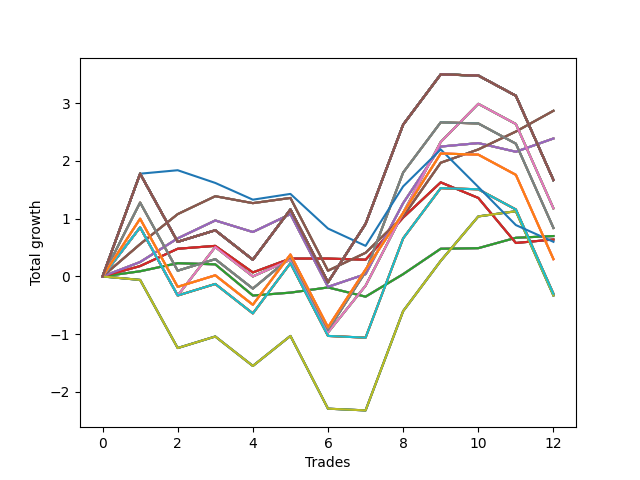

# Short Shepard 001 
- Symbol: SPY_Unlimited
- Date Range: 03/23/2022 - 07/08/2022
- Trading Period: 7:20-12:30
- Number of Trades: 12



| Name | Win Percent | Profit | Avg Profit / Trade | Avg Time / Trade |      | Name | Win Percent | Profit | Avg Profit / Trade | Avg Time / Trade |
| ---- | ----------- | ------ | ------------------ | ---------------- | ---- | ---- | ----------- | ------ | ------------------ | ---------------- |
| Sorted By <br> Profit | | | | | | Sorted By <br> Win Percentage ||||
| Sixty-Seven | 83.33 | 1435.00 | 119.58 | 15:52 |     | Sixty-Seven | 83.33 | 1435.00 | 119.58 | 15:52 |
| Fifty-Nine | 83.33 | 1435.00 | 119.58 | 15:52 |     | Fifty-Nine | 83.33 | 1435.00 | 119.58 | 15:52 |
| Fifty-One | 83.33 | 1435.00 | 119.58 | 15:52 |     | Fifty-One | 83.33 | 1435.00 | 119.58 | 15:52 |
| Forty-Three | 83.33 | 1435.00 | 119.58 | 15:52 |     | Forty-Three | 83.33 | 1435.00 | 119.58 | 15:52 |
| Three | 83.33 | 1435.00 | 119.58 | 15:52 |     | Three | 83.33 | 1435.00 | 119.58 | 15:52 |
| Sixty-Six | 75.00 | 1195.00 | 99.58 | 15:28 |     | Sixty-Six | 75.00 | 1195.00 | 99.58 | 15:28 |
| Fifty-Eight | 75.00 | 1195.00 | 99.58 | 15:28 |     | Fifty-Eight | 75.00 | 1195.00 | 99.58 | 15:28 |
| Fifty | 75.00 | 1195.00 | 99.58 | 15:28 |     | Fifty | 75.00 | 1195.00 | 99.58 | 15:28 |
| Forty-Two | 75.00 | 1195.00 | 99.58 | 15:28 |     | Forty-Two | 75.00 | 1195.00 | 99.58 | 15:28 |
| Two | 75.00 | 1195.00 | 99.58 | 15:28 |     | Two | 75.00 | 1195.00 | 99.58 | 15:28 |
| One Hundred Thirty | 50.00 | 835.00 | 69.58 | 29:55 |     | Sixty-Four | 75.00 | 350.00 | 29.17 | 03:26 |
| One Hundred Twenty-Nine | 50.00 | 835.00 | 69.58 | 29:55 |     | Fifty-Six | 75.00 | 350.00 | 29.17 | 03:26 |
| One Hundred Twenty-Eight | 50.00 | 835.00 | 69.58 | 29:55 |     | Forty-Eight | 75.00 | 350.00 | 29.17 | 03:26 |
| One Hundred Twenty-Seven | 50.00 | 835.00 | 69.58 | 29:55 |     | Forty | 75.00 | 350.00 | 29.17 | 03:26 |
| One Hundred Twenty-Five | 50.00 | 835.00 | 69.58 | 29:55 |     | Zero | 75.00 | 350.00 | 29.17 | 03:26 |
| One Hundred Twenty-Four | 50.00 | 835.00 | 69.58 | 29:55 |     | Sixty-Eight | 58.33 | 590.00 | 49.17 | 25:16 |
| One Hundred Twenty-Three | 50.00 | 835.00 | 69.58 | 29:55 |     | Sixty | 58.33 | 590.00 | 49.17 | 25:16 |
| One Hundred Twenty-Two | 50.00 | 835.00 | 69.58 | 29:55 |     | Fifty-Two | 58.33 | 590.00 | 49.17 | 25:16 |
| One Hundred Twenty | 50.00 | 835.00 | 69.58 | 29:55 |     | Forty-Four | 58.33 | 590.00 | 49.17 | 25:16 |
| One Hundred Ninteen | 50.00 | 835.00 | 69.58 | 29:55 |     | Four | 58.33 | 590.00 | 49.17 | 25:16 |
| One Hundred Eighteen | 50.00 | 835.00 | 69.58 | 29:55 |     | Sixty-Five | 58.33 | 320.00 | 26.67 | 09:15 |
| One Hundred Seventeen | 50.00 | 835.00 | 69.58 | 29:55 |     | Fifty-Seven | 58.33 | 320.00 | 26.67 | 09:15 |
| One Hundred Fifteen | 50.00 | 835.00 | 69.58 | 29:55 |     | Forty-Nine | 58.33 | 320.00 | 26.67 | 09:15 |
| One Hundred Fourteen | 50.00 | 835.00 | 69.58 | 29:55 |     | Forty-One | 58.33 | 320.00 | 26.67 | 09:15 |
| One Hundred Thirteen | 50.00 | 835.00 | 69.58 | 29:55 |     | One | 58.33 | 320.00 | 26.67 | 09:15 |
| One Hundred Twelve | 50.00 | 835.00 | 69.58 | 29:55 |     | One Hundred Thirty | 50.00 | 835.00 | 69.58 | 29:55 |
| Eighty-Five | 50.00 | 835.00 | 69.58 | 29:55 |     | One Hundred Twenty-Nine | 50.00 | 835.00 | 69.58 | 29:55 |
| Eighty-Four | 50.00 | 835.00 | 69.58 | 29:55 |     | One Hundred Twenty-Eight | 50.00 | 835.00 | 69.58 | 29:55 |
| Eighty-Three | 50.00 | 835.00 | 69.58 | 29:55 |     | One Hundred Twenty-Seven | 50.00 | 835.00 | 69.58 | 29:55 |
| Eighty-Two | 50.00 | 835.00 | 69.58 | 29:55 |     | One Hundred Twenty-Five | 50.00 | 835.00 | 69.58 | 29:55 |
| Sixty-Eight | 58.33 | 590.00 | 49.17 | 25:16 |     | One Hundred Twenty-Four | 50.00 | 835.00 | 69.58 | 29:55 |
| Sixty | 58.33 | 590.00 | 49.17 | 25:16 |     | One Hundred Twenty-Three | 50.00 | 835.00 | 69.58 | 29:55 |
| Fifty-Two | 58.33 | 590.00 | 49.17 | 25:16 |     | One Hundred Twenty-Two | 50.00 | 835.00 | 69.58 | 29:55 |
| Forty-Four | 58.33 | 590.00 | 49.17 | 25:16 |     | One Hundred Twenty | 50.00 | 835.00 | 69.58 | 29:55 |
| Four | 58.33 | 590.00 | 49.17 | 25:16 |     | One Hundred Ninteen | 50.00 | 835.00 | 69.58 | 29:55 |
| Sixty-Nine | 50.00 | 420.00 | 35.00 | 29:02 |     | One Hundred Eighteen | 50.00 | 835.00 | 69.58 | 29:55 |
| Sixty-One | 50.00 | 420.00 | 35.00 | 29:02 |     | One Hundred Seventeen | 50.00 | 835.00 | 69.58 | 29:55 |
| Fifty-Three | 50.00 | 420.00 | 35.00 | 29:02 |     | One Hundred Fifteen | 50.00 | 835.00 | 69.58 | 29:55 |
| Forty-Five | 50.00 | 420.00 | 35.00 | 29:02 |     | One Hundred Fourteen | 50.00 | 835.00 | 69.58 | 29:55 |
| Five | 50.00 | 420.00 | 35.00 | 29:02 |     | One Hundred Thirteen | 50.00 | 835.00 | 69.58 | 29:55 |
| Sixty-Four | 75.00 | 350.00 | 29.17 | 03:26 |     | One Hundred Twelve | 50.00 | 835.00 | 69.58 | 29:55 |
| Fifty-Six | 75.00 | 350.00 | 29.17 | 03:26 |     | Eighty-Five | 50.00 | 835.00 | 69.58 | 29:55 |
| Forty-Eight | 75.00 | 350.00 | 29.17 | 03:26 |     | Eighty-Four | 50.00 | 835.00 | 69.58 | 29:55 |
| Forty | 75.00 | 350.00 | 29.17 | 03:26 |     | Eighty-Three | 50.00 | 835.00 | 69.58 | 29:55 |
| Zero | 75.00 | 350.00 | 29.17 | 03:26 |     | Eighty-Two | 50.00 | 835.00 | 69.58 | 29:55 |
| Sixty-Five | 58.33 | 320.00 | 26.67 | 09:15 |     | Sixty-Nine | 50.00 | 420.00 | 35.00 | 29:02 |
| Fifty-Seven | 58.33 | 320.00 | 26.67 | 09:15 |     | Sixty-One | 50.00 | 420.00 | 35.00 | 29:02 |
| Forty-Nine | 58.33 | 320.00 | 26.67 | 09:15 |     | Fifty-Three | 50.00 | 420.00 | 35.00 | 29:02 |
| Forty-One | 58.33 | 320.00 | 26.67 | 09:15 |     | Forty-Five | 50.00 | 420.00 | 35.00 | 29:02 |
| One | 58.33 | 320.00 | 26.67 | 09:15 |     | Five | 50.00 | 420.00 | 35.00 | 29:02 |
| Seventy-Three | 41.67 | 300.00 | 25.00 | 08:29 |     | One Hundred Twenty-Six | 50.00 | 150.00 | 12.50 | 24:37 |
| One Hundred Twenty-Six | 50.00 | 150.00 | 12.50 | 24:37 |     | One Hundred Twenty-One | 50.00 | 150.00 | 12.50 | 24:37 |
| One Hundred Twenty-One | 50.00 | 150.00 | 12.50 | 24:37 |     | One Hundred Sixteen | 50.00 | 150.00 | 12.50 | 24:37 |
| One Hundred Sixteen | 50.00 | 150.00 | 12.50 | 24:37 |     | One Hundred Eleven | 50.00 | 150.00 | 12.50 | 24:37 |
| One Hundred Eleven | 50.00 | 150.00 | 12.50 | 24:37 |     | Eighty-One | 50.00 | 150.00 | 12.50 | 24:37 |
| Eighty-One | 50.00 | 150.00 | 12.50 | 24:37 |     | Seventy | 50.00 | -165.00 | -13.75 | 21:45 |
| Seventy-One | 41.67 | -150.00 | -12.50 | 26:18 |     | Sixty-Two | 50.00 | -165.00 | -13.75 | 21:45 |
| Sixty-Three | 41.67 | -150.00 | -12.50 | 26:18 |     | Fifty-Four | 50.00 | -165.00 | -13.75 | 21:45 |
| Fifty-Five | 41.67 | -150.00 | -12.50 | 26:18 |     | Forty-Six | 50.00 | -165.00 | -13.75 | 21:45 |
| Forty-Seven | 41.67 | -150.00 | -12.50 | 26:18 |     | Six | 50.00 | -165.00 | -13.75 | 21:45 |
| Seven | 41.67 | -150.00 | -12.50 | 26:18 |     | Seventy-Three | 41.67 | 300.00 | 25.00 | 08:29 |
| Seventy | 50.00 | -165.00 | -13.75 | 21:45 |     | Seventy-One | 41.67 | -150.00 | -12.50 | 26:18 |
| Sixty-Two | 50.00 | -165.00 | -13.75 | 21:45 |     | Sixty-Three | 41.67 | -150.00 | -12.50 | 26:18 |
| Fifty-Four | 50.00 | -165.00 | -13.75 | 21:45 |     | Fifty-Five | 41.67 | -150.00 | -12.50 | 26:18 |
| Forty-Six | 50.00 | -165.00 | -13.75 | 21:45 |     | Forty-Seven | 41.67 | -150.00 | -12.50 | 26:18 |
| Six | 50.00 | -165.00 | -13.75 | 21:45 |     | Seven | 41.67 | -150.00 | -12.50 | 26:18 |

## NO STOPLOSS

### Test Zero
* Sell when price hits the middle line of the 20p bollinger
* No Stoploss
* Results:
```
Total Trades: 12
Percent Up: 25.00
Percent Down: 75.00
Total Points Moved Down: 0.70
Potential Profit: 350.00
Total Points Ups: 0.72 Count Ups: 3
Total Points Downs: 1.42 Count Downs: 9
```

<details><summary>Trades</summary>

<code>In: 2022-04-05 10:24:00		Out: 2022-04-05 10:25:55		Total Position Time: 01:55		Total Move Down: 0.09		Total to Date: 0.09</code> <br />
<code>In: 2022-04-07 10:34:00		Out: 2022-04-07 10:36:05		Total Position Time: 02:05		Total Move Down: 0.14		Total to Date: 0.23</code> <br />
<code>In: 2022-04-18 11:00:00		Out: 2022-04-18 11:00:10		Total Position Time: 00:10		Total Move Down: -0.02		Total to Date: 0.21</code> <br />
<code>In: 2022-04-19 07:36:00		Out: 2022-04-19 07:53:30		Total Position Time: 17:30		Total Move Down: -0.54		Total to Date: -0.33</code> <br />
<code>In: 2022-04-20 10:50:00		Out: 2022-04-20 10:50:10		Total Position Time: 00:10		Total Move Down: 0.05		Total to Date: -0.28</code> <br />
<code>In: 2022-04-28 11:55:00		Out: 2022-04-28 11:55:10		Total Position Time: 00:10		Total Move Down: 0.09		Total to Date: -0.19</code> <br />
<code>In: 2022-04-29 10:29:00		Out: 2022-04-29 10:40:30		Total Position Time: 11:30		Total Move Down: -0.16		Total to Date: -0.35</code> <br />
<code>In: 2022-05-19 08:51:00		Out: 2022-05-19 08:53:40		Total Position Time: 02:40		Total Move Down: 0.39		Total to Date: 0.04</code> <br />
<code>In: 2022-05-25 07:41:00		Out: 2022-05-25 07:42:00		Total Position Time: 01:00		Total Move Down: 0.44		Total to Date: 0.48</code> <br />
<code>In: 2022-06-01 11:40:00		Out: 2022-06-01 11:40:10		Total Position Time: 00:10		Total Move Down: 0.01		Total to Date: 0.49</code> <br />
<code>In: 2022-06-10 10:32:00		Out: 2022-06-10 10:32:15		Total Position Time: 00:15		Total Move Down: 0.18		Total to Date: 0.67</code> <br />
<code>In: 2022-07-01 10:55:00		Out: 2022-07-01 10:58:40		Total Position Time: 03:40		Total Move Down: 0.03		Total to Date: 0.70</code> <br />


</details>

### Test One
* Sell when the price hits the upper line of the 20p 1std bollinger
* No Stoploss
* Results:
```
Total Trades: 12
Percent Up: 41.67
Percent Down: 58.33
Total Points Moved Down: 0.64
Potential Profit: 320.00
Total Points Ups: 1.53 Count Ups: 5
Total Points Downs: 2.17 Count Downs: 7
```

<details><summary>Trades</summary>

<code>In: 2022-04-05 10:24:00		Out: 2022-04-05 10:27:10		Total Position Time: 03:10		Total Move Down: 0.18		Total to Date: 0.18</code> <br />
<code>In: 2022-04-07 10:34:00		Out: 2022-04-07 10:39:55		Total Position Time: 05:55		Total Move Down: 0.30		Total to Date: 0.48</code> <br />
<code>In: 2022-04-18 11:00:00		Out: 2022-04-18 11:06:20		Total Position Time: 06:20		Total Move Down: 0.05		Total to Date: 0.53</code> <br />
<code>In: 2022-04-19 07:36:00		Out: 2022-04-19 07:59:35		Total Position Time: 23:35		Total Move Down: -0.46		Total to Date: 0.07</code> <br />
<code>In: 2022-04-20 10:50:00		Out: 2022-04-20 10:53:20		Total Position Time: 03:20		Total Move Down: 0.24		Total to Date: 0.31</code> <br />
<code>In: 2022-04-28 11:55:00		Out: 2022-04-28 12:02:10		Total Position Time: 07:10		Total Move Down: -0.00		Total to Date: 0.31</code> <br />
<code>In: 2022-04-29 10:29:00		Out: 2022-04-29 10:41:05		Total Position Time: 12:05		Total Move Down: -0.02		Total to Date: 0.29</code> <br />
<code>In: 2022-05-19 08:51:00		Out: 2022-05-19 08:54:45		Total Position Time: 03:45		Total Move Down: 0.73		Total to Date: 1.02</code> <br />
<code>In: 2022-05-25 07:41:00		Out: 2022-05-25 07:46:40		Total Position Time: 05:40		Total Move Down: 0.61		Total to Date: 1.63</code> <br />
<code>In: 2022-06-01 11:40:00		Out: 2022-06-01 11:46:40		Total Position Time: 06:40		Total Move Down: -0.27		Total to Date: 1.36</code> <br />
<code>In: 2022-06-10 10:32:00		Out: 2022-06-10 10:56:05		Total Position Time: 24:05		Total Move Down: -0.78		Total to Date: 0.58</code> <br />
<code>In: 2022-07-01 10:55:00		Out: 2022-07-01 11:04:25		Total Position Time: 09:25		Total Move Down: 0.06		Total to Date: 0.64</code> <br />


</details>

### Test Two
* Sell when the price hits the upper line of the 20p 2std bollinger
* No Stoploss
* Results:
```
Total Trades: 12
Percent Up: 25.00
Percent Down: 75.00
Total Points Moved Down: 2.39
Potential Profit: 1195.00
Total Points Ups: 1.61 Count Ups: 3
Total Points Downs: 4.00 Count Downs: 9
```

<details><summary>Trades</summary>

<code>In: 2022-04-05 10:24:00		Out: 2022-04-05 10:29:30		Total Position Time: 05:30		Total Move Down: 0.25		Total to Date: 0.25</code> <br />
<code>In: 2022-04-07 10:34:00		Out: 2022-04-07 10:45:15		Total Position Time: 11:15		Total Move Down: 0.41		Total to Date: 0.66</code> <br />
<code>In: 2022-04-18 11:00:00		Out: 2022-04-18 11:10:40		Total Position Time: 10:40		Total Move Down: 0.31		Total to Date: 0.97</code> <br />
<code>In: 2022-04-19 07:36:00		Out: 2022-04-19 08:00:30		Total Position Time: 24:30		Total Move Down: -0.20		Total to Date: 0.77</code> <br />
<code>In: 2022-04-20 10:50:00		Out: 2022-04-20 11:13:55		Total Position Time: 23:55		Total Move Down: 0.31		Total to Date: 1.08</code> <br />
<code>In: 2022-04-28 11:55:00		Out: 2022-04-28 12:24:55		Total Position Time: 29:55		Total Move Down: -1.26		Total to Date: -0.18</code> <br />
<code>In: 2022-04-29 10:29:00		Out: 2022-04-29 10:43:20		Total Position Time: 14:20		Total Move Down: 0.22		Total to Date: 0.04</code> <br />
<code>In: 2022-05-19 08:51:00		Out: 2022-05-19 08:56:05		Total Position Time: 05:05		Total Move Down: 1.23		Total to Date: 1.27</code> <br />
<code>In: 2022-05-25 07:41:00		Out: 2022-05-25 07:48:10		Total Position Time: 07:10		Total Move Down: 0.98		Total to Date: 2.25</code> <br />
<code>In: 2022-06-01 11:40:00		Out: 2022-06-01 11:51:10		Total Position Time: 11:10		Total Move Down: 0.06		Total to Date: 2.31</code> <br />
<code>In: 2022-06-10 10:32:00		Out: 2022-06-10 11:01:15		Total Position Time: 29:15		Total Move Down: -0.15		Total to Date: 2.16</code> <br />
<code>In: 2022-07-01 10:55:00		Out: 2022-07-01 11:07:55		Total Position Time: 12:55		Total Move Down: 0.23		Total to Date: 2.39</code> <br />


</details>

### Test Three
* Sell when price hits the middle line of the 50p bollinger
* No Stoploss
* Results:
```
Total Trades: 12
Percent Up: 16.67
Percent Down: 83.33
Total Points Moved Down: 2.87
Potential Profit: 1435.00
Total Points Ups: 1.38 Count Ups: 2
Total Points Downs: 4.25 Count Downs: 10
```

<details><summary>Trades</summary>

<code>In: 2022-04-05 10:24:00		Out: 2022-04-05 10:34:05		Total Position Time: 10:05		Total Move Down: 0.56		Total to Date: 0.56</code> <br />
<code>In: 2022-04-07 10:34:00		Out: 2022-04-07 10:52:05		Total Position Time: 18:05		Total Move Down: 0.52		Total to Date: 1.08</code> <br />
<code>In: 2022-04-18 11:00:00		Out: 2022-04-18 11:16:30		Total Position Time: 16:30		Total Move Down: 0.31		Total to Date: 1.39</code> <br />
<code>In: 2022-04-19 07:36:00		Out: 2022-04-19 08:00:40		Total Position Time: 24:40		Total Move Down: -0.12		Total to Date: 1.27</code> <br />
<code>In: 2022-04-20 10:50:00		Out: 2022-04-20 10:50:20		Total Position Time: 00:20		Total Move Down: 0.09		Total to Date: 1.36</code> <br />
<code>In: 2022-04-28 11:55:00		Out: 2022-04-28 12:24:55		Total Position Time: 29:55		Total Move Down: -1.26		Total to Date: 0.10</code> <br />
<code>In: 2022-04-29 10:29:00		Out: 2022-04-29 10:43:40		Total Position Time: 14:40		Total Move Down: 0.31		Total to Date: 0.41</code> <br />
<code>In: 2022-05-19 08:51:00		Out: 2022-05-19 09:19:35		Total Position Time: 28:35		Total Move Down: 0.63		Total to Date: 1.04</code> <br />
<code>In: 2022-05-25 07:41:00		Out: 2022-05-25 07:57:20		Total Position Time: 16:20		Total Move Down: 0.93		Total to Date: 1.97</code> <br />
<code>In: 2022-06-01 11:40:00		Out: 2022-06-01 11:54:40		Total Position Time: 14:40		Total Move Down: 0.23		Total to Date: 2.20</code> <br />
<code>In: 2022-06-10 10:32:00		Out: 2022-06-10 10:34:35		Total Position Time: 02:35		Total Move Down: 0.31		Total to Date: 2.51</code> <br />
<code>In: 2022-07-01 10:55:00		Out: 2022-07-01 11:09:05		Total Position Time: 14:05		Total Move Down: 0.36		Total to Date: 2.87</code> <br />


</details>

### Test Four
* Sell when the price hits the upper line of the 50p 1std bollinger
* No Stoploss
* Results:
```
Total Trades: 12
Percent Up: 41.67
Percent Down: 58.33
Total Points Moved Down: 1.18
Potential Profit: 590.00
Total Points Ups: 4.76 Count Ups: 5
Total Points Downs: 5.94 Count Downs: 7
```

<details><summary>Trades</summary>

<code>In: 2022-04-05 10:24:00		Out: 2022-04-05 10:40:20		Total Position Time: 16:20		Total Move Down: 0.85		Total to Date: 0.85</code> <br />
<code>In: 2022-04-07 10:34:00		Out: 2022-04-07 11:03:55		Total Position Time: 29:55		Total Move Down: -1.18		Total to Date: -0.33</code> <br />
<code>In: 2022-04-18 11:00:00		Out: 2022-04-18 11:18:10		Total Position Time: 18:10		Total Move Down: 0.84		Total to Date: 0.51</code> <br />
<code>In: 2022-04-19 07:36:00		Out: 2022-04-19 08:05:55		Total Position Time: 29:55		Total Move Down: -0.51		Total to Date: 0.00</code> <br />
<code>In: 2022-04-20 10:50:00		Out: 2022-04-20 11:14:00		Total Position Time: 24:00		Total Move Down: 0.29		Total to Date: 0.29</code> <br />
<code>In: 2022-04-28 11:55:00		Out: 2022-04-28 12:24:55		Total Position Time: 29:55		Total Move Down: -1.26		Total to Date: -0.97</code> <br />
<code>In: 2022-04-29 10:29:00		Out: 2022-04-29 10:47:20		Total Position Time: 18:20		Total Move Down: 0.81		Total to Date: -0.16</code> <br />
<code>In: 2022-05-19 08:51:00		Out: 2022-05-19 09:20:40		Total Position Time: 29:40		Total Move Down: 1.26		Total to Date: 1.10</code> <br />
<code>In: 2022-05-25 07:41:00		Out: 2022-05-25 08:04:45		Total Position Time: 23:45		Total Move Down: 1.23		Total to Date: 2.33</code> <br />
<code>In: 2022-06-01 11:40:00		Out: 2022-06-01 12:03:30		Total Position Time: 23:30		Total Move Down: 0.66		Total to Date: 2.99</code> <br />
<code>In: 2022-06-10 10:32:00		Out: 2022-06-10 11:01:55		Total Position Time: 29:55		Total Move Down: -0.35		Total to Date: 2.64</code> <br />
<code>In: 2022-07-01 10:55:00		Out: 2022-07-01 11:24:55		Total Position Time: 29:55		Total Move Down: -1.46		Total to Date: 1.18</code> <br />


</details>

### Test Five
* Sell when the price hits the upper line of the 50p 2std bollinger
* No Stoploss
* Results:
```
Total Trades: 12
Percent Up: 50.00
Percent Down: 50.00
Total Points Moved Down: 0.84
Potential Profit: 420.00
Total Points Ups: 4.78 Count Ups: 6
Total Points Downs: 5.62 Count Downs: 6
```

<details><summary>Trades</summary>

<code>In: 2022-04-05 10:24:00		Out: 2022-04-05 10:45:40		Total Position Time: 21:40		Total Move Down: 1.28		Total to Date: 1.28</code> <br />
<code>In: 2022-04-07 10:34:00		Out: 2022-04-07 11:03:55		Total Position Time: 29:55		Total Move Down: -1.18		Total to Date: 0.10</code> <br />
<code>In: 2022-04-18 11:00:00		Out: 2022-04-18 11:29:55		Total Position Time: 29:55		Total Move Down: 0.20		Total to Date: 0.30</code> <br />
<code>In: 2022-04-19 07:36:00		Out: 2022-04-19 08:05:55		Total Position Time: 29:55		Total Move Down: -0.51		Total to Date: -0.21</code> <br />
<code>In: 2022-04-20 10:50:00		Out: 2022-04-20 11:17:40		Total Position Time: 27:40		Total Move Down: 0.54		Total to Date: 0.33</code> <br />
<code>In: 2022-04-28 11:55:00		Out: 2022-04-28 12:24:55		Total Position Time: 29:55		Total Move Down: -1.26		Total to Date: -0.93</code> <br />
<code>In: 2022-04-29 10:29:00		Out: 2022-04-29 10:58:55		Total Position Time: 29:55		Total Move Down: 1.01		Total to Date: 0.08</code> <br />
<code>In: 2022-05-19 08:51:00		Out: 2022-05-19 09:20:55		Total Position Time: 29:55		Total Move Down: 1.72		Total to Date: 1.80</code> <br />
<code>In: 2022-05-25 07:41:00		Out: 2022-05-25 08:10:55		Total Position Time: 29:55		Total Move Down: 0.87		Total to Date: 2.67</code> <br />
<code>In: 2022-06-01 11:40:00		Out: 2022-06-01 12:09:55		Total Position Time: 29:55		Total Move Down: -0.02		Total to Date: 2.65</code> <br />
<code>In: 2022-06-10 10:32:00		Out: 2022-06-10 11:01:55		Total Position Time: 29:55		Total Move Down: -0.35		Total to Date: 2.30</code> <br />
<code>In: 2022-07-01 10:55:00		Out: 2022-07-01 11:24:55		Total Position Time: 29:55		Total Move Down: -1.46		Total to Date: 0.84</code> <br />


</details>

### Test Six
* Sell when the price hits the middle line of the 1std VWAP
* No Stoploss
* Results:
```
Total Trades: 12
Percent Up: 50.00
Percent Down: 50.00
Total Points Moved Down: -0.33
Potential Profit: -165.00
Total Points Ups: 4.50 Count Ups: 6
Total Points Downs: 4.17 Count Downs: 6
```

<details><summary>Trades</summary>

<code>In: 2022-04-05 10:24:00		Out: 2022-04-05 10:24:10		Total Position Time: 00:10		Total Move Down: -0.06		Total to Date: -0.06</code> <br />
<code>In: 2022-04-07 10:34:00		Out: 2022-04-07 11:03:55		Total Position Time: 29:55		Total Move Down: -1.18		Total to Date: -1.24</code> <br />
<code>In: 2022-04-18 11:00:00		Out: 2022-04-18 11:29:55		Total Position Time: 29:55		Total Move Down: 0.20		Total to Date: -1.04</code> <br />
<code>In: 2022-04-19 07:36:00		Out: 2022-04-19 08:05:55		Total Position Time: 29:55		Total Move Down: -0.51		Total to Date: -1.55</code> <br />
<code>In: 2022-04-20 10:50:00		Out: 2022-04-20 11:17:15		Total Position Time: 27:15		Total Move Down: 0.52		Total to Date: -1.03</code> <br />
<code>In: 2022-04-28 11:55:00		Out: 2022-04-28 12:24:55		Total Position Time: 29:55		Total Move Down: -1.26		Total to Date: -2.29</code> <br />
<code>In: 2022-04-29 10:29:00		Out: 2022-04-29 10:29:10		Total Position Time: 00:10		Total Move Down: -0.03		Total to Date: -2.32</code> <br />
<code>In: 2022-05-19 08:51:00		Out: 2022-05-19 09:20:55		Total Position Time: 29:55		Total Move Down: 1.72		Total to Date: -0.60</code> <br />
<code>In: 2022-05-25 07:41:00		Out: 2022-05-25 08:10:55		Total Position Time: 29:55		Total Move Down: 0.87		Total to Date: 0.27</code> <br />
<code>In: 2022-06-01 11:40:00		Out: 2022-06-01 12:03:55		Total Position Time: 23:55		Total Move Down: 0.77		Total to Date: 1.04</code> <br />
<code>In: 2022-06-10 10:32:00		Out: 2022-06-10 10:32:10		Total Position Time: 00:10		Total Move Down: 0.09		Total to Date: 1.13</code> <br />
<code>In: 2022-07-01 10:55:00		Out: 2022-07-01 11:24:55		Total Position Time: 29:55		Total Move Down: -1.46		Total to Date: -0.33</code> <br />


</details>

### Test Seven
* Sell when the price hits the upper line of the 1std VWAP
* No Stoploss
* Results:
```
Total Trades: 12
Percent Up: 58.33
Percent Down: 41.67
Total Points Moved Down: -0.30
Potential Profit: -150.00
Total Points Ups: 4.81 Count Ups: 7
Total Points Downs: 4.51 Count Downs: 5
```

<details><summary>Trades</summary>

<code>In: 2022-04-05 10:24:00		Out: 2022-04-05 10:40:20		Total Position Time: 16:20		Total Move Down: 0.85		Total to Date: 0.85</code> <br />
<code>In: 2022-04-07 10:34:00		Out: 2022-04-07 11:03:55		Total Position Time: 29:55		Total Move Down: -1.18		Total to Date: -0.33</code> <br />
<code>In: 2022-04-18 11:00:00		Out: 2022-04-18 11:29:55		Total Position Time: 29:55		Total Move Down: 0.20		Total to Date: -0.13</code> <br />
<code>In: 2022-04-19 07:36:00		Out: 2022-04-19 08:05:55		Total Position Time: 29:55		Total Move Down: -0.51		Total to Date: -0.64</code> <br />
<code>In: 2022-04-20 10:50:00		Out: 2022-04-20 11:19:55		Total Position Time: 29:55		Total Move Down: 0.87		Total to Date: 0.23</code> <br />
<code>In: 2022-04-28 11:55:00		Out: 2022-04-28 12:24:55		Total Position Time: 29:55		Total Move Down: -1.26		Total to Date: -1.03</code> <br />
<code>In: 2022-04-29 10:29:00		Out: 2022-04-29 10:29:10		Total Position Time: 00:10		Total Move Down: -0.03		Total to Date: -1.06</code> <br />
<code>In: 2022-05-19 08:51:00		Out: 2022-05-19 09:20:55		Total Position Time: 29:55		Total Move Down: 1.72		Total to Date: 0.66</code> <br />
<code>In: 2022-05-25 07:41:00		Out: 2022-05-25 08:10:55		Total Position Time: 29:55		Total Move Down: 0.87		Total to Date: 1.53</code> <br />
<code>In: 2022-06-01 11:40:00		Out: 2022-06-01 12:09:55		Total Position Time: 29:55		Total Move Down: -0.02		Total to Date: 1.51</code> <br />
<code>In: 2022-06-10 10:32:00		Out: 2022-06-10 11:01:55		Total Position Time: 29:55		Total Move Down: -0.35		Total to Date: 1.16</code> <br />
<code>In: 2022-07-01 10:55:00		Out: 2022-07-01 11:24:55		Total Position Time: 29:55		Total Move Down: -1.46		Total to Date: -0.30</code> <br />


</details>

## STOPLOSS OF 5

### Test Forty
* Sell when price hits the middle line of the 20p bollinger
* Stoploss is -5 points
* Results:
```
Total Trades: 12
Percent Up: 25.00
Percent Down: 75.00
Total Points Moved Down: 0.70
Potential Profit: 350.00
Total Points Ups: 0.72 Count Ups: 3
Total Points Downs: 1.42 Count Downs: 9
```

<details><summary>Trades</summary>

<code>In: 2022-04-05 10:24:00		Out: 2022-04-05 10:25:55		Total Position Time: 01:55		Total Move Down: 0.09		Total to Date: 0.09</code> <br />
<code>In: 2022-04-07 10:34:00		Out: 2022-04-07 10:36:05		Total Position Time: 02:05		Total Move Down: 0.14		Total to Date: 0.23</code> <br />
<code>In: 2022-04-18 11:00:00		Out: 2022-04-18 11:00:10		Total Position Time: 00:10		Total Move Down: -0.02		Total to Date: 0.21</code> <br />
<code>In: 2022-04-19 07:36:00		Out: 2022-04-19 07:53:30		Total Position Time: 17:30		Total Move Down: -0.54		Total to Date: -0.33</code> <br />
<code>In: 2022-04-20 10:50:00		Out: 2022-04-20 10:50:10		Total Position Time: 00:10		Total Move Down: 0.05		Total to Date: -0.28</code> <br />
<code>In: 2022-04-28 11:55:00		Out: 2022-04-28 11:55:10		Total Position Time: 00:10		Total Move Down: 0.09		Total to Date: -0.19</code> <br />
<code>In: 2022-04-29 10:29:00		Out: 2022-04-29 10:40:30		Total Position Time: 11:30		Total Move Down: -0.16		Total to Date: -0.35</code> <br />
<code>In: 2022-05-19 08:51:00		Out: 2022-05-19 08:53:40		Total Position Time: 02:40		Total Move Down: 0.39		Total to Date: 0.04</code> <br />
<code>In: 2022-05-25 07:41:00		Out: 2022-05-25 07:42:00		Total Position Time: 01:00		Total Move Down: 0.44		Total to Date: 0.48</code> <br />
<code>In: 2022-06-01 11:40:00		Out: 2022-06-01 11:40:10		Total Position Time: 00:10		Total Move Down: 0.01		Total to Date: 0.49</code> <br />
<code>In: 2022-06-10 10:32:00		Out: 2022-06-10 10:32:15		Total Position Time: 00:15		Total Move Down: 0.18		Total to Date: 0.67</code> <br />
<code>In: 2022-07-01 10:55:00		Out: 2022-07-01 10:58:40		Total Position Time: 03:40		Total Move Down: 0.03		Total to Date: 0.70</code> <br />


</details>

### Test Forty-One
* Sell when the price hits the upper line of the 20p 1std bollinger
* Stoploss is -5 points
* Results:
```
Total Trades: 12
Percent Up: 41.67
Percent Down: 58.33
Total Points Moved Down: 0.64
Potential Profit: 320.00
Total Points Ups: 1.53 Count Ups: 5
Total Points Downs: 2.17 Count Downs: 7
```

<details><summary>Trades</summary>

<code>In: 2022-04-05 10:24:00		Out: 2022-04-05 10:27:10		Total Position Time: 03:10		Total Move Down: 0.18		Total to Date: 0.18</code> <br />
<code>In: 2022-04-07 10:34:00		Out: 2022-04-07 10:39:55		Total Position Time: 05:55		Total Move Down: 0.30		Total to Date: 0.48</code> <br />
<code>In: 2022-04-18 11:00:00		Out: 2022-04-18 11:06:20		Total Position Time: 06:20		Total Move Down: 0.05		Total to Date: 0.53</code> <br />
<code>In: 2022-04-19 07:36:00		Out: 2022-04-19 07:59:35		Total Position Time: 23:35		Total Move Down: -0.46		Total to Date: 0.07</code> <br />
<code>In: 2022-04-20 10:50:00		Out: 2022-04-20 10:53:20		Total Position Time: 03:20		Total Move Down: 0.24		Total to Date: 0.31</code> <br />
<code>In: 2022-04-28 11:55:00		Out: 2022-04-28 12:02:10		Total Position Time: 07:10		Total Move Down: -0.00		Total to Date: 0.31</code> <br />
<code>In: 2022-04-29 10:29:00		Out: 2022-04-29 10:41:05		Total Position Time: 12:05		Total Move Down: -0.02		Total to Date: 0.29</code> <br />
<code>In: 2022-05-19 08:51:00		Out: 2022-05-19 08:54:45		Total Position Time: 03:45		Total Move Down: 0.73		Total to Date: 1.02</code> <br />
<code>In: 2022-05-25 07:41:00		Out: 2022-05-25 07:46:40		Total Position Time: 05:40		Total Move Down: 0.61		Total to Date: 1.63</code> <br />
<code>In: 2022-06-01 11:40:00		Out: 2022-06-01 11:46:40		Total Position Time: 06:40		Total Move Down: -0.27		Total to Date: 1.36</code> <br />
<code>In: 2022-06-10 10:32:00		Out: 2022-06-10 10:56:05		Total Position Time: 24:05		Total Move Down: -0.78		Total to Date: 0.58</code> <br />
<code>In: 2022-07-01 10:55:00		Out: 2022-07-01 11:04:25		Total Position Time: 09:25		Total Move Down: 0.06		Total to Date: 0.64</code> <br />


</details>

### Test Forty-Two
* Sell when the price hits the upper line of the 20p 2std bollinger
* Stoploss is -5 points
* Results:
```
Total Trades: 12
Percent Up: 25.00
Percent Down: 75.00
Total Points Moved Down: 2.39
Potential Profit: 1195.00
Total Points Ups: 1.61 Count Ups: 3
Total Points Downs: 4.00 Count Downs: 9
```

<details><summary>Trades</summary>

<code>In: 2022-04-05 10:24:00		Out: 2022-04-05 10:29:30		Total Position Time: 05:30		Total Move Down: 0.25		Total to Date: 0.25</code> <br />
<code>In: 2022-04-07 10:34:00		Out: 2022-04-07 10:45:15		Total Position Time: 11:15		Total Move Down: 0.41		Total to Date: 0.66</code> <br />
<code>In: 2022-04-18 11:00:00		Out: 2022-04-18 11:10:40		Total Position Time: 10:40		Total Move Down: 0.31		Total to Date: 0.97</code> <br />
<code>In: 2022-04-19 07:36:00		Out: 2022-04-19 08:00:30		Total Position Time: 24:30		Total Move Down: -0.20		Total to Date: 0.77</code> <br />
<code>In: 2022-04-20 10:50:00		Out: 2022-04-20 11:13:55		Total Position Time: 23:55		Total Move Down: 0.31		Total to Date: 1.08</code> <br />
<code>In: 2022-04-28 11:55:00		Out: 2022-04-28 12:24:55		Total Position Time: 29:55		Total Move Down: -1.26		Total to Date: -0.18</code> <br />
<code>In: 2022-04-29 10:29:00		Out: 2022-04-29 10:43:20		Total Position Time: 14:20		Total Move Down: 0.22		Total to Date: 0.04</code> <br />
<code>In: 2022-05-19 08:51:00		Out: 2022-05-19 08:56:05		Total Position Time: 05:05		Total Move Down: 1.23		Total to Date: 1.27</code> <br />
<code>In: 2022-05-25 07:41:00		Out: 2022-05-25 07:48:10		Total Position Time: 07:10		Total Move Down: 0.98		Total to Date: 2.25</code> <br />
<code>In: 2022-06-01 11:40:00		Out: 2022-06-01 11:51:10		Total Position Time: 11:10		Total Move Down: 0.06		Total to Date: 2.31</code> <br />
<code>In: 2022-06-10 10:32:00		Out: 2022-06-10 11:01:15		Total Position Time: 29:15		Total Move Down: -0.15		Total to Date: 2.16</code> <br />
<code>In: 2022-07-01 10:55:00		Out: 2022-07-01 11:07:55		Total Position Time: 12:55		Total Move Down: 0.23		Total to Date: 2.39</code> <br />


</details>

### Test Forty-Three
* Sell when price hits the middle line of the 50p bollinger
* Stoploss is -5 points
* Results:
```
Total Trades: 12
Percent Up: 16.67
Percent Down: 83.33
Total Points Moved Down: 2.87
Potential Profit: 1435.00
Total Points Ups: 1.38 Count Ups: 2
Total Points Downs: 4.25 Count Downs: 10
```

<details><summary>Trades</summary>

<code>In: 2022-04-05 10:24:00		Out: 2022-04-05 10:34:05		Total Position Time: 10:05		Total Move Down: 0.56		Total to Date: 0.56</code> <br />
<code>In: 2022-04-07 10:34:00		Out: 2022-04-07 10:52:05		Total Position Time: 18:05		Total Move Down: 0.52		Total to Date: 1.08</code> <br />
<code>In: 2022-04-18 11:00:00		Out: 2022-04-18 11:16:30		Total Position Time: 16:30		Total Move Down: 0.31		Total to Date: 1.39</code> <br />
<code>In: 2022-04-19 07:36:00		Out: 2022-04-19 08:00:40		Total Position Time: 24:40		Total Move Down: -0.12		Total to Date: 1.27</code> <br />
<code>In: 2022-04-20 10:50:00		Out: 2022-04-20 10:50:20		Total Position Time: 00:20		Total Move Down: 0.09		Total to Date: 1.36</code> <br />
<code>In: 2022-04-28 11:55:00		Out: 2022-04-28 12:24:55		Total Position Time: 29:55		Total Move Down: -1.26		Total to Date: 0.10</code> <br />
<code>In: 2022-04-29 10:29:00		Out: 2022-04-29 10:43:40		Total Position Time: 14:40		Total Move Down: 0.31		Total to Date: 0.41</code> <br />
<code>In: 2022-05-19 08:51:00		Out: 2022-05-19 09:19:35		Total Position Time: 28:35		Total Move Down: 0.63		Total to Date: 1.04</code> <br />
<code>In: 2022-05-25 07:41:00		Out: 2022-05-25 07:57:20		Total Position Time: 16:20		Total Move Down: 0.93		Total to Date: 1.97</code> <br />
<code>In: 2022-06-01 11:40:00		Out: 2022-06-01 11:54:40		Total Position Time: 14:40		Total Move Down: 0.23		Total to Date: 2.20</code> <br />
<code>In: 2022-06-10 10:32:00		Out: 2022-06-10 10:34:35		Total Position Time: 02:35		Total Move Down: 0.31		Total to Date: 2.51</code> <br />
<code>In: 2022-07-01 10:55:00		Out: 2022-07-01 11:09:05		Total Position Time: 14:05		Total Move Down: 0.36		Total to Date: 2.87</code> <br />


</details>

### Test Forty-Four
* Sell when the price hits the upper line of the 50p 1std bollinger
* Stoploss is -5 points
* Results:
```
Total Trades: 12
Percent Up: 41.67
Percent Down: 58.33
Total Points Moved Down: 1.18
Potential Profit: 590.00
Total Points Ups: 4.76 Count Ups: 5
Total Points Downs: 5.94 Count Downs: 7
```

<details><summary>Trades</summary>

<code>In: 2022-04-05 10:24:00		Out: 2022-04-05 10:40:20		Total Position Time: 16:20		Total Move Down: 0.85		Total to Date: 0.85</code> <br />
<code>In: 2022-04-07 10:34:00		Out: 2022-04-07 11:03:55		Total Position Time: 29:55		Total Move Down: -1.18		Total to Date: -0.33</code> <br />
<code>In: 2022-04-18 11:00:00		Out: 2022-04-18 11:18:10		Total Position Time: 18:10		Total Move Down: 0.84		Total to Date: 0.51</code> <br />
<code>In: 2022-04-19 07:36:00		Out: 2022-04-19 08:05:55		Total Position Time: 29:55		Total Move Down: -0.51		Total to Date: 0.00</code> <br />
<code>In: 2022-04-20 10:50:00		Out: 2022-04-20 11:14:00		Total Position Time: 24:00		Total Move Down: 0.29		Total to Date: 0.29</code> <br />
<code>In: 2022-04-28 11:55:00		Out: 2022-04-28 12:24:55		Total Position Time: 29:55		Total Move Down: -1.26		Total to Date: -0.97</code> <br />
<code>In: 2022-04-29 10:29:00		Out: 2022-04-29 10:47:20		Total Position Time: 18:20		Total Move Down: 0.81		Total to Date: -0.16</code> <br />
<code>In: 2022-05-19 08:51:00		Out: 2022-05-19 09:20:40		Total Position Time: 29:40		Total Move Down: 1.26		Total to Date: 1.10</code> <br />
<code>In: 2022-05-25 07:41:00		Out: 2022-05-25 08:04:45		Total Position Time: 23:45		Total Move Down: 1.23		Total to Date: 2.33</code> <br />
<code>In: 2022-06-01 11:40:00		Out: 2022-06-01 12:03:30		Total Position Time: 23:30		Total Move Down: 0.66		Total to Date: 2.99</code> <br />
<code>In: 2022-06-10 10:32:00		Out: 2022-06-10 11:01:55		Total Position Time: 29:55		Total Move Down: -0.35		Total to Date: 2.64</code> <br />
<code>In: 2022-07-01 10:55:00		Out: 2022-07-01 11:24:55		Total Position Time: 29:55		Total Move Down: -1.46		Total to Date: 1.18</code> <br />


</details>

### Test Forty-Five
* Sell when the price hits the upper line of the 50p 2std bollinger
* Stoploss is -5 points
* Results:
```
Total Trades: 12
Percent Up: 50.00
Percent Down: 50.00
Total Points Moved Down: 0.84
Potential Profit: 420.00
Total Points Ups: 4.78 Count Ups: 6
Total Points Downs: 5.62 Count Downs: 6
```

<details><summary>Trades</summary>

<code>In: 2022-04-05 10:24:00		Out: 2022-04-05 10:45:40		Total Position Time: 21:40		Total Move Down: 1.28		Total to Date: 1.28</code> <br />
<code>In: 2022-04-07 10:34:00		Out: 2022-04-07 11:03:55		Total Position Time: 29:55		Total Move Down: -1.18		Total to Date: 0.10</code> <br />
<code>In: 2022-04-18 11:00:00		Out: 2022-04-18 11:29:55		Total Position Time: 29:55		Total Move Down: 0.20		Total to Date: 0.30</code> <br />
<code>In: 2022-04-19 07:36:00		Out: 2022-04-19 08:05:55		Total Position Time: 29:55		Total Move Down: -0.51		Total to Date: -0.21</code> <br />
<code>In: 2022-04-20 10:50:00		Out: 2022-04-20 11:17:40		Total Position Time: 27:40		Total Move Down: 0.54		Total to Date: 0.33</code> <br />
<code>In: 2022-04-28 11:55:00		Out: 2022-04-28 12:24:55		Total Position Time: 29:55		Total Move Down: -1.26		Total to Date: -0.93</code> <br />
<code>In: 2022-04-29 10:29:00		Out: 2022-04-29 10:58:55		Total Position Time: 29:55		Total Move Down: 1.01		Total to Date: 0.08</code> <br />
<code>In: 2022-05-19 08:51:00		Out: 2022-05-19 09:20:55		Total Position Time: 29:55		Total Move Down: 1.72		Total to Date: 1.80</code> <br />
<code>In: 2022-05-25 07:41:00		Out: 2022-05-25 08:10:55		Total Position Time: 29:55		Total Move Down: 0.87		Total to Date: 2.67</code> <br />
<code>In: 2022-06-01 11:40:00		Out: 2022-06-01 12:09:55		Total Position Time: 29:55		Total Move Down: -0.02		Total to Date: 2.65</code> <br />
<code>In: 2022-06-10 10:32:00		Out: 2022-06-10 11:01:55		Total Position Time: 29:55		Total Move Down: -0.35		Total to Date: 2.30</code> <br />
<code>In: 2022-07-01 10:55:00		Out: 2022-07-01 11:24:55		Total Position Time: 29:55		Total Move Down: -1.46		Total to Date: 0.84</code> <br />


</details>

### Test Forty-Six
* Sell when the price hits the middle line of the 1std VWAP
* Stoploss is -5 points
* Results:
```
Total Trades: 12
Percent Up: 50.00
Percent Down: 50.00
Total Points Moved Down: -0.33
Potential Profit: -165.00
Total Points Ups: 4.50 Count Ups: 6
Total Points Downs: 4.17 Count Downs: 6
```

<details><summary>Trades</summary>

<code>In: 2022-04-05 10:24:00		Out: 2022-04-05 10:24:10		Total Position Time: 00:10		Total Move Down: -0.06		Total to Date: -0.06</code> <br />
<code>In: 2022-04-07 10:34:00		Out: 2022-04-07 11:03:55		Total Position Time: 29:55		Total Move Down: -1.18		Total to Date: -1.24</code> <br />
<code>In: 2022-04-18 11:00:00		Out: 2022-04-18 11:29:55		Total Position Time: 29:55		Total Move Down: 0.20		Total to Date: -1.04</code> <br />
<code>In: 2022-04-19 07:36:00		Out: 2022-04-19 08:05:55		Total Position Time: 29:55		Total Move Down: -0.51		Total to Date: -1.55</code> <br />
<code>In: 2022-04-20 10:50:00		Out: 2022-04-20 11:17:15		Total Position Time: 27:15		Total Move Down: 0.52		Total to Date: -1.03</code> <br />
<code>In: 2022-04-28 11:55:00		Out: 2022-04-28 12:24:55		Total Position Time: 29:55		Total Move Down: -1.26		Total to Date: -2.29</code> <br />
<code>In: 2022-04-29 10:29:00		Out: 2022-04-29 10:29:10		Total Position Time: 00:10		Total Move Down: -0.03		Total to Date: -2.32</code> <br />
<code>In: 2022-05-19 08:51:00		Out: 2022-05-19 09:20:55		Total Position Time: 29:55		Total Move Down: 1.72		Total to Date: -0.60</code> <br />
<code>In: 2022-05-25 07:41:00		Out: 2022-05-25 08:10:55		Total Position Time: 29:55		Total Move Down: 0.87		Total to Date: 0.27</code> <br />
<code>In: 2022-06-01 11:40:00		Out: 2022-06-01 12:03:55		Total Position Time: 23:55		Total Move Down: 0.77		Total to Date: 1.04</code> <br />
<code>In: 2022-06-10 10:32:00		Out: 2022-06-10 10:32:10		Total Position Time: 00:10		Total Move Down: 0.09		Total to Date: 1.13</code> <br />
<code>In: 2022-07-01 10:55:00		Out: 2022-07-01 11:24:55		Total Position Time: 29:55		Total Move Down: -1.46		Total to Date: -0.33</code> <br />


</details>

### Test Forty-Seven
* Sell when the price hits the upper line of the 1std VWAP
* Stoploss is -5 points
* Results:
```
Total Trades: 12
Percent Up: 58.33
Percent Down: 41.67
Total Points Moved Down: -0.30
Potential Profit: -150.00
Total Points Ups: 4.81 Count Ups: 7
Total Points Downs: 4.51 Count Downs: 5
```

<details><summary>Trades</summary>

<code>In: 2022-04-05 10:24:00		Out: 2022-04-05 10:40:20		Total Position Time: 16:20		Total Move Down: 0.85		Total to Date: 0.85</code> <br />
<code>In: 2022-04-07 10:34:00		Out: 2022-04-07 11:03:55		Total Position Time: 29:55		Total Move Down: -1.18		Total to Date: -0.33</code> <br />
<code>In: 2022-04-18 11:00:00		Out: 2022-04-18 11:29:55		Total Position Time: 29:55		Total Move Down: 0.20		Total to Date: -0.13</code> <br />
<code>In: 2022-04-19 07:36:00		Out: 2022-04-19 08:05:55		Total Position Time: 29:55		Total Move Down: -0.51		Total to Date: -0.64</code> <br />
<code>In: 2022-04-20 10:50:00		Out: 2022-04-20 11:19:55		Total Position Time: 29:55		Total Move Down: 0.87		Total to Date: 0.23</code> <br />
<code>In: 2022-04-28 11:55:00		Out: 2022-04-28 12:24:55		Total Position Time: 29:55		Total Move Down: -1.26		Total to Date: -1.03</code> <br />
<code>In: 2022-04-29 10:29:00		Out: 2022-04-29 10:29:10		Total Position Time: 00:10		Total Move Down: -0.03		Total to Date: -1.06</code> <br />
<code>In: 2022-05-19 08:51:00		Out: 2022-05-19 09:20:55		Total Position Time: 29:55		Total Move Down: 1.72		Total to Date: 0.66</code> <br />
<code>In: 2022-05-25 07:41:00		Out: 2022-05-25 08:10:55		Total Position Time: 29:55		Total Move Down: 0.87		Total to Date: 1.53</code> <br />
<code>In: 2022-06-01 11:40:00		Out: 2022-06-01 12:09:55		Total Position Time: 29:55		Total Move Down: -0.02		Total to Date: 1.51</code> <br />
<code>In: 2022-06-10 10:32:00		Out: 2022-06-10 11:01:55		Total Position Time: 29:55		Total Move Down: -0.35		Total to Date: 1.16</code> <br />
<code>In: 2022-07-01 10:55:00		Out: 2022-07-01 11:24:55		Total Position Time: 29:55		Total Move Down: -1.46		Total to Date: -0.30</code> <br />


</details>

## TRAIL STOP OF 5

### Test Forty-Eight
* Sell when price hits the middle line of the 20p bollinger
* Trailing Stop is -5 points
* Results:
```
Total Trades: 12
Percent Up: 25.00
Percent Down: 75.00
Total Points Moved Down: 0.70
Potential Profit: 350.00
Total Points Ups: 0.72 Count Ups: 3
Total Points Downs: 1.42 Count Downs: 9
```

<details><summary>Trades</summary>

<code>In: 2022-04-05 10:24:00		Out: 2022-04-05 10:25:55		Total Position Time: 01:55		Total Move Down: 0.09		Total to Date: 0.09</code> <br />
<code>In: 2022-04-07 10:34:00		Out: 2022-04-07 10:36:05		Total Position Time: 02:05		Total Move Down: 0.14		Total to Date: 0.23</code> <br />
<code>In: 2022-04-18 11:00:00		Out: 2022-04-18 11:00:10		Total Position Time: 00:10		Total Move Down: -0.02		Total to Date: 0.21</code> <br />
<code>In: 2022-04-19 07:36:00		Out: 2022-04-19 07:53:30		Total Position Time: 17:30		Total Move Down: -0.54		Total to Date: -0.33</code> <br />
<code>In: 2022-04-20 10:50:00		Out: 2022-04-20 10:50:10		Total Position Time: 00:10		Total Move Down: 0.05		Total to Date: -0.28</code> <br />
<code>In: 2022-04-28 11:55:00		Out: 2022-04-28 11:55:10		Total Position Time: 00:10		Total Move Down: 0.09		Total to Date: -0.19</code> <br />
<code>In: 2022-04-29 10:29:00		Out: 2022-04-29 10:40:30		Total Position Time: 11:30		Total Move Down: -0.16		Total to Date: -0.35</code> <br />
<code>In: 2022-05-19 08:51:00		Out: 2022-05-19 08:53:40		Total Position Time: 02:40		Total Move Down: 0.39		Total to Date: 0.04</code> <br />
<code>In: 2022-05-25 07:41:00		Out: 2022-05-25 07:42:00		Total Position Time: 01:00		Total Move Down: 0.44		Total to Date: 0.48</code> <br />
<code>In: 2022-06-01 11:40:00		Out: 2022-06-01 11:40:10		Total Position Time: 00:10		Total Move Down: 0.01		Total to Date: 0.49</code> <br />
<code>In: 2022-06-10 10:32:00		Out: 2022-06-10 10:32:15		Total Position Time: 00:15		Total Move Down: 0.18		Total to Date: 0.67</code> <br />
<code>In: 2022-07-01 10:55:00		Out: 2022-07-01 10:58:40		Total Position Time: 03:40		Total Move Down: 0.03		Total to Date: 0.70</code> <br />


</details>

### Test Forty-Nine
* Sell when the price hits the upper line of the 20p 1std bollinger
* Trailing Stop is -5 points
* Results:
```
Total Trades: 12
Percent Up: 41.67
Percent Down: 58.33
Total Points Moved Down: 0.64
Potential Profit: 320.00
Total Points Ups: 1.53 Count Ups: 5
Total Points Downs: 2.17 Count Downs: 7
```

<details><summary>Trades</summary>

<code>In: 2022-04-05 10:24:00		Out: 2022-04-05 10:27:10		Total Position Time: 03:10		Total Move Down: 0.18		Total to Date: 0.18</code> <br />
<code>In: 2022-04-07 10:34:00		Out: 2022-04-07 10:39:55		Total Position Time: 05:55		Total Move Down: 0.30		Total to Date: 0.48</code> <br />
<code>In: 2022-04-18 11:00:00		Out: 2022-04-18 11:06:20		Total Position Time: 06:20		Total Move Down: 0.05		Total to Date: 0.53</code> <br />
<code>In: 2022-04-19 07:36:00		Out: 2022-04-19 07:59:35		Total Position Time: 23:35		Total Move Down: -0.46		Total to Date: 0.07</code> <br />
<code>In: 2022-04-20 10:50:00		Out: 2022-04-20 10:53:20		Total Position Time: 03:20		Total Move Down: 0.24		Total to Date: 0.31</code> <br />
<code>In: 2022-04-28 11:55:00		Out: 2022-04-28 12:02:10		Total Position Time: 07:10		Total Move Down: -0.00		Total to Date: 0.31</code> <br />
<code>In: 2022-04-29 10:29:00		Out: 2022-04-29 10:41:05		Total Position Time: 12:05		Total Move Down: -0.02		Total to Date: 0.29</code> <br />
<code>In: 2022-05-19 08:51:00		Out: 2022-05-19 08:54:45		Total Position Time: 03:45		Total Move Down: 0.73		Total to Date: 1.02</code> <br />
<code>In: 2022-05-25 07:41:00		Out: 2022-05-25 07:46:40		Total Position Time: 05:40		Total Move Down: 0.61		Total to Date: 1.63</code> <br />
<code>In: 2022-06-01 11:40:00		Out: 2022-06-01 11:46:40		Total Position Time: 06:40		Total Move Down: -0.27		Total to Date: 1.36</code> <br />
<code>In: 2022-06-10 10:32:00		Out: 2022-06-10 10:56:05		Total Position Time: 24:05		Total Move Down: -0.78		Total to Date: 0.58</code> <br />
<code>In: 2022-07-01 10:55:00		Out: 2022-07-01 11:04:25		Total Position Time: 09:25		Total Move Down: 0.06		Total to Date: 0.64</code> <br />


</details>

### Test Fifty
* Sell when the price hits the upper line of the 20p 2std bollinger
* Trailing Stop is -5 points
* Results:
```
Total Trades: 12
Percent Up: 25.00
Percent Down: 75.00
Total Points Moved Down: 2.39
Potential Profit: 1195.00
Total Points Ups: 1.61 Count Ups: 3
Total Points Downs: 4.00 Count Downs: 9
```

<details><summary>Trades</summary>

<code>In: 2022-04-05 10:24:00		Out: 2022-04-05 10:29:30		Total Position Time: 05:30		Total Move Down: 0.25		Total to Date: 0.25</code> <br />
<code>In: 2022-04-07 10:34:00		Out: 2022-04-07 10:45:15		Total Position Time: 11:15		Total Move Down: 0.41		Total to Date: 0.66</code> <br />
<code>In: 2022-04-18 11:00:00		Out: 2022-04-18 11:10:40		Total Position Time: 10:40		Total Move Down: 0.31		Total to Date: 0.97</code> <br />
<code>In: 2022-04-19 07:36:00		Out: 2022-04-19 08:00:30		Total Position Time: 24:30		Total Move Down: -0.20		Total to Date: 0.77</code> <br />
<code>In: 2022-04-20 10:50:00		Out: 2022-04-20 11:13:55		Total Position Time: 23:55		Total Move Down: 0.31		Total to Date: 1.08</code> <br />
<code>In: 2022-04-28 11:55:00		Out: 2022-04-28 12:24:55		Total Position Time: 29:55		Total Move Down: -1.26		Total to Date: -0.18</code> <br />
<code>In: 2022-04-29 10:29:00		Out: 2022-04-29 10:43:20		Total Position Time: 14:20		Total Move Down: 0.22		Total to Date: 0.04</code> <br />
<code>In: 2022-05-19 08:51:00		Out: 2022-05-19 08:56:05		Total Position Time: 05:05		Total Move Down: 1.23		Total to Date: 1.27</code> <br />
<code>In: 2022-05-25 07:41:00		Out: 2022-05-25 07:48:10		Total Position Time: 07:10		Total Move Down: 0.98		Total to Date: 2.25</code> <br />
<code>In: 2022-06-01 11:40:00		Out: 2022-06-01 11:51:10		Total Position Time: 11:10		Total Move Down: 0.06		Total to Date: 2.31</code> <br />
<code>In: 2022-06-10 10:32:00		Out: 2022-06-10 11:01:15		Total Position Time: 29:15		Total Move Down: -0.15		Total to Date: 2.16</code> <br />
<code>In: 2022-07-01 10:55:00		Out: 2022-07-01 11:07:55		Total Position Time: 12:55		Total Move Down: 0.23		Total to Date: 2.39</code> <br />


</details>

### Test Fifty-One
* Sell when price hits the middle line of the 50p bollinger
* Trailing Stop is -5 points
* Results:
```
Total Trades: 12
Percent Up: 16.67
Percent Down: 83.33
Total Points Moved Down: 2.87
Potential Profit: 1435.00
Total Points Ups: 1.38 Count Ups: 2
Total Points Downs: 4.25 Count Downs: 10
```

<details><summary>Trades</summary>

<code>In: 2022-04-05 10:24:00		Out: 2022-04-05 10:34:05		Total Position Time: 10:05		Total Move Down: 0.56		Total to Date: 0.56</code> <br />
<code>In: 2022-04-07 10:34:00		Out: 2022-04-07 10:52:05		Total Position Time: 18:05		Total Move Down: 0.52		Total to Date: 1.08</code> <br />
<code>In: 2022-04-18 11:00:00		Out: 2022-04-18 11:16:30		Total Position Time: 16:30		Total Move Down: 0.31		Total to Date: 1.39</code> <br />
<code>In: 2022-04-19 07:36:00		Out: 2022-04-19 08:00:40		Total Position Time: 24:40		Total Move Down: -0.12		Total to Date: 1.27</code> <br />
<code>In: 2022-04-20 10:50:00		Out: 2022-04-20 10:50:20		Total Position Time: 00:20		Total Move Down: 0.09		Total to Date: 1.36</code> <br />
<code>In: 2022-04-28 11:55:00		Out: 2022-04-28 12:24:55		Total Position Time: 29:55		Total Move Down: -1.26		Total to Date: 0.10</code> <br />
<code>In: 2022-04-29 10:29:00		Out: 2022-04-29 10:43:40		Total Position Time: 14:40		Total Move Down: 0.31		Total to Date: 0.41</code> <br />
<code>In: 2022-05-19 08:51:00		Out: 2022-05-19 09:19:35		Total Position Time: 28:35		Total Move Down: 0.63		Total to Date: 1.04</code> <br />
<code>In: 2022-05-25 07:41:00		Out: 2022-05-25 07:57:20		Total Position Time: 16:20		Total Move Down: 0.93		Total to Date: 1.97</code> <br />
<code>In: 2022-06-01 11:40:00		Out: 2022-06-01 11:54:40		Total Position Time: 14:40		Total Move Down: 0.23		Total to Date: 2.20</code> <br />
<code>In: 2022-06-10 10:32:00		Out: 2022-06-10 10:34:35		Total Position Time: 02:35		Total Move Down: 0.31		Total to Date: 2.51</code> <br />
<code>In: 2022-07-01 10:55:00		Out: 2022-07-01 11:09:05		Total Position Time: 14:05		Total Move Down: 0.36		Total to Date: 2.87</code> <br />


</details>

### Test Fifty-Two
* Sell when the price hits the upper line of the 50p 1std bollinger
* Trailing Stop is -5 points
* Results:
```
Total Trades: 12
Percent Up: 41.67
Percent Down: 58.33
Total Points Moved Down: 1.18
Potential Profit: 590.00
Total Points Ups: 4.76 Count Ups: 5
Total Points Downs: 5.94 Count Downs: 7
```

<details><summary>Trades</summary>

<code>In: 2022-04-05 10:24:00		Out: 2022-04-05 10:40:20		Total Position Time: 16:20		Total Move Down: 0.85		Total to Date: 0.85</code> <br />
<code>In: 2022-04-07 10:34:00		Out: 2022-04-07 11:03:55		Total Position Time: 29:55		Total Move Down: -1.18		Total to Date: -0.33</code> <br />
<code>In: 2022-04-18 11:00:00		Out: 2022-04-18 11:18:10		Total Position Time: 18:10		Total Move Down: 0.84		Total to Date: 0.51</code> <br />
<code>In: 2022-04-19 07:36:00		Out: 2022-04-19 08:05:55		Total Position Time: 29:55		Total Move Down: -0.51		Total to Date: 0.00</code> <br />
<code>In: 2022-04-20 10:50:00		Out: 2022-04-20 11:14:00		Total Position Time: 24:00		Total Move Down: 0.29		Total to Date: 0.29</code> <br />
<code>In: 2022-04-28 11:55:00		Out: 2022-04-28 12:24:55		Total Position Time: 29:55		Total Move Down: -1.26		Total to Date: -0.97</code> <br />
<code>In: 2022-04-29 10:29:00		Out: 2022-04-29 10:47:20		Total Position Time: 18:20		Total Move Down: 0.81		Total to Date: -0.16</code> <br />
<code>In: 2022-05-19 08:51:00		Out: 2022-05-19 09:20:40		Total Position Time: 29:40		Total Move Down: 1.26		Total to Date: 1.10</code> <br />
<code>In: 2022-05-25 07:41:00		Out: 2022-05-25 08:04:45		Total Position Time: 23:45		Total Move Down: 1.23		Total to Date: 2.33</code> <br />
<code>In: 2022-06-01 11:40:00		Out: 2022-06-01 12:03:30		Total Position Time: 23:30		Total Move Down: 0.66		Total to Date: 2.99</code> <br />
<code>In: 2022-06-10 10:32:00		Out: 2022-06-10 11:01:55		Total Position Time: 29:55		Total Move Down: -0.35		Total to Date: 2.64</code> <br />
<code>In: 2022-07-01 10:55:00		Out: 2022-07-01 11:24:55		Total Position Time: 29:55		Total Move Down: -1.46		Total to Date: 1.18</code> <br />


</details>

### Test Fifty-Three
* Sell when the price hits the upper line of the 50p 2std bollinger
* Trailing Stop is -5 points
* Results:
```
Total Trades: 12
Percent Up: 50.00
Percent Down: 50.00
Total Points Moved Down: 0.84
Potential Profit: 420.00
Total Points Ups: 4.78 Count Ups: 6
Total Points Downs: 5.62 Count Downs: 6
```

<details><summary>Trades</summary>

<code>In: 2022-04-05 10:24:00		Out: 2022-04-05 10:45:40		Total Position Time: 21:40		Total Move Down: 1.28		Total to Date: 1.28</code> <br />
<code>In: 2022-04-07 10:34:00		Out: 2022-04-07 11:03:55		Total Position Time: 29:55		Total Move Down: -1.18		Total to Date: 0.10</code> <br />
<code>In: 2022-04-18 11:00:00		Out: 2022-04-18 11:29:55		Total Position Time: 29:55		Total Move Down: 0.20		Total to Date: 0.30</code> <br />
<code>In: 2022-04-19 07:36:00		Out: 2022-04-19 08:05:55		Total Position Time: 29:55		Total Move Down: -0.51		Total to Date: -0.21</code> <br />
<code>In: 2022-04-20 10:50:00		Out: 2022-04-20 11:17:40		Total Position Time: 27:40		Total Move Down: 0.54		Total to Date: 0.33</code> <br />
<code>In: 2022-04-28 11:55:00		Out: 2022-04-28 12:24:55		Total Position Time: 29:55		Total Move Down: -1.26		Total to Date: -0.93</code> <br />
<code>In: 2022-04-29 10:29:00		Out: 2022-04-29 10:58:55		Total Position Time: 29:55		Total Move Down: 1.01		Total to Date: 0.08</code> <br />
<code>In: 2022-05-19 08:51:00		Out: 2022-05-19 09:20:55		Total Position Time: 29:55		Total Move Down: 1.72		Total to Date: 1.80</code> <br />
<code>In: 2022-05-25 07:41:00		Out: 2022-05-25 08:10:55		Total Position Time: 29:55		Total Move Down: 0.87		Total to Date: 2.67</code> <br />
<code>In: 2022-06-01 11:40:00		Out: 2022-06-01 12:09:55		Total Position Time: 29:55		Total Move Down: -0.02		Total to Date: 2.65</code> <br />
<code>In: 2022-06-10 10:32:00		Out: 2022-06-10 11:01:55		Total Position Time: 29:55		Total Move Down: -0.35		Total to Date: 2.30</code> <br />
<code>In: 2022-07-01 10:55:00		Out: 2022-07-01 11:24:55		Total Position Time: 29:55		Total Move Down: -1.46		Total to Date: 0.84</code> <br />


</details>

### Test Fifty-Four
* Sell when the price hits the middle line of the 1std VWAP
* Trailing Stop is -5 points
* Results:
```
Total Trades: 12
Percent Up: 50.00
Percent Down: 50.00
Total Points Moved Down: -0.33
Potential Profit: -165.00
Total Points Ups: 4.50 Count Ups: 6
Total Points Downs: 4.17 Count Downs: 6
```

<details><summary>Trades</summary>

<code>In: 2022-04-05 10:24:00		Out: 2022-04-05 10:24:10		Total Position Time: 00:10		Total Move Down: -0.06		Total to Date: -0.06</code> <br />
<code>In: 2022-04-07 10:34:00		Out: 2022-04-07 11:03:55		Total Position Time: 29:55		Total Move Down: -1.18		Total to Date: -1.24</code> <br />
<code>In: 2022-04-18 11:00:00		Out: 2022-04-18 11:29:55		Total Position Time: 29:55		Total Move Down: 0.20		Total to Date: -1.04</code> <br />
<code>In: 2022-04-19 07:36:00		Out: 2022-04-19 08:05:55		Total Position Time: 29:55		Total Move Down: -0.51		Total to Date: -1.55</code> <br />
<code>In: 2022-04-20 10:50:00		Out: 2022-04-20 11:17:15		Total Position Time: 27:15		Total Move Down: 0.52		Total to Date: -1.03</code> <br />
<code>In: 2022-04-28 11:55:00		Out: 2022-04-28 12:24:55		Total Position Time: 29:55		Total Move Down: -1.26		Total to Date: -2.29</code> <br />
<code>In: 2022-04-29 10:29:00		Out: 2022-04-29 10:29:10		Total Position Time: 00:10		Total Move Down: -0.03		Total to Date: -2.32</code> <br />
<code>In: 2022-05-19 08:51:00		Out: 2022-05-19 09:20:55		Total Position Time: 29:55		Total Move Down: 1.72		Total to Date: -0.60</code> <br />
<code>In: 2022-05-25 07:41:00		Out: 2022-05-25 08:10:55		Total Position Time: 29:55		Total Move Down: 0.87		Total to Date: 0.27</code> <br />
<code>In: 2022-06-01 11:40:00		Out: 2022-06-01 12:03:55		Total Position Time: 23:55		Total Move Down: 0.77		Total to Date: 1.04</code> <br />
<code>In: 2022-06-10 10:32:00		Out: 2022-06-10 10:32:10		Total Position Time: 00:10		Total Move Down: 0.09		Total to Date: 1.13</code> <br />
<code>In: 2022-07-01 10:55:00		Out: 2022-07-01 11:24:55		Total Position Time: 29:55		Total Move Down: -1.46		Total to Date: -0.33</code> <br />


</details>

### Test Fifty-Five
* Sell when the price hits the upper line of the 1std VWAP
* Trailing Stop is -5 points
* Results:
```
Total Trades: 12
Percent Up: 58.33
Percent Down: 41.67
Total Points Moved Down: -0.30
Potential Profit: -150.00
Total Points Ups: 4.81 Count Ups: 7
Total Points Downs: 4.51 Count Downs: 5
```

<details><summary>Trades</summary>

<code>In: 2022-04-05 10:24:00		Out: 2022-04-05 10:40:20		Total Position Time: 16:20		Total Move Down: 0.85		Total to Date: 0.85</code> <br />
<code>In: 2022-04-07 10:34:00		Out: 2022-04-07 11:03:55		Total Position Time: 29:55		Total Move Down: -1.18		Total to Date: -0.33</code> <br />
<code>In: 2022-04-18 11:00:00		Out: 2022-04-18 11:29:55		Total Position Time: 29:55		Total Move Down: 0.20		Total to Date: -0.13</code> <br />
<code>In: 2022-04-19 07:36:00		Out: 2022-04-19 08:05:55		Total Position Time: 29:55		Total Move Down: -0.51		Total to Date: -0.64</code> <br />
<code>In: 2022-04-20 10:50:00		Out: 2022-04-20 11:19:55		Total Position Time: 29:55		Total Move Down: 0.87		Total to Date: 0.23</code> <br />
<code>In: 2022-04-28 11:55:00		Out: 2022-04-28 12:24:55		Total Position Time: 29:55		Total Move Down: -1.26		Total to Date: -1.03</code> <br />
<code>In: 2022-04-29 10:29:00		Out: 2022-04-29 10:29:10		Total Position Time: 00:10		Total Move Down: -0.03		Total to Date: -1.06</code> <br />
<code>In: 2022-05-19 08:51:00		Out: 2022-05-19 09:20:55		Total Position Time: 29:55		Total Move Down: 1.72		Total to Date: 0.66</code> <br />
<code>In: 2022-05-25 07:41:00		Out: 2022-05-25 08:10:55		Total Position Time: 29:55		Total Move Down: 0.87		Total to Date: 1.53</code> <br />
<code>In: 2022-06-01 11:40:00		Out: 2022-06-01 12:09:55		Total Position Time: 29:55		Total Move Down: -0.02		Total to Date: 1.51</code> <br />
<code>In: 2022-06-10 10:32:00		Out: 2022-06-10 11:01:55		Total Position Time: 29:55		Total Move Down: -0.35		Total to Date: 1.16</code> <br />
<code>In: 2022-07-01 10:55:00		Out: 2022-07-01 11:24:55		Total Position Time: 29:55		Total Move Down: -1.46		Total to Date: -0.30</code> <br />


</details>

## STOPLOSS OF 10

### Test Fifty-Six
* Sell when price hits the middle line of the 20p bollinger
* Stoploss is -10 points
* Results:
```
Total Trades: 12
Percent Up: 25.00
Percent Down: 75.00
Total Points Moved Down: 0.70
Potential Profit: 350.00
Total Points Ups: 0.72 Count Ups: 3
Total Points Downs: 1.42 Count Downs: 9
```

<details><summary>Trades</summary>

<code>In: 2022-04-05 10:24:00		Out: 2022-04-05 10:25:55		Total Position Time: 01:55		Total Move Down: 0.09		Total to Date: 0.09</code> <br />
<code>In: 2022-04-07 10:34:00		Out: 2022-04-07 10:36:05		Total Position Time: 02:05		Total Move Down: 0.14		Total to Date: 0.23</code> <br />
<code>In: 2022-04-18 11:00:00		Out: 2022-04-18 11:00:10		Total Position Time: 00:10		Total Move Down: -0.02		Total to Date: 0.21</code> <br />
<code>In: 2022-04-19 07:36:00		Out: 2022-04-19 07:53:30		Total Position Time: 17:30		Total Move Down: -0.54		Total to Date: -0.33</code> <br />
<code>In: 2022-04-20 10:50:00		Out: 2022-04-20 10:50:10		Total Position Time: 00:10		Total Move Down: 0.05		Total to Date: -0.28</code> <br />
<code>In: 2022-04-28 11:55:00		Out: 2022-04-28 11:55:10		Total Position Time: 00:10		Total Move Down: 0.09		Total to Date: -0.19</code> <br />
<code>In: 2022-04-29 10:29:00		Out: 2022-04-29 10:40:30		Total Position Time: 11:30		Total Move Down: -0.16		Total to Date: -0.35</code> <br />
<code>In: 2022-05-19 08:51:00		Out: 2022-05-19 08:53:40		Total Position Time: 02:40		Total Move Down: 0.39		Total to Date: 0.04</code> <br />
<code>In: 2022-05-25 07:41:00		Out: 2022-05-25 07:42:00		Total Position Time: 01:00		Total Move Down: 0.44		Total to Date: 0.48</code> <br />
<code>In: 2022-06-01 11:40:00		Out: 2022-06-01 11:40:10		Total Position Time: 00:10		Total Move Down: 0.01		Total to Date: 0.49</code> <br />
<code>In: 2022-06-10 10:32:00		Out: 2022-06-10 10:32:15		Total Position Time: 00:15		Total Move Down: 0.18		Total to Date: 0.67</code> <br />
<code>In: 2022-07-01 10:55:00		Out: 2022-07-01 10:58:40		Total Position Time: 03:40		Total Move Down: 0.03		Total to Date: 0.70</code> <br />


</details>

### Test Fifty-Seven
* Sell when the price hits the upper line of the 20p 1std bollinger
* Stoploss is -10 points
* Results:
```
Total Trades: 12
Percent Up: 41.67
Percent Down: 58.33
Total Points Moved Down: 0.64
Potential Profit: 320.00
Total Points Ups: 1.53 Count Ups: 5
Total Points Downs: 2.17 Count Downs: 7
```

<details><summary>Trades</summary>

<code>In: 2022-04-05 10:24:00		Out: 2022-04-05 10:27:10		Total Position Time: 03:10		Total Move Down: 0.18		Total to Date: 0.18</code> <br />
<code>In: 2022-04-07 10:34:00		Out: 2022-04-07 10:39:55		Total Position Time: 05:55		Total Move Down: 0.30		Total to Date: 0.48</code> <br />
<code>In: 2022-04-18 11:00:00		Out: 2022-04-18 11:06:20		Total Position Time: 06:20		Total Move Down: 0.05		Total to Date: 0.53</code> <br />
<code>In: 2022-04-19 07:36:00		Out: 2022-04-19 07:59:35		Total Position Time: 23:35		Total Move Down: -0.46		Total to Date: 0.07</code> <br />
<code>In: 2022-04-20 10:50:00		Out: 2022-04-20 10:53:20		Total Position Time: 03:20		Total Move Down: 0.24		Total to Date: 0.31</code> <br />
<code>In: 2022-04-28 11:55:00		Out: 2022-04-28 12:02:10		Total Position Time: 07:10		Total Move Down: -0.00		Total to Date: 0.31</code> <br />
<code>In: 2022-04-29 10:29:00		Out: 2022-04-29 10:41:05		Total Position Time: 12:05		Total Move Down: -0.02		Total to Date: 0.29</code> <br />
<code>In: 2022-05-19 08:51:00		Out: 2022-05-19 08:54:45		Total Position Time: 03:45		Total Move Down: 0.73		Total to Date: 1.02</code> <br />
<code>In: 2022-05-25 07:41:00		Out: 2022-05-25 07:46:40		Total Position Time: 05:40		Total Move Down: 0.61		Total to Date: 1.63</code> <br />
<code>In: 2022-06-01 11:40:00		Out: 2022-06-01 11:46:40		Total Position Time: 06:40		Total Move Down: -0.27		Total to Date: 1.36</code> <br />
<code>In: 2022-06-10 10:32:00		Out: 2022-06-10 10:56:05		Total Position Time: 24:05		Total Move Down: -0.78		Total to Date: 0.58</code> <br />
<code>In: 2022-07-01 10:55:00		Out: 2022-07-01 11:04:25		Total Position Time: 09:25		Total Move Down: 0.06		Total to Date: 0.64</code> <br />


</details>

### Test Fifty-Eight
* Sell when the price hits the upper line of the 20p 2std bollinger
* Stoploss is -10 points
* Results:
```
Total Trades: 12
Percent Up: 25.00
Percent Down: 75.00
Total Points Moved Down: 2.39
Potential Profit: 1195.00
Total Points Ups: 1.61 Count Ups: 3
Total Points Downs: 4.00 Count Downs: 9
```

<details><summary>Trades</summary>

<code>In: 2022-04-05 10:24:00		Out: 2022-04-05 10:29:30		Total Position Time: 05:30		Total Move Down: 0.25		Total to Date: 0.25</code> <br />
<code>In: 2022-04-07 10:34:00		Out: 2022-04-07 10:45:15		Total Position Time: 11:15		Total Move Down: 0.41		Total to Date: 0.66</code> <br />
<code>In: 2022-04-18 11:00:00		Out: 2022-04-18 11:10:40		Total Position Time: 10:40		Total Move Down: 0.31		Total to Date: 0.97</code> <br />
<code>In: 2022-04-19 07:36:00		Out: 2022-04-19 08:00:30		Total Position Time: 24:30		Total Move Down: -0.20		Total to Date: 0.77</code> <br />
<code>In: 2022-04-20 10:50:00		Out: 2022-04-20 11:13:55		Total Position Time: 23:55		Total Move Down: 0.31		Total to Date: 1.08</code> <br />
<code>In: 2022-04-28 11:55:00		Out: 2022-04-28 12:24:55		Total Position Time: 29:55		Total Move Down: -1.26		Total to Date: -0.18</code> <br />
<code>In: 2022-04-29 10:29:00		Out: 2022-04-29 10:43:20		Total Position Time: 14:20		Total Move Down: 0.22		Total to Date: 0.04</code> <br />
<code>In: 2022-05-19 08:51:00		Out: 2022-05-19 08:56:05		Total Position Time: 05:05		Total Move Down: 1.23		Total to Date: 1.27</code> <br />
<code>In: 2022-05-25 07:41:00		Out: 2022-05-25 07:48:10		Total Position Time: 07:10		Total Move Down: 0.98		Total to Date: 2.25</code> <br />
<code>In: 2022-06-01 11:40:00		Out: 2022-06-01 11:51:10		Total Position Time: 11:10		Total Move Down: 0.06		Total to Date: 2.31</code> <br />
<code>In: 2022-06-10 10:32:00		Out: 2022-06-10 11:01:15		Total Position Time: 29:15		Total Move Down: -0.15		Total to Date: 2.16</code> <br />
<code>In: 2022-07-01 10:55:00		Out: 2022-07-01 11:07:55		Total Position Time: 12:55		Total Move Down: 0.23		Total to Date: 2.39</code> <br />


</details>

### Test Fifty-Nine
* Sell when price hits the middle line of the 50p bollinger
* Stoploss is -10 points
* Results:
```
Total Trades: 12
Percent Up: 16.67
Percent Down: 83.33
Total Points Moved Down: 2.87
Potential Profit: 1435.00
Total Points Ups: 1.38 Count Ups: 2
Total Points Downs: 4.25 Count Downs: 10
```

<details><summary>Trades</summary>

<code>In: 2022-04-05 10:24:00		Out: 2022-04-05 10:34:05		Total Position Time: 10:05		Total Move Down: 0.56		Total to Date: 0.56</code> <br />
<code>In: 2022-04-07 10:34:00		Out: 2022-04-07 10:52:05		Total Position Time: 18:05		Total Move Down: 0.52		Total to Date: 1.08</code> <br />
<code>In: 2022-04-18 11:00:00		Out: 2022-04-18 11:16:30		Total Position Time: 16:30		Total Move Down: 0.31		Total to Date: 1.39</code> <br />
<code>In: 2022-04-19 07:36:00		Out: 2022-04-19 08:00:40		Total Position Time: 24:40		Total Move Down: -0.12		Total to Date: 1.27</code> <br />
<code>In: 2022-04-20 10:50:00		Out: 2022-04-20 10:50:20		Total Position Time: 00:20		Total Move Down: 0.09		Total to Date: 1.36</code> <br />
<code>In: 2022-04-28 11:55:00		Out: 2022-04-28 12:24:55		Total Position Time: 29:55		Total Move Down: -1.26		Total to Date: 0.10</code> <br />
<code>In: 2022-04-29 10:29:00		Out: 2022-04-29 10:43:40		Total Position Time: 14:40		Total Move Down: 0.31		Total to Date: 0.41</code> <br />
<code>In: 2022-05-19 08:51:00		Out: 2022-05-19 09:19:35		Total Position Time: 28:35		Total Move Down: 0.63		Total to Date: 1.04</code> <br />
<code>In: 2022-05-25 07:41:00		Out: 2022-05-25 07:57:20		Total Position Time: 16:20		Total Move Down: 0.93		Total to Date: 1.97</code> <br />
<code>In: 2022-06-01 11:40:00		Out: 2022-06-01 11:54:40		Total Position Time: 14:40		Total Move Down: 0.23		Total to Date: 2.20</code> <br />
<code>In: 2022-06-10 10:32:00		Out: 2022-06-10 10:34:35		Total Position Time: 02:35		Total Move Down: 0.31		Total to Date: 2.51</code> <br />
<code>In: 2022-07-01 10:55:00		Out: 2022-07-01 11:09:05		Total Position Time: 14:05		Total Move Down: 0.36		Total to Date: 2.87</code> <br />


</details>

### Test Sixty
* Sell when the price hits the upper line of the 50p 1std bollinger
* Stoploss is -10 points
* Results:
```
Total Trades: 12
Percent Up: 41.67
Percent Down: 58.33
Total Points Moved Down: 1.18
Potential Profit: 590.00
Total Points Ups: 4.76 Count Ups: 5
Total Points Downs: 5.94 Count Downs: 7
```

<details><summary>Trades</summary>

<code>In: 2022-04-05 10:24:00		Out: 2022-04-05 10:40:20		Total Position Time: 16:20		Total Move Down: 0.85		Total to Date: 0.85</code> <br />
<code>In: 2022-04-07 10:34:00		Out: 2022-04-07 11:03:55		Total Position Time: 29:55		Total Move Down: -1.18		Total to Date: -0.33</code> <br />
<code>In: 2022-04-18 11:00:00		Out: 2022-04-18 11:18:10		Total Position Time: 18:10		Total Move Down: 0.84		Total to Date: 0.51</code> <br />
<code>In: 2022-04-19 07:36:00		Out: 2022-04-19 08:05:55		Total Position Time: 29:55		Total Move Down: -0.51		Total to Date: 0.00</code> <br />
<code>In: 2022-04-20 10:50:00		Out: 2022-04-20 11:14:00		Total Position Time: 24:00		Total Move Down: 0.29		Total to Date: 0.29</code> <br />
<code>In: 2022-04-28 11:55:00		Out: 2022-04-28 12:24:55		Total Position Time: 29:55		Total Move Down: -1.26		Total to Date: -0.97</code> <br />
<code>In: 2022-04-29 10:29:00		Out: 2022-04-29 10:47:20		Total Position Time: 18:20		Total Move Down: 0.81		Total to Date: -0.16</code> <br />
<code>In: 2022-05-19 08:51:00		Out: 2022-05-19 09:20:40		Total Position Time: 29:40		Total Move Down: 1.26		Total to Date: 1.10</code> <br />
<code>In: 2022-05-25 07:41:00		Out: 2022-05-25 08:04:45		Total Position Time: 23:45		Total Move Down: 1.23		Total to Date: 2.33</code> <br />
<code>In: 2022-06-01 11:40:00		Out: 2022-06-01 12:03:30		Total Position Time: 23:30		Total Move Down: 0.66		Total to Date: 2.99</code> <br />
<code>In: 2022-06-10 10:32:00		Out: 2022-06-10 11:01:55		Total Position Time: 29:55		Total Move Down: -0.35		Total to Date: 2.64</code> <br />
<code>In: 2022-07-01 10:55:00		Out: 2022-07-01 11:24:55		Total Position Time: 29:55		Total Move Down: -1.46		Total to Date: 1.18</code> <br />


</details>

### Test Sixty-One
* Sell when the price hits the upper line of the 50p 2std bollinger
* Stoploss is -10 points
* Results:
```
Total Trades: 12
Percent Up: 50.00
Percent Down: 50.00
Total Points Moved Down: 0.84
Potential Profit: 420.00
Total Points Ups: 4.78 Count Ups: 6
Total Points Downs: 5.62 Count Downs: 6
```

<details><summary>Trades</summary>

<code>In: 2022-04-05 10:24:00		Out: 2022-04-05 10:45:40		Total Position Time: 21:40		Total Move Down: 1.28		Total to Date: 1.28</code> <br />
<code>In: 2022-04-07 10:34:00		Out: 2022-04-07 11:03:55		Total Position Time: 29:55		Total Move Down: -1.18		Total to Date: 0.10</code> <br />
<code>In: 2022-04-18 11:00:00		Out: 2022-04-18 11:29:55		Total Position Time: 29:55		Total Move Down: 0.20		Total to Date: 0.30</code> <br />
<code>In: 2022-04-19 07:36:00		Out: 2022-04-19 08:05:55		Total Position Time: 29:55		Total Move Down: -0.51		Total to Date: -0.21</code> <br />
<code>In: 2022-04-20 10:50:00		Out: 2022-04-20 11:17:40		Total Position Time: 27:40		Total Move Down: 0.54		Total to Date: 0.33</code> <br />
<code>In: 2022-04-28 11:55:00		Out: 2022-04-28 12:24:55		Total Position Time: 29:55		Total Move Down: -1.26		Total to Date: -0.93</code> <br />
<code>In: 2022-04-29 10:29:00		Out: 2022-04-29 10:58:55		Total Position Time: 29:55		Total Move Down: 1.01		Total to Date: 0.08</code> <br />
<code>In: 2022-05-19 08:51:00		Out: 2022-05-19 09:20:55		Total Position Time: 29:55		Total Move Down: 1.72		Total to Date: 1.80</code> <br />
<code>In: 2022-05-25 07:41:00		Out: 2022-05-25 08:10:55		Total Position Time: 29:55		Total Move Down: 0.87		Total to Date: 2.67</code> <br />
<code>In: 2022-06-01 11:40:00		Out: 2022-06-01 12:09:55		Total Position Time: 29:55		Total Move Down: -0.02		Total to Date: 2.65</code> <br />
<code>In: 2022-06-10 10:32:00		Out: 2022-06-10 11:01:55		Total Position Time: 29:55		Total Move Down: -0.35		Total to Date: 2.30</code> <br />
<code>In: 2022-07-01 10:55:00		Out: 2022-07-01 11:24:55		Total Position Time: 29:55		Total Move Down: -1.46		Total to Date: 0.84</code> <br />


</details>

### Test Sixty-Two
* Sell when the price hits the middle line of the 1std VWAP
* Stoploss is -10 points
* Results:
```
Total Trades: 12
Percent Up: 50.00
Percent Down: 50.00
Total Points Moved Down: -0.33
Potential Profit: -165.00
Total Points Ups: 4.50 Count Ups: 6
Total Points Downs: 4.17 Count Downs: 6
```

<details><summary>Trades</summary>

<code>In: 2022-04-05 10:24:00		Out: 2022-04-05 10:24:10		Total Position Time: 00:10		Total Move Down: -0.06		Total to Date: -0.06</code> <br />
<code>In: 2022-04-07 10:34:00		Out: 2022-04-07 11:03:55		Total Position Time: 29:55		Total Move Down: -1.18		Total to Date: -1.24</code> <br />
<code>In: 2022-04-18 11:00:00		Out: 2022-04-18 11:29:55		Total Position Time: 29:55		Total Move Down: 0.20		Total to Date: -1.04</code> <br />
<code>In: 2022-04-19 07:36:00		Out: 2022-04-19 08:05:55		Total Position Time: 29:55		Total Move Down: -0.51		Total to Date: -1.55</code> <br />
<code>In: 2022-04-20 10:50:00		Out: 2022-04-20 11:17:15		Total Position Time: 27:15		Total Move Down: 0.52		Total to Date: -1.03</code> <br />
<code>In: 2022-04-28 11:55:00		Out: 2022-04-28 12:24:55		Total Position Time: 29:55		Total Move Down: -1.26		Total to Date: -2.29</code> <br />
<code>In: 2022-04-29 10:29:00		Out: 2022-04-29 10:29:10		Total Position Time: 00:10		Total Move Down: -0.03		Total to Date: -2.32</code> <br />
<code>In: 2022-05-19 08:51:00		Out: 2022-05-19 09:20:55		Total Position Time: 29:55		Total Move Down: 1.72		Total to Date: -0.60</code> <br />
<code>In: 2022-05-25 07:41:00		Out: 2022-05-25 08:10:55		Total Position Time: 29:55		Total Move Down: 0.87		Total to Date: 0.27</code> <br />
<code>In: 2022-06-01 11:40:00		Out: 2022-06-01 12:03:55		Total Position Time: 23:55		Total Move Down: 0.77		Total to Date: 1.04</code> <br />
<code>In: 2022-06-10 10:32:00		Out: 2022-06-10 10:32:10		Total Position Time: 00:10		Total Move Down: 0.09		Total to Date: 1.13</code> <br />
<code>In: 2022-07-01 10:55:00		Out: 2022-07-01 11:24:55		Total Position Time: 29:55		Total Move Down: -1.46		Total to Date: -0.33</code> <br />


</details>

### Test Sixty-Three
* Sell when the price hits the upper line of the 1std VWAP
* Stoploss is -10 points
* Results:
```
Total Trades: 12
Percent Up: 58.33
Percent Down: 41.67
Total Points Moved Down: -0.30
Potential Profit: -150.00
Total Points Ups: 4.81 Count Ups: 7
Total Points Downs: 4.51 Count Downs: 5
```

<details><summary>Trades</summary>

<code>In: 2022-04-05 10:24:00		Out: 2022-04-05 10:40:20		Total Position Time: 16:20		Total Move Down: 0.85		Total to Date: 0.85</code> <br />
<code>In: 2022-04-07 10:34:00		Out: 2022-04-07 11:03:55		Total Position Time: 29:55		Total Move Down: -1.18		Total to Date: -0.33</code> <br />
<code>In: 2022-04-18 11:00:00		Out: 2022-04-18 11:29:55		Total Position Time: 29:55		Total Move Down: 0.20		Total to Date: -0.13</code> <br />
<code>In: 2022-04-19 07:36:00		Out: 2022-04-19 08:05:55		Total Position Time: 29:55		Total Move Down: -0.51		Total to Date: -0.64</code> <br />
<code>In: 2022-04-20 10:50:00		Out: 2022-04-20 11:19:55		Total Position Time: 29:55		Total Move Down: 0.87		Total to Date: 0.23</code> <br />
<code>In: 2022-04-28 11:55:00		Out: 2022-04-28 12:24:55		Total Position Time: 29:55		Total Move Down: -1.26		Total to Date: -1.03</code> <br />
<code>In: 2022-04-29 10:29:00		Out: 2022-04-29 10:29:10		Total Position Time: 00:10		Total Move Down: -0.03		Total to Date: -1.06</code> <br />
<code>In: 2022-05-19 08:51:00		Out: 2022-05-19 09:20:55		Total Position Time: 29:55		Total Move Down: 1.72		Total to Date: 0.66</code> <br />
<code>In: 2022-05-25 07:41:00		Out: 2022-05-25 08:10:55		Total Position Time: 29:55		Total Move Down: 0.87		Total to Date: 1.53</code> <br />
<code>In: 2022-06-01 11:40:00		Out: 2022-06-01 12:09:55		Total Position Time: 29:55		Total Move Down: -0.02		Total to Date: 1.51</code> <br />
<code>In: 2022-06-10 10:32:00		Out: 2022-06-10 11:01:55		Total Position Time: 29:55		Total Move Down: -0.35		Total to Date: 1.16</code> <br />
<code>In: 2022-07-01 10:55:00		Out: 2022-07-01 11:24:55		Total Position Time: 29:55		Total Move Down: -1.46		Total to Date: -0.30</code> <br />


</details>

## TRAIL STOP OF 10

### Test Sixty-Four
* Sell when price hits the middle line of the 20p bollinger
* Trailing Stop is -10 points
* Results:
```
Total Trades: 12
Percent Up: 25.00
Percent Down: 75.00
Total Points Moved Down: 0.70
Potential Profit: 350.00
Total Points Ups: 0.72 Count Ups: 3
Total Points Downs: 1.42 Count Downs: 9
```

<details><summary>Trades</summary>

<code>In: 2022-04-05 10:24:00		Out: 2022-04-05 10:25:55		Total Position Time: 01:55		Total Move Down: 0.09		Total to Date: 0.09</code> <br />
<code>In: 2022-04-07 10:34:00		Out: 2022-04-07 10:36:05		Total Position Time: 02:05		Total Move Down: 0.14		Total to Date: 0.23</code> <br />
<code>In: 2022-04-18 11:00:00		Out: 2022-04-18 11:00:10		Total Position Time: 00:10		Total Move Down: -0.02		Total to Date: 0.21</code> <br />
<code>In: 2022-04-19 07:36:00		Out: 2022-04-19 07:53:30		Total Position Time: 17:30		Total Move Down: -0.54		Total to Date: -0.33</code> <br />
<code>In: 2022-04-20 10:50:00		Out: 2022-04-20 10:50:10		Total Position Time: 00:10		Total Move Down: 0.05		Total to Date: -0.28</code> <br />
<code>In: 2022-04-28 11:55:00		Out: 2022-04-28 11:55:10		Total Position Time: 00:10		Total Move Down: 0.09		Total to Date: -0.19</code> <br />
<code>In: 2022-04-29 10:29:00		Out: 2022-04-29 10:40:30		Total Position Time: 11:30		Total Move Down: -0.16		Total to Date: -0.35</code> <br />
<code>In: 2022-05-19 08:51:00		Out: 2022-05-19 08:53:40		Total Position Time: 02:40		Total Move Down: 0.39		Total to Date: 0.04</code> <br />
<code>In: 2022-05-25 07:41:00		Out: 2022-05-25 07:42:00		Total Position Time: 01:00		Total Move Down: 0.44		Total to Date: 0.48</code> <br />
<code>In: 2022-06-01 11:40:00		Out: 2022-06-01 11:40:10		Total Position Time: 00:10		Total Move Down: 0.01		Total to Date: 0.49</code> <br />
<code>In: 2022-06-10 10:32:00		Out: 2022-06-10 10:32:15		Total Position Time: 00:15		Total Move Down: 0.18		Total to Date: 0.67</code> <br />
<code>In: 2022-07-01 10:55:00		Out: 2022-07-01 10:58:40		Total Position Time: 03:40		Total Move Down: 0.03		Total to Date: 0.70</code> <br />


</details>

### Test Sixty-Five
* Sell when the price hits the upper line of the 20p 1std bollinger
* Trailing Stop is -10 points
* Results:
```
Total Trades: 12
Percent Up: 41.67
Percent Down: 58.33
Total Points Moved Down: 0.64
Potential Profit: 320.00
Total Points Ups: 1.53 Count Ups: 5
Total Points Downs: 2.17 Count Downs: 7
```

<details><summary>Trades</summary>

<code>In: 2022-04-05 10:24:00		Out: 2022-04-05 10:27:10		Total Position Time: 03:10		Total Move Down: 0.18		Total to Date: 0.18</code> <br />
<code>In: 2022-04-07 10:34:00		Out: 2022-04-07 10:39:55		Total Position Time: 05:55		Total Move Down: 0.30		Total to Date: 0.48</code> <br />
<code>In: 2022-04-18 11:00:00		Out: 2022-04-18 11:06:20		Total Position Time: 06:20		Total Move Down: 0.05		Total to Date: 0.53</code> <br />
<code>In: 2022-04-19 07:36:00		Out: 2022-04-19 07:59:35		Total Position Time: 23:35		Total Move Down: -0.46		Total to Date: 0.07</code> <br />
<code>In: 2022-04-20 10:50:00		Out: 2022-04-20 10:53:20		Total Position Time: 03:20		Total Move Down: 0.24		Total to Date: 0.31</code> <br />
<code>In: 2022-04-28 11:55:00		Out: 2022-04-28 12:02:10		Total Position Time: 07:10		Total Move Down: -0.00		Total to Date: 0.31</code> <br />
<code>In: 2022-04-29 10:29:00		Out: 2022-04-29 10:41:05		Total Position Time: 12:05		Total Move Down: -0.02		Total to Date: 0.29</code> <br />
<code>In: 2022-05-19 08:51:00		Out: 2022-05-19 08:54:45		Total Position Time: 03:45		Total Move Down: 0.73		Total to Date: 1.02</code> <br />
<code>In: 2022-05-25 07:41:00		Out: 2022-05-25 07:46:40		Total Position Time: 05:40		Total Move Down: 0.61		Total to Date: 1.63</code> <br />
<code>In: 2022-06-01 11:40:00		Out: 2022-06-01 11:46:40		Total Position Time: 06:40		Total Move Down: -0.27		Total to Date: 1.36</code> <br />
<code>In: 2022-06-10 10:32:00		Out: 2022-06-10 10:56:05		Total Position Time: 24:05		Total Move Down: -0.78		Total to Date: 0.58</code> <br />
<code>In: 2022-07-01 10:55:00		Out: 2022-07-01 11:04:25		Total Position Time: 09:25		Total Move Down: 0.06		Total to Date: 0.64</code> <br />


</details>

### Test Sixty-Six
* Sell when the price hits the upper line of the 20p 2std bollinger
* Trailing Stop is -10 points
* Results:
```
Total Trades: 12
Percent Up: 25.00
Percent Down: 75.00
Total Points Moved Down: 2.39
Potential Profit: 1195.00
Total Points Ups: 1.61 Count Ups: 3
Total Points Downs: 4.00 Count Downs: 9
```

<details><summary>Trades</summary>

<code>In: 2022-04-05 10:24:00		Out: 2022-04-05 10:29:30		Total Position Time: 05:30		Total Move Down: 0.25		Total to Date: 0.25</code> <br />
<code>In: 2022-04-07 10:34:00		Out: 2022-04-07 10:45:15		Total Position Time: 11:15		Total Move Down: 0.41		Total to Date: 0.66</code> <br />
<code>In: 2022-04-18 11:00:00		Out: 2022-04-18 11:10:40		Total Position Time: 10:40		Total Move Down: 0.31		Total to Date: 0.97</code> <br />
<code>In: 2022-04-19 07:36:00		Out: 2022-04-19 08:00:30		Total Position Time: 24:30		Total Move Down: -0.20		Total to Date: 0.77</code> <br />
<code>In: 2022-04-20 10:50:00		Out: 2022-04-20 11:13:55		Total Position Time: 23:55		Total Move Down: 0.31		Total to Date: 1.08</code> <br />
<code>In: 2022-04-28 11:55:00		Out: 2022-04-28 12:24:55		Total Position Time: 29:55		Total Move Down: -1.26		Total to Date: -0.18</code> <br />
<code>In: 2022-04-29 10:29:00		Out: 2022-04-29 10:43:20		Total Position Time: 14:20		Total Move Down: 0.22		Total to Date: 0.04</code> <br />
<code>In: 2022-05-19 08:51:00		Out: 2022-05-19 08:56:05		Total Position Time: 05:05		Total Move Down: 1.23		Total to Date: 1.27</code> <br />
<code>In: 2022-05-25 07:41:00		Out: 2022-05-25 07:48:10		Total Position Time: 07:10		Total Move Down: 0.98		Total to Date: 2.25</code> <br />
<code>In: 2022-06-01 11:40:00		Out: 2022-06-01 11:51:10		Total Position Time: 11:10		Total Move Down: 0.06		Total to Date: 2.31</code> <br />
<code>In: 2022-06-10 10:32:00		Out: 2022-06-10 11:01:15		Total Position Time: 29:15		Total Move Down: -0.15		Total to Date: 2.16</code> <br />
<code>In: 2022-07-01 10:55:00		Out: 2022-07-01 11:07:55		Total Position Time: 12:55		Total Move Down: 0.23		Total to Date: 2.39</code> <br />


</details>

### Test Sixty-Seven
* Sell when price hits the middle line of the 50p bollinger
* Trailing Stop is -10 points
* Results:
```
Total Trades: 12
Percent Up: 16.67
Percent Down: 83.33
Total Points Moved Down: 2.87
Potential Profit: 1435.00
Total Points Ups: 1.38 Count Ups: 2
Total Points Downs: 4.25 Count Downs: 10
```

<details><summary>Trades</summary>

<code>In: 2022-04-05 10:24:00		Out: 2022-04-05 10:34:05		Total Position Time: 10:05		Total Move Down: 0.56		Total to Date: 0.56</code> <br />
<code>In: 2022-04-07 10:34:00		Out: 2022-04-07 10:52:05		Total Position Time: 18:05		Total Move Down: 0.52		Total to Date: 1.08</code> <br />
<code>In: 2022-04-18 11:00:00		Out: 2022-04-18 11:16:30		Total Position Time: 16:30		Total Move Down: 0.31		Total to Date: 1.39</code> <br />
<code>In: 2022-04-19 07:36:00		Out: 2022-04-19 08:00:40		Total Position Time: 24:40		Total Move Down: -0.12		Total to Date: 1.27</code> <br />
<code>In: 2022-04-20 10:50:00		Out: 2022-04-20 10:50:20		Total Position Time: 00:20		Total Move Down: 0.09		Total to Date: 1.36</code> <br />
<code>In: 2022-04-28 11:55:00		Out: 2022-04-28 12:24:55		Total Position Time: 29:55		Total Move Down: -1.26		Total to Date: 0.10</code> <br />
<code>In: 2022-04-29 10:29:00		Out: 2022-04-29 10:43:40		Total Position Time: 14:40		Total Move Down: 0.31		Total to Date: 0.41</code> <br />
<code>In: 2022-05-19 08:51:00		Out: 2022-05-19 09:19:35		Total Position Time: 28:35		Total Move Down: 0.63		Total to Date: 1.04</code> <br />
<code>In: 2022-05-25 07:41:00		Out: 2022-05-25 07:57:20		Total Position Time: 16:20		Total Move Down: 0.93		Total to Date: 1.97</code> <br />
<code>In: 2022-06-01 11:40:00		Out: 2022-06-01 11:54:40		Total Position Time: 14:40		Total Move Down: 0.23		Total to Date: 2.20</code> <br />
<code>In: 2022-06-10 10:32:00		Out: 2022-06-10 10:34:35		Total Position Time: 02:35		Total Move Down: 0.31		Total to Date: 2.51</code> <br />
<code>In: 2022-07-01 10:55:00		Out: 2022-07-01 11:09:05		Total Position Time: 14:05		Total Move Down: 0.36		Total to Date: 2.87</code> <br />


</details>

### Test Sixty-Eight
* Sell when the price hits the upper line of the 50p 1std bollinger
* Trailing Stop is -10 points
* Results:
```
Total Trades: 12
Percent Up: 41.67
Percent Down: 58.33
Total Points Moved Down: 1.18
Potential Profit: 590.00
Total Points Ups: 4.76 Count Ups: 5
Total Points Downs: 5.94 Count Downs: 7
```

<details><summary>Trades</summary>

<code>In: 2022-04-05 10:24:00		Out: 2022-04-05 10:40:20		Total Position Time: 16:20		Total Move Down: 0.85		Total to Date: 0.85</code> <br />
<code>In: 2022-04-07 10:34:00		Out: 2022-04-07 11:03:55		Total Position Time: 29:55		Total Move Down: -1.18		Total to Date: -0.33</code> <br />
<code>In: 2022-04-18 11:00:00		Out: 2022-04-18 11:18:10		Total Position Time: 18:10		Total Move Down: 0.84		Total to Date: 0.51</code> <br />
<code>In: 2022-04-19 07:36:00		Out: 2022-04-19 08:05:55		Total Position Time: 29:55		Total Move Down: -0.51		Total to Date: 0.00</code> <br />
<code>In: 2022-04-20 10:50:00		Out: 2022-04-20 11:14:00		Total Position Time: 24:00		Total Move Down: 0.29		Total to Date: 0.29</code> <br />
<code>In: 2022-04-28 11:55:00		Out: 2022-04-28 12:24:55		Total Position Time: 29:55		Total Move Down: -1.26		Total to Date: -0.97</code> <br />
<code>In: 2022-04-29 10:29:00		Out: 2022-04-29 10:47:20		Total Position Time: 18:20		Total Move Down: 0.81		Total to Date: -0.16</code> <br />
<code>In: 2022-05-19 08:51:00		Out: 2022-05-19 09:20:40		Total Position Time: 29:40		Total Move Down: 1.26		Total to Date: 1.10</code> <br />
<code>In: 2022-05-25 07:41:00		Out: 2022-05-25 08:04:45		Total Position Time: 23:45		Total Move Down: 1.23		Total to Date: 2.33</code> <br />
<code>In: 2022-06-01 11:40:00		Out: 2022-06-01 12:03:30		Total Position Time: 23:30		Total Move Down: 0.66		Total to Date: 2.99</code> <br />
<code>In: 2022-06-10 10:32:00		Out: 2022-06-10 11:01:55		Total Position Time: 29:55		Total Move Down: -0.35		Total to Date: 2.64</code> <br />
<code>In: 2022-07-01 10:55:00		Out: 2022-07-01 11:24:55		Total Position Time: 29:55		Total Move Down: -1.46		Total to Date: 1.18</code> <br />


</details>

### Test Sixty-Nine
* Sell when the price hits the upper line of the 50p 2std bollinger
* Trailing Stop is -10 points
* Results:
```
Total Trades: 12
Percent Up: 50.00
Percent Down: 50.00
Total Points Moved Down: 0.84
Potential Profit: 420.00
Total Points Ups: 4.78 Count Ups: 6
Total Points Downs: 5.62 Count Downs: 6
```

<details><summary>Trades</summary>

<code>In: 2022-04-05 10:24:00		Out: 2022-04-05 10:45:40		Total Position Time: 21:40		Total Move Down: 1.28		Total to Date: 1.28</code> <br />
<code>In: 2022-04-07 10:34:00		Out: 2022-04-07 11:03:55		Total Position Time: 29:55		Total Move Down: -1.18		Total to Date: 0.10</code> <br />
<code>In: 2022-04-18 11:00:00		Out: 2022-04-18 11:29:55		Total Position Time: 29:55		Total Move Down: 0.20		Total to Date: 0.30</code> <br />
<code>In: 2022-04-19 07:36:00		Out: 2022-04-19 08:05:55		Total Position Time: 29:55		Total Move Down: -0.51		Total to Date: -0.21</code> <br />
<code>In: 2022-04-20 10:50:00		Out: 2022-04-20 11:17:40		Total Position Time: 27:40		Total Move Down: 0.54		Total to Date: 0.33</code> <br />
<code>In: 2022-04-28 11:55:00		Out: 2022-04-28 12:24:55		Total Position Time: 29:55		Total Move Down: -1.26		Total to Date: -0.93</code> <br />
<code>In: 2022-04-29 10:29:00		Out: 2022-04-29 10:58:55		Total Position Time: 29:55		Total Move Down: 1.01		Total to Date: 0.08</code> <br />
<code>In: 2022-05-19 08:51:00		Out: 2022-05-19 09:20:55		Total Position Time: 29:55		Total Move Down: 1.72		Total to Date: 1.80</code> <br />
<code>In: 2022-05-25 07:41:00		Out: 2022-05-25 08:10:55		Total Position Time: 29:55		Total Move Down: 0.87		Total to Date: 2.67</code> <br />
<code>In: 2022-06-01 11:40:00		Out: 2022-06-01 12:09:55		Total Position Time: 29:55		Total Move Down: -0.02		Total to Date: 2.65</code> <br />
<code>In: 2022-06-10 10:32:00		Out: 2022-06-10 11:01:55		Total Position Time: 29:55		Total Move Down: -0.35		Total to Date: 2.30</code> <br />
<code>In: 2022-07-01 10:55:00		Out: 2022-07-01 11:24:55		Total Position Time: 29:55		Total Move Down: -1.46		Total to Date: 0.84</code> <br />


</details>

### Test Seventy
* Sell when the price hits the middle line of the 1std VWAP
* Trailing Stop is -10 points
* Results:
```
Total Trades: 12
Percent Up: 50.00
Percent Down: 50.00
Total Points Moved Down: -0.33
Potential Profit: -165.00
Total Points Ups: 4.50 Count Ups: 6
Total Points Downs: 4.17 Count Downs: 6
```

<details><summary>Trades</summary>

<code>In: 2022-04-05 10:24:00		Out: 2022-04-05 10:24:10		Total Position Time: 00:10		Total Move Down: -0.06		Total to Date: -0.06</code> <br />
<code>In: 2022-04-07 10:34:00		Out: 2022-04-07 11:03:55		Total Position Time: 29:55		Total Move Down: -1.18		Total to Date: -1.24</code> <br />
<code>In: 2022-04-18 11:00:00		Out: 2022-04-18 11:29:55		Total Position Time: 29:55		Total Move Down: 0.20		Total to Date: -1.04</code> <br />
<code>In: 2022-04-19 07:36:00		Out: 2022-04-19 08:05:55		Total Position Time: 29:55		Total Move Down: -0.51		Total to Date: -1.55</code> <br />
<code>In: 2022-04-20 10:50:00		Out: 2022-04-20 11:17:15		Total Position Time: 27:15		Total Move Down: 0.52		Total to Date: -1.03</code> <br />
<code>In: 2022-04-28 11:55:00		Out: 2022-04-28 12:24:55		Total Position Time: 29:55		Total Move Down: -1.26		Total to Date: -2.29</code> <br />
<code>In: 2022-04-29 10:29:00		Out: 2022-04-29 10:29:10		Total Position Time: 00:10		Total Move Down: -0.03		Total to Date: -2.32</code> <br />
<code>In: 2022-05-19 08:51:00		Out: 2022-05-19 09:20:55		Total Position Time: 29:55		Total Move Down: 1.72		Total to Date: -0.60</code> <br />
<code>In: 2022-05-25 07:41:00		Out: 2022-05-25 08:10:55		Total Position Time: 29:55		Total Move Down: 0.87		Total to Date: 0.27</code> <br />
<code>In: 2022-06-01 11:40:00		Out: 2022-06-01 12:03:55		Total Position Time: 23:55		Total Move Down: 0.77		Total to Date: 1.04</code> <br />
<code>In: 2022-06-10 10:32:00		Out: 2022-06-10 10:32:10		Total Position Time: 00:10		Total Move Down: 0.09		Total to Date: 1.13</code> <br />
<code>In: 2022-07-01 10:55:00		Out: 2022-07-01 11:24:55		Total Position Time: 29:55		Total Move Down: -1.46		Total to Date: -0.33</code> <br />


</details>

### Test Seventy-One
* Sell when the price hits the upper line of the 1std VWAP
* Trailing Stop is -10 points
* Results:
```
Total Trades: 12
Percent Up: 58.33
Percent Down: 41.67
Total Points Moved Down: -0.30
Potential Profit: -150.00
Total Points Ups: 4.81 Count Ups: 7
Total Points Downs: 4.51 Count Downs: 5
```

<details><summary>Trades</summary>

<code>In: 2022-04-05 10:24:00		Out: 2022-04-05 10:40:20		Total Position Time: 16:20		Total Move Down: 0.85		Total to Date: 0.85</code> <br />
<code>In: 2022-04-07 10:34:00		Out: 2022-04-07 11:03:55		Total Position Time: 29:55		Total Move Down: -1.18		Total to Date: -0.33</code> <br />
<code>In: 2022-04-18 11:00:00		Out: 2022-04-18 11:29:55		Total Position Time: 29:55		Total Move Down: 0.20		Total to Date: -0.13</code> <br />
<code>In: 2022-04-19 07:36:00		Out: 2022-04-19 08:05:55		Total Position Time: 29:55		Total Move Down: -0.51		Total to Date: -0.64</code> <br />
<code>In: 2022-04-20 10:50:00		Out: 2022-04-20 11:19:55		Total Position Time: 29:55		Total Move Down: 0.87		Total to Date: 0.23</code> <br />
<code>In: 2022-04-28 11:55:00		Out: 2022-04-28 12:24:55		Total Position Time: 29:55		Total Move Down: -1.26		Total to Date: -1.03</code> <br />
<code>In: 2022-04-29 10:29:00		Out: 2022-04-29 10:29:10		Total Position Time: 00:10		Total Move Down: -0.03		Total to Date: -1.06</code> <br />
<code>In: 2022-05-19 08:51:00		Out: 2022-05-19 09:20:55		Total Position Time: 29:55		Total Move Down: 1.72		Total to Date: 0.66</code> <br />
<code>In: 2022-05-25 07:41:00		Out: 2022-05-25 08:10:55		Total Position Time: 29:55		Total Move Down: 0.87		Total to Date: 1.53</code> <br />
<code>In: 2022-06-01 11:40:00		Out: 2022-06-01 12:09:55		Total Position Time: 29:55		Total Move Down: -0.02		Total to Date: 1.51</code> <br />
<code>In: 2022-06-10 10:32:00		Out: 2022-06-10 11:01:55		Total Position Time: 29:55		Total Move Down: -0.35		Total to Date: 1.16</code> <br />
<code>In: 2022-07-01 10:55:00		Out: 2022-07-01 11:24:55		Total Position Time: 29:55		Total Move Down: -1.46		Total to Date: -0.30</code> <br />


</details>

## SPECIAL EXIT CONDITIONS 

### Test Seventy-Three
* Sell when the linear regression slope changes to negative
* No Stoploss
* Results:
```
Total Trades: 12
Percent Up: 58.33
Percent Down: 41.67
Total Points Moved Down: 0.60
Potential Profit: 300.00
Total Points Ups: 3.01 Count Ups: 7
Total Points Downs: 3.61 Count Downs: 5
```

<details><summary>Trades</summary>

<code>In: 2022-04-05 10:24:00		Out: 2022-04-05 10:53:55		Total Position Time: 29:55		Total Move Down: 1.78		Total to Date: 1.78</code> <br />
<code>In: 2022-04-07 10:34:00		Out: 2022-04-07 10:46:05		Total Position Time: 12:05		Total Move Down: 0.06		Total to Date: 1.84</code> <br />
<code>In: 2022-04-18 11:00:00		Out: 2022-04-18 11:02:05		Total Position Time: 02:05		Total Move Down: -0.22		Total to Date: 1.62</code> <br />
<code>In: 2022-04-19 07:36:00		Out: 2022-04-19 07:39:05		Total Position Time: 03:05		Total Move Down: -0.29		Total to Date: 1.33</code> <br />
<code>In: 2022-04-20 10:50:00		Out: 2022-04-20 10:58:05		Total Position Time: 08:05		Total Move Down: 0.10		Total to Date: 1.43</code> <br />
<code>In: 2022-04-28 11:55:00		Out: 2022-04-28 12:04:05		Total Position Time: 09:05		Total Move Down: -0.60		Total to Date: 0.83</code> <br />
<code>In: 2022-04-29 10:29:00		Out: 2022-04-29 10:31:05		Total Position Time: 02:05		Total Move Down: -0.30		Total to Date: 0.53</code> <br />
<code>In: 2022-05-19 08:51:00		Out: 2022-05-19 09:03:05		Total Position Time: 12:05		Total Move Down: 1.03		Total to Date: 1.56</code> <br />
<code>In: 2022-05-25 07:41:00		Out: 2022-05-25 07:52:05		Total Position Time: 11:05		Total Move Down: 0.64		Total to Date: 2.20</code> <br />
<code>In: 2022-06-01 11:40:00		Out: 2022-06-01 11:43:05		Total Position Time: 03:05		Total Move Down: -0.65		Total to Date: 1.55</code> <br />
<code>In: 2022-06-10 10:32:00		Out: 2022-06-10 10:36:05		Total Position Time: 04:05		Total Move Down: -0.66		Total to Date: 0.89</code> <br />
<code>In: 2022-07-01 10:55:00		Out: 2022-07-01 11:00:05		Total Position Time: 05:05		Total Move Down: -0.29		Total to Date: 0.60</code> <br />


</details>

## TAKE PROFIT

### Test Eighty-One
* Take Profit of 1 Point
* No Stoploss
* Results:
```
Total Trades: 12
Percent Up: 50.00
Percent Down: 50.00
Total Points Moved Down: 0.30
Potential Profit: 150.00
Total Points Ups: 4.78 Count Ups: 6
Total Points Downs: 5.08 Count Downs: 6
```

<details><summary>Trades</summary>

<code>In: 2022-04-05 10:24:00		Out: 2022-04-05 10:42:15		Total Position Time: 18:15		Total Move Down: 1.00		Total to Date: 1.00</code> <br />
<code>In: 2022-04-07 10:34:00		Out: 2022-04-07 11:03:55		Total Position Time: 29:55		Total Move Down: -1.18		Total to Date: -0.18</code> <br />
<code>In: 2022-04-18 11:00:00		Out: 2022-04-18 11:29:55		Total Position Time: 29:55		Total Move Down: 0.20		Total to Date: 0.02</code> <br />
<code>In: 2022-04-19 07:36:00		Out: 2022-04-19 08:05:55		Total Position Time: 29:55		Total Move Down: -0.51		Total to Date: -0.49</code> <br />
<code>In: 2022-04-20 10:50:00		Out: 2022-04-20 11:19:55		Total Position Time: 29:55		Total Move Down: 0.87		Total to Date: 0.38</code> <br />
<code>In: 2022-04-28 11:55:00		Out: 2022-04-28 12:24:55		Total Position Time: 29:55		Total Move Down: -1.26		Total to Date: -0.88</code> <br />
<code>In: 2022-04-29 10:29:00		Out: 2022-04-29 10:55:15		Total Position Time: 26:15		Total Move Down: 1.00		Total to Date: 0.12</code> <br />
<code>In: 2022-05-19 08:51:00		Out: 2022-05-19 08:55:20		Total Position Time: 04:20		Total Move Down: 0.98		Total to Date: 1.10</code> <br />
<code>In: 2022-05-25 07:41:00		Out: 2022-05-25 07:48:15		Total Position Time: 07:15		Total Move Down: 1.03		Total to Date: 2.13</code> <br />
<code>In: 2022-06-01 11:40:00		Out: 2022-06-01 12:09:55		Total Position Time: 29:55		Total Move Down: -0.02		Total to Date: 2.11</code> <br />
<code>In: 2022-06-10 10:32:00		Out: 2022-06-10 11:01:55		Total Position Time: 29:55		Total Move Down: -0.35		Total to Date: 1.76</code> <br />
<code>In: 2022-07-01 10:55:00		Out: 2022-07-01 11:24:55		Total Position Time: 29:55		Total Move Down: -1.46		Total to Date: 0.30</code> <br />


</details>

### Test Eighty-Two
* Take Profit of 2 Point
* No Stoploss
* Results:
```
Total Trades: 12
Percent Up: 50.00
Percent Down: 50.00
Total Points Moved Down: 1.67
Potential Profit: 835.00
Total Points Ups: 4.78 Count Ups: 6
Total Points Downs: 6.45 Count Downs: 6
```

<details><summary>Trades</summary>

<code>In: 2022-04-05 10:24:00		Out: 2022-04-05 10:53:55		Total Position Time: 29:55		Total Move Down: 1.78		Total to Date: 1.78</code> <br />
<code>In: 2022-04-07 10:34:00		Out: 2022-04-07 11:03:55		Total Position Time: 29:55		Total Move Down: -1.18		Total to Date: 0.60</code> <br />
<code>In: 2022-04-18 11:00:00		Out: 2022-04-18 11:29:55		Total Position Time: 29:55		Total Move Down: 0.20		Total to Date: 0.80</code> <br />
<code>In: 2022-04-19 07:36:00		Out: 2022-04-19 08:05:55		Total Position Time: 29:55		Total Move Down: -0.51		Total to Date: 0.29</code> <br />
<code>In: 2022-04-20 10:50:00		Out: 2022-04-20 11:19:55		Total Position Time: 29:55		Total Move Down: 0.87		Total to Date: 1.16</code> <br />
<code>In: 2022-04-28 11:55:00		Out: 2022-04-28 12:24:55		Total Position Time: 29:55		Total Move Down: -1.26		Total to Date: -0.10</code> <br />
<code>In: 2022-04-29 10:29:00		Out: 2022-04-29 10:58:55		Total Position Time: 29:55		Total Move Down: 1.01		Total to Date: 0.91</code> <br />
<code>In: 2022-05-19 08:51:00		Out: 2022-05-19 09:20:55		Total Position Time: 29:55		Total Move Down: 1.72		Total to Date: 2.63</code> <br />
<code>In: 2022-05-25 07:41:00		Out: 2022-05-25 08:10:55		Total Position Time: 29:55		Total Move Down: 0.87		Total to Date: 3.50</code> <br />
<code>In: 2022-06-01 11:40:00		Out: 2022-06-01 12:09:55		Total Position Time: 29:55		Total Move Down: -0.02		Total to Date: 3.48</code> <br />
<code>In: 2022-06-10 10:32:00		Out: 2022-06-10 11:01:55		Total Position Time: 29:55		Total Move Down: -0.35		Total to Date: 3.13</code> <br />
<code>In: 2022-07-01 10:55:00		Out: 2022-07-01 11:24:55		Total Position Time: 29:55		Total Move Down: -1.46		Total to Date: 1.67</code> <br />


</details>

### Test Eighty-Three
* Take Profit of 3 Point
* No Stoploss
* Results:
```
Total Trades: 12
Percent Up: 50.00
Percent Down: 50.00
Total Points Moved Down: 1.67
Potential Profit: 835.00
Total Points Ups: 4.78 Count Ups: 6
Total Points Downs: 6.45 Count Downs: 6
```

<details><summary>Trades</summary>

<code>In: 2022-04-05 10:24:00		Out: 2022-04-05 10:53:55		Total Position Time: 29:55		Total Move Down: 1.78		Total to Date: 1.78</code> <br />
<code>In: 2022-04-07 10:34:00		Out: 2022-04-07 11:03:55		Total Position Time: 29:55		Total Move Down: -1.18		Total to Date: 0.60</code> <br />
<code>In: 2022-04-18 11:00:00		Out: 2022-04-18 11:29:55		Total Position Time: 29:55		Total Move Down: 0.20		Total to Date: 0.80</code> <br />
<code>In: 2022-04-19 07:36:00		Out: 2022-04-19 08:05:55		Total Position Time: 29:55		Total Move Down: -0.51		Total to Date: 0.29</code> <br />
<code>In: 2022-04-20 10:50:00		Out: 2022-04-20 11:19:55		Total Position Time: 29:55		Total Move Down: 0.87		Total to Date: 1.16</code> <br />
<code>In: 2022-04-28 11:55:00		Out: 2022-04-28 12:24:55		Total Position Time: 29:55		Total Move Down: -1.26		Total to Date: -0.10</code> <br />
<code>In: 2022-04-29 10:29:00		Out: 2022-04-29 10:58:55		Total Position Time: 29:55		Total Move Down: 1.01		Total to Date: 0.91</code> <br />
<code>In: 2022-05-19 08:51:00		Out: 2022-05-19 09:20:55		Total Position Time: 29:55		Total Move Down: 1.72		Total to Date: 2.63</code> <br />
<code>In: 2022-05-25 07:41:00		Out: 2022-05-25 08:10:55		Total Position Time: 29:55		Total Move Down: 0.87		Total to Date: 3.50</code> <br />
<code>In: 2022-06-01 11:40:00		Out: 2022-06-01 12:09:55		Total Position Time: 29:55		Total Move Down: -0.02		Total to Date: 3.48</code> <br />
<code>In: 2022-06-10 10:32:00		Out: 2022-06-10 11:01:55		Total Position Time: 29:55		Total Move Down: -0.35		Total to Date: 3.13</code> <br />
<code>In: 2022-07-01 10:55:00		Out: 2022-07-01 11:24:55		Total Position Time: 29:55		Total Move Down: -1.46		Total to Date: 1.67</code> <br />


</details>

### Test Eighty-Four
* Take Profit of 4 Point
* No Stoploss
* Results:
```
Total Trades: 12
Percent Up: 50.00
Percent Down: 50.00
Total Points Moved Down: 1.67
Potential Profit: 835.00
Total Points Ups: 4.78 Count Ups: 6
Total Points Downs: 6.45 Count Downs: 6
```

<details><summary>Trades</summary>

<code>In: 2022-04-05 10:24:00		Out: 2022-04-05 10:53:55		Total Position Time: 29:55		Total Move Down: 1.78		Total to Date: 1.78</code> <br />
<code>In: 2022-04-07 10:34:00		Out: 2022-04-07 11:03:55		Total Position Time: 29:55		Total Move Down: -1.18		Total to Date: 0.60</code> <br />
<code>In: 2022-04-18 11:00:00		Out: 2022-04-18 11:29:55		Total Position Time: 29:55		Total Move Down: 0.20		Total to Date: 0.80</code> <br />
<code>In: 2022-04-19 07:36:00		Out: 2022-04-19 08:05:55		Total Position Time: 29:55		Total Move Down: -0.51		Total to Date: 0.29</code> <br />
<code>In: 2022-04-20 10:50:00		Out: 2022-04-20 11:19:55		Total Position Time: 29:55		Total Move Down: 0.87		Total to Date: 1.16</code> <br />
<code>In: 2022-04-28 11:55:00		Out: 2022-04-28 12:24:55		Total Position Time: 29:55		Total Move Down: -1.26		Total to Date: -0.10</code> <br />
<code>In: 2022-04-29 10:29:00		Out: 2022-04-29 10:58:55		Total Position Time: 29:55		Total Move Down: 1.01		Total to Date: 0.91</code> <br />
<code>In: 2022-05-19 08:51:00		Out: 2022-05-19 09:20:55		Total Position Time: 29:55		Total Move Down: 1.72		Total to Date: 2.63</code> <br />
<code>In: 2022-05-25 07:41:00		Out: 2022-05-25 08:10:55		Total Position Time: 29:55		Total Move Down: 0.87		Total to Date: 3.50</code> <br />
<code>In: 2022-06-01 11:40:00		Out: 2022-06-01 12:09:55		Total Position Time: 29:55		Total Move Down: -0.02		Total to Date: 3.48</code> <br />
<code>In: 2022-06-10 10:32:00		Out: 2022-06-10 11:01:55		Total Position Time: 29:55		Total Move Down: -0.35		Total to Date: 3.13</code> <br />
<code>In: 2022-07-01 10:55:00		Out: 2022-07-01 11:24:55		Total Position Time: 29:55		Total Move Down: -1.46		Total to Date: 1.67</code> <br />


</details>

### Test Eighty-Five
* Take Profit of 5 Point
* No Stoploss
* Results:
```
Total Trades: 12
Percent Up: 50.00
Percent Down: 50.00
Total Points Moved Down: 1.67
Potential Profit: 835.00
Total Points Ups: 4.78 Count Ups: 6
Total Points Downs: 6.45 Count Downs: 6
```

<details><summary>Trades</summary>

<code>In: 2022-04-05 10:24:00		Out: 2022-04-05 10:53:55		Total Position Time: 29:55		Total Move Down: 1.78		Total to Date: 1.78</code> <br />
<code>In: 2022-04-07 10:34:00		Out: 2022-04-07 11:03:55		Total Position Time: 29:55		Total Move Down: -1.18		Total to Date: 0.60</code> <br />
<code>In: 2022-04-18 11:00:00		Out: 2022-04-18 11:29:55		Total Position Time: 29:55		Total Move Down: 0.20		Total to Date: 0.80</code> <br />
<code>In: 2022-04-19 07:36:00		Out: 2022-04-19 08:05:55		Total Position Time: 29:55		Total Move Down: -0.51		Total to Date: 0.29</code> <br />
<code>In: 2022-04-20 10:50:00		Out: 2022-04-20 11:19:55		Total Position Time: 29:55		Total Move Down: 0.87		Total to Date: 1.16</code> <br />
<code>In: 2022-04-28 11:55:00		Out: 2022-04-28 12:24:55		Total Position Time: 29:55		Total Move Down: -1.26		Total to Date: -0.10</code> <br />
<code>In: 2022-04-29 10:29:00		Out: 2022-04-29 10:58:55		Total Position Time: 29:55		Total Move Down: 1.01		Total to Date: 0.91</code> <br />
<code>In: 2022-05-19 08:51:00		Out: 2022-05-19 09:20:55		Total Position Time: 29:55		Total Move Down: 1.72		Total to Date: 2.63</code> <br />
<code>In: 2022-05-25 07:41:00		Out: 2022-05-25 08:10:55		Total Position Time: 29:55		Total Move Down: 0.87		Total to Date: 3.50</code> <br />
<code>In: 2022-06-01 11:40:00		Out: 2022-06-01 12:09:55		Total Position Time: 29:55		Total Move Down: -0.02		Total to Date: 3.48</code> <br />
<code>In: 2022-06-10 10:32:00		Out: 2022-06-10 11:01:55		Total Position Time: 29:55		Total Move Down: -0.35		Total to Date: 3.13</code> <br />
<code>In: 2022-07-01 10:55:00		Out: 2022-07-01 11:24:55		Total Position Time: 29:55		Total Move Down: -1.46		Total to Date: 1.67</code> <br />


</details>

## TAKE PROFIT Stoploss of Five

### Test One Hundred Eleven
* Take Profit of 1 Point
* Stoploss is -5 points
* Results:
```
Total Trades: 12
Percent Up: 50.00
Percent Down: 50.00
Total Points Moved Down: 0.30
Potential Profit: 150.00
Total Points Ups: 4.78 Count Ups: 6
Total Points Downs: 5.08 Count Downs: 6
```

<details><summary>Trades</summary>

<code>In: 2022-04-05 10:24:00		Out: 2022-04-05 10:42:15		Total Position Time: 18:15		Total Move Down: 1.00		Total to Date: 1.00</code> <br />
<code>In: 2022-04-07 10:34:00		Out: 2022-04-07 11:03:55		Total Position Time: 29:55		Total Move Down: -1.18		Total to Date: -0.18</code> <br />
<code>In: 2022-04-18 11:00:00		Out: 2022-04-18 11:29:55		Total Position Time: 29:55		Total Move Down: 0.20		Total to Date: 0.02</code> <br />
<code>In: 2022-04-19 07:36:00		Out: 2022-04-19 08:05:55		Total Position Time: 29:55		Total Move Down: -0.51		Total to Date: -0.49</code> <br />
<code>In: 2022-04-20 10:50:00		Out: 2022-04-20 11:19:55		Total Position Time: 29:55		Total Move Down: 0.87		Total to Date: 0.38</code> <br />
<code>In: 2022-04-28 11:55:00		Out: 2022-04-28 12:24:55		Total Position Time: 29:55		Total Move Down: -1.26		Total to Date: -0.88</code> <br />
<code>In: 2022-04-29 10:29:00		Out: 2022-04-29 10:55:15		Total Position Time: 26:15		Total Move Down: 1.00		Total to Date: 0.12</code> <br />
<code>In: 2022-05-19 08:51:00		Out: 2022-05-19 08:55:20		Total Position Time: 04:20		Total Move Down: 0.98		Total to Date: 1.10</code> <br />
<code>In: 2022-05-25 07:41:00		Out: 2022-05-25 07:48:15		Total Position Time: 07:15		Total Move Down: 1.03		Total to Date: 2.13</code> <br />
<code>In: 2022-06-01 11:40:00		Out: 2022-06-01 12:09:55		Total Position Time: 29:55		Total Move Down: -0.02		Total to Date: 2.11</code> <br />
<code>In: 2022-06-10 10:32:00		Out: 2022-06-10 11:01:55		Total Position Time: 29:55		Total Move Down: -0.35		Total to Date: 1.76</code> <br />
<code>In: 2022-07-01 10:55:00		Out: 2022-07-01 11:24:55		Total Position Time: 29:55		Total Move Down: -1.46		Total to Date: 0.30</code> <br />


</details>

### Test One Hundred Twelve
* Take Profit of 2 Point
* Stoploss is -5 points
* Results:
```
Total Trades: 12
Percent Up: 50.00
Percent Down: 50.00
Total Points Moved Down: 1.67
Potential Profit: 835.00
Total Points Ups: 4.78 Count Ups: 6
Total Points Downs: 6.45 Count Downs: 6
```

<details><summary>Trades</summary>

<code>In: 2022-04-05 10:24:00		Out: 2022-04-05 10:53:55		Total Position Time: 29:55		Total Move Down: 1.78		Total to Date: 1.78</code> <br />
<code>In: 2022-04-07 10:34:00		Out: 2022-04-07 11:03:55		Total Position Time: 29:55		Total Move Down: -1.18		Total to Date: 0.60</code> <br />
<code>In: 2022-04-18 11:00:00		Out: 2022-04-18 11:29:55		Total Position Time: 29:55		Total Move Down: 0.20		Total to Date: 0.80</code> <br />
<code>In: 2022-04-19 07:36:00		Out: 2022-04-19 08:05:55		Total Position Time: 29:55		Total Move Down: -0.51		Total to Date: 0.29</code> <br />
<code>In: 2022-04-20 10:50:00		Out: 2022-04-20 11:19:55		Total Position Time: 29:55		Total Move Down: 0.87		Total to Date: 1.16</code> <br />
<code>In: 2022-04-28 11:55:00		Out: 2022-04-28 12:24:55		Total Position Time: 29:55		Total Move Down: -1.26		Total to Date: -0.10</code> <br />
<code>In: 2022-04-29 10:29:00		Out: 2022-04-29 10:58:55		Total Position Time: 29:55		Total Move Down: 1.01		Total to Date: 0.91</code> <br />
<code>In: 2022-05-19 08:51:00		Out: 2022-05-19 09:20:55		Total Position Time: 29:55		Total Move Down: 1.72		Total to Date: 2.63</code> <br />
<code>In: 2022-05-25 07:41:00		Out: 2022-05-25 08:10:55		Total Position Time: 29:55		Total Move Down: 0.87		Total to Date: 3.50</code> <br />
<code>In: 2022-06-01 11:40:00		Out: 2022-06-01 12:09:55		Total Position Time: 29:55		Total Move Down: -0.02		Total to Date: 3.48</code> <br />
<code>In: 2022-06-10 10:32:00		Out: 2022-06-10 11:01:55		Total Position Time: 29:55		Total Move Down: -0.35		Total to Date: 3.13</code> <br />
<code>In: 2022-07-01 10:55:00		Out: 2022-07-01 11:24:55		Total Position Time: 29:55		Total Move Down: -1.46		Total to Date: 1.67</code> <br />


</details>

### Test One Hundred Thirteen
* Take Profit of 3 Point
* Stoploss is -5 points
* Results:
```
Total Trades: 12
Percent Up: 50.00
Percent Down: 50.00
Total Points Moved Down: 1.67
Potential Profit: 835.00
Total Points Ups: 4.78 Count Ups: 6
Total Points Downs: 6.45 Count Downs: 6
```

<details><summary>Trades</summary>

<code>In: 2022-04-05 10:24:00		Out: 2022-04-05 10:53:55		Total Position Time: 29:55		Total Move Down: 1.78		Total to Date: 1.78</code> <br />
<code>In: 2022-04-07 10:34:00		Out: 2022-04-07 11:03:55		Total Position Time: 29:55		Total Move Down: -1.18		Total to Date: 0.60</code> <br />
<code>In: 2022-04-18 11:00:00		Out: 2022-04-18 11:29:55		Total Position Time: 29:55		Total Move Down: 0.20		Total to Date: 0.80</code> <br />
<code>In: 2022-04-19 07:36:00		Out: 2022-04-19 08:05:55		Total Position Time: 29:55		Total Move Down: -0.51		Total to Date: 0.29</code> <br />
<code>In: 2022-04-20 10:50:00		Out: 2022-04-20 11:19:55		Total Position Time: 29:55		Total Move Down: 0.87		Total to Date: 1.16</code> <br />
<code>In: 2022-04-28 11:55:00		Out: 2022-04-28 12:24:55		Total Position Time: 29:55		Total Move Down: -1.26		Total to Date: -0.10</code> <br />
<code>In: 2022-04-29 10:29:00		Out: 2022-04-29 10:58:55		Total Position Time: 29:55		Total Move Down: 1.01		Total to Date: 0.91</code> <br />
<code>In: 2022-05-19 08:51:00		Out: 2022-05-19 09:20:55		Total Position Time: 29:55		Total Move Down: 1.72		Total to Date: 2.63</code> <br />
<code>In: 2022-05-25 07:41:00		Out: 2022-05-25 08:10:55		Total Position Time: 29:55		Total Move Down: 0.87		Total to Date: 3.50</code> <br />
<code>In: 2022-06-01 11:40:00		Out: 2022-06-01 12:09:55		Total Position Time: 29:55		Total Move Down: -0.02		Total to Date: 3.48</code> <br />
<code>In: 2022-06-10 10:32:00		Out: 2022-06-10 11:01:55		Total Position Time: 29:55		Total Move Down: -0.35		Total to Date: 3.13</code> <br />
<code>In: 2022-07-01 10:55:00		Out: 2022-07-01 11:24:55		Total Position Time: 29:55		Total Move Down: -1.46		Total to Date: 1.67</code> <br />


</details>

### Test One Hundred Fourteen
* Take Profit of 4 Point
* Stoploss is -5 points
* Results:
```
Total Trades: 12
Percent Up: 50.00
Percent Down: 50.00
Total Points Moved Down: 1.67
Potential Profit: 835.00
Total Points Ups: 4.78 Count Ups: 6
Total Points Downs: 6.45 Count Downs: 6
```

<details><summary>Trades</summary>

<code>In: 2022-04-05 10:24:00		Out: 2022-04-05 10:53:55		Total Position Time: 29:55		Total Move Down: 1.78		Total to Date: 1.78</code> <br />
<code>In: 2022-04-07 10:34:00		Out: 2022-04-07 11:03:55		Total Position Time: 29:55		Total Move Down: -1.18		Total to Date: 0.60</code> <br />
<code>In: 2022-04-18 11:00:00		Out: 2022-04-18 11:29:55		Total Position Time: 29:55		Total Move Down: 0.20		Total to Date: 0.80</code> <br />
<code>In: 2022-04-19 07:36:00		Out: 2022-04-19 08:05:55		Total Position Time: 29:55		Total Move Down: -0.51		Total to Date: 0.29</code> <br />
<code>In: 2022-04-20 10:50:00		Out: 2022-04-20 11:19:55		Total Position Time: 29:55		Total Move Down: 0.87		Total to Date: 1.16</code> <br />
<code>In: 2022-04-28 11:55:00		Out: 2022-04-28 12:24:55		Total Position Time: 29:55		Total Move Down: -1.26		Total to Date: -0.10</code> <br />
<code>In: 2022-04-29 10:29:00		Out: 2022-04-29 10:58:55		Total Position Time: 29:55		Total Move Down: 1.01		Total to Date: 0.91</code> <br />
<code>In: 2022-05-19 08:51:00		Out: 2022-05-19 09:20:55		Total Position Time: 29:55		Total Move Down: 1.72		Total to Date: 2.63</code> <br />
<code>In: 2022-05-25 07:41:00		Out: 2022-05-25 08:10:55		Total Position Time: 29:55		Total Move Down: 0.87		Total to Date: 3.50</code> <br />
<code>In: 2022-06-01 11:40:00		Out: 2022-06-01 12:09:55		Total Position Time: 29:55		Total Move Down: -0.02		Total to Date: 3.48</code> <br />
<code>In: 2022-06-10 10:32:00		Out: 2022-06-10 11:01:55		Total Position Time: 29:55		Total Move Down: -0.35		Total to Date: 3.13</code> <br />
<code>In: 2022-07-01 10:55:00		Out: 2022-07-01 11:24:55		Total Position Time: 29:55		Total Move Down: -1.46		Total to Date: 1.67</code> <br />


</details>

### Test One Hundred Fifteen
* Take Profit of 5 Point
* Stoploss is -5 points
* Results:
```
Total Trades: 12
Percent Up: 50.00
Percent Down: 50.00
Total Points Moved Down: 1.67
Potential Profit: 835.00
Total Points Ups: 4.78 Count Ups: 6
Total Points Downs: 6.45 Count Downs: 6
```

<details><summary>Trades</summary>

<code>In: 2022-04-05 10:24:00		Out: 2022-04-05 10:53:55		Total Position Time: 29:55		Total Move Down: 1.78		Total to Date: 1.78</code> <br />
<code>In: 2022-04-07 10:34:00		Out: 2022-04-07 11:03:55		Total Position Time: 29:55		Total Move Down: -1.18		Total to Date: 0.60</code> <br />
<code>In: 2022-04-18 11:00:00		Out: 2022-04-18 11:29:55		Total Position Time: 29:55		Total Move Down: 0.20		Total to Date: 0.80</code> <br />
<code>In: 2022-04-19 07:36:00		Out: 2022-04-19 08:05:55		Total Position Time: 29:55		Total Move Down: -0.51		Total to Date: 0.29</code> <br />
<code>In: 2022-04-20 10:50:00		Out: 2022-04-20 11:19:55		Total Position Time: 29:55		Total Move Down: 0.87		Total to Date: 1.16</code> <br />
<code>In: 2022-04-28 11:55:00		Out: 2022-04-28 12:24:55		Total Position Time: 29:55		Total Move Down: -1.26		Total to Date: -0.10</code> <br />
<code>In: 2022-04-29 10:29:00		Out: 2022-04-29 10:58:55		Total Position Time: 29:55		Total Move Down: 1.01		Total to Date: 0.91</code> <br />
<code>In: 2022-05-19 08:51:00		Out: 2022-05-19 09:20:55		Total Position Time: 29:55		Total Move Down: 1.72		Total to Date: 2.63</code> <br />
<code>In: 2022-05-25 07:41:00		Out: 2022-05-25 08:10:55		Total Position Time: 29:55		Total Move Down: 0.87		Total to Date: 3.50</code> <br />
<code>In: 2022-06-01 11:40:00		Out: 2022-06-01 12:09:55		Total Position Time: 29:55		Total Move Down: -0.02		Total to Date: 3.48</code> <br />
<code>In: 2022-06-10 10:32:00		Out: 2022-06-10 11:01:55		Total Position Time: 29:55		Total Move Down: -0.35		Total to Date: 3.13</code> <br />
<code>In: 2022-07-01 10:55:00		Out: 2022-07-01 11:24:55		Total Position Time: 29:55		Total Move Down: -1.46		Total to Date: 1.67</code> <br />


</details>

## TAKE PROFIT Trailstop of Five

### Test One Hundred Sixteen
* Take Profit of 1 Point
* Trailing stop is -5 points
* Results:
```
Total Trades: 12
Percent Up: 50.00
Percent Down: 50.00
Total Points Moved Down: 0.30
Potential Profit: 150.00
Total Points Ups: 4.78 Count Ups: 6
Total Points Downs: 5.08 Count Downs: 6
```

<details><summary>Trades</summary>

<code>In: 2022-04-05 10:24:00		Out: 2022-04-05 10:42:15		Total Position Time: 18:15		Total Move Down: 1.00		Total to Date: 1.00</code> <br />
<code>In: 2022-04-07 10:34:00		Out: 2022-04-07 11:03:55		Total Position Time: 29:55		Total Move Down: -1.18		Total to Date: -0.18</code> <br />
<code>In: 2022-04-18 11:00:00		Out: 2022-04-18 11:29:55		Total Position Time: 29:55		Total Move Down: 0.20		Total to Date: 0.02</code> <br />
<code>In: 2022-04-19 07:36:00		Out: 2022-04-19 08:05:55		Total Position Time: 29:55		Total Move Down: -0.51		Total to Date: -0.49</code> <br />
<code>In: 2022-04-20 10:50:00		Out: 2022-04-20 11:19:55		Total Position Time: 29:55		Total Move Down: 0.87		Total to Date: 0.38</code> <br />
<code>In: 2022-04-28 11:55:00		Out: 2022-04-28 12:24:55		Total Position Time: 29:55		Total Move Down: -1.26		Total to Date: -0.88</code> <br />
<code>In: 2022-04-29 10:29:00		Out: 2022-04-29 10:55:15		Total Position Time: 26:15		Total Move Down: 1.00		Total to Date: 0.12</code> <br />
<code>In: 2022-05-19 08:51:00		Out: 2022-05-19 08:55:20		Total Position Time: 04:20		Total Move Down: 0.98		Total to Date: 1.10</code> <br />
<code>In: 2022-05-25 07:41:00		Out: 2022-05-25 07:48:15		Total Position Time: 07:15		Total Move Down: 1.03		Total to Date: 2.13</code> <br />
<code>In: 2022-06-01 11:40:00		Out: 2022-06-01 12:09:55		Total Position Time: 29:55		Total Move Down: -0.02		Total to Date: 2.11</code> <br />
<code>In: 2022-06-10 10:32:00		Out: 2022-06-10 11:01:55		Total Position Time: 29:55		Total Move Down: -0.35		Total to Date: 1.76</code> <br />
<code>In: 2022-07-01 10:55:00		Out: 2022-07-01 11:24:55		Total Position Time: 29:55		Total Move Down: -1.46		Total to Date: 0.30</code> <br />


</details>

### Test One Hundred Seventeen
* Take Profit of 2 Point
* Trailing stop is -5 points
* Results:
```
Total Trades: 12
Percent Up: 50.00
Percent Down: 50.00
Total Points Moved Down: 1.67
Potential Profit: 835.00
Total Points Ups: 4.78 Count Ups: 6
Total Points Downs: 6.45 Count Downs: 6
```

<details><summary>Trades</summary>

<code>In: 2022-04-05 10:24:00		Out: 2022-04-05 10:53:55		Total Position Time: 29:55		Total Move Down: 1.78		Total to Date: 1.78</code> <br />
<code>In: 2022-04-07 10:34:00		Out: 2022-04-07 11:03:55		Total Position Time: 29:55		Total Move Down: -1.18		Total to Date: 0.60</code> <br />
<code>In: 2022-04-18 11:00:00		Out: 2022-04-18 11:29:55		Total Position Time: 29:55		Total Move Down: 0.20		Total to Date: 0.80</code> <br />
<code>In: 2022-04-19 07:36:00		Out: 2022-04-19 08:05:55		Total Position Time: 29:55		Total Move Down: -0.51		Total to Date: 0.29</code> <br />
<code>In: 2022-04-20 10:50:00		Out: 2022-04-20 11:19:55		Total Position Time: 29:55		Total Move Down: 0.87		Total to Date: 1.16</code> <br />
<code>In: 2022-04-28 11:55:00		Out: 2022-04-28 12:24:55		Total Position Time: 29:55		Total Move Down: -1.26		Total to Date: -0.10</code> <br />
<code>In: 2022-04-29 10:29:00		Out: 2022-04-29 10:58:55		Total Position Time: 29:55		Total Move Down: 1.01		Total to Date: 0.91</code> <br />
<code>In: 2022-05-19 08:51:00		Out: 2022-05-19 09:20:55		Total Position Time: 29:55		Total Move Down: 1.72		Total to Date: 2.63</code> <br />
<code>In: 2022-05-25 07:41:00		Out: 2022-05-25 08:10:55		Total Position Time: 29:55		Total Move Down: 0.87		Total to Date: 3.50</code> <br />
<code>In: 2022-06-01 11:40:00		Out: 2022-06-01 12:09:55		Total Position Time: 29:55		Total Move Down: -0.02		Total to Date: 3.48</code> <br />
<code>In: 2022-06-10 10:32:00		Out: 2022-06-10 11:01:55		Total Position Time: 29:55		Total Move Down: -0.35		Total to Date: 3.13</code> <br />
<code>In: 2022-07-01 10:55:00		Out: 2022-07-01 11:24:55		Total Position Time: 29:55		Total Move Down: -1.46		Total to Date: 1.67</code> <br />


</details>

### Test One Hundred Eighteen
* Take Profit of 3 Point
* Trailing stop is -5 points
* Results:
```
Total Trades: 12
Percent Up: 50.00
Percent Down: 50.00
Total Points Moved Down: 1.67
Potential Profit: 835.00
Total Points Ups: 4.78 Count Ups: 6
Total Points Downs: 6.45 Count Downs: 6
```

<details><summary>Trades</summary>

<code>In: 2022-04-05 10:24:00		Out: 2022-04-05 10:53:55		Total Position Time: 29:55		Total Move Down: 1.78		Total to Date: 1.78</code> <br />
<code>In: 2022-04-07 10:34:00		Out: 2022-04-07 11:03:55		Total Position Time: 29:55		Total Move Down: -1.18		Total to Date: 0.60</code> <br />
<code>In: 2022-04-18 11:00:00		Out: 2022-04-18 11:29:55		Total Position Time: 29:55		Total Move Down: 0.20		Total to Date: 0.80</code> <br />
<code>In: 2022-04-19 07:36:00		Out: 2022-04-19 08:05:55		Total Position Time: 29:55		Total Move Down: -0.51		Total to Date: 0.29</code> <br />
<code>In: 2022-04-20 10:50:00		Out: 2022-04-20 11:19:55		Total Position Time: 29:55		Total Move Down: 0.87		Total to Date: 1.16</code> <br />
<code>In: 2022-04-28 11:55:00		Out: 2022-04-28 12:24:55		Total Position Time: 29:55		Total Move Down: -1.26		Total to Date: -0.10</code> <br />
<code>In: 2022-04-29 10:29:00		Out: 2022-04-29 10:58:55		Total Position Time: 29:55		Total Move Down: 1.01		Total to Date: 0.91</code> <br />
<code>In: 2022-05-19 08:51:00		Out: 2022-05-19 09:20:55		Total Position Time: 29:55		Total Move Down: 1.72		Total to Date: 2.63</code> <br />
<code>In: 2022-05-25 07:41:00		Out: 2022-05-25 08:10:55		Total Position Time: 29:55		Total Move Down: 0.87		Total to Date: 3.50</code> <br />
<code>In: 2022-06-01 11:40:00		Out: 2022-06-01 12:09:55		Total Position Time: 29:55		Total Move Down: -0.02		Total to Date: 3.48</code> <br />
<code>In: 2022-06-10 10:32:00		Out: 2022-06-10 11:01:55		Total Position Time: 29:55		Total Move Down: -0.35		Total to Date: 3.13</code> <br />
<code>In: 2022-07-01 10:55:00		Out: 2022-07-01 11:24:55		Total Position Time: 29:55		Total Move Down: -1.46		Total to Date: 1.67</code> <br />


</details>

### Test One Hundred Ninteen
* Take Profit of 4 Point
* Trailing stop is -5 points
* Results:
```
Total Trades: 12
Percent Up: 50.00
Percent Down: 50.00
Total Points Moved Down: 1.67
Potential Profit: 835.00
Total Points Ups: 4.78 Count Ups: 6
Total Points Downs: 6.45 Count Downs: 6
```

<details><summary>Trades</summary>

<code>In: 2022-04-05 10:24:00		Out: 2022-04-05 10:53:55		Total Position Time: 29:55		Total Move Down: 1.78		Total to Date: 1.78</code> <br />
<code>In: 2022-04-07 10:34:00		Out: 2022-04-07 11:03:55		Total Position Time: 29:55		Total Move Down: -1.18		Total to Date: 0.60</code> <br />
<code>In: 2022-04-18 11:00:00		Out: 2022-04-18 11:29:55		Total Position Time: 29:55		Total Move Down: 0.20		Total to Date: 0.80</code> <br />
<code>In: 2022-04-19 07:36:00		Out: 2022-04-19 08:05:55		Total Position Time: 29:55		Total Move Down: -0.51		Total to Date: 0.29</code> <br />
<code>In: 2022-04-20 10:50:00		Out: 2022-04-20 11:19:55		Total Position Time: 29:55		Total Move Down: 0.87		Total to Date: 1.16</code> <br />
<code>In: 2022-04-28 11:55:00		Out: 2022-04-28 12:24:55		Total Position Time: 29:55		Total Move Down: -1.26		Total to Date: -0.10</code> <br />
<code>In: 2022-04-29 10:29:00		Out: 2022-04-29 10:58:55		Total Position Time: 29:55		Total Move Down: 1.01		Total to Date: 0.91</code> <br />
<code>In: 2022-05-19 08:51:00		Out: 2022-05-19 09:20:55		Total Position Time: 29:55		Total Move Down: 1.72		Total to Date: 2.63</code> <br />
<code>In: 2022-05-25 07:41:00		Out: 2022-05-25 08:10:55		Total Position Time: 29:55		Total Move Down: 0.87		Total to Date: 3.50</code> <br />
<code>In: 2022-06-01 11:40:00		Out: 2022-06-01 12:09:55		Total Position Time: 29:55		Total Move Down: -0.02		Total to Date: 3.48</code> <br />
<code>In: 2022-06-10 10:32:00		Out: 2022-06-10 11:01:55		Total Position Time: 29:55		Total Move Down: -0.35		Total to Date: 3.13</code> <br />
<code>In: 2022-07-01 10:55:00		Out: 2022-07-01 11:24:55		Total Position Time: 29:55		Total Move Down: -1.46		Total to Date: 1.67</code> <br />


</details>

### Test One Hundred Twenty
* Take Profit of 5 Point
* Trailing stop is -5 points
* Results:
```
Total Trades: 12
Percent Up: 50.00
Percent Down: 50.00
Total Points Moved Down: 1.67
Potential Profit: 835.00
Total Points Ups: 4.78 Count Ups: 6
Total Points Downs: 6.45 Count Downs: 6
```

<details><summary>Trades</summary>

<code>In: 2022-04-05 10:24:00		Out: 2022-04-05 10:53:55		Total Position Time: 29:55		Total Move Down: 1.78		Total to Date: 1.78</code> <br />
<code>In: 2022-04-07 10:34:00		Out: 2022-04-07 11:03:55		Total Position Time: 29:55		Total Move Down: -1.18		Total to Date: 0.60</code> <br />
<code>In: 2022-04-18 11:00:00		Out: 2022-04-18 11:29:55		Total Position Time: 29:55		Total Move Down: 0.20		Total to Date: 0.80</code> <br />
<code>In: 2022-04-19 07:36:00		Out: 2022-04-19 08:05:55		Total Position Time: 29:55		Total Move Down: -0.51		Total to Date: 0.29</code> <br />
<code>In: 2022-04-20 10:50:00		Out: 2022-04-20 11:19:55		Total Position Time: 29:55		Total Move Down: 0.87		Total to Date: 1.16</code> <br />
<code>In: 2022-04-28 11:55:00		Out: 2022-04-28 12:24:55		Total Position Time: 29:55		Total Move Down: -1.26		Total to Date: -0.10</code> <br />
<code>In: 2022-04-29 10:29:00		Out: 2022-04-29 10:58:55		Total Position Time: 29:55		Total Move Down: 1.01		Total to Date: 0.91</code> <br />
<code>In: 2022-05-19 08:51:00		Out: 2022-05-19 09:20:55		Total Position Time: 29:55		Total Move Down: 1.72		Total to Date: 2.63</code> <br />
<code>In: 2022-05-25 07:41:00		Out: 2022-05-25 08:10:55		Total Position Time: 29:55		Total Move Down: 0.87		Total to Date: 3.50</code> <br />
<code>In: 2022-06-01 11:40:00		Out: 2022-06-01 12:09:55		Total Position Time: 29:55		Total Move Down: -0.02		Total to Date: 3.48</code> <br />
<code>In: 2022-06-10 10:32:00		Out: 2022-06-10 11:01:55		Total Position Time: 29:55		Total Move Down: -0.35		Total to Date: 3.13</code> <br />
<code>In: 2022-07-01 10:55:00		Out: 2022-07-01 11:24:55		Total Position Time: 29:55		Total Move Down: -1.46		Total to Date: 1.67</code> <br />


</details>

## TAKE PROFIT Stoploss of Ten

### Test One Hundred Twenty-One
* Take Profit of 1 Point
* Stoploss is -10 points
* Results:
```
Total Trades: 12
Percent Up: 50.00
Percent Down: 50.00
Total Points Moved Down: 0.30
Potential Profit: 150.00
Total Points Ups: 4.78 Count Ups: 6
Total Points Downs: 5.08 Count Downs: 6
```

<details><summary>Trades</summary>

<code>In: 2022-04-05 10:24:00		Out: 2022-04-05 10:42:15		Total Position Time: 18:15		Total Move Down: 1.00		Total to Date: 1.00</code> <br />
<code>In: 2022-04-07 10:34:00		Out: 2022-04-07 11:03:55		Total Position Time: 29:55		Total Move Down: -1.18		Total to Date: -0.18</code> <br />
<code>In: 2022-04-18 11:00:00		Out: 2022-04-18 11:29:55		Total Position Time: 29:55		Total Move Down: 0.20		Total to Date: 0.02</code> <br />
<code>In: 2022-04-19 07:36:00		Out: 2022-04-19 08:05:55		Total Position Time: 29:55		Total Move Down: -0.51		Total to Date: -0.49</code> <br />
<code>In: 2022-04-20 10:50:00		Out: 2022-04-20 11:19:55		Total Position Time: 29:55		Total Move Down: 0.87		Total to Date: 0.38</code> <br />
<code>In: 2022-04-28 11:55:00		Out: 2022-04-28 12:24:55		Total Position Time: 29:55		Total Move Down: -1.26		Total to Date: -0.88</code> <br />
<code>In: 2022-04-29 10:29:00		Out: 2022-04-29 10:55:15		Total Position Time: 26:15		Total Move Down: 1.00		Total to Date: 0.12</code> <br />
<code>In: 2022-05-19 08:51:00		Out: 2022-05-19 08:55:20		Total Position Time: 04:20		Total Move Down: 0.98		Total to Date: 1.10</code> <br />
<code>In: 2022-05-25 07:41:00		Out: 2022-05-25 07:48:15		Total Position Time: 07:15		Total Move Down: 1.03		Total to Date: 2.13</code> <br />
<code>In: 2022-06-01 11:40:00		Out: 2022-06-01 12:09:55		Total Position Time: 29:55		Total Move Down: -0.02		Total to Date: 2.11</code> <br />
<code>In: 2022-06-10 10:32:00		Out: 2022-06-10 11:01:55		Total Position Time: 29:55		Total Move Down: -0.35		Total to Date: 1.76</code> <br />
<code>In: 2022-07-01 10:55:00		Out: 2022-07-01 11:24:55		Total Position Time: 29:55		Total Move Down: -1.46		Total to Date: 0.30</code> <br />


</details>

### Test One Hundred Twenty-Two
* Take Profit of 2 Point
* Stoploss is -10 points
* Results:
```
Total Trades: 12
Percent Up: 50.00
Percent Down: 50.00
Total Points Moved Down: 1.67
Potential Profit: 835.00
Total Points Ups: 4.78 Count Ups: 6
Total Points Downs: 6.45 Count Downs: 6
```

<details><summary>Trades</summary>

<code>In: 2022-04-05 10:24:00		Out: 2022-04-05 10:53:55		Total Position Time: 29:55		Total Move Down: 1.78		Total to Date: 1.78</code> <br />
<code>In: 2022-04-07 10:34:00		Out: 2022-04-07 11:03:55		Total Position Time: 29:55		Total Move Down: -1.18		Total to Date: 0.60</code> <br />
<code>In: 2022-04-18 11:00:00		Out: 2022-04-18 11:29:55		Total Position Time: 29:55		Total Move Down: 0.20		Total to Date: 0.80</code> <br />
<code>In: 2022-04-19 07:36:00		Out: 2022-04-19 08:05:55		Total Position Time: 29:55		Total Move Down: -0.51		Total to Date: 0.29</code> <br />
<code>In: 2022-04-20 10:50:00		Out: 2022-04-20 11:19:55		Total Position Time: 29:55		Total Move Down: 0.87		Total to Date: 1.16</code> <br />
<code>In: 2022-04-28 11:55:00		Out: 2022-04-28 12:24:55		Total Position Time: 29:55		Total Move Down: -1.26		Total to Date: -0.10</code> <br />
<code>In: 2022-04-29 10:29:00		Out: 2022-04-29 10:58:55		Total Position Time: 29:55		Total Move Down: 1.01		Total to Date: 0.91</code> <br />
<code>In: 2022-05-19 08:51:00		Out: 2022-05-19 09:20:55		Total Position Time: 29:55		Total Move Down: 1.72		Total to Date: 2.63</code> <br />
<code>In: 2022-05-25 07:41:00		Out: 2022-05-25 08:10:55		Total Position Time: 29:55		Total Move Down: 0.87		Total to Date: 3.50</code> <br />
<code>In: 2022-06-01 11:40:00		Out: 2022-06-01 12:09:55		Total Position Time: 29:55		Total Move Down: -0.02		Total to Date: 3.48</code> <br />
<code>In: 2022-06-10 10:32:00		Out: 2022-06-10 11:01:55		Total Position Time: 29:55		Total Move Down: -0.35		Total to Date: 3.13</code> <br />
<code>In: 2022-07-01 10:55:00		Out: 2022-07-01 11:24:55		Total Position Time: 29:55		Total Move Down: -1.46		Total to Date: 1.67</code> <br />


</details>

### Test One Hundred Twenty-Three
* Take Profit of 3 Point
* Stoploss is -10 points
* Results:
```
Total Trades: 12
Percent Up: 50.00
Percent Down: 50.00
Total Points Moved Down: 1.67
Potential Profit: 835.00
Total Points Ups: 4.78 Count Ups: 6
Total Points Downs: 6.45 Count Downs: 6
```

<details><summary>Trades</summary>

<code>In: 2022-04-05 10:24:00		Out: 2022-04-05 10:53:55		Total Position Time: 29:55		Total Move Down: 1.78		Total to Date: 1.78</code> <br />
<code>In: 2022-04-07 10:34:00		Out: 2022-04-07 11:03:55		Total Position Time: 29:55		Total Move Down: -1.18		Total to Date: 0.60</code> <br />
<code>In: 2022-04-18 11:00:00		Out: 2022-04-18 11:29:55		Total Position Time: 29:55		Total Move Down: 0.20		Total to Date: 0.80</code> <br />
<code>In: 2022-04-19 07:36:00		Out: 2022-04-19 08:05:55		Total Position Time: 29:55		Total Move Down: -0.51		Total to Date: 0.29</code> <br />
<code>In: 2022-04-20 10:50:00		Out: 2022-04-20 11:19:55		Total Position Time: 29:55		Total Move Down: 0.87		Total to Date: 1.16</code> <br />
<code>In: 2022-04-28 11:55:00		Out: 2022-04-28 12:24:55		Total Position Time: 29:55		Total Move Down: -1.26		Total to Date: -0.10</code> <br />
<code>In: 2022-04-29 10:29:00		Out: 2022-04-29 10:58:55		Total Position Time: 29:55		Total Move Down: 1.01		Total to Date: 0.91</code> <br />
<code>In: 2022-05-19 08:51:00		Out: 2022-05-19 09:20:55		Total Position Time: 29:55		Total Move Down: 1.72		Total to Date: 2.63</code> <br />
<code>In: 2022-05-25 07:41:00		Out: 2022-05-25 08:10:55		Total Position Time: 29:55		Total Move Down: 0.87		Total to Date: 3.50</code> <br />
<code>In: 2022-06-01 11:40:00		Out: 2022-06-01 12:09:55		Total Position Time: 29:55		Total Move Down: -0.02		Total to Date: 3.48</code> <br />
<code>In: 2022-06-10 10:32:00		Out: 2022-06-10 11:01:55		Total Position Time: 29:55		Total Move Down: -0.35		Total to Date: 3.13</code> <br />
<code>In: 2022-07-01 10:55:00		Out: 2022-07-01 11:24:55		Total Position Time: 29:55		Total Move Down: -1.46		Total to Date: 1.67</code> <br />


</details>

### Test One Hundred Twenty-Four
* Take Profit of 4 Point
* Stoploss is -10 points
* Results:
```
Total Trades: 12
Percent Up: 50.00
Percent Down: 50.00
Total Points Moved Down: 1.67
Potential Profit: 835.00
Total Points Ups: 4.78 Count Ups: 6
Total Points Downs: 6.45 Count Downs: 6
```

<details><summary>Trades</summary>

<code>In: 2022-04-05 10:24:00		Out: 2022-04-05 10:53:55		Total Position Time: 29:55		Total Move Down: 1.78		Total to Date: 1.78</code> <br />
<code>In: 2022-04-07 10:34:00		Out: 2022-04-07 11:03:55		Total Position Time: 29:55		Total Move Down: -1.18		Total to Date: 0.60</code> <br />
<code>In: 2022-04-18 11:00:00		Out: 2022-04-18 11:29:55		Total Position Time: 29:55		Total Move Down: 0.20		Total to Date: 0.80</code> <br />
<code>In: 2022-04-19 07:36:00		Out: 2022-04-19 08:05:55		Total Position Time: 29:55		Total Move Down: -0.51		Total to Date: 0.29</code> <br />
<code>In: 2022-04-20 10:50:00		Out: 2022-04-20 11:19:55		Total Position Time: 29:55		Total Move Down: 0.87		Total to Date: 1.16</code> <br />
<code>In: 2022-04-28 11:55:00		Out: 2022-04-28 12:24:55		Total Position Time: 29:55		Total Move Down: -1.26		Total to Date: -0.10</code> <br />
<code>In: 2022-04-29 10:29:00		Out: 2022-04-29 10:58:55		Total Position Time: 29:55		Total Move Down: 1.01		Total to Date: 0.91</code> <br />
<code>In: 2022-05-19 08:51:00		Out: 2022-05-19 09:20:55		Total Position Time: 29:55		Total Move Down: 1.72		Total to Date: 2.63</code> <br />
<code>In: 2022-05-25 07:41:00		Out: 2022-05-25 08:10:55		Total Position Time: 29:55		Total Move Down: 0.87		Total to Date: 3.50</code> <br />
<code>In: 2022-06-01 11:40:00		Out: 2022-06-01 12:09:55		Total Position Time: 29:55		Total Move Down: -0.02		Total to Date: 3.48</code> <br />
<code>In: 2022-06-10 10:32:00		Out: 2022-06-10 11:01:55		Total Position Time: 29:55		Total Move Down: -0.35		Total to Date: 3.13</code> <br />
<code>In: 2022-07-01 10:55:00		Out: 2022-07-01 11:24:55		Total Position Time: 29:55		Total Move Down: -1.46		Total to Date: 1.67</code> <br />


</details>

### Test One Hundred Twenty-Five
* Take Profit of 5 Point
* Stoploss is -10 points
* Results:
```
Total Trades: 12
Percent Up: 50.00
Percent Down: 50.00
Total Points Moved Down: 1.67
Potential Profit: 835.00
Total Points Ups: 4.78 Count Ups: 6
Total Points Downs: 6.45 Count Downs: 6
```

<details><summary>Trades</summary>

<code>In: 2022-04-05 10:24:00		Out: 2022-04-05 10:53:55		Total Position Time: 29:55		Total Move Down: 1.78		Total to Date: 1.78</code> <br />
<code>In: 2022-04-07 10:34:00		Out: 2022-04-07 11:03:55		Total Position Time: 29:55		Total Move Down: -1.18		Total to Date: 0.60</code> <br />
<code>In: 2022-04-18 11:00:00		Out: 2022-04-18 11:29:55		Total Position Time: 29:55		Total Move Down: 0.20		Total to Date: 0.80</code> <br />
<code>In: 2022-04-19 07:36:00		Out: 2022-04-19 08:05:55		Total Position Time: 29:55		Total Move Down: -0.51		Total to Date: 0.29</code> <br />
<code>In: 2022-04-20 10:50:00		Out: 2022-04-20 11:19:55		Total Position Time: 29:55		Total Move Down: 0.87		Total to Date: 1.16</code> <br />
<code>In: 2022-04-28 11:55:00		Out: 2022-04-28 12:24:55		Total Position Time: 29:55		Total Move Down: -1.26		Total to Date: -0.10</code> <br />
<code>In: 2022-04-29 10:29:00		Out: 2022-04-29 10:58:55		Total Position Time: 29:55		Total Move Down: 1.01		Total to Date: 0.91</code> <br />
<code>In: 2022-05-19 08:51:00		Out: 2022-05-19 09:20:55		Total Position Time: 29:55		Total Move Down: 1.72		Total to Date: 2.63</code> <br />
<code>In: 2022-05-25 07:41:00		Out: 2022-05-25 08:10:55		Total Position Time: 29:55		Total Move Down: 0.87		Total to Date: 3.50</code> <br />
<code>In: 2022-06-01 11:40:00		Out: 2022-06-01 12:09:55		Total Position Time: 29:55		Total Move Down: -0.02		Total to Date: 3.48</code> <br />
<code>In: 2022-06-10 10:32:00		Out: 2022-06-10 11:01:55		Total Position Time: 29:55		Total Move Down: -0.35		Total to Date: 3.13</code> <br />
<code>In: 2022-07-01 10:55:00		Out: 2022-07-01 11:24:55		Total Position Time: 29:55		Total Move Down: -1.46		Total to Date: 1.67</code> <br />


</details>

## TAKE PROFIT Trailstop of Ten

### Test One Hundred Twenty-Six
* Take Profit of 1 Point
* Trailing stop is -10 points
* Results:
```
Total Trades: 12
Percent Up: 50.00
Percent Down: 50.00
Total Points Moved Down: 0.30
Potential Profit: 150.00
Total Points Ups: 4.78 Count Ups: 6
Total Points Downs: 5.08 Count Downs: 6
```

<details><summary>Trades</summary>

<code>In: 2022-04-05 10:24:00		Out: 2022-04-05 10:42:15		Total Position Time: 18:15		Total Move Down: 1.00		Total to Date: 1.00</code> <br />
<code>In: 2022-04-07 10:34:00		Out: 2022-04-07 11:03:55		Total Position Time: 29:55		Total Move Down: -1.18		Total to Date: -0.18</code> <br />
<code>In: 2022-04-18 11:00:00		Out: 2022-04-18 11:29:55		Total Position Time: 29:55		Total Move Down: 0.20		Total to Date: 0.02</code> <br />
<code>In: 2022-04-19 07:36:00		Out: 2022-04-19 08:05:55		Total Position Time: 29:55		Total Move Down: -0.51		Total to Date: -0.49</code> <br />
<code>In: 2022-04-20 10:50:00		Out: 2022-04-20 11:19:55		Total Position Time: 29:55		Total Move Down: 0.87		Total to Date: 0.38</code> <br />
<code>In: 2022-04-28 11:55:00		Out: 2022-04-28 12:24:55		Total Position Time: 29:55		Total Move Down: -1.26		Total to Date: -0.88</code> <br />
<code>In: 2022-04-29 10:29:00		Out: 2022-04-29 10:55:15		Total Position Time: 26:15		Total Move Down: 1.00		Total to Date: 0.12</code> <br />
<code>In: 2022-05-19 08:51:00		Out: 2022-05-19 08:55:20		Total Position Time: 04:20		Total Move Down: 0.98		Total to Date: 1.10</code> <br />
<code>In: 2022-05-25 07:41:00		Out: 2022-05-25 07:48:15		Total Position Time: 07:15		Total Move Down: 1.03		Total to Date: 2.13</code> <br />
<code>In: 2022-06-01 11:40:00		Out: 2022-06-01 12:09:55		Total Position Time: 29:55		Total Move Down: -0.02		Total to Date: 2.11</code> <br />
<code>In: 2022-06-10 10:32:00		Out: 2022-06-10 11:01:55		Total Position Time: 29:55		Total Move Down: -0.35		Total to Date: 1.76</code> <br />
<code>In: 2022-07-01 10:55:00		Out: 2022-07-01 11:24:55		Total Position Time: 29:55		Total Move Down: -1.46		Total to Date: 0.30</code> <br />


</details>

### Test One Hundred Twenty-Seven
* Take Profit of 2 Point
* Trailing stop is -10 points
* Results:
```
Total Trades: 12
Percent Up: 50.00
Percent Down: 50.00
Total Points Moved Down: 1.67
Potential Profit: 835.00
Total Points Ups: 4.78 Count Ups: 6
Total Points Downs: 6.45 Count Downs: 6
```

<details><summary>Trades</summary>

<code>In: 2022-04-05 10:24:00		Out: 2022-04-05 10:53:55		Total Position Time: 29:55		Total Move Down: 1.78		Total to Date: 1.78</code> <br />
<code>In: 2022-04-07 10:34:00		Out: 2022-04-07 11:03:55		Total Position Time: 29:55		Total Move Down: -1.18		Total to Date: 0.60</code> <br />
<code>In: 2022-04-18 11:00:00		Out: 2022-04-18 11:29:55		Total Position Time: 29:55		Total Move Down: 0.20		Total to Date: 0.80</code> <br />
<code>In: 2022-04-19 07:36:00		Out: 2022-04-19 08:05:55		Total Position Time: 29:55		Total Move Down: -0.51		Total to Date: 0.29</code> <br />
<code>In: 2022-04-20 10:50:00		Out: 2022-04-20 11:19:55		Total Position Time: 29:55		Total Move Down: 0.87		Total to Date: 1.16</code> <br />
<code>In: 2022-04-28 11:55:00		Out: 2022-04-28 12:24:55		Total Position Time: 29:55		Total Move Down: -1.26		Total to Date: -0.10</code> <br />
<code>In: 2022-04-29 10:29:00		Out: 2022-04-29 10:58:55		Total Position Time: 29:55		Total Move Down: 1.01		Total to Date: 0.91</code> <br />
<code>In: 2022-05-19 08:51:00		Out: 2022-05-19 09:20:55		Total Position Time: 29:55		Total Move Down: 1.72		Total to Date: 2.63</code> <br />
<code>In: 2022-05-25 07:41:00		Out: 2022-05-25 08:10:55		Total Position Time: 29:55		Total Move Down: 0.87		Total to Date: 3.50</code> <br />
<code>In: 2022-06-01 11:40:00		Out: 2022-06-01 12:09:55		Total Position Time: 29:55		Total Move Down: -0.02		Total to Date: 3.48</code> <br />
<code>In: 2022-06-10 10:32:00		Out: 2022-06-10 11:01:55		Total Position Time: 29:55		Total Move Down: -0.35		Total to Date: 3.13</code> <br />
<code>In: 2022-07-01 10:55:00		Out: 2022-07-01 11:24:55		Total Position Time: 29:55		Total Move Down: -1.46		Total to Date: 1.67</code> <br />


</details>

### Test One Hundred Twenty-Eight
* Take Profit of 3 Point
* Trailing stop is -10 points
* Results:
```
Total Trades: 12
Percent Up: 50.00
Percent Down: 50.00
Total Points Moved Down: 1.67
Potential Profit: 835.00
Total Points Ups: 4.78 Count Ups: 6
Total Points Downs: 6.45 Count Downs: 6
```

<details><summary>Trades</summary>

<code>In: 2022-04-05 10:24:00		Out: 2022-04-05 10:53:55		Total Position Time: 29:55		Total Move Down: 1.78		Total to Date: 1.78</code> <br />
<code>In: 2022-04-07 10:34:00		Out: 2022-04-07 11:03:55		Total Position Time: 29:55		Total Move Down: -1.18		Total to Date: 0.60</code> <br />
<code>In: 2022-04-18 11:00:00		Out: 2022-04-18 11:29:55		Total Position Time: 29:55		Total Move Down: 0.20		Total to Date: 0.80</code> <br />
<code>In: 2022-04-19 07:36:00		Out: 2022-04-19 08:05:55		Total Position Time: 29:55		Total Move Down: -0.51		Total to Date: 0.29</code> <br />
<code>In: 2022-04-20 10:50:00		Out: 2022-04-20 11:19:55		Total Position Time: 29:55		Total Move Down: 0.87		Total to Date: 1.16</code> <br />
<code>In: 2022-04-28 11:55:00		Out: 2022-04-28 12:24:55		Total Position Time: 29:55		Total Move Down: -1.26		Total to Date: -0.10</code> <br />
<code>In: 2022-04-29 10:29:00		Out: 2022-04-29 10:58:55		Total Position Time: 29:55		Total Move Down: 1.01		Total to Date: 0.91</code> <br />
<code>In: 2022-05-19 08:51:00		Out: 2022-05-19 09:20:55		Total Position Time: 29:55		Total Move Down: 1.72		Total to Date: 2.63</code> <br />
<code>In: 2022-05-25 07:41:00		Out: 2022-05-25 08:10:55		Total Position Time: 29:55		Total Move Down: 0.87		Total to Date: 3.50</code> <br />
<code>In: 2022-06-01 11:40:00		Out: 2022-06-01 12:09:55		Total Position Time: 29:55		Total Move Down: -0.02		Total to Date: 3.48</code> <br />
<code>In: 2022-06-10 10:32:00		Out: 2022-06-10 11:01:55		Total Position Time: 29:55		Total Move Down: -0.35		Total to Date: 3.13</code> <br />
<code>In: 2022-07-01 10:55:00		Out: 2022-07-01 11:24:55		Total Position Time: 29:55		Total Move Down: -1.46		Total to Date: 1.67</code> <br />


</details>

### Test One Hundred Twenty-Nine
* Take Profit of 4 Point
* Trailing stop is -10 points
* Results:
```
Total Trades: 12
Percent Up: 50.00
Percent Down: 50.00
Total Points Moved Down: 1.67
Potential Profit: 835.00
Total Points Ups: 4.78 Count Ups: 6
Total Points Downs: 6.45 Count Downs: 6
```

<details><summary>Trades</summary>

<code>In: 2022-04-05 10:24:00		Out: 2022-04-05 10:53:55		Total Position Time: 29:55		Total Move Down: 1.78		Total to Date: 1.78</code> <br />
<code>In: 2022-04-07 10:34:00		Out: 2022-04-07 11:03:55		Total Position Time: 29:55		Total Move Down: -1.18		Total to Date: 0.60</code> <br />
<code>In: 2022-04-18 11:00:00		Out: 2022-04-18 11:29:55		Total Position Time: 29:55		Total Move Down: 0.20		Total to Date: 0.80</code> <br />
<code>In: 2022-04-19 07:36:00		Out: 2022-04-19 08:05:55		Total Position Time: 29:55		Total Move Down: -0.51		Total to Date: 0.29</code> <br />
<code>In: 2022-04-20 10:50:00		Out: 2022-04-20 11:19:55		Total Position Time: 29:55		Total Move Down: 0.87		Total to Date: 1.16</code> <br />
<code>In: 2022-04-28 11:55:00		Out: 2022-04-28 12:24:55		Total Position Time: 29:55		Total Move Down: -1.26		Total to Date: -0.10</code> <br />
<code>In: 2022-04-29 10:29:00		Out: 2022-04-29 10:58:55		Total Position Time: 29:55		Total Move Down: 1.01		Total to Date: 0.91</code> <br />
<code>In: 2022-05-19 08:51:00		Out: 2022-05-19 09:20:55		Total Position Time: 29:55		Total Move Down: 1.72		Total to Date: 2.63</code> <br />
<code>In: 2022-05-25 07:41:00		Out: 2022-05-25 08:10:55		Total Position Time: 29:55		Total Move Down: 0.87		Total to Date: 3.50</code> <br />
<code>In: 2022-06-01 11:40:00		Out: 2022-06-01 12:09:55		Total Position Time: 29:55		Total Move Down: -0.02		Total to Date: 3.48</code> <br />
<code>In: 2022-06-10 10:32:00		Out: 2022-06-10 11:01:55		Total Position Time: 29:55		Total Move Down: -0.35		Total to Date: 3.13</code> <br />
<code>In: 2022-07-01 10:55:00		Out: 2022-07-01 11:24:55		Total Position Time: 29:55		Total Move Down: -1.46		Total to Date: 1.67</code> <br />


</details>

### Test One Hundred Thirty
* Take Profit of 5 Point
* Trailing stop is -10 points
* Results:
```
Total Trades: 12
Percent Up: 50.00
Percent Down: 50.00
Total Points Moved Down: 1.67
Potential Profit: 835.00
Total Points Ups: 4.78 Count Ups: 6
Total Points Downs: 6.45 Count Downs: 6
```

<details><summary>Trades</summary>

<code>In: 2022-04-05 10:24:00		Out: 2022-04-05 10:53:55		Total Position Time: 29:55		Total Move Down: 1.78		Total to Date: 1.78</code> <br />
<code>In: 2022-04-07 10:34:00		Out: 2022-04-07 11:03:55		Total Position Time: 29:55		Total Move Down: -1.18		Total to Date: 0.60</code> <br />
<code>In: 2022-04-18 11:00:00		Out: 2022-04-18 11:29:55		Total Position Time: 29:55		Total Move Down: 0.20		Total to Date: 0.80</code> <br />
<code>In: 2022-04-19 07:36:00		Out: 2022-04-19 08:05:55		Total Position Time: 29:55		Total Move Down: -0.51		Total to Date: 0.29</code> <br />
<code>In: 2022-04-20 10:50:00		Out: 2022-04-20 11:19:55		Total Position Time: 29:55		Total Move Down: 0.87		Total to Date: 1.16</code> <br />
<code>In: 2022-04-28 11:55:00		Out: 2022-04-28 12:24:55		Total Position Time: 29:55		Total Move Down: -1.26		Total to Date: -0.10</code> <br />
<code>In: 2022-04-29 10:29:00		Out: 2022-04-29 10:58:55		Total Position Time: 29:55		Total Move Down: 1.01		Total to Date: 0.91</code> <br />
<code>In: 2022-05-19 08:51:00		Out: 2022-05-19 09:20:55		Total Position Time: 29:55		Total Move Down: 1.72		Total to Date: 2.63</code> <br />
<code>In: 2022-05-25 07:41:00		Out: 2022-05-25 08:10:55		Total Position Time: 29:55		Total Move Down: 0.87		Total to Date: 3.50</code> <br />
<code>In: 2022-06-01 11:40:00		Out: 2022-06-01 12:09:55		Total Position Time: 29:55		Total Move Down: -0.02		Total to Date: 3.48</code> <br />
<code>In: 2022-06-10 10:32:00		Out: 2022-06-10 11:01:55		Total Position Time: 29:55		Total Move Down: -0.35		Total to Date: 3.13</code> <br />
<code>In: 2022-07-01 10:55:00		Out: 2022-07-01 11:24:55		Total Position Time: 29:55		Total Move Down: -1.46		Total to Date: 1.67</code> <br />


</details>