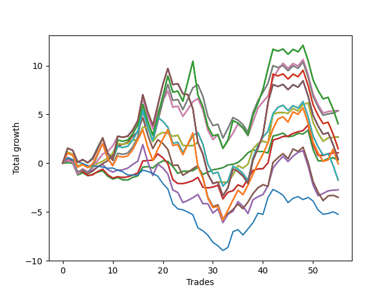

# Short Shepard 002 
- Symbol: SPY_Unlimited
- Date Range: 03/23/2022 - 07/08/2022
- Trading Period: 7:20-12:30
- Number of Trades: 55



| Name | Win Percent | Profit | Avg Profit / Trade | Avg Time / Trade |      | Name | Win Percent | Profit | Avg Profit / Trade | Avg Time / Trade |
| ---- | ----------- | ------ | ------------------ | ---------------- | ---- | ---- | ----------- | ------ | ------------------ | ---------------- |
| Sorted By <br> Profit | | | | | | Sorted By <br> Win Percentage ||||
| Sixty-Eight | 63.64 | 2700.00 | 49.09 | 21:35 |     | Sixty-Five | 69.09 | 535.00 | 9.73 | 11:48 |
| Sixty | 63.64 | 2700.00 | 49.09 | 21:35 |     | Fifty-Seven | 69.09 | 535.00 | 9.73 | 11:48 |
| Fifty-Two | 63.64 | 2700.00 | 49.09 | 21:35 |     | Forty-Nine | 69.09 | 535.00 | 9.73 | 11:48 |
| Forty-Four | 63.64 | 2700.00 | 49.09 | 21:35 |     | Forty-One | 69.09 | 535.00 | 9.73 | 11:48 |
| Four | 63.64 | 2700.00 | 49.09 | 21:35 |     | One | 69.09 | 535.00 | 9.73 | 11:48 |
| Sixty-Nine | 56.36 | 2690.00 | 48.91 | 25:00 |     | Sixty-Eight | 63.64 | 2700.00 | 49.09 | 21:35 |
| Sixty-One | 56.36 | 2690.00 | 48.91 | 25:00 |     | Sixty | 63.64 | 2700.00 | 49.09 | 21:35 |
| Fifty-Three | 56.36 | 2690.00 | 48.91 | 25:00 |     | Fifty-Two | 63.64 | 2700.00 | 49.09 | 21:35 |
| Forty-Five | 56.36 | 2690.00 | 48.91 | 25:00 |     | Forty-Four | 63.64 | 2700.00 | 49.09 | 21:35 |
| Five | 56.36 | 2690.00 | 48.91 | 25:00 |     | Four | 63.64 | 2700.00 | 49.09 | 21:35 |
| One Hundred Twenty-Seven | 50.91 | 2020.00 | 36.73 | 27:30 |     | Sixty-Four | 63.64 | 170.00 | 3.09 | 06:25 |
| One Hundred Twenty-Two | 50.91 | 2020.00 | 36.73 | 27:30 |     | Fifty-Six | 63.64 | 170.00 | 3.09 | 06:25 |
| One Hundred Seventeen | 50.91 | 2020.00 | 36.73 | 27:30 |     | Forty-Eight | 63.64 | 170.00 | 3.09 | 06:25 |
| One Hundred Twelve | 50.91 | 2020.00 | 36.73 | 27:30 |     | Forty | 63.64 | 170.00 | 3.09 | 06:25 |
| Eighty-Two | 50.91 | 2020.00 | 36.73 | 27:30 |     | Zero | 63.64 | 170.00 | 3.09 | 06:25 |
| Seventy | 58.18 | 1345.00 | 24.45 | 13:21 |     | Sixty-Seven | 61.82 | -1750.00 | -31.82 | 18:14 |
| Sixty-Two | 58.18 | 1345.00 | 24.45 | 13:21 |     | Fifty-Nine | 61.82 | -1750.00 | -31.82 | 18:14 |
| Fifty-Four | 58.18 | 1345.00 | 24.45 | 13:21 |     | Fifty-One | 61.82 | -1750.00 | -31.82 | 18:14 |
| Forty-Six | 58.18 | 1345.00 | 24.45 | 13:21 |     | Forty-Three | 61.82 | -1750.00 | -31.82 | 18:14 |
| Six | 58.18 | 1345.00 | 24.45 | 13:21 |     | Three | 61.82 | -1750.00 | -31.82 | 18:14 |
| One Hundred Twenty-Eight | 47.27 | 745.00 | 13.55 | 28:47 |     | Sixty-Six | 60.00 | -1365.00 | -24.82 | 17:00 |
| One Hundred Twenty-Three | 47.27 | 745.00 | 13.55 | 28:47 |     | Fifty-Eight | 60.00 | -1365.00 | -24.82 | 17:00 |
| One Hundred Eighteen | 47.27 | 745.00 | 13.55 | 28:47 |     | Fifty | 60.00 | -1365.00 | -24.82 | 17:00 |
| One Hundred Thirteen | 47.27 | 745.00 | 13.55 | 28:47 |     | Forty-Two | 60.00 | -1365.00 | -24.82 | 17:00 |
| Eighty-Three | 47.27 | 745.00 | 13.55 | 28:47 |     | Two | 60.00 | -1365.00 | -24.82 | 17:00 |
| Sixty-Five | 69.09 | 535.00 | 9.73 | 11:48 |     | Seventy | 58.18 | 1345.00 | 24.45 | 13:21 |
| Fifty-Seven | 69.09 | 535.00 | 9.73 | 11:48 |     | Sixty-Two | 58.18 | 1345.00 | 24.45 | 13:21 |
| Forty-Nine | 69.09 | 535.00 | 9.73 | 11:48 |     | Fifty-Four | 58.18 | 1345.00 | 24.45 | 13:21 |
| Forty-One | 69.09 | 535.00 | 9.73 | 11:48 |     | Forty-Six | 58.18 | 1345.00 | 24.45 | 13:21 |
| One | 69.09 | 535.00 | 9.73 | 11:48 |     | Six | 58.18 | 1345.00 | 24.45 | 13:21 |
| One Hundred Thirty | 47.27 | 205.00 | 3.73 | 29:36 |     | One Hundred Twenty-Six | 58.18 | -30.00 | -0.55 | 22:55 |
| One Hundred Twenty-Nine | 47.27 | 205.00 | 3.73 | 29:36 |     | One Hundred Twenty-One | 58.18 | -30.00 | -0.55 | 22:55 |
| One Hundred Twenty-Five | 47.27 | 205.00 | 3.73 | 29:36 |     | One Hundred Sixteen | 58.18 | -30.00 | -0.55 | 22:55 |
| One Hundred Twenty-Four | 47.27 | 205.00 | 3.73 | 29:36 |     | One Hundred Eleven | 58.18 | -30.00 | -0.55 | 22:55 |
| One Hundred Twenty | 47.27 | 205.00 | 3.73 | 29:36 |     | Eighty-One | 58.18 | -30.00 | -0.55 | 22:55 |
| One Hundred Ninteen | 47.27 | 205.00 | 3.73 | 29:36 |     | Sixty-Nine | 56.36 | 2690.00 | 48.91 | 25:00 |
| One Hundred Fifteen | 47.27 | 205.00 | 3.73 | 29:36 |     | Sixty-One | 56.36 | 2690.00 | 48.91 | 25:00 |
| One Hundred Fourteen | 47.27 | 205.00 | 3.73 | 29:36 |     | Fifty-Three | 56.36 | 2690.00 | 48.91 | 25:00 |
| Eighty-Five | 47.27 | 205.00 | 3.73 | 29:36 |     | Forty-Five | 56.36 | 2690.00 | 48.91 | 25:00 |
| Eighty-Four | 47.27 | 205.00 | 3.73 | 29:36 |     | Five | 56.36 | 2690.00 | 48.91 | 25:00 |
| Sixty-Four | 63.64 | 170.00 | 3.09 | 06:25 |     | One Hundred Twenty-Seven | 50.91 | 2020.00 | 36.73 | 27:30 |
| Fifty-Six | 63.64 | 170.00 | 3.09 | 06:25 |     | One Hundred Twenty-Two | 50.91 | 2020.00 | 36.73 | 27:30 |
| Forty-Eight | 63.64 | 170.00 | 3.09 | 06:25 |     | One Hundred Seventeen | 50.91 | 2020.00 | 36.73 | 27:30 |
| Forty | 63.64 | 170.00 | 3.09 | 06:25 |     | One Hundred Twelve | 50.91 | 2020.00 | 36.73 | 27:30 |
| Zero | 63.64 | 170.00 | 3.09 | 06:25 |     | Eighty-Two | 50.91 | 2020.00 | 36.73 | 27:30 |
| One Hundred Twenty-Six | 58.18 | -30.00 | -0.55 | 22:55 |     | Seventy-One | 50.91 | -865.00 | -15.73 | 25:20 |
| One Hundred Twenty-One | 58.18 | -30.00 | -0.55 | 22:55 |     | Sixty-Three | 50.91 | -865.00 | -15.73 | 25:20 |
| One Hundred Sixteen | 58.18 | -30.00 | -0.55 | 22:55 |     | Fifty-Five | 50.91 | -865.00 | -15.73 | 25:20 |
| One Hundred Eleven | 58.18 | -30.00 | -0.55 | 22:55 |     | Forty-Seven | 50.91 | -865.00 | -15.73 | 25:20 |
| Eighty-One | 58.18 | -30.00 | -0.55 | 22:55 |     | Seven | 50.91 | -865.00 | -15.73 | 25:20 |
| Seventy-One | 50.91 | -865.00 | -15.73 | 25:20 |     | One Hundred Twenty-Eight | 47.27 | 745.00 | 13.55 | 28:47 |
| Sixty-Three | 50.91 | -865.00 | -15.73 | 25:20 |     | One Hundred Twenty-Three | 47.27 | 745.00 | 13.55 | 28:47 |
| Fifty-Five | 50.91 | -865.00 | -15.73 | 25:20 |     | One Hundred Eighteen | 47.27 | 745.00 | 13.55 | 28:47 |
| Forty-Seven | 50.91 | -865.00 | -15.73 | 25:20 |     | One Hundred Thirteen | 47.27 | 745.00 | 13.55 | 28:47 |
| Seven | 50.91 | -865.00 | -15.73 | 25:20 |     | Eighty-Three | 47.27 | 745.00 | 13.55 | 28:47 |
| Sixty-Six | 60.00 | -1365.00 | -24.82 | 17:00 |     | One Hundred Thirty | 47.27 | 205.00 | 3.73 | 29:36 |
| Fifty-Eight | 60.00 | -1365.00 | -24.82 | 17:00 |     | One Hundred Twenty-Nine | 47.27 | 205.00 | 3.73 | 29:36 |
| Fifty | 60.00 | -1365.00 | -24.82 | 17:00 |     | One Hundred Twenty-Five | 47.27 | 205.00 | 3.73 | 29:36 |
| Forty-Two | 60.00 | -1365.00 | -24.82 | 17:00 |     | One Hundred Twenty-Four | 47.27 | 205.00 | 3.73 | 29:36 |
| Two | 60.00 | -1365.00 | -24.82 | 17:00 |     | One Hundred Twenty | 47.27 | 205.00 | 3.73 | 29:36 |
| Sixty-Seven | 61.82 | -1750.00 | -31.82 | 18:14 |     | One Hundred Ninteen | 47.27 | 205.00 | 3.73 | 29:36 |
| Fifty-Nine | 61.82 | -1750.00 | -31.82 | 18:14 |     | One Hundred Fifteen | 47.27 | 205.00 | 3.73 | 29:36 |
| Fifty-One | 61.82 | -1750.00 | -31.82 | 18:14 |     | One Hundred Fourteen | 47.27 | 205.00 | 3.73 | 29:36 |
| Forty-Three | 61.82 | -1750.00 | -31.82 | 18:14 |     | Eighty-Five | 47.27 | 205.00 | 3.73 | 29:36 |
| Three | 61.82 | -1750.00 | -31.82 | 18:14 |     | Eighty-Four | 47.27 | 205.00 | 3.73 | 29:36 |
| Seventy-Three | 30.91 | -2620.00 | -47.64 | 06:45 |     | Seventy-Three | 30.91 | -2620.00 | -47.64 | 06:45 |

## NO STOPLOSS

### Test Zero
* Sell when price hits the middle line of the 20p bollinger
* No Stoploss
* Results:
```
Total Trades: 55
Percent Up: 36.36
Percent Down: 63.64
Total Points Moved Down: 0.34
Potential Profit: 170.00
Total Points Ups: 8.90 Count Ups: 20
Total Points Downs: 9.24 Count Downs: 35
```

<details><summary>Trades</summary>

<code>In: 2022-03-25 11:57:00		Out: 2022-03-25 11:57:15		Total Position Time: 00:15		Total Move Down: 0.03		Total to Date: 0.03</code> <br />
<code>In: 2022-03-28 10:33:00		Out: 2022-03-28 10:42:15		Total Position Time: 09:15		Total Move Down: -0.03		Total to Date: -0.00</code> <br />
<code>In: 2022-03-28 11:36:00		Out: 2022-03-28 12:05:55		Total Position Time: 29:55		Total Move Down: -1.21		Total to Date: -1.21</code> <br />
<code>In: 2022-03-29 08:36:00		Out: 2022-03-29 08:41:05		Total Position Time: 05:05		Total Move Down: 0.22		Total to Date: -0.99</code> <br />
<code>In: 2022-03-29 10:51:00		Out: 2022-03-29 11:06:20		Total Position Time: 15:20		Total Move Down: -0.29		Total to Date: -1.28</code> <br />
<code>In: 2022-03-30 09:46:00		Out: 2022-03-30 09:50:50		Total Position Time: 04:50		Total Move Down: 0.14		Total to Date: -1.14</code> <br />
<code>In: 2022-04-06 08:56:00		Out: 2022-04-06 09:00:40		Total Position Time: 04:40		Total Move Down: 0.23		Total to Date: -0.91</code> <br />
<code>In: 2022-04-06 08:57:00		Out: 2022-04-06 09:00:40		Total Position Time: 03:40		Total Move Down: 0.13		Total to Date: -0.78</code> <br />
<code>In: 2022-04-06 10:32:00		Out: 2022-04-06 10:47:10		Total Position Time: 15:10		Total Move Down: -0.55		Total to Date: -1.33</code> <br />
<code>In: 2022-04-06 10:36:00		Out: 2022-04-06 10:47:10		Total Position Time: 11:10		Total Move Down: -0.30		Total to Date: -1.63</code> <br />
<code>In: 2022-04-06 10:47:00		Out: 2022-04-06 10:47:10		Total Position Time: 00:10		Total Move Down: 0.16		Total to Date: -1.47</code> <br />
<code>In: 2022-04-07 10:25:00		Out: 2022-04-07 10:36:05		Total Position Time: 11:05		Total Move Down: -0.24		Total to Date: -1.71</code> <br />
<code>In: 2022-04-07 11:06:00		Out: 2022-04-07 11:15:20		Total Position Time: 09:20		Total Move Down: -0.02		Total to Date: -1.73</code> <br />
<code>In: 2022-04-12 08:36:00		Out: 2022-04-12 08:36:20		Total Position Time: 00:20		Total Move Down: 0.27		Total to Date: -1.46</code> <br />
<code>In: 2022-04-14 11:08:00		Out: 2022-04-14 11:14:05		Total Position Time: 06:05		Total Move Down: 0.16		Total to Date: -1.30</code> <br />
<code>In: 2022-04-25 07:39:00		Out: 2022-04-25 07:40:25		Total Position Time: 01:25		Total Move Down: 0.89		Total to Date: -0.41</code> <br />
<code>In: 2022-05-04 08:58:00		Out: 2022-05-04 09:02:25		Total Position Time: 04:25		Total Move Down: 0.06		Total to Date: -0.35</code> <br />
<code>In: 2022-05-04 09:32:00		Out: 2022-05-04 09:45:30		Total Position Time: 13:30		Total Move Down: -0.15		Total to Date: -0.50</code> <br />
<code>In: 2022-05-09 09:20:00		Out: 2022-05-09 09:26:00		Total Position Time: 06:00		Total Move Down: 0.45		Total to Date: -0.05</code> <br />
<code>In: 2022-05-09 12:04:00		Out: 2022-05-09 12:04:10		Total Position Time: 00:10		Total Move Down: 0.28		Total to Date: 0.23</code> <br />
<code>In: 2022-05-09 12:10:00		Out: 2022-05-09 12:10:20		Total Position Time: 00:20		Total Move Down: -0.04		Total to Date: 0.19</code> <br />
<code>In: 2022-05-12 12:30:00		Out: 2022-05-12 12:35:25		Total Position Time: 05:25		Total Move Down: -0.53		Total to Date: -0.34</code> <br />
<code>In: 2022-05-16 08:51:00		Out: 2022-05-16 09:05:45		Total Position Time: 14:45		Total Move Down: -0.71		Total to Date: -1.05</code> <br />
<code>In: 2022-05-24 08:55:00		Out: 2022-05-24 09:01:05		Total Position Time: 06:05		Total Move Down: 0.21		Total to Date: -0.84</code> <br />
<code>In: 2022-05-25 10:41:00		Out: 2022-05-25 10:47:20		Total Position Time: 06:20		Total Move Down: 0.01		Total to Date: -0.83</code> <br />
<code>In: 2022-05-25 10:47:00		Out: 2022-05-25 10:47:20		Total Position Time: 00:20		Total Move Down: 0.06		Total to Date: -0.77</code> <br />
<code>In: 2022-05-25 11:07:00		Out: 2022-05-25 11:07:10		Total Position Time: 00:10		Total Move Down: 0.33		Total to Date: -0.44</code> <br />
<code>In: 2022-05-25 11:23:00		Out: 2022-05-25 11:39:10		Total Position Time: 16:10		Total Move Down: -0.71		Total to Date: -1.15</code> <br />
<code>In: 2022-05-25 11:33:00		Out: 2022-05-25 11:39:10		Total Position Time: 06:10		Total Move Down: 0.23		Total to Date: -0.92</code> <br />
<code>In: 2022-05-31 07:26:00		Out: 2022-05-31 07:30:05		Total Position Time: 04:05		Total Move Down: 0.24		Total to Date: -0.68</code> <br />
<code>In: 2022-06-01 12:19:00		Out: 2022-06-01 12:25:25		Total Position Time: 06:25		Total Move Down: 0.09		Total to Date: -0.59</code> <br />
<code>In: 2022-06-03 09:42:00		Out: 2022-06-03 09:43:30		Total Position Time: 01:30		Total Move Down: 0.13		Total to Date: -0.46</code> <br />
<code>In: 2022-06-09 08:47:00		Out: 2022-06-09 08:48:20		Total Position Time: 01:20		Total Move Down: 0.28		Total to Date: -0.18</code> <br />
<code>In: 2022-06-09 10:14:00		Out: 2022-06-09 10:16:15		Total Position Time: 02:15		Total Move Down: 0.05		Total to Date: -0.13</code> <br />
<code>In: 2022-06-10 12:03:00		Out: 2022-06-10 12:03:25		Total Position Time: 00:25		Total Move Down: 0.20		Total to Date: 0.07</code> <br />
<code>In: 2022-06-13 08:27:00		Out: 2022-06-13 08:32:05		Total Position Time: 05:05		Total Move Down: 0.43		Total to Date: 0.50</code> <br />
<code>In: 2022-06-13 08:46:00		Out: 2022-06-13 08:47:55		Total Position Time: 01:55		Total Move Down: 0.57		Total to Date: 1.07</code> <br />
<code>In: 2022-06-13 09:42:00		Out: 2022-06-13 09:44:05		Total Position Time: 02:05		Total Move Down: 0.29		Total to Date: 1.36</code> <br />
<code>In: 2022-06-13 10:54:00		Out: 2022-06-13 11:00:25		Total Position Time: 06:25		Total Move Down: -0.16		Total to Date: 1.20</code> <br />
<code>In: 2022-06-15 09:26:00		Out: 2022-06-15 09:30:55		Total Position Time: 04:55		Total Move Down: 0.01		Total to Date: 1.21</code> <br />
<code>In: 2022-06-15 11:02:00		Out: 2022-06-15 11:02:10		Total Position Time: 00:10		Total Move Down: -0.17		Total to Date: 1.04</code> <br />
<code>In: 2022-06-15 11:48:00		Out: 2022-06-15 11:53:25		Total Position Time: 05:25		Total Move Down: 1.74		Total to Date: 2.78</code> <br />
<code>In: 2022-06-16 08:31:00		Out: 2022-06-16 08:31:10		Total Position Time: 00:10		Total Move Down: 0.13		Total to Date: 2.91</code> <br />
<code>In: 2022-06-16 10:11:00		Out: 2022-06-16 10:13:45		Total Position Time: 02:45		Total Move Down: 0.18		Total to Date: 3.09</code> <br />
<code>In: 2022-06-17 08:13:00		Out: 2022-06-17 08:23:05		Total Position Time: 10:05		Total Move Down: -0.39		Total to Date: 2.70</code> <br />
<code>In: 2022-06-17 10:16:00		Out: 2022-06-17 10:22:05		Total Position Time: 06:05		Total Move Down: 0.09		Total to Date: 2.79</code> <br />
<code>In: 2022-06-23 11:41:00		Out: 2022-06-23 11:46:00		Total Position Time: 05:00		Total Move Down: 0.26		Total to Date: 3.05</code> <br />
<code>In: 2022-06-29 11:08:00		Out: 2022-06-29 11:18:05		Total Position Time: 10:05		Total Move Down: -0.05		Total to Date: 3.00</code> <br />
<code>In: 2022-06-30 07:39:00		Out: 2022-06-30 07:42:05		Total Position Time: 03:05		Total Move Down: 0.38		Total to Date: 3.38</code> <br />
<code>In: 2022-06-30 08:02:00		Out: 2022-06-30 08:31:55		Total Position Time: 29:55		Total Move Down: -1.98		Total to Date: 1.40</code> <br />
<code>In: 2022-07-01 10:36:00		Out: 2022-07-01 10:58:40		Total Position Time: 22:40		Total Move Down: -1.15		Total to Date: 0.25</code> <br />
<code>In: 2022-07-05 08:53:00		Out: 2022-07-05 09:00:10		Total Position Time: 07:10		Total Move Down: -0.01		Total to Date: 0.24</code> <br />
<code>In: 2022-07-06 10:11:00		Out: 2022-07-06 10:17:05		Total Position Time: 06:05		Total Move Down: 0.24		Total to Date: 0.48</code> <br />
<code>In: 2022-07-06 11:00:00		Out: 2022-07-06 11:00:10		Total Position Time: 00:10		Total Move Down: 0.07		Total to Date: 0.55</code> <br />
<code>In: 2022-07-06 11:01:00		Out: 2022-07-06 11:01:10		Total Position Time: 00:10		Total Move Down: -0.21		Total to Date: 0.34</code> <br />


</details>

### Test One
* Sell when the price hits the upper line of the 20p 1std bollinger
* No Stoploss
* Results:
```
Total Trades: 55
Percent Up: 30.91
Percent Down: 69.09
Total Points Moved Down: 1.07
Potential Profit: 535.00
Total Points Ups: 11.50 Count Ups: 17
Total Points Downs: 12.57 Count Downs: 38
```

<details><summary>Trades</summary>

<code>In: 2022-03-25 11:57:00		Out: 2022-03-25 12:00:50		Total Position Time: 03:50		Total Move Down: 0.28		Total to Date: 0.28</code> <br />
<code>In: 2022-03-28 10:33:00		Out: 2022-03-28 10:44:05		Total Position Time: 11:05		Total Move Down: 0.01		Total to Date: 0.29</code> <br />
<code>In: 2022-03-28 11:36:00		Out: 2022-03-28 12:05:55		Total Position Time: 29:55		Total Move Down: -1.21		Total to Date: -0.92</code> <br />
<code>In: 2022-03-29 08:36:00		Out: 2022-03-29 08:58:45		Total Position Time: 22:45		Total Move Down: 0.06		Total to Date: -0.86</code> <br />
<code>In: 2022-03-29 10:51:00		Out: 2022-03-29 11:18:25		Total Position Time: 27:25		Total Move Down: -0.42		Total to Date: -1.28</code> <br />
<code>In: 2022-03-30 09:46:00		Out: 2022-03-30 10:00:45		Total Position Time: 14:45		Total Move Down: 0.09		Total to Date: -1.19</code> <br />
<code>In: 2022-04-06 08:56:00		Out: 2022-04-06 09:04:45		Total Position Time: 08:45		Total Move Down: 0.34		Total to Date: -0.85</code> <br />
<code>In: 2022-04-06 08:57:00		Out: 2022-04-06 09:04:45		Total Position Time: 07:45		Total Move Down: 0.24		Total to Date: -0.61</code> <br />
<code>In: 2022-04-06 10:32:00		Out: 2022-04-06 10:56:55		Total Position Time: 24:55		Total Move Down: -0.58		Total to Date: -1.19</code> <br />
<code>In: 2022-04-06 10:36:00		Out: 2022-04-06 10:56:55		Total Position Time: 20:55		Total Move Down: -0.33		Total to Date: -1.52</code> <br />
<code>In: 2022-04-06 10:47:00		Out: 2022-04-06 10:56:55		Total Position Time: 09:55		Total Move Down: 0.13		Total to Date: -1.39</code> <br />
<code>In: 2022-04-07 10:25:00		Out: 2022-04-07 10:39:55		Total Position Time: 14:55		Total Move Down: -0.08		Total to Date: -1.47</code> <br />
<code>In: 2022-04-07 11:06:00		Out: 2022-04-07 11:18:00		Total Position Time: 12:00		Total Move Down: 0.07		Total to Date: -1.40</code> <br />
<code>In: 2022-04-12 08:36:00		Out: 2022-04-12 08:44:45		Total Position Time: 08:45		Total Move Down: 0.18		Total to Date: -1.22</code> <br />
<code>In: 2022-04-14 11:08:00		Out: 2022-04-14 11:17:10		Total Position Time: 09:10		Total Move Down: 0.22		Total to Date: -1.00</code> <br />
<code>In: 2022-04-25 07:39:00		Out: 2022-04-25 07:43:05		Total Position Time: 04:05		Total Move Down: 1.22		Total to Date: 0.22</code> <br />
<code>In: 2022-05-04 08:58:00		Out: 2022-05-04 09:07:10		Total Position Time: 09:10		Total Move Down: 0.05		Total to Date: 0.27</code> <br />
<code>In: 2022-05-04 09:32:00		Out: 2022-05-04 09:46:30		Total Position Time: 14:30		Total Move Down: 0.02		Total to Date: 0.29</code> <br />
<code>In: 2022-05-09 09:20:00		Out: 2022-05-09 09:26:10		Total Position Time: 06:10		Total Move Down: 0.66		Total to Date: 0.95</code> <br />
<code>In: 2022-05-09 12:04:00		Out: 2022-05-09 12:17:15		Total Position Time: 13:15		Total Move Down: -0.39		Total to Date: 0.56</code> <br />
<code>In: 2022-05-09 12:10:00		Out: 2022-05-09 12:17:15		Total Position Time: 07:15		Total Move Down: -0.61		Total to Date: -0.05</code> <br />
<code>In: 2022-05-12 12:30:00		Out: 2022-05-12 12:46:00		Total Position Time: 16:00		Total Move Down: -1.65		Total to Date: -1.70</code> <br />
<code>In: 2022-05-16 08:51:00		Out: 2022-05-16 09:06:15		Total Position Time: 15:15		Total Move Down: -0.40		Total to Date: -2.10</code> <br />
<code>In: 2022-05-24 08:55:00		Out: 2022-05-24 09:06:10		Total Position Time: 11:10		Total Move Down: -0.00		Total to Date: -2.10</code> <br />
<code>In: 2022-05-25 10:41:00		Out: 2022-05-25 10:51:35		Total Position Time: 10:35		Total Move Down: 0.13		Total to Date: -1.97</code> <br />
<code>In: 2022-05-25 10:47:00		Out: 2022-05-25 10:51:35		Total Position Time: 04:35		Total Move Down: 0.18		Total to Date: -1.79</code> <br />
<code>In: 2022-05-25 11:07:00		Out: 2022-05-25 11:07:10		Total Position Time: 00:10		Total Move Down: 0.33		Total to Date: -1.46</code> <br />
<code>In: 2022-05-25 11:23:00		Out: 2022-05-25 11:45:15		Total Position Time: 22:15		Total Move Down: -1.01		Total to Date: -2.47</code> <br />
<code>In: 2022-05-25 11:33:00		Out: 2022-05-25 11:45:15		Total Position Time: 12:15		Total Move Down: -0.07		Total to Date: -2.54</code> <br />
<code>In: 2022-05-31 07:26:00		Out: 2022-05-31 07:38:05		Total Position Time: 12:05		Total Move Down: 0.09		Total to Date: -2.45</code> <br />
<code>In: 2022-06-01 12:19:00		Out: 2022-06-01 12:25:45		Total Position Time: 06:45		Total Move Down: 0.19		Total to Date: -2.26</code> <br />
<code>In: 2022-06-03 09:42:00		Out: 2022-06-03 10:11:55		Total Position Time: 29:55		Total Move Down: -1.41		Total to Date: -3.67</code> <br />
<code>In: 2022-06-09 08:47:00		Out: 2022-06-09 08:49:35		Total Position Time: 02:35		Total Move Down: 0.69		Total to Date: -2.98</code> <br />
<code>In: 2022-06-09 10:14:00		Out: 2022-06-09 10:18:10		Total Position Time: 04:10		Total Move Down: 0.15		Total to Date: -2.83</code> <br />
<code>In: 2022-06-10 12:03:00		Out: 2022-06-10 12:04:35		Total Position Time: 01:35		Total Move Down: 0.61		Total to Date: -2.22</code> <br />
<code>In: 2022-06-13 08:27:00		Out: 2022-06-13 08:52:15		Total Position Time: 25:15		Total Move Down: -0.23		Total to Date: -2.45</code> <br />
<code>In: 2022-06-13 08:46:00		Out: 2022-06-13 08:52:15		Total Position Time: 06:15		Total Move Down: 0.86		Total to Date: -1.59</code> <br />
<code>In: 2022-06-13 09:42:00		Out: 2022-06-13 09:47:55		Total Position Time: 05:55		Total Move Down: 0.85		Total to Date: -0.74</code> <br />
<code>In: 2022-06-13 10:54:00		Out: 2022-06-13 11:01:35		Total Position Time: 07:35		Total Move Down: 0.15		Total to Date: -0.59</code> <br />
<code>In: 2022-06-15 09:26:00		Out: 2022-06-15 09:35:10		Total Position Time: 09:10		Total Move Down: 0.03		Total to Date: -0.56</code> <br />
<code>In: 2022-06-15 11:02:00		Out: 2022-06-15 11:03:05		Total Position Time: 01:05		Total Move Down: 0.59		Total to Date: 0.03</code> <br />
<code>In: 2022-06-15 11:48:00		Out: 2022-06-15 11:57:45		Total Position Time: 09:45		Total Move Down: 2.34		Total to Date: 2.37</code> <br />
<code>In: 2022-06-16 08:31:00		Out: 2022-06-16 08:35:15		Total Position Time: 04:15		Total Move Down: 0.15		Total to Date: 2.52</code> <br />
<code>In: 2022-06-16 10:11:00		Out: 2022-06-16 10:20:20		Total Position Time: 09:20		Total Move Down: 0.22		Total to Date: 2.74</code> <br />
<code>In: 2022-06-17 08:13:00		Out: 2022-06-17 08:25:20		Total Position Time: 12:20		Total Move Down: 0.03		Total to Date: 2.77</code> <br />
<code>In: 2022-06-17 10:16:00		Out: 2022-06-17 10:26:10		Total Position Time: 10:10		Total Move Down: 0.28		Total to Date: 3.05</code> <br />
<code>In: 2022-06-23 11:41:00		Out: 2022-06-23 11:52:05		Total Position Time: 11:05		Total Move Down: 0.17		Total to Date: 3.22</code> <br />
<code>In: 2022-06-29 11:08:00		Out: 2022-06-29 11:20:35		Total Position Time: 12:35		Total Move Down: 0.12		Total to Date: 3.34</code> <br />
<code>In: 2022-06-30 07:39:00		Out: 2022-06-30 07:49:05		Total Position Time: 10:05		Total Move Down: 0.56		Total to Date: 3.90</code> <br />
<code>In: 2022-06-30 08:02:00		Out: 2022-06-30 08:31:55		Total Position Time: 29:55		Total Move Down: -1.98		Total to Date: 1.92</code> <br />
<code>In: 2022-07-01 10:36:00		Out: 2022-07-01 11:04:25		Total Position Time: 28:25		Total Move Down: -1.12		Total to Date: 0.80</code> <br />
<code>In: 2022-07-05 08:53:00		Out: 2022-07-05 09:03:25		Total Position Time: 10:25		Total Move Down: -0.01		Total to Date: 0.79</code> <br />
<code>In: 2022-07-06 10:11:00		Out: 2022-07-06 10:25:55		Total Position Time: 14:55		Total Move Down: 0.17		Total to Date: 0.96</code> <br />
<code>In: 2022-07-06 11:00:00		Out: 2022-07-06 11:00:10		Total Position Time: 00:10		Total Move Down: 0.07		Total to Date: 1.03</code> <br />
<code>In: 2022-07-06 11:01:00		Out: 2022-07-06 11:01:15		Total Position Time: 00:15		Total Move Down: 0.04		Total to Date: 1.07</code> <br />


</details>

### Test Two
* Sell when the price hits the upper line of the 20p 2std bollinger
* No Stoploss
* Results:
```
Total Trades: 55
Percent Up: 40.00
Percent Down: 60.00
Total Points Moved Down: -2.73
Potential Profit: -1365.00
Total Points Ups: 19.05 Count Ups: 22
Total Points Downs: 16.32 Count Downs: 33
```

<details><summary>Trades</summary>

<code>In: 2022-03-25 11:57:00		Out: 2022-03-25 12:00:55		Total Position Time: 03:55		Total Move Down: 0.29		Total to Date: 0.29</code> <br />
<code>In: 2022-03-28 10:33:00		Out: 2022-03-28 10:48:10		Total Position Time: 15:10		Total Move Down: -0.01		Total to Date: 0.28</code> <br />
<code>In: 2022-03-28 11:36:00		Out: 2022-03-28 12:05:55		Total Position Time: 29:55		Total Move Down: -1.21		Total to Date: -0.93</code> <br />
<code>In: 2022-03-29 08:36:00		Out: 2022-03-29 09:01:40		Total Position Time: 25:40		Total Move Down: 0.26		Total to Date: -0.67</code> <br />
<code>In: 2022-03-29 10:51:00		Out: 2022-03-29 11:18:50		Total Position Time: 27:50		Total Move Down: -0.24		Total to Date: -0.91</code> <br />
<code>In: 2022-03-30 09:46:00		Out: 2022-03-30 10:01:15		Total Position Time: 15:15		Total Move Down: 0.19		Total to Date: -0.72</code> <br />
<code>In: 2022-04-06 08:56:00		Out: 2022-04-06 09:09:40		Total Position Time: 13:40		Total Move Down: 0.34		Total to Date: -0.38</code> <br />
<code>In: 2022-04-06 08:57:00		Out: 2022-04-06 09:09:40		Total Position Time: 12:40		Total Move Down: 0.24		Total to Date: -0.14</code> <br />
<code>In: 2022-04-06 10:32:00		Out: 2022-04-06 10:57:20		Total Position Time: 25:20		Total Move Down: -0.51		Total to Date: -0.65</code> <br />
<code>In: 2022-04-06 10:36:00		Out: 2022-04-06 10:57:20		Total Position Time: 21:20		Total Move Down: -0.26		Total to Date: -0.91</code> <br />
<code>In: 2022-04-06 10:47:00		Out: 2022-04-06 10:57:20		Total Position Time: 10:20		Total Move Down: 0.20		Total to Date: -0.71</code> <br />
<code>In: 2022-04-07 10:25:00		Out: 2022-04-07 10:45:15		Total Position Time: 20:15		Total Move Down: 0.03		Total to Date: -0.68</code> <br />
<code>In: 2022-04-07 11:06:00		Out: 2022-04-07 11:18:20		Total Position Time: 12:20		Total Move Down: 0.17		Total to Date: -0.51</code> <br />
<code>In: 2022-04-12 08:36:00		Out: 2022-04-12 08:49:15		Total Position Time: 13:15		Total Move Down: 0.39		Total to Date: -0.12</code> <br />
<code>In: 2022-04-14 11:08:00		Out: 2022-04-14 11:18:30		Total Position Time: 10:30		Total Move Down: 0.32		Total to Date: 0.20</code> <br />
<code>In: 2022-04-25 07:39:00		Out: 2022-04-25 07:52:20		Total Position Time: 13:20		Total Move Down: 1.71		Total to Date: 1.91</code> <br />
<code>In: 2022-05-04 08:58:00		Out: 2022-05-04 09:27:55		Total Position Time: 29:55		Total Move Down: -1.79		Total to Date: 0.12</code> <br />
<code>In: 2022-05-04 09:32:00		Out: 2022-05-04 10:01:55		Total Position Time: 29:55		Total Move Down: -1.38		Total to Date: -1.26</code> <br />
<code>In: 2022-05-09 09:20:00		Out: 2022-05-09 09:37:50		Total Position Time: 17:50		Total Move Down: 1.16		Total to Date: -0.10</code> <br />
<code>In: 2022-05-09 12:04:00		Out: 2022-05-09 12:17:15		Total Position Time: 13:15		Total Move Down: -0.39		Total to Date: -0.49</code> <br />
<code>In: 2022-05-09 12:10:00		Out: 2022-05-09 12:17:15		Total Position Time: 07:15		Total Move Down: -0.61		Total to Date: -1.10</code> <br />
<code>In: 2022-05-12 12:30:00		Out: 2022-05-12 12:46:00		Total Position Time: 16:00		Total Move Down: -1.65		Total to Date: -2.75</code> <br />
<code>In: 2022-05-16 08:51:00		Out: 2022-05-16 09:11:35		Total Position Time: 20:35		Total Move Down: -0.26		Total to Date: -3.01</code> <br />
<code>In: 2022-05-24 08:55:00		Out: 2022-05-24 09:24:55		Total Position Time: 29:55		Total Move Down: -1.04		Total to Date: -4.05</code> <br />
<code>In: 2022-05-25 10:41:00		Out: 2022-05-25 10:52:10		Total Position Time: 11:10		Total Move Down: 0.23		Total to Date: -3.82</code> <br />
<code>In: 2022-05-25 10:47:00		Out: 2022-05-25 10:52:10		Total Position Time: 05:10		Total Move Down: 0.28		Total to Date: -3.54</code> <br />
<code>In: 2022-05-25 11:07:00		Out: 2022-05-25 11:07:10		Total Position Time: 00:10		Total Move Down: 0.33		Total to Date: -3.21</code> <br />
<code>In: 2022-05-25 11:23:00		Out: 2022-05-25 11:50:00		Total Position Time: 27:00		Total Move Down: -0.95		Total to Date: -4.16</code> <br />
<code>In: 2022-05-25 11:33:00		Out: 2022-05-25 11:50:00		Total Position Time: 17:00		Total Move Down: -0.01		Total to Date: -4.17</code> <br />
<code>In: 2022-05-31 07:26:00		Out: 2022-05-31 07:55:55		Total Position Time: 29:55		Total Move Down: -0.95		Total to Date: -5.12</code> <br />
<code>In: 2022-06-01 12:19:00		Out: 2022-06-01 12:30:05		Total Position Time: 11:05		Total Move Down: 0.44		Total to Date: -4.68</code> <br />
<code>In: 2022-06-03 09:42:00		Out: 2022-06-03 10:11:55		Total Position Time: 29:55		Total Move Down: -1.41		Total to Date: -6.09</code> <br />
<code>In: 2022-06-09 08:47:00		Out: 2022-06-09 09:11:00		Total Position Time: 24:00		Total Move Down: 0.85		Total to Date: -5.24</code> <br />
<code>In: 2022-06-09 10:14:00		Out: 2022-06-09 10:18:55		Total Position Time: 04:55		Total Move Down: 0.31		Total to Date: -4.93</code> <br />
<code>In: 2022-06-10 12:03:00		Out: 2022-06-10 12:05:55		Total Position Time: 02:55		Total Move Down: 0.98		Total to Date: -3.95</code> <br />
<code>In: 2022-06-13 08:27:00		Out: 2022-06-13 08:56:55		Total Position Time: 29:55		Total Move Down: -0.47		Total to Date: -4.42</code> <br />
<code>In: 2022-06-13 08:46:00		Out: 2022-06-13 09:15:55		Total Position Time: 29:55		Total Move Down: -0.75		Total to Date: -5.17</code> <br />
<code>In: 2022-06-13 09:42:00		Out: 2022-06-13 09:54:45		Total Position Time: 12:45		Total Move Down: 1.43		Total to Date: -3.74</code> <br />
<code>In: 2022-06-13 10:54:00		Out: 2022-06-13 11:02:30		Total Position Time: 08:30		Total Move Down: 0.29		Total to Date: -3.45</code> <br />
<code>In: 2022-06-15 09:26:00		Out: 2022-06-15 09:36:10		Total Position Time: 10:10		Total Move Down: 0.24		Total to Date: -3.21</code> <br />
<code>In: 2022-06-15 11:02:00		Out: 2022-06-15 11:03:15		Total Position Time: 01:15		Total Move Down: 0.90		Total to Date: -2.31</code> <br />
<code>In: 2022-06-15 11:48:00		Out: 2022-06-15 12:17:55		Total Position Time: 29:55		Total Move Down: 1.81		Total to Date: -0.50</code> <br />
<code>In: 2022-06-16 08:31:00		Out: 2022-06-16 08:42:05		Total Position Time: 11:05		Total Move Down: 0.65		Total to Date: 0.15</code> <br />
<code>In: 2022-06-16 10:11:00		Out: 2022-06-16 10:21:20		Total Position Time: 10:20		Total Move Down: 0.55		Total to Date: 0.70</code> <br />
<code>In: 2022-06-17 08:13:00		Out: 2022-06-17 08:42:55		Total Position Time: 29:55		Total Move Down: -0.53		Total to Date: 0.17</code> <br />
<code>In: 2022-06-17 10:16:00		Out: 2022-06-17 10:27:10		Total Position Time: 11:10		Total Move Down: 0.54		Total to Date: 0.71</code> <br />
<code>In: 2022-06-23 11:41:00		Out: 2022-06-23 12:01:10		Total Position Time: 20:10		Total Move Down: 0.40		Total to Date: 1.11</code> <br />
<code>In: 2022-06-29 11:08:00		Out: 2022-06-29 11:21:05		Total Position Time: 13:05		Total Move Down: 0.17		Total to Date: 1.28</code> <br />
<code>In: 2022-06-30 07:39:00		Out: 2022-06-30 08:08:55		Total Position Time: 29:55		Total Move Down: -1.55		Total to Date: -0.27</code> <br />
<code>In: 2022-06-30 08:02:00		Out: 2022-06-30 08:31:55		Total Position Time: 29:55		Total Move Down: -1.98		Total to Date: -2.25</code> <br />
<code>In: 2022-07-01 10:36:00		Out: 2022-07-01 11:05:55		Total Position Time: 29:55		Total Move Down: -1.10		Total to Date: -3.35</code> <br />
<code>In: 2022-07-05 08:53:00		Out: 2022-07-05 09:03:50		Total Position Time: 10:50		Total Move Down: 0.24		Total to Date: -3.11</code> <br />
<code>In: 2022-07-06 10:11:00		Out: 2022-07-06 10:27:15		Total Position Time: 16:15		Total Move Down: 0.27		Total to Date: -2.84</code> <br />
<code>In: 2022-07-06 11:00:00		Out: 2022-07-06 11:00:10		Total Position Time: 00:10		Total Move Down: 0.07		Total to Date: -2.77</code> <br />
<code>In: 2022-07-06 11:01:00		Out: 2022-07-06 11:02:20		Total Position Time: 01:20		Total Move Down: 0.04		Total to Date: -2.73</code> <br />


</details>

### Test Three
* Sell when price hits the middle line of the 50p bollinger
* No Stoploss
* Results:
```
Total Trades: 55
Percent Up: 38.18
Percent Down: 61.82
Total Points Moved Down: -3.50
Potential Profit: -1750.00
Total Points Ups: 21.12 Count Ups: 21
Total Points Downs: 17.62 Count Downs: 34
```

<details><summary>Trades</summary>

<code>In: 2022-03-25 11:57:00		Out: 2022-03-25 12:00:45		Total Position Time: 03:45		Total Move Down: 0.19		Total to Date: 0.19</code> <br />
<code>In: 2022-03-28 10:33:00		Out: 2022-03-28 10:57:20		Total Position Time: 24:20		Total Move Down: 0.09		Total to Date: 0.28</code> <br />
<code>In: 2022-03-28 11:36:00		Out: 2022-03-28 12:05:55		Total Position Time: 29:55		Total Move Down: -1.21		Total to Date: -0.93</code> <br />
<code>In: 2022-03-29 08:36:00		Out: 2022-03-29 09:01:25		Total Position Time: 25:25		Total Move Down: 0.15		Total to Date: -0.78</code> <br />
<code>In: 2022-03-29 10:51:00		Out: 2022-03-29 11:20:55		Total Position Time: 29:55		Total Move Down: -0.31		Total to Date: -1.09</code> <br />
<code>In: 2022-03-30 09:46:00		Out: 2022-03-30 10:01:45		Total Position Time: 15:45		Total Move Down: 0.27		Total to Date: -0.82</code> <br />
<code>In: 2022-04-06 08:56:00		Out: 2022-04-06 09:12:05		Total Position Time: 16:05		Total Move Down: 0.44		Total to Date: -0.38</code> <br />
<code>In: 2022-04-06 08:57:00		Out: 2022-04-06 09:12:05		Total Position Time: 15:05		Total Move Down: 0.34		Total to Date: -0.04</code> <br />
<code>In: 2022-04-06 10:32:00		Out: 2022-04-06 11:00:10		Total Position Time: 28:10		Total Move Down: 0.29		Total to Date: 0.25</code> <br />
<code>In: 2022-04-06 10:36:00		Out: 2022-04-06 11:00:10		Total Position Time: 24:10		Total Move Down: 0.54		Total to Date: 0.79</code> <br />
<code>In: 2022-04-06 10:47:00		Out: 2022-04-06 11:00:10		Total Position Time: 13:10		Total Move Down: 1.00		Total to Date: 1.79</code> <br />
<code>In: 2022-04-07 10:25:00		Out: 2022-04-07 10:52:05		Total Position Time: 27:05		Total Move Down: 0.14		Total to Date: 1.93</code> <br />
<code>In: 2022-04-07 11:06:00		Out: 2022-04-07 11:33:40		Total Position Time: 27:40		Total Move Down: 0.22		Total to Date: 2.15</code> <br />
<code>In: 2022-04-12 08:36:00		Out: 2022-04-12 08:50:30		Total Position Time: 14:30		Total Move Down: 0.61		Total to Date: 2.76</code> <br />
<code>In: 2022-04-14 11:08:00		Out: 2022-04-14 11:19:35		Total Position Time: 11:35		Total Move Down: 0.48		Total to Date: 3.24</code> <br />
<code>In: 2022-04-25 07:39:00		Out: 2022-04-25 07:52:00		Total Position Time: 13:00		Total Move Down: 1.43		Total to Date: 4.67</code> <br />
<code>In: 2022-05-04 08:58:00		Out: 2022-05-04 09:27:55		Total Position Time: 29:55		Total Move Down: -1.79		Total to Date: 2.88</code> <br />
<code>In: 2022-05-04 09:32:00		Out: 2022-05-04 10:01:55		Total Position Time: 29:55		Total Move Down: -1.38		Total to Date: 1.50</code> <br />
<code>In: 2022-05-09 09:20:00		Out: 2022-05-09 09:37:15		Total Position Time: 17:15		Total Move Down: 0.91		Total to Date: 2.41</code> <br />
<code>In: 2022-05-09 12:04:00		Out: 2022-05-09 12:17:15		Total Position Time: 13:15		Total Move Down: -0.39		Total to Date: 2.02</code> <br />
<code>In: 2022-05-09 12:10:00		Out: 2022-05-09 12:17:15		Total Position Time: 07:15		Total Move Down: -0.61		Total to Date: 1.41</code> <br />
<code>In: 2022-05-12 12:30:00		Out: 2022-05-12 12:46:00		Total Position Time: 16:00		Total Move Down: -1.65		Total to Date: -0.24</code> <br />
<code>In: 2022-05-16 08:51:00		Out: 2022-05-16 09:15:30		Total Position Time: 24:30		Total Move Down: 0.04		Total to Date: -0.20</code> <br />
<code>In: 2022-05-24 08:55:00		Out: 2022-05-24 09:24:55		Total Position Time: 29:55		Total Move Down: -1.04		Total to Date: -1.24</code> <br />
<code>In: 2022-05-25 10:41:00		Out: 2022-05-25 10:53:30		Total Position Time: 12:30		Total Move Down: 0.31		Total to Date: -0.93</code> <br />
<code>In: 2022-05-25 10:47:00		Out: 2022-05-25 10:53:30		Total Position Time: 06:30		Total Move Down: 0.36		Total to Date: -0.57</code> <br />
<code>In: 2022-05-25 11:07:00		Out: 2022-05-25 11:07:10		Total Position Time: 00:10		Total Move Down: 0.33		Total to Date: -0.24</code> <br />
<code>In: 2022-05-25 11:23:00		Out: 2022-05-25 11:52:55		Total Position Time: 29:55		Total Move Down: -1.20		Total to Date: -1.44</code> <br />
<code>In: 2022-05-25 11:33:00		Out: 2022-05-25 12:02:55		Total Position Time: 29:55		Total Move Down: -2.06		Total to Date: -3.50</code> <br />
<code>In: 2022-05-31 07:26:00		Out: 2022-05-31 07:55:55		Total Position Time: 29:55		Total Move Down: -0.95		Total to Date: -4.45</code> <br />
<code>In: 2022-06-01 12:19:00		Out: 2022-06-01 12:25:30		Total Position Time: 06:30		Total Move Down: 0.17		Total to Date: -4.28</code> <br />
<code>In: 2022-06-03 09:42:00		Out: 2022-06-03 10:11:55		Total Position Time: 29:55		Total Move Down: -1.41		Total to Date: -5.69</code> <br />
<code>In: 2022-06-09 08:47:00		Out: 2022-06-09 08:48:50		Total Position Time: 01:50		Total Move Down: 0.50		Total to Date: -5.19</code> <br />
<code>In: 2022-06-09 10:14:00		Out: 2022-06-09 10:22:05		Total Position Time: 08:05		Total Move Down: 0.44		Total to Date: -4.75</code> <br />
<code>In: 2022-06-10 12:03:00		Out: 2022-06-10 12:03:40		Total Position Time: 00:40		Total Move Down: 0.55		Total to Date: -4.20</code> <br />
<code>In: 2022-06-13 08:27:00		Out: 2022-06-13 08:56:55		Total Position Time: 29:55		Total Move Down: -0.47		Total to Date: -4.67</code> <br />
<code>In: 2022-06-13 08:46:00		Out: 2022-06-13 09:07:20		Total Position Time: 21:20		Total Move Down: 0.69		Total to Date: -3.98</code> <br />
<code>In: 2022-06-13 09:42:00		Out: 2022-06-13 09:47:55		Total Position Time: 05:55		Total Move Down: 0.85		Total to Date: -3.13</code> <br />
<code>In: 2022-06-13 10:54:00		Out: 2022-06-13 11:05:40		Total Position Time: 11:40		Total Move Down: 0.61		Total to Date: -2.52</code> <br />
<code>In: 2022-06-15 09:26:00		Out: 2022-06-15 09:38:40		Total Position Time: 12:40		Total Move Down: 0.31		Total to Date: -2.21</code> <br />
<code>In: 2022-06-15 11:02:00		Out: 2022-06-15 11:02:10		Total Position Time: 00:10		Total Move Down: -0.17		Total to Date: -2.38</code> <br />
<code>In: 2022-06-15 11:48:00		Out: 2022-06-15 12:13:05		Total Position Time: 25:05		Total Move Down: 2.46		Total to Date: 0.08</code> <br />
<code>In: 2022-06-16 08:31:00		Out: 2022-06-16 08:41:55		Total Position Time: 10:55		Total Move Down: 0.48		Total to Date: 0.56</code> <br />
<code>In: 2022-06-16 10:11:00		Out: 2022-06-16 10:20:35		Total Position Time: 09:35		Total Move Down: 0.42		Total to Date: 0.98</code> <br />
<code>In: 2022-06-17 08:13:00		Out: 2022-06-17 08:42:55		Total Position Time: 29:55		Total Move Down: -0.53		Total to Date: 0.45</code> <br />
<code>In: 2022-06-17 10:16:00		Out: 2022-06-17 10:32:15		Total Position Time: 16:15		Total Move Down: 1.01		Total to Date: 1.46</code> <br />
<code>In: 2022-06-23 11:41:00		Out: 2022-06-23 12:10:55		Total Position Time: 29:55		Total Move Down: -0.26		Total to Date: 1.20</code> <br />
<code>In: 2022-06-29 11:08:00		Out: 2022-06-29 11:27:35		Total Position Time: 19:35		Total Move Down: 0.44		Total to Date: 1.64</code> <br />
<code>In: 2022-06-30 07:39:00		Out: 2022-06-30 08:08:55		Total Position Time: 29:55		Total Move Down: -1.55		Total to Date: 0.09</code> <br />
<code>In: 2022-06-30 08:02:00		Out: 2022-06-30 08:31:55		Total Position Time: 29:55		Total Move Down: -1.98		Total to Date: -1.89</code> <br />
<code>In: 2022-07-01 10:36:00		Out: 2022-07-01 11:05:55		Total Position Time: 29:55		Total Move Down: -1.10		Total to Date: -2.99</code> <br />
<code>In: 2022-07-05 08:53:00		Out: 2022-07-05 09:22:55		Total Position Time: 29:55		Total Move Down: -0.85		Total to Date: -3.84</code> <br />
<code>In: 2022-07-06 10:11:00		Out: 2022-07-06 10:28:05		Total Position Time: 17:05		Total Move Down: 0.48		Total to Date: -3.36</code> <br />
<code>In: 2022-07-06 11:00:00		Out: 2022-07-06 11:00:10		Total Position Time: 00:10		Total Move Down: 0.07		Total to Date: -3.29</code> <br />
<code>In: 2022-07-06 11:01:00		Out: 2022-07-06 11:01:10		Total Position Time: 00:10		Total Move Down: -0.21		Total to Date: -3.50</code> <br />


</details>

### Test Four
* Sell when the price hits the upper line of the 50p 1std bollinger
* No Stoploss
* Results:
```
Total Trades: 55
Percent Up: 36.36
Percent Down: 63.64
Total Points Moved Down: 5.40
Potential Profit: 2700.00
Total Points Ups: 20.82 Count Ups: 20
Total Points Downs: 26.22 Count Downs: 35
```

<details><summary>Trades</summary>

<code>In: 2022-03-25 11:57:00		Out: 2022-03-25 12:00:55		Total Position Time: 03:55		Total Move Down: 0.29		Total to Date: 0.29</code> <br />
<code>In: 2022-03-28 10:33:00		Out: 2022-03-28 11:02:55		Total Position Time: 29:55		Total Move Down: -0.21		Total to Date: 0.08</code> <br />
<code>In: 2022-03-28 11:36:00		Out: 2022-03-28 12:05:55		Total Position Time: 29:55		Total Move Down: -1.21		Total to Date: -1.13</code> <br />
<code>In: 2022-03-29 08:36:00		Out: 2022-03-29 09:02:15		Total Position Time: 26:15		Total Move Down: 0.56		Total to Date: -0.57</code> <br />
<code>In: 2022-03-29 10:51:00		Out: 2022-03-29 11:20:55		Total Position Time: 29:55		Total Move Down: -0.31		Total to Date: -0.88</code> <br />
<code>In: 2022-03-30 09:46:00		Out: 2022-03-30 10:06:35		Total Position Time: 20:35		Total Move Down: 0.41		Total to Date: -0.47</code> <br />
<code>In: 2022-04-06 08:56:00		Out: 2022-04-06 09:13:55		Total Position Time: 17:55		Total Move Down: 0.75		Total to Date: 0.28</code> <br />
<code>In: 2022-04-06 08:57:00		Out: 2022-04-06 09:13:55		Total Position Time: 16:55		Total Move Down: 0.65		Total to Date: 0.93</code> <br />
<code>In: 2022-04-06 10:32:00		Out: 2022-04-06 11:00:10		Total Position Time: 28:10		Total Move Down: 0.29		Total to Date: 1.22</code> <br />
<code>In: 2022-04-06 10:36:00		Out: 2022-04-06 11:00:10		Total Position Time: 24:10		Total Move Down: 0.54		Total to Date: 1.76</code> <br />
<code>In: 2022-04-06 10:47:00		Out: 2022-04-06 11:00:10		Total Position Time: 13:10		Total Move Down: 1.00		Total to Date: 2.76</code> <br />
<code>In: 2022-04-07 10:25:00		Out: 2022-04-07 10:54:55		Total Position Time: 29:55		Total Move Down: -0.12		Total to Date: 2.64</code> <br />
<code>In: 2022-04-07 11:06:00		Out: 2022-04-07 11:35:55		Total Position Time: 29:55		Total Move Down: 0.13		Total to Date: 2.77</code> <br />
<code>In: 2022-04-12 08:36:00		Out: 2022-04-12 09:04:05		Total Position Time: 28:05		Total Move Down: 0.57		Total to Date: 3.34</code> <br />
<code>In: 2022-04-14 11:08:00		Out: 2022-04-14 11:23:55		Total Position Time: 15:55		Total Move Down: 0.89		Total to Date: 4.23</code> <br />
<code>In: 2022-04-25 07:39:00		Out: 2022-04-25 07:58:15		Total Position Time: 19:15		Total Move Down: 2.45		Total to Date: 6.68</code> <br />
<code>In: 2022-05-04 08:58:00		Out: 2022-05-04 09:27:55		Total Position Time: 29:55		Total Move Down: -1.79		Total to Date: 4.89</code> <br />
<code>In: 2022-05-04 09:32:00		Out: 2022-05-04 10:01:55		Total Position Time: 29:55		Total Move Down: -1.38		Total to Date: 3.51</code> <br />
<code>In: 2022-05-09 09:20:00		Out: 2022-05-09 09:39:55		Total Position Time: 19:55		Total Move Down: 1.75		Total to Date: 5.26</code> <br />
<code>In: 2022-05-09 12:04:00		Out: 2022-05-09 12:23:25		Total Position Time: 19:25		Total Move Down: 1.18		Total to Date: 6.44</code> <br />
<code>In: 2022-05-09 12:10:00		Out: 2022-05-09 12:23:25		Total Position Time: 13:25		Total Move Down: 0.96		Total to Date: 7.40</code> <br />
<code>In: 2022-05-12 12:30:00		Out: 2022-05-12 12:46:00		Total Position Time: 16:00		Total Move Down: -1.65		Total to Date: 5.75</code> <br />
<code>In: 2022-05-16 08:51:00		Out: 2022-05-16 09:20:55		Total Position Time: 29:55		Total Move Down: 0.10		Total to Date: 5.85</code> <br />
<code>In: 2022-05-24 08:55:00		Out: 2022-05-24 09:24:55		Total Position Time: 29:55		Total Move Down: -1.04		Total to Date: 4.81</code> <br />
<code>In: 2022-05-25 10:41:00		Out: 2022-05-25 11:06:40		Total Position Time: 25:40		Total Move Down: 0.72		Total to Date: 5.53</code> <br />
<code>In: 2022-05-25 10:47:00		Out: 2022-05-25 11:06:40		Total Position Time: 19:40		Total Move Down: 0.77		Total to Date: 6.30</code> <br />
<code>In: 2022-05-25 11:07:00		Out: 2022-05-25 11:07:10		Total Position Time: 00:10		Total Move Down: 0.33		Total to Date: 6.63</code> <br />
<code>In: 2022-05-25 11:23:00		Out: 2022-05-25 11:52:55		Total Position Time: 29:55		Total Move Down: -1.20		Total to Date: 5.43</code> <br />
<code>In: 2022-05-25 11:33:00		Out: 2022-05-25 12:02:55		Total Position Time: 29:55		Total Move Down: -2.06		Total to Date: 3.37</code> <br />
<code>In: 2022-05-31 07:26:00		Out: 2022-05-31 07:55:55		Total Position Time: 29:55		Total Move Down: -0.95		Total to Date: 2.42</code> <br />
<code>In: 2022-06-01 12:19:00		Out: 2022-06-01 12:35:05		Total Position Time: 16:05		Total Move Down: 0.50		Total to Date: 2.92</code> <br />
<code>In: 2022-06-03 09:42:00		Out: 2022-06-03 10:11:55		Total Position Time: 29:55		Total Move Down: -1.41		Total to Date: 1.51</code> <br />
<code>In: 2022-06-09 08:47:00		Out: 2022-06-09 08:50:25		Total Position Time: 03:25		Total Move Down: 0.79		Total to Date: 2.30</code> <br />
<code>In: 2022-06-09 10:14:00		Out: 2022-06-09 10:23:50		Total Position Time: 09:50		Total Move Down: 0.76		Total to Date: 3.06</code> <br />
<code>In: 2022-06-10 12:03:00		Out: 2022-06-10 12:05:55		Total Position Time: 02:55		Total Move Down: 0.98		Total to Date: 4.04</code> <br />
<code>In: 2022-06-13 08:27:00		Out: 2022-06-13 08:56:55		Total Position Time: 29:55		Total Move Down: -0.47		Total to Date: 3.57</code> <br />
<code>In: 2022-06-13 08:46:00		Out: 2022-06-13 09:15:55		Total Position Time: 29:55		Total Move Down: -0.75		Total to Date: 2.82</code> <br />
<code>In: 2022-06-13 09:42:00		Out: 2022-06-13 09:54:50		Total Position Time: 12:50		Total Move Down: 1.42		Total to Date: 4.24</code> <br />
<code>In: 2022-06-13 10:54:00		Out: 2022-06-13 11:10:40		Total Position Time: 16:40		Total Move Down: 1.43		Total to Date: 5.67</code> <br />
<code>In: 2022-06-15 09:26:00		Out: 2022-06-15 09:41:45		Total Position Time: 15:45		Total Move Down: 0.63		Total to Date: 6.30</code> <br />
<code>In: 2022-06-15 11:02:00		Out: 2022-06-15 11:03:05		Total Position Time: 01:05		Total Move Down: 0.59		Total to Date: 6.89</code> <br />
<code>In: 2022-06-15 11:48:00		Out: 2022-06-15 12:17:55		Total Position Time: 29:55		Total Move Down: 1.81		Total to Date: 8.70</code> <br />
<code>In: 2022-06-16 08:31:00		Out: 2022-06-16 08:51:45		Total Position Time: 20:45		Total Move Down: 0.87		Total to Date: 9.57</code> <br />
<code>In: 2022-06-16 10:11:00		Out: 2022-06-16 10:21:55		Total Position Time: 10:55		Total Move Down: 0.68		Total to Date: 10.25</code> <br />
<code>In: 2022-06-17 08:13:00		Out: 2022-06-17 08:42:55		Total Position Time: 29:55		Total Move Down: -0.53		Total to Date: 9.72</code> <br />
<code>In: 2022-06-17 10:16:00		Out: 2022-06-17 10:45:55		Total Position Time: 29:55		Total Move Down: 0.50		Total to Date: 10.22</code> <br />
<code>In: 2022-06-23 11:41:00		Out: 2022-06-23 12:10:55		Total Position Time: 29:55		Total Move Down: -0.26		Total to Date: 9.96</code> <br />
<code>In: 2022-06-29 11:08:00		Out: 2022-06-29 11:37:55		Total Position Time: 29:55		Total Move Down: 0.66		Total to Date: 10.62</code> <br />
<code>In: 2022-06-30 07:39:00		Out: 2022-06-30 08:08:55		Total Position Time: 29:55		Total Move Down: -1.55		Total to Date: 9.07</code> <br />
<code>In: 2022-06-30 08:02:00		Out: 2022-06-30 08:31:55		Total Position Time: 29:55		Total Move Down: -1.98		Total to Date: 7.09</code> <br />
<code>In: 2022-07-01 10:36:00		Out: 2022-07-01 11:05:55		Total Position Time: 29:55		Total Move Down: -1.10		Total to Date: 5.99</code> <br />
<code>In: 2022-07-05 08:53:00		Out: 2022-07-05 09:22:55		Total Position Time: 29:55		Total Move Down: -0.85		Total to Date: 5.14</code> <br />
<code>In: 2022-07-06 10:11:00		Out: 2022-07-06 10:40:55		Total Position Time: 29:55		Total Move Down: 0.15		Total to Date: 5.29</code> <br />
<code>In: 2022-07-06 11:00:00		Out: 2022-07-06 11:00:10		Total Position Time: 00:10		Total Move Down: 0.07		Total to Date: 5.36</code> <br />
<code>In: 2022-07-06 11:01:00		Out: 2022-07-06 11:01:15		Total Position Time: 00:15		Total Move Down: 0.04		Total to Date: 5.40</code> <br />


</details>

### Test Five
* Sell when the price hits the upper line of the 50p 2std bollinger
* No Stoploss
* Results:
```
Total Trades: 55
Percent Up: 43.64
Percent Down: 56.36
Total Points Moved Down: 5.38
Potential Profit: 2690.00
Total Points Ups: 23.53 Count Ups: 24
Total Points Downs: 28.91 Count Downs: 31
```

<details><summary>Trades</summary>

<code>In: 2022-03-25 11:57:00		Out: 2022-03-25 12:01:55		Total Position Time: 04:55		Total Move Down: 0.52		Total to Date: 0.52</code> <br />
<code>In: 2022-03-28 10:33:00		Out: 2022-03-28 11:02:55		Total Position Time: 29:55		Total Move Down: -0.21		Total to Date: 0.31</code> <br />
<code>In: 2022-03-28 11:36:00		Out: 2022-03-28 12:05:55		Total Position Time: 29:55		Total Move Down: -1.21		Total to Date: -0.90</code> <br />
<code>In: 2022-03-29 08:36:00		Out: 2022-03-29 09:05:55		Total Position Time: 29:55		Total Move Down: 0.25		Total to Date: -0.65</code> <br />
<code>In: 2022-03-29 10:51:00		Out: 2022-03-29 11:20:55		Total Position Time: 29:55		Total Move Down: -0.31		Total to Date: -0.96</code> <br />
<code>In: 2022-03-30 09:46:00		Out: 2022-03-30 10:07:20		Total Position Time: 21:20		Total Move Down: 0.63		Total to Date: -0.33</code> <br />
<code>In: 2022-04-06 08:56:00		Out: 2022-04-06 09:20:15		Total Position Time: 24:15		Total Move Down: 1.23		Total to Date: 0.90</code> <br />
<code>In: 2022-04-06 08:57:00		Out: 2022-04-06 09:20:15		Total Position Time: 23:15		Total Move Down: 1.13		Total to Date: 2.03</code> <br />
<code>In: 2022-04-06 10:32:00		Out: 2022-04-06 11:01:55		Total Position Time: 29:55		Total Move Down: -1.55		Total to Date: 0.48</code> <br />
<code>In: 2022-04-06 10:36:00		Out: 2022-04-06 11:05:55		Total Position Time: 29:55		Total Move Down: -0.71		Total to Date: -0.23</code> <br />
<code>In: 2022-04-06 10:47:00		Out: 2022-04-06 11:09:35		Total Position Time: 22:35		Total Move Down: 1.25		Total to Date: 1.02</code> <br />
<code>In: 2022-04-07 10:25:00		Out: 2022-04-07 10:54:55		Total Position Time: 29:55		Total Move Down: -0.12		Total to Date: 0.90</code> <br />
<code>In: 2022-04-07 11:06:00		Out: 2022-04-07 11:35:55		Total Position Time: 29:55		Total Move Down: 0.13		Total to Date: 1.03</code> <br />
<code>In: 2022-04-12 08:36:00		Out: 2022-04-12 09:05:55		Total Position Time: 29:55		Total Move Down: 0.63		Total to Date: 1.66</code> <br />
<code>In: 2022-04-14 11:08:00		Out: 2022-04-14 11:34:00		Total Position Time: 26:00		Total Move Down: 1.02		Total to Date: 2.68</code> <br />
<code>In: 2022-04-25 07:39:00		Out: 2022-04-25 08:08:55		Total Position Time: 29:55		Total Move Down: 2.69		Total to Date: 5.37</code> <br />
<code>In: 2022-05-04 08:58:00		Out: 2022-05-04 09:27:55		Total Position Time: 29:55		Total Move Down: -1.79		Total to Date: 3.58</code> <br />
<code>In: 2022-05-04 09:32:00		Out: 2022-05-04 10:01:55		Total Position Time: 29:55		Total Move Down: -1.38		Total to Date: 2.20</code> <br />
<code>In: 2022-05-09 09:20:00		Out: 2022-05-09 09:49:55		Total Position Time: 29:55		Total Move Down: 2.09		Total to Date: 4.29</code> <br />
<code>In: 2022-05-09 12:04:00		Out: 2022-05-09 12:28:05		Total Position Time: 24:05		Total Move Down: 2.01		Total to Date: 6.30</code> <br />
<code>In: 2022-05-09 12:10:00		Out: 2022-05-09 12:28:05		Total Position Time: 18:05		Total Move Down: 1.79		Total to Date: 8.09</code> <br />
<code>In: 2022-05-12 12:30:00		Out: 2022-05-12 12:46:00		Total Position Time: 16:00		Total Move Down: -1.65		Total to Date: 6.44</code> <br />
<code>In: 2022-05-16 08:51:00		Out: 2022-05-16 09:20:55		Total Position Time: 29:55		Total Move Down: 0.10		Total to Date: 6.54</code> <br />
<code>In: 2022-05-24 08:55:00		Out: 2022-05-24 09:24:55		Total Position Time: 29:55		Total Move Down: -1.04		Total to Date: 5.50</code> <br />
<code>In: 2022-05-25 10:41:00		Out: 2022-05-25 11:06:50		Total Position Time: 25:50		Total Move Down: 1.09		Total to Date: 6.59</code> <br />
<code>In: 2022-05-25 10:47:00		Out: 2022-05-25 11:06:50		Total Position Time: 19:50		Total Move Down: 1.14		Total to Date: 7.73</code> <br />
<code>In: 2022-05-25 11:07:00		Out: 2022-05-25 11:07:10		Total Position Time: 00:10		Total Move Down: 0.33		Total to Date: 8.06</code> <br />
<code>In: 2022-05-25 11:23:00		Out: 2022-05-25 11:52:55		Total Position Time: 29:55		Total Move Down: -1.20		Total to Date: 6.86</code> <br />
<code>In: 2022-05-25 11:33:00		Out: 2022-05-25 12:02:55		Total Position Time: 29:55		Total Move Down: -2.06		Total to Date: 4.80</code> <br />
<code>In: 2022-05-31 07:26:00		Out: 2022-05-31 07:55:55		Total Position Time: 29:55		Total Move Down: -0.95		Total to Date: 3.85</code> <br />
<code>In: 2022-06-01 12:19:00		Out: 2022-06-01 12:46:00		Total Position Time: 27:00		Total Move Down: 0.14		Total to Date: 3.99</code> <br />
<code>In: 2022-06-03 09:42:00		Out: 2022-06-03 10:11:55		Total Position Time: 29:55		Total Move Down: -1.41		Total to Date: 2.58</code> <br />
<code>In: 2022-06-09 08:47:00		Out: 2022-06-09 09:11:10		Total Position Time: 24:10		Total Move Down: 0.98		Total to Date: 3.56</code> <br />
<code>In: 2022-06-09 10:14:00		Out: 2022-06-09 10:27:20		Total Position Time: 13:20		Total Move Down: 1.12		Total to Date: 4.68</code> <br />
<code>In: 2022-06-10 12:03:00		Out: 2022-06-10 12:32:55		Total Position Time: 29:55		Total Move Down: -0.26		Total to Date: 4.42</code> <br />
<code>In: 2022-06-13 08:27:00		Out: 2022-06-13 08:56:55		Total Position Time: 29:55		Total Move Down: -0.47		Total to Date: 3.95</code> <br />
<code>In: 2022-06-13 08:46:00		Out: 2022-06-13 09:15:55		Total Position Time: 29:55		Total Move Down: -0.75		Total to Date: 3.20</code> <br />
<code>In: 2022-06-13 09:42:00		Out: 2022-06-13 09:58:15		Total Position Time: 16:15		Total Move Down: 1.97		Total to Date: 5.17</code> <br />
<code>In: 2022-06-13 10:54:00		Out: 2022-06-13 11:23:55		Total Position Time: 29:55		Total Move Down: 1.24		Total to Date: 6.41</code> <br />
<code>In: 2022-06-15 09:26:00		Out: 2022-06-15 09:44:05		Total Position Time: 18:05		Total Move Down: 0.88		Total to Date: 7.29</code> <br />
<code>In: 2022-06-15 11:02:00		Out: 2022-06-15 11:03:15		Total Position Time: 01:15		Total Move Down: 0.90		Total to Date: 8.19</code> <br />
<code>In: 2022-06-15 11:48:00		Out: 2022-06-15 12:17:55		Total Position Time: 29:55		Total Move Down: 1.81		Total to Date: 10.00</code> <br />
<code>In: 2022-06-16 08:31:00		Out: 2022-06-16 09:00:55		Total Position Time: 29:55		Total Move Down: -0.19		Total to Date: 9.81</code> <br />
<code>In: 2022-06-16 10:11:00		Out: 2022-06-16 10:40:55		Total Position Time: 29:55		Total Move Down: 0.21		Total to Date: 10.02</code> <br />
<code>In: 2022-06-17 08:13:00		Out: 2022-06-17 08:42:55		Total Position Time: 29:55		Total Move Down: -0.53		Total to Date: 9.49</code> <br />
<code>In: 2022-06-17 10:16:00		Out: 2022-06-17 10:45:55		Total Position Time: 29:55		Total Move Down: 0.50		Total to Date: 9.99</code> <br />
<code>In: 2022-06-23 11:41:00		Out: 2022-06-23 12:10:55		Total Position Time: 29:55		Total Move Down: -0.26		Total to Date: 9.73</code> <br />
<code>In: 2022-06-29 11:08:00		Out: 2022-06-29 11:37:55		Total Position Time: 29:55		Total Move Down: 0.66		Total to Date: 10.39</code> <br />
<code>In: 2022-06-30 07:39:00		Out: 2022-06-30 08:08:55		Total Position Time: 29:55		Total Move Down: -1.55		Total to Date: 8.84</code> <br />
<code>In: 2022-06-30 08:02:00		Out: 2022-06-30 08:31:55		Total Position Time: 29:55		Total Move Down: -1.98		Total to Date: 6.86</code> <br />
<code>In: 2022-07-01 10:36:00		Out: 2022-07-01 11:05:55		Total Position Time: 29:55		Total Move Down: -1.10		Total to Date: 5.76</code> <br />
<code>In: 2022-07-05 08:53:00		Out: 2022-07-05 09:22:55		Total Position Time: 29:55		Total Move Down: -0.85		Total to Date: 4.91</code> <br />
<code>In: 2022-07-06 10:11:00		Out: 2022-07-06 10:40:55		Total Position Time: 29:55		Total Move Down: 0.15		Total to Date: 5.06</code> <br />
<code>In: 2022-07-06 11:00:00		Out: 2022-07-06 11:00:10		Total Position Time: 00:10		Total Move Down: 0.07		Total to Date: 5.13</code> <br />
<code>In: 2022-07-06 11:01:00		Out: 2022-07-06 11:02:25		Total Position Time: 01:25		Total Move Down: 0.25		Total to Date: 5.38</code> <br />


</details>

### Test Six
* Sell when the price hits the middle line of the 1std VWAP
* No Stoploss
* Results:
```
Total Trades: 55
Percent Up: 41.82
Percent Down: 58.18
Total Points Moved Down: 2.69
Potential Profit: 1345.00
Total Points Ups: 13.69 Count Ups: 23
Total Points Downs: 16.38 Count Downs: 32
```

<details><summary>Trades</summary>

<code>In: 2022-03-25 11:57:00		Out: 2022-03-25 12:07:35		Total Position Time: 10:35		Total Move Down: 1.13		Total to Date: 1.13</code> <br />
<code>In: 2022-03-28 10:33:00		Out: 2022-03-28 11:02:55		Total Position Time: 29:55		Total Move Down: -0.21		Total to Date: 0.92</code> <br />
<code>In: 2022-03-28 11:36:00		Out: 2022-03-28 12:05:55		Total Position Time: 29:55		Total Move Down: -1.21		Total to Date: -0.29</code> <br />
<code>In: 2022-03-29 08:36:00		Out: 2022-03-29 08:37:30		Total Position Time: 01:30		Total Move Down: 0.20		Total to Date: -0.09</code> <br />
<code>In: 2022-03-29 10:51:00		Out: 2022-03-29 11:20:55		Total Position Time: 29:55		Total Move Down: -0.31		Total to Date: -0.40</code> <br />
<code>In: 2022-03-30 09:46:00		Out: 2022-03-30 09:46:10		Total Position Time: 00:10		Total Move Down: 0.01		Total to Date: -0.39</code> <br />
<code>In: 2022-04-06 08:56:00		Out: 2022-04-06 09:10:20		Total Position Time: 14:20		Total Move Down: 0.35		Total to Date: -0.04</code> <br />
<code>In: 2022-04-06 08:57:00		Out: 2022-04-06 09:10:20		Total Position Time: 13:20		Total Move Down: 0.25		Total to Date: 0.21</code> <br />
<code>In: 2022-04-06 10:32:00		Out: 2022-04-06 11:00:10		Total Position Time: 28:10		Total Move Down: 0.29		Total to Date: 0.50</code> <br />
<code>In: 2022-04-06 10:36:00		Out: 2022-04-06 11:00:10		Total Position Time: 24:10		Total Move Down: 0.54		Total to Date: 1.04</code> <br />
<code>In: 2022-04-06 10:47:00		Out: 2022-04-06 11:00:10		Total Position Time: 13:10		Total Move Down: 1.00		Total to Date: 2.04</code> <br />
<code>In: 2022-04-07 10:25:00		Out: 2022-04-07 10:54:55		Total Position Time: 29:55		Total Move Down: -0.12		Total to Date: 1.92</code> <br />
<code>In: 2022-04-07 11:06:00		Out: 2022-04-07 11:35:55		Total Position Time: 29:55		Total Move Down: 0.13		Total to Date: 2.05</code> <br />
<code>In: 2022-04-12 08:36:00		Out: 2022-04-12 08:40:20		Total Position Time: 04:20		Total Move Down: 0.30		Total to Date: 2.35</code> <br />
<code>In: 2022-04-14 11:08:00		Out: 2022-04-14 11:08:25		Total Position Time: 00:25		Total Move Down: 0.04		Total to Date: 2.39</code> <br />
<code>In: 2022-04-25 07:39:00		Out: 2022-04-25 07:42:30		Total Position Time: 03:30		Total Move Down: 1.29		Total to Date: 3.68</code> <br />
<code>In: 2022-05-04 08:58:00		Out: 2022-05-04 08:58:10		Total Position Time: 00:10		Total Move Down: -0.08		Total to Date: 3.60</code> <br />
<code>In: 2022-05-04 09:32:00		Out: 2022-05-04 10:01:55		Total Position Time: 29:55		Total Move Down: -1.38		Total to Date: 2.22</code> <br />
<code>In: 2022-05-09 09:20:00		Out: 2022-05-09 09:26:10		Total Position Time: 06:10		Total Move Down: 0.66		Total to Date: 2.88</code> <br />
<code>In: 2022-05-09 12:04:00		Out: 2022-05-09 12:04:10		Total Position Time: 00:10		Total Move Down: 0.28		Total to Date: 3.16</code> <br />
<code>In: 2022-05-09 12:10:00		Out: 2022-05-09 12:10:10		Total Position Time: 00:10		Total Move Down: -0.11		Total to Date: 3.05</code> <br />
<code>In: 2022-05-12 12:30:00		Out: 2022-05-12 12:30:10		Total Position Time: 00:10		Total Move Down: -0.29		Total to Date: 2.76</code> <br />
<code>In: 2022-05-16 08:51:00		Out: 2022-05-16 09:20:55		Total Position Time: 29:55		Total Move Down: 0.10		Total to Date: 2.86</code> <br />
<code>In: 2022-05-24 08:55:00		Out: 2022-05-24 09:24:55		Total Position Time: 29:55		Total Move Down: -1.04		Total to Date: 1.82</code> <br />
<code>In: 2022-05-25 10:41:00		Out: 2022-05-25 10:41:10		Total Position Time: 00:10		Total Move Down: -0.02		Total to Date: 1.80</code> <br />
<code>In: 2022-05-25 10:47:00		Out: 2022-05-25 10:47:10		Total Position Time: 00:10		Total Move Down: -0.00		Total to Date: 1.80</code> <br />
<code>In: 2022-05-25 11:07:00		Out: 2022-05-25 11:07:10		Total Position Time: 00:10		Total Move Down: 0.33		Total to Date: 2.13</code> <br />
<code>In: 2022-05-25 11:23:00		Out: 2022-05-25 11:52:55		Total Position Time: 29:55		Total Move Down: -1.20		Total to Date: 0.93</code> <br />
<code>In: 2022-05-25 11:33:00		Out: 2022-05-25 12:02:55		Total Position Time: 29:55		Total Move Down: -2.06		Total to Date: -1.13</code> <br />
<code>In: 2022-05-31 07:26:00		Out: 2022-05-31 07:55:55		Total Position Time: 29:55		Total Move Down: -0.95		Total to Date: -2.08</code> <br />
<code>In: 2022-06-01 12:19:00		Out: 2022-06-01 12:46:00		Total Position Time: 27:00		Total Move Down: 0.14		Total to Date: -1.94</code> <br />
<code>In: 2022-06-03 09:42:00		Out: 2022-06-03 09:42:10		Total Position Time: 00:10		Total Move Down: -0.01		Total to Date: -1.95</code> <br />
<code>In: 2022-06-09 08:47:00		Out: 2022-06-09 08:47:10		Total Position Time: 00:10		Total Move Down: -0.01		Total to Date: -1.96</code> <br />
<code>In: 2022-06-09 10:14:00		Out: 2022-06-09 10:23:50		Total Position Time: 09:50		Total Move Down: 0.76		Total to Date: -1.20</code> <br />
<code>In: 2022-06-10 12:03:00		Out: 2022-06-10 12:05:35		Total Position Time: 02:35		Total Move Down: 0.95		Total to Date: -0.25</code> <br />
<code>In: 2022-06-13 08:27:00		Out: 2022-06-13 08:27:10		Total Position Time: 00:10		Total Move Down: -0.26		Total to Date: -0.51</code> <br />
<code>In: 2022-06-13 08:46:00		Out: 2022-06-13 08:47:15		Total Position Time: 01:15		Total Move Down: 0.40		Total to Date: -0.11</code> <br />
<code>In: 2022-06-13 09:42:00		Out: 2022-06-13 09:57:00		Total Position Time: 15:00		Total Move Down: 1.58		Total to Date: 1.47</code> <br />
<code>In: 2022-06-13 10:54:00		Out: 2022-06-13 11:03:20		Total Position Time: 09:20		Total Move Down: 0.55		Total to Date: 2.02</code> <br />
<code>In: 2022-06-15 09:26:00		Out: 2022-06-15 09:36:10		Total Position Time: 10:10		Total Move Down: 0.24		Total to Date: 2.26</code> <br />
<code>In: 2022-06-15 11:02:00		Out: 2022-06-15 11:02:10		Total Position Time: 00:10		Total Move Down: -0.17		Total to Date: 2.09</code> <br />
<code>In: 2022-06-15 11:48:00		Out: 2022-06-15 11:57:55		Total Position Time: 09:55		Total Move Down: 2.95		Total to Date: 5.04</code> <br />
<code>In: 2022-06-16 08:31:00		Out: 2022-06-16 08:31:10		Total Position Time: 00:10		Total Move Down: 0.13		Total to Date: 5.17</code> <br />
<code>In: 2022-06-16 10:11:00		Out: 2022-06-16 10:11:10		Total Position Time: 00:10		Total Move Down: 0.02		Total to Date: 5.19</code> <br />
<code>In: 2022-06-17 08:13:00		Out: 2022-06-17 08:13:10		Total Position Time: 00:10		Total Move Down: -0.07		Total to Date: 5.12</code> <br />
<code>In: 2022-06-17 10:16:00		Out: 2022-06-17 10:45:55		Total Position Time: 29:55		Total Move Down: 0.50		Total to Date: 5.62</code> <br />
<code>In: 2022-06-23 11:41:00		Out: 2022-06-23 12:10:55		Total Position Time: 29:55		Total Move Down: -0.26		Total to Date: 5.36</code> <br />
<code>In: 2022-06-29 11:08:00		Out: 2022-06-29 11:37:55		Total Position Time: 29:55		Total Move Down: 0.66		Total to Date: 6.02</code> <br />
<code>In: 2022-06-30 07:39:00		Out: 2022-06-30 07:39:55		Total Position Time: 00:55		Total Move Down: 0.16		Total to Date: 6.18</code> <br />
<code>In: 2022-06-30 08:02:00		Out: 2022-06-30 08:31:55		Total Position Time: 29:55		Total Move Down: -1.98		Total to Date: 4.20</code> <br />
<code>In: 2022-07-01 10:36:00		Out: 2022-07-01 11:05:55		Total Position Time: 29:55		Total Move Down: -1.10		Total to Date: 3.10</code> <br />
<code>In: 2022-07-05 08:53:00		Out: 2022-07-05 09:22:55		Total Position Time: 29:55		Total Move Down: -0.85		Total to Date: 2.25</code> <br />
<code>In: 2022-07-06 10:11:00		Out: 2022-07-06 10:27:25		Total Position Time: 16:25		Total Move Down: 0.33		Total to Date: 2.58</code> <br />
<code>In: 2022-07-06 11:00:00		Out: 2022-07-06 11:00:10		Total Position Time: 00:10		Total Move Down: 0.07		Total to Date: 2.65</code> <br />
<code>In: 2022-07-06 11:01:00		Out: 2022-07-06 11:02:20		Total Position Time: 01:20		Total Move Down: 0.04		Total to Date: 2.69</code> <br />


</details>

### Test Seven
* Sell when the price hits the upper line of the 1std VWAP
* No Stoploss
* Results:
```
Total Trades: 55
Percent Up: 49.09
Percent Down: 50.91
Total Points Moved Down: -1.73
Potential Profit: -865.00
Total Points Ups: 27.05 Count Ups: 27
Total Points Downs: 25.32 Count Downs: 28
```

<details><summary>Trades</summary>

<code>In: 2022-03-25 11:57:00		Out: 2022-03-25 12:26:55		Total Position Time: 29:55		Total Move Down: 1.53		Total to Date: 1.53</code> <br />
<code>In: 2022-03-28 10:33:00		Out: 2022-03-28 11:02:55		Total Position Time: 29:55		Total Move Down: -0.21		Total to Date: 1.32</code> <br />
<code>In: 2022-03-28 11:36:00		Out: 2022-03-28 12:05:55		Total Position Time: 29:55		Total Move Down: -1.21		Total to Date: 0.11</code> <br />
<code>In: 2022-03-29 08:36:00		Out: 2022-03-29 09:05:55		Total Position Time: 29:55		Total Move Down: 0.25		Total to Date: 0.36</code> <br />
<code>In: 2022-03-29 10:51:00		Out: 2022-03-29 11:20:55		Total Position Time: 29:55		Total Move Down: -0.31		Total to Date: 0.05</code> <br />
<code>In: 2022-03-30 09:46:00		Out: 2022-03-30 10:06:55		Total Position Time: 20:55		Total Move Down: 0.52		Total to Date: 0.57</code> <br />
<code>In: 2022-04-06 08:56:00		Out: 2022-04-06 09:16:05		Total Position Time: 20:05		Total Move Down: 1.07		Total to Date: 1.64</code> <br />
<code>In: 2022-04-06 08:57:00		Out: 2022-04-06 09:16:05		Total Position Time: 19:05		Total Move Down: 0.97		Total to Date: 2.61</code> <br />
<code>In: 2022-04-06 10:32:00		Out: 2022-04-06 11:01:55		Total Position Time: 29:55		Total Move Down: -1.55		Total to Date: 1.06</code> <br />
<code>In: 2022-04-06 10:36:00		Out: 2022-04-06 11:05:55		Total Position Time: 29:55		Total Move Down: -0.71		Total to Date: 0.35</code> <br />
<code>In: 2022-04-06 10:47:00		Out: 2022-04-06 11:09:40		Total Position Time: 22:40		Total Move Down: 1.38		Total to Date: 1.73</code> <br />
<code>In: 2022-04-07 10:25:00		Out: 2022-04-07 10:54:55		Total Position Time: 29:55		Total Move Down: -0.12		Total to Date: 1.61</code> <br />
<code>In: 2022-04-07 11:06:00		Out: 2022-04-07 11:35:55		Total Position Time: 29:55		Total Move Down: 0.13		Total to Date: 1.74</code> <br />
<code>In: 2022-04-12 08:36:00		Out: 2022-04-12 09:05:55		Total Position Time: 29:55		Total Move Down: 0.63		Total to Date: 2.37</code> <br />
<code>In: 2022-04-14 11:08:00		Out: 2022-04-14 11:37:55		Total Position Time: 29:55		Total Move Down: 0.93		Total to Date: 3.30</code> <br />
<code>In: 2022-04-25 07:39:00		Out: 2022-04-25 07:57:30		Total Position Time: 18:30		Total Move Down: 2.19		Total to Date: 5.49</code> <br />
<code>In: 2022-05-04 08:58:00		Out: 2022-05-04 09:27:55		Total Position Time: 29:55		Total Move Down: -1.79		Total to Date: 3.70</code> <br />
<code>In: 2022-05-04 09:32:00		Out: 2022-05-04 10:01:55		Total Position Time: 29:55		Total Move Down: -1.38		Total to Date: 2.32</code> <br />
<code>In: 2022-05-09 09:20:00		Out: 2022-05-09 09:48:05		Total Position Time: 28:05		Total Move Down: 2.37		Total to Date: 4.69</code> <br />
<code>In: 2022-05-09 12:04:00		Out: 2022-05-09 12:17:15		Total Position Time: 13:15		Total Move Down: -0.39		Total to Date: 4.30</code> <br />
<code>In: 2022-05-09 12:10:00		Out: 2022-05-09 12:17:15		Total Position Time: 07:15		Total Move Down: -0.61		Total to Date: 3.69</code> <br />
<code>In: 2022-05-12 12:30:00		Out: 2022-05-12 12:46:00		Total Position Time: 16:00		Total Move Down: -1.65		Total to Date: 2.04</code> <br />
<code>In: 2022-05-16 08:51:00		Out: 2022-05-16 09:20:55		Total Position Time: 29:55		Total Move Down: 0.10		Total to Date: 2.14</code> <br />
<code>In: 2022-05-24 08:55:00		Out: 2022-05-24 09:24:55		Total Position Time: 29:55		Total Move Down: -1.04		Total to Date: 1.10</code> <br />
<code>In: 2022-05-25 10:41:00		Out: 2022-05-25 11:06:45		Total Position Time: 25:45		Total Move Down: 0.83		Total to Date: 1.93</code> <br />
<code>In: 2022-05-25 10:47:00		Out: 2022-05-25 11:06:45		Total Position Time: 19:45		Total Move Down: 0.88		Total to Date: 2.81</code> <br />
<code>In: 2022-05-25 11:07:00		Out: 2022-05-25 11:07:10		Total Position Time: 00:10		Total Move Down: 0.33		Total to Date: 3.14</code> <br />
<code>In: 2022-05-25 11:23:00		Out: 2022-05-25 11:52:55		Total Position Time: 29:55		Total Move Down: -1.20		Total to Date: 1.94</code> <br />
<code>In: 2022-05-25 11:33:00		Out: 2022-05-25 12:02:55		Total Position Time: 29:55		Total Move Down: -2.06		Total to Date: -0.12</code> <br />
<code>In: 2022-05-31 07:26:00		Out: 2022-05-31 07:55:55		Total Position Time: 29:55		Total Move Down: -0.95		Total to Date: -1.07</code> <br />
<code>In: 2022-06-01 12:19:00		Out: 2022-06-01 12:46:00		Total Position Time: 27:00		Total Move Down: 0.14		Total to Date: -0.93</code> <br />
<code>In: 2022-06-03 09:42:00		Out: 2022-06-03 10:11:55		Total Position Time: 29:55		Total Move Down: -1.41		Total to Date: -2.34</code> <br />
<code>In: 2022-06-09 08:47:00		Out: 2022-06-09 08:48:50		Total Position Time: 01:50		Total Move Down: 0.50		Total to Date: -1.84</code> <br />
<code>In: 2022-06-09 10:14:00		Out: 2022-06-09 10:30:30		Total Position Time: 16:30		Total Move Down: 1.51		Total to Date: -0.33</code> <br />
<code>In: 2022-06-10 12:03:00		Out: 2022-06-10 12:32:55		Total Position Time: 29:55		Total Move Down: -0.26		Total to Date: -0.59</code> <br />
<code>In: 2022-06-13 08:27:00		Out: 2022-06-13 08:56:55		Total Position Time: 29:55		Total Move Down: -0.47		Total to Date: -1.06</code> <br />
<code>In: 2022-06-13 08:46:00		Out: 2022-06-13 09:15:55		Total Position Time: 29:55		Total Move Down: -0.75		Total to Date: -1.81</code> <br />
<code>In: 2022-06-13 09:42:00		Out: 2022-06-13 10:11:55		Total Position Time: 29:55		Total Move Down: 2.37		Total to Date: 0.56</code> <br />
<code>In: 2022-06-13 10:54:00		Out: 2022-06-13 11:23:55		Total Position Time: 29:55		Total Move Down: 1.24		Total to Date: 1.80</code> <br />
<code>In: 2022-06-15 09:26:00		Out: 2022-06-15 09:44:05		Total Position Time: 18:05		Total Move Down: 0.88		Total to Date: 2.68</code> <br />
<code>In: 2022-06-15 11:02:00		Out: 2022-06-15 11:03:05		Total Position Time: 01:05		Total Move Down: 0.59		Total to Date: 3.27</code> <br />
<code>In: 2022-06-15 11:48:00		Out: 2022-06-15 12:17:55		Total Position Time: 29:55		Total Move Down: 1.81		Total to Date: 5.08</code> <br />
<code>In: 2022-06-16 08:31:00		Out: 2022-06-16 08:42:05		Total Position Time: 11:05		Total Move Down: 0.65		Total to Date: 5.73</code> <br />
<code>In: 2022-06-16 10:11:00		Out: 2022-06-16 10:40:55		Total Position Time: 29:55		Total Move Down: 0.21		Total to Date: 5.94</code> <br />
<code>In: 2022-06-17 08:13:00		Out: 2022-06-17 08:42:55		Total Position Time: 29:55		Total Move Down: -0.53		Total to Date: 5.41</code> <br />
<code>In: 2022-06-17 10:16:00		Out: 2022-06-17 10:45:55		Total Position Time: 29:55		Total Move Down: 0.50		Total to Date: 5.91</code> <br />
<code>In: 2022-06-23 11:41:00		Out: 2022-06-23 12:10:55		Total Position Time: 29:55		Total Move Down: -0.26		Total to Date: 5.65</code> <br />
<code>In: 2022-06-29 11:08:00		Out: 2022-06-29 11:37:55		Total Position Time: 29:55		Total Move Down: 0.66		Total to Date: 6.31</code> <br />
<code>In: 2022-06-30 07:39:00		Out: 2022-06-30 08:08:55		Total Position Time: 29:55		Total Move Down: -1.55		Total to Date: 4.76</code> <br />
<code>In: 2022-06-30 08:02:00		Out: 2022-06-30 08:31:55		Total Position Time: 29:55		Total Move Down: -1.98		Total to Date: 2.78</code> <br />
<code>In: 2022-07-01 10:36:00		Out: 2022-07-01 11:05:55		Total Position Time: 29:55		Total Move Down: -1.10		Total to Date: 1.68</code> <br />
<code>In: 2022-07-05 08:53:00		Out: 2022-07-05 09:22:55		Total Position Time: 29:55		Total Move Down: -0.85		Total to Date: 0.83</code> <br />
<code>In: 2022-07-06 10:11:00		Out: 2022-07-06 10:40:55		Total Position Time: 29:55		Total Move Down: 0.15		Total to Date: 0.98</code> <br />
<code>In: 2022-07-06 11:00:00		Out: 2022-07-06 11:29:55		Total Position Time: 29:55		Total Move Down: -1.21		Total to Date: -0.23</code> <br />
<code>In: 2022-07-06 11:01:00		Out: 2022-07-06 11:30:55		Total Position Time: 29:55		Total Move Down: -1.50		Total to Date: -1.73</code> <br />


</details>

## STOPLOSS OF 5

### Test Forty
* Sell when price hits the middle line of the 20p bollinger
* Stoploss is -5 points
* Results:
```
Total Trades: 55
Percent Up: 36.36
Percent Down: 63.64
Total Points Moved Down: 0.34
Potential Profit: 170.00
Total Points Ups: 8.90 Count Ups: 20
Total Points Downs: 9.24 Count Downs: 35
```

<details><summary>Trades</summary>

<code>In: 2022-03-25 11:57:00		Out: 2022-03-25 11:57:15		Total Position Time: 00:15		Total Move Down: 0.03		Total to Date: 0.03</code> <br />
<code>In: 2022-03-28 10:33:00		Out: 2022-03-28 10:42:15		Total Position Time: 09:15		Total Move Down: -0.03		Total to Date: -0.00</code> <br />
<code>In: 2022-03-28 11:36:00		Out: 2022-03-28 12:05:55		Total Position Time: 29:55		Total Move Down: -1.21		Total to Date: -1.21</code> <br />
<code>In: 2022-03-29 08:36:00		Out: 2022-03-29 08:41:05		Total Position Time: 05:05		Total Move Down: 0.22		Total to Date: -0.99</code> <br />
<code>In: 2022-03-29 10:51:00		Out: 2022-03-29 11:06:20		Total Position Time: 15:20		Total Move Down: -0.29		Total to Date: -1.28</code> <br />
<code>In: 2022-03-30 09:46:00		Out: 2022-03-30 09:50:50		Total Position Time: 04:50		Total Move Down: 0.14		Total to Date: -1.14</code> <br />
<code>In: 2022-04-06 08:56:00		Out: 2022-04-06 09:00:40		Total Position Time: 04:40		Total Move Down: 0.23		Total to Date: -0.91</code> <br />
<code>In: 2022-04-06 08:57:00		Out: 2022-04-06 09:00:40		Total Position Time: 03:40		Total Move Down: 0.13		Total to Date: -0.78</code> <br />
<code>In: 2022-04-06 10:32:00		Out: 2022-04-06 10:47:10		Total Position Time: 15:10		Total Move Down: -0.55		Total to Date: -1.33</code> <br />
<code>In: 2022-04-06 10:36:00		Out: 2022-04-06 10:47:10		Total Position Time: 11:10		Total Move Down: -0.30		Total to Date: -1.63</code> <br />
<code>In: 2022-04-06 10:47:00		Out: 2022-04-06 10:47:10		Total Position Time: 00:10		Total Move Down: 0.16		Total to Date: -1.47</code> <br />
<code>In: 2022-04-07 10:25:00		Out: 2022-04-07 10:36:05		Total Position Time: 11:05		Total Move Down: -0.24		Total to Date: -1.71</code> <br />
<code>In: 2022-04-07 11:06:00		Out: 2022-04-07 11:15:20		Total Position Time: 09:20		Total Move Down: -0.02		Total to Date: -1.73</code> <br />
<code>In: 2022-04-12 08:36:00		Out: 2022-04-12 08:36:20		Total Position Time: 00:20		Total Move Down: 0.27		Total to Date: -1.46</code> <br />
<code>In: 2022-04-14 11:08:00		Out: 2022-04-14 11:14:05		Total Position Time: 06:05		Total Move Down: 0.16		Total to Date: -1.30</code> <br />
<code>In: 2022-04-25 07:39:00		Out: 2022-04-25 07:40:25		Total Position Time: 01:25		Total Move Down: 0.89		Total to Date: -0.41</code> <br />
<code>In: 2022-05-04 08:58:00		Out: 2022-05-04 09:02:25		Total Position Time: 04:25		Total Move Down: 0.06		Total to Date: -0.35</code> <br />
<code>In: 2022-05-04 09:32:00		Out: 2022-05-04 09:45:30		Total Position Time: 13:30		Total Move Down: -0.15		Total to Date: -0.50</code> <br />
<code>In: 2022-05-09 09:20:00		Out: 2022-05-09 09:26:00		Total Position Time: 06:00		Total Move Down: 0.45		Total to Date: -0.05</code> <br />
<code>In: 2022-05-09 12:04:00		Out: 2022-05-09 12:04:10		Total Position Time: 00:10		Total Move Down: 0.28		Total to Date: 0.23</code> <br />
<code>In: 2022-05-09 12:10:00		Out: 2022-05-09 12:10:20		Total Position Time: 00:20		Total Move Down: -0.04		Total to Date: 0.19</code> <br />
<code>In: 2022-05-12 12:30:00		Out: 2022-05-12 12:35:25		Total Position Time: 05:25		Total Move Down: -0.53		Total to Date: -0.34</code> <br />
<code>In: 2022-05-16 08:51:00		Out: 2022-05-16 09:05:45		Total Position Time: 14:45		Total Move Down: -0.71		Total to Date: -1.05</code> <br />
<code>In: 2022-05-24 08:55:00		Out: 2022-05-24 09:01:05		Total Position Time: 06:05		Total Move Down: 0.21		Total to Date: -0.84</code> <br />
<code>In: 2022-05-25 10:41:00		Out: 2022-05-25 10:47:20		Total Position Time: 06:20		Total Move Down: 0.01		Total to Date: -0.83</code> <br />
<code>In: 2022-05-25 10:47:00		Out: 2022-05-25 10:47:20		Total Position Time: 00:20		Total Move Down: 0.06		Total to Date: -0.77</code> <br />
<code>In: 2022-05-25 11:07:00		Out: 2022-05-25 11:07:10		Total Position Time: 00:10		Total Move Down: 0.33		Total to Date: -0.44</code> <br />
<code>In: 2022-05-25 11:23:00		Out: 2022-05-25 11:39:10		Total Position Time: 16:10		Total Move Down: -0.71		Total to Date: -1.15</code> <br />
<code>In: 2022-05-25 11:33:00		Out: 2022-05-25 11:39:10		Total Position Time: 06:10		Total Move Down: 0.23		Total to Date: -0.92</code> <br />
<code>In: 2022-05-31 07:26:00		Out: 2022-05-31 07:30:05		Total Position Time: 04:05		Total Move Down: 0.24		Total to Date: -0.68</code> <br />
<code>In: 2022-06-01 12:19:00		Out: 2022-06-01 12:25:25		Total Position Time: 06:25		Total Move Down: 0.09		Total to Date: -0.59</code> <br />
<code>In: 2022-06-03 09:42:00		Out: 2022-06-03 09:43:30		Total Position Time: 01:30		Total Move Down: 0.13		Total to Date: -0.46</code> <br />
<code>In: 2022-06-09 08:47:00		Out: 2022-06-09 08:48:20		Total Position Time: 01:20		Total Move Down: 0.28		Total to Date: -0.18</code> <br />
<code>In: 2022-06-09 10:14:00		Out: 2022-06-09 10:16:15		Total Position Time: 02:15		Total Move Down: 0.05		Total to Date: -0.13</code> <br />
<code>In: 2022-06-10 12:03:00		Out: 2022-06-10 12:03:25		Total Position Time: 00:25		Total Move Down: 0.20		Total to Date: 0.07</code> <br />
<code>In: 2022-06-13 08:27:00		Out: 2022-06-13 08:32:05		Total Position Time: 05:05		Total Move Down: 0.43		Total to Date: 0.50</code> <br />
<code>In: 2022-06-13 08:46:00		Out: 2022-06-13 08:47:55		Total Position Time: 01:55		Total Move Down: 0.57		Total to Date: 1.07</code> <br />
<code>In: 2022-06-13 09:42:00		Out: 2022-06-13 09:44:05		Total Position Time: 02:05		Total Move Down: 0.29		Total to Date: 1.36</code> <br />
<code>In: 2022-06-13 10:54:00		Out: 2022-06-13 11:00:25		Total Position Time: 06:25		Total Move Down: -0.16		Total to Date: 1.20</code> <br />
<code>In: 2022-06-15 09:26:00		Out: 2022-06-15 09:30:55		Total Position Time: 04:55		Total Move Down: 0.01		Total to Date: 1.21</code> <br />
<code>In: 2022-06-15 11:02:00		Out: 2022-06-15 11:02:10		Total Position Time: 00:10		Total Move Down: -0.17		Total to Date: 1.04</code> <br />
<code>In: 2022-06-15 11:48:00		Out: 2022-06-15 11:53:25		Total Position Time: 05:25		Total Move Down: 1.74		Total to Date: 2.78</code> <br />
<code>In: 2022-06-16 08:31:00		Out: 2022-06-16 08:31:10		Total Position Time: 00:10		Total Move Down: 0.13		Total to Date: 2.91</code> <br />
<code>In: 2022-06-16 10:11:00		Out: 2022-06-16 10:13:45		Total Position Time: 02:45		Total Move Down: 0.18		Total to Date: 3.09</code> <br />
<code>In: 2022-06-17 08:13:00		Out: 2022-06-17 08:23:05		Total Position Time: 10:05		Total Move Down: -0.39		Total to Date: 2.70</code> <br />
<code>In: 2022-06-17 10:16:00		Out: 2022-06-17 10:22:05		Total Position Time: 06:05		Total Move Down: 0.09		Total to Date: 2.79</code> <br />
<code>In: 2022-06-23 11:41:00		Out: 2022-06-23 11:46:00		Total Position Time: 05:00		Total Move Down: 0.26		Total to Date: 3.05</code> <br />
<code>In: 2022-06-29 11:08:00		Out: 2022-06-29 11:18:05		Total Position Time: 10:05		Total Move Down: -0.05		Total to Date: 3.00</code> <br />
<code>In: 2022-06-30 07:39:00		Out: 2022-06-30 07:42:05		Total Position Time: 03:05		Total Move Down: 0.38		Total to Date: 3.38</code> <br />
<code>In: 2022-06-30 08:02:00		Out: 2022-06-30 08:31:55		Total Position Time: 29:55		Total Move Down: -1.98		Total to Date: 1.40</code> <br />
<code>In: 2022-07-01 10:36:00		Out: 2022-07-01 10:58:40		Total Position Time: 22:40		Total Move Down: -1.15		Total to Date: 0.25</code> <br />
<code>In: 2022-07-05 08:53:00		Out: 2022-07-05 09:00:10		Total Position Time: 07:10		Total Move Down: -0.01		Total to Date: 0.24</code> <br />
<code>In: 2022-07-06 10:11:00		Out: 2022-07-06 10:17:05		Total Position Time: 06:05		Total Move Down: 0.24		Total to Date: 0.48</code> <br />
<code>In: 2022-07-06 11:00:00		Out: 2022-07-06 11:00:10		Total Position Time: 00:10		Total Move Down: 0.07		Total to Date: 0.55</code> <br />
<code>In: 2022-07-06 11:01:00		Out: 2022-07-06 11:01:10		Total Position Time: 00:10		Total Move Down: -0.21		Total to Date: 0.34</code> <br />


</details>

### Test Forty-One
* Sell when the price hits the upper line of the 20p 1std bollinger
* Stoploss is -5 points
* Results:
```
Total Trades: 55
Percent Up: 30.91
Percent Down: 69.09
Total Points Moved Down: 1.07
Potential Profit: 535.00
Total Points Ups: 11.50 Count Ups: 17
Total Points Downs: 12.57 Count Downs: 38
```

<details><summary>Trades</summary>

<code>In: 2022-03-25 11:57:00		Out: 2022-03-25 12:00:50		Total Position Time: 03:50		Total Move Down: 0.28		Total to Date: 0.28</code> <br />
<code>In: 2022-03-28 10:33:00		Out: 2022-03-28 10:44:05		Total Position Time: 11:05		Total Move Down: 0.01		Total to Date: 0.29</code> <br />
<code>In: 2022-03-28 11:36:00		Out: 2022-03-28 12:05:55		Total Position Time: 29:55		Total Move Down: -1.21		Total to Date: -0.92</code> <br />
<code>In: 2022-03-29 08:36:00		Out: 2022-03-29 08:58:45		Total Position Time: 22:45		Total Move Down: 0.06		Total to Date: -0.86</code> <br />
<code>In: 2022-03-29 10:51:00		Out: 2022-03-29 11:18:25		Total Position Time: 27:25		Total Move Down: -0.42		Total to Date: -1.28</code> <br />
<code>In: 2022-03-30 09:46:00		Out: 2022-03-30 10:00:45		Total Position Time: 14:45		Total Move Down: 0.09		Total to Date: -1.19</code> <br />
<code>In: 2022-04-06 08:56:00		Out: 2022-04-06 09:04:45		Total Position Time: 08:45		Total Move Down: 0.34		Total to Date: -0.85</code> <br />
<code>In: 2022-04-06 08:57:00		Out: 2022-04-06 09:04:45		Total Position Time: 07:45		Total Move Down: 0.24		Total to Date: -0.61</code> <br />
<code>In: 2022-04-06 10:32:00		Out: 2022-04-06 10:56:55		Total Position Time: 24:55		Total Move Down: -0.58		Total to Date: -1.19</code> <br />
<code>In: 2022-04-06 10:36:00		Out: 2022-04-06 10:56:55		Total Position Time: 20:55		Total Move Down: -0.33		Total to Date: -1.52</code> <br />
<code>In: 2022-04-06 10:47:00		Out: 2022-04-06 10:56:55		Total Position Time: 09:55		Total Move Down: 0.13		Total to Date: -1.39</code> <br />
<code>In: 2022-04-07 10:25:00		Out: 2022-04-07 10:39:55		Total Position Time: 14:55		Total Move Down: -0.08		Total to Date: -1.47</code> <br />
<code>In: 2022-04-07 11:06:00		Out: 2022-04-07 11:18:00		Total Position Time: 12:00		Total Move Down: 0.07		Total to Date: -1.40</code> <br />
<code>In: 2022-04-12 08:36:00		Out: 2022-04-12 08:44:45		Total Position Time: 08:45		Total Move Down: 0.18		Total to Date: -1.22</code> <br />
<code>In: 2022-04-14 11:08:00		Out: 2022-04-14 11:17:10		Total Position Time: 09:10		Total Move Down: 0.22		Total to Date: -1.00</code> <br />
<code>In: 2022-04-25 07:39:00		Out: 2022-04-25 07:43:05		Total Position Time: 04:05		Total Move Down: 1.22		Total to Date: 0.22</code> <br />
<code>In: 2022-05-04 08:58:00		Out: 2022-05-04 09:07:10		Total Position Time: 09:10		Total Move Down: 0.05		Total to Date: 0.27</code> <br />
<code>In: 2022-05-04 09:32:00		Out: 2022-05-04 09:46:30		Total Position Time: 14:30		Total Move Down: 0.02		Total to Date: 0.29</code> <br />
<code>In: 2022-05-09 09:20:00		Out: 2022-05-09 09:26:10		Total Position Time: 06:10		Total Move Down: 0.66		Total to Date: 0.95</code> <br />
<code>In: 2022-05-09 12:04:00		Out: 2022-05-09 12:17:15		Total Position Time: 13:15		Total Move Down: -0.39		Total to Date: 0.56</code> <br />
<code>In: 2022-05-09 12:10:00		Out: 2022-05-09 12:17:15		Total Position Time: 07:15		Total Move Down: -0.61		Total to Date: -0.05</code> <br />
<code>In: 2022-05-12 12:30:00		Out: 2022-05-12 12:46:00		Total Position Time: 16:00		Total Move Down: -1.65		Total to Date: -1.70</code> <br />
<code>In: 2022-05-16 08:51:00		Out: 2022-05-16 09:06:15		Total Position Time: 15:15		Total Move Down: -0.40		Total to Date: -2.10</code> <br />
<code>In: 2022-05-24 08:55:00		Out: 2022-05-24 09:06:10		Total Position Time: 11:10		Total Move Down: -0.00		Total to Date: -2.10</code> <br />
<code>In: 2022-05-25 10:41:00		Out: 2022-05-25 10:51:35		Total Position Time: 10:35		Total Move Down: 0.13		Total to Date: -1.97</code> <br />
<code>In: 2022-05-25 10:47:00		Out: 2022-05-25 10:51:35		Total Position Time: 04:35		Total Move Down: 0.18		Total to Date: -1.79</code> <br />
<code>In: 2022-05-25 11:07:00		Out: 2022-05-25 11:07:10		Total Position Time: 00:10		Total Move Down: 0.33		Total to Date: -1.46</code> <br />
<code>In: 2022-05-25 11:23:00		Out: 2022-05-25 11:45:15		Total Position Time: 22:15		Total Move Down: -1.01		Total to Date: -2.47</code> <br />
<code>In: 2022-05-25 11:33:00		Out: 2022-05-25 11:45:15		Total Position Time: 12:15		Total Move Down: -0.07		Total to Date: -2.54</code> <br />
<code>In: 2022-05-31 07:26:00		Out: 2022-05-31 07:38:05		Total Position Time: 12:05		Total Move Down: 0.09		Total to Date: -2.45</code> <br />
<code>In: 2022-06-01 12:19:00		Out: 2022-06-01 12:25:45		Total Position Time: 06:45		Total Move Down: 0.19		Total to Date: -2.26</code> <br />
<code>In: 2022-06-03 09:42:00		Out: 2022-06-03 10:11:55		Total Position Time: 29:55		Total Move Down: -1.41		Total to Date: -3.67</code> <br />
<code>In: 2022-06-09 08:47:00		Out: 2022-06-09 08:49:35		Total Position Time: 02:35		Total Move Down: 0.69		Total to Date: -2.98</code> <br />
<code>In: 2022-06-09 10:14:00		Out: 2022-06-09 10:18:10		Total Position Time: 04:10		Total Move Down: 0.15		Total to Date: -2.83</code> <br />
<code>In: 2022-06-10 12:03:00		Out: 2022-06-10 12:04:35		Total Position Time: 01:35		Total Move Down: 0.61		Total to Date: -2.22</code> <br />
<code>In: 2022-06-13 08:27:00		Out: 2022-06-13 08:52:15		Total Position Time: 25:15		Total Move Down: -0.23		Total to Date: -2.45</code> <br />
<code>In: 2022-06-13 08:46:00		Out: 2022-06-13 08:52:15		Total Position Time: 06:15		Total Move Down: 0.86		Total to Date: -1.59</code> <br />
<code>In: 2022-06-13 09:42:00		Out: 2022-06-13 09:47:55		Total Position Time: 05:55		Total Move Down: 0.85		Total to Date: -0.74</code> <br />
<code>In: 2022-06-13 10:54:00		Out: 2022-06-13 11:01:35		Total Position Time: 07:35		Total Move Down: 0.15		Total to Date: -0.59</code> <br />
<code>In: 2022-06-15 09:26:00		Out: 2022-06-15 09:35:10		Total Position Time: 09:10		Total Move Down: 0.03		Total to Date: -0.56</code> <br />
<code>In: 2022-06-15 11:02:00		Out: 2022-06-15 11:03:05		Total Position Time: 01:05		Total Move Down: 0.59		Total to Date: 0.03</code> <br />
<code>In: 2022-06-15 11:48:00		Out: 2022-06-15 11:57:45		Total Position Time: 09:45		Total Move Down: 2.34		Total to Date: 2.37</code> <br />
<code>In: 2022-06-16 08:31:00		Out: 2022-06-16 08:35:15		Total Position Time: 04:15		Total Move Down: 0.15		Total to Date: 2.52</code> <br />
<code>In: 2022-06-16 10:11:00		Out: 2022-06-16 10:20:20		Total Position Time: 09:20		Total Move Down: 0.22		Total to Date: 2.74</code> <br />
<code>In: 2022-06-17 08:13:00		Out: 2022-06-17 08:25:20		Total Position Time: 12:20		Total Move Down: 0.03		Total to Date: 2.77</code> <br />
<code>In: 2022-06-17 10:16:00		Out: 2022-06-17 10:26:10		Total Position Time: 10:10		Total Move Down: 0.28		Total to Date: 3.05</code> <br />
<code>In: 2022-06-23 11:41:00		Out: 2022-06-23 11:52:05		Total Position Time: 11:05		Total Move Down: 0.17		Total to Date: 3.22</code> <br />
<code>In: 2022-06-29 11:08:00		Out: 2022-06-29 11:20:35		Total Position Time: 12:35		Total Move Down: 0.12		Total to Date: 3.34</code> <br />
<code>In: 2022-06-30 07:39:00		Out: 2022-06-30 07:49:05		Total Position Time: 10:05		Total Move Down: 0.56		Total to Date: 3.90</code> <br />
<code>In: 2022-06-30 08:02:00		Out: 2022-06-30 08:31:55		Total Position Time: 29:55		Total Move Down: -1.98		Total to Date: 1.92</code> <br />
<code>In: 2022-07-01 10:36:00		Out: 2022-07-01 11:04:25		Total Position Time: 28:25		Total Move Down: -1.12		Total to Date: 0.80</code> <br />
<code>In: 2022-07-05 08:53:00		Out: 2022-07-05 09:03:25		Total Position Time: 10:25		Total Move Down: -0.01		Total to Date: 0.79</code> <br />
<code>In: 2022-07-06 10:11:00		Out: 2022-07-06 10:25:55		Total Position Time: 14:55		Total Move Down: 0.17		Total to Date: 0.96</code> <br />
<code>In: 2022-07-06 11:00:00		Out: 2022-07-06 11:00:10		Total Position Time: 00:10		Total Move Down: 0.07		Total to Date: 1.03</code> <br />
<code>In: 2022-07-06 11:01:00		Out: 2022-07-06 11:01:15		Total Position Time: 00:15		Total Move Down: 0.04		Total to Date: 1.07</code> <br />


</details>

### Test Forty-Two
* Sell when the price hits the upper line of the 20p 2std bollinger
* Stoploss is -5 points
* Results:
```
Total Trades: 55
Percent Up: 40.00
Percent Down: 60.00
Total Points Moved Down: -2.73
Potential Profit: -1365.00
Total Points Ups: 19.05 Count Ups: 22
Total Points Downs: 16.32 Count Downs: 33
```

<details><summary>Trades</summary>

<code>In: 2022-03-25 11:57:00		Out: 2022-03-25 12:00:55		Total Position Time: 03:55		Total Move Down: 0.29		Total to Date: 0.29</code> <br />
<code>In: 2022-03-28 10:33:00		Out: 2022-03-28 10:48:10		Total Position Time: 15:10		Total Move Down: -0.01		Total to Date: 0.28</code> <br />
<code>In: 2022-03-28 11:36:00		Out: 2022-03-28 12:05:55		Total Position Time: 29:55		Total Move Down: -1.21		Total to Date: -0.93</code> <br />
<code>In: 2022-03-29 08:36:00		Out: 2022-03-29 09:01:40		Total Position Time: 25:40		Total Move Down: 0.26		Total to Date: -0.67</code> <br />
<code>In: 2022-03-29 10:51:00		Out: 2022-03-29 11:18:50		Total Position Time: 27:50		Total Move Down: -0.24		Total to Date: -0.91</code> <br />
<code>In: 2022-03-30 09:46:00		Out: 2022-03-30 10:01:15		Total Position Time: 15:15		Total Move Down: 0.19		Total to Date: -0.72</code> <br />
<code>In: 2022-04-06 08:56:00		Out: 2022-04-06 09:09:40		Total Position Time: 13:40		Total Move Down: 0.34		Total to Date: -0.38</code> <br />
<code>In: 2022-04-06 08:57:00		Out: 2022-04-06 09:09:40		Total Position Time: 12:40		Total Move Down: 0.24		Total to Date: -0.14</code> <br />
<code>In: 2022-04-06 10:32:00		Out: 2022-04-06 10:57:20		Total Position Time: 25:20		Total Move Down: -0.51		Total to Date: -0.65</code> <br />
<code>In: 2022-04-06 10:36:00		Out: 2022-04-06 10:57:20		Total Position Time: 21:20		Total Move Down: -0.26		Total to Date: -0.91</code> <br />
<code>In: 2022-04-06 10:47:00		Out: 2022-04-06 10:57:20		Total Position Time: 10:20		Total Move Down: 0.20		Total to Date: -0.71</code> <br />
<code>In: 2022-04-07 10:25:00		Out: 2022-04-07 10:45:15		Total Position Time: 20:15		Total Move Down: 0.03		Total to Date: -0.68</code> <br />
<code>In: 2022-04-07 11:06:00		Out: 2022-04-07 11:18:20		Total Position Time: 12:20		Total Move Down: 0.17		Total to Date: -0.51</code> <br />
<code>In: 2022-04-12 08:36:00		Out: 2022-04-12 08:49:15		Total Position Time: 13:15		Total Move Down: 0.39		Total to Date: -0.12</code> <br />
<code>In: 2022-04-14 11:08:00		Out: 2022-04-14 11:18:30		Total Position Time: 10:30		Total Move Down: 0.32		Total to Date: 0.20</code> <br />
<code>In: 2022-04-25 07:39:00		Out: 2022-04-25 07:52:20		Total Position Time: 13:20		Total Move Down: 1.71		Total to Date: 1.91</code> <br />
<code>In: 2022-05-04 08:58:00		Out: 2022-05-04 09:27:55		Total Position Time: 29:55		Total Move Down: -1.79		Total to Date: 0.12</code> <br />
<code>In: 2022-05-04 09:32:00		Out: 2022-05-04 10:01:55		Total Position Time: 29:55		Total Move Down: -1.38		Total to Date: -1.26</code> <br />
<code>In: 2022-05-09 09:20:00		Out: 2022-05-09 09:37:50		Total Position Time: 17:50		Total Move Down: 1.16		Total to Date: -0.10</code> <br />
<code>In: 2022-05-09 12:04:00		Out: 2022-05-09 12:17:15		Total Position Time: 13:15		Total Move Down: -0.39		Total to Date: -0.49</code> <br />
<code>In: 2022-05-09 12:10:00		Out: 2022-05-09 12:17:15		Total Position Time: 07:15		Total Move Down: -0.61		Total to Date: -1.10</code> <br />
<code>In: 2022-05-12 12:30:00		Out: 2022-05-12 12:46:00		Total Position Time: 16:00		Total Move Down: -1.65		Total to Date: -2.75</code> <br />
<code>In: 2022-05-16 08:51:00		Out: 2022-05-16 09:11:35		Total Position Time: 20:35		Total Move Down: -0.26		Total to Date: -3.01</code> <br />
<code>In: 2022-05-24 08:55:00		Out: 2022-05-24 09:24:55		Total Position Time: 29:55		Total Move Down: -1.04		Total to Date: -4.05</code> <br />
<code>In: 2022-05-25 10:41:00		Out: 2022-05-25 10:52:10		Total Position Time: 11:10		Total Move Down: 0.23		Total to Date: -3.82</code> <br />
<code>In: 2022-05-25 10:47:00		Out: 2022-05-25 10:52:10		Total Position Time: 05:10		Total Move Down: 0.28		Total to Date: -3.54</code> <br />
<code>In: 2022-05-25 11:07:00		Out: 2022-05-25 11:07:10		Total Position Time: 00:10		Total Move Down: 0.33		Total to Date: -3.21</code> <br />
<code>In: 2022-05-25 11:23:00		Out: 2022-05-25 11:50:00		Total Position Time: 27:00		Total Move Down: -0.95		Total to Date: -4.16</code> <br />
<code>In: 2022-05-25 11:33:00		Out: 2022-05-25 11:50:00		Total Position Time: 17:00		Total Move Down: -0.01		Total to Date: -4.17</code> <br />
<code>In: 2022-05-31 07:26:00		Out: 2022-05-31 07:55:55		Total Position Time: 29:55		Total Move Down: -0.95		Total to Date: -5.12</code> <br />
<code>In: 2022-06-01 12:19:00		Out: 2022-06-01 12:30:05		Total Position Time: 11:05		Total Move Down: 0.44		Total to Date: -4.68</code> <br />
<code>In: 2022-06-03 09:42:00		Out: 2022-06-03 10:11:55		Total Position Time: 29:55		Total Move Down: -1.41		Total to Date: -6.09</code> <br />
<code>In: 2022-06-09 08:47:00		Out: 2022-06-09 09:11:00		Total Position Time: 24:00		Total Move Down: 0.85		Total to Date: -5.24</code> <br />
<code>In: 2022-06-09 10:14:00		Out: 2022-06-09 10:18:55		Total Position Time: 04:55		Total Move Down: 0.31		Total to Date: -4.93</code> <br />
<code>In: 2022-06-10 12:03:00		Out: 2022-06-10 12:05:55		Total Position Time: 02:55		Total Move Down: 0.98		Total to Date: -3.95</code> <br />
<code>In: 2022-06-13 08:27:00		Out: 2022-06-13 08:56:55		Total Position Time: 29:55		Total Move Down: -0.47		Total to Date: -4.42</code> <br />
<code>In: 2022-06-13 08:46:00		Out: 2022-06-13 09:15:55		Total Position Time: 29:55		Total Move Down: -0.75		Total to Date: -5.17</code> <br />
<code>In: 2022-06-13 09:42:00		Out: 2022-06-13 09:54:45		Total Position Time: 12:45		Total Move Down: 1.43		Total to Date: -3.74</code> <br />
<code>In: 2022-06-13 10:54:00		Out: 2022-06-13 11:02:30		Total Position Time: 08:30		Total Move Down: 0.29		Total to Date: -3.45</code> <br />
<code>In: 2022-06-15 09:26:00		Out: 2022-06-15 09:36:10		Total Position Time: 10:10		Total Move Down: 0.24		Total to Date: -3.21</code> <br />
<code>In: 2022-06-15 11:02:00		Out: 2022-06-15 11:03:15		Total Position Time: 01:15		Total Move Down: 0.90		Total to Date: -2.31</code> <br />
<code>In: 2022-06-15 11:48:00		Out: 2022-06-15 12:17:55		Total Position Time: 29:55		Total Move Down: 1.81		Total to Date: -0.50</code> <br />
<code>In: 2022-06-16 08:31:00		Out: 2022-06-16 08:42:05		Total Position Time: 11:05		Total Move Down: 0.65		Total to Date: 0.15</code> <br />
<code>In: 2022-06-16 10:11:00		Out: 2022-06-16 10:21:20		Total Position Time: 10:20		Total Move Down: 0.55		Total to Date: 0.70</code> <br />
<code>In: 2022-06-17 08:13:00		Out: 2022-06-17 08:42:55		Total Position Time: 29:55		Total Move Down: -0.53		Total to Date: 0.17</code> <br />
<code>In: 2022-06-17 10:16:00		Out: 2022-06-17 10:27:10		Total Position Time: 11:10		Total Move Down: 0.54		Total to Date: 0.71</code> <br />
<code>In: 2022-06-23 11:41:00		Out: 2022-06-23 12:01:10		Total Position Time: 20:10		Total Move Down: 0.40		Total to Date: 1.11</code> <br />
<code>In: 2022-06-29 11:08:00		Out: 2022-06-29 11:21:05		Total Position Time: 13:05		Total Move Down: 0.17		Total to Date: 1.28</code> <br />
<code>In: 2022-06-30 07:39:00		Out: 2022-06-30 08:08:55		Total Position Time: 29:55		Total Move Down: -1.55		Total to Date: -0.27</code> <br />
<code>In: 2022-06-30 08:02:00		Out: 2022-06-30 08:31:55		Total Position Time: 29:55		Total Move Down: -1.98		Total to Date: -2.25</code> <br />
<code>In: 2022-07-01 10:36:00		Out: 2022-07-01 11:05:55		Total Position Time: 29:55		Total Move Down: -1.10		Total to Date: -3.35</code> <br />
<code>In: 2022-07-05 08:53:00		Out: 2022-07-05 09:03:50		Total Position Time: 10:50		Total Move Down: 0.24		Total to Date: -3.11</code> <br />
<code>In: 2022-07-06 10:11:00		Out: 2022-07-06 10:27:15		Total Position Time: 16:15		Total Move Down: 0.27		Total to Date: -2.84</code> <br />
<code>In: 2022-07-06 11:00:00		Out: 2022-07-06 11:00:10		Total Position Time: 00:10		Total Move Down: 0.07		Total to Date: -2.77</code> <br />
<code>In: 2022-07-06 11:01:00		Out: 2022-07-06 11:02:20		Total Position Time: 01:20		Total Move Down: 0.04		Total to Date: -2.73</code> <br />


</details>

### Test Forty-Three
* Sell when price hits the middle line of the 50p bollinger
* Stoploss is -5 points
* Results:
```
Total Trades: 55
Percent Up: 38.18
Percent Down: 61.82
Total Points Moved Down: -3.50
Potential Profit: -1750.00
Total Points Ups: 21.12 Count Ups: 21
Total Points Downs: 17.62 Count Downs: 34
```

<details><summary>Trades</summary>

<code>In: 2022-03-25 11:57:00		Out: 2022-03-25 12:00:45		Total Position Time: 03:45		Total Move Down: 0.19		Total to Date: 0.19</code> <br />
<code>In: 2022-03-28 10:33:00		Out: 2022-03-28 10:57:20		Total Position Time: 24:20		Total Move Down: 0.09		Total to Date: 0.28</code> <br />
<code>In: 2022-03-28 11:36:00		Out: 2022-03-28 12:05:55		Total Position Time: 29:55		Total Move Down: -1.21		Total to Date: -0.93</code> <br />
<code>In: 2022-03-29 08:36:00		Out: 2022-03-29 09:01:25		Total Position Time: 25:25		Total Move Down: 0.15		Total to Date: -0.78</code> <br />
<code>In: 2022-03-29 10:51:00		Out: 2022-03-29 11:20:55		Total Position Time: 29:55		Total Move Down: -0.31		Total to Date: -1.09</code> <br />
<code>In: 2022-03-30 09:46:00		Out: 2022-03-30 10:01:45		Total Position Time: 15:45		Total Move Down: 0.27		Total to Date: -0.82</code> <br />
<code>In: 2022-04-06 08:56:00		Out: 2022-04-06 09:12:05		Total Position Time: 16:05		Total Move Down: 0.44		Total to Date: -0.38</code> <br />
<code>In: 2022-04-06 08:57:00		Out: 2022-04-06 09:12:05		Total Position Time: 15:05		Total Move Down: 0.34		Total to Date: -0.04</code> <br />
<code>In: 2022-04-06 10:32:00		Out: 2022-04-06 11:00:10		Total Position Time: 28:10		Total Move Down: 0.29		Total to Date: 0.25</code> <br />
<code>In: 2022-04-06 10:36:00		Out: 2022-04-06 11:00:10		Total Position Time: 24:10		Total Move Down: 0.54		Total to Date: 0.79</code> <br />
<code>In: 2022-04-06 10:47:00		Out: 2022-04-06 11:00:10		Total Position Time: 13:10		Total Move Down: 1.00		Total to Date: 1.79</code> <br />
<code>In: 2022-04-07 10:25:00		Out: 2022-04-07 10:52:05		Total Position Time: 27:05		Total Move Down: 0.14		Total to Date: 1.93</code> <br />
<code>In: 2022-04-07 11:06:00		Out: 2022-04-07 11:33:40		Total Position Time: 27:40		Total Move Down: 0.22		Total to Date: 2.15</code> <br />
<code>In: 2022-04-12 08:36:00		Out: 2022-04-12 08:50:30		Total Position Time: 14:30		Total Move Down: 0.61		Total to Date: 2.76</code> <br />
<code>In: 2022-04-14 11:08:00		Out: 2022-04-14 11:19:35		Total Position Time: 11:35		Total Move Down: 0.48		Total to Date: 3.24</code> <br />
<code>In: 2022-04-25 07:39:00		Out: 2022-04-25 07:52:00		Total Position Time: 13:00		Total Move Down: 1.43		Total to Date: 4.67</code> <br />
<code>In: 2022-05-04 08:58:00		Out: 2022-05-04 09:27:55		Total Position Time: 29:55		Total Move Down: -1.79		Total to Date: 2.88</code> <br />
<code>In: 2022-05-04 09:32:00		Out: 2022-05-04 10:01:55		Total Position Time: 29:55		Total Move Down: -1.38		Total to Date: 1.50</code> <br />
<code>In: 2022-05-09 09:20:00		Out: 2022-05-09 09:37:15		Total Position Time: 17:15		Total Move Down: 0.91		Total to Date: 2.41</code> <br />
<code>In: 2022-05-09 12:04:00		Out: 2022-05-09 12:17:15		Total Position Time: 13:15		Total Move Down: -0.39		Total to Date: 2.02</code> <br />
<code>In: 2022-05-09 12:10:00		Out: 2022-05-09 12:17:15		Total Position Time: 07:15		Total Move Down: -0.61		Total to Date: 1.41</code> <br />
<code>In: 2022-05-12 12:30:00		Out: 2022-05-12 12:46:00		Total Position Time: 16:00		Total Move Down: -1.65		Total to Date: -0.24</code> <br />
<code>In: 2022-05-16 08:51:00		Out: 2022-05-16 09:15:30		Total Position Time: 24:30		Total Move Down: 0.04		Total to Date: -0.20</code> <br />
<code>In: 2022-05-24 08:55:00		Out: 2022-05-24 09:24:55		Total Position Time: 29:55		Total Move Down: -1.04		Total to Date: -1.24</code> <br />
<code>In: 2022-05-25 10:41:00		Out: 2022-05-25 10:53:30		Total Position Time: 12:30		Total Move Down: 0.31		Total to Date: -0.93</code> <br />
<code>In: 2022-05-25 10:47:00		Out: 2022-05-25 10:53:30		Total Position Time: 06:30		Total Move Down: 0.36		Total to Date: -0.57</code> <br />
<code>In: 2022-05-25 11:07:00		Out: 2022-05-25 11:07:10		Total Position Time: 00:10		Total Move Down: 0.33		Total to Date: -0.24</code> <br />
<code>In: 2022-05-25 11:23:00		Out: 2022-05-25 11:52:55		Total Position Time: 29:55		Total Move Down: -1.20		Total to Date: -1.44</code> <br />
<code>In: 2022-05-25 11:33:00		Out: 2022-05-25 12:02:55		Total Position Time: 29:55		Total Move Down: -2.06		Total to Date: -3.50</code> <br />
<code>In: 2022-05-31 07:26:00		Out: 2022-05-31 07:55:55		Total Position Time: 29:55		Total Move Down: -0.95		Total to Date: -4.45</code> <br />
<code>In: 2022-06-01 12:19:00		Out: 2022-06-01 12:25:30		Total Position Time: 06:30		Total Move Down: 0.17		Total to Date: -4.28</code> <br />
<code>In: 2022-06-03 09:42:00		Out: 2022-06-03 10:11:55		Total Position Time: 29:55		Total Move Down: -1.41		Total to Date: -5.69</code> <br />
<code>In: 2022-06-09 08:47:00		Out: 2022-06-09 08:48:50		Total Position Time: 01:50		Total Move Down: 0.50		Total to Date: -5.19</code> <br />
<code>In: 2022-06-09 10:14:00		Out: 2022-06-09 10:22:05		Total Position Time: 08:05		Total Move Down: 0.44		Total to Date: -4.75</code> <br />
<code>In: 2022-06-10 12:03:00		Out: 2022-06-10 12:03:40		Total Position Time: 00:40		Total Move Down: 0.55		Total to Date: -4.20</code> <br />
<code>In: 2022-06-13 08:27:00		Out: 2022-06-13 08:56:55		Total Position Time: 29:55		Total Move Down: -0.47		Total to Date: -4.67</code> <br />
<code>In: 2022-06-13 08:46:00		Out: 2022-06-13 09:07:20		Total Position Time: 21:20		Total Move Down: 0.69		Total to Date: -3.98</code> <br />
<code>In: 2022-06-13 09:42:00		Out: 2022-06-13 09:47:55		Total Position Time: 05:55		Total Move Down: 0.85		Total to Date: -3.13</code> <br />
<code>In: 2022-06-13 10:54:00		Out: 2022-06-13 11:05:40		Total Position Time: 11:40		Total Move Down: 0.61		Total to Date: -2.52</code> <br />
<code>In: 2022-06-15 09:26:00		Out: 2022-06-15 09:38:40		Total Position Time: 12:40		Total Move Down: 0.31		Total to Date: -2.21</code> <br />
<code>In: 2022-06-15 11:02:00		Out: 2022-06-15 11:02:10		Total Position Time: 00:10		Total Move Down: -0.17		Total to Date: -2.38</code> <br />
<code>In: 2022-06-15 11:48:00		Out: 2022-06-15 12:13:05		Total Position Time: 25:05		Total Move Down: 2.46		Total to Date: 0.08</code> <br />
<code>In: 2022-06-16 08:31:00		Out: 2022-06-16 08:41:55		Total Position Time: 10:55		Total Move Down: 0.48		Total to Date: 0.56</code> <br />
<code>In: 2022-06-16 10:11:00		Out: 2022-06-16 10:20:35		Total Position Time: 09:35		Total Move Down: 0.42		Total to Date: 0.98</code> <br />
<code>In: 2022-06-17 08:13:00		Out: 2022-06-17 08:42:55		Total Position Time: 29:55		Total Move Down: -0.53		Total to Date: 0.45</code> <br />
<code>In: 2022-06-17 10:16:00		Out: 2022-06-17 10:32:15		Total Position Time: 16:15		Total Move Down: 1.01		Total to Date: 1.46</code> <br />
<code>In: 2022-06-23 11:41:00		Out: 2022-06-23 12:10:55		Total Position Time: 29:55		Total Move Down: -0.26		Total to Date: 1.20</code> <br />
<code>In: 2022-06-29 11:08:00		Out: 2022-06-29 11:27:35		Total Position Time: 19:35		Total Move Down: 0.44		Total to Date: 1.64</code> <br />
<code>In: 2022-06-30 07:39:00		Out: 2022-06-30 08:08:55		Total Position Time: 29:55		Total Move Down: -1.55		Total to Date: 0.09</code> <br />
<code>In: 2022-06-30 08:02:00		Out: 2022-06-30 08:31:55		Total Position Time: 29:55		Total Move Down: -1.98		Total to Date: -1.89</code> <br />
<code>In: 2022-07-01 10:36:00		Out: 2022-07-01 11:05:55		Total Position Time: 29:55		Total Move Down: -1.10		Total to Date: -2.99</code> <br />
<code>In: 2022-07-05 08:53:00		Out: 2022-07-05 09:22:55		Total Position Time: 29:55		Total Move Down: -0.85		Total to Date: -3.84</code> <br />
<code>In: 2022-07-06 10:11:00		Out: 2022-07-06 10:28:05		Total Position Time: 17:05		Total Move Down: 0.48		Total to Date: -3.36</code> <br />
<code>In: 2022-07-06 11:00:00		Out: 2022-07-06 11:00:10		Total Position Time: 00:10		Total Move Down: 0.07		Total to Date: -3.29</code> <br />
<code>In: 2022-07-06 11:01:00		Out: 2022-07-06 11:01:10		Total Position Time: 00:10		Total Move Down: -0.21		Total to Date: -3.50</code> <br />


</details>

### Test Forty-Four
* Sell when the price hits the upper line of the 50p 1std bollinger
* Stoploss is -5 points
* Results:
```
Total Trades: 55
Percent Up: 36.36
Percent Down: 63.64
Total Points Moved Down: 5.40
Potential Profit: 2700.00
Total Points Ups: 20.82 Count Ups: 20
Total Points Downs: 26.22 Count Downs: 35
```

<details><summary>Trades</summary>

<code>In: 2022-03-25 11:57:00		Out: 2022-03-25 12:00:55		Total Position Time: 03:55		Total Move Down: 0.29		Total to Date: 0.29</code> <br />
<code>In: 2022-03-28 10:33:00		Out: 2022-03-28 11:02:55		Total Position Time: 29:55		Total Move Down: -0.21		Total to Date: 0.08</code> <br />
<code>In: 2022-03-28 11:36:00		Out: 2022-03-28 12:05:55		Total Position Time: 29:55		Total Move Down: -1.21		Total to Date: -1.13</code> <br />
<code>In: 2022-03-29 08:36:00		Out: 2022-03-29 09:02:15		Total Position Time: 26:15		Total Move Down: 0.56		Total to Date: -0.57</code> <br />
<code>In: 2022-03-29 10:51:00		Out: 2022-03-29 11:20:55		Total Position Time: 29:55		Total Move Down: -0.31		Total to Date: -0.88</code> <br />
<code>In: 2022-03-30 09:46:00		Out: 2022-03-30 10:06:35		Total Position Time: 20:35		Total Move Down: 0.41		Total to Date: -0.47</code> <br />
<code>In: 2022-04-06 08:56:00		Out: 2022-04-06 09:13:55		Total Position Time: 17:55		Total Move Down: 0.75		Total to Date: 0.28</code> <br />
<code>In: 2022-04-06 08:57:00		Out: 2022-04-06 09:13:55		Total Position Time: 16:55		Total Move Down: 0.65		Total to Date: 0.93</code> <br />
<code>In: 2022-04-06 10:32:00		Out: 2022-04-06 11:00:10		Total Position Time: 28:10		Total Move Down: 0.29		Total to Date: 1.22</code> <br />
<code>In: 2022-04-06 10:36:00		Out: 2022-04-06 11:00:10		Total Position Time: 24:10		Total Move Down: 0.54		Total to Date: 1.76</code> <br />
<code>In: 2022-04-06 10:47:00		Out: 2022-04-06 11:00:10		Total Position Time: 13:10		Total Move Down: 1.00		Total to Date: 2.76</code> <br />
<code>In: 2022-04-07 10:25:00		Out: 2022-04-07 10:54:55		Total Position Time: 29:55		Total Move Down: -0.12		Total to Date: 2.64</code> <br />
<code>In: 2022-04-07 11:06:00		Out: 2022-04-07 11:35:55		Total Position Time: 29:55		Total Move Down: 0.13		Total to Date: 2.77</code> <br />
<code>In: 2022-04-12 08:36:00		Out: 2022-04-12 09:04:05		Total Position Time: 28:05		Total Move Down: 0.57		Total to Date: 3.34</code> <br />
<code>In: 2022-04-14 11:08:00		Out: 2022-04-14 11:23:55		Total Position Time: 15:55		Total Move Down: 0.89		Total to Date: 4.23</code> <br />
<code>In: 2022-04-25 07:39:00		Out: 2022-04-25 07:58:15		Total Position Time: 19:15		Total Move Down: 2.45		Total to Date: 6.68</code> <br />
<code>In: 2022-05-04 08:58:00		Out: 2022-05-04 09:27:55		Total Position Time: 29:55		Total Move Down: -1.79		Total to Date: 4.89</code> <br />
<code>In: 2022-05-04 09:32:00		Out: 2022-05-04 10:01:55		Total Position Time: 29:55		Total Move Down: -1.38		Total to Date: 3.51</code> <br />
<code>In: 2022-05-09 09:20:00		Out: 2022-05-09 09:39:55		Total Position Time: 19:55		Total Move Down: 1.75		Total to Date: 5.26</code> <br />
<code>In: 2022-05-09 12:04:00		Out: 2022-05-09 12:23:25		Total Position Time: 19:25		Total Move Down: 1.18		Total to Date: 6.44</code> <br />
<code>In: 2022-05-09 12:10:00		Out: 2022-05-09 12:23:25		Total Position Time: 13:25		Total Move Down: 0.96		Total to Date: 7.40</code> <br />
<code>In: 2022-05-12 12:30:00		Out: 2022-05-12 12:46:00		Total Position Time: 16:00		Total Move Down: -1.65		Total to Date: 5.75</code> <br />
<code>In: 2022-05-16 08:51:00		Out: 2022-05-16 09:20:55		Total Position Time: 29:55		Total Move Down: 0.10		Total to Date: 5.85</code> <br />
<code>In: 2022-05-24 08:55:00		Out: 2022-05-24 09:24:55		Total Position Time: 29:55		Total Move Down: -1.04		Total to Date: 4.81</code> <br />
<code>In: 2022-05-25 10:41:00		Out: 2022-05-25 11:06:40		Total Position Time: 25:40		Total Move Down: 0.72		Total to Date: 5.53</code> <br />
<code>In: 2022-05-25 10:47:00		Out: 2022-05-25 11:06:40		Total Position Time: 19:40		Total Move Down: 0.77		Total to Date: 6.30</code> <br />
<code>In: 2022-05-25 11:07:00		Out: 2022-05-25 11:07:10		Total Position Time: 00:10		Total Move Down: 0.33		Total to Date: 6.63</code> <br />
<code>In: 2022-05-25 11:23:00		Out: 2022-05-25 11:52:55		Total Position Time: 29:55		Total Move Down: -1.20		Total to Date: 5.43</code> <br />
<code>In: 2022-05-25 11:33:00		Out: 2022-05-25 12:02:55		Total Position Time: 29:55		Total Move Down: -2.06		Total to Date: 3.37</code> <br />
<code>In: 2022-05-31 07:26:00		Out: 2022-05-31 07:55:55		Total Position Time: 29:55		Total Move Down: -0.95		Total to Date: 2.42</code> <br />
<code>In: 2022-06-01 12:19:00		Out: 2022-06-01 12:35:05		Total Position Time: 16:05		Total Move Down: 0.50		Total to Date: 2.92</code> <br />
<code>In: 2022-06-03 09:42:00		Out: 2022-06-03 10:11:55		Total Position Time: 29:55		Total Move Down: -1.41		Total to Date: 1.51</code> <br />
<code>In: 2022-06-09 08:47:00		Out: 2022-06-09 08:50:25		Total Position Time: 03:25		Total Move Down: 0.79		Total to Date: 2.30</code> <br />
<code>In: 2022-06-09 10:14:00		Out: 2022-06-09 10:23:50		Total Position Time: 09:50		Total Move Down: 0.76		Total to Date: 3.06</code> <br />
<code>In: 2022-06-10 12:03:00		Out: 2022-06-10 12:05:55		Total Position Time: 02:55		Total Move Down: 0.98		Total to Date: 4.04</code> <br />
<code>In: 2022-06-13 08:27:00		Out: 2022-06-13 08:56:55		Total Position Time: 29:55		Total Move Down: -0.47		Total to Date: 3.57</code> <br />
<code>In: 2022-06-13 08:46:00		Out: 2022-06-13 09:15:55		Total Position Time: 29:55		Total Move Down: -0.75		Total to Date: 2.82</code> <br />
<code>In: 2022-06-13 09:42:00		Out: 2022-06-13 09:54:50		Total Position Time: 12:50		Total Move Down: 1.42		Total to Date: 4.24</code> <br />
<code>In: 2022-06-13 10:54:00		Out: 2022-06-13 11:10:40		Total Position Time: 16:40		Total Move Down: 1.43		Total to Date: 5.67</code> <br />
<code>In: 2022-06-15 09:26:00		Out: 2022-06-15 09:41:45		Total Position Time: 15:45		Total Move Down: 0.63		Total to Date: 6.30</code> <br />
<code>In: 2022-06-15 11:02:00		Out: 2022-06-15 11:03:05		Total Position Time: 01:05		Total Move Down: 0.59		Total to Date: 6.89</code> <br />
<code>In: 2022-06-15 11:48:00		Out: 2022-06-15 12:17:55		Total Position Time: 29:55		Total Move Down: 1.81		Total to Date: 8.70</code> <br />
<code>In: 2022-06-16 08:31:00		Out: 2022-06-16 08:51:45		Total Position Time: 20:45		Total Move Down: 0.87		Total to Date: 9.57</code> <br />
<code>In: 2022-06-16 10:11:00		Out: 2022-06-16 10:21:55		Total Position Time: 10:55		Total Move Down: 0.68		Total to Date: 10.25</code> <br />
<code>In: 2022-06-17 08:13:00		Out: 2022-06-17 08:42:55		Total Position Time: 29:55		Total Move Down: -0.53		Total to Date: 9.72</code> <br />
<code>In: 2022-06-17 10:16:00		Out: 2022-06-17 10:45:55		Total Position Time: 29:55		Total Move Down: 0.50		Total to Date: 10.22</code> <br />
<code>In: 2022-06-23 11:41:00		Out: 2022-06-23 12:10:55		Total Position Time: 29:55		Total Move Down: -0.26		Total to Date: 9.96</code> <br />
<code>In: 2022-06-29 11:08:00		Out: 2022-06-29 11:37:55		Total Position Time: 29:55		Total Move Down: 0.66		Total to Date: 10.62</code> <br />
<code>In: 2022-06-30 07:39:00		Out: 2022-06-30 08:08:55		Total Position Time: 29:55		Total Move Down: -1.55		Total to Date: 9.07</code> <br />
<code>In: 2022-06-30 08:02:00		Out: 2022-06-30 08:31:55		Total Position Time: 29:55		Total Move Down: -1.98		Total to Date: 7.09</code> <br />
<code>In: 2022-07-01 10:36:00		Out: 2022-07-01 11:05:55		Total Position Time: 29:55		Total Move Down: -1.10		Total to Date: 5.99</code> <br />
<code>In: 2022-07-05 08:53:00		Out: 2022-07-05 09:22:55		Total Position Time: 29:55		Total Move Down: -0.85		Total to Date: 5.14</code> <br />
<code>In: 2022-07-06 10:11:00		Out: 2022-07-06 10:40:55		Total Position Time: 29:55		Total Move Down: 0.15		Total to Date: 5.29</code> <br />
<code>In: 2022-07-06 11:00:00		Out: 2022-07-06 11:00:10		Total Position Time: 00:10		Total Move Down: 0.07		Total to Date: 5.36</code> <br />
<code>In: 2022-07-06 11:01:00		Out: 2022-07-06 11:01:15		Total Position Time: 00:15		Total Move Down: 0.04		Total to Date: 5.40</code> <br />


</details>

### Test Forty-Five
* Sell when the price hits the upper line of the 50p 2std bollinger
* Stoploss is -5 points
* Results:
```
Total Trades: 55
Percent Up: 43.64
Percent Down: 56.36
Total Points Moved Down: 5.38
Potential Profit: 2690.00
Total Points Ups: 23.53 Count Ups: 24
Total Points Downs: 28.91 Count Downs: 31
```

<details><summary>Trades</summary>

<code>In: 2022-03-25 11:57:00		Out: 2022-03-25 12:01:55		Total Position Time: 04:55		Total Move Down: 0.52		Total to Date: 0.52</code> <br />
<code>In: 2022-03-28 10:33:00		Out: 2022-03-28 11:02:55		Total Position Time: 29:55		Total Move Down: -0.21		Total to Date: 0.31</code> <br />
<code>In: 2022-03-28 11:36:00		Out: 2022-03-28 12:05:55		Total Position Time: 29:55		Total Move Down: -1.21		Total to Date: -0.90</code> <br />
<code>In: 2022-03-29 08:36:00		Out: 2022-03-29 09:05:55		Total Position Time: 29:55		Total Move Down: 0.25		Total to Date: -0.65</code> <br />
<code>In: 2022-03-29 10:51:00		Out: 2022-03-29 11:20:55		Total Position Time: 29:55		Total Move Down: -0.31		Total to Date: -0.96</code> <br />
<code>In: 2022-03-30 09:46:00		Out: 2022-03-30 10:07:20		Total Position Time: 21:20		Total Move Down: 0.63		Total to Date: -0.33</code> <br />
<code>In: 2022-04-06 08:56:00		Out: 2022-04-06 09:20:15		Total Position Time: 24:15		Total Move Down: 1.23		Total to Date: 0.90</code> <br />
<code>In: 2022-04-06 08:57:00		Out: 2022-04-06 09:20:15		Total Position Time: 23:15		Total Move Down: 1.13		Total to Date: 2.03</code> <br />
<code>In: 2022-04-06 10:32:00		Out: 2022-04-06 11:01:55		Total Position Time: 29:55		Total Move Down: -1.55		Total to Date: 0.48</code> <br />
<code>In: 2022-04-06 10:36:00		Out: 2022-04-06 11:05:55		Total Position Time: 29:55		Total Move Down: -0.71		Total to Date: -0.23</code> <br />
<code>In: 2022-04-06 10:47:00		Out: 2022-04-06 11:09:35		Total Position Time: 22:35		Total Move Down: 1.25		Total to Date: 1.02</code> <br />
<code>In: 2022-04-07 10:25:00		Out: 2022-04-07 10:54:55		Total Position Time: 29:55		Total Move Down: -0.12		Total to Date: 0.90</code> <br />
<code>In: 2022-04-07 11:06:00		Out: 2022-04-07 11:35:55		Total Position Time: 29:55		Total Move Down: 0.13		Total to Date: 1.03</code> <br />
<code>In: 2022-04-12 08:36:00		Out: 2022-04-12 09:05:55		Total Position Time: 29:55		Total Move Down: 0.63		Total to Date: 1.66</code> <br />
<code>In: 2022-04-14 11:08:00		Out: 2022-04-14 11:34:00		Total Position Time: 26:00		Total Move Down: 1.02		Total to Date: 2.68</code> <br />
<code>In: 2022-04-25 07:39:00		Out: 2022-04-25 08:08:55		Total Position Time: 29:55		Total Move Down: 2.69		Total to Date: 5.37</code> <br />
<code>In: 2022-05-04 08:58:00		Out: 2022-05-04 09:27:55		Total Position Time: 29:55		Total Move Down: -1.79		Total to Date: 3.58</code> <br />
<code>In: 2022-05-04 09:32:00		Out: 2022-05-04 10:01:55		Total Position Time: 29:55		Total Move Down: -1.38		Total to Date: 2.20</code> <br />
<code>In: 2022-05-09 09:20:00		Out: 2022-05-09 09:49:55		Total Position Time: 29:55		Total Move Down: 2.09		Total to Date: 4.29</code> <br />
<code>In: 2022-05-09 12:04:00		Out: 2022-05-09 12:28:05		Total Position Time: 24:05		Total Move Down: 2.01		Total to Date: 6.30</code> <br />
<code>In: 2022-05-09 12:10:00		Out: 2022-05-09 12:28:05		Total Position Time: 18:05		Total Move Down: 1.79		Total to Date: 8.09</code> <br />
<code>In: 2022-05-12 12:30:00		Out: 2022-05-12 12:46:00		Total Position Time: 16:00		Total Move Down: -1.65		Total to Date: 6.44</code> <br />
<code>In: 2022-05-16 08:51:00		Out: 2022-05-16 09:20:55		Total Position Time: 29:55		Total Move Down: 0.10		Total to Date: 6.54</code> <br />
<code>In: 2022-05-24 08:55:00		Out: 2022-05-24 09:24:55		Total Position Time: 29:55		Total Move Down: -1.04		Total to Date: 5.50</code> <br />
<code>In: 2022-05-25 10:41:00		Out: 2022-05-25 11:06:50		Total Position Time: 25:50		Total Move Down: 1.09		Total to Date: 6.59</code> <br />
<code>In: 2022-05-25 10:47:00		Out: 2022-05-25 11:06:50		Total Position Time: 19:50		Total Move Down: 1.14		Total to Date: 7.73</code> <br />
<code>In: 2022-05-25 11:07:00		Out: 2022-05-25 11:07:10		Total Position Time: 00:10		Total Move Down: 0.33		Total to Date: 8.06</code> <br />
<code>In: 2022-05-25 11:23:00		Out: 2022-05-25 11:52:55		Total Position Time: 29:55		Total Move Down: -1.20		Total to Date: 6.86</code> <br />
<code>In: 2022-05-25 11:33:00		Out: 2022-05-25 12:02:55		Total Position Time: 29:55		Total Move Down: -2.06		Total to Date: 4.80</code> <br />
<code>In: 2022-05-31 07:26:00		Out: 2022-05-31 07:55:55		Total Position Time: 29:55		Total Move Down: -0.95		Total to Date: 3.85</code> <br />
<code>In: 2022-06-01 12:19:00		Out: 2022-06-01 12:46:00		Total Position Time: 27:00		Total Move Down: 0.14		Total to Date: 3.99</code> <br />
<code>In: 2022-06-03 09:42:00		Out: 2022-06-03 10:11:55		Total Position Time: 29:55		Total Move Down: -1.41		Total to Date: 2.58</code> <br />
<code>In: 2022-06-09 08:47:00		Out: 2022-06-09 09:11:10		Total Position Time: 24:10		Total Move Down: 0.98		Total to Date: 3.56</code> <br />
<code>In: 2022-06-09 10:14:00		Out: 2022-06-09 10:27:20		Total Position Time: 13:20		Total Move Down: 1.12		Total to Date: 4.68</code> <br />
<code>In: 2022-06-10 12:03:00		Out: 2022-06-10 12:32:55		Total Position Time: 29:55		Total Move Down: -0.26		Total to Date: 4.42</code> <br />
<code>In: 2022-06-13 08:27:00		Out: 2022-06-13 08:56:55		Total Position Time: 29:55		Total Move Down: -0.47		Total to Date: 3.95</code> <br />
<code>In: 2022-06-13 08:46:00		Out: 2022-06-13 09:15:55		Total Position Time: 29:55		Total Move Down: -0.75		Total to Date: 3.20</code> <br />
<code>In: 2022-06-13 09:42:00		Out: 2022-06-13 09:58:15		Total Position Time: 16:15		Total Move Down: 1.97		Total to Date: 5.17</code> <br />
<code>In: 2022-06-13 10:54:00		Out: 2022-06-13 11:23:55		Total Position Time: 29:55		Total Move Down: 1.24		Total to Date: 6.41</code> <br />
<code>In: 2022-06-15 09:26:00		Out: 2022-06-15 09:44:05		Total Position Time: 18:05		Total Move Down: 0.88		Total to Date: 7.29</code> <br />
<code>In: 2022-06-15 11:02:00		Out: 2022-06-15 11:03:15		Total Position Time: 01:15		Total Move Down: 0.90		Total to Date: 8.19</code> <br />
<code>In: 2022-06-15 11:48:00		Out: 2022-06-15 12:17:55		Total Position Time: 29:55		Total Move Down: 1.81		Total to Date: 10.00</code> <br />
<code>In: 2022-06-16 08:31:00		Out: 2022-06-16 09:00:55		Total Position Time: 29:55		Total Move Down: -0.19		Total to Date: 9.81</code> <br />
<code>In: 2022-06-16 10:11:00		Out: 2022-06-16 10:40:55		Total Position Time: 29:55		Total Move Down: 0.21		Total to Date: 10.02</code> <br />
<code>In: 2022-06-17 08:13:00		Out: 2022-06-17 08:42:55		Total Position Time: 29:55		Total Move Down: -0.53		Total to Date: 9.49</code> <br />
<code>In: 2022-06-17 10:16:00		Out: 2022-06-17 10:45:55		Total Position Time: 29:55		Total Move Down: 0.50		Total to Date: 9.99</code> <br />
<code>In: 2022-06-23 11:41:00		Out: 2022-06-23 12:10:55		Total Position Time: 29:55		Total Move Down: -0.26		Total to Date: 9.73</code> <br />
<code>In: 2022-06-29 11:08:00		Out: 2022-06-29 11:37:55		Total Position Time: 29:55		Total Move Down: 0.66		Total to Date: 10.39</code> <br />
<code>In: 2022-06-30 07:39:00		Out: 2022-06-30 08:08:55		Total Position Time: 29:55		Total Move Down: -1.55		Total to Date: 8.84</code> <br />
<code>In: 2022-06-30 08:02:00		Out: 2022-06-30 08:31:55		Total Position Time: 29:55		Total Move Down: -1.98		Total to Date: 6.86</code> <br />
<code>In: 2022-07-01 10:36:00		Out: 2022-07-01 11:05:55		Total Position Time: 29:55		Total Move Down: -1.10		Total to Date: 5.76</code> <br />
<code>In: 2022-07-05 08:53:00		Out: 2022-07-05 09:22:55		Total Position Time: 29:55		Total Move Down: -0.85		Total to Date: 4.91</code> <br />
<code>In: 2022-07-06 10:11:00		Out: 2022-07-06 10:40:55		Total Position Time: 29:55		Total Move Down: 0.15		Total to Date: 5.06</code> <br />
<code>In: 2022-07-06 11:00:00		Out: 2022-07-06 11:00:10		Total Position Time: 00:10		Total Move Down: 0.07		Total to Date: 5.13</code> <br />
<code>In: 2022-07-06 11:01:00		Out: 2022-07-06 11:02:25		Total Position Time: 01:25		Total Move Down: 0.25		Total to Date: 5.38</code> <br />


</details>

### Test Forty-Six
* Sell when the price hits the middle line of the 1std VWAP
* Stoploss is -5 points
* Results:
```
Total Trades: 55
Percent Up: 41.82
Percent Down: 58.18
Total Points Moved Down: 2.69
Potential Profit: 1345.00
Total Points Ups: 13.69 Count Ups: 23
Total Points Downs: 16.38 Count Downs: 32
```

<details><summary>Trades</summary>

<code>In: 2022-03-25 11:57:00		Out: 2022-03-25 12:07:35		Total Position Time: 10:35		Total Move Down: 1.13		Total to Date: 1.13</code> <br />
<code>In: 2022-03-28 10:33:00		Out: 2022-03-28 11:02:55		Total Position Time: 29:55		Total Move Down: -0.21		Total to Date: 0.92</code> <br />
<code>In: 2022-03-28 11:36:00		Out: 2022-03-28 12:05:55		Total Position Time: 29:55		Total Move Down: -1.21		Total to Date: -0.29</code> <br />
<code>In: 2022-03-29 08:36:00		Out: 2022-03-29 08:37:30		Total Position Time: 01:30		Total Move Down: 0.20		Total to Date: -0.09</code> <br />
<code>In: 2022-03-29 10:51:00		Out: 2022-03-29 11:20:55		Total Position Time: 29:55		Total Move Down: -0.31		Total to Date: -0.40</code> <br />
<code>In: 2022-03-30 09:46:00		Out: 2022-03-30 09:46:10		Total Position Time: 00:10		Total Move Down: 0.01		Total to Date: -0.39</code> <br />
<code>In: 2022-04-06 08:56:00		Out: 2022-04-06 09:10:20		Total Position Time: 14:20		Total Move Down: 0.35		Total to Date: -0.04</code> <br />
<code>In: 2022-04-06 08:57:00		Out: 2022-04-06 09:10:20		Total Position Time: 13:20		Total Move Down: 0.25		Total to Date: 0.21</code> <br />
<code>In: 2022-04-06 10:32:00		Out: 2022-04-06 11:00:10		Total Position Time: 28:10		Total Move Down: 0.29		Total to Date: 0.50</code> <br />
<code>In: 2022-04-06 10:36:00		Out: 2022-04-06 11:00:10		Total Position Time: 24:10		Total Move Down: 0.54		Total to Date: 1.04</code> <br />
<code>In: 2022-04-06 10:47:00		Out: 2022-04-06 11:00:10		Total Position Time: 13:10		Total Move Down: 1.00		Total to Date: 2.04</code> <br />
<code>In: 2022-04-07 10:25:00		Out: 2022-04-07 10:54:55		Total Position Time: 29:55		Total Move Down: -0.12		Total to Date: 1.92</code> <br />
<code>In: 2022-04-07 11:06:00		Out: 2022-04-07 11:35:55		Total Position Time: 29:55		Total Move Down: 0.13		Total to Date: 2.05</code> <br />
<code>In: 2022-04-12 08:36:00		Out: 2022-04-12 08:40:20		Total Position Time: 04:20		Total Move Down: 0.30		Total to Date: 2.35</code> <br />
<code>In: 2022-04-14 11:08:00		Out: 2022-04-14 11:08:25		Total Position Time: 00:25		Total Move Down: 0.04		Total to Date: 2.39</code> <br />
<code>In: 2022-04-25 07:39:00		Out: 2022-04-25 07:42:30		Total Position Time: 03:30		Total Move Down: 1.29		Total to Date: 3.68</code> <br />
<code>In: 2022-05-04 08:58:00		Out: 2022-05-04 08:58:10		Total Position Time: 00:10		Total Move Down: -0.08		Total to Date: 3.60</code> <br />
<code>In: 2022-05-04 09:32:00		Out: 2022-05-04 10:01:55		Total Position Time: 29:55		Total Move Down: -1.38		Total to Date: 2.22</code> <br />
<code>In: 2022-05-09 09:20:00		Out: 2022-05-09 09:26:10		Total Position Time: 06:10		Total Move Down: 0.66		Total to Date: 2.88</code> <br />
<code>In: 2022-05-09 12:04:00		Out: 2022-05-09 12:04:10		Total Position Time: 00:10		Total Move Down: 0.28		Total to Date: 3.16</code> <br />
<code>In: 2022-05-09 12:10:00		Out: 2022-05-09 12:10:10		Total Position Time: 00:10		Total Move Down: -0.11		Total to Date: 3.05</code> <br />
<code>In: 2022-05-12 12:30:00		Out: 2022-05-12 12:30:10		Total Position Time: 00:10		Total Move Down: -0.29		Total to Date: 2.76</code> <br />
<code>In: 2022-05-16 08:51:00		Out: 2022-05-16 09:20:55		Total Position Time: 29:55		Total Move Down: 0.10		Total to Date: 2.86</code> <br />
<code>In: 2022-05-24 08:55:00		Out: 2022-05-24 09:24:55		Total Position Time: 29:55		Total Move Down: -1.04		Total to Date: 1.82</code> <br />
<code>In: 2022-05-25 10:41:00		Out: 2022-05-25 10:41:10		Total Position Time: 00:10		Total Move Down: -0.02		Total to Date: 1.80</code> <br />
<code>In: 2022-05-25 10:47:00		Out: 2022-05-25 10:47:10		Total Position Time: 00:10		Total Move Down: -0.00		Total to Date: 1.80</code> <br />
<code>In: 2022-05-25 11:07:00		Out: 2022-05-25 11:07:10		Total Position Time: 00:10		Total Move Down: 0.33		Total to Date: 2.13</code> <br />
<code>In: 2022-05-25 11:23:00		Out: 2022-05-25 11:52:55		Total Position Time: 29:55		Total Move Down: -1.20		Total to Date: 0.93</code> <br />
<code>In: 2022-05-25 11:33:00		Out: 2022-05-25 12:02:55		Total Position Time: 29:55		Total Move Down: -2.06		Total to Date: -1.13</code> <br />
<code>In: 2022-05-31 07:26:00		Out: 2022-05-31 07:55:55		Total Position Time: 29:55		Total Move Down: -0.95		Total to Date: -2.08</code> <br />
<code>In: 2022-06-01 12:19:00		Out: 2022-06-01 12:46:00		Total Position Time: 27:00		Total Move Down: 0.14		Total to Date: -1.94</code> <br />
<code>In: 2022-06-03 09:42:00		Out: 2022-06-03 09:42:10		Total Position Time: 00:10		Total Move Down: -0.01		Total to Date: -1.95</code> <br />
<code>In: 2022-06-09 08:47:00		Out: 2022-06-09 08:47:10		Total Position Time: 00:10		Total Move Down: -0.01		Total to Date: -1.96</code> <br />
<code>In: 2022-06-09 10:14:00		Out: 2022-06-09 10:23:50		Total Position Time: 09:50		Total Move Down: 0.76		Total to Date: -1.20</code> <br />
<code>In: 2022-06-10 12:03:00		Out: 2022-06-10 12:05:35		Total Position Time: 02:35		Total Move Down: 0.95		Total to Date: -0.25</code> <br />
<code>In: 2022-06-13 08:27:00		Out: 2022-06-13 08:27:10		Total Position Time: 00:10		Total Move Down: -0.26		Total to Date: -0.51</code> <br />
<code>In: 2022-06-13 08:46:00		Out: 2022-06-13 08:47:15		Total Position Time: 01:15		Total Move Down: 0.40		Total to Date: -0.11</code> <br />
<code>In: 2022-06-13 09:42:00		Out: 2022-06-13 09:57:00		Total Position Time: 15:00		Total Move Down: 1.58		Total to Date: 1.47</code> <br />
<code>In: 2022-06-13 10:54:00		Out: 2022-06-13 11:03:20		Total Position Time: 09:20		Total Move Down: 0.55		Total to Date: 2.02</code> <br />
<code>In: 2022-06-15 09:26:00		Out: 2022-06-15 09:36:10		Total Position Time: 10:10		Total Move Down: 0.24		Total to Date: 2.26</code> <br />
<code>In: 2022-06-15 11:02:00		Out: 2022-06-15 11:02:10		Total Position Time: 00:10		Total Move Down: -0.17		Total to Date: 2.09</code> <br />
<code>In: 2022-06-15 11:48:00		Out: 2022-06-15 11:57:55		Total Position Time: 09:55		Total Move Down: 2.95		Total to Date: 5.04</code> <br />
<code>In: 2022-06-16 08:31:00		Out: 2022-06-16 08:31:10		Total Position Time: 00:10		Total Move Down: 0.13		Total to Date: 5.17</code> <br />
<code>In: 2022-06-16 10:11:00		Out: 2022-06-16 10:11:10		Total Position Time: 00:10		Total Move Down: 0.02		Total to Date: 5.19</code> <br />
<code>In: 2022-06-17 08:13:00		Out: 2022-06-17 08:13:10		Total Position Time: 00:10		Total Move Down: -0.07		Total to Date: 5.12</code> <br />
<code>In: 2022-06-17 10:16:00		Out: 2022-06-17 10:45:55		Total Position Time: 29:55		Total Move Down: 0.50		Total to Date: 5.62</code> <br />
<code>In: 2022-06-23 11:41:00		Out: 2022-06-23 12:10:55		Total Position Time: 29:55		Total Move Down: -0.26		Total to Date: 5.36</code> <br />
<code>In: 2022-06-29 11:08:00		Out: 2022-06-29 11:37:55		Total Position Time: 29:55		Total Move Down: 0.66		Total to Date: 6.02</code> <br />
<code>In: 2022-06-30 07:39:00		Out: 2022-06-30 07:39:55		Total Position Time: 00:55		Total Move Down: 0.16		Total to Date: 6.18</code> <br />
<code>In: 2022-06-30 08:02:00		Out: 2022-06-30 08:31:55		Total Position Time: 29:55		Total Move Down: -1.98		Total to Date: 4.20</code> <br />
<code>In: 2022-07-01 10:36:00		Out: 2022-07-01 11:05:55		Total Position Time: 29:55		Total Move Down: -1.10		Total to Date: 3.10</code> <br />
<code>In: 2022-07-05 08:53:00		Out: 2022-07-05 09:22:55		Total Position Time: 29:55		Total Move Down: -0.85		Total to Date: 2.25</code> <br />
<code>In: 2022-07-06 10:11:00		Out: 2022-07-06 10:27:25		Total Position Time: 16:25		Total Move Down: 0.33		Total to Date: 2.58</code> <br />
<code>In: 2022-07-06 11:00:00		Out: 2022-07-06 11:00:10		Total Position Time: 00:10		Total Move Down: 0.07		Total to Date: 2.65</code> <br />
<code>In: 2022-07-06 11:01:00		Out: 2022-07-06 11:02:20		Total Position Time: 01:20		Total Move Down: 0.04		Total to Date: 2.69</code> <br />


</details>

### Test Forty-Seven
* Sell when the price hits the upper line of the 1std VWAP
* Stoploss is -5 points
* Results:
```
Total Trades: 55
Percent Up: 49.09
Percent Down: 50.91
Total Points Moved Down: -1.73
Potential Profit: -865.00
Total Points Ups: 27.05 Count Ups: 27
Total Points Downs: 25.32 Count Downs: 28
```

<details><summary>Trades</summary>

<code>In: 2022-03-25 11:57:00		Out: 2022-03-25 12:26:55		Total Position Time: 29:55		Total Move Down: 1.53		Total to Date: 1.53</code> <br />
<code>In: 2022-03-28 10:33:00		Out: 2022-03-28 11:02:55		Total Position Time: 29:55		Total Move Down: -0.21		Total to Date: 1.32</code> <br />
<code>In: 2022-03-28 11:36:00		Out: 2022-03-28 12:05:55		Total Position Time: 29:55		Total Move Down: -1.21		Total to Date: 0.11</code> <br />
<code>In: 2022-03-29 08:36:00		Out: 2022-03-29 09:05:55		Total Position Time: 29:55		Total Move Down: 0.25		Total to Date: 0.36</code> <br />
<code>In: 2022-03-29 10:51:00		Out: 2022-03-29 11:20:55		Total Position Time: 29:55		Total Move Down: -0.31		Total to Date: 0.05</code> <br />
<code>In: 2022-03-30 09:46:00		Out: 2022-03-30 10:06:55		Total Position Time: 20:55		Total Move Down: 0.52		Total to Date: 0.57</code> <br />
<code>In: 2022-04-06 08:56:00		Out: 2022-04-06 09:16:05		Total Position Time: 20:05		Total Move Down: 1.07		Total to Date: 1.64</code> <br />
<code>In: 2022-04-06 08:57:00		Out: 2022-04-06 09:16:05		Total Position Time: 19:05		Total Move Down: 0.97		Total to Date: 2.61</code> <br />
<code>In: 2022-04-06 10:32:00		Out: 2022-04-06 11:01:55		Total Position Time: 29:55		Total Move Down: -1.55		Total to Date: 1.06</code> <br />
<code>In: 2022-04-06 10:36:00		Out: 2022-04-06 11:05:55		Total Position Time: 29:55		Total Move Down: -0.71		Total to Date: 0.35</code> <br />
<code>In: 2022-04-06 10:47:00		Out: 2022-04-06 11:09:40		Total Position Time: 22:40		Total Move Down: 1.38		Total to Date: 1.73</code> <br />
<code>In: 2022-04-07 10:25:00		Out: 2022-04-07 10:54:55		Total Position Time: 29:55		Total Move Down: -0.12		Total to Date: 1.61</code> <br />
<code>In: 2022-04-07 11:06:00		Out: 2022-04-07 11:35:55		Total Position Time: 29:55		Total Move Down: 0.13		Total to Date: 1.74</code> <br />
<code>In: 2022-04-12 08:36:00		Out: 2022-04-12 09:05:55		Total Position Time: 29:55		Total Move Down: 0.63		Total to Date: 2.37</code> <br />
<code>In: 2022-04-14 11:08:00		Out: 2022-04-14 11:37:55		Total Position Time: 29:55		Total Move Down: 0.93		Total to Date: 3.30</code> <br />
<code>In: 2022-04-25 07:39:00		Out: 2022-04-25 07:57:30		Total Position Time: 18:30		Total Move Down: 2.19		Total to Date: 5.49</code> <br />
<code>In: 2022-05-04 08:58:00		Out: 2022-05-04 09:27:55		Total Position Time: 29:55		Total Move Down: -1.79		Total to Date: 3.70</code> <br />
<code>In: 2022-05-04 09:32:00		Out: 2022-05-04 10:01:55		Total Position Time: 29:55		Total Move Down: -1.38		Total to Date: 2.32</code> <br />
<code>In: 2022-05-09 09:20:00		Out: 2022-05-09 09:48:05		Total Position Time: 28:05		Total Move Down: 2.37		Total to Date: 4.69</code> <br />
<code>In: 2022-05-09 12:04:00		Out: 2022-05-09 12:17:15		Total Position Time: 13:15		Total Move Down: -0.39		Total to Date: 4.30</code> <br />
<code>In: 2022-05-09 12:10:00		Out: 2022-05-09 12:17:15		Total Position Time: 07:15		Total Move Down: -0.61		Total to Date: 3.69</code> <br />
<code>In: 2022-05-12 12:30:00		Out: 2022-05-12 12:46:00		Total Position Time: 16:00		Total Move Down: -1.65		Total to Date: 2.04</code> <br />
<code>In: 2022-05-16 08:51:00		Out: 2022-05-16 09:20:55		Total Position Time: 29:55		Total Move Down: 0.10		Total to Date: 2.14</code> <br />
<code>In: 2022-05-24 08:55:00		Out: 2022-05-24 09:24:55		Total Position Time: 29:55		Total Move Down: -1.04		Total to Date: 1.10</code> <br />
<code>In: 2022-05-25 10:41:00		Out: 2022-05-25 11:06:45		Total Position Time: 25:45		Total Move Down: 0.83		Total to Date: 1.93</code> <br />
<code>In: 2022-05-25 10:47:00		Out: 2022-05-25 11:06:45		Total Position Time: 19:45		Total Move Down: 0.88		Total to Date: 2.81</code> <br />
<code>In: 2022-05-25 11:07:00		Out: 2022-05-25 11:07:10		Total Position Time: 00:10		Total Move Down: 0.33		Total to Date: 3.14</code> <br />
<code>In: 2022-05-25 11:23:00		Out: 2022-05-25 11:52:55		Total Position Time: 29:55		Total Move Down: -1.20		Total to Date: 1.94</code> <br />
<code>In: 2022-05-25 11:33:00		Out: 2022-05-25 12:02:55		Total Position Time: 29:55		Total Move Down: -2.06		Total to Date: -0.12</code> <br />
<code>In: 2022-05-31 07:26:00		Out: 2022-05-31 07:55:55		Total Position Time: 29:55		Total Move Down: -0.95		Total to Date: -1.07</code> <br />
<code>In: 2022-06-01 12:19:00		Out: 2022-06-01 12:46:00		Total Position Time: 27:00		Total Move Down: 0.14		Total to Date: -0.93</code> <br />
<code>In: 2022-06-03 09:42:00		Out: 2022-06-03 10:11:55		Total Position Time: 29:55		Total Move Down: -1.41		Total to Date: -2.34</code> <br />
<code>In: 2022-06-09 08:47:00		Out: 2022-06-09 08:48:50		Total Position Time: 01:50		Total Move Down: 0.50		Total to Date: -1.84</code> <br />
<code>In: 2022-06-09 10:14:00		Out: 2022-06-09 10:30:30		Total Position Time: 16:30		Total Move Down: 1.51		Total to Date: -0.33</code> <br />
<code>In: 2022-06-10 12:03:00		Out: 2022-06-10 12:32:55		Total Position Time: 29:55		Total Move Down: -0.26		Total to Date: -0.59</code> <br />
<code>In: 2022-06-13 08:27:00		Out: 2022-06-13 08:56:55		Total Position Time: 29:55		Total Move Down: -0.47		Total to Date: -1.06</code> <br />
<code>In: 2022-06-13 08:46:00		Out: 2022-06-13 09:15:55		Total Position Time: 29:55		Total Move Down: -0.75		Total to Date: -1.81</code> <br />
<code>In: 2022-06-13 09:42:00		Out: 2022-06-13 10:11:55		Total Position Time: 29:55		Total Move Down: 2.37		Total to Date: 0.56</code> <br />
<code>In: 2022-06-13 10:54:00		Out: 2022-06-13 11:23:55		Total Position Time: 29:55		Total Move Down: 1.24		Total to Date: 1.80</code> <br />
<code>In: 2022-06-15 09:26:00		Out: 2022-06-15 09:44:05		Total Position Time: 18:05		Total Move Down: 0.88		Total to Date: 2.68</code> <br />
<code>In: 2022-06-15 11:02:00		Out: 2022-06-15 11:03:05		Total Position Time: 01:05		Total Move Down: 0.59		Total to Date: 3.27</code> <br />
<code>In: 2022-06-15 11:48:00		Out: 2022-06-15 12:17:55		Total Position Time: 29:55		Total Move Down: 1.81		Total to Date: 5.08</code> <br />
<code>In: 2022-06-16 08:31:00		Out: 2022-06-16 08:42:05		Total Position Time: 11:05		Total Move Down: 0.65		Total to Date: 5.73</code> <br />
<code>In: 2022-06-16 10:11:00		Out: 2022-06-16 10:40:55		Total Position Time: 29:55		Total Move Down: 0.21		Total to Date: 5.94</code> <br />
<code>In: 2022-06-17 08:13:00		Out: 2022-06-17 08:42:55		Total Position Time: 29:55		Total Move Down: -0.53		Total to Date: 5.41</code> <br />
<code>In: 2022-06-17 10:16:00		Out: 2022-06-17 10:45:55		Total Position Time: 29:55		Total Move Down: 0.50		Total to Date: 5.91</code> <br />
<code>In: 2022-06-23 11:41:00		Out: 2022-06-23 12:10:55		Total Position Time: 29:55		Total Move Down: -0.26		Total to Date: 5.65</code> <br />
<code>In: 2022-06-29 11:08:00		Out: 2022-06-29 11:37:55		Total Position Time: 29:55		Total Move Down: 0.66		Total to Date: 6.31</code> <br />
<code>In: 2022-06-30 07:39:00		Out: 2022-06-30 08:08:55		Total Position Time: 29:55		Total Move Down: -1.55		Total to Date: 4.76</code> <br />
<code>In: 2022-06-30 08:02:00		Out: 2022-06-30 08:31:55		Total Position Time: 29:55		Total Move Down: -1.98		Total to Date: 2.78</code> <br />
<code>In: 2022-07-01 10:36:00		Out: 2022-07-01 11:05:55		Total Position Time: 29:55		Total Move Down: -1.10		Total to Date: 1.68</code> <br />
<code>In: 2022-07-05 08:53:00		Out: 2022-07-05 09:22:55		Total Position Time: 29:55		Total Move Down: -0.85		Total to Date: 0.83</code> <br />
<code>In: 2022-07-06 10:11:00		Out: 2022-07-06 10:40:55		Total Position Time: 29:55		Total Move Down: 0.15		Total to Date: 0.98</code> <br />
<code>In: 2022-07-06 11:00:00		Out: 2022-07-06 11:29:55		Total Position Time: 29:55		Total Move Down: -1.21		Total to Date: -0.23</code> <br />
<code>In: 2022-07-06 11:01:00		Out: 2022-07-06 11:30:55		Total Position Time: 29:55		Total Move Down: -1.50		Total to Date: -1.73</code> <br />


</details>

## TRAIL STOP OF 5

### Test Forty-Eight
* Sell when price hits the middle line of the 20p bollinger
* Trailing Stop is -5 points
* Results:
```
Total Trades: 55
Percent Up: 36.36
Percent Down: 63.64
Total Points Moved Down: 0.34
Potential Profit: 170.00
Total Points Ups: 8.90 Count Ups: 20
Total Points Downs: 9.24 Count Downs: 35
```

<details><summary>Trades</summary>

<code>In: 2022-03-25 11:57:00		Out: 2022-03-25 11:57:15		Total Position Time: 00:15		Total Move Down: 0.03		Total to Date: 0.03</code> <br />
<code>In: 2022-03-28 10:33:00		Out: 2022-03-28 10:42:15		Total Position Time: 09:15		Total Move Down: -0.03		Total to Date: -0.00</code> <br />
<code>In: 2022-03-28 11:36:00		Out: 2022-03-28 12:05:55		Total Position Time: 29:55		Total Move Down: -1.21		Total to Date: -1.21</code> <br />
<code>In: 2022-03-29 08:36:00		Out: 2022-03-29 08:41:05		Total Position Time: 05:05		Total Move Down: 0.22		Total to Date: -0.99</code> <br />
<code>In: 2022-03-29 10:51:00		Out: 2022-03-29 11:06:20		Total Position Time: 15:20		Total Move Down: -0.29		Total to Date: -1.28</code> <br />
<code>In: 2022-03-30 09:46:00		Out: 2022-03-30 09:50:50		Total Position Time: 04:50		Total Move Down: 0.14		Total to Date: -1.14</code> <br />
<code>In: 2022-04-06 08:56:00		Out: 2022-04-06 09:00:40		Total Position Time: 04:40		Total Move Down: 0.23		Total to Date: -0.91</code> <br />
<code>In: 2022-04-06 08:57:00		Out: 2022-04-06 09:00:40		Total Position Time: 03:40		Total Move Down: 0.13		Total to Date: -0.78</code> <br />
<code>In: 2022-04-06 10:32:00		Out: 2022-04-06 10:47:10		Total Position Time: 15:10		Total Move Down: -0.55		Total to Date: -1.33</code> <br />
<code>In: 2022-04-06 10:36:00		Out: 2022-04-06 10:47:10		Total Position Time: 11:10		Total Move Down: -0.30		Total to Date: -1.63</code> <br />
<code>In: 2022-04-06 10:47:00		Out: 2022-04-06 10:47:10		Total Position Time: 00:10		Total Move Down: 0.16		Total to Date: -1.47</code> <br />
<code>In: 2022-04-07 10:25:00		Out: 2022-04-07 10:36:05		Total Position Time: 11:05		Total Move Down: -0.24		Total to Date: -1.71</code> <br />
<code>In: 2022-04-07 11:06:00		Out: 2022-04-07 11:15:20		Total Position Time: 09:20		Total Move Down: -0.02		Total to Date: -1.73</code> <br />
<code>In: 2022-04-12 08:36:00		Out: 2022-04-12 08:36:20		Total Position Time: 00:20		Total Move Down: 0.27		Total to Date: -1.46</code> <br />
<code>In: 2022-04-14 11:08:00		Out: 2022-04-14 11:14:05		Total Position Time: 06:05		Total Move Down: 0.16		Total to Date: -1.30</code> <br />
<code>In: 2022-04-25 07:39:00		Out: 2022-04-25 07:40:25		Total Position Time: 01:25		Total Move Down: 0.89		Total to Date: -0.41</code> <br />
<code>In: 2022-05-04 08:58:00		Out: 2022-05-04 09:02:25		Total Position Time: 04:25		Total Move Down: 0.06		Total to Date: -0.35</code> <br />
<code>In: 2022-05-04 09:32:00		Out: 2022-05-04 09:45:30		Total Position Time: 13:30		Total Move Down: -0.15		Total to Date: -0.50</code> <br />
<code>In: 2022-05-09 09:20:00		Out: 2022-05-09 09:26:00		Total Position Time: 06:00		Total Move Down: 0.45		Total to Date: -0.05</code> <br />
<code>In: 2022-05-09 12:04:00		Out: 2022-05-09 12:04:10		Total Position Time: 00:10		Total Move Down: 0.28		Total to Date: 0.23</code> <br />
<code>In: 2022-05-09 12:10:00		Out: 2022-05-09 12:10:20		Total Position Time: 00:20		Total Move Down: -0.04		Total to Date: 0.19</code> <br />
<code>In: 2022-05-12 12:30:00		Out: 2022-05-12 12:35:25		Total Position Time: 05:25		Total Move Down: -0.53		Total to Date: -0.34</code> <br />
<code>In: 2022-05-16 08:51:00		Out: 2022-05-16 09:05:45		Total Position Time: 14:45		Total Move Down: -0.71		Total to Date: -1.05</code> <br />
<code>In: 2022-05-24 08:55:00		Out: 2022-05-24 09:01:05		Total Position Time: 06:05		Total Move Down: 0.21		Total to Date: -0.84</code> <br />
<code>In: 2022-05-25 10:41:00		Out: 2022-05-25 10:47:20		Total Position Time: 06:20		Total Move Down: 0.01		Total to Date: -0.83</code> <br />
<code>In: 2022-05-25 10:47:00		Out: 2022-05-25 10:47:20		Total Position Time: 00:20		Total Move Down: 0.06		Total to Date: -0.77</code> <br />
<code>In: 2022-05-25 11:07:00		Out: 2022-05-25 11:07:10		Total Position Time: 00:10		Total Move Down: 0.33		Total to Date: -0.44</code> <br />
<code>In: 2022-05-25 11:23:00		Out: 2022-05-25 11:39:10		Total Position Time: 16:10		Total Move Down: -0.71		Total to Date: -1.15</code> <br />
<code>In: 2022-05-25 11:33:00		Out: 2022-05-25 11:39:10		Total Position Time: 06:10		Total Move Down: 0.23		Total to Date: -0.92</code> <br />
<code>In: 2022-05-31 07:26:00		Out: 2022-05-31 07:30:05		Total Position Time: 04:05		Total Move Down: 0.24		Total to Date: -0.68</code> <br />
<code>In: 2022-06-01 12:19:00		Out: 2022-06-01 12:25:25		Total Position Time: 06:25		Total Move Down: 0.09		Total to Date: -0.59</code> <br />
<code>In: 2022-06-03 09:42:00		Out: 2022-06-03 09:43:30		Total Position Time: 01:30		Total Move Down: 0.13		Total to Date: -0.46</code> <br />
<code>In: 2022-06-09 08:47:00		Out: 2022-06-09 08:48:20		Total Position Time: 01:20		Total Move Down: 0.28		Total to Date: -0.18</code> <br />
<code>In: 2022-06-09 10:14:00		Out: 2022-06-09 10:16:15		Total Position Time: 02:15		Total Move Down: 0.05		Total to Date: -0.13</code> <br />
<code>In: 2022-06-10 12:03:00		Out: 2022-06-10 12:03:25		Total Position Time: 00:25		Total Move Down: 0.20		Total to Date: 0.07</code> <br />
<code>In: 2022-06-13 08:27:00		Out: 2022-06-13 08:32:05		Total Position Time: 05:05		Total Move Down: 0.43		Total to Date: 0.50</code> <br />
<code>In: 2022-06-13 08:46:00		Out: 2022-06-13 08:47:55		Total Position Time: 01:55		Total Move Down: 0.57		Total to Date: 1.07</code> <br />
<code>In: 2022-06-13 09:42:00		Out: 2022-06-13 09:44:05		Total Position Time: 02:05		Total Move Down: 0.29		Total to Date: 1.36</code> <br />
<code>In: 2022-06-13 10:54:00		Out: 2022-06-13 11:00:25		Total Position Time: 06:25		Total Move Down: -0.16		Total to Date: 1.20</code> <br />
<code>In: 2022-06-15 09:26:00		Out: 2022-06-15 09:30:55		Total Position Time: 04:55		Total Move Down: 0.01		Total to Date: 1.21</code> <br />
<code>In: 2022-06-15 11:02:00		Out: 2022-06-15 11:02:10		Total Position Time: 00:10		Total Move Down: -0.17		Total to Date: 1.04</code> <br />
<code>In: 2022-06-15 11:48:00		Out: 2022-06-15 11:53:25		Total Position Time: 05:25		Total Move Down: 1.74		Total to Date: 2.78</code> <br />
<code>In: 2022-06-16 08:31:00		Out: 2022-06-16 08:31:10		Total Position Time: 00:10		Total Move Down: 0.13		Total to Date: 2.91</code> <br />
<code>In: 2022-06-16 10:11:00		Out: 2022-06-16 10:13:45		Total Position Time: 02:45		Total Move Down: 0.18		Total to Date: 3.09</code> <br />
<code>In: 2022-06-17 08:13:00		Out: 2022-06-17 08:23:05		Total Position Time: 10:05		Total Move Down: -0.39		Total to Date: 2.70</code> <br />
<code>In: 2022-06-17 10:16:00		Out: 2022-06-17 10:22:05		Total Position Time: 06:05		Total Move Down: 0.09		Total to Date: 2.79</code> <br />
<code>In: 2022-06-23 11:41:00		Out: 2022-06-23 11:46:00		Total Position Time: 05:00		Total Move Down: 0.26		Total to Date: 3.05</code> <br />
<code>In: 2022-06-29 11:08:00		Out: 2022-06-29 11:18:05		Total Position Time: 10:05		Total Move Down: -0.05		Total to Date: 3.00</code> <br />
<code>In: 2022-06-30 07:39:00		Out: 2022-06-30 07:42:05		Total Position Time: 03:05		Total Move Down: 0.38		Total to Date: 3.38</code> <br />
<code>In: 2022-06-30 08:02:00		Out: 2022-06-30 08:31:55		Total Position Time: 29:55		Total Move Down: -1.98		Total to Date: 1.40</code> <br />
<code>In: 2022-07-01 10:36:00		Out: 2022-07-01 10:58:40		Total Position Time: 22:40		Total Move Down: -1.15		Total to Date: 0.25</code> <br />
<code>In: 2022-07-05 08:53:00		Out: 2022-07-05 09:00:10		Total Position Time: 07:10		Total Move Down: -0.01		Total to Date: 0.24</code> <br />
<code>In: 2022-07-06 10:11:00		Out: 2022-07-06 10:17:05		Total Position Time: 06:05		Total Move Down: 0.24		Total to Date: 0.48</code> <br />
<code>In: 2022-07-06 11:00:00		Out: 2022-07-06 11:00:10		Total Position Time: 00:10		Total Move Down: 0.07		Total to Date: 0.55</code> <br />
<code>In: 2022-07-06 11:01:00		Out: 2022-07-06 11:01:10		Total Position Time: 00:10		Total Move Down: -0.21		Total to Date: 0.34</code> <br />


</details>

### Test Forty-Nine
* Sell when the price hits the upper line of the 20p 1std bollinger
* Trailing Stop is -5 points
* Results:
```
Total Trades: 55
Percent Up: 30.91
Percent Down: 69.09
Total Points Moved Down: 1.07
Potential Profit: 535.00
Total Points Ups: 11.50 Count Ups: 17
Total Points Downs: 12.57 Count Downs: 38
```

<details><summary>Trades</summary>

<code>In: 2022-03-25 11:57:00		Out: 2022-03-25 12:00:50		Total Position Time: 03:50		Total Move Down: 0.28		Total to Date: 0.28</code> <br />
<code>In: 2022-03-28 10:33:00		Out: 2022-03-28 10:44:05		Total Position Time: 11:05		Total Move Down: 0.01		Total to Date: 0.29</code> <br />
<code>In: 2022-03-28 11:36:00		Out: 2022-03-28 12:05:55		Total Position Time: 29:55		Total Move Down: -1.21		Total to Date: -0.92</code> <br />
<code>In: 2022-03-29 08:36:00		Out: 2022-03-29 08:58:45		Total Position Time: 22:45		Total Move Down: 0.06		Total to Date: -0.86</code> <br />
<code>In: 2022-03-29 10:51:00		Out: 2022-03-29 11:18:25		Total Position Time: 27:25		Total Move Down: -0.42		Total to Date: -1.28</code> <br />
<code>In: 2022-03-30 09:46:00		Out: 2022-03-30 10:00:45		Total Position Time: 14:45		Total Move Down: 0.09		Total to Date: -1.19</code> <br />
<code>In: 2022-04-06 08:56:00		Out: 2022-04-06 09:04:45		Total Position Time: 08:45		Total Move Down: 0.34		Total to Date: -0.85</code> <br />
<code>In: 2022-04-06 08:57:00		Out: 2022-04-06 09:04:45		Total Position Time: 07:45		Total Move Down: 0.24		Total to Date: -0.61</code> <br />
<code>In: 2022-04-06 10:32:00		Out: 2022-04-06 10:56:55		Total Position Time: 24:55		Total Move Down: -0.58		Total to Date: -1.19</code> <br />
<code>In: 2022-04-06 10:36:00		Out: 2022-04-06 10:56:55		Total Position Time: 20:55		Total Move Down: -0.33		Total to Date: -1.52</code> <br />
<code>In: 2022-04-06 10:47:00		Out: 2022-04-06 10:56:55		Total Position Time: 09:55		Total Move Down: 0.13		Total to Date: -1.39</code> <br />
<code>In: 2022-04-07 10:25:00		Out: 2022-04-07 10:39:55		Total Position Time: 14:55		Total Move Down: -0.08		Total to Date: -1.47</code> <br />
<code>In: 2022-04-07 11:06:00		Out: 2022-04-07 11:18:00		Total Position Time: 12:00		Total Move Down: 0.07		Total to Date: -1.40</code> <br />
<code>In: 2022-04-12 08:36:00		Out: 2022-04-12 08:44:45		Total Position Time: 08:45		Total Move Down: 0.18		Total to Date: -1.22</code> <br />
<code>In: 2022-04-14 11:08:00		Out: 2022-04-14 11:17:10		Total Position Time: 09:10		Total Move Down: 0.22		Total to Date: -1.00</code> <br />
<code>In: 2022-04-25 07:39:00		Out: 2022-04-25 07:43:05		Total Position Time: 04:05		Total Move Down: 1.22		Total to Date: 0.22</code> <br />
<code>In: 2022-05-04 08:58:00		Out: 2022-05-04 09:07:10		Total Position Time: 09:10		Total Move Down: 0.05		Total to Date: 0.27</code> <br />
<code>In: 2022-05-04 09:32:00		Out: 2022-05-04 09:46:30		Total Position Time: 14:30		Total Move Down: 0.02		Total to Date: 0.29</code> <br />
<code>In: 2022-05-09 09:20:00		Out: 2022-05-09 09:26:10		Total Position Time: 06:10		Total Move Down: 0.66		Total to Date: 0.95</code> <br />
<code>In: 2022-05-09 12:04:00		Out: 2022-05-09 12:17:15		Total Position Time: 13:15		Total Move Down: -0.39		Total to Date: 0.56</code> <br />
<code>In: 2022-05-09 12:10:00		Out: 2022-05-09 12:17:15		Total Position Time: 07:15		Total Move Down: -0.61		Total to Date: -0.05</code> <br />
<code>In: 2022-05-12 12:30:00		Out: 2022-05-12 12:46:00		Total Position Time: 16:00		Total Move Down: -1.65		Total to Date: -1.70</code> <br />
<code>In: 2022-05-16 08:51:00		Out: 2022-05-16 09:06:15		Total Position Time: 15:15		Total Move Down: -0.40		Total to Date: -2.10</code> <br />
<code>In: 2022-05-24 08:55:00		Out: 2022-05-24 09:06:10		Total Position Time: 11:10		Total Move Down: -0.00		Total to Date: -2.10</code> <br />
<code>In: 2022-05-25 10:41:00		Out: 2022-05-25 10:51:35		Total Position Time: 10:35		Total Move Down: 0.13		Total to Date: -1.97</code> <br />
<code>In: 2022-05-25 10:47:00		Out: 2022-05-25 10:51:35		Total Position Time: 04:35		Total Move Down: 0.18		Total to Date: -1.79</code> <br />
<code>In: 2022-05-25 11:07:00		Out: 2022-05-25 11:07:10		Total Position Time: 00:10		Total Move Down: 0.33		Total to Date: -1.46</code> <br />
<code>In: 2022-05-25 11:23:00		Out: 2022-05-25 11:45:15		Total Position Time: 22:15		Total Move Down: -1.01		Total to Date: -2.47</code> <br />
<code>In: 2022-05-25 11:33:00		Out: 2022-05-25 11:45:15		Total Position Time: 12:15		Total Move Down: -0.07		Total to Date: -2.54</code> <br />
<code>In: 2022-05-31 07:26:00		Out: 2022-05-31 07:38:05		Total Position Time: 12:05		Total Move Down: 0.09		Total to Date: -2.45</code> <br />
<code>In: 2022-06-01 12:19:00		Out: 2022-06-01 12:25:45		Total Position Time: 06:45		Total Move Down: 0.19		Total to Date: -2.26</code> <br />
<code>In: 2022-06-03 09:42:00		Out: 2022-06-03 10:11:55		Total Position Time: 29:55		Total Move Down: -1.41		Total to Date: -3.67</code> <br />
<code>In: 2022-06-09 08:47:00		Out: 2022-06-09 08:49:35		Total Position Time: 02:35		Total Move Down: 0.69		Total to Date: -2.98</code> <br />
<code>In: 2022-06-09 10:14:00		Out: 2022-06-09 10:18:10		Total Position Time: 04:10		Total Move Down: 0.15		Total to Date: -2.83</code> <br />
<code>In: 2022-06-10 12:03:00		Out: 2022-06-10 12:04:35		Total Position Time: 01:35		Total Move Down: 0.61		Total to Date: -2.22</code> <br />
<code>In: 2022-06-13 08:27:00		Out: 2022-06-13 08:52:15		Total Position Time: 25:15		Total Move Down: -0.23		Total to Date: -2.45</code> <br />
<code>In: 2022-06-13 08:46:00		Out: 2022-06-13 08:52:15		Total Position Time: 06:15		Total Move Down: 0.86		Total to Date: -1.59</code> <br />
<code>In: 2022-06-13 09:42:00		Out: 2022-06-13 09:47:55		Total Position Time: 05:55		Total Move Down: 0.85		Total to Date: -0.74</code> <br />
<code>In: 2022-06-13 10:54:00		Out: 2022-06-13 11:01:35		Total Position Time: 07:35		Total Move Down: 0.15		Total to Date: -0.59</code> <br />
<code>In: 2022-06-15 09:26:00		Out: 2022-06-15 09:35:10		Total Position Time: 09:10		Total Move Down: 0.03		Total to Date: -0.56</code> <br />
<code>In: 2022-06-15 11:02:00		Out: 2022-06-15 11:03:05		Total Position Time: 01:05		Total Move Down: 0.59		Total to Date: 0.03</code> <br />
<code>In: 2022-06-15 11:48:00		Out: 2022-06-15 11:57:45		Total Position Time: 09:45		Total Move Down: 2.34		Total to Date: 2.37</code> <br />
<code>In: 2022-06-16 08:31:00		Out: 2022-06-16 08:35:15		Total Position Time: 04:15		Total Move Down: 0.15		Total to Date: 2.52</code> <br />
<code>In: 2022-06-16 10:11:00		Out: 2022-06-16 10:20:20		Total Position Time: 09:20		Total Move Down: 0.22		Total to Date: 2.74</code> <br />
<code>In: 2022-06-17 08:13:00		Out: 2022-06-17 08:25:20		Total Position Time: 12:20		Total Move Down: 0.03		Total to Date: 2.77</code> <br />
<code>In: 2022-06-17 10:16:00		Out: 2022-06-17 10:26:10		Total Position Time: 10:10		Total Move Down: 0.28		Total to Date: 3.05</code> <br />
<code>In: 2022-06-23 11:41:00		Out: 2022-06-23 11:52:05		Total Position Time: 11:05		Total Move Down: 0.17		Total to Date: 3.22</code> <br />
<code>In: 2022-06-29 11:08:00		Out: 2022-06-29 11:20:35		Total Position Time: 12:35		Total Move Down: 0.12		Total to Date: 3.34</code> <br />
<code>In: 2022-06-30 07:39:00		Out: 2022-06-30 07:49:05		Total Position Time: 10:05		Total Move Down: 0.56		Total to Date: 3.90</code> <br />
<code>In: 2022-06-30 08:02:00		Out: 2022-06-30 08:31:55		Total Position Time: 29:55		Total Move Down: -1.98		Total to Date: 1.92</code> <br />
<code>In: 2022-07-01 10:36:00		Out: 2022-07-01 11:04:25		Total Position Time: 28:25		Total Move Down: -1.12		Total to Date: 0.80</code> <br />
<code>In: 2022-07-05 08:53:00		Out: 2022-07-05 09:03:25		Total Position Time: 10:25		Total Move Down: -0.01		Total to Date: 0.79</code> <br />
<code>In: 2022-07-06 10:11:00		Out: 2022-07-06 10:25:55		Total Position Time: 14:55		Total Move Down: 0.17		Total to Date: 0.96</code> <br />
<code>In: 2022-07-06 11:00:00		Out: 2022-07-06 11:00:10		Total Position Time: 00:10		Total Move Down: 0.07		Total to Date: 1.03</code> <br />
<code>In: 2022-07-06 11:01:00		Out: 2022-07-06 11:01:15		Total Position Time: 00:15		Total Move Down: 0.04		Total to Date: 1.07</code> <br />


</details>

### Test Fifty
* Sell when the price hits the upper line of the 20p 2std bollinger
* Trailing Stop is -5 points
* Results:
```
Total Trades: 55
Percent Up: 40.00
Percent Down: 60.00
Total Points Moved Down: -2.73
Potential Profit: -1365.00
Total Points Ups: 19.05 Count Ups: 22
Total Points Downs: 16.32 Count Downs: 33
```

<details><summary>Trades</summary>

<code>In: 2022-03-25 11:57:00		Out: 2022-03-25 12:00:55		Total Position Time: 03:55		Total Move Down: 0.29		Total to Date: 0.29</code> <br />
<code>In: 2022-03-28 10:33:00		Out: 2022-03-28 10:48:10		Total Position Time: 15:10		Total Move Down: -0.01		Total to Date: 0.28</code> <br />
<code>In: 2022-03-28 11:36:00		Out: 2022-03-28 12:05:55		Total Position Time: 29:55		Total Move Down: -1.21		Total to Date: -0.93</code> <br />
<code>In: 2022-03-29 08:36:00		Out: 2022-03-29 09:01:40		Total Position Time: 25:40		Total Move Down: 0.26		Total to Date: -0.67</code> <br />
<code>In: 2022-03-29 10:51:00		Out: 2022-03-29 11:18:50		Total Position Time: 27:50		Total Move Down: -0.24		Total to Date: -0.91</code> <br />
<code>In: 2022-03-30 09:46:00		Out: 2022-03-30 10:01:15		Total Position Time: 15:15		Total Move Down: 0.19		Total to Date: -0.72</code> <br />
<code>In: 2022-04-06 08:56:00		Out: 2022-04-06 09:09:40		Total Position Time: 13:40		Total Move Down: 0.34		Total to Date: -0.38</code> <br />
<code>In: 2022-04-06 08:57:00		Out: 2022-04-06 09:09:40		Total Position Time: 12:40		Total Move Down: 0.24		Total to Date: -0.14</code> <br />
<code>In: 2022-04-06 10:32:00		Out: 2022-04-06 10:57:20		Total Position Time: 25:20		Total Move Down: -0.51		Total to Date: -0.65</code> <br />
<code>In: 2022-04-06 10:36:00		Out: 2022-04-06 10:57:20		Total Position Time: 21:20		Total Move Down: -0.26		Total to Date: -0.91</code> <br />
<code>In: 2022-04-06 10:47:00		Out: 2022-04-06 10:57:20		Total Position Time: 10:20		Total Move Down: 0.20		Total to Date: -0.71</code> <br />
<code>In: 2022-04-07 10:25:00		Out: 2022-04-07 10:45:15		Total Position Time: 20:15		Total Move Down: 0.03		Total to Date: -0.68</code> <br />
<code>In: 2022-04-07 11:06:00		Out: 2022-04-07 11:18:20		Total Position Time: 12:20		Total Move Down: 0.17		Total to Date: -0.51</code> <br />
<code>In: 2022-04-12 08:36:00		Out: 2022-04-12 08:49:15		Total Position Time: 13:15		Total Move Down: 0.39		Total to Date: -0.12</code> <br />
<code>In: 2022-04-14 11:08:00		Out: 2022-04-14 11:18:30		Total Position Time: 10:30		Total Move Down: 0.32		Total to Date: 0.20</code> <br />
<code>In: 2022-04-25 07:39:00		Out: 2022-04-25 07:52:20		Total Position Time: 13:20		Total Move Down: 1.71		Total to Date: 1.91</code> <br />
<code>In: 2022-05-04 08:58:00		Out: 2022-05-04 09:27:55		Total Position Time: 29:55		Total Move Down: -1.79		Total to Date: 0.12</code> <br />
<code>In: 2022-05-04 09:32:00		Out: 2022-05-04 10:01:55		Total Position Time: 29:55		Total Move Down: -1.38		Total to Date: -1.26</code> <br />
<code>In: 2022-05-09 09:20:00		Out: 2022-05-09 09:37:50		Total Position Time: 17:50		Total Move Down: 1.16		Total to Date: -0.10</code> <br />
<code>In: 2022-05-09 12:04:00		Out: 2022-05-09 12:17:15		Total Position Time: 13:15		Total Move Down: -0.39		Total to Date: -0.49</code> <br />
<code>In: 2022-05-09 12:10:00		Out: 2022-05-09 12:17:15		Total Position Time: 07:15		Total Move Down: -0.61		Total to Date: -1.10</code> <br />
<code>In: 2022-05-12 12:30:00		Out: 2022-05-12 12:46:00		Total Position Time: 16:00		Total Move Down: -1.65		Total to Date: -2.75</code> <br />
<code>In: 2022-05-16 08:51:00		Out: 2022-05-16 09:11:35		Total Position Time: 20:35		Total Move Down: -0.26		Total to Date: -3.01</code> <br />
<code>In: 2022-05-24 08:55:00		Out: 2022-05-24 09:24:55		Total Position Time: 29:55		Total Move Down: -1.04		Total to Date: -4.05</code> <br />
<code>In: 2022-05-25 10:41:00		Out: 2022-05-25 10:52:10		Total Position Time: 11:10		Total Move Down: 0.23		Total to Date: -3.82</code> <br />
<code>In: 2022-05-25 10:47:00		Out: 2022-05-25 10:52:10		Total Position Time: 05:10		Total Move Down: 0.28		Total to Date: -3.54</code> <br />
<code>In: 2022-05-25 11:07:00		Out: 2022-05-25 11:07:10		Total Position Time: 00:10		Total Move Down: 0.33		Total to Date: -3.21</code> <br />
<code>In: 2022-05-25 11:23:00		Out: 2022-05-25 11:50:00		Total Position Time: 27:00		Total Move Down: -0.95		Total to Date: -4.16</code> <br />
<code>In: 2022-05-25 11:33:00		Out: 2022-05-25 11:50:00		Total Position Time: 17:00		Total Move Down: -0.01		Total to Date: -4.17</code> <br />
<code>In: 2022-05-31 07:26:00		Out: 2022-05-31 07:55:55		Total Position Time: 29:55		Total Move Down: -0.95		Total to Date: -5.12</code> <br />
<code>In: 2022-06-01 12:19:00		Out: 2022-06-01 12:30:05		Total Position Time: 11:05		Total Move Down: 0.44		Total to Date: -4.68</code> <br />
<code>In: 2022-06-03 09:42:00		Out: 2022-06-03 10:11:55		Total Position Time: 29:55		Total Move Down: -1.41		Total to Date: -6.09</code> <br />
<code>In: 2022-06-09 08:47:00		Out: 2022-06-09 09:11:00		Total Position Time: 24:00		Total Move Down: 0.85		Total to Date: -5.24</code> <br />
<code>In: 2022-06-09 10:14:00		Out: 2022-06-09 10:18:55		Total Position Time: 04:55		Total Move Down: 0.31		Total to Date: -4.93</code> <br />
<code>In: 2022-06-10 12:03:00		Out: 2022-06-10 12:05:55		Total Position Time: 02:55		Total Move Down: 0.98		Total to Date: -3.95</code> <br />
<code>In: 2022-06-13 08:27:00		Out: 2022-06-13 08:56:55		Total Position Time: 29:55		Total Move Down: -0.47		Total to Date: -4.42</code> <br />
<code>In: 2022-06-13 08:46:00		Out: 2022-06-13 09:15:55		Total Position Time: 29:55		Total Move Down: -0.75		Total to Date: -5.17</code> <br />
<code>In: 2022-06-13 09:42:00		Out: 2022-06-13 09:54:45		Total Position Time: 12:45		Total Move Down: 1.43		Total to Date: -3.74</code> <br />
<code>In: 2022-06-13 10:54:00		Out: 2022-06-13 11:02:30		Total Position Time: 08:30		Total Move Down: 0.29		Total to Date: -3.45</code> <br />
<code>In: 2022-06-15 09:26:00		Out: 2022-06-15 09:36:10		Total Position Time: 10:10		Total Move Down: 0.24		Total to Date: -3.21</code> <br />
<code>In: 2022-06-15 11:02:00		Out: 2022-06-15 11:03:15		Total Position Time: 01:15		Total Move Down: 0.90		Total to Date: -2.31</code> <br />
<code>In: 2022-06-15 11:48:00		Out: 2022-06-15 12:17:55		Total Position Time: 29:55		Total Move Down: 1.81		Total to Date: -0.50</code> <br />
<code>In: 2022-06-16 08:31:00		Out: 2022-06-16 08:42:05		Total Position Time: 11:05		Total Move Down: 0.65		Total to Date: 0.15</code> <br />
<code>In: 2022-06-16 10:11:00		Out: 2022-06-16 10:21:20		Total Position Time: 10:20		Total Move Down: 0.55		Total to Date: 0.70</code> <br />
<code>In: 2022-06-17 08:13:00		Out: 2022-06-17 08:42:55		Total Position Time: 29:55		Total Move Down: -0.53		Total to Date: 0.17</code> <br />
<code>In: 2022-06-17 10:16:00		Out: 2022-06-17 10:27:10		Total Position Time: 11:10		Total Move Down: 0.54		Total to Date: 0.71</code> <br />
<code>In: 2022-06-23 11:41:00		Out: 2022-06-23 12:01:10		Total Position Time: 20:10		Total Move Down: 0.40		Total to Date: 1.11</code> <br />
<code>In: 2022-06-29 11:08:00		Out: 2022-06-29 11:21:05		Total Position Time: 13:05		Total Move Down: 0.17		Total to Date: 1.28</code> <br />
<code>In: 2022-06-30 07:39:00		Out: 2022-06-30 08:08:55		Total Position Time: 29:55		Total Move Down: -1.55		Total to Date: -0.27</code> <br />
<code>In: 2022-06-30 08:02:00		Out: 2022-06-30 08:31:55		Total Position Time: 29:55		Total Move Down: -1.98		Total to Date: -2.25</code> <br />
<code>In: 2022-07-01 10:36:00		Out: 2022-07-01 11:05:55		Total Position Time: 29:55		Total Move Down: -1.10		Total to Date: -3.35</code> <br />
<code>In: 2022-07-05 08:53:00		Out: 2022-07-05 09:03:50		Total Position Time: 10:50		Total Move Down: 0.24		Total to Date: -3.11</code> <br />
<code>In: 2022-07-06 10:11:00		Out: 2022-07-06 10:27:15		Total Position Time: 16:15		Total Move Down: 0.27		Total to Date: -2.84</code> <br />
<code>In: 2022-07-06 11:00:00		Out: 2022-07-06 11:00:10		Total Position Time: 00:10		Total Move Down: 0.07		Total to Date: -2.77</code> <br />
<code>In: 2022-07-06 11:01:00		Out: 2022-07-06 11:02:20		Total Position Time: 01:20		Total Move Down: 0.04		Total to Date: -2.73</code> <br />


</details>

### Test Fifty-One
* Sell when price hits the middle line of the 50p bollinger
* Trailing Stop is -5 points
* Results:
```
Total Trades: 55
Percent Up: 38.18
Percent Down: 61.82
Total Points Moved Down: -3.50
Potential Profit: -1750.00
Total Points Ups: 21.12 Count Ups: 21
Total Points Downs: 17.62 Count Downs: 34
```

<details><summary>Trades</summary>

<code>In: 2022-03-25 11:57:00		Out: 2022-03-25 12:00:45		Total Position Time: 03:45		Total Move Down: 0.19		Total to Date: 0.19</code> <br />
<code>In: 2022-03-28 10:33:00		Out: 2022-03-28 10:57:20		Total Position Time: 24:20		Total Move Down: 0.09		Total to Date: 0.28</code> <br />
<code>In: 2022-03-28 11:36:00		Out: 2022-03-28 12:05:55		Total Position Time: 29:55		Total Move Down: -1.21		Total to Date: -0.93</code> <br />
<code>In: 2022-03-29 08:36:00		Out: 2022-03-29 09:01:25		Total Position Time: 25:25		Total Move Down: 0.15		Total to Date: -0.78</code> <br />
<code>In: 2022-03-29 10:51:00		Out: 2022-03-29 11:20:55		Total Position Time: 29:55		Total Move Down: -0.31		Total to Date: -1.09</code> <br />
<code>In: 2022-03-30 09:46:00		Out: 2022-03-30 10:01:45		Total Position Time: 15:45		Total Move Down: 0.27		Total to Date: -0.82</code> <br />
<code>In: 2022-04-06 08:56:00		Out: 2022-04-06 09:12:05		Total Position Time: 16:05		Total Move Down: 0.44		Total to Date: -0.38</code> <br />
<code>In: 2022-04-06 08:57:00		Out: 2022-04-06 09:12:05		Total Position Time: 15:05		Total Move Down: 0.34		Total to Date: -0.04</code> <br />
<code>In: 2022-04-06 10:32:00		Out: 2022-04-06 11:00:10		Total Position Time: 28:10		Total Move Down: 0.29		Total to Date: 0.25</code> <br />
<code>In: 2022-04-06 10:36:00		Out: 2022-04-06 11:00:10		Total Position Time: 24:10		Total Move Down: 0.54		Total to Date: 0.79</code> <br />
<code>In: 2022-04-06 10:47:00		Out: 2022-04-06 11:00:10		Total Position Time: 13:10		Total Move Down: 1.00		Total to Date: 1.79</code> <br />
<code>In: 2022-04-07 10:25:00		Out: 2022-04-07 10:52:05		Total Position Time: 27:05		Total Move Down: 0.14		Total to Date: 1.93</code> <br />
<code>In: 2022-04-07 11:06:00		Out: 2022-04-07 11:33:40		Total Position Time: 27:40		Total Move Down: 0.22		Total to Date: 2.15</code> <br />
<code>In: 2022-04-12 08:36:00		Out: 2022-04-12 08:50:30		Total Position Time: 14:30		Total Move Down: 0.61		Total to Date: 2.76</code> <br />
<code>In: 2022-04-14 11:08:00		Out: 2022-04-14 11:19:35		Total Position Time: 11:35		Total Move Down: 0.48		Total to Date: 3.24</code> <br />
<code>In: 2022-04-25 07:39:00		Out: 2022-04-25 07:52:00		Total Position Time: 13:00		Total Move Down: 1.43		Total to Date: 4.67</code> <br />
<code>In: 2022-05-04 08:58:00		Out: 2022-05-04 09:27:55		Total Position Time: 29:55		Total Move Down: -1.79		Total to Date: 2.88</code> <br />
<code>In: 2022-05-04 09:32:00		Out: 2022-05-04 10:01:55		Total Position Time: 29:55		Total Move Down: -1.38		Total to Date: 1.50</code> <br />
<code>In: 2022-05-09 09:20:00		Out: 2022-05-09 09:37:15		Total Position Time: 17:15		Total Move Down: 0.91		Total to Date: 2.41</code> <br />
<code>In: 2022-05-09 12:04:00		Out: 2022-05-09 12:17:15		Total Position Time: 13:15		Total Move Down: -0.39		Total to Date: 2.02</code> <br />
<code>In: 2022-05-09 12:10:00		Out: 2022-05-09 12:17:15		Total Position Time: 07:15		Total Move Down: -0.61		Total to Date: 1.41</code> <br />
<code>In: 2022-05-12 12:30:00		Out: 2022-05-12 12:46:00		Total Position Time: 16:00		Total Move Down: -1.65		Total to Date: -0.24</code> <br />
<code>In: 2022-05-16 08:51:00		Out: 2022-05-16 09:15:30		Total Position Time: 24:30		Total Move Down: 0.04		Total to Date: -0.20</code> <br />
<code>In: 2022-05-24 08:55:00		Out: 2022-05-24 09:24:55		Total Position Time: 29:55		Total Move Down: -1.04		Total to Date: -1.24</code> <br />
<code>In: 2022-05-25 10:41:00		Out: 2022-05-25 10:53:30		Total Position Time: 12:30		Total Move Down: 0.31		Total to Date: -0.93</code> <br />
<code>In: 2022-05-25 10:47:00		Out: 2022-05-25 10:53:30		Total Position Time: 06:30		Total Move Down: 0.36		Total to Date: -0.57</code> <br />
<code>In: 2022-05-25 11:07:00		Out: 2022-05-25 11:07:10		Total Position Time: 00:10		Total Move Down: 0.33		Total to Date: -0.24</code> <br />
<code>In: 2022-05-25 11:23:00		Out: 2022-05-25 11:52:55		Total Position Time: 29:55		Total Move Down: -1.20		Total to Date: -1.44</code> <br />
<code>In: 2022-05-25 11:33:00		Out: 2022-05-25 12:02:55		Total Position Time: 29:55		Total Move Down: -2.06		Total to Date: -3.50</code> <br />
<code>In: 2022-05-31 07:26:00		Out: 2022-05-31 07:55:55		Total Position Time: 29:55		Total Move Down: -0.95		Total to Date: -4.45</code> <br />
<code>In: 2022-06-01 12:19:00		Out: 2022-06-01 12:25:30		Total Position Time: 06:30		Total Move Down: 0.17		Total to Date: -4.28</code> <br />
<code>In: 2022-06-03 09:42:00		Out: 2022-06-03 10:11:55		Total Position Time: 29:55		Total Move Down: -1.41		Total to Date: -5.69</code> <br />
<code>In: 2022-06-09 08:47:00		Out: 2022-06-09 08:48:50		Total Position Time: 01:50		Total Move Down: 0.50		Total to Date: -5.19</code> <br />
<code>In: 2022-06-09 10:14:00		Out: 2022-06-09 10:22:05		Total Position Time: 08:05		Total Move Down: 0.44		Total to Date: -4.75</code> <br />
<code>In: 2022-06-10 12:03:00		Out: 2022-06-10 12:03:40		Total Position Time: 00:40		Total Move Down: 0.55		Total to Date: -4.20</code> <br />
<code>In: 2022-06-13 08:27:00		Out: 2022-06-13 08:56:55		Total Position Time: 29:55		Total Move Down: -0.47		Total to Date: -4.67</code> <br />
<code>In: 2022-06-13 08:46:00		Out: 2022-06-13 09:07:20		Total Position Time: 21:20		Total Move Down: 0.69		Total to Date: -3.98</code> <br />
<code>In: 2022-06-13 09:42:00		Out: 2022-06-13 09:47:55		Total Position Time: 05:55		Total Move Down: 0.85		Total to Date: -3.13</code> <br />
<code>In: 2022-06-13 10:54:00		Out: 2022-06-13 11:05:40		Total Position Time: 11:40		Total Move Down: 0.61		Total to Date: -2.52</code> <br />
<code>In: 2022-06-15 09:26:00		Out: 2022-06-15 09:38:40		Total Position Time: 12:40		Total Move Down: 0.31		Total to Date: -2.21</code> <br />
<code>In: 2022-06-15 11:02:00		Out: 2022-06-15 11:02:10		Total Position Time: 00:10		Total Move Down: -0.17		Total to Date: -2.38</code> <br />
<code>In: 2022-06-15 11:48:00		Out: 2022-06-15 12:13:05		Total Position Time: 25:05		Total Move Down: 2.46		Total to Date: 0.08</code> <br />
<code>In: 2022-06-16 08:31:00		Out: 2022-06-16 08:41:55		Total Position Time: 10:55		Total Move Down: 0.48		Total to Date: 0.56</code> <br />
<code>In: 2022-06-16 10:11:00		Out: 2022-06-16 10:20:35		Total Position Time: 09:35		Total Move Down: 0.42		Total to Date: 0.98</code> <br />
<code>In: 2022-06-17 08:13:00		Out: 2022-06-17 08:42:55		Total Position Time: 29:55		Total Move Down: -0.53		Total to Date: 0.45</code> <br />
<code>In: 2022-06-17 10:16:00		Out: 2022-06-17 10:32:15		Total Position Time: 16:15		Total Move Down: 1.01		Total to Date: 1.46</code> <br />
<code>In: 2022-06-23 11:41:00		Out: 2022-06-23 12:10:55		Total Position Time: 29:55		Total Move Down: -0.26		Total to Date: 1.20</code> <br />
<code>In: 2022-06-29 11:08:00		Out: 2022-06-29 11:27:35		Total Position Time: 19:35		Total Move Down: 0.44		Total to Date: 1.64</code> <br />
<code>In: 2022-06-30 07:39:00		Out: 2022-06-30 08:08:55		Total Position Time: 29:55		Total Move Down: -1.55		Total to Date: 0.09</code> <br />
<code>In: 2022-06-30 08:02:00		Out: 2022-06-30 08:31:55		Total Position Time: 29:55		Total Move Down: -1.98		Total to Date: -1.89</code> <br />
<code>In: 2022-07-01 10:36:00		Out: 2022-07-01 11:05:55		Total Position Time: 29:55		Total Move Down: -1.10		Total to Date: -2.99</code> <br />
<code>In: 2022-07-05 08:53:00		Out: 2022-07-05 09:22:55		Total Position Time: 29:55		Total Move Down: -0.85		Total to Date: -3.84</code> <br />
<code>In: 2022-07-06 10:11:00		Out: 2022-07-06 10:28:05		Total Position Time: 17:05		Total Move Down: 0.48		Total to Date: -3.36</code> <br />
<code>In: 2022-07-06 11:00:00		Out: 2022-07-06 11:00:10		Total Position Time: 00:10		Total Move Down: 0.07		Total to Date: -3.29</code> <br />
<code>In: 2022-07-06 11:01:00		Out: 2022-07-06 11:01:10		Total Position Time: 00:10		Total Move Down: -0.21		Total to Date: -3.50</code> <br />


</details>

### Test Fifty-Two
* Sell when the price hits the upper line of the 50p 1std bollinger
* Trailing Stop is -5 points
* Results:
```
Total Trades: 55
Percent Up: 36.36
Percent Down: 63.64
Total Points Moved Down: 5.40
Potential Profit: 2700.00
Total Points Ups: 20.82 Count Ups: 20
Total Points Downs: 26.22 Count Downs: 35
```

<details><summary>Trades</summary>

<code>In: 2022-03-25 11:57:00		Out: 2022-03-25 12:00:55		Total Position Time: 03:55		Total Move Down: 0.29		Total to Date: 0.29</code> <br />
<code>In: 2022-03-28 10:33:00		Out: 2022-03-28 11:02:55		Total Position Time: 29:55		Total Move Down: -0.21		Total to Date: 0.08</code> <br />
<code>In: 2022-03-28 11:36:00		Out: 2022-03-28 12:05:55		Total Position Time: 29:55		Total Move Down: -1.21		Total to Date: -1.13</code> <br />
<code>In: 2022-03-29 08:36:00		Out: 2022-03-29 09:02:15		Total Position Time: 26:15		Total Move Down: 0.56		Total to Date: -0.57</code> <br />
<code>In: 2022-03-29 10:51:00		Out: 2022-03-29 11:20:55		Total Position Time: 29:55		Total Move Down: -0.31		Total to Date: -0.88</code> <br />
<code>In: 2022-03-30 09:46:00		Out: 2022-03-30 10:06:35		Total Position Time: 20:35		Total Move Down: 0.41		Total to Date: -0.47</code> <br />
<code>In: 2022-04-06 08:56:00		Out: 2022-04-06 09:13:55		Total Position Time: 17:55		Total Move Down: 0.75		Total to Date: 0.28</code> <br />
<code>In: 2022-04-06 08:57:00		Out: 2022-04-06 09:13:55		Total Position Time: 16:55		Total Move Down: 0.65		Total to Date: 0.93</code> <br />
<code>In: 2022-04-06 10:32:00		Out: 2022-04-06 11:00:10		Total Position Time: 28:10		Total Move Down: 0.29		Total to Date: 1.22</code> <br />
<code>In: 2022-04-06 10:36:00		Out: 2022-04-06 11:00:10		Total Position Time: 24:10		Total Move Down: 0.54		Total to Date: 1.76</code> <br />
<code>In: 2022-04-06 10:47:00		Out: 2022-04-06 11:00:10		Total Position Time: 13:10		Total Move Down: 1.00		Total to Date: 2.76</code> <br />
<code>In: 2022-04-07 10:25:00		Out: 2022-04-07 10:54:55		Total Position Time: 29:55		Total Move Down: -0.12		Total to Date: 2.64</code> <br />
<code>In: 2022-04-07 11:06:00		Out: 2022-04-07 11:35:55		Total Position Time: 29:55		Total Move Down: 0.13		Total to Date: 2.77</code> <br />
<code>In: 2022-04-12 08:36:00		Out: 2022-04-12 09:04:05		Total Position Time: 28:05		Total Move Down: 0.57		Total to Date: 3.34</code> <br />
<code>In: 2022-04-14 11:08:00		Out: 2022-04-14 11:23:55		Total Position Time: 15:55		Total Move Down: 0.89		Total to Date: 4.23</code> <br />
<code>In: 2022-04-25 07:39:00		Out: 2022-04-25 07:58:15		Total Position Time: 19:15		Total Move Down: 2.45		Total to Date: 6.68</code> <br />
<code>In: 2022-05-04 08:58:00		Out: 2022-05-04 09:27:55		Total Position Time: 29:55		Total Move Down: -1.79		Total to Date: 4.89</code> <br />
<code>In: 2022-05-04 09:32:00		Out: 2022-05-04 10:01:55		Total Position Time: 29:55		Total Move Down: -1.38		Total to Date: 3.51</code> <br />
<code>In: 2022-05-09 09:20:00		Out: 2022-05-09 09:39:55		Total Position Time: 19:55		Total Move Down: 1.75		Total to Date: 5.26</code> <br />
<code>In: 2022-05-09 12:04:00		Out: 2022-05-09 12:23:25		Total Position Time: 19:25		Total Move Down: 1.18		Total to Date: 6.44</code> <br />
<code>In: 2022-05-09 12:10:00		Out: 2022-05-09 12:23:25		Total Position Time: 13:25		Total Move Down: 0.96		Total to Date: 7.40</code> <br />
<code>In: 2022-05-12 12:30:00		Out: 2022-05-12 12:46:00		Total Position Time: 16:00		Total Move Down: -1.65		Total to Date: 5.75</code> <br />
<code>In: 2022-05-16 08:51:00		Out: 2022-05-16 09:20:55		Total Position Time: 29:55		Total Move Down: 0.10		Total to Date: 5.85</code> <br />
<code>In: 2022-05-24 08:55:00		Out: 2022-05-24 09:24:55		Total Position Time: 29:55		Total Move Down: -1.04		Total to Date: 4.81</code> <br />
<code>In: 2022-05-25 10:41:00		Out: 2022-05-25 11:06:40		Total Position Time: 25:40		Total Move Down: 0.72		Total to Date: 5.53</code> <br />
<code>In: 2022-05-25 10:47:00		Out: 2022-05-25 11:06:40		Total Position Time: 19:40		Total Move Down: 0.77		Total to Date: 6.30</code> <br />
<code>In: 2022-05-25 11:07:00		Out: 2022-05-25 11:07:10		Total Position Time: 00:10		Total Move Down: 0.33		Total to Date: 6.63</code> <br />
<code>In: 2022-05-25 11:23:00		Out: 2022-05-25 11:52:55		Total Position Time: 29:55		Total Move Down: -1.20		Total to Date: 5.43</code> <br />
<code>In: 2022-05-25 11:33:00		Out: 2022-05-25 12:02:55		Total Position Time: 29:55		Total Move Down: -2.06		Total to Date: 3.37</code> <br />
<code>In: 2022-05-31 07:26:00		Out: 2022-05-31 07:55:55		Total Position Time: 29:55		Total Move Down: -0.95		Total to Date: 2.42</code> <br />
<code>In: 2022-06-01 12:19:00		Out: 2022-06-01 12:35:05		Total Position Time: 16:05		Total Move Down: 0.50		Total to Date: 2.92</code> <br />
<code>In: 2022-06-03 09:42:00		Out: 2022-06-03 10:11:55		Total Position Time: 29:55		Total Move Down: -1.41		Total to Date: 1.51</code> <br />
<code>In: 2022-06-09 08:47:00		Out: 2022-06-09 08:50:25		Total Position Time: 03:25		Total Move Down: 0.79		Total to Date: 2.30</code> <br />
<code>In: 2022-06-09 10:14:00		Out: 2022-06-09 10:23:50		Total Position Time: 09:50		Total Move Down: 0.76		Total to Date: 3.06</code> <br />
<code>In: 2022-06-10 12:03:00		Out: 2022-06-10 12:05:55		Total Position Time: 02:55		Total Move Down: 0.98		Total to Date: 4.04</code> <br />
<code>In: 2022-06-13 08:27:00		Out: 2022-06-13 08:56:55		Total Position Time: 29:55		Total Move Down: -0.47		Total to Date: 3.57</code> <br />
<code>In: 2022-06-13 08:46:00		Out: 2022-06-13 09:15:55		Total Position Time: 29:55		Total Move Down: -0.75		Total to Date: 2.82</code> <br />
<code>In: 2022-06-13 09:42:00		Out: 2022-06-13 09:54:50		Total Position Time: 12:50		Total Move Down: 1.42		Total to Date: 4.24</code> <br />
<code>In: 2022-06-13 10:54:00		Out: 2022-06-13 11:10:40		Total Position Time: 16:40		Total Move Down: 1.43		Total to Date: 5.67</code> <br />
<code>In: 2022-06-15 09:26:00		Out: 2022-06-15 09:41:45		Total Position Time: 15:45		Total Move Down: 0.63		Total to Date: 6.30</code> <br />
<code>In: 2022-06-15 11:02:00		Out: 2022-06-15 11:03:05		Total Position Time: 01:05		Total Move Down: 0.59		Total to Date: 6.89</code> <br />
<code>In: 2022-06-15 11:48:00		Out: 2022-06-15 12:17:55		Total Position Time: 29:55		Total Move Down: 1.81		Total to Date: 8.70</code> <br />
<code>In: 2022-06-16 08:31:00		Out: 2022-06-16 08:51:45		Total Position Time: 20:45		Total Move Down: 0.87		Total to Date: 9.57</code> <br />
<code>In: 2022-06-16 10:11:00		Out: 2022-06-16 10:21:55		Total Position Time: 10:55		Total Move Down: 0.68		Total to Date: 10.25</code> <br />
<code>In: 2022-06-17 08:13:00		Out: 2022-06-17 08:42:55		Total Position Time: 29:55		Total Move Down: -0.53		Total to Date: 9.72</code> <br />
<code>In: 2022-06-17 10:16:00		Out: 2022-06-17 10:45:55		Total Position Time: 29:55		Total Move Down: 0.50		Total to Date: 10.22</code> <br />
<code>In: 2022-06-23 11:41:00		Out: 2022-06-23 12:10:55		Total Position Time: 29:55		Total Move Down: -0.26		Total to Date: 9.96</code> <br />
<code>In: 2022-06-29 11:08:00		Out: 2022-06-29 11:37:55		Total Position Time: 29:55		Total Move Down: 0.66		Total to Date: 10.62</code> <br />
<code>In: 2022-06-30 07:39:00		Out: 2022-06-30 08:08:55		Total Position Time: 29:55		Total Move Down: -1.55		Total to Date: 9.07</code> <br />
<code>In: 2022-06-30 08:02:00		Out: 2022-06-30 08:31:55		Total Position Time: 29:55		Total Move Down: -1.98		Total to Date: 7.09</code> <br />
<code>In: 2022-07-01 10:36:00		Out: 2022-07-01 11:05:55		Total Position Time: 29:55		Total Move Down: -1.10		Total to Date: 5.99</code> <br />
<code>In: 2022-07-05 08:53:00		Out: 2022-07-05 09:22:55		Total Position Time: 29:55		Total Move Down: -0.85		Total to Date: 5.14</code> <br />
<code>In: 2022-07-06 10:11:00		Out: 2022-07-06 10:40:55		Total Position Time: 29:55		Total Move Down: 0.15		Total to Date: 5.29</code> <br />
<code>In: 2022-07-06 11:00:00		Out: 2022-07-06 11:00:10		Total Position Time: 00:10		Total Move Down: 0.07		Total to Date: 5.36</code> <br />
<code>In: 2022-07-06 11:01:00		Out: 2022-07-06 11:01:15		Total Position Time: 00:15		Total Move Down: 0.04		Total to Date: 5.40</code> <br />


</details>

### Test Fifty-Three
* Sell when the price hits the upper line of the 50p 2std bollinger
* Trailing Stop is -5 points
* Results:
```
Total Trades: 55
Percent Up: 43.64
Percent Down: 56.36
Total Points Moved Down: 5.38
Potential Profit: 2690.00
Total Points Ups: 23.53 Count Ups: 24
Total Points Downs: 28.91 Count Downs: 31
```

<details><summary>Trades</summary>

<code>In: 2022-03-25 11:57:00		Out: 2022-03-25 12:01:55		Total Position Time: 04:55		Total Move Down: 0.52		Total to Date: 0.52</code> <br />
<code>In: 2022-03-28 10:33:00		Out: 2022-03-28 11:02:55		Total Position Time: 29:55		Total Move Down: -0.21		Total to Date: 0.31</code> <br />
<code>In: 2022-03-28 11:36:00		Out: 2022-03-28 12:05:55		Total Position Time: 29:55		Total Move Down: -1.21		Total to Date: -0.90</code> <br />
<code>In: 2022-03-29 08:36:00		Out: 2022-03-29 09:05:55		Total Position Time: 29:55		Total Move Down: 0.25		Total to Date: -0.65</code> <br />
<code>In: 2022-03-29 10:51:00		Out: 2022-03-29 11:20:55		Total Position Time: 29:55		Total Move Down: -0.31		Total to Date: -0.96</code> <br />
<code>In: 2022-03-30 09:46:00		Out: 2022-03-30 10:07:20		Total Position Time: 21:20		Total Move Down: 0.63		Total to Date: -0.33</code> <br />
<code>In: 2022-04-06 08:56:00		Out: 2022-04-06 09:20:15		Total Position Time: 24:15		Total Move Down: 1.23		Total to Date: 0.90</code> <br />
<code>In: 2022-04-06 08:57:00		Out: 2022-04-06 09:20:15		Total Position Time: 23:15		Total Move Down: 1.13		Total to Date: 2.03</code> <br />
<code>In: 2022-04-06 10:32:00		Out: 2022-04-06 11:01:55		Total Position Time: 29:55		Total Move Down: -1.55		Total to Date: 0.48</code> <br />
<code>In: 2022-04-06 10:36:00		Out: 2022-04-06 11:05:55		Total Position Time: 29:55		Total Move Down: -0.71		Total to Date: -0.23</code> <br />
<code>In: 2022-04-06 10:47:00		Out: 2022-04-06 11:09:35		Total Position Time: 22:35		Total Move Down: 1.25		Total to Date: 1.02</code> <br />
<code>In: 2022-04-07 10:25:00		Out: 2022-04-07 10:54:55		Total Position Time: 29:55		Total Move Down: -0.12		Total to Date: 0.90</code> <br />
<code>In: 2022-04-07 11:06:00		Out: 2022-04-07 11:35:55		Total Position Time: 29:55		Total Move Down: 0.13		Total to Date: 1.03</code> <br />
<code>In: 2022-04-12 08:36:00		Out: 2022-04-12 09:05:55		Total Position Time: 29:55		Total Move Down: 0.63		Total to Date: 1.66</code> <br />
<code>In: 2022-04-14 11:08:00		Out: 2022-04-14 11:34:00		Total Position Time: 26:00		Total Move Down: 1.02		Total to Date: 2.68</code> <br />
<code>In: 2022-04-25 07:39:00		Out: 2022-04-25 08:08:55		Total Position Time: 29:55		Total Move Down: 2.69		Total to Date: 5.37</code> <br />
<code>In: 2022-05-04 08:58:00		Out: 2022-05-04 09:27:55		Total Position Time: 29:55		Total Move Down: -1.79		Total to Date: 3.58</code> <br />
<code>In: 2022-05-04 09:32:00		Out: 2022-05-04 10:01:55		Total Position Time: 29:55		Total Move Down: -1.38		Total to Date: 2.20</code> <br />
<code>In: 2022-05-09 09:20:00		Out: 2022-05-09 09:49:55		Total Position Time: 29:55		Total Move Down: 2.09		Total to Date: 4.29</code> <br />
<code>In: 2022-05-09 12:04:00		Out: 2022-05-09 12:28:05		Total Position Time: 24:05		Total Move Down: 2.01		Total to Date: 6.30</code> <br />
<code>In: 2022-05-09 12:10:00		Out: 2022-05-09 12:28:05		Total Position Time: 18:05		Total Move Down: 1.79		Total to Date: 8.09</code> <br />
<code>In: 2022-05-12 12:30:00		Out: 2022-05-12 12:46:00		Total Position Time: 16:00		Total Move Down: -1.65		Total to Date: 6.44</code> <br />
<code>In: 2022-05-16 08:51:00		Out: 2022-05-16 09:20:55		Total Position Time: 29:55		Total Move Down: 0.10		Total to Date: 6.54</code> <br />
<code>In: 2022-05-24 08:55:00		Out: 2022-05-24 09:24:55		Total Position Time: 29:55		Total Move Down: -1.04		Total to Date: 5.50</code> <br />
<code>In: 2022-05-25 10:41:00		Out: 2022-05-25 11:06:50		Total Position Time: 25:50		Total Move Down: 1.09		Total to Date: 6.59</code> <br />
<code>In: 2022-05-25 10:47:00		Out: 2022-05-25 11:06:50		Total Position Time: 19:50		Total Move Down: 1.14		Total to Date: 7.73</code> <br />
<code>In: 2022-05-25 11:07:00		Out: 2022-05-25 11:07:10		Total Position Time: 00:10		Total Move Down: 0.33		Total to Date: 8.06</code> <br />
<code>In: 2022-05-25 11:23:00		Out: 2022-05-25 11:52:55		Total Position Time: 29:55		Total Move Down: -1.20		Total to Date: 6.86</code> <br />
<code>In: 2022-05-25 11:33:00		Out: 2022-05-25 12:02:55		Total Position Time: 29:55		Total Move Down: -2.06		Total to Date: 4.80</code> <br />
<code>In: 2022-05-31 07:26:00		Out: 2022-05-31 07:55:55		Total Position Time: 29:55		Total Move Down: -0.95		Total to Date: 3.85</code> <br />
<code>In: 2022-06-01 12:19:00		Out: 2022-06-01 12:46:00		Total Position Time: 27:00		Total Move Down: 0.14		Total to Date: 3.99</code> <br />
<code>In: 2022-06-03 09:42:00		Out: 2022-06-03 10:11:55		Total Position Time: 29:55		Total Move Down: -1.41		Total to Date: 2.58</code> <br />
<code>In: 2022-06-09 08:47:00		Out: 2022-06-09 09:11:10		Total Position Time: 24:10		Total Move Down: 0.98		Total to Date: 3.56</code> <br />
<code>In: 2022-06-09 10:14:00		Out: 2022-06-09 10:27:20		Total Position Time: 13:20		Total Move Down: 1.12		Total to Date: 4.68</code> <br />
<code>In: 2022-06-10 12:03:00		Out: 2022-06-10 12:32:55		Total Position Time: 29:55		Total Move Down: -0.26		Total to Date: 4.42</code> <br />
<code>In: 2022-06-13 08:27:00		Out: 2022-06-13 08:56:55		Total Position Time: 29:55		Total Move Down: -0.47		Total to Date: 3.95</code> <br />
<code>In: 2022-06-13 08:46:00		Out: 2022-06-13 09:15:55		Total Position Time: 29:55		Total Move Down: -0.75		Total to Date: 3.20</code> <br />
<code>In: 2022-06-13 09:42:00		Out: 2022-06-13 09:58:15		Total Position Time: 16:15		Total Move Down: 1.97		Total to Date: 5.17</code> <br />
<code>In: 2022-06-13 10:54:00		Out: 2022-06-13 11:23:55		Total Position Time: 29:55		Total Move Down: 1.24		Total to Date: 6.41</code> <br />
<code>In: 2022-06-15 09:26:00		Out: 2022-06-15 09:44:05		Total Position Time: 18:05		Total Move Down: 0.88		Total to Date: 7.29</code> <br />
<code>In: 2022-06-15 11:02:00		Out: 2022-06-15 11:03:15		Total Position Time: 01:15		Total Move Down: 0.90		Total to Date: 8.19</code> <br />
<code>In: 2022-06-15 11:48:00		Out: 2022-06-15 12:17:55		Total Position Time: 29:55		Total Move Down: 1.81		Total to Date: 10.00</code> <br />
<code>In: 2022-06-16 08:31:00		Out: 2022-06-16 09:00:55		Total Position Time: 29:55		Total Move Down: -0.19		Total to Date: 9.81</code> <br />
<code>In: 2022-06-16 10:11:00		Out: 2022-06-16 10:40:55		Total Position Time: 29:55		Total Move Down: 0.21		Total to Date: 10.02</code> <br />
<code>In: 2022-06-17 08:13:00		Out: 2022-06-17 08:42:55		Total Position Time: 29:55		Total Move Down: -0.53		Total to Date: 9.49</code> <br />
<code>In: 2022-06-17 10:16:00		Out: 2022-06-17 10:45:55		Total Position Time: 29:55		Total Move Down: 0.50		Total to Date: 9.99</code> <br />
<code>In: 2022-06-23 11:41:00		Out: 2022-06-23 12:10:55		Total Position Time: 29:55		Total Move Down: -0.26		Total to Date: 9.73</code> <br />
<code>In: 2022-06-29 11:08:00		Out: 2022-06-29 11:37:55		Total Position Time: 29:55		Total Move Down: 0.66		Total to Date: 10.39</code> <br />
<code>In: 2022-06-30 07:39:00		Out: 2022-06-30 08:08:55		Total Position Time: 29:55		Total Move Down: -1.55		Total to Date: 8.84</code> <br />
<code>In: 2022-06-30 08:02:00		Out: 2022-06-30 08:31:55		Total Position Time: 29:55		Total Move Down: -1.98		Total to Date: 6.86</code> <br />
<code>In: 2022-07-01 10:36:00		Out: 2022-07-01 11:05:55		Total Position Time: 29:55		Total Move Down: -1.10		Total to Date: 5.76</code> <br />
<code>In: 2022-07-05 08:53:00		Out: 2022-07-05 09:22:55		Total Position Time: 29:55		Total Move Down: -0.85		Total to Date: 4.91</code> <br />
<code>In: 2022-07-06 10:11:00		Out: 2022-07-06 10:40:55		Total Position Time: 29:55		Total Move Down: 0.15		Total to Date: 5.06</code> <br />
<code>In: 2022-07-06 11:00:00		Out: 2022-07-06 11:00:10		Total Position Time: 00:10		Total Move Down: 0.07		Total to Date: 5.13</code> <br />
<code>In: 2022-07-06 11:01:00		Out: 2022-07-06 11:02:25		Total Position Time: 01:25		Total Move Down: 0.25		Total to Date: 5.38</code> <br />


</details>

### Test Fifty-Four
* Sell when the price hits the middle line of the 1std VWAP
* Trailing Stop is -5 points
* Results:
```
Total Trades: 55
Percent Up: 41.82
Percent Down: 58.18
Total Points Moved Down: 2.69
Potential Profit: 1345.00
Total Points Ups: 13.69 Count Ups: 23
Total Points Downs: 16.38 Count Downs: 32
```

<details><summary>Trades</summary>

<code>In: 2022-03-25 11:57:00		Out: 2022-03-25 12:07:35		Total Position Time: 10:35		Total Move Down: 1.13		Total to Date: 1.13</code> <br />
<code>In: 2022-03-28 10:33:00		Out: 2022-03-28 11:02:55		Total Position Time: 29:55		Total Move Down: -0.21		Total to Date: 0.92</code> <br />
<code>In: 2022-03-28 11:36:00		Out: 2022-03-28 12:05:55		Total Position Time: 29:55		Total Move Down: -1.21		Total to Date: -0.29</code> <br />
<code>In: 2022-03-29 08:36:00		Out: 2022-03-29 08:37:30		Total Position Time: 01:30		Total Move Down: 0.20		Total to Date: -0.09</code> <br />
<code>In: 2022-03-29 10:51:00		Out: 2022-03-29 11:20:55		Total Position Time: 29:55		Total Move Down: -0.31		Total to Date: -0.40</code> <br />
<code>In: 2022-03-30 09:46:00		Out: 2022-03-30 09:46:10		Total Position Time: 00:10		Total Move Down: 0.01		Total to Date: -0.39</code> <br />
<code>In: 2022-04-06 08:56:00		Out: 2022-04-06 09:10:20		Total Position Time: 14:20		Total Move Down: 0.35		Total to Date: -0.04</code> <br />
<code>In: 2022-04-06 08:57:00		Out: 2022-04-06 09:10:20		Total Position Time: 13:20		Total Move Down: 0.25		Total to Date: 0.21</code> <br />
<code>In: 2022-04-06 10:32:00		Out: 2022-04-06 11:00:10		Total Position Time: 28:10		Total Move Down: 0.29		Total to Date: 0.50</code> <br />
<code>In: 2022-04-06 10:36:00		Out: 2022-04-06 11:00:10		Total Position Time: 24:10		Total Move Down: 0.54		Total to Date: 1.04</code> <br />
<code>In: 2022-04-06 10:47:00		Out: 2022-04-06 11:00:10		Total Position Time: 13:10		Total Move Down: 1.00		Total to Date: 2.04</code> <br />
<code>In: 2022-04-07 10:25:00		Out: 2022-04-07 10:54:55		Total Position Time: 29:55		Total Move Down: -0.12		Total to Date: 1.92</code> <br />
<code>In: 2022-04-07 11:06:00		Out: 2022-04-07 11:35:55		Total Position Time: 29:55		Total Move Down: 0.13		Total to Date: 2.05</code> <br />
<code>In: 2022-04-12 08:36:00		Out: 2022-04-12 08:40:20		Total Position Time: 04:20		Total Move Down: 0.30		Total to Date: 2.35</code> <br />
<code>In: 2022-04-14 11:08:00		Out: 2022-04-14 11:08:25		Total Position Time: 00:25		Total Move Down: 0.04		Total to Date: 2.39</code> <br />
<code>In: 2022-04-25 07:39:00		Out: 2022-04-25 07:42:30		Total Position Time: 03:30		Total Move Down: 1.29		Total to Date: 3.68</code> <br />
<code>In: 2022-05-04 08:58:00		Out: 2022-05-04 08:58:10		Total Position Time: 00:10		Total Move Down: -0.08		Total to Date: 3.60</code> <br />
<code>In: 2022-05-04 09:32:00		Out: 2022-05-04 10:01:55		Total Position Time: 29:55		Total Move Down: -1.38		Total to Date: 2.22</code> <br />
<code>In: 2022-05-09 09:20:00		Out: 2022-05-09 09:26:10		Total Position Time: 06:10		Total Move Down: 0.66		Total to Date: 2.88</code> <br />
<code>In: 2022-05-09 12:04:00		Out: 2022-05-09 12:04:10		Total Position Time: 00:10		Total Move Down: 0.28		Total to Date: 3.16</code> <br />
<code>In: 2022-05-09 12:10:00		Out: 2022-05-09 12:10:10		Total Position Time: 00:10		Total Move Down: -0.11		Total to Date: 3.05</code> <br />
<code>In: 2022-05-12 12:30:00		Out: 2022-05-12 12:30:10		Total Position Time: 00:10		Total Move Down: -0.29		Total to Date: 2.76</code> <br />
<code>In: 2022-05-16 08:51:00		Out: 2022-05-16 09:20:55		Total Position Time: 29:55		Total Move Down: 0.10		Total to Date: 2.86</code> <br />
<code>In: 2022-05-24 08:55:00		Out: 2022-05-24 09:24:55		Total Position Time: 29:55		Total Move Down: -1.04		Total to Date: 1.82</code> <br />
<code>In: 2022-05-25 10:41:00		Out: 2022-05-25 10:41:10		Total Position Time: 00:10		Total Move Down: -0.02		Total to Date: 1.80</code> <br />
<code>In: 2022-05-25 10:47:00		Out: 2022-05-25 10:47:10		Total Position Time: 00:10		Total Move Down: -0.00		Total to Date: 1.80</code> <br />
<code>In: 2022-05-25 11:07:00		Out: 2022-05-25 11:07:10		Total Position Time: 00:10		Total Move Down: 0.33		Total to Date: 2.13</code> <br />
<code>In: 2022-05-25 11:23:00		Out: 2022-05-25 11:52:55		Total Position Time: 29:55		Total Move Down: -1.20		Total to Date: 0.93</code> <br />
<code>In: 2022-05-25 11:33:00		Out: 2022-05-25 12:02:55		Total Position Time: 29:55		Total Move Down: -2.06		Total to Date: -1.13</code> <br />
<code>In: 2022-05-31 07:26:00		Out: 2022-05-31 07:55:55		Total Position Time: 29:55		Total Move Down: -0.95		Total to Date: -2.08</code> <br />
<code>In: 2022-06-01 12:19:00		Out: 2022-06-01 12:46:00		Total Position Time: 27:00		Total Move Down: 0.14		Total to Date: -1.94</code> <br />
<code>In: 2022-06-03 09:42:00		Out: 2022-06-03 09:42:10		Total Position Time: 00:10		Total Move Down: -0.01		Total to Date: -1.95</code> <br />
<code>In: 2022-06-09 08:47:00		Out: 2022-06-09 08:47:10		Total Position Time: 00:10		Total Move Down: -0.01		Total to Date: -1.96</code> <br />
<code>In: 2022-06-09 10:14:00		Out: 2022-06-09 10:23:50		Total Position Time: 09:50		Total Move Down: 0.76		Total to Date: -1.20</code> <br />
<code>In: 2022-06-10 12:03:00		Out: 2022-06-10 12:05:35		Total Position Time: 02:35		Total Move Down: 0.95		Total to Date: -0.25</code> <br />
<code>In: 2022-06-13 08:27:00		Out: 2022-06-13 08:27:10		Total Position Time: 00:10		Total Move Down: -0.26		Total to Date: -0.51</code> <br />
<code>In: 2022-06-13 08:46:00		Out: 2022-06-13 08:47:15		Total Position Time: 01:15		Total Move Down: 0.40		Total to Date: -0.11</code> <br />
<code>In: 2022-06-13 09:42:00		Out: 2022-06-13 09:57:00		Total Position Time: 15:00		Total Move Down: 1.58		Total to Date: 1.47</code> <br />
<code>In: 2022-06-13 10:54:00		Out: 2022-06-13 11:03:20		Total Position Time: 09:20		Total Move Down: 0.55		Total to Date: 2.02</code> <br />
<code>In: 2022-06-15 09:26:00		Out: 2022-06-15 09:36:10		Total Position Time: 10:10		Total Move Down: 0.24		Total to Date: 2.26</code> <br />
<code>In: 2022-06-15 11:02:00		Out: 2022-06-15 11:02:10		Total Position Time: 00:10		Total Move Down: -0.17		Total to Date: 2.09</code> <br />
<code>In: 2022-06-15 11:48:00		Out: 2022-06-15 11:57:55		Total Position Time: 09:55		Total Move Down: 2.95		Total to Date: 5.04</code> <br />
<code>In: 2022-06-16 08:31:00		Out: 2022-06-16 08:31:10		Total Position Time: 00:10		Total Move Down: 0.13		Total to Date: 5.17</code> <br />
<code>In: 2022-06-16 10:11:00		Out: 2022-06-16 10:11:10		Total Position Time: 00:10		Total Move Down: 0.02		Total to Date: 5.19</code> <br />
<code>In: 2022-06-17 08:13:00		Out: 2022-06-17 08:13:10		Total Position Time: 00:10		Total Move Down: -0.07		Total to Date: 5.12</code> <br />
<code>In: 2022-06-17 10:16:00		Out: 2022-06-17 10:45:55		Total Position Time: 29:55		Total Move Down: 0.50		Total to Date: 5.62</code> <br />
<code>In: 2022-06-23 11:41:00		Out: 2022-06-23 12:10:55		Total Position Time: 29:55		Total Move Down: -0.26		Total to Date: 5.36</code> <br />
<code>In: 2022-06-29 11:08:00		Out: 2022-06-29 11:37:55		Total Position Time: 29:55		Total Move Down: 0.66		Total to Date: 6.02</code> <br />
<code>In: 2022-06-30 07:39:00		Out: 2022-06-30 07:39:55		Total Position Time: 00:55		Total Move Down: 0.16		Total to Date: 6.18</code> <br />
<code>In: 2022-06-30 08:02:00		Out: 2022-06-30 08:31:55		Total Position Time: 29:55		Total Move Down: -1.98		Total to Date: 4.20</code> <br />
<code>In: 2022-07-01 10:36:00		Out: 2022-07-01 11:05:55		Total Position Time: 29:55		Total Move Down: -1.10		Total to Date: 3.10</code> <br />
<code>In: 2022-07-05 08:53:00		Out: 2022-07-05 09:22:55		Total Position Time: 29:55		Total Move Down: -0.85		Total to Date: 2.25</code> <br />
<code>In: 2022-07-06 10:11:00		Out: 2022-07-06 10:27:25		Total Position Time: 16:25		Total Move Down: 0.33		Total to Date: 2.58</code> <br />
<code>In: 2022-07-06 11:00:00		Out: 2022-07-06 11:00:10		Total Position Time: 00:10		Total Move Down: 0.07		Total to Date: 2.65</code> <br />
<code>In: 2022-07-06 11:01:00		Out: 2022-07-06 11:02:20		Total Position Time: 01:20		Total Move Down: 0.04		Total to Date: 2.69</code> <br />


</details>

### Test Fifty-Five
* Sell when the price hits the upper line of the 1std VWAP
* Trailing Stop is -5 points
* Results:
```
Total Trades: 55
Percent Up: 49.09
Percent Down: 50.91
Total Points Moved Down: -1.73
Potential Profit: -865.00
Total Points Ups: 27.05 Count Ups: 27
Total Points Downs: 25.32 Count Downs: 28
```

<details><summary>Trades</summary>

<code>In: 2022-03-25 11:57:00		Out: 2022-03-25 12:26:55		Total Position Time: 29:55		Total Move Down: 1.53		Total to Date: 1.53</code> <br />
<code>In: 2022-03-28 10:33:00		Out: 2022-03-28 11:02:55		Total Position Time: 29:55		Total Move Down: -0.21		Total to Date: 1.32</code> <br />
<code>In: 2022-03-28 11:36:00		Out: 2022-03-28 12:05:55		Total Position Time: 29:55		Total Move Down: -1.21		Total to Date: 0.11</code> <br />
<code>In: 2022-03-29 08:36:00		Out: 2022-03-29 09:05:55		Total Position Time: 29:55		Total Move Down: 0.25		Total to Date: 0.36</code> <br />
<code>In: 2022-03-29 10:51:00		Out: 2022-03-29 11:20:55		Total Position Time: 29:55		Total Move Down: -0.31		Total to Date: 0.05</code> <br />
<code>In: 2022-03-30 09:46:00		Out: 2022-03-30 10:06:55		Total Position Time: 20:55		Total Move Down: 0.52		Total to Date: 0.57</code> <br />
<code>In: 2022-04-06 08:56:00		Out: 2022-04-06 09:16:05		Total Position Time: 20:05		Total Move Down: 1.07		Total to Date: 1.64</code> <br />
<code>In: 2022-04-06 08:57:00		Out: 2022-04-06 09:16:05		Total Position Time: 19:05		Total Move Down: 0.97		Total to Date: 2.61</code> <br />
<code>In: 2022-04-06 10:32:00		Out: 2022-04-06 11:01:55		Total Position Time: 29:55		Total Move Down: -1.55		Total to Date: 1.06</code> <br />
<code>In: 2022-04-06 10:36:00		Out: 2022-04-06 11:05:55		Total Position Time: 29:55		Total Move Down: -0.71		Total to Date: 0.35</code> <br />
<code>In: 2022-04-06 10:47:00		Out: 2022-04-06 11:09:40		Total Position Time: 22:40		Total Move Down: 1.38		Total to Date: 1.73</code> <br />
<code>In: 2022-04-07 10:25:00		Out: 2022-04-07 10:54:55		Total Position Time: 29:55		Total Move Down: -0.12		Total to Date: 1.61</code> <br />
<code>In: 2022-04-07 11:06:00		Out: 2022-04-07 11:35:55		Total Position Time: 29:55		Total Move Down: 0.13		Total to Date: 1.74</code> <br />
<code>In: 2022-04-12 08:36:00		Out: 2022-04-12 09:05:55		Total Position Time: 29:55		Total Move Down: 0.63		Total to Date: 2.37</code> <br />
<code>In: 2022-04-14 11:08:00		Out: 2022-04-14 11:37:55		Total Position Time: 29:55		Total Move Down: 0.93		Total to Date: 3.30</code> <br />
<code>In: 2022-04-25 07:39:00		Out: 2022-04-25 07:57:30		Total Position Time: 18:30		Total Move Down: 2.19		Total to Date: 5.49</code> <br />
<code>In: 2022-05-04 08:58:00		Out: 2022-05-04 09:27:55		Total Position Time: 29:55		Total Move Down: -1.79		Total to Date: 3.70</code> <br />
<code>In: 2022-05-04 09:32:00		Out: 2022-05-04 10:01:55		Total Position Time: 29:55		Total Move Down: -1.38		Total to Date: 2.32</code> <br />
<code>In: 2022-05-09 09:20:00		Out: 2022-05-09 09:48:05		Total Position Time: 28:05		Total Move Down: 2.37		Total to Date: 4.69</code> <br />
<code>In: 2022-05-09 12:04:00		Out: 2022-05-09 12:17:15		Total Position Time: 13:15		Total Move Down: -0.39		Total to Date: 4.30</code> <br />
<code>In: 2022-05-09 12:10:00		Out: 2022-05-09 12:17:15		Total Position Time: 07:15		Total Move Down: -0.61		Total to Date: 3.69</code> <br />
<code>In: 2022-05-12 12:30:00		Out: 2022-05-12 12:46:00		Total Position Time: 16:00		Total Move Down: -1.65		Total to Date: 2.04</code> <br />
<code>In: 2022-05-16 08:51:00		Out: 2022-05-16 09:20:55		Total Position Time: 29:55		Total Move Down: 0.10		Total to Date: 2.14</code> <br />
<code>In: 2022-05-24 08:55:00		Out: 2022-05-24 09:24:55		Total Position Time: 29:55		Total Move Down: -1.04		Total to Date: 1.10</code> <br />
<code>In: 2022-05-25 10:41:00		Out: 2022-05-25 11:06:45		Total Position Time: 25:45		Total Move Down: 0.83		Total to Date: 1.93</code> <br />
<code>In: 2022-05-25 10:47:00		Out: 2022-05-25 11:06:45		Total Position Time: 19:45		Total Move Down: 0.88		Total to Date: 2.81</code> <br />
<code>In: 2022-05-25 11:07:00		Out: 2022-05-25 11:07:10		Total Position Time: 00:10		Total Move Down: 0.33		Total to Date: 3.14</code> <br />
<code>In: 2022-05-25 11:23:00		Out: 2022-05-25 11:52:55		Total Position Time: 29:55		Total Move Down: -1.20		Total to Date: 1.94</code> <br />
<code>In: 2022-05-25 11:33:00		Out: 2022-05-25 12:02:55		Total Position Time: 29:55		Total Move Down: -2.06		Total to Date: -0.12</code> <br />
<code>In: 2022-05-31 07:26:00		Out: 2022-05-31 07:55:55		Total Position Time: 29:55		Total Move Down: -0.95		Total to Date: -1.07</code> <br />
<code>In: 2022-06-01 12:19:00		Out: 2022-06-01 12:46:00		Total Position Time: 27:00		Total Move Down: 0.14		Total to Date: -0.93</code> <br />
<code>In: 2022-06-03 09:42:00		Out: 2022-06-03 10:11:55		Total Position Time: 29:55		Total Move Down: -1.41		Total to Date: -2.34</code> <br />
<code>In: 2022-06-09 08:47:00		Out: 2022-06-09 08:48:50		Total Position Time: 01:50		Total Move Down: 0.50		Total to Date: -1.84</code> <br />
<code>In: 2022-06-09 10:14:00		Out: 2022-06-09 10:30:30		Total Position Time: 16:30		Total Move Down: 1.51		Total to Date: -0.33</code> <br />
<code>In: 2022-06-10 12:03:00		Out: 2022-06-10 12:32:55		Total Position Time: 29:55		Total Move Down: -0.26		Total to Date: -0.59</code> <br />
<code>In: 2022-06-13 08:27:00		Out: 2022-06-13 08:56:55		Total Position Time: 29:55		Total Move Down: -0.47		Total to Date: -1.06</code> <br />
<code>In: 2022-06-13 08:46:00		Out: 2022-06-13 09:15:55		Total Position Time: 29:55		Total Move Down: -0.75		Total to Date: -1.81</code> <br />
<code>In: 2022-06-13 09:42:00		Out: 2022-06-13 10:11:55		Total Position Time: 29:55		Total Move Down: 2.37		Total to Date: 0.56</code> <br />
<code>In: 2022-06-13 10:54:00		Out: 2022-06-13 11:23:55		Total Position Time: 29:55		Total Move Down: 1.24		Total to Date: 1.80</code> <br />
<code>In: 2022-06-15 09:26:00		Out: 2022-06-15 09:44:05		Total Position Time: 18:05		Total Move Down: 0.88		Total to Date: 2.68</code> <br />
<code>In: 2022-06-15 11:02:00		Out: 2022-06-15 11:03:05		Total Position Time: 01:05		Total Move Down: 0.59		Total to Date: 3.27</code> <br />
<code>In: 2022-06-15 11:48:00		Out: 2022-06-15 12:17:55		Total Position Time: 29:55		Total Move Down: 1.81		Total to Date: 5.08</code> <br />
<code>In: 2022-06-16 08:31:00		Out: 2022-06-16 08:42:05		Total Position Time: 11:05		Total Move Down: 0.65		Total to Date: 5.73</code> <br />
<code>In: 2022-06-16 10:11:00		Out: 2022-06-16 10:40:55		Total Position Time: 29:55		Total Move Down: 0.21		Total to Date: 5.94</code> <br />
<code>In: 2022-06-17 08:13:00		Out: 2022-06-17 08:42:55		Total Position Time: 29:55		Total Move Down: -0.53		Total to Date: 5.41</code> <br />
<code>In: 2022-06-17 10:16:00		Out: 2022-06-17 10:45:55		Total Position Time: 29:55		Total Move Down: 0.50		Total to Date: 5.91</code> <br />
<code>In: 2022-06-23 11:41:00		Out: 2022-06-23 12:10:55		Total Position Time: 29:55		Total Move Down: -0.26		Total to Date: 5.65</code> <br />
<code>In: 2022-06-29 11:08:00		Out: 2022-06-29 11:37:55		Total Position Time: 29:55		Total Move Down: 0.66		Total to Date: 6.31</code> <br />
<code>In: 2022-06-30 07:39:00		Out: 2022-06-30 08:08:55		Total Position Time: 29:55		Total Move Down: -1.55		Total to Date: 4.76</code> <br />
<code>In: 2022-06-30 08:02:00		Out: 2022-06-30 08:31:55		Total Position Time: 29:55		Total Move Down: -1.98		Total to Date: 2.78</code> <br />
<code>In: 2022-07-01 10:36:00		Out: 2022-07-01 11:05:55		Total Position Time: 29:55		Total Move Down: -1.10		Total to Date: 1.68</code> <br />
<code>In: 2022-07-05 08:53:00		Out: 2022-07-05 09:22:55		Total Position Time: 29:55		Total Move Down: -0.85		Total to Date: 0.83</code> <br />
<code>In: 2022-07-06 10:11:00		Out: 2022-07-06 10:40:55		Total Position Time: 29:55		Total Move Down: 0.15		Total to Date: 0.98</code> <br />
<code>In: 2022-07-06 11:00:00		Out: 2022-07-06 11:29:55		Total Position Time: 29:55		Total Move Down: -1.21		Total to Date: -0.23</code> <br />
<code>In: 2022-07-06 11:01:00		Out: 2022-07-06 11:30:55		Total Position Time: 29:55		Total Move Down: -1.50		Total to Date: -1.73</code> <br />


</details>

## STOPLOSS OF 10

### Test Fifty-Six
* Sell when price hits the middle line of the 20p bollinger
* Stoploss is -10 points
* Results:
```
Total Trades: 55
Percent Up: 36.36
Percent Down: 63.64
Total Points Moved Down: 0.34
Potential Profit: 170.00
Total Points Ups: 8.90 Count Ups: 20
Total Points Downs: 9.24 Count Downs: 35
```

<details><summary>Trades</summary>

<code>In: 2022-03-25 11:57:00		Out: 2022-03-25 11:57:15		Total Position Time: 00:15		Total Move Down: 0.03		Total to Date: 0.03</code> <br />
<code>In: 2022-03-28 10:33:00		Out: 2022-03-28 10:42:15		Total Position Time: 09:15		Total Move Down: -0.03		Total to Date: -0.00</code> <br />
<code>In: 2022-03-28 11:36:00		Out: 2022-03-28 12:05:55		Total Position Time: 29:55		Total Move Down: -1.21		Total to Date: -1.21</code> <br />
<code>In: 2022-03-29 08:36:00		Out: 2022-03-29 08:41:05		Total Position Time: 05:05		Total Move Down: 0.22		Total to Date: -0.99</code> <br />
<code>In: 2022-03-29 10:51:00		Out: 2022-03-29 11:06:20		Total Position Time: 15:20		Total Move Down: -0.29		Total to Date: -1.28</code> <br />
<code>In: 2022-03-30 09:46:00		Out: 2022-03-30 09:50:50		Total Position Time: 04:50		Total Move Down: 0.14		Total to Date: -1.14</code> <br />
<code>In: 2022-04-06 08:56:00		Out: 2022-04-06 09:00:40		Total Position Time: 04:40		Total Move Down: 0.23		Total to Date: -0.91</code> <br />
<code>In: 2022-04-06 08:57:00		Out: 2022-04-06 09:00:40		Total Position Time: 03:40		Total Move Down: 0.13		Total to Date: -0.78</code> <br />
<code>In: 2022-04-06 10:32:00		Out: 2022-04-06 10:47:10		Total Position Time: 15:10		Total Move Down: -0.55		Total to Date: -1.33</code> <br />
<code>In: 2022-04-06 10:36:00		Out: 2022-04-06 10:47:10		Total Position Time: 11:10		Total Move Down: -0.30		Total to Date: -1.63</code> <br />
<code>In: 2022-04-06 10:47:00		Out: 2022-04-06 10:47:10		Total Position Time: 00:10		Total Move Down: 0.16		Total to Date: -1.47</code> <br />
<code>In: 2022-04-07 10:25:00		Out: 2022-04-07 10:36:05		Total Position Time: 11:05		Total Move Down: -0.24		Total to Date: -1.71</code> <br />
<code>In: 2022-04-07 11:06:00		Out: 2022-04-07 11:15:20		Total Position Time: 09:20		Total Move Down: -0.02		Total to Date: -1.73</code> <br />
<code>In: 2022-04-12 08:36:00		Out: 2022-04-12 08:36:20		Total Position Time: 00:20		Total Move Down: 0.27		Total to Date: -1.46</code> <br />
<code>In: 2022-04-14 11:08:00		Out: 2022-04-14 11:14:05		Total Position Time: 06:05		Total Move Down: 0.16		Total to Date: -1.30</code> <br />
<code>In: 2022-04-25 07:39:00		Out: 2022-04-25 07:40:25		Total Position Time: 01:25		Total Move Down: 0.89		Total to Date: -0.41</code> <br />
<code>In: 2022-05-04 08:58:00		Out: 2022-05-04 09:02:25		Total Position Time: 04:25		Total Move Down: 0.06		Total to Date: -0.35</code> <br />
<code>In: 2022-05-04 09:32:00		Out: 2022-05-04 09:45:30		Total Position Time: 13:30		Total Move Down: -0.15		Total to Date: -0.50</code> <br />
<code>In: 2022-05-09 09:20:00		Out: 2022-05-09 09:26:00		Total Position Time: 06:00		Total Move Down: 0.45		Total to Date: -0.05</code> <br />
<code>In: 2022-05-09 12:04:00		Out: 2022-05-09 12:04:10		Total Position Time: 00:10		Total Move Down: 0.28		Total to Date: 0.23</code> <br />
<code>In: 2022-05-09 12:10:00		Out: 2022-05-09 12:10:20		Total Position Time: 00:20		Total Move Down: -0.04		Total to Date: 0.19</code> <br />
<code>In: 2022-05-12 12:30:00		Out: 2022-05-12 12:35:25		Total Position Time: 05:25		Total Move Down: -0.53		Total to Date: -0.34</code> <br />
<code>In: 2022-05-16 08:51:00		Out: 2022-05-16 09:05:45		Total Position Time: 14:45		Total Move Down: -0.71		Total to Date: -1.05</code> <br />
<code>In: 2022-05-24 08:55:00		Out: 2022-05-24 09:01:05		Total Position Time: 06:05		Total Move Down: 0.21		Total to Date: -0.84</code> <br />
<code>In: 2022-05-25 10:41:00		Out: 2022-05-25 10:47:20		Total Position Time: 06:20		Total Move Down: 0.01		Total to Date: -0.83</code> <br />
<code>In: 2022-05-25 10:47:00		Out: 2022-05-25 10:47:20		Total Position Time: 00:20		Total Move Down: 0.06		Total to Date: -0.77</code> <br />
<code>In: 2022-05-25 11:07:00		Out: 2022-05-25 11:07:10		Total Position Time: 00:10		Total Move Down: 0.33		Total to Date: -0.44</code> <br />
<code>In: 2022-05-25 11:23:00		Out: 2022-05-25 11:39:10		Total Position Time: 16:10		Total Move Down: -0.71		Total to Date: -1.15</code> <br />
<code>In: 2022-05-25 11:33:00		Out: 2022-05-25 11:39:10		Total Position Time: 06:10		Total Move Down: 0.23		Total to Date: -0.92</code> <br />
<code>In: 2022-05-31 07:26:00		Out: 2022-05-31 07:30:05		Total Position Time: 04:05		Total Move Down: 0.24		Total to Date: -0.68</code> <br />
<code>In: 2022-06-01 12:19:00		Out: 2022-06-01 12:25:25		Total Position Time: 06:25		Total Move Down: 0.09		Total to Date: -0.59</code> <br />
<code>In: 2022-06-03 09:42:00		Out: 2022-06-03 09:43:30		Total Position Time: 01:30		Total Move Down: 0.13		Total to Date: -0.46</code> <br />
<code>In: 2022-06-09 08:47:00		Out: 2022-06-09 08:48:20		Total Position Time: 01:20		Total Move Down: 0.28		Total to Date: -0.18</code> <br />
<code>In: 2022-06-09 10:14:00		Out: 2022-06-09 10:16:15		Total Position Time: 02:15		Total Move Down: 0.05		Total to Date: -0.13</code> <br />
<code>In: 2022-06-10 12:03:00		Out: 2022-06-10 12:03:25		Total Position Time: 00:25		Total Move Down: 0.20		Total to Date: 0.07</code> <br />
<code>In: 2022-06-13 08:27:00		Out: 2022-06-13 08:32:05		Total Position Time: 05:05		Total Move Down: 0.43		Total to Date: 0.50</code> <br />
<code>In: 2022-06-13 08:46:00		Out: 2022-06-13 08:47:55		Total Position Time: 01:55		Total Move Down: 0.57		Total to Date: 1.07</code> <br />
<code>In: 2022-06-13 09:42:00		Out: 2022-06-13 09:44:05		Total Position Time: 02:05		Total Move Down: 0.29		Total to Date: 1.36</code> <br />
<code>In: 2022-06-13 10:54:00		Out: 2022-06-13 11:00:25		Total Position Time: 06:25		Total Move Down: -0.16		Total to Date: 1.20</code> <br />
<code>In: 2022-06-15 09:26:00		Out: 2022-06-15 09:30:55		Total Position Time: 04:55		Total Move Down: 0.01		Total to Date: 1.21</code> <br />
<code>In: 2022-06-15 11:02:00		Out: 2022-06-15 11:02:10		Total Position Time: 00:10		Total Move Down: -0.17		Total to Date: 1.04</code> <br />
<code>In: 2022-06-15 11:48:00		Out: 2022-06-15 11:53:25		Total Position Time: 05:25		Total Move Down: 1.74		Total to Date: 2.78</code> <br />
<code>In: 2022-06-16 08:31:00		Out: 2022-06-16 08:31:10		Total Position Time: 00:10		Total Move Down: 0.13		Total to Date: 2.91</code> <br />
<code>In: 2022-06-16 10:11:00		Out: 2022-06-16 10:13:45		Total Position Time: 02:45		Total Move Down: 0.18		Total to Date: 3.09</code> <br />
<code>In: 2022-06-17 08:13:00		Out: 2022-06-17 08:23:05		Total Position Time: 10:05		Total Move Down: -0.39		Total to Date: 2.70</code> <br />
<code>In: 2022-06-17 10:16:00		Out: 2022-06-17 10:22:05		Total Position Time: 06:05		Total Move Down: 0.09		Total to Date: 2.79</code> <br />
<code>In: 2022-06-23 11:41:00		Out: 2022-06-23 11:46:00		Total Position Time: 05:00		Total Move Down: 0.26		Total to Date: 3.05</code> <br />
<code>In: 2022-06-29 11:08:00		Out: 2022-06-29 11:18:05		Total Position Time: 10:05		Total Move Down: -0.05		Total to Date: 3.00</code> <br />
<code>In: 2022-06-30 07:39:00		Out: 2022-06-30 07:42:05		Total Position Time: 03:05		Total Move Down: 0.38		Total to Date: 3.38</code> <br />
<code>In: 2022-06-30 08:02:00		Out: 2022-06-30 08:31:55		Total Position Time: 29:55		Total Move Down: -1.98		Total to Date: 1.40</code> <br />
<code>In: 2022-07-01 10:36:00		Out: 2022-07-01 10:58:40		Total Position Time: 22:40		Total Move Down: -1.15		Total to Date: 0.25</code> <br />
<code>In: 2022-07-05 08:53:00		Out: 2022-07-05 09:00:10		Total Position Time: 07:10		Total Move Down: -0.01		Total to Date: 0.24</code> <br />
<code>In: 2022-07-06 10:11:00		Out: 2022-07-06 10:17:05		Total Position Time: 06:05		Total Move Down: 0.24		Total to Date: 0.48</code> <br />
<code>In: 2022-07-06 11:00:00		Out: 2022-07-06 11:00:10		Total Position Time: 00:10		Total Move Down: 0.07		Total to Date: 0.55</code> <br />
<code>In: 2022-07-06 11:01:00		Out: 2022-07-06 11:01:10		Total Position Time: 00:10		Total Move Down: -0.21		Total to Date: 0.34</code> <br />


</details>

### Test Fifty-Seven
* Sell when the price hits the upper line of the 20p 1std bollinger
* Stoploss is -10 points
* Results:
```
Total Trades: 55
Percent Up: 30.91
Percent Down: 69.09
Total Points Moved Down: 1.07
Potential Profit: 535.00
Total Points Ups: 11.50 Count Ups: 17
Total Points Downs: 12.57 Count Downs: 38
```

<details><summary>Trades</summary>

<code>In: 2022-03-25 11:57:00		Out: 2022-03-25 12:00:50		Total Position Time: 03:50		Total Move Down: 0.28		Total to Date: 0.28</code> <br />
<code>In: 2022-03-28 10:33:00		Out: 2022-03-28 10:44:05		Total Position Time: 11:05		Total Move Down: 0.01		Total to Date: 0.29</code> <br />
<code>In: 2022-03-28 11:36:00		Out: 2022-03-28 12:05:55		Total Position Time: 29:55		Total Move Down: -1.21		Total to Date: -0.92</code> <br />
<code>In: 2022-03-29 08:36:00		Out: 2022-03-29 08:58:45		Total Position Time: 22:45		Total Move Down: 0.06		Total to Date: -0.86</code> <br />
<code>In: 2022-03-29 10:51:00		Out: 2022-03-29 11:18:25		Total Position Time: 27:25		Total Move Down: -0.42		Total to Date: -1.28</code> <br />
<code>In: 2022-03-30 09:46:00		Out: 2022-03-30 10:00:45		Total Position Time: 14:45		Total Move Down: 0.09		Total to Date: -1.19</code> <br />
<code>In: 2022-04-06 08:56:00		Out: 2022-04-06 09:04:45		Total Position Time: 08:45		Total Move Down: 0.34		Total to Date: -0.85</code> <br />
<code>In: 2022-04-06 08:57:00		Out: 2022-04-06 09:04:45		Total Position Time: 07:45		Total Move Down: 0.24		Total to Date: -0.61</code> <br />
<code>In: 2022-04-06 10:32:00		Out: 2022-04-06 10:56:55		Total Position Time: 24:55		Total Move Down: -0.58		Total to Date: -1.19</code> <br />
<code>In: 2022-04-06 10:36:00		Out: 2022-04-06 10:56:55		Total Position Time: 20:55		Total Move Down: -0.33		Total to Date: -1.52</code> <br />
<code>In: 2022-04-06 10:47:00		Out: 2022-04-06 10:56:55		Total Position Time: 09:55		Total Move Down: 0.13		Total to Date: -1.39</code> <br />
<code>In: 2022-04-07 10:25:00		Out: 2022-04-07 10:39:55		Total Position Time: 14:55		Total Move Down: -0.08		Total to Date: -1.47</code> <br />
<code>In: 2022-04-07 11:06:00		Out: 2022-04-07 11:18:00		Total Position Time: 12:00		Total Move Down: 0.07		Total to Date: -1.40</code> <br />
<code>In: 2022-04-12 08:36:00		Out: 2022-04-12 08:44:45		Total Position Time: 08:45		Total Move Down: 0.18		Total to Date: -1.22</code> <br />
<code>In: 2022-04-14 11:08:00		Out: 2022-04-14 11:17:10		Total Position Time: 09:10		Total Move Down: 0.22		Total to Date: -1.00</code> <br />
<code>In: 2022-04-25 07:39:00		Out: 2022-04-25 07:43:05		Total Position Time: 04:05		Total Move Down: 1.22		Total to Date: 0.22</code> <br />
<code>In: 2022-05-04 08:58:00		Out: 2022-05-04 09:07:10		Total Position Time: 09:10		Total Move Down: 0.05		Total to Date: 0.27</code> <br />
<code>In: 2022-05-04 09:32:00		Out: 2022-05-04 09:46:30		Total Position Time: 14:30		Total Move Down: 0.02		Total to Date: 0.29</code> <br />
<code>In: 2022-05-09 09:20:00		Out: 2022-05-09 09:26:10		Total Position Time: 06:10		Total Move Down: 0.66		Total to Date: 0.95</code> <br />
<code>In: 2022-05-09 12:04:00		Out: 2022-05-09 12:17:15		Total Position Time: 13:15		Total Move Down: -0.39		Total to Date: 0.56</code> <br />
<code>In: 2022-05-09 12:10:00		Out: 2022-05-09 12:17:15		Total Position Time: 07:15		Total Move Down: -0.61		Total to Date: -0.05</code> <br />
<code>In: 2022-05-12 12:30:00		Out: 2022-05-12 12:46:00		Total Position Time: 16:00		Total Move Down: -1.65		Total to Date: -1.70</code> <br />
<code>In: 2022-05-16 08:51:00		Out: 2022-05-16 09:06:15		Total Position Time: 15:15		Total Move Down: -0.40		Total to Date: -2.10</code> <br />
<code>In: 2022-05-24 08:55:00		Out: 2022-05-24 09:06:10		Total Position Time: 11:10		Total Move Down: -0.00		Total to Date: -2.10</code> <br />
<code>In: 2022-05-25 10:41:00		Out: 2022-05-25 10:51:35		Total Position Time: 10:35		Total Move Down: 0.13		Total to Date: -1.97</code> <br />
<code>In: 2022-05-25 10:47:00		Out: 2022-05-25 10:51:35		Total Position Time: 04:35		Total Move Down: 0.18		Total to Date: -1.79</code> <br />
<code>In: 2022-05-25 11:07:00		Out: 2022-05-25 11:07:10		Total Position Time: 00:10		Total Move Down: 0.33		Total to Date: -1.46</code> <br />
<code>In: 2022-05-25 11:23:00		Out: 2022-05-25 11:45:15		Total Position Time: 22:15		Total Move Down: -1.01		Total to Date: -2.47</code> <br />
<code>In: 2022-05-25 11:33:00		Out: 2022-05-25 11:45:15		Total Position Time: 12:15		Total Move Down: -0.07		Total to Date: -2.54</code> <br />
<code>In: 2022-05-31 07:26:00		Out: 2022-05-31 07:38:05		Total Position Time: 12:05		Total Move Down: 0.09		Total to Date: -2.45</code> <br />
<code>In: 2022-06-01 12:19:00		Out: 2022-06-01 12:25:45		Total Position Time: 06:45		Total Move Down: 0.19		Total to Date: -2.26</code> <br />
<code>In: 2022-06-03 09:42:00		Out: 2022-06-03 10:11:55		Total Position Time: 29:55		Total Move Down: -1.41		Total to Date: -3.67</code> <br />
<code>In: 2022-06-09 08:47:00		Out: 2022-06-09 08:49:35		Total Position Time: 02:35		Total Move Down: 0.69		Total to Date: -2.98</code> <br />
<code>In: 2022-06-09 10:14:00		Out: 2022-06-09 10:18:10		Total Position Time: 04:10		Total Move Down: 0.15		Total to Date: -2.83</code> <br />
<code>In: 2022-06-10 12:03:00		Out: 2022-06-10 12:04:35		Total Position Time: 01:35		Total Move Down: 0.61		Total to Date: -2.22</code> <br />
<code>In: 2022-06-13 08:27:00		Out: 2022-06-13 08:52:15		Total Position Time: 25:15		Total Move Down: -0.23		Total to Date: -2.45</code> <br />
<code>In: 2022-06-13 08:46:00		Out: 2022-06-13 08:52:15		Total Position Time: 06:15		Total Move Down: 0.86		Total to Date: -1.59</code> <br />
<code>In: 2022-06-13 09:42:00		Out: 2022-06-13 09:47:55		Total Position Time: 05:55		Total Move Down: 0.85		Total to Date: -0.74</code> <br />
<code>In: 2022-06-13 10:54:00		Out: 2022-06-13 11:01:35		Total Position Time: 07:35		Total Move Down: 0.15		Total to Date: -0.59</code> <br />
<code>In: 2022-06-15 09:26:00		Out: 2022-06-15 09:35:10		Total Position Time: 09:10		Total Move Down: 0.03		Total to Date: -0.56</code> <br />
<code>In: 2022-06-15 11:02:00		Out: 2022-06-15 11:03:05		Total Position Time: 01:05		Total Move Down: 0.59		Total to Date: 0.03</code> <br />
<code>In: 2022-06-15 11:48:00		Out: 2022-06-15 11:57:45		Total Position Time: 09:45		Total Move Down: 2.34		Total to Date: 2.37</code> <br />
<code>In: 2022-06-16 08:31:00		Out: 2022-06-16 08:35:15		Total Position Time: 04:15		Total Move Down: 0.15		Total to Date: 2.52</code> <br />
<code>In: 2022-06-16 10:11:00		Out: 2022-06-16 10:20:20		Total Position Time: 09:20		Total Move Down: 0.22		Total to Date: 2.74</code> <br />
<code>In: 2022-06-17 08:13:00		Out: 2022-06-17 08:25:20		Total Position Time: 12:20		Total Move Down: 0.03		Total to Date: 2.77</code> <br />
<code>In: 2022-06-17 10:16:00		Out: 2022-06-17 10:26:10		Total Position Time: 10:10		Total Move Down: 0.28		Total to Date: 3.05</code> <br />
<code>In: 2022-06-23 11:41:00		Out: 2022-06-23 11:52:05		Total Position Time: 11:05		Total Move Down: 0.17		Total to Date: 3.22</code> <br />
<code>In: 2022-06-29 11:08:00		Out: 2022-06-29 11:20:35		Total Position Time: 12:35		Total Move Down: 0.12		Total to Date: 3.34</code> <br />
<code>In: 2022-06-30 07:39:00		Out: 2022-06-30 07:49:05		Total Position Time: 10:05		Total Move Down: 0.56		Total to Date: 3.90</code> <br />
<code>In: 2022-06-30 08:02:00		Out: 2022-06-30 08:31:55		Total Position Time: 29:55		Total Move Down: -1.98		Total to Date: 1.92</code> <br />
<code>In: 2022-07-01 10:36:00		Out: 2022-07-01 11:04:25		Total Position Time: 28:25		Total Move Down: -1.12		Total to Date: 0.80</code> <br />
<code>In: 2022-07-05 08:53:00		Out: 2022-07-05 09:03:25		Total Position Time: 10:25		Total Move Down: -0.01		Total to Date: 0.79</code> <br />
<code>In: 2022-07-06 10:11:00		Out: 2022-07-06 10:25:55		Total Position Time: 14:55		Total Move Down: 0.17		Total to Date: 0.96</code> <br />
<code>In: 2022-07-06 11:00:00		Out: 2022-07-06 11:00:10		Total Position Time: 00:10		Total Move Down: 0.07		Total to Date: 1.03</code> <br />
<code>In: 2022-07-06 11:01:00		Out: 2022-07-06 11:01:15		Total Position Time: 00:15		Total Move Down: 0.04		Total to Date: 1.07</code> <br />


</details>

### Test Fifty-Eight
* Sell when the price hits the upper line of the 20p 2std bollinger
* Stoploss is -10 points
* Results:
```
Total Trades: 55
Percent Up: 40.00
Percent Down: 60.00
Total Points Moved Down: -2.73
Potential Profit: -1365.00
Total Points Ups: 19.05 Count Ups: 22
Total Points Downs: 16.32 Count Downs: 33
```

<details><summary>Trades</summary>

<code>In: 2022-03-25 11:57:00		Out: 2022-03-25 12:00:55		Total Position Time: 03:55		Total Move Down: 0.29		Total to Date: 0.29</code> <br />
<code>In: 2022-03-28 10:33:00		Out: 2022-03-28 10:48:10		Total Position Time: 15:10		Total Move Down: -0.01		Total to Date: 0.28</code> <br />
<code>In: 2022-03-28 11:36:00		Out: 2022-03-28 12:05:55		Total Position Time: 29:55		Total Move Down: -1.21		Total to Date: -0.93</code> <br />
<code>In: 2022-03-29 08:36:00		Out: 2022-03-29 09:01:40		Total Position Time: 25:40		Total Move Down: 0.26		Total to Date: -0.67</code> <br />
<code>In: 2022-03-29 10:51:00		Out: 2022-03-29 11:18:50		Total Position Time: 27:50		Total Move Down: -0.24		Total to Date: -0.91</code> <br />
<code>In: 2022-03-30 09:46:00		Out: 2022-03-30 10:01:15		Total Position Time: 15:15		Total Move Down: 0.19		Total to Date: -0.72</code> <br />
<code>In: 2022-04-06 08:56:00		Out: 2022-04-06 09:09:40		Total Position Time: 13:40		Total Move Down: 0.34		Total to Date: -0.38</code> <br />
<code>In: 2022-04-06 08:57:00		Out: 2022-04-06 09:09:40		Total Position Time: 12:40		Total Move Down: 0.24		Total to Date: -0.14</code> <br />
<code>In: 2022-04-06 10:32:00		Out: 2022-04-06 10:57:20		Total Position Time: 25:20		Total Move Down: -0.51		Total to Date: -0.65</code> <br />
<code>In: 2022-04-06 10:36:00		Out: 2022-04-06 10:57:20		Total Position Time: 21:20		Total Move Down: -0.26		Total to Date: -0.91</code> <br />
<code>In: 2022-04-06 10:47:00		Out: 2022-04-06 10:57:20		Total Position Time: 10:20		Total Move Down: 0.20		Total to Date: -0.71</code> <br />
<code>In: 2022-04-07 10:25:00		Out: 2022-04-07 10:45:15		Total Position Time: 20:15		Total Move Down: 0.03		Total to Date: -0.68</code> <br />
<code>In: 2022-04-07 11:06:00		Out: 2022-04-07 11:18:20		Total Position Time: 12:20		Total Move Down: 0.17		Total to Date: -0.51</code> <br />
<code>In: 2022-04-12 08:36:00		Out: 2022-04-12 08:49:15		Total Position Time: 13:15		Total Move Down: 0.39		Total to Date: -0.12</code> <br />
<code>In: 2022-04-14 11:08:00		Out: 2022-04-14 11:18:30		Total Position Time: 10:30		Total Move Down: 0.32		Total to Date: 0.20</code> <br />
<code>In: 2022-04-25 07:39:00		Out: 2022-04-25 07:52:20		Total Position Time: 13:20		Total Move Down: 1.71		Total to Date: 1.91</code> <br />
<code>In: 2022-05-04 08:58:00		Out: 2022-05-04 09:27:55		Total Position Time: 29:55		Total Move Down: -1.79		Total to Date: 0.12</code> <br />
<code>In: 2022-05-04 09:32:00		Out: 2022-05-04 10:01:55		Total Position Time: 29:55		Total Move Down: -1.38		Total to Date: -1.26</code> <br />
<code>In: 2022-05-09 09:20:00		Out: 2022-05-09 09:37:50		Total Position Time: 17:50		Total Move Down: 1.16		Total to Date: -0.10</code> <br />
<code>In: 2022-05-09 12:04:00		Out: 2022-05-09 12:17:15		Total Position Time: 13:15		Total Move Down: -0.39		Total to Date: -0.49</code> <br />
<code>In: 2022-05-09 12:10:00		Out: 2022-05-09 12:17:15		Total Position Time: 07:15		Total Move Down: -0.61		Total to Date: -1.10</code> <br />
<code>In: 2022-05-12 12:30:00		Out: 2022-05-12 12:46:00		Total Position Time: 16:00		Total Move Down: -1.65		Total to Date: -2.75</code> <br />
<code>In: 2022-05-16 08:51:00		Out: 2022-05-16 09:11:35		Total Position Time: 20:35		Total Move Down: -0.26		Total to Date: -3.01</code> <br />
<code>In: 2022-05-24 08:55:00		Out: 2022-05-24 09:24:55		Total Position Time: 29:55		Total Move Down: -1.04		Total to Date: -4.05</code> <br />
<code>In: 2022-05-25 10:41:00		Out: 2022-05-25 10:52:10		Total Position Time: 11:10		Total Move Down: 0.23		Total to Date: -3.82</code> <br />
<code>In: 2022-05-25 10:47:00		Out: 2022-05-25 10:52:10		Total Position Time: 05:10		Total Move Down: 0.28		Total to Date: -3.54</code> <br />
<code>In: 2022-05-25 11:07:00		Out: 2022-05-25 11:07:10		Total Position Time: 00:10		Total Move Down: 0.33		Total to Date: -3.21</code> <br />
<code>In: 2022-05-25 11:23:00		Out: 2022-05-25 11:50:00		Total Position Time: 27:00		Total Move Down: -0.95		Total to Date: -4.16</code> <br />
<code>In: 2022-05-25 11:33:00		Out: 2022-05-25 11:50:00		Total Position Time: 17:00		Total Move Down: -0.01		Total to Date: -4.17</code> <br />
<code>In: 2022-05-31 07:26:00		Out: 2022-05-31 07:55:55		Total Position Time: 29:55		Total Move Down: -0.95		Total to Date: -5.12</code> <br />
<code>In: 2022-06-01 12:19:00		Out: 2022-06-01 12:30:05		Total Position Time: 11:05		Total Move Down: 0.44		Total to Date: -4.68</code> <br />
<code>In: 2022-06-03 09:42:00		Out: 2022-06-03 10:11:55		Total Position Time: 29:55		Total Move Down: -1.41		Total to Date: -6.09</code> <br />
<code>In: 2022-06-09 08:47:00		Out: 2022-06-09 09:11:00		Total Position Time: 24:00		Total Move Down: 0.85		Total to Date: -5.24</code> <br />
<code>In: 2022-06-09 10:14:00		Out: 2022-06-09 10:18:55		Total Position Time: 04:55		Total Move Down: 0.31		Total to Date: -4.93</code> <br />
<code>In: 2022-06-10 12:03:00		Out: 2022-06-10 12:05:55		Total Position Time: 02:55		Total Move Down: 0.98		Total to Date: -3.95</code> <br />
<code>In: 2022-06-13 08:27:00		Out: 2022-06-13 08:56:55		Total Position Time: 29:55		Total Move Down: -0.47		Total to Date: -4.42</code> <br />
<code>In: 2022-06-13 08:46:00		Out: 2022-06-13 09:15:55		Total Position Time: 29:55		Total Move Down: -0.75		Total to Date: -5.17</code> <br />
<code>In: 2022-06-13 09:42:00		Out: 2022-06-13 09:54:45		Total Position Time: 12:45		Total Move Down: 1.43		Total to Date: -3.74</code> <br />
<code>In: 2022-06-13 10:54:00		Out: 2022-06-13 11:02:30		Total Position Time: 08:30		Total Move Down: 0.29		Total to Date: -3.45</code> <br />
<code>In: 2022-06-15 09:26:00		Out: 2022-06-15 09:36:10		Total Position Time: 10:10		Total Move Down: 0.24		Total to Date: -3.21</code> <br />
<code>In: 2022-06-15 11:02:00		Out: 2022-06-15 11:03:15		Total Position Time: 01:15		Total Move Down: 0.90		Total to Date: -2.31</code> <br />
<code>In: 2022-06-15 11:48:00		Out: 2022-06-15 12:17:55		Total Position Time: 29:55		Total Move Down: 1.81		Total to Date: -0.50</code> <br />
<code>In: 2022-06-16 08:31:00		Out: 2022-06-16 08:42:05		Total Position Time: 11:05		Total Move Down: 0.65		Total to Date: 0.15</code> <br />
<code>In: 2022-06-16 10:11:00		Out: 2022-06-16 10:21:20		Total Position Time: 10:20		Total Move Down: 0.55		Total to Date: 0.70</code> <br />
<code>In: 2022-06-17 08:13:00		Out: 2022-06-17 08:42:55		Total Position Time: 29:55		Total Move Down: -0.53		Total to Date: 0.17</code> <br />
<code>In: 2022-06-17 10:16:00		Out: 2022-06-17 10:27:10		Total Position Time: 11:10		Total Move Down: 0.54		Total to Date: 0.71</code> <br />
<code>In: 2022-06-23 11:41:00		Out: 2022-06-23 12:01:10		Total Position Time: 20:10		Total Move Down: 0.40		Total to Date: 1.11</code> <br />
<code>In: 2022-06-29 11:08:00		Out: 2022-06-29 11:21:05		Total Position Time: 13:05		Total Move Down: 0.17		Total to Date: 1.28</code> <br />
<code>In: 2022-06-30 07:39:00		Out: 2022-06-30 08:08:55		Total Position Time: 29:55		Total Move Down: -1.55		Total to Date: -0.27</code> <br />
<code>In: 2022-06-30 08:02:00		Out: 2022-06-30 08:31:55		Total Position Time: 29:55		Total Move Down: -1.98		Total to Date: -2.25</code> <br />
<code>In: 2022-07-01 10:36:00		Out: 2022-07-01 11:05:55		Total Position Time: 29:55		Total Move Down: -1.10		Total to Date: -3.35</code> <br />
<code>In: 2022-07-05 08:53:00		Out: 2022-07-05 09:03:50		Total Position Time: 10:50		Total Move Down: 0.24		Total to Date: -3.11</code> <br />
<code>In: 2022-07-06 10:11:00		Out: 2022-07-06 10:27:15		Total Position Time: 16:15		Total Move Down: 0.27		Total to Date: -2.84</code> <br />
<code>In: 2022-07-06 11:00:00		Out: 2022-07-06 11:00:10		Total Position Time: 00:10		Total Move Down: 0.07		Total to Date: -2.77</code> <br />
<code>In: 2022-07-06 11:01:00		Out: 2022-07-06 11:02:20		Total Position Time: 01:20		Total Move Down: 0.04		Total to Date: -2.73</code> <br />


</details>

### Test Fifty-Nine
* Sell when price hits the middle line of the 50p bollinger
* Stoploss is -10 points
* Results:
```
Total Trades: 55
Percent Up: 38.18
Percent Down: 61.82
Total Points Moved Down: -3.50
Potential Profit: -1750.00
Total Points Ups: 21.12 Count Ups: 21
Total Points Downs: 17.62 Count Downs: 34
```

<details><summary>Trades</summary>

<code>In: 2022-03-25 11:57:00		Out: 2022-03-25 12:00:45		Total Position Time: 03:45		Total Move Down: 0.19		Total to Date: 0.19</code> <br />
<code>In: 2022-03-28 10:33:00		Out: 2022-03-28 10:57:20		Total Position Time: 24:20		Total Move Down: 0.09		Total to Date: 0.28</code> <br />
<code>In: 2022-03-28 11:36:00		Out: 2022-03-28 12:05:55		Total Position Time: 29:55		Total Move Down: -1.21		Total to Date: -0.93</code> <br />
<code>In: 2022-03-29 08:36:00		Out: 2022-03-29 09:01:25		Total Position Time: 25:25		Total Move Down: 0.15		Total to Date: -0.78</code> <br />
<code>In: 2022-03-29 10:51:00		Out: 2022-03-29 11:20:55		Total Position Time: 29:55		Total Move Down: -0.31		Total to Date: -1.09</code> <br />
<code>In: 2022-03-30 09:46:00		Out: 2022-03-30 10:01:45		Total Position Time: 15:45		Total Move Down: 0.27		Total to Date: -0.82</code> <br />
<code>In: 2022-04-06 08:56:00		Out: 2022-04-06 09:12:05		Total Position Time: 16:05		Total Move Down: 0.44		Total to Date: -0.38</code> <br />
<code>In: 2022-04-06 08:57:00		Out: 2022-04-06 09:12:05		Total Position Time: 15:05		Total Move Down: 0.34		Total to Date: -0.04</code> <br />
<code>In: 2022-04-06 10:32:00		Out: 2022-04-06 11:00:10		Total Position Time: 28:10		Total Move Down: 0.29		Total to Date: 0.25</code> <br />
<code>In: 2022-04-06 10:36:00		Out: 2022-04-06 11:00:10		Total Position Time: 24:10		Total Move Down: 0.54		Total to Date: 0.79</code> <br />
<code>In: 2022-04-06 10:47:00		Out: 2022-04-06 11:00:10		Total Position Time: 13:10		Total Move Down: 1.00		Total to Date: 1.79</code> <br />
<code>In: 2022-04-07 10:25:00		Out: 2022-04-07 10:52:05		Total Position Time: 27:05		Total Move Down: 0.14		Total to Date: 1.93</code> <br />
<code>In: 2022-04-07 11:06:00		Out: 2022-04-07 11:33:40		Total Position Time: 27:40		Total Move Down: 0.22		Total to Date: 2.15</code> <br />
<code>In: 2022-04-12 08:36:00		Out: 2022-04-12 08:50:30		Total Position Time: 14:30		Total Move Down: 0.61		Total to Date: 2.76</code> <br />
<code>In: 2022-04-14 11:08:00		Out: 2022-04-14 11:19:35		Total Position Time: 11:35		Total Move Down: 0.48		Total to Date: 3.24</code> <br />
<code>In: 2022-04-25 07:39:00		Out: 2022-04-25 07:52:00		Total Position Time: 13:00		Total Move Down: 1.43		Total to Date: 4.67</code> <br />
<code>In: 2022-05-04 08:58:00		Out: 2022-05-04 09:27:55		Total Position Time: 29:55		Total Move Down: -1.79		Total to Date: 2.88</code> <br />
<code>In: 2022-05-04 09:32:00		Out: 2022-05-04 10:01:55		Total Position Time: 29:55		Total Move Down: -1.38		Total to Date: 1.50</code> <br />
<code>In: 2022-05-09 09:20:00		Out: 2022-05-09 09:37:15		Total Position Time: 17:15		Total Move Down: 0.91		Total to Date: 2.41</code> <br />
<code>In: 2022-05-09 12:04:00		Out: 2022-05-09 12:17:15		Total Position Time: 13:15		Total Move Down: -0.39		Total to Date: 2.02</code> <br />
<code>In: 2022-05-09 12:10:00		Out: 2022-05-09 12:17:15		Total Position Time: 07:15		Total Move Down: -0.61		Total to Date: 1.41</code> <br />
<code>In: 2022-05-12 12:30:00		Out: 2022-05-12 12:46:00		Total Position Time: 16:00		Total Move Down: -1.65		Total to Date: -0.24</code> <br />
<code>In: 2022-05-16 08:51:00		Out: 2022-05-16 09:15:30		Total Position Time: 24:30		Total Move Down: 0.04		Total to Date: -0.20</code> <br />
<code>In: 2022-05-24 08:55:00		Out: 2022-05-24 09:24:55		Total Position Time: 29:55		Total Move Down: -1.04		Total to Date: -1.24</code> <br />
<code>In: 2022-05-25 10:41:00		Out: 2022-05-25 10:53:30		Total Position Time: 12:30		Total Move Down: 0.31		Total to Date: -0.93</code> <br />
<code>In: 2022-05-25 10:47:00		Out: 2022-05-25 10:53:30		Total Position Time: 06:30		Total Move Down: 0.36		Total to Date: -0.57</code> <br />
<code>In: 2022-05-25 11:07:00		Out: 2022-05-25 11:07:10		Total Position Time: 00:10		Total Move Down: 0.33		Total to Date: -0.24</code> <br />
<code>In: 2022-05-25 11:23:00		Out: 2022-05-25 11:52:55		Total Position Time: 29:55		Total Move Down: -1.20		Total to Date: -1.44</code> <br />
<code>In: 2022-05-25 11:33:00		Out: 2022-05-25 12:02:55		Total Position Time: 29:55		Total Move Down: -2.06		Total to Date: -3.50</code> <br />
<code>In: 2022-05-31 07:26:00		Out: 2022-05-31 07:55:55		Total Position Time: 29:55		Total Move Down: -0.95		Total to Date: -4.45</code> <br />
<code>In: 2022-06-01 12:19:00		Out: 2022-06-01 12:25:30		Total Position Time: 06:30		Total Move Down: 0.17		Total to Date: -4.28</code> <br />
<code>In: 2022-06-03 09:42:00		Out: 2022-06-03 10:11:55		Total Position Time: 29:55		Total Move Down: -1.41		Total to Date: -5.69</code> <br />
<code>In: 2022-06-09 08:47:00		Out: 2022-06-09 08:48:50		Total Position Time: 01:50		Total Move Down: 0.50		Total to Date: -5.19</code> <br />
<code>In: 2022-06-09 10:14:00		Out: 2022-06-09 10:22:05		Total Position Time: 08:05		Total Move Down: 0.44		Total to Date: -4.75</code> <br />
<code>In: 2022-06-10 12:03:00		Out: 2022-06-10 12:03:40		Total Position Time: 00:40		Total Move Down: 0.55		Total to Date: -4.20</code> <br />
<code>In: 2022-06-13 08:27:00		Out: 2022-06-13 08:56:55		Total Position Time: 29:55		Total Move Down: -0.47		Total to Date: -4.67</code> <br />
<code>In: 2022-06-13 08:46:00		Out: 2022-06-13 09:07:20		Total Position Time: 21:20		Total Move Down: 0.69		Total to Date: -3.98</code> <br />
<code>In: 2022-06-13 09:42:00		Out: 2022-06-13 09:47:55		Total Position Time: 05:55		Total Move Down: 0.85		Total to Date: -3.13</code> <br />
<code>In: 2022-06-13 10:54:00		Out: 2022-06-13 11:05:40		Total Position Time: 11:40		Total Move Down: 0.61		Total to Date: -2.52</code> <br />
<code>In: 2022-06-15 09:26:00		Out: 2022-06-15 09:38:40		Total Position Time: 12:40		Total Move Down: 0.31		Total to Date: -2.21</code> <br />
<code>In: 2022-06-15 11:02:00		Out: 2022-06-15 11:02:10		Total Position Time: 00:10		Total Move Down: -0.17		Total to Date: -2.38</code> <br />
<code>In: 2022-06-15 11:48:00		Out: 2022-06-15 12:13:05		Total Position Time: 25:05		Total Move Down: 2.46		Total to Date: 0.08</code> <br />
<code>In: 2022-06-16 08:31:00		Out: 2022-06-16 08:41:55		Total Position Time: 10:55		Total Move Down: 0.48		Total to Date: 0.56</code> <br />
<code>In: 2022-06-16 10:11:00		Out: 2022-06-16 10:20:35		Total Position Time: 09:35		Total Move Down: 0.42		Total to Date: 0.98</code> <br />
<code>In: 2022-06-17 08:13:00		Out: 2022-06-17 08:42:55		Total Position Time: 29:55		Total Move Down: -0.53		Total to Date: 0.45</code> <br />
<code>In: 2022-06-17 10:16:00		Out: 2022-06-17 10:32:15		Total Position Time: 16:15		Total Move Down: 1.01		Total to Date: 1.46</code> <br />
<code>In: 2022-06-23 11:41:00		Out: 2022-06-23 12:10:55		Total Position Time: 29:55		Total Move Down: -0.26		Total to Date: 1.20</code> <br />
<code>In: 2022-06-29 11:08:00		Out: 2022-06-29 11:27:35		Total Position Time: 19:35		Total Move Down: 0.44		Total to Date: 1.64</code> <br />
<code>In: 2022-06-30 07:39:00		Out: 2022-06-30 08:08:55		Total Position Time: 29:55		Total Move Down: -1.55		Total to Date: 0.09</code> <br />
<code>In: 2022-06-30 08:02:00		Out: 2022-06-30 08:31:55		Total Position Time: 29:55		Total Move Down: -1.98		Total to Date: -1.89</code> <br />
<code>In: 2022-07-01 10:36:00		Out: 2022-07-01 11:05:55		Total Position Time: 29:55		Total Move Down: -1.10		Total to Date: -2.99</code> <br />
<code>In: 2022-07-05 08:53:00		Out: 2022-07-05 09:22:55		Total Position Time: 29:55		Total Move Down: -0.85		Total to Date: -3.84</code> <br />
<code>In: 2022-07-06 10:11:00		Out: 2022-07-06 10:28:05		Total Position Time: 17:05		Total Move Down: 0.48		Total to Date: -3.36</code> <br />
<code>In: 2022-07-06 11:00:00		Out: 2022-07-06 11:00:10		Total Position Time: 00:10		Total Move Down: 0.07		Total to Date: -3.29</code> <br />
<code>In: 2022-07-06 11:01:00		Out: 2022-07-06 11:01:10		Total Position Time: 00:10		Total Move Down: -0.21		Total to Date: -3.50</code> <br />


</details>

### Test Sixty
* Sell when the price hits the upper line of the 50p 1std bollinger
* Stoploss is -10 points
* Results:
```
Total Trades: 55
Percent Up: 36.36
Percent Down: 63.64
Total Points Moved Down: 5.40
Potential Profit: 2700.00
Total Points Ups: 20.82 Count Ups: 20
Total Points Downs: 26.22 Count Downs: 35
```

<details><summary>Trades</summary>

<code>In: 2022-03-25 11:57:00		Out: 2022-03-25 12:00:55		Total Position Time: 03:55		Total Move Down: 0.29		Total to Date: 0.29</code> <br />
<code>In: 2022-03-28 10:33:00		Out: 2022-03-28 11:02:55		Total Position Time: 29:55		Total Move Down: -0.21		Total to Date: 0.08</code> <br />
<code>In: 2022-03-28 11:36:00		Out: 2022-03-28 12:05:55		Total Position Time: 29:55		Total Move Down: -1.21		Total to Date: -1.13</code> <br />
<code>In: 2022-03-29 08:36:00		Out: 2022-03-29 09:02:15		Total Position Time: 26:15		Total Move Down: 0.56		Total to Date: -0.57</code> <br />
<code>In: 2022-03-29 10:51:00		Out: 2022-03-29 11:20:55		Total Position Time: 29:55		Total Move Down: -0.31		Total to Date: -0.88</code> <br />
<code>In: 2022-03-30 09:46:00		Out: 2022-03-30 10:06:35		Total Position Time: 20:35		Total Move Down: 0.41		Total to Date: -0.47</code> <br />
<code>In: 2022-04-06 08:56:00		Out: 2022-04-06 09:13:55		Total Position Time: 17:55		Total Move Down: 0.75		Total to Date: 0.28</code> <br />
<code>In: 2022-04-06 08:57:00		Out: 2022-04-06 09:13:55		Total Position Time: 16:55		Total Move Down: 0.65		Total to Date: 0.93</code> <br />
<code>In: 2022-04-06 10:32:00		Out: 2022-04-06 11:00:10		Total Position Time: 28:10		Total Move Down: 0.29		Total to Date: 1.22</code> <br />
<code>In: 2022-04-06 10:36:00		Out: 2022-04-06 11:00:10		Total Position Time: 24:10		Total Move Down: 0.54		Total to Date: 1.76</code> <br />
<code>In: 2022-04-06 10:47:00		Out: 2022-04-06 11:00:10		Total Position Time: 13:10		Total Move Down: 1.00		Total to Date: 2.76</code> <br />
<code>In: 2022-04-07 10:25:00		Out: 2022-04-07 10:54:55		Total Position Time: 29:55		Total Move Down: -0.12		Total to Date: 2.64</code> <br />
<code>In: 2022-04-07 11:06:00		Out: 2022-04-07 11:35:55		Total Position Time: 29:55		Total Move Down: 0.13		Total to Date: 2.77</code> <br />
<code>In: 2022-04-12 08:36:00		Out: 2022-04-12 09:04:05		Total Position Time: 28:05		Total Move Down: 0.57		Total to Date: 3.34</code> <br />
<code>In: 2022-04-14 11:08:00		Out: 2022-04-14 11:23:55		Total Position Time: 15:55		Total Move Down: 0.89		Total to Date: 4.23</code> <br />
<code>In: 2022-04-25 07:39:00		Out: 2022-04-25 07:58:15		Total Position Time: 19:15		Total Move Down: 2.45		Total to Date: 6.68</code> <br />
<code>In: 2022-05-04 08:58:00		Out: 2022-05-04 09:27:55		Total Position Time: 29:55		Total Move Down: -1.79		Total to Date: 4.89</code> <br />
<code>In: 2022-05-04 09:32:00		Out: 2022-05-04 10:01:55		Total Position Time: 29:55		Total Move Down: -1.38		Total to Date: 3.51</code> <br />
<code>In: 2022-05-09 09:20:00		Out: 2022-05-09 09:39:55		Total Position Time: 19:55		Total Move Down: 1.75		Total to Date: 5.26</code> <br />
<code>In: 2022-05-09 12:04:00		Out: 2022-05-09 12:23:25		Total Position Time: 19:25		Total Move Down: 1.18		Total to Date: 6.44</code> <br />
<code>In: 2022-05-09 12:10:00		Out: 2022-05-09 12:23:25		Total Position Time: 13:25		Total Move Down: 0.96		Total to Date: 7.40</code> <br />
<code>In: 2022-05-12 12:30:00		Out: 2022-05-12 12:46:00		Total Position Time: 16:00		Total Move Down: -1.65		Total to Date: 5.75</code> <br />
<code>In: 2022-05-16 08:51:00		Out: 2022-05-16 09:20:55		Total Position Time: 29:55		Total Move Down: 0.10		Total to Date: 5.85</code> <br />
<code>In: 2022-05-24 08:55:00		Out: 2022-05-24 09:24:55		Total Position Time: 29:55		Total Move Down: -1.04		Total to Date: 4.81</code> <br />
<code>In: 2022-05-25 10:41:00		Out: 2022-05-25 11:06:40		Total Position Time: 25:40		Total Move Down: 0.72		Total to Date: 5.53</code> <br />
<code>In: 2022-05-25 10:47:00		Out: 2022-05-25 11:06:40		Total Position Time: 19:40		Total Move Down: 0.77		Total to Date: 6.30</code> <br />
<code>In: 2022-05-25 11:07:00		Out: 2022-05-25 11:07:10		Total Position Time: 00:10		Total Move Down: 0.33		Total to Date: 6.63</code> <br />
<code>In: 2022-05-25 11:23:00		Out: 2022-05-25 11:52:55		Total Position Time: 29:55		Total Move Down: -1.20		Total to Date: 5.43</code> <br />
<code>In: 2022-05-25 11:33:00		Out: 2022-05-25 12:02:55		Total Position Time: 29:55		Total Move Down: -2.06		Total to Date: 3.37</code> <br />
<code>In: 2022-05-31 07:26:00		Out: 2022-05-31 07:55:55		Total Position Time: 29:55		Total Move Down: -0.95		Total to Date: 2.42</code> <br />
<code>In: 2022-06-01 12:19:00		Out: 2022-06-01 12:35:05		Total Position Time: 16:05		Total Move Down: 0.50		Total to Date: 2.92</code> <br />
<code>In: 2022-06-03 09:42:00		Out: 2022-06-03 10:11:55		Total Position Time: 29:55		Total Move Down: -1.41		Total to Date: 1.51</code> <br />
<code>In: 2022-06-09 08:47:00		Out: 2022-06-09 08:50:25		Total Position Time: 03:25		Total Move Down: 0.79		Total to Date: 2.30</code> <br />
<code>In: 2022-06-09 10:14:00		Out: 2022-06-09 10:23:50		Total Position Time: 09:50		Total Move Down: 0.76		Total to Date: 3.06</code> <br />
<code>In: 2022-06-10 12:03:00		Out: 2022-06-10 12:05:55		Total Position Time: 02:55		Total Move Down: 0.98		Total to Date: 4.04</code> <br />
<code>In: 2022-06-13 08:27:00		Out: 2022-06-13 08:56:55		Total Position Time: 29:55		Total Move Down: -0.47		Total to Date: 3.57</code> <br />
<code>In: 2022-06-13 08:46:00		Out: 2022-06-13 09:15:55		Total Position Time: 29:55		Total Move Down: -0.75		Total to Date: 2.82</code> <br />
<code>In: 2022-06-13 09:42:00		Out: 2022-06-13 09:54:50		Total Position Time: 12:50		Total Move Down: 1.42		Total to Date: 4.24</code> <br />
<code>In: 2022-06-13 10:54:00		Out: 2022-06-13 11:10:40		Total Position Time: 16:40		Total Move Down: 1.43		Total to Date: 5.67</code> <br />
<code>In: 2022-06-15 09:26:00		Out: 2022-06-15 09:41:45		Total Position Time: 15:45		Total Move Down: 0.63		Total to Date: 6.30</code> <br />
<code>In: 2022-06-15 11:02:00		Out: 2022-06-15 11:03:05		Total Position Time: 01:05		Total Move Down: 0.59		Total to Date: 6.89</code> <br />
<code>In: 2022-06-15 11:48:00		Out: 2022-06-15 12:17:55		Total Position Time: 29:55		Total Move Down: 1.81		Total to Date: 8.70</code> <br />
<code>In: 2022-06-16 08:31:00		Out: 2022-06-16 08:51:45		Total Position Time: 20:45		Total Move Down: 0.87		Total to Date: 9.57</code> <br />
<code>In: 2022-06-16 10:11:00		Out: 2022-06-16 10:21:55		Total Position Time: 10:55		Total Move Down: 0.68		Total to Date: 10.25</code> <br />
<code>In: 2022-06-17 08:13:00		Out: 2022-06-17 08:42:55		Total Position Time: 29:55		Total Move Down: -0.53		Total to Date: 9.72</code> <br />
<code>In: 2022-06-17 10:16:00		Out: 2022-06-17 10:45:55		Total Position Time: 29:55		Total Move Down: 0.50		Total to Date: 10.22</code> <br />
<code>In: 2022-06-23 11:41:00		Out: 2022-06-23 12:10:55		Total Position Time: 29:55		Total Move Down: -0.26		Total to Date: 9.96</code> <br />
<code>In: 2022-06-29 11:08:00		Out: 2022-06-29 11:37:55		Total Position Time: 29:55		Total Move Down: 0.66		Total to Date: 10.62</code> <br />
<code>In: 2022-06-30 07:39:00		Out: 2022-06-30 08:08:55		Total Position Time: 29:55		Total Move Down: -1.55		Total to Date: 9.07</code> <br />
<code>In: 2022-06-30 08:02:00		Out: 2022-06-30 08:31:55		Total Position Time: 29:55		Total Move Down: -1.98		Total to Date: 7.09</code> <br />
<code>In: 2022-07-01 10:36:00		Out: 2022-07-01 11:05:55		Total Position Time: 29:55		Total Move Down: -1.10		Total to Date: 5.99</code> <br />
<code>In: 2022-07-05 08:53:00		Out: 2022-07-05 09:22:55		Total Position Time: 29:55		Total Move Down: -0.85		Total to Date: 5.14</code> <br />
<code>In: 2022-07-06 10:11:00		Out: 2022-07-06 10:40:55		Total Position Time: 29:55		Total Move Down: 0.15		Total to Date: 5.29</code> <br />
<code>In: 2022-07-06 11:00:00		Out: 2022-07-06 11:00:10		Total Position Time: 00:10		Total Move Down: 0.07		Total to Date: 5.36</code> <br />
<code>In: 2022-07-06 11:01:00		Out: 2022-07-06 11:01:15		Total Position Time: 00:15		Total Move Down: 0.04		Total to Date: 5.40</code> <br />


</details>

### Test Sixty-One
* Sell when the price hits the upper line of the 50p 2std bollinger
* Stoploss is -10 points
* Results:
```
Total Trades: 55
Percent Up: 43.64
Percent Down: 56.36
Total Points Moved Down: 5.38
Potential Profit: 2690.00
Total Points Ups: 23.53 Count Ups: 24
Total Points Downs: 28.91 Count Downs: 31
```

<details><summary>Trades</summary>

<code>In: 2022-03-25 11:57:00		Out: 2022-03-25 12:01:55		Total Position Time: 04:55		Total Move Down: 0.52		Total to Date: 0.52</code> <br />
<code>In: 2022-03-28 10:33:00		Out: 2022-03-28 11:02:55		Total Position Time: 29:55		Total Move Down: -0.21		Total to Date: 0.31</code> <br />
<code>In: 2022-03-28 11:36:00		Out: 2022-03-28 12:05:55		Total Position Time: 29:55		Total Move Down: -1.21		Total to Date: -0.90</code> <br />
<code>In: 2022-03-29 08:36:00		Out: 2022-03-29 09:05:55		Total Position Time: 29:55		Total Move Down: 0.25		Total to Date: -0.65</code> <br />
<code>In: 2022-03-29 10:51:00		Out: 2022-03-29 11:20:55		Total Position Time: 29:55		Total Move Down: -0.31		Total to Date: -0.96</code> <br />
<code>In: 2022-03-30 09:46:00		Out: 2022-03-30 10:07:20		Total Position Time: 21:20		Total Move Down: 0.63		Total to Date: -0.33</code> <br />
<code>In: 2022-04-06 08:56:00		Out: 2022-04-06 09:20:15		Total Position Time: 24:15		Total Move Down: 1.23		Total to Date: 0.90</code> <br />
<code>In: 2022-04-06 08:57:00		Out: 2022-04-06 09:20:15		Total Position Time: 23:15		Total Move Down: 1.13		Total to Date: 2.03</code> <br />
<code>In: 2022-04-06 10:32:00		Out: 2022-04-06 11:01:55		Total Position Time: 29:55		Total Move Down: -1.55		Total to Date: 0.48</code> <br />
<code>In: 2022-04-06 10:36:00		Out: 2022-04-06 11:05:55		Total Position Time: 29:55		Total Move Down: -0.71		Total to Date: -0.23</code> <br />
<code>In: 2022-04-06 10:47:00		Out: 2022-04-06 11:09:35		Total Position Time: 22:35		Total Move Down: 1.25		Total to Date: 1.02</code> <br />
<code>In: 2022-04-07 10:25:00		Out: 2022-04-07 10:54:55		Total Position Time: 29:55		Total Move Down: -0.12		Total to Date: 0.90</code> <br />
<code>In: 2022-04-07 11:06:00		Out: 2022-04-07 11:35:55		Total Position Time: 29:55		Total Move Down: 0.13		Total to Date: 1.03</code> <br />
<code>In: 2022-04-12 08:36:00		Out: 2022-04-12 09:05:55		Total Position Time: 29:55		Total Move Down: 0.63		Total to Date: 1.66</code> <br />
<code>In: 2022-04-14 11:08:00		Out: 2022-04-14 11:34:00		Total Position Time: 26:00		Total Move Down: 1.02		Total to Date: 2.68</code> <br />
<code>In: 2022-04-25 07:39:00		Out: 2022-04-25 08:08:55		Total Position Time: 29:55		Total Move Down: 2.69		Total to Date: 5.37</code> <br />
<code>In: 2022-05-04 08:58:00		Out: 2022-05-04 09:27:55		Total Position Time: 29:55		Total Move Down: -1.79		Total to Date: 3.58</code> <br />
<code>In: 2022-05-04 09:32:00		Out: 2022-05-04 10:01:55		Total Position Time: 29:55		Total Move Down: -1.38		Total to Date: 2.20</code> <br />
<code>In: 2022-05-09 09:20:00		Out: 2022-05-09 09:49:55		Total Position Time: 29:55		Total Move Down: 2.09		Total to Date: 4.29</code> <br />
<code>In: 2022-05-09 12:04:00		Out: 2022-05-09 12:28:05		Total Position Time: 24:05		Total Move Down: 2.01		Total to Date: 6.30</code> <br />
<code>In: 2022-05-09 12:10:00		Out: 2022-05-09 12:28:05		Total Position Time: 18:05		Total Move Down: 1.79		Total to Date: 8.09</code> <br />
<code>In: 2022-05-12 12:30:00		Out: 2022-05-12 12:46:00		Total Position Time: 16:00		Total Move Down: -1.65		Total to Date: 6.44</code> <br />
<code>In: 2022-05-16 08:51:00		Out: 2022-05-16 09:20:55		Total Position Time: 29:55		Total Move Down: 0.10		Total to Date: 6.54</code> <br />
<code>In: 2022-05-24 08:55:00		Out: 2022-05-24 09:24:55		Total Position Time: 29:55		Total Move Down: -1.04		Total to Date: 5.50</code> <br />
<code>In: 2022-05-25 10:41:00		Out: 2022-05-25 11:06:50		Total Position Time: 25:50		Total Move Down: 1.09		Total to Date: 6.59</code> <br />
<code>In: 2022-05-25 10:47:00		Out: 2022-05-25 11:06:50		Total Position Time: 19:50		Total Move Down: 1.14		Total to Date: 7.73</code> <br />
<code>In: 2022-05-25 11:07:00		Out: 2022-05-25 11:07:10		Total Position Time: 00:10		Total Move Down: 0.33		Total to Date: 8.06</code> <br />
<code>In: 2022-05-25 11:23:00		Out: 2022-05-25 11:52:55		Total Position Time: 29:55		Total Move Down: -1.20		Total to Date: 6.86</code> <br />
<code>In: 2022-05-25 11:33:00		Out: 2022-05-25 12:02:55		Total Position Time: 29:55		Total Move Down: -2.06		Total to Date: 4.80</code> <br />
<code>In: 2022-05-31 07:26:00		Out: 2022-05-31 07:55:55		Total Position Time: 29:55		Total Move Down: -0.95		Total to Date: 3.85</code> <br />
<code>In: 2022-06-01 12:19:00		Out: 2022-06-01 12:46:00		Total Position Time: 27:00		Total Move Down: 0.14		Total to Date: 3.99</code> <br />
<code>In: 2022-06-03 09:42:00		Out: 2022-06-03 10:11:55		Total Position Time: 29:55		Total Move Down: -1.41		Total to Date: 2.58</code> <br />
<code>In: 2022-06-09 08:47:00		Out: 2022-06-09 09:11:10		Total Position Time: 24:10		Total Move Down: 0.98		Total to Date: 3.56</code> <br />
<code>In: 2022-06-09 10:14:00		Out: 2022-06-09 10:27:20		Total Position Time: 13:20		Total Move Down: 1.12		Total to Date: 4.68</code> <br />
<code>In: 2022-06-10 12:03:00		Out: 2022-06-10 12:32:55		Total Position Time: 29:55		Total Move Down: -0.26		Total to Date: 4.42</code> <br />
<code>In: 2022-06-13 08:27:00		Out: 2022-06-13 08:56:55		Total Position Time: 29:55		Total Move Down: -0.47		Total to Date: 3.95</code> <br />
<code>In: 2022-06-13 08:46:00		Out: 2022-06-13 09:15:55		Total Position Time: 29:55		Total Move Down: -0.75		Total to Date: 3.20</code> <br />
<code>In: 2022-06-13 09:42:00		Out: 2022-06-13 09:58:15		Total Position Time: 16:15		Total Move Down: 1.97		Total to Date: 5.17</code> <br />
<code>In: 2022-06-13 10:54:00		Out: 2022-06-13 11:23:55		Total Position Time: 29:55		Total Move Down: 1.24		Total to Date: 6.41</code> <br />
<code>In: 2022-06-15 09:26:00		Out: 2022-06-15 09:44:05		Total Position Time: 18:05		Total Move Down: 0.88		Total to Date: 7.29</code> <br />
<code>In: 2022-06-15 11:02:00		Out: 2022-06-15 11:03:15		Total Position Time: 01:15		Total Move Down: 0.90		Total to Date: 8.19</code> <br />
<code>In: 2022-06-15 11:48:00		Out: 2022-06-15 12:17:55		Total Position Time: 29:55		Total Move Down: 1.81		Total to Date: 10.00</code> <br />
<code>In: 2022-06-16 08:31:00		Out: 2022-06-16 09:00:55		Total Position Time: 29:55		Total Move Down: -0.19		Total to Date: 9.81</code> <br />
<code>In: 2022-06-16 10:11:00		Out: 2022-06-16 10:40:55		Total Position Time: 29:55		Total Move Down: 0.21		Total to Date: 10.02</code> <br />
<code>In: 2022-06-17 08:13:00		Out: 2022-06-17 08:42:55		Total Position Time: 29:55		Total Move Down: -0.53		Total to Date: 9.49</code> <br />
<code>In: 2022-06-17 10:16:00		Out: 2022-06-17 10:45:55		Total Position Time: 29:55		Total Move Down: 0.50		Total to Date: 9.99</code> <br />
<code>In: 2022-06-23 11:41:00		Out: 2022-06-23 12:10:55		Total Position Time: 29:55		Total Move Down: -0.26		Total to Date: 9.73</code> <br />
<code>In: 2022-06-29 11:08:00		Out: 2022-06-29 11:37:55		Total Position Time: 29:55		Total Move Down: 0.66		Total to Date: 10.39</code> <br />
<code>In: 2022-06-30 07:39:00		Out: 2022-06-30 08:08:55		Total Position Time: 29:55		Total Move Down: -1.55		Total to Date: 8.84</code> <br />
<code>In: 2022-06-30 08:02:00		Out: 2022-06-30 08:31:55		Total Position Time: 29:55		Total Move Down: -1.98		Total to Date: 6.86</code> <br />
<code>In: 2022-07-01 10:36:00		Out: 2022-07-01 11:05:55		Total Position Time: 29:55		Total Move Down: -1.10		Total to Date: 5.76</code> <br />
<code>In: 2022-07-05 08:53:00		Out: 2022-07-05 09:22:55		Total Position Time: 29:55		Total Move Down: -0.85		Total to Date: 4.91</code> <br />
<code>In: 2022-07-06 10:11:00		Out: 2022-07-06 10:40:55		Total Position Time: 29:55		Total Move Down: 0.15		Total to Date: 5.06</code> <br />
<code>In: 2022-07-06 11:00:00		Out: 2022-07-06 11:00:10		Total Position Time: 00:10		Total Move Down: 0.07		Total to Date: 5.13</code> <br />
<code>In: 2022-07-06 11:01:00		Out: 2022-07-06 11:02:25		Total Position Time: 01:25		Total Move Down: 0.25		Total to Date: 5.38</code> <br />


</details>

### Test Sixty-Two
* Sell when the price hits the middle line of the 1std VWAP
* Stoploss is -10 points
* Results:
```
Total Trades: 55
Percent Up: 41.82
Percent Down: 58.18
Total Points Moved Down: 2.69
Potential Profit: 1345.00
Total Points Ups: 13.69 Count Ups: 23
Total Points Downs: 16.38 Count Downs: 32
```

<details><summary>Trades</summary>

<code>In: 2022-03-25 11:57:00		Out: 2022-03-25 12:07:35		Total Position Time: 10:35		Total Move Down: 1.13		Total to Date: 1.13</code> <br />
<code>In: 2022-03-28 10:33:00		Out: 2022-03-28 11:02:55		Total Position Time: 29:55		Total Move Down: -0.21		Total to Date: 0.92</code> <br />
<code>In: 2022-03-28 11:36:00		Out: 2022-03-28 12:05:55		Total Position Time: 29:55		Total Move Down: -1.21		Total to Date: -0.29</code> <br />
<code>In: 2022-03-29 08:36:00		Out: 2022-03-29 08:37:30		Total Position Time: 01:30		Total Move Down: 0.20		Total to Date: -0.09</code> <br />
<code>In: 2022-03-29 10:51:00		Out: 2022-03-29 11:20:55		Total Position Time: 29:55		Total Move Down: -0.31		Total to Date: -0.40</code> <br />
<code>In: 2022-03-30 09:46:00		Out: 2022-03-30 09:46:10		Total Position Time: 00:10		Total Move Down: 0.01		Total to Date: -0.39</code> <br />
<code>In: 2022-04-06 08:56:00		Out: 2022-04-06 09:10:20		Total Position Time: 14:20		Total Move Down: 0.35		Total to Date: -0.04</code> <br />
<code>In: 2022-04-06 08:57:00		Out: 2022-04-06 09:10:20		Total Position Time: 13:20		Total Move Down: 0.25		Total to Date: 0.21</code> <br />
<code>In: 2022-04-06 10:32:00		Out: 2022-04-06 11:00:10		Total Position Time: 28:10		Total Move Down: 0.29		Total to Date: 0.50</code> <br />
<code>In: 2022-04-06 10:36:00		Out: 2022-04-06 11:00:10		Total Position Time: 24:10		Total Move Down: 0.54		Total to Date: 1.04</code> <br />
<code>In: 2022-04-06 10:47:00		Out: 2022-04-06 11:00:10		Total Position Time: 13:10		Total Move Down: 1.00		Total to Date: 2.04</code> <br />
<code>In: 2022-04-07 10:25:00		Out: 2022-04-07 10:54:55		Total Position Time: 29:55		Total Move Down: -0.12		Total to Date: 1.92</code> <br />
<code>In: 2022-04-07 11:06:00		Out: 2022-04-07 11:35:55		Total Position Time: 29:55		Total Move Down: 0.13		Total to Date: 2.05</code> <br />
<code>In: 2022-04-12 08:36:00		Out: 2022-04-12 08:40:20		Total Position Time: 04:20		Total Move Down: 0.30		Total to Date: 2.35</code> <br />
<code>In: 2022-04-14 11:08:00		Out: 2022-04-14 11:08:25		Total Position Time: 00:25		Total Move Down: 0.04		Total to Date: 2.39</code> <br />
<code>In: 2022-04-25 07:39:00		Out: 2022-04-25 07:42:30		Total Position Time: 03:30		Total Move Down: 1.29		Total to Date: 3.68</code> <br />
<code>In: 2022-05-04 08:58:00		Out: 2022-05-04 08:58:10		Total Position Time: 00:10		Total Move Down: -0.08		Total to Date: 3.60</code> <br />
<code>In: 2022-05-04 09:32:00		Out: 2022-05-04 10:01:55		Total Position Time: 29:55		Total Move Down: -1.38		Total to Date: 2.22</code> <br />
<code>In: 2022-05-09 09:20:00		Out: 2022-05-09 09:26:10		Total Position Time: 06:10		Total Move Down: 0.66		Total to Date: 2.88</code> <br />
<code>In: 2022-05-09 12:04:00		Out: 2022-05-09 12:04:10		Total Position Time: 00:10		Total Move Down: 0.28		Total to Date: 3.16</code> <br />
<code>In: 2022-05-09 12:10:00		Out: 2022-05-09 12:10:10		Total Position Time: 00:10		Total Move Down: -0.11		Total to Date: 3.05</code> <br />
<code>In: 2022-05-12 12:30:00		Out: 2022-05-12 12:30:10		Total Position Time: 00:10		Total Move Down: -0.29		Total to Date: 2.76</code> <br />
<code>In: 2022-05-16 08:51:00		Out: 2022-05-16 09:20:55		Total Position Time: 29:55		Total Move Down: 0.10		Total to Date: 2.86</code> <br />
<code>In: 2022-05-24 08:55:00		Out: 2022-05-24 09:24:55		Total Position Time: 29:55		Total Move Down: -1.04		Total to Date: 1.82</code> <br />
<code>In: 2022-05-25 10:41:00		Out: 2022-05-25 10:41:10		Total Position Time: 00:10		Total Move Down: -0.02		Total to Date: 1.80</code> <br />
<code>In: 2022-05-25 10:47:00		Out: 2022-05-25 10:47:10		Total Position Time: 00:10		Total Move Down: -0.00		Total to Date: 1.80</code> <br />
<code>In: 2022-05-25 11:07:00		Out: 2022-05-25 11:07:10		Total Position Time: 00:10		Total Move Down: 0.33		Total to Date: 2.13</code> <br />
<code>In: 2022-05-25 11:23:00		Out: 2022-05-25 11:52:55		Total Position Time: 29:55		Total Move Down: -1.20		Total to Date: 0.93</code> <br />
<code>In: 2022-05-25 11:33:00		Out: 2022-05-25 12:02:55		Total Position Time: 29:55		Total Move Down: -2.06		Total to Date: -1.13</code> <br />
<code>In: 2022-05-31 07:26:00		Out: 2022-05-31 07:55:55		Total Position Time: 29:55		Total Move Down: -0.95		Total to Date: -2.08</code> <br />
<code>In: 2022-06-01 12:19:00		Out: 2022-06-01 12:46:00		Total Position Time: 27:00		Total Move Down: 0.14		Total to Date: -1.94</code> <br />
<code>In: 2022-06-03 09:42:00		Out: 2022-06-03 09:42:10		Total Position Time: 00:10		Total Move Down: -0.01		Total to Date: -1.95</code> <br />
<code>In: 2022-06-09 08:47:00		Out: 2022-06-09 08:47:10		Total Position Time: 00:10		Total Move Down: -0.01		Total to Date: -1.96</code> <br />
<code>In: 2022-06-09 10:14:00		Out: 2022-06-09 10:23:50		Total Position Time: 09:50		Total Move Down: 0.76		Total to Date: -1.20</code> <br />
<code>In: 2022-06-10 12:03:00		Out: 2022-06-10 12:05:35		Total Position Time: 02:35		Total Move Down: 0.95		Total to Date: -0.25</code> <br />
<code>In: 2022-06-13 08:27:00		Out: 2022-06-13 08:27:10		Total Position Time: 00:10		Total Move Down: -0.26		Total to Date: -0.51</code> <br />
<code>In: 2022-06-13 08:46:00		Out: 2022-06-13 08:47:15		Total Position Time: 01:15		Total Move Down: 0.40		Total to Date: -0.11</code> <br />
<code>In: 2022-06-13 09:42:00		Out: 2022-06-13 09:57:00		Total Position Time: 15:00		Total Move Down: 1.58		Total to Date: 1.47</code> <br />
<code>In: 2022-06-13 10:54:00		Out: 2022-06-13 11:03:20		Total Position Time: 09:20		Total Move Down: 0.55		Total to Date: 2.02</code> <br />
<code>In: 2022-06-15 09:26:00		Out: 2022-06-15 09:36:10		Total Position Time: 10:10		Total Move Down: 0.24		Total to Date: 2.26</code> <br />
<code>In: 2022-06-15 11:02:00		Out: 2022-06-15 11:02:10		Total Position Time: 00:10		Total Move Down: -0.17		Total to Date: 2.09</code> <br />
<code>In: 2022-06-15 11:48:00		Out: 2022-06-15 11:57:55		Total Position Time: 09:55		Total Move Down: 2.95		Total to Date: 5.04</code> <br />
<code>In: 2022-06-16 08:31:00		Out: 2022-06-16 08:31:10		Total Position Time: 00:10		Total Move Down: 0.13		Total to Date: 5.17</code> <br />
<code>In: 2022-06-16 10:11:00		Out: 2022-06-16 10:11:10		Total Position Time: 00:10		Total Move Down: 0.02		Total to Date: 5.19</code> <br />
<code>In: 2022-06-17 08:13:00		Out: 2022-06-17 08:13:10		Total Position Time: 00:10		Total Move Down: -0.07		Total to Date: 5.12</code> <br />
<code>In: 2022-06-17 10:16:00		Out: 2022-06-17 10:45:55		Total Position Time: 29:55		Total Move Down: 0.50		Total to Date: 5.62</code> <br />
<code>In: 2022-06-23 11:41:00		Out: 2022-06-23 12:10:55		Total Position Time: 29:55		Total Move Down: -0.26		Total to Date: 5.36</code> <br />
<code>In: 2022-06-29 11:08:00		Out: 2022-06-29 11:37:55		Total Position Time: 29:55		Total Move Down: 0.66		Total to Date: 6.02</code> <br />
<code>In: 2022-06-30 07:39:00		Out: 2022-06-30 07:39:55		Total Position Time: 00:55		Total Move Down: 0.16		Total to Date: 6.18</code> <br />
<code>In: 2022-06-30 08:02:00		Out: 2022-06-30 08:31:55		Total Position Time: 29:55		Total Move Down: -1.98		Total to Date: 4.20</code> <br />
<code>In: 2022-07-01 10:36:00		Out: 2022-07-01 11:05:55		Total Position Time: 29:55		Total Move Down: -1.10		Total to Date: 3.10</code> <br />
<code>In: 2022-07-05 08:53:00		Out: 2022-07-05 09:22:55		Total Position Time: 29:55		Total Move Down: -0.85		Total to Date: 2.25</code> <br />
<code>In: 2022-07-06 10:11:00		Out: 2022-07-06 10:27:25		Total Position Time: 16:25		Total Move Down: 0.33		Total to Date: 2.58</code> <br />
<code>In: 2022-07-06 11:00:00		Out: 2022-07-06 11:00:10		Total Position Time: 00:10		Total Move Down: 0.07		Total to Date: 2.65</code> <br />
<code>In: 2022-07-06 11:01:00		Out: 2022-07-06 11:02:20		Total Position Time: 01:20		Total Move Down: 0.04		Total to Date: 2.69</code> <br />


</details>

### Test Sixty-Three
* Sell when the price hits the upper line of the 1std VWAP
* Stoploss is -10 points
* Results:
```
Total Trades: 55
Percent Up: 49.09
Percent Down: 50.91
Total Points Moved Down: -1.73
Potential Profit: -865.00
Total Points Ups: 27.05 Count Ups: 27
Total Points Downs: 25.32 Count Downs: 28
```

<details><summary>Trades</summary>

<code>In: 2022-03-25 11:57:00		Out: 2022-03-25 12:26:55		Total Position Time: 29:55		Total Move Down: 1.53		Total to Date: 1.53</code> <br />
<code>In: 2022-03-28 10:33:00		Out: 2022-03-28 11:02:55		Total Position Time: 29:55		Total Move Down: -0.21		Total to Date: 1.32</code> <br />
<code>In: 2022-03-28 11:36:00		Out: 2022-03-28 12:05:55		Total Position Time: 29:55		Total Move Down: -1.21		Total to Date: 0.11</code> <br />
<code>In: 2022-03-29 08:36:00		Out: 2022-03-29 09:05:55		Total Position Time: 29:55		Total Move Down: 0.25		Total to Date: 0.36</code> <br />
<code>In: 2022-03-29 10:51:00		Out: 2022-03-29 11:20:55		Total Position Time: 29:55		Total Move Down: -0.31		Total to Date: 0.05</code> <br />
<code>In: 2022-03-30 09:46:00		Out: 2022-03-30 10:06:55		Total Position Time: 20:55		Total Move Down: 0.52		Total to Date: 0.57</code> <br />
<code>In: 2022-04-06 08:56:00		Out: 2022-04-06 09:16:05		Total Position Time: 20:05		Total Move Down: 1.07		Total to Date: 1.64</code> <br />
<code>In: 2022-04-06 08:57:00		Out: 2022-04-06 09:16:05		Total Position Time: 19:05		Total Move Down: 0.97		Total to Date: 2.61</code> <br />
<code>In: 2022-04-06 10:32:00		Out: 2022-04-06 11:01:55		Total Position Time: 29:55		Total Move Down: -1.55		Total to Date: 1.06</code> <br />
<code>In: 2022-04-06 10:36:00		Out: 2022-04-06 11:05:55		Total Position Time: 29:55		Total Move Down: -0.71		Total to Date: 0.35</code> <br />
<code>In: 2022-04-06 10:47:00		Out: 2022-04-06 11:09:40		Total Position Time: 22:40		Total Move Down: 1.38		Total to Date: 1.73</code> <br />
<code>In: 2022-04-07 10:25:00		Out: 2022-04-07 10:54:55		Total Position Time: 29:55		Total Move Down: -0.12		Total to Date: 1.61</code> <br />
<code>In: 2022-04-07 11:06:00		Out: 2022-04-07 11:35:55		Total Position Time: 29:55		Total Move Down: 0.13		Total to Date: 1.74</code> <br />
<code>In: 2022-04-12 08:36:00		Out: 2022-04-12 09:05:55		Total Position Time: 29:55		Total Move Down: 0.63		Total to Date: 2.37</code> <br />
<code>In: 2022-04-14 11:08:00		Out: 2022-04-14 11:37:55		Total Position Time: 29:55		Total Move Down: 0.93		Total to Date: 3.30</code> <br />
<code>In: 2022-04-25 07:39:00		Out: 2022-04-25 07:57:30		Total Position Time: 18:30		Total Move Down: 2.19		Total to Date: 5.49</code> <br />
<code>In: 2022-05-04 08:58:00		Out: 2022-05-04 09:27:55		Total Position Time: 29:55		Total Move Down: -1.79		Total to Date: 3.70</code> <br />
<code>In: 2022-05-04 09:32:00		Out: 2022-05-04 10:01:55		Total Position Time: 29:55		Total Move Down: -1.38		Total to Date: 2.32</code> <br />
<code>In: 2022-05-09 09:20:00		Out: 2022-05-09 09:48:05		Total Position Time: 28:05		Total Move Down: 2.37		Total to Date: 4.69</code> <br />
<code>In: 2022-05-09 12:04:00		Out: 2022-05-09 12:17:15		Total Position Time: 13:15		Total Move Down: -0.39		Total to Date: 4.30</code> <br />
<code>In: 2022-05-09 12:10:00		Out: 2022-05-09 12:17:15		Total Position Time: 07:15		Total Move Down: -0.61		Total to Date: 3.69</code> <br />
<code>In: 2022-05-12 12:30:00		Out: 2022-05-12 12:46:00		Total Position Time: 16:00		Total Move Down: -1.65		Total to Date: 2.04</code> <br />
<code>In: 2022-05-16 08:51:00		Out: 2022-05-16 09:20:55		Total Position Time: 29:55		Total Move Down: 0.10		Total to Date: 2.14</code> <br />
<code>In: 2022-05-24 08:55:00		Out: 2022-05-24 09:24:55		Total Position Time: 29:55		Total Move Down: -1.04		Total to Date: 1.10</code> <br />
<code>In: 2022-05-25 10:41:00		Out: 2022-05-25 11:06:45		Total Position Time: 25:45		Total Move Down: 0.83		Total to Date: 1.93</code> <br />
<code>In: 2022-05-25 10:47:00		Out: 2022-05-25 11:06:45		Total Position Time: 19:45		Total Move Down: 0.88		Total to Date: 2.81</code> <br />
<code>In: 2022-05-25 11:07:00		Out: 2022-05-25 11:07:10		Total Position Time: 00:10		Total Move Down: 0.33		Total to Date: 3.14</code> <br />
<code>In: 2022-05-25 11:23:00		Out: 2022-05-25 11:52:55		Total Position Time: 29:55		Total Move Down: -1.20		Total to Date: 1.94</code> <br />
<code>In: 2022-05-25 11:33:00		Out: 2022-05-25 12:02:55		Total Position Time: 29:55		Total Move Down: -2.06		Total to Date: -0.12</code> <br />
<code>In: 2022-05-31 07:26:00		Out: 2022-05-31 07:55:55		Total Position Time: 29:55		Total Move Down: -0.95		Total to Date: -1.07</code> <br />
<code>In: 2022-06-01 12:19:00		Out: 2022-06-01 12:46:00		Total Position Time: 27:00		Total Move Down: 0.14		Total to Date: -0.93</code> <br />
<code>In: 2022-06-03 09:42:00		Out: 2022-06-03 10:11:55		Total Position Time: 29:55		Total Move Down: -1.41		Total to Date: -2.34</code> <br />
<code>In: 2022-06-09 08:47:00		Out: 2022-06-09 08:48:50		Total Position Time: 01:50		Total Move Down: 0.50		Total to Date: -1.84</code> <br />
<code>In: 2022-06-09 10:14:00		Out: 2022-06-09 10:30:30		Total Position Time: 16:30		Total Move Down: 1.51		Total to Date: -0.33</code> <br />
<code>In: 2022-06-10 12:03:00		Out: 2022-06-10 12:32:55		Total Position Time: 29:55		Total Move Down: -0.26		Total to Date: -0.59</code> <br />
<code>In: 2022-06-13 08:27:00		Out: 2022-06-13 08:56:55		Total Position Time: 29:55		Total Move Down: -0.47		Total to Date: -1.06</code> <br />
<code>In: 2022-06-13 08:46:00		Out: 2022-06-13 09:15:55		Total Position Time: 29:55		Total Move Down: -0.75		Total to Date: -1.81</code> <br />
<code>In: 2022-06-13 09:42:00		Out: 2022-06-13 10:11:55		Total Position Time: 29:55		Total Move Down: 2.37		Total to Date: 0.56</code> <br />
<code>In: 2022-06-13 10:54:00		Out: 2022-06-13 11:23:55		Total Position Time: 29:55		Total Move Down: 1.24		Total to Date: 1.80</code> <br />
<code>In: 2022-06-15 09:26:00		Out: 2022-06-15 09:44:05		Total Position Time: 18:05		Total Move Down: 0.88		Total to Date: 2.68</code> <br />
<code>In: 2022-06-15 11:02:00		Out: 2022-06-15 11:03:05		Total Position Time: 01:05		Total Move Down: 0.59		Total to Date: 3.27</code> <br />
<code>In: 2022-06-15 11:48:00		Out: 2022-06-15 12:17:55		Total Position Time: 29:55		Total Move Down: 1.81		Total to Date: 5.08</code> <br />
<code>In: 2022-06-16 08:31:00		Out: 2022-06-16 08:42:05		Total Position Time: 11:05		Total Move Down: 0.65		Total to Date: 5.73</code> <br />
<code>In: 2022-06-16 10:11:00		Out: 2022-06-16 10:40:55		Total Position Time: 29:55		Total Move Down: 0.21		Total to Date: 5.94</code> <br />
<code>In: 2022-06-17 08:13:00		Out: 2022-06-17 08:42:55		Total Position Time: 29:55		Total Move Down: -0.53		Total to Date: 5.41</code> <br />
<code>In: 2022-06-17 10:16:00		Out: 2022-06-17 10:45:55		Total Position Time: 29:55		Total Move Down: 0.50		Total to Date: 5.91</code> <br />
<code>In: 2022-06-23 11:41:00		Out: 2022-06-23 12:10:55		Total Position Time: 29:55		Total Move Down: -0.26		Total to Date: 5.65</code> <br />
<code>In: 2022-06-29 11:08:00		Out: 2022-06-29 11:37:55		Total Position Time: 29:55		Total Move Down: 0.66		Total to Date: 6.31</code> <br />
<code>In: 2022-06-30 07:39:00		Out: 2022-06-30 08:08:55		Total Position Time: 29:55		Total Move Down: -1.55		Total to Date: 4.76</code> <br />
<code>In: 2022-06-30 08:02:00		Out: 2022-06-30 08:31:55		Total Position Time: 29:55		Total Move Down: -1.98		Total to Date: 2.78</code> <br />
<code>In: 2022-07-01 10:36:00		Out: 2022-07-01 11:05:55		Total Position Time: 29:55		Total Move Down: -1.10		Total to Date: 1.68</code> <br />
<code>In: 2022-07-05 08:53:00		Out: 2022-07-05 09:22:55		Total Position Time: 29:55		Total Move Down: -0.85		Total to Date: 0.83</code> <br />
<code>In: 2022-07-06 10:11:00		Out: 2022-07-06 10:40:55		Total Position Time: 29:55		Total Move Down: 0.15		Total to Date: 0.98</code> <br />
<code>In: 2022-07-06 11:00:00		Out: 2022-07-06 11:29:55		Total Position Time: 29:55		Total Move Down: -1.21		Total to Date: -0.23</code> <br />
<code>In: 2022-07-06 11:01:00		Out: 2022-07-06 11:30:55		Total Position Time: 29:55		Total Move Down: -1.50		Total to Date: -1.73</code> <br />


</details>

## TRAIL STOP OF 10

### Test Sixty-Four
* Sell when price hits the middle line of the 20p bollinger
* Trailing Stop is -10 points
* Results:
```
Total Trades: 55
Percent Up: 36.36
Percent Down: 63.64
Total Points Moved Down: 0.34
Potential Profit: 170.00
Total Points Ups: 8.90 Count Ups: 20
Total Points Downs: 9.24 Count Downs: 35
```

<details><summary>Trades</summary>

<code>In: 2022-03-25 11:57:00		Out: 2022-03-25 11:57:15		Total Position Time: 00:15		Total Move Down: 0.03		Total to Date: 0.03</code> <br />
<code>In: 2022-03-28 10:33:00		Out: 2022-03-28 10:42:15		Total Position Time: 09:15		Total Move Down: -0.03		Total to Date: -0.00</code> <br />
<code>In: 2022-03-28 11:36:00		Out: 2022-03-28 12:05:55		Total Position Time: 29:55		Total Move Down: -1.21		Total to Date: -1.21</code> <br />
<code>In: 2022-03-29 08:36:00		Out: 2022-03-29 08:41:05		Total Position Time: 05:05		Total Move Down: 0.22		Total to Date: -0.99</code> <br />
<code>In: 2022-03-29 10:51:00		Out: 2022-03-29 11:06:20		Total Position Time: 15:20		Total Move Down: -0.29		Total to Date: -1.28</code> <br />
<code>In: 2022-03-30 09:46:00		Out: 2022-03-30 09:50:50		Total Position Time: 04:50		Total Move Down: 0.14		Total to Date: -1.14</code> <br />
<code>In: 2022-04-06 08:56:00		Out: 2022-04-06 09:00:40		Total Position Time: 04:40		Total Move Down: 0.23		Total to Date: -0.91</code> <br />
<code>In: 2022-04-06 08:57:00		Out: 2022-04-06 09:00:40		Total Position Time: 03:40		Total Move Down: 0.13		Total to Date: -0.78</code> <br />
<code>In: 2022-04-06 10:32:00		Out: 2022-04-06 10:47:10		Total Position Time: 15:10		Total Move Down: -0.55		Total to Date: -1.33</code> <br />
<code>In: 2022-04-06 10:36:00		Out: 2022-04-06 10:47:10		Total Position Time: 11:10		Total Move Down: -0.30		Total to Date: -1.63</code> <br />
<code>In: 2022-04-06 10:47:00		Out: 2022-04-06 10:47:10		Total Position Time: 00:10		Total Move Down: 0.16		Total to Date: -1.47</code> <br />
<code>In: 2022-04-07 10:25:00		Out: 2022-04-07 10:36:05		Total Position Time: 11:05		Total Move Down: -0.24		Total to Date: -1.71</code> <br />
<code>In: 2022-04-07 11:06:00		Out: 2022-04-07 11:15:20		Total Position Time: 09:20		Total Move Down: -0.02		Total to Date: -1.73</code> <br />
<code>In: 2022-04-12 08:36:00		Out: 2022-04-12 08:36:20		Total Position Time: 00:20		Total Move Down: 0.27		Total to Date: -1.46</code> <br />
<code>In: 2022-04-14 11:08:00		Out: 2022-04-14 11:14:05		Total Position Time: 06:05		Total Move Down: 0.16		Total to Date: -1.30</code> <br />
<code>In: 2022-04-25 07:39:00		Out: 2022-04-25 07:40:25		Total Position Time: 01:25		Total Move Down: 0.89		Total to Date: -0.41</code> <br />
<code>In: 2022-05-04 08:58:00		Out: 2022-05-04 09:02:25		Total Position Time: 04:25		Total Move Down: 0.06		Total to Date: -0.35</code> <br />
<code>In: 2022-05-04 09:32:00		Out: 2022-05-04 09:45:30		Total Position Time: 13:30		Total Move Down: -0.15		Total to Date: -0.50</code> <br />
<code>In: 2022-05-09 09:20:00		Out: 2022-05-09 09:26:00		Total Position Time: 06:00		Total Move Down: 0.45		Total to Date: -0.05</code> <br />
<code>In: 2022-05-09 12:04:00		Out: 2022-05-09 12:04:10		Total Position Time: 00:10		Total Move Down: 0.28		Total to Date: 0.23</code> <br />
<code>In: 2022-05-09 12:10:00		Out: 2022-05-09 12:10:20		Total Position Time: 00:20		Total Move Down: -0.04		Total to Date: 0.19</code> <br />
<code>In: 2022-05-12 12:30:00		Out: 2022-05-12 12:35:25		Total Position Time: 05:25		Total Move Down: -0.53		Total to Date: -0.34</code> <br />
<code>In: 2022-05-16 08:51:00		Out: 2022-05-16 09:05:45		Total Position Time: 14:45		Total Move Down: -0.71		Total to Date: -1.05</code> <br />
<code>In: 2022-05-24 08:55:00		Out: 2022-05-24 09:01:05		Total Position Time: 06:05		Total Move Down: 0.21		Total to Date: -0.84</code> <br />
<code>In: 2022-05-25 10:41:00		Out: 2022-05-25 10:47:20		Total Position Time: 06:20		Total Move Down: 0.01		Total to Date: -0.83</code> <br />
<code>In: 2022-05-25 10:47:00		Out: 2022-05-25 10:47:20		Total Position Time: 00:20		Total Move Down: 0.06		Total to Date: -0.77</code> <br />
<code>In: 2022-05-25 11:07:00		Out: 2022-05-25 11:07:10		Total Position Time: 00:10		Total Move Down: 0.33		Total to Date: -0.44</code> <br />
<code>In: 2022-05-25 11:23:00		Out: 2022-05-25 11:39:10		Total Position Time: 16:10		Total Move Down: -0.71		Total to Date: -1.15</code> <br />
<code>In: 2022-05-25 11:33:00		Out: 2022-05-25 11:39:10		Total Position Time: 06:10		Total Move Down: 0.23		Total to Date: -0.92</code> <br />
<code>In: 2022-05-31 07:26:00		Out: 2022-05-31 07:30:05		Total Position Time: 04:05		Total Move Down: 0.24		Total to Date: -0.68</code> <br />
<code>In: 2022-06-01 12:19:00		Out: 2022-06-01 12:25:25		Total Position Time: 06:25		Total Move Down: 0.09		Total to Date: -0.59</code> <br />
<code>In: 2022-06-03 09:42:00		Out: 2022-06-03 09:43:30		Total Position Time: 01:30		Total Move Down: 0.13		Total to Date: -0.46</code> <br />
<code>In: 2022-06-09 08:47:00		Out: 2022-06-09 08:48:20		Total Position Time: 01:20		Total Move Down: 0.28		Total to Date: -0.18</code> <br />
<code>In: 2022-06-09 10:14:00		Out: 2022-06-09 10:16:15		Total Position Time: 02:15		Total Move Down: 0.05		Total to Date: -0.13</code> <br />
<code>In: 2022-06-10 12:03:00		Out: 2022-06-10 12:03:25		Total Position Time: 00:25		Total Move Down: 0.20		Total to Date: 0.07</code> <br />
<code>In: 2022-06-13 08:27:00		Out: 2022-06-13 08:32:05		Total Position Time: 05:05		Total Move Down: 0.43		Total to Date: 0.50</code> <br />
<code>In: 2022-06-13 08:46:00		Out: 2022-06-13 08:47:55		Total Position Time: 01:55		Total Move Down: 0.57		Total to Date: 1.07</code> <br />
<code>In: 2022-06-13 09:42:00		Out: 2022-06-13 09:44:05		Total Position Time: 02:05		Total Move Down: 0.29		Total to Date: 1.36</code> <br />
<code>In: 2022-06-13 10:54:00		Out: 2022-06-13 11:00:25		Total Position Time: 06:25		Total Move Down: -0.16		Total to Date: 1.20</code> <br />
<code>In: 2022-06-15 09:26:00		Out: 2022-06-15 09:30:55		Total Position Time: 04:55		Total Move Down: 0.01		Total to Date: 1.21</code> <br />
<code>In: 2022-06-15 11:02:00		Out: 2022-06-15 11:02:10		Total Position Time: 00:10		Total Move Down: -0.17		Total to Date: 1.04</code> <br />
<code>In: 2022-06-15 11:48:00		Out: 2022-06-15 11:53:25		Total Position Time: 05:25		Total Move Down: 1.74		Total to Date: 2.78</code> <br />
<code>In: 2022-06-16 08:31:00		Out: 2022-06-16 08:31:10		Total Position Time: 00:10		Total Move Down: 0.13		Total to Date: 2.91</code> <br />
<code>In: 2022-06-16 10:11:00		Out: 2022-06-16 10:13:45		Total Position Time: 02:45		Total Move Down: 0.18		Total to Date: 3.09</code> <br />
<code>In: 2022-06-17 08:13:00		Out: 2022-06-17 08:23:05		Total Position Time: 10:05		Total Move Down: -0.39		Total to Date: 2.70</code> <br />
<code>In: 2022-06-17 10:16:00		Out: 2022-06-17 10:22:05		Total Position Time: 06:05		Total Move Down: 0.09		Total to Date: 2.79</code> <br />
<code>In: 2022-06-23 11:41:00		Out: 2022-06-23 11:46:00		Total Position Time: 05:00		Total Move Down: 0.26		Total to Date: 3.05</code> <br />
<code>In: 2022-06-29 11:08:00		Out: 2022-06-29 11:18:05		Total Position Time: 10:05		Total Move Down: -0.05		Total to Date: 3.00</code> <br />
<code>In: 2022-06-30 07:39:00		Out: 2022-06-30 07:42:05		Total Position Time: 03:05		Total Move Down: 0.38		Total to Date: 3.38</code> <br />
<code>In: 2022-06-30 08:02:00		Out: 2022-06-30 08:31:55		Total Position Time: 29:55		Total Move Down: -1.98		Total to Date: 1.40</code> <br />
<code>In: 2022-07-01 10:36:00		Out: 2022-07-01 10:58:40		Total Position Time: 22:40		Total Move Down: -1.15		Total to Date: 0.25</code> <br />
<code>In: 2022-07-05 08:53:00		Out: 2022-07-05 09:00:10		Total Position Time: 07:10		Total Move Down: -0.01		Total to Date: 0.24</code> <br />
<code>In: 2022-07-06 10:11:00		Out: 2022-07-06 10:17:05		Total Position Time: 06:05		Total Move Down: 0.24		Total to Date: 0.48</code> <br />
<code>In: 2022-07-06 11:00:00		Out: 2022-07-06 11:00:10		Total Position Time: 00:10		Total Move Down: 0.07		Total to Date: 0.55</code> <br />
<code>In: 2022-07-06 11:01:00		Out: 2022-07-06 11:01:10		Total Position Time: 00:10		Total Move Down: -0.21		Total to Date: 0.34</code> <br />


</details>

### Test Sixty-Five
* Sell when the price hits the upper line of the 20p 1std bollinger
* Trailing Stop is -10 points
* Results:
```
Total Trades: 55
Percent Up: 30.91
Percent Down: 69.09
Total Points Moved Down: 1.07
Potential Profit: 535.00
Total Points Ups: 11.50 Count Ups: 17
Total Points Downs: 12.57 Count Downs: 38
```

<details><summary>Trades</summary>

<code>In: 2022-03-25 11:57:00		Out: 2022-03-25 12:00:50		Total Position Time: 03:50		Total Move Down: 0.28		Total to Date: 0.28</code> <br />
<code>In: 2022-03-28 10:33:00		Out: 2022-03-28 10:44:05		Total Position Time: 11:05		Total Move Down: 0.01		Total to Date: 0.29</code> <br />
<code>In: 2022-03-28 11:36:00		Out: 2022-03-28 12:05:55		Total Position Time: 29:55		Total Move Down: -1.21		Total to Date: -0.92</code> <br />
<code>In: 2022-03-29 08:36:00		Out: 2022-03-29 08:58:45		Total Position Time: 22:45		Total Move Down: 0.06		Total to Date: -0.86</code> <br />
<code>In: 2022-03-29 10:51:00		Out: 2022-03-29 11:18:25		Total Position Time: 27:25		Total Move Down: -0.42		Total to Date: -1.28</code> <br />
<code>In: 2022-03-30 09:46:00		Out: 2022-03-30 10:00:45		Total Position Time: 14:45		Total Move Down: 0.09		Total to Date: -1.19</code> <br />
<code>In: 2022-04-06 08:56:00		Out: 2022-04-06 09:04:45		Total Position Time: 08:45		Total Move Down: 0.34		Total to Date: -0.85</code> <br />
<code>In: 2022-04-06 08:57:00		Out: 2022-04-06 09:04:45		Total Position Time: 07:45		Total Move Down: 0.24		Total to Date: -0.61</code> <br />
<code>In: 2022-04-06 10:32:00		Out: 2022-04-06 10:56:55		Total Position Time: 24:55		Total Move Down: -0.58		Total to Date: -1.19</code> <br />
<code>In: 2022-04-06 10:36:00		Out: 2022-04-06 10:56:55		Total Position Time: 20:55		Total Move Down: -0.33		Total to Date: -1.52</code> <br />
<code>In: 2022-04-06 10:47:00		Out: 2022-04-06 10:56:55		Total Position Time: 09:55		Total Move Down: 0.13		Total to Date: -1.39</code> <br />
<code>In: 2022-04-07 10:25:00		Out: 2022-04-07 10:39:55		Total Position Time: 14:55		Total Move Down: -0.08		Total to Date: -1.47</code> <br />
<code>In: 2022-04-07 11:06:00		Out: 2022-04-07 11:18:00		Total Position Time: 12:00		Total Move Down: 0.07		Total to Date: -1.40</code> <br />
<code>In: 2022-04-12 08:36:00		Out: 2022-04-12 08:44:45		Total Position Time: 08:45		Total Move Down: 0.18		Total to Date: -1.22</code> <br />
<code>In: 2022-04-14 11:08:00		Out: 2022-04-14 11:17:10		Total Position Time: 09:10		Total Move Down: 0.22		Total to Date: -1.00</code> <br />
<code>In: 2022-04-25 07:39:00		Out: 2022-04-25 07:43:05		Total Position Time: 04:05		Total Move Down: 1.22		Total to Date: 0.22</code> <br />
<code>In: 2022-05-04 08:58:00		Out: 2022-05-04 09:07:10		Total Position Time: 09:10		Total Move Down: 0.05		Total to Date: 0.27</code> <br />
<code>In: 2022-05-04 09:32:00		Out: 2022-05-04 09:46:30		Total Position Time: 14:30		Total Move Down: 0.02		Total to Date: 0.29</code> <br />
<code>In: 2022-05-09 09:20:00		Out: 2022-05-09 09:26:10		Total Position Time: 06:10		Total Move Down: 0.66		Total to Date: 0.95</code> <br />
<code>In: 2022-05-09 12:04:00		Out: 2022-05-09 12:17:15		Total Position Time: 13:15		Total Move Down: -0.39		Total to Date: 0.56</code> <br />
<code>In: 2022-05-09 12:10:00		Out: 2022-05-09 12:17:15		Total Position Time: 07:15		Total Move Down: -0.61		Total to Date: -0.05</code> <br />
<code>In: 2022-05-12 12:30:00		Out: 2022-05-12 12:46:00		Total Position Time: 16:00		Total Move Down: -1.65		Total to Date: -1.70</code> <br />
<code>In: 2022-05-16 08:51:00		Out: 2022-05-16 09:06:15		Total Position Time: 15:15		Total Move Down: -0.40		Total to Date: -2.10</code> <br />
<code>In: 2022-05-24 08:55:00		Out: 2022-05-24 09:06:10		Total Position Time: 11:10		Total Move Down: -0.00		Total to Date: -2.10</code> <br />
<code>In: 2022-05-25 10:41:00		Out: 2022-05-25 10:51:35		Total Position Time: 10:35		Total Move Down: 0.13		Total to Date: -1.97</code> <br />
<code>In: 2022-05-25 10:47:00		Out: 2022-05-25 10:51:35		Total Position Time: 04:35		Total Move Down: 0.18		Total to Date: -1.79</code> <br />
<code>In: 2022-05-25 11:07:00		Out: 2022-05-25 11:07:10		Total Position Time: 00:10		Total Move Down: 0.33		Total to Date: -1.46</code> <br />
<code>In: 2022-05-25 11:23:00		Out: 2022-05-25 11:45:15		Total Position Time: 22:15		Total Move Down: -1.01		Total to Date: -2.47</code> <br />
<code>In: 2022-05-25 11:33:00		Out: 2022-05-25 11:45:15		Total Position Time: 12:15		Total Move Down: -0.07		Total to Date: -2.54</code> <br />
<code>In: 2022-05-31 07:26:00		Out: 2022-05-31 07:38:05		Total Position Time: 12:05		Total Move Down: 0.09		Total to Date: -2.45</code> <br />
<code>In: 2022-06-01 12:19:00		Out: 2022-06-01 12:25:45		Total Position Time: 06:45		Total Move Down: 0.19		Total to Date: -2.26</code> <br />
<code>In: 2022-06-03 09:42:00		Out: 2022-06-03 10:11:55		Total Position Time: 29:55		Total Move Down: -1.41		Total to Date: -3.67</code> <br />
<code>In: 2022-06-09 08:47:00		Out: 2022-06-09 08:49:35		Total Position Time: 02:35		Total Move Down: 0.69		Total to Date: -2.98</code> <br />
<code>In: 2022-06-09 10:14:00		Out: 2022-06-09 10:18:10		Total Position Time: 04:10		Total Move Down: 0.15		Total to Date: -2.83</code> <br />
<code>In: 2022-06-10 12:03:00		Out: 2022-06-10 12:04:35		Total Position Time: 01:35		Total Move Down: 0.61		Total to Date: -2.22</code> <br />
<code>In: 2022-06-13 08:27:00		Out: 2022-06-13 08:52:15		Total Position Time: 25:15		Total Move Down: -0.23		Total to Date: -2.45</code> <br />
<code>In: 2022-06-13 08:46:00		Out: 2022-06-13 08:52:15		Total Position Time: 06:15		Total Move Down: 0.86		Total to Date: -1.59</code> <br />
<code>In: 2022-06-13 09:42:00		Out: 2022-06-13 09:47:55		Total Position Time: 05:55		Total Move Down: 0.85		Total to Date: -0.74</code> <br />
<code>In: 2022-06-13 10:54:00		Out: 2022-06-13 11:01:35		Total Position Time: 07:35		Total Move Down: 0.15		Total to Date: -0.59</code> <br />
<code>In: 2022-06-15 09:26:00		Out: 2022-06-15 09:35:10		Total Position Time: 09:10		Total Move Down: 0.03		Total to Date: -0.56</code> <br />
<code>In: 2022-06-15 11:02:00		Out: 2022-06-15 11:03:05		Total Position Time: 01:05		Total Move Down: 0.59		Total to Date: 0.03</code> <br />
<code>In: 2022-06-15 11:48:00		Out: 2022-06-15 11:57:45		Total Position Time: 09:45		Total Move Down: 2.34		Total to Date: 2.37</code> <br />
<code>In: 2022-06-16 08:31:00		Out: 2022-06-16 08:35:15		Total Position Time: 04:15		Total Move Down: 0.15		Total to Date: 2.52</code> <br />
<code>In: 2022-06-16 10:11:00		Out: 2022-06-16 10:20:20		Total Position Time: 09:20		Total Move Down: 0.22		Total to Date: 2.74</code> <br />
<code>In: 2022-06-17 08:13:00		Out: 2022-06-17 08:25:20		Total Position Time: 12:20		Total Move Down: 0.03		Total to Date: 2.77</code> <br />
<code>In: 2022-06-17 10:16:00		Out: 2022-06-17 10:26:10		Total Position Time: 10:10		Total Move Down: 0.28		Total to Date: 3.05</code> <br />
<code>In: 2022-06-23 11:41:00		Out: 2022-06-23 11:52:05		Total Position Time: 11:05		Total Move Down: 0.17		Total to Date: 3.22</code> <br />
<code>In: 2022-06-29 11:08:00		Out: 2022-06-29 11:20:35		Total Position Time: 12:35		Total Move Down: 0.12		Total to Date: 3.34</code> <br />
<code>In: 2022-06-30 07:39:00		Out: 2022-06-30 07:49:05		Total Position Time: 10:05		Total Move Down: 0.56		Total to Date: 3.90</code> <br />
<code>In: 2022-06-30 08:02:00		Out: 2022-06-30 08:31:55		Total Position Time: 29:55		Total Move Down: -1.98		Total to Date: 1.92</code> <br />
<code>In: 2022-07-01 10:36:00		Out: 2022-07-01 11:04:25		Total Position Time: 28:25		Total Move Down: -1.12		Total to Date: 0.80</code> <br />
<code>In: 2022-07-05 08:53:00		Out: 2022-07-05 09:03:25		Total Position Time: 10:25		Total Move Down: -0.01		Total to Date: 0.79</code> <br />
<code>In: 2022-07-06 10:11:00		Out: 2022-07-06 10:25:55		Total Position Time: 14:55		Total Move Down: 0.17		Total to Date: 0.96</code> <br />
<code>In: 2022-07-06 11:00:00		Out: 2022-07-06 11:00:10		Total Position Time: 00:10		Total Move Down: 0.07		Total to Date: 1.03</code> <br />
<code>In: 2022-07-06 11:01:00		Out: 2022-07-06 11:01:15		Total Position Time: 00:15		Total Move Down: 0.04		Total to Date: 1.07</code> <br />


</details>

### Test Sixty-Six
* Sell when the price hits the upper line of the 20p 2std bollinger
* Trailing Stop is -10 points
* Results:
```
Total Trades: 55
Percent Up: 40.00
Percent Down: 60.00
Total Points Moved Down: -2.73
Potential Profit: -1365.00
Total Points Ups: 19.05 Count Ups: 22
Total Points Downs: 16.32 Count Downs: 33
```

<details><summary>Trades</summary>

<code>In: 2022-03-25 11:57:00		Out: 2022-03-25 12:00:55		Total Position Time: 03:55		Total Move Down: 0.29		Total to Date: 0.29</code> <br />
<code>In: 2022-03-28 10:33:00		Out: 2022-03-28 10:48:10		Total Position Time: 15:10		Total Move Down: -0.01		Total to Date: 0.28</code> <br />
<code>In: 2022-03-28 11:36:00		Out: 2022-03-28 12:05:55		Total Position Time: 29:55		Total Move Down: -1.21		Total to Date: -0.93</code> <br />
<code>In: 2022-03-29 08:36:00		Out: 2022-03-29 09:01:40		Total Position Time: 25:40		Total Move Down: 0.26		Total to Date: -0.67</code> <br />
<code>In: 2022-03-29 10:51:00		Out: 2022-03-29 11:18:50		Total Position Time: 27:50		Total Move Down: -0.24		Total to Date: -0.91</code> <br />
<code>In: 2022-03-30 09:46:00		Out: 2022-03-30 10:01:15		Total Position Time: 15:15		Total Move Down: 0.19		Total to Date: -0.72</code> <br />
<code>In: 2022-04-06 08:56:00		Out: 2022-04-06 09:09:40		Total Position Time: 13:40		Total Move Down: 0.34		Total to Date: -0.38</code> <br />
<code>In: 2022-04-06 08:57:00		Out: 2022-04-06 09:09:40		Total Position Time: 12:40		Total Move Down: 0.24		Total to Date: -0.14</code> <br />
<code>In: 2022-04-06 10:32:00		Out: 2022-04-06 10:57:20		Total Position Time: 25:20		Total Move Down: -0.51		Total to Date: -0.65</code> <br />
<code>In: 2022-04-06 10:36:00		Out: 2022-04-06 10:57:20		Total Position Time: 21:20		Total Move Down: -0.26		Total to Date: -0.91</code> <br />
<code>In: 2022-04-06 10:47:00		Out: 2022-04-06 10:57:20		Total Position Time: 10:20		Total Move Down: 0.20		Total to Date: -0.71</code> <br />
<code>In: 2022-04-07 10:25:00		Out: 2022-04-07 10:45:15		Total Position Time: 20:15		Total Move Down: 0.03		Total to Date: -0.68</code> <br />
<code>In: 2022-04-07 11:06:00		Out: 2022-04-07 11:18:20		Total Position Time: 12:20		Total Move Down: 0.17		Total to Date: -0.51</code> <br />
<code>In: 2022-04-12 08:36:00		Out: 2022-04-12 08:49:15		Total Position Time: 13:15		Total Move Down: 0.39		Total to Date: -0.12</code> <br />
<code>In: 2022-04-14 11:08:00		Out: 2022-04-14 11:18:30		Total Position Time: 10:30		Total Move Down: 0.32		Total to Date: 0.20</code> <br />
<code>In: 2022-04-25 07:39:00		Out: 2022-04-25 07:52:20		Total Position Time: 13:20		Total Move Down: 1.71		Total to Date: 1.91</code> <br />
<code>In: 2022-05-04 08:58:00		Out: 2022-05-04 09:27:55		Total Position Time: 29:55		Total Move Down: -1.79		Total to Date: 0.12</code> <br />
<code>In: 2022-05-04 09:32:00		Out: 2022-05-04 10:01:55		Total Position Time: 29:55		Total Move Down: -1.38		Total to Date: -1.26</code> <br />
<code>In: 2022-05-09 09:20:00		Out: 2022-05-09 09:37:50		Total Position Time: 17:50		Total Move Down: 1.16		Total to Date: -0.10</code> <br />
<code>In: 2022-05-09 12:04:00		Out: 2022-05-09 12:17:15		Total Position Time: 13:15		Total Move Down: -0.39		Total to Date: -0.49</code> <br />
<code>In: 2022-05-09 12:10:00		Out: 2022-05-09 12:17:15		Total Position Time: 07:15		Total Move Down: -0.61		Total to Date: -1.10</code> <br />
<code>In: 2022-05-12 12:30:00		Out: 2022-05-12 12:46:00		Total Position Time: 16:00		Total Move Down: -1.65		Total to Date: -2.75</code> <br />
<code>In: 2022-05-16 08:51:00		Out: 2022-05-16 09:11:35		Total Position Time: 20:35		Total Move Down: -0.26		Total to Date: -3.01</code> <br />
<code>In: 2022-05-24 08:55:00		Out: 2022-05-24 09:24:55		Total Position Time: 29:55		Total Move Down: -1.04		Total to Date: -4.05</code> <br />
<code>In: 2022-05-25 10:41:00		Out: 2022-05-25 10:52:10		Total Position Time: 11:10		Total Move Down: 0.23		Total to Date: -3.82</code> <br />
<code>In: 2022-05-25 10:47:00		Out: 2022-05-25 10:52:10		Total Position Time: 05:10		Total Move Down: 0.28		Total to Date: -3.54</code> <br />
<code>In: 2022-05-25 11:07:00		Out: 2022-05-25 11:07:10		Total Position Time: 00:10		Total Move Down: 0.33		Total to Date: -3.21</code> <br />
<code>In: 2022-05-25 11:23:00		Out: 2022-05-25 11:50:00		Total Position Time: 27:00		Total Move Down: -0.95		Total to Date: -4.16</code> <br />
<code>In: 2022-05-25 11:33:00		Out: 2022-05-25 11:50:00		Total Position Time: 17:00		Total Move Down: -0.01		Total to Date: -4.17</code> <br />
<code>In: 2022-05-31 07:26:00		Out: 2022-05-31 07:55:55		Total Position Time: 29:55		Total Move Down: -0.95		Total to Date: -5.12</code> <br />
<code>In: 2022-06-01 12:19:00		Out: 2022-06-01 12:30:05		Total Position Time: 11:05		Total Move Down: 0.44		Total to Date: -4.68</code> <br />
<code>In: 2022-06-03 09:42:00		Out: 2022-06-03 10:11:55		Total Position Time: 29:55		Total Move Down: -1.41		Total to Date: -6.09</code> <br />
<code>In: 2022-06-09 08:47:00		Out: 2022-06-09 09:11:00		Total Position Time: 24:00		Total Move Down: 0.85		Total to Date: -5.24</code> <br />
<code>In: 2022-06-09 10:14:00		Out: 2022-06-09 10:18:55		Total Position Time: 04:55		Total Move Down: 0.31		Total to Date: -4.93</code> <br />
<code>In: 2022-06-10 12:03:00		Out: 2022-06-10 12:05:55		Total Position Time: 02:55		Total Move Down: 0.98		Total to Date: -3.95</code> <br />
<code>In: 2022-06-13 08:27:00		Out: 2022-06-13 08:56:55		Total Position Time: 29:55		Total Move Down: -0.47		Total to Date: -4.42</code> <br />
<code>In: 2022-06-13 08:46:00		Out: 2022-06-13 09:15:55		Total Position Time: 29:55		Total Move Down: -0.75		Total to Date: -5.17</code> <br />
<code>In: 2022-06-13 09:42:00		Out: 2022-06-13 09:54:45		Total Position Time: 12:45		Total Move Down: 1.43		Total to Date: -3.74</code> <br />
<code>In: 2022-06-13 10:54:00		Out: 2022-06-13 11:02:30		Total Position Time: 08:30		Total Move Down: 0.29		Total to Date: -3.45</code> <br />
<code>In: 2022-06-15 09:26:00		Out: 2022-06-15 09:36:10		Total Position Time: 10:10		Total Move Down: 0.24		Total to Date: -3.21</code> <br />
<code>In: 2022-06-15 11:02:00		Out: 2022-06-15 11:03:15		Total Position Time: 01:15		Total Move Down: 0.90		Total to Date: -2.31</code> <br />
<code>In: 2022-06-15 11:48:00		Out: 2022-06-15 12:17:55		Total Position Time: 29:55		Total Move Down: 1.81		Total to Date: -0.50</code> <br />
<code>In: 2022-06-16 08:31:00		Out: 2022-06-16 08:42:05		Total Position Time: 11:05		Total Move Down: 0.65		Total to Date: 0.15</code> <br />
<code>In: 2022-06-16 10:11:00		Out: 2022-06-16 10:21:20		Total Position Time: 10:20		Total Move Down: 0.55		Total to Date: 0.70</code> <br />
<code>In: 2022-06-17 08:13:00		Out: 2022-06-17 08:42:55		Total Position Time: 29:55		Total Move Down: -0.53		Total to Date: 0.17</code> <br />
<code>In: 2022-06-17 10:16:00		Out: 2022-06-17 10:27:10		Total Position Time: 11:10		Total Move Down: 0.54		Total to Date: 0.71</code> <br />
<code>In: 2022-06-23 11:41:00		Out: 2022-06-23 12:01:10		Total Position Time: 20:10		Total Move Down: 0.40		Total to Date: 1.11</code> <br />
<code>In: 2022-06-29 11:08:00		Out: 2022-06-29 11:21:05		Total Position Time: 13:05		Total Move Down: 0.17		Total to Date: 1.28</code> <br />
<code>In: 2022-06-30 07:39:00		Out: 2022-06-30 08:08:55		Total Position Time: 29:55		Total Move Down: -1.55		Total to Date: -0.27</code> <br />
<code>In: 2022-06-30 08:02:00		Out: 2022-06-30 08:31:55		Total Position Time: 29:55		Total Move Down: -1.98		Total to Date: -2.25</code> <br />
<code>In: 2022-07-01 10:36:00		Out: 2022-07-01 11:05:55		Total Position Time: 29:55		Total Move Down: -1.10		Total to Date: -3.35</code> <br />
<code>In: 2022-07-05 08:53:00		Out: 2022-07-05 09:03:50		Total Position Time: 10:50		Total Move Down: 0.24		Total to Date: -3.11</code> <br />
<code>In: 2022-07-06 10:11:00		Out: 2022-07-06 10:27:15		Total Position Time: 16:15		Total Move Down: 0.27		Total to Date: -2.84</code> <br />
<code>In: 2022-07-06 11:00:00		Out: 2022-07-06 11:00:10		Total Position Time: 00:10		Total Move Down: 0.07		Total to Date: -2.77</code> <br />
<code>In: 2022-07-06 11:01:00		Out: 2022-07-06 11:02:20		Total Position Time: 01:20		Total Move Down: 0.04		Total to Date: -2.73</code> <br />


</details>

### Test Sixty-Seven
* Sell when price hits the middle line of the 50p bollinger
* Trailing Stop is -10 points
* Results:
```
Total Trades: 55
Percent Up: 38.18
Percent Down: 61.82
Total Points Moved Down: -3.50
Potential Profit: -1750.00
Total Points Ups: 21.12 Count Ups: 21
Total Points Downs: 17.62 Count Downs: 34
```

<details><summary>Trades</summary>

<code>In: 2022-03-25 11:57:00		Out: 2022-03-25 12:00:45		Total Position Time: 03:45		Total Move Down: 0.19		Total to Date: 0.19</code> <br />
<code>In: 2022-03-28 10:33:00		Out: 2022-03-28 10:57:20		Total Position Time: 24:20		Total Move Down: 0.09		Total to Date: 0.28</code> <br />
<code>In: 2022-03-28 11:36:00		Out: 2022-03-28 12:05:55		Total Position Time: 29:55		Total Move Down: -1.21		Total to Date: -0.93</code> <br />
<code>In: 2022-03-29 08:36:00		Out: 2022-03-29 09:01:25		Total Position Time: 25:25		Total Move Down: 0.15		Total to Date: -0.78</code> <br />
<code>In: 2022-03-29 10:51:00		Out: 2022-03-29 11:20:55		Total Position Time: 29:55		Total Move Down: -0.31		Total to Date: -1.09</code> <br />
<code>In: 2022-03-30 09:46:00		Out: 2022-03-30 10:01:45		Total Position Time: 15:45		Total Move Down: 0.27		Total to Date: -0.82</code> <br />
<code>In: 2022-04-06 08:56:00		Out: 2022-04-06 09:12:05		Total Position Time: 16:05		Total Move Down: 0.44		Total to Date: -0.38</code> <br />
<code>In: 2022-04-06 08:57:00		Out: 2022-04-06 09:12:05		Total Position Time: 15:05		Total Move Down: 0.34		Total to Date: -0.04</code> <br />
<code>In: 2022-04-06 10:32:00		Out: 2022-04-06 11:00:10		Total Position Time: 28:10		Total Move Down: 0.29		Total to Date: 0.25</code> <br />
<code>In: 2022-04-06 10:36:00		Out: 2022-04-06 11:00:10		Total Position Time: 24:10		Total Move Down: 0.54		Total to Date: 0.79</code> <br />
<code>In: 2022-04-06 10:47:00		Out: 2022-04-06 11:00:10		Total Position Time: 13:10		Total Move Down: 1.00		Total to Date: 1.79</code> <br />
<code>In: 2022-04-07 10:25:00		Out: 2022-04-07 10:52:05		Total Position Time: 27:05		Total Move Down: 0.14		Total to Date: 1.93</code> <br />
<code>In: 2022-04-07 11:06:00		Out: 2022-04-07 11:33:40		Total Position Time: 27:40		Total Move Down: 0.22		Total to Date: 2.15</code> <br />
<code>In: 2022-04-12 08:36:00		Out: 2022-04-12 08:50:30		Total Position Time: 14:30		Total Move Down: 0.61		Total to Date: 2.76</code> <br />
<code>In: 2022-04-14 11:08:00		Out: 2022-04-14 11:19:35		Total Position Time: 11:35		Total Move Down: 0.48		Total to Date: 3.24</code> <br />
<code>In: 2022-04-25 07:39:00		Out: 2022-04-25 07:52:00		Total Position Time: 13:00		Total Move Down: 1.43		Total to Date: 4.67</code> <br />
<code>In: 2022-05-04 08:58:00		Out: 2022-05-04 09:27:55		Total Position Time: 29:55		Total Move Down: -1.79		Total to Date: 2.88</code> <br />
<code>In: 2022-05-04 09:32:00		Out: 2022-05-04 10:01:55		Total Position Time: 29:55		Total Move Down: -1.38		Total to Date: 1.50</code> <br />
<code>In: 2022-05-09 09:20:00		Out: 2022-05-09 09:37:15		Total Position Time: 17:15		Total Move Down: 0.91		Total to Date: 2.41</code> <br />
<code>In: 2022-05-09 12:04:00		Out: 2022-05-09 12:17:15		Total Position Time: 13:15		Total Move Down: -0.39		Total to Date: 2.02</code> <br />
<code>In: 2022-05-09 12:10:00		Out: 2022-05-09 12:17:15		Total Position Time: 07:15		Total Move Down: -0.61		Total to Date: 1.41</code> <br />
<code>In: 2022-05-12 12:30:00		Out: 2022-05-12 12:46:00		Total Position Time: 16:00		Total Move Down: -1.65		Total to Date: -0.24</code> <br />
<code>In: 2022-05-16 08:51:00		Out: 2022-05-16 09:15:30		Total Position Time: 24:30		Total Move Down: 0.04		Total to Date: -0.20</code> <br />
<code>In: 2022-05-24 08:55:00		Out: 2022-05-24 09:24:55		Total Position Time: 29:55		Total Move Down: -1.04		Total to Date: -1.24</code> <br />
<code>In: 2022-05-25 10:41:00		Out: 2022-05-25 10:53:30		Total Position Time: 12:30		Total Move Down: 0.31		Total to Date: -0.93</code> <br />
<code>In: 2022-05-25 10:47:00		Out: 2022-05-25 10:53:30		Total Position Time: 06:30		Total Move Down: 0.36		Total to Date: -0.57</code> <br />
<code>In: 2022-05-25 11:07:00		Out: 2022-05-25 11:07:10		Total Position Time: 00:10		Total Move Down: 0.33		Total to Date: -0.24</code> <br />
<code>In: 2022-05-25 11:23:00		Out: 2022-05-25 11:52:55		Total Position Time: 29:55		Total Move Down: -1.20		Total to Date: -1.44</code> <br />
<code>In: 2022-05-25 11:33:00		Out: 2022-05-25 12:02:55		Total Position Time: 29:55		Total Move Down: -2.06		Total to Date: -3.50</code> <br />
<code>In: 2022-05-31 07:26:00		Out: 2022-05-31 07:55:55		Total Position Time: 29:55		Total Move Down: -0.95		Total to Date: -4.45</code> <br />
<code>In: 2022-06-01 12:19:00		Out: 2022-06-01 12:25:30		Total Position Time: 06:30		Total Move Down: 0.17		Total to Date: -4.28</code> <br />
<code>In: 2022-06-03 09:42:00		Out: 2022-06-03 10:11:55		Total Position Time: 29:55		Total Move Down: -1.41		Total to Date: -5.69</code> <br />
<code>In: 2022-06-09 08:47:00		Out: 2022-06-09 08:48:50		Total Position Time: 01:50		Total Move Down: 0.50		Total to Date: -5.19</code> <br />
<code>In: 2022-06-09 10:14:00		Out: 2022-06-09 10:22:05		Total Position Time: 08:05		Total Move Down: 0.44		Total to Date: -4.75</code> <br />
<code>In: 2022-06-10 12:03:00		Out: 2022-06-10 12:03:40		Total Position Time: 00:40		Total Move Down: 0.55		Total to Date: -4.20</code> <br />
<code>In: 2022-06-13 08:27:00		Out: 2022-06-13 08:56:55		Total Position Time: 29:55		Total Move Down: -0.47		Total to Date: -4.67</code> <br />
<code>In: 2022-06-13 08:46:00		Out: 2022-06-13 09:07:20		Total Position Time: 21:20		Total Move Down: 0.69		Total to Date: -3.98</code> <br />
<code>In: 2022-06-13 09:42:00		Out: 2022-06-13 09:47:55		Total Position Time: 05:55		Total Move Down: 0.85		Total to Date: -3.13</code> <br />
<code>In: 2022-06-13 10:54:00		Out: 2022-06-13 11:05:40		Total Position Time: 11:40		Total Move Down: 0.61		Total to Date: -2.52</code> <br />
<code>In: 2022-06-15 09:26:00		Out: 2022-06-15 09:38:40		Total Position Time: 12:40		Total Move Down: 0.31		Total to Date: -2.21</code> <br />
<code>In: 2022-06-15 11:02:00		Out: 2022-06-15 11:02:10		Total Position Time: 00:10		Total Move Down: -0.17		Total to Date: -2.38</code> <br />
<code>In: 2022-06-15 11:48:00		Out: 2022-06-15 12:13:05		Total Position Time: 25:05		Total Move Down: 2.46		Total to Date: 0.08</code> <br />
<code>In: 2022-06-16 08:31:00		Out: 2022-06-16 08:41:55		Total Position Time: 10:55		Total Move Down: 0.48		Total to Date: 0.56</code> <br />
<code>In: 2022-06-16 10:11:00		Out: 2022-06-16 10:20:35		Total Position Time: 09:35		Total Move Down: 0.42		Total to Date: 0.98</code> <br />
<code>In: 2022-06-17 08:13:00		Out: 2022-06-17 08:42:55		Total Position Time: 29:55		Total Move Down: -0.53		Total to Date: 0.45</code> <br />
<code>In: 2022-06-17 10:16:00		Out: 2022-06-17 10:32:15		Total Position Time: 16:15		Total Move Down: 1.01		Total to Date: 1.46</code> <br />
<code>In: 2022-06-23 11:41:00		Out: 2022-06-23 12:10:55		Total Position Time: 29:55		Total Move Down: -0.26		Total to Date: 1.20</code> <br />
<code>In: 2022-06-29 11:08:00		Out: 2022-06-29 11:27:35		Total Position Time: 19:35		Total Move Down: 0.44		Total to Date: 1.64</code> <br />
<code>In: 2022-06-30 07:39:00		Out: 2022-06-30 08:08:55		Total Position Time: 29:55		Total Move Down: -1.55		Total to Date: 0.09</code> <br />
<code>In: 2022-06-30 08:02:00		Out: 2022-06-30 08:31:55		Total Position Time: 29:55		Total Move Down: -1.98		Total to Date: -1.89</code> <br />
<code>In: 2022-07-01 10:36:00		Out: 2022-07-01 11:05:55		Total Position Time: 29:55		Total Move Down: -1.10		Total to Date: -2.99</code> <br />
<code>In: 2022-07-05 08:53:00		Out: 2022-07-05 09:22:55		Total Position Time: 29:55		Total Move Down: -0.85		Total to Date: -3.84</code> <br />
<code>In: 2022-07-06 10:11:00		Out: 2022-07-06 10:28:05		Total Position Time: 17:05		Total Move Down: 0.48		Total to Date: -3.36</code> <br />
<code>In: 2022-07-06 11:00:00		Out: 2022-07-06 11:00:10		Total Position Time: 00:10		Total Move Down: 0.07		Total to Date: -3.29</code> <br />
<code>In: 2022-07-06 11:01:00		Out: 2022-07-06 11:01:10		Total Position Time: 00:10		Total Move Down: -0.21		Total to Date: -3.50</code> <br />


</details>

### Test Sixty-Eight
* Sell when the price hits the upper line of the 50p 1std bollinger
* Trailing Stop is -10 points
* Results:
```
Total Trades: 55
Percent Up: 36.36
Percent Down: 63.64
Total Points Moved Down: 5.40
Potential Profit: 2700.00
Total Points Ups: 20.82 Count Ups: 20
Total Points Downs: 26.22 Count Downs: 35
```

<details><summary>Trades</summary>

<code>In: 2022-03-25 11:57:00		Out: 2022-03-25 12:00:55		Total Position Time: 03:55		Total Move Down: 0.29		Total to Date: 0.29</code> <br />
<code>In: 2022-03-28 10:33:00		Out: 2022-03-28 11:02:55		Total Position Time: 29:55		Total Move Down: -0.21		Total to Date: 0.08</code> <br />
<code>In: 2022-03-28 11:36:00		Out: 2022-03-28 12:05:55		Total Position Time: 29:55		Total Move Down: -1.21		Total to Date: -1.13</code> <br />
<code>In: 2022-03-29 08:36:00		Out: 2022-03-29 09:02:15		Total Position Time: 26:15		Total Move Down: 0.56		Total to Date: -0.57</code> <br />
<code>In: 2022-03-29 10:51:00		Out: 2022-03-29 11:20:55		Total Position Time: 29:55		Total Move Down: -0.31		Total to Date: -0.88</code> <br />
<code>In: 2022-03-30 09:46:00		Out: 2022-03-30 10:06:35		Total Position Time: 20:35		Total Move Down: 0.41		Total to Date: -0.47</code> <br />
<code>In: 2022-04-06 08:56:00		Out: 2022-04-06 09:13:55		Total Position Time: 17:55		Total Move Down: 0.75		Total to Date: 0.28</code> <br />
<code>In: 2022-04-06 08:57:00		Out: 2022-04-06 09:13:55		Total Position Time: 16:55		Total Move Down: 0.65		Total to Date: 0.93</code> <br />
<code>In: 2022-04-06 10:32:00		Out: 2022-04-06 11:00:10		Total Position Time: 28:10		Total Move Down: 0.29		Total to Date: 1.22</code> <br />
<code>In: 2022-04-06 10:36:00		Out: 2022-04-06 11:00:10		Total Position Time: 24:10		Total Move Down: 0.54		Total to Date: 1.76</code> <br />
<code>In: 2022-04-06 10:47:00		Out: 2022-04-06 11:00:10		Total Position Time: 13:10		Total Move Down: 1.00		Total to Date: 2.76</code> <br />
<code>In: 2022-04-07 10:25:00		Out: 2022-04-07 10:54:55		Total Position Time: 29:55		Total Move Down: -0.12		Total to Date: 2.64</code> <br />
<code>In: 2022-04-07 11:06:00		Out: 2022-04-07 11:35:55		Total Position Time: 29:55		Total Move Down: 0.13		Total to Date: 2.77</code> <br />
<code>In: 2022-04-12 08:36:00		Out: 2022-04-12 09:04:05		Total Position Time: 28:05		Total Move Down: 0.57		Total to Date: 3.34</code> <br />
<code>In: 2022-04-14 11:08:00		Out: 2022-04-14 11:23:55		Total Position Time: 15:55		Total Move Down: 0.89		Total to Date: 4.23</code> <br />
<code>In: 2022-04-25 07:39:00		Out: 2022-04-25 07:58:15		Total Position Time: 19:15		Total Move Down: 2.45		Total to Date: 6.68</code> <br />
<code>In: 2022-05-04 08:58:00		Out: 2022-05-04 09:27:55		Total Position Time: 29:55		Total Move Down: -1.79		Total to Date: 4.89</code> <br />
<code>In: 2022-05-04 09:32:00		Out: 2022-05-04 10:01:55		Total Position Time: 29:55		Total Move Down: -1.38		Total to Date: 3.51</code> <br />
<code>In: 2022-05-09 09:20:00		Out: 2022-05-09 09:39:55		Total Position Time: 19:55		Total Move Down: 1.75		Total to Date: 5.26</code> <br />
<code>In: 2022-05-09 12:04:00		Out: 2022-05-09 12:23:25		Total Position Time: 19:25		Total Move Down: 1.18		Total to Date: 6.44</code> <br />
<code>In: 2022-05-09 12:10:00		Out: 2022-05-09 12:23:25		Total Position Time: 13:25		Total Move Down: 0.96		Total to Date: 7.40</code> <br />
<code>In: 2022-05-12 12:30:00		Out: 2022-05-12 12:46:00		Total Position Time: 16:00		Total Move Down: -1.65		Total to Date: 5.75</code> <br />
<code>In: 2022-05-16 08:51:00		Out: 2022-05-16 09:20:55		Total Position Time: 29:55		Total Move Down: 0.10		Total to Date: 5.85</code> <br />
<code>In: 2022-05-24 08:55:00		Out: 2022-05-24 09:24:55		Total Position Time: 29:55		Total Move Down: -1.04		Total to Date: 4.81</code> <br />
<code>In: 2022-05-25 10:41:00		Out: 2022-05-25 11:06:40		Total Position Time: 25:40		Total Move Down: 0.72		Total to Date: 5.53</code> <br />
<code>In: 2022-05-25 10:47:00		Out: 2022-05-25 11:06:40		Total Position Time: 19:40		Total Move Down: 0.77		Total to Date: 6.30</code> <br />
<code>In: 2022-05-25 11:07:00		Out: 2022-05-25 11:07:10		Total Position Time: 00:10		Total Move Down: 0.33		Total to Date: 6.63</code> <br />
<code>In: 2022-05-25 11:23:00		Out: 2022-05-25 11:52:55		Total Position Time: 29:55		Total Move Down: -1.20		Total to Date: 5.43</code> <br />
<code>In: 2022-05-25 11:33:00		Out: 2022-05-25 12:02:55		Total Position Time: 29:55		Total Move Down: -2.06		Total to Date: 3.37</code> <br />
<code>In: 2022-05-31 07:26:00		Out: 2022-05-31 07:55:55		Total Position Time: 29:55		Total Move Down: -0.95		Total to Date: 2.42</code> <br />
<code>In: 2022-06-01 12:19:00		Out: 2022-06-01 12:35:05		Total Position Time: 16:05		Total Move Down: 0.50		Total to Date: 2.92</code> <br />
<code>In: 2022-06-03 09:42:00		Out: 2022-06-03 10:11:55		Total Position Time: 29:55		Total Move Down: -1.41		Total to Date: 1.51</code> <br />
<code>In: 2022-06-09 08:47:00		Out: 2022-06-09 08:50:25		Total Position Time: 03:25		Total Move Down: 0.79		Total to Date: 2.30</code> <br />
<code>In: 2022-06-09 10:14:00		Out: 2022-06-09 10:23:50		Total Position Time: 09:50		Total Move Down: 0.76		Total to Date: 3.06</code> <br />
<code>In: 2022-06-10 12:03:00		Out: 2022-06-10 12:05:55		Total Position Time: 02:55		Total Move Down: 0.98		Total to Date: 4.04</code> <br />
<code>In: 2022-06-13 08:27:00		Out: 2022-06-13 08:56:55		Total Position Time: 29:55		Total Move Down: -0.47		Total to Date: 3.57</code> <br />
<code>In: 2022-06-13 08:46:00		Out: 2022-06-13 09:15:55		Total Position Time: 29:55		Total Move Down: -0.75		Total to Date: 2.82</code> <br />
<code>In: 2022-06-13 09:42:00		Out: 2022-06-13 09:54:50		Total Position Time: 12:50		Total Move Down: 1.42		Total to Date: 4.24</code> <br />
<code>In: 2022-06-13 10:54:00		Out: 2022-06-13 11:10:40		Total Position Time: 16:40		Total Move Down: 1.43		Total to Date: 5.67</code> <br />
<code>In: 2022-06-15 09:26:00		Out: 2022-06-15 09:41:45		Total Position Time: 15:45		Total Move Down: 0.63		Total to Date: 6.30</code> <br />
<code>In: 2022-06-15 11:02:00		Out: 2022-06-15 11:03:05		Total Position Time: 01:05		Total Move Down: 0.59		Total to Date: 6.89</code> <br />
<code>In: 2022-06-15 11:48:00		Out: 2022-06-15 12:17:55		Total Position Time: 29:55		Total Move Down: 1.81		Total to Date: 8.70</code> <br />
<code>In: 2022-06-16 08:31:00		Out: 2022-06-16 08:51:45		Total Position Time: 20:45		Total Move Down: 0.87		Total to Date: 9.57</code> <br />
<code>In: 2022-06-16 10:11:00		Out: 2022-06-16 10:21:55		Total Position Time: 10:55		Total Move Down: 0.68		Total to Date: 10.25</code> <br />
<code>In: 2022-06-17 08:13:00		Out: 2022-06-17 08:42:55		Total Position Time: 29:55		Total Move Down: -0.53		Total to Date: 9.72</code> <br />
<code>In: 2022-06-17 10:16:00		Out: 2022-06-17 10:45:55		Total Position Time: 29:55		Total Move Down: 0.50		Total to Date: 10.22</code> <br />
<code>In: 2022-06-23 11:41:00		Out: 2022-06-23 12:10:55		Total Position Time: 29:55		Total Move Down: -0.26		Total to Date: 9.96</code> <br />
<code>In: 2022-06-29 11:08:00		Out: 2022-06-29 11:37:55		Total Position Time: 29:55		Total Move Down: 0.66		Total to Date: 10.62</code> <br />
<code>In: 2022-06-30 07:39:00		Out: 2022-06-30 08:08:55		Total Position Time: 29:55		Total Move Down: -1.55		Total to Date: 9.07</code> <br />
<code>In: 2022-06-30 08:02:00		Out: 2022-06-30 08:31:55		Total Position Time: 29:55		Total Move Down: -1.98		Total to Date: 7.09</code> <br />
<code>In: 2022-07-01 10:36:00		Out: 2022-07-01 11:05:55		Total Position Time: 29:55		Total Move Down: -1.10		Total to Date: 5.99</code> <br />
<code>In: 2022-07-05 08:53:00		Out: 2022-07-05 09:22:55		Total Position Time: 29:55		Total Move Down: -0.85		Total to Date: 5.14</code> <br />
<code>In: 2022-07-06 10:11:00		Out: 2022-07-06 10:40:55		Total Position Time: 29:55		Total Move Down: 0.15		Total to Date: 5.29</code> <br />
<code>In: 2022-07-06 11:00:00		Out: 2022-07-06 11:00:10		Total Position Time: 00:10		Total Move Down: 0.07		Total to Date: 5.36</code> <br />
<code>In: 2022-07-06 11:01:00		Out: 2022-07-06 11:01:15		Total Position Time: 00:15		Total Move Down: 0.04		Total to Date: 5.40</code> <br />


</details>

### Test Sixty-Nine
* Sell when the price hits the upper line of the 50p 2std bollinger
* Trailing Stop is -10 points
* Results:
```
Total Trades: 55
Percent Up: 43.64
Percent Down: 56.36
Total Points Moved Down: 5.38
Potential Profit: 2690.00
Total Points Ups: 23.53 Count Ups: 24
Total Points Downs: 28.91 Count Downs: 31
```

<details><summary>Trades</summary>

<code>In: 2022-03-25 11:57:00		Out: 2022-03-25 12:01:55		Total Position Time: 04:55		Total Move Down: 0.52		Total to Date: 0.52</code> <br />
<code>In: 2022-03-28 10:33:00		Out: 2022-03-28 11:02:55		Total Position Time: 29:55		Total Move Down: -0.21		Total to Date: 0.31</code> <br />
<code>In: 2022-03-28 11:36:00		Out: 2022-03-28 12:05:55		Total Position Time: 29:55		Total Move Down: -1.21		Total to Date: -0.90</code> <br />
<code>In: 2022-03-29 08:36:00		Out: 2022-03-29 09:05:55		Total Position Time: 29:55		Total Move Down: 0.25		Total to Date: -0.65</code> <br />
<code>In: 2022-03-29 10:51:00		Out: 2022-03-29 11:20:55		Total Position Time: 29:55		Total Move Down: -0.31		Total to Date: -0.96</code> <br />
<code>In: 2022-03-30 09:46:00		Out: 2022-03-30 10:07:20		Total Position Time: 21:20		Total Move Down: 0.63		Total to Date: -0.33</code> <br />
<code>In: 2022-04-06 08:56:00		Out: 2022-04-06 09:20:15		Total Position Time: 24:15		Total Move Down: 1.23		Total to Date: 0.90</code> <br />
<code>In: 2022-04-06 08:57:00		Out: 2022-04-06 09:20:15		Total Position Time: 23:15		Total Move Down: 1.13		Total to Date: 2.03</code> <br />
<code>In: 2022-04-06 10:32:00		Out: 2022-04-06 11:01:55		Total Position Time: 29:55		Total Move Down: -1.55		Total to Date: 0.48</code> <br />
<code>In: 2022-04-06 10:36:00		Out: 2022-04-06 11:05:55		Total Position Time: 29:55		Total Move Down: -0.71		Total to Date: -0.23</code> <br />
<code>In: 2022-04-06 10:47:00		Out: 2022-04-06 11:09:35		Total Position Time: 22:35		Total Move Down: 1.25		Total to Date: 1.02</code> <br />
<code>In: 2022-04-07 10:25:00		Out: 2022-04-07 10:54:55		Total Position Time: 29:55		Total Move Down: -0.12		Total to Date: 0.90</code> <br />
<code>In: 2022-04-07 11:06:00		Out: 2022-04-07 11:35:55		Total Position Time: 29:55		Total Move Down: 0.13		Total to Date: 1.03</code> <br />
<code>In: 2022-04-12 08:36:00		Out: 2022-04-12 09:05:55		Total Position Time: 29:55		Total Move Down: 0.63		Total to Date: 1.66</code> <br />
<code>In: 2022-04-14 11:08:00		Out: 2022-04-14 11:34:00		Total Position Time: 26:00		Total Move Down: 1.02		Total to Date: 2.68</code> <br />
<code>In: 2022-04-25 07:39:00		Out: 2022-04-25 08:08:55		Total Position Time: 29:55		Total Move Down: 2.69		Total to Date: 5.37</code> <br />
<code>In: 2022-05-04 08:58:00		Out: 2022-05-04 09:27:55		Total Position Time: 29:55		Total Move Down: -1.79		Total to Date: 3.58</code> <br />
<code>In: 2022-05-04 09:32:00		Out: 2022-05-04 10:01:55		Total Position Time: 29:55		Total Move Down: -1.38		Total to Date: 2.20</code> <br />
<code>In: 2022-05-09 09:20:00		Out: 2022-05-09 09:49:55		Total Position Time: 29:55		Total Move Down: 2.09		Total to Date: 4.29</code> <br />
<code>In: 2022-05-09 12:04:00		Out: 2022-05-09 12:28:05		Total Position Time: 24:05		Total Move Down: 2.01		Total to Date: 6.30</code> <br />
<code>In: 2022-05-09 12:10:00		Out: 2022-05-09 12:28:05		Total Position Time: 18:05		Total Move Down: 1.79		Total to Date: 8.09</code> <br />
<code>In: 2022-05-12 12:30:00		Out: 2022-05-12 12:46:00		Total Position Time: 16:00		Total Move Down: -1.65		Total to Date: 6.44</code> <br />
<code>In: 2022-05-16 08:51:00		Out: 2022-05-16 09:20:55		Total Position Time: 29:55		Total Move Down: 0.10		Total to Date: 6.54</code> <br />
<code>In: 2022-05-24 08:55:00		Out: 2022-05-24 09:24:55		Total Position Time: 29:55		Total Move Down: -1.04		Total to Date: 5.50</code> <br />
<code>In: 2022-05-25 10:41:00		Out: 2022-05-25 11:06:50		Total Position Time: 25:50		Total Move Down: 1.09		Total to Date: 6.59</code> <br />
<code>In: 2022-05-25 10:47:00		Out: 2022-05-25 11:06:50		Total Position Time: 19:50		Total Move Down: 1.14		Total to Date: 7.73</code> <br />
<code>In: 2022-05-25 11:07:00		Out: 2022-05-25 11:07:10		Total Position Time: 00:10		Total Move Down: 0.33		Total to Date: 8.06</code> <br />
<code>In: 2022-05-25 11:23:00		Out: 2022-05-25 11:52:55		Total Position Time: 29:55		Total Move Down: -1.20		Total to Date: 6.86</code> <br />
<code>In: 2022-05-25 11:33:00		Out: 2022-05-25 12:02:55		Total Position Time: 29:55		Total Move Down: -2.06		Total to Date: 4.80</code> <br />
<code>In: 2022-05-31 07:26:00		Out: 2022-05-31 07:55:55		Total Position Time: 29:55		Total Move Down: -0.95		Total to Date: 3.85</code> <br />
<code>In: 2022-06-01 12:19:00		Out: 2022-06-01 12:46:00		Total Position Time: 27:00		Total Move Down: 0.14		Total to Date: 3.99</code> <br />
<code>In: 2022-06-03 09:42:00		Out: 2022-06-03 10:11:55		Total Position Time: 29:55		Total Move Down: -1.41		Total to Date: 2.58</code> <br />
<code>In: 2022-06-09 08:47:00		Out: 2022-06-09 09:11:10		Total Position Time: 24:10		Total Move Down: 0.98		Total to Date: 3.56</code> <br />
<code>In: 2022-06-09 10:14:00		Out: 2022-06-09 10:27:20		Total Position Time: 13:20		Total Move Down: 1.12		Total to Date: 4.68</code> <br />
<code>In: 2022-06-10 12:03:00		Out: 2022-06-10 12:32:55		Total Position Time: 29:55		Total Move Down: -0.26		Total to Date: 4.42</code> <br />
<code>In: 2022-06-13 08:27:00		Out: 2022-06-13 08:56:55		Total Position Time: 29:55		Total Move Down: -0.47		Total to Date: 3.95</code> <br />
<code>In: 2022-06-13 08:46:00		Out: 2022-06-13 09:15:55		Total Position Time: 29:55		Total Move Down: -0.75		Total to Date: 3.20</code> <br />
<code>In: 2022-06-13 09:42:00		Out: 2022-06-13 09:58:15		Total Position Time: 16:15		Total Move Down: 1.97		Total to Date: 5.17</code> <br />
<code>In: 2022-06-13 10:54:00		Out: 2022-06-13 11:23:55		Total Position Time: 29:55		Total Move Down: 1.24		Total to Date: 6.41</code> <br />
<code>In: 2022-06-15 09:26:00		Out: 2022-06-15 09:44:05		Total Position Time: 18:05		Total Move Down: 0.88		Total to Date: 7.29</code> <br />
<code>In: 2022-06-15 11:02:00		Out: 2022-06-15 11:03:15		Total Position Time: 01:15		Total Move Down: 0.90		Total to Date: 8.19</code> <br />
<code>In: 2022-06-15 11:48:00		Out: 2022-06-15 12:17:55		Total Position Time: 29:55		Total Move Down: 1.81		Total to Date: 10.00</code> <br />
<code>In: 2022-06-16 08:31:00		Out: 2022-06-16 09:00:55		Total Position Time: 29:55		Total Move Down: -0.19		Total to Date: 9.81</code> <br />
<code>In: 2022-06-16 10:11:00		Out: 2022-06-16 10:40:55		Total Position Time: 29:55		Total Move Down: 0.21		Total to Date: 10.02</code> <br />
<code>In: 2022-06-17 08:13:00		Out: 2022-06-17 08:42:55		Total Position Time: 29:55		Total Move Down: -0.53		Total to Date: 9.49</code> <br />
<code>In: 2022-06-17 10:16:00		Out: 2022-06-17 10:45:55		Total Position Time: 29:55		Total Move Down: 0.50		Total to Date: 9.99</code> <br />
<code>In: 2022-06-23 11:41:00		Out: 2022-06-23 12:10:55		Total Position Time: 29:55		Total Move Down: -0.26		Total to Date: 9.73</code> <br />
<code>In: 2022-06-29 11:08:00		Out: 2022-06-29 11:37:55		Total Position Time: 29:55		Total Move Down: 0.66		Total to Date: 10.39</code> <br />
<code>In: 2022-06-30 07:39:00		Out: 2022-06-30 08:08:55		Total Position Time: 29:55		Total Move Down: -1.55		Total to Date: 8.84</code> <br />
<code>In: 2022-06-30 08:02:00		Out: 2022-06-30 08:31:55		Total Position Time: 29:55		Total Move Down: -1.98		Total to Date: 6.86</code> <br />
<code>In: 2022-07-01 10:36:00		Out: 2022-07-01 11:05:55		Total Position Time: 29:55		Total Move Down: -1.10		Total to Date: 5.76</code> <br />
<code>In: 2022-07-05 08:53:00		Out: 2022-07-05 09:22:55		Total Position Time: 29:55		Total Move Down: -0.85		Total to Date: 4.91</code> <br />
<code>In: 2022-07-06 10:11:00		Out: 2022-07-06 10:40:55		Total Position Time: 29:55		Total Move Down: 0.15		Total to Date: 5.06</code> <br />
<code>In: 2022-07-06 11:00:00		Out: 2022-07-06 11:00:10		Total Position Time: 00:10		Total Move Down: 0.07		Total to Date: 5.13</code> <br />
<code>In: 2022-07-06 11:01:00		Out: 2022-07-06 11:02:25		Total Position Time: 01:25		Total Move Down: 0.25		Total to Date: 5.38</code> <br />


</details>

### Test Seventy
* Sell when the price hits the middle line of the 1std VWAP
* Trailing Stop is -10 points
* Results:
```
Total Trades: 55
Percent Up: 41.82
Percent Down: 58.18
Total Points Moved Down: 2.69
Potential Profit: 1345.00
Total Points Ups: 13.69 Count Ups: 23
Total Points Downs: 16.38 Count Downs: 32
```

<details><summary>Trades</summary>

<code>In: 2022-03-25 11:57:00		Out: 2022-03-25 12:07:35		Total Position Time: 10:35		Total Move Down: 1.13		Total to Date: 1.13</code> <br />
<code>In: 2022-03-28 10:33:00		Out: 2022-03-28 11:02:55		Total Position Time: 29:55		Total Move Down: -0.21		Total to Date: 0.92</code> <br />
<code>In: 2022-03-28 11:36:00		Out: 2022-03-28 12:05:55		Total Position Time: 29:55		Total Move Down: -1.21		Total to Date: -0.29</code> <br />
<code>In: 2022-03-29 08:36:00		Out: 2022-03-29 08:37:30		Total Position Time: 01:30		Total Move Down: 0.20		Total to Date: -0.09</code> <br />
<code>In: 2022-03-29 10:51:00		Out: 2022-03-29 11:20:55		Total Position Time: 29:55		Total Move Down: -0.31		Total to Date: -0.40</code> <br />
<code>In: 2022-03-30 09:46:00		Out: 2022-03-30 09:46:10		Total Position Time: 00:10		Total Move Down: 0.01		Total to Date: -0.39</code> <br />
<code>In: 2022-04-06 08:56:00		Out: 2022-04-06 09:10:20		Total Position Time: 14:20		Total Move Down: 0.35		Total to Date: -0.04</code> <br />
<code>In: 2022-04-06 08:57:00		Out: 2022-04-06 09:10:20		Total Position Time: 13:20		Total Move Down: 0.25		Total to Date: 0.21</code> <br />
<code>In: 2022-04-06 10:32:00		Out: 2022-04-06 11:00:10		Total Position Time: 28:10		Total Move Down: 0.29		Total to Date: 0.50</code> <br />
<code>In: 2022-04-06 10:36:00		Out: 2022-04-06 11:00:10		Total Position Time: 24:10		Total Move Down: 0.54		Total to Date: 1.04</code> <br />
<code>In: 2022-04-06 10:47:00		Out: 2022-04-06 11:00:10		Total Position Time: 13:10		Total Move Down: 1.00		Total to Date: 2.04</code> <br />
<code>In: 2022-04-07 10:25:00		Out: 2022-04-07 10:54:55		Total Position Time: 29:55		Total Move Down: -0.12		Total to Date: 1.92</code> <br />
<code>In: 2022-04-07 11:06:00		Out: 2022-04-07 11:35:55		Total Position Time: 29:55		Total Move Down: 0.13		Total to Date: 2.05</code> <br />
<code>In: 2022-04-12 08:36:00		Out: 2022-04-12 08:40:20		Total Position Time: 04:20		Total Move Down: 0.30		Total to Date: 2.35</code> <br />
<code>In: 2022-04-14 11:08:00		Out: 2022-04-14 11:08:25		Total Position Time: 00:25		Total Move Down: 0.04		Total to Date: 2.39</code> <br />
<code>In: 2022-04-25 07:39:00		Out: 2022-04-25 07:42:30		Total Position Time: 03:30		Total Move Down: 1.29		Total to Date: 3.68</code> <br />
<code>In: 2022-05-04 08:58:00		Out: 2022-05-04 08:58:10		Total Position Time: 00:10		Total Move Down: -0.08		Total to Date: 3.60</code> <br />
<code>In: 2022-05-04 09:32:00		Out: 2022-05-04 10:01:55		Total Position Time: 29:55		Total Move Down: -1.38		Total to Date: 2.22</code> <br />
<code>In: 2022-05-09 09:20:00		Out: 2022-05-09 09:26:10		Total Position Time: 06:10		Total Move Down: 0.66		Total to Date: 2.88</code> <br />
<code>In: 2022-05-09 12:04:00		Out: 2022-05-09 12:04:10		Total Position Time: 00:10		Total Move Down: 0.28		Total to Date: 3.16</code> <br />
<code>In: 2022-05-09 12:10:00		Out: 2022-05-09 12:10:10		Total Position Time: 00:10		Total Move Down: -0.11		Total to Date: 3.05</code> <br />
<code>In: 2022-05-12 12:30:00		Out: 2022-05-12 12:30:10		Total Position Time: 00:10		Total Move Down: -0.29		Total to Date: 2.76</code> <br />
<code>In: 2022-05-16 08:51:00		Out: 2022-05-16 09:20:55		Total Position Time: 29:55		Total Move Down: 0.10		Total to Date: 2.86</code> <br />
<code>In: 2022-05-24 08:55:00		Out: 2022-05-24 09:24:55		Total Position Time: 29:55		Total Move Down: -1.04		Total to Date: 1.82</code> <br />
<code>In: 2022-05-25 10:41:00		Out: 2022-05-25 10:41:10		Total Position Time: 00:10		Total Move Down: -0.02		Total to Date: 1.80</code> <br />
<code>In: 2022-05-25 10:47:00		Out: 2022-05-25 10:47:10		Total Position Time: 00:10		Total Move Down: -0.00		Total to Date: 1.80</code> <br />
<code>In: 2022-05-25 11:07:00		Out: 2022-05-25 11:07:10		Total Position Time: 00:10		Total Move Down: 0.33		Total to Date: 2.13</code> <br />
<code>In: 2022-05-25 11:23:00		Out: 2022-05-25 11:52:55		Total Position Time: 29:55		Total Move Down: -1.20		Total to Date: 0.93</code> <br />
<code>In: 2022-05-25 11:33:00		Out: 2022-05-25 12:02:55		Total Position Time: 29:55		Total Move Down: -2.06		Total to Date: -1.13</code> <br />
<code>In: 2022-05-31 07:26:00		Out: 2022-05-31 07:55:55		Total Position Time: 29:55		Total Move Down: -0.95		Total to Date: -2.08</code> <br />
<code>In: 2022-06-01 12:19:00		Out: 2022-06-01 12:46:00		Total Position Time: 27:00		Total Move Down: 0.14		Total to Date: -1.94</code> <br />
<code>In: 2022-06-03 09:42:00		Out: 2022-06-03 09:42:10		Total Position Time: 00:10		Total Move Down: -0.01		Total to Date: -1.95</code> <br />
<code>In: 2022-06-09 08:47:00		Out: 2022-06-09 08:47:10		Total Position Time: 00:10		Total Move Down: -0.01		Total to Date: -1.96</code> <br />
<code>In: 2022-06-09 10:14:00		Out: 2022-06-09 10:23:50		Total Position Time: 09:50		Total Move Down: 0.76		Total to Date: -1.20</code> <br />
<code>In: 2022-06-10 12:03:00		Out: 2022-06-10 12:05:35		Total Position Time: 02:35		Total Move Down: 0.95		Total to Date: -0.25</code> <br />
<code>In: 2022-06-13 08:27:00		Out: 2022-06-13 08:27:10		Total Position Time: 00:10		Total Move Down: -0.26		Total to Date: -0.51</code> <br />
<code>In: 2022-06-13 08:46:00		Out: 2022-06-13 08:47:15		Total Position Time: 01:15		Total Move Down: 0.40		Total to Date: -0.11</code> <br />
<code>In: 2022-06-13 09:42:00		Out: 2022-06-13 09:57:00		Total Position Time: 15:00		Total Move Down: 1.58		Total to Date: 1.47</code> <br />
<code>In: 2022-06-13 10:54:00		Out: 2022-06-13 11:03:20		Total Position Time: 09:20		Total Move Down: 0.55		Total to Date: 2.02</code> <br />
<code>In: 2022-06-15 09:26:00		Out: 2022-06-15 09:36:10		Total Position Time: 10:10		Total Move Down: 0.24		Total to Date: 2.26</code> <br />
<code>In: 2022-06-15 11:02:00		Out: 2022-06-15 11:02:10		Total Position Time: 00:10		Total Move Down: -0.17		Total to Date: 2.09</code> <br />
<code>In: 2022-06-15 11:48:00		Out: 2022-06-15 11:57:55		Total Position Time: 09:55		Total Move Down: 2.95		Total to Date: 5.04</code> <br />
<code>In: 2022-06-16 08:31:00		Out: 2022-06-16 08:31:10		Total Position Time: 00:10		Total Move Down: 0.13		Total to Date: 5.17</code> <br />
<code>In: 2022-06-16 10:11:00		Out: 2022-06-16 10:11:10		Total Position Time: 00:10		Total Move Down: 0.02		Total to Date: 5.19</code> <br />
<code>In: 2022-06-17 08:13:00		Out: 2022-06-17 08:13:10		Total Position Time: 00:10		Total Move Down: -0.07		Total to Date: 5.12</code> <br />
<code>In: 2022-06-17 10:16:00		Out: 2022-06-17 10:45:55		Total Position Time: 29:55		Total Move Down: 0.50		Total to Date: 5.62</code> <br />
<code>In: 2022-06-23 11:41:00		Out: 2022-06-23 12:10:55		Total Position Time: 29:55		Total Move Down: -0.26		Total to Date: 5.36</code> <br />
<code>In: 2022-06-29 11:08:00		Out: 2022-06-29 11:37:55		Total Position Time: 29:55		Total Move Down: 0.66		Total to Date: 6.02</code> <br />
<code>In: 2022-06-30 07:39:00		Out: 2022-06-30 07:39:55		Total Position Time: 00:55		Total Move Down: 0.16		Total to Date: 6.18</code> <br />
<code>In: 2022-06-30 08:02:00		Out: 2022-06-30 08:31:55		Total Position Time: 29:55		Total Move Down: -1.98		Total to Date: 4.20</code> <br />
<code>In: 2022-07-01 10:36:00		Out: 2022-07-01 11:05:55		Total Position Time: 29:55		Total Move Down: -1.10		Total to Date: 3.10</code> <br />
<code>In: 2022-07-05 08:53:00		Out: 2022-07-05 09:22:55		Total Position Time: 29:55		Total Move Down: -0.85		Total to Date: 2.25</code> <br />
<code>In: 2022-07-06 10:11:00		Out: 2022-07-06 10:27:25		Total Position Time: 16:25		Total Move Down: 0.33		Total to Date: 2.58</code> <br />
<code>In: 2022-07-06 11:00:00		Out: 2022-07-06 11:00:10		Total Position Time: 00:10		Total Move Down: 0.07		Total to Date: 2.65</code> <br />
<code>In: 2022-07-06 11:01:00		Out: 2022-07-06 11:02:20		Total Position Time: 01:20		Total Move Down: 0.04		Total to Date: 2.69</code> <br />


</details>

### Test Seventy-One
* Sell when the price hits the upper line of the 1std VWAP
* Trailing Stop is -10 points
* Results:
```
Total Trades: 55
Percent Up: 49.09
Percent Down: 50.91
Total Points Moved Down: -1.73
Potential Profit: -865.00
Total Points Ups: 27.05 Count Ups: 27
Total Points Downs: 25.32 Count Downs: 28
```

<details><summary>Trades</summary>

<code>In: 2022-03-25 11:57:00		Out: 2022-03-25 12:26:55		Total Position Time: 29:55		Total Move Down: 1.53		Total to Date: 1.53</code> <br />
<code>In: 2022-03-28 10:33:00		Out: 2022-03-28 11:02:55		Total Position Time: 29:55		Total Move Down: -0.21		Total to Date: 1.32</code> <br />
<code>In: 2022-03-28 11:36:00		Out: 2022-03-28 12:05:55		Total Position Time: 29:55		Total Move Down: -1.21		Total to Date: 0.11</code> <br />
<code>In: 2022-03-29 08:36:00		Out: 2022-03-29 09:05:55		Total Position Time: 29:55		Total Move Down: 0.25		Total to Date: 0.36</code> <br />
<code>In: 2022-03-29 10:51:00		Out: 2022-03-29 11:20:55		Total Position Time: 29:55		Total Move Down: -0.31		Total to Date: 0.05</code> <br />
<code>In: 2022-03-30 09:46:00		Out: 2022-03-30 10:06:55		Total Position Time: 20:55		Total Move Down: 0.52		Total to Date: 0.57</code> <br />
<code>In: 2022-04-06 08:56:00		Out: 2022-04-06 09:16:05		Total Position Time: 20:05		Total Move Down: 1.07		Total to Date: 1.64</code> <br />
<code>In: 2022-04-06 08:57:00		Out: 2022-04-06 09:16:05		Total Position Time: 19:05		Total Move Down: 0.97		Total to Date: 2.61</code> <br />
<code>In: 2022-04-06 10:32:00		Out: 2022-04-06 11:01:55		Total Position Time: 29:55		Total Move Down: -1.55		Total to Date: 1.06</code> <br />
<code>In: 2022-04-06 10:36:00		Out: 2022-04-06 11:05:55		Total Position Time: 29:55		Total Move Down: -0.71		Total to Date: 0.35</code> <br />
<code>In: 2022-04-06 10:47:00		Out: 2022-04-06 11:09:40		Total Position Time: 22:40		Total Move Down: 1.38		Total to Date: 1.73</code> <br />
<code>In: 2022-04-07 10:25:00		Out: 2022-04-07 10:54:55		Total Position Time: 29:55		Total Move Down: -0.12		Total to Date: 1.61</code> <br />
<code>In: 2022-04-07 11:06:00		Out: 2022-04-07 11:35:55		Total Position Time: 29:55		Total Move Down: 0.13		Total to Date: 1.74</code> <br />
<code>In: 2022-04-12 08:36:00		Out: 2022-04-12 09:05:55		Total Position Time: 29:55		Total Move Down: 0.63		Total to Date: 2.37</code> <br />
<code>In: 2022-04-14 11:08:00		Out: 2022-04-14 11:37:55		Total Position Time: 29:55		Total Move Down: 0.93		Total to Date: 3.30</code> <br />
<code>In: 2022-04-25 07:39:00		Out: 2022-04-25 07:57:30		Total Position Time: 18:30		Total Move Down: 2.19		Total to Date: 5.49</code> <br />
<code>In: 2022-05-04 08:58:00		Out: 2022-05-04 09:27:55		Total Position Time: 29:55		Total Move Down: -1.79		Total to Date: 3.70</code> <br />
<code>In: 2022-05-04 09:32:00		Out: 2022-05-04 10:01:55		Total Position Time: 29:55		Total Move Down: -1.38		Total to Date: 2.32</code> <br />
<code>In: 2022-05-09 09:20:00		Out: 2022-05-09 09:48:05		Total Position Time: 28:05		Total Move Down: 2.37		Total to Date: 4.69</code> <br />
<code>In: 2022-05-09 12:04:00		Out: 2022-05-09 12:17:15		Total Position Time: 13:15		Total Move Down: -0.39		Total to Date: 4.30</code> <br />
<code>In: 2022-05-09 12:10:00		Out: 2022-05-09 12:17:15		Total Position Time: 07:15		Total Move Down: -0.61		Total to Date: 3.69</code> <br />
<code>In: 2022-05-12 12:30:00		Out: 2022-05-12 12:46:00		Total Position Time: 16:00		Total Move Down: -1.65		Total to Date: 2.04</code> <br />
<code>In: 2022-05-16 08:51:00		Out: 2022-05-16 09:20:55		Total Position Time: 29:55		Total Move Down: 0.10		Total to Date: 2.14</code> <br />
<code>In: 2022-05-24 08:55:00		Out: 2022-05-24 09:24:55		Total Position Time: 29:55		Total Move Down: -1.04		Total to Date: 1.10</code> <br />
<code>In: 2022-05-25 10:41:00		Out: 2022-05-25 11:06:45		Total Position Time: 25:45		Total Move Down: 0.83		Total to Date: 1.93</code> <br />
<code>In: 2022-05-25 10:47:00		Out: 2022-05-25 11:06:45		Total Position Time: 19:45		Total Move Down: 0.88		Total to Date: 2.81</code> <br />
<code>In: 2022-05-25 11:07:00		Out: 2022-05-25 11:07:10		Total Position Time: 00:10		Total Move Down: 0.33		Total to Date: 3.14</code> <br />
<code>In: 2022-05-25 11:23:00		Out: 2022-05-25 11:52:55		Total Position Time: 29:55		Total Move Down: -1.20		Total to Date: 1.94</code> <br />
<code>In: 2022-05-25 11:33:00		Out: 2022-05-25 12:02:55		Total Position Time: 29:55		Total Move Down: -2.06		Total to Date: -0.12</code> <br />
<code>In: 2022-05-31 07:26:00		Out: 2022-05-31 07:55:55		Total Position Time: 29:55		Total Move Down: -0.95		Total to Date: -1.07</code> <br />
<code>In: 2022-06-01 12:19:00		Out: 2022-06-01 12:46:00		Total Position Time: 27:00		Total Move Down: 0.14		Total to Date: -0.93</code> <br />
<code>In: 2022-06-03 09:42:00		Out: 2022-06-03 10:11:55		Total Position Time: 29:55		Total Move Down: -1.41		Total to Date: -2.34</code> <br />
<code>In: 2022-06-09 08:47:00		Out: 2022-06-09 08:48:50		Total Position Time: 01:50		Total Move Down: 0.50		Total to Date: -1.84</code> <br />
<code>In: 2022-06-09 10:14:00		Out: 2022-06-09 10:30:30		Total Position Time: 16:30		Total Move Down: 1.51		Total to Date: -0.33</code> <br />
<code>In: 2022-06-10 12:03:00		Out: 2022-06-10 12:32:55		Total Position Time: 29:55		Total Move Down: -0.26		Total to Date: -0.59</code> <br />
<code>In: 2022-06-13 08:27:00		Out: 2022-06-13 08:56:55		Total Position Time: 29:55		Total Move Down: -0.47		Total to Date: -1.06</code> <br />
<code>In: 2022-06-13 08:46:00		Out: 2022-06-13 09:15:55		Total Position Time: 29:55		Total Move Down: -0.75		Total to Date: -1.81</code> <br />
<code>In: 2022-06-13 09:42:00		Out: 2022-06-13 10:11:55		Total Position Time: 29:55		Total Move Down: 2.37		Total to Date: 0.56</code> <br />
<code>In: 2022-06-13 10:54:00		Out: 2022-06-13 11:23:55		Total Position Time: 29:55		Total Move Down: 1.24		Total to Date: 1.80</code> <br />
<code>In: 2022-06-15 09:26:00		Out: 2022-06-15 09:44:05		Total Position Time: 18:05		Total Move Down: 0.88		Total to Date: 2.68</code> <br />
<code>In: 2022-06-15 11:02:00		Out: 2022-06-15 11:03:05		Total Position Time: 01:05		Total Move Down: 0.59		Total to Date: 3.27</code> <br />
<code>In: 2022-06-15 11:48:00		Out: 2022-06-15 12:17:55		Total Position Time: 29:55		Total Move Down: 1.81		Total to Date: 5.08</code> <br />
<code>In: 2022-06-16 08:31:00		Out: 2022-06-16 08:42:05		Total Position Time: 11:05		Total Move Down: 0.65		Total to Date: 5.73</code> <br />
<code>In: 2022-06-16 10:11:00		Out: 2022-06-16 10:40:55		Total Position Time: 29:55		Total Move Down: 0.21		Total to Date: 5.94</code> <br />
<code>In: 2022-06-17 08:13:00		Out: 2022-06-17 08:42:55		Total Position Time: 29:55		Total Move Down: -0.53		Total to Date: 5.41</code> <br />
<code>In: 2022-06-17 10:16:00		Out: 2022-06-17 10:45:55		Total Position Time: 29:55		Total Move Down: 0.50		Total to Date: 5.91</code> <br />
<code>In: 2022-06-23 11:41:00		Out: 2022-06-23 12:10:55		Total Position Time: 29:55		Total Move Down: -0.26		Total to Date: 5.65</code> <br />
<code>In: 2022-06-29 11:08:00		Out: 2022-06-29 11:37:55		Total Position Time: 29:55		Total Move Down: 0.66		Total to Date: 6.31</code> <br />
<code>In: 2022-06-30 07:39:00		Out: 2022-06-30 08:08:55		Total Position Time: 29:55		Total Move Down: -1.55		Total to Date: 4.76</code> <br />
<code>In: 2022-06-30 08:02:00		Out: 2022-06-30 08:31:55		Total Position Time: 29:55		Total Move Down: -1.98		Total to Date: 2.78</code> <br />
<code>In: 2022-07-01 10:36:00		Out: 2022-07-01 11:05:55		Total Position Time: 29:55		Total Move Down: -1.10		Total to Date: 1.68</code> <br />
<code>In: 2022-07-05 08:53:00		Out: 2022-07-05 09:22:55		Total Position Time: 29:55		Total Move Down: -0.85		Total to Date: 0.83</code> <br />
<code>In: 2022-07-06 10:11:00		Out: 2022-07-06 10:40:55		Total Position Time: 29:55		Total Move Down: 0.15		Total to Date: 0.98</code> <br />
<code>In: 2022-07-06 11:00:00		Out: 2022-07-06 11:29:55		Total Position Time: 29:55		Total Move Down: -1.21		Total to Date: -0.23</code> <br />
<code>In: 2022-07-06 11:01:00		Out: 2022-07-06 11:30:55		Total Position Time: 29:55		Total Move Down: -1.50		Total to Date: -1.73</code> <br />


</details>

## SPECIAL EXIT CONDITIONS 

### Test Seventy-Three
* Sell when the linear regression slope changes to negative
* No Stoploss
* Results:
```
Total Trades: 55
Percent Up: 69.09
Percent Down: 30.91
Total Points Moved Down: -5.24
Potential Profit: -2620.00
Total Points Ups: 14.44 Count Ups: 38
Total Points Downs: 9.20 Count Downs: 17
```

<details><summary>Trades</summary>

<code>In: 2022-03-25 11:57:00		Out: 2022-03-25 12:12:05		Total Position Time: 15:05		Total Move Down: 0.59		Total to Date: 0.59</code> <br />
<code>In: 2022-03-28 10:33:00		Out: 2022-03-28 10:36:05		Total Position Time: 03:05		Total Move Down: -0.22		Total to Date: 0.37</code> <br />
<code>In: 2022-03-28 11:36:00		Out: 2022-03-28 11:41:05		Total Position Time: 05:05		Total Move Down: -0.26		Total to Date: 0.11</code> <br />
<code>In: 2022-03-29 08:36:00		Out: 2022-03-29 08:45:05		Total Position Time: 09:05		Total Move Down: -0.13		Total to Date: -0.02</code> <br />
<code>In: 2022-03-29 10:51:00		Out: 2022-03-29 10:52:05		Total Position Time: 01:05		Total Move Down: -0.23		Total to Date: -0.25</code> <br />
<code>In: 2022-03-30 09:46:00		Out: 2022-03-30 09:48:05		Total Position Time: 02:05		Total Move Down: -0.06		Total to Date: -0.31</code> <br />
<code>In: 2022-04-06 08:56:00		Out: 2022-04-06 09:06:05		Total Position Time: 10:05		Total Move Down: -0.00		Total to Date: -0.31</code> <br />
<code>In: 2022-04-06 08:57:00		Out: 2022-04-06 09:06:05		Total Position Time: 09:05		Total Move Down: -0.10		Total to Date: -0.41</code> <br />
<code>In: 2022-04-06 10:32:00		Out: 2022-04-06 10:33:05		Total Position Time: 01:05		Total Move Down: -0.11		Total to Date: -0.52</code> <br />
<code>In: 2022-04-06 10:36:00		Out: 2022-04-06 10:37:05		Total Position Time: 01:05		Total Move Down: 0.02		Total to Date: -0.50</code> <br />
<code>In: 2022-04-06 10:47:00		Out: 2022-04-06 10:50:05		Total Position Time: 03:05		Total Move Down: -0.22		Total to Date: -0.72</code> <br />
<code>In: 2022-04-07 10:25:00		Out: 2022-04-07 10:27:05		Total Position Time: 02:05		Total Move Down: -0.17		Total to Date: -0.89</code> <br />
<code>In: 2022-04-07 11:06:00		Out: 2022-04-07 11:10:05		Total Position Time: 04:05		Total Move Down: -0.32		Total to Date: -1.21</code> <br />
<code>In: 2022-04-12 08:36:00		Out: 2022-04-12 08:47:05		Total Position Time: 11:05		Total Move Down: 0.01		Total to Date: -1.20</code> <br />
<code>In: 2022-04-14 11:08:00		Out: 2022-04-14 11:16:05		Total Position Time: 08:05		Total Move Down: -0.02		Total to Date: -1.22</code> <br />
<code>In: 2022-04-25 07:39:00		Out: 2022-04-25 07:48:05		Total Position Time: 09:05		Total Move Down: 0.51		Total to Date: -0.71</code> <br />
<code>In: 2022-05-04 08:58:00		Out: 2022-05-04 09:08:05		Total Position Time: 10:05		Total Move Down: -0.14		Total to Date: -0.85</code> <br />
<code>In: 2022-05-04 09:32:00		Out: 2022-05-04 09:36:05		Total Position Time: 04:05		Total Move Down: -0.21		Total to Date: -1.06</code> <br />
<code>In: 2022-05-09 09:20:00		Out: 2022-05-09 09:25:05		Total Position Time: 05:05		Total Move Down: -0.28		Total to Date: -1.34</code> <br />
<code>In: 2022-05-09 12:04:00		Out: 2022-05-09 12:07:05		Total Position Time: 03:05		Total Move Down: -0.74		Total to Date: -2.08</code> <br />
<code>In: 2022-05-09 12:10:00		Out: 2022-05-09 12:12:05		Total Position Time: 02:05		Total Move Down: -0.56		Total to Date: -2.64</code> <br />
<code>In: 2022-05-12 12:30:00		Out: 2022-05-12 12:33:05		Total Position Time: 03:05		Total Move Down: -1.55		Total to Date: -4.19</code> <br />
<code>In: 2022-05-16 08:51:00		Out: 2022-05-16 08:52:05		Total Position Time: 01:05		Total Move Down: -0.50		Total to Date: -4.69</code> <br />
<code>In: 2022-05-24 08:55:00		Out: 2022-05-24 09:04:05		Total Position Time: 09:05		Total Move Down: -0.09		Total to Date: -4.78</code> <br />
<code>In: 2022-05-25 10:41:00		Out: 2022-05-25 10:43:05		Total Position Time: 02:05		Total Move Down: -0.24		Total to Date: -5.02</code> <br />
<code>In: 2022-05-25 10:47:00		Out: 2022-05-25 10:49:05		Total Position Time: 02:05		Total Move Down: -0.27		Total to Date: -5.29</code> <br />
<code>In: 2022-05-25 11:07:00		Out: 2022-05-25 11:11:05		Total Position Time: 04:05		Total Move Down: -1.35		Total to Date: -6.64</code> <br />
<code>In: 2022-05-25 11:23:00		Out: 2022-05-25 11:25:05		Total Position Time: 02:05		Total Move Down: -0.29		Total to Date: -6.93</code> <br />
<code>In: 2022-05-25 11:33:00		Out: 2022-05-25 11:35:05		Total Position Time: 02:05		Total Move Down: -0.46		Total to Date: -7.39</code> <br />
<code>In: 2022-05-31 07:26:00		Out: 2022-05-31 07:32:05		Total Position Time: 06:05		Total Move Down: -0.73		Total to Date: -8.12</code> <br />
<code>In: 2022-06-01 12:19:00		Out: 2022-06-01 12:21:05		Total Position Time: 02:05		Total Move Down: -0.36		Total to Date: -8.48</code> <br />
<code>In: 2022-06-03 09:42:00		Out: 2022-06-03 09:49:05		Total Position Time: 07:05		Total Move Down: -0.48		Total to Date: -8.96</code> <br />
<code>In: 2022-06-09 08:47:00		Out: 2022-06-09 08:57:05		Total Position Time: 10:05		Total Move Down: 0.32		Total to Date: -8.64</code> <br />
<code>In: 2022-06-09 10:14:00		Out: 2022-06-09 10:39:05		Total Position Time: 25:05		Total Move Down: 1.60		Total to Date: -7.04</code> <br />
<code>In: 2022-06-10 12:03:00		Out: 2022-06-10 12:12:05		Total Position Time: 09:05		Total Move Down: 0.23		Total to Date: -6.81</code> <br />
<code>In: 2022-06-13 08:27:00		Out: 2022-06-13 08:36:05		Total Position Time: 09:05		Total Move Down: -0.56		Total to Date: -7.37</code> <br />
<code>In: 2022-06-13 08:46:00		Out: 2022-06-13 08:57:05		Total Position Time: 11:05		Total Move Down: 0.63		Total to Date: -6.74</code> <br />
<code>In: 2022-06-13 09:42:00		Out: 2022-06-13 09:53:05		Total Position Time: 11:05		Total Move Down: 0.63		Total to Date: -6.11</code> <br />
<code>In: 2022-06-13 10:54:00		Out: 2022-06-13 11:13:05		Total Position Time: 19:05		Total Move Down: 0.99		Total to Date: -5.12</code> <br />
<code>In: 2022-06-15 09:26:00		Out: 2022-06-15 09:30:05		Total Position Time: 04:05		Total Move Down: -0.14		Total to Date: -5.26</code> <br />
<code>In: 2022-06-15 11:02:00		Out: 2022-06-15 11:13:05		Total Position Time: 11:05		Total Move Down: 1.75		Total to Date: -3.51</code> <br />
<code>In: 2022-06-15 11:48:00		Out: 2022-06-15 12:01:05		Total Position Time: 13:05		Total Move Down: 0.82		Total to Date: -2.69</code> <br />
<code>In: 2022-06-16 08:31:00		Out: 2022-06-16 08:40:05		Total Position Time: 09:05		Total Move Down: -0.26		Total to Date: -2.95</code> <br />
<code>In: 2022-06-16 10:11:00		Out: 2022-06-16 10:12:05		Total Position Time: 01:05		Total Move Down: -0.34		Total to Date: -3.29</code> <br />
<code>In: 2022-06-17 08:13:00		Out: 2022-06-17 08:17:05		Total Position Time: 04:05		Total Move Down: -0.76		Total to Date: -4.05</code> <br />
<code>In: 2022-06-17 10:16:00		Out: 2022-06-17 10:34:05		Total Position Time: 18:05		Total Move Down: 0.45		Total to Date: -3.60</code> <br />
<code>In: 2022-06-23 11:41:00		Out: 2022-06-23 11:52:05		Total Position Time: 11:05		Total Move Down: 0.17		Total to Date: -3.43</code> <br />
<code>In: 2022-06-29 11:08:00		Out: 2022-06-29 11:16:05		Total Position Time: 08:05		Total Move Down: -0.31		Total to Date: -3.74</code> <br />
<code>In: 2022-06-30 07:39:00		Out: 2022-06-30 07:48:05		Total Position Time: 09:05		Total Move Down: 0.23		Total to Date: -3.51</code> <br />
<code>In: 2022-06-30 08:02:00		Out: 2022-06-30 08:08:05		Total Position Time: 06:05		Total Move Down: -0.37		Total to Date: -3.88</code> <br />
<code>In: 2022-07-01 10:36:00		Out: 2022-07-01 10:39:05		Total Position Time: 03:05		Total Move Down: -0.93		Total to Date: -4.81</code> <br />
<code>In: 2022-07-05 08:53:00		Out: 2022-07-05 08:55:05		Total Position Time: 02:05		Total Move Down: -0.43		Total to Date: -5.24</code> <br />
<code>In: 2022-07-06 10:11:00		Out: 2022-07-06 10:23:05		Total Position Time: 12:05		Total Move Down: 0.07		Total to Date: -5.17</code> <br />
<code>In: 2022-07-06 11:00:00		Out: 2022-07-06 11:03:05		Total Position Time: 03:05		Total Move Down: 0.18		Total to Date: -4.99</code> <br />
<code>In: 2022-07-06 11:01:00		Out: 2022-07-06 11:03:05		Total Position Time: 02:05		Total Move Down: -0.25		Total to Date: -5.24</code> <br />


</details>

## TAKE PROFIT

### Test Eighty-One
* Take Profit of 1 Point
* No Stoploss
* Results:
```
Total Trades: 55
Percent Up: 41.82
Percent Down: 58.18
Total Points Moved Down: -0.06
Potential Profit: -30.00
Total Points Ups: 27.28 Count Ups: 23
Total Points Downs: 27.22 Count Downs: 32
```

<details><summary>Trades</summary>

<code>In: 2022-03-25 11:57:00		Out: 2022-03-25 12:07:30		Total Position Time: 10:30		Total Move Down: 1.02		Total to Date: 1.02</code> <br />
<code>In: 2022-03-28 10:33:00		Out: 2022-03-28 11:02:55		Total Position Time: 29:55		Total Move Down: -0.21		Total to Date: 0.81</code> <br />
<code>In: 2022-03-28 11:36:00		Out: 2022-03-28 12:05:55		Total Position Time: 29:55		Total Move Down: -1.21		Total to Date: -0.40</code> <br />
<code>In: 2022-03-29 08:36:00		Out: 2022-03-29 09:05:55		Total Position Time: 29:55		Total Move Down: 0.25		Total to Date: -0.15</code> <br />
<code>In: 2022-03-29 10:51:00		Out: 2022-03-29 11:20:55		Total Position Time: 29:55		Total Move Down: -0.31		Total to Date: -0.46</code> <br />
<code>In: 2022-03-30 09:46:00		Out: 2022-03-30 10:15:55		Total Position Time: 29:55		Total Move Down: 0.39		Total to Date: -0.07</code> <br />
<code>In: 2022-04-06 08:56:00		Out: 2022-04-06 09:16:05		Total Position Time: 20:05		Total Move Down: 1.07		Total to Date: 1.00</code> <br />
<code>In: 2022-04-06 08:57:00		Out: 2022-04-06 09:16:15		Total Position Time: 19:15		Total Move Down: 1.00		Total to Date: 2.00</code> <br />
<code>In: 2022-04-06 10:32:00		Out: 2022-04-06 11:01:55		Total Position Time: 29:55		Total Move Down: -1.55		Total to Date: 0.45</code> <br />
<code>In: 2022-04-06 10:36:00		Out: 2022-04-06 11:05:55		Total Position Time: 29:55		Total Move Down: -0.71		Total to Date: -0.26</code> <br />
<code>In: 2022-04-06 10:47:00		Out: 2022-04-06 11:00:10		Total Position Time: 13:10		Total Move Down: 1.00		Total to Date: 0.74</code> <br />
<code>In: 2022-04-07 10:25:00		Out: 2022-04-07 10:54:55		Total Position Time: 29:55		Total Move Down: -0.12		Total to Date: 0.62</code> <br />
<code>In: 2022-04-07 11:06:00		Out: 2022-04-07 11:35:55		Total Position Time: 29:55		Total Move Down: 0.13		Total to Date: 0.75</code> <br />
<code>In: 2022-04-12 08:36:00		Out: 2022-04-12 09:05:55		Total Position Time: 29:55		Total Move Down: 0.63		Total to Date: 1.38</code> <br />
<code>In: 2022-04-14 11:08:00		Out: 2022-04-14 11:34:00		Total Position Time: 26:00		Total Move Down: 1.02		Total to Date: 2.40</code> <br />
<code>In: 2022-04-25 07:39:00		Out: 2022-04-25 07:40:35		Total Position Time: 01:35		Total Move Down: 1.04		Total to Date: 3.44</code> <br />
<code>In: 2022-05-04 08:58:00		Out: 2022-05-04 09:27:55		Total Position Time: 29:55		Total Move Down: -1.79		Total to Date: 1.65</code> <br />
<code>In: 2022-05-04 09:32:00		Out: 2022-05-04 10:01:55		Total Position Time: 29:55		Total Move Down: -1.38		Total to Date: 0.27</code> <br />
<code>In: 2022-05-09 09:20:00		Out: 2022-05-09 09:37:50		Total Position Time: 17:50		Total Move Down: 1.16		Total to Date: 1.43</code> <br />
<code>In: 2022-05-09 12:04:00		Out: 2022-05-09 12:22:05		Total Position Time: 18:05		Total Move Down: 1.02		Total to Date: 2.45</code> <br />
<code>In: 2022-05-09 12:10:00		Out: 2022-05-09 12:23:20		Total Position Time: 13:20		Total Move Down: 1.01		Total to Date: 3.46</code> <br />
<code>In: 2022-05-12 12:30:00		Out: 2022-05-12 12:46:00		Total Position Time: 16:00		Total Move Down: -1.65		Total to Date: 1.81</code> <br />
<code>In: 2022-05-16 08:51:00		Out: 2022-05-16 09:20:55		Total Position Time: 29:55		Total Move Down: 0.10		Total to Date: 1.91</code> <br />
<code>In: 2022-05-24 08:55:00		Out: 2022-05-24 09:24:55		Total Position Time: 29:55		Total Move Down: -1.04		Total to Date: 0.87</code> <br />
<code>In: 2022-05-25 10:41:00		Out: 2022-05-25 11:06:50		Total Position Time: 25:50		Total Move Down: 1.09		Total to Date: 1.96</code> <br />
<code>In: 2022-05-25 10:47:00		Out: 2022-05-25 11:06:50		Total Position Time: 19:50		Total Move Down: 1.14		Total to Date: 3.10</code> <br />
<code>In: 2022-05-25 11:07:00		Out: 2022-05-25 11:36:55		Total Position Time: 29:55		Total Move Down: -3.45		Total to Date: -0.35</code> <br />
<code>In: 2022-05-25 11:23:00		Out: 2022-05-25 11:52:55		Total Position Time: 29:55		Total Move Down: -1.20		Total to Date: -1.55</code> <br />
<code>In: 2022-05-25 11:33:00		Out: 2022-05-25 12:02:55		Total Position Time: 29:55		Total Move Down: -2.06		Total to Date: -3.61</code> <br />
<code>In: 2022-05-31 07:26:00		Out: 2022-05-31 07:55:55		Total Position Time: 29:55		Total Move Down: -0.95		Total to Date: -4.56</code> <br />
<code>In: 2022-06-01 12:19:00		Out: 2022-06-01 12:46:00		Total Position Time: 27:00		Total Move Down: 0.14		Total to Date: -4.42</code> <br />
<code>In: 2022-06-03 09:42:00		Out: 2022-06-03 10:11:55		Total Position Time: 29:55		Total Move Down: -1.41		Total to Date: -5.83</code> <br />
<code>In: 2022-06-09 08:47:00		Out: 2022-06-09 08:50:40		Total Position Time: 03:40		Total Move Down: 1.01		Total to Date: -4.82</code> <br />
<code>In: 2022-06-09 10:14:00		Out: 2022-06-09 10:26:40		Total Position Time: 12:40		Total Move Down: 1.04		Total to Date: -3.78</code> <br />
<code>In: 2022-06-10 12:03:00		Out: 2022-06-10 12:06:00		Total Position Time: 03:00		Total Move Down: 1.01		Total to Date: -2.77</code> <br />
<code>In: 2022-06-13 08:27:00		Out: 2022-06-13 08:56:55		Total Position Time: 29:55		Total Move Down: -0.47		Total to Date: -3.24</code> <br />
<code>In: 2022-06-13 08:46:00		Out: 2022-06-13 08:53:25		Total Position Time: 07:25		Total Move Down: 1.00		Total to Date: -2.24</code> <br />
<code>In: 2022-06-13 09:42:00		Out: 2022-06-13 09:54:10		Total Position Time: 12:10		Total Move Down: 1.12		Total to Date: -1.12</code> <br />
<code>In: 2022-06-13 10:54:00		Out: 2022-06-13 11:08:00		Total Position Time: 14:00		Total Move Down: 1.07		Total to Date: -0.05</code> <br />
<code>In: 2022-06-15 09:26:00		Out: 2022-06-15 09:52:15		Total Position Time: 26:15		Total Move Down: 0.99		Total to Date: 0.94</code> <br />
<code>In: 2022-06-15 11:02:00		Out: 2022-06-15 11:04:20		Total Position Time: 02:20		Total Move Down: 1.15		Total to Date: 2.09</code> <br />
<code>In: 2022-06-15 11:48:00		Out: 2022-06-15 11:52:15		Total Position Time: 04:15		Total Move Down: 1.44		Total to Date: 3.53</code> <br />
<code>In: 2022-06-16 08:31:00		Out: 2022-06-16 08:51:50		Total Position Time: 20:50		Total Move Down: 1.01		Total to Date: 4.54</code> <br />
<code>In: 2022-06-16 10:11:00		Out: 2022-06-16 10:40:55		Total Position Time: 29:55		Total Move Down: 0.21		Total to Date: 4.75</code> <br />
<code>In: 2022-06-17 08:13:00		Out: 2022-06-17 08:42:55		Total Position Time: 29:55		Total Move Down: -0.53		Total to Date: 4.22</code> <br />
<code>In: 2022-06-17 10:16:00		Out: 2022-06-17 10:32:25		Total Position Time: 16:25		Total Move Down: 1.05		Total to Date: 5.27</code> <br />
<code>In: 2022-06-23 11:41:00		Out: 2022-06-23 12:10:55		Total Position Time: 29:55		Total Move Down: -0.26		Total to Date: 5.01</code> <br />
<code>In: 2022-06-29 11:08:00		Out: 2022-06-29 11:37:55		Total Position Time: 29:55		Total Move Down: 0.66		Total to Date: 5.67</code> <br />
<code>In: 2022-06-30 07:39:00		Out: 2022-06-30 08:08:55		Total Position Time: 29:55		Total Move Down: -1.55		Total to Date: 4.12</code> <br />
<code>In: 2022-06-30 08:02:00		Out: 2022-06-30 08:31:55		Total Position Time: 29:55		Total Move Down: -1.98		Total to Date: 2.14</code> <br />
<code>In: 2022-07-01 10:36:00		Out: 2022-07-01 11:05:55		Total Position Time: 29:55		Total Move Down: -1.10		Total to Date: 1.04</code> <br />
<code>In: 2022-07-05 08:53:00		Out: 2022-07-05 09:22:55		Total Position Time: 29:55		Total Move Down: -0.85		Total to Date: 0.19</code> <br />
<code>In: 2022-07-06 10:11:00		Out: 2022-07-06 10:40:55		Total Position Time: 29:55		Total Move Down: 0.15		Total to Date: 0.34</code> <br />
<code>In: 2022-07-06 11:00:00		Out: 2022-07-06 11:12:15		Total Position Time: 12:15		Total Move Down: 1.10		Total to Date: 1.44</code> <br />
<code>In: 2022-07-06 11:01:00		Out: 2022-07-06 11:30:55		Total Position Time: 29:55		Total Move Down: -1.50		Total to Date: -0.06</code> <br />


</details>

### Test Eighty-Two
* Take Profit of 2 Point
* No Stoploss
* Results:
```
Total Trades: 55
Percent Up: 49.09
Percent Down: 50.91
Total Points Moved Down: 4.04
Potential Profit: 2020.00
Total Points Ups: 29.69 Count Ups: 27
Total Points Downs: 33.73 Count Downs: 28
```

<details><summary>Trades</summary>

<code>In: 2022-03-25 11:57:00		Out: 2022-03-25 12:26:55		Total Position Time: 29:55		Total Move Down: 1.53		Total to Date: 1.53</code> <br />
<code>In: 2022-03-28 10:33:00		Out: 2022-03-28 11:02:55		Total Position Time: 29:55		Total Move Down: -0.21		Total to Date: 1.32</code> <br />
<code>In: 2022-03-28 11:36:00		Out: 2022-03-28 12:05:55		Total Position Time: 29:55		Total Move Down: -1.21		Total to Date: 0.11</code> <br />
<code>In: 2022-03-29 08:36:00		Out: 2022-03-29 09:05:55		Total Position Time: 29:55		Total Move Down: 0.25		Total to Date: 0.36</code> <br />
<code>In: 2022-03-29 10:51:00		Out: 2022-03-29 11:20:55		Total Position Time: 29:55		Total Move Down: -0.31		Total to Date: 0.05</code> <br />
<code>In: 2022-03-30 09:46:00		Out: 2022-03-30 10:15:55		Total Position Time: 29:55		Total Move Down: 0.39		Total to Date: 0.44</code> <br />
<code>In: 2022-04-06 08:56:00		Out: 2022-04-06 09:25:55		Total Position Time: 29:55		Total Move Down: 1.05		Total to Date: 1.49</code> <br />
<code>In: 2022-04-06 08:57:00		Out: 2022-04-06 09:26:55		Total Position Time: 29:55		Total Move Down: 1.07		Total to Date: 2.56</code> <br />
<code>In: 2022-04-06 10:32:00		Out: 2022-04-06 11:01:55		Total Position Time: 29:55		Total Move Down: -1.55		Total to Date: 1.01</code> <br />
<code>In: 2022-04-06 10:36:00		Out: 2022-04-06 11:05:55		Total Position Time: 29:55		Total Move Down: -0.71		Total to Date: 0.30</code> <br />
<code>In: 2022-04-06 10:47:00		Out: 2022-04-06 11:14:50		Total Position Time: 27:50		Total Move Down: 2.07		Total to Date: 2.37</code> <br />
<code>In: 2022-04-07 10:25:00		Out: 2022-04-07 10:54:55		Total Position Time: 29:55		Total Move Down: -0.12		Total to Date: 2.25</code> <br />
<code>In: 2022-04-07 11:06:00		Out: 2022-04-07 11:35:55		Total Position Time: 29:55		Total Move Down: 0.13		Total to Date: 2.38</code> <br />
<code>In: 2022-04-12 08:36:00		Out: 2022-04-12 09:05:55		Total Position Time: 29:55		Total Move Down: 0.63		Total to Date: 3.01</code> <br />
<code>In: 2022-04-14 11:08:00		Out: 2022-04-14 11:37:55		Total Position Time: 29:55		Total Move Down: 0.93		Total to Date: 3.94</code> <br />
<code>In: 2022-04-25 07:39:00		Out: 2022-04-25 07:53:05		Total Position Time: 14:05		Total Move Down: 2.10		Total to Date: 6.04</code> <br />
<code>In: 2022-05-04 08:58:00		Out: 2022-05-04 09:27:55		Total Position Time: 29:55		Total Move Down: -1.79		Total to Date: 4.25</code> <br />
<code>In: 2022-05-04 09:32:00		Out: 2022-05-04 10:01:55		Total Position Time: 29:55		Total Move Down: -1.38		Total to Date: 2.87</code> <br />
<code>In: 2022-05-09 09:20:00		Out: 2022-05-09 09:44:25		Total Position Time: 24:25		Total Move Down: 2.00		Total to Date: 4.87</code> <br />
<code>In: 2022-05-09 12:04:00		Out: 2022-05-09 12:28:05		Total Position Time: 24:05		Total Move Down: 2.01		Total to Date: 6.88</code> <br />
<code>In: 2022-05-09 12:10:00		Out: 2022-05-09 12:32:00		Total Position Time: 22:00		Total Move Down: 2.06		Total to Date: 8.94</code> <br />
<code>In: 2022-05-12 12:30:00		Out: 2022-05-12 12:46:00		Total Position Time: 16:00		Total Move Down: -1.65		Total to Date: 7.29</code> <br />
<code>In: 2022-05-16 08:51:00		Out: 2022-05-16 09:20:55		Total Position Time: 29:55		Total Move Down: 0.10		Total to Date: 7.39</code> <br />
<code>In: 2022-05-24 08:55:00		Out: 2022-05-24 09:24:55		Total Position Time: 29:55		Total Move Down: -1.04		Total to Date: 6.35</code> <br />
<code>In: 2022-05-25 10:41:00		Out: 2022-05-25 11:07:20		Total Position Time: 26:20		Total Move Down: 2.03		Total to Date: 8.38</code> <br />
<code>In: 2022-05-25 10:47:00		Out: 2022-05-25 11:07:20		Total Position Time: 20:20		Total Move Down: 2.08		Total to Date: 10.46</code> <br />
<code>In: 2022-05-25 11:07:00		Out: 2022-05-25 11:36:55		Total Position Time: 29:55		Total Move Down: -3.45		Total to Date: 7.01</code> <br />
<code>In: 2022-05-25 11:23:00		Out: 2022-05-25 11:52:55		Total Position Time: 29:55		Total Move Down: -1.20		Total to Date: 5.81</code> <br />
<code>In: 2022-05-25 11:33:00		Out: 2022-05-25 12:02:55		Total Position Time: 29:55		Total Move Down: -2.06		Total to Date: 3.75</code> <br />
<code>In: 2022-05-31 07:26:00		Out: 2022-05-31 07:55:55		Total Position Time: 29:55		Total Move Down: -0.95		Total to Date: 2.80</code> <br />
<code>In: 2022-06-01 12:19:00		Out: 2022-06-01 12:46:00		Total Position Time: 27:00		Total Move Down: 0.14		Total to Date: 2.94</code> <br />
<code>In: 2022-06-03 09:42:00		Out: 2022-06-03 10:11:55		Total Position Time: 29:55		Total Move Down: -1.41		Total to Date: 1.53</code> <br />
<code>In: 2022-06-09 08:47:00		Out: 2022-06-09 09:16:55		Total Position Time: 29:55		Total Move Down: 0.83		Total to Date: 2.36</code> <br />
<code>In: 2022-06-09 10:14:00		Out: 2022-06-09 10:43:30		Total Position Time: 29:30		Total Move Down: 2.01		Total to Date: 4.37</code> <br />
<code>In: 2022-06-10 12:03:00		Out: 2022-06-10 12:32:55		Total Position Time: 29:55		Total Move Down: -0.26		Total to Date: 4.11</code> <br />
<code>In: 2022-06-13 08:27:00		Out: 2022-06-13 08:56:55		Total Position Time: 29:55		Total Move Down: -0.47		Total to Date: 3.64</code> <br />
<code>In: 2022-06-13 08:46:00		Out: 2022-06-13 09:15:55		Total Position Time: 29:55		Total Move Down: -0.75		Total to Date: 2.89</code> <br />
<code>In: 2022-06-13 09:42:00		Out: 2022-06-13 09:59:10		Total Position Time: 17:10		Total Move Down: 2.04		Total to Date: 4.93</code> <br />
<code>In: 2022-06-13 10:54:00		Out: 2022-06-13 11:23:55		Total Position Time: 29:55		Total Move Down: 1.24		Total to Date: 6.17</code> <br />
<code>In: 2022-06-15 09:26:00		Out: 2022-06-15 09:55:55		Total Position Time: 29:55		Total Move Down: 1.42		Total to Date: 7.59</code> <br />
<code>In: 2022-06-15 11:02:00		Out: 2022-06-15 11:04:40		Total Position Time: 02:40		Total Move Down: 2.11		Total to Date: 9.70</code> <br />
<code>In: 2022-06-15 11:48:00		Out: 2022-06-15 11:52:35		Total Position Time: 04:35		Total Move Down: 1.99		Total to Date: 11.69</code> <br />
<code>In: 2022-06-16 08:31:00		Out: 2022-06-16 09:00:55		Total Position Time: 29:55		Total Move Down: -0.19		Total to Date: 11.50</code> <br />
<code>In: 2022-06-16 10:11:00		Out: 2022-06-16 10:40:55		Total Position Time: 29:55		Total Move Down: 0.21		Total to Date: 11.71</code> <br />
<code>In: 2022-06-17 08:13:00		Out: 2022-06-17 08:42:55		Total Position Time: 29:55		Total Move Down: -0.53		Total to Date: 11.18</code> <br />
<code>In: 2022-06-17 10:16:00		Out: 2022-06-17 10:45:55		Total Position Time: 29:55		Total Move Down: 0.50		Total to Date: 11.68</code> <br />
<code>In: 2022-06-23 11:41:00		Out: 2022-06-23 12:10:55		Total Position Time: 29:55		Total Move Down: -0.26		Total to Date: 11.42</code> <br />
<code>In: 2022-06-29 11:08:00		Out: 2022-06-29 11:37:55		Total Position Time: 29:55		Total Move Down: 0.66		Total to Date: 12.08</code> <br />
<code>In: 2022-06-30 07:39:00		Out: 2022-06-30 08:08:55		Total Position Time: 29:55		Total Move Down: -1.55		Total to Date: 10.53</code> <br />
<code>In: 2022-06-30 08:02:00		Out: 2022-06-30 08:31:55		Total Position Time: 29:55		Total Move Down: -1.98		Total to Date: 8.55</code> <br />
<code>In: 2022-07-01 10:36:00		Out: 2022-07-01 11:05:55		Total Position Time: 29:55		Total Move Down: -1.10		Total to Date: 7.45</code> <br />
<code>In: 2022-07-05 08:53:00		Out: 2022-07-05 09:22:55		Total Position Time: 29:55		Total Move Down: -0.85		Total to Date: 6.60</code> <br />
<code>In: 2022-07-06 10:11:00		Out: 2022-07-06 10:40:55		Total Position Time: 29:55		Total Move Down: 0.15		Total to Date: 6.75</code> <br />
<code>In: 2022-07-06 11:00:00		Out: 2022-07-06 11:29:55		Total Position Time: 29:55		Total Move Down: -1.21		Total to Date: 5.54</code> <br />
<code>In: 2022-07-06 11:01:00		Out: 2022-07-06 11:30:55		Total Position Time: 29:55		Total Move Down: -1.50		Total to Date: 4.04</code> <br />


</details>

### Test Eighty-Three
* Take Profit of 3 Point
* No Stoploss
* Results:
```
Total Trades: 55
Percent Up: 52.73
Percent Down: 47.27
Total Points Moved Down: 1.49
Potential Profit: 745.00
Total Points Ups: 31.23 Count Ups: 29
Total Points Downs: 32.72 Count Downs: 26
```

<details><summary>Trades</summary>

<code>In: 2022-03-25 11:57:00		Out: 2022-03-25 12:26:55		Total Position Time: 29:55		Total Move Down: 1.53		Total to Date: 1.53</code> <br />
<code>In: 2022-03-28 10:33:00		Out: 2022-03-28 11:02:55		Total Position Time: 29:55		Total Move Down: -0.21		Total to Date: 1.32</code> <br />
<code>In: 2022-03-28 11:36:00		Out: 2022-03-28 12:05:55		Total Position Time: 29:55		Total Move Down: -1.21		Total to Date: 0.11</code> <br />
<code>In: 2022-03-29 08:36:00		Out: 2022-03-29 09:05:55		Total Position Time: 29:55		Total Move Down: 0.25		Total to Date: 0.36</code> <br />
<code>In: 2022-03-29 10:51:00		Out: 2022-03-29 11:20:55		Total Position Time: 29:55		Total Move Down: -0.31		Total to Date: 0.05</code> <br />
<code>In: 2022-03-30 09:46:00		Out: 2022-03-30 10:15:55		Total Position Time: 29:55		Total Move Down: 0.39		Total to Date: 0.44</code> <br />
<code>In: 2022-04-06 08:56:00		Out: 2022-04-06 09:25:55		Total Position Time: 29:55		Total Move Down: 1.05		Total to Date: 1.49</code> <br />
<code>In: 2022-04-06 08:57:00		Out: 2022-04-06 09:26:55		Total Position Time: 29:55		Total Move Down: 1.07		Total to Date: 2.56</code> <br />
<code>In: 2022-04-06 10:32:00		Out: 2022-04-06 11:01:55		Total Position Time: 29:55		Total Move Down: -1.55		Total to Date: 1.01</code> <br />
<code>In: 2022-04-06 10:36:00		Out: 2022-04-06 11:05:55		Total Position Time: 29:55		Total Move Down: -0.71		Total to Date: 0.30</code> <br />
<code>In: 2022-04-06 10:47:00		Out: 2022-04-06 11:16:55		Total Position Time: 29:55		Total Move Down: 2.47		Total to Date: 2.77</code> <br />
<code>In: 2022-04-07 10:25:00		Out: 2022-04-07 10:54:55		Total Position Time: 29:55		Total Move Down: -0.12		Total to Date: 2.65</code> <br />
<code>In: 2022-04-07 11:06:00		Out: 2022-04-07 11:35:55		Total Position Time: 29:55		Total Move Down: 0.13		Total to Date: 2.78</code> <br />
<code>In: 2022-04-12 08:36:00		Out: 2022-04-12 09:05:55		Total Position Time: 29:55		Total Move Down: 0.63		Total to Date: 3.41</code> <br />
<code>In: 2022-04-14 11:08:00		Out: 2022-04-14 11:37:55		Total Position Time: 29:55		Total Move Down: 0.93		Total to Date: 4.34</code> <br />
<code>In: 2022-04-25 07:39:00		Out: 2022-04-25 08:08:55		Total Position Time: 29:55		Total Move Down: 2.69		Total to Date: 7.03</code> <br />
<code>In: 2022-05-04 08:58:00		Out: 2022-05-04 09:27:55		Total Position Time: 29:55		Total Move Down: -1.79		Total to Date: 5.24</code> <br />
<code>In: 2022-05-04 09:32:00		Out: 2022-05-04 10:01:55		Total Position Time: 29:55		Total Move Down: -1.38		Total to Date: 3.86</code> <br />
<code>In: 2022-05-09 09:20:00		Out: 2022-05-09 09:49:55		Total Position Time: 29:55		Total Move Down: 2.09		Total to Date: 5.95</code> <br />
<code>In: 2022-05-09 12:04:00		Out: 2022-05-09 12:33:55		Total Position Time: 29:55		Total Move Down: 2.12		Total to Date: 8.07</code> <br />
<code>In: 2022-05-09 12:10:00		Out: 2022-05-09 12:39:55		Total Position Time: 29:55		Total Move Down: 1.64		Total to Date: 9.71</code> <br />
<code>In: 2022-05-12 12:30:00		Out: 2022-05-12 12:46:00		Total Position Time: 16:00		Total Move Down: -1.65		Total to Date: 8.06</code> <br />
<code>In: 2022-05-16 08:51:00		Out: 2022-05-16 09:20:55		Total Position Time: 29:55		Total Move Down: 0.10		Total to Date: 8.16</code> <br />
<code>In: 2022-05-24 08:55:00		Out: 2022-05-24 09:24:55		Total Position Time: 29:55		Total Move Down: -1.04		Total to Date: 7.12</code> <br />
<code>In: 2022-05-25 10:41:00		Out: 2022-05-25 11:10:55		Total Position Time: 29:55		Total Move Down: -0.09		Total to Date: 7.03</code> <br />
<code>In: 2022-05-25 10:47:00		Out: 2022-05-25 11:16:55		Total Position Time: 29:55		Total Move Down: -1.45		Total to Date: 5.58</code> <br />
<code>In: 2022-05-25 11:07:00		Out: 2022-05-25 11:36:55		Total Position Time: 29:55		Total Move Down: -3.45		Total to Date: 2.13</code> <br />
<code>In: 2022-05-25 11:23:00		Out: 2022-05-25 11:52:55		Total Position Time: 29:55		Total Move Down: -1.20		Total to Date: 0.93</code> <br />
<code>In: 2022-05-25 11:33:00		Out: 2022-05-25 12:02:55		Total Position Time: 29:55		Total Move Down: -2.06		Total to Date: -1.13</code> <br />
<code>In: 2022-05-31 07:26:00		Out: 2022-05-31 07:55:55		Total Position Time: 29:55		Total Move Down: -0.95		Total to Date: -2.08</code> <br />
<code>In: 2022-06-01 12:19:00		Out: 2022-06-01 12:46:00		Total Position Time: 27:00		Total Move Down: 0.14		Total to Date: -1.94</code> <br />
<code>In: 2022-06-03 09:42:00		Out: 2022-06-03 10:11:55		Total Position Time: 29:55		Total Move Down: -1.41		Total to Date: -3.35</code> <br />
<code>In: 2022-06-09 08:47:00		Out: 2022-06-09 09:16:55		Total Position Time: 29:55		Total Move Down: 0.83		Total to Date: -2.52</code> <br />
<code>In: 2022-06-09 10:14:00		Out: 2022-06-09 10:43:55		Total Position Time: 29:55		Total Move Down: 1.93		Total to Date: -0.59</code> <br />
<code>In: 2022-06-10 12:03:00		Out: 2022-06-10 12:32:55		Total Position Time: 29:55		Total Move Down: -0.26		Total to Date: -0.85</code> <br />
<code>In: 2022-06-13 08:27:00		Out: 2022-06-13 08:56:55		Total Position Time: 29:55		Total Move Down: -0.47		Total to Date: -1.32</code> <br />
<code>In: 2022-06-13 08:46:00		Out: 2022-06-13 09:15:55		Total Position Time: 29:55		Total Move Down: -0.75		Total to Date: -2.07</code> <br />
<code>In: 2022-06-13 09:42:00		Out: 2022-06-13 10:11:55		Total Position Time: 29:55		Total Move Down: 2.37		Total to Date: 0.30</code> <br />
<code>In: 2022-06-13 10:54:00		Out: 2022-06-13 11:23:55		Total Position Time: 29:55		Total Move Down: 1.24		Total to Date: 1.54</code> <br />
<code>In: 2022-06-15 09:26:00		Out: 2022-06-15 09:55:55		Total Position Time: 29:55		Total Move Down: 1.42		Total to Date: 2.96</code> <br />
<code>In: 2022-06-15 11:02:00		Out: 2022-06-15 11:06:55		Total Position Time: 04:55		Total Move Down: 3.15		Total to Date: 6.11</code> <br />
<code>In: 2022-06-15 11:48:00		Out: 2022-06-15 11:58:05		Total Position Time: 10:05		Total Move Down: 3.03		Total to Date: 9.14</code> <br />
<code>In: 2022-06-16 08:31:00		Out: 2022-06-16 09:00:55		Total Position Time: 29:55		Total Move Down: -0.19		Total to Date: 8.95</code> <br />
<code>In: 2022-06-16 10:11:00		Out: 2022-06-16 10:40:55		Total Position Time: 29:55		Total Move Down: 0.21		Total to Date: 9.16</code> <br />
<code>In: 2022-06-17 08:13:00		Out: 2022-06-17 08:42:55		Total Position Time: 29:55		Total Move Down: -0.53		Total to Date: 8.63</code> <br />
<code>In: 2022-06-17 10:16:00		Out: 2022-06-17 10:45:55		Total Position Time: 29:55		Total Move Down: 0.50		Total to Date: 9.13</code> <br />
<code>In: 2022-06-23 11:41:00		Out: 2022-06-23 12:10:55		Total Position Time: 29:55		Total Move Down: -0.26		Total to Date: 8.87</code> <br />
<code>In: 2022-06-29 11:08:00		Out: 2022-06-29 11:37:55		Total Position Time: 29:55		Total Move Down: 0.66		Total to Date: 9.53</code> <br />
<code>In: 2022-06-30 07:39:00		Out: 2022-06-30 08:08:55		Total Position Time: 29:55		Total Move Down: -1.55		Total to Date: 7.98</code> <br />
<code>In: 2022-06-30 08:02:00		Out: 2022-06-30 08:31:55		Total Position Time: 29:55		Total Move Down: -1.98		Total to Date: 6.00</code> <br />
<code>In: 2022-07-01 10:36:00		Out: 2022-07-01 11:05:55		Total Position Time: 29:55		Total Move Down: -1.10		Total to Date: 4.90</code> <br />
<code>In: 2022-07-05 08:53:00		Out: 2022-07-05 09:22:55		Total Position Time: 29:55		Total Move Down: -0.85		Total to Date: 4.05</code> <br />
<code>In: 2022-07-06 10:11:00		Out: 2022-07-06 10:40:55		Total Position Time: 29:55		Total Move Down: 0.15		Total to Date: 4.20</code> <br />
<code>In: 2022-07-06 11:00:00		Out: 2022-07-06 11:29:55		Total Position Time: 29:55		Total Move Down: -1.21		Total to Date: 2.99</code> <br />
<code>In: 2022-07-06 11:01:00		Out: 2022-07-06 11:30:55		Total Position Time: 29:55		Total Move Down: -1.50		Total to Date: 1.49</code> <br />


</details>

### Test Eighty-Four
* Take Profit of 4 Point
* No Stoploss
* Results:
```
Total Trades: 55
Percent Up: 52.73
Percent Down: 47.27
Total Points Moved Down: 0.41
Potential Profit: 205.00
Total Points Ups: 31.23 Count Ups: 29
Total Points Downs: 31.64 Count Downs: 26
```

<details><summary>Trades</summary>

<code>In: 2022-03-25 11:57:00		Out: 2022-03-25 12:26:55		Total Position Time: 29:55		Total Move Down: 1.53		Total to Date: 1.53</code> <br />
<code>In: 2022-03-28 10:33:00		Out: 2022-03-28 11:02:55		Total Position Time: 29:55		Total Move Down: -0.21		Total to Date: 1.32</code> <br />
<code>In: 2022-03-28 11:36:00		Out: 2022-03-28 12:05:55		Total Position Time: 29:55		Total Move Down: -1.21		Total to Date: 0.11</code> <br />
<code>In: 2022-03-29 08:36:00		Out: 2022-03-29 09:05:55		Total Position Time: 29:55		Total Move Down: 0.25		Total to Date: 0.36</code> <br />
<code>In: 2022-03-29 10:51:00		Out: 2022-03-29 11:20:55		Total Position Time: 29:55		Total Move Down: -0.31		Total to Date: 0.05</code> <br />
<code>In: 2022-03-30 09:46:00		Out: 2022-03-30 10:15:55		Total Position Time: 29:55		Total Move Down: 0.39		Total to Date: 0.44</code> <br />
<code>In: 2022-04-06 08:56:00		Out: 2022-04-06 09:25:55		Total Position Time: 29:55		Total Move Down: 1.05		Total to Date: 1.49</code> <br />
<code>In: 2022-04-06 08:57:00		Out: 2022-04-06 09:26:55		Total Position Time: 29:55		Total Move Down: 1.07		Total to Date: 2.56</code> <br />
<code>In: 2022-04-06 10:32:00		Out: 2022-04-06 11:01:55		Total Position Time: 29:55		Total Move Down: -1.55		Total to Date: 1.01</code> <br />
<code>In: 2022-04-06 10:36:00		Out: 2022-04-06 11:05:55		Total Position Time: 29:55		Total Move Down: -0.71		Total to Date: 0.30</code> <br />
<code>In: 2022-04-06 10:47:00		Out: 2022-04-06 11:16:55		Total Position Time: 29:55		Total Move Down: 2.47		Total to Date: 2.77</code> <br />
<code>In: 2022-04-07 10:25:00		Out: 2022-04-07 10:54:55		Total Position Time: 29:55		Total Move Down: -0.12		Total to Date: 2.65</code> <br />
<code>In: 2022-04-07 11:06:00		Out: 2022-04-07 11:35:55		Total Position Time: 29:55		Total Move Down: 0.13		Total to Date: 2.78</code> <br />
<code>In: 2022-04-12 08:36:00		Out: 2022-04-12 09:05:55		Total Position Time: 29:55		Total Move Down: 0.63		Total to Date: 3.41</code> <br />
<code>In: 2022-04-14 11:08:00		Out: 2022-04-14 11:37:55		Total Position Time: 29:55		Total Move Down: 0.93		Total to Date: 4.34</code> <br />
<code>In: 2022-04-25 07:39:00		Out: 2022-04-25 08:08:55		Total Position Time: 29:55		Total Move Down: 2.69		Total to Date: 7.03</code> <br />
<code>In: 2022-05-04 08:58:00		Out: 2022-05-04 09:27:55		Total Position Time: 29:55		Total Move Down: -1.79		Total to Date: 5.24</code> <br />
<code>In: 2022-05-04 09:32:00		Out: 2022-05-04 10:01:55		Total Position Time: 29:55		Total Move Down: -1.38		Total to Date: 3.86</code> <br />
<code>In: 2022-05-09 09:20:00		Out: 2022-05-09 09:49:55		Total Position Time: 29:55		Total Move Down: 2.09		Total to Date: 5.95</code> <br />
<code>In: 2022-05-09 12:04:00		Out: 2022-05-09 12:33:55		Total Position Time: 29:55		Total Move Down: 2.12		Total to Date: 8.07</code> <br />
<code>In: 2022-05-09 12:10:00		Out: 2022-05-09 12:39:55		Total Position Time: 29:55		Total Move Down: 1.64		Total to Date: 9.71</code> <br />
<code>In: 2022-05-12 12:30:00		Out: 2022-05-12 12:46:00		Total Position Time: 16:00		Total Move Down: -1.65		Total to Date: 8.06</code> <br />
<code>In: 2022-05-16 08:51:00		Out: 2022-05-16 09:20:55		Total Position Time: 29:55		Total Move Down: 0.10		Total to Date: 8.16</code> <br />
<code>In: 2022-05-24 08:55:00		Out: 2022-05-24 09:24:55		Total Position Time: 29:55		Total Move Down: -1.04		Total to Date: 7.12</code> <br />
<code>In: 2022-05-25 10:41:00		Out: 2022-05-25 11:10:55		Total Position Time: 29:55		Total Move Down: -0.09		Total to Date: 7.03</code> <br />
<code>In: 2022-05-25 10:47:00		Out: 2022-05-25 11:16:55		Total Position Time: 29:55		Total Move Down: -1.45		Total to Date: 5.58</code> <br />
<code>In: 2022-05-25 11:07:00		Out: 2022-05-25 11:36:55		Total Position Time: 29:55		Total Move Down: -3.45		Total to Date: 2.13</code> <br />
<code>In: 2022-05-25 11:23:00		Out: 2022-05-25 11:52:55		Total Position Time: 29:55		Total Move Down: -1.20		Total to Date: 0.93</code> <br />
<code>In: 2022-05-25 11:33:00		Out: 2022-05-25 12:02:55		Total Position Time: 29:55		Total Move Down: -2.06		Total to Date: -1.13</code> <br />
<code>In: 2022-05-31 07:26:00		Out: 2022-05-31 07:55:55		Total Position Time: 29:55		Total Move Down: -0.95		Total to Date: -2.08</code> <br />
<code>In: 2022-06-01 12:19:00		Out: 2022-06-01 12:46:00		Total Position Time: 27:00		Total Move Down: 0.14		Total to Date: -1.94</code> <br />
<code>In: 2022-06-03 09:42:00		Out: 2022-06-03 10:11:55		Total Position Time: 29:55		Total Move Down: -1.41		Total to Date: -3.35</code> <br />
<code>In: 2022-06-09 08:47:00		Out: 2022-06-09 09:16:55		Total Position Time: 29:55		Total Move Down: 0.83		Total to Date: -2.52</code> <br />
<code>In: 2022-06-09 10:14:00		Out: 2022-06-09 10:43:55		Total Position Time: 29:55		Total Move Down: 1.93		Total to Date: -0.59</code> <br />
<code>In: 2022-06-10 12:03:00		Out: 2022-06-10 12:32:55		Total Position Time: 29:55		Total Move Down: -0.26		Total to Date: -0.85</code> <br />
<code>In: 2022-06-13 08:27:00		Out: 2022-06-13 08:56:55		Total Position Time: 29:55		Total Move Down: -0.47		Total to Date: -1.32</code> <br />
<code>In: 2022-06-13 08:46:00		Out: 2022-06-13 09:15:55		Total Position Time: 29:55		Total Move Down: -0.75		Total to Date: -2.07</code> <br />
<code>In: 2022-06-13 09:42:00		Out: 2022-06-13 10:11:55		Total Position Time: 29:55		Total Move Down: 2.37		Total to Date: 0.30</code> <br />
<code>In: 2022-06-13 10:54:00		Out: 2022-06-13 11:23:55		Total Position Time: 29:55		Total Move Down: 1.24		Total to Date: 1.54</code> <br />
<code>In: 2022-06-15 09:26:00		Out: 2022-06-15 09:55:55		Total Position Time: 29:55		Total Move Down: 1.42		Total to Date: 2.96</code> <br />
<code>In: 2022-06-15 11:02:00		Out: 2022-06-15 11:31:55		Total Position Time: 29:55		Total Move Down: 3.29		Total to Date: 6.25</code> <br />
<code>In: 2022-06-15 11:48:00		Out: 2022-06-15 12:17:55		Total Position Time: 29:55		Total Move Down: 1.81		Total to Date: 8.06</code> <br />
<code>In: 2022-06-16 08:31:00		Out: 2022-06-16 09:00:55		Total Position Time: 29:55		Total Move Down: -0.19		Total to Date: 7.87</code> <br />
<code>In: 2022-06-16 10:11:00		Out: 2022-06-16 10:40:55		Total Position Time: 29:55		Total Move Down: 0.21		Total to Date: 8.08</code> <br />
<code>In: 2022-06-17 08:13:00		Out: 2022-06-17 08:42:55		Total Position Time: 29:55		Total Move Down: -0.53		Total to Date: 7.55</code> <br />
<code>In: 2022-06-17 10:16:00		Out: 2022-06-17 10:45:55		Total Position Time: 29:55		Total Move Down: 0.50		Total to Date: 8.05</code> <br />
<code>In: 2022-06-23 11:41:00		Out: 2022-06-23 12:10:55		Total Position Time: 29:55		Total Move Down: -0.26		Total to Date: 7.79</code> <br />
<code>In: 2022-06-29 11:08:00		Out: 2022-06-29 11:37:55		Total Position Time: 29:55		Total Move Down: 0.66		Total to Date: 8.45</code> <br />
<code>In: 2022-06-30 07:39:00		Out: 2022-06-30 08:08:55		Total Position Time: 29:55		Total Move Down: -1.55		Total to Date: 6.90</code> <br />
<code>In: 2022-06-30 08:02:00		Out: 2022-06-30 08:31:55		Total Position Time: 29:55		Total Move Down: -1.98		Total to Date: 4.92</code> <br />
<code>In: 2022-07-01 10:36:00		Out: 2022-07-01 11:05:55		Total Position Time: 29:55		Total Move Down: -1.10		Total to Date: 3.82</code> <br />
<code>In: 2022-07-05 08:53:00		Out: 2022-07-05 09:22:55		Total Position Time: 29:55		Total Move Down: -0.85		Total to Date: 2.97</code> <br />
<code>In: 2022-07-06 10:11:00		Out: 2022-07-06 10:40:55		Total Position Time: 29:55		Total Move Down: 0.15		Total to Date: 3.12</code> <br />
<code>In: 2022-07-06 11:00:00		Out: 2022-07-06 11:29:55		Total Position Time: 29:55		Total Move Down: -1.21		Total to Date: 1.91</code> <br />
<code>In: 2022-07-06 11:01:00		Out: 2022-07-06 11:30:55		Total Position Time: 29:55		Total Move Down: -1.50		Total to Date: 0.41</code> <br />


</details>

### Test Eighty-Five
* Take Profit of 5 Point
* No Stoploss
* Results:
```
Total Trades: 55
Percent Up: 52.73
Percent Down: 47.27
Total Points Moved Down: 0.41
Potential Profit: 205.00
Total Points Ups: 31.23 Count Ups: 29
Total Points Downs: 31.64 Count Downs: 26
```

<details><summary>Trades</summary>

<code>In: 2022-03-25 11:57:00		Out: 2022-03-25 12:26:55		Total Position Time: 29:55		Total Move Down: 1.53		Total to Date: 1.53</code> <br />
<code>In: 2022-03-28 10:33:00		Out: 2022-03-28 11:02:55		Total Position Time: 29:55		Total Move Down: -0.21		Total to Date: 1.32</code> <br />
<code>In: 2022-03-28 11:36:00		Out: 2022-03-28 12:05:55		Total Position Time: 29:55		Total Move Down: -1.21		Total to Date: 0.11</code> <br />
<code>In: 2022-03-29 08:36:00		Out: 2022-03-29 09:05:55		Total Position Time: 29:55		Total Move Down: 0.25		Total to Date: 0.36</code> <br />
<code>In: 2022-03-29 10:51:00		Out: 2022-03-29 11:20:55		Total Position Time: 29:55		Total Move Down: -0.31		Total to Date: 0.05</code> <br />
<code>In: 2022-03-30 09:46:00		Out: 2022-03-30 10:15:55		Total Position Time: 29:55		Total Move Down: 0.39		Total to Date: 0.44</code> <br />
<code>In: 2022-04-06 08:56:00		Out: 2022-04-06 09:25:55		Total Position Time: 29:55		Total Move Down: 1.05		Total to Date: 1.49</code> <br />
<code>In: 2022-04-06 08:57:00		Out: 2022-04-06 09:26:55		Total Position Time: 29:55		Total Move Down: 1.07		Total to Date: 2.56</code> <br />
<code>In: 2022-04-06 10:32:00		Out: 2022-04-06 11:01:55		Total Position Time: 29:55		Total Move Down: -1.55		Total to Date: 1.01</code> <br />
<code>In: 2022-04-06 10:36:00		Out: 2022-04-06 11:05:55		Total Position Time: 29:55		Total Move Down: -0.71		Total to Date: 0.30</code> <br />
<code>In: 2022-04-06 10:47:00		Out: 2022-04-06 11:16:55		Total Position Time: 29:55		Total Move Down: 2.47		Total to Date: 2.77</code> <br />
<code>In: 2022-04-07 10:25:00		Out: 2022-04-07 10:54:55		Total Position Time: 29:55		Total Move Down: -0.12		Total to Date: 2.65</code> <br />
<code>In: 2022-04-07 11:06:00		Out: 2022-04-07 11:35:55		Total Position Time: 29:55		Total Move Down: 0.13		Total to Date: 2.78</code> <br />
<code>In: 2022-04-12 08:36:00		Out: 2022-04-12 09:05:55		Total Position Time: 29:55		Total Move Down: 0.63		Total to Date: 3.41</code> <br />
<code>In: 2022-04-14 11:08:00		Out: 2022-04-14 11:37:55		Total Position Time: 29:55		Total Move Down: 0.93		Total to Date: 4.34</code> <br />
<code>In: 2022-04-25 07:39:00		Out: 2022-04-25 08:08:55		Total Position Time: 29:55		Total Move Down: 2.69		Total to Date: 7.03</code> <br />
<code>In: 2022-05-04 08:58:00		Out: 2022-05-04 09:27:55		Total Position Time: 29:55		Total Move Down: -1.79		Total to Date: 5.24</code> <br />
<code>In: 2022-05-04 09:32:00		Out: 2022-05-04 10:01:55		Total Position Time: 29:55		Total Move Down: -1.38		Total to Date: 3.86</code> <br />
<code>In: 2022-05-09 09:20:00		Out: 2022-05-09 09:49:55		Total Position Time: 29:55		Total Move Down: 2.09		Total to Date: 5.95</code> <br />
<code>In: 2022-05-09 12:04:00		Out: 2022-05-09 12:33:55		Total Position Time: 29:55		Total Move Down: 2.12		Total to Date: 8.07</code> <br />
<code>In: 2022-05-09 12:10:00		Out: 2022-05-09 12:39:55		Total Position Time: 29:55		Total Move Down: 1.64		Total to Date: 9.71</code> <br />
<code>In: 2022-05-12 12:30:00		Out: 2022-05-12 12:46:00		Total Position Time: 16:00		Total Move Down: -1.65		Total to Date: 8.06</code> <br />
<code>In: 2022-05-16 08:51:00		Out: 2022-05-16 09:20:55		Total Position Time: 29:55		Total Move Down: 0.10		Total to Date: 8.16</code> <br />
<code>In: 2022-05-24 08:55:00		Out: 2022-05-24 09:24:55		Total Position Time: 29:55		Total Move Down: -1.04		Total to Date: 7.12</code> <br />
<code>In: 2022-05-25 10:41:00		Out: 2022-05-25 11:10:55		Total Position Time: 29:55		Total Move Down: -0.09		Total to Date: 7.03</code> <br />
<code>In: 2022-05-25 10:47:00		Out: 2022-05-25 11:16:55		Total Position Time: 29:55		Total Move Down: -1.45		Total to Date: 5.58</code> <br />
<code>In: 2022-05-25 11:07:00		Out: 2022-05-25 11:36:55		Total Position Time: 29:55		Total Move Down: -3.45		Total to Date: 2.13</code> <br />
<code>In: 2022-05-25 11:23:00		Out: 2022-05-25 11:52:55		Total Position Time: 29:55		Total Move Down: -1.20		Total to Date: 0.93</code> <br />
<code>In: 2022-05-25 11:33:00		Out: 2022-05-25 12:02:55		Total Position Time: 29:55		Total Move Down: -2.06		Total to Date: -1.13</code> <br />
<code>In: 2022-05-31 07:26:00		Out: 2022-05-31 07:55:55		Total Position Time: 29:55		Total Move Down: -0.95		Total to Date: -2.08</code> <br />
<code>In: 2022-06-01 12:19:00		Out: 2022-06-01 12:46:00		Total Position Time: 27:00		Total Move Down: 0.14		Total to Date: -1.94</code> <br />
<code>In: 2022-06-03 09:42:00		Out: 2022-06-03 10:11:55		Total Position Time: 29:55		Total Move Down: -1.41		Total to Date: -3.35</code> <br />
<code>In: 2022-06-09 08:47:00		Out: 2022-06-09 09:16:55		Total Position Time: 29:55		Total Move Down: 0.83		Total to Date: -2.52</code> <br />
<code>In: 2022-06-09 10:14:00		Out: 2022-06-09 10:43:55		Total Position Time: 29:55		Total Move Down: 1.93		Total to Date: -0.59</code> <br />
<code>In: 2022-06-10 12:03:00		Out: 2022-06-10 12:32:55		Total Position Time: 29:55		Total Move Down: -0.26		Total to Date: -0.85</code> <br />
<code>In: 2022-06-13 08:27:00		Out: 2022-06-13 08:56:55		Total Position Time: 29:55		Total Move Down: -0.47		Total to Date: -1.32</code> <br />
<code>In: 2022-06-13 08:46:00		Out: 2022-06-13 09:15:55		Total Position Time: 29:55		Total Move Down: -0.75		Total to Date: -2.07</code> <br />
<code>In: 2022-06-13 09:42:00		Out: 2022-06-13 10:11:55		Total Position Time: 29:55		Total Move Down: 2.37		Total to Date: 0.30</code> <br />
<code>In: 2022-06-13 10:54:00		Out: 2022-06-13 11:23:55		Total Position Time: 29:55		Total Move Down: 1.24		Total to Date: 1.54</code> <br />
<code>In: 2022-06-15 09:26:00		Out: 2022-06-15 09:55:55		Total Position Time: 29:55		Total Move Down: 1.42		Total to Date: 2.96</code> <br />
<code>In: 2022-06-15 11:02:00		Out: 2022-06-15 11:31:55		Total Position Time: 29:55		Total Move Down: 3.29		Total to Date: 6.25</code> <br />
<code>In: 2022-06-15 11:48:00		Out: 2022-06-15 12:17:55		Total Position Time: 29:55		Total Move Down: 1.81		Total to Date: 8.06</code> <br />
<code>In: 2022-06-16 08:31:00		Out: 2022-06-16 09:00:55		Total Position Time: 29:55		Total Move Down: -0.19		Total to Date: 7.87</code> <br />
<code>In: 2022-06-16 10:11:00		Out: 2022-06-16 10:40:55		Total Position Time: 29:55		Total Move Down: 0.21		Total to Date: 8.08</code> <br />
<code>In: 2022-06-17 08:13:00		Out: 2022-06-17 08:42:55		Total Position Time: 29:55		Total Move Down: -0.53		Total to Date: 7.55</code> <br />
<code>In: 2022-06-17 10:16:00		Out: 2022-06-17 10:45:55		Total Position Time: 29:55		Total Move Down: 0.50		Total to Date: 8.05</code> <br />
<code>In: 2022-06-23 11:41:00		Out: 2022-06-23 12:10:55		Total Position Time: 29:55		Total Move Down: -0.26		Total to Date: 7.79</code> <br />
<code>In: 2022-06-29 11:08:00		Out: 2022-06-29 11:37:55		Total Position Time: 29:55		Total Move Down: 0.66		Total to Date: 8.45</code> <br />
<code>In: 2022-06-30 07:39:00		Out: 2022-06-30 08:08:55		Total Position Time: 29:55		Total Move Down: -1.55		Total to Date: 6.90</code> <br />
<code>In: 2022-06-30 08:02:00		Out: 2022-06-30 08:31:55		Total Position Time: 29:55		Total Move Down: -1.98		Total to Date: 4.92</code> <br />
<code>In: 2022-07-01 10:36:00		Out: 2022-07-01 11:05:55		Total Position Time: 29:55		Total Move Down: -1.10		Total to Date: 3.82</code> <br />
<code>In: 2022-07-05 08:53:00		Out: 2022-07-05 09:22:55		Total Position Time: 29:55		Total Move Down: -0.85		Total to Date: 2.97</code> <br />
<code>In: 2022-07-06 10:11:00		Out: 2022-07-06 10:40:55		Total Position Time: 29:55		Total Move Down: 0.15		Total to Date: 3.12</code> <br />
<code>In: 2022-07-06 11:00:00		Out: 2022-07-06 11:29:55		Total Position Time: 29:55		Total Move Down: -1.21		Total to Date: 1.91</code> <br />
<code>In: 2022-07-06 11:01:00		Out: 2022-07-06 11:30:55		Total Position Time: 29:55		Total Move Down: -1.50		Total to Date: 0.41</code> <br />


</details>

## TAKE PROFIT Stoploss of Five

### Test One Hundred Eleven
* Take Profit of 1 Point
* Stoploss is -5 points
* Results:
```
Total Trades: 55
Percent Up: 41.82
Percent Down: 58.18
Total Points Moved Down: -0.06
Potential Profit: -30.00
Total Points Ups: 27.28 Count Ups: 23
Total Points Downs: 27.22 Count Downs: 32
```

<details><summary>Trades</summary>

<code>In: 2022-03-25 11:57:00		Out: 2022-03-25 12:07:30		Total Position Time: 10:30		Total Move Down: 1.02		Total to Date: 1.02</code> <br />
<code>In: 2022-03-28 10:33:00		Out: 2022-03-28 11:02:55		Total Position Time: 29:55		Total Move Down: -0.21		Total to Date: 0.81</code> <br />
<code>In: 2022-03-28 11:36:00		Out: 2022-03-28 12:05:55		Total Position Time: 29:55		Total Move Down: -1.21		Total to Date: -0.40</code> <br />
<code>In: 2022-03-29 08:36:00		Out: 2022-03-29 09:05:55		Total Position Time: 29:55		Total Move Down: 0.25		Total to Date: -0.15</code> <br />
<code>In: 2022-03-29 10:51:00		Out: 2022-03-29 11:20:55		Total Position Time: 29:55		Total Move Down: -0.31		Total to Date: -0.46</code> <br />
<code>In: 2022-03-30 09:46:00		Out: 2022-03-30 10:15:55		Total Position Time: 29:55		Total Move Down: 0.39		Total to Date: -0.07</code> <br />
<code>In: 2022-04-06 08:56:00		Out: 2022-04-06 09:16:05		Total Position Time: 20:05		Total Move Down: 1.07		Total to Date: 1.00</code> <br />
<code>In: 2022-04-06 08:57:00		Out: 2022-04-06 09:16:15		Total Position Time: 19:15		Total Move Down: 1.00		Total to Date: 2.00</code> <br />
<code>In: 2022-04-06 10:32:00		Out: 2022-04-06 11:01:55		Total Position Time: 29:55		Total Move Down: -1.55		Total to Date: 0.45</code> <br />
<code>In: 2022-04-06 10:36:00		Out: 2022-04-06 11:05:55		Total Position Time: 29:55		Total Move Down: -0.71		Total to Date: -0.26</code> <br />
<code>In: 2022-04-06 10:47:00		Out: 2022-04-06 11:00:10		Total Position Time: 13:10		Total Move Down: 1.00		Total to Date: 0.74</code> <br />
<code>In: 2022-04-07 10:25:00		Out: 2022-04-07 10:54:55		Total Position Time: 29:55		Total Move Down: -0.12		Total to Date: 0.62</code> <br />
<code>In: 2022-04-07 11:06:00		Out: 2022-04-07 11:35:55		Total Position Time: 29:55		Total Move Down: 0.13		Total to Date: 0.75</code> <br />
<code>In: 2022-04-12 08:36:00		Out: 2022-04-12 09:05:55		Total Position Time: 29:55		Total Move Down: 0.63		Total to Date: 1.38</code> <br />
<code>In: 2022-04-14 11:08:00		Out: 2022-04-14 11:34:00		Total Position Time: 26:00		Total Move Down: 1.02		Total to Date: 2.40</code> <br />
<code>In: 2022-04-25 07:39:00		Out: 2022-04-25 07:40:35		Total Position Time: 01:35		Total Move Down: 1.04		Total to Date: 3.44</code> <br />
<code>In: 2022-05-04 08:58:00		Out: 2022-05-04 09:27:55		Total Position Time: 29:55		Total Move Down: -1.79		Total to Date: 1.65</code> <br />
<code>In: 2022-05-04 09:32:00		Out: 2022-05-04 10:01:55		Total Position Time: 29:55		Total Move Down: -1.38		Total to Date: 0.27</code> <br />
<code>In: 2022-05-09 09:20:00		Out: 2022-05-09 09:37:50		Total Position Time: 17:50		Total Move Down: 1.16		Total to Date: 1.43</code> <br />
<code>In: 2022-05-09 12:04:00		Out: 2022-05-09 12:22:05		Total Position Time: 18:05		Total Move Down: 1.02		Total to Date: 2.45</code> <br />
<code>In: 2022-05-09 12:10:00		Out: 2022-05-09 12:23:20		Total Position Time: 13:20		Total Move Down: 1.01		Total to Date: 3.46</code> <br />
<code>In: 2022-05-12 12:30:00		Out: 2022-05-12 12:46:00		Total Position Time: 16:00		Total Move Down: -1.65		Total to Date: 1.81</code> <br />
<code>In: 2022-05-16 08:51:00		Out: 2022-05-16 09:20:55		Total Position Time: 29:55		Total Move Down: 0.10		Total to Date: 1.91</code> <br />
<code>In: 2022-05-24 08:55:00		Out: 2022-05-24 09:24:55		Total Position Time: 29:55		Total Move Down: -1.04		Total to Date: 0.87</code> <br />
<code>In: 2022-05-25 10:41:00		Out: 2022-05-25 11:06:50		Total Position Time: 25:50		Total Move Down: 1.09		Total to Date: 1.96</code> <br />
<code>In: 2022-05-25 10:47:00		Out: 2022-05-25 11:06:50		Total Position Time: 19:50		Total Move Down: 1.14		Total to Date: 3.10</code> <br />
<code>In: 2022-05-25 11:07:00		Out: 2022-05-25 11:36:55		Total Position Time: 29:55		Total Move Down: -3.45		Total to Date: -0.35</code> <br />
<code>In: 2022-05-25 11:23:00		Out: 2022-05-25 11:52:55		Total Position Time: 29:55		Total Move Down: -1.20		Total to Date: -1.55</code> <br />
<code>In: 2022-05-25 11:33:00		Out: 2022-05-25 12:02:55		Total Position Time: 29:55		Total Move Down: -2.06		Total to Date: -3.61</code> <br />
<code>In: 2022-05-31 07:26:00		Out: 2022-05-31 07:55:55		Total Position Time: 29:55		Total Move Down: -0.95		Total to Date: -4.56</code> <br />
<code>In: 2022-06-01 12:19:00		Out: 2022-06-01 12:46:00		Total Position Time: 27:00		Total Move Down: 0.14		Total to Date: -4.42</code> <br />
<code>In: 2022-06-03 09:42:00		Out: 2022-06-03 10:11:55		Total Position Time: 29:55		Total Move Down: -1.41		Total to Date: -5.83</code> <br />
<code>In: 2022-06-09 08:47:00		Out: 2022-06-09 08:50:40		Total Position Time: 03:40		Total Move Down: 1.01		Total to Date: -4.82</code> <br />
<code>In: 2022-06-09 10:14:00		Out: 2022-06-09 10:26:40		Total Position Time: 12:40		Total Move Down: 1.04		Total to Date: -3.78</code> <br />
<code>In: 2022-06-10 12:03:00		Out: 2022-06-10 12:06:00		Total Position Time: 03:00		Total Move Down: 1.01		Total to Date: -2.77</code> <br />
<code>In: 2022-06-13 08:27:00		Out: 2022-06-13 08:56:55		Total Position Time: 29:55		Total Move Down: -0.47		Total to Date: -3.24</code> <br />
<code>In: 2022-06-13 08:46:00		Out: 2022-06-13 08:53:25		Total Position Time: 07:25		Total Move Down: 1.00		Total to Date: -2.24</code> <br />
<code>In: 2022-06-13 09:42:00		Out: 2022-06-13 09:54:10		Total Position Time: 12:10		Total Move Down: 1.12		Total to Date: -1.12</code> <br />
<code>In: 2022-06-13 10:54:00		Out: 2022-06-13 11:08:00		Total Position Time: 14:00		Total Move Down: 1.07		Total to Date: -0.05</code> <br />
<code>In: 2022-06-15 09:26:00		Out: 2022-06-15 09:52:15		Total Position Time: 26:15		Total Move Down: 0.99		Total to Date: 0.94</code> <br />
<code>In: 2022-06-15 11:02:00		Out: 2022-06-15 11:04:20		Total Position Time: 02:20		Total Move Down: 1.15		Total to Date: 2.09</code> <br />
<code>In: 2022-06-15 11:48:00		Out: 2022-06-15 11:52:15		Total Position Time: 04:15		Total Move Down: 1.44		Total to Date: 3.53</code> <br />
<code>In: 2022-06-16 08:31:00		Out: 2022-06-16 08:51:50		Total Position Time: 20:50		Total Move Down: 1.01		Total to Date: 4.54</code> <br />
<code>In: 2022-06-16 10:11:00		Out: 2022-06-16 10:40:55		Total Position Time: 29:55		Total Move Down: 0.21		Total to Date: 4.75</code> <br />
<code>In: 2022-06-17 08:13:00		Out: 2022-06-17 08:42:55		Total Position Time: 29:55		Total Move Down: -0.53		Total to Date: 4.22</code> <br />
<code>In: 2022-06-17 10:16:00		Out: 2022-06-17 10:32:25		Total Position Time: 16:25		Total Move Down: 1.05		Total to Date: 5.27</code> <br />
<code>In: 2022-06-23 11:41:00		Out: 2022-06-23 12:10:55		Total Position Time: 29:55		Total Move Down: -0.26		Total to Date: 5.01</code> <br />
<code>In: 2022-06-29 11:08:00		Out: 2022-06-29 11:37:55		Total Position Time: 29:55		Total Move Down: 0.66		Total to Date: 5.67</code> <br />
<code>In: 2022-06-30 07:39:00		Out: 2022-06-30 08:08:55		Total Position Time: 29:55		Total Move Down: -1.55		Total to Date: 4.12</code> <br />
<code>In: 2022-06-30 08:02:00		Out: 2022-06-30 08:31:55		Total Position Time: 29:55		Total Move Down: -1.98		Total to Date: 2.14</code> <br />
<code>In: 2022-07-01 10:36:00		Out: 2022-07-01 11:05:55		Total Position Time: 29:55		Total Move Down: -1.10		Total to Date: 1.04</code> <br />
<code>In: 2022-07-05 08:53:00		Out: 2022-07-05 09:22:55		Total Position Time: 29:55		Total Move Down: -0.85		Total to Date: 0.19</code> <br />
<code>In: 2022-07-06 10:11:00		Out: 2022-07-06 10:40:55		Total Position Time: 29:55		Total Move Down: 0.15		Total to Date: 0.34</code> <br />
<code>In: 2022-07-06 11:00:00		Out: 2022-07-06 11:12:15		Total Position Time: 12:15		Total Move Down: 1.10		Total to Date: 1.44</code> <br />
<code>In: 2022-07-06 11:01:00		Out: 2022-07-06 11:30:55		Total Position Time: 29:55		Total Move Down: -1.50		Total to Date: -0.06</code> <br />


</details>

### Test One Hundred Twelve
* Take Profit of 2 Point
* Stoploss is -5 points
* Results:
```
Total Trades: 55
Percent Up: 49.09
Percent Down: 50.91
Total Points Moved Down: 4.04
Potential Profit: 2020.00
Total Points Ups: 29.69 Count Ups: 27
Total Points Downs: 33.73 Count Downs: 28
```

<details><summary>Trades</summary>

<code>In: 2022-03-25 11:57:00		Out: 2022-03-25 12:26:55		Total Position Time: 29:55		Total Move Down: 1.53		Total to Date: 1.53</code> <br />
<code>In: 2022-03-28 10:33:00		Out: 2022-03-28 11:02:55		Total Position Time: 29:55		Total Move Down: -0.21		Total to Date: 1.32</code> <br />
<code>In: 2022-03-28 11:36:00		Out: 2022-03-28 12:05:55		Total Position Time: 29:55		Total Move Down: -1.21		Total to Date: 0.11</code> <br />
<code>In: 2022-03-29 08:36:00		Out: 2022-03-29 09:05:55		Total Position Time: 29:55		Total Move Down: 0.25		Total to Date: 0.36</code> <br />
<code>In: 2022-03-29 10:51:00		Out: 2022-03-29 11:20:55		Total Position Time: 29:55		Total Move Down: -0.31		Total to Date: 0.05</code> <br />
<code>In: 2022-03-30 09:46:00		Out: 2022-03-30 10:15:55		Total Position Time: 29:55		Total Move Down: 0.39		Total to Date: 0.44</code> <br />
<code>In: 2022-04-06 08:56:00		Out: 2022-04-06 09:25:55		Total Position Time: 29:55		Total Move Down: 1.05		Total to Date: 1.49</code> <br />
<code>In: 2022-04-06 08:57:00		Out: 2022-04-06 09:26:55		Total Position Time: 29:55		Total Move Down: 1.07		Total to Date: 2.56</code> <br />
<code>In: 2022-04-06 10:32:00		Out: 2022-04-06 11:01:55		Total Position Time: 29:55		Total Move Down: -1.55		Total to Date: 1.01</code> <br />
<code>In: 2022-04-06 10:36:00		Out: 2022-04-06 11:05:55		Total Position Time: 29:55		Total Move Down: -0.71		Total to Date: 0.30</code> <br />
<code>In: 2022-04-06 10:47:00		Out: 2022-04-06 11:14:50		Total Position Time: 27:50		Total Move Down: 2.07		Total to Date: 2.37</code> <br />
<code>In: 2022-04-07 10:25:00		Out: 2022-04-07 10:54:55		Total Position Time: 29:55		Total Move Down: -0.12		Total to Date: 2.25</code> <br />
<code>In: 2022-04-07 11:06:00		Out: 2022-04-07 11:35:55		Total Position Time: 29:55		Total Move Down: 0.13		Total to Date: 2.38</code> <br />
<code>In: 2022-04-12 08:36:00		Out: 2022-04-12 09:05:55		Total Position Time: 29:55		Total Move Down: 0.63		Total to Date: 3.01</code> <br />
<code>In: 2022-04-14 11:08:00		Out: 2022-04-14 11:37:55		Total Position Time: 29:55		Total Move Down: 0.93		Total to Date: 3.94</code> <br />
<code>In: 2022-04-25 07:39:00		Out: 2022-04-25 07:53:05		Total Position Time: 14:05		Total Move Down: 2.10		Total to Date: 6.04</code> <br />
<code>In: 2022-05-04 08:58:00		Out: 2022-05-04 09:27:55		Total Position Time: 29:55		Total Move Down: -1.79		Total to Date: 4.25</code> <br />
<code>In: 2022-05-04 09:32:00		Out: 2022-05-04 10:01:55		Total Position Time: 29:55		Total Move Down: -1.38		Total to Date: 2.87</code> <br />
<code>In: 2022-05-09 09:20:00		Out: 2022-05-09 09:44:25		Total Position Time: 24:25		Total Move Down: 2.00		Total to Date: 4.87</code> <br />
<code>In: 2022-05-09 12:04:00		Out: 2022-05-09 12:28:05		Total Position Time: 24:05		Total Move Down: 2.01		Total to Date: 6.88</code> <br />
<code>In: 2022-05-09 12:10:00		Out: 2022-05-09 12:32:00		Total Position Time: 22:00		Total Move Down: 2.06		Total to Date: 8.94</code> <br />
<code>In: 2022-05-12 12:30:00		Out: 2022-05-12 12:46:00		Total Position Time: 16:00		Total Move Down: -1.65		Total to Date: 7.29</code> <br />
<code>In: 2022-05-16 08:51:00		Out: 2022-05-16 09:20:55		Total Position Time: 29:55		Total Move Down: 0.10		Total to Date: 7.39</code> <br />
<code>In: 2022-05-24 08:55:00		Out: 2022-05-24 09:24:55		Total Position Time: 29:55		Total Move Down: -1.04		Total to Date: 6.35</code> <br />
<code>In: 2022-05-25 10:41:00		Out: 2022-05-25 11:07:20		Total Position Time: 26:20		Total Move Down: 2.03		Total to Date: 8.38</code> <br />
<code>In: 2022-05-25 10:47:00		Out: 2022-05-25 11:07:20		Total Position Time: 20:20		Total Move Down: 2.08		Total to Date: 10.46</code> <br />
<code>In: 2022-05-25 11:07:00		Out: 2022-05-25 11:36:55		Total Position Time: 29:55		Total Move Down: -3.45		Total to Date: 7.01</code> <br />
<code>In: 2022-05-25 11:23:00		Out: 2022-05-25 11:52:55		Total Position Time: 29:55		Total Move Down: -1.20		Total to Date: 5.81</code> <br />
<code>In: 2022-05-25 11:33:00		Out: 2022-05-25 12:02:55		Total Position Time: 29:55		Total Move Down: -2.06		Total to Date: 3.75</code> <br />
<code>In: 2022-05-31 07:26:00		Out: 2022-05-31 07:55:55		Total Position Time: 29:55		Total Move Down: -0.95		Total to Date: 2.80</code> <br />
<code>In: 2022-06-01 12:19:00		Out: 2022-06-01 12:46:00		Total Position Time: 27:00		Total Move Down: 0.14		Total to Date: 2.94</code> <br />
<code>In: 2022-06-03 09:42:00		Out: 2022-06-03 10:11:55		Total Position Time: 29:55		Total Move Down: -1.41		Total to Date: 1.53</code> <br />
<code>In: 2022-06-09 08:47:00		Out: 2022-06-09 09:16:55		Total Position Time: 29:55		Total Move Down: 0.83		Total to Date: 2.36</code> <br />
<code>In: 2022-06-09 10:14:00		Out: 2022-06-09 10:43:30		Total Position Time: 29:30		Total Move Down: 2.01		Total to Date: 4.37</code> <br />
<code>In: 2022-06-10 12:03:00		Out: 2022-06-10 12:32:55		Total Position Time: 29:55		Total Move Down: -0.26		Total to Date: 4.11</code> <br />
<code>In: 2022-06-13 08:27:00		Out: 2022-06-13 08:56:55		Total Position Time: 29:55		Total Move Down: -0.47		Total to Date: 3.64</code> <br />
<code>In: 2022-06-13 08:46:00		Out: 2022-06-13 09:15:55		Total Position Time: 29:55		Total Move Down: -0.75		Total to Date: 2.89</code> <br />
<code>In: 2022-06-13 09:42:00		Out: 2022-06-13 09:59:10		Total Position Time: 17:10		Total Move Down: 2.04		Total to Date: 4.93</code> <br />
<code>In: 2022-06-13 10:54:00		Out: 2022-06-13 11:23:55		Total Position Time: 29:55		Total Move Down: 1.24		Total to Date: 6.17</code> <br />
<code>In: 2022-06-15 09:26:00		Out: 2022-06-15 09:55:55		Total Position Time: 29:55		Total Move Down: 1.42		Total to Date: 7.59</code> <br />
<code>In: 2022-06-15 11:02:00		Out: 2022-06-15 11:04:40		Total Position Time: 02:40		Total Move Down: 2.11		Total to Date: 9.70</code> <br />
<code>In: 2022-06-15 11:48:00		Out: 2022-06-15 11:52:35		Total Position Time: 04:35		Total Move Down: 1.99		Total to Date: 11.69</code> <br />
<code>In: 2022-06-16 08:31:00		Out: 2022-06-16 09:00:55		Total Position Time: 29:55		Total Move Down: -0.19		Total to Date: 11.50</code> <br />
<code>In: 2022-06-16 10:11:00		Out: 2022-06-16 10:40:55		Total Position Time: 29:55		Total Move Down: 0.21		Total to Date: 11.71</code> <br />
<code>In: 2022-06-17 08:13:00		Out: 2022-06-17 08:42:55		Total Position Time: 29:55		Total Move Down: -0.53		Total to Date: 11.18</code> <br />
<code>In: 2022-06-17 10:16:00		Out: 2022-06-17 10:45:55		Total Position Time: 29:55		Total Move Down: 0.50		Total to Date: 11.68</code> <br />
<code>In: 2022-06-23 11:41:00		Out: 2022-06-23 12:10:55		Total Position Time: 29:55		Total Move Down: -0.26		Total to Date: 11.42</code> <br />
<code>In: 2022-06-29 11:08:00		Out: 2022-06-29 11:37:55		Total Position Time: 29:55		Total Move Down: 0.66		Total to Date: 12.08</code> <br />
<code>In: 2022-06-30 07:39:00		Out: 2022-06-30 08:08:55		Total Position Time: 29:55		Total Move Down: -1.55		Total to Date: 10.53</code> <br />
<code>In: 2022-06-30 08:02:00		Out: 2022-06-30 08:31:55		Total Position Time: 29:55		Total Move Down: -1.98		Total to Date: 8.55</code> <br />
<code>In: 2022-07-01 10:36:00		Out: 2022-07-01 11:05:55		Total Position Time: 29:55		Total Move Down: -1.10		Total to Date: 7.45</code> <br />
<code>In: 2022-07-05 08:53:00		Out: 2022-07-05 09:22:55		Total Position Time: 29:55		Total Move Down: -0.85		Total to Date: 6.60</code> <br />
<code>In: 2022-07-06 10:11:00		Out: 2022-07-06 10:40:55		Total Position Time: 29:55		Total Move Down: 0.15		Total to Date: 6.75</code> <br />
<code>In: 2022-07-06 11:00:00		Out: 2022-07-06 11:29:55		Total Position Time: 29:55		Total Move Down: -1.21		Total to Date: 5.54</code> <br />
<code>In: 2022-07-06 11:01:00		Out: 2022-07-06 11:30:55		Total Position Time: 29:55		Total Move Down: -1.50		Total to Date: 4.04</code> <br />


</details>

### Test One Hundred Thirteen
* Take Profit of 3 Point
* Stoploss is -5 points
* Results:
```
Total Trades: 55
Percent Up: 52.73
Percent Down: 47.27
Total Points Moved Down: 1.49
Potential Profit: 745.00
Total Points Ups: 31.23 Count Ups: 29
Total Points Downs: 32.72 Count Downs: 26
```

<details><summary>Trades</summary>

<code>In: 2022-03-25 11:57:00		Out: 2022-03-25 12:26:55		Total Position Time: 29:55		Total Move Down: 1.53		Total to Date: 1.53</code> <br />
<code>In: 2022-03-28 10:33:00		Out: 2022-03-28 11:02:55		Total Position Time: 29:55		Total Move Down: -0.21		Total to Date: 1.32</code> <br />
<code>In: 2022-03-28 11:36:00		Out: 2022-03-28 12:05:55		Total Position Time: 29:55		Total Move Down: -1.21		Total to Date: 0.11</code> <br />
<code>In: 2022-03-29 08:36:00		Out: 2022-03-29 09:05:55		Total Position Time: 29:55		Total Move Down: 0.25		Total to Date: 0.36</code> <br />
<code>In: 2022-03-29 10:51:00		Out: 2022-03-29 11:20:55		Total Position Time: 29:55		Total Move Down: -0.31		Total to Date: 0.05</code> <br />
<code>In: 2022-03-30 09:46:00		Out: 2022-03-30 10:15:55		Total Position Time: 29:55		Total Move Down: 0.39		Total to Date: 0.44</code> <br />
<code>In: 2022-04-06 08:56:00		Out: 2022-04-06 09:25:55		Total Position Time: 29:55		Total Move Down: 1.05		Total to Date: 1.49</code> <br />
<code>In: 2022-04-06 08:57:00		Out: 2022-04-06 09:26:55		Total Position Time: 29:55		Total Move Down: 1.07		Total to Date: 2.56</code> <br />
<code>In: 2022-04-06 10:32:00		Out: 2022-04-06 11:01:55		Total Position Time: 29:55		Total Move Down: -1.55		Total to Date: 1.01</code> <br />
<code>In: 2022-04-06 10:36:00		Out: 2022-04-06 11:05:55		Total Position Time: 29:55		Total Move Down: -0.71		Total to Date: 0.30</code> <br />
<code>In: 2022-04-06 10:47:00		Out: 2022-04-06 11:16:55		Total Position Time: 29:55		Total Move Down: 2.47		Total to Date: 2.77</code> <br />
<code>In: 2022-04-07 10:25:00		Out: 2022-04-07 10:54:55		Total Position Time: 29:55		Total Move Down: -0.12		Total to Date: 2.65</code> <br />
<code>In: 2022-04-07 11:06:00		Out: 2022-04-07 11:35:55		Total Position Time: 29:55		Total Move Down: 0.13		Total to Date: 2.78</code> <br />
<code>In: 2022-04-12 08:36:00		Out: 2022-04-12 09:05:55		Total Position Time: 29:55		Total Move Down: 0.63		Total to Date: 3.41</code> <br />
<code>In: 2022-04-14 11:08:00		Out: 2022-04-14 11:37:55		Total Position Time: 29:55		Total Move Down: 0.93		Total to Date: 4.34</code> <br />
<code>In: 2022-04-25 07:39:00		Out: 2022-04-25 08:08:55		Total Position Time: 29:55		Total Move Down: 2.69		Total to Date: 7.03</code> <br />
<code>In: 2022-05-04 08:58:00		Out: 2022-05-04 09:27:55		Total Position Time: 29:55		Total Move Down: -1.79		Total to Date: 5.24</code> <br />
<code>In: 2022-05-04 09:32:00		Out: 2022-05-04 10:01:55		Total Position Time: 29:55		Total Move Down: -1.38		Total to Date: 3.86</code> <br />
<code>In: 2022-05-09 09:20:00		Out: 2022-05-09 09:49:55		Total Position Time: 29:55		Total Move Down: 2.09		Total to Date: 5.95</code> <br />
<code>In: 2022-05-09 12:04:00		Out: 2022-05-09 12:33:55		Total Position Time: 29:55		Total Move Down: 2.12		Total to Date: 8.07</code> <br />
<code>In: 2022-05-09 12:10:00		Out: 2022-05-09 12:39:55		Total Position Time: 29:55		Total Move Down: 1.64		Total to Date: 9.71</code> <br />
<code>In: 2022-05-12 12:30:00		Out: 2022-05-12 12:46:00		Total Position Time: 16:00		Total Move Down: -1.65		Total to Date: 8.06</code> <br />
<code>In: 2022-05-16 08:51:00		Out: 2022-05-16 09:20:55		Total Position Time: 29:55		Total Move Down: 0.10		Total to Date: 8.16</code> <br />
<code>In: 2022-05-24 08:55:00		Out: 2022-05-24 09:24:55		Total Position Time: 29:55		Total Move Down: -1.04		Total to Date: 7.12</code> <br />
<code>In: 2022-05-25 10:41:00		Out: 2022-05-25 11:10:55		Total Position Time: 29:55		Total Move Down: -0.09		Total to Date: 7.03</code> <br />
<code>In: 2022-05-25 10:47:00		Out: 2022-05-25 11:16:55		Total Position Time: 29:55		Total Move Down: -1.45		Total to Date: 5.58</code> <br />
<code>In: 2022-05-25 11:07:00		Out: 2022-05-25 11:36:55		Total Position Time: 29:55		Total Move Down: -3.45		Total to Date: 2.13</code> <br />
<code>In: 2022-05-25 11:23:00		Out: 2022-05-25 11:52:55		Total Position Time: 29:55		Total Move Down: -1.20		Total to Date: 0.93</code> <br />
<code>In: 2022-05-25 11:33:00		Out: 2022-05-25 12:02:55		Total Position Time: 29:55		Total Move Down: -2.06		Total to Date: -1.13</code> <br />
<code>In: 2022-05-31 07:26:00		Out: 2022-05-31 07:55:55		Total Position Time: 29:55		Total Move Down: -0.95		Total to Date: -2.08</code> <br />
<code>In: 2022-06-01 12:19:00		Out: 2022-06-01 12:46:00		Total Position Time: 27:00		Total Move Down: 0.14		Total to Date: -1.94</code> <br />
<code>In: 2022-06-03 09:42:00		Out: 2022-06-03 10:11:55		Total Position Time: 29:55		Total Move Down: -1.41		Total to Date: -3.35</code> <br />
<code>In: 2022-06-09 08:47:00		Out: 2022-06-09 09:16:55		Total Position Time: 29:55		Total Move Down: 0.83		Total to Date: -2.52</code> <br />
<code>In: 2022-06-09 10:14:00		Out: 2022-06-09 10:43:55		Total Position Time: 29:55		Total Move Down: 1.93		Total to Date: -0.59</code> <br />
<code>In: 2022-06-10 12:03:00		Out: 2022-06-10 12:32:55		Total Position Time: 29:55		Total Move Down: -0.26		Total to Date: -0.85</code> <br />
<code>In: 2022-06-13 08:27:00		Out: 2022-06-13 08:56:55		Total Position Time: 29:55		Total Move Down: -0.47		Total to Date: -1.32</code> <br />
<code>In: 2022-06-13 08:46:00		Out: 2022-06-13 09:15:55		Total Position Time: 29:55		Total Move Down: -0.75		Total to Date: -2.07</code> <br />
<code>In: 2022-06-13 09:42:00		Out: 2022-06-13 10:11:55		Total Position Time: 29:55		Total Move Down: 2.37		Total to Date: 0.30</code> <br />
<code>In: 2022-06-13 10:54:00		Out: 2022-06-13 11:23:55		Total Position Time: 29:55		Total Move Down: 1.24		Total to Date: 1.54</code> <br />
<code>In: 2022-06-15 09:26:00		Out: 2022-06-15 09:55:55		Total Position Time: 29:55		Total Move Down: 1.42		Total to Date: 2.96</code> <br />
<code>In: 2022-06-15 11:02:00		Out: 2022-06-15 11:06:55		Total Position Time: 04:55		Total Move Down: 3.15		Total to Date: 6.11</code> <br />
<code>In: 2022-06-15 11:48:00		Out: 2022-06-15 11:58:05		Total Position Time: 10:05		Total Move Down: 3.03		Total to Date: 9.14</code> <br />
<code>In: 2022-06-16 08:31:00		Out: 2022-06-16 09:00:55		Total Position Time: 29:55		Total Move Down: -0.19		Total to Date: 8.95</code> <br />
<code>In: 2022-06-16 10:11:00		Out: 2022-06-16 10:40:55		Total Position Time: 29:55		Total Move Down: 0.21		Total to Date: 9.16</code> <br />
<code>In: 2022-06-17 08:13:00		Out: 2022-06-17 08:42:55		Total Position Time: 29:55		Total Move Down: -0.53		Total to Date: 8.63</code> <br />
<code>In: 2022-06-17 10:16:00		Out: 2022-06-17 10:45:55		Total Position Time: 29:55		Total Move Down: 0.50		Total to Date: 9.13</code> <br />
<code>In: 2022-06-23 11:41:00		Out: 2022-06-23 12:10:55		Total Position Time: 29:55		Total Move Down: -0.26		Total to Date: 8.87</code> <br />
<code>In: 2022-06-29 11:08:00		Out: 2022-06-29 11:37:55		Total Position Time: 29:55		Total Move Down: 0.66		Total to Date: 9.53</code> <br />
<code>In: 2022-06-30 07:39:00		Out: 2022-06-30 08:08:55		Total Position Time: 29:55		Total Move Down: -1.55		Total to Date: 7.98</code> <br />
<code>In: 2022-06-30 08:02:00		Out: 2022-06-30 08:31:55		Total Position Time: 29:55		Total Move Down: -1.98		Total to Date: 6.00</code> <br />
<code>In: 2022-07-01 10:36:00		Out: 2022-07-01 11:05:55		Total Position Time: 29:55		Total Move Down: -1.10		Total to Date: 4.90</code> <br />
<code>In: 2022-07-05 08:53:00		Out: 2022-07-05 09:22:55		Total Position Time: 29:55		Total Move Down: -0.85		Total to Date: 4.05</code> <br />
<code>In: 2022-07-06 10:11:00		Out: 2022-07-06 10:40:55		Total Position Time: 29:55		Total Move Down: 0.15		Total to Date: 4.20</code> <br />
<code>In: 2022-07-06 11:00:00		Out: 2022-07-06 11:29:55		Total Position Time: 29:55		Total Move Down: -1.21		Total to Date: 2.99</code> <br />
<code>In: 2022-07-06 11:01:00		Out: 2022-07-06 11:30:55		Total Position Time: 29:55		Total Move Down: -1.50		Total to Date: 1.49</code> <br />


</details>

### Test One Hundred Fourteen
* Take Profit of 4 Point
* Stoploss is -5 points
* Results:
```
Total Trades: 55
Percent Up: 52.73
Percent Down: 47.27
Total Points Moved Down: 0.41
Potential Profit: 205.00
Total Points Ups: 31.23 Count Ups: 29
Total Points Downs: 31.64 Count Downs: 26
```

<details><summary>Trades</summary>

<code>In: 2022-03-25 11:57:00		Out: 2022-03-25 12:26:55		Total Position Time: 29:55		Total Move Down: 1.53		Total to Date: 1.53</code> <br />
<code>In: 2022-03-28 10:33:00		Out: 2022-03-28 11:02:55		Total Position Time: 29:55		Total Move Down: -0.21		Total to Date: 1.32</code> <br />
<code>In: 2022-03-28 11:36:00		Out: 2022-03-28 12:05:55		Total Position Time: 29:55		Total Move Down: -1.21		Total to Date: 0.11</code> <br />
<code>In: 2022-03-29 08:36:00		Out: 2022-03-29 09:05:55		Total Position Time: 29:55		Total Move Down: 0.25		Total to Date: 0.36</code> <br />
<code>In: 2022-03-29 10:51:00		Out: 2022-03-29 11:20:55		Total Position Time: 29:55		Total Move Down: -0.31		Total to Date: 0.05</code> <br />
<code>In: 2022-03-30 09:46:00		Out: 2022-03-30 10:15:55		Total Position Time: 29:55		Total Move Down: 0.39		Total to Date: 0.44</code> <br />
<code>In: 2022-04-06 08:56:00		Out: 2022-04-06 09:25:55		Total Position Time: 29:55		Total Move Down: 1.05		Total to Date: 1.49</code> <br />
<code>In: 2022-04-06 08:57:00		Out: 2022-04-06 09:26:55		Total Position Time: 29:55		Total Move Down: 1.07		Total to Date: 2.56</code> <br />
<code>In: 2022-04-06 10:32:00		Out: 2022-04-06 11:01:55		Total Position Time: 29:55		Total Move Down: -1.55		Total to Date: 1.01</code> <br />
<code>In: 2022-04-06 10:36:00		Out: 2022-04-06 11:05:55		Total Position Time: 29:55		Total Move Down: -0.71		Total to Date: 0.30</code> <br />
<code>In: 2022-04-06 10:47:00		Out: 2022-04-06 11:16:55		Total Position Time: 29:55		Total Move Down: 2.47		Total to Date: 2.77</code> <br />
<code>In: 2022-04-07 10:25:00		Out: 2022-04-07 10:54:55		Total Position Time: 29:55		Total Move Down: -0.12		Total to Date: 2.65</code> <br />
<code>In: 2022-04-07 11:06:00		Out: 2022-04-07 11:35:55		Total Position Time: 29:55		Total Move Down: 0.13		Total to Date: 2.78</code> <br />
<code>In: 2022-04-12 08:36:00		Out: 2022-04-12 09:05:55		Total Position Time: 29:55		Total Move Down: 0.63		Total to Date: 3.41</code> <br />
<code>In: 2022-04-14 11:08:00		Out: 2022-04-14 11:37:55		Total Position Time: 29:55		Total Move Down: 0.93		Total to Date: 4.34</code> <br />
<code>In: 2022-04-25 07:39:00		Out: 2022-04-25 08:08:55		Total Position Time: 29:55		Total Move Down: 2.69		Total to Date: 7.03</code> <br />
<code>In: 2022-05-04 08:58:00		Out: 2022-05-04 09:27:55		Total Position Time: 29:55		Total Move Down: -1.79		Total to Date: 5.24</code> <br />
<code>In: 2022-05-04 09:32:00		Out: 2022-05-04 10:01:55		Total Position Time: 29:55		Total Move Down: -1.38		Total to Date: 3.86</code> <br />
<code>In: 2022-05-09 09:20:00		Out: 2022-05-09 09:49:55		Total Position Time: 29:55		Total Move Down: 2.09		Total to Date: 5.95</code> <br />
<code>In: 2022-05-09 12:04:00		Out: 2022-05-09 12:33:55		Total Position Time: 29:55		Total Move Down: 2.12		Total to Date: 8.07</code> <br />
<code>In: 2022-05-09 12:10:00		Out: 2022-05-09 12:39:55		Total Position Time: 29:55		Total Move Down: 1.64		Total to Date: 9.71</code> <br />
<code>In: 2022-05-12 12:30:00		Out: 2022-05-12 12:46:00		Total Position Time: 16:00		Total Move Down: -1.65		Total to Date: 8.06</code> <br />
<code>In: 2022-05-16 08:51:00		Out: 2022-05-16 09:20:55		Total Position Time: 29:55		Total Move Down: 0.10		Total to Date: 8.16</code> <br />
<code>In: 2022-05-24 08:55:00		Out: 2022-05-24 09:24:55		Total Position Time: 29:55		Total Move Down: -1.04		Total to Date: 7.12</code> <br />
<code>In: 2022-05-25 10:41:00		Out: 2022-05-25 11:10:55		Total Position Time: 29:55		Total Move Down: -0.09		Total to Date: 7.03</code> <br />
<code>In: 2022-05-25 10:47:00		Out: 2022-05-25 11:16:55		Total Position Time: 29:55		Total Move Down: -1.45		Total to Date: 5.58</code> <br />
<code>In: 2022-05-25 11:07:00		Out: 2022-05-25 11:36:55		Total Position Time: 29:55		Total Move Down: -3.45		Total to Date: 2.13</code> <br />
<code>In: 2022-05-25 11:23:00		Out: 2022-05-25 11:52:55		Total Position Time: 29:55		Total Move Down: -1.20		Total to Date: 0.93</code> <br />
<code>In: 2022-05-25 11:33:00		Out: 2022-05-25 12:02:55		Total Position Time: 29:55		Total Move Down: -2.06		Total to Date: -1.13</code> <br />
<code>In: 2022-05-31 07:26:00		Out: 2022-05-31 07:55:55		Total Position Time: 29:55		Total Move Down: -0.95		Total to Date: -2.08</code> <br />
<code>In: 2022-06-01 12:19:00		Out: 2022-06-01 12:46:00		Total Position Time: 27:00		Total Move Down: 0.14		Total to Date: -1.94</code> <br />
<code>In: 2022-06-03 09:42:00		Out: 2022-06-03 10:11:55		Total Position Time: 29:55		Total Move Down: -1.41		Total to Date: -3.35</code> <br />
<code>In: 2022-06-09 08:47:00		Out: 2022-06-09 09:16:55		Total Position Time: 29:55		Total Move Down: 0.83		Total to Date: -2.52</code> <br />
<code>In: 2022-06-09 10:14:00		Out: 2022-06-09 10:43:55		Total Position Time: 29:55		Total Move Down: 1.93		Total to Date: -0.59</code> <br />
<code>In: 2022-06-10 12:03:00		Out: 2022-06-10 12:32:55		Total Position Time: 29:55		Total Move Down: -0.26		Total to Date: -0.85</code> <br />
<code>In: 2022-06-13 08:27:00		Out: 2022-06-13 08:56:55		Total Position Time: 29:55		Total Move Down: -0.47		Total to Date: -1.32</code> <br />
<code>In: 2022-06-13 08:46:00		Out: 2022-06-13 09:15:55		Total Position Time: 29:55		Total Move Down: -0.75		Total to Date: -2.07</code> <br />
<code>In: 2022-06-13 09:42:00		Out: 2022-06-13 10:11:55		Total Position Time: 29:55		Total Move Down: 2.37		Total to Date: 0.30</code> <br />
<code>In: 2022-06-13 10:54:00		Out: 2022-06-13 11:23:55		Total Position Time: 29:55		Total Move Down: 1.24		Total to Date: 1.54</code> <br />
<code>In: 2022-06-15 09:26:00		Out: 2022-06-15 09:55:55		Total Position Time: 29:55		Total Move Down: 1.42		Total to Date: 2.96</code> <br />
<code>In: 2022-06-15 11:02:00		Out: 2022-06-15 11:31:55		Total Position Time: 29:55		Total Move Down: 3.29		Total to Date: 6.25</code> <br />
<code>In: 2022-06-15 11:48:00		Out: 2022-06-15 12:17:55		Total Position Time: 29:55		Total Move Down: 1.81		Total to Date: 8.06</code> <br />
<code>In: 2022-06-16 08:31:00		Out: 2022-06-16 09:00:55		Total Position Time: 29:55		Total Move Down: -0.19		Total to Date: 7.87</code> <br />
<code>In: 2022-06-16 10:11:00		Out: 2022-06-16 10:40:55		Total Position Time: 29:55		Total Move Down: 0.21		Total to Date: 8.08</code> <br />
<code>In: 2022-06-17 08:13:00		Out: 2022-06-17 08:42:55		Total Position Time: 29:55		Total Move Down: -0.53		Total to Date: 7.55</code> <br />
<code>In: 2022-06-17 10:16:00		Out: 2022-06-17 10:45:55		Total Position Time: 29:55		Total Move Down: 0.50		Total to Date: 8.05</code> <br />
<code>In: 2022-06-23 11:41:00		Out: 2022-06-23 12:10:55		Total Position Time: 29:55		Total Move Down: -0.26		Total to Date: 7.79</code> <br />
<code>In: 2022-06-29 11:08:00		Out: 2022-06-29 11:37:55		Total Position Time: 29:55		Total Move Down: 0.66		Total to Date: 8.45</code> <br />
<code>In: 2022-06-30 07:39:00		Out: 2022-06-30 08:08:55		Total Position Time: 29:55		Total Move Down: -1.55		Total to Date: 6.90</code> <br />
<code>In: 2022-06-30 08:02:00		Out: 2022-06-30 08:31:55		Total Position Time: 29:55		Total Move Down: -1.98		Total to Date: 4.92</code> <br />
<code>In: 2022-07-01 10:36:00		Out: 2022-07-01 11:05:55		Total Position Time: 29:55		Total Move Down: -1.10		Total to Date: 3.82</code> <br />
<code>In: 2022-07-05 08:53:00		Out: 2022-07-05 09:22:55		Total Position Time: 29:55		Total Move Down: -0.85		Total to Date: 2.97</code> <br />
<code>In: 2022-07-06 10:11:00		Out: 2022-07-06 10:40:55		Total Position Time: 29:55		Total Move Down: 0.15		Total to Date: 3.12</code> <br />
<code>In: 2022-07-06 11:00:00		Out: 2022-07-06 11:29:55		Total Position Time: 29:55		Total Move Down: -1.21		Total to Date: 1.91</code> <br />
<code>In: 2022-07-06 11:01:00		Out: 2022-07-06 11:30:55		Total Position Time: 29:55		Total Move Down: -1.50		Total to Date: 0.41</code> <br />


</details>

### Test One Hundred Fifteen
* Take Profit of 5 Point
* Stoploss is -5 points
* Results:
```
Total Trades: 55
Percent Up: 52.73
Percent Down: 47.27
Total Points Moved Down: 0.41
Potential Profit: 205.00
Total Points Ups: 31.23 Count Ups: 29
Total Points Downs: 31.64 Count Downs: 26
```

<details><summary>Trades</summary>

<code>In: 2022-03-25 11:57:00		Out: 2022-03-25 12:26:55		Total Position Time: 29:55		Total Move Down: 1.53		Total to Date: 1.53</code> <br />
<code>In: 2022-03-28 10:33:00		Out: 2022-03-28 11:02:55		Total Position Time: 29:55		Total Move Down: -0.21		Total to Date: 1.32</code> <br />
<code>In: 2022-03-28 11:36:00		Out: 2022-03-28 12:05:55		Total Position Time: 29:55		Total Move Down: -1.21		Total to Date: 0.11</code> <br />
<code>In: 2022-03-29 08:36:00		Out: 2022-03-29 09:05:55		Total Position Time: 29:55		Total Move Down: 0.25		Total to Date: 0.36</code> <br />
<code>In: 2022-03-29 10:51:00		Out: 2022-03-29 11:20:55		Total Position Time: 29:55		Total Move Down: -0.31		Total to Date: 0.05</code> <br />
<code>In: 2022-03-30 09:46:00		Out: 2022-03-30 10:15:55		Total Position Time: 29:55		Total Move Down: 0.39		Total to Date: 0.44</code> <br />
<code>In: 2022-04-06 08:56:00		Out: 2022-04-06 09:25:55		Total Position Time: 29:55		Total Move Down: 1.05		Total to Date: 1.49</code> <br />
<code>In: 2022-04-06 08:57:00		Out: 2022-04-06 09:26:55		Total Position Time: 29:55		Total Move Down: 1.07		Total to Date: 2.56</code> <br />
<code>In: 2022-04-06 10:32:00		Out: 2022-04-06 11:01:55		Total Position Time: 29:55		Total Move Down: -1.55		Total to Date: 1.01</code> <br />
<code>In: 2022-04-06 10:36:00		Out: 2022-04-06 11:05:55		Total Position Time: 29:55		Total Move Down: -0.71		Total to Date: 0.30</code> <br />
<code>In: 2022-04-06 10:47:00		Out: 2022-04-06 11:16:55		Total Position Time: 29:55		Total Move Down: 2.47		Total to Date: 2.77</code> <br />
<code>In: 2022-04-07 10:25:00		Out: 2022-04-07 10:54:55		Total Position Time: 29:55		Total Move Down: -0.12		Total to Date: 2.65</code> <br />
<code>In: 2022-04-07 11:06:00		Out: 2022-04-07 11:35:55		Total Position Time: 29:55		Total Move Down: 0.13		Total to Date: 2.78</code> <br />
<code>In: 2022-04-12 08:36:00		Out: 2022-04-12 09:05:55		Total Position Time: 29:55		Total Move Down: 0.63		Total to Date: 3.41</code> <br />
<code>In: 2022-04-14 11:08:00		Out: 2022-04-14 11:37:55		Total Position Time: 29:55		Total Move Down: 0.93		Total to Date: 4.34</code> <br />
<code>In: 2022-04-25 07:39:00		Out: 2022-04-25 08:08:55		Total Position Time: 29:55		Total Move Down: 2.69		Total to Date: 7.03</code> <br />
<code>In: 2022-05-04 08:58:00		Out: 2022-05-04 09:27:55		Total Position Time: 29:55		Total Move Down: -1.79		Total to Date: 5.24</code> <br />
<code>In: 2022-05-04 09:32:00		Out: 2022-05-04 10:01:55		Total Position Time: 29:55		Total Move Down: -1.38		Total to Date: 3.86</code> <br />
<code>In: 2022-05-09 09:20:00		Out: 2022-05-09 09:49:55		Total Position Time: 29:55		Total Move Down: 2.09		Total to Date: 5.95</code> <br />
<code>In: 2022-05-09 12:04:00		Out: 2022-05-09 12:33:55		Total Position Time: 29:55		Total Move Down: 2.12		Total to Date: 8.07</code> <br />
<code>In: 2022-05-09 12:10:00		Out: 2022-05-09 12:39:55		Total Position Time: 29:55		Total Move Down: 1.64		Total to Date: 9.71</code> <br />
<code>In: 2022-05-12 12:30:00		Out: 2022-05-12 12:46:00		Total Position Time: 16:00		Total Move Down: -1.65		Total to Date: 8.06</code> <br />
<code>In: 2022-05-16 08:51:00		Out: 2022-05-16 09:20:55		Total Position Time: 29:55		Total Move Down: 0.10		Total to Date: 8.16</code> <br />
<code>In: 2022-05-24 08:55:00		Out: 2022-05-24 09:24:55		Total Position Time: 29:55		Total Move Down: -1.04		Total to Date: 7.12</code> <br />
<code>In: 2022-05-25 10:41:00		Out: 2022-05-25 11:10:55		Total Position Time: 29:55		Total Move Down: -0.09		Total to Date: 7.03</code> <br />
<code>In: 2022-05-25 10:47:00		Out: 2022-05-25 11:16:55		Total Position Time: 29:55		Total Move Down: -1.45		Total to Date: 5.58</code> <br />
<code>In: 2022-05-25 11:07:00		Out: 2022-05-25 11:36:55		Total Position Time: 29:55		Total Move Down: -3.45		Total to Date: 2.13</code> <br />
<code>In: 2022-05-25 11:23:00		Out: 2022-05-25 11:52:55		Total Position Time: 29:55		Total Move Down: -1.20		Total to Date: 0.93</code> <br />
<code>In: 2022-05-25 11:33:00		Out: 2022-05-25 12:02:55		Total Position Time: 29:55		Total Move Down: -2.06		Total to Date: -1.13</code> <br />
<code>In: 2022-05-31 07:26:00		Out: 2022-05-31 07:55:55		Total Position Time: 29:55		Total Move Down: -0.95		Total to Date: -2.08</code> <br />
<code>In: 2022-06-01 12:19:00		Out: 2022-06-01 12:46:00		Total Position Time: 27:00		Total Move Down: 0.14		Total to Date: -1.94</code> <br />
<code>In: 2022-06-03 09:42:00		Out: 2022-06-03 10:11:55		Total Position Time: 29:55		Total Move Down: -1.41		Total to Date: -3.35</code> <br />
<code>In: 2022-06-09 08:47:00		Out: 2022-06-09 09:16:55		Total Position Time: 29:55		Total Move Down: 0.83		Total to Date: -2.52</code> <br />
<code>In: 2022-06-09 10:14:00		Out: 2022-06-09 10:43:55		Total Position Time: 29:55		Total Move Down: 1.93		Total to Date: -0.59</code> <br />
<code>In: 2022-06-10 12:03:00		Out: 2022-06-10 12:32:55		Total Position Time: 29:55		Total Move Down: -0.26		Total to Date: -0.85</code> <br />
<code>In: 2022-06-13 08:27:00		Out: 2022-06-13 08:56:55		Total Position Time: 29:55		Total Move Down: -0.47		Total to Date: -1.32</code> <br />
<code>In: 2022-06-13 08:46:00		Out: 2022-06-13 09:15:55		Total Position Time: 29:55		Total Move Down: -0.75		Total to Date: -2.07</code> <br />
<code>In: 2022-06-13 09:42:00		Out: 2022-06-13 10:11:55		Total Position Time: 29:55		Total Move Down: 2.37		Total to Date: 0.30</code> <br />
<code>In: 2022-06-13 10:54:00		Out: 2022-06-13 11:23:55		Total Position Time: 29:55		Total Move Down: 1.24		Total to Date: 1.54</code> <br />
<code>In: 2022-06-15 09:26:00		Out: 2022-06-15 09:55:55		Total Position Time: 29:55		Total Move Down: 1.42		Total to Date: 2.96</code> <br />
<code>In: 2022-06-15 11:02:00		Out: 2022-06-15 11:31:55		Total Position Time: 29:55		Total Move Down: 3.29		Total to Date: 6.25</code> <br />
<code>In: 2022-06-15 11:48:00		Out: 2022-06-15 12:17:55		Total Position Time: 29:55		Total Move Down: 1.81		Total to Date: 8.06</code> <br />
<code>In: 2022-06-16 08:31:00		Out: 2022-06-16 09:00:55		Total Position Time: 29:55		Total Move Down: -0.19		Total to Date: 7.87</code> <br />
<code>In: 2022-06-16 10:11:00		Out: 2022-06-16 10:40:55		Total Position Time: 29:55		Total Move Down: 0.21		Total to Date: 8.08</code> <br />
<code>In: 2022-06-17 08:13:00		Out: 2022-06-17 08:42:55		Total Position Time: 29:55		Total Move Down: -0.53		Total to Date: 7.55</code> <br />
<code>In: 2022-06-17 10:16:00		Out: 2022-06-17 10:45:55		Total Position Time: 29:55		Total Move Down: 0.50		Total to Date: 8.05</code> <br />
<code>In: 2022-06-23 11:41:00		Out: 2022-06-23 12:10:55		Total Position Time: 29:55		Total Move Down: -0.26		Total to Date: 7.79</code> <br />
<code>In: 2022-06-29 11:08:00		Out: 2022-06-29 11:37:55		Total Position Time: 29:55		Total Move Down: 0.66		Total to Date: 8.45</code> <br />
<code>In: 2022-06-30 07:39:00		Out: 2022-06-30 08:08:55		Total Position Time: 29:55		Total Move Down: -1.55		Total to Date: 6.90</code> <br />
<code>In: 2022-06-30 08:02:00		Out: 2022-06-30 08:31:55		Total Position Time: 29:55		Total Move Down: -1.98		Total to Date: 4.92</code> <br />
<code>In: 2022-07-01 10:36:00		Out: 2022-07-01 11:05:55		Total Position Time: 29:55		Total Move Down: -1.10		Total to Date: 3.82</code> <br />
<code>In: 2022-07-05 08:53:00		Out: 2022-07-05 09:22:55		Total Position Time: 29:55		Total Move Down: -0.85		Total to Date: 2.97</code> <br />
<code>In: 2022-07-06 10:11:00		Out: 2022-07-06 10:40:55		Total Position Time: 29:55		Total Move Down: 0.15		Total to Date: 3.12</code> <br />
<code>In: 2022-07-06 11:00:00		Out: 2022-07-06 11:29:55		Total Position Time: 29:55		Total Move Down: -1.21		Total to Date: 1.91</code> <br />
<code>In: 2022-07-06 11:01:00		Out: 2022-07-06 11:30:55		Total Position Time: 29:55		Total Move Down: -1.50		Total to Date: 0.41</code> <br />


</details>

## TAKE PROFIT Trailstop of Five

### Test One Hundred Sixteen
* Take Profit of 1 Point
* Trailing stop is -5 points
* Results:
```
Total Trades: 55
Percent Up: 41.82
Percent Down: 58.18
Total Points Moved Down: -0.06
Potential Profit: -30.00
Total Points Ups: 27.28 Count Ups: 23
Total Points Downs: 27.22 Count Downs: 32
```

<details><summary>Trades</summary>

<code>In: 2022-03-25 11:57:00		Out: 2022-03-25 12:07:30		Total Position Time: 10:30		Total Move Down: 1.02		Total to Date: 1.02</code> <br />
<code>In: 2022-03-28 10:33:00		Out: 2022-03-28 11:02:55		Total Position Time: 29:55		Total Move Down: -0.21		Total to Date: 0.81</code> <br />
<code>In: 2022-03-28 11:36:00		Out: 2022-03-28 12:05:55		Total Position Time: 29:55		Total Move Down: -1.21		Total to Date: -0.40</code> <br />
<code>In: 2022-03-29 08:36:00		Out: 2022-03-29 09:05:55		Total Position Time: 29:55		Total Move Down: 0.25		Total to Date: -0.15</code> <br />
<code>In: 2022-03-29 10:51:00		Out: 2022-03-29 11:20:55		Total Position Time: 29:55		Total Move Down: -0.31		Total to Date: -0.46</code> <br />
<code>In: 2022-03-30 09:46:00		Out: 2022-03-30 10:15:55		Total Position Time: 29:55		Total Move Down: 0.39		Total to Date: -0.07</code> <br />
<code>In: 2022-04-06 08:56:00		Out: 2022-04-06 09:16:05		Total Position Time: 20:05		Total Move Down: 1.07		Total to Date: 1.00</code> <br />
<code>In: 2022-04-06 08:57:00		Out: 2022-04-06 09:16:15		Total Position Time: 19:15		Total Move Down: 1.00		Total to Date: 2.00</code> <br />
<code>In: 2022-04-06 10:32:00		Out: 2022-04-06 11:01:55		Total Position Time: 29:55		Total Move Down: -1.55		Total to Date: 0.45</code> <br />
<code>In: 2022-04-06 10:36:00		Out: 2022-04-06 11:05:55		Total Position Time: 29:55		Total Move Down: -0.71		Total to Date: -0.26</code> <br />
<code>In: 2022-04-06 10:47:00		Out: 2022-04-06 11:00:10		Total Position Time: 13:10		Total Move Down: 1.00		Total to Date: 0.74</code> <br />
<code>In: 2022-04-07 10:25:00		Out: 2022-04-07 10:54:55		Total Position Time: 29:55		Total Move Down: -0.12		Total to Date: 0.62</code> <br />
<code>In: 2022-04-07 11:06:00		Out: 2022-04-07 11:35:55		Total Position Time: 29:55		Total Move Down: 0.13		Total to Date: 0.75</code> <br />
<code>In: 2022-04-12 08:36:00		Out: 2022-04-12 09:05:55		Total Position Time: 29:55		Total Move Down: 0.63		Total to Date: 1.38</code> <br />
<code>In: 2022-04-14 11:08:00		Out: 2022-04-14 11:34:00		Total Position Time: 26:00		Total Move Down: 1.02		Total to Date: 2.40</code> <br />
<code>In: 2022-04-25 07:39:00		Out: 2022-04-25 07:40:35		Total Position Time: 01:35		Total Move Down: 1.04		Total to Date: 3.44</code> <br />
<code>In: 2022-05-04 08:58:00		Out: 2022-05-04 09:27:55		Total Position Time: 29:55		Total Move Down: -1.79		Total to Date: 1.65</code> <br />
<code>In: 2022-05-04 09:32:00		Out: 2022-05-04 10:01:55		Total Position Time: 29:55		Total Move Down: -1.38		Total to Date: 0.27</code> <br />
<code>In: 2022-05-09 09:20:00		Out: 2022-05-09 09:37:50		Total Position Time: 17:50		Total Move Down: 1.16		Total to Date: 1.43</code> <br />
<code>In: 2022-05-09 12:04:00		Out: 2022-05-09 12:22:05		Total Position Time: 18:05		Total Move Down: 1.02		Total to Date: 2.45</code> <br />
<code>In: 2022-05-09 12:10:00		Out: 2022-05-09 12:23:20		Total Position Time: 13:20		Total Move Down: 1.01		Total to Date: 3.46</code> <br />
<code>In: 2022-05-12 12:30:00		Out: 2022-05-12 12:46:00		Total Position Time: 16:00		Total Move Down: -1.65		Total to Date: 1.81</code> <br />
<code>In: 2022-05-16 08:51:00		Out: 2022-05-16 09:20:55		Total Position Time: 29:55		Total Move Down: 0.10		Total to Date: 1.91</code> <br />
<code>In: 2022-05-24 08:55:00		Out: 2022-05-24 09:24:55		Total Position Time: 29:55		Total Move Down: -1.04		Total to Date: 0.87</code> <br />
<code>In: 2022-05-25 10:41:00		Out: 2022-05-25 11:06:50		Total Position Time: 25:50		Total Move Down: 1.09		Total to Date: 1.96</code> <br />
<code>In: 2022-05-25 10:47:00		Out: 2022-05-25 11:06:50		Total Position Time: 19:50		Total Move Down: 1.14		Total to Date: 3.10</code> <br />
<code>In: 2022-05-25 11:07:00		Out: 2022-05-25 11:36:55		Total Position Time: 29:55		Total Move Down: -3.45		Total to Date: -0.35</code> <br />
<code>In: 2022-05-25 11:23:00		Out: 2022-05-25 11:52:55		Total Position Time: 29:55		Total Move Down: -1.20		Total to Date: -1.55</code> <br />
<code>In: 2022-05-25 11:33:00		Out: 2022-05-25 12:02:55		Total Position Time: 29:55		Total Move Down: -2.06		Total to Date: -3.61</code> <br />
<code>In: 2022-05-31 07:26:00		Out: 2022-05-31 07:55:55		Total Position Time: 29:55		Total Move Down: -0.95		Total to Date: -4.56</code> <br />
<code>In: 2022-06-01 12:19:00		Out: 2022-06-01 12:46:00		Total Position Time: 27:00		Total Move Down: 0.14		Total to Date: -4.42</code> <br />
<code>In: 2022-06-03 09:42:00		Out: 2022-06-03 10:11:55		Total Position Time: 29:55		Total Move Down: -1.41		Total to Date: -5.83</code> <br />
<code>In: 2022-06-09 08:47:00		Out: 2022-06-09 08:50:40		Total Position Time: 03:40		Total Move Down: 1.01		Total to Date: -4.82</code> <br />
<code>In: 2022-06-09 10:14:00		Out: 2022-06-09 10:26:40		Total Position Time: 12:40		Total Move Down: 1.04		Total to Date: -3.78</code> <br />
<code>In: 2022-06-10 12:03:00		Out: 2022-06-10 12:06:00		Total Position Time: 03:00		Total Move Down: 1.01		Total to Date: -2.77</code> <br />
<code>In: 2022-06-13 08:27:00		Out: 2022-06-13 08:56:55		Total Position Time: 29:55		Total Move Down: -0.47		Total to Date: -3.24</code> <br />
<code>In: 2022-06-13 08:46:00		Out: 2022-06-13 08:53:25		Total Position Time: 07:25		Total Move Down: 1.00		Total to Date: -2.24</code> <br />
<code>In: 2022-06-13 09:42:00		Out: 2022-06-13 09:54:10		Total Position Time: 12:10		Total Move Down: 1.12		Total to Date: -1.12</code> <br />
<code>In: 2022-06-13 10:54:00		Out: 2022-06-13 11:08:00		Total Position Time: 14:00		Total Move Down: 1.07		Total to Date: -0.05</code> <br />
<code>In: 2022-06-15 09:26:00		Out: 2022-06-15 09:52:15		Total Position Time: 26:15		Total Move Down: 0.99		Total to Date: 0.94</code> <br />
<code>In: 2022-06-15 11:02:00		Out: 2022-06-15 11:04:20		Total Position Time: 02:20		Total Move Down: 1.15		Total to Date: 2.09</code> <br />
<code>In: 2022-06-15 11:48:00		Out: 2022-06-15 11:52:15		Total Position Time: 04:15		Total Move Down: 1.44		Total to Date: 3.53</code> <br />
<code>In: 2022-06-16 08:31:00		Out: 2022-06-16 08:51:50		Total Position Time: 20:50		Total Move Down: 1.01		Total to Date: 4.54</code> <br />
<code>In: 2022-06-16 10:11:00		Out: 2022-06-16 10:40:55		Total Position Time: 29:55		Total Move Down: 0.21		Total to Date: 4.75</code> <br />
<code>In: 2022-06-17 08:13:00		Out: 2022-06-17 08:42:55		Total Position Time: 29:55		Total Move Down: -0.53		Total to Date: 4.22</code> <br />
<code>In: 2022-06-17 10:16:00		Out: 2022-06-17 10:32:25		Total Position Time: 16:25		Total Move Down: 1.05		Total to Date: 5.27</code> <br />
<code>In: 2022-06-23 11:41:00		Out: 2022-06-23 12:10:55		Total Position Time: 29:55		Total Move Down: -0.26		Total to Date: 5.01</code> <br />
<code>In: 2022-06-29 11:08:00		Out: 2022-06-29 11:37:55		Total Position Time: 29:55		Total Move Down: 0.66		Total to Date: 5.67</code> <br />
<code>In: 2022-06-30 07:39:00		Out: 2022-06-30 08:08:55		Total Position Time: 29:55		Total Move Down: -1.55		Total to Date: 4.12</code> <br />
<code>In: 2022-06-30 08:02:00		Out: 2022-06-30 08:31:55		Total Position Time: 29:55		Total Move Down: -1.98		Total to Date: 2.14</code> <br />
<code>In: 2022-07-01 10:36:00		Out: 2022-07-01 11:05:55		Total Position Time: 29:55		Total Move Down: -1.10		Total to Date: 1.04</code> <br />
<code>In: 2022-07-05 08:53:00		Out: 2022-07-05 09:22:55		Total Position Time: 29:55		Total Move Down: -0.85		Total to Date: 0.19</code> <br />
<code>In: 2022-07-06 10:11:00		Out: 2022-07-06 10:40:55		Total Position Time: 29:55		Total Move Down: 0.15		Total to Date: 0.34</code> <br />
<code>In: 2022-07-06 11:00:00		Out: 2022-07-06 11:12:15		Total Position Time: 12:15		Total Move Down: 1.10		Total to Date: 1.44</code> <br />
<code>In: 2022-07-06 11:01:00		Out: 2022-07-06 11:30:55		Total Position Time: 29:55		Total Move Down: -1.50		Total to Date: -0.06</code> <br />


</details>

### Test One Hundred Seventeen
* Take Profit of 2 Point
* Trailing stop is -5 points
* Results:
```
Total Trades: 55
Percent Up: 49.09
Percent Down: 50.91
Total Points Moved Down: 4.04
Potential Profit: 2020.00
Total Points Ups: 29.69 Count Ups: 27
Total Points Downs: 33.73 Count Downs: 28
```

<details><summary>Trades</summary>

<code>In: 2022-03-25 11:57:00		Out: 2022-03-25 12:26:55		Total Position Time: 29:55		Total Move Down: 1.53		Total to Date: 1.53</code> <br />
<code>In: 2022-03-28 10:33:00		Out: 2022-03-28 11:02:55		Total Position Time: 29:55		Total Move Down: -0.21		Total to Date: 1.32</code> <br />
<code>In: 2022-03-28 11:36:00		Out: 2022-03-28 12:05:55		Total Position Time: 29:55		Total Move Down: -1.21		Total to Date: 0.11</code> <br />
<code>In: 2022-03-29 08:36:00		Out: 2022-03-29 09:05:55		Total Position Time: 29:55		Total Move Down: 0.25		Total to Date: 0.36</code> <br />
<code>In: 2022-03-29 10:51:00		Out: 2022-03-29 11:20:55		Total Position Time: 29:55		Total Move Down: -0.31		Total to Date: 0.05</code> <br />
<code>In: 2022-03-30 09:46:00		Out: 2022-03-30 10:15:55		Total Position Time: 29:55		Total Move Down: 0.39		Total to Date: 0.44</code> <br />
<code>In: 2022-04-06 08:56:00		Out: 2022-04-06 09:25:55		Total Position Time: 29:55		Total Move Down: 1.05		Total to Date: 1.49</code> <br />
<code>In: 2022-04-06 08:57:00		Out: 2022-04-06 09:26:55		Total Position Time: 29:55		Total Move Down: 1.07		Total to Date: 2.56</code> <br />
<code>In: 2022-04-06 10:32:00		Out: 2022-04-06 11:01:55		Total Position Time: 29:55		Total Move Down: -1.55		Total to Date: 1.01</code> <br />
<code>In: 2022-04-06 10:36:00		Out: 2022-04-06 11:05:55		Total Position Time: 29:55		Total Move Down: -0.71		Total to Date: 0.30</code> <br />
<code>In: 2022-04-06 10:47:00		Out: 2022-04-06 11:14:50		Total Position Time: 27:50		Total Move Down: 2.07		Total to Date: 2.37</code> <br />
<code>In: 2022-04-07 10:25:00		Out: 2022-04-07 10:54:55		Total Position Time: 29:55		Total Move Down: -0.12		Total to Date: 2.25</code> <br />
<code>In: 2022-04-07 11:06:00		Out: 2022-04-07 11:35:55		Total Position Time: 29:55		Total Move Down: 0.13		Total to Date: 2.38</code> <br />
<code>In: 2022-04-12 08:36:00		Out: 2022-04-12 09:05:55		Total Position Time: 29:55		Total Move Down: 0.63		Total to Date: 3.01</code> <br />
<code>In: 2022-04-14 11:08:00		Out: 2022-04-14 11:37:55		Total Position Time: 29:55		Total Move Down: 0.93		Total to Date: 3.94</code> <br />
<code>In: 2022-04-25 07:39:00		Out: 2022-04-25 07:53:05		Total Position Time: 14:05		Total Move Down: 2.10		Total to Date: 6.04</code> <br />
<code>In: 2022-05-04 08:58:00		Out: 2022-05-04 09:27:55		Total Position Time: 29:55		Total Move Down: -1.79		Total to Date: 4.25</code> <br />
<code>In: 2022-05-04 09:32:00		Out: 2022-05-04 10:01:55		Total Position Time: 29:55		Total Move Down: -1.38		Total to Date: 2.87</code> <br />
<code>In: 2022-05-09 09:20:00		Out: 2022-05-09 09:44:25		Total Position Time: 24:25		Total Move Down: 2.00		Total to Date: 4.87</code> <br />
<code>In: 2022-05-09 12:04:00		Out: 2022-05-09 12:28:05		Total Position Time: 24:05		Total Move Down: 2.01		Total to Date: 6.88</code> <br />
<code>In: 2022-05-09 12:10:00		Out: 2022-05-09 12:32:00		Total Position Time: 22:00		Total Move Down: 2.06		Total to Date: 8.94</code> <br />
<code>In: 2022-05-12 12:30:00		Out: 2022-05-12 12:46:00		Total Position Time: 16:00		Total Move Down: -1.65		Total to Date: 7.29</code> <br />
<code>In: 2022-05-16 08:51:00		Out: 2022-05-16 09:20:55		Total Position Time: 29:55		Total Move Down: 0.10		Total to Date: 7.39</code> <br />
<code>In: 2022-05-24 08:55:00		Out: 2022-05-24 09:24:55		Total Position Time: 29:55		Total Move Down: -1.04		Total to Date: 6.35</code> <br />
<code>In: 2022-05-25 10:41:00		Out: 2022-05-25 11:07:20		Total Position Time: 26:20		Total Move Down: 2.03		Total to Date: 8.38</code> <br />
<code>In: 2022-05-25 10:47:00		Out: 2022-05-25 11:07:20		Total Position Time: 20:20		Total Move Down: 2.08		Total to Date: 10.46</code> <br />
<code>In: 2022-05-25 11:07:00		Out: 2022-05-25 11:36:55		Total Position Time: 29:55		Total Move Down: -3.45		Total to Date: 7.01</code> <br />
<code>In: 2022-05-25 11:23:00		Out: 2022-05-25 11:52:55		Total Position Time: 29:55		Total Move Down: -1.20		Total to Date: 5.81</code> <br />
<code>In: 2022-05-25 11:33:00		Out: 2022-05-25 12:02:55		Total Position Time: 29:55		Total Move Down: -2.06		Total to Date: 3.75</code> <br />
<code>In: 2022-05-31 07:26:00		Out: 2022-05-31 07:55:55		Total Position Time: 29:55		Total Move Down: -0.95		Total to Date: 2.80</code> <br />
<code>In: 2022-06-01 12:19:00		Out: 2022-06-01 12:46:00		Total Position Time: 27:00		Total Move Down: 0.14		Total to Date: 2.94</code> <br />
<code>In: 2022-06-03 09:42:00		Out: 2022-06-03 10:11:55		Total Position Time: 29:55		Total Move Down: -1.41		Total to Date: 1.53</code> <br />
<code>In: 2022-06-09 08:47:00		Out: 2022-06-09 09:16:55		Total Position Time: 29:55		Total Move Down: 0.83		Total to Date: 2.36</code> <br />
<code>In: 2022-06-09 10:14:00		Out: 2022-06-09 10:43:30		Total Position Time: 29:30		Total Move Down: 2.01		Total to Date: 4.37</code> <br />
<code>In: 2022-06-10 12:03:00		Out: 2022-06-10 12:32:55		Total Position Time: 29:55		Total Move Down: -0.26		Total to Date: 4.11</code> <br />
<code>In: 2022-06-13 08:27:00		Out: 2022-06-13 08:56:55		Total Position Time: 29:55		Total Move Down: -0.47		Total to Date: 3.64</code> <br />
<code>In: 2022-06-13 08:46:00		Out: 2022-06-13 09:15:55		Total Position Time: 29:55		Total Move Down: -0.75		Total to Date: 2.89</code> <br />
<code>In: 2022-06-13 09:42:00		Out: 2022-06-13 09:59:10		Total Position Time: 17:10		Total Move Down: 2.04		Total to Date: 4.93</code> <br />
<code>In: 2022-06-13 10:54:00		Out: 2022-06-13 11:23:55		Total Position Time: 29:55		Total Move Down: 1.24		Total to Date: 6.17</code> <br />
<code>In: 2022-06-15 09:26:00		Out: 2022-06-15 09:55:55		Total Position Time: 29:55		Total Move Down: 1.42		Total to Date: 7.59</code> <br />
<code>In: 2022-06-15 11:02:00		Out: 2022-06-15 11:04:40		Total Position Time: 02:40		Total Move Down: 2.11		Total to Date: 9.70</code> <br />
<code>In: 2022-06-15 11:48:00		Out: 2022-06-15 11:52:35		Total Position Time: 04:35		Total Move Down: 1.99		Total to Date: 11.69</code> <br />
<code>In: 2022-06-16 08:31:00		Out: 2022-06-16 09:00:55		Total Position Time: 29:55		Total Move Down: -0.19		Total to Date: 11.50</code> <br />
<code>In: 2022-06-16 10:11:00		Out: 2022-06-16 10:40:55		Total Position Time: 29:55		Total Move Down: 0.21		Total to Date: 11.71</code> <br />
<code>In: 2022-06-17 08:13:00		Out: 2022-06-17 08:42:55		Total Position Time: 29:55		Total Move Down: -0.53		Total to Date: 11.18</code> <br />
<code>In: 2022-06-17 10:16:00		Out: 2022-06-17 10:45:55		Total Position Time: 29:55		Total Move Down: 0.50		Total to Date: 11.68</code> <br />
<code>In: 2022-06-23 11:41:00		Out: 2022-06-23 12:10:55		Total Position Time: 29:55		Total Move Down: -0.26		Total to Date: 11.42</code> <br />
<code>In: 2022-06-29 11:08:00		Out: 2022-06-29 11:37:55		Total Position Time: 29:55		Total Move Down: 0.66		Total to Date: 12.08</code> <br />
<code>In: 2022-06-30 07:39:00		Out: 2022-06-30 08:08:55		Total Position Time: 29:55		Total Move Down: -1.55		Total to Date: 10.53</code> <br />
<code>In: 2022-06-30 08:02:00		Out: 2022-06-30 08:31:55		Total Position Time: 29:55		Total Move Down: -1.98		Total to Date: 8.55</code> <br />
<code>In: 2022-07-01 10:36:00		Out: 2022-07-01 11:05:55		Total Position Time: 29:55		Total Move Down: -1.10		Total to Date: 7.45</code> <br />
<code>In: 2022-07-05 08:53:00		Out: 2022-07-05 09:22:55		Total Position Time: 29:55		Total Move Down: -0.85		Total to Date: 6.60</code> <br />
<code>In: 2022-07-06 10:11:00		Out: 2022-07-06 10:40:55		Total Position Time: 29:55		Total Move Down: 0.15		Total to Date: 6.75</code> <br />
<code>In: 2022-07-06 11:00:00		Out: 2022-07-06 11:29:55		Total Position Time: 29:55		Total Move Down: -1.21		Total to Date: 5.54</code> <br />
<code>In: 2022-07-06 11:01:00		Out: 2022-07-06 11:30:55		Total Position Time: 29:55		Total Move Down: -1.50		Total to Date: 4.04</code> <br />


</details>

### Test One Hundred Eighteen
* Take Profit of 3 Point
* Trailing stop is -5 points
* Results:
```
Total Trades: 55
Percent Up: 52.73
Percent Down: 47.27
Total Points Moved Down: 1.49
Potential Profit: 745.00
Total Points Ups: 31.23 Count Ups: 29
Total Points Downs: 32.72 Count Downs: 26
```

<details><summary>Trades</summary>

<code>In: 2022-03-25 11:57:00		Out: 2022-03-25 12:26:55		Total Position Time: 29:55		Total Move Down: 1.53		Total to Date: 1.53</code> <br />
<code>In: 2022-03-28 10:33:00		Out: 2022-03-28 11:02:55		Total Position Time: 29:55		Total Move Down: -0.21		Total to Date: 1.32</code> <br />
<code>In: 2022-03-28 11:36:00		Out: 2022-03-28 12:05:55		Total Position Time: 29:55		Total Move Down: -1.21		Total to Date: 0.11</code> <br />
<code>In: 2022-03-29 08:36:00		Out: 2022-03-29 09:05:55		Total Position Time: 29:55		Total Move Down: 0.25		Total to Date: 0.36</code> <br />
<code>In: 2022-03-29 10:51:00		Out: 2022-03-29 11:20:55		Total Position Time: 29:55		Total Move Down: -0.31		Total to Date: 0.05</code> <br />
<code>In: 2022-03-30 09:46:00		Out: 2022-03-30 10:15:55		Total Position Time: 29:55		Total Move Down: 0.39		Total to Date: 0.44</code> <br />
<code>In: 2022-04-06 08:56:00		Out: 2022-04-06 09:25:55		Total Position Time: 29:55		Total Move Down: 1.05		Total to Date: 1.49</code> <br />
<code>In: 2022-04-06 08:57:00		Out: 2022-04-06 09:26:55		Total Position Time: 29:55		Total Move Down: 1.07		Total to Date: 2.56</code> <br />
<code>In: 2022-04-06 10:32:00		Out: 2022-04-06 11:01:55		Total Position Time: 29:55		Total Move Down: -1.55		Total to Date: 1.01</code> <br />
<code>In: 2022-04-06 10:36:00		Out: 2022-04-06 11:05:55		Total Position Time: 29:55		Total Move Down: -0.71		Total to Date: 0.30</code> <br />
<code>In: 2022-04-06 10:47:00		Out: 2022-04-06 11:16:55		Total Position Time: 29:55		Total Move Down: 2.47		Total to Date: 2.77</code> <br />
<code>In: 2022-04-07 10:25:00		Out: 2022-04-07 10:54:55		Total Position Time: 29:55		Total Move Down: -0.12		Total to Date: 2.65</code> <br />
<code>In: 2022-04-07 11:06:00		Out: 2022-04-07 11:35:55		Total Position Time: 29:55		Total Move Down: 0.13		Total to Date: 2.78</code> <br />
<code>In: 2022-04-12 08:36:00		Out: 2022-04-12 09:05:55		Total Position Time: 29:55		Total Move Down: 0.63		Total to Date: 3.41</code> <br />
<code>In: 2022-04-14 11:08:00		Out: 2022-04-14 11:37:55		Total Position Time: 29:55		Total Move Down: 0.93		Total to Date: 4.34</code> <br />
<code>In: 2022-04-25 07:39:00		Out: 2022-04-25 08:08:55		Total Position Time: 29:55		Total Move Down: 2.69		Total to Date: 7.03</code> <br />
<code>In: 2022-05-04 08:58:00		Out: 2022-05-04 09:27:55		Total Position Time: 29:55		Total Move Down: -1.79		Total to Date: 5.24</code> <br />
<code>In: 2022-05-04 09:32:00		Out: 2022-05-04 10:01:55		Total Position Time: 29:55		Total Move Down: -1.38		Total to Date: 3.86</code> <br />
<code>In: 2022-05-09 09:20:00		Out: 2022-05-09 09:49:55		Total Position Time: 29:55		Total Move Down: 2.09		Total to Date: 5.95</code> <br />
<code>In: 2022-05-09 12:04:00		Out: 2022-05-09 12:33:55		Total Position Time: 29:55		Total Move Down: 2.12		Total to Date: 8.07</code> <br />
<code>In: 2022-05-09 12:10:00		Out: 2022-05-09 12:39:55		Total Position Time: 29:55		Total Move Down: 1.64		Total to Date: 9.71</code> <br />
<code>In: 2022-05-12 12:30:00		Out: 2022-05-12 12:46:00		Total Position Time: 16:00		Total Move Down: -1.65		Total to Date: 8.06</code> <br />
<code>In: 2022-05-16 08:51:00		Out: 2022-05-16 09:20:55		Total Position Time: 29:55		Total Move Down: 0.10		Total to Date: 8.16</code> <br />
<code>In: 2022-05-24 08:55:00		Out: 2022-05-24 09:24:55		Total Position Time: 29:55		Total Move Down: -1.04		Total to Date: 7.12</code> <br />
<code>In: 2022-05-25 10:41:00		Out: 2022-05-25 11:10:55		Total Position Time: 29:55		Total Move Down: -0.09		Total to Date: 7.03</code> <br />
<code>In: 2022-05-25 10:47:00		Out: 2022-05-25 11:16:55		Total Position Time: 29:55		Total Move Down: -1.45		Total to Date: 5.58</code> <br />
<code>In: 2022-05-25 11:07:00		Out: 2022-05-25 11:36:55		Total Position Time: 29:55		Total Move Down: -3.45		Total to Date: 2.13</code> <br />
<code>In: 2022-05-25 11:23:00		Out: 2022-05-25 11:52:55		Total Position Time: 29:55		Total Move Down: -1.20		Total to Date: 0.93</code> <br />
<code>In: 2022-05-25 11:33:00		Out: 2022-05-25 12:02:55		Total Position Time: 29:55		Total Move Down: -2.06		Total to Date: -1.13</code> <br />
<code>In: 2022-05-31 07:26:00		Out: 2022-05-31 07:55:55		Total Position Time: 29:55		Total Move Down: -0.95		Total to Date: -2.08</code> <br />
<code>In: 2022-06-01 12:19:00		Out: 2022-06-01 12:46:00		Total Position Time: 27:00		Total Move Down: 0.14		Total to Date: -1.94</code> <br />
<code>In: 2022-06-03 09:42:00		Out: 2022-06-03 10:11:55		Total Position Time: 29:55		Total Move Down: -1.41		Total to Date: -3.35</code> <br />
<code>In: 2022-06-09 08:47:00		Out: 2022-06-09 09:16:55		Total Position Time: 29:55		Total Move Down: 0.83		Total to Date: -2.52</code> <br />
<code>In: 2022-06-09 10:14:00		Out: 2022-06-09 10:43:55		Total Position Time: 29:55		Total Move Down: 1.93		Total to Date: -0.59</code> <br />
<code>In: 2022-06-10 12:03:00		Out: 2022-06-10 12:32:55		Total Position Time: 29:55		Total Move Down: -0.26		Total to Date: -0.85</code> <br />
<code>In: 2022-06-13 08:27:00		Out: 2022-06-13 08:56:55		Total Position Time: 29:55		Total Move Down: -0.47		Total to Date: -1.32</code> <br />
<code>In: 2022-06-13 08:46:00		Out: 2022-06-13 09:15:55		Total Position Time: 29:55		Total Move Down: -0.75		Total to Date: -2.07</code> <br />
<code>In: 2022-06-13 09:42:00		Out: 2022-06-13 10:11:55		Total Position Time: 29:55		Total Move Down: 2.37		Total to Date: 0.30</code> <br />
<code>In: 2022-06-13 10:54:00		Out: 2022-06-13 11:23:55		Total Position Time: 29:55		Total Move Down: 1.24		Total to Date: 1.54</code> <br />
<code>In: 2022-06-15 09:26:00		Out: 2022-06-15 09:55:55		Total Position Time: 29:55		Total Move Down: 1.42		Total to Date: 2.96</code> <br />
<code>In: 2022-06-15 11:02:00		Out: 2022-06-15 11:06:55		Total Position Time: 04:55		Total Move Down: 3.15		Total to Date: 6.11</code> <br />
<code>In: 2022-06-15 11:48:00		Out: 2022-06-15 11:58:05		Total Position Time: 10:05		Total Move Down: 3.03		Total to Date: 9.14</code> <br />
<code>In: 2022-06-16 08:31:00		Out: 2022-06-16 09:00:55		Total Position Time: 29:55		Total Move Down: -0.19		Total to Date: 8.95</code> <br />
<code>In: 2022-06-16 10:11:00		Out: 2022-06-16 10:40:55		Total Position Time: 29:55		Total Move Down: 0.21		Total to Date: 9.16</code> <br />
<code>In: 2022-06-17 08:13:00		Out: 2022-06-17 08:42:55		Total Position Time: 29:55		Total Move Down: -0.53		Total to Date: 8.63</code> <br />
<code>In: 2022-06-17 10:16:00		Out: 2022-06-17 10:45:55		Total Position Time: 29:55		Total Move Down: 0.50		Total to Date: 9.13</code> <br />
<code>In: 2022-06-23 11:41:00		Out: 2022-06-23 12:10:55		Total Position Time: 29:55		Total Move Down: -0.26		Total to Date: 8.87</code> <br />
<code>In: 2022-06-29 11:08:00		Out: 2022-06-29 11:37:55		Total Position Time: 29:55		Total Move Down: 0.66		Total to Date: 9.53</code> <br />
<code>In: 2022-06-30 07:39:00		Out: 2022-06-30 08:08:55		Total Position Time: 29:55		Total Move Down: -1.55		Total to Date: 7.98</code> <br />
<code>In: 2022-06-30 08:02:00		Out: 2022-06-30 08:31:55		Total Position Time: 29:55		Total Move Down: -1.98		Total to Date: 6.00</code> <br />
<code>In: 2022-07-01 10:36:00		Out: 2022-07-01 11:05:55		Total Position Time: 29:55		Total Move Down: -1.10		Total to Date: 4.90</code> <br />
<code>In: 2022-07-05 08:53:00		Out: 2022-07-05 09:22:55		Total Position Time: 29:55		Total Move Down: -0.85		Total to Date: 4.05</code> <br />
<code>In: 2022-07-06 10:11:00		Out: 2022-07-06 10:40:55		Total Position Time: 29:55		Total Move Down: 0.15		Total to Date: 4.20</code> <br />
<code>In: 2022-07-06 11:00:00		Out: 2022-07-06 11:29:55		Total Position Time: 29:55		Total Move Down: -1.21		Total to Date: 2.99</code> <br />
<code>In: 2022-07-06 11:01:00		Out: 2022-07-06 11:30:55		Total Position Time: 29:55		Total Move Down: -1.50		Total to Date: 1.49</code> <br />


</details>

### Test One Hundred Ninteen
* Take Profit of 4 Point
* Trailing stop is -5 points
* Results:
```
Total Trades: 55
Percent Up: 52.73
Percent Down: 47.27
Total Points Moved Down: 0.41
Potential Profit: 205.00
Total Points Ups: 31.23 Count Ups: 29
Total Points Downs: 31.64 Count Downs: 26
```

<details><summary>Trades</summary>

<code>In: 2022-03-25 11:57:00		Out: 2022-03-25 12:26:55		Total Position Time: 29:55		Total Move Down: 1.53		Total to Date: 1.53</code> <br />
<code>In: 2022-03-28 10:33:00		Out: 2022-03-28 11:02:55		Total Position Time: 29:55		Total Move Down: -0.21		Total to Date: 1.32</code> <br />
<code>In: 2022-03-28 11:36:00		Out: 2022-03-28 12:05:55		Total Position Time: 29:55		Total Move Down: -1.21		Total to Date: 0.11</code> <br />
<code>In: 2022-03-29 08:36:00		Out: 2022-03-29 09:05:55		Total Position Time: 29:55		Total Move Down: 0.25		Total to Date: 0.36</code> <br />
<code>In: 2022-03-29 10:51:00		Out: 2022-03-29 11:20:55		Total Position Time: 29:55		Total Move Down: -0.31		Total to Date: 0.05</code> <br />
<code>In: 2022-03-30 09:46:00		Out: 2022-03-30 10:15:55		Total Position Time: 29:55		Total Move Down: 0.39		Total to Date: 0.44</code> <br />
<code>In: 2022-04-06 08:56:00		Out: 2022-04-06 09:25:55		Total Position Time: 29:55		Total Move Down: 1.05		Total to Date: 1.49</code> <br />
<code>In: 2022-04-06 08:57:00		Out: 2022-04-06 09:26:55		Total Position Time: 29:55		Total Move Down: 1.07		Total to Date: 2.56</code> <br />
<code>In: 2022-04-06 10:32:00		Out: 2022-04-06 11:01:55		Total Position Time: 29:55		Total Move Down: -1.55		Total to Date: 1.01</code> <br />
<code>In: 2022-04-06 10:36:00		Out: 2022-04-06 11:05:55		Total Position Time: 29:55		Total Move Down: -0.71		Total to Date: 0.30</code> <br />
<code>In: 2022-04-06 10:47:00		Out: 2022-04-06 11:16:55		Total Position Time: 29:55		Total Move Down: 2.47		Total to Date: 2.77</code> <br />
<code>In: 2022-04-07 10:25:00		Out: 2022-04-07 10:54:55		Total Position Time: 29:55		Total Move Down: -0.12		Total to Date: 2.65</code> <br />
<code>In: 2022-04-07 11:06:00		Out: 2022-04-07 11:35:55		Total Position Time: 29:55		Total Move Down: 0.13		Total to Date: 2.78</code> <br />
<code>In: 2022-04-12 08:36:00		Out: 2022-04-12 09:05:55		Total Position Time: 29:55		Total Move Down: 0.63		Total to Date: 3.41</code> <br />
<code>In: 2022-04-14 11:08:00		Out: 2022-04-14 11:37:55		Total Position Time: 29:55		Total Move Down: 0.93		Total to Date: 4.34</code> <br />
<code>In: 2022-04-25 07:39:00		Out: 2022-04-25 08:08:55		Total Position Time: 29:55		Total Move Down: 2.69		Total to Date: 7.03</code> <br />
<code>In: 2022-05-04 08:58:00		Out: 2022-05-04 09:27:55		Total Position Time: 29:55		Total Move Down: -1.79		Total to Date: 5.24</code> <br />
<code>In: 2022-05-04 09:32:00		Out: 2022-05-04 10:01:55		Total Position Time: 29:55		Total Move Down: -1.38		Total to Date: 3.86</code> <br />
<code>In: 2022-05-09 09:20:00		Out: 2022-05-09 09:49:55		Total Position Time: 29:55		Total Move Down: 2.09		Total to Date: 5.95</code> <br />
<code>In: 2022-05-09 12:04:00		Out: 2022-05-09 12:33:55		Total Position Time: 29:55		Total Move Down: 2.12		Total to Date: 8.07</code> <br />
<code>In: 2022-05-09 12:10:00		Out: 2022-05-09 12:39:55		Total Position Time: 29:55		Total Move Down: 1.64		Total to Date: 9.71</code> <br />
<code>In: 2022-05-12 12:30:00		Out: 2022-05-12 12:46:00		Total Position Time: 16:00		Total Move Down: -1.65		Total to Date: 8.06</code> <br />
<code>In: 2022-05-16 08:51:00		Out: 2022-05-16 09:20:55		Total Position Time: 29:55		Total Move Down: 0.10		Total to Date: 8.16</code> <br />
<code>In: 2022-05-24 08:55:00		Out: 2022-05-24 09:24:55		Total Position Time: 29:55		Total Move Down: -1.04		Total to Date: 7.12</code> <br />
<code>In: 2022-05-25 10:41:00		Out: 2022-05-25 11:10:55		Total Position Time: 29:55		Total Move Down: -0.09		Total to Date: 7.03</code> <br />
<code>In: 2022-05-25 10:47:00		Out: 2022-05-25 11:16:55		Total Position Time: 29:55		Total Move Down: -1.45		Total to Date: 5.58</code> <br />
<code>In: 2022-05-25 11:07:00		Out: 2022-05-25 11:36:55		Total Position Time: 29:55		Total Move Down: -3.45		Total to Date: 2.13</code> <br />
<code>In: 2022-05-25 11:23:00		Out: 2022-05-25 11:52:55		Total Position Time: 29:55		Total Move Down: -1.20		Total to Date: 0.93</code> <br />
<code>In: 2022-05-25 11:33:00		Out: 2022-05-25 12:02:55		Total Position Time: 29:55		Total Move Down: -2.06		Total to Date: -1.13</code> <br />
<code>In: 2022-05-31 07:26:00		Out: 2022-05-31 07:55:55		Total Position Time: 29:55		Total Move Down: -0.95		Total to Date: -2.08</code> <br />
<code>In: 2022-06-01 12:19:00		Out: 2022-06-01 12:46:00		Total Position Time: 27:00		Total Move Down: 0.14		Total to Date: -1.94</code> <br />
<code>In: 2022-06-03 09:42:00		Out: 2022-06-03 10:11:55		Total Position Time: 29:55		Total Move Down: -1.41		Total to Date: -3.35</code> <br />
<code>In: 2022-06-09 08:47:00		Out: 2022-06-09 09:16:55		Total Position Time: 29:55		Total Move Down: 0.83		Total to Date: -2.52</code> <br />
<code>In: 2022-06-09 10:14:00		Out: 2022-06-09 10:43:55		Total Position Time: 29:55		Total Move Down: 1.93		Total to Date: -0.59</code> <br />
<code>In: 2022-06-10 12:03:00		Out: 2022-06-10 12:32:55		Total Position Time: 29:55		Total Move Down: -0.26		Total to Date: -0.85</code> <br />
<code>In: 2022-06-13 08:27:00		Out: 2022-06-13 08:56:55		Total Position Time: 29:55		Total Move Down: -0.47		Total to Date: -1.32</code> <br />
<code>In: 2022-06-13 08:46:00		Out: 2022-06-13 09:15:55		Total Position Time: 29:55		Total Move Down: -0.75		Total to Date: -2.07</code> <br />
<code>In: 2022-06-13 09:42:00		Out: 2022-06-13 10:11:55		Total Position Time: 29:55		Total Move Down: 2.37		Total to Date: 0.30</code> <br />
<code>In: 2022-06-13 10:54:00		Out: 2022-06-13 11:23:55		Total Position Time: 29:55		Total Move Down: 1.24		Total to Date: 1.54</code> <br />
<code>In: 2022-06-15 09:26:00		Out: 2022-06-15 09:55:55		Total Position Time: 29:55		Total Move Down: 1.42		Total to Date: 2.96</code> <br />
<code>In: 2022-06-15 11:02:00		Out: 2022-06-15 11:31:55		Total Position Time: 29:55		Total Move Down: 3.29		Total to Date: 6.25</code> <br />
<code>In: 2022-06-15 11:48:00		Out: 2022-06-15 12:17:55		Total Position Time: 29:55		Total Move Down: 1.81		Total to Date: 8.06</code> <br />
<code>In: 2022-06-16 08:31:00		Out: 2022-06-16 09:00:55		Total Position Time: 29:55		Total Move Down: -0.19		Total to Date: 7.87</code> <br />
<code>In: 2022-06-16 10:11:00		Out: 2022-06-16 10:40:55		Total Position Time: 29:55		Total Move Down: 0.21		Total to Date: 8.08</code> <br />
<code>In: 2022-06-17 08:13:00		Out: 2022-06-17 08:42:55		Total Position Time: 29:55		Total Move Down: -0.53		Total to Date: 7.55</code> <br />
<code>In: 2022-06-17 10:16:00		Out: 2022-06-17 10:45:55		Total Position Time: 29:55		Total Move Down: 0.50		Total to Date: 8.05</code> <br />
<code>In: 2022-06-23 11:41:00		Out: 2022-06-23 12:10:55		Total Position Time: 29:55		Total Move Down: -0.26		Total to Date: 7.79</code> <br />
<code>In: 2022-06-29 11:08:00		Out: 2022-06-29 11:37:55		Total Position Time: 29:55		Total Move Down: 0.66		Total to Date: 8.45</code> <br />
<code>In: 2022-06-30 07:39:00		Out: 2022-06-30 08:08:55		Total Position Time: 29:55		Total Move Down: -1.55		Total to Date: 6.90</code> <br />
<code>In: 2022-06-30 08:02:00		Out: 2022-06-30 08:31:55		Total Position Time: 29:55		Total Move Down: -1.98		Total to Date: 4.92</code> <br />
<code>In: 2022-07-01 10:36:00		Out: 2022-07-01 11:05:55		Total Position Time: 29:55		Total Move Down: -1.10		Total to Date: 3.82</code> <br />
<code>In: 2022-07-05 08:53:00		Out: 2022-07-05 09:22:55		Total Position Time: 29:55		Total Move Down: -0.85		Total to Date: 2.97</code> <br />
<code>In: 2022-07-06 10:11:00		Out: 2022-07-06 10:40:55		Total Position Time: 29:55		Total Move Down: 0.15		Total to Date: 3.12</code> <br />
<code>In: 2022-07-06 11:00:00		Out: 2022-07-06 11:29:55		Total Position Time: 29:55		Total Move Down: -1.21		Total to Date: 1.91</code> <br />
<code>In: 2022-07-06 11:01:00		Out: 2022-07-06 11:30:55		Total Position Time: 29:55		Total Move Down: -1.50		Total to Date: 0.41</code> <br />


</details>

### Test One Hundred Twenty
* Take Profit of 5 Point
* Trailing stop is -5 points
* Results:
```
Total Trades: 55
Percent Up: 52.73
Percent Down: 47.27
Total Points Moved Down: 0.41
Potential Profit: 205.00
Total Points Ups: 31.23 Count Ups: 29
Total Points Downs: 31.64 Count Downs: 26
```

<details><summary>Trades</summary>

<code>In: 2022-03-25 11:57:00		Out: 2022-03-25 12:26:55		Total Position Time: 29:55		Total Move Down: 1.53		Total to Date: 1.53</code> <br />
<code>In: 2022-03-28 10:33:00		Out: 2022-03-28 11:02:55		Total Position Time: 29:55		Total Move Down: -0.21		Total to Date: 1.32</code> <br />
<code>In: 2022-03-28 11:36:00		Out: 2022-03-28 12:05:55		Total Position Time: 29:55		Total Move Down: -1.21		Total to Date: 0.11</code> <br />
<code>In: 2022-03-29 08:36:00		Out: 2022-03-29 09:05:55		Total Position Time: 29:55		Total Move Down: 0.25		Total to Date: 0.36</code> <br />
<code>In: 2022-03-29 10:51:00		Out: 2022-03-29 11:20:55		Total Position Time: 29:55		Total Move Down: -0.31		Total to Date: 0.05</code> <br />
<code>In: 2022-03-30 09:46:00		Out: 2022-03-30 10:15:55		Total Position Time: 29:55		Total Move Down: 0.39		Total to Date: 0.44</code> <br />
<code>In: 2022-04-06 08:56:00		Out: 2022-04-06 09:25:55		Total Position Time: 29:55		Total Move Down: 1.05		Total to Date: 1.49</code> <br />
<code>In: 2022-04-06 08:57:00		Out: 2022-04-06 09:26:55		Total Position Time: 29:55		Total Move Down: 1.07		Total to Date: 2.56</code> <br />
<code>In: 2022-04-06 10:32:00		Out: 2022-04-06 11:01:55		Total Position Time: 29:55		Total Move Down: -1.55		Total to Date: 1.01</code> <br />
<code>In: 2022-04-06 10:36:00		Out: 2022-04-06 11:05:55		Total Position Time: 29:55		Total Move Down: -0.71		Total to Date: 0.30</code> <br />
<code>In: 2022-04-06 10:47:00		Out: 2022-04-06 11:16:55		Total Position Time: 29:55		Total Move Down: 2.47		Total to Date: 2.77</code> <br />
<code>In: 2022-04-07 10:25:00		Out: 2022-04-07 10:54:55		Total Position Time: 29:55		Total Move Down: -0.12		Total to Date: 2.65</code> <br />
<code>In: 2022-04-07 11:06:00		Out: 2022-04-07 11:35:55		Total Position Time: 29:55		Total Move Down: 0.13		Total to Date: 2.78</code> <br />
<code>In: 2022-04-12 08:36:00		Out: 2022-04-12 09:05:55		Total Position Time: 29:55		Total Move Down: 0.63		Total to Date: 3.41</code> <br />
<code>In: 2022-04-14 11:08:00		Out: 2022-04-14 11:37:55		Total Position Time: 29:55		Total Move Down: 0.93		Total to Date: 4.34</code> <br />
<code>In: 2022-04-25 07:39:00		Out: 2022-04-25 08:08:55		Total Position Time: 29:55		Total Move Down: 2.69		Total to Date: 7.03</code> <br />
<code>In: 2022-05-04 08:58:00		Out: 2022-05-04 09:27:55		Total Position Time: 29:55		Total Move Down: -1.79		Total to Date: 5.24</code> <br />
<code>In: 2022-05-04 09:32:00		Out: 2022-05-04 10:01:55		Total Position Time: 29:55		Total Move Down: -1.38		Total to Date: 3.86</code> <br />
<code>In: 2022-05-09 09:20:00		Out: 2022-05-09 09:49:55		Total Position Time: 29:55		Total Move Down: 2.09		Total to Date: 5.95</code> <br />
<code>In: 2022-05-09 12:04:00		Out: 2022-05-09 12:33:55		Total Position Time: 29:55		Total Move Down: 2.12		Total to Date: 8.07</code> <br />
<code>In: 2022-05-09 12:10:00		Out: 2022-05-09 12:39:55		Total Position Time: 29:55		Total Move Down: 1.64		Total to Date: 9.71</code> <br />
<code>In: 2022-05-12 12:30:00		Out: 2022-05-12 12:46:00		Total Position Time: 16:00		Total Move Down: -1.65		Total to Date: 8.06</code> <br />
<code>In: 2022-05-16 08:51:00		Out: 2022-05-16 09:20:55		Total Position Time: 29:55		Total Move Down: 0.10		Total to Date: 8.16</code> <br />
<code>In: 2022-05-24 08:55:00		Out: 2022-05-24 09:24:55		Total Position Time: 29:55		Total Move Down: -1.04		Total to Date: 7.12</code> <br />
<code>In: 2022-05-25 10:41:00		Out: 2022-05-25 11:10:55		Total Position Time: 29:55		Total Move Down: -0.09		Total to Date: 7.03</code> <br />
<code>In: 2022-05-25 10:47:00		Out: 2022-05-25 11:16:55		Total Position Time: 29:55		Total Move Down: -1.45		Total to Date: 5.58</code> <br />
<code>In: 2022-05-25 11:07:00		Out: 2022-05-25 11:36:55		Total Position Time: 29:55		Total Move Down: -3.45		Total to Date: 2.13</code> <br />
<code>In: 2022-05-25 11:23:00		Out: 2022-05-25 11:52:55		Total Position Time: 29:55		Total Move Down: -1.20		Total to Date: 0.93</code> <br />
<code>In: 2022-05-25 11:33:00		Out: 2022-05-25 12:02:55		Total Position Time: 29:55		Total Move Down: -2.06		Total to Date: -1.13</code> <br />
<code>In: 2022-05-31 07:26:00		Out: 2022-05-31 07:55:55		Total Position Time: 29:55		Total Move Down: -0.95		Total to Date: -2.08</code> <br />
<code>In: 2022-06-01 12:19:00		Out: 2022-06-01 12:46:00		Total Position Time: 27:00		Total Move Down: 0.14		Total to Date: -1.94</code> <br />
<code>In: 2022-06-03 09:42:00		Out: 2022-06-03 10:11:55		Total Position Time: 29:55		Total Move Down: -1.41		Total to Date: -3.35</code> <br />
<code>In: 2022-06-09 08:47:00		Out: 2022-06-09 09:16:55		Total Position Time: 29:55		Total Move Down: 0.83		Total to Date: -2.52</code> <br />
<code>In: 2022-06-09 10:14:00		Out: 2022-06-09 10:43:55		Total Position Time: 29:55		Total Move Down: 1.93		Total to Date: -0.59</code> <br />
<code>In: 2022-06-10 12:03:00		Out: 2022-06-10 12:32:55		Total Position Time: 29:55		Total Move Down: -0.26		Total to Date: -0.85</code> <br />
<code>In: 2022-06-13 08:27:00		Out: 2022-06-13 08:56:55		Total Position Time: 29:55		Total Move Down: -0.47		Total to Date: -1.32</code> <br />
<code>In: 2022-06-13 08:46:00		Out: 2022-06-13 09:15:55		Total Position Time: 29:55		Total Move Down: -0.75		Total to Date: -2.07</code> <br />
<code>In: 2022-06-13 09:42:00		Out: 2022-06-13 10:11:55		Total Position Time: 29:55		Total Move Down: 2.37		Total to Date: 0.30</code> <br />
<code>In: 2022-06-13 10:54:00		Out: 2022-06-13 11:23:55		Total Position Time: 29:55		Total Move Down: 1.24		Total to Date: 1.54</code> <br />
<code>In: 2022-06-15 09:26:00		Out: 2022-06-15 09:55:55		Total Position Time: 29:55		Total Move Down: 1.42		Total to Date: 2.96</code> <br />
<code>In: 2022-06-15 11:02:00		Out: 2022-06-15 11:31:55		Total Position Time: 29:55		Total Move Down: 3.29		Total to Date: 6.25</code> <br />
<code>In: 2022-06-15 11:48:00		Out: 2022-06-15 12:17:55		Total Position Time: 29:55		Total Move Down: 1.81		Total to Date: 8.06</code> <br />
<code>In: 2022-06-16 08:31:00		Out: 2022-06-16 09:00:55		Total Position Time: 29:55		Total Move Down: -0.19		Total to Date: 7.87</code> <br />
<code>In: 2022-06-16 10:11:00		Out: 2022-06-16 10:40:55		Total Position Time: 29:55		Total Move Down: 0.21		Total to Date: 8.08</code> <br />
<code>In: 2022-06-17 08:13:00		Out: 2022-06-17 08:42:55		Total Position Time: 29:55		Total Move Down: -0.53		Total to Date: 7.55</code> <br />
<code>In: 2022-06-17 10:16:00		Out: 2022-06-17 10:45:55		Total Position Time: 29:55		Total Move Down: 0.50		Total to Date: 8.05</code> <br />
<code>In: 2022-06-23 11:41:00		Out: 2022-06-23 12:10:55		Total Position Time: 29:55		Total Move Down: -0.26		Total to Date: 7.79</code> <br />
<code>In: 2022-06-29 11:08:00		Out: 2022-06-29 11:37:55		Total Position Time: 29:55		Total Move Down: 0.66		Total to Date: 8.45</code> <br />
<code>In: 2022-06-30 07:39:00		Out: 2022-06-30 08:08:55		Total Position Time: 29:55		Total Move Down: -1.55		Total to Date: 6.90</code> <br />
<code>In: 2022-06-30 08:02:00		Out: 2022-06-30 08:31:55		Total Position Time: 29:55		Total Move Down: -1.98		Total to Date: 4.92</code> <br />
<code>In: 2022-07-01 10:36:00		Out: 2022-07-01 11:05:55		Total Position Time: 29:55		Total Move Down: -1.10		Total to Date: 3.82</code> <br />
<code>In: 2022-07-05 08:53:00		Out: 2022-07-05 09:22:55		Total Position Time: 29:55		Total Move Down: -0.85		Total to Date: 2.97</code> <br />
<code>In: 2022-07-06 10:11:00		Out: 2022-07-06 10:40:55		Total Position Time: 29:55		Total Move Down: 0.15		Total to Date: 3.12</code> <br />
<code>In: 2022-07-06 11:00:00		Out: 2022-07-06 11:29:55		Total Position Time: 29:55		Total Move Down: -1.21		Total to Date: 1.91</code> <br />
<code>In: 2022-07-06 11:01:00		Out: 2022-07-06 11:30:55		Total Position Time: 29:55		Total Move Down: -1.50		Total to Date: 0.41</code> <br />


</details>

## TAKE PROFIT Stoploss of Ten

### Test One Hundred Twenty-One
* Take Profit of 1 Point
* Stoploss is -10 points
* Results:
```
Total Trades: 55
Percent Up: 41.82
Percent Down: 58.18
Total Points Moved Down: -0.06
Potential Profit: -30.00
Total Points Ups: 27.28 Count Ups: 23
Total Points Downs: 27.22 Count Downs: 32
```

<details><summary>Trades</summary>

<code>In: 2022-03-25 11:57:00		Out: 2022-03-25 12:07:30		Total Position Time: 10:30		Total Move Down: 1.02		Total to Date: 1.02</code> <br />
<code>In: 2022-03-28 10:33:00		Out: 2022-03-28 11:02:55		Total Position Time: 29:55		Total Move Down: -0.21		Total to Date: 0.81</code> <br />
<code>In: 2022-03-28 11:36:00		Out: 2022-03-28 12:05:55		Total Position Time: 29:55		Total Move Down: -1.21		Total to Date: -0.40</code> <br />
<code>In: 2022-03-29 08:36:00		Out: 2022-03-29 09:05:55		Total Position Time: 29:55		Total Move Down: 0.25		Total to Date: -0.15</code> <br />
<code>In: 2022-03-29 10:51:00		Out: 2022-03-29 11:20:55		Total Position Time: 29:55		Total Move Down: -0.31		Total to Date: -0.46</code> <br />
<code>In: 2022-03-30 09:46:00		Out: 2022-03-30 10:15:55		Total Position Time: 29:55		Total Move Down: 0.39		Total to Date: -0.07</code> <br />
<code>In: 2022-04-06 08:56:00		Out: 2022-04-06 09:16:05		Total Position Time: 20:05		Total Move Down: 1.07		Total to Date: 1.00</code> <br />
<code>In: 2022-04-06 08:57:00		Out: 2022-04-06 09:16:15		Total Position Time: 19:15		Total Move Down: 1.00		Total to Date: 2.00</code> <br />
<code>In: 2022-04-06 10:32:00		Out: 2022-04-06 11:01:55		Total Position Time: 29:55		Total Move Down: -1.55		Total to Date: 0.45</code> <br />
<code>In: 2022-04-06 10:36:00		Out: 2022-04-06 11:05:55		Total Position Time: 29:55		Total Move Down: -0.71		Total to Date: -0.26</code> <br />
<code>In: 2022-04-06 10:47:00		Out: 2022-04-06 11:00:10		Total Position Time: 13:10		Total Move Down: 1.00		Total to Date: 0.74</code> <br />
<code>In: 2022-04-07 10:25:00		Out: 2022-04-07 10:54:55		Total Position Time: 29:55		Total Move Down: -0.12		Total to Date: 0.62</code> <br />
<code>In: 2022-04-07 11:06:00		Out: 2022-04-07 11:35:55		Total Position Time: 29:55		Total Move Down: 0.13		Total to Date: 0.75</code> <br />
<code>In: 2022-04-12 08:36:00		Out: 2022-04-12 09:05:55		Total Position Time: 29:55		Total Move Down: 0.63		Total to Date: 1.38</code> <br />
<code>In: 2022-04-14 11:08:00		Out: 2022-04-14 11:34:00		Total Position Time: 26:00		Total Move Down: 1.02		Total to Date: 2.40</code> <br />
<code>In: 2022-04-25 07:39:00		Out: 2022-04-25 07:40:35		Total Position Time: 01:35		Total Move Down: 1.04		Total to Date: 3.44</code> <br />
<code>In: 2022-05-04 08:58:00		Out: 2022-05-04 09:27:55		Total Position Time: 29:55		Total Move Down: -1.79		Total to Date: 1.65</code> <br />
<code>In: 2022-05-04 09:32:00		Out: 2022-05-04 10:01:55		Total Position Time: 29:55		Total Move Down: -1.38		Total to Date: 0.27</code> <br />
<code>In: 2022-05-09 09:20:00		Out: 2022-05-09 09:37:50		Total Position Time: 17:50		Total Move Down: 1.16		Total to Date: 1.43</code> <br />
<code>In: 2022-05-09 12:04:00		Out: 2022-05-09 12:22:05		Total Position Time: 18:05		Total Move Down: 1.02		Total to Date: 2.45</code> <br />
<code>In: 2022-05-09 12:10:00		Out: 2022-05-09 12:23:20		Total Position Time: 13:20		Total Move Down: 1.01		Total to Date: 3.46</code> <br />
<code>In: 2022-05-12 12:30:00		Out: 2022-05-12 12:46:00		Total Position Time: 16:00		Total Move Down: -1.65		Total to Date: 1.81</code> <br />
<code>In: 2022-05-16 08:51:00		Out: 2022-05-16 09:20:55		Total Position Time: 29:55		Total Move Down: 0.10		Total to Date: 1.91</code> <br />
<code>In: 2022-05-24 08:55:00		Out: 2022-05-24 09:24:55		Total Position Time: 29:55		Total Move Down: -1.04		Total to Date: 0.87</code> <br />
<code>In: 2022-05-25 10:41:00		Out: 2022-05-25 11:06:50		Total Position Time: 25:50		Total Move Down: 1.09		Total to Date: 1.96</code> <br />
<code>In: 2022-05-25 10:47:00		Out: 2022-05-25 11:06:50		Total Position Time: 19:50		Total Move Down: 1.14		Total to Date: 3.10</code> <br />
<code>In: 2022-05-25 11:07:00		Out: 2022-05-25 11:36:55		Total Position Time: 29:55		Total Move Down: -3.45		Total to Date: -0.35</code> <br />
<code>In: 2022-05-25 11:23:00		Out: 2022-05-25 11:52:55		Total Position Time: 29:55		Total Move Down: -1.20		Total to Date: -1.55</code> <br />
<code>In: 2022-05-25 11:33:00		Out: 2022-05-25 12:02:55		Total Position Time: 29:55		Total Move Down: -2.06		Total to Date: -3.61</code> <br />
<code>In: 2022-05-31 07:26:00		Out: 2022-05-31 07:55:55		Total Position Time: 29:55		Total Move Down: -0.95		Total to Date: -4.56</code> <br />
<code>In: 2022-06-01 12:19:00		Out: 2022-06-01 12:46:00		Total Position Time: 27:00		Total Move Down: 0.14		Total to Date: -4.42</code> <br />
<code>In: 2022-06-03 09:42:00		Out: 2022-06-03 10:11:55		Total Position Time: 29:55		Total Move Down: -1.41		Total to Date: -5.83</code> <br />
<code>In: 2022-06-09 08:47:00		Out: 2022-06-09 08:50:40		Total Position Time: 03:40		Total Move Down: 1.01		Total to Date: -4.82</code> <br />
<code>In: 2022-06-09 10:14:00		Out: 2022-06-09 10:26:40		Total Position Time: 12:40		Total Move Down: 1.04		Total to Date: -3.78</code> <br />
<code>In: 2022-06-10 12:03:00		Out: 2022-06-10 12:06:00		Total Position Time: 03:00		Total Move Down: 1.01		Total to Date: -2.77</code> <br />
<code>In: 2022-06-13 08:27:00		Out: 2022-06-13 08:56:55		Total Position Time: 29:55		Total Move Down: -0.47		Total to Date: -3.24</code> <br />
<code>In: 2022-06-13 08:46:00		Out: 2022-06-13 08:53:25		Total Position Time: 07:25		Total Move Down: 1.00		Total to Date: -2.24</code> <br />
<code>In: 2022-06-13 09:42:00		Out: 2022-06-13 09:54:10		Total Position Time: 12:10		Total Move Down: 1.12		Total to Date: -1.12</code> <br />
<code>In: 2022-06-13 10:54:00		Out: 2022-06-13 11:08:00		Total Position Time: 14:00		Total Move Down: 1.07		Total to Date: -0.05</code> <br />
<code>In: 2022-06-15 09:26:00		Out: 2022-06-15 09:52:15		Total Position Time: 26:15		Total Move Down: 0.99		Total to Date: 0.94</code> <br />
<code>In: 2022-06-15 11:02:00		Out: 2022-06-15 11:04:20		Total Position Time: 02:20		Total Move Down: 1.15		Total to Date: 2.09</code> <br />
<code>In: 2022-06-15 11:48:00		Out: 2022-06-15 11:52:15		Total Position Time: 04:15		Total Move Down: 1.44		Total to Date: 3.53</code> <br />
<code>In: 2022-06-16 08:31:00		Out: 2022-06-16 08:51:50		Total Position Time: 20:50		Total Move Down: 1.01		Total to Date: 4.54</code> <br />
<code>In: 2022-06-16 10:11:00		Out: 2022-06-16 10:40:55		Total Position Time: 29:55		Total Move Down: 0.21		Total to Date: 4.75</code> <br />
<code>In: 2022-06-17 08:13:00		Out: 2022-06-17 08:42:55		Total Position Time: 29:55		Total Move Down: -0.53		Total to Date: 4.22</code> <br />
<code>In: 2022-06-17 10:16:00		Out: 2022-06-17 10:32:25		Total Position Time: 16:25		Total Move Down: 1.05		Total to Date: 5.27</code> <br />
<code>In: 2022-06-23 11:41:00		Out: 2022-06-23 12:10:55		Total Position Time: 29:55		Total Move Down: -0.26		Total to Date: 5.01</code> <br />
<code>In: 2022-06-29 11:08:00		Out: 2022-06-29 11:37:55		Total Position Time: 29:55		Total Move Down: 0.66		Total to Date: 5.67</code> <br />
<code>In: 2022-06-30 07:39:00		Out: 2022-06-30 08:08:55		Total Position Time: 29:55		Total Move Down: -1.55		Total to Date: 4.12</code> <br />
<code>In: 2022-06-30 08:02:00		Out: 2022-06-30 08:31:55		Total Position Time: 29:55		Total Move Down: -1.98		Total to Date: 2.14</code> <br />
<code>In: 2022-07-01 10:36:00		Out: 2022-07-01 11:05:55		Total Position Time: 29:55		Total Move Down: -1.10		Total to Date: 1.04</code> <br />
<code>In: 2022-07-05 08:53:00		Out: 2022-07-05 09:22:55		Total Position Time: 29:55		Total Move Down: -0.85		Total to Date: 0.19</code> <br />
<code>In: 2022-07-06 10:11:00		Out: 2022-07-06 10:40:55		Total Position Time: 29:55		Total Move Down: 0.15		Total to Date: 0.34</code> <br />
<code>In: 2022-07-06 11:00:00		Out: 2022-07-06 11:12:15		Total Position Time: 12:15		Total Move Down: 1.10		Total to Date: 1.44</code> <br />
<code>In: 2022-07-06 11:01:00		Out: 2022-07-06 11:30:55		Total Position Time: 29:55		Total Move Down: -1.50		Total to Date: -0.06</code> <br />


</details>

### Test One Hundred Twenty-Two
* Take Profit of 2 Point
* Stoploss is -10 points
* Results:
```
Total Trades: 55
Percent Up: 49.09
Percent Down: 50.91
Total Points Moved Down: 4.04
Potential Profit: 2020.00
Total Points Ups: 29.69 Count Ups: 27
Total Points Downs: 33.73 Count Downs: 28
```

<details><summary>Trades</summary>

<code>In: 2022-03-25 11:57:00		Out: 2022-03-25 12:26:55		Total Position Time: 29:55		Total Move Down: 1.53		Total to Date: 1.53</code> <br />
<code>In: 2022-03-28 10:33:00		Out: 2022-03-28 11:02:55		Total Position Time: 29:55		Total Move Down: -0.21		Total to Date: 1.32</code> <br />
<code>In: 2022-03-28 11:36:00		Out: 2022-03-28 12:05:55		Total Position Time: 29:55		Total Move Down: -1.21		Total to Date: 0.11</code> <br />
<code>In: 2022-03-29 08:36:00		Out: 2022-03-29 09:05:55		Total Position Time: 29:55		Total Move Down: 0.25		Total to Date: 0.36</code> <br />
<code>In: 2022-03-29 10:51:00		Out: 2022-03-29 11:20:55		Total Position Time: 29:55		Total Move Down: -0.31		Total to Date: 0.05</code> <br />
<code>In: 2022-03-30 09:46:00		Out: 2022-03-30 10:15:55		Total Position Time: 29:55		Total Move Down: 0.39		Total to Date: 0.44</code> <br />
<code>In: 2022-04-06 08:56:00		Out: 2022-04-06 09:25:55		Total Position Time: 29:55		Total Move Down: 1.05		Total to Date: 1.49</code> <br />
<code>In: 2022-04-06 08:57:00		Out: 2022-04-06 09:26:55		Total Position Time: 29:55		Total Move Down: 1.07		Total to Date: 2.56</code> <br />
<code>In: 2022-04-06 10:32:00		Out: 2022-04-06 11:01:55		Total Position Time: 29:55		Total Move Down: -1.55		Total to Date: 1.01</code> <br />
<code>In: 2022-04-06 10:36:00		Out: 2022-04-06 11:05:55		Total Position Time: 29:55		Total Move Down: -0.71		Total to Date: 0.30</code> <br />
<code>In: 2022-04-06 10:47:00		Out: 2022-04-06 11:14:50		Total Position Time: 27:50		Total Move Down: 2.07		Total to Date: 2.37</code> <br />
<code>In: 2022-04-07 10:25:00		Out: 2022-04-07 10:54:55		Total Position Time: 29:55		Total Move Down: -0.12		Total to Date: 2.25</code> <br />
<code>In: 2022-04-07 11:06:00		Out: 2022-04-07 11:35:55		Total Position Time: 29:55		Total Move Down: 0.13		Total to Date: 2.38</code> <br />
<code>In: 2022-04-12 08:36:00		Out: 2022-04-12 09:05:55		Total Position Time: 29:55		Total Move Down: 0.63		Total to Date: 3.01</code> <br />
<code>In: 2022-04-14 11:08:00		Out: 2022-04-14 11:37:55		Total Position Time: 29:55		Total Move Down: 0.93		Total to Date: 3.94</code> <br />
<code>In: 2022-04-25 07:39:00		Out: 2022-04-25 07:53:05		Total Position Time: 14:05		Total Move Down: 2.10		Total to Date: 6.04</code> <br />
<code>In: 2022-05-04 08:58:00		Out: 2022-05-04 09:27:55		Total Position Time: 29:55		Total Move Down: -1.79		Total to Date: 4.25</code> <br />
<code>In: 2022-05-04 09:32:00		Out: 2022-05-04 10:01:55		Total Position Time: 29:55		Total Move Down: -1.38		Total to Date: 2.87</code> <br />
<code>In: 2022-05-09 09:20:00		Out: 2022-05-09 09:44:25		Total Position Time: 24:25		Total Move Down: 2.00		Total to Date: 4.87</code> <br />
<code>In: 2022-05-09 12:04:00		Out: 2022-05-09 12:28:05		Total Position Time: 24:05		Total Move Down: 2.01		Total to Date: 6.88</code> <br />
<code>In: 2022-05-09 12:10:00		Out: 2022-05-09 12:32:00		Total Position Time: 22:00		Total Move Down: 2.06		Total to Date: 8.94</code> <br />
<code>In: 2022-05-12 12:30:00		Out: 2022-05-12 12:46:00		Total Position Time: 16:00		Total Move Down: -1.65		Total to Date: 7.29</code> <br />
<code>In: 2022-05-16 08:51:00		Out: 2022-05-16 09:20:55		Total Position Time: 29:55		Total Move Down: 0.10		Total to Date: 7.39</code> <br />
<code>In: 2022-05-24 08:55:00		Out: 2022-05-24 09:24:55		Total Position Time: 29:55		Total Move Down: -1.04		Total to Date: 6.35</code> <br />
<code>In: 2022-05-25 10:41:00		Out: 2022-05-25 11:07:20		Total Position Time: 26:20		Total Move Down: 2.03		Total to Date: 8.38</code> <br />
<code>In: 2022-05-25 10:47:00		Out: 2022-05-25 11:07:20		Total Position Time: 20:20		Total Move Down: 2.08		Total to Date: 10.46</code> <br />
<code>In: 2022-05-25 11:07:00		Out: 2022-05-25 11:36:55		Total Position Time: 29:55		Total Move Down: -3.45		Total to Date: 7.01</code> <br />
<code>In: 2022-05-25 11:23:00		Out: 2022-05-25 11:52:55		Total Position Time: 29:55		Total Move Down: -1.20		Total to Date: 5.81</code> <br />
<code>In: 2022-05-25 11:33:00		Out: 2022-05-25 12:02:55		Total Position Time: 29:55		Total Move Down: -2.06		Total to Date: 3.75</code> <br />
<code>In: 2022-05-31 07:26:00		Out: 2022-05-31 07:55:55		Total Position Time: 29:55		Total Move Down: -0.95		Total to Date: 2.80</code> <br />
<code>In: 2022-06-01 12:19:00		Out: 2022-06-01 12:46:00		Total Position Time: 27:00		Total Move Down: 0.14		Total to Date: 2.94</code> <br />
<code>In: 2022-06-03 09:42:00		Out: 2022-06-03 10:11:55		Total Position Time: 29:55		Total Move Down: -1.41		Total to Date: 1.53</code> <br />
<code>In: 2022-06-09 08:47:00		Out: 2022-06-09 09:16:55		Total Position Time: 29:55		Total Move Down: 0.83		Total to Date: 2.36</code> <br />
<code>In: 2022-06-09 10:14:00		Out: 2022-06-09 10:43:30		Total Position Time: 29:30		Total Move Down: 2.01		Total to Date: 4.37</code> <br />
<code>In: 2022-06-10 12:03:00		Out: 2022-06-10 12:32:55		Total Position Time: 29:55		Total Move Down: -0.26		Total to Date: 4.11</code> <br />
<code>In: 2022-06-13 08:27:00		Out: 2022-06-13 08:56:55		Total Position Time: 29:55		Total Move Down: -0.47		Total to Date: 3.64</code> <br />
<code>In: 2022-06-13 08:46:00		Out: 2022-06-13 09:15:55		Total Position Time: 29:55		Total Move Down: -0.75		Total to Date: 2.89</code> <br />
<code>In: 2022-06-13 09:42:00		Out: 2022-06-13 09:59:10		Total Position Time: 17:10		Total Move Down: 2.04		Total to Date: 4.93</code> <br />
<code>In: 2022-06-13 10:54:00		Out: 2022-06-13 11:23:55		Total Position Time: 29:55		Total Move Down: 1.24		Total to Date: 6.17</code> <br />
<code>In: 2022-06-15 09:26:00		Out: 2022-06-15 09:55:55		Total Position Time: 29:55		Total Move Down: 1.42		Total to Date: 7.59</code> <br />
<code>In: 2022-06-15 11:02:00		Out: 2022-06-15 11:04:40		Total Position Time: 02:40		Total Move Down: 2.11		Total to Date: 9.70</code> <br />
<code>In: 2022-06-15 11:48:00		Out: 2022-06-15 11:52:35		Total Position Time: 04:35		Total Move Down: 1.99		Total to Date: 11.69</code> <br />
<code>In: 2022-06-16 08:31:00		Out: 2022-06-16 09:00:55		Total Position Time: 29:55		Total Move Down: -0.19		Total to Date: 11.50</code> <br />
<code>In: 2022-06-16 10:11:00		Out: 2022-06-16 10:40:55		Total Position Time: 29:55		Total Move Down: 0.21		Total to Date: 11.71</code> <br />
<code>In: 2022-06-17 08:13:00		Out: 2022-06-17 08:42:55		Total Position Time: 29:55		Total Move Down: -0.53		Total to Date: 11.18</code> <br />
<code>In: 2022-06-17 10:16:00		Out: 2022-06-17 10:45:55		Total Position Time: 29:55		Total Move Down: 0.50		Total to Date: 11.68</code> <br />
<code>In: 2022-06-23 11:41:00		Out: 2022-06-23 12:10:55		Total Position Time: 29:55		Total Move Down: -0.26		Total to Date: 11.42</code> <br />
<code>In: 2022-06-29 11:08:00		Out: 2022-06-29 11:37:55		Total Position Time: 29:55		Total Move Down: 0.66		Total to Date: 12.08</code> <br />
<code>In: 2022-06-30 07:39:00		Out: 2022-06-30 08:08:55		Total Position Time: 29:55		Total Move Down: -1.55		Total to Date: 10.53</code> <br />
<code>In: 2022-06-30 08:02:00		Out: 2022-06-30 08:31:55		Total Position Time: 29:55		Total Move Down: -1.98		Total to Date: 8.55</code> <br />
<code>In: 2022-07-01 10:36:00		Out: 2022-07-01 11:05:55		Total Position Time: 29:55		Total Move Down: -1.10		Total to Date: 7.45</code> <br />
<code>In: 2022-07-05 08:53:00		Out: 2022-07-05 09:22:55		Total Position Time: 29:55		Total Move Down: -0.85		Total to Date: 6.60</code> <br />
<code>In: 2022-07-06 10:11:00		Out: 2022-07-06 10:40:55		Total Position Time: 29:55		Total Move Down: 0.15		Total to Date: 6.75</code> <br />
<code>In: 2022-07-06 11:00:00		Out: 2022-07-06 11:29:55		Total Position Time: 29:55		Total Move Down: -1.21		Total to Date: 5.54</code> <br />
<code>In: 2022-07-06 11:01:00		Out: 2022-07-06 11:30:55		Total Position Time: 29:55		Total Move Down: -1.50		Total to Date: 4.04</code> <br />


</details>

### Test One Hundred Twenty-Three
* Take Profit of 3 Point
* Stoploss is -10 points
* Results:
```
Total Trades: 55
Percent Up: 52.73
Percent Down: 47.27
Total Points Moved Down: 1.49
Potential Profit: 745.00
Total Points Ups: 31.23 Count Ups: 29
Total Points Downs: 32.72 Count Downs: 26
```

<details><summary>Trades</summary>

<code>In: 2022-03-25 11:57:00		Out: 2022-03-25 12:26:55		Total Position Time: 29:55		Total Move Down: 1.53		Total to Date: 1.53</code> <br />
<code>In: 2022-03-28 10:33:00		Out: 2022-03-28 11:02:55		Total Position Time: 29:55		Total Move Down: -0.21		Total to Date: 1.32</code> <br />
<code>In: 2022-03-28 11:36:00		Out: 2022-03-28 12:05:55		Total Position Time: 29:55		Total Move Down: -1.21		Total to Date: 0.11</code> <br />
<code>In: 2022-03-29 08:36:00		Out: 2022-03-29 09:05:55		Total Position Time: 29:55		Total Move Down: 0.25		Total to Date: 0.36</code> <br />
<code>In: 2022-03-29 10:51:00		Out: 2022-03-29 11:20:55		Total Position Time: 29:55		Total Move Down: -0.31		Total to Date: 0.05</code> <br />
<code>In: 2022-03-30 09:46:00		Out: 2022-03-30 10:15:55		Total Position Time: 29:55		Total Move Down: 0.39		Total to Date: 0.44</code> <br />
<code>In: 2022-04-06 08:56:00		Out: 2022-04-06 09:25:55		Total Position Time: 29:55		Total Move Down: 1.05		Total to Date: 1.49</code> <br />
<code>In: 2022-04-06 08:57:00		Out: 2022-04-06 09:26:55		Total Position Time: 29:55		Total Move Down: 1.07		Total to Date: 2.56</code> <br />
<code>In: 2022-04-06 10:32:00		Out: 2022-04-06 11:01:55		Total Position Time: 29:55		Total Move Down: -1.55		Total to Date: 1.01</code> <br />
<code>In: 2022-04-06 10:36:00		Out: 2022-04-06 11:05:55		Total Position Time: 29:55		Total Move Down: -0.71		Total to Date: 0.30</code> <br />
<code>In: 2022-04-06 10:47:00		Out: 2022-04-06 11:16:55		Total Position Time: 29:55		Total Move Down: 2.47		Total to Date: 2.77</code> <br />
<code>In: 2022-04-07 10:25:00		Out: 2022-04-07 10:54:55		Total Position Time: 29:55		Total Move Down: -0.12		Total to Date: 2.65</code> <br />
<code>In: 2022-04-07 11:06:00		Out: 2022-04-07 11:35:55		Total Position Time: 29:55		Total Move Down: 0.13		Total to Date: 2.78</code> <br />
<code>In: 2022-04-12 08:36:00		Out: 2022-04-12 09:05:55		Total Position Time: 29:55		Total Move Down: 0.63		Total to Date: 3.41</code> <br />
<code>In: 2022-04-14 11:08:00		Out: 2022-04-14 11:37:55		Total Position Time: 29:55		Total Move Down: 0.93		Total to Date: 4.34</code> <br />
<code>In: 2022-04-25 07:39:00		Out: 2022-04-25 08:08:55		Total Position Time: 29:55		Total Move Down: 2.69		Total to Date: 7.03</code> <br />
<code>In: 2022-05-04 08:58:00		Out: 2022-05-04 09:27:55		Total Position Time: 29:55		Total Move Down: -1.79		Total to Date: 5.24</code> <br />
<code>In: 2022-05-04 09:32:00		Out: 2022-05-04 10:01:55		Total Position Time: 29:55		Total Move Down: -1.38		Total to Date: 3.86</code> <br />
<code>In: 2022-05-09 09:20:00		Out: 2022-05-09 09:49:55		Total Position Time: 29:55		Total Move Down: 2.09		Total to Date: 5.95</code> <br />
<code>In: 2022-05-09 12:04:00		Out: 2022-05-09 12:33:55		Total Position Time: 29:55		Total Move Down: 2.12		Total to Date: 8.07</code> <br />
<code>In: 2022-05-09 12:10:00		Out: 2022-05-09 12:39:55		Total Position Time: 29:55		Total Move Down: 1.64		Total to Date: 9.71</code> <br />
<code>In: 2022-05-12 12:30:00		Out: 2022-05-12 12:46:00		Total Position Time: 16:00		Total Move Down: -1.65		Total to Date: 8.06</code> <br />
<code>In: 2022-05-16 08:51:00		Out: 2022-05-16 09:20:55		Total Position Time: 29:55		Total Move Down: 0.10		Total to Date: 8.16</code> <br />
<code>In: 2022-05-24 08:55:00		Out: 2022-05-24 09:24:55		Total Position Time: 29:55		Total Move Down: -1.04		Total to Date: 7.12</code> <br />
<code>In: 2022-05-25 10:41:00		Out: 2022-05-25 11:10:55		Total Position Time: 29:55		Total Move Down: -0.09		Total to Date: 7.03</code> <br />
<code>In: 2022-05-25 10:47:00		Out: 2022-05-25 11:16:55		Total Position Time: 29:55		Total Move Down: -1.45		Total to Date: 5.58</code> <br />
<code>In: 2022-05-25 11:07:00		Out: 2022-05-25 11:36:55		Total Position Time: 29:55		Total Move Down: -3.45		Total to Date: 2.13</code> <br />
<code>In: 2022-05-25 11:23:00		Out: 2022-05-25 11:52:55		Total Position Time: 29:55		Total Move Down: -1.20		Total to Date: 0.93</code> <br />
<code>In: 2022-05-25 11:33:00		Out: 2022-05-25 12:02:55		Total Position Time: 29:55		Total Move Down: -2.06		Total to Date: -1.13</code> <br />
<code>In: 2022-05-31 07:26:00		Out: 2022-05-31 07:55:55		Total Position Time: 29:55		Total Move Down: -0.95		Total to Date: -2.08</code> <br />
<code>In: 2022-06-01 12:19:00		Out: 2022-06-01 12:46:00		Total Position Time: 27:00		Total Move Down: 0.14		Total to Date: -1.94</code> <br />
<code>In: 2022-06-03 09:42:00		Out: 2022-06-03 10:11:55		Total Position Time: 29:55		Total Move Down: -1.41		Total to Date: -3.35</code> <br />
<code>In: 2022-06-09 08:47:00		Out: 2022-06-09 09:16:55		Total Position Time: 29:55		Total Move Down: 0.83		Total to Date: -2.52</code> <br />
<code>In: 2022-06-09 10:14:00		Out: 2022-06-09 10:43:55		Total Position Time: 29:55		Total Move Down: 1.93		Total to Date: -0.59</code> <br />
<code>In: 2022-06-10 12:03:00		Out: 2022-06-10 12:32:55		Total Position Time: 29:55		Total Move Down: -0.26		Total to Date: -0.85</code> <br />
<code>In: 2022-06-13 08:27:00		Out: 2022-06-13 08:56:55		Total Position Time: 29:55		Total Move Down: -0.47		Total to Date: -1.32</code> <br />
<code>In: 2022-06-13 08:46:00		Out: 2022-06-13 09:15:55		Total Position Time: 29:55		Total Move Down: -0.75		Total to Date: -2.07</code> <br />
<code>In: 2022-06-13 09:42:00		Out: 2022-06-13 10:11:55		Total Position Time: 29:55		Total Move Down: 2.37		Total to Date: 0.30</code> <br />
<code>In: 2022-06-13 10:54:00		Out: 2022-06-13 11:23:55		Total Position Time: 29:55		Total Move Down: 1.24		Total to Date: 1.54</code> <br />
<code>In: 2022-06-15 09:26:00		Out: 2022-06-15 09:55:55		Total Position Time: 29:55		Total Move Down: 1.42		Total to Date: 2.96</code> <br />
<code>In: 2022-06-15 11:02:00		Out: 2022-06-15 11:06:55		Total Position Time: 04:55		Total Move Down: 3.15		Total to Date: 6.11</code> <br />
<code>In: 2022-06-15 11:48:00		Out: 2022-06-15 11:58:05		Total Position Time: 10:05		Total Move Down: 3.03		Total to Date: 9.14</code> <br />
<code>In: 2022-06-16 08:31:00		Out: 2022-06-16 09:00:55		Total Position Time: 29:55		Total Move Down: -0.19		Total to Date: 8.95</code> <br />
<code>In: 2022-06-16 10:11:00		Out: 2022-06-16 10:40:55		Total Position Time: 29:55		Total Move Down: 0.21		Total to Date: 9.16</code> <br />
<code>In: 2022-06-17 08:13:00		Out: 2022-06-17 08:42:55		Total Position Time: 29:55		Total Move Down: -0.53		Total to Date: 8.63</code> <br />
<code>In: 2022-06-17 10:16:00		Out: 2022-06-17 10:45:55		Total Position Time: 29:55		Total Move Down: 0.50		Total to Date: 9.13</code> <br />
<code>In: 2022-06-23 11:41:00		Out: 2022-06-23 12:10:55		Total Position Time: 29:55		Total Move Down: -0.26		Total to Date: 8.87</code> <br />
<code>In: 2022-06-29 11:08:00		Out: 2022-06-29 11:37:55		Total Position Time: 29:55		Total Move Down: 0.66		Total to Date: 9.53</code> <br />
<code>In: 2022-06-30 07:39:00		Out: 2022-06-30 08:08:55		Total Position Time: 29:55		Total Move Down: -1.55		Total to Date: 7.98</code> <br />
<code>In: 2022-06-30 08:02:00		Out: 2022-06-30 08:31:55		Total Position Time: 29:55		Total Move Down: -1.98		Total to Date: 6.00</code> <br />
<code>In: 2022-07-01 10:36:00		Out: 2022-07-01 11:05:55		Total Position Time: 29:55		Total Move Down: -1.10		Total to Date: 4.90</code> <br />
<code>In: 2022-07-05 08:53:00		Out: 2022-07-05 09:22:55		Total Position Time: 29:55		Total Move Down: -0.85		Total to Date: 4.05</code> <br />
<code>In: 2022-07-06 10:11:00		Out: 2022-07-06 10:40:55		Total Position Time: 29:55		Total Move Down: 0.15		Total to Date: 4.20</code> <br />
<code>In: 2022-07-06 11:00:00		Out: 2022-07-06 11:29:55		Total Position Time: 29:55		Total Move Down: -1.21		Total to Date: 2.99</code> <br />
<code>In: 2022-07-06 11:01:00		Out: 2022-07-06 11:30:55		Total Position Time: 29:55		Total Move Down: -1.50		Total to Date: 1.49</code> <br />


</details>

### Test One Hundred Twenty-Four
* Take Profit of 4 Point
* Stoploss is -10 points
* Results:
```
Total Trades: 55
Percent Up: 52.73
Percent Down: 47.27
Total Points Moved Down: 0.41
Potential Profit: 205.00
Total Points Ups: 31.23 Count Ups: 29
Total Points Downs: 31.64 Count Downs: 26
```

<details><summary>Trades</summary>

<code>In: 2022-03-25 11:57:00		Out: 2022-03-25 12:26:55		Total Position Time: 29:55		Total Move Down: 1.53		Total to Date: 1.53</code> <br />
<code>In: 2022-03-28 10:33:00		Out: 2022-03-28 11:02:55		Total Position Time: 29:55		Total Move Down: -0.21		Total to Date: 1.32</code> <br />
<code>In: 2022-03-28 11:36:00		Out: 2022-03-28 12:05:55		Total Position Time: 29:55		Total Move Down: -1.21		Total to Date: 0.11</code> <br />
<code>In: 2022-03-29 08:36:00		Out: 2022-03-29 09:05:55		Total Position Time: 29:55		Total Move Down: 0.25		Total to Date: 0.36</code> <br />
<code>In: 2022-03-29 10:51:00		Out: 2022-03-29 11:20:55		Total Position Time: 29:55		Total Move Down: -0.31		Total to Date: 0.05</code> <br />
<code>In: 2022-03-30 09:46:00		Out: 2022-03-30 10:15:55		Total Position Time: 29:55		Total Move Down: 0.39		Total to Date: 0.44</code> <br />
<code>In: 2022-04-06 08:56:00		Out: 2022-04-06 09:25:55		Total Position Time: 29:55		Total Move Down: 1.05		Total to Date: 1.49</code> <br />
<code>In: 2022-04-06 08:57:00		Out: 2022-04-06 09:26:55		Total Position Time: 29:55		Total Move Down: 1.07		Total to Date: 2.56</code> <br />
<code>In: 2022-04-06 10:32:00		Out: 2022-04-06 11:01:55		Total Position Time: 29:55		Total Move Down: -1.55		Total to Date: 1.01</code> <br />
<code>In: 2022-04-06 10:36:00		Out: 2022-04-06 11:05:55		Total Position Time: 29:55		Total Move Down: -0.71		Total to Date: 0.30</code> <br />
<code>In: 2022-04-06 10:47:00		Out: 2022-04-06 11:16:55		Total Position Time: 29:55		Total Move Down: 2.47		Total to Date: 2.77</code> <br />
<code>In: 2022-04-07 10:25:00		Out: 2022-04-07 10:54:55		Total Position Time: 29:55		Total Move Down: -0.12		Total to Date: 2.65</code> <br />
<code>In: 2022-04-07 11:06:00		Out: 2022-04-07 11:35:55		Total Position Time: 29:55		Total Move Down: 0.13		Total to Date: 2.78</code> <br />
<code>In: 2022-04-12 08:36:00		Out: 2022-04-12 09:05:55		Total Position Time: 29:55		Total Move Down: 0.63		Total to Date: 3.41</code> <br />
<code>In: 2022-04-14 11:08:00		Out: 2022-04-14 11:37:55		Total Position Time: 29:55		Total Move Down: 0.93		Total to Date: 4.34</code> <br />
<code>In: 2022-04-25 07:39:00		Out: 2022-04-25 08:08:55		Total Position Time: 29:55		Total Move Down: 2.69		Total to Date: 7.03</code> <br />
<code>In: 2022-05-04 08:58:00		Out: 2022-05-04 09:27:55		Total Position Time: 29:55		Total Move Down: -1.79		Total to Date: 5.24</code> <br />
<code>In: 2022-05-04 09:32:00		Out: 2022-05-04 10:01:55		Total Position Time: 29:55		Total Move Down: -1.38		Total to Date: 3.86</code> <br />
<code>In: 2022-05-09 09:20:00		Out: 2022-05-09 09:49:55		Total Position Time: 29:55		Total Move Down: 2.09		Total to Date: 5.95</code> <br />
<code>In: 2022-05-09 12:04:00		Out: 2022-05-09 12:33:55		Total Position Time: 29:55		Total Move Down: 2.12		Total to Date: 8.07</code> <br />
<code>In: 2022-05-09 12:10:00		Out: 2022-05-09 12:39:55		Total Position Time: 29:55		Total Move Down: 1.64		Total to Date: 9.71</code> <br />
<code>In: 2022-05-12 12:30:00		Out: 2022-05-12 12:46:00		Total Position Time: 16:00		Total Move Down: -1.65		Total to Date: 8.06</code> <br />
<code>In: 2022-05-16 08:51:00		Out: 2022-05-16 09:20:55		Total Position Time: 29:55		Total Move Down: 0.10		Total to Date: 8.16</code> <br />
<code>In: 2022-05-24 08:55:00		Out: 2022-05-24 09:24:55		Total Position Time: 29:55		Total Move Down: -1.04		Total to Date: 7.12</code> <br />
<code>In: 2022-05-25 10:41:00		Out: 2022-05-25 11:10:55		Total Position Time: 29:55		Total Move Down: -0.09		Total to Date: 7.03</code> <br />
<code>In: 2022-05-25 10:47:00		Out: 2022-05-25 11:16:55		Total Position Time: 29:55		Total Move Down: -1.45		Total to Date: 5.58</code> <br />
<code>In: 2022-05-25 11:07:00		Out: 2022-05-25 11:36:55		Total Position Time: 29:55		Total Move Down: -3.45		Total to Date: 2.13</code> <br />
<code>In: 2022-05-25 11:23:00		Out: 2022-05-25 11:52:55		Total Position Time: 29:55		Total Move Down: -1.20		Total to Date: 0.93</code> <br />
<code>In: 2022-05-25 11:33:00		Out: 2022-05-25 12:02:55		Total Position Time: 29:55		Total Move Down: -2.06		Total to Date: -1.13</code> <br />
<code>In: 2022-05-31 07:26:00		Out: 2022-05-31 07:55:55		Total Position Time: 29:55		Total Move Down: -0.95		Total to Date: -2.08</code> <br />
<code>In: 2022-06-01 12:19:00		Out: 2022-06-01 12:46:00		Total Position Time: 27:00		Total Move Down: 0.14		Total to Date: -1.94</code> <br />
<code>In: 2022-06-03 09:42:00		Out: 2022-06-03 10:11:55		Total Position Time: 29:55		Total Move Down: -1.41		Total to Date: -3.35</code> <br />
<code>In: 2022-06-09 08:47:00		Out: 2022-06-09 09:16:55		Total Position Time: 29:55		Total Move Down: 0.83		Total to Date: -2.52</code> <br />
<code>In: 2022-06-09 10:14:00		Out: 2022-06-09 10:43:55		Total Position Time: 29:55		Total Move Down: 1.93		Total to Date: -0.59</code> <br />
<code>In: 2022-06-10 12:03:00		Out: 2022-06-10 12:32:55		Total Position Time: 29:55		Total Move Down: -0.26		Total to Date: -0.85</code> <br />
<code>In: 2022-06-13 08:27:00		Out: 2022-06-13 08:56:55		Total Position Time: 29:55		Total Move Down: -0.47		Total to Date: -1.32</code> <br />
<code>In: 2022-06-13 08:46:00		Out: 2022-06-13 09:15:55		Total Position Time: 29:55		Total Move Down: -0.75		Total to Date: -2.07</code> <br />
<code>In: 2022-06-13 09:42:00		Out: 2022-06-13 10:11:55		Total Position Time: 29:55		Total Move Down: 2.37		Total to Date: 0.30</code> <br />
<code>In: 2022-06-13 10:54:00		Out: 2022-06-13 11:23:55		Total Position Time: 29:55		Total Move Down: 1.24		Total to Date: 1.54</code> <br />
<code>In: 2022-06-15 09:26:00		Out: 2022-06-15 09:55:55		Total Position Time: 29:55		Total Move Down: 1.42		Total to Date: 2.96</code> <br />
<code>In: 2022-06-15 11:02:00		Out: 2022-06-15 11:31:55		Total Position Time: 29:55		Total Move Down: 3.29		Total to Date: 6.25</code> <br />
<code>In: 2022-06-15 11:48:00		Out: 2022-06-15 12:17:55		Total Position Time: 29:55		Total Move Down: 1.81		Total to Date: 8.06</code> <br />
<code>In: 2022-06-16 08:31:00		Out: 2022-06-16 09:00:55		Total Position Time: 29:55		Total Move Down: -0.19		Total to Date: 7.87</code> <br />
<code>In: 2022-06-16 10:11:00		Out: 2022-06-16 10:40:55		Total Position Time: 29:55		Total Move Down: 0.21		Total to Date: 8.08</code> <br />
<code>In: 2022-06-17 08:13:00		Out: 2022-06-17 08:42:55		Total Position Time: 29:55		Total Move Down: -0.53		Total to Date: 7.55</code> <br />
<code>In: 2022-06-17 10:16:00		Out: 2022-06-17 10:45:55		Total Position Time: 29:55		Total Move Down: 0.50		Total to Date: 8.05</code> <br />
<code>In: 2022-06-23 11:41:00		Out: 2022-06-23 12:10:55		Total Position Time: 29:55		Total Move Down: -0.26		Total to Date: 7.79</code> <br />
<code>In: 2022-06-29 11:08:00		Out: 2022-06-29 11:37:55		Total Position Time: 29:55		Total Move Down: 0.66		Total to Date: 8.45</code> <br />
<code>In: 2022-06-30 07:39:00		Out: 2022-06-30 08:08:55		Total Position Time: 29:55		Total Move Down: -1.55		Total to Date: 6.90</code> <br />
<code>In: 2022-06-30 08:02:00		Out: 2022-06-30 08:31:55		Total Position Time: 29:55		Total Move Down: -1.98		Total to Date: 4.92</code> <br />
<code>In: 2022-07-01 10:36:00		Out: 2022-07-01 11:05:55		Total Position Time: 29:55		Total Move Down: -1.10		Total to Date: 3.82</code> <br />
<code>In: 2022-07-05 08:53:00		Out: 2022-07-05 09:22:55		Total Position Time: 29:55		Total Move Down: -0.85		Total to Date: 2.97</code> <br />
<code>In: 2022-07-06 10:11:00		Out: 2022-07-06 10:40:55		Total Position Time: 29:55		Total Move Down: 0.15		Total to Date: 3.12</code> <br />
<code>In: 2022-07-06 11:00:00		Out: 2022-07-06 11:29:55		Total Position Time: 29:55		Total Move Down: -1.21		Total to Date: 1.91</code> <br />
<code>In: 2022-07-06 11:01:00		Out: 2022-07-06 11:30:55		Total Position Time: 29:55		Total Move Down: -1.50		Total to Date: 0.41</code> <br />


</details>

### Test One Hundred Twenty-Five
* Take Profit of 5 Point
* Stoploss is -10 points
* Results:
```
Total Trades: 55
Percent Up: 52.73
Percent Down: 47.27
Total Points Moved Down: 0.41
Potential Profit: 205.00
Total Points Ups: 31.23 Count Ups: 29
Total Points Downs: 31.64 Count Downs: 26
```

<details><summary>Trades</summary>

<code>In: 2022-03-25 11:57:00		Out: 2022-03-25 12:26:55		Total Position Time: 29:55		Total Move Down: 1.53		Total to Date: 1.53</code> <br />
<code>In: 2022-03-28 10:33:00		Out: 2022-03-28 11:02:55		Total Position Time: 29:55		Total Move Down: -0.21		Total to Date: 1.32</code> <br />
<code>In: 2022-03-28 11:36:00		Out: 2022-03-28 12:05:55		Total Position Time: 29:55		Total Move Down: -1.21		Total to Date: 0.11</code> <br />
<code>In: 2022-03-29 08:36:00		Out: 2022-03-29 09:05:55		Total Position Time: 29:55		Total Move Down: 0.25		Total to Date: 0.36</code> <br />
<code>In: 2022-03-29 10:51:00		Out: 2022-03-29 11:20:55		Total Position Time: 29:55		Total Move Down: -0.31		Total to Date: 0.05</code> <br />
<code>In: 2022-03-30 09:46:00		Out: 2022-03-30 10:15:55		Total Position Time: 29:55		Total Move Down: 0.39		Total to Date: 0.44</code> <br />
<code>In: 2022-04-06 08:56:00		Out: 2022-04-06 09:25:55		Total Position Time: 29:55		Total Move Down: 1.05		Total to Date: 1.49</code> <br />
<code>In: 2022-04-06 08:57:00		Out: 2022-04-06 09:26:55		Total Position Time: 29:55		Total Move Down: 1.07		Total to Date: 2.56</code> <br />
<code>In: 2022-04-06 10:32:00		Out: 2022-04-06 11:01:55		Total Position Time: 29:55		Total Move Down: -1.55		Total to Date: 1.01</code> <br />
<code>In: 2022-04-06 10:36:00		Out: 2022-04-06 11:05:55		Total Position Time: 29:55		Total Move Down: -0.71		Total to Date: 0.30</code> <br />
<code>In: 2022-04-06 10:47:00		Out: 2022-04-06 11:16:55		Total Position Time: 29:55		Total Move Down: 2.47		Total to Date: 2.77</code> <br />
<code>In: 2022-04-07 10:25:00		Out: 2022-04-07 10:54:55		Total Position Time: 29:55		Total Move Down: -0.12		Total to Date: 2.65</code> <br />
<code>In: 2022-04-07 11:06:00		Out: 2022-04-07 11:35:55		Total Position Time: 29:55		Total Move Down: 0.13		Total to Date: 2.78</code> <br />
<code>In: 2022-04-12 08:36:00		Out: 2022-04-12 09:05:55		Total Position Time: 29:55		Total Move Down: 0.63		Total to Date: 3.41</code> <br />
<code>In: 2022-04-14 11:08:00		Out: 2022-04-14 11:37:55		Total Position Time: 29:55		Total Move Down: 0.93		Total to Date: 4.34</code> <br />
<code>In: 2022-04-25 07:39:00		Out: 2022-04-25 08:08:55		Total Position Time: 29:55		Total Move Down: 2.69		Total to Date: 7.03</code> <br />
<code>In: 2022-05-04 08:58:00		Out: 2022-05-04 09:27:55		Total Position Time: 29:55		Total Move Down: -1.79		Total to Date: 5.24</code> <br />
<code>In: 2022-05-04 09:32:00		Out: 2022-05-04 10:01:55		Total Position Time: 29:55		Total Move Down: -1.38		Total to Date: 3.86</code> <br />
<code>In: 2022-05-09 09:20:00		Out: 2022-05-09 09:49:55		Total Position Time: 29:55		Total Move Down: 2.09		Total to Date: 5.95</code> <br />
<code>In: 2022-05-09 12:04:00		Out: 2022-05-09 12:33:55		Total Position Time: 29:55		Total Move Down: 2.12		Total to Date: 8.07</code> <br />
<code>In: 2022-05-09 12:10:00		Out: 2022-05-09 12:39:55		Total Position Time: 29:55		Total Move Down: 1.64		Total to Date: 9.71</code> <br />
<code>In: 2022-05-12 12:30:00		Out: 2022-05-12 12:46:00		Total Position Time: 16:00		Total Move Down: -1.65		Total to Date: 8.06</code> <br />
<code>In: 2022-05-16 08:51:00		Out: 2022-05-16 09:20:55		Total Position Time: 29:55		Total Move Down: 0.10		Total to Date: 8.16</code> <br />
<code>In: 2022-05-24 08:55:00		Out: 2022-05-24 09:24:55		Total Position Time: 29:55		Total Move Down: -1.04		Total to Date: 7.12</code> <br />
<code>In: 2022-05-25 10:41:00		Out: 2022-05-25 11:10:55		Total Position Time: 29:55		Total Move Down: -0.09		Total to Date: 7.03</code> <br />
<code>In: 2022-05-25 10:47:00		Out: 2022-05-25 11:16:55		Total Position Time: 29:55		Total Move Down: -1.45		Total to Date: 5.58</code> <br />
<code>In: 2022-05-25 11:07:00		Out: 2022-05-25 11:36:55		Total Position Time: 29:55		Total Move Down: -3.45		Total to Date: 2.13</code> <br />
<code>In: 2022-05-25 11:23:00		Out: 2022-05-25 11:52:55		Total Position Time: 29:55		Total Move Down: -1.20		Total to Date: 0.93</code> <br />
<code>In: 2022-05-25 11:33:00		Out: 2022-05-25 12:02:55		Total Position Time: 29:55		Total Move Down: -2.06		Total to Date: -1.13</code> <br />
<code>In: 2022-05-31 07:26:00		Out: 2022-05-31 07:55:55		Total Position Time: 29:55		Total Move Down: -0.95		Total to Date: -2.08</code> <br />
<code>In: 2022-06-01 12:19:00		Out: 2022-06-01 12:46:00		Total Position Time: 27:00		Total Move Down: 0.14		Total to Date: -1.94</code> <br />
<code>In: 2022-06-03 09:42:00		Out: 2022-06-03 10:11:55		Total Position Time: 29:55		Total Move Down: -1.41		Total to Date: -3.35</code> <br />
<code>In: 2022-06-09 08:47:00		Out: 2022-06-09 09:16:55		Total Position Time: 29:55		Total Move Down: 0.83		Total to Date: -2.52</code> <br />
<code>In: 2022-06-09 10:14:00		Out: 2022-06-09 10:43:55		Total Position Time: 29:55		Total Move Down: 1.93		Total to Date: -0.59</code> <br />
<code>In: 2022-06-10 12:03:00		Out: 2022-06-10 12:32:55		Total Position Time: 29:55		Total Move Down: -0.26		Total to Date: -0.85</code> <br />
<code>In: 2022-06-13 08:27:00		Out: 2022-06-13 08:56:55		Total Position Time: 29:55		Total Move Down: -0.47		Total to Date: -1.32</code> <br />
<code>In: 2022-06-13 08:46:00		Out: 2022-06-13 09:15:55		Total Position Time: 29:55		Total Move Down: -0.75		Total to Date: -2.07</code> <br />
<code>In: 2022-06-13 09:42:00		Out: 2022-06-13 10:11:55		Total Position Time: 29:55		Total Move Down: 2.37		Total to Date: 0.30</code> <br />
<code>In: 2022-06-13 10:54:00		Out: 2022-06-13 11:23:55		Total Position Time: 29:55		Total Move Down: 1.24		Total to Date: 1.54</code> <br />
<code>In: 2022-06-15 09:26:00		Out: 2022-06-15 09:55:55		Total Position Time: 29:55		Total Move Down: 1.42		Total to Date: 2.96</code> <br />
<code>In: 2022-06-15 11:02:00		Out: 2022-06-15 11:31:55		Total Position Time: 29:55		Total Move Down: 3.29		Total to Date: 6.25</code> <br />
<code>In: 2022-06-15 11:48:00		Out: 2022-06-15 12:17:55		Total Position Time: 29:55		Total Move Down: 1.81		Total to Date: 8.06</code> <br />
<code>In: 2022-06-16 08:31:00		Out: 2022-06-16 09:00:55		Total Position Time: 29:55		Total Move Down: -0.19		Total to Date: 7.87</code> <br />
<code>In: 2022-06-16 10:11:00		Out: 2022-06-16 10:40:55		Total Position Time: 29:55		Total Move Down: 0.21		Total to Date: 8.08</code> <br />
<code>In: 2022-06-17 08:13:00		Out: 2022-06-17 08:42:55		Total Position Time: 29:55		Total Move Down: -0.53		Total to Date: 7.55</code> <br />
<code>In: 2022-06-17 10:16:00		Out: 2022-06-17 10:45:55		Total Position Time: 29:55		Total Move Down: 0.50		Total to Date: 8.05</code> <br />
<code>In: 2022-06-23 11:41:00		Out: 2022-06-23 12:10:55		Total Position Time: 29:55		Total Move Down: -0.26		Total to Date: 7.79</code> <br />
<code>In: 2022-06-29 11:08:00		Out: 2022-06-29 11:37:55		Total Position Time: 29:55		Total Move Down: 0.66		Total to Date: 8.45</code> <br />
<code>In: 2022-06-30 07:39:00		Out: 2022-06-30 08:08:55		Total Position Time: 29:55		Total Move Down: -1.55		Total to Date: 6.90</code> <br />
<code>In: 2022-06-30 08:02:00		Out: 2022-06-30 08:31:55		Total Position Time: 29:55		Total Move Down: -1.98		Total to Date: 4.92</code> <br />
<code>In: 2022-07-01 10:36:00		Out: 2022-07-01 11:05:55		Total Position Time: 29:55		Total Move Down: -1.10		Total to Date: 3.82</code> <br />
<code>In: 2022-07-05 08:53:00		Out: 2022-07-05 09:22:55		Total Position Time: 29:55		Total Move Down: -0.85		Total to Date: 2.97</code> <br />
<code>In: 2022-07-06 10:11:00		Out: 2022-07-06 10:40:55		Total Position Time: 29:55		Total Move Down: 0.15		Total to Date: 3.12</code> <br />
<code>In: 2022-07-06 11:00:00		Out: 2022-07-06 11:29:55		Total Position Time: 29:55		Total Move Down: -1.21		Total to Date: 1.91</code> <br />
<code>In: 2022-07-06 11:01:00		Out: 2022-07-06 11:30:55		Total Position Time: 29:55		Total Move Down: -1.50		Total to Date: 0.41</code> <br />


</details>

## TAKE PROFIT Trailstop of Ten

### Test One Hundred Twenty-Six
* Take Profit of 1 Point
* Trailing stop is -10 points
* Results:
```
Total Trades: 55
Percent Up: 41.82
Percent Down: 58.18
Total Points Moved Down: -0.06
Potential Profit: -30.00
Total Points Ups: 27.28 Count Ups: 23
Total Points Downs: 27.22 Count Downs: 32
```

<details><summary>Trades</summary>

<code>In: 2022-03-25 11:57:00		Out: 2022-03-25 12:07:30		Total Position Time: 10:30		Total Move Down: 1.02		Total to Date: 1.02</code> <br />
<code>In: 2022-03-28 10:33:00		Out: 2022-03-28 11:02:55		Total Position Time: 29:55		Total Move Down: -0.21		Total to Date: 0.81</code> <br />
<code>In: 2022-03-28 11:36:00		Out: 2022-03-28 12:05:55		Total Position Time: 29:55		Total Move Down: -1.21		Total to Date: -0.40</code> <br />
<code>In: 2022-03-29 08:36:00		Out: 2022-03-29 09:05:55		Total Position Time: 29:55		Total Move Down: 0.25		Total to Date: -0.15</code> <br />
<code>In: 2022-03-29 10:51:00		Out: 2022-03-29 11:20:55		Total Position Time: 29:55		Total Move Down: -0.31		Total to Date: -0.46</code> <br />
<code>In: 2022-03-30 09:46:00		Out: 2022-03-30 10:15:55		Total Position Time: 29:55		Total Move Down: 0.39		Total to Date: -0.07</code> <br />
<code>In: 2022-04-06 08:56:00		Out: 2022-04-06 09:16:05		Total Position Time: 20:05		Total Move Down: 1.07		Total to Date: 1.00</code> <br />
<code>In: 2022-04-06 08:57:00		Out: 2022-04-06 09:16:15		Total Position Time: 19:15		Total Move Down: 1.00		Total to Date: 2.00</code> <br />
<code>In: 2022-04-06 10:32:00		Out: 2022-04-06 11:01:55		Total Position Time: 29:55		Total Move Down: -1.55		Total to Date: 0.45</code> <br />
<code>In: 2022-04-06 10:36:00		Out: 2022-04-06 11:05:55		Total Position Time: 29:55		Total Move Down: -0.71		Total to Date: -0.26</code> <br />
<code>In: 2022-04-06 10:47:00		Out: 2022-04-06 11:00:10		Total Position Time: 13:10		Total Move Down: 1.00		Total to Date: 0.74</code> <br />
<code>In: 2022-04-07 10:25:00		Out: 2022-04-07 10:54:55		Total Position Time: 29:55		Total Move Down: -0.12		Total to Date: 0.62</code> <br />
<code>In: 2022-04-07 11:06:00		Out: 2022-04-07 11:35:55		Total Position Time: 29:55		Total Move Down: 0.13		Total to Date: 0.75</code> <br />
<code>In: 2022-04-12 08:36:00		Out: 2022-04-12 09:05:55		Total Position Time: 29:55		Total Move Down: 0.63		Total to Date: 1.38</code> <br />
<code>In: 2022-04-14 11:08:00		Out: 2022-04-14 11:34:00		Total Position Time: 26:00		Total Move Down: 1.02		Total to Date: 2.40</code> <br />
<code>In: 2022-04-25 07:39:00		Out: 2022-04-25 07:40:35		Total Position Time: 01:35		Total Move Down: 1.04		Total to Date: 3.44</code> <br />
<code>In: 2022-05-04 08:58:00		Out: 2022-05-04 09:27:55		Total Position Time: 29:55		Total Move Down: -1.79		Total to Date: 1.65</code> <br />
<code>In: 2022-05-04 09:32:00		Out: 2022-05-04 10:01:55		Total Position Time: 29:55		Total Move Down: -1.38		Total to Date: 0.27</code> <br />
<code>In: 2022-05-09 09:20:00		Out: 2022-05-09 09:37:50		Total Position Time: 17:50		Total Move Down: 1.16		Total to Date: 1.43</code> <br />
<code>In: 2022-05-09 12:04:00		Out: 2022-05-09 12:22:05		Total Position Time: 18:05		Total Move Down: 1.02		Total to Date: 2.45</code> <br />
<code>In: 2022-05-09 12:10:00		Out: 2022-05-09 12:23:20		Total Position Time: 13:20		Total Move Down: 1.01		Total to Date: 3.46</code> <br />
<code>In: 2022-05-12 12:30:00		Out: 2022-05-12 12:46:00		Total Position Time: 16:00		Total Move Down: -1.65		Total to Date: 1.81</code> <br />
<code>In: 2022-05-16 08:51:00		Out: 2022-05-16 09:20:55		Total Position Time: 29:55		Total Move Down: 0.10		Total to Date: 1.91</code> <br />
<code>In: 2022-05-24 08:55:00		Out: 2022-05-24 09:24:55		Total Position Time: 29:55		Total Move Down: -1.04		Total to Date: 0.87</code> <br />
<code>In: 2022-05-25 10:41:00		Out: 2022-05-25 11:06:50		Total Position Time: 25:50		Total Move Down: 1.09		Total to Date: 1.96</code> <br />
<code>In: 2022-05-25 10:47:00		Out: 2022-05-25 11:06:50		Total Position Time: 19:50		Total Move Down: 1.14		Total to Date: 3.10</code> <br />
<code>In: 2022-05-25 11:07:00		Out: 2022-05-25 11:36:55		Total Position Time: 29:55		Total Move Down: -3.45		Total to Date: -0.35</code> <br />
<code>In: 2022-05-25 11:23:00		Out: 2022-05-25 11:52:55		Total Position Time: 29:55		Total Move Down: -1.20		Total to Date: -1.55</code> <br />
<code>In: 2022-05-25 11:33:00		Out: 2022-05-25 12:02:55		Total Position Time: 29:55		Total Move Down: -2.06		Total to Date: -3.61</code> <br />
<code>In: 2022-05-31 07:26:00		Out: 2022-05-31 07:55:55		Total Position Time: 29:55		Total Move Down: -0.95		Total to Date: -4.56</code> <br />
<code>In: 2022-06-01 12:19:00		Out: 2022-06-01 12:46:00		Total Position Time: 27:00		Total Move Down: 0.14		Total to Date: -4.42</code> <br />
<code>In: 2022-06-03 09:42:00		Out: 2022-06-03 10:11:55		Total Position Time: 29:55		Total Move Down: -1.41		Total to Date: -5.83</code> <br />
<code>In: 2022-06-09 08:47:00		Out: 2022-06-09 08:50:40		Total Position Time: 03:40		Total Move Down: 1.01		Total to Date: -4.82</code> <br />
<code>In: 2022-06-09 10:14:00		Out: 2022-06-09 10:26:40		Total Position Time: 12:40		Total Move Down: 1.04		Total to Date: -3.78</code> <br />
<code>In: 2022-06-10 12:03:00		Out: 2022-06-10 12:06:00		Total Position Time: 03:00		Total Move Down: 1.01		Total to Date: -2.77</code> <br />
<code>In: 2022-06-13 08:27:00		Out: 2022-06-13 08:56:55		Total Position Time: 29:55		Total Move Down: -0.47		Total to Date: -3.24</code> <br />
<code>In: 2022-06-13 08:46:00		Out: 2022-06-13 08:53:25		Total Position Time: 07:25		Total Move Down: 1.00		Total to Date: -2.24</code> <br />
<code>In: 2022-06-13 09:42:00		Out: 2022-06-13 09:54:10		Total Position Time: 12:10		Total Move Down: 1.12		Total to Date: -1.12</code> <br />
<code>In: 2022-06-13 10:54:00		Out: 2022-06-13 11:08:00		Total Position Time: 14:00		Total Move Down: 1.07		Total to Date: -0.05</code> <br />
<code>In: 2022-06-15 09:26:00		Out: 2022-06-15 09:52:15		Total Position Time: 26:15		Total Move Down: 0.99		Total to Date: 0.94</code> <br />
<code>In: 2022-06-15 11:02:00		Out: 2022-06-15 11:04:20		Total Position Time: 02:20		Total Move Down: 1.15		Total to Date: 2.09</code> <br />
<code>In: 2022-06-15 11:48:00		Out: 2022-06-15 11:52:15		Total Position Time: 04:15		Total Move Down: 1.44		Total to Date: 3.53</code> <br />
<code>In: 2022-06-16 08:31:00		Out: 2022-06-16 08:51:50		Total Position Time: 20:50		Total Move Down: 1.01		Total to Date: 4.54</code> <br />
<code>In: 2022-06-16 10:11:00		Out: 2022-06-16 10:40:55		Total Position Time: 29:55		Total Move Down: 0.21		Total to Date: 4.75</code> <br />
<code>In: 2022-06-17 08:13:00		Out: 2022-06-17 08:42:55		Total Position Time: 29:55		Total Move Down: -0.53		Total to Date: 4.22</code> <br />
<code>In: 2022-06-17 10:16:00		Out: 2022-06-17 10:32:25		Total Position Time: 16:25		Total Move Down: 1.05		Total to Date: 5.27</code> <br />
<code>In: 2022-06-23 11:41:00		Out: 2022-06-23 12:10:55		Total Position Time: 29:55		Total Move Down: -0.26		Total to Date: 5.01</code> <br />
<code>In: 2022-06-29 11:08:00		Out: 2022-06-29 11:37:55		Total Position Time: 29:55		Total Move Down: 0.66		Total to Date: 5.67</code> <br />
<code>In: 2022-06-30 07:39:00		Out: 2022-06-30 08:08:55		Total Position Time: 29:55		Total Move Down: -1.55		Total to Date: 4.12</code> <br />
<code>In: 2022-06-30 08:02:00		Out: 2022-06-30 08:31:55		Total Position Time: 29:55		Total Move Down: -1.98		Total to Date: 2.14</code> <br />
<code>In: 2022-07-01 10:36:00		Out: 2022-07-01 11:05:55		Total Position Time: 29:55		Total Move Down: -1.10		Total to Date: 1.04</code> <br />
<code>In: 2022-07-05 08:53:00		Out: 2022-07-05 09:22:55		Total Position Time: 29:55		Total Move Down: -0.85		Total to Date: 0.19</code> <br />
<code>In: 2022-07-06 10:11:00		Out: 2022-07-06 10:40:55		Total Position Time: 29:55		Total Move Down: 0.15		Total to Date: 0.34</code> <br />
<code>In: 2022-07-06 11:00:00		Out: 2022-07-06 11:12:15		Total Position Time: 12:15		Total Move Down: 1.10		Total to Date: 1.44</code> <br />
<code>In: 2022-07-06 11:01:00		Out: 2022-07-06 11:30:55		Total Position Time: 29:55		Total Move Down: -1.50		Total to Date: -0.06</code> <br />


</details>

### Test One Hundred Twenty-Seven
* Take Profit of 2 Point
* Trailing stop is -10 points
* Results:
```
Total Trades: 55
Percent Up: 49.09
Percent Down: 50.91
Total Points Moved Down: 4.04
Potential Profit: 2020.00
Total Points Ups: 29.69 Count Ups: 27
Total Points Downs: 33.73 Count Downs: 28
```

<details><summary>Trades</summary>

<code>In: 2022-03-25 11:57:00		Out: 2022-03-25 12:26:55		Total Position Time: 29:55		Total Move Down: 1.53		Total to Date: 1.53</code> <br />
<code>In: 2022-03-28 10:33:00		Out: 2022-03-28 11:02:55		Total Position Time: 29:55		Total Move Down: -0.21		Total to Date: 1.32</code> <br />
<code>In: 2022-03-28 11:36:00		Out: 2022-03-28 12:05:55		Total Position Time: 29:55		Total Move Down: -1.21		Total to Date: 0.11</code> <br />
<code>In: 2022-03-29 08:36:00		Out: 2022-03-29 09:05:55		Total Position Time: 29:55		Total Move Down: 0.25		Total to Date: 0.36</code> <br />
<code>In: 2022-03-29 10:51:00		Out: 2022-03-29 11:20:55		Total Position Time: 29:55		Total Move Down: -0.31		Total to Date: 0.05</code> <br />
<code>In: 2022-03-30 09:46:00		Out: 2022-03-30 10:15:55		Total Position Time: 29:55		Total Move Down: 0.39		Total to Date: 0.44</code> <br />
<code>In: 2022-04-06 08:56:00		Out: 2022-04-06 09:25:55		Total Position Time: 29:55		Total Move Down: 1.05		Total to Date: 1.49</code> <br />
<code>In: 2022-04-06 08:57:00		Out: 2022-04-06 09:26:55		Total Position Time: 29:55		Total Move Down: 1.07		Total to Date: 2.56</code> <br />
<code>In: 2022-04-06 10:32:00		Out: 2022-04-06 11:01:55		Total Position Time: 29:55		Total Move Down: -1.55		Total to Date: 1.01</code> <br />
<code>In: 2022-04-06 10:36:00		Out: 2022-04-06 11:05:55		Total Position Time: 29:55		Total Move Down: -0.71		Total to Date: 0.30</code> <br />
<code>In: 2022-04-06 10:47:00		Out: 2022-04-06 11:14:50		Total Position Time: 27:50		Total Move Down: 2.07		Total to Date: 2.37</code> <br />
<code>In: 2022-04-07 10:25:00		Out: 2022-04-07 10:54:55		Total Position Time: 29:55		Total Move Down: -0.12		Total to Date: 2.25</code> <br />
<code>In: 2022-04-07 11:06:00		Out: 2022-04-07 11:35:55		Total Position Time: 29:55		Total Move Down: 0.13		Total to Date: 2.38</code> <br />
<code>In: 2022-04-12 08:36:00		Out: 2022-04-12 09:05:55		Total Position Time: 29:55		Total Move Down: 0.63		Total to Date: 3.01</code> <br />
<code>In: 2022-04-14 11:08:00		Out: 2022-04-14 11:37:55		Total Position Time: 29:55		Total Move Down: 0.93		Total to Date: 3.94</code> <br />
<code>In: 2022-04-25 07:39:00		Out: 2022-04-25 07:53:05		Total Position Time: 14:05		Total Move Down: 2.10		Total to Date: 6.04</code> <br />
<code>In: 2022-05-04 08:58:00		Out: 2022-05-04 09:27:55		Total Position Time: 29:55		Total Move Down: -1.79		Total to Date: 4.25</code> <br />
<code>In: 2022-05-04 09:32:00		Out: 2022-05-04 10:01:55		Total Position Time: 29:55		Total Move Down: -1.38		Total to Date: 2.87</code> <br />
<code>In: 2022-05-09 09:20:00		Out: 2022-05-09 09:44:25		Total Position Time: 24:25		Total Move Down: 2.00		Total to Date: 4.87</code> <br />
<code>In: 2022-05-09 12:04:00		Out: 2022-05-09 12:28:05		Total Position Time: 24:05		Total Move Down: 2.01		Total to Date: 6.88</code> <br />
<code>In: 2022-05-09 12:10:00		Out: 2022-05-09 12:32:00		Total Position Time: 22:00		Total Move Down: 2.06		Total to Date: 8.94</code> <br />
<code>In: 2022-05-12 12:30:00		Out: 2022-05-12 12:46:00		Total Position Time: 16:00		Total Move Down: -1.65		Total to Date: 7.29</code> <br />
<code>In: 2022-05-16 08:51:00		Out: 2022-05-16 09:20:55		Total Position Time: 29:55		Total Move Down: 0.10		Total to Date: 7.39</code> <br />
<code>In: 2022-05-24 08:55:00		Out: 2022-05-24 09:24:55		Total Position Time: 29:55		Total Move Down: -1.04		Total to Date: 6.35</code> <br />
<code>In: 2022-05-25 10:41:00		Out: 2022-05-25 11:07:20		Total Position Time: 26:20		Total Move Down: 2.03		Total to Date: 8.38</code> <br />
<code>In: 2022-05-25 10:47:00		Out: 2022-05-25 11:07:20		Total Position Time: 20:20		Total Move Down: 2.08		Total to Date: 10.46</code> <br />
<code>In: 2022-05-25 11:07:00		Out: 2022-05-25 11:36:55		Total Position Time: 29:55		Total Move Down: -3.45		Total to Date: 7.01</code> <br />
<code>In: 2022-05-25 11:23:00		Out: 2022-05-25 11:52:55		Total Position Time: 29:55		Total Move Down: -1.20		Total to Date: 5.81</code> <br />
<code>In: 2022-05-25 11:33:00		Out: 2022-05-25 12:02:55		Total Position Time: 29:55		Total Move Down: -2.06		Total to Date: 3.75</code> <br />
<code>In: 2022-05-31 07:26:00		Out: 2022-05-31 07:55:55		Total Position Time: 29:55		Total Move Down: -0.95		Total to Date: 2.80</code> <br />
<code>In: 2022-06-01 12:19:00		Out: 2022-06-01 12:46:00		Total Position Time: 27:00		Total Move Down: 0.14		Total to Date: 2.94</code> <br />
<code>In: 2022-06-03 09:42:00		Out: 2022-06-03 10:11:55		Total Position Time: 29:55		Total Move Down: -1.41		Total to Date: 1.53</code> <br />
<code>In: 2022-06-09 08:47:00		Out: 2022-06-09 09:16:55		Total Position Time: 29:55		Total Move Down: 0.83		Total to Date: 2.36</code> <br />
<code>In: 2022-06-09 10:14:00		Out: 2022-06-09 10:43:30		Total Position Time: 29:30		Total Move Down: 2.01		Total to Date: 4.37</code> <br />
<code>In: 2022-06-10 12:03:00		Out: 2022-06-10 12:32:55		Total Position Time: 29:55		Total Move Down: -0.26		Total to Date: 4.11</code> <br />
<code>In: 2022-06-13 08:27:00		Out: 2022-06-13 08:56:55		Total Position Time: 29:55		Total Move Down: -0.47		Total to Date: 3.64</code> <br />
<code>In: 2022-06-13 08:46:00		Out: 2022-06-13 09:15:55		Total Position Time: 29:55		Total Move Down: -0.75		Total to Date: 2.89</code> <br />
<code>In: 2022-06-13 09:42:00		Out: 2022-06-13 09:59:10		Total Position Time: 17:10		Total Move Down: 2.04		Total to Date: 4.93</code> <br />
<code>In: 2022-06-13 10:54:00		Out: 2022-06-13 11:23:55		Total Position Time: 29:55		Total Move Down: 1.24		Total to Date: 6.17</code> <br />
<code>In: 2022-06-15 09:26:00		Out: 2022-06-15 09:55:55		Total Position Time: 29:55		Total Move Down: 1.42		Total to Date: 7.59</code> <br />
<code>In: 2022-06-15 11:02:00		Out: 2022-06-15 11:04:40		Total Position Time: 02:40		Total Move Down: 2.11		Total to Date: 9.70</code> <br />
<code>In: 2022-06-15 11:48:00		Out: 2022-06-15 11:52:35		Total Position Time: 04:35		Total Move Down: 1.99		Total to Date: 11.69</code> <br />
<code>In: 2022-06-16 08:31:00		Out: 2022-06-16 09:00:55		Total Position Time: 29:55		Total Move Down: -0.19		Total to Date: 11.50</code> <br />
<code>In: 2022-06-16 10:11:00		Out: 2022-06-16 10:40:55		Total Position Time: 29:55		Total Move Down: 0.21		Total to Date: 11.71</code> <br />
<code>In: 2022-06-17 08:13:00		Out: 2022-06-17 08:42:55		Total Position Time: 29:55		Total Move Down: -0.53		Total to Date: 11.18</code> <br />
<code>In: 2022-06-17 10:16:00		Out: 2022-06-17 10:45:55		Total Position Time: 29:55		Total Move Down: 0.50		Total to Date: 11.68</code> <br />
<code>In: 2022-06-23 11:41:00		Out: 2022-06-23 12:10:55		Total Position Time: 29:55		Total Move Down: -0.26		Total to Date: 11.42</code> <br />
<code>In: 2022-06-29 11:08:00		Out: 2022-06-29 11:37:55		Total Position Time: 29:55		Total Move Down: 0.66		Total to Date: 12.08</code> <br />
<code>In: 2022-06-30 07:39:00		Out: 2022-06-30 08:08:55		Total Position Time: 29:55		Total Move Down: -1.55		Total to Date: 10.53</code> <br />
<code>In: 2022-06-30 08:02:00		Out: 2022-06-30 08:31:55		Total Position Time: 29:55		Total Move Down: -1.98		Total to Date: 8.55</code> <br />
<code>In: 2022-07-01 10:36:00		Out: 2022-07-01 11:05:55		Total Position Time: 29:55		Total Move Down: -1.10		Total to Date: 7.45</code> <br />
<code>In: 2022-07-05 08:53:00		Out: 2022-07-05 09:22:55		Total Position Time: 29:55		Total Move Down: -0.85		Total to Date: 6.60</code> <br />
<code>In: 2022-07-06 10:11:00		Out: 2022-07-06 10:40:55		Total Position Time: 29:55		Total Move Down: 0.15		Total to Date: 6.75</code> <br />
<code>In: 2022-07-06 11:00:00		Out: 2022-07-06 11:29:55		Total Position Time: 29:55		Total Move Down: -1.21		Total to Date: 5.54</code> <br />
<code>In: 2022-07-06 11:01:00		Out: 2022-07-06 11:30:55		Total Position Time: 29:55		Total Move Down: -1.50		Total to Date: 4.04</code> <br />


</details>

### Test One Hundred Twenty-Eight
* Take Profit of 3 Point
* Trailing stop is -10 points
* Results:
```
Total Trades: 55
Percent Up: 52.73
Percent Down: 47.27
Total Points Moved Down: 1.49
Potential Profit: 745.00
Total Points Ups: 31.23 Count Ups: 29
Total Points Downs: 32.72 Count Downs: 26
```

<details><summary>Trades</summary>

<code>In: 2022-03-25 11:57:00		Out: 2022-03-25 12:26:55		Total Position Time: 29:55		Total Move Down: 1.53		Total to Date: 1.53</code> <br />
<code>In: 2022-03-28 10:33:00		Out: 2022-03-28 11:02:55		Total Position Time: 29:55		Total Move Down: -0.21		Total to Date: 1.32</code> <br />
<code>In: 2022-03-28 11:36:00		Out: 2022-03-28 12:05:55		Total Position Time: 29:55		Total Move Down: -1.21		Total to Date: 0.11</code> <br />
<code>In: 2022-03-29 08:36:00		Out: 2022-03-29 09:05:55		Total Position Time: 29:55		Total Move Down: 0.25		Total to Date: 0.36</code> <br />
<code>In: 2022-03-29 10:51:00		Out: 2022-03-29 11:20:55		Total Position Time: 29:55		Total Move Down: -0.31		Total to Date: 0.05</code> <br />
<code>In: 2022-03-30 09:46:00		Out: 2022-03-30 10:15:55		Total Position Time: 29:55		Total Move Down: 0.39		Total to Date: 0.44</code> <br />
<code>In: 2022-04-06 08:56:00		Out: 2022-04-06 09:25:55		Total Position Time: 29:55		Total Move Down: 1.05		Total to Date: 1.49</code> <br />
<code>In: 2022-04-06 08:57:00		Out: 2022-04-06 09:26:55		Total Position Time: 29:55		Total Move Down: 1.07		Total to Date: 2.56</code> <br />
<code>In: 2022-04-06 10:32:00		Out: 2022-04-06 11:01:55		Total Position Time: 29:55		Total Move Down: -1.55		Total to Date: 1.01</code> <br />
<code>In: 2022-04-06 10:36:00		Out: 2022-04-06 11:05:55		Total Position Time: 29:55		Total Move Down: -0.71		Total to Date: 0.30</code> <br />
<code>In: 2022-04-06 10:47:00		Out: 2022-04-06 11:16:55		Total Position Time: 29:55		Total Move Down: 2.47		Total to Date: 2.77</code> <br />
<code>In: 2022-04-07 10:25:00		Out: 2022-04-07 10:54:55		Total Position Time: 29:55		Total Move Down: -0.12		Total to Date: 2.65</code> <br />
<code>In: 2022-04-07 11:06:00		Out: 2022-04-07 11:35:55		Total Position Time: 29:55		Total Move Down: 0.13		Total to Date: 2.78</code> <br />
<code>In: 2022-04-12 08:36:00		Out: 2022-04-12 09:05:55		Total Position Time: 29:55		Total Move Down: 0.63		Total to Date: 3.41</code> <br />
<code>In: 2022-04-14 11:08:00		Out: 2022-04-14 11:37:55		Total Position Time: 29:55		Total Move Down: 0.93		Total to Date: 4.34</code> <br />
<code>In: 2022-04-25 07:39:00		Out: 2022-04-25 08:08:55		Total Position Time: 29:55		Total Move Down: 2.69		Total to Date: 7.03</code> <br />
<code>In: 2022-05-04 08:58:00		Out: 2022-05-04 09:27:55		Total Position Time: 29:55		Total Move Down: -1.79		Total to Date: 5.24</code> <br />
<code>In: 2022-05-04 09:32:00		Out: 2022-05-04 10:01:55		Total Position Time: 29:55		Total Move Down: -1.38		Total to Date: 3.86</code> <br />
<code>In: 2022-05-09 09:20:00		Out: 2022-05-09 09:49:55		Total Position Time: 29:55		Total Move Down: 2.09		Total to Date: 5.95</code> <br />
<code>In: 2022-05-09 12:04:00		Out: 2022-05-09 12:33:55		Total Position Time: 29:55		Total Move Down: 2.12		Total to Date: 8.07</code> <br />
<code>In: 2022-05-09 12:10:00		Out: 2022-05-09 12:39:55		Total Position Time: 29:55		Total Move Down: 1.64		Total to Date: 9.71</code> <br />
<code>In: 2022-05-12 12:30:00		Out: 2022-05-12 12:46:00		Total Position Time: 16:00		Total Move Down: -1.65		Total to Date: 8.06</code> <br />
<code>In: 2022-05-16 08:51:00		Out: 2022-05-16 09:20:55		Total Position Time: 29:55		Total Move Down: 0.10		Total to Date: 8.16</code> <br />
<code>In: 2022-05-24 08:55:00		Out: 2022-05-24 09:24:55		Total Position Time: 29:55		Total Move Down: -1.04		Total to Date: 7.12</code> <br />
<code>In: 2022-05-25 10:41:00		Out: 2022-05-25 11:10:55		Total Position Time: 29:55		Total Move Down: -0.09		Total to Date: 7.03</code> <br />
<code>In: 2022-05-25 10:47:00		Out: 2022-05-25 11:16:55		Total Position Time: 29:55		Total Move Down: -1.45		Total to Date: 5.58</code> <br />
<code>In: 2022-05-25 11:07:00		Out: 2022-05-25 11:36:55		Total Position Time: 29:55		Total Move Down: -3.45		Total to Date: 2.13</code> <br />
<code>In: 2022-05-25 11:23:00		Out: 2022-05-25 11:52:55		Total Position Time: 29:55		Total Move Down: -1.20		Total to Date: 0.93</code> <br />
<code>In: 2022-05-25 11:33:00		Out: 2022-05-25 12:02:55		Total Position Time: 29:55		Total Move Down: -2.06		Total to Date: -1.13</code> <br />
<code>In: 2022-05-31 07:26:00		Out: 2022-05-31 07:55:55		Total Position Time: 29:55		Total Move Down: -0.95		Total to Date: -2.08</code> <br />
<code>In: 2022-06-01 12:19:00		Out: 2022-06-01 12:46:00		Total Position Time: 27:00		Total Move Down: 0.14		Total to Date: -1.94</code> <br />
<code>In: 2022-06-03 09:42:00		Out: 2022-06-03 10:11:55		Total Position Time: 29:55		Total Move Down: -1.41		Total to Date: -3.35</code> <br />
<code>In: 2022-06-09 08:47:00		Out: 2022-06-09 09:16:55		Total Position Time: 29:55		Total Move Down: 0.83		Total to Date: -2.52</code> <br />
<code>In: 2022-06-09 10:14:00		Out: 2022-06-09 10:43:55		Total Position Time: 29:55		Total Move Down: 1.93		Total to Date: -0.59</code> <br />
<code>In: 2022-06-10 12:03:00		Out: 2022-06-10 12:32:55		Total Position Time: 29:55		Total Move Down: -0.26		Total to Date: -0.85</code> <br />
<code>In: 2022-06-13 08:27:00		Out: 2022-06-13 08:56:55		Total Position Time: 29:55		Total Move Down: -0.47		Total to Date: -1.32</code> <br />
<code>In: 2022-06-13 08:46:00		Out: 2022-06-13 09:15:55		Total Position Time: 29:55		Total Move Down: -0.75		Total to Date: -2.07</code> <br />
<code>In: 2022-06-13 09:42:00		Out: 2022-06-13 10:11:55		Total Position Time: 29:55		Total Move Down: 2.37		Total to Date: 0.30</code> <br />
<code>In: 2022-06-13 10:54:00		Out: 2022-06-13 11:23:55		Total Position Time: 29:55		Total Move Down: 1.24		Total to Date: 1.54</code> <br />
<code>In: 2022-06-15 09:26:00		Out: 2022-06-15 09:55:55		Total Position Time: 29:55		Total Move Down: 1.42		Total to Date: 2.96</code> <br />
<code>In: 2022-06-15 11:02:00		Out: 2022-06-15 11:06:55		Total Position Time: 04:55		Total Move Down: 3.15		Total to Date: 6.11</code> <br />
<code>In: 2022-06-15 11:48:00		Out: 2022-06-15 11:58:05		Total Position Time: 10:05		Total Move Down: 3.03		Total to Date: 9.14</code> <br />
<code>In: 2022-06-16 08:31:00		Out: 2022-06-16 09:00:55		Total Position Time: 29:55		Total Move Down: -0.19		Total to Date: 8.95</code> <br />
<code>In: 2022-06-16 10:11:00		Out: 2022-06-16 10:40:55		Total Position Time: 29:55		Total Move Down: 0.21		Total to Date: 9.16</code> <br />
<code>In: 2022-06-17 08:13:00		Out: 2022-06-17 08:42:55		Total Position Time: 29:55		Total Move Down: -0.53		Total to Date: 8.63</code> <br />
<code>In: 2022-06-17 10:16:00		Out: 2022-06-17 10:45:55		Total Position Time: 29:55		Total Move Down: 0.50		Total to Date: 9.13</code> <br />
<code>In: 2022-06-23 11:41:00		Out: 2022-06-23 12:10:55		Total Position Time: 29:55		Total Move Down: -0.26		Total to Date: 8.87</code> <br />
<code>In: 2022-06-29 11:08:00		Out: 2022-06-29 11:37:55		Total Position Time: 29:55		Total Move Down: 0.66		Total to Date: 9.53</code> <br />
<code>In: 2022-06-30 07:39:00		Out: 2022-06-30 08:08:55		Total Position Time: 29:55		Total Move Down: -1.55		Total to Date: 7.98</code> <br />
<code>In: 2022-06-30 08:02:00		Out: 2022-06-30 08:31:55		Total Position Time: 29:55		Total Move Down: -1.98		Total to Date: 6.00</code> <br />
<code>In: 2022-07-01 10:36:00		Out: 2022-07-01 11:05:55		Total Position Time: 29:55		Total Move Down: -1.10		Total to Date: 4.90</code> <br />
<code>In: 2022-07-05 08:53:00		Out: 2022-07-05 09:22:55		Total Position Time: 29:55		Total Move Down: -0.85		Total to Date: 4.05</code> <br />
<code>In: 2022-07-06 10:11:00		Out: 2022-07-06 10:40:55		Total Position Time: 29:55		Total Move Down: 0.15		Total to Date: 4.20</code> <br />
<code>In: 2022-07-06 11:00:00		Out: 2022-07-06 11:29:55		Total Position Time: 29:55		Total Move Down: -1.21		Total to Date: 2.99</code> <br />
<code>In: 2022-07-06 11:01:00		Out: 2022-07-06 11:30:55		Total Position Time: 29:55		Total Move Down: -1.50		Total to Date: 1.49</code> <br />


</details>

### Test One Hundred Twenty-Nine
* Take Profit of 4 Point
* Trailing stop is -10 points
* Results:
```
Total Trades: 55
Percent Up: 52.73
Percent Down: 47.27
Total Points Moved Down: 0.41
Potential Profit: 205.00
Total Points Ups: 31.23 Count Ups: 29
Total Points Downs: 31.64 Count Downs: 26
```

<details><summary>Trades</summary>

<code>In: 2022-03-25 11:57:00		Out: 2022-03-25 12:26:55		Total Position Time: 29:55		Total Move Down: 1.53		Total to Date: 1.53</code> <br />
<code>In: 2022-03-28 10:33:00		Out: 2022-03-28 11:02:55		Total Position Time: 29:55		Total Move Down: -0.21		Total to Date: 1.32</code> <br />
<code>In: 2022-03-28 11:36:00		Out: 2022-03-28 12:05:55		Total Position Time: 29:55		Total Move Down: -1.21		Total to Date: 0.11</code> <br />
<code>In: 2022-03-29 08:36:00		Out: 2022-03-29 09:05:55		Total Position Time: 29:55		Total Move Down: 0.25		Total to Date: 0.36</code> <br />
<code>In: 2022-03-29 10:51:00		Out: 2022-03-29 11:20:55		Total Position Time: 29:55		Total Move Down: -0.31		Total to Date: 0.05</code> <br />
<code>In: 2022-03-30 09:46:00		Out: 2022-03-30 10:15:55		Total Position Time: 29:55		Total Move Down: 0.39		Total to Date: 0.44</code> <br />
<code>In: 2022-04-06 08:56:00		Out: 2022-04-06 09:25:55		Total Position Time: 29:55		Total Move Down: 1.05		Total to Date: 1.49</code> <br />
<code>In: 2022-04-06 08:57:00		Out: 2022-04-06 09:26:55		Total Position Time: 29:55		Total Move Down: 1.07		Total to Date: 2.56</code> <br />
<code>In: 2022-04-06 10:32:00		Out: 2022-04-06 11:01:55		Total Position Time: 29:55		Total Move Down: -1.55		Total to Date: 1.01</code> <br />
<code>In: 2022-04-06 10:36:00		Out: 2022-04-06 11:05:55		Total Position Time: 29:55		Total Move Down: -0.71		Total to Date: 0.30</code> <br />
<code>In: 2022-04-06 10:47:00		Out: 2022-04-06 11:16:55		Total Position Time: 29:55		Total Move Down: 2.47		Total to Date: 2.77</code> <br />
<code>In: 2022-04-07 10:25:00		Out: 2022-04-07 10:54:55		Total Position Time: 29:55		Total Move Down: -0.12		Total to Date: 2.65</code> <br />
<code>In: 2022-04-07 11:06:00		Out: 2022-04-07 11:35:55		Total Position Time: 29:55		Total Move Down: 0.13		Total to Date: 2.78</code> <br />
<code>In: 2022-04-12 08:36:00		Out: 2022-04-12 09:05:55		Total Position Time: 29:55		Total Move Down: 0.63		Total to Date: 3.41</code> <br />
<code>In: 2022-04-14 11:08:00		Out: 2022-04-14 11:37:55		Total Position Time: 29:55		Total Move Down: 0.93		Total to Date: 4.34</code> <br />
<code>In: 2022-04-25 07:39:00		Out: 2022-04-25 08:08:55		Total Position Time: 29:55		Total Move Down: 2.69		Total to Date: 7.03</code> <br />
<code>In: 2022-05-04 08:58:00		Out: 2022-05-04 09:27:55		Total Position Time: 29:55		Total Move Down: -1.79		Total to Date: 5.24</code> <br />
<code>In: 2022-05-04 09:32:00		Out: 2022-05-04 10:01:55		Total Position Time: 29:55		Total Move Down: -1.38		Total to Date: 3.86</code> <br />
<code>In: 2022-05-09 09:20:00		Out: 2022-05-09 09:49:55		Total Position Time: 29:55		Total Move Down: 2.09		Total to Date: 5.95</code> <br />
<code>In: 2022-05-09 12:04:00		Out: 2022-05-09 12:33:55		Total Position Time: 29:55		Total Move Down: 2.12		Total to Date: 8.07</code> <br />
<code>In: 2022-05-09 12:10:00		Out: 2022-05-09 12:39:55		Total Position Time: 29:55		Total Move Down: 1.64		Total to Date: 9.71</code> <br />
<code>In: 2022-05-12 12:30:00		Out: 2022-05-12 12:46:00		Total Position Time: 16:00		Total Move Down: -1.65		Total to Date: 8.06</code> <br />
<code>In: 2022-05-16 08:51:00		Out: 2022-05-16 09:20:55		Total Position Time: 29:55		Total Move Down: 0.10		Total to Date: 8.16</code> <br />
<code>In: 2022-05-24 08:55:00		Out: 2022-05-24 09:24:55		Total Position Time: 29:55		Total Move Down: -1.04		Total to Date: 7.12</code> <br />
<code>In: 2022-05-25 10:41:00		Out: 2022-05-25 11:10:55		Total Position Time: 29:55		Total Move Down: -0.09		Total to Date: 7.03</code> <br />
<code>In: 2022-05-25 10:47:00		Out: 2022-05-25 11:16:55		Total Position Time: 29:55		Total Move Down: -1.45		Total to Date: 5.58</code> <br />
<code>In: 2022-05-25 11:07:00		Out: 2022-05-25 11:36:55		Total Position Time: 29:55		Total Move Down: -3.45		Total to Date: 2.13</code> <br />
<code>In: 2022-05-25 11:23:00		Out: 2022-05-25 11:52:55		Total Position Time: 29:55		Total Move Down: -1.20		Total to Date: 0.93</code> <br />
<code>In: 2022-05-25 11:33:00		Out: 2022-05-25 12:02:55		Total Position Time: 29:55		Total Move Down: -2.06		Total to Date: -1.13</code> <br />
<code>In: 2022-05-31 07:26:00		Out: 2022-05-31 07:55:55		Total Position Time: 29:55		Total Move Down: -0.95		Total to Date: -2.08</code> <br />
<code>In: 2022-06-01 12:19:00		Out: 2022-06-01 12:46:00		Total Position Time: 27:00		Total Move Down: 0.14		Total to Date: -1.94</code> <br />
<code>In: 2022-06-03 09:42:00		Out: 2022-06-03 10:11:55		Total Position Time: 29:55		Total Move Down: -1.41		Total to Date: -3.35</code> <br />
<code>In: 2022-06-09 08:47:00		Out: 2022-06-09 09:16:55		Total Position Time: 29:55		Total Move Down: 0.83		Total to Date: -2.52</code> <br />
<code>In: 2022-06-09 10:14:00		Out: 2022-06-09 10:43:55		Total Position Time: 29:55		Total Move Down: 1.93		Total to Date: -0.59</code> <br />
<code>In: 2022-06-10 12:03:00		Out: 2022-06-10 12:32:55		Total Position Time: 29:55		Total Move Down: -0.26		Total to Date: -0.85</code> <br />
<code>In: 2022-06-13 08:27:00		Out: 2022-06-13 08:56:55		Total Position Time: 29:55		Total Move Down: -0.47		Total to Date: -1.32</code> <br />
<code>In: 2022-06-13 08:46:00		Out: 2022-06-13 09:15:55		Total Position Time: 29:55		Total Move Down: -0.75		Total to Date: -2.07</code> <br />
<code>In: 2022-06-13 09:42:00		Out: 2022-06-13 10:11:55		Total Position Time: 29:55		Total Move Down: 2.37		Total to Date: 0.30</code> <br />
<code>In: 2022-06-13 10:54:00		Out: 2022-06-13 11:23:55		Total Position Time: 29:55		Total Move Down: 1.24		Total to Date: 1.54</code> <br />
<code>In: 2022-06-15 09:26:00		Out: 2022-06-15 09:55:55		Total Position Time: 29:55		Total Move Down: 1.42		Total to Date: 2.96</code> <br />
<code>In: 2022-06-15 11:02:00		Out: 2022-06-15 11:31:55		Total Position Time: 29:55		Total Move Down: 3.29		Total to Date: 6.25</code> <br />
<code>In: 2022-06-15 11:48:00		Out: 2022-06-15 12:17:55		Total Position Time: 29:55		Total Move Down: 1.81		Total to Date: 8.06</code> <br />
<code>In: 2022-06-16 08:31:00		Out: 2022-06-16 09:00:55		Total Position Time: 29:55		Total Move Down: -0.19		Total to Date: 7.87</code> <br />
<code>In: 2022-06-16 10:11:00		Out: 2022-06-16 10:40:55		Total Position Time: 29:55		Total Move Down: 0.21		Total to Date: 8.08</code> <br />
<code>In: 2022-06-17 08:13:00		Out: 2022-06-17 08:42:55		Total Position Time: 29:55		Total Move Down: -0.53		Total to Date: 7.55</code> <br />
<code>In: 2022-06-17 10:16:00		Out: 2022-06-17 10:45:55		Total Position Time: 29:55		Total Move Down: 0.50		Total to Date: 8.05</code> <br />
<code>In: 2022-06-23 11:41:00		Out: 2022-06-23 12:10:55		Total Position Time: 29:55		Total Move Down: -0.26		Total to Date: 7.79</code> <br />
<code>In: 2022-06-29 11:08:00		Out: 2022-06-29 11:37:55		Total Position Time: 29:55		Total Move Down: 0.66		Total to Date: 8.45</code> <br />
<code>In: 2022-06-30 07:39:00		Out: 2022-06-30 08:08:55		Total Position Time: 29:55		Total Move Down: -1.55		Total to Date: 6.90</code> <br />
<code>In: 2022-06-30 08:02:00		Out: 2022-06-30 08:31:55		Total Position Time: 29:55		Total Move Down: -1.98		Total to Date: 4.92</code> <br />
<code>In: 2022-07-01 10:36:00		Out: 2022-07-01 11:05:55		Total Position Time: 29:55		Total Move Down: -1.10		Total to Date: 3.82</code> <br />
<code>In: 2022-07-05 08:53:00		Out: 2022-07-05 09:22:55		Total Position Time: 29:55		Total Move Down: -0.85		Total to Date: 2.97</code> <br />
<code>In: 2022-07-06 10:11:00		Out: 2022-07-06 10:40:55		Total Position Time: 29:55		Total Move Down: 0.15		Total to Date: 3.12</code> <br />
<code>In: 2022-07-06 11:00:00		Out: 2022-07-06 11:29:55		Total Position Time: 29:55		Total Move Down: -1.21		Total to Date: 1.91</code> <br />
<code>In: 2022-07-06 11:01:00		Out: 2022-07-06 11:30:55		Total Position Time: 29:55		Total Move Down: -1.50		Total to Date: 0.41</code> <br />


</details>

### Test One Hundred Thirty
* Take Profit of 5 Point
* Trailing stop is -10 points
* Results:
```
Total Trades: 55
Percent Up: 52.73
Percent Down: 47.27
Total Points Moved Down: 0.41
Potential Profit: 205.00
Total Points Ups: 31.23 Count Ups: 29
Total Points Downs: 31.64 Count Downs: 26
```

<details><summary>Trades</summary>

<code>In: 2022-03-25 11:57:00		Out: 2022-03-25 12:26:55		Total Position Time: 29:55		Total Move Down: 1.53		Total to Date: 1.53</code> <br />
<code>In: 2022-03-28 10:33:00		Out: 2022-03-28 11:02:55		Total Position Time: 29:55		Total Move Down: -0.21		Total to Date: 1.32</code> <br />
<code>In: 2022-03-28 11:36:00		Out: 2022-03-28 12:05:55		Total Position Time: 29:55		Total Move Down: -1.21		Total to Date: 0.11</code> <br />
<code>In: 2022-03-29 08:36:00		Out: 2022-03-29 09:05:55		Total Position Time: 29:55		Total Move Down: 0.25		Total to Date: 0.36</code> <br />
<code>In: 2022-03-29 10:51:00		Out: 2022-03-29 11:20:55		Total Position Time: 29:55		Total Move Down: -0.31		Total to Date: 0.05</code> <br />
<code>In: 2022-03-30 09:46:00		Out: 2022-03-30 10:15:55		Total Position Time: 29:55		Total Move Down: 0.39		Total to Date: 0.44</code> <br />
<code>In: 2022-04-06 08:56:00		Out: 2022-04-06 09:25:55		Total Position Time: 29:55		Total Move Down: 1.05		Total to Date: 1.49</code> <br />
<code>In: 2022-04-06 08:57:00		Out: 2022-04-06 09:26:55		Total Position Time: 29:55		Total Move Down: 1.07		Total to Date: 2.56</code> <br />
<code>In: 2022-04-06 10:32:00		Out: 2022-04-06 11:01:55		Total Position Time: 29:55		Total Move Down: -1.55		Total to Date: 1.01</code> <br />
<code>In: 2022-04-06 10:36:00		Out: 2022-04-06 11:05:55		Total Position Time: 29:55		Total Move Down: -0.71		Total to Date: 0.30</code> <br />
<code>In: 2022-04-06 10:47:00		Out: 2022-04-06 11:16:55		Total Position Time: 29:55		Total Move Down: 2.47		Total to Date: 2.77</code> <br />
<code>In: 2022-04-07 10:25:00		Out: 2022-04-07 10:54:55		Total Position Time: 29:55		Total Move Down: -0.12		Total to Date: 2.65</code> <br />
<code>In: 2022-04-07 11:06:00		Out: 2022-04-07 11:35:55		Total Position Time: 29:55		Total Move Down: 0.13		Total to Date: 2.78</code> <br />
<code>In: 2022-04-12 08:36:00		Out: 2022-04-12 09:05:55		Total Position Time: 29:55		Total Move Down: 0.63		Total to Date: 3.41</code> <br />
<code>In: 2022-04-14 11:08:00		Out: 2022-04-14 11:37:55		Total Position Time: 29:55		Total Move Down: 0.93		Total to Date: 4.34</code> <br />
<code>In: 2022-04-25 07:39:00		Out: 2022-04-25 08:08:55		Total Position Time: 29:55		Total Move Down: 2.69		Total to Date: 7.03</code> <br />
<code>In: 2022-05-04 08:58:00		Out: 2022-05-04 09:27:55		Total Position Time: 29:55		Total Move Down: -1.79		Total to Date: 5.24</code> <br />
<code>In: 2022-05-04 09:32:00		Out: 2022-05-04 10:01:55		Total Position Time: 29:55		Total Move Down: -1.38		Total to Date: 3.86</code> <br />
<code>In: 2022-05-09 09:20:00		Out: 2022-05-09 09:49:55		Total Position Time: 29:55		Total Move Down: 2.09		Total to Date: 5.95</code> <br />
<code>In: 2022-05-09 12:04:00		Out: 2022-05-09 12:33:55		Total Position Time: 29:55		Total Move Down: 2.12		Total to Date: 8.07</code> <br />
<code>In: 2022-05-09 12:10:00		Out: 2022-05-09 12:39:55		Total Position Time: 29:55		Total Move Down: 1.64		Total to Date: 9.71</code> <br />
<code>In: 2022-05-12 12:30:00		Out: 2022-05-12 12:46:00		Total Position Time: 16:00		Total Move Down: -1.65		Total to Date: 8.06</code> <br />
<code>In: 2022-05-16 08:51:00		Out: 2022-05-16 09:20:55		Total Position Time: 29:55		Total Move Down: 0.10		Total to Date: 8.16</code> <br />
<code>In: 2022-05-24 08:55:00		Out: 2022-05-24 09:24:55		Total Position Time: 29:55		Total Move Down: -1.04		Total to Date: 7.12</code> <br />
<code>In: 2022-05-25 10:41:00		Out: 2022-05-25 11:10:55		Total Position Time: 29:55		Total Move Down: -0.09		Total to Date: 7.03</code> <br />
<code>In: 2022-05-25 10:47:00		Out: 2022-05-25 11:16:55		Total Position Time: 29:55		Total Move Down: -1.45		Total to Date: 5.58</code> <br />
<code>In: 2022-05-25 11:07:00		Out: 2022-05-25 11:36:55		Total Position Time: 29:55		Total Move Down: -3.45		Total to Date: 2.13</code> <br />
<code>In: 2022-05-25 11:23:00		Out: 2022-05-25 11:52:55		Total Position Time: 29:55		Total Move Down: -1.20		Total to Date: 0.93</code> <br />
<code>In: 2022-05-25 11:33:00		Out: 2022-05-25 12:02:55		Total Position Time: 29:55		Total Move Down: -2.06		Total to Date: -1.13</code> <br />
<code>In: 2022-05-31 07:26:00		Out: 2022-05-31 07:55:55		Total Position Time: 29:55		Total Move Down: -0.95		Total to Date: -2.08</code> <br />
<code>In: 2022-06-01 12:19:00		Out: 2022-06-01 12:46:00		Total Position Time: 27:00		Total Move Down: 0.14		Total to Date: -1.94</code> <br />
<code>In: 2022-06-03 09:42:00		Out: 2022-06-03 10:11:55		Total Position Time: 29:55		Total Move Down: -1.41		Total to Date: -3.35</code> <br />
<code>In: 2022-06-09 08:47:00		Out: 2022-06-09 09:16:55		Total Position Time: 29:55		Total Move Down: 0.83		Total to Date: -2.52</code> <br />
<code>In: 2022-06-09 10:14:00		Out: 2022-06-09 10:43:55		Total Position Time: 29:55		Total Move Down: 1.93		Total to Date: -0.59</code> <br />
<code>In: 2022-06-10 12:03:00		Out: 2022-06-10 12:32:55		Total Position Time: 29:55		Total Move Down: -0.26		Total to Date: -0.85</code> <br />
<code>In: 2022-06-13 08:27:00		Out: 2022-06-13 08:56:55		Total Position Time: 29:55		Total Move Down: -0.47		Total to Date: -1.32</code> <br />
<code>In: 2022-06-13 08:46:00		Out: 2022-06-13 09:15:55		Total Position Time: 29:55		Total Move Down: -0.75		Total to Date: -2.07</code> <br />
<code>In: 2022-06-13 09:42:00		Out: 2022-06-13 10:11:55		Total Position Time: 29:55		Total Move Down: 2.37		Total to Date: 0.30</code> <br />
<code>In: 2022-06-13 10:54:00		Out: 2022-06-13 11:23:55		Total Position Time: 29:55		Total Move Down: 1.24		Total to Date: 1.54</code> <br />
<code>In: 2022-06-15 09:26:00		Out: 2022-06-15 09:55:55		Total Position Time: 29:55		Total Move Down: 1.42		Total to Date: 2.96</code> <br />
<code>In: 2022-06-15 11:02:00		Out: 2022-06-15 11:31:55		Total Position Time: 29:55		Total Move Down: 3.29		Total to Date: 6.25</code> <br />
<code>In: 2022-06-15 11:48:00		Out: 2022-06-15 12:17:55		Total Position Time: 29:55		Total Move Down: 1.81		Total to Date: 8.06</code> <br />
<code>In: 2022-06-16 08:31:00		Out: 2022-06-16 09:00:55		Total Position Time: 29:55		Total Move Down: -0.19		Total to Date: 7.87</code> <br />
<code>In: 2022-06-16 10:11:00		Out: 2022-06-16 10:40:55		Total Position Time: 29:55		Total Move Down: 0.21		Total to Date: 8.08</code> <br />
<code>In: 2022-06-17 08:13:00		Out: 2022-06-17 08:42:55		Total Position Time: 29:55		Total Move Down: -0.53		Total to Date: 7.55</code> <br />
<code>In: 2022-06-17 10:16:00		Out: 2022-06-17 10:45:55		Total Position Time: 29:55		Total Move Down: 0.50		Total to Date: 8.05</code> <br />
<code>In: 2022-06-23 11:41:00		Out: 2022-06-23 12:10:55		Total Position Time: 29:55		Total Move Down: -0.26		Total to Date: 7.79</code> <br />
<code>In: 2022-06-29 11:08:00		Out: 2022-06-29 11:37:55		Total Position Time: 29:55		Total Move Down: 0.66		Total to Date: 8.45</code> <br />
<code>In: 2022-06-30 07:39:00		Out: 2022-06-30 08:08:55		Total Position Time: 29:55		Total Move Down: -1.55		Total to Date: 6.90</code> <br />
<code>In: 2022-06-30 08:02:00		Out: 2022-06-30 08:31:55		Total Position Time: 29:55		Total Move Down: -1.98		Total to Date: 4.92</code> <br />
<code>In: 2022-07-01 10:36:00		Out: 2022-07-01 11:05:55		Total Position Time: 29:55		Total Move Down: -1.10		Total to Date: 3.82</code> <br />
<code>In: 2022-07-05 08:53:00		Out: 2022-07-05 09:22:55		Total Position Time: 29:55		Total Move Down: -0.85		Total to Date: 2.97</code> <br />
<code>In: 2022-07-06 10:11:00		Out: 2022-07-06 10:40:55		Total Position Time: 29:55		Total Move Down: 0.15		Total to Date: 3.12</code> <br />
<code>In: 2022-07-06 11:00:00		Out: 2022-07-06 11:29:55		Total Position Time: 29:55		Total Move Down: -1.21		Total to Date: 1.91</code> <br />
<code>In: 2022-07-06 11:01:00		Out: 2022-07-06 11:30:55		Total Position Time: 29:55		Total Move Down: -1.50		Total to Date: 0.41</code> <br />


</details>