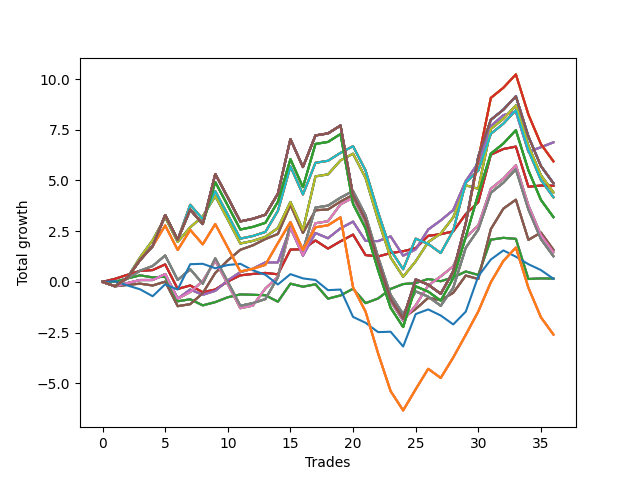

# Short Shepard 003 
- Symbol: SPY_Unlimited
- Date Range: 03/23/2022 - 07/08/2022
- Trading Period: 7:20-12:30
- Number of Trades: 36



| Name | Win Percent | Profit | Avg Profit / Trade | Avg Time / Trade |      | Name | Win Percent | Profit | Avg Profit / Trade | Avg Time / Trade |
| ---- | ----------- | ------ | ------------------ | ---------------- | ---- | ---- | ----------- | ------ | ------------------ | ---------------- |
| Sorted By <br> Profit | | | | | | Sorted By <br> Win Percentage ||||
| Sixty-Six | 69.44 | 3440.00 | 95.56 | 15:08 |     | Sixty-Five | 77.78 | 2370.00 | 65.83 | 08:59 |
| Fifty-Eight | 69.44 | 3440.00 | 95.56 | 15:08 |     | Fifty-Seven | 77.78 | 2370.00 | 65.83 | 08:59 |
| Fifty | 69.44 | 3440.00 | 95.56 | 15:08 |     | Forty-Nine | 77.78 | 2370.00 | 65.83 | 08:59 |
| Forty-Two | 69.44 | 3440.00 | 95.56 | 15:08 |     | Forty-One | 77.78 | 2370.00 | 65.83 | 08:59 |
| Two | 69.44 | 3440.00 | 95.56 | 15:08 |     | One | 77.78 | 2370.00 | 65.83 | 08:59 |
| One Hundred Twenty-Eight | 55.56 | 2970.00 | 82.50 | 28:32 |     | Sixty-Six | 69.44 | 3440.00 | 95.56 | 15:08 |
| One Hundred Twenty-Three | 55.56 | 2970.00 | 82.50 | 28:32 |     | Fifty-Eight | 69.44 | 3440.00 | 95.56 | 15:08 |
| One Hundred Eighteen | 55.56 | 2970.00 | 82.50 | 28:32 |     | Fifty | 69.44 | 3440.00 | 95.56 | 15:08 |
| One Hundred Thirteen | 55.56 | 2970.00 | 82.50 | 28:32 |     | Forty-Two | 69.44 | 3440.00 | 95.56 | 15:08 |
| Eighty-Three | 55.56 | 2970.00 | 82.50 | 28:32 |     | Two | 69.44 | 3440.00 | 95.56 | 15:08 |
| One Hundred Thirty | 55.56 | 2430.00 | 67.50 | 29:46 |     | Sixty-Seven | 66.67 | 790.00 | 21.94 | 16:38 |
| One Hundred Twenty-Nine | 55.56 | 2430.00 | 67.50 | 29:46 |     | Fifty-Nine | 66.67 | 790.00 | 21.94 | 16:38 |
| One Hundred Twenty-Five | 55.56 | 2430.00 | 67.50 | 29:46 |     | Fifty-One | 66.67 | 790.00 | 21.94 | 16:38 |
| One Hundred Twenty-Four | 55.56 | 2430.00 | 67.50 | 29:46 |     | Forty-Three | 66.67 | 790.00 | 21.94 | 16:38 |
| One Hundred Twenty | 55.56 | 2430.00 | 67.50 | 29:46 |     | Three | 66.67 | 790.00 | 21.94 | 16:38 |
| One Hundred Ninteen | 55.56 | 2430.00 | 67.50 | 29:46 |     | Seventy | 63.89 | 2205.00 | 61.25 | 21:34 |
| One Hundred Fifteen | 55.56 | 2430.00 | 67.50 | 29:46 |     | Sixty-Two | 63.89 | 2205.00 | 61.25 | 21:34 |
| One Hundred Fourteen | 55.56 | 2430.00 | 67.50 | 29:46 |     | Fifty-Four | 63.89 | 2205.00 | 61.25 | 21:34 |
| Eighty-Five | 55.56 | 2430.00 | 67.50 | 29:46 |     | Forty-Six | 63.89 | 2205.00 | 61.25 | 21:34 |
| Eighty-Four | 55.56 | 2430.00 | 67.50 | 29:46 |     | Six | 63.89 | 2205.00 | 61.25 | 21:34 |
| Sixty-Five | 77.78 | 2370.00 | 65.83 | 08:59 |     | Sixty-Eight | 63.89 | 730.00 | 20.28 | 21:25 |
| Fifty-Seven | 77.78 | 2370.00 | 65.83 | 08:59 |     | Sixty | 63.89 | 730.00 | 20.28 | 21:25 |
| Forty-Nine | 77.78 | 2370.00 | 65.83 | 08:59 |     | Fifty-Two | 63.89 | 730.00 | 20.28 | 21:25 |
| Forty-One | 77.78 | 2370.00 | 65.83 | 08:59 |     | Forty-Four | 63.89 | 730.00 | 20.28 | 21:25 |
| One | 77.78 | 2370.00 | 65.83 | 08:59 |     | Four | 63.89 | 730.00 | 20.28 | 21:25 |
| Seventy | 63.89 | 2205.00 | 61.25 | 21:34 |     | Sixty-Four | 61.11 | 80.00 | 2.22 | 05:40 |
| Sixty-Two | 63.89 | 2205.00 | 61.25 | 21:34 |     | Fifty-Six | 61.11 | 80.00 | 2.22 | 05:40 |
| Fifty-Four | 63.89 | 2205.00 | 61.25 | 21:34 |     | Forty-Eight | 61.11 | 80.00 | 2.22 | 05:40 |
| Forty-Six | 63.89 | 2205.00 | 61.25 | 21:34 |     | Forty | 61.11 | 80.00 | 2.22 | 05:40 |
| Six | 63.89 | 2205.00 | 61.25 | 21:34 |     | Zero | 61.11 | 80.00 | 2.22 | 05:40 |
| Seventy-One | 58.33 | 2085.00 | 57.92 | 27:06 |     | Seventy-One | 58.33 | 2085.00 | 57.92 | 27:06 |
| Sixty-Three | 58.33 | 2085.00 | 57.92 | 27:06 |     | Sixty-Three | 58.33 | 2085.00 | 57.92 | 27:06 |
| Fifty-Five | 58.33 | 2085.00 | 57.92 | 27:06 |     | Fifty-Five | 58.33 | 2085.00 | 57.92 | 27:06 |
| Forty-Seven | 58.33 | 2085.00 | 57.92 | 27:06 |     | Forty-Seven | 58.33 | 2085.00 | 57.92 | 27:06 |
| Seven | 58.33 | 2085.00 | 57.92 | 27:06 |     | Seven | 58.33 | 2085.00 | 57.92 | 27:06 |
| One Hundred Twenty-Seven | 55.56 | 1595.00 | 44.31 | 27:11 |     | Sixty-Nine | 58.33 | 630.00 | 17.50 | 24:43 |
| One Hundred Twenty-Two | 55.56 | 1595.00 | 44.31 | 27:11 |     | Sixty-One | 58.33 | 630.00 | 17.50 | 24:43 |
| One Hundred Seventeen | 55.56 | 1595.00 | 44.31 | 27:11 |     | Fifty-Three | 58.33 | 630.00 | 17.50 | 24:43 |
| One Hundred Twelve | 55.56 | 1595.00 | 44.31 | 27:11 |     | Forty-Five | 58.33 | 630.00 | 17.50 | 24:43 |
| Eighty-Two | 55.56 | 1595.00 | 44.31 | 27:11 |     | Five | 58.33 | 630.00 | 17.50 | 24:43 |
| Sixty-Seven | 66.67 | 790.00 | 21.94 | 16:38 |     | One Hundred Twenty-Six | 58.33 | -1300.00 | -36.11 | 23:16 |
| Fifty-Nine | 66.67 | 790.00 | 21.94 | 16:38 |     | One Hundred Twenty-One | 58.33 | -1300.00 | -36.11 | 23:16 |
| Fifty-One | 66.67 | 790.00 | 21.94 | 16:38 |     | One Hundred Sixteen | 58.33 | -1300.00 | -36.11 | 23:16 |
| Forty-Three | 66.67 | 790.00 | 21.94 | 16:38 |     | One Hundred Eleven | 58.33 | -1300.00 | -36.11 | 23:16 |
| Three | 66.67 | 790.00 | 21.94 | 16:38 |     | Eighty-One | 58.33 | -1300.00 | -36.11 | 23:16 |
| Sixty-Eight | 63.89 | 730.00 | 20.28 | 21:25 |     | One Hundred Twenty-Eight | 55.56 | 2970.00 | 82.50 | 28:32 |
| Sixty | 63.89 | 730.00 | 20.28 | 21:25 |     | One Hundred Twenty-Three | 55.56 | 2970.00 | 82.50 | 28:32 |
| Fifty-Two | 63.89 | 730.00 | 20.28 | 21:25 |     | One Hundred Eighteen | 55.56 | 2970.00 | 82.50 | 28:32 |
| Forty-Four | 63.89 | 730.00 | 20.28 | 21:25 |     | One Hundred Thirteen | 55.56 | 2970.00 | 82.50 | 28:32 |
| Four | 63.89 | 730.00 | 20.28 | 21:25 |     | Eighty-Three | 55.56 | 2970.00 | 82.50 | 28:32 |
| Sixty-Nine | 58.33 | 630.00 | 17.50 | 24:43 |     | One Hundred Thirty | 55.56 | 2430.00 | 67.50 | 29:46 |
| Sixty-One | 58.33 | 630.00 | 17.50 | 24:43 |     | One Hundred Twenty-Nine | 55.56 | 2430.00 | 67.50 | 29:46 |
| Fifty-Three | 58.33 | 630.00 | 17.50 | 24:43 |     | One Hundred Twenty-Five | 55.56 | 2430.00 | 67.50 | 29:46 |
| Forty-Five | 58.33 | 630.00 | 17.50 | 24:43 |     | One Hundred Twenty-Four | 55.56 | 2430.00 | 67.50 | 29:46 |
| Five | 58.33 | 630.00 | 17.50 | 24:43 |     | One Hundred Twenty | 55.56 | 2430.00 | 67.50 | 29:46 |
| Sixty-Four | 61.11 | 80.00 | 2.22 | 05:40 |     | One Hundred Ninteen | 55.56 | 2430.00 | 67.50 | 29:46 |
| Fifty-Six | 61.11 | 80.00 | 2.22 | 05:40 |     | One Hundred Fifteen | 55.56 | 2430.00 | 67.50 | 29:46 |
| Forty-Eight | 61.11 | 80.00 | 2.22 | 05:40 |     | One Hundred Fourteen | 55.56 | 2430.00 | 67.50 | 29:46 |
| Forty | 61.11 | 80.00 | 2.22 | 05:40 |     | Eighty-Five | 55.56 | 2430.00 | 67.50 | 29:46 |
| Zero | 61.11 | 80.00 | 2.22 | 05:40 |     | Eighty-Four | 55.56 | 2430.00 | 67.50 | 29:46 |
| Seventy-Three | 41.67 | 75.00 | 2.08 | 07:31 |     | One Hundred Twenty-Seven | 55.56 | 1595.00 | 44.31 | 27:11 |
| One Hundred Twenty-Six | 58.33 | -1300.00 | -36.11 | 23:16 |     | One Hundred Twenty-Two | 55.56 | 1595.00 | 44.31 | 27:11 |
| One Hundred Twenty-One | 58.33 | -1300.00 | -36.11 | 23:16 |     | One Hundred Seventeen | 55.56 | 1595.00 | 44.31 | 27:11 |
| One Hundred Sixteen | 58.33 | -1300.00 | -36.11 | 23:16 |     | One Hundred Twelve | 55.56 | 1595.00 | 44.31 | 27:11 |
| One Hundred Eleven | 58.33 | -1300.00 | -36.11 | 23:16 |     | Eighty-Two | 55.56 | 1595.00 | 44.31 | 27:11 |
| Eighty-One | 58.33 | -1300.00 | -36.11 | 23:16 |     | Seventy-Three | 41.67 | 75.00 | 2.08 | 07:31 |

## NO STOPLOSS

### Test Zero
* Sell when price hits the middle line of the 20p bollinger
* No Stoploss
* Results:
```
Total Trades: 36
Percent Up: 38.89
Percent Down: 61.11
Total Points Moved Down: 0.16
Potential Profit: 80.00
Total Points Ups: 5.86 Count Ups: 14
Total Points Downs: 6.02 Count Downs: 22
```

<details><summary>Trades</summary>

<code>In: 2022-03-25 11:18:00		Out: 2022-03-25 11:18:10		Total Position Time: 00:10		Total Move Down: 0.01		Total to Date: 0.01</code> <br />
<code>In: 2022-03-25 11:37:00		Out: 2022-03-25 11:40:25		Total Position Time: 03:25		Total Move Down: 0.16		Total to Date: 0.17</code> <br />
<code>In: 2022-03-25 11:40:00		Out: 2022-03-25 11:40:25		Total Position Time: 00:25		Total Move Down: 0.15		Total to Date: 0.32</code> <br />
<code>In: 2022-03-25 11:41:00		Out: 2022-03-25 11:41:10		Total Position Time: 00:10		Total Move Down: -0.10		Total to Date: 0.22</code> <br />
<code>In: 2022-03-25 11:57:00		Out: 2022-03-25 11:57:15		Total Position Time: 00:15		Total Move Down: 0.03		Total to Date: 0.25</code> <br />
<code>In: 2022-03-28 11:36:00		Out: 2022-03-28 12:05:55		Total Position Time: 29:55		Total Move Down: -1.21		Total to Date: -0.96</code> <br />
<code>In: 2022-04-01 12:09:00		Out: 2022-04-01 12:09:10		Total Position Time: 00:10		Total Move Down: 0.10		Total to Date: -0.86</code> <br />
<code>In: 2022-04-06 10:36:00		Out: 2022-04-06 10:47:10		Total Position Time: 11:10		Total Move Down: -0.30		Total to Date: -1.16</code> <br />
<code>In: 2022-04-06 10:47:00		Out: 2022-04-06 10:47:10		Total Position Time: 00:10		Total Move Down: 0.16		Total to Date: -1.00</code> <br />
<code>In: 2022-04-07 10:33:00		Out: 2022-04-07 10:36:05		Total Position Time: 03:05		Total Move Down: 0.24		Total to Date: -0.76</code> <br />
<code>In: 2022-04-07 10:34:00		Out: 2022-04-07 10:36:05		Total Position Time: 02:05		Total Move Down: 0.14		Total to Date: -0.62</code> <br />
<code>In: 2022-04-07 11:06:00		Out: 2022-04-07 11:15:20		Total Position Time: 09:20		Total Move Down: -0.02		Total to Date: -0.64</code> <br />
<code>In: 2022-04-18 11:00:00		Out: 2022-04-18 11:00:10		Total Position Time: 00:10		Total Move Down: -0.02		Total to Date: -0.66</code> <br />
<code>In: 2022-04-20 07:48:00		Out: 2022-04-20 08:00:20		Total Position Time: 12:20		Total Move Down: -0.32		Total to Date: -0.98</code> <br />
<code>In: 2022-04-25 07:39:00		Out: 2022-04-25 07:40:25		Total Position Time: 01:25		Total Move Down: 0.89		Total to Date: -0.09</code> <br />
<code>In: 2022-05-04 09:32:00		Out: 2022-05-04 09:45:30		Total Position Time: 13:30		Total Move Down: -0.15		Total to Date: -0.24</code> <br />
<code>In: 2022-05-10 11:06:00		Out: 2022-05-10 11:06:15		Total Position Time: 00:15		Total Move Down: 0.12		Total to Date: -0.12</code> <br />
<code>In: 2022-05-16 08:51:00		Out: 2022-05-16 09:05:45		Total Position Time: 14:45		Total Move Down: -0.71		Total to Date: -0.83</code> <br />
<code>In: 2022-05-17 08:39:00		Out: 2022-05-17 08:43:35		Total Position Time: 04:35		Total Move Down: 0.16		Total to Date: -0.67</code> <br />
<code>In: 2022-05-25 11:07:00		Out: 2022-05-25 11:07:10		Total Position Time: 00:10		Total Move Down: 0.33		Total to Date: -0.34</code> <br />
<code>In: 2022-05-25 11:23:00		Out: 2022-05-25 11:39:10		Total Position Time: 16:10		Total Move Down: -0.71		Total to Date: -1.05</code> <br />
<code>In: 2022-05-25 11:33:00		Out: 2022-05-25 11:39:10		Total Position Time: 06:10		Total Move Down: 0.23		Total to Date: -0.82</code> <br />
<code>In: 2022-05-25 11:37:00		Out: 2022-05-25 11:39:10		Total Position Time: 02:10		Total Move Down: 0.47		Total to Date: -0.35</code> <br />
<code>In: 2022-05-31 07:26:00		Out: 2022-05-31 07:30:05		Total Position Time: 04:05		Total Move Down: 0.24		Total to Date: -0.11</code> <br />
<code>In: 2022-06-09 10:14:00		Out: 2022-06-09 10:16:15		Total Position Time: 02:15		Total Move Down: 0.05		Total to Date: -0.06</code> <br />
<code>In: 2022-06-10 12:03:00		Out: 2022-06-10 12:03:25		Total Position Time: 00:25		Total Move Down: 0.20		Total to Date: 0.14</code> <br />
<code>In: 2022-06-10 12:04:00		Out: 2022-06-10 12:04:10		Total Position Time: 00:10		Total Move Down: -0.11		Total to Date: 0.03</code> <br />
<code>In: 2022-06-10 12:21:00		Out: 2022-06-10 12:21:45		Total Position Time: 00:45		Total Move Down: 0.19		Total to Date: 0.22</code> <br />
<code>In: 2022-06-13 09:42:00		Out: 2022-06-13 09:44:05		Total Position Time: 02:05		Total Move Down: 0.29		Total to Date: 0.51</code> <br />
<code>In: 2022-06-15 11:02:00		Out: 2022-06-15 11:02:10		Total Position Time: 00:10		Total Move Down: -0.17		Total to Date: 0.34</code> <br />
<code>In: 2022-06-15 11:48:00		Out: 2022-06-15 11:53:25		Total Position Time: 05:25		Total Move Down: 1.74		Total to Date: 2.08</code> <br />
<code>In: 2022-06-17 10:16:00		Out: 2022-06-17 10:22:05		Total Position Time: 06:05		Total Move Down: 0.09		Total to Date: 2.17</code> <br />
<code>In: 2022-06-29 11:08:00		Out: 2022-06-29 11:18:05		Total Position Time: 10:05		Total Move Down: -0.05		Total to Date: 2.12</code> <br />
<code>In: 2022-06-30 08:02:00		Out: 2022-06-30 08:31:55		Total Position Time: 29:55		Total Move Down: -1.98		Total to Date: 0.14</code> <br />
<code>In: 2022-07-01 10:55:00		Out: 2022-07-01 10:58:40		Total Position Time: 03:40		Total Move Down: 0.03		Total to Date: 0.17</code> <br />
<code>In: 2022-07-05 08:53:00		Out: 2022-07-05 09:00:10		Total Position Time: 07:10		Total Move Down: -0.01		Total to Date: 0.16</code> <br />


</details>

### Test One
* Sell when the price hits the upper line of the 20p 1std bollinger
* No Stoploss
* Results:
```
Total Trades: 36
Percent Up: 22.22
Percent Down: 77.78
Total Points Moved Down: 4.74
Potential Profit: 2370.00
Total Points Ups: 5.08 Count Ups: 8
Total Points Downs: 9.82 Count Downs: 28
```

<details><summary>Trades</summary>

<code>In: 2022-03-25 11:18:00		Out: 2022-03-25 11:19:30		Total Position Time: 01:30		Total Move Down: 0.15		Total to Date: 0.15</code> <br />
<code>In: 2022-03-25 11:37:00		Out: 2022-03-25 11:40:55		Total Position Time: 03:55		Total Move Down: 0.20		Total to Date: 0.35</code> <br />
<code>In: 2022-03-25 11:40:00		Out: 2022-03-25 11:40:55		Total Position Time: 00:55		Total Move Down: 0.19		Total to Date: 0.54</code> <br />
<code>In: 2022-03-25 11:41:00		Out: 2022-03-25 11:41:25		Total Position Time: 00:25		Total Move Down: 0.04		Total to Date: 0.58</code> <br />
<code>In: 2022-03-25 11:57:00		Out: 2022-03-25 12:00:50		Total Position Time: 03:50		Total Move Down: 0.28		Total to Date: 0.86</code> <br />
<code>In: 2022-03-28 11:36:00		Out: 2022-03-28 12:05:55		Total Position Time: 29:55		Total Move Down: -1.21		Total to Date: -0.35</code> <br />
<code>In: 2022-04-01 12:09:00		Out: 2022-04-01 12:09:20		Total Position Time: 00:20		Total Move Down: 0.17		Total to Date: -0.18</code> <br />
<code>In: 2022-04-06 10:36:00		Out: 2022-04-06 10:56:55		Total Position Time: 20:55		Total Move Down: -0.33		Total to Date: -0.51</code> <br />
<code>In: 2022-04-06 10:47:00		Out: 2022-04-06 10:56:55		Total Position Time: 09:55		Total Move Down: 0.13		Total to Date: -0.38</code> <br />
<code>In: 2022-04-07 10:33:00		Out: 2022-04-07 10:39:55		Total Position Time: 06:55		Total Move Down: 0.40		Total to Date: 0.02</code> <br />
<code>In: 2022-04-07 10:34:00		Out: 2022-04-07 10:39:55		Total Position Time: 05:55		Total Move Down: 0.30		Total to Date: 0.32</code> <br />
<code>In: 2022-04-07 11:06:00		Out: 2022-04-07 11:18:00		Total Position Time: 12:00		Total Move Down: 0.07		Total to Date: 0.39</code> <br />
<code>In: 2022-04-18 11:00:00		Out: 2022-04-18 11:06:20		Total Position Time: 06:20		Total Move Down: 0.05		Total to Date: 0.44</code> <br />
<code>In: 2022-04-20 07:48:00		Out: 2022-04-20 08:00:40		Total Position Time: 12:40		Total Move Down: -0.07		Total to Date: 0.37</code> <br />
<code>In: 2022-04-25 07:39:00		Out: 2022-04-25 07:43:05		Total Position Time: 04:05		Total Move Down: 1.22		Total to Date: 1.59</code> <br />
<code>In: 2022-05-04 09:32:00		Out: 2022-05-04 09:46:30		Total Position Time: 14:30		Total Move Down: 0.02		Total to Date: 1.61</code> <br />
<code>In: 2022-05-10 11:06:00		Out: 2022-05-10 11:06:40		Total Position Time: 00:40		Total Move Down: 0.43		Total to Date: 2.04</code> <br />
<code>In: 2022-05-16 08:51:00		Out: 2022-05-16 09:06:15		Total Position Time: 15:15		Total Move Down: -0.40		Total to Date: 1.64</code> <br />
<code>In: 2022-05-17 08:39:00		Out: 2022-05-17 08:47:15		Total Position Time: 08:15		Total Move Down: 0.36		Total to Date: 2.00</code> <br />
<code>In: 2022-05-25 11:07:00		Out: 2022-05-25 11:07:10		Total Position Time: 00:10		Total Move Down: 0.33		Total to Date: 2.33</code> <br />
<code>In: 2022-05-25 11:23:00		Out: 2022-05-25 11:45:15		Total Position Time: 22:15		Total Move Down: -1.01		Total to Date: 1.32</code> <br />
<code>In: 2022-05-25 11:33:00		Out: 2022-05-25 11:45:15		Total Position Time: 12:15		Total Move Down: -0.07		Total to Date: 1.25</code> <br />
<code>In: 2022-05-25 11:37:00		Out: 2022-05-25 11:45:15		Total Position Time: 08:15		Total Move Down: 0.17		Total to Date: 1.42</code> <br />
<code>In: 2022-05-31 07:26:00		Out: 2022-05-31 07:38:05		Total Position Time: 12:05		Total Move Down: 0.09		Total to Date: 1.51</code> <br />
<code>In: 2022-06-09 10:14:00		Out: 2022-06-09 10:18:10		Total Position Time: 04:10		Total Move Down: 0.15		Total to Date: 1.66</code> <br />
<code>In: 2022-06-10 12:03:00		Out: 2022-06-10 12:04:35		Total Position Time: 01:35		Total Move Down: 0.61		Total to Date: 2.27</code> <br />
<code>In: 2022-06-10 12:04:00		Out: 2022-06-10 12:04:35		Total Position Time: 00:35		Total Move Down: 0.08		Total to Date: 2.35</code> <br />
<code>In: 2022-06-10 12:21:00		Out: 2022-06-10 12:35:45		Total Position Time: 14:45		Total Move Down: 0.14		Total to Date: 2.49</code> <br />
<code>In: 2022-06-13 09:42:00		Out: 2022-06-13 09:47:55		Total Position Time: 05:55		Total Move Down: 0.85		Total to Date: 3.34</code> <br />
<code>In: 2022-06-15 11:02:00		Out: 2022-06-15 11:03:05		Total Position Time: 01:05		Total Move Down: 0.59		Total to Date: 3.93</code> <br />
<code>In: 2022-06-15 11:48:00		Out: 2022-06-15 11:57:45		Total Position Time: 09:45		Total Move Down: 2.34		Total to Date: 6.27</code> <br />
<code>In: 2022-06-17 10:16:00		Out: 2022-06-17 10:26:10		Total Position Time: 10:10		Total Move Down: 0.28		Total to Date: 6.55</code> <br />
<code>In: 2022-06-29 11:08:00		Out: 2022-06-29 11:20:35		Total Position Time: 12:35		Total Move Down: 0.12		Total to Date: 6.67</code> <br />
<code>In: 2022-06-30 08:02:00		Out: 2022-06-30 08:31:55		Total Position Time: 29:55		Total Move Down: -1.98		Total to Date: 4.69</code> <br />
<code>In: 2022-07-01 10:55:00		Out: 2022-07-01 11:04:25		Total Position Time: 09:25		Total Move Down: 0.06		Total to Date: 4.75</code> <br />
<code>In: 2022-07-05 08:53:00		Out: 2022-07-05 09:03:25		Total Position Time: 10:25		Total Move Down: -0.01		Total to Date: 4.74</code> <br />


</details>

### Test Two
* Sell when the price hits the upper line of the 20p 2std bollinger
* No Stoploss
* Results:
```
Total Trades: 36
Percent Up: 30.56
Percent Down: 69.44
Total Points Moved Down: 6.88
Potential Profit: 3440.00
Total Points Ups: 7.22 Count Ups: 11
Total Points Downs: 14.10 Count Downs: 25
```

<details><summary>Trades</summary>

<code>In: 2022-03-25 11:18:00		Out: 2022-03-25 11:47:55		Total Position Time: 29:55		Total Move Down: -0.22		Total to Date: -0.22</code> <br />
<code>In: 2022-03-25 11:37:00		Out: 2022-03-25 12:00:55		Total Position Time: 23:55		Total Move Down: 0.16		Total to Date: -0.06</code> <br />
<code>In: 2022-03-25 11:40:00		Out: 2022-03-25 12:00:55		Total Position Time: 20:55		Total Move Down: 0.15		Total to Date: 0.09</code> <br />
<code>In: 2022-03-25 11:41:00		Out: 2022-03-25 12:00:55		Total Position Time: 19:55		Total Move Down: -0.00		Total to Date: 0.09</code> <br />
<code>In: 2022-03-25 11:57:00		Out: 2022-03-25 12:00:55		Total Position Time: 03:55		Total Move Down: 0.29		Total to Date: 0.38</code> <br />
<code>In: 2022-03-28 11:36:00		Out: 2022-03-28 12:05:55		Total Position Time: 29:55		Total Move Down: -1.21		Total to Date: -0.83</code> <br />
<code>In: 2022-04-01 12:09:00		Out: 2022-04-01 12:11:10		Total Position Time: 02:10		Total Move Down: 0.45		Total to Date: -0.38</code> <br />
<code>In: 2022-04-06 10:36:00		Out: 2022-04-06 10:57:20		Total Position Time: 21:20		Total Move Down: -0.26		Total to Date: -0.64</code> <br />
<code>In: 2022-04-06 10:47:00		Out: 2022-04-06 10:57:20		Total Position Time: 10:20		Total Move Down: 0.20		Total to Date: -0.44</code> <br />
<code>In: 2022-04-07 10:33:00		Out: 2022-04-07 10:45:15		Total Position Time: 12:15		Total Move Down: 0.51		Total to Date: 0.07</code> <br />
<code>In: 2022-04-07 10:34:00		Out: 2022-04-07 10:45:15		Total Position Time: 11:15		Total Move Down: 0.41		Total to Date: 0.48</code> <br />
<code>In: 2022-04-07 11:06:00		Out: 2022-04-07 11:18:20		Total Position Time: 12:20		Total Move Down: 0.17		Total to Date: 0.65</code> <br />
<code>In: 2022-04-18 11:00:00		Out: 2022-04-18 11:10:40		Total Position Time: 10:40		Total Move Down: 0.31		Total to Date: 0.96</code> <br />
<code>In: 2022-04-20 07:48:00		Out: 2022-04-20 08:00:45		Total Position Time: 12:45		Total Move Down: -0.00		Total to Date: 0.96</code> <br />
<code>In: 2022-04-25 07:39:00		Out: 2022-04-25 07:52:20		Total Position Time: 13:20		Total Move Down: 1.71		Total to Date: 2.67</code> <br />
<code>In: 2022-05-04 09:32:00		Out: 2022-05-04 10:01:55		Total Position Time: 29:55		Total Move Down: -1.38		Total to Date: 1.29</code> <br />
<code>In: 2022-05-10 11:06:00		Out: 2022-05-10 11:16:05		Total Position Time: 10:05		Total Move Down: 1.12		Total to Date: 2.41</code> <br />
<code>In: 2022-05-16 08:51:00		Out: 2022-05-16 09:11:35		Total Position Time: 20:35		Total Move Down: -0.26		Total to Date: 2.15</code> <br />
<code>In: 2022-05-17 08:39:00		Out: 2022-05-17 08:48:20		Total Position Time: 09:20		Total Move Down: 0.49		Total to Date: 2.64</code> <br />
<code>In: 2022-05-25 11:07:00		Out: 2022-05-25 11:07:10		Total Position Time: 00:10		Total Move Down: 0.33		Total to Date: 2.97</code> <br />
<code>In: 2022-05-25 11:23:00		Out: 2022-05-25 11:50:00		Total Position Time: 27:00		Total Move Down: -0.95		Total to Date: 2.02</code> <br />
<code>In: 2022-05-25 11:33:00		Out: 2022-05-25 11:50:00		Total Position Time: 17:00		Total Move Down: -0.01		Total to Date: 2.01</code> <br />
<code>In: 2022-05-25 11:37:00		Out: 2022-05-25 11:50:00		Total Position Time: 13:00		Total Move Down: 0.23		Total to Date: 2.24</code> <br />
<code>In: 2022-05-31 07:26:00		Out: 2022-05-31 07:55:55		Total Position Time: 29:55		Total Move Down: -0.95		Total to Date: 1.29</code> <br />
<code>In: 2022-06-09 10:14:00		Out: 2022-06-09 10:18:55		Total Position Time: 04:55		Total Move Down: 0.31		Total to Date: 1.60</code> <br />
<code>In: 2022-06-10 12:03:00		Out: 2022-06-10 12:05:55		Total Position Time: 02:55		Total Move Down: 0.98		Total to Date: 2.58</code> <br />
<code>In: 2022-06-10 12:04:00		Out: 2022-06-10 12:05:55		Total Position Time: 01:55		Total Move Down: 0.45		Total to Date: 3.03</code> <br />
<code>In: 2022-06-10 12:21:00		Out: 2022-06-10 12:42:45		Total Position Time: 21:45		Total Move Down: 0.51		Total to Date: 3.54</code> <br />
<code>In: 2022-06-13 09:42:00		Out: 2022-06-13 09:54:45		Total Position Time: 12:45		Total Move Down: 1.43		Total to Date: 4.97</code> <br />
<code>In: 2022-06-15 11:02:00		Out: 2022-06-15 11:03:15		Total Position Time: 01:15		Total Move Down: 0.90		Total to Date: 5.87</code> <br />
<code>In: 2022-06-15 11:48:00		Out: 2022-06-15 12:17:55		Total Position Time: 29:55		Total Move Down: 1.81		Total to Date: 7.68</code> <br />
<code>In: 2022-06-17 10:16:00		Out: 2022-06-17 10:27:10		Total Position Time: 11:10		Total Move Down: 0.54		Total to Date: 8.22</code> <br />
<code>In: 2022-06-29 11:08:00		Out: 2022-06-29 11:21:05		Total Position Time: 13:05		Total Move Down: 0.17		Total to Date: 8.39</code> <br />
<code>In: 2022-06-30 08:02:00		Out: 2022-06-30 08:31:55		Total Position Time: 29:55		Total Move Down: -1.98		Total to Date: 6.41</code> <br />
<code>In: 2022-07-01 10:55:00		Out: 2022-07-01 11:07:55		Total Position Time: 12:55		Total Move Down: 0.23		Total to Date: 6.64</code> <br />
<code>In: 2022-07-05 08:53:00		Out: 2022-07-05 09:03:50		Total Position Time: 10:50		Total Move Down: 0.24		Total to Date: 6.88</code> <br />


</details>

### Test Three
* Sell when price hits the middle line of the 50p bollinger
* No Stoploss
* Results:
```
Total Trades: 36
Percent Up: 33.33
Percent Down: 66.67
Total Points Moved Down: 1.58
Potential Profit: 790.00
Total Points Ups: 12.08 Count Ups: 12
Total Points Downs: 13.66 Count Downs: 24
```

<details><summary>Trades</summary>

<code>In: 2022-03-25 11:18:00		Out: 2022-03-25 11:47:55		Total Position Time: 29:55		Total Move Down: -0.22		Total to Date: -0.22</code> <br />
<code>In: 2022-03-25 11:37:00		Out: 2022-03-25 11:49:30		Total Position Time: 12:30		Total Move Down: 0.07		Total to Date: -0.15</code> <br />
<code>In: 2022-03-25 11:40:00		Out: 2022-03-25 11:49:30		Total Position Time: 09:30		Total Move Down: 0.06		Total to Date: -0.09</code> <br />
<code>In: 2022-03-25 11:41:00		Out: 2022-03-25 11:49:30		Total Position Time: 08:30		Total Move Down: -0.09		Total to Date: -0.18</code> <br />
<code>In: 2022-03-25 11:57:00		Out: 2022-03-25 12:00:45		Total Position Time: 03:45		Total Move Down: 0.19		Total to Date: 0.01</code> <br />
<code>In: 2022-03-28 11:36:00		Out: 2022-03-28 12:05:55		Total Position Time: 29:55		Total Move Down: -1.21		Total to Date: -1.20</code> <br />
<code>In: 2022-04-01 12:09:00		Out: 2022-04-01 12:09:10		Total Position Time: 00:10		Total Move Down: 0.10		Total to Date: -1.10</code> <br />
<code>In: 2022-04-06 10:36:00		Out: 2022-04-06 11:00:10		Total Position Time: 24:10		Total Move Down: 0.54		Total to Date: -0.56</code> <br />
<code>In: 2022-04-06 10:47:00		Out: 2022-04-06 11:00:10		Total Position Time: 13:10		Total Move Down: 1.00		Total to Date: 0.44</code> <br />
<code>In: 2022-04-07 10:33:00		Out: 2022-04-07 10:52:05		Total Position Time: 19:05		Total Move Down: 0.62		Total to Date: 1.06</code> <br />
<code>In: 2022-04-07 10:34:00		Out: 2022-04-07 10:52:05		Total Position Time: 18:05		Total Move Down: 0.52		Total to Date: 1.58</code> <br />
<code>In: 2022-04-07 11:06:00		Out: 2022-04-07 11:33:40		Total Position Time: 27:40		Total Move Down: 0.22		Total to Date: 1.80</code> <br />
<code>In: 2022-04-18 11:00:00		Out: 2022-04-18 11:16:30		Total Position Time: 16:30		Total Move Down: 0.31		Total to Date: 2.11</code> <br />
<code>In: 2022-04-20 07:48:00		Out: 2022-04-20 08:02:45		Total Position Time: 14:45		Total Move Down: 0.25		Total to Date: 2.36</code> <br />
<code>In: 2022-04-25 07:39:00		Out: 2022-04-25 07:52:00		Total Position Time: 13:00		Total Move Down: 1.43		Total to Date: 3.79</code> <br />
<code>In: 2022-05-04 09:32:00		Out: 2022-05-04 10:01:55		Total Position Time: 29:55		Total Move Down: -1.38		Total to Date: 2.41</code> <br />
<code>In: 2022-05-10 11:06:00		Out: 2022-05-10 11:16:05		Total Position Time: 10:05		Total Move Down: 1.12		Total to Date: 3.53</code> <br />
<code>In: 2022-05-16 08:51:00		Out: 2022-05-16 09:15:30		Total Position Time: 24:30		Total Move Down: 0.04		Total to Date: 3.57</code> <br />
<code>In: 2022-05-17 08:39:00		Out: 2022-05-17 09:02:20		Total Position Time: 23:20		Total Move Down: 0.39		Total to Date: 3.96</code> <br />
<code>In: 2022-05-25 11:07:00		Out: 2022-05-25 11:07:10		Total Position Time: 00:10		Total Move Down: 0.33		Total to Date: 4.29</code> <br />
<code>In: 2022-05-25 11:23:00		Out: 2022-05-25 11:52:55		Total Position Time: 29:55		Total Move Down: -1.20		Total to Date: 3.09</code> <br />
<code>In: 2022-05-25 11:33:00		Out: 2022-05-25 12:02:55		Total Position Time: 29:55		Total Move Down: -2.06		Total to Date: 1.03</code> <br />
<code>In: 2022-05-25 11:37:00		Out: 2022-05-25 12:06:55		Total Position Time: 29:55		Total Move Down: -1.86		Total to Date: -0.83</code> <br />
<code>In: 2022-05-31 07:26:00		Out: 2022-05-31 07:55:55		Total Position Time: 29:55		Total Move Down: -0.95		Total to Date: -1.78</code> <br />
<code>In: 2022-06-09 10:14:00		Out: 2022-06-09 10:22:05		Total Position Time: 08:05		Total Move Down: 0.44		Total to Date: -1.34</code> <br />
<code>In: 2022-06-10 12:03:00		Out: 2022-06-10 12:03:40		Total Position Time: 00:40		Total Move Down: 0.55		Total to Date: -0.79</code> <br />
<code>In: 2022-06-10 12:04:00		Out: 2022-06-10 12:04:10		Total Position Time: 00:10		Total Move Down: -0.11		Total to Date: -0.90</code> <br />
<code>In: 2022-06-10 12:21:00		Out: 2022-06-10 12:22:10		Total Position Time: 01:10		Total Move Down: 0.36		Total to Date: -0.54</code> <br />
<code>In: 2022-06-13 09:42:00		Out: 2022-06-13 09:47:55		Total Position Time: 05:55		Total Move Down: 0.85		Total to Date: 0.31</code> <br />
<code>In: 2022-06-15 11:02:00		Out: 2022-06-15 11:02:10		Total Position Time: 00:10		Total Move Down: -0.17		Total to Date: 0.14</code> <br />
<code>In: 2022-06-15 11:48:00		Out: 2022-06-15 12:13:05		Total Position Time: 25:05		Total Move Down: 2.46		Total to Date: 2.60</code> <br />
<code>In: 2022-06-17 10:16:00		Out: 2022-06-17 10:32:15		Total Position Time: 16:15		Total Move Down: 1.01		Total to Date: 3.61</code> <br />
<code>In: 2022-06-29 11:08:00		Out: 2022-06-29 11:27:35		Total Position Time: 19:35		Total Move Down: 0.44		Total to Date: 4.05</code> <br />
<code>In: 2022-06-30 08:02:00		Out: 2022-06-30 08:31:55		Total Position Time: 29:55		Total Move Down: -1.98		Total to Date: 2.07</code> <br />
<code>In: 2022-07-01 10:55:00		Out: 2022-07-01 11:09:05		Total Position Time: 14:05		Total Move Down: 0.36		Total to Date: 2.43</code> <br />
<code>In: 2022-07-05 08:53:00		Out: 2022-07-05 09:22:55		Total Position Time: 29:55		Total Move Down: -0.85		Total to Date: 1.58</code> <br />


</details>

### Test Four
* Sell when the price hits the upper line of the 50p 1std bollinger
* No Stoploss
* Results:
```
Total Trades: 36
Percent Up: 36.11
Percent Down: 63.89
Total Points Moved Down: 1.46
Potential Profit: 730.00
Total Points Ups: 15.51 Count Ups: 13
Total Points Downs: 16.97 Count Downs: 23
```

<details><summary>Trades</summary>

<code>In: 2022-03-25 11:18:00		Out: 2022-03-25 11:47:55		Total Position Time: 29:55		Total Move Down: -0.22		Total to Date: -0.22</code> <br />
<code>In: 2022-03-25 11:37:00		Out: 2022-03-25 12:00:55		Total Position Time: 23:55		Total Move Down: 0.16		Total to Date: -0.06</code> <br />
<code>In: 2022-03-25 11:40:00		Out: 2022-03-25 12:00:55		Total Position Time: 20:55		Total Move Down: 0.15		Total to Date: 0.09</code> <br />
<code>In: 2022-03-25 11:41:00		Out: 2022-03-25 12:00:55		Total Position Time: 19:55		Total Move Down: -0.00		Total to Date: 0.09</code> <br />
<code>In: 2022-03-25 11:57:00		Out: 2022-03-25 12:00:55		Total Position Time: 03:55		Total Move Down: 0.29		Total to Date: 0.38</code> <br />
<code>In: 2022-03-28 11:36:00		Out: 2022-03-28 12:05:55		Total Position Time: 29:55		Total Move Down: -1.21		Total to Date: -0.83</code> <br />
<code>In: 2022-04-01 12:09:00		Out: 2022-04-01 12:09:35		Total Position Time: 00:35		Total Move Down: 0.33		Total to Date: -0.50</code> <br />
<code>In: 2022-04-06 10:36:00		Out: 2022-04-06 11:00:10		Total Position Time: 24:10		Total Move Down: 0.54		Total to Date: 0.04</code> <br />
<code>In: 2022-04-06 10:47:00		Out: 2022-04-06 11:00:10		Total Position Time: 13:10		Total Move Down: 1.00		Total to Date: 1.04</code> <br />
<code>In: 2022-04-07 10:33:00		Out: 2022-04-07 11:02:55		Total Position Time: 29:55		Total Move Down: -1.16		Total to Date: -0.12</code> <br />
<code>In: 2022-04-07 10:34:00		Out: 2022-04-07 11:03:55		Total Position Time: 29:55		Total Move Down: -1.18		Total to Date: -1.30</code> <br />
<code>In: 2022-04-07 11:06:00		Out: 2022-04-07 11:35:55		Total Position Time: 29:55		Total Move Down: 0.13		Total to Date: -1.17</code> <br />
<code>In: 2022-04-18 11:00:00		Out: 2022-04-18 11:18:10		Total Position Time: 18:10		Total Move Down: 0.84		Total to Date: -0.33</code> <br />
<code>In: 2022-04-20 07:48:00		Out: 2022-04-20 08:10:20		Total Position Time: 22:20		Total Move Down: 0.58		Total to Date: 0.25</code> <br />
<code>In: 2022-04-25 07:39:00		Out: 2022-04-25 07:58:15		Total Position Time: 19:15		Total Move Down: 2.45		Total to Date: 2.70</code> <br />
<code>In: 2022-05-04 09:32:00		Out: 2022-05-04 10:01:55		Total Position Time: 29:55		Total Move Down: -1.38		Total to Date: 1.32</code> <br />
<code>In: 2022-05-10 11:06:00		Out: 2022-05-10 11:24:05		Total Position Time: 18:05		Total Move Down: 1.57		Total to Date: 2.89</code> <br />
<code>In: 2022-05-16 08:51:00		Out: 2022-05-16 09:20:55		Total Position Time: 29:55		Total Move Down: 0.10		Total to Date: 2.99</code> <br />
<code>In: 2022-05-17 08:39:00		Out: 2022-05-17 09:06:50		Total Position Time: 27:50		Total Move Down: 0.83		Total to Date: 3.82</code> <br />
<code>In: 2022-05-25 11:07:00		Out: 2022-05-25 11:07:10		Total Position Time: 00:10		Total Move Down: 0.33		Total to Date: 4.15</code> <br />
<code>In: 2022-05-25 11:23:00		Out: 2022-05-25 11:52:55		Total Position Time: 29:55		Total Move Down: -1.20		Total to Date: 2.95</code> <br />
<code>In: 2022-05-25 11:33:00		Out: 2022-05-25 12:02:55		Total Position Time: 29:55		Total Move Down: -2.06		Total to Date: 0.89</code> <br />
<code>In: 2022-05-25 11:37:00		Out: 2022-05-25 12:06:55		Total Position Time: 29:55		Total Move Down: -1.86		Total to Date: -0.97</code> <br />
<code>In: 2022-05-31 07:26:00		Out: 2022-05-31 07:55:55		Total Position Time: 29:55		Total Move Down: -0.95		Total to Date: -1.92</code> <br />
<code>In: 2022-06-09 10:14:00		Out: 2022-06-09 10:23:50		Total Position Time: 09:50		Total Move Down: 0.76		Total to Date: -1.16</code> <br />
<code>In: 2022-06-10 12:03:00		Out: 2022-06-10 12:05:55		Total Position Time: 02:55		Total Move Down: 0.98		Total to Date: -0.18</code> <br />
<code>In: 2022-06-10 12:04:00		Out: 2022-06-10 12:05:55		Total Position Time: 01:55		Total Move Down: 0.45		Total to Date: 0.27</code> <br />
<code>In: 2022-06-10 12:21:00		Out: 2022-06-10 12:42:40		Total Position Time: 21:40		Total Move Down: 0.50		Total to Date: 0.77</code> <br />
<code>In: 2022-06-13 09:42:00		Out: 2022-06-13 09:54:50		Total Position Time: 12:50		Total Move Down: 1.42		Total to Date: 2.19</code> <br />
<code>In: 2022-06-15 11:02:00		Out: 2022-06-15 11:03:05		Total Position Time: 01:05		Total Move Down: 0.59		Total to Date: 2.78</code> <br />
<code>In: 2022-06-15 11:48:00		Out: 2022-06-15 12:17:55		Total Position Time: 29:55		Total Move Down: 1.81		Total to Date: 4.59</code> <br />
<code>In: 2022-06-17 10:16:00		Out: 2022-06-17 10:45:55		Total Position Time: 29:55		Total Move Down: 0.50		Total to Date: 5.09</code> <br />
<code>In: 2022-06-29 11:08:00		Out: 2022-06-29 11:37:55		Total Position Time: 29:55		Total Move Down: 0.66		Total to Date: 5.75</code> <br />
<code>In: 2022-06-30 08:02:00		Out: 2022-06-30 08:31:55		Total Position Time: 29:55		Total Move Down: -1.98		Total to Date: 3.77</code> <br />
<code>In: 2022-07-01 10:55:00		Out: 2022-07-01 11:24:55		Total Position Time: 29:55		Total Move Down: -1.46		Total to Date: 2.31</code> <br />
<code>In: 2022-07-05 08:53:00		Out: 2022-07-05 09:22:55		Total Position Time: 29:55		Total Move Down: -0.85		Total to Date: 1.46</code> <br />


</details>

### Test Five
* Sell when the price hits the upper line of the 50p 2std bollinger
* No Stoploss
* Results:
```
Total Trades: 36
Percent Up: 41.67
Percent Down: 58.33
Total Points Moved Down: 1.26
Potential Profit: 630.00
Total Points Ups: 16.93 Count Ups: 15
Total Points Downs: 18.19 Count Downs: 21
```

<details><summary>Trades</summary>

<code>In: 2022-03-25 11:18:00		Out: 2022-03-25 11:47:55		Total Position Time: 29:55		Total Move Down: -0.22		Total to Date: -0.22</code> <br />
<code>In: 2022-03-25 11:37:00		Out: 2022-03-25 12:01:55		Total Position Time: 24:55		Total Move Down: 0.39		Total to Date: 0.17</code> <br />
<code>In: 2022-03-25 11:40:00		Out: 2022-03-25 12:01:55		Total Position Time: 21:55		Total Move Down: 0.38		Total to Date: 0.55</code> <br />
<code>In: 2022-03-25 11:41:00		Out: 2022-03-25 12:01:55		Total Position Time: 20:55		Total Move Down: 0.23		Total to Date: 0.78</code> <br />
<code>In: 2022-03-25 11:57:00		Out: 2022-03-25 12:01:55		Total Position Time: 04:55		Total Move Down: 0.52		Total to Date: 1.30</code> <br />
<code>In: 2022-03-28 11:36:00		Out: 2022-03-28 12:05:55		Total Position Time: 29:55		Total Move Down: -1.21		Total to Date: 0.09</code> <br />
<code>In: 2022-04-01 12:09:00		Out: 2022-04-01 12:11:20		Total Position Time: 02:20		Total Move Down: 0.53		Total to Date: 0.62</code> <br />
<code>In: 2022-04-06 10:36:00		Out: 2022-04-06 11:05:55		Total Position Time: 29:55		Total Move Down: -0.71		Total to Date: -0.09</code> <br />
<code>In: 2022-04-06 10:47:00		Out: 2022-04-06 11:09:35		Total Position Time: 22:35		Total Move Down: 1.25		Total to Date: 1.16</code> <br />
<code>In: 2022-04-07 10:33:00		Out: 2022-04-07 11:02:55		Total Position Time: 29:55		Total Move Down: -1.16		Total to Date: 0.00</code> <br />
<code>In: 2022-04-07 10:34:00		Out: 2022-04-07 11:03:55		Total Position Time: 29:55		Total Move Down: -1.18		Total to Date: -1.18</code> <br />
<code>In: 2022-04-07 11:06:00		Out: 2022-04-07 11:35:55		Total Position Time: 29:55		Total Move Down: 0.13		Total to Date: -1.05</code> <br />
<code>In: 2022-04-18 11:00:00		Out: 2022-04-18 11:29:55		Total Position Time: 29:55		Total Move Down: 0.20		Total to Date: -0.85</code> <br />
<code>In: 2022-04-20 07:48:00		Out: 2022-04-20 08:16:20		Total Position Time: 28:20		Total Move Down: 1.07		Total to Date: 0.22</code> <br />
<code>In: 2022-04-25 07:39:00		Out: 2022-04-25 08:08:55		Total Position Time: 29:55		Total Move Down: 2.69		Total to Date: 2.91</code> <br />
<code>In: 2022-05-04 09:32:00		Out: 2022-05-04 10:01:55		Total Position Time: 29:55		Total Move Down: -1.38		Total to Date: 1.53</code> <br />
<code>In: 2022-05-10 11:06:00		Out: 2022-05-10 11:26:20		Total Position Time: 20:20		Total Move Down: 2.13		Total to Date: 3.66</code> <br />
<code>In: 2022-05-16 08:51:00		Out: 2022-05-16 09:20:55		Total Position Time: 29:55		Total Move Down: 0.10		Total to Date: 3.76</code> <br />
<code>In: 2022-05-17 08:39:00		Out: 2022-05-17 09:08:55		Total Position Time: 29:55		Total Move Down: 0.39		Total to Date: 4.15</code> <br />
<code>In: 2022-05-25 11:07:00		Out: 2022-05-25 11:07:10		Total Position Time: 00:10		Total Move Down: 0.33		Total to Date: 4.48</code> <br />
<code>In: 2022-05-25 11:23:00		Out: 2022-05-25 11:52:55		Total Position Time: 29:55		Total Move Down: -1.20		Total to Date: 3.28</code> <br />
<code>In: 2022-05-25 11:33:00		Out: 2022-05-25 12:02:55		Total Position Time: 29:55		Total Move Down: -2.06		Total to Date: 1.22</code> <br />
<code>In: 2022-05-25 11:37:00		Out: 2022-05-25 12:06:55		Total Position Time: 29:55		Total Move Down: -1.86		Total to Date: -0.64</code> <br />
<code>In: 2022-05-31 07:26:00		Out: 2022-05-31 07:55:55		Total Position Time: 29:55		Total Move Down: -0.95		Total to Date: -1.59</code> <br />
<code>In: 2022-06-09 10:14:00		Out: 2022-06-09 10:27:20		Total Position Time: 13:20		Total Move Down: 1.12		Total to Date: -0.47</code> <br />
<code>In: 2022-06-10 12:03:00		Out: 2022-06-10 12:32:55		Total Position Time: 29:55		Total Move Down: -0.26		Total to Date: -0.73</code> <br />
<code>In: 2022-06-10 12:04:00		Out: 2022-06-10 12:33:55		Total Position Time: 29:55		Total Move Down: -0.45		Total to Date: -1.18</code> <br />
<code>In: 2022-06-10 12:21:00		Out: 2022-06-10 12:45:35		Total Position Time: 24:35		Total Move Down: 0.89		Total to Date: -0.29</code> <br />
<code>In: 2022-06-13 09:42:00		Out: 2022-06-13 09:58:15		Total Position Time: 16:15		Total Move Down: 1.97		Total to Date: 1.68</code> <br />
<code>In: 2022-06-15 11:02:00		Out: 2022-06-15 11:03:15		Total Position Time: 01:15		Total Move Down: 0.90		Total to Date: 2.58</code> <br />
<code>In: 2022-06-15 11:48:00		Out: 2022-06-15 12:17:55		Total Position Time: 29:55		Total Move Down: 1.81		Total to Date: 4.39</code> <br />
<code>In: 2022-06-17 10:16:00		Out: 2022-06-17 10:45:55		Total Position Time: 29:55		Total Move Down: 0.50		Total to Date: 4.89</code> <br />
<code>In: 2022-06-29 11:08:00		Out: 2022-06-29 11:37:55		Total Position Time: 29:55		Total Move Down: 0.66		Total to Date: 5.55</code> <br />
<code>In: 2022-06-30 08:02:00		Out: 2022-06-30 08:31:55		Total Position Time: 29:55		Total Move Down: -1.98		Total to Date: 3.57</code> <br />
<code>In: 2022-07-01 10:55:00		Out: 2022-07-01 11:24:55		Total Position Time: 29:55		Total Move Down: -1.46		Total to Date: 2.11</code> <br />
<code>In: 2022-07-05 08:53:00		Out: 2022-07-05 09:22:55		Total Position Time: 29:55		Total Move Down: -0.85		Total to Date: 1.26</code> <br />


</details>

### Test Six
* Sell when the price hits the middle line of the 1std VWAP
* No Stoploss
* Results:
```
Total Trades: 36
Percent Up: 36.11
Percent Down: 63.89
Total Points Moved Down: 4.41
Potential Profit: 2205.00
Total Points Ups: 15.68 Count Ups: 13
Total Points Downs: 20.09 Count Downs: 23
```

<details><summary>Trades</summary>

<code>In: 2022-03-25 11:18:00		Out: 2022-03-25 11:47:55		Total Position Time: 29:55		Total Move Down: -0.22		Total to Date: -0.22</code> <br />
<code>In: 2022-03-25 11:37:00		Out: 2022-03-25 12:06:55		Total Position Time: 29:55		Total Move Down: 0.44		Total to Date: 0.22</code> <br />
<code>In: 2022-03-25 11:40:00		Out: 2022-03-25 12:07:35		Total Position Time: 27:35		Total Move Down: 0.99		Total to Date: 1.21</code> <br />
<code>In: 2022-03-25 11:41:00		Out: 2022-03-25 12:07:35		Total Position Time: 26:35		Total Move Down: 0.84		Total to Date: 2.05</code> <br />
<code>In: 2022-03-25 11:57:00		Out: 2022-03-25 12:07:35		Total Position Time: 10:35		Total Move Down: 1.13		Total to Date: 3.18</code> <br />
<code>In: 2022-03-28 11:36:00		Out: 2022-03-28 12:05:55		Total Position Time: 29:55		Total Move Down: -1.21		Total to Date: 1.97</code> <br />
<code>In: 2022-04-01 12:09:00		Out: 2022-04-01 12:12:45		Total Position Time: 03:45		Total Move Down: 0.72		Total to Date: 2.69</code> <br />
<code>In: 2022-04-06 10:36:00		Out: 2022-04-06 11:00:10		Total Position Time: 24:10		Total Move Down: 0.54		Total to Date: 3.23</code> <br />
<code>In: 2022-04-06 10:47:00		Out: 2022-04-06 11:00:10		Total Position Time: 13:10		Total Move Down: 1.00		Total to Date: 4.23</code> <br />
<code>In: 2022-04-07 10:33:00		Out: 2022-04-07 11:02:55		Total Position Time: 29:55		Total Move Down: -1.16		Total to Date: 3.07</code> <br />
<code>In: 2022-04-07 10:34:00		Out: 2022-04-07 11:03:55		Total Position Time: 29:55		Total Move Down: -1.18		Total to Date: 1.89</code> <br />
<code>In: 2022-04-07 11:06:00		Out: 2022-04-07 11:35:55		Total Position Time: 29:55		Total Move Down: 0.13		Total to Date: 2.02</code> <br />
<code>In: 2022-04-18 11:00:00		Out: 2022-04-18 11:29:55		Total Position Time: 29:55		Total Move Down: 0.20		Total to Date: 2.22</code> <br />
<code>In: 2022-04-20 07:48:00		Out: 2022-04-20 08:04:55		Total Position Time: 16:55		Total Move Down: 0.43		Total to Date: 2.65</code> <br />
<code>In: 2022-04-25 07:39:00		Out: 2022-04-25 07:42:30		Total Position Time: 03:30		Total Move Down: 1.29		Total to Date: 3.94</code> <br />
<code>In: 2022-05-04 09:32:00		Out: 2022-05-04 10:01:55		Total Position Time: 29:55		Total Move Down: -1.38		Total to Date: 2.56</code> <br />
<code>In: 2022-05-10 11:06:00		Out: 2022-05-10 11:27:55		Total Position Time: 21:55		Total Move Down: 2.64		Total to Date: 5.20</code> <br />
<code>In: 2022-05-16 08:51:00		Out: 2022-05-16 09:20:55		Total Position Time: 29:55		Total Move Down: 0.10		Total to Date: 5.30</code> <br />
<code>In: 2022-05-17 08:39:00		Out: 2022-05-17 09:06:45		Total Position Time: 27:45		Total Move Down: 0.69		Total to Date: 5.99</code> <br />
<code>In: 2022-05-25 11:07:00		Out: 2022-05-25 11:07:10		Total Position Time: 00:10		Total Move Down: 0.33		Total to Date: 6.32</code> <br />
<code>In: 2022-05-25 11:23:00		Out: 2022-05-25 11:52:55		Total Position Time: 29:55		Total Move Down: -1.20		Total to Date: 5.12</code> <br />
<code>In: 2022-05-25 11:33:00		Out: 2022-05-25 12:02:55		Total Position Time: 29:55		Total Move Down: -2.06		Total to Date: 3.06</code> <br />
<code>In: 2022-05-25 11:37:00		Out: 2022-05-25 12:06:55		Total Position Time: 29:55		Total Move Down: -1.86		Total to Date: 1.20</code> <br />
<code>In: 2022-05-31 07:26:00		Out: 2022-05-31 07:55:55		Total Position Time: 29:55		Total Move Down: -0.95		Total to Date: 0.25</code> <br />
<code>In: 2022-06-09 10:14:00		Out: 2022-06-09 10:23:50		Total Position Time: 09:50		Total Move Down: 0.76		Total to Date: 1.01</code> <br />
<code>In: 2022-06-10 12:03:00		Out: 2022-06-10 12:05:35		Total Position Time: 02:35		Total Move Down: 0.95		Total to Date: 1.96</code> <br />
<code>In: 2022-06-10 12:04:00		Out: 2022-06-10 12:05:35		Total Position Time: 01:35		Total Move Down: 0.42		Total to Date: 2.38</code> <br />
<code>In: 2022-06-10 12:21:00		Out: 2022-06-10 12:43:55		Total Position Time: 22:55		Total Move Down: 0.80		Total to Date: 3.18</code> <br />
<code>In: 2022-06-13 09:42:00		Out: 2022-06-13 09:57:00		Total Position Time: 15:00		Total Move Down: 1.58		Total to Date: 4.76</code> <br />
<code>In: 2022-06-15 11:02:00		Out: 2022-06-15 11:02:10		Total Position Time: 00:10		Total Move Down: -0.17		Total to Date: 4.59</code> <br />
<code>In: 2022-06-15 11:48:00		Out: 2022-06-15 11:57:55		Total Position Time: 09:55		Total Move Down: 2.95		Total to Date: 7.54</code> <br />
<code>In: 2022-06-17 10:16:00		Out: 2022-06-17 10:45:55		Total Position Time: 29:55		Total Move Down: 0.50		Total to Date: 8.04</code> <br />
<code>In: 2022-06-29 11:08:00		Out: 2022-06-29 11:37:55		Total Position Time: 29:55		Total Move Down: 0.66		Total to Date: 8.70</code> <br />
<code>In: 2022-06-30 08:02:00		Out: 2022-06-30 08:31:55		Total Position Time: 29:55		Total Move Down: -1.98		Total to Date: 6.72</code> <br />
<code>In: 2022-07-01 10:55:00		Out: 2022-07-01 11:24:55		Total Position Time: 29:55		Total Move Down: -1.46		Total to Date: 5.26</code> <br />
<code>In: 2022-07-05 08:53:00		Out: 2022-07-05 09:22:55		Total Position Time: 29:55		Total Move Down: -0.85		Total to Date: 4.41</code> <br />


</details>

### Test Seven
* Sell when the price hits the upper line of the 1std VWAP
* No Stoploss
* Results:
```
Total Trades: 36
Percent Up: 41.67
Percent Down: 58.33
Total Points Moved Down: 4.17
Potential Profit: 2085.00
Total Points Ups: 16.93 Count Ups: 15
Total Points Downs: 21.10 Count Downs: 21
```

<details><summary>Trades</summary>

<code>In: 2022-03-25 11:18:00		Out: 2022-03-25 11:47:55		Total Position Time: 29:55		Total Move Down: -0.22		Total to Date: -0.22</code> <br />
<code>In: 2022-03-25 11:37:00		Out: 2022-03-25 12:06:55		Total Position Time: 29:55		Total Move Down: 0.44		Total to Date: 0.22</code> <br />
<code>In: 2022-03-25 11:40:00		Out: 2022-03-25 12:09:55		Total Position Time: 29:55		Total Move Down: 0.86		Total to Date: 1.08</code> <br />
<code>In: 2022-03-25 11:41:00		Out: 2022-03-25 12:10:55		Total Position Time: 29:55		Total Move Down: 0.68		Total to Date: 1.76</code> <br />
<code>In: 2022-03-25 11:57:00		Out: 2022-03-25 12:26:55		Total Position Time: 29:55		Total Move Down: 1.53		Total to Date: 3.29</code> <br />
<code>In: 2022-03-28 11:36:00		Out: 2022-03-28 12:05:55		Total Position Time: 29:55		Total Move Down: -1.21		Total to Date: 2.08</code> <br />
<code>In: 2022-04-01 12:09:00		Out: 2022-04-01 12:33:30		Total Position Time: 24:30		Total Move Down: 1.72		Total to Date: 3.80</code> <br />
<code>In: 2022-04-06 10:36:00		Out: 2022-04-06 11:05:55		Total Position Time: 29:55		Total Move Down: -0.71		Total to Date: 3.09</code> <br />
<code>In: 2022-04-06 10:47:00		Out: 2022-04-06 11:09:40		Total Position Time: 22:40		Total Move Down: 1.38		Total to Date: 4.47</code> <br />
<code>In: 2022-04-07 10:33:00		Out: 2022-04-07 11:02:55		Total Position Time: 29:55		Total Move Down: -1.16		Total to Date: 3.31</code> <br />
<code>In: 2022-04-07 10:34:00		Out: 2022-04-07 11:03:55		Total Position Time: 29:55		Total Move Down: -1.18		Total to Date: 2.13</code> <br />
<code>In: 2022-04-07 11:06:00		Out: 2022-04-07 11:35:55		Total Position Time: 29:55		Total Move Down: 0.13		Total to Date: 2.26</code> <br />
<code>In: 2022-04-18 11:00:00		Out: 2022-04-18 11:29:55		Total Position Time: 29:55		Total Move Down: 0.20		Total to Date: 2.46</code> <br />
<code>In: 2022-04-20 07:48:00		Out: 2022-04-20 08:17:55		Total Position Time: 29:55		Total Move Down: 1.04		Total to Date: 3.50</code> <br />
<code>In: 2022-04-25 07:39:00		Out: 2022-04-25 07:57:30		Total Position Time: 18:30		Total Move Down: 2.19		Total to Date: 5.69</code> <br />
<code>In: 2022-05-04 09:32:00		Out: 2022-05-04 10:01:55		Total Position Time: 29:55		Total Move Down: -1.38		Total to Date: 4.31</code> <br />
<code>In: 2022-05-10 11:06:00		Out: 2022-05-10 11:35:55		Total Position Time: 29:55		Total Move Down: 1.56		Total to Date: 5.87</code> <br />
<code>In: 2022-05-16 08:51:00		Out: 2022-05-16 09:20:55		Total Position Time: 29:55		Total Move Down: 0.10		Total to Date: 5.97</code> <br />
<code>In: 2022-05-17 08:39:00		Out: 2022-05-17 09:08:55		Total Position Time: 29:55		Total Move Down: 0.39		Total to Date: 6.36</code> <br />
<code>In: 2022-05-25 11:07:00		Out: 2022-05-25 11:07:10		Total Position Time: 00:10		Total Move Down: 0.33		Total to Date: 6.69</code> <br />
<code>In: 2022-05-25 11:23:00		Out: 2022-05-25 11:52:55		Total Position Time: 29:55		Total Move Down: -1.20		Total to Date: 5.49</code> <br />
<code>In: 2022-05-25 11:33:00		Out: 2022-05-25 12:02:55		Total Position Time: 29:55		Total Move Down: -2.06		Total to Date: 3.43</code> <br />
<code>In: 2022-05-25 11:37:00		Out: 2022-05-25 12:06:55		Total Position Time: 29:55		Total Move Down: -1.86		Total to Date: 1.57</code> <br />
<code>In: 2022-05-31 07:26:00		Out: 2022-05-31 07:55:55		Total Position Time: 29:55		Total Move Down: -0.95		Total to Date: 0.62</code> <br />
<code>In: 2022-06-09 10:14:00		Out: 2022-06-09 10:30:30		Total Position Time: 16:30		Total Move Down: 1.51		Total to Date: 2.13</code> <br />
<code>In: 2022-06-10 12:03:00		Out: 2022-06-10 12:32:55		Total Position Time: 29:55		Total Move Down: -0.26		Total to Date: 1.87</code> <br />
<code>In: 2022-06-10 12:04:00		Out: 2022-06-10 12:33:55		Total Position Time: 29:55		Total Move Down: -0.45		Total to Date: 1.42</code> <br />
<code>In: 2022-06-10 12:21:00		Out: 2022-06-10 12:46:00		Total Position Time: 25:00		Total Move Down: 1.11		Total to Date: 2.53</code> <br />
<code>In: 2022-06-13 09:42:00		Out: 2022-06-13 10:11:55		Total Position Time: 29:55		Total Move Down: 2.37		Total to Date: 4.90</code> <br />
<code>In: 2022-06-15 11:02:00		Out: 2022-06-15 11:03:05		Total Position Time: 01:05		Total Move Down: 0.59		Total to Date: 5.49</code> <br />
<code>In: 2022-06-15 11:48:00		Out: 2022-06-15 12:17:55		Total Position Time: 29:55		Total Move Down: 1.81		Total to Date: 7.30</code> <br />
<code>In: 2022-06-17 10:16:00		Out: 2022-06-17 10:45:55		Total Position Time: 29:55		Total Move Down: 0.50		Total to Date: 7.80</code> <br />
<code>In: 2022-06-29 11:08:00		Out: 2022-06-29 11:37:55		Total Position Time: 29:55		Total Move Down: 0.66		Total to Date: 8.46</code> <br />
<code>In: 2022-06-30 08:02:00		Out: 2022-06-30 08:31:55		Total Position Time: 29:55		Total Move Down: -1.98		Total to Date: 6.48</code> <br />
<code>In: 2022-07-01 10:55:00		Out: 2022-07-01 11:24:55		Total Position Time: 29:55		Total Move Down: -1.46		Total to Date: 5.02</code> <br />
<code>In: 2022-07-05 08:53:00		Out: 2022-07-05 09:22:55		Total Position Time: 29:55		Total Move Down: -0.85		Total to Date: 4.17</code> <br />


</details>

## STOPLOSS OF 5

### Test Forty
* Sell when price hits the middle line of the 20p bollinger
* Stoploss is -5 points
* Results:
```
Total Trades: 36
Percent Up: 38.89
Percent Down: 61.11
Total Points Moved Down: 0.16
Potential Profit: 80.00
Total Points Ups: 5.86 Count Ups: 14
Total Points Downs: 6.02 Count Downs: 22
```

<details><summary>Trades</summary>

<code>In: 2022-03-25 11:18:00		Out: 2022-03-25 11:18:10		Total Position Time: 00:10		Total Move Down: 0.01		Total to Date: 0.01</code> <br />
<code>In: 2022-03-25 11:37:00		Out: 2022-03-25 11:40:25		Total Position Time: 03:25		Total Move Down: 0.16		Total to Date: 0.17</code> <br />
<code>In: 2022-03-25 11:40:00		Out: 2022-03-25 11:40:25		Total Position Time: 00:25		Total Move Down: 0.15		Total to Date: 0.32</code> <br />
<code>In: 2022-03-25 11:41:00		Out: 2022-03-25 11:41:10		Total Position Time: 00:10		Total Move Down: -0.10		Total to Date: 0.22</code> <br />
<code>In: 2022-03-25 11:57:00		Out: 2022-03-25 11:57:15		Total Position Time: 00:15		Total Move Down: 0.03		Total to Date: 0.25</code> <br />
<code>In: 2022-03-28 11:36:00		Out: 2022-03-28 12:05:55		Total Position Time: 29:55		Total Move Down: -1.21		Total to Date: -0.96</code> <br />
<code>In: 2022-04-01 12:09:00		Out: 2022-04-01 12:09:10		Total Position Time: 00:10		Total Move Down: 0.10		Total to Date: -0.86</code> <br />
<code>In: 2022-04-06 10:36:00		Out: 2022-04-06 10:47:10		Total Position Time: 11:10		Total Move Down: -0.30		Total to Date: -1.16</code> <br />
<code>In: 2022-04-06 10:47:00		Out: 2022-04-06 10:47:10		Total Position Time: 00:10		Total Move Down: 0.16		Total to Date: -1.00</code> <br />
<code>In: 2022-04-07 10:33:00		Out: 2022-04-07 10:36:05		Total Position Time: 03:05		Total Move Down: 0.24		Total to Date: -0.76</code> <br />
<code>In: 2022-04-07 10:34:00		Out: 2022-04-07 10:36:05		Total Position Time: 02:05		Total Move Down: 0.14		Total to Date: -0.62</code> <br />
<code>In: 2022-04-07 11:06:00		Out: 2022-04-07 11:15:20		Total Position Time: 09:20		Total Move Down: -0.02		Total to Date: -0.64</code> <br />
<code>In: 2022-04-18 11:00:00		Out: 2022-04-18 11:00:10		Total Position Time: 00:10		Total Move Down: -0.02		Total to Date: -0.66</code> <br />
<code>In: 2022-04-20 07:48:00		Out: 2022-04-20 08:00:20		Total Position Time: 12:20		Total Move Down: -0.32		Total to Date: -0.98</code> <br />
<code>In: 2022-04-25 07:39:00		Out: 2022-04-25 07:40:25		Total Position Time: 01:25		Total Move Down: 0.89		Total to Date: -0.09</code> <br />
<code>In: 2022-05-04 09:32:00		Out: 2022-05-04 09:45:30		Total Position Time: 13:30		Total Move Down: -0.15		Total to Date: -0.24</code> <br />
<code>In: 2022-05-10 11:06:00		Out: 2022-05-10 11:06:15		Total Position Time: 00:15		Total Move Down: 0.12		Total to Date: -0.12</code> <br />
<code>In: 2022-05-16 08:51:00		Out: 2022-05-16 09:05:45		Total Position Time: 14:45		Total Move Down: -0.71		Total to Date: -0.83</code> <br />
<code>In: 2022-05-17 08:39:00		Out: 2022-05-17 08:43:35		Total Position Time: 04:35		Total Move Down: 0.16		Total to Date: -0.67</code> <br />
<code>In: 2022-05-25 11:07:00		Out: 2022-05-25 11:07:10		Total Position Time: 00:10		Total Move Down: 0.33		Total to Date: -0.34</code> <br />
<code>In: 2022-05-25 11:23:00		Out: 2022-05-25 11:39:10		Total Position Time: 16:10		Total Move Down: -0.71		Total to Date: -1.05</code> <br />
<code>In: 2022-05-25 11:33:00		Out: 2022-05-25 11:39:10		Total Position Time: 06:10		Total Move Down: 0.23		Total to Date: -0.82</code> <br />
<code>In: 2022-05-25 11:37:00		Out: 2022-05-25 11:39:10		Total Position Time: 02:10		Total Move Down: 0.47		Total to Date: -0.35</code> <br />
<code>In: 2022-05-31 07:26:00		Out: 2022-05-31 07:30:05		Total Position Time: 04:05		Total Move Down: 0.24		Total to Date: -0.11</code> <br />
<code>In: 2022-06-09 10:14:00		Out: 2022-06-09 10:16:15		Total Position Time: 02:15		Total Move Down: 0.05		Total to Date: -0.06</code> <br />
<code>In: 2022-06-10 12:03:00		Out: 2022-06-10 12:03:25		Total Position Time: 00:25		Total Move Down: 0.20		Total to Date: 0.14</code> <br />
<code>In: 2022-06-10 12:04:00		Out: 2022-06-10 12:04:10		Total Position Time: 00:10		Total Move Down: -0.11		Total to Date: 0.03</code> <br />
<code>In: 2022-06-10 12:21:00		Out: 2022-06-10 12:21:45		Total Position Time: 00:45		Total Move Down: 0.19		Total to Date: 0.22</code> <br />
<code>In: 2022-06-13 09:42:00		Out: 2022-06-13 09:44:05		Total Position Time: 02:05		Total Move Down: 0.29		Total to Date: 0.51</code> <br />
<code>In: 2022-06-15 11:02:00		Out: 2022-06-15 11:02:10		Total Position Time: 00:10		Total Move Down: -0.17		Total to Date: 0.34</code> <br />
<code>In: 2022-06-15 11:48:00		Out: 2022-06-15 11:53:25		Total Position Time: 05:25		Total Move Down: 1.74		Total to Date: 2.08</code> <br />
<code>In: 2022-06-17 10:16:00		Out: 2022-06-17 10:22:05		Total Position Time: 06:05		Total Move Down: 0.09		Total to Date: 2.17</code> <br />
<code>In: 2022-06-29 11:08:00		Out: 2022-06-29 11:18:05		Total Position Time: 10:05		Total Move Down: -0.05		Total to Date: 2.12</code> <br />
<code>In: 2022-06-30 08:02:00		Out: 2022-06-30 08:31:55		Total Position Time: 29:55		Total Move Down: -1.98		Total to Date: 0.14</code> <br />
<code>In: 2022-07-01 10:55:00		Out: 2022-07-01 10:58:40		Total Position Time: 03:40		Total Move Down: 0.03		Total to Date: 0.17</code> <br />
<code>In: 2022-07-05 08:53:00		Out: 2022-07-05 09:00:10		Total Position Time: 07:10		Total Move Down: -0.01		Total to Date: 0.16</code> <br />


</details>

### Test Forty-One
* Sell when the price hits the upper line of the 20p 1std bollinger
* Stoploss is -5 points
* Results:
```
Total Trades: 36
Percent Up: 22.22
Percent Down: 77.78
Total Points Moved Down: 4.74
Potential Profit: 2370.00
Total Points Ups: 5.08 Count Ups: 8
Total Points Downs: 9.82 Count Downs: 28
```

<details><summary>Trades</summary>

<code>In: 2022-03-25 11:18:00		Out: 2022-03-25 11:19:30		Total Position Time: 01:30		Total Move Down: 0.15		Total to Date: 0.15</code> <br />
<code>In: 2022-03-25 11:37:00		Out: 2022-03-25 11:40:55		Total Position Time: 03:55		Total Move Down: 0.20		Total to Date: 0.35</code> <br />
<code>In: 2022-03-25 11:40:00		Out: 2022-03-25 11:40:55		Total Position Time: 00:55		Total Move Down: 0.19		Total to Date: 0.54</code> <br />
<code>In: 2022-03-25 11:41:00		Out: 2022-03-25 11:41:25		Total Position Time: 00:25		Total Move Down: 0.04		Total to Date: 0.58</code> <br />
<code>In: 2022-03-25 11:57:00		Out: 2022-03-25 12:00:50		Total Position Time: 03:50		Total Move Down: 0.28		Total to Date: 0.86</code> <br />
<code>In: 2022-03-28 11:36:00		Out: 2022-03-28 12:05:55		Total Position Time: 29:55		Total Move Down: -1.21		Total to Date: -0.35</code> <br />
<code>In: 2022-04-01 12:09:00		Out: 2022-04-01 12:09:20		Total Position Time: 00:20		Total Move Down: 0.17		Total to Date: -0.18</code> <br />
<code>In: 2022-04-06 10:36:00		Out: 2022-04-06 10:56:55		Total Position Time: 20:55		Total Move Down: -0.33		Total to Date: -0.51</code> <br />
<code>In: 2022-04-06 10:47:00		Out: 2022-04-06 10:56:55		Total Position Time: 09:55		Total Move Down: 0.13		Total to Date: -0.38</code> <br />
<code>In: 2022-04-07 10:33:00		Out: 2022-04-07 10:39:55		Total Position Time: 06:55		Total Move Down: 0.40		Total to Date: 0.02</code> <br />
<code>In: 2022-04-07 10:34:00		Out: 2022-04-07 10:39:55		Total Position Time: 05:55		Total Move Down: 0.30		Total to Date: 0.32</code> <br />
<code>In: 2022-04-07 11:06:00		Out: 2022-04-07 11:18:00		Total Position Time: 12:00		Total Move Down: 0.07		Total to Date: 0.39</code> <br />
<code>In: 2022-04-18 11:00:00		Out: 2022-04-18 11:06:20		Total Position Time: 06:20		Total Move Down: 0.05		Total to Date: 0.44</code> <br />
<code>In: 2022-04-20 07:48:00		Out: 2022-04-20 08:00:40		Total Position Time: 12:40		Total Move Down: -0.07		Total to Date: 0.37</code> <br />
<code>In: 2022-04-25 07:39:00		Out: 2022-04-25 07:43:05		Total Position Time: 04:05		Total Move Down: 1.22		Total to Date: 1.59</code> <br />
<code>In: 2022-05-04 09:32:00		Out: 2022-05-04 09:46:30		Total Position Time: 14:30		Total Move Down: 0.02		Total to Date: 1.61</code> <br />
<code>In: 2022-05-10 11:06:00		Out: 2022-05-10 11:06:40		Total Position Time: 00:40		Total Move Down: 0.43		Total to Date: 2.04</code> <br />
<code>In: 2022-05-16 08:51:00		Out: 2022-05-16 09:06:15		Total Position Time: 15:15		Total Move Down: -0.40		Total to Date: 1.64</code> <br />
<code>In: 2022-05-17 08:39:00		Out: 2022-05-17 08:47:15		Total Position Time: 08:15		Total Move Down: 0.36		Total to Date: 2.00</code> <br />
<code>In: 2022-05-25 11:07:00		Out: 2022-05-25 11:07:10		Total Position Time: 00:10		Total Move Down: 0.33		Total to Date: 2.33</code> <br />
<code>In: 2022-05-25 11:23:00		Out: 2022-05-25 11:45:15		Total Position Time: 22:15		Total Move Down: -1.01		Total to Date: 1.32</code> <br />
<code>In: 2022-05-25 11:33:00		Out: 2022-05-25 11:45:15		Total Position Time: 12:15		Total Move Down: -0.07		Total to Date: 1.25</code> <br />
<code>In: 2022-05-25 11:37:00		Out: 2022-05-25 11:45:15		Total Position Time: 08:15		Total Move Down: 0.17		Total to Date: 1.42</code> <br />
<code>In: 2022-05-31 07:26:00		Out: 2022-05-31 07:38:05		Total Position Time: 12:05		Total Move Down: 0.09		Total to Date: 1.51</code> <br />
<code>In: 2022-06-09 10:14:00		Out: 2022-06-09 10:18:10		Total Position Time: 04:10		Total Move Down: 0.15		Total to Date: 1.66</code> <br />
<code>In: 2022-06-10 12:03:00		Out: 2022-06-10 12:04:35		Total Position Time: 01:35		Total Move Down: 0.61		Total to Date: 2.27</code> <br />
<code>In: 2022-06-10 12:04:00		Out: 2022-06-10 12:04:35		Total Position Time: 00:35		Total Move Down: 0.08		Total to Date: 2.35</code> <br />
<code>In: 2022-06-10 12:21:00		Out: 2022-06-10 12:35:45		Total Position Time: 14:45		Total Move Down: 0.14		Total to Date: 2.49</code> <br />
<code>In: 2022-06-13 09:42:00		Out: 2022-06-13 09:47:55		Total Position Time: 05:55		Total Move Down: 0.85		Total to Date: 3.34</code> <br />
<code>In: 2022-06-15 11:02:00		Out: 2022-06-15 11:03:05		Total Position Time: 01:05		Total Move Down: 0.59		Total to Date: 3.93</code> <br />
<code>In: 2022-06-15 11:48:00		Out: 2022-06-15 11:57:45		Total Position Time: 09:45		Total Move Down: 2.34		Total to Date: 6.27</code> <br />
<code>In: 2022-06-17 10:16:00		Out: 2022-06-17 10:26:10		Total Position Time: 10:10		Total Move Down: 0.28		Total to Date: 6.55</code> <br />
<code>In: 2022-06-29 11:08:00		Out: 2022-06-29 11:20:35		Total Position Time: 12:35		Total Move Down: 0.12		Total to Date: 6.67</code> <br />
<code>In: 2022-06-30 08:02:00		Out: 2022-06-30 08:31:55		Total Position Time: 29:55		Total Move Down: -1.98		Total to Date: 4.69</code> <br />
<code>In: 2022-07-01 10:55:00		Out: 2022-07-01 11:04:25		Total Position Time: 09:25		Total Move Down: 0.06		Total to Date: 4.75</code> <br />
<code>In: 2022-07-05 08:53:00		Out: 2022-07-05 09:03:25		Total Position Time: 10:25		Total Move Down: -0.01		Total to Date: 4.74</code> <br />


</details>

### Test Forty-Two
* Sell when the price hits the upper line of the 20p 2std bollinger
* Stoploss is -5 points
* Results:
```
Total Trades: 36
Percent Up: 30.56
Percent Down: 69.44
Total Points Moved Down: 6.88
Potential Profit: 3440.00
Total Points Ups: 7.22 Count Ups: 11
Total Points Downs: 14.10 Count Downs: 25
```

<details><summary>Trades</summary>

<code>In: 2022-03-25 11:18:00		Out: 2022-03-25 11:47:55		Total Position Time: 29:55		Total Move Down: -0.22		Total to Date: -0.22</code> <br />
<code>In: 2022-03-25 11:37:00		Out: 2022-03-25 12:00:55		Total Position Time: 23:55		Total Move Down: 0.16		Total to Date: -0.06</code> <br />
<code>In: 2022-03-25 11:40:00		Out: 2022-03-25 12:00:55		Total Position Time: 20:55		Total Move Down: 0.15		Total to Date: 0.09</code> <br />
<code>In: 2022-03-25 11:41:00		Out: 2022-03-25 12:00:55		Total Position Time: 19:55		Total Move Down: -0.00		Total to Date: 0.09</code> <br />
<code>In: 2022-03-25 11:57:00		Out: 2022-03-25 12:00:55		Total Position Time: 03:55		Total Move Down: 0.29		Total to Date: 0.38</code> <br />
<code>In: 2022-03-28 11:36:00		Out: 2022-03-28 12:05:55		Total Position Time: 29:55		Total Move Down: -1.21		Total to Date: -0.83</code> <br />
<code>In: 2022-04-01 12:09:00		Out: 2022-04-01 12:11:10		Total Position Time: 02:10		Total Move Down: 0.45		Total to Date: -0.38</code> <br />
<code>In: 2022-04-06 10:36:00		Out: 2022-04-06 10:57:20		Total Position Time: 21:20		Total Move Down: -0.26		Total to Date: -0.64</code> <br />
<code>In: 2022-04-06 10:47:00		Out: 2022-04-06 10:57:20		Total Position Time: 10:20		Total Move Down: 0.20		Total to Date: -0.44</code> <br />
<code>In: 2022-04-07 10:33:00		Out: 2022-04-07 10:45:15		Total Position Time: 12:15		Total Move Down: 0.51		Total to Date: 0.07</code> <br />
<code>In: 2022-04-07 10:34:00		Out: 2022-04-07 10:45:15		Total Position Time: 11:15		Total Move Down: 0.41		Total to Date: 0.48</code> <br />
<code>In: 2022-04-07 11:06:00		Out: 2022-04-07 11:18:20		Total Position Time: 12:20		Total Move Down: 0.17		Total to Date: 0.65</code> <br />
<code>In: 2022-04-18 11:00:00		Out: 2022-04-18 11:10:40		Total Position Time: 10:40		Total Move Down: 0.31		Total to Date: 0.96</code> <br />
<code>In: 2022-04-20 07:48:00		Out: 2022-04-20 08:00:45		Total Position Time: 12:45		Total Move Down: -0.00		Total to Date: 0.96</code> <br />
<code>In: 2022-04-25 07:39:00		Out: 2022-04-25 07:52:20		Total Position Time: 13:20		Total Move Down: 1.71		Total to Date: 2.67</code> <br />
<code>In: 2022-05-04 09:32:00		Out: 2022-05-04 10:01:55		Total Position Time: 29:55		Total Move Down: -1.38		Total to Date: 1.29</code> <br />
<code>In: 2022-05-10 11:06:00		Out: 2022-05-10 11:16:05		Total Position Time: 10:05		Total Move Down: 1.12		Total to Date: 2.41</code> <br />
<code>In: 2022-05-16 08:51:00		Out: 2022-05-16 09:11:35		Total Position Time: 20:35		Total Move Down: -0.26		Total to Date: 2.15</code> <br />
<code>In: 2022-05-17 08:39:00		Out: 2022-05-17 08:48:20		Total Position Time: 09:20		Total Move Down: 0.49		Total to Date: 2.64</code> <br />
<code>In: 2022-05-25 11:07:00		Out: 2022-05-25 11:07:10		Total Position Time: 00:10		Total Move Down: 0.33		Total to Date: 2.97</code> <br />
<code>In: 2022-05-25 11:23:00		Out: 2022-05-25 11:50:00		Total Position Time: 27:00		Total Move Down: -0.95		Total to Date: 2.02</code> <br />
<code>In: 2022-05-25 11:33:00		Out: 2022-05-25 11:50:00		Total Position Time: 17:00		Total Move Down: -0.01		Total to Date: 2.01</code> <br />
<code>In: 2022-05-25 11:37:00		Out: 2022-05-25 11:50:00		Total Position Time: 13:00		Total Move Down: 0.23		Total to Date: 2.24</code> <br />
<code>In: 2022-05-31 07:26:00		Out: 2022-05-31 07:55:55		Total Position Time: 29:55		Total Move Down: -0.95		Total to Date: 1.29</code> <br />
<code>In: 2022-06-09 10:14:00		Out: 2022-06-09 10:18:55		Total Position Time: 04:55		Total Move Down: 0.31		Total to Date: 1.60</code> <br />
<code>In: 2022-06-10 12:03:00		Out: 2022-06-10 12:05:55		Total Position Time: 02:55		Total Move Down: 0.98		Total to Date: 2.58</code> <br />
<code>In: 2022-06-10 12:04:00		Out: 2022-06-10 12:05:55		Total Position Time: 01:55		Total Move Down: 0.45		Total to Date: 3.03</code> <br />
<code>In: 2022-06-10 12:21:00		Out: 2022-06-10 12:42:45		Total Position Time: 21:45		Total Move Down: 0.51		Total to Date: 3.54</code> <br />
<code>In: 2022-06-13 09:42:00		Out: 2022-06-13 09:54:45		Total Position Time: 12:45		Total Move Down: 1.43		Total to Date: 4.97</code> <br />
<code>In: 2022-06-15 11:02:00		Out: 2022-06-15 11:03:15		Total Position Time: 01:15		Total Move Down: 0.90		Total to Date: 5.87</code> <br />
<code>In: 2022-06-15 11:48:00		Out: 2022-06-15 12:17:55		Total Position Time: 29:55		Total Move Down: 1.81		Total to Date: 7.68</code> <br />
<code>In: 2022-06-17 10:16:00		Out: 2022-06-17 10:27:10		Total Position Time: 11:10		Total Move Down: 0.54		Total to Date: 8.22</code> <br />
<code>In: 2022-06-29 11:08:00		Out: 2022-06-29 11:21:05		Total Position Time: 13:05		Total Move Down: 0.17		Total to Date: 8.39</code> <br />
<code>In: 2022-06-30 08:02:00		Out: 2022-06-30 08:31:55		Total Position Time: 29:55		Total Move Down: -1.98		Total to Date: 6.41</code> <br />
<code>In: 2022-07-01 10:55:00		Out: 2022-07-01 11:07:55		Total Position Time: 12:55		Total Move Down: 0.23		Total to Date: 6.64</code> <br />
<code>In: 2022-07-05 08:53:00		Out: 2022-07-05 09:03:50		Total Position Time: 10:50		Total Move Down: 0.24		Total to Date: 6.88</code> <br />


</details>

### Test Forty-Three
* Sell when price hits the middle line of the 50p bollinger
* Stoploss is -5 points
* Results:
```
Total Trades: 36
Percent Up: 33.33
Percent Down: 66.67
Total Points Moved Down: 1.58
Potential Profit: 790.00
Total Points Ups: 12.08 Count Ups: 12
Total Points Downs: 13.66 Count Downs: 24
```

<details><summary>Trades</summary>

<code>In: 2022-03-25 11:18:00		Out: 2022-03-25 11:47:55		Total Position Time: 29:55		Total Move Down: -0.22		Total to Date: -0.22</code> <br />
<code>In: 2022-03-25 11:37:00		Out: 2022-03-25 11:49:30		Total Position Time: 12:30		Total Move Down: 0.07		Total to Date: -0.15</code> <br />
<code>In: 2022-03-25 11:40:00		Out: 2022-03-25 11:49:30		Total Position Time: 09:30		Total Move Down: 0.06		Total to Date: -0.09</code> <br />
<code>In: 2022-03-25 11:41:00		Out: 2022-03-25 11:49:30		Total Position Time: 08:30		Total Move Down: -0.09		Total to Date: -0.18</code> <br />
<code>In: 2022-03-25 11:57:00		Out: 2022-03-25 12:00:45		Total Position Time: 03:45		Total Move Down: 0.19		Total to Date: 0.01</code> <br />
<code>In: 2022-03-28 11:36:00		Out: 2022-03-28 12:05:55		Total Position Time: 29:55		Total Move Down: -1.21		Total to Date: -1.20</code> <br />
<code>In: 2022-04-01 12:09:00		Out: 2022-04-01 12:09:10		Total Position Time: 00:10		Total Move Down: 0.10		Total to Date: -1.10</code> <br />
<code>In: 2022-04-06 10:36:00		Out: 2022-04-06 11:00:10		Total Position Time: 24:10		Total Move Down: 0.54		Total to Date: -0.56</code> <br />
<code>In: 2022-04-06 10:47:00		Out: 2022-04-06 11:00:10		Total Position Time: 13:10		Total Move Down: 1.00		Total to Date: 0.44</code> <br />
<code>In: 2022-04-07 10:33:00		Out: 2022-04-07 10:52:05		Total Position Time: 19:05		Total Move Down: 0.62		Total to Date: 1.06</code> <br />
<code>In: 2022-04-07 10:34:00		Out: 2022-04-07 10:52:05		Total Position Time: 18:05		Total Move Down: 0.52		Total to Date: 1.58</code> <br />
<code>In: 2022-04-07 11:06:00		Out: 2022-04-07 11:33:40		Total Position Time: 27:40		Total Move Down: 0.22		Total to Date: 1.80</code> <br />
<code>In: 2022-04-18 11:00:00		Out: 2022-04-18 11:16:30		Total Position Time: 16:30		Total Move Down: 0.31		Total to Date: 2.11</code> <br />
<code>In: 2022-04-20 07:48:00		Out: 2022-04-20 08:02:45		Total Position Time: 14:45		Total Move Down: 0.25		Total to Date: 2.36</code> <br />
<code>In: 2022-04-25 07:39:00		Out: 2022-04-25 07:52:00		Total Position Time: 13:00		Total Move Down: 1.43		Total to Date: 3.79</code> <br />
<code>In: 2022-05-04 09:32:00		Out: 2022-05-04 10:01:55		Total Position Time: 29:55		Total Move Down: -1.38		Total to Date: 2.41</code> <br />
<code>In: 2022-05-10 11:06:00		Out: 2022-05-10 11:16:05		Total Position Time: 10:05		Total Move Down: 1.12		Total to Date: 3.53</code> <br />
<code>In: 2022-05-16 08:51:00		Out: 2022-05-16 09:15:30		Total Position Time: 24:30		Total Move Down: 0.04		Total to Date: 3.57</code> <br />
<code>In: 2022-05-17 08:39:00		Out: 2022-05-17 09:02:20		Total Position Time: 23:20		Total Move Down: 0.39		Total to Date: 3.96</code> <br />
<code>In: 2022-05-25 11:07:00		Out: 2022-05-25 11:07:10		Total Position Time: 00:10		Total Move Down: 0.33		Total to Date: 4.29</code> <br />
<code>In: 2022-05-25 11:23:00		Out: 2022-05-25 11:52:55		Total Position Time: 29:55		Total Move Down: -1.20		Total to Date: 3.09</code> <br />
<code>In: 2022-05-25 11:33:00		Out: 2022-05-25 12:02:55		Total Position Time: 29:55		Total Move Down: -2.06		Total to Date: 1.03</code> <br />
<code>In: 2022-05-25 11:37:00		Out: 2022-05-25 12:06:55		Total Position Time: 29:55		Total Move Down: -1.86		Total to Date: -0.83</code> <br />
<code>In: 2022-05-31 07:26:00		Out: 2022-05-31 07:55:55		Total Position Time: 29:55		Total Move Down: -0.95		Total to Date: -1.78</code> <br />
<code>In: 2022-06-09 10:14:00		Out: 2022-06-09 10:22:05		Total Position Time: 08:05		Total Move Down: 0.44		Total to Date: -1.34</code> <br />
<code>In: 2022-06-10 12:03:00		Out: 2022-06-10 12:03:40		Total Position Time: 00:40		Total Move Down: 0.55		Total to Date: -0.79</code> <br />
<code>In: 2022-06-10 12:04:00		Out: 2022-06-10 12:04:10		Total Position Time: 00:10		Total Move Down: -0.11		Total to Date: -0.90</code> <br />
<code>In: 2022-06-10 12:21:00		Out: 2022-06-10 12:22:10		Total Position Time: 01:10		Total Move Down: 0.36		Total to Date: -0.54</code> <br />
<code>In: 2022-06-13 09:42:00		Out: 2022-06-13 09:47:55		Total Position Time: 05:55		Total Move Down: 0.85		Total to Date: 0.31</code> <br />
<code>In: 2022-06-15 11:02:00		Out: 2022-06-15 11:02:10		Total Position Time: 00:10		Total Move Down: -0.17		Total to Date: 0.14</code> <br />
<code>In: 2022-06-15 11:48:00		Out: 2022-06-15 12:13:05		Total Position Time: 25:05		Total Move Down: 2.46		Total to Date: 2.60</code> <br />
<code>In: 2022-06-17 10:16:00		Out: 2022-06-17 10:32:15		Total Position Time: 16:15		Total Move Down: 1.01		Total to Date: 3.61</code> <br />
<code>In: 2022-06-29 11:08:00		Out: 2022-06-29 11:27:35		Total Position Time: 19:35		Total Move Down: 0.44		Total to Date: 4.05</code> <br />
<code>In: 2022-06-30 08:02:00		Out: 2022-06-30 08:31:55		Total Position Time: 29:55		Total Move Down: -1.98		Total to Date: 2.07</code> <br />
<code>In: 2022-07-01 10:55:00		Out: 2022-07-01 11:09:05		Total Position Time: 14:05		Total Move Down: 0.36		Total to Date: 2.43</code> <br />
<code>In: 2022-07-05 08:53:00		Out: 2022-07-05 09:22:55		Total Position Time: 29:55		Total Move Down: -0.85		Total to Date: 1.58</code> <br />


</details>

### Test Forty-Four
* Sell when the price hits the upper line of the 50p 1std bollinger
* Stoploss is -5 points
* Results:
```
Total Trades: 36
Percent Up: 36.11
Percent Down: 63.89
Total Points Moved Down: 1.46
Potential Profit: 730.00
Total Points Ups: 15.51 Count Ups: 13
Total Points Downs: 16.97 Count Downs: 23
```

<details><summary>Trades</summary>

<code>In: 2022-03-25 11:18:00		Out: 2022-03-25 11:47:55		Total Position Time: 29:55		Total Move Down: -0.22		Total to Date: -0.22</code> <br />
<code>In: 2022-03-25 11:37:00		Out: 2022-03-25 12:00:55		Total Position Time: 23:55		Total Move Down: 0.16		Total to Date: -0.06</code> <br />
<code>In: 2022-03-25 11:40:00		Out: 2022-03-25 12:00:55		Total Position Time: 20:55		Total Move Down: 0.15		Total to Date: 0.09</code> <br />
<code>In: 2022-03-25 11:41:00		Out: 2022-03-25 12:00:55		Total Position Time: 19:55		Total Move Down: -0.00		Total to Date: 0.09</code> <br />
<code>In: 2022-03-25 11:57:00		Out: 2022-03-25 12:00:55		Total Position Time: 03:55		Total Move Down: 0.29		Total to Date: 0.38</code> <br />
<code>In: 2022-03-28 11:36:00		Out: 2022-03-28 12:05:55		Total Position Time: 29:55		Total Move Down: -1.21		Total to Date: -0.83</code> <br />
<code>In: 2022-04-01 12:09:00		Out: 2022-04-01 12:09:35		Total Position Time: 00:35		Total Move Down: 0.33		Total to Date: -0.50</code> <br />
<code>In: 2022-04-06 10:36:00		Out: 2022-04-06 11:00:10		Total Position Time: 24:10		Total Move Down: 0.54		Total to Date: 0.04</code> <br />
<code>In: 2022-04-06 10:47:00		Out: 2022-04-06 11:00:10		Total Position Time: 13:10		Total Move Down: 1.00		Total to Date: 1.04</code> <br />
<code>In: 2022-04-07 10:33:00		Out: 2022-04-07 11:02:55		Total Position Time: 29:55		Total Move Down: -1.16		Total to Date: -0.12</code> <br />
<code>In: 2022-04-07 10:34:00		Out: 2022-04-07 11:03:55		Total Position Time: 29:55		Total Move Down: -1.18		Total to Date: -1.30</code> <br />
<code>In: 2022-04-07 11:06:00		Out: 2022-04-07 11:35:55		Total Position Time: 29:55		Total Move Down: 0.13		Total to Date: -1.17</code> <br />
<code>In: 2022-04-18 11:00:00		Out: 2022-04-18 11:18:10		Total Position Time: 18:10		Total Move Down: 0.84		Total to Date: -0.33</code> <br />
<code>In: 2022-04-20 07:48:00		Out: 2022-04-20 08:10:20		Total Position Time: 22:20		Total Move Down: 0.58		Total to Date: 0.25</code> <br />
<code>In: 2022-04-25 07:39:00		Out: 2022-04-25 07:58:15		Total Position Time: 19:15		Total Move Down: 2.45		Total to Date: 2.70</code> <br />
<code>In: 2022-05-04 09:32:00		Out: 2022-05-04 10:01:55		Total Position Time: 29:55		Total Move Down: -1.38		Total to Date: 1.32</code> <br />
<code>In: 2022-05-10 11:06:00		Out: 2022-05-10 11:24:05		Total Position Time: 18:05		Total Move Down: 1.57		Total to Date: 2.89</code> <br />
<code>In: 2022-05-16 08:51:00		Out: 2022-05-16 09:20:55		Total Position Time: 29:55		Total Move Down: 0.10		Total to Date: 2.99</code> <br />
<code>In: 2022-05-17 08:39:00		Out: 2022-05-17 09:06:50		Total Position Time: 27:50		Total Move Down: 0.83		Total to Date: 3.82</code> <br />
<code>In: 2022-05-25 11:07:00		Out: 2022-05-25 11:07:10		Total Position Time: 00:10		Total Move Down: 0.33		Total to Date: 4.15</code> <br />
<code>In: 2022-05-25 11:23:00		Out: 2022-05-25 11:52:55		Total Position Time: 29:55		Total Move Down: -1.20		Total to Date: 2.95</code> <br />
<code>In: 2022-05-25 11:33:00		Out: 2022-05-25 12:02:55		Total Position Time: 29:55		Total Move Down: -2.06		Total to Date: 0.89</code> <br />
<code>In: 2022-05-25 11:37:00		Out: 2022-05-25 12:06:55		Total Position Time: 29:55		Total Move Down: -1.86		Total to Date: -0.97</code> <br />
<code>In: 2022-05-31 07:26:00		Out: 2022-05-31 07:55:55		Total Position Time: 29:55		Total Move Down: -0.95		Total to Date: -1.92</code> <br />
<code>In: 2022-06-09 10:14:00		Out: 2022-06-09 10:23:50		Total Position Time: 09:50		Total Move Down: 0.76		Total to Date: -1.16</code> <br />
<code>In: 2022-06-10 12:03:00		Out: 2022-06-10 12:05:55		Total Position Time: 02:55		Total Move Down: 0.98		Total to Date: -0.18</code> <br />
<code>In: 2022-06-10 12:04:00		Out: 2022-06-10 12:05:55		Total Position Time: 01:55		Total Move Down: 0.45		Total to Date: 0.27</code> <br />
<code>In: 2022-06-10 12:21:00		Out: 2022-06-10 12:42:40		Total Position Time: 21:40		Total Move Down: 0.50		Total to Date: 0.77</code> <br />
<code>In: 2022-06-13 09:42:00		Out: 2022-06-13 09:54:50		Total Position Time: 12:50		Total Move Down: 1.42		Total to Date: 2.19</code> <br />
<code>In: 2022-06-15 11:02:00		Out: 2022-06-15 11:03:05		Total Position Time: 01:05		Total Move Down: 0.59		Total to Date: 2.78</code> <br />
<code>In: 2022-06-15 11:48:00		Out: 2022-06-15 12:17:55		Total Position Time: 29:55		Total Move Down: 1.81		Total to Date: 4.59</code> <br />
<code>In: 2022-06-17 10:16:00		Out: 2022-06-17 10:45:55		Total Position Time: 29:55		Total Move Down: 0.50		Total to Date: 5.09</code> <br />
<code>In: 2022-06-29 11:08:00		Out: 2022-06-29 11:37:55		Total Position Time: 29:55		Total Move Down: 0.66		Total to Date: 5.75</code> <br />
<code>In: 2022-06-30 08:02:00		Out: 2022-06-30 08:31:55		Total Position Time: 29:55		Total Move Down: -1.98		Total to Date: 3.77</code> <br />
<code>In: 2022-07-01 10:55:00		Out: 2022-07-01 11:24:55		Total Position Time: 29:55		Total Move Down: -1.46		Total to Date: 2.31</code> <br />
<code>In: 2022-07-05 08:53:00		Out: 2022-07-05 09:22:55		Total Position Time: 29:55		Total Move Down: -0.85		Total to Date: 1.46</code> <br />


</details>

### Test Forty-Five
* Sell when the price hits the upper line of the 50p 2std bollinger
* Stoploss is -5 points
* Results:
```
Total Trades: 36
Percent Up: 41.67
Percent Down: 58.33
Total Points Moved Down: 1.26
Potential Profit: 630.00
Total Points Ups: 16.93 Count Ups: 15
Total Points Downs: 18.19 Count Downs: 21
```

<details><summary>Trades</summary>

<code>In: 2022-03-25 11:18:00		Out: 2022-03-25 11:47:55		Total Position Time: 29:55		Total Move Down: -0.22		Total to Date: -0.22</code> <br />
<code>In: 2022-03-25 11:37:00		Out: 2022-03-25 12:01:55		Total Position Time: 24:55		Total Move Down: 0.39		Total to Date: 0.17</code> <br />
<code>In: 2022-03-25 11:40:00		Out: 2022-03-25 12:01:55		Total Position Time: 21:55		Total Move Down: 0.38		Total to Date: 0.55</code> <br />
<code>In: 2022-03-25 11:41:00		Out: 2022-03-25 12:01:55		Total Position Time: 20:55		Total Move Down: 0.23		Total to Date: 0.78</code> <br />
<code>In: 2022-03-25 11:57:00		Out: 2022-03-25 12:01:55		Total Position Time: 04:55		Total Move Down: 0.52		Total to Date: 1.30</code> <br />
<code>In: 2022-03-28 11:36:00		Out: 2022-03-28 12:05:55		Total Position Time: 29:55		Total Move Down: -1.21		Total to Date: 0.09</code> <br />
<code>In: 2022-04-01 12:09:00		Out: 2022-04-01 12:11:20		Total Position Time: 02:20		Total Move Down: 0.53		Total to Date: 0.62</code> <br />
<code>In: 2022-04-06 10:36:00		Out: 2022-04-06 11:05:55		Total Position Time: 29:55		Total Move Down: -0.71		Total to Date: -0.09</code> <br />
<code>In: 2022-04-06 10:47:00		Out: 2022-04-06 11:09:35		Total Position Time: 22:35		Total Move Down: 1.25		Total to Date: 1.16</code> <br />
<code>In: 2022-04-07 10:33:00		Out: 2022-04-07 11:02:55		Total Position Time: 29:55		Total Move Down: -1.16		Total to Date: 0.00</code> <br />
<code>In: 2022-04-07 10:34:00		Out: 2022-04-07 11:03:55		Total Position Time: 29:55		Total Move Down: -1.18		Total to Date: -1.18</code> <br />
<code>In: 2022-04-07 11:06:00		Out: 2022-04-07 11:35:55		Total Position Time: 29:55		Total Move Down: 0.13		Total to Date: -1.05</code> <br />
<code>In: 2022-04-18 11:00:00		Out: 2022-04-18 11:29:55		Total Position Time: 29:55		Total Move Down: 0.20		Total to Date: -0.85</code> <br />
<code>In: 2022-04-20 07:48:00		Out: 2022-04-20 08:16:20		Total Position Time: 28:20		Total Move Down: 1.07		Total to Date: 0.22</code> <br />
<code>In: 2022-04-25 07:39:00		Out: 2022-04-25 08:08:55		Total Position Time: 29:55		Total Move Down: 2.69		Total to Date: 2.91</code> <br />
<code>In: 2022-05-04 09:32:00		Out: 2022-05-04 10:01:55		Total Position Time: 29:55		Total Move Down: -1.38		Total to Date: 1.53</code> <br />
<code>In: 2022-05-10 11:06:00		Out: 2022-05-10 11:26:20		Total Position Time: 20:20		Total Move Down: 2.13		Total to Date: 3.66</code> <br />
<code>In: 2022-05-16 08:51:00		Out: 2022-05-16 09:20:55		Total Position Time: 29:55		Total Move Down: 0.10		Total to Date: 3.76</code> <br />
<code>In: 2022-05-17 08:39:00		Out: 2022-05-17 09:08:55		Total Position Time: 29:55		Total Move Down: 0.39		Total to Date: 4.15</code> <br />
<code>In: 2022-05-25 11:07:00		Out: 2022-05-25 11:07:10		Total Position Time: 00:10		Total Move Down: 0.33		Total to Date: 4.48</code> <br />
<code>In: 2022-05-25 11:23:00		Out: 2022-05-25 11:52:55		Total Position Time: 29:55		Total Move Down: -1.20		Total to Date: 3.28</code> <br />
<code>In: 2022-05-25 11:33:00		Out: 2022-05-25 12:02:55		Total Position Time: 29:55		Total Move Down: -2.06		Total to Date: 1.22</code> <br />
<code>In: 2022-05-25 11:37:00		Out: 2022-05-25 12:06:55		Total Position Time: 29:55		Total Move Down: -1.86		Total to Date: -0.64</code> <br />
<code>In: 2022-05-31 07:26:00		Out: 2022-05-31 07:55:55		Total Position Time: 29:55		Total Move Down: -0.95		Total to Date: -1.59</code> <br />
<code>In: 2022-06-09 10:14:00		Out: 2022-06-09 10:27:20		Total Position Time: 13:20		Total Move Down: 1.12		Total to Date: -0.47</code> <br />
<code>In: 2022-06-10 12:03:00		Out: 2022-06-10 12:32:55		Total Position Time: 29:55		Total Move Down: -0.26		Total to Date: -0.73</code> <br />
<code>In: 2022-06-10 12:04:00		Out: 2022-06-10 12:33:55		Total Position Time: 29:55		Total Move Down: -0.45		Total to Date: -1.18</code> <br />
<code>In: 2022-06-10 12:21:00		Out: 2022-06-10 12:45:35		Total Position Time: 24:35		Total Move Down: 0.89		Total to Date: -0.29</code> <br />
<code>In: 2022-06-13 09:42:00		Out: 2022-06-13 09:58:15		Total Position Time: 16:15		Total Move Down: 1.97		Total to Date: 1.68</code> <br />
<code>In: 2022-06-15 11:02:00		Out: 2022-06-15 11:03:15		Total Position Time: 01:15		Total Move Down: 0.90		Total to Date: 2.58</code> <br />
<code>In: 2022-06-15 11:48:00		Out: 2022-06-15 12:17:55		Total Position Time: 29:55		Total Move Down: 1.81		Total to Date: 4.39</code> <br />
<code>In: 2022-06-17 10:16:00		Out: 2022-06-17 10:45:55		Total Position Time: 29:55		Total Move Down: 0.50		Total to Date: 4.89</code> <br />
<code>In: 2022-06-29 11:08:00		Out: 2022-06-29 11:37:55		Total Position Time: 29:55		Total Move Down: 0.66		Total to Date: 5.55</code> <br />
<code>In: 2022-06-30 08:02:00		Out: 2022-06-30 08:31:55		Total Position Time: 29:55		Total Move Down: -1.98		Total to Date: 3.57</code> <br />
<code>In: 2022-07-01 10:55:00		Out: 2022-07-01 11:24:55		Total Position Time: 29:55		Total Move Down: -1.46		Total to Date: 2.11</code> <br />
<code>In: 2022-07-05 08:53:00		Out: 2022-07-05 09:22:55		Total Position Time: 29:55		Total Move Down: -0.85		Total to Date: 1.26</code> <br />


</details>

### Test Forty-Six
* Sell when the price hits the middle line of the 1std VWAP
* Stoploss is -5 points
* Results:
```
Total Trades: 36
Percent Up: 36.11
Percent Down: 63.89
Total Points Moved Down: 4.41
Potential Profit: 2205.00
Total Points Ups: 15.68 Count Ups: 13
Total Points Downs: 20.09 Count Downs: 23
```

<details><summary>Trades</summary>

<code>In: 2022-03-25 11:18:00		Out: 2022-03-25 11:47:55		Total Position Time: 29:55		Total Move Down: -0.22		Total to Date: -0.22</code> <br />
<code>In: 2022-03-25 11:37:00		Out: 2022-03-25 12:06:55		Total Position Time: 29:55		Total Move Down: 0.44		Total to Date: 0.22</code> <br />
<code>In: 2022-03-25 11:40:00		Out: 2022-03-25 12:07:35		Total Position Time: 27:35		Total Move Down: 0.99		Total to Date: 1.21</code> <br />
<code>In: 2022-03-25 11:41:00		Out: 2022-03-25 12:07:35		Total Position Time: 26:35		Total Move Down: 0.84		Total to Date: 2.05</code> <br />
<code>In: 2022-03-25 11:57:00		Out: 2022-03-25 12:07:35		Total Position Time: 10:35		Total Move Down: 1.13		Total to Date: 3.18</code> <br />
<code>In: 2022-03-28 11:36:00		Out: 2022-03-28 12:05:55		Total Position Time: 29:55		Total Move Down: -1.21		Total to Date: 1.97</code> <br />
<code>In: 2022-04-01 12:09:00		Out: 2022-04-01 12:12:45		Total Position Time: 03:45		Total Move Down: 0.72		Total to Date: 2.69</code> <br />
<code>In: 2022-04-06 10:36:00		Out: 2022-04-06 11:00:10		Total Position Time: 24:10		Total Move Down: 0.54		Total to Date: 3.23</code> <br />
<code>In: 2022-04-06 10:47:00		Out: 2022-04-06 11:00:10		Total Position Time: 13:10		Total Move Down: 1.00		Total to Date: 4.23</code> <br />
<code>In: 2022-04-07 10:33:00		Out: 2022-04-07 11:02:55		Total Position Time: 29:55		Total Move Down: -1.16		Total to Date: 3.07</code> <br />
<code>In: 2022-04-07 10:34:00		Out: 2022-04-07 11:03:55		Total Position Time: 29:55		Total Move Down: -1.18		Total to Date: 1.89</code> <br />
<code>In: 2022-04-07 11:06:00		Out: 2022-04-07 11:35:55		Total Position Time: 29:55		Total Move Down: 0.13		Total to Date: 2.02</code> <br />
<code>In: 2022-04-18 11:00:00		Out: 2022-04-18 11:29:55		Total Position Time: 29:55		Total Move Down: 0.20		Total to Date: 2.22</code> <br />
<code>In: 2022-04-20 07:48:00		Out: 2022-04-20 08:04:55		Total Position Time: 16:55		Total Move Down: 0.43		Total to Date: 2.65</code> <br />
<code>In: 2022-04-25 07:39:00		Out: 2022-04-25 07:42:30		Total Position Time: 03:30		Total Move Down: 1.29		Total to Date: 3.94</code> <br />
<code>In: 2022-05-04 09:32:00		Out: 2022-05-04 10:01:55		Total Position Time: 29:55		Total Move Down: -1.38		Total to Date: 2.56</code> <br />
<code>In: 2022-05-10 11:06:00		Out: 2022-05-10 11:27:55		Total Position Time: 21:55		Total Move Down: 2.64		Total to Date: 5.20</code> <br />
<code>In: 2022-05-16 08:51:00		Out: 2022-05-16 09:20:55		Total Position Time: 29:55		Total Move Down: 0.10		Total to Date: 5.30</code> <br />
<code>In: 2022-05-17 08:39:00		Out: 2022-05-17 09:06:45		Total Position Time: 27:45		Total Move Down: 0.69		Total to Date: 5.99</code> <br />
<code>In: 2022-05-25 11:07:00		Out: 2022-05-25 11:07:10		Total Position Time: 00:10		Total Move Down: 0.33		Total to Date: 6.32</code> <br />
<code>In: 2022-05-25 11:23:00		Out: 2022-05-25 11:52:55		Total Position Time: 29:55		Total Move Down: -1.20		Total to Date: 5.12</code> <br />
<code>In: 2022-05-25 11:33:00		Out: 2022-05-25 12:02:55		Total Position Time: 29:55		Total Move Down: -2.06		Total to Date: 3.06</code> <br />
<code>In: 2022-05-25 11:37:00		Out: 2022-05-25 12:06:55		Total Position Time: 29:55		Total Move Down: -1.86		Total to Date: 1.20</code> <br />
<code>In: 2022-05-31 07:26:00		Out: 2022-05-31 07:55:55		Total Position Time: 29:55		Total Move Down: -0.95		Total to Date: 0.25</code> <br />
<code>In: 2022-06-09 10:14:00		Out: 2022-06-09 10:23:50		Total Position Time: 09:50		Total Move Down: 0.76		Total to Date: 1.01</code> <br />
<code>In: 2022-06-10 12:03:00		Out: 2022-06-10 12:05:35		Total Position Time: 02:35		Total Move Down: 0.95		Total to Date: 1.96</code> <br />
<code>In: 2022-06-10 12:04:00		Out: 2022-06-10 12:05:35		Total Position Time: 01:35		Total Move Down: 0.42		Total to Date: 2.38</code> <br />
<code>In: 2022-06-10 12:21:00		Out: 2022-06-10 12:43:55		Total Position Time: 22:55		Total Move Down: 0.80		Total to Date: 3.18</code> <br />
<code>In: 2022-06-13 09:42:00		Out: 2022-06-13 09:57:00		Total Position Time: 15:00		Total Move Down: 1.58		Total to Date: 4.76</code> <br />
<code>In: 2022-06-15 11:02:00		Out: 2022-06-15 11:02:10		Total Position Time: 00:10		Total Move Down: -0.17		Total to Date: 4.59</code> <br />
<code>In: 2022-06-15 11:48:00		Out: 2022-06-15 11:57:55		Total Position Time: 09:55		Total Move Down: 2.95		Total to Date: 7.54</code> <br />
<code>In: 2022-06-17 10:16:00		Out: 2022-06-17 10:45:55		Total Position Time: 29:55		Total Move Down: 0.50		Total to Date: 8.04</code> <br />
<code>In: 2022-06-29 11:08:00		Out: 2022-06-29 11:37:55		Total Position Time: 29:55		Total Move Down: 0.66		Total to Date: 8.70</code> <br />
<code>In: 2022-06-30 08:02:00		Out: 2022-06-30 08:31:55		Total Position Time: 29:55		Total Move Down: -1.98		Total to Date: 6.72</code> <br />
<code>In: 2022-07-01 10:55:00		Out: 2022-07-01 11:24:55		Total Position Time: 29:55		Total Move Down: -1.46		Total to Date: 5.26</code> <br />
<code>In: 2022-07-05 08:53:00		Out: 2022-07-05 09:22:55		Total Position Time: 29:55		Total Move Down: -0.85		Total to Date: 4.41</code> <br />


</details>

### Test Forty-Seven
* Sell when the price hits the upper line of the 1std VWAP
* Stoploss is -5 points
* Results:
```
Total Trades: 36
Percent Up: 41.67
Percent Down: 58.33
Total Points Moved Down: 4.17
Potential Profit: 2085.00
Total Points Ups: 16.93 Count Ups: 15
Total Points Downs: 21.10 Count Downs: 21
```

<details><summary>Trades</summary>

<code>In: 2022-03-25 11:18:00		Out: 2022-03-25 11:47:55		Total Position Time: 29:55		Total Move Down: -0.22		Total to Date: -0.22</code> <br />
<code>In: 2022-03-25 11:37:00		Out: 2022-03-25 12:06:55		Total Position Time: 29:55		Total Move Down: 0.44		Total to Date: 0.22</code> <br />
<code>In: 2022-03-25 11:40:00		Out: 2022-03-25 12:09:55		Total Position Time: 29:55		Total Move Down: 0.86		Total to Date: 1.08</code> <br />
<code>In: 2022-03-25 11:41:00		Out: 2022-03-25 12:10:55		Total Position Time: 29:55		Total Move Down: 0.68		Total to Date: 1.76</code> <br />
<code>In: 2022-03-25 11:57:00		Out: 2022-03-25 12:26:55		Total Position Time: 29:55		Total Move Down: 1.53		Total to Date: 3.29</code> <br />
<code>In: 2022-03-28 11:36:00		Out: 2022-03-28 12:05:55		Total Position Time: 29:55		Total Move Down: -1.21		Total to Date: 2.08</code> <br />
<code>In: 2022-04-01 12:09:00		Out: 2022-04-01 12:33:30		Total Position Time: 24:30		Total Move Down: 1.72		Total to Date: 3.80</code> <br />
<code>In: 2022-04-06 10:36:00		Out: 2022-04-06 11:05:55		Total Position Time: 29:55		Total Move Down: -0.71		Total to Date: 3.09</code> <br />
<code>In: 2022-04-06 10:47:00		Out: 2022-04-06 11:09:40		Total Position Time: 22:40		Total Move Down: 1.38		Total to Date: 4.47</code> <br />
<code>In: 2022-04-07 10:33:00		Out: 2022-04-07 11:02:55		Total Position Time: 29:55		Total Move Down: -1.16		Total to Date: 3.31</code> <br />
<code>In: 2022-04-07 10:34:00		Out: 2022-04-07 11:03:55		Total Position Time: 29:55		Total Move Down: -1.18		Total to Date: 2.13</code> <br />
<code>In: 2022-04-07 11:06:00		Out: 2022-04-07 11:35:55		Total Position Time: 29:55		Total Move Down: 0.13		Total to Date: 2.26</code> <br />
<code>In: 2022-04-18 11:00:00		Out: 2022-04-18 11:29:55		Total Position Time: 29:55		Total Move Down: 0.20		Total to Date: 2.46</code> <br />
<code>In: 2022-04-20 07:48:00		Out: 2022-04-20 08:17:55		Total Position Time: 29:55		Total Move Down: 1.04		Total to Date: 3.50</code> <br />
<code>In: 2022-04-25 07:39:00		Out: 2022-04-25 07:57:30		Total Position Time: 18:30		Total Move Down: 2.19		Total to Date: 5.69</code> <br />
<code>In: 2022-05-04 09:32:00		Out: 2022-05-04 10:01:55		Total Position Time: 29:55		Total Move Down: -1.38		Total to Date: 4.31</code> <br />
<code>In: 2022-05-10 11:06:00		Out: 2022-05-10 11:35:55		Total Position Time: 29:55		Total Move Down: 1.56		Total to Date: 5.87</code> <br />
<code>In: 2022-05-16 08:51:00		Out: 2022-05-16 09:20:55		Total Position Time: 29:55		Total Move Down: 0.10		Total to Date: 5.97</code> <br />
<code>In: 2022-05-17 08:39:00		Out: 2022-05-17 09:08:55		Total Position Time: 29:55		Total Move Down: 0.39		Total to Date: 6.36</code> <br />
<code>In: 2022-05-25 11:07:00		Out: 2022-05-25 11:07:10		Total Position Time: 00:10		Total Move Down: 0.33		Total to Date: 6.69</code> <br />
<code>In: 2022-05-25 11:23:00		Out: 2022-05-25 11:52:55		Total Position Time: 29:55		Total Move Down: -1.20		Total to Date: 5.49</code> <br />
<code>In: 2022-05-25 11:33:00		Out: 2022-05-25 12:02:55		Total Position Time: 29:55		Total Move Down: -2.06		Total to Date: 3.43</code> <br />
<code>In: 2022-05-25 11:37:00		Out: 2022-05-25 12:06:55		Total Position Time: 29:55		Total Move Down: -1.86		Total to Date: 1.57</code> <br />
<code>In: 2022-05-31 07:26:00		Out: 2022-05-31 07:55:55		Total Position Time: 29:55		Total Move Down: -0.95		Total to Date: 0.62</code> <br />
<code>In: 2022-06-09 10:14:00		Out: 2022-06-09 10:30:30		Total Position Time: 16:30		Total Move Down: 1.51		Total to Date: 2.13</code> <br />
<code>In: 2022-06-10 12:03:00		Out: 2022-06-10 12:32:55		Total Position Time: 29:55		Total Move Down: -0.26		Total to Date: 1.87</code> <br />
<code>In: 2022-06-10 12:04:00		Out: 2022-06-10 12:33:55		Total Position Time: 29:55		Total Move Down: -0.45		Total to Date: 1.42</code> <br />
<code>In: 2022-06-10 12:21:00		Out: 2022-06-10 12:46:00		Total Position Time: 25:00		Total Move Down: 1.11		Total to Date: 2.53</code> <br />
<code>In: 2022-06-13 09:42:00		Out: 2022-06-13 10:11:55		Total Position Time: 29:55		Total Move Down: 2.37		Total to Date: 4.90</code> <br />
<code>In: 2022-06-15 11:02:00		Out: 2022-06-15 11:03:05		Total Position Time: 01:05		Total Move Down: 0.59		Total to Date: 5.49</code> <br />
<code>In: 2022-06-15 11:48:00		Out: 2022-06-15 12:17:55		Total Position Time: 29:55		Total Move Down: 1.81		Total to Date: 7.30</code> <br />
<code>In: 2022-06-17 10:16:00		Out: 2022-06-17 10:45:55		Total Position Time: 29:55		Total Move Down: 0.50		Total to Date: 7.80</code> <br />
<code>In: 2022-06-29 11:08:00		Out: 2022-06-29 11:37:55		Total Position Time: 29:55		Total Move Down: 0.66		Total to Date: 8.46</code> <br />
<code>In: 2022-06-30 08:02:00		Out: 2022-06-30 08:31:55		Total Position Time: 29:55		Total Move Down: -1.98		Total to Date: 6.48</code> <br />
<code>In: 2022-07-01 10:55:00		Out: 2022-07-01 11:24:55		Total Position Time: 29:55		Total Move Down: -1.46		Total to Date: 5.02</code> <br />
<code>In: 2022-07-05 08:53:00		Out: 2022-07-05 09:22:55		Total Position Time: 29:55		Total Move Down: -0.85		Total to Date: 4.17</code> <br />


</details>

## TRAIL STOP OF 5

### Test Forty-Eight
* Sell when price hits the middle line of the 20p bollinger
* Trailing Stop is -5 points
* Results:
```
Total Trades: 36
Percent Up: 38.89
Percent Down: 61.11
Total Points Moved Down: 0.16
Potential Profit: 80.00
Total Points Ups: 5.86 Count Ups: 14
Total Points Downs: 6.02 Count Downs: 22
```

<details><summary>Trades</summary>

<code>In: 2022-03-25 11:18:00		Out: 2022-03-25 11:18:10		Total Position Time: 00:10		Total Move Down: 0.01		Total to Date: 0.01</code> <br />
<code>In: 2022-03-25 11:37:00		Out: 2022-03-25 11:40:25		Total Position Time: 03:25		Total Move Down: 0.16		Total to Date: 0.17</code> <br />
<code>In: 2022-03-25 11:40:00		Out: 2022-03-25 11:40:25		Total Position Time: 00:25		Total Move Down: 0.15		Total to Date: 0.32</code> <br />
<code>In: 2022-03-25 11:41:00		Out: 2022-03-25 11:41:10		Total Position Time: 00:10		Total Move Down: -0.10		Total to Date: 0.22</code> <br />
<code>In: 2022-03-25 11:57:00		Out: 2022-03-25 11:57:15		Total Position Time: 00:15		Total Move Down: 0.03		Total to Date: 0.25</code> <br />
<code>In: 2022-03-28 11:36:00		Out: 2022-03-28 12:05:55		Total Position Time: 29:55		Total Move Down: -1.21		Total to Date: -0.96</code> <br />
<code>In: 2022-04-01 12:09:00		Out: 2022-04-01 12:09:10		Total Position Time: 00:10		Total Move Down: 0.10		Total to Date: -0.86</code> <br />
<code>In: 2022-04-06 10:36:00		Out: 2022-04-06 10:47:10		Total Position Time: 11:10		Total Move Down: -0.30		Total to Date: -1.16</code> <br />
<code>In: 2022-04-06 10:47:00		Out: 2022-04-06 10:47:10		Total Position Time: 00:10		Total Move Down: 0.16		Total to Date: -1.00</code> <br />
<code>In: 2022-04-07 10:33:00		Out: 2022-04-07 10:36:05		Total Position Time: 03:05		Total Move Down: 0.24		Total to Date: -0.76</code> <br />
<code>In: 2022-04-07 10:34:00		Out: 2022-04-07 10:36:05		Total Position Time: 02:05		Total Move Down: 0.14		Total to Date: -0.62</code> <br />
<code>In: 2022-04-07 11:06:00		Out: 2022-04-07 11:15:20		Total Position Time: 09:20		Total Move Down: -0.02		Total to Date: -0.64</code> <br />
<code>In: 2022-04-18 11:00:00		Out: 2022-04-18 11:00:10		Total Position Time: 00:10		Total Move Down: -0.02		Total to Date: -0.66</code> <br />
<code>In: 2022-04-20 07:48:00		Out: 2022-04-20 08:00:20		Total Position Time: 12:20		Total Move Down: -0.32		Total to Date: -0.98</code> <br />
<code>In: 2022-04-25 07:39:00		Out: 2022-04-25 07:40:25		Total Position Time: 01:25		Total Move Down: 0.89		Total to Date: -0.09</code> <br />
<code>In: 2022-05-04 09:32:00		Out: 2022-05-04 09:45:30		Total Position Time: 13:30		Total Move Down: -0.15		Total to Date: -0.24</code> <br />
<code>In: 2022-05-10 11:06:00		Out: 2022-05-10 11:06:15		Total Position Time: 00:15		Total Move Down: 0.12		Total to Date: -0.12</code> <br />
<code>In: 2022-05-16 08:51:00		Out: 2022-05-16 09:05:45		Total Position Time: 14:45		Total Move Down: -0.71		Total to Date: -0.83</code> <br />
<code>In: 2022-05-17 08:39:00		Out: 2022-05-17 08:43:35		Total Position Time: 04:35		Total Move Down: 0.16		Total to Date: -0.67</code> <br />
<code>In: 2022-05-25 11:07:00		Out: 2022-05-25 11:07:10		Total Position Time: 00:10		Total Move Down: 0.33		Total to Date: -0.34</code> <br />
<code>In: 2022-05-25 11:23:00		Out: 2022-05-25 11:39:10		Total Position Time: 16:10		Total Move Down: -0.71		Total to Date: -1.05</code> <br />
<code>In: 2022-05-25 11:33:00		Out: 2022-05-25 11:39:10		Total Position Time: 06:10		Total Move Down: 0.23		Total to Date: -0.82</code> <br />
<code>In: 2022-05-25 11:37:00		Out: 2022-05-25 11:39:10		Total Position Time: 02:10		Total Move Down: 0.47		Total to Date: -0.35</code> <br />
<code>In: 2022-05-31 07:26:00		Out: 2022-05-31 07:30:05		Total Position Time: 04:05		Total Move Down: 0.24		Total to Date: -0.11</code> <br />
<code>In: 2022-06-09 10:14:00		Out: 2022-06-09 10:16:15		Total Position Time: 02:15		Total Move Down: 0.05		Total to Date: -0.06</code> <br />
<code>In: 2022-06-10 12:03:00		Out: 2022-06-10 12:03:25		Total Position Time: 00:25		Total Move Down: 0.20		Total to Date: 0.14</code> <br />
<code>In: 2022-06-10 12:04:00		Out: 2022-06-10 12:04:10		Total Position Time: 00:10		Total Move Down: -0.11		Total to Date: 0.03</code> <br />
<code>In: 2022-06-10 12:21:00		Out: 2022-06-10 12:21:45		Total Position Time: 00:45		Total Move Down: 0.19		Total to Date: 0.22</code> <br />
<code>In: 2022-06-13 09:42:00		Out: 2022-06-13 09:44:05		Total Position Time: 02:05		Total Move Down: 0.29		Total to Date: 0.51</code> <br />
<code>In: 2022-06-15 11:02:00		Out: 2022-06-15 11:02:10		Total Position Time: 00:10		Total Move Down: -0.17		Total to Date: 0.34</code> <br />
<code>In: 2022-06-15 11:48:00		Out: 2022-06-15 11:53:25		Total Position Time: 05:25		Total Move Down: 1.74		Total to Date: 2.08</code> <br />
<code>In: 2022-06-17 10:16:00		Out: 2022-06-17 10:22:05		Total Position Time: 06:05		Total Move Down: 0.09		Total to Date: 2.17</code> <br />
<code>In: 2022-06-29 11:08:00		Out: 2022-06-29 11:18:05		Total Position Time: 10:05		Total Move Down: -0.05		Total to Date: 2.12</code> <br />
<code>In: 2022-06-30 08:02:00		Out: 2022-06-30 08:31:55		Total Position Time: 29:55		Total Move Down: -1.98		Total to Date: 0.14</code> <br />
<code>In: 2022-07-01 10:55:00		Out: 2022-07-01 10:58:40		Total Position Time: 03:40		Total Move Down: 0.03		Total to Date: 0.17</code> <br />
<code>In: 2022-07-05 08:53:00		Out: 2022-07-05 09:00:10		Total Position Time: 07:10		Total Move Down: -0.01		Total to Date: 0.16</code> <br />


</details>

### Test Forty-Nine
* Sell when the price hits the upper line of the 20p 1std bollinger
* Trailing Stop is -5 points
* Results:
```
Total Trades: 36
Percent Up: 22.22
Percent Down: 77.78
Total Points Moved Down: 4.74
Potential Profit: 2370.00
Total Points Ups: 5.08 Count Ups: 8
Total Points Downs: 9.82 Count Downs: 28
```

<details><summary>Trades</summary>

<code>In: 2022-03-25 11:18:00		Out: 2022-03-25 11:19:30		Total Position Time: 01:30		Total Move Down: 0.15		Total to Date: 0.15</code> <br />
<code>In: 2022-03-25 11:37:00		Out: 2022-03-25 11:40:55		Total Position Time: 03:55		Total Move Down: 0.20		Total to Date: 0.35</code> <br />
<code>In: 2022-03-25 11:40:00		Out: 2022-03-25 11:40:55		Total Position Time: 00:55		Total Move Down: 0.19		Total to Date: 0.54</code> <br />
<code>In: 2022-03-25 11:41:00		Out: 2022-03-25 11:41:25		Total Position Time: 00:25		Total Move Down: 0.04		Total to Date: 0.58</code> <br />
<code>In: 2022-03-25 11:57:00		Out: 2022-03-25 12:00:50		Total Position Time: 03:50		Total Move Down: 0.28		Total to Date: 0.86</code> <br />
<code>In: 2022-03-28 11:36:00		Out: 2022-03-28 12:05:55		Total Position Time: 29:55		Total Move Down: -1.21		Total to Date: -0.35</code> <br />
<code>In: 2022-04-01 12:09:00		Out: 2022-04-01 12:09:20		Total Position Time: 00:20		Total Move Down: 0.17		Total to Date: -0.18</code> <br />
<code>In: 2022-04-06 10:36:00		Out: 2022-04-06 10:56:55		Total Position Time: 20:55		Total Move Down: -0.33		Total to Date: -0.51</code> <br />
<code>In: 2022-04-06 10:47:00		Out: 2022-04-06 10:56:55		Total Position Time: 09:55		Total Move Down: 0.13		Total to Date: -0.38</code> <br />
<code>In: 2022-04-07 10:33:00		Out: 2022-04-07 10:39:55		Total Position Time: 06:55		Total Move Down: 0.40		Total to Date: 0.02</code> <br />
<code>In: 2022-04-07 10:34:00		Out: 2022-04-07 10:39:55		Total Position Time: 05:55		Total Move Down: 0.30		Total to Date: 0.32</code> <br />
<code>In: 2022-04-07 11:06:00		Out: 2022-04-07 11:18:00		Total Position Time: 12:00		Total Move Down: 0.07		Total to Date: 0.39</code> <br />
<code>In: 2022-04-18 11:00:00		Out: 2022-04-18 11:06:20		Total Position Time: 06:20		Total Move Down: 0.05		Total to Date: 0.44</code> <br />
<code>In: 2022-04-20 07:48:00		Out: 2022-04-20 08:00:40		Total Position Time: 12:40		Total Move Down: -0.07		Total to Date: 0.37</code> <br />
<code>In: 2022-04-25 07:39:00		Out: 2022-04-25 07:43:05		Total Position Time: 04:05		Total Move Down: 1.22		Total to Date: 1.59</code> <br />
<code>In: 2022-05-04 09:32:00		Out: 2022-05-04 09:46:30		Total Position Time: 14:30		Total Move Down: 0.02		Total to Date: 1.61</code> <br />
<code>In: 2022-05-10 11:06:00		Out: 2022-05-10 11:06:40		Total Position Time: 00:40		Total Move Down: 0.43		Total to Date: 2.04</code> <br />
<code>In: 2022-05-16 08:51:00		Out: 2022-05-16 09:06:15		Total Position Time: 15:15		Total Move Down: -0.40		Total to Date: 1.64</code> <br />
<code>In: 2022-05-17 08:39:00		Out: 2022-05-17 08:47:15		Total Position Time: 08:15		Total Move Down: 0.36		Total to Date: 2.00</code> <br />
<code>In: 2022-05-25 11:07:00		Out: 2022-05-25 11:07:10		Total Position Time: 00:10		Total Move Down: 0.33		Total to Date: 2.33</code> <br />
<code>In: 2022-05-25 11:23:00		Out: 2022-05-25 11:45:15		Total Position Time: 22:15		Total Move Down: -1.01		Total to Date: 1.32</code> <br />
<code>In: 2022-05-25 11:33:00		Out: 2022-05-25 11:45:15		Total Position Time: 12:15		Total Move Down: -0.07		Total to Date: 1.25</code> <br />
<code>In: 2022-05-25 11:37:00		Out: 2022-05-25 11:45:15		Total Position Time: 08:15		Total Move Down: 0.17		Total to Date: 1.42</code> <br />
<code>In: 2022-05-31 07:26:00		Out: 2022-05-31 07:38:05		Total Position Time: 12:05		Total Move Down: 0.09		Total to Date: 1.51</code> <br />
<code>In: 2022-06-09 10:14:00		Out: 2022-06-09 10:18:10		Total Position Time: 04:10		Total Move Down: 0.15		Total to Date: 1.66</code> <br />
<code>In: 2022-06-10 12:03:00		Out: 2022-06-10 12:04:35		Total Position Time: 01:35		Total Move Down: 0.61		Total to Date: 2.27</code> <br />
<code>In: 2022-06-10 12:04:00		Out: 2022-06-10 12:04:35		Total Position Time: 00:35		Total Move Down: 0.08		Total to Date: 2.35</code> <br />
<code>In: 2022-06-10 12:21:00		Out: 2022-06-10 12:35:45		Total Position Time: 14:45		Total Move Down: 0.14		Total to Date: 2.49</code> <br />
<code>In: 2022-06-13 09:42:00		Out: 2022-06-13 09:47:55		Total Position Time: 05:55		Total Move Down: 0.85		Total to Date: 3.34</code> <br />
<code>In: 2022-06-15 11:02:00		Out: 2022-06-15 11:03:05		Total Position Time: 01:05		Total Move Down: 0.59		Total to Date: 3.93</code> <br />
<code>In: 2022-06-15 11:48:00		Out: 2022-06-15 11:57:45		Total Position Time: 09:45		Total Move Down: 2.34		Total to Date: 6.27</code> <br />
<code>In: 2022-06-17 10:16:00		Out: 2022-06-17 10:26:10		Total Position Time: 10:10		Total Move Down: 0.28		Total to Date: 6.55</code> <br />
<code>In: 2022-06-29 11:08:00		Out: 2022-06-29 11:20:35		Total Position Time: 12:35		Total Move Down: 0.12		Total to Date: 6.67</code> <br />
<code>In: 2022-06-30 08:02:00		Out: 2022-06-30 08:31:55		Total Position Time: 29:55		Total Move Down: -1.98		Total to Date: 4.69</code> <br />
<code>In: 2022-07-01 10:55:00		Out: 2022-07-01 11:04:25		Total Position Time: 09:25		Total Move Down: 0.06		Total to Date: 4.75</code> <br />
<code>In: 2022-07-05 08:53:00		Out: 2022-07-05 09:03:25		Total Position Time: 10:25		Total Move Down: -0.01		Total to Date: 4.74</code> <br />


</details>

### Test Fifty
* Sell when the price hits the upper line of the 20p 2std bollinger
* Trailing Stop is -5 points
* Results:
```
Total Trades: 36
Percent Up: 30.56
Percent Down: 69.44
Total Points Moved Down: 6.88
Potential Profit: 3440.00
Total Points Ups: 7.22 Count Ups: 11
Total Points Downs: 14.10 Count Downs: 25
```

<details><summary>Trades</summary>

<code>In: 2022-03-25 11:18:00		Out: 2022-03-25 11:47:55		Total Position Time: 29:55		Total Move Down: -0.22		Total to Date: -0.22</code> <br />
<code>In: 2022-03-25 11:37:00		Out: 2022-03-25 12:00:55		Total Position Time: 23:55		Total Move Down: 0.16		Total to Date: -0.06</code> <br />
<code>In: 2022-03-25 11:40:00		Out: 2022-03-25 12:00:55		Total Position Time: 20:55		Total Move Down: 0.15		Total to Date: 0.09</code> <br />
<code>In: 2022-03-25 11:41:00		Out: 2022-03-25 12:00:55		Total Position Time: 19:55		Total Move Down: -0.00		Total to Date: 0.09</code> <br />
<code>In: 2022-03-25 11:57:00		Out: 2022-03-25 12:00:55		Total Position Time: 03:55		Total Move Down: 0.29		Total to Date: 0.38</code> <br />
<code>In: 2022-03-28 11:36:00		Out: 2022-03-28 12:05:55		Total Position Time: 29:55		Total Move Down: -1.21		Total to Date: -0.83</code> <br />
<code>In: 2022-04-01 12:09:00		Out: 2022-04-01 12:11:10		Total Position Time: 02:10		Total Move Down: 0.45		Total to Date: -0.38</code> <br />
<code>In: 2022-04-06 10:36:00		Out: 2022-04-06 10:57:20		Total Position Time: 21:20		Total Move Down: -0.26		Total to Date: -0.64</code> <br />
<code>In: 2022-04-06 10:47:00		Out: 2022-04-06 10:57:20		Total Position Time: 10:20		Total Move Down: 0.20		Total to Date: -0.44</code> <br />
<code>In: 2022-04-07 10:33:00		Out: 2022-04-07 10:45:15		Total Position Time: 12:15		Total Move Down: 0.51		Total to Date: 0.07</code> <br />
<code>In: 2022-04-07 10:34:00		Out: 2022-04-07 10:45:15		Total Position Time: 11:15		Total Move Down: 0.41		Total to Date: 0.48</code> <br />
<code>In: 2022-04-07 11:06:00		Out: 2022-04-07 11:18:20		Total Position Time: 12:20		Total Move Down: 0.17		Total to Date: 0.65</code> <br />
<code>In: 2022-04-18 11:00:00		Out: 2022-04-18 11:10:40		Total Position Time: 10:40		Total Move Down: 0.31		Total to Date: 0.96</code> <br />
<code>In: 2022-04-20 07:48:00		Out: 2022-04-20 08:00:45		Total Position Time: 12:45		Total Move Down: -0.00		Total to Date: 0.96</code> <br />
<code>In: 2022-04-25 07:39:00		Out: 2022-04-25 07:52:20		Total Position Time: 13:20		Total Move Down: 1.71		Total to Date: 2.67</code> <br />
<code>In: 2022-05-04 09:32:00		Out: 2022-05-04 10:01:55		Total Position Time: 29:55		Total Move Down: -1.38		Total to Date: 1.29</code> <br />
<code>In: 2022-05-10 11:06:00		Out: 2022-05-10 11:16:05		Total Position Time: 10:05		Total Move Down: 1.12		Total to Date: 2.41</code> <br />
<code>In: 2022-05-16 08:51:00		Out: 2022-05-16 09:11:35		Total Position Time: 20:35		Total Move Down: -0.26		Total to Date: 2.15</code> <br />
<code>In: 2022-05-17 08:39:00		Out: 2022-05-17 08:48:20		Total Position Time: 09:20		Total Move Down: 0.49		Total to Date: 2.64</code> <br />
<code>In: 2022-05-25 11:07:00		Out: 2022-05-25 11:07:10		Total Position Time: 00:10		Total Move Down: 0.33		Total to Date: 2.97</code> <br />
<code>In: 2022-05-25 11:23:00		Out: 2022-05-25 11:50:00		Total Position Time: 27:00		Total Move Down: -0.95		Total to Date: 2.02</code> <br />
<code>In: 2022-05-25 11:33:00		Out: 2022-05-25 11:50:00		Total Position Time: 17:00		Total Move Down: -0.01		Total to Date: 2.01</code> <br />
<code>In: 2022-05-25 11:37:00		Out: 2022-05-25 11:50:00		Total Position Time: 13:00		Total Move Down: 0.23		Total to Date: 2.24</code> <br />
<code>In: 2022-05-31 07:26:00		Out: 2022-05-31 07:55:55		Total Position Time: 29:55		Total Move Down: -0.95		Total to Date: 1.29</code> <br />
<code>In: 2022-06-09 10:14:00		Out: 2022-06-09 10:18:55		Total Position Time: 04:55		Total Move Down: 0.31		Total to Date: 1.60</code> <br />
<code>In: 2022-06-10 12:03:00		Out: 2022-06-10 12:05:55		Total Position Time: 02:55		Total Move Down: 0.98		Total to Date: 2.58</code> <br />
<code>In: 2022-06-10 12:04:00		Out: 2022-06-10 12:05:55		Total Position Time: 01:55		Total Move Down: 0.45		Total to Date: 3.03</code> <br />
<code>In: 2022-06-10 12:21:00		Out: 2022-06-10 12:42:45		Total Position Time: 21:45		Total Move Down: 0.51		Total to Date: 3.54</code> <br />
<code>In: 2022-06-13 09:42:00		Out: 2022-06-13 09:54:45		Total Position Time: 12:45		Total Move Down: 1.43		Total to Date: 4.97</code> <br />
<code>In: 2022-06-15 11:02:00		Out: 2022-06-15 11:03:15		Total Position Time: 01:15		Total Move Down: 0.90		Total to Date: 5.87</code> <br />
<code>In: 2022-06-15 11:48:00		Out: 2022-06-15 12:17:55		Total Position Time: 29:55		Total Move Down: 1.81		Total to Date: 7.68</code> <br />
<code>In: 2022-06-17 10:16:00		Out: 2022-06-17 10:27:10		Total Position Time: 11:10		Total Move Down: 0.54		Total to Date: 8.22</code> <br />
<code>In: 2022-06-29 11:08:00		Out: 2022-06-29 11:21:05		Total Position Time: 13:05		Total Move Down: 0.17		Total to Date: 8.39</code> <br />
<code>In: 2022-06-30 08:02:00		Out: 2022-06-30 08:31:55		Total Position Time: 29:55		Total Move Down: -1.98		Total to Date: 6.41</code> <br />
<code>In: 2022-07-01 10:55:00		Out: 2022-07-01 11:07:55		Total Position Time: 12:55		Total Move Down: 0.23		Total to Date: 6.64</code> <br />
<code>In: 2022-07-05 08:53:00		Out: 2022-07-05 09:03:50		Total Position Time: 10:50		Total Move Down: 0.24		Total to Date: 6.88</code> <br />


</details>

### Test Fifty-One
* Sell when price hits the middle line of the 50p bollinger
* Trailing Stop is -5 points
* Results:
```
Total Trades: 36
Percent Up: 33.33
Percent Down: 66.67
Total Points Moved Down: 1.58
Potential Profit: 790.00
Total Points Ups: 12.08 Count Ups: 12
Total Points Downs: 13.66 Count Downs: 24
```

<details><summary>Trades</summary>

<code>In: 2022-03-25 11:18:00		Out: 2022-03-25 11:47:55		Total Position Time: 29:55		Total Move Down: -0.22		Total to Date: -0.22</code> <br />
<code>In: 2022-03-25 11:37:00		Out: 2022-03-25 11:49:30		Total Position Time: 12:30		Total Move Down: 0.07		Total to Date: -0.15</code> <br />
<code>In: 2022-03-25 11:40:00		Out: 2022-03-25 11:49:30		Total Position Time: 09:30		Total Move Down: 0.06		Total to Date: -0.09</code> <br />
<code>In: 2022-03-25 11:41:00		Out: 2022-03-25 11:49:30		Total Position Time: 08:30		Total Move Down: -0.09		Total to Date: -0.18</code> <br />
<code>In: 2022-03-25 11:57:00		Out: 2022-03-25 12:00:45		Total Position Time: 03:45		Total Move Down: 0.19		Total to Date: 0.01</code> <br />
<code>In: 2022-03-28 11:36:00		Out: 2022-03-28 12:05:55		Total Position Time: 29:55		Total Move Down: -1.21		Total to Date: -1.20</code> <br />
<code>In: 2022-04-01 12:09:00		Out: 2022-04-01 12:09:10		Total Position Time: 00:10		Total Move Down: 0.10		Total to Date: -1.10</code> <br />
<code>In: 2022-04-06 10:36:00		Out: 2022-04-06 11:00:10		Total Position Time: 24:10		Total Move Down: 0.54		Total to Date: -0.56</code> <br />
<code>In: 2022-04-06 10:47:00		Out: 2022-04-06 11:00:10		Total Position Time: 13:10		Total Move Down: 1.00		Total to Date: 0.44</code> <br />
<code>In: 2022-04-07 10:33:00		Out: 2022-04-07 10:52:05		Total Position Time: 19:05		Total Move Down: 0.62		Total to Date: 1.06</code> <br />
<code>In: 2022-04-07 10:34:00		Out: 2022-04-07 10:52:05		Total Position Time: 18:05		Total Move Down: 0.52		Total to Date: 1.58</code> <br />
<code>In: 2022-04-07 11:06:00		Out: 2022-04-07 11:33:40		Total Position Time: 27:40		Total Move Down: 0.22		Total to Date: 1.80</code> <br />
<code>In: 2022-04-18 11:00:00		Out: 2022-04-18 11:16:30		Total Position Time: 16:30		Total Move Down: 0.31		Total to Date: 2.11</code> <br />
<code>In: 2022-04-20 07:48:00		Out: 2022-04-20 08:02:45		Total Position Time: 14:45		Total Move Down: 0.25		Total to Date: 2.36</code> <br />
<code>In: 2022-04-25 07:39:00		Out: 2022-04-25 07:52:00		Total Position Time: 13:00		Total Move Down: 1.43		Total to Date: 3.79</code> <br />
<code>In: 2022-05-04 09:32:00		Out: 2022-05-04 10:01:55		Total Position Time: 29:55		Total Move Down: -1.38		Total to Date: 2.41</code> <br />
<code>In: 2022-05-10 11:06:00		Out: 2022-05-10 11:16:05		Total Position Time: 10:05		Total Move Down: 1.12		Total to Date: 3.53</code> <br />
<code>In: 2022-05-16 08:51:00		Out: 2022-05-16 09:15:30		Total Position Time: 24:30		Total Move Down: 0.04		Total to Date: 3.57</code> <br />
<code>In: 2022-05-17 08:39:00		Out: 2022-05-17 09:02:20		Total Position Time: 23:20		Total Move Down: 0.39		Total to Date: 3.96</code> <br />
<code>In: 2022-05-25 11:07:00		Out: 2022-05-25 11:07:10		Total Position Time: 00:10		Total Move Down: 0.33		Total to Date: 4.29</code> <br />
<code>In: 2022-05-25 11:23:00		Out: 2022-05-25 11:52:55		Total Position Time: 29:55		Total Move Down: -1.20		Total to Date: 3.09</code> <br />
<code>In: 2022-05-25 11:33:00		Out: 2022-05-25 12:02:55		Total Position Time: 29:55		Total Move Down: -2.06		Total to Date: 1.03</code> <br />
<code>In: 2022-05-25 11:37:00		Out: 2022-05-25 12:06:55		Total Position Time: 29:55		Total Move Down: -1.86		Total to Date: -0.83</code> <br />
<code>In: 2022-05-31 07:26:00		Out: 2022-05-31 07:55:55		Total Position Time: 29:55		Total Move Down: -0.95		Total to Date: -1.78</code> <br />
<code>In: 2022-06-09 10:14:00		Out: 2022-06-09 10:22:05		Total Position Time: 08:05		Total Move Down: 0.44		Total to Date: -1.34</code> <br />
<code>In: 2022-06-10 12:03:00		Out: 2022-06-10 12:03:40		Total Position Time: 00:40		Total Move Down: 0.55		Total to Date: -0.79</code> <br />
<code>In: 2022-06-10 12:04:00		Out: 2022-06-10 12:04:10		Total Position Time: 00:10		Total Move Down: -0.11		Total to Date: -0.90</code> <br />
<code>In: 2022-06-10 12:21:00		Out: 2022-06-10 12:22:10		Total Position Time: 01:10		Total Move Down: 0.36		Total to Date: -0.54</code> <br />
<code>In: 2022-06-13 09:42:00		Out: 2022-06-13 09:47:55		Total Position Time: 05:55		Total Move Down: 0.85		Total to Date: 0.31</code> <br />
<code>In: 2022-06-15 11:02:00		Out: 2022-06-15 11:02:10		Total Position Time: 00:10		Total Move Down: -0.17		Total to Date: 0.14</code> <br />
<code>In: 2022-06-15 11:48:00		Out: 2022-06-15 12:13:05		Total Position Time: 25:05		Total Move Down: 2.46		Total to Date: 2.60</code> <br />
<code>In: 2022-06-17 10:16:00		Out: 2022-06-17 10:32:15		Total Position Time: 16:15		Total Move Down: 1.01		Total to Date: 3.61</code> <br />
<code>In: 2022-06-29 11:08:00		Out: 2022-06-29 11:27:35		Total Position Time: 19:35		Total Move Down: 0.44		Total to Date: 4.05</code> <br />
<code>In: 2022-06-30 08:02:00		Out: 2022-06-30 08:31:55		Total Position Time: 29:55		Total Move Down: -1.98		Total to Date: 2.07</code> <br />
<code>In: 2022-07-01 10:55:00		Out: 2022-07-01 11:09:05		Total Position Time: 14:05		Total Move Down: 0.36		Total to Date: 2.43</code> <br />
<code>In: 2022-07-05 08:53:00		Out: 2022-07-05 09:22:55		Total Position Time: 29:55		Total Move Down: -0.85		Total to Date: 1.58</code> <br />


</details>

### Test Fifty-Two
* Sell when the price hits the upper line of the 50p 1std bollinger
* Trailing Stop is -5 points
* Results:
```
Total Trades: 36
Percent Up: 36.11
Percent Down: 63.89
Total Points Moved Down: 1.46
Potential Profit: 730.00
Total Points Ups: 15.51 Count Ups: 13
Total Points Downs: 16.97 Count Downs: 23
```

<details><summary>Trades</summary>

<code>In: 2022-03-25 11:18:00		Out: 2022-03-25 11:47:55		Total Position Time: 29:55		Total Move Down: -0.22		Total to Date: -0.22</code> <br />
<code>In: 2022-03-25 11:37:00		Out: 2022-03-25 12:00:55		Total Position Time: 23:55		Total Move Down: 0.16		Total to Date: -0.06</code> <br />
<code>In: 2022-03-25 11:40:00		Out: 2022-03-25 12:00:55		Total Position Time: 20:55		Total Move Down: 0.15		Total to Date: 0.09</code> <br />
<code>In: 2022-03-25 11:41:00		Out: 2022-03-25 12:00:55		Total Position Time: 19:55		Total Move Down: -0.00		Total to Date: 0.09</code> <br />
<code>In: 2022-03-25 11:57:00		Out: 2022-03-25 12:00:55		Total Position Time: 03:55		Total Move Down: 0.29		Total to Date: 0.38</code> <br />
<code>In: 2022-03-28 11:36:00		Out: 2022-03-28 12:05:55		Total Position Time: 29:55		Total Move Down: -1.21		Total to Date: -0.83</code> <br />
<code>In: 2022-04-01 12:09:00		Out: 2022-04-01 12:09:35		Total Position Time: 00:35		Total Move Down: 0.33		Total to Date: -0.50</code> <br />
<code>In: 2022-04-06 10:36:00		Out: 2022-04-06 11:00:10		Total Position Time: 24:10		Total Move Down: 0.54		Total to Date: 0.04</code> <br />
<code>In: 2022-04-06 10:47:00		Out: 2022-04-06 11:00:10		Total Position Time: 13:10		Total Move Down: 1.00		Total to Date: 1.04</code> <br />
<code>In: 2022-04-07 10:33:00		Out: 2022-04-07 11:02:55		Total Position Time: 29:55		Total Move Down: -1.16		Total to Date: -0.12</code> <br />
<code>In: 2022-04-07 10:34:00		Out: 2022-04-07 11:03:55		Total Position Time: 29:55		Total Move Down: -1.18		Total to Date: -1.30</code> <br />
<code>In: 2022-04-07 11:06:00		Out: 2022-04-07 11:35:55		Total Position Time: 29:55		Total Move Down: 0.13		Total to Date: -1.17</code> <br />
<code>In: 2022-04-18 11:00:00		Out: 2022-04-18 11:18:10		Total Position Time: 18:10		Total Move Down: 0.84		Total to Date: -0.33</code> <br />
<code>In: 2022-04-20 07:48:00		Out: 2022-04-20 08:10:20		Total Position Time: 22:20		Total Move Down: 0.58		Total to Date: 0.25</code> <br />
<code>In: 2022-04-25 07:39:00		Out: 2022-04-25 07:58:15		Total Position Time: 19:15		Total Move Down: 2.45		Total to Date: 2.70</code> <br />
<code>In: 2022-05-04 09:32:00		Out: 2022-05-04 10:01:55		Total Position Time: 29:55		Total Move Down: -1.38		Total to Date: 1.32</code> <br />
<code>In: 2022-05-10 11:06:00		Out: 2022-05-10 11:24:05		Total Position Time: 18:05		Total Move Down: 1.57		Total to Date: 2.89</code> <br />
<code>In: 2022-05-16 08:51:00		Out: 2022-05-16 09:20:55		Total Position Time: 29:55		Total Move Down: 0.10		Total to Date: 2.99</code> <br />
<code>In: 2022-05-17 08:39:00		Out: 2022-05-17 09:06:50		Total Position Time: 27:50		Total Move Down: 0.83		Total to Date: 3.82</code> <br />
<code>In: 2022-05-25 11:07:00		Out: 2022-05-25 11:07:10		Total Position Time: 00:10		Total Move Down: 0.33		Total to Date: 4.15</code> <br />
<code>In: 2022-05-25 11:23:00		Out: 2022-05-25 11:52:55		Total Position Time: 29:55		Total Move Down: -1.20		Total to Date: 2.95</code> <br />
<code>In: 2022-05-25 11:33:00		Out: 2022-05-25 12:02:55		Total Position Time: 29:55		Total Move Down: -2.06		Total to Date: 0.89</code> <br />
<code>In: 2022-05-25 11:37:00		Out: 2022-05-25 12:06:55		Total Position Time: 29:55		Total Move Down: -1.86		Total to Date: -0.97</code> <br />
<code>In: 2022-05-31 07:26:00		Out: 2022-05-31 07:55:55		Total Position Time: 29:55		Total Move Down: -0.95		Total to Date: -1.92</code> <br />
<code>In: 2022-06-09 10:14:00		Out: 2022-06-09 10:23:50		Total Position Time: 09:50		Total Move Down: 0.76		Total to Date: -1.16</code> <br />
<code>In: 2022-06-10 12:03:00		Out: 2022-06-10 12:05:55		Total Position Time: 02:55		Total Move Down: 0.98		Total to Date: -0.18</code> <br />
<code>In: 2022-06-10 12:04:00		Out: 2022-06-10 12:05:55		Total Position Time: 01:55		Total Move Down: 0.45		Total to Date: 0.27</code> <br />
<code>In: 2022-06-10 12:21:00		Out: 2022-06-10 12:42:40		Total Position Time: 21:40		Total Move Down: 0.50		Total to Date: 0.77</code> <br />
<code>In: 2022-06-13 09:42:00		Out: 2022-06-13 09:54:50		Total Position Time: 12:50		Total Move Down: 1.42		Total to Date: 2.19</code> <br />
<code>In: 2022-06-15 11:02:00		Out: 2022-06-15 11:03:05		Total Position Time: 01:05		Total Move Down: 0.59		Total to Date: 2.78</code> <br />
<code>In: 2022-06-15 11:48:00		Out: 2022-06-15 12:17:55		Total Position Time: 29:55		Total Move Down: 1.81		Total to Date: 4.59</code> <br />
<code>In: 2022-06-17 10:16:00		Out: 2022-06-17 10:45:55		Total Position Time: 29:55		Total Move Down: 0.50		Total to Date: 5.09</code> <br />
<code>In: 2022-06-29 11:08:00		Out: 2022-06-29 11:37:55		Total Position Time: 29:55		Total Move Down: 0.66		Total to Date: 5.75</code> <br />
<code>In: 2022-06-30 08:02:00		Out: 2022-06-30 08:31:55		Total Position Time: 29:55		Total Move Down: -1.98		Total to Date: 3.77</code> <br />
<code>In: 2022-07-01 10:55:00		Out: 2022-07-01 11:24:55		Total Position Time: 29:55		Total Move Down: -1.46		Total to Date: 2.31</code> <br />
<code>In: 2022-07-05 08:53:00		Out: 2022-07-05 09:22:55		Total Position Time: 29:55		Total Move Down: -0.85		Total to Date: 1.46</code> <br />


</details>

### Test Fifty-Three
* Sell when the price hits the upper line of the 50p 2std bollinger
* Trailing Stop is -5 points
* Results:
```
Total Trades: 36
Percent Up: 41.67
Percent Down: 58.33
Total Points Moved Down: 1.26
Potential Profit: 630.00
Total Points Ups: 16.93 Count Ups: 15
Total Points Downs: 18.19 Count Downs: 21
```

<details><summary>Trades</summary>

<code>In: 2022-03-25 11:18:00		Out: 2022-03-25 11:47:55		Total Position Time: 29:55		Total Move Down: -0.22		Total to Date: -0.22</code> <br />
<code>In: 2022-03-25 11:37:00		Out: 2022-03-25 12:01:55		Total Position Time: 24:55		Total Move Down: 0.39		Total to Date: 0.17</code> <br />
<code>In: 2022-03-25 11:40:00		Out: 2022-03-25 12:01:55		Total Position Time: 21:55		Total Move Down: 0.38		Total to Date: 0.55</code> <br />
<code>In: 2022-03-25 11:41:00		Out: 2022-03-25 12:01:55		Total Position Time: 20:55		Total Move Down: 0.23		Total to Date: 0.78</code> <br />
<code>In: 2022-03-25 11:57:00		Out: 2022-03-25 12:01:55		Total Position Time: 04:55		Total Move Down: 0.52		Total to Date: 1.30</code> <br />
<code>In: 2022-03-28 11:36:00		Out: 2022-03-28 12:05:55		Total Position Time: 29:55		Total Move Down: -1.21		Total to Date: 0.09</code> <br />
<code>In: 2022-04-01 12:09:00		Out: 2022-04-01 12:11:20		Total Position Time: 02:20		Total Move Down: 0.53		Total to Date: 0.62</code> <br />
<code>In: 2022-04-06 10:36:00		Out: 2022-04-06 11:05:55		Total Position Time: 29:55		Total Move Down: -0.71		Total to Date: -0.09</code> <br />
<code>In: 2022-04-06 10:47:00		Out: 2022-04-06 11:09:35		Total Position Time: 22:35		Total Move Down: 1.25		Total to Date: 1.16</code> <br />
<code>In: 2022-04-07 10:33:00		Out: 2022-04-07 11:02:55		Total Position Time: 29:55		Total Move Down: -1.16		Total to Date: 0.00</code> <br />
<code>In: 2022-04-07 10:34:00		Out: 2022-04-07 11:03:55		Total Position Time: 29:55		Total Move Down: -1.18		Total to Date: -1.18</code> <br />
<code>In: 2022-04-07 11:06:00		Out: 2022-04-07 11:35:55		Total Position Time: 29:55		Total Move Down: 0.13		Total to Date: -1.05</code> <br />
<code>In: 2022-04-18 11:00:00		Out: 2022-04-18 11:29:55		Total Position Time: 29:55		Total Move Down: 0.20		Total to Date: -0.85</code> <br />
<code>In: 2022-04-20 07:48:00		Out: 2022-04-20 08:16:20		Total Position Time: 28:20		Total Move Down: 1.07		Total to Date: 0.22</code> <br />
<code>In: 2022-04-25 07:39:00		Out: 2022-04-25 08:08:55		Total Position Time: 29:55		Total Move Down: 2.69		Total to Date: 2.91</code> <br />
<code>In: 2022-05-04 09:32:00		Out: 2022-05-04 10:01:55		Total Position Time: 29:55		Total Move Down: -1.38		Total to Date: 1.53</code> <br />
<code>In: 2022-05-10 11:06:00		Out: 2022-05-10 11:26:20		Total Position Time: 20:20		Total Move Down: 2.13		Total to Date: 3.66</code> <br />
<code>In: 2022-05-16 08:51:00		Out: 2022-05-16 09:20:55		Total Position Time: 29:55		Total Move Down: 0.10		Total to Date: 3.76</code> <br />
<code>In: 2022-05-17 08:39:00		Out: 2022-05-17 09:08:55		Total Position Time: 29:55		Total Move Down: 0.39		Total to Date: 4.15</code> <br />
<code>In: 2022-05-25 11:07:00		Out: 2022-05-25 11:07:10		Total Position Time: 00:10		Total Move Down: 0.33		Total to Date: 4.48</code> <br />
<code>In: 2022-05-25 11:23:00		Out: 2022-05-25 11:52:55		Total Position Time: 29:55		Total Move Down: -1.20		Total to Date: 3.28</code> <br />
<code>In: 2022-05-25 11:33:00		Out: 2022-05-25 12:02:55		Total Position Time: 29:55		Total Move Down: -2.06		Total to Date: 1.22</code> <br />
<code>In: 2022-05-25 11:37:00		Out: 2022-05-25 12:06:55		Total Position Time: 29:55		Total Move Down: -1.86		Total to Date: -0.64</code> <br />
<code>In: 2022-05-31 07:26:00		Out: 2022-05-31 07:55:55		Total Position Time: 29:55		Total Move Down: -0.95		Total to Date: -1.59</code> <br />
<code>In: 2022-06-09 10:14:00		Out: 2022-06-09 10:27:20		Total Position Time: 13:20		Total Move Down: 1.12		Total to Date: -0.47</code> <br />
<code>In: 2022-06-10 12:03:00		Out: 2022-06-10 12:32:55		Total Position Time: 29:55		Total Move Down: -0.26		Total to Date: -0.73</code> <br />
<code>In: 2022-06-10 12:04:00		Out: 2022-06-10 12:33:55		Total Position Time: 29:55		Total Move Down: -0.45		Total to Date: -1.18</code> <br />
<code>In: 2022-06-10 12:21:00		Out: 2022-06-10 12:45:35		Total Position Time: 24:35		Total Move Down: 0.89		Total to Date: -0.29</code> <br />
<code>In: 2022-06-13 09:42:00		Out: 2022-06-13 09:58:15		Total Position Time: 16:15		Total Move Down: 1.97		Total to Date: 1.68</code> <br />
<code>In: 2022-06-15 11:02:00		Out: 2022-06-15 11:03:15		Total Position Time: 01:15		Total Move Down: 0.90		Total to Date: 2.58</code> <br />
<code>In: 2022-06-15 11:48:00		Out: 2022-06-15 12:17:55		Total Position Time: 29:55		Total Move Down: 1.81		Total to Date: 4.39</code> <br />
<code>In: 2022-06-17 10:16:00		Out: 2022-06-17 10:45:55		Total Position Time: 29:55		Total Move Down: 0.50		Total to Date: 4.89</code> <br />
<code>In: 2022-06-29 11:08:00		Out: 2022-06-29 11:37:55		Total Position Time: 29:55		Total Move Down: 0.66		Total to Date: 5.55</code> <br />
<code>In: 2022-06-30 08:02:00		Out: 2022-06-30 08:31:55		Total Position Time: 29:55		Total Move Down: -1.98		Total to Date: 3.57</code> <br />
<code>In: 2022-07-01 10:55:00		Out: 2022-07-01 11:24:55		Total Position Time: 29:55		Total Move Down: -1.46		Total to Date: 2.11</code> <br />
<code>In: 2022-07-05 08:53:00		Out: 2022-07-05 09:22:55		Total Position Time: 29:55		Total Move Down: -0.85		Total to Date: 1.26</code> <br />


</details>

### Test Fifty-Four
* Sell when the price hits the middle line of the 1std VWAP
* Trailing Stop is -5 points
* Results:
```
Total Trades: 36
Percent Up: 36.11
Percent Down: 63.89
Total Points Moved Down: 4.41
Potential Profit: 2205.00
Total Points Ups: 15.68 Count Ups: 13
Total Points Downs: 20.09 Count Downs: 23
```

<details><summary>Trades</summary>

<code>In: 2022-03-25 11:18:00		Out: 2022-03-25 11:47:55		Total Position Time: 29:55		Total Move Down: -0.22		Total to Date: -0.22</code> <br />
<code>In: 2022-03-25 11:37:00		Out: 2022-03-25 12:06:55		Total Position Time: 29:55		Total Move Down: 0.44		Total to Date: 0.22</code> <br />
<code>In: 2022-03-25 11:40:00		Out: 2022-03-25 12:07:35		Total Position Time: 27:35		Total Move Down: 0.99		Total to Date: 1.21</code> <br />
<code>In: 2022-03-25 11:41:00		Out: 2022-03-25 12:07:35		Total Position Time: 26:35		Total Move Down: 0.84		Total to Date: 2.05</code> <br />
<code>In: 2022-03-25 11:57:00		Out: 2022-03-25 12:07:35		Total Position Time: 10:35		Total Move Down: 1.13		Total to Date: 3.18</code> <br />
<code>In: 2022-03-28 11:36:00		Out: 2022-03-28 12:05:55		Total Position Time: 29:55		Total Move Down: -1.21		Total to Date: 1.97</code> <br />
<code>In: 2022-04-01 12:09:00		Out: 2022-04-01 12:12:45		Total Position Time: 03:45		Total Move Down: 0.72		Total to Date: 2.69</code> <br />
<code>In: 2022-04-06 10:36:00		Out: 2022-04-06 11:00:10		Total Position Time: 24:10		Total Move Down: 0.54		Total to Date: 3.23</code> <br />
<code>In: 2022-04-06 10:47:00		Out: 2022-04-06 11:00:10		Total Position Time: 13:10		Total Move Down: 1.00		Total to Date: 4.23</code> <br />
<code>In: 2022-04-07 10:33:00		Out: 2022-04-07 11:02:55		Total Position Time: 29:55		Total Move Down: -1.16		Total to Date: 3.07</code> <br />
<code>In: 2022-04-07 10:34:00		Out: 2022-04-07 11:03:55		Total Position Time: 29:55		Total Move Down: -1.18		Total to Date: 1.89</code> <br />
<code>In: 2022-04-07 11:06:00		Out: 2022-04-07 11:35:55		Total Position Time: 29:55		Total Move Down: 0.13		Total to Date: 2.02</code> <br />
<code>In: 2022-04-18 11:00:00		Out: 2022-04-18 11:29:55		Total Position Time: 29:55		Total Move Down: 0.20		Total to Date: 2.22</code> <br />
<code>In: 2022-04-20 07:48:00		Out: 2022-04-20 08:04:55		Total Position Time: 16:55		Total Move Down: 0.43		Total to Date: 2.65</code> <br />
<code>In: 2022-04-25 07:39:00		Out: 2022-04-25 07:42:30		Total Position Time: 03:30		Total Move Down: 1.29		Total to Date: 3.94</code> <br />
<code>In: 2022-05-04 09:32:00		Out: 2022-05-04 10:01:55		Total Position Time: 29:55		Total Move Down: -1.38		Total to Date: 2.56</code> <br />
<code>In: 2022-05-10 11:06:00		Out: 2022-05-10 11:27:55		Total Position Time: 21:55		Total Move Down: 2.64		Total to Date: 5.20</code> <br />
<code>In: 2022-05-16 08:51:00		Out: 2022-05-16 09:20:55		Total Position Time: 29:55		Total Move Down: 0.10		Total to Date: 5.30</code> <br />
<code>In: 2022-05-17 08:39:00		Out: 2022-05-17 09:06:45		Total Position Time: 27:45		Total Move Down: 0.69		Total to Date: 5.99</code> <br />
<code>In: 2022-05-25 11:07:00		Out: 2022-05-25 11:07:10		Total Position Time: 00:10		Total Move Down: 0.33		Total to Date: 6.32</code> <br />
<code>In: 2022-05-25 11:23:00		Out: 2022-05-25 11:52:55		Total Position Time: 29:55		Total Move Down: -1.20		Total to Date: 5.12</code> <br />
<code>In: 2022-05-25 11:33:00		Out: 2022-05-25 12:02:55		Total Position Time: 29:55		Total Move Down: -2.06		Total to Date: 3.06</code> <br />
<code>In: 2022-05-25 11:37:00		Out: 2022-05-25 12:06:55		Total Position Time: 29:55		Total Move Down: -1.86		Total to Date: 1.20</code> <br />
<code>In: 2022-05-31 07:26:00		Out: 2022-05-31 07:55:55		Total Position Time: 29:55		Total Move Down: -0.95		Total to Date: 0.25</code> <br />
<code>In: 2022-06-09 10:14:00		Out: 2022-06-09 10:23:50		Total Position Time: 09:50		Total Move Down: 0.76		Total to Date: 1.01</code> <br />
<code>In: 2022-06-10 12:03:00		Out: 2022-06-10 12:05:35		Total Position Time: 02:35		Total Move Down: 0.95		Total to Date: 1.96</code> <br />
<code>In: 2022-06-10 12:04:00		Out: 2022-06-10 12:05:35		Total Position Time: 01:35		Total Move Down: 0.42		Total to Date: 2.38</code> <br />
<code>In: 2022-06-10 12:21:00		Out: 2022-06-10 12:43:55		Total Position Time: 22:55		Total Move Down: 0.80		Total to Date: 3.18</code> <br />
<code>In: 2022-06-13 09:42:00		Out: 2022-06-13 09:57:00		Total Position Time: 15:00		Total Move Down: 1.58		Total to Date: 4.76</code> <br />
<code>In: 2022-06-15 11:02:00		Out: 2022-06-15 11:02:10		Total Position Time: 00:10		Total Move Down: -0.17		Total to Date: 4.59</code> <br />
<code>In: 2022-06-15 11:48:00		Out: 2022-06-15 11:57:55		Total Position Time: 09:55		Total Move Down: 2.95		Total to Date: 7.54</code> <br />
<code>In: 2022-06-17 10:16:00		Out: 2022-06-17 10:45:55		Total Position Time: 29:55		Total Move Down: 0.50		Total to Date: 8.04</code> <br />
<code>In: 2022-06-29 11:08:00		Out: 2022-06-29 11:37:55		Total Position Time: 29:55		Total Move Down: 0.66		Total to Date: 8.70</code> <br />
<code>In: 2022-06-30 08:02:00		Out: 2022-06-30 08:31:55		Total Position Time: 29:55		Total Move Down: -1.98		Total to Date: 6.72</code> <br />
<code>In: 2022-07-01 10:55:00		Out: 2022-07-01 11:24:55		Total Position Time: 29:55		Total Move Down: -1.46		Total to Date: 5.26</code> <br />
<code>In: 2022-07-05 08:53:00		Out: 2022-07-05 09:22:55		Total Position Time: 29:55		Total Move Down: -0.85		Total to Date: 4.41</code> <br />


</details>

### Test Fifty-Five
* Sell when the price hits the upper line of the 1std VWAP
* Trailing Stop is -5 points
* Results:
```
Total Trades: 36
Percent Up: 41.67
Percent Down: 58.33
Total Points Moved Down: 4.17
Potential Profit: 2085.00
Total Points Ups: 16.93 Count Ups: 15
Total Points Downs: 21.10 Count Downs: 21
```

<details><summary>Trades</summary>

<code>In: 2022-03-25 11:18:00		Out: 2022-03-25 11:47:55		Total Position Time: 29:55		Total Move Down: -0.22		Total to Date: -0.22</code> <br />
<code>In: 2022-03-25 11:37:00		Out: 2022-03-25 12:06:55		Total Position Time: 29:55		Total Move Down: 0.44		Total to Date: 0.22</code> <br />
<code>In: 2022-03-25 11:40:00		Out: 2022-03-25 12:09:55		Total Position Time: 29:55		Total Move Down: 0.86		Total to Date: 1.08</code> <br />
<code>In: 2022-03-25 11:41:00		Out: 2022-03-25 12:10:55		Total Position Time: 29:55		Total Move Down: 0.68		Total to Date: 1.76</code> <br />
<code>In: 2022-03-25 11:57:00		Out: 2022-03-25 12:26:55		Total Position Time: 29:55		Total Move Down: 1.53		Total to Date: 3.29</code> <br />
<code>In: 2022-03-28 11:36:00		Out: 2022-03-28 12:05:55		Total Position Time: 29:55		Total Move Down: -1.21		Total to Date: 2.08</code> <br />
<code>In: 2022-04-01 12:09:00		Out: 2022-04-01 12:33:30		Total Position Time: 24:30		Total Move Down: 1.72		Total to Date: 3.80</code> <br />
<code>In: 2022-04-06 10:36:00		Out: 2022-04-06 11:05:55		Total Position Time: 29:55		Total Move Down: -0.71		Total to Date: 3.09</code> <br />
<code>In: 2022-04-06 10:47:00		Out: 2022-04-06 11:09:40		Total Position Time: 22:40		Total Move Down: 1.38		Total to Date: 4.47</code> <br />
<code>In: 2022-04-07 10:33:00		Out: 2022-04-07 11:02:55		Total Position Time: 29:55		Total Move Down: -1.16		Total to Date: 3.31</code> <br />
<code>In: 2022-04-07 10:34:00		Out: 2022-04-07 11:03:55		Total Position Time: 29:55		Total Move Down: -1.18		Total to Date: 2.13</code> <br />
<code>In: 2022-04-07 11:06:00		Out: 2022-04-07 11:35:55		Total Position Time: 29:55		Total Move Down: 0.13		Total to Date: 2.26</code> <br />
<code>In: 2022-04-18 11:00:00		Out: 2022-04-18 11:29:55		Total Position Time: 29:55		Total Move Down: 0.20		Total to Date: 2.46</code> <br />
<code>In: 2022-04-20 07:48:00		Out: 2022-04-20 08:17:55		Total Position Time: 29:55		Total Move Down: 1.04		Total to Date: 3.50</code> <br />
<code>In: 2022-04-25 07:39:00		Out: 2022-04-25 07:57:30		Total Position Time: 18:30		Total Move Down: 2.19		Total to Date: 5.69</code> <br />
<code>In: 2022-05-04 09:32:00		Out: 2022-05-04 10:01:55		Total Position Time: 29:55		Total Move Down: -1.38		Total to Date: 4.31</code> <br />
<code>In: 2022-05-10 11:06:00		Out: 2022-05-10 11:35:55		Total Position Time: 29:55		Total Move Down: 1.56		Total to Date: 5.87</code> <br />
<code>In: 2022-05-16 08:51:00		Out: 2022-05-16 09:20:55		Total Position Time: 29:55		Total Move Down: 0.10		Total to Date: 5.97</code> <br />
<code>In: 2022-05-17 08:39:00		Out: 2022-05-17 09:08:55		Total Position Time: 29:55		Total Move Down: 0.39		Total to Date: 6.36</code> <br />
<code>In: 2022-05-25 11:07:00		Out: 2022-05-25 11:07:10		Total Position Time: 00:10		Total Move Down: 0.33		Total to Date: 6.69</code> <br />
<code>In: 2022-05-25 11:23:00		Out: 2022-05-25 11:52:55		Total Position Time: 29:55		Total Move Down: -1.20		Total to Date: 5.49</code> <br />
<code>In: 2022-05-25 11:33:00		Out: 2022-05-25 12:02:55		Total Position Time: 29:55		Total Move Down: -2.06		Total to Date: 3.43</code> <br />
<code>In: 2022-05-25 11:37:00		Out: 2022-05-25 12:06:55		Total Position Time: 29:55		Total Move Down: -1.86		Total to Date: 1.57</code> <br />
<code>In: 2022-05-31 07:26:00		Out: 2022-05-31 07:55:55		Total Position Time: 29:55		Total Move Down: -0.95		Total to Date: 0.62</code> <br />
<code>In: 2022-06-09 10:14:00		Out: 2022-06-09 10:30:30		Total Position Time: 16:30		Total Move Down: 1.51		Total to Date: 2.13</code> <br />
<code>In: 2022-06-10 12:03:00		Out: 2022-06-10 12:32:55		Total Position Time: 29:55		Total Move Down: -0.26		Total to Date: 1.87</code> <br />
<code>In: 2022-06-10 12:04:00		Out: 2022-06-10 12:33:55		Total Position Time: 29:55		Total Move Down: -0.45		Total to Date: 1.42</code> <br />
<code>In: 2022-06-10 12:21:00		Out: 2022-06-10 12:46:00		Total Position Time: 25:00		Total Move Down: 1.11		Total to Date: 2.53</code> <br />
<code>In: 2022-06-13 09:42:00		Out: 2022-06-13 10:11:55		Total Position Time: 29:55		Total Move Down: 2.37		Total to Date: 4.90</code> <br />
<code>In: 2022-06-15 11:02:00		Out: 2022-06-15 11:03:05		Total Position Time: 01:05		Total Move Down: 0.59		Total to Date: 5.49</code> <br />
<code>In: 2022-06-15 11:48:00		Out: 2022-06-15 12:17:55		Total Position Time: 29:55		Total Move Down: 1.81		Total to Date: 7.30</code> <br />
<code>In: 2022-06-17 10:16:00		Out: 2022-06-17 10:45:55		Total Position Time: 29:55		Total Move Down: 0.50		Total to Date: 7.80</code> <br />
<code>In: 2022-06-29 11:08:00		Out: 2022-06-29 11:37:55		Total Position Time: 29:55		Total Move Down: 0.66		Total to Date: 8.46</code> <br />
<code>In: 2022-06-30 08:02:00		Out: 2022-06-30 08:31:55		Total Position Time: 29:55		Total Move Down: -1.98		Total to Date: 6.48</code> <br />
<code>In: 2022-07-01 10:55:00		Out: 2022-07-01 11:24:55		Total Position Time: 29:55		Total Move Down: -1.46		Total to Date: 5.02</code> <br />
<code>In: 2022-07-05 08:53:00		Out: 2022-07-05 09:22:55		Total Position Time: 29:55		Total Move Down: -0.85		Total to Date: 4.17</code> <br />


</details>

## STOPLOSS OF 10

### Test Fifty-Six
* Sell when price hits the middle line of the 20p bollinger
* Stoploss is -10 points
* Results:
```
Total Trades: 36
Percent Up: 38.89
Percent Down: 61.11
Total Points Moved Down: 0.16
Potential Profit: 80.00
Total Points Ups: 5.86 Count Ups: 14
Total Points Downs: 6.02 Count Downs: 22
```

<details><summary>Trades</summary>

<code>In: 2022-03-25 11:18:00		Out: 2022-03-25 11:18:10		Total Position Time: 00:10		Total Move Down: 0.01		Total to Date: 0.01</code> <br />
<code>In: 2022-03-25 11:37:00		Out: 2022-03-25 11:40:25		Total Position Time: 03:25		Total Move Down: 0.16		Total to Date: 0.17</code> <br />
<code>In: 2022-03-25 11:40:00		Out: 2022-03-25 11:40:25		Total Position Time: 00:25		Total Move Down: 0.15		Total to Date: 0.32</code> <br />
<code>In: 2022-03-25 11:41:00		Out: 2022-03-25 11:41:10		Total Position Time: 00:10		Total Move Down: -0.10		Total to Date: 0.22</code> <br />
<code>In: 2022-03-25 11:57:00		Out: 2022-03-25 11:57:15		Total Position Time: 00:15		Total Move Down: 0.03		Total to Date: 0.25</code> <br />
<code>In: 2022-03-28 11:36:00		Out: 2022-03-28 12:05:55		Total Position Time: 29:55		Total Move Down: -1.21		Total to Date: -0.96</code> <br />
<code>In: 2022-04-01 12:09:00		Out: 2022-04-01 12:09:10		Total Position Time: 00:10		Total Move Down: 0.10		Total to Date: -0.86</code> <br />
<code>In: 2022-04-06 10:36:00		Out: 2022-04-06 10:47:10		Total Position Time: 11:10		Total Move Down: -0.30		Total to Date: -1.16</code> <br />
<code>In: 2022-04-06 10:47:00		Out: 2022-04-06 10:47:10		Total Position Time: 00:10		Total Move Down: 0.16		Total to Date: -1.00</code> <br />
<code>In: 2022-04-07 10:33:00		Out: 2022-04-07 10:36:05		Total Position Time: 03:05		Total Move Down: 0.24		Total to Date: -0.76</code> <br />
<code>In: 2022-04-07 10:34:00		Out: 2022-04-07 10:36:05		Total Position Time: 02:05		Total Move Down: 0.14		Total to Date: -0.62</code> <br />
<code>In: 2022-04-07 11:06:00		Out: 2022-04-07 11:15:20		Total Position Time: 09:20		Total Move Down: -0.02		Total to Date: -0.64</code> <br />
<code>In: 2022-04-18 11:00:00		Out: 2022-04-18 11:00:10		Total Position Time: 00:10		Total Move Down: -0.02		Total to Date: -0.66</code> <br />
<code>In: 2022-04-20 07:48:00		Out: 2022-04-20 08:00:20		Total Position Time: 12:20		Total Move Down: -0.32		Total to Date: -0.98</code> <br />
<code>In: 2022-04-25 07:39:00		Out: 2022-04-25 07:40:25		Total Position Time: 01:25		Total Move Down: 0.89		Total to Date: -0.09</code> <br />
<code>In: 2022-05-04 09:32:00		Out: 2022-05-04 09:45:30		Total Position Time: 13:30		Total Move Down: -0.15		Total to Date: -0.24</code> <br />
<code>In: 2022-05-10 11:06:00		Out: 2022-05-10 11:06:15		Total Position Time: 00:15		Total Move Down: 0.12		Total to Date: -0.12</code> <br />
<code>In: 2022-05-16 08:51:00		Out: 2022-05-16 09:05:45		Total Position Time: 14:45		Total Move Down: -0.71		Total to Date: -0.83</code> <br />
<code>In: 2022-05-17 08:39:00		Out: 2022-05-17 08:43:35		Total Position Time: 04:35		Total Move Down: 0.16		Total to Date: -0.67</code> <br />
<code>In: 2022-05-25 11:07:00		Out: 2022-05-25 11:07:10		Total Position Time: 00:10		Total Move Down: 0.33		Total to Date: -0.34</code> <br />
<code>In: 2022-05-25 11:23:00		Out: 2022-05-25 11:39:10		Total Position Time: 16:10		Total Move Down: -0.71		Total to Date: -1.05</code> <br />
<code>In: 2022-05-25 11:33:00		Out: 2022-05-25 11:39:10		Total Position Time: 06:10		Total Move Down: 0.23		Total to Date: -0.82</code> <br />
<code>In: 2022-05-25 11:37:00		Out: 2022-05-25 11:39:10		Total Position Time: 02:10		Total Move Down: 0.47		Total to Date: -0.35</code> <br />
<code>In: 2022-05-31 07:26:00		Out: 2022-05-31 07:30:05		Total Position Time: 04:05		Total Move Down: 0.24		Total to Date: -0.11</code> <br />
<code>In: 2022-06-09 10:14:00		Out: 2022-06-09 10:16:15		Total Position Time: 02:15		Total Move Down: 0.05		Total to Date: -0.06</code> <br />
<code>In: 2022-06-10 12:03:00		Out: 2022-06-10 12:03:25		Total Position Time: 00:25		Total Move Down: 0.20		Total to Date: 0.14</code> <br />
<code>In: 2022-06-10 12:04:00		Out: 2022-06-10 12:04:10		Total Position Time: 00:10		Total Move Down: -0.11		Total to Date: 0.03</code> <br />
<code>In: 2022-06-10 12:21:00		Out: 2022-06-10 12:21:45		Total Position Time: 00:45		Total Move Down: 0.19		Total to Date: 0.22</code> <br />
<code>In: 2022-06-13 09:42:00		Out: 2022-06-13 09:44:05		Total Position Time: 02:05		Total Move Down: 0.29		Total to Date: 0.51</code> <br />
<code>In: 2022-06-15 11:02:00		Out: 2022-06-15 11:02:10		Total Position Time: 00:10		Total Move Down: -0.17		Total to Date: 0.34</code> <br />
<code>In: 2022-06-15 11:48:00		Out: 2022-06-15 11:53:25		Total Position Time: 05:25		Total Move Down: 1.74		Total to Date: 2.08</code> <br />
<code>In: 2022-06-17 10:16:00		Out: 2022-06-17 10:22:05		Total Position Time: 06:05		Total Move Down: 0.09		Total to Date: 2.17</code> <br />
<code>In: 2022-06-29 11:08:00		Out: 2022-06-29 11:18:05		Total Position Time: 10:05		Total Move Down: -0.05		Total to Date: 2.12</code> <br />
<code>In: 2022-06-30 08:02:00		Out: 2022-06-30 08:31:55		Total Position Time: 29:55		Total Move Down: -1.98		Total to Date: 0.14</code> <br />
<code>In: 2022-07-01 10:55:00		Out: 2022-07-01 10:58:40		Total Position Time: 03:40		Total Move Down: 0.03		Total to Date: 0.17</code> <br />
<code>In: 2022-07-05 08:53:00		Out: 2022-07-05 09:00:10		Total Position Time: 07:10		Total Move Down: -0.01		Total to Date: 0.16</code> <br />


</details>

### Test Fifty-Seven
* Sell when the price hits the upper line of the 20p 1std bollinger
* Stoploss is -10 points
* Results:
```
Total Trades: 36
Percent Up: 22.22
Percent Down: 77.78
Total Points Moved Down: 4.74
Potential Profit: 2370.00
Total Points Ups: 5.08 Count Ups: 8
Total Points Downs: 9.82 Count Downs: 28
```

<details><summary>Trades</summary>

<code>In: 2022-03-25 11:18:00		Out: 2022-03-25 11:19:30		Total Position Time: 01:30		Total Move Down: 0.15		Total to Date: 0.15</code> <br />
<code>In: 2022-03-25 11:37:00		Out: 2022-03-25 11:40:55		Total Position Time: 03:55		Total Move Down: 0.20		Total to Date: 0.35</code> <br />
<code>In: 2022-03-25 11:40:00		Out: 2022-03-25 11:40:55		Total Position Time: 00:55		Total Move Down: 0.19		Total to Date: 0.54</code> <br />
<code>In: 2022-03-25 11:41:00		Out: 2022-03-25 11:41:25		Total Position Time: 00:25		Total Move Down: 0.04		Total to Date: 0.58</code> <br />
<code>In: 2022-03-25 11:57:00		Out: 2022-03-25 12:00:50		Total Position Time: 03:50		Total Move Down: 0.28		Total to Date: 0.86</code> <br />
<code>In: 2022-03-28 11:36:00		Out: 2022-03-28 12:05:55		Total Position Time: 29:55		Total Move Down: -1.21		Total to Date: -0.35</code> <br />
<code>In: 2022-04-01 12:09:00		Out: 2022-04-01 12:09:20		Total Position Time: 00:20		Total Move Down: 0.17		Total to Date: -0.18</code> <br />
<code>In: 2022-04-06 10:36:00		Out: 2022-04-06 10:56:55		Total Position Time: 20:55		Total Move Down: -0.33		Total to Date: -0.51</code> <br />
<code>In: 2022-04-06 10:47:00		Out: 2022-04-06 10:56:55		Total Position Time: 09:55		Total Move Down: 0.13		Total to Date: -0.38</code> <br />
<code>In: 2022-04-07 10:33:00		Out: 2022-04-07 10:39:55		Total Position Time: 06:55		Total Move Down: 0.40		Total to Date: 0.02</code> <br />
<code>In: 2022-04-07 10:34:00		Out: 2022-04-07 10:39:55		Total Position Time: 05:55		Total Move Down: 0.30		Total to Date: 0.32</code> <br />
<code>In: 2022-04-07 11:06:00		Out: 2022-04-07 11:18:00		Total Position Time: 12:00		Total Move Down: 0.07		Total to Date: 0.39</code> <br />
<code>In: 2022-04-18 11:00:00		Out: 2022-04-18 11:06:20		Total Position Time: 06:20		Total Move Down: 0.05		Total to Date: 0.44</code> <br />
<code>In: 2022-04-20 07:48:00		Out: 2022-04-20 08:00:40		Total Position Time: 12:40		Total Move Down: -0.07		Total to Date: 0.37</code> <br />
<code>In: 2022-04-25 07:39:00		Out: 2022-04-25 07:43:05		Total Position Time: 04:05		Total Move Down: 1.22		Total to Date: 1.59</code> <br />
<code>In: 2022-05-04 09:32:00		Out: 2022-05-04 09:46:30		Total Position Time: 14:30		Total Move Down: 0.02		Total to Date: 1.61</code> <br />
<code>In: 2022-05-10 11:06:00		Out: 2022-05-10 11:06:40		Total Position Time: 00:40		Total Move Down: 0.43		Total to Date: 2.04</code> <br />
<code>In: 2022-05-16 08:51:00		Out: 2022-05-16 09:06:15		Total Position Time: 15:15		Total Move Down: -0.40		Total to Date: 1.64</code> <br />
<code>In: 2022-05-17 08:39:00		Out: 2022-05-17 08:47:15		Total Position Time: 08:15		Total Move Down: 0.36		Total to Date: 2.00</code> <br />
<code>In: 2022-05-25 11:07:00		Out: 2022-05-25 11:07:10		Total Position Time: 00:10		Total Move Down: 0.33		Total to Date: 2.33</code> <br />
<code>In: 2022-05-25 11:23:00		Out: 2022-05-25 11:45:15		Total Position Time: 22:15		Total Move Down: -1.01		Total to Date: 1.32</code> <br />
<code>In: 2022-05-25 11:33:00		Out: 2022-05-25 11:45:15		Total Position Time: 12:15		Total Move Down: -0.07		Total to Date: 1.25</code> <br />
<code>In: 2022-05-25 11:37:00		Out: 2022-05-25 11:45:15		Total Position Time: 08:15		Total Move Down: 0.17		Total to Date: 1.42</code> <br />
<code>In: 2022-05-31 07:26:00		Out: 2022-05-31 07:38:05		Total Position Time: 12:05		Total Move Down: 0.09		Total to Date: 1.51</code> <br />
<code>In: 2022-06-09 10:14:00		Out: 2022-06-09 10:18:10		Total Position Time: 04:10		Total Move Down: 0.15		Total to Date: 1.66</code> <br />
<code>In: 2022-06-10 12:03:00		Out: 2022-06-10 12:04:35		Total Position Time: 01:35		Total Move Down: 0.61		Total to Date: 2.27</code> <br />
<code>In: 2022-06-10 12:04:00		Out: 2022-06-10 12:04:35		Total Position Time: 00:35		Total Move Down: 0.08		Total to Date: 2.35</code> <br />
<code>In: 2022-06-10 12:21:00		Out: 2022-06-10 12:35:45		Total Position Time: 14:45		Total Move Down: 0.14		Total to Date: 2.49</code> <br />
<code>In: 2022-06-13 09:42:00		Out: 2022-06-13 09:47:55		Total Position Time: 05:55		Total Move Down: 0.85		Total to Date: 3.34</code> <br />
<code>In: 2022-06-15 11:02:00		Out: 2022-06-15 11:03:05		Total Position Time: 01:05		Total Move Down: 0.59		Total to Date: 3.93</code> <br />
<code>In: 2022-06-15 11:48:00		Out: 2022-06-15 11:57:45		Total Position Time: 09:45		Total Move Down: 2.34		Total to Date: 6.27</code> <br />
<code>In: 2022-06-17 10:16:00		Out: 2022-06-17 10:26:10		Total Position Time: 10:10		Total Move Down: 0.28		Total to Date: 6.55</code> <br />
<code>In: 2022-06-29 11:08:00		Out: 2022-06-29 11:20:35		Total Position Time: 12:35		Total Move Down: 0.12		Total to Date: 6.67</code> <br />
<code>In: 2022-06-30 08:02:00		Out: 2022-06-30 08:31:55		Total Position Time: 29:55		Total Move Down: -1.98		Total to Date: 4.69</code> <br />
<code>In: 2022-07-01 10:55:00		Out: 2022-07-01 11:04:25		Total Position Time: 09:25		Total Move Down: 0.06		Total to Date: 4.75</code> <br />
<code>In: 2022-07-05 08:53:00		Out: 2022-07-05 09:03:25		Total Position Time: 10:25		Total Move Down: -0.01		Total to Date: 4.74</code> <br />


</details>

### Test Fifty-Eight
* Sell when the price hits the upper line of the 20p 2std bollinger
* Stoploss is -10 points
* Results:
```
Total Trades: 36
Percent Up: 30.56
Percent Down: 69.44
Total Points Moved Down: 6.88
Potential Profit: 3440.00
Total Points Ups: 7.22 Count Ups: 11
Total Points Downs: 14.10 Count Downs: 25
```

<details><summary>Trades</summary>

<code>In: 2022-03-25 11:18:00		Out: 2022-03-25 11:47:55		Total Position Time: 29:55		Total Move Down: -0.22		Total to Date: -0.22</code> <br />
<code>In: 2022-03-25 11:37:00		Out: 2022-03-25 12:00:55		Total Position Time: 23:55		Total Move Down: 0.16		Total to Date: -0.06</code> <br />
<code>In: 2022-03-25 11:40:00		Out: 2022-03-25 12:00:55		Total Position Time: 20:55		Total Move Down: 0.15		Total to Date: 0.09</code> <br />
<code>In: 2022-03-25 11:41:00		Out: 2022-03-25 12:00:55		Total Position Time: 19:55		Total Move Down: -0.00		Total to Date: 0.09</code> <br />
<code>In: 2022-03-25 11:57:00		Out: 2022-03-25 12:00:55		Total Position Time: 03:55		Total Move Down: 0.29		Total to Date: 0.38</code> <br />
<code>In: 2022-03-28 11:36:00		Out: 2022-03-28 12:05:55		Total Position Time: 29:55		Total Move Down: -1.21		Total to Date: -0.83</code> <br />
<code>In: 2022-04-01 12:09:00		Out: 2022-04-01 12:11:10		Total Position Time: 02:10		Total Move Down: 0.45		Total to Date: -0.38</code> <br />
<code>In: 2022-04-06 10:36:00		Out: 2022-04-06 10:57:20		Total Position Time: 21:20		Total Move Down: -0.26		Total to Date: -0.64</code> <br />
<code>In: 2022-04-06 10:47:00		Out: 2022-04-06 10:57:20		Total Position Time: 10:20		Total Move Down: 0.20		Total to Date: -0.44</code> <br />
<code>In: 2022-04-07 10:33:00		Out: 2022-04-07 10:45:15		Total Position Time: 12:15		Total Move Down: 0.51		Total to Date: 0.07</code> <br />
<code>In: 2022-04-07 10:34:00		Out: 2022-04-07 10:45:15		Total Position Time: 11:15		Total Move Down: 0.41		Total to Date: 0.48</code> <br />
<code>In: 2022-04-07 11:06:00		Out: 2022-04-07 11:18:20		Total Position Time: 12:20		Total Move Down: 0.17		Total to Date: 0.65</code> <br />
<code>In: 2022-04-18 11:00:00		Out: 2022-04-18 11:10:40		Total Position Time: 10:40		Total Move Down: 0.31		Total to Date: 0.96</code> <br />
<code>In: 2022-04-20 07:48:00		Out: 2022-04-20 08:00:45		Total Position Time: 12:45		Total Move Down: -0.00		Total to Date: 0.96</code> <br />
<code>In: 2022-04-25 07:39:00		Out: 2022-04-25 07:52:20		Total Position Time: 13:20		Total Move Down: 1.71		Total to Date: 2.67</code> <br />
<code>In: 2022-05-04 09:32:00		Out: 2022-05-04 10:01:55		Total Position Time: 29:55		Total Move Down: -1.38		Total to Date: 1.29</code> <br />
<code>In: 2022-05-10 11:06:00		Out: 2022-05-10 11:16:05		Total Position Time: 10:05		Total Move Down: 1.12		Total to Date: 2.41</code> <br />
<code>In: 2022-05-16 08:51:00		Out: 2022-05-16 09:11:35		Total Position Time: 20:35		Total Move Down: -0.26		Total to Date: 2.15</code> <br />
<code>In: 2022-05-17 08:39:00		Out: 2022-05-17 08:48:20		Total Position Time: 09:20		Total Move Down: 0.49		Total to Date: 2.64</code> <br />
<code>In: 2022-05-25 11:07:00		Out: 2022-05-25 11:07:10		Total Position Time: 00:10		Total Move Down: 0.33		Total to Date: 2.97</code> <br />
<code>In: 2022-05-25 11:23:00		Out: 2022-05-25 11:50:00		Total Position Time: 27:00		Total Move Down: -0.95		Total to Date: 2.02</code> <br />
<code>In: 2022-05-25 11:33:00		Out: 2022-05-25 11:50:00		Total Position Time: 17:00		Total Move Down: -0.01		Total to Date: 2.01</code> <br />
<code>In: 2022-05-25 11:37:00		Out: 2022-05-25 11:50:00		Total Position Time: 13:00		Total Move Down: 0.23		Total to Date: 2.24</code> <br />
<code>In: 2022-05-31 07:26:00		Out: 2022-05-31 07:55:55		Total Position Time: 29:55		Total Move Down: -0.95		Total to Date: 1.29</code> <br />
<code>In: 2022-06-09 10:14:00		Out: 2022-06-09 10:18:55		Total Position Time: 04:55		Total Move Down: 0.31		Total to Date: 1.60</code> <br />
<code>In: 2022-06-10 12:03:00		Out: 2022-06-10 12:05:55		Total Position Time: 02:55		Total Move Down: 0.98		Total to Date: 2.58</code> <br />
<code>In: 2022-06-10 12:04:00		Out: 2022-06-10 12:05:55		Total Position Time: 01:55		Total Move Down: 0.45		Total to Date: 3.03</code> <br />
<code>In: 2022-06-10 12:21:00		Out: 2022-06-10 12:42:45		Total Position Time: 21:45		Total Move Down: 0.51		Total to Date: 3.54</code> <br />
<code>In: 2022-06-13 09:42:00		Out: 2022-06-13 09:54:45		Total Position Time: 12:45		Total Move Down: 1.43		Total to Date: 4.97</code> <br />
<code>In: 2022-06-15 11:02:00		Out: 2022-06-15 11:03:15		Total Position Time: 01:15		Total Move Down: 0.90		Total to Date: 5.87</code> <br />
<code>In: 2022-06-15 11:48:00		Out: 2022-06-15 12:17:55		Total Position Time: 29:55		Total Move Down: 1.81		Total to Date: 7.68</code> <br />
<code>In: 2022-06-17 10:16:00		Out: 2022-06-17 10:27:10		Total Position Time: 11:10		Total Move Down: 0.54		Total to Date: 8.22</code> <br />
<code>In: 2022-06-29 11:08:00		Out: 2022-06-29 11:21:05		Total Position Time: 13:05		Total Move Down: 0.17		Total to Date: 8.39</code> <br />
<code>In: 2022-06-30 08:02:00		Out: 2022-06-30 08:31:55		Total Position Time: 29:55		Total Move Down: -1.98		Total to Date: 6.41</code> <br />
<code>In: 2022-07-01 10:55:00		Out: 2022-07-01 11:07:55		Total Position Time: 12:55		Total Move Down: 0.23		Total to Date: 6.64</code> <br />
<code>In: 2022-07-05 08:53:00		Out: 2022-07-05 09:03:50		Total Position Time: 10:50		Total Move Down: 0.24		Total to Date: 6.88</code> <br />


</details>

### Test Fifty-Nine
* Sell when price hits the middle line of the 50p bollinger
* Stoploss is -10 points
* Results:
```
Total Trades: 36
Percent Up: 33.33
Percent Down: 66.67
Total Points Moved Down: 1.58
Potential Profit: 790.00
Total Points Ups: 12.08 Count Ups: 12
Total Points Downs: 13.66 Count Downs: 24
```

<details><summary>Trades</summary>

<code>In: 2022-03-25 11:18:00		Out: 2022-03-25 11:47:55		Total Position Time: 29:55		Total Move Down: -0.22		Total to Date: -0.22</code> <br />
<code>In: 2022-03-25 11:37:00		Out: 2022-03-25 11:49:30		Total Position Time: 12:30		Total Move Down: 0.07		Total to Date: -0.15</code> <br />
<code>In: 2022-03-25 11:40:00		Out: 2022-03-25 11:49:30		Total Position Time: 09:30		Total Move Down: 0.06		Total to Date: -0.09</code> <br />
<code>In: 2022-03-25 11:41:00		Out: 2022-03-25 11:49:30		Total Position Time: 08:30		Total Move Down: -0.09		Total to Date: -0.18</code> <br />
<code>In: 2022-03-25 11:57:00		Out: 2022-03-25 12:00:45		Total Position Time: 03:45		Total Move Down: 0.19		Total to Date: 0.01</code> <br />
<code>In: 2022-03-28 11:36:00		Out: 2022-03-28 12:05:55		Total Position Time: 29:55		Total Move Down: -1.21		Total to Date: -1.20</code> <br />
<code>In: 2022-04-01 12:09:00		Out: 2022-04-01 12:09:10		Total Position Time: 00:10		Total Move Down: 0.10		Total to Date: -1.10</code> <br />
<code>In: 2022-04-06 10:36:00		Out: 2022-04-06 11:00:10		Total Position Time: 24:10		Total Move Down: 0.54		Total to Date: -0.56</code> <br />
<code>In: 2022-04-06 10:47:00		Out: 2022-04-06 11:00:10		Total Position Time: 13:10		Total Move Down: 1.00		Total to Date: 0.44</code> <br />
<code>In: 2022-04-07 10:33:00		Out: 2022-04-07 10:52:05		Total Position Time: 19:05		Total Move Down: 0.62		Total to Date: 1.06</code> <br />
<code>In: 2022-04-07 10:34:00		Out: 2022-04-07 10:52:05		Total Position Time: 18:05		Total Move Down: 0.52		Total to Date: 1.58</code> <br />
<code>In: 2022-04-07 11:06:00		Out: 2022-04-07 11:33:40		Total Position Time: 27:40		Total Move Down: 0.22		Total to Date: 1.80</code> <br />
<code>In: 2022-04-18 11:00:00		Out: 2022-04-18 11:16:30		Total Position Time: 16:30		Total Move Down: 0.31		Total to Date: 2.11</code> <br />
<code>In: 2022-04-20 07:48:00		Out: 2022-04-20 08:02:45		Total Position Time: 14:45		Total Move Down: 0.25		Total to Date: 2.36</code> <br />
<code>In: 2022-04-25 07:39:00		Out: 2022-04-25 07:52:00		Total Position Time: 13:00		Total Move Down: 1.43		Total to Date: 3.79</code> <br />
<code>In: 2022-05-04 09:32:00		Out: 2022-05-04 10:01:55		Total Position Time: 29:55		Total Move Down: -1.38		Total to Date: 2.41</code> <br />
<code>In: 2022-05-10 11:06:00		Out: 2022-05-10 11:16:05		Total Position Time: 10:05		Total Move Down: 1.12		Total to Date: 3.53</code> <br />
<code>In: 2022-05-16 08:51:00		Out: 2022-05-16 09:15:30		Total Position Time: 24:30		Total Move Down: 0.04		Total to Date: 3.57</code> <br />
<code>In: 2022-05-17 08:39:00		Out: 2022-05-17 09:02:20		Total Position Time: 23:20		Total Move Down: 0.39		Total to Date: 3.96</code> <br />
<code>In: 2022-05-25 11:07:00		Out: 2022-05-25 11:07:10		Total Position Time: 00:10		Total Move Down: 0.33		Total to Date: 4.29</code> <br />
<code>In: 2022-05-25 11:23:00		Out: 2022-05-25 11:52:55		Total Position Time: 29:55		Total Move Down: -1.20		Total to Date: 3.09</code> <br />
<code>In: 2022-05-25 11:33:00		Out: 2022-05-25 12:02:55		Total Position Time: 29:55		Total Move Down: -2.06		Total to Date: 1.03</code> <br />
<code>In: 2022-05-25 11:37:00		Out: 2022-05-25 12:06:55		Total Position Time: 29:55		Total Move Down: -1.86		Total to Date: -0.83</code> <br />
<code>In: 2022-05-31 07:26:00		Out: 2022-05-31 07:55:55		Total Position Time: 29:55		Total Move Down: -0.95		Total to Date: -1.78</code> <br />
<code>In: 2022-06-09 10:14:00		Out: 2022-06-09 10:22:05		Total Position Time: 08:05		Total Move Down: 0.44		Total to Date: -1.34</code> <br />
<code>In: 2022-06-10 12:03:00		Out: 2022-06-10 12:03:40		Total Position Time: 00:40		Total Move Down: 0.55		Total to Date: -0.79</code> <br />
<code>In: 2022-06-10 12:04:00		Out: 2022-06-10 12:04:10		Total Position Time: 00:10		Total Move Down: -0.11		Total to Date: -0.90</code> <br />
<code>In: 2022-06-10 12:21:00		Out: 2022-06-10 12:22:10		Total Position Time: 01:10		Total Move Down: 0.36		Total to Date: -0.54</code> <br />
<code>In: 2022-06-13 09:42:00		Out: 2022-06-13 09:47:55		Total Position Time: 05:55		Total Move Down: 0.85		Total to Date: 0.31</code> <br />
<code>In: 2022-06-15 11:02:00		Out: 2022-06-15 11:02:10		Total Position Time: 00:10		Total Move Down: -0.17		Total to Date: 0.14</code> <br />
<code>In: 2022-06-15 11:48:00		Out: 2022-06-15 12:13:05		Total Position Time: 25:05		Total Move Down: 2.46		Total to Date: 2.60</code> <br />
<code>In: 2022-06-17 10:16:00		Out: 2022-06-17 10:32:15		Total Position Time: 16:15		Total Move Down: 1.01		Total to Date: 3.61</code> <br />
<code>In: 2022-06-29 11:08:00		Out: 2022-06-29 11:27:35		Total Position Time: 19:35		Total Move Down: 0.44		Total to Date: 4.05</code> <br />
<code>In: 2022-06-30 08:02:00		Out: 2022-06-30 08:31:55		Total Position Time: 29:55		Total Move Down: -1.98		Total to Date: 2.07</code> <br />
<code>In: 2022-07-01 10:55:00		Out: 2022-07-01 11:09:05		Total Position Time: 14:05		Total Move Down: 0.36		Total to Date: 2.43</code> <br />
<code>In: 2022-07-05 08:53:00		Out: 2022-07-05 09:22:55		Total Position Time: 29:55		Total Move Down: -0.85		Total to Date: 1.58</code> <br />


</details>

### Test Sixty
* Sell when the price hits the upper line of the 50p 1std bollinger
* Stoploss is -10 points
* Results:
```
Total Trades: 36
Percent Up: 36.11
Percent Down: 63.89
Total Points Moved Down: 1.46
Potential Profit: 730.00
Total Points Ups: 15.51 Count Ups: 13
Total Points Downs: 16.97 Count Downs: 23
```

<details><summary>Trades</summary>

<code>In: 2022-03-25 11:18:00		Out: 2022-03-25 11:47:55		Total Position Time: 29:55		Total Move Down: -0.22		Total to Date: -0.22</code> <br />
<code>In: 2022-03-25 11:37:00		Out: 2022-03-25 12:00:55		Total Position Time: 23:55		Total Move Down: 0.16		Total to Date: -0.06</code> <br />
<code>In: 2022-03-25 11:40:00		Out: 2022-03-25 12:00:55		Total Position Time: 20:55		Total Move Down: 0.15		Total to Date: 0.09</code> <br />
<code>In: 2022-03-25 11:41:00		Out: 2022-03-25 12:00:55		Total Position Time: 19:55		Total Move Down: -0.00		Total to Date: 0.09</code> <br />
<code>In: 2022-03-25 11:57:00		Out: 2022-03-25 12:00:55		Total Position Time: 03:55		Total Move Down: 0.29		Total to Date: 0.38</code> <br />
<code>In: 2022-03-28 11:36:00		Out: 2022-03-28 12:05:55		Total Position Time: 29:55		Total Move Down: -1.21		Total to Date: -0.83</code> <br />
<code>In: 2022-04-01 12:09:00		Out: 2022-04-01 12:09:35		Total Position Time: 00:35		Total Move Down: 0.33		Total to Date: -0.50</code> <br />
<code>In: 2022-04-06 10:36:00		Out: 2022-04-06 11:00:10		Total Position Time: 24:10		Total Move Down: 0.54		Total to Date: 0.04</code> <br />
<code>In: 2022-04-06 10:47:00		Out: 2022-04-06 11:00:10		Total Position Time: 13:10		Total Move Down: 1.00		Total to Date: 1.04</code> <br />
<code>In: 2022-04-07 10:33:00		Out: 2022-04-07 11:02:55		Total Position Time: 29:55		Total Move Down: -1.16		Total to Date: -0.12</code> <br />
<code>In: 2022-04-07 10:34:00		Out: 2022-04-07 11:03:55		Total Position Time: 29:55		Total Move Down: -1.18		Total to Date: -1.30</code> <br />
<code>In: 2022-04-07 11:06:00		Out: 2022-04-07 11:35:55		Total Position Time: 29:55		Total Move Down: 0.13		Total to Date: -1.17</code> <br />
<code>In: 2022-04-18 11:00:00		Out: 2022-04-18 11:18:10		Total Position Time: 18:10		Total Move Down: 0.84		Total to Date: -0.33</code> <br />
<code>In: 2022-04-20 07:48:00		Out: 2022-04-20 08:10:20		Total Position Time: 22:20		Total Move Down: 0.58		Total to Date: 0.25</code> <br />
<code>In: 2022-04-25 07:39:00		Out: 2022-04-25 07:58:15		Total Position Time: 19:15		Total Move Down: 2.45		Total to Date: 2.70</code> <br />
<code>In: 2022-05-04 09:32:00		Out: 2022-05-04 10:01:55		Total Position Time: 29:55		Total Move Down: -1.38		Total to Date: 1.32</code> <br />
<code>In: 2022-05-10 11:06:00		Out: 2022-05-10 11:24:05		Total Position Time: 18:05		Total Move Down: 1.57		Total to Date: 2.89</code> <br />
<code>In: 2022-05-16 08:51:00		Out: 2022-05-16 09:20:55		Total Position Time: 29:55		Total Move Down: 0.10		Total to Date: 2.99</code> <br />
<code>In: 2022-05-17 08:39:00		Out: 2022-05-17 09:06:50		Total Position Time: 27:50		Total Move Down: 0.83		Total to Date: 3.82</code> <br />
<code>In: 2022-05-25 11:07:00		Out: 2022-05-25 11:07:10		Total Position Time: 00:10		Total Move Down: 0.33		Total to Date: 4.15</code> <br />
<code>In: 2022-05-25 11:23:00		Out: 2022-05-25 11:52:55		Total Position Time: 29:55		Total Move Down: -1.20		Total to Date: 2.95</code> <br />
<code>In: 2022-05-25 11:33:00		Out: 2022-05-25 12:02:55		Total Position Time: 29:55		Total Move Down: -2.06		Total to Date: 0.89</code> <br />
<code>In: 2022-05-25 11:37:00		Out: 2022-05-25 12:06:55		Total Position Time: 29:55		Total Move Down: -1.86		Total to Date: -0.97</code> <br />
<code>In: 2022-05-31 07:26:00		Out: 2022-05-31 07:55:55		Total Position Time: 29:55		Total Move Down: -0.95		Total to Date: -1.92</code> <br />
<code>In: 2022-06-09 10:14:00		Out: 2022-06-09 10:23:50		Total Position Time: 09:50		Total Move Down: 0.76		Total to Date: -1.16</code> <br />
<code>In: 2022-06-10 12:03:00		Out: 2022-06-10 12:05:55		Total Position Time: 02:55		Total Move Down: 0.98		Total to Date: -0.18</code> <br />
<code>In: 2022-06-10 12:04:00		Out: 2022-06-10 12:05:55		Total Position Time: 01:55		Total Move Down: 0.45		Total to Date: 0.27</code> <br />
<code>In: 2022-06-10 12:21:00		Out: 2022-06-10 12:42:40		Total Position Time: 21:40		Total Move Down: 0.50		Total to Date: 0.77</code> <br />
<code>In: 2022-06-13 09:42:00		Out: 2022-06-13 09:54:50		Total Position Time: 12:50		Total Move Down: 1.42		Total to Date: 2.19</code> <br />
<code>In: 2022-06-15 11:02:00		Out: 2022-06-15 11:03:05		Total Position Time: 01:05		Total Move Down: 0.59		Total to Date: 2.78</code> <br />
<code>In: 2022-06-15 11:48:00		Out: 2022-06-15 12:17:55		Total Position Time: 29:55		Total Move Down: 1.81		Total to Date: 4.59</code> <br />
<code>In: 2022-06-17 10:16:00		Out: 2022-06-17 10:45:55		Total Position Time: 29:55		Total Move Down: 0.50		Total to Date: 5.09</code> <br />
<code>In: 2022-06-29 11:08:00		Out: 2022-06-29 11:37:55		Total Position Time: 29:55		Total Move Down: 0.66		Total to Date: 5.75</code> <br />
<code>In: 2022-06-30 08:02:00		Out: 2022-06-30 08:31:55		Total Position Time: 29:55		Total Move Down: -1.98		Total to Date: 3.77</code> <br />
<code>In: 2022-07-01 10:55:00		Out: 2022-07-01 11:24:55		Total Position Time: 29:55		Total Move Down: -1.46		Total to Date: 2.31</code> <br />
<code>In: 2022-07-05 08:53:00		Out: 2022-07-05 09:22:55		Total Position Time: 29:55		Total Move Down: -0.85		Total to Date: 1.46</code> <br />


</details>

### Test Sixty-One
* Sell when the price hits the upper line of the 50p 2std bollinger
* Stoploss is -10 points
* Results:
```
Total Trades: 36
Percent Up: 41.67
Percent Down: 58.33
Total Points Moved Down: 1.26
Potential Profit: 630.00
Total Points Ups: 16.93 Count Ups: 15
Total Points Downs: 18.19 Count Downs: 21
```

<details><summary>Trades</summary>

<code>In: 2022-03-25 11:18:00		Out: 2022-03-25 11:47:55		Total Position Time: 29:55		Total Move Down: -0.22		Total to Date: -0.22</code> <br />
<code>In: 2022-03-25 11:37:00		Out: 2022-03-25 12:01:55		Total Position Time: 24:55		Total Move Down: 0.39		Total to Date: 0.17</code> <br />
<code>In: 2022-03-25 11:40:00		Out: 2022-03-25 12:01:55		Total Position Time: 21:55		Total Move Down: 0.38		Total to Date: 0.55</code> <br />
<code>In: 2022-03-25 11:41:00		Out: 2022-03-25 12:01:55		Total Position Time: 20:55		Total Move Down: 0.23		Total to Date: 0.78</code> <br />
<code>In: 2022-03-25 11:57:00		Out: 2022-03-25 12:01:55		Total Position Time: 04:55		Total Move Down: 0.52		Total to Date: 1.30</code> <br />
<code>In: 2022-03-28 11:36:00		Out: 2022-03-28 12:05:55		Total Position Time: 29:55		Total Move Down: -1.21		Total to Date: 0.09</code> <br />
<code>In: 2022-04-01 12:09:00		Out: 2022-04-01 12:11:20		Total Position Time: 02:20		Total Move Down: 0.53		Total to Date: 0.62</code> <br />
<code>In: 2022-04-06 10:36:00		Out: 2022-04-06 11:05:55		Total Position Time: 29:55		Total Move Down: -0.71		Total to Date: -0.09</code> <br />
<code>In: 2022-04-06 10:47:00		Out: 2022-04-06 11:09:35		Total Position Time: 22:35		Total Move Down: 1.25		Total to Date: 1.16</code> <br />
<code>In: 2022-04-07 10:33:00		Out: 2022-04-07 11:02:55		Total Position Time: 29:55		Total Move Down: -1.16		Total to Date: 0.00</code> <br />
<code>In: 2022-04-07 10:34:00		Out: 2022-04-07 11:03:55		Total Position Time: 29:55		Total Move Down: -1.18		Total to Date: -1.18</code> <br />
<code>In: 2022-04-07 11:06:00		Out: 2022-04-07 11:35:55		Total Position Time: 29:55		Total Move Down: 0.13		Total to Date: -1.05</code> <br />
<code>In: 2022-04-18 11:00:00		Out: 2022-04-18 11:29:55		Total Position Time: 29:55		Total Move Down: 0.20		Total to Date: -0.85</code> <br />
<code>In: 2022-04-20 07:48:00		Out: 2022-04-20 08:16:20		Total Position Time: 28:20		Total Move Down: 1.07		Total to Date: 0.22</code> <br />
<code>In: 2022-04-25 07:39:00		Out: 2022-04-25 08:08:55		Total Position Time: 29:55		Total Move Down: 2.69		Total to Date: 2.91</code> <br />
<code>In: 2022-05-04 09:32:00		Out: 2022-05-04 10:01:55		Total Position Time: 29:55		Total Move Down: -1.38		Total to Date: 1.53</code> <br />
<code>In: 2022-05-10 11:06:00		Out: 2022-05-10 11:26:20		Total Position Time: 20:20		Total Move Down: 2.13		Total to Date: 3.66</code> <br />
<code>In: 2022-05-16 08:51:00		Out: 2022-05-16 09:20:55		Total Position Time: 29:55		Total Move Down: 0.10		Total to Date: 3.76</code> <br />
<code>In: 2022-05-17 08:39:00		Out: 2022-05-17 09:08:55		Total Position Time: 29:55		Total Move Down: 0.39		Total to Date: 4.15</code> <br />
<code>In: 2022-05-25 11:07:00		Out: 2022-05-25 11:07:10		Total Position Time: 00:10		Total Move Down: 0.33		Total to Date: 4.48</code> <br />
<code>In: 2022-05-25 11:23:00		Out: 2022-05-25 11:52:55		Total Position Time: 29:55		Total Move Down: -1.20		Total to Date: 3.28</code> <br />
<code>In: 2022-05-25 11:33:00		Out: 2022-05-25 12:02:55		Total Position Time: 29:55		Total Move Down: -2.06		Total to Date: 1.22</code> <br />
<code>In: 2022-05-25 11:37:00		Out: 2022-05-25 12:06:55		Total Position Time: 29:55		Total Move Down: -1.86		Total to Date: -0.64</code> <br />
<code>In: 2022-05-31 07:26:00		Out: 2022-05-31 07:55:55		Total Position Time: 29:55		Total Move Down: -0.95		Total to Date: -1.59</code> <br />
<code>In: 2022-06-09 10:14:00		Out: 2022-06-09 10:27:20		Total Position Time: 13:20		Total Move Down: 1.12		Total to Date: -0.47</code> <br />
<code>In: 2022-06-10 12:03:00		Out: 2022-06-10 12:32:55		Total Position Time: 29:55		Total Move Down: -0.26		Total to Date: -0.73</code> <br />
<code>In: 2022-06-10 12:04:00		Out: 2022-06-10 12:33:55		Total Position Time: 29:55		Total Move Down: -0.45		Total to Date: -1.18</code> <br />
<code>In: 2022-06-10 12:21:00		Out: 2022-06-10 12:45:35		Total Position Time: 24:35		Total Move Down: 0.89		Total to Date: -0.29</code> <br />
<code>In: 2022-06-13 09:42:00		Out: 2022-06-13 09:58:15		Total Position Time: 16:15		Total Move Down: 1.97		Total to Date: 1.68</code> <br />
<code>In: 2022-06-15 11:02:00		Out: 2022-06-15 11:03:15		Total Position Time: 01:15		Total Move Down: 0.90		Total to Date: 2.58</code> <br />
<code>In: 2022-06-15 11:48:00		Out: 2022-06-15 12:17:55		Total Position Time: 29:55		Total Move Down: 1.81		Total to Date: 4.39</code> <br />
<code>In: 2022-06-17 10:16:00		Out: 2022-06-17 10:45:55		Total Position Time: 29:55		Total Move Down: 0.50		Total to Date: 4.89</code> <br />
<code>In: 2022-06-29 11:08:00		Out: 2022-06-29 11:37:55		Total Position Time: 29:55		Total Move Down: 0.66		Total to Date: 5.55</code> <br />
<code>In: 2022-06-30 08:02:00		Out: 2022-06-30 08:31:55		Total Position Time: 29:55		Total Move Down: -1.98		Total to Date: 3.57</code> <br />
<code>In: 2022-07-01 10:55:00		Out: 2022-07-01 11:24:55		Total Position Time: 29:55		Total Move Down: -1.46		Total to Date: 2.11</code> <br />
<code>In: 2022-07-05 08:53:00		Out: 2022-07-05 09:22:55		Total Position Time: 29:55		Total Move Down: -0.85		Total to Date: 1.26</code> <br />


</details>

### Test Sixty-Two
* Sell when the price hits the middle line of the 1std VWAP
* Stoploss is -10 points
* Results:
```
Total Trades: 36
Percent Up: 36.11
Percent Down: 63.89
Total Points Moved Down: 4.41
Potential Profit: 2205.00
Total Points Ups: 15.68 Count Ups: 13
Total Points Downs: 20.09 Count Downs: 23
```

<details><summary>Trades</summary>

<code>In: 2022-03-25 11:18:00		Out: 2022-03-25 11:47:55		Total Position Time: 29:55		Total Move Down: -0.22		Total to Date: -0.22</code> <br />
<code>In: 2022-03-25 11:37:00		Out: 2022-03-25 12:06:55		Total Position Time: 29:55		Total Move Down: 0.44		Total to Date: 0.22</code> <br />
<code>In: 2022-03-25 11:40:00		Out: 2022-03-25 12:07:35		Total Position Time: 27:35		Total Move Down: 0.99		Total to Date: 1.21</code> <br />
<code>In: 2022-03-25 11:41:00		Out: 2022-03-25 12:07:35		Total Position Time: 26:35		Total Move Down: 0.84		Total to Date: 2.05</code> <br />
<code>In: 2022-03-25 11:57:00		Out: 2022-03-25 12:07:35		Total Position Time: 10:35		Total Move Down: 1.13		Total to Date: 3.18</code> <br />
<code>In: 2022-03-28 11:36:00		Out: 2022-03-28 12:05:55		Total Position Time: 29:55		Total Move Down: -1.21		Total to Date: 1.97</code> <br />
<code>In: 2022-04-01 12:09:00		Out: 2022-04-01 12:12:45		Total Position Time: 03:45		Total Move Down: 0.72		Total to Date: 2.69</code> <br />
<code>In: 2022-04-06 10:36:00		Out: 2022-04-06 11:00:10		Total Position Time: 24:10		Total Move Down: 0.54		Total to Date: 3.23</code> <br />
<code>In: 2022-04-06 10:47:00		Out: 2022-04-06 11:00:10		Total Position Time: 13:10		Total Move Down: 1.00		Total to Date: 4.23</code> <br />
<code>In: 2022-04-07 10:33:00		Out: 2022-04-07 11:02:55		Total Position Time: 29:55		Total Move Down: -1.16		Total to Date: 3.07</code> <br />
<code>In: 2022-04-07 10:34:00		Out: 2022-04-07 11:03:55		Total Position Time: 29:55		Total Move Down: -1.18		Total to Date: 1.89</code> <br />
<code>In: 2022-04-07 11:06:00		Out: 2022-04-07 11:35:55		Total Position Time: 29:55		Total Move Down: 0.13		Total to Date: 2.02</code> <br />
<code>In: 2022-04-18 11:00:00		Out: 2022-04-18 11:29:55		Total Position Time: 29:55		Total Move Down: 0.20		Total to Date: 2.22</code> <br />
<code>In: 2022-04-20 07:48:00		Out: 2022-04-20 08:04:55		Total Position Time: 16:55		Total Move Down: 0.43		Total to Date: 2.65</code> <br />
<code>In: 2022-04-25 07:39:00		Out: 2022-04-25 07:42:30		Total Position Time: 03:30		Total Move Down: 1.29		Total to Date: 3.94</code> <br />
<code>In: 2022-05-04 09:32:00		Out: 2022-05-04 10:01:55		Total Position Time: 29:55		Total Move Down: -1.38		Total to Date: 2.56</code> <br />
<code>In: 2022-05-10 11:06:00		Out: 2022-05-10 11:27:55		Total Position Time: 21:55		Total Move Down: 2.64		Total to Date: 5.20</code> <br />
<code>In: 2022-05-16 08:51:00		Out: 2022-05-16 09:20:55		Total Position Time: 29:55		Total Move Down: 0.10		Total to Date: 5.30</code> <br />
<code>In: 2022-05-17 08:39:00		Out: 2022-05-17 09:06:45		Total Position Time: 27:45		Total Move Down: 0.69		Total to Date: 5.99</code> <br />
<code>In: 2022-05-25 11:07:00		Out: 2022-05-25 11:07:10		Total Position Time: 00:10		Total Move Down: 0.33		Total to Date: 6.32</code> <br />
<code>In: 2022-05-25 11:23:00		Out: 2022-05-25 11:52:55		Total Position Time: 29:55		Total Move Down: -1.20		Total to Date: 5.12</code> <br />
<code>In: 2022-05-25 11:33:00		Out: 2022-05-25 12:02:55		Total Position Time: 29:55		Total Move Down: -2.06		Total to Date: 3.06</code> <br />
<code>In: 2022-05-25 11:37:00		Out: 2022-05-25 12:06:55		Total Position Time: 29:55		Total Move Down: -1.86		Total to Date: 1.20</code> <br />
<code>In: 2022-05-31 07:26:00		Out: 2022-05-31 07:55:55		Total Position Time: 29:55		Total Move Down: -0.95		Total to Date: 0.25</code> <br />
<code>In: 2022-06-09 10:14:00		Out: 2022-06-09 10:23:50		Total Position Time: 09:50		Total Move Down: 0.76		Total to Date: 1.01</code> <br />
<code>In: 2022-06-10 12:03:00		Out: 2022-06-10 12:05:35		Total Position Time: 02:35		Total Move Down: 0.95		Total to Date: 1.96</code> <br />
<code>In: 2022-06-10 12:04:00		Out: 2022-06-10 12:05:35		Total Position Time: 01:35		Total Move Down: 0.42		Total to Date: 2.38</code> <br />
<code>In: 2022-06-10 12:21:00		Out: 2022-06-10 12:43:55		Total Position Time: 22:55		Total Move Down: 0.80		Total to Date: 3.18</code> <br />
<code>In: 2022-06-13 09:42:00		Out: 2022-06-13 09:57:00		Total Position Time: 15:00		Total Move Down: 1.58		Total to Date: 4.76</code> <br />
<code>In: 2022-06-15 11:02:00		Out: 2022-06-15 11:02:10		Total Position Time: 00:10		Total Move Down: -0.17		Total to Date: 4.59</code> <br />
<code>In: 2022-06-15 11:48:00		Out: 2022-06-15 11:57:55		Total Position Time: 09:55		Total Move Down: 2.95		Total to Date: 7.54</code> <br />
<code>In: 2022-06-17 10:16:00		Out: 2022-06-17 10:45:55		Total Position Time: 29:55		Total Move Down: 0.50		Total to Date: 8.04</code> <br />
<code>In: 2022-06-29 11:08:00		Out: 2022-06-29 11:37:55		Total Position Time: 29:55		Total Move Down: 0.66		Total to Date: 8.70</code> <br />
<code>In: 2022-06-30 08:02:00		Out: 2022-06-30 08:31:55		Total Position Time: 29:55		Total Move Down: -1.98		Total to Date: 6.72</code> <br />
<code>In: 2022-07-01 10:55:00		Out: 2022-07-01 11:24:55		Total Position Time: 29:55		Total Move Down: -1.46		Total to Date: 5.26</code> <br />
<code>In: 2022-07-05 08:53:00		Out: 2022-07-05 09:22:55		Total Position Time: 29:55		Total Move Down: -0.85		Total to Date: 4.41</code> <br />


</details>

### Test Sixty-Three
* Sell when the price hits the upper line of the 1std VWAP
* Stoploss is -10 points
* Results:
```
Total Trades: 36
Percent Up: 41.67
Percent Down: 58.33
Total Points Moved Down: 4.17
Potential Profit: 2085.00
Total Points Ups: 16.93 Count Ups: 15
Total Points Downs: 21.10 Count Downs: 21
```

<details><summary>Trades</summary>

<code>In: 2022-03-25 11:18:00		Out: 2022-03-25 11:47:55		Total Position Time: 29:55		Total Move Down: -0.22		Total to Date: -0.22</code> <br />
<code>In: 2022-03-25 11:37:00		Out: 2022-03-25 12:06:55		Total Position Time: 29:55		Total Move Down: 0.44		Total to Date: 0.22</code> <br />
<code>In: 2022-03-25 11:40:00		Out: 2022-03-25 12:09:55		Total Position Time: 29:55		Total Move Down: 0.86		Total to Date: 1.08</code> <br />
<code>In: 2022-03-25 11:41:00		Out: 2022-03-25 12:10:55		Total Position Time: 29:55		Total Move Down: 0.68		Total to Date: 1.76</code> <br />
<code>In: 2022-03-25 11:57:00		Out: 2022-03-25 12:26:55		Total Position Time: 29:55		Total Move Down: 1.53		Total to Date: 3.29</code> <br />
<code>In: 2022-03-28 11:36:00		Out: 2022-03-28 12:05:55		Total Position Time: 29:55		Total Move Down: -1.21		Total to Date: 2.08</code> <br />
<code>In: 2022-04-01 12:09:00		Out: 2022-04-01 12:33:30		Total Position Time: 24:30		Total Move Down: 1.72		Total to Date: 3.80</code> <br />
<code>In: 2022-04-06 10:36:00		Out: 2022-04-06 11:05:55		Total Position Time: 29:55		Total Move Down: -0.71		Total to Date: 3.09</code> <br />
<code>In: 2022-04-06 10:47:00		Out: 2022-04-06 11:09:40		Total Position Time: 22:40		Total Move Down: 1.38		Total to Date: 4.47</code> <br />
<code>In: 2022-04-07 10:33:00		Out: 2022-04-07 11:02:55		Total Position Time: 29:55		Total Move Down: -1.16		Total to Date: 3.31</code> <br />
<code>In: 2022-04-07 10:34:00		Out: 2022-04-07 11:03:55		Total Position Time: 29:55		Total Move Down: -1.18		Total to Date: 2.13</code> <br />
<code>In: 2022-04-07 11:06:00		Out: 2022-04-07 11:35:55		Total Position Time: 29:55		Total Move Down: 0.13		Total to Date: 2.26</code> <br />
<code>In: 2022-04-18 11:00:00		Out: 2022-04-18 11:29:55		Total Position Time: 29:55		Total Move Down: 0.20		Total to Date: 2.46</code> <br />
<code>In: 2022-04-20 07:48:00		Out: 2022-04-20 08:17:55		Total Position Time: 29:55		Total Move Down: 1.04		Total to Date: 3.50</code> <br />
<code>In: 2022-04-25 07:39:00		Out: 2022-04-25 07:57:30		Total Position Time: 18:30		Total Move Down: 2.19		Total to Date: 5.69</code> <br />
<code>In: 2022-05-04 09:32:00		Out: 2022-05-04 10:01:55		Total Position Time: 29:55		Total Move Down: -1.38		Total to Date: 4.31</code> <br />
<code>In: 2022-05-10 11:06:00		Out: 2022-05-10 11:35:55		Total Position Time: 29:55		Total Move Down: 1.56		Total to Date: 5.87</code> <br />
<code>In: 2022-05-16 08:51:00		Out: 2022-05-16 09:20:55		Total Position Time: 29:55		Total Move Down: 0.10		Total to Date: 5.97</code> <br />
<code>In: 2022-05-17 08:39:00		Out: 2022-05-17 09:08:55		Total Position Time: 29:55		Total Move Down: 0.39		Total to Date: 6.36</code> <br />
<code>In: 2022-05-25 11:07:00		Out: 2022-05-25 11:07:10		Total Position Time: 00:10		Total Move Down: 0.33		Total to Date: 6.69</code> <br />
<code>In: 2022-05-25 11:23:00		Out: 2022-05-25 11:52:55		Total Position Time: 29:55		Total Move Down: -1.20		Total to Date: 5.49</code> <br />
<code>In: 2022-05-25 11:33:00		Out: 2022-05-25 12:02:55		Total Position Time: 29:55		Total Move Down: -2.06		Total to Date: 3.43</code> <br />
<code>In: 2022-05-25 11:37:00		Out: 2022-05-25 12:06:55		Total Position Time: 29:55		Total Move Down: -1.86		Total to Date: 1.57</code> <br />
<code>In: 2022-05-31 07:26:00		Out: 2022-05-31 07:55:55		Total Position Time: 29:55		Total Move Down: -0.95		Total to Date: 0.62</code> <br />
<code>In: 2022-06-09 10:14:00		Out: 2022-06-09 10:30:30		Total Position Time: 16:30		Total Move Down: 1.51		Total to Date: 2.13</code> <br />
<code>In: 2022-06-10 12:03:00		Out: 2022-06-10 12:32:55		Total Position Time: 29:55		Total Move Down: -0.26		Total to Date: 1.87</code> <br />
<code>In: 2022-06-10 12:04:00		Out: 2022-06-10 12:33:55		Total Position Time: 29:55		Total Move Down: -0.45		Total to Date: 1.42</code> <br />
<code>In: 2022-06-10 12:21:00		Out: 2022-06-10 12:46:00		Total Position Time: 25:00		Total Move Down: 1.11		Total to Date: 2.53</code> <br />
<code>In: 2022-06-13 09:42:00		Out: 2022-06-13 10:11:55		Total Position Time: 29:55		Total Move Down: 2.37		Total to Date: 4.90</code> <br />
<code>In: 2022-06-15 11:02:00		Out: 2022-06-15 11:03:05		Total Position Time: 01:05		Total Move Down: 0.59		Total to Date: 5.49</code> <br />
<code>In: 2022-06-15 11:48:00		Out: 2022-06-15 12:17:55		Total Position Time: 29:55		Total Move Down: 1.81		Total to Date: 7.30</code> <br />
<code>In: 2022-06-17 10:16:00		Out: 2022-06-17 10:45:55		Total Position Time: 29:55		Total Move Down: 0.50		Total to Date: 7.80</code> <br />
<code>In: 2022-06-29 11:08:00		Out: 2022-06-29 11:37:55		Total Position Time: 29:55		Total Move Down: 0.66		Total to Date: 8.46</code> <br />
<code>In: 2022-06-30 08:02:00		Out: 2022-06-30 08:31:55		Total Position Time: 29:55		Total Move Down: -1.98		Total to Date: 6.48</code> <br />
<code>In: 2022-07-01 10:55:00		Out: 2022-07-01 11:24:55		Total Position Time: 29:55		Total Move Down: -1.46		Total to Date: 5.02</code> <br />
<code>In: 2022-07-05 08:53:00		Out: 2022-07-05 09:22:55		Total Position Time: 29:55		Total Move Down: -0.85		Total to Date: 4.17</code> <br />


</details>

## TRAIL STOP OF 10

### Test Sixty-Four
* Sell when price hits the middle line of the 20p bollinger
* Trailing Stop is -10 points
* Results:
```
Total Trades: 36
Percent Up: 38.89
Percent Down: 61.11
Total Points Moved Down: 0.16
Potential Profit: 80.00
Total Points Ups: 5.86 Count Ups: 14
Total Points Downs: 6.02 Count Downs: 22
```

<details><summary>Trades</summary>

<code>In: 2022-03-25 11:18:00		Out: 2022-03-25 11:18:10		Total Position Time: 00:10		Total Move Down: 0.01		Total to Date: 0.01</code> <br />
<code>In: 2022-03-25 11:37:00		Out: 2022-03-25 11:40:25		Total Position Time: 03:25		Total Move Down: 0.16		Total to Date: 0.17</code> <br />
<code>In: 2022-03-25 11:40:00		Out: 2022-03-25 11:40:25		Total Position Time: 00:25		Total Move Down: 0.15		Total to Date: 0.32</code> <br />
<code>In: 2022-03-25 11:41:00		Out: 2022-03-25 11:41:10		Total Position Time: 00:10		Total Move Down: -0.10		Total to Date: 0.22</code> <br />
<code>In: 2022-03-25 11:57:00		Out: 2022-03-25 11:57:15		Total Position Time: 00:15		Total Move Down: 0.03		Total to Date: 0.25</code> <br />
<code>In: 2022-03-28 11:36:00		Out: 2022-03-28 12:05:55		Total Position Time: 29:55		Total Move Down: -1.21		Total to Date: -0.96</code> <br />
<code>In: 2022-04-01 12:09:00		Out: 2022-04-01 12:09:10		Total Position Time: 00:10		Total Move Down: 0.10		Total to Date: -0.86</code> <br />
<code>In: 2022-04-06 10:36:00		Out: 2022-04-06 10:47:10		Total Position Time: 11:10		Total Move Down: -0.30		Total to Date: -1.16</code> <br />
<code>In: 2022-04-06 10:47:00		Out: 2022-04-06 10:47:10		Total Position Time: 00:10		Total Move Down: 0.16		Total to Date: -1.00</code> <br />
<code>In: 2022-04-07 10:33:00		Out: 2022-04-07 10:36:05		Total Position Time: 03:05		Total Move Down: 0.24		Total to Date: -0.76</code> <br />
<code>In: 2022-04-07 10:34:00		Out: 2022-04-07 10:36:05		Total Position Time: 02:05		Total Move Down: 0.14		Total to Date: -0.62</code> <br />
<code>In: 2022-04-07 11:06:00		Out: 2022-04-07 11:15:20		Total Position Time: 09:20		Total Move Down: -0.02		Total to Date: -0.64</code> <br />
<code>In: 2022-04-18 11:00:00		Out: 2022-04-18 11:00:10		Total Position Time: 00:10		Total Move Down: -0.02		Total to Date: -0.66</code> <br />
<code>In: 2022-04-20 07:48:00		Out: 2022-04-20 08:00:20		Total Position Time: 12:20		Total Move Down: -0.32		Total to Date: -0.98</code> <br />
<code>In: 2022-04-25 07:39:00		Out: 2022-04-25 07:40:25		Total Position Time: 01:25		Total Move Down: 0.89		Total to Date: -0.09</code> <br />
<code>In: 2022-05-04 09:32:00		Out: 2022-05-04 09:45:30		Total Position Time: 13:30		Total Move Down: -0.15		Total to Date: -0.24</code> <br />
<code>In: 2022-05-10 11:06:00		Out: 2022-05-10 11:06:15		Total Position Time: 00:15		Total Move Down: 0.12		Total to Date: -0.12</code> <br />
<code>In: 2022-05-16 08:51:00		Out: 2022-05-16 09:05:45		Total Position Time: 14:45		Total Move Down: -0.71		Total to Date: -0.83</code> <br />
<code>In: 2022-05-17 08:39:00		Out: 2022-05-17 08:43:35		Total Position Time: 04:35		Total Move Down: 0.16		Total to Date: -0.67</code> <br />
<code>In: 2022-05-25 11:07:00		Out: 2022-05-25 11:07:10		Total Position Time: 00:10		Total Move Down: 0.33		Total to Date: -0.34</code> <br />
<code>In: 2022-05-25 11:23:00		Out: 2022-05-25 11:39:10		Total Position Time: 16:10		Total Move Down: -0.71		Total to Date: -1.05</code> <br />
<code>In: 2022-05-25 11:33:00		Out: 2022-05-25 11:39:10		Total Position Time: 06:10		Total Move Down: 0.23		Total to Date: -0.82</code> <br />
<code>In: 2022-05-25 11:37:00		Out: 2022-05-25 11:39:10		Total Position Time: 02:10		Total Move Down: 0.47		Total to Date: -0.35</code> <br />
<code>In: 2022-05-31 07:26:00		Out: 2022-05-31 07:30:05		Total Position Time: 04:05		Total Move Down: 0.24		Total to Date: -0.11</code> <br />
<code>In: 2022-06-09 10:14:00		Out: 2022-06-09 10:16:15		Total Position Time: 02:15		Total Move Down: 0.05		Total to Date: -0.06</code> <br />
<code>In: 2022-06-10 12:03:00		Out: 2022-06-10 12:03:25		Total Position Time: 00:25		Total Move Down: 0.20		Total to Date: 0.14</code> <br />
<code>In: 2022-06-10 12:04:00		Out: 2022-06-10 12:04:10		Total Position Time: 00:10		Total Move Down: -0.11		Total to Date: 0.03</code> <br />
<code>In: 2022-06-10 12:21:00		Out: 2022-06-10 12:21:45		Total Position Time: 00:45		Total Move Down: 0.19		Total to Date: 0.22</code> <br />
<code>In: 2022-06-13 09:42:00		Out: 2022-06-13 09:44:05		Total Position Time: 02:05		Total Move Down: 0.29		Total to Date: 0.51</code> <br />
<code>In: 2022-06-15 11:02:00		Out: 2022-06-15 11:02:10		Total Position Time: 00:10		Total Move Down: -0.17		Total to Date: 0.34</code> <br />
<code>In: 2022-06-15 11:48:00		Out: 2022-06-15 11:53:25		Total Position Time: 05:25		Total Move Down: 1.74		Total to Date: 2.08</code> <br />
<code>In: 2022-06-17 10:16:00		Out: 2022-06-17 10:22:05		Total Position Time: 06:05		Total Move Down: 0.09		Total to Date: 2.17</code> <br />
<code>In: 2022-06-29 11:08:00		Out: 2022-06-29 11:18:05		Total Position Time: 10:05		Total Move Down: -0.05		Total to Date: 2.12</code> <br />
<code>In: 2022-06-30 08:02:00		Out: 2022-06-30 08:31:55		Total Position Time: 29:55		Total Move Down: -1.98		Total to Date: 0.14</code> <br />
<code>In: 2022-07-01 10:55:00		Out: 2022-07-01 10:58:40		Total Position Time: 03:40		Total Move Down: 0.03		Total to Date: 0.17</code> <br />
<code>In: 2022-07-05 08:53:00		Out: 2022-07-05 09:00:10		Total Position Time: 07:10		Total Move Down: -0.01		Total to Date: 0.16</code> <br />


</details>

### Test Sixty-Five
* Sell when the price hits the upper line of the 20p 1std bollinger
* Trailing Stop is -10 points
* Results:
```
Total Trades: 36
Percent Up: 22.22
Percent Down: 77.78
Total Points Moved Down: 4.74
Potential Profit: 2370.00
Total Points Ups: 5.08 Count Ups: 8
Total Points Downs: 9.82 Count Downs: 28
```

<details><summary>Trades</summary>

<code>In: 2022-03-25 11:18:00		Out: 2022-03-25 11:19:30		Total Position Time: 01:30		Total Move Down: 0.15		Total to Date: 0.15</code> <br />
<code>In: 2022-03-25 11:37:00		Out: 2022-03-25 11:40:55		Total Position Time: 03:55		Total Move Down: 0.20		Total to Date: 0.35</code> <br />
<code>In: 2022-03-25 11:40:00		Out: 2022-03-25 11:40:55		Total Position Time: 00:55		Total Move Down: 0.19		Total to Date: 0.54</code> <br />
<code>In: 2022-03-25 11:41:00		Out: 2022-03-25 11:41:25		Total Position Time: 00:25		Total Move Down: 0.04		Total to Date: 0.58</code> <br />
<code>In: 2022-03-25 11:57:00		Out: 2022-03-25 12:00:50		Total Position Time: 03:50		Total Move Down: 0.28		Total to Date: 0.86</code> <br />
<code>In: 2022-03-28 11:36:00		Out: 2022-03-28 12:05:55		Total Position Time: 29:55		Total Move Down: -1.21		Total to Date: -0.35</code> <br />
<code>In: 2022-04-01 12:09:00		Out: 2022-04-01 12:09:20		Total Position Time: 00:20		Total Move Down: 0.17		Total to Date: -0.18</code> <br />
<code>In: 2022-04-06 10:36:00		Out: 2022-04-06 10:56:55		Total Position Time: 20:55		Total Move Down: -0.33		Total to Date: -0.51</code> <br />
<code>In: 2022-04-06 10:47:00		Out: 2022-04-06 10:56:55		Total Position Time: 09:55		Total Move Down: 0.13		Total to Date: -0.38</code> <br />
<code>In: 2022-04-07 10:33:00		Out: 2022-04-07 10:39:55		Total Position Time: 06:55		Total Move Down: 0.40		Total to Date: 0.02</code> <br />
<code>In: 2022-04-07 10:34:00		Out: 2022-04-07 10:39:55		Total Position Time: 05:55		Total Move Down: 0.30		Total to Date: 0.32</code> <br />
<code>In: 2022-04-07 11:06:00		Out: 2022-04-07 11:18:00		Total Position Time: 12:00		Total Move Down: 0.07		Total to Date: 0.39</code> <br />
<code>In: 2022-04-18 11:00:00		Out: 2022-04-18 11:06:20		Total Position Time: 06:20		Total Move Down: 0.05		Total to Date: 0.44</code> <br />
<code>In: 2022-04-20 07:48:00		Out: 2022-04-20 08:00:40		Total Position Time: 12:40		Total Move Down: -0.07		Total to Date: 0.37</code> <br />
<code>In: 2022-04-25 07:39:00		Out: 2022-04-25 07:43:05		Total Position Time: 04:05		Total Move Down: 1.22		Total to Date: 1.59</code> <br />
<code>In: 2022-05-04 09:32:00		Out: 2022-05-04 09:46:30		Total Position Time: 14:30		Total Move Down: 0.02		Total to Date: 1.61</code> <br />
<code>In: 2022-05-10 11:06:00		Out: 2022-05-10 11:06:40		Total Position Time: 00:40		Total Move Down: 0.43		Total to Date: 2.04</code> <br />
<code>In: 2022-05-16 08:51:00		Out: 2022-05-16 09:06:15		Total Position Time: 15:15		Total Move Down: -0.40		Total to Date: 1.64</code> <br />
<code>In: 2022-05-17 08:39:00		Out: 2022-05-17 08:47:15		Total Position Time: 08:15		Total Move Down: 0.36		Total to Date: 2.00</code> <br />
<code>In: 2022-05-25 11:07:00		Out: 2022-05-25 11:07:10		Total Position Time: 00:10		Total Move Down: 0.33		Total to Date: 2.33</code> <br />
<code>In: 2022-05-25 11:23:00		Out: 2022-05-25 11:45:15		Total Position Time: 22:15		Total Move Down: -1.01		Total to Date: 1.32</code> <br />
<code>In: 2022-05-25 11:33:00		Out: 2022-05-25 11:45:15		Total Position Time: 12:15		Total Move Down: -0.07		Total to Date: 1.25</code> <br />
<code>In: 2022-05-25 11:37:00		Out: 2022-05-25 11:45:15		Total Position Time: 08:15		Total Move Down: 0.17		Total to Date: 1.42</code> <br />
<code>In: 2022-05-31 07:26:00		Out: 2022-05-31 07:38:05		Total Position Time: 12:05		Total Move Down: 0.09		Total to Date: 1.51</code> <br />
<code>In: 2022-06-09 10:14:00		Out: 2022-06-09 10:18:10		Total Position Time: 04:10		Total Move Down: 0.15		Total to Date: 1.66</code> <br />
<code>In: 2022-06-10 12:03:00		Out: 2022-06-10 12:04:35		Total Position Time: 01:35		Total Move Down: 0.61		Total to Date: 2.27</code> <br />
<code>In: 2022-06-10 12:04:00		Out: 2022-06-10 12:04:35		Total Position Time: 00:35		Total Move Down: 0.08		Total to Date: 2.35</code> <br />
<code>In: 2022-06-10 12:21:00		Out: 2022-06-10 12:35:45		Total Position Time: 14:45		Total Move Down: 0.14		Total to Date: 2.49</code> <br />
<code>In: 2022-06-13 09:42:00		Out: 2022-06-13 09:47:55		Total Position Time: 05:55		Total Move Down: 0.85		Total to Date: 3.34</code> <br />
<code>In: 2022-06-15 11:02:00		Out: 2022-06-15 11:03:05		Total Position Time: 01:05		Total Move Down: 0.59		Total to Date: 3.93</code> <br />
<code>In: 2022-06-15 11:48:00		Out: 2022-06-15 11:57:45		Total Position Time: 09:45		Total Move Down: 2.34		Total to Date: 6.27</code> <br />
<code>In: 2022-06-17 10:16:00		Out: 2022-06-17 10:26:10		Total Position Time: 10:10		Total Move Down: 0.28		Total to Date: 6.55</code> <br />
<code>In: 2022-06-29 11:08:00		Out: 2022-06-29 11:20:35		Total Position Time: 12:35		Total Move Down: 0.12		Total to Date: 6.67</code> <br />
<code>In: 2022-06-30 08:02:00		Out: 2022-06-30 08:31:55		Total Position Time: 29:55		Total Move Down: -1.98		Total to Date: 4.69</code> <br />
<code>In: 2022-07-01 10:55:00		Out: 2022-07-01 11:04:25		Total Position Time: 09:25		Total Move Down: 0.06		Total to Date: 4.75</code> <br />
<code>In: 2022-07-05 08:53:00		Out: 2022-07-05 09:03:25		Total Position Time: 10:25		Total Move Down: -0.01		Total to Date: 4.74</code> <br />


</details>

### Test Sixty-Six
* Sell when the price hits the upper line of the 20p 2std bollinger
* Trailing Stop is -10 points
* Results:
```
Total Trades: 36
Percent Up: 30.56
Percent Down: 69.44
Total Points Moved Down: 6.88
Potential Profit: 3440.00
Total Points Ups: 7.22 Count Ups: 11
Total Points Downs: 14.10 Count Downs: 25
```

<details><summary>Trades</summary>

<code>In: 2022-03-25 11:18:00		Out: 2022-03-25 11:47:55		Total Position Time: 29:55		Total Move Down: -0.22		Total to Date: -0.22</code> <br />
<code>In: 2022-03-25 11:37:00		Out: 2022-03-25 12:00:55		Total Position Time: 23:55		Total Move Down: 0.16		Total to Date: -0.06</code> <br />
<code>In: 2022-03-25 11:40:00		Out: 2022-03-25 12:00:55		Total Position Time: 20:55		Total Move Down: 0.15		Total to Date: 0.09</code> <br />
<code>In: 2022-03-25 11:41:00		Out: 2022-03-25 12:00:55		Total Position Time: 19:55		Total Move Down: -0.00		Total to Date: 0.09</code> <br />
<code>In: 2022-03-25 11:57:00		Out: 2022-03-25 12:00:55		Total Position Time: 03:55		Total Move Down: 0.29		Total to Date: 0.38</code> <br />
<code>In: 2022-03-28 11:36:00		Out: 2022-03-28 12:05:55		Total Position Time: 29:55		Total Move Down: -1.21		Total to Date: -0.83</code> <br />
<code>In: 2022-04-01 12:09:00		Out: 2022-04-01 12:11:10		Total Position Time: 02:10		Total Move Down: 0.45		Total to Date: -0.38</code> <br />
<code>In: 2022-04-06 10:36:00		Out: 2022-04-06 10:57:20		Total Position Time: 21:20		Total Move Down: -0.26		Total to Date: -0.64</code> <br />
<code>In: 2022-04-06 10:47:00		Out: 2022-04-06 10:57:20		Total Position Time: 10:20		Total Move Down: 0.20		Total to Date: -0.44</code> <br />
<code>In: 2022-04-07 10:33:00		Out: 2022-04-07 10:45:15		Total Position Time: 12:15		Total Move Down: 0.51		Total to Date: 0.07</code> <br />
<code>In: 2022-04-07 10:34:00		Out: 2022-04-07 10:45:15		Total Position Time: 11:15		Total Move Down: 0.41		Total to Date: 0.48</code> <br />
<code>In: 2022-04-07 11:06:00		Out: 2022-04-07 11:18:20		Total Position Time: 12:20		Total Move Down: 0.17		Total to Date: 0.65</code> <br />
<code>In: 2022-04-18 11:00:00		Out: 2022-04-18 11:10:40		Total Position Time: 10:40		Total Move Down: 0.31		Total to Date: 0.96</code> <br />
<code>In: 2022-04-20 07:48:00		Out: 2022-04-20 08:00:45		Total Position Time: 12:45		Total Move Down: -0.00		Total to Date: 0.96</code> <br />
<code>In: 2022-04-25 07:39:00		Out: 2022-04-25 07:52:20		Total Position Time: 13:20		Total Move Down: 1.71		Total to Date: 2.67</code> <br />
<code>In: 2022-05-04 09:32:00		Out: 2022-05-04 10:01:55		Total Position Time: 29:55		Total Move Down: -1.38		Total to Date: 1.29</code> <br />
<code>In: 2022-05-10 11:06:00		Out: 2022-05-10 11:16:05		Total Position Time: 10:05		Total Move Down: 1.12		Total to Date: 2.41</code> <br />
<code>In: 2022-05-16 08:51:00		Out: 2022-05-16 09:11:35		Total Position Time: 20:35		Total Move Down: -0.26		Total to Date: 2.15</code> <br />
<code>In: 2022-05-17 08:39:00		Out: 2022-05-17 08:48:20		Total Position Time: 09:20		Total Move Down: 0.49		Total to Date: 2.64</code> <br />
<code>In: 2022-05-25 11:07:00		Out: 2022-05-25 11:07:10		Total Position Time: 00:10		Total Move Down: 0.33		Total to Date: 2.97</code> <br />
<code>In: 2022-05-25 11:23:00		Out: 2022-05-25 11:50:00		Total Position Time: 27:00		Total Move Down: -0.95		Total to Date: 2.02</code> <br />
<code>In: 2022-05-25 11:33:00		Out: 2022-05-25 11:50:00		Total Position Time: 17:00		Total Move Down: -0.01		Total to Date: 2.01</code> <br />
<code>In: 2022-05-25 11:37:00		Out: 2022-05-25 11:50:00		Total Position Time: 13:00		Total Move Down: 0.23		Total to Date: 2.24</code> <br />
<code>In: 2022-05-31 07:26:00		Out: 2022-05-31 07:55:55		Total Position Time: 29:55		Total Move Down: -0.95		Total to Date: 1.29</code> <br />
<code>In: 2022-06-09 10:14:00		Out: 2022-06-09 10:18:55		Total Position Time: 04:55		Total Move Down: 0.31		Total to Date: 1.60</code> <br />
<code>In: 2022-06-10 12:03:00		Out: 2022-06-10 12:05:55		Total Position Time: 02:55		Total Move Down: 0.98		Total to Date: 2.58</code> <br />
<code>In: 2022-06-10 12:04:00		Out: 2022-06-10 12:05:55		Total Position Time: 01:55		Total Move Down: 0.45		Total to Date: 3.03</code> <br />
<code>In: 2022-06-10 12:21:00		Out: 2022-06-10 12:42:45		Total Position Time: 21:45		Total Move Down: 0.51		Total to Date: 3.54</code> <br />
<code>In: 2022-06-13 09:42:00		Out: 2022-06-13 09:54:45		Total Position Time: 12:45		Total Move Down: 1.43		Total to Date: 4.97</code> <br />
<code>In: 2022-06-15 11:02:00		Out: 2022-06-15 11:03:15		Total Position Time: 01:15		Total Move Down: 0.90		Total to Date: 5.87</code> <br />
<code>In: 2022-06-15 11:48:00		Out: 2022-06-15 12:17:55		Total Position Time: 29:55		Total Move Down: 1.81		Total to Date: 7.68</code> <br />
<code>In: 2022-06-17 10:16:00		Out: 2022-06-17 10:27:10		Total Position Time: 11:10		Total Move Down: 0.54		Total to Date: 8.22</code> <br />
<code>In: 2022-06-29 11:08:00		Out: 2022-06-29 11:21:05		Total Position Time: 13:05		Total Move Down: 0.17		Total to Date: 8.39</code> <br />
<code>In: 2022-06-30 08:02:00		Out: 2022-06-30 08:31:55		Total Position Time: 29:55		Total Move Down: -1.98		Total to Date: 6.41</code> <br />
<code>In: 2022-07-01 10:55:00		Out: 2022-07-01 11:07:55		Total Position Time: 12:55		Total Move Down: 0.23		Total to Date: 6.64</code> <br />
<code>In: 2022-07-05 08:53:00		Out: 2022-07-05 09:03:50		Total Position Time: 10:50		Total Move Down: 0.24		Total to Date: 6.88</code> <br />


</details>

### Test Sixty-Seven
* Sell when price hits the middle line of the 50p bollinger
* Trailing Stop is -10 points
* Results:
```
Total Trades: 36
Percent Up: 33.33
Percent Down: 66.67
Total Points Moved Down: 1.58
Potential Profit: 790.00
Total Points Ups: 12.08 Count Ups: 12
Total Points Downs: 13.66 Count Downs: 24
```

<details><summary>Trades</summary>

<code>In: 2022-03-25 11:18:00		Out: 2022-03-25 11:47:55		Total Position Time: 29:55		Total Move Down: -0.22		Total to Date: -0.22</code> <br />
<code>In: 2022-03-25 11:37:00		Out: 2022-03-25 11:49:30		Total Position Time: 12:30		Total Move Down: 0.07		Total to Date: -0.15</code> <br />
<code>In: 2022-03-25 11:40:00		Out: 2022-03-25 11:49:30		Total Position Time: 09:30		Total Move Down: 0.06		Total to Date: -0.09</code> <br />
<code>In: 2022-03-25 11:41:00		Out: 2022-03-25 11:49:30		Total Position Time: 08:30		Total Move Down: -0.09		Total to Date: -0.18</code> <br />
<code>In: 2022-03-25 11:57:00		Out: 2022-03-25 12:00:45		Total Position Time: 03:45		Total Move Down: 0.19		Total to Date: 0.01</code> <br />
<code>In: 2022-03-28 11:36:00		Out: 2022-03-28 12:05:55		Total Position Time: 29:55		Total Move Down: -1.21		Total to Date: -1.20</code> <br />
<code>In: 2022-04-01 12:09:00		Out: 2022-04-01 12:09:10		Total Position Time: 00:10		Total Move Down: 0.10		Total to Date: -1.10</code> <br />
<code>In: 2022-04-06 10:36:00		Out: 2022-04-06 11:00:10		Total Position Time: 24:10		Total Move Down: 0.54		Total to Date: -0.56</code> <br />
<code>In: 2022-04-06 10:47:00		Out: 2022-04-06 11:00:10		Total Position Time: 13:10		Total Move Down: 1.00		Total to Date: 0.44</code> <br />
<code>In: 2022-04-07 10:33:00		Out: 2022-04-07 10:52:05		Total Position Time: 19:05		Total Move Down: 0.62		Total to Date: 1.06</code> <br />
<code>In: 2022-04-07 10:34:00		Out: 2022-04-07 10:52:05		Total Position Time: 18:05		Total Move Down: 0.52		Total to Date: 1.58</code> <br />
<code>In: 2022-04-07 11:06:00		Out: 2022-04-07 11:33:40		Total Position Time: 27:40		Total Move Down: 0.22		Total to Date: 1.80</code> <br />
<code>In: 2022-04-18 11:00:00		Out: 2022-04-18 11:16:30		Total Position Time: 16:30		Total Move Down: 0.31		Total to Date: 2.11</code> <br />
<code>In: 2022-04-20 07:48:00		Out: 2022-04-20 08:02:45		Total Position Time: 14:45		Total Move Down: 0.25		Total to Date: 2.36</code> <br />
<code>In: 2022-04-25 07:39:00		Out: 2022-04-25 07:52:00		Total Position Time: 13:00		Total Move Down: 1.43		Total to Date: 3.79</code> <br />
<code>In: 2022-05-04 09:32:00		Out: 2022-05-04 10:01:55		Total Position Time: 29:55		Total Move Down: -1.38		Total to Date: 2.41</code> <br />
<code>In: 2022-05-10 11:06:00		Out: 2022-05-10 11:16:05		Total Position Time: 10:05		Total Move Down: 1.12		Total to Date: 3.53</code> <br />
<code>In: 2022-05-16 08:51:00		Out: 2022-05-16 09:15:30		Total Position Time: 24:30		Total Move Down: 0.04		Total to Date: 3.57</code> <br />
<code>In: 2022-05-17 08:39:00		Out: 2022-05-17 09:02:20		Total Position Time: 23:20		Total Move Down: 0.39		Total to Date: 3.96</code> <br />
<code>In: 2022-05-25 11:07:00		Out: 2022-05-25 11:07:10		Total Position Time: 00:10		Total Move Down: 0.33		Total to Date: 4.29</code> <br />
<code>In: 2022-05-25 11:23:00		Out: 2022-05-25 11:52:55		Total Position Time: 29:55		Total Move Down: -1.20		Total to Date: 3.09</code> <br />
<code>In: 2022-05-25 11:33:00		Out: 2022-05-25 12:02:55		Total Position Time: 29:55		Total Move Down: -2.06		Total to Date: 1.03</code> <br />
<code>In: 2022-05-25 11:37:00		Out: 2022-05-25 12:06:55		Total Position Time: 29:55		Total Move Down: -1.86		Total to Date: -0.83</code> <br />
<code>In: 2022-05-31 07:26:00		Out: 2022-05-31 07:55:55		Total Position Time: 29:55		Total Move Down: -0.95		Total to Date: -1.78</code> <br />
<code>In: 2022-06-09 10:14:00		Out: 2022-06-09 10:22:05		Total Position Time: 08:05		Total Move Down: 0.44		Total to Date: -1.34</code> <br />
<code>In: 2022-06-10 12:03:00		Out: 2022-06-10 12:03:40		Total Position Time: 00:40		Total Move Down: 0.55		Total to Date: -0.79</code> <br />
<code>In: 2022-06-10 12:04:00		Out: 2022-06-10 12:04:10		Total Position Time: 00:10		Total Move Down: -0.11		Total to Date: -0.90</code> <br />
<code>In: 2022-06-10 12:21:00		Out: 2022-06-10 12:22:10		Total Position Time: 01:10		Total Move Down: 0.36		Total to Date: -0.54</code> <br />
<code>In: 2022-06-13 09:42:00		Out: 2022-06-13 09:47:55		Total Position Time: 05:55		Total Move Down: 0.85		Total to Date: 0.31</code> <br />
<code>In: 2022-06-15 11:02:00		Out: 2022-06-15 11:02:10		Total Position Time: 00:10		Total Move Down: -0.17		Total to Date: 0.14</code> <br />
<code>In: 2022-06-15 11:48:00		Out: 2022-06-15 12:13:05		Total Position Time: 25:05		Total Move Down: 2.46		Total to Date: 2.60</code> <br />
<code>In: 2022-06-17 10:16:00		Out: 2022-06-17 10:32:15		Total Position Time: 16:15		Total Move Down: 1.01		Total to Date: 3.61</code> <br />
<code>In: 2022-06-29 11:08:00		Out: 2022-06-29 11:27:35		Total Position Time: 19:35		Total Move Down: 0.44		Total to Date: 4.05</code> <br />
<code>In: 2022-06-30 08:02:00		Out: 2022-06-30 08:31:55		Total Position Time: 29:55		Total Move Down: -1.98		Total to Date: 2.07</code> <br />
<code>In: 2022-07-01 10:55:00		Out: 2022-07-01 11:09:05		Total Position Time: 14:05		Total Move Down: 0.36		Total to Date: 2.43</code> <br />
<code>In: 2022-07-05 08:53:00		Out: 2022-07-05 09:22:55		Total Position Time: 29:55		Total Move Down: -0.85		Total to Date: 1.58</code> <br />


</details>

### Test Sixty-Eight
* Sell when the price hits the upper line of the 50p 1std bollinger
* Trailing Stop is -10 points
* Results:
```
Total Trades: 36
Percent Up: 36.11
Percent Down: 63.89
Total Points Moved Down: 1.46
Potential Profit: 730.00
Total Points Ups: 15.51 Count Ups: 13
Total Points Downs: 16.97 Count Downs: 23
```

<details><summary>Trades</summary>

<code>In: 2022-03-25 11:18:00		Out: 2022-03-25 11:47:55		Total Position Time: 29:55		Total Move Down: -0.22		Total to Date: -0.22</code> <br />
<code>In: 2022-03-25 11:37:00		Out: 2022-03-25 12:00:55		Total Position Time: 23:55		Total Move Down: 0.16		Total to Date: -0.06</code> <br />
<code>In: 2022-03-25 11:40:00		Out: 2022-03-25 12:00:55		Total Position Time: 20:55		Total Move Down: 0.15		Total to Date: 0.09</code> <br />
<code>In: 2022-03-25 11:41:00		Out: 2022-03-25 12:00:55		Total Position Time: 19:55		Total Move Down: -0.00		Total to Date: 0.09</code> <br />
<code>In: 2022-03-25 11:57:00		Out: 2022-03-25 12:00:55		Total Position Time: 03:55		Total Move Down: 0.29		Total to Date: 0.38</code> <br />
<code>In: 2022-03-28 11:36:00		Out: 2022-03-28 12:05:55		Total Position Time: 29:55		Total Move Down: -1.21		Total to Date: -0.83</code> <br />
<code>In: 2022-04-01 12:09:00		Out: 2022-04-01 12:09:35		Total Position Time: 00:35		Total Move Down: 0.33		Total to Date: -0.50</code> <br />
<code>In: 2022-04-06 10:36:00		Out: 2022-04-06 11:00:10		Total Position Time: 24:10		Total Move Down: 0.54		Total to Date: 0.04</code> <br />
<code>In: 2022-04-06 10:47:00		Out: 2022-04-06 11:00:10		Total Position Time: 13:10		Total Move Down: 1.00		Total to Date: 1.04</code> <br />
<code>In: 2022-04-07 10:33:00		Out: 2022-04-07 11:02:55		Total Position Time: 29:55		Total Move Down: -1.16		Total to Date: -0.12</code> <br />
<code>In: 2022-04-07 10:34:00		Out: 2022-04-07 11:03:55		Total Position Time: 29:55		Total Move Down: -1.18		Total to Date: -1.30</code> <br />
<code>In: 2022-04-07 11:06:00		Out: 2022-04-07 11:35:55		Total Position Time: 29:55		Total Move Down: 0.13		Total to Date: -1.17</code> <br />
<code>In: 2022-04-18 11:00:00		Out: 2022-04-18 11:18:10		Total Position Time: 18:10		Total Move Down: 0.84		Total to Date: -0.33</code> <br />
<code>In: 2022-04-20 07:48:00		Out: 2022-04-20 08:10:20		Total Position Time: 22:20		Total Move Down: 0.58		Total to Date: 0.25</code> <br />
<code>In: 2022-04-25 07:39:00		Out: 2022-04-25 07:58:15		Total Position Time: 19:15		Total Move Down: 2.45		Total to Date: 2.70</code> <br />
<code>In: 2022-05-04 09:32:00		Out: 2022-05-04 10:01:55		Total Position Time: 29:55		Total Move Down: -1.38		Total to Date: 1.32</code> <br />
<code>In: 2022-05-10 11:06:00		Out: 2022-05-10 11:24:05		Total Position Time: 18:05		Total Move Down: 1.57		Total to Date: 2.89</code> <br />
<code>In: 2022-05-16 08:51:00		Out: 2022-05-16 09:20:55		Total Position Time: 29:55		Total Move Down: 0.10		Total to Date: 2.99</code> <br />
<code>In: 2022-05-17 08:39:00		Out: 2022-05-17 09:06:50		Total Position Time: 27:50		Total Move Down: 0.83		Total to Date: 3.82</code> <br />
<code>In: 2022-05-25 11:07:00		Out: 2022-05-25 11:07:10		Total Position Time: 00:10		Total Move Down: 0.33		Total to Date: 4.15</code> <br />
<code>In: 2022-05-25 11:23:00		Out: 2022-05-25 11:52:55		Total Position Time: 29:55		Total Move Down: -1.20		Total to Date: 2.95</code> <br />
<code>In: 2022-05-25 11:33:00		Out: 2022-05-25 12:02:55		Total Position Time: 29:55		Total Move Down: -2.06		Total to Date: 0.89</code> <br />
<code>In: 2022-05-25 11:37:00		Out: 2022-05-25 12:06:55		Total Position Time: 29:55		Total Move Down: -1.86		Total to Date: -0.97</code> <br />
<code>In: 2022-05-31 07:26:00		Out: 2022-05-31 07:55:55		Total Position Time: 29:55		Total Move Down: -0.95		Total to Date: -1.92</code> <br />
<code>In: 2022-06-09 10:14:00		Out: 2022-06-09 10:23:50		Total Position Time: 09:50		Total Move Down: 0.76		Total to Date: -1.16</code> <br />
<code>In: 2022-06-10 12:03:00		Out: 2022-06-10 12:05:55		Total Position Time: 02:55		Total Move Down: 0.98		Total to Date: -0.18</code> <br />
<code>In: 2022-06-10 12:04:00		Out: 2022-06-10 12:05:55		Total Position Time: 01:55		Total Move Down: 0.45		Total to Date: 0.27</code> <br />
<code>In: 2022-06-10 12:21:00		Out: 2022-06-10 12:42:40		Total Position Time: 21:40		Total Move Down: 0.50		Total to Date: 0.77</code> <br />
<code>In: 2022-06-13 09:42:00		Out: 2022-06-13 09:54:50		Total Position Time: 12:50		Total Move Down: 1.42		Total to Date: 2.19</code> <br />
<code>In: 2022-06-15 11:02:00		Out: 2022-06-15 11:03:05		Total Position Time: 01:05		Total Move Down: 0.59		Total to Date: 2.78</code> <br />
<code>In: 2022-06-15 11:48:00		Out: 2022-06-15 12:17:55		Total Position Time: 29:55		Total Move Down: 1.81		Total to Date: 4.59</code> <br />
<code>In: 2022-06-17 10:16:00		Out: 2022-06-17 10:45:55		Total Position Time: 29:55		Total Move Down: 0.50		Total to Date: 5.09</code> <br />
<code>In: 2022-06-29 11:08:00		Out: 2022-06-29 11:37:55		Total Position Time: 29:55		Total Move Down: 0.66		Total to Date: 5.75</code> <br />
<code>In: 2022-06-30 08:02:00		Out: 2022-06-30 08:31:55		Total Position Time: 29:55		Total Move Down: -1.98		Total to Date: 3.77</code> <br />
<code>In: 2022-07-01 10:55:00		Out: 2022-07-01 11:24:55		Total Position Time: 29:55		Total Move Down: -1.46		Total to Date: 2.31</code> <br />
<code>In: 2022-07-05 08:53:00		Out: 2022-07-05 09:22:55		Total Position Time: 29:55		Total Move Down: -0.85		Total to Date: 1.46</code> <br />


</details>

### Test Sixty-Nine
* Sell when the price hits the upper line of the 50p 2std bollinger
* Trailing Stop is -10 points
* Results:
```
Total Trades: 36
Percent Up: 41.67
Percent Down: 58.33
Total Points Moved Down: 1.26
Potential Profit: 630.00
Total Points Ups: 16.93 Count Ups: 15
Total Points Downs: 18.19 Count Downs: 21
```

<details><summary>Trades</summary>

<code>In: 2022-03-25 11:18:00		Out: 2022-03-25 11:47:55		Total Position Time: 29:55		Total Move Down: -0.22		Total to Date: -0.22</code> <br />
<code>In: 2022-03-25 11:37:00		Out: 2022-03-25 12:01:55		Total Position Time: 24:55		Total Move Down: 0.39		Total to Date: 0.17</code> <br />
<code>In: 2022-03-25 11:40:00		Out: 2022-03-25 12:01:55		Total Position Time: 21:55		Total Move Down: 0.38		Total to Date: 0.55</code> <br />
<code>In: 2022-03-25 11:41:00		Out: 2022-03-25 12:01:55		Total Position Time: 20:55		Total Move Down: 0.23		Total to Date: 0.78</code> <br />
<code>In: 2022-03-25 11:57:00		Out: 2022-03-25 12:01:55		Total Position Time: 04:55		Total Move Down: 0.52		Total to Date: 1.30</code> <br />
<code>In: 2022-03-28 11:36:00		Out: 2022-03-28 12:05:55		Total Position Time: 29:55		Total Move Down: -1.21		Total to Date: 0.09</code> <br />
<code>In: 2022-04-01 12:09:00		Out: 2022-04-01 12:11:20		Total Position Time: 02:20		Total Move Down: 0.53		Total to Date: 0.62</code> <br />
<code>In: 2022-04-06 10:36:00		Out: 2022-04-06 11:05:55		Total Position Time: 29:55		Total Move Down: -0.71		Total to Date: -0.09</code> <br />
<code>In: 2022-04-06 10:47:00		Out: 2022-04-06 11:09:35		Total Position Time: 22:35		Total Move Down: 1.25		Total to Date: 1.16</code> <br />
<code>In: 2022-04-07 10:33:00		Out: 2022-04-07 11:02:55		Total Position Time: 29:55		Total Move Down: -1.16		Total to Date: 0.00</code> <br />
<code>In: 2022-04-07 10:34:00		Out: 2022-04-07 11:03:55		Total Position Time: 29:55		Total Move Down: -1.18		Total to Date: -1.18</code> <br />
<code>In: 2022-04-07 11:06:00		Out: 2022-04-07 11:35:55		Total Position Time: 29:55		Total Move Down: 0.13		Total to Date: -1.05</code> <br />
<code>In: 2022-04-18 11:00:00		Out: 2022-04-18 11:29:55		Total Position Time: 29:55		Total Move Down: 0.20		Total to Date: -0.85</code> <br />
<code>In: 2022-04-20 07:48:00		Out: 2022-04-20 08:16:20		Total Position Time: 28:20		Total Move Down: 1.07		Total to Date: 0.22</code> <br />
<code>In: 2022-04-25 07:39:00		Out: 2022-04-25 08:08:55		Total Position Time: 29:55		Total Move Down: 2.69		Total to Date: 2.91</code> <br />
<code>In: 2022-05-04 09:32:00		Out: 2022-05-04 10:01:55		Total Position Time: 29:55		Total Move Down: -1.38		Total to Date: 1.53</code> <br />
<code>In: 2022-05-10 11:06:00		Out: 2022-05-10 11:26:20		Total Position Time: 20:20		Total Move Down: 2.13		Total to Date: 3.66</code> <br />
<code>In: 2022-05-16 08:51:00		Out: 2022-05-16 09:20:55		Total Position Time: 29:55		Total Move Down: 0.10		Total to Date: 3.76</code> <br />
<code>In: 2022-05-17 08:39:00		Out: 2022-05-17 09:08:55		Total Position Time: 29:55		Total Move Down: 0.39		Total to Date: 4.15</code> <br />
<code>In: 2022-05-25 11:07:00		Out: 2022-05-25 11:07:10		Total Position Time: 00:10		Total Move Down: 0.33		Total to Date: 4.48</code> <br />
<code>In: 2022-05-25 11:23:00		Out: 2022-05-25 11:52:55		Total Position Time: 29:55		Total Move Down: -1.20		Total to Date: 3.28</code> <br />
<code>In: 2022-05-25 11:33:00		Out: 2022-05-25 12:02:55		Total Position Time: 29:55		Total Move Down: -2.06		Total to Date: 1.22</code> <br />
<code>In: 2022-05-25 11:37:00		Out: 2022-05-25 12:06:55		Total Position Time: 29:55		Total Move Down: -1.86		Total to Date: -0.64</code> <br />
<code>In: 2022-05-31 07:26:00		Out: 2022-05-31 07:55:55		Total Position Time: 29:55		Total Move Down: -0.95		Total to Date: -1.59</code> <br />
<code>In: 2022-06-09 10:14:00		Out: 2022-06-09 10:27:20		Total Position Time: 13:20		Total Move Down: 1.12		Total to Date: -0.47</code> <br />
<code>In: 2022-06-10 12:03:00		Out: 2022-06-10 12:32:55		Total Position Time: 29:55		Total Move Down: -0.26		Total to Date: -0.73</code> <br />
<code>In: 2022-06-10 12:04:00		Out: 2022-06-10 12:33:55		Total Position Time: 29:55		Total Move Down: -0.45		Total to Date: -1.18</code> <br />
<code>In: 2022-06-10 12:21:00		Out: 2022-06-10 12:45:35		Total Position Time: 24:35		Total Move Down: 0.89		Total to Date: -0.29</code> <br />
<code>In: 2022-06-13 09:42:00		Out: 2022-06-13 09:58:15		Total Position Time: 16:15		Total Move Down: 1.97		Total to Date: 1.68</code> <br />
<code>In: 2022-06-15 11:02:00		Out: 2022-06-15 11:03:15		Total Position Time: 01:15		Total Move Down: 0.90		Total to Date: 2.58</code> <br />
<code>In: 2022-06-15 11:48:00		Out: 2022-06-15 12:17:55		Total Position Time: 29:55		Total Move Down: 1.81		Total to Date: 4.39</code> <br />
<code>In: 2022-06-17 10:16:00		Out: 2022-06-17 10:45:55		Total Position Time: 29:55		Total Move Down: 0.50		Total to Date: 4.89</code> <br />
<code>In: 2022-06-29 11:08:00		Out: 2022-06-29 11:37:55		Total Position Time: 29:55		Total Move Down: 0.66		Total to Date: 5.55</code> <br />
<code>In: 2022-06-30 08:02:00		Out: 2022-06-30 08:31:55		Total Position Time: 29:55		Total Move Down: -1.98		Total to Date: 3.57</code> <br />
<code>In: 2022-07-01 10:55:00		Out: 2022-07-01 11:24:55		Total Position Time: 29:55		Total Move Down: -1.46		Total to Date: 2.11</code> <br />
<code>In: 2022-07-05 08:53:00		Out: 2022-07-05 09:22:55		Total Position Time: 29:55		Total Move Down: -0.85		Total to Date: 1.26</code> <br />


</details>

### Test Seventy
* Sell when the price hits the middle line of the 1std VWAP
* Trailing Stop is -10 points
* Results:
```
Total Trades: 36
Percent Up: 36.11
Percent Down: 63.89
Total Points Moved Down: 4.41
Potential Profit: 2205.00
Total Points Ups: 15.68 Count Ups: 13
Total Points Downs: 20.09 Count Downs: 23
```

<details><summary>Trades</summary>

<code>In: 2022-03-25 11:18:00		Out: 2022-03-25 11:47:55		Total Position Time: 29:55		Total Move Down: -0.22		Total to Date: -0.22</code> <br />
<code>In: 2022-03-25 11:37:00		Out: 2022-03-25 12:06:55		Total Position Time: 29:55		Total Move Down: 0.44		Total to Date: 0.22</code> <br />
<code>In: 2022-03-25 11:40:00		Out: 2022-03-25 12:07:35		Total Position Time: 27:35		Total Move Down: 0.99		Total to Date: 1.21</code> <br />
<code>In: 2022-03-25 11:41:00		Out: 2022-03-25 12:07:35		Total Position Time: 26:35		Total Move Down: 0.84		Total to Date: 2.05</code> <br />
<code>In: 2022-03-25 11:57:00		Out: 2022-03-25 12:07:35		Total Position Time: 10:35		Total Move Down: 1.13		Total to Date: 3.18</code> <br />
<code>In: 2022-03-28 11:36:00		Out: 2022-03-28 12:05:55		Total Position Time: 29:55		Total Move Down: -1.21		Total to Date: 1.97</code> <br />
<code>In: 2022-04-01 12:09:00		Out: 2022-04-01 12:12:45		Total Position Time: 03:45		Total Move Down: 0.72		Total to Date: 2.69</code> <br />
<code>In: 2022-04-06 10:36:00		Out: 2022-04-06 11:00:10		Total Position Time: 24:10		Total Move Down: 0.54		Total to Date: 3.23</code> <br />
<code>In: 2022-04-06 10:47:00		Out: 2022-04-06 11:00:10		Total Position Time: 13:10		Total Move Down: 1.00		Total to Date: 4.23</code> <br />
<code>In: 2022-04-07 10:33:00		Out: 2022-04-07 11:02:55		Total Position Time: 29:55		Total Move Down: -1.16		Total to Date: 3.07</code> <br />
<code>In: 2022-04-07 10:34:00		Out: 2022-04-07 11:03:55		Total Position Time: 29:55		Total Move Down: -1.18		Total to Date: 1.89</code> <br />
<code>In: 2022-04-07 11:06:00		Out: 2022-04-07 11:35:55		Total Position Time: 29:55		Total Move Down: 0.13		Total to Date: 2.02</code> <br />
<code>In: 2022-04-18 11:00:00		Out: 2022-04-18 11:29:55		Total Position Time: 29:55		Total Move Down: 0.20		Total to Date: 2.22</code> <br />
<code>In: 2022-04-20 07:48:00		Out: 2022-04-20 08:04:55		Total Position Time: 16:55		Total Move Down: 0.43		Total to Date: 2.65</code> <br />
<code>In: 2022-04-25 07:39:00		Out: 2022-04-25 07:42:30		Total Position Time: 03:30		Total Move Down: 1.29		Total to Date: 3.94</code> <br />
<code>In: 2022-05-04 09:32:00		Out: 2022-05-04 10:01:55		Total Position Time: 29:55		Total Move Down: -1.38		Total to Date: 2.56</code> <br />
<code>In: 2022-05-10 11:06:00		Out: 2022-05-10 11:27:55		Total Position Time: 21:55		Total Move Down: 2.64		Total to Date: 5.20</code> <br />
<code>In: 2022-05-16 08:51:00		Out: 2022-05-16 09:20:55		Total Position Time: 29:55		Total Move Down: 0.10		Total to Date: 5.30</code> <br />
<code>In: 2022-05-17 08:39:00		Out: 2022-05-17 09:06:45		Total Position Time: 27:45		Total Move Down: 0.69		Total to Date: 5.99</code> <br />
<code>In: 2022-05-25 11:07:00		Out: 2022-05-25 11:07:10		Total Position Time: 00:10		Total Move Down: 0.33		Total to Date: 6.32</code> <br />
<code>In: 2022-05-25 11:23:00		Out: 2022-05-25 11:52:55		Total Position Time: 29:55		Total Move Down: -1.20		Total to Date: 5.12</code> <br />
<code>In: 2022-05-25 11:33:00		Out: 2022-05-25 12:02:55		Total Position Time: 29:55		Total Move Down: -2.06		Total to Date: 3.06</code> <br />
<code>In: 2022-05-25 11:37:00		Out: 2022-05-25 12:06:55		Total Position Time: 29:55		Total Move Down: -1.86		Total to Date: 1.20</code> <br />
<code>In: 2022-05-31 07:26:00		Out: 2022-05-31 07:55:55		Total Position Time: 29:55		Total Move Down: -0.95		Total to Date: 0.25</code> <br />
<code>In: 2022-06-09 10:14:00		Out: 2022-06-09 10:23:50		Total Position Time: 09:50		Total Move Down: 0.76		Total to Date: 1.01</code> <br />
<code>In: 2022-06-10 12:03:00		Out: 2022-06-10 12:05:35		Total Position Time: 02:35		Total Move Down: 0.95		Total to Date: 1.96</code> <br />
<code>In: 2022-06-10 12:04:00		Out: 2022-06-10 12:05:35		Total Position Time: 01:35		Total Move Down: 0.42		Total to Date: 2.38</code> <br />
<code>In: 2022-06-10 12:21:00		Out: 2022-06-10 12:43:55		Total Position Time: 22:55		Total Move Down: 0.80		Total to Date: 3.18</code> <br />
<code>In: 2022-06-13 09:42:00		Out: 2022-06-13 09:57:00		Total Position Time: 15:00		Total Move Down: 1.58		Total to Date: 4.76</code> <br />
<code>In: 2022-06-15 11:02:00		Out: 2022-06-15 11:02:10		Total Position Time: 00:10		Total Move Down: -0.17		Total to Date: 4.59</code> <br />
<code>In: 2022-06-15 11:48:00		Out: 2022-06-15 11:57:55		Total Position Time: 09:55		Total Move Down: 2.95		Total to Date: 7.54</code> <br />
<code>In: 2022-06-17 10:16:00		Out: 2022-06-17 10:45:55		Total Position Time: 29:55		Total Move Down: 0.50		Total to Date: 8.04</code> <br />
<code>In: 2022-06-29 11:08:00		Out: 2022-06-29 11:37:55		Total Position Time: 29:55		Total Move Down: 0.66		Total to Date: 8.70</code> <br />
<code>In: 2022-06-30 08:02:00		Out: 2022-06-30 08:31:55		Total Position Time: 29:55		Total Move Down: -1.98		Total to Date: 6.72</code> <br />
<code>In: 2022-07-01 10:55:00		Out: 2022-07-01 11:24:55		Total Position Time: 29:55		Total Move Down: -1.46		Total to Date: 5.26</code> <br />
<code>In: 2022-07-05 08:53:00		Out: 2022-07-05 09:22:55		Total Position Time: 29:55		Total Move Down: -0.85		Total to Date: 4.41</code> <br />


</details>

### Test Seventy-One
* Sell when the price hits the upper line of the 1std VWAP
* Trailing Stop is -10 points
* Results:
```
Total Trades: 36
Percent Up: 41.67
Percent Down: 58.33
Total Points Moved Down: 4.17
Potential Profit: 2085.00
Total Points Ups: 16.93 Count Ups: 15
Total Points Downs: 21.10 Count Downs: 21
```

<details><summary>Trades</summary>

<code>In: 2022-03-25 11:18:00		Out: 2022-03-25 11:47:55		Total Position Time: 29:55		Total Move Down: -0.22		Total to Date: -0.22</code> <br />
<code>In: 2022-03-25 11:37:00		Out: 2022-03-25 12:06:55		Total Position Time: 29:55		Total Move Down: 0.44		Total to Date: 0.22</code> <br />
<code>In: 2022-03-25 11:40:00		Out: 2022-03-25 12:09:55		Total Position Time: 29:55		Total Move Down: 0.86		Total to Date: 1.08</code> <br />
<code>In: 2022-03-25 11:41:00		Out: 2022-03-25 12:10:55		Total Position Time: 29:55		Total Move Down: 0.68		Total to Date: 1.76</code> <br />
<code>In: 2022-03-25 11:57:00		Out: 2022-03-25 12:26:55		Total Position Time: 29:55		Total Move Down: 1.53		Total to Date: 3.29</code> <br />
<code>In: 2022-03-28 11:36:00		Out: 2022-03-28 12:05:55		Total Position Time: 29:55		Total Move Down: -1.21		Total to Date: 2.08</code> <br />
<code>In: 2022-04-01 12:09:00		Out: 2022-04-01 12:33:30		Total Position Time: 24:30		Total Move Down: 1.72		Total to Date: 3.80</code> <br />
<code>In: 2022-04-06 10:36:00		Out: 2022-04-06 11:05:55		Total Position Time: 29:55		Total Move Down: -0.71		Total to Date: 3.09</code> <br />
<code>In: 2022-04-06 10:47:00		Out: 2022-04-06 11:09:40		Total Position Time: 22:40		Total Move Down: 1.38		Total to Date: 4.47</code> <br />
<code>In: 2022-04-07 10:33:00		Out: 2022-04-07 11:02:55		Total Position Time: 29:55		Total Move Down: -1.16		Total to Date: 3.31</code> <br />
<code>In: 2022-04-07 10:34:00		Out: 2022-04-07 11:03:55		Total Position Time: 29:55		Total Move Down: -1.18		Total to Date: 2.13</code> <br />
<code>In: 2022-04-07 11:06:00		Out: 2022-04-07 11:35:55		Total Position Time: 29:55		Total Move Down: 0.13		Total to Date: 2.26</code> <br />
<code>In: 2022-04-18 11:00:00		Out: 2022-04-18 11:29:55		Total Position Time: 29:55		Total Move Down: 0.20		Total to Date: 2.46</code> <br />
<code>In: 2022-04-20 07:48:00		Out: 2022-04-20 08:17:55		Total Position Time: 29:55		Total Move Down: 1.04		Total to Date: 3.50</code> <br />
<code>In: 2022-04-25 07:39:00		Out: 2022-04-25 07:57:30		Total Position Time: 18:30		Total Move Down: 2.19		Total to Date: 5.69</code> <br />
<code>In: 2022-05-04 09:32:00		Out: 2022-05-04 10:01:55		Total Position Time: 29:55		Total Move Down: -1.38		Total to Date: 4.31</code> <br />
<code>In: 2022-05-10 11:06:00		Out: 2022-05-10 11:35:55		Total Position Time: 29:55		Total Move Down: 1.56		Total to Date: 5.87</code> <br />
<code>In: 2022-05-16 08:51:00		Out: 2022-05-16 09:20:55		Total Position Time: 29:55		Total Move Down: 0.10		Total to Date: 5.97</code> <br />
<code>In: 2022-05-17 08:39:00		Out: 2022-05-17 09:08:55		Total Position Time: 29:55		Total Move Down: 0.39		Total to Date: 6.36</code> <br />
<code>In: 2022-05-25 11:07:00		Out: 2022-05-25 11:07:10		Total Position Time: 00:10		Total Move Down: 0.33		Total to Date: 6.69</code> <br />
<code>In: 2022-05-25 11:23:00		Out: 2022-05-25 11:52:55		Total Position Time: 29:55		Total Move Down: -1.20		Total to Date: 5.49</code> <br />
<code>In: 2022-05-25 11:33:00		Out: 2022-05-25 12:02:55		Total Position Time: 29:55		Total Move Down: -2.06		Total to Date: 3.43</code> <br />
<code>In: 2022-05-25 11:37:00		Out: 2022-05-25 12:06:55		Total Position Time: 29:55		Total Move Down: -1.86		Total to Date: 1.57</code> <br />
<code>In: 2022-05-31 07:26:00		Out: 2022-05-31 07:55:55		Total Position Time: 29:55		Total Move Down: -0.95		Total to Date: 0.62</code> <br />
<code>In: 2022-06-09 10:14:00		Out: 2022-06-09 10:30:30		Total Position Time: 16:30		Total Move Down: 1.51		Total to Date: 2.13</code> <br />
<code>In: 2022-06-10 12:03:00		Out: 2022-06-10 12:32:55		Total Position Time: 29:55		Total Move Down: -0.26		Total to Date: 1.87</code> <br />
<code>In: 2022-06-10 12:04:00		Out: 2022-06-10 12:33:55		Total Position Time: 29:55		Total Move Down: -0.45		Total to Date: 1.42</code> <br />
<code>In: 2022-06-10 12:21:00		Out: 2022-06-10 12:46:00		Total Position Time: 25:00		Total Move Down: 1.11		Total to Date: 2.53</code> <br />
<code>In: 2022-06-13 09:42:00		Out: 2022-06-13 10:11:55		Total Position Time: 29:55		Total Move Down: 2.37		Total to Date: 4.90</code> <br />
<code>In: 2022-06-15 11:02:00		Out: 2022-06-15 11:03:05		Total Position Time: 01:05		Total Move Down: 0.59		Total to Date: 5.49</code> <br />
<code>In: 2022-06-15 11:48:00		Out: 2022-06-15 12:17:55		Total Position Time: 29:55		Total Move Down: 1.81		Total to Date: 7.30</code> <br />
<code>In: 2022-06-17 10:16:00		Out: 2022-06-17 10:45:55		Total Position Time: 29:55		Total Move Down: 0.50		Total to Date: 7.80</code> <br />
<code>In: 2022-06-29 11:08:00		Out: 2022-06-29 11:37:55		Total Position Time: 29:55		Total Move Down: 0.66		Total to Date: 8.46</code> <br />
<code>In: 2022-06-30 08:02:00		Out: 2022-06-30 08:31:55		Total Position Time: 29:55		Total Move Down: -1.98		Total to Date: 6.48</code> <br />
<code>In: 2022-07-01 10:55:00		Out: 2022-07-01 11:24:55		Total Position Time: 29:55		Total Move Down: -1.46		Total to Date: 5.02</code> <br />
<code>In: 2022-07-05 08:53:00		Out: 2022-07-05 09:22:55		Total Position Time: 29:55		Total Move Down: -0.85		Total to Date: 4.17</code> <br />


</details>

## SPECIAL EXIT CONDITIONS 

### Test Seventy-Three
* Sell when the linear regression slope changes to negative
* No Stoploss
* Results:
```
Total Trades: 36
Percent Up: 58.33
Percent Down: 41.67
Total Points Moved Down: 0.15
Potential Profit: 75.00
Total Points Ups: 8.00 Count Ups: 21
Total Points Downs: 8.15 Count Downs: 15
```

<details><summary>Trades</summary>

<code>In: 2022-03-25 11:18:00		Out: 2022-03-25 11:23:05		Total Position Time: 05:05		Total Move Down: 0.03		Total to Date: 0.03</code> <br />
<code>In: 2022-03-25 11:37:00		Out: 2022-03-25 11:38:05		Total Position Time: 01:05		Total Move Down: -0.21		Total to Date: -0.18</code> <br />
<code>In: 2022-03-25 11:40:00		Out: 2022-03-25 11:45:05		Total Position Time: 05:05		Total Move Down: -0.19		Total to Date: -0.37</code> <br />
<code>In: 2022-03-25 11:41:00		Out: 2022-03-25 11:45:05		Total Position Time: 04:05		Total Move Down: -0.34		Total to Date: -0.71</code> <br />
<code>In: 2022-03-25 11:57:00		Out: 2022-03-25 12:12:05		Total Position Time: 15:05		Total Move Down: 0.59		Total to Date: -0.12</code> <br />
<code>In: 2022-03-28 11:36:00		Out: 2022-03-28 11:41:05		Total Position Time: 05:05		Total Move Down: -0.26		Total to Date: -0.38</code> <br />
<code>In: 2022-04-01 12:09:00		Out: 2022-04-01 12:29:05		Total Position Time: 20:05		Total Move Down: 1.25		Total to Date: 0.87</code> <br />
<code>In: 2022-04-06 10:36:00		Out: 2022-04-06 10:37:05		Total Position Time: 01:05		Total Move Down: 0.02		Total to Date: 0.89</code> <br />
<code>In: 2022-04-06 10:47:00		Out: 2022-04-06 10:50:05		Total Position Time: 03:05		Total Move Down: -0.22		Total to Date: 0.67</code> <br />
<code>In: 2022-04-07 10:33:00		Out: 2022-04-07 10:46:05		Total Position Time: 13:05		Total Move Down: 0.16		Total to Date: 0.83</code> <br />
<code>In: 2022-04-07 10:34:00		Out: 2022-04-07 10:46:05		Total Position Time: 12:05		Total Move Down: 0.06		Total to Date: 0.89</code> <br />
<code>In: 2022-04-07 11:06:00		Out: 2022-04-07 11:10:05		Total Position Time: 04:05		Total Move Down: -0.32		Total to Date: 0.57</code> <br />
<code>In: 2022-04-18 11:00:00		Out: 2022-04-18 11:02:05		Total Position Time: 02:05		Total Move Down: -0.22		Total to Date: 0.35</code> <br />
<code>In: 2022-04-20 07:48:00		Out: 2022-04-20 07:52:05		Total Position Time: 04:05		Total Move Down: -0.48		Total to Date: -0.13</code> <br />
<code>In: 2022-04-25 07:39:00		Out: 2022-04-25 07:48:05		Total Position Time: 09:05		Total Move Down: 0.51		Total to Date: 0.38</code> <br />
<code>In: 2022-05-04 09:32:00		Out: 2022-05-04 09:36:05		Total Position Time: 04:05		Total Move Down: -0.21		Total to Date: 0.17</code> <br />
<code>In: 2022-05-10 11:06:00		Out: 2022-05-10 11:14:05		Total Position Time: 08:05		Total Move Down: -0.08		Total to Date: 0.09</code> <br />
<code>In: 2022-05-16 08:51:00		Out: 2022-05-16 08:52:05		Total Position Time: 01:05		Total Move Down: -0.50		Total to Date: -0.41</code> <br />
<code>In: 2022-05-17 08:39:00		Out: 2022-05-17 08:52:05		Total Position Time: 13:05		Total Move Down: 0.03		Total to Date: -0.38</code> <br />
<code>In: 2022-05-25 11:07:00		Out: 2022-05-25 11:11:05		Total Position Time: 04:05		Total Move Down: -1.35		Total to Date: -1.73</code> <br />
<code>In: 2022-05-25 11:23:00		Out: 2022-05-25 11:25:05		Total Position Time: 02:05		Total Move Down: -0.29		Total to Date: -2.02</code> <br />
<code>In: 2022-05-25 11:33:00		Out: 2022-05-25 11:35:05		Total Position Time: 02:05		Total Move Down: -0.46		Total to Date: -2.48</code> <br />
<code>In: 2022-05-25 11:37:00		Out: 2022-05-25 11:42:05		Total Position Time: 05:05		Total Move Down: 0.02		Total to Date: -2.46</code> <br />
<code>In: 2022-05-31 07:26:00		Out: 2022-05-31 07:32:05		Total Position Time: 06:05		Total Move Down: -0.73		Total to Date: -3.19</code> <br />
<code>In: 2022-06-09 10:14:00		Out: 2022-06-09 10:39:05		Total Position Time: 25:05		Total Move Down: 1.60		Total to Date: -1.59</code> <br />
<code>In: 2022-06-10 12:03:00		Out: 2022-06-10 12:12:05		Total Position Time: 09:05		Total Move Down: 0.23		Total to Date: -1.36</code> <br />
<code>In: 2022-06-10 12:04:00		Out: 2022-06-10 12:12:05		Total Position Time: 08:05		Total Move Down: -0.30		Total to Date: -1.66</code> <br />
<code>In: 2022-06-10 12:21:00		Out: 2022-06-10 12:25:05		Total Position Time: 04:05		Total Move Down: -0.44		Total to Date: -2.10</code> <br />
<code>In: 2022-06-13 09:42:00		Out: 2022-06-13 09:53:05		Total Position Time: 11:05		Total Move Down: 0.63		Total to Date: -1.47</code> <br />
<code>In: 2022-06-15 11:02:00		Out: 2022-06-15 11:13:05		Total Position Time: 11:05		Total Move Down: 1.75		Total to Date: 0.28</code> <br />
<code>In: 2022-06-15 11:48:00		Out: 2022-06-15 12:01:05		Total Position Time: 13:05		Total Move Down: 0.82		Total to Date: 1.10</code> <br />
<code>In: 2022-06-17 10:16:00		Out: 2022-06-17 10:34:05		Total Position Time: 18:05		Total Move Down: 0.45		Total to Date: 1.55</code> <br />
<code>In: 2022-06-29 11:08:00		Out: 2022-06-29 11:16:05		Total Position Time: 08:05		Total Move Down: -0.31		Total to Date: 1.24</code> <br />
<code>In: 2022-06-30 08:02:00		Out: 2022-06-30 08:08:05		Total Position Time: 06:05		Total Move Down: -0.37		Total to Date: 0.87</code> <br />
<code>In: 2022-07-01 10:55:00		Out: 2022-07-01 11:00:05		Total Position Time: 05:05		Total Move Down: -0.29		Total to Date: 0.58</code> <br />
<code>In: 2022-07-05 08:53:00		Out: 2022-07-05 08:55:05		Total Position Time: 02:05		Total Move Down: -0.43		Total to Date: 0.15</code> <br />


</details>

## TAKE PROFIT

### Test Eighty-One
* Take Profit of 1 Point
* No Stoploss
* Results:
```
Total Trades: 36
Percent Up: 41.67
Percent Down: 58.33
Total Points Moved Down: -2.60
Potential Profit: -1300.00
Total Points Ups: 20.12 Count Ups: 15
Total Points Downs: 17.52 Count Downs: 21
```

<details><summary>Trades</summary>

<code>In: 2022-03-25 11:18:00		Out: 2022-03-25 11:47:55		Total Position Time: 29:55		Total Move Down: -0.22		Total to Date: -0.22</code> <br />
<code>In: 2022-03-25 11:37:00		Out: 2022-03-25 12:06:55		Total Position Time: 29:55		Total Move Down: 0.44		Total to Date: 0.22</code> <br />
<code>In: 2022-03-25 11:40:00		Out: 2022-03-25 12:09:55		Total Position Time: 29:55		Total Move Down: 0.86		Total to Date: 1.08</code> <br />
<code>In: 2022-03-25 11:41:00		Out: 2022-03-25 12:10:55		Total Position Time: 29:55		Total Move Down: 0.68		Total to Date: 1.76</code> <br />
<code>In: 2022-03-25 11:57:00		Out: 2022-03-25 12:07:30		Total Position Time: 10:30		Total Move Down: 1.02		Total to Date: 2.78</code> <br />
<code>In: 2022-03-28 11:36:00		Out: 2022-03-28 12:05:55		Total Position Time: 29:55		Total Move Down: -1.21		Total to Date: 1.57</code> <br />
<code>In: 2022-04-01 12:09:00		Out: 2022-04-01 12:19:25		Total Position Time: 10:25		Total Move Down: 0.99		Total to Date: 2.56</code> <br />
<code>In: 2022-04-06 10:36:00		Out: 2022-04-06 11:05:55		Total Position Time: 29:55		Total Move Down: -0.71		Total to Date: 1.85</code> <br />
<code>In: 2022-04-06 10:47:00		Out: 2022-04-06 11:00:10		Total Position Time: 13:10		Total Move Down: 1.00		Total to Date: 2.85</code> <br />
<code>In: 2022-04-07 10:33:00		Out: 2022-04-07 11:02:55		Total Position Time: 29:55		Total Move Down: -1.16		Total to Date: 1.69</code> <br />
<code>In: 2022-04-07 10:34:00		Out: 2022-04-07 11:03:55		Total Position Time: 29:55		Total Move Down: -1.18		Total to Date: 0.51</code> <br />
<code>In: 2022-04-07 11:06:00		Out: 2022-04-07 11:35:55		Total Position Time: 29:55		Total Move Down: 0.13		Total to Date: 0.64</code> <br />
<code>In: 2022-04-18 11:00:00		Out: 2022-04-18 11:29:55		Total Position Time: 29:55		Total Move Down: 0.20		Total to Date: 0.84</code> <br />
<code>In: 2022-04-20 07:48:00		Out: 2022-04-20 08:16:20		Total Position Time: 28:20		Total Move Down: 1.07		Total to Date: 1.91</code> <br />
<code>In: 2022-04-25 07:39:00		Out: 2022-04-25 07:40:35		Total Position Time: 01:35		Total Move Down: 1.04		Total to Date: 2.95</code> <br />
<code>In: 2022-05-04 09:32:00		Out: 2022-05-04 10:01:55		Total Position Time: 29:55		Total Move Down: -1.38		Total to Date: 1.57</code> <br />
<code>In: 2022-05-10 11:06:00		Out: 2022-05-10 11:16:05		Total Position Time: 10:05		Total Move Down: 1.12		Total to Date: 2.69</code> <br />
<code>In: 2022-05-16 08:51:00		Out: 2022-05-16 09:20:55		Total Position Time: 29:55		Total Move Down: 0.10		Total to Date: 2.79</code> <br />
<code>In: 2022-05-17 08:39:00		Out: 2022-05-17 09:08:55		Total Position Time: 29:55		Total Move Down: 0.39		Total to Date: 3.18</code> <br />
<code>In: 2022-05-25 11:07:00		Out: 2022-05-25 11:36:55		Total Position Time: 29:55		Total Move Down: -3.45		Total to Date: -0.27</code> <br />
<code>In: 2022-05-25 11:23:00		Out: 2022-05-25 11:52:55		Total Position Time: 29:55		Total Move Down: -1.20		Total to Date: -1.47</code> <br />
<code>In: 2022-05-25 11:33:00		Out: 2022-05-25 12:02:55		Total Position Time: 29:55		Total Move Down: -2.06		Total to Date: -3.53</code> <br />
<code>In: 2022-05-25 11:37:00		Out: 2022-05-25 12:06:55		Total Position Time: 29:55		Total Move Down: -1.86		Total to Date: -5.39</code> <br />
<code>In: 2022-05-31 07:26:00		Out: 2022-05-31 07:55:55		Total Position Time: 29:55		Total Move Down: -0.95		Total to Date: -6.34</code> <br />
<code>In: 2022-06-09 10:14:00		Out: 2022-06-09 10:26:40		Total Position Time: 12:40		Total Move Down: 1.04		Total to Date: -5.30</code> <br />
<code>In: 2022-06-10 12:03:00		Out: 2022-06-10 12:06:00		Total Position Time: 03:00		Total Move Down: 1.01		Total to Date: -4.29</code> <br />
<code>In: 2022-06-10 12:04:00		Out: 2022-06-10 12:33:55		Total Position Time: 29:55		Total Move Down: -0.45		Total to Date: -4.74</code> <br />
<code>In: 2022-06-10 12:21:00		Out: 2022-06-10 12:45:40		Total Position Time: 24:40		Total Move Down: 1.01		Total to Date: -3.73</code> <br />
<code>In: 2022-06-13 09:42:00		Out: 2022-06-13 09:54:10		Total Position Time: 12:10		Total Move Down: 1.12		Total to Date: -2.61</code> <br />
<code>In: 2022-06-15 11:02:00		Out: 2022-06-15 11:04:20		Total Position Time: 02:20		Total Move Down: 1.15		Total to Date: -1.46</code> <br />
<code>In: 2022-06-15 11:48:00		Out: 2022-06-15 11:52:15		Total Position Time: 04:15		Total Move Down: 1.44		Total to Date: -0.02</code> <br />
<code>In: 2022-06-17 10:16:00		Out: 2022-06-17 10:32:25		Total Position Time: 16:25		Total Move Down: 1.05		Total to Date: 1.03</code> <br />
<code>In: 2022-06-29 11:08:00		Out: 2022-06-29 11:37:55		Total Position Time: 29:55		Total Move Down: 0.66		Total to Date: 1.69</code> <br />
<code>In: 2022-06-30 08:02:00		Out: 2022-06-30 08:31:55		Total Position Time: 29:55		Total Move Down: -1.98		Total to Date: -0.29</code> <br />
<code>In: 2022-07-01 10:55:00		Out: 2022-07-01 11:24:55		Total Position Time: 29:55		Total Move Down: -1.46		Total to Date: -1.75</code> <br />
<code>In: 2022-07-05 08:53:00		Out: 2022-07-05 09:22:55		Total Position Time: 29:55		Total Move Down: -0.85		Total to Date: -2.60</code> <br />


</details>

### Test Eighty-Two
* Take Profit of 2 Point
* No Stoploss
* Results:
```
Total Trades: 36
Percent Up: 44.44
Percent Down: 55.56
Total Points Moved Down: 3.19
Potential Profit: 1595.00
Total Points Ups: 20.38 Count Ups: 16
Total Points Downs: 23.57 Count Downs: 20
```

<details><summary>Trades</summary>

<code>In: 2022-03-25 11:18:00		Out: 2022-03-25 11:47:55		Total Position Time: 29:55		Total Move Down: -0.22		Total to Date: -0.22</code> <br />
<code>In: 2022-03-25 11:37:00		Out: 2022-03-25 12:06:55		Total Position Time: 29:55		Total Move Down: 0.44		Total to Date: 0.22</code> <br />
<code>In: 2022-03-25 11:40:00		Out: 2022-03-25 12:09:55		Total Position Time: 29:55		Total Move Down: 0.86		Total to Date: 1.08</code> <br />
<code>In: 2022-03-25 11:41:00		Out: 2022-03-25 12:10:55		Total Position Time: 29:55		Total Move Down: 0.68		Total to Date: 1.76</code> <br />
<code>In: 2022-03-25 11:57:00		Out: 2022-03-25 12:26:55		Total Position Time: 29:55		Total Move Down: 1.53		Total to Date: 3.29</code> <br />
<code>In: 2022-03-28 11:36:00		Out: 2022-03-28 12:05:55		Total Position Time: 29:55		Total Move Down: -1.21		Total to Date: 2.08</code> <br />
<code>In: 2022-04-01 12:09:00		Out: 2022-04-01 12:38:55		Total Position Time: 29:55		Total Move Down: 1.48		Total to Date: 3.56</code> <br />
<code>In: 2022-04-06 10:36:00		Out: 2022-04-06 11:05:55		Total Position Time: 29:55		Total Move Down: -0.71		Total to Date: 2.85</code> <br />
<code>In: 2022-04-06 10:47:00		Out: 2022-04-06 11:14:50		Total Position Time: 27:50		Total Move Down: 2.07		Total to Date: 4.92</code> <br />
<code>In: 2022-04-07 10:33:00		Out: 2022-04-07 11:02:55		Total Position Time: 29:55		Total Move Down: -1.16		Total to Date: 3.76</code> <br />
<code>In: 2022-04-07 10:34:00		Out: 2022-04-07 11:03:55		Total Position Time: 29:55		Total Move Down: -1.18		Total to Date: 2.58</code> <br />
<code>In: 2022-04-07 11:06:00		Out: 2022-04-07 11:35:55		Total Position Time: 29:55		Total Move Down: 0.13		Total to Date: 2.71</code> <br />
<code>In: 2022-04-18 11:00:00		Out: 2022-04-18 11:29:55		Total Position Time: 29:55		Total Move Down: 0.20		Total to Date: 2.91</code> <br />
<code>In: 2022-04-20 07:48:00		Out: 2022-04-20 08:17:55		Total Position Time: 29:55		Total Move Down: 1.04		Total to Date: 3.95</code> <br />
<code>In: 2022-04-25 07:39:00		Out: 2022-04-25 07:53:05		Total Position Time: 14:05		Total Move Down: 2.10		Total to Date: 6.05</code> <br />
<code>In: 2022-05-04 09:32:00		Out: 2022-05-04 10:01:55		Total Position Time: 29:55		Total Move Down: -1.38		Total to Date: 4.67</code> <br />
<code>In: 2022-05-10 11:06:00		Out: 2022-05-10 11:26:20		Total Position Time: 20:20		Total Move Down: 2.13		Total to Date: 6.80</code> <br />
<code>In: 2022-05-16 08:51:00		Out: 2022-05-16 09:20:55		Total Position Time: 29:55		Total Move Down: 0.10		Total to Date: 6.90</code> <br />
<code>In: 2022-05-17 08:39:00		Out: 2022-05-17 09:08:55		Total Position Time: 29:55		Total Move Down: 0.39		Total to Date: 7.29</code> <br />
<code>In: 2022-05-25 11:07:00		Out: 2022-05-25 11:36:55		Total Position Time: 29:55		Total Move Down: -3.45		Total to Date: 3.84</code> <br />
<code>In: 2022-05-25 11:23:00		Out: 2022-05-25 11:52:55		Total Position Time: 29:55		Total Move Down: -1.20		Total to Date: 2.64</code> <br />
<code>In: 2022-05-25 11:33:00		Out: 2022-05-25 12:02:55		Total Position Time: 29:55		Total Move Down: -2.06		Total to Date: 0.58</code> <br />
<code>In: 2022-05-25 11:37:00		Out: 2022-05-25 12:06:55		Total Position Time: 29:55		Total Move Down: -1.86		Total to Date: -1.28</code> <br />
<code>In: 2022-05-31 07:26:00		Out: 2022-05-31 07:55:55		Total Position Time: 29:55		Total Move Down: -0.95		Total to Date: -2.23</code> <br />
<code>In: 2022-06-09 10:14:00		Out: 2022-06-09 10:43:30		Total Position Time: 29:30		Total Move Down: 2.01		Total to Date: -0.22</code> <br />
<code>In: 2022-06-10 12:03:00		Out: 2022-06-10 12:32:55		Total Position Time: 29:55		Total Move Down: -0.26		Total to Date: -0.48</code> <br />
<code>In: 2022-06-10 12:04:00		Out: 2022-06-10 12:33:55		Total Position Time: 29:55		Total Move Down: -0.45		Total to Date: -0.93</code> <br />
<code>In: 2022-06-10 12:21:00		Out: 2022-06-10 12:46:00		Total Position Time: 25:00		Total Move Down: 1.11		Total to Date: 0.18</code> <br />
<code>In: 2022-06-13 09:42:00		Out: 2022-06-13 09:59:10		Total Position Time: 17:10		Total Move Down: 2.04		Total to Date: 2.22</code> <br />
<code>In: 2022-06-15 11:02:00		Out: 2022-06-15 11:04:40		Total Position Time: 02:40		Total Move Down: 2.11		Total to Date: 4.33</code> <br />
<code>In: 2022-06-15 11:48:00		Out: 2022-06-15 11:52:35		Total Position Time: 04:35		Total Move Down: 1.99		Total to Date: 6.32</code> <br />
<code>In: 2022-06-17 10:16:00		Out: 2022-06-17 10:45:55		Total Position Time: 29:55		Total Move Down: 0.50		Total to Date: 6.82</code> <br />
<code>In: 2022-06-29 11:08:00		Out: 2022-06-29 11:37:55		Total Position Time: 29:55		Total Move Down: 0.66		Total to Date: 7.48</code> <br />
<code>In: 2022-06-30 08:02:00		Out: 2022-06-30 08:31:55		Total Position Time: 29:55		Total Move Down: -1.98		Total to Date: 5.50</code> <br />
<code>In: 2022-07-01 10:55:00		Out: 2022-07-01 11:24:55		Total Position Time: 29:55		Total Move Down: -1.46		Total to Date: 4.04</code> <br />
<code>In: 2022-07-05 08:53:00		Out: 2022-07-05 09:22:55		Total Position Time: 29:55		Total Move Down: -0.85		Total to Date: 3.19</code> <br />


</details>

### Test Eighty-Three
* Take Profit of 3 Point
* No Stoploss
* Results:
```
Total Trades: 36
Percent Up: 44.44
Percent Down: 55.56
Total Points Moved Down: 5.94
Potential Profit: 2970.00
Total Points Ups: 20.38 Count Ups: 16
Total Points Downs: 26.32 Count Downs: 20
```

<details><summary>Trades</summary>

<code>In: 2022-03-25 11:18:00		Out: 2022-03-25 11:47:55		Total Position Time: 29:55		Total Move Down: -0.22		Total to Date: -0.22</code> <br />
<code>In: 2022-03-25 11:37:00		Out: 2022-03-25 12:06:55		Total Position Time: 29:55		Total Move Down: 0.44		Total to Date: 0.22</code> <br />
<code>In: 2022-03-25 11:40:00		Out: 2022-03-25 12:09:55		Total Position Time: 29:55		Total Move Down: 0.86		Total to Date: 1.08</code> <br />
<code>In: 2022-03-25 11:41:00		Out: 2022-03-25 12:10:55		Total Position Time: 29:55		Total Move Down: 0.68		Total to Date: 1.76</code> <br />
<code>In: 2022-03-25 11:57:00		Out: 2022-03-25 12:26:55		Total Position Time: 29:55		Total Move Down: 1.53		Total to Date: 3.29</code> <br />
<code>In: 2022-03-28 11:36:00		Out: 2022-03-28 12:05:55		Total Position Time: 29:55		Total Move Down: -1.21		Total to Date: 2.08</code> <br />
<code>In: 2022-04-01 12:09:00		Out: 2022-04-01 12:38:55		Total Position Time: 29:55		Total Move Down: 1.48		Total to Date: 3.56</code> <br />
<code>In: 2022-04-06 10:36:00		Out: 2022-04-06 11:05:55		Total Position Time: 29:55		Total Move Down: -0.71		Total to Date: 2.85</code> <br />
<code>In: 2022-04-06 10:47:00		Out: 2022-04-06 11:16:55		Total Position Time: 29:55		Total Move Down: 2.47		Total to Date: 5.32</code> <br />
<code>In: 2022-04-07 10:33:00		Out: 2022-04-07 11:02:55		Total Position Time: 29:55		Total Move Down: -1.16		Total to Date: 4.16</code> <br />
<code>In: 2022-04-07 10:34:00		Out: 2022-04-07 11:03:55		Total Position Time: 29:55		Total Move Down: -1.18		Total to Date: 2.98</code> <br />
<code>In: 2022-04-07 11:06:00		Out: 2022-04-07 11:35:55		Total Position Time: 29:55		Total Move Down: 0.13		Total to Date: 3.11</code> <br />
<code>In: 2022-04-18 11:00:00		Out: 2022-04-18 11:29:55		Total Position Time: 29:55		Total Move Down: 0.20		Total to Date: 3.31</code> <br />
<code>In: 2022-04-20 07:48:00		Out: 2022-04-20 08:17:55		Total Position Time: 29:55		Total Move Down: 1.04		Total to Date: 4.35</code> <br />
<code>In: 2022-04-25 07:39:00		Out: 2022-04-25 08:08:55		Total Position Time: 29:55		Total Move Down: 2.69		Total to Date: 7.04</code> <br />
<code>In: 2022-05-04 09:32:00		Out: 2022-05-04 10:01:55		Total Position Time: 29:55		Total Move Down: -1.38		Total to Date: 5.66</code> <br />
<code>In: 2022-05-10 11:06:00		Out: 2022-05-10 11:35:55		Total Position Time: 29:55		Total Move Down: 1.56		Total to Date: 7.22</code> <br />
<code>In: 2022-05-16 08:51:00		Out: 2022-05-16 09:20:55		Total Position Time: 29:55		Total Move Down: 0.10		Total to Date: 7.32</code> <br />
<code>In: 2022-05-17 08:39:00		Out: 2022-05-17 09:08:55		Total Position Time: 29:55		Total Move Down: 0.39		Total to Date: 7.71</code> <br />
<code>In: 2022-05-25 11:07:00		Out: 2022-05-25 11:36:55		Total Position Time: 29:55		Total Move Down: -3.45		Total to Date: 4.26</code> <br />
<code>In: 2022-05-25 11:23:00		Out: 2022-05-25 11:52:55		Total Position Time: 29:55		Total Move Down: -1.20		Total to Date: 3.06</code> <br />
<code>In: 2022-05-25 11:33:00		Out: 2022-05-25 12:02:55		Total Position Time: 29:55		Total Move Down: -2.06		Total to Date: 1.00</code> <br />
<code>In: 2022-05-25 11:37:00		Out: 2022-05-25 12:06:55		Total Position Time: 29:55		Total Move Down: -1.86		Total to Date: -0.86</code> <br />
<code>In: 2022-05-31 07:26:00		Out: 2022-05-31 07:55:55		Total Position Time: 29:55		Total Move Down: -0.95		Total to Date: -1.81</code> <br />
<code>In: 2022-06-09 10:14:00		Out: 2022-06-09 10:43:55		Total Position Time: 29:55		Total Move Down: 1.93		Total to Date: 0.12</code> <br />
<code>In: 2022-06-10 12:03:00		Out: 2022-06-10 12:32:55		Total Position Time: 29:55		Total Move Down: -0.26		Total to Date: -0.14</code> <br />
<code>In: 2022-06-10 12:04:00		Out: 2022-06-10 12:33:55		Total Position Time: 29:55		Total Move Down: -0.45		Total to Date: -0.59</code> <br />
<code>In: 2022-06-10 12:21:00		Out: 2022-06-10 12:46:00		Total Position Time: 25:00		Total Move Down: 1.11		Total to Date: 0.52</code> <br />
<code>In: 2022-06-13 09:42:00		Out: 2022-06-13 10:11:55		Total Position Time: 29:55		Total Move Down: 2.37		Total to Date: 2.89</code> <br />
<code>In: 2022-06-15 11:02:00		Out: 2022-06-15 11:06:55		Total Position Time: 04:55		Total Move Down: 3.15		Total to Date: 6.04</code> <br />
<code>In: 2022-06-15 11:48:00		Out: 2022-06-15 11:58:05		Total Position Time: 10:05		Total Move Down: 3.03		Total to Date: 9.07</code> <br />
<code>In: 2022-06-17 10:16:00		Out: 2022-06-17 10:45:55		Total Position Time: 29:55		Total Move Down: 0.50		Total to Date: 9.57</code> <br />
<code>In: 2022-06-29 11:08:00		Out: 2022-06-29 11:37:55		Total Position Time: 29:55		Total Move Down: 0.66		Total to Date: 10.23</code> <br />
<code>In: 2022-06-30 08:02:00		Out: 2022-06-30 08:31:55		Total Position Time: 29:55		Total Move Down: -1.98		Total to Date: 8.25</code> <br />
<code>In: 2022-07-01 10:55:00		Out: 2022-07-01 11:24:55		Total Position Time: 29:55		Total Move Down: -1.46		Total to Date: 6.79</code> <br />
<code>In: 2022-07-05 08:53:00		Out: 2022-07-05 09:22:55		Total Position Time: 29:55		Total Move Down: -0.85		Total to Date: 5.94</code> <br />


</details>

### Test Eighty-Four
* Take Profit of 4 Point
* No Stoploss
* Results:
```
Total Trades: 36
Percent Up: 44.44
Percent Down: 55.56
Total Points Moved Down: 4.86
Potential Profit: 2430.00
Total Points Ups: 20.38 Count Ups: 16
Total Points Downs: 25.24 Count Downs: 20
```

<details><summary>Trades</summary>

<code>In: 2022-03-25 11:18:00		Out: 2022-03-25 11:47:55		Total Position Time: 29:55		Total Move Down: -0.22		Total to Date: -0.22</code> <br />
<code>In: 2022-03-25 11:37:00		Out: 2022-03-25 12:06:55		Total Position Time: 29:55		Total Move Down: 0.44		Total to Date: 0.22</code> <br />
<code>In: 2022-03-25 11:40:00		Out: 2022-03-25 12:09:55		Total Position Time: 29:55		Total Move Down: 0.86		Total to Date: 1.08</code> <br />
<code>In: 2022-03-25 11:41:00		Out: 2022-03-25 12:10:55		Total Position Time: 29:55		Total Move Down: 0.68		Total to Date: 1.76</code> <br />
<code>In: 2022-03-25 11:57:00		Out: 2022-03-25 12:26:55		Total Position Time: 29:55		Total Move Down: 1.53		Total to Date: 3.29</code> <br />
<code>In: 2022-03-28 11:36:00		Out: 2022-03-28 12:05:55		Total Position Time: 29:55		Total Move Down: -1.21		Total to Date: 2.08</code> <br />
<code>In: 2022-04-01 12:09:00		Out: 2022-04-01 12:38:55		Total Position Time: 29:55		Total Move Down: 1.48		Total to Date: 3.56</code> <br />
<code>In: 2022-04-06 10:36:00		Out: 2022-04-06 11:05:55		Total Position Time: 29:55		Total Move Down: -0.71		Total to Date: 2.85</code> <br />
<code>In: 2022-04-06 10:47:00		Out: 2022-04-06 11:16:55		Total Position Time: 29:55		Total Move Down: 2.47		Total to Date: 5.32</code> <br />
<code>In: 2022-04-07 10:33:00		Out: 2022-04-07 11:02:55		Total Position Time: 29:55		Total Move Down: -1.16		Total to Date: 4.16</code> <br />
<code>In: 2022-04-07 10:34:00		Out: 2022-04-07 11:03:55		Total Position Time: 29:55		Total Move Down: -1.18		Total to Date: 2.98</code> <br />
<code>In: 2022-04-07 11:06:00		Out: 2022-04-07 11:35:55		Total Position Time: 29:55		Total Move Down: 0.13		Total to Date: 3.11</code> <br />
<code>In: 2022-04-18 11:00:00		Out: 2022-04-18 11:29:55		Total Position Time: 29:55		Total Move Down: 0.20		Total to Date: 3.31</code> <br />
<code>In: 2022-04-20 07:48:00		Out: 2022-04-20 08:17:55		Total Position Time: 29:55		Total Move Down: 1.04		Total to Date: 4.35</code> <br />
<code>In: 2022-04-25 07:39:00		Out: 2022-04-25 08:08:55		Total Position Time: 29:55		Total Move Down: 2.69		Total to Date: 7.04</code> <br />
<code>In: 2022-05-04 09:32:00		Out: 2022-05-04 10:01:55		Total Position Time: 29:55		Total Move Down: -1.38		Total to Date: 5.66</code> <br />
<code>In: 2022-05-10 11:06:00		Out: 2022-05-10 11:35:55		Total Position Time: 29:55		Total Move Down: 1.56		Total to Date: 7.22</code> <br />
<code>In: 2022-05-16 08:51:00		Out: 2022-05-16 09:20:55		Total Position Time: 29:55		Total Move Down: 0.10		Total to Date: 7.32</code> <br />
<code>In: 2022-05-17 08:39:00		Out: 2022-05-17 09:08:55		Total Position Time: 29:55		Total Move Down: 0.39		Total to Date: 7.71</code> <br />
<code>In: 2022-05-25 11:07:00		Out: 2022-05-25 11:36:55		Total Position Time: 29:55		Total Move Down: -3.45		Total to Date: 4.26</code> <br />
<code>In: 2022-05-25 11:23:00		Out: 2022-05-25 11:52:55		Total Position Time: 29:55		Total Move Down: -1.20		Total to Date: 3.06</code> <br />
<code>In: 2022-05-25 11:33:00		Out: 2022-05-25 12:02:55		Total Position Time: 29:55		Total Move Down: -2.06		Total to Date: 1.00</code> <br />
<code>In: 2022-05-25 11:37:00		Out: 2022-05-25 12:06:55		Total Position Time: 29:55		Total Move Down: -1.86		Total to Date: -0.86</code> <br />
<code>In: 2022-05-31 07:26:00		Out: 2022-05-31 07:55:55		Total Position Time: 29:55		Total Move Down: -0.95		Total to Date: -1.81</code> <br />
<code>In: 2022-06-09 10:14:00		Out: 2022-06-09 10:43:55		Total Position Time: 29:55		Total Move Down: 1.93		Total to Date: 0.12</code> <br />
<code>In: 2022-06-10 12:03:00		Out: 2022-06-10 12:32:55		Total Position Time: 29:55		Total Move Down: -0.26		Total to Date: -0.14</code> <br />
<code>In: 2022-06-10 12:04:00		Out: 2022-06-10 12:33:55		Total Position Time: 29:55		Total Move Down: -0.45		Total to Date: -0.59</code> <br />
<code>In: 2022-06-10 12:21:00		Out: 2022-06-10 12:46:00		Total Position Time: 25:00		Total Move Down: 1.11		Total to Date: 0.52</code> <br />
<code>In: 2022-06-13 09:42:00		Out: 2022-06-13 10:11:55		Total Position Time: 29:55		Total Move Down: 2.37		Total to Date: 2.89</code> <br />
<code>In: 2022-06-15 11:02:00		Out: 2022-06-15 11:31:55		Total Position Time: 29:55		Total Move Down: 3.29		Total to Date: 6.18</code> <br />
<code>In: 2022-06-15 11:48:00		Out: 2022-06-15 12:17:55		Total Position Time: 29:55		Total Move Down: 1.81		Total to Date: 7.99</code> <br />
<code>In: 2022-06-17 10:16:00		Out: 2022-06-17 10:45:55		Total Position Time: 29:55		Total Move Down: 0.50		Total to Date: 8.49</code> <br />
<code>In: 2022-06-29 11:08:00		Out: 2022-06-29 11:37:55		Total Position Time: 29:55		Total Move Down: 0.66		Total to Date: 9.15</code> <br />
<code>In: 2022-06-30 08:02:00		Out: 2022-06-30 08:31:55		Total Position Time: 29:55		Total Move Down: -1.98		Total to Date: 7.17</code> <br />
<code>In: 2022-07-01 10:55:00		Out: 2022-07-01 11:24:55		Total Position Time: 29:55		Total Move Down: -1.46		Total to Date: 5.71</code> <br />
<code>In: 2022-07-05 08:53:00		Out: 2022-07-05 09:22:55		Total Position Time: 29:55		Total Move Down: -0.85		Total to Date: 4.86</code> <br />


</details>

### Test Eighty-Five
* Take Profit of 5 Point
* No Stoploss
* Results:
```
Total Trades: 36
Percent Up: 44.44
Percent Down: 55.56
Total Points Moved Down: 4.86
Potential Profit: 2430.00
Total Points Ups: 20.38 Count Ups: 16
Total Points Downs: 25.24 Count Downs: 20
```

<details><summary>Trades</summary>

<code>In: 2022-03-25 11:18:00		Out: 2022-03-25 11:47:55		Total Position Time: 29:55		Total Move Down: -0.22		Total to Date: -0.22</code> <br />
<code>In: 2022-03-25 11:37:00		Out: 2022-03-25 12:06:55		Total Position Time: 29:55		Total Move Down: 0.44		Total to Date: 0.22</code> <br />
<code>In: 2022-03-25 11:40:00		Out: 2022-03-25 12:09:55		Total Position Time: 29:55		Total Move Down: 0.86		Total to Date: 1.08</code> <br />
<code>In: 2022-03-25 11:41:00		Out: 2022-03-25 12:10:55		Total Position Time: 29:55		Total Move Down: 0.68		Total to Date: 1.76</code> <br />
<code>In: 2022-03-25 11:57:00		Out: 2022-03-25 12:26:55		Total Position Time: 29:55		Total Move Down: 1.53		Total to Date: 3.29</code> <br />
<code>In: 2022-03-28 11:36:00		Out: 2022-03-28 12:05:55		Total Position Time: 29:55		Total Move Down: -1.21		Total to Date: 2.08</code> <br />
<code>In: 2022-04-01 12:09:00		Out: 2022-04-01 12:38:55		Total Position Time: 29:55		Total Move Down: 1.48		Total to Date: 3.56</code> <br />
<code>In: 2022-04-06 10:36:00		Out: 2022-04-06 11:05:55		Total Position Time: 29:55		Total Move Down: -0.71		Total to Date: 2.85</code> <br />
<code>In: 2022-04-06 10:47:00		Out: 2022-04-06 11:16:55		Total Position Time: 29:55		Total Move Down: 2.47		Total to Date: 5.32</code> <br />
<code>In: 2022-04-07 10:33:00		Out: 2022-04-07 11:02:55		Total Position Time: 29:55		Total Move Down: -1.16		Total to Date: 4.16</code> <br />
<code>In: 2022-04-07 10:34:00		Out: 2022-04-07 11:03:55		Total Position Time: 29:55		Total Move Down: -1.18		Total to Date: 2.98</code> <br />
<code>In: 2022-04-07 11:06:00		Out: 2022-04-07 11:35:55		Total Position Time: 29:55		Total Move Down: 0.13		Total to Date: 3.11</code> <br />
<code>In: 2022-04-18 11:00:00		Out: 2022-04-18 11:29:55		Total Position Time: 29:55		Total Move Down: 0.20		Total to Date: 3.31</code> <br />
<code>In: 2022-04-20 07:48:00		Out: 2022-04-20 08:17:55		Total Position Time: 29:55		Total Move Down: 1.04		Total to Date: 4.35</code> <br />
<code>In: 2022-04-25 07:39:00		Out: 2022-04-25 08:08:55		Total Position Time: 29:55		Total Move Down: 2.69		Total to Date: 7.04</code> <br />
<code>In: 2022-05-04 09:32:00		Out: 2022-05-04 10:01:55		Total Position Time: 29:55		Total Move Down: -1.38		Total to Date: 5.66</code> <br />
<code>In: 2022-05-10 11:06:00		Out: 2022-05-10 11:35:55		Total Position Time: 29:55		Total Move Down: 1.56		Total to Date: 7.22</code> <br />
<code>In: 2022-05-16 08:51:00		Out: 2022-05-16 09:20:55		Total Position Time: 29:55		Total Move Down: 0.10		Total to Date: 7.32</code> <br />
<code>In: 2022-05-17 08:39:00		Out: 2022-05-17 09:08:55		Total Position Time: 29:55		Total Move Down: 0.39		Total to Date: 7.71</code> <br />
<code>In: 2022-05-25 11:07:00		Out: 2022-05-25 11:36:55		Total Position Time: 29:55		Total Move Down: -3.45		Total to Date: 4.26</code> <br />
<code>In: 2022-05-25 11:23:00		Out: 2022-05-25 11:52:55		Total Position Time: 29:55		Total Move Down: -1.20		Total to Date: 3.06</code> <br />
<code>In: 2022-05-25 11:33:00		Out: 2022-05-25 12:02:55		Total Position Time: 29:55		Total Move Down: -2.06		Total to Date: 1.00</code> <br />
<code>In: 2022-05-25 11:37:00		Out: 2022-05-25 12:06:55		Total Position Time: 29:55		Total Move Down: -1.86		Total to Date: -0.86</code> <br />
<code>In: 2022-05-31 07:26:00		Out: 2022-05-31 07:55:55		Total Position Time: 29:55		Total Move Down: -0.95		Total to Date: -1.81</code> <br />
<code>In: 2022-06-09 10:14:00		Out: 2022-06-09 10:43:55		Total Position Time: 29:55		Total Move Down: 1.93		Total to Date: 0.12</code> <br />
<code>In: 2022-06-10 12:03:00		Out: 2022-06-10 12:32:55		Total Position Time: 29:55		Total Move Down: -0.26		Total to Date: -0.14</code> <br />
<code>In: 2022-06-10 12:04:00		Out: 2022-06-10 12:33:55		Total Position Time: 29:55		Total Move Down: -0.45		Total to Date: -0.59</code> <br />
<code>In: 2022-06-10 12:21:00		Out: 2022-06-10 12:46:00		Total Position Time: 25:00		Total Move Down: 1.11		Total to Date: 0.52</code> <br />
<code>In: 2022-06-13 09:42:00		Out: 2022-06-13 10:11:55		Total Position Time: 29:55		Total Move Down: 2.37		Total to Date: 2.89</code> <br />
<code>In: 2022-06-15 11:02:00		Out: 2022-06-15 11:31:55		Total Position Time: 29:55		Total Move Down: 3.29		Total to Date: 6.18</code> <br />
<code>In: 2022-06-15 11:48:00		Out: 2022-06-15 12:17:55		Total Position Time: 29:55		Total Move Down: 1.81		Total to Date: 7.99</code> <br />
<code>In: 2022-06-17 10:16:00		Out: 2022-06-17 10:45:55		Total Position Time: 29:55		Total Move Down: 0.50		Total to Date: 8.49</code> <br />
<code>In: 2022-06-29 11:08:00		Out: 2022-06-29 11:37:55		Total Position Time: 29:55		Total Move Down: 0.66		Total to Date: 9.15</code> <br />
<code>In: 2022-06-30 08:02:00		Out: 2022-06-30 08:31:55		Total Position Time: 29:55		Total Move Down: -1.98		Total to Date: 7.17</code> <br />
<code>In: 2022-07-01 10:55:00		Out: 2022-07-01 11:24:55		Total Position Time: 29:55		Total Move Down: -1.46		Total to Date: 5.71</code> <br />
<code>In: 2022-07-05 08:53:00		Out: 2022-07-05 09:22:55		Total Position Time: 29:55		Total Move Down: -0.85		Total to Date: 4.86</code> <br />


</details>

## TAKE PROFIT Stoploss of Five

### Test One Hundred Eleven
* Take Profit of 1 Point
* Stoploss is -5 points
* Results:
```
Total Trades: 36
Percent Up: 41.67
Percent Down: 58.33
Total Points Moved Down: -2.60
Potential Profit: -1300.00
Total Points Ups: 20.12 Count Ups: 15
Total Points Downs: 17.52 Count Downs: 21
```

<details><summary>Trades</summary>

<code>In: 2022-03-25 11:18:00		Out: 2022-03-25 11:47:55		Total Position Time: 29:55		Total Move Down: -0.22		Total to Date: -0.22</code> <br />
<code>In: 2022-03-25 11:37:00		Out: 2022-03-25 12:06:55		Total Position Time: 29:55		Total Move Down: 0.44		Total to Date: 0.22</code> <br />
<code>In: 2022-03-25 11:40:00		Out: 2022-03-25 12:09:55		Total Position Time: 29:55		Total Move Down: 0.86		Total to Date: 1.08</code> <br />
<code>In: 2022-03-25 11:41:00		Out: 2022-03-25 12:10:55		Total Position Time: 29:55		Total Move Down: 0.68		Total to Date: 1.76</code> <br />
<code>In: 2022-03-25 11:57:00		Out: 2022-03-25 12:07:30		Total Position Time: 10:30		Total Move Down: 1.02		Total to Date: 2.78</code> <br />
<code>In: 2022-03-28 11:36:00		Out: 2022-03-28 12:05:55		Total Position Time: 29:55		Total Move Down: -1.21		Total to Date: 1.57</code> <br />
<code>In: 2022-04-01 12:09:00		Out: 2022-04-01 12:19:25		Total Position Time: 10:25		Total Move Down: 0.99		Total to Date: 2.56</code> <br />
<code>In: 2022-04-06 10:36:00		Out: 2022-04-06 11:05:55		Total Position Time: 29:55		Total Move Down: -0.71		Total to Date: 1.85</code> <br />
<code>In: 2022-04-06 10:47:00		Out: 2022-04-06 11:00:10		Total Position Time: 13:10		Total Move Down: 1.00		Total to Date: 2.85</code> <br />
<code>In: 2022-04-07 10:33:00		Out: 2022-04-07 11:02:55		Total Position Time: 29:55		Total Move Down: -1.16		Total to Date: 1.69</code> <br />
<code>In: 2022-04-07 10:34:00		Out: 2022-04-07 11:03:55		Total Position Time: 29:55		Total Move Down: -1.18		Total to Date: 0.51</code> <br />
<code>In: 2022-04-07 11:06:00		Out: 2022-04-07 11:35:55		Total Position Time: 29:55		Total Move Down: 0.13		Total to Date: 0.64</code> <br />
<code>In: 2022-04-18 11:00:00		Out: 2022-04-18 11:29:55		Total Position Time: 29:55		Total Move Down: 0.20		Total to Date: 0.84</code> <br />
<code>In: 2022-04-20 07:48:00		Out: 2022-04-20 08:16:20		Total Position Time: 28:20		Total Move Down: 1.07		Total to Date: 1.91</code> <br />
<code>In: 2022-04-25 07:39:00		Out: 2022-04-25 07:40:35		Total Position Time: 01:35		Total Move Down: 1.04		Total to Date: 2.95</code> <br />
<code>In: 2022-05-04 09:32:00		Out: 2022-05-04 10:01:55		Total Position Time: 29:55		Total Move Down: -1.38		Total to Date: 1.57</code> <br />
<code>In: 2022-05-10 11:06:00		Out: 2022-05-10 11:16:05		Total Position Time: 10:05		Total Move Down: 1.12		Total to Date: 2.69</code> <br />
<code>In: 2022-05-16 08:51:00		Out: 2022-05-16 09:20:55		Total Position Time: 29:55		Total Move Down: 0.10		Total to Date: 2.79</code> <br />
<code>In: 2022-05-17 08:39:00		Out: 2022-05-17 09:08:55		Total Position Time: 29:55		Total Move Down: 0.39		Total to Date: 3.18</code> <br />
<code>In: 2022-05-25 11:07:00		Out: 2022-05-25 11:36:55		Total Position Time: 29:55		Total Move Down: -3.45		Total to Date: -0.27</code> <br />
<code>In: 2022-05-25 11:23:00		Out: 2022-05-25 11:52:55		Total Position Time: 29:55		Total Move Down: -1.20		Total to Date: -1.47</code> <br />
<code>In: 2022-05-25 11:33:00		Out: 2022-05-25 12:02:55		Total Position Time: 29:55		Total Move Down: -2.06		Total to Date: -3.53</code> <br />
<code>In: 2022-05-25 11:37:00		Out: 2022-05-25 12:06:55		Total Position Time: 29:55		Total Move Down: -1.86		Total to Date: -5.39</code> <br />
<code>In: 2022-05-31 07:26:00		Out: 2022-05-31 07:55:55		Total Position Time: 29:55		Total Move Down: -0.95		Total to Date: -6.34</code> <br />
<code>In: 2022-06-09 10:14:00		Out: 2022-06-09 10:26:40		Total Position Time: 12:40		Total Move Down: 1.04		Total to Date: -5.30</code> <br />
<code>In: 2022-06-10 12:03:00		Out: 2022-06-10 12:06:00		Total Position Time: 03:00		Total Move Down: 1.01		Total to Date: -4.29</code> <br />
<code>In: 2022-06-10 12:04:00		Out: 2022-06-10 12:33:55		Total Position Time: 29:55		Total Move Down: -0.45		Total to Date: -4.74</code> <br />
<code>In: 2022-06-10 12:21:00		Out: 2022-06-10 12:45:40		Total Position Time: 24:40		Total Move Down: 1.01		Total to Date: -3.73</code> <br />
<code>In: 2022-06-13 09:42:00		Out: 2022-06-13 09:54:10		Total Position Time: 12:10		Total Move Down: 1.12		Total to Date: -2.61</code> <br />
<code>In: 2022-06-15 11:02:00		Out: 2022-06-15 11:04:20		Total Position Time: 02:20		Total Move Down: 1.15		Total to Date: -1.46</code> <br />
<code>In: 2022-06-15 11:48:00		Out: 2022-06-15 11:52:15		Total Position Time: 04:15		Total Move Down: 1.44		Total to Date: -0.02</code> <br />
<code>In: 2022-06-17 10:16:00		Out: 2022-06-17 10:32:25		Total Position Time: 16:25		Total Move Down: 1.05		Total to Date: 1.03</code> <br />
<code>In: 2022-06-29 11:08:00		Out: 2022-06-29 11:37:55		Total Position Time: 29:55		Total Move Down: 0.66		Total to Date: 1.69</code> <br />
<code>In: 2022-06-30 08:02:00		Out: 2022-06-30 08:31:55		Total Position Time: 29:55		Total Move Down: -1.98		Total to Date: -0.29</code> <br />
<code>In: 2022-07-01 10:55:00		Out: 2022-07-01 11:24:55		Total Position Time: 29:55		Total Move Down: -1.46		Total to Date: -1.75</code> <br />
<code>In: 2022-07-05 08:53:00		Out: 2022-07-05 09:22:55		Total Position Time: 29:55		Total Move Down: -0.85		Total to Date: -2.60</code> <br />


</details>

### Test One Hundred Twelve
* Take Profit of 2 Point
* Stoploss is -5 points
* Results:
```
Total Trades: 36
Percent Up: 44.44
Percent Down: 55.56
Total Points Moved Down: 3.19
Potential Profit: 1595.00
Total Points Ups: 20.38 Count Ups: 16
Total Points Downs: 23.57 Count Downs: 20
```

<details><summary>Trades</summary>

<code>In: 2022-03-25 11:18:00		Out: 2022-03-25 11:47:55		Total Position Time: 29:55		Total Move Down: -0.22		Total to Date: -0.22</code> <br />
<code>In: 2022-03-25 11:37:00		Out: 2022-03-25 12:06:55		Total Position Time: 29:55		Total Move Down: 0.44		Total to Date: 0.22</code> <br />
<code>In: 2022-03-25 11:40:00		Out: 2022-03-25 12:09:55		Total Position Time: 29:55		Total Move Down: 0.86		Total to Date: 1.08</code> <br />
<code>In: 2022-03-25 11:41:00		Out: 2022-03-25 12:10:55		Total Position Time: 29:55		Total Move Down: 0.68		Total to Date: 1.76</code> <br />
<code>In: 2022-03-25 11:57:00		Out: 2022-03-25 12:26:55		Total Position Time: 29:55		Total Move Down: 1.53		Total to Date: 3.29</code> <br />
<code>In: 2022-03-28 11:36:00		Out: 2022-03-28 12:05:55		Total Position Time: 29:55		Total Move Down: -1.21		Total to Date: 2.08</code> <br />
<code>In: 2022-04-01 12:09:00		Out: 2022-04-01 12:38:55		Total Position Time: 29:55		Total Move Down: 1.48		Total to Date: 3.56</code> <br />
<code>In: 2022-04-06 10:36:00		Out: 2022-04-06 11:05:55		Total Position Time: 29:55		Total Move Down: -0.71		Total to Date: 2.85</code> <br />
<code>In: 2022-04-06 10:47:00		Out: 2022-04-06 11:14:50		Total Position Time: 27:50		Total Move Down: 2.07		Total to Date: 4.92</code> <br />
<code>In: 2022-04-07 10:33:00		Out: 2022-04-07 11:02:55		Total Position Time: 29:55		Total Move Down: -1.16		Total to Date: 3.76</code> <br />
<code>In: 2022-04-07 10:34:00		Out: 2022-04-07 11:03:55		Total Position Time: 29:55		Total Move Down: -1.18		Total to Date: 2.58</code> <br />
<code>In: 2022-04-07 11:06:00		Out: 2022-04-07 11:35:55		Total Position Time: 29:55		Total Move Down: 0.13		Total to Date: 2.71</code> <br />
<code>In: 2022-04-18 11:00:00		Out: 2022-04-18 11:29:55		Total Position Time: 29:55		Total Move Down: 0.20		Total to Date: 2.91</code> <br />
<code>In: 2022-04-20 07:48:00		Out: 2022-04-20 08:17:55		Total Position Time: 29:55		Total Move Down: 1.04		Total to Date: 3.95</code> <br />
<code>In: 2022-04-25 07:39:00		Out: 2022-04-25 07:53:05		Total Position Time: 14:05		Total Move Down: 2.10		Total to Date: 6.05</code> <br />
<code>In: 2022-05-04 09:32:00		Out: 2022-05-04 10:01:55		Total Position Time: 29:55		Total Move Down: -1.38		Total to Date: 4.67</code> <br />
<code>In: 2022-05-10 11:06:00		Out: 2022-05-10 11:26:20		Total Position Time: 20:20		Total Move Down: 2.13		Total to Date: 6.80</code> <br />
<code>In: 2022-05-16 08:51:00		Out: 2022-05-16 09:20:55		Total Position Time: 29:55		Total Move Down: 0.10		Total to Date: 6.90</code> <br />
<code>In: 2022-05-17 08:39:00		Out: 2022-05-17 09:08:55		Total Position Time: 29:55		Total Move Down: 0.39		Total to Date: 7.29</code> <br />
<code>In: 2022-05-25 11:07:00		Out: 2022-05-25 11:36:55		Total Position Time: 29:55		Total Move Down: -3.45		Total to Date: 3.84</code> <br />
<code>In: 2022-05-25 11:23:00		Out: 2022-05-25 11:52:55		Total Position Time: 29:55		Total Move Down: -1.20		Total to Date: 2.64</code> <br />
<code>In: 2022-05-25 11:33:00		Out: 2022-05-25 12:02:55		Total Position Time: 29:55		Total Move Down: -2.06		Total to Date: 0.58</code> <br />
<code>In: 2022-05-25 11:37:00		Out: 2022-05-25 12:06:55		Total Position Time: 29:55		Total Move Down: -1.86		Total to Date: -1.28</code> <br />
<code>In: 2022-05-31 07:26:00		Out: 2022-05-31 07:55:55		Total Position Time: 29:55		Total Move Down: -0.95		Total to Date: -2.23</code> <br />
<code>In: 2022-06-09 10:14:00		Out: 2022-06-09 10:43:30		Total Position Time: 29:30		Total Move Down: 2.01		Total to Date: -0.22</code> <br />
<code>In: 2022-06-10 12:03:00		Out: 2022-06-10 12:32:55		Total Position Time: 29:55		Total Move Down: -0.26		Total to Date: -0.48</code> <br />
<code>In: 2022-06-10 12:04:00		Out: 2022-06-10 12:33:55		Total Position Time: 29:55		Total Move Down: -0.45		Total to Date: -0.93</code> <br />
<code>In: 2022-06-10 12:21:00		Out: 2022-06-10 12:46:00		Total Position Time: 25:00		Total Move Down: 1.11		Total to Date: 0.18</code> <br />
<code>In: 2022-06-13 09:42:00		Out: 2022-06-13 09:59:10		Total Position Time: 17:10		Total Move Down: 2.04		Total to Date: 2.22</code> <br />
<code>In: 2022-06-15 11:02:00		Out: 2022-06-15 11:04:40		Total Position Time: 02:40		Total Move Down: 2.11		Total to Date: 4.33</code> <br />
<code>In: 2022-06-15 11:48:00		Out: 2022-06-15 11:52:35		Total Position Time: 04:35		Total Move Down: 1.99		Total to Date: 6.32</code> <br />
<code>In: 2022-06-17 10:16:00		Out: 2022-06-17 10:45:55		Total Position Time: 29:55		Total Move Down: 0.50		Total to Date: 6.82</code> <br />
<code>In: 2022-06-29 11:08:00		Out: 2022-06-29 11:37:55		Total Position Time: 29:55		Total Move Down: 0.66		Total to Date: 7.48</code> <br />
<code>In: 2022-06-30 08:02:00		Out: 2022-06-30 08:31:55		Total Position Time: 29:55		Total Move Down: -1.98		Total to Date: 5.50</code> <br />
<code>In: 2022-07-01 10:55:00		Out: 2022-07-01 11:24:55		Total Position Time: 29:55		Total Move Down: -1.46		Total to Date: 4.04</code> <br />
<code>In: 2022-07-05 08:53:00		Out: 2022-07-05 09:22:55		Total Position Time: 29:55		Total Move Down: -0.85		Total to Date: 3.19</code> <br />


</details>

### Test One Hundred Thirteen
* Take Profit of 3 Point
* Stoploss is -5 points
* Results:
```
Total Trades: 36
Percent Up: 44.44
Percent Down: 55.56
Total Points Moved Down: 5.94
Potential Profit: 2970.00
Total Points Ups: 20.38 Count Ups: 16
Total Points Downs: 26.32 Count Downs: 20
```

<details><summary>Trades</summary>

<code>In: 2022-03-25 11:18:00		Out: 2022-03-25 11:47:55		Total Position Time: 29:55		Total Move Down: -0.22		Total to Date: -0.22</code> <br />
<code>In: 2022-03-25 11:37:00		Out: 2022-03-25 12:06:55		Total Position Time: 29:55		Total Move Down: 0.44		Total to Date: 0.22</code> <br />
<code>In: 2022-03-25 11:40:00		Out: 2022-03-25 12:09:55		Total Position Time: 29:55		Total Move Down: 0.86		Total to Date: 1.08</code> <br />
<code>In: 2022-03-25 11:41:00		Out: 2022-03-25 12:10:55		Total Position Time: 29:55		Total Move Down: 0.68		Total to Date: 1.76</code> <br />
<code>In: 2022-03-25 11:57:00		Out: 2022-03-25 12:26:55		Total Position Time: 29:55		Total Move Down: 1.53		Total to Date: 3.29</code> <br />
<code>In: 2022-03-28 11:36:00		Out: 2022-03-28 12:05:55		Total Position Time: 29:55		Total Move Down: -1.21		Total to Date: 2.08</code> <br />
<code>In: 2022-04-01 12:09:00		Out: 2022-04-01 12:38:55		Total Position Time: 29:55		Total Move Down: 1.48		Total to Date: 3.56</code> <br />
<code>In: 2022-04-06 10:36:00		Out: 2022-04-06 11:05:55		Total Position Time: 29:55		Total Move Down: -0.71		Total to Date: 2.85</code> <br />
<code>In: 2022-04-06 10:47:00		Out: 2022-04-06 11:16:55		Total Position Time: 29:55		Total Move Down: 2.47		Total to Date: 5.32</code> <br />
<code>In: 2022-04-07 10:33:00		Out: 2022-04-07 11:02:55		Total Position Time: 29:55		Total Move Down: -1.16		Total to Date: 4.16</code> <br />
<code>In: 2022-04-07 10:34:00		Out: 2022-04-07 11:03:55		Total Position Time: 29:55		Total Move Down: -1.18		Total to Date: 2.98</code> <br />
<code>In: 2022-04-07 11:06:00		Out: 2022-04-07 11:35:55		Total Position Time: 29:55		Total Move Down: 0.13		Total to Date: 3.11</code> <br />
<code>In: 2022-04-18 11:00:00		Out: 2022-04-18 11:29:55		Total Position Time: 29:55		Total Move Down: 0.20		Total to Date: 3.31</code> <br />
<code>In: 2022-04-20 07:48:00		Out: 2022-04-20 08:17:55		Total Position Time: 29:55		Total Move Down: 1.04		Total to Date: 4.35</code> <br />
<code>In: 2022-04-25 07:39:00		Out: 2022-04-25 08:08:55		Total Position Time: 29:55		Total Move Down: 2.69		Total to Date: 7.04</code> <br />
<code>In: 2022-05-04 09:32:00		Out: 2022-05-04 10:01:55		Total Position Time: 29:55		Total Move Down: -1.38		Total to Date: 5.66</code> <br />
<code>In: 2022-05-10 11:06:00		Out: 2022-05-10 11:35:55		Total Position Time: 29:55		Total Move Down: 1.56		Total to Date: 7.22</code> <br />
<code>In: 2022-05-16 08:51:00		Out: 2022-05-16 09:20:55		Total Position Time: 29:55		Total Move Down: 0.10		Total to Date: 7.32</code> <br />
<code>In: 2022-05-17 08:39:00		Out: 2022-05-17 09:08:55		Total Position Time: 29:55		Total Move Down: 0.39		Total to Date: 7.71</code> <br />
<code>In: 2022-05-25 11:07:00		Out: 2022-05-25 11:36:55		Total Position Time: 29:55		Total Move Down: -3.45		Total to Date: 4.26</code> <br />
<code>In: 2022-05-25 11:23:00		Out: 2022-05-25 11:52:55		Total Position Time: 29:55		Total Move Down: -1.20		Total to Date: 3.06</code> <br />
<code>In: 2022-05-25 11:33:00		Out: 2022-05-25 12:02:55		Total Position Time: 29:55		Total Move Down: -2.06		Total to Date: 1.00</code> <br />
<code>In: 2022-05-25 11:37:00		Out: 2022-05-25 12:06:55		Total Position Time: 29:55		Total Move Down: -1.86		Total to Date: -0.86</code> <br />
<code>In: 2022-05-31 07:26:00		Out: 2022-05-31 07:55:55		Total Position Time: 29:55		Total Move Down: -0.95		Total to Date: -1.81</code> <br />
<code>In: 2022-06-09 10:14:00		Out: 2022-06-09 10:43:55		Total Position Time: 29:55		Total Move Down: 1.93		Total to Date: 0.12</code> <br />
<code>In: 2022-06-10 12:03:00		Out: 2022-06-10 12:32:55		Total Position Time: 29:55		Total Move Down: -0.26		Total to Date: -0.14</code> <br />
<code>In: 2022-06-10 12:04:00		Out: 2022-06-10 12:33:55		Total Position Time: 29:55		Total Move Down: -0.45		Total to Date: -0.59</code> <br />
<code>In: 2022-06-10 12:21:00		Out: 2022-06-10 12:46:00		Total Position Time: 25:00		Total Move Down: 1.11		Total to Date: 0.52</code> <br />
<code>In: 2022-06-13 09:42:00		Out: 2022-06-13 10:11:55		Total Position Time: 29:55		Total Move Down: 2.37		Total to Date: 2.89</code> <br />
<code>In: 2022-06-15 11:02:00		Out: 2022-06-15 11:06:55		Total Position Time: 04:55		Total Move Down: 3.15		Total to Date: 6.04</code> <br />
<code>In: 2022-06-15 11:48:00		Out: 2022-06-15 11:58:05		Total Position Time: 10:05		Total Move Down: 3.03		Total to Date: 9.07</code> <br />
<code>In: 2022-06-17 10:16:00		Out: 2022-06-17 10:45:55		Total Position Time: 29:55		Total Move Down: 0.50		Total to Date: 9.57</code> <br />
<code>In: 2022-06-29 11:08:00		Out: 2022-06-29 11:37:55		Total Position Time: 29:55		Total Move Down: 0.66		Total to Date: 10.23</code> <br />
<code>In: 2022-06-30 08:02:00		Out: 2022-06-30 08:31:55		Total Position Time: 29:55		Total Move Down: -1.98		Total to Date: 8.25</code> <br />
<code>In: 2022-07-01 10:55:00		Out: 2022-07-01 11:24:55		Total Position Time: 29:55		Total Move Down: -1.46		Total to Date: 6.79</code> <br />
<code>In: 2022-07-05 08:53:00		Out: 2022-07-05 09:22:55		Total Position Time: 29:55		Total Move Down: -0.85		Total to Date: 5.94</code> <br />


</details>

### Test One Hundred Fourteen
* Take Profit of 4 Point
* Stoploss is -5 points
* Results:
```
Total Trades: 36
Percent Up: 44.44
Percent Down: 55.56
Total Points Moved Down: 4.86
Potential Profit: 2430.00
Total Points Ups: 20.38 Count Ups: 16
Total Points Downs: 25.24 Count Downs: 20
```

<details><summary>Trades</summary>

<code>In: 2022-03-25 11:18:00		Out: 2022-03-25 11:47:55		Total Position Time: 29:55		Total Move Down: -0.22		Total to Date: -0.22</code> <br />
<code>In: 2022-03-25 11:37:00		Out: 2022-03-25 12:06:55		Total Position Time: 29:55		Total Move Down: 0.44		Total to Date: 0.22</code> <br />
<code>In: 2022-03-25 11:40:00		Out: 2022-03-25 12:09:55		Total Position Time: 29:55		Total Move Down: 0.86		Total to Date: 1.08</code> <br />
<code>In: 2022-03-25 11:41:00		Out: 2022-03-25 12:10:55		Total Position Time: 29:55		Total Move Down: 0.68		Total to Date: 1.76</code> <br />
<code>In: 2022-03-25 11:57:00		Out: 2022-03-25 12:26:55		Total Position Time: 29:55		Total Move Down: 1.53		Total to Date: 3.29</code> <br />
<code>In: 2022-03-28 11:36:00		Out: 2022-03-28 12:05:55		Total Position Time: 29:55		Total Move Down: -1.21		Total to Date: 2.08</code> <br />
<code>In: 2022-04-01 12:09:00		Out: 2022-04-01 12:38:55		Total Position Time: 29:55		Total Move Down: 1.48		Total to Date: 3.56</code> <br />
<code>In: 2022-04-06 10:36:00		Out: 2022-04-06 11:05:55		Total Position Time: 29:55		Total Move Down: -0.71		Total to Date: 2.85</code> <br />
<code>In: 2022-04-06 10:47:00		Out: 2022-04-06 11:16:55		Total Position Time: 29:55		Total Move Down: 2.47		Total to Date: 5.32</code> <br />
<code>In: 2022-04-07 10:33:00		Out: 2022-04-07 11:02:55		Total Position Time: 29:55		Total Move Down: -1.16		Total to Date: 4.16</code> <br />
<code>In: 2022-04-07 10:34:00		Out: 2022-04-07 11:03:55		Total Position Time: 29:55		Total Move Down: -1.18		Total to Date: 2.98</code> <br />
<code>In: 2022-04-07 11:06:00		Out: 2022-04-07 11:35:55		Total Position Time: 29:55		Total Move Down: 0.13		Total to Date: 3.11</code> <br />
<code>In: 2022-04-18 11:00:00		Out: 2022-04-18 11:29:55		Total Position Time: 29:55		Total Move Down: 0.20		Total to Date: 3.31</code> <br />
<code>In: 2022-04-20 07:48:00		Out: 2022-04-20 08:17:55		Total Position Time: 29:55		Total Move Down: 1.04		Total to Date: 4.35</code> <br />
<code>In: 2022-04-25 07:39:00		Out: 2022-04-25 08:08:55		Total Position Time: 29:55		Total Move Down: 2.69		Total to Date: 7.04</code> <br />
<code>In: 2022-05-04 09:32:00		Out: 2022-05-04 10:01:55		Total Position Time: 29:55		Total Move Down: -1.38		Total to Date: 5.66</code> <br />
<code>In: 2022-05-10 11:06:00		Out: 2022-05-10 11:35:55		Total Position Time: 29:55		Total Move Down: 1.56		Total to Date: 7.22</code> <br />
<code>In: 2022-05-16 08:51:00		Out: 2022-05-16 09:20:55		Total Position Time: 29:55		Total Move Down: 0.10		Total to Date: 7.32</code> <br />
<code>In: 2022-05-17 08:39:00		Out: 2022-05-17 09:08:55		Total Position Time: 29:55		Total Move Down: 0.39		Total to Date: 7.71</code> <br />
<code>In: 2022-05-25 11:07:00		Out: 2022-05-25 11:36:55		Total Position Time: 29:55		Total Move Down: -3.45		Total to Date: 4.26</code> <br />
<code>In: 2022-05-25 11:23:00		Out: 2022-05-25 11:52:55		Total Position Time: 29:55		Total Move Down: -1.20		Total to Date: 3.06</code> <br />
<code>In: 2022-05-25 11:33:00		Out: 2022-05-25 12:02:55		Total Position Time: 29:55		Total Move Down: -2.06		Total to Date: 1.00</code> <br />
<code>In: 2022-05-25 11:37:00		Out: 2022-05-25 12:06:55		Total Position Time: 29:55		Total Move Down: -1.86		Total to Date: -0.86</code> <br />
<code>In: 2022-05-31 07:26:00		Out: 2022-05-31 07:55:55		Total Position Time: 29:55		Total Move Down: -0.95		Total to Date: -1.81</code> <br />
<code>In: 2022-06-09 10:14:00		Out: 2022-06-09 10:43:55		Total Position Time: 29:55		Total Move Down: 1.93		Total to Date: 0.12</code> <br />
<code>In: 2022-06-10 12:03:00		Out: 2022-06-10 12:32:55		Total Position Time: 29:55		Total Move Down: -0.26		Total to Date: -0.14</code> <br />
<code>In: 2022-06-10 12:04:00		Out: 2022-06-10 12:33:55		Total Position Time: 29:55		Total Move Down: -0.45		Total to Date: -0.59</code> <br />
<code>In: 2022-06-10 12:21:00		Out: 2022-06-10 12:46:00		Total Position Time: 25:00		Total Move Down: 1.11		Total to Date: 0.52</code> <br />
<code>In: 2022-06-13 09:42:00		Out: 2022-06-13 10:11:55		Total Position Time: 29:55		Total Move Down: 2.37		Total to Date: 2.89</code> <br />
<code>In: 2022-06-15 11:02:00		Out: 2022-06-15 11:31:55		Total Position Time: 29:55		Total Move Down: 3.29		Total to Date: 6.18</code> <br />
<code>In: 2022-06-15 11:48:00		Out: 2022-06-15 12:17:55		Total Position Time: 29:55		Total Move Down: 1.81		Total to Date: 7.99</code> <br />
<code>In: 2022-06-17 10:16:00		Out: 2022-06-17 10:45:55		Total Position Time: 29:55		Total Move Down: 0.50		Total to Date: 8.49</code> <br />
<code>In: 2022-06-29 11:08:00		Out: 2022-06-29 11:37:55		Total Position Time: 29:55		Total Move Down: 0.66		Total to Date: 9.15</code> <br />
<code>In: 2022-06-30 08:02:00		Out: 2022-06-30 08:31:55		Total Position Time: 29:55		Total Move Down: -1.98		Total to Date: 7.17</code> <br />
<code>In: 2022-07-01 10:55:00		Out: 2022-07-01 11:24:55		Total Position Time: 29:55		Total Move Down: -1.46		Total to Date: 5.71</code> <br />
<code>In: 2022-07-05 08:53:00		Out: 2022-07-05 09:22:55		Total Position Time: 29:55		Total Move Down: -0.85		Total to Date: 4.86</code> <br />


</details>

### Test One Hundred Fifteen
* Take Profit of 5 Point
* Stoploss is -5 points
* Results:
```
Total Trades: 36
Percent Up: 44.44
Percent Down: 55.56
Total Points Moved Down: 4.86
Potential Profit: 2430.00
Total Points Ups: 20.38 Count Ups: 16
Total Points Downs: 25.24 Count Downs: 20
```

<details><summary>Trades</summary>

<code>In: 2022-03-25 11:18:00		Out: 2022-03-25 11:47:55		Total Position Time: 29:55		Total Move Down: -0.22		Total to Date: -0.22</code> <br />
<code>In: 2022-03-25 11:37:00		Out: 2022-03-25 12:06:55		Total Position Time: 29:55		Total Move Down: 0.44		Total to Date: 0.22</code> <br />
<code>In: 2022-03-25 11:40:00		Out: 2022-03-25 12:09:55		Total Position Time: 29:55		Total Move Down: 0.86		Total to Date: 1.08</code> <br />
<code>In: 2022-03-25 11:41:00		Out: 2022-03-25 12:10:55		Total Position Time: 29:55		Total Move Down: 0.68		Total to Date: 1.76</code> <br />
<code>In: 2022-03-25 11:57:00		Out: 2022-03-25 12:26:55		Total Position Time: 29:55		Total Move Down: 1.53		Total to Date: 3.29</code> <br />
<code>In: 2022-03-28 11:36:00		Out: 2022-03-28 12:05:55		Total Position Time: 29:55		Total Move Down: -1.21		Total to Date: 2.08</code> <br />
<code>In: 2022-04-01 12:09:00		Out: 2022-04-01 12:38:55		Total Position Time: 29:55		Total Move Down: 1.48		Total to Date: 3.56</code> <br />
<code>In: 2022-04-06 10:36:00		Out: 2022-04-06 11:05:55		Total Position Time: 29:55		Total Move Down: -0.71		Total to Date: 2.85</code> <br />
<code>In: 2022-04-06 10:47:00		Out: 2022-04-06 11:16:55		Total Position Time: 29:55		Total Move Down: 2.47		Total to Date: 5.32</code> <br />
<code>In: 2022-04-07 10:33:00		Out: 2022-04-07 11:02:55		Total Position Time: 29:55		Total Move Down: -1.16		Total to Date: 4.16</code> <br />
<code>In: 2022-04-07 10:34:00		Out: 2022-04-07 11:03:55		Total Position Time: 29:55		Total Move Down: -1.18		Total to Date: 2.98</code> <br />
<code>In: 2022-04-07 11:06:00		Out: 2022-04-07 11:35:55		Total Position Time: 29:55		Total Move Down: 0.13		Total to Date: 3.11</code> <br />
<code>In: 2022-04-18 11:00:00		Out: 2022-04-18 11:29:55		Total Position Time: 29:55		Total Move Down: 0.20		Total to Date: 3.31</code> <br />
<code>In: 2022-04-20 07:48:00		Out: 2022-04-20 08:17:55		Total Position Time: 29:55		Total Move Down: 1.04		Total to Date: 4.35</code> <br />
<code>In: 2022-04-25 07:39:00		Out: 2022-04-25 08:08:55		Total Position Time: 29:55		Total Move Down: 2.69		Total to Date: 7.04</code> <br />
<code>In: 2022-05-04 09:32:00		Out: 2022-05-04 10:01:55		Total Position Time: 29:55		Total Move Down: -1.38		Total to Date: 5.66</code> <br />
<code>In: 2022-05-10 11:06:00		Out: 2022-05-10 11:35:55		Total Position Time: 29:55		Total Move Down: 1.56		Total to Date: 7.22</code> <br />
<code>In: 2022-05-16 08:51:00		Out: 2022-05-16 09:20:55		Total Position Time: 29:55		Total Move Down: 0.10		Total to Date: 7.32</code> <br />
<code>In: 2022-05-17 08:39:00		Out: 2022-05-17 09:08:55		Total Position Time: 29:55		Total Move Down: 0.39		Total to Date: 7.71</code> <br />
<code>In: 2022-05-25 11:07:00		Out: 2022-05-25 11:36:55		Total Position Time: 29:55		Total Move Down: -3.45		Total to Date: 4.26</code> <br />
<code>In: 2022-05-25 11:23:00		Out: 2022-05-25 11:52:55		Total Position Time: 29:55		Total Move Down: -1.20		Total to Date: 3.06</code> <br />
<code>In: 2022-05-25 11:33:00		Out: 2022-05-25 12:02:55		Total Position Time: 29:55		Total Move Down: -2.06		Total to Date: 1.00</code> <br />
<code>In: 2022-05-25 11:37:00		Out: 2022-05-25 12:06:55		Total Position Time: 29:55		Total Move Down: -1.86		Total to Date: -0.86</code> <br />
<code>In: 2022-05-31 07:26:00		Out: 2022-05-31 07:55:55		Total Position Time: 29:55		Total Move Down: -0.95		Total to Date: -1.81</code> <br />
<code>In: 2022-06-09 10:14:00		Out: 2022-06-09 10:43:55		Total Position Time: 29:55		Total Move Down: 1.93		Total to Date: 0.12</code> <br />
<code>In: 2022-06-10 12:03:00		Out: 2022-06-10 12:32:55		Total Position Time: 29:55		Total Move Down: -0.26		Total to Date: -0.14</code> <br />
<code>In: 2022-06-10 12:04:00		Out: 2022-06-10 12:33:55		Total Position Time: 29:55		Total Move Down: -0.45		Total to Date: -0.59</code> <br />
<code>In: 2022-06-10 12:21:00		Out: 2022-06-10 12:46:00		Total Position Time: 25:00		Total Move Down: 1.11		Total to Date: 0.52</code> <br />
<code>In: 2022-06-13 09:42:00		Out: 2022-06-13 10:11:55		Total Position Time: 29:55		Total Move Down: 2.37		Total to Date: 2.89</code> <br />
<code>In: 2022-06-15 11:02:00		Out: 2022-06-15 11:31:55		Total Position Time: 29:55		Total Move Down: 3.29		Total to Date: 6.18</code> <br />
<code>In: 2022-06-15 11:48:00		Out: 2022-06-15 12:17:55		Total Position Time: 29:55		Total Move Down: 1.81		Total to Date: 7.99</code> <br />
<code>In: 2022-06-17 10:16:00		Out: 2022-06-17 10:45:55		Total Position Time: 29:55		Total Move Down: 0.50		Total to Date: 8.49</code> <br />
<code>In: 2022-06-29 11:08:00		Out: 2022-06-29 11:37:55		Total Position Time: 29:55		Total Move Down: 0.66		Total to Date: 9.15</code> <br />
<code>In: 2022-06-30 08:02:00		Out: 2022-06-30 08:31:55		Total Position Time: 29:55		Total Move Down: -1.98		Total to Date: 7.17</code> <br />
<code>In: 2022-07-01 10:55:00		Out: 2022-07-01 11:24:55		Total Position Time: 29:55		Total Move Down: -1.46		Total to Date: 5.71</code> <br />
<code>In: 2022-07-05 08:53:00		Out: 2022-07-05 09:22:55		Total Position Time: 29:55		Total Move Down: -0.85		Total to Date: 4.86</code> <br />


</details>

## TAKE PROFIT Trailstop of Five

### Test One Hundred Sixteen
* Take Profit of 1 Point
* Trailing stop is -5 points
* Results:
```
Total Trades: 36
Percent Up: 41.67
Percent Down: 58.33
Total Points Moved Down: -2.60
Potential Profit: -1300.00
Total Points Ups: 20.12 Count Ups: 15
Total Points Downs: 17.52 Count Downs: 21
```

<details><summary>Trades</summary>

<code>In: 2022-03-25 11:18:00		Out: 2022-03-25 11:47:55		Total Position Time: 29:55		Total Move Down: -0.22		Total to Date: -0.22</code> <br />
<code>In: 2022-03-25 11:37:00		Out: 2022-03-25 12:06:55		Total Position Time: 29:55		Total Move Down: 0.44		Total to Date: 0.22</code> <br />
<code>In: 2022-03-25 11:40:00		Out: 2022-03-25 12:09:55		Total Position Time: 29:55		Total Move Down: 0.86		Total to Date: 1.08</code> <br />
<code>In: 2022-03-25 11:41:00		Out: 2022-03-25 12:10:55		Total Position Time: 29:55		Total Move Down: 0.68		Total to Date: 1.76</code> <br />
<code>In: 2022-03-25 11:57:00		Out: 2022-03-25 12:07:30		Total Position Time: 10:30		Total Move Down: 1.02		Total to Date: 2.78</code> <br />
<code>In: 2022-03-28 11:36:00		Out: 2022-03-28 12:05:55		Total Position Time: 29:55		Total Move Down: -1.21		Total to Date: 1.57</code> <br />
<code>In: 2022-04-01 12:09:00		Out: 2022-04-01 12:19:25		Total Position Time: 10:25		Total Move Down: 0.99		Total to Date: 2.56</code> <br />
<code>In: 2022-04-06 10:36:00		Out: 2022-04-06 11:05:55		Total Position Time: 29:55		Total Move Down: -0.71		Total to Date: 1.85</code> <br />
<code>In: 2022-04-06 10:47:00		Out: 2022-04-06 11:00:10		Total Position Time: 13:10		Total Move Down: 1.00		Total to Date: 2.85</code> <br />
<code>In: 2022-04-07 10:33:00		Out: 2022-04-07 11:02:55		Total Position Time: 29:55		Total Move Down: -1.16		Total to Date: 1.69</code> <br />
<code>In: 2022-04-07 10:34:00		Out: 2022-04-07 11:03:55		Total Position Time: 29:55		Total Move Down: -1.18		Total to Date: 0.51</code> <br />
<code>In: 2022-04-07 11:06:00		Out: 2022-04-07 11:35:55		Total Position Time: 29:55		Total Move Down: 0.13		Total to Date: 0.64</code> <br />
<code>In: 2022-04-18 11:00:00		Out: 2022-04-18 11:29:55		Total Position Time: 29:55		Total Move Down: 0.20		Total to Date: 0.84</code> <br />
<code>In: 2022-04-20 07:48:00		Out: 2022-04-20 08:16:20		Total Position Time: 28:20		Total Move Down: 1.07		Total to Date: 1.91</code> <br />
<code>In: 2022-04-25 07:39:00		Out: 2022-04-25 07:40:35		Total Position Time: 01:35		Total Move Down: 1.04		Total to Date: 2.95</code> <br />
<code>In: 2022-05-04 09:32:00		Out: 2022-05-04 10:01:55		Total Position Time: 29:55		Total Move Down: -1.38		Total to Date: 1.57</code> <br />
<code>In: 2022-05-10 11:06:00		Out: 2022-05-10 11:16:05		Total Position Time: 10:05		Total Move Down: 1.12		Total to Date: 2.69</code> <br />
<code>In: 2022-05-16 08:51:00		Out: 2022-05-16 09:20:55		Total Position Time: 29:55		Total Move Down: 0.10		Total to Date: 2.79</code> <br />
<code>In: 2022-05-17 08:39:00		Out: 2022-05-17 09:08:55		Total Position Time: 29:55		Total Move Down: 0.39		Total to Date: 3.18</code> <br />
<code>In: 2022-05-25 11:07:00		Out: 2022-05-25 11:36:55		Total Position Time: 29:55		Total Move Down: -3.45		Total to Date: -0.27</code> <br />
<code>In: 2022-05-25 11:23:00		Out: 2022-05-25 11:52:55		Total Position Time: 29:55		Total Move Down: -1.20		Total to Date: -1.47</code> <br />
<code>In: 2022-05-25 11:33:00		Out: 2022-05-25 12:02:55		Total Position Time: 29:55		Total Move Down: -2.06		Total to Date: -3.53</code> <br />
<code>In: 2022-05-25 11:37:00		Out: 2022-05-25 12:06:55		Total Position Time: 29:55		Total Move Down: -1.86		Total to Date: -5.39</code> <br />
<code>In: 2022-05-31 07:26:00		Out: 2022-05-31 07:55:55		Total Position Time: 29:55		Total Move Down: -0.95		Total to Date: -6.34</code> <br />
<code>In: 2022-06-09 10:14:00		Out: 2022-06-09 10:26:40		Total Position Time: 12:40		Total Move Down: 1.04		Total to Date: -5.30</code> <br />
<code>In: 2022-06-10 12:03:00		Out: 2022-06-10 12:06:00		Total Position Time: 03:00		Total Move Down: 1.01		Total to Date: -4.29</code> <br />
<code>In: 2022-06-10 12:04:00		Out: 2022-06-10 12:33:55		Total Position Time: 29:55		Total Move Down: -0.45		Total to Date: -4.74</code> <br />
<code>In: 2022-06-10 12:21:00		Out: 2022-06-10 12:45:40		Total Position Time: 24:40		Total Move Down: 1.01		Total to Date: -3.73</code> <br />
<code>In: 2022-06-13 09:42:00		Out: 2022-06-13 09:54:10		Total Position Time: 12:10		Total Move Down: 1.12		Total to Date: -2.61</code> <br />
<code>In: 2022-06-15 11:02:00		Out: 2022-06-15 11:04:20		Total Position Time: 02:20		Total Move Down: 1.15		Total to Date: -1.46</code> <br />
<code>In: 2022-06-15 11:48:00		Out: 2022-06-15 11:52:15		Total Position Time: 04:15		Total Move Down: 1.44		Total to Date: -0.02</code> <br />
<code>In: 2022-06-17 10:16:00		Out: 2022-06-17 10:32:25		Total Position Time: 16:25		Total Move Down: 1.05		Total to Date: 1.03</code> <br />
<code>In: 2022-06-29 11:08:00		Out: 2022-06-29 11:37:55		Total Position Time: 29:55		Total Move Down: 0.66		Total to Date: 1.69</code> <br />
<code>In: 2022-06-30 08:02:00		Out: 2022-06-30 08:31:55		Total Position Time: 29:55		Total Move Down: -1.98		Total to Date: -0.29</code> <br />
<code>In: 2022-07-01 10:55:00		Out: 2022-07-01 11:24:55		Total Position Time: 29:55		Total Move Down: -1.46		Total to Date: -1.75</code> <br />
<code>In: 2022-07-05 08:53:00		Out: 2022-07-05 09:22:55		Total Position Time: 29:55		Total Move Down: -0.85		Total to Date: -2.60</code> <br />


</details>

### Test One Hundred Seventeen
* Take Profit of 2 Point
* Trailing stop is -5 points
* Results:
```
Total Trades: 36
Percent Up: 44.44
Percent Down: 55.56
Total Points Moved Down: 3.19
Potential Profit: 1595.00
Total Points Ups: 20.38 Count Ups: 16
Total Points Downs: 23.57 Count Downs: 20
```

<details><summary>Trades</summary>

<code>In: 2022-03-25 11:18:00		Out: 2022-03-25 11:47:55		Total Position Time: 29:55		Total Move Down: -0.22		Total to Date: -0.22</code> <br />
<code>In: 2022-03-25 11:37:00		Out: 2022-03-25 12:06:55		Total Position Time: 29:55		Total Move Down: 0.44		Total to Date: 0.22</code> <br />
<code>In: 2022-03-25 11:40:00		Out: 2022-03-25 12:09:55		Total Position Time: 29:55		Total Move Down: 0.86		Total to Date: 1.08</code> <br />
<code>In: 2022-03-25 11:41:00		Out: 2022-03-25 12:10:55		Total Position Time: 29:55		Total Move Down: 0.68		Total to Date: 1.76</code> <br />
<code>In: 2022-03-25 11:57:00		Out: 2022-03-25 12:26:55		Total Position Time: 29:55		Total Move Down: 1.53		Total to Date: 3.29</code> <br />
<code>In: 2022-03-28 11:36:00		Out: 2022-03-28 12:05:55		Total Position Time: 29:55		Total Move Down: -1.21		Total to Date: 2.08</code> <br />
<code>In: 2022-04-01 12:09:00		Out: 2022-04-01 12:38:55		Total Position Time: 29:55		Total Move Down: 1.48		Total to Date: 3.56</code> <br />
<code>In: 2022-04-06 10:36:00		Out: 2022-04-06 11:05:55		Total Position Time: 29:55		Total Move Down: -0.71		Total to Date: 2.85</code> <br />
<code>In: 2022-04-06 10:47:00		Out: 2022-04-06 11:14:50		Total Position Time: 27:50		Total Move Down: 2.07		Total to Date: 4.92</code> <br />
<code>In: 2022-04-07 10:33:00		Out: 2022-04-07 11:02:55		Total Position Time: 29:55		Total Move Down: -1.16		Total to Date: 3.76</code> <br />
<code>In: 2022-04-07 10:34:00		Out: 2022-04-07 11:03:55		Total Position Time: 29:55		Total Move Down: -1.18		Total to Date: 2.58</code> <br />
<code>In: 2022-04-07 11:06:00		Out: 2022-04-07 11:35:55		Total Position Time: 29:55		Total Move Down: 0.13		Total to Date: 2.71</code> <br />
<code>In: 2022-04-18 11:00:00		Out: 2022-04-18 11:29:55		Total Position Time: 29:55		Total Move Down: 0.20		Total to Date: 2.91</code> <br />
<code>In: 2022-04-20 07:48:00		Out: 2022-04-20 08:17:55		Total Position Time: 29:55		Total Move Down: 1.04		Total to Date: 3.95</code> <br />
<code>In: 2022-04-25 07:39:00		Out: 2022-04-25 07:53:05		Total Position Time: 14:05		Total Move Down: 2.10		Total to Date: 6.05</code> <br />
<code>In: 2022-05-04 09:32:00		Out: 2022-05-04 10:01:55		Total Position Time: 29:55		Total Move Down: -1.38		Total to Date: 4.67</code> <br />
<code>In: 2022-05-10 11:06:00		Out: 2022-05-10 11:26:20		Total Position Time: 20:20		Total Move Down: 2.13		Total to Date: 6.80</code> <br />
<code>In: 2022-05-16 08:51:00		Out: 2022-05-16 09:20:55		Total Position Time: 29:55		Total Move Down: 0.10		Total to Date: 6.90</code> <br />
<code>In: 2022-05-17 08:39:00		Out: 2022-05-17 09:08:55		Total Position Time: 29:55		Total Move Down: 0.39		Total to Date: 7.29</code> <br />
<code>In: 2022-05-25 11:07:00		Out: 2022-05-25 11:36:55		Total Position Time: 29:55		Total Move Down: -3.45		Total to Date: 3.84</code> <br />
<code>In: 2022-05-25 11:23:00		Out: 2022-05-25 11:52:55		Total Position Time: 29:55		Total Move Down: -1.20		Total to Date: 2.64</code> <br />
<code>In: 2022-05-25 11:33:00		Out: 2022-05-25 12:02:55		Total Position Time: 29:55		Total Move Down: -2.06		Total to Date: 0.58</code> <br />
<code>In: 2022-05-25 11:37:00		Out: 2022-05-25 12:06:55		Total Position Time: 29:55		Total Move Down: -1.86		Total to Date: -1.28</code> <br />
<code>In: 2022-05-31 07:26:00		Out: 2022-05-31 07:55:55		Total Position Time: 29:55		Total Move Down: -0.95		Total to Date: -2.23</code> <br />
<code>In: 2022-06-09 10:14:00		Out: 2022-06-09 10:43:30		Total Position Time: 29:30		Total Move Down: 2.01		Total to Date: -0.22</code> <br />
<code>In: 2022-06-10 12:03:00		Out: 2022-06-10 12:32:55		Total Position Time: 29:55		Total Move Down: -0.26		Total to Date: -0.48</code> <br />
<code>In: 2022-06-10 12:04:00		Out: 2022-06-10 12:33:55		Total Position Time: 29:55		Total Move Down: -0.45		Total to Date: -0.93</code> <br />
<code>In: 2022-06-10 12:21:00		Out: 2022-06-10 12:46:00		Total Position Time: 25:00		Total Move Down: 1.11		Total to Date: 0.18</code> <br />
<code>In: 2022-06-13 09:42:00		Out: 2022-06-13 09:59:10		Total Position Time: 17:10		Total Move Down: 2.04		Total to Date: 2.22</code> <br />
<code>In: 2022-06-15 11:02:00		Out: 2022-06-15 11:04:40		Total Position Time: 02:40		Total Move Down: 2.11		Total to Date: 4.33</code> <br />
<code>In: 2022-06-15 11:48:00		Out: 2022-06-15 11:52:35		Total Position Time: 04:35		Total Move Down: 1.99		Total to Date: 6.32</code> <br />
<code>In: 2022-06-17 10:16:00		Out: 2022-06-17 10:45:55		Total Position Time: 29:55		Total Move Down: 0.50		Total to Date: 6.82</code> <br />
<code>In: 2022-06-29 11:08:00		Out: 2022-06-29 11:37:55		Total Position Time: 29:55		Total Move Down: 0.66		Total to Date: 7.48</code> <br />
<code>In: 2022-06-30 08:02:00		Out: 2022-06-30 08:31:55		Total Position Time: 29:55		Total Move Down: -1.98		Total to Date: 5.50</code> <br />
<code>In: 2022-07-01 10:55:00		Out: 2022-07-01 11:24:55		Total Position Time: 29:55		Total Move Down: -1.46		Total to Date: 4.04</code> <br />
<code>In: 2022-07-05 08:53:00		Out: 2022-07-05 09:22:55		Total Position Time: 29:55		Total Move Down: -0.85		Total to Date: 3.19</code> <br />


</details>

### Test One Hundred Eighteen
* Take Profit of 3 Point
* Trailing stop is -5 points
* Results:
```
Total Trades: 36
Percent Up: 44.44
Percent Down: 55.56
Total Points Moved Down: 5.94
Potential Profit: 2970.00
Total Points Ups: 20.38 Count Ups: 16
Total Points Downs: 26.32 Count Downs: 20
```

<details><summary>Trades</summary>

<code>In: 2022-03-25 11:18:00		Out: 2022-03-25 11:47:55		Total Position Time: 29:55		Total Move Down: -0.22		Total to Date: -0.22</code> <br />
<code>In: 2022-03-25 11:37:00		Out: 2022-03-25 12:06:55		Total Position Time: 29:55		Total Move Down: 0.44		Total to Date: 0.22</code> <br />
<code>In: 2022-03-25 11:40:00		Out: 2022-03-25 12:09:55		Total Position Time: 29:55		Total Move Down: 0.86		Total to Date: 1.08</code> <br />
<code>In: 2022-03-25 11:41:00		Out: 2022-03-25 12:10:55		Total Position Time: 29:55		Total Move Down: 0.68		Total to Date: 1.76</code> <br />
<code>In: 2022-03-25 11:57:00		Out: 2022-03-25 12:26:55		Total Position Time: 29:55		Total Move Down: 1.53		Total to Date: 3.29</code> <br />
<code>In: 2022-03-28 11:36:00		Out: 2022-03-28 12:05:55		Total Position Time: 29:55		Total Move Down: -1.21		Total to Date: 2.08</code> <br />
<code>In: 2022-04-01 12:09:00		Out: 2022-04-01 12:38:55		Total Position Time: 29:55		Total Move Down: 1.48		Total to Date: 3.56</code> <br />
<code>In: 2022-04-06 10:36:00		Out: 2022-04-06 11:05:55		Total Position Time: 29:55		Total Move Down: -0.71		Total to Date: 2.85</code> <br />
<code>In: 2022-04-06 10:47:00		Out: 2022-04-06 11:16:55		Total Position Time: 29:55		Total Move Down: 2.47		Total to Date: 5.32</code> <br />
<code>In: 2022-04-07 10:33:00		Out: 2022-04-07 11:02:55		Total Position Time: 29:55		Total Move Down: -1.16		Total to Date: 4.16</code> <br />
<code>In: 2022-04-07 10:34:00		Out: 2022-04-07 11:03:55		Total Position Time: 29:55		Total Move Down: -1.18		Total to Date: 2.98</code> <br />
<code>In: 2022-04-07 11:06:00		Out: 2022-04-07 11:35:55		Total Position Time: 29:55		Total Move Down: 0.13		Total to Date: 3.11</code> <br />
<code>In: 2022-04-18 11:00:00		Out: 2022-04-18 11:29:55		Total Position Time: 29:55		Total Move Down: 0.20		Total to Date: 3.31</code> <br />
<code>In: 2022-04-20 07:48:00		Out: 2022-04-20 08:17:55		Total Position Time: 29:55		Total Move Down: 1.04		Total to Date: 4.35</code> <br />
<code>In: 2022-04-25 07:39:00		Out: 2022-04-25 08:08:55		Total Position Time: 29:55		Total Move Down: 2.69		Total to Date: 7.04</code> <br />
<code>In: 2022-05-04 09:32:00		Out: 2022-05-04 10:01:55		Total Position Time: 29:55		Total Move Down: -1.38		Total to Date: 5.66</code> <br />
<code>In: 2022-05-10 11:06:00		Out: 2022-05-10 11:35:55		Total Position Time: 29:55		Total Move Down: 1.56		Total to Date: 7.22</code> <br />
<code>In: 2022-05-16 08:51:00		Out: 2022-05-16 09:20:55		Total Position Time: 29:55		Total Move Down: 0.10		Total to Date: 7.32</code> <br />
<code>In: 2022-05-17 08:39:00		Out: 2022-05-17 09:08:55		Total Position Time: 29:55		Total Move Down: 0.39		Total to Date: 7.71</code> <br />
<code>In: 2022-05-25 11:07:00		Out: 2022-05-25 11:36:55		Total Position Time: 29:55		Total Move Down: -3.45		Total to Date: 4.26</code> <br />
<code>In: 2022-05-25 11:23:00		Out: 2022-05-25 11:52:55		Total Position Time: 29:55		Total Move Down: -1.20		Total to Date: 3.06</code> <br />
<code>In: 2022-05-25 11:33:00		Out: 2022-05-25 12:02:55		Total Position Time: 29:55		Total Move Down: -2.06		Total to Date: 1.00</code> <br />
<code>In: 2022-05-25 11:37:00		Out: 2022-05-25 12:06:55		Total Position Time: 29:55		Total Move Down: -1.86		Total to Date: -0.86</code> <br />
<code>In: 2022-05-31 07:26:00		Out: 2022-05-31 07:55:55		Total Position Time: 29:55		Total Move Down: -0.95		Total to Date: -1.81</code> <br />
<code>In: 2022-06-09 10:14:00		Out: 2022-06-09 10:43:55		Total Position Time: 29:55		Total Move Down: 1.93		Total to Date: 0.12</code> <br />
<code>In: 2022-06-10 12:03:00		Out: 2022-06-10 12:32:55		Total Position Time: 29:55		Total Move Down: -0.26		Total to Date: -0.14</code> <br />
<code>In: 2022-06-10 12:04:00		Out: 2022-06-10 12:33:55		Total Position Time: 29:55		Total Move Down: -0.45		Total to Date: -0.59</code> <br />
<code>In: 2022-06-10 12:21:00		Out: 2022-06-10 12:46:00		Total Position Time: 25:00		Total Move Down: 1.11		Total to Date: 0.52</code> <br />
<code>In: 2022-06-13 09:42:00		Out: 2022-06-13 10:11:55		Total Position Time: 29:55		Total Move Down: 2.37		Total to Date: 2.89</code> <br />
<code>In: 2022-06-15 11:02:00		Out: 2022-06-15 11:06:55		Total Position Time: 04:55		Total Move Down: 3.15		Total to Date: 6.04</code> <br />
<code>In: 2022-06-15 11:48:00		Out: 2022-06-15 11:58:05		Total Position Time: 10:05		Total Move Down: 3.03		Total to Date: 9.07</code> <br />
<code>In: 2022-06-17 10:16:00		Out: 2022-06-17 10:45:55		Total Position Time: 29:55		Total Move Down: 0.50		Total to Date: 9.57</code> <br />
<code>In: 2022-06-29 11:08:00		Out: 2022-06-29 11:37:55		Total Position Time: 29:55		Total Move Down: 0.66		Total to Date: 10.23</code> <br />
<code>In: 2022-06-30 08:02:00		Out: 2022-06-30 08:31:55		Total Position Time: 29:55		Total Move Down: -1.98		Total to Date: 8.25</code> <br />
<code>In: 2022-07-01 10:55:00		Out: 2022-07-01 11:24:55		Total Position Time: 29:55		Total Move Down: -1.46		Total to Date: 6.79</code> <br />
<code>In: 2022-07-05 08:53:00		Out: 2022-07-05 09:22:55		Total Position Time: 29:55		Total Move Down: -0.85		Total to Date: 5.94</code> <br />


</details>

### Test One Hundred Ninteen
* Take Profit of 4 Point
* Trailing stop is -5 points
* Results:
```
Total Trades: 36
Percent Up: 44.44
Percent Down: 55.56
Total Points Moved Down: 4.86
Potential Profit: 2430.00
Total Points Ups: 20.38 Count Ups: 16
Total Points Downs: 25.24 Count Downs: 20
```

<details><summary>Trades</summary>

<code>In: 2022-03-25 11:18:00		Out: 2022-03-25 11:47:55		Total Position Time: 29:55		Total Move Down: -0.22		Total to Date: -0.22</code> <br />
<code>In: 2022-03-25 11:37:00		Out: 2022-03-25 12:06:55		Total Position Time: 29:55		Total Move Down: 0.44		Total to Date: 0.22</code> <br />
<code>In: 2022-03-25 11:40:00		Out: 2022-03-25 12:09:55		Total Position Time: 29:55		Total Move Down: 0.86		Total to Date: 1.08</code> <br />
<code>In: 2022-03-25 11:41:00		Out: 2022-03-25 12:10:55		Total Position Time: 29:55		Total Move Down: 0.68		Total to Date: 1.76</code> <br />
<code>In: 2022-03-25 11:57:00		Out: 2022-03-25 12:26:55		Total Position Time: 29:55		Total Move Down: 1.53		Total to Date: 3.29</code> <br />
<code>In: 2022-03-28 11:36:00		Out: 2022-03-28 12:05:55		Total Position Time: 29:55		Total Move Down: -1.21		Total to Date: 2.08</code> <br />
<code>In: 2022-04-01 12:09:00		Out: 2022-04-01 12:38:55		Total Position Time: 29:55		Total Move Down: 1.48		Total to Date: 3.56</code> <br />
<code>In: 2022-04-06 10:36:00		Out: 2022-04-06 11:05:55		Total Position Time: 29:55		Total Move Down: -0.71		Total to Date: 2.85</code> <br />
<code>In: 2022-04-06 10:47:00		Out: 2022-04-06 11:16:55		Total Position Time: 29:55		Total Move Down: 2.47		Total to Date: 5.32</code> <br />
<code>In: 2022-04-07 10:33:00		Out: 2022-04-07 11:02:55		Total Position Time: 29:55		Total Move Down: -1.16		Total to Date: 4.16</code> <br />
<code>In: 2022-04-07 10:34:00		Out: 2022-04-07 11:03:55		Total Position Time: 29:55		Total Move Down: -1.18		Total to Date: 2.98</code> <br />
<code>In: 2022-04-07 11:06:00		Out: 2022-04-07 11:35:55		Total Position Time: 29:55		Total Move Down: 0.13		Total to Date: 3.11</code> <br />
<code>In: 2022-04-18 11:00:00		Out: 2022-04-18 11:29:55		Total Position Time: 29:55		Total Move Down: 0.20		Total to Date: 3.31</code> <br />
<code>In: 2022-04-20 07:48:00		Out: 2022-04-20 08:17:55		Total Position Time: 29:55		Total Move Down: 1.04		Total to Date: 4.35</code> <br />
<code>In: 2022-04-25 07:39:00		Out: 2022-04-25 08:08:55		Total Position Time: 29:55		Total Move Down: 2.69		Total to Date: 7.04</code> <br />
<code>In: 2022-05-04 09:32:00		Out: 2022-05-04 10:01:55		Total Position Time: 29:55		Total Move Down: -1.38		Total to Date: 5.66</code> <br />
<code>In: 2022-05-10 11:06:00		Out: 2022-05-10 11:35:55		Total Position Time: 29:55		Total Move Down: 1.56		Total to Date: 7.22</code> <br />
<code>In: 2022-05-16 08:51:00		Out: 2022-05-16 09:20:55		Total Position Time: 29:55		Total Move Down: 0.10		Total to Date: 7.32</code> <br />
<code>In: 2022-05-17 08:39:00		Out: 2022-05-17 09:08:55		Total Position Time: 29:55		Total Move Down: 0.39		Total to Date: 7.71</code> <br />
<code>In: 2022-05-25 11:07:00		Out: 2022-05-25 11:36:55		Total Position Time: 29:55		Total Move Down: -3.45		Total to Date: 4.26</code> <br />
<code>In: 2022-05-25 11:23:00		Out: 2022-05-25 11:52:55		Total Position Time: 29:55		Total Move Down: -1.20		Total to Date: 3.06</code> <br />
<code>In: 2022-05-25 11:33:00		Out: 2022-05-25 12:02:55		Total Position Time: 29:55		Total Move Down: -2.06		Total to Date: 1.00</code> <br />
<code>In: 2022-05-25 11:37:00		Out: 2022-05-25 12:06:55		Total Position Time: 29:55		Total Move Down: -1.86		Total to Date: -0.86</code> <br />
<code>In: 2022-05-31 07:26:00		Out: 2022-05-31 07:55:55		Total Position Time: 29:55		Total Move Down: -0.95		Total to Date: -1.81</code> <br />
<code>In: 2022-06-09 10:14:00		Out: 2022-06-09 10:43:55		Total Position Time: 29:55		Total Move Down: 1.93		Total to Date: 0.12</code> <br />
<code>In: 2022-06-10 12:03:00		Out: 2022-06-10 12:32:55		Total Position Time: 29:55		Total Move Down: -0.26		Total to Date: -0.14</code> <br />
<code>In: 2022-06-10 12:04:00		Out: 2022-06-10 12:33:55		Total Position Time: 29:55		Total Move Down: -0.45		Total to Date: -0.59</code> <br />
<code>In: 2022-06-10 12:21:00		Out: 2022-06-10 12:46:00		Total Position Time: 25:00		Total Move Down: 1.11		Total to Date: 0.52</code> <br />
<code>In: 2022-06-13 09:42:00		Out: 2022-06-13 10:11:55		Total Position Time: 29:55		Total Move Down: 2.37		Total to Date: 2.89</code> <br />
<code>In: 2022-06-15 11:02:00		Out: 2022-06-15 11:31:55		Total Position Time: 29:55		Total Move Down: 3.29		Total to Date: 6.18</code> <br />
<code>In: 2022-06-15 11:48:00		Out: 2022-06-15 12:17:55		Total Position Time: 29:55		Total Move Down: 1.81		Total to Date: 7.99</code> <br />
<code>In: 2022-06-17 10:16:00		Out: 2022-06-17 10:45:55		Total Position Time: 29:55		Total Move Down: 0.50		Total to Date: 8.49</code> <br />
<code>In: 2022-06-29 11:08:00		Out: 2022-06-29 11:37:55		Total Position Time: 29:55		Total Move Down: 0.66		Total to Date: 9.15</code> <br />
<code>In: 2022-06-30 08:02:00		Out: 2022-06-30 08:31:55		Total Position Time: 29:55		Total Move Down: -1.98		Total to Date: 7.17</code> <br />
<code>In: 2022-07-01 10:55:00		Out: 2022-07-01 11:24:55		Total Position Time: 29:55		Total Move Down: -1.46		Total to Date: 5.71</code> <br />
<code>In: 2022-07-05 08:53:00		Out: 2022-07-05 09:22:55		Total Position Time: 29:55		Total Move Down: -0.85		Total to Date: 4.86</code> <br />


</details>

### Test One Hundred Twenty
* Take Profit of 5 Point
* Trailing stop is -5 points
* Results:
```
Total Trades: 36
Percent Up: 44.44
Percent Down: 55.56
Total Points Moved Down: 4.86
Potential Profit: 2430.00
Total Points Ups: 20.38 Count Ups: 16
Total Points Downs: 25.24 Count Downs: 20
```

<details><summary>Trades</summary>

<code>In: 2022-03-25 11:18:00		Out: 2022-03-25 11:47:55		Total Position Time: 29:55		Total Move Down: -0.22		Total to Date: -0.22</code> <br />
<code>In: 2022-03-25 11:37:00		Out: 2022-03-25 12:06:55		Total Position Time: 29:55		Total Move Down: 0.44		Total to Date: 0.22</code> <br />
<code>In: 2022-03-25 11:40:00		Out: 2022-03-25 12:09:55		Total Position Time: 29:55		Total Move Down: 0.86		Total to Date: 1.08</code> <br />
<code>In: 2022-03-25 11:41:00		Out: 2022-03-25 12:10:55		Total Position Time: 29:55		Total Move Down: 0.68		Total to Date: 1.76</code> <br />
<code>In: 2022-03-25 11:57:00		Out: 2022-03-25 12:26:55		Total Position Time: 29:55		Total Move Down: 1.53		Total to Date: 3.29</code> <br />
<code>In: 2022-03-28 11:36:00		Out: 2022-03-28 12:05:55		Total Position Time: 29:55		Total Move Down: -1.21		Total to Date: 2.08</code> <br />
<code>In: 2022-04-01 12:09:00		Out: 2022-04-01 12:38:55		Total Position Time: 29:55		Total Move Down: 1.48		Total to Date: 3.56</code> <br />
<code>In: 2022-04-06 10:36:00		Out: 2022-04-06 11:05:55		Total Position Time: 29:55		Total Move Down: -0.71		Total to Date: 2.85</code> <br />
<code>In: 2022-04-06 10:47:00		Out: 2022-04-06 11:16:55		Total Position Time: 29:55		Total Move Down: 2.47		Total to Date: 5.32</code> <br />
<code>In: 2022-04-07 10:33:00		Out: 2022-04-07 11:02:55		Total Position Time: 29:55		Total Move Down: -1.16		Total to Date: 4.16</code> <br />
<code>In: 2022-04-07 10:34:00		Out: 2022-04-07 11:03:55		Total Position Time: 29:55		Total Move Down: -1.18		Total to Date: 2.98</code> <br />
<code>In: 2022-04-07 11:06:00		Out: 2022-04-07 11:35:55		Total Position Time: 29:55		Total Move Down: 0.13		Total to Date: 3.11</code> <br />
<code>In: 2022-04-18 11:00:00		Out: 2022-04-18 11:29:55		Total Position Time: 29:55		Total Move Down: 0.20		Total to Date: 3.31</code> <br />
<code>In: 2022-04-20 07:48:00		Out: 2022-04-20 08:17:55		Total Position Time: 29:55		Total Move Down: 1.04		Total to Date: 4.35</code> <br />
<code>In: 2022-04-25 07:39:00		Out: 2022-04-25 08:08:55		Total Position Time: 29:55		Total Move Down: 2.69		Total to Date: 7.04</code> <br />
<code>In: 2022-05-04 09:32:00		Out: 2022-05-04 10:01:55		Total Position Time: 29:55		Total Move Down: -1.38		Total to Date: 5.66</code> <br />
<code>In: 2022-05-10 11:06:00		Out: 2022-05-10 11:35:55		Total Position Time: 29:55		Total Move Down: 1.56		Total to Date: 7.22</code> <br />
<code>In: 2022-05-16 08:51:00		Out: 2022-05-16 09:20:55		Total Position Time: 29:55		Total Move Down: 0.10		Total to Date: 7.32</code> <br />
<code>In: 2022-05-17 08:39:00		Out: 2022-05-17 09:08:55		Total Position Time: 29:55		Total Move Down: 0.39		Total to Date: 7.71</code> <br />
<code>In: 2022-05-25 11:07:00		Out: 2022-05-25 11:36:55		Total Position Time: 29:55		Total Move Down: -3.45		Total to Date: 4.26</code> <br />
<code>In: 2022-05-25 11:23:00		Out: 2022-05-25 11:52:55		Total Position Time: 29:55		Total Move Down: -1.20		Total to Date: 3.06</code> <br />
<code>In: 2022-05-25 11:33:00		Out: 2022-05-25 12:02:55		Total Position Time: 29:55		Total Move Down: -2.06		Total to Date: 1.00</code> <br />
<code>In: 2022-05-25 11:37:00		Out: 2022-05-25 12:06:55		Total Position Time: 29:55		Total Move Down: -1.86		Total to Date: -0.86</code> <br />
<code>In: 2022-05-31 07:26:00		Out: 2022-05-31 07:55:55		Total Position Time: 29:55		Total Move Down: -0.95		Total to Date: -1.81</code> <br />
<code>In: 2022-06-09 10:14:00		Out: 2022-06-09 10:43:55		Total Position Time: 29:55		Total Move Down: 1.93		Total to Date: 0.12</code> <br />
<code>In: 2022-06-10 12:03:00		Out: 2022-06-10 12:32:55		Total Position Time: 29:55		Total Move Down: -0.26		Total to Date: -0.14</code> <br />
<code>In: 2022-06-10 12:04:00		Out: 2022-06-10 12:33:55		Total Position Time: 29:55		Total Move Down: -0.45		Total to Date: -0.59</code> <br />
<code>In: 2022-06-10 12:21:00		Out: 2022-06-10 12:46:00		Total Position Time: 25:00		Total Move Down: 1.11		Total to Date: 0.52</code> <br />
<code>In: 2022-06-13 09:42:00		Out: 2022-06-13 10:11:55		Total Position Time: 29:55		Total Move Down: 2.37		Total to Date: 2.89</code> <br />
<code>In: 2022-06-15 11:02:00		Out: 2022-06-15 11:31:55		Total Position Time: 29:55		Total Move Down: 3.29		Total to Date: 6.18</code> <br />
<code>In: 2022-06-15 11:48:00		Out: 2022-06-15 12:17:55		Total Position Time: 29:55		Total Move Down: 1.81		Total to Date: 7.99</code> <br />
<code>In: 2022-06-17 10:16:00		Out: 2022-06-17 10:45:55		Total Position Time: 29:55		Total Move Down: 0.50		Total to Date: 8.49</code> <br />
<code>In: 2022-06-29 11:08:00		Out: 2022-06-29 11:37:55		Total Position Time: 29:55		Total Move Down: 0.66		Total to Date: 9.15</code> <br />
<code>In: 2022-06-30 08:02:00		Out: 2022-06-30 08:31:55		Total Position Time: 29:55		Total Move Down: -1.98		Total to Date: 7.17</code> <br />
<code>In: 2022-07-01 10:55:00		Out: 2022-07-01 11:24:55		Total Position Time: 29:55		Total Move Down: -1.46		Total to Date: 5.71</code> <br />
<code>In: 2022-07-05 08:53:00		Out: 2022-07-05 09:22:55		Total Position Time: 29:55		Total Move Down: -0.85		Total to Date: 4.86</code> <br />


</details>

## TAKE PROFIT Stoploss of Ten

### Test One Hundred Twenty-One
* Take Profit of 1 Point
* Stoploss is -10 points
* Results:
```
Total Trades: 36
Percent Up: 41.67
Percent Down: 58.33
Total Points Moved Down: -2.60
Potential Profit: -1300.00
Total Points Ups: 20.12 Count Ups: 15
Total Points Downs: 17.52 Count Downs: 21
```

<details><summary>Trades</summary>

<code>In: 2022-03-25 11:18:00		Out: 2022-03-25 11:47:55		Total Position Time: 29:55		Total Move Down: -0.22		Total to Date: -0.22</code> <br />
<code>In: 2022-03-25 11:37:00		Out: 2022-03-25 12:06:55		Total Position Time: 29:55		Total Move Down: 0.44		Total to Date: 0.22</code> <br />
<code>In: 2022-03-25 11:40:00		Out: 2022-03-25 12:09:55		Total Position Time: 29:55		Total Move Down: 0.86		Total to Date: 1.08</code> <br />
<code>In: 2022-03-25 11:41:00		Out: 2022-03-25 12:10:55		Total Position Time: 29:55		Total Move Down: 0.68		Total to Date: 1.76</code> <br />
<code>In: 2022-03-25 11:57:00		Out: 2022-03-25 12:07:30		Total Position Time: 10:30		Total Move Down: 1.02		Total to Date: 2.78</code> <br />
<code>In: 2022-03-28 11:36:00		Out: 2022-03-28 12:05:55		Total Position Time: 29:55		Total Move Down: -1.21		Total to Date: 1.57</code> <br />
<code>In: 2022-04-01 12:09:00		Out: 2022-04-01 12:19:25		Total Position Time: 10:25		Total Move Down: 0.99		Total to Date: 2.56</code> <br />
<code>In: 2022-04-06 10:36:00		Out: 2022-04-06 11:05:55		Total Position Time: 29:55		Total Move Down: -0.71		Total to Date: 1.85</code> <br />
<code>In: 2022-04-06 10:47:00		Out: 2022-04-06 11:00:10		Total Position Time: 13:10		Total Move Down: 1.00		Total to Date: 2.85</code> <br />
<code>In: 2022-04-07 10:33:00		Out: 2022-04-07 11:02:55		Total Position Time: 29:55		Total Move Down: -1.16		Total to Date: 1.69</code> <br />
<code>In: 2022-04-07 10:34:00		Out: 2022-04-07 11:03:55		Total Position Time: 29:55		Total Move Down: -1.18		Total to Date: 0.51</code> <br />
<code>In: 2022-04-07 11:06:00		Out: 2022-04-07 11:35:55		Total Position Time: 29:55		Total Move Down: 0.13		Total to Date: 0.64</code> <br />
<code>In: 2022-04-18 11:00:00		Out: 2022-04-18 11:29:55		Total Position Time: 29:55		Total Move Down: 0.20		Total to Date: 0.84</code> <br />
<code>In: 2022-04-20 07:48:00		Out: 2022-04-20 08:16:20		Total Position Time: 28:20		Total Move Down: 1.07		Total to Date: 1.91</code> <br />
<code>In: 2022-04-25 07:39:00		Out: 2022-04-25 07:40:35		Total Position Time: 01:35		Total Move Down: 1.04		Total to Date: 2.95</code> <br />
<code>In: 2022-05-04 09:32:00		Out: 2022-05-04 10:01:55		Total Position Time: 29:55		Total Move Down: -1.38		Total to Date: 1.57</code> <br />
<code>In: 2022-05-10 11:06:00		Out: 2022-05-10 11:16:05		Total Position Time: 10:05		Total Move Down: 1.12		Total to Date: 2.69</code> <br />
<code>In: 2022-05-16 08:51:00		Out: 2022-05-16 09:20:55		Total Position Time: 29:55		Total Move Down: 0.10		Total to Date: 2.79</code> <br />
<code>In: 2022-05-17 08:39:00		Out: 2022-05-17 09:08:55		Total Position Time: 29:55		Total Move Down: 0.39		Total to Date: 3.18</code> <br />
<code>In: 2022-05-25 11:07:00		Out: 2022-05-25 11:36:55		Total Position Time: 29:55		Total Move Down: -3.45		Total to Date: -0.27</code> <br />
<code>In: 2022-05-25 11:23:00		Out: 2022-05-25 11:52:55		Total Position Time: 29:55		Total Move Down: -1.20		Total to Date: -1.47</code> <br />
<code>In: 2022-05-25 11:33:00		Out: 2022-05-25 12:02:55		Total Position Time: 29:55		Total Move Down: -2.06		Total to Date: -3.53</code> <br />
<code>In: 2022-05-25 11:37:00		Out: 2022-05-25 12:06:55		Total Position Time: 29:55		Total Move Down: -1.86		Total to Date: -5.39</code> <br />
<code>In: 2022-05-31 07:26:00		Out: 2022-05-31 07:55:55		Total Position Time: 29:55		Total Move Down: -0.95		Total to Date: -6.34</code> <br />
<code>In: 2022-06-09 10:14:00		Out: 2022-06-09 10:26:40		Total Position Time: 12:40		Total Move Down: 1.04		Total to Date: -5.30</code> <br />
<code>In: 2022-06-10 12:03:00		Out: 2022-06-10 12:06:00		Total Position Time: 03:00		Total Move Down: 1.01		Total to Date: -4.29</code> <br />
<code>In: 2022-06-10 12:04:00		Out: 2022-06-10 12:33:55		Total Position Time: 29:55		Total Move Down: -0.45		Total to Date: -4.74</code> <br />
<code>In: 2022-06-10 12:21:00		Out: 2022-06-10 12:45:40		Total Position Time: 24:40		Total Move Down: 1.01		Total to Date: -3.73</code> <br />
<code>In: 2022-06-13 09:42:00		Out: 2022-06-13 09:54:10		Total Position Time: 12:10		Total Move Down: 1.12		Total to Date: -2.61</code> <br />
<code>In: 2022-06-15 11:02:00		Out: 2022-06-15 11:04:20		Total Position Time: 02:20		Total Move Down: 1.15		Total to Date: -1.46</code> <br />
<code>In: 2022-06-15 11:48:00		Out: 2022-06-15 11:52:15		Total Position Time: 04:15		Total Move Down: 1.44		Total to Date: -0.02</code> <br />
<code>In: 2022-06-17 10:16:00		Out: 2022-06-17 10:32:25		Total Position Time: 16:25		Total Move Down: 1.05		Total to Date: 1.03</code> <br />
<code>In: 2022-06-29 11:08:00		Out: 2022-06-29 11:37:55		Total Position Time: 29:55		Total Move Down: 0.66		Total to Date: 1.69</code> <br />
<code>In: 2022-06-30 08:02:00		Out: 2022-06-30 08:31:55		Total Position Time: 29:55		Total Move Down: -1.98		Total to Date: -0.29</code> <br />
<code>In: 2022-07-01 10:55:00		Out: 2022-07-01 11:24:55		Total Position Time: 29:55		Total Move Down: -1.46		Total to Date: -1.75</code> <br />
<code>In: 2022-07-05 08:53:00		Out: 2022-07-05 09:22:55		Total Position Time: 29:55		Total Move Down: -0.85		Total to Date: -2.60</code> <br />


</details>

### Test One Hundred Twenty-Two
* Take Profit of 2 Point
* Stoploss is -10 points
* Results:
```
Total Trades: 36
Percent Up: 44.44
Percent Down: 55.56
Total Points Moved Down: 3.19
Potential Profit: 1595.00
Total Points Ups: 20.38 Count Ups: 16
Total Points Downs: 23.57 Count Downs: 20
```

<details><summary>Trades</summary>

<code>In: 2022-03-25 11:18:00		Out: 2022-03-25 11:47:55		Total Position Time: 29:55		Total Move Down: -0.22		Total to Date: -0.22</code> <br />
<code>In: 2022-03-25 11:37:00		Out: 2022-03-25 12:06:55		Total Position Time: 29:55		Total Move Down: 0.44		Total to Date: 0.22</code> <br />
<code>In: 2022-03-25 11:40:00		Out: 2022-03-25 12:09:55		Total Position Time: 29:55		Total Move Down: 0.86		Total to Date: 1.08</code> <br />
<code>In: 2022-03-25 11:41:00		Out: 2022-03-25 12:10:55		Total Position Time: 29:55		Total Move Down: 0.68		Total to Date: 1.76</code> <br />
<code>In: 2022-03-25 11:57:00		Out: 2022-03-25 12:26:55		Total Position Time: 29:55		Total Move Down: 1.53		Total to Date: 3.29</code> <br />
<code>In: 2022-03-28 11:36:00		Out: 2022-03-28 12:05:55		Total Position Time: 29:55		Total Move Down: -1.21		Total to Date: 2.08</code> <br />
<code>In: 2022-04-01 12:09:00		Out: 2022-04-01 12:38:55		Total Position Time: 29:55		Total Move Down: 1.48		Total to Date: 3.56</code> <br />
<code>In: 2022-04-06 10:36:00		Out: 2022-04-06 11:05:55		Total Position Time: 29:55		Total Move Down: -0.71		Total to Date: 2.85</code> <br />
<code>In: 2022-04-06 10:47:00		Out: 2022-04-06 11:14:50		Total Position Time: 27:50		Total Move Down: 2.07		Total to Date: 4.92</code> <br />
<code>In: 2022-04-07 10:33:00		Out: 2022-04-07 11:02:55		Total Position Time: 29:55		Total Move Down: -1.16		Total to Date: 3.76</code> <br />
<code>In: 2022-04-07 10:34:00		Out: 2022-04-07 11:03:55		Total Position Time: 29:55		Total Move Down: -1.18		Total to Date: 2.58</code> <br />
<code>In: 2022-04-07 11:06:00		Out: 2022-04-07 11:35:55		Total Position Time: 29:55		Total Move Down: 0.13		Total to Date: 2.71</code> <br />
<code>In: 2022-04-18 11:00:00		Out: 2022-04-18 11:29:55		Total Position Time: 29:55		Total Move Down: 0.20		Total to Date: 2.91</code> <br />
<code>In: 2022-04-20 07:48:00		Out: 2022-04-20 08:17:55		Total Position Time: 29:55		Total Move Down: 1.04		Total to Date: 3.95</code> <br />
<code>In: 2022-04-25 07:39:00		Out: 2022-04-25 07:53:05		Total Position Time: 14:05		Total Move Down: 2.10		Total to Date: 6.05</code> <br />
<code>In: 2022-05-04 09:32:00		Out: 2022-05-04 10:01:55		Total Position Time: 29:55		Total Move Down: -1.38		Total to Date: 4.67</code> <br />
<code>In: 2022-05-10 11:06:00		Out: 2022-05-10 11:26:20		Total Position Time: 20:20		Total Move Down: 2.13		Total to Date: 6.80</code> <br />
<code>In: 2022-05-16 08:51:00		Out: 2022-05-16 09:20:55		Total Position Time: 29:55		Total Move Down: 0.10		Total to Date: 6.90</code> <br />
<code>In: 2022-05-17 08:39:00		Out: 2022-05-17 09:08:55		Total Position Time: 29:55		Total Move Down: 0.39		Total to Date: 7.29</code> <br />
<code>In: 2022-05-25 11:07:00		Out: 2022-05-25 11:36:55		Total Position Time: 29:55		Total Move Down: -3.45		Total to Date: 3.84</code> <br />
<code>In: 2022-05-25 11:23:00		Out: 2022-05-25 11:52:55		Total Position Time: 29:55		Total Move Down: -1.20		Total to Date: 2.64</code> <br />
<code>In: 2022-05-25 11:33:00		Out: 2022-05-25 12:02:55		Total Position Time: 29:55		Total Move Down: -2.06		Total to Date: 0.58</code> <br />
<code>In: 2022-05-25 11:37:00		Out: 2022-05-25 12:06:55		Total Position Time: 29:55		Total Move Down: -1.86		Total to Date: -1.28</code> <br />
<code>In: 2022-05-31 07:26:00		Out: 2022-05-31 07:55:55		Total Position Time: 29:55		Total Move Down: -0.95		Total to Date: -2.23</code> <br />
<code>In: 2022-06-09 10:14:00		Out: 2022-06-09 10:43:30		Total Position Time: 29:30		Total Move Down: 2.01		Total to Date: -0.22</code> <br />
<code>In: 2022-06-10 12:03:00		Out: 2022-06-10 12:32:55		Total Position Time: 29:55		Total Move Down: -0.26		Total to Date: -0.48</code> <br />
<code>In: 2022-06-10 12:04:00		Out: 2022-06-10 12:33:55		Total Position Time: 29:55		Total Move Down: -0.45		Total to Date: -0.93</code> <br />
<code>In: 2022-06-10 12:21:00		Out: 2022-06-10 12:46:00		Total Position Time: 25:00		Total Move Down: 1.11		Total to Date: 0.18</code> <br />
<code>In: 2022-06-13 09:42:00		Out: 2022-06-13 09:59:10		Total Position Time: 17:10		Total Move Down: 2.04		Total to Date: 2.22</code> <br />
<code>In: 2022-06-15 11:02:00		Out: 2022-06-15 11:04:40		Total Position Time: 02:40		Total Move Down: 2.11		Total to Date: 4.33</code> <br />
<code>In: 2022-06-15 11:48:00		Out: 2022-06-15 11:52:35		Total Position Time: 04:35		Total Move Down: 1.99		Total to Date: 6.32</code> <br />
<code>In: 2022-06-17 10:16:00		Out: 2022-06-17 10:45:55		Total Position Time: 29:55		Total Move Down: 0.50		Total to Date: 6.82</code> <br />
<code>In: 2022-06-29 11:08:00		Out: 2022-06-29 11:37:55		Total Position Time: 29:55		Total Move Down: 0.66		Total to Date: 7.48</code> <br />
<code>In: 2022-06-30 08:02:00		Out: 2022-06-30 08:31:55		Total Position Time: 29:55		Total Move Down: -1.98		Total to Date: 5.50</code> <br />
<code>In: 2022-07-01 10:55:00		Out: 2022-07-01 11:24:55		Total Position Time: 29:55		Total Move Down: -1.46		Total to Date: 4.04</code> <br />
<code>In: 2022-07-05 08:53:00		Out: 2022-07-05 09:22:55		Total Position Time: 29:55		Total Move Down: -0.85		Total to Date: 3.19</code> <br />


</details>

### Test One Hundred Twenty-Three
* Take Profit of 3 Point
* Stoploss is -10 points
* Results:
```
Total Trades: 36
Percent Up: 44.44
Percent Down: 55.56
Total Points Moved Down: 5.94
Potential Profit: 2970.00
Total Points Ups: 20.38 Count Ups: 16
Total Points Downs: 26.32 Count Downs: 20
```

<details><summary>Trades</summary>

<code>In: 2022-03-25 11:18:00		Out: 2022-03-25 11:47:55		Total Position Time: 29:55		Total Move Down: -0.22		Total to Date: -0.22</code> <br />
<code>In: 2022-03-25 11:37:00		Out: 2022-03-25 12:06:55		Total Position Time: 29:55		Total Move Down: 0.44		Total to Date: 0.22</code> <br />
<code>In: 2022-03-25 11:40:00		Out: 2022-03-25 12:09:55		Total Position Time: 29:55		Total Move Down: 0.86		Total to Date: 1.08</code> <br />
<code>In: 2022-03-25 11:41:00		Out: 2022-03-25 12:10:55		Total Position Time: 29:55		Total Move Down: 0.68		Total to Date: 1.76</code> <br />
<code>In: 2022-03-25 11:57:00		Out: 2022-03-25 12:26:55		Total Position Time: 29:55		Total Move Down: 1.53		Total to Date: 3.29</code> <br />
<code>In: 2022-03-28 11:36:00		Out: 2022-03-28 12:05:55		Total Position Time: 29:55		Total Move Down: -1.21		Total to Date: 2.08</code> <br />
<code>In: 2022-04-01 12:09:00		Out: 2022-04-01 12:38:55		Total Position Time: 29:55		Total Move Down: 1.48		Total to Date: 3.56</code> <br />
<code>In: 2022-04-06 10:36:00		Out: 2022-04-06 11:05:55		Total Position Time: 29:55		Total Move Down: -0.71		Total to Date: 2.85</code> <br />
<code>In: 2022-04-06 10:47:00		Out: 2022-04-06 11:16:55		Total Position Time: 29:55		Total Move Down: 2.47		Total to Date: 5.32</code> <br />
<code>In: 2022-04-07 10:33:00		Out: 2022-04-07 11:02:55		Total Position Time: 29:55		Total Move Down: -1.16		Total to Date: 4.16</code> <br />
<code>In: 2022-04-07 10:34:00		Out: 2022-04-07 11:03:55		Total Position Time: 29:55		Total Move Down: -1.18		Total to Date: 2.98</code> <br />
<code>In: 2022-04-07 11:06:00		Out: 2022-04-07 11:35:55		Total Position Time: 29:55		Total Move Down: 0.13		Total to Date: 3.11</code> <br />
<code>In: 2022-04-18 11:00:00		Out: 2022-04-18 11:29:55		Total Position Time: 29:55		Total Move Down: 0.20		Total to Date: 3.31</code> <br />
<code>In: 2022-04-20 07:48:00		Out: 2022-04-20 08:17:55		Total Position Time: 29:55		Total Move Down: 1.04		Total to Date: 4.35</code> <br />
<code>In: 2022-04-25 07:39:00		Out: 2022-04-25 08:08:55		Total Position Time: 29:55		Total Move Down: 2.69		Total to Date: 7.04</code> <br />
<code>In: 2022-05-04 09:32:00		Out: 2022-05-04 10:01:55		Total Position Time: 29:55		Total Move Down: -1.38		Total to Date: 5.66</code> <br />
<code>In: 2022-05-10 11:06:00		Out: 2022-05-10 11:35:55		Total Position Time: 29:55		Total Move Down: 1.56		Total to Date: 7.22</code> <br />
<code>In: 2022-05-16 08:51:00		Out: 2022-05-16 09:20:55		Total Position Time: 29:55		Total Move Down: 0.10		Total to Date: 7.32</code> <br />
<code>In: 2022-05-17 08:39:00		Out: 2022-05-17 09:08:55		Total Position Time: 29:55		Total Move Down: 0.39		Total to Date: 7.71</code> <br />
<code>In: 2022-05-25 11:07:00		Out: 2022-05-25 11:36:55		Total Position Time: 29:55		Total Move Down: -3.45		Total to Date: 4.26</code> <br />
<code>In: 2022-05-25 11:23:00		Out: 2022-05-25 11:52:55		Total Position Time: 29:55		Total Move Down: -1.20		Total to Date: 3.06</code> <br />
<code>In: 2022-05-25 11:33:00		Out: 2022-05-25 12:02:55		Total Position Time: 29:55		Total Move Down: -2.06		Total to Date: 1.00</code> <br />
<code>In: 2022-05-25 11:37:00		Out: 2022-05-25 12:06:55		Total Position Time: 29:55		Total Move Down: -1.86		Total to Date: -0.86</code> <br />
<code>In: 2022-05-31 07:26:00		Out: 2022-05-31 07:55:55		Total Position Time: 29:55		Total Move Down: -0.95		Total to Date: -1.81</code> <br />
<code>In: 2022-06-09 10:14:00		Out: 2022-06-09 10:43:55		Total Position Time: 29:55		Total Move Down: 1.93		Total to Date: 0.12</code> <br />
<code>In: 2022-06-10 12:03:00		Out: 2022-06-10 12:32:55		Total Position Time: 29:55		Total Move Down: -0.26		Total to Date: -0.14</code> <br />
<code>In: 2022-06-10 12:04:00		Out: 2022-06-10 12:33:55		Total Position Time: 29:55		Total Move Down: -0.45		Total to Date: -0.59</code> <br />
<code>In: 2022-06-10 12:21:00		Out: 2022-06-10 12:46:00		Total Position Time: 25:00		Total Move Down: 1.11		Total to Date: 0.52</code> <br />
<code>In: 2022-06-13 09:42:00		Out: 2022-06-13 10:11:55		Total Position Time: 29:55		Total Move Down: 2.37		Total to Date: 2.89</code> <br />
<code>In: 2022-06-15 11:02:00		Out: 2022-06-15 11:06:55		Total Position Time: 04:55		Total Move Down: 3.15		Total to Date: 6.04</code> <br />
<code>In: 2022-06-15 11:48:00		Out: 2022-06-15 11:58:05		Total Position Time: 10:05		Total Move Down: 3.03		Total to Date: 9.07</code> <br />
<code>In: 2022-06-17 10:16:00		Out: 2022-06-17 10:45:55		Total Position Time: 29:55		Total Move Down: 0.50		Total to Date: 9.57</code> <br />
<code>In: 2022-06-29 11:08:00		Out: 2022-06-29 11:37:55		Total Position Time: 29:55		Total Move Down: 0.66		Total to Date: 10.23</code> <br />
<code>In: 2022-06-30 08:02:00		Out: 2022-06-30 08:31:55		Total Position Time: 29:55		Total Move Down: -1.98		Total to Date: 8.25</code> <br />
<code>In: 2022-07-01 10:55:00		Out: 2022-07-01 11:24:55		Total Position Time: 29:55		Total Move Down: -1.46		Total to Date: 6.79</code> <br />
<code>In: 2022-07-05 08:53:00		Out: 2022-07-05 09:22:55		Total Position Time: 29:55		Total Move Down: -0.85		Total to Date: 5.94</code> <br />


</details>

### Test One Hundred Twenty-Four
* Take Profit of 4 Point
* Stoploss is -10 points
* Results:
```
Total Trades: 36
Percent Up: 44.44
Percent Down: 55.56
Total Points Moved Down: 4.86
Potential Profit: 2430.00
Total Points Ups: 20.38 Count Ups: 16
Total Points Downs: 25.24 Count Downs: 20
```

<details><summary>Trades</summary>

<code>In: 2022-03-25 11:18:00		Out: 2022-03-25 11:47:55		Total Position Time: 29:55		Total Move Down: -0.22		Total to Date: -0.22</code> <br />
<code>In: 2022-03-25 11:37:00		Out: 2022-03-25 12:06:55		Total Position Time: 29:55		Total Move Down: 0.44		Total to Date: 0.22</code> <br />
<code>In: 2022-03-25 11:40:00		Out: 2022-03-25 12:09:55		Total Position Time: 29:55		Total Move Down: 0.86		Total to Date: 1.08</code> <br />
<code>In: 2022-03-25 11:41:00		Out: 2022-03-25 12:10:55		Total Position Time: 29:55		Total Move Down: 0.68		Total to Date: 1.76</code> <br />
<code>In: 2022-03-25 11:57:00		Out: 2022-03-25 12:26:55		Total Position Time: 29:55		Total Move Down: 1.53		Total to Date: 3.29</code> <br />
<code>In: 2022-03-28 11:36:00		Out: 2022-03-28 12:05:55		Total Position Time: 29:55		Total Move Down: -1.21		Total to Date: 2.08</code> <br />
<code>In: 2022-04-01 12:09:00		Out: 2022-04-01 12:38:55		Total Position Time: 29:55		Total Move Down: 1.48		Total to Date: 3.56</code> <br />
<code>In: 2022-04-06 10:36:00		Out: 2022-04-06 11:05:55		Total Position Time: 29:55		Total Move Down: -0.71		Total to Date: 2.85</code> <br />
<code>In: 2022-04-06 10:47:00		Out: 2022-04-06 11:16:55		Total Position Time: 29:55		Total Move Down: 2.47		Total to Date: 5.32</code> <br />
<code>In: 2022-04-07 10:33:00		Out: 2022-04-07 11:02:55		Total Position Time: 29:55		Total Move Down: -1.16		Total to Date: 4.16</code> <br />
<code>In: 2022-04-07 10:34:00		Out: 2022-04-07 11:03:55		Total Position Time: 29:55		Total Move Down: -1.18		Total to Date: 2.98</code> <br />
<code>In: 2022-04-07 11:06:00		Out: 2022-04-07 11:35:55		Total Position Time: 29:55		Total Move Down: 0.13		Total to Date: 3.11</code> <br />
<code>In: 2022-04-18 11:00:00		Out: 2022-04-18 11:29:55		Total Position Time: 29:55		Total Move Down: 0.20		Total to Date: 3.31</code> <br />
<code>In: 2022-04-20 07:48:00		Out: 2022-04-20 08:17:55		Total Position Time: 29:55		Total Move Down: 1.04		Total to Date: 4.35</code> <br />
<code>In: 2022-04-25 07:39:00		Out: 2022-04-25 08:08:55		Total Position Time: 29:55		Total Move Down: 2.69		Total to Date: 7.04</code> <br />
<code>In: 2022-05-04 09:32:00		Out: 2022-05-04 10:01:55		Total Position Time: 29:55		Total Move Down: -1.38		Total to Date: 5.66</code> <br />
<code>In: 2022-05-10 11:06:00		Out: 2022-05-10 11:35:55		Total Position Time: 29:55		Total Move Down: 1.56		Total to Date: 7.22</code> <br />
<code>In: 2022-05-16 08:51:00		Out: 2022-05-16 09:20:55		Total Position Time: 29:55		Total Move Down: 0.10		Total to Date: 7.32</code> <br />
<code>In: 2022-05-17 08:39:00		Out: 2022-05-17 09:08:55		Total Position Time: 29:55		Total Move Down: 0.39		Total to Date: 7.71</code> <br />
<code>In: 2022-05-25 11:07:00		Out: 2022-05-25 11:36:55		Total Position Time: 29:55		Total Move Down: -3.45		Total to Date: 4.26</code> <br />
<code>In: 2022-05-25 11:23:00		Out: 2022-05-25 11:52:55		Total Position Time: 29:55		Total Move Down: -1.20		Total to Date: 3.06</code> <br />
<code>In: 2022-05-25 11:33:00		Out: 2022-05-25 12:02:55		Total Position Time: 29:55		Total Move Down: -2.06		Total to Date: 1.00</code> <br />
<code>In: 2022-05-25 11:37:00		Out: 2022-05-25 12:06:55		Total Position Time: 29:55		Total Move Down: -1.86		Total to Date: -0.86</code> <br />
<code>In: 2022-05-31 07:26:00		Out: 2022-05-31 07:55:55		Total Position Time: 29:55		Total Move Down: -0.95		Total to Date: -1.81</code> <br />
<code>In: 2022-06-09 10:14:00		Out: 2022-06-09 10:43:55		Total Position Time: 29:55		Total Move Down: 1.93		Total to Date: 0.12</code> <br />
<code>In: 2022-06-10 12:03:00		Out: 2022-06-10 12:32:55		Total Position Time: 29:55		Total Move Down: -0.26		Total to Date: -0.14</code> <br />
<code>In: 2022-06-10 12:04:00		Out: 2022-06-10 12:33:55		Total Position Time: 29:55		Total Move Down: -0.45		Total to Date: -0.59</code> <br />
<code>In: 2022-06-10 12:21:00		Out: 2022-06-10 12:46:00		Total Position Time: 25:00		Total Move Down: 1.11		Total to Date: 0.52</code> <br />
<code>In: 2022-06-13 09:42:00		Out: 2022-06-13 10:11:55		Total Position Time: 29:55		Total Move Down: 2.37		Total to Date: 2.89</code> <br />
<code>In: 2022-06-15 11:02:00		Out: 2022-06-15 11:31:55		Total Position Time: 29:55		Total Move Down: 3.29		Total to Date: 6.18</code> <br />
<code>In: 2022-06-15 11:48:00		Out: 2022-06-15 12:17:55		Total Position Time: 29:55		Total Move Down: 1.81		Total to Date: 7.99</code> <br />
<code>In: 2022-06-17 10:16:00		Out: 2022-06-17 10:45:55		Total Position Time: 29:55		Total Move Down: 0.50		Total to Date: 8.49</code> <br />
<code>In: 2022-06-29 11:08:00		Out: 2022-06-29 11:37:55		Total Position Time: 29:55		Total Move Down: 0.66		Total to Date: 9.15</code> <br />
<code>In: 2022-06-30 08:02:00		Out: 2022-06-30 08:31:55		Total Position Time: 29:55		Total Move Down: -1.98		Total to Date: 7.17</code> <br />
<code>In: 2022-07-01 10:55:00		Out: 2022-07-01 11:24:55		Total Position Time: 29:55		Total Move Down: -1.46		Total to Date: 5.71</code> <br />
<code>In: 2022-07-05 08:53:00		Out: 2022-07-05 09:22:55		Total Position Time: 29:55		Total Move Down: -0.85		Total to Date: 4.86</code> <br />


</details>

### Test One Hundred Twenty-Five
* Take Profit of 5 Point
* Stoploss is -10 points
* Results:
```
Total Trades: 36
Percent Up: 44.44
Percent Down: 55.56
Total Points Moved Down: 4.86
Potential Profit: 2430.00
Total Points Ups: 20.38 Count Ups: 16
Total Points Downs: 25.24 Count Downs: 20
```

<details><summary>Trades</summary>

<code>In: 2022-03-25 11:18:00		Out: 2022-03-25 11:47:55		Total Position Time: 29:55		Total Move Down: -0.22		Total to Date: -0.22</code> <br />
<code>In: 2022-03-25 11:37:00		Out: 2022-03-25 12:06:55		Total Position Time: 29:55		Total Move Down: 0.44		Total to Date: 0.22</code> <br />
<code>In: 2022-03-25 11:40:00		Out: 2022-03-25 12:09:55		Total Position Time: 29:55		Total Move Down: 0.86		Total to Date: 1.08</code> <br />
<code>In: 2022-03-25 11:41:00		Out: 2022-03-25 12:10:55		Total Position Time: 29:55		Total Move Down: 0.68		Total to Date: 1.76</code> <br />
<code>In: 2022-03-25 11:57:00		Out: 2022-03-25 12:26:55		Total Position Time: 29:55		Total Move Down: 1.53		Total to Date: 3.29</code> <br />
<code>In: 2022-03-28 11:36:00		Out: 2022-03-28 12:05:55		Total Position Time: 29:55		Total Move Down: -1.21		Total to Date: 2.08</code> <br />
<code>In: 2022-04-01 12:09:00		Out: 2022-04-01 12:38:55		Total Position Time: 29:55		Total Move Down: 1.48		Total to Date: 3.56</code> <br />
<code>In: 2022-04-06 10:36:00		Out: 2022-04-06 11:05:55		Total Position Time: 29:55		Total Move Down: -0.71		Total to Date: 2.85</code> <br />
<code>In: 2022-04-06 10:47:00		Out: 2022-04-06 11:16:55		Total Position Time: 29:55		Total Move Down: 2.47		Total to Date: 5.32</code> <br />
<code>In: 2022-04-07 10:33:00		Out: 2022-04-07 11:02:55		Total Position Time: 29:55		Total Move Down: -1.16		Total to Date: 4.16</code> <br />
<code>In: 2022-04-07 10:34:00		Out: 2022-04-07 11:03:55		Total Position Time: 29:55		Total Move Down: -1.18		Total to Date: 2.98</code> <br />
<code>In: 2022-04-07 11:06:00		Out: 2022-04-07 11:35:55		Total Position Time: 29:55		Total Move Down: 0.13		Total to Date: 3.11</code> <br />
<code>In: 2022-04-18 11:00:00		Out: 2022-04-18 11:29:55		Total Position Time: 29:55		Total Move Down: 0.20		Total to Date: 3.31</code> <br />
<code>In: 2022-04-20 07:48:00		Out: 2022-04-20 08:17:55		Total Position Time: 29:55		Total Move Down: 1.04		Total to Date: 4.35</code> <br />
<code>In: 2022-04-25 07:39:00		Out: 2022-04-25 08:08:55		Total Position Time: 29:55		Total Move Down: 2.69		Total to Date: 7.04</code> <br />
<code>In: 2022-05-04 09:32:00		Out: 2022-05-04 10:01:55		Total Position Time: 29:55		Total Move Down: -1.38		Total to Date: 5.66</code> <br />
<code>In: 2022-05-10 11:06:00		Out: 2022-05-10 11:35:55		Total Position Time: 29:55		Total Move Down: 1.56		Total to Date: 7.22</code> <br />
<code>In: 2022-05-16 08:51:00		Out: 2022-05-16 09:20:55		Total Position Time: 29:55		Total Move Down: 0.10		Total to Date: 7.32</code> <br />
<code>In: 2022-05-17 08:39:00		Out: 2022-05-17 09:08:55		Total Position Time: 29:55		Total Move Down: 0.39		Total to Date: 7.71</code> <br />
<code>In: 2022-05-25 11:07:00		Out: 2022-05-25 11:36:55		Total Position Time: 29:55		Total Move Down: -3.45		Total to Date: 4.26</code> <br />
<code>In: 2022-05-25 11:23:00		Out: 2022-05-25 11:52:55		Total Position Time: 29:55		Total Move Down: -1.20		Total to Date: 3.06</code> <br />
<code>In: 2022-05-25 11:33:00		Out: 2022-05-25 12:02:55		Total Position Time: 29:55		Total Move Down: -2.06		Total to Date: 1.00</code> <br />
<code>In: 2022-05-25 11:37:00		Out: 2022-05-25 12:06:55		Total Position Time: 29:55		Total Move Down: -1.86		Total to Date: -0.86</code> <br />
<code>In: 2022-05-31 07:26:00		Out: 2022-05-31 07:55:55		Total Position Time: 29:55		Total Move Down: -0.95		Total to Date: -1.81</code> <br />
<code>In: 2022-06-09 10:14:00		Out: 2022-06-09 10:43:55		Total Position Time: 29:55		Total Move Down: 1.93		Total to Date: 0.12</code> <br />
<code>In: 2022-06-10 12:03:00		Out: 2022-06-10 12:32:55		Total Position Time: 29:55		Total Move Down: -0.26		Total to Date: -0.14</code> <br />
<code>In: 2022-06-10 12:04:00		Out: 2022-06-10 12:33:55		Total Position Time: 29:55		Total Move Down: -0.45		Total to Date: -0.59</code> <br />
<code>In: 2022-06-10 12:21:00		Out: 2022-06-10 12:46:00		Total Position Time: 25:00		Total Move Down: 1.11		Total to Date: 0.52</code> <br />
<code>In: 2022-06-13 09:42:00		Out: 2022-06-13 10:11:55		Total Position Time: 29:55		Total Move Down: 2.37		Total to Date: 2.89</code> <br />
<code>In: 2022-06-15 11:02:00		Out: 2022-06-15 11:31:55		Total Position Time: 29:55		Total Move Down: 3.29		Total to Date: 6.18</code> <br />
<code>In: 2022-06-15 11:48:00		Out: 2022-06-15 12:17:55		Total Position Time: 29:55		Total Move Down: 1.81		Total to Date: 7.99</code> <br />
<code>In: 2022-06-17 10:16:00		Out: 2022-06-17 10:45:55		Total Position Time: 29:55		Total Move Down: 0.50		Total to Date: 8.49</code> <br />
<code>In: 2022-06-29 11:08:00		Out: 2022-06-29 11:37:55		Total Position Time: 29:55		Total Move Down: 0.66		Total to Date: 9.15</code> <br />
<code>In: 2022-06-30 08:02:00		Out: 2022-06-30 08:31:55		Total Position Time: 29:55		Total Move Down: -1.98		Total to Date: 7.17</code> <br />
<code>In: 2022-07-01 10:55:00		Out: 2022-07-01 11:24:55		Total Position Time: 29:55		Total Move Down: -1.46		Total to Date: 5.71</code> <br />
<code>In: 2022-07-05 08:53:00		Out: 2022-07-05 09:22:55		Total Position Time: 29:55		Total Move Down: -0.85		Total to Date: 4.86</code> <br />


</details>

## TAKE PROFIT Trailstop of Ten

### Test One Hundred Twenty-Six
* Take Profit of 1 Point
* Trailing stop is -10 points
* Results:
```
Total Trades: 36
Percent Up: 41.67
Percent Down: 58.33
Total Points Moved Down: -2.60
Potential Profit: -1300.00
Total Points Ups: 20.12 Count Ups: 15
Total Points Downs: 17.52 Count Downs: 21
```

<details><summary>Trades</summary>

<code>In: 2022-03-25 11:18:00		Out: 2022-03-25 11:47:55		Total Position Time: 29:55		Total Move Down: -0.22		Total to Date: -0.22</code> <br />
<code>In: 2022-03-25 11:37:00		Out: 2022-03-25 12:06:55		Total Position Time: 29:55		Total Move Down: 0.44		Total to Date: 0.22</code> <br />
<code>In: 2022-03-25 11:40:00		Out: 2022-03-25 12:09:55		Total Position Time: 29:55		Total Move Down: 0.86		Total to Date: 1.08</code> <br />
<code>In: 2022-03-25 11:41:00		Out: 2022-03-25 12:10:55		Total Position Time: 29:55		Total Move Down: 0.68		Total to Date: 1.76</code> <br />
<code>In: 2022-03-25 11:57:00		Out: 2022-03-25 12:07:30		Total Position Time: 10:30		Total Move Down: 1.02		Total to Date: 2.78</code> <br />
<code>In: 2022-03-28 11:36:00		Out: 2022-03-28 12:05:55		Total Position Time: 29:55		Total Move Down: -1.21		Total to Date: 1.57</code> <br />
<code>In: 2022-04-01 12:09:00		Out: 2022-04-01 12:19:25		Total Position Time: 10:25		Total Move Down: 0.99		Total to Date: 2.56</code> <br />
<code>In: 2022-04-06 10:36:00		Out: 2022-04-06 11:05:55		Total Position Time: 29:55		Total Move Down: -0.71		Total to Date: 1.85</code> <br />
<code>In: 2022-04-06 10:47:00		Out: 2022-04-06 11:00:10		Total Position Time: 13:10		Total Move Down: 1.00		Total to Date: 2.85</code> <br />
<code>In: 2022-04-07 10:33:00		Out: 2022-04-07 11:02:55		Total Position Time: 29:55		Total Move Down: -1.16		Total to Date: 1.69</code> <br />
<code>In: 2022-04-07 10:34:00		Out: 2022-04-07 11:03:55		Total Position Time: 29:55		Total Move Down: -1.18		Total to Date: 0.51</code> <br />
<code>In: 2022-04-07 11:06:00		Out: 2022-04-07 11:35:55		Total Position Time: 29:55		Total Move Down: 0.13		Total to Date: 0.64</code> <br />
<code>In: 2022-04-18 11:00:00		Out: 2022-04-18 11:29:55		Total Position Time: 29:55		Total Move Down: 0.20		Total to Date: 0.84</code> <br />
<code>In: 2022-04-20 07:48:00		Out: 2022-04-20 08:16:20		Total Position Time: 28:20		Total Move Down: 1.07		Total to Date: 1.91</code> <br />
<code>In: 2022-04-25 07:39:00		Out: 2022-04-25 07:40:35		Total Position Time: 01:35		Total Move Down: 1.04		Total to Date: 2.95</code> <br />
<code>In: 2022-05-04 09:32:00		Out: 2022-05-04 10:01:55		Total Position Time: 29:55		Total Move Down: -1.38		Total to Date: 1.57</code> <br />
<code>In: 2022-05-10 11:06:00		Out: 2022-05-10 11:16:05		Total Position Time: 10:05		Total Move Down: 1.12		Total to Date: 2.69</code> <br />
<code>In: 2022-05-16 08:51:00		Out: 2022-05-16 09:20:55		Total Position Time: 29:55		Total Move Down: 0.10		Total to Date: 2.79</code> <br />
<code>In: 2022-05-17 08:39:00		Out: 2022-05-17 09:08:55		Total Position Time: 29:55		Total Move Down: 0.39		Total to Date: 3.18</code> <br />
<code>In: 2022-05-25 11:07:00		Out: 2022-05-25 11:36:55		Total Position Time: 29:55		Total Move Down: -3.45		Total to Date: -0.27</code> <br />
<code>In: 2022-05-25 11:23:00		Out: 2022-05-25 11:52:55		Total Position Time: 29:55		Total Move Down: -1.20		Total to Date: -1.47</code> <br />
<code>In: 2022-05-25 11:33:00		Out: 2022-05-25 12:02:55		Total Position Time: 29:55		Total Move Down: -2.06		Total to Date: -3.53</code> <br />
<code>In: 2022-05-25 11:37:00		Out: 2022-05-25 12:06:55		Total Position Time: 29:55		Total Move Down: -1.86		Total to Date: -5.39</code> <br />
<code>In: 2022-05-31 07:26:00		Out: 2022-05-31 07:55:55		Total Position Time: 29:55		Total Move Down: -0.95		Total to Date: -6.34</code> <br />
<code>In: 2022-06-09 10:14:00		Out: 2022-06-09 10:26:40		Total Position Time: 12:40		Total Move Down: 1.04		Total to Date: -5.30</code> <br />
<code>In: 2022-06-10 12:03:00		Out: 2022-06-10 12:06:00		Total Position Time: 03:00		Total Move Down: 1.01		Total to Date: -4.29</code> <br />
<code>In: 2022-06-10 12:04:00		Out: 2022-06-10 12:33:55		Total Position Time: 29:55		Total Move Down: -0.45		Total to Date: -4.74</code> <br />
<code>In: 2022-06-10 12:21:00		Out: 2022-06-10 12:45:40		Total Position Time: 24:40		Total Move Down: 1.01		Total to Date: -3.73</code> <br />
<code>In: 2022-06-13 09:42:00		Out: 2022-06-13 09:54:10		Total Position Time: 12:10		Total Move Down: 1.12		Total to Date: -2.61</code> <br />
<code>In: 2022-06-15 11:02:00		Out: 2022-06-15 11:04:20		Total Position Time: 02:20		Total Move Down: 1.15		Total to Date: -1.46</code> <br />
<code>In: 2022-06-15 11:48:00		Out: 2022-06-15 11:52:15		Total Position Time: 04:15		Total Move Down: 1.44		Total to Date: -0.02</code> <br />
<code>In: 2022-06-17 10:16:00		Out: 2022-06-17 10:32:25		Total Position Time: 16:25		Total Move Down: 1.05		Total to Date: 1.03</code> <br />
<code>In: 2022-06-29 11:08:00		Out: 2022-06-29 11:37:55		Total Position Time: 29:55		Total Move Down: 0.66		Total to Date: 1.69</code> <br />
<code>In: 2022-06-30 08:02:00		Out: 2022-06-30 08:31:55		Total Position Time: 29:55		Total Move Down: -1.98		Total to Date: -0.29</code> <br />
<code>In: 2022-07-01 10:55:00		Out: 2022-07-01 11:24:55		Total Position Time: 29:55		Total Move Down: -1.46		Total to Date: -1.75</code> <br />
<code>In: 2022-07-05 08:53:00		Out: 2022-07-05 09:22:55		Total Position Time: 29:55		Total Move Down: -0.85		Total to Date: -2.60</code> <br />


</details>

### Test One Hundred Twenty-Seven
* Take Profit of 2 Point
* Trailing stop is -10 points
* Results:
```
Total Trades: 36
Percent Up: 44.44
Percent Down: 55.56
Total Points Moved Down: 3.19
Potential Profit: 1595.00
Total Points Ups: 20.38 Count Ups: 16
Total Points Downs: 23.57 Count Downs: 20
```

<details><summary>Trades</summary>

<code>In: 2022-03-25 11:18:00		Out: 2022-03-25 11:47:55		Total Position Time: 29:55		Total Move Down: -0.22		Total to Date: -0.22</code> <br />
<code>In: 2022-03-25 11:37:00		Out: 2022-03-25 12:06:55		Total Position Time: 29:55		Total Move Down: 0.44		Total to Date: 0.22</code> <br />
<code>In: 2022-03-25 11:40:00		Out: 2022-03-25 12:09:55		Total Position Time: 29:55		Total Move Down: 0.86		Total to Date: 1.08</code> <br />
<code>In: 2022-03-25 11:41:00		Out: 2022-03-25 12:10:55		Total Position Time: 29:55		Total Move Down: 0.68		Total to Date: 1.76</code> <br />
<code>In: 2022-03-25 11:57:00		Out: 2022-03-25 12:26:55		Total Position Time: 29:55		Total Move Down: 1.53		Total to Date: 3.29</code> <br />
<code>In: 2022-03-28 11:36:00		Out: 2022-03-28 12:05:55		Total Position Time: 29:55		Total Move Down: -1.21		Total to Date: 2.08</code> <br />
<code>In: 2022-04-01 12:09:00		Out: 2022-04-01 12:38:55		Total Position Time: 29:55		Total Move Down: 1.48		Total to Date: 3.56</code> <br />
<code>In: 2022-04-06 10:36:00		Out: 2022-04-06 11:05:55		Total Position Time: 29:55		Total Move Down: -0.71		Total to Date: 2.85</code> <br />
<code>In: 2022-04-06 10:47:00		Out: 2022-04-06 11:14:50		Total Position Time: 27:50		Total Move Down: 2.07		Total to Date: 4.92</code> <br />
<code>In: 2022-04-07 10:33:00		Out: 2022-04-07 11:02:55		Total Position Time: 29:55		Total Move Down: -1.16		Total to Date: 3.76</code> <br />
<code>In: 2022-04-07 10:34:00		Out: 2022-04-07 11:03:55		Total Position Time: 29:55		Total Move Down: -1.18		Total to Date: 2.58</code> <br />
<code>In: 2022-04-07 11:06:00		Out: 2022-04-07 11:35:55		Total Position Time: 29:55		Total Move Down: 0.13		Total to Date: 2.71</code> <br />
<code>In: 2022-04-18 11:00:00		Out: 2022-04-18 11:29:55		Total Position Time: 29:55		Total Move Down: 0.20		Total to Date: 2.91</code> <br />
<code>In: 2022-04-20 07:48:00		Out: 2022-04-20 08:17:55		Total Position Time: 29:55		Total Move Down: 1.04		Total to Date: 3.95</code> <br />
<code>In: 2022-04-25 07:39:00		Out: 2022-04-25 07:53:05		Total Position Time: 14:05		Total Move Down: 2.10		Total to Date: 6.05</code> <br />
<code>In: 2022-05-04 09:32:00		Out: 2022-05-04 10:01:55		Total Position Time: 29:55		Total Move Down: -1.38		Total to Date: 4.67</code> <br />
<code>In: 2022-05-10 11:06:00		Out: 2022-05-10 11:26:20		Total Position Time: 20:20		Total Move Down: 2.13		Total to Date: 6.80</code> <br />
<code>In: 2022-05-16 08:51:00		Out: 2022-05-16 09:20:55		Total Position Time: 29:55		Total Move Down: 0.10		Total to Date: 6.90</code> <br />
<code>In: 2022-05-17 08:39:00		Out: 2022-05-17 09:08:55		Total Position Time: 29:55		Total Move Down: 0.39		Total to Date: 7.29</code> <br />
<code>In: 2022-05-25 11:07:00		Out: 2022-05-25 11:36:55		Total Position Time: 29:55		Total Move Down: -3.45		Total to Date: 3.84</code> <br />
<code>In: 2022-05-25 11:23:00		Out: 2022-05-25 11:52:55		Total Position Time: 29:55		Total Move Down: -1.20		Total to Date: 2.64</code> <br />
<code>In: 2022-05-25 11:33:00		Out: 2022-05-25 12:02:55		Total Position Time: 29:55		Total Move Down: -2.06		Total to Date: 0.58</code> <br />
<code>In: 2022-05-25 11:37:00		Out: 2022-05-25 12:06:55		Total Position Time: 29:55		Total Move Down: -1.86		Total to Date: -1.28</code> <br />
<code>In: 2022-05-31 07:26:00		Out: 2022-05-31 07:55:55		Total Position Time: 29:55		Total Move Down: -0.95		Total to Date: -2.23</code> <br />
<code>In: 2022-06-09 10:14:00		Out: 2022-06-09 10:43:30		Total Position Time: 29:30		Total Move Down: 2.01		Total to Date: -0.22</code> <br />
<code>In: 2022-06-10 12:03:00		Out: 2022-06-10 12:32:55		Total Position Time: 29:55		Total Move Down: -0.26		Total to Date: -0.48</code> <br />
<code>In: 2022-06-10 12:04:00		Out: 2022-06-10 12:33:55		Total Position Time: 29:55		Total Move Down: -0.45		Total to Date: -0.93</code> <br />
<code>In: 2022-06-10 12:21:00		Out: 2022-06-10 12:46:00		Total Position Time: 25:00		Total Move Down: 1.11		Total to Date: 0.18</code> <br />
<code>In: 2022-06-13 09:42:00		Out: 2022-06-13 09:59:10		Total Position Time: 17:10		Total Move Down: 2.04		Total to Date: 2.22</code> <br />
<code>In: 2022-06-15 11:02:00		Out: 2022-06-15 11:04:40		Total Position Time: 02:40		Total Move Down: 2.11		Total to Date: 4.33</code> <br />
<code>In: 2022-06-15 11:48:00		Out: 2022-06-15 11:52:35		Total Position Time: 04:35		Total Move Down: 1.99		Total to Date: 6.32</code> <br />
<code>In: 2022-06-17 10:16:00		Out: 2022-06-17 10:45:55		Total Position Time: 29:55		Total Move Down: 0.50		Total to Date: 6.82</code> <br />
<code>In: 2022-06-29 11:08:00		Out: 2022-06-29 11:37:55		Total Position Time: 29:55		Total Move Down: 0.66		Total to Date: 7.48</code> <br />
<code>In: 2022-06-30 08:02:00		Out: 2022-06-30 08:31:55		Total Position Time: 29:55		Total Move Down: -1.98		Total to Date: 5.50</code> <br />
<code>In: 2022-07-01 10:55:00		Out: 2022-07-01 11:24:55		Total Position Time: 29:55		Total Move Down: -1.46		Total to Date: 4.04</code> <br />
<code>In: 2022-07-05 08:53:00		Out: 2022-07-05 09:22:55		Total Position Time: 29:55		Total Move Down: -0.85		Total to Date: 3.19</code> <br />


</details>

### Test One Hundred Twenty-Eight
* Take Profit of 3 Point
* Trailing stop is -10 points
* Results:
```
Total Trades: 36
Percent Up: 44.44
Percent Down: 55.56
Total Points Moved Down: 5.94
Potential Profit: 2970.00
Total Points Ups: 20.38 Count Ups: 16
Total Points Downs: 26.32 Count Downs: 20
```

<details><summary>Trades</summary>

<code>In: 2022-03-25 11:18:00		Out: 2022-03-25 11:47:55		Total Position Time: 29:55		Total Move Down: -0.22		Total to Date: -0.22</code> <br />
<code>In: 2022-03-25 11:37:00		Out: 2022-03-25 12:06:55		Total Position Time: 29:55		Total Move Down: 0.44		Total to Date: 0.22</code> <br />
<code>In: 2022-03-25 11:40:00		Out: 2022-03-25 12:09:55		Total Position Time: 29:55		Total Move Down: 0.86		Total to Date: 1.08</code> <br />
<code>In: 2022-03-25 11:41:00		Out: 2022-03-25 12:10:55		Total Position Time: 29:55		Total Move Down: 0.68		Total to Date: 1.76</code> <br />
<code>In: 2022-03-25 11:57:00		Out: 2022-03-25 12:26:55		Total Position Time: 29:55		Total Move Down: 1.53		Total to Date: 3.29</code> <br />
<code>In: 2022-03-28 11:36:00		Out: 2022-03-28 12:05:55		Total Position Time: 29:55		Total Move Down: -1.21		Total to Date: 2.08</code> <br />
<code>In: 2022-04-01 12:09:00		Out: 2022-04-01 12:38:55		Total Position Time: 29:55		Total Move Down: 1.48		Total to Date: 3.56</code> <br />
<code>In: 2022-04-06 10:36:00		Out: 2022-04-06 11:05:55		Total Position Time: 29:55		Total Move Down: -0.71		Total to Date: 2.85</code> <br />
<code>In: 2022-04-06 10:47:00		Out: 2022-04-06 11:16:55		Total Position Time: 29:55		Total Move Down: 2.47		Total to Date: 5.32</code> <br />
<code>In: 2022-04-07 10:33:00		Out: 2022-04-07 11:02:55		Total Position Time: 29:55		Total Move Down: -1.16		Total to Date: 4.16</code> <br />
<code>In: 2022-04-07 10:34:00		Out: 2022-04-07 11:03:55		Total Position Time: 29:55		Total Move Down: -1.18		Total to Date: 2.98</code> <br />
<code>In: 2022-04-07 11:06:00		Out: 2022-04-07 11:35:55		Total Position Time: 29:55		Total Move Down: 0.13		Total to Date: 3.11</code> <br />
<code>In: 2022-04-18 11:00:00		Out: 2022-04-18 11:29:55		Total Position Time: 29:55		Total Move Down: 0.20		Total to Date: 3.31</code> <br />
<code>In: 2022-04-20 07:48:00		Out: 2022-04-20 08:17:55		Total Position Time: 29:55		Total Move Down: 1.04		Total to Date: 4.35</code> <br />
<code>In: 2022-04-25 07:39:00		Out: 2022-04-25 08:08:55		Total Position Time: 29:55		Total Move Down: 2.69		Total to Date: 7.04</code> <br />
<code>In: 2022-05-04 09:32:00		Out: 2022-05-04 10:01:55		Total Position Time: 29:55		Total Move Down: -1.38		Total to Date: 5.66</code> <br />
<code>In: 2022-05-10 11:06:00		Out: 2022-05-10 11:35:55		Total Position Time: 29:55		Total Move Down: 1.56		Total to Date: 7.22</code> <br />
<code>In: 2022-05-16 08:51:00		Out: 2022-05-16 09:20:55		Total Position Time: 29:55		Total Move Down: 0.10		Total to Date: 7.32</code> <br />
<code>In: 2022-05-17 08:39:00		Out: 2022-05-17 09:08:55		Total Position Time: 29:55		Total Move Down: 0.39		Total to Date: 7.71</code> <br />
<code>In: 2022-05-25 11:07:00		Out: 2022-05-25 11:36:55		Total Position Time: 29:55		Total Move Down: -3.45		Total to Date: 4.26</code> <br />
<code>In: 2022-05-25 11:23:00		Out: 2022-05-25 11:52:55		Total Position Time: 29:55		Total Move Down: -1.20		Total to Date: 3.06</code> <br />
<code>In: 2022-05-25 11:33:00		Out: 2022-05-25 12:02:55		Total Position Time: 29:55		Total Move Down: -2.06		Total to Date: 1.00</code> <br />
<code>In: 2022-05-25 11:37:00		Out: 2022-05-25 12:06:55		Total Position Time: 29:55		Total Move Down: -1.86		Total to Date: -0.86</code> <br />
<code>In: 2022-05-31 07:26:00		Out: 2022-05-31 07:55:55		Total Position Time: 29:55		Total Move Down: -0.95		Total to Date: -1.81</code> <br />
<code>In: 2022-06-09 10:14:00		Out: 2022-06-09 10:43:55		Total Position Time: 29:55		Total Move Down: 1.93		Total to Date: 0.12</code> <br />
<code>In: 2022-06-10 12:03:00		Out: 2022-06-10 12:32:55		Total Position Time: 29:55		Total Move Down: -0.26		Total to Date: -0.14</code> <br />
<code>In: 2022-06-10 12:04:00		Out: 2022-06-10 12:33:55		Total Position Time: 29:55		Total Move Down: -0.45		Total to Date: -0.59</code> <br />
<code>In: 2022-06-10 12:21:00		Out: 2022-06-10 12:46:00		Total Position Time: 25:00		Total Move Down: 1.11		Total to Date: 0.52</code> <br />
<code>In: 2022-06-13 09:42:00		Out: 2022-06-13 10:11:55		Total Position Time: 29:55		Total Move Down: 2.37		Total to Date: 2.89</code> <br />
<code>In: 2022-06-15 11:02:00		Out: 2022-06-15 11:06:55		Total Position Time: 04:55		Total Move Down: 3.15		Total to Date: 6.04</code> <br />
<code>In: 2022-06-15 11:48:00		Out: 2022-06-15 11:58:05		Total Position Time: 10:05		Total Move Down: 3.03		Total to Date: 9.07</code> <br />
<code>In: 2022-06-17 10:16:00		Out: 2022-06-17 10:45:55		Total Position Time: 29:55		Total Move Down: 0.50		Total to Date: 9.57</code> <br />
<code>In: 2022-06-29 11:08:00		Out: 2022-06-29 11:37:55		Total Position Time: 29:55		Total Move Down: 0.66		Total to Date: 10.23</code> <br />
<code>In: 2022-06-30 08:02:00		Out: 2022-06-30 08:31:55		Total Position Time: 29:55		Total Move Down: -1.98		Total to Date: 8.25</code> <br />
<code>In: 2022-07-01 10:55:00		Out: 2022-07-01 11:24:55		Total Position Time: 29:55		Total Move Down: -1.46		Total to Date: 6.79</code> <br />
<code>In: 2022-07-05 08:53:00		Out: 2022-07-05 09:22:55		Total Position Time: 29:55		Total Move Down: -0.85		Total to Date: 5.94</code> <br />


</details>

### Test One Hundred Twenty-Nine
* Take Profit of 4 Point
* Trailing stop is -10 points
* Results:
```
Total Trades: 36
Percent Up: 44.44
Percent Down: 55.56
Total Points Moved Down: 4.86
Potential Profit: 2430.00
Total Points Ups: 20.38 Count Ups: 16
Total Points Downs: 25.24 Count Downs: 20
```

<details><summary>Trades</summary>

<code>In: 2022-03-25 11:18:00		Out: 2022-03-25 11:47:55		Total Position Time: 29:55		Total Move Down: -0.22		Total to Date: -0.22</code> <br />
<code>In: 2022-03-25 11:37:00		Out: 2022-03-25 12:06:55		Total Position Time: 29:55		Total Move Down: 0.44		Total to Date: 0.22</code> <br />
<code>In: 2022-03-25 11:40:00		Out: 2022-03-25 12:09:55		Total Position Time: 29:55		Total Move Down: 0.86		Total to Date: 1.08</code> <br />
<code>In: 2022-03-25 11:41:00		Out: 2022-03-25 12:10:55		Total Position Time: 29:55		Total Move Down: 0.68		Total to Date: 1.76</code> <br />
<code>In: 2022-03-25 11:57:00		Out: 2022-03-25 12:26:55		Total Position Time: 29:55		Total Move Down: 1.53		Total to Date: 3.29</code> <br />
<code>In: 2022-03-28 11:36:00		Out: 2022-03-28 12:05:55		Total Position Time: 29:55		Total Move Down: -1.21		Total to Date: 2.08</code> <br />
<code>In: 2022-04-01 12:09:00		Out: 2022-04-01 12:38:55		Total Position Time: 29:55		Total Move Down: 1.48		Total to Date: 3.56</code> <br />
<code>In: 2022-04-06 10:36:00		Out: 2022-04-06 11:05:55		Total Position Time: 29:55		Total Move Down: -0.71		Total to Date: 2.85</code> <br />
<code>In: 2022-04-06 10:47:00		Out: 2022-04-06 11:16:55		Total Position Time: 29:55		Total Move Down: 2.47		Total to Date: 5.32</code> <br />
<code>In: 2022-04-07 10:33:00		Out: 2022-04-07 11:02:55		Total Position Time: 29:55		Total Move Down: -1.16		Total to Date: 4.16</code> <br />
<code>In: 2022-04-07 10:34:00		Out: 2022-04-07 11:03:55		Total Position Time: 29:55		Total Move Down: -1.18		Total to Date: 2.98</code> <br />
<code>In: 2022-04-07 11:06:00		Out: 2022-04-07 11:35:55		Total Position Time: 29:55		Total Move Down: 0.13		Total to Date: 3.11</code> <br />
<code>In: 2022-04-18 11:00:00		Out: 2022-04-18 11:29:55		Total Position Time: 29:55		Total Move Down: 0.20		Total to Date: 3.31</code> <br />
<code>In: 2022-04-20 07:48:00		Out: 2022-04-20 08:17:55		Total Position Time: 29:55		Total Move Down: 1.04		Total to Date: 4.35</code> <br />
<code>In: 2022-04-25 07:39:00		Out: 2022-04-25 08:08:55		Total Position Time: 29:55		Total Move Down: 2.69		Total to Date: 7.04</code> <br />
<code>In: 2022-05-04 09:32:00		Out: 2022-05-04 10:01:55		Total Position Time: 29:55		Total Move Down: -1.38		Total to Date: 5.66</code> <br />
<code>In: 2022-05-10 11:06:00		Out: 2022-05-10 11:35:55		Total Position Time: 29:55		Total Move Down: 1.56		Total to Date: 7.22</code> <br />
<code>In: 2022-05-16 08:51:00		Out: 2022-05-16 09:20:55		Total Position Time: 29:55		Total Move Down: 0.10		Total to Date: 7.32</code> <br />
<code>In: 2022-05-17 08:39:00		Out: 2022-05-17 09:08:55		Total Position Time: 29:55		Total Move Down: 0.39		Total to Date: 7.71</code> <br />
<code>In: 2022-05-25 11:07:00		Out: 2022-05-25 11:36:55		Total Position Time: 29:55		Total Move Down: -3.45		Total to Date: 4.26</code> <br />
<code>In: 2022-05-25 11:23:00		Out: 2022-05-25 11:52:55		Total Position Time: 29:55		Total Move Down: -1.20		Total to Date: 3.06</code> <br />
<code>In: 2022-05-25 11:33:00		Out: 2022-05-25 12:02:55		Total Position Time: 29:55		Total Move Down: -2.06		Total to Date: 1.00</code> <br />
<code>In: 2022-05-25 11:37:00		Out: 2022-05-25 12:06:55		Total Position Time: 29:55		Total Move Down: -1.86		Total to Date: -0.86</code> <br />
<code>In: 2022-05-31 07:26:00		Out: 2022-05-31 07:55:55		Total Position Time: 29:55		Total Move Down: -0.95		Total to Date: -1.81</code> <br />
<code>In: 2022-06-09 10:14:00		Out: 2022-06-09 10:43:55		Total Position Time: 29:55		Total Move Down: 1.93		Total to Date: 0.12</code> <br />
<code>In: 2022-06-10 12:03:00		Out: 2022-06-10 12:32:55		Total Position Time: 29:55		Total Move Down: -0.26		Total to Date: -0.14</code> <br />
<code>In: 2022-06-10 12:04:00		Out: 2022-06-10 12:33:55		Total Position Time: 29:55		Total Move Down: -0.45		Total to Date: -0.59</code> <br />
<code>In: 2022-06-10 12:21:00		Out: 2022-06-10 12:46:00		Total Position Time: 25:00		Total Move Down: 1.11		Total to Date: 0.52</code> <br />
<code>In: 2022-06-13 09:42:00		Out: 2022-06-13 10:11:55		Total Position Time: 29:55		Total Move Down: 2.37		Total to Date: 2.89</code> <br />
<code>In: 2022-06-15 11:02:00		Out: 2022-06-15 11:31:55		Total Position Time: 29:55		Total Move Down: 3.29		Total to Date: 6.18</code> <br />
<code>In: 2022-06-15 11:48:00		Out: 2022-06-15 12:17:55		Total Position Time: 29:55		Total Move Down: 1.81		Total to Date: 7.99</code> <br />
<code>In: 2022-06-17 10:16:00		Out: 2022-06-17 10:45:55		Total Position Time: 29:55		Total Move Down: 0.50		Total to Date: 8.49</code> <br />
<code>In: 2022-06-29 11:08:00		Out: 2022-06-29 11:37:55		Total Position Time: 29:55		Total Move Down: 0.66		Total to Date: 9.15</code> <br />
<code>In: 2022-06-30 08:02:00		Out: 2022-06-30 08:31:55		Total Position Time: 29:55		Total Move Down: -1.98		Total to Date: 7.17</code> <br />
<code>In: 2022-07-01 10:55:00		Out: 2022-07-01 11:24:55		Total Position Time: 29:55		Total Move Down: -1.46		Total to Date: 5.71</code> <br />
<code>In: 2022-07-05 08:53:00		Out: 2022-07-05 09:22:55		Total Position Time: 29:55		Total Move Down: -0.85		Total to Date: 4.86</code> <br />


</details>

### Test One Hundred Thirty
* Take Profit of 5 Point
* Trailing stop is -10 points
* Results:
```
Total Trades: 36
Percent Up: 44.44
Percent Down: 55.56
Total Points Moved Down: 4.86
Potential Profit: 2430.00
Total Points Ups: 20.38 Count Ups: 16
Total Points Downs: 25.24 Count Downs: 20
```

<details><summary>Trades</summary>

<code>In: 2022-03-25 11:18:00		Out: 2022-03-25 11:47:55		Total Position Time: 29:55		Total Move Down: -0.22		Total to Date: -0.22</code> <br />
<code>In: 2022-03-25 11:37:00		Out: 2022-03-25 12:06:55		Total Position Time: 29:55		Total Move Down: 0.44		Total to Date: 0.22</code> <br />
<code>In: 2022-03-25 11:40:00		Out: 2022-03-25 12:09:55		Total Position Time: 29:55		Total Move Down: 0.86		Total to Date: 1.08</code> <br />
<code>In: 2022-03-25 11:41:00		Out: 2022-03-25 12:10:55		Total Position Time: 29:55		Total Move Down: 0.68		Total to Date: 1.76</code> <br />
<code>In: 2022-03-25 11:57:00		Out: 2022-03-25 12:26:55		Total Position Time: 29:55		Total Move Down: 1.53		Total to Date: 3.29</code> <br />
<code>In: 2022-03-28 11:36:00		Out: 2022-03-28 12:05:55		Total Position Time: 29:55		Total Move Down: -1.21		Total to Date: 2.08</code> <br />
<code>In: 2022-04-01 12:09:00		Out: 2022-04-01 12:38:55		Total Position Time: 29:55		Total Move Down: 1.48		Total to Date: 3.56</code> <br />
<code>In: 2022-04-06 10:36:00		Out: 2022-04-06 11:05:55		Total Position Time: 29:55		Total Move Down: -0.71		Total to Date: 2.85</code> <br />
<code>In: 2022-04-06 10:47:00		Out: 2022-04-06 11:16:55		Total Position Time: 29:55		Total Move Down: 2.47		Total to Date: 5.32</code> <br />
<code>In: 2022-04-07 10:33:00		Out: 2022-04-07 11:02:55		Total Position Time: 29:55		Total Move Down: -1.16		Total to Date: 4.16</code> <br />
<code>In: 2022-04-07 10:34:00		Out: 2022-04-07 11:03:55		Total Position Time: 29:55		Total Move Down: -1.18		Total to Date: 2.98</code> <br />
<code>In: 2022-04-07 11:06:00		Out: 2022-04-07 11:35:55		Total Position Time: 29:55		Total Move Down: 0.13		Total to Date: 3.11</code> <br />
<code>In: 2022-04-18 11:00:00		Out: 2022-04-18 11:29:55		Total Position Time: 29:55		Total Move Down: 0.20		Total to Date: 3.31</code> <br />
<code>In: 2022-04-20 07:48:00		Out: 2022-04-20 08:17:55		Total Position Time: 29:55		Total Move Down: 1.04		Total to Date: 4.35</code> <br />
<code>In: 2022-04-25 07:39:00		Out: 2022-04-25 08:08:55		Total Position Time: 29:55		Total Move Down: 2.69		Total to Date: 7.04</code> <br />
<code>In: 2022-05-04 09:32:00		Out: 2022-05-04 10:01:55		Total Position Time: 29:55		Total Move Down: -1.38		Total to Date: 5.66</code> <br />
<code>In: 2022-05-10 11:06:00		Out: 2022-05-10 11:35:55		Total Position Time: 29:55		Total Move Down: 1.56		Total to Date: 7.22</code> <br />
<code>In: 2022-05-16 08:51:00		Out: 2022-05-16 09:20:55		Total Position Time: 29:55		Total Move Down: 0.10		Total to Date: 7.32</code> <br />
<code>In: 2022-05-17 08:39:00		Out: 2022-05-17 09:08:55		Total Position Time: 29:55		Total Move Down: 0.39		Total to Date: 7.71</code> <br />
<code>In: 2022-05-25 11:07:00		Out: 2022-05-25 11:36:55		Total Position Time: 29:55		Total Move Down: -3.45		Total to Date: 4.26</code> <br />
<code>In: 2022-05-25 11:23:00		Out: 2022-05-25 11:52:55		Total Position Time: 29:55		Total Move Down: -1.20		Total to Date: 3.06</code> <br />
<code>In: 2022-05-25 11:33:00		Out: 2022-05-25 12:02:55		Total Position Time: 29:55		Total Move Down: -2.06		Total to Date: 1.00</code> <br />
<code>In: 2022-05-25 11:37:00		Out: 2022-05-25 12:06:55		Total Position Time: 29:55		Total Move Down: -1.86		Total to Date: -0.86</code> <br />
<code>In: 2022-05-31 07:26:00		Out: 2022-05-31 07:55:55		Total Position Time: 29:55		Total Move Down: -0.95		Total to Date: -1.81</code> <br />
<code>In: 2022-06-09 10:14:00		Out: 2022-06-09 10:43:55		Total Position Time: 29:55		Total Move Down: 1.93		Total to Date: 0.12</code> <br />
<code>In: 2022-06-10 12:03:00		Out: 2022-06-10 12:32:55		Total Position Time: 29:55		Total Move Down: -0.26		Total to Date: -0.14</code> <br />
<code>In: 2022-06-10 12:04:00		Out: 2022-06-10 12:33:55		Total Position Time: 29:55		Total Move Down: -0.45		Total to Date: -0.59</code> <br />
<code>In: 2022-06-10 12:21:00		Out: 2022-06-10 12:46:00		Total Position Time: 25:00		Total Move Down: 1.11		Total to Date: 0.52</code> <br />
<code>In: 2022-06-13 09:42:00		Out: 2022-06-13 10:11:55		Total Position Time: 29:55		Total Move Down: 2.37		Total to Date: 2.89</code> <br />
<code>In: 2022-06-15 11:02:00		Out: 2022-06-15 11:31:55		Total Position Time: 29:55		Total Move Down: 3.29		Total to Date: 6.18</code> <br />
<code>In: 2022-06-15 11:48:00		Out: 2022-06-15 12:17:55		Total Position Time: 29:55		Total Move Down: 1.81		Total to Date: 7.99</code> <br />
<code>In: 2022-06-17 10:16:00		Out: 2022-06-17 10:45:55		Total Position Time: 29:55		Total Move Down: 0.50		Total to Date: 8.49</code> <br />
<code>In: 2022-06-29 11:08:00		Out: 2022-06-29 11:37:55		Total Position Time: 29:55		Total Move Down: 0.66		Total to Date: 9.15</code> <br />
<code>In: 2022-06-30 08:02:00		Out: 2022-06-30 08:31:55		Total Position Time: 29:55		Total Move Down: -1.98		Total to Date: 7.17</code> <br />
<code>In: 2022-07-01 10:55:00		Out: 2022-07-01 11:24:55		Total Position Time: 29:55		Total Move Down: -1.46		Total to Date: 5.71</code> <br />
<code>In: 2022-07-05 08:53:00		Out: 2022-07-05 09:22:55		Total Position Time: 29:55		Total Move Down: -0.85		Total to Date: 4.86</code> <br />


</details>