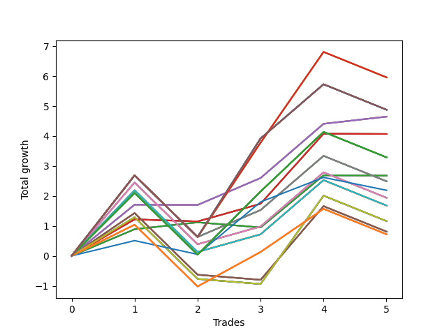

# Short Shepard 004 DB 
- Symbol: SPY_Unlimited
- Date Range: 03/23/2022 - 07/08/2022
- Trading Period: 7:20-12:30
- Number of Trades: 5



| Name | Win Percent | Profit | Avg Profit / Trade | Avg Time / Trade |      | Name | Win Percent | Profit | Avg Profit / Trade | Avg Time / Trade |
| ---- | ----------- | ------ | ------------------ | ---------------- | ---- | ---- | ----------- | ------ | ------------------ | ---------------- |
| Sorted By <br> Profit | | | | | | Sorted By <br> Win Percentage ||||
| One Hundred Twenty-Eight | 60.00 | 2980.00 | 596.00 | 20:57 |     | Sixty-Six | 80.00 | 2325.00 | 465.00 | 14:28 |
| One Hundred Twenty-Three | 60.00 | 2980.00 | 596.00 | 20:57 |     | Fifty-Eight | 80.00 | 2325.00 | 465.00 | 14:28 |
| One Hundred Eighteen | 60.00 | 2980.00 | 596.00 | 20:57 |     | Fifty | 80.00 | 2325.00 | 465.00 | 14:28 |
| One Hundred Thirteen | 60.00 | 2980.00 | 596.00 | 20:57 |     | Forty-Two | 80.00 | 2325.00 | 465.00 | 14:28 |
| Eighty-Three | 60.00 | 2980.00 | 596.00 | 20:57 |     | Two | 80.00 | 2325.00 | 465.00 | 14:28 |
| One Hundred Thirty | 60.00 | 2440.00 | 488.00 | 29:55 |     | One Hundred Twenty-Eight | 60.00 | 2980.00 | 596.00 | 20:57 |
| One Hundred Twenty-Nine | 60.00 | 2440.00 | 488.00 | 29:55 |     | One Hundred Twenty-Three | 60.00 | 2980.00 | 596.00 | 20:57 |
| One Hundred Twenty-Five | 60.00 | 2440.00 | 488.00 | 29:55 |     | One Hundred Eighteen | 60.00 | 2980.00 | 596.00 | 20:57 |
| One Hundred Twenty-Four | 60.00 | 2440.00 | 488.00 | 29:55 |     | One Hundred Thirteen | 60.00 | 2980.00 | 596.00 | 20:57 |
| One Hundred Twenty | 60.00 | 2440.00 | 488.00 | 29:55 |     | Eighty-Three | 60.00 | 2980.00 | 596.00 | 20:57 |
| One Hundred Ninteen | 60.00 | 2440.00 | 488.00 | 29:55 |     | One Hundred Thirty | 60.00 | 2440.00 | 488.00 | 29:55 |
| One Hundred Fifteen | 60.00 | 2440.00 | 488.00 | 29:55 |     | One Hundred Twenty-Nine | 60.00 | 2440.00 | 488.00 | 29:55 |
| One Hundred Fourteen | 60.00 | 2440.00 | 488.00 | 29:55 |     | One Hundred Twenty-Five | 60.00 | 2440.00 | 488.00 | 29:55 |
| Eighty-Five | 60.00 | 2440.00 | 488.00 | 29:55 |     | One Hundred Twenty-Four | 60.00 | 2440.00 | 488.00 | 29:55 |
| Eighty-Four | 60.00 | 2440.00 | 488.00 | 29:55 |     | One Hundred Twenty | 60.00 | 2440.00 | 488.00 | 29:55 |
| Sixty-Six | 80.00 | 2325.00 | 465.00 | 14:28 |     | One Hundred Ninteen | 60.00 | 2440.00 | 488.00 | 29:55 |
| Fifty-Eight | 80.00 | 2325.00 | 465.00 | 14:28 |     | One Hundred Fifteen | 60.00 | 2440.00 | 488.00 | 29:55 |
| Fifty | 80.00 | 2325.00 | 465.00 | 14:28 |     | One Hundred Fourteen | 60.00 | 2440.00 | 488.00 | 29:55 |
| Forty-Two | 80.00 | 2325.00 | 465.00 | 14:28 |     | Eighty-Five | 60.00 | 2440.00 | 488.00 | 29:55 |
| Two | 80.00 | 2325.00 | 465.00 | 14:28 |     | Eighty-Four | 60.00 | 2440.00 | 488.00 | 29:55 |
| Sixty-Five | 60.00 | 2035.00 | 407.00 | 07:31 |     | Sixty-Five | 60.00 | 2035.00 | 407.00 | 07:31 |
| Fifty-Seven | 60.00 | 2035.00 | 407.00 | 07:31 |     | Fifty-Seven | 60.00 | 2035.00 | 407.00 | 07:31 |
| Forty-Nine | 60.00 | 2035.00 | 407.00 | 07:31 |     | Forty-Nine | 60.00 | 2035.00 | 407.00 | 07:31 |
| Forty-One | 60.00 | 2035.00 | 407.00 | 07:31 |     | Forty-One | 60.00 | 2035.00 | 407.00 | 07:31 |
| One | 60.00 | 2035.00 | 407.00 | 07:31 |     | One | 60.00 | 2035.00 | 407.00 | 07:31 |
| One Hundred Twenty-Seven | 60.00 | 1645.00 | 329.00 | 16:14 |     | One Hundred Twenty-Seven | 60.00 | 1645.00 | 329.00 | 16:14 |
| One Hundred Twenty-Two | 60.00 | 1645.00 | 329.00 | 16:14 |     | One Hundred Twenty-Two | 60.00 | 1645.00 | 329.00 | 16:14 |
| One Hundred Seventeen | 60.00 | 1645.00 | 329.00 | 16:14 |     | One Hundred Seventeen | 60.00 | 1645.00 | 329.00 | 16:14 |
| One Hundred Twelve | 60.00 | 1645.00 | 329.00 | 16:14 |     | One Hundred Twelve | 60.00 | 1645.00 | 329.00 | 16:14 |
| Eighty-Two | 60.00 | 1645.00 | 329.00 | 16:14 |     | Eighty-Two | 60.00 | 1645.00 | 329.00 | 16:14 |
| Sixty-Four | 60.00 | 1340.00 | 268.00 | 04:04 |     | Sixty-Four | 60.00 | 1340.00 | 268.00 | 04:04 |
| Fifty-Six | 60.00 | 1340.00 | 268.00 | 04:04 |     | Fifty-Six | 60.00 | 1340.00 | 268.00 | 04:04 |
| Forty-Eight | 60.00 | 1340.00 | 268.00 | 04:04 |     | Forty-Eight | 60.00 | 1340.00 | 268.00 | 04:04 |
| Forty | 60.00 | 1340.00 | 268.00 | 04:04 |     | Forty | 60.00 | 1340.00 | 268.00 | 04:04 |
| Zero | 60.00 | 1340.00 | 268.00 | 04:04 |     | Zero | 60.00 | 1340.00 | 268.00 | 04:04 |
| Sixty-Nine | 60.00 | 1245.00 | 249.00 | 24:11 |     | Sixty-Nine | 60.00 | 1245.00 | 249.00 | 24:11 |
| Sixty-One | 60.00 | 1245.00 | 249.00 | 24:11 |     | Sixty-One | 60.00 | 1245.00 | 249.00 | 24:11 |
| Fifty-Three | 60.00 | 1245.00 | 249.00 | 24:11 |     | Fifty-Three | 60.00 | 1245.00 | 249.00 | 24:11 |
| Forty-Five | 60.00 | 1245.00 | 249.00 | 24:11 |     | Forty-Five | 60.00 | 1245.00 | 249.00 | 24:11 |
| Five | 60.00 | 1245.00 | 249.00 | 24:11 |     | Five | 60.00 | 1245.00 | 249.00 | 24:11 |
| Seventy-Three | 60.00 | 1095.00 | 219.00 | 07:29 |     | Seventy-Three | 60.00 | 1095.00 | 219.00 | 07:29 |
| Sixty-Eight | 60.00 | 970.00 | 194.00 | 22:01 |     | Sixty-Eight | 60.00 | 970.00 | 194.00 | 22:01 |
| Sixty | 60.00 | 970.00 | 194.00 | 22:01 |     | Sixty | 60.00 | 970.00 | 194.00 | 22:01 |
| Fifty-Two | 60.00 | 970.00 | 194.00 | 22:01 |     | Fifty-Two | 60.00 | 970.00 | 194.00 | 22:01 |
| Forty-Four | 60.00 | 970.00 | 194.00 | 22:01 |     | Forty-Four | 60.00 | 970.00 | 194.00 | 22:01 |
| Four | 60.00 | 970.00 | 194.00 | 22:01 |     | Four | 60.00 | 970.00 | 194.00 | 22:01 |
| Seventy-One | 60.00 | 840.00 | 168.00 | 21:52 |     | Seventy-One | 60.00 | 840.00 | 168.00 | 21:52 |
| Sixty-Three | 60.00 | 840.00 | 168.00 | 21:52 |     | Sixty-Three | 60.00 | 840.00 | 168.00 | 21:52 |
| Fifty-Five | 60.00 | 840.00 | 168.00 | 21:52 |     | Fifty-Five | 60.00 | 840.00 | 168.00 | 21:52 |
| Forty-Seven | 60.00 | 840.00 | 168.00 | 21:52 |     | Forty-Seven | 60.00 | 840.00 | 168.00 | 21:52 |
| Seven | 60.00 | 840.00 | 168.00 | 21:52 |     | Seven | 60.00 | 840.00 | 168.00 | 21:52 |
| Seventy | 40.00 | 580.00 | 116.00 | 14:41 |     | One Hundred Twenty-Six | 60.00 | 360.00 | 72.00 | 13:36 |
| Sixty-Two | 40.00 | 580.00 | 116.00 | 14:41 |     | One Hundred Twenty-One | 60.00 | 360.00 | 72.00 | 13:36 |
| Fifty-Four | 40.00 | 580.00 | 116.00 | 14:41 |     | One Hundred Sixteen | 60.00 | 360.00 | 72.00 | 13:36 |
| Forty-Six | 40.00 | 580.00 | 116.00 | 14:41 |     | One Hundred Eleven | 60.00 | 360.00 | 72.00 | 13:36 |
| Six | 40.00 | 580.00 | 116.00 | 14:41 |     | Eighty-One | 60.00 | 360.00 | 72.00 | 13:36 |
| Sixty-Seven | 40.00 | 405.00 | 81.00 | 19:37 |     | Seventy | 40.00 | 580.00 | 116.00 | 14:41 |
| Fifty-Nine | 40.00 | 405.00 | 81.00 | 19:37 |     | Sixty-Two | 40.00 | 580.00 | 116.00 | 14:41 |
| Fifty-One | 40.00 | 405.00 | 81.00 | 19:37 |     | Fifty-Four | 40.00 | 580.00 | 116.00 | 14:41 |
| Forty-Three | 40.00 | 405.00 | 81.00 | 19:37 |     | Forty-Six | 40.00 | 580.00 | 116.00 | 14:41 |
| Three | 40.00 | 405.00 | 81.00 | 19:37 |     | Six | 40.00 | 580.00 | 116.00 | 14:41 |
| One Hundred Twenty-Six | 60.00 | 360.00 | 72.00 | 13:36 |     | Sixty-Seven | 40.00 | 405.00 | 81.00 | 19:37 |
| One Hundred Twenty-One | 60.00 | 360.00 | 72.00 | 13:36 |     | Fifty-Nine | 40.00 | 405.00 | 81.00 | 19:37 |
| One Hundred Sixteen | 60.00 | 360.00 | 72.00 | 13:36 |     | Fifty-One | 40.00 | 405.00 | 81.00 | 19:37 |
| One Hundred Eleven | 60.00 | 360.00 | 72.00 | 13:36 |     | Forty-Three | 40.00 | 405.00 | 81.00 | 19:37 |
| Eighty-One | 60.00 | 360.00 | 72.00 | 13:36 |     | Three | 40.00 | 405.00 | 81.00 | 19:37 |

## NO STOPLOSS

### Test Zero
* Sell when price hits the middle line of the 20p bollinger
* No Stoploss
* Results:
```
Total Trades: 5
Percent Up: 40.00
Percent Down: 60.00
Total Points Moved Down: 2.68
Potential Profit: 1340.00
Total Points Ups: 0.18 Count Ups: 2
Total Points Downs: 2.86 Count Downs: 3
```

<details><summary>Trades</summary>

<code>In: 2022-04-25 07:39:00		Out: 2022-04-25 07:40:25		Total Position Time: 01:25		Total Move Down: 0.89		Total to Date: 0.89</code> <br />
<code>In: 2022-05-25 11:33:00		Out: 2022-05-25 11:39:10		Total Position Time: 06:10		Total Move Down: 0.23		Total to Date: 1.12</code> <br />
<code>In: 2022-06-15 11:02:00		Out: 2022-06-15 11:02:10		Total Position Time: 00:10		Total Move Down: -0.17		Total to Date: 0.95</code> <br />
<code>In: 2022-06-15 11:48:00		Out: 2022-06-15 11:53:25		Total Position Time: 05:25		Total Move Down: 1.74		Total to Date: 2.69</code> <br />
<code>In: 2022-07-05 08:53:00		Out: 2022-07-05 09:00:10		Total Position Time: 07:10		Total Move Down: -0.01		Total to Date: 2.68</code> <br />


</details>

### Test One
* Sell when the price hits the upper line of the 20p 1std bollinger
* No Stoploss
* Results:
```
Total Trades: 5
Percent Up: 40.00
Percent Down: 60.00
Total Points Moved Down: 4.07
Potential Profit: 2035.00
Total Points Ups: 0.08 Count Ups: 2
Total Points Downs: 4.15 Count Downs: 3
```

<details><summary>Trades</summary>

<code>In: 2022-04-25 07:39:00		Out: 2022-04-25 07:43:05		Total Position Time: 04:05		Total Move Down: 1.22		Total to Date: 1.22</code> <br />
<code>In: 2022-05-25 11:33:00		Out: 2022-05-25 11:45:15		Total Position Time: 12:15		Total Move Down: -0.07		Total to Date: 1.15</code> <br />
<code>In: 2022-06-15 11:02:00		Out: 2022-06-15 11:03:05		Total Position Time: 01:05		Total Move Down: 0.59		Total to Date: 1.74</code> <br />
<code>In: 2022-06-15 11:48:00		Out: 2022-06-15 11:57:45		Total Position Time: 09:45		Total Move Down: 2.34		Total to Date: 4.08</code> <br />
<code>In: 2022-07-05 08:53:00		Out: 2022-07-05 09:03:25		Total Position Time: 10:25		Total Move Down: -0.01		Total to Date: 4.07</code> <br />


</details>

### Test Two
* Sell when the price hits the upper line of the 20p 2std bollinger
* No Stoploss
* Results:
```
Total Trades: 5
Percent Up: 20.00
Percent Down: 80.00
Total Points Moved Down: 4.65
Potential Profit: 2325.00
Total Points Ups: 0.01 Count Ups: 1
Total Points Downs: 4.66 Count Downs: 4
```

<details><summary>Trades</summary>

<code>In: 2022-04-25 07:39:00		Out: 2022-04-25 07:52:20		Total Position Time: 13:20		Total Move Down: 1.71		Total to Date: 1.71</code> <br />
<code>In: 2022-05-25 11:33:00		Out: 2022-05-25 11:50:00		Total Position Time: 17:00		Total Move Down: -0.01		Total to Date: 1.70</code> <br />
<code>In: 2022-06-15 11:02:00		Out: 2022-06-15 11:03:15		Total Position Time: 01:15		Total Move Down: 0.90		Total to Date: 2.60</code> <br />
<code>In: 2022-06-15 11:48:00		Out: 2022-06-15 12:17:55		Total Position Time: 29:55		Total Move Down: 1.81		Total to Date: 4.41</code> <br />
<code>In: 2022-07-05 08:53:00		Out: 2022-07-05 09:03:50		Total Position Time: 10:50		Total Move Down: 0.24		Total to Date: 4.65</code> <br />


</details>

### Test Three
* Sell when price hits the middle line of the 50p bollinger
* No Stoploss
* Results:
```
Total Trades: 5
Percent Up: 60.00
Percent Down: 40.00
Total Points Moved Down: 0.81
Potential Profit: 405.00
Total Points Ups: 3.08 Count Ups: 3
Total Points Downs: 3.89 Count Downs: 2
```

<details><summary>Trades</summary>

<code>In: 2022-04-25 07:39:00		Out: 2022-04-25 07:52:00		Total Position Time: 13:00		Total Move Down: 1.43		Total to Date: 1.43</code> <br />
<code>In: 2022-05-25 11:33:00		Out: 2022-05-25 12:02:55		Total Position Time: 29:55		Total Move Down: -2.06		Total to Date: -0.63</code> <br />
<code>In: 2022-06-15 11:02:00		Out: 2022-06-15 11:02:10		Total Position Time: 00:10		Total Move Down: -0.17		Total to Date: -0.80</code> <br />
<code>In: 2022-06-15 11:48:00		Out: 2022-06-15 12:13:05		Total Position Time: 25:05		Total Move Down: 2.46		Total to Date: 1.66</code> <br />
<code>In: 2022-07-05 08:53:00		Out: 2022-07-05 09:22:55		Total Position Time: 29:55		Total Move Down: -0.85		Total to Date: 0.81</code> <br />


</details>

### Test Four
* Sell when the price hits the upper line of the 50p 1std bollinger
* No Stoploss
* Results:
```
Total Trades: 5
Percent Up: 40.00
Percent Down: 60.00
Total Points Moved Down: 1.94
Potential Profit: 970.00
Total Points Ups: 2.91 Count Ups: 2
Total Points Downs: 4.85 Count Downs: 3
```

<details><summary>Trades</summary>

<code>In: 2022-04-25 07:39:00		Out: 2022-04-25 07:58:15		Total Position Time: 19:15		Total Move Down: 2.45		Total to Date: 2.45</code> <br />
<code>In: 2022-05-25 11:33:00		Out: 2022-05-25 12:02:55		Total Position Time: 29:55		Total Move Down: -2.06		Total to Date: 0.39</code> <br />
<code>In: 2022-06-15 11:02:00		Out: 2022-06-15 11:03:05		Total Position Time: 01:05		Total Move Down: 0.59		Total to Date: 0.98</code> <br />
<code>In: 2022-06-15 11:48:00		Out: 2022-06-15 12:17:55		Total Position Time: 29:55		Total Move Down: 1.81		Total to Date: 2.79</code> <br />
<code>In: 2022-07-05 08:53:00		Out: 2022-07-05 09:22:55		Total Position Time: 29:55		Total Move Down: -0.85		Total to Date: 1.94</code> <br />


</details>

### Test Five
* Sell when the price hits the upper line of the 50p 2std bollinger
* No Stoploss
* Results:
```
Total Trades: 5
Percent Up: 40.00
Percent Down: 60.00
Total Points Moved Down: 2.49
Potential Profit: 1245.00
Total Points Ups: 2.91 Count Ups: 2
Total Points Downs: 5.40 Count Downs: 3
```

<details><summary>Trades</summary>

<code>In: 2022-04-25 07:39:00		Out: 2022-04-25 08:08:55		Total Position Time: 29:55		Total Move Down: 2.69		Total to Date: 2.69</code> <br />
<code>In: 2022-05-25 11:33:00		Out: 2022-05-25 12:02:55		Total Position Time: 29:55		Total Move Down: -2.06		Total to Date: 0.63</code> <br />
<code>In: 2022-06-15 11:02:00		Out: 2022-06-15 11:03:15		Total Position Time: 01:15		Total Move Down: 0.90		Total to Date: 1.53</code> <br />
<code>In: 2022-06-15 11:48:00		Out: 2022-06-15 12:17:55		Total Position Time: 29:55		Total Move Down: 1.81		Total to Date: 3.34</code> <br />
<code>In: 2022-07-05 08:53:00		Out: 2022-07-05 09:22:55		Total Position Time: 29:55		Total Move Down: -0.85		Total to Date: 2.49</code> <br />


</details>

### Test Six
* Sell when the price hits the middle line of the 1std VWAP
* No Stoploss
* Results:
```
Total Trades: 5
Percent Up: 60.00
Percent Down: 40.00
Total Points Moved Down: 1.16
Potential Profit: 580.00
Total Points Ups: 3.08 Count Ups: 3
Total Points Downs: 4.24 Count Downs: 2
```

<details><summary>Trades</summary>

<code>In: 2022-04-25 07:39:00		Out: 2022-04-25 07:42:30		Total Position Time: 03:30		Total Move Down: 1.29		Total to Date: 1.29</code> <br />
<code>In: 2022-05-25 11:33:00		Out: 2022-05-25 12:02:55		Total Position Time: 29:55		Total Move Down: -2.06		Total to Date: -0.77</code> <br />
<code>In: 2022-06-15 11:02:00		Out: 2022-06-15 11:02:10		Total Position Time: 00:10		Total Move Down: -0.17		Total to Date: -0.94</code> <br />
<code>In: 2022-06-15 11:48:00		Out: 2022-06-15 11:57:55		Total Position Time: 09:55		Total Move Down: 2.95		Total to Date: 2.01</code> <br />
<code>In: 2022-07-05 08:53:00		Out: 2022-07-05 09:22:55		Total Position Time: 29:55		Total Move Down: -0.85		Total to Date: 1.16</code> <br />


</details>

### Test Seven
* Sell when the price hits the upper line of the 1std VWAP
* No Stoploss
* Results:
```
Total Trades: 5
Percent Up: 40.00
Percent Down: 60.00
Total Points Moved Down: 1.68
Potential Profit: 840.00
Total Points Ups: 2.91 Count Ups: 2
Total Points Downs: 4.59 Count Downs: 3
```

<details><summary>Trades</summary>

<code>In: 2022-04-25 07:39:00		Out: 2022-04-25 07:57:30		Total Position Time: 18:30		Total Move Down: 2.19		Total to Date: 2.19</code> <br />
<code>In: 2022-05-25 11:33:00		Out: 2022-05-25 12:02:55		Total Position Time: 29:55		Total Move Down: -2.06		Total to Date: 0.13</code> <br />
<code>In: 2022-06-15 11:02:00		Out: 2022-06-15 11:03:05		Total Position Time: 01:05		Total Move Down: 0.59		Total to Date: 0.72</code> <br />
<code>In: 2022-06-15 11:48:00		Out: 2022-06-15 12:17:55		Total Position Time: 29:55		Total Move Down: 1.81		Total to Date: 2.53</code> <br />
<code>In: 2022-07-05 08:53:00		Out: 2022-07-05 09:22:55		Total Position Time: 29:55		Total Move Down: -0.85		Total to Date: 1.68</code> <br />


</details>

## STOPLOSS OF 5

### Test Forty
* Sell when price hits the middle line of the 20p bollinger
* Stoploss is -5 points
* Results:
```
Total Trades: 5
Percent Up: 40.00
Percent Down: 60.00
Total Points Moved Down: 2.68
Potential Profit: 1340.00
Total Points Ups: 0.18 Count Ups: 2
Total Points Downs: 2.86 Count Downs: 3
```

<details><summary>Trades</summary>

<code>In: 2022-04-25 07:39:00		Out: 2022-04-25 07:40:25		Total Position Time: 01:25		Total Move Down: 0.89		Total to Date: 0.89</code> <br />
<code>In: 2022-05-25 11:33:00		Out: 2022-05-25 11:39:10		Total Position Time: 06:10		Total Move Down: 0.23		Total to Date: 1.12</code> <br />
<code>In: 2022-06-15 11:02:00		Out: 2022-06-15 11:02:10		Total Position Time: 00:10		Total Move Down: -0.17		Total to Date: 0.95</code> <br />
<code>In: 2022-06-15 11:48:00		Out: 2022-06-15 11:53:25		Total Position Time: 05:25		Total Move Down: 1.74		Total to Date: 2.69</code> <br />
<code>In: 2022-07-05 08:53:00		Out: 2022-07-05 09:00:10		Total Position Time: 07:10		Total Move Down: -0.01		Total to Date: 2.68</code> <br />


</details>

### Test Forty-One
* Sell when the price hits the upper line of the 20p 1std bollinger
* Stoploss is -5 points
* Results:
```
Total Trades: 5
Percent Up: 40.00
Percent Down: 60.00
Total Points Moved Down: 4.07
Potential Profit: 2035.00
Total Points Ups: 0.08 Count Ups: 2
Total Points Downs: 4.15 Count Downs: 3
```

<details><summary>Trades</summary>

<code>In: 2022-04-25 07:39:00		Out: 2022-04-25 07:43:05		Total Position Time: 04:05		Total Move Down: 1.22		Total to Date: 1.22</code> <br />
<code>In: 2022-05-25 11:33:00		Out: 2022-05-25 11:45:15		Total Position Time: 12:15		Total Move Down: -0.07		Total to Date: 1.15</code> <br />
<code>In: 2022-06-15 11:02:00		Out: 2022-06-15 11:03:05		Total Position Time: 01:05		Total Move Down: 0.59		Total to Date: 1.74</code> <br />
<code>In: 2022-06-15 11:48:00		Out: 2022-06-15 11:57:45		Total Position Time: 09:45		Total Move Down: 2.34		Total to Date: 4.08</code> <br />
<code>In: 2022-07-05 08:53:00		Out: 2022-07-05 09:03:25		Total Position Time: 10:25		Total Move Down: -0.01		Total to Date: 4.07</code> <br />


</details>

### Test Forty-Two
* Sell when the price hits the upper line of the 20p 2std bollinger
* Stoploss is -5 points
* Results:
```
Total Trades: 5
Percent Up: 20.00
Percent Down: 80.00
Total Points Moved Down: 4.65
Potential Profit: 2325.00
Total Points Ups: 0.01 Count Ups: 1
Total Points Downs: 4.66 Count Downs: 4
```

<details><summary>Trades</summary>

<code>In: 2022-04-25 07:39:00		Out: 2022-04-25 07:52:20		Total Position Time: 13:20		Total Move Down: 1.71		Total to Date: 1.71</code> <br />
<code>In: 2022-05-25 11:33:00		Out: 2022-05-25 11:50:00		Total Position Time: 17:00		Total Move Down: -0.01		Total to Date: 1.70</code> <br />
<code>In: 2022-06-15 11:02:00		Out: 2022-06-15 11:03:15		Total Position Time: 01:15		Total Move Down: 0.90		Total to Date: 2.60</code> <br />
<code>In: 2022-06-15 11:48:00		Out: 2022-06-15 12:17:55		Total Position Time: 29:55		Total Move Down: 1.81		Total to Date: 4.41</code> <br />
<code>In: 2022-07-05 08:53:00		Out: 2022-07-05 09:03:50		Total Position Time: 10:50		Total Move Down: 0.24		Total to Date: 4.65</code> <br />


</details>

### Test Forty-Three
* Sell when price hits the middle line of the 50p bollinger
* Stoploss is -5 points
* Results:
```
Total Trades: 5
Percent Up: 60.00
Percent Down: 40.00
Total Points Moved Down: 0.81
Potential Profit: 405.00
Total Points Ups: 3.08 Count Ups: 3
Total Points Downs: 3.89 Count Downs: 2
```

<details><summary>Trades</summary>

<code>In: 2022-04-25 07:39:00		Out: 2022-04-25 07:52:00		Total Position Time: 13:00		Total Move Down: 1.43		Total to Date: 1.43</code> <br />
<code>In: 2022-05-25 11:33:00		Out: 2022-05-25 12:02:55		Total Position Time: 29:55		Total Move Down: -2.06		Total to Date: -0.63</code> <br />
<code>In: 2022-06-15 11:02:00		Out: 2022-06-15 11:02:10		Total Position Time: 00:10		Total Move Down: -0.17		Total to Date: -0.80</code> <br />
<code>In: 2022-06-15 11:48:00		Out: 2022-06-15 12:13:05		Total Position Time: 25:05		Total Move Down: 2.46		Total to Date: 1.66</code> <br />
<code>In: 2022-07-05 08:53:00		Out: 2022-07-05 09:22:55		Total Position Time: 29:55		Total Move Down: -0.85		Total to Date: 0.81</code> <br />


</details>

### Test Forty-Four
* Sell when the price hits the upper line of the 50p 1std bollinger
* Stoploss is -5 points
* Results:
```
Total Trades: 5
Percent Up: 40.00
Percent Down: 60.00
Total Points Moved Down: 1.94
Potential Profit: 970.00
Total Points Ups: 2.91 Count Ups: 2
Total Points Downs: 4.85 Count Downs: 3
```

<details><summary>Trades</summary>

<code>In: 2022-04-25 07:39:00		Out: 2022-04-25 07:58:15		Total Position Time: 19:15		Total Move Down: 2.45		Total to Date: 2.45</code> <br />
<code>In: 2022-05-25 11:33:00		Out: 2022-05-25 12:02:55		Total Position Time: 29:55		Total Move Down: -2.06		Total to Date: 0.39</code> <br />
<code>In: 2022-06-15 11:02:00		Out: 2022-06-15 11:03:05		Total Position Time: 01:05		Total Move Down: 0.59		Total to Date: 0.98</code> <br />
<code>In: 2022-06-15 11:48:00		Out: 2022-06-15 12:17:55		Total Position Time: 29:55		Total Move Down: 1.81		Total to Date: 2.79</code> <br />
<code>In: 2022-07-05 08:53:00		Out: 2022-07-05 09:22:55		Total Position Time: 29:55		Total Move Down: -0.85		Total to Date: 1.94</code> <br />


</details>

### Test Forty-Five
* Sell when the price hits the upper line of the 50p 2std bollinger
* Stoploss is -5 points
* Results:
```
Total Trades: 5
Percent Up: 40.00
Percent Down: 60.00
Total Points Moved Down: 2.49
Potential Profit: 1245.00
Total Points Ups: 2.91 Count Ups: 2
Total Points Downs: 5.40 Count Downs: 3
```

<details><summary>Trades</summary>

<code>In: 2022-04-25 07:39:00		Out: 2022-04-25 08:08:55		Total Position Time: 29:55		Total Move Down: 2.69		Total to Date: 2.69</code> <br />
<code>In: 2022-05-25 11:33:00		Out: 2022-05-25 12:02:55		Total Position Time: 29:55		Total Move Down: -2.06		Total to Date: 0.63</code> <br />
<code>In: 2022-06-15 11:02:00		Out: 2022-06-15 11:03:15		Total Position Time: 01:15		Total Move Down: 0.90		Total to Date: 1.53</code> <br />
<code>In: 2022-06-15 11:48:00		Out: 2022-06-15 12:17:55		Total Position Time: 29:55		Total Move Down: 1.81		Total to Date: 3.34</code> <br />
<code>In: 2022-07-05 08:53:00		Out: 2022-07-05 09:22:55		Total Position Time: 29:55		Total Move Down: -0.85		Total to Date: 2.49</code> <br />


</details>

### Test Forty-Six
* Sell when the price hits the middle line of the 1std VWAP
* Stoploss is -5 points
* Results:
```
Total Trades: 5
Percent Up: 60.00
Percent Down: 40.00
Total Points Moved Down: 1.16
Potential Profit: 580.00
Total Points Ups: 3.08 Count Ups: 3
Total Points Downs: 4.24 Count Downs: 2
```

<details><summary>Trades</summary>

<code>In: 2022-04-25 07:39:00		Out: 2022-04-25 07:42:30		Total Position Time: 03:30		Total Move Down: 1.29		Total to Date: 1.29</code> <br />
<code>In: 2022-05-25 11:33:00		Out: 2022-05-25 12:02:55		Total Position Time: 29:55		Total Move Down: -2.06		Total to Date: -0.77</code> <br />
<code>In: 2022-06-15 11:02:00		Out: 2022-06-15 11:02:10		Total Position Time: 00:10		Total Move Down: -0.17		Total to Date: -0.94</code> <br />
<code>In: 2022-06-15 11:48:00		Out: 2022-06-15 11:57:55		Total Position Time: 09:55		Total Move Down: 2.95		Total to Date: 2.01</code> <br />
<code>In: 2022-07-05 08:53:00		Out: 2022-07-05 09:22:55		Total Position Time: 29:55		Total Move Down: -0.85		Total to Date: 1.16</code> <br />


</details>

### Test Forty-Seven
* Sell when the price hits the upper line of the 1std VWAP
* Stoploss is -5 points
* Results:
```
Total Trades: 5
Percent Up: 40.00
Percent Down: 60.00
Total Points Moved Down: 1.68
Potential Profit: 840.00
Total Points Ups: 2.91 Count Ups: 2
Total Points Downs: 4.59 Count Downs: 3
```

<details><summary>Trades</summary>

<code>In: 2022-04-25 07:39:00		Out: 2022-04-25 07:57:30		Total Position Time: 18:30		Total Move Down: 2.19		Total to Date: 2.19</code> <br />
<code>In: 2022-05-25 11:33:00		Out: 2022-05-25 12:02:55		Total Position Time: 29:55		Total Move Down: -2.06		Total to Date: 0.13</code> <br />
<code>In: 2022-06-15 11:02:00		Out: 2022-06-15 11:03:05		Total Position Time: 01:05		Total Move Down: 0.59		Total to Date: 0.72</code> <br />
<code>In: 2022-06-15 11:48:00		Out: 2022-06-15 12:17:55		Total Position Time: 29:55		Total Move Down: 1.81		Total to Date: 2.53</code> <br />
<code>In: 2022-07-05 08:53:00		Out: 2022-07-05 09:22:55		Total Position Time: 29:55		Total Move Down: -0.85		Total to Date: 1.68</code> <br />


</details>

## TRAIL STOP OF 5

### Test Forty-Eight
* Sell when price hits the middle line of the 20p bollinger
* Trailing Stop is -5 points
* Results:
```
Total Trades: 5
Percent Up: 40.00
Percent Down: 60.00
Total Points Moved Down: 2.68
Potential Profit: 1340.00
Total Points Ups: 0.18 Count Ups: 2
Total Points Downs: 2.86 Count Downs: 3
```

<details><summary>Trades</summary>

<code>In: 2022-04-25 07:39:00		Out: 2022-04-25 07:40:25		Total Position Time: 01:25		Total Move Down: 0.89		Total to Date: 0.89</code> <br />
<code>In: 2022-05-25 11:33:00		Out: 2022-05-25 11:39:10		Total Position Time: 06:10		Total Move Down: 0.23		Total to Date: 1.12</code> <br />
<code>In: 2022-06-15 11:02:00		Out: 2022-06-15 11:02:10		Total Position Time: 00:10		Total Move Down: -0.17		Total to Date: 0.95</code> <br />
<code>In: 2022-06-15 11:48:00		Out: 2022-06-15 11:53:25		Total Position Time: 05:25		Total Move Down: 1.74		Total to Date: 2.69</code> <br />
<code>In: 2022-07-05 08:53:00		Out: 2022-07-05 09:00:10		Total Position Time: 07:10		Total Move Down: -0.01		Total to Date: 2.68</code> <br />


</details>

### Test Forty-Nine
* Sell when the price hits the upper line of the 20p 1std bollinger
* Trailing Stop is -5 points
* Results:
```
Total Trades: 5
Percent Up: 40.00
Percent Down: 60.00
Total Points Moved Down: 4.07
Potential Profit: 2035.00
Total Points Ups: 0.08 Count Ups: 2
Total Points Downs: 4.15 Count Downs: 3
```

<details><summary>Trades</summary>

<code>In: 2022-04-25 07:39:00		Out: 2022-04-25 07:43:05		Total Position Time: 04:05		Total Move Down: 1.22		Total to Date: 1.22</code> <br />
<code>In: 2022-05-25 11:33:00		Out: 2022-05-25 11:45:15		Total Position Time: 12:15		Total Move Down: -0.07		Total to Date: 1.15</code> <br />
<code>In: 2022-06-15 11:02:00		Out: 2022-06-15 11:03:05		Total Position Time: 01:05		Total Move Down: 0.59		Total to Date: 1.74</code> <br />
<code>In: 2022-06-15 11:48:00		Out: 2022-06-15 11:57:45		Total Position Time: 09:45		Total Move Down: 2.34		Total to Date: 4.08</code> <br />
<code>In: 2022-07-05 08:53:00		Out: 2022-07-05 09:03:25		Total Position Time: 10:25		Total Move Down: -0.01		Total to Date: 4.07</code> <br />


</details>

### Test Fifty
* Sell when the price hits the upper line of the 20p 2std bollinger
* Trailing Stop is -5 points
* Results:
```
Total Trades: 5
Percent Up: 20.00
Percent Down: 80.00
Total Points Moved Down: 4.65
Potential Profit: 2325.00
Total Points Ups: 0.01 Count Ups: 1
Total Points Downs: 4.66 Count Downs: 4
```

<details><summary>Trades</summary>

<code>In: 2022-04-25 07:39:00		Out: 2022-04-25 07:52:20		Total Position Time: 13:20		Total Move Down: 1.71		Total to Date: 1.71</code> <br />
<code>In: 2022-05-25 11:33:00		Out: 2022-05-25 11:50:00		Total Position Time: 17:00		Total Move Down: -0.01		Total to Date: 1.70</code> <br />
<code>In: 2022-06-15 11:02:00		Out: 2022-06-15 11:03:15		Total Position Time: 01:15		Total Move Down: 0.90		Total to Date: 2.60</code> <br />
<code>In: 2022-06-15 11:48:00		Out: 2022-06-15 12:17:55		Total Position Time: 29:55		Total Move Down: 1.81		Total to Date: 4.41</code> <br />
<code>In: 2022-07-05 08:53:00		Out: 2022-07-05 09:03:50		Total Position Time: 10:50		Total Move Down: 0.24		Total to Date: 4.65</code> <br />


</details>

### Test Fifty-One
* Sell when price hits the middle line of the 50p bollinger
* Trailing Stop is -5 points
* Results:
```
Total Trades: 5
Percent Up: 60.00
Percent Down: 40.00
Total Points Moved Down: 0.81
Potential Profit: 405.00
Total Points Ups: 3.08 Count Ups: 3
Total Points Downs: 3.89 Count Downs: 2
```

<details><summary>Trades</summary>

<code>In: 2022-04-25 07:39:00		Out: 2022-04-25 07:52:00		Total Position Time: 13:00		Total Move Down: 1.43		Total to Date: 1.43</code> <br />
<code>In: 2022-05-25 11:33:00		Out: 2022-05-25 12:02:55		Total Position Time: 29:55		Total Move Down: -2.06		Total to Date: -0.63</code> <br />
<code>In: 2022-06-15 11:02:00		Out: 2022-06-15 11:02:10		Total Position Time: 00:10		Total Move Down: -0.17		Total to Date: -0.80</code> <br />
<code>In: 2022-06-15 11:48:00		Out: 2022-06-15 12:13:05		Total Position Time: 25:05		Total Move Down: 2.46		Total to Date: 1.66</code> <br />
<code>In: 2022-07-05 08:53:00		Out: 2022-07-05 09:22:55		Total Position Time: 29:55		Total Move Down: -0.85		Total to Date: 0.81</code> <br />


</details>

### Test Fifty-Two
* Sell when the price hits the upper line of the 50p 1std bollinger
* Trailing Stop is -5 points
* Results:
```
Total Trades: 5
Percent Up: 40.00
Percent Down: 60.00
Total Points Moved Down: 1.94
Potential Profit: 970.00
Total Points Ups: 2.91 Count Ups: 2
Total Points Downs: 4.85 Count Downs: 3
```

<details><summary>Trades</summary>

<code>In: 2022-04-25 07:39:00		Out: 2022-04-25 07:58:15		Total Position Time: 19:15		Total Move Down: 2.45		Total to Date: 2.45</code> <br />
<code>In: 2022-05-25 11:33:00		Out: 2022-05-25 12:02:55		Total Position Time: 29:55		Total Move Down: -2.06		Total to Date: 0.39</code> <br />
<code>In: 2022-06-15 11:02:00		Out: 2022-06-15 11:03:05		Total Position Time: 01:05		Total Move Down: 0.59		Total to Date: 0.98</code> <br />
<code>In: 2022-06-15 11:48:00		Out: 2022-06-15 12:17:55		Total Position Time: 29:55		Total Move Down: 1.81		Total to Date: 2.79</code> <br />
<code>In: 2022-07-05 08:53:00		Out: 2022-07-05 09:22:55		Total Position Time: 29:55		Total Move Down: -0.85		Total to Date: 1.94</code> <br />


</details>

### Test Fifty-Three
* Sell when the price hits the upper line of the 50p 2std bollinger
* Trailing Stop is -5 points
* Results:
```
Total Trades: 5
Percent Up: 40.00
Percent Down: 60.00
Total Points Moved Down: 2.49
Potential Profit: 1245.00
Total Points Ups: 2.91 Count Ups: 2
Total Points Downs: 5.40 Count Downs: 3
```

<details><summary>Trades</summary>

<code>In: 2022-04-25 07:39:00		Out: 2022-04-25 08:08:55		Total Position Time: 29:55		Total Move Down: 2.69		Total to Date: 2.69</code> <br />
<code>In: 2022-05-25 11:33:00		Out: 2022-05-25 12:02:55		Total Position Time: 29:55		Total Move Down: -2.06		Total to Date: 0.63</code> <br />
<code>In: 2022-06-15 11:02:00		Out: 2022-06-15 11:03:15		Total Position Time: 01:15		Total Move Down: 0.90		Total to Date: 1.53</code> <br />
<code>In: 2022-06-15 11:48:00		Out: 2022-06-15 12:17:55		Total Position Time: 29:55		Total Move Down: 1.81		Total to Date: 3.34</code> <br />
<code>In: 2022-07-05 08:53:00		Out: 2022-07-05 09:22:55		Total Position Time: 29:55		Total Move Down: -0.85		Total to Date: 2.49</code> <br />


</details>

### Test Fifty-Four
* Sell when the price hits the middle line of the 1std VWAP
* Trailing Stop is -5 points
* Results:
```
Total Trades: 5
Percent Up: 60.00
Percent Down: 40.00
Total Points Moved Down: 1.16
Potential Profit: 580.00
Total Points Ups: 3.08 Count Ups: 3
Total Points Downs: 4.24 Count Downs: 2
```

<details><summary>Trades</summary>

<code>In: 2022-04-25 07:39:00		Out: 2022-04-25 07:42:30		Total Position Time: 03:30		Total Move Down: 1.29		Total to Date: 1.29</code> <br />
<code>In: 2022-05-25 11:33:00		Out: 2022-05-25 12:02:55		Total Position Time: 29:55		Total Move Down: -2.06		Total to Date: -0.77</code> <br />
<code>In: 2022-06-15 11:02:00		Out: 2022-06-15 11:02:10		Total Position Time: 00:10		Total Move Down: -0.17		Total to Date: -0.94</code> <br />
<code>In: 2022-06-15 11:48:00		Out: 2022-06-15 11:57:55		Total Position Time: 09:55		Total Move Down: 2.95		Total to Date: 2.01</code> <br />
<code>In: 2022-07-05 08:53:00		Out: 2022-07-05 09:22:55		Total Position Time: 29:55		Total Move Down: -0.85		Total to Date: 1.16</code> <br />


</details>

### Test Fifty-Five
* Sell when the price hits the upper line of the 1std VWAP
* Trailing Stop is -5 points
* Results:
```
Total Trades: 5
Percent Up: 40.00
Percent Down: 60.00
Total Points Moved Down: 1.68
Potential Profit: 840.00
Total Points Ups: 2.91 Count Ups: 2
Total Points Downs: 4.59 Count Downs: 3
```

<details><summary>Trades</summary>

<code>In: 2022-04-25 07:39:00		Out: 2022-04-25 07:57:30		Total Position Time: 18:30		Total Move Down: 2.19		Total to Date: 2.19</code> <br />
<code>In: 2022-05-25 11:33:00		Out: 2022-05-25 12:02:55		Total Position Time: 29:55		Total Move Down: -2.06		Total to Date: 0.13</code> <br />
<code>In: 2022-06-15 11:02:00		Out: 2022-06-15 11:03:05		Total Position Time: 01:05		Total Move Down: 0.59		Total to Date: 0.72</code> <br />
<code>In: 2022-06-15 11:48:00		Out: 2022-06-15 12:17:55		Total Position Time: 29:55		Total Move Down: 1.81		Total to Date: 2.53</code> <br />
<code>In: 2022-07-05 08:53:00		Out: 2022-07-05 09:22:55		Total Position Time: 29:55		Total Move Down: -0.85		Total to Date: 1.68</code> <br />


</details>

## STOPLOSS OF 10

### Test Fifty-Six
* Sell when price hits the middle line of the 20p bollinger
* Stoploss is -10 points
* Results:
```
Total Trades: 5
Percent Up: 40.00
Percent Down: 60.00
Total Points Moved Down: 2.68
Potential Profit: 1340.00
Total Points Ups: 0.18 Count Ups: 2
Total Points Downs: 2.86 Count Downs: 3
```

<details><summary>Trades</summary>

<code>In: 2022-04-25 07:39:00		Out: 2022-04-25 07:40:25		Total Position Time: 01:25		Total Move Down: 0.89		Total to Date: 0.89</code> <br />
<code>In: 2022-05-25 11:33:00		Out: 2022-05-25 11:39:10		Total Position Time: 06:10		Total Move Down: 0.23		Total to Date: 1.12</code> <br />
<code>In: 2022-06-15 11:02:00		Out: 2022-06-15 11:02:10		Total Position Time: 00:10		Total Move Down: -0.17		Total to Date: 0.95</code> <br />
<code>In: 2022-06-15 11:48:00		Out: 2022-06-15 11:53:25		Total Position Time: 05:25		Total Move Down: 1.74		Total to Date: 2.69</code> <br />
<code>In: 2022-07-05 08:53:00		Out: 2022-07-05 09:00:10		Total Position Time: 07:10		Total Move Down: -0.01		Total to Date: 2.68</code> <br />


</details>

### Test Fifty-Seven
* Sell when the price hits the upper line of the 20p 1std bollinger
* Stoploss is -10 points
* Results:
```
Total Trades: 5
Percent Up: 40.00
Percent Down: 60.00
Total Points Moved Down: 4.07
Potential Profit: 2035.00
Total Points Ups: 0.08 Count Ups: 2
Total Points Downs: 4.15 Count Downs: 3
```

<details><summary>Trades</summary>

<code>In: 2022-04-25 07:39:00		Out: 2022-04-25 07:43:05		Total Position Time: 04:05		Total Move Down: 1.22		Total to Date: 1.22</code> <br />
<code>In: 2022-05-25 11:33:00		Out: 2022-05-25 11:45:15		Total Position Time: 12:15		Total Move Down: -0.07		Total to Date: 1.15</code> <br />
<code>In: 2022-06-15 11:02:00		Out: 2022-06-15 11:03:05		Total Position Time: 01:05		Total Move Down: 0.59		Total to Date: 1.74</code> <br />
<code>In: 2022-06-15 11:48:00		Out: 2022-06-15 11:57:45		Total Position Time: 09:45		Total Move Down: 2.34		Total to Date: 4.08</code> <br />
<code>In: 2022-07-05 08:53:00		Out: 2022-07-05 09:03:25		Total Position Time: 10:25		Total Move Down: -0.01		Total to Date: 4.07</code> <br />


</details>

### Test Fifty-Eight
* Sell when the price hits the upper line of the 20p 2std bollinger
* Stoploss is -10 points
* Results:
```
Total Trades: 5
Percent Up: 20.00
Percent Down: 80.00
Total Points Moved Down: 4.65
Potential Profit: 2325.00
Total Points Ups: 0.01 Count Ups: 1
Total Points Downs: 4.66 Count Downs: 4
```

<details><summary>Trades</summary>

<code>In: 2022-04-25 07:39:00		Out: 2022-04-25 07:52:20		Total Position Time: 13:20		Total Move Down: 1.71		Total to Date: 1.71</code> <br />
<code>In: 2022-05-25 11:33:00		Out: 2022-05-25 11:50:00		Total Position Time: 17:00		Total Move Down: -0.01		Total to Date: 1.70</code> <br />
<code>In: 2022-06-15 11:02:00		Out: 2022-06-15 11:03:15		Total Position Time: 01:15		Total Move Down: 0.90		Total to Date: 2.60</code> <br />
<code>In: 2022-06-15 11:48:00		Out: 2022-06-15 12:17:55		Total Position Time: 29:55		Total Move Down: 1.81		Total to Date: 4.41</code> <br />
<code>In: 2022-07-05 08:53:00		Out: 2022-07-05 09:03:50		Total Position Time: 10:50		Total Move Down: 0.24		Total to Date: 4.65</code> <br />


</details>

### Test Fifty-Nine
* Sell when price hits the middle line of the 50p bollinger
* Stoploss is -10 points
* Results:
```
Total Trades: 5
Percent Up: 60.00
Percent Down: 40.00
Total Points Moved Down: 0.81
Potential Profit: 405.00
Total Points Ups: 3.08 Count Ups: 3
Total Points Downs: 3.89 Count Downs: 2
```

<details><summary>Trades</summary>

<code>In: 2022-04-25 07:39:00		Out: 2022-04-25 07:52:00		Total Position Time: 13:00		Total Move Down: 1.43		Total to Date: 1.43</code> <br />
<code>In: 2022-05-25 11:33:00		Out: 2022-05-25 12:02:55		Total Position Time: 29:55		Total Move Down: -2.06		Total to Date: -0.63</code> <br />
<code>In: 2022-06-15 11:02:00		Out: 2022-06-15 11:02:10		Total Position Time: 00:10		Total Move Down: -0.17		Total to Date: -0.80</code> <br />
<code>In: 2022-06-15 11:48:00		Out: 2022-06-15 12:13:05		Total Position Time: 25:05		Total Move Down: 2.46		Total to Date: 1.66</code> <br />
<code>In: 2022-07-05 08:53:00		Out: 2022-07-05 09:22:55		Total Position Time: 29:55		Total Move Down: -0.85		Total to Date: 0.81</code> <br />


</details>

### Test Sixty
* Sell when the price hits the upper line of the 50p 1std bollinger
* Stoploss is -10 points
* Results:
```
Total Trades: 5
Percent Up: 40.00
Percent Down: 60.00
Total Points Moved Down: 1.94
Potential Profit: 970.00
Total Points Ups: 2.91 Count Ups: 2
Total Points Downs: 4.85 Count Downs: 3
```

<details><summary>Trades</summary>

<code>In: 2022-04-25 07:39:00		Out: 2022-04-25 07:58:15		Total Position Time: 19:15		Total Move Down: 2.45		Total to Date: 2.45</code> <br />
<code>In: 2022-05-25 11:33:00		Out: 2022-05-25 12:02:55		Total Position Time: 29:55		Total Move Down: -2.06		Total to Date: 0.39</code> <br />
<code>In: 2022-06-15 11:02:00		Out: 2022-06-15 11:03:05		Total Position Time: 01:05		Total Move Down: 0.59		Total to Date: 0.98</code> <br />
<code>In: 2022-06-15 11:48:00		Out: 2022-06-15 12:17:55		Total Position Time: 29:55		Total Move Down: 1.81		Total to Date: 2.79</code> <br />
<code>In: 2022-07-05 08:53:00		Out: 2022-07-05 09:22:55		Total Position Time: 29:55		Total Move Down: -0.85		Total to Date: 1.94</code> <br />


</details>

### Test Sixty-One
* Sell when the price hits the upper line of the 50p 2std bollinger
* Stoploss is -10 points
* Results:
```
Total Trades: 5
Percent Up: 40.00
Percent Down: 60.00
Total Points Moved Down: 2.49
Potential Profit: 1245.00
Total Points Ups: 2.91 Count Ups: 2
Total Points Downs: 5.40 Count Downs: 3
```

<details><summary>Trades</summary>

<code>In: 2022-04-25 07:39:00		Out: 2022-04-25 08:08:55		Total Position Time: 29:55		Total Move Down: 2.69		Total to Date: 2.69</code> <br />
<code>In: 2022-05-25 11:33:00		Out: 2022-05-25 12:02:55		Total Position Time: 29:55		Total Move Down: -2.06		Total to Date: 0.63</code> <br />
<code>In: 2022-06-15 11:02:00		Out: 2022-06-15 11:03:15		Total Position Time: 01:15		Total Move Down: 0.90		Total to Date: 1.53</code> <br />
<code>In: 2022-06-15 11:48:00		Out: 2022-06-15 12:17:55		Total Position Time: 29:55		Total Move Down: 1.81		Total to Date: 3.34</code> <br />
<code>In: 2022-07-05 08:53:00		Out: 2022-07-05 09:22:55		Total Position Time: 29:55		Total Move Down: -0.85		Total to Date: 2.49</code> <br />


</details>

### Test Sixty-Two
* Sell when the price hits the middle line of the 1std VWAP
* Stoploss is -10 points
* Results:
```
Total Trades: 5
Percent Up: 60.00
Percent Down: 40.00
Total Points Moved Down: 1.16
Potential Profit: 580.00
Total Points Ups: 3.08 Count Ups: 3
Total Points Downs: 4.24 Count Downs: 2
```

<details><summary>Trades</summary>

<code>In: 2022-04-25 07:39:00		Out: 2022-04-25 07:42:30		Total Position Time: 03:30		Total Move Down: 1.29		Total to Date: 1.29</code> <br />
<code>In: 2022-05-25 11:33:00		Out: 2022-05-25 12:02:55		Total Position Time: 29:55		Total Move Down: -2.06		Total to Date: -0.77</code> <br />
<code>In: 2022-06-15 11:02:00		Out: 2022-06-15 11:02:10		Total Position Time: 00:10		Total Move Down: -0.17		Total to Date: -0.94</code> <br />
<code>In: 2022-06-15 11:48:00		Out: 2022-06-15 11:57:55		Total Position Time: 09:55		Total Move Down: 2.95		Total to Date: 2.01</code> <br />
<code>In: 2022-07-05 08:53:00		Out: 2022-07-05 09:22:55		Total Position Time: 29:55		Total Move Down: -0.85		Total to Date: 1.16</code> <br />


</details>

### Test Sixty-Three
* Sell when the price hits the upper line of the 1std VWAP
* Stoploss is -10 points
* Results:
```
Total Trades: 5
Percent Up: 40.00
Percent Down: 60.00
Total Points Moved Down: 1.68
Potential Profit: 840.00
Total Points Ups: 2.91 Count Ups: 2
Total Points Downs: 4.59 Count Downs: 3
```

<details><summary>Trades</summary>

<code>In: 2022-04-25 07:39:00		Out: 2022-04-25 07:57:30		Total Position Time: 18:30		Total Move Down: 2.19		Total to Date: 2.19</code> <br />
<code>In: 2022-05-25 11:33:00		Out: 2022-05-25 12:02:55		Total Position Time: 29:55		Total Move Down: -2.06		Total to Date: 0.13</code> <br />
<code>In: 2022-06-15 11:02:00		Out: 2022-06-15 11:03:05		Total Position Time: 01:05		Total Move Down: 0.59		Total to Date: 0.72</code> <br />
<code>In: 2022-06-15 11:48:00		Out: 2022-06-15 12:17:55		Total Position Time: 29:55		Total Move Down: 1.81		Total to Date: 2.53</code> <br />
<code>In: 2022-07-05 08:53:00		Out: 2022-07-05 09:22:55		Total Position Time: 29:55		Total Move Down: -0.85		Total to Date: 1.68</code> <br />


</details>

## TRAIL STOP OF 10

### Test Sixty-Four
* Sell when price hits the middle line of the 20p bollinger
* Trailing Stop is -10 points
* Results:
```
Total Trades: 5
Percent Up: 40.00
Percent Down: 60.00
Total Points Moved Down: 2.68
Potential Profit: 1340.00
Total Points Ups: 0.18 Count Ups: 2
Total Points Downs: 2.86 Count Downs: 3
```

<details><summary>Trades</summary>

<code>In: 2022-04-25 07:39:00		Out: 2022-04-25 07:40:25		Total Position Time: 01:25		Total Move Down: 0.89		Total to Date: 0.89</code> <br />
<code>In: 2022-05-25 11:33:00		Out: 2022-05-25 11:39:10		Total Position Time: 06:10		Total Move Down: 0.23		Total to Date: 1.12</code> <br />
<code>In: 2022-06-15 11:02:00		Out: 2022-06-15 11:02:10		Total Position Time: 00:10		Total Move Down: -0.17		Total to Date: 0.95</code> <br />
<code>In: 2022-06-15 11:48:00		Out: 2022-06-15 11:53:25		Total Position Time: 05:25		Total Move Down: 1.74		Total to Date: 2.69</code> <br />
<code>In: 2022-07-05 08:53:00		Out: 2022-07-05 09:00:10		Total Position Time: 07:10		Total Move Down: -0.01		Total to Date: 2.68</code> <br />


</details>

### Test Sixty-Five
* Sell when the price hits the upper line of the 20p 1std bollinger
* Trailing Stop is -10 points
* Results:
```
Total Trades: 5
Percent Up: 40.00
Percent Down: 60.00
Total Points Moved Down: 4.07
Potential Profit: 2035.00
Total Points Ups: 0.08 Count Ups: 2
Total Points Downs: 4.15 Count Downs: 3
```

<details><summary>Trades</summary>

<code>In: 2022-04-25 07:39:00		Out: 2022-04-25 07:43:05		Total Position Time: 04:05		Total Move Down: 1.22		Total to Date: 1.22</code> <br />
<code>In: 2022-05-25 11:33:00		Out: 2022-05-25 11:45:15		Total Position Time: 12:15		Total Move Down: -0.07		Total to Date: 1.15</code> <br />
<code>In: 2022-06-15 11:02:00		Out: 2022-06-15 11:03:05		Total Position Time: 01:05		Total Move Down: 0.59		Total to Date: 1.74</code> <br />
<code>In: 2022-06-15 11:48:00		Out: 2022-06-15 11:57:45		Total Position Time: 09:45		Total Move Down: 2.34		Total to Date: 4.08</code> <br />
<code>In: 2022-07-05 08:53:00		Out: 2022-07-05 09:03:25		Total Position Time: 10:25		Total Move Down: -0.01		Total to Date: 4.07</code> <br />


</details>

### Test Sixty-Six
* Sell when the price hits the upper line of the 20p 2std bollinger
* Trailing Stop is -10 points
* Results:
```
Total Trades: 5
Percent Up: 20.00
Percent Down: 80.00
Total Points Moved Down: 4.65
Potential Profit: 2325.00
Total Points Ups: 0.01 Count Ups: 1
Total Points Downs: 4.66 Count Downs: 4
```

<details><summary>Trades</summary>

<code>In: 2022-04-25 07:39:00		Out: 2022-04-25 07:52:20		Total Position Time: 13:20		Total Move Down: 1.71		Total to Date: 1.71</code> <br />
<code>In: 2022-05-25 11:33:00		Out: 2022-05-25 11:50:00		Total Position Time: 17:00		Total Move Down: -0.01		Total to Date: 1.70</code> <br />
<code>In: 2022-06-15 11:02:00		Out: 2022-06-15 11:03:15		Total Position Time: 01:15		Total Move Down: 0.90		Total to Date: 2.60</code> <br />
<code>In: 2022-06-15 11:48:00		Out: 2022-06-15 12:17:55		Total Position Time: 29:55		Total Move Down: 1.81		Total to Date: 4.41</code> <br />
<code>In: 2022-07-05 08:53:00		Out: 2022-07-05 09:03:50		Total Position Time: 10:50		Total Move Down: 0.24		Total to Date: 4.65</code> <br />


</details>

### Test Sixty-Seven
* Sell when price hits the middle line of the 50p bollinger
* Trailing Stop is -10 points
* Results:
```
Total Trades: 5
Percent Up: 60.00
Percent Down: 40.00
Total Points Moved Down: 0.81
Potential Profit: 405.00
Total Points Ups: 3.08 Count Ups: 3
Total Points Downs: 3.89 Count Downs: 2
```

<details><summary>Trades</summary>

<code>In: 2022-04-25 07:39:00		Out: 2022-04-25 07:52:00		Total Position Time: 13:00		Total Move Down: 1.43		Total to Date: 1.43</code> <br />
<code>In: 2022-05-25 11:33:00		Out: 2022-05-25 12:02:55		Total Position Time: 29:55		Total Move Down: -2.06		Total to Date: -0.63</code> <br />
<code>In: 2022-06-15 11:02:00		Out: 2022-06-15 11:02:10		Total Position Time: 00:10		Total Move Down: -0.17		Total to Date: -0.80</code> <br />
<code>In: 2022-06-15 11:48:00		Out: 2022-06-15 12:13:05		Total Position Time: 25:05		Total Move Down: 2.46		Total to Date: 1.66</code> <br />
<code>In: 2022-07-05 08:53:00		Out: 2022-07-05 09:22:55		Total Position Time: 29:55		Total Move Down: -0.85		Total to Date: 0.81</code> <br />


</details>

### Test Sixty-Eight
* Sell when the price hits the upper line of the 50p 1std bollinger
* Trailing Stop is -10 points
* Results:
```
Total Trades: 5
Percent Up: 40.00
Percent Down: 60.00
Total Points Moved Down: 1.94
Potential Profit: 970.00
Total Points Ups: 2.91 Count Ups: 2
Total Points Downs: 4.85 Count Downs: 3
```

<details><summary>Trades</summary>

<code>In: 2022-04-25 07:39:00		Out: 2022-04-25 07:58:15		Total Position Time: 19:15		Total Move Down: 2.45		Total to Date: 2.45</code> <br />
<code>In: 2022-05-25 11:33:00		Out: 2022-05-25 12:02:55		Total Position Time: 29:55		Total Move Down: -2.06		Total to Date: 0.39</code> <br />
<code>In: 2022-06-15 11:02:00		Out: 2022-06-15 11:03:05		Total Position Time: 01:05		Total Move Down: 0.59		Total to Date: 0.98</code> <br />
<code>In: 2022-06-15 11:48:00		Out: 2022-06-15 12:17:55		Total Position Time: 29:55		Total Move Down: 1.81		Total to Date: 2.79</code> <br />
<code>In: 2022-07-05 08:53:00		Out: 2022-07-05 09:22:55		Total Position Time: 29:55		Total Move Down: -0.85		Total to Date: 1.94</code> <br />


</details>

### Test Sixty-Nine
* Sell when the price hits the upper line of the 50p 2std bollinger
* Trailing Stop is -10 points
* Results:
```
Total Trades: 5
Percent Up: 40.00
Percent Down: 60.00
Total Points Moved Down: 2.49
Potential Profit: 1245.00
Total Points Ups: 2.91 Count Ups: 2
Total Points Downs: 5.40 Count Downs: 3
```

<details><summary>Trades</summary>

<code>In: 2022-04-25 07:39:00		Out: 2022-04-25 08:08:55		Total Position Time: 29:55		Total Move Down: 2.69		Total to Date: 2.69</code> <br />
<code>In: 2022-05-25 11:33:00		Out: 2022-05-25 12:02:55		Total Position Time: 29:55		Total Move Down: -2.06		Total to Date: 0.63</code> <br />
<code>In: 2022-06-15 11:02:00		Out: 2022-06-15 11:03:15		Total Position Time: 01:15		Total Move Down: 0.90		Total to Date: 1.53</code> <br />
<code>In: 2022-06-15 11:48:00		Out: 2022-06-15 12:17:55		Total Position Time: 29:55		Total Move Down: 1.81		Total to Date: 3.34</code> <br />
<code>In: 2022-07-05 08:53:00		Out: 2022-07-05 09:22:55		Total Position Time: 29:55		Total Move Down: -0.85		Total to Date: 2.49</code> <br />


</details>

### Test Seventy
* Sell when the price hits the middle line of the 1std VWAP
* Trailing Stop is -10 points
* Results:
```
Total Trades: 5
Percent Up: 60.00
Percent Down: 40.00
Total Points Moved Down: 1.16
Potential Profit: 580.00
Total Points Ups: 3.08 Count Ups: 3
Total Points Downs: 4.24 Count Downs: 2
```

<details><summary>Trades</summary>

<code>In: 2022-04-25 07:39:00		Out: 2022-04-25 07:42:30		Total Position Time: 03:30		Total Move Down: 1.29		Total to Date: 1.29</code> <br />
<code>In: 2022-05-25 11:33:00		Out: 2022-05-25 12:02:55		Total Position Time: 29:55		Total Move Down: -2.06		Total to Date: -0.77</code> <br />
<code>In: 2022-06-15 11:02:00		Out: 2022-06-15 11:02:10		Total Position Time: 00:10		Total Move Down: -0.17		Total to Date: -0.94</code> <br />
<code>In: 2022-06-15 11:48:00		Out: 2022-06-15 11:57:55		Total Position Time: 09:55		Total Move Down: 2.95		Total to Date: 2.01</code> <br />
<code>In: 2022-07-05 08:53:00		Out: 2022-07-05 09:22:55		Total Position Time: 29:55		Total Move Down: -0.85		Total to Date: 1.16</code> <br />


</details>

### Test Seventy-One
* Sell when the price hits the upper line of the 1std VWAP
* Trailing Stop is -10 points
* Results:
```
Total Trades: 5
Percent Up: 40.00
Percent Down: 60.00
Total Points Moved Down: 1.68
Potential Profit: 840.00
Total Points Ups: 2.91 Count Ups: 2
Total Points Downs: 4.59 Count Downs: 3
```

<details><summary>Trades</summary>

<code>In: 2022-04-25 07:39:00		Out: 2022-04-25 07:57:30		Total Position Time: 18:30		Total Move Down: 2.19		Total to Date: 2.19</code> <br />
<code>In: 2022-05-25 11:33:00		Out: 2022-05-25 12:02:55		Total Position Time: 29:55		Total Move Down: -2.06		Total to Date: 0.13</code> <br />
<code>In: 2022-06-15 11:02:00		Out: 2022-06-15 11:03:05		Total Position Time: 01:05		Total Move Down: 0.59		Total to Date: 0.72</code> <br />
<code>In: 2022-06-15 11:48:00		Out: 2022-06-15 12:17:55		Total Position Time: 29:55		Total Move Down: 1.81		Total to Date: 2.53</code> <br />
<code>In: 2022-07-05 08:53:00		Out: 2022-07-05 09:22:55		Total Position Time: 29:55		Total Move Down: -0.85		Total to Date: 1.68</code> <br />


</details>

## SPECIAL EXIT CONDITIONS 

### Test Seventy-Three
* Sell when the linear regression slope changes to negative
* No Stoploss
* Results:
```
Total Trades: 5
Percent Up: 40.00
Percent Down: 60.00
Total Points Moved Down: 2.19
Potential Profit: 1095.00
Total Points Ups: 0.89 Count Ups: 2
Total Points Downs: 3.08 Count Downs: 3
```

<details><summary>Trades</summary>

<code>In: 2022-04-25 07:39:00		Out: 2022-04-25 07:48:05		Total Position Time: 09:05		Total Move Down: 0.51		Total to Date: 0.51</code> <br />
<code>In: 2022-05-25 11:33:00		Out: 2022-05-25 11:35:05		Total Position Time: 02:05		Total Move Down: -0.46		Total to Date: 0.05</code> <br />
<code>In: 2022-06-15 11:02:00		Out: 2022-06-15 11:13:05		Total Position Time: 11:05		Total Move Down: 1.75		Total to Date: 1.80</code> <br />
<code>In: 2022-06-15 11:48:00		Out: 2022-06-15 12:01:05		Total Position Time: 13:05		Total Move Down: 0.82		Total to Date: 2.62</code> <br />
<code>In: 2022-07-05 08:53:00		Out: 2022-07-05 08:55:05		Total Position Time: 02:05		Total Move Down: -0.43		Total to Date: 2.19</code> <br />


</details>

## TAKE PROFIT

### Test Eighty-One
* Take Profit of 1 Point
* No Stoploss
* Results:
```
Total Trades: 5
Percent Up: 40.00
Percent Down: 60.00
Total Points Moved Down: 0.72
Potential Profit: 360.00
Total Points Ups: 2.91 Count Ups: 2
Total Points Downs: 3.63 Count Downs: 3
```

<details><summary>Trades</summary>

<code>In: 2022-04-25 07:39:00		Out: 2022-04-25 07:40:35		Total Position Time: 01:35		Total Move Down: 1.04		Total to Date: 1.04</code> <br />
<code>In: 2022-05-25 11:33:00		Out: 2022-05-25 12:02:55		Total Position Time: 29:55		Total Move Down: -2.06		Total to Date: -1.02</code> <br />
<code>In: 2022-06-15 11:02:00		Out: 2022-06-15 11:04:20		Total Position Time: 02:20		Total Move Down: 1.15		Total to Date: 0.13</code> <br />
<code>In: 2022-06-15 11:48:00		Out: 2022-06-15 11:52:15		Total Position Time: 04:15		Total Move Down: 1.44		Total to Date: 1.57</code> <br />
<code>In: 2022-07-05 08:53:00		Out: 2022-07-05 09:22:55		Total Position Time: 29:55		Total Move Down: -0.85		Total to Date: 0.72</code> <br />


</details>

### Test Eighty-Two
* Take Profit of 2 Point
* No Stoploss
* Results:
```
Total Trades: 5
Percent Up: 40.00
Percent Down: 60.00
Total Points Moved Down: 3.29
Potential Profit: 1645.00
Total Points Ups: 2.91 Count Ups: 2
Total Points Downs: 6.20 Count Downs: 3
```

<details><summary>Trades</summary>

<code>In: 2022-04-25 07:39:00		Out: 2022-04-25 07:53:05		Total Position Time: 14:05		Total Move Down: 2.10		Total to Date: 2.10</code> <br />
<code>In: 2022-05-25 11:33:00		Out: 2022-05-25 12:02:55		Total Position Time: 29:55		Total Move Down: -2.06		Total to Date: 0.04</code> <br />
<code>In: 2022-06-15 11:02:00		Out: 2022-06-15 11:04:40		Total Position Time: 02:40		Total Move Down: 2.11		Total to Date: 2.15</code> <br />
<code>In: 2022-06-15 11:48:00		Out: 2022-06-15 11:52:35		Total Position Time: 04:35		Total Move Down: 1.99		Total to Date: 4.14</code> <br />
<code>In: 2022-07-05 08:53:00		Out: 2022-07-05 09:22:55		Total Position Time: 29:55		Total Move Down: -0.85		Total to Date: 3.29</code> <br />


</details>

### Test Eighty-Three
* Take Profit of 3 Point
* No Stoploss
* Results:
```
Total Trades: 5
Percent Up: 40.00
Percent Down: 60.00
Total Points Moved Down: 5.96
Potential Profit: 2980.00
Total Points Ups: 2.91 Count Ups: 2
Total Points Downs: 8.87 Count Downs: 3
```

<details><summary>Trades</summary>

<code>In: 2022-04-25 07:39:00		Out: 2022-04-25 08:08:55		Total Position Time: 29:55		Total Move Down: 2.69		Total to Date: 2.69</code> <br />
<code>In: 2022-05-25 11:33:00		Out: 2022-05-25 12:02:55		Total Position Time: 29:55		Total Move Down: -2.06		Total to Date: 0.63</code> <br />
<code>In: 2022-06-15 11:02:00		Out: 2022-06-15 11:06:55		Total Position Time: 04:55		Total Move Down: 3.15		Total to Date: 3.78</code> <br />
<code>In: 2022-06-15 11:48:00		Out: 2022-06-15 11:58:05		Total Position Time: 10:05		Total Move Down: 3.03		Total to Date: 6.81</code> <br />
<code>In: 2022-07-05 08:53:00		Out: 2022-07-05 09:22:55		Total Position Time: 29:55		Total Move Down: -0.85		Total to Date: 5.96</code> <br />


</details>

### Test Eighty-Four
* Take Profit of 4 Point
* No Stoploss
* Results:
```
Total Trades: 5
Percent Up: 40.00
Percent Down: 60.00
Total Points Moved Down: 4.88
Potential Profit: 2440.00
Total Points Ups: 2.91 Count Ups: 2
Total Points Downs: 7.79 Count Downs: 3
```

<details><summary>Trades</summary>

<code>In: 2022-04-25 07:39:00		Out: 2022-04-25 08:08:55		Total Position Time: 29:55		Total Move Down: 2.69		Total to Date: 2.69</code> <br />
<code>In: 2022-05-25 11:33:00		Out: 2022-05-25 12:02:55		Total Position Time: 29:55		Total Move Down: -2.06		Total to Date: 0.63</code> <br />
<code>In: 2022-06-15 11:02:00		Out: 2022-06-15 11:31:55		Total Position Time: 29:55		Total Move Down: 3.29		Total to Date: 3.92</code> <br />
<code>In: 2022-06-15 11:48:00		Out: 2022-06-15 12:17:55		Total Position Time: 29:55		Total Move Down: 1.81		Total to Date: 5.73</code> <br />
<code>In: 2022-07-05 08:53:00		Out: 2022-07-05 09:22:55		Total Position Time: 29:55		Total Move Down: -0.85		Total to Date: 4.88</code> <br />


</details>

### Test Eighty-Five
* Take Profit of 5 Point
* No Stoploss
* Results:
```
Total Trades: 5
Percent Up: 40.00
Percent Down: 60.00
Total Points Moved Down: 4.88
Potential Profit: 2440.00
Total Points Ups: 2.91 Count Ups: 2
Total Points Downs: 7.79 Count Downs: 3
```

<details><summary>Trades</summary>

<code>In: 2022-04-25 07:39:00		Out: 2022-04-25 08:08:55		Total Position Time: 29:55		Total Move Down: 2.69		Total to Date: 2.69</code> <br />
<code>In: 2022-05-25 11:33:00		Out: 2022-05-25 12:02:55		Total Position Time: 29:55		Total Move Down: -2.06		Total to Date: 0.63</code> <br />
<code>In: 2022-06-15 11:02:00		Out: 2022-06-15 11:31:55		Total Position Time: 29:55		Total Move Down: 3.29		Total to Date: 3.92</code> <br />
<code>In: 2022-06-15 11:48:00		Out: 2022-06-15 12:17:55		Total Position Time: 29:55		Total Move Down: 1.81		Total to Date: 5.73</code> <br />
<code>In: 2022-07-05 08:53:00		Out: 2022-07-05 09:22:55		Total Position Time: 29:55		Total Move Down: -0.85		Total to Date: 4.88</code> <br />


</details>

## TAKE PROFIT Stoploss of Five

### Test One Hundred Eleven
* Take Profit of 1 Point
* Stoploss is -5 points
* Results:
```
Total Trades: 5
Percent Up: 40.00
Percent Down: 60.00
Total Points Moved Down: 0.72
Potential Profit: 360.00
Total Points Ups: 2.91 Count Ups: 2
Total Points Downs: 3.63 Count Downs: 3
```

<details><summary>Trades</summary>

<code>In: 2022-04-25 07:39:00		Out: 2022-04-25 07:40:35		Total Position Time: 01:35		Total Move Down: 1.04		Total to Date: 1.04</code> <br />
<code>In: 2022-05-25 11:33:00		Out: 2022-05-25 12:02:55		Total Position Time: 29:55		Total Move Down: -2.06		Total to Date: -1.02</code> <br />
<code>In: 2022-06-15 11:02:00		Out: 2022-06-15 11:04:20		Total Position Time: 02:20		Total Move Down: 1.15		Total to Date: 0.13</code> <br />
<code>In: 2022-06-15 11:48:00		Out: 2022-06-15 11:52:15		Total Position Time: 04:15		Total Move Down: 1.44		Total to Date: 1.57</code> <br />
<code>In: 2022-07-05 08:53:00		Out: 2022-07-05 09:22:55		Total Position Time: 29:55		Total Move Down: -0.85		Total to Date: 0.72</code> <br />


</details>

### Test One Hundred Twelve
* Take Profit of 2 Point
* Stoploss is -5 points
* Results:
```
Total Trades: 5
Percent Up: 40.00
Percent Down: 60.00
Total Points Moved Down: 3.29
Potential Profit: 1645.00
Total Points Ups: 2.91 Count Ups: 2
Total Points Downs: 6.20 Count Downs: 3
```

<details><summary>Trades</summary>

<code>In: 2022-04-25 07:39:00		Out: 2022-04-25 07:53:05		Total Position Time: 14:05		Total Move Down: 2.10		Total to Date: 2.10</code> <br />
<code>In: 2022-05-25 11:33:00		Out: 2022-05-25 12:02:55		Total Position Time: 29:55		Total Move Down: -2.06		Total to Date: 0.04</code> <br />
<code>In: 2022-06-15 11:02:00		Out: 2022-06-15 11:04:40		Total Position Time: 02:40		Total Move Down: 2.11		Total to Date: 2.15</code> <br />
<code>In: 2022-06-15 11:48:00		Out: 2022-06-15 11:52:35		Total Position Time: 04:35		Total Move Down: 1.99		Total to Date: 4.14</code> <br />
<code>In: 2022-07-05 08:53:00		Out: 2022-07-05 09:22:55		Total Position Time: 29:55		Total Move Down: -0.85		Total to Date: 3.29</code> <br />


</details>

### Test One Hundred Thirteen
* Take Profit of 3 Point
* Stoploss is -5 points
* Results:
```
Total Trades: 5
Percent Up: 40.00
Percent Down: 60.00
Total Points Moved Down: 5.96
Potential Profit: 2980.00
Total Points Ups: 2.91 Count Ups: 2
Total Points Downs: 8.87 Count Downs: 3
```

<details><summary>Trades</summary>

<code>In: 2022-04-25 07:39:00		Out: 2022-04-25 08:08:55		Total Position Time: 29:55		Total Move Down: 2.69		Total to Date: 2.69</code> <br />
<code>In: 2022-05-25 11:33:00		Out: 2022-05-25 12:02:55		Total Position Time: 29:55		Total Move Down: -2.06		Total to Date: 0.63</code> <br />
<code>In: 2022-06-15 11:02:00		Out: 2022-06-15 11:06:55		Total Position Time: 04:55		Total Move Down: 3.15		Total to Date: 3.78</code> <br />
<code>In: 2022-06-15 11:48:00		Out: 2022-06-15 11:58:05		Total Position Time: 10:05		Total Move Down: 3.03		Total to Date: 6.81</code> <br />
<code>In: 2022-07-05 08:53:00		Out: 2022-07-05 09:22:55		Total Position Time: 29:55		Total Move Down: -0.85		Total to Date: 5.96</code> <br />


</details>

### Test One Hundred Fourteen
* Take Profit of 4 Point
* Stoploss is -5 points
* Results:
```
Total Trades: 5
Percent Up: 40.00
Percent Down: 60.00
Total Points Moved Down: 4.88
Potential Profit: 2440.00
Total Points Ups: 2.91 Count Ups: 2
Total Points Downs: 7.79 Count Downs: 3
```

<details><summary>Trades</summary>

<code>In: 2022-04-25 07:39:00		Out: 2022-04-25 08:08:55		Total Position Time: 29:55		Total Move Down: 2.69		Total to Date: 2.69</code> <br />
<code>In: 2022-05-25 11:33:00		Out: 2022-05-25 12:02:55		Total Position Time: 29:55		Total Move Down: -2.06		Total to Date: 0.63</code> <br />
<code>In: 2022-06-15 11:02:00		Out: 2022-06-15 11:31:55		Total Position Time: 29:55		Total Move Down: 3.29		Total to Date: 3.92</code> <br />
<code>In: 2022-06-15 11:48:00		Out: 2022-06-15 12:17:55		Total Position Time: 29:55		Total Move Down: 1.81		Total to Date: 5.73</code> <br />
<code>In: 2022-07-05 08:53:00		Out: 2022-07-05 09:22:55		Total Position Time: 29:55		Total Move Down: -0.85		Total to Date: 4.88</code> <br />


</details>

### Test One Hundred Fifteen
* Take Profit of 5 Point
* Stoploss is -5 points
* Results:
```
Total Trades: 5
Percent Up: 40.00
Percent Down: 60.00
Total Points Moved Down: 4.88
Potential Profit: 2440.00
Total Points Ups: 2.91 Count Ups: 2
Total Points Downs: 7.79 Count Downs: 3
```

<details><summary>Trades</summary>

<code>In: 2022-04-25 07:39:00		Out: 2022-04-25 08:08:55		Total Position Time: 29:55		Total Move Down: 2.69		Total to Date: 2.69</code> <br />
<code>In: 2022-05-25 11:33:00		Out: 2022-05-25 12:02:55		Total Position Time: 29:55		Total Move Down: -2.06		Total to Date: 0.63</code> <br />
<code>In: 2022-06-15 11:02:00		Out: 2022-06-15 11:31:55		Total Position Time: 29:55		Total Move Down: 3.29		Total to Date: 3.92</code> <br />
<code>In: 2022-06-15 11:48:00		Out: 2022-06-15 12:17:55		Total Position Time: 29:55		Total Move Down: 1.81		Total to Date: 5.73</code> <br />
<code>In: 2022-07-05 08:53:00		Out: 2022-07-05 09:22:55		Total Position Time: 29:55		Total Move Down: -0.85		Total to Date: 4.88</code> <br />


</details>

## TAKE PROFIT Trailstop of Five

### Test One Hundred Sixteen
* Take Profit of 1 Point
* Trailing stop is -5 points
* Results:
```
Total Trades: 5
Percent Up: 40.00
Percent Down: 60.00
Total Points Moved Down: 0.72
Potential Profit: 360.00
Total Points Ups: 2.91 Count Ups: 2
Total Points Downs: 3.63 Count Downs: 3
```

<details><summary>Trades</summary>

<code>In: 2022-04-25 07:39:00		Out: 2022-04-25 07:40:35		Total Position Time: 01:35		Total Move Down: 1.04		Total to Date: 1.04</code> <br />
<code>In: 2022-05-25 11:33:00		Out: 2022-05-25 12:02:55		Total Position Time: 29:55		Total Move Down: -2.06		Total to Date: -1.02</code> <br />
<code>In: 2022-06-15 11:02:00		Out: 2022-06-15 11:04:20		Total Position Time: 02:20		Total Move Down: 1.15		Total to Date: 0.13</code> <br />
<code>In: 2022-06-15 11:48:00		Out: 2022-06-15 11:52:15		Total Position Time: 04:15		Total Move Down: 1.44		Total to Date: 1.57</code> <br />
<code>In: 2022-07-05 08:53:00		Out: 2022-07-05 09:22:55		Total Position Time: 29:55		Total Move Down: -0.85		Total to Date: 0.72</code> <br />


</details>

### Test One Hundred Seventeen
* Take Profit of 2 Point
* Trailing stop is -5 points
* Results:
```
Total Trades: 5
Percent Up: 40.00
Percent Down: 60.00
Total Points Moved Down: 3.29
Potential Profit: 1645.00
Total Points Ups: 2.91 Count Ups: 2
Total Points Downs: 6.20 Count Downs: 3
```

<details><summary>Trades</summary>

<code>In: 2022-04-25 07:39:00		Out: 2022-04-25 07:53:05		Total Position Time: 14:05		Total Move Down: 2.10		Total to Date: 2.10</code> <br />
<code>In: 2022-05-25 11:33:00		Out: 2022-05-25 12:02:55		Total Position Time: 29:55		Total Move Down: -2.06		Total to Date: 0.04</code> <br />
<code>In: 2022-06-15 11:02:00		Out: 2022-06-15 11:04:40		Total Position Time: 02:40		Total Move Down: 2.11		Total to Date: 2.15</code> <br />
<code>In: 2022-06-15 11:48:00		Out: 2022-06-15 11:52:35		Total Position Time: 04:35		Total Move Down: 1.99		Total to Date: 4.14</code> <br />
<code>In: 2022-07-05 08:53:00		Out: 2022-07-05 09:22:55		Total Position Time: 29:55		Total Move Down: -0.85		Total to Date: 3.29</code> <br />


</details>

### Test One Hundred Eighteen
* Take Profit of 3 Point
* Trailing stop is -5 points
* Results:
```
Total Trades: 5
Percent Up: 40.00
Percent Down: 60.00
Total Points Moved Down: 5.96
Potential Profit: 2980.00
Total Points Ups: 2.91 Count Ups: 2
Total Points Downs: 8.87 Count Downs: 3
```

<details><summary>Trades</summary>

<code>In: 2022-04-25 07:39:00		Out: 2022-04-25 08:08:55		Total Position Time: 29:55		Total Move Down: 2.69		Total to Date: 2.69</code> <br />
<code>In: 2022-05-25 11:33:00		Out: 2022-05-25 12:02:55		Total Position Time: 29:55		Total Move Down: -2.06		Total to Date: 0.63</code> <br />
<code>In: 2022-06-15 11:02:00		Out: 2022-06-15 11:06:55		Total Position Time: 04:55		Total Move Down: 3.15		Total to Date: 3.78</code> <br />
<code>In: 2022-06-15 11:48:00		Out: 2022-06-15 11:58:05		Total Position Time: 10:05		Total Move Down: 3.03		Total to Date: 6.81</code> <br />
<code>In: 2022-07-05 08:53:00		Out: 2022-07-05 09:22:55		Total Position Time: 29:55		Total Move Down: -0.85		Total to Date: 5.96</code> <br />


</details>

### Test One Hundred Ninteen
* Take Profit of 4 Point
* Trailing stop is -5 points
* Results:
```
Total Trades: 5
Percent Up: 40.00
Percent Down: 60.00
Total Points Moved Down: 4.88
Potential Profit: 2440.00
Total Points Ups: 2.91 Count Ups: 2
Total Points Downs: 7.79 Count Downs: 3
```

<details><summary>Trades</summary>

<code>In: 2022-04-25 07:39:00		Out: 2022-04-25 08:08:55		Total Position Time: 29:55		Total Move Down: 2.69		Total to Date: 2.69</code> <br />
<code>In: 2022-05-25 11:33:00		Out: 2022-05-25 12:02:55		Total Position Time: 29:55		Total Move Down: -2.06		Total to Date: 0.63</code> <br />
<code>In: 2022-06-15 11:02:00		Out: 2022-06-15 11:31:55		Total Position Time: 29:55		Total Move Down: 3.29		Total to Date: 3.92</code> <br />
<code>In: 2022-06-15 11:48:00		Out: 2022-06-15 12:17:55		Total Position Time: 29:55		Total Move Down: 1.81		Total to Date: 5.73</code> <br />
<code>In: 2022-07-05 08:53:00		Out: 2022-07-05 09:22:55		Total Position Time: 29:55		Total Move Down: -0.85		Total to Date: 4.88</code> <br />


</details>

### Test One Hundred Twenty
* Take Profit of 5 Point
* Trailing stop is -5 points
* Results:
```
Total Trades: 5
Percent Up: 40.00
Percent Down: 60.00
Total Points Moved Down: 4.88
Potential Profit: 2440.00
Total Points Ups: 2.91 Count Ups: 2
Total Points Downs: 7.79 Count Downs: 3
```

<details><summary>Trades</summary>

<code>In: 2022-04-25 07:39:00		Out: 2022-04-25 08:08:55		Total Position Time: 29:55		Total Move Down: 2.69		Total to Date: 2.69</code> <br />
<code>In: 2022-05-25 11:33:00		Out: 2022-05-25 12:02:55		Total Position Time: 29:55		Total Move Down: -2.06		Total to Date: 0.63</code> <br />
<code>In: 2022-06-15 11:02:00		Out: 2022-06-15 11:31:55		Total Position Time: 29:55		Total Move Down: 3.29		Total to Date: 3.92</code> <br />
<code>In: 2022-06-15 11:48:00		Out: 2022-06-15 12:17:55		Total Position Time: 29:55		Total Move Down: 1.81		Total to Date: 5.73</code> <br />
<code>In: 2022-07-05 08:53:00		Out: 2022-07-05 09:22:55		Total Position Time: 29:55		Total Move Down: -0.85		Total to Date: 4.88</code> <br />


</details>

## TAKE PROFIT Stoploss of Ten

### Test One Hundred Twenty-One
* Take Profit of 1 Point
* Stoploss is -10 points
* Results:
```
Total Trades: 5
Percent Up: 40.00
Percent Down: 60.00
Total Points Moved Down: 0.72
Potential Profit: 360.00
Total Points Ups: 2.91 Count Ups: 2
Total Points Downs: 3.63 Count Downs: 3
```

<details><summary>Trades</summary>

<code>In: 2022-04-25 07:39:00		Out: 2022-04-25 07:40:35		Total Position Time: 01:35		Total Move Down: 1.04		Total to Date: 1.04</code> <br />
<code>In: 2022-05-25 11:33:00		Out: 2022-05-25 12:02:55		Total Position Time: 29:55		Total Move Down: -2.06		Total to Date: -1.02</code> <br />
<code>In: 2022-06-15 11:02:00		Out: 2022-06-15 11:04:20		Total Position Time: 02:20		Total Move Down: 1.15		Total to Date: 0.13</code> <br />
<code>In: 2022-06-15 11:48:00		Out: 2022-06-15 11:52:15		Total Position Time: 04:15		Total Move Down: 1.44		Total to Date: 1.57</code> <br />
<code>In: 2022-07-05 08:53:00		Out: 2022-07-05 09:22:55		Total Position Time: 29:55		Total Move Down: -0.85		Total to Date: 0.72</code> <br />


</details>

### Test One Hundred Twenty-Two
* Take Profit of 2 Point
* Stoploss is -10 points
* Results:
```
Total Trades: 5
Percent Up: 40.00
Percent Down: 60.00
Total Points Moved Down: 3.29
Potential Profit: 1645.00
Total Points Ups: 2.91 Count Ups: 2
Total Points Downs: 6.20 Count Downs: 3
```

<details><summary>Trades</summary>

<code>In: 2022-04-25 07:39:00		Out: 2022-04-25 07:53:05		Total Position Time: 14:05		Total Move Down: 2.10		Total to Date: 2.10</code> <br />
<code>In: 2022-05-25 11:33:00		Out: 2022-05-25 12:02:55		Total Position Time: 29:55		Total Move Down: -2.06		Total to Date: 0.04</code> <br />
<code>In: 2022-06-15 11:02:00		Out: 2022-06-15 11:04:40		Total Position Time: 02:40		Total Move Down: 2.11		Total to Date: 2.15</code> <br />
<code>In: 2022-06-15 11:48:00		Out: 2022-06-15 11:52:35		Total Position Time: 04:35		Total Move Down: 1.99		Total to Date: 4.14</code> <br />
<code>In: 2022-07-05 08:53:00		Out: 2022-07-05 09:22:55		Total Position Time: 29:55		Total Move Down: -0.85		Total to Date: 3.29</code> <br />


</details>

### Test One Hundred Twenty-Three
* Take Profit of 3 Point
* Stoploss is -10 points
* Results:
```
Total Trades: 5
Percent Up: 40.00
Percent Down: 60.00
Total Points Moved Down: 5.96
Potential Profit: 2980.00
Total Points Ups: 2.91 Count Ups: 2
Total Points Downs: 8.87 Count Downs: 3
```

<details><summary>Trades</summary>

<code>In: 2022-04-25 07:39:00		Out: 2022-04-25 08:08:55		Total Position Time: 29:55		Total Move Down: 2.69		Total to Date: 2.69</code> <br />
<code>In: 2022-05-25 11:33:00		Out: 2022-05-25 12:02:55		Total Position Time: 29:55		Total Move Down: -2.06		Total to Date: 0.63</code> <br />
<code>In: 2022-06-15 11:02:00		Out: 2022-06-15 11:06:55		Total Position Time: 04:55		Total Move Down: 3.15		Total to Date: 3.78</code> <br />
<code>In: 2022-06-15 11:48:00		Out: 2022-06-15 11:58:05		Total Position Time: 10:05		Total Move Down: 3.03		Total to Date: 6.81</code> <br />
<code>In: 2022-07-05 08:53:00		Out: 2022-07-05 09:22:55		Total Position Time: 29:55		Total Move Down: -0.85		Total to Date: 5.96</code> <br />


</details>

### Test One Hundred Twenty-Four
* Take Profit of 4 Point
* Stoploss is -10 points
* Results:
```
Total Trades: 5
Percent Up: 40.00
Percent Down: 60.00
Total Points Moved Down: 4.88
Potential Profit: 2440.00
Total Points Ups: 2.91 Count Ups: 2
Total Points Downs: 7.79 Count Downs: 3
```

<details><summary>Trades</summary>

<code>In: 2022-04-25 07:39:00		Out: 2022-04-25 08:08:55		Total Position Time: 29:55		Total Move Down: 2.69		Total to Date: 2.69</code> <br />
<code>In: 2022-05-25 11:33:00		Out: 2022-05-25 12:02:55		Total Position Time: 29:55		Total Move Down: -2.06		Total to Date: 0.63</code> <br />
<code>In: 2022-06-15 11:02:00		Out: 2022-06-15 11:31:55		Total Position Time: 29:55		Total Move Down: 3.29		Total to Date: 3.92</code> <br />
<code>In: 2022-06-15 11:48:00		Out: 2022-06-15 12:17:55		Total Position Time: 29:55		Total Move Down: 1.81		Total to Date: 5.73</code> <br />
<code>In: 2022-07-05 08:53:00		Out: 2022-07-05 09:22:55		Total Position Time: 29:55		Total Move Down: -0.85		Total to Date: 4.88</code> <br />


</details>

### Test One Hundred Twenty-Five
* Take Profit of 5 Point
* Stoploss is -10 points
* Results:
```
Total Trades: 5
Percent Up: 40.00
Percent Down: 60.00
Total Points Moved Down: 4.88
Potential Profit: 2440.00
Total Points Ups: 2.91 Count Ups: 2
Total Points Downs: 7.79 Count Downs: 3
```

<details><summary>Trades</summary>

<code>In: 2022-04-25 07:39:00		Out: 2022-04-25 08:08:55		Total Position Time: 29:55		Total Move Down: 2.69		Total to Date: 2.69</code> <br />
<code>In: 2022-05-25 11:33:00		Out: 2022-05-25 12:02:55		Total Position Time: 29:55		Total Move Down: -2.06		Total to Date: 0.63</code> <br />
<code>In: 2022-06-15 11:02:00		Out: 2022-06-15 11:31:55		Total Position Time: 29:55		Total Move Down: 3.29		Total to Date: 3.92</code> <br />
<code>In: 2022-06-15 11:48:00		Out: 2022-06-15 12:17:55		Total Position Time: 29:55		Total Move Down: 1.81		Total to Date: 5.73</code> <br />
<code>In: 2022-07-05 08:53:00		Out: 2022-07-05 09:22:55		Total Position Time: 29:55		Total Move Down: -0.85		Total to Date: 4.88</code> <br />


</details>

## TAKE PROFIT Trailstop of Ten

### Test One Hundred Twenty-Six
* Take Profit of 1 Point
* Trailing stop is -10 points
* Results:
```
Total Trades: 5
Percent Up: 40.00
Percent Down: 60.00
Total Points Moved Down: 0.72
Potential Profit: 360.00
Total Points Ups: 2.91 Count Ups: 2
Total Points Downs: 3.63 Count Downs: 3
```

<details><summary>Trades</summary>

<code>In: 2022-04-25 07:39:00		Out: 2022-04-25 07:40:35		Total Position Time: 01:35		Total Move Down: 1.04		Total to Date: 1.04</code> <br />
<code>In: 2022-05-25 11:33:00		Out: 2022-05-25 12:02:55		Total Position Time: 29:55		Total Move Down: -2.06		Total to Date: -1.02</code> <br />
<code>In: 2022-06-15 11:02:00		Out: 2022-06-15 11:04:20		Total Position Time: 02:20		Total Move Down: 1.15		Total to Date: 0.13</code> <br />
<code>In: 2022-06-15 11:48:00		Out: 2022-06-15 11:52:15		Total Position Time: 04:15		Total Move Down: 1.44		Total to Date: 1.57</code> <br />
<code>In: 2022-07-05 08:53:00		Out: 2022-07-05 09:22:55		Total Position Time: 29:55		Total Move Down: -0.85		Total to Date: 0.72</code> <br />


</details>

### Test One Hundred Twenty-Seven
* Take Profit of 2 Point
* Trailing stop is -10 points
* Results:
```
Total Trades: 5
Percent Up: 40.00
Percent Down: 60.00
Total Points Moved Down: 3.29
Potential Profit: 1645.00
Total Points Ups: 2.91 Count Ups: 2
Total Points Downs: 6.20 Count Downs: 3
```

<details><summary>Trades</summary>

<code>In: 2022-04-25 07:39:00		Out: 2022-04-25 07:53:05		Total Position Time: 14:05		Total Move Down: 2.10		Total to Date: 2.10</code> <br />
<code>In: 2022-05-25 11:33:00		Out: 2022-05-25 12:02:55		Total Position Time: 29:55		Total Move Down: -2.06		Total to Date: 0.04</code> <br />
<code>In: 2022-06-15 11:02:00		Out: 2022-06-15 11:04:40		Total Position Time: 02:40		Total Move Down: 2.11		Total to Date: 2.15</code> <br />
<code>In: 2022-06-15 11:48:00		Out: 2022-06-15 11:52:35		Total Position Time: 04:35		Total Move Down: 1.99		Total to Date: 4.14</code> <br />
<code>In: 2022-07-05 08:53:00		Out: 2022-07-05 09:22:55		Total Position Time: 29:55		Total Move Down: -0.85		Total to Date: 3.29</code> <br />


</details>

### Test One Hundred Twenty-Eight
* Take Profit of 3 Point
* Trailing stop is -10 points
* Results:
```
Total Trades: 5
Percent Up: 40.00
Percent Down: 60.00
Total Points Moved Down: 5.96
Potential Profit: 2980.00
Total Points Ups: 2.91 Count Ups: 2
Total Points Downs: 8.87 Count Downs: 3
```

<details><summary>Trades</summary>

<code>In: 2022-04-25 07:39:00		Out: 2022-04-25 08:08:55		Total Position Time: 29:55		Total Move Down: 2.69		Total to Date: 2.69</code> <br />
<code>In: 2022-05-25 11:33:00		Out: 2022-05-25 12:02:55		Total Position Time: 29:55		Total Move Down: -2.06		Total to Date: 0.63</code> <br />
<code>In: 2022-06-15 11:02:00		Out: 2022-06-15 11:06:55		Total Position Time: 04:55		Total Move Down: 3.15		Total to Date: 3.78</code> <br />
<code>In: 2022-06-15 11:48:00		Out: 2022-06-15 11:58:05		Total Position Time: 10:05		Total Move Down: 3.03		Total to Date: 6.81</code> <br />
<code>In: 2022-07-05 08:53:00		Out: 2022-07-05 09:22:55		Total Position Time: 29:55		Total Move Down: -0.85		Total to Date: 5.96</code> <br />


</details>

### Test One Hundred Twenty-Nine
* Take Profit of 4 Point
* Trailing stop is -10 points
* Results:
```
Total Trades: 5
Percent Up: 40.00
Percent Down: 60.00
Total Points Moved Down: 4.88
Potential Profit: 2440.00
Total Points Ups: 2.91 Count Ups: 2
Total Points Downs: 7.79 Count Downs: 3
```

<details><summary>Trades</summary>

<code>In: 2022-04-25 07:39:00		Out: 2022-04-25 08:08:55		Total Position Time: 29:55		Total Move Down: 2.69		Total to Date: 2.69</code> <br />
<code>In: 2022-05-25 11:33:00		Out: 2022-05-25 12:02:55		Total Position Time: 29:55		Total Move Down: -2.06		Total to Date: 0.63</code> <br />
<code>In: 2022-06-15 11:02:00		Out: 2022-06-15 11:31:55		Total Position Time: 29:55		Total Move Down: 3.29		Total to Date: 3.92</code> <br />
<code>In: 2022-06-15 11:48:00		Out: 2022-06-15 12:17:55		Total Position Time: 29:55		Total Move Down: 1.81		Total to Date: 5.73</code> <br />
<code>In: 2022-07-05 08:53:00		Out: 2022-07-05 09:22:55		Total Position Time: 29:55		Total Move Down: -0.85		Total to Date: 4.88</code> <br />


</details>

### Test One Hundred Thirty
* Take Profit of 5 Point
* Trailing stop is -10 points
* Results:
```
Total Trades: 5
Percent Up: 40.00
Percent Down: 60.00
Total Points Moved Down: 4.88
Potential Profit: 2440.00
Total Points Ups: 2.91 Count Ups: 2
Total Points Downs: 7.79 Count Downs: 3
```

<details><summary>Trades</summary>

<code>In: 2022-04-25 07:39:00		Out: 2022-04-25 08:08:55		Total Position Time: 29:55		Total Move Down: 2.69		Total to Date: 2.69</code> <br />
<code>In: 2022-05-25 11:33:00		Out: 2022-05-25 12:02:55		Total Position Time: 29:55		Total Move Down: -2.06		Total to Date: 0.63</code> <br />
<code>In: 2022-06-15 11:02:00		Out: 2022-06-15 11:31:55		Total Position Time: 29:55		Total Move Down: 3.29		Total to Date: 3.92</code> <br />
<code>In: 2022-06-15 11:48:00		Out: 2022-06-15 12:17:55		Total Position Time: 29:55		Total Move Down: 1.81		Total to Date: 5.73</code> <br />
<code>In: 2022-07-05 08:53:00		Out: 2022-07-05 09:22:55		Total Position Time: 29:55		Total Move Down: -0.85		Total to Date: 4.88</code> <br />


</details>