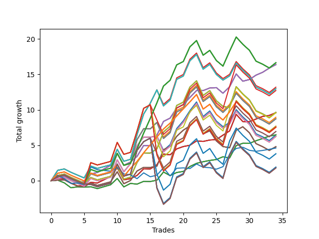

# Short Shepard 004 
- Symbol: SPY_Unlimited
- Date Range: 03/23/2022 - 07/08/2022
- Trading Period: 7:20-12:30
- Number of Trades: 34



| Name | Win Percent | Profit | Avg Profit / Trade | Avg Time / Trade |      | Name | Win Percent | Profit | Avg Profit / Trade | Avg Time / Trade |
| ---- | ----------- | ------ | ------------------ | ---------------- | ---- | ---- | ----------- | ------ | ------------------ | ---------------- |
| Sorted By <br> Profit | | | | | | Sorted By <br> Win Percentage ||||
| One Hundred Twenty-Seven | 61.76 | 8320.00 | 244.71 | 23:57 |     | Sixty-Six | 79.41 | 8185.00 | 240.74 | 14:05 |
| One Hundred Twenty-Two | 61.76 | 8320.00 | 244.71 | 23:57 |     | Fifty-Eight | 79.41 | 8185.00 | 240.74 | 14:05 |
| One Hundred Seventeen | 61.76 | 8320.00 | 244.71 | 23:57 |     | Fifty | 79.41 | 8185.00 | 240.74 | 14:05 |
| One Hundred Twelve | 61.76 | 8320.00 | 244.71 | 23:57 |     | Forty-Two | 79.41 | 8185.00 | 240.74 | 14:05 |
| Eighty-Two | 61.76 | 8320.00 | 244.71 | 23:57 |     | Two | 79.41 | 8185.00 | 240.74 | 14:05 |
| Sixty-Six | 79.41 | 8185.00 | 240.74 | 14:05 |     | Sixty-Four | 70.59 | 3235.00 | 95.15 | 05:19 |
| Fifty-Eight | 79.41 | 8185.00 | 240.74 | 14:05 |     | Fifty-Six | 70.59 | 3235.00 | 95.15 | 05:19 |
| Fifty | 79.41 | 8185.00 | 240.74 | 14:05 |     | Forty-Eight | 70.59 | 3235.00 | 95.15 | 05:19 |
| Forty-Two | 79.41 | 8185.00 | 240.74 | 14:05 |     | Forty | 70.59 | 3235.00 | 95.15 | 05:19 |
| Two | 79.41 | 8185.00 | 240.74 | 14:05 |     | Zero | 70.59 | 3235.00 | 95.15 | 05:19 |
| Fifty-Five | 58.82 | 6595.00 | 193.97 | 25:40 |     | Sixty-Five | 67.65 | 4795.00 | 141.03 | 10:11 |
| Seventy-One | 58.82 | 6485.00 | 190.74 | 25:40 |     | Fifty-Seven | 67.65 | 4795.00 | 141.03 | 10:11 |
| Sixty-Three | 58.82 | 6485.00 | 190.74 | 25:40 |     | Forty-Nine | 67.65 | 4795.00 | 141.03 | 10:11 |
| Forty-Seven | 58.82 | 6485.00 | 190.74 | 25:40 |     | Forty-One | 67.65 | 4795.00 | 141.03 | 10:11 |
| Seven | 58.82 | 6485.00 | 190.74 | 25:40 |     | One | 67.65 | 4795.00 | 141.03 | 10:11 |
| One Hundred Eighteen | 55.88 | 6360.00 | 187.06 | 26:46 |     | One Hundred Twenty-Seven | 61.76 | 8320.00 | 244.71 | 23:57 |
| Seventy | 55.88 | 4820.00 | 141.76 | 21:53 |     | One Hundred Twenty-Two | 61.76 | 8320.00 | 244.71 | 23:57 |
| Sixty-Two | 55.88 | 4820.00 | 141.76 | 21:53 |     | One Hundred Seventeen | 61.76 | 8320.00 | 244.71 | 23:57 |
| Fifty-Four | 55.88 | 4820.00 | 141.76 | 21:53 |     | One Hundred Twelve | 61.76 | 8320.00 | 244.71 | 23:57 |
| Forty-Six | 55.88 | 4820.00 | 141.76 | 21:53 |     | Eighty-Two | 61.76 | 8320.00 | 244.71 | 23:57 |
| Six | 55.88 | 4820.00 | 141.76 | 21:53 |     | One Hundred Twenty-Six | 61.76 | 3765.00 | 110.74 | 19:54 |
| Sixty-Five | 67.65 | 4795.00 | 141.03 | 10:11 |     | One Hundred Twenty-One | 61.76 | 3765.00 | 110.74 | 19:54 |
| Fifty-Seven | 67.65 | 4795.00 | 141.03 | 10:11 |     | One Hundred Sixteen | 61.76 | 3765.00 | 110.74 | 19:54 |
| Forty-Nine | 67.65 | 4795.00 | 141.03 | 10:11 |     | One Hundred Eleven | 61.76 | 3765.00 | 110.74 | 19:54 |
| Forty-One | 67.65 | 4795.00 | 141.03 | 10:11 |     | Eighty-One | 61.76 | 3765.00 | 110.74 | 19:54 |
| One | 67.65 | 4795.00 | 141.03 | 10:11 |     | Fifty-Five | 58.82 | 6595.00 | 193.97 | 25:40 |
| One Hundred Thirteen | 55.88 | 4790.00 | 140.88 | 26:52 |     | Seventy-One | 58.82 | 6485.00 | 190.74 | 25:40 |
| Fifty-Three | 55.88 | 4475.00 | 131.62 | 24:12 |     | Sixty-Three | 58.82 | 6485.00 | 190.74 | 25:40 |
| Sixty-Nine | 55.88 | 4365.00 | 128.38 | 24:12 |     | Forty-Seven | 58.82 | 6485.00 | 190.74 | 25:40 |
| Sixty-One | 55.88 | 4365.00 | 128.38 | 24:12 |     | Seven | 58.82 | 6485.00 | 190.74 | 25:40 |
| Forty-Five | 55.88 | 4365.00 | 128.38 | 24:12 |     | Sixty-Seven | 58.82 | 2400.00 | 70.59 | 18:36 |
| Five | 55.88 | 4365.00 | 128.38 | 24:12 |     | Fifty-Nine | 58.82 | 2400.00 | 70.59 | 18:36 |
| One Hundred Twenty-Three | 55.88 | 3845.00 | 113.09 | 27:16 |     | Fifty-One | 58.82 | 2400.00 | 70.59 | 18:36 |
| Eighty-Three | 55.88 | 3845.00 | 113.09 | 27:16 |     | Forty-Three | 58.82 | 2400.00 | 70.59 | 18:36 |
| One Hundred Twenty-Eight | 55.88 | 3785.00 | 111.32 | 27:09 |     | Three | 58.82 | 2400.00 | 70.59 | 18:36 |
| One Hundred Twenty-Six | 61.76 | 3765.00 | 110.74 | 19:54 |     | One Hundred Eighteen | 55.88 | 6360.00 | 187.06 | 26:46 |
| One Hundred Twenty-One | 61.76 | 3765.00 | 110.74 | 19:54 |     | Seventy | 55.88 | 4820.00 | 141.76 | 21:53 |
| One Hundred Sixteen | 61.76 | 3765.00 | 110.74 | 19:54 |     | Sixty-Two | 55.88 | 4820.00 | 141.76 | 21:53 |
| One Hundred Eleven | 61.76 | 3765.00 | 110.74 | 19:54 |     | Fifty-Four | 55.88 | 4820.00 | 141.76 | 21:53 |
| Eighty-One | 61.76 | 3765.00 | 110.74 | 19:54 |     | Forty-Six | 55.88 | 4820.00 | 141.76 | 21:53 |
| One Hundred Twenty | 52.94 | 3470.00 | 102.06 | 28:47 |     | Six | 55.88 | 4820.00 | 141.76 | 21:53 |
| One Hundred Ninteen | 52.94 | 3470.00 | 102.06 | 28:47 |     | One Hundred Thirteen | 55.88 | 4790.00 | 140.88 | 26:52 |
| Sixty-Four | 70.59 | 3235.00 | 95.15 | 05:19 |     | Fifty-Three | 55.88 | 4475.00 | 131.62 | 24:12 |
| Fifty-Six | 70.59 | 3235.00 | 95.15 | 05:19 |     | Sixty-Nine | 55.88 | 4365.00 | 128.38 | 24:12 |
| Forty-Eight | 70.59 | 3235.00 | 95.15 | 05:19 |     | Sixty-One | 55.88 | 4365.00 | 128.38 | 24:12 |
| Forty | 70.59 | 3235.00 | 95.15 | 05:19 |     | Forty-Five | 55.88 | 4365.00 | 128.38 | 24:12 |
| Zero | 70.59 | 3235.00 | 95.15 | 05:19 |     | Five | 55.88 | 4365.00 | 128.38 | 24:12 |
| Fifty-Two | 55.88 | 3235.00 | 95.15 | 22:03 |     | One Hundred Twenty-Three | 55.88 | 3845.00 | 113.09 | 27:16 |
| Sixty-Eight | 55.88 | 3125.00 | 91.91 | 22:03 |     | Eighty-Three | 55.88 | 3845.00 | 113.09 | 27:16 |
| Sixty | 55.88 | 3125.00 | 91.91 | 22:03 |     | One Hundred Twenty-Eight | 55.88 | 3785.00 | 111.32 | 27:09 |
| Forty-Four | 55.88 | 3125.00 | 91.91 | 22:03 |     | Fifty-Two | 55.88 | 3235.00 | 95.15 | 22:03 |
| Four | 55.88 | 3125.00 | 91.91 | 22:03 |     | Sixty-Eight | 55.88 | 3125.00 | 91.91 | 22:03 |
| Sixty-Seven | 58.82 | 2400.00 | 70.59 | 18:36 |     | Sixty | 55.88 | 3125.00 | 91.91 | 22:03 |
| Fifty-Nine | 58.82 | 2400.00 | 70.59 | 18:36 |     | Forty-Four | 55.88 | 3125.00 | 91.91 | 22:03 |
| Fifty-One | 58.82 | 2400.00 | 70.59 | 18:36 |     | Four | 55.88 | 3125.00 | 91.91 | 22:03 |
| Forty-Three | 58.82 | 2400.00 | 70.59 | 18:36 |     | One Hundred Twenty | 52.94 | 3470.00 | 102.06 | 28:47 |
| Three | 58.82 | 2400.00 | 70.59 | 18:36 |     | One Hundred Ninteen | 52.94 | 3470.00 | 102.06 | 28:47 |
| Seventy-Three | 50.00 | 2305.00 | 67.79 | 07:49 |     | One Hundred Fifteen | 52.94 | 1900.00 | 55.88 | 28:54 |
| One Hundred Fifteen | 52.94 | 1900.00 | 55.88 | 28:54 |     | One Hundred Fourteen | 52.94 | 1900.00 | 55.88 | 28:54 |
| One Hundred Fourteen | 52.94 | 1900.00 | 55.88 | 28:54 |     | One Hundred Twenty-Five | 52.94 | 955.00 | 28.09 | 29:18 |
| One Hundred Twenty-Five | 52.94 | 955.00 | 28.09 | 29:18 |     | One Hundred Twenty-Four | 52.94 | 955.00 | 28.09 | 29:18 |
| One Hundred Twenty-Four | 52.94 | 955.00 | 28.09 | 29:18 |     | Eighty-Five | 52.94 | 955.00 | 28.09 | 29:18 |
| Eighty-Five | 52.94 | 955.00 | 28.09 | 29:18 |     | Eighty-Four | 52.94 | 955.00 | 28.09 | 29:18 |
| Eighty-Four | 52.94 | 955.00 | 28.09 | 29:18 |     | One Hundred Thirty | 52.94 | 895.00 | 26.32 | 29:10 |
| One Hundred Thirty | 52.94 | 895.00 | 26.32 | 29:10 |     | One Hundred Twenty-Nine | 52.94 | 895.00 | 26.32 | 29:10 |
| One Hundred Twenty-Nine | 52.94 | 895.00 | 26.32 | 29:10 |     | Seventy-Three | 50.00 | 2305.00 | 67.79 | 07:49 |

## NO STOPLOSS

### Test Zero
* Sell when price hits the middle line of the 20p bollinger
* No Stoploss
* Results:
```
Total Trades: 34
Percent Up: 29.41
Percent Down: 70.59
Total Points Moved Down: 6.47
Potential Profit: 3235.00
Total Points Ups: 3.37 Count Ups: 10
Total Points Downs: 9.84 Count Downs: 24
```

<details><summary>Trades</summary>

<code>In: 2022-03-23 09:05:00		Out: 2022-03-23 09:05:25		Total Position Time: 00:25		Total Move Down: 0.08		Total to Date: 0.08</code> <br />
<code>In: 2022-03-24 08:35:00		Out: 2022-03-24 08:50:00		Total Position Time: 15:00		Total Move Down: -0.38		Total to Date: -0.30</code> <br />
<code>In: 2022-03-25 07:29:00		Out: 2022-03-25 07:51:05		Total Position Time: 22:05		Total Move Down: -0.69		Total to Date: -0.99</code> <br />
<code>In: 2022-03-28 12:01:00		Out: 2022-03-28 12:08:05		Total Position Time: 07:05		Total Move Down: 0.13		Total to Date: -0.86</code> <br />
<code>In: 2022-03-29 12:15:00		Out: 2022-03-29 12:24:50		Total Position Time: 09:50		Total Move Down: -0.04		Total to Date: -0.90</code> <br />
<code>In: 2022-04-06 11:06:00		Out: 2022-04-06 11:06:10		Total Position Time: 00:10		Total Move Down: 0.05		Total to Date: -0.85</code> <br />
<code>In: 2022-04-07 12:08:00		Out: 2022-04-07 12:19:10		Total Position Time: 11:10		Total Move Down: -0.26		Total to Date: -1.11</code> <br />
<code>In: 2022-04-08 08:05:00		Out: 2022-04-08 08:15:35		Total Position Time: 10:35		Total Move Down: 0.27		Total to Date: -0.84</code> <br />
<code>In: 2022-04-08 08:05:00		Out: 2022-04-08 08:15:35		Total Position Time: 10:35		Total Move Down: 0.27		Total to Date: -0.57</code> <br />
<code>In: 2022-04-25 07:39:00		Out: 2022-04-25 07:40:25		Total Position Time: 01:25		Total Move Down: 0.89		Total to Date: 0.32</code> <br />
<code>In: 2022-04-25 12:28:00		Out: 2022-04-25 12:42:35		Total Position Time: 14:35		Total Move Down: -1.19		Total to Date: -0.87</code> <br />
<code>In: 2022-04-27 09:34:00		Out: 2022-04-27 09:37:00		Total Position Time: 03:00		Total Move Down: 0.49		Total to Date: -0.38</code> <br />
<code>In: 2022-05-02 07:36:00		Out: 2022-05-02 07:44:10		Total Position Time: 08:10		Total Move Down: -0.10		Total to Date: -0.48</code> <br />
<code>In: 2022-05-04 11:07:00		Out: 2022-05-04 11:07:10		Total Position Time: 00:10		Total Move Down: 0.39		Total to Date: -0.09</code> <br />
<code>In: 2022-05-04 11:08:00		Out: 2022-05-04 11:08:10		Total Position Time: 00:10		Total Move Down: -0.02		Total to Date: -0.11</code> <br />
<code>In: 2022-05-04 11:31:00		Out: 2022-05-04 11:31:10		Total Position Time: 00:10		Total Move Down: 0.18		Total to Date: 0.07</code> <br />
<code>In: 2022-05-06 07:28:00		Out: 2022-05-06 07:30:00		Total Position Time: 02:00		Total Move Down: 1.16		Total to Date: 1.23</code> <br />
<code>In: 2022-05-12 08:01:00		Out: 2022-05-12 08:15:00		Total Position Time: 14:00		Total Move Down: -0.51		Total to Date: 0.72</code> <br />
<code>In: 2022-05-12 08:13:00		Out: 2022-05-12 08:15:00		Total Position Time: 02:00		Total Move Down: 0.44		Total to Date: 1.16</code> <br />
<code>In: 2022-05-16 11:36:00		Out: 2022-05-16 11:41:45		Total Position Time: 05:45		Total Move Down: 0.15		Total to Date: 1.31</code> <br />
<code>In: 2022-05-19 11:56:00		Out: 2022-05-19 11:57:50		Total Position Time: 01:50		Total Move Down: 0.70		Total to Date: 2.01</code> <br />
<code>In: 2022-05-25 07:41:00		Out: 2022-05-25 07:42:00		Total Position Time: 01:00		Total Move Down: 0.44		Total to Date: 2.45</code> <br />
<code>In: 2022-05-25 11:33:00		Out: 2022-05-25 11:39:10		Total Position Time: 06:10		Total Move Down: 0.23		Total to Date: 2.68</code> <br />
<code>In: 2022-05-31 11:04:00		Out: 2022-05-31 11:05:10		Total Position Time: 01:10		Total Move Down: 0.18		Total to Date: 2.86</code> <br />
<code>In: 2022-06-02 08:18:00		Out: 2022-06-02 08:22:05		Total Position Time: 04:05		Total Move Down: 0.13		Total to Date: 2.99</code> <br />
<code>In: 2022-06-02 08:55:00		Out: 2022-06-02 08:57:05		Total Position Time: 02:05		Total Move Down: 0.39		Total to Date: 3.38</code> <br />
<code>In: 2022-06-15 11:02:00		Out: 2022-06-15 11:02:10		Total Position Time: 00:10		Total Move Down: -0.17		Total to Date: 3.21</code> <br />
<code>In: 2022-06-15 11:48:00		Out: 2022-06-15 11:53:25		Total Position Time: 05:25		Total Move Down: 1.74		Total to Date: 4.95</code> <br />
<code>In: 2022-07-01 12:18:00		Out: 2022-07-01 12:20:55		Total Position Time: 02:55		Total Move Down: 0.33		Total to Date: 5.28</code> <br />
<code>In: 2022-07-05 08:53:00		Out: 2022-07-05 09:00:10		Total Position Time: 07:10		Total Move Down: -0.01		Total to Date: 5.27</code> <br />
<code>In: 2022-07-05 08:58:00		Out: 2022-07-05 09:00:10		Total Position Time: 02:10		Total Move Down: 0.37		Total to Date: 5.64</code> <br />
<code>In: 2022-07-05 11:43:00		Out: 2022-07-05 11:48:10		Total Position Time: 05:10		Total Move Down: 0.31		Total to Date: 5.95</code> <br />
<code>In: 2022-07-06 11:48:00		Out: 2022-07-06 11:50:00		Total Position Time: 02:00		Total Move Down: 0.34		Total to Date: 6.29</code> <br />
<code>In: 2022-07-07 12:23:00		Out: 2022-07-07 12:24:15		Total Position Time: 01:15		Total Move Down: 0.18		Total to Date: 6.47</code> <br />


</details>

### Test One
* Sell when the price hits the upper line of the 20p 1std bollinger
* No Stoploss
* Results:
```
Total Trades: 34
Percent Up: 32.35
Percent Down: 67.65
Total Points Moved Down: 9.59
Potential Profit: 4795.00
Total Points Ups: 4.09 Count Ups: 11
Total Points Downs: 13.68 Count Downs: 23
```

<details><summary>Trades</summary>

<code>In: 2022-03-23 09:05:00		Out: 2022-03-23 09:06:10		Total Position Time: 01:10		Total Move Down: 0.35		Total to Date: 0.35</code> <br />
<code>In: 2022-03-24 08:35:00		Out: 2022-03-24 08:53:50		Total Position Time: 18:50		Total Move Down: -0.12		Total to Date: 0.23</code> <br />
<code>In: 2022-03-25 07:29:00		Out: 2022-03-25 07:53:50		Total Position Time: 24:50		Total Move Down: -0.55		Total to Date: -0.32</code> <br />
<code>In: 2022-03-28 12:01:00		Out: 2022-03-28 12:30:55		Total Position Time: 29:55		Total Move Down: -0.40		Total to Date: -0.72</code> <br />
<code>In: 2022-03-29 12:15:00		Out: 2022-03-29 12:27:35		Total Position Time: 12:35		Total Move Down: -0.01		Total to Date: -0.73</code> <br />
<code>In: 2022-04-06 11:06:00		Out: 2022-04-06 11:07:20		Total Position Time: 01:20		Total Move Down: 0.50		Total to Date: -0.23</code> <br />
<code>In: 2022-04-07 12:08:00		Out: 2022-04-07 12:20:35		Total Position Time: 12:35		Total Move Down: -0.09		Total to Date: -0.32</code> <br />
<code>In: 2022-04-08 08:05:00		Out: 2022-04-08 08:17:05		Total Position Time: 12:05		Total Move Down: 0.46		Total to Date: 0.14</code> <br />
<code>In: 2022-04-08 08:05:00		Out: 2022-04-08 08:17:05		Total Position Time: 12:05		Total Move Down: 0.46		Total to Date: 0.60</code> <br />
<code>In: 2022-04-25 07:39:00		Out: 2022-04-25 07:43:05		Total Position Time: 04:05		Total Move Down: 1.22		Total to Date: 1.82</code> <br />
<code>In: 2022-04-25 12:28:00		Out: 2022-04-25 12:46:00		Total Position Time: 18:00		Total Move Down: -1.69		Total to Date: 0.13</code> <br />
<code>In: 2022-04-27 09:34:00		Out: 2022-04-27 09:50:25		Total Position Time: 16:25		Total Move Down: 0.15		Total to Date: 0.28</code> <br />
<code>In: 2022-05-02 07:36:00		Out: 2022-05-02 07:44:50		Total Position Time: 08:50		Total Move Down: 0.47		Total to Date: 0.75</code> <br />
<code>In: 2022-05-04 11:07:00		Out: 2022-05-04 11:07:20		Total Position Time: 00:20		Total Move Down: 0.93		Total to Date: 1.68</code> <br />
<code>In: 2022-05-04 11:08:00		Out: 2022-05-04 11:08:10		Total Position Time: 00:10		Total Move Down: -0.02		Total to Date: 1.66</code> <br />
<code>In: 2022-05-04 11:31:00		Out: 2022-05-04 11:31:20		Total Position Time: 00:20		Total Move Down: 0.59		Total to Date: 2.25</code> <br />
<code>In: 2022-05-06 07:28:00		Out: 2022-05-06 07:34:10		Total Position Time: 06:10		Total Move Down: 1.51		Total to Date: 3.76</code> <br />
<code>In: 2022-05-12 08:01:00		Out: 2022-05-12 08:17:30		Total Position Time: 16:30		Total Move Down: -0.11		Total to Date: 3.65</code> <br />
<code>In: 2022-05-12 08:13:00		Out: 2022-05-12 08:17:30		Total Position Time: 04:30		Total Move Down: 0.84		Total to Date: 4.49</code> <br />
<code>In: 2022-05-16 11:36:00		Out: 2022-05-16 11:44:50		Total Position Time: 08:50		Total Move Down: 0.33		Total to Date: 4.82</code> <br />
<code>In: 2022-05-19 11:56:00		Out: 2022-05-19 12:10:10		Total Position Time: 14:10		Total Move Down: 0.18		Total to Date: 5.00</code> <br />
<code>In: 2022-05-25 07:41:00		Out: 2022-05-25 07:46:40		Total Position Time: 05:40		Total Move Down: 0.61		Total to Date: 5.61</code> <br />
<code>In: 2022-05-25 11:33:00		Out: 2022-05-25 11:45:15		Total Position Time: 12:15		Total Move Down: -0.07		Total to Date: 5.54</code> <br />
<code>In: 2022-05-31 11:04:00		Out: 2022-05-31 11:13:25		Total Position Time: 09:25		Total Move Down: 0.20		Total to Date: 5.74</code> <br />
<code>In: 2022-06-02 08:18:00		Out: 2022-06-02 08:28:15		Total Position Time: 10:15		Total Move Down: 0.06		Total to Date: 5.80</code> <br />
<code>In: 2022-06-02 08:55:00		Out: 2022-06-02 09:01:05		Total Position Time: 06:05		Total Move Down: 0.63		Total to Date: 6.43</code> <br />
<code>In: 2022-06-15 11:02:00		Out: 2022-06-15 11:03:05		Total Position Time: 01:05		Total Move Down: 0.59		Total to Date: 7.02</code> <br />
<code>In: 2022-06-15 11:48:00		Out: 2022-06-15 11:57:45		Total Position Time: 09:45		Total Move Down: 2.34		Total to Date: 9.36</code> <br />
<code>In: 2022-07-01 12:18:00		Out: 2022-07-01 12:46:00		Total Position Time: 28:00		Total Move Down: -1.02		Total to Date: 8.34</code> <br />
<code>In: 2022-07-05 08:53:00		Out: 2022-07-05 09:03:25		Total Position Time: 10:25		Total Move Down: -0.01		Total to Date: 8.33</code> <br />
<code>In: 2022-07-05 08:58:00		Out: 2022-07-05 09:03:25		Total Position Time: 05:25		Total Move Down: 0.37		Total to Date: 8.70</code> <br />
<code>In: 2022-07-05 11:43:00		Out: 2022-07-05 11:52:50		Total Position Time: 09:50		Total Move Down: 0.37		Total to Date: 9.07</code> <br />
<code>In: 2022-07-06 11:48:00		Out: 2022-07-06 12:00:30		Total Position Time: 12:30		Total Move Down: 0.14		Total to Date: 9.21</code> <br />
<code>In: 2022-07-07 12:23:00		Out: 2022-07-07 12:25:10		Total Position Time: 02:10		Total Move Down: 0.38		Total to Date: 9.59</code> <br />


</details>

### Test Two
* Sell when the price hits the upper line of the 20p 2std bollinger
* No Stoploss
* Results:
```
Total Trades: 34
Percent Up: 20.59
Percent Down: 79.41
Total Points Moved Down: 16.37
Potential Profit: 8185.00
Total Points Ups: 4.33 Count Ups: 7
Total Points Downs: 20.70 Count Downs: 27
```

<details><summary>Trades</summary>

<code>In: 2022-03-23 09:05:00		Out: 2022-03-23 09:06:25		Total Position Time: 01:25		Total Move Down: 0.57		Total to Date: 0.57</code> <br />
<code>In: 2022-03-24 08:35:00		Out: 2022-03-24 09:03:10		Total Position Time: 28:10		Total Move Down: 0.04		Total to Date: 0.61</code> <br />
<code>In: 2022-03-25 07:29:00		Out: 2022-03-25 07:54:10		Total Position Time: 25:10		Total Move Down: -0.40		Total to Date: 0.21</code> <br />
<code>In: 2022-03-28 12:01:00		Out: 2022-03-28 12:30:55		Total Position Time: 29:55		Total Move Down: -0.40		Total to Date: -0.19</code> <br />
<code>In: 2022-03-29 12:15:00		Out: 2022-03-29 12:27:50		Total Position Time: 12:50		Total Move Down: 0.04		Total to Date: -0.15</code> <br />
<code>In: 2022-04-06 11:06:00		Out: 2022-04-06 11:08:10		Total Position Time: 02:10		Total Move Down: 1.11		Total to Date: 0.96</code> <br />
<code>In: 2022-04-07 12:08:00		Out: 2022-04-07 12:21:20		Total Position Time: 13:20		Total Move Down: 0.20		Total to Date: 1.16</code> <br />
<code>In: 2022-04-08 08:05:00		Out: 2022-04-08 08:20:10		Total Position Time: 15:10		Total Move Down: 0.50		Total to Date: 1.66</code> <br />
<code>In: 2022-04-08 08:05:00		Out: 2022-04-08 08:20:10		Total Position Time: 15:10		Total Move Down: 0.50		Total to Date: 2.16</code> <br />
<code>In: 2022-04-25 07:39:00		Out: 2022-04-25 07:52:20		Total Position Time: 13:20		Total Move Down: 1.71		Total to Date: 3.87</code> <br />
<code>In: 2022-04-25 12:28:00		Out: 2022-04-25 12:46:00		Total Position Time: 18:00		Total Move Down: -1.69		Total to Date: 2.18</code> <br />
<code>In: 2022-04-27 09:34:00		Out: 2022-04-27 10:00:10		Total Position Time: 26:10		Total Move Down: 0.45		Total to Date: 2.63</code> <br />
<code>In: 2022-05-02 07:36:00		Out: 2022-05-02 07:47:15		Total Position Time: 11:15		Total Move Down: 0.80		Total to Date: 3.43</code> <br />
<code>In: 2022-05-04 11:07:00		Out: 2022-05-04 11:07:40		Total Position Time: 00:40		Total Move Down: 1.54		Total to Date: 4.97</code> <br />
<code>In: 2022-05-04 11:08:00		Out: 2022-05-04 11:08:10		Total Position Time: 00:10		Total Move Down: -0.02		Total to Date: 4.95</code> <br />
<code>In: 2022-05-04 11:31:00		Out: 2022-05-04 11:32:25		Total Position Time: 01:25		Total Move Down: 1.47		Total to Date: 6.42</code> <br />
<code>In: 2022-05-06 07:28:00		Out: 2022-05-06 07:36:30		Total Position Time: 08:30		Total Move Down: 1.94		Total to Date: 8.36</code> <br />
<code>In: 2022-05-12 08:01:00		Out: 2022-05-12 08:22:05		Total Position Time: 21:05		Total Move Down: 0.47		Total to Date: 8.83</code> <br />
<code>In: 2022-05-12 08:13:00		Out: 2022-05-12 08:22:05		Total Position Time: 09:05		Total Move Down: 1.42		Total to Date: 10.25</code> <br />
<code>In: 2022-05-16 11:36:00		Out: 2022-05-16 11:45:35		Total Position Time: 09:35		Total Move Down: 0.50		Total to Date: 10.75</code> <br />
<code>In: 2022-05-19 11:56:00		Out: 2022-05-19 12:14:05		Total Position Time: 18:05		Total Move Down: 0.99		Total to Date: 11.74</code> <br />
<code>In: 2022-05-25 07:41:00		Out: 2022-05-25 07:48:10		Total Position Time: 07:10		Total Move Down: 0.98		Total to Date: 12.72</code> <br />
<code>In: 2022-05-25 11:33:00		Out: 2022-05-25 11:50:00		Total Position Time: 17:00		Total Move Down: -0.01		Total to Date: 12.71</code> <br />
<code>In: 2022-05-31 11:04:00		Out: 2022-05-31 11:22:35		Total Position Time: 18:35		Total Move Down: 0.37		Total to Date: 13.08</code> <br />
<code>In: 2022-06-02 08:18:00		Out: 2022-06-02 08:30:55		Total Position Time: 12:55		Total Move Down: 0.05		Total to Date: 13.13</code> <br />
<code>In: 2022-06-02 08:55:00		Out: 2022-06-02 09:24:55		Total Position Time: 29:55		Total Move Down: -0.79		Total to Date: 12.34</code> <br />
<code>In: 2022-06-15 11:02:00		Out: 2022-06-15 11:03:15		Total Position Time: 01:15		Total Move Down: 0.90		Total to Date: 13.24</code> <br />
<code>In: 2022-06-15 11:48:00		Out: 2022-06-15 12:17:55		Total Position Time: 29:55		Total Move Down: 1.81		Total to Date: 15.05</code> <br />
<code>In: 2022-07-01 12:18:00		Out: 2022-07-01 12:46:00		Total Position Time: 28:00		Total Move Down: -1.02		Total to Date: 14.03</code> <br />
<code>In: 2022-07-05 08:53:00		Out: 2022-07-05 09:03:50		Total Position Time: 10:50		Total Move Down: 0.24		Total to Date: 14.27</code> <br />
<code>In: 2022-07-05 08:58:00		Out: 2022-07-05 09:03:50		Total Position Time: 05:50		Total Move Down: 0.62		Total to Date: 14.89</code> <br />
<code>In: 2022-07-05 11:43:00		Out: 2022-07-05 12:01:20		Total Position Time: 18:20		Total Move Down: 0.40		Total to Date: 15.29</code> <br />
<code>In: 2022-07-06 11:48:00		Out: 2022-07-06 12:01:25		Total Position Time: 13:25		Total Move Down: 0.59		Total to Date: 15.88</code> <br />
<code>In: 2022-07-07 12:23:00		Out: 2022-07-07 12:28:30		Total Position Time: 05:30		Total Move Down: 0.49		Total to Date: 16.37</code> <br />


</details>

### Test Three
* Sell when price hits the middle line of the 50p bollinger
* No Stoploss
* Results:
```
Total Trades: 34
Percent Up: 41.18
Percent Down: 58.82
Total Points Moved Down: 4.80
Potential Profit: 2400.00
Total Points Ups: 10.78 Count Ups: 14
Total Points Downs: 15.58 Count Downs: 20
```

<details><summary>Trades</summary>

<code>In: 2022-03-23 09:05:00		Out: 2022-03-23 09:05:25		Total Position Time: 00:25		Total Move Down: 0.08		Total to Date: 0.08</code> <br />
<code>In: 2022-03-24 08:35:00		Out: 2022-03-24 09:03:10		Total Position Time: 28:10		Total Move Down: 0.04		Total to Date: 0.12</code> <br />
<code>In: 2022-03-25 07:29:00		Out: 2022-03-25 07:58:55		Total Position Time: 29:55		Total Move Down: -0.47		Total to Date: -0.35</code> <br />
<code>In: 2022-03-28 12:01:00		Out: 2022-03-28 12:30:55		Total Position Time: 29:55		Total Move Down: -0.40		Total to Date: -0.75</code> <br />
<code>In: 2022-03-29 12:15:00		Out: 2022-03-29 12:43:05		Total Position Time: 28:05		Total Move Down: -0.08		Total to Date: -0.83</code> <br />
<code>In: 2022-04-06 11:06:00		Out: 2022-04-06 11:07:20		Total Position Time: 01:20		Total Move Down: 0.50		Total to Date: -0.33</code> <br />
<code>In: 2022-04-07 12:08:00		Out: 2022-04-07 12:37:55		Total Position Time: 29:55		Total Move Down: -0.33		Total to Date: -0.66</code> <br />
<code>In: 2022-04-08 08:05:00		Out: 2022-04-08 08:34:55		Total Position Time: 29:55		Total Move Down: 0.25		Total to Date: -0.41</code> <br />
<code>In: 2022-04-08 08:05:00		Out: 2022-04-08 08:34:55		Total Position Time: 29:55		Total Move Down: 0.25		Total to Date: -0.16</code> <br />
<code>In: 2022-04-25 07:39:00		Out: 2022-04-25 07:52:00		Total Position Time: 13:00		Total Move Down: 1.43		Total to Date: 1.27</code> <br />
<code>In: 2022-04-25 12:28:00		Out: 2022-04-25 12:46:00		Total Position Time: 18:00		Total Move Down: -1.69		Total to Date: -0.42</code> <br />
<code>In: 2022-04-27 09:34:00		Out: 2022-04-27 10:00:10		Total Position Time: 26:10		Total Move Down: 0.45		Total to Date: 0.03</code> <br />
<code>In: 2022-05-02 07:36:00		Out: 2022-05-02 07:54:05		Total Position Time: 18:05		Total Move Down: 1.34		Total to Date: 1.37</code> <br />
<code>In: 2022-05-04 11:07:00		Out: 2022-05-04 11:07:15		Total Position Time: 00:15		Total Move Down: 0.52		Total to Date: 1.89</code> <br />
<code>In: 2022-05-04 11:08:00		Out: 2022-05-04 11:08:10		Total Position Time: 00:10		Total Move Down: -0.02		Total to Date: 1.87</code> <br />
<code>In: 2022-05-04 11:31:00		Out: 2022-05-04 11:31:10		Total Position Time: 00:10		Total Move Down: 0.18		Total to Date: 2.05</code> <br />
<code>In: 2022-05-06 07:28:00		Out: 2022-05-06 07:36:40		Total Position Time: 08:40		Total Move Down: 2.32		Total to Date: 4.37</code> <br />
<code>In: 2022-05-12 08:01:00		Out: 2022-05-12 08:22:05		Total Position Time: 21:05		Total Move Down: 0.47		Total to Date: 4.84</code> <br />
<code>In: 2022-05-12 08:13:00		Out: 2022-05-12 08:22:05		Total Position Time: 09:05		Total Move Down: 1.42		Total to Date: 6.26</code> <br />
<code>In: 2022-05-16 11:36:00		Out: 2022-05-16 11:49:00		Total Position Time: 13:00		Total Move Down: 0.87		Total to Date: 7.13</code> <br />
<code>In: 2022-05-19 11:56:00		Out: 2022-05-19 12:13:40		Total Position Time: 17:40		Total Move Down: 0.61		Total to Date: 7.74</code> <br />
<code>In: 2022-05-25 07:41:00		Out: 2022-05-25 07:57:20		Total Position Time: 16:20		Total Move Down: 0.93		Total to Date: 8.67</code> <br />
<code>In: 2022-05-25 11:33:00		Out: 2022-05-25 12:02:55		Total Position Time: 29:55		Total Move Down: -2.06		Total to Date: 6.61</code> <br />
<code>In: 2022-05-31 11:04:00		Out: 2022-05-31 11:22:40		Total Position Time: 18:40		Total Move Down: 0.43		Total to Date: 7.04</code> <br />
<code>In: 2022-06-02 08:18:00		Out: 2022-06-02 08:47:55		Total Position Time: 29:55		Total Move Down: -1.43		Total to Date: 5.61</code> <br />
<code>In: 2022-06-02 08:55:00		Out: 2022-06-02 09:24:55		Total Position Time: 29:55		Total Move Down: -0.79		Total to Date: 4.82</code> <br />
<code>In: 2022-06-15 11:02:00		Out: 2022-06-15 11:02:10		Total Position Time: 00:10		Total Move Down: -0.17		Total to Date: 4.65</code> <br />
<code>In: 2022-06-15 11:48:00		Out: 2022-06-15 12:13:05		Total Position Time: 25:05		Total Move Down: 2.46		Total to Date: 7.11</code> <br />
<code>In: 2022-07-01 12:18:00		Out: 2022-07-01 12:21:00		Total Position Time: 03:00		Total Move Down: 0.50		Total to Date: 7.61</code> <br />
<code>In: 2022-07-05 08:53:00		Out: 2022-07-05 09:22:55		Total Position Time: 29:55		Total Move Down: -0.85		Total to Date: 6.76</code> <br />
<code>In: 2022-07-05 08:58:00		Out: 2022-07-05 09:27:55		Total Position Time: 29:55		Total Move Down: -1.53		Total to Date: 5.23</code> <br />
<code>In: 2022-07-05 11:43:00		Out: 2022-07-05 12:12:55		Total Position Time: 29:55		Total Move Down: -0.43		Total to Date: 4.80</code> <br />
<code>In: 2022-07-06 11:48:00		Out: 2022-07-06 12:17:55		Total Position Time: 29:55		Total Move Down: -0.53		Total to Date: 4.27</code> <br />
<code>In: 2022-07-07 12:23:00		Out: 2022-07-07 12:30:00		Total Position Time: 07:00		Total Move Down: 0.53		Total to Date: 4.80</code> <br />


</details>

### Test Four
* Sell when the price hits the upper line of the 50p 1std bollinger
* No Stoploss
* Results:
```
Total Trades: 34
Percent Up: 44.12
Percent Down: 55.88
Total Points Moved Down: 6.25
Potential Profit: 3125.00
Total Points Ups: 14.21 Count Ups: 15
Total Points Downs: 20.46 Count Downs: 19
```

<details><summary>Trades</summary>

<code>In: 2022-03-23 09:05:00		Out: 2022-03-23 09:06:05		Total Position Time: 01:05		Total Move Down: 0.30		Total to Date: 0.30</code> <br />
<code>In: 2022-03-24 08:35:00		Out: 2022-03-24 09:04:55		Total Position Time: 29:55		Total Move Down: 0.19		Total to Date: 0.49</code> <br />
<code>In: 2022-03-25 07:29:00		Out: 2022-03-25 07:58:55		Total Position Time: 29:55		Total Move Down: -0.47		Total to Date: 0.02</code> <br />
<code>In: 2022-03-28 12:01:00		Out: 2022-03-28 12:30:55		Total Position Time: 29:55		Total Move Down: -0.40		Total to Date: -0.38</code> <br />
<code>In: 2022-03-29 12:15:00		Out: 2022-03-29 12:44:55		Total Position Time: 29:55		Total Move Down: -0.40		Total to Date: -0.78</code> <br />
<code>In: 2022-04-06 11:06:00		Out: 2022-04-06 11:08:10		Total Position Time: 02:10		Total Move Down: 1.11		Total to Date: 0.33</code> <br />
<code>In: 2022-04-07 12:08:00		Out: 2022-04-07 12:37:55		Total Position Time: 29:55		Total Move Down: -0.33		Total to Date: 0.00</code> <br />
<code>In: 2022-04-08 08:05:00		Out: 2022-04-08 08:34:55		Total Position Time: 29:55		Total Move Down: 0.25		Total to Date: 0.25</code> <br />
<code>In: 2022-04-08 08:05:00		Out: 2022-04-08 08:34:55		Total Position Time: 29:55		Total Move Down: 0.25		Total to Date: 0.50</code> <br />
<code>In: 2022-04-25 07:39:00		Out: 2022-04-25 07:58:15		Total Position Time: 19:15		Total Move Down: 2.45		Total to Date: 2.95</code> <br />
<code>In: 2022-04-25 12:28:00		Out: 2022-04-25 12:46:00		Total Position Time: 18:00		Total Move Down: -1.69		Total to Date: 1.26</code> <br />
<code>In: 2022-04-27 09:34:00		Out: 2022-04-27 10:01:20		Total Position Time: 27:20		Total Move Down: 1.14		Total to Date: 2.40</code> <br />
<code>In: 2022-05-02 07:36:00		Out: 2022-05-02 08:02:05		Total Position Time: 26:05		Total Move Down: 2.54		Total to Date: 4.94</code> <br />
<code>In: 2022-05-04 11:07:00		Out: 2022-05-04 11:07:25		Total Position Time: 00:25		Total Move Down: 1.22		Total to Date: 6.16</code> <br />
<code>In: 2022-05-04 11:08:00		Out: 2022-05-04 11:08:10		Total Position Time: 00:10		Total Move Down: -0.02		Total to Date: 6.14</code> <br />
<code>In: 2022-05-04 11:31:00		Out: 2022-05-04 11:31:10		Total Position Time: 00:10		Total Move Down: 0.18		Total to Date: 6.32</code> <br />
<code>In: 2022-05-06 07:28:00		Out: 2022-05-06 07:57:55		Total Position Time: 29:55		Total Move Down: -2.26		Total to Date: 4.06</code> <br />
<code>In: 2022-05-12 08:01:00		Out: 2022-05-12 08:30:55		Total Position Time: 29:55		Total Move Down: 0.82		Total to Date: 4.88</code> <br />
<code>In: 2022-05-12 08:13:00		Out: 2022-05-12 08:31:20		Total Position Time: 18:20		Total Move Down: 2.27		Total to Date: 7.15</code> <br />
<code>In: 2022-05-16 11:36:00		Out: 2022-05-16 11:51:05		Total Position Time: 15:05		Total Move Down: 1.09		Total to Date: 8.24</code> <br />
<code>In: 2022-05-19 11:56:00		Out: 2022-05-19 12:18:25		Total Position Time: 22:25		Total Move Down: 1.43		Total to Date: 9.67</code> <br />
<code>In: 2022-05-25 07:41:00		Out: 2022-05-25 08:04:45		Total Position Time: 23:45		Total Move Down: 1.23		Total to Date: 10.90</code> <br />
<code>In: 2022-05-25 11:33:00		Out: 2022-05-25 12:02:55		Total Position Time: 29:55		Total Move Down: -2.06		Total to Date: 8.84</code> <br />
<code>In: 2022-05-31 11:04:00		Out: 2022-05-31 11:26:20		Total Position Time: 22:20		Total Move Down: 0.79		Total to Date: 9.63</code> <br />
<code>In: 2022-06-02 08:18:00		Out: 2022-06-02 08:47:55		Total Position Time: 29:55		Total Move Down: -1.43		Total to Date: 8.20</code> <br />
<code>In: 2022-06-02 08:55:00		Out: 2022-06-02 09:24:55		Total Position Time: 29:55		Total Move Down: -0.79		Total to Date: 7.41</code> <br />
<code>In: 2022-06-15 11:02:00		Out: 2022-06-15 11:03:05		Total Position Time: 01:05		Total Move Down: 0.59		Total to Date: 8.00</code> <br />
<code>In: 2022-06-15 11:48:00		Out: 2022-06-15 12:17:55		Total Position Time: 29:55		Total Move Down: 1.81		Total to Date: 9.81</code> <br />
<code>In: 2022-07-01 12:18:00		Out: 2022-07-01 12:46:00		Total Position Time: 28:00		Total Move Down: -1.02		Total to Date: 8.79</code> <br />
<code>In: 2022-07-05 08:53:00		Out: 2022-07-05 09:22:55		Total Position Time: 29:55		Total Move Down: -0.85		Total to Date: 7.94</code> <br />
<code>In: 2022-07-05 08:58:00		Out: 2022-07-05 09:27:55		Total Position Time: 29:55		Total Move Down: -1.53		Total to Date: 6.41</code> <br />
<code>In: 2022-07-05 11:43:00		Out: 2022-07-05 12:12:55		Total Position Time: 29:55		Total Move Down: -0.43		Total to Date: 5.98</code> <br />
<code>In: 2022-07-06 11:48:00		Out: 2022-07-06 12:17:55		Total Position Time: 29:55		Total Move Down: -0.53		Total to Date: 5.45</code> <br />
<code>In: 2022-07-07 12:23:00		Out: 2022-07-07 12:38:50		Total Position Time: 15:50		Total Move Down: 0.80		Total to Date: 6.25</code> <br />


</details>

### Test Five
* Sell when the price hits the upper line of the 50p 2std bollinger
* No Stoploss
* Results:
```
Total Trades: 34
Percent Up: 44.12
Percent Down: 55.88
Total Points Moved Down: 8.73
Potential Profit: 4365.00
Total Points Ups: 14.21 Count Ups: 15
Total Points Downs: 22.94 Count Downs: 19
```

<details><summary>Trades</summary>

<code>In: 2022-03-23 09:05:00		Out: 2022-03-23 09:06:20		Total Position Time: 01:20		Total Move Down: 0.52		Total to Date: 0.52</code> <br />
<code>In: 2022-03-24 08:35:00		Out: 2022-03-24 09:04:55		Total Position Time: 29:55		Total Move Down: 0.19		Total to Date: 0.71</code> <br />
<code>In: 2022-03-25 07:29:00		Out: 2022-03-25 07:58:55		Total Position Time: 29:55		Total Move Down: -0.47		Total to Date: 0.24</code> <br />
<code>In: 2022-03-28 12:01:00		Out: 2022-03-28 12:30:55		Total Position Time: 29:55		Total Move Down: -0.40		Total to Date: -0.16</code> <br />
<code>In: 2022-03-29 12:15:00		Out: 2022-03-29 12:44:55		Total Position Time: 29:55		Total Move Down: -0.40		Total to Date: -0.56</code> <br />
<code>In: 2022-04-06 11:06:00		Out: 2022-04-06 11:09:35		Total Position Time: 03:35		Total Move Down: 1.55		Total to Date: 0.99</code> <br />
<code>In: 2022-04-07 12:08:00		Out: 2022-04-07 12:37:55		Total Position Time: 29:55		Total Move Down: -0.33		Total to Date: 0.66</code> <br />
<code>In: 2022-04-08 08:05:00		Out: 2022-04-08 08:34:55		Total Position Time: 29:55		Total Move Down: 0.25		Total to Date: 0.91</code> <br />
<code>In: 2022-04-08 08:05:00		Out: 2022-04-08 08:34:55		Total Position Time: 29:55		Total Move Down: 0.25		Total to Date: 1.16</code> <br />
<code>In: 2022-04-25 07:39:00		Out: 2022-04-25 08:08:55		Total Position Time: 29:55		Total Move Down: 2.69		Total to Date: 3.85</code> <br />
<code>In: 2022-04-25 12:28:00		Out: 2022-04-25 12:46:00		Total Position Time: 18:00		Total Move Down: -1.69		Total to Date: 2.16</code> <br />
<code>In: 2022-04-27 09:34:00		Out: 2022-04-27 10:03:55		Total Position Time: 29:55		Total Move Down: 0.28		Total to Date: 2.44</code> <br />
<code>In: 2022-05-02 07:36:00		Out: 2022-05-02 08:05:55		Total Position Time: 29:55		Total Move Down: 3.35		Total to Date: 5.79</code> <br />
<code>In: 2022-05-04 11:07:00		Out: 2022-05-04 11:07:40		Total Position Time: 00:40		Total Move Down: 1.54		Total to Date: 7.33</code> <br />
<code>In: 2022-05-04 11:08:00		Out: 2022-05-04 11:08:10		Total Position Time: 00:10		Total Move Down: -0.02		Total to Date: 7.31</code> <br />
<code>In: 2022-05-04 11:31:00		Out: 2022-05-04 11:31:40		Total Position Time: 00:40		Total Move Down: 0.91		Total to Date: 8.22</code> <br />
<code>In: 2022-05-06 07:28:00		Out: 2022-05-06 07:57:55		Total Position Time: 29:55		Total Move Down: -2.26		Total to Date: 5.96</code> <br />
<code>In: 2022-05-12 08:01:00		Out: 2022-05-12 08:30:55		Total Position Time: 29:55		Total Move Down: 0.82		Total to Date: 6.78</code> <br />
<code>In: 2022-05-12 08:13:00		Out: 2022-05-12 08:42:55		Total Position Time: 29:55		Total Move Down: 2.92		Total to Date: 9.70</code> <br />
<code>In: 2022-05-16 11:36:00		Out: 2022-05-16 12:05:55		Total Position Time: 29:55		Total Move Down: 0.47		Total to Date: 10.17</code> <br />
<code>In: 2022-05-19 11:56:00		Out: 2022-05-19 12:24:40		Total Position Time: 28:40		Total Move Down: 2.20		Total to Date: 12.37</code> <br />
<code>In: 2022-05-25 07:41:00		Out: 2022-05-25 08:10:55		Total Position Time: 29:55		Total Move Down: 0.87		Total to Date: 13.24</code> <br />
<code>In: 2022-05-25 11:33:00		Out: 2022-05-25 12:02:55		Total Position Time: 29:55		Total Move Down: -2.06		Total to Date: 11.18</code> <br />
<code>In: 2022-05-31 11:04:00		Out: 2022-05-31 11:33:55		Total Position Time: 29:55		Total Move Down: 0.68		Total to Date: 11.86</code> <br />
<code>In: 2022-06-02 08:18:00		Out: 2022-06-02 08:47:55		Total Position Time: 29:55		Total Move Down: -1.43		Total to Date: 10.43</code> <br />
<code>In: 2022-06-02 08:55:00		Out: 2022-06-02 09:24:55		Total Position Time: 29:55		Total Move Down: -0.79		Total to Date: 9.64</code> <br />
<code>In: 2022-06-15 11:02:00		Out: 2022-06-15 11:03:15		Total Position Time: 01:15		Total Move Down: 0.90		Total to Date: 10.54</code> <br />
<code>In: 2022-06-15 11:48:00		Out: 2022-06-15 12:17:55		Total Position Time: 29:55		Total Move Down: 1.81		Total to Date: 12.35</code> <br />
<code>In: 2022-07-01 12:18:00		Out: 2022-07-01 12:46:00		Total Position Time: 28:00		Total Move Down: -1.02		Total to Date: 11.33</code> <br />
<code>In: 2022-07-05 08:53:00		Out: 2022-07-05 09:22:55		Total Position Time: 29:55		Total Move Down: -0.85		Total to Date: 10.48</code> <br />
<code>In: 2022-07-05 08:58:00		Out: 2022-07-05 09:27:55		Total Position Time: 29:55		Total Move Down: -1.53		Total to Date: 8.95</code> <br />
<code>In: 2022-07-05 11:43:00		Out: 2022-07-05 12:12:55		Total Position Time: 29:55		Total Move Down: -0.43		Total to Date: 8.52</code> <br />
<code>In: 2022-07-06 11:48:00		Out: 2022-07-06 12:17:55		Total Position Time: 29:55		Total Move Down: -0.53		Total to Date: 7.99</code> <br />
<code>In: 2022-07-07 12:23:00		Out: 2022-07-07 12:46:00		Total Position Time: 23:00		Total Move Down: 0.74		Total to Date: 8.73</code> <br />


</details>

### Test Six
* Sell when the price hits the middle line of the 1std VWAP
* No Stoploss
* Results:
```
Total Trades: 34
Percent Up: 44.12
Percent Down: 55.88
Total Points Moved Down: 9.64
Potential Profit: 4820.00
Total Points Ups: 12.12 Count Ups: 15
Total Points Downs: 21.76 Count Downs: 19
```

<details><summary>Trades</summary>

<code>In: 2022-03-23 09:05:00		Out: 2022-03-23 09:07:45		Total Position Time: 02:45		Total Move Down: 0.75		Total to Date: 0.75</code> <br />
<code>In: 2022-03-24 08:35:00		Out: 2022-03-24 09:04:55		Total Position Time: 29:55		Total Move Down: 0.19		Total to Date: 0.94</code> <br />
<code>In: 2022-03-25 07:29:00		Out: 2022-03-25 07:58:55		Total Position Time: 29:55		Total Move Down: -0.47		Total to Date: 0.47</code> <br />
<code>In: 2022-03-28 12:01:00		Out: 2022-03-28 12:30:55		Total Position Time: 29:55		Total Move Down: -0.40		Total to Date: 0.07</code> <br />
<code>In: 2022-03-29 12:15:00		Out: 2022-03-29 12:44:55		Total Position Time: 29:55		Total Move Down: -0.40		Total to Date: -0.33</code> <br />
<code>In: 2022-04-06 11:06:00		Out: 2022-04-06 11:07:35		Total Position Time: 01:35		Total Move Down: 0.78		Total to Date: 0.45</code> <br />
<code>In: 2022-04-07 12:08:00		Out: 2022-04-07 12:37:55		Total Position Time: 29:55		Total Move Down: -0.33		Total to Date: 0.12</code> <br />
<code>In: 2022-04-08 08:05:00		Out: 2022-04-08 08:34:55		Total Position Time: 29:55		Total Move Down: 0.25		Total to Date: 0.37</code> <br />
<code>In: 2022-04-08 08:05:00		Out: 2022-04-08 08:34:55		Total Position Time: 29:55		Total Move Down: 0.25		Total to Date: 0.62</code> <br />
<code>In: 2022-04-25 07:39:00		Out: 2022-04-25 07:42:30		Total Position Time: 03:30		Total Move Down: 1.29		Total to Date: 1.91</code> <br />
<code>In: 2022-04-25 12:28:00		Out: 2022-04-25 12:46:00		Total Position Time: 18:00		Total Move Down: -1.69		Total to Date: 0.22</code> <br />
<code>In: 2022-04-27 09:34:00		Out: 2022-04-27 10:03:55		Total Position Time: 29:55		Total Move Down: 0.28		Total to Date: 0.50</code> <br />
<code>In: 2022-05-02 07:36:00		Out: 2022-05-02 07:57:10		Total Position Time: 21:10		Total Move Down: 2.07		Total to Date: 2.57</code> <br />
<code>In: 2022-05-04 11:07:00		Out: 2022-05-04 11:08:10		Total Position Time: 01:10		Total Move Down: 1.35		Total to Date: 3.92</code> <br />
<code>In: 2022-05-04 11:08:00		Out: 2022-05-04 11:08:10		Total Position Time: 00:10		Total Move Down: -0.02		Total to Date: 3.90</code> <br />
<code>In: 2022-05-04 11:31:00		Out: 2022-05-04 11:31:20		Total Position Time: 00:20		Total Move Down: 0.59		Total to Date: 4.49</code> <br />
<code>In: 2022-05-06 07:28:00		Out: 2022-05-06 07:36:35		Total Position Time: 08:35		Total Move Down: 2.38		Total to Date: 6.87</code> <br />
<code>In: 2022-05-12 08:01:00		Out: 2022-05-12 08:30:55		Total Position Time: 29:55		Total Move Down: 0.82		Total to Date: 7.69</code> <br />
<code>In: 2022-05-12 08:13:00		Out: 2022-05-12 08:42:55		Total Position Time: 29:55		Total Move Down: 2.92		Total to Date: 10.61</code> <br />
<code>In: 2022-05-16 11:36:00		Out: 2022-05-16 12:05:55		Total Position Time: 29:55		Total Move Down: 0.47		Total to Date: 11.08</code> <br />
<code>In: 2022-05-19 11:56:00		Out: 2022-05-19 12:23:55		Total Position Time: 27:55		Total Move Down: 2.13		Total to Date: 13.21</code> <br />
<code>In: 2022-05-25 07:41:00		Out: 2022-05-25 08:10:55		Total Position Time: 29:55		Total Move Down: 0.87		Total to Date: 14.08</code> <br />
<code>In: 2022-05-25 11:33:00		Out: 2022-05-25 12:02:55		Total Position Time: 29:55		Total Move Down: -2.06		Total to Date: 12.02</code> <br />
<code>In: 2022-05-31 11:04:00		Out: 2022-05-31 11:33:55		Total Position Time: 29:55		Total Move Down: 0.68		Total to Date: 12.70</code> <br />
<code>In: 2022-06-02 08:18:00		Out: 2022-06-02 08:47:55		Total Position Time: 29:55		Total Move Down: -1.43		Total to Date: 11.27</code> <br />
<code>In: 2022-06-02 08:55:00		Out: 2022-06-02 09:24:55		Total Position Time: 29:55		Total Move Down: -0.79		Total to Date: 10.48</code> <br />
<code>In: 2022-06-15 11:02:00		Out: 2022-06-15 11:02:10		Total Position Time: 00:10		Total Move Down: -0.17		Total to Date: 10.31</code> <br />
<code>In: 2022-06-15 11:48:00		Out: 2022-06-15 11:57:55		Total Position Time: 09:55		Total Move Down: 2.95		Total to Date: 13.26</code> <br />
<code>In: 2022-07-01 12:18:00		Out: 2022-07-01 12:46:00		Total Position Time: 28:00		Total Move Down: -1.02		Total to Date: 12.24</code> <br />
<code>In: 2022-07-05 08:53:00		Out: 2022-07-05 09:22:55		Total Position Time: 29:55		Total Move Down: -0.85		Total to Date: 11.39</code> <br />
<code>In: 2022-07-05 08:58:00		Out: 2022-07-05 09:27:55		Total Position Time: 29:55		Total Move Down: -1.53		Total to Date: 9.86</code> <br />
<code>In: 2022-07-05 11:43:00		Out: 2022-07-05 12:12:55		Total Position Time: 29:55		Total Move Down: -0.43		Total to Date: 9.43</code> <br />
<code>In: 2022-07-06 11:48:00		Out: 2022-07-06 12:17:55		Total Position Time: 29:55		Total Move Down: -0.53		Total to Date: 8.90</code> <br />
<code>In: 2022-07-07 12:23:00		Out: 2022-07-07 12:46:00		Total Position Time: 23:00		Total Move Down: 0.74		Total to Date: 9.64</code> <br />


</details>

### Test Seven
* Sell when the price hits the upper line of the 1std VWAP
* No Stoploss
* Results:
```
Total Trades: 34
Percent Up: 41.18
Percent Down: 58.82
Total Points Moved Down: 12.97
Potential Profit: 6485.00
Total Points Ups: 14.19 Count Ups: 14
Total Points Downs: 27.16 Count Downs: 20
```

<details><summary>Trades</summary>

<code>In: 2022-03-23 09:05:00		Out: 2022-03-23 09:13:35		Total Position Time: 08:35		Total Move Down: 1.47		Total to Date: 1.47</code> <br />
<code>In: 2022-03-24 08:35:00		Out: 2022-03-24 09:04:55		Total Position Time: 29:55		Total Move Down: 0.19		Total to Date: 1.66</code> <br />
<code>In: 2022-03-25 07:29:00		Out: 2022-03-25 07:58:55		Total Position Time: 29:55		Total Move Down: -0.47		Total to Date: 1.19</code> <br />
<code>In: 2022-03-28 12:01:00		Out: 2022-03-28 12:30:55		Total Position Time: 29:55		Total Move Down: -0.40		Total to Date: 0.79</code> <br />
<code>In: 2022-03-29 12:15:00		Out: 2022-03-29 12:44:55		Total Position Time: 29:55		Total Move Down: -0.40		Total to Date: 0.39</code> <br />
<code>In: 2022-04-06 11:06:00		Out: 2022-04-06 11:09:40		Total Position Time: 03:40		Total Move Down: 1.68		Total to Date: 2.07</code> <br />
<code>In: 2022-04-07 12:08:00		Out: 2022-04-07 12:37:55		Total Position Time: 29:55		Total Move Down: -0.33		Total to Date: 1.74</code> <br />
<code>In: 2022-04-08 08:05:00		Out: 2022-04-08 08:34:55		Total Position Time: 29:55		Total Move Down: 0.25		Total to Date: 1.99</code> <br />
<code>In: 2022-04-08 08:05:00		Out: 2022-04-08 08:34:55		Total Position Time: 29:55		Total Move Down: 0.25		Total to Date: 2.24</code> <br />
<code>In: 2022-04-25 07:39:00		Out: 2022-04-25 07:57:30		Total Position Time: 18:30		Total Move Down: 2.19		Total to Date: 4.43</code> <br />
<code>In: 2022-04-25 12:28:00		Out: 2022-04-25 12:46:00		Total Position Time: 18:00		Total Move Down: -1.69		Total to Date: 2.74</code> <br />
<code>In: 2022-04-27 09:34:00		Out: 2022-04-27 10:03:55		Total Position Time: 29:55		Total Move Down: 0.28		Total to Date: 3.02</code> <br />
<code>In: 2022-05-02 07:36:00		Out: 2022-05-02 08:04:10		Total Position Time: 28:10		Total Move Down: 3.48		Total to Date: 6.50</code> <br />
<code>In: 2022-05-04 11:07:00		Out: 2022-05-04 11:34:00		Total Position Time: 27:00		Total Move Down: 2.90		Total to Date: 9.40</code> <br />
<code>In: 2022-05-04 11:08:00		Out: 2022-05-04 11:34:00		Total Position Time: 26:00		Total Move Down: 1.53		Total to Date: 10.93</code> <br />
<code>In: 2022-05-04 11:31:00		Out: 2022-05-04 11:34:00		Total Position Time: 03:00		Total Move Down: 1.88		Total to Date: 12.81</code> <br />
<code>In: 2022-05-06 07:28:00		Out: 2022-05-06 07:57:55		Total Position Time: 29:55		Total Move Down: -2.26		Total to Date: 10.55</code> <br />
<code>In: 2022-05-12 08:01:00		Out: 2022-05-12 08:30:55		Total Position Time: 29:55		Total Move Down: 0.82		Total to Date: 11.37</code> <br />
<code>In: 2022-05-12 08:13:00		Out: 2022-05-12 08:42:55		Total Position Time: 29:55		Total Move Down: 2.92		Total to Date: 14.29</code> <br />
<code>In: 2022-05-16 11:36:00		Out: 2022-05-16 12:05:55		Total Position Time: 29:55		Total Move Down: 0.47		Total to Date: 14.76</code> <br />
<code>In: 2022-05-19 11:56:00		Out: 2022-05-19 12:25:55		Total Position Time: 29:55		Total Move Down: 2.16		Total to Date: 16.92</code> <br />
<code>In: 2022-05-25 07:41:00		Out: 2022-05-25 08:10:55		Total Position Time: 29:55		Total Move Down: 0.87		Total to Date: 17.79</code> <br />
<code>In: 2022-05-25 11:33:00		Out: 2022-05-25 12:02:55		Total Position Time: 29:55		Total Move Down: -2.06		Total to Date: 15.73</code> <br />
<code>In: 2022-05-31 11:04:00		Out: 2022-05-31 11:33:55		Total Position Time: 29:55		Total Move Down: 0.68		Total to Date: 16.41</code> <br />
<code>In: 2022-06-02 08:18:00		Out: 2022-06-02 08:47:55		Total Position Time: 29:55		Total Move Down: -1.43		Total to Date: 14.98</code> <br />
<code>In: 2022-06-02 08:55:00		Out: 2022-06-02 09:24:55		Total Position Time: 29:55		Total Move Down: -0.79		Total to Date: 14.19</code> <br />
<code>In: 2022-06-15 11:02:00		Out: 2022-06-15 11:03:05		Total Position Time: 01:05		Total Move Down: 0.59		Total to Date: 14.78</code> <br />
<code>In: 2022-06-15 11:48:00		Out: 2022-06-15 12:17:55		Total Position Time: 29:55		Total Move Down: 1.81		Total to Date: 16.59</code> <br />
<code>In: 2022-07-01 12:18:00		Out: 2022-07-01 12:46:00		Total Position Time: 28:00		Total Move Down: -1.02		Total to Date: 15.57</code> <br />
<code>In: 2022-07-05 08:53:00		Out: 2022-07-05 09:22:55		Total Position Time: 29:55		Total Move Down: -0.85		Total to Date: 14.72</code> <br />
<code>In: 2022-07-05 08:58:00		Out: 2022-07-05 09:27:55		Total Position Time: 29:55		Total Move Down: -1.53		Total to Date: 13.19</code> <br />
<code>In: 2022-07-05 11:43:00		Out: 2022-07-05 12:12:55		Total Position Time: 29:55		Total Move Down: -0.43		Total to Date: 12.76</code> <br />
<code>In: 2022-07-06 11:48:00		Out: 2022-07-06 12:17:55		Total Position Time: 29:55		Total Move Down: -0.53		Total to Date: 12.23</code> <br />
<code>In: 2022-07-07 12:23:00		Out: 2022-07-07 12:46:00		Total Position Time: 23:00		Total Move Down: 0.74		Total to Date: 12.97</code> <br />


</details>

## STOPLOSS OF 5

### Test Forty
* Sell when price hits the middle line of the 20p bollinger
* Stoploss is -5 points
* Results:
```
Total Trades: 34
Percent Up: 29.41
Percent Down: 70.59
Total Points Moved Down: 6.47
Potential Profit: 3235.00
Total Points Ups: 3.37 Count Ups: 10
Total Points Downs: 9.84 Count Downs: 24
```

<details><summary>Trades</summary>

<code>In: 2022-03-23 09:05:00		Out: 2022-03-23 09:05:25		Total Position Time: 00:25		Total Move Down: 0.08		Total to Date: 0.08</code> <br />
<code>In: 2022-03-24 08:35:00		Out: 2022-03-24 08:50:00		Total Position Time: 15:00		Total Move Down: -0.38		Total to Date: -0.30</code> <br />
<code>In: 2022-03-25 07:29:00		Out: 2022-03-25 07:51:05		Total Position Time: 22:05		Total Move Down: -0.69		Total to Date: -0.99</code> <br />
<code>In: 2022-03-28 12:01:00		Out: 2022-03-28 12:08:05		Total Position Time: 07:05		Total Move Down: 0.13		Total to Date: -0.86</code> <br />
<code>In: 2022-03-29 12:15:00		Out: 2022-03-29 12:24:50		Total Position Time: 09:50		Total Move Down: -0.04		Total to Date: -0.90</code> <br />
<code>In: 2022-04-06 11:06:00		Out: 2022-04-06 11:06:10		Total Position Time: 00:10		Total Move Down: 0.05		Total to Date: -0.85</code> <br />
<code>In: 2022-04-07 12:08:00		Out: 2022-04-07 12:19:10		Total Position Time: 11:10		Total Move Down: -0.26		Total to Date: -1.11</code> <br />
<code>In: 2022-04-08 08:05:00		Out: 2022-04-08 08:15:35		Total Position Time: 10:35		Total Move Down: 0.27		Total to Date: -0.84</code> <br />
<code>In: 2022-04-08 08:05:00		Out: 2022-04-08 08:15:35		Total Position Time: 10:35		Total Move Down: 0.27		Total to Date: -0.57</code> <br />
<code>In: 2022-04-25 07:39:00		Out: 2022-04-25 07:40:25		Total Position Time: 01:25		Total Move Down: 0.89		Total to Date: 0.32</code> <br />
<code>In: 2022-04-25 12:28:00		Out: 2022-04-25 12:42:35		Total Position Time: 14:35		Total Move Down: -1.19		Total to Date: -0.87</code> <br />
<code>In: 2022-04-27 09:34:00		Out: 2022-04-27 09:37:00		Total Position Time: 03:00		Total Move Down: 0.49		Total to Date: -0.38</code> <br />
<code>In: 2022-05-02 07:36:00		Out: 2022-05-02 07:44:10		Total Position Time: 08:10		Total Move Down: -0.10		Total to Date: -0.48</code> <br />
<code>In: 2022-05-04 11:07:00		Out: 2022-05-04 11:07:10		Total Position Time: 00:10		Total Move Down: 0.39		Total to Date: -0.09</code> <br />
<code>In: 2022-05-04 11:08:00		Out: 2022-05-04 11:08:10		Total Position Time: 00:10		Total Move Down: -0.02		Total to Date: -0.11</code> <br />
<code>In: 2022-05-04 11:31:00		Out: 2022-05-04 11:31:10		Total Position Time: 00:10		Total Move Down: 0.18		Total to Date: 0.07</code> <br />
<code>In: 2022-05-06 07:28:00		Out: 2022-05-06 07:30:00		Total Position Time: 02:00		Total Move Down: 1.16		Total to Date: 1.23</code> <br />
<code>In: 2022-05-12 08:01:00		Out: 2022-05-12 08:15:00		Total Position Time: 14:00		Total Move Down: -0.51		Total to Date: 0.72</code> <br />
<code>In: 2022-05-12 08:13:00		Out: 2022-05-12 08:15:00		Total Position Time: 02:00		Total Move Down: 0.44		Total to Date: 1.16</code> <br />
<code>In: 2022-05-16 11:36:00		Out: 2022-05-16 11:41:45		Total Position Time: 05:45		Total Move Down: 0.15		Total to Date: 1.31</code> <br />
<code>In: 2022-05-19 11:56:00		Out: 2022-05-19 11:57:50		Total Position Time: 01:50		Total Move Down: 0.70		Total to Date: 2.01</code> <br />
<code>In: 2022-05-25 07:41:00		Out: 2022-05-25 07:42:00		Total Position Time: 01:00		Total Move Down: 0.44		Total to Date: 2.45</code> <br />
<code>In: 2022-05-25 11:33:00		Out: 2022-05-25 11:39:10		Total Position Time: 06:10		Total Move Down: 0.23		Total to Date: 2.68</code> <br />
<code>In: 2022-05-31 11:04:00		Out: 2022-05-31 11:05:10		Total Position Time: 01:10		Total Move Down: 0.18		Total to Date: 2.86</code> <br />
<code>In: 2022-06-02 08:18:00		Out: 2022-06-02 08:22:05		Total Position Time: 04:05		Total Move Down: 0.13		Total to Date: 2.99</code> <br />
<code>In: 2022-06-02 08:55:00		Out: 2022-06-02 08:57:05		Total Position Time: 02:05		Total Move Down: 0.39		Total to Date: 3.38</code> <br />
<code>In: 2022-06-15 11:02:00		Out: 2022-06-15 11:02:10		Total Position Time: 00:10		Total Move Down: -0.17		Total to Date: 3.21</code> <br />
<code>In: 2022-06-15 11:48:00		Out: 2022-06-15 11:53:25		Total Position Time: 05:25		Total Move Down: 1.74		Total to Date: 4.95</code> <br />
<code>In: 2022-07-01 12:18:00		Out: 2022-07-01 12:20:55		Total Position Time: 02:55		Total Move Down: 0.33		Total to Date: 5.28</code> <br />
<code>In: 2022-07-05 08:53:00		Out: 2022-07-05 09:00:10		Total Position Time: 07:10		Total Move Down: -0.01		Total to Date: 5.27</code> <br />
<code>In: 2022-07-05 08:58:00		Out: 2022-07-05 09:00:10		Total Position Time: 02:10		Total Move Down: 0.37		Total to Date: 5.64</code> <br />
<code>In: 2022-07-05 11:43:00		Out: 2022-07-05 11:48:10		Total Position Time: 05:10		Total Move Down: 0.31		Total to Date: 5.95</code> <br />
<code>In: 2022-07-06 11:48:00		Out: 2022-07-06 11:50:00		Total Position Time: 02:00		Total Move Down: 0.34		Total to Date: 6.29</code> <br />
<code>In: 2022-07-07 12:23:00		Out: 2022-07-07 12:24:15		Total Position Time: 01:15		Total Move Down: 0.18		Total to Date: 6.47</code> <br />


</details>

### Test Forty-One
* Sell when the price hits the upper line of the 20p 1std bollinger
* Stoploss is -5 points
* Results:
```
Total Trades: 34
Percent Up: 32.35
Percent Down: 67.65
Total Points Moved Down: 9.59
Potential Profit: 4795.00
Total Points Ups: 4.09 Count Ups: 11
Total Points Downs: 13.68 Count Downs: 23
```

<details><summary>Trades</summary>

<code>In: 2022-03-23 09:05:00		Out: 2022-03-23 09:06:10		Total Position Time: 01:10		Total Move Down: 0.35		Total to Date: 0.35</code> <br />
<code>In: 2022-03-24 08:35:00		Out: 2022-03-24 08:53:50		Total Position Time: 18:50		Total Move Down: -0.12		Total to Date: 0.23</code> <br />
<code>In: 2022-03-25 07:29:00		Out: 2022-03-25 07:53:50		Total Position Time: 24:50		Total Move Down: -0.55		Total to Date: -0.32</code> <br />
<code>In: 2022-03-28 12:01:00		Out: 2022-03-28 12:30:55		Total Position Time: 29:55		Total Move Down: -0.40		Total to Date: -0.72</code> <br />
<code>In: 2022-03-29 12:15:00		Out: 2022-03-29 12:27:35		Total Position Time: 12:35		Total Move Down: -0.01		Total to Date: -0.73</code> <br />
<code>In: 2022-04-06 11:06:00		Out: 2022-04-06 11:07:20		Total Position Time: 01:20		Total Move Down: 0.50		Total to Date: -0.23</code> <br />
<code>In: 2022-04-07 12:08:00		Out: 2022-04-07 12:20:35		Total Position Time: 12:35		Total Move Down: -0.09		Total to Date: -0.32</code> <br />
<code>In: 2022-04-08 08:05:00		Out: 2022-04-08 08:17:05		Total Position Time: 12:05		Total Move Down: 0.46		Total to Date: 0.14</code> <br />
<code>In: 2022-04-08 08:05:00		Out: 2022-04-08 08:17:05		Total Position Time: 12:05		Total Move Down: 0.46		Total to Date: 0.60</code> <br />
<code>In: 2022-04-25 07:39:00		Out: 2022-04-25 07:43:05		Total Position Time: 04:05		Total Move Down: 1.22		Total to Date: 1.82</code> <br />
<code>In: 2022-04-25 12:28:00		Out: 2022-04-25 12:46:00		Total Position Time: 18:00		Total Move Down: -1.69		Total to Date: 0.13</code> <br />
<code>In: 2022-04-27 09:34:00		Out: 2022-04-27 09:50:25		Total Position Time: 16:25		Total Move Down: 0.15		Total to Date: 0.28</code> <br />
<code>In: 2022-05-02 07:36:00		Out: 2022-05-02 07:44:50		Total Position Time: 08:50		Total Move Down: 0.47		Total to Date: 0.75</code> <br />
<code>In: 2022-05-04 11:07:00		Out: 2022-05-04 11:07:20		Total Position Time: 00:20		Total Move Down: 0.93		Total to Date: 1.68</code> <br />
<code>In: 2022-05-04 11:08:00		Out: 2022-05-04 11:08:10		Total Position Time: 00:10		Total Move Down: -0.02		Total to Date: 1.66</code> <br />
<code>In: 2022-05-04 11:31:00		Out: 2022-05-04 11:31:20		Total Position Time: 00:20		Total Move Down: 0.59		Total to Date: 2.25</code> <br />
<code>In: 2022-05-06 07:28:00		Out: 2022-05-06 07:34:10		Total Position Time: 06:10		Total Move Down: 1.51		Total to Date: 3.76</code> <br />
<code>In: 2022-05-12 08:01:00		Out: 2022-05-12 08:17:30		Total Position Time: 16:30		Total Move Down: -0.11		Total to Date: 3.65</code> <br />
<code>In: 2022-05-12 08:13:00		Out: 2022-05-12 08:17:30		Total Position Time: 04:30		Total Move Down: 0.84		Total to Date: 4.49</code> <br />
<code>In: 2022-05-16 11:36:00		Out: 2022-05-16 11:44:50		Total Position Time: 08:50		Total Move Down: 0.33		Total to Date: 4.82</code> <br />
<code>In: 2022-05-19 11:56:00		Out: 2022-05-19 12:10:10		Total Position Time: 14:10		Total Move Down: 0.18		Total to Date: 5.00</code> <br />
<code>In: 2022-05-25 07:41:00		Out: 2022-05-25 07:46:40		Total Position Time: 05:40		Total Move Down: 0.61		Total to Date: 5.61</code> <br />
<code>In: 2022-05-25 11:33:00		Out: 2022-05-25 11:45:15		Total Position Time: 12:15		Total Move Down: -0.07		Total to Date: 5.54</code> <br />
<code>In: 2022-05-31 11:04:00		Out: 2022-05-31 11:13:25		Total Position Time: 09:25		Total Move Down: 0.20		Total to Date: 5.74</code> <br />
<code>In: 2022-06-02 08:18:00		Out: 2022-06-02 08:28:15		Total Position Time: 10:15		Total Move Down: 0.06		Total to Date: 5.80</code> <br />
<code>In: 2022-06-02 08:55:00		Out: 2022-06-02 09:01:05		Total Position Time: 06:05		Total Move Down: 0.63		Total to Date: 6.43</code> <br />
<code>In: 2022-06-15 11:02:00		Out: 2022-06-15 11:03:05		Total Position Time: 01:05		Total Move Down: 0.59		Total to Date: 7.02</code> <br />
<code>In: 2022-06-15 11:48:00		Out: 2022-06-15 11:57:45		Total Position Time: 09:45		Total Move Down: 2.34		Total to Date: 9.36</code> <br />
<code>In: 2022-07-01 12:18:00		Out: 2022-07-01 12:46:00		Total Position Time: 28:00		Total Move Down: -1.02		Total to Date: 8.34</code> <br />
<code>In: 2022-07-05 08:53:00		Out: 2022-07-05 09:03:25		Total Position Time: 10:25		Total Move Down: -0.01		Total to Date: 8.33</code> <br />
<code>In: 2022-07-05 08:58:00		Out: 2022-07-05 09:03:25		Total Position Time: 05:25		Total Move Down: 0.37		Total to Date: 8.70</code> <br />
<code>In: 2022-07-05 11:43:00		Out: 2022-07-05 11:52:50		Total Position Time: 09:50		Total Move Down: 0.37		Total to Date: 9.07</code> <br />
<code>In: 2022-07-06 11:48:00		Out: 2022-07-06 12:00:30		Total Position Time: 12:30		Total Move Down: 0.14		Total to Date: 9.21</code> <br />
<code>In: 2022-07-07 12:23:00		Out: 2022-07-07 12:25:10		Total Position Time: 02:10		Total Move Down: 0.38		Total to Date: 9.59</code> <br />


</details>

### Test Forty-Two
* Sell when the price hits the upper line of the 20p 2std bollinger
* Stoploss is -5 points
* Results:
```
Total Trades: 34
Percent Up: 20.59
Percent Down: 79.41
Total Points Moved Down: 16.37
Potential Profit: 8185.00
Total Points Ups: 4.33 Count Ups: 7
Total Points Downs: 20.70 Count Downs: 27
```

<details><summary>Trades</summary>

<code>In: 2022-03-23 09:05:00		Out: 2022-03-23 09:06:25		Total Position Time: 01:25		Total Move Down: 0.57		Total to Date: 0.57</code> <br />
<code>In: 2022-03-24 08:35:00		Out: 2022-03-24 09:03:10		Total Position Time: 28:10		Total Move Down: 0.04		Total to Date: 0.61</code> <br />
<code>In: 2022-03-25 07:29:00		Out: 2022-03-25 07:54:10		Total Position Time: 25:10		Total Move Down: -0.40		Total to Date: 0.21</code> <br />
<code>In: 2022-03-28 12:01:00		Out: 2022-03-28 12:30:55		Total Position Time: 29:55		Total Move Down: -0.40		Total to Date: -0.19</code> <br />
<code>In: 2022-03-29 12:15:00		Out: 2022-03-29 12:27:50		Total Position Time: 12:50		Total Move Down: 0.04		Total to Date: -0.15</code> <br />
<code>In: 2022-04-06 11:06:00		Out: 2022-04-06 11:08:10		Total Position Time: 02:10		Total Move Down: 1.11		Total to Date: 0.96</code> <br />
<code>In: 2022-04-07 12:08:00		Out: 2022-04-07 12:21:20		Total Position Time: 13:20		Total Move Down: 0.20		Total to Date: 1.16</code> <br />
<code>In: 2022-04-08 08:05:00		Out: 2022-04-08 08:20:10		Total Position Time: 15:10		Total Move Down: 0.50		Total to Date: 1.66</code> <br />
<code>In: 2022-04-08 08:05:00		Out: 2022-04-08 08:20:10		Total Position Time: 15:10		Total Move Down: 0.50		Total to Date: 2.16</code> <br />
<code>In: 2022-04-25 07:39:00		Out: 2022-04-25 07:52:20		Total Position Time: 13:20		Total Move Down: 1.71		Total to Date: 3.87</code> <br />
<code>In: 2022-04-25 12:28:00		Out: 2022-04-25 12:46:00		Total Position Time: 18:00		Total Move Down: -1.69		Total to Date: 2.18</code> <br />
<code>In: 2022-04-27 09:34:00		Out: 2022-04-27 10:00:10		Total Position Time: 26:10		Total Move Down: 0.45		Total to Date: 2.63</code> <br />
<code>In: 2022-05-02 07:36:00		Out: 2022-05-02 07:47:15		Total Position Time: 11:15		Total Move Down: 0.80		Total to Date: 3.43</code> <br />
<code>In: 2022-05-04 11:07:00		Out: 2022-05-04 11:07:40		Total Position Time: 00:40		Total Move Down: 1.54		Total to Date: 4.97</code> <br />
<code>In: 2022-05-04 11:08:00		Out: 2022-05-04 11:08:10		Total Position Time: 00:10		Total Move Down: -0.02		Total to Date: 4.95</code> <br />
<code>In: 2022-05-04 11:31:00		Out: 2022-05-04 11:32:25		Total Position Time: 01:25		Total Move Down: 1.47		Total to Date: 6.42</code> <br />
<code>In: 2022-05-06 07:28:00		Out: 2022-05-06 07:36:30		Total Position Time: 08:30		Total Move Down: 1.94		Total to Date: 8.36</code> <br />
<code>In: 2022-05-12 08:01:00		Out: 2022-05-12 08:22:05		Total Position Time: 21:05		Total Move Down: 0.47		Total to Date: 8.83</code> <br />
<code>In: 2022-05-12 08:13:00		Out: 2022-05-12 08:22:05		Total Position Time: 09:05		Total Move Down: 1.42		Total to Date: 10.25</code> <br />
<code>In: 2022-05-16 11:36:00		Out: 2022-05-16 11:45:35		Total Position Time: 09:35		Total Move Down: 0.50		Total to Date: 10.75</code> <br />
<code>In: 2022-05-19 11:56:00		Out: 2022-05-19 12:14:05		Total Position Time: 18:05		Total Move Down: 0.99		Total to Date: 11.74</code> <br />
<code>In: 2022-05-25 07:41:00		Out: 2022-05-25 07:48:10		Total Position Time: 07:10		Total Move Down: 0.98		Total to Date: 12.72</code> <br />
<code>In: 2022-05-25 11:33:00		Out: 2022-05-25 11:50:00		Total Position Time: 17:00		Total Move Down: -0.01		Total to Date: 12.71</code> <br />
<code>In: 2022-05-31 11:04:00		Out: 2022-05-31 11:22:35		Total Position Time: 18:35		Total Move Down: 0.37		Total to Date: 13.08</code> <br />
<code>In: 2022-06-02 08:18:00		Out: 2022-06-02 08:30:55		Total Position Time: 12:55		Total Move Down: 0.05		Total to Date: 13.13</code> <br />
<code>In: 2022-06-02 08:55:00		Out: 2022-06-02 09:24:55		Total Position Time: 29:55		Total Move Down: -0.79		Total to Date: 12.34</code> <br />
<code>In: 2022-06-15 11:02:00		Out: 2022-06-15 11:03:15		Total Position Time: 01:15		Total Move Down: 0.90		Total to Date: 13.24</code> <br />
<code>In: 2022-06-15 11:48:00		Out: 2022-06-15 12:17:55		Total Position Time: 29:55		Total Move Down: 1.81		Total to Date: 15.05</code> <br />
<code>In: 2022-07-01 12:18:00		Out: 2022-07-01 12:46:00		Total Position Time: 28:00		Total Move Down: -1.02		Total to Date: 14.03</code> <br />
<code>In: 2022-07-05 08:53:00		Out: 2022-07-05 09:03:50		Total Position Time: 10:50		Total Move Down: 0.24		Total to Date: 14.27</code> <br />
<code>In: 2022-07-05 08:58:00		Out: 2022-07-05 09:03:50		Total Position Time: 05:50		Total Move Down: 0.62		Total to Date: 14.89</code> <br />
<code>In: 2022-07-05 11:43:00		Out: 2022-07-05 12:01:20		Total Position Time: 18:20		Total Move Down: 0.40		Total to Date: 15.29</code> <br />
<code>In: 2022-07-06 11:48:00		Out: 2022-07-06 12:01:25		Total Position Time: 13:25		Total Move Down: 0.59		Total to Date: 15.88</code> <br />
<code>In: 2022-07-07 12:23:00		Out: 2022-07-07 12:28:30		Total Position Time: 05:30		Total Move Down: 0.49		Total to Date: 16.37</code> <br />


</details>

### Test Forty-Three
* Sell when price hits the middle line of the 50p bollinger
* Stoploss is -5 points
* Results:
```
Total Trades: 34
Percent Up: 41.18
Percent Down: 58.82
Total Points Moved Down: 4.80
Potential Profit: 2400.00
Total Points Ups: 10.78 Count Ups: 14
Total Points Downs: 15.58 Count Downs: 20
```

<details><summary>Trades</summary>

<code>In: 2022-03-23 09:05:00		Out: 2022-03-23 09:05:25		Total Position Time: 00:25		Total Move Down: 0.08		Total to Date: 0.08</code> <br />
<code>In: 2022-03-24 08:35:00		Out: 2022-03-24 09:03:10		Total Position Time: 28:10		Total Move Down: 0.04		Total to Date: 0.12</code> <br />
<code>In: 2022-03-25 07:29:00		Out: 2022-03-25 07:58:55		Total Position Time: 29:55		Total Move Down: -0.47		Total to Date: -0.35</code> <br />
<code>In: 2022-03-28 12:01:00		Out: 2022-03-28 12:30:55		Total Position Time: 29:55		Total Move Down: -0.40		Total to Date: -0.75</code> <br />
<code>In: 2022-03-29 12:15:00		Out: 2022-03-29 12:43:05		Total Position Time: 28:05		Total Move Down: -0.08		Total to Date: -0.83</code> <br />
<code>In: 2022-04-06 11:06:00		Out: 2022-04-06 11:07:20		Total Position Time: 01:20		Total Move Down: 0.50		Total to Date: -0.33</code> <br />
<code>In: 2022-04-07 12:08:00		Out: 2022-04-07 12:37:55		Total Position Time: 29:55		Total Move Down: -0.33		Total to Date: -0.66</code> <br />
<code>In: 2022-04-08 08:05:00		Out: 2022-04-08 08:34:55		Total Position Time: 29:55		Total Move Down: 0.25		Total to Date: -0.41</code> <br />
<code>In: 2022-04-08 08:05:00		Out: 2022-04-08 08:34:55		Total Position Time: 29:55		Total Move Down: 0.25		Total to Date: -0.16</code> <br />
<code>In: 2022-04-25 07:39:00		Out: 2022-04-25 07:52:00		Total Position Time: 13:00		Total Move Down: 1.43		Total to Date: 1.27</code> <br />
<code>In: 2022-04-25 12:28:00		Out: 2022-04-25 12:46:00		Total Position Time: 18:00		Total Move Down: -1.69		Total to Date: -0.42</code> <br />
<code>In: 2022-04-27 09:34:00		Out: 2022-04-27 10:00:10		Total Position Time: 26:10		Total Move Down: 0.45		Total to Date: 0.03</code> <br />
<code>In: 2022-05-02 07:36:00		Out: 2022-05-02 07:54:05		Total Position Time: 18:05		Total Move Down: 1.34		Total to Date: 1.37</code> <br />
<code>In: 2022-05-04 11:07:00		Out: 2022-05-04 11:07:15		Total Position Time: 00:15		Total Move Down: 0.52		Total to Date: 1.89</code> <br />
<code>In: 2022-05-04 11:08:00		Out: 2022-05-04 11:08:10		Total Position Time: 00:10		Total Move Down: -0.02		Total to Date: 1.87</code> <br />
<code>In: 2022-05-04 11:31:00		Out: 2022-05-04 11:31:10		Total Position Time: 00:10		Total Move Down: 0.18		Total to Date: 2.05</code> <br />
<code>In: 2022-05-06 07:28:00		Out: 2022-05-06 07:36:40		Total Position Time: 08:40		Total Move Down: 2.32		Total to Date: 4.37</code> <br />
<code>In: 2022-05-12 08:01:00		Out: 2022-05-12 08:22:05		Total Position Time: 21:05		Total Move Down: 0.47		Total to Date: 4.84</code> <br />
<code>In: 2022-05-12 08:13:00		Out: 2022-05-12 08:22:05		Total Position Time: 09:05		Total Move Down: 1.42		Total to Date: 6.26</code> <br />
<code>In: 2022-05-16 11:36:00		Out: 2022-05-16 11:49:00		Total Position Time: 13:00		Total Move Down: 0.87		Total to Date: 7.13</code> <br />
<code>In: 2022-05-19 11:56:00		Out: 2022-05-19 12:13:40		Total Position Time: 17:40		Total Move Down: 0.61		Total to Date: 7.74</code> <br />
<code>In: 2022-05-25 07:41:00		Out: 2022-05-25 07:57:20		Total Position Time: 16:20		Total Move Down: 0.93		Total to Date: 8.67</code> <br />
<code>In: 2022-05-25 11:33:00		Out: 2022-05-25 12:02:55		Total Position Time: 29:55		Total Move Down: -2.06		Total to Date: 6.61</code> <br />
<code>In: 2022-05-31 11:04:00		Out: 2022-05-31 11:22:40		Total Position Time: 18:40		Total Move Down: 0.43		Total to Date: 7.04</code> <br />
<code>In: 2022-06-02 08:18:00		Out: 2022-06-02 08:47:55		Total Position Time: 29:55		Total Move Down: -1.43		Total to Date: 5.61</code> <br />
<code>In: 2022-06-02 08:55:00		Out: 2022-06-02 09:24:55		Total Position Time: 29:55		Total Move Down: -0.79		Total to Date: 4.82</code> <br />
<code>In: 2022-06-15 11:02:00		Out: 2022-06-15 11:02:10		Total Position Time: 00:10		Total Move Down: -0.17		Total to Date: 4.65</code> <br />
<code>In: 2022-06-15 11:48:00		Out: 2022-06-15 12:13:05		Total Position Time: 25:05		Total Move Down: 2.46		Total to Date: 7.11</code> <br />
<code>In: 2022-07-01 12:18:00		Out: 2022-07-01 12:21:00		Total Position Time: 03:00		Total Move Down: 0.50		Total to Date: 7.61</code> <br />
<code>In: 2022-07-05 08:53:00		Out: 2022-07-05 09:22:55		Total Position Time: 29:55		Total Move Down: -0.85		Total to Date: 6.76</code> <br />
<code>In: 2022-07-05 08:58:00		Out: 2022-07-05 09:27:55		Total Position Time: 29:55		Total Move Down: -1.53		Total to Date: 5.23</code> <br />
<code>In: 2022-07-05 11:43:00		Out: 2022-07-05 12:12:55		Total Position Time: 29:55		Total Move Down: -0.43		Total to Date: 4.80</code> <br />
<code>In: 2022-07-06 11:48:00		Out: 2022-07-06 12:17:55		Total Position Time: 29:55		Total Move Down: -0.53		Total to Date: 4.27</code> <br />
<code>In: 2022-07-07 12:23:00		Out: 2022-07-07 12:30:00		Total Position Time: 07:00		Total Move Down: 0.53		Total to Date: 4.80</code> <br />


</details>

### Test Forty-Four
* Sell when the price hits the upper line of the 50p 1std bollinger
* Stoploss is -5 points
* Results:
```
Total Trades: 34
Percent Up: 44.12
Percent Down: 55.88
Total Points Moved Down: 6.25
Potential Profit: 3125.00
Total Points Ups: 14.21 Count Ups: 15
Total Points Downs: 20.46 Count Downs: 19
```

<details><summary>Trades</summary>

<code>In: 2022-03-23 09:05:00		Out: 2022-03-23 09:06:05		Total Position Time: 01:05		Total Move Down: 0.30		Total to Date: 0.30</code> <br />
<code>In: 2022-03-24 08:35:00		Out: 2022-03-24 09:04:55		Total Position Time: 29:55		Total Move Down: 0.19		Total to Date: 0.49</code> <br />
<code>In: 2022-03-25 07:29:00		Out: 2022-03-25 07:58:55		Total Position Time: 29:55		Total Move Down: -0.47		Total to Date: 0.02</code> <br />
<code>In: 2022-03-28 12:01:00		Out: 2022-03-28 12:30:55		Total Position Time: 29:55		Total Move Down: -0.40		Total to Date: -0.38</code> <br />
<code>In: 2022-03-29 12:15:00		Out: 2022-03-29 12:44:55		Total Position Time: 29:55		Total Move Down: -0.40		Total to Date: -0.78</code> <br />
<code>In: 2022-04-06 11:06:00		Out: 2022-04-06 11:08:10		Total Position Time: 02:10		Total Move Down: 1.11		Total to Date: 0.33</code> <br />
<code>In: 2022-04-07 12:08:00		Out: 2022-04-07 12:37:55		Total Position Time: 29:55		Total Move Down: -0.33		Total to Date: 0.00</code> <br />
<code>In: 2022-04-08 08:05:00		Out: 2022-04-08 08:34:55		Total Position Time: 29:55		Total Move Down: 0.25		Total to Date: 0.25</code> <br />
<code>In: 2022-04-08 08:05:00		Out: 2022-04-08 08:34:55		Total Position Time: 29:55		Total Move Down: 0.25		Total to Date: 0.50</code> <br />
<code>In: 2022-04-25 07:39:00		Out: 2022-04-25 07:58:15		Total Position Time: 19:15		Total Move Down: 2.45		Total to Date: 2.95</code> <br />
<code>In: 2022-04-25 12:28:00		Out: 2022-04-25 12:46:00		Total Position Time: 18:00		Total Move Down: -1.69		Total to Date: 1.26</code> <br />
<code>In: 2022-04-27 09:34:00		Out: 2022-04-27 10:01:20		Total Position Time: 27:20		Total Move Down: 1.14		Total to Date: 2.40</code> <br />
<code>In: 2022-05-02 07:36:00		Out: 2022-05-02 08:02:05		Total Position Time: 26:05		Total Move Down: 2.54		Total to Date: 4.94</code> <br />
<code>In: 2022-05-04 11:07:00		Out: 2022-05-04 11:07:25		Total Position Time: 00:25		Total Move Down: 1.22		Total to Date: 6.16</code> <br />
<code>In: 2022-05-04 11:08:00		Out: 2022-05-04 11:08:10		Total Position Time: 00:10		Total Move Down: -0.02		Total to Date: 6.14</code> <br />
<code>In: 2022-05-04 11:31:00		Out: 2022-05-04 11:31:10		Total Position Time: 00:10		Total Move Down: 0.18		Total to Date: 6.32</code> <br />
<code>In: 2022-05-06 07:28:00		Out: 2022-05-06 07:57:55		Total Position Time: 29:55		Total Move Down: -2.26		Total to Date: 4.06</code> <br />
<code>In: 2022-05-12 08:01:00		Out: 2022-05-12 08:30:55		Total Position Time: 29:55		Total Move Down: 0.82		Total to Date: 4.88</code> <br />
<code>In: 2022-05-12 08:13:00		Out: 2022-05-12 08:31:20		Total Position Time: 18:20		Total Move Down: 2.27		Total to Date: 7.15</code> <br />
<code>In: 2022-05-16 11:36:00		Out: 2022-05-16 11:51:05		Total Position Time: 15:05		Total Move Down: 1.09		Total to Date: 8.24</code> <br />
<code>In: 2022-05-19 11:56:00		Out: 2022-05-19 12:18:25		Total Position Time: 22:25		Total Move Down: 1.43		Total to Date: 9.67</code> <br />
<code>In: 2022-05-25 07:41:00		Out: 2022-05-25 08:04:45		Total Position Time: 23:45		Total Move Down: 1.23		Total to Date: 10.90</code> <br />
<code>In: 2022-05-25 11:33:00		Out: 2022-05-25 12:02:55		Total Position Time: 29:55		Total Move Down: -2.06		Total to Date: 8.84</code> <br />
<code>In: 2022-05-31 11:04:00		Out: 2022-05-31 11:26:20		Total Position Time: 22:20		Total Move Down: 0.79		Total to Date: 9.63</code> <br />
<code>In: 2022-06-02 08:18:00		Out: 2022-06-02 08:47:55		Total Position Time: 29:55		Total Move Down: -1.43		Total to Date: 8.20</code> <br />
<code>In: 2022-06-02 08:55:00		Out: 2022-06-02 09:24:55		Total Position Time: 29:55		Total Move Down: -0.79		Total to Date: 7.41</code> <br />
<code>In: 2022-06-15 11:02:00		Out: 2022-06-15 11:03:05		Total Position Time: 01:05		Total Move Down: 0.59		Total to Date: 8.00</code> <br />
<code>In: 2022-06-15 11:48:00		Out: 2022-06-15 12:17:55		Total Position Time: 29:55		Total Move Down: 1.81		Total to Date: 9.81</code> <br />
<code>In: 2022-07-01 12:18:00		Out: 2022-07-01 12:46:00		Total Position Time: 28:00		Total Move Down: -1.02		Total to Date: 8.79</code> <br />
<code>In: 2022-07-05 08:53:00		Out: 2022-07-05 09:22:55		Total Position Time: 29:55		Total Move Down: -0.85		Total to Date: 7.94</code> <br />
<code>In: 2022-07-05 08:58:00		Out: 2022-07-05 09:27:55		Total Position Time: 29:55		Total Move Down: -1.53		Total to Date: 6.41</code> <br />
<code>In: 2022-07-05 11:43:00		Out: 2022-07-05 12:12:55		Total Position Time: 29:55		Total Move Down: -0.43		Total to Date: 5.98</code> <br />
<code>In: 2022-07-06 11:48:00		Out: 2022-07-06 12:17:55		Total Position Time: 29:55		Total Move Down: -0.53		Total to Date: 5.45</code> <br />
<code>In: 2022-07-07 12:23:00		Out: 2022-07-07 12:38:50		Total Position Time: 15:50		Total Move Down: 0.80		Total to Date: 6.25</code> <br />


</details>

### Test Forty-Five
* Sell when the price hits the upper line of the 50p 2std bollinger
* Stoploss is -5 points
* Results:
```
Total Trades: 34
Percent Up: 44.12
Percent Down: 55.88
Total Points Moved Down: 8.73
Potential Profit: 4365.00
Total Points Ups: 14.21 Count Ups: 15
Total Points Downs: 22.94 Count Downs: 19
```

<details><summary>Trades</summary>

<code>In: 2022-03-23 09:05:00		Out: 2022-03-23 09:06:20		Total Position Time: 01:20		Total Move Down: 0.52		Total to Date: 0.52</code> <br />
<code>In: 2022-03-24 08:35:00		Out: 2022-03-24 09:04:55		Total Position Time: 29:55		Total Move Down: 0.19		Total to Date: 0.71</code> <br />
<code>In: 2022-03-25 07:29:00		Out: 2022-03-25 07:58:55		Total Position Time: 29:55		Total Move Down: -0.47		Total to Date: 0.24</code> <br />
<code>In: 2022-03-28 12:01:00		Out: 2022-03-28 12:30:55		Total Position Time: 29:55		Total Move Down: -0.40		Total to Date: -0.16</code> <br />
<code>In: 2022-03-29 12:15:00		Out: 2022-03-29 12:44:55		Total Position Time: 29:55		Total Move Down: -0.40		Total to Date: -0.56</code> <br />
<code>In: 2022-04-06 11:06:00		Out: 2022-04-06 11:09:35		Total Position Time: 03:35		Total Move Down: 1.55		Total to Date: 0.99</code> <br />
<code>In: 2022-04-07 12:08:00		Out: 2022-04-07 12:37:55		Total Position Time: 29:55		Total Move Down: -0.33		Total to Date: 0.66</code> <br />
<code>In: 2022-04-08 08:05:00		Out: 2022-04-08 08:34:55		Total Position Time: 29:55		Total Move Down: 0.25		Total to Date: 0.91</code> <br />
<code>In: 2022-04-08 08:05:00		Out: 2022-04-08 08:34:55		Total Position Time: 29:55		Total Move Down: 0.25		Total to Date: 1.16</code> <br />
<code>In: 2022-04-25 07:39:00		Out: 2022-04-25 08:08:55		Total Position Time: 29:55		Total Move Down: 2.69		Total to Date: 3.85</code> <br />
<code>In: 2022-04-25 12:28:00		Out: 2022-04-25 12:46:00		Total Position Time: 18:00		Total Move Down: -1.69		Total to Date: 2.16</code> <br />
<code>In: 2022-04-27 09:34:00		Out: 2022-04-27 10:03:55		Total Position Time: 29:55		Total Move Down: 0.28		Total to Date: 2.44</code> <br />
<code>In: 2022-05-02 07:36:00		Out: 2022-05-02 08:05:55		Total Position Time: 29:55		Total Move Down: 3.35		Total to Date: 5.79</code> <br />
<code>In: 2022-05-04 11:07:00		Out: 2022-05-04 11:07:40		Total Position Time: 00:40		Total Move Down: 1.54		Total to Date: 7.33</code> <br />
<code>In: 2022-05-04 11:08:00		Out: 2022-05-04 11:08:10		Total Position Time: 00:10		Total Move Down: -0.02		Total to Date: 7.31</code> <br />
<code>In: 2022-05-04 11:31:00		Out: 2022-05-04 11:31:40		Total Position Time: 00:40		Total Move Down: 0.91		Total to Date: 8.22</code> <br />
<code>In: 2022-05-06 07:28:00		Out: 2022-05-06 07:57:55		Total Position Time: 29:55		Total Move Down: -2.26		Total to Date: 5.96</code> <br />
<code>In: 2022-05-12 08:01:00		Out: 2022-05-12 08:30:55		Total Position Time: 29:55		Total Move Down: 0.82		Total to Date: 6.78</code> <br />
<code>In: 2022-05-12 08:13:00		Out: 2022-05-12 08:42:55		Total Position Time: 29:55		Total Move Down: 2.92		Total to Date: 9.70</code> <br />
<code>In: 2022-05-16 11:36:00		Out: 2022-05-16 12:05:55		Total Position Time: 29:55		Total Move Down: 0.47		Total to Date: 10.17</code> <br />
<code>In: 2022-05-19 11:56:00		Out: 2022-05-19 12:24:40		Total Position Time: 28:40		Total Move Down: 2.20		Total to Date: 12.37</code> <br />
<code>In: 2022-05-25 07:41:00		Out: 2022-05-25 08:10:55		Total Position Time: 29:55		Total Move Down: 0.87		Total to Date: 13.24</code> <br />
<code>In: 2022-05-25 11:33:00		Out: 2022-05-25 12:02:55		Total Position Time: 29:55		Total Move Down: -2.06		Total to Date: 11.18</code> <br />
<code>In: 2022-05-31 11:04:00		Out: 2022-05-31 11:33:55		Total Position Time: 29:55		Total Move Down: 0.68		Total to Date: 11.86</code> <br />
<code>In: 2022-06-02 08:18:00		Out: 2022-06-02 08:47:55		Total Position Time: 29:55		Total Move Down: -1.43		Total to Date: 10.43</code> <br />
<code>In: 2022-06-02 08:55:00		Out: 2022-06-02 09:24:55		Total Position Time: 29:55		Total Move Down: -0.79		Total to Date: 9.64</code> <br />
<code>In: 2022-06-15 11:02:00		Out: 2022-06-15 11:03:15		Total Position Time: 01:15		Total Move Down: 0.90		Total to Date: 10.54</code> <br />
<code>In: 2022-06-15 11:48:00		Out: 2022-06-15 12:17:55		Total Position Time: 29:55		Total Move Down: 1.81		Total to Date: 12.35</code> <br />
<code>In: 2022-07-01 12:18:00		Out: 2022-07-01 12:46:00		Total Position Time: 28:00		Total Move Down: -1.02		Total to Date: 11.33</code> <br />
<code>In: 2022-07-05 08:53:00		Out: 2022-07-05 09:22:55		Total Position Time: 29:55		Total Move Down: -0.85		Total to Date: 10.48</code> <br />
<code>In: 2022-07-05 08:58:00		Out: 2022-07-05 09:27:55		Total Position Time: 29:55		Total Move Down: -1.53		Total to Date: 8.95</code> <br />
<code>In: 2022-07-05 11:43:00		Out: 2022-07-05 12:12:55		Total Position Time: 29:55		Total Move Down: -0.43		Total to Date: 8.52</code> <br />
<code>In: 2022-07-06 11:48:00		Out: 2022-07-06 12:17:55		Total Position Time: 29:55		Total Move Down: -0.53		Total to Date: 7.99</code> <br />
<code>In: 2022-07-07 12:23:00		Out: 2022-07-07 12:46:00		Total Position Time: 23:00		Total Move Down: 0.74		Total to Date: 8.73</code> <br />


</details>

### Test Forty-Six
* Sell when the price hits the middle line of the 1std VWAP
* Stoploss is -5 points
* Results:
```
Total Trades: 34
Percent Up: 44.12
Percent Down: 55.88
Total Points Moved Down: 9.64
Potential Profit: 4820.00
Total Points Ups: 12.12 Count Ups: 15
Total Points Downs: 21.76 Count Downs: 19
```

<details><summary>Trades</summary>

<code>In: 2022-03-23 09:05:00		Out: 2022-03-23 09:07:45		Total Position Time: 02:45		Total Move Down: 0.75		Total to Date: 0.75</code> <br />
<code>In: 2022-03-24 08:35:00		Out: 2022-03-24 09:04:55		Total Position Time: 29:55		Total Move Down: 0.19		Total to Date: 0.94</code> <br />
<code>In: 2022-03-25 07:29:00		Out: 2022-03-25 07:58:55		Total Position Time: 29:55		Total Move Down: -0.47		Total to Date: 0.47</code> <br />
<code>In: 2022-03-28 12:01:00		Out: 2022-03-28 12:30:55		Total Position Time: 29:55		Total Move Down: -0.40		Total to Date: 0.07</code> <br />
<code>In: 2022-03-29 12:15:00		Out: 2022-03-29 12:44:55		Total Position Time: 29:55		Total Move Down: -0.40		Total to Date: -0.33</code> <br />
<code>In: 2022-04-06 11:06:00		Out: 2022-04-06 11:07:35		Total Position Time: 01:35		Total Move Down: 0.78		Total to Date: 0.45</code> <br />
<code>In: 2022-04-07 12:08:00		Out: 2022-04-07 12:37:55		Total Position Time: 29:55		Total Move Down: -0.33		Total to Date: 0.12</code> <br />
<code>In: 2022-04-08 08:05:00		Out: 2022-04-08 08:34:55		Total Position Time: 29:55		Total Move Down: 0.25		Total to Date: 0.37</code> <br />
<code>In: 2022-04-08 08:05:00		Out: 2022-04-08 08:34:55		Total Position Time: 29:55		Total Move Down: 0.25		Total to Date: 0.62</code> <br />
<code>In: 2022-04-25 07:39:00		Out: 2022-04-25 07:42:30		Total Position Time: 03:30		Total Move Down: 1.29		Total to Date: 1.91</code> <br />
<code>In: 2022-04-25 12:28:00		Out: 2022-04-25 12:46:00		Total Position Time: 18:00		Total Move Down: -1.69		Total to Date: 0.22</code> <br />
<code>In: 2022-04-27 09:34:00		Out: 2022-04-27 10:03:55		Total Position Time: 29:55		Total Move Down: 0.28		Total to Date: 0.50</code> <br />
<code>In: 2022-05-02 07:36:00		Out: 2022-05-02 07:57:10		Total Position Time: 21:10		Total Move Down: 2.07		Total to Date: 2.57</code> <br />
<code>In: 2022-05-04 11:07:00		Out: 2022-05-04 11:08:10		Total Position Time: 01:10		Total Move Down: 1.35		Total to Date: 3.92</code> <br />
<code>In: 2022-05-04 11:08:00		Out: 2022-05-04 11:08:10		Total Position Time: 00:10		Total Move Down: -0.02		Total to Date: 3.90</code> <br />
<code>In: 2022-05-04 11:31:00		Out: 2022-05-04 11:31:20		Total Position Time: 00:20		Total Move Down: 0.59		Total to Date: 4.49</code> <br />
<code>In: 2022-05-06 07:28:00		Out: 2022-05-06 07:36:35		Total Position Time: 08:35		Total Move Down: 2.38		Total to Date: 6.87</code> <br />
<code>In: 2022-05-12 08:01:00		Out: 2022-05-12 08:30:55		Total Position Time: 29:55		Total Move Down: 0.82		Total to Date: 7.69</code> <br />
<code>In: 2022-05-12 08:13:00		Out: 2022-05-12 08:42:55		Total Position Time: 29:55		Total Move Down: 2.92		Total to Date: 10.61</code> <br />
<code>In: 2022-05-16 11:36:00		Out: 2022-05-16 12:05:55		Total Position Time: 29:55		Total Move Down: 0.47		Total to Date: 11.08</code> <br />
<code>In: 2022-05-19 11:56:00		Out: 2022-05-19 12:23:55		Total Position Time: 27:55		Total Move Down: 2.13		Total to Date: 13.21</code> <br />
<code>In: 2022-05-25 07:41:00		Out: 2022-05-25 08:10:55		Total Position Time: 29:55		Total Move Down: 0.87		Total to Date: 14.08</code> <br />
<code>In: 2022-05-25 11:33:00		Out: 2022-05-25 12:02:55		Total Position Time: 29:55		Total Move Down: -2.06		Total to Date: 12.02</code> <br />
<code>In: 2022-05-31 11:04:00		Out: 2022-05-31 11:33:55		Total Position Time: 29:55		Total Move Down: 0.68		Total to Date: 12.70</code> <br />
<code>In: 2022-06-02 08:18:00		Out: 2022-06-02 08:47:55		Total Position Time: 29:55		Total Move Down: -1.43		Total to Date: 11.27</code> <br />
<code>In: 2022-06-02 08:55:00		Out: 2022-06-02 09:24:55		Total Position Time: 29:55		Total Move Down: -0.79		Total to Date: 10.48</code> <br />
<code>In: 2022-06-15 11:02:00		Out: 2022-06-15 11:02:10		Total Position Time: 00:10		Total Move Down: -0.17		Total to Date: 10.31</code> <br />
<code>In: 2022-06-15 11:48:00		Out: 2022-06-15 11:57:55		Total Position Time: 09:55		Total Move Down: 2.95		Total to Date: 13.26</code> <br />
<code>In: 2022-07-01 12:18:00		Out: 2022-07-01 12:46:00		Total Position Time: 28:00		Total Move Down: -1.02		Total to Date: 12.24</code> <br />
<code>In: 2022-07-05 08:53:00		Out: 2022-07-05 09:22:55		Total Position Time: 29:55		Total Move Down: -0.85		Total to Date: 11.39</code> <br />
<code>In: 2022-07-05 08:58:00		Out: 2022-07-05 09:27:55		Total Position Time: 29:55		Total Move Down: -1.53		Total to Date: 9.86</code> <br />
<code>In: 2022-07-05 11:43:00		Out: 2022-07-05 12:12:55		Total Position Time: 29:55		Total Move Down: -0.43		Total to Date: 9.43</code> <br />
<code>In: 2022-07-06 11:48:00		Out: 2022-07-06 12:17:55		Total Position Time: 29:55		Total Move Down: -0.53		Total to Date: 8.90</code> <br />
<code>In: 2022-07-07 12:23:00		Out: 2022-07-07 12:46:00		Total Position Time: 23:00		Total Move Down: 0.74		Total to Date: 9.64</code> <br />


</details>

### Test Forty-Seven
* Sell when the price hits the upper line of the 1std VWAP
* Stoploss is -5 points
* Results:
```
Total Trades: 34
Percent Up: 41.18
Percent Down: 58.82
Total Points Moved Down: 12.97
Potential Profit: 6485.00
Total Points Ups: 14.19 Count Ups: 14
Total Points Downs: 27.16 Count Downs: 20
```

<details><summary>Trades</summary>

<code>In: 2022-03-23 09:05:00		Out: 2022-03-23 09:13:35		Total Position Time: 08:35		Total Move Down: 1.47		Total to Date: 1.47</code> <br />
<code>In: 2022-03-24 08:35:00		Out: 2022-03-24 09:04:55		Total Position Time: 29:55		Total Move Down: 0.19		Total to Date: 1.66</code> <br />
<code>In: 2022-03-25 07:29:00		Out: 2022-03-25 07:58:55		Total Position Time: 29:55		Total Move Down: -0.47		Total to Date: 1.19</code> <br />
<code>In: 2022-03-28 12:01:00		Out: 2022-03-28 12:30:55		Total Position Time: 29:55		Total Move Down: -0.40		Total to Date: 0.79</code> <br />
<code>In: 2022-03-29 12:15:00		Out: 2022-03-29 12:44:55		Total Position Time: 29:55		Total Move Down: -0.40		Total to Date: 0.39</code> <br />
<code>In: 2022-04-06 11:06:00		Out: 2022-04-06 11:09:40		Total Position Time: 03:40		Total Move Down: 1.68		Total to Date: 2.07</code> <br />
<code>In: 2022-04-07 12:08:00		Out: 2022-04-07 12:37:55		Total Position Time: 29:55		Total Move Down: -0.33		Total to Date: 1.74</code> <br />
<code>In: 2022-04-08 08:05:00		Out: 2022-04-08 08:34:55		Total Position Time: 29:55		Total Move Down: 0.25		Total to Date: 1.99</code> <br />
<code>In: 2022-04-08 08:05:00		Out: 2022-04-08 08:34:55		Total Position Time: 29:55		Total Move Down: 0.25		Total to Date: 2.24</code> <br />
<code>In: 2022-04-25 07:39:00		Out: 2022-04-25 07:57:30		Total Position Time: 18:30		Total Move Down: 2.19		Total to Date: 4.43</code> <br />
<code>In: 2022-04-25 12:28:00		Out: 2022-04-25 12:46:00		Total Position Time: 18:00		Total Move Down: -1.69		Total to Date: 2.74</code> <br />
<code>In: 2022-04-27 09:34:00		Out: 2022-04-27 10:03:55		Total Position Time: 29:55		Total Move Down: 0.28		Total to Date: 3.02</code> <br />
<code>In: 2022-05-02 07:36:00		Out: 2022-05-02 08:04:10		Total Position Time: 28:10		Total Move Down: 3.48		Total to Date: 6.50</code> <br />
<code>In: 2022-05-04 11:07:00		Out: 2022-05-04 11:34:00		Total Position Time: 27:00		Total Move Down: 2.90		Total to Date: 9.40</code> <br />
<code>In: 2022-05-04 11:08:00		Out: 2022-05-04 11:34:00		Total Position Time: 26:00		Total Move Down: 1.53		Total to Date: 10.93</code> <br />
<code>In: 2022-05-04 11:31:00		Out: 2022-05-04 11:34:00		Total Position Time: 03:00		Total Move Down: 1.88		Total to Date: 12.81</code> <br />
<code>In: 2022-05-06 07:28:00		Out: 2022-05-06 07:57:55		Total Position Time: 29:55		Total Move Down: -2.26		Total to Date: 10.55</code> <br />
<code>In: 2022-05-12 08:01:00		Out: 2022-05-12 08:30:55		Total Position Time: 29:55		Total Move Down: 0.82		Total to Date: 11.37</code> <br />
<code>In: 2022-05-12 08:13:00		Out: 2022-05-12 08:42:55		Total Position Time: 29:55		Total Move Down: 2.92		Total to Date: 14.29</code> <br />
<code>In: 2022-05-16 11:36:00		Out: 2022-05-16 12:05:55		Total Position Time: 29:55		Total Move Down: 0.47		Total to Date: 14.76</code> <br />
<code>In: 2022-05-19 11:56:00		Out: 2022-05-19 12:25:55		Total Position Time: 29:55		Total Move Down: 2.16		Total to Date: 16.92</code> <br />
<code>In: 2022-05-25 07:41:00		Out: 2022-05-25 08:10:55		Total Position Time: 29:55		Total Move Down: 0.87		Total to Date: 17.79</code> <br />
<code>In: 2022-05-25 11:33:00		Out: 2022-05-25 12:02:55		Total Position Time: 29:55		Total Move Down: -2.06		Total to Date: 15.73</code> <br />
<code>In: 2022-05-31 11:04:00		Out: 2022-05-31 11:33:55		Total Position Time: 29:55		Total Move Down: 0.68		Total to Date: 16.41</code> <br />
<code>In: 2022-06-02 08:18:00		Out: 2022-06-02 08:47:55		Total Position Time: 29:55		Total Move Down: -1.43		Total to Date: 14.98</code> <br />
<code>In: 2022-06-02 08:55:00		Out: 2022-06-02 09:24:55		Total Position Time: 29:55		Total Move Down: -0.79		Total to Date: 14.19</code> <br />
<code>In: 2022-06-15 11:02:00		Out: 2022-06-15 11:03:05		Total Position Time: 01:05		Total Move Down: 0.59		Total to Date: 14.78</code> <br />
<code>In: 2022-06-15 11:48:00		Out: 2022-06-15 12:17:55		Total Position Time: 29:55		Total Move Down: 1.81		Total to Date: 16.59</code> <br />
<code>In: 2022-07-01 12:18:00		Out: 2022-07-01 12:46:00		Total Position Time: 28:00		Total Move Down: -1.02		Total to Date: 15.57</code> <br />
<code>In: 2022-07-05 08:53:00		Out: 2022-07-05 09:22:55		Total Position Time: 29:55		Total Move Down: -0.85		Total to Date: 14.72</code> <br />
<code>In: 2022-07-05 08:58:00		Out: 2022-07-05 09:27:55		Total Position Time: 29:55		Total Move Down: -1.53		Total to Date: 13.19</code> <br />
<code>In: 2022-07-05 11:43:00		Out: 2022-07-05 12:12:55		Total Position Time: 29:55		Total Move Down: -0.43		Total to Date: 12.76</code> <br />
<code>In: 2022-07-06 11:48:00		Out: 2022-07-06 12:17:55		Total Position Time: 29:55		Total Move Down: -0.53		Total to Date: 12.23</code> <br />
<code>In: 2022-07-07 12:23:00		Out: 2022-07-07 12:46:00		Total Position Time: 23:00		Total Move Down: 0.74		Total to Date: 12.97</code> <br />


</details>

## TRAIL STOP OF 5

### Test Forty-Eight
* Sell when price hits the middle line of the 20p bollinger
* Trailing Stop is -5 points
* Results:
```
Total Trades: 34
Percent Up: 29.41
Percent Down: 70.59
Total Points Moved Down: 6.47
Potential Profit: 3235.00
Total Points Ups: 3.37 Count Ups: 10
Total Points Downs: 9.84 Count Downs: 24
```

<details><summary>Trades</summary>

<code>In: 2022-03-23 09:05:00		Out: 2022-03-23 09:05:25		Total Position Time: 00:25		Total Move Down: 0.08		Total to Date: 0.08</code> <br />
<code>In: 2022-03-24 08:35:00		Out: 2022-03-24 08:50:00		Total Position Time: 15:00		Total Move Down: -0.38		Total to Date: -0.30</code> <br />
<code>In: 2022-03-25 07:29:00		Out: 2022-03-25 07:51:05		Total Position Time: 22:05		Total Move Down: -0.69		Total to Date: -0.99</code> <br />
<code>In: 2022-03-28 12:01:00		Out: 2022-03-28 12:08:05		Total Position Time: 07:05		Total Move Down: 0.13		Total to Date: -0.86</code> <br />
<code>In: 2022-03-29 12:15:00		Out: 2022-03-29 12:24:50		Total Position Time: 09:50		Total Move Down: -0.04		Total to Date: -0.90</code> <br />
<code>In: 2022-04-06 11:06:00		Out: 2022-04-06 11:06:10		Total Position Time: 00:10		Total Move Down: 0.05		Total to Date: -0.85</code> <br />
<code>In: 2022-04-07 12:08:00		Out: 2022-04-07 12:19:10		Total Position Time: 11:10		Total Move Down: -0.26		Total to Date: -1.11</code> <br />
<code>In: 2022-04-08 08:05:00		Out: 2022-04-08 08:15:35		Total Position Time: 10:35		Total Move Down: 0.27		Total to Date: -0.84</code> <br />
<code>In: 2022-04-08 08:05:00		Out: 2022-04-08 08:15:35		Total Position Time: 10:35		Total Move Down: 0.27		Total to Date: -0.57</code> <br />
<code>In: 2022-04-25 07:39:00		Out: 2022-04-25 07:40:25		Total Position Time: 01:25		Total Move Down: 0.89		Total to Date: 0.32</code> <br />
<code>In: 2022-04-25 12:28:00		Out: 2022-04-25 12:42:35		Total Position Time: 14:35		Total Move Down: -1.19		Total to Date: -0.87</code> <br />
<code>In: 2022-04-27 09:34:00		Out: 2022-04-27 09:37:00		Total Position Time: 03:00		Total Move Down: 0.49		Total to Date: -0.38</code> <br />
<code>In: 2022-05-02 07:36:00		Out: 2022-05-02 07:44:10		Total Position Time: 08:10		Total Move Down: -0.10		Total to Date: -0.48</code> <br />
<code>In: 2022-05-04 11:07:00		Out: 2022-05-04 11:07:10		Total Position Time: 00:10		Total Move Down: 0.39		Total to Date: -0.09</code> <br />
<code>In: 2022-05-04 11:08:00		Out: 2022-05-04 11:08:10		Total Position Time: 00:10		Total Move Down: -0.02		Total to Date: -0.11</code> <br />
<code>In: 2022-05-04 11:31:00		Out: 2022-05-04 11:31:10		Total Position Time: 00:10		Total Move Down: 0.18		Total to Date: 0.07</code> <br />
<code>In: 2022-05-06 07:28:00		Out: 2022-05-06 07:30:00		Total Position Time: 02:00		Total Move Down: 1.16		Total to Date: 1.23</code> <br />
<code>In: 2022-05-12 08:01:00		Out: 2022-05-12 08:15:00		Total Position Time: 14:00		Total Move Down: -0.51		Total to Date: 0.72</code> <br />
<code>In: 2022-05-12 08:13:00		Out: 2022-05-12 08:15:00		Total Position Time: 02:00		Total Move Down: 0.44		Total to Date: 1.16</code> <br />
<code>In: 2022-05-16 11:36:00		Out: 2022-05-16 11:41:45		Total Position Time: 05:45		Total Move Down: 0.15		Total to Date: 1.31</code> <br />
<code>In: 2022-05-19 11:56:00		Out: 2022-05-19 11:57:50		Total Position Time: 01:50		Total Move Down: 0.70		Total to Date: 2.01</code> <br />
<code>In: 2022-05-25 07:41:00		Out: 2022-05-25 07:42:00		Total Position Time: 01:00		Total Move Down: 0.44		Total to Date: 2.45</code> <br />
<code>In: 2022-05-25 11:33:00		Out: 2022-05-25 11:39:10		Total Position Time: 06:10		Total Move Down: 0.23		Total to Date: 2.68</code> <br />
<code>In: 2022-05-31 11:04:00		Out: 2022-05-31 11:05:10		Total Position Time: 01:10		Total Move Down: 0.18		Total to Date: 2.86</code> <br />
<code>In: 2022-06-02 08:18:00		Out: 2022-06-02 08:22:05		Total Position Time: 04:05		Total Move Down: 0.13		Total to Date: 2.99</code> <br />
<code>In: 2022-06-02 08:55:00		Out: 2022-06-02 08:57:05		Total Position Time: 02:05		Total Move Down: 0.39		Total to Date: 3.38</code> <br />
<code>In: 2022-06-15 11:02:00		Out: 2022-06-15 11:02:10		Total Position Time: 00:10		Total Move Down: -0.17		Total to Date: 3.21</code> <br />
<code>In: 2022-06-15 11:48:00		Out: 2022-06-15 11:53:25		Total Position Time: 05:25		Total Move Down: 1.74		Total to Date: 4.95</code> <br />
<code>In: 2022-07-01 12:18:00		Out: 2022-07-01 12:20:55		Total Position Time: 02:55		Total Move Down: 0.33		Total to Date: 5.28</code> <br />
<code>In: 2022-07-05 08:53:00		Out: 2022-07-05 09:00:10		Total Position Time: 07:10		Total Move Down: -0.01		Total to Date: 5.27</code> <br />
<code>In: 2022-07-05 08:58:00		Out: 2022-07-05 09:00:10		Total Position Time: 02:10		Total Move Down: 0.37		Total to Date: 5.64</code> <br />
<code>In: 2022-07-05 11:43:00		Out: 2022-07-05 11:48:10		Total Position Time: 05:10		Total Move Down: 0.31		Total to Date: 5.95</code> <br />
<code>In: 2022-07-06 11:48:00		Out: 2022-07-06 11:50:00		Total Position Time: 02:00		Total Move Down: 0.34		Total to Date: 6.29</code> <br />
<code>In: 2022-07-07 12:23:00		Out: 2022-07-07 12:24:15		Total Position Time: 01:15		Total Move Down: 0.18		Total to Date: 6.47</code> <br />


</details>

### Test Forty-Nine
* Sell when the price hits the upper line of the 20p 1std bollinger
* Trailing Stop is -5 points
* Results:
```
Total Trades: 34
Percent Up: 32.35
Percent Down: 67.65
Total Points Moved Down: 9.59
Potential Profit: 4795.00
Total Points Ups: 4.09 Count Ups: 11
Total Points Downs: 13.68 Count Downs: 23
```

<details><summary>Trades</summary>

<code>In: 2022-03-23 09:05:00		Out: 2022-03-23 09:06:10		Total Position Time: 01:10		Total Move Down: 0.35		Total to Date: 0.35</code> <br />
<code>In: 2022-03-24 08:35:00		Out: 2022-03-24 08:53:50		Total Position Time: 18:50		Total Move Down: -0.12		Total to Date: 0.23</code> <br />
<code>In: 2022-03-25 07:29:00		Out: 2022-03-25 07:53:50		Total Position Time: 24:50		Total Move Down: -0.55		Total to Date: -0.32</code> <br />
<code>In: 2022-03-28 12:01:00		Out: 2022-03-28 12:30:55		Total Position Time: 29:55		Total Move Down: -0.40		Total to Date: -0.72</code> <br />
<code>In: 2022-03-29 12:15:00		Out: 2022-03-29 12:27:35		Total Position Time: 12:35		Total Move Down: -0.01		Total to Date: -0.73</code> <br />
<code>In: 2022-04-06 11:06:00		Out: 2022-04-06 11:07:20		Total Position Time: 01:20		Total Move Down: 0.50		Total to Date: -0.23</code> <br />
<code>In: 2022-04-07 12:08:00		Out: 2022-04-07 12:20:35		Total Position Time: 12:35		Total Move Down: -0.09		Total to Date: -0.32</code> <br />
<code>In: 2022-04-08 08:05:00		Out: 2022-04-08 08:17:05		Total Position Time: 12:05		Total Move Down: 0.46		Total to Date: 0.14</code> <br />
<code>In: 2022-04-08 08:05:00		Out: 2022-04-08 08:17:05		Total Position Time: 12:05		Total Move Down: 0.46		Total to Date: 0.60</code> <br />
<code>In: 2022-04-25 07:39:00		Out: 2022-04-25 07:43:05		Total Position Time: 04:05		Total Move Down: 1.22		Total to Date: 1.82</code> <br />
<code>In: 2022-04-25 12:28:00		Out: 2022-04-25 12:46:00		Total Position Time: 18:00		Total Move Down: -1.69		Total to Date: 0.13</code> <br />
<code>In: 2022-04-27 09:34:00		Out: 2022-04-27 09:50:25		Total Position Time: 16:25		Total Move Down: 0.15		Total to Date: 0.28</code> <br />
<code>In: 2022-05-02 07:36:00		Out: 2022-05-02 07:44:50		Total Position Time: 08:50		Total Move Down: 0.47		Total to Date: 0.75</code> <br />
<code>In: 2022-05-04 11:07:00		Out: 2022-05-04 11:07:20		Total Position Time: 00:20		Total Move Down: 0.93		Total to Date: 1.68</code> <br />
<code>In: 2022-05-04 11:08:00		Out: 2022-05-04 11:08:10		Total Position Time: 00:10		Total Move Down: -0.02		Total to Date: 1.66</code> <br />
<code>In: 2022-05-04 11:31:00		Out: 2022-05-04 11:31:20		Total Position Time: 00:20		Total Move Down: 0.59		Total to Date: 2.25</code> <br />
<code>In: 2022-05-06 07:28:00		Out: 2022-05-06 07:34:10		Total Position Time: 06:10		Total Move Down: 1.51		Total to Date: 3.76</code> <br />
<code>In: 2022-05-12 08:01:00		Out: 2022-05-12 08:17:30		Total Position Time: 16:30		Total Move Down: -0.11		Total to Date: 3.65</code> <br />
<code>In: 2022-05-12 08:13:00		Out: 2022-05-12 08:17:30		Total Position Time: 04:30		Total Move Down: 0.84		Total to Date: 4.49</code> <br />
<code>In: 2022-05-16 11:36:00		Out: 2022-05-16 11:44:50		Total Position Time: 08:50		Total Move Down: 0.33		Total to Date: 4.82</code> <br />
<code>In: 2022-05-19 11:56:00		Out: 2022-05-19 12:10:10		Total Position Time: 14:10		Total Move Down: 0.18		Total to Date: 5.00</code> <br />
<code>In: 2022-05-25 07:41:00		Out: 2022-05-25 07:46:40		Total Position Time: 05:40		Total Move Down: 0.61		Total to Date: 5.61</code> <br />
<code>In: 2022-05-25 11:33:00		Out: 2022-05-25 11:45:15		Total Position Time: 12:15		Total Move Down: -0.07		Total to Date: 5.54</code> <br />
<code>In: 2022-05-31 11:04:00		Out: 2022-05-31 11:13:25		Total Position Time: 09:25		Total Move Down: 0.20		Total to Date: 5.74</code> <br />
<code>In: 2022-06-02 08:18:00		Out: 2022-06-02 08:28:15		Total Position Time: 10:15		Total Move Down: 0.06		Total to Date: 5.80</code> <br />
<code>In: 2022-06-02 08:55:00		Out: 2022-06-02 09:01:05		Total Position Time: 06:05		Total Move Down: 0.63		Total to Date: 6.43</code> <br />
<code>In: 2022-06-15 11:02:00		Out: 2022-06-15 11:03:05		Total Position Time: 01:05		Total Move Down: 0.59		Total to Date: 7.02</code> <br />
<code>In: 2022-06-15 11:48:00		Out: 2022-06-15 11:57:45		Total Position Time: 09:45		Total Move Down: 2.34		Total to Date: 9.36</code> <br />
<code>In: 2022-07-01 12:18:00		Out: 2022-07-01 12:46:00		Total Position Time: 28:00		Total Move Down: -1.02		Total to Date: 8.34</code> <br />
<code>In: 2022-07-05 08:53:00		Out: 2022-07-05 09:03:25		Total Position Time: 10:25		Total Move Down: -0.01		Total to Date: 8.33</code> <br />
<code>In: 2022-07-05 08:58:00		Out: 2022-07-05 09:03:25		Total Position Time: 05:25		Total Move Down: 0.37		Total to Date: 8.70</code> <br />
<code>In: 2022-07-05 11:43:00		Out: 2022-07-05 11:52:50		Total Position Time: 09:50		Total Move Down: 0.37		Total to Date: 9.07</code> <br />
<code>In: 2022-07-06 11:48:00		Out: 2022-07-06 12:00:30		Total Position Time: 12:30		Total Move Down: 0.14		Total to Date: 9.21</code> <br />
<code>In: 2022-07-07 12:23:00		Out: 2022-07-07 12:25:10		Total Position Time: 02:10		Total Move Down: 0.38		Total to Date: 9.59</code> <br />


</details>

### Test Fifty
* Sell when the price hits the upper line of the 20p 2std bollinger
* Trailing Stop is -5 points
* Results:
```
Total Trades: 34
Percent Up: 20.59
Percent Down: 79.41
Total Points Moved Down: 16.37
Potential Profit: 8185.00
Total Points Ups: 4.33 Count Ups: 7
Total Points Downs: 20.70 Count Downs: 27
```

<details><summary>Trades</summary>

<code>In: 2022-03-23 09:05:00		Out: 2022-03-23 09:06:25		Total Position Time: 01:25		Total Move Down: 0.57		Total to Date: 0.57</code> <br />
<code>In: 2022-03-24 08:35:00		Out: 2022-03-24 09:03:10		Total Position Time: 28:10		Total Move Down: 0.04		Total to Date: 0.61</code> <br />
<code>In: 2022-03-25 07:29:00		Out: 2022-03-25 07:54:10		Total Position Time: 25:10		Total Move Down: -0.40		Total to Date: 0.21</code> <br />
<code>In: 2022-03-28 12:01:00		Out: 2022-03-28 12:30:55		Total Position Time: 29:55		Total Move Down: -0.40		Total to Date: -0.19</code> <br />
<code>In: 2022-03-29 12:15:00		Out: 2022-03-29 12:27:50		Total Position Time: 12:50		Total Move Down: 0.04		Total to Date: -0.15</code> <br />
<code>In: 2022-04-06 11:06:00		Out: 2022-04-06 11:08:10		Total Position Time: 02:10		Total Move Down: 1.11		Total to Date: 0.96</code> <br />
<code>In: 2022-04-07 12:08:00		Out: 2022-04-07 12:21:20		Total Position Time: 13:20		Total Move Down: 0.20		Total to Date: 1.16</code> <br />
<code>In: 2022-04-08 08:05:00		Out: 2022-04-08 08:20:10		Total Position Time: 15:10		Total Move Down: 0.50		Total to Date: 1.66</code> <br />
<code>In: 2022-04-08 08:05:00		Out: 2022-04-08 08:20:10		Total Position Time: 15:10		Total Move Down: 0.50		Total to Date: 2.16</code> <br />
<code>In: 2022-04-25 07:39:00		Out: 2022-04-25 07:52:20		Total Position Time: 13:20		Total Move Down: 1.71		Total to Date: 3.87</code> <br />
<code>In: 2022-04-25 12:28:00		Out: 2022-04-25 12:46:00		Total Position Time: 18:00		Total Move Down: -1.69		Total to Date: 2.18</code> <br />
<code>In: 2022-04-27 09:34:00		Out: 2022-04-27 10:00:10		Total Position Time: 26:10		Total Move Down: 0.45		Total to Date: 2.63</code> <br />
<code>In: 2022-05-02 07:36:00		Out: 2022-05-02 07:47:15		Total Position Time: 11:15		Total Move Down: 0.80		Total to Date: 3.43</code> <br />
<code>In: 2022-05-04 11:07:00		Out: 2022-05-04 11:07:40		Total Position Time: 00:40		Total Move Down: 1.54		Total to Date: 4.97</code> <br />
<code>In: 2022-05-04 11:08:00		Out: 2022-05-04 11:08:10		Total Position Time: 00:10		Total Move Down: -0.02		Total to Date: 4.95</code> <br />
<code>In: 2022-05-04 11:31:00		Out: 2022-05-04 11:32:25		Total Position Time: 01:25		Total Move Down: 1.47		Total to Date: 6.42</code> <br />
<code>In: 2022-05-06 07:28:00		Out: 2022-05-06 07:36:30		Total Position Time: 08:30		Total Move Down: 1.94		Total to Date: 8.36</code> <br />
<code>In: 2022-05-12 08:01:00		Out: 2022-05-12 08:22:05		Total Position Time: 21:05		Total Move Down: 0.47		Total to Date: 8.83</code> <br />
<code>In: 2022-05-12 08:13:00		Out: 2022-05-12 08:22:05		Total Position Time: 09:05		Total Move Down: 1.42		Total to Date: 10.25</code> <br />
<code>In: 2022-05-16 11:36:00		Out: 2022-05-16 11:45:35		Total Position Time: 09:35		Total Move Down: 0.50		Total to Date: 10.75</code> <br />
<code>In: 2022-05-19 11:56:00		Out: 2022-05-19 12:14:05		Total Position Time: 18:05		Total Move Down: 0.99		Total to Date: 11.74</code> <br />
<code>In: 2022-05-25 07:41:00		Out: 2022-05-25 07:48:10		Total Position Time: 07:10		Total Move Down: 0.98		Total to Date: 12.72</code> <br />
<code>In: 2022-05-25 11:33:00		Out: 2022-05-25 11:50:00		Total Position Time: 17:00		Total Move Down: -0.01		Total to Date: 12.71</code> <br />
<code>In: 2022-05-31 11:04:00		Out: 2022-05-31 11:22:35		Total Position Time: 18:35		Total Move Down: 0.37		Total to Date: 13.08</code> <br />
<code>In: 2022-06-02 08:18:00		Out: 2022-06-02 08:30:55		Total Position Time: 12:55		Total Move Down: 0.05		Total to Date: 13.13</code> <br />
<code>In: 2022-06-02 08:55:00		Out: 2022-06-02 09:24:55		Total Position Time: 29:55		Total Move Down: -0.79		Total to Date: 12.34</code> <br />
<code>In: 2022-06-15 11:02:00		Out: 2022-06-15 11:03:15		Total Position Time: 01:15		Total Move Down: 0.90		Total to Date: 13.24</code> <br />
<code>In: 2022-06-15 11:48:00		Out: 2022-06-15 12:17:55		Total Position Time: 29:55		Total Move Down: 1.81		Total to Date: 15.05</code> <br />
<code>In: 2022-07-01 12:18:00		Out: 2022-07-01 12:46:00		Total Position Time: 28:00		Total Move Down: -1.02		Total to Date: 14.03</code> <br />
<code>In: 2022-07-05 08:53:00		Out: 2022-07-05 09:03:50		Total Position Time: 10:50		Total Move Down: 0.24		Total to Date: 14.27</code> <br />
<code>In: 2022-07-05 08:58:00		Out: 2022-07-05 09:03:50		Total Position Time: 05:50		Total Move Down: 0.62		Total to Date: 14.89</code> <br />
<code>In: 2022-07-05 11:43:00		Out: 2022-07-05 12:01:20		Total Position Time: 18:20		Total Move Down: 0.40		Total to Date: 15.29</code> <br />
<code>In: 2022-07-06 11:48:00		Out: 2022-07-06 12:01:25		Total Position Time: 13:25		Total Move Down: 0.59		Total to Date: 15.88</code> <br />
<code>In: 2022-07-07 12:23:00		Out: 2022-07-07 12:28:30		Total Position Time: 05:30		Total Move Down: 0.49		Total to Date: 16.37</code> <br />


</details>

### Test Fifty-One
* Sell when price hits the middle line of the 50p bollinger
* Trailing Stop is -5 points
* Results:
```
Total Trades: 34
Percent Up: 41.18
Percent Down: 58.82
Total Points Moved Down: 4.80
Potential Profit: 2400.00
Total Points Ups: 10.78 Count Ups: 14
Total Points Downs: 15.58 Count Downs: 20
```

<details><summary>Trades</summary>

<code>In: 2022-03-23 09:05:00		Out: 2022-03-23 09:05:25		Total Position Time: 00:25		Total Move Down: 0.08		Total to Date: 0.08</code> <br />
<code>In: 2022-03-24 08:35:00		Out: 2022-03-24 09:03:10		Total Position Time: 28:10		Total Move Down: 0.04		Total to Date: 0.12</code> <br />
<code>In: 2022-03-25 07:29:00		Out: 2022-03-25 07:58:55		Total Position Time: 29:55		Total Move Down: -0.47		Total to Date: -0.35</code> <br />
<code>In: 2022-03-28 12:01:00		Out: 2022-03-28 12:30:55		Total Position Time: 29:55		Total Move Down: -0.40		Total to Date: -0.75</code> <br />
<code>In: 2022-03-29 12:15:00		Out: 2022-03-29 12:43:05		Total Position Time: 28:05		Total Move Down: -0.08		Total to Date: -0.83</code> <br />
<code>In: 2022-04-06 11:06:00		Out: 2022-04-06 11:07:20		Total Position Time: 01:20		Total Move Down: 0.50		Total to Date: -0.33</code> <br />
<code>In: 2022-04-07 12:08:00		Out: 2022-04-07 12:37:55		Total Position Time: 29:55		Total Move Down: -0.33		Total to Date: -0.66</code> <br />
<code>In: 2022-04-08 08:05:00		Out: 2022-04-08 08:34:55		Total Position Time: 29:55		Total Move Down: 0.25		Total to Date: -0.41</code> <br />
<code>In: 2022-04-08 08:05:00		Out: 2022-04-08 08:34:55		Total Position Time: 29:55		Total Move Down: 0.25		Total to Date: -0.16</code> <br />
<code>In: 2022-04-25 07:39:00		Out: 2022-04-25 07:52:00		Total Position Time: 13:00		Total Move Down: 1.43		Total to Date: 1.27</code> <br />
<code>In: 2022-04-25 12:28:00		Out: 2022-04-25 12:46:00		Total Position Time: 18:00		Total Move Down: -1.69		Total to Date: -0.42</code> <br />
<code>In: 2022-04-27 09:34:00		Out: 2022-04-27 10:00:10		Total Position Time: 26:10		Total Move Down: 0.45		Total to Date: 0.03</code> <br />
<code>In: 2022-05-02 07:36:00		Out: 2022-05-02 07:54:05		Total Position Time: 18:05		Total Move Down: 1.34		Total to Date: 1.37</code> <br />
<code>In: 2022-05-04 11:07:00		Out: 2022-05-04 11:07:15		Total Position Time: 00:15		Total Move Down: 0.52		Total to Date: 1.89</code> <br />
<code>In: 2022-05-04 11:08:00		Out: 2022-05-04 11:08:10		Total Position Time: 00:10		Total Move Down: -0.02		Total to Date: 1.87</code> <br />
<code>In: 2022-05-04 11:31:00		Out: 2022-05-04 11:31:10		Total Position Time: 00:10		Total Move Down: 0.18		Total to Date: 2.05</code> <br />
<code>In: 2022-05-06 07:28:00		Out: 2022-05-06 07:36:40		Total Position Time: 08:40		Total Move Down: 2.32		Total to Date: 4.37</code> <br />
<code>In: 2022-05-12 08:01:00		Out: 2022-05-12 08:22:05		Total Position Time: 21:05		Total Move Down: 0.47		Total to Date: 4.84</code> <br />
<code>In: 2022-05-12 08:13:00		Out: 2022-05-12 08:22:05		Total Position Time: 09:05		Total Move Down: 1.42		Total to Date: 6.26</code> <br />
<code>In: 2022-05-16 11:36:00		Out: 2022-05-16 11:49:00		Total Position Time: 13:00		Total Move Down: 0.87		Total to Date: 7.13</code> <br />
<code>In: 2022-05-19 11:56:00		Out: 2022-05-19 12:13:40		Total Position Time: 17:40		Total Move Down: 0.61		Total to Date: 7.74</code> <br />
<code>In: 2022-05-25 07:41:00		Out: 2022-05-25 07:57:20		Total Position Time: 16:20		Total Move Down: 0.93		Total to Date: 8.67</code> <br />
<code>In: 2022-05-25 11:33:00		Out: 2022-05-25 12:02:55		Total Position Time: 29:55		Total Move Down: -2.06		Total to Date: 6.61</code> <br />
<code>In: 2022-05-31 11:04:00		Out: 2022-05-31 11:22:40		Total Position Time: 18:40		Total Move Down: 0.43		Total to Date: 7.04</code> <br />
<code>In: 2022-06-02 08:18:00		Out: 2022-06-02 08:47:55		Total Position Time: 29:55		Total Move Down: -1.43		Total to Date: 5.61</code> <br />
<code>In: 2022-06-02 08:55:00		Out: 2022-06-02 09:24:55		Total Position Time: 29:55		Total Move Down: -0.79		Total to Date: 4.82</code> <br />
<code>In: 2022-06-15 11:02:00		Out: 2022-06-15 11:02:10		Total Position Time: 00:10		Total Move Down: -0.17		Total to Date: 4.65</code> <br />
<code>In: 2022-06-15 11:48:00		Out: 2022-06-15 12:13:05		Total Position Time: 25:05		Total Move Down: 2.46		Total to Date: 7.11</code> <br />
<code>In: 2022-07-01 12:18:00		Out: 2022-07-01 12:21:00		Total Position Time: 03:00		Total Move Down: 0.50		Total to Date: 7.61</code> <br />
<code>In: 2022-07-05 08:53:00		Out: 2022-07-05 09:22:55		Total Position Time: 29:55		Total Move Down: -0.85		Total to Date: 6.76</code> <br />
<code>In: 2022-07-05 08:58:00		Out: 2022-07-05 09:27:55		Total Position Time: 29:55		Total Move Down: -1.53		Total to Date: 5.23</code> <br />
<code>In: 2022-07-05 11:43:00		Out: 2022-07-05 12:12:55		Total Position Time: 29:55		Total Move Down: -0.43		Total to Date: 4.80</code> <br />
<code>In: 2022-07-06 11:48:00		Out: 2022-07-06 12:17:55		Total Position Time: 29:55		Total Move Down: -0.53		Total to Date: 4.27</code> <br />
<code>In: 2022-07-07 12:23:00		Out: 2022-07-07 12:30:00		Total Position Time: 07:00		Total Move Down: 0.53		Total to Date: 4.80</code> <br />


</details>

### Test Fifty-Two
* Sell when the price hits the upper line of the 50p 1std bollinger
* Trailing Stop is -5 points
* Results:
```
Total Trades: 34
Percent Up: 44.12
Percent Down: 55.88
Total Points Moved Down: 6.47
Potential Profit: 3235.00
Total Points Ups: 13.99 Count Ups: 15
Total Points Downs: 20.46 Count Downs: 19
```

<details><summary>Trades</summary>

<code>In: 2022-03-23 09:05:00		Out: 2022-03-23 09:06:05		Total Position Time: 01:05		Total Move Down: 0.30		Total to Date: 0.30</code> <br />
<code>In: 2022-03-24 08:35:00		Out: 2022-03-24 09:04:55		Total Position Time: 29:55		Total Move Down: 0.19		Total to Date: 0.49</code> <br />
<code>In: 2022-03-25 07:29:00		Out: 2022-03-25 07:58:55		Total Position Time: 29:55		Total Move Down: -0.47		Total to Date: 0.02</code> <br />
<code>In: 2022-03-28 12:01:00		Out: 2022-03-28 12:30:55		Total Position Time: 29:55		Total Move Down: -0.40		Total to Date: -0.38</code> <br />
<code>In: 2022-03-29 12:15:00		Out: 2022-03-29 12:44:55		Total Position Time: 29:55		Total Move Down: -0.40		Total to Date: -0.78</code> <br />
<code>In: 2022-04-06 11:06:00		Out: 2022-04-06 11:08:10		Total Position Time: 02:10		Total Move Down: 1.11		Total to Date: 0.33</code> <br />
<code>In: 2022-04-07 12:08:00		Out: 2022-04-07 12:37:55		Total Position Time: 29:55		Total Move Down: -0.33		Total to Date: 0.00</code> <br />
<code>In: 2022-04-08 08:05:00		Out: 2022-04-08 08:34:55		Total Position Time: 29:55		Total Move Down: 0.25		Total to Date: 0.25</code> <br />
<code>In: 2022-04-08 08:05:00		Out: 2022-04-08 08:34:55		Total Position Time: 29:55		Total Move Down: 0.25		Total to Date: 0.50</code> <br />
<code>In: 2022-04-25 07:39:00		Out: 2022-04-25 07:58:15		Total Position Time: 19:15		Total Move Down: 2.45		Total to Date: 2.95</code> <br />
<code>In: 2022-04-25 12:28:00		Out: 2022-04-25 12:46:00		Total Position Time: 18:00		Total Move Down: -1.69		Total to Date: 1.26</code> <br />
<code>In: 2022-04-27 09:34:00		Out: 2022-04-27 10:01:20		Total Position Time: 27:20		Total Move Down: 1.14		Total to Date: 2.40</code> <br />
<code>In: 2022-05-02 07:36:00		Out: 2022-05-02 08:02:05		Total Position Time: 26:05		Total Move Down: 2.54		Total to Date: 4.94</code> <br />
<code>In: 2022-05-04 11:07:00		Out: 2022-05-04 11:07:25		Total Position Time: 00:25		Total Move Down: 1.22		Total to Date: 6.16</code> <br />
<code>In: 2022-05-04 11:08:00		Out: 2022-05-04 11:08:10		Total Position Time: 00:10		Total Move Down: -0.02		Total to Date: 6.14</code> <br />
<code>In: 2022-05-04 11:31:00		Out: 2022-05-04 11:31:10		Total Position Time: 00:10		Total Move Down: 0.18		Total to Date: 6.32</code> <br />
<code>In: 2022-05-06 07:28:00		Out: 2022-05-06 07:57:35		Total Position Time: 29:35		Total Move Down: -2.04		Total to Date: 4.28</code> <br />
<code>In: 2022-05-12 08:01:00		Out: 2022-05-12 08:30:55		Total Position Time: 29:55		Total Move Down: 0.82		Total to Date: 5.10</code> <br />
<code>In: 2022-05-12 08:13:00		Out: 2022-05-12 08:31:20		Total Position Time: 18:20		Total Move Down: 2.27		Total to Date: 7.37</code> <br />
<code>In: 2022-05-16 11:36:00		Out: 2022-05-16 11:51:05		Total Position Time: 15:05		Total Move Down: 1.09		Total to Date: 8.46</code> <br />
<code>In: 2022-05-19 11:56:00		Out: 2022-05-19 12:18:25		Total Position Time: 22:25		Total Move Down: 1.43		Total to Date: 9.89</code> <br />
<code>In: 2022-05-25 07:41:00		Out: 2022-05-25 08:04:45		Total Position Time: 23:45		Total Move Down: 1.23		Total to Date: 11.12</code> <br />
<code>In: 2022-05-25 11:33:00		Out: 2022-05-25 12:02:55		Total Position Time: 29:55		Total Move Down: -2.06		Total to Date: 9.06</code> <br />
<code>In: 2022-05-31 11:04:00		Out: 2022-05-31 11:26:20		Total Position Time: 22:20		Total Move Down: 0.79		Total to Date: 9.85</code> <br />
<code>In: 2022-06-02 08:18:00		Out: 2022-06-02 08:47:55		Total Position Time: 29:55		Total Move Down: -1.43		Total to Date: 8.42</code> <br />
<code>In: 2022-06-02 08:55:00		Out: 2022-06-02 09:24:55		Total Position Time: 29:55		Total Move Down: -0.79		Total to Date: 7.63</code> <br />
<code>In: 2022-06-15 11:02:00		Out: 2022-06-15 11:03:05		Total Position Time: 01:05		Total Move Down: 0.59		Total to Date: 8.22</code> <br />
<code>In: 2022-06-15 11:48:00		Out: 2022-06-15 12:17:55		Total Position Time: 29:55		Total Move Down: 1.81		Total to Date: 10.03</code> <br />
<code>In: 2022-07-01 12:18:00		Out: 2022-07-01 12:46:00		Total Position Time: 28:00		Total Move Down: -1.02		Total to Date: 9.01</code> <br />
<code>In: 2022-07-05 08:53:00		Out: 2022-07-05 09:22:55		Total Position Time: 29:55		Total Move Down: -0.85		Total to Date: 8.16</code> <br />
<code>In: 2022-07-05 08:58:00		Out: 2022-07-05 09:27:55		Total Position Time: 29:55		Total Move Down: -1.53		Total to Date: 6.63</code> <br />
<code>In: 2022-07-05 11:43:00		Out: 2022-07-05 12:12:55		Total Position Time: 29:55		Total Move Down: -0.43		Total to Date: 6.20</code> <br />
<code>In: 2022-07-06 11:48:00		Out: 2022-07-06 12:17:55		Total Position Time: 29:55		Total Move Down: -0.53		Total to Date: 5.67</code> <br />
<code>In: 2022-07-07 12:23:00		Out: 2022-07-07 12:38:50		Total Position Time: 15:50		Total Move Down: 0.80		Total to Date: 6.47</code> <br />


</details>

### Test Fifty-Three
* Sell when the price hits the upper line of the 50p 2std bollinger
* Trailing Stop is -5 points
* Results:
```
Total Trades: 34
Percent Up: 44.12
Percent Down: 55.88
Total Points Moved Down: 8.95
Potential Profit: 4475.00
Total Points Ups: 13.99 Count Ups: 15
Total Points Downs: 22.94 Count Downs: 19
```

<details><summary>Trades</summary>

<code>In: 2022-03-23 09:05:00		Out: 2022-03-23 09:06:20		Total Position Time: 01:20		Total Move Down: 0.52		Total to Date: 0.52</code> <br />
<code>In: 2022-03-24 08:35:00		Out: 2022-03-24 09:04:55		Total Position Time: 29:55		Total Move Down: 0.19		Total to Date: 0.71</code> <br />
<code>In: 2022-03-25 07:29:00		Out: 2022-03-25 07:58:55		Total Position Time: 29:55		Total Move Down: -0.47		Total to Date: 0.24</code> <br />
<code>In: 2022-03-28 12:01:00		Out: 2022-03-28 12:30:55		Total Position Time: 29:55		Total Move Down: -0.40		Total to Date: -0.16</code> <br />
<code>In: 2022-03-29 12:15:00		Out: 2022-03-29 12:44:55		Total Position Time: 29:55		Total Move Down: -0.40		Total to Date: -0.56</code> <br />
<code>In: 2022-04-06 11:06:00		Out: 2022-04-06 11:09:35		Total Position Time: 03:35		Total Move Down: 1.55		Total to Date: 0.99</code> <br />
<code>In: 2022-04-07 12:08:00		Out: 2022-04-07 12:37:55		Total Position Time: 29:55		Total Move Down: -0.33		Total to Date: 0.66</code> <br />
<code>In: 2022-04-08 08:05:00		Out: 2022-04-08 08:34:55		Total Position Time: 29:55		Total Move Down: 0.25		Total to Date: 0.91</code> <br />
<code>In: 2022-04-08 08:05:00		Out: 2022-04-08 08:34:55		Total Position Time: 29:55		Total Move Down: 0.25		Total to Date: 1.16</code> <br />
<code>In: 2022-04-25 07:39:00		Out: 2022-04-25 08:08:55		Total Position Time: 29:55		Total Move Down: 2.69		Total to Date: 3.85</code> <br />
<code>In: 2022-04-25 12:28:00		Out: 2022-04-25 12:46:00		Total Position Time: 18:00		Total Move Down: -1.69		Total to Date: 2.16</code> <br />
<code>In: 2022-04-27 09:34:00		Out: 2022-04-27 10:03:55		Total Position Time: 29:55		Total Move Down: 0.28		Total to Date: 2.44</code> <br />
<code>In: 2022-05-02 07:36:00		Out: 2022-05-02 08:05:55		Total Position Time: 29:55		Total Move Down: 3.35		Total to Date: 5.79</code> <br />
<code>In: 2022-05-04 11:07:00		Out: 2022-05-04 11:07:40		Total Position Time: 00:40		Total Move Down: 1.54		Total to Date: 7.33</code> <br />
<code>In: 2022-05-04 11:08:00		Out: 2022-05-04 11:08:10		Total Position Time: 00:10		Total Move Down: -0.02		Total to Date: 7.31</code> <br />
<code>In: 2022-05-04 11:31:00		Out: 2022-05-04 11:31:40		Total Position Time: 00:40		Total Move Down: 0.91		Total to Date: 8.22</code> <br />
<code>In: 2022-05-06 07:28:00		Out: 2022-05-06 07:57:35		Total Position Time: 29:35		Total Move Down: -2.04		Total to Date: 6.18</code> <br />
<code>In: 2022-05-12 08:01:00		Out: 2022-05-12 08:30:55		Total Position Time: 29:55		Total Move Down: 0.82		Total to Date: 7.00</code> <br />
<code>In: 2022-05-12 08:13:00		Out: 2022-05-12 08:42:55		Total Position Time: 29:55		Total Move Down: 2.92		Total to Date: 9.92</code> <br />
<code>In: 2022-05-16 11:36:00		Out: 2022-05-16 12:05:55		Total Position Time: 29:55		Total Move Down: 0.47		Total to Date: 10.39</code> <br />
<code>In: 2022-05-19 11:56:00		Out: 2022-05-19 12:24:40		Total Position Time: 28:40		Total Move Down: 2.20		Total to Date: 12.59</code> <br />
<code>In: 2022-05-25 07:41:00		Out: 2022-05-25 08:10:55		Total Position Time: 29:55		Total Move Down: 0.87		Total to Date: 13.46</code> <br />
<code>In: 2022-05-25 11:33:00		Out: 2022-05-25 12:02:55		Total Position Time: 29:55		Total Move Down: -2.06		Total to Date: 11.40</code> <br />
<code>In: 2022-05-31 11:04:00		Out: 2022-05-31 11:33:55		Total Position Time: 29:55		Total Move Down: 0.68		Total to Date: 12.08</code> <br />
<code>In: 2022-06-02 08:18:00		Out: 2022-06-02 08:47:55		Total Position Time: 29:55		Total Move Down: -1.43		Total to Date: 10.65</code> <br />
<code>In: 2022-06-02 08:55:00		Out: 2022-06-02 09:24:55		Total Position Time: 29:55		Total Move Down: -0.79		Total to Date: 9.86</code> <br />
<code>In: 2022-06-15 11:02:00		Out: 2022-06-15 11:03:15		Total Position Time: 01:15		Total Move Down: 0.90		Total to Date: 10.76</code> <br />
<code>In: 2022-06-15 11:48:00		Out: 2022-06-15 12:17:55		Total Position Time: 29:55		Total Move Down: 1.81		Total to Date: 12.57</code> <br />
<code>In: 2022-07-01 12:18:00		Out: 2022-07-01 12:46:00		Total Position Time: 28:00		Total Move Down: -1.02		Total to Date: 11.55</code> <br />
<code>In: 2022-07-05 08:53:00		Out: 2022-07-05 09:22:55		Total Position Time: 29:55		Total Move Down: -0.85		Total to Date: 10.70</code> <br />
<code>In: 2022-07-05 08:58:00		Out: 2022-07-05 09:27:55		Total Position Time: 29:55		Total Move Down: -1.53		Total to Date: 9.17</code> <br />
<code>In: 2022-07-05 11:43:00		Out: 2022-07-05 12:12:55		Total Position Time: 29:55		Total Move Down: -0.43		Total to Date: 8.74</code> <br />
<code>In: 2022-07-06 11:48:00		Out: 2022-07-06 12:17:55		Total Position Time: 29:55		Total Move Down: -0.53		Total to Date: 8.21</code> <br />
<code>In: 2022-07-07 12:23:00		Out: 2022-07-07 12:46:00		Total Position Time: 23:00		Total Move Down: 0.74		Total to Date: 8.95</code> <br />


</details>

### Test Fifty-Four
* Sell when the price hits the middle line of the 1std VWAP
* Trailing Stop is -5 points
* Results:
```
Total Trades: 34
Percent Up: 44.12
Percent Down: 55.88
Total Points Moved Down: 9.64
Potential Profit: 4820.00
Total Points Ups: 12.12 Count Ups: 15
Total Points Downs: 21.76 Count Downs: 19
```

<details><summary>Trades</summary>

<code>In: 2022-03-23 09:05:00		Out: 2022-03-23 09:07:45		Total Position Time: 02:45		Total Move Down: 0.75		Total to Date: 0.75</code> <br />
<code>In: 2022-03-24 08:35:00		Out: 2022-03-24 09:04:55		Total Position Time: 29:55		Total Move Down: 0.19		Total to Date: 0.94</code> <br />
<code>In: 2022-03-25 07:29:00		Out: 2022-03-25 07:58:55		Total Position Time: 29:55		Total Move Down: -0.47		Total to Date: 0.47</code> <br />
<code>In: 2022-03-28 12:01:00		Out: 2022-03-28 12:30:55		Total Position Time: 29:55		Total Move Down: -0.40		Total to Date: 0.07</code> <br />
<code>In: 2022-03-29 12:15:00		Out: 2022-03-29 12:44:55		Total Position Time: 29:55		Total Move Down: -0.40		Total to Date: -0.33</code> <br />
<code>In: 2022-04-06 11:06:00		Out: 2022-04-06 11:07:35		Total Position Time: 01:35		Total Move Down: 0.78		Total to Date: 0.45</code> <br />
<code>In: 2022-04-07 12:08:00		Out: 2022-04-07 12:37:55		Total Position Time: 29:55		Total Move Down: -0.33		Total to Date: 0.12</code> <br />
<code>In: 2022-04-08 08:05:00		Out: 2022-04-08 08:34:55		Total Position Time: 29:55		Total Move Down: 0.25		Total to Date: 0.37</code> <br />
<code>In: 2022-04-08 08:05:00		Out: 2022-04-08 08:34:55		Total Position Time: 29:55		Total Move Down: 0.25		Total to Date: 0.62</code> <br />
<code>In: 2022-04-25 07:39:00		Out: 2022-04-25 07:42:30		Total Position Time: 03:30		Total Move Down: 1.29		Total to Date: 1.91</code> <br />
<code>In: 2022-04-25 12:28:00		Out: 2022-04-25 12:46:00		Total Position Time: 18:00		Total Move Down: -1.69		Total to Date: 0.22</code> <br />
<code>In: 2022-04-27 09:34:00		Out: 2022-04-27 10:03:55		Total Position Time: 29:55		Total Move Down: 0.28		Total to Date: 0.50</code> <br />
<code>In: 2022-05-02 07:36:00		Out: 2022-05-02 07:57:10		Total Position Time: 21:10		Total Move Down: 2.07		Total to Date: 2.57</code> <br />
<code>In: 2022-05-04 11:07:00		Out: 2022-05-04 11:08:10		Total Position Time: 01:10		Total Move Down: 1.35		Total to Date: 3.92</code> <br />
<code>In: 2022-05-04 11:08:00		Out: 2022-05-04 11:08:10		Total Position Time: 00:10		Total Move Down: -0.02		Total to Date: 3.90</code> <br />
<code>In: 2022-05-04 11:31:00		Out: 2022-05-04 11:31:20		Total Position Time: 00:20		Total Move Down: 0.59		Total to Date: 4.49</code> <br />
<code>In: 2022-05-06 07:28:00		Out: 2022-05-06 07:36:35		Total Position Time: 08:35		Total Move Down: 2.38		Total to Date: 6.87</code> <br />
<code>In: 2022-05-12 08:01:00		Out: 2022-05-12 08:30:55		Total Position Time: 29:55		Total Move Down: 0.82		Total to Date: 7.69</code> <br />
<code>In: 2022-05-12 08:13:00		Out: 2022-05-12 08:42:55		Total Position Time: 29:55		Total Move Down: 2.92		Total to Date: 10.61</code> <br />
<code>In: 2022-05-16 11:36:00		Out: 2022-05-16 12:05:55		Total Position Time: 29:55		Total Move Down: 0.47		Total to Date: 11.08</code> <br />
<code>In: 2022-05-19 11:56:00		Out: 2022-05-19 12:23:55		Total Position Time: 27:55		Total Move Down: 2.13		Total to Date: 13.21</code> <br />
<code>In: 2022-05-25 07:41:00		Out: 2022-05-25 08:10:55		Total Position Time: 29:55		Total Move Down: 0.87		Total to Date: 14.08</code> <br />
<code>In: 2022-05-25 11:33:00		Out: 2022-05-25 12:02:55		Total Position Time: 29:55		Total Move Down: -2.06		Total to Date: 12.02</code> <br />
<code>In: 2022-05-31 11:04:00		Out: 2022-05-31 11:33:55		Total Position Time: 29:55		Total Move Down: 0.68		Total to Date: 12.70</code> <br />
<code>In: 2022-06-02 08:18:00		Out: 2022-06-02 08:47:55		Total Position Time: 29:55		Total Move Down: -1.43		Total to Date: 11.27</code> <br />
<code>In: 2022-06-02 08:55:00		Out: 2022-06-02 09:24:55		Total Position Time: 29:55		Total Move Down: -0.79		Total to Date: 10.48</code> <br />
<code>In: 2022-06-15 11:02:00		Out: 2022-06-15 11:02:10		Total Position Time: 00:10		Total Move Down: -0.17		Total to Date: 10.31</code> <br />
<code>In: 2022-06-15 11:48:00		Out: 2022-06-15 11:57:55		Total Position Time: 09:55		Total Move Down: 2.95		Total to Date: 13.26</code> <br />
<code>In: 2022-07-01 12:18:00		Out: 2022-07-01 12:46:00		Total Position Time: 28:00		Total Move Down: -1.02		Total to Date: 12.24</code> <br />
<code>In: 2022-07-05 08:53:00		Out: 2022-07-05 09:22:55		Total Position Time: 29:55		Total Move Down: -0.85		Total to Date: 11.39</code> <br />
<code>In: 2022-07-05 08:58:00		Out: 2022-07-05 09:27:55		Total Position Time: 29:55		Total Move Down: -1.53		Total to Date: 9.86</code> <br />
<code>In: 2022-07-05 11:43:00		Out: 2022-07-05 12:12:55		Total Position Time: 29:55		Total Move Down: -0.43		Total to Date: 9.43</code> <br />
<code>In: 2022-07-06 11:48:00		Out: 2022-07-06 12:17:55		Total Position Time: 29:55		Total Move Down: -0.53		Total to Date: 8.90</code> <br />
<code>In: 2022-07-07 12:23:00		Out: 2022-07-07 12:46:00		Total Position Time: 23:00		Total Move Down: 0.74		Total to Date: 9.64</code> <br />


</details>

### Test Fifty-Five
* Sell when the price hits the upper line of the 1std VWAP
* Trailing Stop is -5 points
* Results:
```
Total Trades: 34
Percent Up: 41.18
Percent Down: 58.82
Total Points Moved Down: 13.19
Potential Profit: 6595.00
Total Points Ups: 13.97 Count Ups: 14
Total Points Downs: 27.16 Count Downs: 20
```

<details><summary>Trades</summary>

<code>In: 2022-03-23 09:05:00		Out: 2022-03-23 09:13:35		Total Position Time: 08:35		Total Move Down: 1.47		Total to Date: 1.47</code> <br />
<code>In: 2022-03-24 08:35:00		Out: 2022-03-24 09:04:55		Total Position Time: 29:55		Total Move Down: 0.19		Total to Date: 1.66</code> <br />
<code>In: 2022-03-25 07:29:00		Out: 2022-03-25 07:58:55		Total Position Time: 29:55		Total Move Down: -0.47		Total to Date: 1.19</code> <br />
<code>In: 2022-03-28 12:01:00		Out: 2022-03-28 12:30:55		Total Position Time: 29:55		Total Move Down: -0.40		Total to Date: 0.79</code> <br />
<code>In: 2022-03-29 12:15:00		Out: 2022-03-29 12:44:55		Total Position Time: 29:55		Total Move Down: -0.40		Total to Date: 0.39</code> <br />
<code>In: 2022-04-06 11:06:00		Out: 2022-04-06 11:09:40		Total Position Time: 03:40		Total Move Down: 1.68		Total to Date: 2.07</code> <br />
<code>In: 2022-04-07 12:08:00		Out: 2022-04-07 12:37:55		Total Position Time: 29:55		Total Move Down: -0.33		Total to Date: 1.74</code> <br />
<code>In: 2022-04-08 08:05:00		Out: 2022-04-08 08:34:55		Total Position Time: 29:55		Total Move Down: 0.25		Total to Date: 1.99</code> <br />
<code>In: 2022-04-08 08:05:00		Out: 2022-04-08 08:34:55		Total Position Time: 29:55		Total Move Down: 0.25		Total to Date: 2.24</code> <br />
<code>In: 2022-04-25 07:39:00		Out: 2022-04-25 07:57:30		Total Position Time: 18:30		Total Move Down: 2.19		Total to Date: 4.43</code> <br />
<code>In: 2022-04-25 12:28:00		Out: 2022-04-25 12:46:00		Total Position Time: 18:00		Total Move Down: -1.69		Total to Date: 2.74</code> <br />
<code>In: 2022-04-27 09:34:00		Out: 2022-04-27 10:03:55		Total Position Time: 29:55		Total Move Down: 0.28		Total to Date: 3.02</code> <br />
<code>In: 2022-05-02 07:36:00		Out: 2022-05-02 08:04:10		Total Position Time: 28:10		Total Move Down: 3.48		Total to Date: 6.50</code> <br />
<code>In: 2022-05-04 11:07:00		Out: 2022-05-04 11:34:00		Total Position Time: 27:00		Total Move Down: 2.90		Total to Date: 9.40</code> <br />
<code>In: 2022-05-04 11:08:00		Out: 2022-05-04 11:34:00		Total Position Time: 26:00		Total Move Down: 1.53		Total to Date: 10.93</code> <br />
<code>In: 2022-05-04 11:31:00		Out: 2022-05-04 11:34:00		Total Position Time: 03:00		Total Move Down: 1.88		Total to Date: 12.81</code> <br />
<code>In: 2022-05-06 07:28:00		Out: 2022-05-06 07:57:35		Total Position Time: 29:35		Total Move Down: -2.04		Total to Date: 10.77</code> <br />
<code>In: 2022-05-12 08:01:00		Out: 2022-05-12 08:30:55		Total Position Time: 29:55		Total Move Down: 0.82		Total to Date: 11.59</code> <br />
<code>In: 2022-05-12 08:13:00		Out: 2022-05-12 08:42:55		Total Position Time: 29:55		Total Move Down: 2.92		Total to Date: 14.51</code> <br />
<code>In: 2022-05-16 11:36:00		Out: 2022-05-16 12:05:55		Total Position Time: 29:55		Total Move Down: 0.47		Total to Date: 14.98</code> <br />
<code>In: 2022-05-19 11:56:00		Out: 2022-05-19 12:25:55		Total Position Time: 29:55		Total Move Down: 2.16		Total to Date: 17.14</code> <br />
<code>In: 2022-05-25 07:41:00		Out: 2022-05-25 08:10:55		Total Position Time: 29:55		Total Move Down: 0.87		Total to Date: 18.01</code> <br />
<code>In: 2022-05-25 11:33:00		Out: 2022-05-25 12:02:55		Total Position Time: 29:55		Total Move Down: -2.06		Total to Date: 15.95</code> <br />
<code>In: 2022-05-31 11:04:00		Out: 2022-05-31 11:33:55		Total Position Time: 29:55		Total Move Down: 0.68		Total to Date: 16.63</code> <br />
<code>In: 2022-06-02 08:18:00		Out: 2022-06-02 08:47:55		Total Position Time: 29:55		Total Move Down: -1.43		Total to Date: 15.20</code> <br />
<code>In: 2022-06-02 08:55:00		Out: 2022-06-02 09:24:55		Total Position Time: 29:55		Total Move Down: -0.79		Total to Date: 14.41</code> <br />
<code>In: 2022-06-15 11:02:00		Out: 2022-06-15 11:03:05		Total Position Time: 01:05		Total Move Down: 0.59		Total to Date: 15.00</code> <br />
<code>In: 2022-06-15 11:48:00		Out: 2022-06-15 12:17:55		Total Position Time: 29:55		Total Move Down: 1.81		Total to Date: 16.81</code> <br />
<code>In: 2022-07-01 12:18:00		Out: 2022-07-01 12:46:00		Total Position Time: 28:00		Total Move Down: -1.02		Total to Date: 15.79</code> <br />
<code>In: 2022-07-05 08:53:00		Out: 2022-07-05 09:22:55		Total Position Time: 29:55		Total Move Down: -0.85		Total to Date: 14.94</code> <br />
<code>In: 2022-07-05 08:58:00		Out: 2022-07-05 09:27:55		Total Position Time: 29:55		Total Move Down: -1.53		Total to Date: 13.41</code> <br />
<code>In: 2022-07-05 11:43:00		Out: 2022-07-05 12:12:55		Total Position Time: 29:55		Total Move Down: -0.43		Total to Date: 12.98</code> <br />
<code>In: 2022-07-06 11:48:00		Out: 2022-07-06 12:17:55		Total Position Time: 29:55		Total Move Down: -0.53		Total to Date: 12.45</code> <br />
<code>In: 2022-07-07 12:23:00		Out: 2022-07-07 12:46:00		Total Position Time: 23:00		Total Move Down: 0.74		Total to Date: 13.19</code> <br />


</details>

## STOPLOSS OF 10

### Test Fifty-Six
* Sell when price hits the middle line of the 20p bollinger
* Stoploss is -10 points
* Results:
```
Total Trades: 34
Percent Up: 29.41
Percent Down: 70.59
Total Points Moved Down: 6.47
Potential Profit: 3235.00
Total Points Ups: 3.37 Count Ups: 10
Total Points Downs: 9.84 Count Downs: 24
```

<details><summary>Trades</summary>

<code>In: 2022-03-23 09:05:00		Out: 2022-03-23 09:05:25		Total Position Time: 00:25		Total Move Down: 0.08		Total to Date: 0.08</code> <br />
<code>In: 2022-03-24 08:35:00		Out: 2022-03-24 08:50:00		Total Position Time: 15:00		Total Move Down: -0.38		Total to Date: -0.30</code> <br />
<code>In: 2022-03-25 07:29:00		Out: 2022-03-25 07:51:05		Total Position Time: 22:05		Total Move Down: -0.69		Total to Date: -0.99</code> <br />
<code>In: 2022-03-28 12:01:00		Out: 2022-03-28 12:08:05		Total Position Time: 07:05		Total Move Down: 0.13		Total to Date: -0.86</code> <br />
<code>In: 2022-03-29 12:15:00		Out: 2022-03-29 12:24:50		Total Position Time: 09:50		Total Move Down: -0.04		Total to Date: -0.90</code> <br />
<code>In: 2022-04-06 11:06:00		Out: 2022-04-06 11:06:10		Total Position Time: 00:10		Total Move Down: 0.05		Total to Date: -0.85</code> <br />
<code>In: 2022-04-07 12:08:00		Out: 2022-04-07 12:19:10		Total Position Time: 11:10		Total Move Down: -0.26		Total to Date: -1.11</code> <br />
<code>In: 2022-04-08 08:05:00		Out: 2022-04-08 08:15:35		Total Position Time: 10:35		Total Move Down: 0.27		Total to Date: -0.84</code> <br />
<code>In: 2022-04-08 08:05:00		Out: 2022-04-08 08:15:35		Total Position Time: 10:35		Total Move Down: 0.27		Total to Date: -0.57</code> <br />
<code>In: 2022-04-25 07:39:00		Out: 2022-04-25 07:40:25		Total Position Time: 01:25		Total Move Down: 0.89		Total to Date: 0.32</code> <br />
<code>In: 2022-04-25 12:28:00		Out: 2022-04-25 12:42:35		Total Position Time: 14:35		Total Move Down: -1.19		Total to Date: -0.87</code> <br />
<code>In: 2022-04-27 09:34:00		Out: 2022-04-27 09:37:00		Total Position Time: 03:00		Total Move Down: 0.49		Total to Date: -0.38</code> <br />
<code>In: 2022-05-02 07:36:00		Out: 2022-05-02 07:44:10		Total Position Time: 08:10		Total Move Down: -0.10		Total to Date: -0.48</code> <br />
<code>In: 2022-05-04 11:07:00		Out: 2022-05-04 11:07:10		Total Position Time: 00:10		Total Move Down: 0.39		Total to Date: -0.09</code> <br />
<code>In: 2022-05-04 11:08:00		Out: 2022-05-04 11:08:10		Total Position Time: 00:10		Total Move Down: -0.02		Total to Date: -0.11</code> <br />
<code>In: 2022-05-04 11:31:00		Out: 2022-05-04 11:31:10		Total Position Time: 00:10		Total Move Down: 0.18		Total to Date: 0.07</code> <br />
<code>In: 2022-05-06 07:28:00		Out: 2022-05-06 07:30:00		Total Position Time: 02:00		Total Move Down: 1.16		Total to Date: 1.23</code> <br />
<code>In: 2022-05-12 08:01:00		Out: 2022-05-12 08:15:00		Total Position Time: 14:00		Total Move Down: -0.51		Total to Date: 0.72</code> <br />
<code>In: 2022-05-12 08:13:00		Out: 2022-05-12 08:15:00		Total Position Time: 02:00		Total Move Down: 0.44		Total to Date: 1.16</code> <br />
<code>In: 2022-05-16 11:36:00		Out: 2022-05-16 11:41:45		Total Position Time: 05:45		Total Move Down: 0.15		Total to Date: 1.31</code> <br />
<code>In: 2022-05-19 11:56:00		Out: 2022-05-19 11:57:50		Total Position Time: 01:50		Total Move Down: 0.70		Total to Date: 2.01</code> <br />
<code>In: 2022-05-25 07:41:00		Out: 2022-05-25 07:42:00		Total Position Time: 01:00		Total Move Down: 0.44		Total to Date: 2.45</code> <br />
<code>In: 2022-05-25 11:33:00		Out: 2022-05-25 11:39:10		Total Position Time: 06:10		Total Move Down: 0.23		Total to Date: 2.68</code> <br />
<code>In: 2022-05-31 11:04:00		Out: 2022-05-31 11:05:10		Total Position Time: 01:10		Total Move Down: 0.18		Total to Date: 2.86</code> <br />
<code>In: 2022-06-02 08:18:00		Out: 2022-06-02 08:22:05		Total Position Time: 04:05		Total Move Down: 0.13		Total to Date: 2.99</code> <br />
<code>In: 2022-06-02 08:55:00		Out: 2022-06-02 08:57:05		Total Position Time: 02:05		Total Move Down: 0.39		Total to Date: 3.38</code> <br />
<code>In: 2022-06-15 11:02:00		Out: 2022-06-15 11:02:10		Total Position Time: 00:10		Total Move Down: -0.17		Total to Date: 3.21</code> <br />
<code>In: 2022-06-15 11:48:00		Out: 2022-06-15 11:53:25		Total Position Time: 05:25		Total Move Down: 1.74		Total to Date: 4.95</code> <br />
<code>In: 2022-07-01 12:18:00		Out: 2022-07-01 12:20:55		Total Position Time: 02:55		Total Move Down: 0.33		Total to Date: 5.28</code> <br />
<code>In: 2022-07-05 08:53:00		Out: 2022-07-05 09:00:10		Total Position Time: 07:10		Total Move Down: -0.01		Total to Date: 5.27</code> <br />
<code>In: 2022-07-05 08:58:00		Out: 2022-07-05 09:00:10		Total Position Time: 02:10		Total Move Down: 0.37		Total to Date: 5.64</code> <br />
<code>In: 2022-07-05 11:43:00		Out: 2022-07-05 11:48:10		Total Position Time: 05:10		Total Move Down: 0.31		Total to Date: 5.95</code> <br />
<code>In: 2022-07-06 11:48:00		Out: 2022-07-06 11:50:00		Total Position Time: 02:00		Total Move Down: 0.34		Total to Date: 6.29</code> <br />
<code>In: 2022-07-07 12:23:00		Out: 2022-07-07 12:24:15		Total Position Time: 01:15		Total Move Down: 0.18		Total to Date: 6.47</code> <br />


</details>

### Test Fifty-Seven
* Sell when the price hits the upper line of the 20p 1std bollinger
* Stoploss is -10 points
* Results:
```
Total Trades: 34
Percent Up: 32.35
Percent Down: 67.65
Total Points Moved Down: 9.59
Potential Profit: 4795.00
Total Points Ups: 4.09 Count Ups: 11
Total Points Downs: 13.68 Count Downs: 23
```

<details><summary>Trades</summary>

<code>In: 2022-03-23 09:05:00		Out: 2022-03-23 09:06:10		Total Position Time: 01:10		Total Move Down: 0.35		Total to Date: 0.35</code> <br />
<code>In: 2022-03-24 08:35:00		Out: 2022-03-24 08:53:50		Total Position Time: 18:50		Total Move Down: -0.12		Total to Date: 0.23</code> <br />
<code>In: 2022-03-25 07:29:00		Out: 2022-03-25 07:53:50		Total Position Time: 24:50		Total Move Down: -0.55		Total to Date: -0.32</code> <br />
<code>In: 2022-03-28 12:01:00		Out: 2022-03-28 12:30:55		Total Position Time: 29:55		Total Move Down: -0.40		Total to Date: -0.72</code> <br />
<code>In: 2022-03-29 12:15:00		Out: 2022-03-29 12:27:35		Total Position Time: 12:35		Total Move Down: -0.01		Total to Date: -0.73</code> <br />
<code>In: 2022-04-06 11:06:00		Out: 2022-04-06 11:07:20		Total Position Time: 01:20		Total Move Down: 0.50		Total to Date: -0.23</code> <br />
<code>In: 2022-04-07 12:08:00		Out: 2022-04-07 12:20:35		Total Position Time: 12:35		Total Move Down: -0.09		Total to Date: -0.32</code> <br />
<code>In: 2022-04-08 08:05:00		Out: 2022-04-08 08:17:05		Total Position Time: 12:05		Total Move Down: 0.46		Total to Date: 0.14</code> <br />
<code>In: 2022-04-08 08:05:00		Out: 2022-04-08 08:17:05		Total Position Time: 12:05		Total Move Down: 0.46		Total to Date: 0.60</code> <br />
<code>In: 2022-04-25 07:39:00		Out: 2022-04-25 07:43:05		Total Position Time: 04:05		Total Move Down: 1.22		Total to Date: 1.82</code> <br />
<code>In: 2022-04-25 12:28:00		Out: 2022-04-25 12:46:00		Total Position Time: 18:00		Total Move Down: -1.69		Total to Date: 0.13</code> <br />
<code>In: 2022-04-27 09:34:00		Out: 2022-04-27 09:50:25		Total Position Time: 16:25		Total Move Down: 0.15		Total to Date: 0.28</code> <br />
<code>In: 2022-05-02 07:36:00		Out: 2022-05-02 07:44:50		Total Position Time: 08:50		Total Move Down: 0.47		Total to Date: 0.75</code> <br />
<code>In: 2022-05-04 11:07:00		Out: 2022-05-04 11:07:20		Total Position Time: 00:20		Total Move Down: 0.93		Total to Date: 1.68</code> <br />
<code>In: 2022-05-04 11:08:00		Out: 2022-05-04 11:08:10		Total Position Time: 00:10		Total Move Down: -0.02		Total to Date: 1.66</code> <br />
<code>In: 2022-05-04 11:31:00		Out: 2022-05-04 11:31:20		Total Position Time: 00:20		Total Move Down: 0.59		Total to Date: 2.25</code> <br />
<code>In: 2022-05-06 07:28:00		Out: 2022-05-06 07:34:10		Total Position Time: 06:10		Total Move Down: 1.51		Total to Date: 3.76</code> <br />
<code>In: 2022-05-12 08:01:00		Out: 2022-05-12 08:17:30		Total Position Time: 16:30		Total Move Down: -0.11		Total to Date: 3.65</code> <br />
<code>In: 2022-05-12 08:13:00		Out: 2022-05-12 08:17:30		Total Position Time: 04:30		Total Move Down: 0.84		Total to Date: 4.49</code> <br />
<code>In: 2022-05-16 11:36:00		Out: 2022-05-16 11:44:50		Total Position Time: 08:50		Total Move Down: 0.33		Total to Date: 4.82</code> <br />
<code>In: 2022-05-19 11:56:00		Out: 2022-05-19 12:10:10		Total Position Time: 14:10		Total Move Down: 0.18		Total to Date: 5.00</code> <br />
<code>In: 2022-05-25 07:41:00		Out: 2022-05-25 07:46:40		Total Position Time: 05:40		Total Move Down: 0.61		Total to Date: 5.61</code> <br />
<code>In: 2022-05-25 11:33:00		Out: 2022-05-25 11:45:15		Total Position Time: 12:15		Total Move Down: -0.07		Total to Date: 5.54</code> <br />
<code>In: 2022-05-31 11:04:00		Out: 2022-05-31 11:13:25		Total Position Time: 09:25		Total Move Down: 0.20		Total to Date: 5.74</code> <br />
<code>In: 2022-06-02 08:18:00		Out: 2022-06-02 08:28:15		Total Position Time: 10:15		Total Move Down: 0.06		Total to Date: 5.80</code> <br />
<code>In: 2022-06-02 08:55:00		Out: 2022-06-02 09:01:05		Total Position Time: 06:05		Total Move Down: 0.63		Total to Date: 6.43</code> <br />
<code>In: 2022-06-15 11:02:00		Out: 2022-06-15 11:03:05		Total Position Time: 01:05		Total Move Down: 0.59		Total to Date: 7.02</code> <br />
<code>In: 2022-06-15 11:48:00		Out: 2022-06-15 11:57:45		Total Position Time: 09:45		Total Move Down: 2.34		Total to Date: 9.36</code> <br />
<code>In: 2022-07-01 12:18:00		Out: 2022-07-01 12:46:00		Total Position Time: 28:00		Total Move Down: -1.02		Total to Date: 8.34</code> <br />
<code>In: 2022-07-05 08:53:00		Out: 2022-07-05 09:03:25		Total Position Time: 10:25		Total Move Down: -0.01		Total to Date: 8.33</code> <br />
<code>In: 2022-07-05 08:58:00		Out: 2022-07-05 09:03:25		Total Position Time: 05:25		Total Move Down: 0.37		Total to Date: 8.70</code> <br />
<code>In: 2022-07-05 11:43:00		Out: 2022-07-05 11:52:50		Total Position Time: 09:50		Total Move Down: 0.37		Total to Date: 9.07</code> <br />
<code>In: 2022-07-06 11:48:00		Out: 2022-07-06 12:00:30		Total Position Time: 12:30		Total Move Down: 0.14		Total to Date: 9.21</code> <br />
<code>In: 2022-07-07 12:23:00		Out: 2022-07-07 12:25:10		Total Position Time: 02:10		Total Move Down: 0.38		Total to Date: 9.59</code> <br />


</details>

### Test Fifty-Eight
* Sell when the price hits the upper line of the 20p 2std bollinger
* Stoploss is -10 points
* Results:
```
Total Trades: 34
Percent Up: 20.59
Percent Down: 79.41
Total Points Moved Down: 16.37
Potential Profit: 8185.00
Total Points Ups: 4.33 Count Ups: 7
Total Points Downs: 20.70 Count Downs: 27
```

<details><summary>Trades</summary>

<code>In: 2022-03-23 09:05:00		Out: 2022-03-23 09:06:25		Total Position Time: 01:25		Total Move Down: 0.57		Total to Date: 0.57</code> <br />
<code>In: 2022-03-24 08:35:00		Out: 2022-03-24 09:03:10		Total Position Time: 28:10		Total Move Down: 0.04		Total to Date: 0.61</code> <br />
<code>In: 2022-03-25 07:29:00		Out: 2022-03-25 07:54:10		Total Position Time: 25:10		Total Move Down: -0.40		Total to Date: 0.21</code> <br />
<code>In: 2022-03-28 12:01:00		Out: 2022-03-28 12:30:55		Total Position Time: 29:55		Total Move Down: -0.40		Total to Date: -0.19</code> <br />
<code>In: 2022-03-29 12:15:00		Out: 2022-03-29 12:27:50		Total Position Time: 12:50		Total Move Down: 0.04		Total to Date: -0.15</code> <br />
<code>In: 2022-04-06 11:06:00		Out: 2022-04-06 11:08:10		Total Position Time: 02:10		Total Move Down: 1.11		Total to Date: 0.96</code> <br />
<code>In: 2022-04-07 12:08:00		Out: 2022-04-07 12:21:20		Total Position Time: 13:20		Total Move Down: 0.20		Total to Date: 1.16</code> <br />
<code>In: 2022-04-08 08:05:00		Out: 2022-04-08 08:20:10		Total Position Time: 15:10		Total Move Down: 0.50		Total to Date: 1.66</code> <br />
<code>In: 2022-04-08 08:05:00		Out: 2022-04-08 08:20:10		Total Position Time: 15:10		Total Move Down: 0.50		Total to Date: 2.16</code> <br />
<code>In: 2022-04-25 07:39:00		Out: 2022-04-25 07:52:20		Total Position Time: 13:20		Total Move Down: 1.71		Total to Date: 3.87</code> <br />
<code>In: 2022-04-25 12:28:00		Out: 2022-04-25 12:46:00		Total Position Time: 18:00		Total Move Down: -1.69		Total to Date: 2.18</code> <br />
<code>In: 2022-04-27 09:34:00		Out: 2022-04-27 10:00:10		Total Position Time: 26:10		Total Move Down: 0.45		Total to Date: 2.63</code> <br />
<code>In: 2022-05-02 07:36:00		Out: 2022-05-02 07:47:15		Total Position Time: 11:15		Total Move Down: 0.80		Total to Date: 3.43</code> <br />
<code>In: 2022-05-04 11:07:00		Out: 2022-05-04 11:07:40		Total Position Time: 00:40		Total Move Down: 1.54		Total to Date: 4.97</code> <br />
<code>In: 2022-05-04 11:08:00		Out: 2022-05-04 11:08:10		Total Position Time: 00:10		Total Move Down: -0.02		Total to Date: 4.95</code> <br />
<code>In: 2022-05-04 11:31:00		Out: 2022-05-04 11:32:25		Total Position Time: 01:25		Total Move Down: 1.47		Total to Date: 6.42</code> <br />
<code>In: 2022-05-06 07:28:00		Out: 2022-05-06 07:36:30		Total Position Time: 08:30		Total Move Down: 1.94		Total to Date: 8.36</code> <br />
<code>In: 2022-05-12 08:01:00		Out: 2022-05-12 08:22:05		Total Position Time: 21:05		Total Move Down: 0.47		Total to Date: 8.83</code> <br />
<code>In: 2022-05-12 08:13:00		Out: 2022-05-12 08:22:05		Total Position Time: 09:05		Total Move Down: 1.42		Total to Date: 10.25</code> <br />
<code>In: 2022-05-16 11:36:00		Out: 2022-05-16 11:45:35		Total Position Time: 09:35		Total Move Down: 0.50		Total to Date: 10.75</code> <br />
<code>In: 2022-05-19 11:56:00		Out: 2022-05-19 12:14:05		Total Position Time: 18:05		Total Move Down: 0.99		Total to Date: 11.74</code> <br />
<code>In: 2022-05-25 07:41:00		Out: 2022-05-25 07:48:10		Total Position Time: 07:10		Total Move Down: 0.98		Total to Date: 12.72</code> <br />
<code>In: 2022-05-25 11:33:00		Out: 2022-05-25 11:50:00		Total Position Time: 17:00		Total Move Down: -0.01		Total to Date: 12.71</code> <br />
<code>In: 2022-05-31 11:04:00		Out: 2022-05-31 11:22:35		Total Position Time: 18:35		Total Move Down: 0.37		Total to Date: 13.08</code> <br />
<code>In: 2022-06-02 08:18:00		Out: 2022-06-02 08:30:55		Total Position Time: 12:55		Total Move Down: 0.05		Total to Date: 13.13</code> <br />
<code>In: 2022-06-02 08:55:00		Out: 2022-06-02 09:24:55		Total Position Time: 29:55		Total Move Down: -0.79		Total to Date: 12.34</code> <br />
<code>In: 2022-06-15 11:02:00		Out: 2022-06-15 11:03:15		Total Position Time: 01:15		Total Move Down: 0.90		Total to Date: 13.24</code> <br />
<code>In: 2022-06-15 11:48:00		Out: 2022-06-15 12:17:55		Total Position Time: 29:55		Total Move Down: 1.81		Total to Date: 15.05</code> <br />
<code>In: 2022-07-01 12:18:00		Out: 2022-07-01 12:46:00		Total Position Time: 28:00		Total Move Down: -1.02		Total to Date: 14.03</code> <br />
<code>In: 2022-07-05 08:53:00		Out: 2022-07-05 09:03:50		Total Position Time: 10:50		Total Move Down: 0.24		Total to Date: 14.27</code> <br />
<code>In: 2022-07-05 08:58:00		Out: 2022-07-05 09:03:50		Total Position Time: 05:50		Total Move Down: 0.62		Total to Date: 14.89</code> <br />
<code>In: 2022-07-05 11:43:00		Out: 2022-07-05 12:01:20		Total Position Time: 18:20		Total Move Down: 0.40		Total to Date: 15.29</code> <br />
<code>In: 2022-07-06 11:48:00		Out: 2022-07-06 12:01:25		Total Position Time: 13:25		Total Move Down: 0.59		Total to Date: 15.88</code> <br />
<code>In: 2022-07-07 12:23:00		Out: 2022-07-07 12:28:30		Total Position Time: 05:30		Total Move Down: 0.49		Total to Date: 16.37</code> <br />


</details>

### Test Fifty-Nine
* Sell when price hits the middle line of the 50p bollinger
* Stoploss is -10 points
* Results:
```
Total Trades: 34
Percent Up: 41.18
Percent Down: 58.82
Total Points Moved Down: 4.80
Potential Profit: 2400.00
Total Points Ups: 10.78 Count Ups: 14
Total Points Downs: 15.58 Count Downs: 20
```

<details><summary>Trades</summary>

<code>In: 2022-03-23 09:05:00		Out: 2022-03-23 09:05:25		Total Position Time: 00:25		Total Move Down: 0.08		Total to Date: 0.08</code> <br />
<code>In: 2022-03-24 08:35:00		Out: 2022-03-24 09:03:10		Total Position Time: 28:10		Total Move Down: 0.04		Total to Date: 0.12</code> <br />
<code>In: 2022-03-25 07:29:00		Out: 2022-03-25 07:58:55		Total Position Time: 29:55		Total Move Down: -0.47		Total to Date: -0.35</code> <br />
<code>In: 2022-03-28 12:01:00		Out: 2022-03-28 12:30:55		Total Position Time: 29:55		Total Move Down: -0.40		Total to Date: -0.75</code> <br />
<code>In: 2022-03-29 12:15:00		Out: 2022-03-29 12:43:05		Total Position Time: 28:05		Total Move Down: -0.08		Total to Date: -0.83</code> <br />
<code>In: 2022-04-06 11:06:00		Out: 2022-04-06 11:07:20		Total Position Time: 01:20		Total Move Down: 0.50		Total to Date: -0.33</code> <br />
<code>In: 2022-04-07 12:08:00		Out: 2022-04-07 12:37:55		Total Position Time: 29:55		Total Move Down: -0.33		Total to Date: -0.66</code> <br />
<code>In: 2022-04-08 08:05:00		Out: 2022-04-08 08:34:55		Total Position Time: 29:55		Total Move Down: 0.25		Total to Date: -0.41</code> <br />
<code>In: 2022-04-08 08:05:00		Out: 2022-04-08 08:34:55		Total Position Time: 29:55		Total Move Down: 0.25		Total to Date: -0.16</code> <br />
<code>In: 2022-04-25 07:39:00		Out: 2022-04-25 07:52:00		Total Position Time: 13:00		Total Move Down: 1.43		Total to Date: 1.27</code> <br />
<code>In: 2022-04-25 12:28:00		Out: 2022-04-25 12:46:00		Total Position Time: 18:00		Total Move Down: -1.69		Total to Date: -0.42</code> <br />
<code>In: 2022-04-27 09:34:00		Out: 2022-04-27 10:00:10		Total Position Time: 26:10		Total Move Down: 0.45		Total to Date: 0.03</code> <br />
<code>In: 2022-05-02 07:36:00		Out: 2022-05-02 07:54:05		Total Position Time: 18:05		Total Move Down: 1.34		Total to Date: 1.37</code> <br />
<code>In: 2022-05-04 11:07:00		Out: 2022-05-04 11:07:15		Total Position Time: 00:15		Total Move Down: 0.52		Total to Date: 1.89</code> <br />
<code>In: 2022-05-04 11:08:00		Out: 2022-05-04 11:08:10		Total Position Time: 00:10		Total Move Down: -0.02		Total to Date: 1.87</code> <br />
<code>In: 2022-05-04 11:31:00		Out: 2022-05-04 11:31:10		Total Position Time: 00:10		Total Move Down: 0.18		Total to Date: 2.05</code> <br />
<code>In: 2022-05-06 07:28:00		Out: 2022-05-06 07:36:40		Total Position Time: 08:40		Total Move Down: 2.32		Total to Date: 4.37</code> <br />
<code>In: 2022-05-12 08:01:00		Out: 2022-05-12 08:22:05		Total Position Time: 21:05		Total Move Down: 0.47		Total to Date: 4.84</code> <br />
<code>In: 2022-05-12 08:13:00		Out: 2022-05-12 08:22:05		Total Position Time: 09:05		Total Move Down: 1.42		Total to Date: 6.26</code> <br />
<code>In: 2022-05-16 11:36:00		Out: 2022-05-16 11:49:00		Total Position Time: 13:00		Total Move Down: 0.87		Total to Date: 7.13</code> <br />
<code>In: 2022-05-19 11:56:00		Out: 2022-05-19 12:13:40		Total Position Time: 17:40		Total Move Down: 0.61		Total to Date: 7.74</code> <br />
<code>In: 2022-05-25 07:41:00		Out: 2022-05-25 07:57:20		Total Position Time: 16:20		Total Move Down: 0.93		Total to Date: 8.67</code> <br />
<code>In: 2022-05-25 11:33:00		Out: 2022-05-25 12:02:55		Total Position Time: 29:55		Total Move Down: -2.06		Total to Date: 6.61</code> <br />
<code>In: 2022-05-31 11:04:00		Out: 2022-05-31 11:22:40		Total Position Time: 18:40		Total Move Down: 0.43		Total to Date: 7.04</code> <br />
<code>In: 2022-06-02 08:18:00		Out: 2022-06-02 08:47:55		Total Position Time: 29:55		Total Move Down: -1.43		Total to Date: 5.61</code> <br />
<code>In: 2022-06-02 08:55:00		Out: 2022-06-02 09:24:55		Total Position Time: 29:55		Total Move Down: -0.79		Total to Date: 4.82</code> <br />
<code>In: 2022-06-15 11:02:00		Out: 2022-06-15 11:02:10		Total Position Time: 00:10		Total Move Down: -0.17		Total to Date: 4.65</code> <br />
<code>In: 2022-06-15 11:48:00		Out: 2022-06-15 12:13:05		Total Position Time: 25:05		Total Move Down: 2.46		Total to Date: 7.11</code> <br />
<code>In: 2022-07-01 12:18:00		Out: 2022-07-01 12:21:00		Total Position Time: 03:00		Total Move Down: 0.50		Total to Date: 7.61</code> <br />
<code>In: 2022-07-05 08:53:00		Out: 2022-07-05 09:22:55		Total Position Time: 29:55		Total Move Down: -0.85		Total to Date: 6.76</code> <br />
<code>In: 2022-07-05 08:58:00		Out: 2022-07-05 09:27:55		Total Position Time: 29:55		Total Move Down: -1.53		Total to Date: 5.23</code> <br />
<code>In: 2022-07-05 11:43:00		Out: 2022-07-05 12:12:55		Total Position Time: 29:55		Total Move Down: -0.43		Total to Date: 4.80</code> <br />
<code>In: 2022-07-06 11:48:00		Out: 2022-07-06 12:17:55		Total Position Time: 29:55		Total Move Down: -0.53		Total to Date: 4.27</code> <br />
<code>In: 2022-07-07 12:23:00		Out: 2022-07-07 12:30:00		Total Position Time: 07:00		Total Move Down: 0.53		Total to Date: 4.80</code> <br />


</details>

### Test Sixty
* Sell when the price hits the upper line of the 50p 1std bollinger
* Stoploss is -10 points
* Results:
```
Total Trades: 34
Percent Up: 44.12
Percent Down: 55.88
Total Points Moved Down: 6.25
Potential Profit: 3125.00
Total Points Ups: 14.21 Count Ups: 15
Total Points Downs: 20.46 Count Downs: 19
```

<details><summary>Trades</summary>

<code>In: 2022-03-23 09:05:00		Out: 2022-03-23 09:06:05		Total Position Time: 01:05		Total Move Down: 0.30		Total to Date: 0.30</code> <br />
<code>In: 2022-03-24 08:35:00		Out: 2022-03-24 09:04:55		Total Position Time: 29:55		Total Move Down: 0.19		Total to Date: 0.49</code> <br />
<code>In: 2022-03-25 07:29:00		Out: 2022-03-25 07:58:55		Total Position Time: 29:55		Total Move Down: -0.47		Total to Date: 0.02</code> <br />
<code>In: 2022-03-28 12:01:00		Out: 2022-03-28 12:30:55		Total Position Time: 29:55		Total Move Down: -0.40		Total to Date: -0.38</code> <br />
<code>In: 2022-03-29 12:15:00		Out: 2022-03-29 12:44:55		Total Position Time: 29:55		Total Move Down: -0.40		Total to Date: -0.78</code> <br />
<code>In: 2022-04-06 11:06:00		Out: 2022-04-06 11:08:10		Total Position Time: 02:10		Total Move Down: 1.11		Total to Date: 0.33</code> <br />
<code>In: 2022-04-07 12:08:00		Out: 2022-04-07 12:37:55		Total Position Time: 29:55		Total Move Down: -0.33		Total to Date: 0.00</code> <br />
<code>In: 2022-04-08 08:05:00		Out: 2022-04-08 08:34:55		Total Position Time: 29:55		Total Move Down: 0.25		Total to Date: 0.25</code> <br />
<code>In: 2022-04-08 08:05:00		Out: 2022-04-08 08:34:55		Total Position Time: 29:55		Total Move Down: 0.25		Total to Date: 0.50</code> <br />
<code>In: 2022-04-25 07:39:00		Out: 2022-04-25 07:58:15		Total Position Time: 19:15		Total Move Down: 2.45		Total to Date: 2.95</code> <br />
<code>In: 2022-04-25 12:28:00		Out: 2022-04-25 12:46:00		Total Position Time: 18:00		Total Move Down: -1.69		Total to Date: 1.26</code> <br />
<code>In: 2022-04-27 09:34:00		Out: 2022-04-27 10:01:20		Total Position Time: 27:20		Total Move Down: 1.14		Total to Date: 2.40</code> <br />
<code>In: 2022-05-02 07:36:00		Out: 2022-05-02 08:02:05		Total Position Time: 26:05		Total Move Down: 2.54		Total to Date: 4.94</code> <br />
<code>In: 2022-05-04 11:07:00		Out: 2022-05-04 11:07:25		Total Position Time: 00:25		Total Move Down: 1.22		Total to Date: 6.16</code> <br />
<code>In: 2022-05-04 11:08:00		Out: 2022-05-04 11:08:10		Total Position Time: 00:10		Total Move Down: -0.02		Total to Date: 6.14</code> <br />
<code>In: 2022-05-04 11:31:00		Out: 2022-05-04 11:31:10		Total Position Time: 00:10		Total Move Down: 0.18		Total to Date: 6.32</code> <br />
<code>In: 2022-05-06 07:28:00		Out: 2022-05-06 07:57:55		Total Position Time: 29:55		Total Move Down: -2.26		Total to Date: 4.06</code> <br />
<code>In: 2022-05-12 08:01:00		Out: 2022-05-12 08:30:55		Total Position Time: 29:55		Total Move Down: 0.82		Total to Date: 4.88</code> <br />
<code>In: 2022-05-12 08:13:00		Out: 2022-05-12 08:31:20		Total Position Time: 18:20		Total Move Down: 2.27		Total to Date: 7.15</code> <br />
<code>In: 2022-05-16 11:36:00		Out: 2022-05-16 11:51:05		Total Position Time: 15:05		Total Move Down: 1.09		Total to Date: 8.24</code> <br />
<code>In: 2022-05-19 11:56:00		Out: 2022-05-19 12:18:25		Total Position Time: 22:25		Total Move Down: 1.43		Total to Date: 9.67</code> <br />
<code>In: 2022-05-25 07:41:00		Out: 2022-05-25 08:04:45		Total Position Time: 23:45		Total Move Down: 1.23		Total to Date: 10.90</code> <br />
<code>In: 2022-05-25 11:33:00		Out: 2022-05-25 12:02:55		Total Position Time: 29:55		Total Move Down: -2.06		Total to Date: 8.84</code> <br />
<code>In: 2022-05-31 11:04:00		Out: 2022-05-31 11:26:20		Total Position Time: 22:20		Total Move Down: 0.79		Total to Date: 9.63</code> <br />
<code>In: 2022-06-02 08:18:00		Out: 2022-06-02 08:47:55		Total Position Time: 29:55		Total Move Down: -1.43		Total to Date: 8.20</code> <br />
<code>In: 2022-06-02 08:55:00		Out: 2022-06-02 09:24:55		Total Position Time: 29:55		Total Move Down: -0.79		Total to Date: 7.41</code> <br />
<code>In: 2022-06-15 11:02:00		Out: 2022-06-15 11:03:05		Total Position Time: 01:05		Total Move Down: 0.59		Total to Date: 8.00</code> <br />
<code>In: 2022-06-15 11:48:00		Out: 2022-06-15 12:17:55		Total Position Time: 29:55		Total Move Down: 1.81		Total to Date: 9.81</code> <br />
<code>In: 2022-07-01 12:18:00		Out: 2022-07-01 12:46:00		Total Position Time: 28:00		Total Move Down: -1.02		Total to Date: 8.79</code> <br />
<code>In: 2022-07-05 08:53:00		Out: 2022-07-05 09:22:55		Total Position Time: 29:55		Total Move Down: -0.85		Total to Date: 7.94</code> <br />
<code>In: 2022-07-05 08:58:00		Out: 2022-07-05 09:27:55		Total Position Time: 29:55		Total Move Down: -1.53		Total to Date: 6.41</code> <br />
<code>In: 2022-07-05 11:43:00		Out: 2022-07-05 12:12:55		Total Position Time: 29:55		Total Move Down: -0.43		Total to Date: 5.98</code> <br />
<code>In: 2022-07-06 11:48:00		Out: 2022-07-06 12:17:55		Total Position Time: 29:55		Total Move Down: -0.53		Total to Date: 5.45</code> <br />
<code>In: 2022-07-07 12:23:00		Out: 2022-07-07 12:38:50		Total Position Time: 15:50		Total Move Down: 0.80		Total to Date: 6.25</code> <br />


</details>

### Test Sixty-One
* Sell when the price hits the upper line of the 50p 2std bollinger
* Stoploss is -10 points
* Results:
```
Total Trades: 34
Percent Up: 44.12
Percent Down: 55.88
Total Points Moved Down: 8.73
Potential Profit: 4365.00
Total Points Ups: 14.21 Count Ups: 15
Total Points Downs: 22.94 Count Downs: 19
```

<details><summary>Trades</summary>

<code>In: 2022-03-23 09:05:00		Out: 2022-03-23 09:06:20		Total Position Time: 01:20		Total Move Down: 0.52		Total to Date: 0.52</code> <br />
<code>In: 2022-03-24 08:35:00		Out: 2022-03-24 09:04:55		Total Position Time: 29:55		Total Move Down: 0.19		Total to Date: 0.71</code> <br />
<code>In: 2022-03-25 07:29:00		Out: 2022-03-25 07:58:55		Total Position Time: 29:55		Total Move Down: -0.47		Total to Date: 0.24</code> <br />
<code>In: 2022-03-28 12:01:00		Out: 2022-03-28 12:30:55		Total Position Time: 29:55		Total Move Down: -0.40		Total to Date: -0.16</code> <br />
<code>In: 2022-03-29 12:15:00		Out: 2022-03-29 12:44:55		Total Position Time: 29:55		Total Move Down: -0.40		Total to Date: -0.56</code> <br />
<code>In: 2022-04-06 11:06:00		Out: 2022-04-06 11:09:35		Total Position Time: 03:35		Total Move Down: 1.55		Total to Date: 0.99</code> <br />
<code>In: 2022-04-07 12:08:00		Out: 2022-04-07 12:37:55		Total Position Time: 29:55		Total Move Down: -0.33		Total to Date: 0.66</code> <br />
<code>In: 2022-04-08 08:05:00		Out: 2022-04-08 08:34:55		Total Position Time: 29:55		Total Move Down: 0.25		Total to Date: 0.91</code> <br />
<code>In: 2022-04-08 08:05:00		Out: 2022-04-08 08:34:55		Total Position Time: 29:55		Total Move Down: 0.25		Total to Date: 1.16</code> <br />
<code>In: 2022-04-25 07:39:00		Out: 2022-04-25 08:08:55		Total Position Time: 29:55		Total Move Down: 2.69		Total to Date: 3.85</code> <br />
<code>In: 2022-04-25 12:28:00		Out: 2022-04-25 12:46:00		Total Position Time: 18:00		Total Move Down: -1.69		Total to Date: 2.16</code> <br />
<code>In: 2022-04-27 09:34:00		Out: 2022-04-27 10:03:55		Total Position Time: 29:55		Total Move Down: 0.28		Total to Date: 2.44</code> <br />
<code>In: 2022-05-02 07:36:00		Out: 2022-05-02 08:05:55		Total Position Time: 29:55		Total Move Down: 3.35		Total to Date: 5.79</code> <br />
<code>In: 2022-05-04 11:07:00		Out: 2022-05-04 11:07:40		Total Position Time: 00:40		Total Move Down: 1.54		Total to Date: 7.33</code> <br />
<code>In: 2022-05-04 11:08:00		Out: 2022-05-04 11:08:10		Total Position Time: 00:10		Total Move Down: -0.02		Total to Date: 7.31</code> <br />
<code>In: 2022-05-04 11:31:00		Out: 2022-05-04 11:31:40		Total Position Time: 00:40		Total Move Down: 0.91		Total to Date: 8.22</code> <br />
<code>In: 2022-05-06 07:28:00		Out: 2022-05-06 07:57:55		Total Position Time: 29:55		Total Move Down: -2.26		Total to Date: 5.96</code> <br />
<code>In: 2022-05-12 08:01:00		Out: 2022-05-12 08:30:55		Total Position Time: 29:55		Total Move Down: 0.82		Total to Date: 6.78</code> <br />
<code>In: 2022-05-12 08:13:00		Out: 2022-05-12 08:42:55		Total Position Time: 29:55		Total Move Down: 2.92		Total to Date: 9.70</code> <br />
<code>In: 2022-05-16 11:36:00		Out: 2022-05-16 12:05:55		Total Position Time: 29:55		Total Move Down: 0.47		Total to Date: 10.17</code> <br />
<code>In: 2022-05-19 11:56:00		Out: 2022-05-19 12:24:40		Total Position Time: 28:40		Total Move Down: 2.20		Total to Date: 12.37</code> <br />
<code>In: 2022-05-25 07:41:00		Out: 2022-05-25 08:10:55		Total Position Time: 29:55		Total Move Down: 0.87		Total to Date: 13.24</code> <br />
<code>In: 2022-05-25 11:33:00		Out: 2022-05-25 12:02:55		Total Position Time: 29:55		Total Move Down: -2.06		Total to Date: 11.18</code> <br />
<code>In: 2022-05-31 11:04:00		Out: 2022-05-31 11:33:55		Total Position Time: 29:55		Total Move Down: 0.68		Total to Date: 11.86</code> <br />
<code>In: 2022-06-02 08:18:00		Out: 2022-06-02 08:47:55		Total Position Time: 29:55		Total Move Down: -1.43		Total to Date: 10.43</code> <br />
<code>In: 2022-06-02 08:55:00		Out: 2022-06-02 09:24:55		Total Position Time: 29:55		Total Move Down: -0.79		Total to Date: 9.64</code> <br />
<code>In: 2022-06-15 11:02:00		Out: 2022-06-15 11:03:15		Total Position Time: 01:15		Total Move Down: 0.90		Total to Date: 10.54</code> <br />
<code>In: 2022-06-15 11:48:00		Out: 2022-06-15 12:17:55		Total Position Time: 29:55		Total Move Down: 1.81		Total to Date: 12.35</code> <br />
<code>In: 2022-07-01 12:18:00		Out: 2022-07-01 12:46:00		Total Position Time: 28:00		Total Move Down: -1.02		Total to Date: 11.33</code> <br />
<code>In: 2022-07-05 08:53:00		Out: 2022-07-05 09:22:55		Total Position Time: 29:55		Total Move Down: -0.85		Total to Date: 10.48</code> <br />
<code>In: 2022-07-05 08:58:00		Out: 2022-07-05 09:27:55		Total Position Time: 29:55		Total Move Down: -1.53		Total to Date: 8.95</code> <br />
<code>In: 2022-07-05 11:43:00		Out: 2022-07-05 12:12:55		Total Position Time: 29:55		Total Move Down: -0.43		Total to Date: 8.52</code> <br />
<code>In: 2022-07-06 11:48:00		Out: 2022-07-06 12:17:55		Total Position Time: 29:55		Total Move Down: -0.53		Total to Date: 7.99</code> <br />
<code>In: 2022-07-07 12:23:00		Out: 2022-07-07 12:46:00		Total Position Time: 23:00		Total Move Down: 0.74		Total to Date: 8.73</code> <br />


</details>

### Test Sixty-Two
* Sell when the price hits the middle line of the 1std VWAP
* Stoploss is -10 points
* Results:
```
Total Trades: 34
Percent Up: 44.12
Percent Down: 55.88
Total Points Moved Down: 9.64
Potential Profit: 4820.00
Total Points Ups: 12.12 Count Ups: 15
Total Points Downs: 21.76 Count Downs: 19
```

<details><summary>Trades</summary>

<code>In: 2022-03-23 09:05:00		Out: 2022-03-23 09:07:45		Total Position Time: 02:45		Total Move Down: 0.75		Total to Date: 0.75</code> <br />
<code>In: 2022-03-24 08:35:00		Out: 2022-03-24 09:04:55		Total Position Time: 29:55		Total Move Down: 0.19		Total to Date: 0.94</code> <br />
<code>In: 2022-03-25 07:29:00		Out: 2022-03-25 07:58:55		Total Position Time: 29:55		Total Move Down: -0.47		Total to Date: 0.47</code> <br />
<code>In: 2022-03-28 12:01:00		Out: 2022-03-28 12:30:55		Total Position Time: 29:55		Total Move Down: -0.40		Total to Date: 0.07</code> <br />
<code>In: 2022-03-29 12:15:00		Out: 2022-03-29 12:44:55		Total Position Time: 29:55		Total Move Down: -0.40		Total to Date: -0.33</code> <br />
<code>In: 2022-04-06 11:06:00		Out: 2022-04-06 11:07:35		Total Position Time: 01:35		Total Move Down: 0.78		Total to Date: 0.45</code> <br />
<code>In: 2022-04-07 12:08:00		Out: 2022-04-07 12:37:55		Total Position Time: 29:55		Total Move Down: -0.33		Total to Date: 0.12</code> <br />
<code>In: 2022-04-08 08:05:00		Out: 2022-04-08 08:34:55		Total Position Time: 29:55		Total Move Down: 0.25		Total to Date: 0.37</code> <br />
<code>In: 2022-04-08 08:05:00		Out: 2022-04-08 08:34:55		Total Position Time: 29:55		Total Move Down: 0.25		Total to Date: 0.62</code> <br />
<code>In: 2022-04-25 07:39:00		Out: 2022-04-25 07:42:30		Total Position Time: 03:30		Total Move Down: 1.29		Total to Date: 1.91</code> <br />
<code>In: 2022-04-25 12:28:00		Out: 2022-04-25 12:46:00		Total Position Time: 18:00		Total Move Down: -1.69		Total to Date: 0.22</code> <br />
<code>In: 2022-04-27 09:34:00		Out: 2022-04-27 10:03:55		Total Position Time: 29:55		Total Move Down: 0.28		Total to Date: 0.50</code> <br />
<code>In: 2022-05-02 07:36:00		Out: 2022-05-02 07:57:10		Total Position Time: 21:10		Total Move Down: 2.07		Total to Date: 2.57</code> <br />
<code>In: 2022-05-04 11:07:00		Out: 2022-05-04 11:08:10		Total Position Time: 01:10		Total Move Down: 1.35		Total to Date: 3.92</code> <br />
<code>In: 2022-05-04 11:08:00		Out: 2022-05-04 11:08:10		Total Position Time: 00:10		Total Move Down: -0.02		Total to Date: 3.90</code> <br />
<code>In: 2022-05-04 11:31:00		Out: 2022-05-04 11:31:20		Total Position Time: 00:20		Total Move Down: 0.59		Total to Date: 4.49</code> <br />
<code>In: 2022-05-06 07:28:00		Out: 2022-05-06 07:36:35		Total Position Time: 08:35		Total Move Down: 2.38		Total to Date: 6.87</code> <br />
<code>In: 2022-05-12 08:01:00		Out: 2022-05-12 08:30:55		Total Position Time: 29:55		Total Move Down: 0.82		Total to Date: 7.69</code> <br />
<code>In: 2022-05-12 08:13:00		Out: 2022-05-12 08:42:55		Total Position Time: 29:55		Total Move Down: 2.92		Total to Date: 10.61</code> <br />
<code>In: 2022-05-16 11:36:00		Out: 2022-05-16 12:05:55		Total Position Time: 29:55		Total Move Down: 0.47		Total to Date: 11.08</code> <br />
<code>In: 2022-05-19 11:56:00		Out: 2022-05-19 12:23:55		Total Position Time: 27:55		Total Move Down: 2.13		Total to Date: 13.21</code> <br />
<code>In: 2022-05-25 07:41:00		Out: 2022-05-25 08:10:55		Total Position Time: 29:55		Total Move Down: 0.87		Total to Date: 14.08</code> <br />
<code>In: 2022-05-25 11:33:00		Out: 2022-05-25 12:02:55		Total Position Time: 29:55		Total Move Down: -2.06		Total to Date: 12.02</code> <br />
<code>In: 2022-05-31 11:04:00		Out: 2022-05-31 11:33:55		Total Position Time: 29:55		Total Move Down: 0.68		Total to Date: 12.70</code> <br />
<code>In: 2022-06-02 08:18:00		Out: 2022-06-02 08:47:55		Total Position Time: 29:55		Total Move Down: -1.43		Total to Date: 11.27</code> <br />
<code>In: 2022-06-02 08:55:00		Out: 2022-06-02 09:24:55		Total Position Time: 29:55		Total Move Down: -0.79		Total to Date: 10.48</code> <br />
<code>In: 2022-06-15 11:02:00		Out: 2022-06-15 11:02:10		Total Position Time: 00:10		Total Move Down: -0.17		Total to Date: 10.31</code> <br />
<code>In: 2022-06-15 11:48:00		Out: 2022-06-15 11:57:55		Total Position Time: 09:55		Total Move Down: 2.95		Total to Date: 13.26</code> <br />
<code>In: 2022-07-01 12:18:00		Out: 2022-07-01 12:46:00		Total Position Time: 28:00		Total Move Down: -1.02		Total to Date: 12.24</code> <br />
<code>In: 2022-07-05 08:53:00		Out: 2022-07-05 09:22:55		Total Position Time: 29:55		Total Move Down: -0.85		Total to Date: 11.39</code> <br />
<code>In: 2022-07-05 08:58:00		Out: 2022-07-05 09:27:55		Total Position Time: 29:55		Total Move Down: -1.53		Total to Date: 9.86</code> <br />
<code>In: 2022-07-05 11:43:00		Out: 2022-07-05 12:12:55		Total Position Time: 29:55		Total Move Down: -0.43		Total to Date: 9.43</code> <br />
<code>In: 2022-07-06 11:48:00		Out: 2022-07-06 12:17:55		Total Position Time: 29:55		Total Move Down: -0.53		Total to Date: 8.90</code> <br />
<code>In: 2022-07-07 12:23:00		Out: 2022-07-07 12:46:00		Total Position Time: 23:00		Total Move Down: 0.74		Total to Date: 9.64</code> <br />


</details>

### Test Sixty-Three
* Sell when the price hits the upper line of the 1std VWAP
* Stoploss is -10 points
* Results:
```
Total Trades: 34
Percent Up: 41.18
Percent Down: 58.82
Total Points Moved Down: 12.97
Potential Profit: 6485.00
Total Points Ups: 14.19 Count Ups: 14
Total Points Downs: 27.16 Count Downs: 20
```

<details><summary>Trades</summary>

<code>In: 2022-03-23 09:05:00		Out: 2022-03-23 09:13:35		Total Position Time: 08:35		Total Move Down: 1.47		Total to Date: 1.47</code> <br />
<code>In: 2022-03-24 08:35:00		Out: 2022-03-24 09:04:55		Total Position Time: 29:55		Total Move Down: 0.19		Total to Date: 1.66</code> <br />
<code>In: 2022-03-25 07:29:00		Out: 2022-03-25 07:58:55		Total Position Time: 29:55		Total Move Down: -0.47		Total to Date: 1.19</code> <br />
<code>In: 2022-03-28 12:01:00		Out: 2022-03-28 12:30:55		Total Position Time: 29:55		Total Move Down: -0.40		Total to Date: 0.79</code> <br />
<code>In: 2022-03-29 12:15:00		Out: 2022-03-29 12:44:55		Total Position Time: 29:55		Total Move Down: -0.40		Total to Date: 0.39</code> <br />
<code>In: 2022-04-06 11:06:00		Out: 2022-04-06 11:09:40		Total Position Time: 03:40		Total Move Down: 1.68		Total to Date: 2.07</code> <br />
<code>In: 2022-04-07 12:08:00		Out: 2022-04-07 12:37:55		Total Position Time: 29:55		Total Move Down: -0.33		Total to Date: 1.74</code> <br />
<code>In: 2022-04-08 08:05:00		Out: 2022-04-08 08:34:55		Total Position Time: 29:55		Total Move Down: 0.25		Total to Date: 1.99</code> <br />
<code>In: 2022-04-08 08:05:00		Out: 2022-04-08 08:34:55		Total Position Time: 29:55		Total Move Down: 0.25		Total to Date: 2.24</code> <br />
<code>In: 2022-04-25 07:39:00		Out: 2022-04-25 07:57:30		Total Position Time: 18:30		Total Move Down: 2.19		Total to Date: 4.43</code> <br />
<code>In: 2022-04-25 12:28:00		Out: 2022-04-25 12:46:00		Total Position Time: 18:00		Total Move Down: -1.69		Total to Date: 2.74</code> <br />
<code>In: 2022-04-27 09:34:00		Out: 2022-04-27 10:03:55		Total Position Time: 29:55		Total Move Down: 0.28		Total to Date: 3.02</code> <br />
<code>In: 2022-05-02 07:36:00		Out: 2022-05-02 08:04:10		Total Position Time: 28:10		Total Move Down: 3.48		Total to Date: 6.50</code> <br />
<code>In: 2022-05-04 11:07:00		Out: 2022-05-04 11:34:00		Total Position Time: 27:00		Total Move Down: 2.90		Total to Date: 9.40</code> <br />
<code>In: 2022-05-04 11:08:00		Out: 2022-05-04 11:34:00		Total Position Time: 26:00		Total Move Down: 1.53		Total to Date: 10.93</code> <br />
<code>In: 2022-05-04 11:31:00		Out: 2022-05-04 11:34:00		Total Position Time: 03:00		Total Move Down: 1.88		Total to Date: 12.81</code> <br />
<code>In: 2022-05-06 07:28:00		Out: 2022-05-06 07:57:55		Total Position Time: 29:55		Total Move Down: -2.26		Total to Date: 10.55</code> <br />
<code>In: 2022-05-12 08:01:00		Out: 2022-05-12 08:30:55		Total Position Time: 29:55		Total Move Down: 0.82		Total to Date: 11.37</code> <br />
<code>In: 2022-05-12 08:13:00		Out: 2022-05-12 08:42:55		Total Position Time: 29:55		Total Move Down: 2.92		Total to Date: 14.29</code> <br />
<code>In: 2022-05-16 11:36:00		Out: 2022-05-16 12:05:55		Total Position Time: 29:55		Total Move Down: 0.47		Total to Date: 14.76</code> <br />
<code>In: 2022-05-19 11:56:00		Out: 2022-05-19 12:25:55		Total Position Time: 29:55		Total Move Down: 2.16		Total to Date: 16.92</code> <br />
<code>In: 2022-05-25 07:41:00		Out: 2022-05-25 08:10:55		Total Position Time: 29:55		Total Move Down: 0.87		Total to Date: 17.79</code> <br />
<code>In: 2022-05-25 11:33:00		Out: 2022-05-25 12:02:55		Total Position Time: 29:55		Total Move Down: -2.06		Total to Date: 15.73</code> <br />
<code>In: 2022-05-31 11:04:00		Out: 2022-05-31 11:33:55		Total Position Time: 29:55		Total Move Down: 0.68		Total to Date: 16.41</code> <br />
<code>In: 2022-06-02 08:18:00		Out: 2022-06-02 08:47:55		Total Position Time: 29:55		Total Move Down: -1.43		Total to Date: 14.98</code> <br />
<code>In: 2022-06-02 08:55:00		Out: 2022-06-02 09:24:55		Total Position Time: 29:55		Total Move Down: -0.79		Total to Date: 14.19</code> <br />
<code>In: 2022-06-15 11:02:00		Out: 2022-06-15 11:03:05		Total Position Time: 01:05		Total Move Down: 0.59		Total to Date: 14.78</code> <br />
<code>In: 2022-06-15 11:48:00		Out: 2022-06-15 12:17:55		Total Position Time: 29:55		Total Move Down: 1.81		Total to Date: 16.59</code> <br />
<code>In: 2022-07-01 12:18:00		Out: 2022-07-01 12:46:00		Total Position Time: 28:00		Total Move Down: -1.02		Total to Date: 15.57</code> <br />
<code>In: 2022-07-05 08:53:00		Out: 2022-07-05 09:22:55		Total Position Time: 29:55		Total Move Down: -0.85		Total to Date: 14.72</code> <br />
<code>In: 2022-07-05 08:58:00		Out: 2022-07-05 09:27:55		Total Position Time: 29:55		Total Move Down: -1.53		Total to Date: 13.19</code> <br />
<code>In: 2022-07-05 11:43:00		Out: 2022-07-05 12:12:55		Total Position Time: 29:55		Total Move Down: -0.43		Total to Date: 12.76</code> <br />
<code>In: 2022-07-06 11:48:00		Out: 2022-07-06 12:17:55		Total Position Time: 29:55		Total Move Down: -0.53		Total to Date: 12.23</code> <br />
<code>In: 2022-07-07 12:23:00		Out: 2022-07-07 12:46:00		Total Position Time: 23:00		Total Move Down: 0.74		Total to Date: 12.97</code> <br />


</details>

## TRAIL STOP OF 10

### Test Sixty-Four
* Sell when price hits the middle line of the 20p bollinger
* Trailing Stop is -10 points
* Results:
```
Total Trades: 34
Percent Up: 29.41
Percent Down: 70.59
Total Points Moved Down: 6.47
Potential Profit: 3235.00
Total Points Ups: 3.37 Count Ups: 10
Total Points Downs: 9.84 Count Downs: 24
```

<details><summary>Trades</summary>

<code>In: 2022-03-23 09:05:00		Out: 2022-03-23 09:05:25		Total Position Time: 00:25		Total Move Down: 0.08		Total to Date: 0.08</code> <br />
<code>In: 2022-03-24 08:35:00		Out: 2022-03-24 08:50:00		Total Position Time: 15:00		Total Move Down: -0.38		Total to Date: -0.30</code> <br />
<code>In: 2022-03-25 07:29:00		Out: 2022-03-25 07:51:05		Total Position Time: 22:05		Total Move Down: -0.69		Total to Date: -0.99</code> <br />
<code>In: 2022-03-28 12:01:00		Out: 2022-03-28 12:08:05		Total Position Time: 07:05		Total Move Down: 0.13		Total to Date: -0.86</code> <br />
<code>In: 2022-03-29 12:15:00		Out: 2022-03-29 12:24:50		Total Position Time: 09:50		Total Move Down: -0.04		Total to Date: -0.90</code> <br />
<code>In: 2022-04-06 11:06:00		Out: 2022-04-06 11:06:10		Total Position Time: 00:10		Total Move Down: 0.05		Total to Date: -0.85</code> <br />
<code>In: 2022-04-07 12:08:00		Out: 2022-04-07 12:19:10		Total Position Time: 11:10		Total Move Down: -0.26		Total to Date: -1.11</code> <br />
<code>In: 2022-04-08 08:05:00		Out: 2022-04-08 08:15:35		Total Position Time: 10:35		Total Move Down: 0.27		Total to Date: -0.84</code> <br />
<code>In: 2022-04-08 08:05:00		Out: 2022-04-08 08:15:35		Total Position Time: 10:35		Total Move Down: 0.27		Total to Date: -0.57</code> <br />
<code>In: 2022-04-25 07:39:00		Out: 2022-04-25 07:40:25		Total Position Time: 01:25		Total Move Down: 0.89		Total to Date: 0.32</code> <br />
<code>In: 2022-04-25 12:28:00		Out: 2022-04-25 12:42:35		Total Position Time: 14:35		Total Move Down: -1.19		Total to Date: -0.87</code> <br />
<code>In: 2022-04-27 09:34:00		Out: 2022-04-27 09:37:00		Total Position Time: 03:00		Total Move Down: 0.49		Total to Date: -0.38</code> <br />
<code>In: 2022-05-02 07:36:00		Out: 2022-05-02 07:44:10		Total Position Time: 08:10		Total Move Down: -0.10		Total to Date: -0.48</code> <br />
<code>In: 2022-05-04 11:07:00		Out: 2022-05-04 11:07:10		Total Position Time: 00:10		Total Move Down: 0.39		Total to Date: -0.09</code> <br />
<code>In: 2022-05-04 11:08:00		Out: 2022-05-04 11:08:10		Total Position Time: 00:10		Total Move Down: -0.02		Total to Date: -0.11</code> <br />
<code>In: 2022-05-04 11:31:00		Out: 2022-05-04 11:31:10		Total Position Time: 00:10		Total Move Down: 0.18		Total to Date: 0.07</code> <br />
<code>In: 2022-05-06 07:28:00		Out: 2022-05-06 07:30:00		Total Position Time: 02:00		Total Move Down: 1.16		Total to Date: 1.23</code> <br />
<code>In: 2022-05-12 08:01:00		Out: 2022-05-12 08:15:00		Total Position Time: 14:00		Total Move Down: -0.51		Total to Date: 0.72</code> <br />
<code>In: 2022-05-12 08:13:00		Out: 2022-05-12 08:15:00		Total Position Time: 02:00		Total Move Down: 0.44		Total to Date: 1.16</code> <br />
<code>In: 2022-05-16 11:36:00		Out: 2022-05-16 11:41:45		Total Position Time: 05:45		Total Move Down: 0.15		Total to Date: 1.31</code> <br />
<code>In: 2022-05-19 11:56:00		Out: 2022-05-19 11:57:50		Total Position Time: 01:50		Total Move Down: 0.70		Total to Date: 2.01</code> <br />
<code>In: 2022-05-25 07:41:00		Out: 2022-05-25 07:42:00		Total Position Time: 01:00		Total Move Down: 0.44		Total to Date: 2.45</code> <br />
<code>In: 2022-05-25 11:33:00		Out: 2022-05-25 11:39:10		Total Position Time: 06:10		Total Move Down: 0.23		Total to Date: 2.68</code> <br />
<code>In: 2022-05-31 11:04:00		Out: 2022-05-31 11:05:10		Total Position Time: 01:10		Total Move Down: 0.18		Total to Date: 2.86</code> <br />
<code>In: 2022-06-02 08:18:00		Out: 2022-06-02 08:22:05		Total Position Time: 04:05		Total Move Down: 0.13		Total to Date: 2.99</code> <br />
<code>In: 2022-06-02 08:55:00		Out: 2022-06-02 08:57:05		Total Position Time: 02:05		Total Move Down: 0.39		Total to Date: 3.38</code> <br />
<code>In: 2022-06-15 11:02:00		Out: 2022-06-15 11:02:10		Total Position Time: 00:10		Total Move Down: -0.17		Total to Date: 3.21</code> <br />
<code>In: 2022-06-15 11:48:00		Out: 2022-06-15 11:53:25		Total Position Time: 05:25		Total Move Down: 1.74		Total to Date: 4.95</code> <br />
<code>In: 2022-07-01 12:18:00		Out: 2022-07-01 12:20:55		Total Position Time: 02:55		Total Move Down: 0.33		Total to Date: 5.28</code> <br />
<code>In: 2022-07-05 08:53:00		Out: 2022-07-05 09:00:10		Total Position Time: 07:10		Total Move Down: -0.01		Total to Date: 5.27</code> <br />
<code>In: 2022-07-05 08:58:00		Out: 2022-07-05 09:00:10		Total Position Time: 02:10		Total Move Down: 0.37		Total to Date: 5.64</code> <br />
<code>In: 2022-07-05 11:43:00		Out: 2022-07-05 11:48:10		Total Position Time: 05:10		Total Move Down: 0.31		Total to Date: 5.95</code> <br />
<code>In: 2022-07-06 11:48:00		Out: 2022-07-06 11:50:00		Total Position Time: 02:00		Total Move Down: 0.34		Total to Date: 6.29</code> <br />
<code>In: 2022-07-07 12:23:00		Out: 2022-07-07 12:24:15		Total Position Time: 01:15		Total Move Down: 0.18		Total to Date: 6.47</code> <br />


</details>

### Test Sixty-Five
* Sell when the price hits the upper line of the 20p 1std bollinger
* Trailing Stop is -10 points
* Results:
```
Total Trades: 34
Percent Up: 32.35
Percent Down: 67.65
Total Points Moved Down: 9.59
Potential Profit: 4795.00
Total Points Ups: 4.09 Count Ups: 11
Total Points Downs: 13.68 Count Downs: 23
```

<details><summary>Trades</summary>

<code>In: 2022-03-23 09:05:00		Out: 2022-03-23 09:06:10		Total Position Time: 01:10		Total Move Down: 0.35		Total to Date: 0.35</code> <br />
<code>In: 2022-03-24 08:35:00		Out: 2022-03-24 08:53:50		Total Position Time: 18:50		Total Move Down: -0.12		Total to Date: 0.23</code> <br />
<code>In: 2022-03-25 07:29:00		Out: 2022-03-25 07:53:50		Total Position Time: 24:50		Total Move Down: -0.55		Total to Date: -0.32</code> <br />
<code>In: 2022-03-28 12:01:00		Out: 2022-03-28 12:30:55		Total Position Time: 29:55		Total Move Down: -0.40		Total to Date: -0.72</code> <br />
<code>In: 2022-03-29 12:15:00		Out: 2022-03-29 12:27:35		Total Position Time: 12:35		Total Move Down: -0.01		Total to Date: -0.73</code> <br />
<code>In: 2022-04-06 11:06:00		Out: 2022-04-06 11:07:20		Total Position Time: 01:20		Total Move Down: 0.50		Total to Date: -0.23</code> <br />
<code>In: 2022-04-07 12:08:00		Out: 2022-04-07 12:20:35		Total Position Time: 12:35		Total Move Down: -0.09		Total to Date: -0.32</code> <br />
<code>In: 2022-04-08 08:05:00		Out: 2022-04-08 08:17:05		Total Position Time: 12:05		Total Move Down: 0.46		Total to Date: 0.14</code> <br />
<code>In: 2022-04-08 08:05:00		Out: 2022-04-08 08:17:05		Total Position Time: 12:05		Total Move Down: 0.46		Total to Date: 0.60</code> <br />
<code>In: 2022-04-25 07:39:00		Out: 2022-04-25 07:43:05		Total Position Time: 04:05		Total Move Down: 1.22		Total to Date: 1.82</code> <br />
<code>In: 2022-04-25 12:28:00		Out: 2022-04-25 12:46:00		Total Position Time: 18:00		Total Move Down: -1.69		Total to Date: 0.13</code> <br />
<code>In: 2022-04-27 09:34:00		Out: 2022-04-27 09:50:25		Total Position Time: 16:25		Total Move Down: 0.15		Total to Date: 0.28</code> <br />
<code>In: 2022-05-02 07:36:00		Out: 2022-05-02 07:44:50		Total Position Time: 08:50		Total Move Down: 0.47		Total to Date: 0.75</code> <br />
<code>In: 2022-05-04 11:07:00		Out: 2022-05-04 11:07:20		Total Position Time: 00:20		Total Move Down: 0.93		Total to Date: 1.68</code> <br />
<code>In: 2022-05-04 11:08:00		Out: 2022-05-04 11:08:10		Total Position Time: 00:10		Total Move Down: -0.02		Total to Date: 1.66</code> <br />
<code>In: 2022-05-04 11:31:00		Out: 2022-05-04 11:31:20		Total Position Time: 00:20		Total Move Down: 0.59		Total to Date: 2.25</code> <br />
<code>In: 2022-05-06 07:28:00		Out: 2022-05-06 07:34:10		Total Position Time: 06:10		Total Move Down: 1.51		Total to Date: 3.76</code> <br />
<code>In: 2022-05-12 08:01:00		Out: 2022-05-12 08:17:30		Total Position Time: 16:30		Total Move Down: -0.11		Total to Date: 3.65</code> <br />
<code>In: 2022-05-12 08:13:00		Out: 2022-05-12 08:17:30		Total Position Time: 04:30		Total Move Down: 0.84		Total to Date: 4.49</code> <br />
<code>In: 2022-05-16 11:36:00		Out: 2022-05-16 11:44:50		Total Position Time: 08:50		Total Move Down: 0.33		Total to Date: 4.82</code> <br />
<code>In: 2022-05-19 11:56:00		Out: 2022-05-19 12:10:10		Total Position Time: 14:10		Total Move Down: 0.18		Total to Date: 5.00</code> <br />
<code>In: 2022-05-25 07:41:00		Out: 2022-05-25 07:46:40		Total Position Time: 05:40		Total Move Down: 0.61		Total to Date: 5.61</code> <br />
<code>In: 2022-05-25 11:33:00		Out: 2022-05-25 11:45:15		Total Position Time: 12:15		Total Move Down: -0.07		Total to Date: 5.54</code> <br />
<code>In: 2022-05-31 11:04:00		Out: 2022-05-31 11:13:25		Total Position Time: 09:25		Total Move Down: 0.20		Total to Date: 5.74</code> <br />
<code>In: 2022-06-02 08:18:00		Out: 2022-06-02 08:28:15		Total Position Time: 10:15		Total Move Down: 0.06		Total to Date: 5.80</code> <br />
<code>In: 2022-06-02 08:55:00		Out: 2022-06-02 09:01:05		Total Position Time: 06:05		Total Move Down: 0.63		Total to Date: 6.43</code> <br />
<code>In: 2022-06-15 11:02:00		Out: 2022-06-15 11:03:05		Total Position Time: 01:05		Total Move Down: 0.59		Total to Date: 7.02</code> <br />
<code>In: 2022-06-15 11:48:00		Out: 2022-06-15 11:57:45		Total Position Time: 09:45		Total Move Down: 2.34		Total to Date: 9.36</code> <br />
<code>In: 2022-07-01 12:18:00		Out: 2022-07-01 12:46:00		Total Position Time: 28:00		Total Move Down: -1.02		Total to Date: 8.34</code> <br />
<code>In: 2022-07-05 08:53:00		Out: 2022-07-05 09:03:25		Total Position Time: 10:25		Total Move Down: -0.01		Total to Date: 8.33</code> <br />
<code>In: 2022-07-05 08:58:00		Out: 2022-07-05 09:03:25		Total Position Time: 05:25		Total Move Down: 0.37		Total to Date: 8.70</code> <br />
<code>In: 2022-07-05 11:43:00		Out: 2022-07-05 11:52:50		Total Position Time: 09:50		Total Move Down: 0.37		Total to Date: 9.07</code> <br />
<code>In: 2022-07-06 11:48:00		Out: 2022-07-06 12:00:30		Total Position Time: 12:30		Total Move Down: 0.14		Total to Date: 9.21</code> <br />
<code>In: 2022-07-07 12:23:00		Out: 2022-07-07 12:25:10		Total Position Time: 02:10		Total Move Down: 0.38		Total to Date: 9.59</code> <br />


</details>

### Test Sixty-Six
* Sell when the price hits the upper line of the 20p 2std bollinger
* Trailing Stop is -10 points
* Results:
```
Total Trades: 34
Percent Up: 20.59
Percent Down: 79.41
Total Points Moved Down: 16.37
Potential Profit: 8185.00
Total Points Ups: 4.33 Count Ups: 7
Total Points Downs: 20.70 Count Downs: 27
```

<details><summary>Trades</summary>

<code>In: 2022-03-23 09:05:00		Out: 2022-03-23 09:06:25		Total Position Time: 01:25		Total Move Down: 0.57		Total to Date: 0.57</code> <br />
<code>In: 2022-03-24 08:35:00		Out: 2022-03-24 09:03:10		Total Position Time: 28:10		Total Move Down: 0.04		Total to Date: 0.61</code> <br />
<code>In: 2022-03-25 07:29:00		Out: 2022-03-25 07:54:10		Total Position Time: 25:10		Total Move Down: -0.40		Total to Date: 0.21</code> <br />
<code>In: 2022-03-28 12:01:00		Out: 2022-03-28 12:30:55		Total Position Time: 29:55		Total Move Down: -0.40		Total to Date: -0.19</code> <br />
<code>In: 2022-03-29 12:15:00		Out: 2022-03-29 12:27:50		Total Position Time: 12:50		Total Move Down: 0.04		Total to Date: -0.15</code> <br />
<code>In: 2022-04-06 11:06:00		Out: 2022-04-06 11:08:10		Total Position Time: 02:10		Total Move Down: 1.11		Total to Date: 0.96</code> <br />
<code>In: 2022-04-07 12:08:00		Out: 2022-04-07 12:21:20		Total Position Time: 13:20		Total Move Down: 0.20		Total to Date: 1.16</code> <br />
<code>In: 2022-04-08 08:05:00		Out: 2022-04-08 08:20:10		Total Position Time: 15:10		Total Move Down: 0.50		Total to Date: 1.66</code> <br />
<code>In: 2022-04-08 08:05:00		Out: 2022-04-08 08:20:10		Total Position Time: 15:10		Total Move Down: 0.50		Total to Date: 2.16</code> <br />
<code>In: 2022-04-25 07:39:00		Out: 2022-04-25 07:52:20		Total Position Time: 13:20		Total Move Down: 1.71		Total to Date: 3.87</code> <br />
<code>In: 2022-04-25 12:28:00		Out: 2022-04-25 12:46:00		Total Position Time: 18:00		Total Move Down: -1.69		Total to Date: 2.18</code> <br />
<code>In: 2022-04-27 09:34:00		Out: 2022-04-27 10:00:10		Total Position Time: 26:10		Total Move Down: 0.45		Total to Date: 2.63</code> <br />
<code>In: 2022-05-02 07:36:00		Out: 2022-05-02 07:47:15		Total Position Time: 11:15		Total Move Down: 0.80		Total to Date: 3.43</code> <br />
<code>In: 2022-05-04 11:07:00		Out: 2022-05-04 11:07:40		Total Position Time: 00:40		Total Move Down: 1.54		Total to Date: 4.97</code> <br />
<code>In: 2022-05-04 11:08:00		Out: 2022-05-04 11:08:10		Total Position Time: 00:10		Total Move Down: -0.02		Total to Date: 4.95</code> <br />
<code>In: 2022-05-04 11:31:00		Out: 2022-05-04 11:32:25		Total Position Time: 01:25		Total Move Down: 1.47		Total to Date: 6.42</code> <br />
<code>In: 2022-05-06 07:28:00		Out: 2022-05-06 07:36:30		Total Position Time: 08:30		Total Move Down: 1.94		Total to Date: 8.36</code> <br />
<code>In: 2022-05-12 08:01:00		Out: 2022-05-12 08:22:05		Total Position Time: 21:05		Total Move Down: 0.47		Total to Date: 8.83</code> <br />
<code>In: 2022-05-12 08:13:00		Out: 2022-05-12 08:22:05		Total Position Time: 09:05		Total Move Down: 1.42		Total to Date: 10.25</code> <br />
<code>In: 2022-05-16 11:36:00		Out: 2022-05-16 11:45:35		Total Position Time: 09:35		Total Move Down: 0.50		Total to Date: 10.75</code> <br />
<code>In: 2022-05-19 11:56:00		Out: 2022-05-19 12:14:05		Total Position Time: 18:05		Total Move Down: 0.99		Total to Date: 11.74</code> <br />
<code>In: 2022-05-25 07:41:00		Out: 2022-05-25 07:48:10		Total Position Time: 07:10		Total Move Down: 0.98		Total to Date: 12.72</code> <br />
<code>In: 2022-05-25 11:33:00		Out: 2022-05-25 11:50:00		Total Position Time: 17:00		Total Move Down: -0.01		Total to Date: 12.71</code> <br />
<code>In: 2022-05-31 11:04:00		Out: 2022-05-31 11:22:35		Total Position Time: 18:35		Total Move Down: 0.37		Total to Date: 13.08</code> <br />
<code>In: 2022-06-02 08:18:00		Out: 2022-06-02 08:30:55		Total Position Time: 12:55		Total Move Down: 0.05		Total to Date: 13.13</code> <br />
<code>In: 2022-06-02 08:55:00		Out: 2022-06-02 09:24:55		Total Position Time: 29:55		Total Move Down: -0.79		Total to Date: 12.34</code> <br />
<code>In: 2022-06-15 11:02:00		Out: 2022-06-15 11:03:15		Total Position Time: 01:15		Total Move Down: 0.90		Total to Date: 13.24</code> <br />
<code>In: 2022-06-15 11:48:00		Out: 2022-06-15 12:17:55		Total Position Time: 29:55		Total Move Down: 1.81		Total to Date: 15.05</code> <br />
<code>In: 2022-07-01 12:18:00		Out: 2022-07-01 12:46:00		Total Position Time: 28:00		Total Move Down: -1.02		Total to Date: 14.03</code> <br />
<code>In: 2022-07-05 08:53:00		Out: 2022-07-05 09:03:50		Total Position Time: 10:50		Total Move Down: 0.24		Total to Date: 14.27</code> <br />
<code>In: 2022-07-05 08:58:00		Out: 2022-07-05 09:03:50		Total Position Time: 05:50		Total Move Down: 0.62		Total to Date: 14.89</code> <br />
<code>In: 2022-07-05 11:43:00		Out: 2022-07-05 12:01:20		Total Position Time: 18:20		Total Move Down: 0.40		Total to Date: 15.29</code> <br />
<code>In: 2022-07-06 11:48:00		Out: 2022-07-06 12:01:25		Total Position Time: 13:25		Total Move Down: 0.59		Total to Date: 15.88</code> <br />
<code>In: 2022-07-07 12:23:00		Out: 2022-07-07 12:28:30		Total Position Time: 05:30		Total Move Down: 0.49		Total to Date: 16.37</code> <br />


</details>

### Test Sixty-Seven
* Sell when price hits the middle line of the 50p bollinger
* Trailing Stop is -10 points
* Results:
```
Total Trades: 34
Percent Up: 41.18
Percent Down: 58.82
Total Points Moved Down: 4.80
Potential Profit: 2400.00
Total Points Ups: 10.78 Count Ups: 14
Total Points Downs: 15.58 Count Downs: 20
```

<details><summary>Trades</summary>

<code>In: 2022-03-23 09:05:00		Out: 2022-03-23 09:05:25		Total Position Time: 00:25		Total Move Down: 0.08		Total to Date: 0.08</code> <br />
<code>In: 2022-03-24 08:35:00		Out: 2022-03-24 09:03:10		Total Position Time: 28:10		Total Move Down: 0.04		Total to Date: 0.12</code> <br />
<code>In: 2022-03-25 07:29:00		Out: 2022-03-25 07:58:55		Total Position Time: 29:55		Total Move Down: -0.47		Total to Date: -0.35</code> <br />
<code>In: 2022-03-28 12:01:00		Out: 2022-03-28 12:30:55		Total Position Time: 29:55		Total Move Down: -0.40		Total to Date: -0.75</code> <br />
<code>In: 2022-03-29 12:15:00		Out: 2022-03-29 12:43:05		Total Position Time: 28:05		Total Move Down: -0.08		Total to Date: -0.83</code> <br />
<code>In: 2022-04-06 11:06:00		Out: 2022-04-06 11:07:20		Total Position Time: 01:20		Total Move Down: 0.50		Total to Date: -0.33</code> <br />
<code>In: 2022-04-07 12:08:00		Out: 2022-04-07 12:37:55		Total Position Time: 29:55		Total Move Down: -0.33		Total to Date: -0.66</code> <br />
<code>In: 2022-04-08 08:05:00		Out: 2022-04-08 08:34:55		Total Position Time: 29:55		Total Move Down: 0.25		Total to Date: -0.41</code> <br />
<code>In: 2022-04-08 08:05:00		Out: 2022-04-08 08:34:55		Total Position Time: 29:55		Total Move Down: 0.25		Total to Date: -0.16</code> <br />
<code>In: 2022-04-25 07:39:00		Out: 2022-04-25 07:52:00		Total Position Time: 13:00		Total Move Down: 1.43		Total to Date: 1.27</code> <br />
<code>In: 2022-04-25 12:28:00		Out: 2022-04-25 12:46:00		Total Position Time: 18:00		Total Move Down: -1.69		Total to Date: -0.42</code> <br />
<code>In: 2022-04-27 09:34:00		Out: 2022-04-27 10:00:10		Total Position Time: 26:10		Total Move Down: 0.45		Total to Date: 0.03</code> <br />
<code>In: 2022-05-02 07:36:00		Out: 2022-05-02 07:54:05		Total Position Time: 18:05		Total Move Down: 1.34		Total to Date: 1.37</code> <br />
<code>In: 2022-05-04 11:07:00		Out: 2022-05-04 11:07:15		Total Position Time: 00:15		Total Move Down: 0.52		Total to Date: 1.89</code> <br />
<code>In: 2022-05-04 11:08:00		Out: 2022-05-04 11:08:10		Total Position Time: 00:10		Total Move Down: -0.02		Total to Date: 1.87</code> <br />
<code>In: 2022-05-04 11:31:00		Out: 2022-05-04 11:31:10		Total Position Time: 00:10		Total Move Down: 0.18		Total to Date: 2.05</code> <br />
<code>In: 2022-05-06 07:28:00		Out: 2022-05-06 07:36:40		Total Position Time: 08:40		Total Move Down: 2.32		Total to Date: 4.37</code> <br />
<code>In: 2022-05-12 08:01:00		Out: 2022-05-12 08:22:05		Total Position Time: 21:05		Total Move Down: 0.47		Total to Date: 4.84</code> <br />
<code>In: 2022-05-12 08:13:00		Out: 2022-05-12 08:22:05		Total Position Time: 09:05		Total Move Down: 1.42		Total to Date: 6.26</code> <br />
<code>In: 2022-05-16 11:36:00		Out: 2022-05-16 11:49:00		Total Position Time: 13:00		Total Move Down: 0.87		Total to Date: 7.13</code> <br />
<code>In: 2022-05-19 11:56:00		Out: 2022-05-19 12:13:40		Total Position Time: 17:40		Total Move Down: 0.61		Total to Date: 7.74</code> <br />
<code>In: 2022-05-25 07:41:00		Out: 2022-05-25 07:57:20		Total Position Time: 16:20		Total Move Down: 0.93		Total to Date: 8.67</code> <br />
<code>In: 2022-05-25 11:33:00		Out: 2022-05-25 12:02:55		Total Position Time: 29:55		Total Move Down: -2.06		Total to Date: 6.61</code> <br />
<code>In: 2022-05-31 11:04:00		Out: 2022-05-31 11:22:40		Total Position Time: 18:40		Total Move Down: 0.43		Total to Date: 7.04</code> <br />
<code>In: 2022-06-02 08:18:00		Out: 2022-06-02 08:47:55		Total Position Time: 29:55		Total Move Down: -1.43		Total to Date: 5.61</code> <br />
<code>In: 2022-06-02 08:55:00		Out: 2022-06-02 09:24:55		Total Position Time: 29:55		Total Move Down: -0.79		Total to Date: 4.82</code> <br />
<code>In: 2022-06-15 11:02:00		Out: 2022-06-15 11:02:10		Total Position Time: 00:10		Total Move Down: -0.17		Total to Date: 4.65</code> <br />
<code>In: 2022-06-15 11:48:00		Out: 2022-06-15 12:13:05		Total Position Time: 25:05		Total Move Down: 2.46		Total to Date: 7.11</code> <br />
<code>In: 2022-07-01 12:18:00		Out: 2022-07-01 12:21:00		Total Position Time: 03:00		Total Move Down: 0.50		Total to Date: 7.61</code> <br />
<code>In: 2022-07-05 08:53:00		Out: 2022-07-05 09:22:55		Total Position Time: 29:55		Total Move Down: -0.85		Total to Date: 6.76</code> <br />
<code>In: 2022-07-05 08:58:00		Out: 2022-07-05 09:27:55		Total Position Time: 29:55		Total Move Down: -1.53		Total to Date: 5.23</code> <br />
<code>In: 2022-07-05 11:43:00		Out: 2022-07-05 12:12:55		Total Position Time: 29:55		Total Move Down: -0.43		Total to Date: 4.80</code> <br />
<code>In: 2022-07-06 11:48:00		Out: 2022-07-06 12:17:55		Total Position Time: 29:55		Total Move Down: -0.53		Total to Date: 4.27</code> <br />
<code>In: 2022-07-07 12:23:00		Out: 2022-07-07 12:30:00		Total Position Time: 07:00		Total Move Down: 0.53		Total to Date: 4.80</code> <br />


</details>

### Test Sixty-Eight
* Sell when the price hits the upper line of the 50p 1std bollinger
* Trailing Stop is -10 points
* Results:
```
Total Trades: 34
Percent Up: 44.12
Percent Down: 55.88
Total Points Moved Down: 6.25
Potential Profit: 3125.00
Total Points Ups: 14.21 Count Ups: 15
Total Points Downs: 20.46 Count Downs: 19
```

<details><summary>Trades</summary>

<code>In: 2022-03-23 09:05:00		Out: 2022-03-23 09:06:05		Total Position Time: 01:05		Total Move Down: 0.30		Total to Date: 0.30</code> <br />
<code>In: 2022-03-24 08:35:00		Out: 2022-03-24 09:04:55		Total Position Time: 29:55		Total Move Down: 0.19		Total to Date: 0.49</code> <br />
<code>In: 2022-03-25 07:29:00		Out: 2022-03-25 07:58:55		Total Position Time: 29:55		Total Move Down: -0.47		Total to Date: 0.02</code> <br />
<code>In: 2022-03-28 12:01:00		Out: 2022-03-28 12:30:55		Total Position Time: 29:55		Total Move Down: -0.40		Total to Date: -0.38</code> <br />
<code>In: 2022-03-29 12:15:00		Out: 2022-03-29 12:44:55		Total Position Time: 29:55		Total Move Down: -0.40		Total to Date: -0.78</code> <br />
<code>In: 2022-04-06 11:06:00		Out: 2022-04-06 11:08:10		Total Position Time: 02:10		Total Move Down: 1.11		Total to Date: 0.33</code> <br />
<code>In: 2022-04-07 12:08:00		Out: 2022-04-07 12:37:55		Total Position Time: 29:55		Total Move Down: -0.33		Total to Date: 0.00</code> <br />
<code>In: 2022-04-08 08:05:00		Out: 2022-04-08 08:34:55		Total Position Time: 29:55		Total Move Down: 0.25		Total to Date: 0.25</code> <br />
<code>In: 2022-04-08 08:05:00		Out: 2022-04-08 08:34:55		Total Position Time: 29:55		Total Move Down: 0.25		Total to Date: 0.50</code> <br />
<code>In: 2022-04-25 07:39:00		Out: 2022-04-25 07:58:15		Total Position Time: 19:15		Total Move Down: 2.45		Total to Date: 2.95</code> <br />
<code>In: 2022-04-25 12:28:00		Out: 2022-04-25 12:46:00		Total Position Time: 18:00		Total Move Down: -1.69		Total to Date: 1.26</code> <br />
<code>In: 2022-04-27 09:34:00		Out: 2022-04-27 10:01:20		Total Position Time: 27:20		Total Move Down: 1.14		Total to Date: 2.40</code> <br />
<code>In: 2022-05-02 07:36:00		Out: 2022-05-02 08:02:05		Total Position Time: 26:05		Total Move Down: 2.54		Total to Date: 4.94</code> <br />
<code>In: 2022-05-04 11:07:00		Out: 2022-05-04 11:07:25		Total Position Time: 00:25		Total Move Down: 1.22		Total to Date: 6.16</code> <br />
<code>In: 2022-05-04 11:08:00		Out: 2022-05-04 11:08:10		Total Position Time: 00:10		Total Move Down: -0.02		Total to Date: 6.14</code> <br />
<code>In: 2022-05-04 11:31:00		Out: 2022-05-04 11:31:10		Total Position Time: 00:10		Total Move Down: 0.18		Total to Date: 6.32</code> <br />
<code>In: 2022-05-06 07:28:00		Out: 2022-05-06 07:57:55		Total Position Time: 29:55		Total Move Down: -2.26		Total to Date: 4.06</code> <br />
<code>In: 2022-05-12 08:01:00		Out: 2022-05-12 08:30:55		Total Position Time: 29:55		Total Move Down: 0.82		Total to Date: 4.88</code> <br />
<code>In: 2022-05-12 08:13:00		Out: 2022-05-12 08:31:20		Total Position Time: 18:20		Total Move Down: 2.27		Total to Date: 7.15</code> <br />
<code>In: 2022-05-16 11:36:00		Out: 2022-05-16 11:51:05		Total Position Time: 15:05		Total Move Down: 1.09		Total to Date: 8.24</code> <br />
<code>In: 2022-05-19 11:56:00		Out: 2022-05-19 12:18:25		Total Position Time: 22:25		Total Move Down: 1.43		Total to Date: 9.67</code> <br />
<code>In: 2022-05-25 07:41:00		Out: 2022-05-25 08:04:45		Total Position Time: 23:45		Total Move Down: 1.23		Total to Date: 10.90</code> <br />
<code>In: 2022-05-25 11:33:00		Out: 2022-05-25 12:02:55		Total Position Time: 29:55		Total Move Down: -2.06		Total to Date: 8.84</code> <br />
<code>In: 2022-05-31 11:04:00		Out: 2022-05-31 11:26:20		Total Position Time: 22:20		Total Move Down: 0.79		Total to Date: 9.63</code> <br />
<code>In: 2022-06-02 08:18:00		Out: 2022-06-02 08:47:55		Total Position Time: 29:55		Total Move Down: -1.43		Total to Date: 8.20</code> <br />
<code>In: 2022-06-02 08:55:00		Out: 2022-06-02 09:24:55		Total Position Time: 29:55		Total Move Down: -0.79		Total to Date: 7.41</code> <br />
<code>In: 2022-06-15 11:02:00		Out: 2022-06-15 11:03:05		Total Position Time: 01:05		Total Move Down: 0.59		Total to Date: 8.00</code> <br />
<code>In: 2022-06-15 11:48:00		Out: 2022-06-15 12:17:55		Total Position Time: 29:55		Total Move Down: 1.81		Total to Date: 9.81</code> <br />
<code>In: 2022-07-01 12:18:00		Out: 2022-07-01 12:46:00		Total Position Time: 28:00		Total Move Down: -1.02		Total to Date: 8.79</code> <br />
<code>In: 2022-07-05 08:53:00		Out: 2022-07-05 09:22:55		Total Position Time: 29:55		Total Move Down: -0.85		Total to Date: 7.94</code> <br />
<code>In: 2022-07-05 08:58:00		Out: 2022-07-05 09:27:55		Total Position Time: 29:55		Total Move Down: -1.53		Total to Date: 6.41</code> <br />
<code>In: 2022-07-05 11:43:00		Out: 2022-07-05 12:12:55		Total Position Time: 29:55		Total Move Down: -0.43		Total to Date: 5.98</code> <br />
<code>In: 2022-07-06 11:48:00		Out: 2022-07-06 12:17:55		Total Position Time: 29:55		Total Move Down: -0.53		Total to Date: 5.45</code> <br />
<code>In: 2022-07-07 12:23:00		Out: 2022-07-07 12:38:50		Total Position Time: 15:50		Total Move Down: 0.80		Total to Date: 6.25</code> <br />


</details>

### Test Sixty-Nine
* Sell when the price hits the upper line of the 50p 2std bollinger
* Trailing Stop is -10 points
* Results:
```
Total Trades: 34
Percent Up: 44.12
Percent Down: 55.88
Total Points Moved Down: 8.73
Potential Profit: 4365.00
Total Points Ups: 14.21 Count Ups: 15
Total Points Downs: 22.94 Count Downs: 19
```

<details><summary>Trades</summary>

<code>In: 2022-03-23 09:05:00		Out: 2022-03-23 09:06:20		Total Position Time: 01:20		Total Move Down: 0.52		Total to Date: 0.52</code> <br />
<code>In: 2022-03-24 08:35:00		Out: 2022-03-24 09:04:55		Total Position Time: 29:55		Total Move Down: 0.19		Total to Date: 0.71</code> <br />
<code>In: 2022-03-25 07:29:00		Out: 2022-03-25 07:58:55		Total Position Time: 29:55		Total Move Down: -0.47		Total to Date: 0.24</code> <br />
<code>In: 2022-03-28 12:01:00		Out: 2022-03-28 12:30:55		Total Position Time: 29:55		Total Move Down: -0.40		Total to Date: -0.16</code> <br />
<code>In: 2022-03-29 12:15:00		Out: 2022-03-29 12:44:55		Total Position Time: 29:55		Total Move Down: -0.40		Total to Date: -0.56</code> <br />
<code>In: 2022-04-06 11:06:00		Out: 2022-04-06 11:09:35		Total Position Time: 03:35		Total Move Down: 1.55		Total to Date: 0.99</code> <br />
<code>In: 2022-04-07 12:08:00		Out: 2022-04-07 12:37:55		Total Position Time: 29:55		Total Move Down: -0.33		Total to Date: 0.66</code> <br />
<code>In: 2022-04-08 08:05:00		Out: 2022-04-08 08:34:55		Total Position Time: 29:55		Total Move Down: 0.25		Total to Date: 0.91</code> <br />
<code>In: 2022-04-08 08:05:00		Out: 2022-04-08 08:34:55		Total Position Time: 29:55		Total Move Down: 0.25		Total to Date: 1.16</code> <br />
<code>In: 2022-04-25 07:39:00		Out: 2022-04-25 08:08:55		Total Position Time: 29:55		Total Move Down: 2.69		Total to Date: 3.85</code> <br />
<code>In: 2022-04-25 12:28:00		Out: 2022-04-25 12:46:00		Total Position Time: 18:00		Total Move Down: -1.69		Total to Date: 2.16</code> <br />
<code>In: 2022-04-27 09:34:00		Out: 2022-04-27 10:03:55		Total Position Time: 29:55		Total Move Down: 0.28		Total to Date: 2.44</code> <br />
<code>In: 2022-05-02 07:36:00		Out: 2022-05-02 08:05:55		Total Position Time: 29:55		Total Move Down: 3.35		Total to Date: 5.79</code> <br />
<code>In: 2022-05-04 11:07:00		Out: 2022-05-04 11:07:40		Total Position Time: 00:40		Total Move Down: 1.54		Total to Date: 7.33</code> <br />
<code>In: 2022-05-04 11:08:00		Out: 2022-05-04 11:08:10		Total Position Time: 00:10		Total Move Down: -0.02		Total to Date: 7.31</code> <br />
<code>In: 2022-05-04 11:31:00		Out: 2022-05-04 11:31:40		Total Position Time: 00:40		Total Move Down: 0.91		Total to Date: 8.22</code> <br />
<code>In: 2022-05-06 07:28:00		Out: 2022-05-06 07:57:55		Total Position Time: 29:55		Total Move Down: -2.26		Total to Date: 5.96</code> <br />
<code>In: 2022-05-12 08:01:00		Out: 2022-05-12 08:30:55		Total Position Time: 29:55		Total Move Down: 0.82		Total to Date: 6.78</code> <br />
<code>In: 2022-05-12 08:13:00		Out: 2022-05-12 08:42:55		Total Position Time: 29:55		Total Move Down: 2.92		Total to Date: 9.70</code> <br />
<code>In: 2022-05-16 11:36:00		Out: 2022-05-16 12:05:55		Total Position Time: 29:55		Total Move Down: 0.47		Total to Date: 10.17</code> <br />
<code>In: 2022-05-19 11:56:00		Out: 2022-05-19 12:24:40		Total Position Time: 28:40		Total Move Down: 2.20		Total to Date: 12.37</code> <br />
<code>In: 2022-05-25 07:41:00		Out: 2022-05-25 08:10:55		Total Position Time: 29:55		Total Move Down: 0.87		Total to Date: 13.24</code> <br />
<code>In: 2022-05-25 11:33:00		Out: 2022-05-25 12:02:55		Total Position Time: 29:55		Total Move Down: -2.06		Total to Date: 11.18</code> <br />
<code>In: 2022-05-31 11:04:00		Out: 2022-05-31 11:33:55		Total Position Time: 29:55		Total Move Down: 0.68		Total to Date: 11.86</code> <br />
<code>In: 2022-06-02 08:18:00		Out: 2022-06-02 08:47:55		Total Position Time: 29:55		Total Move Down: -1.43		Total to Date: 10.43</code> <br />
<code>In: 2022-06-02 08:55:00		Out: 2022-06-02 09:24:55		Total Position Time: 29:55		Total Move Down: -0.79		Total to Date: 9.64</code> <br />
<code>In: 2022-06-15 11:02:00		Out: 2022-06-15 11:03:15		Total Position Time: 01:15		Total Move Down: 0.90		Total to Date: 10.54</code> <br />
<code>In: 2022-06-15 11:48:00		Out: 2022-06-15 12:17:55		Total Position Time: 29:55		Total Move Down: 1.81		Total to Date: 12.35</code> <br />
<code>In: 2022-07-01 12:18:00		Out: 2022-07-01 12:46:00		Total Position Time: 28:00		Total Move Down: -1.02		Total to Date: 11.33</code> <br />
<code>In: 2022-07-05 08:53:00		Out: 2022-07-05 09:22:55		Total Position Time: 29:55		Total Move Down: -0.85		Total to Date: 10.48</code> <br />
<code>In: 2022-07-05 08:58:00		Out: 2022-07-05 09:27:55		Total Position Time: 29:55		Total Move Down: -1.53		Total to Date: 8.95</code> <br />
<code>In: 2022-07-05 11:43:00		Out: 2022-07-05 12:12:55		Total Position Time: 29:55		Total Move Down: -0.43		Total to Date: 8.52</code> <br />
<code>In: 2022-07-06 11:48:00		Out: 2022-07-06 12:17:55		Total Position Time: 29:55		Total Move Down: -0.53		Total to Date: 7.99</code> <br />
<code>In: 2022-07-07 12:23:00		Out: 2022-07-07 12:46:00		Total Position Time: 23:00		Total Move Down: 0.74		Total to Date: 8.73</code> <br />


</details>

### Test Seventy
* Sell when the price hits the middle line of the 1std VWAP
* Trailing Stop is -10 points
* Results:
```
Total Trades: 34
Percent Up: 44.12
Percent Down: 55.88
Total Points Moved Down: 9.64
Potential Profit: 4820.00
Total Points Ups: 12.12 Count Ups: 15
Total Points Downs: 21.76 Count Downs: 19
```

<details><summary>Trades</summary>

<code>In: 2022-03-23 09:05:00		Out: 2022-03-23 09:07:45		Total Position Time: 02:45		Total Move Down: 0.75		Total to Date: 0.75</code> <br />
<code>In: 2022-03-24 08:35:00		Out: 2022-03-24 09:04:55		Total Position Time: 29:55		Total Move Down: 0.19		Total to Date: 0.94</code> <br />
<code>In: 2022-03-25 07:29:00		Out: 2022-03-25 07:58:55		Total Position Time: 29:55		Total Move Down: -0.47		Total to Date: 0.47</code> <br />
<code>In: 2022-03-28 12:01:00		Out: 2022-03-28 12:30:55		Total Position Time: 29:55		Total Move Down: -0.40		Total to Date: 0.07</code> <br />
<code>In: 2022-03-29 12:15:00		Out: 2022-03-29 12:44:55		Total Position Time: 29:55		Total Move Down: -0.40		Total to Date: -0.33</code> <br />
<code>In: 2022-04-06 11:06:00		Out: 2022-04-06 11:07:35		Total Position Time: 01:35		Total Move Down: 0.78		Total to Date: 0.45</code> <br />
<code>In: 2022-04-07 12:08:00		Out: 2022-04-07 12:37:55		Total Position Time: 29:55		Total Move Down: -0.33		Total to Date: 0.12</code> <br />
<code>In: 2022-04-08 08:05:00		Out: 2022-04-08 08:34:55		Total Position Time: 29:55		Total Move Down: 0.25		Total to Date: 0.37</code> <br />
<code>In: 2022-04-08 08:05:00		Out: 2022-04-08 08:34:55		Total Position Time: 29:55		Total Move Down: 0.25		Total to Date: 0.62</code> <br />
<code>In: 2022-04-25 07:39:00		Out: 2022-04-25 07:42:30		Total Position Time: 03:30		Total Move Down: 1.29		Total to Date: 1.91</code> <br />
<code>In: 2022-04-25 12:28:00		Out: 2022-04-25 12:46:00		Total Position Time: 18:00		Total Move Down: -1.69		Total to Date: 0.22</code> <br />
<code>In: 2022-04-27 09:34:00		Out: 2022-04-27 10:03:55		Total Position Time: 29:55		Total Move Down: 0.28		Total to Date: 0.50</code> <br />
<code>In: 2022-05-02 07:36:00		Out: 2022-05-02 07:57:10		Total Position Time: 21:10		Total Move Down: 2.07		Total to Date: 2.57</code> <br />
<code>In: 2022-05-04 11:07:00		Out: 2022-05-04 11:08:10		Total Position Time: 01:10		Total Move Down: 1.35		Total to Date: 3.92</code> <br />
<code>In: 2022-05-04 11:08:00		Out: 2022-05-04 11:08:10		Total Position Time: 00:10		Total Move Down: -0.02		Total to Date: 3.90</code> <br />
<code>In: 2022-05-04 11:31:00		Out: 2022-05-04 11:31:20		Total Position Time: 00:20		Total Move Down: 0.59		Total to Date: 4.49</code> <br />
<code>In: 2022-05-06 07:28:00		Out: 2022-05-06 07:36:35		Total Position Time: 08:35		Total Move Down: 2.38		Total to Date: 6.87</code> <br />
<code>In: 2022-05-12 08:01:00		Out: 2022-05-12 08:30:55		Total Position Time: 29:55		Total Move Down: 0.82		Total to Date: 7.69</code> <br />
<code>In: 2022-05-12 08:13:00		Out: 2022-05-12 08:42:55		Total Position Time: 29:55		Total Move Down: 2.92		Total to Date: 10.61</code> <br />
<code>In: 2022-05-16 11:36:00		Out: 2022-05-16 12:05:55		Total Position Time: 29:55		Total Move Down: 0.47		Total to Date: 11.08</code> <br />
<code>In: 2022-05-19 11:56:00		Out: 2022-05-19 12:23:55		Total Position Time: 27:55		Total Move Down: 2.13		Total to Date: 13.21</code> <br />
<code>In: 2022-05-25 07:41:00		Out: 2022-05-25 08:10:55		Total Position Time: 29:55		Total Move Down: 0.87		Total to Date: 14.08</code> <br />
<code>In: 2022-05-25 11:33:00		Out: 2022-05-25 12:02:55		Total Position Time: 29:55		Total Move Down: -2.06		Total to Date: 12.02</code> <br />
<code>In: 2022-05-31 11:04:00		Out: 2022-05-31 11:33:55		Total Position Time: 29:55		Total Move Down: 0.68		Total to Date: 12.70</code> <br />
<code>In: 2022-06-02 08:18:00		Out: 2022-06-02 08:47:55		Total Position Time: 29:55		Total Move Down: -1.43		Total to Date: 11.27</code> <br />
<code>In: 2022-06-02 08:55:00		Out: 2022-06-02 09:24:55		Total Position Time: 29:55		Total Move Down: -0.79		Total to Date: 10.48</code> <br />
<code>In: 2022-06-15 11:02:00		Out: 2022-06-15 11:02:10		Total Position Time: 00:10		Total Move Down: -0.17		Total to Date: 10.31</code> <br />
<code>In: 2022-06-15 11:48:00		Out: 2022-06-15 11:57:55		Total Position Time: 09:55		Total Move Down: 2.95		Total to Date: 13.26</code> <br />
<code>In: 2022-07-01 12:18:00		Out: 2022-07-01 12:46:00		Total Position Time: 28:00		Total Move Down: -1.02		Total to Date: 12.24</code> <br />
<code>In: 2022-07-05 08:53:00		Out: 2022-07-05 09:22:55		Total Position Time: 29:55		Total Move Down: -0.85		Total to Date: 11.39</code> <br />
<code>In: 2022-07-05 08:58:00		Out: 2022-07-05 09:27:55		Total Position Time: 29:55		Total Move Down: -1.53		Total to Date: 9.86</code> <br />
<code>In: 2022-07-05 11:43:00		Out: 2022-07-05 12:12:55		Total Position Time: 29:55		Total Move Down: -0.43		Total to Date: 9.43</code> <br />
<code>In: 2022-07-06 11:48:00		Out: 2022-07-06 12:17:55		Total Position Time: 29:55		Total Move Down: -0.53		Total to Date: 8.90</code> <br />
<code>In: 2022-07-07 12:23:00		Out: 2022-07-07 12:46:00		Total Position Time: 23:00		Total Move Down: 0.74		Total to Date: 9.64</code> <br />


</details>

### Test Seventy-One
* Sell when the price hits the upper line of the 1std VWAP
* Trailing Stop is -10 points
* Results:
```
Total Trades: 34
Percent Up: 41.18
Percent Down: 58.82
Total Points Moved Down: 12.97
Potential Profit: 6485.00
Total Points Ups: 14.19 Count Ups: 14
Total Points Downs: 27.16 Count Downs: 20
```

<details><summary>Trades</summary>

<code>In: 2022-03-23 09:05:00		Out: 2022-03-23 09:13:35		Total Position Time: 08:35		Total Move Down: 1.47		Total to Date: 1.47</code> <br />
<code>In: 2022-03-24 08:35:00		Out: 2022-03-24 09:04:55		Total Position Time: 29:55		Total Move Down: 0.19		Total to Date: 1.66</code> <br />
<code>In: 2022-03-25 07:29:00		Out: 2022-03-25 07:58:55		Total Position Time: 29:55		Total Move Down: -0.47		Total to Date: 1.19</code> <br />
<code>In: 2022-03-28 12:01:00		Out: 2022-03-28 12:30:55		Total Position Time: 29:55		Total Move Down: -0.40		Total to Date: 0.79</code> <br />
<code>In: 2022-03-29 12:15:00		Out: 2022-03-29 12:44:55		Total Position Time: 29:55		Total Move Down: -0.40		Total to Date: 0.39</code> <br />
<code>In: 2022-04-06 11:06:00		Out: 2022-04-06 11:09:40		Total Position Time: 03:40		Total Move Down: 1.68		Total to Date: 2.07</code> <br />
<code>In: 2022-04-07 12:08:00		Out: 2022-04-07 12:37:55		Total Position Time: 29:55		Total Move Down: -0.33		Total to Date: 1.74</code> <br />
<code>In: 2022-04-08 08:05:00		Out: 2022-04-08 08:34:55		Total Position Time: 29:55		Total Move Down: 0.25		Total to Date: 1.99</code> <br />
<code>In: 2022-04-08 08:05:00		Out: 2022-04-08 08:34:55		Total Position Time: 29:55		Total Move Down: 0.25		Total to Date: 2.24</code> <br />
<code>In: 2022-04-25 07:39:00		Out: 2022-04-25 07:57:30		Total Position Time: 18:30		Total Move Down: 2.19		Total to Date: 4.43</code> <br />
<code>In: 2022-04-25 12:28:00		Out: 2022-04-25 12:46:00		Total Position Time: 18:00		Total Move Down: -1.69		Total to Date: 2.74</code> <br />
<code>In: 2022-04-27 09:34:00		Out: 2022-04-27 10:03:55		Total Position Time: 29:55		Total Move Down: 0.28		Total to Date: 3.02</code> <br />
<code>In: 2022-05-02 07:36:00		Out: 2022-05-02 08:04:10		Total Position Time: 28:10		Total Move Down: 3.48		Total to Date: 6.50</code> <br />
<code>In: 2022-05-04 11:07:00		Out: 2022-05-04 11:34:00		Total Position Time: 27:00		Total Move Down: 2.90		Total to Date: 9.40</code> <br />
<code>In: 2022-05-04 11:08:00		Out: 2022-05-04 11:34:00		Total Position Time: 26:00		Total Move Down: 1.53		Total to Date: 10.93</code> <br />
<code>In: 2022-05-04 11:31:00		Out: 2022-05-04 11:34:00		Total Position Time: 03:00		Total Move Down: 1.88		Total to Date: 12.81</code> <br />
<code>In: 2022-05-06 07:28:00		Out: 2022-05-06 07:57:55		Total Position Time: 29:55		Total Move Down: -2.26		Total to Date: 10.55</code> <br />
<code>In: 2022-05-12 08:01:00		Out: 2022-05-12 08:30:55		Total Position Time: 29:55		Total Move Down: 0.82		Total to Date: 11.37</code> <br />
<code>In: 2022-05-12 08:13:00		Out: 2022-05-12 08:42:55		Total Position Time: 29:55		Total Move Down: 2.92		Total to Date: 14.29</code> <br />
<code>In: 2022-05-16 11:36:00		Out: 2022-05-16 12:05:55		Total Position Time: 29:55		Total Move Down: 0.47		Total to Date: 14.76</code> <br />
<code>In: 2022-05-19 11:56:00		Out: 2022-05-19 12:25:55		Total Position Time: 29:55		Total Move Down: 2.16		Total to Date: 16.92</code> <br />
<code>In: 2022-05-25 07:41:00		Out: 2022-05-25 08:10:55		Total Position Time: 29:55		Total Move Down: 0.87		Total to Date: 17.79</code> <br />
<code>In: 2022-05-25 11:33:00		Out: 2022-05-25 12:02:55		Total Position Time: 29:55		Total Move Down: -2.06		Total to Date: 15.73</code> <br />
<code>In: 2022-05-31 11:04:00		Out: 2022-05-31 11:33:55		Total Position Time: 29:55		Total Move Down: 0.68		Total to Date: 16.41</code> <br />
<code>In: 2022-06-02 08:18:00		Out: 2022-06-02 08:47:55		Total Position Time: 29:55		Total Move Down: -1.43		Total to Date: 14.98</code> <br />
<code>In: 2022-06-02 08:55:00		Out: 2022-06-02 09:24:55		Total Position Time: 29:55		Total Move Down: -0.79		Total to Date: 14.19</code> <br />
<code>In: 2022-06-15 11:02:00		Out: 2022-06-15 11:03:05		Total Position Time: 01:05		Total Move Down: 0.59		Total to Date: 14.78</code> <br />
<code>In: 2022-06-15 11:48:00		Out: 2022-06-15 12:17:55		Total Position Time: 29:55		Total Move Down: 1.81		Total to Date: 16.59</code> <br />
<code>In: 2022-07-01 12:18:00		Out: 2022-07-01 12:46:00		Total Position Time: 28:00		Total Move Down: -1.02		Total to Date: 15.57</code> <br />
<code>In: 2022-07-05 08:53:00		Out: 2022-07-05 09:22:55		Total Position Time: 29:55		Total Move Down: -0.85		Total to Date: 14.72</code> <br />
<code>In: 2022-07-05 08:58:00		Out: 2022-07-05 09:27:55		Total Position Time: 29:55		Total Move Down: -1.53		Total to Date: 13.19</code> <br />
<code>In: 2022-07-05 11:43:00		Out: 2022-07-05 12:12:55		Total Position Time: 29:55		Total Move Down: -0.43		Total to Date: 12.76</code> <br />
<code>In: 2022-07-06 11:48:00		Out: 2022-07-06 12:17:55		Total Position Time: 29:55		Total Move Down: -0.53		Total to Date: 12.23</code> <br />
<code>In: 2022-07-07 12:23:00		Out: 2022-07-07 12:46:00		Total Position Time: 23:00		Total Move Down: 0.74		Total to Date: 12.97</code> <br />


</details>

## SPECIAL EXIT CONDITIONS 

### Test Seventy-Three
* Sell when the linear regression slope changes to negative
* No Stoploss
* Results:
```
Total Trades: 34
Percent Up: 50.00
Percent Down: 50.00
Total Points Moved Down: 4.61
Potential Profit: 2305.00
Total Points Ups: 6.61 Count Ups: 17
Total Points Downs: 11.22 Count Downs: 17
```

<details><summary>Trades</summary>

<code>In: 2022-03-23 09:05:00		Out: 2022-03-23 09:16:05		Total Position Time: 11:05		Total Move Down: 0.75		Total to Date: 0.75</code> <br />
<code>In: 2022-03-24 08:35:00		Out: 2022-03-24 08:41:05		Total Position Time: 06:05		Total Move Down: -0.45		Total to Date: 0.30</code> <br />
<code>In: 2022-03-25 07:29:00		Out: 2022-03-25 07:35:05		Total Position Time: 06:05		Total Move Down: -0.68		Total to Date: -0.38</code> <br />
<code>In: 2022-03-28 12:01:00		Out: 2022-03-28 12:10:05		Total Position Time: 09:05		Total Move Down: 0.06		Total to Date: -0.32</code> <br />
<code>In: 2022-03-29 12:15:00		Out: 2022-03-29 12:20:05		Total Position Time: 05:05		Total Move Down: -0.23		Total to Date: -0.55</code> <br />
<code>In: 2022-04-06 11:06:00		Out: 2022-04-06 11:21:05		Total Position Time: 15:05		Total Move Down: 2.49		Total to Date: 1.94</code> <br />
<code>In: 2022-04-07 12:08:00		Out: 2022-04-07 12:10:05		Total Position Time: 02:05		Total Move Down: -0.39		Total to Date: 1.55</code> <br />
<code>In: 2022-04-08 08:05:00		Out: 2022-04-08 08:06:05		Total Position Time: 01:05		Total Move Down: -0.10		Total to Date: 1.45</code> <br />
<code>In: 2022-04-08 08:05:00		Out: 2022-04-08 08:06:05		Total Position Time: 01:05		Total Move Down: -0.10		Total to Date: 1.35</code> <br />
<code>In: 2022-04-25 07:39:00		Out: 2022-04-25 07:48:05		Total Position Time: 09:05		Total Move Down: 0.51		Total to Date: 1.86</code> <br />
<code>In: 2022-04-25 12:28:00		Out: 2022-04-25 12:30:05		Total Position Time: 02:05		Total Move Down: -0.90		Total to Date: 0.96</code> <br />
<code>In: 2022-04-27 09:34:00		Out: 2022-04-27 09:42:05		Total Position Time: 08:05		Total Move Down: -0.13		Total to Date: 0.83</code> <br />
<code>In: 2022-05-02 07:36:00		Out: 2022-05-02 07:43:05		Total Position Time: 07:05		Total Move Down: -0.54		Total to Date: 0.29</code> <br />
<code>In: 2022-05-04 11:07:00		Out: 2022-05-04 11:24:05		Total Position Time: 17:05		Total Move Down: 0.82		Total to Date: 1.11</code> <br />
<code>In: 2022-05-04 11:08:00		Out: 2022-05-04 11:24:05		Total Position Time: 16:05		Total Move Down: -0.55		Total to Date: 0.56</code> <br />
<code>In: 2022-05-04 11:31:00		Out: 2022-05-04 11:41:05		Total Position Time: 10:05		Total Move Down: 0.22		Total to Date: 0.78</code> <br />
<code>In: 2022-05-06 07:28:00		Out: 2022-05-06 07:41:05		Total Position Time: 13:05		Total Move Down: 1.05		Total to Date: 1.83</code> <br />
<code>In: 2022-05-12 08:01:00		Out: 2022-05-12 08:05:05		Total Position Time: 04:05		Total Move Down: -1.15		Total to Date: 0.68</code> <br />
<code>In: 2022-05-12 08:13:00		Out: 2022-05-12 08:26:05		Total Position Time: 13:05		Total Move Down: 1.08		Total to Date: 1.76</code> <br />
<code>In: 2022-05-16 11:36:00		Out: 2022-05-16 11:44:05		Total Position Time: 08:05		Total Move Down: 0.05		Total to Date: 1.81</code> <br />
<code>In: 2022-05-19 11:56:00		Out: 2022-05-19 12:00:05		Total Position Time: 04:05		Total Move Down: -0.09		Total to Date: 1.72</code> <br />
<code>In: 2022-05-25 07:41:00		Out: 2022-05-25 07:52:05		Total Position Time: 11:05		Total Move Down: 0.64		Total to Date: 2.36</code> <br />
<code>In: 2022-05-25 11:33:00		Out: 2022-05-25 11:35:05		Total Position Time: 02:05		Total Move Down: -0.46		Total to Date: 1.90</code> <br />
<code>In: 2022-05-31 11:04:00		Out: 2022-05-31 11:11:05		Total Position Time: 07:05		Total Move Down: -0.06		Total to Date: 1.84</code> <br />
<code>In: 2022-06-02 08:18:00		Out: 2022-06-02 08:19:05		Total Position Time: 01:05		Total Move Down: -0.21		Total to Date: 1.63</code> <br />
<code>In: 2022-06-02 08:55:00		Out: 2022-06-02 09:04:05		Total Position Time: 09:05		Total Move Down: 0.35		Total to Date: 1.98</code> <br />
<code>In: 2022-06-15 11:02:00		Out: 2022-06-15 11:13:05		Total Position Time: 11:05		Total Move Down: 1.75		Total to Date: 3.73</code> <br />
<code>In: 2022-06-15 11:48:00		Out: 2022-06-15 12:01:05		Total Position Time: 13:05		Total Move Down: 0.82		Total to Date: 4.55</code> <br />
<code>In: 2022-07-01 12:18:00		Out: 2022-07-01 12:25:05		Total Position Time: 07:05		Total Move Down: 0.17		Total to Date: 4.72</code> <br />
<code>In: 2022-07-05 08:53:00		Out: 2022-07-05 08:55:05		Total Position Time: 02:05		Total Move Down: -0.43		Total to Date: 4.29</code> <br />
<code>In: 2022-07-05 08:58:00		Out: 2022-07-05 09:02:05		Total Position Time: 04:05		Total Move Down: -0.14		Total to Date: 4.15</code> <br />
<code>In: 2022-07-05 11:43:00		Out: 2022-07-05 11:55:05		Total Position Time: 12:05		Total Move Down: 0.12		Total to Date: 4.27</code> <br />
<code>In: 2022-07-06 11:48:00		Out: 2022-07-06 11:56:05		Total Position Time: 08:05		Total Move Down: 0.16		Total to Date: 4.43</code> <br />
<code>In: 2022-07-07 12:23:00		Out: 2022-07-07 12:32:05		Total Position Time: 09:05		Total Move Down: 0.18		Total to Date: 4.61</code> <br />


</details>

## TAKE PROFIT

### Test Eighty-One
* Take Profit of 1 Point
* No Stoploss
* Results:
```
Total Trades: 34
Percent Up: 38.24
Percent Down: 61.76
Total Points Moved Down: 7.53
Potential Profit: 3765.00
Total Points Ups: 11.93 Count Ups: 13
Total Points Downs: 19.46 Count Downs: 21
```

<details><summary>Trades</summary>

<code>In: 2022-03-23 09:05:00		Out: 2022-03-23 09:11:05		Total Position Time: 06:05		Total Move Down: 1.05		Total to Date: 1.05</code> <br />
<code>In: 2022-03-24 08:35:00		Out: 2022-03-24 09:04:55		Total Position Time: 29:55		Total Move Down: 0.19		Total to Date: 1.24</code> <br />
<code>In: 2022-03-25 07:29:00		Out: 2022-03-25 07:58:55		Total Position Time: 29:55		Total Move Down: -0.47		Total to Date: 0.77</code> <br />
<code>In: 2022-03-28 12:01:00		Out: 2022-03-28 12:30:55		Total Position Time: 29:55		Total Move Down: -0.40		Total to Date: 0.37</code> <br />
<code>In: 2022-03-29 12:15:00		Out: 2022-03-29 12:44:55		Total Position Time: 29:55		Total Move Down: -0.40		Total to Date: -0.03</code> <br />
<code>In: 2022-04-06 11:06:00		Out: 2022-04-06 11:08:10		Total Position Time: 02:10		Total Move Down: 1.11		Total to Date: 1.08</code> <br />
<code>In: 2022-04-07 12:08:00		Out: 2022-04-07 12:37:55		Total Position Time: 29:55		Total Move Down: -0.33		Total to Date: 0.75</code> <br />
<code>In: 2022-04-08 08:05:00		Out: 2022-04-08 08:34:55		Total Position Time: 29:55		Total Move Down: 0.25		Total to Date: 1.00</code> <br />
<code>In: 2022-04-08 08:05:00		Out: 2022-04-08 08:34:55		Total Position Time: 29:55		Total Move Down: 0.25		Total to Date: 1.25</code> <br />
<code>In: 2022-04-25 07:39:00		Out: 2022-04-25 07:40:35		Total Position Time: 01:35		Total Move Down: 1.04		Total to Date: 2.29</code> <br />
<code>In: 2022-04-25 12:28:00		Out: 2022-04-25 12:46:00		Total Position Time: 18:00		Total Move Down: -1.69		Total to Date: 0.60</code> <br />
<code>In: 2022-04-27 09:34:00		Out: 2022-04-27 10:01:20		Total Position Time: 27:20		Total Move Down: 1.14		Total to Date: 1.74</code> <br />
<code>In: 2022-05-02 07:36:00		Out: 2022-05-02 07:48:30		Total Position Time: 12:30		Total Move Down: 0.98		Total to Date: 2.72</code> <br />
<code>In: 2022-05-04 11:07:00		Out: 2022-05-04 11:07:25		Total Position Time: 00:25		Total Move Down: 1.22		Total to Date: 3.94</code> <br />
<code>In: 2022-05-04 11:08:00		Out: 2022-05-04 11:32:25		Total Position Time: 24:25		Total Move Down: 1.12		Total to Date: 5.06</code> <br />
<code>In: 2022-05-04 11:31:00		Out: 2022-05-04 11:32:05		Total Position Time: 01:05		Total Move Down: 1.08		Total to Date: 6.14</code> <br />
<code>In: 2022-05-06 07:28:00		Out: 2022-05-06 07:30:00		Total Position Time: 02:00		Total Move Down: 1.16		Total to Date: 7.30</code> <br />
<code>In: 2022-05-12 08:01:00		Out: 2022-05-12 08:30:55		Total Position Time: 29:55		Total Move Down: 0.82		Total to Date: 8.12</code> <br />
<code>In: 2022-05-12 08:13:00		Out: 2022-05-12 08:17:45		Total Position Time: 04:45		Total Move Down: 1.02		Total to Date: 9.14</code> <br />
<code>In: 2022-05-16 11:36:00		Out: 2022-05-16 11:50:55		Total Position Time: 14:55		Total Move Down: 1.00		Total to Date: 10.14</code> <br />
<code>In: 2022-05-19 11:56:00		Out: 2022-05-19 12:14:05		Total Position Time: 18:05		Total Move Down: 0.99		Total to Date: 11.13</code> <br />
<code>In: 2022-05-25 07:41:00		Out: 2022-05-25 07:48:15		Total Position Time: 07:15		Total Move Down: 1.03		Total to Date: 12.16</code> <br />
<code>In: 2022-05-25 11:33:00		Out: 2022-05-25 12:02:55		Total Position Time: 29:55		Total Move Down: -2.06		Total to Date: 10.10</code> <br />
<code>In: 2022-05-31 11:04:00		Out: 2022-05-31 11:33:55		Total Position Time: 29:55		Total Move Down: 0.68		Total to Date: 10.78</code> <br />
<code>In: 2022-06-02 08:18:00		Out: 2022-06-02 08:47:55		Total Position Time: 29:55		Total Move Down: -1.43		Total to Date: 9.35</code> <br />
<code>In: 2022-06-02 08:55:00		Out: 2022-06-02 09:24:55		Total Position Time: 29:55		Total Move Down: -0.79		Total to Date: 8.56</code> <br />
<code>In: 2022-06-15 11:02:00		Out: 2022-06-15 11:04:20		Total Position Time: 02:20		Total Move Down: 1.15		Total to Date: 9.71</code> <br />
<code>In: 2022-06-15 11:48:00		Out: 2022-06-15 11:52:15		Total Position Time: 04:15		Total Move Down: 1.44		Total to Date: 11.15</code> <br />
<code>In: 2022-07-01 12:18:00		Out: 2022-07-01 12:46:00		Total Position Time: 28:00		Total Move Down: -1.02		Total to Date: 10.13</code> <br />
<code>In: 2022-07-05 08:53:00		Out: 2022-07-05 09:22:55		Total Position Time: 29:55		Total Move Down: -0.85		Total to Date: 9.28</code> <br />
<code>In: 2022-07-05 08:58:00		Out: 2022-07-05 09:27:55		Total Position Time: 29:55		Total Move Down: -1.53		Total to Date: 7.75</code> <br />
<code>In: 2022-07-05 11:43:00		Out: 2022-07-05 12:12:55		Total Position Time: 29:55		Total Move Down: -0.43		Total to Date: 7.32</code> <br />
<code>In: 2022-07-06 11:48:00		Out: 2022-07-06 12:17:55		Total Position Time: 29:55		Total Move Down: -0.53		Total to Date: 6.79</code> <br />
<code>In: 2022-07-07 12:23:00		Out: 2022-07-07 12:46:00		Total Position Time: 23:00		Total Move Down: 0.74		Total to Date: 7.53</code> <br />


</details>

### Test Eighty-Two
* Take Profit of 2 Point
* No Stoploss
* Results:
```
Total Trades: 34
Percent Up: 38.24
Percent Down: 61.76
Total Points Moved Down: 16.64
Potential Profit: 8320.00
Total Points Ups: 11.93 Count Ups: 13
Total Points Downs: 28.57 Count Downs: 21
```

<details><summary>Trades</summary>

<code>In: 2022-03-23 09:05:00		Out: 2022-03-23 09:34:55		Total Position Time: 29:55		Total Move Down: 0.62		Total to Date: 0.62</code> <br />
<code>In: 2022-03-24 08:35:00		Out: 2022-03-24 09:04:55		Total Position Time: 29:55		Total Move Down: 0.19		Total to Date: 0.81</code> <br />
<code>In: 2022-03-25 07:29:00		Out: 2022-03-25 07:58:55		Total Position Time: 29:55		Total Move Down: -0.47		Total to Date: 0.34</code> <br />
<code>In: 2022-03-28 12:01:00		Out: 2022-03-28 12:30:55		Total Position Time: 29:55		Total Move Down: -0.40		Total to Date: -0.06</code> <br />
<code>In: 2022-03-29 12:15:00		Out: 2022-03-29 12:44:55		Total Position Time: 29:55		Total Move Down: -0.40		Total to Date: -0.46</code> <br />
<code>In: 2022-04-06 11:06:00		Out: 2022-04-06 11:13:00		Total Position Time: 07:00		Total Move Down: 2.05		Total to Date: 1.59</code> <br />
<code>In: 2022-04-07 12:08:00		Out: 2022-04-07 12:37:55		Total Position Time: 29:55		Total Move Down: -0.33		Total to Date: 1.26</code> <br />
<code>In: 2022-04-08 08:05:00		Out: 2022-04-08 08:34:55		Total Position Time: 29:55		Total Move Down: 0.25		Total to Date: 1.51</code> <br />
<code>In: 2022-04-08 08:05:00		Out: 2022-04-08 08:34:55		Total Position Time: 29:55		Total Move Down: 0.25		Total to Date: 1.76</code> <br />
<code>In: 2022-04-25 07:39:00		Out: 2022-04-25 07:53:05		Total Position Time: 14:05		Total Move Down: 2.10		Total to Date: 3.86</code> <br />
<code>In: 2022-04-25 12:28:00		Out: 2022-04-25 12:46:00		Total Position Time: 18:00		Total Move Down: -1.69		Total to Date: 2.17</code> <br />
<code>In: 2022-04-27 09:34:00		Out: 2022-04-27 10:03:55		Total Position Time: 29:55		Total Move Down: 0.28		Total to Date: 2.45</code> <br />
<code>In: 2022-05-02 07:36:00		Out: 2022-05-02 07:57:10		Total Position Time: 21:10		Total Move Down: 2.07		Total to Date: 4.52</code> <br />
<code>In: 2022-05-04 11:07:00		Out: 2022-05-04 11:20:50		Total Position Time: 13:50		Total Move Down: 2.19		Total to Date: 6.71</code> <br />
<code>In: 2022-05-04 11:08:00		Out: 2022-05-04 11:34:15		Total Position Time: 26:15		Total Move Down: 2.08		Total to Date: 8.79</code> <br />
<code>In: 2022-05-04 11:31:00		Out: 2022-05-04 11:34:05		Total Position Time: 03:05		Total Move Down: 2.18		Total to Date: 10.97</code> <br />
<code>In: 2022-05-06 07:28:00		Out: 2022-05-06 07:36:35		Total Position Time: 08:35		Total Move Down: 2.38		Total to Date: 13.35</code> <br />
<code>In: 2022-05-12 08:01:00		Out: 2022-05-12 08:30:55		Total Position Time: 29:55		Total Move Down: 0.82		Total to Date: 14.17</code> <br />
<code>In: 2022-05-12 08:13:00		Out: 2022-05-12 08:31:15		Total Position Time: 18:15		Total Move Down: 2.17		Total to Date: 16.34</code> <br />
<code>In: 2022-05-16 11:36:00		Out: 2022-05-16 12:05:55		Total Position Time: 29:55		Total Move Down: 0.47		Total to Date: 16.81</code> <br />
<code>In: 2022-05-19 11:56:00		Out: 2022-05-19 12:23:45		Total Position Time: 27:45		Total Move Down: 2.08		Total to Date: 18.89</code> <br />
<code>In: 2022-05-25 07:41:00		Out: 2022-05-25 08:10:55		Total Position Time: 29:55		Total Move Down: 0.87		Total to Date: 19.76</code> <br />
<code>In: 2022-05-25 11:33:00		Out: 2022-05-25 12:02:55		Total Position Time: 29:55		Total Move Down: -2.06		Total to Date: 17.70</code> <br />
<code>In: 2022-05-31 11:04:00		Out: 2022-05-31 11:33:55		Total Position Time: 29:55		Total Move Down: 0.68		Total to Date: 18.38</code> <br />
<code>In: 2022-06-02 08:18:00		Out: 2022-06-02 08:47:55		Total Position Time: 29:55		Total Move Down: -1.43		Total to Date: 16.95</code> <br />
<code>In: 2022-06-02 08:55:00		Out: 2022-06-02 09:24:55		Total Position Time: 29:55		Total Move Down: -0.79		Total to Date: 16.16</code> <br />
<code>In: 2022-06-15 11:02:00		Out: 2022-06-15 11:04:40		Total Position Time: 02:40		Total Move Down: 2.11		Total to Date: 18.27</code> <br />
<code>In: 2022-06-15 11:48:00		Out: 2022-06-15 11:52:35		Total Position Time: 04:35		Total Move Down: 1.99		Total to Date: 20.26</code> <br />
<code>In: 2022-07-01 12:18:00		Out: 2022-07-01 12:46:00		Total Position Time: 28:00		Total Move Down: -1.02		Total to Date: 19.24</code> <br />
<code>In: 2022-07-05 08:53:00		Out: 2022-07-05 09:22:55		Total Position Time: 29:55		Total Move Down: -0.85		Total to Date: 18.39</code> <br />
<code>In: 2022-07-05 08:58:00		Out: 2022-07-05 09:27:55		Total Position Time: 29:55		Total Move Down: -1.53		Total to Date: 16.86</code> <br />
<code>In: 2022-07-05 11:43:00		Out: 2022-07-05 12:12:55		Total Position Time: 29:55		Total Move Down: -0.43		Total to Date: 16.43</code> <br />
<code>In: 2022-07-06 11:48:00		Out: 2022-07-06 12:17:55		Total Position Time: 29:55		Total Move Down: -0.53		Total to Date: 15.90</code> <br />
<code>In: 2022-07-07 12:23:00		Out: 2022-07-07 12:46:00		Total Position Time: 23:00		Total Move Down: 0.74		Total to Date: 16.64</code> <br />


</details>

### Test Eighty-Three
* Take Profit of 3 Point
* No Stoploss
* Results:
```
Total Trades: 34
Percent Up: 44.12
Percent Down: 55.88
Total Points Moved Down: 7.69
Potential Profit: 3845.00
Total Points Ups: 21.15 Count Ups: 15
Total Points Downs: 28.84 Count Downs: 19
```

<details><summary>Trades</summary>

<code>In: 2022-03-23 09:05:00		Out: 2022-03-23 09:34:55		Total Position Time: 29:55		Total Move Down: 0.62		Total to Date: 0.62</code> <br />
<code>In: 2022-03-24 08:35:00		Out: 2022-03-24 09:04:55		Total Position Time: 29:55		Total Move Down: 0.19		Total to Date: 0.81</code> <br />
<code>In: 2022-03-25 07:29:00		Out: 2022-03-25 07:58:55		Total Position Time: 29:55		Total Move Down: -0.47		Total to Date: 0.34</code> <br />
<code>In: 2022-03-28 12:01:00		Out: 2022-03-28 12:30:55		Total Position Time: 29:55		Total Move Down: -0.40		Total to Date: -0.06</code> <br />
<code>In: 2022-03-29 12:15:00		Out: 2022-03-29 12:44:55		Total Position Time: 29:55		Total Move Down: -0.40		Total to Date: -0.46</code> <br />
<code>In: 2022-04-06 11:06:00		Out: 2022-04-06 11:17:20		Total Position Time: 11:20		Total Move Down: 3.01		Total to Date: 2.55</code> <br />
<code>In: 2022-04-07 12:08:00		Out: 2022-04-07 12:37:55		Total Position Time: 29:55		Total Move Down: -0.33		Total to Date: 2.22</code> <br />
<code>In: 2022-04-08 08:05:00		Out: 2022-04-08 08:34:55		Total Position Time: 29:55		Total Move Down: 0.25		Total to Date: 2.47</code> <br />
<code>In: 2022-04-08 08:05:00		Out: 2022-04-08 08:34:55		Total Position Time: 29:55		Total Move Down: 0.25		Total to Date: 2.72</code> <br />
<code>In: 2022-04-25 07:39:00		Out: 2022-04-25 08:08:55		Total Position Time: 29:55		Total Move Down: 2.69		Total to Date: 5.41</code> <br />
<code>In: 2022-04-25 12:28:00		Out: 2022-04-25 12:46:00		Total Position Time: 18:00		Total Move Down: -1.69		Total to Date: 3.72</code> <br />
<code>In: 2022-04-27 09:34:00		Out: 2022-04-27 10:03:55		Total Position Time: 29:55		Total Move Down: 0.28		Total to Date: 4.00</code> <br />
<code>In: 2022-05-02 07:36:00		Out: 2022-05-02 08:03:20		Total Position Time: 27:20		Total Move Down: 3.01		Total to Date: 7.01</code> <br />
<code>In: 2022-05-04 11:07:00		Out: 2022-05-04 11:34:05		Total Position Time: 27:05		Total Move Down: 3.20		Total to Date: 10.21</code> <br />
<code>In: 2022-05-04 11:08:00		Out: 2022-05-04 11:37:55		Total Position Time: 29:55		Total Move Down: 0.50		Total to Date: 10.71</code> <br />
<code>In: 2022-05-04 11:31:00		Out: 2022-05-04 12:00:55		Total Position Time: 29:55		Total Move Down: -6.96		Total to Date: 3.75</code> <br />
<code>In: 2022-05-06 07:28:00		Out: 2022-05-06 07:57:55		Total Position Time: 29:55		Total Move Down: -2.26		Total to Date: 1.49</code> <br />
<code>In: 2022-05-12 08:01:00		Out: 2022-05-12 08:30:55		Total Position Time: 29:55		Total Move Down: 0.82		Total to Date: 2.31</code> <br />
<code>In: 2022-05-12 08:13:00		Out: 2022-05-12 08:42:55		Total Position Time: 29:55		Total Move Down: 2.92		Total to Date: 5.23</code> <br />
<code>In: 2022-05-16 11:36:00		Out: 2022-05-16 12:05:55		Total Position Time: 29:55		Total Move Down: 0.47		Total to Date: 5.70</code> <br />
<code>In: 2022-05-19 11:56:00		Out: 2022-05-19 12:25:55		Total Position Time: 29:55		Total Move Down: 2.16		Total to Date: 7.86</code> <br />
<code>In: 2022-05-25 07:41:00		Out: 2022-05-25 08:10:55		Total Position Time: 29:55		Total Move Down: 0.87		Total to Date: 8.73</code> <br />
<code>In: 2022-05-25 11:33:00		Out: 2022-05-25 12:02:55		Total Position Time: 29:55		Total Move Down: -2.06		Total to Date: 6.67</code> <br />
<code>In: 2022-05-31 11:04:00		Out: 2022-05-31 11:33:55		Total Position Time: 29:55		Total Move Down: 0.68		Total to Date: 7.35</code> <br />
<code>In: 2022-06-02 08:18:00		Out: 2022-06-02 08:47:55		Total Position Time: 29:55		Total Move Down: -1.43		Total to Date: 5.92</code> <br />
<code>In: 2022-06-02 08:55:00		Out: 2022-06-02 09:24:55		Total Position Time: 29:55		Total Move Down: -0.79		Total to Date: 5.13</code> <br />
<code>In: 2022-06-15 11:02:00		Out: 2022-06-15 11:06:55		Total Position Time: 04:55		Total Move Down: 3.15		Total to Date: 8.28</code> <br />
<code>In: 2022-06-15 11:48:00		Out: 2022-06-15 11:58:05		Total Position Time: 10:05		Total Move Down: 3.03		Total to Date: 11.31</code> <br />
<code>In: 2022-07-01 12:18:00		Out: 2022-07-01 12:46:00		Total Position Time: 28:00		Total Move Down: -1.02		Total to Date: 10.29</code> <br />
<code>In: 2022-07-05 08:53:00		Out: 2022-07-05 09:22:55		Total Position Time: 29:55		Total Move Down: -0.85		Total to Date: 9.44</code> <br />
<code>In: 2022-07-05 08:58:00		Out: 2022-07-05 09:27:55		Total Position Time: 29:55		Total Move Down: -1.53		Total to Date: 7.91</code> <br />
<code>In: 2022-07-05 11:43:00		Out: 2022-07-05 12:12:55		Total Position Time: 29:55		Total Move Down: -0.43		Total to Date: 7.48</code> <br />
<code>In: 2022-07-06 11:48:00		Out: 2022-07-06 12:17:55		Total Position Time: 29:55		Total Move Down: -0.53		Total to Date: 6.95</code> <br />
<code>In: 2022-07-07 12:23:00		Out: 2022-07-07 12:46:00		Total Position Time: 23:00		Total Move Down: 0.74		Total to Date: 7.69</code> <br />


</details>

### Test Eighty-Four
* Take Profit of 4 Point
* No Stoploss
* Results:
```
Total Trades: 34
Percent Up: 47.06
Percent Down: 52.94
Total Points Moved Down: 1.91
Potential Profit: 955.00
Total Points Ups: 21.21 Count Ups: 16
Total Points Downs: 23.12 Count Downs: 18
```

<details><summary>Trades</summary>

<code>In: 2022-03-23 09:05:00		Out: 2022-03-23 09:34:55		Total Position Time: 29:55		Total Move Down: 0.62		Total to Date: 0.62</code> <br />
<code>In: 2022-03-24 08:35:00		Out: 2022-03-24 09:04:55		Total Position Time: 29:55		Total Move Down: 0.19		Total to Date: 0.81</code> <br />
<code>In: 2022-03-25 07:29:00		Out: 2022-03-25 07:58:55		Total Position Time: 29:55		Total Move Down: -0.47		Total to Date: 0.34</code> <br />
<code>In: 2022-03-28 12:01:00		Out: 2022-03-28 12:30:55		Total Position Time: 29:55		Total Move Down: -0.40		Total to Date: -0.06</code> <br />
<code>In: 2022-03-29 12:15:00		Out: 2022-03-29 12:44:55		Total Position Time: 29:55		Total Move Down: -0.40		Total to Date: -0.46</code> <br />
<code>In: 2022-04-06 11:06:00		Out: 2022-04-06 11:35:55		Total Position Time: 29:55		Total Move Down: -0.06		Total to Date: -0.52</code> <br />
<code>In: 2022-04-07 12:08:00		Out: 2022-04-07 12:37:55		Total Position Time: 29:55		Total Move Down: -0.33		Total to Date: -0.85</code> <br />
<code>In: 2022-04-08 08:05:00		Out: 2022-04-08 08:34:55		Total Position Time: 29:55		Total Move Down: 0.25		Total to Date: -0.60</code> <br />
<code>In: 2022-04-08 08:05:00		Out: 2022-04-08 08:34:55		Total Position Time: 29:55		Total Move Down: 0.25		Total to Date: -0.35</code> <br />
<code>In: 2022-04-25 07:39:00		Out: 2022-04-25 08:08:55		Total Position Time: 29:55		Total Move Down: 2.69		Total to Date: 2.34</code> <br />
<code>In: 2022-04-25 12:28:00		Out: 2022-04-25 12:46:00		Total Position Time: 18:00		Total Move Down: -1.69		Total to Date: 0.65</code> <br />
<code>In: 2022-04-27 09:34:00		Out: 2022-04-27 10:03:55		Total Position Time: 29:55		Total Move Down: 0.28		Total to Date: 0.93</code> <br />
<code>In: 2022-05-02 07:36:00		Out: 2022-05-02 08:05:55		Total Position Time: 29:55		Total Move Down: 3.35		Total to Date: 4.28</code> <br />
<code>In: 2022-05-04 11:07:00		Out: 2022-05-04 11:36:55		Total Position Time: 29:55		Total Move Down: 1.23		Total to Date: 5.51</code> <br />
<code>In: 2022-05-04 11:08:00		Out: 2022-05-04 11:37:55		Total Position Time: 29:55		Total Move Down: 0.50		Total to Date: 6.01</code> <br />
<code>In: 2022-05-04 11:31:00		Out: 2022-05-04 12:00:55		Total Position Time: 29:55		Total Move Down: -6.96		Total to Date: -0.95</code> <br />
<code>In: 2022-05-06 07:28:00		Out: 2022-05-06 07:57:55		Total Position Time: 29:55		Total Move Down: -2.26		Total to Date: -3.21</code> <br />
<code>In: 2022-05-12 08:01:00		Out: 2022-05-12 08:30:55		Total Position Time: 29:55		Total Move Down: 0.82		Total to Date: -2.39</code> <br />
<code>In: 2022-05-12 08:13:00		Out: 2022-05-12 08:42:55		Total Position Time: 29:55		Total Move Down: 2.92		Total to Date: 0.53</code> <br />
<code>In: 2022-05-16 11:36:00		Out: 2022-05-16 12:05:55		Total Position Time: 29:55		Total Move Down: 0.47		Total to Date: 1.00</code> <br />
<code>In: 2022-05-19 11:56:00		Out: 2022-05-19 12:25:55		Total Position Time: 29:55		Total Move Down: 2.16		Total to Date: 3.16</code> <br />
<code>In: 2022-05-25 07:41:00		Out: 2022-05-25 08:10:55		Total Position Time: 29:55		Total Move Down: 0.87		Total to Date: 4.03</code> <br />
<code>In: 2022-05-25 11:33:00		Out: 2022-05-25 12:02:55		Total Position Time: 29:55		Total Move Down: -2.06		Total to Date: 1.97</code> <br />
<code>In: 2022-05-31 11:04:00		Out: 2022-05-31 11:33:55		Total Position Time: 29:55		Total Move Down: 0.68		Total to Date: 2.65</code> <br />
<code>In: 2022-06-02 08:18:00		Out: 2022-06-02 08:47:55		Total Position Time: 29:55		Total Move Down: -1.43		Total to Date: 1.22</code> <br />
<code>In: 2022-06-02 08:55:00		Out: 2022-06-02 09:24:55		Total Position Time: 29:55		Total Move Down: -0.79		Total to Date: 0.43</code> <br />
<code>In: 2022-06-15 11:02:00		Out: 2022-06-15 11:31:55		Total Position Time: 29:55		Total Move Down: 3.29		Total to Date: 3.72</code> <br />
<code>In: 2022-06-15 11:48:00		Out: 2022-06-15 12:17:55		Total Position Time: 29:55		Total Move Down: 1.81		Total to Date: 5.53</code> <br />
<code>In: 2022-07-01 12:18:00		Out: 2022-07-01 12:46:00		Total Position Time: 28:00		Total Move Down: -1.02		Total to Date: 4.51</code> <br />
<code>In: 2022-07-05 08:53:00		Out: 2022-07-05 09:22:55		Total Position Time: 29:55		Total Move Down: -0.85		Total to Date: 3.66</code> <br />
<code>In: 2022-07-05 08:58:00		Out: 2022-07-05 09:27:55		Total Position Time: 29:55		Total Move Down: -1.53		Total to Date: 2.13</code> <br />
<code>In: 2022-07-05 11:43:00		Out: 2022-07-05 12:12:55		Total Position Time: 29:55		Total Move Down: -0.43		Total to Date: 1.70</code> <br />
<code>In: 2022-07-06 11:48:00		Out: 2022-07-06 12:17:55		Total Position Time: 29:55		Total Move Down: -0.53		Total to Date: 1.17</code> <br />
<code>In: 2022-07-07 12:23:00		Out: 2022-07-07 12:46:00		Total Position Time: 23:00		Total Move Down: 0.74		Total to Date: 1.91</code> <br />


</details>

### Test Eighty-Five
* Take Profit of 5 Point
* No Stoploss
* Results:
```
Total Trades: 34
Percent Up: 47.06
Percent Down: 52.94
Total Points Moved Down: 1.91
Potential Profit: 955.00
Total Points Ups: 21.21 Count Ups: 16
Total Points Downs: 23.12 Count Downs: 18
```

<details><summary>Trades</summary>

<code>In: 2022-03-23 09:05:00		Out: 2022-03-23 09:34:55		Total Position Time: 29:55		Total Move Down: 0.62		Total to Date: 0.62</code> <br />
<code>In: 2022-03-24 08:35:00		Out: 2022-03-24 09:04:55		Total Position Time: 29:55		Total Move Down: 0.19		Total to Date: 0.81</code> <br />
<code>In: 2022-03-25 07:29:00		Out: 2022-03-25 07:58:55		Total Position Time: 29:55		Total Move Down: -0.47		Total to Date: 0.34</code> <br />
<code>In: 2022-03-28 12:01:00		Out: 2022-03-28 12:30:55		Total Position Time: 29:55		Total Move Down: -0.40		Total to Date: -0.06</code> <br />
<code>In: 2022-03-29 12:15:00		Out: 2022-03-29 12:44:55		Total Position Time: 29:55		Total Move Down: -0.40		Total to Date: -0.46</code> <br />
<code>In: 2022-04-06 11:06:00		Out: 2022-04-06 11:35:55		Total Position Time: 29:55		Total Move Down: -0.06		Total to Date: -0.52</code> <br />
<code>In: 2022-04-07 12:08:00		Out: 2022-04-07 12:37:55		Total Position Time: 29:55		Total Move Down: -0.33		Total to Date: -0.85</code> <br />
<code>In: 2022-04-08 08:05:00		Out: 2022-04-08 08:34:55		Total Position Time: 29:55		Total Move Down: 0.25		Total to Date: -0.60</code> <br />
<code>In: 2022-04-08 08:05:00		Out: 2022-04-08 08:34:55		Total Position Time: 29:55		Total Move Down: 0.25		Total to Date: -0.35</code> <br />
<code>In: 2022-04-25 07:39:00		Out: 2022-04-25 08:08:55		Total Position Time: 29:55		Total Move Down: 2.69		Total to Date: 2.34</code> <br />
<code>In: 2022-04-25 12:28:00		Out: 2022-04-25 12:46:00		Total Position Time: 18:00		Total Move Down: -1.69		Total to Date: 0.65</code> <br />
<code>In: 2022-04-27 09:34:00		Out: 2022-04-27 10:03:55		Total Position Time: 29:55		Total Move Down: 0.28		Total to Date: 0.93</code> <br />
<code>In: 2022-05-02 07:36:00		Out: 2022-05-02 08:05:55		Total Position Time: 29:55		Total Move Down: 3.35		Total to Date: 4.28</code> <br />
<code>In: 2022-05-04 11:07:00		Out: 2022-05-04 11:36:55		Total Position Time: 29:55		Total Move Down: 1.23		Total to Date: 5.51</code> <br />
<code>In: 2022-05-04 11:08:00		Out: 2022-05-04 11:37:55		Total Position Time: 29:55		Total Move Down: 0.50		Total to Date: 6.01</code> <br />
<code>In: 2022-05-04 11:31:00		Out: 2022-05-04 12:00:55		Total Position Time: 29:55		Total Move Down: -6.96		Total to Date: -0.95</code> <br />
<code>In: 2022-05-06 07:28:00		Out: 2022-05-06 07:57:55		Total Position Time: 29:55		Total Move Down: -2.26		Total to Date: -3.21</code> <br />
<code>In: 2022-05-12 08:01:00		Out: 2022-05-12 08:30:55		Total Position Time: 29:55		Total Move Down: 0.82		Total to Date: -2.39</code> <br />
<code>In: 2022-05-12 08:13:00		Out: 2022-05-12 08:42:55		Total Position Time: 29:55		Total Move Down: 2.92		Total to Date: 0.53</code> <br />
<code>In: 2022-05-16 11:36:00		Out: 2022-05-16 12:05:55		Total Position Time: 29:55		Total Move Down: 0.47		Total to Date: 1.00</code> <br />
<code>In: 2022-05-19 11:56:00		Out: 2022-05-19 12:25:55		Total Position Time: 29:55		Total Move Down: 2.16		Total to Date: 3.16</code> <br />
<code>In: 2022-05-25 07:41:00		Out: 2022-05-25 08:10:55		Total Position Time: 29:55		Total Move Down: 0.87		Total to Date: 4.03</code> <br />
<code>In: 2022-05-25 11:33:00		Out: 2022-05-25 12:02:55		Total Position Time: 29:55		Total Move Down: -2.06		Total to Date: 1.97</code> <br />
<code>In: 2022-05-31 11:04:00		Out: 2022-05-31 11:33:55		Total Position Time: 29:55		Total Move Down: 0.68		Total to Date: 2.65</code> <br />
<code>In: 2022-06-02 08:18:00		Out: 2022-06-02 08:47:55		Total Position Time: 29:55		Total Move Down: -1.43		Total to Date: 1.22</code> <br />
<code>In: 2022-06-02 08:55:00		Out: 2022-06-02 09:24:55		Total Position Time: 29:55		Total Move Down: -0.79		Total to Date: 0.43</code> <br />
<code>In: 2022-06-15 11:02:00		Out: 2022-06-15 11:31:55		Total Position Time: 29:55		Total Move Down: 3.29		Total to Date: 3.72</code> <br />
<code>In: 2022-06-15 11:48:00		Out: 2022-06-15 12:17:55		Total Position Time: 29:55		Total Move Down: 1.81		Total to Date: 5.53</code> <br />
<code>In: 2022-07-01 12:18:00		Out: 2022-07-01 12:46:00		Total Position Time: 28:00		Total Move Down: -1.02		Total to Date: 4.51</code> <br />
<code>In: 2022-07-05 08:53:00		Out: 2022-07-05 09:22:55		Total Position Time: 29:55		Total Move Down: -0.85		Total to Date: 3.66</code> <br />
<code>In: 2022-07-05 08:58:00		Out: 2022-07-05 09:27:55		Total Position Time: 29:55		Total Move Down: -1.53		Total to Date: 2.13</code> <br />
<code>In: 2022-07-05 11:43:00		Out: 2022-07-05 12:12:55		Total Position Time: 29:55		Total Move Down: -0.43		Total to Date: 1.70</code> <br />
<code>In: 2022-07-06 11:48:00		Out: 2022-07-06 12:17:55		Total Position Time: 29:55		Total Move Down: -0.53		Total to Date: 1.17</code> <br />
<code>In: 2022-07-07 12:23:00		Out: 2022-07-07 12:46:00		Total Position Time: 23:00		Total Move Down: 0.74		Total to Date: 1.91</code> <br />


</details>

## TAKE PROFIT Stoploss of Five

### Test One Hundred Eleven
* Take Profit of 1 Point
* Stoploss is -5 points
* Results:
```
Total Trades: 34
Percent Up: 38.24
Percent Down: 61.76
Total Points Moved Down: 7.53
Potential Profit: 3765.00
Total Points Ups: 11.93 Count Ups: 13
Total Points Downs: 19.46 Count Downs: 21
```

<details><summary>Trades</summary>

<code>In: 2022-03-23 09:05:00		Out: 2022-03-23 09:11:05		Total Position Time: 06:05		Total Move Down: 1.05		Total to Date: 1.05</code> <br />
<code>In: 2022-03-24 08:35:00		Out: 2022-03-24 09:04:55		Total Position Time: 29:55		Total Move Down: 0.19		Total to Date: 1.24</code> <br />
<code>In: 2022-03-25 07:29:00		Out: 2022-03-25 07:58:55		Total Position Time: 29:55		Total Move Down: -0.47		Total to Date: 0.77</code> <br />
<code>In: 2022-03-28 12:01:00		Out: 2022-03-28 12:30:55		Total Position Time: 29:55		Total Move Down: -0.40		Total to Date: 0.37</code> <br />
<code>In: 2022-03-29 12:15:00		Out: 2022-03-29 12:44:55		Total Position Time: 29:55		Total Move Down: -0.40		Total to Date: -0.03</code> <br />
<code>In: 2022-04-06 11:06:00		Out: 2022-04-06 11:08:10		Total Position Time: 02:10		Total Move Down: 1.11		Total to Date: 1.08</code> <br />
<code>In: 2022-04-07 12:08:00		Out: 2022-04-07 12:37:55		Total Position Time: 29:55		Total Move Down: -0.33		Total to Date: 0.75</code> <br />
<code>In: 2022-04-08 08:05:00		Out: 2022-04-08 08:34:55		Total Position Time: 29:55		Total Move Down: 0.25		Total to Date: 1.00</code> <br />
<code>In: 2022-04-08 08:05:00		Out: 2022-04-08 08:34:55		Total Position Time: 29:55		Total Move Down: 0.25		Total to Date: 1.25</code> <br />
<code>In: 2022-04-25 07:39:00		Out: 2022-04-25 07:40:35		Total Position Time: 01:35		Total Move Down: 1.04		Total to Date: 2.29</code> <br />
<code>In: 2022-04-25 12:28:00		Out: 2022-04-25 12:46:00		Total Position Time: 18:00		Total Move Down: -1.69		Total to Date: 0.60</code> <br />
<code>In: 2022-04-27 09:34:00		Out: 2022-04-27 10:01:20		Total Position Time: 27:20		Total Move Down: 1.14		Total to Date: 1.74</code> <br />
<code>In: 2022-05-02 07:36:00		Out: 2022-05-02 07:48:30		Total Position Time: 12:30		Total Move Down: 0.98		Total to Date: 2.72</code> <br />
<code>In: 2022-05-04 11:07:00		Out: 2022-05-04 11:07:25		Total Position Time: 00:25		Total Move Down: 1.22		Total to Date: 3.94</code> <br />
<code>In: 2022-05-04 11:08:00		Out: 2022-05-04 11:32:25		Total Position Time: 24:25		Total Move Down: 1.12		Total to Date: 5.06</code> <br />
<code>In: 2022-05-04 11:31:00		Out: 2022-05-04 11:32:05		Total Position Time: 01:05		Total Move Down: 1.08		Total to Date: 6.14</code> <br />
<code>In: 2022-05-06 07:28:00		Out: 2022-05-06 07:30:00		Total Position Time: 02:00		Total Move Down: 1.16		Total to Date: 7.30</code> <br />
<code>In: 2022-05-12 08:01:00		Out: 2022-05-12 08:30:55		Total Position Time: 29:55		Total Move Down: 0.82		Total to Date: 8.12</code> <br />
<code>In: 2022-05-12 08:13:00		Out: 2022-05-12 08:17:45		Total Position Time: 04:45		Total Move Down: 1.02		Total to Date: 9.14</code> <br />
<code>In: 2022-05-16 11:36:00		Out: 2022-05-16 11:50:55		Total Position Time: 14:55		Total Move Down: 1.00		Total to Date: 10.14</code> <br />
<code>In: 2022-05-19 11:56:00		Out: 2022-05-19 12:14:05		Total Position Time: 18:05		Total Move Down: 0.99		Total to Date: 11.13</code> <br />
<code>In: 2022-05-25 07:41:00		Out: 2022-05-25 07:48:15		Total Position Time: 07:15		Total Move Down: 1.03		Total to Date: 12.16</code> <br />
<code>In: 2022-05-25 11:33:00		Out: 2022-05-25 12:02:55		Total Position Time: 29:55		Total Move Down: -2.06		Total to Date: 10.10</code> <br />
<code>In: 2022-05-31 11:04:00		Out: 2022-05-31 11:33:55		Total Position Time: 29:55		Total Move Down: 0.68		Total to Date: 10.78</code> <br />
<code>In: 2022-06-02 08:18:00		Out: 2022-06-02 08:47:55		Total Position Time: 29:55		Total Move Down: -1.43		Total to Date: 9.35</code> <br />
<code>In: 2022-06-02 08:55:00		Out: 2022-06-02 09:24:55		Total Position Time: 29:55		Total Move Down: -0.79		Total to Date: 8.56</code> <br />
<code>In: 2022-06-15 11:02:00		Out: 2022-06-15 11:04:20		Total Position Time: 02:20		Total Move Down: 1.15		Total to Date: 9.71</code> <br />
<code>In: 2022-06-15 11:48:00		Out: 2022-06-15 11:52:15		Total Position Time: 04:15		Total Move Down: 1.44		Total to Date: 11.15</code> <br />
<code>In: 2022-07-01 12:18:00		Out: 2022-07-01 12:46:00		Total Position Time: 28:00		Total Move Down: -1.02		Total to Date: 10.13</code> <br />
<code>In: 2022-07-05 08:53:00		Out: 2022-07-05 09:22:55		Total Position Time: 29:55		Total Move Down: -0.85		Total to Date: 9.28</code> <br />
<code>In: 2022-07-05 08:58:00		Out: 2022-07-05 09:27:55		Total Position Time: 29:55		Total Move Down: -1.53		Total to Date: 7.75</code> <br />
<code>In: 2022-07-05 11:43:00		Out: 2022-07-05 12:12:55		Total Position Time: 29:55		Total Move Down: -0.43		Total to Date: 7.32</code> <br />
<code>In: 2022-07-06 11:48:00		Out: 2022-07-06 12:17:55		Total Position Time: 29:55		Total Move Down: -0.53		Total to Date: 6.79</code> <br />
<code>In: 2022-07-07 12:23:00		Out: 2022-07-07 12:46:00		Total Position Time: 23:00		Total Move Down: 0.74		Total to Date: 7.53</code> <br />


</details>

### Test One Hundred Twelve
* Take Profit of 2 Point
* Stoploss is -5 points
* Results:
```
Total Trades: 34
Percent Up: 38.24
Percent Down: 61.76
Total Points Moved Down: 16.64
Potential Profit: 8320.00
Total Points Ups: 11.93 Count Ups: 13
Total Points Downs: 28.57 Count Downs: 21
```

<details><summary>Trades</summary>

<code>In: 2022-03-23 09:05:00		Out: 2022-03-23 09:34:55		Total Position Time: 29:55		Total Move Down: 0.62		Total to Date: 0.62</code> <br />
<code>In: 2022-03-24 08:35:00		Out: 2022-03-24 09:04:55		Total Position Time: 29:55		Total Move Down: 0.19		Total to Date: 0.81</code> <br />
<code>In: 2022-03-25 07:29:00		Out: 2022-03-25 07:58:55		Total Position Time: 29:55		Total Move Down: -0.47		Total to Date: 0.34</code> <br />
<code>In: 2022-03-28 12:01:00		Out: 2022-03-28 12:30:55		Total Position Time: 29:55		Total Move Down: -0.40		Total to Date: -0.06</code> <br />
<code>In: 2022-03-29 12:15:00		Out: 2022-03-29 12:44:55		Total Position Time: 29:55		Total Move Down: -0.40		Total to Date: -0.46</code> <br />
<code>In: 2022-04-06 11:06:00		Out: 2022-04-06 11:13:00		Total Position Time: 07:00		Total Move Down: 2.05		Total to Date: 1.59</code> <br />
<code>In: 2022-04-07 12:08:00		Out: 2022-04-07 12:37:55		Total Position Time: 29:55		Total Move Down: -0.33		Total to Date: 1.26</code> <br />
<code>In: 2022-04-08 08:05:00		Out: 2022-04-08 08:34:55		Total Position Time: 29:55		Total Move Down: 0.25		Total to Date: 1.51</code> <br />
<code>In: 2022-04-08 08:05:00		Out: 2022-04-08 08:34:55		Total Position Time: 29:55		Total Move Down: 0.25		Total to Date: 1.76</code> <br />
<code>In: 2022-04-25 07:39:00		Out: 2022-04-25 07:53:05		Total Position Time: 14:05		Total Move Down: 2.10		Total to Date: 3.86</code> <br />
<code>In: 2022-04-25 12:28:00		Out: 2022-04-25 12:46:00		Total Position Time: 18:00		Total Move Down: -1.69		Total to Date: 2.17</code> <br />
<code>In: 2022-04-27 09:34:00		Out: 2022-04-27 10:03:55		Total Position Time: 29:55		Total Move Down: 0.28		Total to Date: 2.45</code> <br />
<code>In: 2022-05-02 07:36:00		Out: 2022-05-02 07:57:10		Total Position Time: 21:10		Total Move Down: 2.07		Total to Date: 4.52</code> <br />
<code>In: 2022-05-04 11:07:00		Out: 2022-05-04 11:20:50		Total Position Time: 13:50		Total Move Down: 2.19		Total to Date: 6.71</code> <br />
<code>In: 2022-05-04 11:08:00		Out: 2022-05-04 11:34:15		Total Position Time: 26:15		Total Move Down: 2.08		Total to Date: 8.79</code> <br />
<code>In: 2022-05-04 11:31:00		Out: 2022-05-04 11:34:05		Total Position Time: 03:05		Total Move Down: 2.18		Total to Date: 10.97</code> <br />
<code>In: 2022-05-06 07:28:00		Out: 2022-05-06 07:36:35		Total Position Time: 08:35		Total Move Down: 2.38		Total to Date: 13.35</code> <br />
<code>In: 2022-05-12 08:01:00		Out: 2022-05-12 08:30:55		Total Position Time: 29:55		Total Move Down: 0.82		Total to Date: 14.17</code> <br />
<code>In: 2022-05-12 08:13:00		Out: 2022-05-12 08:31:15		Total Position Time: 18:15		Total Move Down: 2.17		Total to Date: 16.34</code> <br />
<code>In: 2022-05-16 11:36:00		Out: 2022-05-16 12:05:55		Total Position Time: 29:55		Total Move Down: 0.47		Total to Date: 16.81</code> <br />
<code>In: 2022-05-19 11:56:00		Out: 2022-05-19 12:23:45		Total Position Time: 27:45		Total Move Down: 2.08		Total to Date: 18.89</code> <br />
<code>In: 2022-05-25 07:41:00		Out: 2022-05-25 08:10:55		Total Position Time: 29:55		Total Move Down: 0.87		Total to Date: 19.76</code> <br />
<code>In: 2022-05-25 11:33:00		Out: 2022-05-25 12:02:55		Total Position Time: 29:55		Total Move Down: -2.06		Total to Date: 17.70</code> <br />
<code>In: 2022-05-31 11:04:00		Out: 2022-05-31 11:33:55		Total Position Time: 29:55		Total Move Down: 0.68		Total to Date: 18.38</code> <br />
<code>In: 2022-06-02 08:18:00		Out: 2022-06-02 08:47:55		Total Position Time: 29:55		Total Move Down: -1.43		Total to Date: 16.95</code> <br />
<code>In: 2022-06-02 08:55:00		Out: 2022-06-02 09:24:55		Total Position Time: 29:55		Total Move Down: -0.79		Total to Date: 16.16</code> <br />
<code>In: 2022-06-15 11:02:00		Out: 2022-06-15 11:04:40		Total Position Time: 02:40		Total Move Down: 2.11		Total to Date: 18.27</code> <br />
<code>In: 2022-06-15 11:48:00		Out: 2022-06-15 11:52:35		Total Position Time: 04:35		Total Move Down: 1.99		Total to Date: 20.26</code> <br />
<code>In: 2022-07-01 12:18:00		Out: 2022-07-01 12:46:00		Total Position Time: 28:00		Total Move Down: -1.02		Total to Date: 19.24</code> <br />
<code>In: 2022-07-05 08:53:00		Out: 2022-07-05 09:22:55		Total Position Time: 29:55		Total Move Down: -0.85		Total to Date: 18.39</code> <br />
<code>In: 2022-07-05 08:58:00		Out: 2022-07-05 09:27:55		Total Position Time: 29:55		Total Move Down: -1.53		Total to Date: 16.86</code> <br />
<code>In: 2022-07-05 11:43:00		Out: 2022-07-05 12:12:55		Total Position Time: 29:55		Total Move Down: -0.43		Total to Date: 16.43</code> <br />
<code>In: 2022-07-06 11:48:00		Out: 2022-07-06 12:17:55		Total Position Time: 29:55		Total Move Down: -0.53		Total to Date: 15.90</code> <br />
<code>In: 2022-07-07 12:23:00		Out: 2022-07-07 12:46:00		Total Position Time: 23:00		Total Move Down: 0.74		Total to Date: 16.64</code> <br />


</details>

### Test One Hundred Thirteen
* Take Profit of 3 Point
* Stoploss is -5 points
* Results:
```
Total Trades: 34
Percent Up: 44.12
Percent Down: 55.88
Total Points Moved Down: 9.58
Potential Profit: 4790.00
Total Points Ups: 19.26 Count Ups: 15
Total Points Downs: 28.84 Count Downs: 19
```

<details><summary>Trades</summary>

<code>In: 2022-03-23 09:05:00		Out: 2022-03-23 09:34:55		Total Position Time: 29:55		Total Move Down: 0.62		Total to Date: 0.62</code> <br />
<code>In: 2022-03-24 08:35:00		Out: 2022-03-24 09:04:55		Total Position Time: 29:55		Total Move Down: 0.19		Total to Date: 0.81</code> <br />
<code>In: 2022-03-25 07:29:00		Out: 2022-03-25 07:58:55		Total Position Time: 29:55		Total Move Down: -0.47		Total to Date: 0.34</code> <br />
<code>In: 2022-03-28 12:01:00		Out: 2022-03-28 12:30:55		Total Position Time: 29:55		Total Move Down: -0.40		Total to Date: -0.06</code> <br />
<code>In: 2022-03-29 12:15:00		Out: 2022-03-29 12:44:55		Total Position Time: 29:55		Total Move Down: -0.40		Total to Date: -0.46</code> <br />
<code>In: 2022-04-06 11:06:00		Out: 2022-04-06 11:17:20		Total Position Time: 11:20		Total Move Down: 3.01		Total to Date: 2.55</code> <br />
<code>In: 2022-04-07 12:08:00		Out: 2022-04-07 12:37:55		Total Position Time: 29:55		Total Move Down: -0.33		Total to Date: 2.22</code> <br />
<code>In: 2022-04-08 08:05:00		Out: 2022-04-08 08:34:55		Total Position Time: 29:55		Total Move Down: 0.25		Total to Date: 2.47</code> <br />
<code>In: 2022-04-08 08:05:00		Out: 2022-04-08 08:34:55		Total Position Time: 29:55		Total Move Down: 0.25		Total to Date: 2.72</code> <br />
<code>In: 2022-04-25 07:39:00		Out: 2022-04-25 08:08:55		Total Position Time: 29:55		Total Move Down: 2.69		Total to Date: 5.41</code> <br />
<code>In: 2022-04-25 12:28:00		Out: 2022-04-25 12:46:00		Total Position Time: 18:00		Total Move Down: -1.69		Total to Date: 3.72</code> <br />
<code>In: 2022-04-27 09:34:00		Out: 2022-04-27 10:03:55		Total Position Time: 29:55		Total Move Down: 0.28		Total to Date: 4.00</code> <br />
<code>In: 2022-05-02 07:36:00		Out: 2022-05-02 08:03:20		Total Position Time: 27:20		Total Move Down: 3.01		Total to Date: 7.01</code> <br />
<code>In: 2022-05-04 11:07:00		Out: 2022-05-04 11:34:05		Total Position Time: 27:05		Total Move Down: 3.20		Total to Date: 10.21</code> <br />
<code>In: 2022-05-04 11:08:00		Out: 2022-05-04 11:37:55		Total Position Time: 29:55		Total Move Down: 0.50		Total to Date: 10.71</code> <br />
<code>In: 2022-05-04 11:31:00		Out: 2022-05-04 11:47:20		Total Position Time: 16:20		Total Move Down: -5.07		Total to Date: 5.64</code> <br />
<code>In: 2022-05-06 07:28:00		Out: 2022-05-06 07:57:55		Total Position Time: 29:55		Total Move Down: -2.26		Total to Date: 3.38</code> <br />
<code>In: 2022-05-12 08:01:00		Out: 2022-05-12 08:30:55		Total Position Time: 29:55		Total Move Down: 0.82		Total to Date: 4.20</code> <br />
<code>In: 2022-05-12 08:13:00		Out: 2022-05-12 08:42:55		Total Position Time: 29:55		Total Move Down: 2.92		Total to Date: 7.12</code> <br />
<code>In: 2022-05-16 11:36:00		Out: 2022-05-16 12:05:55		Total Position Time: 29:55		Total Move Down: 0.47		Total to Date: 7.59</code> <br />
<code>In: 2022-05-19 11:56:00		Out: 2022-05-19 12:25:55		Total Position Time: 29:55		Total Move Down: 2.16		Total to Date: 9.75</code> <br />
<code>In: 2022-05-25 07:41:00		Out: 2022-05-25 08:10:55		Total Position Time: 29:55		Total Move Down: 0.87		Total to Date: 10.62</code> <br />
<code>In: 2022-05-25 11:33:00		Out: 2022-05-25 12:02:55		Total Position Time: 29:55		Total Move Down: -2.06		Total to Date: 8.56</code> <br />
<code>In: 2022-05-31 11:04:00		Out: 2022-05-31 11:33:55		Total Position Time: 29:55		Total Move Down: 0.68		Total to Date: 9.24</code> <br />
<code>In: 2022-06-02 08:18:00		Out: 2022-06-02 08:47:55		Total Position Time: 29:55		Total Move Down: -1.43		Total to Date: 7.81</code> <br />
<code>In: 2022-06-02 08:55:00		Out: 2022-06-02 09:24:55		Total Position Time: 29:55		Total Move Down: -0.79		Total to Date: 7.02</code> <br />
<code>In: 2022-06-15 11:02:00		Out: 2022-06-15 11:06:55		Total Position Time: 04:55		Total Move Down: 3.15		Total to Date: 10.17</code> <br />
<code>In: 2022-06-15 11:48:00		Out: 2022-06-15 11:58:05		Total Position Time: 10:05		Total Move Down: 3.03		Total to Date: 13.20</code> <br />
<code>In: 2022-07-01 12:18:00		Out: 2022-07-01 12:46:00		Total Position Time: 28:00		Total Move Down: -1.02		Total to Date: 12.18</code> <br />
<code>In: 2022-07-05 08:53:00		Out: 2022-07-05 09:22:55		Total Position Time: 29:55		Total Move Down: -0.85		Total to Date: 11.33</code> <br />
<code>In: 2022-07-05 08:58:00		Out: 2022-07-05 09:27:55		Total Position Time: 29:55		Total Move Down: -1.53		Total to Date: 9.80</code> <br />
<code>In: 2022-07-05 11:43:00		Out: 2022-07-05 12:12:55		Total Position Time: 29:55		Total Move Down: -0.43		Total to Date: 9.37</code> <br />
<code>In: 2022-07-06 11:48:00		Out: 2022-07-06 12:17:55		Total Position Time: 29:55		Total Move Down: -0.53		Total to Date: 8.84</code> <br />
<code>In: 2022-07-07 12:23:00		Out: 2022-07-07 12:46:00		Total Position Time: 23:00		Total Move Down: 0.74		Total to Date: 9.58</code> <br />


</details>

### Test One Hundred Fourteen
* Take Profit of 4 Point
* Stoploss is -5 points
* Results:
```
Total Trades: 34
Percent Up: 47.06
Percent Down: 52.94
Total Points Moved Down: 3.80
Potential Profit: 1900.00
Total Points Ups: 19.32 Count Ups: 16
Total Points Downs: 23.12 Count Downs: 18
```

<details><summary>Trades</summary>

<code>In: 2022-03-23 09:05:00		Out: 2022-03-23 09:34:55		Total Position Time: 29:55		Total Move Down: 0.62		Total to Date: 0.62</code> <br />
<code>In: 2022-03-24 08:35:00		Out: 2022-03-24 09:04:55		Total Position Time: 29:55		Total Move Down: 0.19		Total to Date: 0.81</code> <br />
<code>In: 2022-03-25 07:29:00		Out: 2022-03-25 07:58:55		Total Position Time: 29:55		Total Move Down: -0.47		Total to Date: 0.34</code> <br />
<code>In: 2022-03-28 12:01:00		Out: 2022-03-28 12:30:55		Total Position Time: 29:55		Total Move Down: -0.40		Total to Date: -0.06</code> <br />
<code>In: 2022-03-29 12:15:00		Out: 2022-03-29 12:44:55		Total Position Time: 29:55		Total Move Down: -0.40		Total to Date: -0.46</code> <br />
<code>In: 2022-04-06 11:06:00		Out: 2022-04-06 11:35:55		Total Position Time: 29:55		Total Move Down: -0.06		Total to Date: -0.52</code> <br />
<code>In: 2022-04-07 12:08:00		Out: 2022-04-07 12:37:55		Total Position Time: 29:55		Total Move Down: -0.33		Total to Date: -0.85</code> <br />
<code>In: 2022-04-08 08:05:00		Out: 2022-04-08 08:34:55		Total Position Time: 29:55		Total Move Down: 0.25		Total to Date: -0.60</code> <br />
<code>In: 2022-04-08 08:05:00		Out: 2022-04-08 08:34:55		Total Position Time: 29:55		Total Move Down: 0.25		Total to Date: -0.35</code> <br />
<code>In: 2022-04-25 07:39:00		Out: 2022-04-25 08:08:55		Total Position Time: 29:55		Total Move Down: 2.69		Total to Date: 2.34</code> <br />
<code>In: 2022-04-25 12:28:00		Out: 2022-04-25 12:46:00		Total Position Time: 18:00		Total Move Down: -1.69		Total to Date: 0.65</code> <br />
<code>In: 2022-04-27 09:34:00		Out: 2022-04-27 10:03:55		Total Position Time: 29:55		Total Move Down: 0.28		Total to Date: 0.93</code> <br />
<code>In: 2022-05-02 07:36:00		Out: 2022-05-02 08:05:55		Total Position Time: 29:55		Total Move Down: 3.35		Total to Date: 4.28</code> <br />
<code>In: 2022-05-04 11:07:00		Out: 2022-05-04 11:36:55		Total Position Time: 29:55		Total Move Down: 1.23		Total to Date: 5.51</code> <br />
<code>In: 2022-05-04 11:08:00		Out: 2022-05-04 11:37:55		Total Position Time: 29:55		Total Move Down: 0.50		Total to Date: 6.01</code> <br />
<code>In: 2022-05-04 11:31:00		Out: 2022-05-04 11:47:20		Total Position Time: 16:20		Total Move Down: -5.07		Total to Date: 0.94</code> <br />
<code>In: 2022-05-06 07:28:00		Out: 2022-05-06 07:57:55		Total Position Time: 29:55		Total Move Down: -2.26		Total to Date: -1.32</code> <br />
<code>In: 2022-05-12 08:01:00		Out: 2022-05-12 08:30:55		Total Position Time: 29:55		Total Move Down: 0.82		Total to Date: -0.50</code> <br />
<code>In: 2022-05-12 08:13:00		Out: 2022-05-12 08:42:55		Total Position Time: 29:55		Total Move Down: 2.92		Total to Date: 2.42</code> <br />
<code>In: 2022-05-16 11:36:00		Out: 2022-05-16 12:05:55		Total Position Time: 29:55		Total Move Down: 0.47		Total to Date: 2.89</code> <br />
<code>In: 2022-05-19 11:56:00		Out: 2022-05-19 12:25:55		Total Position Time: 29:55		Total Move Down: 2.16		Total to Date: 5.05</code> <br />
<code>In: 2022-05-25 07:41:00		Out: 2022-05-25 08:10:55		Total Position Time: 29:55		Total Move Down: 0.87		Total to Date: 5.92</code> <br />
<code>In: 2022-05-25 11:33:00		Out: 2022-05-25 12:02:55		Total Position Time: 29:55		Total Move Down: -2.06		Total to Date: 3.86</code> <br />
<code>In: 2022-05-31 11:04:00		Out: 2022-05-31 11:33:55		Total Position Time: 29:55		Total Move Down: 0.68		Total to Date: 4.54</code> <br />
<code>In: 2022-06-02 08:18:00		Out: 2022-06-02 08:47:55		Total Position Time: 29:55		Total Move Down: -1.43		Total to Date: 3.11</code> <br />
<code>In: 2022-06-02 08:55:00		Out: 2022-06-02 09:24:55		Total Position Time: 29:55		Total Move Down: -0.79		Total to Date: 2.32</code> <br />
<code>In: 2022-06-15 11:02:00		Out: 2022-06-15 11:31:55		Total Position Time: 29:55		Total Move Down: 3.29		Total to Date: 5.61</code> <br />
<code>In: 2022-06-15 11:48:00		Out: 2022-06-15 12:17:55		Total Position Time: 29:55		Total Move Down: 1.81		Total to Date: 7.42</code> <br />
<code>In: 2022-07-01 12:18:00		Out: 2022-07-01 12:46:00		Total Position Time: 28:00		Total Move Down: -1.02		Total to Date: 6.40</code> <br />
<code>In: 2022-07-05 08:53:00		Out: 2022-07-05 09:22:55		Total Position Time: 29:55		Total Move Down: -0.85		Total to Date: 5.55</code> <br />
<code>In: 2022-07-05 08:58:00		Out: 2022-07-05 09:27:55		Total Position Time: 29:55		Total Move Down: -1.53		Total to Date: 4.02</code> <br />
<code>In: 2022-07-05 11:43:00		Out: 2022-07-05 12:12:55		Total Position Time: 29:55		Total Move Down: -0.43		Total to Date: 3.59</code> <br />
<code>In: 2022-07-06 11:48:00		Out: 2022-07-06 12:17:55		Total Position Time: 29:55		Total Move Down: -0.53		Total to Date: 3.06</code> <br />
<code>In: 2022-07-07 12:23:00		Out: 2022-07-07 12:46:00		Total Position Time: 23:00		Total Move Down: 0.74		Total to Date: 3.80</code> <br />


</details>

### Test One Hundred Fifteen
* Take Profit of 5 Point
* Stoploss is -5 points
* Results:
```
Total Trades: 34
Percent Up: 47.06
Percent Down: 52.94
Total Points Moved Down: 3.80
Potential Profit: 1900.00
Total Points Ups: 19.32 Count Ups: 16
Total Points Downs: 23.12 Count Downs: 18
```

<details><summary>Trades</summary>

<code>In: 2022-03-23 09:05:00		Out: 2022-03-23 09:34:55		Total Position Time: 29:55		Total Move Down: 0.62		Total to Date: 0.62</code> <br />
<code>In: 2022-03-24 08:35:00		Out: 2022-03-24 09:04:55		Total Position Time: 29:55		Total Move Down: 0.19		Total to Date: 0.81</code> <br />
<code>In: 2022-03-25 07:29:00		Out: 2022-03-25 07:58:55		Total Position Time: 29:55		Total Move Down: -0.47		Total to Date: 0.34</code> <br />
<code>In: 2022-03-28 12:01:00		Out: 2022-03-28 12:30:55		Total Position Time: 29:55		Total Move Down: -0.40		Total to Date: -0.06</code> <br />
<code>In: 2022-03-29 12:15:00		Out: 2022-03-29 12:44:55		Total Position Time: 29:55		Total Move Down: -0.40		Total to Date: -0.46</code> <br />
<code>In: 2022-04-06 11:06:00		Out: 2022-04-06 11:35:55		Total Position Time: 29:55		Total Move Down: -0.06		Total to Date: -0.52</code> <br />
<code>In: 2022-04-07 12:08:00		Out: 2022-04-07 12:37:55		Total Position Time: 29:55		Total Move Down: -0.33		Total to Date: -0.85</code> <br />
<code>In: 2022-04-08 08:05:00		Out: 2022-04-08 08:34:55		Total Position Time: 29:55		Total Move Down: 0.25		Total to Date: -0.60</code> <br />
<code>In: 2022-04-08 08:05:00		Out: 2022-04-08 08:34:55		Total Position Time: 29:55		Total Move Down: 0.25		Total to Date: -0.35</code> <br />
<code>In: 2022-04-25 07:39:00		Out: 2022-04-25 08:08:55		Total Position Time: 29:55		Total Move Down: 2.69		Total to Date: 2.34</code> <br />
<code>In: 2022-04-25 12:28:00		Out: 2022-04-25 12:46:00		Total Position Time: 18:00		Total Move Down: -1.69		Total to Date: 0.65</code> <br />
<code>In: 2022-04-27 09:34:00		Out: 2022-04-27 10:03:55		Total Position Time: 29:55		Total Move Down: 0.28		Total to Date: 0.93</code> <br />
<code>In: 2022-05-02 07:36:00		Out: 2022-05-02 08:05:55		Total Position Time: 29:55		Total Move Down: 3.35		Total to Date: 4.28</code> <br />
<code>In: 2022-05-04 11:07:00		Out: 2022-05-04 11:36:55		Total Position Time: 29:55		Total Move Down: 1.23		Total to Date: 5.51</code> <br />
<code>In: 2022-05-04 11:08:00		Out: 2022-05-04 11:37:55		Total Position Time: 29:55		Total Move Down: 0.50		Total to Date: 6.01</code> <br />
<code>In: 2022-05-04 11:31:00		Out: 2022-05-04 11:47:20		Total Position Time: 16:20		Total Move Down: -5.07		Total to Date: 0.94</code> <br />
<code>In: 2022-05-06 07:28:00		Out: 2022-05-06 07:57:55		Total Position Time: 29:55		Total Move Down: -2.26		Total to Date: -1.32</code> <br />
<code>In: 2022-05-12 08:01:00		Out: 2022-05-12 08:30:55		Total Position Time: 29:55		Total Move Down: 0.82		Total to Date: -0.50</code> <br />
<code>In: 2022-05-12 08:13:00		Out: 2022-05-12 08:42:55		Total Position Time: 29:55		Total Move Down: 2.92		Total to Date: 2.42</code> <br />
<code>In: 2022-05-16 11:36:00		Out: 2022-05-16 12:05:55		Total Position Time: 29:55		Total Move Down: 0.47		Total to Date: 2.89</code> <br />
<code>In: 2022-05-19 11:56:00		Out: 2022-05-19 12:25:55		Total Position Time: 29:55		Total Move Down: 2.16		Total to Date: 5.05</code> <br />
<code>In: 2022-05-25 07:41:00		Out: 2022-05-25 08:10:55		Total Position Time: 29:55		Total Move Down: 0.87		Total to Date: 5.92</code> <br />
<code>In: 2022-05-25 11:33:00		Out: 2022-05-25 12:02:55		Total Position Time: 29:55		Total Move Down: -2.06		Total to Date: 3.86</code> <br />
<code>In: 2022-05-31 11:04:00		Out: 2022-05-31 11:33:55		Total Position Time: 29:55		Total Move Down: 0.68		Total to Date: 4.54</code> <br />
<code>In: 2022-06-02 08:18:00		Out: 2022-06-02 08:47:55		Total Position Time: 29:55		Total Move Down: -1.43		Total to Date: 3.11</code> <br />
<code>In: 2022-06-02 08:55:00		Out: 2022-06-02 09:24:55		Total Position Time: 29:55		Total Move Down: -0.79		Total to Date: 2.32</code> <br />
<code>In: 2022-06-15 11:02:00		Out: 2022-06-15 11:31:55		Total Position Time: 29:55		Total Move Down: 3.29		Total to Date: 5.61</code> <br />
<code>In: 2022-06-15 11:48:00		Out: 2022-06-15 12:17:55		Total Position Time: 29:55		Total Move Down: 1.81		Total to Date: 7.42</code> <br />
<code>In: 2022-07-01 12:18:00		Out: 2022-07-01 12:46:00		Total Position Time: 28:00		Total Move Down: -1.02		Total to Date: 6.40</code> <br />
<code>In: 2022-07-05 08:53:00		Out: 2022-07-05 09:22:55		Total Position Time: 29:55		Total Move Down: -0.85		Total to Date: 5.55</code> <br />
<code>In: 2022-07-05 08:58:00		Out: 2022-07-05 09:27:55		Total Position Time: 29:55		Total Move Down: -1.53		Total to Date: 4.02</code> <br />
<code>In: 2022-07-05 11:43:00		Out: 2022-07-05 12:12:55		Total Position Time: 29:55		Total Move Down: -0.43		Total to Date: 3.59</code> <br />
<code>In: 2022-07-06 11:48:00		Out: 2022-07-06 12:17:55		Total Position Time: 29:55		Total Move Down: -0.53		Total to Date: 3.06</code> <br />
<code>In: 2022-07-07 12:23:00		Out: 2022-07-07 12:46:00		Total Position Time: 23:00		Total Move Down: 0.74		Total to Date: 3.80</code> <br />


</details>

## TAKE PROFIT Trailstop of Five

### Test One Hundred Sixteen
* Take Profit of 1 Point
* Trailing stop is -5 points
* Results:
```
Total Trades: 34
Percent Up: 38.24
Percent Down: 61.76
Total Points Moved Down: 7.53
Potential Profit: 3765.00
Total Points Ups: 11.93 Count Ups: 13
Total Points Downs: 19.46 Count Downs: 21
```

<details><summary>Trades</summary>

<code>In: 2022-03-23 09:05:00		Out: 2022-03-23 09:11:05		Total Position Time: 06:05		Total Move Down: 1.05		Total to Date: 1.05</code> <br />
<code>In: 2022-03-24 08:35:00		Out: 2022-03-24 09:04:55		Total Position Time: 29:55		Total Move Down: 0.19		Total to Date: 1.24</code> <br />
<code>In: 2022-03-25 07:29:00		Out: 2022-03-25 07:58:55		Total Position Time: 29:55		Total Move Down: -0.47		Total to Date: 0.77</code> <br />
<code>In: 2022-03-28 12:01:00		Out: 2022-03-28 12:30:55		Total Position Time: 29:55		Total Move Down: -0.40		Total to Date: 0.37</code> <br />
<code>In: 2022-03-29 12:15:00		Out: 2022-03-29 12:44:55		Total Position Time: 29:55		Total Move Down: -0.40		Total to Date: -0.03</code> <br />
<code>In: 2022-04-06 11:06:00		Out: 2022-04-06 11:08:10		Total Position Time: 02:10		Total Move Down: 1.11		Total to Date: 1.08</code> <br />
<code>In: 2022-04-07 12:08:00		Out: 2022-04-07 12:37:55		Total Position Time: 29:55		Total Move Down: -0.33		Total to Date: 0.75</code> <br />
<code>In: 2022-04-08 08:05:00		Out: 2022-04-08 08:34:55		Total Position Time: 29:55		Total Move Down: 0.25		Total to Date: 1.00</code> <br />
<code>In: 2022-04-08 08:05:00		Out: 2022-04-08 08:34:55		Total Position Time: 29:55		Total Move Down: 0.25		Total to Date: 1.25</code> <br />
<code>In: 2022-04-25 07:39:00		Out: 2022-04-25 07:40:35		Total Position Time: 01:35		Total Move Down: 1.04		Total to Date: 2.29</code> <br />
<code>In: 2022-04-25 12:28:00		Out: 2022-04-25 12:46:00		Total Position Time: 18:00		Total Move Down: -1.69		Total to Date: 0.60</code> <br />
<code>In: 2022-04-27 09:34:00		Out: 2022-04-27 10:01:20		Total Position Time: 27:20		Total Move Down: 1.14		Total to Date: 1.74</code> <br />
<code>In: 2022-05-02 07:36:00		Out: 2022-05-02 07:48:30		Total Position Time: 12:30		Total Move Down: 0.98		Total to Date: 2.72</code> <br />
<code>In: 2022-05-04 11:07:00		Out: 2022-05-04 11:07:25		Total Position Time: 00:25		Total Move Down: 1.22		Total to Date: 3.94</code> <br />
<code>In: 2022-05-04 11:08:00		Out: 2022-05-04 11:32:25		Total Position Time: 24:25		Total Move Down: 1.12		Total to Date: 5.06</code> <br />
<code>In: 2022-05-04 11:31:00		Out: 2022-05-04 11:32:05		Total Position Time: 01:05		Total Move Down: 1.08		Total to Date: 6.14</code> <br />
<code>In: 2022-05-06 07:28:00		Out: 2022-05-06 07:30:00		Total Position Time: 02:00		Total Move Down: 1.16		Total to Date: 7.30</code> <br />
<code>In: 2022-05-12 08:01:00		Out: 2022-05-12 08:30:55		Total Position Time: 29:55		Total Move Down: 0.82		Total to Date: 8.12</code> <br />
<code>In: 2022-05-12 08:13:00		Out: 2022-05-12 08:17:45		Total Position Time: 04:45		Total Move Down: 1.02		Total to Date: 9.14</code> <br />
<code>In: 2022-05-16 11:36:00		Out: 2022-05-16 11:50:55		Total Position Time: 14:55		Total Move Down: 1.00		Total to Date: 10.14</code> <br />
<code>In: 2022-05-19 11:56:00		Out: 2022-05-19 12:14:05		Total Position Time: 18:05		Total Move Down: 0.99		Total to Date: 11.13</code> <br />
<code>In: 2022-05-25 07:41:00		Out: 2022-05-25 07:48:15		Total Position Time: 07:15		Total Move Down: 1.03		Total to Date: 12.16</code> <br />
<code>In: 2022-05-25 11:33:00		Out: 2022-05-25 12:02:55		Total Position Time: 29:55		Total Move Down: -2.06		Total to Date: 10.10</code> <br />
<code>In: 2022-05-31 11:04:00		Out: 2022-05-31 11:33:55		Total Position Time: 29:55		Total Move Down: 0.68		Total to Date: 10.78</code> <br />
<code>In: 2022-06-02 08:18:00		Out: 2022-06-02 08:47:55		Total Position Time: 29:55		Total Move Down: -1.43		Total to Date: 9.35</code> <br />
<code>In: 2022-06-02 08:55:00		Out: 2022-06-02 09:24:55		Total Position Time: 29:55		Total Move Down: -0.79		Total to Date: 8.56</code> <br />
<code>In: 2022-06-15 11:02:00		Out: 2022-06-15 11:04:20		Total Position Time: 02:20		Total Move Down: 1.15		Total to Date: 9.71</code> <br />
<code>In: 2022-06-15 11:48:00		Out: 2022-06-15 11:52:15		Total Position Time: 04:15		Total Move Down: 1.44		Total to Date: 11.15</code> <br />
<code>In: 2022-07-01 12:18:00		Out: 2022-07-01 12:46:00		Total Position Time: 28:00		Total Move Down: -1.02		Total to Date: 10.13</code> <br />
<code>In: 2022-07-05 08:53:00		Out: 2022-07-05 09:22:55		Total Position Time: 29:55		Total Move Down: -0.85		Total to Date: 9.28</code> <br />
<code>In: 2022-07-05 08:58:00		Out: 2022-07-05 09:27:55		Total Position Time: 29:55		Total Move Down: -1.53		Total to Date: 7.75</code> <br />
<code>In: 2022-07-05 11:43:00		Out: 2022-07-05 12:12:55		Total Position Time: 29:55		Total Move Down: -0.43		Total to Date: 7.32</code> <br />
<code>In: 2022-07-06 11:48:00		Out: 2022-07-06 12:17:55		Total Position Time: 29:55		Total Move Down: -0.53		Total to Date: 6.79</code> <br />
<code>In: 2022-07-07 12:23:00		Out: 2022-07-07 12:46:00		Total Position Time: 23:00		Total Move Down: 0.74		Total to Date: 7.53</code> <br />


</details>

### Test One Hundred Seventeen
* Take Profit of 2 Point
* Trailing stop is -5 points
* Results:
```
Total Trades: 34
Percent Up: 38.24
Percent Down: 61.76
Total Points Moved Down: 16.64
Potential Profit: 8320.00
Total Points Ups: 11.93 Count Ups: 13
Total Points Downs: 28.57 Count Downs: 21
```

<details><summary>Trades</summary>

<code>In: 2022-03-23 09:05:00		Out: 2022-03-23 09:34:55		Total Position Time: 29:55		Total Move Down: 0.62		Total to Date: 0.62</code> <br />
<code>In: 2022-03-24 08:35:00		Out: 2022-03-24 09:04:55		Total Position Time: 29:55		Total Move Down: 0.19		Total to Date: 0.81</code> <br />
<code>In: 2022-03-25 07:29:00		Out: 2022-03-25 07:58:55		Total Position Time: 29:55		Total Move Down: -0.47		Total to Date: 0.34</code> <br />
<code>In: 2022-03-28 12:01:00		Out: 2022-03-28 12:30:55		Total Position Time: 29:55		Total Move Down: -0.40		Total to Date: -0.06</code> <br />
<code>In: 2022-03-29 12:15:00		Out: 2022-03-29 12:44:55		Total Position Time: 29:55		Total Move Down: -0.40		Total to Date: -0.46</code> <br />
<code>In: 2022-04-06 11:06:00		Out: 2022-04-06 11:13:00		Total Position Time: 07:00		Total Move Down: 2.05		Total to Date: 1.59</code> <br />
<code>In: 2022-04-07 12:08:00		Out: 2022-04-07 12:37:55		Total Position Time: 29:55		Total Move Down: -0.33		Total to Date: 1.26</code> <br />
<code>In: 2022-04-08 08:05:00		Out: 2022-04-08 08:34:55		Total Position Time: 29:55		Total Move Down: 0.25		Total to Date: 1.51</code> <br />
<code>In: 2022-04-08 08:05:00		Out: 2022-04-08 08:34:55		Total Position Time: 29:55		Total Move Down: 0.25		Total to Date: 1.76</code> <br />
<code>In: 2022-04-25 07:39:00		Out: 2022-04-25 07:53:05		Total Position Time: 14:05		Total Move Down: 2.10		Total to Date: 3.86</code> <br />
<code>In: 2022-04-25 12:28:00		Out: 2022-04-25 12:46:00		Total Position Time: 18:00		Total Move Down: -1.69		Total to Date: 2.17</code> <br />
<code>In: 2022-04-27 09:34:00		Out: 2022-04-27 10:03:55		Total Position Time: 29:55		Total Move Down: 0.28		Total to Date: 2.45</code> <br />
<code>In: 2022-05-02 07:36:00		Out: 2022-05-02 07:57:10		Total Position Time: 21:10		Total Move Down: 2.07		Total to Date: 4.52</code> <br />
<code>In: 2022-05-04 11:07:00		Out: 2022-05-04 11:20:50		Total Position Time: 13:50		Total Move Down: 2.19		Total to Date: 6.71</code> <br />
<code>In: 2022-05-04 11:08:00		Out: 2022-05-04 11:34:15		Total Position Time: 26:15		Total Move Down: 2.08		Total to Date: 8.79</code> <br />
<code>In: 2022-05-04 11:31:00		Out: 2022-05-04 11:34:05		Total Position Time: 03:05		Total Move Down: 2.18		Total to Date: 10.97</code> <br />
<code>In: 2022-05-06 07:28:00		Out: 2022-05-06 07:36:35		Total Position Time: 08:35		Total Move Down: 2.38		Total to Date: 13.35</code> <br />
<code>In: 2022-05-12 08:01:00		Out: 2022-05-12 08:30:55		Total Position Time: 29:55		Total Move Down: 0.82		Total to Date: 14.17</code> <br />
<code>In: 2022-05-12 08:13:00		Out: 2022-05-12 08:31:15		Total Position Time: 18:15		Total Move Down: 2.17		Total to Date: 16.34</code> <br />
<code>In: 2022-05-16 11:36:00		Out: 2022-05-16 12:05:55		Total Position Time: 29:55		Total Move Down: 0.47		Total to Date: 16.81</code> <br />
<code>In: 2022-05-19 11:56:00		Out: 2022-05-19 12:23:45		Total Position Time: 27:45		Total Move Down: 2.08		Total to Date: 18.89</code> <br />
<code>In: 2022-05-25 07:41:00		Out: 2022-05-25 08:10:55		Total Position Time: 29:55		Total Move Down: 0.87		Total to Date: 19.76</code> <br />
<code>In: 2022-05-25 11:33:00		Out: 2022-05-25 12:02:55		Total Position Time: 29:55		Total Move Down: -2.06		Total to Date: 17.70</code> <br />
<code>In: 2022-05-31 11:04:00		Out: 2022-05-31 11:33:55		Total Position Time: 29:55		Total Move Down: 0.68		Total to Date: 18.38</code> <br />
<code>In: 2022-06-02 08:18:00		Out: 2022-06-02 08:47:55		Total Position Time: 29:55		Total Move Down: -1.43		Total to Date: 16.95</code> <br />
<code>In: 2022-06-02 08:55:00		Out: 2022-06-02 09:24:55		Total Position Time: 29:55		Total Move Down: -0.79		Total to Date: 16.16</code> <br />
<code>In: 2022-06-15 11:02:00		Out: 2022-06-15 11:04:40		Total Position Time: 02:40		Total Move Down: 2.11		Total to Date: 18.27</code> <br />
<code>In: 2022-06-15 11:48:00		Out: 2022-06-15 11:52:35		Total Position Time: 04:35		Total Move Down: 1.99		Total to Date: 20.26</code> <br />
<code>In: 2022-07-01 12:18:00		Out: 2022-07-01 12:46:00		Total Position Time: 28:00		Total Move Down: -1.02		Total to Date: 19.24</code> <br />
<code>In: 2022-07-05 08:53:00		Out: 2022-07-05 09:22:55		Total Position Time: 29:55		Total Move Down: -0.85		Total to Date: 18.39</code> <br />
<code>In: 2022-07-05 08:58:00		Out: 2022-07-05 09:27:55		Total Position Time: 29:55		Total Move Down: -1.53		Total to Date: 16.86</code> <br />
<code>In: 2022-07-05 11:43:00		Out: 2022-07-05 12:12:55		Total Position Time: 29:55		Total Move Down: -0.43		Total to Date: 16.43</code> <br />
<code>In: 2022-07-06 11:48:00		Out: 2022-07-06 12:17:55		Total Position Time: 29:55		Total Move Down: -0.53		Total to Date: 15.90</code> <br />
<code>In: 2022-07-07 12:23:00		Out: 2022-07-07 12:46:00		Total Position Time: 23:00		Total Move Down: 0.74		Total to Date: 16.64</code> <br />


</details>

### Test One Hundred Eighteen
* Take Profit of 3 Point
* Trailing stop is -5 points
* Results:
```
Total Trades: 34
Percent Up: 44.12
Percent Down: 55.88
Total Points Moved Down: 12.72
Potential Profit: 6360.00
Total Points Ups: 16.12 Count Ups: 15
Total Points Downs: 28.84 Count Downs: 19
```

<details><summary>Trades</summary>

<code>In: 2022-03-23 09:05:00		Out: 2022-03-23 09:34:55		Total Position Time: 29:55		Total Move Down: 0.62		Total to Date: 0.62</code> <br />
<code>In: 2022-03-24 08:35:00		Out: 2022-03-24 09:04:55		Total Position Time: 29:55		Total Move Down: 0.19		Total to Date: 0.81</code> <br />
<code>In: 2022-03-25 07:29:00		Out: 2022-03-25 07:58:55		Total Position Time: 29:55		Total Move Down: -0.47		Total to Date: 0.34</code> <br />
<code>In: 2022-03-28 12:01:00		Out: 2022-03-28 12:30:55		Total Position Time: 29:55		Total Move Down: -0.40		Total to Date: -0.06</code> <br />
<code>In: 2022-03-29 12:15:00		Out: 2022-03-29 12:44:55		Total Position Time: 29:55		Total Move Down: -0.40		Total to Date: -0.46</code> <br />
<code>In: 2022-04-06 11:06:00		Out: 2022-04-06 11:17:20		Total Position Time: 11:20		Total Move Down: 3.01		Total to Date: 2.55</code> <br />
<code>In: 2022-04-07 12:08:00		Out: 2022-04-07 12:37:55		Total Position Time: 29:55		Total Move Down: -0.33		Total to Date: 2.22</code> <br />
<code>In: 2022-04-08 08:05:00		Out: 2022-04-08 08:34:55		Total Position Time: 29:55		Total Move Down: 0.25		Total to Date: 2.47</code> <br />
<code>In: 2022-04-08 08:05:00		Out: 2022-04-08 08:34:55		Total Position Time: 29:55		Total Move Down: 0.25		Total to Date: 2.72</code> <br />
<code>In: 2022-04-25 07:39:00		Out: 2022-04-25 08:08:55		Total Position Time: 29:55		Total Move Down: 2.69		Total to Date: 5.41</code> <br />
<code>In: 2022-04-25 12:28:00		Out: 2022-04-25 12:46:00		Total Position Time: 18:00		Total Move Down: -1.69		Total to Date: 3.72</code> <br />
<code>In: 2022-04-27 09:34:00		Out: 2022-04-27 10:03:55		Total Position Time: 29:55		Total Move Down: 0.28		Total to Date: 4.00</code> <br />
<code>In: 2022-05-02 07:36:00		Out: 2022-05-02 08:03:20		Total Position Time: 27:20		Total Move Down: 3.01		Total to Date: 7.01</code> <br />
<code>In: 2022-05-04 11:07:00		Out: 2022-05-04 11:34:05		Total Position Time: 27:05		Total Move Down: 3.20		Total to Date: 10.21</code> <br />
<code>In: 2022-05-04 11:08:00		Out: 2022-05-04 11:37:55		Total Position Time: 29:55		Total Move Down: 0.50		Total to Date: 10.71</code> <br />
<code>In: 2022-05-04 11:31:00		Out: 2022-05-04 11:43:50		Total Position Time: 12:50		Total Move Down: -2.15		Total to Date: 8.56</code> <br />
<code>In: 2022-05-06 07:28:00		Out: 2022-05-06 07:57:35		Total Position Time: 29:35		Total Move Down: -2.04		Total to Date: 6.52</code> <br />
<code>In: 2022-05-12 08:01:00		Out: 2022-05-12 08:30:55		Total Position Time: 29:55		Total Move Down: 0.82		Total to Date: 7.34</code> <br />
<code>In: 2022-05-12 08:13:00		Out: 2022-05-12 08:42:55		Total Position Time: 29:55		Total Move Down: 2.92		Total to Date: 10.26</code> <br />
<code>In: 2022-05-16 11:36:00		Out: 2022-05-16 12:05:55		Total Position Time: 29:55		Total Move Down: 0.47		Total to Date: 10.73</code> <br />
<code>In: 2022-05-19 11:56:00		Out: 2022-05-19 12:25:55		Total Position Time: 29:55		Total Move Down: 2.16		Total to Date: 12.89</code> <br />
<code>In: 2022-05-25 07:41:00		Out: 2022-05-25 08:10:55		Total Position Time: 29:55		Total Move Down: 0.87		Total to Date: 13.76</code> <br />
<code>In: 2022-05-25 11:33:00		Out: 2022-05-25 12:02:55		Total Position Time: 29:55		Total Move Down: -2.06		Total to Date: 11.70</code> <br />
<code>In: 2022-05-31 11:04:00		Out: 2022-05-31 11:33:55		Total Position Time: 29:55		Total Move Down: 0.68		Total to Date: 12.38</code> <br />
<code>In: 2022-06-02 08:18:00		Out: 2022-06-02 08:47:55		Total Position Time: 29:55		Total Move Down: -1.43		Total to Date: 10.95</code> <br />
<code>In: 2022-06-02 08:55:00		Out: 2022-06-02 09:24:55		Total Position Time: 29:55		Total Move Down: -0.79		Total to Date: 10.16</code> <br />
<code>In: 2022-06-15 11:02:00		Out: 2022-06-15 11:06:55		Total Position Time: 04:55		Total Move Down: 3.15		Total to Date: 13.31</code> <br />
<code>In: 2022-06-15 11:48:00		Out: 2022-06-15 11:58:05		Total Position Time: 10:05		Total Move Down: 3.03		Total to Date: 16.34</code> <br />
<code>In: 2022-07-01 12:18:00		Out: 2022-07-01 12:46:00		Total Position Time: 28:00		Total Move Down: -1.02		Total to Date: 15.32</code> <br />
<code>In: 2022-07-05 08:53:00		Out: 2022-07-05 09:22:55		Total Position Time: 29:55		Total Move Down: -0.85		Total to Date: 14.47</code> <br />
<code>In: 2022-07-05 08:58:00		Out: 2022-07-05 09:27:55		Total Position Time: 29:55		Total Move Down: -1.53		Total to Date: 12.94</code> <br />
<code>In: 2022-07-05 11:43:00		Out: 2022-07-05 12:12:55		Total Position Time: 29:55		Total Move Down: -0.43		Total to Date: 12.51</code> <br />
<code>In: 2022-07-06 11:48:00		Out: 2022-07-06 12:17:55		Total Position Time: 29:55		Total Move Down: -0.53		Total to Date: 11.98</code> <br />
<code>In: 2022-07-07 12:23:00		Out: 2022-07-07 12:46:00		Total Position Time: 23:00		Total Move Down: 0.74		Total to Date: 12.72</code> <br />


</details>

### Test One Hundred Ninteen
* Take Profit of 4 Point
* Trailing stop is -5 points
* Results:
```
Total Trades: 34
Percent Up: 47.06
Percent Down: 52.94
Total Points Moved Down: 6.94
Potential Profit: 3470.00
Total Points Ups: 16.18 Count Ups: 16
Total Points Downs: 23.12 Count Downs: 18
```

<details><summary>Trades</summary>

<code>In: 2022-03-23 09:05:00		Out: 2022-03-23 09:34:55		Total Position Time: 29:55		Total Move Down: 0.62		Total to Date: 0.62</code> <br />
<code>In: 2022-03-24 08:35:00		Out: 2022-03-24 09:04:55		Total Position Time: 29:55		Total Move Down: 0.19		Total to Date: 0.81</code> <br />
<code>In: 2022-03-25 07:29:00		Out: 2022-03-25 07:58:55		Total Position Time: 29:55		Total Move Down: -0.47		Total to Date: 0.34</code> <br />
<code>In: 2022-03-28 12:01:00		Out: 2022-03-28 12:30:55		Total Position Time: 29:55		Total Move Down: -0.40		Total to Date: -0.06</code> <br />
<code>In: 2022-03-29 12:15:00		Out: 2022-03-29 12:44:55		Total Position Time: 29:55		Total Move Down: -0.40		Total to Date: -0.46</code> <br />
<code>In: 2022-04-06 11:06:00		Out: 2022-04-06 11:35:55		Total Position Time: 29:55		Total Move Down: -0.06		Total to Date: -0.52</code> <br />
<code>In: 2022-04-07 12:08:00		Out: 2022-04-07 12:37:55		Total Position Time: 29:55		Total Move Down: -0.33		Total to Date: -0.85</code> <br />
<code>In: 2022-04-08 08:05:00		Out: 2022-04-08 08:34:55		Total Position Time: 29:55		Total Move Down: 0.25		Total to Date: -0.60</code> <br />
<code>In: 2022-04-08 08:05:00		Out: 2022-04-08 08:34:55		Total Position Time: 29:55		Total Move Down: 0.25		Total to Date: -0.35</code> <br />
<code>In: 2022-04-25 07:39:00		Out: 2022-04-25 08:08:55		Total Position Time: 29:55		Total Move Down: 2.69		Total to Date: 2.34</code> <br />
<code>In: 2022-04-25 12:28:00		Out: 2022-04-25 12:46:00		Total Position Time: 18:00		Total Move Down: -1.69		Total to Date: 0.65</code> <br />
<code>In: 2022-04-27 09:34:00		Out: 2022-04-27 10:03:55		Total Position Time: 29:55		Total Move Down: 0.28		Total to Date: 0.93</code> <br />
<code>In: 2022-05-02 07:36:00		Out: 2022-05-02 08:05:55		Total Position Time: 29:55		Total Move Down: 3.35		Total to Date: 4.28</code> <br />
<code>In: 2022-05-04 11:07:00		Out: 2022-05-04 11:36:55		Total Position Time: 29:55		Total Move Down: 1.23		Total to Date: 5.51</code> <br />
<code>In: 2022-05-04 11:08:00		Out: 2022-05-04 11:37:55		Total Position Time: 29:55		Total Move Down: 0.50		Total to Date: 6.01</code> <br />
<code>In: 2022-05-04 11:31:00		Out: 2022-05-04 11:43:50		Total Position Time: 12:50		Total Move Down: -2.15		Total to Date: 3.86</code> <br />
<code>In: 2022-05-06 07:28:00		Out: 2022-05-06 07:57:35		Total Position Time: 29:35		Total Move Down: -2.04		Total to Date: 1.82</code> <br />
<code>In: 2022-05-12 08:01:00		Out: 2022-05-12 08:30:55		Total Position Time: 29:55		Total Move Down: 0.82		Total to Date: 2.64</code> <br />
<code>In: 2022-05-12 08:13:00		Out: 2022-05-12 08:42:55		Total Position Time: 29:55		Total Move Down: 2.92		Total to Date: 5.56</code> <br />
<code>In: 2022-05-16 11:36:00		Out: 2022-05-16 12:05:55		Total Position Time: 29:55		Total Move Down: 0.47		Total to Date: 6.03</code> <br />
<code>In: 2022-05-19 11:56:00		Out: 2022-05-19 12:25:55		Total Position Time: 29:55		Total Move Down: 2.16		Total to Date: 8.19</code> <br />
<code>In: 2022-05-25 07:41:00		Out: 2022-05-25 08:10:55		Total Position Time: 29:55		Total Move Down: 0.87		Total to Date: 9.06</code> <br />
<code>In: 2022-05-25 11:33:00		Out: 2022-05-25 12:02:55		Total Position Time: 29:55		Total Move Down: -2.06		Total to Date: 7.00</code> <br />
<code>In: 2022-05-31 11:04:00		Out: 2022-05-31 11:33:55		Total Position Time: 29:55		Total Move Down: 0.68		Total to Date: 7.68</code> <br />
<code>In: 2022-06-02 08:18:00		Out: 2022-06-02 08:47:55		Total Position Time: 29:55		Total Move Down: -1.43		Total to Date: 6.25</code> <br />
<code>In: 2022-06-02 08:55:00		Out: 2022-06-02 09:24:55		Total Position Time: 29:55		Total Move Down: -0.79		Total to Date: 5.46</code> <br />
<code>In: 2022-06-15 11:02:00		Out: 2022-06-15 11:31:55		Total Position Time: 29:55		Total Move Down: 3.29		Total to Date: 8.75</code> <br />
<code>In: 2022-06-15 11:48:00		Out: 2022-06-15 12:17:55		Total Position Time: 29:55		Total Move Down: 1.81		Total to Date: 10.56</code> <br />
<code>In: 2022-07-01 12:18:00		Out: 2022-07-01 12:46:00		Total Position Time: 28:00		Total Move Down: -1.02		Total to Date: 9.54</code> <br />
<code>In: 2022-07-05 08:53:00		Out: 2022-07-05 09:22:55		Total Position Time: 29:55		Total Move Down: -0.85		Total to Date: 8.69</code> <br />
<code>In: 2022-07-05 08:58:00		Out: 2022-07-05 09:27:55		Total Position Time: 29:55		Total Move Down: -1.53		Total to Date: 7.16</code> <br />
<code>In: 2022-07-05 11:43:00		Out: 2022-07-05 12:12:55		Total Position Time: 29:55		Total Move Down: -0.43		Total to Date: 6.73</code> <br />
<code>In: 2022-07-06 11:48:00		Out: 2022-07-06 12:17:55		Total Position Time: 29:55		Total Move Down: -0.53		Total to Date: 6.20</code> <br />
<code>In: 2022-07-07 12:23:00		Out: 2022-07-07 12:46:00		Total Position Time: 23:00		Total Move Down: 0.74		Total to Date: 6.94</code> <br />


</details>

### Test One Hundred Twenty
* Take Profit of 5 Point
* Trailing stop is -5 points
* Results:
```
Total Trades: 34
Percent Up: 47.06
Percent Down: 52.94
Total Points Moved Down: 6.94
Potential Profit: 3470.00
Total Points Ups: 16.18 Count Ups: 16
Total Points Downs: 23.12 Count Downs: 18
```

<details><summary>Trades</summary>

<code>In: 2022-03-23 09:05:00		Out: 2022-03-23 09:34:55		Total Position Time: 29:55		Total Move Down: 0.62		Total to Date: 0.62</code> <br />
<code>In: 2022-03-24 08:35:00		Out: 2022-03-24 09:04:55		Total Position Time: 29:55		Total Move Down: 0.19		Total to Date: 0.81</code> <br />
<code>In: 2022-03-25 07:29:00		Out: 2022-03-25 07:58:55		Total Position Time: 29:55		Total Move Down: -0.47		Total to Date: 0.34</code> <br />
<code>In: 2022-03-28 12:01:00		Out: 2022-03-28 12:30:55		Total Position Time: 29:55		Total Move Down: -0.40		Total to Date: -0.06</code> <br />
<code>In: 2022-03-29 12:15:00		Out: 2022-03-29 12:44:55		Total Position Time: 29:55		Total Move Down: -0.40		Total to Date: -0.46</code> <br />
<code>In: 2022-04-06 11:06:00		Out: 2022-04-06 11:35:55		Total Position Time: 29:55		Total Move Down: -0.06		Total to Date: -0.52</code> <br />
<code>In: 2022-04-07 12:08:00		Out: 2022-04-07 12:37:55		Total Position Time: 29:55		Total Move Down: -0.33		Total to Date: -0.85</code> <br />
<code>In: 2022-04-08 08:05:00		Out: 2022-04-08 08:34:55		Total Position Time: 29:55		Total Move Down: 0.25		Total to Date: -0.60</code> <br />
<code>In: 2022-04-08 08:05:00		Out: 2022-04-08 08:34:55		Total Position Time: 29:55		Total Move Down: 0.25		Total to Date: -0.35</code> <br />
<code>In: 2022-04-25 07:39:00		Out: 2022-04-25 08:08:55		Total Position Time: 29:55		Total Move Down: 2.69		Total to Date: 2.34</code> <br />
<code>In: 2022-04-25 12:28:00		Out: 2022-04-25 12:46:00		Total Position Time: 18:00		Total Move Down: -1.69		Total to Date: 0.65</code> <br />
<code>In: 2022-04-27 09:34:00		Out: 2022-04-27 10:03:55		Total Position Time: 29:55		Total Move Down: 0.28		Total to Date: 0.93</code> <br />
<code>In: 2022-05-02 07:36:00		Out: 2022-05-02 08:05:55		Total Position Time: 29:55		Total Move Down: 3.35		Total to Date: 4.28</code> <br />
<code>In: 2022-05-04 11:07:00		Out: 2022-05-04 11:36:55		Total Position Time: 29:55		Total Move Down: 1.23		Total to Date: 5.51</code> <br />
<code>In: 2022-05-04 11:08:00		Out: 2022-05-04 11:37:55		Total Position Time: 29:55		Total Move Down: 0.50		Total to Date: 6.01</code> <br />
<code>In: 2022-05-04 11:31:00		Out: 2022-05-04 11:43:50		Total Position Time: 12:50		Total Move Down: -2.15		Total to Date: 3.86</code> <br />
<code>In: 2022-05-06 07:28:00		Out: 2022-05-06 07:57:35		Total Position Time: 29:35		Total Move Down: -2.04		Total to Date: 1.82</code> <br />
<code>In: 2022-05-12 08:01:00		Out: 2022-05-12 08:30:55		Total Position Time: 29:55		Total Move Down: 0.82		Total to Date: 2.64</code> <br />
<code>In: 2022-05-12 08:13:00		Out: 2022-05-12 08:42:55		Total Position Time: 29:55		Total Move Down: 2.92		Total to Date: 5.56</code> <br />
<code>In: 2022-05-16 11:36:00		Out: 2022-05-16 12:05:55		Total Position Time: 29:55		Total Move Down: 0.47		Total to Date: 6.03</code> <br />
<code>In: 2022-05-19 11:56:00		Out: 2022-05-19 12:25:55		Total Position Time: 29:55		Total Move Down: 2.16		Total to Date: 8.19</code> <br />
<code>In: 2022-05-25 07:41:00		Out: 2022-05-25 08:10:55		Total Position Time: 29:55		Total Move Down: 0.87		Total to Date: 9.06</code> <br />
<code>In: 2022-05-25 11:33:00		Out: 2022-05-25 12:02:55		Total Position Time: 29:55		Total Move Down: -2.06		Total to Date: 7.00</code> <br />
<code>In: 2022-05-31 11:04:00		Out: 2022-05-31 11:33:55		Total Position Time: 29:55		Total Move Down: 0.68		Total to Date: 7.68</code> <br />
<code>In: 2022-06-02 08:18:00		Out: 2022-06-02 08:47:55		Total Position Time: 29:55		Total Move Down: -1.43		Total to Date: 6.25</code> <br />
<code>In: 2022-06-02 08:55:00		Out: 2022-06-02 09:24:55		Total Position Time: 29:55		Total Move Down: -0.79		Total to Date: 5.46</code> <br />
<code>In: 2022-06-15 11:02:00		Out: 2022-06-15 11:31:55		Total Position Time: 29:55		Total Move Down: 3.29		Total to Date: 8.75</code> <br />
<code>In: 2022-06-15 11:48:00		Out: 2022-06-15 12:17:55		Total Position Time: 29:55		Total Move Down: 1.81		Total to Date: 10.56</code> <br />
<code>In: 2022-07-01 12:18:00		Out: 2022-07-01 12:46:00		Total Position Time: 28:00		Total Move Down: -1.02		Total to Date: 9.54</code> <br />
<code>In: 2022-07-05 08:53:00		Out: 2022-07-05 09:22:55		Total Position Time: 29:55		Total Move Down: -0.85		Total to Date: 8.69</code> <br />
<code>In: 2022-07-05 08:58:00		Out: 2022-07-05 09:27:55		Total Position Time: 29:55		Total Move Down: -1.53		Total to Date: 7.16</code> <br />
<code>In: 2022-07-05 11:43:00		Out: 2022-07-05 12:12:55		Total Position Time: 29:55		Total Move Down: -0.43		Total to Date: 6.73</code> <br />
<code>In: 2022-07-06 11:48:00		Out: 2022-07-06 12:17:55		Total Position Time: 29:55		Total Move Down: -0.53		Total to Date: 6.20</code> <br />
<code>In: 2022-07-07 12:23:00		Out: 2022-07-07 12:46:00		Total Position Time: 23:00		Total Move Down: 0.74		Total to Date: 6.94</code> <br />


</details>

## TAKE PROFIT Stoploss of Ten

### Test One Hundred Twenty-One
* Take Profit of 1 Point
* Stoploss is -10 points
* Results:
```
Total Trades: 34
Percent Up: 38.24
Percent Down: 61.76
Total Points Moved Down: 7.53
Potential Profit: 3765.00
Total Points Ups: 11.93 Count Ups: 13
Total Points Downs: 19.46 Count Downs: 21
```

<details><summary>Trades</summary>

<code>In: 2022-03-23 09:05:00		Out: 2022-03-23 09:11:05		Total Position Time: 06:05		Total Move Down: 1.05		Total to Date: 1.05</code> <br />
<code>In: 2022-03-24 08:35:00		Out: 2022-03-24 09:04:55		Total Position Time: 29:55		Total Move Down: 0.19		Total to Date: 1.24</code> <br />
<code>In: 2022-03-25 07:29:00		Out: 2022-03-25 07:58:55		Total Position Time: 29:55		Total Move Down: -0.47		Total to Date: 0.77</code> <br />
<code>In: 2022-03-28 12:01:00		Out: 2022-03-28 12:30:55		Total Position Time: 29:55		Total Move Down: -0.40		Total to Date: 0.37</code> <br />
<code>In: 2022-03-29 12:15:00		Out: 2022-03-29 12:44:55		Total Position Time: 29:55		Total Move Down: -0.40		Total to Date: -0.03</code> <br />
<code>In: 2022-04-06 11:06:00		Out: 2022-04-06 11:08:10		Total Position Time: 02:10		Total Move Down: 1.11		Total to Date: 1.08</code> <br />
<code>In: 2022-04-07 12:08:00		Out: 2022-04-07 12:37:55		Total Position Time: 29:55		Total Move Down: -0.33		Total to Date: 0.75</code> <br />
<code>In: 2022-04-08 08:05:00		Out: 2022-04-08 08:34:55		Total Position Time: 29:55		Total Move Down: 0.25		Total to Date: 1.00</code> <br />
<code>In: 2022-04-08 08:05:00		Out: 2022-04-08 08:34:55		Total Position Time: 29:55		Total Move Down: 0.25		Total to Date: 1.25</code> <br />
<code>In: 2022-04-25 07:39:00		Out: 2022-04-25 07:40:35		Total Position Time: 01:35		Total Move Down: 1.04		Total to Date: 2.29</code> <br />
<code>In: 2022-04-25 12:28:00		Out: 2022-04-25 12:46:00		Total Position Time: 18:00		Total Move Down: -1.69		Total to Date: 0.60</code> <br />
<code>In: 2022-04-27 09:34:00		Out: 2022-04-27 10:01:20		Total Position Time: 27:20		Total Move Down: 1.14		Total to Date: 1.74</code> <br />
<code>In: 2022-05-02 07:36:00		Out: 2022-05-02 07:48:30		Total Position Time: 12:30		Total Move Down: 0.98		Total to Date: 2.72</code> <br />
<code>In: 2022-05-04 11:07:00		Out: 2022-05-04 11:07:25		Total Position Time: 00:25		Total Move Down: 1.22		Total to Date: 3.94</code> <br />
<code>In: 2022-05-04 11:08:00		Out: 2022-05-04 11:32:25		Total Position Time: 24:25		Total Move Down: 1.12		Total to Date: 5.06</code> <br />
<code>In: 2022-05-04 11:31:00		Out: 2022-05-04 11:32:05		Total Position Time: 01:05		Total Move Down: 1.08		Total to Date: 6.14</code> <br />
<code>In: 2022-05-06 07:28:00		Out: 2022-05-06 07:30:00		Total Position Time: 02:00		Total Move Down: 1.16		Total to Date: 7.30</code> <br />
<code>In: 2022-05-12 08:01:00		Out: 2022-05-12 08:30:55		Total Position Time: 29:55		Total Move Down: 0.82		Total to Date: 8.12</code> <br />
<code>In: 2022-05-12 08:13:00		Out: 2022-05-12 08:17:45		Total Position Time: 04:45		Total Move Down: 1.02		Total to Date: 9.14</code> <br />
<code>In: 2022-05-16 11:36:00		Out: 2022-05-16 11:50:55		Total Position Time: 14:55		Total Move Down: 1.00		Total to Date: 10.14</code> <br />
<code>In: 2022-05-19 11:56:00		Out: 2022-05-19 12:14:05		Total Position Time: 18:05		Total Move Down: 0.99		Total to Date: 11.13</code> <br />
<code>In: 2022-05-25 07:41:00		Out: 2022-05-25 07:48:15		Total Position Time: 07:15		Total Move Down: 1.03		Total to Date: 12.16</code> <br />
<code>In: 2022-05-25 11:33:00		Out: 2022-05-25 12:02:55		Total Position Time: 29:55		Total Move Down: -2.06		Total to Date: 10.10</code> <br />
<code>In: 2022-05-31 11:04:00		Out: 2022-05-31 11:33:55		Total Position Time: 29:55		Total Move Down: 0.68		Total to Date: 10.78</code> <br />
<code>In: 2022-06-02 08:18:00		Out: 2022-06-02 08:47:55		Total Position Time: 29:55		Total Move Down: -1.43		Total to Date: 9.35</code> <br />
<code>In: 2022-06-02 08:55:00		Out: 2022-06-02 09:24:55		Total Position Time: 29:55		Total Move Down: -0.79		Total to Date: 8.56</code> <br />
<code>In: 2022-06-15 11:02:00		Out: 2022-06-15 11:04:20		Total Position Time: 02:20		Total Move Down: 1.15		Total to Date: 9.71</code> <br />
<code>In: 2022-06-15 11:48:00		Out: 2022-06-15 11:52:15		Total Position Time: 04:15		Total Move Down: 1.44		Total to Date: 11.15</code> <br />
<code>In: 2022-07-01 12:18:00		Out: 2022-07-01 12:46:00		Total Position Time: 28:00		Total Move Down: -1.02		Total to Date: 10.13</code> <br />
<code>In: 2022-07-05 08:53:00		Out: 2022-07-05 09:22:55		Total Position Time: 29:55		Total Move Down: -0.85		Total to Date: 9.28</code> <br />
<code>In: 2022-07-05 08:58:00		Out: 2022-07-05 09:27:55		Total Position Time: 29:55		Total Move Down: -1.53		Total to Date: 7.75</code> <br />
<code>In: 2022-07-05 11:43:00		Out: 2022-07-05 12:12:55		Total Position Time: 29:55		Total Move Down: -0.43		Total to Date: 7.32</code> <br />
<code>In: 2022-07-06 11:48:00		Out: 2022-07-06 12:17:55		Total Position Time: 29:55		Total Move Down: -0.53		Total to Date: 6.79</code> <br />
<code>In: 2022-07-07 12:23:00		Out: 2022-07-07 12:46:00		Total Position Time: 23:00		Total Move Down: 0.74		Total to Date: 7.53</code> <br />


</details>

### Test One Hundred Twenty-Two
* Take Profit of 2 Point
* Stoploss is -10 points
* Results:
```
Total Trades: 34
Percent Up: 38.24
Percent Down: 61.76
Total Points Moved Down: 16.64
Potential Profit: 8320.00
Total Points Ups: 11.93 Count Ups: 13
Total Points Downs: 28.57 Count Downs: 21
```

<details><summary>Trades</summary>

<code>In: 2022-03-23 09:05:00		Out: 2022-03-23 09:34:55		Total Position Time: 29:55		Total Move Down: 0.62		Total to Date: 0.62</code> <br />
<code>In: 2022-03-24 08:35:00		Out: 2022-03-24 09:04:55		Total Position Time: 29:55		Total Move Down: 0.19		Total to Date: 0.81</code> <br />
<code>In: 2022-03-25 07:29:00		Out: 2022-03-25 07:58:55		Total Position Time: 29:55		Total Move Down: -0.47		Total to Date: 0.34</code> <br />
<code>In: 2022-03-28 12:01:00		Out: 2022-03-28 12:30:55		Total Position Time: 29:55		Total Move Down: -0.40		Total to Date: -0.06</code> <br />
<code>In: 2022-03-29 12:15:00		Out: 2022-03-29 12:44:55		Total Position Time: 29:55		Total Move Down: -0.40		Total to Date: -0.46</code> <br />
<code>In: 2022-04-06 11:06:00		Out: 2022-04-06 11:13:00		Total Position Time: 07:00		Total Move Down: 2.05		Total to Date: 1.59</code> <br />
<code>In: 2022-04-07 12:08:00		Out: 2022-04-07 12:37:55		Total Position Time: 29:55		Total Move Down: -0.33		Total to Date: 1.26</code> <br />
<code>In: 2022-04-08 08:05:00		Out: 2022-04-08 08:34:55		Total Position Time: 29:55		Total Move Down: 0.25		Total to Date: 1.51</code> <br />
<code>In: 2022-04-08 08:05:00		Out: 2022-04-08 08:34:55		Total Position Time: 29:55		Total Move Down: 0.25		Total to Date: 1.76</code> <br />
<code>In: 2022-04-25 07:39:00		Out: 2022-04-25 07:53:05		Total Position Time: 14:05		Total Move Down: 2.10		Total to Date: 3.86</code> <br />
<code>In: 2022-04-25 12:28:00		Out: 2022-04-25 12:46:00		Total Position Time: 18:00		Total Move Down: -1.69		Total to Date: 2.17</code> <br />
<code>In: 2022-04-27 09:34:00		Out: 2022-04-27 10:03:55		Total Position Time: 29:55		Total Move Down: 0.28		Total to Date: 2.45</code> <br />
<code>In: 2022-05-02 07:36:00		Out: 2022-05-02 07:57:10		Total Position Time: 21:10		Total Move Down: 2.07		Total to Date: 4.52</code> <br />
<code>In: 2022-05-04 11:07:00		Out: 2022-05-04 11:20:50		Total Position Time: 13:50		Total Move Down: 2.19		Total to Date: 6.71</code> <br />
<code>In: 2022-05-04 11:08:00		Out: 2022-05-04 11:34:15		Total Position Time: 26:15		Total Move Down: 2.08		Total to Date: 8.79</code> <br />
<code>In: 2022-05-04 11:31:00		Out: 2022-05-04 11:34:05		Total Position Time: 03:05		Total Move Down: 2.18		Total to Date: 10.97</code> <br />
<code>In: 2022-05-06 07:28:00		Out: 2022-05-06 07:36:35		Total Position Time: 08:35		Total Move Down: 2.38		Total to Date: 13.35</code> <br />
<code>In: 2022-05-12 08:01:00		Out: 2022-05-12 08:30:55		Total Position Time: 29:55		Total Move Down: 0.82		Total to Date: 14.17</code> <br />
<code>In: 2022-05-12 08:13:00		Out: 2022-05-12 08:31:15		Total Position Time: 18:15		Total Move Down: 2.17		Total to Date: 16.34</code> <br />
<code>In: 2022-05-16 11:36:00		Out: 2022-05-16 12:05:55		Total Position Time: 29:55		Total Move Down: 0.47		Total to Date: 16.81</code> <br />
<code>In: 2022-05-19 11:56:00		Out: 2022-05-19 12:23:45		Total Position Time: 27:45		Total Move Down: 2.08		Total to Date: 18.89</code> <br />
<code>In: 2022-05-25 07:41:00		Out: 2022-05-25 08:10:55		Total Position Time: 29:55		Total Move Down: 0.87		Total to Date: 19.76</code> <br />
<code>In: 2022-05-25 11:33:00		Out: 2022-05-25 12:02:55		Total Position Time: 29:55		Total Move Down: -2.06		Total to Date: 17.70</code> <br />
<code>In: 2022-05-31 11:04:00		Out: 2022-05-31 11:33:55		Total Position Time: 29:55		Total Move Down: 0.68		Total to Date: 18.38</code> <br />
<code>In: 2022-06-02 08:18:00		Out: 2022-06-02 08:47:55		Total Position Time: 29:55		Total Move Down: -1.43		Total to Date: 16.95</code> <br />
<code>In: 2022-06-02 08:55:00		Out: 2022-06-02 09:24:55		Total Position Time: 29:55		Total Move Down: -0.79		Total to Date: 16.16</code> <br />
<code>In: 2022-06-15 11:02:00		Out: 2022-06-15 11:04:40		Total Position Time: 02:40		Total Move Down: 2.11		Total to Date: 18.27</code> <br />
<code>In: 2022-06-15 11:48:00		Out: 2022-06-15 11:52:35		Total Position Time: 04:35		Total Move Down: 1.99		Total to Date: 20.26</code> <br />
<code>In: 2022-07-01 12:18:00		Out: 2022-07-01 12:46:00		Total Position Time: 28:00		Total Move Down: -1.02		Total to Date: 19.24</code> <br />
<code>In: 2022-07-05 08:53:00		Out: 2022-07-05 09:22:55		Total Position Time: 29:55		Total Move Down: -0.85		Total to Date: 18.39</code> <br />
<code>In: 2022-07-05 08:58:00		Out: 2022-07-05 09:27:55		Total Position Time: 29:55		Total Move Down: -1.53		Total to Date: 16.86</code> <br />
<code>In: 2022-07-05 11:43:00		Out: 2022-07-05 12:12:55		Total Position Time: 29:55		Total Move Down: -0.43		Total to Date: 16.43</code> <br />
<code>In: 2022-07-06 11:48:00		Out: 2022-07-06 12:17:55		Total Position Time: 29:55		Total Move Down: -0.53		Total to Date: 15.90</code> <br />
<code>In: 2022-07-07 12:23:00		Out: 2022-07-07 12:46:00		Total Position Time: 23:00		Total Move Down: 0.74		Total to Date: 16.64</code> <br />


</details>

### Test One Hundred Twenty-Three
* Take Profit of 3 Point
* Stoploss is -10 points
* Results:
```
Total Trades: 34
Percent Up: 44.12
Percent Down: 55.88
Total Points Moved Down: 7.69
Potential Profit: 3845.00
Total Points Ups: 21.15 Count Ups: 15
Total Points Downs: 28.84 Count Downs: 19
```

<details><summary>Trades</summary>

<code>In: 2022-03-23 09:05:00		Out: 2022-03-23 09:34:55		Total Position Time: 29:55		Total Move Down: 0.62		Total to Date: 0.62</code> <br />
<code>In: 2022-03-24 08:35:00		Out: 2022-03-24 09:04:55		Total Position Time: 29:55		Total Move Down: 0.19		Total to Date: 0.81</code> <br />
<code>In: 2022-03-25 07:29:00		Out: 2022-03-25 07:58:55		Total Position Time: 29:55		Total Move Down: -0.47		Total to Date: 0.34</code> <br />
<code>In: 2022-03-28 12:01:00		Out: 2022-03-28 12:30:55		Total Position Time: 29:55		Total Move Down: -0.40		Total to Date: -0.06</code> <br />
<code>In: 2022-03-29 12:15:00		Out: 2022-03-29 12:44:55		Total Position Time: 29:55		Total Move Down: -0.40		Total to Date: -0.46</code> <br />
<code>In: 2022-04-06 11:06:00		Out: 2022-04-06 11:17:20		Total Position Time: 11:20		Total Move Down: 3.01		Total to Date: 2.55</code> <br />
<code>In: 2022-04-07 12:08:00		Out: 2022-04-07 12:37:55		Total Position Time: 29:55		Total Move Down: -0.33		Total to Date: 2.22</code> <br />
<code>In: 2022-04-08 08:05:00		Out: 2022-04-08 08:34:55		Total Position Time: 29:55		Total Move Down: 0.25		Total to Date: 2.47</code> <br />
<code>In: 2022-04-08 08:05:00		Out: 2022-04-08 08:34:55		Total Position Time: 29:55		Total Move Down: 0.25		Total to Date: 2.72</code> <br />
<code>In: 2022-04-25 07:39:00		Out: 2022-04-25 08:08:55		Total Position Time: 29:55		Total Move Down: 2.69		Total to Date: 5.41</code> <br />
<code>In: 2022-04-25 12:28:00		Out: 2022-04-25 12:46:00		Total Position Time: 18:00		Total Move Down: -1.69		Total to Date: 3.72</code> <br />
<code>In: 2022-04-27 09:34:00		Out: 2022-04-27 10:03:55		Total Position Time: 29:55		Total Move Down: 0.28		Total to Date: 4.00</code> <br />
<code>In: 2022-05-02 07:36:00		Out: 2022-05-02 08:03:20		Total Position Time: 27:20		Total Move Down: 3.01		Total to Date: 7.01</code> <br />
<code>In: 2022-05-04 11:07:00		Out: 2022-05-04 11:34:05		Total Position Time: 27:05		Total Move Down: 3.20		Total to Date: 10.21</code> <br />
<code>In: 2022-05-04 11:08:00		Out: 2022-05-04 11:37:55		Total Position Time: 29:55		Total Move Down: 0.50		Total to Date: 10.71</code> <br />
<code>In: 2022-05-04 11:31:00		Out: 2022-05-04 12:00:55		Total Position Time: 29:55		Total Move Down: -6.96		Total to Date: 3.75</code> <br />
<code>In: 2022-05-06 07:28:00		Out: 2022-05-06 07:57:55		Total Position Time: 29:55		Total Move Down: -2.26		Total to Date: 1.49</code> <br />
<code>In: 2022-05-12 08:01:00		Out: 2022-05-12 08:30:55		Total Position Time: 29:55		Total Move Down: 0.82		Total to Date: 2.31</code> <br />
<code>In: 2022-05-12 08:13:00		Out: 2022-05-12 08:42:55		Total Position Time: 29:55		Total Move Down: 2.92		Total to Date: 5.23</code> <br />
<code>In: 2022-05-16 11:36:00		Out: 2022-05-16 12:05:55		Total Position Time: 29:55		Total Move Down: 0.47		Total to Date: 5.70</code> <br />
<code>In: 2022-05-19 11:56:00		Out: 2022-05-19 12:25:55		Total Position Time: 29:55		Total Move Down: 2.16		Total to Date: 7.86</code> <br />
<code>In: 2022-05-25 07:41:00		Out: 2022-05-25 08:10:55		Total Position Time: 29:55		Total Move Down: 0.87		Total to Date: 8.73</code> <br />
<code>In: 2022-05-25 11:33:00		Out: 2022-05-25 12:02:55		Total Position Time: 29:55		Total Move Down: -2.06		Total to Date: 6.67</code> <br />
<code>In: 2022-05-31 11:04:00		Out: 2022-05-31 11:33:55		Total Position Time: 29:55		Total Move Down: 0.68		Total to Date: 7.35</code> <br />
<code>In: 2022-06-02 08:18:00		Out: 2022-06-02 08:47:55		Total Position Time: 29:55		Total Move Down: -1.43		Total to Date: 5.92</code> <br />
<code>In: 2022-06-02 08:55:00		Out: 2022-06-02 09:24:55		Total Position Time: 29:55		Total Move Down: -0.79		Total to Date: 5.13</code> <br />
<code>In: 2022-06-15 11:02:00		Out: 2022-06-15 11:06:55		Total Position Time: 04:55		Total Move Down: 3.15		Total to Date: 8.28</code> <br />
<code>In: 2022-06-15 11:48:00		Out: 2022-06-15 11:58:05		Total Position Time: 10:05		Total Move Down: 3.03		Total to Date: 11.31</code> <br />
<code>In: 2022-07-01 12:18:00		Out: 2022-07-01 12:46:00		Total Position Time: 28:00		Total Move Down: -1.02		Total to Date: 10.29</code> <br />
<code>In: 2022-07-05 08:53:00		Out: 2022-07-05 09:22:55		Total Position Time: 29:55		Total Move Down: -0.85		Total to Date: 9.44</code> <br />
<code>In: 2022-07-05 08:58:00		Out: 2022-07-05 09:27:55		Total Position Time: 29:55		Total Move Down: -1.53		Total to Date: 7.91</code> <br />
<code>In: 2022-07-05 11:43:00		Out: 2022-07-05 12:12:55		Total Position Time: 29:55		Total Move Down: -0.43		Total to Date: 7.48</code> <br />
<code>In: 2022-07-06 11:48:00		Out: 2022-07-06 12:17:55		Total Position Time: 29:55		Total Move Down: -0.53		Total to Date: 6.95</code> <br />
<code>In: 2022-07-07 12:23:00		Out: 2022-07-07 12:46:00		Total Position Time: 23:00		Total Move Down: 0.74		Total to Date: 7.69</code> <br />


</details>

### Test One Hundred Twenty-Four
* Take Profit of 4 Point
* Stoploss is -10 points
* Results:
```
Total Trades: 34
Percent Up: 47.06
Percent Down: 52.94
Total Points Moved Down: 1.91
Potential Profit: 955.00
Total Points Ups: 21.21 Count Ups: 16
Total Points Downs: 23.12 Count Downs: 18
```

<details><summary>Trades</summary>

<code>In: 2022-03-23 09:05:00		Out: 2022-03-23 09:34:55		Total Position Time: 29:55		Total Move Down: 0.62		Total to Date: 0.62</code> <br />
<code>In: 2022-03-24 08:35:00		Out: 2022-03-24 09:04:55		Total Position Time: 29:55		Total Move Down: 0.19		Total to Date: 0.81</code> <br />
<code>In: 2022-03-25 07:29:00		Out: 2022-03-25 07:58:55		Total Position Time: 29:55		Total Move Down: -0.47		Total to Date: 0.34</code> <br />
<code>In: 2022-03-28 12:01:00		Out: 2022-03-28 12:30:55		Total Position Time: 29:55		Total Move Down: -0.40		Total to Date: -0.06</code> <br />
<code>In: 2022-03-29 12:15:00		Out: 2022-03-29 12:44:55		Total Position Time: 29:55		Total Move Down: -0.40		Total to Date: -0.46</code> <br />
<code>In: 2022-04-06 11:06:00		Out: 2022-04-06 11:35:55		Total Position Time: 29:55		Total Move Down: -0.06		Total to Date: -0.52</code> <br />
<code>In: 2022-04-07 12:08:00		Out: 2022-04-07 12:37:55		Total Position Time: 29:55		Total Move Down: -0.33		Total to Date: -0.85</code> <br />
<code>In: 2022-04-08 08:05:00		Out: 2022-04-08 08:34:55		Total Position Time: 29:55		Total Move Down: 0.25		Total to Date: -0.60</code> <br />
<code>In: 2022-04-08 08:05:00		Out: 2022-04-08 08:34:55		Total Position Time: 29:55		Total Move Down: 0.25		Total to Date: -0.35</code> <br />
<code>In: 2022-04-25 07:39:00		Out: 2022-04-25 08:08:55		Total Position Time: 29:55		Total Move Down: 2.69		Total to Date: 2.34</code> <br />
<code>In: 2022-04-25 12:28:00		Out: 2022-04-25 12:46:00		Total Position Time: 18:00		Total Move Down: -1.69		Total to Date: 0.65</code> <br />
<code>In: 2022-04-27 09:34:00		Out: 2022-04-27 10:03:55		Total Position Time: 29:55		Total Move Down: 0.28		Total to Date: 0.93</code> <br />
<code>In: 2022-05-02 07:36:00		Out: 2022-05-02 08:05:55		Total Position Time: 29:55		Total Move Down: 3.35		Total to Date: 4.28</code> <br />
<code>In: 2022-05-04 11:07:00		Out: 2022-05-04 11:36:55		Total Position Time: 29:55		Total Move Down: 1.23		Total to Date: 5.51</code> <br />
<code>In: 2022-05-04 11:08:00		Out: 2022-05-04 11:37:55		Total Position Time: 29:55		Total Move Down: 0.50		Total to Date: 6.01</code> <br />
<code>In: 2022-05-04 11:31:00		Out: 2022-05-04 12:00:55		Total Position Time: 29:55		Total Move Down: -6.96		Total to Date: -0.95</code> <br />
<code>In: 2022-05-06 07:28:00		Out: 2022-05-06 07:57:55		Total Position Time: 29:55		Total Move Down: -2.26		Total to Date: -3.21</code> <br />
<code>In: 2022-05-12 08:01:00		Out: 2022-05-12 08:30:55		Total Position Time: 29:55		Total Move Down: 0.82		Total to Date: -2.39</code> <br />
<code>In: 2022-05-12 08:13:00		Out: 2022-05-12 08:42:55		Total Position Time: 29:55		Total Move Down: 2.92		Total to Date: 0.53</code> <br />
<code>In: 2022-05-16 11:36:00		Out: 2022-05-16 12:05:55		Total Position Time: 29:55		Total Move Down: 0.47		Total to Date: 1.00</code> <br />
<code>In: 2022-05-19 11:56:00		Out: 2022-05-19 12:25:55		Total Position Time: 29:55		Total Move Down: 2.16		Total to Date: 3.16</code> <br />
<code>In: 2022-05-25 07:41:00		Out: 2022-05-25 08:10:55		Total Position Time: 29:55		Total Move Down: 0.87		Total to Date: 4.03</code> <br />
<code>In: 2022-05-25 11:33:00		Out: 2022-05-25 12:02:55		Total Position Time: 29:55		Total Move Down: -2.06		Total to Date: 1.97</code> <br />
<code>In: 2022-05-31 11:04:00		Out: 2022-05-31 11:33:55		Total Position Time: 29:55		Total Move Down: 0.68		Total to Date: 2.65</code> <br />
<code>In: 2022-06-02 08:18:00		Out: 2022-06-02 08:47:55		Total Position Time: 29:55		Total Move Down: -1.43		Total to Date: 1.22</code> <br />
<code>In: 2022-06-02 08:55:00		Out: 2022-06-02 09:24:55		Total Position Time: 29:55		Total Move Down: -0.79		Total to Date: 0.43</code> <br />
<code>In: 2022-06-15 11:02:00		Out: 2022-06-15 11:31:55		Total Position Time: 29:55		Total Move Down: 3.29		Total to Date: 3.72</code> <br />
<code>In: 2022-06-15 11:48:00		Out: 2022-06-15 12:17:55		Total Position Time: 29:55		Total Move Down: 1.81		Total to Date: 5.53</code> <br />
<code>In: 2022-07-01 12:18:00		Out: 2022-07-01 12:46:00		Total Position Time: 28:00		Total Move Down: -1.02		Total to Date: 4.51</code> <br />
<code>In: 2022-07-05 08:53:00		Out: 2022-07-05 09:22:55		Total Position Time: 29:55		Total Move Down: -0.85		Total to Date: 3.66</code> <br />
<code>In: 2022-07-05 08:58:00		Out: 2022-07-05 09:27:55		Total Position Time: 29:55		Total Move Down: -1.53		Total to Date: 2.13</code> <br />
<code>In: 2022-07-05 11:43:00		Out: 2022-07-05 12:12:55		Total Position Time: 29:55		Total Move Down: -0.43		Total to Date: 1.70</code> <br />
<code>In: 2022-07-06 11:48:00		Out: 2022-07-06 12:17:55		Total Position Time: 29:55		Total Move Down: -0.53		Total to Date: 1.17</code> <br />
<code>In: 2022-07-07 12:23:00		Out: 2022-07-07 12:46:00		Total Position Time: 23:00		Total Move Down: 0.74		Total to Date: 1.91</code> <br />


</details>

### Test One Hundred Twenty-Five
* Take Profit of 5 Point
* Stoploss is -10 points
* Results:
```
Total Trades: 34
Percent Up: 47.06
Percent Down: 52.94
Total Points Moved Down: 1.91
Potential Profit: 955.00
Total Points Ups: 21.21 Count Ups: 16
Total Points Downs: 23.12 Count Downs: 18
```

<details><summary>Trades</summary>

<code>In: 2022-03-23 09:05:00		Out: 2022-03-23 09:34:55		Total Position Time: 29:55		Total Move Down: 0.62		Total to Date: 0.62</code> <br />
<code>In: 2022-03-24 08:35:00		Out: 2022-03-24 09:04:55		Total Position Time: 29:55		Total Move Down: 0.19		Total to Date: 0.81</code> <br />
<code>In: 2022-03-25 07:29:00		Out: 2022-03-25 07:58:55		Total Position Time: 29:55		Total Move Down: -0.47		Total to Date: 0.34</code> <br />
<code>In: 2022-03-28 12:01:00		Out: 2022-03-28 12:30:55		Total Position Time: 29:55		Total Move Down: -0.40		Total to Date: -0.06</code> <br />
<code>In: 2022-03-29 12:15:00		Out: 2022-03-29 12:44:55		Total Position Time: 29:55		Total Move Down: -0.40		Total to Date: -0.46</code> <br />
<code>In: 2022-04-06 11:06:00		Out: 2022-04-06 11:35:55		Total Position Time: 29:55		Total Move Down: -0.06		Total to Date: -0.52</code> <br />
<code>In: 2022-04-07 12:08:00		Out: 2022-04-07 12:37:55		Total Position Time: 29:55		Total Move Down: -0.33		Total to Date: -0.85</code> <br />
<code>In: 2022-04-08 08:05:00		Out: 2022-04-08 08:34:55		Total Position Time: 29:55		Total Move Down: 0.25		Total to Date: -0.60</code> <br />
<code>In: 2022-04-08 08:05:00		Out: 2022-04-08 08:34:55		Total Position Time: 29:55		Total Move Down: 0.25		Total to Date: -0.35</code> <br />
<code>In: 2022-04-25 07:39:00		Out: 2022-04-25 08:08:55		Total Position Time: 29:55		Total Move Down: 2.69		Total to Date: 2.34</code> <br />
<code>In: 2022-04-25 12:28:00		Out: 2022-04-25 12:46:00		Total Position Time: 18:00		Total Move Down: -1.69		Total to Date: 0.65</code> <br />
<code>In: 2022-04-27 09:34:00		Out: 2022-04-27 10:03:55		Total Position Time: 29:55		Total Move Down: 0.28		Total to Date: 0.93</code> <br />
<code>In: 2022-05-02 07:36:00		Out: 2022-05-02 08:05:55		Total Position Time: 29:55		Total Move Down: 3.35		Total to Date: 4.28</code> <br />
<code>In: 2022-05-04 11:07:00		Out: 2022-05-04 11:36:55		Total Position Time: 29:55		Total Move Down: 1.23		Total to Date: 5.51</code> <br />
<code>In: 2022-05-04 11:08:00		Out: 2022-05-04 11:37:55		Total Position Time: 29:55		Total Move Down: 0.50		Total to Date: 6.01</code> <br />
<code>In: 2022-05-04 11:31:00		Out: 2022-05-04 12:00:55		Total Position Time: 29:55		Total Move Down: -6.96		Total to Date: -0.95</code> <br />
<code>In: 2022-05-06 07:28:00		Out: 2022-05-06 07:57:55		Total Position Time: 29:55		Total Move Down: -2.26		Total to Date: -3.21</code> <br />
<code>In: 2022-05-12 08:01:00		Out: 2022-05-12 08:30:55		Total Position Time: 29:55		Total Move Down: 0.82		Total to Date: -2.39</code> <br />
<code>In: 2022-05-12 08:13:00		Out: 2022-05-12 08:42:55		Total Position Time: 29:55		Total Move Down: 2.92		Total to Date: 0.53</code> <br />
<code>In: 2022-05-16 11:36:00		Out: 2022-05-16 12:05:55		Total Position Time: 29:55		Total Move Down: 0.47		Total to Date: 1.00</code> <br />
<code>In: 2022-05-19 11:56:00		Out: 2022-05-19 12:25:55		Total Position Time: 29:55		Total Move Down: 2.16		Total to Date: 3.16</code> <br />
<code>In: 2022-05-25 07:41:00		Out: 2022-05-25 08:10:55		Total Position Time: 29:55		Total Move Down: 0.87		Total to Date: 4.03</code> <br />
<code>In: 2022-05-25 11:33:00		Out: 2022-05-25 12:02:55		Total Position Time: 29:55		Total Move Down: -2.06		Total to Date: 1.97</code> <br />
<code>In: 2022-05-31 11:04:00		Out: 2022-05-31 11:33:55		Total Position Time: 29:55		Total Move Down: 0.68		Total to Date: 2.65</code> <br />
<code>In: 2022-06-02 08:18:00		Out: 2022-06-02 08:47:55		Total Position Time: 29:55		Total Move Down: -1.43		Total to Date: 1.22</code> <br />
<code>In: 2022-06-02 08:55:00		Out: 2022-06-02 09:24:55		Total Position Time: 29:55		Total Move Down: -0.79		Total to Date: 0.43</code> <br />
<code>In: 2022-06-15 11:02:00		Out: 2022-06-15 11:31:55		Total Position Time: 29:55		Total Move Down: 3.29		Total to Date: 3.72</code> <br />
<code>In: 2022-06-15 11:48:00		Out: 2022-06-15 12:17:55		Total Position Time: 29:55		Total Move Down: 1.81		Total to Date: 5.53</code> <br />
<code>In: 2022-07-01 12:18:00		Out: 2022-07-01 12:46:00		Total Position Time: 28:00		Total Move Down: -1.02		Total to Date: 4.51</code> <br />
<code>In: 2022-07-05 08:53:00		Out: 2022-07-05 09:22:55		Total Position Time: 29:55		Total Move Down: -0.85		Total to Date: 3.66</code> <br />
<code>In: 2022-07-05 08:58:00		Out: 2022-07-05 09:27:55		Total Position Time: 29:55		Total Move Down: -1.53		Total to Date: 2.13</code> <br />
<code>In: 2022-07-05 11:43:00		Out: 2022-07-05 12:12:55		Total Position Time: 29:55		Total Move Down: -0.43		Total to Date: 1.70</code> <br />
<code>In: 2022-07-06 11:48:00		Out: 2022-07-06 12:17:55		Total Position Time: 29:55		Total Move Down: -0.53		Total to Date: 1.17</code> <br />
<code>In: 2022-07-07 12:23:00		Out: 2022-07-07 12:46:00		Total Position Time: 23:00		Total Move Down: 0.74		Total to Date: 1.91</code> <br />


</details>

## TAKE PROFIT Trailstop of Ten

### Test One Hundred Twenty-Six
* Take Profit of 1 Point
* Trailing stop is -10 points
* Results:
```
Total Trades: 34
Percent Up: 38.24
Percent Down: 61.76
Total Points Moved Down: 7.53
Potential Profit: 3765.00
Total Points Ups: 11.93 Count Ups: 13
Total Points Downs: 19.46 Count Downs: 21
```

<details><summary>Trades</summary>

<code>In: 2022-03-23 09:05:00		Out: 2022-03-23 09:11:05		Total Position Time: 06:05		Total Move Down: 1.05		Total to Date: 1.05</code> <br />
<code>In: 2022-03-24 08:35:00		Out: 2022-03-24 09:04:55		Total Position Time: 29:55		Total Move Down: 0.19		Total to Date: 1.24</code> <br />
<code>In: 2022-03-25 07:29:00		Out: 2022-03-25 07:58:55		Total Position Time: 29:55		Total Move Down: -0.47		Total to Date: 0.77</code> <br />
<code>In: 2022-03-28 12:01:00		Out: 2022-03-28 12:30:55		Total Position Time: 29:55		Total Move Down: -0.40		Total to Date: 0.37</code> <br />
<code>In: 2022-03-29 12:15:00		Out: 2022-03-29 12:44:55		Total Position Time: 29:55		Total Move Down: -0.40		Total to Date: -0.03</code> <br />
<code>In: 2022-04-06 11:06:00		Out: 2022-04-06 11:08:10		Total Position Time: 02:10		Total Move Down: 1.11		Total to Date: 1.08</code> <br />
<code>In: 2022-04-07 12:08:00		Out: 2022-04-07 12:37:55		Total Position Time: 29:55		Total Move Down: -0.33		Total to Date: 0.75</code> <br />
<code>In: 2022-04-08 08:05:00		Out: 2022-04-08 08:34:55		Total Position Time: 29:55		Total Move Down: 0.25		Total to Date: 1.00</code> <br />
<code>In: 2022-04-08 08:05:00		Out: 2022-04-08 08:34:55		Total Position Time: 29:55		Total Move Down: 0.25		Total to Date: 1.25</code> <br />
<code>In: 2022-04-25 07:39:00		Out: 2022-04-25 07:40:35		Total Position Time: 01:35		Total Move Down: 1.04		Total to Date: 2.29</code> <br />
<code>In: 2022-04-25 12:28:00		Out: 2022-04-25 12:46:00		Total Position Time: 18:00		Total Move Down: -1.69		Total to Date: 0.60</code> <br />
<code>In: 2022-04-27 09:34:00		Out: 2022-04-27 10:01:20		Total Position Time: 27:20		Total Move Down: 1.14		Total to Date: 1.74</code> <br />
<code>In: 2022-05-02 07:36:00		Out: 2022-05-02 07:48:30		Total Position Time: 12:30		Total Move Down: 0.98		Total to Date: 2.72</code> <br />
<code>In: 2022-05-04 11:07:00		Out: 2022-05-04 11:07:25		Total Position Time: 00:25		Total Move Down: 1.22		Total to Date: 3.94</code> <br />
<code>In: 2022-05-04 11:08:00		Out: 2022-05-04 11:32:25		Total Position Time: 24:25		Total Move Down: 1.12		Total to Date: 5.06</code> <br />
<code>In: 2022-05-04 11:31:00		Out: 2022-05-04 11:32:05		Total Position Time: 01:05		Total Move Down: 1.08		Total to Date: 6.14</code> <br />
<code>In: 2022-05-06 07:28:00		Out: 2022-05-06 07:30:00		Total Position Time: 02:00		Total Move Down: 1.16		Total to Date: 7.30</code> <br />
<code>In: 2022-05-12 08:01:00		Out: 2022-05-12 08:30:55		Total Position Time: 29:55		Total Move Down: 0.82		Total to Date: 8.12</code> <br />
<code>In: 2022-05-12 08:13:00		Out: 2022-05-12 08:17:45		Total Position Time: 04:45		Total Move Down: 1.02		Total to Date: 9.14</code> <br />
<code>In: 2022-05-16 11:36:00		Out: 2022-05-16 11:50:55		Total Position Time: 14:55		Total Move Down: 1.00		Total to Date: 10.14</code> <br />
<code>In: 2022-05-19 11:56:00		Out: 2022-05-19 12:14:05		Total Position Time: 18:05		Total Move Down: 0.99		Total to Date: 11.13</code> <br />
<code>In: 2022-05-25 07:41:00		Out: 2022-05-25 07:48:15		Total Position Time: 07:15		Total Move Down: 1.03		Total to Date: 12.16</code> <br />
<code>In: 2022-05-25 11:33:00		Out: 2022-05-25 12:02:55		Total Position Time: 29:55		Total Move Down: -2.06		Total to Date: 10.10</code> <br />
<code>In: 2022-05-31 11:04:00		Out: 2022-05-31 11:33:55		Total Position Time: 29:55		Total Move Down: 0.68		Total to Date: 10.78</code> <br />
<code>In: 2022-06-02 08:18:00		Out: 2022-06-02 08:47:55		Total Position Time: 29:55		Total Move Down: -1.43		Total to Date: 9.35</code> <br />
<code>In: 2022-06-02 08:55:00		Out: 2022-06-02 09:24:55		Total Position Time: 29:55		Total Move Down: -0.79		Total to Date: 8.56</code> <br />
<code>In: 2022-06-15 11:02:00		Out: 2022-06-15 11:04:20		Total Position Time: 02:20		Total Move Down: 1.15		Total to Date: 9.71</code> <br />
<code>In: 2022-06-15 11:48:00		Out: 2022-06-15 11:52:15		Total Position Time: 04:15		Total Move Down: 1.44		Total to Date: 11.15</code> <br />
<code>In: 2022-07-01 12:18:00		Out: 2022-07-01 12:46:00		Total Position Time: 28:00		Total Move Down: -1.02		Total to Date: 10.13</code> <br />
<code>In: 2022-07-05 08:53:00		Out: 2022-07-05 09:22:55		Total Position Time: 29:55		Total Move Down: -0.85		Total to Date: 9.28</code> <br />
<code>In: 2022-07-05 08:58:00		Out: 2022-07-05 09:27:55		Total Position Time: 29:55		Total Move Down: -1.53		Total to Date: 7.75</code> <br />
<code>In: 2022-07-05 11:43:00		Out: 2022-07-05 12:12:55		Total Position Time: 29:55		Total Move Down: -0.43		Total to Date: 7.32</code> <br />
<code>In: 2022-07-06 11:48:00		Out: 2022-07-06 12:17:55		Total Position Time: 29:55		Total Move Down: -0.53		Total to Date: 6.79</code> <br />
<code>In: 2022-07-07 12:23:00		Out: 2022-07-07 12:46:00		Total Position Time: 23:00		Total Move Down: 0.74		Total to Date: 7.53</code> <br />


</details>

### Test One Hundred Twenty-Seven
* Take Profit of 2 Point
* Trailing stop is -10 points
* Results:
```
Total Trades: 34
Percent Up: 38.24
Percent Down: 61.76
Total Points Moved Down: 16.64
Potential Profit: 8320.00
Total Points Ups: 11.93 Count Ups: 13
Total Points Downs: 28.57 Count Downs: 21
```

<details><summary>Trades</summary>

<code>In: 2022-03-23 09:05:00		Out: 2022-03-23 09:34:55		Total Position Time: 29:55		Total Move Down: 0.62		Total to Date: 0.62</code> <br />
<code>In: 2022-03-24 08:35:00		Out: 2022-03-24 09:04:55		Total Position Time: 29:55		Total Move Down: 0.19		Total to Date: 0.81</code> <br />
<code>In: 2022-03-25 07:29:00		Out: 2022-03-25 07:58:55		Total Position Time: 29:55		Total Move Down: -0.47		Total to Date: 0.34</code> <br />
<code>In: 2022-03-28 12:01:00		Out: 2022-03-28 12:30:55		Total Position Time: 29:55		Total Move Down: -0.40		Total to Date: -0.06</code> <br />
<code>In: 2022-03-29 12:15:00		Out: 2022-03-29 12:44:55		Total Position Time: 29:55		Total Move Down: -0.40		Total to Date: -0.46</code> <br />
<code>In: 2022-04-06 11:06:00		Out: 2022-04-06 11:13:00		Total Position Time: 07:00		Total Move Down: 2.05		Total to Date: 1.59</code> <br />
<code>In: 2022-04-07 12:08:00		Out: 2022-04-07 12:37:55		Total Position Time: 29:55		Total Move Down: -0.33		Total to Date: 1.26</code> <br />
<code>In: 2022-04-08 08:05:00		Out: 2022-04-08 08:34:55		Total Position Time: 29:55		Total Move Down: 0.25		Total to Date: 1.51</code> <br />
<code>In: 2022-04-08 08:05:00		Out: 2022-04-08 08:34:55		Total Position Time: 29:55		Total Move Down: 0.25		Total to Date: 1.76</code> <br />
<code>In: 2022-04-25 07:39:00		Out: 2022-04-25 07:53:05		Total Position Time: 14:05		Total Move Down: 2.10		Total to Date: 3.86</code> <br />
<code>In: 2022-04-25 12:28:00		Out: 2022-04-25 12:46:00		Total Position Time: 18:00		Total Move Down: -1.69		Total to Date: 2.17</code> <br />
<code>In: 2022-04-27 09:34:00		Out: 2022-04-27 10:03:55		Total Position Time: 29:55		Total Move Down: 0.28		Total to Date: 2.45</code> <br />
<code>In: 2022-05-02 07:36:00		Out: 2022-05-02 07:57:10		Total Position Time: 21:10		Total Move Down: 2.07		Total to Date: 4.52</code> <br />
<code>In: 2022-05-04 11:07:00		Out: 2022-05-04 11:20:50		Total Position Time: 13:50		Total Move Down: 2.19		Total to Date: 6.71</code> <br />
<code>In: 2022-05-04 11:08:00		Out: 2022-05-04 11:34:15		Total Position Time: 26:15		Total Move Down: 2.08		Total to Date: 8.79</code> <br />
<code>In: 2022-05-04 11:31:00		Out: 2022-05-04 11:34:05		Total Position Time: 03:05		Total Move Down: 2.18		Total to Date: 10.97</code> <br />
<code>In: 2022-05-06 07:28:00		Out: 2022-05-06 07:36:35		Total Position Time: 08:35		Total Move Down: 2.38		Total to Date: 13.35</code> <br />
<code>In: 2022-05-12 08:01:00		Out: 2022-05-12 08:30:55		Total Position Time: 29:55		Total Move Down: 0.82		Total to Date: 14.17</code> <br />
<code>In: 2022-05-12 08:13:00		Out: 2022-05-12 08:31:15		Total Position Time: 18:15		Total Move Down: 2.17		Total to Date: 16.34</code> <br />
<code>In: 2022-05-16 11:36:00		Out: 2022-05-16 12:05:55		Total Position Time: 29:55		Total Move Down: 0.47		Total to Date: 16.81</code> <br />
<code>In: 2022-05-19 11:56:00		Out: 2022-05-19 12:23:45		Total Position Time: 27:45		Total Move Down: 2.08		Total to Date: 18.89</code> <br />
<code>In: 2022-05-25 07:41:00		Out: 2022-05-25 08:10:55		Total Position Time: 29:55		Total Move Down: 0.87		Total to Date: 19.76</code> <br />
<code>In: 2022-05-25 11:33:00		Out: 2022-05-25 12:02:55		Total Position Time: 29:55		Total Move Down: -2.06		Total to Date: 17.70</code> <br />
<code>In: 2022-05-31 11:04:00		Out: 2022-05-31 11:33:55		Total Position Time: 29:55		Total Move Down: 0.68		Total to Date: 18.38</code> <br />
<code>In: 2022-06-02 08:18:00		Out: 2022-06-02 08:47:55		Total Position Time: 29:55		Total Move Down: -1.43		Total to Date: 16.95</code> <br />
<code>In: 2022-06-02 08:55:00		Out: 2022-06-02 09:24:55		Total Position Time: 29:55		Total Move Down: -0.79		Total to Date: 16.16</code> <br />
<code>In: 2022-06-15 11:02:00		Out: 2022-06-15 11:04:40		Total Position Time: 02:40		Total Move Down: 2.11		Total to Date: 18.27</code> <br />
<code>In: 2022-06-15 11:48:00		Out: 2022-06-15 11:52:35		Total Position Time: 04:35		Total Move Down: 1.99		Total to Date: 20.26</code> <br />
<code>In: 2022-07-01 12:18:00		Out: 2022-07-01 12:46:00		Total Position Time: 28:00		Total Move Down: -1.02		Total to Date: 19.24</code> <br />
<code>In: 2022-07-05 08:53:00		Out: 2022-07-05 09:22:55		Total Position Time: 29:55		Total Move Down: -0.85		Total to Date: 18.39</code> <br />
<code>In: 2022-07-05 08:58:00		Out: 2022-07-05 09:27:55		Total Position Time: 29:55		Total Move Down: -1.53		Total to Date: 16.86</code> <br />
<code>In: 2022-07-05 11:43:00		Out: 2022-07-05 12:12:55		Total Position Time: 29:55		Total Move Down: -0.43		Total to Date: 16.43</code> <br />
<code>In: 2022-07-06 11:48:00		Out: 2022-07-06 12:17:55		Total Position Time: 29:55		Total Move Down: -0.53		Total to Date: 15.90</code> <br />
<code>In: 2022-07-07 12:23:00		Out: 2022-07-07 12:46:00		Total Position Time: 23:00		Total Move Down: 0.74		Total to Date: 16.64</code> <br />


</details>

### Test One Hundred Twenty-Eight
* Take Profit of 3 Point
* Trailing stop is -10 points
* Results:
```
Total Trades: 34
Percent Up: 44.12
Percent Down: 55.88
Total Points Moved Down: 7.57
Potential Profit: 3785.00
Total Points Ups: 21.27 Count Ups: 15
Total Points Downs: 28.84 Count Downs: 19
```

<details><summary>Trades</summary>

<code>In: 2022-03-23 09:05:00		Out: 2022-03-23 09:34:55		Total Position Time: 29:55		Total Move Down: 0.62		Total to Date: 0.62</code> <br />
<code>In: 2022-03-24 08:35:00		Out: 2022-03-24 09:04:55		Total Position Time: 29:55		Total Move Down: 0.19		Total to Date: 0.81</code> <br />
<code>In: 2022-03-25 07:29:00		Out: 2022-03-25 07:58:55		Total Position Time: 29:55		Total Move Down: -0.47		Total to Date: 0.34</code> <br />
<code>In: 2022-03-28 12:01:00		Out: 2022-03-28 12:30:55		Total Position Time: 29:55		Total Move Down: -0.40		Total to Date: -0.06</code> <br />
<code>In: 2022-03-29 12:15:00		Out: 2022-03-29 12:44:55		Total Position Time: 29:55		Total Move Down: -0.40		Total to Date: -0.46</code> <br />
<code>In: 2022-04-06 11:06:00		Out: 2022-04-06 11:17:20		Total Position Time: 11:20		Total Move Down: 3.01		Total to Date: 2.55</code> <br />
<code>In: 2022-04-07 12:08:00		Out: 2022-04-07 12:37:55		Total Position Time: 29:55		Total Move Down: -0.33		Total to Date: 2.22</code> <br />
<code>In: 2022-04-08 08:05:00		Out: 2022-04-08 08:34:55		Total Position Time: 29:55		Total Move Down: 0.25		Total to Date: 2.47</code> <br />
<code>In: 2022-04-08 08:05:00		Out: 2022-04-08 08:34:55		Total Position Time: 29:55		Total Move Down: 0.25		Total to Date: 2.72</code> <br />
<code>In: 2022-04-25 07:39:00		Out: 2022-04-25 08:08:55		Total Position Time: 29:55		Total Move Down: 2.69		Total to Date: 5.41</code> <br />
<code>In: 2022-04-25 12:28:00		Out: 2022-04-25 12:46:00		Total Position Time: 18:00		Total Move Down: -1.69		Total to Date: 3.72</code> <br />
<code>In: 2022-04-27 09:34:00		Out: 2022-04-27 10:03:55		Total Position Time: 29:55		Total Move Down: 0.28		Total to Date: 4.00</code> <br />
<code>In: 2022-05-02 07:36:00		Out: 2022-05-02 08:03:20		Total Position Time: 27:20		Total Move Down: 3.01		Total to Date: 7.01</code> <br />
<code>In: 2022-05-04 11:07:00		Out: 2022-05-04 11:34:05		Total Position Time: 27:05		Total Move Down: 3.20		Total to Date: 10.21</code> <br />
<code>In: 2022-05-04 11:08:00		Out: 2022-05-04 11:37:55		Total Position Time: 29:55		Total Move Down: 0.50		Total to Date: 10.71</code> <br />
<code>In: 2022-05-04 11:31:00		Out: 2022-05-04 11:56:40		Total Position Time: 25:40		Total Move Down: -7.08		Total to Date: 3.63</code> <br />
<code>In: 2022-05-06 07:28:00		Out: 2022-05-06 07:57:55		Total Position Time: 29:55		Total Move Down: -2.26		Total to Date: 1.37</code> <br />
<code>In: 2022-05-12 08:01:00		Out: 2022-05-12 08:30:55		Total Position Time: 29:55		Total Move Down: 0.82		Total to Date: 2.19</code> <br />
<code>In: 2022-05-12 08:13:00		Out: 2022-05-12 08:42:55		Total Position Time: 29:55		Total Move Down: 2.92		Total to Date: 5.11</code> <br />
<code>In: 2022-05-16 11:36:00		Out: 2022-05-16 12:05:55		Total Position Time: 29:55		Total Move Down: 0.47		Total to Date: 5.58</code> <br />
<code>In: 2022-05-19 11:56:00		Out: 2022-05-19 12:25:55		Total Position Time: 29:55		Total Move Down: 2.16		Total to Date: 7.74</code> <br />
<code>In: 2022-05-25 07:41:00		Out: 2022-05-25 08:10:55		Total Position Time: 29:55		Total Move Down: 0.87		Total to Date: 8.61</code> <br />
<code>In: 2022-05-25 11:33:00		Out: 2022-05-25 12:02:55		Total Position Time: 29:55		Total Move Down: -2.06		Total to Date: 6.55</code> <br />
<code>In: 2022-05-31 11:04:00		Out: 2022-05-31 11:33:55		Total Position Time: 29:55		Total Move Down: 0.68		Total to Date: 7.23</code> <br />
<code>In: 2022-06-02 08:18:00		Out: 2022-06-02 08:47:55		Total Position Time: 29:55		Total Move Down: -1.43		Total to Date: 5.80</code> <br />
<code>In: 2022-06-02 08:55:00		Out: 2022-06-02 09:24:55		Total Position Time: 29:55		Total Move Down: -0.79		Total to Date: 5.01</code> <br />
<code>In: 2022-06-15 11:02:00		Out: 2022-06-15 11:06:55		Total Position Time: 04:55		Total Move Down: 3.15		Total to Date: 8.16</code> <br />
<code>In: 2022-06-15 11:48:00		Out: 2022-06-15 11:58:05		Total Position Time: 10:05		Total Move Down: 3.03		Total to Date: 11.19</code> <br />
<code>In: 2022-07-01 12:18:00		Out: 2022-07-01 12:46:00		Total Position Time: 28:00		Total Move Down: -1.02		Total to Date: 10.17</code> <br />
<code>In: 2022-07-05 08:53:00		Out: 2022-07-05 09:22:55		Total Position Time: 29:55		Total Move Down: -0.85		Total to Date: 9.32</code> <br />
<code>In: 2022-07-05 08:58:00		Out: 2022-07-05 09:27:55		Total Position Time: 29:55		Total Move Down: -1.53		Total to Date: 7.79</code> <br />
<code>In: 2022-07-05 11:43:00		Out: 2022-07-05 12:12:55		Total Position Time: 29:55		Total Move Down: -0.43		Total to Date: 7.36</code> <br />
<code>In: 2022-07-06 11:48:00		Out: 2022-07-06 12:17:55		Total Position Time: 29:55		Total Move Down: -0.53		Total to Date: 6.83</code> <br />
<code>In: 2022-07-07 12:23:00		Out: 2022-07-07 12:46:00		Total Position Time: 23:00		Total Move Down: 0.74		Total to Date: 7.57</code> <br />


</details>

### Test One Hundred Twenty-Nine
* Take Profit of 4 Point
* Trailing stop is -10 points
* Results:
```
Total Trades: 34
Percent Up: 47.06
Percent Down: 52.94
Total Points Moved Down: 1.79
Potential Profit: 895.00
Total Points Ups: 21.33 Count Ups: 16
Total Points Downs: 23.12 Count Downs: 18
```

<details><summary>Trades</summary>

<code>In: 2022-03-23 09:05:00		Out: 2022-03-23 09:34:55		Total Position Time: 29:55		Total Move Down: 0.62		Total to Date: 0.62</code> <br />
<code>In: 2022-03-24 08:35:00		Out: 2022-03-24 09:04:55		Total Position Time: 29:55		Total Move Down: 0.19		Total to Date: 0.81</code> <br />
<code>In: 2022-03-25 07:29:00		Out: 2022-03-25 07:58:55		Total Position Time: 29:55		Total Move Down: -0.47		Total to Date: 0.34</code> <br />
<code>In: 2022-03-28 12:01:00		Out: 2022-03-28 12:30:55		Total Position Time: 29:55		Total Move Down: -0.40		Total to Date: -0.06</code> <br />
<code>In: 2022-03-29 12:15:00		Out: 2022-03-29 12:44:55		Total Position Time: 29:55		Total Move Down: -0.40		Total to Date: -0.46</code> <br />
<code>In: 2022-04-06 11:06:00		Out: 2022-04-06 11:35:55		Total Position Time: 29:55		Total Move Down: -0.06		Total to Date: -0.52</code> <br />
<code>In: 2022-04-07 12:08:00		Out: 2022-04-07 12:37:55		Total Position Time: 29:55		Total Move Down: -0.33		Total to Date: -0.85</code> <br />
<code>In: 2022-04-08 08:05:00		Out: 2022-04-08 08:34:55		Total Position Time: 29:55		Total Move Down: 0.25		Total to Date: -0.60</code> <br />
<code>In: 2022-04-08 08:05:00		Out: 2022-04-08 08:34:55		Total Position Time: 29:55		Total Move Down: 0.25		Total to Date: -0.35</code> <br />
<code>In: 2022-04-25 07:39:00		Out: 2022-04-25 08:08:55		Total Position Time: 29:55		Total Move Down: 2.69		Total to Date: 2.34</code> <br />
<code>In: 2022-04-25 12:28:00		Out: 2022-04-25 12:46:00		Total Position Time: 18:00		Total Move Down: -1.69		Total to Date: 0.65</code> <br />
<code>In: 2022-04-27 09:34:00		Out: 2022-04-27 10:03:55		Total Position Time: 29:55		Total Move Down: 0.28		Total to Date: 0.93</code> <br />
<code>In: 2022-05-02 07:36:00		Out: 2022-05-02 08:05:55		Total Position Time: 29:55		Total Move Down: 3.35		Total to Date: 4.28</code> <br />
<code>In: 2022-05-04 11:07:00		Out: 2022-05-04 11:36:55		Total Position Time: 29:55		Total Move Down: 1.23		Total to Date: 5.51</code> <br />
<code>In: 2022-05-04 11:08:00		Out: 2022-05-04 11:37:55		Total Position Time: 29:55		Total Move Down: 0.50		Total to Date: 6.01</code> <br />
<code>In: 2022-05-04 11:31:00		Out: 2022-05-04 11:56:40		Total Position Time: 25:40		Total Move Down: -7.08		Total to Date: -1.07</code> <br />
<code>In: 2022-05-06 07:28:00		Out: 2022-05-06 07:57:55		Total Position Time: 29:55		Total Move Down: -2.26		Total to Date: -3.33</code> <br />
<code>In: 2022-05-12 08:01:00		Out: 2022-05-12 08:30:55		Total Position Time: 29:55		Total Move Down: 0.82		Total to Date: -2.51</code> <br />
<code>In: 2022-05-12 08:13:00		Out: 2022-05-12 08:42:55		Total Position Time: 29:55		Total Move Down: 2.92		Total to Date: 0.41</code> <br />
<code>In: 2022-05-16 11:36:00		Out: 2022-05-16 12:05:55		Total Position Time: 29:55		Total Move Down: 0.47		Total to Date: 0.88</code> <br />
<code>In: 2022-05-19 11:56:00		Out: 2022-05-19 12:25:55		Total Position Time: 29:55		Total Move Down: 2.16		Total to Date: 3.04</code> <br />
<code>In: 2022-05-25 07:41:00		Out: 2022-05-25 08:10:55		Total Position Time: 29:55		Total Move Down: 0.87		Total to Date: 3.91</code> <br />
<code>In: 2022-05-25 11:33:00		Out: 2022-05-25 12:02:55		Total Position Time: 29:55		Total Move Down: -2.06		Total to Date: 1.85</code> <br />
<code>In: 2022-05-31 11:04:00		Out: 2022-05-31 11:33:55		Total Position Time: 29:55		Total Move Down: 0.68		Total to Date: 2.53</code> <br />
<code>In: 2022-06-02 08:18:00		Out: 2022-06-02 08:47:55		Total Position Time: 29:55		Total Move Down: -1.43		Total to Date: 1.10</code> <br />
<code>In: 2022-06-02 08:55:00		Out: 2022-06-02 09:24:55		Total Position Time: 29:55		Total Move Down: -0.79		Total to Date: 0.31</code> <br />
<code>In: 2022-06-15 11:02:00		Out: 2022-06-15 11:31:55		Total Position Time: 29:55		Total Move Down: 3.29		Total to Date: 3.60</code> <br />
<code>In: 2022-06-15 11:48:00		Out: 2022-06-15 12:17:55		Total Position Time: 29:55		Total Move Down: 1.81		Total to Date: 5.41</code> <br />
<code>In: 2022-07-01 12:18:00		Out: 2022-07-01 12:46:00		Total Position Time: 28:00		Total Move Down: -1.02		Total to Date: 4.39</code> <br />
<code>In: 2022-07-05 08:53:00		Out: 2022-07-05 09:22:55		Total Position Time: 29:55		Total Move Down: -0.85		Total to Date: 3.54</code> <br />
<code>In: 2022-07-05 08:58:00		Out: 2022-07-05 09:27:55		Total Position Time: 29:55		Total Move Down: -1.53		Total to Date: 2.01</code> <br />
<code>In: 2022-07-05 11:43:00		Out: 2022-07-05 12:12:55		Total Position Time: 29:55		Total Move Down: -0.43		Total to Date: 1.58</code> <br />
<code>In: 2022-07-06 11:48:00		Out: 2022-07-06 12:17:55		Total Position Time: 29:55		Total Move Down: -0.53		Total to Date: 1.05</code> <br />
<code>In: 2022-07-07 12:23:00		Out: 2022-07-07 12:46:00		Total Position Time: 23:00		Total Move Down: 0.74		Total to Date: 1.79</code> <br />


</details>

### Test One Hundred Thirty
* Take Profit of 5 Point
* Trailing stop is -10 points
* Results:
```
Total Trades: 34
Percent Up: 47.06
Percent Down: 52.94
Total Points Moved Down: 1.79
Potential Profit: 895.00
Total Points Ups: 21.33 Count Ups: 16
Total Points Downs: 23.12 Count Downs: 18
```

<details><summary>Trades</summary>

<code>In: 2022-03-23 09:05:00		Out: 2022-03-23 09:34:55		Total Position Time: 29:55		Total Move Down: 0.62		Total to Date: 0.62</code> <br />
<code>In: 2022-03-24 08:35:00		Out: 2022-03-24 09:04:55		Total Position Time: 29:55		Total Move Down: 0.19		Total to Date: 0.81</code> <br />
<code>In: 2022-03-25 07:29:00		Out: 2022-03-25 07:58:55		Total Position Time: 29:55		Total Move Down: -0.47		Total to Date: 0.34</code> <br />
<code>In: 2022-03-28 12:01:00		Out: 2022-03-28 12:30:55		Total Position Time: 29:55		Total Move Down: -0.40		Total to Date: -0.06</code> <br />
<code>In: 2022-03-29 12:15:00		Out: 2022-03-29 12:44:55		Total Position Time: 29:55		Total Move Down: -0.40		Total to Date: -0.46</code> <br />
<code>In: 2022-04-06 11:06:00		Out: 2022-04-06 11:35:55		Total Position Time: 29:55		Total Move Down: -0.06		Total to Date: -0.52</code> <br />
<code>In: 2022-04-07 12:08:00		Out: 2022-04-07 12:37:55		Total Position Time: 29:55		Total Move Down: -0.33		Total to Date: -0.85</code> <br />
<code>In: 2022-04-08 08:05:00		Out: 2022-04-08 08:34:55		Total Position Time: 29:55		Total Move Down: 0.25		Total to Date: -0.60</code> <br />
<code>In: 2022-04-08 08:05:00		Out: 2022-04-08 08:34:55		Total Position Time: 29:55		Total Move Down: 0.25		Total to Date: -0.35</code> <br />
<code>In: 2022-04-25 07:39:00		Out: 2022-04-25 08:08:55		Total Position Time: 29:55		Total Move Down: 2.69		Total to Date: 2.34</code> <br />
<code>In: 2022-04-25 12:28:00		Out: 2022-04-25 12:46:00		Total Position Time: 18:00		Total Move Down: -1.69		Total to Date: 0.65</code> <br />
<code>In: 2022-04-27 09:34:00		Out: 2022-04-27 10:03:55		Total Position Time: 29:55		Total Move Down: 0.28		Total to Date: 0.93</code> <br />
<code>In: 2022-05-02 07:36:00		Out: 2022-05-02 08:05:55		Total Position Time: 29:55		Total Move Down: 3.35		Total to Date: 4.28</code> <br />
<code>In: 2022-05-04 11:07:00		Out: 2022-05-04 11:36:55		Total Position Time: 29:55		Total Move Down: 1.23		Total to Date: 5.51</code> <br />
<code>In: 2022-05-04 11:08:00		Out: 2022-05-04 11:37:55		Total Position Time: 29:55		Total Move Down: 0.50		Total to Date: 6.01</code> <br />
<code>In: 2022-05-04 11:31:00		Out: 2022-05-04 11:56:40		Total Position Time: 25:40		Total Move Down: -7.08		Total to Date: -1.07</code> <br />
<code>In: 2022-05-06 07:28:00		Out: 2022-05-06 07:57:55		Total Position Time: 29:55		Total Move Down: -2.26		Total to Date: -3.33</code> <br />
<code>In: 2022-05-12 08:01:00		Out: 2022-05-12 08:30:55		Total Position Time: 29:55		Total Move Down: 0.82		Total to Date: -2.51</code> <br />
<code>In: 2022-05-12 08:13:00		Out: 2022-05-12 08:42:55		Total Position Time: 29:55		Total Move Down: 2.92		Total to Date: 0.41</code> <br />
<code>In: 2022-05-16 11:36:00		Out: 2022-05-16 12:05:55		Total Position Time: 29:55		Total Move Down: 0.47		Total to Date: 0.88</code> <br />
<code>In: 2022-05-19 11:56:00		Out: 2022-05-19 12:25:55		Total Position Time: 29:55		Total Move Down: 2.16		Total to Date: 3.04</code> <br />
<code>In: 2022-05-25 07:41:00		Out: 2022-05-25 08:10:55		Total Position Time: 29:55		Total Move Down: 0.87		Total to Date: 3.91</code> <br />
<code>In: 2022-05-25 11:33:00		Out: 2022-05-25 12:02:55		Total Position Time: 29:55		Total Move Down: -2.06		Total to Date: 1.85</code> <br />
<code>In: 2022-05-31 11:04:00		Out: 2022-05-31 11:33:55		Total Position Time: 29:55		Total Move Down: 0.68		Total to Date: 2.53</code> <br />
<code>In: 2022-06-02 08:18:00		Out: 2022-06-02 08:47:55		Total Position Time: 29:55		Total Move Down: -1.43		Total to Date: 1.10</code> <br />
<code>In: 2022-06-02 08:55:00		Out: 2022-06-02 09:24:55		Total Position Time: 29:55		Total Move Down: -0.79		Total to Date: 0.31</code> <br />
<code>In: 2022-06-15 11:02:00		Out: 2022-06-15 11:31:55		Total Position Time: 29:55		Total Move Down: 3.29		Total to Date: 3.60</code> <br />
<code>In: 2022-06-15 11:48:00		Out: 2022-06-15 12:17:55		Total Position Time: 29:55		Total Move Down: 1.81		Total to Date: 5.41</code> <br />
<code>In: 2022-07-01 12:18:00		Out: 2022-07-01 12:46:00		Total Position Time: 28:00		Total Move Down: -1.02		Total to Date: 4.39</code> <br />
<code>In: 2022-07-05 08:53:00		Out: 2022-07-05 09:22:55		Total Position Time: 29:55		Total Move Down: -0.85		Total to Date: 3.54</code> <br />
<code>In: 2022-07-05 08:58:00		Out: 2022-07-05 09:27:55		Total Position Time: 29:55		Total Move Down: -1.53		Total to Date: 2.01</code> <br />
<code>In: 2022-07-05 11:43:00		Out: 2022-07-05 12:12:55		Total Position Time: 29:55		Total Move Down: -0.43		Total to Date: 1.58</code> <br />
<code>In: 2022-07-06 11:48:00		Out: 2022-07-06 12:17:55		Total Position Time: 29:55		Total Move Down: -0.53		Total to Date: 1.05</code> <br />
<code>In: 2022-07-07 12:23:00		Out: 2022-07-07 12:46:00		Total Position Time: 23:00		Total Move Down: 0.74		Total to Date: 1.79</code> <br />


</details>