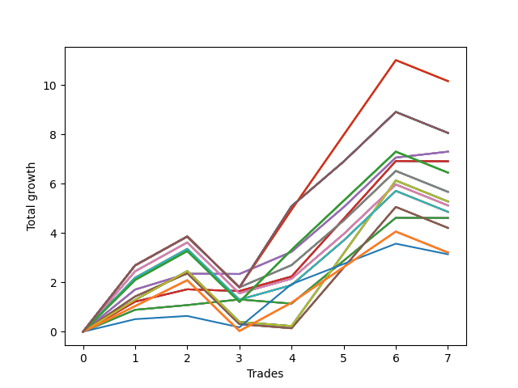

# Short Shepard 005 
- Symbol: SPY_Unlimited
- Date Range: 03/23/2022 - 07/08/2022
- Trading Period: 7:20-12:30
- Number of Trades: 7



| Name | Win Percent | Profit | Avg Profit / Trade | Avg Time / Trade |      | Name | Win Percent | Profit | Avg Profit / Trade | Avg Time / Trade |
| ---- | ----------- | ------ | ------------------ | ---------------- | ---- | ---- | ----------- | ------ | ------------------ | ---------------- |
| Sorted By <br> Profit | | | | | | Sorted By <br> Win Percentage ||||
| One Hundred Twenty-Eight | 71.43 | 5080.00 | 725.71 | 20:32 |     | Sixty-Six | 85.71 | 3650.00 | 521.43 | 16:41 |
| One Hundred Twenty-Three | 71.43 | 5080.00 | 725.71 | 20:32 |     | Fifty-Eight | 85.71 | 3650.00 | 521.43 | 16:41 |
| One Hundred Eighteen | 71.43 | 5080.00 | 725.71 | 20:32 |     | Fifty | 85.71 | 3650.00 | 521.43 | 16:41 |
| One Hundred Thirteen | 71.43 | 5080.00 | 725.71 | 20:32 |     | Forty-Two | 85.71 | 3650.00 | 521.43 | 16:41 |
| Eighty-Three | 71.43 | 5080.00 | 725.71 | 20:32 |     | Two | 85.71 | 3650.00 | 521.43 | 16:41 |
| One Hundred Thirty | 71.43 | 4030.00 | 575.71 | 29:55 |     | One Hundred Twenty-Eight | 71.43 | 5080.00 | 725.71 | 20:32 |
| One Hundred Twenty-Nine | 71.43 | 4030.00 | 575.71 | 29:55 |     | One Hundred Twenty-Three | 71.43 | 5080.00 | 725.71 | 20:32 |
| One Hundred Twenty-Five | 71.43 | 4030.00 | 575.71 | 29:55 |     | One Hundred Eighteen | 71.43 | 5080.00 | 725.71 | 20:32 |
| One Hundred Twenty-Four | 71.43 | 4030.00 | 575.71 | 29:55 |     | One Hundred Thirteen | 71.43 | 5080.00 | 725.71 | 20:32 |
| One Hundred Twenty | 71.43 | 4030.00 | 575.71 | 29:55 |     | Eighty-Three | 71.43 | 5080.00 | 725.71 | 20:32 |
| One Hundred Ninteen | 71.43 | 4030.00 | 575.71 | 29:55 |     | One Hundred Thirty | 71.43 | 4030.00 | 575.71 | 29:55 |
| One Hundred Fifteen | 71.43 | 4030.00 | 575.71 | 29:55 |     | One Hundred Twenty-Nine | 71.43 | 4030.00 | 575.71 | 29:55 |
| One Hundred Fourteen | 71.43 | 4030.00 | 575.71 | 29:55 |     | One Hundred Twenty-Five | 71.43 | 4030.00 | 575.71 | 29:55 |
| Eighty-Five | 71.43 | 4030.00 | 575.71 | 29:55 |     | One Hundred Twenty-Four | 71.43 | 4030.00 | 575.71 | 29:55 |
| Eighty-Four | 71.43 | 4030.00 | 575.71 | 29:55 |     | One Hundred Twenty | 71.43 | 4030.00 | 575.71 | 29:55 |
| Sixty-Six | 85.71 | 3650.00 | 521.43 | 16:41 |     | One Hundred Ninteen | 71.43 | 4030.00 | 575.71 | 29:55 |
| Fifty-Eight | 85.71 | 3650.00 | 521.43 | 16:41 |     | One Hundred Fifteen | 71.43 | 4030.00 | 575.71 | 29:55 |
| Fifty | 85.71 | 3650.00 | 521.43 | 16:41 |     | One Hundred Fourteen | 71.43 | 4030.00 | 575.71 | 29:55 |
| Forty-Two | 85.71 | 3650.00 | 521.43 | 16:41 |     | Eighty-Five | 71.43 | 4030.00 | 575.71 | 29:55 |
| Two | 85.71 | 3650.00 | 521.43 | 16:41 |     | Eighty-Four | 71.43 | 4030.00 | 575.71 | 29:55 |
| Sixty-Five | 71.43 | 3455.00 | 493.57 | 07:56 |     | Sixty-Five | 71.43 | 3455.00 | 493.57 | 07:56 |
| Fifty-Seven | 71.43 | 3455.00 | 493.57 | 07:56 |     | Fifty-Seven | 71.43 | 3455.00 | 493.57 | 07:56 |
| Forty-Nine | 71.43 | 3455.00 | 493.57 | 07:56 |     | Forty-Nine | 71.43 | 3455.00 | 493.57 | 07:56 |
| Forty-One | 71.43 | 3455.00 | 493.57 | 07:56 |     | Forty-One | 71.43 | 3455.00 | 493.57 | 07:56 |
| One | 71.43 | 3455.00 | 493.57 | 07:56 |     | One | 71.43 | 3455.00 | 493.57 | 07:56 |
| One Hundred Twenty-Seven | 71.43 | 3225.00 | 460.71 | 16:22 |     | One Hundred Twenty-Seven | 71.43 | 3225.00 | 460.71 | 16:22 |
| One Hundred Twenty-Two | 71.43 | 3225.00 | 460.71 | 16:22 |     | One Hundred Twenty-Two | 71.43 | 3225.00 | 460.71 | 16:22 |
| One Hundred Seventeen | 71.43 | 3225.00 | 460.71 | 16:22 |     | One Hundred Seventeen | 71.43 | 3225.00 | 460.71 | 16:22 |
| One Hundred Twelve | 71.43 | 3225.00 | 460.71 | 16:22 |     | One Hundred Twelve | 71.43 | 3225.00 | 460.71 | 16:22 |
| Eighty-Two | 71.43 | 3225.00 | 460.71 | 16:22 |     | Eighty-Two | 71.43 | 3225.00 | 460.71 | 16:22 |
| Sixty-Nine | 71.43 | 2835.00 | 405.00 | 25:49 |     | Sixty-Nine | 71.43 | 2835.00 | 405.00 | 25:49 |
| Sixty-One | 71.43 | 2835.00 | 405.00 | 25:49 |     | Sixty-One | 71.43 | 2835.00 | 405.00 | 25:49 |
| Fifty-Three | 71.43 | 2835.00 | 405.00 | 25:49 |     | Fifty-Three | 71.43 | 2835.00 | 405.00 | 25:49 |
| Forty-Five | 71.43 | 2835.00 | 405.00 | 25:49 |     | Forty-Five | 71.43 | 2835.00 | 405.00 | 25:49 |
| Five | 71.43 | 2835.00 | 405.00 | 25:49 |     | Five | 71.43 | 2835.00 | 405.00 | 25:49 |
| Seventy | 57.14 | 2640.00 | 377.14 | 16:02 |     | Sixty-Eight | 71.43 | 2560.00 | 365.71 | 24:16 |
| Sixty-Two | 57.14 | 2640.00 | 377.14 | 16:02 |     | Sixty | 71.43 | 2560.00 | 365.71 | 24:16 |
| Fifty-Four | 57.14 | 2640.00 | 377.14 | 16:02 |     | Fifty-Two | 71.43 | 2560.00 | 365.71 | 24:16 |
| Forty-Six | 57.14 | 2640.00 | 377.14 | 16:02 |     | Forty-Four | 71.43 | 2560.00 | 365.71 | 24:16 |
| Six | 57.14 | 2640.00 | 377.14 | 16:02 |     | Four | 71.43 | 2560.00 | 365.71 | 24:16 |
| Sixty-Eight | 71.43 | 2560.00 | 365.71 | 24:16 |     | Seventy-One | 71.43 | 2430.00 | 347.14 | 24:10 |
| Sixty | 71.43 | 2560.00 | 365.71 | 24:16 |     | Sixty-Three | 71.43 | 2430.00 | 347.14 | 24:10 |
| Fifty-Two | 71.43 | 2560.00 | 365.71 | 24:16 |     | Fifty-Five | 71.43 | 2430.00 | 347.14 | 24:10 |
| Forty-Four | 71.43 | 2560.00 | 365.71 | 24:16 |     | Forty-Seven | 71.43 | 2430.00 | 347.14 | 24:10 |
| Four | 71.43 | 2560.00 | 365.71 | 24:16 |     | Seven | 71.43 | 2430.00 | 347.14 | 24:10 |
| Seventy-One | 71.43 | 2430.00 | 347.14 | 24:10 |     | Sixty-Four | 71.43 | 2305.00 | 329.29 | 04:47 |
| Sixty-Three | 71.43 | 2430.00 | 347.14 | 24:10 |     | Fifty-Six | 71.43 | 2305.00 | 329.29 | 04:47 |
| Fifty-Five | 71.43 | 2430.00 | 347.14 | 24:10 |     | Forty-Eight | 71.43 | 2305.00 | 329.29 | 04:47 |
| Forty-Seven | 71.43 | 2430.00 | 347.14 | 24:10 |     | Forty | 71.43 | 2305.00 | 329.29 | 04:47 |
| Seven | 71.43 | 2430.00 | 347.14 | 24:10 |     | Zero | 71.43 | 2305.00 | 329.29 | 04:47 |
| Sixty-Four | 71.43 | 2305.00 | 329.29 | 04:47 |     | One Hundred Twenty-Six | 71.43 | 1605.00 | 229.29 | 12:52 |
| Fifty-Six | 71.43 | 2305.00 | 329.29 | 04:47 |     | One Hundred Twenty-One | 71.43 | 1605.00 | 229.29 | 12:52 |
| Forty-Eight | 71.43 | 2305.00 | 329.29 | 04:47 |     | One Hundred Sixteen | 71.43 | 1605.00 | 229.29 | 12:52 |
| Forty | 71.43 | 2305.00 | 329.29 | 04:47 |     | One Hundred Eleven | 71.43 | 1605.00 | 229.29 | 12:52 |
| Zero | 71.43 | 2305.00 | 329.29 | 04:47 |     | Eighty-One | 71.43 | 1605.00 | 229.29 | 12:52 |
| Sixty-Seven | 57.14 | 2105.00 | 300.71 | 20:05 |     | Seventy-Three | 71.43 | 1570.00 | 224.29 | 07:22 |
| Fifty-Nine | 57.14 | 2105.00 | 300.71 | 20:05 |     | Seventy | 57.14 | 2640.00 | 377.14 | 16:02 |
| Fifty-One | 57.14 | 2105.00 | 300.71 | 20:05 |     | Sixty-Two | 57.14 | 2640.00 | 377.14 | 16:02 |
| Forty-Three | 57.14 | 2105.00 | 300.71 | 20:05 |     | Fifty-Four | 57.14 | 2640.00 | 377.14 | 16:02 |
| Three | 57.14 | 2105.00 | 300.71 | 20:05 |     | Forty-Six | 57.14 | 2640.00 | 377.14 | 16:02 |
| One Hundred Twenty-Six | 71.43 | 1605.00 | 229.29 | 12:52 |     | Six | 57.14 | 2640.00 | 377.14 | 16:02 |
| One Hundred Twenty-One | 71.43 | 1605.00 | 229.29 | 12:52 |     | Sixty-Seven | 57.14 | 2105.00 | 300.71 | 20:05 |
| One Hundred Sixteen | 71.43 | 1605.00 | 229.29 | 12:52 |     | Fifty-Nine | 57.14 | 2105.00 | 300.71 | 20:05 |
| One Hundred Eleven | 71.43 | 1605.00 | 229.29 | 12:52 |     | Fifty-One | 57.14 | 2105.00 | 300.71 | 20:05 |
| Eighty-One | 71.43 | 1605.00 | 229.29 | 12:52 |     | Forty-Three | 57.14 | 2105.00 | 300.71 | 20:05 |
| Seventy-Three | 71.43 | 1570.00 | 224.29 | 07:22 |     | Three | 57.14 | 2105.00 | 300.71 | 20:05 |

## NO STOPLOSS

### Test Zero
* Sell when price hits the middle line of the 20p bollinger
* No Stoploss
* Results:
```
Total Trades: 7
Percent Up: 28.57
Percent Down: 71.43
Total Points Moved Down: 4.61
Potential Profit: 2305.00
Total Points Ups: 0.18 Count Ups: 2
Total Points Downs: 4.79 Count Downs: 5
```

<details><summary>Trades</summary>

<code>In: 2022-04-25 07:39:00		Out: 2022-04-25 07:40:25		Total Position Time: 01:25		Total Move Down: 0.89		Total to Date: 0.89</code> <br />
<code>In: 2022-05-16 08:57:00		Out: 2022-05-16 09:05:45		Total Position Time: 08:45		Total Move Down: 0.19		Total to Date: 1.08</code> <br />
<code>In: 2022-05-25 11:33:00		Out: 2022-05-25 11:39:10		Total Position Time: 06:10		Total Move Down: 0.23		Total to Date: 1.31</code> <br />
<code>In: 2022-06-15 11:02:00		Out: 2022-06-15 11:02:10		Total Position Time: 00:10		Total Move Down: -0.17		Total to Date: 1.14</code> <br />
<code>In: 2022-06-15 11:48:00		Out: 2022-06-15 11:53:25		Total Position Time: 05:25		Total Move Down: 1.74		Total to Date: 2.88</code> <br />
<code>In: 2022-06-15 11:49:00		Out: 2022-06-15 11:53:25		Total Position Time: 04:25		Total Move Down: 1.74		Total to Date: 4.62</code> <br />
<code>In: 2022-07-05 08:53:00		Out: 2022-07-05 09:00:10		Total Position Time: 07:10		Total Move Down: -0.01		Total to Date: 4.61</code> <br />


</details>

### Test One
* Sell when the price hits the upper line of the 20p 1std bollinger
* No Stoploss
* Results:
```
Total Trades: 7
Percent Up: 28.57
Percent Down: 71.43
Total Points Moved Down: 6.91
Potential Profit: 3455.00
Total Points Ups: 0.08 Count Ups: 2
Total Points Downs: 6.99 Count Downs: 5
```

<details><summary>Trades</summary>

<code>In: 2022-04-25 07:39:00		Out: 2022-04-25 07:43:05		Total Position Time: 04:05		Total Move Down: 1.22		Total to Date: 1.22</code> <br />
<code>In: 2022-05-16 08:57:00		Out: 2022-05-16 09:06:15		Total Position Time: 09:15		Total Move Down: 0.50		Total to Date: 1.72</code> <br />
<code>In: 2022-05-25 11:33:00		Out: 2022-05-25 11:45:15		Total Position Time: 12:15		Total Move Down: -0.07		Total to Date: 1.65</code> <br />
<code>In: 2022-06-15 11:02:00		Out: 2022-06-15 11:03:05		Total Position Time: 01:05		Total Move Down: 0.59		Total to Date: 2.24</code> <br />
<code>In: 2022-06-15 11:48:00		Out: 2022-06-15 11:57:45		Total Position Time: 09:45		Total Move Down: 2.34		Total to Date: 4.58</code> <br />
<code>In: 2022-06-15 11:49:00		Out: 2022-06-15 11:57:45		Total Position Time: 08:45		Total Move Down: 2.34		Total to Date: 6.92</code> <br />
<code>In: 2022-07-05 08:53:00		Out: 2022-07-05 09:03:25		Total Position Time: 10:25		Total Move Down: -0.01		Total to Date: 6.91</code> <br />


</details>

### Test Two
* Sell when the price hits the upper line of the 20p 2std bollinger
* No Stoploss
* Results:
```
Total Trades: 7
Percent Up: 14.29
Percent Down: 85.71
Total Points Moved Down: 7.30
Potential Profit: 3650.00
Total Points Ups: 0.01 Count Ups: 1
Total Points Downs: 7.31 Count Downs: 6
```

<details><summary>Trades</summary>

<code>In: 2022-04-25 07:39:00		Out: 2022-04-25 07:52:20		Total Position Time: 13:20		Total Move Down: 1.71		Total to Date: 1.71</code> <br />
<code>In: 2022-05-16 08:57:00		Out: 2022-05-16 09:11:35		Total Position Time: 14:35		Total Move Down: 0.64		Total to Date: 2.35</code> <br />
<code>In: 2022-05-25 11:33:00		Out: 2022-05-25 11:50:00		Total Position Time: 17:00		Total Move Down: -0.01		Total to Date: 2.34</code> <br />
<code>In: 2022-06-15 11:02:00		Out: 2022-06-15 11:03:15		Total Position Time: 01:15		Total Move Down: 0.90		Total to Date: 3.24</code> <br />
<code>In: 2022-06-15 11:48:00		Out: 2022-06-15 12:17:55		Total Position Time: 29:55		Total Move Down: 1.81		Total to Date: 5.05</code> <br />
<code>In: 2022-06-15 11:49:00		Out: 2022-06-15 12:18:55		Total Position Time: 29:55		Total Move Down: 2.01		Total to Date: 7.06</code> <br />
<code>In: 2022-07-05 08:53:00		Out: 2022-07-05 09:03:50		Total Position Time: 10:50		Total Move Down: 0.24		Total to Date: 7.30</code> <br />


</details>

### Test Three
* Sell when price hits the middle line of the 50p bollinger
* No Stoploss
* Results:
```
Total Trades: 7
Percent Up: 42.86
Percent Down: 57.14
Total Points Moved Down: 4.21
Potential Profit: 2105.00
Total Points Ups: 3.08 Count Ups: 3
Total Points Downs: 7.29 Count Downs: 4
```

<details><summary>Trades</summary>

<code>In: 2022-04-25 07:39:00		Out: 2022-04-25 07:52:00		Total Position Time: 13:00		Total Move Down: 1.43		Total to Date: 1.43</code> <br />
<code>In: 2022-05-16 08:57:00		Out: 2022-05-16 09:15:30		Total Position Time: 18:30		Total Move Down: 0.94		Total to Date: 2.37</code> <br />
<code>In: 2022-05-25 11:33:00		Out: 2022-05-25 12:02:55		Total Position Time: 29:55		Total Move Down: -2.06		Total to Date: 0.31</code> <br />
<code>In: 2022-06-15 11:02:00		Out: 2022-06-15 11:02:10		Total Position Time: 00:10		Total Move Down: -0.17		Total to Date: 0.14</code> <br />
<code>In: 2022-06-15 11:48:00		Out: 2022-06-15 12:13:05		Total Position Time: 25:05		Total Move Down: 2.46		Total to Date: 2.60</code> <br />
<code>In: 2022-06-15 11:49:00		Out: 2022-06-15 12:13:05		Total Position Time: 24:05		Total Move Down: 2.46		Total to Date: 5.06</code> <br />
<code>In: 2022-07-05 08:53:00		Out: 2022-07-05 09:22:55		Total Position Time: 29:55		Total Move Down: -0.85		Total to Date: 4.21</code> <br />


</details>

### Test Four
* Sell when the price hits the upper line of the 50p 1std bollinger
* No Stoploss
* Results:
```
Total Trades: 7
Percent Up: 28.57
Percent Down: 71.43
Total Points Moved Down: 5.12
Potential Profit: 2560.00
Total Points Ups: 2.91 Count Ups: 2
Total Points Downs: 8.03 Count Downs: 5
```

<details><summary>Trades</summary>

<code>In: 2022-04-25 07:39:00		Out: 2022-04-25 07:58:15		Total Position Time: 19:15		Total Move Down: 2.45		Total to Date: 2.45</code> <br />
<code>In: 2022-05-16 08:57:00		Out: 2022-05-16 09:26:55		Total Position Time: 29:55		Total Move Down: 1.17		Total to Date: 3.62</code> <br />
<code>In: 2022-05-25 11:33:00		Out: 2022-05-25 12:02:55		Total Position Time: 29:55		Total Move Down: -2.06		Total to Date: 1.56</code> <br />
<code>In: 2022-06-15 11:02:00		Out: 2022-06-15 11:03:05		Total Position Time: 01:05		Total Move Down: 0.59		Total to Date: 2.15</code> <br />
<code>In: 2022-06-15 11:48:00		Out: 2022-06-15 12:17:55		Total Position Time: 29:55		Total Move Down: 1.81		Total to Date: 3.96</code> <br />
<code>In: 2022-06-15 11:49:00		Out: 2022-06-15 12:18:55		Total Position Time: 29:55		Total Move Down: 2.01		Total to Date: 5.97</code> <br />
<code>In: 2022-07-05 08:53:00		Out: 2022-07-05 09:22:55		Total Position Time: 29:55		Total Move Down: -0.85		Total to Date: 5.12</code> <br />


</details>

### Test Five
* Sell when the price hits the upper line of the 50p 2std bollinger
* No Stoploss
* Results:
```
Total Trades: 7
Percent Up: 28.57
Percent Down: 71.43
Total Points Moved Down: 5.67
Potential Profit: 2835.00
Total Points Ups: 2.91 Count Ups: 2
Total Points Downs: 8.58 Count Downs: 5
```

<details><summary>Trades</summary>

<code>In: 2022-04-25 07:39:00		Out: 2022-04-25 08:08:55		Total Position Time: 29:55		Total Move Down: 2.69		Total to Date: 2.69</code> <br />
<code>In: 2022-05-16 08:57:00		Out: 2022-05-16 09:26:55		Total Position Time: 29:55		Total Move Down: 1.17		Total to Date: 3.86</code> <br />
<code>In: 2022-05-25 11:33:00		Out: 2022-05-25 12:02:55		Total Position Time: 29:55		Total Move Down: -2.06		Total to Date: 1.80</code> <br />
<code>In: 2022-06-15 11:02:00		Out: 2022-06-15 11:03:15		Total Position Time: 01:15		Total Move Down: 0.90		Total to Date: 2.70</code> <br />
<code>In: 2022-06-15 11:48:00		Out: 2022-06-15 12:17:55		Total Position Time: 29:55		Total Move Down: 1.81		Total to Date: 4.51</code> <br />
<code>In: 2022-06-15 11:49:00		Out: 2022-06-15 12:18:55		Total Position Time: 29:55		Total Move Down: 2.01		Total to Date: 6.52</code> <br />
<code>In: 2022-07-05 08:53:00		Out: 2022-07-05 09:22:55		Total Position Time: 29:55		Total Move Down: -0.85		Total to Date: 5.67</code> <br />


</details>

### Test Six
* Sell when the price hits the middle line of the 1std VWAP
* No Stoploss
* Results:
```
Total Trades: 7
Percent Up: 42.86
Percent Down: 57.14
Total Points Moved Down: 5.28
Potential Profit: 2640.00
Total Points Ups: 3.08 Count Ups: 3
Total Points Downs: 8.36 Count Downs: 4
```

<details><summary>Trades</summary>

<code>In: 2022-04-25 07:39:00		Out: 2022-04-25 07:42:30		Total Position Time: 03:30		Total Move Down: 1.29		Total to Date: 1.29</code> <br />
<code>In: 2022-05-16 08:57:00		Out: 2022-05-16 09:26:55		Total Position Time: 29:55		Total Move Down: 1.17		Total to Date: 2.46</code> <br />
<code>In: 2022-05-25 11:33:00		Out: 2022-05-25 12:02:55		Total Position Time: 29:55		Total Move Down: -2.06		Total to Date: 0.40</code> <br />
<code>In: 2022-06-15 11:02:00		Out: 2022-06-15 11:02:10		Total Position Time: 00:10		Total Move Down: -0.17		Total to Date: 0.23</code> <br />
<code>In: 2022-06-15 11:48:00		Out: 2022-06-15 11:57:55		Total Position Time: 09:55		Total Move Down: 2.95		Total to Date: 3.18</code> <br />
<code>In: 2022-06-15 11:49:00		Out: 2022-06-15 11:57:55		Total Position Time: 08:55		Total Move Down: 2.95		Total to Date: 6.13</code> <br />
<code>In: 2022-07-05 08:53:00		Out: 2022-07-05 09:22:55		Total Position Time: 29:55		Total Move Down: -0.85		Total to Date: 5.28</code> <br />


</details>

### Test Seven
* Sell when the price hits the upper line of the 1std VWAP
* No Stoploss
* Results:
```
Total Trades: 7
Percent Up: 28.57
Percent Down: 71.43
Total Points Moved Down: 4.86
Potential Profit: 2430.00
Total Points Ups: 2.91 Count Ups: 2
Total Points Downs: 7.77 Count Downs: 5
```

<details><summary>Trades</summary>

<code>In: 2022-04-25 07:39:00		Out: 2022-04-25 07:57:30		Total Position Time: 18:30		Total Move Down: 2.19		Total to Date: 2.19</code> <br />
<code>In: 2022-05-16 08:57:00		Out: 2022-05-16 09:26:55		Total Position Time: 29:55		Total Move Down: 1.17		Total to Date: 3.36</code> <br />
<code>In: 2022-05-25 11:33:00		Out: 2022-05-25 12:02:55		Total Position Time: 29:55		Total Move Down: -2.06		Total to Date: 1.30</code> <br />
<code>In: 2022-06-15 11:02:00		Out: 2022-06-15 11:03:05		Total Position Time: 01:05		Total Move Down: 0.59		Total to Date: 1.89</code> <br />
<code>In: 2022-06-15 11:48:00		Out: 2022-06-15 12:17:55		Total Position Time: 29:55		Total Move Down: 1.81		Total to Date: 3.70</code> <br />
<code>In: 2022-06-15 11:49:00		Out: 2022-06-15 12:18:55		Total Position Time: 29:55		Total Move Down: 2.01		Total to Date: 5.71</code> <br />
<code>In: 2022-07-05 08:53:00		Out: 2022-07-05 09:22:55		Total Position Time: 29:55		Total Move Down: -0.85		Total to Date: 4.86</code> <br />


</details>

## STOPLOSS OF 5

### Test Forty
* Sell when price hits the middle line of the 20p bollinger
* Stoploss is -5 points
* Results:
```
Total Trades: 7
Percent Up: 28.57
Percent Down: 71.43
Total Points Moved Down: 4.61
Potential Profit: 2305.00
Total Points Ups: 0.18 Count Ups: 2
Total Points Downs: 4.79 Count Downs: 5
```

<details><summary>Trades</summary>

<code>In: 2022-04-25 07:39:00		Out: 2022-04-25 07:40:25		Total Position Time: 01:25		Total Move Down: 0.89		Total to Date: 0.89</code> <br />
<code>In: 2022-05-16 08:57:00		Out: 2022-05-16 09:05:45		Total Position Time: 08:45		Total Move Down: 0.19		Total to Date: 1.08</code> <br />
<code>In: 2022-05-25 11:33:00		Out: 2022-05-25 11:39:10		Total Position Time: 06:10		Total Move Down: 0.23		Total to Date: 1.31</code> <br />
<code>In: 2022-06-15 11:02:00		Out: 2022-06-15 11:02:10		Total Position Time: 00:10		Total Move Down: -0.17		Total to Date: 1.14</code> <br />
<code>In: 2022-06-15 11:48:00		Out: 2022-06-15 11:53:25		Total Position Time: 05:25		Total Move Down: 1.74		Total to Date: 2.88</code> <br />
<code>In: 2022-06-15 11:49:00		Out: 2022-06-15 11:53:25		Total Position Time: 04:25		Total Move Down: 1.74		Total to Date: 4.62</code> <br />
<code>In: 2022-07-05 08:53:00		Out: 2022-07-05 09:00:10		Total Position Time: 07:10		Total Move Down: -0.01		Total to Date: 4.61</code> <br />


</details>

### Test Forty-One
* Sell when the price hits the upper line of the 20p 1std bollinger
* Stoploss is -5 points
* Results:
```
Total Trades: 7
Percent Up: 28.57
Percent Down: 71.43
Total Points Moved Down: 6.91
Potential Profit: 3455.00
Total Points Ups: 0.08 Count Ups: 2
Total Points Downs: 6.99 Count Downs: 5
```

<details><summary>Trades</summary>

<code>In: 2022-04-25 07:39:00		Out: 2022-04-25 07:43:05		Total Position Time: 04:05		Total Move Down: 1.22		Total to Date: 1.22</code> <br />
<code>In: 2022-05-16 08:57:00		Out: 2022-05-16 09:06:15		Total Position Time: 09:15		Total Move Down: 0.50		Total to Date: 1.72</code> <br />
<code>In: 2022-05-25 11:33:00		Out: 2022-05-25 11:45:15		Total Position Time: 12:15		Total Move Down: -0.07		Total to Date: 1.65</code> <br />
<code>In: 2022-06-15 11:02:00		Out: 2022-06-15 11:03:05		Total Position Time: 01:05		Total Move Down: 0.59		Total to Date: 2.24</code> <br />
<code>In: 2022-06-15 11:48:00		Out: 2022-06-15 11:57:45		Total Position Time: 09:45		Total Move Down: 2.34		Total to Date: 4.58</code> <br />
<code>In: 2022-06-15 11:49:00		Out: 2022-06-15 11:57:45		Total Position Time: 08:45		Total Move Down: 2.34		Total to Date: 6.92</code> <br />
<code>In: 2022-07-05 08:53:00		Out: 2022-07-05 09:03:25		Total Position Time: 10:25		Total Move Down: -0.01		Total to Date: 6.91</code> <br />


</details>

### Test Forty-Two
* Sell when the price hits the upper line of the 20p 2std bollinger
* Stoploss is -5 points
* Results:
```
Total Trades: 7
Percent Up: 14.29
Percent Down: 85.71
Total Points Moved Down: 7.30
Potential Profit: 3650.00
Total Points Ups: 0.01 Count Ups: 1
Total Points Downs: 7.31 Count Downs: 6
```

<details><summary>Trades</summary>

<code>In: 2022-04-25 07:39:00		Out: 2022-04-25 07:52:20		Total Position Time: 13:20		Total Move Down: 1.71		Total to Date: 1.71</code> <br />
<code>In: 2022-05-16 08:57:00		Out: 2022-05-16 09:11:35		Total Position Time: 14:35		Total Move Down: 0.64		Total to Date: 2.35</code> <br />
<code>In: 2022-05-25 11:33:00		Out: 2022-05-25 11:50:00		Total Position Time: 17:00		Total Move Down: -0.01		Total to Date: 2.34</code> <br />
<code>In: 2022-06-15 11:02:00		Out: 2022-06-15 11:03:15		Total Position Time: 01:15		Total Move Down: 0.90		Total to Date: 3.24</code> <br />
<code>In: 2022-06-15 11:48:00		Out: 2022-06-15 12:17:55		Total Position Time: 29:55		Total Move Down: 1.81		Total to Date: 5.05</code> <br />
<code>In: 2022-06-15 11:49:00		Out: 2022-06-15 12:18:55		Total Position Time: 29:55		Total Move Down: 2.01		Total to Date: 7.06</code> <br />
<code>In: 2022-07-05 08:53:00		Out: 2022-07-05 09:03:50		Total Position Time: 10:50		Total Move Down: 0.24		Total to Date: 7.30</code> <br />


</details>

### Test Forty-Three
* Sell when price hits the middle line of the 50p bollinger
* Stoploss is -5 points
* Results:
```
Total Trades: 7
Percent Up: 42.86
Percent Down: 57.14
Total Points Moved Down: 4.21
Potential Profit: 2105.00
Total Points Ups: 3.08 Count Ups: 3
Total Points Downs: 7.29 Count Downs: 4
```

<details><summary>Trades</summary>

<code>In: 2022-04-25 07:39:00		Out: 2022-04-25 07:52:00		Total Position Time: 13:00		Total Move Down: 1.43		Total to Date: 1.43</code> <br />
<code>In: 2022-05-16 08:57:00		Out: 2022-05-16 09:15:30		Total Position Time: 18:30		Total Move Down: 0.94		Total to Date: 2.37</code> <br />
<code>In: 2022-05-25 11:33:00		Out: 2022-05-25 12:02:55		Total Position Time: 29:55		Total Move Down: -2.06		Total to Date: 0.31</code> <br />
<code>In: 2022-06-15 11:02:00		Out: 2022-06-15 11:02:10		Total Position Time: 00:10		Total Move Down: -0.17		Total to Date: 0.14</code> <br />
<code>In: 2022-06-15 11:48:00		Out: 2022-06-15 12:13:05		Total Position Time: 25:05		Total Move Down: 2.46		Total to Date: 2.60</code> <br />
<code>In: 2022-06-15 11:49:00		Out: 2022-06-15 12:13:05		Total Position Time: 24:05		Total Move Down: 2.46		Total to Date: 5.06</code> <br />
<code>In: 2022-07-05 08:53:00		Out: 2022-07-05 09:22:55		Total Position Time: 29:55		Total Move Down: -0.85		Total to Date: 4.21</code> <br />


</details>

### Test Forty-Four
* Sell when the price hits the upper line of the 50p 1std bollinger
* Stoploss is -5 points
* Results:
```
Total Trades: 7
Percent Up: 28.57
Percent Down: 71.43
Total Points Moved Down: 5.12
Potential Profit: 2560.00
Total Points Ups: 2.91 Count Ups: 2
Total Points Downs: 8.03 Count Downs: 5
```

<details><summary>Trades</summary>

<code>In: 2022-04-25 07:39:00		Out: 2022-04-25 07:58:15		Total Position Time: 19:15		Total Move Down: 2.45		Total to Date: 2.45</code> <br />
<code>In: 2022-05-16 08:57:00		Out: 2022-05-16 09:26:55		Total Position Time: 29:55		Total Move Down: 1.17		Total to Date: 3.62</code> <br />
<code>In: 2022-05-25 11:33:00		Out: 2022-05-25 12:02:55		Total Position Time: 29:55		Total Move Down: -2.06		Total to Date: 1.56</code> <br />
<code>In: 2022-06-15 11:02:00		Out: 2022-06-15 11:03:05		Total Position Time: 01:05		Total Move Down: 0.59		Total to Date: 2.15</code> <br />
<code>In: 2022-06-15 11:48:00		Out: 2022-06-15 12:17:55		Total Position Time: 29:55		Total Move Down: 1.81		Total to Date: 3.96</code> <br />
<code>In: 2022-06-15 11:49:00		Out: 2022-06-15 12:18:55		Total Position Time: 29:55		Total Move Down: 2.01		Total to Date: 5.97</code> <br />
<code>In: 2022-07-05 08:53:00		Out: 2022-07-05 09:22:55		Total Position Time: 29:55		Total Move Down: -0.85		Total to Date: 5.12</code> <br />


</details>

### Test Forty-Five
* Sell when the price hits the upper line of the 50p 2std bollinger
* Stoploss is -5 points
* Results:
```
Total Trades: 7
Percent Up: 28.57
Percent Down: 71.43
Total Points Moved Down: 5.67
Potential Profit: 2835.00
Total Points Ups: 2.91 Count Ups: 2
Total Points Downs: 8.58 Count Downs: 5
```

<details><summary>Trades</summary>

<code>In: 2022-04-25 07:39:00		Out: 2022-04-25 08:08:55		Total Position Time: 29:55		Total Move Down: 2.69		Total to Date: 2.69</code> <br />
<code>In: 2022-05-16 08:57:00		Out: 2022-05-16 09:26:55		Total Position Time: 29:55		Total Move Down: 1.17		Total to Date: 3.86</code> <br />
<code>In: 2022-05-25 11:33:00		Out: 2022-05-25 12:02:55		Total Position Time: 29:55		Total Move Down: -2.06		Total to Date: 1.80</code> <br />
<code>In: 2022-06-15 11:02:00		Out: 2022-06-15 11:03:15		Total Position Time: 01:15		Total Move Down: 0.90		Total to Date: 2.70</code> <br />
<code>In: 2022-06-15 11:48:00		Out: 2022-06-15 12:17:55		Total Position Time: 29:55		Total Move Down: 1.81		Total to Date: 4.51</code> <br />
<code>In: 2022-06-15 11:49:00		Out: 2022-06-15 12:18:55		Total Position Time: 29:55		Total Move Down: 2.01		Total to Date: 6.52</code> <br />
<code>In: 2022-07-05 08:53:00		Out: 2022-07-05 09:22:55		Total Position Time: 29:55		Total Move Down: -0.85		Total to Date: 5.67</code> <br />


</details>

### Test Forty-Six
* Sell when the price hits the middle line of the 1std VWAP
* Stoploss is -5 points
* Results:
```
Total Trades: 7
Percent Up: 42.86
Percent Down: 57.14
Total Points Moved Down: 5.28
Potential Profit: 2640.00
Total Points Ups: 3.08 Count Ups: 3
Total Points Downs: 8.36 Count Downs: 4
```

<details><summary>Trades</summary>

<code>In: 2022-04-25 07:39:00		Out: 2022-04-25 07:42:30		Total Position Time: 03:30		Total Move Down: 1.29		Total to Date: 1.29</code> <br />
<code>In: 2022-05-16 08:57:00		Out: 2022-05-16 09:26:55		Total Position Time: 29:55		Total Move Down: 1.17		Total to Date: 2.46</code> <br />
<code>In: 2022-05-25 11:33:00		Out: 2022-05-25 12:02:55		Total Position Time: 29:55		Total Move Down: -2.06		Total to Date: 0.40</code> <br />
<code>In: 2022-06-15 11:02:00		Out: 2022-06-15 11:02:10		Total Position Time: 00:10		Total Move Down: -0.17		Total to Date: 0.23</code> <br />
<code>In: 2022-06-15 11:48:00		Out: 2022-06-15 11:57:55		Total Position Time: 09:55		Total Move Down: 2.95		Total to Date: 3.18</code> <br />
<code>In: 2022-06-15 11:49:00		Out: 2022-06-15 11:57:55		Total Position Time: 08:55		Total Move Down: 2.95		Total to Date: 6.13</code> <br />
<code>In: 2022-07-05 08:53:00		Out: 2022-07-05 09:22:55		Total Position Time: 29:55		Total Move Down: -0.85		Total to Date: 5.28</code> <br />


</details>

### Test Forty-Seven
* Sell when the price hits the upper line of the 1std VWAP
* Stoploss is -5 points
* Results:
```
Total Trades: 7
Percent Up: 28.57
Percent Down: 71.43
Total Points Moved Down: 4.86
Potential Profit: 2430.00
Total Points Ups: 2.91 Count Ups: 2
Total Points Downs: 7.77 Count Downs: 5
```

<details><summary>Trades</summary>

<code>In: 2022-04-25 07:39:00		Out: 2022-04-25 07:57:30		Total Position Time: 18:30		Total Move Down: 2.19		Total to Date: 2.19</code> <br />
<code>In: 2022-05-16 08:57:00		Out: 2022-05-16 09:26:55		Total Position Time: 29:55		Total Move Down: 1.17		Total to Date: 3.36</code> <br />
<code>In: 2022-05-25 11:33:00		Out: 2022-05-25 12:02:55		Total Position Time: 29:55		Total Move Down: -2.06		Total to Date: 1.30</code> <br />
<code>In: 2022-06-15 11:02:00		Out: 2022-06-15 11:03:05		Total Position Time: 01:05		Total Move Down: 0.59		Total to Date: 1.89</code> <br />
<code>In: 2022-06-15 11:48:00		Out: 2022-06-15 12:17:55		Total Position Time: 29:55		Total Move Down: 1.81		Total to Date: 3.70</code> <br />
<code>In: 2022-06-15 11:49:00		Out: 2022-06-15 12:18:55		Total Position Time: 29:55		Total Move Down: 2.01		Total to Date: 5.71</code> <br />
<code>In: 2022-07-05 08:53:00		Out: 2022-07-05 09:22:55		Total Position Time: 29:55		Total Move Down: -0.85		Total to Date: 4.86</code> <br />


</details>

## TRAIL STOP OF 5

### Test Forty-Eight
* Sell when price hits the middle line of the 20p bollinger
* Trailing Stop is -5 points
* Results:
```
Total Trades: 7
Percent Up: 28.57
Percent Down: 71.43
Total Points Moved Down: 4.61
Potential Profit: 2305.00
Total Points Ups: 0.18 Count Ups: 2
Total Points Downs: 4.79 Count Downs: 5
```

<details><summary>Trades</summary>

<code>In: 2022-04-25 07:39:00		Out: 2022-04-25 07:40:25		Total Position Time: 01:25		Total Move Down: 0.89		Total to Date: 0.89</code> <br />
<code>In: 2022-05-16 08:57:00		Out: 2022-05-16 09:05:45		Total Position Time: 08:45		Total Move Down: 0.19		Total to Date: 1.08</code> <br />
<code>In: 2022-05-25 11:33:00		Out: 2022-05-25 11:39:10		Total Position Time: 06:10		Total Move Down: 0.23		Total to Date: 1.31</code> <br />
<code>In: 2022-06-15 11:02:00		Out: 2022-06-15 11:02:10		Total Position Time: 00:10		Total Move Down: -0.17		Total to Date: 1.14</code> <br />
<code>In: 2022-06-15 11:48:00		Out: 2022-06-15 11:53:25		Total Position Time: 05:25		Total Move Down: 1.74		Total to Date: 2.88</code> <br />
<code>In: 2022-06-15 11:49:00		Out: 2022-06-15 11:53:25		Total Position Time: 04:25		Total Move Down: 1.74		Total to Date: 4.62</code> <br />
<code>In: 2022-07-05 08:53:00		Out: 2022-07-05 09:00:10		Total Position Time: 07:10		Total Move Down: -0.01		Total to Date: 4.61</code> <br />


</details>

### Test Forty-Nine
* Sell when the price hits the upper line of the 20p 1std bollinger
* Trailing Stop is -5 points
* Results:
```
Total Trades: 7
Percent Up: 28.57
Percent Down: 71.43
Total Points Moved Down: 6.91
Potential Profit: 3455.00
Total Points Ups: 0.08 Count Ups: 2
Total Points Downs: 6.99 Count Downs: 5
```

<details><summary>Trades</summary>

<code>In: 2022-04-25 07:39:00		Out: 2022-04-25 07:43:05		Total Position Time: 04:05		Total Move Down: 1.22		Total to Date: 1.22</code> <br />
<code>In: 2022-05-16 08:57:00		Out: 2022-05-16 09:06:15		Total Position Time: 09:15		Total Move Down: 0.50		Total to Date: 1.72</code> <br />
<code>In: 2022-05-25 11:33:00		Out: 2022-05-25 11:45:15		Total Position Time: 12:15		Total Move Down: -0.07		Total to Date: 1.65</code> <br />
<code>In: 2022-06-15 11:02:00		Out: 2022-06-15 11:03:05		Total Position Time: 01:05		Total Move Down: 0.59		Total to Date: 2.24</code> <br />
<code>In: 2022-06-15 11:48:00		Out: 2022-06-15 11:57:45		Total Position Time: 09:45		Total Move Down: 2.34		Total to Date: 4.58</code> <br />
<code>In: 2022-06-15 11:49:00		Out: 2022-06-15 11:57:45		Total Position Time: 08:45		Total Move Down: 2.34		Total to Date: 6.92</code> <br />
<code>In: 2022-07-05 08:53:00		Out: 2022-07-05 09:03:25		Total Position Time: 10:25		Total Move Down: -0.01		Total to Date: 6.91</code> <br />


</details>

### Test Fifty
* Sell when the price hits the upper line of the 20p 2std bollinger
* Trailing Stop is -5 points
* Results:
```
Total Trades: 7
Percent Up: 14.29
Percent Down: 85.71
Total Points Moved Down: 7.30
Potential Profit: 3650.00
Total Points Ups: 0.01 Count Ups: 1
Total Points Downs: 7.31 Count Downs: 6
```

<details><summary>Trades</summary>

<code>In: 2022-04-25 07:39:00		Out: 2022-04-25 07:52:20		Total Position Time: 13:20		Total Move Down: 1.71		Total to Date: 1.71</code> <br />
<code>In: 2022-05-16 08:57:00		Out: 2022-05-16 09:11:35		Total Position Time: 14:35		Total Move Down: 0.64		Total to Date: 2.35</code> <br />
<code>In: 2022-05-25 11:33:00		Out: 2022-05-25 11:50:00		Total Position Time: 17:00		Total Move Down: -0.01		Total to Date: 2.34</code> <br />
<code>In: 2022-06-15 11:02:00		Out: 2022-06-15 11:03:15		Total Position Time: 01:15		Total Move Down: 0.90		Total to Date: 3.24</code> <br />
<code>In: 2022-06-15 11:48:00		Out: 2022-06-15 12:17:55		Total Position Time: 29:55		Total Move Down: 1.81		Total to Date: 5.05</code> <br />
<code>In: 2022-06-15 11:49:00		Out: 2022-06-15 12:18:55		Total Position Time: 29:55		Total Move Down: 2.01		Total to Date: 7.06</code> <br />
<code>In: 2022-07-05 08:53:00		Out: 2022-07-05 09:03:50		Total Position Time: 10:50		Total Move Down: 0.24		Total to Date: 7.30</code> <br />


</details>

### Test Fifty-One
* Sell when price hits the middle line of the 50p bollinger
* Trailing Stop is -5 points
* Results:
```
Total Trades: 7
Percent Up: 42.86
Percent Down: 57.14
Total Points Moved Down: 4.21
Potential Profit: 2105.00
Total Points Ups: 3.08 Count Ups: 3
Total Points Downs: 7.29 Count Downs: 4
```

<details><summary>Trades</summary>

<code>In: 2022-04-25 07:39:00		Out: 2022-04-25 07:52:00		Total Position Time: 13:00		Total Move Down: 1.43		Total to Date: 1.43</code> <br />
<code>In: 2022-05-16 08:57:00		Out: 2022-05-16 09:15:30		Total Position Time: 18:30		Total Move Down: 0.94		Total to Date: 2.37</code> <br />
<code>In: 2022-05-25 11:33:00		Out: 2022-05-25 12:02:55		Total Position Time: 29:55		Total Move Down: -2.06		Total to Date: 0.31</code> <br />
<code>In: 2022-06-15 11:02:00		Out: 2022-06-15 11:02:10		Total Position Time: 00:10		Total Move Down: -0.17		Total to Date: 0.14</code> <br />
<code>In: 2022-06-15 11:48:00		Out: 2022-06-15 12:13:05		Total Position Time: 25:05		Total Move Down: 2.46		Total to Date: 2.60</code> <br />
<code>In: 2022-06-15 11:49:00		Out: 2022-06-15 12:13:05		Total Position Time: 24:05		Total Move Down: 2.46		Total to Date: 5.06</code> <br />
<code>In: 2022-07-05 08:53:00		Out: 2022-07-05 09:22:55		Total Position Time: 29:55		Total Move Down: -0.85		Total to Date: 4.21</code> <br />


</details>

### Test Fifty-Two
* Sell when the price hits the upper line of the 50p 1std bollinger
* Trailing Stop is -5 points
* Results:
```
Total Trades: 7
Percent Up: 28.57
Percent Down: 71.43
Total Points Moved Down: 5.12
Potential Profit: 2560.00
Total Points Ups: 2.91 Count Ups: 2
Total Points Downs: 8.03 Count Downs: 5
```

<details><summary>Trades</summary>

<code>In: 2022-04-25 07:39:00		Out: 2022-04-25 07:58:15		Total Position Time: 19:15		Total Move Down: 2.45		Total to Date: 2.45</code> <br />
<code>In: 2022-05-16 08:57:00		Out: 2022-05-16 09:26:55		Total Position Time: 29:55		Total Move Down: 1.17		Total to Date: 3.62</code> <br />
<code>In: 2022-05-25 11:33:00		Out: 2022-05-25 12:02:55		Total Position Time: 29:55		Total Move Down: -2.06		Total to Date: 1.56</code> <br />
<code>In: 2022-06-15 11:02:00		Out: 2022-06-15 11:03:05		Total Position Time: 01:05		Total Move Down: 0.59		Total to Date: 2.15</code> <br />
<code>In: 2022-06-15 11:48:00		Out: 2022-06-15 12:17:55		Total Position Time: 29:55		Total Move Down: 1.81		Total to Date: 3.96</code> <br />
<code>In: 2022-06-15 11:49:00		Out: 2022-06-15 12:18:55		Total Position Time: 29:55		Total Move Down: 2.01		Total to Date: 5.97</code> <br />
<code>In: 2022-07-05 08:53:00		Out: 2022-07-05 09:22:55		Total Position Time: 29:55		Total Move Down: -0.85		Total to Date: 5.12</code> <br />


</details>

### Test Fifty-Three
* Sell when the price hits the upper line of the 50p 2std bollinger
* Trailing Stop is -5 points
* Results:
```
Total Trades: 7
Percent Up: 28.57
Percent Down: 71.43
Total Points Moved Down: 5.67
Potential Profit: 2835.00
Total Points Ups: 2.91 Count Ups: 2
Total Points Downs: 8.58 Count Downs: 5
```

<details><summary>Trades</summary>

<code>In: 2022-04-25 07:39:00		Out: 2022-04-25 08:08:55		Total Position Time: 29:55		Total Move Down: 2.69		Total to Date: 2.69</code> <br />
<code>In: 2022-05-16 08:57:00		Out: 2022-05-16 09:26:55		Total Position Time: 29:55		Total Move Down: 1.17		Total to Date: 3.86</code> <br />
<code>In: 2022-05-25 11:33:00		Out: 2022-05-25 12:02:55		Total Position Time: 29:55		Total Move Down: -2.06		Total to Date: 1.80</code> <br />
<code>In: 2022-06-15 11:02:00		Out: 2022-06-15 11:03:15		Total Position Time: 01:15		Total Move Down: 0.90		Total to Date: 2.70</code> <br />
<code>In: 2022-06-15 11:48:00		Out: 2022-06-15 12:17:55		Total Position Time: 29:55		Total Move Down: 1.81		Total to Date: 4.51</code> <br />
<code>In: 2022-06-15 11:49:00		Out: 2022-06-15 12:18:55		Total Position Time: 29:55		Total Move Down: 2.01		Total to Date: 6.52</code> <br />
<code>In: 2022-07-05 08:53:00		Out: 2022-07-05 09:22:55		Total Position Time: 29:55		Total Move Down: -0.85		Total to Date: 5.67</code> <br />


</details>

### Test Fifty-Four
* Sell when the price hits the middle line of the 1std VWAP
* Trailing Stop is -5 points
* Results:
```
Total Trades: 7
Percent Up: 42.86
Percent Down: 57.14
Total Points Moved Down: 5.28
Potential Profit: 2640.00
Total Points Ups: 3.08 Count Ups: 3
Total Points Downs: 8.36 Count Downs: 4
```

<details><summary>Trades</summary>

<code>In: 2022-04-25 07:39:00		Out: 2022-04-25 07:42:30		Total Position Time: 03:30		Total Move Down: 1.29		Total to Date: 1.29</code> <br />
<code>In: 2022-05-16 08:57:00		Out: 2022-05-16 09:26:55		Total Position Time: 29:55		Total Move Down: 1.17		Total to Date: 2.46</code> <br />
<code>In: 2022-05-25 11:33:00		Out: 2022-05-25 12:02:55		Total Position Time: 29:55		Total Move Down: -2.06		Total to Date: 0.40</code> <br />
<code>In: 2022-06-15 11:02:00		Out: 2022-06-15 11:02:10		Total Position Time: 00:10		Total Move Down: -0.17		Total to Date: 0.23</code> <br />
<code>In: 2022-06-15 11:48:00		Out: 2022-06-15 11:57:55		Total Position Time: 09:55		Total Move Down: 2.95		Total to Date: 3.18</code> <br />
<code>In: 2022-06-15 11:49:00		Out: 2022-06-15 11:57:55		Total Position Time: 08:55		Total Move Down: 2.95		Total to Date: 6.13</code> <br />
<code>In: 2022-07-05 08:53:00		Out: 2022-07-05 09:22:55		Total Position Time: 29:55		Total Move Down: -0.85		Total to Date: 5.28</code> <br />


</details>

### Test Fifty-Five
* Sell when the price hits the upper line of the 1std VWAP
* Trailing Stop is -5 points
* Results:
```
Total Trades: 7
Percent Up: 28.57
Percent Down: 71.43
Total Points Moved Down: 4.86
Potential Profit: 2430.00
Total Points Ups: 2.91 Count Ups: 2
Total Points Downs: 7.77 Count Downs: 5
```

<details><summary>Trades</summary>

<code>In: 2022-04-25 07:39:00		Out: 2022-04-25 07:57:30		Total Position Time: 18:30		Total Move Down: 2.19		Total to Date: 2.19</code> <br />
<code>In: 2022-05-16 08:57:00		Out: 2022-05-16 09:26:55		Total Position Time: 29:55		Total Move Down: 1.17		Total to Date: 3.36</code> <br />
<code>In: 2022-05-25 11:33:00		Out: 2022-05-25 12:02:55		Total Position Time: 29:55		Total Move Down: -2.06		Total to Date: 1.30</code> <br />
<code>In: 2022-06-15 11:02:00		Out: 2022-06-15 11:03:05		Total Position Time: 01:05		Total Move Down: 0.59		Total to Date: 1.89</code> <br />
<code>In: 2022-06-15 11:48:00		Out: 2022-06-15 12:17:55		Total Position Time: 29:55		Total Move Down: 1.81		Total to Date: 3.70</code> <br />
<code>In: 2022-06-15 11:49:00		Out: 2022-06-15 12:18:55		Total Position Time: 29:55		Total Move Down: 2.01		Total to Date: 5.71</code> <br />
<code>In: 2022-07-05 08:53:00		Out: 2022-07-05 09:22:55		Total Position Time: 29:55		Total Move Down: -0.85		Total to Date: 4.86</code> <br />


</details>

## STOPLOSS OF 10

### Test Fifty-Six
* Sell when price hits the middle line of the 20p bollinger
* Stoploss is -10 points
* Results:
```
Total Trades: 7
Percent Up: 28.57
Percent Down: 71.43
Total Points Moved Down: 4.61
Potential Profit: 2305.00
Total Points Ups: 0.18 Count Ups: 2
Total Points Downs: 4.79 Count Downs: 5
```

<details><summary>Trades</summary>

<code>In: 2022-04-25 07:39:00		Out: 2022-04-25 07:40:25		Total Position Time: 01:25		Total Move Down: 0.89		Total to Date: 0.89</code> <br />
<code>In: 2022-05-16 08:57:00		Out: 2022-05-16 09:05:45		Total Position Time: 08:45		Total Move Down: 0.19		Total to Date: 1.08</code> <br />
<code>In: 2022-05-25 11:33:00		Out: 2022-05-25 11:39:10		Total Position Time: 06:10		Total Move Down: 0.23		Total to Date: 1.31</code> <br />
<code>In: 2022-06-15 11:02:00		Out: 2022-06-15 11:02:10		Total Position Time: 00:10		Total Move Down: -0.17		Total to Date: 1.14</code> <br />
<code>In: 2022-06-15 11:48:00		Out: 2022-06-15 11:53:25		Total Position Time: 05:25		Total Move Down: 1.74		Total to Date: 2.88</code> <br />
<code>In: 2022-06-15 11:49:00		Out: 2022-06-15 11:53:25		Total Position Time: 04:25		Total Move Down: 1.74		Total to Date: 4.62</code> <br />
<code>In: 2022-07-05 08:53:00		Out: 2022-07-05 09:00:10		Total Position Time: 07:10		Total Move Down: -0.01		Total to Date: 4.61</code> <br />


</details>

### Test Fifty-Seven
* Sell when the price hits the upper line of the 20p 1std bollinger
* Stoploss is -10 points
* Results:
```
Total Trades: 7
Percent Up: 28.57
Percent Down: 71.43
Total Points Moved Down: 6.91
Potential Profit: 3455.00
Total Points Ups: 0.08 Count Ups: 2
Total Points Downs: 6.99 Count Downs: 5
```

<details><summary>Trades</summary>

<code>In: 2022-04-25 07:39:00		Out: 2022-04-25 07:43:05		Total Position Time: 04:05		Total Move Down: 1.22		Total to Date: 1.22</code> <br />
<code>In: 2022-05-16 08:57:00		Out: 2022-05-16 09:06:15		Total Position Time: 09:15		Total Move Down: 0.50		Total to Date: 1.72</code> <br />
<code>In: 2022-05-25 11:33:00		Out: 2022-05-25 11:45:15		Total Position Time: 12:15		Total Move Down: -0.07		Total to Date: 1.65</code> <br />
<code>In: 2022-06-15 11:02:00		Out: 2022-06-15 11:03:05		Total Position Time: 01:05		Total Move Down: 0.59		Total to Date: 2.24</code> <br />
<code>In: 2022-06-15 11:48:00		Out: 2022-06-15 11:57:45		Total Position Time: 09:45		Total Move Down: 2.34		Total to Date: 4.58</code> <br />
<code>In: 2022-06-15 11:49:00		Out: 2022-06-15 11:57:45		Total Position Time: 08:45		Total Move Down: 2.34		Total to Date: 6.92</code> <br />
<code>In: 2022-07-05 08:53:00		Out: 2022-07-05 09:03:25		Total Position Time: 10:25		Total Move Down: -0.01		Total to Date: 6.91</code> <br />


</details>

### Test Fifty-Eight
* Sell when the price hits the upper line of the 20p 2std bollinger
* Stoploss is -10 points
* Results:
```
Total Trades: 7
Percent Up: 14.29
Percent Down: 85.71
Total Points Moved Down: 7.30
Potential Profit: 3650.00
Total Points Ups: 0.01 Count Ups: 1
Total Points Downs: 7.31 Count Downs: 6
```

<details><summary>Trades</summary>

<code>In: 2022-04-25 07:39:00		Out: 2022-04-25 07:52:20		Total Position Time: 13:20		Total Move Down: 1.71		Total to Date: 1.71</code> <br />
<code>In: 2022-05-16 08:57:00		Out: 2022-05-16 09:11:35		Total Position Time: 14:35		Total Move Down: 0.64		Total to Date: 2.35</code> <br />
<code>In: 2022-05-25 11:33:00		Out: 2022-05-25 11:50:00		Total Position Time: 17:00		Total Move Down: -0.01		Total to Date: 2.34</code> <br />
<code>In: 2022-06-15 11:02:00		Out: 2022-06-15 11:03:15		Total Position Time: 01:15		Total Move Down: 0.90		Total to Date: 3.24</code> <br />
<code>In: 2022-06-15 11:48:00		Out: 2022-06-15 12:17:55		Total Position Time: 29:55		Total Move Down: 1.81		Total to Date: 5.05</code> <br />
<code>In: 2022-06-15 11:49:00		Out: 2022-06-15 12:18:55		Total Position Time: 29:55		Total Move Down: 2.01		Total to Date: 7.06</code> <br />
<code>In: 2022-07-05 08:53:00		Out: 2022-07-05 09:03:50		Total Position Time: 10:50		Total Move Down: 0.24		Total to Date: 7.30</code> <br />


</details>

### Test Fifty-Nine
* Sell when price hits the middle line of the 50p bollinger
* Stoploss is -10 points
* Results:
```
Total Trades: 7
Percent Up: 42.86
Percent Down: 57.14
Total Points Moved Down: 4.21
Potential Profit: 2105.00
Total Points Ups: 3.08 Count Ups: 3
Total Points Downs: 7.29 Count Downs: 4
```

<details><summary>Trades</summary>

<code>In: 2022-04-25 07:39:00		Out: 2022-04-25 07:52:00		Total Position Time: 13:00		Total Move Down: 1.43		Total to Date: 1.43</code> <br />
<code>In: 2022-05-16 08:57:00		Out: 2022-05-16 09:15:30		Total Position Time: 18:30		Total Move Down: 0.94		Total to Date: 2.37</code> <br />
<code>In: 2022-05-25 11:33:00		Out: 2022-05-25 12:02:55		Total Position Time: 29:55		Total Move Down: -2.06		Total to Date: 0.31</code> <br />
<code>In: 2022-06-15 11:02:00		Out: 2022-06-15 11:02:10		Total Position Time: 00:10		Total Move Down: -0.17		Total to Date: 0.14</code> <br />
<code>In: 2022-06-15 11:48:00		Out: 2022-06-15 12:13:05		Total Position Time: 25:05		Total Move Down: 2.46		Total to Date: 2.60</code> <br />
<code>In: 2022-06-15 11:49:00		Out: 2022-06-15 12:13:05		Total Position Time: 24:05		Total Move Down: 2.46		Total to Date: 5.06</code> <br />
<code>In: 2022-07-05 08:53:00		Out: 2022-07-05 09:22:55		Total Position Time: 29:55		Total Move Down: -0.85		Total to Date: 4.21</code> <br />


</details>

### Test Sixty
* Sell when the price hits the upper line of the 50p 1std bollinger
* Stoploss is -10 points
* Results:
```
Total Trades: 7
Percent Up: 28.57
Percent Down: 71.43
Total Points Moved Down: 5.12
Potential Profit: 2560.00
Total Points Ups: 2.91 Count Ups: 2
Total Points Downs: 8.03 Count Downs: 5
```

<details><summary>Trades</summary>

<code>In: 2022-04-25 07:39:00		Out: 2022-04-25 07:58:15		Total Position Time: 19:15		Total Move Down: 2.45		Total to Date: 2.45</code> <br />
<code>In: 2022-05-16 08:57:00		Out: 2022-05-16 09:26:55		Total Position Time: 29:55		Total Move Down: 1.17		Total to Date: 3.62</code> <br />
<code>In: 2022-05-25 11:33:00		Out: 2022-05-25 12:02:55		Total Position Time: 29:55		Total Move Down: -2.06		Total to Date: 1.56</code> <br />
<code>In: 2022-06-15 11:02:00		Out: 2022-06-15 11:03:05		Total Position Time: 01:05		Total Move Down: 0.59		Total to Date: 2.15</code> <br />
<code>In: 2022-06-15 11:48:00		Out: 2022-06-15 12:17:55		Total Position Time: 29:55		Total Move Down: 1.81		Total to Date: 3.96</code> <br />
<code>In: 2022-06-15 11:49:00		Out: 2022-06-15 12:18:55		Total Position Time: 29:55		Total Move Down: 2.01		Total to Date: 5.97</code> <br />
<code>In: 2022-07-05 08:53:00		Out: 2022-07-05 09:22:55		Total Position Time: 29:55		Total Move Down: -0.85		Total to Date: 5.12</code> <br />


</details>

### Test Sixty-One
* Sell when the price hits the upper line of the 50p 2std bollinger
* Stoploss is -10 points
* Results:
```
Total Trades: 7
Percent Up: 28.57
Percent Down: 71.43
Total Points Moved Down: 5.67
Potential Profit: 2835.00
Total Points Ups: 2.91 Count Ups: 2
Total Points Downs: 8.58 Count Downs: 5
```

<details><summary>Trades</summary>

<code>In: 2022-04-25 07:39:00		Out: 2022-04-25 08:08:55		Total Position Time: 29:55		Total Move Down: 2.69		Total to Date: 2.69</code> <br />
<code>In: 2022-05-16 08:57:00		Out: 2022-05-16 09:26:55		Total Position Time: 29:55		Total Move Down: 1.17		Total to Date: 3.86</code> <br />
<code>In: 2022-05-25 11:33:00		Out: 2022-05-25 12:02:55		Total Position Time: 29:55		Total Move Down: -2.06		Total to Date: 1.80</code> <br />
<code>In: 2022-06-15 11:02:00		Out: 2022-06-15 11:03:15		Total Position Time: 01:15		Total Move Down: 0.90		Total to Date: 2.70</code> <br />
<code>In: 2022-06-15 11:48:00		Out: 2022-06-15 12:17:55		Total Position Time: 29:55		Total Move Down: 1.81		Total to Date: 4.51</code> <br />
<code>In: 2022-06-15 11:49:00		Out: 2022-06-15 12:18:55		Total Position Time: 29:55		Total Move Down: 2.01		Total to Date: 6.52</code> <br />
<code>In: 2022-07-05 08:53:00		Out: 2022-07-05 09:22:55		Total Position Time: 29:55		Total Move Down: -0.85		Total to Date: 5.67</code> <br />


</details>

### Test Sixty-Two
* Sell when the price hits the middle line of the 1std VWAP
* Stoploss is -10 points
* Results:
```
Total Trades: 7
Percent Up: 42.86
Percent Down: 57.14
Total Points Moved Down: 5.28
Potential Profit: 2640.00
Total Points Ups: 3.08 Count Ups: 3
Total Points Downs: 8.36 Count Downs: 4
```

<details><summary>Trades</summary>

<code>In: 2022-04-25 07:39:00		Out: 2022-04-25 07:42:30		Total Position Time: 03:30		Total Move Down: 1.29		Total to Date: 1.29</code> <br />
<code>In: 2022-05-16 08:57:00		Out: 2022-05-16 09:26:55		Total Position Time: 29:55		Total Move Down: 1.17		Total to Date: 2.46</code> <br />
<code>In: 2022-05-25 11:33:00		Out: 2022-05-25 12:02:55		Total Position Time: 29:55		Total Move Down: -2.06		Total to Date: 0.40</code> <br />
<code>In: 2022-06-15 11:02:00		Out: 2022-06-15 11:02:10		Total Position Time: 00:10		Total Move Down: -0.17		Total to Date: 0.23</code> <br />
<code>In: 2022-06-15 11:48:00		Out: 2022-06-15 11:57:55		Total Position Time: 09:55		Total Move Down: 2.95		Total to Date: 3.18</code> <br />
<code>In: 2022-06-15 11:49:00		Out: 2022-06-15 11:57:55		Total Position Time: 08:55		Total Move Down: 2.95		Total to Date: 6.13</code> <br />
<code>In: 2022-07-05 08:53:00		Out: 2022-07-05 09:22:55		Total Position Time: 29:55		Total Move Down: -0.85		Total to Date: 5.28</code> <br />


</details>

### Test Sixty-Three
* Sell when the price hits the upper line of the 1std VWAP
* Stoploss is -10 points
* Results:
```
Total Trades: 7
Percent Up: 28.57
Percent Down: 71.43
Total Points Moved Down: 4.86
Potential Profit: 2430.00
Total Points Ups: 2.91 Count Ups: 2
Total Points Downs: 7.77 Count Downs: 5
```

<details><summary>Trades</summary>

<code>In: 2022-04-25 07:39:00		Out: 2022-04-25 07:57:30		Total Position Time: 18:30		Total Move Down: 2.19		Total to Date: 2.19</code> <br />
<code>In: 2022-05-16 08:57:00		Out: 2022-05-16 09:26:55		Total Position Time: 29:55		Total Move Down: 1.17		Total to Date: 3.36</code> <br />
<code>In: 2022-05-25 11:33:00		Out: 2022-05-25 12:02:55		Total Position Time: 29:55		Total Move Down: -2.06		Total to Date: 1.30</code> <br />
<code>In: 2022-06-15 11:02:00		Out: 2022-06-15 11:03:05		Total Position Time: 01:05		Total Move Down: 0.59		Total to Date: 1.89</code> <br />
<code>In: 2022-06-15 11:48:00		Out: 2022-06-15 12:17:55		Total Position Time: 29:55		Total Move Down: 1.81		Total to Date: 3.70</code> <br />
<code>In: 2022-06-15 11:49:00		Out: 2022-06-15 12:18:55		Total Position Time: 29:55		Total Move Down: 2.01		Total to Date: 5.71</code> <br />
<code>In: 2022-07-05 08:53:00		Out: 2022-07-05 09:22:55		Total Position Time: 29:55		Total Move Down: -0.85		Total to Date: 4.86</code> <br />


</details>

## TRAIL STOP OF 10

### Test Sixty-Four
* Sell when price hits the middle line of the 20p bollinger
* Trailing Stop is -10 points
* Results:
```
Total Trades: 7
Percent Up: 28.57
Percent Down: 71.43
Total Points Moved Down: 4.61
Potential Profit: 2305.00
Total Points Ups: 0.18 Count Ups: 2
Total Points Downs: 4.79 Count Downs: 5
```

<details><summary>Trades</summary>

<code>In: 2022-04-25 07:39:00		Out: 2022-04-25 07:40:25		Total Position Time: 01:25		Total Move Down: 0.89		Total to Date: 0.89</code> <br />
<code>In: 2022-05-16 08:57:00		Out: 2022-05-16 09:05:45		Total Position Time: 08:45		Total Move Down: 0.19		Total to Date: 1.08</code> <br />
<code>In: 2022-05-25 11:33:00		Out: 2022-05-25 11:39:10		Total Position Time: 06:10		Total Move Down: 0.23		Total to Date: 1.31</code> <br />
<code>In: 2022-06-15 11:02:00		Out: 2022-06-15 11:02:10		Total Position Time: 00:10		Total Move Down: -0.17		Total to Date: 1.14</code> <br />
<code>In: 2022-06-15 11:48:00		Out: 2022-06-15 11:53:25		Total Position Time: 05:25		Total Move Down: 1.74		Total to Date: 2.88</code> <br />
<code>In: 2022-06-15 11:49:00		Out: 2022-06-15 11:53:25		Total Position Time: 04:25		Total Move Down: 1.74		Total to Date: 4.62</code> <br />
<code>In: 2022-07-05 08:53:00		Out: 2022-07-05 09:00:10		Total Position Time: 07:10		Total Move Down: -0.01		Total to Date: 4.61</code> <br />


</details>

### Test Sixty-Five
* Sell when the price hits the upper line of the 20p 1std bollinger
* Trailing Stop is -10 points
* Results:
```
Total Trades: 7
Percent Up: 28.57
Percent Down: 71.43
Total Points Moved Down: 6.91
Potential Profit: 3455.00
Total Points Ups: 0.08 Count Ups: 2
Total Points Downs: 6.99 Count Downs: 5
```

<details><summary>Trades</summary>

<code>In: 2022-04-25 07:39:00		Out: 2022-04-25 07:43:05		Total Position Time: 04:05		Total Move Down: 1.22		Total to Date: 1.22</code> <br />
<code>In: 2022-05-16 08:57:00		Out: 2022-05-16 09:06:15		Total Position Time: 09:15		Total Move Down: 0.50		Total to Date: 1.72</code> <br />
<code>In: 2022-05-25 11:33:00		Out: 2022-05-25 11:45:15		Total Position Time: 12:15		Total Move Down: -0.07		Total to Date: 1.65</code> <br />
<code>In: 2022-06-15 11:02:00		Out: 2022-06-15 11:03:05		Total Position Time: 01:05		Total Move Down: 0.59		Total to Date: 2.24</code> <br />
<code>In: 2022-06-15 11:48:00		Out: 2022-06-15 11:57:45		Total Position Time: 09:45		Total Move Down: 2.34		Total to Date: 4.58</code> <br />
<code>In: 2022-06-15 11:49:00		Out: 2022-06-15 11:57:45		Total Position Time: 08:45		Total Move Down: 2.34		Total to Date: 6.92</code> <br />
<code>In: 2022-07-05 08:53:00		Out: 2022-07-05 09:03:25		Total Position Time: 10:25		Total Move Down: -0.01		Total to Date: 6.91</code> <br />


</details>

### Test Sixty-Six
* Sell when the price hits the upper line of the 20p 2std bollinger
* Trailing Stop is -10 points
* Results:
```
Total Trades: 7
Percent Up: 14.29
Percent Down: 85.71
Total Points Moved Down: 7.30
Potential Profit: 3650.00
Total Points Ups: 0.01 Count Ups: 1
Total Points Downs: 7.31 Count Downs: 6
```

<details><summary>Trades</summary>

<code>In: 2022-04-25 07:39:00		Out: 2022-04-25 07:52:20		Total Position Time: 13:20		Total Move Down: 1.71		Total to Date: 1.71</code> <br />
<code>In: 2022-05-16 08:57:00		Out: 2022-05-16 09:11:35		Total Position Time: 14:35		Total Move Down: 0.64		Total to Date: 2.35</code> <br />
<code>In: 2022-05-25 11:33:00		Out: 2022-05-25 11:50:00		Total Position Time: 17:00		Total Move Down: -0.01		Total to Date: 2.34</code> <br />
<code>In: 2022-06-15 11:02:00		Out: 2022-06-15 11:03:15		Total Position Time: 01:15		Total Move Down: 0.90		Total to Date: 3.24</code> <br />
<code>In: 2022-06-15 11:48:00		Out: 2022-06-15 12:17:55		Total Position Time: 29:55		Total Move Down: 1.81		Total to Date: 5.05</code> <br />
<code>In: 2022-06-15 11:49:00		Out: 2022-06-15 12:18:55		Total Position Time: 29:55		Total Move Down: 2.01		Total to Date: 7.06</code> <br />
<code>In: 2022-07-05 08:53:00		Out: 2022-07-05 09:03:50		Total Position Time: 10:50		Total Move Down: 0.24		Total to Date: 7.30</code> <br />


</details>

### Test Sixty-Seven
* Sell when price hits the middle line of the 50p bollinger
* Trailing Stop is -10 points
* Results:
```
Total Trades: 7
Percent Up: 42.86
Percent Down: 57.14
Total Points Moved Down: 4.21
Potential Profit: 2105.00
Total Points Ups: 3.08 Count Ups: 3
Total Points Downs: 7.29 Count Downs: 4
```

<details><summary>Trades</summary>

<code>In: 2022-04-25 07:39:00		Out: 2022-04-25 07:52:00		Total Position Time: 13:00		Total Move Down: 1.43		Total to Date: 1.43</code> <br />
<code>In: 2022-05-16 08:57:00		Out: 2022-05-16 09:15:30		Total Position Time: 18:30		Total Move Down: 0.94		Total to Date: 2.37</code> <br />
<code>In: 2022-05-25 11:33:00		Out: 2022-05-25 12:02:55		Total Position Time: 29:55		Total Move Down: -2.06		Total to Date: 0.31</code> <br />
<code>In: 2022-06-15 11:02:00		Out: 2022-06-15 11:02:10		Total Position Time: 00:10		Total Move Down: -0.17		Total to Date: 0.14</code> <br />
<code>In: 2022-06-15 11:48:00		Out: 2022-06-15 12:13:05		Total Position Time: 25:05		Total Move Down: 2.46		Total to Date: 2.60</code> <br />
<code>In: 2022-06-15 11:49:00		Out: 2022-06-15 12:13:05		Total Position Time: 24:05		Total Move Down: 2.46		Total to Date: 5.06</code> <br />
<code>In: 2022-07-05 08:53:00		Out: 2022-07-05 09:22:55		Total Position Time: 29:55		Total Move Down: -0.85		Total to Date: 4.21</code> <br />


</details>

### Test Sixty-Eight
* Sell when the price hits the upper line of the 50p 1std bollinger
* Trailing Stop is -10 points
* Results:
```
Total Trades: 7
Percent Up: 28.57
Percent Down: 71.43
Total Points Moved Down: 5.12
Potential Profit: 2560.00
Total Points Ups: 2.91 Count Ups: 2
Total Points Downs: 8.03 Count Downs: 5
```

<details><summary>Trades</summary>

<code>In: 2022-04-25 07:39:00		Out: 2022-04-25 07:58:15		Total Position Time: 19:15		Total Move Down: 2.45		Total to Date: 2.45</code> <br />
<code>In: 2022-05-16 08:57:00		Out: 2022-05-16 09:26:55		Total Position Time: 29:55		Total Move Down: 1.17		Total to Date: 3.62</code> <br />
<code>In: 2022-05-25 11:33:00		Out: 2022-05-25 12:02:55		Total Position Time: 29:55		Total Move Down: -2.06		Total to Date: 1.56</code> <br />
<code>In: 2022-06-15 11:02:00		Out: 2022-06-15 11:03:05		Total Position Time: 01:05		Total Move Down: 0.59		Total to Date: 2.15</code> <br />
<code>In: 2022-06-15 11:48:00		Out: 2022-06-15 12:17:55		Total Position Time: 29:55		Total Move Down: 1.81		Total to Date: 3.96</code> <br />
<code>In: 2022-06-15 11:49:00		Out: 2022-06-15 12:18:55		Total Position Time: 29:55		Total Move Down: 2.01		Total to Date: 5.97</code> <br />
<code>In: 2022-07-05 08:53:00		Out: 2022-07-05 09:22:55		Total Position Time: 29:55		Total Move Down: -0.85		Total to Date: 5.12</code> <br />


</details>

### Test Sixty-Nine
* Sell when the price hits the upper line of the 50p 2std bollinger
* Trailing Stop is -10 points
* Results:
```
Total Trades: 7
Percent Up: 28.57
Percent Down: 71.43
Total Points Moved Down: 5.67
Potential Profit: 2835.00
Total Points Ups: 2.91 Count Ups: 2
Total Points Downs: 8.58 Count Downs: 5
```

<details><summary>Trades</summary>

<code>In: 2022-04-25 07:39:00		Out: 2022-04-25 08:08:55		Total Position Time: 29:55		Total Move Down: 2.69		Total to Date: 2.69</code> <br />
<code>In: 2022-05-16 08:57:00		Out: 2022-05-16 09:26:55		Total Position Time: 29:55		Total Move Down: 1.17		Total to Date: 3.86</code> <br />
<code>In: 2022-05-25 11:33:00		Out: 2022-05-25 12:02:55		Total Position Time: 29:55		Total Move Down: -2.06		Total to Date: 1.80</code> <br />
<code>In: 2022-06-15 11:02:00		Out: 2022-06-15 11:03:15		Total Position Time: 01:15		Total Move Down: 0.90		Total to Date: 2.70</code> <br />
<code>In: 2022-06-15 11:48:00		Out: 2022-06-15 12:17:55		Total Position Time: 29:55		Total Move Down: 1.81		Total to Date: 4.51</code> <br />
<code>In: 2022-06-15 11:49:00		Out: 2022-06-15 12:18:55		Total Position Time: 29:55		Total Move Down: 2.01		Total to Date: 6.52</code> <br />
<code>In: 2022-07-05 08:53:00		Out: 2022-07-05 09:22:55		Total Position Time: 29:55		Total Move Down: -0.85		Total to Date: 5.67</code> <br />


</details>

### Test Seventy
* Sell when the price hits the middle line of the 1std VWAP
* Trailing Stop is -10 points
* Results:
```
Total Trades: 7
Percent Up: 42.86
Percent Down: 57.14
Total Points Moved Down: 5.28
Potential Profit: 2640.00
Total Points Ups: 3.08 Count Ups: 3
Total Points Downs: 8.36 Count Downs: 4
```

<details><summary>Trades</summary>

<code>In: 2022-04-25 07:39:00		Out: 2022-04-25 07:42:30		Total Position Time: 03:30		Total Move Down: 1.29		Total to Date: 1.29</code> <br />
<code>In: 2022-05-16 08:57:00		Out: 2022-05-16 09:26:55		Total Position Time: 29:55		Total Move Down: 1.17		Total to Date: 2.46</code> <br />
<code>In: 2022-05-25 11:33:00		Out: 2022-05-25 12:02:55		Total Position Time: 29:55		Total Move Down: -2.06		Total to Date: 0.40</code> <br />
<code>In: 2022-06-15 11:02:00		Out: 2022-06-15 11:02:10		Total Position Time: 00:10		Total Move Down: -0.17		Total to Date: 0.23</code> <br />
<code>In: 2022-06-15 11:48:00		Out: 2022-06-15 11:57:55		Total Position Time: 09:55		Total Move Down: 2.95		Total to Date: 3.18</code> <br />
<code>In: 2022-06-15 11:49:00		Out: 2022-06-15 11:57:55		Total Position Time: 08:55		Total Move Down: 2.95		Total to Date: 6.13</code> <br />
<code>In: 2022-07-05 08:53:00		Out: 2022-07-05 09:22:55		Total Position Time: 29:55		Total Move Down: -0.85		Total to Date: 5.28</code> <br />


</details>

### Test Seventy-One
* Sell when the price hits the upper line of the 1std VWAP
* Trailing Stop is -10 points
* Results:
```
Total Trades: 7
Percent Up: 28.57
Percent Down: 71.43
Total Points Moved Down: 4.86
Potential Profit: 2430.00
Total Points Ups: 2.91 Count Ups: 2
Total Points Downs: 7.77 Count Downs: 5
```

<details><summary>Trades</summary>

<code>In: 2022-04-25 07:39:00		Out: 2022-04-25 07:57:30		Total Position Time: 18:30		Total Move Down: 2.19		Total to Date: 2.19</code> <br />
<code>In: 2022-05-16 08:57:00		Out: 2022-05-16 09:26:55		Total Position Time: 29:55		Total Move Down: 1.17		Total to Date: 3.36</code> <br />
<code>In: 2022-05-25 11:33:00		Out: 2022-05-25 12:02:55		Total Position Time: 29:55		Total Move Down: -2.06		Total to Date: 1.30</code> <br />
<code>In: 2022-06-15 11:02:00		Out: 2022-06-15 11:03:05		Total Position Time: 01:05		Total Move Down: 0.59		Total to Date: 1.89</code> <br />
<code>In: 2022-06-15 11:48:00		Out: 2022-06-15 12:17:55		Total Position Time: 29:55		Total Move Down: 1.81		Total to Date: 3.70</code> <br />
<code>In: 2022-06-15 11:49:00		Out: 2022-06-15 12:18:55		Total Position Time: 29:55		Total Move Down: 2.01		Total to Date: 5.71</code> <br />
<code>In: 2022-07-05 08:53:00		Out: 2022-07-05 09:22:55		Total Position Time: 29:55		Total Move Down: -0.85		Total to Date: 4.86</code> <br />


</details>

## SPECIAL EXIT CONDITIONS 

### Test Seventy-Three
* Sell when the linear regression slope changes to negative
* No Stoploss
* Results:
```
Total Trades: 7
Percent Up: 28.57
Percent Down: 71.43
Total Points Moved Down: 3.14
Potential Profit: 1570.00
Total Points Ups: 0.89 Count Ups: 2
Total Points Downs: 4.03 Count Downs: 5
```

<details><summary>Trades</summary>

<code>In: 2022-04-25 07:39:00		Out: 2022-04-25 07:48:05		Total Position Time: 09:05		Total Move Down: 0.51		Total to Date: 0.51</code> <br />
<code>In: 2022-05-16 08:57:00		Out: 2022-05-16 08:59:05		Total Position Time: 02:05		Total Move Down: 0.13		Total to Date: 0.64</code> <br />
<code>In: 2022-05-25 11:33:00		Out: 2022-05-25 11:35:05		Total Position Time: 02:05		Total Move Down: -0.46		Total to Date: 0.18</code> <br />
<code>In: 2022-06-15 11:02:00		Out: 2022-06-15 11:13:05		Total Position Time: 11:05		Total Move Down: 1.75		Total to Date: 1.93</code> <br />
<code>In: 2022-06-15 11:48:00		Out: 2022-06-15 12:01:05		Total Position Time: 13:05		Total Move Down: 0.82		Total to Date: 2.75</code> <br />
<code>In: 2022-06-15 11:49:00		Out: 2022-06-15 12:01:05		Total Position Time: 12:05		Total Move Down: 0.82		Total to Date: 3.57</code> <br />
<code>In: 2022-07-05 08:53:00		Out: 2022-07-05 08:55:05		Total Position Time: 02:05		Total Move Down: -0.43		Total to Date: 3.14</code> <br />


</details>

## TAKE PROFIT

### Test Eighty-One
* Take Profit of 1 Point
* No Stoploss
* Results:
```
Total Trades: 7
Percent Up: 28.57
Percent Down: 71.43
Total Points Moved Down: 3.21
Potential Profit: 1605.00
Total Points Ups: 2.91 Count Ups: 2
Total Points Downs: 6.12 Count Downs: 5
```

<details><summary>Trades</summary>

<code>In: 2022-04-25 07:39:00		Out: 2022-04-25 07:40:35		Total Position Time: 01:35		Total Move Down: 1.04		Total to Date: 1.04</code> <br />
<code>In: 2022-05-16 08:57:00		Out: 2022-05-16 09:15:55		Total Position Time: 18:55		Total Move Down: 1.05		Total to Date: 2.09</code> <br />
<code>In: 2022-05-25 11:33:00		Out: 2022-05-25 12:02:55		Total Position Time: 29:55		Total Move Down: -2.06		Total to Date: 0.03</code> <br />
<code>In: 2022-06-15 11:02:00		Out: 2022-06-15 11:04:20		Total Position Time: 02:20		Total Move Down: 1.15		Total to Date: 1.18</code> <br />
<code>In: 2022-06-15 11:48:00		Out: 2022-06-15 11:52:15		Total Position Time: 04:15		Total Move Down: 1.44		Total to Date: 2.62</code> <br />
<code>In: 2022-06-15 11:49:00		Out: 2022-06-15 11:52:15		Total Position Time: 03:15		Total Move Down: 1.44		Total to Date: 4.06</code> <br />
<code>In: 2022-07-05 08:53:00		Out: 2022-07-05 09:22:55		Total Position Time: 29:55		Total Move Down: -0.85		Total to Date: 3.21</code> <br />


</details>

### Test Eighty-Two
* Take Profit of 2 Point
* No Stoploss
* Results:
```
Total Trades: 7
Percent Up: 28.57
Percent Down: 71.43
Total Points Moved Down: 6.45
Potential Profit: 3225.00
Total Points Ups: 2.91 Count Ups: 2
Total Points Downs: 9.36 Count Downs: 5
```

<details><summary>Trades</summary>

<code>In: 2022-04-25 07:39:00		Out: 2022-04-25 07:53:05		Total Position Time: 14:05		Total Move Down: 2.10		Total to Date: 2.10</code> <br />
<code>In: 2022-05-16 08:57:00		Out: 2022-05-16 09:26:55		Total Position Time: 29:55		Total Move Down: 1.17		Total to Date: 3.27</code> <br />
<code>In: 2022-05-25 11:33:00		Out: 2022-05-25 12:02:55		Total Position Time: 29:55		Total Move Down: -2.06		Total to Date: 1.21</code> <br />
<code>In: 2022-06-15 11:02:00		Out: 2022-06-15 11:04:40		Total Position Time: 02:40		Total Move Down: 2.11		Total to Date: 3.32</code> <br />
<code>In: 2022-06-15 11:48:00		Out: 2022-06-15 11:52:35		Total Position Time: 04:35		Total Move Down: 1.99		Total to Date: 5.31</code> <br />
<code>In: 2022-06-15 11:49:00		Out: 2022-06-15 11:52:35		Total Position Time: 03:35		Total Move Down: 1.99		Total to Date: 7.30</code> <br />
<code>In: 2022-07-05 08:53:00		Out: 2022-07-05 09:22:55		Total Position Time: 29:55		Total Move Down: -0.85		Total to Date: 6.45</code> <br />


</details>

### Test Eighty-Three
* Take Profit of 3 Point
* No Stoploss
* Results:
```
Total Trades: 7
Percent Up: 28.57
Percent Down: 71.43
Total Points Moved Down: 10.16
Potential Profit: 5080.00
Total Points Ups: 2.91 Count Ups: 2
Total Points Downs: 13.07 Count Downs: 5
```

<details><summary>Trades</summary>

<code>In: 2022-04-25 07:39:00		Out: 2022-04-25 08:08:55		Total Position Time: 29:55		Total Move Down: 2.69		Total to Date: 2.69</code> <br />
<code>In: 2022-05-16 08:57:00		Out: 2022-05-16 09:26:55		Total Position Time: 29:55		Total Move Down: 1.17		Total to Date: 3.86</code> <br />
<code>In: 2022-05-25 11:33:00		Out: 2022-05-25 12:02:55		Total Position Time: 29:55		Total Move Down: -2.06		Total to Date: 1.80</code> <br />
<code>In: 2022-06-15 11:02:00		Out: 2022-06-15 11:06:55		Total Position Time: 04:55		Total Move Down: 3.15		Total to Date: 4.95</code> <br />
<code>In: 2022-06-15 11:48:00		Out: 2022-06-15 11:58:05		Total Position Time: 10:05		Total Move Down: 3.03		Total to Date: 7.98</code> <br />
<code>In: 2022-06-15 11:49:00		Out: 2022-06-15 11:58:05		Total Position Time: 09:05		Total Move Down: 3.03		Total to Date: 11.01</code> <br />
<code>In: 2022-07-05 08:53:00		Out: 2022-07-05 09:22:55		Total Position Time: 29:55		Total Move Down: -0.85		Total to Date: 10.16</code> <br />


</details>

### Test Eighty-Four
* Take Profit of 4 Point
* No Stoploss
* Results:
```
Total Trades: 7
Percent Up: 28.57
Percent Down: 71.43
Total Points Moved Down: 8.06
Potential Profit: 4030.00
Total Points Ups: 2.91 Count Ups: 2
Total Points Downs: 10.97 Count Downs: 5
```

<details><summary>Trades</summary>

<code>In: 2022-04-25 07:39:00		Out: 2022-04-25 08:08:55		Total Position Time: 29:55		Total Move Down: 2.69		Total to Date: 2.69</code> <br />
<code>In: 2022-05-16 08:57:00		Out: 2022-05-16 09:26:55		Total Position Time: 29:55		Total Move Down: 1.17		Total to Date: 3.86</code> <br />
<code>In: 2022-05-25 11:33:00		Out: 2022-05-25 12:02:55		Total Position Time: 29:55		Total Move Down: -2.06		Total to Date: 1.80</code> <br />
<code>In: 2022-06-15 11:02:00		Out: 2022-06-15 11:31:55		Total Position Time: 29:55		Total Move Down: 3.29		Total to Date: 5.09</code> <br />
<code>In: 2022-06-15 11:48:00		Out: 2022-06-15 12:17:55		Total Position Time: 29:55		Total Move Down: 1.81		Total to Date: 6.90</code> <br />
<code>In: 2022-06-15 11:49:00		Out: 2022-06-15 12:18:55		Total Position Time: 29:55		Total Move Down: 2.01		Total to Date: 8.91</code> <br />
<code>In: 2022-07-05 08:53:00		Out: 2022-07-05 09:22:55		Total Position Time: 29:55		Total Move Down: -0.85		Total to Date: 8.06</code> <br />


</details>

### Test Eighty-Five
* Take Profit of 5 Point
* No Stoploss
* Results:
```
Total Trades: 7
Percent Up: 28.57
Percent Down: 71.43
Total Points Moved Down: 8.06
Potential Profit: 4030.00
Total Points Ups: 2.91 Count Ups: 2
Total Points Downs: 10.97 Count Downs: 5
```

<details><summary>Trades</summary>

<code>In: 2022-04-25 07:39:00		Out: 2022-04-25 08:08:55		Total Position Time: 29:55		Total Move Down: 2.69		Total to Date: 2.69</code> <br />
<code>In: 2022-05-16 08:57:00		Out: 2022-05-16 09:26:55		Total Position Time: 29:55		Total Move Down: 1.17		Total to Date: 3.86</code> <br />
<code>In: 2022-05-25 11:33:00		Out: 2022-05-25 12:02:55		Total Position Time: 29:55		Total Move Down: -2.06		Total to Date: 1.80</code> <br />
<code>In: 2022-06-15 11:02:00		Out: 2022-06-15 11:31:55		Total Position Time: 29:55		Total Move Down: 3.29		Total to Date: 5.09</code> <br />
<code>In: 2022-06-15 11:48:00		Out: 2022-06-15 12:17:55		Total Position Time: 29:55		Total Move Down: 1.81		Total to Date: 6.90</code> <br />
<code>In: 2022-06-15 11:49:00		Out: 2022-06-15 12:18:55		Total Position Time: 29:55		Total Move Down: 2.01		Total to Date: 8.91</code> <br />
<code>In: 2022-07-05 08:53:00		Out: 2022-07-05 09:22:55		Total Position Time: 29:55		Total Move Down: -0.85		Total to Date: 8.06</code> <br />


</details>

## TAKE PROFIT Stoploss of Five

### Test One Hundred Eleven
* Take Profit of 1 Point
* Stoploss is -5 points
* Results:
```
Total Trades: 7
Percent Up: 28.57
Percent Down: 71.43
Total Points Moved Down: 3.21
Potential Profit: 1605.00
Total Points Ups: 2.91 Count Ups: 2
Total Points Downs: 6.12 Count Downs: 5
```

<details><summary>Trades</summary>

<code>In: 2022-04-25 07:39:00		Out: 2022-04-25 07:40:35		Total Position Time: 01:35		Total Move Down: 1.04		Total to Date: 1.04</code> <br />
<code>In: 2022-05-16 08:57:00		Out: 2022-05-16 09:15:55		Total Position Time: 18:55		Total Move Down: 1.05		Total to Date: 2.09</code> <br />
<code>In: 2022-05-25 11:33:00		Out: 2022-05-25 12:02:55		Total Position Time: 29:55		Total Move Down: -2.06		Total to Date: 0.03</code> <br />
<code>In: 2022-06-15 11:02:00		Out: 2022-06-15 11:04:20		Total Position Time: 02:20		Total Move Down: 1.15		Total to Date: 1.18</code> <br />
<code>In: 2022-06-15 11:48:00		Out: 2022-06-15 11:52:15		Total Position Time: 04:15		Total Move Down: 1.44		Total to Date: 2.62</code> <br />
<code>In: 2022-06-15 11:49:00		Out: 2022-06-15 11:52:15		Total Position Time: 03:15		Total Move Down: 1.44		Total to Date: 4.06</code> <br />
<code>In: 2022-07-05 08:53:00		Out: 2022-07-05 09:22:55		Total Position Time: 29:55		Total Move Down: -0.85		Total to Date: 3.21</code> <br />


</details>

### Test One Hundred Twelve
* Take Profit of 2 Point
* Stoploss is -5 points
* Results:
```
Total Trades: 7
Percent Up: 28.57
Percent Down: 71.43
Total Points Moved Down: 6.45
Potential Profit: 3225.00
Total Points Ups: 2.91 Count Ups: 2
Total Points Downs: 9.36 Count Downs: 5
```

<details><summary>Trades</summary>

<code>In: 2022-04-25 07:39:00		Out: 2022-04-25 07:53:05		Total Position Time: 14:05		Total Move Down: 2.10		Total to Date: 2.10</code> <br />
<code>In: 2022-05-16 08:57:00		Out: 2022-05-16 09:26:55		Total Position Time: 29:55		Total Move Down: 1.17		Total to Date: 3.27</code> <br />
<code>In: 2022-05-25 11:33:00		Out: 2022-05-25 12:02:55		Total Position Time: 29:55		Total Move Down: -2.06		Total to Date: 1.21</code> <br />
<code>In: 2022-06-15 11:02:00		Out: 2022-06-15 11:04:40		Total Position Time: 02:40		Total Move Down: 2.11		Total to Date: 3.32</code> <br />
<code>In: 2022-06-15 11:48:00		Out: 2022-06-15 11:52:35		Total Position Time: 04:35		Total Move Down: 1.99		Total to Date: 5.31</code> <br />
<code>In: 2022-06-15 11:49:00		Out: 2022-06-15 11:52:35		Total Position Time: 03:35		Total Move Down: 1.99		Total to Date: 7.30</code> <br />
<code>In: 2022-07-05 08:53:00		Out: 2022-07-05 09:22:55		Total Position Time: 29:55		Total Move Down: -0.85		Total to Date: 6.45</code> <br />


</details>

### Test One Hundred Thirteen
* Take Profit of 3 Point
* Stoploss is -5 points
* Results:
```
Total Trades: 7
Percent Up: 28.57
Percent Down: 71.43
Total Points Moved Down: 10.16
Potential Profit: 5080.00
Total Points Ups: 2.91 Count Ups: 2
Total Points Downs: 13.07 Count Downs: 5
```

<details><summary>Trades</summary>

<code>In: 2022-04-25 07:39:00		Out: 2022-04-25 08:08:55		Total Position Time: 29:55		Total Move Down: 2.69		Total to Date: 2.69</code> <br />
<code>In: 2022-05-16 08:57:00		Out: 2022-05-16 09:26:55		Total Position Time: 29:55		Total Move Down: 1.17		Total to Date: 3.86</code> <br />
<code>In: 2022-05-25 11:33:00		Out: 2022-05-25 12:02:55		Total Position Time: 29:55		Total Move Down: -2.06		Total to Date: 1.80</code> <br />
<code>In: 2022-06-15 11:02:00		Out: 2022-06-15 11:06:55		Total Position Time: 04:55		Total Move Down: 3.15		Total to Date: 4.95</code> <br />
<code>In: 2022-06-15 11:48:00		Out: 2022-06-15 11:58:05		Total Position Time: 10:05		Total Move Down: 3.03		Total to Date: 7.98</code> <br />
<code>In: 2022-06-15 11:49:00		Out: 2022-06-15 11:58:05		Total Position Time: 09:05		Total Move Down: 3.03		Total to Date: 11.01</code> <br />
<code>In: 2022-07-05 08:53:00		Out: 2022-07-05 09:22:55		Total Position Time: 29:55		Total Move Down: -0.85		Total to Date: 10.16</code> <br />


</details>

### Test One Hundred Fourteen
* Take Profit of 4 Point
* Stoploss is -5 points
* Results:
```
Total Trades: 7
Percent Up: 28.57
Percent Down: 71.43
Total Points Moved Down: 8.06
Potential Profit: 4030.00
Total Points Ups: 2.91 Count Ups: 2
Total Points Downs: 10.97 Count Downs: 5
```

<details><summary>Trades</summary>

<code>In: 2022-04-25 07:39:00		Out: 2022-04-25 08:08:55		Total Position Time: 29:55		Total Move Down: 2.69		Total to Date: 2.69</code> <br />
<code>In: 2022-05-16 08:57:00		Out: 2022-05-16 09:26:55		Total Position Time: 29:55		Total Move Down: 1.17		Total to Date: 3.86</code> <br />
<code>In: 2022-05-25 11:33:00		Out: 2022-05-25 12:02:55		Total Position Time: 29:55		Total Move Down: -2.06		Total to Date: 1.80</code> <br />
<code>In: 2022-06-15 11:02:00		Out: 2022-06-15 11:31:55		Total Position Time: 29:55		Total Move Down: 3.29		Total to Date: 5.09</code> <br />
<code>In: 2022-06-15 11:48:00		Out: 2022-06-15 12:17:55		Total Position Time: 29:55		Total Move Down: 1.81		Total to Date: 6.90</code> <br />
<code>In: 2022-06-15 11:49:00		Out: 2022-06-15 12:18:55		Total Position Time: 29:55		Total Move Down: 2.01		Total to Date: 8.91</code> <br />
<code>In: 2022-07-05 08:53:00		Out: 2022-07-05 09:22:55		Total Position Time: 29:55		Total Move Down: -0.85		Total to Date: 8.06</code> <br />


</details>

### Test One Hundred Fifteen
* Take Profit of 5 Point
* Stoploss is -5 points
* Results:
```
Total Trades: 7
Percent Up: 28.57
Percent Down: 71.43
Total Points Moved Down: 8.06
Potential Profit: 4030.00
Total Points Ups: 2.91 Count Ups: 2
Total Points Downs: 10.97 Count Downs: 5
```

<details><summary>Trades</summary>

<code>In: 2022-04-25 07:39:00		Out: 2022-04-25 08:08:55		Total Position Time: 29:55		Total Move Down: 2.69		Total to Date: 2.69</code> <br />
<code>In: 2022-05-16 08:57:00		Out: 2022-05-16 09:26:55		Total Position Time: 29:55		Total Move Down: 1.17		Total to Date: 3.86</code> <br />
<code>In: 2022-05-25 11:33:00		Out: 2022-05-25 12:02:55		Total Position Time: 29:55		Total Move Down: -2.06		Total to Date: 1.80</code> <br />
<code>In: 2022-06-15 11:02:00		Out: 2022-06-15 11:31:55		Total Position Time: 29:55		Total Move Down: 3.29		Total to Date: 5.09</code> <br />
<code>In: 2022-06-15 11:48:00		Out: 2022-06-15 12:17:55		Total Position Time: 29:55		Total Move Down: 1.81		Total to Date: 6.90</code> <br />
<code>In: 2022-06-15 11:49:00		Out: 2022-06-15 12:18:55		Total Position Time: 29:55		Total Move Down: 2.01		Total to Date: 8.91</code> <br />
<code>In: 2022-07-05 08:53:00		Out: 2022-07-05 09:22:55		Total Position Time: 29:55		Total Move Down: -0.85		Total to Date: 8.06</code> <br />


</details>

## TAKE PROFIT Trailstop of Five

### Test One Hundred Sixteen
* Take Profit of 1 Point
* Trailing stop is -5 points
* Results:
```
Total Trades: 7
Percent Up: 28.57
Percent Down: 71.43
Total Points Moved Down: 3.21
Potential Profit: 1605.00
Total Points Ups: 2.91 Count Ups: 2
Total Points Downs: 6.12 Count Downs: 5
```

<details><summary>Trades</summary>

<code>In: 2022-04-25 07:39:00		Out: 2022-04-25 07:40:35		Total Position Time: 01:35		Total Move Down: 1.04		Total to Date: 1.04</code> <br />
<code>In: 2022-05-16 08:57:00		Out: 2022-05-16 09:15:55		Total Position Time: 18:55		Total Move Down: 1.05		Total to Date: 2.09</code> <br />
<code>In: 2022-05-25 11:33:00		Out: 2022-05-25 12:02:55		Total Position Time: 29:55		Total Move Down: -2.06		Total to Date: 0.03</code> <br />
<code>In: 2022-06-15 11:02:00		Out: 2022-06-15 11:04:20		Total Position Time: 02:20		Total Move Down: 1.15		Total to Date: 1.18</code> <br />
<code>In: 2022-06-15 11:48:00		Out: 2022-06-15 11:52:15		Total Position Time: 04:15		Total Move Down: 1.44		Total to Date: 2.62</code> <br />
<code>In: 2022-06-15 11:49:00		Out: 2022-06-15 11:52:15		Total Position Time: 03:15		Total Move Down: 1.44		Total to Date: 4.06</code> <br />
<code>In: 2022-07-05 08:53:00		Out: 2022-07-05 09:22:55		Total Position Time: 29:55		Total Move Down: -0.85		Total to Date: 3.21</code> <br />


</details>

### Test One Hundred Seventeen
* Take Profit of 2 Point
* Trailing stop is -5 points
* Results:
```
Total Trades: 7
Percent Up: 28.57
Percent Down: 71.43
Total Points Moved Down: 6.45
Potential Profit: 3225.00
Total Points Ups: 2.91 Count Ups: 2
Total Points Downs: 9.36 Count Downs: 5
```

<details><summary>Trades</summary>

<code>In: 2022-04-25 07:39:00		Out: 2022-04-25 07:53:05		Total Position Time: 14:05		Total Move Down: 2.10		Total to Date: 2.10</code> <br />
<code>In: 2022-05-16 08:57:00		Out: 2022-05-16 09:26:55		Total Position Time: 29:55		Total Move Down: 1.17		Total to Date: 3.27</code> <br />
<code>In: 2022-05-25 11:33:00		Out: 2022-05-25 12:02:55		Total Position Time: 29:55		Total Move Down: -2.06		Total to Date: 1.21</code> <br />
<code>In: 2022-06-15 11:02:00		Out: 2022-06-15 11:04:40		Total Position Time: 02:40		Total Move Down: 2.11		Total to Date: 3.32</code> <br />
<code>In: 2022-06-15 11:48:00		Out: 2022-06-15 11:52:35		Total Position Time: 04:35		Total Move Down: 1.99		Total to Date: 5.31</code> <br />
<code>In: 2022-06-15 11:49:00		Out: 2022-06-15 11:52:35		Total Position Time: 03:35		Total Move Down: 1.99		Total to Date: 7.30</code> <br />
<code>In: 2022-07-05 08:53:00		Out: 2022-07-05 09:22:55		Total Position Time: 29:55		Total Move Down: -0.85		Total to Date: 6.45</code> <br />


</details>

### Test One Hundred Eighteen
* Take Profit of 3 Point
* Trailing stop is -5 points
* Results:
```
Total Trades: 7
Percent Up: 28.57
Percent Down: 71.43
Total Points Moved Down: 10.16
Potential Profit: 5080.00
Total Points Ups: 2.91 Count Ups: 2
Total Points Downs: 13.07 Count Downs: 5
```

<details><summary>Trades</summary>

<code>In: 2022-04-25 07:39:00		Out: 2022-04-25 08:08:55		Total Position Time: 29:55		Total Move Down: 2.69		Total to Date: 2.69</code> <br />
<code>In: 2022-05-16 08:57:00		Out: 2022-05-16 09:26:55		Total Position Time: 29:55		Total Move Down: 1.17		Total to Date: 3.86</code> <br />
<code>In: 2022-05-25 11:33:00		Out: 2022-05-25 12:02:55		Total Position Time: 29:55		Total Move Down: -2.06		Total to Date: 1.80</code> <br />
<code>In: 2022-06-15 11:02:00		Out: 2022-06-15 11:06:55		Total Position Time: 04:55		Total Move Down: 3.15		Total to Date: 4.95</code> <br />
<code>In: 2022-06-15 11:48:00		Out: 2022-06-15 11:58:05		Total Position Time: 10:05		Total Move Down: 3.03		Total to Date: 7.98</code> <br />
<code>In: 2022-06-15 11:49:00		Out: 2022-06-15 11:58:05		Total Position Time: 09:05		Total Move Down: 3.03		Total to Date: 11.01</code> <br />
<code>In: 2022-07-05 08:53:00		Out: 2022-07-05 09:22:55		Total Position Time: 29:55		Total Move Down: -0.85		Total to Date: 10.16</code> <br />


</details>

### Test One Hundred Ninteen
* Take Profit of 4 Point
* Trailing stop is -5 points
* Results:
```
Total Trades: 7
Percent Up: 28.57
Percent Down: 71.43
Total Points Moved Down: 8.06
Potential Profit: 4030.00
Total Points Ups: 2.91 Count Ups: 2
Total Points Downs: 10.97 Count Downs: 5
```

<details><summary>Trades</summary>

<code>In: 2022-04-25 07:39:00		Out: 2022-04-25 08:08:55		Total Position Time: 29:55		Total Move Down: 2.69		Total to Date: 2.69</code> <br />
<code>In: 2022-05-16 08:57:00		Out: 2022-05-16 09:26:55		Total Position Time: 29:55		Total Move Down: 1.17		Total to Date: 3.86</code> <br />
<code>In: 2022-05-25 11:33:00		Out: 2022-05-25 12:02:55		Total Position Time: 29:55		Total Move Down: -2.06		Total to Date: 1.80</code> <br />
<code>In: 2022-06-15 11:02:00		Out: 2022-06-15 11:31:55		Total Position Time: 29:55		Total Move Down: 3.29		Total to Date: 5.09</code> <br />
<code>In: 2022-06-15 11:48:00		Out: 2022-06-15 12:17:55		Total Position Time: 29:55		Total Move Down: 1.81		Total to Date: 6.90</code> <br />
<code>In: 2022-06-15 11:49:00		Out: 2022-06-15 12:18:55		Total Position Time: 29:55		Total Move Down: 2.01		Total to Date: 8.91</code> <br />
<code>In: 2022-07-05 08:53:00		Out: 2022-07-05 09:22:55		Total Position Time: 29:55		Total Move Down: -0.85		Total to Date: 8.06</code> <br />


</details>

### Test One Hundred Twenty
* Take Profit of 5 Point
* Trailing stop is -5 points
* Results:
```
Total Trades: 7
Percent Up: 28.57
Percent Down: 71.43
Total Points Moved Down: 8.06
Potential Profit: 4030.00
Total Points Ups: 2.91 Count Ups: 2
Total Points Downs: 10.97 Count Downs: 5
```

<details><summary>Trades</summary>

<code>In: 2022-04-25 07:39:00		Out: 2022-04-25 08:08:55		Total Position Time: 29:55		Total Move Down: 2.69		Total to Date: 2.69</code> <br />
<code>In: 2022-05-16 08:57:00		Out: 2022-05-16 09:26:55		Total Position Time: 29:55		Total Move Down: 1.17		Total to Date: 3.86</code> <br />
<code>In: 2022-05-25 11:33:00		Out: 2022-05-25 12:02:55		Total Position Time: 29:55		Total Move Down: -2.06		Total to Date: 1.80</code> <br />
<code>In: 2022-06-15 11:02:00		Out: 2022-06-15 11:31:55		Total Position Time: 29:55		Total Move Down: 3.29		Total to Date: 5.09</code> <br />
<code>In: 2022-06-15 11:48:00		Out: 2022-06-15 12:17:55		Total Position Time: 29:55		Total Move Down: 1.81		Total to Date: 6.90</code> <br />
<code>In: 2022-06-15 11:49:00		Out: 2022-06-15 12:18:55		Total Position Time: 29:55		Total Move Down: 2.01		Total to Date: 8.91</code> <br />
<code>In: 2022-07-05 08:53:00		Out: 2022-07-05 09:22:55		Total Position Time: 29:55		Total Move Down: -0.85		Total to Date: 8.06</code> <br />


</details>

## TAKE PROFIT Stoploss of Ten

### Test One Hundred Twenty-One
* Take Profit of 1 Point
* Stoploss is -10 points
* Results:
```
Total Trades: 7
Percent Up: 28.57
Percent Down: 71.43
Total Points Moved Down: 3.21
Potential Profit: 1605.00
Total Points Ups: 2.91 Count Ups: 2
Total Points Downs: 6.12 Count Downs: 5
```

<details><summary>Trades</summary>

<code>In: 2022-04-25 07:39:00		Out: 2022-04-25 07:40:35		Total Position Time: 01:35		Total Move Down: 1.04		Total to Date: 1.04</code> <br />
<code>In: 2022-05-16 08:57:00		Out: 2022-05-16 09:15:55		Total Position Time: 18:55		Total Move Down: 1.05		Total to Date: 2.09</code> <br />
<code>In: 2022-05-25 11:33:00		Out: 2022-05-25 12:02:55		Total Position Time: 29:55		Total Move Down: -2.06		Total to Date: 0.03</code> <br />
<code>In: 2022-06-15 11:02:00		Out: 2022-06-15 11:04:20		Total Position Time: 02:20		Total Move Down: 1.15		Total to Date: 1.18</code> <br />
<code>In: 2022-06-15 11:48:00		Out: 2022-06-15 11:52:15		Total Position Time: 04:15		Total Move Down: 1.44		Total to Date: 2.62</code> <br />
<code>In: 2022-06-15 11:49:00		Out: 2022-06-15 11:52:15		Total Position Time: 03:15		Total Move Down: 1.44		Total to Date: 4.06</code> <br />
<code>In: 2022-07-05 08:53:00		Out: 2022-07-05 09:22:55		Total Position Time: 29:55		Total Move Down: -0.85		Total to Date: 3.21</code> <br />


</details>

### Test One Hundred Twenty-Two
* Take Profit of 2 Point
* Stoploss is -10 points
* Results:
```
Total Trades: 7
Percent Up: 28.57
Percent Down: 71.43
Total Points Moved Down: 6.45
Potential Profit: 3225.00
Total Points Ups: 2.91 Count Ups: 2
Total Points Downs: 9.36 Count Downs: 5
```

<details><summary>Trades</summary>

<code>In: 2022-04-25 07:39:00		Out: 2022-04-25 07:53:05		Total Position Time: 14:05		Total Move Down: 2.10		Total to Date: 2.10</code> <br />
<code>In: 2022-05-16 08:57:00		Out: 2022-05-16 09:26:55		Total Position Time: 29:55		Total Move Down: 1.17		Total to Date: 3.27</code> <br />
<code>In: 2022-05-25 11:33:00		Out: 2022-05-25 12:02:55		Total Position Time: 29:55		Total Move Down: -2.06		Total to Date: 1.21</code> <br />
<code>In: 2022-06-15 11:02:00		Out: 2022-06-15 11:04:40		Total Position Time: 02:40		Total Move Down: 2.11		Total to Date: 3.32</code> <br />
<code>In: 2022-06-15 11:48:00		Out: 2022-06-15 11:52:35		Total Position Time: 04:35		Total Move Down: 1.99		Total to Date: 5.31</code> <br />
<code>In: 2022-06-15 11:49:00		Out: 2022-06-15 11:52:35		Total Position Time: 03:35		Total Move Down: 1.99		Total to Date: 7.30</code> <br />
<code>In: 2022-07-05 08:53:00		Out: 2022-07-05 09:22:55		Total Position Time: 29:55		Total Move Down: -0.85		Total to Date: 6.45</code> <br />


</details>

### Test One Hundred Twenty-Three
* Take Profit of 3 Point
* Stoploss is -10 points
* Results:
```
Total Trades: 7
Percent Up: 28.57
Percent Down: 71.43
Total Points Moved Down: 10.16
Potential Profit: 5080.00
Total Points Ups: 2.91 Count Ups: 2
Total Points Downs: 13.07 Count Downs: 5
```

<details><summary>Trades</summary>

<code>In: 2022-04-25 07:39:00		Out: 2022-04-25 08:08:55		Total Position Time: 29:55		Total Move Down: 2.69		Total to Date: 2.69</code> <br />
<code>In: 2022-05-16 08:57:00		Out: 2022-05-16 09:26:55		Total Position Time: 29:55		Total Move Down: 1.17		Total to Date: 3.86</code> <br />
<code>In: 2022-05-25 11:33:00		Out: 2022-05-25 12:02:55		Total Position Time: 29:55		Total Move Down: -2.06		Total to Date: 1.80</code> <br />
<code>In: 2022-06-15 11:02:00		Out: 2022-06-15 11:06:55		Total Position Time: 04:55		Total Move Down: 3.15		Total to Date: 4.95</code> <br />
<code>In: 2022-06-15 11:48:00		Out: 2022-06-15 11:58:05		Total Position Time: 10:05		Total Move Down: 3.03		Total to Date: 7.98</code> <br />
<code>In: 2022-06-15 11:49:00		Out: 2022-06-15 11:58:05		Total Position Time: 09:05		Total Move Down: 3.03		Total to Date: 11.01</code> <br />
<code>In: 2022-07-05 08:53:00		Out: 2022-07-05 09:22:55		Total Position Time: 29:55		Total Move Down: -0.85		Total to Date: 10.16</code> <br />


</details>

### Test One Hundred Twenty-Four
* Take Profit of 4 Point
* Stoploss is -10 points
* Results:
```
Total Trades: 7
Percent Up: 28.57
Percent Down: 71.43
Total Points Moved Down: 8.06
Potential Profit: 4030.00
Total Points Ups: 2.91 Count Ups: 2
Total Points Downs: 10.97 Count Downs: 5
```

<details><summary>Trades</summary>

<code>In: 2022-04-25 07:39:00		Out: 2022-04-25 08:08:55		Total Position Time: 29:55		Total Move Down: 2.69		Total to Date: 2.69</code> <br />
<code>In: 2022-05-16 08:57:00		Out: 2022-05-16 09:26:55		Total Position Time: 29:55		Total Move Down: 1.17		Total to Date: 3.86</code> <br />
<code>In: 2022-05-25 11:33:00		Out: 2022-05-25 12:02:55		Total Position Time: 29:55		Total Move Down: -2.06		Total to Date: 1.80</code> <br />
<code>In: 2022-06-15 11:02:00		Out: 2022-06-15 11:31:55		Total Position Time: 29:55		Total Move Down: 3.29		Total to Date: 5.09</code> <br />
<code>In: 2022-06-15 11:48:00		Out: 2022-06-15 12:17:55		Total Position Time: 29:55		Total Move Down: 1.81		Total to Date: 6.90</code> <br />
<code>In: 2022-06-15 11:49:00		Out: 2022-06-15 12:18:55		Total Position Time: 29:55		Total Move Down: 2.01		Total to Date: 8.91</code> <br />
<code>In: 2022-07-05 08:53:00		Out: 2022-07-05 09:22:55		Total Position Time: 29:55		Total Move Down: -0.85		Total to Date: 8.06</code> <br />


</details>

### Test One Hundred Twenty-Five
* Take Profit of 5 Point
* Stoploss is -10 points
* Results:
```
Total Trades: 7
Percent Up: 28.57
Percent Down: 71.43
Total Points Moved Down: 8.06
Potential Profit: 4030.00
Total Points Ups: 2.91 Count Ups: 2
Total Points Downs: 10.97 Count Downs: 5
```

<details><summary>Trades</summary>

<code>In: 2022-04-25 07:39:00		Out: 2022-04-25 08:08:55		Total Position Time: 29:55		Total Move Down: 2.69		Total to Date: 2.69</code> <br />
<code>In: 2022-05-16 08:57:00		Out: 2022-05-16 09:26:55		Total Position Time: 29:55		Total Move Down: 1.17		Total to Date: 3.86</code> <br />
<code>In: 2022-05-25 11:33:00		Out: 2022-05-25 12:02:55		Total Position Time: 29:55		Total Move Down: -2.06		Total to Date: 1.80</code> <br />
<code>In: 2022-06-15 11:02:00		Out: 2022-06-15 11:31:55		Total Position Time: 29:55		Total Move Down: 3.29		Total to Date: 5.09</code> <br />
<code>In: 2022-06-15 11:48:00		Out: 2022-06-15 12:17:55		Total Position Time: 29:55		Total Move Down: 1.81		Total to Date: 6.90</code> <br />
<code>In: 2022-06-15 11:49:00		Out: 2022-06-15 12:18:55		Total Position Time: 29:55		Total Move Down: 2.01		Total to Date: 8.91</code> <br />
<code>In: 2022-07-05 08:53:00		Out: 2022-07-05 09:22:55		Total Position Time: 29:55		Total Move Down: -0.85		Total to Date: 8.06</code> <br />


</details>

## TAKE PROFIT Trailstop of Ten

### Test One Hundred Twenty-Six
* Take Profit of 1 Point
* Trailing stop is -10 points
* Results:
```
Total Trades: 7
Percent Up: 28.57
Percent Down: 71.43
Total Points Moved Down: 3.21
Potential Profit: 1605.00
Total Points Ups: 2.91 Count Ups: 2
Total Points Downs: 6.12 Count Downs: 5
```

<details><summary>Trades</summary>

<code>In: 2022-04-25 07:39:00		Out: 2022-04-25 07:40:35		Total Position Time: 01:35		Total Move Down: 1.04		Total to Date: 1.04</code> <br />
<code>In: 2022-05-16 08:57:00		Out: 2022-05-16 09:15:55		Total Position Time: 18:55		Total Move Down: 1.05		Total to Date: 2.09</code> <br />
<code>In: 2022-05-25 11:33:00		Out: 2022-05-25 12:02:55		Total Position Time: 29:55		Total Move Down: -2.06		Total to Date: 0.03</code> <br />
<code>In: 2022-06-15 11:02:00		Out: 2022-06-15 11:04:20		Total Position Time: 02:20		Total Move Down: 1.15		Total to Date: 1.18</code> <br />
<code>In: 2022-06-15 11:48:00		Out: 2022-06-15 11:52:15		Total Position Time: 04:15		Total Move Down: 1.44		Total to Date: 2.62</code> <br />
<code>In: 2022-06-15 11:49:00		Out: 2022-06-15 11:52:15		Total Position Time: 03:15		Total Move Down: 1.44		Total to Date: 4.06</code> <br />
<code>In: 2022-07-05 08:53:00		Out: 2022-07-05 09:22:55		Total Position Time: 29:55		Total Move Down: -0.85		Total to Date: 3.21</code> <br />


</details>

### Test One Hundred Twenty-Seven
* Take Profit of 2 Point
* Trailing stop is -10 points
* Results:
```
Total Trades: 7
Percent Up: 28.57
Percent Down: 71.43
Total Points Moved Down: 6.45
Potential Profit: 3225.00
Total Points Ups: 2.91 Count Ups: 2
Total Points Downs: 9.36 Count Downs: 5
```

<details><summary>Trades</summary>

<code>In: 2022-04-25 07:39:00		Out: 2022-04-25 07:53:05		Total Position Time: 14:05		Total Move Down: 2.10		Total to Date: 2.10</code> <br />
<code>In: 2022-05-16 08:57:00		Out: 2022-05-16 09:26:55		Total Position Time: 29:55		Total Move Down: 1.17		Total to Date: 3.27</code> <br />
<code>In: 2022-05-25 11:33:00		Out: 2022-05-25 12:02:55		Total Position Time: 29:55		Total Move Down: -2.06		Total to Date: 1.21</code> <br />
<code>In: 2022-06-15 11:02:00		Out: 2022-06-15 11:04:40		Total Position Time: 02:40		Total Move Down: 2.11		Total to Date: 3.32</code> <br />
<code>In: 2022-06-15 11:48:00		Out: 2022-06-15 11:52:35		Total Position Time: 04:35		Total Move Down: 1.99		Total to Date: 5.31</code> <br />
<code>In: 2022-06-15 11:49:00		Out: 2022-06-15 11:52:35		Total Position Time: 03:35		Total Move Down: 1.99		Total to Date: 7.30</code> <br />
<code>In: 2022-07-05 08:53:00		Out: 2022-07-05 09:22:55		Total Position Time: 29:55		Total Move Down: -0.85		Total to Date: 6.45</code> <br />


</details>

### Test One Hundred Twenty-Eight
* Take Profit of 3 Point
* Trailing stop is -10 points
* Results:
```
Total Trades: 7
Percent Up: 28.57
Percent Down: 71.43
Total Points Moved Down: 10.16
Potential Profit: 5080.00
Total Points Ups: 2.91 Count Ups: 2
Total Points Downs: 13.07 Count Downs: 5
```

<details><summary>Trades</summary>

<code>In: 2022-04-25 07:39:00		Out: 2022-04-25 08:08:55		Total Position Time: 29:55		Total Move Down: 2.69		Total to Date: 2.69</code> <br />
<code>In: 2022-05-16 08:57:00		Out: 2022-05-16 09:26:55		Total Position Time: 29:55		Total Move Down: 1.17		Total to Date: 3.86</code> <br />
<code>In: 2022-05-25 11:33:00		Out: 2022-05-25 12:02:55		Total Position Time: 29:55		Total Move Down: -2.06		Total to Date: 1.80</code> <br />
<code>In: 2022-06-15 11:02:00		Out: 2022-06-15 11:06:55		Total Position Time: 04:55		Total Move Down: 3.15		Total to Date: 4.95</code> <br />
<code>In: 2022-06-15 11:48:00		Out: 2022-06-15 11:58:05		Total Position Time: 10:05		Total Move Down: 3.03		Total to Date: 7.98</code> <br />
<code>In: 2022-06-15 11:49:00		Out: 2022-06-15 11:58:05		Total Position Time: 09:05		Total Move Down: 3.03		Total to Date: 11.01</code> <br />
<code>In: 2022-07-05 08:53:00		Out: 2022-07-05 09:22:55		Total Position Time: 29:55		Total Move Down: -0.85		Total to Date: 10.16</code> <br />


</details>

### Test One Hundred Twenty-Nine
* Take Profit of 4 Point
* Trailing stop is -10 points
* Results:
```
Total Trades: 7
Percent Up: 28.57
Percent Down: 71.43
Total Points Moved Down: 8.06
Potential Profit: 4030.00
Total Points Ups: 2.91 Count Ups: 2
Total Points Downs: 10.97 Count Downs: 5
```

<details><summary>Trades</summary>

<code>In: 2022-04-25 07:39:00		Out: 2022-04-25 08:08:55		Total Position Time: 29:55		Total Move Down: 2.69		Total to Date: 2.69</code> <br />
<code>In: 2022-05-16 08:57:00		Out: 2022-05-16 09:26:55		Total Position Time: 29:55		Total Move Down: 1.17		Total to Date: 3.86</code> <br />
<code>In: 2022-05-25 11:33:00		Out: 2022-05-25 12:02:55		Total Position Time: 29:55		Total Move Down: -2.06		Total to Date: 1.80</code> <br />
<code>In: 2022-06-15 11:02:00		Out: 2022-06-15 11:31:55		Total Position Time: 29:55		Total Move Down: 3.29		Total to Date: 5.09</code> <br />
<code>In: 2022-06-15 11:48:00		Out: 2022-06-15 12:17:55		Total Position Time: 29:55		Total Move Down: 1.81		Total to Date: 6.90</code> <br />
<code>In: 2022-06-15 11:49:00		Out: 2022-06-15 12:18:55		Total Position Time: 29:55		Total Move Down: 2.01		Total to Date: 8.91</code> <br />
<code>In: 2022-07-05 08:53:00		Out: 2022-07-05 09:22:55		Total Position Time: 29:55		Total Move Down: -0.85		Total to Date: 8.06</code> <br />


</details>

### Test One Hundred Thirty
* Take Profit of 5 Point
* Trailing stop is -10 points
* Results:
```
Total Trades: 7
Percent Up: 28.57
Percent Down: 71.43
Total Points Moved Down: 8.06
Potential Profit: 4030.00
Total Points Ups: 2.91 Count Ups: 2
Total Points Downs: 10.97 Count Downs: 5
```

<details><summary>Trades</summary>

<code>In: 2022-04-25 07:39:00		Out: 2022-04-25 08:08:55		Total Position Time: 29:55		Total Move Down: 2.69		Total to Date: 2.69</code> <br />
<code>In: 2022-05-16 08:57:00		Out: 2022-05-16 09:26:55		Total Position Time: 29:55		Total Move Down: 1.17		Total to Date: 3.86</code> <br />
<code>In: 2022-05-25 11:33:00		Out: 2022-05-25 12:02:55		Total Position Time: 29:55		Total Move Down: -2.06		Total to Date: 1.80</code> <br />
<code>In: 2022-06-15 11:02:00		Out: 2022-06-15 11:31:55		Total Position Time: 29:55		Total Move Down: 3.29		Total to Date: 5.09</code> <br />
<code>In: 2022-06-15 11:48:00		Out: 2022-06-15 12:17:55		Total Position Time: 29:55		Total Move Down: 1.81		Total to Date: 6.90</code> <br />
<code>In: 2022-06-15 11:49:00		Out: 2022-06-15 12:18:55		Total Position Time: 29:55		Total Move Down: 2.01		Total to Date: 8.91</code> <br />
<code>In: 2022-07-05 08:53:00		Out: 2022-07-05 09:22:55		Total Position Time: 29:55		Total Move Down: -0.85		Total to Date: 8.06</code> <br />


</details>