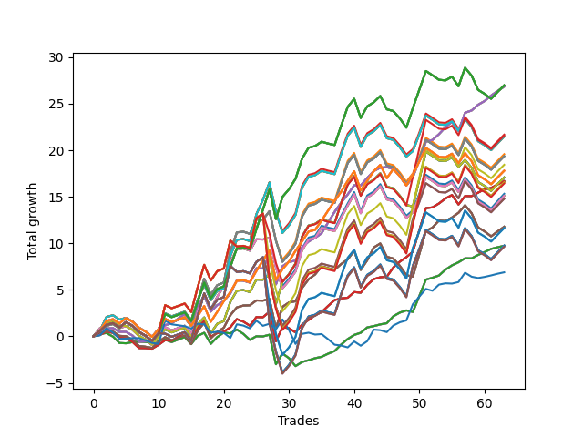

# Short Shepard 007 
- Symbol: SPY_Unlimited
- Date Range: 03/23/2022 - 07/08/2022
- Trading Period: 7:20-12:30
- Number of Trades: 63



| Name | Win Percent | Profit | Avg Profit / Trade | Avg Time / Trade |      | Name | Win Percent | Profit | Avg Profit / Trade | Avg Time / Trade |
| ---- | ----------- | ------ | ------------------ | ---------------- | ---- | ---- | ----------- | ------ | ------------------ | ---------------- |
| Sorted By <br> Profit | | | | | | Sorted By <br> Win Percentage ||||
| One Hundred Twenty-Seven | 60.32 | 13490.00 | 214.13 | 25:24 |     | Sixty-Six | 74.60 | 13415.00 | 212.94 | 15:19 |
| One Hundred Twenty-Two | 60.32 | 13490.00 | 214.13 | 25:24 |     | Fifty-Eight | 74.60 | 13415.00 | 212.94 | 15:19 |
| One Hundred Seventeen | 60.32 | 13490.00 | 214.13 | 25:24 |     | Fifty | 74.60 | 13415.00 | 212.94 | 15:19 |
| One Hundred Twelve | 60.32 | 13490.00 | 214.13 | 25:24 |     | Forty-Two | 74.60 | 13415.00 | 212.94 | 15:19 |
| Eighty-Two | 60.32 | 13490.00 | 214.13 | 25:24 |     | Two | 74.60 | 13415.00 | 212.94 | 15:19 |
| Sixty-Six | 74.60 | 13415.00 | 212.94 | 15:19 |     | Sixty-Four | 73.02 | 4865.00 | 77.22 | 05:54 |
| Fifty-Eight | 74.60 | 13415.00 | 212.94 | 15:19 |     | Fifty-Six | 73.02 | 4865.00 | 77.22 | 05:54 |
| Fifty | 74.60 | 13415.00 | 212.94 | 15:19 |     | Forty-Eight | 73.02 | 4865.00 | 77.22 | 05:54 |
| Forty-Two | 74.60 | 13415.00 | 212.94 | 15:19 |     | Forty | 73.02 | 4865.00 | 77.22 | 05:54 |
| Two | 74.60 | 13415.00 | 212.94 | 15:19 |     | Zero | 73.02 | 4865.00 | 77.22 | 05:54 |
| Fifty-Five | 58.73 | 10840.00 | 172.06 | 26:12 |     | Sixty-Five | 69.84 | 8340.00 | 132.38 | 10:55 |
| One Hundred Eighteen | 55.56 | 10790.00 | 171.27 | 27:45 |     | Fifty-Seven | 69.84 | 8340.00 | 132.38 | 10:55 |
| Seventy-One | 58.73 | 10730.00 | 170.32 | 26:12 |     | Forty-Nine | 69.84 | 8340.00 | 132.38 | 10:55 |
| Sixty-Three | 58.73 | 10730.00 | 170.32 | 26:12 |     | Forty-One | 69.84 | 8340.00 | 132.38 | 10:55 |
| Forty-Seven | 58.73 | 10730.00 | 170.32 | 26:12 |     | One | 69.84 | 8340.00 | 132.38 | 10:55 |
| Seven | 58.73 | 10730.00 | 170.32 | 26:12 |     | One Hundred Twenty-Six | 65.08 | 8900.00 | 141.27 | 20:56 |
| Fifty-Three | 57.14 | 9790.00 | 155.40 | 26:02 |     | One Hundred Twenty-One | 65.08 | 8900.00 | 141.27 | 20:56 |
| Sixty-Nine | 57.14 | 9680.00 | 153.65 | 26:02 |     | One Hundred Sixteen | 65.08 | 8900.00 | 141.27 | 20:56 |
| Sixty-One | 57.14 | 9680.00 | 153.65 | 26:02 |     | One Hundred Eleven | 65.08 | 8900.00 | 141.27 | 20:56 |
| Forty-Five | 57.14 | 9680.00 | 153.65 | 26:02 |     | Eighty-One | 65.08 | 8900.00 | 141.27 | 20:56 |
| Five | 57.14 | 9680.00 | 153.65 | 26:02 |     | Sixty-Seven | 61.90 | 5890.00 | 93.49 | 19:35 |
| One Hundred Thirteen | 55.56 | 9220.00 | 146.35 | 27:49 |     | Fifty-Nine | 61.90 | 5890.00 | 93.49 | 19:35 |
| One Hundred Twenty-Six | 65.08 | 8900.00 | 141.27 | 20:56 |     | Fifty-One | 61.90 | 5890.00 | 93.49 | 19:35 |
| One Hundred Twenty-One | 65.08 | 8900.00 | 141.27 | 20:56 |     | Forty-Three | 61.90 | 5890.00 | 93.49 | 19:35 |
| One Hundred Sixteen | 65.08 | 8900.00 | 141.27 | 20:56 |     | Three | 61.90 | 5890.00 | 93.49 | 19:35 |
| One Hundred Eleven | 65.08 | 8900.00 | 141.27 | 20:56 |     | One Hundred Twenty-Seven | 60.32 | 13490.00 | 214.13 | 25:24 |
| Eighty-One | 65.08 | 8900.00 | 141.27 | 20:56 |     | One Hundred Twenty-Two | 60.32 | 13490.00 | 214.13 | 25:24 |
| Seventy | 55.56 | 8540.00 | 135.56 | 23:13 |     | One Hundred Seventeen | 60.32 | 13490.00 | 214.13 | 25:24 |
| Sixty-Two | 55.56 | 8540.00 | 135.56 | 23:13 |     | One Hundred Twelve | 60.32 | 13490.00 | 214.13 | 25:24 |
| Fifty-Four | 55.56 | 8540.00 | 135.56 | 23:13 |     | Eighty-Two | 60.32 | 13490.00 | 214.13 | 25:24 |
| Forty-Six | 55.56 | 8540.00 | 135.56 | 23:13 |     | Fifty-Five | 58.73 | 10840.00 | 172.06 | 26:12 |
| Six | 55.56 | 8540.00 | 135.56 | 23:13 |     | Seventy-One | 58.73 | 10730.00 | 170.32 | 26:12 |
| Sixty-Five | 69.84 | 8340.00 | 132.38 | 10:55 |     | Sixty-Three | 58.73 | 10730.00 | 170.32 | 26:12 |
| Fifty-Seven | 69.84 | 8340.00 | 132.38 | 10:55 |     | Forty-Seven | 58.73 | 10730.00 | 170.32 | 26:12 |
| Forty-Nine | 69.84 | 8340.00 | 132.38 | 10:55 |     | Seven | 58.73 | 10730.00 | 170.32 | 26:12 |
| Forty-One | 69.84 | 8340.00 | 132.38 | 10:55 |     | Fifty-Three | 57.14 | 9790.00 | 155.40 | 26:02 |
| One | 69.84 | 8340.00 | 132.38 | 10:55 |     | Sixty-Nine | 57.14 | 9680.00 | 153.65 | 26:02 |
| One Hundred Twenty-Three | 55.56 | 8275.00 | 131.35 | 28:02 |     | Sixty-One | 57.14 | 9680.00 | 153.65 | 26:02 |
| Eighty-Three | 55.56 | 8275.00 | 131.35 | 28:02 |     | Forty-Five | 57.14 | 9680.00 | 153.65 | 26:02 |
| One Hundred Twenty-Eight | 55.56 | 8215.00 | 130.40 | 27:58 |     | Five | 57.14 | 9680.00 | 153.65 | 26:02 |
| Fifty-Two | 57.14 | 7660.00 | 121.59 | 23:43 |     | Fifty-Two | 57.14 | 7660.00 | 121.59 | 23:43 |
| Sixty-Eight | 57.14 | 7550.00 | 119.84 | 23:43 |     | Sixty-Eight | 57.14 | 7550.00 | 119.84 | 23:43 |
| Sixty | 57.14 | 7550.00 | 119.84 | 23:43 |     | Sixty | 57.14 | 7550.00 | 119.84 | 23:43 |
| Forty-Four | 57.14 | 7550.00 | 119.84 | 23:43 |     | Forty-Four | 57.14 | 7550.00 | 119.84 | 23:43 |
| Four | 57.14 | 7550.00 | 119.84 | 23:43 |     | Four | 57.14 | 7550.00 | 119.84 | 23:43 |
| One Hundred Twenty | 53.97 | 7390.00 | 117.30 | 29:11 |     | One Hundred Eighteen | 55.56 | 10790.00 | 171.27 | 27:45 |
| One Hundred Ninteen | 53.97 | 7390.00 | 117.30 | 29:11 |     | One Hundred Thirteen | 55.56 | 9220.00 | 146.35 | 27:49 |
| Sixty-Seven | 61.90 | 5890.00 | 93.49 | 19:35 |     | Seventy | 55.56 | 8540.00 | 135.56 | 23:13 |
| Fifty-Nine | 61.90 | 5890.00 | 93.49 | 19:35 |     | Sixty-Two | 55.56 | 8540.00 | 135.56 | 23:13 |
| Fifty-One | 61.90 | 5890.00 | 93.49 | 19:35 |     | Fifty-Four | 55.56 | 8540.00 | 135.56 | 23:13 |
| Forty-Three | 61.90 | 5890.00 | 93.49 | 19:35 |     | Forty-Six | 55.56 | 8540.00 | 135.56 | 23:13 |
| Three | 61.90 | 5890.00 | 93.49 | 19:35 |     | Six | 55.56 | 8540.00 | 135.56 | 23:13 |
| One Hundred Fifteen | 53.97 | 5820.00 | 92.38 | 29:14 |     | One Hundred Twenty-Three | 55.56 | 8275.00 | 131.35 | 28:02 |
| One Hundred Fourteen | 53.97 | 5820.00 | 92.38 | 29:14 |     | Eighty-Three | 55.56 | 8275.00 | 131.35 | 28:02 |
| One Hundred Twenty-Five | 53.97 | 4875.00 | 77.38 | 29:27 |     | One Hundred Twenty-Eight | 55.56 | 8215.00 | 130.40 | 27:58 |
| One Hundred Twenty-Four | 53.97 | 4875.00 | 77.38 | 29:27 |     | One Hundred Twenty | 53.97 | 7390.00 | 117.30 | 29:11 |
| Eighty-Five | 53.97 | 4875.00 | 77.38 | 29:27 |     | One Hundred Ninteen | 53.97 | 7390.00 | 117.30 | 29:11 |
| Eighty-Four | 53.97 | 4875.00 | 77.38 | 29:27 |     | One Hundred Fifteen | 53.97 | 5820.00 | 92.38 | 29:14 |
| Sixty-Four | 73.02 | 4865.00 | 77.22 | 05:54 |     | One Hundred Fourteen | 53.97 | 5820.00 | 92.38 | 29:14 |
| Fifty-Six | 73.02 | 4865.00 | 77.22 | 05:54 |     | One Hundred Twenty-Five | 53.97 | 4875.00 | 77.38 | 29:27 |
| Forty-Eight | 73.02 | 4865.00 | 77.22 | 05:54 |     | One Hundred Twenty-Four | 53.97 | 4875.00 | 77.38 | 29:27 |
| Forty | 73.02 | 4865.00 | 77.22 | 05:54 |     | Eighty-Five | 53.97 | 4875.00 | 77.38 | 29:27 |
| Zero | 73.02 | 4865.00 | 77.22 | 05:54 |     | Eighty-Four | 53.97 | 4875.00 | 77.38 | 29:27 |
| One Hundred Thirty | 53.97 | 4815.00 | 76.43 | 29:23 |     | One Hundred Thirty | 53.97 | 4815.00 | 76.43 | 29:23 |
| One Hundred Twenty-Nine | 53.97 | 4815.00 | 76.43 | 29:23 |     | One Hundred Twenty-Nine | 53.97 | 4815.00 | 76.43 | 29:23 |
| Seventy-Three | 49.21 | 3440.00 | 54.60 | 07:14 |     | Seventy-Three | 49.21 | 3440.00 | 54.60 | 07:14 |

## NO STOPLOSS

### Test Zero
* Sell when price hits the middle line of the 20p bollinger
* No Stoploss
* Results:
```
Total Trades: 63
Percent Up: 26.98
Percent Down: 73.02
Total Points Moved Down: 9.73
Potential Profit: 4865.00
Total Points Ups: 9.38 Count Ups: 17
Total Points Downs: 19.11 Count Downs: 46
```

<details><summary>Trades</summary>

<code>In: 2022-03-23 07:21:00		Out: 2022-03-23 07:26:50		Total Position Time: 05:50		Total Move Down: 0.27		Total to Date: 0.27</code> <br />
<code>In: 2022-03-23 09:05:00		Out: 2022-03-23 09:05:25		Total Position Time: 00:25		Total Move Down: 0.08		Total to Date: 0.35</code> <br />
<code>In: 2022-03-24 08:35:00		Out: 2022-03-24 08:50:00		Total Position Time: 15:00		Total Move Down: -0.38		Total to Date: -0.03</code> <br />
<code>In: 2022-03-25 07:29:00		Out: 2022-03-25 07:51:05		Total Position Time: 22:05		Total Move Down: -0.69		Total to Date: -0.72</code> <br />
<code>In: 2022-03-28 08:03:00		Out: 2022-03-28 08:03:10		Total Position Time: 00:10		Total Move Down: -0.03		Total to Date: -0.75</code> <br />
<code>In: 2022-03-28 12:01:00		Out: 2022-03-28 12:08:05		Total Position Time: 07:05		Total Move Down: 0.13		Total to Date: -0.62</code> <br />
<code>In: 2022-03-28 12:02:00		Out: 2022-03-28 12:08:05		Total Position Time: 06:05		Total Move Down: 0.06		Total to Date: -0.56</code> <br />
<code>In: 2022-03-29 12:15:00		Out: 2022-03-29 12:24:50		Total Position Time: 09:50		Total Move Down: -0.04		Total to Date: -0.60</code> <br />
<code>In: 2022-03-29 12:16:00		Out: 2022-03-29 12:24:50		Total Position Time: 08:50		Total Move Down: -0.09		Total to Date: -0.69</code> <br />
<code>In: 2022-03-31 08:00:00		Out: 2022-03-31 08:03:05		Total Position Time: 03:05		Total Move Down: 0.28		Total to Date: -0.41</code> <br />
<code>In: 2022-04-06 11:06:00		Out: 2022-04-06 11:06:10		Total Position Time: 00:10		Total Move Down: 0.05		Total to Date: -0.36</code> <br />
<code>In: 2022-04-07 12:08:00		Out: 2022-04-07 12:19:10		Total Position Time: 11:10		Total Move Down: -0.26		Total to Date: -0.62</code> <br />
<code>In: 2022-04-08 08:05:00		Out: 2022-04-08 08:15:35		Total Position Time: 10:35		Total Move Down: 0.27		Total to Date: -0.35</code> <br />
<code>In: 2022-04-08 08:05:00		Out: 2022-04-08 08:15:35		Total Position Time: 10:35		Total Move Down: 0.27		Total to Date: -0.08</code> <br />
<code>In: 2022-04-13 08:13:00		Out: 2022-04-13 08:37:20		Total Position Time: 24:20		Total Move Down: -0.76		Total to Date: -0.84</code> <br />
<code>In: 2022-04-25 07:39:00		Out: 2022-04-25 07:40:25		Total Position Time: 01:25		Total Move Down: 0.89		Total to Date: 0.05</code> <br />
<code>In: 2022-04-25 07:40:00		Out: 2022-04-25 07:40:25		Total Position Time: 00:25		Total Move Down: 0.33		Total to Date: 0.38</code> <br />
<code>In: 2022-04-25 12:28:00		Out: 2022-04-25 12:42:35		Total Position Time: 14:35		Total Move Down: -1.19		Total to Date: -0.81</code> <br />
<code>In: 2022-04-27 09:33:00		Out: 2022-04-27 09:37:00		Total Position Time: 04:00		Total Move Down: 0.73		Total to Date: -0.08</code> <br />
<code>In: 2022-04-27 09:34:00		Out: 2022-04-27 09:37:00		Total Position Time: 03:00		Total Move Down: 0.49		Total to Date: 0.41</code> <br />
<code>In: 2022-05-02 07:36:00		Out: 2022-05-02 07:44:10		Total Position Time: 08:10		Total Move Down: -0.10		Total to Date: 0.31</code> <br />
<code>In: 2022-05-03 07:37:00		Out: 2022-05-03 07:38:00		Total Position Time: 01:00		Total Move Down: 0.42		Total to Date: 0.73</code> <br />
<code>In: 2022-05-03 08:17:00		Out: 2022-05-03 08:35:55		Total Position Time: 18:55		Total Move Down: -0.47		Total to Date: 0.26</code> <br />
<code>In: 2022-05-03 08:18:00		Out: 2022-05-03 08:35:55		Total Position Time: 17:55		Total Move Down: -0.64		Total to Date: -0.38</code> <br />
<code>In: 2022-05-04 11:07:00		Out: 2022-05-04 11:07:10		Total Position Time: 00:10		Total Move Down: 0.39		Total to Date: 0.01</code> <br />
<code>In: 2022-05-04 11:08:00		Out: 2022-05-04 11:08:10		Total Position Time: 00:10		Total Move Down: -0.02		Total to Date: -0.01</code> <br />
<code>In: 2022-05-04 11:31:00		Out: 2022-05-04 11:31:10		Total Position Time: 00:10		Total Move Down: 0.18		Total to Date: 0.17</code> <br />
<code>In: 2022-05-04 11:59:00		Out: 2022-05-04 12:28:55		Total Position Time: 29:55		Total Move Down: -3.17		Total to Date: -3.00</code> <br />
<code>In: 2022-05-06 07:28:00		Out: 2022-05-06 07:30:00		Total Position Time: 02:00		Total Move Down: 1.16		Total to Date: -1.84</code> <br />
<code>In: 2022-05-12 08:01:00		Out: 2022-05-12 08:15:00		Total Position Time: 14:00		Total Move Down: -0.51		Total to Date: -2.35</code> <br />
<code>In: 2022-05-12 08:02:00		Out: 2022-05-12 08:15:00		Total Position Time: 13:00		Total Move Down: -0.85		Total to Date: -3.20</code> <br />
<code>In: 2022-05-12 08:13:00		Out: 2022-05-12 08:15:00		Total Position Time: 02:00		Total Move Down: 0.44		Total to Date: -2.76</code> <br />
<code>In: 2022-05-16 08:57:00		Out: 2022-05-16 09:05:45		Total Position Time: 08:45		Total Move Down: 0.19		Total to Date: -2.57</code> <br />
<code>In: 2022-05-16 10:34:00		Out: 2022-05-16 10:42:15		Total Position Time: 08:15		Total Move Down: 0.22		Total to Date: -2.35</code> <br />
<code>In: 2022-05-16 11:36:00		Out: 2022-05-16 11:41:45		Total Position Time: 05:45		Total Move Down: 0.15		Total to Date: -2.20</code> <br />
<code>In: 2022-05-19 08:46:00		Out: 2022-05-19 08:53:40		Total Position Time: 07:40		Total Move Down: 0.33		Total to Date: -1.87</code> <br />
<code>In: 2022-05-19 08:47:00		Out: 2022-05-19 08:53:40		Total Position Time: 06:40		Total Move Down: 0.29		Total to Date: -1.58</code> <br />
<code>In: 2022-05-19 11:56:00		Out: 2022-05-19 11:57:50		Total Position Time: 01:50		Total Move Down: 0.70		Total to Date: -0.88</code> <br />
<code>In: 2022-05-19 11:57:00		Out: 2022-05-19 11:57:50		Total Position Time: 00:50		Total Move Down: 0.59		Total to Date: -0.29</code> <br />
<code>In: 2022-05-25 07:41:00		Out: 2022-05-25 07:42:00		Total Position Time: 01:00		Total Move Down: 0.44		Total to Date: 0.15</code> <br />
<code>In: 2022-05-25 11:33:00		Out: 2022-05-25 11:39:10		Total Position Time: 06:10		Total Move Down: 0.23		Total to Date: 0.38</code> <br />
<code>In: 2022-05-25 12:15:00		Out: 2022-05-25 12:17:30		Total Position Time: 02:30		Total Move Down: 0.58		Total to Date: 0.96</code> <br />
<code>In: 2022-05-31 09:07:00		Out: 2022-05-31 09:13:05		Total Position Time: 06:05		Total Move Down: 0.14		Total to Date: 1.10</code> <br />
<code>In: 2022-05-31 11:04:00		Out: 2022-05-31 11:05:10		Total Position Time: 01:10		Total Move Down: 0.18		Total to Date: 1.28</code> <br />
<code>In: 2022-06-02 08:18:00		Out: 2022-06-02 08:22:05		Total Position Time: 04:05		Total Move Down: 0.13		Total to Date: 1.41</code> <br />
<code>In: 2022-06-02 08:54:00		Out: 2022-06-02 08:57:05		Total Position Time: 03:05		Total Move Down: 0.75		Total to Date: 2.16</code> <br />
<code>In: 2022-06-02 08:55:00		Out: 2022-06-02 08:57:05		Total Position Time: 02:05		Total Move Down: 0.39		Total to Date: 2.55</code> <br />
<code>In: 2022-06-02 08:56:00		Out: 2022-06-02 08:57:05		Total Position Time: 01:05		Total Move Down: 0.24		Total to Date: 2.79</code> <br />
<code>In: 2022-06-15 11:02:00		Out: 2022-06-15 11:02:10		Total Position Time: 00:10		Total Move Down: -0.17		Total to Date: 2.62</code> <br />
<code>In: 2022-06-15 11:48:00		Out: 2022-06-15 11:53:25		Total Position Time: 05:25		Total Move Down: 1.74		Total to Date: 4.36</code> <br />
<code>In: 2022-06-15 11:49:00		Out: 2022-06-15 11:53:25		Total Position Time: 04:25		Total Move Down: 1.74		Total to Date: 6.10</code> <br />
<code>In: 2022-06-23 07:51:00		Out: 2022-06-23 07:51:10		Total Position Time: 00:10		Total Move Down: 0.20		Total to Date: 6.30</code> <br />
<code>In: 2022-06-27 08:00:00		Out: 2022-06-27 08:02:15		Total Position Time: 02:15		Total Move Down: 0.24		Total to Date: 6.54</code> <br />
<code>In: 2022-06-30 09:35:00		Out: 2022-06-30 09:38:05		Total Position Time: 03:05		Total Move Down: 0.63		Total to Date: 7.17</code> <br />
<code>In: 2022-06-30 09:36:00		Out: 2022-06-30 09:38:05		Total Position Time: 02:05		Total Move Down: 0.46		Total to Date: 7.63</code> <br />
<code>In: 2022-07-01 12:18:00		Out: 2022-07-01 12:20:55		Total Position Time: 02:55		Total Move Down: 0.33		Total to Date: 7.96</code> <br />
<code>In: 2022-07-05 07:44:00		Out: 2022-07-05 07:44:30		Total Position Time: 00:30		Total Move Down: 0.43		Total to Date: 8.39</code> <br />
<code>In: 2022-07-05 08:53:00		Out: 2022-07-05 09:00:10		Total Position Time: 07:10		Total Move Down: -0.01		Total to Date: 8.38</code> <br />
<code>In: 2022-07-05 08:58:00		Out: 2022-07-05 09:00:10		Total Position Time: 02:10		Total Move Down: 0.37		Total to Date: 8.75</code> <br />
<code>In: 2022-07-05 11:43:00		Out: 2022-07-05 11:48:10		Total Position Time: 05:10		Total Move Down: 0.31		Total to Date: 9.06</code> <br />
<code>In: 2022-07-06 11:48:00		Out: 2022-07-06 11:50:00		Total Position Time: 02:00		Total Move Down: 0.34		Total to Date: 9.40</code> <br />
<code>In: 2022-07-07 12:23:00		Out: 2022-07-07 12:24:15		Total Position Time: 01:15		Total Move Down: 0.18		Total to Date: 9.58</code> <br />
<code>In: 2022-07-07 12:24:00		Out: 2022-07-07 12:24:15		Total Position Time: 00:15		Total Move Down: 0.15		Total to Date: 9.73</code> <br />


</details>

### Test One
* Sell when the price hits the upper line of the 20p 1std bollinger
* No Stoploss
* Results:
```
Total Trades: 63
Percent Up: 30.16
Percent Down: 69.84
Total Points Moved Down: 16.68
Potential Profit: 8340.00
Total Points Ups: 9.82 Count Ups: 19
Total Points Downs: 26.50 Count Downs: 44
```

<details><summary>Trades</summary>

<code>In: 2022-03-23 07:21:00		Out: 2022-03-23 07:42:15		Total Position Time: 21:15		Total Move Down: 0.15		Total to Date: 0.15</code> <br />
<code>In: 2022-03-23 09:05:00		Out: 2022-03-23 09:06:10		Total Position Time: 01:10		Total Move Down: 0.35		Total to Date: 0.50</code> <br />
<code>In: 2022-03-24 08:35:00		Out: 2022-03-24 08:53:50		Total Position Time: 18:50		Total Move Down: -0.12		Total to Date: 0.38</code> <br />
<code>In: 2022-03-25 07:29:00		Out: 2022-03-25 07:53:50		Total Position Time: 24:50		Total Move Down: -0.55		Total to Date: -0.17</code> <br />
<code>In: 2022-03-28 08:03:00		Out: 2022-03-28 08:03:10		Total Position Time: 00:10		Total Move Down: -0.03		Total to Date: -0.20</code> <br />
<code>In: 2022-03-28 12:01:00		Out: 2022-03-28 12:30:55		Total Position Time: 29:55		Total Move Down: -0.40		Total to Date: -0.60</code> <br />
<code>In: 2022-03-28 12:02:00		Out: 2022-03-28 12:31:55		Total Position Time: 29:55		Total Move Down: -0.66		Total to Date: -1.26</code> <br />
<code>In: 2022-03-29 12:15:00		Out: 2022-03-29 12:27:35		Total Position Time: 12:35		Total Move Down: -0.01		Total to Date: -1.27</code> <br />
<code>In: 2022-03-29 12:16:00		Out: 2022-03-29 12:27:35		Total Position Time: 11:35		Total Move Down: -0.06		Total to Date: -1.33</code> <br />
<code>In: 2022-03-31 08:00:00		Out: 2022-03-31 08:08:00		Total Position Time: 08:00		Total Move Down: 0.42		Total to Date: -0.91</code> <br />
<code>In: 2022-04-06 11:06:00		Out: 2022-04-06 11:07:20		Total Position Time: 01:20		Total Move Down: 0.50		Total to Date: -0.41</code> <br />
<code>In: 2022-04-07 12:08:00		Out: 2022-04-07 12:20:35		Total Position Time: 12:35		Total Move Down: -0.09		Total to Date: -0.50</code> <br />
<code>In: 2022-04-08 08:05:00		Out: 2022-04-08 08:17:05		Total Position Time: 12:05		Total Move Down: 0.46		Total to Date: -0.04</code> <br />
<code>In: 2022-04-08 08:05:00		Out: 2022-04-08 08:17:05		Total Position Time: 12:05		Total Move Down: 0.46		Total to Date: 0.42</code> <br />
<code>In: 2022-04-13 08:13:00		Out: 2022-04-13 08:41:35		Total Position Time: 28:35		Total Move Down: -0.65		Total to Date: -0.23</code> <br />
<code>In: 2022-04-25 07:39:00		Out: 2022-04-25 07:43:05		Total Position Time: 04:05		Total Move Down: 1.22		Total to Date: 0.99</code> <br />
<code>In: 2022-04-25 07:40:00		Out: 2022-04-25 07:43:05		Total Position Time: 03:05		Total Move Down: 0.66		Total to Date: 1.65</code> <br />
<code>In: 2022-04-25 12:28:00		Out: 2022-04-25 12:46:00		Total Position Time: 18:00		Total Move Down: -1.69		Total to Date: -0.04</code> <br />
<code>In: 2022-04-27 09:33:00		Out: 2022-04-27 09:50:25		Total Position Time: 17:25		Total Move Down: 0.39		Total to Date: 0.35</code> <br />
<code>In: 2022-04-27 09:34:00		Out: 2022-04-27 09:50:25		Total Position Time: 16:25		Total Move Down: 0.15		Total to Date: 0.50</code> <br />
<code>In: 2022-05-02 07:36:00		Out: 2022-05-02 07:44:50		Total Position Time: 08:50		Total Move Down: 0.47		Total to Date: 0.97</code> <br />
<code>In: 2022-05-03 07:37:00		Out: 2022-05-03 07:40:55		Total Position Time: 03:55		Total Move Down: 0.88		Total to Date: 1.85</code> <br />
<code>In: 2022-05-03 08:17:00		Out: 2022-05-03 08:38:05		Total Position Time: 21:05		Total Move Down: -0.27		Total to Date: 1.58</code> <br />
<code>In: 2022-05-03 08:18:00		Out: 2022-05-03 08:38:05		Total Position Time: 20:05		Total Move Down: -0.44		Total to Date: 1.14</code> <br />
<code>In: 2022-05-04 11:07:00		Out: 2022-05-04 11:07:20		Total Position Time: 00:20		Total Move Down: 0.93		Total to Date: 2.07</code> <br />
<code>In: 2022-05-04 11:08:00		Out: 2022-05-04 11:08:10		Total Position Time: 00:10		Total Move Down: -0.02		Total to Date: 2.05</code> <br />
<code>In: 2022-05-04 11:31:00		Out: 2022-05-04 11:31:20		Total Position Time: 00:20		Total Move Down: 0.59		Total to Date: 2.64</code> <br />
<code>In: 2022-05-04 11:59:00		Out: 2022-05-04 12:28:55		Total Position Time: 29:55		Total Move Down: -3.17		Total to Date: -0.53</code> <br />
<code>In: 2022-05-06 07:28:00		Out: 2022-05-06 07:34:10		Total Position Time: 06:10		Total Move Down: 1.51		Total to Date: 0.98</code> <br />
<code>In: 2022-05-12 08:01:00		Out: 2022-05-12 08:17:30		Total Position Time: 16:30		Total Move Down: -0.11		Total to Date: 0.87</code> <br />
<code>In: 2022-05-12 08:02:00		Out: 2022-05-12 08:17:30		Total Position Time: 15:30		Total Move Down: -0.45		Total to Date: 0.42</code> <br />
<code>In: 2022-05-12 08:13:00		Out: 2022-05-12 08:17:30		Total Position Time: 04:30		Total Move Down: 0.84		Total to Date: 1.26</code> <br />
<code>In: 2022-05-16 08:57:00		Out: 2022-05-16 09:06:15		Total Position Time: 09:15		Total Move Down: 0.50		Total to Date: 1.76</code> <br />
<code>In: 2022-05-16 10:34:00		Out: 2022-05-16 10:42:35		Total Position Time: 08:35		Total Move Down: 0.51		Total to Date: 2.27</code> <br />
<code>In: 2022-05-16 11:36:00		Out: 2022-05-16 11:44:50		Total Position Time: 08:50		Total Move Down: 0.33		Total to Date: 2.60</code> <br />
<code>In: 2022-05-19 08:46:00		Out: 2022-05-19 08:54:45		Total Position Time: 08:45		Total Move Down: 0.67		Total to Date: 3.27</code> <br />
<code>In: 2022-05-19 08:47:00		Out: 2022-05-19 08:54:45		Total Position Time: 07:45		Total Move Down: 0.63		Total to Date: 3.90</code> <br />
<code>In: 2022-05-19 11:56:00		Out: 2022-05-19 12:10:10		Total Position Time: 14:10		Total Move Down: 0.18		Total to Date: 4.08</code> <br />
<code>In: 2022-05-19 11:57:00		Out: 2022-05-19 12:10:10		Total Position Time: 13:10		Total Move Down: 0.07		Total to Date: 4.15</code> <br />
<code>In: 2022-05-25 07:41:00		Out: 2022-05-25 07:46:40		Total Position Time: 05:40		Total Move Down: 0.61		Total to Date: 4.76</code> <br />
<code>In: 2022-05-25 11:33:00		Out: 2022-05-25 11:45:15		Total Position Time: 12:15		Total Move Down: -0.07		Total to Date: 4.69</code> <br />
<code>In: 2022-05-25 12:15:00		Out: 2022-05-25 12:20:25		Total Position Time: 05:25		Total Move Down: 0.84		Total to Date: 5.53</code> <br />
<code>In: 2022-05-31 09:07:00		Out: 2022-05-31 09:14:40		Total Position Time: 07:40		Total Move Down: 0.62		Total to Date: 6.15</code> <br />
<code>In: 2022-05-31 11:04:00		Out: 2022-05-31 11:13:25		Total Position Time: 09:25		Total Move Down: 0.20		Total to Date: 6.35</code> <br />
<code>In: 2022-06-02 08:18:00		Out: 2022-06-02 08:28:15		Total Position Time: 10:15		Total Move Down: 0.06		Total to Date: 6.41</code> <br />
<code>In: 2022-06-02 08:54:00		Out: 2022-06-02 09:01:05		Total Position Time: 07:05		Total Move Down: 0.99		Total to Date: 7.40</code> <br />
<code>In: 2022-06-02 08:55:00		Out: 2022-06-02 09:01:05		Total Position Time: 06:05		Total Move Down: 0.63		Total to Date: 8.03</code> <br />
<code>In: 2022-06-02 08:56:00		Out: 2022-06-02 09:01:05		Total Position Time: 05:05		Total Move Down: 0.48		Total to Date: 8.51</code> <br />
<code>In: 2022-06-15 11:02:00		Out: 2022-06-15 11:03:05		Total Position Time: 01:05		Total Move Down: 0.59		Total to Date: 9.10</code> <br />
<code>In: 2022-06-15 11:48:00		Out: 2022-06-15 11:57:45		Total Position Time: 09:45		Total Move Down: 2.34		Total to Date: 11.44</code> <br />
<code>In: 2022-06-15 11:49:00		Out: 2022-06-15 11:57:45		Total Position Time: 08:45		Total Move Down: 2.34		Total to Date: 13.78</code> <br />
<code>In: 2022-06-23 07:51:00		Out: 2022-06-23 08:01:10		Total Position Time: 10:10		Total Move Down: 0.08		Total to Date: 13.86</code> <br />
<code>In: 2022-06-27 08:00:00		Out: 2022-06-27 08:07:15		Total Position Time: 07:15		Total Move Down: 0.42		Total to Date: 14.28</code> <br />
<code>In: 2022-06-30 09:35:00		Out: 2022-06-30 09:49:55		Total Position Time: 14:55		Total Move Down: 0.54		Total to Date: 14.82</code> <br />
<code>In: 2022-06-30 09:36:00		Out: 2022-06-30 09:49:55		Total Position Time: 13:55		Total Move Down: 0.37		Total to Date: 15.19</code> <br />
<code>In: 2022-07-01 12:18:00		Out: 2022-07-01 12:46:00		Total Position Time: 28:00		Total Move Down: -1.02		Total to Date: 14.17</code> <br />
<code>In: 2022-07-05 07:44:00		Out: 2022-07-05 07:45:55		Total Position Time: 01:55		Total Move Down: 0.91		Total to Date: 15.08</code> <br />
<code>In: 2022-07-05 08:53:00		Out: 2022-07-05 09:03:25		Total Position Time: 10:25		Total Move Down: -0.01		Total to Date: 15.07</code> <br />
<code>In: 2022-07-05 08:58:00		Out: 2022-07-05 09:03:25		Total Position Time: 05:25		Total Move Down: 0.37		Total to Date: 15.44</code> <br />
<code>In: 2022-07-05 11:43:00		Out: 2022-07-05 11:52:50		Total Position Time: 09:50		Total Move Down: 0.37		Total to Date: 15.81</code> <br />
<code>In: 2022-07-06 11:48:00		Out: 2022-07-06 12:00:30		Total Position Time: 12:30		Total Move Down: 0.14		Total to Date: 15.95</code> <br />
<code>In: 2022-07-07 12:23:00		Out: 2022-07-07 12:25:10		Total Position Time: 02:10		Total Move Down: 0.38		Total to Date: 16.33</code> <br />
<code>In: 2022-07-07 12:24:00		Out: 2022-07-07 12:25:10		Total Position Time: 01:10		Total Move Down: 0.35		Total to Date: 16.68</code> <br />


</details>

### Test Two
* Sell when the price hits the upper line of the 20p 2std bollinger
* No Stoploss
* Results:
```
Total Trades: 63
Percent Up: 25.40
Percent Down: 74.60
Total Points Moved Down: 26.83
Potential Profit: 13415.00
Total Points Ups: 10.51 Count Ups: 16
Total Points Downs: 37.34 Count Downs: 47
```

<details><summary>Trades</summary>

<code>In: 2022-03-23 07:21:00		Out: 2022-03-23 07:42:35		Total Position Time: 21:35		Total Move Down: 0.27		Total to Date: 0.27</code> <br />
<code>In: 2022-03-23 09:05:00		Out: 2022-03-23 09:06:25		Total Position Time: 01:25		Total Move Down: 0.57		Total to Date: 0.84</code> <br />
<code>In: 2022-03-24 08:35:00		Out: 2022-03-24 09:03:10		Total Position Time: 28:10		Total Move Down: 0.04		Total to Date: 0.88</code> <br />
<code>In: 2022-03-25 07:29:00		Out: 2022-03-25 07:54:10		Total Position Time: 25:10		Total Move Down: -0.40		Total to Date: 0.48</code> <br />
<code>In: 2022-03-28 08:03:00		Out: 2022-03-28 08:03:45		Total Position Time: 00:45		Total Move Down: -0.00		Total to Date: 0.48</code> <br />
<code>In: 2022-03-28 12:01:00		Out: 2022-03-28 12:30:55		Total Position Time: 29:55		Total Move Down: -0.40		Total to Date: 0.08</code> <br />
<code>In: 2022-03-28 12:02:00		Out: 2022-03-28 12:31:55		Total Position Time: 29:55		Total Move Down: -0.66		Total to Date: -0.58</code> <br />
<code>In: 2022-03-29 12:15:00		Out: 2022-03-29 12:27:50		Total Position Time: 12:50		Total Move Down: 0.04		Total to Date: -0.54</code> <br />
<code>In: 2022-03-29 12:16:00		Out: 2022-03-29 12:27:50		Total Position Time: 11:50		Total Move Down: -0.01		Total to Date: -0.55</code> <br />
<code>In: 2022-03-31 08:00:00		Out: 2022-03-31 08:08:30		Total Position Time: 08:30		Total Move Down: 0.64		Total to Date: 0.09</code> <br />
<code>In: 2022-04-06 11:06:00		Out: 2022-04-06 11:08:10		Total Position Time: 02:10		Total Move Down: 1.11		Total to Date: 1.20</code> <br />
<code>In: 2022-04-07 12:08:00		Out: 2022-04-07 12:21:20		Total Position Time: 13:20		Total Move Down: 0.20		Total to Date: 1.40</code> <br />
<code>In: 2022-04-08 08:05:00		Out: 2022-04-08 08:20:10		Total Position Time: 15:10		Total Move Down: 0.50		Total to Date: 1.90</code> <br />
<code>In: 2022-04-08 08:05:00		Out: 2022-04-08 08:20:10		Total Position Time: 15:10		Total Move Down: 0.50		Total to Date: 2.40</code> <br />
<code>In: 2022-04-13 08:13:00		Out: 2022-04-13 08:42:55		Total Position Time: 29:55		Total Move Down: -0.91		Total to Date: 1.49</code> <br />
<code>In: 2022-04-25 07:39:00		Out: 2022-04-25 07:52:20		Total Position Time: 13:20		Total Move Down: 1.71		Total to Date: 3.20</code> <br />
<code>In: 2022-04-25 07:40:00		Out: 2022-04-25 07:52:20		Total Position Time: 12:20		Total Move Down: 1.15		Total to Date: 4.35</code> <br />
<code>In: 2022-04-25 12:28:00		Out: 2022-04-25 12:46:00		Total Position Time: 18:00		Total Move Down: -1.69		Total to Date: 2.66</code> <br />
<code>In: 2022-04-27 09:33:00		Out: 2022-04-27 10:00:10		Total Position Time: 27:10		Total Move Down: 0.69		Total to Date: 3.35</code> <br />
<code>In: 2022-04-27 09:34:00		Out: 2022-04-27 10:00:10		Total Position Time: 26:10		Total Move Down: 0.45		Total to Date: 3.80</code> <br />
<code>In: 2022-05-02 07:36:00		Out: 2022-05-02 07:47:15		Total Position Time: 11:15		Total Move Down: 0.80		Total to Date: 4.60</code> <br />
<code>In: 2022-05-03 07:37:00		Out: 2022-05-03 07:43:50		Total Position Time: 06:50		Total Move Down: 1.42		Total to Date: 6.02</code> <br />
<code>In: 2022-05-03 08:17:00		Out: 2022-05-03 08:39:05		Total Position Time: 22:05		Total Move Down: -0.04		Total to Date: 5.98</code> <br />
<code>In: 2022-05-03 08:18:00		Out: 2022-05-03 08:39:05		Total Position Time: 21:05		Total Move Down: -0.21		Total to Date: 5.77</code> <br />
<code>In: 2022-05-04 11:07:00		Out: 2022-05-04 11:07:40		Total Position Time: 00:40		Total Move Down: 1.54		Total to Date: 7.31</code> <br />
<code>In: 2022-05-04 11:08:00		Out: 2022-05-04 11:08:10		Total Position Time: 00:10		Total Move Down: -0.02		Total to Date: 7.29</code> <br />
<code>In: 2022-05-04 11:31:00		Out: 2022-05-04 11:32:25		Total Position Time: 01:25		Total Move Down: 1.47		Total to Date: 8.76</code> <br />
<code>In: 2022-05-04 11:59:00		Out: 2022-05-04 12:28:55		Total Position Time: 29:55		Total Move Down: -3.17		Total to Date: 5.59</code> <br />
<code>In: 2022-05-06 07:28:00		Out: 2022-05-06 07:36:30		Total Position Time: 08:30		Total Move Down: 1.94		Total to Date: 7.53</code> <br />
<code>In: 2022-05-12 08:01:00		Out: 2022-05-12 08:22:05		Total Position Time: 21:05		Total Move Down: 0.47		Total to Date: 8.00</code> <br />
<code>In: 2022-05-12 08:02:00		Out: 2022-05-12 08:22:05		Total Position Time: 20:05		Total Move Down: 0.13		Total to Date: 8.13</code> <br />
<code>In: 2022-05-12 08:13:00		Out: 2022-05-12 08:22:05		Total Position Time: 09:05		Total Move Down: 1.42		Total to Date: 9.55</code> <br />
<code>In: 2022-05-16 08:57:00		Out: 2022-05-16 09:11:35		Total Position Time: 14:35		Total Move Down: 0.64		Total to Date: 10.19</code> <br />
<code>In: 2022-05-16 10:34:00		Out: 2022-05-16 10:46:35		Total Position Time: 12:35		Total Move Down: 0.39		Total to Date: 10.58</code> <br />
<code>In: 2022-05-16 11:36:00		Out: 2022-05-16 11:45:35		Total Position Time: 09:35		Total Move Down: 0.50		Total to Date: 11.08</code> <br />
<code>In: 2022-05-19 08:46:00		Out: 2022-05-19 08:56:05		Total Position Time: 10:05		Total Move Down: 1.17		Total to Date: 12.25</code> <br />
<code>In: 2022-05-19 08:47:00		Out: 2022-05-19 08:56:05		Total Position Time: 09:05		Total Move Down: 1.13		Total to Date: 13.38</code> <br />
<code>In: 2022-05-19 11:56:00		Out: 2022-05-19 12:14:05		Total Position Time: 18:05		Total Move Down: 0.99		Total to Date: 14.37</code> <br />
<code>In: 2022-05-19 11:57:00		Out: 2022-05-19 12:14:05		Total Position Time: 17:05		Total Move Down: 0.88		Total to Date: 15.25</code> <br />
<code>In: 2022-05-25 07:41:00		Out: 2022-05-25 07:48:10		Total Position Time: 07:10		Total Move Down: 0.98		Total to Date: 16.23</code> <br />
<code>In: 2022-05-25 11:33:00		Out: 2022-05-25 11:50:00		Total Position Time: 17:00		Total Move Down: -0.01		Total to Date: 16.22</code> <br />
<code>In: 2022-05-25 12:15:00		Out: 2022-05-25 12:22:50		Total Position Time: 07:50		Total Move Down: 0.81		Total to Date: 17.03</code> <br />
<code>In: 2022-05-31 09:07:00		Out: 2022-05-31 09:15:05		Total Position Time: 08:05		Total Move Down: 0.73		Total to Date: 17.76</code> <br />
<code>In: 2022-05-31 11:04:00		Out: 2022-05-31 11:22:35		Total Position Time: 18:35		Total Move Down: 0.37		Total to Date: 18.13</code> <br />
<code>In: 2022-06-02 08:18:00		Out: 2022-06-02 08:30:55		Total Position Time: 12:55		Total Move Down: 0.05		Total to Date: 18.18</code> <br />
<code>In: 2022-06-02 08:54:00		Out: 2022-06-02 09:23:55		Total Position Time: 29:55		Total Move Down: -0.19		Total to Date: 17.99</code> <br />
<code>In: 2022-06-02 08:55:00		Out: 2022-06-02 09:24:55		Total Position Time: 29:55		Total Move Down: -0.79		Total to Date: 17.20</code> <br />
<code>In: 2022-06-02 08:56:00		Out: 2022-06-02 09:25:55		Total Position Time: 29:55		Total Move Down: -0.99		Total to Date: 16.21</code> <br />
<code>In: 2022-06-15 11:02:00		Out: 2022-06-15 11:03:15		Total Position Time: 01:15		Total Move Down: 0.90		Total to Date: 17.11</code> <br />
<code>In: 2022-06-15 11:48:00		Out: 2022-06-15 12:17:55		Total Position Time: 29:55		Total Move Down: 1.81		Total to Date: 18.92</code> <br />
<code>In: 2022-06-15 11:49:00		Out: 2022-06-15 12:18:55		Total Position Time: 29:55		Total Move Down: 2.01		Total to Date: 20.93</code> <br />
<code>In: 2022-06-23 07:51:00		Out: 2022-06-23 08:04:15		Total Position Time: 13:15		Total Move Down: 0.18		Total to Date: 21.11</code> <br />
<code>In: 2022-06-27 08:00:00		Out: 2022-06-27 08:09:45		Total Position Time: 09:45		Total Move Down: 0.62		Total to Date: 21.73</code> <br />
<code>In: 2022-06-30 09:35:00		Out: 2022-06-30 09:50:50		Total Position Time: 15:50		Total Move Down: 0.75		Total to Date: 22.48</code> <br />
<code>In: 2022-06-30 09:36:00		Out: 2022-06-30 09:50:50		Total Position Time: 14:50		Total Move Down: 0.58		Total to Date: 23.06</code> <br />
<code>In: 2022-07-01 12:18:00		Out: 2022-07-01 12:46:00		Total Position Time: 28:00		Total Move Down: -1.02		Total to Date: 22.04</code> <br />
<code>In: 2022-07-05 07:44:00		Out: 2022-07-05 08:01:10		Total Position Time: 17:10		Total Move Down: 1.99		Total to Date: 24.03</code> <br />
<code>In: 2022-07-05 08:53:00		Out: 2022-07-05 09:03:50		Total Position Time: 10:50		Total Move Down: 0.24		Total to Date: 24.27</code> <br />
<code>In: 2022-07-05 08:58:00		Out: 2022-07-05 09:03:50		Total Position Time: 05:50		Total Move Down: 0.62		Total to Date: 24.89</code> <br />
<code>In: 2022-07-05 11:43:00		Out: 2022-07-05 12:01:20		Total Position Time: 18:20		Total Move Down: 0.40		Total to Date: 25.29</code> <br />
<code>In: 2022-07-06 11:48:00		Out: 2022-07-06 12:01:25		Total Position Time: 13:25		Total Move Down: 0.59		Total to Date: 25.88</code> <br />
<code>In: 2022-07-07 12:23:00		Out: 2022-07-07 12:28:30		Total Position Time: 05:30		Total Move Down: 0.49		Total to Date: 26.37</code> <br />
<code>In: 2022-07-07 12:24:00		Out: 2022-07-07 12:28:30		Total Position Time: 04:30		Total Move Down: 0.46		Total to Date: 26.83</code> <br />


</details>

### Test Three
* Sell when price hits the middle line of the 50p bollinger
* No Stoploss
* Results:
```
Total Trades: 63
Percent Up: 38.10
Percent Down: 61.90
Total Points Moved Down: 11.78
Potential Profit: 5890.00
Total Points Ups: 17.28 Count Ups: 24
Total Points Downs: 29.06 Count Downs: 39
```

<details><summary>Trades</summary>

<code>In: 2022-03-23 07:21:00		Out: 2022-03-23 07:42:45		Total Position Time: 21:45		Total Move Down: 0.40		Total to Date: 0.40</code> <br />
<code>In: 2022-03-23 09:05:00		Out: 2022-03-23 09:05:25		Total Position Time: 00:25		Total Move Down: 0.08		Total to Date: 0.48</code> <br />
<code>In: 2022-03-24 08:35:00		Out: 2022-03-24 09:03:10		Total Position Time: 28:10		Total Move Down: 0.04		Total to Date: 0.52</code> <br />
<code>In: 2022-03-25 07:29:00		Out: 2022-03-25 07:58:55		Total Position Time: 29:55		Total Move Down: -0.47		Total to Date: 0.05</code> <br />
<code>In: 2022-03-28 08:03:00		Out: 2022-03-28 08:03:10		Total Position Time: 00:10		Total Move Down: -0.03		Total to Date: 0.02</code> <br />
<code>In: 2022-03-28 12:01:00		Out: 2022-03-28 12:30:55		Total Position Time: 29:55		Total Move Down: -0.40		Total to Date: -0.38</code> <br />
<code>In: 2022-03-28 12:02:00		Out: 2022-03-28 12:31:55		Total Position Time: 29:55		Total Move Down: -0.66		Total to Date: -1.04</code> <br />
<code>In: 2022-03-29 12:15:00		Out: 2022-03-29 12:43:05		Total Position Time: 28:05		Total Move Down: -0.08		Total to Date: -1.12</code> <br />
<code>In: 2022-03-29 12:16:00		Out: 2022-03-29 12:43:05		Total Position Time: 27:05		Total Move Down: -0.13		Total to Date: -1.25</code> <br />
<code>In: 2022-03-31 08:00:00		Out: 2022-03-31 08:15:40		Total Position Time: 15:40		Total Move Down: 0.66		Total to Date: -0.59</code> <br />
<code>In: 2022-04-06 11:06:00		Out: 2022-04-06 11:07:20		Total Position Time: 01:20		Total Move Down: 0.50		Total to Date: -0.09</code> <br />
<code>In: 2022-04-07 12:08:00		Out: 2022-04-07 12:37:55		Total Position Time: 29:55		Total Move Down: -0.33		Total to Date: -0.42</code> <br />
<code>In: 2022-04-08 08:05:00		Out: 2022-04-08 08:34:55		Total Position Time: 29:55		Total Move Down: 0.25		Total to Date: -0.17</code> <br />
<code>In: 2022-04-08 08:05:00		Out: 2022-04-08 08:34:55		Total Position Time: 29:55		Total Move Down: 0.25		Total to Date: 0.08</code> <br />
<code>In: 2022-04-13 08:13:00		Out: 2022-04-13 08:42:55		Total Position Time: 29:55		Total Move Down: -0.91		Total to Date: -0.83</code> <br />
<code>In: 2022-04-25 07:39:00		Out: 2022-04-25 07:52:00		Total Position Time: 13:00		Total Move Down: 1.43		Total to Date: 0.60</code> <br />
<code>In: 2022-04-25 07:40:00		Out: 2022-04-25 07:52:00		Total Position Time: 12:00		Total Move Down: 0.87		Total to Date: 1.47</code> <br />
<code>In: 2022-04-25 12:28:00		Out: 2022-04-25 12:46:00		Total Position Time: 18:00		Total Move Down: -1.69		Total to Date: -0.22</code> <br />
<code>In: 2022-04-27 09:33:00		Out: 2022-04-27 10:00:10		Total Position Time: 27:10		Total Move Down: 0.69		Total to Date: 0.47</code> <br />
<code>In: 2022-04-27 09:34:00		Out: 2022-04-27 10:00:10		Total Position Time: 26:10		Total Move Down: 0.45		Total to Date: 0.92</code> <br />
<code>In: 2022-05-02 07:36:00		Out: 2022-05-02 07:54:05		Total Position Time: 18:05		Total Move Down: 1.34		Total to Date: 2.26</code> <br />
<code>In: 2022-05-03 07:37:00		Out: 2022-05-03 07:40:40		Total Position Time: 03:40		Total Move Down: 0.85		Total to Date: 3.11</code> <br />
<code>In: 2022-05-03 08:17:00		Out: 2022-05-03 08:46:10		Total Position Time: 29:10		Total Move Down: 0.20		Total to Date: 3.31</code> <br />
<code>In: 2022-05-03 08:18:00		Out: 2022-05-03 08:46:10		Total Position Time: 28:10		Total Move Down: 0.03		Total to Date: 3.34</code> <br />
<code>In: 2022-05-04 11:07:00		Out: 2022-05-04 11:07:15		Total Position Time: 00:15		Total Move Down: 0.52		Total to Date: 3.86</code> <br />
<code>In: 2022-05-04 11:08:00		Out: 2022-05-04 11:08:10		Total Position Time: 00:10		Total Move Down: -0.02		Total to Date: 3.84</code> <br />
<code>In: 2022-05-04 11:31:00		Out: 2022-05-04 11:31:10		Total Position Time: 00:10		Total Move Down: 0.18		Total to Date: 4.02</code> <br />
<code>In: 2022-05-04 11:59:00		Out: 2022-05-04 12:28:55		Total Position Time: 29:55		Total Move Down: -3.17		Total to Date: 0.85</code> <br />
<code>In: 2022-05-06 07:28:00		Out: 2022-05-06 07:36:40		Total Position Time: 08:40		Total Move Down: 2.32		Total to Date: 3.17</code> <br />
<code>In: 2022-05-12 08:01:00		Out: 2022-05-12 08:22:05		Total Position Time: 21:05		Total Move Down: 0.47		Total to Date: 3.64</code> <br />
<code>In: 2022-05-12 08:02:00		Out: 2022-05-12 08:22:05		Total Position Time: 20:05		Total Move Down: 0.13		Total to Date: 3.77</code> <br />
<code>In: 2022-05-12 08:13:00		Out: 2022-05-12 08:22:05		Total Position Time: 09:05		Total Move Down: 1.42		Total to Date: 5.19</code> <br />
<code>In: 2022-05-16 08:57:00		Out: 2022-05-16 09:15:30		Total Position Time: 18:30		Total Move Down: 0.94		Total to Date: 6.13</code> <br />
<code>In: 2022-05-16 10:34:00		Out: 2022-05-16 10:59:10		Total Position Time: 25:10		Total Move Down: 0.52		Total to Date: 6.65</code> <br />
<code>In: 2022-05-16 11:36:00		Out: 2022-05-16 11:49:00		Total Position Time: 13:00		Total Move Down: 0.87		Total to Date: 7.52</code> <br />
<code>In: 2022-05-19 08:46:00		Out: 2022-05-19 09:15:55		Total Position Time: 29:55		Total Move Down: -0.20		Total to Date: 7.32</code> <br />
<code>In: 2022-05-19 08:47:00		Out: 2022-05-19 09:16:55		Total Position Time: 29:55		Total Move Down: -0.16		Total to Date: 7.16</code> <br />
<code>In: 2022-05-19 11:56:00		Out: 2022-05-19 12:13:40		Total Position Time: 17:40		Total Move Down: 0.61		Total to Date: 7.77</code> <br />
<code>In: 2022-05-19 11:57:00		Out: 2022-05-19 12:13:40		Total Position Time: 16:40		Total Move Down: 0.50		Total to Date: 8.27</code> <br />
<code>In: 2022-05-25 07:41:00		Out: 2022-05-25 07:57:20		Total Position Time: 16:20		Total Move Down: 0.93		Total to Date: 9.20</code> <br />
<code>In: 2022-05-25 11:33:00		Out: 2022-05-25 12:02:55		Total Position Time: 29:55		Total Move Down: -2.06		Total to Date: 7.14</code> <br />
<code>In: 2022-05-25 12:15:00		Out: 2022-05-25 12:34:20		Total Position Time: 19:20		Total Move Down: 1.04		Total to Date: 8.18</code> <br />
<code>In: 2022-05-31 09:07:00		Out: 2022-05-31 09:19:05		Total Position Time: 12:05		Total Move Down: 1.37		Total to Date: 9.55</code> <br />
<code>In: 2022-05-31 11:04:00		Out: 2022-05-31 11:22:40		Total Position Time: 18:40		Total Move Down: 0.43		Total to Date: 9.98</code> <br />
<code>In: 2022-06-02 08:18:00		Out: 2022-06-02 08:47:55		Total Position Time: 29:55		Total Move Down: -1.43		Total to Date: 8.55</code> <br />
<code>In: 2022-06-02 08:54:00		Out: 2022-06-02 09:23:55		Total Position Time: 29:55		Total Move Down: -0.19		Total to Date: 8.36</code> <br />
<code>In: 2022-06-02 08:55:00		Out: 2022-06-02 09:24:55		Total Position Time: 29:55		Total Move Down: -0.79		Total to Date: 7.57</code> <br />
<code>In: 2022-06-02 08:56:00		Out: 2022-06-02 09:25:55		Total Position Time: 29:55		Total Move Down: -0.99		Total to Date: 6.58</code> <br />
<code>In: 2022-06-15 11:02:00		Out: 2022-06-15 11:02:10		Total Position Time: 00:10		Total Move Down: -0.17		Total to Date: 6.41</code> <br />
<code>In: 2022-06-15 11:48:00		Out: 2022-06-15 12:13:05		Total Position Time: 25:05		Total Move Down: 2.46		Total to Date: 8.87</code> <br />
<code>In: 2022-06-15 11:49:00		Out: 2022-06-15 12:13:05		Total Position Time: 24:05		Total Move Down: 2.46		Total to Date: 11.33</code> <br />
<code>In: 2022-06-23 07:51:00		Out: 2022-06-23 08:04:35		Total Position Time: 13:35		Total Move Down: 0.36		Total to Date: 11.69</code> <br />
<code>In: 2022-06-27 08:00:00		Out: 2022-06-27 08:10:05		Total Position Time: 10:05		Total Move Down: 0.76		Total to Date: 12.45</code> <br />
<code>In: 2022-06-30 09:35:00		Out: 2022-06-30 10:04:55		Total Position Time: 29:55		Total Move Down: -0.06		Total to Date: 12.39</code> <br />
<code>In: 2022-06-30 09:36:00		Out: 2022-06-30 10:05:55		Total Position Time: 29:55		Total Move Down: 0.39		Total to Date: 12.78</code> <br />
<code>In: 2022-07-01 12:18:00		Out: 2022-07-01 12:21:00		Total Position Time: 03:00		Total Move Down: 0.50		Total to Date: 13.28</code> <br />
<code>In: 2022-07-05 07:44:00		Out: 2022-07-05 07:45:30		Total Position Time: 01:30		Total Move Down: 0.81		Total to Date: 14.09</code> <br />
<code>In: 2022-07-05 08:53:00		Out: 2022-07-05 09:22:55		Total Position Time: 29:55		Total Move Down: -0.85		Total to Date: 13.24</code> <br />
<code>In: 2022-07-05 08:58:00		Out: 2022-07-05 09:27:55		Total Position Time: 29:55		Total Move Down: -1.53		Total to Date: 11.71</code> <br />
<code>In: 2022-07-05 11:43:00		Out: 2022-07-05 12:12:55		Total Position Time: 29:55		Total Move Down: -0.43		Total to Date: 11.28</code> <br />
<code>In: 2022-07-06 11:48:00		Out: 2022-07-06 12:17:55		Total Position Time: 29:55		Total Move Down: -0.53		Total to Date: 10.75</code> <br />
<code>In: 2022-07-07 12:23:00		Out: 2022-07-07 12:30:00		Total Position Time: 07:00		Total Move Down: 0.53		Total to Date: 11.28</code> <br />
<code>In: 2022-07-07 12:24:00		Out: 2022-07-07 12:30:00		Total Position Time: 06:00		Total Move Down: 0.50		Total to Date: 11.78</code> <br />


</details>

### Test Four
* Sell when the price hits the upper line of the 50p 1std bollinger
* No Stoploss
* Results:
```
Total Trades: 63
Percent Up: 42.86
Percent Down: 57.14
Total Points Moved Down: 15.10
Potential Profit: 7550.00
Total Points Ups: 22.29 Count Ups: 27
Total Points Downs: 37.39 Count Downs: 36
```

<details><summary>Trades</summary>

<code>In: 2022-03-23 07:21:00		Out: 2022-03-23 07:47:25		Total Position Time: 26:25		Total Move Down: 0.88		Total to Date: 0.88</code> <br />
<code>In: 2022-03-23 09:05:00		Out: 2022-03-23 09:06:05		Total Position Time: 01:05		Total Move Down: 0.30		Total to Date: 1.18</code> <br />
<code>In: 2022-03-24 08:35:00		Out: 2022-03-24 09:04:55		Total Position Time: 29:55		Total Move Down: 0.19		Total to Date: 1.37</code> <br />
<code>In: 2022-03-25 07:29:00		Out: 2022-03-25 07:58:55		Total Position Time: 29:55		Total Move Down: -0.47		Total to Date: 0.90</code> <br />
<code>In: 2022-03-28 08:03:00		Out: 2022-03-28 08:04:10		Total Position Time: 01:10		Total Move Down: 0.19		Total to Date: 1.09</code> <br />
<code>In: 2022-03-28 12:01:00		Out: 2022-03-28 12:30:55		Total Position Time: 29:55		Total Move Down: -0.40		Total to Date: 0.69</code> <br />
<code>In: 2022-03-28 12:02:00		Out: 2022-03-28 12:31:55		Total Position Time: 29:55		Total Move Down: -0.66		Total to Date: 0.03</code> <br />
<code>In: 2022-03-29 12:15:00		Out: 2022-03-29 12:44:55		Total Position Time: 29:55		Total Move Down: -0.40		Total to Date: -0.37</code> <br />
<code>In: 2022-03-29 12:16:00		Out: 2022-03-29 12:45:55		Total Position Time: 29:55		Total Move Down: -0.56		Total to Date: -0.93</code> <br />
<code>In: 2022-03-31 08:00:00		Out: 2022-03-31 08:25:20		Total Position Time: 25:20		Total Move Down: 0.79		Total to Date: -0.14</code> <br />
<code>In: 2022-04-06 11:06:00		Out: 2022-04-06 11:08:10		Total Position Time: 02:10		Total Move Down: 1.11		Total to Date: 0.97</code> <br />
<code>In: 2022-04-07 12:08:00		Out: 2022-04-07 12:37:55		Total Position Time: 29:55		Total Move Down: -0.33		Total to Date: 0.64</code> <br />
<code>In: 2022-04-08 08:05:00		Out: 2022-04-08 08:34:55		Total Position Time: 29:55		Total Move Down: 0.25		Total to Date: 0.89</code> <br />
<code>In: 2022-04-08 08:05:00		Out: 2022-04-08 08:34:55		Total Position Time: 29:55		Total Move Down: 0.25		Total to Date: 1.14</code> <br />
<code>In: 2022-04-13 08:13:00		Out: 2022-04-13 08:42:55		Total Position Time: 29:55		Total Move Down: -0.91		Total to Date: 0.23</code> <br />
<code>In: 2022-04-25 07:39:00		Out: 2022-04-25 07:58:15		Total Position Time: 19:15		Total Move Down: 2.45		Total to Date: 2.68</code> <br />
<code>In: 2022-04-25 07:40:00		Out: 2022-04-25 07:58:15		Total Position Time: 18:15		Total Move Down: 1.89		Total to Date: 4.57</code> <br />
<code>In: 2022-04-25 12:28:00		Out: 2022-04-25 12:46:00		Total Position Time: 18:00		Total Move Down: -1.69		Total to Date: 2.88</code> <br />
<code>In: 2022-04-27 09:33:00		Out: 2022-04-27 10:01:20		Total Position Time: 28:20		Total Move Down: 1.38		Total to Date: 4.26</code> <br />
<code>In: 2022-04-27 09:34:00		Out: 2022-04-27 10:01:20		Total Position Time: 27:20		Total Move Down: 1.14		Total to Date: 5.40</code> <br />
<code>In: 2022-05-02 07:36:00		Out: 2022-05-02 08:02:05		Total Position Time: 26:05		Total Move Down: 2.54		Total to Date: 7.94</code> <br />
<code>In: 2022-05-03 07:37:00		Out: 2022-05-03 07:43:50		Total Position Time: 06:50		Total Move Down: 1.42		Total to Date: 9.36</code> <br />
<code>In: 2022-05-03 08:17:00		Out: 2022-05-03 08:46:55		Total Position Time: 29:55		Total Move Down: 0.08		Total to Date: 9.44</code> <br />
<code>In: 2022-05-03 08:18:00		Out: 2022-05-03 08:47:55		Total Position Time: 29:55		Total Move Down: -0.23		Total to Date: 9.21</code> <br />
<code>In: 2022-05-04 11:07:00		Out: 2022-05-04 11:07:25		Total Position Time: 00:25		Total Move Down: 1.22		Total to Date: 10.43</code> <br />
<code>In: 2022-05-04 11:08:00		Out: 2022-05-04 11:08:10		Total Position Time: 00:10		Total Move Down: -0.02		Total to Date: 10.41</code> <br />
<code>In: 2022-05-04 11:31:00		Out: 2022-05-04 11:31:10		Total Position Time: 00:10		Total Move Down: 0.18		Total to Date: 10.59</code> <br />
<code>In: 2022-05-04 11:59:00		Out: 2022-05-04 12:28:55		Total Position Time: 29:55		Total Move Down: -3.17		Total to Date: 7.42</code> <br />
<code>In: 2022-05-06 07:28:00		Out: 2022-05-06 07:57:55		Total Position Time: 29:55		Total Move Down: -2.26		Total to Date: 5.16</code> <br />
<code>In: 2022-05-12 08:01:00		Out: 2022-05-12 08:30:55		Total Position Time: 29:55		Total Move Down: 0.82		Total to Date: 5.98</code> <br />
<code>In: 2022-05-12 08:02:00		Out: 2022-05-12 08:31:20		Total Position Time: 29:20		Total Move Down: 0.98		Total to Date: 6.96</code> <br />
<code>In: 2022-05-12 08:13:00		Out: 2022-05-12 08:31:20		Total Position Time: 18:20		Total Move Down: 2.27		Total to Date: 9.23</code> <br />
<code>In: 2022-05-16 08:57:00		Out: 2022-05-16 09:26:55		Total Position Time: 29:55		Total Move Down: 1.17		Total to Date: 10.40</code> <br />
<code>In: 2022-05-16 10:34:00		Out: 2022-05-16 11:03:55		Total Position Time: 29:55		Total Move Down: 0.18		Total to Date: 10.58</code> <br />
<code>In: 2022-05-16 11:36:00		Out: 2022-05-16 11:51:05		Total Position Time: 15:05		Total Move Down: 1.09		Total to Date: 11.67</code> <br />
<code>In: 2022-05-19 08:46:00		Out: 2022-05-19 09:15:55		Total Position Time: 29:55		Total Move Down: -0.20		Total to Date: 11.47</code> <br />
<code>In: 2022-05-19 08:47:00		Out: 2022-05-19 09:16:55		Total Position Time: 29:55		Total Move Down: -0.16		Total to Date: 11.31</code> <br />
<code>In: 2022-05-19 11:56:00		Out: 2022-05-19 12:18:25		Total Position Time: 22:25		Total Move Down: 1.43		Total to Date: 12.74</code> <br />
<code>In: 2022-05-19 11:57:00		Out: 2022-05-19 12:18:25		Total Position Time: 21:25		Total Move Down: 1.32		Total to Date: 14.06</code> <br />
<code>In: 2022-05-25 07:41:00		Out: 2022-05-25 08:04:45		Total Position Time: 23:45		Total Move Down: 1.23		Total to Date: 15.29</code> <br />
<code>In: 2022-05-25 11:33:00		Out: 2022-05-25 12:02:55		Total Position Time: 29:55		Total Move Down: -2.06		Total to Date: 13.23</code> <br />
<code>In: 2022-05-25 12:15:00		Out: 2022-05-25 12:36:55		Total Position Time: 21:55		Total Move Down: 1.69		Total to Date: 14.92</code> <br />
<code>In: 2022-05-31 09:07:00		Out: 2022-05-31 09:36:55		Total Position Time: 29:55		Total Move Down: 0.43		Total to Date: 15.35</code> <br />
<code>In: 2022-05-31 11:04:00		Out: 2022-05-31 11:26:20		Total Position Time: 22:20		Total Move Down: 0.79		Total to Date: 16.14</code> <br />
<code>In: 2022-06-02 08:18:00		Out: 2022-06-02 08:47:55		Total Position Time: 29:55		Total Move Down: -1.43		Total to Date: 14.71</code> <br />
<code>In: 2022-06-02 08:54:00		Out: 2022-06-02 09:23:55		Total Position Time: 29:55		Total Move Down: -0.19		Total to Date: 14.52</code> <br />
<code>In: 2022-06-02 08:55:00		Out: 2022-06-02 09:24:55		Total Position Time: 29:55		Total Move Down: -0.79		Total to Date: 13.73</code> <br />
<code>In: 2022-06-02 08:56:00		Out: 2022-06-02 09:25:55		Total Position Time: 29:55		Total Move Down: -0.99		Total to Date: 12.74</code> <br />
<code>In: 2022-06-15 11:02:00		Out: 2022-06-15 11:03:05		Total Position Time: 01:05		Total Move Down: 0.59		Total to Date: 13.33</code> <br />
<code>In: 2022-06-15 11:48:00		Out: 2022-06-15 12:17:55		Total Position Time: 29:55		Total Move Down: 1.81		Total to Date: 15.14</code> <br />
<code>In: 2022-06-15 11:49:00		Out: 2022-06-15 12:18:55		Total Position Time: 29:55		Total Move Down: 2.01		Total to Date: 17.15</code> <br />
<code>In: 2022-06-23 07:51:00		Out: 2022-06-23 08:20:55		Total Position Time: 29:55		Total Move Down: -0.46		Total to Date: 16.69</code> <br />
<code>In: 2022-06-27 08:00:00		Out: 2022-06-27 08:29:55		Total Position Time: 29:55		Total Move Down: -0.49		Total to Date: 16.20</code> <br />
<code>In: 2022-06-30 09:35:00		Out: 2022-06-30 10:04:55		Total Position Time: 29:55		Total Move Down: -0.06		Total to Date: 16.14</code> <br />
<code>In: 2022-06-30 09:36:00		Out: 2022-06-30 10:05:55		Total Position Time: 29:55		Total Move Down: 0.39		Total to Date: 16.53</code> <br />
<code>In: 2022-07-01 12:18:00		Out: 2022-07-01 12:46:00		Total Position Time: 28:00		Total Move Down: -1.02		Total to Date: 15.51</code> <br />
<code>In: 2022-07-05 07:44:00		Out: 2022-07-05 07:56:40		Total Position Time: 12:40		Total Move Down: 1.36		Total to Date: 16.87</code> <br />
<code>In: 2022-07-05 08:53:00		Out: 2022-07-05 09:22:55		Total Position Time: 29:55		Total Move Down: -0.85		Total to Date: 16.02</code> <br />
<code>In: 2022-07-05 08:58:00		Out: 2022-07-05 09:27:55		Total Position Time: 29:55		Total Move Down: -1.53		Total to Date: 14.49</code> <br />
<code>In: 2022-07-05 11:43:00		Out: 2022-07-05 12:12:55		Total Position Time: 29:55		Total Move Down: -0.43		Total to Date: 14.06</code> <br />
<code>In: 2022-07-06 11:48:00		Out: 2022-07-06 12:17:55		Total Position Time: 29:55		Total Move Down: -0.53		Total to Date: 13.53</code> <br />
<code>In: 2022-07-07 12:23:00		Out: 2022-07-07 12:38:50		Total Position Time: 15:50		Total Move Down: 0.80		Total to Date: 14.33</code> <br />
<code>In: 2022-07-07 12:24:00		Out: 2022-07-07 12:38:50		Total Position Time: 14:50		Total Move Down: 0.77		Total to Date: 15.10</code> <br />


</details>

### Test Five
* Sell when the price hits the upper line of the 50p 2std bollinger
* No Stoploss
* Results:
```
Total Trades: 63
Percent Up: 42.86
Percent Down: 57.14
Total Points Moved Down: 19.36
Potential Profit: 9680.00
Total Points Ups: 22.29 Count Ups: 27
Total Points Downs: 41.65 Count Downs: 36
```

<details><summary>Trades</summary>

<code>In: 2022-03-23 07:21:00		Out: 2022-03-23 07:50:55		Total Position Time: 29:55		Total Move Down: 0.61		Total to Date: 0.61</code> <br />
<code>In: 2022-03-23 09:05:00		Out: 2022-03-23 09:06:20		Total Position Time: 01:20		Total Move Down: 0.52		Total to Date: 1.13</code> <br />
<code>In: 2022-03-24 08:35:00		Out: 2022-03-24 09:04:55		Total Position Time: 29:55		Total Move Down: 0.19		Total to Date: 1.32</code> <br />
<code>In: 2022-03-25 07:29:00		Out: 2022-03-25 07:58:55		Total Position Time: 29:55		Total Move Down: -0.47		Total to Date: 0.85</code> <br />
<code>In: 2022-03-28 08:03:00		Out: 2022-03-28 08:25:50		Total Position Time: 22:50		Total Move Down: 0.63		Total to Date: 1.48</code> <br />
<code>In: 2022-03-28 12:01:00		Out: 2022-03-28 12:30:55		Total Position Time: 29:55		Total Move Down: -0.40		Total to Date: 1.08</code> <br />
<code>In: 2022-03-28 12:02:00		Out: 2022-03-28 12:31:55		Total Position Time: 29:55		Total Move Down: -0.66		Total to Date: 0.42</code> <br />
<code>In: 2022-03-29 12:15:00		Out: 2022-03-29 12:44:55		Total Position Time: 29:55		Total Move Down: -0.40		Total to Date: 0.02</code> <br />
<code>In: 2022-03-29 12:16:00		Out: 2022-03-29 12:45:55		Total Position Time: 29:55		Total Move Down: -0.56		Total to Date: -0.54</code> <br />
<code>In: 2022-03-31 08:00:00		Out: 2022-03-31 08:29:55		Total Position Time: 29:55		Total Move Down: 0.83		Total to Date: 0.29</code> <br />
<code>In: 2022-04-06 11:06:00		Out: 2022-04-06 11:09:35		Total Position Time: 03:35		Total Move Down: 1.55		Total to Date: 1.84</code> <br />
<code>In: 2022-04-07 12:08:00		Out: 2022-04-07 12:37:55		Total Position Time: 29:55		Total Move Down: -0.33		Total to Date: 1.51</code> <br />
<code>In: 2022-04-08 08:05:00		Out: 2022-04-08 08:34:55		Total Position Time: 29:55		Total Move Down: 0.25		Total to Date: 1.76</code> <br />
<code>In: 2022-04-08 08:05:00		Out: 2022-04-08 08:34:55		Total Position Time: 29:55		Total Move Down: 0.25		Total to Date: 2.01</code> <br />
<code>In: 2022-04-13 08:13:00		Out: 2022-04-13 08:42:55		Total Position Time: 29:55		Total Move Down: -0.91		Total to Date: 1.10</code> <br />
<code>In: 2022-04-25 07:39:00		Out: 2022-04-25 08:08:55		Total Position Time: 29:55		Total Move Down: 2.69		Total to Date: 3.79</code> <br />
<code>In: 2022-04-25 07:40:00		Out: 2022-04-25 08:09:55		Total Position Time: 29:55		Total Move Down: 2.39		Total to Date: 6.18</code> <br />
<code>In: 2022-04-25 12:28:00		Out: 2022-04-25 12:46:00		Total Position Time: 18:00		Total Move Down: -1.69		Total to Date: 4.49</code> <br />
<code>In: 2022-04-27 09:33:00		Out: 2022-04-27 10:02:55		Total Position Time: 29:55		Total Move Down: 1.01		Total to Date: 5.50</code> <br />
<code>In: 2022-04-27 09:34:00		Out: 2022-04-27 10:03:55		Total Position Time: 29:55		Total Move Down: 0.28		Total to Date: 5.78</code> <br />
<code>In: 2022-05-02 07:36:00		Out: 2022-05-02 08:05:55		Total Position Time: 29:55		Total Move Down: 3.35		Total to Date: 9.13</code> <br />
<code>In: 2022-05-03 07:37:00		Out: 2022-05-03 07:47:05		Total Position Time: 10:05		Total Move Down: 2.04		Total to Date: 11.17</code> <br />
<code>In: 2022-05-03 08:17:00		Out: 2022-05-03 08:46:55		Total Position Time: 29:55		Total Move Down: 0.08		Total to Date: 11.25</code> <br />
<code>In: 2022-05-03 08:18:00		Out: 2022-05-03 08:47:55		Total Position Time: 29:55		Total Move Down: -0.23		Total to Date: 11.02</code> <br />
<code>In: 2022-05-04 11:07:00		Out: 2022-05-04 11:07:40		Total Position Time: 00:40		Total Move Down: 1.54		Total to Date: 12.56</code> <br />
<code>In: 2022-05-04 11:08:00		Out: 2022-05-04 11:08:10		Total Position Time: 00:10		Total Move Down: -0.02		Total to Date: 12.54</code> <br />
<code>In: 2022-05-04 11:31:00		Out: 2022-05-04 11:31:40		Total Position Time: 00:40		Total Move Down: 0.91		Total to Date: 13.45</code> <br />
<code>In: 2022-05-04 11:59:00		Out: 2022-05-04 12:28:55		Total Position Time: 29:55		Total Move Down: -3.17		Total to Date: 10.28</code> <br />
<code>In: 2022-05-06 07:28:00		Out: 2022-05-06 07:57:55		Total Position Time: 29:55		Total Move Down: -2.26		Total to Date: 8.02</code> <br />
<code>In: 2022-05-12 08:01:00		Out: 2022-05-12 08:30:55		Total Position Time: 29:55		Total Move Down: 0.82		Total to Date: 8.84</code> <br />
<code>In: 2022-05-12 08:02:00		Out: 2022-05-12 08:31:55		Total Position Time: 29:55		Total Move Down: 1.12		Total to Date: 9.96</code> <br />
<code>In: 2022-05-12 08:13:00		Out: 2022-05-12 08:42:55		Total Position Time: 29:55		Total Move Down: 2.92		Total to Date: 12.88</code> <br />
<code>In: 2022-05-16 08:57:00		Out: 2022-05-16 09:26:55		Total Position Time: 29:55		Total Move Down: 1.17		Total to Date: 14.05</code> <br />
<code>In: 2022-05-16 10:34:00		Out: 2022-05-16 11:03:55		Total Position Time: 29:55		Total Move Down: 0.18		Total to Date: 14.23</code> <br />
<code>In: 2022-05-16 11:36:00		Out: 2022-05-16 12:05:55		Total Position Time: 29:55		Total Move Down: 0.47		Total to Date: 14.70</code> <br />
<code>In: 2022-05-19 08:46:00		Out: 2022-05-19 09:15:55		Total Position Time: 29:55		Total Move Down: -0.20		Total to Date: 14.50</code> <br />
<code>In: 2022-05-19 08:47:00		Out: 2022-05-19 09:16:55		Total Position Time: 29:55		Total Move Down: -0.16		Total to Date: 14.34</code> <br />
<code>In: 2022-05-19 11:56:00		Out: 2022-05-19 12:24:40		Total Position Time: 28:40		Total Move Down: 2.20		Total to Date: 16.54</code> <br />
<code>In: 2022-05-19 11:57:00		Out: 2022-05-19 12:24:40		Total Position Time: 27:40		Total Move Down: 2.09		Total to Date: 18.63</code> <br />
<code>In: 2022-05-25 07:41:00		Out: 2022-05-25 08:10:55		Total Position Time: 29:55		Total Move Down: 0.87		Total to Date: 19.50</code> <br />
<code>In: 2022-05-25 11:33:00		Out: 2022-05-25 12:02:55		Total Position Time: 29:55		Total Move Down: -2.06		Total to Date: 17.44</code> <br />
<code>In: 2022-05-25 12:15:00		Out: 2022-05-25 12:44:55		Total Position Time: 29:55		Total Move Down: 1.25		Total to Date: 18.69</code> <br />
<code>In: 2022-05-31 09:07:00		Out: 2022-05-31 09:36:55		Total Position Time: 29:55		Total Move Down: 0.43		Total to Date: 19.12</code> <br />
<code>In: 2022-05-31 11:04:00		Out: 2022-05-31 11:33:55		Total Position Time: 29:55		Total Move Down: 0.68		Total to Date: 19.80</code> <br />
<code>In: 2022-06-02 08:18:00		Out: 2022-06-02 08:47:55		Total Position Time: 29:55		Total Move Down: -1.43		Total to Date: 18.37</code> <br />
<code>In: 2022-06-02 08:54:00		Out: 2022-06-02 09:23:55		Total Position Time: 29:55		Total Move Down: -0.19		Total to Date: 18.18</code> <br />
<code>In: 2022-06-02 08:55:00		Out: 2022-06-02 09:24:55		Total Position Time: 29:55		Total Move Down: -0.79		Total to Date: 17.39</code> <br />
<code>In: 2022-06-02 08:56:00		Out: 2022-06-02 09:25:55		Total Position Time: 29:55		Total Move Down: -0.99		Total to Date: 16.40</code> <br />
<code>In: 2022-06-15 11:02:00		Out: 2022-06-15 11:03:15		Total Position Time: 01:15		Total Move Down: 0.90		Total to Date: 17.30</code> <br />
<code>In: 2022-06-15 11:48:00		Out: 2022-06-15 12:17:55		Total Position Time: 29:55		Total Move Down: 1.81		Total to Date: 19.11</code> <br />
<code>In: 2022-06-15 11:49:00		Out: 2022-06-15 12:18:55		Total Position Time: 29:55		Total Move Down: 2.01		Total to Date: 21.12</code> <br />
<code>In: 2022-06-23 07:51:00		Out: 2022-06-23 08:20:55		Total Position Time: 29:55		Total Move Down: -0.46		Total to Date: 20.66</code> <br />
<code>In: 2022-06-27 08:00:00		Out: 2022-06-27 08:29:55		Total Position Time: 29:55		Total Move Down: -0.49		Total to Date: 20.17</code> <br />
<code>In: 2022-06-30 09:35:00		Out: 2022-06-30 10:04:55		Total Position Time: 29:55		Total Move Down: -0.06		Total to Date: 20.11</code> <br />
<code>In: 2022-06-30 09:36:00		Out: 2022-06-30 10:05:55		Total Position Time: 29:55		Total Move Down: 0.39		Total to Date: 20.50</code> <br />
<code>In: 2022-07-01 12:18:00		Out: 2022-07-01 12:46:00		Total Position Time: 28:00		Total Move Down: -1.02		Total to Date: 19.48</code> <br />
<code>In: 2022-07-05 07:44:00		Out: 2022-07-05 08:00:50		Total Position Time: 16:50		Total Move Down: 1.77		Total to Date: 21.25</code> <br />
<code>In: 2022-07-05 08:53:00		Out: 2022-07-05 09:22:55		Total Position Time: 29:55		Total Move Down: -0.85		Total to Date: 20.40</code> <br />
<code>In: 2022-07-05 08:58:00		Out: 2022-07-05 09:27:55		Total Position Time: 29:55		Total Move Down: -1.53		Total to Date: 18.87</code> <br />
<code>In: 2022-07-05 11:43:00		Out: 2022-07-05 12:12:55		Total Position Time: 29:55		Total Move Down: -0.43		Total to Date: 18.44</code> <br />
<code>In: 2022-07-06 11:48:00		Out: 2022-07-06 12:17:55		Total Position Time: 29:55		Total Move Down: -0.53		Total to Date: 17.91</code> <br />
<code>In: 2022-07-07 12:23:00		Out: 2022-07-07 12:46:00		Total Position Time: 23:00		Total Move Down: 0.74		Total to Date: 18.65</code> <br />
<code>In: 2022-07-07 12:24:00		Out: 2022-07-07 12:46:00		Total Position Time: 22:00		Total Move Down: 0.71		Total to Date: 19.36</code> <br />


</details>

### Test Six
* Sell when the price hits the middle line of the 1std VWAP
* No Stoploss
* Results:
```
Total Trades: 63
Percent Up: 44.44
Percent Down: 55.56
Total Points Moved Down: 17.08
Potential Profit: 8540.00
Total Points Ups: 20.23 Count Ups: 28
Total Points Downs: 37.31 Count Downs: 35
```

<details><summary>Trades</summary>

<code>In: 2022-03-23 07:21:00		Out: 2022-03-23 07:45:30		Total Position Time: 24:30		Total Move Down: 0.67		Total to Date: 0.67</code> <br />
<code>In: 2022-03-23 09:05:00		Out: 2022-03-23 09:07:45		Total Position Time: 02:45		Total Move Down: 0.75		Total to Date: 1.42</code> <br />
<code>In: 2022-03-24 08:35:00		Out: 2022-03-24 09:04:55		Total Position Time: 29:55		Total Move Down: 0.19		Total to Date: 1.61</code> <br />
<code>In: 2022-03-25 07:29:00		Out: 2022-03-25 07:58:55		Total Position Time: 29:55		Total Move Down: -0.47		Total to Date: 1.14</code> <br />
<code>In: 2022-03-28 08:03:00		Out: 2022-03-28 08:03:10		Total Position Time: 00:10		Total Move Down: -0.03		Total to Date: 1.11</code> <br />
<code>In: 2022-03-28 12:01:00		Out: 2022-03-28 12:30:55		Total Position Time: 29:55		Total Move Down: -0.40		Total to Date: 0.71</code> <br />
<code>In: 2022-03-28 12:02:00		Out: 2022-03-28 12:31:55		Total Position Time: 29:55		Total Move Down: -0.66		Total to Date: 0.05</code> <br />
<code>In: 2022-03-29 12:15:00		Out: 2022-03-29 12:44:55		Total Position Time: 29:55		Total Move Down: -0.40		Total to Date: -0.35</code> <br />
<code>In: 2022-03-29 12:16:00		Out: 2022-03-29 12:45:55		Total Position Time: 29:55		Total Move Down: -0.56		Total to Date: -0.91</code> <br />
<code>In: 2022-03-31 08:00:00		Out: 2022-03-31 08:29:05		Total Position Time: 29:05		Total Move Down: 0.88		Total to Date: -0.03</code> <br />
<code>In: 2022-04-06 11:06:00		Out: 2022-04-06 11:07:35		Total Position Time: 01:35		Total Move Down: 0.78		Total to Date: 0.75</code> <br />
<code>In: 2022-04-07 12:08:00		Out: 2022-04-07 12:37:55		Total Position Time: 29:55		Total Move Down: -0.33		Total to Date: 0.42</code> <br />
<code>In: 2022-04-08 08:05:00		Out: 2022-04-08 08:34:55		Total Position Time: 29:55		Total Move Down: 0.25		Total to Date: 0.67</code> <br />
<code>In: 2022-04-08 08:05:00		Out: 2022-04-08 08:34:55		Total Position Time: 29:55		Total Move Down: 0.25		Total to Date: 0.92</code> <br />
<code>In: 2022-04-13 08:13:00		Out: 2022-04-13 08:42:55		Total Position Time: 29:55		Total Move Down: -0.91		Total to Date: 0.01</code> <br />
<code>In: 2022-04-25 07:39:00		Out: 2022-04-25 07:42:30		Total Position Time: 03:30		Total Move Down: 1.29		Total to Date: 1.30</code> <br />
<code>In: 2022-04-25 07:40:00		Out: 2022-04-25 07:42:30		Total Position Time: 02:30		Total Move Down: 0.73		Total to Date: 2.03</code> <br />
<code>In: 2022-04-25 12:28:00		Out: 2022-04-25 12:46:00		Total Position Time: 18:00		Total Move Down: -1.69		Total to Date: 0.34</code> <br />
<code>In: 2022-04-27 09:33:00		Out: 2022-04-27 10:02:55		Total Position Time: 29:55		Total Move Down: 1.01		Total to Date: 1.35</code> <br />
<code>In: 2022-04-27 09:34:00		Out: 2022-04-27 10:03:55		Total Position Time: 29:55		Total Move Down: 0.28		Total to Date: 1.63</code> <br />
<code>In: 2022-05-02 07:36:00		Out: 2022-05-02 07:57:10		Total Position Time: 21:10		Total Move Down: 2.07		Total to Date: 3.70</code> <br />
<code>In: 2022-05-03 07:37:00		Out: 2022-05-03 07:42:15		Total Position Time: 05:15		Total Move Down: 1.20		Total to Date: 4.90</code> <br />
<code>In: 2022-05-03 08:17:00		Out: 2022-05-03 08:46:55		Total Position Time: 29:55		Total Move Down: 0.08		Total to Date: 4.98</code> <br />
<code>In: 2022-05-03 08:18:00		Out: 2022-05-03 08:47:55		Total Position Time: 29:55		Total Move Down: -0.23		Total to Date: 4.75</code> <br />
<code>In: 2022-05-04 11:07:00		Out: 2022-05-04 11:08:10		Total Position Time: 01:10		Total Move Down: 1.35		Total to Date: 6.10</code> <br />
<code>In: 2022-05-04 11:08:00		Out: 2022-05-04 11:08:10		Total Position Time: 00:10		Total Move Down: -0.02		Total to Date: 6.08</code> <br />
<code>In: 2022-05-04 11:31:00		Out: 2022-05-04 11:31:20		Total Position Time: 00:20		Total Move Down: 0.59		Total to Date: 6.67</code> <br />
<code>In: 2022-05-04 11:59:00		Out: 2022-05-04 12:28:55		Total Position Time: 29:55		Total Move Down: -3.17		Total to Date: 3.50</code> <br />
<code>In: 2022-05-06 07:28:00		Out: 2022-05-06 07:36:35		Total Position Time: 08:35		Total Move Down: 2.38		Total to Date: 5.88</code> <br />
<code>In: 2022-05-12 08:01:00		Out: 2022-05-12 08:30:55		Total Position Time: 29:55		Total Move Down: 0.82		Total to Date: 6.70</code> <br />
<code>In: 2022-05-12 08:02:00		Out: 2022-05-12 08:31:55		Total Position Time: 29:55		Total Move Down: 1.12		Total to Date: 7.82</code> <br />
<code>In: 2022-05-12 08:13:00		Out: 2022-05-12 08:42:55		Total Position Time: 29:55		Total Move Down: 2.92		Total to Date: 10.74</code> <br />
<code>In: 2022-05-16 08:57:00		Out: 2022-05-16 09:26:55		Total Position Time: 29:55		Total Move Down: 1.17		Total to Date: 11.91</code> <br />
<code>In: 2022-05-16 10:34:00		Out: 2022-05-16 11:03:55		Total Position Time: 29:55		Total Move Down: 0.18		Total to Date: 12.09</code> <br />
<code>In: 2022-05-16 11:36:00		Out: 2022-05-16 12:05:55		Total Position Time: 29:55		Total Move Down: 0.47		Total to Date: 12.56</code> <br />
<code>In: 2022-05-19 08:46:00		Out: 2022-05-19 09:15:55		Total Position Time: 29:55		Total Move Down: -0.20		Total to Date: 12.36</code> <br />
<code>In: 2022-05-19 08:47:00		Out: 2022-05-19 09:16:55		Total Position Time: 29:55		Total Move Down: -0.16		Total to Date: 12.20</code> <br />
<code>In: 2022-05-19 11:56:00		Out: 2022-05-19 12:23:55		Total Position Time: 27:55		Total Move Down: 2.13		Total to Date: 14.33</code> <br />
<code>In: 2022-05-19 11:57:00		Out: 2022-05-19 12:23:55		Total Position Time: 26:55		Total Move Down: 2.02		Total to Date: 16.35</code> <br />
<code>In: 2022-05-25 07:41:00		Out: 2022-05-25 08:10:55		Total Position Time: 29:55		Total Move Down: 0.87		Total to Date: 17.22</code> <br />
<code>In: 2022-05-25 11:33:00		Out: 2022-05-25 12:02:55		Total Position Time: 29:55		Total Move Down: -2.06		Total to Date: 15.16</code> <br />
<code>In: 2022-05-25 12:15:00		Out: 2022-05-25 12:44:55		Total Position Time: 29:55		Total Move Down: 1.25		Total to Date: 16.41</code> <br />
<code>In: 2022-05-31 09:07:00		Out: 2022-05-31 09:36:55		Total Position Time: 29:55		Total Move Down: 0.43		Total to Date: 16.84</code> <br />
<code>In: 2022-05-31 11:04:00		Out: 2022-05-31 11:33:55		Total Position Time: 29:55		Total Move Down: 0.68		Total to Date: 17.52</code> <br />
<code>In: 2022-06-02 08:18:00		Out: 2022-06-02 08:47:55		Total Position Time: 29:55		Total Move Down: -1.43		Total to Date: 16.09</code> <br />
<code>In: 2022-06-02 08:54:00		Out: 2022-06-02 09:23:55		Total Position Time: 29:55		Total Move Down: -0.19		Total to Date: 15.90</code> <br />
<code>In: 2022-06-02 08:55:00		Out: 2022-06-02 09:24:55		Total Position Time: 29:55		Total Move Down: -0.79		Total to Date: 15.11</code> <br />
<code>In: 2022-06-02 08:56:00		Out: 2022-06-02 09:25:55		Total Position Time: 29:55		Total Move Down: -0.99		Total to Date: 14.12</code> <br />
<code>In: 2022-06-15 11:02:00		Out: 2022-06-15 11:02:10		Total Position Time: 00:10		Total Move Down: -0.17		Total to Date: 13.95</code> <br />
<code>In: 2022-06-15 11:48:00		Out: 2022-06-15 11:57:55		Total Position Time: 09:55		Total Move Down: 2.95		Total to Date: 16.90</code> <br />
<code>In: 2022-06-15 11:49:00		Out: 2022-06-15 11:57:55		Total Position Time: 08:55		Total Move Down: 2.95		Total to Date: 19.85</code> <br />
<code>In: 2022-06-23 07:51:00		Out: 2022-06-23 08:20:55		Total Position Time: 29:55		Total Move Down: -0.46		Total to Date: 19.39</code> <br />
<code>In: 2022-06-27 08:00:00		Out: 2022-06-27 08:29:55		Total Position Time: 29:55		Total Move Down: -0.49		Total to Date: 18.90</code> <br />
<code>In: 2022-06-30 09:35:00		Out: 2022-06-30 10:04:55		Total Position Time: 29:55		Total Move Down: -0.06		Total to Date: 18.84</code> <br />
<code>In: 2022-06-30 09:36:00		Out: 2022-06-30 10:05:55		Total Position Time: 29:55		Total Move Down: 0.39		Total to Date: 19.23</code> <br />
<code>In: 2022-07-01 12:18:00		Out: 2022-07-01 12:46:00		Total Position Time: 28:00		Total Move Down: -1.02		Total to Date: 18.21</code> <br />
<code>In: 2022-07-05 07:44:00		Out: 2022-07-05 07:45:25		Total Position Time: 01:25		Total Move Down: 0.76		Total to Date: 18.97</code> <br />
<code>In: 2022-07-05 08:53:00		Out: 2022-07-05 09:22:55		Total Position Time: 29:55		Total Move Down: -0.85		Total to Date: 18.12</code> <br />
<code>In: 2022-07-05 08:58:00		Out: 2022-07-05 09:27:55		Total Position Time: 29:55		Total Move Down: -1.53		Total to Date: 16.59</code> <br />
<code>In: 2022-07-05 11:43:00		Out: 2022-07-05 12:12:55		Total Position Time: 29:55		Total Move Down: -0.43		Total to Date: 16.16</code> <br />
<code>In: 2022-07-06 11:48:00		Out: 2022-07-06 12:17:55		Total Position Time: 29:55		Total Move Down: -0.53		Total to Date: 15.63</code> <br />
<code>In: 2022-07-07 12:23:00		Out: 2022-07-07 12:46:00		Total Position Time: 23:00		Total Move Down: 0.74		Total to Date: 16.37</code> <br />
<code>In: 2022-07-07 12:24:00		Out: 2022-07-07 12:46:00		Total Position Time: 22:00		Total Move Down: 0.71		Total to Date: 17.08</code> <br />


</details>

### Test Seven
* Sell when the price hits the upper line of the 1std VWAP
* No Stoploss
* Results:
```
Total Trades: 63
Percent Up: 41.27
Percent Down: 58.73
Total Points Moved Down: 21.46
Potential Profit: 10730.00
Total Points Ups: 22.27 Count Ups: 26
Total Points Downs: 43.73 Count Downs: 37
```

<details><summary>Trades</summary>

<code>In: 2022-03-23 07:21:00		Out: 2022-03-23 07:50:55		Total Position Time: 29:55		Total Move Down: 0.61		Total to Date: 0.61</code> <br />
<code>In: 2022-03-23 09:05:00		Out: 2022-03-23 09:13:35		Total Position Time: 08:35		Total Move Down: 1.47		Total to Date: 2.08</code> <br />
<code>In: 2022-03-24 08:35:00		Out: 2022-03-24 09:04:55		Total Position Time: 29:55		Total Move Down: 0.19		Total to Date: 2.27</code> <br />
<code>In: 2022-03-25 07:29:00		Out: 2022-03-25 07:58:55		Total Position Time: 29:55		Total Move Down: -0.47		Total to Date: 1.80</code> <br />
<code>In: 2022-03-28 08:03:00		Out: 2022-03-28 08:04:10		Total Position Time: 01:10		Total Move Down: 0.19		Total to Date: 1.99</code> <br />
<code>In: 2022-03-28 12:01:00		Out: 2022-03-28 12:30:55		Total Position Time: 29:55		Total Move Down: -0.40		Total to Date: 1.59</code> <br />
<code>In: 2022-03-28 12:02:00		Out: 2022-03-28 12:31:55		Total Position Time: 29:55		Total Move Down: -0.66		Total to Date: 0.93</code> <br />
<code>In: 2022-03-29 12:15:00		Out: 2022-03-29 12:44:55		Total Position Time: 29:55		Total Move Down: -0.40		Total to Date: 0.53</code> <br />
<code>In: 2022-03-29 12:16:00		Out: 2022-03-29 12:45:55		Total Position Time: 29:55		Total Move Down: -0.56		Total to Date: -0.03</code> <br />
<code>In: 2022-03-31 08:00:00		Out: 2022-03-31 08:29:55		Total Position Time: 29:55		Total Move Down: 0.83		Total to Date: 0.80</code> <br />
<code>In: 2022-04-06 11:06:00		Out: 2022-04-06 11:09:40		Total Position Time: 03:40		Total Move Down: 1.68		Total to Date: 2.48</code> <br />
<code>In: 2022-04-07 12:08:00		Out: 2022-04-07 12:37:55		Total Position Time: 29:55		Total Move Down: -0.33		Total to Date: 2.15</code> <br />
<code>In: 2022-04-08 08:05:00		Out: 2022-04-08 08:34:55		Total Position Time: 29:55		Total Move Down: 0.25		Total to Date: 2.40</code> <br />
<code>In: 2022-04-08 08:05:00		Out: 2022-04-08 08:34:55		Total Position Time: 29:55		Total Move Down: 0.25		Total to Date: 2.65</code> <br />
<code>In: 2022-04-13 08:13:00		Out: 2022-04-13 08:42:55		Total Position Time: 29:55		Total Move Down: -0.91		Total to Date: 1.74</code> <br />
<code>In: 2022-04-25 07:39:00		Out: 2022-04-25 07:57:30		Total Position Time: 18:30		Total Move Down: 2.19		Total to Date: 3.93</code> <br />
<code>In: 2022-04-25 07:40:00		Out: 2022-04-25 07:57:30		Total Position Time: 17:30		Total Move Down: 1.63		Total to Date: 5.56</code> <br />
<code>In: 2022-04-25 12:28:00		Out: 2022-04-25 12:46:00		Total Position Time: 18:00		Total Move Down: -1.69		Total to Date: 3.87</code> <br />
<code>In: 2022-04-27 09:33:00		Out: 2022-04-27 10:02:55		Total Position Time: 29:55		Total Move Down: 1.01		Total to Date: 4.88</code> <br />
<code>In: 2022-04-27 09:34:00		Out: 2022-04-27 10:03:55		Total Position Time: 29:55		Total Move Down: 0.28		Total to Date: 5.16</code> <br />
<code>In: 2022-05-02 07:36:00		Out: 2022-05-02 08:04:10		Total Position Time: 28:10		Total Move Down: 3.48		Total to Date: 8.64</code> <br />
<code>In: 2022-05-03 07:37:00		Out: 2022-05-03 07:46:40		Total Position Time: 09:40		Total Move Down: 1.74		Total to Date: 10.38</code> <br />
<code>In: 2022-05-03 08:17:00		Out: 2022-05-03 08:46:55		Total Position Time: 29:55		Total Move Down: 0.08		Total to Date: 10.46</code> <br />
<code>In: 2022-05-03 08:18:00		Out: 2022-05-03 08:47:55		Total Position Time: 29:55		Total Move Down: -0.23		Total to Date: 10.23</code> <br />
<code>In: 2022-05-04 11:07:00		Out: 2022-05-04 11:34:00		Total Position Time: 27:00		Total Move Down: 2.90		Total to Date: 13.13</code> <br />
<code>In: 2022-05-04 11:08:00		Out: 2022-05-04 11:34:00		Total Position Time: 26:00		Total Move Down: 1.53		Total to Date: 14.66</code> <br />
<code>In: 2022-05-04 11:31:00		Out: 2022-05-04 11:34:00		Total Position Time: 03:00		Total Move Down: 1.88		Total to Date: 16.54</code> <br />
<code>In: 2022-05-04 11:59:00		Out: 2022-05-04 12:28:55		Total Position Time: 29:55		Total Move Down: -3.17		Total to Date: 13.37</code> <br />
<code>In: 2022-05-06 07:28:00		Out: 2022-05-06 07:57:55		Total Position Time: 29:55		Total Move Down: -2.26		Total to Date: 11.11</code> <br />
<code>In: 2022-05-12 08:01:00		Out: 2022-05-12 08:30:55		Total Position Time: 29:55		Total Move Down: 0.82		Total to Date: 11.93</code> <br />
<code>In: 2022-05-12 08:02:00		Out: 2022-05-12 08:31:55		Total Position Time: 29:55		Total Move Down: 1.12		Total to Date: 13.05</code> <br />
<code>In: 2022-05-12 08:13:00		Out: 2022-05-12 08:42:55		Total Position Time: 29:55		Total Move Down: 2.92		Total to Date: 15.97</code> <br />
<code>In: 2022-05-16 08:57:00		Out: 2022-05-16 09:26:55		Total Position Time: 29:55		Total Move Down: 1.17		Total to Date: 17.14</code> <br />
<code>In: 2022-05-16 10:34:00		Out: 2022-05-16 11:03:55		Total Position Time: 29:55		Total Move Down: 0.18		Total to Date: 17.32</code> <br />
<code>In: 2022-05-16 11:36:00		Out: 2022-05-16 12:05:55		Total Position Time: 29:55		Total Move Down: 0.47		Total to Date: 17.79</code> <br />
<code>In: 2022-05-19 08:46:00		Out: 2022-05-19 09:15:55		Total Position Time: 29:55		Total Move Down: -0.20		Total to Date: 17.59</code> <br />
<code>In: 2022-05-19 08:47:00		Out: 2022-05-19 09:16:55		Total Position Time: 29:55		Total Move Down: -0.16		Total to Date: 17.43</code> <br />
<code>In: 2022-05-19 11:56:00		Out: 2022-05-19 12:25:55		Total Position Time: 29:55		Total Move Down: 2.16		Total to Date: 19.59</code> <br />
<code>In: 2022-05-19 11:57:00		Out: 2022-05-19 12:26:55		Total Position Time: 29:55		Total Move Down: 1.96		Total to Date: 21.55</code> <br />
<code>In: 2022-05-25 07:41:00		Out: 2022-05-25 08:10:55		Total Position Time: 29:55		Total Move Down: 0.87		Total to Date: 22.42</code> <br />
<code>In: 2022-05-25 11:33:00		Out: 2022-05-25 12:02:55		Total Position Time: 29:55		Total Move Down: -2.06		Total to Date: 20.36</code> <br />
<code>In: 2022-05-25 12:15:00		Out: 2022-05-25 12:44:55		Total Position Time: 29:55		Total Move Down: 1.25		Total to Date: 21.61</code> <br />
<code>In: 2022-05-31 09:07:00		Out: 2022-05-31 09:36:55		Total Position Time: 29:55		Total Move Down: 0.43		Total to Date: 22.04</code> <br />
<code>In: 2022-05-31 11:04:00		Out: 2022-05-31 11:33:55		Total Position Time: 29:55		Total Move Down: 0.68		Total to Date: 22.72</code> <br />
<code>In: 2022-06-02 08:18:00		Out: 2022-06-02 08:47:55		Total Position Time: 29:55		Total Move Down: -1.43		Total to Date: 21.29</code> <br />
<code>In: 2022-06-02 08:54:00		Out: 2022-06-02 09:23:55		Total Position Time: 29:55		Total Move Down: -0.19		Total to Date: 21.10</code> <br />
<code>In: 2022-06-02 08:55:00		Out: 2022-06-02 09:24:55		Total Position Time: 29:55		Total Move Down: -0.79		Total to Date: 20.31</code> <br />
<code>In: 2022-06-02 08:56:00		Out: 2022-06-02 09:25:55		Total Position Time: 29:55		Total Move Down: -0.99		Total to Date: 19.32</code> <br />
<code>In: 2022-06-15 11:02:00		Out: 2022-06-15 11:03:05		Total Position Time: 01:05		Total Move Down: 0.59		Total to Date: 19.91</code> <br />
<code>In: 2022-06-15 11:48:00		Out: 2022-06-15 12:17:55		Total Position Time: 29:55		Total Move Down: 1.81		Total to Date: 21.72</code> <br />
<code>In: 2022-06-15 11:49:00		Out: 2022-06-15 12:18:55		Total Position Time: 29:55		Total Move Down: 2.01		Total to Date: 23.73</code> <br />
<code>In: 2022-06-23 07:51:00		Out: 2022-06-23 08:20:55		Total Position Time: 29:55		Total Move Down: -0.46		Total to Date: 23.27</code> <br />
<code>In: 2022-06-27 08:00:00		Out: 2022-06-27 08:29:55		Total Position Time: 29:55		Total Move Down: -0.49		Total to Date: 22.78</code> <br />
<code>In: 2022-06-30 09:35:00		Out: 2022-06-30 10:04:55		Total Position Time: 29:55		Total Move Down: -0.06		Total to Date: 22.72</code> <br />
<code>In: 2022-06-30 09:36:00		Out: 2022-06-30 10:05:55		Total Position Time: 29:55		Total Move Down: 0.39		Total to Date: 23.11</code> <br />
<code>In: 2022-07-01 12:18:00		Out: 2022-07-01 12:46:00		Total Position Time: 28:00		Total Move Down: -1.02		Total to Date: 22.09</code> <br />
<code>In: 2022-07-05 07:44:00		Out: 2022-07-05 07:53:35		Total Position Time: 09:35		Total Move Down: 1.26		Total to Date: 23.35</code> <br />
<code>In: 2022-07-05 08:53:00		Out: 2022-07-05 09:22:55		Total Position Time: 29:55		Total Move Down: -0.85		Total to Date: 22.50</code> <br />
<code>In: 2022-07-05 08:58:00		Out: 2022-07-05 09:27:55		Total Position Time: 29:55		Total Move Down: -1.53		Total to Date: 20.97</code> <br />
<code>In: 2022-07-05 11:43:00		Out: 2022-07-05 12:12:55		Total Position Time: 29:55		Total Move Down: -0.43		Total to Date: 20.54</code> <br />
<code>In: 2022-07-06 11:48:00		Out: 2022-07-06 12:17:55		Total Position Time: 29:55		Total Move Down: -0.53		Total to Date: 20.01</code> <br />
<code>In: 2022-07-07 12:23:00		Out: 2022-07-07 12:46:00		Total Position Time: 23:00		Total Move Down: 0.74		Total to Date: 20.75</code> <br />
<code>In: 2022-07-07 12:24:00		Out: 2022-07-07 12:46:00		Total Position Time: 22:00		Total Move Down: 0.71		Total to Date: 21.46</code> <br />


</details>

## STOPLOSS OF 5

### Test Forty
* Sell when price hits the middle line of the 20p bollinger
* Stoploss is -5 points
* Results:
```
Total Trades: 63
Percent Up: 26.98
Percent Down: 73.02
Total Points Moved Down: 9.73
Potential Profit: 4865.00
Total Points Ups: 9.38 Count Ups: 17
Total Points Downs: 19.11 Count Downs: 46
```

<details><summary>Trades</summary>

<code>In: 2022-03-23 07:21:00		Out: 2022-03-23 07:26:50		Total Position Time: 05:50		Total Move Down: 0.27		Total to Date: 0.27</code> <br />
<code>In: 2022-03-23 09:05:00		Out: 2022-03-23 09:05:25		Total Position Time: 00:25		Total Move Down: 0.08		Total to Date: 0.35</code> <br />
<code>In: 2022-03-24 08:35:00		Out: 2022-03-24 08:50:00		Total Position Time: 15:00		Total Move Down: -0.38		Total to Date: -0.03</code> <br />
<code>In: 2022-03-25 07:29:00		Out: 2022-03-25 07:51:05		Total Position Time: 22:05		Total Move Down: -0.69		Total to Date: -0.72</code> <br />
<code>In: 2022-03-28 08:03:00		Out: 2022-03-28 08:03:10		Total Position Time: 00:10		Total Move Down: -0.03		Total to Date: -0.75</code> <br />
<code>In: 2022-03-28 12:01:00		Out: 2022-03-28 12:08:05		Total Position Time: 07:05		Total Move Down: 0.13		Total to Date: -0.62</code> <br />
<code>In: 2022-03-28 12:02:00		Out: 2022-03-28 12:08:05		Total Position Time: 06:05		Total Move Down: 0.06		Total to Date: -0.56</code> <br />
<code>In: 2022-03-29 12:15:00		Out: 2022-03-29 12:24:50		Total Position Time: 09:50		Total Move Down: -0.04		Total to Date: -0.60</code> <br />
<code>In: 2022-03-29 12:16:00		Out: 2022-03-29 12:24:50		Total Position Time: 08:50		Total Move Down: -0.09		Total to Date: -0.69</code> <br />
<code>In: 2022-03-31 08:00:00		Out: 2022-03-31 08:03:05		Total Position Time: 03:05		Total Move Down: 0.28		Total to Date: -0.41</code> <br />
<code>In: 2022-04-06 11:06:00		Out: 2022-04-06 11:06:10		Total Position Time: 00:10		Total Move Down: 0.05		Total to Date: -0.36</code> <br />
<code>In: 2022-04-07 12:08:00		Out: 2022-04-07 12:19:10		Total Position Time: 11:10		Total Move Down: -0.26		Total to Date: -0.62</code> <br />
<code>In: 2022-04-08 08:05:00		Out: 2022-04-08 08:15:35		Total Position Time: 10:35		Total Move Down: 0.27		Total to Date: -0.35</code> <br />
<code>In: 2022-04-08 08:05:00		Out: 2022-04-08 08:15:35		Total Position Time: 10:35		Total Move Down: 0.27		Total to Date: -0.08</code> <br />
<code>In: 2022-04-13 08:13:00		Out: 2022-04-13 08:37:20		Total Position Time: 24:20		Total Move Down: -0.76		Total to Date: -0.84</code> <br />
<code>In: 2022-04-25 07:39:00		Out: 2022-04-25 07:40:25		Total Position Time: 01:25		Total Move Down: 0.89		Total to Date: 0.05</code> <br />
<code>In: 2022-04-25 07:40:00		Out: 2022-04-25 07:40:25		Total Position Time: 00:25		Total Move Down: 0.33		Total to Date: 0.38</code> <br />
<code>In: 2022-04-25 12:28:00		Out: 2022-04-25 12:42:35		Total Position Time: 14:35		Total Move Down: -1.19		Total to Date: -0.81</code> <br />
<code>In: 2022-04-27 09:33:00		Out: 2022-04-27 09:37:00		Total Position Time: 04:00		Total Move Down: 0.73		Total to Date: -0.08</code> <br />
<code>In: 2022-04-27 09:34:00		Out: 2022-04-27 09:37:00		Total Position Time: 03:00		Total Move Down: 0.49		Total to Date: 0.41</code> <br />
<code>In: 2022-05-02 07:36:00		Out: 2022-05-02 07:44:10		Total Position Time: 08:10		Total Move Down: -0.10		Total to Date: 0.31</code> <br />
<code>In: 2022-05-03 07:37:00		Out: 2022-05-03 07:38:00		Total Position Time: 01:00		Total Move Down: 0.42		Total to Date: 0.73</code> <br />
<code>In: 2022-05-03 08:17:00		Out: 2022-05-03 08:35:55		Total Position Time: 18:55		Total Move Down: -0.47		Total to Date: 0.26</code> <br />
<code>In: 2022-05-03 08:18:00		Out: 2022-05-03 08:35:55		Total Position Time: 17:55		Total Move Down: -0.64		Total to Date: -0.38</code> <br />
<code>In: 2022-05-04 11:07:00		Out: 2022-05-04 11:07:10		Total Position Time: 00:10		Total Move Down: 0.39		Total to Date: 0.01</code> <br />
<code>In: 2022-05-04 11:08:00		Out: 2022-05-04 11:08:10		Total Position Time: 00:10		Total Move Down: -0.02		Total to Date: -0.01</code> <br />
<code>In: 2022-05-04 11:31:00		Out: 2022-05-04 11:31:10		Total Position Time: 00:10		Total Move Down: 0.18		Total to Date: 0.17</code> <br />
<code>In: 2022-05-04 11:59:00		Out: 2022-05-04 12:28:55		Total Position Time: 29:55		Total Move Down: -3.17		Total to Date: -3.00</code> <br />
<code>In: 2022-05-06 07:28:00		Out: 2022-05-06 07:30:00		Total Position Time: 02:00		Total Move Down: 1.16		Total to Date: -1.84</code> <br />
<code>In: 2022-05-12 08:01:00		Out: 2022-05-12 08:15:00		Total Position Time: 14:00		Total Move Down: -0.51		Total to Date: -2.35</code> <br />
<code>In: 2022-05-12 08:02:00		Out: 2022-05-12 08:15:00		Total Position Time: 13:00		Total Move Down: -0.85		Total to Date: -3.20</code> <br />
<code>In: 2022-05-12 08:13:00		Out: 2022-05-12 08:15:00		Total Position Time: 02:00		Total Move Down: 0.44		Total to Date: -2.76</code> <br />
<code>In: 2022-05-16 08:57:00		Out: 2022-05-16 09:05:45		Total Position Time: 08:45		Total Move Down: 0.19		Total to Date: -2.57</code> <br />
<code>In: 2022-05-16 10:34:00		Out: 2022-05-16 10:42:15		Total Position Time: 08:15		Total Move Down: 0.22		Total to Date: -2.35</code> <br />
<code>In: 2022-05-16 11:36:00		Out: 2022-05-16 11:41:45		Total Position Time: 05:45		Total Move Down: 0.15		Total to Date: -2.20</code> <br />
<code>In: 2022-05-19 08:46:00		Out: 2022-05-19 08:53:40		Total Position Time: 07:40		Total Move Down: 0.33		Total to Date: -1.87</code> <br />
<code>In: 2022-05-19 08:47:00		Out: 2022-05-19 08:53:40		Total Position Time: 06:40		Total Move Down: 0.29		Total to Date: -1.58</code> <br />
<code>In: 2022-05-19 11:56:00		Out: 2022-05-19 11:57:50		Total Position Time: 01:50		Total Move Down: 0.70		Total to Date: -0.88</code> <br />
<code>In: 2022-05-19 11:57:00		Out: 2022-05-19 11:57:50		Total Position Time: 00:50		Total Move Down: 0.59		Total to Date: -0.29</code> <br />
<code>In: 2022-05-25 07:41:00		Out: 2022-05-25 07:42:00		Total Position Time: 01:00		Total Move Down: 0.44		Total to Date: 0.15</code> <br />
<code>In: 2022-05-25 11:33:00		Out: 2022-05-25 11:39:10		Total Position Time: 06:10		Total Move Down: 0.23		Total to Date: 0.38</code> <br />
<code>In: 2022-05-25 12:15:00		Out: 2022-05-25 12:17:30		Total Position Time: 02:30		Total Move Down: 0.58		Total to Date: 0.96</code> <br />
<code>In: 2022-05-31 09:07:00		Out: 2022-05-31 09:13:05		Total Position Time: 06:05		Total Move Down: 0.14		Total to Date: 1.10</code> <br />
<code>In: 2022-05-31 11:04:00		Out: 2022-05-31 11:05:10		Total Position Time: 01:10		Total Move Down: 0.18		Total to Date: 1.28</code> <br />
<code>In: 2022-06-02 08:18:00		Out: 2022-06-02 08:22:05		Total Position Time: 04:05		Total Move Down: 0.13		Total to Date: 1.41</code> <br />
<code>In: 2022-06-02 08:54:00		Out: 2022-06-02 08:57:05		Total Position Time: 03:05		Total Move Down: 0.75		Total to Date: 2.16</code> <br />
<code>In: 2022-06-02 08:55:00		Out: 2022-06-02 08:57:05		Total Position Time: 02:05		Total Move Down: 0.39		Total to Date: 2.55</code> <br />
<code>In: 2022-06-02 08:56:00		Out: 2022-06-02 08:57:05		Total Position Time: 01:05		Total Move Down: 0.24		Total to Date: 2.79</code> <br />
<code>In: 2022-06-15 11:02:00		Out: 2022-06-15 11:02:10		Total Position Time: 00:10		Total Move Down: -0.17		Total to Date: 2.62</code> <br />
<code>In: 2022-06-15 11:48:00		Out: 2022-06-15 11:53:25		Total Position Time: 05:25		Total Move Down: 1.74		Total to Date: 4.36</code> <br />
<code>In: 2022-06-15 11:49:00		Out: 2022-06-15 11:53:25		Total Position Time: 04:25		Total Move Down: 1.74		Total to Date: 6.10</code> <br />
<code>In: 2022-06-23 07:51:00		Out: 2022-06-23 07:51:10		Total Position Time: 00:10		Total Move Down: 0.20		Total to Date: 6.30</code> <br />
<code>In: 2022-06-27 08:00:00		Out: 2022-06-27 08:02:15		Total Position Time: 02:15		Total Move Down: 0.24		Total to Date: 6.54</code> <br />
<code>In: 2022-06-30 09:35:00		Out: 2022-06-30 09:38:05		Total Position Time: 03:05		Total Move Down: 0.63		Total to Date: 7.17</code> <br />
<code>In: 2022-06-30 09:36:00		Out: 2022-06-30 09:38:05		Total Position Time: 02:05		Total Move Down: 0.46		Total to Date: 7.63</code> <br />
<code>In: 2022-07-01 12:18:00		Out: 2022-07-01 12:20:55		Total Position Time: 02:55		Total Move Down: 0.33		Total to Date: 7.96</code> <br />
<code>In: 2022-07-05 07:44:00		Out: 2022-07-05 07:44:30		Total Position Time: 00:30		Total Move Down: 0.43		Total to Date: 8.39</code> <br />
<code>In: 2022-07-05 08:53:00		Out: 2022-07-05 09:00:10		Total Position Time: 07:10		Total Move Down: -0.01		Total to Date: 8.38</code> <br />
<code>In: 2022-07-05 08:58:00		Out: 2022-07-05 09:00:10		Total Position Time: 02:10		Total Move Down: 0.37		Total to Date: 8.75</code> <br />
<code>In: 2022-07-05 11:43:00		Out: 2022-07-05 11:48:10		Total Position Time: 05:10		Total Move Down: 0.31		Total to Date: 9.06</code> <br />
<code>In: 2022-07-06 11:48:00		Out: 2022-07-06 11:50:00		Total Position Time: 02:00		Total Move Down: 0.34		Total to Date: 9.40</code> <br />
<code>In: 2022-07-07 12:23:00		Out: 2022-07-07 12:24:15		Total Position Time: 01:15		Total Move Down: 0.18		Total to Date: 9.58</code> <br />
<code>In: 2022-07-07 12:24:00		Out: 2022-07-07 12:24:15		Total Position Time: 00:15		Total Move Down: 0.15		Total to Date: 9.73</code> <br />


</details>

### Test Forty-One
* Sell when the price hits the upper line of the 20p 1std bollinger
* Stoploss is -5 points
* Results:
```
Total Trades: 63
Percent Up: 30.16
Percent Down: 69.84
Total Points Moved Down: 16.68
Potential Profit: 8340.00
Total Points Ups: 9.82 Count Ups: 19
Total Points Downs: 26.50 Count Downs: 44
```

<details><summary>Trades</summary>

<code>In: 2022-03-23 07:21:00		Out: 2022-03-23 07:42:15		Total Position Time: 21:15		Total Move Down: 0.15		Total to Date: 0.15</code> <br />
<code>In: 2022-03-23 09:05:00		Out: 2022-03-23 09:06:10		Total Position Time: 01:10		Total Move Down: 0.35		Total to Date: 0.50</code> <br />
<code>In: 2022-03-24 08:35:00		Out: 2022-03-24 08:53:50		Total Position Time: 18:50		Total Move Down: -0.12		Total to Date: 0.38</code> <br />
<code>In: 2022-03-25 07:29:00		Out: 2022-03-25 07:53:50		Total Position Time: 24:50		Total Move Down: -0.55		Total to Date: -0.17</code> <br />
<code>In: 2022-03-28 08:03:00		Out: 2022-03-28 08:03:10		Total Position Time: 00:10		Total Move Down: -0.03		Total to Date: -0.20</code> <br />
<code>In: 2022-03-28 12:01:00		Out: 2022-03-28 12:30:55		Total Position Time: 29:55		Total Move Down: -0.40		Total to Date: -0.60</code> <br />
<code>In: 2022-03-28 12:02:00		Out: 2022-03-28 12:31:55		Total Position Time: 29:55		Total Move Down: -0.66		Total to Date: -1.26</code> <br />
<code>In: 2022-03-29 12:15:00		Out: 2022-03-29 12:27:35		Total Position Time: 12:35		Total Move Down: -0.01		Total to Date: -1.27</code> <br />
<code>In: 2022-03-29 12:16:00		Out: 2022-03-29 12:27:35		Total Position Time: 11:35		Total Move Down: -0.06		Total to Date: -1.33</code> <br />
<code>In: 2022-03-31 08:00:00		Out: 2022-03-31 08:08:00		Total Position Time: 08:00		Total Move Down: 0.42		Total to Date: -0.91</code> <br />
<code>In: 2022-04-06 11:06:00		Out: 2022-04-06 11:07:20		Total Position Time: 01:20		Total Move Down: 0.50		Total to Date: -0.41</code> <br />
<code>In: 2022-04-07 12:08:00		Out: 2022-04-07 12:20:35		Total Position Time: 12:35		Total Move Down: -0.09		Total to Date: -0.50</code> <br />
<code>In: 2022-04-08 08:05:00		Out: 2022-04-08 08:17:05		Total Position Time: 12:05		Total Move Down: 0.46		Total to Date: -0.04</code> <br />
<code>In: 2022-04-08 08:05:00		Out: 2022-04-08 08:17:05		Total Position Time: 12:05		Total Move Down: 0.46		Total to Date: 0.42</code> <br />
<code>In: 2022-04-13 08:13:00		Out: 2022-04-13 08:41:35		Total Position Time: 28:35		Total Move Down: -0.65		Total to Date: -0.23</code> <br />
<code>In: 2022-04-25 07:39:00		Out: 2022-04-25 07:43:05		Total Position Time: 04:05		Total Move Down: 1.22		Total to Date: 0.99</code> <br />
<code>In: 2022-04-25 07:40:00		Out: 2022-04-25 07:43:05		Total Position Time: 03:05		Total Move Down: 0.66		Total to Date: 1.65</code> <br />
<code>In: 2022-04-25 12:28:00		Out: 2022-04-25 12:46:00		Total Position Time: 18:00		Total Move Down: -1.69		Total to Date: -0.04</code> <br />
<code>In: 2022-04-27 09:33:00		Out: 2022-04-27 09:50:25		Total Position Time: 17:25		Total Move Down: 0.39		Total to Date: 0.35</code> <br />
<code>In: 2022-04-27 09:34:00		Out: 2022-04-27 09:50:25		Total Position Time: 16:25		Total Move Down: 0.15		Total to Date: 0.50</code> <br />
<code>In: 2022-05-02 07:36:00		Out: 2022-05-02 07:44:50		Total Position Time: 08:50		Total Move Down: 0.47		Total to Date: 0.97</code> <br />
<code>In: 2022-05-03 07:37:00		Out: 2022-05-03 07:40:55		Total Position Time: 03:55		Total Move Down: 0.88		Total to Date: 1.85</code> <br />
<code>In: 2022-05-03 08:17:00		Out: 2022-05-03 08:38:05		Total Position Time: 21:05		Total Move Down: -0.27		Total to Date: 1.58</code> <br />
<code>In: 2022-05-03 08:18:00		Out: 2022-05-03 08:38:05		Total Position Time: 20:05		Total Move Down: -0.44		Total to Date: 1.14</code> <br />
<code>In: 2022-05-04 11:07:00		Out: 2022-05-04 11:07:20		Total Position Time: 00:20		Total Move Down: 0.93		Total to Date: 2.07</code> <br />
<code>In: 2022-05-04 11:08:00		Out: 2022-05-04 11:08:10		Total Position Time: 00:10		Total Move Down: -0.02		Total to Date: 2.05</code> <br />
<code>In: 2022-05-04 11:31:00		Out: 2022-05-04 11:31:20		Total Position Time: 00:20		Total Move Down: 0.59		Total to Date: 2.64</code> <br />
<code>In: 2022-05-04 11:59:00		Out: 2022-05-04 12:28:55		Total Position Time: 29:55		Total Move Down: -3.17		Total to Date: -0.53</code> <br />
<code>In: 2022-05-06 07:28:00		Out: 2022-05-06 07:34:10		Total Position Time: 06:10		Total Move Down: 1.51		Total to Date: 0.98</code> <br />
<code>In: 2022-05-12 08:01:00		Out: 2022-05-12 08:17:30		Total Position Time: 16:30		Total Move Down: -0.11		Total to Date: 0.87</code> <br />
<code>In: 2022-05-12 08:02:00		Out: 2022-05-12 08:17:30		Total Position Time: 15:30		Total Move Down: -0.45		Total to Date: 0.42</code> <br />
<code>In: 2022-05-12 08:13:00		Out: 2022-05-12 08:17:30		Total Position Time: 04:30		Total Move Down: 0.84		Total to Date: 1.26</code> <br />
<code>In: 2022-05-16 08:57:00		Out: 2022-05-16 09:06:15		Total Position Time: 09:15		Total Move Down: 0.50		Total to Date: 1.76</code> <br />
<code>In: 2022-05-16 10:34:00		Out: 2022-05-16 10:42:35		Total Position Time: 08:35		Total Move Down: 0.51		Total to Date: 2.27</code> <br />
<code>In: 2022-05-16 11:36:00		Out: 2022-05-16 11:44:50		Total Position Time: 08:50		Total Move Down: 0.33		Total to Date: 2.60</code> <br />
<code>In: 2022-05-19 08:46:00		Out: 2022-05-19 08:54:45		Total Position Time: 08:45		Total Move Down: 0.67		Total to Date: 3.27</code> <br />
<code>In: 2022-05-19 08:47:00		Out: 2022-05-19 08:54:45		Total Position Time: 07:45		Total Move Down: 0.63		Total to Date: 3.90</code> <br />
<code>In: 2022-05-19 11:56:00		Out: 2022-05-19 12:10:10		Total Position Time: 14:10		Total Move Down: 0.18		Total to Date: 4.08</code> <br />
<code>In: 2022-05-19 11:57:00		Out: 2022-05-19 12:10:10		Total Position Time: 13:10		Total Move Down: 0.07		Total to Date: 4.15</code> <br />
<code>In: 2022-05-25 07:41:00		Out: 2022-05-25 07:46:40		Total Position Time: 05:40		Total Move Down: 0.61		Total to Date: 4.76</code> <br />
<code>In: 2022-05-25 11:33:00		Out: 2022-05-25 11:45:15		Total Position Time: 12:15		Total Move Down: -0.07		Total to Date: 4.69</code> <br />
<code>In: 2022-05-25 12:15:00		Out: 2022-05-25 12:20:25		Total Position Time: 05:25		Total Move Down: 0.84		Total to Date: 5.53</code> <br />
<code>In: 2022-05-31 09:07:00		Out: 2022-05-31 09:14:40		Total Position Time: 07:40		Total Move Down: 0.62		Total to Date: 6.15</code> <br />
<code>In: 2022-05-31 11:04:00		Out: 2022-05-31 11:13:25		Total Position Time: 09:25		Total Move Down: 0.20		Total to Date: 6.35</code> <br />
<code>In: 2022-06-02 08:18:00		Out: 2022-06-02 08:28:15		Total Position Time: 10:15		Total Move Down: 0.06		Total to Date: 6.41</code> <br />
<code>In: 2022-06-02 08:54:00		Out: 2022-06-02 09:01:05		Total Position Time: 07:05		Total Move Down: 0.99		Total to Date: 7.40</code> <br />
<code>In: 2022-06-02 08:55:00		Out: 2022-06-02 09:01:05		Total Position Time: 06:05		Total Move Down: 0.63		Total to Date: 8.03</code> <br />
<code>In: 2022-06-02 08:56:00		Out: 2022-06-02 09:01:05		Total Position Time: 05:05		Total Move Down: 0.48		Total to Date: 8.51</code> <br />
<code>In: 2022-06-15 11:02:00		Out: 2022-06-15 11:03:05		Total Position Time: 01:05		Total Move Down: 0.59		Total to Date: 9.10</code> <br />
<code>In: 2022-06-15 11:48:00		Out: 2022-06-15 11:57:45		Total Position Time: 09:45		Total Move Down: 2.34		Total to Date: 11.44</code> <br />
<code>In: 2022-06-15 11:49:00		Out: 2022-06-15 11:57:45		Total Position Time: 08:45		Total Move Down: 2.34		Total to Date: 13.78</code> <br />
<code>In: 2022-06-23 07:51:00		Out: 2022-06-23 08:01:10		Total Position Time: 10:10		Total Move Down: 0.08		Total to Date: 13.86</code> <br />
<code>In: 2022-06-27 08:00:00		Out: 2022-06-27 08:07:15		Total Position Time: 07:15		Total Move Down: 0.42		Total to Date: 14.28</code> <br />
<code>In: 2022-06-30 09:35:00		Out: 2022-06-30 09:49:55		Total Position Time: 14:55		Total Move Down: 0.54		Total to Date: 14.82</code> <br />
<code>In: 2022-06-30 09:36:00		Out: 2022-06-30 09:49:55		Total Position Time: 13:55		Total Move Down: 0.37		Total to Date: 15.19</code> <br />
<code>In: 2022-07-01 12:18:00		Out: 2022-07-01 12:46:00		Total Position Time: 28:00		Total Move Down: -1.02		Total to Date: 14.17</code> <br />
<code>In: 2022-07-05 07:44:00		Out: 2022-07-05 07:45:55		Total Position Time: 01:55		Total Move Down: 0.91		Total to Date: 15.08</code> <br />
<code>In: 2022-07-05 08:53:00		Out: 2022-07-05 09:03:25		Total Position Time: 10:25		Total Move Down: -0.01		Total to Date: 15.07</code> <br />
<code>In: 2022-07-05 08:58:00		Out: 2022-07-05 09:03:25		Total Position Time: 05:25		Total Move Down: 0.37		Total to Date: 15.44</code> <br />
<code>In: 2022-07-05 11:43:00		Out: 2022-07-05 11:52:50		Total Position Time: 09:50		Total Move Down: 0.37		Total to Date: 15.81</code> <br />
<code>In: 2022-07-06 11:48:00		Out: 2022-07-06 12:00:30		Total Position Time: 12:30		Total Move Down: 0.14		Total to Date: 15.95</code> <br />
<code>In: 2022-07-07 12:23:00		Out: 2022-07-07 12:25:10		Total Position Time: 02:10		Total Move Down: 0.38		Total to Date: 16.33</code> <br />
<code>In: 2022-07-07 12:24:00		Out: 2022-07-07 12:25:10		Total Position Time: 01:10		Total Move Down: 0.35		Total to Date: 16.68</code> <br />


</details>

### Test Forty-Two
* Sell when the price hits the upper line of the 20p 2std bollinger
* Stoploss is -5 points
* Results:
```
Total Trades: 63
Percent Up: 25.40
Percent Down: 74.60
Total Points Moved Down: 26.83
Potential Profit: 13415.00
Total Points Ups: 10.51 Count Ups: 16
Total Points Downs: 37.34 Count Downs: 47
```

<details><summary>Trades</summary>

<code>In: 2022-03-23 07:21:00		Out: 2022-03-23 07:42:35		Total Position Time: 21:35		Total Move Down: 0.27		Total to Date: 0.27</code> <br />
<code>In: 2022-03-23 09:05:00		Out: 2022-03-23 09:06:25		Total Position Time: 01:25		Total Move Down: 0.57		Total to Date: 0.84</code> <br />
<code>In: 2022-03-24 08:35:00		Out: 2022-03-24 09:03:10		Total Position Time: 28:10		Total Move Down: 0.04		Total to Date: 0.88</code> <br />
<code>In: 2022-03-25 07:29:00		Out: 2022-03-25 07:54:10		Total Position Time: 25:10		Total Move Down: -0.40		Total to Date: 0.48</code> <br />
<code>In: 2022-03-28 08:03:00		Out: 2022-03-28 08:03:45		Total Position Time: 00:45		Total Move Down: -0.00		Total to Date: 0.48</code> <br />
<code>In: 2022-03-28 12:01:00		Out: 2022-03-28 12:30:55		Total Position Time: 29:55		Total Move Down: -0.40		Total to Date: 0.08</code> <br />
<code>In: 2022-03-28 12:02:00		Out: 2022-03-28 12:31:55		Total Position Time: 29:55		Total Move Down: -0.66		Total to Date: -0.58</code> <br />
<code>In: 2022-03-29 12:15:00		Out: 2022-03-29 12:27:50		Total Position Time: 12:50		Total Move Down: 0.04		Total to Date: -0.54</code> <br />
<code>In: 2022-03-29 12:16:00		Out: 2022-03-29 12:27:50		Total Position Time: 11:50		Total Move Down: -0.01		Total to Date: -0.55</code> <br />
<code>In: 2022-03-31 08:00:00		Out: 2022-03-31 08:08:30		Total Position Time: 08:30		Total Move Down: 0.64		Total to Date: 0.09</code> <br />
<code>In: 2022-04-06 11:06:00		Out: 2022-04-06 11:08:10		Total Position Time: 02:10		Total Move Down: 1.11		Total to Date: 1.20</code> <br />
<code>In: 2022-04-07 12:08:00		Out: 2022-04-07 12:21:20		Total Position Time: 13:20		Total Move Down: 0.20		Total to Date: 1.40</code> <br />
<code>In: 2022-04-08 08:05:00		Out: 2022-04-08 08:20:10		Total Position Time: 15:10		Total Move Down: 0.50		Total to Date: 1.90</code> <br />
<code>In: 2022-04-08 08:05:00		Out: 2022-04-08 08:20:10		Total Position Time: 15:10		Total Move Down: 0.50		Total to Date: 2.40</code> <br />
<code>In: 2022-04-13 08:13:00		Out: 2022-04-13 08:42:55		Total Position Time: 29:55		Total Move Down: -0.91		Total to Date: 1.49</code> <br />
<code>In: 2022-04-25 07:39:00		Out: 2022-04-25 07:52:20		Total Position Time: 13:20		Total Move Down: 1.71		Total to Date: 3.20</code> <br />
<code>In: 2022-04-25 07:40:00		Out: 2022-04-25 07:52:20		Total Position Time: 12:20		Total Move Down: 1.15		Total to Date: 4.35</code> <br />
<code>In: 2022-04-25 12:28:00		Out: 2022-04-25 12:46:00		Total Position Time: 18:00		Total Move Down: -1.69		Total to Date: 2.66</code> <br />
<code>In: 2022-04-27 09:33:00		Out: 2022-04-27 10:00:10		Total Position Time: 27:10		Total Move Down: 0.69		Total to Date: 3.35</code> <br />
<code>In: 2022-04-27 09:34:00		Out: 2022-04-27 10:00:10		Total Position Time: 26:10		Total Move Down: 0.45		Total to Date: 3.80</code> <br />
<code>In: 2022-05-02 07:36:00		Out: 2022-05-02 07:47:15		Total Position Time: 11:15		Total Move Down: 0.80		Total to Date: 4.60</code> <br />
<code>In: 2022-05-03 07:37:00		Out: 2022-05-03 07:43:50		Total Position Time: 06:50		Total Move Down: 1.42		Total to Date: 6.02</code> <br />
<code>In: 2022-05-03 08:17:00		Out: 2022-05-03 08:39:05		Total Position Time: 22:05		Total Move Down: -0.04		Total to Date: 5.98</code> <br />
<code>In: 2022-05-03 08:18:00		Out: 2022-05-03 08:39:05		Total Position Time: 21:05		Total Move Down: -0.21		Total to Date: 5.77</code> <br />
<code>In: 2022-05-04 11:07:00		Out: 2022-05-04 11:07:40		Total Position Time: 00:40		Total Move Down: 1.54		Total to Date: 7.31</code> <br />
<code>In: 2022-05-04 11:08:00		Out: 2022-05-04 11:08:10		Total Position Time: 00:10		Total Move Down: -0.02		Total to Date: 7.29</code> <br />
<code>In: 2022-05-04 11:31:00		Out: 2022-05-04 11:32:25		Total Position Time: 01:25		Total Move Down: 1.47		Total to Date: 8.76</code> <br />
<code>In: 2022-05-04 11:59:00		Out: 2022-05-04 12:28:55		Total Position Time: 29:55		Total Move Down: -3.17		Total to Date: 5.59</code> <br />
<code>In: 2022-05-06 07:28:00		Out: 2022-05-06 07:36:30		Total Position Time: 08:30		Total Move Down: 1.94		Total to Date: 7.53</code> <br />
<code>In: 2022-05-12 08:01:00		Out: 2022-05-12 08:22:05		Total Position Time: 21:05		Total Move Down: 0.47		Total to Date: 8.00</code> <br />
<code>In: 2022-05-12 08:02:00		Out: 2022-05-12 08:22:05		Total Position Time: 20:05		Total Move Down: 0.13		Total to Date: 8.13</code> <br />
<code>In: 2022-05-12 08:13:00		Out: 2022-05-12 08:22:05		Total Position Time: 09:05		Total Move Down: 1.42		Total to Date: 9.55</code> <br />
<code>In: 2022-05-16 08:57:00		Out: 2022-05-16 09:11:35		Total Position Time: 14:35		Total Move Down: 0.64		Total to Date: 10.19</code> <br />
<code>In: 2022-05-16 10:34:00		Out: 2022-05-16 10:46:35		Total Position Time: 12:35		Total Move Down: 0.39		Total to Date: 10.58</code> <br />
<code>In: 2022-05-16 11:36:00		Out: 2022-05-16 11:45:35		Total Position Time: 09:35		Total Move Down: 0.50		Total to Date: 11.08</code> <br />
<code>In: 2022-05-19 08:46:00		Out: 2022-05-19 08:56:05		Total Position Time: 10:05		Total Move Down: 1.17		Total to Date: 12.25</code> <br />
<code>In: 2022-05-19 08:47:00		Out: 2022-05-19 08:56:05		Total Position Time: 09:05		Total Move Down: 1.13		Total to Date: 13.38</code> <br />
<code>In: 2022-05-19 11:56:00		Out: 2022-05-19 12:14:05		Total Position Time: 18:05		Total Move Down: 0.99		Total to Date: 14.37</code> <br />
<code>In: 2022-05-19 11:57:00		Out: 2022-05-19 12:14:05		Total Position Time: 17:05		Total Move Down: 0.88		Total to Date: 15.25</code> <br />
<code>In: 2022-05-25 07:41:00		Out: 2022-05-25 07:48:10		Total Position Time: 07:10		Total Move Down: 0.98		Total to Date: 16.23</code> <br />
<code>In: 2022-05-25 11:33:00		Out: 2022-05-25 11:50:00		Total Position Time: 17:00		Total Move Down: -0.01		Total to Date: 16.22</code> <br />
<code>In: 2022-05-25 12:15:00		Out: 2022-05-25 12:22:50		Total Position Time: 07:50		Total Move Down: 0.81		Total to Date: 17.03</code> <br />
<code>In: 2022-05-31 09:07:00		Out: 2022-05-31 09:15:05		Total Position Time: 08:05		Total Move Down: 0.73		Total to Date: 17.76</code> <br />
<code>In: 2022-05-31 11:04:00		Out: 2022-05-31 11:22:35		Total Position Time: 18:35		Total Move Down: 0.37		Total to Date: 18.13</code> <br />
<code>In: 2022-06-02 08:18:00		Out: 2022-06-02 08:30:55		Total Position Time: 12:55		Total Move Down: 0.05		Total to Date: 18.18</code> <br />
<code>In: 2022-06-02 08:54:00		Out: 2022-06-02 09:23:55		Total Position Time: 29:55		Total Move Down: -0.19		Total to Date: 17.99</code> <br />
<code>In: 2022-06-02 08:55:00		Out: 2022-06-02 09:24:55		Total Position Time: 29:55		Total Move Down: -0.79		Total to Date: 17.20</code> <br />
<code>In: 2022-06-02 08:56:00		Out: 2022-06-02 09:25:55		Total Position Time: 29:55		Total Move Down: -0.99		Total to Date: 16.21</code> <br />
<code>In: 2022-06-15 11:02:00		Out: 2022-06-15 11:03:15		Total Position Time: 01:15		Total Move Down: 0.90		Total to Date: 17.11</code> <br />
<code>In: 2022-06-15 11:48:00		Out: 2022-06-15 12:17:55		Total Position Time: 29:55		Total Move Down: 1.81		Total to Date: 18.92</code> <br />
<code>In: 2022-06-15 11:49:00		Out: 2022-06-15 12:18:55		Total Position Time: 29:55		Total Move Down: 2.01		Total to Date: 20.93</code> <br />
<code>In: 2022-06-23 07:51:00		Out: 2022-06-23 08:04:15		Total Position Time: 13:15		Total Move Down: 0.18		Total to Date: 21.11</code> <br />
<code>In: 2022-06-27 08:00:00		Out: 2022-06-27 08:09:45		Total Position Time: 09:45		Total Move Down: 0.62		Total to Date: 21.73</code> <br />
<code>In: 2022-06-30 09:35:00		Out: 2022-06-30 09:50:50		Total Position Time: 15:50		Total Move Down: 0.75		Total to Date: 22.48</code> <br />
<code>In: 2022-06-30 09:36:00		Out: 2022-06-30 09:50:50		Total Position Time: 14:50		Total Move Down: 0.58		Total to Date: 23.06</code> <br />
<code>In: 2022-07-01 12:18:00		Out: 2022-07-01 12:46:00		Total Position Time: 28:00		Total Move Down: -1.02		Total to Date: 22.04</code> <br />
<code>In: 2022-07-05 07:44:00		Out: 2022-07-05 08:01:10		Total Position Time: 17:10		Total Move Down: 1.99		Total to Date: 24.03</code> <br />
<code>In: 2022-07-05 08:53:00		Out: 2022-07-05 09:03:50		Total Position Time: 10:50		Total Move Down: 0.24		Total to Date: 24.27</code> <br />
<code>In: 2022-07-05 08:58:00		Out: 2022-07-05 09:03:50		Total Position Time: 05:50		Total Move Down: 0.62		Total to Date: 24.89</code> <br />
<code>In: 2022-07-05 11:43:00		Out: 2022-07-05 12:01:20		Total Position Time: 18:20		Total Move Down: 0.40		Total to Date: 25.29</code> <br />
<code>In: 2022-07-06 11:48:00		Out: 2022-07-06 12:01:25		Total Position Time: 13:25		Total Move Down: 0.59		Total to Date: 25.88</code> <br />
<code>In: 2022-07-07 12:23:00		Out: 2022-07-07 12:28:30		Total Position Time: 05:30		Total Move Down: 0.49		Total to Date: 26.37</code> <br />
<code>In: 2022-07-07 12:24:00		Out: 2022-07-07 12:28:30		Total Position Time: 04:30		Total Move Down: 0.46		Total to Date: 26.83</code> <br />


</details>

### Test Forty-Three
* Sell when price hits the middle line of the 50p bollinger
* Stoploss is -5 points
* Results:
```
Total Trades: 63
Percent Up: 38.10
Percent Down: 61.90
Total Points Moved Down: 11.78
Potential Profit: 5890.00
Total Points Ups: 17.28 Count Ups: 24
Total Points Downs: 29.06 Count Downs: 39
```

<details><summary>Trades</summary>

<code>In: 2022-03-23 07:21:00		Out: 2022-03-23 07:42:45		Total Position Time: 21:45		Total Move Down: 0.40		Total to Date: 0.40</code> <br />
<code>In: 2022-03-23 09:05:00		Out: 2022-03-23 09:05:25		Total Position Time: 00:25		Total Move Down: 0.08		Total to Date: 0.48</code> <br />
<code>In: 2022-03-24 08:35:00		Out: 2022-03-24 09:03:10		Total Position Time: 28:10		Total Move Down: 0.04		Total to Date: 0.52</code> <br />
<code>In: 2022-03-25 07:29:00		Out: 2022-03-25 07:58:55		Total Position Time: 29:55		Total Move Down: -0.47		Total to Date: 0.05</code> <br />
<code>In: 2022-03-28 08:03:00		Out: 2022-03-28 08:03:10		Total Position Time: 00:10		Total Move Down: -0.03		Total to Date: 0.02</code> <br />
<code>In: 2022-03-28 12:01:00		Out: 2022-03-28 12:30:55		Total Position Time: 29:55		Total Move Down: -0.40		Total to Date: -0.38</code> <br />
<code>In: 2022-03-28 12:02:00		Out: 2022-03-28 12:31:55		Total Position Time: 29:55		Total Move Down: -0.66		Total to Date: -1.04</code> <br />
<code>In: 2022-03-29 12:15:00		Out: 2022-03-29 12:43:05		Total Position Time: 28:05		Total Move Down: -0.08		Total to Date: -1.12</code> <br />
<code>In: 2022-03-29 12:16:00		Out: 2022-03-29 12:43:05		Total Position Time: 27:05		Total Move Down: -0.13		Total to Date: -1.25</code> <br />
<code>In: 2022-03-31 08:00:00		Out: 2022-03-31 08:15:40		Total Position Time: 15:40		Total Move Down: 0.66		Total to Date: -0.59</code> <br />
<code>In: 2022-04-06 11:06:00		Out: 2022-04-06 11:07:20		Total Position Time: 01:20		Total Move Down: 0.50		Total to Date: -0.09</code> <br />
<code>In: 2022-04-07 12:08:00		Out: 2022-04-07 12:37:55		Total Position Time: 29:55		Total Move Down: -0.33		Total to Date: -0.42</code> <br />
<code>In: 2022-04-08 08:05:00		Out: 2022-04-08 08:34:55		Total Position Time: 29:55		Total Move Down: 0.25		Total to Date: -0.17</code> <br />
<code>In: 2022-04-08 08:05:00		Out: 2022-04-08 08:34:55		Total Position Time: 29:55		Total Move Down: 0.25		Total to Date: 0.08</code> <br />
<code>In: 2022-04-13 08:13:00		Out: 2022-04-13 08:42:55		Total Position Time: 29:55		Total Move Down: -0.91		Total to Date: -0.83</code> <br />
<code>In: 2022-04-25 07:39:00		Out: 2022-04-25 07:52:00		Total Position Time: 13:00		Total Move Down: 1.43		Total to Date: 0.60</code> <br />
<code>In: 2022-04-25 07:40:00		Out: 2022-04-25 07:52:00		Total Position Time: 12:00		Total Move Down: 0.87		Total to Date: 1.47</code> <br />
<code>In: 2022-04-25 12:28:00		Out: 2022-04-25 12:46:00		Total Position Time: 18:00		Total Move Down: -1.69		Total to Date: -0.22</code> <br />
<code>In: 2022-04-27 09:33:00		Out: 2022-04-27 10:00:10		Total Position Time: 27:10		Total Move Down: 0.69		Total to Date: 0.47</code> <br />
<code>In: 2022-04-27 09:34:00		Out: 2022-04-27 10:00:10		Total Position Time: 26:10		Total Move Down: 0.45		Total to Date: 0.92</code> <br />
<code>In: 2022-05-02 07:36:00		Out: 2022-05-02 07:54:05		Total Position Time: 18:05		Total Move Down: 1.34		Total to Date: 2.26</code> <br />
<code>In: 2022-05-03 07:37:00		Out: 2022-05-03 07:40:40		Total Position Time: 03:40		Total Move Down: 0.85		Total to Date: 3.11</code> <br />
<code>In: 2022-05-03 08:17:00		Out: 2022-05-03 08:46:10		Total Position Time: 29:10		Total Move Down: 0.20		Total to Date: 3.31</code> <br />
<code>In: 2022-05-03 08:18:00		Out: 2022-05-03 08:46:10		Total Position Time: 28:10		Total Move Down: 0.03		Total to Date: 3.34</code> <br />
<code>In: 2022-05-04 11:07:00		Out: 2022-05-04 11:07:15		Total Position Time: 00:15		Total Move Down: 0.52		Total to Date: 3.86</code> <br />
<code>In: 2022-05-04 11:08:00		Out: 2022-05-04 11:08:10		Total Position Time: 00:10		Total Move Down: -0.02		Total to Date: 3.84</code> <br />
<code>In: 2022-05-04 11:31:00		Out: 2022-05-04 11:31:10		Total Position Time: 00:10		Total Move Down: 0.18		Total to Date: 4.02</code> <br />
<code>In: 2022-05-04 11:59:00		Out: 2022-05-04 12:28:55		Total Position Time: 29:55		Total Move Down: -3.17		Total to Date: 0.85</code> <br />
<code>In: 2022-05-06 07:28:00		Out: 2022-05-06 07:36:40		Total Position Time: 08:40		Total Move Down: 2.32		Total to Date: 3.17</code> <br />
<code>In: 2022-05-12 08:01:00		Out: 2022-05-12 08:22:05		Total Position Time: 21:05		Total Move Down: 0.47		Total to Date: 3.64</code> <br />
<code>In: 2022-05-12 08:02:00		Out: 2022-05-12 08:22:05		Total Position Time: 20:05		Total Move Down: 0.13		Total to Date: 3.77</code> <br />
<code>In: 2022-05-12 08:13:00		Out: 2022-05-12 08:22:05		Total Position Time: 09:05		Total Move Down: 1.42		Total to Date: 5.19</code> <br />
<code>In: 2022-05-16 08:57:00		Out: 2022-05-16 09:15:30		Total Position Time: 18:30		Total Move Down: 0.94		Total to Date: 6.13</code> <br />
<code>In: 2022-05-16 10:34:00		Out: 2022-05-16 10:59:10		Total Position Time: 25:10		Total Move Down: 0.52		Total to Date: 6.65</code> <br />
<code>In: 2022-05-16 11:36:00		Out: 2022-05-16 11:49:00		Total Position Time: 13:00		Total Move Down: 0.87		Total to Date: 7.52</code> <br />
<code>In: 2022-05-19 08:46:00		Out: 2022-05-19 09:15:55		Total Position Time: 29:55		Total Move Down: -0.20		Total to Date: 7.32</code> <br />
<code>In: 2022-05-19 08:47:00		Out: 2022-05-19 09:16:55		Total Position Time: 29:55		Total Move Down: -0.16		Total to Date: 7.16</code> <br />
<code>In: 2022-05-19 11:56:00		Out: 2022-05-19 12:13:40		Total Position Time: 17:40		Total Move Down: 0.61		Total to Date: 7.77</code> <br />
<code>In: 2022-05-19 11:57:00		Out: 2022-05-19 12:13:40		Total Position Time: 16:40		Total Move Down: 0.50		Total to Date: 8.27</code> <br />
<code>In: 2022-05-25 07:41:00		Out: 2022-05-25 07:57:20		Total Position Time: 16:20		Total Move Down: 0.93		Total to Date: 9.20</code> <br />
<code>In: 2022-05-25 11:33:00		Out: 2022-05-25 12:02:55		Total Position Time: 29:55		Total Move Down: -2.06		Total to Date: 7.14</code> <br />
<code>In: 2022-05-25 12:15:00		Out: 2022-05-25 12:34:20		Total Position Time: 19:20		Total Move Down: 1.04		Total to Date: 8.18</code> <br />
<code>In: 2022-05-31 09:07:00		Out: 2022-05-31 09:19:05		Total Position Time: 12:05		Total Move Down: 1.37		Total to Date: 9.55</code> <br />
<code>In: 2022-05-31 11:04:00		Out: 2022-05-31 11:22:40		Total Position Time: 18:40		Total Move Down: 0.43		Total to Date: 9.98</code> <br />
<code>In: 2022-06-02 08:18:00		Out: 2022-06-02 08:47:55		Total Position Time: 29:55		Total Move Down: -1.43		Total to Date: 8.55</code> <br />
<code>In: 2022-06-02 08:54:00		Out: 2022-06-02 09:23:55		Total Position Time: 29:55		Total Move Down: -0.19		Total to Date: 8.36</code> <br />
<code>In: 2022-06-02 08:55:00		Out: 2022-06-02 09:24:55		Total Position Time: 29:55		Total Move Down: -0.79		Total to Date: 7.57</code> <br />
<code>In: 2022-06-02 08:56:00		Out: 2022-06-02 09:25:55		Total Position Time: 29:55		Total Move Down: -0.99		Total to Date: 6.58</code> <br />
<code>In: 2022-06-15 11:02:00		Out: 2022-06-15 11:02:10		Total Position Time: 00:10		Total Move Down: -0.17		Total to Date: 6.41</code> <br />
<code>In: 2022-06-15 11:48:00		Out: 2022-06-15 12:13:05		Total Position Time: 25:05		Total Move Down: 2.46		Total to Date: 8.87</code> <br />
<code>In: 2022-06-15 11:49:00		Out: 2022-06-15 12:13:05		Total Position Time: 24:05		Total Move Down: 2.46		Total to Date: 11.33</code> <br />
<code>In: 2022-06-23 07:51:00		Out: 2022-06-23 08:04:35		Total Position Time: 13:35		Total Move Down: 0.36		Total to Date: 11.69</code> <br />
<code>In: 2022-06-27 08:00:00		Out: 2022-06-27 08:10:05		Total Position Time: 10:05		Total Move Down: 0.76		Total to Date: 12.45</code> <br />
<code>In: 2022-06-30 09:35:00		Out: 2022-06-30 10:04:55		Total Position Time: 29:55		Total Move Down: -0.06		Total to Date: 12.39</code> <br />
<code>In: 2022-06-30 09:36:00		Out: 2022-06-30 10:05:55		Total Position Time: 29:55		Total Move Down: 0.39		Total to Date: 12.78</code> <br />
<code>In: 2022-07-01 12:18:00		Out: 2022-07-01 12:21:00		Total Position Time: 03:00		Total Move Down: 0.50		Total to Date: 13.28</code> <br />
<code>In: 2022-07-05 07:44:00		Out: 2022-07-05 07:45:30		Total Position Time: 01:30		Total Move Down: 0.81		Total to Date: 14.09</code> <br />
<code>In: 2022-07-05 08:53:00		Out: 2022-07-05 09:22:55		Total Position Time: 29:55		Total Move Down: -0.85		Total to Date: 13.24</code> <br />
<code>In: 2022-07-05 08:58:00		Out: 2022-07-05 09:27:55		Total Position Time: 29:55		Total Move Down: -1.53		Total to Date: 11.71</code> <br />
<code>In: 2022-07-05 11:43:00		Out: 2022-07-05 12:12:55		Total Position Time: 29:55		Total Move Down: -0.43		Total to Date: 11.28</code> <br />
<code>In: 2022-07-06 11:48:00		Out: 2022-07-06 12:17:55		Total Position Time: 29:55		Total Move Down: -0.53		Total to Date: 10.75</code> <br />
<code>In: 2022-07-07 12:23:00		Out: 2022-07-07 12:30:00		Total Position Time: 07:00		Total Move Down: 0.53		Total to Date: 11.28</code> <br />
<code>In: 2022-07-07 12:24:00		Out: 2022-07-07 12:30:00		Total Position Time: 06:00		Total Move Down: 0.50		Total to Date: 11.78</code> <br />


</details>

### Test Forty-Four
* Sell when the price hits the upper line of the 50p 1std bollinger
* Stoploss is -5 points
* Results:
```
Total Trades: 63
Percent Up: 42.86
Percent Down: 57.14
Total Points Moved Down: 15.10
Potential Profit: 7550.00
Total Points Ups: 22.29 Count Ups: 27
Total Points Downs: 37.39 Count Downs: 36
```

<details><summary>Trades</summary>

<code>In: 2022-03-23 07:21:00		Out: 2022-03-23 07:47:25		Total Position Time: 26:25		Total Move Down: 0.88		Total to Date: 0.88</code> <br />
<code>In: 2022-03-23 09:05:00		Out: 2022-03-23 09:06:05		Total Position Time: 01:05		Total Move Down: 0.30		Total to Date: 1.18</code> <br />
<code>In: 2022-03-24 08:35:00		Out: 2022-03-24 09:04:55		Total Position Time: 29:55		Total Move Down: 0.19		Total to Date: 1.37</code> <br />
<code>In: 2022-03-25 07:29:00		Out: 2022-03-25 07:58:55		Total Position Time: 29:55		Total Move Down: -0.47		Total to Date: 0.90</code> <br />
<code>In: 2022-03-28 08:03:00		Out: 2022-03-28 08:04:10		Total Position Time: 01:10		Total Move Down: 0.19		Total to Date: 1.09</code> <br />
<code>In: 2022-03-28 12:01:00		Out: 2022-03-28 12:30:55		Total Position Time: 29:55		Total Move Down: -0.40		Total to Date: 0.69</code> <br />
<code>In: 2022-03-28 12:02:00		Out: 2022-03-28 12:31:55		Total Position Time: 29:55		Total Move Down: -0.66		Total to Date: 0.03</code> <br />
<code>In: 2022-03-29 12:15:00		Out: 2022-03-29 12:44:55		Total Position Time: 29:55		Total Move Down: -0.40		Total to Date: -0.37</code> <br />
<code>In: 2022-03-29 12:16:00		Out: 2022-03-29 12:45:55		Total Position Time: 29:55		Total Move Down: -0.56		Total to Date: -0.93</code> <br />
<code>In: 2022-03-31 08:00:00		Out: 2022-03-31 08:25:20		Total Position Time: 25:20		Total Move Down: 0.79		Total to Date: -0.14</code> <br />
<code>In: 2022-04-06 11:06:00		Out: 2022-04-06 11:08:10		Total Position Time: 02:10		Total Move Down: 1.11		Total to Date: 0.97</code> <br />
<code>In: 2022-04-07 12:08:00		Out: 2022-04-07 12:37:55		Total Position Time: 29:55		Total Move Down: -0.33		Total to Date: 0.64</code> <br />
<code>In: 2022-04-08 08:05:00		Out: 2022-04-08 08:34:55		Total Position Time: 29:55		Total Move Down: 0.25		Total to Date: 0.89</code> <br />
<code>In: 2022-04-08 08:05:00		Out: 2022-04-08 08:34:55		Total Position Time: 29:55		Total Move Down: 0.25		Total to Date: 1.14</code> <br />
<code>In: 2022-04-13 08:13:00		Out: 2022-04-13 08:42:55		Total Position Time: 29:55		Total Move Down: -0.91		Total to Date: 0.23</code> <br />
<code>In: 2022-04-25 07:39:00		Out: 2022-04-25 07:58:15		Total Position Time: 19:15		Total Move Down: 2.45		Total to Date: 2.68</code> <br />
<code>In: 2022-04-25 07:40:00		Out: 2022-04-25 07:58:15		Total Position Time: 18:15		Total Move Down: 1.89		Total to Date: 4.57</code> <br />
<code>In: 2022-04-25 12:28:00		Out: 2022-04-25 12:46:00		Total Position Time: 18:00		Total Move Down: -1.69		Total to Date: 2.88</code> <br />
<code>In: 2022-04-27 09:33:00		Out: 2022-04-27 10:01:20		Total Position Time: 28:20		Total Move Down: 1.38		Total to Date: 4.26</code> <br />
<code>In: 2022-04-27 09:34:00		Out: 2022-04-27 10:01:20		Total Position Time: 27:20		Total Move Down: 1.14		Total to Date: 5.40</code> <br />
<code>In: 2022-05-02 07:36:00		Out: 2022-05-02 08:02:05		Total Position Time: 26:05		Total Move Down: 2.54		Total to Date: 7.94</code> <br />
<code>In: 2022-05-03 07:37:00		Out: 2022-05-03 07:43:50		Total Position Time: 06:50		Total Move Down: 1.42		Total to Date: 9.36</code> <br />
<code>In: 2022-05-03 08:17:00		Out: 2022-05-03 08:46:55		Total Position Time: 29:55		Total Move Down: 0.08		Total to Date: 9.44</code> <br />
<code>In: 2022-05-03 08:18:00		Out: 2022-05-03 08:47:55		Total Position Time: 29:55		Total Move Down: -0.23		Total to Date: 9.21</code> <br />
<code>In: 2022-05-04 11:07:00		Out: 2022-05-04 11:07:25		Total Position Time: 00:25		Total Move Down: 1.22		Total to Date: 10.43</code> <br />
<code>In: 2022-05-04 11:08:00		Out: 2022-05-04 11:08:10		Total Position Time: 00:10		Total Move Down: -0.02		Total to Date: 10.41</code> <br />
<code>In: 2022-05-04 11:31:00		Out: 2022-05-04 11:31:10		Total Position Time: 00:10		Total Move Down: 0.18		Total to Date: 10.59</code> <br />
<code>In: 2022-05-04 11:59:00		Out: 2022-05-04 12:28:55		Total Position Time: 29:55		Total Move Down: -3.17		Total to Date: 7.42</code> <br />
<code>In: 2022-05-06 07:28:00		Out: 2022-05-06 07:57:55		Total Position Time: 29:55		Total Move Down: -2.26		Total to Date: 5.16</code> <br />
<code>In: 2022-05-12 08:01:00		Out: 2022-05-12 08:30:55		Total Position Time: 29:55		Total Move Down: 0.82		Total to Date: 5.98</code> <br />
<code>In: 2022-05-12 08:02:00		Out: 2022-05-12 08:31:20		Total Position Time: 29:20		Total Move Down: 0.98		Total to Date: 6.96</code> <br />
<code>In: 2022-05-12 08:13:00		Out: 2022-05-12 08:31:20		Total Position Time: 18:20		Total Move Down: 2.27		Total to Date: 9.23</code> <br />
<code>In: 2022-05-16 08:57:00		Out: 2022-05-16 09:26:55		Total Position Time: 29:55		Total Move Down: 1.17		Total to Date: 10.40</code> <br />
<code>In: 2022-05-16 10:34:00		Out: 2022-05-16 11:03:55		Total Position Time: 29:55		Total Move Down: 0.18		Total to Date: 10.58</code> <br />
<code>In: 2022-05-16 11:36:00		Out: 2022-05-16 11:51:05		Total Position Time: 15:05		Total Move Down: 1.09		Total to Date: 11.67</code> <br />
<code>In: 2022-05-19 08:46:00		Out: 2022-05-19 09:15:55		Total Position Time: 29:55		Total Move Down: -0.20		Total to Date: 11.47</code> <br />
<code>In: 2022-05-19 08:47:00		Out: 2022-05-19 09:16:55		Total Position Time: 29:55		Total Move Down: -0.16		Total to Date: 11.31</code> <br />
<code>In: 2022-05-19 11:56:00		Out: 2022-05-19 12:18:25		Total Position Time: 22:25		Total Move Down: 1.43		Total to Date: 12.74</code> <br />
<code>In: 2022-05-19 11:57:00		Out: 2022-05-19 12:18:25		Total Position Time: 21:25		Total Move Down: 1.32		Total to Date: 14.06</code> <br />
<code>In: 2022-05-25 07:41:00		Out: 2022-05-25 08:04:45		Total Position Time: 23:45		Total Move Down: 1.23		Total to Date: 15.29</code> <br />
<code>In: 2022-05-25 11:33:00		Out: 2022-05-25 12:02:55		Total Position Time: 29:55		Total Move Down: -2.06		Total to Date: 13.23</code> <br />
<code>In: 2022-05-25 12:15:00		Out: 2022-05-25 12:36:55		Total Position Time: 21:55		Total Move Down: 1.69		Total to Date: 14.92</code> <br />
<code>In: 2022-05-31 09:07:00		Out: 2022-05-31 09:36:55		Total Position Time: 29:55		Total Move Down: 0.43		Total to Date: 15.35</code> <br />
<code>In: 2022-05-31 11:04:00		Out: 2022-05-31 11:26:20		Total Position Time: 22:20		Total Move Down: 0.79		Total to Date: 16.14</code> <br />
<code>In: 2022-06-02 08:18:00		Out: 2022-06-02 08:47:55		Total Position Time: 29:55		Total Move Down: -1.43		Total to Date: 14.71</code> <br />
<code>In: 2022-06-02 08:54:00		Out: 2022-06-02 09:23:55		Total Position Time: 29:55		Total Move Down: -0.19		Total to Date: 14.52</code> <br />
<code>In: 2022-06-02 08:55:00		Out: 2022-06-02 09:24:55		Total Position Time: 29:55		Total Move Down: -0.79		Total to Date: 13.73</code> <br />
<code>In: 2022-06-02 08:56:00		Out: 2022-06-02 09:25:55		Total Position Time: 29:55		Total Move Down: -0.99		Total to Date: 12.74</code> <br />
<code>In: 2022-06-15 11:02:00		Out: 2022-06-15 11:03:05		Total Position Time: 01:05		Total Move Down: 0.59		Total to Date: 13.33</code> <br />
<code>In: 2022-06-15 11:48:00		Out: 2022-06-15 12:17:55		Total Position Time: 29:55		Total Move Down: 1.81		Total to Date: 15.14</code> <br />
<code>In: 2022-06-15 11:49:00		Out: 2022-06-15 12:18:55		Total Position Time: 29:55		Total Move Down: 2.01		Total to Date: 17.15</code> <br />
<code>In: 2022-06-23 07:51:00		Out: 2022-06-23 08:20:55		Total Position Time: 29:55		Total Move Down: -0.46		Total to Date: 16.69</code> <br />
<code>In: 2022-06-27 08:00:00		Out: 2022-06-27 08:29:55		Total Position Time: 29:55		Total Move Down: -0.49		Total to Date: 16.20</code> <br />
<code>In: 2022-06-30 09:35:00		Out: 2022-06-30 10:04:55		Total Position Time: 29:55		Total Move Down: -0.06		Total to Date: 16.14</code> <br />
<code>In: 2022-06-30 09:36:00		Out: 2022-06-30 10:05:55		Total Position Time: 29:55		Total Move Down: 0.39		Total to Date: 16.53</code> <br />
<code>In: 2022-07-01 12:18:00		Out: 2022-07-01 12:46:00		Total Position Time: 28:00		Total Move Down: -1.02		Total to Date: 15.51</code> <br />
<code>In: 2022-07-05 07:44:00		Out: 2022-07-05 07:56:40		Total Position Time: 12:40		Total Move Down: 1.36		Total to Date: 16.87</code> <br />
<code>In: 2022-07-05 08:53:00		Out: 2022-07-05 09:22:55		Total Position Time: 29:55		Total Move Down: -0.85		Total to Date: 16.02</code> <br />
<code>In: 2022-07-05 08:58:00		Out: 2022-07-05 09:27:55		Total Position Time: 29:55		Total Move Down: -1.53		Total to Date: 14.49</code> <br />
<code>In: 2022-07-05 11:43:00		Out: 2022-07-05 12:12:55		Total Position Time: 29:55		Total Move Down: -0.43		Total to Date: 14.06</code> <br />
<code>In: 2022-07-06 11:48:00		Out: 2022-07-06 12:17:55		Total Position Time: 29:55		Total Move Down: -0.53		Total to Date: 13.53</code> <br />
<code>In: 2022-07-07 12:23:00		Out: 2022-07-07 12:38:50		Total Position Time: 15:50		Total Move Down: 0.80		Total to Date: 14.33</code> <br />
<code>In: 2022-07-07 12:24:00		Out: 2022-07-07 12:38:50		Total Position Time: 14:50		Total Move Down: 0.77		Total to Date: 15.10</code> <br />


</details>

### Test Forty-Five
* Sell when the price hits the upper line of the 50p 2std bollinger
* Stoploss is -5 points
* Results:
```
Total Trades: 63
Percent Up: 42.86
Percent Down: 57.14
Total Points Moved Down: 19.36
Potential Profit: 9680.00
Total Points Ups: 22.29 Count Ups: 27
Total Points Downs: 41.65 Count Downs: 36
```

<details><summary>Trades</summary>

<code>In: 2022-03-23 07:21:00		Out: 2022-03-23 07:50:55		Total Position Time: 29:55		Total Move Down: 0.61		Total to Date: 0.61</code> <br />
<code>In: 2022-03-23 09:05:00		Out: 2022-03-23 09:06:20		Total Position Time: 01:20		Total Move Down: 0.52		Total to Date: 1.13</code> <br />
<code>In: 2022-03-24 08:35:00		Out: 2022-03-24 09:04:55		Total Position Time: 29:55		Total Move Down: 0.19		Total to Date: 1.32</code> <br />
<code>In: 2022-03-25 07:29:00		Out: 2022-03-25 07:58:55		Total Position Time: 29:55		Total Move Down: -0.47		Total to Date: 0.85</code> <br />
<code>In: 2022-03-28 08:03:00		Out: 2022-03-28 08:25:50		Total Position Time: 22:50		Total Move Down: 0.63		Total to Date: 1.48</code> <br />
<code>In: 2022-03-28 12:01:00		Out: 2022-03-28 12:30:55		Total Position Time: 29:55		Total Move Down: -0.40		Total to Date: 1.08</code> <br />
<code>In: 2022-03-28 12:02:00		Out: 2022-03-28 12:31:55		Total Position Time: 29:55		Total Move Down: -0.66		Total to Date: 0.42</code> <br />
<code>In: 2022-03-29 12:15:00		Out: 2022-03-29 12:44:55		Total Position Time: 29:55		Total Move Down: -0.40		Total to Date: 0.02</code> <br />
<code>In: 2022-03-29 12:16:00		Out: 2022-03-29 12:45:55		Total Position Time: 29:55		Total Move Down: -0.56		Total to Date: -0.54</code> <br />
<code>In: 2022-03-31 08:00:00		Out: 2022-03-31 08:29:55		Total Position Time: 29:55		Total Move Down: 0.83		Total to Date: 0.29</code> <br />
<code>In: 2022-04-06 11:06:00		Out: 2022-04-06 11:09:35		Total Position Time: 03:35		Total Move Down: 1.55		Total to Date: 1.84</code> <br />
<code>In: 2022-04-07 12:08:00		Out: 2022-04-07 12:37:55		Total Position Time: 29:55		Total Move Down: -0.33		Total to Date: 1.51</code> <br />
<code>In: 2022-04-08 08:05:00		Out: 2022-04-08 08:34:55		Total Position Time: 29:55		Total Move Down: 0.25		Total to Date: 1.76</code> <br />
<code>In: 2022-04-08 08:05:00		Out: 2022-04-08 08:34:55		Total Position Time: 29:55		Total Move Down: 0.25		Total to Date: 2.01</code> <br />
<code>In: 2022-04-13 08:13:00		Out: 2022-04-13 08:42:55		Total Position Time: 29:55		Total Move Down: -0.91		Total to Date: 1.10</code> <br />
<code>In: 2022-04-25 07:39:00		Out: 2022-04-25 08:08:55		Total Position Time: 29:55		Total Move Down: 2.69		Total to Date: 3.79</code> <br />
<code>In: 2022-04-25 07:40:00		Out: 2022-04-25 08:09:55		Total Position Time: 29:55		Total Move Down: 2.39		Total to Date: 6.18</code> <br />
<code>In: 2022-04-25 12:28:00		Out: 2022-04-25 12:46:00		Total Position Time: 18:00		Total Move Down: -1.69		Total to Date: 4.49</code> <br />
<code>In: 2022-04-27 09:33:00		Out: 2022-04-27 10:02:55		Total Position Time: 29:55		Total Move Down: 1.01		Total to Date: 5.50</code> <br />
<code>In: 2022-04-27 09:34:00		Out: 2022-04-27 10:03:55		Total Position Time: 29:55		Total Move Down: 0.28		Total to Date: 5.78</code> <br />
<code>In: 2022-05-02 07:36:00		Out: 2022-05-02 08:05:55		Total Position Time: 29:55		Total Move Down: 3.35		Total to Date: 9.13</code> <br />
<code>In: 2022-05-03 07:37:00		Out: 2022-05-03 07:47:05		Total Position Time: 10:05		Total Move Down: 2.04		Total to Date: 11.17</code> <br />
<code>In: 2022-05-03 08:17:00		Out: 2022-05-03 08:46:55		Total Position Time: 29:55		Total Move Down: 0.08		Total to Date: 11.25</code> <br />
<code>In: 2022-05-03 08:18:00		Out: 2022-05-03 08:47:55		Total Position Time: 29:55		Total Move Down: -0.23		Total to Date: 11.02</code> <br />
<code>In: 2022-05-04 11:07:00		Out: 2022-05-04 11:07:40		Total Position Time: 00:40		Total Move Down: 1.54		Total to Date: 12.56</code> <br />
<code>In: 2022-05-04 11:08:00		Out: 2022-05-04 11:08:10		Total Position Time: 00:10		Total Move Down: -0.02		Total to Date: 12.54</code> <br />
<code>In: 2022-05-04 11:31:00		Out: 2022-05-04 11:31:40		Total Position Time: 00:40		Total Move Down: 0.91		Total to Date: 13.45</code> <br />
<code>In: 2022-05-04 11:59:00		Out: 2022-05-04 12:28:55		Total Position Time: 29:55		Total Move Down: -3.17		Total to Date: 10.28</code> <br />
<code>In: 2022-05-06 07:28:00		Out: 2022-05-06 07:57:55		Total Position Time: 29:55		Total Move Down: -2.26		Total to Date: 8.02</code> <br />
<code>In: 2022-05-12 08:01:00		Out: 2022-05-12 08:30:55		Total Position Time: 29:55		Total Move Down: 0.82		Total to Date: 8.84</code> <br />
<code>In: 2022-05-12 08:02:00		Out: 2022-05-12 08:31:55		Total Position Time: 29:55		Total Move Down: 1.12		Total to Date: 9.96</code> <br />
<code>In: 2022-05-12 08:13:00		Out: 2022-05-12 08:42:55		Total Position Time: 29:55		Total Move Down: 2.92		Total to Date: 12.88</code> <br />
<code>In: 2022-05-16 08:57:00		Out: 2022-05-16 09:26:55		Total Position Time: 29:55		Total Move Down: 1.17		Total to Date: 14.05</code> <br />
<code>In: 2022-05-16 10:34:00		Out: 2022-05-16 11:03:55		Total Position Time: 29:55		Total Move Down: 0.18		Total to Date: 14.23</code> <br />
<code>In: 2022-05-16 11:36:00		Out: 2022-05-16 12:05:55		Total Position Time: 29:55		Total Move Down: 0.47		Total to Date: 14.70</code> <br />
<code>In: 2022-05-19 08:46:00		Out: 2022-05-19 09:15:55		Total Position Time: 29:55		Total Move Down: -0.20		Total to Date: 14.50</code> <br />
<code>In: 2022-05-19 08:47:00		Out: 2022-05-19 09:16:55		Total Position Time: 29:55		Total Move Down: -0.16		Total to Date: 14.34</code> <br />
<code>In: 2022-05-19 11:56:00		Out: 2022-05-19 12:24:40		Total Position Time: 28:40		Total Move Down: 2.20		Total to Date: 16.54</code> <br />
<code>In: 2022-05-19 11:57:00		Out: 2022-05-19 12:24:40		Total Position Time: 27:40		Total Move Down: 2.09		Total to Date: 18.63</code> <br />
<code>In: 2022-05-25 07:41:00		Out: 2022-05-25 08:10:55		Total Position Time: 29:55		Total Move Down: 0.87		Total to Date: 19.50</code> <br />
<code>In: 2022-05-25 11:33:00		Out: 2022-05-25 12:02:55		Total Position Time: 29:55		Total Move Down: -2.06		Total to Date: 17.44</code> <br />
<code>In: 2022-05-25 12:15:00		Out: 2022-05-25 12:44:55		Total Position Time: 29:55		Total Move Down: 1.25		Total to Date: 18.69</code> <br />
<code>In: 2022-05-31 09:07:00		Out: 2022-05-31 09:36:55		Total Position Time: 29:55		Total Move Down: 0.43		Total to Date: 19.12</code> <br />
<code>In: 2022-05-31 11:04:00		Out: 2022-05-31 11:33:55		Total Position Time: 29:55		Total Move Down: 0.68		Total to Date: 19.80</code> <br />
<code>In: 2022-06-02 08:18:00		Out: 2022-06-02 08:47:55		Total Position Time: 29:55		Total Move Down: -1.43		Total to Date: 18.37</code> <br />
<code>In: 2022-06-02 08:54:00		Out: 2022-06-02 09:23:55		Total Position Time: 29:55		Total Move Down: -0.19		Total to Date: 18.18</code> <br />
<code>In: 2022-06-02 08:55:00		Out: 2022-06-02 09:24:55		Total Position Time: 29:55		Total Move Down: -0.79		Total to Date: 17.39</code> <br />
<code>In: 2022-06-02 08:56:00		Out: 2022-06-02 09:25:55		Total Position Time: 29:55		Total Move Down: -0.99		Total to Date: 16.40</code> <br />
<code>In: 2022-06-15 11:02:00		Out: 2022-06-15 11:03:15		Total Position Time: 01:15		Total Move Down: 0.90		Total to Date: 17.30</code> <br />
<code>In: 2022-06-15 11:48:00		Out: 2022-06-15 12:17:55		Total Position Time: 29:55		Total Move Down: 1.81		Total to Date: 19.11</code> <br />
<code>In: 2022-06-15 11:49:00		Out: 2022-06-15 12:18:55		Total Position Time: 29:55		Total Move Down: 2.01		Total to Date: 21.12</code> <br />
<code>In: 2022-06-23 07:51:00		Out: 2022-06-23 08:20:55		Total Position Time: 29:55		Total Move Down: -0.46		Total to Date: 20.66</code> <br />
<code>In: 2022-06-27 08:00:00		Out: 2022-06-27 08:29:55		Total Position Time: 29:55		Total Move Down: -0.49		Total to Date: 20.17</code> <br />
<code>In: 2022-06-30 09:35:00		Out: 2022-06-30 10:04:55		Total Position Time: 29:55		Total Move Down: -0.06		Total to Date: 20.11</code> <br />
<code>In: 2022-06-30 09:36:00		Out: 2022-06-30 10:05:55		Total Position Time: 29:55		Total Move Down: 0.39		Total to Date: 20.50</code> <br />
<code>In: 2022-07-01 12:18:00		Out: 2022-07-01 12:46:00		Total Position Time: 28:00		Total Move Down: -1.02		Total to Date: 19.48</code> <br />
<code>In: 2022-07-05 07:44:00		Out: 2022-07-05 08:00:50		Total Position Time: 16:50		Total Move Down: 1.77		Total to Date: 21.25</code> <br />
<code>In: 2022-07-05 08:53:00		Out: 2022-07-05 09:22:55		Total Position Time: 29:55		Total Move Down: -0.85		Total to Date: 20.40</code> <br />
<code>In: 2022-07-05 08:58:00		Out: 2022-07-05 09:27:55		Total Position Time: 29:55		Total Move Down: -1.53		Total to Date: 18.87</code> <br />
<code>In: 2022-07-05 11:43:00		Out: 2022-07-05 12:12:55		Total Position Time: 29:55		Total Move Down: -0.43		Total to Date: 18.44</code> <br />
<code>In: 2022-07-06 11:48:00		Out: 2022-07-06 12:17:55		Total Position Time: 29:55		Total Move Down: -0.53		Total to Date: 17.91</code> <br />
<code>In: 2022-07-07 12:23:00		Out: 2022-07-07 12:46:00		Total Position Time: 23:00		Total Move Down: 0.74		Total to Date: 18.65</code> <br />
<code>In: 2022-07-07 12:24:00		Out: 2022-07-07 12:46:00		Total Position Time: 22:00		Total Move Down: 0.71		Total to Date: 19.36</code> <br />


</details>

### Test Forty-Six
* Sell when the price hits the middle line of the 1std VWAP
* Stoploss is -5 points
* Results:
```
Total Trades: 63
Percent Up: 44.44
Percent Down: 55.56
Total Points Moved Down: 17.08
Potential Profit: 8540.00
Total Points Ups: 20.23 Count Ups: 28
Total Points Downs: 37.31 Count Downs: 35
```

<details><summary>Trades</summary>

<code>In: 2022-03-23 07:21:00		Out: 2022-03-23 07:45:30		Total Position Time: 24:30		Total Move Down: 0.67		Total to Date: 0.67</code> <br />
<code>In: 2022-03-23 09:05:00		Out: 2022-03-23 09:07:45		Total Position Time: 02:45		Total Move Down: 0.75		Total to Date: 1.42</code> <br />
<code>In: 2022-03-24 08:35:00		Out: 2022-03-24 09:04:55		Total Position Time: 29:55		Total Move Down: 0.19		Total to Date: 1.61</code> <br />
<code>In: 2022-03-25 07:29:00		Out: 2022-03-25 07:58:55		Total Position Time: 29:55		Total Move Down: -0.47		Total to Date: 1.14</code> <br />
<code>In: 2022-03-28 08:03:00		Out: 2022-03-28 08:03:10		Total Position Time: 00:10		Total Move Down: -0.03		Total to Date: 1.11</code> <br />
<code>In: 2022-03-28 12:01:00		Out: 2022-03-28 12:30:55		Total Position Time: 29:55		Total Move Down: -0.40		Total to Date: 0.71</code> <br />
<code>In: 2022-03-28 12:02:00		Out: 2022-03-28 12:31:55		Total Position Time: 29:55		Total Move Down: -0.66		Total to Date: 0.05</code> <br />
<code>In: 2022-03-29 12:15:00		Out: 2022-03-29 12:44:55		Total Position Time: 29:55		Total Move Down: -0.40		Total to Date: -0.35</code> <br />
<code>In: 2022-03-29 12:16:00		Out: 2022-03-29 12:45:55		Total Position Time: 29:55		Total Move Down: -0.56		Total to Date: -0.91</code> <br />
<code>In: 2022-03-31 08:00:00		Out: 2022-03-31 08:29:05		Total Position Time: 29:05		Total Move Down: 0.88		Total to Date: -0.03</code> <br />
<code>In: 2022-04-06 11:06:00		Out: 2022-04-06 11:07:35		Total Position Time: 01:35		Total Move Down: 0.78		Total to Date: 0.75</code> <br />
<code>In: 2022-04-07 12:08:00		Out: 2022-04-07 12:37:55		Total Position Time: 29:55		Total Move Down: -0.33		Total to Date: 0.42</code> <br />
<code>In: 2022-04-08 08:05:00		Out: 2022-04-08 08:34:55		Total Position Time: 29:55		Total Move Down: 0.25		Total to Date: 0.67</code> <br />
<code>In: 2022-04-08 08:05:00		Out: 2022-04-08 08:34:55		Total Position Time: 29:55		Total Move Down: 0.25		Total to Date: 0.92</code> <br />
<code>In: 2022-04-13 08:13:00		Out: 2022-04-13 08:42:55		Total Position Time: 29:55		Total Move Down: -0.91		Total to Date: 0.01</code> <br />
<code>In: 2022-04-25 07:39:00		Out: 2022-04-25 07:42:30		Total Position Time: 03:30		Total Move Down: 1.29		Total to Date: 1.30</code> <br />
<code>In: 2022-04-25 07:40:00		Out: 2022-04-25 07:42:30		Total Position Time: 02:30		Total Move Down: 0.73		Total to Date: 2.03</code> <br />
<code>In: 2022-04-25 12:28:00		Out: 2022-04-25 12:46:00		Total Position Time: 18:00		Total Move Down: -1.69		Total to Date: 0.34</code> <br />
<code>In: 2022-04-27 09:33:00		Out: 2022-04-27 10:02:55		Total Position Time: 29:55		Total Move Down: 1.01		Total to Date: 1.35</code> <br />
<code>In: 2022-04-27 09:34:00		Out: 2022-04-27 10:03:55		Total Position Time: 29:55		Total Move Down: 0.28		Total to Date: 1.63</code> <br />
<code>In: 2022-05-02 07:36:00		Out: 2022-05-02 07:57:10		Total Position Time: 21:10		Total Move Down: 2.07		Total to Date: 3.70</code> <br />
<code>In: 2022-05-03 07:37:00		Out: 2022-05-03 07:42:15		Total Position Time: 05:15		Total Move Down: 1.20		Total to Date: 4.90</code> <br />
<code>In: 2022-05-03 08:17:00		Out: 2022-05-03 08:46:55		Total Position Time: 29:55		Total Move Down: 0.08		Total to Date: 4.98</code> <br />
<code>In: 2022-05-03 08:18:00		Out: 2022-05-03 08:47:55		Total Position Time: 29:55		Total Move Down: -0.23		Total to Date: 4.75</code> <br />
<code>In: 2022-05-04 11:07:00		Out: 2022-05-04 11:08:10		Total Position Time: 01:10		Total Move Down: 1.35		Total to Date: 6.10</code> <br />
<code>In: 2022-05-04 11:08:00		Out: 2022-05-04 11:08:10		Total Position Time: 00:10		Total Move Down: -0.02		Total to Date: 6.08</code> <br />
<code>In: 2022-05-04 11:31:00		Out: 2022-05-04 11:31:20		Total Position Time: 00:20		Total Move Down: 0.59		Total to Date: 6.67</code> <br />
<code>In: 2022-05-04 11:59:00		Out: 2022-05-04 12:28:55		Total Position Time: 29:55		Total Move Down: -3.17		Total to Date: 3.50</code> <br />
<code>In: 2022-05-06 07:28:00		Out: 2022-05-06 07:36:35		Total Position Time: 08:35		Total Move Down: 2.38		Total to Date: 5.88</code> <br />
<code>In: 2022-05-12 08:01:00		Out: 2022-05-12 08:30:55		Total Position Time: 29:55		Total Move Down: 0.82		Total to Date: 6.70</code> <br />
<code>In: 2022-05-12 08:02:00		Out: 2022-05-12 08:31:55		Total Position Time: 29:55		Total Move Down: 1.12		Total to Date: 7.82</code> <br />
<code>In: 2022-05-12 08:13:00		Out: 2022-05-12 08:42:55		Total Position Time: 29:55		Total Move Down: 2.92		Total to Date: 10.74</code> <br />
<code>In: 2022-05-16 08:57:00		Out: 2022-05-16 09:26:55		Total Position Time: 29:55		Total Move Down: 1.17		Total to Date: 11.91</code> <br />
<code>In: 2022-05-16 10:34:00		Out: 2022-05-16 11:03:55		Total Position Time: 29:55		Total Move Down: 0.18		Total to Date: 12.09</code> <br />
<code>In: 2022-05-16 11:36:00		Out: 2022-05-16 12:05:55		Total Position Time: 29:55		Total Move Down: 0.47		Total to Date: 12.56</code> <br />
<code>In: 2022-05-19 08:46:00		Out: 2022-05-19 09:15:55		Total Position Time: 29:55		Total Move Down: -0.20		Total to Date: 12.36</code> <br />
<code>In: 2022-05-19 08:47:00		Out: 2022-05-19 09:16:55		Total Position Time: 29:55		Total Move Down: -0.16		Total to Date: 12.20</code> <br />
<code>In: 2022-05-19 11:56:00		Out: 2022-05-19 12:23:55		Total Position Time: 27:55		Total Move Down: 2.13		Total to Date: 14.33</code> <br />
<code>In: 2022-05-19 11:57:00		Out: 2022-05-19 12:23:55		Total Position Time: 26:55		Total Move Down: 2.02		Total to Date: 16.35</code> <br />
<code>In: 2022-05-25 07:41:00		Out: 2022-05-25 08:10:55		Total Position Time: 29:55		Total Move Down: 0.87		Total to Date: 17.22</code> <br />
<code>In: 2022-05-25 11:33:00		Out: 2022-05-25 12:02:55		Total Position Time: 29:55		Total Move Down: -2.06		Total to Date: 15.16</code> <br />
<code>In: 2022-05-25 12:15:00		Out: 2022-05-25 12:44:55		Total Position Time: 29:55		Total Move Down: 1.25		Total to Date: 16.41</code> <br />
<code>In: 2022-05-31 09:07:00		Out: 2022-05-31 09:36:55		Total Position Time: 29:55		Total Move Down: 0.43		Total to Date: 16.84</code> <br />
<code>In: 2022-05-31 11:04:00		Out: 2022-05-31 11:33:55		Total Position Time: 29:55		Total Move Down: 0.68		Total to Date: 17.52</code> <br />
<code>In: 2022-06-02 08:18:00		Out: 2022-06-02 08:47:55		Total Position Time: 29:55		Total Move Down: -1.43		Total to Date: 16.09</code> <br />
<code>In: 2022-06-02 08:54:00		Out: 2022-06-02 09:23:55		Total Position Time: 29:55		Total Move Down: -0.19		Total to Date: 15.90</code> <br />
<code>In: 2022-06-02 08:55:00		Out: 2022-06-02 09:24:55		Total Position Time: 29:55		Total Move Down: -0.79		Total to Date: 15.11</code> <br />
<code>In: 2022-06-02 08:56:00		Out: 2022-06-02 09:25:55		Total Position Time: 29:55		Total Move Down: -0.99		Total to Date: 14.12</code> <br />
<code>In: 2022-06-15 11:02:00		Out: 2022-06-15 11:02:10		Total Position Time: 00:10		Total Move Down: -0.17		Total to Date: 13.95</code> <br />
<code>In: 2022-06-15 11:48:00		Out: 2022-06-15 11:57:55		Total Position Time: 09:55		Total Move Down: 2.95		Total to Date: 16.90</code> <br />
<code>In: 2022-06-15 11:49:00		Out: 2022-06-15 11:57:55		Total Position Time: 08:55		Total Move Down: 2.95		Total to Date: 19.85</code> <br />
<code>In: 2022-06-23 07:51:00		Out: 2022-06-23 08:20:55		Total Position Time: 29:55		Total Move Down: -0.46		Total to Date: 19.39</code> <br />
<code>In: 2022-06-27 08:00:00		Out: 2022-06-27 08:29:55		Total Position Time: 29:55		Total Move Down: -0.49		Total to Date: 18.90</code> <br />
<code>In: 2022-06-30 09:35:00		Out: 2022-06-30 10:04:55		Total Position Time: 29:55		Total Move Down: -0.06		Total to Date: 18.84</code> <br />
<code>In: 2022-06-30 09:36:00		Out: 2022-06-30 10:05:55		Total Position Time: 29:55		Total Move Down: 0.39		Total to Date: 19.23</code> <br />
<code>In: 2022-07-01 12:18:00		Out: 2022-07-01 12:46:00		Total Position Time: 28:00		Total Move Down: -1.02		Total to Date: 18.21</code> <br />
<code>In: 2022-07-05 07:44:00		Out: 2022-07-05 07:45:25		Total Position Time: 01:25		Total Move Down: 0.76		Total to Date: 18.97</code> <br />
<code>In: 2022-07-05 08:53:00		Out: 2022-07-05 09:22:55		Total Position Time: 29:55		Total Move Down: -0.85		Total to Date: 18.12</code> <br />
<code>In: 2022-07-05 08:58:00		Out: 2022-07-05 09:27:55		Total Position Time: 29:55		Total Move Down: -1.53		Total to Date: 16.59</code> <br />
<code>In: 2022-07-05 11:43:00		Out: 2022-07-05 12:12:55		Total Position Time: 29:55		Total Move Down: -0.43		Total to Date: 16.16</code> <br />
<code>In: 2022-07-06 11:48:00		Out: 2022-07-06 12:17:55		Total Position Time: 29:55		Total Move Down: -0.53		Total to Date: 15.63</code> <br />
<code>In: 2022-07-07 12:23:00		Out: 2022-07-07 12:46:00		Total Position Time: 23:00		Total Move Down: 0.74		Total to Date: 16.37</code> <br />
<code>In: 2022-07-07 12:24:00		Out: 2022-07-07 12:46:00		Total Position Time: 22:00		Total Move Down: 0.71		Total to Date: 17.08</code> <br />


</details>

### Test Forty-Seven
* Sell when the price hits the upper line of the 1std VWAP
* Stoploss is -5 points
* Results:
```
Total Trades: 63
Percent Up: 41.27
Percent Down: 58.73
Total Points Moved Down: 21.46
Potential Profit: 10730.00
Total Points Ups: 22.27 Count Ups: 26
Total Points Downs: 43.73 Count Downs: 37
```

<details><summary>Trades</summary>

<code>In: 2022-03-23 07:21:00		Out: 2022-03-23 07:50:55		Total Position Time: 29:55		Total Move Down: 0.61		Total to Date: 0.61</code> <br />
<code>In: 2022-03-23 09:05:00		Out: 2022-03-23 09:13:35		Total Position Time: 08:35		Total Move Down: 1.47		Total to Date: 2.08</code> <br />
<code>In: 2022-03-24 08:35:00		Out: 2022-03-24 09:04:55		Total Position Time: 29:55		Total Move Down: 0.19		Total to Date: 2.27</code> <br />
<code>In: 2022-03-25 07:29:00		Out: 2022-03-25 07:58:55		Total Position Time: 29:55		Total Move Down: -0.47		Total to Date: 1.80</code> <br />
<code>In: 2022-03-28 08:03:00		Out: 2022-03-28 08:04:10		Total Position Time: 01:10		Total Move Down: 0.19		Total to Date: 1.99</code> <br />
<code>In: 2022-03-28 12:01:00		Out: 2022-03-28 12:30:55		Total Position Time: 29:55		Total Move Down: -0.40		Total to Date: 1.59</code> <br />
<code>In: 2022-03-28 12:02:00		Out: 2022-03-28 12:31:55		Total Position Time: 29:55		Total Move Down: -0.66		Total to Date: 0.93</code> <br />
<code>In: 2022-03-29 12:15:00		Out: 2022-03-29 12:44:55		Total Position Time: 29:55		Total Move Down: -0.40		Total to Date: 0.53</code> <br />
<code>In: 2022-03-29 12:16:00		Out: 2022-03-29 12:45:55		Total Position Time: 29:55		Total Move Down: -0.56		Total to Date: -0.03</code> <br />
<code>In: 2022-03-31 08:00:00		Out: 2022-03-31 08:29:55		Total Position Time: 29:55		Total Move Down: 0.83		Total to Date: 0.80</code> <br />
<code>In: 2022-04-06 11:06:00		Out: 2022-04-06 11:09:40		Total Position Time: 03:40		Total Move Down: 1.68		Total to Date: 2.48</code> <br />
<code>In: 2022-04-07 12:08:00		Out: 2022-04-07 12:37:55		Total Position Time: 29:55		Total Move Down: -0.33		Total to Date: 2.15</code> <br />
<code>In: 2022-04-08 08:05:00		Out: 2022-04-08 08:34:55		Total Position Time: 29:55		Total Move Down: 0.25		Total to Date: 2.40</code> <br />
<code>In: 2022-04-08 08:05:00		Out: 2022-04-08 08:34:55		Total Position Time: 29:55		Total Move Down: 0.25		Total to Date: 2.65</code> <br />
<code>In: 2022-04-13 08:13:00		Out: 2022-04-13 08:42:55		Total Position Time: 29:55		Total Move Down: -0.91		Total to Date: 1.74</code> <br />
<code>In: 2022-04-25 07:39:00		Out: 2022-04-25 07:57:30		Total Position Time: 18:30		Total Move Down: 2.19		Total to Date: 3.93</code> <br />
<code>In: 2022-04-25 07:40:00		Out: 2022-04-25 07:57:30		Total Position Time: 17:30		Total Move Down: 1.63		Total to Date: 5.56</code> <br />
<code>In: 2022-04-25 12:28:00		Out: 2022-04-25 12:46:00		Total Position Time: 18:00		Total Move Down: -1.69		Total to Date: 3.87</code> <br />
<code>In: 2022-04-27 09:33:00		Out: 2022-04-27 10:02:55		Total Position Time: 29:55		Total Move Down: 1.01		Total to Date: 4.88</code> <br />
<code>In: 2022-04-27 09:34:00		Out: 2022-04-27 10:03:55		Total Position Time: 29:55		Total Move Down: 0.28		Total to Date: 5.16</code> <br />
<code>In: 2022-05-02 07:36:00		Out: 2022-05-02 08:04:10		Total Position Time: 28:10		Total Move Down: 3.48		Total to Date: 8.64</code> <br />
<code>In: 2022-05-03 07:37:00		Out: 2022-05-03 07:46:40		Total Position Time: 09:40		Total Move Down: 1.74		Total to Date: 10.38</code> <br />
<code>In: 2022-05-03 08:17:00		Out: 2022-05-03 08:46:55		Total Position Time: 29:55		Total Move Down: 0.08		Total to Date: 10.46</code> <br />
<code>In: 2022-05-03 08:18:00		Out: 2022-05-03 08:47:55		Total Position Time: 29:55		Total Move Down: -0.23		Total to Date: 10.23</code> <br />
<code>In: 2022-05-04 11:07:00		Out: 2022-05-04 11:34:00		Total Position Time: 27:00		Total Move Down: 2.90		Total to Date: 13.13</code> <br />
<code>In: 2022-05-04 11:08:00		Out: 2022-05-04 11:34:00		Total Position Time: 26:00		Total Move Down: 1.53		Total to Date: 14.66</code> <br />
<code>In: 2022-05-04 11:31:00		Out: 2022-05-04 11:34:00		Total Position Time: 03:00		Total Move Down: 1.88		Total to Date: 16.54</code> <br />
<code>In: 2022-05-04 11:59:00		Out: 2022-05-04 12:28:55		Total Position Time: 29:55		Total Move Down: -3.17		Total to Date: 13.37</code> <br />
<code>In: 2022-05-06 07:28:00		Out: 2022-05-06 07:57:55		Total Position Time: 29:55		Total Move Down: -2.26		Total to Date: 11.11</code> <br />
<code>In: 2022-05-12 08:01:00		Out: 2022-05-12 08:30:55		Total Position Time: 29:55		Total Move Down: 0.82		Total to Date: 11.93</code> <br />
<code>In: 2022-05-12 08:02:00		Out: 2022-05-12 08:31:55		Total Position Time: 29:55		Total Move Down: 1.12		Total to Date: 13.05</code> <br />
<code>In: 2022-05-12 08:13:00		Out: 2022-05-12 08:42:55		Total Position Time: 29:55		Total Move Down: 2.92		Total to Date: 15.97</code> <br />
<code>In: 2022-05-16 08:57:00		Out: 2022-05-16 09:26:55		Total Position Time: 29:55		Total Move Down: 1.17		Total to Date: 17.14</code> <br />
<code>In: 2022-05-16 10:34:00		Out: 2022-05-16 11:03:55		Total Position Time: 29:55		Total Move Down: 0.18		Total to Date: 17.32</code> <br />
<code>In: 2022-05-16 11:36:00		Out: 2022-05-16 12:05:55		Total Position Time: 29:55		Total Move Down: 0.47		Total to Date: 17.79</code> <br />
<code>In: 2022-05-19 08:46:00		Out: 2022-05-19 09:15:55		Total Position Time: 29:55		Total Move Down: -0.20		Total to Date: 17.59</code> <br />
<code>In: 2022-05-19 08:47:00		Out: 2022-05-19 09:16:55		Total Position Time: 29:55		Total Move Down: -0.16		Total to Date: 17.43</code> <br />
<code>In: 2022-05-19 11:56:00		Out: 2022-05-19 12:25:55		Total Position Time: 29:55		Total Move Down: 2.16		Total to Date: 19.59</code> <br />
<code>In: 2022-05-19 11:57:00		Out: 2022-05-19 12:26:55		Total Position Time: 29:55		Total Move Down: 1.96		Total to Date: 21.55</code> <br />
<code>In: 2022-05-25 07:41:00		Out: 2022-05-25 08:10:55		Total Position Time: 29:55		Total Move Down: 0.87		Total to Date: 22.42</code> <br />
<code>In: 2022-05-25 11:33:00		Out: 2022-05-25 12:02:55		Total Position Time: 29:55		Total Move Down: -2.06		Total to Date: 20.36</code> <br />
<code>In: 2022-05-25 12:15:00		Out: 2022-05-25 12:44:55		Total Position Time: 29:55		Total Move Down: 1.25		Total to Date: 21.61</code> <br />
<code>In: 2022-05-31 09:07:00		Out: 2022-05-31 09:36:55		Total Position Time: 29:55		Total Move Down: 0.43		Total to Date: 22.04</code> <br />
<code>In: 2022-05-31 11:04:00		Out: 2022-05-31 11:33:55		Total Position Time: 29:55		Total Move Down: 0.68		Total to Date: 22.72</code> <br />
<code>In: 2022-06-02 08:18:00		Out: 2022-06-02 08:47:55		Total Position Time: 29:55		Total Move Down: -1.43		Total to Date: 21.29</code> <br />
<code>In: 2022-06-02 08:54:00		Out: 2022-06-02 09:23:55		Total Position Time: 29:55		Total Move Down: -0.19		Total to Date: 21.10</code> <br />
<code>In: 2022-06-02 08:55:00		Out: 2022-06-02 09:24:55		Total Position Time: 29:55		Total Move Down: -0.79		Total to Date: 20.31</code> <br />
<code>In: 2022-06-02 08:56:00		Out: 2022-06-02 09:25:55		Total Position Time: 29:55		Total Move Down: -0.99		Total to Date: 19.32</code> <br />
<code>In: 2022-06-15 11:02:00		Out: 2022-06-15 11:03:05		Total Position Time: 01:05		Total Move Down: 0.59		Total to Date: 19.91</code> <br />
<code>In: 2022-06-15 11:48:00		Out: 2022-06-15 12:17:55		Total Position Time: 29:55		Total Move Down: 1.81		Total to Date: 21.72</code> <br />
<code>In: 2022-06-15 11:49:00		Out: 2022-06-15 12:18:55		Total Position Time: 29:55		Total Move Down: 2.01		Total to Date: 23.73</code> <br />
<code>In: 2022-06-23 07:51:00		Out: 2022-06-23 08:20:55		Total Position Time: 29:55		Total Move Down: -0.46		Total to Date: 23.27</code> <br />
<code>In: 2022-06-27 08:00:00		Out: 2022-06-27 08:29:55		Total Position Time: 29:55		Total Move Down: -0.49		Total to Date: 22.78</code> <br />
<code>In: 2022-06-30 09:35:00		Out: 2022-06-30 10:04:55		Total Position Time: 29:55		Total Move Down: -0.06		Total to Date: 22.72</code> <br />
<code>In: 2022-06-30 09:36:00		Out: 2022-06-30 10:05:55		Total Position Time: 29:55		Total Move Down: 0.39		Total to Date: 23.11</code> <br />
<code>In: 2022-07-01 12:18:00		Out: 2022-07-01 12:46:00		Total Position Time: 28:00		Total Move Down: -1.02		Total to Date: 22.09</code> <br />
<code>In: 2022-07-05 07:44:00		Out: 2022-07-05 07:53:35		Total Position Time: 09:35		Total Move Down: 1.26		Total to Date: 23.35</code> <br />
<code>In: 2022-07-05 08:53:00		Out: 2022-07-05 09:22:55		Total Position Time: 29:55		Total Move Down: -0.85		Total to Date: 22.50</code> <br />
<code>In: 2022-07-05 08:58:00		Out: 2022-07-05 09:27:55		Total Position Time: 29:55		Total Move Down: -1.53		Total to Date: 20.97</code> <br />
<code>In: 2022-07-05 11:43:00		Out: 2022-07-05 12:12:55		Total Position Time: 29:55		Total Move Down: -0.43		Total to Date: 20.54</code> <br />
<code>In: 2022-07-06 11:48:00		Out: 2022-07-06 12:17:55		Total Position Time: 29:55		Total Move Down: -0.53		Total to Date: 20.01</code> <br />
<code>In: 2022-07-07 12:23:00		Out: 2022-07-07 12:46:00		Total Position Time: 23:00		Total Move Down: 0.74		Total to Date: 20.75</code> <br />
<code>In: 2022-07-07 12:24:00		Out: 2022-07-07 12:46:00		Total Position Time: 22:00		Total Move Down: 0.71		Total to Date: 21.46</code> <br />


</details>

## TRAIL STOP OF 5

### Test Forty-Eight
* Sell when price hits the middle line of the 20p bollinger
* Trailing Stop is -5 points
* Results:
```
Total Trades: 63
Percent Up: 26.98
Percent Down: 73.02
Total Points Moved Down: 9.73
Potential Profit: 4865.00
Total Points Ups: 9.38 Count Ups: 17
Total Points Downs: 19.11 Count Downs: 46
```

<details><summary>Trades</summary>

<code>In: 2022-03-23 07:21:00		Out: 2022-03-23 07:26:50		Total Position Time: 05:50		Total Move Down: 0.27		Total to Date: 0.27</code> <br />
<code>In: 2022-03-23 09:05:00		Out: 2022-03-23 09:05:25		Total Position Time: 00:25		Total Move Down: 0.08		Total to Date: 0.35</code> <br />
<code>In: 2022-03-24 08:35:00		Out: 2022-03-24 08:50:00		Total Position Time: 15:00		Total Move Down: -0.38		Total to Date: -0.03</code> <br />
<code>In: 2022-03-25 07:29:00		Out: 2022-03-25 07:51:05		Total Position Time: 22:05		Total Move Down: -0.69		Total to Date: -0.72</code> <br />
<code>In: 2022-03-28 08:03:00		Out: 2022-03-28 08:03:10		Total Position Time: 00:10		Total Move Down: -0.03		Total to Date: -0.75</code> <br />
<code>In: 2022-03-28 12:01:00		Out: 2022-03-28 12:08:05		Total Position Time: 07:05		Total Move Down: 0.13		Total to Date: -0.62</code> <br />
<code>In: 2022-03-28 12:02:00		Out: 2022-03-28 12:08:05		Total Position Time: 06:05		Total Move Down: 0.06		Total to Date: -0.56</code> <br />
<code>In: 2022-03-29 12:15:00		Out: 2022-03-29 12:24:50		Total Position Time: 09:50		Total Move Down: -0.04		Total to Date: -0.60</code> <br />
<code>In: 2022-03-29 12:16:00		Out: 2022-03-29 12:24:50		Total Position Time: 08:50		Total Move Down: -0.09		Total to Date: -0.69</code> <br />
<code>In: 2022-03-31 08:00:00		Out: 2022-03-31 08:03:05		Total Position Time: 03:05		Total Move Down: 0.28		Total to Date: -0.41</code> <br />
<code>In: 2022-04-06 11:06:00		Out: 2022-04-06 11:06:10		Total Position Time: 00:10		Total Move Down: 0.05		Total to Date: -0.36</code> <br />
<code>In: 2022-04-07 12:08:00		Out: 2022-04-07 12:19:10		Total Position Time: 11:10		Total Move Down: -0.26		Total to Date: -0.62</code> <br />
<code>In: 2022-04-08 08:05:00		Out: 2022-04-08 08:15:35		Total Position Time: 10:35		Total Move Down: 0.27		Total to Date: -0.35</code> <br />
<code>In: 2022-04-08 08:05:00		Out: 2022-04-08 08:15:35		Total Position Time: 10:35		Total Move Down: 0.27		Total to Date: -0.08</code> <br />
<code>In: 2022-04-13 08:13:00		Out: 2022-04-13 08:37:20		Total Position Time: 24:20		Total Move Down: -0.76		Total to Date: -0.84</code> <br />
<code>In: 2022-04-25 07:39:00		Out: 2022-04-25 07:40:25		Total Position Time: 01:25		Total Move Down: 0.89		Total to Date: 0.05</code> <br />
<code>In: 2022-04-25 07:40:00		Out: 2022-04-25 07:40:25		Total Position Time: 00:25		Total Move Down: 0.33		Total to Date: 0.38</code> <br />
<code>In: 2022-04-25 12:28:00		Out: 2022-04-25 12:42:35		Total Position Time: 14:35		Total Move Down: -1.19		Total to Date: -0.81</code> <br />
<code>In: 2022-04-27 09:33:00		Out: 2022-04-27 09:37:00		Total Position Time: 04:00		Total Move Down: 0.73		Total to Date: -0.08</code> <br />
<code>In: 2022-04-27 09:34:00		Out: 2022-04-27 09:37:00		Total Position Time: 03:00		Total Move Down: 0.49		Total to Date: 0.41</code> <br />
<code>In: 2022-05-02 07:36:00		Out: 2022-05-02 07:44:10		Total Position Time: 08:10		Total Move Down: -0.10		Total to Date: 0.31</code> <br />
<code>In: 2022-05-03 07:37:00		Out: 2022-05-03 07:38:00		Total Position Time: 01:00		Total Move Down: 0.42		Total to Date: 0.73</code> <br />
<code>In: 2022-05-03 08:17:00		Out: 2022-05-03 08:35:55		Total Position Time: 18:55		Total Move Down: -0.47		Total to Date: 0.26</code> <br />
<code>In: 2022-05-03 08:18:00		Out: 2022-05-03 08:35:55		Total Position Time: 17:55		Total Move Down: -0.64		Total to Date: -0.38</code> <br />
<code>In: 2022-05-04 11:07:00		Out: 2022-05-04 11:07:10		Total Position Time: 00:10		Total Move Down: 0.39		Total to Date: 0.01</code> <br />
<code>In: 2022-05-04 11:08:00		Out: 2022-05-04 11:08:10		Total Position Time: 00:10		Total Move Down: -0.02		Total to Date: -0.01</code> <br />
<code>In: 2022-05-04 11:31:00		Out: 2022-05-04 11:31:10		Total Position Time: 00:10		Total Move Down: 0.18		Total to Date: 0.17</code> <br />
<code>In: 2022-05-04 11:59:00		Out: 2022-05-04 12:28:55		Total Position Time: 29:55		Total Move Down: -3.17		Total to Date: -3.00</code> <br />
<code>In: 2022-05-06 07:28:00		Out: 2022-05-06 07:30:00		Total Position Time: 02:00		Total Move Down: 1.16		Total to Date: -1.84</code> <br />
<code>In: 2022-05-12 08:01:00		Out: 2022-05-12 08:15:00		Total Position Time: 14:00		Total Move Down: -0.51		Total to Date: -2.35</code> <br />
<code>In: 2022-05-12 08:02:00		Out: 2022-05-12 08:15:00		Total Position Time: 13:00		Total Move Down: -0.85		Total to Date: -3.20</code> <br />
<code>In: 2022-05-12 08:13:00		Out: 2022-05-12 08:15:00		Total Position Time: 02:00		Total Move Down: 0.44		Total to Date: -2.76</code> <br />
<code>In: 2022-05-16 08:57:00		Out: 2022-05-16 09:05:45		Total Position Time: 08:45		Total Move Down: 0.19		Total to Date: -2.57</code> <br />
<code>In: 2022-05-16 10:34:00		Out: 2022-05-16 10:42:15		Total Position Time: 08:15		Total Move Down: 0.22		Total to Date: -2.35</code> <br />
<code>In: 2022-05-16 11:36:00		Out: 2022-05-16 11:41:45		Total Position Time: 05:45		Total Move Down: 0.15		Total to Date: -2.20</code> <br />
<code>In: 2022-05-19 08:46:00		Out: 2022-05-19 08:53:40		Total Position Time: 07:40		Total Move Down: 0.33		Total to Date: -1.87</code> <br />
<code>In: 2022-05-19 08:47:00		Out: 2022-05-19 08:53:40		Total Position Time: 06:40		Total Move Down: 0.29		Total to Date: -1.58</code> <br />
<code>In: 2022-05-19 11:56:00		Out: 2022-05-19 11:57:50		Total Position Time: 01:50		Total Move Down: 0.70		Total to Date: -0.88</code> <br />
<code>In: 2022-05-19 11:57:00		Out: 2022-05-19 11:57:50		Total Position Time: 00:50		Total Move Down: 0.59		Total to Date: -0.29</code> <br />
<code>In: 2022-05-25 07:41:00		Out: 2022-05-25 07:42:00		Total Position Time: 01:00		Total Move Down: 0.44		Total to Date: 0.15</code> <br />
<code>In: 2022-05-25 11:33:00		Out: 2022-05-25 11:39:10		Total Position Time: 06:10		Total Move Down: 0.23		Total to Date: 0.38</code> <br />
<code>In: 2022-05-25 12:15:00		Out: 2022-05-25 12:17:30		Total Position Time: 02:30		Total Move Down: 0.58		Total to Date: 0.96</code> <br />
<code>In: 2022-05-31 09:07:00		Out: 2022-05-31 09:13:05		Total Position Time: 06:05		Total Move Down: 0.14		Total to Date: 1.10</code> <br />
<code>In: 2022-05-31 11:04:00		Out: 2022-05-31 11:05:10		Total Position Time: 01:10		Total Move Down: 0.18		Total to Date: 1.28</code> <br />
<code>In: 2022-06-02 08:18:00		Out: 2022-06-02 08:22:05		Total Position Time: 04:05		Total Move Down: 0.13		Total to Date: 1.41</code> <br />
<code>In: 2022-06-02 08:54:00		Out: 2022-06-02 08:57:05		Total Position Time: 03:05		Total Move Down: 0.75		Total to Date: 2.16</code> <br />
<code>In: 2022-06-02 08:55:00		Out: 2022-06-02 08:57:05		Total Position Time: 02:05		Total Move Down: 0.39		Total to Date: 2.55</code> <br />
<code>In: 2022-06-02 08:56:00		Out: 2022-06-02 08:57:05		Total Position Time: 01:05		Total Move Down: 0.24		Total to Date: 2.79</code> <br />
<code>In: 2022-06-15 11:02:00		Out: 2022-06-15 11:02:10		Total Position Time: 00:10		Total Move Down: -0.17		Total to Date: 2.62</code> <br />
<code>In: 2022-06-15 11:48:00		Out: 2022-06-15 11:53:25		Total Position Time: 05:25		Total Move Down: 1.74		Total to Date: 4.36</code> <br />
<code>In: 2022-06-15 11:49:00		Out: 2022-06-15 11:53:25		Total Position Time: 04:25		Total Move Down: 1.74		Total to Date: 6.10</code> <br />
<code>In: 2022-06-23 07:51:00		Out: 2022-06-23 07:51:10		Total Position Time: 00:10		Total Move Down: 0.20		Total to Date: 6.30</code> <br />
<code>In: 2022-06-27 08:00:00		Out: 2022-06-27 08:02:15		Total Position Time: 02:15		Total Move Down: 0.24		Total to Date: 6.54</code> <br />
<code>In: 2022-06-30 09:35:00		Out: 2022-06-30 09:38:05		Total Position Time: 03:05		Total Move Down: 0.63		Total to Date: 7.17</code> <br />
<code>In: 2022-06-30 09:36:00		Out: 2022-06-30 09:38:05		Total Position Time: 02:05		Total Move Down: 0.46		Total to Date: 7.63</code> <br />
<code>In: 2022-07-01 12:18:00		Out: 2022-07-01 12:20:55		Total Position Time: 02:55		Total Move Down: 0.33		Total to Date: 7.96</code> <br />
<code>In: 2022-07-05 07:44:00		Out: 2022-07-05 07:44:30		Total Position Time: 00:30		Total Move Down: 0.43		Total to Date: 8.39</code> <br />
<code>In: 2022-07-05 08:53:00		Out: 2022-07-05 09:00:10		Total Position Time: 07:10		Total Move Down: -0.01		Total to Date: 8.38</code> <br />
<code>In: 2022-07-05 08:58:00		Out: 2022-07-05 09:00:10		Total Position Time: 02:10		Total Move Down: 0.37		Total to Date: 8.75</code> <br />
<code>In: 2022-07-05 11:43:00		Out: 2022-07-05 11:48:10		Total Position Time: 05:10		Total Move Down: 0.31		Total to Date: 9.06</code> <br />
<code>In: 2022-07-06 11:48:00		Out: 2022-07-06 11:50:00		Total Position Time: 02:00		Total Move Down: 0.34		Total to Date: 9.40</code> <br />
<code>In: 2022-07-07 12:23:00		Out: 2022-07-07 12:24:15		Total Position Time: 01:15		Total Move Down: 0.18		Total to Date: 9.58</code> <br />
<code>In: 2022-07-07 12:24:00		Out: 2022-07-07 12:24:15		Total Position Time: 00:15		Total Move Down: 0.15		Total to Date: 9.73</code> <br />


</details>

### Test Forty-Nine
* Sell when the price hits the upper line of the 20p 1std bollinger
* Trailing Stop is -5 points
* Results:
```
Total Trades: 63
Percent Up: 30.16
Percent Down: 69.84
Total Points Moved Down: 16.68
Potential Profit: 8340.00
Total Points Ups: 9.82 Count Ups: 19
Total Points Downs: 26.50 Count Downs: 44
```

<details><summary>Trades</summary>

<code>In: 2022-03-23 07:21:00		Out: 2022-03-23 07:42:15		Total Position Time: 21:15		Total Move Down: 0.15		Total to Date: 0.15</code> <br />
<code>In: 2022-03-23 09:05:00		Out: 2022-03-23 09:06:10		Total Position Time: 01:10		Total Move Down: 0.35		Total to Date: 0.50</code> <br />
<code>In: 2022-03-24 08:35:00		Out: 2022-03-24 08:53:50		Total Position Time: 18:50		Total Move Down: -0.12		Total to Date: 0.38</code> <br />
<code>In: 2022-03-25 07:29:00		Out: 2022-03-25 07:53:50		Total Position Time: 24:50		Total Move Down: -0.55		Total to Date: -0.17</code> <br />
<code>In: 2022-03-28 08:03:00		Out: 2022-03-28 08:03:10		Total Position Time: 00:10		Total Move Down: -0.03		Total to Date: -0.20</code> <br />
<code>In: 2022-03-28 12:01:00		Out: 2022-03-28 12:30:55		Total Position Time: 29:55		Total Move Down: -0.40		Total to Date: -0.60</code> <br />
<code>In: 2022-03-28 12:02:00		Out: 2022-03-28 12:31:55		Total Position Time: 29:55		Total Move Down: -0.66		Total to Date: -1.26</code> <br />
<code>In: 2022-03-29 12:15:00		Out: 2022-03-29 12:27:35		Total Position Time: 12:35		Total Move Down: -0.01		Total to Date: -1.27</code> <br />
<code>In: 2022-03-29 12:16:00		Out: 2022-03-29 12:27:35		Total Position Time: 11:35		Total Move Down: -0.06		Total to Date: -1.33</code> <br />
<code>In: 2022-03-31 08:00:00		Out: 2022-03-31 08:08:00		Total Position Time: 08:00		Total Move Down: 0.42		Total to Date: -0.91</code> <br />
<code>In: 2022-04-06 11:06:00		Out: 2022-04-06 11:07:20		Total Position Time: 01:20		Total Move Down: 0.50		Total to Date: -0.41</code> <br />
<code>In: 2022-04-07 12:08:00		Out: 2022-04-07 12:20:35		Total Position Time: 12:35		Total Move Down: -0.09		Total to Date: -0.50</code> <br />
<code>In: 2022-04-08 08:05:00		Out: 2022-04-08 08:17:05		Total Position Time: 12:05		Total Move Down: 0.46		Total to Date: -0.04</code> <br />
<code>In: 2022-04-08 08:05:00		Out: 2022-04-08 08:17:05		Total Position Time: 12:05		Total Move Down: 0.46		Total to Date: 0.42</code> <br />
<code>In: 2022-04-13 08:13:00		Out: 2022-04-13 08:41:35		Total Position Time: 28:35		Total Move Down: -0.65		Total to Date: -0.23</code> <br />
<code>In: 2022-04-25 07:39:00		Out: 2022-04-25 07:43:05		Total Position Time: 04:05		Total Move Down: 1.22		Total to Date: 0.99</code> <br />
<code>In: 2022-04-25 07:40:00		Out: 2022-04-25 07:43:05		Total Position Time: 03:05		Total Move Down: 0.66		Total to Date: 1.65</code> <br />
<code>In: 2022-04-25 12:28:00		Out: 2022-04-25 12:46:00		Total Position Time: 18:00		Total Move Down: -1.69		Total to Date: -0.04</code> <br />
<code>In: 2022-04-27 09:33:00		Out: 2022-04-27 09:50:25		Total Position Time: 17:25		Total Move Down: 0.39		Total to Date: 0.35</code> <br />
<code>In: 2022-04-27 09:34:00		Out: 2022-04-27 09:50:25		Total Position Time: 16:25		Total Move Down: 0.15		Total to Date: 0.50</code> <br />
<code>In: 2022-05-02 07:36:00		Out: 2022-05-02 07:44:50		Total Position Time: 08:50		Total Move Down: 0.47		Total to Date: 0.97</code> <br />
<code>In: 2022-05-03 07:37:00		Out: 2022-05-03 07:40:55		Total Position Time: 03:55		Total Move Down: 0.88		Total to Date: 1.85</code> <br />
<code>In: 2022-05-03 08:17:00		Out: 2022-05-03 08:38:05		Total Position Time: 21:05		Total Move Down: -0.27		Total to Date: 1.58</code> <br />
<code>In: 2022-05-03 08:18:00		Out: 2022-05-03 08:38:05		Total Position Time: 20:05		Total Move Down: -0.44		Total to Date: 1.14</code> <br />
<code>In: 2022-05-04 11:07:00		Out: 2022-05-04 11:07:20		Total Position Time: 00:20		Total Move Down: 0.93		Total to Date: 2.07</code> <br />
<code>In: 2022-05-04 11:08:00		Out: 2022-05-04 11:08:10		Total Position Time: 00:10		Total Move Down: -0.02		Total to Date: 2.05</code> <br />
<code>In: 2022-05-04 11:31:00		Out: 2022-05-04 11:31:20		Total Position Time: 00:20		Total Move Down: 0.59		Total to Date: 2.64</code> <br />
<code>In: 2022-05-04 11:59:00		Out: 2022-05-04 12:28:55		Total Position Time: 29:55		Total Move Down: -3.17		Total to Date: -0.53</code> <br />
<code>In: 2022-05-06 07:28:00		Out: 2022-05-06 07:34:10		Total Position Time: 06:10		Total Move Down: 1.51		Total to Date: 0.98</code> <br />
<code>In: 2022-05-12 08:01:00		Out: 2022-05-12 08:17:30		Total Position Time: 16:30		Total Move Down: -0.11		Total to Date: 0.87</code> <br />
<code>In: 2022-05-12 08:02:00		Out: 2022-05-12 08:17:30		Total Position Time: 15:30		Total Move Down: -0.45		Total to Date: 0.42</code> <br />
<code>In: 2022-05-12 08:13:00		Out: 2022-05-12 08:17:30		Total Position Time: 04:30		Total Move Down: 0.84		Total to Date: 1.26</code> <br />
<code>In: 2022-05-16 08:57:00		Out: 2022-05-16 09:06:15		Total Position Time: 09:15		Total Move Down: 0.50		Total to Date: 1.76</code> <br />
<code>In: 2022-05-16 10:34:00		Out: 2022-05-16 10:42:35		Total Position Time: 08:35		Total Move Down: 0.51		Total to Date: 2.27</code> <br />
<code>In: 2022-05-16 11:36:00		Out: 2022-05-16 11:44:50		Total Position Time: 08:50		Total Move Down: 0.33		Total to Date: 2.60</code> <br />
<code>In: 2022-05-19 08:46:00		Out: 2022-05-19 08:54:45		Total Position Time: 08:45		Total Move Down: 0.67		Total to Date: 3.27</code> <br />
<code>In: 2022-05-19 08:47:00		Out: 2022-05-19 08:54:45		Total Position Time: 07:45		Total Move Down: 0.63		Total to Date: 3.90</code> <br />
<code>In: 2022-05-19 11:56:00		Out: 2022-05-19 12:10:10		Total Position Time: 14:10		Total Move Down: 0.18		Total to Date: 4.08</code> <br />
<code>In: 2022-05-19 11:57:00		Out: 2022-05-19 12:10:10		Total Position Time: 13:10		Total Move Down: 0.07		Total to Date: 4.15</code> <br />
<code>In: 2022-05-25 07:41:00		Out: 2022-05-25 07:46:40		Total Position Time: 05:40		Total Move Down: 0.61		Total to Date: 4.76</code> <br />
<code>In: 2022-05-25 11:33:00		Out: 2022-05-25 11:45:15		Total Position Time: 12:15		Total Move Down: -0.07		Total to Date: 4.69</code> <br />
<code>In: 2022-05-25 12:15:00		Out: 2022-05-25 12:20:25		Total Position Time: 05:25		Total Move Down: 0.84		Total to Date: 5.53</code> <br />
<code>In: 2022-05-31 09:07:00		Out: 2022-05-31 09:14:40		Total Position Time: 07:40		Total Move Down: 0.62		Total to Date: 6.15</code> <br />
<code>In: 2022-05-31 11:04:00		Out: 2022-05-31 11:13:25		Total Position Time: 09:25		Total Move Down: 0.20		Total to Date: 6.35</code> <br />
<code>In: 2022-06-02 08:18:00		Out: 2022-06-02 08:28:15		Total Position Time: 10:15		Total Move Down: 0.06		Total to Date: 6.41</code> <br />
<code>In: 2022-06-02 08:54:00		Out: 2022-06-02 09:01:05		Total Position Time: 07:05		Total Move Down: 0.99		Total to Date: 7.40</code> <br />
<code>In: 2022-06-02 08:55:00		Out: 2022-06-02 09:01:05		Total Position Time: 06:05		Total Move Down: 0.63		Total to Date: 8.03</code> <br />
<code>In: 2022-06-02 08:56:00		Out: 2022-06-02 09:01:05		Total Position Time: 05:05		Total Move Down: 0.48		Total to Date: 8.51</code> <br />
<code>In: 2022-06-15 11:02:00		Out: 2022-06-15 11:03:05		Total Position Time: 01:05		Total Move Down: 0.59		Total to Date: 9.10</code> <br />
<code>In: 2022-06-15 11:48:00		Out: 2022-06-15 11:57:45		Total Position Time: 09:45		Total Move Down: 2.34		Total to Date: 11.44</code> <br />
<code>In: 2022-06-15 11:49:00		Out: 2022-06-15 11:57:45		Total Position Time: 08:45		Total Move Down: 2.34		Total to Date: 13.78</code> <br />
<code>In: 2022-06-23 07:51:00		Out: 2022-06-23 08:01:10		Total Position Time: 10:10		Total Move Down: 0.08		Total to Date: 13.86</code> <br />
<code>In: 2022-06-27 08:00:00		Out: 2022-06-27 08:07:15		Total Position Time: 07:15		Total Move Down: 0.42		Total to Date: 14.28</code> <br />
<code>In: 2022-06-30 09:35:00		Out: 2022-06-30 09:49:55		Total Position Time: 14:55		Total Move Down: 0.54		Total to Date: 14.82</code> <br />
<code>In: 2022-06-30 09:36:00		Out: 2022-06-30 09:49:55		Total Position Time: 13:55		Total Move Down: 0.37		Total to Date: 15.19</code> <br />
<code>In: 2022-07-01 12:18:00		Out: 2022-07-01 12:46:00		Total Position Time: 28:00		Total Move Down: -1.02		Total to Date: 14.17</code> <br />
<code>In: 2022-07-05 07:44:00		Out: 2022-07-05 07:45:55		Total Position Time: 01:55		Total Move Down: 0.91		Total to Date: 15.08</code> <br />
<code>In: 2022-07-05 08:53:00		Out: 2022-07-05 09:03:25		Total Position Time: 10:25		Total Move Down: -0.01		Total to Date: 15.07</code> <br />
<code>In: 2022-07-05 08:58:00		Out: 2022-07-05 09:03:25		Total Position Time: 05:25		Total Move Down: 0.37		Total to Date: 15.44</code> <br />
<code>In: 2022-07-05 11:43:00		Out: 2022-07-05 11:52:50		Total Position Time: 09:50		Total Move Down: 0.37		Total to Date: 15.81</code> <br />
<code>In: 2022-07-06 11:48:00		Out: 2022-07-06 12:00:30		Total Position Time: 12:30		Total Move Down: 0.14		Total to Date: 15.95</code> <br />
<code>In: 2022-07-07 12:23:00		Out: 2022-07-07 12:25:10		Total Position Time: 02:10		Total Move Down: 0.38		Total to Date: 16.33</code> <br />
<code>In: 2022-07-07 12:24:00		Out: 2022-07-07 12:25:10		Total Position Time: 01:10		Total Move Down: 0.35		Total to Date: 16.68</code> <br />


</details>

### Test Fifty
* Sell when the price hits the upper line of the 20p 2std bollinger
* Trailing Stop is -5 points
* Results:
```
Total Trades: 63
Percent Up: 25.40
Percent Down: 74.60
Total Points Moved Down: 26.83
Potential Profit: 13415.00
Total Points Ups: 10.51 Count Ups: 16
Total Points Downs: 37.34 Count Downs: 47
```

<details><summary>Trades</summary>

<code>In: 2022-03-23 07:21:00		Out: 2022-03-23 07:42:35		Total Position Time: 21:35		Total Move Down: 0.27		Total to Date: 0.27</code> <br />
<code>In: 2022-03-23 09:05:00		Out: 2022-03-23 09:06:25		Total Position Time: 01:25		Total Move Down: 0.57		Total to Date: 0.84</code> <br />
<code>In: 2022-03-24 08:35:00		Out: 2022-03-24 09:03:10		Total Position Time: 28:10		Total Move Down: 0.04		Total to Date: 0.88</code> <br />
<code>In: 2022-03-25 07:29:00		Out: 2022-03-25 07:54:10		Total Position Time: 25:10		Total Move Down: -0.40		Total to Date: 0.48</code> <br />
<code>In: 2022-03-28 08:03:00		Out: 2022-03-28 08:03:45		Total Position Time: 00:45		Total Move Down: -0.00		Total to Date: 0.48</code> <br />
<code>In: 2022-03-28 12:01:00		Out: 2022-03-28 12:30:55		Total Position Time: 29:55		Total Move Down: -0.40		Total to Date: 0.08</code> <br />
<code>In: 2022-03-28 12:02:00		Out: 2022-03-28 12:31:55		Total Position Time: 29:55		Total Move Down: -0.66		Total to Date: -0.58</code> <br />
<code>In: 2022-03-29 12:15:00		Out: 2022-03-29 12:27:50		Total Position Time: 12:50		Total Move Down: 0.04		Total to Date: -0.54</code> <br />
<code>In: 2022-03-29 12:16:00		Out: 2022-03-29 12:27:50		Total Position Time: 11:50		Total Move Down: -0.01		Total to Date: -0.55</code> <br />
<code>In: 2022-03-31 08:00:00		Out: 2022-03-31 08:08:30		Total Position Time: 08:30		Total Move Down: 0.64		Total to Date: 0.09</code> <br />
<code>In: 2022-04-06 11:06:00		Out: 2022-04-06 11:08:10		Total Position Time: 02:10		Total Move Down: 1.11		Total to Date: 1.20</code> <br />
<code>In: 2022-04-07 12:08:00		Out: 2022-04-07 12:21:20		Total Position Time: 13:20		Total Move Down: 0.20		Total to Date: 1.40</code> <br />
<code>In: 2022-04-08 08:05:00		Out: 2022-04-08 08:20:10		Total Position Time: 15:10		Total Move Down: 0.50		Total to Date: 1.90</code> <br />
<code>In: 2022-04-08 08:05:00		Out: 2022-04-08 08:20:10		Total Position Time: 15:10		Total Move Down: 0.50		Total to Date: 2.40</code> <br />
<code>In: 2022-04-13 08:13:00		Out: 2022-04-13 08:42:55		Total Position Time: 29:55		Total Move Down: -0.91		Total to Date: 1.49</code> <br />
<code>In: 2022-04-25 07:39:00		Out: 2022-04-25 07:52:20		Total Position Time: 13:20		Total Move Down: 1.71		Total to Date: 3.20</code> <br />
<code>In: 2022-04-25 07:40:00		Out: 2022-04-25 07:52:20		Total Position Time: 12:20		Total Move Down: 1.15		Total to Date: 4.35</code> <br />
<code>In: 2022-04-25 12:28:00		Out: 2022-04-25 12:46:00		Total Position Time: 18:00		Total Move Down: -1.69		Total to Date: 2.66</code> <br />
<code>In: 2022-04-27 09:33:00		Out: 2022-04-27 10:00:10		Total Position Time: 27:10		Total Move Down: 0.69		Total to Date: 3.35</code> <br />
<code>In: 2022-04-27 09:34:00		Out: 2022-04-27 10:00:10		Total Position Time: 26:10		Total Move Down: 0.45		Total to Date: 3.80</code> <br />
<code>In: 2022-05-02 07:36:00		Out: 2022-05-02 07:47:15		Total Position Time: 11:15		Total Move Down: 0.80		Total to Date: 4.60</code> <br />
<code>In: 2022-05-03 07:37:00		Out: 2022-05-03 07:43:50		Total Position Time: 06:50		Total Move Down: 1.42		Total to Date: 6.02</code> <br />
<code>In: 2022-05-03 08:17:00		Out: 2022-05-03 08:39:05		Total Position Time: 22:05		Total Move Down: -0.04		Total to Date: 5.98</code> <br />
<code>In: 2022-05-03 08:18:00		Out: 2022-05-03 08:39:05		Total Position Time: 21:05		Total Move Down: -0.21		Total to Date: 5.77</code> <br />
<code>In: 2022-05-04 11:07:00		Out: 2022-05-04 11:07:40		Total Position Time: 00:40		Total Move Down: 1.54		Total to Date: 7.31</code> <br />
<code>In: 2022-05-04 11:08:00		Out: 2022-05-04 11:08:10		Total Position Time: 00:10		Total Move Down: -0.02		Total to Date: 7.29</code> <br />
<code>In: 2022-05-04 11:31:00		Out: 2022-05-04 11:32:25		Total Position Time: 01:25		Total Move Down: 1.47		Total to Date: 8.76</code> <br />
<code>In: 2022-05-04 11:59:00		Out: 2022-05-04 12:28:55		Total Position Time: 29:55		Total Move Down: -3.17		Total to Date: 5.59</code> <br />
<code>In: 2022-05-06 07:28:00		Out: 2022-05-06 07:36:30		Total Position Time: 08:30		Total Move Down: 1.94		Total to Date: 7.53</code> <br />
<code>In: 2022-05-12 08:01:00		Out: 2022-05-12 08:22:05		Total Position Time: 21:05		Total Move Down: 0.47		Total to Date: 8.00</code> <br />
<code>In: 2022-05-12 08:02:00		Out: 2022-05-12 08:22:05		Total Position Time: 20:05		Total Move Down: 0.13		Total to Date: 8.13</code> <br />
<code>In: 2022-05-12 08:13:00		Out: 2022-05-12 08:22:05		Total Position Time: 09:05		Total Move Down: 1.42		Total to Date: 9.55</code> <br />
<code>In: 2022-05-16 08:57:00		Out: 2022-05-16 09:11:35		Total Position Time: 14:35		Total Move Down: 0.64		Total to Date: 10.19</code> <br />
<code>In: 2022-05-16 10:34:00		Out: 2022-05-16 10:46:35		Total Position Time: 12:35		Total Move Down: 0.39		Total to Date: 10.58</code> <br />
<code>In: 2022-05-16 11:36:00		Out: 2022-05-16 11:45:35		Total Position Time: 09:35		Total Move Down: 0.50		Total to Date: 11.08</code> <br />
<code>In: 2022-05-19 08:46:00		Out: 2022-05-19 08:56:05		Total Position Time: 10:05		Total Move Down: 1.17		Total to Date: 12.25</code> <br />
<code>In: 2022-05-19 08:47:00		Out: 2022-05-19 08:56:05		Total Position Time: 09:05		Total Move Down: 1.13		Total to Date: 13.38</code> <br />
<code>In: 2022-05-19 11:56:00		Out: 2022-05-19 12:14:05		Total Position Time: 18:05		Total Move Down: 0.99		Total to Date: 14.37</code> <br />
<code>In: 2022-05-19 11:57:00		Out: 2022-05-19 12:14:05		Total Position Time: 17:05		Total Move Down: 0.88		Total to Date: 15.25</code> <br />
<code>In: 2022-05-25 07:41:00		Out: 2022-05-25 07:48:10		Total Position Time: 07:10		Total Move Down: 0.98		Total to Date: 16.23</code> <br />
<code>In: 2022-05-25 11:33:00		Out: 2022-05-25 11:50:00		Total Position Time: 17:00		Total Move Down: -0.01		Total to Date: 16.22</code> <br />
<code>In: 2022-05-25 12:15:00		Out: 2022-05-25 12:22:50		Total Position Time: 07:50		Total Move Down: 0.81		Total to Date: 17.03</code> <br />
<code>In: 2022-05-31 09:07:00		Out: 2022-05-31 09:15:05		Total Position Time: 08:05		Total Move Down: 0.73		Total to Date: 17.76</code> <br />
<code>In: 2022-05-31 11:04:00		Out: 2022-05-31 11:22:35		Total Position Time: 18:35		Total Move Down: 0.37		Total to Date: 18.13</code> <br />
<code>In: 2022-06-02 08:18:00		Out: 2022-06-02 08:30:55		Total Position Time: 12:55		Total Move Down: 0.05		Total to Date: 18.18</code> <br />
<code>In: 2022-06-02 08:54:00		Out: 2022-06-02 09:23:55		Total Position Time: 29:55		Total Move Down: -0.19		Total to Date: 17.99</code> <br />
<code>In: 2022-06-02 08:55:00		Out: 2022-06-02 09:24:55		Total Position Time: 29:55		Total Move Down: -0.79		Total to Date: 17.20</code> <br />
<code>In: 2022-06-02 08:56:00		Out: 2022-06-02 09:25:55		Total Position Time: 29:55		Total Move Down: -0.99		Total to Date: 16.21</code> <br />
<code>In: 2022-06-15 11:02:00		Out: 2022-06-15 11:03:15		Total Position Time: 01:15		Total Move Down: 0.90		Total to Date: 17.11</code> <br />
<code>In: 2022-06-15 11:48:00		Out: 2022-06-15 12:17:55		Total Position Time: 29:55		Total Move Down: 1.81		Total to Date: 18.92</code> <br />
<code>In: 2022-06-15 11:49:00		Out: 2022-06-15 12:18:55		Total Position Time: 29:55		Total Move Down: 2.01		Total to Date: 20.93</code> <br />
<code>In: 2022-06-23 07:51:00		Out: 2022-06-23 08:04:15		Total Position Time: 13:15		Total Move Down: 0.18		Total to Date: 21.11</code> <br />
<code>In: 2022-06-27 08:00:00		Out: 2022-06-27 08:09:45		Total Position Time: 09:45		Total Move Down: 0.62		Total to Date: 21.73</code> <br />
<code>In: 2022-06-30 09:35:00		Out: 2022-06-30 09:50:50		Total Position Time: 15:50		Total Move Down: 0.75		Total to Date: 22.48</code> <br />
<code>In: 2022-06-30 09:36:00		Out: 2022-06-30 09:50:50		Total Position Time: 14:50		Total Move Down: 0.58		Total to Date: 23.06</code> <br />
<code>In: 2022-07-01 12:18:00		Out: 2022-07-01 12:46:00		Total Position Time: 28:00		Total Move Down: -1.02		Total to Date: 22.04</code> <br />
<code>In: 2022-07-05 07:44:00		Out: 2022-07-05 08:01:10		Total Position Time: 17:10		Total Move Down: 1.99		Total to Date: 24.03</code> <br />
<code>In: 2022-07-05 08:53:00		Out: 2022-07-05 09:03:50		Total Position Time: 10:50		Total Move Down: 0.24		Total to Date: 24.27</code> <br />
<code>In: 2022-07-05 08:58:00		Out: 2022-07-05 09:03:50		Total Position Time: 05:50		Total Move Down: 0.62		Total to Date: 24.89</code> <br />
<code>In: 2022-07-05 11:43:00		Out: 2022-07-05 12:01:20		Total Position Time: 18:20		Total Move Down: 0.40		Total to Date: 25.29</code> <br />
<code>In: 2022-07-06 11:48:00		Out: 2022-07-06 12:01:25		Total Position Time: 13:25		Total Move Down: 0.59		Total to Date: 25.88</code> <br />
<code>In: 2022-07-07 12:23:00		Out: 2022-07-07 12:28:30		Total Position Time: 05:30		Total Move Down: 0.49		Total to Date: 26.37</code> <br />
<code>In: 2022-07-07 12:24:00		Out: 2022-07-07 12:28:30		Total Position Time: 04:30		Total Move Down: 0.46		Total to Date: 26.83</code> <br />


</details>

### Test Fifty-One
* Sell when price hits the middle line of the 50p bollinger
* Trailing Stop is -5 points
* Results:
```
Total Trades: 63
Percent Up: 38.10
Percent Down: 61.90
Total Points Moved Down: 11.78
Potential Profit: 5890.00
Total Points Ups: 17.28 Count Ups: 24
Total Points Downs: 29.06 Count Downs: 39
```

<details><summary>Trades</summary>

<code>In: 2022-03-23 07:21:00		Out: 2022-03-23 07:42:45		Total Position Time: 21:45		Total Move Down: 0.40		Total to Date: 0.40</code> <br />
<code>In: 2022-03-23 09:05:00		Out: 2022-03-23 09:05:25		Total Position Time: 00:25		Total Move Down: 0.08		Total to Date: 0.48</code> <br />
<code>In: 2022-03-24 08:35:00		Out: 2022-03-24 09:03:10		Total Position Time: 28:10		Total Move Down: 0.04		Total to Date: 0.52</code> <br />
<code>In: 2022-03-25 07:29:00		Out: 2022-03-25 07:58:55		Total Position Time: 29:55		Total Move Down: -0.47		Total to Date: 0.05</code> <br />
<code>In: 2022-03-28 08:03:00		Out: 2022-03-28 08:03:10		Total Position Time: 00:10		Total Move Down: -0.03		Total to Date: 0.02</code> <br />
<code>In: 2022-03-28 12:01:00		Out: 2022-03-28 12:30:55		Total Position Time: 29:55		Total Move Down: -0.40		Total to Date: -0.38</code> <br />
<code>In: 2022-03-28 12:02:00		Out: 2022-03-28 12:31:55		Total Position Time: 29:55		Total Move Down: -0.66		Total to Date: -1.04</code> <br />
<code>In: 2022-03-29 12:15:00		Out: 2022-03-29 12:43:05		Total Position Time: 28:05		Total Move Down: -0.08		Total to Date: -1.12</code> <br />
<code>In: 2022-03-29 12:16:00		Out: 2022-03-29 12:43:05		Total Position Time: 27:05		Total Move Down: -0.13		Total to Date: -1.25</code> <br />
<code>In: 2022-03-31 08:00:00		Out: 2022-03-31 08:15:40		Total Position Time: 15:40		Total Move Down: 0.66		Total to Date: -0.59</code> <br />
<code>In: 2022-04-06 11:06:00		Out: 2022-04-06 11:07:20		Total Position Time: 01:20		Total Move Down: 0.50		Total to Date: -0.09</code> <br />
<code>In: 2022-04-07 12:08:00		Out: 2022-04-07 12:37:55		Total Position Time: 29:55		Total Move Down: -0.33		Total to Date: -0.42</code> <br />
<code>In: 2022-04-08 08:05:00		Out: 2022-04-08 08:34:55		Total Position Time: 29:55		Total Move Down: 0.25		Total to Date: -0.17</code> <br />
<code>In: 2022-04-08 08:05:00		Out: 2022-04-08 08:34:55		Total Position Time: 29:55		Total Move Down: 0.25		Total to Date: 0.08</code> <br />
<code>In: 2022-04-13 08:13:00		Out: 2022-04-13 08:42:55		Total Position Time: 29:55		Total Move Down: -0.91		Total to Date: -0.83</code> <br />
<code>In: 2022-04-25 07:39:00		Out: 2022-04-25 07:52:00		Total Position Time: 13:00		Total Move Down: 1.43		Total to Date: 0.60</code> <br />
<code>In: 2022-04-25 07:40:00		Out: 2022-04-25 07:52:00		Total Position Time: 12:00		Total Move Down: 0.87		Total to Date: 1.47</code> <br />
<code>In: 2022-04-25 12:28:00		Out: 2022-04-25 12:46:00		Total Position Time: 18:00		Total Move Down: -1.69		Total to Date: -0.22</code> <br />
<code>In: 2022-04-27 09:33:00		Out: 2022-04-27 10:00:10		Total Position Time: 27:10		Total Move Down: 0.69		Total to Date: 0.47</code> <br />
<code>In: 2022-04-27 09:34:00		Out: 2022-04-27 10:00:10		Total Position Time: 26:10		Total Move Down: 0.45		Total to Date: 0.92</code> <br />
<code>In: 2022-05-02 07:36:00		Out: 2022-05-02 07:54:05		Total Position Time: 18:05		Total Move Down: 1.34		Total to Date: 2.26</code> <br />
<code>In: 2022-05-03 07:37:00		Out: 2022-05-03 07:40:40		Total Position Time: 03:40		Total Move Down: 0.85		Total to Date: 3.11</code> <br />
<code>In: 2022-05-03 08:17:00		Out: 2022-05-03 08:46:10		Total Position Time: 29:10		Total Move Down: 0.20		Total to Date: 3.31</code> <br />
<code>In: 2022-05-03 08:18:00		Out: 2022-05-03 08:46:10		Total Position Time: 28:10		Total Move Down: 0.03		Total to Date: 3.34</code> <br />
<code>In: 2022-05-04 11:07:00		Out: 2022-05-04 11:07:15		Total Position Time: 00:15		Total Move Down: 0.52		Total to Date: 3.86</code> <br />
<code>In: 2022-05-04 11:08:00		Out: 2022-05-04 11:08:10		Total Position Time: 00:10		Total Move Down: -0.02		Total to Date: 3.84</code> <br />
<code>In: 2022-05-04 11:31:00		Out: 2022-05-04 11:31:10		Total Position Time: 00:10		Total Move Down: 0.18		Total to Date: 4.02</code> <br />
<code>In: 2022-05-04 11:59:00		Out: 2022-05-04 12:28:55		Total Position Time: 29:55		Total Move Down: -3.17		Total to Date: 0.85</code> <br />
<code>In: 2022-05-06 07:28:00		Out: 2022-05-06 07:36:40		Total Position Time: 08:40		Total Move Down: 2.32		Total to Date: 3.17</code> <br />
<code>In: 2022-05-12 08:01:00		Out: 2022-05-12 08:22:05		Total Position Time: 21:05		Total Move Down: 0.47		Total to Date: 3.64</code> <br />
<code>In: 2022-05-12 08:02:00		Out: 2022-05-12 08:22:05		Total Position Time: 20:05		Total Move Down: 0.13		Total to Date: 3.77</code> <br />
<code>In: 2022-05-12 08:13:00		Out: 2022-05-12 08:22:05		Total Position Time: 09:05		Total Move Down: 1.42		Total to Date: 5.19</code> <br />
<code>In: 2022-05-16 08:57:00		Out: 2022-05-16 09:15:30		Total Position Time: 18:30		Total Move Down: 0.94		Total to Date: 6.13</code> <br />
<code>In: 2022-05-16 10:34:00		Out: 2022-05-16 10:59:10		Total Position Time: 25:10		Total Move Down: 0.52		Total to Date: 6.65</code> <br />
<code>In: 2022-05-16 11:36:00		Out: 2022-05-16 11:49:00		Total Position Time: 13:00		Total Move Down: 0.87		Total to Date: 7.52</code> <br />
<code>In: 2022-05-19 08:46:00		Out: 2022-05-19 09:15:55		Total Position Time: 29:55		Total Move Down: -0.20		Total to Date: 7.32</code> <br />
<code>In: 2022-05-19 08:47:00		Out: 2022-05-19 09:16:55		Total Position Time: 29:55		Total Move Down: -0.16		Total to Date: 7.16</code> <br />
<code>In: 2022-05-19 11:56:00		Out: 2022-05-19 12:13:40		Total Position Time: 17:40		Total Move Down: 0.61		Total to Date: 7.77</code> <br />
<code>In: 2022-05-19 11:57:00		Out: 2022-05-19 12:13:40		Total Position Time: 16:40		Total Move Down: 0.50		Total to Date: 8.27</code> <br />
<code>In: 2022-05-25 07:41:00		Out: 2022-05-25 07:57:20		Total Position Time: 16:20		Total Move Down: 0.93		Total to Date: 9.20</code> <br />
<code>In: 2022-05-25 11:33:00		Out: 2022-05-25 12:02:55		Total Position Time: 29:55		Total Move Down: -2.06		Total to Date: 7.14</code> <br />
<code>In: 2022-05-25 12:15:00		Out: 2022-05-25 12:34:20		Total Position Time: 19:20		Total Move Down: 1.04		Total to Date: 8.18</code> <br />
<code>In: 2022-05-31 09:07:00		Out: 2022-05-31 09:19:05		Total Position Time: 12:05		Total Move Down: 1.37		Total to Date: 9.55</code> <br />
<code>In: 2022-05-31 11:04:00		Out: 2022-05-31 11:22:40		Total Position Time: 18:40		Total Move Down: 0.43		Total to Date: 9.98</code> <br />
<code>In: 2022-06-02 08:18:00		Out: 2022-06-02 08:47:55		Total Position Time: 29:55		Total Move Down: -1.43		Total to Date: 8.55</code> <br />
<code>In: 2022-06-02 08:54:00		Out: 2022-06-02 09:23:55		Total Position Time: 29:55		Total Move Down: -0.19		Total to Date: 8.36</code> <br />
<code>In: 2022-06-02 08:55:00		Out: 2022-06-02 09:24:55		Total Position Time: 29:55		Total Move Down: -0.79		Total to Date: 7.57</code> <br />
<code>In: 2022-06-02 08:56:00		Out: 2022-06-02 09:25:55		Total Position Time: 29:55		Total Move Down: -0.99		Total to Date: 6.58</code> <br />
<code>In: 2022-06-15 11:02:00		Out: 2022-06-15 11:02:10		Total Position Time: 00:10		Total Move Down: -0.17		Total to Date: 6.41</code> <br />
<code>In: 2022-06-15 11:48:00		Out: 2022-06-15 12:13:05		Total Position Time: 25:05		Total Move Down: 2.46		Total to Date: 8.87</code> <br />
<code>In: 2022-06-15 11:49:00		Out: 2022-06-15 12:13:05		Total Position Time: 24:05		Total Move Down: 2.46		Total to Date: 11.33</code> <br />
<code>In: 2022-06-23 07:51:00		Out: 2022-06-23 08:04:35		Total Position Time: 13:35		Total Move Down: 0.36		Total to Date: 11.69</code> <br />
<code>In: 2022-06-27 08:00:00		Out: 2022-06-27 08:10:05		Total Position Time: 10:05		Total Move Down: 0.76		Total to Date: 12.45</code> <br />
<code>In: 2022-06-30 09:35:00		Out: 2022-06-30 10:04:55		Total Position Time: 29:55		Total Move Down: -0.06		Total to Date: 12.39</code> <br />
<code>In: 2022-06-30 09:36:00		Out: 2022-06-30 10:05:55		Total Position Time: 29:55		Total Move Down: 0.39		Total to Date: 12.78</code> <br />
<code>In: 2022-07-01 12:18:00		Out: 2022-07-01 12:21:00		Total Position Time: 03:00		Total Move Down: 0.50		Total to Date: 13.28</code> <br />
<code>In: 2022-07-05 07:44:00		Out: 2022-07-05 07:45:30		Total Position Time: 01:30		Total Move Down: 0.81		Total to Date: 14.09</code> <br />
<code>In: 2022-07-05 08:53:00		Out: 2022-07-05 09:22:55		Total Position Time: 29:55		Total Move Down: -0.85		Total to Date: 13.24</code> <br />
<code>In: 2022-07-05 08:58:00		Out: 2022-07-05 09:27:55		Total Position Time: 29:55		Total Move Down: -1.53		Total to Date: 11.71</code> <br />
<code>In: 2022-07-05 11:43:00		Out: 2022-07-05 12:12:55		Total Position Time: 29:55		Total Move Down: -0.43		Total to Date: 11.28</code> <br />
<code>In: 2022-07-06 11:48:00		Out: 2022-07-06 12:17:55		Total Position Time: 29:55		Total Move Down: -0.53		Total to Date: 10.75</code> <br />
<code>In: 2022-07-07 12:23:00		Out: 2022-07-07 12:30:00		Total Position Time: 07:00		Total Move Down: 0.53		Total to Date: 11.28</code> <br />
<code>In: 2022-07-07 12:24:00		Out: 2022-07-07 12:30:00		Total Position Time: 06:00		Total Move Down: 0.50		Total to Date: 11.78</code> <br />


</details>

### Test Fifty-Two
* Sell when the price hits the upper line of the 50p 1std bollinger
* Trailing Stop is -5 points
* Results:
```
Total Trades: 63
Percent Up: 42.86
Percent Down: 57.14
Total Points Moved Down: 15.32
Potential Profit: 7660.00
Total Points Ups: 22.07 Count Ups: 27
Total Points Downs: 37.39 Count Downs: 36
```

<details><summary>Trades</summary>

<code>In: 2022-03-23 07:21:00		Out: 2022-03-23 07:47:25		Total Position Time: 26:25		Total Move Down: 0.88		Total to Date: 0.88</code> <br />
<code>In: 2022-03-23 09:05:00		Out: 2022-03-23 09:06:05		Total Position Time: 01:05		Total Move Down: 0.30		Total to Date: 1.18</code> <br />
<code>In: 2022-03-24 08:35:00		Out: 2022-03-24 09:04:55		Total Position Time: 29:55		Total Move Down: 0.19		Total to Date: 1.37</code> <br />
<code>In: 2022-03-25 07:29:00		Out: 2022-03-25 07:58:55		Total Position Time: 29:55		Total Move Down: -0.47		Total to Date: 0.90</code> <br />
<code>In: 2022-03-28 08:03:00		Out: 2022-03-28 08:04:10		Total Position Time: 01:10		Total Move Down: 0.19		Total to Date: 1.09</code> <br />
<code>In: 2022-03-28 12:01:00		Out: 2022-03-28 12:30:55		Total Position Time: 29:55		Total Move Down: -0.40		Total to Date: 0.69</code> <br />
<code>In: 2022-03-28 12:02:00		Out: 2022-03-28 12:31:55		Total Position Time: 29:55		Total Move Down: -0.66		Total to Date: 0.03</code> <br />
<code>In: 2022-03-29 12:15:00		Out: 2022-03-29 12:44:55		Total Position Time: 29:55		Total Move Down: -0.40		Total to Date: -0.37</code> <br />
<code>In: 2022-03-29 12:16:00		Out: 2022-03-29 12:45:55		Total Position Time: 29:55		Total Move Down: -0.56		Total to Date: -0.93</code> <br />
<code>In: 2022-03-31 08:00:00		Out: 2022-03-31 08:25:20		Total Position Time: 25:20		Total Move Down: 0.79		Total to Date: -0.14</code> <br />
<code>In: 2022-04-06 11:06:00		Out: 2022-04-06 11:08:10		Total Position Time: 02:10		Total Move Down: 1.11		Total to Date: 0.97</code> <br />
<code>In: 2022-04-07 12:08:00		Out: 2022-04-07 12:37:55		Total Position Time: 29:55		Total Move Down: -0.33		Total to Date: 0.64</code> <br />
<code>In: 2022-04-08 08:05:00		Out: 2022-04-08 08:34:55		Total Position Time: 29:55		Total Move Down: 0.25		Total to Date: 0.89</code> <br />
<code>In: 2022-04-08 08:05:00		Out: 2022-04-08 08:34:55		Total Position Time: 29:55		Total Move Down: 0.25		Total to Date: 1.14</code> <br />
<code>In: 2022-04-13 08:13:00		Out: 2022-04-13 08:42:55		Total Position Time: 29:55		Total Move Down: -0.91		Total to Date: 0.23</code> <br />
<code>In: 2022-04-25 07:39:00		Out: 2022-04-25 07:58:15		Total Position Time: 19:15		Total Move Down: 2.45		Total to Date: 2.68</code> <br />
<code>In: 2022-04-25 07:40:00		Out: 2022-04-25 07:58:15		Total Position Time: 18:15		Total Move Down: 1.89		Total to Date: 4.57</code> <br />
<code>In: 2022-04-25 12:28:00		Out: 2022-04-25 12:46:00		Total Position Time: 18:00		Total Move Down: -1.69		Total to Date: 2.88</code> <br />
<code>In: 2022-04-27 09:33:00		Out: 2022-04-27 10:01:20		Total Position Time: 28:20		Total Move Down: 1.38		Total to Date: 4.26</code> <br />
<code>In: 2022-04-27 09:34:00		Out: 2022-04-27 10:01:20		Total Position Time: 27:20		Total Move Down: 1.14		Total to Date: 5.40</code> <br />
<code>In: 2022-05-02 07:36:00		Out: 2022-05-02 08:02:05		Total Position Time: 26:05		Total Move Down: 2.54		Total to Date: 7.94</code> <br />
<code>In: 2022-05-03 07:37:00		Out: 2022-05-03 07:43:50		Total Position Time: 06:50		Total Move Down: 1.42		Total to Date: 9.36</code> <br />
<code>In: 2022-05-03 08:17:00		Out: 2022-05-03 08:46:55		Total Position Time: 29:55		Total Move Down: 0.08		Total to Date: 9.44</code> <br />
<code>In: 2022-05-03 08:18:00		Out: 2022-05-03 08:47:55		Total Position Time: 29:55		Total Move Down: -0.23		Total to Date: 9.21</code> <br />
<code>In: 2022-05-04 11:07:00		Out: 2022-05-04 11:07:25		Total Position Time: 00:25		Total Move Down: 1.22		Total to Date: 10.43</code> <br />
<code>In: 2022-05-04 11:08:00		Out: 2022-05-04 11:08:10		Total Position Time: 00:10		Total Move Down: -0.02		Total to Date: 10.41</code> <br />
<code>In: 2022-05-04 11:31:00		Out: 2022-05-04 11:31:10		Total Position Time: 00:10		Total Move Down: 0.18		Total to Date: 10.59</code> <br />
<code>In: 2022-05-04 11:59:00		Out: 2022-05-04 12:28:55		Total Position Time: 29:55		Total Move Down: -3.17		Total to Date: 7.42</code> <br />
<code>In: 2022-05-06 07:28:00		Out: 2022-05-06 07:57:35		Total Position Time: 29:35		Total Move Down: -2.04		Total to Date: 5.38</code> <br />
<code>In: 2022-05-12 08:01:00		Out: 2022-05-12 08:30:55		Total Position Time: 29:55		Total Move Down: 0.82		Total to Date: 6.20</code> <br />
<code>In: 2022-05-12 08:02:00		Out: 2022-05-12 08:31:20		Total Position Time: 29:20		Total Move Down: 0.98		Total to Date: 7.18</code> <br />
<code>In: 2022-05-12 08:13:00		Out: 2022-05-12 08:31:20		Total Position Time: 18:20		Total Move Down: 2.27		Total to Date: 9.45</code> <br />
<code>In: 2022-05-16 08:57:00		Out: 2022-05-16 09:26:55		Total Position Time: 29:55		Total Move Down: 1.17		Total to Date: 10.62</code> <br />
<code>In: 2022-05-16 10:34:00		Out: 2022-05-16 11:03:55		Total Position Time: 29:55		Total Move Down: 0.18		Total to Date: 10.80</code> <br />
<code>In: 2022-05-16 11:36:00		Out: 2022-05-16 11:51:05		Total Position Time: 15:05		Total Move Down: 1.09		Total to Date: 11.89</code> <br />
<code>In: 2022-05-19 08:46:00		Out: 2022-05-19 09:15:55		Total Position Time: 29:55		Total Move Down: -0.20		Total to Date: 11.69</code> <br />
<code>In: 2022-05-19 08:47:00		Out: 2022-05-19 09:16:55		Total Position Time: 29:55		Total Move Down: -0.16		Total to Date: 11.53</code> <br />
<code>In: 2022-05-19 11:56:00		Out: 2022-05-19 12:18:25		Total Position Time: 22:25		Total Move Down: 1.43		Total to Date: 12.96</code> <br />
<code>In: 2022-05-19 11:57:00		Out: 2022-05-19 12:18:25		Total Position Time: 21:25		Total Move Down: 1.32		Total to Date: 14.28</code> <br />
<code>In: 2022-05-25 07:41:00		Out: 2022-05-25 08:04:45		Total Position Time: 23:45		Total Move Down: 1.23		Total to Date: 15.51</code> <br />
<code>In: 2022-05-25 11:33:00		Out: 2022-05-25 12:02:55		Total Position Time: 29:55		Total Move Down: -2.06		Total to Date: 13.45</code> <br />
<code>In: 2022-05-25 12:15:00		Out: 2022-05-25 12:36:55		Total Position Time: 21:55		Total Move Down: 1.69		Total to Date: 15.14</code> <br />
<code>In: 2022-05-31 09:07:00		Out: 2022-05-31 09:36:55		Total Position Time: 29:55		Total Move Down: 0.43		Total to Date: 15.57</code> <br />
<code>In: 2022-05-31 11:04:00		Out: 2022-05-31 11:26:20		Total Position Time: 22:20		Total Move Down: 0.79		Total to Date: 16.36</code> <br />
<code>In: 2022-06-02 08:18:00		Out: 2022-06-02 08:47:55		Total Position Time: 29:55		Total Move Down: -1.43		Total to Date: 14.93</code> <br />
<code>In: 2022-06-02 08:54:00		Out: 2022-06-02 09:23:55		Total Position Time: 29:55		Total Move Down: -0.19		Total to Date: 14.74</code> <br />
<code>In: 2022-06-02 08:55:00		Out: 2022-06-02 09:24:55		Total Position Time: 29:55		Total Move Down: -0.79		Total to Date: 13.95</code> <br />
<code>In: 2022-06-02 08:56:00		Out: 2022-06-02 09:25:55		Total Position Time: 29:55		Total Move Down: -0.99		Total to Date: 12.96</code> <br />
<code>In: 2022-06-15 11:02:00		Out: 2022-06-15 11:03:05		Total Position Time: 01:05		Total Move Down: 0.59		Total to Date: 13.55</code> <br />
<code>In: 2022-06-15 11:48:00		Out: 2022-06-15 12:17:55		Total Position Time: 29:55		Total Move Down: 1.81		Total to Date: 15.36</code> <br />
<code>In: 2022-06-15 11:49:00		Out: 2022-06-15 12:18:55		Total Position Time: 29:55		Total Move Down: 2.01		Total to Date: 17.37</code> <br />
<code>In: 2022-06-23 07:51:00		Out: 2022-06-23 08:20:55		Total Position Time: 29:55		Total Move Down: -0.46		Total to Date: 16.91</code> <br />
<code>In: 2022-06-27 08:00:00		Out: 2022-06-27 08:29:55		Total Position Time: 29:55		Total Move Down: -0.49		Total to Date: 16.42</code> <br />
<code>In: 2022-06-30 09:35:00		Out: 2022-06-30 10:04:55		Total Position Time: 29:55		Total Move Down: -0.06		Total to Date: 16.36</code> <br />
<code>In: 2022-06-30 09:36:00		Out: 2022-06-30 10:05:55		Total Position Time: 29:55		Total Move Down: 0.39		Total to Date: 16.75</code> <br />
<code>In: 2022-07-01 12:18:00		Out: 2022-07-01 12:46:00		Total Position Time: 28:00		Total Move Down: -1.02		Total to Date: 15.73</code> <br />
<code>In: 2022-07-05 07:44:00		Out: 2022-07-05 07:56:40		Total Position Time: 12:40		Total Move Down: 1.36		Total to Date: 17.09</code> <br />
<code>In: 2022-07-05 08:53:00		Out: 2022-07-05 09:22:55		Total Position Time: 29:55		Total Move Down: -0.85		Total to Date: 16.24</code> <br />
<code>In: 2022-07-05 08:58:00		Out: 2022-07-05 09:27:55		Total Position Time: 29:55		Total Move Down: -1.53		Total to Date: 14.71</code> <br />
<code>In: 2022-07-05 11:43:00		Out: 2022-07-05 12:12:55		Total Position Time: 29:55		Total Move Down: -0.43		Total to Date: 14.28</code> <br />
<code>In: 2022-07-06 11:48:00		Out: 2022-07-06 12:17:55		Total Position Time: 29:55		Total Move Down: -0.53		Total to Date: 13.75</code> <br />
<code>In: 2022-07-07 12:23:00		Out: 2022-07-07 12:38:50		Total Position Time: 15:50		Total Move Down: 0.80		Total to Date: 14.55</code> <br />
<code>In: 2022-07-07 12:24:00		Out: 2022-07-07 12:38:50		Total Position Time: 14:50		Total Move Down: 0.77		Total to Date: 15.32</code> <br />


</details>

### Test Fifty-Three
* Sell when the price hits the upper line of the 50p 2std bollinger
* Trailing Stop is -5 points
* Results:
```
Total Trades: 63
Percent Up: 42.86
Percent Down: 57.14
Total Points Moved Down: 19.58
Potential Profit: 9790.00
Total Points Ups: 22.07 Count Ups: 27
Total Points Downs: 41.65 Count Downs: 36
```

<details><summary>Trades</summary>

<code>In: 2022-03-23 07:21:00		Out: 2022-03-23 07:50:55		Total Position Time: 29:55		Total Move Down: 0.61		Total to Date: 0.61</code> <br />
<code>In: 2022-03-23 09:05:00		Out: 2022-03-23 09:06:20		Total Position Time: 01:20		Total Move Down: 0.52		Total to Date: 1.13</code> <br />
<code>In: 2022-03-24 08:35:00		Out: 2022-03-24 09:04:55		Total Position Time: 29:55		Total Move Down: 0.19		Total to Date: 1.32</code> <br />
<code>In: 2022-03-25 07:29:00		Out: 2022-03-25 07:58:55		Total Position Time: 29:55		Total Move Down: -0.47		Total to Date: 0.85</code> <br />
<code>In: 2022-03-28 08:03:00		Out: 2022-03-28 08:25:50		Total Position Time: 22:50		Total Move Down: 0.63		Total to Date: 1.48</code> <br />
<code>In: 2022-03-28 12:01:00		Out: 2022-03-28 12:30:55		Total Position Time: 29:55		Total Move Down: -0.40		Total to Date: 1.08</code> <br />
<code>In: 2022-03-28 12:02:00		Out: 2022-03-28 12:31:55		Total Position Time: 29:55		Total Move Down: -0.66		Total to Date: 0.42</code> <br />
<code>In: 2022-03-29 12:15:00		Out: 2022-03-29 12:44:55		Total Position Time: 29:55		Total Move Down: -0.40		Total to Date: 0.02</code> <br />
<code>In: 2022-03-29 12:16:00		Out: 2022-03-29 12:45:55		Total Position Time: 29:55		Total Move Down: -0.56		Total to Date: -0.54</code> <br />
<code>In: 2022-03-31 08:00:00		Out: 2022-03-31 08:29:55		Total Position Time: 29:55		Total Move Down: 0.83		Total to Date: 0.29</code> <br />
<code>In: 2022-04-06 11:06:00		Out: 2022-04-06 11:09:35		Total Position Time: 03:35		Total Move Down: 1.55		Total to Date: 1.84</code> <br />
<code>In: 2022-04-07 12:08:00		Out: 2022-04-07 12:37:55		Total Position Time: 29:55		Total Move Down: -0.33		Total to Date: 1.51</code> <br />
<code>In: 2022-04-08 08:05:00		Out: 2022-04-08 08:34:55		Total Position Time: 29:55		Total Move Down: 0.25		Total to Date: 1.76</code> <br />
<code>In: 2022-04-08 08:05:00		Out: 2022-04-08 08:34:55		Total Position Time: 29:55		Total Move Down: 0.25		Total to Date: 2.01</code> <br />
<code>In: 2022-04-13 08:13:00		Out: 2022-04-13 08:42:55		Total Position Time: 29:55		Total Move Down: -0.91		Total to Date: 1.10</code> <br />
<code>In: 2022-04-25 07:39:00		Out: 2022-04-25 08:08:55		Total Position Time: 29:55		Total Move Down: 2.69		Total to Date: 3.79</code> <br />
<code>In: 2022-04-25 07:40:00		Out: 2022-04-25 08:09:55		Total Position Time: 29:55		Total Move Down: 2.39		Total to Date: 6.18</code> <br />
<code>In: 2022-04-25 12:28:00		Out: 2022-04-25 12:46:00		Total Position Time: 18:00		Total Move Down: -1.69		Total to Date: 4.49</code> <br />
<code>In: 2022-04-27 09:33:00		Out: 2022-04-27 10:02:55		Total Position Time: 29:55		Total Move Down: 1.01		Total to Date: 5.50</code> <br />
<code>In: 2022-04-27 09:34:00		Out: 2022-04-27 10:03:55		Total Position Time: 29:55		Total Move Down: 0.28		Total to Date: 5.78</code> <br />
<code>In: 2022-05-02 07:36:00		Out: 2022-05-02 08:05:55		Total Position Time: 29:55		Total Move Down: 3.35		Total to Date: 9.13</code> <br />
<code>In: 2022-05-03 07:37:00		Out: 2022-05-03 07:47:05		Total Position Time: 10:05		Total Move Down: 2.04		Total to Date: 11.17</code> <br />
<code>In: 2022-05-03 08:17:00		Out: 2022-05-03 08:46:55		Total Position Time: 29:55		Total Move Down: 0.08		Total to Date: 11.25</code> <br />
<code>In: 2022-05-03 08:18:00		Out: 2022-05-03 08:47:55		Total Position Time: 29:55		Total Move Down: -0.23		Total to Date: 11.02</code> <br />
<code>In: 2022-05-04 11:07:00		Out: 2022-05-04 11:07:40		Total Position Time: 00:40		Total Move Down: 1.54		Total to Date: 12.56</code> <br />
<code>In: 2022-05-04 11:08:00		Out: 2022-05-04 11:08:10		Total Position Time: 00:10		Total Move Down: -0.02		Total to Date: 12.54</code> <br />
<code>In: 2022-05-04 11:31:00		Out: 2022-05-04 11:31:40		Total Position Time: 00:40		Total Move Down: 0.91		Total to Date: 13.45</code> <br />
<code>In: 2022-05-04 11:59:00		Out: 2022-05-04 12:28:55		Total Position Time: 29:55		Total Move Down: -3.17		Total to Date: 10.28</code> <br />
<code>In: 2022-05-06 07:28:00		Out: 2022-05-06 07:57:35		Total Position Time: 29:35		Total Move Down: -2.04		Total to Date: 8.24</code> <br />
<code>In: 2022-05-12 08:01:00		Out: 2022-05-12 08:30:55		Total Position Time: 29:55		Total Move Down: 0.82		Total to Date: 9.06</code> <br />
<code>In: 2022-05-12 08:02:00		Out: 2022-05-12 08:31:55		Total Position Time: 29:55		Total Move Down: 1.12		Total to Date: 10.18</code> <br />
<code>In: 2022-05-12 08:13:00		Out: 2022-05-12 08:42:55		Total Position Time: 29:55		Total Move Down: 2.92		Total to Date: 13.10</code> <br />
<code>In: 2022-05-16 08:57:00		Out: 2022-05-16 09:26:55		Total Position Time: 29:55		Total Move Down: 1.17		Total to Date: 14.27</code> <br />
<code>In: 2022-05-16 10:34:00		Out: 2022-05-16 11:03:55		Total Position Time: 29:55		Total Move Down: 0.18		Total to Date: 14.45</code> <br />
<code>In: 2022-05-16 11:36:00		Out: 2022-05-16 12:05:55		Total Position Time: 29:55		Total Move Down: 0.47		Total to Date: 14.92</code> <br />
<code>In: 2022-05-19 08:46:00		Out: 2022-05-19 09:15:55		Total Position Time: 29:55		Total Move Down: -0.20		Total to Date: 14.72</code> <br />
<code>In: 2022-05-19 08:47:00		Out: 2022-05-19 09:16:55		Total Position Time: 29:55		Total Move Down: -0.16		Total to Date: 14.56</code> <br />
<code>In: 2022-05-19 11:56:00		Out: 2022-05-19 12:24:40		Total Position Time: 28:40		Total Move Down: 2.20		Total to Date: 16.76</code> <br />
<code>In: 2022-05-19 11:57:00		Out: 2022-05-19 12:24:40		Total Position Time: 27:40		Total Move Down: 2.09		Total to Date: 18.85</code> <br />
<code>In: 2022-05-25 07:41:00		Out: 2022-05-25 08:10:55		Total Position Time: 29:55		Total Move Down: 0.87		Total to Date: 19.72</code> <br />
<code>In: 2022-05-25 11:33:00		Out: 2022-05-25 12:02:55		Total Position Time: 29:55		Total Move Down: -2.06		Total to Date: 17.66</code> <br />
<code>In: 2022-05-25 12:15:00		Out: 2022-05-25 12:44:55		Total Position Time: 29:55		Total Move Down: 1.25		Total to Date: 18.91</code> <br />
<code>In: 2022-05-31 09:07:00		Out: 2022-05-31 09:36:55		Total Position Time: 29:55		Total Move Down: 0.43		Total to Date: 19.34</code> <br />
<code>In: 2022-05-31 11:04:00		Out: 2022-05-31 11:33:55		Total Position Time: 29:55		Total Move Down: 0.68		Total to Date: 20.02</code> <br />
<code>In: 2022-06-02 08:18:00		Out: 2022-06-02 08:47:55		Total Position Time: 29:55		Total Move Down: -1.43		Total to Date: 18.59</code> <br />
<code>In: 2022-06-02 08:54:00		Out: 2022-06-02 09:23:55		Total Position Time: 29:55		Total Move Down: -0.19		Total to Date: 18.40</code> <br />
<code>In: 2022-06-02 08:55:00		Out: 2022-06-02 09:24:55		Total Position Time: 29:55		Total Move Down: -0.79		Total to Date: 17.61</code> <br />
<code>In: 2022-06-02 08:56:00		Out: 2022-06-02 09:25:55		Total Position Time: 29:55		Total Move Down: -0.99		Total to Date: 16.62</code> <br />
<code>In: 2022-06-15 11:02:00		Out: 2022-06-15 11:03:15		Total Position Time: 01:15		Total Move Down: 0.90		Total to Date: 17.52</code> <br />
<code>In: 2022-06-15 11:48:00		Out: 2022-06-15 12:17:55		Total Position Time: 29:55		Total Move Down: 1.81		Total to Date: 19.33</code> <br />
<code>In: 2022-06-15 11:49:00		Out: 2022-06-15 12:18:55		Total Position Time: 29:55		Total Move Down: 2.01		Total to Date: 21.34</code> <br />
<code>In: 2022-06-23 07:51:00		Out: 2022-06-23 08:20:55		Total Position Time: 29:55		Total Move Down: -0.46		Total to Date: 20.88</code> <br />
<code>In: 2022-06-27 08:00:00		Out: 2022-06-27 08:29:55		Total Position Time: 29:55		Total Move Down: -0.49		Total to Date: 20.39</code> <br />
<code>In: 2022-06-30 09:35:00		Out: 2022-06-30 10:04:55		Total Position Time: 29:55		Total Move Down: -0.06		Total to Date: 20.33</code> <br />
<code>In: 2022-06-30 09:36:00		Out: 2022-06-30 10:05:55		Total Position Time: 29:55		Total Move Down: 0.39		Total to Date: 20.72</code> <br />
<code>In: 2022-07-01 12:18:00		Out: 2022-07-01 12:46:00		Total Position Time: 28:00		Total Move Down: -1.02		Total to Date: 19.70</code> <br />
<code>In: 2022-07-05 07:44:00		Out: 2022-07-05 08:00:50		Total Position Time: 16:50		Total Move Down: 1.77		Total to Date: 21.47</code> <br />
<code>In: 2022-07-05 08:53:00		Out: 2022-07-05 09:22:55		Total Position Time: 29:55		Total Move Down: -0.85		Total to Date: 20.62</code> <br />
<code>In: 2022-07-05 08:58:00		Out: 2022-07-05 09:27:55		Total Position Time: 29:55		Total Move Down: -1.53		Total to Date: 19.09</code> <br />
<code>In: 2022-07-05 11:43:00		Out: 2022-07-05 12:12:55		Total Position Time: 29:55		Total Move Down: -0.43		Total to Date: 18.66</code> <br />
<code>In: 2022-07-06 11:48:00		Out: 2022-07-06 12:17:55		Total Position Time: 29:55		Total Move Down: -0.53		Total to Date: 18.13</code> <br />
<code>In: 2022-07-07 12:23:00		Out: 2022-07-07 12:46:00		Total Position Time: 23:00		Total Move Down: 0.74		Total to Date: 18.87</code> <br />
<code>In: 2022-07-07 12:24:00		Out: 2022-07-07 12:46:00		Total Position Time: 22:00		Total Move Down: 0.71		Total to Date: 19.58</code> <br />


</details>

### Test Fifty-Four
* Sell when the price hits the middle line of the 1std VWAP
* Trailing Stop is -5 points
* Results:
```
Total Trades: 63
Percent Up: 44.44
Percent Down: 55.56
Total Points Moved Down: 17.08
Potential Profit: 8540.00
Total Points Ups: 20.23 Count Ups: 28
Total Points Downs: 37.31 Count Downs: 35
```

<details><summary>Trades</summary>

<code>In: 2022-03-23 07:21:00		Out: 2022-03-23 07:45:30		Total Position Time: 24:30		Total Move Down: 0.67		Total to Date: 0.67</code> <br />
<code>In: 2022-03-23 09:05:00		Out: 2022-03-23 09:07:45		Total Position Time: 02:45		Total Move Down: 0.75		Total to Date: 1.42</code> <br />
<code>In: 2022-03-24 08:35:00		Out: 2022-03-24 09:04:55		Total Position Time: 29:55		Total Move Down: 0.19		Total to Date: 1.61</code> <br />
<code>In: 2022-03-25 07:29:00		Out: 2022-03-25 07:58:55		Total Position Time: 29:55		Total Move Down: -0.47		Total to Date: 1.14</code> <br />
<code>In: 2022-03-28 08:03:00		Out: 2022-03-28 08:03:10		Total Position Time: 00:10		Total Move Down: -0.03		Total to Date: 1.11</code> <br />
<code>In: 2022-03-28 12:01:00		Out: 2022-03-28 12:30:55		Total Position Time: 29:55		Total Move Down: -0.40		Total to Date: 0.71</code> <br />
<code>In: 2022-03-28 12:02:00		Out: 2022-03-28 12:31:55		Total Position Time: 29:55		Total Move Down: -0.66		Total to Date: 0.05</code> <br />
<code>In: 2022-03-29 12:15:00		Out: 2022-03-29 12:44:55		Total Position Time: 29:55		Total Move Down: -0.40		Total to Date: -0.35</code> <br />
<code>In: 2022-03-29 12:16:00		Out: 2022-03-29 12:45:55		Total Position Time: 29:55		Total Move Down: -0.56		Total to Date: -0.91</code> <br />
<code>In: 2022-03-31 08:00:00		Out: 2022-03-31 08:29:05		Total Position Time: 29:05		Total Move Down: 0.88		Total to Date: -0.03</code> <br />
<code>In: 2022-04-06 11:06:00		Out: 2022-04-06 11:07:35		Total Position Time: 01:35		Total Move Down: 0.78		Total to Date: 0.75</code> <br />
<code>In: 2022-04-07 12:08:00		Out: 2022-04-07 12:37:55		Total Position Time: 29:55		Total Move Down: -0.33		Total to Date: 0.42</code> <br />
<code>In: 2022-04-08 08:05:00		Out: 2022-04-08 08:34:55		Total Position Time: 29:55		Total Move Down: 0.25		Total to Date: 0.67</code> <br />
<code>In: 2022-04-08 08:05:00		Out: 2022-04-08 08:34:55		Total Position Time: 29:55		Total Move Down: 0.25		Total to Date: 0.92</code> <br />
<code>In: 2022-04-13 08:13:00		Out: 2022-04-13 08:42:55		Total Position Time: 29:55		Total Move Down: -0.91		Total to Date: 0.01</code> <br />
<code>In: 2022-04-25 07:39:00		Out: 2022-04-25 07:42:30		Total Position Time: 03:30		Total Move Down: 1.29		Total to Date: 1.30</code> <br />
<code>In: 2022-04-25 07:40:00		Out: 2022-04-25 07:42:30		Total Position Time: 02:30		Total Move Down: 0.73		Total to Date: 2.03</code> <br />
<code>In: 2022-04-25 12:28:00		Out: 2022-04-25 12:46:00		Total Position Time: 18:00		Total Move Down: -1.69		Total to Date: 0.34</code> <br />
<code>In: 2022-04-27 09:33:00		Out: 2022-04-27 10:02:55		Total Position Time: 29:55		Total Move Down: 1.01		Total to Date: 1.35</code> <br />
<code>In: 2022-04-27 09:34:00		Out: 2022-04-27 10:03:55		Total Position Time: 29:55		Total Move Down: 0.28		Total to Date: 1.63</code> <br />
<code>In: 2022-05-02 07:36:00		Out: 2022-05-02 07:57:10		Total Position Time: 21:10		Total Move Down: 2.07		Total to Date: 3.70</code> <br />
<code>In: 2022-05-03 07:37:00		Out: 2022-05-03 07:42:15		Total Position Time: 05:15		Total Move Down: 1.20		Total to Date: 4.90</code> <br />
<code>In: 2022-05-03 08:17:00		Out: 2022-05-03 08:46:55		Total Position Time: 29:55		Total Move Down: 0.08		Total to Date: 4.98</code> <br />
<code>In: 2022-05-03 08:18:00		Out: 2022-05-03 08:47:55		Total Position Time: 29:55		Total Move Down: -0.23		Total to Date: 4.75</code> <br />
<code>In: 2022-05-04 11:07:00		Out: 2022-05-04 11:08:10		Total Position Time: 01:10		Total Move Down: 1.35		Total to Date: 6.10</code> <br />
<code>In: 2022-05-04 11:08:00		Out: 2022-05-04 11:08:10		Total Position Time: 00:10		Total Move Down: -0.02		Total to Date: 6.08</code> <br />
<code>In: 2022-05-04 11:31:00		Out: 2022-05-04 11:31:20		Total Position Time: 00:20		Total Move Down: 0.59		Total to Date: 6.67</code> <br />
<code>In: 2022-05-04 11:59:00		Out: 2022-05-04 12:28:55		Total Position Time: 29:55		Total Move Down: -3.17		Total to Date: 3.50</code> <br />
<code>In: 2022-05-06 07:28:00		Out: 2022-05-06 07:36:35		Total Position Time: 08:35		Total Move Down: 2.38		Total to Date: 5.88</code> <br />
<code>In: 2022-05-12 08:01:00		Out: 2022-05-12 08:30:55		Total Position Time: 29:55		Total Move Down: 0.82		Total to Date: 6.70</code> <br />
<code>In: 2022-05-12 08:02:00		Out: 2022-05-12 08:31:55		Total Position Time: 29:55		Total Move Down: 1.12		Total to Date: 7.82</code> <br />
<code>In: 2022-05-12 08:13:00		Out: 2022-05-12 08:42:55		Total Position Time: 29:55		Total Move Down: 2.92		Total to Date: 10.74</code> <br />
<code>In: 2022-05-16 08:57:00		Out: 2022-05-16 09:26:55		Total Position Time: 29:55		Total Move Down: 1.17		Total to Date: 11.91</code> <br />
<code>In: 2022-05-16 10:34:00		Out: 2022-05-16 11:03:55		Total Position Time: 29:55		Total Move Down: 0.18		Total to Date: 12.09</code> <br />
<code>In: 2022-05-16 11:36:00		Out: 2022-05-16 12:05:55		Total Position Time: 29:55		Total Move Down: 0.47		Total to Date: 12.56</code> <br />
<code>In: 2022-05-19 08:46:00		Out: 2022-05-19 09:15:55		Total Position Time: 29:55		Total Move Down: -0.20		Total to Date: 12.36</code> <br />
<code>In: 2022-05-19 08:47:00		Out: 2022-05-19 09:16:55		Total Position Time: 29:55		Total Move Down: -0.16		Total to Date: 12.20</code> <br />
<code>In: 2022-05-19 11:56:00		Out: 2022-05-19 12:23:55		Total Position Time: 27:55		Total Move Down: 2.13		Total to Date: 14.33</code> <br />
<code>In: 2022-05-19 11:57:00		Out: 2022-05-19 12:23:55		Total Position Time: 26:55		Total Move Down: 2.02		Total to Date: 16.35</code> <br />
<code>In: 2022-05-25 07:41:00		Out: 2022-05-25 08:10:55		Total Position Time: 29:55		Total Move Down: 0.87		Total to Date: 17.22</code> <br />
<code>In: 2022-05-25 11:33:00		Out: 2022-05-25 12:02:55		Total Position Time: 29:55		Total Move Down: -2.06		Total to Date: 15.16</code> <br />
<code>In: 2022-05-25 12:15:00		Out: 2022-05-25 12:44:55		Total Position Time: 29:55		Total Move Down: 1.25		Total to Date: 16.41</code> <br />
<code>In: 2022-05-31 09:07:00		Out: 2022-05-31 09:36:55		Total Position Time: 29:55		Total Move Down: 0.43		Total to Date: 16.84</code> <br />
<code>In: 2022-05-31 11:04:00		Out: 2022-05-31 11:33:55		Total Position Time: 29:55		Total Move Down: 0.68		Total to Date: 17.52</code> <br />
<code>In: 2022-06-02 08:18:00		Out: 2022-06-02 08:47:55		Total Position Time: 29:55		Total Move Down: -1.43		Total to Date: 16.09</code> <br />
<code>In: 2022-06-02 08:54:00		Out: 2022-06-02 09:23:55		Total Position Time: 29:55		Total Move Down: -0.19		Total to Date: 15.90</code> <br />
<code>In: 2022-06-02 08:55:00		Out: 2022-06-02 09:24:55		Total Position Time: 29:55		Total Move Down: -0.79		Total to Date: 15.11</code> <br />
<code>In: 2022-06-02 08:56:00		Out: 2022-06-02 09:25:55		Total Position Time: 29:55		Total Move Down: -0.99		Total to Date: 14.12</code> <br />
<code>In: 2022-06-15 11:02:00		Out: 2022-06-15 11:02:10		Total Position Time: 00:10		Total Move Down: -0.17		Total to Date: 13.95</code> <br />
<code>In: 2022-06-15 11:48:00		Out: 2022-06-15 11:57:55		Total Position Time: 09:55		Total Move Down: 2.95		Total to Date: 16.90</code> <br />
<code>In: 2022-06-15 11:49:00		Out: 2022-06-15 11:57:55		Total Position Time: 08:55		Total Move Down: 2.95		Total to Date: 19.85</code> <br />
<code>In: 2022-06-23 07:51:00		Out: 2022-06-23 08:20:55		Total Position Time: 29:55		Total Move Down: -0.46		Total to Date: 19.39</code> <br />
<code>In: 2022-06-27 08:00:00		Out: 2022-06-27 08:29:55		Total Position Time: 29:55		Total Move Down: -0.49		Total to Date: 18.90</code> <br />
<code>In: 2022-06-30 09:35:00		Out: 2022-06-30 10:04:55		Total Position Time: 29:55		Total Move Down: -0.06		Total to Date: 18.84</code> <br />
<code>In: 2022-06-30 09:36:00		Out: 2022-06-30 10:05:55		Total Position Time: 29:55		Total Move Down: 0.39		Total to Date: 19.23</code> <br />
<code>In: 2022-07-01 12:18:00		Out: 2022-07-01 12:46:00		Total Position Time: 28:00		Total Move Down: -1.02		Total to Date: 18.21</code> <br />
<code>In: 2022-07-05 07:44:00		Out: 2022-07-05 07:45:25		Total Position Time: 01:25		Total Move Down: 0.76		Total to Date: 18.97</code> <br />
<code>In: 2022-07-05 08:53:00		Out: 2022-07-05 09:22:55		Total Position Time: 29:55		Total Move Down: -0.85		Total to Date: 18.12</code> <br />
<code>In: 2022-07-05 08:58:00		Out: 2022-07-05 09:27:55		Total Position Time: 29:55		Total Move Down: -1.53		Total to Date: 16.59</code> <br />
<code>In: 2022-07-05 11:43:00		Out: 2022-07-05 12:12:55		Total Position Time: 29:55		Total Move Down: -0.43		Total to Date: 16.16</code> <br />
<code>In: 2022-07-06 11:48:00		Out: 2022-07-06 12:17:55		Total Position Time: 29:55		Total Move Down: -0.53		Total to Date: 15.63</code> <br />
<code>In: 2022-07-07 12:23:00		Out: 2022-07-07 12:46:00		Total Position Time: 23:00		Total Move Down: 0.74		Total to Date: 16.37</code> <br />
<code>In: 2022-07-07 12:24:00		Out: 2022-07-07 12:46:00		Total Position Time: 22:00		Total Move Down: 0.71		Total to Date: 17.08</code> <br />


</details>

### Test Fifty-Five
* Sell when the price hits the upper line of the 1std VWAP
* Trailing Stop is -5 points
* Results:
```
Total Trades: 63
Percent Up: 41.27
Percent Down: 58.73
Total Points Moved Down: 21.68
Potential Profit: 10840.00
Total Points Ups: 22.05 Count Ups: 26
Total Points Downs: 43.73 Count Downs: 37
```

<details><summary>Trades</summary>

<code>In: 2022-03-23 07:21:00		Out: 2022-03-23 07:50:55		Total Position Time: 29:55		Total Move Down: 0.61		Total to Date: 0.61</code> <br />
<code>In: 2022-03-23 09:05:00		Out: 2022-03-23 09:13:35		Total Position Time: 08:35		Total Move Down: 1.47		Total to Date: 2.08</code> <br />
<code>In: 2022-03-24 08:35:00		Out: 2022-03-24 09:04:55		Total Position Time: 29:55		Total Move Down: 0.19		Total to Date: 2.27</code> <br />
<code>In: 2022-03-25 07:29:00		Out: 2022-03-25 07:58:55		Total Position Time: 29:55		Total Move Down: -0.47		Total to Date: 1.80</code> <br />
<code>In: 2022-03-28 08:03:00		Out: 2022-03-28 08:04:10		Total Position Time: 01:10		Total Move Down: 0.19		Total to Date: 1.99</code> <br />
<code>In: 2022-03-28 12:01:00		Out: 2022-03-28 12:30:55		Total Position Time: 29:55		Total Move Down: -0.40		Total to Date: 1.59</code> <br />
<code>In: 2022-03-28 12:02:00		Out: 2022-03-28 12:31:55		Total Position Time: 29:55		Total Move Down: -0.66		Total to Date: 0.93</code> <br />
<code>In: 2022-03-29 12:15:00		Out: 2022-03-29 12:44:55		Total Position Time: 29:55		Total Move Down: -0.40		Total to Date: 0.53</code> <br />
<code>In: 2022-03-29 12:16:00		Out: 2022-03-29 12:45:55		Total Position Time: 29:55		Total Move Down: -0.56		Total to Date: -0.03</code> <br />
<code>In: 2022-03-31 08:00:00		Out: 2022-03-31 08:29:55		Total Position Time: 29:55		Total Move Down: 0.83		Total to Date: 0.80</code> <br />
<code>In: 2022-04-06 11:06:00		Out: 2022-04-06 11:09:40		Total Position Time: 03:40		Total Move Down: 1.68		Total to Date: 2.48</code> <br />
<code>In: 2022-04-07 12:08:00		Out: 2022-04-07 12:37:55		Total Position Time: 29:55		Total Move Down: -0.33		Total to Date: 2.15</code> <br />
<code>In: 2022-04-08 08:05:00		Out: 2022-04-08 08:34:55		Total Position Time: 29:55		Total Move Down: 0.25		Total to Date: 2.40</code> <br />
<code>In: 2022-04-08 08:05:00		Out: 2022-04-08 08:34:55		Total Position Time: 29:55		Total Move Down: 0.25		Total to Date: 2.65</code> <br />
<code>In: 2022-04-13 08:13:00		Out: 2022-04-13 08:42:55		Total Position Time: 29:55		Total Move Down: -0.91		Total to Date: 1.74</code> <br />
<code>In: 2022-04-25 07:39:00		Out: 2022-04-25 07:57:30		Total Position Time: 18:30		Total Move Down: 2.19		Total to Date: 3.93</code> <br />
<code>In: 2022-04-25 07:40:00		Out: 2022-04-25 07:57:30		Total Position Time: 17:30		Total Move Down: 1.63		Total to Date: 5.56</code> <br />
<code>In: 2022-04-25 12:28:00		Out: 2022-04-25 12:46:00		Total Position Time: 18:00		Total Move Down: -1.69		Total to Date: 3.87</code> <br />
<code>In: 2022-04-27 09:33:00		Out: 2022-04-27 10:02:55		Total Position Time: 29:55		Total Move Down: 1.01		Total to Date: 4.88</code> <br />
<code>In: 2022-04-27 09:34:00		Out: 2022-04-27 10:03:55		Total Position Time: 29:55		Total Move Down: 0.28		Total to Date: 5.16</code> <br />
<code>In: 2022-05-02 07:36:00		Out: 2022-05-02 08:04:10		Total Position Time: 28:10		Total Move Down: 3.48		Total to Date: 8.64</code> <br />
<code>In: 2022-05-03 07:37:00		Out: 2022-05-03 07:46:40		Total Position Time: 09:40		Total Move Down: 1.74		Total to Date: 10.38</code> <br />
<code>In: 2022-05-03 08:17:00		Out: 2022-05-03 08:46:55		Total Position Time: 29:55		Total Move Down: 0.08		Total to Date: 10.46</code> <br />
<code>In: 2022-05-03 08:18:00		Out: 2022-05-03 08:47:55		Total Position Time: 29:55		Total Move Down: -0.23		Total to Date: 10.23</code> <br />
<code>In: 2022-05-04 11:07:00		Out: 2022-05-04 11:34:00		Total Position Time: 27:00		Total Move Down: 2.90		Total to Date: 13.13</code> <br />
<code>In: 2022-05-04 11:08:00		Out: 2022-05-04 11:34:00		Total Position Time: 26:00		Total Move Down: 1.53		Total to Date: 14.66</code> <br />
<code>In: 2022-05-04 11:31:00		Out: 2022-05-04 11:34:00		Total Position Time: 03:00		Total Move Down: 1.88		Total to Date: 16.54</code> <br />
<code>In: 2022-05-04 11:59:00		Out: 2022-05-04 12:28:55		Total Position Time: 29:55		Total Move Down: -3.17		Total to Date: 13.37</code> <br />
<code>In: 2022-05-06 07:28:00		Out: 2022-05-06 07:57:35		Total Position Time: 29:35		Total Move Down: -2.04		Total to Date: 11.33</code> <br />
<code>In: 2022-05-12 08:01:00		Out: 2022-05-12 08:30:55		Total Position Time: 29:55		Total Move Down: 0.82		Total to Date: 12.15</code> <br />
<code>In: 2022-05-12 08:02:00		Out: 2022-05-12 08:31:55		Total Position Time: 29:55		Total Move Down: 1.12		Total to Date: 13.27</code> <br />
<code>In: 2022-05-12 08:13:00		Out: 2022-05-12 08:42:55		Total Position Time: 29:55		Total Move Down: 2.92		Total to Date: 16.19</code> <br />
<code>In: 2022-05-16 08:57:00		Out: 2022-05-16 09:26:55		Total Position Time: 29:55		Total Move Down: 1.17		Total to Date: 17.36</code> <br />
<code>In: 2022-05-16 10:34:00		Out: 2022-05-16 11:03:55		Total Position Time: 29:55		Total Move Down: 0.18		Total to Date: 17.54</code> <br />
<code>In: 2022-05-16 11:36:00		Out: 2022-05-16 12:05:55		Total Position Time: 29:55		Total Move Down: 0.47		Total to Date: 18.01</code> <br />
<code>In: 2022-05-19 08:46:00		Out: 2022-05-19 09:15:55		Total Position Time: 29:55		Total Move Down: -0.20		Total to Date: 17.81</code> <br />
<code>In: 2022-05-19 08:47:00		Out: 2022-05-19 09:16:55		Total Position Time: 29:55		Total Move Down: -0.16		Total to Date: 17.65</code> <br />
<code>In: 2022-05-19 11:56:00		Out: 2022-05-19 12:25:55		Total Position Time: 29:55		Total Move Down: 2.16		Total to Date: 19.81</code> <br />
<code>In: 2022-05-19 11:57:00		Out: 2022-05-19 12:26:55		Total Position Time: 29:55		Total Move Down: 1.96		Total to Date: 21.77</code> <br />
<code>In: 2022-05-25 07:41:00		Out: 2022-05-25 08:10:55		Total Position Time: 29:55		Total Move Down: 0.87		Total to Date: 22.64</code> <br />
<code>In: 2022-05-25 11:33:00		Out: 2022-05-25 12:02:55		Total Position Time: 29:55		Total Move Down: -2.06		Total to Date: 20.58</code> <br />
<code>In: 2022-05-25 12:15:00		Out: 2022-05-25 12:44:55		Total Position Time: 29:55		Total Move Down: 1.25		Total to Date: 21.83</code> <br />
<code>In: 2022-05-31 09:07:00		Out: 2022-05-31 09:36:55		Total Position Time: 29:55		Total Move Down: 0.43		Total to Date: 22.26</code> <br />
<code>In: 2022-05-31 11:04:00		Out: 2022-05-31 11:33:55		Total Position Time: 29:55		Total Move Down: 0.68		Total to Date: 22.94</code> <br />
<code>In: 2022-06-02 08:18:00		Out: 2022-06-02 08:47:55		Total Position Time: 29:55		Total Move Down: -1.43		Total to Date: 21.51</code> <br />
<code>In: 2022-06-02 08:54:00		Out: 2022-06-02 09:23:55		Total Position Time: 29:55		Total Move Down: -0.19		Total to Date: 21.32</code> <br />
<code>In: 2022-06-02 08:55:00		Out: 2022-06-02 09:24:55		Total Position Time: 29:55		Total Move Down: -0.79		Total to Date: 20.53</code> <br />
<code>In: 2022-06-02 08:56:00		Out: 2022-06-02 09:25:55		Total Position Time: 29:55		Total Move Down: -0.99		Total to Date: 19.54</code> <br />
<code>In: 2022-06-15 11:02:00		Out: 2022-06-15 11:03:05		Total Position Time: 01:05		Total Move Down: 0.59		Total to Date: 20.13</code> <br />
<code>In: 2022-06-15 11:48:00		Out: 2022-06-15 12:17:55		Total Position Time: 29:55		Total Move Down: 1.81		Total to Date: 21.94</code> <br />
<code>In: 2022-06-15 11:49:00		Out: 2022-06-15 12:18:55		Total Position Time: 29:55		Total Move Down: 2.01		Total to Date: 23.95</code> <br />
<code>In: 2022-06-23 07:51:00		Out: 2022-06-23 08:20:55		Total Position Time: 29:55		Total Move Down: -0.46		Total to Date: 23.49</code> <br />
<code>In: 2022-06-27 08:00:00		Out: 2022-06-27 08:29:55		Total Position Time: 29:55		Total Move Down: -0.49		Total to Date: 23.00</code> <br />
<code>In: 2022-06-30 09:35:00		Out: 2022-06-30 10:04:55		Total Position Time: 29:55		Total Move Down: -0.06		Total to Date: 22.94</code> <br />
<code>In: 2022-06-30 09:36:00		Out: 2022-06-30 10:05:55		Total Position Time: 29:55		Total Move Down: 0.39		Total to Date: 23.33</code> <br />
<code>In: 2022-07-01 12:18:00		Out: 2022-07-01 12:46:00		Total Position Time: 28:00		Total Move Down: -1.02		Total to Date: 22.31</code> <br />
<code>In: 2022-07-05 07:44:00		Out: 2022-07-05 07:53:35		Total Position Time: 09:35		Total Move Down: 1.26		Total to Date: 23.57</code> <br />
<code>In: 2022-07-05 08:53:00		Out: 2022-07-05 09:22:55		Total Position Time: 29:55		Total Move Down: -0.85		Total to Date: 22.72</code> <br />
<code>In: 2022-07-05 08:58:00		Out: 2022-07-05 09:27:55		Total Position Time: 29:55		Total Move Down: -1.53		Total to Date: 21.19</code> <br />
<code>In: 2022-07-05 11:43:00		Out: 2022-07-05 12:12:55		Total Position Time: 29:55		Total Move Down: -0.43		Total to Date: 20.76</code> <br />
<code>In: 2022-07-06 11:48:00		Out: 2022-07-06 12:17:55		Total Position Time: 29:55		Total Move Down: -0.53		Total to Date: 20.23</code> <br />
<code>In: 2022-07-07 12:23:00		Out: 2022-07-07 12:46:00		Total Position Time: 23:00		Total Move Down: 0.74		Total to Date: 20.97</code> <br />
<code>In: 2022-07-07 12:24:00		Out: 2022-07-07 12:46:00		Total Position Time: 22:00		Total Move Down: 0.71		Total to Date: 21.68</code> <br />


</details>

## STOPLOSS OF 10

### Test Fifty-Six
* Sell when price hits the middle line of the 20p bollinger
* Stoploss is -10 points
* Results:
```
Total Trades: 63
Percent Up: 26.98
Percent Down: 73.02
Total Points Moved Down: 9.73
Potential Profit: 4865.00
Total Points Ups: 9.38 Count Ups: 17
Total Points Downs: 19.11 Count Downs: 46
```

<details><summary>Trades</summary>

<code>In: 2022-03-23 07:21:00		Out: 2022-03-23 07:26:50		Total Position Time: 05:50		Total Move Down: 0.27		Total to Date: 0.27</code> <br />
<code>In: 2022-03-23 09:05:00		Out: 2022-03-23 09:05:25		Total Position Time: 00:25		Total Move Down: 0.08		Total to Date: 0.35</code> <br />
<code>In: 2022-03-24 08:35:00		Out: 2022-03-24 08:50:00		Total Position Time: 15:00		Total Move Down: -0.38		Total to Date: -0.03</code> <br />
<code>In: 2022-03-25 07:29:00		Out: 2022-03-25 07:51:05		Total Position Time: 22:05		Total Move Down: -0.69		Total to Date: -0.72</code> <br />
<code>In: 2022-03-28 08:03:00		Out: 2022-03-28 08:03:10		Total Position Time: 00:10		Total Move Down: -0.03		Total to Date: -0.75</code> <br />
<code>In: 2022-03-28 12:01:00		Out: 2022-03-28 12:08:05		Total Position Time: 07:05		Total Move Down: 0.13		Total to Date: -0.62</code> <br />
<code>In: 2022-03-28 12:02:00		Out: 2022-03-28 12:08:05		Total Position Time: 06:05		Total Move Down: 0.06		Total to Date: -0.56</code> <br />
<code>In: 2022-03-29 12:15:00		Out: 2022-03-29 12:24:50		Total Position Time: 09:50		Total Move Down: -0.04		Total to Date: -0.60</code> <br />
<code>In: 2022-03-29 12:16:00		Out: 2022-03-29 12:24:50		Total Position Time: 08:50		Total Move Down: -0.09		Total to Date: -0.69</code> <br />
<code>In: 2022-03-31 08:00:00		Out: 2022-03-31 08:03:05		Total Position Time: 03:05		Total Move Down: 0.28		Total to Date: -0.41</code> <br />
<code>In: 2022-04-06 11:06:00		Out: 2022-04-06 11:06:10		Total Position Time: 00:10		Total Move Down: 0.05		Total to Date: -0.36</code> <br />
<code>In: 2022-04-07 12:08:00		Out: 2022-04-07 12:19:10		Total Position Time: 11:10		Total Move Down: -0.26		Total to Date: -0.62</code> <br />
<code>In: 2022-04-08 08:05:00		Out: 2022-04-08 08:15:35		Total Position Time: 10:35		Total Move Down: 0.27		Total to Date: -0.35</code> <br />
<code>In: 2022-04-08 08:05:00		Out: 2022-04-08 08:15:35		Total Position Time: 10:35		Total Move Down: 0.27		Total to Date: -0.08</code> <br />
<code>In: 2022-04-13 08:13:00		Out: 2022-04-13 08:37:20		Total Position Time: 24:20		Total Move Down: -0.76		Total to Date: -0.84</code> <br />
<code>In: 2022-04-25 07:39:00		Out: 2022-04-25 07:40:25		Total Position Time: 01:25		Total Move Down: 0.89		Total to Date: 0.05</code> <br />
<code>In: 2022-04-25 07:40:00		Out: 2022-04-25 07:40:25		Total Position Time: 00:25		Total Move Down: 0.33		Total to Date: 0.38</code> <br />
<code>In: 2022-04-25 12:28:00		Out: 2022-04-25 12:42:35		Total Position Time: 14:35		Total Move Down: -1.19		Total to Date: -0.81</code> <br />
<code>In: 2022-04-27 09:33:00		Out: 2022-04-27 09:37:00		Total Position Time: 04:00		Total Move Down: 0.73		Total to Date: -0.08</code> <br />
<code>In: 2022-04-27 09:34:00		Out: 2022-04-27 09:37:00		Total Position Time: 03:00		Total Move Down: 0.49		Total to Date: 0.41</code> <br />
<code>In: 2022-05-02 07:36:00		Out: 2022-05-02 07:44:10		Total Position Time: 08:10		Total Move Down: -0.10		Total to Date: 0.31</code> <br />
<code>In: 2022-05-03 07:37:00		Out: 2022-05-03 07:38:00		Total Position Time: 01:00		Total Move Down: 0.42		Total to Date: 0.73</code> <br />
<code>In: 2022-05-03 08:17:00		Out: 2022-05-03 08:35:55		Total Position Time: 18:55		Total Move Down: -0.47		Total to Date: 0.26</code> <br />
<code>In: 2022-05-03 08:18:00		Out: 2022-05-03 08:35:55		Total Position Time: 17:55		Total Move Down: -0.64		Total to Date: -0.38</code> <br />
<code>In: 2022-05-04 11:07:00		Out: 2022-05-04 11:07:10		Total Position Time: 00:10		Total Move Down: 0.39		Total to Date: 0.01</code> <br />
<code>In: 2022-05-04 11:08:00		Out: 2022-05-04 11:08:10		Total Position Time: 00:10		Total Move Down: -0.02		Total to Date: -0.01</code> <br />
<code>In: 2022-05-04 11:31:00		Out: 2022-05-04 11:31:10		Total Position Time: 00:10		Total Move Down: 0.18		Total to Date: 0.17</code> <br />
<code>In: 2022-05-04 11:59:00		Out: 2022-05-04 12:28:55		Total Position Time: 29:55		Total Move Down: -3.17		Total to Date: -3.00</code> <br />
<code>In: 2022-05-06 07:28:00		Out: 2022-05-06 07:30:00		Total Position Time: 02:00		Total Move Down: 1.16		Total to Date: -1.84</code> <br />
<code>In: 2022-05-12 08:01:00		Out: 2022-05-12 08:15:00		Total Position Time: 14:00		Total Move Down: -0.51		Total to Date: -2.35</code> <br />
<code>In: 2022-05-12 08:02:00		Out: 2022-05-12 08:15:00		Total Position Time: 13:00		Total Move Down: -0.85		Total to Date: -3.20</code> <br />
<code>In: 2022-05-12 08:13:00		Out: 2022-05-12 08:15:00		Total Position Time: 02:00		Total Move Down: 0.44		Total to Date: -2.76</code> <br />
<code>In: 2022-05-16 08:57:00		Out: 2022-05-16 09:05:45		Total Position Time: 08:45		Total Move Down: 0.19		Total to Date: -2.57</code> <br />
<code>In: 2022-05-16 10:34:00		Out: 2022-05-16 10:42:15		Total Position Time: 08:15		Total Move Down: 0.22		Total to Date: -2.35</code> <br />
<code>In: 2022-05-16 11:36:00		Out: 2022-05-16 11:41:45		Total Position Time: 05:45		Total Move Down: 0.15		Total to Date: -2.20</code> <br />
<code>In: 2022-05-19 08:46:00		Out: 2022-05-19 08:53:40		Total Position Time: 07:40		Total Move Down: 0.33		Total to Date: -1.87</code> <br />
<code>In: 2022-05-19 08:47:00		Out: 2022-05-19 08:53:40		Total Position Time: 06:40		Total Move Down: 0.29		Total to Date: -1.58</code> <br />
<code>In: 2022-05-19 11:56:00		Out: 2022-05-19 11:57:50		Total Position Time: 01:50		Total Move Down: 0.70		Total to Date: -0.88</code> <br />
<code>In: 2022-05-19 11:57:00		Out: 2022-05-19 11:57:50		Total Position Time: 00:50		Total Move Down: 0.59		Total to Date: -0.29</code> <br />
<code>In: 2022-05-25 07:41:00		Out: 2022-05-25 07:42:00		Total Position Time: 01:00		Total Move Down: 0.44		Total to Date: 0.15</code> <br />
<code>In: 2022-05-25 11:33:00		Out: 2022-05-25 11:39:10		Total Position Time: 06:10		Total Move Down: 0.23		Total to Date: 0.38</code> <br />
<code>In: 2022-05-25 12:15:00		Out: 2022-05-25 12:17:30		Total Position Time: 02:30		Total Move Down: 0.58		Total to Date: 0.96</code> <br />
<code>In: 2022-05-31 09:07:00		Out: 2022-05-31 09:13:05		Total Position Time: 06:05		Total Move Down: 0.14		Total to Date: 1.10</code> <br />
<code>In: 2022-05-31 11:04:00		Out: 2022-05-31 11:05:10		Total Position Time: 01:10		Total Move Down: 0.18		Total to Date: 1.28</code> <br />
<code>In: 2022-06-02 08:18:00		Out: 2022-06-02 08:22:05		Total Position Time: 04:05		Total Move Down: 0.13		Total to Date: 1.41</code> <br />
<code>In: 2022-06-02 08:54:00		Out: 2022-06-02 08:57:05		Total Position Time: 03:05		Total Move Down: 0.75		Total to Date: 2.16</code> <br />
<code>In: 2022-06-02 08:55:00		Out: 2022-06-02 08:57:05		Total Position Time: 02:05		Total Move Down: 0.39		Total to Date: 2.55</code> <br />
<code>In: 2022-06-02 08:56:00		Out: 2022-06-02 08:57:05		Total Position Time: 01:05		Total Move Down: 0.24		Total to Date: 2.79</code> <br />
<code>In: 2022-06-15 11:02:00		Out: 2022-06-15 11:02:10		Total Position Time: 00:10		Total Move Down: -0.17		Total to Date: 2.62</code> <br />
<code>In: 2022-06-15 11:48:00		Out: 2022-06-15 11:53:25		Total Position Time: 05:25		Total Move Down: 1.74		Total to Date: 4.36</code> <br />
<code>In: 2022-06-15 11:49:00		Out: 2022-06-15 11:53:25		Total Position Time: 04:25		Total Move Down: 1.74		Total to Date: 6.10</code> <br />
<code>In: 2022-06-23 07:51:00		Out: 2022-06-23 07:51:10		Total Position Time: 00:10		Total Move Down: 0.20		Total to Date: 6.30</code> <br />
<code>In: 2022-06-27 08:00:00		Out: 2022-06-27 08:02:15		Total Position Time: 02:15		Total Move Down: 0.24		Total to Date: 6.54</code> <br />
<code>In: 2022-06-30 09:35:00		Out: 2022-06-30 09:38:05		Total Position Time: 03:05		Total Move Down: 0.63		Total to Date: 7.17</code> <br />
<code>In: 2022-06-30 09:36:00		Out: 2022-06-30 09:38:05		Total Position Time: 02:05		Total Move Down: 0.46		Total to Date: 7.63</code> <br />
<code>In: 2022-07-01 12:18:00		Out: 2022-07-01 12:20:55		Total Position Time: 02:55		Total Move Down: 0.33		Total to Date: 7.96</code> <br />
<code>In: 2022-07-05 07:44:00		Out: 2022-07-05 07:44:30		Total Position Time: 00:30		Total Move Down: 0.43		Total to Date: 8.39</code> <br />
<code>In: 2022-07-05 08:53:00		Out: 2022-07-05 09:00:10		Total Position Time: 07:10		Total Move Down: -0.01		Total to Date: 8.38</code> <br />
<code>In: 2022-07-05 08:58:00		Out: 2022-07-05 09:00:10		Total Position Time: 02:10		Total Move Down: 0.37		Total to Date: 8.75</code> <br />
<code>In: 2022-07-05 11:43:00		Out: 2022-07-05 11:48:10		Total Position Time: 05:10		Total Move Down: 0.31		Total to Date: 9.06</code> <br />
<code>In: 2022-07-06 11:48:00		Out: 2022-07-06 11:50:00		Total Position Time: 02:00		Total Move Down: 0.34		Total to Date: 9.40</code> <br />
<code>In: 2022-07-07 12:23:00		Out: 2022-07-07 12:24:15		Total Position Time: 01:15		Total Move Down: 0.18		Total to Date: 9.58</code> <br />
<code>In: 2022-07-07 12:24:00		Out: 2022-07-07 12:24:15		Total Position Time: 00:15		Total Move Down: 0.15		Total to Date: 9.73</code> <br />


</details>

### Test Fifty-Seven
* Sell when the price hits the upper line of the 20p 1std bollinger
* Stoploss is -10 points
* Results:
```
Total Trades: 63
Percent Up: 30.16
Percent Down: 69.84
Total Points Moved Down: 16.68
Potential Profit: 8340.00
Total Points Ups: 9.82 Count Ups: 19
Total Points Downs: 26.50 Count Downs: 44
```

<details><summary>Trades</summary>

<code>In: 2022-03-23 07:21:00		Out: 2022-03-23 07:42:15		Total Position Time: 21:15		Total Move Down: 0.15		Total to Date: 0.15</code> <br />
<code>In: 2022-03-23 09:05:00		Out: 2022-03-23 09:06:10		Total Position Time: 01:10		Total Move Down: 0.35		Total to Date: 0.50</code> <br />
<code>In: 2022-03-24 08:35:00		Out: 2022-03-24 08:53:50		Total Position Time: 18:50		Total Move Down: -0.12		Total to Date: 0.38</code> <br />
<code>In: 2022-03-25 07:29:00		Out: 2022-03-25 07:53:50		Total Position Time: 24:50		Total Move Down: -0.55		Total to Date: -0.17</code> <br />
<code>In: 2022-03-28 08:03:00		Out: 2022-03-28 08:03:10		Total Position Time: 00:10		Total Move Down: -0.03		Total to Date: -0.20</code> <br />
<code>In: 2022-03-28 12:01:00		Out: 2022-03-28 12:30:55		Total Position Time: 29:55		Total Move Down: -0.40		Total to Date: -0.60</code> <br />
<code>In: 2022-03-28 12:02:00		Out: 2022-03-28 12:31:55		Total Position Time: 29:55		Total Move Down: -0.66		Total to Date: -1.26</code> <br />
<code>In: 2022-03-29 12:15:00		Out: 2022-03-29 12:27:35		Total Position Time: 12:35		Total Move Down: -0.01		Total to Date: -1.27</code> <br />
<code>In: 2022-03-29 12:16:00		Out: 2022-03-29 12:27:35		Total Position Time: 11:35		Total Move Down: -0.06		Total to Date: -1.33</code> <br />
<code>In: 2022-03-31 08:00:00		Out: 2022-03-31 08:08:00		Total Position Time: 08:00		Total Move Down: 0.42		Total to Date: -0.91</code> <br />
<code>In: 2022-04-06 11:06:00		Out: 2022-04-06 11:07:20		Total Position Time: 01:20		Total Move Down: 0.50		Total to Date: -0.41</code> <br />
<code>In: 2022-04-07 12:08:00		Out: 2022-04-07 12:20:35		Total Position Time: 12:35		Total Move Down: -0.09		Total to Date: -0.50</code> <br />
<code>In: 2022-04-08 08:05:00		Out: 2022-04-08 08:17:05		Total Position Time: 12:05		Total Move Down: 0.46		Total to Date: -0.04</code> <br />
<code>In: 2022-04-08 08:05:00		Out: 2022-04-08 08:17:05		Total Position Time: 12:05		Total Move Down: 0.46		Total to Date: 0.42</code> <br />
<code>In: 2022-04-13 08:13:00		Out: 2022-04-13 08:41:35		Total Position Time: 28:35		Total Move Down: -0.65		Total to Date: -0.23</code> <br />
<code>In: 2022-04-25 07:39:00		Out: 2022-04-25 07:43:05		Total Position Time: 04:05		Total Move Down: 1.22		Total to Date: 0.99</code> <br />
<code>In: 2022-04-25 07:40:00		Out: 2022-04-25 07:43:05		Total Position Time: 03:05		Total Move Down: 0.66		Total to Date: 1.65</code> <br />
<code>In: 2022-04-25 12:28:00		Out: 2022-04-25 12:46:00		Total Position Time: 18:00		Total Move Down: -1.69		Total to Date: -0.04</code> <br />
<code>In: 2022-04-27 09:33:00		Out: 2022-04-27 09:50:25		Total Position Time: 17:25		Total Move Down: 0.39		Total to Date: 0.35</code> <br />
<code>In: 2022-04-27 09:34:00		Out: 2022-04-27 09:50:25		Total Position Time: 16:25		Total Move Down: 0.15		Total to Date: 0.50</code> <br />
<code>In: 2022-05-02 07:36:00		Out: 2022-05-02 07:44:50		Total Position Time: 08:50		Total Move Down: 0.47		Total to Date: 0.97</code> <br />
<code>In: 2022-05-03 07:37:00		Out: 2022-05-03 07:40:55		Total Position Time: 03:55		Total Move Down: 0.88		Total to Date: 1.85</code> <br />
<code>In: 2022-05-03 08:17:00		Out: 2022-05-03 08:38:05		Total Position Time: 21:05		Total Move Down: -0.27		Total to Date: 1.58</code> <br />
<code>In: 2022-05-03 08:18:00		Out: 2022-05-03 08:38:05		Total Position Time: 20:05		Total Move Down: -0.44		Total to Date: 1.14</code> <br />
<code>In: 2022-05-04 11:07:00		Out: 2022-05-04 11:07:20		Total Position Time: 00:20		Total Move Down: 0.93		Total to Date: 2.07</code> <br />
<code>In: 2022-05-04 11:08:00		Out: 2022-05-04 11:08:10		Total Position Time: 00:10		Total Move Down: -0.02		Total to Date: 2.05</code> <br />
<code>In: 2022-05-04 11:31:00		Out: 2022-05-04 11:31:20		Total Position Time: 00:20		Total Move Down: 0.59		Total to Date: 2.64</code> <br />
<code>In: 2022-05-04 11:59:00		Out: 2022-05-04 12:28:55		Total Position Time: 29:55		Total Move Down: -3.17		Total to Date: -0.53</code> <br />
<code>In: 2022-05-06 07:28:00		Out: 2022-05-06 07:34:10		Total Position Time: 06:10		Total Move Down: 1.51		Total to Date: 0.98</code> <br />
<code>In: 2022-05-12 08:01:00		Out: 2022-05-12 08:17:30		Total Position Time: 16:30		Total Move Down: -0.11		Total to Date: 0.87</code> <br />
<code>In: 2022-05-12 08:02:00		Out: 2022-05-12 08:17:30		Total Position Time: 15:30		Total Move Down: -0.45		Total to Date: 0.42</code> <br />
<code>In: 2022-05-12 08:13:00		Out: 2022-05-12 08:17:30		Total Position Time: 04:30		Total Move Down: 0.84		Total to Date: 1.26</code> <br />
<code>In: 2022-05-16 08:57:00		Out: 2022-05-16 09:06:15		Total Position Time: 09:15		Total Move Down: 0.50		Total to Date: 1.76</code> <br />
<code>In: 2022-05-16 10:34:00		Out: 2022-05-16 10:42:35		Total Position Time: 08:35		Total Move Down: 0.51		Total to Date: 2.27</code> <br />
<code>In: 2022-05-16 11:36:00		Out: 2022-05-16 11:44:50		Total Position Time: 08:50		Total Move Down: 0.33		Total to Date: 2.60</code> <br />
<code>In: 2022-05-19 08:46:00		Out: 2022-05-19 08:54:45		Total Position Time: 08:45		Total Move Down: 0.67		Total to Date: 3.27</code> <br />
<code>In: 2022-05-19 08:47:00		Out: 2022-05-19 08:54:45		Total Position Time: 07:45		Total Move Down: 0.63		Total to Date: 3.90</code> <br />
<code>In: 2022-05-19 11:56:00		Out: 2022-05-19 12:10:10		Total Position Time: 14:10		Total Move Down: 0.18		Total to Date: 4.08</code> <br />
<code>In: 2022-05-19 11:57:00		Out: 2022-05-19 12:10:10		Total Position Time: 13:10		Total Move Down: 0.07		Total to Date: 4.15</code> <br />
<code>In: 2022-05-25 07:41:00		Out: 2022-05-25 07:46:40		Total Position Time: 05:40		Total Move Down: 0.61		Total to Date: 4.76</code> <br />
<code>In: 2022-05-25 11:33:00		Out: 2022-05-25 11:45:15		Total Position Time: 12:15		Total Move Down: -0.07		Total to Date: 4.69</code> <br />
<code>In: 2022-05-25 12:15:00		Out: 2022-05-25 12:20:25		Total Position Time: 05:25		Total Move Down: 0.84		Total to Date: 5.53</code> <br />
<code>In: 2022-05-31 09:07:00		Out: 2022-05-31 09:14:40		Total Position Time: 07:40		Total Move Down: 0.62		Total to Date: 6.15</code> <br />
<code>In: 2022-05-31 11:04:00		Out: 2022-05-31 11:13:25		Total Position Time: 09:25		Total Move Down: 0.20		Total to Date: 6.35</code> <br />
<code>In: 2022-06-02 08:18:00		Out: 2022-06-02 08:28:15		Total Position Time: 10:15		Total Move Down: 0.06		Total to Date: 6.41</code> <br />
<code>In: 2022-06-02 08:54:00		Out: 2022-06-02 09:01:05		Total Position Time: 07:05		Total Move Down: 0.99		Total to Date: 7.40</code> <br />
<code>In: 2022-06-02 08:55:00		Out: 2022-06-02 09:01:05		Total Position Time: 06:05		Total Move Down: 0.63		Total to Date: 8.03</code> <br />
<code>In: 2022-06-02 08:56:00		Out: 2022-06-02 09:01:05		Total Position Time: 05:05		Total Move Down: 0.48		Total to Date: 8.51</code> <br />
<code>In: 2022-06-15 11:02:00		Out: 2022-06-15 11:03:05		Total Position Time: 01:05		Total Move Down: 0.59		Total to Date: 9.10</code> <br />
<code>In: 2022-06-15 11:48:00		Out: 2022-06-15 11:57:45		Total Position Time: 09:45		Total Move Down: 2.34		Total to Date: 11.44</code> <br />
<code>In: 2022-06-15 11:49:00		Out: 2022-06-15 11:57:45		Total Position Time: 08:45		Total Move Down: 2.34		Total to Date: 13.78</code> <br />
<code>In: 2022-06-23 07:51:00		Out: 2022-06-23 08:01:10		Total Position Time: 10:10		Total Move Down: 0.08		Total to Date: 13.86</code> <br />
<code>In: 2022-06-27 08:00:00		Out: 2022-06-27 08:07:15		Total Position Time: 07:15		Total Move Down: 0.42		Total to Date: 14.28</code> <br />
<code>In: 2022-06-30 09:35:00		Out: 2022-06-30 09:49:55		Total Position Time: 14:55		Total Move Down: 0.54		Total to Date: 14.82</code> <br />
<code>In: 2022-06-30 09:36:00		Out: 2022-06-30 09:49:55		Total Position Time: 13:55		Total Move Down: 0.37		Total to Date: 15.19</code> <br />
<code>In: 2022-07-01 12:18:00		Out: 2022-07-01 12:46:00		Total Position Time: 28:00		Total Move Down: -1.02		Total to Date: 14.17</code> <br />
<code>In: 2022-07-05 07:44:00		Out: 2022-07-05 07:45:55		Total Position Time: 01:55		Total Move Down: 0.91		Total to Date: 15.08</code> <br />
<code>In: 2022-07-05 08:53:00		Out: 2022-07-05 09:03:25		Total Position Time: 10:25		Total Move Down: -0.01		Total to Date: 15.07</code> <br />
<code>In: 2022-07-05 08:58:00		Out: 2022-07-05 09:03:25		Total Position Time: 05:25		Total Move Down: 0.37		Total to Date: 15.44</code> <br />
<code>In: 2022-07-05 11:43:00		Out: 2022-07-05 11:52:50		Total Position Time: 09:50		Total Move Down: 0.37		Total to Date: 15.81</code> <br />
<code>In: 2022-07-06 11:48:00		Out: 2022-07-06 12:00:30		Total Position Time: 12:30		Total Move Down: 0.14		Total to Date: 15.95</code> <br />
<code>In: 2022-07-07 12:23:00		Out: 2022-07-07 12:25:10		Total Position Time: 02:10		Total Move Down: 0.38		Total to Date: 16.33</code> <br />
<code>In: 2022-07-07 12:24:00		Out: 2022-07-07 12:25:10		Total Position Time: 01:10		Total Move Down: 0.35		Total to Date: 16.68</code> <br />


</details>

### Test Fifty-Eight
* Sell when the price hits the upper line of the 20p 2std bollinger
* Stoploss is -10 points
* Results:
```
Total Trades: 63
Percent Up: 25.40
Percent Down: 74.60
Total Points Moved Down: 26.83
Potential Profit: 13415.00
Total Points Ups: 10.51 Count Ups: 16
Total Points Downs: 37.34 Count Downs: 47
```

<details><summary>Trades</summary>

<code>In: 2022-03-23 07:21:00		Out: 2022-03-23 07:42:35		Total Position Time: 21:35		Total Move Down: 0.27		Total to Date: 0.27</code> <br />
<code>In: 2022-03-23 09:05:00		Out: 2022-03-23 09:06:25		Total Position Time: 01:25		Total Move Down: 0.57		Total to Date: 0.84</code> <br />
<code>In: 2022-03-24 08:35:00		Out: 2022-03-24 09:03:10		Total Position Time: 28:10		Total Move Down: 0.04		Total to Date: 0.88</code> <br />
<code>In: 2022-03-25 07:29:00		Out: 2022-03-25 07:54:10		Total Position Time: 25:10		Total Move Down: -0.40		Total to Date: 0.48</code> <br />
<code>In: 2022-03-28 08:03:00		Out: 2022-03-28 08:03:45		Total Position Time: 00:45		Total Move Down: -0.00		Total to Date: 0.48</code> <br />
<code>In: 2022-03-28 12:01:00		Out: 2022-03-28 12:30:55		Total Position Time: 29:55		Total Move Down: -0.40		Total to Date: 0.08</code> <br />
<code>In: 2022-03-28 12:02:00		Out: 2022-03-28 12:31:55		Total Position Time: 29:55		Total Move Down: -0.66		Total to Date: -0.58</code> <br />
<code>In: 2022-03-29 12:15:00		Out: 2022-03-29 12:27:50		Total Position Time: 12:50		Total Move Down: 0.04		Total to Date: -0.54</code> <br />
<code>In: 2022-03-29 12:16:00		Out: 2022-03-29 12:27:50		Total Position Time: 11:50		Total Move Down: -0.01		Total to Date: -0.55</code> <br />
<code>In: 2022-03-31 08:00:00		Out: 2022-03-31 08:08:30		Total Position Time: 08:30		Total Move Down: 0.64		Total to Date: 0.09</code> <br />
<code>In: 2022-04-06 11:06:00		Out: 2022-04-06 11:08:10		Total Position Time: 02:10		Total Move Down: 1.11		Total to Date: 1.20</code> <br />
<code>In: 2022-04-07 12:08:00		Out: 2022-04-07 12:21:20		Total Position Time: 13:20		Total Move Down: 0.20		Total to Date: 1.40</code> <br />
<code>In: 2022-04-08 08:05:00		Out: 2022-04-08 08:20:10		Total Position Time: 15:10		Total Move Down: 0.50		Total to Date: 1.90</code> <br />
<code>In: 2022-04-08 08:05:00		Out: 2022-04-08 08:20:10		Total Position Time: 15:10		Total Move Down: 0.50		Total to Date: 2.40</code> <br />
<code>In: 2022-04-13 08:13:00		Out: 2022-04-13 08:42:55		Total Position Time: 29:55		Total Move Down: -0.91		Total to Date: 1.49</code> <br />
<code>In: 2022-04-25 07:39:00		Out: 2022-04-25 07:52:20		Total Position Time: 13:20		Total Move Down: 1.71		Total to Date: 3.20</code> <br />
<code>In: 2022-04-25 07:40:00		Out: 2022-04-25 07:52:20		Total Position Time: 12:20		Total Move Down: 1.15		Total to Date: 4.35</code> <br />
<code>In: 2022-04-25 12:28:00		Out: 2022-04-25 12:46:00		Total Position Time: 18:00		Total Move Down: -1.69		Total to Date: 2.66</code> <br />
<code>In: 2022-04-27 09:33:00		Out: 2022-04-27 10:00:10		Total Position Time: 27:10		Total Move Down: 0.69		Total to Date: 3.35</code> <br />
<code>In: 2022-04-27 09:34:00		Out: 2022-04-27 10:00:10		Total Position Time: 26:10		Total Move Down: 0.45		Total to Date: 3.80</code> <br />
<code>In: 2022-05-02 07:36:00		Out: 2022-05-02 07:47:15		Total Position Time: 11:15		Total Move Down: 0.80		Total to Date: 4.60</code> <br />
<code>In: 2022-05-03 07:37:00		Out: 2022-05-03 07:43:50		Total Position Time: 06:50		Total Move Down: 1.42		Total to Date: 6.02</code> <br />
<code>In: 2022-05-03 08:17:00		Out: 2022-05-03 08:39:05		Total Position Time: 22:05		Total Move Down: -0.04		Total to Date: 5.98</code> <br />
<code>In: 2022-05-03 08:18:00		Out: 2022-05-03 08:39:05		Total Position Time: 21:05		Total Move Down: -0.21		Total to Date: 5.77</code> <br />
<code>In: 2022-05-04 11:07:00		Out: 2022-05-04 11:07:40		Total Position Time: 00:40		Total Move Down: 1.54		Total to Date: 7.31</code> <br />
<code>In: 2022-05-04 11:08:00		Out: 2022-05-04 11:08:10		Total Position Time: 00:10		Total Move Down: -0.02		Total to Date: 7.29</code> <br />
<code>In: 2022-05-04 11:31:00		Out: 2022-05-04 11:32:25		Total Position Time: 01:25		Total Move Down: 1.47		Total to Date: 8.76</code> <br />
<code>In: 2022-05-04 11:59:00		Out: 2022-05-04 12:28:55		Total Position Time: 29:55		Total Move Down: -3.17		Total to Date: 5.59</code> <br />
<code>In: 2022-05-06 07:28:00		Out: 2022-05-06 07:36:30		Total Position Time: 08:30		Total Move Down: 1.94		Total to Date: 7.53</code> <br />
<code>In: 2022-05-12 08:01:00		Out: 2022-05-12 08:22:05		Total Position Time: 21:05		Total Move Down: 0.47		Total to Date: 8.00</code> <br />
<code>In: 2022-05-12 08:02:00		Out: 2022-05-12 08:22:05		Total Position Time: 20:05		Total Move Down: 0.13		Total to Date: 8.13</code> <br />
<code>In: 2022-05-12 08:13:00		Out: 2022-05-12 08:22:05		Total Position Time: 09:05		Total Move Down: 1.42		Total to Date: 9.55</code> <br />
<code>In: 2022-05-16 08:57:00		Out: 2022-05-16 09:11:35		Total Position Time: 14:35		Total Move Down: 0.64		Total to Date: 10.19</code> <br />
<code>In: 2022-05-16 10:34:00		Out: 2022-05-16 10:46:35		Total Position Time: 12:35		Total Move Down: 0.39		Total to Date: 10.58</code> <br />
<code>In: 2022-05-16 11:36:00		Out: 2022-05-16 11:45:35		Total Position Time: 09:35		Total Move Down: 0.50		Total to Date: 11.08</code> <br />
<code>In: 2022-05-19 08:46:00		Out: 2022-05-19 08:56:05		Total Position Time: 10:05		Total Move Down: 1.17		Total to Date: 12.25</code> <br />
<code>In: 2022-05-19 08:47:00		Out: 2022-05-19 08:56:05		Total Position Time: 09:05		Total Move Down: 1.13		Total to Date: 13.38</code> <br />
<code>In: 2022-05-19 11:56:00		Out: 2022-05-19 12:14:05		Total Position Time: 18:05		Total Move Down: 0.99		Total to Date: 14.37</code> <br />
<code>In: 2022-05-19 11:57:00		Out: 2022-05-19 12:14:05		Total Position Time: 17:05		Total Move Down: 0.88		Total to Date: 15.25</code> <br />
<code>In: 2022-05-25 07:41:00		Out: 2022-05-25 07:48:10		Total Position Time: 07:10		Total Move Down: 0.98		Total to Date: 16.23</code> <br />
<code>In: 2022-05-25 11:33:00		Out: 2022-05-25 11:50:00		Total Position Time: 17:00		Total Move Down: -0.01		Total to Date: 16.22</code> <br />
<code>In: 2022-05-25 12:15:00		Out: 2022-05-25 12:22:50		Total Position Time: 07:50		Total Move Down: 0.81		Total to Date: 17.03</code> <br />
<code>In: 2022-05-31 09:07:00		Out: 2022-05-31 09:15:05		Total Position Time: 08:05		Total Move Down: 0.73		Total to Date: 17.76</code> <br />
<code>In: 2022-05-31 11:04:00		Out: 2022-05-31 11:22:35		Total Position Time: 18:35		Total Move Down: 0.37		Total to Date: 18.13</code> <br />
<code>In: 2022-06-02 08:18:00		Out: 2022-06-02 08:30:55		Total Position Time: 12:55		Total Move Down: 0.05		Total to Date: 18.18</code> <br />
<code>In: 2022-06-02 08:54:00		Out: 2022-06-02 09:23:55		Total Position Time: 29:55		Total Move Down: -0.19		Total to Date: 17.99</code> <br />
<code>In: 2022-06-02 08:55:00		Out: 2022-06-02 09:24:55		Total Position Time: 29:55		Total Move Down: -0.79		Total to Date: 17.20</code> <br />
<code>In: 2022-06-02 08:56:00		Out: 2022-06-02 09:25:55		Total Position Time: 29:55		Total Move Down: -0.99		Total to Date: 16.21</code> <br />
<code>In: 2022-06-15 11:02:00		Out: 2022-06-15 11:03:15		Total Position Time: 01:15		Total Move Down: 0.90		Total to Date: 17.11</code> <br />
<code>In: 2022-06-15 11:48:00		Out: 2022-06-15 12:17:55		Total Position Time: 29:55		Total Move Down: 1.81		Total to Date: 18.92</code> <br />
<code>In: 2022-06-15 11:49:00		Out: 2022-06-15 12:18:55		Total Position Time: 29:55		Total Move Down: 2.01		Total to Date: 20.93</code> <br />
<code>In: 2022-06-23 07:51:00		Out: 2022-06-23 08:04:15		Total Position Time: 13:15		Total Move Down: 0.18		Total to Date: 21.11</code> <br />
<code>In: 2022-06-27 08:00:00		Out: 2022-06-27 08:09:45		Total Position Time: 09:45		Total Move Down: 0.62		Total to Date: 21.73</code> <br />
<code>In: 2022-06-30 09:35:00		Out: 2022-06-30 09:50:50		Total Position Time: 15:50		Total Move Down: 0.75		Total to Date: 22.48</code> <br />
<code>In: 2022-06-30 09:36:00		Out: 2022-06-30 09:50:50		Total Position Time: 14:50		Total Move Down: 0.58		Total to Date: 23.06</code> <br />
<code>In: 2022-07-01 12:18:00		Out: 2022-07-01 12:46:00		Total Position Time: 28:00		Total Move Down: -1.02		Total to Date: 22.04</code> <br />
<code>In: 2022-07-05 07:44:00		Out: 2022-07-05 08:01:10		Total Position Time: 17:10		Total Move Down: 1.99		Total to Date: 24.03</code> <br />
<code>In: 2022-07-05 08:53:00		Out: 2022-07-05 09:03:50		Total Position Time: 10:50		Total Move Down: 0.24		Total to Date: 24.27</code> <br />
<code>In: 2022-07-05 08:58:00		Out: 2022-07-05 09:03:50		Total Position Time: 05:50		Total Move Down: 0.62		Total to Date: 24.89</code> <br />
<code>In: 2022-07-05 11:43:00		Out: 2022-07-05 12:01:20		Total Position Time: 18:20		Total Move Down: 0.40		Total to Date: 25.29</code> <br />
<code>In: 2022-07-06 11:48:00		Out: 2022-07-06 12:01:25		Total Position Time: 13:25		Total Move Down: 0.59		Total to Date: 25.88</code> <br />
<code>In: 2022-07-07 12:23:00		Out: 2022-07-07 12:28:30		Total Position Time: 05:30		Total Move Down: 0.49		Total to Date: 26.37</code> <br />
<code>In: 2022-07-07 12:24:00		Out: 2022-07-07 12:28:30		Total Position Time: 04:30		Total Move Down: 0.46		Total to Date: 26.83</code> <br />


</details>

### Test Fifty-Nine
* Sell when price hits the middle line of the 50p bollinger
* Stoploss is -10 points
* Results:
```
Total Trades: 63
Percent Up: 38.10
Percent Down: 61.90
Total Points Moved Down: 11.78
Potential Profit: 5890.00
Total Points Ups: 17.28 Count Ups: 24
Total Points Downs: 29.06 Count Downs: 39
```

<details><summary>Trades</summary>

<code>In: 2022-03-23 07:21:00		Out: 2022-03-23 07:42:45		Total Position Time: 21:45		Total Move Down: 0.40		Total to Date: 0.40</code> <br />
<code>In: 2022-03-23 09:05:00		Out: 2022-03-23 09:05:25		Total Position Time: 00:25		Total Move Down: 0.08		Total to Date: 0.48</code> <br />
<code>In: 2022-03-24 08:35:00		Out: 2022-03-24 09:03:10		Total Position Time: 28:10		Total Move Down: 0.04		Total to Date: 0.52</code> <br />
<code>In: 2022-03-25 07:29:00		Out: 2022-03-25 07:58:55		Total Position Time: 29:55		Total Move Down: -0.47		Total to Date: 0.05</code> <br />
<code>In: 2022-03-28 08:03:00		Out: 2022-03-28 08:03:10		Total Position Time: 00:10		Total Move Down: -0.03		Total to Date: 0.02</code> <br />
<code>In: 2022-03-28 12:01:00		Out: 2022-03-28 12:30:55		Total Position Time: 29:55		Total Move Down: -0.40		Total to Date: -0.38</code> <br />
<code>In: 2022-03-28 12:02:00		Out: 2022-03-28 12:31:55		Total Position Time: 29:55		Total Move Down: -0.66		Total to Date: -1.04</code> <br />
<code>In: 2022-03-29 12:15:00		Out: 2022-03-29 12:43:05		Total Position Time: 28:05		Total Move Down: -0.08		Total to Date: -1.12</code> <br />
<code>In: 2022-03-29 12:16:00		Out: 2022-03-29 12:43:05		Total Position Time: 27:05		Total Move Down: -0.13		Total to Date: -1.25</code> <br />
<code>In: 2022-03-31 08:00:00		Out: 2022-03-31 08:15:40		Total Position Time: 15:40		Total Move Down: 0.66		Total to Date: -0.59</code> <br />
<code>In: 2022-04-06 11:06:00		Out: 2022-04-06 11:07:20		Total Position Time: 01:20		Total Move Down: 0.50		Total to Date: -0.09</code> <br />
<code>In: 2022-04-07 12:08:00		Out: 2022-04-07 12:37:55		Total Position Time: 29:55		Total Move Down: -0.33		Total to Date: -0.42</code> <br />
<code>In: 2022-04-08 08:05:00		Out: 2022-04-08 08:34:55		Total Position Time: 29:55		Total Move Down: 0.25		Total to Date: -0.17</code> <br />
<code>In: 2022-04-08 08:05:00		Out: 2022-04-08 08:34:55		Total Position Time: 29:55		Total Move Down: 0.25		Total to Date: 0.08</code> <br />
<code>In: 2022-04-13 08:13:00		Out: 2022-04-13 08:42:55		Total Position Time: 29:55		Total Move Down: -0.91		Total to Date: -0.83</code> <br />
<code>In: 2022-04-25 07:39:00		Out: 2022-04-25 07:52:00		Total Position Time: 13:00		Total Move Down: 1.43		Total to Date: 0.60</code> <br />
<code>In: 2022-04-25 07:40:00		Out: 2022-04-25 07:52:00		Total Position Time: 12:00		Total Move Down: 0.87		Total to Date: 1.47</code> <br />
<code>In: 2022-04-25 12:28:00		Out: 2022-04-25 12:46:00		Total Position Time: 18:00		Total Move Down: -1.69		Total to Date: -0.22</code> <br />
<code>In: 2022-04-27 09:33:00		Out: 2022-04-27 10:00:10		Total Position Time: 27:10		Total Move Down: 0.69		Total to Date: 0.47</code> <br />
<code>In: 2022-04-27 09:34:00		Out: 2022-04-27 10:00:10		Total Position Time: 26:10		Total Move Down: 0.45		Total to Date: 0.92</code> <br />
<code>In: 2022-05-02 07:36:00		Out: 2022-05-02 07:54:05		Total Position Time: 18:05		Total Move Down: 1.34		Total to Date: 2.26</code> <br />
<code>In: 2022-05-03 07:37:00		Out: 2022-05-03 07:40:40		Total Position Time: 03:40		Total Move Down: 0.85		Total to Date: 3.11</code> <br />
<code>In: 2022-05-03 08:17:00		Out: 2022-05-03 08:46:10		Total Position Time: 29:10		Total Move Down: 0.20		Total to Date: 3.31</code> <br />
<code>In: 2022-05-03 08:18:00		Out: 2022-05-03 08:46:10		Total Position Time: 28:10		Total Move Down: 0.03		Total to Date: 3.34</code> <br />
<code>In: 2022-05-04 11:07:00		Out: 2022-05-04 11:07:15		Total Position Time: 00:15		Total Move Down: 0.52		Total to Date: 3.86</code> <br />
<code>In: 2022-05-04 11:08:00		Out: 2022-05-04 11:08:10		Total Position Time: 00:10		Total Move Down: -0.02		Total to Date: 3.84</code> <br />
<code>In: 2022-05-04 11:31:00		Out: 2022-05-04 11:31:10		Total Position Time: 00:10		Total Move Down: 0.18		Total to Date: 4.02</code> <br />
<code>In: 2022-05-04 11:59:00		Out: 2022-05-04 12:28:55		Total Position Time: 29:55		Total Move Down: -3.17		Total to Date: 0.85</code> <br />
<code>In: 2022-05-06 07:28:00		Out: 2022-05-06 07:36:40		Total Position Time: 08:40		Total Move Down: 2.32		Total to Date: 3.17</code> <br />
<code>In: 2022-05-12 08:01:00		Out: 2022-05-12 08:22:05		Total Position Time: 21:05		Total Move Down: 0.47		Total to Date: 3.64</code> <br />
<code>In: 2022-05-12 08:02:00		Out: 2022-05-12 08:22:05		Total Position Time: 20:05		Total Move Down: 0.13		Total to Date: 3.77</code> <br />
<code>In: 2022-05-12 08:13:00		Out: 2022-05-12 08:22:05		Total Position Time: 09:05		Total Move Down: 1.42		Total to Date: 5.19</code> <br />
<code>In: 2022-05-16 08:57:00		Out: 2022-05-16 09:15:30		Total Position Time: 18:30		Total Move Down: 0.94		Total to Date: 6.13</code> <br />
<code>In: 2022-05-16 10:34:00		Out: 2022-05-16 10:59:10		Total Position Time: 25:10		Total Move Down: 0.52		Total to Date: 6.65</code> <br />
<code>In: 2022-05-16 11:36:00		Out: 2022-05-16 11:49:00		Total Position Time: 13:00		Total Move Down: 0.87		Total to Date: 7.52</code> <br />
<code>In: 2022-05-19 08:46:00		Out: 2022-05-19 09:15:55		Total Position Time: 29:55		Total Move Down: -0.20		Total to Date: 7.32</code> <br />
<code>In: 2022-05-19 08:47:00		Out: 2022-05-19 09:16:55		Total Position Time: 29:55		Total Move Down: -0.16		Total to Date: 7.16</code> <br />
<code>In: 2022-05-19 11:56:00		Out: 2022-05-19 12:13:40		Total Position Time: 17:40		Total Move Down: 0.61		Total to Date: 7.77</code> <br />
<code>In: 2022-05-19 11:57:00		Out: 2022-05-19 12:13:40		Total Position Time: 16:40		Total Move Down: 0.50		Total to Date: 8.27</code> <br />
<code>In: 2022-05-25 07:41:00		Out: 2022-05-25 07:57:20		Total Position Time: 16:20		Total Move Down: 0.93		Total to Date: 9.20</code> <br />
<code>In: 2022-05-25 11:33:00		Out: 2022-05-25 12:02:55		Total Position Time: 29:55		Total Move Down: -2.06		Total to Date: 7.14</code> <br />
<code>In: 2022-05-25 12:15:00		Out: 2022-05-25 12:34:20		Total Position Time: 19:20		Total Move Down: 1.04		Total to Date: 8.18</code> <br />
<code>In: 2022-05-31 09:07:00		Out: 2022-05-31 09:19:05		Total Position Time: 12:05		Total Move Down: 1.37		Total to Date: 9.55</code> <br />
<code>In: 2022-05-31 11:04:00		Out: 2022-05-31 11:22:40		Total Position Time: 18:40		Total Move Down: 0.43		Total to Date: 9.98</code> <br />
<code>In: 2022-06-02 08:18:00		Out: 2022-06-02 08:47:55		Total Position Time: 29:55		Total Move Down: -1.43		Total to Date: 8.55</code> <br />
<code>In: 2022-06-02 08:54:00		Out: 2022-06-02 09:23:55		Total Position Time: 29:55		Total Move Down: -0.19		Total to Date: 8.36</code> <br />
<code>In: 2022-06-02 08:55:00		Out: 2022-06-02 09:24:55		Total Position Time: 29:55		Total Move Down: -0.79		Total to Date: 7.57</code> <br />
<code>In: 2022-06-02 08:56:00		Out: 2022-06-02 09:25:55		Total Position Time: 29:55		Total Move Down: -0.99		Total to Date: 6.58</code> <br />
<code>In: 2022-06-15 11:02:00		Out: 2022-06-15 11:02:10		Total Position Time: 00:10		Total Move Down: -0.17		Total to Date: 6.41</code> <br />
<code>In: 2022-06-15 11:48:00		Out: 2022-06-15 12:13:05		Total Position Time: 25:05		Total Move Down: 2.46		Total to Date: 8.87</code> <br />
<code>In: 2022-06-15 11:49:00		Out: 2022-06-15 12:13:05		Total Position Time: 24:05		Total Move Down: 2.46		Total to Date: 11.33</code> <br />
<code>In: 2022-06-23 07:51:00		Out: 2022-06-23 08:04:35		Total Position Time: 13:35		Total Move Down: 0.36		Total to Date: 11.69</code> <br />
<code>In: 2022-06-27 08:00:00		Out: 2022-06-27 08:10:05		Total Position Time: 10:05		Total Move Down: 0.76		Total to Date: 12.45</code> <br />
<code>In: 2022-06-30 09:35:00		Out: 2022-06-30 10:04:55		Total Position Time: 29:55		Total Move Down: -0.06		Total to Date: 12.39</code> <br />
<code>In: 2022-06-30 09:36:00		Out: 2022-06-30 10:05:55		Total Position Time: 29:55		Total Move Down: 0.39		Total to Date: 12.78</code> <br />
<code>In: 2022-07-01 12:18:00		Out: 2022-07-01 12:21:00		Total Position Time: 03:00		Total Move Down: 0.50		Total to Date: 13.28</code> <br />
<code>In: 2022-07-05 07:44:00		Out: 2022-07-05 07:45:30		Total Position Time: 01:30		Total Move Down: 0.81		Total to Date: 14.09</code> <br />
<code>In: 2022-07-05 08:53:00		Out: 2022-07-05 09:22:55		Total Position Time: 29:55		Total Move Down: -0.85		Total to Date: 13.24</code> <br />
<code>In: 2022-07-05 08:58:00		Out: 2022-07-05 09:27:55		Total Position Time: 29:55		Total Move Down: -1.53		Total to Date: 11.71</code> <br />
<code>In: 2022-07-05 11:43:00		Out: 2022-07-05 12:12:55		Total Position Time: 29:55		Total Move Down: -0.43		Total to Date: 11.28</code> <br />
<code>In: 2022-07-06 11:48:00		Out: 2022-07-06 12:17:55		Total Position Time: 29:55		Total Move Down: -0.53		Total to Date: 10.75</code> <br />
<code>In: 2022-07-07 12:23:00		Out: 2022-07-07 12:30:00		Total Position Time: 07:00		Total Move Down: 0.53		Total to Date: 11.28</code> <br />
<code>In: 2022-07-07 12:24:00		Out: 2022-07-07 12:30:00		Total Position Time: 06:00		Total Move Down: 0.50		Total to Date: 11.78</code> <br />


</details>

### Test Sixty
* Sell when the price hits the upper line of the 50p 1std bollinger
* Stoploss is -10 points
* Results:
```
Total Trades: 63
Percent Up: 42.86
Percent Down: 57.14
Total Points Moved Down: 15.10
Potential Profit: 7550.00
Total Points Ups: 22.29 Count Ups: 27
Total Points Downs: 37.39 Count Downs: 36
```

<details><summary>Trades</summary>

<code>In: 2022-03-23 07:21:00		Out: 2022-03-23 07:47:25		Total Position Time: 26:25		Total Move Down: 0.88		Total to Date: 0.88</code> <br />
<code>In: 2022-03-23 09:05:00		Out: 2022-03-23 09:06:05		Total Position Time: 01:05		Total Move Down: 0.30		Total to Date: 1.18</code> <br />
<code>In: 2022-03-24 08:35:00		Out: 2022-03-24 09:04:55		Total Position Time: 29:55		Total Move Down: 0.19		Total to Date: 1.37</code> <br />
<code>In: 2022-03-25 07:29:00		Out: 2022-03-25 07:58:55		Total Position Time: 29:55		Total Move Down: -0.47		Total to Date: 0.90</code> <br />
<code>In: 2022-03-28 08:03:00		Out: 2022-03-28 08:04:10		Total Position Time: 01:10		Total Move Down: 0.19		Total to Date: 1.09</code> <br />
<code>In: 2022-03-28 12:01:00		Out: 2022-03-28 12:30:55		Total Position Time: 29:55		Total Move Down: -0.40		Total to Date: 0.69</code> <br />
<code>In: 2022-03-28 12:02:00		Out: 2022-03-28 12:31:55		Total Position Time: 29:55		Total Move Down: -0.66		Total to Date: 0.03</code> <br />
<code>In: 2022-03-29 12:15:00		Out: 2022-03-29 12:44:55		Total Position Time: 29:55		Total Move Down: -0.40		Total to Date: -0.37</code> <br />
<code>In: 2022-03-29 12:16:00		Out: 2022-03-29 12:45:55		Total Position Time: 29:55		Total Move Down: -0.56		Total to Date: -0.93</code> <br />
<code>In: 2022-03-31 08:00:00		Out: 2022-03-31 08:25:20		Total Position Time: 25:20		Total Move Down: 0.79		Total to Date: -0.14</code> <br />
<code>In: 2022-04-06 11:06:00		Out: 2022-04-06 11:08:10		Total Position Time: 02:10		Total Move Down: 1.11		Total to Date: 0.97</code> <br />
<code>In: 2022-04-07 12:08:00		Out: 2022-04-07 12:37:55		Total Position Time: 29:55		Total Move Down: -0.33		Total to Date: 0.64</code> <br />
<code>In: 2022-04-08 08:05:00		Out: 2022-04-08 08:34:55		Total Position Time: 29:55		Total Move Down: 0.25		Total to Date: 0.89</code> <br />
<code>In: 2022-04-08 08:05:00		Out: 2022-04-08 08:34:55		Total Position Time: 29:55		Total Move Down: 0.25		Total to Date: 1.14</code> <br />
<code>In: 2022-04-13 08:13:00		Out: 2022-04-13 08:42:55		Total Position Time: 29:55		Total Move Down: -0.91		Total to Date: 0.23</code> <br />
<code>In: 2022-04-25 07:39:00		Out: 2022-04-25 07:58:15		Total Position Time: 19:15		Total Move Down: 2.45		Total to Date: 2.68</code> <br />
<code>In: 2022-04-25 07:40:00		Out: 2022-04-25 07:58:15		Total Position Time: 18:15		Total Move Down: 1.89		Total to Date: 4.57</code> <br />
<code>In: 2022-04-25 12:28:00		Out: 2022-04-25 12:46:00		Total Position Time: 18:00		Total Move Down: -1.69		Total to Date: 2.88</code> <br />
<code>In: 2022-04-27 09:33:00		Out: 2022-04-27 10:01:20		Total Position Time: 28:20		Total Move Down: 1.38		Total to Date: 4.26</code> <br />
<code>In: 2022-04-27 09:34:00		Out: 2022-04-27 10:01:20		Total Position Time: 27:20		Total Move Down: 1.14		Total to Date: 5.40</code> <br />
<code>In: 2022-05-02 07:36:00		Out: 2022-05-02 08:02:05		Total Position Time: 26:05		Total Move Down: 2.54		Total to Date: 7.94</code> <br />
<code>In: 2022-05-03 07:37:00		Out: 2022-05-03 07:43:50		Total Position Time: 06:50		Total Move Down: 1.42		Total to Date: 9.36</code> <br />
<code>In: 2022-05-03 08:17:00		Out: 2022-05-03 08:46:55		Total Position Time: 29:55		Total Move Down: 0.08		Total to Date: 9.44</code> <br />
<code>In: 2022-05-03 08:18:00		Out: 2022-05-03 08:47:55		Total Position Time: 29:55		Total Move Down: -0.23		Total to Date: 9.21</code> <br />
<code>In: 2022-05-04 11:07:00		Out: 2022-05-04 11:07:25		Total Position Time: 00:25		Total Move Down: 1.22		Total to Date: 10.43</code> <br />
<code>In: 2022-05-04 11:08:00		Out: 2022-05-04 11:08:10		Total Position Time: 00:10		Total Move Down: -0.02		Total to Date: 10.41</code> <br />
<code>In: 2022-05-04 11:31:00		Out: 2022-05-04 11:31:10		Total Position Time: 00:10		Total Move Down: 0.18		Total to Date: 10.59</code> <br />
<code>In: 2022-05-04 11:59:00		Out: 2022-05-04 12:28:55		Total Position Time: 29:55		Total Move Down: -3.17		Total to Date: 7.42</code> <br />
<code>In: 2022-05-06 07:28:00		Out: 2022-05-06 07:57:55		Total Position Time: 29:55		Total Move Down: -2.26		Total to Date: 5.16</code> <br />
<code>In: 2022-05-12 08:01:00		Out: 2022-05-12 08:30:55		Total Position Time: 29:55		Total Move Down: 0.82		Total to Date: 5.98</code> <br />
<code>In: 2022-05-12 08:02:00		Out: 2022-05-12 08:31:20		Total Position Time: 29:20		Total Move Down: 0.98		Total to Date: 6.96</code> <br />
<code>In: 2022-05-12 08:13:00		Out: 2022-05-12 08:31:20		Total Position Time: 18:20		Total Move Down: 2.27		Total to Date: 9.23</code> <br />
<code>In: 2022-05-16 08:57:00		Out: 2022-05-16 09:26:55		Total Position Time: 29:55		Total Move Down: 1.17		Total to Date: 10.40</code> <br />
<code>In: 2022-05-16 10:34:00		Out: 2022-05-16 11:03:55		Total Position Time: 29:55		Total Move Down: 0.18		Total to Date: 10.58</code> <br />
<code>In: 2022-05-16 11:36:00		Out: 2022-05-16 11:51:05		Total Position Time: 15:05		Total Move Down: 1.09		Total to Date: 11.67</code> <br />
<code>In: 2022-05-19 08:46:00		Out: 2022-05-19 09:15:55		Total Position Time: 29:55		Total Move Down: -0.20		Total to Date: 11.47</code> <br />
<code>In: 2022-05-19 08:47:00		Out: 2022-05-19 09:16:55		Total Position Time: 29:55		Total Move Down: -0.16		Total to Date: 11.31</code> <br />
<code>In: 2022-05-19 11:56:00		Out: 2022-05-19 12:18:25		Total Position Time: 22:25		Total Move Down: 1.43		Total to Date: 12.74</code> <br />
<code>In: 2022-05-19 11:57:00		Out: 2022-05-19 12:18:25		Total Position Time: 21:25		Total Move Down: 1.32		Total to Date: 14.06</code> <br />
<code>In: 2022-05-25 07:41:00		Out: 2022-05-25 08:04:45		Total Position Time: 23:45		Total Move Down: 1.23		Total to Date: 15.29</code> <br />
<code>In: 2022-05-25 11:33:00		Out: 2022-05-25 12:02:55		Total Position Time: 29:55		Total Move Down: -2.06		Total to Date: 13.23</code> <br />
<code>In: 2022-05-25 12:15:00		Out: 2022-05-25 12:36:55		Total Position Time: 21:55		Total Move Down: 1.69		Total to Date: 14.92</code> <br />
<code>In: 2022-05-31 09:07:00		Out: 2022-05-31 09:36:55		Total Position Time: 29:55		Total Move Down: 0.43		Total to Date: 15.35</code> <br />
<code>In: 2022-05-31 11:04:00		Out: 2022-05-31 11:26:20		Total Position Time: 22:20		Total Move Down: 0.79		Total to Date: 16.14</code> <br />
<code>In: 2022-06-02 08:18:00		Out: 2022-06-02 08:47:55		Total Position Time: 29:55		Total Move Down: -1.43		Total to Date: 14.71</code> <br />
<code>In: 2022-06-02 08:54:00		Out: 2022-06-02 09:23:55		Total Position Time: 29:55		Total Move Down: -0.19		Total to Date: 14.52</code> <br />
<code>In: 2022-06-02 08:55:00		Out: 2022-06-02 09:24:55		Total Position Time: 29:55		Total Move Down: -0.79		Total to Date: 13.73</code> <br />
<code>In: 2022-06-02 08:56:00		Out: 2022-06-02 09:25:55		Total Position Time: 29:55		Total Move Down: -0.99		Total to Date: 12.74</code> <br />
<code>In: 2022-06-15 11:02:00		Out: 2022-06-15 11:03:05		Total Position Time: 01:05		Total Move Down: 0.59		Total to Date: 13.33</code> <br />
<code>In: 2022-06-15 11:48:00		Out: 2022-06-15 12:17:55		Total Position Time: 29:55		Total Move Down: 1.81		Total to Date: 15.14</code> <br />
<code>In: 2022-06-15 11:49:00		Out: 2022-06-15 12:18:55		Total Position Time: 29:55		Total Move Down: 2.01		Total to Date: 17.15</code> <br />
<code>In: 2022-06-23 07:51:00		Out: 2022-06-23 08:20:55		Total Position Time: 29:55		Total Move Down: -0.46		Total to Date: 16.69</code> <br />
<code>In: 2022-06-27 08:00:00		Out: 2022-06-27 08:29:55		Total Position Time: 29:55		Total Move Down: -0.49		Total to Date: 16.20</code> <br />
<code>In: 2022-06-30 09:35:00		Out: 2022-06-30 10:04:55		Total Position Time: 29:55		Total Move Down: -0.06		Total to Date: 16.14</code> <br />
<code>In: 2022-06-30 09:36:00		Out: 2022-06-30 10:05:55		Total Position Time: 29:55		Total Move Down: 0.39		Total to Date: 16.53</code> <br />
<code>In: 2022-07-01 12:18:00		Out: 2022-07-01 12:46:00		Total Position Time: 28:00		Total Move Down: -1.02		Total to Date: 15.51</code> <br />
<code>In: 2022-07-05 07:44:00		Out: 2022-07-05 07:56:40		Total Position Time: 12:40		Total Move Down: 1.36		Total to Date: 16.87</code> <br />
<code>In: 2022-07-05 08:53:00		Out: 2022-07-05 09:22:55		Total Position Time: 29:55		Total Move Down: -0.85		Total to Date: 16.02</code> <br />
<code>In: 2022-07-05 08:58:00		Out: 2022-07-05 09:27:55		Total Position Time: 29:55		Total Move Down: -1.53		Total to Date: 14.49</code> <br />
<code>In: 2022-07-05 11:43:00		Out: 2022-07-05 12:12:55		Total Position Time: 29:55		Total Move Down: -0.43		Total to Date: 14.06</code> <br />
<code>In: 2022-07-06 11:48:00		Out: 2022-07-06 12:17:55		Total Position Time: 29:55		Total Move Down: -0.53		Total to Date: 13.53</code> <br />
<code>In: 2022-07-07 12:23:00		Out: 2022-07-07 12:38:50		Total Position Time: 15:50		Total Move Down: 0.80		Total to Date: 14.33</code> <br />
<code>In: 2022-07-07 12:24:00		Out: 2022-07-07 12:38:50		Total Position Time: 14:50		Total Move Down: 0.77		Total to Date: 15.10</code> <br />


</details>

### Test Sixty-One
* Sell when the price hits the upper line of the 50p 2std bollinger
* Stoploss is -10 points
* Results:
```
Total Trades: 63
Percent Up: 42.86
Percent Down: 57.14
Total Points Moved Down: 19.36
Potential Profit: 9680.00
Total Points Ups: 22.29 Count Ups: 27
Total Points Downs: 41.65 Count Downs: 36
```

<details><summary>Trades</summary>

<code>In: 2022-03-23 07:21:00		Out: 2022-03-23 07:50:55		Total Position Time: 29:55		Total Move Down: 0.61		Total to Date: 0.61</code> <br />
<code>In: 2022-03-23 09:05:00		Out: 2022-03-23 09:06:20		Total Position Time: 01:20		Total Move Down: 0.52		Total to Date: 1.13</code> <br />
<code>In: 2022-03-24 08:35:00		Out: 2022-03-24 09:04:55		Total Position Time: 29:55		Total Move Down: 0.19		Total to Date: 1.32</code> <br />
<code>In: 2022-03-25 07:29:00		Out: 2022-03-25 07:58:55		Total Position Time: 29:55		Total Move Down: -0.47		Total to Date: 0.85</code> <br />
<code>In: 2022-03-28 08:03:00		Out: 2022-03-28 08:25:50		Total Position Time: 22:50		Total Move Down: 0.63		Total to Date: 1.48</code> <br />
<code>In: 2022-03-28 12:01:00		Out: 2022-03-28 12:30:55		Total Position Time: 29:55		Total Move Down: -0.40		Total to Date: 1.08</code> <br />
<code>In: 2022-03-28 12:02:00		Out: 2022-03-28 12:31:55		Total Position Time: 29:55		Total Move Down: -0.66		Total to Date: 0.42</code> <br />
<code>In: 2022-03-29 12:15:00		Out: 2022-03-29 12:44:55		Total Position Time: 29:55		Total Move Down: -0.40		Total to Date: 0.02</code> <br />
<code>In: 2022-03-29 12:16:00		Out: 2022-03-29 12:45:55		Total Position Time: 29:55		Total Move Down: -0.56		Total to Date: -0.54</code> <br />
<code>In: 2022-03-31 08:00:00		Out: 2022-03-31 08:29:55		Total Position Time: 29:55		Total Move Down: 0.83		Total to Date: 0.29</code> <br />
<code>In: 2022-04-06 11:06:00		Out: 2022-04-06 11:09:35		Total Position Time: 03:35		Total Move Down: 1.55		Total to Date: 1.84</code> <br />
<code>In: 2022-04-07 12:08:00		Out: 2022-04-07 12:37:55		Total Position Time: 29:55		Total Move Down: -0.33		Total to Date: 1.51</code> <br />
<code>In: 2022-04-08 08:05:00		Out: 2022-04-08 08:34:55		Total Position Time: 29:55		Total Move Down: 0.25		Total to Date: 1.76</code> <br />
<code>In: 2022-04-08 08:05:00		Out: 2022-04-08 08:34:55		Total Position Time: 29:55		Total Move Down: 0.25		Total to Date: 2.01</code> <br />
<code>In: 2022-04-13 08:13:00		Out: 2022-04-13 08:42:55		Total Position Time: 29:55		Total Move Down: -0.91		Total to Date: 1.10</code> <br />
<code>In: 2022-04-25 07:39:00		Out: 2022-04-25 08:08:55		Total Position Time: 29:55		Total Move Down: 2.69		Total to Date: 3.79</code> <br />
<code>In: 2022-04-25 07:40:00		Out: 2022-04-25 08:09:55		Total Position Time: 29:55		Total Move Down: 2.39		Total to Date: 6.18</code> <br />
<code>In: 2022-04-25 12:28:00		Out: 2022-04-25 12:46:00		Total Position Time: 18:00		Total Move Down: -1.69		Total to Date: 4.49</code> <br />
<code>In: 2022-04-27 09:33:00		Out: 2022-04-27 10:02:55		Total Position Time: 29:55		Total Move Down: 1.01		Total to Date: 5.50</code> <br />
<code>In: 2022-04-27 09:34:00		Out: 2022-04-27 10:03:55		Total Position Time: 29:55		Total Move Down: 0.28		Total to Date: 5.78</code> <br />
<code>In: 2022-05-02 07:36:00		Out: 2022-05-02 08:05:55		Total Position Time: 29:55		Total Move Down: 3.35		Total to Date: 9.13</code> <br />
<code>In: 2022-05-03 07:37:00		Out: 2022-05-03 07:47:05		Total Position Time: 10:05		Total Move Down: 2.04		Total to Date: 11.17</code> <br />
<code>In: 2022-05-03 08:17:00		Out: 2022-05-03 08:46:55		Total Position Time: 29:55		Total Move Down: 0.08		Total to Date: 11.25</code> <br />
<code>In: 2022-05-03 08:18:00		Out: 2022-05-03 08:47:55		Total Position Time: 29:55		Total Move Down: -0.23		Total to Date: 11.02</code> <br />
<code>In: 2022-05-04 11:07:00		Out: 2022-05-04 11:07:40		Total Position Time: 00:40		Total Move Down: 1.54		Total to Date: 12.56</code> <br />
<code>In: 2022-05-04 11:08:00		Out: 2022-05-04 11:08:10		Total Position Time: 00:10		Total Move Down: -0.02		Total to Date: 12.54</code> <br />
<code>In: 2022-05-04 11:31:00		Out: 2022-05-04 11:31:40		Total Position Time: 00:40		Total Move Down: 0.91		Total to Date: 13.45</code> <br />
<code>In: 2022-05-04 11:59:00		Out: 2022-05-04 12:28:55		Total Position Time: 29:55		Total Move Down: -3.17		Total to Date: 10.28</code> <br />
<code>In: 2022-05-06 07:28:00		Out: 2022-05-06 07:57:55		Total Position Time: 29:55		Total Move Down: -2.26		Total to Date: 8.02</code> <br />
<code>In: 2022-05-12 08:01:00		Out: 2022-05-12 08:30:55		Total Position Time: 29:55		Total Move Down: 0.82		Total to Date: 8.84</code> <br />
<code>In: 2022-05-12 08:02:00		Out: 2022-05-12 08:31:55		Total Position Time: 29:55		Total Move Down: 1.12		Total to Date: 9.96</code> <br />
<code>In: 2022-05-12 08:13:00		Out: 2022-05-12 08:42:55		Total Position Time: 29:55		Total Move Down: 2.92		Total to Date: 12.88</code> <br />
<code>In: 2022-05-16 08:57:00		Out: 2022-05-16 09:26:55		Total Position Time: 29:55		Total Move Down: 1.17		Total to Date: 14.05</code> <br />
<code>In: 2022-05-16 10:34:00		Out: 2022-05-16 11:03:55		Total Position Time: 29:55		Total Move Down: 0.18		Total to Date: 14.23</code> <br />
<code>In: 2022-05-16 11:36:00		Out: 2022-05-16 12:05:55		Total Position Time: 29:55		Total Move Down: 0.47		Total to Date: 14.70</code> <br />
<code>In: 2022-05-19 08:46:00		Out: 2022-05-19 09:15:55		Total Position Time: 29:55		Total Move Down: -0.20		Total to Date: 14.50</code> <br />
<code>In: 2022-05-19 08:47:00		Out: 2022-05-19 09:16:55		Total Position Time: 29:55		Total Move Down: -0.16		Total to Date: 14.34</code> <br />
<code>In: 2022-05-19 11:56:00		Out: 2022-05-19 12:24:40		Total Position Time: 28:40		Total Move Down: 2.20		Total to Date: 16.54</code> <br />
<code>In: 2022-05-19 11:57:00		Out: 2022-05-19 12:24:40		Total Position Time: 27:40		Total Move Down: 2.09		Total to Date: 18.63</code> <br />
<code>In: 2022-05-25 07:41:00		Out: 2022-05-25 08:10:55		Total Position Time: 29:55		Total Move Down: 0.87		Total to Date: 19.50</code> <br />
<code>In: 2022-05-25 11:33:00		Out: 2022-05-25 12:02:55		Total Position Time: 29:55		Total Move Down: -2.06		Total to Date: 17.44</code> <br />
<code>In: 2022-05-25 12:15:00		Out: 2022-05-25 12:44:55		Total Position Time: 29:55		Total Move Down: 1.25		Total to Date: 18.69</code> <br />
<code>In: 2022-05-31 09:07:00		Out: 2022-05-31 09:36:55		Total Position Time: 29:55		Total Move Down: 0.43		Total to Date: 19.12</code> <br />
<code>In: 2022-05-31 11:04:00		Out: 2022-05-31 11:33:55		Total Position Time: 29:55		Total Move Down: 0.68		Total to Date: 19.80</code> <br />
<code>In: 2022-06-02 08:18:00		Out: 2022-06-02 08:47:55		Total Position Time: 29:55		Total Move Down: -1.43		Total to Date: 18.37</code> <br />
<code>In: 2022-06-02 08:54:00		Out: 2022-06-02 09:23:55		Total Position Time: 29:55		Total Move Down: -0.19		Total to Date: 18.18</code> <br />
<code>In: 2022-06-02 08:55:00		Out: 2022-06-02 09:24:55		Total Position Time: 29:55		Total Move Down: -0.79		Total to Date: 17.39</code> <br />
<code>In: 2022-06-02 08:56:00		Out: 2022-06-02 09:25:55		Total Position Time: 29:55		Total Move Down: -0.99		Total to Date: 16.40</code> <br />
<code>In: 2022-06-15 11:02:00		Out: 2022-06-15 11:03:15		Total Position Time: 01:15		Total Move Down: 0.90		Total to Date: 17.30</code> <br />
<code>In: 2022-06-15 11:48:00		Out: 2022-06-15 12:17:55		Total Position Time: 29:55		Total Move Down: 1.81		Total to Date: 19.11</code> <br />
<code>In: 2022-06-15 11:49:00		Out: 2022-06-15 12:18:55		Total Position Time: 29:55		Total Move Down: 2.01		Total to Date: 21.12</code> <br />
<code>In: 2022-06-23 07:51:00		Out: 2022-06-23 08:20:55		Total Position Time: 29:55		Total Move Down: -0.46		Total to Date: 20.66</code> <br />
<code>In: 2022-06-27 08:00:00		Out: 2022-06-27 08:29:55		Total Position Time: 29:55		Total Move Down: -0.49		Total to Date: 20.17</code> <br />
<code>In: 2022-06-30 09:35:00		Out: 2022-06-30 10:04:55		Total Position Time: 29:55		Total Move Down: -0.06		Total to Date: 20.11</code> <br />
<code>In: 2022-06-30 09:36:00		Out: 2022-06-30 10:05:55		Total Position Time: 29:55		Total Move Down: 0.39		Total to Date: 20.50</code> <br />
<code>In: 2022-07-01 12:18:00		Out: 2022-07-01 12:46:00		Total Position Time: 28:00		Total Move Down: -1.02		Total to Date: 19.48</code> <br />
<code>In: 2022-07-05 07:44:00		Out: 2022-07-05 08:00:50		Total Position Time: 16:50		Total Move Down: 1.77		Total to Date: 21.25</code> <br />
<code>In: 2022-07-05 08:53:00		Out: 2022-07-05 09:22:55		Total Position Time: 29:55		Total Move Down: -0.85		Total to Date: 20.40</code> <br />
<code>In: 2022-07-05 08:58:00		Out: 2022-07-05 09:27:55		Total Position Time: 29:55		Total Move Down: -1.53		Total to Date: 18.87</code> <br />
<code>In: 2022-07-05 11:43:00		Out: 2022-07-05 12:12:55		Total Position Time: 29:55		Total Move Down: -0.43		Total to Date: 18.44</code> <br />
<code>In: 2022-07-06 11:48:00		Out: 2022-07-06 12:17:55		Total Position Time: 29:55		Total Move Down: -0.53		Total to Date: 17.91</code> <br />
<code>In: 2022-07-07 12:23:00		Out: 2022-07-07 12:46:00		Total Position Time: 23:00		Total Move Down: 0.74		Total to Date: 18.65</code> <br />
<code>In: 2022-07-07 12:24:00		Out: 2022-07-07 12:46:00		Total Position Time: 22:00		Total Move Down: 0.71		Total to Date: 19.36</code> <br />


</details>

### Test Sixty-Two
* Sell when the price hits the middle line of the 1std VWAP
* Stoploss is -10 points
* Results:
```
Total Trades: 63
Percent Up: 44.44
Percent Down: 55.56
Total Points Moved Down: 17.08
Potential Profit: 8540.00
Total Points Ups: 20.23 Count Ups: 28
Total Points Downs: 37.31 Count Downs: 35
```

<details><summary>Trades</summary>

<code>In: 2022-03-23 07:21:00		Out: 2022-03-23 07:45:30		Total Position Time: 24:30		Total Move Down: 0.67		Total to Date: 0.67</code> <br />
<code>In: 2022-03-23 09:05:00		Out: 2022-03-23 09:07:45		Total Position Time: 02:45		Total Move Down: 0.75		Total to Date: 1.42</code> <br />
<code>In: 2022-03-24 08:35:00		Out: 2022-03-24 09:04:55		Total Position Time: 29:55		Total Move Down: 0.19		Total to Date: 1.61</code> <br />
<code>In: 2022-03-25 07:29:00		Out: 2022-03-25 07:58:55		Total Position Time: 29:55		Total Move Down: -0.47		Total to Date: 1.14</code> <br />
<code>In: 2022-03-28 08:03:00		Out: 2022-03-28 08:03:10		Total Position Time: 00:10		Total Move Down: -0.03		Total to Date: 1.11</code> <br />
<code>In: 2022-03-28 12:01:00		Out: 2022-03-28 12:30:55		Total Position Time: 29:55		Total Move Down: -0.40		Total to Date: 0.71</code> <br />
<code>In: 2022-03-28 12:02:00		Out: 2022-03-28 12:31:55		Total Position Time: 29:55		Total Move Down: -0.66		Total to Date: 0.05</code> <br />
<code>In: 2022-03-29 12:15:00		Out: 2022-03-29 12:44:55		Total Position Time: 29:55		Total Move Down: -0.40		Total to Date: -0.35</code> <br />
<code>In: 2022-03-29 12:16:00		Out: 2022-03-29 12:45:55		Total Position Time: 29:55		Total Move Down: -0.56		Total to Date: -0.91</code> <br />
<code>In: 2022-03-31 08:00:00		Out: 2022-03-31 08:29:05		Total Position Time: 29:05		Total Move Down: 0.88		Total to Date: -0.03</code> <br />
<code>In: 2022-04-06 11:06:00		Out: 2022-04-06 11:07:35		Total Position Time: 01:35		Total Move Down: 0.78		Total to Date: 0.75</code> <br />
<code>In: 2022-04-07 12:08:00		Out: 2022-04-07 12:37:55		Total Position Time: 29:55		Total Move Down: -0.33		Total to Date: 0.42</code> <br />
<code>In: 2022-04-08 08:05:00		Out: 2022-04-08 08:34:55		Total Position Time: 29:55		Total Move Down: 0.25		Total to Date: 0.67</code> <br />
<code>In: 2022-04-08 08:05:00		Out: 2022-04-08 08:34:55		Total Position Time: 29:55		Total Move Down: 0.25		Total to Date: 0.92</code> <br />
<code>In: 2022-04-13 08:13:00		Out: 2022-04-13 08:42:55		Total Position Time: 29:55		Total Move Down: -0.91		Total to Date: 0.01</code> <br />
<code>In: 2022-04-25 07:39:00		Out: 2022-04-25 07:42:30		Total Position Time: 03:30		Total Move Down: 1.29		Total to Date: 1.30</code> <br />
<code>In: 2022-04-25 07:40:00		Out: 2022-04-25 07:42:30		Total Position Time: 02:30		Total Move Down: 0.73		Total to Date: 2.03</code> <br />
<code>In: 2022-04-25 12:28:00		Out: 2022-04-25 12:46:00		Total Position Time: 18:00		Total Move Down: -1.69		Total to Date: 0.34</code> <br />
<code>In: 2022-04-27 09:33:00		Out: 2022-04-27 10:02:55		Total Position Time: 29:55		Total Move Down: 1.01		Total to Date: 1.35</code> <br />
<code>In: 2022-04-27 09:34:00		Out: 2022-04-27 10:03:55		Total Position Time: 29:55		Total Move Down: 0.28		Total to Date: 1.63</code> <br />
<code>In: 2022-05-02 07:36:00		Out: 2022-05-02 07:57:10		Total Position Time: 21:10		Total Move Down: 2.07		Total to Date: 3.70</code> <br />
<code>In: 2022-05-03 07:37:00		Out: 2022-05-03 07:42:15		Total Position Time: 05:15		Total Move Down: 1.20		Total to Date: 4.90</code> <br />
<code>In: 2022-05-03 08:17:00		Out: 2022-05-03 08:46:55		Total Position Time: 29:55		Total Move Down: 0.08		Total to Date: 4.98</code> <br />
<code>In: 2022-05-03 08:18:00		Out: 2022-05-03 08:47:55		Total Position Time: 29:55		Total Move Down: -0.23		Total to Date: 4.75</code> <br />
<code>In: 2022-05-04 11:07:00		Out: 2022-05-04 11:08:10		Total Position Time: 01:10		Total Move Down: 1.35		Total to Date: 6.10</code> <br />
<code>In: 2022-05-04 11:08:00		Out: 2022-05-04 11:08:10		Total Position Time: 00:10		Total Move Down: -0.02		Total to Date: 6.08</code> <br />
<code>In: 2022-05-04 11:31:00		Out: 2022-05-04 11:31:20		Total Position Time: 00:20		Total Move Down: 0.59		Total to Date: 6.67</code> <br />
<code>In: 2022-05-04 11:59:00		Out: 2022-05-04 12:28:55		Total Position Time: 29:55		Total Move Down: -3.17		Total to Date: 3.50</code> <br />
<code>In: 2022-05-06 07:28:00		Out: 2022-05-06 07:36:35		Total Position Time: 08:35		Total Move Down: 2.38		Total to Date: 5.88</code> <br />
<code>In: 2022-05-12 08:01:00		Out: 2022-05-12 08:30:55		Total Position Time: 29:55		Total Move Down: 0.82		Total to Date: 6.70</code> <br />
<code>In: 2022-05-12 08:02:00		Out: 2022-05-12 08:31:55		Total Position Time: 29:55		Total Move Down: 1.12		Total to Date: 7.82</code> <br />
<code>In: 2022-05-12 08:13:00		Out: 2022-05-12 08:42:55		Total Position Time: 29:55		Total Move Down: 2.92		Total to Date: 10.74</code> <br />
<code>In: 2022-05-16 08:57:00		Out: 2022-05-16 09:26:55		Total Position Time: 29:55		Total Move Down: 1.17		Total to Date: 11.91</code> <br />
<code>In: 2022-05-16 10:34:00		Out: 2022-05-16 11:03:55		Total Position Time: 29:55		Total Move Down: 0.18		Total to Date: 12.09</code> <br />
<code>In: 2022-05-16 11:36:00		Out: 2022-05-16 12:05:55		Total Position Time: 29:55		Total Move Down: 0.47		Total to Date: 12.56</code> <br />
<code>In: 2022-05-19 08:46:00		Out: 2022-05-19 09:15:55		Total Position Time: 29:55		Total Move Down: -0.20		Total to Date: 12.36</code> <br />
<code>In: 2022-05-19 08:47:00		Out: 2022-05-19 09:16:55		Total Position Time: 29:55		Total Move Down: -0.16		Total to Date: 12.20</code> <br />
<code>In: 2022-05-19 11:56:00		Out: 2022-05-19 12:23:55		Total Position Time: 27:55		Total Move Down: 2.13		Total to Date: 14.33</code> <br />
<code>In: 2022-05-19 11:57:00		Out: 2022-05-19 12:23:55		Total Position Time: 26:55		Total Move Down: 2.02		Total to Date: 16.35</code> <br />
<code>In: 2022-05-25 07:41:00		Out: 2022-05-25 08:10:55		Total Position Time: 29:55		Total Move Down: 0.87		Total to Date: 17.22</code> <br />
<code>In: 2022-05-25 11:33:00		Out: 2022-05-25 12:02:55		Total Position Time: 29:55		Total Move Down: -2.06		Total to Date: 15.16</code> <br />
<code>In: 2022-05-25 12:15:00		Out: 2022-05-25 12:44:55		Total Position Time: 29:55		Total Move Down: 1.25		Total to Date: 16.41</code> <br />
<code>In: 2022-05-31 09:07:00		Out: 2022-05-31 09:36:55		Total Position Time: 29:55		Total Move Down: 0.43		Total to Date: 16.84</code> <br />
<code>In: 2022-05-31 11:04:00		Out: 2022-05-31 11:33:55		Total Position Time: 29:55		Total Move Down: 0.68		Total to Date: 17.52</code> <br />
<code>In: 2022-06-02 08:18:00		Out: 2022-06-02 08:47:55		Total Position Time: 29:55		Total Move Down: -1.43		Total to Date: 16.09</code> <br />
<code>In: 2022-06-02 08:54:00		Out: 2022-06-02 09:23:55		Total Position Time: 29:55		Total Move Down: -0.19		Total to Date: 15.90</code> <br />
<code>In: 2022-06-02 08:55:00		Out: 2022-06-02 09:24:55		Total Position Time: 29:55		Total Move Down: -0.79		Total to Date: 15.11</code> <br />
<code>In: 2022-06-02 08:56:00		Out: 2022-06-02 09:25:55		Total Position Time: 29:55		Total Move Down: -0.99		Total to Date: 14.12</code> <br />
<code>In: 2022-06-15 11:02:00		Out: 2022-06-15 11:02:10		Total Position Time: 00:10		Total Move Down: -0.17		Total to Date: 13.95</code> <br />
<code>In: 2022-06-15 11:48:00		Out: 2022-06-15 11:57:55		Total Position Time: 09:55		Total Move Down: 2.95		Total to Date: 16.90</code> <br />
<code>In: 2022-06-15 11:49:00		Out: 2022-06-15 11:57:55		Total Position Time: 08:55		Total Move Down: 2.95		Total to Date: 19.85</code> <br />
<code>In: 2022-06-23 07:51:00		Out: 2022-06-23 08:20:55		Total Position Time: 29:55		Total Move Down: -0.46		Total to Date: 19.39</code> <br />
<code>In: 2022-06-27 08:00:00		Out: 2022-06-27 08:29:55		Total Position Time: 29:55		Total Move Down: -0.49		Total to Date: 18.90</code> <br />
<code>In: 2022-06-30 09:35:00		Out: 2022-06-30 10:04:55		Total Position Time: 29:55		Total Move Down: -0.06		Total to Date: 18.84</code> <br />
<code>In: 2022-06-30 09:36:00		Out: 2022-06-30 10:05:55		Total Position Time: 29:55		Total Move Down: 0.39		Total to Date: 19.23</code> <br />
<code>In: 2022-07-01 12:18:00		Out: 2022-07-01 12:46:00		Total Position Time: 28:00		Total Move Down: -1.02		Total to Date: 18.21</code> <br />
<code>In: 2022-07-05 07:44:00		Out: 2022-07-05 07:45:25		Total Position Time: 01:25		Total Move Down: 0.76		Total to Date: 18.97</code> <br />
<code>In: 2022-07-05 08:53:00		Out: 2022-07-05 09:22:55		Total Position Time: 29:55		Total Move Down: -0.85		Total to Date: 18.12</code> <br />
<code>In: 2022-07-05 08:58:00		Out: 2022-07-05 09:27:55		Total Position Time: 29:55		Total Move Down: -1.53		Total to Date: 16.59</code> <br />
<code>In: 2022-07-05 11:43:00		Out: 2022-07-05 12:12:55		Total Position Time: 29:55		Total Move Down: -0.43		Total to Date: 16.16</code> <br />
<code>In: 2022-07-06 11:48:00		Out: 2022-07-06 12:17:55		Total Position Time: 29:55		Total Move Down: -0.53		Total to Date: 15.63</code> <br />
<code>In: 2022-07-07 12:23:00		Out: 2022-07-07 12:46:00		Total Position Time: 23:00		Total Move Down: 0.74		Total to Date: 16.37</code> <br />
<code>In: 2022-07-07 12:24:00		Out: 2022-07-07 12:46:00		Total Position Time: 22:00		Total Move Down: 0.71		Total to Date: 17.08</code> <br />


</details>

### Test Sixty-Three
* Sell when the price hits the upper line of the 1std VWAP
* Stoploss is -10 points
* Results:
```
Total Trades: 63
Percent Up: 41.27
Percent Down: 58.73
Total Points Moved Down: 21.46
Potential Profit: 10730.00
Total Points Ups: 22.27 Count Ups: 26
Total Points Downs: 43.73 Count Downs: 37
```

<details><summary>Trades</summary>

<code>In: 2022-03-23 07:21:00		Out: 2022-03-23 07:50:55		Total Position Time: 29:55		Total Move Down: 0.61		Total to Date: 0.61</code> <br />
<code>In: 2022-03-23 09:05:00		Out: 2022-03-23 09:13:35		Total Position Time: 08:35		Total Move Down: 1.47		Total to Date: 2.08</code> <br />
<code>In: 2022-03-24 08:35:00		Out: 2022-03-24 09:04:55		Total Position Time: 29:55		Total Move Down: 0.19		Total to Date: 2.27</code> <br />
<code>In: 2022-03-25 07:29:00		Out: 2022-03-25 07:58:55		Total Position Time: 29:55		Total Move Down: -0.47		Total to Date: 1.80</code> <br />
<code>In: 2022-03-28 08:03:00		Out: 2022-03-28 08:04:10		Total Position Time: 01:10		Total Move Down: 0.19		Total to Date: 1.99</code> <br />
<code>In: 2022-03-28 12:01:00		Out: 2022-03-28 12:30:55		Total Position Time: 29:55		Total Move Down: -0.40		Total to Date: 1.59</code> <br />
<code>In: 2022-03-28 12:02:00		Out: 2022-03-28 12:31:55		Total Position Time: 29:55		Total Move Down: -0.66		Total to Date: 0.93</code> <br />
<code>In: 2022-03-29 12:15:00		Out: 2022-03-29 12:44:55		Total Position Time: 29:55		Total Move Down: -0.40		Total to Date: 0.53</code> <br />
<code>In: 2022-03-29 12:16:00		Out: 2022-03-29 12:45:55		Total Position Time: 29:55		Total Move Down: -0.56		Total to Date: -0.03</code> <br />
<code>In: 2022-03-31 08:00:00		Out: 2022-03-31 08:29:55		Total Position Time: 29:55		Total Move Down: 0.83		Total to Date: 0.80</code> <br />
<code>In: 2022-04-06 11:06:00		Out: 2022-04-06 11:09:40		Total Position Time: 03:40		Total Move Down: 1.68		Total to Date: 2.48</code> <br />
<code>In: 2022-04-07 12:08:00		Out: 2022-04-07 12:37:55		Total Position Time: 29:55		Total Move Down: -0.33		Total to Date: 2.15</code> <br />
<code>In: 2022-04-08 08:05:00		Out: 2022-04-08 08:34:55		Total Position Time: 29:55		Total Move Down: 0.25		Total to Date: 2.40</code> <br />
<code>In: 2022-04-08 08:05:00		Out: 2022-04-08 08:34:55		Total Position Time: 29:55		Total Move Down: 0.25		Total to Date: 2.65</code> <br />
<code>In: 2022-04-13 08:13:00		Out: 2022-04-13 08:42:55		Total Position Time: 29:55		Total Move Down: -0.91		Total to Date: 1.74</code> <br />
<code>In: 2022-04-25 07:39:00		Out: 2022-04-25 07:57:30		Total Position Time: 18:30		Total Move Down: 2.19		Total to Date: 3.93</code> <br />
<code>In: 2022-04-25 07:40:00		Out: 2022-04-25 07:57:30		Total Position Time: 17:30		Total Move Down: 1.63		Total to Date: 5.56</code> <br />
<code>In: 2022-04-25 12:28:00		Out: 2022-04-25 12:46:00		Total Position Time: 18:00		Total Move Down: -1.69		Total to Date: 3.87</code> <br />
<code>In: 2022-04-27 09:33:00		Out: 2022-04-27 10:02:55		Total Position Time: 29:55		Total Move Down: 1.01		Total to Date: 4.88</code> <br />
<code>In: 2022-04-27 09:34:00		Out: 2022-04-27 10:03:55		Total Position Time: 29:55		Total Move Down: 0.28		Total to Date: 5.16</code> <br />
<code>In: 2022-05-02 07:36:00		Out: 2022-05-02 08:04:10		Total Position Time: 28:10		Total Move Down: 3.48		Total to Date: 8.64</code> <br />
<code>In: 2022-05-03 07:37:00		Out: 2022-05-03 07:46:40		Total Position Time: 09:40		Total Move Down: 1.74		Total to Date: 10.38</code> <br />
<code>In: 2022-05-03 08:17:00		Out: 2022-05-03 08:46:55		Total Position Time: 29:55		Total Move Down: 0.08		Total to Date: 10.46</code> <br />
<code>In: 2022-05-03 08:18:00		Out: 2022-05-03 08:47:55		Total Position Time: 29:55		Total Move Down: -0.23		Total to Date: 10.23</code> <br />
<code>In: 2022-05-04 11:07:00		Out: 2022-05-04 11:34:00		Total Position Time: 27:00		Total Move Down: 2.90		Total to Date: 13.13</code> <br />
<code>In: 2022-05-04 11:08:00		Out: 2022-05-04 11:34:00		Total Position Time: 26:00		Total Move Down: 1.53		Total to Date: 14.66</code> <br />
<code>In: 2022-05-04 11:31:00		Out: 2022-05-04 11:34:00		Total Position Time: 03:00		Total Move Down: 1.88		Total to Date: 16.54</code> <br />
<code>In: 2022-05-04 11:59:00		Out: 2022-05-04 12:28:55		Total Position Time: 29:55		Total Move Down: -3.17		Total to Date: 13.37</code> <br />
<code>In: 2022-05-06 07:28:00		Out: 2022-05-06 07:57:55		Total Position Time: 29:55		Total Move Down: -2.26		Total to Date: 11.11</code> <br />
<code>In: 2022-05-12 08:01:00		Out: 2022-05-12 08:30:55		Total Position Time: 29:55		Total Move Down: 0.82		Total to Date: 11.93</code> <br />
<code>In: 2022-05-12 08:02:00		Out: 2022-05-12 08:31:55		Total Position Time: 29:55		Total Move Down: 1.12		Total to Date: 13.05</code> <br />
<code>In: 2022-05-12 08:13:00		Out: 2022-05-12 08:42:55		Total Position Time: 29:55		Total Move Down: 2.92		Total to Date: 15.97</code> <br />
<code>In: 2022-05-16 08:57:00		Out: 2022-05-16 09:26:55		Total Position Time: 29:55		Total Move Down: 1.17		Total to Date: 17.14</code> <br />
<code>In: 2022-05-16 10:34:00		Out: 2022-05-16 11:03:55		Total Position Time: 29:55		Total Move Down: 0.18		Total to Date: 17.32</code> <br />
<code>In: 2022-05-16 11:36:00		Out: 2022-05-16 12:05:55		Total Position Time: 29:55		Total Move Down: 0.47		Total to Date: 17.79</code> <br />
<code>In: 2022-05-19 08:46:00		Out: 2022-05-19 09:15:55		Total Position Time: 29:55		Total Move Down: -0.20		Total to Date: 17.59</code> <br />
<code>In: 2022-05-19 08:47:00		Out: 2022-05-19 09:16:55		Total Position Time: 29:55		Total Move Down: -0.16		Total to Date: 17.43</code> <br />
<code>In: 2022-05-19 11:56:00		Out: 2022-05-19 12:25:55		Total Position Time: 29:55		Total Move Down: 2.16		Total to Date: 19.59</code> <br />
<code>In: 2022-05-19 11:57:00		Out: 2022-05-19 12:26:55		Total Position Time: 29:55		Total Move Down: 1.96		Total to Date: 21.55</code> <br />
<code>In: 2022-05-25 07:41:00		Out: 2022-05-25 08:10:55		Total Position Time: 29:55		Total Move Down: 0.87		Total to Date: 22.42</code> <br />
<code>In: 2022-05-25 11:33:00		Out: 2022-05-25 12:02:55		Total Position Time: 29:55		Total Move Down: -2.06		Total to Date: 20.36</code> <br />
<code>In: 2022-05-25 12:15:00		Out: 2022-05-25 12:44:55		Total Position Time: 29:55		Total Move Down: 1.25		Total to Date: 21.61</code> <br />
<code>In: 2022-05-31 09:07:00		Out: 2022-05-31 09:36:55		Total Position Time: 29:55		Total Move Down: 0.43		Total to Date: 22.04</code> <br />
<code>In: 2022-05-31 11:04:00		Out: 2022-05-31 11:33:55		Total Position Time: 29:55		Total Move Down: 0.68		Total to Date: 22.72</code> <br />
<code>In: 2022-06-02 08:18:00		Out: 2022-06-02 08:47:55		Total Position Time: 29:55		Total Move Down: -1.43		Total to Date: 21.29</code> <br />
<code>In: 2022-06-02 08:54:00		Out: 2022-06-02 09:23:55		Total Position Time: 29:55		Total Move Down: -0.19		Total to Date: 21.10</code> <br />
<code>In: 2022-06-02 08:55:00		Out: 2022-06-02 09:24:55		Total Position Time: 29:55		Total Move Down: -0.79		Total to Date: 20.31</code> <br />
<code>In: 2022-06-02 08:56:00		Out: 2022-06-02 09:25:55		Total Position Time: 29:55		Total Move Down: -0.99		Total to Date: 19.32</code> <br />
<code>In: 2022-06-15 11:02:00		Out: 2022-06-15 11:03:05		Total Position Time: 01:05		Total Move Down: 0.59		Total to Date: 19.91</code> <br />
<code>In: 2022-06-15 11:48:00		Out: 2022-06-15 12:17:55		Total Position Time: 29:55		Total Move Down: 1.81		Total to Date: 21.72</code> <br />
<code>In: 2022-06-15 11:49:00		Out: 2022-06-15 12:18:55		Total Position Time: 29:55		Total Move Down: 2.01		Total to Date: 23.73</code> <br />
<code>In: 2022-06-23 07:51:00		Out: 2022-06-23 08:20:55		Total Position Time: 29:55		Total Move Down: -0.46		Total to Date: 23.27</code> <br />
<code>In: 2022-06-27 08:00:00		Out: 2022-06-27 08:29:55		Total Position Time: 29:55		Total Move Down: -0.49		Total to Date: 22.78</code> <br />
<code>In: 2022-06-30 09:35:00		Out: 2022-06-30 10:04:55		Total Position Time: 29:55		Total Move Down: -0.06		Total to Date: 22.72</code> <br />
<code>In: 2022-06-30 09:36:00		Out: 2022-06-30 10:05:55		Total Position Time: 29:55		Total Move Down: 0.39		Total to Date: 23.11</code> <br />
<code>In: 2022-07-01 12:18:00		Out: 2022-07-01 12:46:00		Total Position Time: 28:00		Total Move Down: -1.02		Total to Date: 22.09</code> <br />
<code>In: 2022-07-05 07:44:00		Out: 2022-07-05 07:53:35		Total Position Time: 09:35		Total Move Down: 1.26		Total to Date: 23.35</code> <br />
<code>In: 2022-07-05 08:53:00		Out: 2022-07-05 09:22:55		Total Position Time: 29:55		Total Move Down: -0.85		Total to Date: 22.50</code> <br />
<code>In: 2022-07-05 08:58:00		Out: 2022-07-05 09:27:55		Total Position Time: 29:55		Total Move Down: -1.53		Total to Date: 20.97</code> <br />
<code>In: 2022-07-05 11:43:00		Out: 2022-07-05 12:12:55		Total Position Time: 29:55		Total Move Down: -0.43		Total to Date: 20.54</code> <br />
<code>In: 2022-07-06 11:48:00		Out: 2022-07-06 12:17:55		Total Position Time: 29:55		Total Move Down: -0.53		Total to Date: 20.01</code> <br />
<code>In: 2022-07-07 12:23:00		Out: 2022-07-07 12:46:00		Total Position Time: 23:00		Total Move Down: 0.74		Total to Date: 20.75</code> <br />
<code>In: 2022-07-07 12:24:00		Out: 2022-07-07 12:46:00		Total Position Time: 22:00		Total Move Down: 0.71		Total to Date: 21.46</code> <br />


</details>

## TRAIL STOP OF 10

### Test Sixty-Four
* Sell when price hits the middle line of the 20p bollinger
* Trailing Stop is -10 points
* Results:
```
Total Trades: 63
Percent Up: 26.98
Percent Down: 73.02
Total Points Moved Down: 9.73
Potential Profit: 4865.00
Total Points Ups: 9.38 Count Ups: 17
Total Points Downs: 19.11 Count Downs: 46
```

<details><summary>Trades</summary>

<code>In: 2022-03-23 07:21:00		Out: 2022-03-23 07:26:50		Total Position Time: 05:50		Total Move Down: 0.27		Total to Date: 0.27</code> <br />
<code>In: 2022-03-23 09:05:00		Out: 2022-03-23 09:05:25		Total Position Time: 00:25		Total Move Down: 0.08		Total to Date: 0.35</code> <br />
<code>In: 2022-03-24 08:35:00		Out: 2022-03-24 08:50:00		Total Position Time: 15:00		Total Move Down: -0.38		Total to Date: -0.03</code> <br />
<code>In: 2022-03-25 07:29:00		Out: 2022-03-25 07:51:05		Total Position Time: 22:05		Total Move Down: -0.69		Total to Date: -0.72</code> <br />
<code>In: 2022-03-28 08:03:00		Out: 2022-03-28 08:03:10		Total Position Time: 00:10		Total Move Down: -0.03		Total to Date: -0.75</code> <br />
<code>In: 2022-03-28 12:01:00		Out: 2022-03-28 12:08:05		Total Position Time: 07:05		Total Move Down: 0.13		Total to Date: -0.62</code> <br />
<code>In: 2022-03-28 12:02:00		Out: 2022-03-28 12:08:05		Total Position Time: 06:05		Total Move Down: 0.06		Total to Date: -0.56</code> <br />
<code>In: 2022-03-29 12:15:00		Out: 2022-03-29 12:24:50		Total Position Time: 09:50		Total Move Down: -0.04		Total to Date: -0.60</code> <br />
<code>In: 2022-03-29 12:16:00		Out: 2022-03-29 12:24:50		Total Position Time: 08:50		Total Move Down: -0.09		Total to Date: -0.69</code> <br />
<code>In: 2022-03-31 08:00:00		Out: 2022-03-31 08:03:05		Total Position Time: 03:05		Total Move Down: 0.28		Total to Date: -0.41</code> <br />
<code>In: 2022-04-06 11:06:00		Out: 2022-04-06 11:06:10		Total Position Time: 00:10		Total Move Down: 0.05		Total to Date: -0.36</code> <br />
<code>In: 2022-04-07 12:08:00		Out: 2022-04-07 12:19:10		Total Position Time: 11:10		Total Move Down: -0.26		Total to Date: -0.62</code> <br />
<code>In: 2022-04-08 08:05:00		Out: 2022-04-08 08:15:35		Total Position Time: 10:35		Total Move Down: 0.27		Total to Date: -0.35</code> <br />
<code>In: 2022-04-08 08:05:00		Out: 2022-04-08 08:15:35		Total Position Time: 10:35		Total Move Down: 0.27		Total to Date: -0.08</code> <br />
<code>In: 2022-04-13 08:13:00		Out: 2022-04-13 08:37:20		Total Position Time: 24:20		Total Move Down: -0.76		Total to Date: -0.84</code> <br />
<code>In: 2022-04-25 07:39:00		Out: 2022-04-25 07:40:25		Total Position Time: 01:25		Total Move Down: 0.89		Total to Date: 0.05</code> <br />
<code>In: 2022-04-25 07:40:00		Out: 2022-04-25 07:40:25		Total Position Time: 00:25		Total Move Down: 0.33		Total to Date: 0.38</code> <br />
<code>In: 2022-04-25 12:28:00		Out: 2022-04-25 12:42:35		Total Position Time: 14:35		Total Move Down: -1.19		Total to Date: -0.81</code> <br />
<code>In: 2022-04-27 09:33:00		Out: 2022-04-27 09:37:00		Total Position Time: 04:00		Total Move Down: 0.73		Total to Date: -0.08</code> <br />
<code>In: 2022-04-27 09:34:00		Out: 2022-04-27 09:37:00		Total Position Time: 03:00		Total Move Down: 0.49		Total to Date: 0.41</code> <br />
<code>In: 2022-05-02 07:36:00		Out: 2022-05-02 07:44:10		Total Position Time: 08:10		Total Move Down: -0.10		Total to Date: 0.31</code> <br />
<code>In: 2022-05-03 07:37:00		Out: 2022-05-03 07:38:00		Total Position Time: 01:00		Total Move Down: 0.42		Total to Date: 0.73</code> <br />
<code>In: 2022-05-03 08:17:00		Out: 2022-05-03 08:35:55		Total Position Time: 18:55		Total Move Down: -0.47		Total to Date: 0.26</code> <br />
<code>In: 2022-05-03 08:18:00		Out: 2022-05-03 08:35:55		Total Position Time: 17:55		Total Move Down: -0.64		Total to Date: -0.38</code> <br />
<code>In: 2022-05-04 11:07:00		Out: 2022-05-04 11:07:10		Total Position Time: 00:10		Total Move Down: 0.39		Total to Date: 0.01</code> <br />
<code>In: 2022-05-04 11:08:00		Out: 2022-05-04 11:08:10		Total Position Time: 00:10		Total Move Down: -0.02		Total to Date: -0.01</code> <br />
<code>In: 2022-05-04 11:31:00		Out: 2022-05-04 11:31:10		Total Position Time: 00:10		Total Move Down: 0.18		Total to Date: 0.17</code> <br />
<code>In: 2022-05-04 11:59:00		Out: 2022-05-04 12:28:55		Total Position Time: 29:55		Total Move Down: -3.17		Total to Date: -3.00</code> <br />
<code>In: 2022-05-06 07:28:00		Out: 2022-05-06 07:30:00		Total Position Time: 02:00		Total Move Down: 1.16		Total to Date: -1.84</code> <br />
<code>In: 2022-05-12 08:01:00		Out: 2022-05-12 08:15:00		Total Position Time: 14:00		Total Move Down: -0.51		Total to Date: -2.35</code> <br />
<code>In: 2022-05-12 08:02:00		Out: 2022-05-12 08:15:00		Total Position Time: 13:00		Total Move Down: -0.85		Total to Date: -3.20</code> <br />
<code>In: 2022-05-12 08:13:00		Out: 2022-05-12 08:15:00		Total Position Time: 02:00		Total Move Down: 0.44		Total to Date: -2.76</code> <br />
<code>In: 2022-05-16 08:57:00		Out: 2022-05-16 09:05:45		Total Position Time: 08:45		Total Move Down: 0.19		Total to Date: -2.57</code> <br />
<code>In: 2022-05-16 10:34:00		Out: 2022-05-16 10:42:15		Total Position Time: 08:15		Total Move Down: 0.22		Total to Date: -2.35</code> <br />
<code>In: 2022-05-16 11:36:00		Out: 2022-05-16 11:41:45		Total Position Time: 05:45		Total Move Down: 0.15		Total to Date: -2.20</code> <br />
<code>In: 2022-05-19 08:46:00		Out: 2022-05-19 08:53:40		Total Position Time: 07:40		Total Move Down: 0.33		Total to Date: -1.87</code> <br />
<code>In: 2022-05-19 08:47:00		Out: 2022-05-19 08:53:40		Total Position Time: 06:40		Total Move Down: 0.29		Total to Date: -1.58</code> <br />
<code>In: 2022-05-19 11:56:00		Out: 2022-05-19 11:57:50		Total Position Time: 01:50		Total Move Down: 0.70		Total to Date: -0.88</code> <br />
<code>In: 2022-05-19 11:57:00		Out: 2022-05-19 11:57:50		Total Position Time: 00:50		Total Move Down: 0.59		Total to Date: -0.29</code> <br />
<code>In: 2022-05-25 07:41:00		Out: 2022-05-25 07:42:00		Total Position Time: 01:00		Total Move Down: 0.44		Total to Date: 0.15</code> <br />
<code>In: 2022-05-25 11:33:00		Out: 2022-05-25 11:39:10		Total Position Time: 06:10		Total Move Down: 0.23		Total to Date: 0.38</code> <br />
<code>In: 2022-05-25 12:15:00		Out: 2022-05-25 12:17:30		Total Position Time: 02:30		Total Move Down: 0.58		Total to Date: 0.96</code> <br />
<code>In: 2022-05-31 09:07:00		Out: 2022-05-31 09:13:05		Total Position Time: 06:05		Total Move Down: 0.14		Total to Date: 1.10</code> <br />
<code>In: 2022-05-31 11:04:00		Out: 2022-05-31 11:05:10		Total Position Time: 01:10		Total Move Down: 0.18		Total to Date: 1.28</code> <br />
<code>In: 2022-06-02 08:18:00		Out: 2022-06-02 08:22:05		Total Position Time: 04:05		Total Move Down: 0.13		Total to Date: 1.41</code> <br />
<code>In: 2022-06-02 08:54:00		Out: 2022-06-02 08:57:05		Total Position Time: 03:05		Total Move Down: 0.75		Total to Date: 2.16</code> <br />
<code>In: 2022-06-02 08:55:00		Out: 2022-06-02 08:57:05		Total Position Time: 02:05		Total Move Down: 0.39		Total to Date: 2.55</code> <br />
<code>In: 2022-06-02 08:56:00		Out: 2022-06-02 08:57:05		Total Position Time: 01:05		Total Move Down: 0.24		Total to Date: 2.79</code> <br />
<code>In: 2022-06-15 11:02:00		Out: 2022-06-15 11:02:10		Total Position Time: 00:10		Total Move Down: -0.17		Total to Date: 2.62</code> <br />
<code>In: 2022-06-15 11:48:00		Out: 2022-06-15 11:53:25		Total Position Time: 05:25		Total Move Down: 1.74		Total to Date: 4.36</code> <br />
<code>In: 2022-06-15 11:49:00		Out: 2022-06-15 11:53:25		Total Position Time: 04:25		Total Move Down: 1.74		Total to Date: 6.10</code> <br />
<code>In: 2022-06-23 07:51:00		Out: 2022-06-23 07:51:10		Total Position Time: 00:10		Total Move Down: 0.20		Total to Date: 6.30</code> <br />
<code>In: 2022-06-27 08:00:00		Out: 2022-06-27 08:02:15		Total Position Time: 02:15		Total Move Down: 0.24		Total to Date: 6.54</code> <br />
<code>In: 2022-06-30 09:35:00		Out: 2022-06-30 09:38:05		Total Position Time: 03:05		Total Move Down: 0.63		Total to Date: 7.17</code> <br />
<code>In: 2022-06-30 09:36:00		Out: 2022-06-30 09:38:05		Total Position Time: 02:05		Total Move Down: 0.46		Total to Date: 7.63</code> <br />
<code>In: 2022-07-01 12:18:00		Out: 2022-07-01 12:20:55		Total Position Time: 02:55		Total Move Down: 0.33		Total to Date: 7.96</code> <br />
<code>In: 2022-07-05 07:44:00		Out: 2022-07-05 07:44:30		Total Position Time: 00:30		Total Move Down: 0.43		Total to Date: 8.39</code> <br />
<code>In: 2022-07-05 08:53:00		Out: 2022-07-05 09:00:10		Total Position Time: 07:10		Total Move Down: -0.01		Total to Date: 8.38</code> <br />
<code>In: 2022-07-05 08:58:00		Out: 2022-07-05 09:00:10		Total Position Time: 02:10		Total Move Down: 0.37		Total to Date: 8.75</code> <br />
<code>In: 2022-07-05 11:43:00		Out: 2022-07-05 11:48:10		Total Position Time: 05:10		Total Move Down: 0.31		Total to Date: 9.06</code> <br />
<code>In: 2022-07-06 11:48:00		Out: 2022-07-06 11:50:00		Total Position Time: 02:00		Total Move Down: 0.34		Total to Date: 9.40</code> <br />
<code>In: 2022-07-07 12:23:00		Out: 2022-07-07 12:24:15		Total Position Time: 01:15		Total Move Down: 0.18		Total to Date: 9.58</code> <br />
<code>In: 2022-07-07 12:24:00		Out: 2022-07-07 12:24:15		Total Position Time: 00:15		Total Move Down: 0.15		Total to Date: 9.73</code> <br />


</details>

### Test Sixty-Five
* Sell when the price hits the upper line of the 20p 1std bollinger
* Trailing Stop is -10 points
* Results:
```
Total Trades: 63
Percent Up: 30.16
Percent Down: 69.84
Total Points Moved Down: 16.68
Potential Profit: 8340.00
Total Points Ups: 9.82 Count Ups: 19
Total Points Downs: 26.50 Count Downs: 44
```

<details><summary>Trades</summary>

<code>In: 2022-03-23 07:21:00		Out: 2022-03-23 07:42:15		Total Position Time: 21:15		Total Move Down: 0.15		Total to Date: 0.15</code> <br />
<code>In: 2022-03-23 09:05:00		Out: 2022-03-23 09:06:10		Total Position Time: 01:10		Total Move Down: 0.35		Total to Date: 0.50</code> <br />
<code>In: 2022-03-24 08:35:00		Out: 2022-03-24 08:53:50		Total Position Time: 18:50		Total Move Down: -0.12		Total to Date: 0.38</code> <br />
<code>In: 2022-03-25 07:29:00		Out: 2022-03-25 07:53:50		Total Position Time: 24:50		Total Move Down: -0.55		Total to Date: -0.17</code> <br />
<code>In: 2022-03-28 08:03:00		Out: 2022-03-28 08:03:10		Total Position Time: 00:10		Total Move Down: -0.03		Total to Date: -0.20</code> <br />
<code>In: 2022-03-28 12:01:00		Out: 2022-03-28 12:30:55		Total Position Time: 29:55		Total Move Down: -0.40		Total to Date: -0.60</code> <br />
<code>In: 2022-03-28 12:02:00		Out: 2022-03-28 12:31:55		Total Position Time: 29:55		Total Move Down: -0.66		Total to Date: -1.26</code> <br />
<code>In: 2022-03-29 12:15:00		Out: 2022-03-29 12:27:35		Total Position Time: 12:35		Total Move Down: -0.01		Total to Date: -1.27</code> <br />
<code>In: 2022-03-29 12:16:00		Out: 2022-03-29 12:27:35		Total Position Time: 11:35		Total Move Down: -0.06		Total to Date: -1.33</code> <br />
<code>In: 2022-03-31 08:00:00		Out: 2022-03-31 08:08:00		Total Position Time: 08:00		Total Move Down: 0.42		Total to Date: -0.91</code> <br />
<code>In: 2022-04-06 11:06:00		Out: 2022-04-06 11:07:20		Total Position Time: 01:20		Total Move Down: 0.50		Total to Date: -0.41</code> <br />
<code>In: 2022-04-07 12:08:00		Out: 2022-04-07 12:20:35		Total Position Time: 12:35		Total Move Down: -0.09		Total to Date: -0.50</code> <br />
<code>In: 2022-04-08 08:05:00		Out: 2022-04-08 08:17:05		Total Position Time: 12:05		Total Move Down: 0.46		Total to Date: -0.04</code> <br />
<code>In: 2022-04-08 08:05:00		Out: 2022-04-08 08:17:05		Total Position Time: 12:05		Total Move Down: 0.46		Total to Date: 0.42</code> <br />
<code>In: 2022-04-13 08:13:00		Out: 2022-04-13 08:41:35		Total Position Time: 28:35		Total Move Down: -0.65		Total to Date: -0.23</code> <br />
<code>In: 2022-04-25 07:39:00		Out: 2022-04-25 07:43:05		Total Position Time: 04:05		Total Move Down: 1.22		Total to Date: 0.99</code> <br />
<code>In: 2022-04-25 07:40:00		Out: 2022-04-25 07:43:05		Total Position Time: 03:05		Total Move Down: 0.66		Total to Date: 1.65</code> <br />
<code>In: 2022-04-25 12:28:00		Out: 2022-04-25 12:46:00		Total Position Time: 18:00		Total Move Down: -1.69		Total to Date: -0.04</code> <br />
<code>In: 2022-04-27 09:33:00		Out: 2022-04-27 09:50:25		Total Position Time: 17:25		Total Move Down: 0.39		Total to Date: 0.35</code> <br />
<code>In: 2022-04-27 09:34:00		Out: 2022-04-27 09:50:25		Total Position Time: 16:25		Total Move Down: 0.15		Total to Date: 0.50</code> <br />
<code>In: 2022-05-02 07:36:00		Out: 2022-05-02 07:44:50		Total Position Time: 08:50		Total Move Down: 0.47		Total to Date: 0.97</code> <br />
<code>In: 2022-05-03 07:37:00		Out: 2022-05-03 07:40:55		Total Position Time: 03:55		Total Move Down: 0.88		Total to Date: 1.85</code> <br />
<code>In: 2022-05-03 08:17:00		Out: 2022-05-03 08:38:05		Total Position Time: 21:05		Total Move Down: -0.27		Total to Date: 1.58</code> <br />
<code>In: 2022-05-03 08:18:00		Out: 2022-05-03 08:38:05		Total Position Time: 20:05		Total Move Down: -0.44		Total to Date: 1.14</code> <br />
<code>In: 2022-05-04 11:07:00		Out: 2022-05-04 11:07:20		Total Position Time: 00:20		Total Move Down: 0.93		Total to Date: 2.07</code> <br />
<code>In: 2022-05-04 11:08:00		Out: 2022-05-04 11:08:10		Total Position Time: 00:10		Total Move Down: -0.02		Total to Date: 2.05</code> <br />
<code>In: 2022-05-04 11:31:00		Out: 2022-05-04 11:31:20		Total Position Time: 00:20		Total Move Down: 0.59		Total to Date: 2.64</code> <br />
<code>In: 2022-05-04 11:59:00		Out: 2022-05-04 12:28:55		Total Position Time: 29:55		Total Move Down: -3.17		Total to Date: -0.53</code> <br />
<code>In: 2022-05-06 07:28:00		Out: 2022-05-06 07:34:10		Total Position Time: 06:10		Total Move Down: 1.51		Total to Date: 0.98</code> <br />
<code>In: 2022-05-12 08:01:00		Out: 2022-05-12 08:17:30		Total Position Time: 16:30		Total Move Down: -0.11		Total to Date: 0.87</code> <br />
<code>In: 2022-05-12 08:02:00		Out: 2022-05-12 08:17:30		Total Position Time: 15:30		Total Move Down: -0.45		Total to Date: 0.42</code> <br />
<code>In: 2022-05-12 08:13:00		Out: 2022-05-12 08:17:30		Total Position Time: 04:30		Total Move Down: 0.84		Total to Date: 1.26</code> <br />
<code>In: 2022-05-16 08:57:00		Out: 2022-05-16 09:06:15		Total Position Time: 09:15		Total Move Down: 0.50		Total to Date: 1.76</code> <br />
<code>In: 2022-05-16 10:34:00		Out: 2022-05-16 10:42:35		Total Position Time: 08:35		Total Move Down: 0.51		Total to Date: 2.27</code> <br />
<code>In: 2022-05-16 11:36:00		Out: 2022-05-16 11:44:50		Total Position Time: 08:50		Total Move Down: 0.33		Total to Date: 2.60</code> <br />
<code>In: 2022-05-19 08:46:00		Out: 2022-05-19 08:54:45		Total Position Time: 08:45		Total Move Down: 0.67		Total to Date: 3.27</code> <br />
<code>In: 2022-05-19 08:47:00		Out: 2022-05-19 08:54:45		Total Position Time: 07:45		Total Move Down: 0.63		Total to Date: 3.90</code> <br />
<code>In: 2022-05-19 11:56:00		Out: 2022-05-19 12:10:10		Total Position Time: 14:10		Total Move Down: 0.18		Total to Date: 4.08</code> <br />
<code>In: 2022-05-19 11:57:00		Out: 2022-05-19 12:10:10		Total Position Time: 13:10		Total Move Down: 0.07		Total to Date: 4.15</code> <br />
<code>In: 2022-05-25 07:41:00		Out: 2022-05-25 07:46:40		Total Position Time: 05:40		Total Move Down: 0.61		Total to Date: 4.76</code> <br />
<code>In: 2022-05-25 11:33:00		Out: 2022-05-25 11:45:15		Total Position Time: 12:15		Total Move Down: -0.07		Total to Date: 4.69</code> <br />
<code>In: 2022-05-25 12:15:00		Out: 2022-05-25 12:20:25		Total Position Time: 05:25		Total Move Down: 0.84		Total to Date: 5.53</code> <br />
<code>In: 2022-05-31 09:07:00		Out: 2022-05-31 09:14:40		Total Position Time: 07:40		Total Move Down: 0.62		Total to Date: 6.15</code> <br />
<code>In: 2022-05-31 11:04:00		Out: 2022-05-31 11:13:25		Total Position Time: 09:25		Total Move Down: 0.20		Total to Date: 6.35</code> <br />
<code>In: 2022-06-02 08:18:00		Out: 2022-06-02 08:28:15		Total Position Time: 10:15		Total Move Down: 0.06		Total to Date: 6.41</code> <br />
<code>In: 2022-06-02 08:54:00		Out: 2022-06-02 09:01:05		Total Position Time: 07:05		Total Move Down: 0.99		Total to Date: 7.40</code> <br />
<code>In: 2022-06-02 08:55:00		Out: 2022-06-02 09:01:05		Total Position Time: 06:05		Total Move Down: 0.63		Total to Date: 8.03</code> <br />
<code>In: 2022-06-02 08:56:00		Out: 2022-06-02 09:01:05		Total Position Time: 05:05		Total Move Down: 0.48		Total to Date: 8.51</code> <br />
<code>In: 2022-06-15 11:02:00		Out: 2022-06-15 11:03:05		Total Position Time: 01:05		Total Move Down: 0.59		Total to Date: 9.10</code> <br />
<code>In: 2022-06-15 11:48:00		Out: 2022-06-15 11:57:45		Total Position Time: 09:45		Total Move Down: 2.34		Total to Date: 11.44</code> <br />
<code>In: 2022-06-15 11:49:00		Out: 2022-06-15 11:57:45		Total Position Time: 08:45		Total Move Down: 2.34		Total to Date: 13.78</code> <br />
<code>In: 2022-06-23 07:51:00		Out: 2022-06-23 08:01:10		Total Position Time: 10:10		Total Move Down: 0.08		Total to Date: 13.86</code> <br />
<code>In: 2022-06-27 08:00:00		Out: 2022-06-27 08:07:15		Total Position Time: 07:15		Total Move Down: 0.42		Total to Date: 14.28</code> <br />
<code>In: 2022-06-30 09:35:00		Out: 2022-06-30 09:49:55		Total Position Time: 14:55		Total Move Down: 0.54		Total to Date: 14.82</code> <br />
<code>In: 2022-06-30 09:36:00		Out: 2022-06-30 09:49:55		Total Position Time: 13:55		Total Move Down: 0.37		Total to Date: 15.19</code> <br />
<code>In: 2022-07-01 12:18:00		Out: 2022-07-01 12:46:00		Total Position Time: 28:00		Total Move Down: -1.02		Total to Date: 14.17</code> <br />
<code>In: 2022-07-05 07:44:00		Out: 2022-07-05 07:45:55		Total Position Time: 01:55		Total Move Down: 0.91		Total to Date: 15.08</code> <br />
<code>In: 2022-07-05 08:53:00		Out: 2022-07-05 09:03:25		Total Position Time: 10:25		Total Move Down: -0.01		Total to Date: 15.07</code> <br />
<code>In: 2022-07-05 08:58:00		Out: 2022-07-05 09:03:25		Total Position Time: 05:25		Total Move Down: 0.37		Total to Date: 15.44</code> <br />
<code>In: 2022-07-05 11:43:00		Out: 2022-07-05 11:52:50		Total Position Time: 09:50		Total Move Down: 0.37		Total to Date: 15.81</code> <br />
<code>In: 2022-07-06 11:48:00		Out: 2022-07-06 12:00:30		Total Position Time: 12:30		Total Move Down: 0.14		Total to Date: 15.95</code> <br />
<code>In: 2022-07-07 12:23:00		Out: 2022-07-07 12:25:10		Total Position Time: 02:10		Total Move Down: 0.38		Total to Date: 16.33</code> <br />
<code>In: 2022-07-07 12:24:00		Out: 2022-07-07 12:25:10		Total Position Time: 01:10		Total Move Down: 0.35		Total to Date: 16.68</code> <br />


</details>

### Test Sixty-Six
* Sell when the price hits the upper line of the 20p 2std bollinger
* Trailing Stop is -10 points
* Results:
```
Total Trades: 63
Percent Up: 25.40
Percent Down: 74.60
Total Points Moved Down: 26.83
Potential Profit: 13415.00
Total Points Ups: 10.51 Count Ups: 16
Total Points Downs: 37.34 Count Downs: 47
```

<details><summary>Trades</summary>

<code>In: 2022-03-23 07:21:00		Out: 2022-03-23 07:42:35		Total Position Time: 21:35		Total Move Down: 0.27		Total to Date: 0.27</code> <br />
<code>In: 2022-03-23 09:05:00		Out: 2022-03-23 09:06:25		Total Position Time: 01:25		Total Move Down: 0.57		Total to Date: 0.84</code> <br />
<code>In: 2022-03-24 08:35:00		Out: 2022-03-24 09:03:10		Total Position Time: 28:10		Total Move Down: 0.04		Total to Date: 0.88</code> <br />
<code>In: 2022-03-25 07:29:00		Out: 2022-03-25 07:54:10		Total Position Time: 25:10		Total Move Down: -0.40		Total to Date: 0.48</code> <br />
<code>In: 2022-03-28 08:03:00		Out: 2022-03-28 08:03:45		Total Position Time: 00:45		Total Move Down: -0.00		Total to Date: 0.48</code> <br />
<code>In: 2022-03-28 12:01:00		Out: 2022-03-28 12:30:55		Total Position Time: 29:55		Total Move Down: -0.40		Total to Date: 0.08</code> <br />
<code>In: 2022-03-28 12:02:00		Out: 2022-03-28 12:31:55		Total Position Time: 29:55		Total Move Down: -0.66		Total to Date: -0.58</code> <br />
<code>In: 2022-03-29 12:15:00		Out: 2022-03-29 12:27:50		Total Position Time: 12:50		Total Move Down: 0.04		Total to Date: -0.54</code> <br />
<code>In: 2022-03-29 12:16:00		Out: 2022-03-29 12:27:50		Total Position Time: 11:50		Total Move Down: -0.01		Total to Date: -0.55</code> <br />
<code>In: 2022-03-31 08:00:00		Out: 2022-03-31 08:08:30		Total Position Time: 08:30		Total Move Down: 0.64		Total to Date: 0.09</code> <br />
<code>In: 2022-04-06 11:06:00		Out: 2022-04-06 11:08:10		Total Position Time: 02:10		Total Move Down: 1.11		Total to Date: 1.20</code> <br />
<code>In: 2022-04-07 12:08:00		Out: 2022-04-07 12:21:20		Total Position Time: 13:20		Total Move Down: 0.20		Total to Date: 1.40</code> <br />
<code>In: 2022-04-08 08:05:00		Out: 2022-04-08 08:20:10		Total Position Time: 15:10		Total Move Down: 0.50		Total to Date: 1.90</code> <br />
<code>In: 2022-04-08 08:05:00		Out: 2022-04-08 08:20:10		Total Position Time: 15:10		Total Move Down: 0.50		Total to Date: 2.40</code> <br />
<code>In: 2022-04-13 08:13:00		Out: 2022-04-13 08:42:55		Total Position Time: 29:55		Total Move Down: -0.91		Total to Date: 1.49</code> <br />
<code>In: 2022-04-25 07:39:00		Out: 2022-04-25 07:52:20		Total Position Time: 13:20		Total Move Down: 1.71		Total to Date: 3.20</code> <br />
<code>In: 2022-04-25 07:40:00		Out: 2022-04-25 07:52:20		Total Position Time: 12:20		Total Move Down: 1.15		Total to Date: 4.35</code> <br />
<code>In: 2022-04-25 12:28:00		Out: 2022-04-25 12:46:00		Total Position Time: 18:00		Total Move Down: -1.69		Total to Date: 2.66</code> <br />
<code>In: 2022-04-27 09:33:00		Out: 2022-04-27 10:00:10		Total Position Time: 27:10		Total Move Down: 0.69		Total to Date: 3.35</code> <br />
<code>In: 2022-04-27 09:34:00		Out: 2022-04-27 10:00:10		Total Position Time: 26:10		Total Move Down: 0.45		Total to Date: 3.80</code> <br />
<code>In: 2022-05-02 07:36:00		Out: 2022-05-02 07:47:15		Total Position Time: 11:15		Total Move Down: 0.80		Total to Date: 4.60</code> <br />
<code>In: 2022-05-03 07:37:00		Out: 2022-05-03 07:43:50		Total Position Time: 06:50		Total Move Down: 1.42		Total to Date: 6.02</code> <br />
<code>In: 2022-05-03 08:17:00		Out: 2022-05-03 08:39:05		Total Position Time: 22:05		Total Move Down: -0.04		Total to Date: 5.98</code> <br />
<code>In: 2022-05-03 08:18:00		Out: 2022-05-03 08:39:05		Total Position Time: 21:05		Total Move Down: -0.21		Total to Date: 5.77</code> <br />
<code>In: 2022-05-04 11:07:00		Out: 2022-05-04 11:07:40		Total Position Time: 00:40		Total Move Down: 1.54		Total to Date: 7.31</code> <br />
<code>In: 2022-05-04 11:08:00		Out: 2022-05-04 11:08:10		Total Position Time: 00:10		Total Move Down: -0.02		Total to Date: 7.29</code> <br />
<code>In: 2022-05-04 11:31:00		Out: 2022-05-04 11:32:25		Total Position Time: 01:25		Total Move Down: 1.47		Total to Date: 8.76</code> <br />
<code>In: 2022-05-04 11:59:00		Out: 2022-05-04 12:28:55		Total Position Time: 29:55		Total Move Down: -3.17		Total to Date: 5.59</code> <br />
<code>In: 2022-05-06 07:28:00		Out: 2022-05-06 07:36:30		Total Position Time: 08:30		Total Move Down: 1.94		Total to Date: 7.53</code> <br />
<code>In: 2022-05-12 08:01:00		Out: 2022-05-12 08:22:05		Total Position Time: 21:05		Total Move Down: 0.47		Total to Date: 8.00</code> <br />
<code>In: 2022-05-12 08:02:00		Out: 2022-05-12 08:22:05		Total Position Time: 20:05		Total Move Down: 0.13		Total to Date: 8.13</code> <br />
<code>In: 2022-05-12 08:13:00		Out: 2022-05-12 08:22:05		Total Position Time: 09:05		Total Move Down: 1.42		Total to Date: 9.55</code> <br />
<code>In: 2022-05-16 08:57:00		Out: 2022-05-16 09:11:35		Total Position Time: 14:35		Total Move Down: 0.64		Total to Date: 10.19</code> <br />
<code>In: 2022-05-16 10:34:00		Out: 2022-05-16 10:46:35		Total Position Time: 12:35		Total Move Down: 0.39		Total to Date: 10.58</code> <br />
<code>In: 2022-05-16 11:36:00		Out: 2022-05-16 11:45:35		Total Position Time: 09:35		Total Move Down: 0.50		Total to Date: 11.08</code> <br />
<code>In: 2022-05-19 08:46:00		Out: 2022-05-19 08:56:05		Total Position Time: 10:05		Total Move Down: 1.17		Total to Date: 12.25</code> <br />
<code>In: 2022-05-19 08:47:00		Out: 2022-05-19 08:56:05		Total Position Time: 09:05		Total Move Down: 1.13		Total to Date: 13.38</code> <br />
<code>In: 2022-05-19 11:56:00		Out: 2022-05-19 12:14:05		Total Position Time: 18:05		Total Move Down: 0.99		Total to Date: 14.37</code> <br />
<code>In: 2022-05-19 11:57:00		Out: 2022-05-19 12:14:05		Total Position Time: 17:05		Total Move Down: 0.88		Total to Date: 15.25</code> <br />
<code>In: 2022-05-25 07:41:00		Out: 2022-05-25 07:48:10		Total Position Time: 07:10		Total Move Down: 0.98		Total to Date: 16.23</code> <br />
<code>In: 2022-05-25 11:33:00		Out: 2022-05-25 11:50:00		Total Position Time: 17:00		Total Move Down: -0.01		Total to Date: 16.22</code> <br />
<code>In: 2022-05-25 12:15:00		Out: 2022-05-25 12:22:50		Total Position Time: 07:50		Total Move Down: 0.81		Total to Date: 17.03</code> <br />
<code>In: 2022-05-31 09:07:00		Out: 2022-05-31 09:15:05		Total Position Time: 08:05		Total Move Down: 0.73		Total to Date: 17.76</code> <br />
<code>In: 2022-05-31 11:04:00		Out: 2022-05-31 11:22:35		Total Position Time: 18:35		Total Move Down: 0.37		Total to Date: 18.13</code> <br />
<code>In: 2022-06-02 08:18:00		Out: 2022-06-02 08:30:55		Total Position Time: 12:55		Total Move Down: 0.05		Total to Date: 18.18</code> <br />
<code>In: 2022-06-02 08:54:00		Out: 2022-06-02 09:23:55		Total Position Time: 29:55		Total Move Down: -0.19		Total to Date: 17.99</code> <br />
<code>In: 2022-06-02 08:55:00		Out: 2022-06-02 09:24:55		Total Position Time: 29:55		Total Move Down: -0.79		Total to Date: 17.20</code> <br />
<code>In: 2022-06-02 08:56:00		Out: 2022-06-02 09:25:55		Total Position Time: 29:55		Total Move Down: -0.99		Total to Date: 16.21</code> <br />
<code>In: 2022-06-15 11:02:00		Out: 2022-06-15 11:03:15		Total Position Time: 01:15		Total Move Down: 0.90		Total to Date: 17.11</code> <br />
<code>In: 2022-06-15 11:48:00		Out: 2022-06-15 12:17:55		Total Position Time: 29:55		Total Move Down: 1.81		Total to Date: 18.92</code> <br />
<code>In: 2022-06-15 11:49:00		Out: 2022-06-15 12:18:55		Total Position Time: 29:55		Total Move Down: 2.01		Total to Date: 20.93</code> <br />
<code>In: 2022-06-23 07:51:00		Out: 2022-06-23 08:04:15		Total Position Time: 13:15		Total Move Down: 0.18		Total to Date: 21.11</code> <br />
<code>In: 2022-06-27 08:00:00		Out: 2022-06-27 08:09:45		Total Position Time: 09:45		Total Move Down: 0.62		Total to Date: 21.73</code> <br />
<code>In: 2022-06-30 09:35:00		Out: 2022-06-30 09:50:50		Total Position Time: 15:50		Total Move Down: 0.75		Total to Date: 22.48</code> <br />
<code>In: 2022-06-30 09:36:00		Out: 2022-06-30 09:50:50		Total Position Time: 14:50		Total Move Down: 0.58		Total to Date: 23.06</code> <br />
<code>In: 2022-07-01 12:18:00		Out: 2022-07-01 12:46:00		Total Position Time: 28:00		Total Move Down: -1.02		Total to Date: 22.04</code> <br />
<code>In: 2022-07-05 07:44:00		Out: 2022-07-05 08:01:10		Total Position Time: 17:10		Total Move Down: 1.99		Total to Date: 24.03</code> <br />
<code>In: 2022-07-05 08:53:00		Out: 2022-07-05 09:03:50		Total Position Time: 10:50		Total Move Down: 0.24		Total to Date: 24.27</code> <br />
<code>In: 2022-07-05 08:58:00		Out: 2022-07-05 09:03:50		Total Position Time: 05:50		Total Move Down: 0.62		Total to Date: 24.89</code> <br />
<code>In: 2022-07-05 11:43:00		Out: 2022-07-05 12:01:20		Total Position Time: 18:20		Total Move Down: 0.40		Total to Date: 25.29</code> <br />
<code>In: 2022-07-06 11:48:00		Out: 2022-07-06 12:01:25		Total Position Time: 13:25		Total Move Down: 0.59		Total to Date: 25.88</code> <br />
<code>In: 2022-07-07 12:23:00		Out: 2022-07-07 12:28:30		Total Position Time: 05:30		Total Move Down: 0.49		Total to Date: 26.37</code> <br />
<code>In: 2022-07-07 12:24:00		Out: 2022-07-07 12:28:30		Total Position Time: 04:30		Total Move Down: 0.46		Total to Date: 26.83</code> <br />


</details>

### Test Sixty-Seven
* Sell when price hits the middle line of the 50p bollinger
* Trailing Stop is -10 points
* Results:
```
Total Trades: 63
Percent Up: 38.10
Percent Down: 61.90
Total Points Moved Down: 11.78
Potential Profit: 5890.00
Total Points Ups: 17.28 Count Ups: 24
Total Points Downs: 29.06 Count Downs: 39
```

<details><summary>Trades</summary>

<code>In: 2022-03-23 07:21:00		Out: 2022-03-23 07:42:45		Total Position Time: 21:45		Total Move Down: 0.40		Total to Date: 0.40</code> <br />
<code>In: 2022-03-23 09:05:00		Out: 2022-03-23 09:05:25		Total Position Time: 00:25		Total Move Down: 0.08		Total to Date: 0.48</code> <br />
<code>In: 2022-03-24 08:35:00		Out: 2022-03-24 09:03:10		Total Position Time: 28:10		Total Move Down: 0.04		Total to Date: 0.52</code> <br />
<code>In: 2022-03-25 07:29:00		Out: 2022-03-25 07:58:55		Total Position Time: 29:55		Total Move Down: -0.47		Total to Date: 0.05</code> <br />
<code>In: 2022-03-28 08:03:00		Out: 2022-03-28 08:03:10		Total Position Time: 00:10		Total Move Down: -0.03		Total to Date: 0.02</code> <br />
<code>In: 2022-03-28 12:01:00		Out: 2022-03-28 12:30:55		Total Position Time: 29:55		Total Move Down: -0.40		Total to Date: -0.38</code> <br />
<code>In: 2022-03-28 12:02:00		Out: 2022-03-28 12:31:55		Total Position Time: 29:55		Total Move Down: -0.66		Total to Date: -1.04</code> <br />
<code>In: 2022-03-29 12:15:00		Out: 2022-03-29 12:43:05		Total Position Time: 28:05		Total Move Down: -0.08		Total to Date: -1.12</code> <br />
<code>In: 2022-03-29 12:16:00		Out: 2022-03-29 12:43:05		Total Position Time: 27:05		Total Move Down: -0.13		Total to Date: -1.25</code> <br />
<code>In: 2022-03-31 08:00:00		Out: 2022-03-31 08:15:40		Total Position Time: 15:40		Total Move Down: 0.66		Total to Date: -0.59</code> <br />
<code>In: 2022-04-06 11:06:00		Out: 2022-04-06 11:07:20		Total Position Time: 01:20		Total Move Down: 0.50		Total to Date: -0.09</code> <br />
<code>In: 2022-04-07 12:08:00		Out: 2022-04-07 12:37:55		Total Position Time: 29:55		Total Move Down: -0.33		Total to Date: -0.42</code> <br />
<code>In: 2022-04-08 08:05:00		Out: 2022-04-08 08:34:55		Total Position Time: 29:55		Total Move Down: 0.25		Total to Date: -0.17</code> <br />
<code>In: 2022-04-08 08:05:00		Out: 2022-04-08 08:34:55		Total Position Time: 29:55		Total Move Down: 0.25		Total to Date: 0.08</code> <br />
<code>In: 2022-04-13 08:13:00		Out: 2022-04-13 08:42:55		Total Position Time: 29:55		Total Move Down: -0.91		Total to Date: -0.83</code> <br />
<code>In: 2022-04-25 07:39:00		Out: 2022-04-25 07:52:00		Total Position Time: 13:00		Total Move Down: 1.43		Total to Date: 0.60</code> <br />
<code>In: 2022-04-25 07:40:00		Out: 2022-04-25 07:52:00		Total Position Time: 12:00		Total Move Down: 0.87		Total to Date: 1.47</code> <br />
<code>In: 2022-04-25 12:28:00		Out: 2022-04-25 12:46:00		Total Position Time: 18:00		Total Move Down: -1.69		Total to Date: -0.22</code> <br />
<code>In: 2022-04-27 09:33:00		Out: 2022-04-27 10:00:10		Total Position Time: 27:10		Total Move Down: 0.69		Total to Date: 0.47</code> <br />
<code>In: 2022-04-27 09:34:00		Out: 2022-04-27 10:00:10		Total Position Time: 26:10		Total Move Down: 0.45		Total to Date: 0.92</code> <br />
<code>In: 2022-05-02 07:36:00		Out: 2022-05-02 07:54:05		Total Position Time: 18:05		Total Move Down: 1.34		Total to Date: 2.26</code> <br />
<code>In: 2022-05-03 07:37:00		Out: 2022-05-03 07:40:40		Total Position Time: 03:40		Total Move Down: 0.85		Total to Date: 3.11</code> <br />
<code>In: 2022-05-03 08:17:00		Out: 2022-05-03 08:46:10		Total Position Time: 29:10		Total Move Down: 0.20		Total to Date: 3.31</code> <br />
<code>In: 2022-05-03 08:18:00		Out: 2022-05-03 08:46:10		Total Position Time: 28:10		Total Move Down: 0.03		Total to Date: 3.34</code> <br />
<code>In: 2022-05-04 11:07:00		Out: 2022-05-04 11:07:15		Total Position Time: 00:15		Total Move Down: 0.52		Total to Date: 3.86</code> <br />
<code>In: 2022-05-04 11:08:00		Out: 2022-05-04 11:08:10		Total Position Time: 00:10		Total Move Down: -0.02		Total to Date: 3.84</code> <br />
<code>In: 2022-05-04 11:31:00		Out: 2022-05-04 11:31:10		Total Position Time: 00:10		Total Move Down: 0.18		Total to Date: 4.02</code> <br />
<code>In: 2022-05-04 11:59:00		Out: 2022-05-04 12:28:55		Total Position Time: 29:55		Total Move Down: -3.17		Total to Date: 0.85</code> <br />
<code>In: 2022-05-06 07:28:00		Out: 2022-05-06 07:36:40		Total Position Time: 08:40		Total Move Down: 2.32		Total to Date: 3.17</code> <br />
<code>In: 2022-05-12 08:01:00		Out: 2022-05-12 08:22:05		Total Position Time: 21:05		Total Move Down: 0.47		Total to Date: 3.64</code> <br />
<code>In: 2022-05-12 08:02:00		Out: 2022-05-12 08:22:05		Total Position Time: 20:05		Total Move Down: 0.13		Total to Date: 3.77</code> <br />
<code>In: 2022-05-12 08:13:00		Out: 2022-05-12 08:22:05		Total Position Time: 09:05		Total Move Down: 1.42		Total to Date: 5.19</code> <br />
<code>In: 2022-05-16 08:57:00		Out: 2022-05-16 09:15:30		Total Position Time: 18:30		Total Move Down: 0.94		Total to Date: 6.13</code> <br />
<code>In: 2022-05-16 10:34:00		Out: 2022-05-16 10:59:10		Total Position Time: 25:10		Total Move Down: 0.52		Total to Date: 6.65</code> <br />
<code>In: 2022-05-16 11:36:00		Out: 2022-05-16 11:49:00		Total Position Time: 13:00		Total Move Down: 0.87		Total to Date: 7.52</code> <br />
<code>In: 2022-05-19 08:46:00		Out: 2022-05-19 09:15:55		Total Position Time: 29:55		Total Move Down: -0.20		Total to Date: 7.32</code> <br />
<code>In: 2022-05-19 08:47:00		Out: 2022-05-19 09:16:55		Total Position Time: 29:55		Total Move Down: -0.16		Total to Date: 7.16</code> <br />
<code>In: 2022-05-19 11:56:00		Out: 2022-05-19 12:13:40		Total Position Time: 17:40		Total Move Down: 0.61		Total to Date: 7.77</code> <br />
<code>In: 2022-05-19 11:57:00		Out: 2022-05-19 12:13:40		Total Position Time: 16:40		Total Move Down: 0.50		Total to Date: 8.27</code> <br />
<code>In: 2022-05-25 07:41:00		Out: 2022-05-25 07:57:20		Total Position Time: 16:20		Total Move Down: 0.93		Total to Date: 9.20</code> <br />
<code>In: 2022-05-25 11:33:00		Out: 2022-05-25 12:02:55		Total Position Time: 29:55		Total Move Down: -2.06		Total to Date: 7.14</code> <br />
<code>In: 2022-05-25 12:15:00		Out: 2022-05-25 12:34:20		Total Position Time: 19:20		Total Move Down: 1.04		Total to Date: 8.18</code> <br />
<code>In: 2022-05-31 09:07:00		Out: 2022-05-31 09:19:05		Total Position Time: 12:05		Total Move Down: 1.37		Total to Date: 9.55</code> <br />
<code>In: 2022-05-31 11:04:00		Out: 2022-05-31 11:22:40		Total Position Time: 18:40		Total Move Down: 0.43		Total to Date: 9.98</code> <br />
<code>In: 2022-06-02 08:18:00		Out: 2022-06-02 08:47:55		Total Position Time: 29:55		Total Move Down: -1.43		Total to Date: 8.55</code> <br />
<code>In: 2022-06-02 08:54:00		Out: 2022-06-02 09:23:55		Total Position Time: 29:55		Total Move Down: -0.19		Total to Date: 8.36</code> <br />
<code>In: 2022-06-02 08:55:00		Out: 2022-06-02 09:24:55		Total Position Time: 29:55		Total Move Down: -0.79		Total to Date: 7.57</code> <br />
<code>In: 2022-06-02 08:56:00		Out: 2022-06-02 09:25:55		Total Position Time: 29:55		Total Move Down: -0.99		Total to Date: 6.58</code> <br />
<code>In: 2022-06-15 11:02:00		Out: 2022-06-15 11:02:10		Total Position Time: 00:10		Total Move Down: -0.17		Total to Date: 6.41</code> <br />
<code>In: 2022-06-15 11:48:00		Out: 2022-06-15 12:13:05		Total Position Time: 25:05		Total Move Down: 2.46		Total to Date: 8.87</code> <br />
<code>In: 2022-06-15 11:49:00		Out: 2022-06-15 12:13:05		Total Position Time: 24:05		Total Move Down: 2.46		Total to Date: 11.33</code> <br />
<code>In: 2022-06-23 07:51:00		Out: 2022-06-23 08:04:35		Total Position Time: 13:35		Total Move Down: 0.36		Total to Date: 11.69</code> <br />
<code>In: 2022-06-27 08:00:00		Out: 2022-06-27 08:10:05		Total Position Time: 10:05		Total Move Down: 0.76		Total to Date: 12.45</code> <br />
<code>In: 2022-06-30 09:35:00		Out: 2022-06-30 10:04:55		Total Position Time: 29:55		Total Move Down: -0.06		Total to Date: 12.39</code> <br />
<code>In: 2022-06-30 09:36:00		Out: 2022-06-30 10:05:55		Total Position Time: 29:55		Total Move Down: 0.39		Total to Date: 12.78</code> <br />
<code>In: 2022-07-01 12:18:00		Out: 2022-07-01 12:21:00		Total Position Time: 03:00		Total Move Down: 0.50		Total to Date: 13.28</code> <br />
<code>In: 2022-07-05 07:44:00		Out: 2022-07-05 07:45:30		Total Position Time: 01:30		Total Move Down: 0.81		Total to Date: 14.09</code> <br />
<code>In: 2022-07-05 08:53:00		Out: 2022-07-05 09:22:55		Total Position Time: 29:55		Total Move Down: -0.85		Total to Date: 13.24</code> <br />
<code>In: 2022-07-05 08:58:00		Out: 2022-07-05 09:27:55		Total Position Time: 29:55		Total Move Down: -1.53		Total to Date: 11.71</code> <br />
<code>In: 2022-07-05 11:43:00		Out: 2022-07-05 12:12:55		Total Position Time: 29:55		Total Move Down: -0.43		Total to Date: 11.28</code> <br />
<code>In: 2022-07-06 11:48:00		Out: 2022-07-06 12:17:55		Total Position Time: 29:55		Total Move Down: -0.53		Total to Date: 10.75</code> <br />
<code>In: 2022-07-07 12:23:00		Out: 2022-07-07 12:30:00		Total Position Time: 07:00		Total Move Down: 0.53		Total to Date: 11.28</code> <br />
<code>In: 2022-07-07 12:24:00		Out: 2022-07-07 12:30:00		Total Position Time: 06:00		Total Move Down: 0.50		Total to Date: 11.78</code> <br />


</details>

### Test Sixty-Eight
* Sell when the price hits the upper line of the 50p 1std bollinger
* Trailing Stop is -10 points
* Results:
```
Total Trades: 63
Percent Up: 42.86
Percent Down: 57.14
Total Points Moved Down: 15.10
Potential Profit: 7550.00
Total Points Ups: 22.29 Count Ups: 27
Total Points Downs: 37.39 Count Downs: 36
```

<details><summary>Trades</summary>

<code>In: 2022-03-23 07:21:00		Out: 2022-03-23 07:47:25		Total Position Time: 26:25		Total Move Down: 0.88		Total to Date: 0.88</code> <br />
<code>In: 2022-03-23 09:05:00		Out: 2022-03-23 09:06:05		Total Position Time: 01:05		Total Move Down: 0.30		Total to Date: 1.18</code> <br />
<code>In: 2022-03-24 08:35:00		Out: 2022-03-24 09:04:55		Total Position Time: 29:55		Total Move Down: 0.19		Total to Date: 1.37</code> <br />
<code>In: 2022-03-25 07:29:00		Out: 2022-03-25 07:58:55		Total Position Time: 29:55		Total Move Down: -0.47		Total to Date: 0.90</code> <br />
<code>In: 2022-03-28 08:03:00		Out: 2022-03-28 08:04:10		Total Position Time: 01:10		Total Move Down: 0.19		Total to Date: 1.09</code> <br />
<code>In: 2022-03-28 12:01:00		Out: 2022-03-28 12:30:55		Total Position Time: 29:55		Total Move Down: -0.40		Total to Date: 0.69</code> <br />
<code>In: 2022-03-28 12:02:00		Out: 2022-03-28 12:31:55		Total Position Time: 29:55		Total Move Down: -0.66		Total to Date: 0.03</code> <br />
<code>In: 2022-03-29 12:15:00		Out: 2022-03-29 12:44:55		Total Position Time: 29:55		Total Move Down: -0.40		Total to Date: -0.37</code> <br />
<code>In: 2022-03-29 12:16:00		Out: 2022-03-29 12:45:55		Total Position Time: 29:55		Total Move Down: -0.56		Total to Date: -0.93</code> <br />
<code>In: 2022-03-31 08:00:00		Out: 2022-03-31 08:25:20		Total Position Time: 25:20		Total Move Down: 0.79		Total to Date: -0.14</code> <br />
<code>In: 2022-04-06 11:06:00		Out: 2022-04-06 11:08:10		Total Position Time: 02:10		Total Move Down: 1.11		Total to Date: 0.97</code> <br />
<code>In: 2022-04-07 12:08:00		Out: 2022-04-07 12:37:55		Total Position Time: 29:55		Total Move Down: -0.33		Total to Date: 0.64</code> <br />
<code>In: 2022-04-08 08:05:00		Out: 2022-04-08 08:34:55		Total Position Time: 29:55		Total Move Down: 0.25		Total to Date: 0.89</code> <br />
<code>In: 2022-04-08 08:05:00		Out: 2022-04-08 08:34:55		Total Position Time: 29:55		Total Move Down: 0.25		Total to Date: 1.14</code> <br />
<code>In: 2022-04-13 08:13:00		Out: 2022-04-13 08:42:55		Total Position Time: 29:55		Total Move Down: -0.91		Total to Date: 0.23</code> <br />
<code>In: 2022-04-25 07:39:00		Out: 2022-04-25 07:58:15		Total Position Time: 19:15		Total Move Down: 2.45		Total to Date: 2.68</code> <br />
<code>In: 2022-04-25 07:40:00		Out: 2022-04-25 07:58:15		Total Position Time: 18:15		Total Move Down: 1.89		Total to Date: 4.57</code> <br />
<code>In: 2022-04-25 12:28:00		Out: 2022-04-25 12:46:00		Total Position Time: 18:00		Total Move Down: -1.69		Total to Date: 2.88</code> <br />
<code>In: 2022-04-27 09:33:00		Out: 2022-04-27 10:01:20		Total Position Time: 28:20		Total Move Down: 1.38		Total to Date: 4.26</code> <br />
<code>In: 2022-04-27 09:34:00		Out: 2022-04-27 10:01:20		Total Position Time: 27:20		Total Move Down: 1.14		Total to Date: 5.40</code> <br />
<code>In: 2022-05-02 07:36:00		Out: 2022-05-02 08:02:05		Total Position Time: 26:05		Total Move Down: 2.54		Total to Date: 7.94</code> <br />
<code>In: 2022-05-03 07:37:00		Out: 2022-05-03 07:43:50		Total Position Time: 06:50		Total Move Down: 1.42		Total to Date: 9.36</code> <br />
<code>In: 2022-05-03 08:17:00		Out: 2022-05-03 08:46:55		Total Position Time: 29:55		Total Move Down: 0.08		Total to Date: 9.44</code> <br />
<code>In: 2022-05-03 08:18:00		Out: 2022-05-03 08:47:55		Total Position Time: 29:55		Total Move Down: -0.23		Total to Date: 9.21</code> <br />
<code>In: 2022-05-04 11:07:00		Out: 2022-05-04 11:07:25		Total Position Time: 00:25		Total Move Down: 1.22		Total to Date: 10.43</code> <br />
<code>In: 2022-05-04 11:08:00		Out: 2022-05-04 11:08:10		Total Position Time: 00:10		Total Move Down: -0.02		Total to Date: 10.41</code> <br />
<code>In: 2022-05-04 11:31:00		Out: 2022-05-04 11:31:10		Total Position Time: 00:10		Total Move Down: 0.18		Total to Date: 10.59</code> <br />
<code>In: 2022-05-04 11:59:00		Out: 2022-05-04 12:28:55		Total Position Time: 29:55		Total Move Down: -3.17		Total to Date: 7.42</code> <br />
<code>In: 2022-05-06 07:28:00		Out: 2022-05-06 07:57:55		Total Position Time: 29:55		Total Move Down: -2.26		Total to Date: 5.16</code> <br />
<code>In: 2022-05-12 08:01:00		Out: 2022-05-12 08:30:55		Total Position Time: 29:55		Total Move Down: 0.82		Total to Date: 5.98</code> <br />
<code>In: 2022-05-12 08:02:00		Out: 2022-05-12 08:31:20		Total Position Time: 29:20		Total Move Down: 0.98		Total to Date: 6.96</code> <br />
<code>In: 2022-05-12 08:13:00		Out: 2022-05-12 08:31:20		Total Position Time: 18:20		Total Move Down: 2.27		Total to Date: 9.23</code> <br />
<code>In: 2022-05-16 08:57:00		Out: 2022-05-16 09:26:55		Total Position Time: 29:55		Total Move Down: 1.17		Total to Date: 10.40</code> <br />
<code>In: 2022-05-16 10:34:00		Out: 2022-05-16 11:03:55		Total Position Time: 29:55		Total Move Down: 0.18		Total to Date: 10.58</code> <br />
<code>In: 2022-05-16 11:36:00		Out: 2022-05-16 11:51:05		Total Position Time: 15:05		Total Move Down: 1.09		Total to Date: 11.67</code> <br />
<code>In: 2022-05-19 08:46:00		Out: 2022-05-19 09:15:55		Total Position Time: 29:55		Total Move Down: -0.20		Total to Date: 11.47</code> <br />
<code>In: 2022-05-19 08:47:00		Out: 2022-05-19 09:16:55		Total Position Time: 29:55		Total Move Down: -0.16		Total to Date: 11.31</code> <br />
<code>In: 2022-05-19 11:56:00		Out: 2022-05-19 12:18:25		Total Position Time: 22:25		Total Move Down: 1.43		Total to Date: 12.74</code> <br />
<code>In: 2022-05-19 11:57:00		Out: 2022-05-19 12:18:25		Total Position Time: 21:25		Total Move Down: 1.32		Total to Date: 14.06</code> <br />
<code>In: 2022-05-25 07:41:00		Out: 2022-05-25 08:04:45		Total Position Time: 23:45		Total Move Down: 1.23		Total to Date: 15.29</code> <br />
<code>In: 2022-05-25 11:33:00		Out: 2022-05-25 12:02:55		Total Position Time: 29:55		Total Move Down: -2.06		Total to Date: 13.23</code> <br />
<code>In: 2022-05-25 12:15:00		Out: 2022-05-25 12:36:55		Total Position Time: 21:55		Total Move Down: 1.69		Total to Date: 14.92</code> <br />
<code>In: 2022-05-31 09:07:00		Out: 2022-05-31 09:36:55		Total Position Time: 29:55		Total Move Down: 0.43		Total to Date: 15.35</code> <br />
<code>In: 2022-05-31 11:04:00		Out: 2022-05-31 11:26:20		Total Position Time: 22:20		Total Move Down: 0.79		Total to Date: 16.14</code> <br />
<code>In: 2022-06-02 08:18:00		Out: 2022-06-02 08:47:55		Total Position Time: 29:55		Total Move Down: -1.43		Total to Date: 14.71</code> <br />
<code>In: 2022-06-02 08:54:00		Out: 2022-06-02 09:23:55		Total Position Time: 29:55		Total Move Down: -0.19		Total to Date: 14.52</code> <br />
<code>In: 2022-06-02 08:55:00		Out: 2022-06-02 09:24:55		Total Position Time: 29:55		Total Move Down: -0.79		Total to Date: 13.73</code> <br />
<code>In: 2022-06-02 08:56:00		Out: 2022-06-02 09:25:55		Total Position Time: 29:55		Total Move Down: -0.99		Total to Date: 12.74</code> <br />
<code>In: 2022-06-15 11:02:00		Out: 2022-06-15 11:03:05		Total Position Time: 01:05		Total Move Down: 0.59		Total to Date: 13.33</code> <br />
<code>In: 2022-06-15 11:48:00		Out: 2022-06-15 12:17:55		Total Position Time: 29:55		Total Move Down: 1.81		Total to Date: 15.14</code> <br />
<code>In: 2022-06-15 11:49:00		Out: 2022-06-15 12:18:55		Total Position Time: 29:55		Total Move Down: 2.01		Total to Date: 17.15</code> <br />
<code>In: 2022-06-23 07:51:00		Out: 2022-06-23 08:20:55		Total Position Time: 29:55		Total Move Down: -0.46		Total to Date: 16.69</code> <br />
<code>In: 2022-06-27 08:00:00		Out: 2022-06-27 08:29:55		Total Position Time: 29:55		Total Move Down: -0.49		Total to Date: 16.20</code> <br />
<code>In: 2022-06-30 09:35:00		Out: 2022-06-30 10:04:55		Total Position Time: 29:55		Total Move Down: -0.06		Total to Date: 16.14</code> <br />
<code>In: 2022-06-30 09:36:00		Out: 2022-06-30 10:05:55		Total Position Time: 29:55		Total Move Down: 0.39		Total to Date: 16.53</code> <br />
<code>In: 2022-07-01 12:18:00		Out: 2022-07-01 12:46:00		Total Position Time: 28:00		Total Move Down: -1.02		Total to Date: 15.51</code> <br />
<code>In: 2022-07-05 07:44:00		Out: 2022-07-05 07:56:40		Total Position Time: 12:40		Total Move Down: 1.36		Total to Date: 16.87</code> <br />
<code>In: 2022-07-05 08:53:00		Out: 2022-07-05 09:22:55		Total Position Time: 29:55		Total Move Down: -0.85		Total to Date: 16.02</code> <br />
<code>In: 2022-07-05 08:58:00		Out: 2022-07-05 09:27:55		Total Position Time: 29:55		Total Move Down: -1.53		Total to Date: 14.49</code> <br />
<code>In: 2022-07-05 11:43:00		Out: 2022-07-05 12:12:55		Total Position Time: 29:55		Total Move Down: -0.43		Total to Date: 14.06</code> <br />
<code>In: 2022-07-06 11:48:00		Out: 2022-07-06 12:17:55		Total Position Time: 29:55		Total Move Down: -0.53		Total to Date: 13.53</code> <br />
<code>In: 2022-07-07 12:23:00		Out: 2022-07-07 12:38:50		Total Position Time: 15:50		Total Move Down: 0.80		Total to Date: 14.33</code> <br />
<code>In: 2022-07-07 12:24:00		Out: 2022-07-07 12:38:50		Total Position Time: 14:50		Total Move Down: 0.77		Total to Date: 15.10</code> <br />


</details>

### Test Sixty-Nine
* Sell when the price hits the upper line of the 50p 2std bollinger
* Trailing Stop is -10 points
* Results:
```
Total Trades: 63
Percent Up: 42.86
Percent Down: 57.14
Total Points Moved Down: 19.36
Potential Profit: 9680.00
Total Points Ups: 22.29 Count Ups: 27
Total Points Downs: 41.65 Count Downs: 36
```

<details><summary>Trades</summary>

<code>In: 2022-03-23 07:21:00		Out: 2022-03-23 07:50:55		Total Position Time: 29:55		Total Move Down: 0.61		Total to Date: 0.61</code> <br />
<code>In: 2022-03-23 09:05:00		Out: 2022-03-23 09:06:20		Total Position Time: 01:20		Total Move Down: 0.52		Total to Date: 1.13</code> <br />
<code>In: 2022-03-24 08:35:00		Out: 2022-03-24 09:04:55		Total Position Time: 29:55		Total Move Down: 0.19		Total to Date: 1.32</code> <br />
<code>In: 2022-03-25 07:29:00		Out: 2022-03-25 07:58:55		Total Position Time: 29:55		Total Move Down: -0.47		Total to Date: 0.85</code> <br />
<code>In: 2022-03-28 08:03:00		Out: 2022-03-28 08:25:50		Total Position Time: 22:50		Total Move Down: 0.63		Total to Date: 1.48</code> <br />
<code>In: 2022-03-28 12:01:00		Out: 2022-03-28 12:30:55		Total Position Time: 29:55		Total Move Down: -0.40		Total to Date: 1.08</code> <br />
<code>In: 2022-03-28 12:02:00		Out: 2022-03-28 12:31:55		Total Position Time: 29:55		Total Move Down: -0.66		Total to Date: 0.42</code> <br />
<code>In: 2022-03-29 12:15:00		Out: 2022-03-29 12:44:55		Total Position Time: 29:55		Total Move Down: -0.40		Total to Date: 0.02</code> <br />
<code>In: 2022-03-29 12:16:00		Out: 2022-03-29 12:45:55		Total Position Time: 29:55		Total Move Down: -0.56		Total to Date: -0.54</code> <br />
<code>In: 2022-03-31 08:00:00		Out: 2022-03-31 08:29:55		Total Position Time: 29:55		Total Move Down: 0.83		Total to Date: 0.29</code> <br />
<code>In: 2022-04-06 11:06:00		Out: 2022-04-06 11:09:35		Total Position Time: 03:35		Total Move Down: 1.55		Total to Date: 1.84</code> <br />
<code>In: 2022-04-07 12:08:00		Out: 2022-04-07 12:37:55		Total Position Time: 29:55		Total Move Down: -0.33		Total to Date: 1.51</code> <br />
<code>In: 2022-04-08 08:05:00		Out: 2022-04-08 08:34:55		Total Position Time: 29:55		Total Move Down: 0.25		Total to Date: 1.76</code> <br />
<code>In: 2022-04-08 08:05:00		Out: 2022-04-08 08:34:55		Total Position Time: 29:55		Total Move Down: 0.25		Total to Date: 2.01</code> <br />
<code>In: 2022-04-13 08:13:00		Out: 2022-04-13 08:42:55		Total Position Time: 29:55		Total Move Down: -0.91		Total to Date: 1.10</code> <br />
<code>In: 2022-04-25 07:39:00		Out: 2022-04-25 08:08:55		Total Position Time: 29:55		Total Move Down: 2.69		Total to Date: 3.79</code> <br />
<code>In: 2022-04-25 07:40:00		Out: 2022-04-25 08:09:55		Total Position Time: 29:55		Total Move Down: 2.39		Total to Date: 6.18</code> <br />
<code>In: 2022-04-25 12:28:00		Out: 2022-04-25 12:46:00		Total Position Time: 18:00		Total Move Down: -1.69		Total to Date: 4.49</code> <br />
<code>In: 2022-04-27 09:33:00		Out: 2022-04-27 10:02:55		Total Position Time: 29:55		Total Move Down: 1.01		Total to Date: 5.50</code> <br />
<code>In: 2022-04-27 09:34:00		Out: 2022-04-27 10:03:55		Total Position Time: 29:55		Total Move Down: 0.28		Total to Date: 5.78</code> <br />
<code>In: 2022-05-02 07:36:00		Out: 2022-05-02 08:05:55		Total Position Time: 29:55		Total Move Down: 3.35		Total to Date: 9.13</code> <br />
<code>In: 2022-05-03 07:37:00		Out: 2022-05-03 07:47:05		Total Position Time: 10:05		Total Move Down: 2.04		Total to Date: 11.17</code> <br />
<code>In: 2022-05-03 08:17:00		Out: 2022-05-03 08:46:55		Total Position Time: 29:55		Total Move Down: 0.08		Total to Date: 11.25</code> <br />
<code>In: 2022-05-03 08:18:00		Out: 2022-05-03 08:47:55		Total Position Time: 29:55		Total Move Down: -0.23		Total to Date: 11.02</code> <br />
<code>In: 2022-05-04 11:07:00		Out: 2022-05-04 11:07:40		Total Position Time: 00:40		Total Move Down: 1.54		Total to Date: 12.56</code> <br />
<code>In: 2022-05-04 11:08:00		Out: 2022-05-04 11:08:10		Total Position Time: 00:10		Total Move Down: -0.02		Total to Date: 12.54</code> <br />
<code>In: 2022-05-04 11:31:00		Out: 2022-05-04 11:31:40		Total Position Time: 00:40		Total Move Down: 0.91		Total to Date: 13.45</code> <br />
<code>In: 2022-05-04 11:59:00		Out: 2022-05-04 12:28:55		Total Position Time: 29:55		Total Move Down: -3.17		Total to Date: 10.28</code> <br />
<code>In: 2022-05-06 07:28:00		Out: 2022-05-06 07:57:55		Total Position Time: 29:55		Total Move Down: -2.26		Total to Date: 8.02</code> <br />
<code>In: 2022-05-12 08:01:00		Out: 2022-05-12 08:30:55		Total Position Time: 29:55		Total Move Down: 0.82		Total to Date: 8.84</code> <br />
<code>In: 2022-05-12 08:02:00		Out: 2022-05-12 08:31:55		Total Position Time: 29:55		Total Move Down: 1.12		Total to Date: 9.96</code> <br />
<code>In: 2022-05-12 08:13:00		Out: 2022-05-12 08:42:55		Total Position Time: 29:55		Total Move Down: 2.92		Total to Date: 12.88</code> <br />
<code>In: 2022-05-16 08:57:00		Out: 2022-05-16 09:26:55		Total Position Time: 29:55		Total Move Down: 1.17		Total to Date: 14.05</code> <br />
<code>In: 2022-05-16 10:34:00		Out: 2022-05-16 11:03:55		Total Position Time: 29:55		Total Move Down: 0.18		Total to Date: 14.23</code> <br />
<code>In: 2022-05-16 11:36:00		Out: 2022-05-16 12:05:55		Total Position Time: 29:55		Total Move Down: 0.47		Total to Date: 14.70</code> <br />
<code>In: 2022-05-19 08:46:00		Out: 2022-05-19 09:15:55		Total Position Time: 29:55		Total Move Down: -0.20		Total to Date: 14.50</code> <br />
<code>In: 2022-05-19 08:47:00		Out: 2022-05-19 09:16:55		Total Position Time: 29:55		Total Move Down: -0.16		Total to Date: 14.34</code> <br />
<code>In: 2022-05-19 11:56:00		Out: 2022-05-19 12:24:40		Total Position Time: 28:40		Total Move Down: 2.20		Total to Date: 16.54</code> <br />
<code>In: 2022-05-19 11:57:00		Out: 2022-05-19 12:24:40		Total Position Time: 27:40		Total Move Down: 2.09		Total to Date: 18.63</code> <br />
<code>In: 2022-05-25 07:41:00		Out: 2022-05-25 08:10:55		Total Position Time: 29:55		Total Move Down: 0.87		Total to Date: 19.50</code> <br />
<code>In: 2022-05-25 11:33:00		Out: 2022-05-25 12:02:55		Total Position Time: 29:55		Total Move Down: -2.06		Total to Date: 17.44</code> <br />
<code>In: 2022-05-25 12:15:00		Out: 2022-05-25 12:44:55		Total Position Time: 29:55		Total Move Down: 1.25		Total to Date: 18.69</code> <br />
<code>In: 2022-05-31 09:07:00		Out: 2022-05-31 09:36:55		Total Position Time: 29:55		Total Move Down: 0.43		Total to Date: 19.12</code> <br />
<code>In: 2022-05-31 11:04:00		Out: 2022-05-31 11:33:55		Total Position Time: 29:55		Total Move Down: 0.68		Total to Date: 19.80</code> <br />
<code>In: 2022-06-02 08:18:00		Out: 2022-06-02 08:47:55		Total Position Time: 29:55		Total Move Down: -1.43		Total to Date: 18.37</code> <br />
<code>In: 2022-06-02 08:54:00		Out: 2022-06-02 09:23:55		Total Position Time: 29:55		Total Move Down: -0.19		Total to Date: 18.18</code> <br />
<code>In: 2022-06-02 08:55:00		Out: 2022-06-02 09:24:55		Total Position Time: 29:55		Total Move Down: -0.79		Total to Date: 17.39</code> <br />
<code>In: 2022-06-02 08:56:00		Out: 2022-06-02 09:25:55		Total Position Time: 29:55		Total Move Down: -0.99		Total to Date: 16.40</code> <br />
<code>In: 2022-06-15 11:02:00		Out: 2022-06-15 11:03:15		Total Position Time: 01:15		Total Move Down: 0.90		Total to Date: 17.30</code> <br />
<code>In: 2022-06-15 11:48:00		Out: 2022-06-15 12:17:55		Total Position Time: 29:55		Total Move Down: 1.81		Total to Date: 19.11</code> <br />
<code>In: 2022-06-15 11:49:00		Out: 2022-06-15 12:18:55		Total Position Time: 29:55		Total Move Down: 2.01		Total to Date: 21.12</code> <br />
<code>In: 2022-06-23 07:51:00		Out: 2022-06-23 08:20:55		Total Position Time: 29:55		Total Move Down: -0.46		Total to Date: 20.66</code> <br />
<code>In: 2022-06-27 08:00:00		Out: 2022-06-27 08:29:55		Total Position Time: 29:55		Total Move Down: -0.49		Total to Date: 20.17</code> <br />
<code>In: 2022-06-30 09:35:00		Out: 2022-06-30 10:04:55		Total Position Time: 29:55		Total Move Down: -0.06		Total to Date: 20.11</code> <br />
<code>In: 2022-06-30 09:36:00		Out: 2022-06-30 10:05:55		Total Position Time: 29:55		Total Move Down: 0.39		Total to Date: 20.50</code> <br />
<code>In: 2022-07-01 12:18:00		Out: 2022-07-01 12:46:00		Total Position Time: 28:00		Total Move Down: -1.02		Total to Date: 19.48</code> <br />
<code>In: 2022-07-05 07:44:00		Out: 2022-07-05 08:00:50		Total Position Time: 16:50		Total Move Down: 1.77		Total to Date: 21.25</code> <br />
<code>In: 2022-07-05 08:53:00		Out: 2022-07-05 09:22:55		Total Position Time: 29:55		Total Move Down: -0.85		Total to Date: 20.40</code> <br />
<code>In: 2022-07-05 08:58:00		Out: 2022-07-05 09:27:55		Total Position Time: 29:55		Total Move Down: -1.53		Total to Date: 18.87</code> <br />
<code>In: 2022-07-05 11:43:00		Out: 2022-07-05 12:12:55		Total Position Time: 29:55		Total Move Down: -0.43		Total to Date: 18.44</code> <br />
<code>In: 2022-07-06 11:48:00		Out: 2022-07-06 12:17:55		Total Position Time: 29:55		Total Move Down: -0.53		Total to Date: 17.91</code> <br />
<code>In: 2022-07-07 12:23:00		Out: 2022-07-07 12:46:00		Total Position Time: 23:00		Total Move Down: 0.74		Total to Date: 18.65</code> <br />
<code>In: 2022-07-07 12:24:00		Out: 2022-07-07 12:46:00		Total Position Time: 22:00		Total Move Down: 0.71		Total to Date: 19.36</code> <br />


</details>

### Test Seventy
* Sell when the price hits the middle line of the 1std VWAP
* Trailing Stop is -10 points
* Results:
```
Total Trades: 63
Percent Up: 44.44
Percent Down: 55.56
Total Points Moved Down: 17.08
Potential Profit: 8540.00
Total Points Ups: 20.23 Count Ups: 28
Total Points Downs: 37.31 Count Downs: 35
```

<details><summary>Trades</summary>

<code>In: 2022-03-23 07:21:00		Out: 2022-03-23 07:45:30		Total Position Time: 24:30		Total Move Down: 0.67		Total to Date: 0.67</code> <br />
<code>In: 2022-03-23 09:05:00		Out: 2022-03-23 09:07:45		Total Position Time: 02:45		Total Move Down: 0.75		Total to Date: 1.42</code> <br />
<code>In: 2022-03-24 08:35:00		Out: 2022-03-24 09:04:55		Total Position Time: 29:55		Total Move Down: 0.19		Total to Date: 1.61</code> <br />
<code>In: 2022-03-25 07:29:00		Out: 2022-03-25 07:58:55		Total Position Time: 29:55		Total Move Down: -0.47		Total to Date: 1.14</code> <br />
<code>In: 2022-03-28 08:03:00		Out: 2022-03-28 08:03:10		Total Position Time: 00:10		Total Move Down: -0.03		Total to Date: 1.11</code> <br />
<code>In: 2022-03-28 12:01:00		Out: 2022-03-28 12:30:55		Total Position Time: 29:55		Total Move Down: -0.40		Total to Date: 0.71</code> <br />
<code>In: 2022-03-28 12:02:00		Out: 2022-03-28 12:31:55		Total Position Time: 29:55		Total Move Down: -0.66		Total to Date: 0.05</code> <br />
<code>In: 2022-03-29 12:15:00		Out: 2022-03-29 12:44:55		Total Position Time: 29:55		Total Move Down: -0.40		Total to Date: -0.35</code> <br />
<code>In: 2022-03-29 12:16:00		Out: 2022-03-29 12:45:55		Total Position Time: 29:55		Total Move Down: -0.56		Total to Date: -0.91</code> <br />
<code>In: 2022-03-31 08:00:00		Out: 2022-03-31 08:29:05		Total Position Time: 29:05		Total Move Down: 0.88		Total to Date: -0.03</code> <br />
<code>In: 2022-04-06 11:06:00		Out: 2022-04-06 11:07:35		Total Position Time: 01:35		Total Move Down: 0.78		Total to Date: 0.75</code> <br />
<code>In: 2022-04-07 12:08:00		Out: 2022-04-07 12:37:55		Total Position Time: 29:55		Total Move Down: -0.33		Total to Date: 0.42</code> <br />
<code>In: 2022-04-08 08:05:00		Out: 2022-04-08 08:34:55		Total Position Time: 29:55		Total Move Down: 0.25		Total to Date: 0.67</code> <br />
<code>In: 2022-04-08 08:05:00		Out: 2022-04-08 08:34:55		Total Position Time: 29:55		Total Move Down: 0.25		Total to Date: 0.92</code> <br />
<code>In: 2022-04-13 08:13:00		Out: 2022-04-13 08:42:55		Total Position Time: 29:55		Total Move Down: -0.91		Total to Date: 0.01</code> <br />
<code>In: 2022-04-25 07:39:00		Out: 2022-04-25 07:42:30		Total Position Time: 03:30		Total Move Down: 1.29		Total to Date: 1.30</code> <br />
<code>In: 2022-04-25 07:40:00		Out: 2022-04-25 07:42:30		Total Position Time: 02:30		Total Move Down: 0.73		Total to Date: 2.03</code> <br />
<code>In: 2022-04-25 12:28:00		Out: 2022-04-25 12:46:00		Total Position Time: 18:00		Total Move Down: -1.69		Total to Date: 0.34</code> <br />
<code>In: 2022-04-27 09:33:00		Out: 2022-04-27 10:02:55		Total Position Time: 29:55		Total Move Down: 1.01		Total to Date: 1.35</code> <br />
<code>In: 2022-04-27 09:34:00		Out: 2022-04-27 10:03:55		Total Position Time: 29:55		Total Move Down: 0.28		Total to Date: 1.63</code> <br />
<code>In: 2022-05-02 07:36:00		Out: 2022-05-02 07:57:10		Total Position Time: 21:10		Total Move Down: 2.07		Total to Date: 3.70</code> <br />
<code>In: 2022-05-03 07:37:00		Out: 2022-05-03 07:42:15		Total Position Time: 05:15		Total Move Down: 1.20		Total to Date: 4.90</code> <br />
<code>In: 2022-05-03 08:17:00		Out: 2022-05-03 08:46:55		Total Position Time: 29:55		Total Move Down: 0.08		Total to Date: 4.98</code> <br />
<code>In: 2022-05-03 08:18:00		Out: 2022-05-03 08:47:55		Total Position Time: 29:55		Total Move Down: -0.23		Total to Date: 4.75</code> <br />
<code>In: 2022-05-04 11:07:00		Out: 2022-05-04 11:08:10		Total Position Time: 01:10		Total Move Down: 1.35		Total to Date: 6.10</code> <br />
<code>In: 2022-05-04 11:08:00		Out: 2022-05-04 11:08:10		Total Position Time: 00:10		Total Move Down: -0.02		Total to Date: 6.08</code> <br />
<code>In: 2022-05-04 11:31:00		Out: 2022-05-04 11:31:20		Total Position Time: 00:20		Total Move Down: 0.59		Total to Date: 6.67</code> <br />
<code>In: 2022-05-04 11:59:00		Out: 2022-05-04 12:28:55		Total Position Time: 29:55		Total Move Down: -3.17		Total to Date: 3.50</code> <br />
<code>In: 2022-05-06 07:28:00		Out: 2022-05-06 07:36:35		Total Position Time: 08:35		Total Move Down: 2.38		Total to Date: 5.88</code> <br />
<code>In: 2022-05-12 08:01:00		Out: 2022-05-12 08:30:55		Total Position Time: 29:55		Total Move Down: 0.82		Total to Date: 6.70</code> <br />
<code>In: 2022-05-12 08:02:00		Out: 2022-05-12 08:31:55		Total Position Time: 29:55		Total Move Down: 1.12		Total to Date: 7.82</code> <br />
<code>In: 2022-05-12 08:13:00		Out: 2022-05-12 08:42:55		Total Position Time: 29:55		Total Move Down: 2.92		Total to Date: 10.74</code> <br />
<code>In: 2022-05-16 08:57:00		Out: 2022-05-16 09:26:55		Total Position Time: 29:55		Total Move Down: 1.17		Total to Date: 11.91</code> <br />
<code>In: 2022-05-16 10:34:00		Out: 2022-05-16 11:03:55		Total Position Time: 29:55		Total Move Down: 0.18		Total to Date: 12.09</code> <br />
<code>In: 2022-05-16 11:36:00		Out: 2022-05-16 12:05:55		Total Position Time: 29:55		Total Move Down: 0.47		Total to Date: 12.56</code> <br />
<code>In: 2022-05-19 08:46:00		Out: 2022-05-19 09:15:55		Total Position Time: 29:55		Total Move Down: -0.20		Total to Date: 12.36</code> <br />
<code>In: 2022-05-19 08:47:00		Out: 2022-05-19 09:16:55		Total Position Time: 29:55		Total Move Down: -0.16		Total to Date: 12.20</code> <br />
<code>In: 2022-05-19 11:56:00		Out: 2022-05-19 12:23:55		Total Position Time: 27:55		Total Move Down: 2.13		Total to Date: 14.33</code> <br />
<code>In: 2022-05-19 11:57:00		Out: 2022-05-19 12:23:55		Total Position Time: 26:55		Total Move Down: 2.02		Total to Date: 16.35</code> <br />
<code>In: 2022-05-25 07:41:00		Out: 2022-05-25 08:10:55		Total Position Time: 29:55		Total Move Down: 0.87		Total to Date: 17.22</code> <br />
<code>In: 2022-05-25 11:33:00		Out: 2022-05-25 12:02:55		Total Position Time: 29:55		Total Move Down: -2.06		Total to Date: 15.16</code> <br />
<code>In: 2022-05-25 12:15:00		Out: 2022-05-25 12:44:55		Total Position Time: 29:55		Total Move Down: 1.25		Total to Date: 16.41</code> <br />
<code>In: 2022-05-31 09:07:00		Out: 2022-05-31 09:36:55		Total Position Time: 29:55		Total Move Down: 0.43		Total to Date: 16.84</code> <br />
<code>In: 2022-05-31 11:04:00		Out: 2022-05-31 11:33:55		Total Position Time: 29:55		Total Move Down: 0.68		Total to Date: 17.52</code> <br />
<code>In: 2022-06-02 08:18:00		Out: 2022-06-02 08:47:55		Total Position Time: 29:55		Total Move Down: -1.43		Total to Date: 16.09</code> <br />
<code>In: 2022-06-02 08:54:00		Out: 2022-06-02 09:23:55		Total Position Time: 29:55		Total Move Down: -0.19		Total to Date: 15.90</code> <br />
<code>In: 2022-06-02 08:55:00		Out: 2022-06-02 09:24:55		Total Position Time: 29:55		Total Move Down: -0.79		Total to Date: 15.11</code> <br />
<code>In: 2022-06-02 08:56:00		Out: 2022-06-02 09:25:55		Total Position Time: 29:55		Total Move Down: -0.99		Total to Date: 14.12</code> <br />
<code>In: 2022-06-15 11:02:00		Out: 2022-06-15 11:02:10		Total Position Time: 00:10		Total Move Down: -0.17		Total to Date: 13.95</code> <br />
<code>In: 2022-06-15 11:48:00		Out: 2022-06-15 11:57:55		Total Position Time: 09:55		Total Move Down: 2.95		Total to Date: 16.90</code> <br />
<code>In: 2022-06-15 11:49:00		Out: 2022-06-15 11:57:55		Total Position Time: 08:55		Total Move Down: 2.95		Total to Date: 19.85</code> <br />
<code>In: 2022-06-23 07:51:00		Out: 2022-06-23 08:20:55		Total Position Time: 29:55		Total Move Down: -0.46		Total to Date: 19.39</code> <br />
<code>In: 2022-06-27 08:00:00		Out: 2022-06-27 08:29:55		Total Position Time: 29:55		Total Move Down: -0.49		Total to Date: 18.90</code> <br />
<code>In: 2022-06-30 09:35:00		Out: 2022-06-30 10:04:55		Total Position Time: 29:55		Total Move Down: -0.06		Total to Date: 18.84</code> <br />
<code>In: 2022-06-30 09:36:00		Out: 2022-06-30 10:05:55		Total Position Time: 29:55		Total Move Down: 0.39		Total to Date: 19.23</code> <br />
<code>In: 2022-07-01 12:18:00		Out: 2022-07-01 12:46:00		Total Position Time: 28:00		Total Move Down: -1.02		Total to Date: 18.21</code> <br />
<code>In: 2022-07-05 07:44:00		Out: 2022-07-05 07:45:25		Total Position Time: 01:25		Total Move Down: 0.76		Total to Date: 18.97</code> <br />
<code>In: 2022-07-05 08:53:00		Out: 2022-07-05 09:22:55		Total Position Time: 29:55		Total Move Down: -0.85		Total to Date: 18.12</code> <br />
<code>In: 2022-07-05 08:58:00		Out: 2022-07-05 09:27:55		Total Position Time: 29:55		Total Move Down: -1.53		Total to Date: 16.59</code> <br />
<code>In: 2022-07-05 11:43:00		Out: 2022-07-05 12:12:55		Total Position Time: 29:55		Total Move Down: -0.43		Total to Date: 16.16</code> <br />
<code>In: 2022-07-06 11:48:00		Out: 2022-07-06 12:17:55		Total Position Time: 29:55		Total Move Down: -0.53		Total to Date: 15.63</code> <br />
<code>In: 2022-07-07 12:23:00		Out: 2022-07-07 12:46:00		Total Position Time: 23:00		Total Move Down: 0.74		Total to Date: 16.37</code> <br />
<code>In: 2022-07-07 12:24:00		Out: 2022-07-07 12:46:00		Total Position Time: 22:00		Total Move Down: 0.71		Total to Date: 17.08</code> <br />


</details>

### Test Seventy-One
* Sell when the price hits the upper line of the 1std VWAP
* Trailing Stop is -10 points
* Results:
```
Total Trades: 63
Percent Up: 41.27
Percent Down: 58.73
Total Points Moved Down: 21.46
Potential Profit: 10730.00
Total Points Ups: 22.27 Count Ups: 26
Total Points Downs: 43.73 Count Downs: 37
```

<details><summary>Trades</summary>

<code>In: 2022-03-23 07:21:00		Out: 2022-03-23 07:50:55		Total Position Time: 29:55		Total Move Down: 0.61		Total to Date: 0.61</code> <br />
<code>In: 2022-03-23 09:05:00		Out: 2022-03-23 09:13:35		Total Position Time: 08:35		Total Move Down: 1.47		Total to Date: 2.08</code> <br />
<code>In: 2022-03-24 08:35:00		Out: 2022-03-24 09:04:55		Total Position Time: 29:55		Total Move Down: 0.19		Total to Date: 2.27</code> <br />
<code>In: 2022-03-25 07:29:00		Out: 2022-03-25 07:58:55		Total Position Time: 29:55		Total Move Down: -0.47		Total to Date: 1.80</code> <br />
<code>In: 2022-03-28 08:03:00		Out: 2022-03-28 08:04:10		Total Position Time: 01:10		Total Move Down: 0.19		Total to Date: 1.99</code> <br />
<code>In: 2022-03-28 12:01:00		Out: 2022-03-28 12:30:55		Total Position Time: 29:55		Total Move Down: -0.40		Total to Date: 1.59</code> <br />
<code>In: 2022-03-28 12:02:00		Out: 2022-03-28 12:31:55		Total Position Time: 29:55		Total Move Down: -0.66		Total to Date: 0.93</code> <br />
<code>In: 2022-03-29 12:15:00		Out: 2022-03-29 12:44:55		Total Position Time: 29:55		Total Move Down: -0.40		Total to Date: 0.53</code> <br />
<code>In: 2022-03-29 12:16:00		Out: 2022-03-29 12:45:55		Total Position Time: 29:55		Total Move Down: -0.56		Total to Date: -0.03</code> <br />
<code>In: 2022-03-31 08:00:00		Out: 2022-03-31 08:29:55		Total Position Time: 29:55		Total Move Down: 0.83		Total to Date: 0.80</code> <br />
<code>In: 2022-04-06 11:06:00		Out: 2022-04-06 11:09:40		Total Position Time: 03:40		Total Move Down: 1.68		Total to Date: 2.48</code> <br />
<code>In: 2022-04-07 12:08:00		Out: 2022-04-07 12:37:55		Total Position Time: 29:55		Total Move Down: -0.33		Total to Date: 2.15</code> <br />
<code>In: 2022-04-08 08:05:00		Out: 2022-04-08 08:34:55		Total Position Time: 29:55		Total Move Down: 0.25		Total to Date: 2.40</code> <br />
<code>In: 2022-04-08 08:05:00		Out: 2022-04-08 08:34:55		Total Position Time: 29:55		Total Move Down: 0.25		Total to Date: 2.65</code> <br />
<code>In: 2022-04-13 08:13:00		Out: 2022-04-13 08:42:55		Total Position Time: 29:55		Total Move Down: -0.91		Total to Date: 1.74</code> <br />
<code>In: 2022-04-25 07:39:00		Out: 2022-04-25 07:57:30		Total Position Time: 18:30		Total Move Down: 2.19		Total to Date: 3.93</code> <br />
<code>In: 2022-04-25 07:40:00		Out: 2022-04-25 07:57:30		Total Position Time: 17:30		Total Move Down: 1.63		Total to Date: 5.56</code> <br />
<code>In: 2022-04-25 12:28:00		Out: 2022-04-25 12:46:00		Total Position Time: 18:00		Total Move Down: -1.69		Total to Date: 3.87</code> <br />
<code>In: 2022-04-27 09:33:00		Out: 2022-04-27 10:02:55		Total Position Time: 29:55		Total Move Down: 1.01		Total to Date: 4.88</code> <br />
<code>In: 2022-04-27 09:34:00		Out: 2022-04-27 10:03:55		Total Position Time: 29:55		Total Move Down: 0.28		Total to Date: 5.16</code> <br />
<code>In: 2022-05-02 07:36:00		Out: 2022-05-02 08:04:10		Total Position Time: 28:10		Total Move Down: 3.48		Total to Date: 8.64</code> <br />
<code>In: 2022-05-03 07:37:00		Out: 2022-05-03 07:46:40		Total Position Time: 09:40		Total Move Down: 1.74		Total to Date: 10.38</code> <br />
<code>In: 2022-05-03 08:17:00		Out: 2022-05-03 08:46:55		Total Position Time: 29:55		Total Move Down: 0.08		Total to Date: 10.46</code> <br />
<code>In: 2022-05-03 08:18:00		Out: 2022-05-03 08:47:55		Total Position Time: 29:55		Total Move Down: -0.23		Total to Date: 10.23</code> <br />
<code>In: 2022-05-04 11:07:00		Out: 2022-05-04 11:34:00		Total Position Time: 27:00		Total Move Down: 2.90		Total to Date: 13.13</code> <br />
<code>In: 2022-05-04 11:08:00		Out: 2022-05-04 11:34:00		Total Position Time: 26:00		Total Move Down: 1.53		Total to Date: 14.66</code> <br />
<code>In: 2022-05-04 11:31:00		Out: 2022-05-04 11:34:00		Total Position Time: 03:00		Total Move Down: 1.88		Total to Date: 16.54</code> <br />
<code>In: 2022-05-04 11:59:00		Out: 2022-05-04 12:28:55		Total Position Time: 29:55		Total Move Down: -3.17		Total to Date: 13.37</code> <br />
<code>In: 2022-05-06 07:28:00		Out: 2022-05-06 07:57:55		Total Position Time: 29:55		Total Move Down: -2.26		Total to Date: 11.11</code> <br />
<code>In: 2022-05-12 08:01:00		Out: 2022-05-12 08:30:55		Total Position Time: 29:55		Total Move Down: 0.82		Total to Date: 11.93</code> <br />
<code>In: 2022-05-12 08:02:00		Out: 2022-05-12 08:31:55		Total Position Time: 29:55		Total Move Down: 1.12		Total to Date: 13.05</code> <br />
<code>In: 2022-05-12 08:13:00		Out: 2022-05-12 08:42:55		Total Position Time: 29:55		Total Move Down: 2.92		Total to Date: 15.97</code> <br />
<code>In: 2022-05-16 08:57:00		Out: 2022-05-16 09:26:55		Total Position Time: 29:55		Total Move Down: 1.17		Total to Date: 17.14</code> <br />
<code>In: 2022-05-16 10:34:00		Out: 2022-05-16 11:03:55		Total Position Time: 29:55		Total Move Down: 0.18		Total to Date: 17.32</code> <br />
<code>In: 2022-05-16 11:36:00		Out: 2022-05-16 12:05:55		Total Position Time: 29:55		Total Move Down: 0.47		Total to Date: 17.79</code> <br />
<code>In: 2022-05-19 08:46:00		Out: 2022-05-19 09:15:55		Total Position Time: 29:55		Total Move Down: -0.20		Total to Date: 17.59</code> <br />
<code>In: 2022-05-19 08:47:00		Out: 2022-05-19 09:16:55		Total Position Time: 29:55		Total Move Down: -0.16		Total to Date: 17.43</code> <br />
<code>In: 2022-05-19 11:56:00		Out: 2022-05-19 12:25:55		Total Position Time: 29:55		Total Move Down: 2.16		Total to Date: 19.59</code> <br />
<code>In: 2022-05-19 11:57:00		Out: 2022-05-19 12:26:55		Total Position Time: 29:55		Total Move Down: 1.96		Total to Date: 21.55</code> <br />
<code>In: 2022-05-25 07:41:00		Out: 2022-05-25 08:10:55		Total Position Time: 29:55		Total Move Down: 0.87		Total to Date: 22.42</code> <br />
<code>In: 2022-05-25 11:33:00		Out: 2022-05-25 12:02:55		Total Position Time: 29:55		Total Move Down: -2.06		Total to Date: 20.36</code> <br />
<code>In: 2022-05-25 12:15:00		Out: 2022-05-25 12:44:55		Total Position Time: 29:55		Total Move Down: 1.25		Total to Date: 21.61</code> <br />
<code>In: 2022-05-31 09:07:00		Out: 2022-05-31 09:36:55		Total Position Time: 29:55		Total Move Down: 0.43		Total to Date: 22.04</code> <br />
<code>In: 2022-05-31 11:04:00		Out: 2022-05-31 11:33:55		Total Position Time: 29:55		Total Move Down: 0.68		Total to Date: 22.72</code> <br />
<code>In: 2022-06-02 08:18:00		Out: 2022-06-02 08:47:55		Total Position Time: 29:55		Total Move Down: -1.43		Total to Date: 21.29</code> <br />
<code>In: 2022-06-02 08:54:00		Out: 2022-06-02 09:23:55		Total Position Time: 29:55		Total Move Down: -0.19		Total to Date: 21.10</code> <br />
<code>In: 2022-06-02 08:55:00		Out: 2022-06-02 09:24:55		Total Position Time: 29:55		Total Move Down: -0.79		Total to Date: 20.31</code> <br />
<code>In: 2022-06-02 08:56:00		Out: 2022-06-02 09:25:55		Total Position Time: 29:55		Total Move Down: -0.99		Total to Date: 19.32</code> <br />
<code>In: 2022-06-15 11:02:00		Out: 2022-06-15 11:03:05		Total Position Time: 01:05		Total Move Down: 0.59		Total to Date: 19.91</code> <br />
<code>In: 2022-06-15 11:48:00		Out: 2022-06-15 12:17:55		Total Position Time: 29:55		Total Move Down: 1.81		Total to Date: 21.72</code> <br />
<code>In: 2022-06-15 11:49:00		Out: 2022-06-15 12:18:55		Total Position Time: 29:55		Total Move Down: 2.01		Total to Date: 23.73</code> <br />
<code>In: 2022-06-23 07:51:00		Out: 2022-06-23 08:20:55		Total Position Time: 29:55		Total Move Down: -0.46		Total to Date: 23.27</code> <br />
<code>In: 2022-06-27 08:00:00		Out: 2022-06-27 08:29:55		Total Position Time: 29:55		Total Move Down: -0.49		Total to Date: 22.78</code> <br />
<code>In: 2022-06-30 09:35:00		Out: 2022-06-30 10:04:55		Total Position Time: 29:55		Total Move Down: -0.06		Total to Date: 22.72</code> <br />
<code>In: 2022-06-30 09:36:00		Out: 2022-06-30 10:05:55		Total Position Time: 29:55		Total Move Down: 0.39		Total to Date: 23.11</code> <br />
<code>In: 2022-07-01 12:18:00		Out: 2022-07-01 12:46:00		Total Position Time: 28:00		Total Move Down: -1.02		Total to Date: 22.09</code> <br />
<code>In: 2022-07-05 07:44:00		Out: 2022-07-05 07:53:35		Total Position Time: 09:35		Total Move Down: 1.26		Total to Date: 23.35</code> <br />
<code>In: 2022-07-05 08:53:00		Out: 2022-07-05 09:22:55		Total Position Time: 29:55		Total Move Down: -0.85		Total to Date: 22.50</code> <br />
<code>In: 2022-07-05 08:58:00		Out: 2022-07-05 09:27:55		Total Position Time: 29:55		Total Move Down: -1.53		Total to Date: 20.97</code> <br />
<code>In: 2022-07-05 11:43:00		Out: 2022-07-05 12:12:55		Total Position Time: 29:55		Total Move Down: -0.43		Total to Date: 20.54</code> <br />
<code>In: 2022-07-06 11:48:00		Out: 2022-07-06 12:17:55		Total Position Time: 29:55		Total Move Down: -0.53		Total to Date: 20.01</code> <br />
<code>In: 2022-07-07 12:23:00		Out: 2022-07-07 12:46:00		Total Position Time: 23:00		Total Move Down: 0.74		Total to Date: 20.75</code> <br />
<code>In: 2022-07-07 12:24:00		Out: 2022-07-07 12:46:00		Total Position Time: 22:00		Total Move Down: 0.71		Total to Date: 21.46</code> <br />


</details>

## SPECIAL EXIT CONDITIONS 

### Test Seventy-Three
* Sell when the linear regression slope changes to negative
* No Stoploss
* Results:
```
Total Trades: 63
Percent Up: 50.79
Percent Down: 49.21
Total Points Moved Down: 6.88
Potential Profit: 3440.00
Total Points Ups: 11.58 Count Ups: 32
Total Points Downs: 18.46 Count Downs: 31
```

<details><summary>Trades</summary>

<code>In: 2022-03-23 07:21:00		Out: 2022-03-23 07:22:05		Total Position Time: 01:05		Total Move Down: 0.10		Total to Date: 0.10</code> <br />
<code>In: 2022-03-23 09:05:00		Out: 2022-03-23 09:16:05		Total Position Time: 11:05		Total Move Down: 0.75		Total to Date: 0.85</code> <br />
<code>In: 2022-03-24 08:35:00		Out: 2022-03-24 08:41:05		Total Position Time: 06:05		Total Move Down: -0.45		Total to Date: 0.40</code> <br />
<code>In: 2022-03-25 07:29:00		Out: 2022-03-25 07:35:05		Total Position Time: 06:05		Total Move Down: -0.68		Total to Date: -0.28</code> <br />
<code>In: 2022-03-28 08:03:00		Out: 2022-03-28 08:11:05		Total Position Time: 08:05		Total Move Down: 0.03		Total to Date: -0.25</code> <br />
<code>In: 2022-03-28 12:01:00		Out: 2022-03-28 12:10:05		Total Position Time: 09:05		Total Move Down: 0.06		Total to Date: -0.19</code> <br />
<code>In: 2022-03-28 12:02:00		Out: 2022-03-28 12:10:05		Total Position Time: 08:05		Total Move Down: -0.01		Total to Date: -0.20</code> <br />
<code>In: 2022-03-29 12:15:00		Out: 2022-03-29 12:20:05		Total Position Time: 05:05		Total Move Down: -0.23		Total to Date: -0.43</code> <br />
<code>In: 2022-03-29 12:16:00		Out: 2022-03-29 12:20:05		Total Position Time: 04:05		Total Move Down: -0.28		Total to Date: -0.71</code> <br />
<code>In: 2022-03-31 08:00:00		Out: 2022-03-31 08:01:05		Total Position Time: 01:05		Total Move Down: -0.10		Total to Date: -0.81</code> <br />
<code>In: 2022-04-06 11:06:00		Out: 2022-04-06 11:21:05		Total Position Time: 15:05		Total Move Down: 2.49		Total to Date: 1.68</code> <br />
<code>In: 2022-04-07 12:08:00		Out: 2022-04-07 12:10:05		Total Position Time: 02:05		Total Move Down: -0.39		Total to Date: 1.29</code> <br />
<code>In: 2022-04-08 08:05:00		Out: 2022-04-08 08:06:05		Total Position Time: 01:05		Total Move Down: -0.10		Total to Date: 1.19</code> <br />
<code>In: 2022-04-08 08:05:00		Out: 2022-04-08 08:06:05		Total Position Time: 01:05		Total Move Down: -0.10		Total to Date: 1.09</code> <br />
<code>In: 2022-04-13 08:13:00		Out: 2022-04-13 08:14:05		Total Position Time: 01:05		Total Move Down: -0.26		Total to Date: 0.83</code> <br />
<code>In: 2022-04-25 07:39:00		Out: 2022-04-25 07:48:05		Total Position Time: 09:05		Total Move Down: 0.51		Total to Date: 1.34</code> <br />
<code>In: 2022-04-25 07:40:00		Out: 2022-04-25 07:48:05		Total Position Time: 08:05		Total Move Down: -0.05		Total to Date: 1.29</code> <br />
<code>In: 2022-04-25 12:28:00		Out: 2022-04-25 12:30:05		Total Position Time: 02:05		Total Move Down: -0.90		Total to Date: 0.39</code> <br />
<code>In: 2022-04-27 09:33:00		Out: 2022-04-27 09:42:05		Total Position Time: 09:05		Total Move Down: 0.11		Total to Date: 0.50</code> <br />
<code>In: 2022-04-27 09:34:00		Out: 2022-04-27 09:42:05		Total Position Time: 08:05		Total Move Down: -0.13		Total to Date: 0.37</code> <br />
<code>In: 2022-05-02 07:36:00		Out: 2022-05-02 07:43:05		Total Position Time: 07:05		Total Move Down: -0.54		Total to Date: -0.17</code> <br />
<code>In: 2022-05-03 07:37:00		Out: 2022-05-03 07:51:05		Total Position Time: 14:05		Total Move Down: 1.46		Total to Date: 1.29</code> <br />
<code>In: 2022-05-03 08:17:00		Out: 2022-05-03 08:19:05		Total Position Time: 02:05		Total Move Down: -0.13		Total to Date: 1.16</code> <br />
<code>In: 2022-05-03 08:18:00		Out: 2022-05-03 08:19:05		Total Position Time: 01:05		Total Move Down: -0.30		Total to Date: 0.86</code> <br />
<code>In: 2022-05-04 11:07:00		Out: 2022-05-04 11:24:05		Total Position Time: 17:05		Total Move Down: 0.82		Total to Date: 1.68</code> <br />
<code>In: 2022-05-04 11:08:00		Out: 2022-05-04 11:24:05		Total Position Time: 16:05		Total Move Down: -0.55		Total to Date: 1.13</code> <br />
<code>In: 2022-05-04 11:31:00		Out: 2022-05-04 11:41:05		Total Position Time: 10:05		Total Move Down: 0.22		Total to Date: 1.35</code> <br />
<code>In: 2022-05-04 11:59:00		Out: 2022-05-04 12:01:05		Total Position Time: 02:05		Total Move Down: -0.58		Total to Date: 0.77</code> <br />
<code>In: 2022-05-06 07:28:00		Out: 2022-05-06 07:41:05		Total Position Time: 13:05		Total Move Down: 1.05		Total to Date: 1.82</code> <br />
<code>In: 2022-05-12 08:01:00		Out: 2022-05-12 08:05:05		Total Position Time: 04:05		Total Move Down: -1.15		Total to Date: 0.67</code> <br />
<code>In: 2022-05-12 08:02:00		Out: 2022-05-12 08:05:05		Total Position Time: 03:05		Total Move Down: -1.49		Total to Date: -0.82</code> <br />
<code>In: 2022-05-12 08:13:00		Out: 2022-05-12 08:26:05		Total Position Time: 13:05		Total Move Down: 1.08		Total to Date: 0.26</code> <br />
<code>In: 2022-05-16 08:57:00		Out: 2022-05-16 08:59:05		Total Position Time: 02:05		Total Move Down: 0.13		Total to Date: 0.39</code> <br />
<code>In: 2022-05-16 10:34:00		Out: 2022-05-16 10:36:05		Total Position Time: 02:05		Total Move Down: -0.20		Total to Date: 0.19</code> <br />
<code>In: 2022-05-16 11:36:00		Out: 2022-05-16 11:44:05		Total Position Time: 08:05		Total Move Down: 0.05		Total to Date: 0.24</code> <br />
<code>In: 2022-05-19 08:46:00		Out: 2022-05-19 08:49:05		Total Position Time: 03:05		Total Move Down: -0.55		Total to Date: -0.31</code> <br />
<code>In: 2022-05-19 08:47:00		Out: 2022-05-19 08:49:05		Total Position Time: 02:05		Total Move Down: -0.59		Total to Date: -0.90</code> <br />
<code>In: 2022-05-19 11:56:00		Out: 2022-05-19 12:00:05		Total Position Time: 04:05		Total Move Down: -0.09		Total to Date: -0.99</code> <br />
<code>In: 2022-05-19 11:57:00		Out: 2022-05-19 12:00:05		Total Position Time: 03:05		Total Move Down: -0.20		Total to Date: -1.19</code> <br />
<code>In: 2022-05-25 07:41:00		Out: 2022-05-25 07:52:05		Total Position Time: 11:05		Total Move Down: 0.64		Total to Date: -0.55</code> <br />
<code>In: 2022-05-25 11:33:00		Out: 2022-05-25 11:35:05		Total Position Time: 02:05		Total Move Down: -0.46		Total to Date: -1.01</code> <br />
<code>In: 2022-05-25 12:15:00		Out: 2022-05-25 12:26:05		Total Position Time: 11:05		Total Move Down: 0.49		Total to Date: -0.52</code> <br />
<code>In: 2022-05-31 09:07:00		Out: 2022-05-31 09:26:05		Total Position Time: 19:05		Total Move Down: 1.24		Total to Date: 0.72</code> <br />
<code>In: 2022-05-31 11:04:00		Out: 2022-05-31 11:11:05		Total Position Time: 07:05		Total Move Down: -0.06		Total to Date: 0.66</code> <br />
<code>In: 2022-06-02 08:18:00		Out: 2022-06-02 08:19:05		Total Position Time: 01:05		Total Move Down: -0.21		Total to Date: 0.45</code> <br />
<code>In: 2022-06-02 08:54:00		Out: 2022-06-02 09:04:05		Total Position Time: 10:05		Total Move Down: 0.71		Total to Date: 1.16</code> <br />
<code>In: 2022-06-02 08:55:00		Out: 2022-06-02 09:04:05		Total Position Time: 09:05		Total Move Down: 0.35		Total to Date: 1.51</code> <br />
<code>In: 2022-06-02 08:56:00		Out: 2022-06-02 09:04:05		Total Position Time: 08:05		Total Move Down: 0.20		Total to Date: 1.71</code> <br />
<code>In: 2022-06-15 11:02:00		Out: 2022-06-15 11:13:05		Total Position Time: 11:05		Total Move Down: 1.75		Total to Date: 3.46</code> <br />
<code>In: 2022-06-15 11:48:00		Out: 2022-06-15 12:01:05		Total Position Time: 13:05		Total Move Down: 0.82		Total to Date: 4.28</code> <br />
<code>In: 2022-06-15 11:49:00		Out: 2022-06-15 12:01:05		Total Position Time: 12:05		Total Move Down: 0.82		Total to Date: 5.10</code> <br />
<code>In: 2022-06-23 07:51:00		Out: 2022-06-23 07:55:05		Total Position Time: 04:05		Total Move Down: -0.20		Total to Date: 4.90</code> <br />
<code>In: 2022-06-27 08:00:00		Out: 2022-06-27 08:15:05		Total Position Time: 15:05		Total Move Down: 0.66		Total to Date: 5.56</code> <br />
<code>In: 2022-06-30 09:35:00		Out: 2022-06-30 09:44:05		Total Position Time: 09:05		Total Move Down: 0.14		Total to Date: 5.70</code> <br />
<code>In: 2022-06-30 09:36:00		Out: 2022-06-30 09:44:05		Total Position Time: 08:05		Total Move Down: -0.03		Total to Date: 5.67</code> <br />
<code>In: 2022-07-01 12:18:00		Out: 2022-07-01 12:25:05		Total Position Time: 07:05		Total Move Down: 0.17		Total to Date: 5.84</code> <br />
<code>In: 2022-07-05 07:44:00		Out: 2022-07-05 07:54:05		Total Position Time: 10:05		Total Move Down: 1.00		Total to Date: 6.84</code> <br />
<code>In: 2022-07-05 08:53:00		Out: 2022-07-05 08:55:05		Total Position Time: 02:05		Total Move Down: -0.43		Total to Date: 6.41</code> <br />
<code>In: 2022-07-05 08:58:00		Out: 2022-07-05 09:02:05		Total Position Time: 04:05		Total Move Down: -0.14		Total to Date: 6.27</code> <br />
<code>In: 2022-07-05 11:43:00		Out: 2022-07-05 11:55:05		Total Position Time: 12:05		Total Move Down: 0.12		Total to Date: 6.39</code> <br />
<code>In: 2022-07-06 11:48:00		Out: 2022-07-06 11:56:05		Total Position Time: 08:05		Total Move Down: 0.16		Total to Date: 6.55</code> <br />
<code>In: 2022-07-07 12:23:00		Out: 2022-07-07 12:32:05		Total Position Time: 09:05		Total Move Down: 0.18		Total to Date: 6.73</code> <br />
<code>In: 2022-07-07 12:24:00		Out: 2022-07-07 12:32:05		Total Position Time: 08:05		Total Move Down: 0.15		Total to Date: 6.88</code> <br />


</details>

## TAKE PROFIT

### Test Eighty-One
* Take Profit of 1 Point
* No Stoploss
* Results:
```
Total Trades: 63
Percent Up: 34.92
Percent Down: 65.08
Total Points Moved Down: 17.80
Potential Profit: 8900.00
Total Points Ups: 19.46 Count Ups: 22
Total Points Downs: 37.26 Count Downs: 41
```

<details><summary>Trades</summary>

<code>In: 2022-03-23 07:21:00		Out: 2022-03-23 07:50:55		Total Position Time: 29:55		Total Move Down: 0.61		Total to Date: 0.61</code> <br />
<code>In: 2022-03-23 09:05:00		Out: 2022-03-23 09:11:05		Total Position Time: 06:05		Total Move Down: 1.05		Total to Date: 1.66</code> <br />
<code>In: 2022-03-24 08:35:00		Out: 2022-03-24 09:04:55		Total Position Time: 29:55		Total Move Down: 0.19		Total to Date: 1.85</code> <br />
<code>In: 2022-03-25 07:29:00		Out: 2022-03-25 07:58:55		Total Position Time: 29:55		Total Move Down: -0.47		Total to Date: 1.38</code> <br />
<code>In: 2022-03-28 08:03:00		Out: 2022-03-28 08:32:55		Total Position Time: 29:55		Total Move Down: 0.58		Total to Date: 1.96</code> <br />
<code>In: 2022-03-28 12:01:00		Out: 2022-03-28 12:30:55		Total Position Time: 29:55		Total Move Down: -0.40		Total to Date: 1.56</code> <br />
<code>In: 2022-03-28 12:02:00		Out: 2022-03-28 12:31:55		Total Position Time: 29:55		Total Move Down: -0.66		Total to Date: 0.90</code> <br />
<code>In: 2022-03-29 12:15:00		Out: 2022-03-29 12:44:55		Total Position Time: 29:55		Total Move Down: -0.40		Total to Date: 0.50</code> <br />
<code>In: 2022-03-29 12:16:00		Out: 2022-03-29 12:45:55		Total Position Time: 29:55		Total Move Down: -0.56		Total to Date: -0.06</code> <br />
<code>In: 2022-03-31 08:00:00		Out: 2022-03-31 08:29:55		Total Position Time: 29:55		Total Move Down: 0.83		Total to Date: 0.77</code> <br />
<code>In: 2022-04-06 11:06:00		Out: 2022-04-06 11:08:10		Total Position Time: 02:10		Total Move Down: 1.11		Total to Date: 1.88</code> <br />
<code>In: 2022-04-07 12:08:00		Out: 2022-04-07 12:37:55		Total Position Time: 29:55		Total Move Down: -0.33		Total to Date: 1.55</code> <br />
<code>In: 2022-04-08 08:05:00		Out: 2022-04-08 08:34:55		Total Position Time: 29:55		Total Move Down: 0.25		Total to Date: 1.80</code> <br />
<code>In: 2022-04-08 08:05:00		Out: 2022-04-08 08:34:55		Total Position Time: 29:55		Total Move Down: 0.25		Total to Date: 2.05</code> <br />
<code>In: 2022-04-13 08:13:00		Out: 2022-04-13 08:42:55		Total Position Time: 29:55		Total Move Down: -0.91		Total to Date: 1.14</code> <br />
<code>In: 2022-04-25 07:39:00		Out: 2022-04-25 07:40:35		Total Position Time: 01:35		Total Move Down: 1.04		Total to Date: 2.18</code> <br />
<code>In: 2022-04-25 07:40:00		Out: 2022-04-25 07:52:05		Total Position Time: 12:05		Total Move Down: 1.07		Total to Date: 3.25</code> <br />
<code>In: 2022-04-25 12:28:00		Out: 2022-04-25 12:46:00		Total Position Time: 18:00		Total Move Down: -1.69		Total to Date: 1.56</code> <br />
<code>In: 2022-04-27 09:33:00		Out: 2022-04-27 10:01:15		Total Position Time: 28:15		Total Move Down: 1.08		Total to Date: 2.64</code> <br />
<code>In: 2022-04-27 09:34:00		Out: 2022-04-27 10:01:20		Total Position Time: 27:20		Total Move Down: 1.14		Total to Date: 3.78</code> <br />
<code>In: 2022-05-02 07:36:00		Out: 2022-05-02 07:48:30		Total Position Time: 12:30		Total Move Down: 0.98		Total to Date: 4.76</code> <br />
<code>In: 2022-05-03 07:37:00		Out: 2022-05-03 07:42:15		Total Position Time: 05:15		Total Move Down: 1.20		Total to Date: 5.96</code> <br />
<code>In: 2022-05-03 08:17:00		Out: 2022-05-03 08:46:55		Total Position Time: 29:55		Total Move Down: 0.08		Total to Date: 6.04</code> <br />
<code>In: 2022-05-03 08:18:00		Out: 2022-05-03 08:47:55		Total Position Time: 29:55		Total Move Down: -0.23		Total to Date: 5.81</code> <br />
<code>In: 2022-05-04 11:07:00		Out: 2022-05-04 11:07:25		Total Position Time: 00:25		Total Move Down: 1.22		Total to Date: 7.03</code> <br />
<code>In: 2022-05-04 11:08:00		Out: 2022-05-04 11:32:25		Total Position Time: 24:25		Total Move Down: 1.12		Total to Date: 8.15</code> <br />
<code>In: 2022-05-04 11:31:00		Out: 2022-05-04 11:32:05		Total Position Time: 01:05		Total Move Down: 1.08		Total to Date: 9.23</code> <br />
<code>In: 2022-05-04 11:59:00		Out: 2022-05-04 12:28:55		Total Position Time: 29:55		Total Move Down: -3.17		Total to Date: 6.06</code> <br />
<code>In: 2022-05-06 07:28:00		Out: 2022-05-06 07:30:00		Total Position Time: 02:00		Total Move Down: 1.16		Total to Date: 7.22</code> <br />
<code>In: 2022-05-12 08:01:00		Out: 2022-05-12 08:30:55		Total Position Time: 29:55		Total Move Down: 0.82		Total to Date: 8.04</code> <br />
<code>In: 2022-05-12 08:02:00		Out: 2022-05-12 08:31:25		Total Position Time: 29:25		Total Move Down: 1.15		Total to Date: 9.19</code> <br />
<code>In: 2022-05-12 08:13:00		Out: 2022-05-12 08:17:45		Total Position Time: 04:45		Total Move Down: 1.02		Total to Date: 10.21</code> <br />
<code>In: 2022-05-16 08:57:00		Out: 2022-05-16 09:15:55		Total Position Time: 18:55		Total Move Down: 1.05		Total to Date: 11.26</code> <br />
<code>In: 2022-05-16 10:34:00		Out: 2022-05-16 11:03:55		Total Position Time: 29:55		Total Move Down: 0.18		Total to Date: 11.44</code> <br />
<code>In: 2022-05-16 11:36:00		Out: 2022-05-16 11:50:55		Total Position Time: 14:55		Total Move Down: 1.00		Total to Date: 12.44</code> <br />
<code>In: 2022-05-19 08:46:00		Out: 2022-05-19 08:55:25		Total Position Time: 09:25		Total Move Down: 1.08		Total to Date: 13.52</code> <br />
<code>In: 2022-05-19 08:47:00		Out: 2022-05-19 08:55:25		Total Position Time: 08:25		Total Move Down: 1.04		Total to Date: 14.56</code> <br />
<code>In: 2022-05-19 11:56:00		Out: 2022-05-19 12:14:05		Total Position Time: 18:05		Total Move Down: 0.99		Total to Date: 15.55</code> <br />
<code>In: 2022-05-19 11:57:00		Out: 2022-05-19 12:18:20		Total Position Time: 21:20		Total Move Down: 1.17		Total to Date: 16.72</code> <br />
<code>In: 2022-05-25 07:41:00		Out: 2022-05-25 07:48:15		Total Position Time: 07:15		Total Move Down: 1.03		Total to Date: 17.75</code> <br />
<code>In: 2022-05-25 11:33:00		Out: 2022-05-25 12:02:55		Total Position Time: 29:55		Total Move Down: -2.06		Total to Date: 15.69</code> <br />
<code>In: 2022-05-25 12:15:00		Out: 2022-05-25 12:34:20		Total Position Time: 19:20		Total Move Down: 1.04		Total to Date: 16.73</code> <br />
<code>In: 2022-05-31 09:07:00		Out: 2022-05-31 09:15:55		Total Position Time: 08:55		Total Move Down: 1.02		Total to Date: 17.75</code> <br />
<code>In: 2022-05-31 11:04:00		Out: 2022-05-31 11:33:55		Total Position Time: 29:55		Total Move Down: 0.68		Total to Date: 18.43</code> <br />
<code>In: 2022-06-02 08:18:00		Out: 2022-06-02 08:47:55		Total Position Time: 29:55		Total Move Down: -1.43		Total to Date: 17.00</code> <br />
<code>In: 2022-06-02 08:54:00		Out: 2022-06-02 08:57:40		Total Position Time: 03:40		Total Move Down: 1.00		Total to Date: 18.00</code> <br />
<code>In: 2022-06-02 08:55:00		Out: 2022-06-02 09:24:55		Total Position Time: 29:55		Total Move Down: -0.79		Total to Date: 17.21</code> <br />
<code>In: 2022-06-02 08:56:00		Out: 2022-06-02 09:25:55		Total Position Time: 29:55		Total Move Down: -0.99		Total to Date: 16.22</code> <br />
<code>In: 2022-06-15 11:02:00		Out: 2022-06-15 11:04:20		Total Position Time: 02:20		Total Move Down: 1.15		Total to Date: 17.37</code> <br />
<code>In: 2022-06-15 11:48:00		Out: 2022-06-15 11:52:15		Total Position Time: 04:15		Total Move Down: 1.44		Total to Date: 18.81</code> <br />
<code>In: 2022-06-15 11:49:00		Out: 2022-06-15 11:52:15		Total Position Time: 03:15		Total Move Down: 1.44		Total to Date: 20.25</code> <br />
<code>In: 2022-06-23 07:51:00		Out: 2022-06-23 08:20:55		Total Position Time: 29:55		Total Move Down: -0.46		Total to Date: 19.79</code> <br />
<code>In: 2022-06-27 08:00:00		Out: 2022-06-27 08:29:55		Total Position Time: 29:55		Total Move Down: -0.49		Total to Date: 19.30</code> <br />
<code>In: 2022-06-30 09:35:00		Out: 2022-06-30 10:04:55		Total Position Time: 29:55		Total Move Down: -0.06		Total to Date: 19.24</code> <br />
<code>In: 2022-06-30 09:36:00		Out: 2022-06-30 10:05:55		Total Position Time: 29:55		Total Move Down: 0.39		Total to Date: 19.63</code> <br />
<code>In: 2022-07-01 12:18:00		Out: 2022-07-01 12:46:00		Total Position Time: 28:00		Total Move Down: -1.02		Total to Date: 18.61</code> <br />
<code>In: 2022-07-05 07:44:00		Out: 2022-07-05 07:47:05		Total Position Time: 03:05		Total Move Down: 1.08		Total to Date: 19.69</code> <br />
<code>In: 2022-07-05 08:53:00		Out: 2022-07-05 09:22:55		Total Position Time: 29:55		Total Move Down: -0.85		Total to Date: 18.84</code> <br />
<code>In: 2022-07-05 08:58:00		Out: 2022-07-05 09:27:55		Total Position Time: 29:55		Total Move Down: -1.53		Total to Date: 17.31</code> <br />
<code>In: 2022-07-05 11:43:00		Out: 2022-07-05 12:12:55		Total Position Time: 29:55		Total Move Down: -0.43		Total to Date: 16.88</code> <br />
<code>In: 2022-07-06 11:48:00		Out: 2022-07-06 12:17:55		Total Position Time: 29:55		Total Move Down: -0.53		Total to Date: 16.35</code> <br />
<code>In: 2022-07-07 12:23:00		Out: 2022-07-07 12:46:00		Total Position Time: 23:00		Total Move Down: 0.74		Total to Date: 17.09</code> <br />
<code>In: 2022-07-07 12:24:00		Out: 2022-07-07 12:46:00		Total Position Time: 22:00		Total Move Down: 0.71		Total to Date: 17.80</code> <br />


</details>

### Test Eighty-Two
* Take Profit of 2 Point
* No Stoploss
* Results:
```
Total Trades: 63
Percent Up: 39.68
Percent Down: 60.32
Total Points Moved Down: 26.98
Potential Profit: 13490.00
Total Points Ups: 20.01 Count Ups: 25
Total Points Downs: 46.99 Count Downs: 38
```

<details><summary>Trades</summary>

<code>In: 2022-03-23 07:21:00		Out: 2022-03-23 07:50:55		Total Position Time: 29:55		Total Move Down: 0.61		Total to Date: 0.61</code> <br />
<code>In: 2022-03-23 09:05:00		Out: 2022-03-23 09:34:55		Total Position Time: 29:55		Total Move Down: 0.62		Total to Date: 1.23</code> <br />
<code>In: 2022-03-24 08:35:00		Out: 2022-03-24 09:04:55		Total Position Time: 29:55		Total Move Down: 0.19		Total to Date: 1.42</code> <br />
<code>In: 2022-03-25 07:29:00		Out: 2022-03-25 07:58:55		Total Position Time: 29:55		Total Move Down: -0.47		Total to Date: 0.95</code> <br />
<code>In: 2022-03-28 08:03:00		Out: 2022-03-28 08:32:55		Total Position Time: 29:55		Total Move Down: 0.58		Total to Date: 1.53</code> <br />
<code>In: 2022-03-28 12:01:00		Out: 2022-03-28 12:30:55		Total Position Time: 29:55		Total Move Down: -0.40		Total to Date: 1.13</code> <br />
<code>In: 2022-03-28 12:02:00		Out: 2022-03-28 12:31:55		Total Position Time: 29:55		Total Move Down: -0.66		Total to Date: 0.47</code> <br />
<code>In: 2022-03-29 12:15:00		Out: 2022-03-29 12:44:55		Total Position Time: 29:55		Total Move Down: -0.40		Total to Date: 0.07</code> <br />
<code>In: 2022-03-29 12:16:00		Out: 2022-03-29 12:45:55		Total Position Time: 29:55		Total Move Down: -0.56		Total to Date: -0.49</code> <br />
<code>In: 2022-03-31 08:00:00		Out: 2022-03-31 08:29:55		Total Position Time: 29:55		Total Move Down: 0.83		Total to Date: 0.34</code> <br />
<code>In: 2022-04-06 11:06:00		Out: 2022-04-06 11:13:00		Total Position Time: 07:00		Total Move Down: 2.05		Total to Date: 2.39</code> <br />
<code>In: 2022-04-07 12:08:00		Out: 2022-04-07 12:37:55		Total Position Time: 29:55		Total Move Down: -0.33		Total to Date: 2.06</code> <br />
<code>In: 2022-04-08 08:05:00		Out: 2022-04-08 08:34:55		Total Position Time: 29:55		Total Move Down: 0.25		Total to Date: 2.31</code> <br />
<code>In: 2022-04-08 08:05:00		Out: 2022-04-08 08:34:55		Total Position Time: 29:55		Total Move Down: 0.25		Total to Date: 2.56</code> <br />
<code>In: 2022-04-13 08:13:00		Out: 2022-04-13 08:42:55		Total Position Time: 29:55		Total Move Down: -0.91		Total to Date: 1.65</code> <br />
<code>In: 2022-04-25 07:39:00		Out: 2022-04-25 07:53:05		Total Position Time: 14:05		Total Move Down: 2.10		Total to Date: 3.75</code> <br />
<code>In: 2022-04-25 07:40:00		Out: 2022-04-25 07:58:25		Total Position Time: 18:25		Total Move Down: 2.02		Total to Date: 5.77</code> <br />
<code>In: 2022-04-25 12:28:00		Out: 2022-04-25 12:46:00		Total Position Time: 18:00		Total Move Down: -1.69		Total to Date: 4.08</code> <br />
<code>In: 2022-04-27 09:33:00		Out: 2022-04-27 10:02:55		Total Position Time: 29:55		Total Move Down: 1.01		Total to Date: 5.09</code> <br />
<code>In: 2022-04-27 09:34:00		Out: 2022-04-27 10:03:55		Total Position Time: 29:55		Total Move Down: 0.28		Total to Date: 5.37</code> <br />
<code>In: 2022-05-02 07:36:00		Out: 2022-05-02 07:57:10		Total Position Time: 21:10		Total Move Down: 2.07		Total to Date: 7.44</code> <br />
<code>In: 2022-05-03 07:37:00		Out: 2022-05-03 07:47:05		Total Position Time: 10:05		Total Move Down: 2.04		Total to Date: 9.48</code> <br />
<code>In: 2022-05-03 08:17:00		Out: 2022-05-03 08:46:55		Total Position Time: 29:55		Total Move Down: 0.08		Total to Date: 9.56</code> <br />
<code>In: 2022-05-03 08:18:00		Out: 2022-05-03 08:47:55		Total Position Time: 29:55		Total Move Down: -0.23		Total to Date: 9.33</code> <br />
<code>In: 2022-05-04 11:07:00		Out: 2022-05-04 11:20:50		Total Position Time: 13:50		Total Move Down: 2.19		Total to Date: 11.52</code> <br />
<code>In: 2022-05-04 11:08:00		Out: 2022-05-04 11:34:15		Total Position Time: 26:15		Total Move Down: 2.08		Total to Date: 13.60</code> <br />
<code>In: 2022-05-04 11:31:00		Out: 2022-05-04 11:34:05		Total Position Time: 03:05		Total Move Down: 2.18		Total to Date: 15.78</code> <br />
<code>In: 2022-05-04 11:59:00		Out: 2022-05-04 12:28:55		Total Position Time: 29:55		Total Move Down: -3.17		Total to Date: 12.61</code> <br />
<code>In: 2022-05-06 07:28:00		Out: 2022-05-06 07:36:35		Total Position Time: 08:35		Total Move Down: 2.38		Total to Date: 14.99</code> <br />
<code>In: 2022-05-12 08:01:00		Out: 2022-05-12 08:30:55		Total Position Time: 29:55		Total Move Down: 0.82		Total to Date: 15.81</code> <br />
<code>In: 2022-05-12 08:02:00		Out: 2022-05-12 08:31:55		Total Position Time: 29:55		Total Move Down: 1.12		Total to Date: 16.93</code> <br />
<code>In: 2022-05-12 08:13:00		Out: 2022-05-12 08:31:15		Total Position Time: 18:15		Total Move Down: 2.17		Total to Date: 19.10</code> <br />
<code>In: 2022-05-16 08:57:00		Out: 2022-05-16 09:26:55		Total Position Time: 29:55		Total Move Down: 1.17		Total to Date: 20.27</code> <br />
<code>In: 2022-05-16 10:34:00		Out: 2022-05-16 11:03:55		Total Position Time: 29:55		Total Move Down: 0.18		Total to Date: 20.45</code> <br />
<code>In: 2022-05-16 11:36:00		Out: 2022-05-16 12:05:55		Total Position Time: 29:55		Total Move Down: 0.47		Total to Date: 20.92</code> <br />
<code>In: 2022-05-19 08:46:00		Out: 2022-05-19 09:15:55		Total Position Time: 29:55		Total Move Down: -0.20		Total to Date: 20.72</code> <br />
<code>In: 2022-05-19 08:47:00		Out: 2022-05-19 09:16:55		Total Position Time: 29:55		Total Move Down: -0.16		Total to Date: 20.56</code> <br />
<code>In: 2022-05-19 11:56:00		Out: 2022-05-19 12:23:45		Total Position Time: 27:45		Total Move Down: 2.08		Total to Date: 22.64</code> <br />
<code>In: 2022-05-19 11:57:00		Out: 2022-05-19 12:23:55		Total Position Time: 26:55		Total Move Down: 2.02		Total to Date: 24.66</code> <br />
<code>In: 2022-05-25 07:41:00		Out: 2022-05-25 08:10:55		Total Position Time: 29:55		Total Move Down: 0.87		Total to Date: 25.53</code> <br />
<code>In: 2022-05-25 11:33:00		Out: 2022-05-25 12:02:55		Total Position Time: 29:55		Total Move Down: -2.06		Total to Date: 23.47</code> <br />
<code>In: 2022-05-25 12:15:00		Out: 2022-05-25 12:44:55		Total Position Time: 29:55		Total Move Down: 1.25		Total to Date: 24.72</code> <br />
<code>In: 2022-05-31 09:07:00		Out: 2022-05-31 09:36:55		Total Position Time: 29:55		Total Move Down: 0.43		Total to Date: 25.15</code> <br />
<code>In: 2022-05-31 11:04:00		Out: 2022-05-31 11:33:55		Total Position Time: 29:55		Total Move Down: 0.68		Total to Date: 25.83</code> <br />
<code>In: 2022-06-02 08:18:00		Out: 2022-06-02 08:47:55		Total Position Time: 29:55		Total Move Down: -1.43		Total to Date: 24.40</code> <br />
<code>In: 2022-06-02 08:54:00		Out: 2022-06-02 09:23:55		Total Position Time: 29:55		Total Move Down: -0.19		Total to Date: 24.21</code> <br />
<code>In: 2022-06-02 08:55:00		Out: 2022-06-02 09:24:55		Total Position Time: 29:55		Total Move Down: -0.79		Total to Date: 23.42</code> <br />
<code>In: 2022-06-02 08:56:00		Out: 2022-06-02 09:25:55		Total Position Time: 29:55		Total Move Down: -0.99		Total to Date: 22.43</code> <br />
<code>In: 2022-06-15 11:02:00		Out: 2022-06-15 11:04:40		Total Position Time: 02:40		Total Move Down: 2.11		Total to Date: 24.54</code> <br />
<code>In: 2022-06-15 11:48:00		Out: 2022-06-15 11:52:35		Total Position Time: 04:35		Total Move Down: 1.99		Total to Date: 26.53</code> <br />
<code>In: 2022-06-15 11:49:00		Out: 2022-06-15 11:52:35		Total Position Time: 03:35		Total Move Down: 1.99		Total to Date: 28.52</code> <br />
<code>In: 2022-06-23 07:51:00		Out: 2022-06-23 08:20:55		Total Position Time: 29:55		Total Move Down: -0.46		Total to Date: 28.06</code> <br />
<code>In: 2022-06-27 08:00:00		Out: 2022-06-27 08:29:55		Total Position Time: 29:55		Total Move Down: -0.49		Total to Date: 27.57</code> <br />
<code>In: 2022-06-30 09:35:00		Out: 2022-06-30 10:04:55		Total Position Time: 29:55		Total Move Down: -0.06		Total to Date: 27.51</code> <br />
<code>In: 2022-06-30 09:36:00		Out: 2022-06-30 10:05:55		Total Position Time: 29:55		Total Move Down: 0.39		Total to Date: 27.90</code> <br />
<code>In: 2022-07-01 12:18:00		Out: 2022-07-01 12:46:00		Total Position Time: 28:00		Total Move Down: -1.02		Total to Date: 26.88</code> <br />
<code>In: 2022-07-05 07:44:00		Out: 2022-07-05 08:01:10		Total Position Time: 17:10		Total Move Down: 1.99		Total to Date: 28.87</code> <br />
<code>In: 2022-07-05 08:53:00		Out: 2022-07-05 09:22:55		Total Position Time: 29:55		Total Move Down: -0.85		Total to Date: 28.02</code> <br />
<code>In: 2022-07-05 08:58:00		Out: 2022-07-05 09:27:55		Total Position Time: 29:55		Total Move Down: -1.53		Total to Date: 26.49</code> <br />
<code>In: 2022-07-05 11:43:00		Out: 2022-07-05 12:12:55		Total Position Time: 29:55		Total Move Down: -0.43		Total to Date: 26.06</code> <br />
<code>In: 2022-07-06 11:48:00		Out: 2022-07-06 12:17:55		Total Position Time: 29:55		Total Move Down: -0.53		Total to Date: 25.53</code> <br />
<code>In: 2022-07-07 12:23:00		Out: 2022-07-07 12:46:00		Total Position Time: 23:00		Total Move Down: 0.74		Total to Date: 26.27</code> <br />
<code>In: 2022-07-07 12:24:00		Out: 2022-07-07 12:46:00		Total Position Time: 22:00		Total Move Down: 0.71		Total to Date: 26.98</code> <br />


</details>

### Test Eighty-Three
* Take Profit of 3 Point
* No Stoploss
* Results:
```
Total Trades: 63
Percent Up: 44.44
Percent Down: 55.56
Total Points Moved Down: 16.55
Potential Profit: 8275.00
Total Points Ups: 29.88 Count Ups: 28
Total Points Downs: 46.43 Count Downs: 35
```

<details><summary>Trades</summary>

<code>In: 2022-03-23 07:21:00		Out: 2022-03-23 07:50:55		Total Position Time: 29:55		Total Move Down: 0.61		Total to Date: 0.61</code> <br />
<code>In: 2022-03-23 09:05:00		Out: 2022-03-23 09:34:55		Total Position Time: 29:55		Total Move Down: 0.62		Total to Date: 1.23</code> <br />
<code>In: 2022-03-24 08:35:00		Out: 2022-03-24 09:04:55		Total Position Time: 29:55		Total Move Down: 0.19		Total to Date: 1.42</code> <br />
<code>In: 2022-03-25 07:29:00		Out: 2022-03-25 07:58:55		Total Position Time: 29:55		Total Move Down: -0.47		Total to Date: 0.95</code> <br />
<code>In: 2022-03-28 08:03:00		Out: 2022-03-28 08:32:55		Total Position Time: 29:55		Total Move Down: 0.58		Total to Date: 1.53</code> <br />
<code>In: 2022-03-28 12:01:00		Out: 2022-03-28 12:30:55		Total Position Time: 29:55		Total Move Down: -0.40		Total to Date: 1.13</code> <br />
<code>In: 2022-03-28 12:02:00		Out: 2022-03-28 12:31:55		Total Position Time: 29:55		Total Move Down: -0.66		Total to Date: 0.47</code> <br />
<code>In: 2022-03-29 12:15:00		Out: 2022-03-29 12:44:55		Total Position Time: 29:55		Total Move Down: -0.40		Total to Date: 0.07</code> <br />
<code>In: 2022-03-29 12:16:00		Out: 2022-03-29 12:45:55		Total Position Time: 29:55		Total Move Down: -0.56		Total to Date: -0.49</code> <br />
<code>In: 2022-03-31 08:00:00		Out: 2022-03-31 08:29:55		Total Position Time: 29:55		Total Move Down: 0.83		Total to Date: 0.34</code> <br />
<code>In: 2022-04-06 11:06:00		Out: 2022-04-06 11:17:20		Total Position Time: 11:20		Total Move Down: 3.01		Total to Date: 3.35</code> <br />
<code>In: 2022-04-07 12:08:00		Out: 2022-04-07 12:37:55		Total Position Time: 29:55		Total Move Down: -0.33		Total to Date: 3.02</code> <br />
<code>In: 2022-04-08 08:05:00		Out: 2022-04-08 08:34:55		Total Position Time: 29:55		Total Move Down: 0.25		Total to Date: 3.27</code> <br />
<code>In: 2022-04-08 08:05:00		Out: 2022-04-08 08:34:55		Total Position Time: 29:55		Total Move Down: 0.25		Total to Date: 3.52</code> <br />
<code>In: 2022-04-13 08:13:00		Out: 2022-04-13 08:42:55		Total Position Time: 29:55		Total Move Down: -0.91		Total to Date: 2.61</code> <br />
<code>In: 2022-04-25 07:39:00		Out: 2022-04-25 08:08:55		Total Position Time: 29:55		Total Move Down: 2.69		Total to Date: 5.30</code> <br />
<code>In: 2022-04-25 07:40:00		Out: 2022-04-25 08:09:55		Total Position Time: 29:55		Total Move Down: 2.39		Total to Date: 7.69</code> <br />
<code>In: 2022-04-25 12:28:00		Out: 2022-04-25 12:46:00		Total Position Time: 18:00		Total Move Down: -1.69		Total to Date: 6.00</code> <br />
<code>In: 2022-04-27 09:33:00		Out: 2022-04-27 10:02:55		Total Position Time: 29:55		Total Move Down: 1.01		Total to Date: 7.01</code> <br />
<code>In: 2022-04-27 09:34:00		Out: 2022-04-27 10:03:55		Total Position Time: 29:55		Total Move Down: 0.28		Total to Date: 7.29</code> <br />
<code>In: 2022-05-02 07:36:00		Out: 2022-05-02 08:03:20		Total Position Time: 27:20		Total Move Down: 3.01		Total to Date: 10.30</code> <br />
<code>In: 2022-05-03 07:37:00		Out: 2022-05-03 08:06:55		Total Position Time: 29:55		Total Move Down: -0.65		Total to Date: 9.65</code> <br />
<code>In: 2022-05-03 08:17:00		Out: 2022-05-03 08:46:55		Total Position Time: 29:55		Total Move Down: 0.08		Total to Date: 9.73</code> <br />
<code>In: 2022-05-03 08:18:00		Out: 2022-05-03 08:47:55		Total Position Time: 29:55		Total Move Down: -0.23		Total to Date: 9.50</code> <br />
<code>In: 2022-05-04 11:07:00		Out: 2022-05-04 11:34:05		Total Position Time: 27:05		Total Move Down: 3.20		Total to Date: 12.70</code> <br />
<code>In: 2022-05-04 11:08:00		Out: 2022-05-04 11:37:55		Total Position Time: 29:55		Total Move Down: 0.50		Total to Date: 13.20</code> <br />
<code>In: 2022-05-04 11:31:00		Out: 2022-05-04 12:00:55		Total Position Time: 29:55		Total Move Down: -6.96		Total to Date: 6.24</code> <br />
<code>In: 2022-05-04 11:59:00		Out: 2022-05-04 12:28:55		Total Position Time: 29:55		Total Move Down: -3.17		Total to Date: 3.07</code> <br />
<code>In: 2022-05-06 07:28:00		Out: 2022-05-06 07:57:55		Total Position Time: 29:55		Total Move Down: -2.26		Total to Date: 0.81</code> <br />
<code>In: 2022-05-12 08:01:00		Out: 2022-05-12 08:30:55		Total Position Time: 29:55		Total Move Down: 0.82		Total to Date: 1.63</code> <br />
<code>In: 2022-05-12 08:02:00		Out: 2022-05-12 08:31:55		Total Position Time: 29:55		Total Move Down: 1.12		Total to Date: 2.75</code> <br />
<code>In: 2022-05-12 08:13:00		Out: 2022-05-12 08:42:55		Total Position Time: 29:55		Total Move Down: 2.92		Total to Date: 5.67</code> <br />
<code>In: 2022-05-16 08:57:00		Out: 2022-05-16 09:26:55		Total Position Time: 29:55		Total Move Down: 1.17		Total to Date: 6.84</code> <br />
<code>In: 2022-05-16 10:34:00		Out: 2022-05-16 11:03:55		Total Position Time: 29:55		Total Move Down: 0.18		Total to Date: 7.02</code> <br />
<code>In: 2022-05-16 11:36:00		Out: 2022-05-16 12:05:55		Total Position Time: 29:55		Total Move Down: 0.47		Total to Date: 7.49</code> <br />
<code>In: 2022-05-19 08:46:00		Out: 2022-05-19 09:15:55		Total Position Time: 29:55		Total Move Down: -0.20		Total to Date: 7.29</code> <br />
<code>In: 2022-05-19 08:47:00		Out: 2022-05-19 09:16:55		Total Position Time: 29:55		Total Move Down: -0.16		Total to Date: 7.13</code> <br />
<code>In: 2022-05-19 11:56:00		Out: 2022-05-19 12:25:55		Total Position Time: 29:55		Total Move Down: 2.16		Total to Date: 9.29</code> <br />
<code>In: 2022-05-19 11:57:00		Out: 2022-05-19 12:26:55		Total Position Time: 29:55		Total Move Down: 1.96		Total to Date: 11.25</code> <br />
<code>In: 2022-05-25 07:41:00		Out: 2022-05-25 08:10:55		Total Position Time: 29:55		Total Move Down: 0.87		Total to Date: 12.12</code> <br />
<code>In: 2022-05-25 11:33:00		Out: 2022-05-25 12:02:55		Total Position Time: 29:55		Total Move Down: -2.06		Total to Date: 10.06</code> <br />
<code>In: 2022-05-25 12:15:00		Out: 2022-05-25 12:44:55		Total Position Time: 29:55		Total Move Down: 1.25		Total to Date: 11.31</code> <br />
<code>In: 2022-05-31 09:07:00		Out: 2022-05-31 09:36:55		Total Position Time: 29:55		Total Move Down: 0.43		Total to Date: 11.74</code> <br />
<code>In: 2022-05-31 11:04:00		Out: 2022-05-31 11:33:55		Total Position Time: 29:55		Total Move Down: 0.68		Total to Date: 12.42</code> <br />
<code>In: 2022-06-02 08:18:00		Out: 2022-06-02 08:47:55		Total Position Time: 29:55		Total Move Down: -1.43		Total to Date: 10.99</code> <br />
<code>In: 2022-06-02 08:54:00		Out: 2022-06-02 09:23:55		Total Position Time: 29:55		Total Move Down: -0.19		Total to Date: 10.80</code> <br />
<code>In: 2022-06-02 08:55:00		Out: 2022-06-02 09:24:55		Total Position Time: 29:55		Total Move Down: -0.79		Total to Date: 10.01</code> <br />
<code>In: 2022-06-02 08:56:00		Out: 2022-06-02 09:25:55		Total Position Time: 29:55		Total Move Down: -0.99		Total to Date: 9.02</code> <br />
<code>In: 2022-06-15 11:02:00		Out: 2022-06-15 11:06:55		Total Position Time: 04:55		Total Move Down: 3.15		Total to Date: 12.17</code> <br />
<code>In: 2022-06-15 11:48:00		Out: 2022-06-15 11:58:05		Total Position Time: 10:05		Total Move Down: 3.03		Total to Date: 15.20</code> <br />
<code>In: 2022-06-15 11:49:00		Out: 2022-06-15 11:58:05		Total Position Time: 09:05		Total Move Down: 3.03		Total to Date: 18.23</code> <br />
<code>In: 2022-06-23 07:51:00		Out: 2022-06-23 08:20:55		Total Position Time: 29:55		Total Move Down: -0.46		Total to Date: 17.77</code> <br />
<code>In: 2022-06-27 08:00:00		Out: 2022-06-27 08:29:55		Total Position Time: 29:55		Total Move Down: -0.49		Total to Date: 17.28</code> <br />
<code>In: 2022-06-30 09:35:00		Out: 2022-06-30 10:04:55		Total Position Time: 29:55		Total Move Down: -0.06		Total to Date: 17.22</code> <br />
<code>In: 2022-06-30 09:36:00		Out: 2022-06-30 10:05:55		Total Position Time: 29:55		Total Move Down: 0.39		Total to Date: 17.61</code> <br />
<code>In: 2022-07-01 12:18:00		Out: 2022-07-01 12:46:00		Total Position Time: 28:00		Total Move Down: -1.02		Total to Date: 16.59</code> <br />
<code>In: 2022-07-05 07:44:00		Out: 2022-07-05 08:13:55		Total Position Time: 29:55		Total Move Down: 1.85		Total to Date: 18.44</code> <br />
<code>In: 2022-07-05 08:53:00		Out: 2022-07-05 09:22:55		Total Position Time: 29:55		Total Move Down: -0.85		Total to Date: 17.59</code> <br />
<code>In: 2022-07-05 08:58:00		Out: 2022-07-05 09:27:55		Total Position Time: 29:55		Total Move Down: -1.53		Total to Date: 16.06</code> <br />
<code>In: 2022-07-05 11:43:00		Out: 2022-07-05 12:12:55		Total Position Time: 29:55		Total Move Down: -0.43		Total to Date: 15.63</code> <br />
<code>In: 2022-07-06 11:48:00		Out: 2022-07-06 12:17:55		Total Position Time: 29:55		Total Move Down: -0.53		Total to Date: 15.10</code> <br />
<code>In: 2022-07-07 12:23:00		Out: 2022-07-07 12:46:00		Total Position Time: 23:00		Total Move Down: 0.74		Total to Date: 15.84</code> <br />
<code>In: 2022-07-07 12:24:00		Out: 2022-07-07 12:46:00		Total Position Time: 22:00		Total Move Down: 0.71		Total to Date: 16.55</code> <br />


</details>

### Test Eighty-Four
* Take Profit of 4 Point
* No Stoploss
* Results:
```
Total Trades: 63
Percent Up: 46.03
Percent Down: 53.97
Total Points Moved Down: 9.75
Potential Profit: 4875.00
Total Points Ups: 29.94 Count Ups: 29
Total Points Downs: 39.69 Count Downs: 34
```

<details><summary>Trades</summary>

<code>In: 2022-03-23 07:21:00		Out: 2022-03-23 07:50:55		Total Position Time: 29:55		Total Move Down: 0.61		Total to Date: 0.61</code> <br />
<code>In: 2022-03-23 09:05:00		Out: 2022-03-23 09:34:55		Total Position Time: 29:55		Total Move Down: 0.62		Total to Date: 1.23</code> <br />
<code>In: 2022-03-24 08:35:00		Out: 2022-03-24 09:04:55		Total Position Time: 29:55		Total Move Down: 0.19		Total to Date: 1.42</code> <br />
<code>In: 2022-03-25 07:29:00		Out: 2022-03-25 07:58:55		Total Position Time: 29:55		Total Move Down: -0.47		Total to Date: 0.95</code> <br />
<code>In: 2022-03-28 08:03:00		Out: 2022-03-28 08:32:55		Total Position Time: 29:55		Total Move Down: 0.58		Total to Date: 1.53</code> <br />
<code>In: 2022-03-28 12:01:00		Out: 2022-03-28 12:30:55		Total Position Time: 29:55		Total Move Down: -0.40		Total to Date: 1.13</code> <br />
<code>In: 2022-03-28 12:02:00		Out: 2022-03-28 12:31:55		Total Position Time: 29:55		Total Move Down: -0.66		Total to Date: 0.47</code> <br />
<code>In: 2022-03-29 12:15:00		Out: 2022-03-29 12:44:55		Total Position Time: 29:55		Total Move Down: -0.40		Total to Date: 0.07</code> <br />
<code>In: 2022-03-29 12:16:00		Out: 2022-03-29 12:45:55		Total Position Time: 29:55		Total Move Down: -0.56		Total to Date: -0.49</code> <br />
<code>In: 2022-03-31 08:00:00		Out: 2022-03-31 08:29:55		Total Position Time: 29:55		Total Move Down: 0.83		Total to Date: 0.34</code> <br />
<code>In: 2022-04-06 11:06:00		Out: 2022-04-06 11:35:55		Total Position Time: 29:55		Total Move Down: -0.06		Total to Date: 0.28</code> <br />
<code>In: 2022-04-07 12:08:00		Out: 2022-04-07 12:37:55		Total Position Time: 29:55		Total Move Down: -0.33		Total to Date: -0.05</code> <br />
<code>In: 2022-04-08 08:05:00		Out: 2022-04-08 08:34:55		Total Position Time: 29:55		Total Move Down: 0.25		Total to Date: 0.20</code> <br />
<code>In: 2022-04-08 08:05:00		Out: 2022-04-08 08:34:55		Total Position Time: 29:55		Total Move Down: 0.25		Total to Date: 0.45</code> <br />
<code>In: 2022-04-13 08:13:00		Out: 2022-04-13 08:42:55		Total Position Time: 29:55		Total Move Down: -0.91		Total to Date: -0.46</code> <br />
<code>In: 2022-04-25 07:39:00		Out: 2022-04-25 08:08:55		Total Position Time: 29:55		Total Move Down: 2.69		Total to Date: 2.23</code> <br />
<code>In: 2022-04-25 07:40:00		Out: 2022-04-25 08:09:55		Total Position Time: 29:55		Total Move Down: 2.39		Total to Date: 4.62</code> <br />
<code>In: 2022-04-25 12:28:00		Out: 2022-04-25 12:46:00		Total Position Time: 18:00		Total Move Down: -1.69		Total to Date: 2.93</code> <br />
<code>In: 2022-04-27 09:33:00		Out: 2022-04-27 10:02:55		Total Position Time: 29:55		Total Move Down: 1.01		Total to Date: 3.94</code> <br />
<code>In: 2022-04-27 09:34:00		Out: 2022-04-27 10:03:55		Total Position Time: 29:55		Total Move Down: 0.28		Total to Date: 4.22</code> <br />
<code>In: 2022-05-02 07:36:00		Out: 2022-05-02 08:05:55		Total Position Time: 29:55		Total Move Down: 3.35		Total to Date: 7.57</code> <br />
<code>In: 2022-05-03 07:37:00		Out: 2022-05-03 08:06:55		Total Position Time: 29:55		Total Move Down: -0.65		Total to Date: 6.92</code> <br />
<code>In: 2022-05-03 08:17:00		Out: 2022-05-03 08:46:55		Total Position Time: 29:55		Total Move Down: 0.08		Total to Date: 7.00</code> <br />
<code>In: 2022-05-03 08:18:00		Out: 2022-05-03 08:47:55		Total Position Time: 29:55		Total Move Down: -0.23		Total to Date: 6.77</code> <br />
<code>In: 2022-05-04 11:07:00		Out: 2022-05-04 11:36:55		Total Position Time: 29:55		Total Move Down: 1.23		Total to Date: 8.00</code> <br />
<code>In: 2022-05-04 11:08:00		Out: 2022-05-04 11:37:55		Total Position Time: 29:55		Total Move Down: 0.50		Total to Date: 8.50</code> <br />
<code>In: 2022-05-04 11:31:00		Out: 2022-05-04 12:00:55		Total Position Time: 29:55		Total Move Down: -6.96		Total to Date: 1.54</code> <br />
<code>In: 2022-05-04 11:59:00		Out: 2022-05-04 12:28:55		Total Position Time: 29:55		Total Move Down: -3.17		Total to Date: -1.63</code> <br />
<code>In: 2022-05-06 07:28:00		Out: 2022-05-06 07:57:55		Total Position Time: 29:55		Total Move Down: -2.26		Total to Date: -3.89</code> <br />
<code>In: 2022-05-12 08:01:00		Out: 2022-05-12 08:30:55		Total Position Time: 29:55		Total Move Down: 0.82		Total to Date: -3.07</code> <br />
<code>In: 2022-05-12 08:02:00		Out: 2022-05-12 08:31:55		Total Position Time: 29:55		Total Move Down: 1.12		Total to Date: -1.95</code> <br />
<code>In: 2022-05-12 08:13:00		Out: 2022-05-12 08:42:55		Total Position Time: 29:55		Total Move Down: 2.92		Total to Date: 0.97</code> <br />
<code>In: 2022-05-16 08:57:00		Out: 2022-05-16 09:26:55		Total Position Time: 29:55		Total Move Down: 1.17		Total to Date: 2.14</code> <br />
<code>In: 2022-05-16 10:34:00		Out: 2022-05-16 11:03:55		Total Position Time: 29:55		Total Move Down: 0.18		Total to Date: 2.32</code> <br />
<code>In: 2022-05-16 11:36:00		Out: 2022-05-16 12:05:55		Total Position Time: 29:55		Total Move Down: 0.47		Total to Date: 2.79</code> <br />
<code>In: 2022-05-19 08:46:00		Out: 2022-05-19 09:15:55		Total Position Time: 29:55		Total Move Down: -0.20		Total to Date: 2.59</code> <br />
<code>In: 2022-05-19 08:47:00		Out: 2022-05-19 09:16:55		Total Position Time: 29:55		Total Move Down: -0.16		Total to Date: 2.43</code> <br />
<code>In: 2022-05-19 11:56:00		Out: 2022-05-19 12:25:55		Total Position Time: 29:55		Total Move Down: 2.16		Total to Date: 4.59</code> <br />
<code>In: 2022-05-19 11:57:00		Out: 2022-05-19 12:26:55		Total Position Time: 29:55		Total Move Down: 1.96		Total to Date: 6.55</code> <br />
<code>In: 2022-05-25 07:41:00		Out: 2022-05-25 08:10:55		Total Position Time: 29:55		Total Move Down: 0.87		Total to Date: 7.42</code> <br />
<code>In: 2022-05-25 11:33:00		Out: 2022-05-25 12:02:55		Total Position Time: 29:55		Total Move Down: -2.06		Total to Date: 5.36</code> <br />
<code>In: 2022-05-25 12:15:00		Out: 2022-05-25 12:44:55		Total Position Time: 29:55		Total Move Down: 1.25		Total to Date: 6.61</code> <br />
<code>In: 2022-05-31 09:07:00		Out: 2022-05-31 09:36:55		Total Position Time: 29:55		Total Move Down: 0.43		Total to Date: 7.04</code> <br />
<code>In: 2022-05-31 11:04:00		Out: 2022-05-31 11:33:55		Total Position Time: 29:55		Total Move Down: 0.68		Total to Date: 7.72</code> <br />
<code>In: 2022-06-02 08:18:00		Out: 2022-06-02 08:47:55		Total Position Time: 29:55		Total Move Down: -1.43		Total to Date: 6.29</code> <br />
<code>In: 2022-06-02 08:54:00		Out: 2022-06-02 09:23:55		Total Position Time: 29:55		Total Move Down: -0.19		Total to Date: 6.10</code> <br />
<code>In: 2022-06-02 08:55:00		Out: 2022-06-02 09:24:55		Total Position Time: 29:55		Total Move Down: -0.79		Total to Date: 5.31</code> <br />
<code>In: 2022-06-02 08:56:00		Out: 2022-06-02 09:25:55		Total Position Time: 29:55		Total Move Down: -0.99		Total to Date: 4.32</code> <br />
<code>In: 2022-06-15 11:02:00		Out: 2022-06-15 11:31:55		Total Position Time: 29:55		Total Move Down: 3.29		Total to Date: 7.61</code> <br />
<code>In: 2022-06-15 11:48:00		Out: 2022-06-15 12:17:55		Total Position Time: 29:55		Total Move Down: 1.81		Total to Date: 9.42</code> <br />
<code>In: 2022-06-15 11:49:00		Out: 2022-06-15 12:18:55		Total Position Time: 29:55		Total Move Down: 2.01		Total to Date: 11.43</code> <br />
<code>In: 2022-06-23 07:51:00		Out: 2022-06-23 08:20:55		Total Position Time: 29:55		Total Move Down: -0.46		Total to Date: 10.97</code> <br />
<code>In: 2022-06-27 08:00:00		Out: 2022-06-27 08:29:55		Total Position Time: 29:55		Total Move Down: -0.49		Total to Date: 10.48</code> <br />
<code>In: 2022-06-30 09:35:00		Out: 2022-06-30 10:04:55		Total Position Time: 29:55		Total Move Down: -0.06		Total to Date: 10.42</code> <br />
<code>In: 2022-06-30 09:36:00		Out: 2022-06-30 10:05:55		Total Position Time: 29:55		Total Move Down: 0.39		Total to Date: 10.81</code> <br />
<code>In: 2022-07-01 12:18:00		Out: 2022-07-01 12:46:00		Total Position Time: 28:00		Total Move Down: -1.02		Total to Date: 9.79</code> <br />
<code>In: 2022-07-05 07:44:00		Out: 2022-07-05 08:13:55		Total Position Time: 29:55		Total Move Down: 1.85		Total to Date: 11.64</code> <br />
<code>In: 2022-07-05 08:53:00		Out: 2022-07-05 09:22:55		Total Position Time: 29:55		Total Move Down: -0.85		Total to Date: 10.79</code> <br />
<code>In: 2022-07-05 08:58:00		Out: 2022-07-05 09:27:55		Total Position Time: 29:55		Total Move Down: -1.53		Total to Date: 9.26</code> <br />
<code>In: 2022-07-05 11:43:00		Out: 2022-07-05 12:12:55		Total Position Time: 29:55		Total Move Down: -0.43		Total to Date: 8.83</code> <br />
<code>In: 2022-07-06 11:48:00		Out: 2022-07-06 12:17:55		Total Position Time: 29:55		Total Move Down: -0.53		Total to Date: 8.30</code> <br />
<code>In: 2022-07-07 12:23:00		Out: 2022-07-07 12:46:00		Total Position Time: 23:00		Total Move Down: 0.74		Total to Date: 9.04</code> <br />
<code>In: 2022-07-07 12:24:00		Out: 2022-07-07 12:46:00		Total Position Time: 22:00		Total Move Down: 0.71		Total to Date: 9.75</code> <br />


</details>

### Test Eighty-Five
* Take Profit of 5 Point
* No Stoploss
* Results:
```
Total Trades: 63
Percent Up: 46.03
Percent Down: 53.97
Total Points Moved Down: 9.75
Potential Profit: 4875.00
Total Points Ups: 29.94 Count Ups: 29
Total Points Downs: 39.69 Count Downs: 34
```

<details><summary>Trades</summary>

<code>In: 2022-03-23 07:21:00		Out: 2022-03-23 07:50:55		Total Position Time: 29:55		Total Move Down: 0.61		Total to Date: 0.61</code> <br />
<code>In: 2022-03-23 09:05:00		Out: 2022-03-23 09:34:55		Total Position Time: 29:55		Total Move Down: 0.62		Total to Date: 1.23</code> <br />
<code>In: 2022-03-24 08:35:00		Out: 2022-03-24 09:04:55		Total Position Time: 29:55		Total Move Down: 0.19		Total to Date: 1.42</code> <br />
<code>In: 2022-03-25 07:29:00		Out: 2022-03-25 07:58:55		Total Position Time: 29:55		Total Move Down: -0.47		Total to Date: 0.95</code> <br />
<code>In: 2022-03-28 08:03:00		Out: 2022-03-28 08:32:55		Total Position Time: 29:55		Total Move Down: 0.58		Total to Date: 1.53</code> <br />
<code>In: 2022-03-28 12:01:00		Out: 2022-03-28 12:30:55		Total Position Time: 29:55		Total Move Down: -0.40		Total to Date: 1.13</code> <br />
<code>In: 2022-03-28 12:02:00		Out: 2022-03-28 12:31:55		Total Position Time: 29:55		Total Move Down: -0.66		Total to Date: 0.47</code> <br />
<code>In: 2022-03-29 12:15:00		Out: 2022-03-29 12:44:55		Total Position Time: 29:55		Total Move Down: -0.40		Total to Date: 0.07</code> <br />
<code>In: 2022-03-29 12:16:00		Out: 2022-03-29 12:45:55		Total Position Time: 29:55		Total Move Down: -0.56		Total to Date: -0.49</code> <br />
<code>In: 2022-03-31 08:00:00		Out: 2022-03-31 08:29:55		Total Position Time: 29:55		Total Move Down: 0.83		Total to Date: 0.34</code> <br />
<code>In: 2022-04-06 11:06:00		Out: 2022-04-06 11:35:55		Total Position Time: 29:55		Total Move Down: -0.06		Total to Date: 0.28</code> <br />
<code>In: 2022-04-07 12:08:00		Out: 2022-04-07 12:37:55		Total Position Time: 29:55		Total Move Down: -0.33		Total to Date: -0.05</code> <br />
<code>In: 2022-04-08 08:05:00		Out: 2022-04-08 08:34:55		Total Position Time: 29:55		Total Move Down: 0.25		Total to Date: 0.20</code> <br />
<code>In: 2022-04-08 08:05:00		Out: 2022-04-08 08:34:55		Total Position Time: 29:55		Total Move Down: 0.25		Total to Date: 0.45</code> <br />
<code>In: 2022-04-13 08:13:00		Out: 2022-04-13 08:42:55		Total Position Time: 29:55		Total Move Down: -0.91		Total to Date: -0.46</code> <br />
<code>In: 2022-04-25 07:39:00		Out: 2022-04-25 08:08:55		Total Position Time: 29:55		Total Move Down: 2.69		Total to Date: 2.23</code> <br />
<code>In: 2022-04-25 07:40:00		Out: 2022-04-25 08:09:55		Total Position Time: 29:55		Total Move Down: 2.39		Total to Date: 4.62</code> <br />
<code>In: 2022-04-25 12:28:00		Out: 2022-04-25 12:46:00		Total Position Time: 18:00		Total Move Down: -1.69		Total to Date: 2.93</code> <br />
<code>In: 2022-04-27 09:33:00		Out: 2022-04-27 10:02:55		Total Position Time: 29:55		Total Move Down: 1.01		Total to Date: 3.94</code> <br />
<code>In: 2022-04-27 09:34:00		Out: 2022-04-27 10:03:55		Total Position Time: 29:55		Total Move Down: 0.28		Total to Date: 4.22</code> <br />
<code>In: 2022-05-02 07:36:00		Out: 2022-05-02 08:05:55		Total Position Time: 29:55		Total Move Down: 3.35		Total to Date: 7.57</code> <br />
<code>In: 2022-05-03 07:37:00		Out: 2022-05-03 08:06:55		Total Position Time: 29:55		Total Move Down: -0.65		Total to Date: 6.92</code> <br />
<code>In: 2022-05-03 08:17:00		Out: 2022-05-03 08:46:55		Total Position Time: 29:55		Total Move Down: 0.08		Total to Date: 7.00</code> <br />
<code>In: 2022-05-03 08:18:00		Out: 2022-05-03 08:47:55		Total Position Time: 29:55		Total Move Down: -0.23		Total to Date: 6.77</code> <br />
<code>In: 2022-05-04 11:07:00		Out: 2022-05-04 11:36:55		Total Position Time: 29:55		Total Move Down: 1.23		Total to Date: 8.00</code> <br />
<code>In: 2022-05-04 11:08:00		Out: 2022-05-04 11:37:55		Total Position Time: 29:55		Total Move Down: 0.50		Total to Date: 8.50</code> <br />
<code>In: 2022-05-04 11:31:00		Out: 2022-05-04 12:00:55		Total Position Time: 29:55		Total Move Down: -6.96		Total to Date: 1.54</code> <br />
<code>In: 2022-05-04 11:59:00		Out: 2022-05-04 12:28:55		Total Position Time: 29:55		Total Move Down: -3.17		Total to Date: -1.63</code> <br />
<code>In: 2022-05-06 07:28:00		Out: 2022-05-06 07:57:55		Total Position Time: 29:55		Total Move Down: -2.26		Total to Date: -3.89</code> <br />
<code>In: 2022-05-12 08:01:00		Out: 2022-05-12 08:30:55		Total Position Time: 29:55		Total Move Down: 0.82		Total to Date: -3.07</code> <br />
<code>In: 2022-05-12 08:02:00		Out: 2022-05-12 08:31:55		Total Position Time: 29:55		Total Move Down: 1.12		Total to Date: -1.95</code> <br />
<code>In: 2022-05-12 08:13:00		Out: 2022-05-12 08:42:55		Total Position Time: 29:55		Total Move Down: 2.92		Total to Date: 0.97</code> <br />
<code>In: 2022-05-16 08:57:00		Out: 2022-05-16 09:26:55		Total Position Time: 29:55		Total Move Down: 1.17		Total to Date: 2.14</code> <br />
<code>In: 2022-05-16 10:34:00		Out: 2022-05-16 11:03:55		Total Position Time: 29:55		Total Move Down: 0.18		Total to Date: 2.32</code> <br />
<code>In: 2022-05-16 11:36:00		Out: 2022-05-16 12:05:55		Total Position Time: 29:55		Total Move Down: 0.47		Total to Date: 2.79</code> <br />
<code>In: 2022-05-19 08:46:00		Out: 2022-05-19 09:15:55		Total Position Time: 29:55		Total Move Down: -0.20		Total to Date: 2.59</code> <br />
<code>In: 2022-05-19 08:47:00		Out: 2022-05-19 09:16:55		Total Position Time: 29:55		Total Move Down: -0.16		Total to Date: 2.43</code> <br />
<code>In: 2022-05-19 11:56:00		Out: 2022-05-19 12:25:55		Total Position Time: 29:55		Total Move Down: 2.16		Total to Date: 4.59</code> <br />
<code>In: 2022-05-19 11:57:00		Out: 2022-05-19 12:26:55		Total Position Time: 29:55		Total Move Down: 1.96		Total to Date: 6.55</code> <br />
<code>In: 2022-05-25 07:41:00		Out: 2022-05-25 08:10:55		Total Position Time: 29:55		Total Move Down: 0.87		Total to Date: 7.42</code> <br />
<code>In: 2022-05-25 11:33:00		Out: 2022-05-25 12:02:55		Total Position Time: 29:55		Total Move Down: -2.06		Total to Date: 5.36</code> <br />
<code>In: 2022-05-25 12:15:00		Out: 2022-05-25 12:44:55		Total Position Time: 29:55		Total Move Down: 1.25		Total to Date: 6.61</code> <br />
<code>In: 2022-05-31 09:07:00		Out: 2022-05-31 09:36:55		Total Position Time: 29:55		Total Move Down: 0.43		Total to Date: 7.04</code> <br />
<code>In: 2022-05-31 11:04:00		Out: 2022-05-31 11:33:55		Total Position Time: 29:55		Total Move Down: 0.68		Total to Date: 7.72</code> <br />
<code>In: 2022-06-02 08:18:00		Out: 2022-06-02 08:47:55		Total Position Time: 29:55		Total Move Down: -1.43		Total to Date: 6.29</code> <br />
<code>In: 2022-06-02 08:54:00		Out: 2022-06-02 09:23:55		Total Position Time: 29:55		Total Move Down: -0.19		Total to Date: 6.10</code> <br />
<code>In: 2022-06-02 08:55:00		Out: 2022-06-02 09:24:55		Total Position Time: 29:55		Total Move Down: -0.79		Total to Date: 5.31</code> <br />
<code>In: 2022-06-02 08:56:00		Out: 2022-06-02 09:25:55		Total Position Time: 29:55		Total Move Down: -0.99		Total to Date: 4.32</code> <br />
<code>In: 2022-06-15 11:02:00		Out: 2022-06-15 11:31:55		Total Position Time: 29:55		Total Move Down: 3.29		Total to Date: 7.61</code> <br />
<code>In: 2022-06-15 11:48:00		Out: 2022-06-15 12:17:55		Total Position Time: 29:55		Total Move Down: 1.81		Total to Date: 9.42</code> <br />
<code>In: 2022-06-15 11:49:00		Out: 2022-06-15 12:18:55		Total Position Time: 29:55		Total Move Down: 2.01		Total to Date: 11.43</code> <br />
<code>In: 2022-06-23 07:51:00		Out: 2022-06-23 08:20:55		Total Position Time: 29:55		Total Move Down: -0.46		Total to Date: 10.97</code> <br />
<code>In: 2022-06-27 08:00:00		Out: 2022-06-27 08:29:55		Total Position Time: 29:55		Total Move Down: -0.49		Total to Date: 10.48</code> <br />
<code>In: 2022-06-30 09:35:00		Out: 2022-06-30 10:04:55		Total Position Time: 29:55		Total Move Down: -0.06		Total to Date: 10.42</code> <br />
<code>In: 2022-06-30 09:36:00		Out: 2022-06-30 10:05:55		Total Position Time: 29:55		Total Move Down: 0.39		Total to Date: 10.81</code> <br />
<code>In: 2022-07-01 12:18:00		Out: 2022-07-01 12:46:00		Total Position Time: 28:00		Total Move Down: -1.02		Total to Date: 9.79</code> <br />
<code>In: 2022-07-05 07:44:00		Out: 2022-07-05 08:13:55		Total Position Time: 29:55		Total Move Down: 1.85		Total to Date: 11.64</code> <br />
<code>In: 2022-07-05 08:53:00		Out: 2022-07-05 09:22:55		Total Position Time: 29:55		Total Move Down: -0.85		Total to Date: 10.79</code> <br />
<code>In: 2022-07-05 08:58:00		Out: 2022-07-05 09:27:55		Total Position Time: 29:55		Total Move Down: -1.53		Total to Date: 9.26</code> <br />
<code>In: 2022-07-05 11:43:00		Out: 2022-07-05 12:12:55		Total Position Time: 29:55		Total Move Down: -0.43		Total to Date: 8.83</code> <br />
<code>In: 2022-07-06 11:48:00		Out: 2022-07-06 12:17:55		Total Position Time: 29:55		Total Move Down: -0.53		Total to Date: 8.30</code> <br />
<code>In: 2022-07-07 12:23:00		Out: 2022-07-07 12:46:00		Total Position Time: 23:00		Total Move Down: 0.74		Total to Date: 9.04</code> <br />
<code>In: 2022-07-07 12:24:00		Out: 2022-07-07 12:46:00		Total Position Time: 22:00		Total Move Down: 0.71		Total to Date: 9.75</code> <br />


</details>

## TAKE PROFIT Stoploss of Five

### Test One Hundred Eleven
* Take Profit of 1 Point
* Stoploss is -5 points
* Results:
```
Total Trades: 63
Percent Up: 34.92
Percent Down: 65.08
Total Points Moved Down: 17.80
Potential Profit: 8900.00
Total Points Ups: 19.46 Count Ups: 22
Total Points Downs: 37.26 Count Downs: 41
```

<details><summary>Trades</summary>

<code>In: 2022-03-23 07:21:00		Out: 2022-03-23 07:50:55		Total Position Time: 29:55		Total Move Down: 0.61		Total to Date: 0.61</code> <br />
<code>In: 2022-03-23 09:05:00		Out: 2022-03-23 09:11:05		Total Position Time: 06:05		Total Move Down: 1.05		Total to Date: 1.66</code> <br />
<code>In: 2022-03-24 08:35:00		Out: 2022-03-24 09:04:55		Total Position Time: 29:55		Total Move Down: 0.19		Total to Date: 1.85</code> <br />
<code>In: 2022-03-25 07:29:00		Out: 2022-03-25 07:58:55		Total Position Time: 29:55		Total Move Down: -0.47		Total to Date: 1.38</code> <br />
<code>In: 2022-03-28 08:03:00		Out: 2022-03-28 08:32:55		Total Position Time: 29:55		Total Move Down: 0.58		Total to Date: 1.96</code> <br />
<code>In: 2022-03-28 12:01:00		Out: 2022-03-28 12:30:55		Total Position Time: 29:55		Total Move Down: -0.40		Total to Date: 1.56</code> <br />
<code>In: 2022-03-28 12:02:00		Out: 2022-03-28 12:31:55		Total Position Time: 29:55		Total Move Down: -0.66		Total to Date: 0.90</code> <br />
<code>In: 2022-03-29 12:15:00		Out: 2022-03-29 12:44:55		Total Position Time: 29:55		Total Move Down: -0.40		Total to Date: 0.50</code> <br />
<code>In: 2022-03-29 12:16:00		Out: 2022-03-29 12:45:55		Total Position Time: 29:55		Total Move Down: -0.56		Total to Date: -0.06</code> <br />
<code>In: 2022-03-31 08:00:00		Out: 2022-03-31 08:29:55		Total Position Time: 29:55		Total Move Down: 0.83		Total to Date: 0.77</code> <br />
<code>In: 2022-04-06 11:06:00		Out: 2022-04-06 11:08:10		Total Position Time: 02:10		Total Move Down: 1.11		Total to Date: 1.88</code> <br />
<code>In: 2022-04-07 12:08:00		Out: 2022-04-07 12:37:55		Total Position Time: 29:55		Total Move Down: -0.33		Total to Date: 1.55</code> <br />
<code>In: 2022-04-08 08:05:00		Out: 2022-04-08 08:34:55		Total Position Time: 29:55		Total Move Down: 0.25		Total to Date: 1.80</code> <br />
<code>In: 2022-04-08 08:05:00		Out: 2022-04-08 08:34:55		Total Position Time: 29:55		Total Move Down: 0.25		Total to Date: 2.05</code> <br />
<code>In: 2022-04-13 08:13:00		Out: 2022-04-13 08:42:55		Total Position Time: 29:55		Total Move Down: -0.91		Total to Date: 1.14</code> <br />
<code>In: 2022-04-25 07:39:00		Out: 2022-04-25 07:40:35		Total Position Time: 01:35		Total Move Down: 1.04		Total to Date: 2.18</code> <br />
<code>In: 2022-04-25 07:40:00		Out: 2022-04-25 07:52:05		Total Position Time: 12:05		Total Move Down: 1.07		Total to Date: 3.25</code> <br />
<code>In: 2022-04-25 12:28:00		Out: 2022-04-25 12:46:00		Total Position Time: 18:00		Total Move Down: -1.69		Total to Date: 1.56</code> <br />
<code>In: 2022-04-27 09:33:00		Out: 2022-04-27 10:01:15		Total Position Time: 28:15		Total Move Down: 1.08		Total to Date: 2.64</code> <br />
<code>In: 2022-04-27 09:34:00		Out: 2022-04-27 10:01:20		Total Position Time: 27:20		Total Move Down: 1.14		Total to Date: 3.78</code> <br />
<code>In: 2022-05-02 07:36:00		Out: 2022-05-02 07:48:30		Total Position Time: 12:30		Total Move Down: 0.98		Total to Date: 4.76</code> <br />
<code>In: 2022-05-03 07:37:00		Out: 2022-05-03 07:42:15		Total Position Time: 05:15		Total Move Down: 1.20		Total to Date: 5.96</code> <br />
<code>In: 2022-05-03 08:17:00		Out: 2022-05-03 08:46:55		Total Position Time: 29:55		Total Move Down: 0.08		Total to Date: 6.04</code> <br />
<code>In: 2022-05-03 08:18:00		Out: 2022-05-03 08:47:55		Total Position Time: 29:55		Total Move Down: -0.23		Total to Date: 5.81</code> <br />
<code>In: 2022-05-04 11:07:00		Out: 2022-05-04 11:07:25		Total Position Time: 00:25		Total Move Down: 1.22		Total to Date: 7.03</code> <br />
<code>In: 2022-05-04 11:08:00		Out: 2022-05-04 11:32:25		Total Position Time: 24:25		Total Move Down: 1.12		Total to Date: 8.15</code> <br />
<code>In: 2022-05-04 11:31:00		Out: 2022-05-04 11:32:05		Total Position Time: 01:05		Total Move Down: 1.08		Total to Date: 9.23</code> <br />
<code>In: 2022-05-04 11:59:00		Out: 2022-05-04 12:28:55		Total Position Time: 29:55		Total Move Down: -3.17		Total to Date: 6.06</code> <br />
<code>In: 2022-05-06 07:28:00		Out: 2022-05-06 07:30:00		Total Position Time: 02:00		Total Move Down: 1.16		Total to Date: 7.22</code> <br />
<code>In: 2022-05-12 08:01:00		Out: 2022-05-12 08:30:55		Total Position Time: 29:55		Total Move Down: 0.82		Total to Date: 8.04</code> <br />
<code>In: 2022-05-12 08:02:00		Out: 2022-05-12 08:31:25		Total Position Time: 29:25		Total Move Down: 1.15		Total to Date: 9.19</code> <br />
<code>In: 2022-05-12 08:13:00		Out: 2022-05-12 08:17:45		Total Position Time: 04:45		Total Move Down: 1.02		Total to Date: 10.21</code> <br />
<code>In: 2022-05-16 08:57:00		Out: 2022-05-16 09:15:55		Total Position Time: 18:55		Total Move Down: 1.05		Total to Date: 11.26</code> <br />
<code>In: 2022-05-16 10:34:00		Out: 2022-05-16 11:03:55		Total Position Time: 29:55		Total Move Down: 0.18		Total to Date: 11.44</code> <br />
<code>In: 2022-05-16 11:36:00		Out: 2022-05-16 11:50:55		Total Position Time: 14:55		Total Move Down: 1.00		Total to Date: 12.44</code> <br />
<code>In: 2022-05-19 08:46:00		Out: 2022-05-19 08:55:25		Total Position Time: 09:25		Total Move Down: 1.08		Total to Date: 13.52</code> <br />
<code>In: 2022-05-19 08:47:00		Out: 2022-05-19 08:55:25		Total Position Time: 08:25		Total Move Down: 1.04		Total to Date: 14.56</code> <br />
<code>In: 2022-05-19 11:56:00		Out: 2022-05-19 12:14:05		Total Position Time: 18:05		Total Move Down: 0.99		Total to Date: 15.55</code> <br />
<code>In: 2022-05-19 11:57:00		Out: 2022-05-19 12:18:20		Total Position Time: 21:20		Total Move Down: 1.17		Total to Date: 16.72</code> <br />
<code>In: 2022-05-25 07:41:00		Out: 2022-05-25 07:48:15		Total Position Time: 07:15		Total Move Down: 1.03		Total to Date: 17.75</code> <br />
<code>In: 2022-05-25 11:33:00		Out: 2022-05-25 12:02:55		Total Position Time: 29:55		Total Move Down: -2.06		Total to Date: 15.69</code> <br />
<code>In: 2022-05-25 12:15:00		Out: 2022-05-25 12:34:20		Total Position Time: 19:20		Total Move Down: 1.04		Total to Date: 16.73</code> <br />
<code>In: 2022-05-31 09:07:00		Out: 2022-05-31 09:15:55		Total Position Time: 08:55		Total Move Down: 1.02		Total to Date: 17.75</code> <br />
<code>In: 2022-05-31 11:04:00		Out: 2022-05-31 11:33:55		Total Position Time: 29:55		Total Move Down: 0.68		Total to Date: 18.43</code> <br />
<code>In: 2022-06-02 08:18:00		Out: 2022-06-02 08:47:55		Total Position Time: 29:55		Total Move Down: -1.43		Total to Date: 17.00</code> <br />
<code>In: 2022-06-02 08:54:00		Out: 2022-06-02 08:57:40		Total Position Time: 03:40		Total Move Down: 1.00		Total to Date: 18.00</code> <br />
<code>In: 2022-06-02 08:55:00		Out: 2022-06-02 09:24:55		Total Position Time: 29:55		Total Move Down: -0.79		Total to Date: 17.21</code> <br />
<code>In: 2022-06-02 08:56:00		Out: 2022-06-02 09:25:55		Total Position Time: 29:55		Total Move Down: -0.99		Total to Date: 16.22</code> <br />
<code>In: 2022-06-15 11:02:00		Out: 2022-06-15 11:04:20		Total Position Time: 02:20		Total Move Down: 1.15		Total to Date: 17.37</code> <br />
<code>In: 2022-06-15 11:48:00		Out: 2022-06-15 11:52:15		Total Position Time: 04:15		Total Move Down: 1.44		Total to Date: 18.81</code> <br />
<code>In: 2022-06-15 11:49:00		Out: 2022-06-15 11:52:15		Total Position Time: 03:15		Total Move Down: 1.44		Total to Date: 20.25</code> <br />
<code>In: 2022-06-23 07:51:00		Out: 2022-06-23 08:20:55		Total Position Time: 29:55		Total Move Down: -0.46		Total to Date: 19.79</code> <br />
<code>In: 2022-06-27 08:00:00		Out: 2022-06-27 08:29:55		Total Position Time: 29:55		Total Move Down: -0.49		Total to Date: 19.30</code> <br />
<code>In: 2022-06-30 09:35:00		Out: 2022-06-30 10:04:55		Total Position Time: 29:55		Total Move Down: -0.06		Total to Date: 19.24</code> <br />
<code>In: 2022-06-30 09:36:00		Out: 2022-06-30 10:05:55		Total Position Time: 29:55		Total Move Down: 0.39		Total to Date: 19.63</code> <br />
<code>In: 2022-07-01 12:18:00		Out: 2022-07-01 12:46:00		Total Position Time: 28:00		Total Move Down: -1.02		Total to Date: 18.61</code> <br />
<code>In: 2022-07-05 07:44:00		Out: 2022-07-05 07:47:05		Total Position Time: 03:05		Total Move Down: 1.08		Total to Date: 19.69</code> <br />
<code>In: 2022-07-05 08:53:00		Out: 2022-07-05 09:22:55		Total Position Time: 29:55		Total Move Down: -0.85		Total to Date: 18.84</code> <br />
<code>In: 2022-07-05 08:58:00		Out: 2022-07-05 09:27:55		Total Position Time: 29:55		Total Move Down: -1.53		Total to Date: 17.31</code> <br />
<code>In: 2022-07-05 11:43:00		Out: 2022-07-05 12:12:55		Total Position Time: 29:55		Total Move Down: -0.43		Total to Date: 16.88</code> <br />
<code>In: 2022-07-06 11:48:00		Out: 2022-07-06 12:17:55		Total Position Time: 29:55		Total Move Down: -0.53		Total to Date: 16.35</code> <br />
<code>In: 2022-07-07 12:23:00		Out: 2022-07-07 12:46:00		Total Position Time: 23:00		Total Move Down: 0.74		Total to Date: 17.09</code> <br />
<code>In: 2022-07-07 12:24:00		Out: 2022-07-07 12:46:00		Total Position Time: 22:00		Total Move Down: 0.71		Total to Date: 17.80</code> <br />


</details>

### Test One Hundred Twelve
* Take Profit of 2 Point
* Stoploss is -5 points
* Results:
```
Total Trades: 63
Percent Up: 39.68
Percent Down: 60.32
Total Points Moved Down: 26.98
Potential Profit: 13490.00
Total Points Ups: 20.01 Count Ups: 25
Total Points Downs: 46.99 Count Downs: 38
```

<details><summary>Trades</summary>

<code>In: 2022-03-23 07:21:00		Out: 2022-03-23 07:50:55		Total Position Time: 29:55		Total Move Down: 0.61		Total to Date: 0.61</code> <br />
<code>In: 2022-03-23 09:05:00		Out: 2022-03-23 09:34:55		Total Position Time: 29:55		Total Move Down: 0.62		Total to Date: 1.23</code> <br />
<code>In: 2022-03-24 08:35:00		Out: 2022-03-24 09:04:55		Total Position Time: 29:55		Total Move Down: 0.19		Total to Date: 1.42</code> <br />
<code>In: 2022-03-25 07:29:00		Out: 2022-03-25 07:58:55		Total Position Time: 29:55		Total Move Down: -0.47		Total to Date: 0.95</code> <br />
<code>In: 2022-03-28 08:03:00		Out: 2022-03-28 08:32:55		Total Position Time: 29:55		Total Move Down: 0.58		Total to Date: 1.53</code> <br />
<code>In: 2022-03-28 12:01:00		Out: 2022-03-28 12:30:55		Total Position Time: 29:55		Total Move Down: -0.40		Total to Date: 1.13</code> <br />
<code>In: 2022-03-28 12:02:00		Out: 2022-03-28 12:31:55		Total Position Time: 29:55		Total Move Down: -0.66		Total to Date: 0.47</code> <br />
<code>In: 2022-03-29 12:15:00		Out: 2022-03-29 12:44:55		Total Position Time: 29:55		Total Move Down: -0.40		Total to Date: 0.07</code> <br />
<code>In: 2022-03-29 12:16:00		Out: 2022-03-29 12:45:55		Total Position Time: 29:55		Total Move Down: -0.56		Total to Date: -0.49</code> <br />
<code>In: 2022-03-31 08:00:00		Out: 2022-03-31 08:29:55		Total Position Time: 29:55		Total Move Down: 0.83		Total to Date: 0.34</code> <br />
<code>In: 2022-04-06 11:06:00		Out: 2022-04-06 11:13:00		Total Position Time: 07:00		Total Move Down: 2.05		Total to Date: 2.39</code> <br />
<code>In: 2022-04-07 12:08:00		Out: 2022-04-07 12:37:55		Total Position Time: 29:55		Total Move Down: -0.33		Total to Date: 2.06</code> <br />
<code>In: 2022-04-08 08:05:00		Out: 2022-04-08 08:34:55		Total Position Time: 29:55		Total Move Down: 0.25		Total to Date: 2.31</code> <br />
<code>In: 2022-04-08 08:05:00		Out: 2022-04-08 08:34:55		Total Position Time: 29:55		Total Move Down: 0.25		Total to Date: 2.56</code> <br />
<code>In: 2022-04-13 08:13:00		Out: 2022-04-13 08:42:55		Total Position Time: 29:55		Total Move Down: -0.91		Total to Date: 1.65</code> <br />
<code>In: 2022-04-25 07:39:00		Out: 2022-04-25 07:53:05		Total Position Time: 14:05		Total Move Down: 2.10		Total to Date: 3.75</code> <br />
<code>In: 2022-04-25 07:40:00		Out: 2022-04-25 07:58:25		Total Position Time: 18:25		Total Move Down: 2.02		Total to Date: 5.77</code> <br />
<code>In: 2022-04-25 12:28:00		Out: 2022-04-25 12:46:00		Total Position Time: 18:00		Total Move Down: -1.69		Total to Date: 4.08</code> <br />
<code>In: 2022-04-27 09:33:00		Out: 2022-04-27 10:02:55		Total Position Time: 29:55		Total Move Down: 1.01		Total to Date: 5.09</code> <br />
<code>In: 2022-04-27 09:34:00		Out: 2022-04-27 10:03:55		Total Position Time: 29:55		Total Move Down: 0.28		Total to Date: 5.37</code> <br />
<code>In: 2022-05-02 07:36:00		Out: 2022-05-02 07:57:10		Total Position Time: 21:10		Total Move Down: 2.07		Total to Date: 7.44</code> <br />
<code>In: 2022-05-03 07:37:00		Out: 2022-05-03 07:47:05		Total Position Time: 10:05		Total Move Down: 2.04		Total to Date: 9.48</code> <br />
<code>In: 2022-05-03 08:17:00		Out: 2022-05-03 08:46:55		Total Position Time: 29:55		Total Move Down: 0.08		Total to Date: 9.56</code> <br />
<code>In: 2022-05-03 08:18:00		Out: 2022-05-03 08:47:55		Total Position Time: 29:55		Total Move Down: -0.23		Total to Date: 9.33</code> <br />
<code>In: 2022-05-04 11:07:00		Out: 2022-05-04 11:20:50		Total Position Time: 13:50		Total Move Down: 2.19		Total to Date: 11.52</code> <br />
<code>In: 2022-05-04 11:08:00		Out: 2022-05-04 11:34:15		Total Position Time: 26:15		Total Move Down: 2.08		Total to Date: 13.60</code> <br />
<code>In: 2022-05-04 11:31:00		Out: 2022-05-04 11:34:05		Total Position Time: 03:05		Total Move Down: 2.18		Total to Date: 15.78</code> <br />
<code>In: 2022-05-04 11:59:00		Out: 2022-05-04 12:28:55		Total Position Time: 29:55		Total Move Down: -3.17		Total to Date: 12.61</code> <br />
<code>In: 2022-05-06 07:28:00		Out: 2022-05-06 07:36:35		Total Position Time: 08:35		Total Move Down: 2.38		Total to Date: 14.99</code> <br />
<code>In: 2022-05-12 08:01:00		Out: 2022-05-12 08:30:55		Total Position Time: 29:55		Total Move Down: 0.82		Total to Date: 15.81</code> <br />
<code>In: 2022-05-12 08:02:00		Out: 2022-05-12 08:31:55		Total Position Time: 29:55		Total Move Down: 1.12		Total to Date: 16.93</code> <br />
<code>In: 2022-05-12 08:13:00		Out: 2022-05-12 08:31:15		Total Position Time: 18:15		Total Move Down: 2.17		Total to Date: 19.10</code> <br />
<code>In: 2022-05-16 08:57:00		Out: 2022-05-16 09:26:55		Total Position Time: 29:55		Total Move Down: 1.17		Total to Date: 20.27</code> <br />
<code>In: 2022-05-16 10:34:00		Out: 2022-05-16 11:03:55		Total Position Time: 29:55		Total Move Down: 0.18		Total to Date: 20.45</code> <br />
<code>In: 2022-05-16 11:36:00		Out: 2022-05-16 12:05:55		Total Position Time: 29:55		Total Move Down: 0.47		Total to Date: 20.92</code> <br />
<code>In: 2022-05-19 08:46:00		Out: 2022-05-19 09:15:55		Total Position Time: 29:55		Total Move Down: -0.20		Total to Date: 20.72</code> <br />
<code>In: 2022-05-19 08:47:00		Out: 2022-05-19 09:16:55		Total Position Time: 29:55		Total Move Down: -0.16		Total to Date: 20.56</code> <br />
<code>In: 2022-05-19 11:56:00		Out: 2022-05-19 12:23:45		Total Position Time: 27:45		Total Move Down: 2.08		Total to Date: 22.64</code> <br />
<code>In: 2022-05-19 11:57:00		Out: 2022-05-19 12:23:55		Total Position Time: 26:55		Total Move Down: 2.02		Total to Date: 24.66</code> <br />
<code>In: 2022-05-25 07:41:00		Out: 2022-05-25 08:10:55		Total Position Time: 29:55		Total Move Down: 0.87		Total to Date: 25.53</code> <br />
<code>In: 2022-05-25 11:33:00		Out: 2022-05-25 12:02:55		Total Position Time: 29:55		Total Move Down: -2.06		Total to Date: 23.47</code> <br />
<code>In: 2022-05-25 12:15:00		Out: 2022-05-25 12:44:55		Total Position Time: 29:55		Total Move Down: 1.25		Total to Date: 24.72</code> <br />
<code>In: 2022-05-31 09:07:00		Out: 2022-05-31 09:36:55		Total Position Time: 29:55		Total Move Down: 0.43		Total to Date: 25.15</code> <br />
<code>In: 2022-05-31 11:04:00		Out: 2022-05-31 11:33:55		Total Position Time: 29:55		Total Move Down: 0.68		Total to Date: 25.83</code> <br />
<code>In: 2022-06-02 08:18:00		Out: 2022-06-02 08:47:55		Total Position Time: 29:55		Total Move Down: -1.43		Total to Date: 24.40</code> <br />
<code>In: 2022-06-02 08:54:00		Out: 2022-06-02 09:23:55		Total Position Time: 29:55		Total Move Down: -0.19		Total to Date: 24.21</code> <br />
<code>In: 2022-06-02 08:55:00		Out: 2022-06-02 09:24:55		Total Position Time: 29:55		Total Move Down: -0.79		Total to Date: 23.42</code> <br />
<code>In: 2022-06-02 08:56:00		Out: 2022-06-02 09:25:55		Total Position Time: 29:55		Total Move Down: -0.99		Total to Date: 22.43</code> <br />
<code>In: 2022-06-15 11:02:00		Out: 2022-06-15 11:04:40		Total Position Time: 02:40		Total Move Down: 2.11		Total to Date: 24.54</code> <br />
<code>In: 2022-06-15 11:48:00		Out: 2022-06-15 11:52:35		Total Position Time: 04:35		Total Move Down: 1.99		Total to Date: 26.53</code> <br />
<code>In: 2022-06-15 11:49:00		Out: 2022-06-15 11:52:35		Total Position Time: 03:35		Total Move Down: 1.99		Total to Date: 28.52</code> <br />
<code>In: 2022-06-23 07:51:00		Out: 2022-06-23 08:20:55		Total Position Time: 29:55		Total Move Down: -0.46		Total to Date: 28.06</code> <br />
<code>In: 2022-06-27 08:00:00		Out: 2022-06-27 08:29:55		Total Position Time: 29:55		Total Move Down: -0.49		Total to Date: 27.57</code> <br />
<code>In: 2022-06-30 09:35:00		Out: 2022-06-30 10:04:55		Total Position Time: 29:55		Total Move Down: -0.06		Total to Date: 27.51</code> <br />
<code>In: 2022-06-30 09:36:00		Out: 2022-06-30 10:05:55		Total Position Time: 29:55		Total Move Down: 0.39		Total to Date: 27.90</code> <br />
<code>In: 2022-07-01 12:18:00		Out: 2022-07-01 12:46:00		Total Position Time: 28:00		Total Move Down: -1.02		Total to Date: 26.88</code> <br />
<code>In: 2022-07-05 07:44:00		Out: 2022-07-05 08:01:10		Total Position Time: 17:10		Total Move Down: 1.99		Total to Date: 28.87</code> <br />
<code>In: 2022-07-05 08:53:00		Out: 2022-07-05 09:22:55		Total Position Time: 29:55		Total Move Down: -0.85		Total to Date: 28.02</code> <br />
<code>In: 2022-07-05 08:58:00		Out: 2022-07-05 09:27:55		Total Position Time: 29:55		Total Move Down: -1.53		Total to Date: 26.49</code> <br />
<code>In: 2022-07-05 11:43:00		Out: 2022-07-05 12:12:55		Total Position Time: 29:55		Total Move Down: -0.43		Total to Date: 26.06</code> <br />
<code>In: 2022-07-06 11:48:00		Out: 2022-07-06 12:17:55		Total Position Time: 29:55		Total Move Down: -0.53		Total to Date: 25.53</code> <br />
<code>In: 2022-07-07 12:23:00		Out: 2022-07-07 12:46:00		Total Position Time: 23:00		Total Move Down: 0.74		Total to Date: 26.27</code> <br />
<code>In: 2022-07-07 12:24:00		Out: 2022-07-07 12:46:00		Total Position Time: 22:00		Total Move Down: 0.71		Total to Date: 26.98</code> <br />


</details>

### Test One Hundred Thirteen
* Take Profit of 3 Point
* Stoploss is -5 points
* Results:
```
Total Trades: 63
Percent Up: 44.44
Percent Down: 55.56
Total Points Moved Down: 18.44
Potential Profit: 9220.00
Total Points Ups: 27.99 Count Ups: 28
Total Points Downs: 46.43 Count Downs: 35
```

<details><summary>Trades</summary>

<code>In: 2022-03-23 07:21:00		Out: 2022-03-23 07:50:55		Total Position Time: 29:55		Total Move Down: 0.61		Total to Date: 0.61</code> <br />
<code>In: 2022-03-23 09:05:00		Out: 2022-03-23 09:34:55		Total Position Time: 29:55		Total Move Down: 0.62		Total to Date: 1.23</code> <br />
<code>In: 2022-03-24 08:35:00		Out: 2022-03-24 09:04:55		Total Position Time: 29:55		Total Move Down: 0.19		Total to Date: 1.42</code> <br />
<code>In: 2022-03-25 07:29:00		Out: 2022-03-25 07:58:55		Total Position Time: 29:55		Total Move Down: -0.47		Total to Date: 0.95</code> <br />
<code>In: 2022-03-28 08:03:00		Out: 2022-03-28 08:32:55		Total Position Time: 29:55		Total Move Down: 0.58		Total to Date: 1.53</code> <br />
<code>In: 2022-03-28 12:01:00		Out: 2022-03-28 12:30:55		Total Position Time: 29:55		Total Move Down: -0.40		Total to Date: 1.13</code> <br />
<code>In: 2022-03-28 12:02:00		Out: 2022-03-28 12:31:55		Total Position Time: 29:55		Total Move Down: -0.66		Total to Date: 0.47</code> <br />
<code>In: 2022-03-29 12:15:00		Out: 2022-03-29 12:44:55		Total Position Time: 29:55		Total Move Down: -0.40		Total to Date: 0.07</code> <br />
<code>In: 2022-03-29 12:16:00		Out: 2022-03-29 12:45:55		Total Position Time: 29:55		Total Move Down: -0.56		Total to Date: -0.49</code> <br />
<code>In: 2022-03-31 08:00:00		Out: 2022-03-31 08:29:55		Total Position Time: 29:55		Total Move Down: 0.83		Total to Date: 0.34</code> <br />
<code>In: 2022-04-06 11:06:00		Out: 2022-04-06 11:17:20		Total Position Time: 11:20		Total Move Down: 3.01		Total to Date: 3.35</code> <br />
<code>In: 2022-04-07 12:08:00		Out: 2022-04-07 12:37:55		Total Position Time: 29:55		Total Move Down: -0.33		Total to Date: 3.02</code> <br />
<code>In: 2022-04-08 08:05:00		Out: 2022-04-08 08:34:55		Total Position Time: 29:55		Total Move Down: 0.25		Total to Date: 3.27</code> <br />
<code>In: 2022-04-08 08:05:00		Out: 2022-04-08 08:34:55		Total Position Time: 29:55		Total Move Down: 0.25		Total to Date: 3.52</code> <br />
<code>In: 2022-04-13 08:13:00		Out: 2022-04-13 08:42:55		Total Position Time: 29:55		Total Move Down: -0.91		Total to Date: 2.61</code> <br />
<code>In: 2022-04-25 07:39:00		Out: 2022-04-25 08:08:55		Total Position Time: 29:55		Total Move Down: 2.69		Total to Date: 5.30</code> <br />
<code>In: 2022-04-25 07:40:00		Out: 2022-04-25 08:09:55		Total Position Time: 29:55		Total Move Down: 2.39		Total to Date: 7.69</code> <br />
<code>In: 2022-04-25 12:28:00		Out: 2022-04-25 12:46:00		Total Position Time: 18:00		Total Move Down: -1.69		Total to Date: 6.00</code> <br />
<code>In: 2022-04-27 09:33:00		Out: 2022-04-27 10:02:55		Total Position Time: 29:55		Total Move Down: 1.01		Total to Date: 7.01</code> <br />
<code>In: 2022-04-27 09:34:00		Out: 2022-04-27 10:03:55		Total Position Time: 29:55		Total Move Down: 0.28		Total to Date: 7.29</code> <br />
<code>In: 2022-05-02 07:36:00		Out: 2022-05-02 08:03:20		Total Position Time: 27:20		Total Move Down: 3.01		Total to Date: 10.30</code> <br />
<code>In: 2022-05-03 07:37:00		Out: 2022-05-03 08:06:55		Total Position Time: 29:55		Total Move Down: -0.65		Total to Date: 9.65</code> <br />
<code>In: 2022-05-03 08:17:00		Out: 2022-05-03 08:46:55		Total Position Time: 29:55		Total Move Down: 0.08		Total to Date: 9.73</code> <br />
<code>In: 2022-05-03 08:18:00		Out: 2022-05-03 08:47:55		Total Position Time: 29:55		Total Move Down: -0.23		Total to Date: 9.50</code> <br />
<code>In: 2022-05-04 11:07:00		Out: 2022-05-04 11:34:05		Total Position Time: 27:05		Total Move Down: 3.20		Total to Date: 12.70</code> <br />
<code>In: 2022-05-04 11:08:00		Out: 2022-05-04 11:37:55		Total Position Time: 29:55		Total Move Down: 0.50		Total to Date: 13.20</code> <br />
<code>In: 2022-05-04 11:31:00		Out: 2022-05-04 11:47:20		Total Position Time: 16:20		Total Move Down: -5.07		Total to Date: 8.13</code> <br />
<code>In: 2022-05-04 11:59:00		Out: 2022-05-04 12:28:55		Total Position Time: 29:55		Total Move Down: -3.17		Total to Date: 4.96</code> <br />
<code>In: 2022-05-06 07:28:00		Out: 2022-05-06 07:57:55		Total Position Time: 29:55		Total Move Down: -2.26		Total to Date: 2.70</code> <br />
<code>In: 2022-05-12 08:01:00		Out: 2022-05-12 08:30:55		Total Position Time: 29:55		Total Move Down: 0.82		Total to Date: 3.52</code> <br />
<code>In: 2022-05-12 08:02:00		Out: 2022-05-12 08:31:55		Total Position Time: 29:55		Total Move Down: 1.12		Total to Date: 4.64</code> <br />
<code>In: 2022-05-12 08:13:00		Out: 2022-05-12 08:42:55		Total Position Time: 29:55		Total Move Down: 2.92		Total to Date: 7.56</code> <br />
<code>In: 2022-05-16 08:57:00		Out: 2022-05-16 09:26:55		Total Position Time: 29:55		Total Move Down: 1.17		Total to Date: 8.73</code> <br />
<code>In: 2022-05-16 10:34:00		Out: 2022-05-16 11:03:55		Total Position Time: 29:55		Total Move Down: 0.18		Total to Date: 8.91</code> <br />
<code>In: 2022-05-16 11:36:00		Out: 2022-05-16 12:05:55		Total Position Time: 29:55		Total Move Down: 0.47		Total to Date: 9.38</code> <br />
<code>In: 2022-05-19 08:46:00		Out: 2022-05-19 09:15:55		Total Position Time: 29:55		Total Move Down: -0.20		Total to Date: 9.18</code> <br />
<code>In: 2022-05-19 08:47:00		Out: 2022-05-19 09:16:55		Total Position Time: 29:55		Total Move Down: -0.16		Total to Date: 9.02</code> <br />
<code>In: 2022-05-19 11:56:00		Out: 2022-05-19 12:25:55		Total Position Time: 29:55		Total Move Down: 2.16		Total to Date: 11.18</code> <br />
<code>In: 2022-05-19 11:57:00		Out: 2022-05-19 12:26:55		Total Position Time: 29:55		Total Move Down: 1.96		Total to Date: 13.14</code> <br />
<code>In: 2022-05-25 07:41:00		Out: 2022-05-25 08:10:55		Total Position Time: 29:55		Total Move Down: 0.87		Total to Date: 14.01</code> <br />
<code>In: 2022-05-25 11:33:00		Out: 2022-05-25 12:02:55		Total Position Time: 29:55		Total Move Down: -2.06		Total to Date: 11.95</code> <br />
<code>In: 2022-05-25 12:15:00		Out: 2022-05-25 12:44:55		Total Position Time: 29:55		Total Move Down: 1.25		Total to Date: 13.20</code> <br />
<code>In: 2022-05-31 09:07:00		Out: 2022-05-31 09:36:55		Total Position Time: 29:55		Total Move Down: 0.43		Total to Date: 13.63</code> <br />
<code>In: 2022-05-31 11:04:00		Out: 2022-05-31 11:33:55		Total Position Time: 29:55		Total Move Down: 0.68		Total to Date: 14.31</code> <br />
<code>In: 2022-06-02 08:18:00		Out: 2022-06-02 08:47:55		Total Position Time: 29:55		Total Move Down: -1.43		Total to Date: 12.88</code> <br />
<code>In: 2022-06-02 08:54:00		Out: 2022-06-02 09:23:55		Total Position Time: 29:55		Total Move Down: -0.19		Total to Date: 12.69</code> <br />
<code>In: 2022-06-02 08:55:00		Out: 2022-06-02 09:24:55		Total Position Time: 29:55		Total Move Down: -0.79		Total to Date: 11.90</code> <br />
<code>In: 2022-06-02 08:56:00		Out: 2022-06-02 09:25:55		Total Position Time: 29:55		Total Move Down: -0.99		Total to Date: 10.91</code> <br />
<code>In: 2022-06-15 11:02:00		Out: 2022-06-15 11:06:55		Total Position Time: 04:55		Total Move Down: 3.15		Total to Date: 14.06</code> <br />
<code>In: 2022-06-15 11:48:00		Out: 2022-06-15 11:58:05		Total Position Time: 10:05		Total Move Down: 3.03		Total to Date: 17.09</code> <br />
<code>In: 2022-06-15 11:49:00		Out: 2022-06-15 11:58:05		Total Position Time: 09:05		Total Move Down: 3.03		Total to Date: 20.12</code> <br />
<code>In: 2022-06-23 07:51:00		Out: 2022-06-23 08:20:55		Total Position Time: 29:55		Total Move Down: -0.46		Total to Date: 19.66</code> <br />
<code>In: 2022-06-27 08:00:00		Out: 2022-06-27 08:29:55		Total Position Time: 29:55		Total Move Down: -0.49		Total to Date: 19.17</code> <br />
<code>In: 2022-06-30 09:35:00		Out: 2022-06-30 10:04:55		Total Position Time: 29:55		Total Move Down: -0.06		Total to Date: 19.11</code> <br />
<code>In: 2022-06-30 09:36:00		Out: 2022-06-30 10:05:55		Total Position Time: 29:55		Total Move Down: 0.39		Total to Date: 19.50</code> <br />
<code>In: 2022-07-01 12:18:00		Out: 2022-07-01 12:46:00		Total Position Time: 28:00		Total Move Down: -1.02		Total to Date: 18.48</code> <br />
<code>In: 2022-07-05 07:44:00		Out: 2022-07-05 08:13:55		Total Position Time: 29:55		Total Move Down: 1.85		Total to Date: 20.33</code> <br />
<code>In: 2022-07-05 08:53:00		Out: 2022-07-05 09:22:55		Total Position Time: 29:55		Total Move Down: -0.85		Total to Date: 19.48</code> <br />
<code>In: 2022-07-05 08:58:00		Out: 2022-07-05 09:27:55		Total Position Time: 29:55		Total Move Down: -1.53		Total to Date: 17.95</code> <br />
<code>In: 2022-07-05 11:43:00		Out: 2022-07-05 12:12:55		Total Position Time: 29:55		Total Move Down: -0.43		Total to Date: 17.52</code> <br />
<code>In: 2022-07-06 11:48:00		Out: 2022-07-06 12:17:55		Total Position Time: 29:55		Total Move Down: -0.53		Total to Date: 16.99</code> <br />
<code>In: 2022-07-07 12:23:00		Out: 2022-07-07 12:46:00		Total Position Time: 23:00		Total Move Down: 0.74		Total to Date: 17.73</code> <br />
<code>In: 2022-07-07 12:24:00		Out: 2022-07-07 12:46:00		Total Position Time: 22:00		Total Move Down: 0.71		Total to Date: 18.44</code> <br />


</details>

### Test One Hundred Fourteen
* Take Profit of 4 Point
* Stoploss is -5 points
* Results:
```
Total Trades: 63
Percent Up: 46.03
Percent Down: 53.97
Total Points Moved Down: 11.64
Potential Profit: 5820.00
Total Points Ups: 28.05 Count Ups: 29
Total Points Downs: 39.69 Count Downs: 34
```

<details><summary>Trades</summary>

<code>In: 2022-03-23 07:21:00		Out: 2022-03-23 07:50:55		Total Position Time: 29:55		Total Move Down: 0.61		Total to Date: 0.61</code> <br />
<code>In: 2022-03-23 09:05:00		Out: 2022-03-23 09:34:55		Total Position Time: 29:55		Total Move Down: 0.62		Total to Date: 1.23</code> <br />
<code>In: 2022-03-24 08:35:00		Out: 2022-03-24 09:04:55		Total Position Time: 29:55		Total Move Down: 0.19		Total to Date: 1.42</code> <br />
<code>In: 2022-03-25 07:29:00		Out: 2022-03-25 07:58:55		Total Position Time: 29:55		Total Move Down: -0.47		Total to Date: 0.95</code> <br />
<code>In: 2022-03-28 08:03:00		Out: 2022-03-28 08:32:55		Total Position Time: 29:55		Total Move Down: 0.58		Total to Date: 1.53</code> <br />
<code>In: 2022-03-28 12:01:00		Out: 2022-03-28 12:30:55		Total Position Time: 29:55		Total Move Down: -0.40		Total to Date: 1.13</code> <br />
<code>In: 2022-03-28 12:02:00		Out: 2022-03-28 12:31:55		Total Position Time: 29:55		Total Move Down: -0.66		Total to Date: 0.47</code> <br />
<code>In: 2022-03-29 12:15:00		Out: 2022-03-29 12:44:55		Total Position Time: 29:55		Total Move Down: -0.40		Total to Date: 0.07</code> <br />
<code>In: 2022-03-29 12:16:00		Out: 2022-03-29 12:45:55		Total Position Time: 29:55		Total Move Down: -0.56		Total to Date: -0.49</code> <br />
<code>In: 2022-03-31 08:00:00		Out: 2022-03-31 08:29:55		Total Position Time: 29:55		Total Move Down: 0.83		Total to Date: 0.34</code> <br />
<code>In: 2022-04-06 11:06:00		Out: 2022-04-06 11:35:55		Total Position Time: 29:55		Total Move Down: -0.06		Total to Date: 0.28</code> <br />
<code>In: 2022-04-07 12:08:00		Out: 2022-04-07 12:37:55		Total Position Time: 29:55		Total Move Down: -0.33		Total to Date: -0.05</code> <br />
<code>In: 2022-04-08 08:05:00		Out: 2022-04-08 08:34:55		Total Position Time: 29:55		Total Move Down: 0.25		Total to Date: 0.20</code> <br />
<code>In: 2022-04-08 08:05:00		Out: 2022-04-08 08:34:55		Total Position Time: 29:55		Total Move Down: 0.25		Total to Date: 0.45</code> <br />
<code>In: 2022-04-13 08:13:00		Out: 2022-04-13 08:42:55		Total Position Time: 29:55		Total Move Down: -0.91		Total to Date: -0.46</code> <br />
<code>In: 2022-04-25 07:39:00		Out: 2022-04-25 08:08:55		Total Position Time: 29:55		Total Move Down: 2.69		Total to Date: 2.23</code> <br />
<code>In: 2022-04-25 07:40:00		Out: 2022-04-25 08:09:55		Total Position Time: 29:55		Total Move Down: 2.39		Total to Date: 4.62</code> <br />
<code>In: 2022-04-25 12:28:00		Out: 2022-04-25 12:46:00		Total Position Time: 18:00		Total Move Down: -1.69		Total to Date: 2.93</code> <br />
<code>In: 2022-04-27 09:33:00		Out: 2022-04-27 10:02:55		Total Position Time: 29:55		Total Move Down: 1.01		Total to Date: 3.94</code> <br />
<code>In: 2022-04-27 09:34:00		Out: 2022-04-27 10:03:55		Total Position Time: 29:55		Total Move Down: 0.28		Total to Date: 4.22</code> <br />
<code>In: 2022-05-02 07:36:00		Out: 2022-05-02 08:05:55		Total Position Time: 29:55		Total Move Down: 3.35		Total to Date: 7.57</code> <br />
<code>In: 2022-05-03 07:37:00		Out: 2022-05-03 08:06:55		Total Position Time: 29:55		Total Move Down: -0.65		Total to Date: 6.92</code> <br />
<code>In: 2022-05-03 08:17:00		Out: 2022-05-03 08:46:55		Total Position Time: 29:55		Total Move Down: 0.08		Total to Date: 7.00</code> <br />
<code>In: 2022-05-03 08:18:00		Out: 2022-05-03 08:47:55		Total Position Time: 29:55		Total Move Down: -0.23		Total to Date: 6.77</code> <br />
<code>In: 2022-05-04 11:07:00		Out: 2022-05-04 11:36:55		Total Position Time: 29:55		Total Move Down: 1.23		Total to Date: 8.00</code> <br />
<code>In: 2022-05-04 11:08:00		Out: 2022-05-04 11:37:55		Total Position Time: 29:55		Total Move Down: 0.50		Total to Date: 8.50</code> <br />
<code>In: 2022-05-04 11:31:00		Out: 2022-05-04 11:47:20		Total Position Time: 16:20		Total Move Down: -5.07		Total to Date: 3.43</code> <br />
<code>In: 2022-05-04 11:59:00		Out: 2022-05-04 12:28:55		Total Position Time: 29:55		Total Move Down: -3.17		Total to Date: 0.26</code> <br />
<code>In: 2022-05-06 07:28:00		Out: 2022-05-06 07:57:55		Total Position Time: 29:55		Total Move Down: -2.26		Total to Date: -2.00</code> <br />
<code>In: 2022-05-12 08:01:00		Out: 2022-05-12 08:30:55		Total Position Time: 29:55		Total Move Down: 0.82		Total to Date: -1.18</code> <br />
<code>In: 2022-05-12 08:02:00		Out: 2022-05-12 08:31:55		Total Position Time: 29:55		Total Move Down: 1.12		Total to Date: -0.06</code> <br />
<code>In: 2022-05-12 08:13:00		Out: 2022-05-12 08:42:55		Total Position Time: 29:55		Total Move Down: 2.92		Total to Date: 2.86</code> <br />
<code>In: 2022-05-16 08:57:00		Out: 2022-05-16 09:26:55		Total Position Time: 29:55		Total Move Down: 1.17		Total to Date: 4.03</code> <br />
<code>In: 2022-05-16 10:34:00		Out: 2022-05-16 11:03:55		Total Position Time: 29:55		Total Move Down: 0.18		Total to Date: 4.21</code> <br />
<code>In: 2022-05-16 11:36:00		Out: 2022-05-16 12:05:55		Total Position Time: 29:55		Total Move Down: 0.47		Total to Date: 4.68</code> <br />
<code>In: 2022-05-19 08:46:00		Out: 2022-05-19 09:15:55		Total Position Time: 29:55		Total Move Down: -0.20		Total to Date: 4.48</code> <br />
<code>In: 2022-05-19 08:47:00		Out: 2022-05-19 09:16:55		Total Position Time: 29:55		Total Move Down: -0.16		Total to Date: 4.32</code> <br />
<code>In: 2022-05-19 11:56:00		Out: 2022-05-19 12:25:55		Total Position Time: 29:55		Total Move Down: 2.16		Total to Date: 6.48</code> <br />
<code>In: 2022-05-19 11:57:00		Out: 2022-05-19 12:26:55		Total Position Time: 29:55		Total Move Down: 1.96		Total to Date: 8.44</code> <br />
<code>In: 2022-05-25 07:41:00		Out: 2022-05-25 08:10:55		Total Position Time: 29:55		Total Move Down: 0.87		Total to Date: 9.31</code> <br />
<code>In: 2022-05-25 11:33:00		Out: 2022-05-25 12:02:55		Total Position Time: 29:55		Total Move Down: -2.06		Total to Date: 7.25</code> <br />
<code>In: 2022-05-25 12:15:00		Out: 2022-05-25 12:44:55		Total Position Time: 29:55		Total Move Down: 1.25		Total to Date: 8.50</code> <br />
<code>In: 2022-05-31 09:07:00		Out: 2022-05-31 09:36:55		Total Position Time: 29:55		Total Move Down: 0.43		Total to Date: 8.93</code> <br />
<code>In: 2022-05-31 11:04:00		Out: 2022-05-31 11:33:55		Total Position Time: 29:55		Total Move Down: 0.68		Total to Date: 9.61</code> <br />
<code>In: 2022-06-02 08:18:00		Out: 2022-06-02 08:47:55		Total Position Time: 29:55		Total Move Down: -1.43		Total to Date: 8.18</code> <br />
<code>In: 2022-06-02 08:54:00		Out: 2022-06-02 09:23:55		Total Position Time: 29:55		Total Move Down: -0.19		Total to Date: 7.99</code> <br />
<code>In: 2022-06-02 08:55:00		Out: 2022-06-02 09:24:55		Total Position Time: 29:55		Total Move Down: -0.79		Total to Date: 7.20</code> <br />
<code>In: 2022-06-02 08:56:00		Out: 2022-06-02 09:25:55		Total Position Time: 29:55		Total Move Down: -0.99		Total to Date: 6.21</code> <br />
<code>In: 2022-06-15 11:02:00		Out: 2022-06-15 11:31:55		Total Position Time: 29:55		Total Move Down: 3.29		Total to Date: 9.50</code> <br />
<code>In: 2022-06-15 11:48:00		Out: 2022-06-15 12:17:55		Total Position Time: 29:55		Total Move Down: 1.81		Total to Date: 11.31</code> <br />
<code>In: 2022-06-15 11:49:00		Out: 2022-06-15 12:18:55		Total Position Time: 29:55		Total Move Down: 2.01		Total to Date: 13.32</code> <br />
<code>In: 2022-06-23 07:51:00		Out: 2022-06-23 08:20:55		Total Position Time: 29:55		Total Move Down: -0.46		Total to Date: 12.86</code> <br />
<code>In: 2022-06-27 08:00:00		Out: 2022-06-27 08:29:55		Total Position Time: 29:55		Total Move Down: -0.49		Total to Date: 12.37</code> <br />
<code>In: 2022-06-30 09:35:00		Out: 2022-06-30 10:04:55		Total Position Time: 29:55		Total Move Down: -0.06		Total to Date: 12.31</code> <br />
<code>In: 2022-06-30 09:36:00		Out: 2022-06-30 10:05:55		Total Position Time: 29:55		Total Move Down: 0.39		Total to Date: 12.70</code> <br />
<code>In: 2022-07-01 12:18:00		Out: 2022-07-01 12:46:00		Total Position Time: 28:00		Total Move Down: -1.02		Total to Date: 11.68</code> <br />
<code>In: 2022-07-05 07:44:00		Out: 2022-07-05 08:13:55		Total Position Time: 29:55		Total Move Down: 1.85		Total to Date: 13.53</code> <br />
<code>In: 2022-07-05 08:53:00		Out: 2022-07-05 09:22:55		Total Position Time: 29:55		Total Move Down: -0.85		Total to Date: 12.68</code> <br />
<code>In: 2022-07-05 08:58:00		Out: 2022-07-05 09:27:55		Total Position Time: 29:55		Total Move Down: -1.53		Total to Date: 11.15</code> <br />
<code>In: 2022-07-05 11:43:00		Out: 2022-07-05 12:12:55		Total Position Time: 29:55		Total Move Down: -0.43		Total to Date: 10.72</code> <br />
<code>In: 2022-07-06 11:48:00		Out: 2022-07-06 12:17:55		Total Position Time: 29:55		Total Move Down: -0.53		Total to Date: 10.19</code> <br />
<code>In: 2022-07-07 12:23:00		Out: 2022-07-07 12:46:00		Total Position Time: 23:00		Total Move Down: 0.74		Total to Date: 10.93</code> <br />
<code>In: 2022-07-07 12:24:00		Out: 2022-07-07 12:46:00		Total Position Time: 22:00		Total Move Down: 0.71		Total to Date: 11.64</code> <br />


</details>

### Test One Hundred Fifteen
* Take Profit of 5 Point
* Stoploss is -5 points
* Results:
```
Total Trades: 63
Percent Up: 46.03
Percent Down: 53.97
Total Points Moved Down: 11.64
Potential Profit: 5820.00
Total Points Ups: 28.05 Count Ups: 29
Total Points Downs: 39.69 Count Downs: 34
```

<details><summary>Trades</summary>

<code>In: 2022-03-23 07:21:00		Out: 2022-03-23 07:50:55		Total Position Time: 29:55		Total Move Down: 0.61		Total to Date: 0.61</code> <br />
<code>In: 2022-03-23 09:05:00		Out: 2022-03-23 09:34:55		Total Position Time: 29:55		Total Move Down: 0.62		Total to Date: 1.23</code> <br />
<code>In: 2022-03-24 08:35:00		Out: 2022-03-24 09:04:55		Total Position Time: 29:55		Total Move Down: 0.19		Total to Date: 1.42</code> <br />
<code>In: 2022-03-25 07:29:00		Out: 2022-03-25 07:58:55		Total Position Time: 29:55		Total Move Down: -0.47		Total to Date: 0.95</code> <br />
<code>In: 2022-03-28 08:03:00		Out: 2022-03-28 08:32:55		Total Position Time: 29:55		Total Move Down: 0.58		Total to Date: 1.53</code> <br />
<code>In: 2022-03-28 12:01:00		Out: 2022-03-28 12:30:55		Total Position Time: 29:55		Total Move Down: -0.40		Total to Date: 1.13</code> <br />
<code>In: 2022-03-28 12:02:00		Out: 2022-03-28 12:31:55		Total Position Time: 29:55		Total Move Down: -0.66		Total to Date: 0.47</code> <br />
<code>In: 2022-03-29 12:15:00		Out: 2022-03-29 12:44:55		Total Position Time: 29:55		Total Move Down: -0.40		Total to Date: 0.07</code> <br />
<code>In: 2022-03-29 12:16:00		Out: 2022-03-29 12:45:55		Total Position Time: 29:55		Total Move Down: -0.56		Total to Date: -0.49</code> <br />
<code>In: 2022-03-31 08:00:00		Out: 2022-03-31 08:29:55		Total Position Time: 29:55		Total Move Down: 0.83		Total to Date: 0.34</code> <br />
<code>In: 2022-04-06 11:06:00		Out: 2022-04-06 11:35:55		Total Position Time: 29:55		Total Move Down: -0.06		Total to Date: 0.28</code> <br />
<code>In: 2022-04-07 12:08:00		Out: 2022-04-07 12:37:55		Total Position Time: 29:55		Total Move Down: -0.33		Total to Date: -0.05</code> <br />
<code>In: 2022-04-08 08:05:00		Out: 2022-04-08 08:34:55		Total Position Time: 29:55		Total Move Down: 0.25		Total to Date: 0.20</code> <br />
<code>In: 2022-04-08 08:05:00		Out: 2022-04-08 08:34:55		Total Position Time: 29:55		Total Move Down: 0.25		Total to Date: 0.45</code> <br />
<code>In: 2022-04-13 08:13:00		Out: 2022-04-13 08:42:55		Total Position Time: 29:55		Total Move Down: -0.91		Total to Date: -0.46</code> <br />
<code>In: 2022-04-25 07:39:00		Out: 2022-04-25 08:08:55		Total Position Time: 29:55		Total Move Down: 2.69		Total to Date: 2.23</code> <br />
<code>In: 2022-04-25 07:40:00		Out: 2022-04-25 08:09:55		Total Position Time: 29:55		Total Move Down: 2.39		Total to Date: 4.62</code> <br />
<code>In: 2022-04-25 12:28:00		Out: 2022-04-25 12:46:00		Total Position Time: 18:00		Total Move Down: -1.69		Total to Date: 2.93</code> <br />
<code>In: 2022-04-27 09:33:00		Out: 2022-04-27 10:02:55		Total Position Time: 29:55		Total Move Down: 1.01		Total to Date: 3.94</code> <br />
<code>In: 2022-04-27 09:34:00		Out: 2022-04-27 10:03:55		Total Position Time: 29:55		Total Move Down: 0.28		Total to Date: 4.22</code> <br />
<code>In: 2022-05-02 07:36:00		Out: 2022-05-02 08:05:55		Total Position Time: 29:55		Total Move Down: 3.35		Total to Date: 7.57</code> <br />
<code>In: 2022-05-03 07:37:00		Out: 2022-05-03 08:06:55		Total Position Time: 29:55		Total Move Down: -0.65		Total to Date: 6.92</code> <br />
<code>In: 2022-05-03 08:17:00		Out: 2022-05-03 08:46:55		Total Position Time: 29:55		Total Move Down: 0.08		Total to Date: 7.00</code> <br />
<code>In: 2022-05-03 08:18:00		Out: 2022-05-03 08:47:55		Total Position Time: 29:55		Total Move Down: -0.23		Total to Date: 6.77</code> <br />
<code>In: 2022-05-04 11:07:00		Out: 2022-05-04 11:36:55		Total Position Time: 29:55		Total Move Down: 1.23		Total to Date: 8.00</code> <br />
<code>In: 2022-05-04 11:08:00		Out: 2022-05-04 11:37:55		Total Position Time: 29:55		Total Move Down: 0.50		Total to Date: 8.50</code> <br />
<code>In: 2022-05-04 11:31:00		Out: 2022-05-04 11:47:20		Total Position Time: 16:20		Total Move Down: -5.07		Total to Date: 3.43</code> <br />
<code>In: 2022-05-04 11:59:00		Out: 2022-05-04 12:28:55		Total Position Time: 29:55		Total Move Down: -3.17		Total to Date: 0.26</code> <br />
<code>In: 2022-05-06 07:28:00		Out: 2022-05-06 07:57:55		Total Position Time: 29:55		Total Move Down: -2.26		Total to Date: -2.00</code> <br />
<code>In: 2022-05-12 08:01:00		Out: 2022-05-12 08:30:55		Total Position Time: 29:55		Total Move Down: 0.82		Total to Date: -1.18</code> <br />
<code>In: 2022-05-12 08:02:00		Out: 2022-05-12 08:31:55		Total Position Time: 29:55		Total Move Down: 1.12		Total to Date: -0.06</code> <br />
<code>In: 2022-05-12 08:13:00		Out: 2022-05-12 08:42:55		Total Position Time: 29:55		Total Move Down: 2.92		Total to Date: 2.86</code> <br />
<code>In: 2022-05-16 08:57:00		Out: 2022-05-16 09:26:55		Total Position Time: 29:55		Total Move Down: 1.17		Total to Date: 4.03</code> <br />
<code>In: 2022-05-16 10:34:00		Out: 2022-05-16 11:03:55		Total Position Time: 29:55		Total Move Down: 0.18		Total to Date: 4.21</code> <br />
<code>In: 2022-05-16 11:36:00		Out: 2022-05-16 12:05:55		Total Position Time: 29:55		Total Move Down: 0.47		Total to Date: 4.68</code> <br />
<code>In: 2022-05-19 08:46:00		Out: 2022-05-19 09:15:55		Total Position Time: 29:55		Total Move Down: -0.20		Total to Date: 4.48</code> <br />
<code>In: 2022-05-19 08:47:00		Out: 2022-05-19 09:16:55		Total Position Time: 29:55		Total Move Down: -0.16		Total to Date: 4.32</code> <br />
<code>In: 2022-05-19 11:56:00		Out: 2022-05-19 12:25:55		Total Position Time: 29:55		Total Move Down: 2.16		Total to Date: 6.48</code> <br />
<code>In: 2022-05-19 11:57:00		Out: 2022-05-19 12:26:55		Total Position Time: 29:55		Total Move Down: 1.96		Total to Date: 8.44</code> <br />
<code>In: 2022-05-25 07:41:00		Out: 2022-05-25 08:10:55		Total Position Time: 29:55		Total Move Down: 0.87		Total to Date: 9.31</code> <br />
<code>In: 2022-05-25 11:33:00		Out: 2022-05-25 12:02:55		Total Position Time: 29:55		Total Move Down: -2.06		Total to Date: 7.25</code> <br />
<code>In: 2022-05-25 12:15:00		Out: 2022-05-25 12:44:55		Total Position Time: 29:55		Total Move Down: 1.25		Total to Date: 8.50</code> <br />
<code>In: 2022-05-31 09:07:00		Out: 2022-05-31 09:36:55		Total Position Time: 29:55		Total Move Down: 0.43		Total to Date: 8.93</code> <br />
<code>In: 2022-05-31 11:04:00		Out: 2022-05-31 11:33:55		Total Position Time: 29:55		Total Move Down: 0.68		Total to Date: 9.61</code> <br />
<code>In: 2022-06-02 08:18:00		Out: 2022-06-02 08:47:55		Total Position Time: 29:55		Total Move Down: -1.43		Total to Date: 8.18</code> <br />
<code>In: 2022-06-02 08:54:00		Out: 2022-06-02 09:23:55		Total Position Time: 29:55		Total Move Down: -0.19		Total to Date: 7.99</code> <br />
<code>In: 2022-06-02 08:55:00		Out: 2022-06-02 09:24:55		Total Position Time: 29:55		Total Move Down: -0.79		Total to Date: 7.20</code> <br />
<code>In: 2022-06-02 08:56:00		Out: 2022-06-02 09:25:55		Total Position Time: 29:55		Total Move Down: -0.99		Total to Date: 6.21</code> <br />
<code>In: 2022-06-15 11:02:00		Out: 2022-06-15 11:31:55		Total Position Time: 29:55		Total Move Down: 3.29		Total to Date: 9.50</code> <br />
<code>In: 2022-06-15 11:48:00		Out: 2022-06-15 12:17:55		Total Position Time: 29:55		Total Move Down: 1.81		Total to Date: 11.31</code> <br />
<code>In: 2022-06-15 11:49:00		Out: 2022-06-15 12:18:55		Total Position Time: 29:55		Total Move Down: 2.01		Total to Date: 13.32</code> <br />
<code>In: 2022-06-23 07:51:00		Out: 2022-06-23 08:20:55		Total Position Time: 29:55		Total Move Down: -0.46		Total to Date: 12.86</code> <br />
<code>In: 2022-06-27 08:00:00		Out: 2022-06-27 08:29:55		Total Position Time: 29:55		Total Move Down: -0.49		Total to Date: 12.37</code> <br />
<code>In: 2022-06-30 09:35:00		Out: 2022-06-30 10:04:55		Total Position Time: 29:55		Total Move Down: -0.06		Total to Date: 12.31</code> <br />
<code>In: 2022-06-30 09:36:00		Out: 2022-06-30 10:05:55		Total Position Time: 29:55		Total Move Down: 0.39		Total to Date: 12.70</code> <br />
<code>In: 2022-07-01 12:18:00		Out: 2022-07-01 12:46:00		Total Position Time: 28:00		Total Move Down: -1.02		Total to Date: 11.68</code> <br />
<code>In: 2022-07-05 07:44:00		Out: 2022-07-05 08:13:55		Total Position Time: 29:55		Total Move Down: 1.85		Total to Date: 13.53</code> <br />
<code>In: 2022-07-05 08:53:00		Out: 2022-07-05 09:22:55		Total Position Time: 29:55		Total Move Down: -0.85		Total to Date: 12.68</code> <br />
<code>In: 2022-07-05 08:58:00		Out: 2022-07-05 09:27:55		Total Position Time: 29:55		Total Move Down: -1.53		Total to Date: 11.15</code> <br />
<code>In: 2022-07-05 11:43:00		Out: 2022-07-05 12:12:55		Total Position Time: 29:55		Total Move Down: -0.43		Total to Date: 10.72</code> <br />
<code>In: 2022-07-06 11:48:00		Out: 2022-07-06 12:17:55		Total Position Time: 29:55		Total Move Down: -0.53		Total to Date: 10.19</code> <br />
<code>In: 2022-07-07 12:23:00		Out: 2022-07-07 12:46:00		Total Position Time: 23:00		Total Move Down: 0.74		Total to Date: 10.93</code> <br />
<code>In: 2022-07-07 12:24:00		Out: 2022-07-07 12:46:00		Total Position Time: 22:00		Total Move Down: 0.71		Total to Date: 11.64</code> <br />


</details>

## TAKE PROFIT Trailstop of Five

### Test One Hundred Sixteen
* Take Profit of 1 Point
* Trailing stop is -5 points
* Results:
```
Total Trades: 63
Percent Up: 34.92
Percent Down: 65.08
Total Points Moved Down: 17.80
Potential Profit: 8900.00
Total Points Ups: 19.46 Count Ups: 22
Total Points Downs: 37.26 Count Downs: 41
```

<details><summary>Trades</summary>

<code>In: 2022-03-23 07:21:00		Out: 2022-03-23 07:50:55		Total Position Time: 29:55		Total Move Down: 0.61		Total to Date: 0.61</code> <br />
<code>In: 2022-03-23 09:05:00		Out: 2022-03-23 09:11:05		Total Position Time: 06:05		Total Move Down: 1.05		Total to Date: 1.66</code> <br />
<code>In: 2022-03-24 08:35:00		Out: 2022-03-24 09:04:55		Total Position Time: 29:55		Total Move Down: 0.19		Total to Date: 1.85</code> <br />
<code>In: 2022-03-25 07:29:00		Out: 2022-03-25 07:58:55		Total Position Time: 29:55		Total Move Down: -0.47		Total to Date: 1.38</code> <br />
<code>In: 2022-03-28 08:03:00		Out: 2022-03-28 08:32:55		Total Position Time: 29:55		Total Move Down: 0.58		Total to Date: 1.96</code> <br />
<code>In: 2022-03-28 12:01:00		Out: 2022-03-28 12:30:55		Total Position Time: 29:55		Total Move Down: -0.40		Total to Date: 1.56</code> <br />
<code>In: 2022-03-28 12:02:00		Out: 2022-03-28 12:31:55		Total Position Time: 29:55		Total Move Down: -0.66		Total to Date: 0.90</code> <br />
<code>In: 2022-03-29 12:15:00		Out: 2022-03-29 12:44:55		Total Position Time: 29:55		Total Move Down: -0.40		Total to Date: 0.50</code> <br />
<code>In: 2022-03-29 12:16:00		Out: 2022-03-29 12:45:55		Total Position Time: 29:55		Total Move Down: -0.56		Total to Date: -0.06</code> <br />
<code>In: 2022-03-31 08:00:00		Out: 2022-03-31 08:29:55		Total Position Time: 29:55		Total Move Down: 0.83		Total to Date: 0.77</code> <br />
<code>In: 2022-04-06 11:06:00		Out: 2022-04-06 11:08:10		Total Position Time: 02:10		Total Move Down: 1.11		Total to Date: 1.88</code> <br />
<code>In: 2022-04-07 12:08:00		Out: 2022-04-07 12:37:55		Total Position Time: 29:55		Total Move Down: -0.33		Total to Date: 1.55</code> <br />
<code>In: 2022-04-08 08:05:00		Out: 2022-04-08 08:34:55		Total Position Time: 29:55		Total Move Down: 0.25		Total to Date: 1.80</code> <br />
<code>In: 2022-04-08 08:05:00		Out: 2022-04-08 08:34:55		Total Position Time: 29:55		Total Move Down: 0.25		Total to Date: 2.05</code> <br />
<code>In: 2022-04-13 08:13:00		Out: 2022-04-13 08:42:55		Total Position Time: 29:55		Total Move Down: -0.91		Total to Date: 1.14</code> <br />
<code>In: 2022-04-25 07:39:00		Out: 2022-04-25 07:40:35		Total Position Time: 01:35		Total Move Down: 1.04		Total to Date: 2.18</code> <br />
<code>In: 2022-04-25 07:40:00		Out: 2022-04-25 07:52:05		Total Position Time: 12:05		Total Move Down: 1.07		Total to Date: 3.25</code> <br />
<code>In: 2022-04-25 12:28:00		Out: 2022-04-25 12:46:00		Total Position Time: 18:00		Total Move Down: -1.69		Total to Date: 1.56</code> <br />
<code>In: 2022-04-27 09:33:00		Out: 2022-04-27 10:01:15		Total Position Time: 28:15		Total Move Down: 1.08		Total to Date: 2.64</code> <br />
<code>In: 2022-04-27 09:34:00		Out: 2022-04-27 10:01:20		Total Position Time: 27:20		Total Move Down: 1.14		Total to Date: 3.78</code> <br />
<code>In: 2022-05-02 07:36:00		Out: 2022-05-02 07:48:30		Total Position Time: 12:30		Total Move Down: 0.98		Total to Date: 4.76</code> <br />
<code>In: 2022-05-03 07:37:00		Out: 2022-05-03 07:42:15		Total Position Time: 05:15		Total Move Down: 1.20		Total to Date: 5.96</code> <br />
<code>In: 2022-05-03 08:17:00		Out: 2022-05-03 08:46:55		Total Position Time: 29:55		Total Move Down: 0.08		Total to Date: 6.04</code> <br />
<code>In: 2022-05-03 08:18:00		Out: 2022-05-03 08:47:55		Total Position Time: 29:55		Total Move Down: -0.23		Total to Date: 5.81</code> <br />
<code>In: 2022-05-04 11:07:00		Out: 2022-05-04 11:07:25		Total Position Time: 00:25		Total Move Down: 1.22		Total to Date: 7.03</code> <br />
<code>In: 2022-05-04 11:08:00		Out: 2022-05-04 11:32:25		Total Position Time: 24:25		Total Move Down: 1.12		Total to Date: 8.15</code> <br />
<code>In: 2022-05-04 11:31:00		Out: 2022-05-04 11:32:05		Total Position Time: 01:05		Total Move Down: 1.08		Total to Date: 9.23</code> <br />
<code>In: 2022-05-04 11:59:00		Out: 2022-05-04 12:28:55		Total Position Time: 29:55		Total Move Down: -3.17		Total to Date: 6.06</code> <br />
<code>In: 2022-05-06 07:28:00		Out: 2022-05-06 07:30:00		Total Position Time: 02:00		Total Move Down: 1.16		Total to Date: 7.22</code> <br />
<code>In: 2022-05-12 08:01:00		Out: 2022-05-12 08:30:55		Total Position Time: 29:55		Total Move Down: 0.82		Total to Date: 8.04</code> <br />
<code>In: 2022-05-12 08:02:00		Out: 2022-05-12 08:31:25		Total Position Time: 29:25		Total Move Down: 1.15		Total to Date: 9.19</code> <br />
<code>In: 2022-05-12 08:13:00		Out: 2022-05-12 08:17:45		Total Position Time: 04:45		Total Move Down: 1.02		Total to Date: 10.21</code> <br />
<code>In: 2022-05-16 08:57:00		Out: 2022-05-16 09:15:55		Total Position Time: 18:55		Total Move Down: 1.05		Total to Date: 11.26</code> <br />
<code>In: 2022-05-16 10:34:00		Out: 2022-05-16 11:03:55		Total Position Time: 29:55		Total Move Down: 0.18		Total to Date: 11.44</code> <br />
<code>In: 2022-05-16 11:36:00		Out: 2022-05-16 11:50:55		Total Position Time: 14:55		Total Move Down: 1.00		Total to Date: 12.44</code> <br />
<code>In: 2022-05-19 08:46:00		Out: 2022-05-19 08:55:25		Total Position Time: 09:25		Total Move Down: 1.08		Total to Date: 13.52</code> <br />
<code>In: 2022-05-19 08:47:00		Out: 2022-05-19 08:55:25		Total Position Time: 08:25		Total Move Down: 1.04		Total to Date: 14.56</code> <br />
<code>In: 2022-05-19 11:56:00		Out: 2022-05-19 12:14:05		Total Position Time: 18:05		Total Move Down: 0.99		Total to Date: 15.55</code> <br />
<code>In: 2022-05-19 11:57:00		Out: 2022-05-19 12:18:20		Total Position Time: 21:20		Total Move Down: 1.17		Total to Date: 16.72</code> <br />
<code>In: 2022-05-25 07:41:00		Out: 2022-05-25 07:48:15		Total Position Time: 07:15		Total Move Down: 1.03		Total to Date: 17.75</code> <br />
<code>In: 2022-05-25 11:33:00		Out: 2022-05-25 12:02:55		Total Position Time: 29:55		Total Move Down: -2.06		Total to Date: 15.69</code> <br />
<code>In: 2022-05-25 12:15:00		Out: 2022-05-25 12:34:20		Total Position Time: 19:20		Total Move Down: 1.04		Total to Date: 16.73</code> <br />
<code>In: 2022-05-31 09:07:00		Out: 2022-05-31 09:15:55		Total Position Time: 08:55		Total Move Down: 1.02		Total to Date: 17.75</code> <br />
<code>In: 2022-05-31 11:04:00		Out: 2022-05-31 11:33:55		Total Position Time: 29:55		Total Move Down: 0.68		Total to Date: 18.43</code> <br />
<code>In: 2022-06-02 08:18:00		Out: 2022-06-02 08:47:55		Total Position Time: 29:55		Total Move Down: -1.43		Total to Date: 17.00</code> <br />
<code>In: 2022-06-02 08:54:00		Out: 2022-06-02 08:57:40		Total Position Time: 03:40		Total Move Down: 1.00		Total to Date: 18.00</code> <br />
<code>In: 2022-06-02 08:55:00		Out: 2022-06-02 09:24:55		Total Position Time: 29:55		Total Move Down: -0.79		Total to Date: 17.21</code> <br />
<code>In: 2022-06-02 08:56:00		Out: 2022-06-02 09:25:55		Total Position Time: 29:55		Total Move Down: -0.99		Total to Date: 16.22</code> <br />
<code>In: 2022-06-15 11:02:00		Out: 2022-06-15 11:04:20		Total Position Time: 02:20		Total Move Down: 1.15		Total to Date: 17.37</code> <br />
<code>In: 2022-06-15 11:48:00		Out: 2022-06-15 11:52:15		Total Position Time: 04:15		Total Move Down: 1.44		Total to Date: 18.81</code> <br />
<code>In: 2022-06-15 11:49:00		Out: 2022-06-15 11:52:15		Total Position Time: 03:15		Total Move Down: 1.44		Total to Date: 20.25</code> <br />
<code>In: 2022-06-23 07:51:00		Out: 2022-06-23 08:20:55		Total Position Time: 29:55		Total Move Down: -0.46		Total to Date: 19.79</code> <br />
<code>In: 2022-06-27 08:00:00		Out: 2022-06-27 08:29:55		Total Position Time: 29:55		Total Move Down: -0.49		Total to Date: 19.30</code> <br />
<code>In: 2022-06-30 09:35:00		Out: 2022-06-30 10:04:55		Total Position Time: 29:55		Total Move Down: -0.06		Total to Date: 19.24</code> <br />
<code>In: 2022-06-30 09:36:00		Out: 2022-06-30 10:05:55		Total Position Time: 29:55		Total Move Down: 0.39		Total to Date: 19.63</code> <br />
<code>In: 2022-07-01 12:18:00		Out: 2022-07-01 12:46:00		Total Position Time: 28:00		Total Move Down: -1.02		Total to Date: 18.61</code> <br />
<code>In: 2022-07-05 07:44:00		Out: 2022-07-05 07:47:05		Total Position Time: 03:05		Total Move Down: 1.08		Total to Date: 19.69</code> <br />
<code>In: 2022-07-05 08:53:00		Out: 2022-07-05 09:22:55		Total Position Time: 29:55		Total Move Down: -0.85		Total to Date: 18.84</code> <br />
<code>In: 2022-07-05 08:58:00		Out: 2022-07-05 09:27:55		Total Position Time: 29:55		Total Move Down: -1.53		Total to Date: 17.31</code> <br />
<code>In: 2022-07-05 11:43:00		Out: 2022-07-05 12:12:55		Total Position Time: 29:55		Total Move Down: -0.43		Total to Date: 16.88</code> <br />
<code>In: 2022-07-06 11:48:00		Out: 2022-07-06 12:17:55		Total Position Time: 29:55		Total Move Down: -0.53		Total to Date: 16.35</code> <br />
<code>In: 2022-07-07 12:23:00		Out: 2022-07-07 12:46:00		Total Position Time: 23:00		Total Move Down: 0.74		Total to Date: 17.09</code> <br />
<code>In: 2022-07-07 12:24:00		Out: 2022-07-07 12:46:00		Total Position Time: 22:00		Total Move Down: 0.71		Total to Date: 17.80</code> <br />


</details>

### Test One Hundred Seventeen
* Take Profit of 2 Point
* Trailing stop is -5 points
* Results:
```
Total Trades: 63
Percent Up: 39.68
Percent Down: 60.32
Total Points Moved Down: 26.98
Potential Profit: 13490.00
Total Points Ups: 20.01 Count Ups: 25
Total Points Downs: 46.99 Count Downs: 38
```

<details><summary>Trades</summary>

<code>In: 2022-03-23 07:21:00		Out: 2022-03-23 07:50:55		Total Position Time: 29:55		Total Move Down: 0.61		Total to Date: 0.61</code> <br />
<code>In: 2022-03-23 09:05:00		Out: 2022-03-23 09:34:55		Total Position Time: 29:55		Total Move Down: 0.62		Total to Date: 1.23</code> <br />
<code>In: 2022-03-24 08:35:00		Out: 2022-03-24 09:04:55		Total Position Time: 29:55		Total Move Down: 0.19		Total to Date: 1.42</code> <br />
<code>In: 2022-03-25 07:29:00		Out: 2022-03-25 07:58:55		Total Position Time: 29:55		Total Move Down: -0.47		Total to Date: 0.95</code> <br />
<code>In: 2022-03-28 08:03:00		Out: 2022-03-28 08:32:55		Total Position Time: 29:55		Total Move Down: 0.58		Total to Date: 1.53</code> <br />
<code>In: 2022-03-28 12:01:00		Out: 2022-03-28 12:30:55		Total Position Time: 29:55		Total Move Down: -0.40		Total to Date: 1.13</code> <br />
<code>In: 2022-03-28 12:02:00		Out: 2022-03-28 12:31:55		Total Position Time: 29:55		Total Move Down: -0.66		Total to Date: 0.47</code> <br />
<code>In: 2022-03-29 12:15:00		Out: 2022-03-29 12:44:55		Total Position Time: 29:55		Total Move Down: -0.40		Total to Date: 0.07</code> <br />
<code>In: 2022-03-29 12:16:00		Out: 2022-03-29 12:45:55		Total Position Time: 29:55		Total Move Down: -0.56		Total to Date: -0.49</code> <br />
<code>In: 2022-03-31 08:00:00		Out: 2022-03-31 08:29:55		Total Position Time: 29:55		Total Move Down: 0.83		Total to Date: 0.34</code> <br />
<code>In: 2022-04-06 11:06:00		Out: 2022-04-06 11:13:00		Total Position Time: 07:00		Total Move Down: 2.05		Total to Date: 2.39</code> <br />
<code>In: 2022-04-07 12:08:00		Out: 2022-04-07 12:37:55		Total Position Time: 29:55		Total Move Down: -0.33		Total to Date: 2.06</code> <br />
<code>In: 2022-04-08 08:05:00		Out: 2022-04-08 08:34:55		Total Position Time: 29:55		Total Move Down: 0.25		Total to Date: 2.31</code> <br />
<code>In: 2022-04-08 08:05:00		Out: 2022-04-08 08:34:55		Total Position Time: 29:55		Total Move Down: 0.25		Total to Date: 2.56</code> <br />
<code>In: 2022-04-13 08:13:00		Out: 2022-04-13 08:42:55		Total Position Time: 29:55		Total Move Down: -0.91		Total to Date: 1.65</code> <br />
<code>In: 2022-04-25 07:39:00		Out: 2022-04-25 07:53:05		Total Position Time: 14:05		Total Move Down: 2.10		Total to Date: 3.75</code> <br />
<code>In: 2022-04-25 07:40:00		Out: 2022-04-25 07:58:25		Total Position Time: 18:25		Total Move Down: 2.02		Total to Date: 5.77</code> <br />
<code>In: 2022-04-25 12:28:00		Out: 2022-04-25 12:46:00		Total Position Time: 18:00		Total Move Down: -1.69		Total to Date: 4.08</code> <br />
<code>In: 2022-04-27 09:33:00		Out: 2022-04-27 10:02:55		Total Position Time: 29:55		Total Move Down: 1.01		Total to Date: 5.09</code> <br />
<code>In: 2022-04-27 09:34:00		Out: 2022-04-27 10:03:55		Total Position Time: 29:55		Total Move Down: 0.28		Total to Date: 5.37</code> <br />
<code>In: 2022-05-02 07:36:00		Out: 2022-05-02 07:57:10		Total Position Time: 21:10		Total Move Down: 2.07		Total to Date: 7.44</code> <br />
<code>In: 2022-05-03 07:37:00		Out: 2022-05-03 07:47:05		Total Position Time: 10:05		Total Move Down: 2.04		Total to Date: 9.48</code> <br />
<code>In: 2022-05-03 08:17:00		Out: 2022-05-03 08:46:55		Total Position Time: 29:55		Total Move Down: 0.08		Total to Date: 9.56</code> <br />
<code>In: 2022-05-03 08:18:00		Out: 2022-05-03 08:47:55		Total Position Time: 29:55		Total Move Down: -0.23		Total to Date: 9.33</code> <br />
<code>In: 2022-05-04 11:07:00		Out: 2022-05-04 11:20:50		Total Position Time: 13:50		Total Move Down: 2.19		Total to Date: 11.52</code> <br />
<code>In: 2022-05-04 11:08:00		Out: 2022-05-04 11:34:15		Total Position Time: 26:15		Total Move Down: 2.08		Total to Date: 13.60</code> <br />
<code>In: 2022-05-04 11:31:00		Out: 2022-05-04 11:34:05		Total Position Time: 03:05		Total Move Down: 2.18		Total to Date: 15.78</code> <br />
<code>In: 2022-05-04 11:59:00		Out: 2022-05-04 12:28:55		Total Position Time: 29:55		Total Move Down: -3.17		Total to Date: 12.61</code> <br />
<code>In: 2022-05-06 07:28:00		Out: 2022-05-06 07:36:35		Total Position Time: 08:35		Total Move Down: 2.38		Total to Date: 14.99</code> <br />
<code>In: 2022-05-12 08:01:00		Out: 2022-05-12 08:30:55		Total Position Time: 29:55		Total Move Down: 0.82		Total to Date: 15.81</code> <br />
<code>In: 2022-05-12 08:02:00		Out: 2022-05-12 08:31:55		Total Position Time: 29:55		Total Move Down: 1.12		Total to Date: 16.93</code> <br />
<code>In: 2022-05-12 08:13:00		Out: 2022-05-12 08:31:15		Total Position Time: 18:15		Total Move Down: 2.17		Total to Date: 19.10</code> <br />
<code>In: 2022-05-16 08:57:00		Out: 2022-05-16 09:26:55		Total Position Time: 29:55		Total Move Down: 1.17		Total to Date: 20.27</code> <br />
<code>In: 2022-05-16 10:34:00		Out: 2022-05-16 11:03:55		Total Position Time: 29:55		Total Move Down: 0.18		Total to Date: 20.45</code> <br />
<code>In: 2022-05-16 11:36:00		Out: 2022-05-16 12:05:55		Total Position Time: 29:55		Total Move Down: 0.47		Total to Date: 20.92</code> <br />
<code>In: 2022-05-19 08:46:00		Out: 2022-05-19 09:15:55		Total Position Time: 29:55		Total Move Down: -0.20		Total to Date: 20.72</code> <br />
<code>In: 2022-05-19 08:47:00		Out: 2022-05-19 09:16:55		Total Position Time: 29:55		Total Move Down: -0.16		Total to Date: 20.56</code> <br />
<code>In: 2022-05-19 11:56:00		Out: 2022-05-19 12:23:45		Total Position Time: 27:45		Total Move Down: 2.08		Total to Date: 22.64</code> <br />
<code>In: 2022-05-19 11:57:00		Out: 2022-05-19 12:23:55		Total Position Time: 26:55		Total Move Down: 2.02		Total to Date: 24.66</code> <br />
<code>In: 2022-05-25 07:41:00		Out: 2022-05-25 08:10:55		Total Position Time: 29:55		Total Move Down: 0.87		Total to Date: 25.53</code> <br />
<code>In: 2022-05-25 11:33:00		Out: 2022-05-25 12:02:55		Total Position Time: 29:55		Total Move Down: -2.06		Total to Date: 23.47</code> <br />
<code>In: 2022-05-25 12:15:00		Out: 2022-05-25 12:44:55		Total Position Time: 29:55		Total Move Down: 1.25		Total to Date: 24.72</code> <br />
<code>In: 2022-05-31 09:07:00		Out: 2022-05-31 09:36:55		Total Position Time: 29:55		Total Move Down: 0.43		Total to Date: 25.15</code> <br />
<code>In: 2022-05-31 11:04:00		Out: 2022-05-31 11:33:55		Total Position Time: 29:55		Total Move Down: 0.68		Total to Date: 25.83</code> <br />
<code>In: 2022-06-02 08:18:00		Out: 2022-06-02 08:47:55		Total Position Time: 29:55		Total Move Down: -1.43		Total to Date: 24.40</code> <br />
<code>In: 2022-06-02 08:54:00		Out: 2022-06-02 09:23:55		Total Position Time: 29:55		Total Move Down: -0.19		Total to Date: 24.21</code> <br />
<code>In: 2022-06-02 08:55:00		Out: 2022-06-02 09:24:55		Total Position Time: 29:55		Total Move Down: -0.79		Total to Date: 23.42</code> <br />
<code>In: 2022-06-02 08:56:00		Out: 2022-06-02 09:25:55		Total Position Time: 29:55		Total Move Down: -0.99		Total to Date: 22.43</code> <br />
<code>In: 2022-06-15 11:02:00		Out: 2022-06-15 11:04:40		Total Position Time: 02:40		Total Move Down: 2.11		Total to Date: 24.54</code> <br />
<code>In: 2022-06-15 11:48:00		Out: 2022-06-15 11:52:35		Total Position Time: 04:35		Total Move Down: 1.99		Total to Date: 26.53</code> <br />
<code>In: 2022-06-15 11:49:00		Out: 2022-06-15 11:52:35		Total Position Time: 03:35		Total Move Down: 1.99		Total to Date: 28.52</code> <br />
<code>In: 2022-06-23 07:51:00		Out: 2022-06-23 08:20:55		Total Position Time: 29:55		Total Move Down: -0.46		Total to Date: 28.06</code> <br />
<code>In: 2022-06-27 08:00:00		Out: 2022-06-27 08:29:55		Total Position Time: 29:55		Total Move Down: -0.49		Total to Date: 27.57</code> <br />
<code>In: 2022-06-30 09:35:00		Out: 2022-06-30 10:04:55		Total Position Time: 29:55		Total Move Down: -0.06		Total to Date: 27.51</code> <br />
<code>In: 2022-06-30 09:36:00		Out: 2022-06-30 10:05:55		Total Position Time: 29:55		Total Move Down: 0.39		Total to Date: 27.90</code> <br />
<code>In: 2022-07-01 12:18:00		Out: 2022-07-01 12:46:00		Total Position Time: 28:00		Total Move Down: -1.02		Total to Date: 26.88</code> <br />
<code>In: 2022-07-05 07:44:00		Out: 2022-07-05 08:01:10		Total Position Time: 17:10		Total Move Down: 1.99		Total to Date: 28.87</code> <br />
<code>In: 2022-07-05 08:53:00		Out: 2022-07-05 09:22:55		Total Position Time: 29:55		Total Move Down: -0.85		Total to Date: 28.02</code> <br />
<code>In: 2022-07-05 08:58:00		Out: 2022-07-05 09:27:55		Total Position Time: 29:55		Total Move Down: -1.53		Total to Date: 26.49</code> <br />
<code>In: 2022-07-05 11:43:00		Out: 2022-07-05 12:12:55		Total Position Time: 29:55		Total Move Down: -0.43		Total to Date: 26.06</code> <br />
<code>In: 2022-07-06 11:48:00		Out: 2022-07-06 12:17:55		Total Position Time: 29:55		Total Move Down: -0.53		Total to Date: 25.53</code> <br />
<code>In: 2022-07-07 12:23:00		Out: 2022-07-07 12:46:00		Total Position Time: 23:00		Total Move Down: 0.74		Total to Date: 26.27</code> <br />
<code>In: 2022-07-07 12:24:00		Out: 2022-07-07 12:46:00		Total Position Time: 22:00		Total Move Down: 0.71		Total to Date: 26.98</code> <br />


</details>

### Test One Hundred Eighteen
* Take Profit of 3 Point
* Trailing stop is -5 points
* Results:
```
Total Trades: 63
Percent Up: 44.44
Percent Down: 55.56
Total Points Moved Down: 21.58
Potential Profit: 10790.00
Total Points Ups: 24.85 Count Ups: 28
Total Points Downs: 46.43 Count Downs: 35
```

<details><summary>Trades</summary>

<code>In: 2022-03-23 07:21:00		Out: 2022-03-23 07:50:55		Total Position Time: 29:55		Total Move Down: 0.61		Total to Date: 0.61</code> <br />
<code>In: 2022-03-23 09:05:00		Out: 2022-03-23 09:34:55		Total Position Time: 29:55		Total Move Down: 0.62		Total to Date: 1.23</code> <br />
<code>In: 2022-03-24 08:35:00		Out: 2022-03-24 09:04:55		Total Position Time: 29:55		Total Move Down: 0.19		Total to Date: 1.42</code> <br />
<code>In: 2022-03-25 07:29:00		Out: 2022-03-25 07:58:55		Total Position Time: 29:55		Total Move Down: -0.47		Total to Date: 0.95</code> <br />
<code>In: 2022-03-28 08:03:00		Out: 2022-03-28 08:32:55		Total Position Time: 29:55		Total Move Down: 0.58		Total to Date: 1.53</code> <br />
<code>In: 2022-03-28 12:01:00		Out: 2022-03-28 12:30:55		Total Position Time: 29:55		Total Move Down: -0.40		Total to Date: 1.13</code> <br />
<code>In: 2022-03-28 12:02:00		Out: 2022-03-28 12:31:55		Total Position Time: 29:55		Total Move Down: -0.66		Total to Date: 0.47</code> <br />
<code>In: 2022-03-29 12:15:00		Out: 2022-03-29 12:44:55		Total Position Time: 29:55		Total Move Down: -0.40		Total to Date: 0.07</code> <br />
<code>In: 2022-03-29 12:16:00		Out: 2022-03-29 12:45:55		Total Position Time: 29:55		Total Move Down: -0.56		Total to Date: -0.49</code> <br />
<code>In: 2022-03-31 08:00:00		Out: 2022-03-31 08:29:55		Total Position Time: 29:55		Total Move Down: 0.83		Total to Date: 0.34</code> <br />
<code>In: 2022-04-06 11:06:00		Out: 2022-04-06 11:17:20		Total Position Time: 11:20		Total Move Down: 3.01		Total to Date: 3.35</code> <br />
<code>In: 2022-04-07 12:08:00		Out: 2022-04-07 12:37:55		Total Position Time: 29:55		Total Move Down: -0.33		Total to Date: 3.02</code> <br />
<code>In: 2022-04-08 08:05:00		Out: 2022-04-08 08:34:55		Total Position Time: 29:55		Total Move Down: 0.25		Total to Date: 3.27</code> <br />
<code>In: 2022-04-08 08:05:00		Out: 2022-04-08 08:34:55		Total Position Time: 29:55		Total Move Down: 0.25		Total to Date: 3.52</code> <br />
<code>In: 2022-04-13 08:13:00		Out: 2022-04-13 08:42:55		Total Position Time: 29:55		Total Move Down: -0.91		Total to Date: 2.61</code> <br />
<code>In: 2022-04-25 07:39:00		Out: 2022-04-25 08:08:55		Total Position Time: 29:55		Total Move Down: 2.69		Total to Date: 5.30</code> <br />
<code>In: 2022-04-25 07:40:00		Out: 2022-04-25 08:09:55		Total Position Time: 29:55		Total Move Down: 2.39		Total to Date: 7.69</code> <br />
<code>In: 2022-04-25 12:28:00		Out: 2022-04-25 12:46:00		Total Position Time: 18:00		Total Move Down: -1.69		Total to Date: 6.00</code> <br />
<code>In: 2022-04-27 09:33:00		Out: 2022-04-27 10:02:55		Total Position Time: 29:55		Total Move Down: 1.01		Total to Date: 7.01</code> <br />
<code>In: 2022-04-27 09:34:00		Out: 2022-04-27 10:03:55		Total Position Time: 29:55		Total Move Down: 0.28		Total to Date: 7.29</code> <br />
<code>In: 2022-05-02 07:36:00		Out: 2022-05-02 08:03:20		Total Position Time: 27:20		Total Move Down: 3.01		Total to Date: 10.30</code> <br />
<code>In: 2022-05-03 07:37:00		Out: 2022-05-03 08:06:55		Total Position Time: 29:55		Total Move Down: -0.65		Total to Date: 9.65</code> <br />
<code>In: 2022-05-03 08:17:00		Out: 2022-05-03 08:46:55		Total Position Time: 29:55		Total Move Down: 0.08		Total to Date: 9.73</code> <br />
<code>In: 2022-05-03 08:18:00		Out: 2022-05-03 08:47:55		Total Position Time: 29:55		Total Move Down: -0.23		Total to Date: 9.50</code> <br />
<code>In: 2022-05-04 11:07:00		Out: 2022-05-04 11:34:05		Total Position Time: 27:05		Total Move Down: 3.20		Total to Date: 12.70</code> <br />
<code>In: 2022-05-04 11:08:00		Out: 2022-05-04 11:37:55		Total Position Time: 29:55		Total Move Down: 0.50		Total to Date: 13.20</code> <br />
<code>In: 2022-05-04 11:31:00		Out: 2022-05-04 11:43:50		Total Position Time: 12:50		Total Move Down: -2.15		Total to Date: 11.05</code> <br />
<code>In: 2022-05-04 11:59:00		Out: 2022-05-04 12:28:55		Total Position Time: 29:55		Total Move Down: -3.17		Total to Date: 7.88</code> <br />
<code>In: 2022-05-06 07:28:00		Out: 2022-05-06 07:57:35		Total Position Time: 29:35		Total Move Down: -2.04		Total to Date: 5.84</code> <br />
<code>In: 2022-05-12 08:01:00		Out: 2022-05-12 08:30:55		Total Position Time: 29:55		Total Move Down: 0.82		Total to Date: 6.66</code> <br />
<code>In: 2022-05-12 08:02:00		Out: 2022-05-12 08:31:55		Total Position Time: 29:55		Total Move Down: 1.12		Total to Date: 7.78</code> <br />
<code>In: 2022-05-12 08:13:00		Out: 2022-05-12 08:42:55		Total Position Time: 29:55		Total Move Down: 2.92		Total to Date: 10.70</code> <br />
<code>In: 2022-05-16 08:57:00		Out: 2022-05-16 09:26:55		Total Position Time: 29:55		Total Move Down: 1.17		Total to Date: 11.87</code> <br />
<code>In: 2022-05-16 10:34:00		Out: 2022-05-16 11:03:55		Total Position Time: 29:55		Total Move Down: 0.18		Total to Date: 12.05</code> <br />
<code>In: 2022-05-16 11:36:00		Out: 2022-05-16 12:05:55		Total Position Time: 29:55		Total Move Down: 0.47		Total to Date: 12.52</code> <br />
<code>In: 2022-05-19 08:46:00		Out: 2022-05-19 09:15:55		Total Position Time: 29:55		Total Move Down: -0.20		Total to Date: 12.32</code> <br />
<code>In: 2022-05-19 08:47:00		Out: 2022-05-19 09:16:55		Total Position Time: 29:55		Total Move Down: -0.16		Total to Date: 12.16</code> <br />
<code>In: 2022-05-19 11:56:00		Out: 2022-05-19 12:25:55		Total Position Time: 29:55		Total Move Down: 2.16		Total to Date: 14.32</code> <br />
<code>In: 2022-05-19 11:57:00		Out: 2022-05-19 12:26:55		Total Position Time: 29:55		Total Move Down: 1.96		Total to Date: 16.28</code> <br />
<code>In: 2022-05-25 07:41:00		Out: 2022-05-25 08:10:55		Total Position Time: 29:55		Total Move Down: 0.87		Total to Date: 17.15</code> <br />
<code>In: 2022-05-25 11:33:00		Out: 2022-05-25 12:02:55		Total Position Time: 29:55		Total Move Down: -2.06		Total to Date: 15.09</code> <br />
<code>In: 2022-05-25 12:15:00		Out: 2022-05-25 12:44:55		Total Position Time: 29:55		Total Move Down: 1.25		Total to Date: 16.34</code> <br />
<code>In: 2022-05-31 09:07:00		Out: 2022-05-31 09:36:55		Total Position Time: 29:55		Total Move Down: 0.43		Total to Date: 16.77</code> <br />
<code>In: 2022-05-31 11:04:00		Out: 2022-05-31 11:33:55		Total Position Time: 29:55		Total Move Down: 0.68		Total to Date: 17.45</code> <br />
<code>In: 2022-06-02 08:18:00		Out: 2022-06-02 08:47:55		Total Position Time: 29:55		Total Move Down: -1.43		Total to Date: 16.02</code> <br />
<code>In: 2022-06-02 08:54:00		Out: 2022-06-02 09:23:55		Total Position Time: 29:55		Total Move Down: -0.19		Total to Date: 15.83</code> <br />
<code>In: 2022-06-02 08:55:00		Out: 2022-06-02 09:24:55		Total Position Time: 29:55		Total Move Down: -0.79		Total to Date: 15.04</code> <br />
<code>In: 2022-06-02 08:56:00		Out: 2022-06-02 09:25:55		Total Position Time: 29:55		Total Move Down: -0.99		Total to Date: 14.05</code> <br />
<code>In: 2022-06-15 11:02:00		Out: 2022-06-15 11:06:55		Total Position Time: 04:55		Total Move Down: 3.15		Total to Date: 17.20</code> <br />
<code>In: 2022-06-15 11:48:00		Out: 2022-06-15 11:58:05		Total Position Time: 10:05		Total Move Down: 3.03		Total to Date: 20.23</code> <br />
<code>In: 2022-06-15 11:49:00		Out: 2022-06-15 11:58:05		Total Position Time: 09:05		Total Move Down: 3.03		Total to Date: 23.26</code> <br />
<code>In: 2022-06-23 07:51:00		Out: 2022-06-23 08:20:55		Total Position Time: 29:55		Total Move Down: -0.46		Total to Date: 22.80</code> <br />
<code>In: 2022-06-27 08:00:00		Out: 2022-06-27 08:29:55		Total Position Time: 29:55		Total Move Down: -0.49		Total to Date: 22.31</code> <br />
<code>In: 2022-06-30 09:35:00		Out: 2022-06-30 10:04:55		Total Position Time: 29:55		Total Move Down: -0.06		Total to Date: 22.25</code> <br />
<code>In: 2022-06-30 09:36:00		Out: 2022-06-30 10:05:55		Total Position Time: 29:55		Total Move Down: 0.39		Total to Date: 22.64</code> <br />
<code>In: 2022-07-01 12:18:00		Out: 2022-07-01 12:46:00		Total Position Time: 28:00		Total Move Down: -1.02		Total to Date: 21.62</code> <br />
<code>In: 2022-07-05 07:44:00		Out: 2022-07-05 08:13:55		Total Position Time: 29:55		Total Move Down: 1.85		Total to Date: 23.47</code> <br />
<code>In: 2022-07-05 08:53:00		Out: 2022-07-05 09:22:55		Total Position Time: 29:55		Total Move Down: -0.85		Total to Date: 22.62</code> <br />
<code>In: 2022-07-05 08:58:00		Out: 2022-07-05 09:27:55		Total Position Time: 29:55		Total Move Down: -1.53		Total to Date: 21.09</code> <br />
<code>In: 2022-07-05 11:43:00		Out: 2022-07-05 12:12:55		Total Position Time: 29:55		Total Move Down: -0.43		Total to Date: 20.66</code> <br />
<code>In: 2022-07-06 11:48:00		Out: 2022-07-06 12:17:55		Total Position Time: 29:55		Total Move Down: -0.53		Total to Date: 20.13</code> <br />
<code>In: 2022-07-07 12:23:00		Out: 2022-07-07 12:46:00		Total Position Time: 23:00		Total Move Down: 0.74		Total to Date: 20.87</code> <br />
<code>In: 2022-07-07 12:24:00		Out: 2022-07-07 12:46:00		Total Position Time: 22:00		Total Move Down: 0.71		Total to Date: 21.58</code> <br />


</details>

### Test One Hundred Ninteen
* Take Profit of 4 Point
* Trailing stop is -5 points
* Results:
```
Total Trades: 63
Percent Up: 46.03
Percent Down: 53.97
Total Points Moved Down: 14.78
Potential Profit: 7390.00
Total Points Ups: 24.91 Count Ups: 29
Total Points Downs: 39.69 Count Downs: 34
```

<details><summary>Trades</summary>

<code>In: 2022-03-23 07:21:00		Out: 2022-03-23 07:50:55		Total Position Time: 29:55		Total Move Down: 0.61		Total to Date: 0.61</code> <br />
<code>In: 2022-03-23 09:05:00		Out: 2022-03-23 09:34:55		Total Position Time: 29:55		Total Move Down: 0.62		Total to Date: 1.23</code> <br />
<code>In: 2022-03-24 08:35:00		Out: 2022-03-24 09:04:55		Total Position Time: 29:55		Total Move Down: 0.19		Total to Date: 1.42</code> <br />
<code>In: 2022-03-25 07:29:00		Out: 2022-03-25 07:58:55		Total Position Time: 29:55		Total Move Down: -0.47		Total to Date: 0.95</code> <br />
<code>In: 2022-03-28 08:03:00		Out: 2022-03-28 08:32:55		Total Position Time: 29:55		Total Move Down: 0.58		Total to Date: 1.53</code> <br />
<code>In: 2022-03-28 12:01:00		Out: 2022-03-28 12:30:55		Total Position Time: 29:55		Total Move Down: -0.40		Total to Date: 1.13</code> <br />
<code>In: 2022-03-28 12:02:00		Out: 2022-03-28 12:31:55		Total Position Time: 29:55		Total Move Down: -0.66		Total to Date: 0.47</code> <br />
<code>In: 2022-03-29 12:15:00		Out: 2022-03-29 12:44:55		Total Position Time: 29:55		Total Move Down: -0.40		Total to Date: 0.07</code> <br />
<code>In: 2022-03-29 12:16:00		Out: 2022-03-29 12:45:55		Total Position Time: 29:55		Total Move Down: -0.56		Total to Date: -0.49</code> <br />
<code>In: 2022-03-31 08:00:00		Out: 2022-03-31 08:29:55		Total Position Time: 29:55		Total Move Down: 0.83		Total to Date: 0.34</code> <br />
<code>In: 2022-04-06 11:06:00		Out: 2022-04-06 11:35:55		Total Position Time: 29:55		Total Move Down: -0.06		Total to Date: 0.28</code> <br />
<code>In: 2022-04-07 12:08:00		Out: 2022-04-07 12:37:55		Total Position Time: 29:55		Total Move Down: -0.33		Total to Date: -0.05</code> <br />
<code>In: 2022-04-08 08:05:00		Out: 2022-04-08 08:34:55		Total Position Time: 29:55		Total Move Down: 0.25		Total to Date: 0.20</code> <br />
<code>In: 2022-04-08 08:05:00		Out: 2022-04-08 08:34:55		Total Position Time: 29:55		Total Move Down: 0.25		Total to Date: 0.45</code> <br />
<code>In: 2022-04-13 08:13:00		Out: 2022-04-13 08:42:55		Total Position Time: 29:55		Total Move Down: -0.91		Total to Date: -0.46</code> <br />
<code>In: 2022-04-25 07:39:00		Out: 2022-04-25 08:08:55		Total Position Time: 29:55		Total Move Down: 2.69		Total to Date: 2.23</code> <br />
<code>In: 2022-04-25 07:40:00		Out: 2022-04-25 08:09:55		Total Position Time: 29:55		Total Move Down: 2.39		Total to Date: 4.62</code> <br />
<code>In: 2022-04-25 12:28:00		Out: 2022-04-25 12:46:00		Total Position Time: 18:00		Total Move Down: -1.69		Total to Date: 2.93</code> <br />
<code>In: 2022-04-27 09:33:00		Out: 2022-04-27 10:02:55		Total Position Time: 29:55		Total Move Down: 1.01		Total to Date: 3.94</code> <br />
<code>In: 2022-04-27 09:34:00		Out: 2022-04-27 10:03:55		Total Position Time: 29:55		Total Move Down: 0.28		Total to Date: 4.22</code> <br />
<code>In: 2022-05-02 07:36:00		Out: 2022-05-02 08:05:55		Total Position Time: 29:55		Total Move Down: 3.35		Total to Date: 7.57</code> <br />
<code>In: 2022-05-03 07:37:00		Out: 2022-05-03 08:06:55		Total Position Time: 29:55		Total Move Down: -0.65		Total to Date: 6.92</code> <br />
<code>In: 2022-05-03 08:17:00		Out: 2022-05-03 08:46:55		Total Position Time: 29:55		Total Move Down: 0.08		Total to Date: 7.00</code> <br />
<code>In: 2022-05-03 08:18:00		Out: 2022-05-03 08:47:55		Total Position Time: 29:55		Total Move Down: -0.23		Total to Date: 6.77</code> <br />
<code>In: 2022-05-04 11:07:00		Out: 2022-05-04 11:36:55		Total Position Time: 29:55		Total Move Down: 1.23		Total to Date: 8.00</code> <br />
<code>In: 2022-05-04 11:08:00		Out: 2022-05-04 11:37:55		Total Position Time: 29:55		Total Move Down: 0.50		Total to Date: 8.50</code> <br />
<code>In: 2022-05-04 11:31:00		Out: 2022-05-04 11:43:50		Total Position Time: 12:50		Total Move Down: -2.15		Total to Date: 6.35</code> <br />
<code>In: 2022-05-04 11:59:00		Out: 2022-05-04 12:28:55		Total Position Time: 29:55		Total Move Down: -3.17		Total to Date: 3.18</code> <br />
<code>In: 2022-05-06 07:28:00		Out: 2022-05-06 07:57:35		Total Position Time: 29:35		Total Move Down: -2.04		Total to Date: 1.14</code> <br />
<code>In: 2022-05-12 08:01:00		Out: 2022-05-12 08:30:55		Total Position Time: 29:55		Total Move Down: 0.82		Total to Date: 1.96</code> <br />
<code>In: 2022-05-12 08:02:00		Out: 2022-05-12 08:31:55		Total Position Time: 29:55		Total Move Down: 1.12		Total to Date: 3.08</code> <br />
<code>In: 2022-05-12 08:13:00		Out: 2022-05-12 08:42:55		Total Position Time: 29:55		Total Move Down: 2.92		Total to Date: 6.00</code> <br />
<code>In: 2022-05-16 08:57:00		Out: 2022-05-16 09:26:55		Total Position Time: 29:55		Total Move Down: 1.17		Total to Date: 7.17</code> <br />
<code>In: 2022-05-16 10:34:00		Out: 2022-05-16 11:03:55		Total Position Time: 29:55		Total Move Down: 0.18		Total to Date: 7.35</code> <br />
<code>In: 2022-05-16 11:36:00		Out: 2022-05-16 12:05:55		Total Position Time: 29:55		Total Move Down: 0.47		Total to Date: 7.82</code> <br />
<code>In: 2022-05-19 08:46:00		Out: 2022-05-19 09:15:55		Total Position Time: 29:55		Total Move Down: -0.20		Total to Date: 7.62</code> <br />
<code>In: 2022-05-19 08:47:00		Out: 2022-05-19 09:16:55		Total Position Time: 29:55		Total Move Down: -0.16		Total to Date: 7.46</code> <br />
<code>In: 2022-05-19 11:56:00		Out: 2022-05-19 12:25:55		Total Position Time: 29:55		Total Move Down: 2.16		Total to Date: 9.62</code> <br />
<code>In: 2022-05-19 11:57:00		Out: 2022-05-19 12:26:55		Total Position Time: 29:55		Total Move Down: 1.96		Total to Date: 11.58</code> <br />
<code>In: 2022-05-25 07:41:00		Out: 2022-05-25 08:10:55		Total Position Time: 29:55		Total Move Down: 0.87		Total to Date: 12.45</code> <br />
<code>In: 2022-05-25 11:33:00		Out: 2022-05-25 12:02:55		Total Position Time: 29:55		Total Move Down: -2.06		Total to Date: 10.39</code> <br />
<code>In: 2022-05-25 12:15:00		Out: 2022-05-25 12:44:55		Total Position Time: 29:55		Total Move Down: 1.25		Total to Date: 11.64</code> <br />
<code>In: 2022-05-31 09:07:00		Out: 2022-05-31 09:36:55		Total Position Time: 29:55		Total Move Down: 0.43		Total to Date: 12.07</code> <br />
<code>In: 2022-05-31 11:04:00		Out: 2022-05-31 11:33:55		Total Position Time: 29:55		Total Move Down: 0.68		Total to Date: 12.75</code> <br />
<code>In: 2022-06-02 08:18:00		Out: 2022-06-02 08:47:55		Total Position Time: 29:55		Total Move Down: -1.43		Total to Date: 11.32</code> <br />
<code>In: 2022-06-02 08:54:00		Out: 2022-06-02 09:23:55		Total Position Time: 29:55		Total Move Down: -0.19		Total to Date: 11.13</code> <br />
<code>In: 2022-06-02 08:55:00		Out: 2022-06-02 09:24:55		Total Position Time: 29:55		Total Move Down: -0.79		Total to Date: 10.34</code> <br />
<code>In: 2022-06-02 08:56:00		Out: 2022-06-02 09:25:55		Total Position Time: 29:55		Total Move Down: -0.99		Total to Date: 9.35</code> <br />
<code>In: 2022-06-15 11:02:00		Out: 2022-06-15 11:31:55		Total Position Time: 29:55		Total Move Down: 3.29		Total to Date: 12.64</code> <br />
<code>In: 2022-06-15 11:48:00		Out: 2022-06-15 12:17:55		Total Position Time: 29:55		Total Move Down: 1.81		Total to Date: 14.45</code> <br />
<code>In: 2022-06-15 11:49:00		Out: 2022-06-15 12:18:55		Total Position Time: 29:55		Total Move Down: 2.01		Total to Date: 16.46</code> <br />
<code>In: 2022-06-23 07:51:00		Out: 2022-06-23 08:20:55		Total Position Time: 29:55		Total Move Down: -0.46		Total to Date: 16.00</code> <br />
<code>In: 2022-06-27 08:00:00		Out: 2022-06-27 08:29:55		Total Position Time: 29:55		Total Move Down: -0.49		Total to Date: 15.51</code> <br />
<code>In: 2022-06-30 09:35:00		Out: 2022-06-30 10:04:55		Total Position Time: 29:55		Total Move Down: -0.06		Total to Date: 15.45</code> <br />
<code>In: 2022-06-30 09:36:00		Out: 2022-06-30 10:05:55		Total Position Time: 29:55		Total Move Down: 0.39		Total to Date: 15.84</code> <br />
<code>In: 2022-07-01 12:18:00		Out: 2022-07-01 12:46:00		Total Position Time: 28:00		Total Move Down: -1.02		Total to Date: 14.82</code> <br />
<code>In: 2022-07-05 07:44:00		Out: 2022-07-05 08:13:55		Total Position Time: 29:55		Total Move Down: 1.85		Total to Date: 16.67</code> <br />
<code>In: 2022-07-05 08:53:00		Out: 2022-07-05 09:22:55		Total Position Time: 29:55		Total Move Down: -0.85		Total to Date: 15.82</code> <br />
<code>In: 2022-07-05 08:58:00		Out: 2022-07-05 09:27:55		Total Position Time: 29:55		Total Move Down: -1.53		Total to Date: 14.29</code> <br />
<code>In: 2022-07-05 11:43:00		Out: 2022-07-05 12:12:55		Total Position Time: 29:55		Total Move Down: -0.43		Total to Date: 13.86</code> <br />
<code>In: 2022-07-06 11:48:00		Out: 2022-07-06 12:17:55		Total Position Time: 29:55		Total Move Down: -0.53		Total to Date: 13.33</code> <br />
<code>In: 2022-07-07 12:23:00		Out: 2022-07-07 12:46:00		Total Position Time: 23:00		Total Move Down: 0.74		Total to Date: 14.07</code> <br />
<code>In: 2022-07-07 12:24:00		Out: 2022-07-07 12:46:00		Total Position Time: 22:00		Total Move Down: 0.71		Total to Date: 14.78</code> <br />


</details>

### Test One Hundred Twenty
* Take Profit of 5 Point
* Trailing stop is -5 points
* Results:
```
Total Trades: 63
Percent Up: 46.03
Percent Down: 53.97
Total Points Moved Down: 14.78
Potential Profit: 7390.00
Total Points Ups: 24.91 Count Ups: 29
Total Points Downs: 39.69 Count Downs: 34
```

<details><summary>Trades</summary>

<code>In: 2022-03-23 07:21:00		Out: 2022-03-23 07:50:55		Total Position Time: 29:55		Total Move Down: 0.61		Total to Date: 0.61</code> <br />
<code>In: 2022-03-23 09:05:00		Out: 2022-03-23 09:34:55		Total Position Time: 29:55		Total Move Down: 0.62		Total to Date: 1.23</code> <br />
<code>In: 2022-03-24 08:35:00		Out: 2022-03-24 09:04:55		Total Position Time: 29:55		Total Move Down: 0.19		Total to Date: 1.42</code> <br />
<code>In: 2022-03-25 07:29:00		Out: 2022-03-25 07:58:55		Total Position Time: 29:55		Total Move Down: -0.47		Total to Date: 0.95</code> <br />
<code>In: 2022-03-28 08:03:00		Out: 2022-03-28 08:32:55		Total Position Time: 29:55		Total Move Down: 0.58		Total to Date: 1.53</code> <br />
<code>In: 2022-03-28 12:01:00		Out: 2022-03-28 12:30:55		Total Position Time: 29:55		Total Move Down: -0.40		Total to Date: 1.13</code> <br />
<code>In: 2022-03-28 12:02:00		Out: 2022-03-28 12:31:55		Total Position Time: 29:55		Total Move Down: -0.66		Total to Date: 0.47</code> <br />
<code>In: 2022-03-29 12:15:00		Out: 2022-03-29 12:44:55		Total Position Time: 29:55		Total Move Down: -0.40		Total to Date: 0.07</code> <br />
<code>In: 2022-03-29 12:16:00		Out: 2022-03-29 12:45:55		Total Position Time: 29:55		Total Move Down: -0.56		Total to Date: -0.49</code> <br />
<code>In: 2022-03-31 08:00:00		Out: 2022-03-31 08:29:55		Total Position Time: 29:55		Total Move Down: 0.83		Total to Date: 0.34</code> <br />
<code>In: 2022-04-06 11:06:00		Out: 2022-04-06 11:35:55		Total Position Time: 29:55		Total Move Down: -0.06		Total to Date: 0.28</code> <br />
<code>In: 2022-04-07 12:08:00		Out: 2022-04-07 12:37:55		Total Position Time: 29:55		Total Move Down: -0.33		Total to Date: -0.05</code> <br />
<code>In: 2022-04-08 08:05:00		Out: 2022-04-08 08:34:55		Total Position Time: 29:55		Total Move Down: 0.25		Total to Date: 0.20</code> <br />
<code>In: 2022-04-08 08:05:00		Out: 2022-04-08 08:34:55		Total Position Time: 29:55		Total Move Down: 0.25		Total to Date: 0.45</code> <br />
<code>In: 2022-04-13 08:13:00		Out: 2022-04-13 08:42:55		Total Position Time: 29:55		Total Move Down: -0.91		Total to Date: -0.46</code> <br />
<code>In: 2022-04-25 07:39:00		Out: 2022-04-25 08:08:55		Total Position Time: 29:55		Total Move Down: 2.69		Total to Date: 2.23</code> <br />
<code>In: 2022-04-25 07:40:00		Out: 2022-04-25 08:09:55		Total Position Time: 29:55		Total Move Down: 2.39		Total to Date: 4.62</code> <br />
<code>In: 2022-04-25 12:28:00		Out: 2022-04-25 12:46:00		Total Position Time: 18:00		Total Move Down: -1.69		Total to Date: 2.93</code> <br />
<code>In: 2022-04-27 09:33:00		Out: 2022-04-27 10:02:55		Total Position Time: 29:55		Total Move Down: 1.01		Total to Date: 3.94</code> <br />
<code>In: 2022-04-27 09:34:00		Out: 2022-04-27 10:03:55		Total Position Time: 29:55		Total Move Down: 0.28		Total to Date: 4.22</code> <br />
<code>In: 2022-05-02 07:36:00		Out: 2022-05-02 08:05:55		Total Position Time: 29:55		Total Move Down: 3.35		Total to Date: 7.57</code> <br />
<code>In: 2022-05-03 07:37:00		Out: 2022-05-03 08:06:55		Total Position Time: 29:55		Total Move Down: -0.65		Total to Date: 6.92</code> <br />
<code>In: 2022-05-03 08:17:00		Out: 2022-05-03 08:46:55		Total Position Time: 29:55		Total Move Down: 0.08		Total to Date: 7.00</code> <br />
<code>In: 2022-05-03 08:18:00		Out: 2022-05-03 08:47:55		Total Position Time: 29:55		Total Move Down: -0.23		Total to Date: 6.77</code> <br />
<code>In: 2022-05-04 11:07:00		Out: 2022-05-04 11:36:55		Total Position Time: 29:55		Total Move Down: 1.23		Total to Date: 8.00</code> <br />
<code>In: 2022-05-04 11:08:00		Out: 2022-05-04 11:37:55		Total Position Time: 29:55		Total Move Down: 0.50		Total to Date: 8.50</code> <br />
<code>In: 2022-05-04 11:31:00		Out: 2022-05-04 11:43:50		Total Position Time: 12:50		Total Move Down: -2.15		Total to Date: 6.35</code> <br />
<code>In: 2022-05-04 11:59:00		Out: 2022-05-04 12:28:55		Total Position Time: 29:55		Total Move Down: -3.17		Total to Date: 3.18</code> <br />
<code>In: 2022-05-06 07:28:00		Out: 2022-05-06 07:57:35		Total Position Time: 29:35		Total Move Down: -2.04		Total to Date: 1.14</code> <br />
<code>In: 2022-05-12 08:01:00		Out: 2022-05-12 08:30:55		Total Position Time: 29:55		Total Move Down: 0.82		Total to Date: 1.96</code> <br />
<code>In: 2022-05-12 08:02:00		Out: 2022-05-12 08:31:55		Total Position Time: 29:55		Total Move Down: 1.12		Total to Date: 3.08</code> <br />
<code>In: 2022-05-12 08:13:00		Out: 2022-05-12 08:42:55		Total Position Time: 29:55		Total Move Down: 2.92		Total to Date: 6.00</code> <br />
<code>In: 2022-05-16 08:57:00		Out: 2022-05-16 09:26:55		Total Position Time: 29:55		Total Move Down: 1.17		Total to Date: 7.17</code> <br />
<code>In: 2022-05-16 10:34:00		Out: 2022-05-16 11:03:55		Total Position Time: 29:55		Total Move Down: 0.18		Total to Date: 7.35</code> <br />
<code>In: 2022-05-16 11:36:00		Out: 2022-05-16 12:05:55		Total Position Time: 29:55		Total Move Down: 0.47		Total to Date: 7.82</code> <br />
<code>In: 2022-05-19 08:46:00		Out: 2022-05-19 09:15:55		Total Position Time: 29:55		Total Move Down: -0.20		Total to Date: 7.62</code> <br />
<code>In: 2022-05-19 08:47:00		Out: 2022-05-19 09:16:55		Total Position Time: 29:55		Total Move Down: -0.16		Total to Date: 7.46</code> <br />
<code>In: 2022-05-19 11:56:00		Out: 2022-05-19 12:25:55		Total Position Time: 29:55		Total Move Down: 2.16		Total to Date: 9.62</code> <br />
<code>In: 2022-05-19 11:57:00		Out: 2022-05-19 12:26:55		Total Position Time: 29:55		Total Move Down: 1.96		Total to Date: 11.58</code> <br />
<code>In: 2022-05-25 07:41:00		Out: 2022-05-25 08:10:55		Total Position Time: 29:55		Total Move Down: 0.87		Total to Date: 12.45</code> <br />
<code>In: 2022-05-25 11:33:00		Out: 2022-05-25 12:02:55		Total Position Time: 29:55		Total Move Down: -2.06		Total to Date: 10.39</code> <br />
<code>In: 2022-05-25 12:15:00		Out: 2022-05-25 12:44:55		Total Position Time: 29:55		Total Move Down: 1.25		Total to Date: 11.64</code> <br />
<code>In: 2022-05-31 09:07:00		Out: 2022-05-31 09:36:55		Total Position Time: 29:55		Total Move Down: 0.43		Total to Date: 12.07</code> <br />
<code>In: 2022-05-31 11:04:00		Out: 2022-05-31 11:33:55		Total Position Time: 29:55		Total Move Down: 0.68		Total to Date: 12.75</code> <br />
<code>In: 2022-06-02 08:18:00		Out: 2022-06-02 08:47:55		Total Position Time: 29:55		Total Move Down: -1.43		Total to Date: 11.32</code> <br />
<code>In: 2022-06-02 08:54:00		Out: 2022-06-02 09:23:55		Total Position Time: 29:55		Total Move Down: -0.19		Total to Date: 11.13</code> <br />
<code>In: 2022-06-02 08:55:00		Out: 2022-06-02 09:24:55		Total Position Time: 29:55		Total Move Down: -0.79		Total to Date: 10.34</code> <br />
<code>In: 2022-06-02 08:56:00		Out: 2022-06-02 09:25:55		Total Position Time: 29:55		Total Move Down: -0.99		Total to Date: 9.35</code> <br />
<code>In: 2022-06-15 11:02:00		Out: 2022-06-15 11:31:55		Total Position Time: 29:55		Total Move Down: 3.29		Total to Date: 12.64</code> <br />
<code>In: 2022-06-15 11:48:00		Out: 2022-06-15 12:17:55		Total Position Time: 29:55		Total Move Down: 1.81		Total to Date: 14.45</code> <br />
<code>In: 2022-06-15 11:49:00		Out: 2022-06-15 12:18:55		Total Position Time: 29:55		Total Move Down: 2.01		Total to Date: 16.46</code> <br />
<code>In: 2022-06-23 07:51:00		Out: 2022-06-23 08:20:55		Total Position Time: 29:55		Total Move Down: -0.46		Total to Date: 16.00</code> <br />
<code>In: 2022-06-27 08:00:00		Out: 2022-06-27 08:29:55		Total Position Time: 29:55		Total Move Down: -0.49		Total to Date: 15.51</code> <br />
<code>In: 2022-06-30 09:35:00		Out: 2022-06-30 10:04:55		Total Position Time: 29:55		Total Move Down: -0.06		Total to Date: 15.45</code> <br />
<code>In: 2022-06-30 09:36:00		Out: 2022-06-30 10:05:55		Total Position Time: 29:55		Total Move Down: 0.39		Total to Date: 15.84</code> <br />
<code>In: 2022-07-01 12:18:00		Out: 2022-07-01 12:46:00		Total Position Time: 28:00		Total Move Down: -1.02		Total to Date: 14.82</code> <br />
<code>In: 2022-07-05 07:44:00		Out: 2022-07-05 08:13:55		Total Position Time: 29:55		Total Move Down: 1.85		Total to Date: 16.67</code> <br />
<code>In: 2022-07-05 08:53:00		Out: 2022-07-05 09:22:55		Total Position Time: 29:55		Total Move Down: -0.85		Total to Date: 15.82</code> <br />
<code>In: 2022-07-05 08:58:00		Out: 2022-07-05 09:27:55		Total Position Time: 29:55		Total Move Down: -1.53		Total to Date: 14.29</code> <br />
<code>In: 2022-07-05 11:43:00		Out: 2022-07-05 12:12:55		Total Position Time: 29:55		Total Move Down: -0.43		Total to Date: 13.86</code> <br />
<code>In: 2022-07-06 11:48:00		Out: 2022-07-06 12:17:55		Total Position Time: 29:55		Total Move Down: -0.53		Total to Date: 13.33</code> <br />
<code>In: 2022-07-07 12:23:00		Out: 2022-07-07 12:46:00		Total Position Time: 23:00		Total Move Down: 0.74		Total to Date: 14.07</code> <br />
<code>In: 2022-07-07 12:24:00		Out: 2022-07-07 12:46:00		Total Position Time: 22:00		Total Move Down: 0.71		Total to Date: 14.78</code> <br />


</details>

## TAKE PROFIT Stoploss of Ten

### Test One Hundred Twenty-One
* Take Profit of 1 Point
* Stoploss is -10 points
* Results:
```
Total Trades: 63
Percent Up: 34.92
Percent Down: 65.08
Total Points Moved Down: 17.80
Potential Profit: 8900.00
Total Points Ups: 19.46 Count Ups: 22
Total Points Downs: 37.26 Count Downs: 41
```

<details><summary>Trades</summary>

<code>In: 2022-03-23 07:21:00		Out: 2022-03-23 07:50:55		Total Position Time: 29:55		Total Move Down: 0.61		Total to Date: 0.61</code> <br />
<code>In: 2022-03-23 09:05:00		Out: 2022-03-23 09:11:05		Total Position Time: 06:05		Total Move Down: 1.05		Total to Date: 1.66</code> <br />
<code>In: 2022-03-24 08:35:00		Out: 2022-03-24 09:04:55		Total Position Time: 29:55		Total Move Down: 0.19		Total to Date: 1.85</code> <br />
<code>In: 2022-03-25 07:29:00		Out: 2022-03-25 07:58:55		Total Position Time: 29:55		Total Move Down: -0.47		Total to Date: 1.38</code> <br />
<code>In: 2022-03-28 08:03:00		Out: 2022-03-28 08:32:55		Total Position Time: 29:55		Total Move Down: 0.58		Total to Date: 1.96</code> <br />
<code>In: 2022-03-28 12:01:00		Out: 2022-03-28 12:30:55		Total Position Time: 29:55		Total Move Down: -0.40		Total to Date: 1.56</code> <br />
<code>In: 2022-03-28 12:02:00		Out: 2022-03-28 12:31:55		Total Position Time: 29:55		Total Move Down: -0.66		Total to Date: 0.90</code> <br />
<code>In: 2022-03-29 12:15:00		Out: 2022-03-29 12:44:55		Total Position Time: 29:55		Total Move Down: -0.40		Total to Date: 0.50</code> <br />
<code>In: 2022-03-29 12:16:00		Out: 2022-03-29 12:45:55		Total Position Time: 29:55		Total Move Down: -0.56		Total to Date: -0.06</code> <br />
<code>In: 2022-03-31 08:00:00		Out: 2022-03-31 08:29:55		Total Position Time: 29:55		Total Move Down: 0.83		Total to Date: 0.77</code> <br />
<code>In: 2022-04-06 11:06:00		Out: 2022-04-06 11:08:10		Total Position Time: 02:10		Total Move Down: 1.11		Total to Date: 1.88</code> <br />
<code>In: 2022-04-07 12:08:00		Out: 2022-04-07 12:37:55		Total Position Time: 29:55		Total Move Down: -0.33		Total to Date: 1.55</code> <br />
<code>In: 2022-04-08 08:05:00		Out: 2022-04-08 08:34:55		Total Position Time: 29:55		Total Move Down: 0.25		Total to Date: 1.80</code> <br />
<code>In: 2022-04-08 08:05:00		Out: 2022-04-08 08:34:55		Total Position Time: 29:55		Total Move Down: 0.25		Total to Date: 2.05</code> <br />
<code>In: 2022-04-13 08:13:00		Out: 2022-04-13 08:42:55		Total Position Time: 29:55		Total Move Down: -0.91		Total to Date: 1.14</code> <br />
<code>In: 2022-04-25 07:39:00		Out: 2022-04-25 07:40:35		Total Position Time: 01:35		Total Move Down: 1.04		Total to Date: 2.18</code> <br />
<code>In: 2022-04-25 07:40:00		Out: 2022-04-25 07:52:05		Total Position Time: 12:05		Total Move Down: 1.07		Total to Date: 3.25</code> <br />
<code>In: 2022-04-25 12:28:00		Out: 2022-04-25 12:46:00		Total Position Time: 18:00		Total Move Down: -1.69		Total to Date: 1.56</code> <br />
<code>In: 2022-04-27 09:33:00		Out: 2022-04-27 10:01:15		Total Position Time: 28:15		Total Move Down: 1.08		Total to Date: 2.64</code> <br />
<code>In: 2022-04-27 09:34:00		Out: 2022-04-27 10:01:20		Total Position Time: 27:20		Total Move Down: 1.14		Total to Date: 3.78</code> <br />
<code>In: 2022-05-02 07:36:00		Out: 2022-05-02 07:48:30		Total Position Time: 12:30		Total Move Down: 0.98		Total to Date: 4.76</code> <br />
<code>In: 2022-05-03 07:37:00		Out: 2022-05-03 07:42:15		Total Position Time: 05:15		Total Move Down: 1.20		Total to Date: 5.96</code> <br />
<code>In: 2022-05-03 08:17:00		Out: 2022-05-03 08:46:55		Total Position Time: 29:55		Total Move Down: 0.08		Total to Date: 6.04</code> <br />
<code>In: 2022-05-03 08:18:00		Out: 2022-05-03 08:47:55		Total Position Time: 29:55		Total Move Down: -0.23		Total to Date: 5.81</code> <br />
<code>In: 2022-05-04 11:07:00		Out: 2022-05-04 11:07:25		Total Position Time: 00:25		Total Move Down: 1.22		Total to Date: 7.03</code> <br />
<code>In: 2022-05-04 11:08:00		Out: 2022-05-04 11:32:25		Total Position Time: 24:25		Total Move Down: 1.12		Total to Date: 8.15</code> <br />
<code>In: 2022-05-04 11:31:00		Out: 2022-05-04 11:32:05		Total Position Time: 01:05		Total Move Down: 1.08		Total to Date: 9.23</code> <br />
<code>In: 2022-05-04 11:59:00		Out: 2022-05-04 12:28:55		Total Position Time: 29:55		Total Move Down: -3.17		Total to Date: 6.06</code> <br />
<code>In: 2022-05-06 07:28:00		Out: 2022-05-06 07:30:00		Total Position Time: 02:00		Total Move Down: 1.16		Total to Date: 7.22</code> <br />
<code>In: 2022-05-12 08:01:00		Out: 2022-05-12 08:30:55		Total Position Time: 29:55		Total Move Down: 0.82		Total to Date: 8.04</code> <br />
<code>In: 2022-05-12 08:02:00		Out: 2022-05-12 08:31:25		Total Position Time: 29:25		Total Move Down: 1.15		Total to Date: 9.19</code> <br />
<code>In: 2022-05-12 08:13:00		Out: 2022-05-12 08:17:45		Total Position Time: 04:45		Total Move Down: 1.02		Total to Date: 10.21</code> <br />
<code>In: 2022-05-16 08:57:00		Out: 2022-05-16 09:15:55		Total Position Time: 18:55		Total Move Down: 1.05		Total to Date: 11.26</code> <br />
<code>In: 2022-05-16 10:34:00		Out: 2022-05-16 11:03:55		Total Position Time: 29:55		Total Move Down: 0.18		Total to Date: 11.44</code> <br />
<code>In: 2022-05-16 11:36:00		Out: 2022-05-16 11:50:55		Total Position Time: 14:55		Total Move Down: 1.00		Total to Date: 12.44</code> <br />
<code>In: 2022-05-19 08:46:00		Out: 2022-05-19 08:55:25		Total Position Time: 09:25		Total Move Down: 1.08		Total to Date: 13.52</code> <br />
<code>In: 2022-05-19 08:47:00		Out: 2022-05-19 08:55:25		Total Position Time: 08:25		Total Move Down: 1.04		Total to Date: 14.56</code> <br />
<code>In: 2022-05-19 11:56:00		Out: 2022-05-19 12:14:05		Total Position Time: 18:05		Total Move Down: 0.99		Total to Date: 15.55</code> <br />
<code>In: 2022-05-19 11:57:00		Out: 2022-05-19 12:18:20		Total Position Time: 21:20		Total Move Down: 1.17		Total to Date: 16.72</code> <br />
<code>In: 2022-05-25 07:41:00		Out: 2022-05-25 07:48:15		Total Position Time: 07:15		Total Move Down: 1.03		Total to Date: 17.75</code> <br />
<code>In: 2022-05-25 11:33:00		Out: 2022-05-25 12:02:55		Total Position Time: 29:55		Total Move Down: -2.06		Total to Date: 15.69</code> <br />
<code>In: 2022-05-25 12:15:00		Out: 2022-05-25 12:34:20		Total Position Time: 19:20		Total Move Down: 1.04		Total to Date: 16.73</code> <br />
<code>In: 2022-05-31 09:07:00		Out: 2022-05-31 09:15:55		Total Position Time: 08:55		Total Move Down: 1.02		Total to Date: 17.75</code> <br />
<code>In: 2022-05-31 11:04:00		Out: 2022-05-31 11:33:55		Total Position Time: 29:55		Total Move Down: 0.68		Total to Date: 18.43</code> <br />
<code>In: 2022-06-02 08:18:00		Out: 2022-06-02 08:47:55		Total Position Time: 29:55		Total Move Down: -1.43		Total to Date: 17.00</code> <br />
<code>In: 2022-06-02 08:54:00		Out: 2022-06-02 08:57:40		Total Position Time: 03:40		Total Move Down: 1.00		Total to Date: 18.00</code> <br />
<code>In: 2022-06-02 08:55:00		Out: 2022-06-02 09:24:55		Total Position Time: 29:55		Total Move Down: -0.79		Total to Date: 17.21</code> <br />
<code>In: 2022-06-02 08:56:00		Out: 2022-06-02 09:25:55		Total Position Time: 29:55		Total Move Down: -0.99		Total to Date: 16.22</code> <br />
<code>In: 2022-06-15 11:02:00		Out: 2022-06-15 11:04:20		Total Position Time: 02:20		Total Move Down: 1.15		Total to Date: 17.37</code> <br />
<code>In: 2022-06-15 11:48:00		Out: 2022-06-15 11:52:15		Total Position Time: 04:15		Total Move Down: 1.44		Total to Date: 18.81</code> <br />
<code>In: 2022-06-15 11:49:00		Out: 2022-06-15 11:52:15		Total Position Time: 03:15		Total Move Down: 1.44		Total to Date: 20.25</code> <br />
<code>In: 2022-06-23 07:51:00		Out: 2022-06-23 08:20:55		Total Position Time: 29:55		Total Move Down: -0.46		Total to Date: 19.79</code> <br />
<code>In: 2022-06-27 08:00:00		Out: 2022-06-27 08:29:55		Total Position Time: 29:55		Total Move Down: -0.49		Total to Date: 19.30</code> <br />
<code>In: 2022-06-30 09:35:00		Out: 2022-06-30 10:04:55		Total Position Time: 29:55		Total Move Down: -0.06		Total to Date: 19.24</code> <br />
<code>In: 2022-06-30 09:36:00		Out: 2022-06-30 10:05:55		Total Position Time: 29:55		Total Move Down: 0.39		Total to Date: 19.63</code> <br />
<code>In: 2022-07-01 12:18:00		Out: 2022-07-01 12:46:00		Total Position Time: 28:00		Total Move Down: -1.02		Total to Date: 18.61</code> <br />
<code>In: 2022-07-05 07:44:00		Out: 2022-07-05 07:47:05		Total Position Time: 03:05		Total Move Down: 1.08		Total to Date: 19.69</code> <br />
<code>In: 2022-07-05 08:53:00		Out: 2022-07-05 09:22:55		Total Position Time: 29:55		Total Move Down: -0.85		Total to Date: 18.84</code> <br />
<code>In: 2022-07-05 08:58:00		Out: 2022-07-05 09:27:55		Total Position Time: 29:55		Total Move Down: -1.53		Total to Date: 17.31</code> <br />
<code>In: 2022-07-05 11:43:00		Out: 2022-07-05 12:12:55		Total Position Time: 29:55		Total Move Down: -0.43		Total to Date: 16.88</code> <br />
<code>In: 2022-07-06 11:48:00		Out: 2022-07-06 12:17:55		Total Position Time: 29:55		Total Move Down: -0.53		Total to Date: 16.35</code> <br />
<code>In: 2022-07-07 12:23:00		Out: 2022-07-07 12:46:00		Total Position Time: 23:00		Total Move Down: 0.74		Total to Date: 17.09</code> <br />
<code>In: 2022-07-07 12:24:00		Out: 2022-07-07 12:46:00		Total Position Time: 22:00		Total Move Down: 0.71		Total to Date: 17.80</code> <br />


</details>

### Test One Hundred Twenty-Two
* Take Profit of 2 Point
* Stoploss is -10 points
* Results:
```
Total Trades: 63
Percent Up: 39.68
Percent Down: 60.32
Total Points Moved Down: 26.98
Potential Profit: 13490.00
Total Points Ups: 20.01 Count Ups: 25
Total Points Downs: 46.99 Count Downs: 38
```

<details><summary>Trades</summary>

<code>In: 2022-03-23 07:21:00		Out: 2022-03-23 07:50:55		Total Position Time: 29:55		Total Move Down: 0.61		Total to Date: 0.61</code> <br />
<code>In: 2022-03-23 09:05:00		Out: 2022-03-23 09:34:55		Total Position Time: 29:55		Total Move Down: 0.62		Total to Date: 1.23</code> <br />
<code>In: 2022-03-24 08:35:00		Out: 2022-03-24 09:04:55		Total Position Time: 29:55		Total Move Down: 0.19		Total to Date: 1.42</code> <br />
<code>In: 2022-03-25 07:29:00		Out: 2022-03-25 07:58:55		Total Position Time: 29:55		Total Move Down: -0.47		Total to Date: 0.95</code> <br />
<code>In: 2022-03-28 08:03:00		Out: 2022-03-28 08:32:55		Total Position Time: 29:55		Total Move Down: 0.58		Total to Date: 1.53</code> <br />
<code>In: 2022-03-28 12:01:00		Out: 2022-03-28 12:30:55		Total Position Time: 29:55		Total Move Down: -0.40		Total to Date: 1.13</code> <br />
<code>In: 2022-03-28 12:02:00		Out: 2022-03-28 12:31:55		Total Position Time: 29:55		Total Move Down: -0.66		Total to Date: 0.47</code> <br />
<code>In: 2022-03-29 12:15:00		Out: 2022-03-29 12:44:55		Total Position Time: 29:55		Total Move Down: -0.40		Total to Date: 0.07</code> <br />
<code>In: 2022-03-29 12:16:00		Out: 2022-03-29 12:45:55		Total Position Time: 29:55		Total Move Down: -0.56		Total to Date: -0.49</code> <br />
<code>In: 2022-03-31 08:00:00		Out: 2022-03-31 08:29:55		Total Position Time: 29:55		Total Move Down: 0.83		Total to Date: 0.34</code> <br />
<code>In: 2022-04-06 11:06:00		Out: 2022-04-06 11:13:00		Total Position Time: 07:00		Total Move Down: 2.05		Total to Date: 2.39</code> <br />
<code>In: 2022-04-07 12:08:00		Out: 2022-04-07 12:37:55		Total Position Time: 29:55		Total Move Down: -0.33		Total to Date: 2.06</code> <br />
<code>In: 2022-04-08 08:05:00		Out: 2022-04-08 08:34:55		Total Position Time: 29:55		Total Move Down: 0.25		Total to Date: 2.31</code> <br />
<code>In: 2022-04-08 08:05:00		Out: 2022-04-08 08:34:55		Total Position Time: 29:55		Total Move Down: 0.25		Total to Date: 2.56</code> <br />
<code>In: 2022-04-13 08:13:00		Out: 2022-04-13 08:42:55		Total Position Time: 29:55		Total Move Down: -0.91		Total to Date: 1.65</code> <br />
<code>In: 2022-04-25 07:39:00		Out: 2022-04-25 07:53:05		Total Position Time: 14:05		Total Move Down: 2.10		Total to Date: 3.75</code> <br />
<code>In: 2022-04-25 07:40:00		Out: 2022-04-25 07:58:25		Total Position Time: 18:25		Total Move Down: 2.02		Total to Date: 5.77</code> <br />
<code>In: 2022-04-25 12:28:00		Out: 2022-04-25 12:46:00		Total Position Time: 18:00		Total Move Down: -1.69		Total to Date: 4.08</code> <br />
<code>In: 2022-04-27 09:33:00		Out: 2022-04-27 10:02:55		Total Position Time: 29:55		Total Move Down: 1.01		Total to Date: 5.09</code> <br />
<code>In: 2022-04-27 09:34:00		Out: 2022-04-27 10:03:55		Total Position Time: 29:55		Total Move Down: 0.28		Total to Date: 5.37</code> <br />
<code>In: 2022-05-02 07:36:00		Out: 2022-05-02 07:57:10		Total Position Time: 21:10		Total Move Down: 2.07		Total to Date: 7.44</code> <br />
<code>In: 2022-05-03 07:37:00		Out: 2022-05-03 07:47:05		Total Position Time: 10:05		Total Move Down: 2.04		Total to Date: 9.48</code> <br />
<code>In: 2022-05-03 08:17:00		Out: 2022-05-03 08:46:55		Total Position Time: 29:55		Total Move Down: 0.08		Total to Date: 9.56</code> <br />
<code>In: 2022-05-03 08:18:00		Out: 2022-05-03 08:47:55		Total Position Time: 29:55		Total Move Down: -0.23		Total to Date: 9.33</code> <br />
<code>In: 2022-05-04 11:07:00		Out: 2022-05-04 11:20:50		Total Position Time: 13:50		Total Move Down: 2.19		Total to Date: 11.52</code> <br />
<code>In: 2022-05-04 11:08:00		Out: 2022-05-04 11:34:15		Total Position Time: 26:15		Total Move Down: 2.08		Total to Date: 13.60</code> <br />
<code>In: 2022-05-04 11:31:00		Out: 2022-05-04 11:34:05		Total Position Time: 03:05		Total Move Down: 2.18		Total to Date: 15.78</code> <br />
<code>In: 2022-05-04 11:59:00		Out: 2022-05-04 12:28:55		Total Position Time: 29:55		Total Move Down: -3.17		Total to Date: 12.61</code> <br />
<code>In: 2022-05-06 07:28:00		Out: 2022-05-06 07:36:35		Total Position Time: 08:35		Total Move Down: 2.38		Total to Date: 14.99</code> <br />
<code>In: 2022-05-12 08:01:00		Out: 2022-05-12 08:30:55		Total Position Time: 29:55		Total Move Down: 0.82		Total to Date: 15.81</code> <br />
<code>In: 2022-05-12 08:02:00		Out: 2022-05-12 08:31:55		Total Position Time: 29:55		Total Move Down: 1.12		Total to Date: 16.93</code> <br />
<code>In: 2022-05-12 08:13:00		Out: 2022-05-12 08:31:15		Total Position Time: 18:15		Total Move Down: 2.17		Total to Date: 19.10</code> <br />
<code>In: 2022-05-16 08:57:00		Out: 2022-05-16 09:26:55		Total Position Time: 29:55		Total Move Down: 1.17		Total to Date: 20.27</code> <br />
<code>In: 2022-05-16 10:34:00		Out: 2022-05-16 11:03:55		Total Position Time: 29:55		Total Move Down: 0.18		Total to Date: 20.45</code> <br />
<code>In: 2022-05-16 11:36:00		Out: 2022-05-16 12:05:55		Total Position Time: 29:55		Total Move Down: 0.47		Total to Date: 20.92</code> <br />
<code>In: 2022-05-19 08:46:00		Out: 2022-05-19 09:15:55		Total Position Time: 29:55		Total Move Down: -0.20		Total to Date: 20.72</code> <br />
<code>In: 2022-05-19 08:47:00		Out: 2022-05-19 09:16:55		Total Position Time: 29:55		Total Move Down: -0.16		Total to Date: 20.56</code> <br />
<code>In: 2022-05-19 11:56:00		Out: 2022-05-19 12:23:45		Total Position Time: 27:45		Total Move Down: 2.08		Total to Date: 22.64</code> <br />
<code>In: 2022-05-19 11:57:00		Out: 2022-05-19 12:23:55		Total Position Time: 26:55		Total Move Down: 2.02		Total to Date: 24.66</code> <br />
<code>In: 2022-05-25 07:41:00		Out: 2022-05-25 08:10:55		Total Position Time: 29:55		Total Move Down: 0.87		Total to Date: 25.53</code> <br />
<code>In: 2022-05-25 11:33:00		Out: 2022-05-25 12:02:55		Total Position Time: 29:55		Total Move Down: -2.06		Total to Date: 23.47</code> <br />
<code>In: 2022-05-25 12:15:00		Out: 2022-05-25 12:44:55		Total Position Time: 29:55		Total Move Down: 1.25		Total to Date: 24.72</code> <br />
<code>In: 2022-05-31 09:07:00		Out: 2022-05-31 09:36:55		Total Position Time: 29:55		Total Move Down: 0.43		Total to Date: 25.15</code> <br />
<code>In: 2022-05-31 11:04:00		Out: 2022-05-31 11:33:55		Total Position Time: 29:55		Total Move Down: 0.68		Total to Date: 25.83</code> <br />
<code>In: 2022-06-02 08:18:00		Out: 2022-06-02 08:47:55		Total Position Time: 29:55		Total Move Down: -1.43		Total to Date: 24.40</code> <br />
<code>In: 2022-06-02 08:54:00		Out: 2022-06-02 09:23:55		Total Position Time: 29:55		Total Move Down: -0.19		Total to Date: 24.21</code> <br />
<code>In: 2022-06-02 08:55:00		Out: 2022-06-02 09:24:55		Total Position Time: 29:55		Total Move Down: -0.79		Total to Date: 23.42</code> <br />
<code>In: 2022-06-02 08:56:00		Out: 2022-06-02 09:25:55		Total Position Time: 29:55		Total Move Down: -0.99		Total to Date: 22.43</code> <br />
<code>In: 2022-06-15 11:02:00		Out: 2022-06-15 11:04:40		Total Position Time: 02:40		Total Move Down: 2.11		Total to Date: 24.54</code> <br />
<code>In: 2022-06-15 11:48:00		Out: 2022-06-15 11:52:35		Total Position Time: 04:35		Total Move Down: 1.99		Total to Date: 26.53</code> <br />
<code>In: 2022-06-15 11:49:00		Out: 2022-06-15 11:52:35		Total Position Time: 03:35		Total Move Down: 1.99		Total to Date: 28.52</code> <br />
<code>In: 2022-06-23 07:51:00		Out: 2022-06-23 08:20:55		Total Position Time: 29:55		Total Move Down: -0.46		Total to Date: 28.06</code> <br />
<code>In: 2022-06-27 08:00:00		Out: 2022-06-27 08:29:55		Total Position Time: 29:55		Total Move Down: -0.49		Total to Date: 27.57</code> <br />
<code>In: 2022-06-30 09:35:00		Out: 2022-06-30 10:04:55		Total Position Time: 29:55		Total Move Down: -0.06		Total to Date: 27.51</code> <br />
<code>In: 2022-06-30 09:36:00		Out: 2022-06-30 10:05:55		Total Position Time: 29:55		Total Move Down: 0.39		Total to Date: 27.90</code> <br />
<code>In: 2022-07-01 12:18:00		Out: 2022-07-01 12:46:00		Total Position Time: 28:00		Total Move Down: -1.02		Total to Date: 26.88</code> <br />
<code>In: 2022-07-05 07:44:00		Out: 2022-07-05 08:01:10		Total Position Time: 17:10		Total Move Down: 1.99		Total to Date: 28.87</code> <br />
<code>In: 2022-07-05 08:53:00		Out: 2022-07-05 09:22:55		Total Position Time: 29:55		Total Move Down: -0.85		Total to Date: 28.02</code> <br />
<code>In: 2022-07-05 08:58:00		Out: 2022-07-05 09:27:55		Total Position Time: 29:55		Total Move Down: -1.53		Total to Date: 26.49</code> <br />
<code>In: 2022-07-05 11:43:00		Out: 2022-07-05 12:12:55		Total Position Time: 29:55		Total Move Down: -0.43		Total to Date: 26.06</code> <br />
<code>In: 2022-07-06 11:48:00		Out: 2022-07-06 12:17:55		Total Position Time: 29:55		Total Move Down: -0.53		Total to Date: 25.53</code> <br />
<code>In: 2022-07-07 12:23:00		Out: 2022-07-07 12:46:00		Total Position Time: 23:00		Total Move Down: 0.74		Total to Date: 26.27</code> <br />
<code>In: 2022-07-07 12:24:00		Out: 2022-07-07 12:46:00		Total Position Time: 22:00		Total Move Down: 0.71		Total to Date: 26.98</code> <br />


</details>

### Test One Hundred Twenty-Three
* Take Profit of 3 Point
* Stoploss is -10 points
* Results:
```
Total Trades: 63
Percent Up: 44.44
Percent Down: 55.56
Total Points Moved Down: 16.55
Potential Profit: 8275.00
Total Points Ups: 29.88 Count Ups: 28
Total Points Downs: 46.43 Count Downs: 35
```

<details><summary>Trades</summary>

<code>In: 2022-03-23 07:21:00		Out: 2022-03-23 07:50:55		Total Position Time: 29:55		Total Move Down: 0.61		Total to Date: 0.61</code> <br />
<code>In: 2022-03-23 09:05:00		Out: 2022-03-23 09:34:55		Total Position Time: 29:55		Total Move Down: 0.62		Total to Date: 1.23</code> <br />
<code>In: 2022-03-24 08:35:00		Out: 2022-03-24 09:04:55		Total Position Time: 29:55		Total Move Down: 0.19		Total to Date: 1.42</code> <br />
<code>In: 2022-03-25 07:29:00		Out: 2022-03-25 07:58:55		Total Position Time: 29:55		Total Move Down: -0.47		Total to Date: 0.95</code> <br />
<code>In: 2022-03-28 08:03:00		Out: 2022-03-28 08:32:55		Total Position Time: 29:55		Total Move Down: 0.58		Total to Date: 1.53</code> <br />
<code>In: 2022-03-28 12:01:00		Out: 2022-03-28 12:30:55		Total Position Time: 29:55		Total Move Down: -0.40		Total to Date: 1.13</code> <br />
<code>In: 2022-03-28 12:02:00		Out: 2022-03-28 12:31:55		Total Position Time: 29:55		Total Move Down: -0.66		Total to Date: 0.47</code> <br />
<code>In: 2022-03-29 12:15:00		Out: 2022-03-29 12:44:55		Total Position Time: 29:55		Total Move Down: -0.40		Total to Date: 0.07</code> <br />
<code>In: 2022-03-29 12:16:00		Out: 2022-03-29 12:45:55		Total Position Time: 29:55		Total Move Down: -0.56		Total to Date: -0.49</code> <br />
<code>In: 2022-03-31 08:00:00		Out: 2022-03-31 08:29:55		Total Position Time: 29:55		Total Move Down: 0.83		Total to Date: 0.34</code> <br />
<code>In: 2022-04-06 11:06:00		Out: 2022-04-06 11:17:20		Total Position Time: 11:20		Total Move Down: 3.01		Total to Date: 3.35</code> <br />
<code>In: 2022-04-07 12:08:00		Out: 2022-04-07 12:37:55		Total Position Time: 29:55		Total Move Down: -0.33		Total to Date: 3.02</code> <br />
<code>In: 2022-04-08 08:05:00		Out: 2022-04-08 08:34:55		Total Position Time: 29:55		Total Move Down: 0.25		Total to Date: 3.27</code> <br />
<code>In: 2022-04-08 08:05:00		Out: 2022-04-08 08:34:55		Total Position Time: 29:55		Total Move Down: 0.25		Total to Date: 3.52</code> <br />
<code>In: 2022-04-13 08:13:00		Out: 2022-04-13 08:42:55		Total Position Time: 29:55		Total Move Down: -0.91		Total to Date: 2.61</code> <br />
<code>In: 2022-04-25 07:39:00		Out: 2022-04-25 08:08:55		Total Position Time: 29:55		Total Move Down: 2.69		Total to Date: 5.30</code> <br />
<code>In: 2022-04-25 07:40:00		Out: 2022-04-25 08:09:55		Total Position Time: 29:55		Total Move Down: 2.39		Total to Date: 7.69</code> <br />
<code>In: 2022-04-25 12:28:00		Out: 2022-04-25 12:46:00		Total Position Time: 18:00		Total Move Down: -1.69		Total to Date: 6.00</code> <br />
<code>In: 2022-04-27 09:33:00		Out: 2022-04-27 10:02:55		Total Position Time: 29:55		Total Move Down: 1.01		Total to Date: 7.01</code> <br />
<code>In: 2022-04-27 09:34:00		Out: 2022-04-27 10:03:55		Total Position Time: 29:55		Total Move Down: 0.28		Total to Date: 7.29</code> <br />
<code>In: 2022-05-02 07:36:00		Out: 2022-05-02 08:03:20		Total Position Time: 27:20		Total Move Down: 3.01		Total to Date: 10.30</code> <br />
<code>In: 2022-05-03 07:37:00		Out: 2022-05-03 08:06:55		Total Position Time: 29:55		Total Move Down: -0.65		Total to Date: 9.65</code> <br />
<code>In: 2022-05-03 08:17:00		Out: 2022-05-03 08:46:55		Total Position Time: 29:55		Total Move Down: 0.08		Total to Date: 9.73</code> <br />
<code>In: 2022-05-03 08:18:00		Out: 2022-05-03 08:47:55		Total Position Time: 29:55		Total Move Down: -0.23		Total to Date: 9.50</code> <br />
<code>In: 2022-05-04 11:07:00		Out: 2022-05-04 11:34:05		Total Position Time: 27:05		Total Move Down: 3.20		Total to Date: 12.70</code> <br />
<code>In: 2022-05-04 11:08:00		Out: 2022-05-04 11:37:55		Total Position Time: 29:55		Total Move Down: 0.50		Total to Date: 13.20</code> <br />
<code>In: 2022-05-04 11:31:00		Out: 2022-05-04 12:00:55		Total Position Time: 29:55		Total Move Down: -6.96		Total to Date: 6.24</code> <br />
<code>In: 2022-05-04 11:59:00		Out: 2022-05-04 12:28:55		Total Position Time: 29:55		Total Move Down: -3.17		Total to Date: 3.07</code> <br />
<code>In: 2022-05-06 07:28:00		Out: 2022-05-06 07:57:55		Total Position Time: 29:55		Total Move Down: -2.26		Total to Date: 0.81</code> <br />
<code>In: 2022-05-12 08:01:00		Out: 2022-05-12 08:30:55		Total Position Time: 29:55		Total Move Down: 0.82		Total to Date: 1.63</code> <br />
<code>In: 2022-05-12 08:02:00		Out: 2022-05-12 08:31:55		Total Position Time: 29:55		Total Move Down: 1.12		Total to Date: 2.75</code> <br />
<code>In: 2022-05-12 08:13:00		Out: 2022-05-12 08:42:55		Total Position Time: 29:55		Total Move Down: 2.92		Total to Date: 5.67</code> <br />
<code>In: 2022-05-16 08:57:00		Out: 2022-05-16 09:26:55		Total Position Time: 29:55		Total Move Down: 1.17		Total to Date: 6.84</code> <br />
<code>In: 2022-05-16 10:34:00		Out: 2022-05-16 11:03:55		Total Position Time: 29:55		Total Move Down: 0.18		Total to Date: 7.02</code> <br />
<code>In: 2022-05-16 11:36:00		Out: 2022-05-16 12:05:55		Total Position Time: 29:55		Total Move Down: 0.47		Total to Date: 7.49</code> <br />
<code>In: 2022-05-19 08:46:00		Out: 2022-05-19 09:15:55		Total Position Time: 29:55		Total Move Down: -0.20		Total to Date: 7.29</code> <br />
<code>In: 2022-05-19 08:47:00		Out: 2022-05-19 09:16:55		Total Position Time: 29:55		Total Move Down: -0.16		Total to Date: 7.13</code> <br />
<code>In: 2022-05-19 11:56:00		Out: 2022-05-19 12:25:55		Total Position Time: 29:55		Total Move Down: 2.16		Total to Date: 9.29</code> <br />
<code>In: 2022-05-19 11:57:00		Out: 2022-05-19 12:26:55		Total Position Time: 29:55		Total Move Down: 1.96		Total to Date: 11.25</code> <br />
<code>In: 2022-05-25 07:41:00		Out: 2022-05-25 08:10:55		Total Position Time: 29:55		Total Move Down: 0.87		Total to Date: 12.12</code> <br />
<code>In: 2022-05-25 11:33:00		Out: 2022-05-25 12:02:55		Total Position Time: 29:55		Total Move Down: -2.06		Total to Date: 10.06</code> <br />
<code>In: 2022-05-25 12:15:00		Out: 2022-05-25 12:44:55		Total Position Time: 29:55		Total Move Down: 1.25		Total to Date: 11.31</code> <br />
<code>In: 2022-05-31 09:07:00		Out: 2022-05-31 09:36:55		Total Position Time: 29:55		Total Move Down: 0.43		Total to Date: 11.74</code> <br />
<code>In: 2022-05-31 11:04:00		Out: 2022-05-31 11:33:55		Total Position Time: 29:55		Total Move Down: 0.68		Total to Date: 12.42</code> <br />
<code>In: 2022-06-02 08:18:00		Out: 2022-06-02 08:47:55		Total Position Time: 29:55		Total Move Down: -1.43		Total to Date: 10.99</code> <br />
<code>In: 2022-06-02 08:54:00		Out: 2022-06-02 09:23:55		Total Position Time: 29:55		Total Move Down: -0.19		Total to Date: 10.80</code> <br />
<code>In: 2022-06-02 08:55:00		Out: 2022-06-02 09:24:55		Total Position Time: 29:55		Total Move Down: -0.79		Total to Date: 10.01</code> <br />
<code>In: 2022-06-02 08:56:00		Out: 2022-06-02 09:25:55		Total Position Time: 29:55		Total Move Down: -0.99		Total to Date: 9.02</code> <br />
<code>In: 2022-06-15 11:02:00		Out: 2022-06-15 11:06:55		Total Position Time: 04:55		Total Move Down: 3.15		Total to Date: 12.17</code> <br />
<code>In: 2022-06-15 11:48:00		Out: 2022-06-15 11:58:05		Total Position Time: 10:05		Total Move Down: 3.03		Total to Date: 15.20</code> <br />
<code>In: 2022-06-15 11:49:00		Out: 2022-06-15 11:58:05		Total Position Time: 09:05		Total Move Down: 3.03		Total to Date: 18.23</code> <br />
<code>In: 2022-06-23 07:51:00		Out: 2022-06-23 08:20:55		Total Position Time: 29:55		Total Move Down: -0.46		Total to Date: 17.77</code> <br />
<code>In: 2022-06-27 08:00:00		Out: 2022-06-27 08:29:55		Total Position Time: 29:55		Total Move Down: -0.49		Total to Date: 17.28</code> <br />
<code>In: 2022-06-30 09:35:00		Out: 2022-06-30 10:04:55		Total Position Time: 29:55		Total Move Down: -0.06		Total to Date: 17.22</code> <br />
<code>In: 2022-06-30 09:36:00		Out: 2022-06-30 10:05:55		Total Position Time: 29:55		Total Move Down: 0.39		Total to Date: 17.61</code> <br />
<code>In: 2022-07-01 12:18:00		Out: 2022-07-01 12:46:00		Total Position Time: 28:00		Total Move Down: -1.02		Total to Date: 16.59</code> <br />
<code>In: 2022-07-05 07:44:00		Out: 2022-07-05 08:13:55		Total Position Time: 29:55		Total Move Down: 1.85		Total to Date: 18.44</code> <br />
<code>In: 2022-07-05 08:53:00		Out: 2022-07-05 09:22:55		Total Position Time: 29:55		Total Move Down: -0.85		Total to Date: 17.59</code> <br />
<code>In: 2022-07-05 08:58:00		Out: 2022-07-05 09:27:55		Total Position Time: 29:55		Total Move Down: -1.53		Total to Date: 16.06</code> <br />
<code>In: 2022-07-05 11:43:00		Out: 2022-07-05 12:12:55		Total Position Time: 29:55		Total Move Down: -0.43		Total to Date: 15.63</code> <br />
<code>In: 2022-07-06 11:48:00		Out: 2022-07-06 12:17:55		Total Position Time: 29:55		Total Move Down: -0.53		Total to Date: 15.10</code> <br />
<code>In: 2022-07-07 12:23:00		Out: 2022-07-07 12:46:00		Total Position Time: 23:00		Total Move Down: 0.74		Total to Date: 15.84</code> <br />
<code>In: 2022-07-07 12:24:00		Out: 2022-07-07 12:46:00		Total Position Time: 22:00		Total Move Down: 0.71		Total to Date: 16.55</code> <br />


</details>

### Test One Hundred Twenty-Four
* Take Profit of 4 Point
* Stoploss is -10 points
* Results:
```
Total Trades: 63
Percent Up: 46.03
Percent Down: 53.97
Total Points Moved Down: 9.75
Potential Profit: 4875.00
Total Points Ups: 29.94 Count Ups: 29
Total Points Downs: 39.69 Count Downs: 34
```

<details><summary>Trades</summary>

<code>In: 2022-03-23 07:21:00		Out: 2022-03-23 07:50:55		Total Position Time: 29:55		Total Move Down: 0.61		Total to Date: 0.61</code> <br />
<code>In: 2022-03-23 09:05:00		Out: 2022-03-23 09:34:55		Total Position Time: 29:55		Total Move Down: 0.62		Total to Date: 1.23</code> <br />
<code>In: 2022-03-24 08:35:00		Out: 2022-03-24 09:04:55		Total Position Time: 29:55		Total Move Down: 0.19		Total to Date: 1.42</code> <br />
<code>In: 2022-03-25 07:29:00		Out: 2022-03-25 07:58:55		Total Position Time: 29:55		Total Move Down: -0.47		Total to Date: 0.95</code> <br />
<code>In: 2022-03-28 08:03:00		Out: 2022-03-28 08:32:55		Total Position Time: 29:55		Total Move Down: 0.58		Total to Date: 1.53</code> <br />
<code>In: 2022-03-28 12:01:00		Out: 2022-03-28 12:30:55		Total Position Time: 29:55		Total Move Down: -0.40		Total to Date: 1.13</code> <br />
<code>In: 2022-03-28 12:02:00		Out: 2022-03-28 12:31:55		Total Position Time: 29:55		Total Move Down: -0.66		Total to Date: 0.47</code> <br />
<code>In: 2022-03-29 12:15:00		Out: 2022-03-29 12:44:55		Total Position Time: 29:55		Total Move Down: -0.40		Total to Date: 0.07</code> <br />
<code>In: 2022-03-29 12:16:00		Out: 2022-03-29 12:45:55		Total Position Time: 29:55		Total Move Down: -0.56		Total to Date: -0.49</code> <br />
<code>In: 2022-03-31 08:00:00		Out: 2022-03-31 08:29:55		Total Position Time: 29:55		Total Move Down: 0.83		Total to Date: 0.34</code> <br />
<code>In: 2022-04-06 11:06:00		Out: 2022-04-06 11:35:55		Total Position Time: 29:55		Total Move Down: -0.06		Total to Date: 0.28</code> <br />
<code>In: 2022-04-07 12:08:00		Out: 2022-04-07 12:37:55		Total Position Time: 29:55		Total Move Down: -0.33		Total to Date: -0.05</code> <br />
<code>In: 2022-04-08 08:05:00		Out: 2022-04-08 08:34:55		Total Position Time: 29:55		Total Move Down: 0.25		Total to Date: 0.20</code> <br />
<code>In: 2022-04-08 08:05:00		Out: 2022-04-08 08:34:55		Total Position Time: 29:55		Total Move Down: 0.25		Total to Date: 0.45</code> <br />
<code>In: 2022-04-13 08:13:00		Out: 2022-04-13 08:42:55		Total Position Time: 29:55		Total Move Down: -0.91		Total to Date: -0.46</code> <br />
<code>In: 2022-04-25 07:39:00		Out: 2022-04-25 08:08:55		Total Position Time: 29:55		Total Move Down: 2.69		Total to Date: 2.23</code> <br />
<code>In: 2022-04-25 07:40:00		Out: 2022-04-25 08:09:55		Total Position Time: 29:55		Total Move Down: 2.39		Total to Date: 4.62</code> <br />
<code>In: 2022-04-25 12:28:00		Out: 2022-04-25 12:46:00		Total Position Time: 18:00		Total Move Down: -1.69		Total to Date: 2.93</code> <br />
<code>In: 2022-04-27 09:33:00		Out: 2022-04-27 10:02:55		Total Position Time: 29:55		Total Move Down: 1.01		Total to Date: 3.94</code> <br />
<code>In: 2022-04-27 09:34:00		Out: 2022-04-27 10:03:55		Total Position Time: 29:55		Total Move Down: 0.28		Total to Date: 4.22</code> <br />
<code>In: 2022-05-02 07:36:00		Out: 2022-05-02 08:05:55		Total Position Time: 29:55		Total Move Down: 3.35		Total to Date: 7.57</code> <br />
<code>In: 2022-05-03 07:37:00		Out: 2022-05-03 08:06:55		Total Position Time: 29:55		Total Move Down: -0.65		Total to Date: 6.92</code> <br />
<code>In: 2022-05-03 08:17:00		Out: 2022-05-03 08:46:55		Total Position Time: 29:55		Total Move Down: 0.08		Total to Date: 7.00</code> <br />
<code>In: 2022-05-03 08:18:00		Out: 2022-05-03 08:47:55		Total Position Time: 29:55		Total Move Down: -0.23		Total to Date: 6.77</code> <br />
<code>In: 2022-05-04 11:07:00		Out: 2022-05-04 11:36:55		Total Position Time: 29:55		Total Move Down: 1.23		Total to Date: 8.00</code> <br />
<code>In: 2022-05-04 11:08:00		Out: 2022-05-04 11:37:55		Total Position Time: 29:55		Total Move Down: 0.50		Total to Date: 8.50</code> <br />
<code>In: 2022-05-04 11:31:00		Out: 2022-05-04 12:00:55		Total Position Time: 29:55		Total Move Down: -6.96		Total to Date: 1.54</code> <br />
<code>In: 2022-05-04 11:59:00		Out: 2022-05-04 12:28:55		Total Position Time: 29:55		Total Move Down: -3.17		Total to Date: -1.63</code> <br />
<code>In: 2022-05-06 07:28:00		Out: 2022-05-06 07:57:55		Total Position Time: 29:55		Total Move Down: -2.26		Total to Date: -3.89</code> <br />
<code>In: 2022-05-12 08:01:00		Out: 2022-05-12 08:30:55		Total Position Time: 29:55		Total Move Down: 0.82		Total to Date: -3.07</code> <br />
<code>In: 2022-05-12 08:02:00		Out: 2022-05-12 08:31:55		Total Position Time: 29:55		Total Move Down: 1.12		Total to Date: -1.95</code> <br />
<code>In: 2022-05-12 08:13:00		Out: 2022-05-12 08:42:55		Total Position Time: 29:55		Total Move Down: 2.92		Total to Date: 0.97</code> <br />
<code>In: 2022-05-16 08:57:00		Out: 2022-05-16 09:26:55		Total Position Time: 29:55		Total Move Down: 1.17		Total to Date: 2.14</code> <br />
<code>In: 2022-05-16 10:34:00		Out: 2022-05-16 11:03:55		Total Position Time: 29:55		Total Move Down: 0.18		Total to Date: 2.32</code> <br />
<code>In: 2022-05-16 11:36:00		Out: 2022-05-16 12:05:55		Total Position Time: 29:55		Total Move Down: 0.47		Total to Date: 2.79</code> <br />
<code>In: 2022-05-19 08:46:00		Out: 2022-05-19 09:15:55		Total Position Time: 29:55		Total Move Down: -0.20		Total to Date: 2.59</code> <br />
<code>In: 2022-05-19 08:47:00		Out: 2022-05-19 09:16:55		Total Position Time: 29:55		Total Move Down: -0.16		Total to Date: 2.43</code> <br />
<code>In: 2022-05-19 11:56:00		Out: 2022-05-19 12:25:55		Total Position Time: 29:55		Total Move Down: 2.16		Total to Date: 4.59</code> <br />
<code>In: 2022-05-19 11:57:00		Out: 2022-05-19 12:26:55		Total Position Time: 29:55		Total Move Down: 1.96		Total to Date: 6.55</code> <br />
<code>In: 2022-05-25 07:41:00		Out: 2022-05-25 08:10:55		Total Position Time: 29:55		Total Move Down: 0.87		Total to Date: 7.42</code> <br />
<code>In: 2022-05-25 11:33:00		Out: 2022-05-25 12:02:55		Total Position Time: 29:55		Total Move Down: -2.06		Total to Date: 5.36</code> <br />
<code>In: 2022-05-25 12:15:00		Out: 2022-05-25 12:44:55		Total Position Time: 29:55		Total Move Down: 1.25		Total to Date: 6.61</code> <br />
<code>In: 2022-05-31 09:07:00		Out: 2022-05-31 09:36:55		Total Position Time: 29:55		Total Move Down: 0.43		Total to Date: 7.04</code> <br />
<code>In: 2022-05-31 11:04:00		Out: 2022-05-31 11:33:55		Total Position Time: 29:55		Total Move Down: 0.68		Total to Date: 7.72</code> <br />
<code>In: 2022-06-02 08:18:00		Out: 2022-06-02 08:47:55		Total Position Time: 29:55		Total Move Down: -1.43		Total to Date: 6.29</code> <br />
<code>In: 2022-06-02 08:54:00		Out: 2022-06-02 09:23:55		Total Position Time: 29:55		Total Move Down: -0.19		Total to Date: 6.10</code> <br />
<code>In: 2022-06-02 08:55:00		Out: 2022-06-02 09:24:55		Total Position Time: 29:55		Total Move Down: -0.79		Total to Date: 5.31</code> <br />
<code>In: 2022-06-02 08:56:00		Out: 2022-06-02 09:25:55		Total Position Time: 29:55		Total Move Down: -0.99		Total to Date: 4.32</code> <br />
<code>In: 2022-06-15 11:02:00		Out: 2022-06-15 11:31:55		Total Position Time: 29:55		Total Move Down: 3.29		Total to Date: 7.61</code> <br />
<code>In: 2022-06-15 11:48:00		Out: 2022-06-15 12:17:55		Total Position Time: 29:55		Total Move Down: 1.81		Total to Date: 9.42</code> <br />
<code>In: 2022-06-15 11:49:00		Out: 2022-06-15 12:18:55		Total Position Time: 29:55		Total Move Down: 2.01		Total to Date: 11.43</code> <br />
<code>In: 2022-06-23 07:51:00		Out: 2022-06-23 08:20:55		Total Position Time: 29:55		Total Move Down: -0.46		Total to Date: 10.97</code> <br />
<code>In: 2022-06-27 08:00:00		Out: 2022-06-27 08:29:55		Total Position Time: 29:55		Total Move Down: -0.49		Total to Date: 10.48</code> <br />
<code>In: 2022-06-30 09:35:00		Out: 2022-06-30 10:04:55		Total Position Time: 29:55		Total Move Down: -0.06		Total to Date: 10.42</code> <br />
<code>In: 2022-06-30 09:36:00		Out: 2022-06-30 10:05:55		Total Position Time: 29:55		Total Move Down: 0.39		Total to Date: 10.81</code> <br />
<code>In: 2022-07-01 12:18:00		Out: 2022-07-01 12:46:00		Total Position Time: 28:00		Total Move Down: -1.02		Total to Date: 9.79</code> <br />
<code>In: 2022-07-05 07:44:00		Out: 2022-07-05 08:13:55		Total Position Time: 29:55		Total Move Down: 1.85		Total to Date: 11.64</code> <br />
<code>In: 2022-07-05 08:53:00		Out: 2022-07-05 09:22:55		Total Position Time: 29:55		Total Move Down: -0.85		Total to Date: 10.79</code> <br />
<code>In: 2022-07-05 08:58:00		Out: 2022-07-05 09:27:55		Total Position Time: 29:55		Total Move Down: -1.53		Total to Date: 9.26</code> <br />
<code>In: 2022-07-05 11:43:00		Out: 2022-07-05 12:12:55		Total Position Time: 29:55		Total Move Down: -0.43		Total to Date: 8.83</code> <br />
<code>In: 2022-07-06 11:48:00		Out: 2022-07-06 12:17:55		Total Position Time: 29:55		Total Move Down: -0.53		Total to Date: 8.30</code> <br />
<code>In: 2022-07-07 12:23:00		Out: 2022-07-07 12:46:00		Total Position Time: 23:00		Total Move Down: 0.74		Total to Date: 9.04</code> <br />
<code>In: 2022-07-07 12:24:00		Out: 2022-07-07 12:46:00		Total Position Time: 22:00		Total Move Down: 0.71		Total to Date: 9.75</code> <br />


</details>

### Test One Hundred Twenty-Five
* Take Profit of 5 Point
* Stoploss is -10 points
* Results:
```
Total Trades: 63
Percent Up: 46.03
Percent Down: 53.97
Total Points Moved Down: 9.75
Potential Profit: 4875.00
Total Points Ups: 29.94 Count Ups: 29
Total Points Downs: 39.69 Count Downs: 34
```

<details><summary>Trades</summary>

<code>In: 2022-03-23 07:21:00		Out: 2022-03-23 07:50:55		Total Position Time: 29:55		Total Move Down: 0.61		Total to Date: 0.61</code> <br />
<code>In: 2022-03-23 09:05:00		Out: 2022-03-23 09:34:55		Total Position Time: 29:55		Total Move Down: 0.62		Total to Date: 1.23</code> <br />
<code>In: 2022-03-24 08:35:00		Out: 2022-03-24 09:04:55		Total Position Time: 29:55		Total Move Down: 0.19		Total to Date: 1.42</code> <br />
<code>In: 2022-03-25 07:29:00		Out: 2022-03-25 07:58:55		Total Position Time: 29:55		Total Move Down: -0.47		Total to Date: 0.95</code> <br />
<code>In: 2022-03-28 08:03:00		Out: 2022-03-28 08:32:55		Total Position Time: 29:55		Total Move Down: 0.58		Total to Date: 1.53</code> <br />
<code>In: 2022-03-28 12:01:00		Out: 2022-03-28 12:30:55		Total Position Time: 29:55		Total Move Down: -0.40		Total to Date: 1.13</code> <br />
<code>In: 2022-03-28 12:02:00		Out: 2022-03-28 12:31:55		Total Position Time: 29:55		Total Move Down: -0.66		Total to Date: 0.47</code> <br />
<code>In: 2022-03-29 12:15:00		Out: 2022-03-29 12:44:55		Total Position Time: 29:55		Total Move Down: -0.40		Total to Date: 0.07</code> <br />
<code>In: 2022-03-29 12:16:00		Out: 2022-03-29 12:45:55		Total Position Time: 29:55		Total Move Down: -0.56		Total to Date: -0.49</code> <br />
<code>In: 2022-03-31 08:00:00		Out: 2022-03-31 08:29:55		Total Position Time: 29:55		Total Move Down: 0.83		Total to Date: 0.34</code> <br />
<code>In: 2022-04-06 11:06:00		Out: 2022-04-06 11:35:55		Total Position Time: 29:55		Total Move Down: -0.06		Total to Date: 0.28</code> <br />
<code>In: 2022-04-07 12:08:00		Out: 2022-04-07 12:37:55		Total Position Time: 29:55		Total Move Down: -0.33		Total to Date: -0.05</code> <br />
<code>In: 2022-04-08 08:05:00		Out: 2022-04-08 08:34:55		Total Position Time: 29:55		Total Move Down: 0.25		Total to Date: 0.20</code> <br />
<code>In: 2022-04-08 08:05:00		Out: 2022-04-08 08:34:55		Total Position Time: 29:55		Total Move Down: 0.25		Total to Date: 0.45</code> <br />
<code>In: 2022-04-13 08:13:00		Out: 2022-04-13 08:42:55		Total Position Time: 29:55		Total Move Down: -0.91		Total to Date: -0.46</code> <br />
<code>In: 2022-04-25 07:39:00		Out: 2022-04-25 08:08:55		Total Position Time: 29:55		Total Move Down: 2.69		Total to Date: 2.23</code> <br />
<code>In: 2022-04-25 07:40:00		Out: 2022-04-25 08:09:55		Total Position Time: 29:55		Total Move Down: 2.39		Total to Date: 4.62</code> <br />
<code>In: 2022-04-25 12:28:00		Out: 2022-04-25 12:46:00		Total Position Time: 18:00		Total Move Down: -1.69		Total to Date: 2.93</code> <br />
<code>In: 2022-04-27 09:33:00		Out: 2022-04-27 10:02:55		Total Position Time: 29:55		Total Move Down: 1.01		Total to Date: 3.94</code> <br />
<code>In: 2022-04-27 09:34:00		Out: 2022-04-27 10:03:55		Total Position Time: 29:55		Total Move Down: 0.28		Total to Date: 4.22</code> <br />
<code>In: 2022-05-02 07:36:00		Out: 2022-05-02 08:05:55		Total Position Time: 29:55		Total Move Down: 3.35		Total to Date: 7.57</code> <br />
<code>In: 2022-05-03 07:37:00		Out: 2022-05-03 08:06:55		Total Position Time: 29:55		Total Move Down: -0.65		Total to Date: 6.92</code> <br />
<code>In: 2022-05-03 08:17:00		Out: 2022-05-03 08:46:55		Total Position Time: 29:55		Total Move Down: 0.08		Total to Date: 7.00</code> <br />
<code>In: 2022-05-03 08:18:00		Out: 2022-05-03 08:47:55		Total Position Time: 29:55		Total Move Down: -0.23		Total to Date: 6.77</code> <br />
<code>In: 2022-05-04 11:07:00		Out: 2022-05-04 11:36:55		Total Position Time: 29:55		Total Move Down: 1.23		Total to Date: 8.00</code> <br />
<code>In: 2022-05-04 11:08:00		Out: 2022-05-04 11:37:55		Total Position Time: 29:55		Total Move Down: 0.50		Total to Date: 8.50</code> <br />
<code>In: 2022-05-04 11:31:00		Out: 2022-05-04 12:00:55		Total Position Time: 29:55		Total Move Down: -6.96		Total to Date: 1.54</code> <br />
<code>In: 2022-05-04 11:59:00		Out: 2022-05-04 12:28:55		Total Position Time: 29:55		Total Move Down: -3.17		Total to Date: -1.63</code> <br />
<code>In: 2022-05-06 07:28:00		Out: 2022-05-06 07:57:55		Total Position Time: 29:55		Total Move Down: -2.26		Total to Date: -3.89</code> <br />
<code>In: 2022-05-12 08:01:00		Out: 2022-05-12 08:30:55		Total Position Time: 29:55		Total Move Down: 0.82		Total to Date: -3.07</code> <br />
<code>In: 2022-05-12 08:02:00		Out: 2022-05-12 08:31:55		Total Position Time: 29:55		Total Move Down: 1.12		Total to Date: -1.95</code> <br />
<code>In: 2022-05-12 08:13:00		Out: 2022-05-12 08:42:55		Total Position Time: 29:55		Total Move Down: 2.92		Total to Date: 0.97</code> <br />
<code>In: 2022-05-16 08:57:00		Out: 2022-05-16 09:26:55		Total Position Time: 29:55		Total Move Down: 1.17		Total to Date: 2.14</code> <br />
<code>In: 2022-05-16 10:34:00		Out: 2022-05-16 11:03:55		Total Position Time: 29:55		Total Move Down: 0.18		Total to Date: 2.32</code> <br />
<code>In: 2022-05-16 11:36:00		Out: 2022-05-16 12:05:55		Total Position Time: 29:55		Total Move Down: 0.47		Total to Date: 2.79</code> <br />
<code>In: 2022-05-19 08:46:00		Out: 2022-05-19 09:15:55		Total Position Time: 29:55		Total Move Down: -0.20		Total to Date: 2.59</code> <br />
<code>In: 2022-05-19 08:47:00		Out: 2022-05-19 09:16:55		Total Position Time: 29:55		Total Move Down: -0.16		Total to Date: 2.43</code> <br />
<code>In: 2022-05-19 11:56:00		Out: 2022-05-19 12:25:55		Total Position Time: 29:55		Total Move Down: 2.16		Total to Date: 4.59</code> <br />
<code>In: 2022-05-19 11:57:00		Out: 2022-05-19 12:26:55		Total Position Time: 29:55		Total Move Down: 1.96		Total to Date: 6.55</code> <br />
<code>In: 2022-05-25 07:41:00		Out: 2022-05-25 08:10:55		Total Position Time: 29:55		Total Move Down: 0.87		Total to Date: 7.42</code> <br />
<code>In: 2022-05-25 11:33:00		Out: 2022-05-25 12:02:55		Total Position Time: 29:55		Total Move Down: -2.06		Total to Date: 5.36</code> <br />
<code>In: 2022-05-25 12:15:00		Out: 2022-05-25 12:44:55		Total Position Time: 29:55		Total Move Down: 1.25		Total to Date: 6.61</code> <br />
<code>In: 2022-05-31 09:07:00		Out: 2022-05-31 09:36:55		Total Position Time: 29:55		Total Move Down: 0.43		Total to Date: 7.04</code> <br />
<code>In: 2022-05-31 11:04:00		Out: 2022-05-31 11:33:55		Total Position Time: 29:55		Total Move Down: 0.68		Total to Date: 7.72</code> <br />
<code>In: 2022-06-02 08:18:00		Out: 2022-06-02 08:47:55		Total Position Time: 29:55		Total Move Down: -1.43		Total to Date: 6.29</code> <br />
<code>In: 2022-06-02 08:54:00		Out: 2022-06-02 09:23:55		Total Position Time: 29:55		Total Move Down: -0.19		Total to Date: 6.10</code> <br />
<code>In: 2022-06-02 08:55:00		Out: 2022-06-02 09:24:55		Total Position Time: 29:55		Total Move Down: -0.79		Total to Date: 5.31</code> <br />
<code>In: 2022-06-02 08:56:00		Out: 2022-06-02 09:25:55		Total Position Time: 29:55		Total Move Down: -0.99		Total to Date: 4.32</code> <br />
<code>In: 2022-06-15 11:02:00		Out: 2022-06-15 11:31:55		Total Position Time: 29:55		Total Move Down: 3.29		Total to Date: 7.61</code> <br />
<code>In: 2022-06-15 11:48:00		Out: 2022-06-15 12:17:55		Total Position Time: 29:55		Total Move Down: 1.81		Total to Date: 9.42</code> <br />
<code>In: 2022-06-15 11:49:00		Out: 2022-06-15 12:18:55		Total Position Time: 29:55		Total Move Down: 2.01		Total to Date: 11.43</code> <br />
<code>In: 2022-06-23 07:51:00		Out: 2022-06-23 08:20:55		Total Position Time: 29:55		Total Move Down: -0.46		Total to Date: 10.97</code> <br />
<code>In: 2022-06-27 08:00:00		Out: 2022-06-27 08:29:55		Total Position Time: 29:55		Total Move Down: -0.49		Total to Date: 10.48</code> <br />
<code>In: 2022-06-30 09:35:00		Out: 2022-06-30 10:04:55		Total Position Time: 29:55		Total Move Down: -0.06		Total to Date: 10.42</code> <br />
<code>In: 2022-06-30 09:36:00		Out: 2022-06-30 10:05:55		Total Position Time: 29:55		Total Move Down: 0.39		Total to Date: 10.81</code> <br />
<code>In: 2022-07-01 12:18:00		Out: 2022-07-01 12:46:00		Total Position Time: 28:00		Total Move Down: -1.02		Total to Date: 9.79</code> <br />
<code>In: 2022-07-05 07:44:00		Out: 2022-07-05 08:13:55		Total Position Time: 29:55		Total Move Down: 1.85		Total to Date: 11.64</code> <br />
<code>In: 2022-07-05 08:53:00		Out: 2022-07-05 09:22:55		Total Position Time: 29:55		Total Move Down: -0.85		Total to Date: 10.79</code> <br />
<code>In: 2022-07-05 08:58:00		Out: 2022-07-05 09:27:55		Total Position Time: 29:55		Total Move Down: -1.53		Total to Date: 9.26</code> <br />
<code>In: 2022-07-05 11:43:00		Out: 2022-07-05 12:12:55		Total Position Time: 29:55		Total Move Down: -0.43		Total to Date: 8.83</code> <br />
<code>In: 2022-07-06 11:48:00		Out: 2022-07-06 12:17:55		Total Position Time: 29:55		Total Move Down: -0.53		Total to Date: 8.30</code> <br />
<code>In: 2022-07-07 12:23:00		Out: 2022-07-07 12:46:00		Total Position Time: 23:00		Total Move Down: 0.74		Total to Date: 9.04</code> <br />
<code>In: 2022-07-07 12:24:00		Out: 2022-07-07 12:46:00		Total Position Time: 22:00		Total Move Down: 0.71		Total to Date: 9.75</code> <br />


</details>

## TAKE PROFIT Trailstop of Ten

### Test One Hundred Twenty-Six
* Take Profit of 1 Point
* Trailing stop is -10 points
* Results:
```
Total Trades: 63
Percent Up: 34.92
Percent Down: 65.08
Total Points Moved Down: 17.80
Potential Profit: 8900.00
Total Points Ups: 19.46 Count Ups: 22
Total Points Downs: 37.26 Count Downs: 41
```

<details><summary>Trades</summary>

<code>In: 2022-03-23 07:21:00		Out: 2022-03-23 07:50:55		Total Position Time: 29:55		Total Move Down: 0.61		Total to Date: 0.61</code> <br />
<code>In: 2022-03-23 09:05:00		Out: 2022-03-23 09:11:05		Total Position Time: 06:05		Total Move Down: 1.05		Total to Date: 1.66</code> <br />
<code>In: 2022-03-24 08:35:00		Out: 2022-03-24 09:04:55		Total Position Time: 29:55		Total Move Down: 0.19		Total to Date: 1.85</code> <br />
<code>In: 2022-03-25 07:29:00		Out: 2022-03-25 07:58:55		Total Position Time: 29:55		Total Move Down: -0.47		Total to Date: 1.38</code> <br />
<code>In: 2022-03-28 08:03:00		Out: 2022-03-28 08:32:55		Total Position Time: 29:55		Total Move Down: 0.58		Total to Date: 1.96</code> <br />
<code>In: 2022-03-28 12:01:00		Out: 2022-03-28 12:30:55		Total Position Time: 29:55		Total Move Down: -0.40		Total to Date: 1.56</code> <br />
<code>In: 2022-03-28 12:02:00		Out: 2022-03-28 12:31:55		Total Position Time: 29:55		Total Move Down: -0.66		Total to Date: 0.90</code> <br />
<code>In: 2022-03-29 12:15:00		Out: 2022-03-29 12:44:55		Total Position Time: 29:55		Total Move Down: -0.40		Total to Date: 0.50</code> <br />
<code>In: 2022-03-29 12:16:00		Out: 2022-03-29 12:45:55		Total Position Time: 29:55		Total Move Down: -0.56		Total to Date: -0.06</code> <br />
<code>In: 2022-03-31 08:00:00		Out: 2022-03-31 08:29:55		Total Position Time: 29:55		Total Move Down: 0.83		Total to Date: 0.77</code> <br />
<code>In: 2022-04-06 11:06:00		Out: 2022-04-06 11:08:10		Total Position Time: 02:10		Total Move Down: 1.11		Total to Date: 1.88</code> <br />
<code>In: 2022-04-07 12:08:00		Out: 2022-04-07 12:37:55		Total Position Time: 29:55		Total Move Down: -0.33		Total to Date: 1.55</code> <br />
<code>In: 2022-04-08 08:05:00		Out: 2022-04-08 08:34:55		Total Position Time: 29:55		Total Move Down: 0.25		Total to Date: 1.80</code> <br />
<code>In: 2022-04-08 08:05:00		Out: 2022-04-08 08:34:55		Total Position Time: 29:55		Total Move Down: 0.25		Total to Date: 2.05</code> <br />
<code>In: 2022-04-13 08:13:00		Out: 2022-04-13 08:42:55		Total Position Time: 29:55		Total Move Down: -0.91		Total to Date: 1.14</code> <br />
<code>In: 2022-04-25 07:39:00		Out: 2022-04-25 07:40:35		Total Position Time: 01:35		Total Move Down: 1.04		Total to Date: 2.18</code> <br />
<code>In: 2022-04-25 07:40:00		Out: 2022-04-25 07:52:05		Total Position Time: 12:05		Total Move Down: 1.07		Total to Date: 3.25</code> <br />
<code>In: 2022-04-25 12:28:00		Out: 2022-04-25 12:46:00		Total Position Time: 18:00		Total Move Down: -1.69		Total to Date: 1.56</code> <br />
<code>In: 2022-04-27 09:33:00		Out: 2022-04-27 10:01:15		Total Position Time: 28:15		Total Move Down: 1.08		Total to Date: 2.64</code> <br />
<code>In: 2022-04-27 09:34:00		Out: 2022-04-27 10:01:20		Total Position Time: 27:20		Total Move Down: 1.14		Total to Date: 3.78</code> <br />
<code>In: 2022-05-02 07:36:00		Out: 2022-05-02 07:48:30		Total Position Time: 12:30		Total Move Down: 0.98		Total to Date: 4.76</code> <br />
<code>In: 2022-05-03 07:37:00		Out: 2022-05-03 07:42:15		Total Position Time: 05:15		Total Move Down: 1.20		Total to Date: 5.96</code> <br />
<code>In: 2022-05-03 08:17:00		Out: 2022-05-03 08:46:55		Total Position Time: 29:55		Total Move Down: 0.08		Total to Date: 6.04</code> <br />
<code>In: 2022-05-03 08:18:00		Out: 2022-05-03 08:47:55		Total Position Time: 29:55		Total Move Down: -0.23		Total to Date: 5.81</code> <br />
<code>In: 2022-05-04 11:07:00		Out: 2022-05-04 11:07:25		Total Position Time: 00:25		Total Move Down: 1.22		Total to Date: 7.03</code> <br />
<code>In: 2022-05-04 11:08:00		Out: 2022-05-04 11:32:25		Total Position Time: 24:25		Total Move Down: 1.12		Total to Date: 8.15</code> <br />
<code>In: 2022-05-04 11:31:00		Out: 2022-05-04 11:32:05		Total Position Time: 01:05		Total Move Down: 1.08		Total to Date: 9.23</code> <br />
<code>In: 2022-05-04 11:59:00		Out: 2022-05-04 12:28:55		Total Position Time: 29:55		Total Move Down: -3.17		Total to Date: 6.06</code> <br />
<code>In: 2022-05-06 07:28:00		Out: 2022-05-06 07:30:00		Total Position Time: 02:00		Total Move Down: 1.16		Total to Date: 7.22</code> <br />
<code>In: 2022-05-12 08:01:00		Out: 2022-05-12 08:30:55		Total Position Time: 29:55		Total Move Down: 0.82		Total to Date: 8.04</code> <br />
<code>In: 2022-05-12 08:02:00		Out: 2022-05-12 08:31:25		Total Position Time: 29:25		Total Move Down: 1.15		Total to Date: 9.19</code> <br />
<code>In: 2022-05-12 08:13:00		Out: 2022-05-12 08:17:45		Total Position Time: 04:45		Total Move Down: 1.02		Total to Date: 10.21</code> <br />
<code>In: 2022-05-16 08:57:00		Out: 2022-05-16 09:15:55		Total Position Time: 18:55		Total Move Down: 1.05		Total to Date: 11.26</code> <br />
<code>In: 2022-05-16 10:34:00		Out: 2022-05-16 11:03:55		Total Position Time: 29:55		Total Move Down: 0.18		Total to Date: 11.44</code> <br />
<code>In: 2022-05-16 11:36:00		Out: 2022-05-16 11:50:55		Total Position Time: 14:55		Total Move Down: 1.00		Total to Date: 12.44</code> <br />
<code>In: 2022-05-19 08:46:00		Out: 2022-05-19 08:55:25		Total Position Time: 09:25		Total Move Down: 1.08		Total to Date: 13.52</code> <br />
<code>In: 2022-05-19 08:47:00		Out: 2022-05-19 08:55:25		Total Position Time: 08:25		Total Move Down: 1.04		Total to Date: 14.56</code> <br />
<code>In: 2022-05-19 11:56:00		Out: 2022-05-19 12:14:05		Total Position Time: 18:05		Total Move Down: 0.99		Total to Date: 15.55</code> <br />
<code>In: 2022-05-19 11:57:00		Out: 2022-05-19 12:18:20		Total Position Time: 21:20		Total Move Down: 1.17		Total to Date: 16.72</code> <br />
<code>In: 2022-05-25 07:41:00		Out: 2022-05-25 07:48:15		Total Position Time: 07:15		Total Move Down: 1.03		Total to Date: 17.75</code> <br />
<code>In: 2022-05-25 11:33:00		Out: 2022-05-25 12:02:55		Total Position Time: 29:55		Total Move Down: -2.06		Total to Date: 15.69</code> <br />
<code>In: 2022-05-25 12:15:00		Out: 2022-05-25 12:34:20		Total Position Time: 19:20		Total Move Down: 1.04		Total to Date: 16.73</code> <br />
<code>In: 2022-05-31 09:07:00		Out: 2022-05-31 09:15:55		Total Position Time: 08:55		Total Move Down: 1.02		Total to Date: 17.75</code> <br />
<code>In: 2022-05-31 11:04:00		Out: 2022-05-31 11:33:55		Total Position Time: 29:55		Total Move Down: 0.68		Total to Date: 18.43</code> <br />
<code>In: 2022-06-02 08:18:00		Out: 2022-06-02 08:47:55		Total Position Time: 29:55		Total Move Down: -1.43		Total to Date: 17.00</code> <br />
<code>In: 2022-06-02 08:54:00		Out: 2022-06-02 08:57:40		Total Position Time: 03:40		Total Move Down: 1.00		Total to Date: 18.00</code> <br />
<code>In: 2022-06-02 08:55:00		Out: 2022-06-02 09:24:55		Total Position Time: 29:55		Total Move Down: -0.79		Total to Date: 17.21</code> <br />
<code>In: 2022-06-02 08:56:00		Out: 2022-06-02 09:25:55		Total Position Time: 29:55		Total Move Down: -0.99		Total to Date: 16.22</code> <br />
<code>In: 2022-06-15 11:02:00		Out: 2022-06-15 11:04:20		Total Position Time: 02:20		Total Move Down: 1.15		Total to Date: 17.37</code> <br />
<code>In: 2022-06-15 11:48:00		Out: 2022-06-15 11:52:15		Total Position Time: 04:15		Total Move Down: 1.44		Total to Date: 18.81</code> <br />
<code>In: 2022-06-15 11:49:00		Out: 2022-06-15 11:52:15		Total Position Time: 03:15		Total Move Down: 1.44		Total to Date: 20.25</code> <br />
<code>In: 2022-06-23 07:51:00		Out: 2022-06-23 08:20:55		Total Position Time: 29:55		Total Move Down: -0.46		Total to Date: 19.79</code> <br />
<code>In: 2022-06-27 08:00:00		Out: 2022-06-27 08:29:55		Total Position Time: 29:55		Total Move Down: -0.49		Total to Date: 19.30</code> <br />
<code>In: 2022-06-30 09:35:00		Out: 2022-06-30 10:04:55		Total Position Time: 29:55		Total Move Down: -0.06		Total to Date: 19.24</code> <br />
<code>In: 2022-06-30 09:36:00		Out: 2022-06-30 10:05:55		Total Position Time: 29:55		Total Move Down: 0.39		Total to Date: 19.63</code> <br />
<code>In: 2022-07-01 12:18:00		Out: 2022-07-01 12:46:00		Total Position Time: 28:00		Total Move Down: -1.02		Total to Date: 18.61</code> <br />
<code>In: 2022-07-05 07:44:00		Out: 2022-07-05 07:47:05		Total Position Time: 03:05		Total Move Down: 1.08		Total to Date: 19.69</code> <br />
<code>In: 2022-07-05 08:53:00		Out: 2022-07-05 09:22:55		Total Position Time: 29:55		Total Move Down: -0.85		Total to Date: 18.84</code> <br />
<code>In: 2022-07-05 08:58:00		Out: 2022-07-05 09:27:55		Total Position Time: 29:55		Total Move Down: -1.53		Total to Date: 17.31</code> <br />
<code>In: 2022-07-05 11:43:00		Out: 2022-07-05 12:12:55		Total Position Time: 29:55		Total Move Down: -0.43		Total to Date: 16.88</code> <br />
<code>In: 2022-07-06 11:48:00		Out: 2022-07-06 12:17:55		Total Position Time: 29:55		Total Move Down: -0.53		Total to Date: 16.35</code> <br />
<code>In: 2022-07-07 12:23:00		Out: 2022-07-07 12:46:00		Total Position Time: 23:00		Total Move Down: 0.74		Total to Date: 17.09</code> <br />
<code>In: 2022-07-07 12:24:00		Out: 2022-07-07 12:46:00		Total Position Time: 22:00		Total Move Down: 0.71		Total to Date: 17.80</code> <br />


</details>

### Test One Hundred Twenty-Seven
* Take Profit of 2 Point
* Trailing stop is -10 points
* Results:
```
Total Trades: 63
Percent Up: 39.68
Percent Down: 60.32
Total Points Moved Down: 26.98
Potential Profit: 13490.00
Total Points Ups: 20.01 Count Ups: 25
Total Points Downs: 46.99 Count Downs: 38
```

<details><summary>Trades</summary>

<code>In: 2022-03-23 07:21:00		Out: 2022-03-23 07:50:55		Total Position Time: 29:55		Total Move Down: 0.61		Total to Date: 0.61</code> <br />
<code>In: 2022-03-23 09:05:00		Out: 2022-03-23 09:34:55		Total Position Time: 29:55		Total Move Down: 0.62		Total to Date: 1.23</code> <br />
<code>In: 2022-03-24 08:35:00		Out: 2022-03-24 09:04:55		Total Position Time: 29:55		Total Move Down: 0.19		Total to Date: 1.42</code> <br />
<code>In: 2022-03-25 07:29:00		Out: 2022-03-25 07:58:55		Total Position Time: 29:55		Total Move Down: -0.47		Total to Date: 0.95</code> <br />
<code>In: 2022-03-28 08:03:00		Out: 2022-03-28 08:32:55		Total Position Time: 29:55		Total Move Down: 0.58		Total to Date: 1.53</code> <br />
<code>In: 2022-03-28 12:01:00		Out: 2022-03-28 12:30:55		Total Position Time: 29:55		Total Move Down: -0.40		Total to Date: 1.13</code> <br />
<code>In: 2022-03-28 12:02:00		Out: 2022-03-28 12:31:55		Total Position Time: 29:55		Total Move Down: -0.66		Total to Date: 0.47</code> <br />
<code>In: 2022-03-29 12:15:00		Out: 2022-03-29 12:44:55		Total Position Time: 29:55		Total Move Down: -0.40		Total to Date: 0.07</code> <br />
<code>In: 2022-03-29 12:16:00		Out: 2022-03-29 12:45:55		Total Position Time: 29:55		Total Move Down: -0.56		Total to Date: -0.49</code> <br />
<code>In: 2022-03-31 08:00:00		Out: 2022-03-31 08:29:55		Total Position Time: 29:55		Total Move Down: 0.83		Total to Date: 0.34</code> <br />
<code>In: 2022-04-06 11:06:00		Out: 2022-04-06 11:13:00		Total Position Time: 07:00		Total Move Down: 2.05		Total to Date: 2.39</code> <br />
<code>In: 2022-04-07 12:08:00		Out: 2022-04-07 12:37:55		Total Position Time: 29:55		Total Move Down: -0.33		Total to Date: 2.06</code> <br />
<code>In: 2022-04-08 08:05:00		Out: 2022-04-08 08:34:55		Total Position Time: 29:55		Total Move Down: 0.25		Total to Date: 2.31</code> <br />
<code>In: 2022-04-08 08:05:00		Out: 2022-04-08 08:34:55		Total Position Time: 29:55		Total Move Down: 0.25		Total to Date: 2.56</code> <br />
<code>In: 2022-04-13 08:13:00		Out: 2022-04-13 08:42:55		Total Position Time: 29:55		Total Move Down: -0.91		Total to Date: 1.65</code> <br />
<code>In: 2022-04-25 07:39:00		Out: 2022-04-25 07:53:05		Total Position Time: 14:05		Total Move Down: 2.10		Total to Date: 3.75</code> <br />
<code>In: 2022-04-25 07:40:00		Out: 2022-04-25 07:58:25		Total Position Time: 18:25		Total Move Down: 2.02		Total to Date: 5.77</code> <br />
<code>In: 2022-04-25 12:28:00		Out: 2022-04-25 12:46:00		Total Position Time: 18:00		Total Move Down: -1.69		Total to Date: 4.08</code> <br />
<code>In: 2022-04-27 09:33:00		Out: 2022-04-27 10:02:55		Total Position Time: 29:55		Total Move Down: 1.01		Total to Date: 5.09</code> <br />
<code>In: 2022-04-27 09:34:00		Out: 2022-04-27 10:03:55		Total Position Time: 29:55		Total Move Down: 0.28		Total to Date: 5.37</code> <br />
<code>In: 2022-05-02 07:36:00		Out: 2022-05-02 07:57:10		Total Position Time: 21:10		Total Move Down: 2.07		Total to Date: 7.44</code> <br />
<code>In: 2022-05-03 07:37:00		Out: 2022-05-03 07:47:05		Total Position Time: 10:05		Total Move Down: 2.04		Total to Date: 9.48</code> <br />
<code>In: 2022-05-03 08:17:00		Out: 2022-05-03 08:46:55		Total Position Time: 29:55		Total Move Down: 0.08		Total to Date: 9.56</code> <br />
<code>In: 2022-05-03 08:18:00		Out: 2022-05-03 08:47:55		Total Position Time: 29:55		Total Move Down: -0.23		Total to Date: 9.33</code> <br />
<code>In: 2022-05-04 11:07:00		Out: 2022-05-04 11:20:50		Total Position Time: 13:50		Total Move Down: 2.19		Total to Date: 11.52</code> <br />
<code>In: 2022-05-04 11:08:00		Out: 2022-05-04 11:34:15		Total Position Time: 26:15		Total Move Down: 2.08		Total to Date: 13.60</code> <br />
<code>In: 2022-05-04 11:31:00		Out: 2022-05-04 11:34:05		Total Position Time: 03:05		Total Move Down: 2.18		Total to Date: 15.78</code> <br />
<code>In: 2022-05-04 11:59:00		Out: 2022-05-04 12:28:55		Total Position Time: 29:55		Total Move Down: -3.17		Total to Date: 12.61</code> <br />
<code>In: 2022-05-06 07:28:00		Out: 2022-05-06 07:36:35		Total Position Time: 08:35		Total Move Down: 2.38		Total to Date: 14.99</code> <br />
<code>In: 2022-05-12 08:01:00		Out: 2022-05-12 08:30:55		Total Position Time: 29:55		Total Move Down: 0.82		Total to Date: 15.81</code> <br />
<code>In: 2022-05-12 08:02:00		Out: 2022-05-12 08:31:55		Total Position Time: 29:55		Total Move Down: 1.12		Total to Date: 16.93</code> <br />
<code>In: 2022-05-12 08:13:00		Out: 2022-05-12 08:31:15		Total Position Time: 18:15		Total Move Down: 2.17		Total to Date: 19.10</code> <br />
<code>In: 2022-05-16 08:57:00		Out: 2022-05-16 09:26:55		Total Position Time: 29:55		Total Move Down: 1.17		Total to Date: 20.27</code> <br />
<code>In: 2022-05-16 10:34:00		Out: 2022-05-16 11:03:55		Total Position Time: 29:55		Total Move Down: 0.18		Total to Date: 20.45</code> <br />
<code>In: 2022-05-16 11:36:00		Out: 2022-05-16 12:05:55		Total Position Time: 29:55		Total Move Down: 0.47		Total to Date: 20.92</code> <br />
<code>In: 2022-05-19 08:46:00		Out: 2022-05-19 09:15:55		Total Position Time: 29:55		Total Move Down: -0.20		Total to Date: 20.72</code> <br />
<code>In: 2022-05-19 08:47:00		Out: 2022-05-19 09:16:55		Total Position Time: 29:55		Total Move Down: -0.16		Total to Date: 20.56</code> <br />
<code>In: 2022-05-19 11:56:00		Out: 2022-05-19 12:23:45		Total Position Time: 27:45		Total Move Down: 2.08		Total to Date: 22.64</code> <br />
<code>In: 2022-05-19 11:57:00		Out: 2022-05-19 12:23:55		Total Position Time: 26:55		Total Move Down: 2.02		Total to Date: 24.66</code> <br />
<code>In: 2022-05-25 07:41:00		Out: 2022-05-25 08:10:55		Total Position Time: 29:55		Total Move Down: 0.87		Total to Date: 25.53</code> <br />
<code>In: 2022-05-25 11:33:00		Out: 2022-05-25 12:02:55		Total Position Time: 29:55		Total Move Down: -2.06		Total to Date: 23.47</code> <br />
<code>In: 2022-05-25 12:15:00		Out: 2022-05-25 12:44:55		Total Position Time: 29:55		Total Move Down: 1.25		Total to Date: 24.72</code> <br />
<code>In: 2022-05-31 09:07:00		Out: 2022-05-31 09:36:55		Total Position Time: 29:55		Total Move Down: 0.43		Total to Date: 25.15</code> <br />
<code>In: 2022-05-31 11:04:00		Out: 2022-05-31 11:33:55		Total Position Time: 29:55		Total Move Down: 0.68		Total to Date: 25.83</code> <br />
<code>In: 2022-06-02 08:18:00		Out: 2022-06-02 08:47:55		Total Position Time: 29:55		Total Move Down: -1.43		Total to Date: 24.40</code> <br />
<code>In: 2022-06-02 08:54:00		Out: 2022-06-02 09:23:55		Total Position Time: 29:55		Total Move Down: -0.19		Total to Date: 24.21</code> <br />
<code>In: 2022-06-02 08:55:00		Out: 2022-06-02 09:24:55		Total Position Time: 29:55		Total Move Down: -0.79		Total to Date: 23.42</code> <br />
<code>In: 2022-06-02 08:56:00		Out: 2022-06-02 09:25:55		Total Position Time: 29:55		Total Move Down: -0.99		Total to Date: 22.43</code> <br />
<code>In: 2022-06-15 11:02:00		Out: 2022-06-15 11:04:40		Total Position Time: 02:40		Total Move Down: 2.11		Total to Date: 24.54</code> <br />
<code>In: 2022-06-15 11:48:00		Out: 2022-06-15 11:52:35		Total Position Time: 04:35		Total Move Down: 1.99		Total to Date: 26.53</code> <br />
<code>In: 2022-06-15 11:49:00		Out: 2022-06-15 11:52:35		Total Position Time: 03:35		Total Move Down: 1.99		Total to Date: 28.52</code> <br />
<code>In: 2022-06-23 07:51:00		Out: 2022-06-23 08:20:55		Total Position Time: 29:55		Total Move Down: -0.46		Total to Date: 28.06</code> <br />
<code>In: 2022-06-27 08:00:00		Out: 2022-06-27 08:29:55		Total Position Time: 29:55		Total Move Down: -0.49		Total to Date: 27.57</code> <br />
<code>In: 2022-06-30 09:35:00		Out: 2022-06-30 10:04:55		Total Position Time: 29:55		Total Move Down: -0.06		Total to Date: 27.51</code> <br />
<code>In: 2022-06-30 09:36:00		Out: 2022-06-30 10:05:55		Total Position Time: 29:55		Total Move Down: 0.39		Total to Date: 27.90</code> <br />
<code>In: 2022-07-01 12:18:00		Out: 2022-07-01 12:46:00		Total Position Time: 28:00		Total Move Down: -1.02		Total to Date: 26.88</code> <br />
<code>In: 2022-07-05 07:44:00		Out: 2022-07-05 08:01:10		Total Position Time: 17:10		Total Move Down: 1.99		Total to Date: 28.87</code> <br />
<code>In: 2022-07-05 08:53:00		Out: 2022-07-05 09:22:55		Total Position Time: 29:55		Total Move Down: -0.85		Total to Date: 28.02</code> <br />
<code>In: 2022-07-05 08:58:00		Out: 2022-07-05 09:27:55		Total Position Time: 29:55		Total Move Down: -1.53		Total to Date: 26.49</code> <br />
<code>In: 2022-07-05 11:43:00		Out: 2022-07-05 12:12:55		Total Position Time: 29:55		Total Move Down: -0.43		Total to Date: 26.06</code> <br />
<code>In: 2022-07-06 11:48:00		Out: 2022-07-06 12:17:55		Total Position Time: 29:55		Total Move Down: -0.53		Total to Date: 25.53</code> <br />
<code>In: 2022-07-07 12:23:00		Out: 2022-07-07 12:46:00		Total Position Time: 23:00		Total Move Down: 0.74		Total to Date: 26.27</code> <br />
<code>In: 2022-07-07 12:24:00		Out: 2022-07-07 12:46:00		Total Position Time: 22:00		Total Move Down: 0.71		Total to Date: 26.98</code> <br />


</details>

### Test One Hundred Twenty-Eight
* Take Profit of 3 Point
* Trailing stop is -10 points
* Results:
```
Total Trades: 63
Percent Up: 44.44
Percent Down: 55.56
Total Points Moved Down: 16.43
Potential Profit: 8215.00
Total Points Ups: 30.00 Count Ups: 28
Total Points Downs: 46.43 Count Downs: 35
```

<details><summary>Trades</summary>

<code>In: 2022-03-23 07:21:00		Out: 2022-03-23 07:50:55		Total Position Time: 29:55		Total Move Down: 0.61		Total to Date: 0.61</code> <br />
<code>In: 2022-03-23 09:05:00		Out: 2022-03-23 09:34:55		Total Position Time: 29:55		Total Move Down: 0.62		Total to Date: 1.23</code> <br />
<code>In: 2022-03-24 08:35:00		Out: 2022-03-24 09:04:55		Total Position Time: 29:55		Total Move Down: 0.19		Total to Date: 1.42</code> <br />
<code>In: 2022-03-25 07:29:00		Out: 2022-03-25 07:58:55		Total Position Time: 29:55		Total Move Down: -0.47		Total to Date: 0.95</code> <br />
<code>In: 2022-03-28 08:03:00		Out: 2022-03-28 08:32:55		Total Position Time: 29:55		Total Move Down: 0.58		Total to Date: 1.53</code> <br />
<code>In: 2022-03-28 12:01:00		Out: 2022-03-28 12:30:55		Total Position Time: 29:55		Total Move Down: -0.40		Total to Date: 1.13</code> <br />
<code>In: 2022-03-28 12:02:00		Out: 2022-03-28 12:31:55		Total Position Time: 29:55		Total Move Down: -0.66		Total to Date: 0.47</code> <br />
<code>In: 2022-03-29 12:15:00		Out: 2022-03-29 12:44:55		Total Position Time: 29:55		Total Move Down: -0.40		Total to Date: 0.07</code> <br />
<code>In: 2022-03-29 12:16:00		Out: 2022-03-29 12:45:55		Total Position Time: 29:55		Total Move Down: -0.56		Total to Date: -0.49</code> <br />
<code>In: 2022-03-31 08:00:00		Out: 2022-03-31 08:29:55		Total Position Time: 29:55		Total Move Down: 0.83		Total to Date: 0.34</code> <br />
<code>In: 2022-04-06 11:06:00		Out: 2022-04-06 11:17:20		Total Position Time: 11:20		Total Move Down: 3.01		Total to Date: 3.35</code> <br />
<code>In: 2022-04-07 12:08:00		Out: 2022-04-07 12:37:55		Total Position Time: 29:55		Total Move Down: -0.33		Total to Date: 3.02</code> <br />
<code>In: 2022-04-08 08:05:00		Out: 2022-04-08 08:34:55		Total Position Time: 29:55		Total Move Down: 0.25		Total to Date: 3.27</code> <br />
<code>In: 2022-04-08 08:05:00		Out: 2022-04-08 08:34:55		Total Position Time: 29:55		Total Move Down: 0.25		Total to Date: 3.52</code> <br />
<code>In: 2022-04-13 08:13:00		Out: 2022-04-13 08:42:55		Total Position Time: 29:55		Total Move Down: -0.91		Total to Date: 2.61</code> <br />
<code>In: 2022-04-25 07:39:00		Out: 2022-04-25 08:08:55		Total Position Time: 29:55		Total Move Down: 2.69		Total to Date: 5.30</code> <br />
<code>In: 2022-04-25 07:40:00		Out: 2022-04-25 08:09:55		Total Position Time: 29:55		Total Move Down: 2.39		Total to Date: 7.69</code> <br />
<code>In: 2022-04-25 12:28:00		Out: 2022-04-25 12:46:00		Total Position Time: 18:00		Total Move Down: -1.69		Total to Date: 6.00</code> <br />
<code>In: 2022-04-27 09:33:00		Out: 2022-04-27 10:02:55		Total Position Time: 29:55		Total Move Down: 1.01		Total to Date: 7.01</code> <br />
<code>In: 2022-04-27 09:34:00		Out: 2022-04-27 10:03:55		Total Position Time: 29:55		Total Move Down: 0.28		Total to Date: 7.29</code> <br />
<code>In: 2022-05-02 07:36:00		Out: 2022-05-02 08:03:20		Total Position Time: 27:20		Total Move Down: 3.01		Total to Date: 10.30</code> <br />
<code>In: 2022-05-03 07:37:00		Out: 2022-05-03 08:06:55		Total Position Time: 29:55		Total Move Down: -0.65		Total to Date: 9.65</code> <br />
<code>In: 2022-05-03 08:17:00		Out: 2022-05-03 08:46:55		Total Position Time: 29:55		Total Move Down: 0.08		Total to Date: 9.73</code> <br />
<code>In: 2022-05-03 08:18:00		Out: 2022-05-03 08:47:55		Total Position Time: 29:55		Total Move Down: -0.23		Total to Date: 9.50</code> <br />
<code>In: 2022-05-04 11:07:00		Out: 2022-05-04 11:34:05		Total Position Time: 27:05		Total Move Down: 3.20		Total to Date: 12.70</code> <br />
<code>In: 2022-05-04 11:08:00		Out: 2022-05-04 11:37:55		Total Position Time: 29:55		Total Move Down: 0.50		Total to Date: 13.20</code> <br />
<code>In: 2022-05-04 11:31:00		Out: 2022-05-04 11:56:40		Total Position Time: 25:40		Total Move Down: -7.08		Total to Date: 6.12</code> <br />
<code>In: 2022-05-04 11:59:00		Out: 2022-05-04 12:28:55		Total Position Time: 29:55		Total Move Down: -3.17		Total to Date: 2.95</code> <br />
<code>In: 2022-05-06 07:28:00		Out: 2022-05-06 07:57:55		Total Position Time: 29:55		Total Move Down: -2.26		Total to Date: 0.69</code> <br />
<code>In: 2022-05-12 08:01:00		Out: 2022-05-12 08:30:55		Total Position Time: 29:55		Total Move Down: 0.82		Total to Date: 1.51</code> <br />
<code>In: 2022-05-12 08:02:00		Out: 2022-05-12 08:31:55		Total Position Time: 29:55		Total Move Down: 1.12		Total to Date: 2.63</code> <br />
<code>In: 2022-05-12 08:13:00		Out: 2022-05-12 08:42:55		Total Position Time: 29:55		Total Move Down: 2.92		Total to Date: 5.55</code> <br />
<code>In: 2022-05-16 08:57:00		Out: 2022-05-16 09:26:55		Total Position Time: 29:55		Total Move Down: 1.17		Total to Date: 6.72</code> <br />
<code>In: 2022-05-16 10:34:00		Out: 2022-05-16 11:03:55		Total Position Time: 29:55		Total Move Down: 0.18		Total to Date: 6.90</code> <br />
<code>In: 2022-05-16 11:36:00		Out: 2022-05-16 12:05:55		Total Position Time: 29:55		Total Move Down: 0.47		Total to Date: 7.37</code> <br />
<code>In: 2022-05-19 08:46:00		Out: 2022-05-19 09:15:55		Total Position Time: 29:55		Total Move Down: -0.20		Total to Date: 7.17</code> <br />
<code>In: 2022-05-19 08:47:00		Out: 2022-05-19 09:16:55		Total Position Time: 29:55		Total Move Down: -0.16		Total to Date: 7.01</code> <br />
<code>In: 2022-05-19 11:56:00		Out: 2022-05-19 12:25:55		Total Position Time: 29:55		Total Move Down: 2.16		Total to Date: 9.17</code> <br />
<code>In: 2022-05-19 11:57:00		Out: 2022-05-19 12:26:55		Total Position Time: 29:55		Total Move Down: 1.96		Total to Date: 11.13</code> <br />
<code>In: 2022-05-25 07:41:00		Out: 2022-05-25 08:10:55		Total Position Time: 29:55		Total Move Down: 0.87		Total to Date: 12.00</code> <br />
<code>In: 2022-05-25 11:33:00		Out: 2022-05-25 12:02:55		Total Position Time: 29:55		Total Move Down: -2.06		Total to Date: 9.94</code> <br />
<code>In: 2022-05-25 12:15:00		Out: 2022-05-25 12:44:55		Total Position Time: 29:55		Total Move Down: 1.25		Total to Date: 11.19</code> <br />
<code>In: 2022-05-31 09:07:00		Out: 2022-05-31 09:36:55		Total Position Time: 29:55		Total Move Down: 0.43		Total to Date: 11.62</code> <br />
<code>In: 2022-05-31 11:04:00		Out: 2022-05-31 11:33:55		Total Position Time: 29:55		Total Move Down: 0.68		Total to Date: 12.30</code> <br />
<code>In: 2022-06-02 08:18:00		Out: 2022-06-02 08:47:55		Total Position Time: 29:55		Total Move Down: -1.43		Total to Date: 10.87</code> <br />
<code>In: 2022-06-02 08:54:00		Out: 2022-06-02 09:23:55		Total Position Time: 29:55		Total Move Down: -0.19		Total to Date: 10.68</code> <br />
<code>In: 2022-06-02 08:55:00		Out: 2022-06-02 09:24:55		Total Position Time: 29:55		Total Move Down: -0.79		Total to Date: 9.89</code> <br />
<code>In: 2022-06-02 08:56:00		Out: 2022-06-02 09:25:55		Total Position Time: 29:55		Total Move Down: -0.99		Total to Date: 8.90</code> <br />
<code>In: 2022-06-15 11:02:00		Out: 2022-06-15 11:06:55		Total Position Time: 04:55		Total Move Down: 3.15		Total to Date: 12.05</code> <br />
<code>In: 2022-06-15 11:48:00		Out: 2022-06-15 11:58:05		Total Position Time: 10:05		Total Move Down: 3.03		Total to Date: 15.08</code> <br />
<code>In: 2022-06-15 11:49:00		Out: 2022-06-15 11:58:05		Total Position Time: 09:05		Total Move Down: 3.03		Total to Date: 18.11</code> <br />
<code>In: 2022-06-23 07:51:00		Out: 2022-06-23 08:20:55		Total Position Time: 29:55		Total Move Down: -0.46		Total to Date: 17.65</code> <br />
<code>In: 2022-06-27 08:00:00		Out: 2022-06-27 08:29:55		Total Position Time: 29:55		Total Move Down: -0.49		Total to Date: 17.16</code> <br />
<code>In: 2022-06-30 09:35:00		Out: 2022-06-30 10:04:55		Total Position Time: 29:55		Total Move Down: -0.06		Total to Date: 17.10</code> <br />
<code>In: 2022-06-30 09:36:00		Out: 2022-06-30 10:05:55		Total Position Time: 29:55		Total Move Down: 0.39		Total to Date: 17.49</code> <br />
<code>In: 2022-07-01 12:18:00		Out: 2022-07-01 12:46:00		Total Position Time: 28:00		Total Move Down: -1.02		Total to Date: 16.47</code> <br />
<code>In: 2022-07-05 07:44:00		Out: 2022-07-05 08:13:55		Total Position Time: 29:55		Total Move Down: 1.85		Total to Date: 18.32</code> <br />
<code>In: 2022-07-05 08:53:00		Out: 2022-07-05 09:22:55		Total Position Time: 29:55		Total Move Down: -0.85		Total to Date: 17.47</code> <br />
<code>In: 2022-07-05 08:58:00		Out: 2022-07-05 09:27:55		Total Position Time: 29:55		Total Move Down: -1.53		Total to Date: 15.94</code> <br />
<code>In: 2022-07-05 11:43:00		Out: 2022-07-05 12:12:55		Total Position Time: 29:55		Total Move Down: -0.43		Total to Date: 15.51</code> <br />
<code>In: 2022-07-06 11:48:00		Out: 2022-07-06 12:17:55		Total Position Time: 29:55		Total Move Down: -0.53		Total to Date: 14.98</code> <br />
<code>In: 2022-07-07 12:23:00		Out: 2022-07-07 12:46:00		Total Position Time: 23:00		Total Move Down: 0.74		Total to Date: 15.72</code> <br />
<code>In: 2022-07-07 12:24:00		Out: 2022-07-07 12:46:00		Total Position Time: 22:00		Total Move Down: 0.71		Total to Date: 16.43</code> <br />


</details>

### Test One Hundred Twenty-Nine
* Take Profit of 4 Point
* Trailing stop is -10 points
* Results:
```
Total Trades: 63
Percent Up: 46.03
Percent Down: 53.97
Total Points Moved Down: 9.63
Potential Profit: 4815.00
Total Points Ups: 30.06 Count Ups: 29
Total Points Downs: 39.69 Count Downs: 34
```

<details><summary>Trades</summary>

<code>In: 2022-03-23 07:21:00		Out: 2022-03-23 07:50:55		Total Position Time: 29:55		Total Move Down: 0.61		Total to Date: 0.61</code> <br />
<code>In: 2022-03-23 09:05:00		Out: 2022-03-23 09:34:55		Total Position Time: 29:55		Total Move Down: 0.62		Total to Date: 1.23</code> <br />
<code>In: 2022-03-24 08:35:00		Out: 2022-03-24 09:04:55		Total Position Time: 29:55		Total Move Down: 0.19		Total to Date: 1.42</code> <br />
<code>In: 2022-03-25 07:29:00		Out: 2022-03-25 07:58:55		Total Position Time: 29:55		Total Move Down: -0.47		Total to Date: 0.95</code> <br />
<code>In: 2022-03-28 08:03:00		Out: 2022-03-28 08:32:55		Total Position Time: 29:55		Total Move Down: 0.58		Total to Date: 1.53</code> <br />
<code>In: 2022-03-28 12:01:00		Out: 2022-03-28 12:30:55		Total Position Time: 29:55		Total Move Down: -0.40		Total to Date: 1.13</code> <br />
<code>In: 2022-03-28 12:02:00		Out: 2022-03-28 12:31:55		Total Position Time: 29:55		Total Move Down: -0.66		Total to Date: 0.47</code> <br />
<code>In: 2022-03-29 12:15:00		Out: 2022-03-29 12:44:55		Total Position Time: 29:55		Total Move Down: -0.40		Total to Date: 0.07</code> <br />
<code>In: 2022-03-29 12:16:00		Out: 2022-03-29 12:45:55		Total Position Time: 29:55		Total Move Down: -0.56		Total to Date: -0.49</code> <br />
<code>In: 2022-03-31 08:00:00		Out: 2022-03-31 08:29:55		Total Position Time: 29:55		Total Move Down: 0.83		Total to Date: 0.34</code> <br />
<code>In: 2022-04-06 11:06:00		Out: 2022-04-06 11:35:55		Total Position Time: 29:55		Total Move Down: -0.06		Total to Date: 0.28</code> <br />
<code>In: 2022-04-07 12:08:00		Out: 2022-04-07 12:37:55		Total Position Time: 29:55		Total Move Down: -0.33		Total to Date: -0.05</code> <br />
<code>In: 2022-04-08 08:05:00		Out: 2022-04-08 08:34:55		Total Position Time: 29:55		Total Move Down: 0.25		Total to Date: 0.20</code> <br />
<code>In: 2022-04-08 08:05:00		Out: 2022-04-08 08:34:55		Total Position Time: 29:55		Total Move Down: 0.25		Total to Date: 0.45</code> <br />
<code>In: 2022-04-13 08:13:00		Out: 2022-04-13 08:42:55		Total Position Time: 29:55		Total Move Down: -0.91		Total to Date: -0.46</code> <br />
<code>In: 2022-04-25 07:39:00		Out: 2022-04-25 08:08:55		Total Position Time: 29:55		Total Move Down: 2.69		Total to Date: 2.23</code> <br />
<code>In: 2022-04-25 07:40:00		Out: 2022-04-25 08:09:55		Total Position Time: 29:55		Total Move Down: 2.39		Total to Date: 4.62</code> <br />
<code>In: 2022-04-25 12:28:00		Out: 2022-04-25 12:46:00		Total Position Time: 18:00		Total Move Down: -1.69		Total to Date: 2.93</code> <br />
<code>In: 2022-04-27 09:33:00		Out: 2022-04-27 10:02:55		Total Position Time: 29:55		Total Move Down: 1.01		Total to Date: 3.94</code> <br />
<code>In: 2022-04-27 09:34:00		Out: 2022-04-27 10:03:55		Total Position Time: 29:55		Total Move Down: 0.28		Total to Date: 4.22</code> <br />
<code>In: 2022-05-02 07:36:00		Out: 2022-05-02 08:05:55		Total Position Time: 29:55		Total Move Down: 3.35		Total to Date: 7.57</code> <br />
<code>In: 2022-05-03 07:37:00		Out: 2022-05-03 08:06:55		Total Position Time: 29:55		Total Move Down: -0.65		Total to Date: 6.92</code> <br />
<code>In: 2022-05-03 08:17:00		Out: 2022-05-03 08:46:55		Total Position Time: 29:55		Total Move Down: 0.08		Total to Date: 7.00</code> <br />
<code>In: 2022-05-03 08:18:00		Out: 2022-05-03 08:47:55		Total Position Time: 29:55		Total Move Down: -0.23		Total to Date: 6.77</code> <br />
<code>In: 2022-05-04 11:07:00		Out: 2022-05-04 11:36:55		Total Position Time: 29:55		Total Move Down: 1.23		Total to Date: 8.00</code> <br />
<code>In: 2022-05-04 11:08:00		Out: 2022-05-04 11:37:55		Total Position Time: 29:55		Total Move Down: 0.50		Total to Date: 8.50</code> <br />
<code>In: 2022-05-04 11:31:00		Out: 2022-05-04 11:56:40		Total Position Time: 25:40		Total Move Down: -7.08		Total to Date: 1.42</code> <br />
<code>In: 2022-05-04 11:59:00		Out: 2022-05-04 12:28:55		Total Position Time: 29:55		Total Move Down: -3.17		Total to Date: -1.75</code> <br />
<code>In: 2022-05-06 07:28:00		Out: 2022-05-06 07:57:55		Total Position Time: 29:55		Total Move Down: -2.26		Total to Date: -4.01</code> <br />
<code>In: 2022-05-12 08:01:00		Out: 2022-05-12 08:30:55		Total Position Time: 29:55		Total Move Down: 0.82		Total to Date: -3.19</code> <br />
<code>In: 2022-05-12 08:02:00		Out: 2022-05-12 08:31:55		Total Position Time: 29:55		Total Move Down: 1.12		Total to Date: -2.07</code> <br />
<code>In: 2022-05-12 08:13:00		Out: 2022-05-12 08:42:55		Total Position Time: 29:55		Total Move Down: 2.92		Total to Date: 0.85</code> <br />
<code>In: 2022-05-16 08:57:00		Out: 2022-05-16 09:26:55		Total Position Time: 29:55		Total Move Down: 1.17		Total to Date: 2.02</code> <br />
<code>In: 2022-05-16 10:34:00		Out: 2022-05-16 11:03:55		Total Position Time: 29:55		Total Move Down: 0.18		Total to Date: 2.20</code> <br />
<code>In: 2022-05-16 11:36:00		Out: 2022-05-16 12:05:55		Total Position Time: 29:55		Total Move Down: 0.47		Total to Date: 2.67</code> <br />
<code>In: 2022-05-19 08:46:00		Out: 2022-05-19 09:15:55		Total Position Time: 29:55		Total Move Down: -0.20		Total to Date: 2.47</code> <br />
<code>In: 2022-05-19 08:47:00		Out: 2022-05-19 09:16:55		Total Position Time: 29:55		Total Move Down: -0.16		Total to Date: 2.31</code> <br />
<code>In: 2022-05-19 11:56:00		Out: 2022-05-19 12:25:55		Total Position Time: 29:55		Total Move Down: 2.16		Total to Date: 4.47</code> <br />
<code>In: 2022-05-19 11:57:00		Out: 2022-05-19 12:26:55		Total Position Time: 29:55		Total Move Down: 1.96		Total to Date: 6.43</code> <br />
<code>In: 2022-05-25 07:41:00		Out: 2022-05-25 08:10:55		Total Position Time: 29:55		Total Move Down: 0.87		Total to Date: 7.30</code> <br />
<code>In: 2022-05-25 11:33:00		Out: 2022-05-25 12:02:55		Total Position Time: 29:55		Total Move Down: -2.06		Total to Date: 5.24</code> <br />
<code>In: 2022-05-25 12:15:00		Out: 2022-05-25 12:44:55		Total Position Time: 29:55		Total Move Down: 1.25		Total to Date: 6.49</code> <br />
<code>In: 2022-05-31 09:07:00		Out: 2022-05-31 09:36:55		Total Position Time: 29:55		Total Move Down: 0.43		Total to Date: 6.92</code> <br />
<code>In: 2022-05-31 11:04:00		Out: 2022-05-31 11:33:55		Total Position Time: 29:55		Total Move Down: 0.68		Total to Date: 7.60</code> <br />
<code>In: 2022-06-02 08:18:00		Out: 2022-06-02 08:47:55		Total Position Time: 29:55		Total Move Down: -1.43		Total to Date: 6.17</code> <br />
<code>In: 2022-06-02 08:54:00		Out: 2022-06-02 09:23:55		Total Position Time: 29:55		Total Move Down: -0.19		Total to Date: 5.98</code> <br />
<code>In: 2022-06-02 08:55:00		Out: 2022-06-02 09:24:55		Total Position Time: 29:55		Total Move Down: -0.79		Total to Date: 5.19</code> <br />
<code>In: 2022-06-02 08:56:00		Out: 2022-06-02 09:25:55		Total Position Time: 29:55		Total Move Down: -0.99		Total to Date: 4.20</code> <br />
<code>In: 2022-06-15 11:02:00		Out: 2022-06-15 11:31:55		Total Position Time: 29:55		Total Move Down: 3.29		Total to Date: 7.49</code> <br />
<code>In: 2022-06-15 11:48:00		Out: 2022-06-15 12:17:55		Total Position Time: 29:55		Total Move Down: 1.81		Total to Date: 9.30</code> <br />
<code>In: 2022-06-15 11:49:00		Out: 2022-06-15 12:18:55		Total Position Time: 29:55		Total Move Down: 2.01		Total to Date: 11.31</code> <br />
<code>In: 2022-06-23 07:51:00		Out: 2022-06-23 08:20:55		Total Position Time: 29:55		Total Move Down: -0.46		Total to Date: 10.85</code> <br />
<code>In: 2022-06-27 08:00:00		Out: 2022-06-27 08:29:55		Total Position Time: 29:55		Total Move Down: -0.49		Total to Date: 10.36</code> <br />
<code>In: 2022-06-30 09:35:00		Out: 2022-06-30 10:04:55		Total Position Time: 29:55		Total Move Down: -0.06		Total to Date: 10.30</code> <br />
<code>In: 2022-06-30 09:36:00		Out: 2022-06-30 10:05:55		Total Position Time: 29:55		Total Move Down: 0.39		Total to Date: 10.69</code> <br />
<code>In: 2022-07-01 12:18:00		Out: 2022-07-01 12:46:00		Total Position Time: 28:00		Total Move Down: -1.02		Total to Date: 9.67</code> <br />
<code>In: 2022-07-05 07:44:00		Out: 2022-07-05 08:13:55		Total Position Time: 29:55		Total Move Down: 1.85		Total to Date: 11.52</code> <br />
<code>In: 2022-07-05 08:53:00		Out: 2022-07-05 09:22:55		Total Position Time: 29:55		Total Move Down: -0.85		Total to Date: 10.67</code> <br />
<code>In: 2022-07-05 08:58:00		Out: 2022-07-05 09:27:55		Total Position Time: 29:55		Total Move Down: -1.53		Total to Date: 9.14</code> <br />
<code>In: 2022-07-05 11:43:00		Out: 2022-07-05 12:12:55		Total Position Time: 29:55		Total Move Down: -0.43		Total to Date: 8.71</code> <br />
<code>In: 2022-07-06 11:48:00		Out: 2022-07-06 12:17:55		Total Position Time: 29:55		Total Move Down: -0.53		Total to Date: 8.18</code> <br />
<code>In: 2022-07-07 12:23:00		Out: 2022-07-07 12:46:00		Total Position Time: 23:00		Total Move Down: 0.74		Total to Date: 8.92</code> <br />
<code>In: 2022-07-07 12:24:00		Out: 2022-07-07 12:46:00		Total Position Time: 22:00		Total Move Down: 0.71		Total to Date: 9.63</code> <br />


</details>

### Test One Hundred Thirty
* Take Profit of 5 Point
* Trailing stop is -10 points
* Results:
```
Total Trades: 63
Percent Up: 46.03
Percent Down: 53.97
Total Points Moved Down: 9.63
Potential Profit: 4815.00
Total Points Ups: 30.06 Count Ups: 29
Total Points Downs: 39.69 Count Downs: 34
```

<details><summary>Trades</summary>

<code>In: 2022-03-23 07:21:00		Out: 2022-03-23 07:50:55		Total Position Time: 29:55		Total Move Down: 0.61		Total to Date: 0.61</code> <br />
<code>In: 2022-03-23 09:05:00		Out: 2022-03-23 09:34:55		Total Position Time: 29:55		Total Move Down: 0.62		Total to Date: 1.23</code> <br />
<code>In: 2022-03-24 08:35:00		Out: 2022-03-24 09:04:55		Total Position Time: 29:55		Total Move Down: 0.19		Total to Date: 1.42</code> <br />
<code>In: 2022-03-25 07:29:00		Out: 2022-03-25 07:58:55		Total Position Time: 29:55		Total Move Down: -0.47		Total to Date: 0.95</code> <br />
<code>In: 2022-03-28 08:03:00		Out: 2022-03-28 08:32:55		Total Position Time: 29:55		Total Move Down: 0.58		Total to Date: 1.53</code> <br />
<code>In: 2022-03-28 12:01:00		Out: 2022-03-28 12:30:55		Total Position Time: 29:55		Total Move Down: -0.40		Total to Date: 1.13</code> <br />
<code>In: 2022-03-28 12:02:00		Out: 2022-03-28 12:31:55		Total Position Time: 29:55		Total Move Down: -0.66		Total to Date: 0.47</code> <br />
<code>In: 2022-03-29 12:15:00		Out: 2022-03-29 12:44:55		Total Position Time: 29:55		Total Move Down: -0.40		Total to Date: 0.07</code> <br />
<code>In: 2022-03-29 12:16:00		Out: 2022-03-29 12:45:55		Total Position Time: 29:55		Total Move Down: -0.56		Total to Date: -0.49</code> <br />
<code>In: 2022-03-31 08:00:00		Out: 2022-03-31 08:29:55		Total Position Time: 29:55		Total Move Down: 0.83		Total to Date: 0.34</code> <br />
<code>In: 2022-04-06 11:06:00		Out: 2022-04-06 11:35:55		Total Position Time: 29:55		Total Move Down: -0.06		Total to Date: 0.28</code> <br />
<code>In: 2022-04-07 12:08:00		Out: 2022-04-07 12:37:55		Total Position Time: 29:55		Total Move Down: -0.33		Total to Date: -0.05</code> <br />
<code>In: 2022-04-08 08:05:00		Out: 2022-04-08 08:34:55		Total Position Time: 29:55		Total Move Down: 0.25		Total to Date: 0.20</code> <br />
<code>In: 2022-04-08 08:05:00		Out: 2022-04-08 08:34:55		Total Position Time: 29:55		Total Move Down: 0.25		Total to Date: 0.45</code> <br />
<code>In: 2022-04-13 08:13:00		Out: 2022-04-13 08:42:55		Total Position Time: 29:55		Total Move Down: -0.91		Total to Date: -0.46</code> <br />
<code>In: 2022-04-25 07:39:00		Out: 2022-04-25 08:08:55		Total Position Time: 29:55		Total Move Down: 2.69		Total to Date: 2.23</code> <br />
<code>In: 2022-04-25 07:40:00		Out: 2022-04-25 08:09:55		Total Position Time: 29:55		Total Move Down: 2.39		Total to Date: 4.62</code> <br />
<code>In: 2022-04-25 12:28:00		Out: 2022-04-25 12:46:00		Total Position Time: 18:00		Total Move Down: -1.69		Total to Date: 2.93</code> <br />
<code>In: 2022-04-27 09:33:00		Out: 2022-04-27 10:02:55		Total Position Time: 29:55		Total Move Down: 1.01		Total to Date: 3.94</code> <br />
<code>In: 2022-04-27 09:34:00		Out: 2022-04-27 10:03:55		Total Position Time: 29:55		Total Move Down: 0.28		Total to Date: 4.22</code> <br />
<code>In: 2022-05-02 07:36:00		Out: 2022-05-02 08:05:55		Total Position Time: 29:55		Total Move Down: 3.35		Total to Date: 7.57</code> <br />
<code>In: 2022-05-03 07:37:00		Out: 2022-05-03 08:06:55		Total Position Time: 29:55		Total Move Down: -0.65		Total to Date: 6.92</code> <br />
<code>In: 2022-05-03 08:17:00		Out: 2022-05-03 08:46:55		Total Position Time: 29:55		Total Move Down: 0.08		Total to Date: 7.00</code> <br />
<code>In: 2022-05-03 08:18:00		Out: 2022-05-03 08:47:55		Total Position Time: 29:55		Total Move Down: -0.23		Total to Date: 6.77</code> <br />
<code>In: 2022-05-04 11:07:00		Out: 2022-05-04 11:36:55		Total Position Time: 29:55		Total Move Down: 1.23		Total to Date: 8.00</code> <br />
<code>In: 2022-05-04 11:08:00		Out: 2022-05-04 11:37:55		Total Position Time: 29:55		Total Move Down: 0.50		Total to Date: 8.50</code> <br />
<code>In: 2022-05-04 11:31:00		Out: 2022-05-04 11:56:40		Total Position Time: 25:40		Total Move Down: -7.08		Total to Date: 1.42</code> <br />
<code>In: 2022-05-04 11:59:00		Out: 2022-05-04 12:28:55		Total Position Time: 29:55		Total Move Down: -3.17		Total to Date: -1.75</code> <br />
<code>In: 2022-05-06 07:28:00		Out: 2022-05-06 07:57:55		Total Position Time: 29:55		Total Move Down: -2.26		Total to Date: -4.01</code> <br />
<code>In: 2022-05-12 08:01:00		Out: 2022-05-12 08:30:55		Total Position Time: 29:55		Total Move Down: 0.82		Total to Date: -3.19</code> <br />
<code>In: 2022-05-12 08:02:00		Out: 2022-05-12 08:31:55		Total Position Time: 29:55		Total Move Down: 1.12		Total to Date: -2.07</code> <br />
<code>In: 2022-05-12 08:13:00		Out: 2022-05-12 08:42:55		Total Position Time: 29:55		Total Move Down: 2.92		Total to Date: 0.85</code> <br />
<code>In: 2022-05-16 08:57:00		Out: 2022-05-16 09:26:55		Total Position Time: 29:55		Total Move Down: 1.17		Total to Date: 2.02</code> <br />
<code>In: 2022-05-16 10:34:00		Out: 2022-05-16 11:03:55		Total Position Time: 29:55		Total Move Down: 0.18		Total to Date: 2.20</code> <br />
<code>In: 2022-05-16 11:36:00		Out: 2022-05-16 12:05:55		Total Position Time: 29:55		Total Move Down: 0.47		Total to Date: 2.67</code> <br />
<code>In: 2022-05-19 08:46:00		Out: 2022-05-19 09:15:55		Total Position Time: 29:55		Total Move Down: -0.20		Total to Date: 2.47</code> <br />
<code>In: 2022-05-19 08:47:00		Out: 2022-05-19 09:16:55		Total Position Time: 29:55		Total Move Down: -0.16		Total to Date: 2.31</code> <br />
<code>In: 2022-05-19 11:56:00		Out: 2022-05-19 12:25:55		Total Position Time: 29:55		Total Move Down: 2.16		Total to Date: 4.47</code> <br />
<code>In: 2022-05-19 11:57:00		Out: 2022-05-19 12:26:55		Total Position Time: 29:55		Total Move Down: 1.96		Total to Date: 6.43</code> <br />
<code>In: 2022-05-25 07:41:00		Out: 2022-05-25 08:10:55		Total Position Time: 29:55		Total Move Down: 0.87		Total to Date: 7.30</code> <br />
<code>In: 2022-05-25 11:33:00		Out: 2022-05-25 12:02:55		Total Position Time: 29:55		Total Move Down: -2.06		Total to Date: 5.24</code> <br />
<code>In: 2022-05-25 12:15:00		Out: 2022-05-25 12:44:55		Total Position Time: 29:55		Total Move Down: 1.25		Total to Date: 6.49</code> <br />
<code>In: 2022-05-31 09:07:00		Out: 2022-05-31 09:36:55		Total Position Time: 29:55		Total Move Down: 0.43		Total to Date: 6.92</code> <br />
<code>In: 2022-05-31 11:04:00		Out: 2022-05-31 11:33:55		Total Position Time: 29:55		Total Move Down: 0.68		Total to Date: 7.60</code> <br />
<code>In: 2022-06-02 08:18:00		Out: 2022-06-02 08:47:55		Total Position Time: 29:55		Total Move Down: -1.43		Total to Date: 6.17</code> <br />
<code>In: 2022-06-02 08:54:00		Out: 2022-06-02 09:23:55		Total Position Time: 29:55		Total Move Down: -0.19		Total to Date: 5.98</code> <br />
<code>In: 2022-06-02 08:55:00		Out: 2022-06-02 09:24:55		Total Position Time: 29:55		Total Move Down: -0.79		Total to Date: 5.19</code> <br />
<code>In: 2022-06-02 08:56:00		Out: 2022-06-02 09:25:55		Total Position Time: 29:55		Total Move Down: -0.99		Total to Date: 4.20</code> <br />
<code>In: 2022-06-15 11:02:00		Out: 2022-06-15 11:31:55		Total Position Time: 29:55		Total Move Down: 3.29		Total to Date: 7.49</code> <br />
<code>In: 2022-06-15 11:48:00		Out: 2022-06-15 12:17:55		Total Position Time: 29:55		Total Move Down: 1.81		Total to Date: 9.30</code> <br />
<code>In: 2022-06-15 11:49:00		Out: 2022-06-15 12:18:55		Total Position Time: 29:55		Total Move Down: 2.01		Total to Date: 11.31</code> <br />
<code>In: 2022-06-23 07:51:00		Out: 2022-06-23 08:20:55		Total Position Time: 29:55		Total Move Down: -0.46		Total to Date: 10.85</code> <br />
<code>In: 2022-06-27 08:00:00		Out: 2022-06-27 08:29:55		Total Position Time: 29:55		Total Move Down: -0.49		Total to Date: 10.36</code> <br />
<code>In: 2022-06-30 09:35:00		Out: 2022-06-30 10:04:55		Total Position Time: 29:55		Total Move Down: -0.06		Total to Date: 10.30</code> <br />
<code>In: 2022-06-30 09:36:00		Out: 2022-06-30 10:05:55		Total Position Time: 29:55		Total Move Down: 0.39		Total to Date: 10.69</code> <br />
<code>In: 2022-07-01 12:18:00		Out: 2022-07-01 12:46:00		Total Position Time: 28:00		Total Move Down: -1.02		Total to Date: 9.67</code> <br />
<code>In: 2022-07-05 07:44:00		Out: 2022-07-05 08:13:55		Total Position Time: 29:55		Total Move Down: 1.85		Total to Date: 11.52</code> <br />
<code>In: 2022-07-05 08:53:00		Out: 2022-07-05 09:22:55		Total Position Time: 29:55		Total Move Down: -0.85		Total to Date: 10.67</code> <br />
<code>In: 2022-07-05 08:58:00		Out: 2022-07-05 09:27:55		Total Position Time: 29:55		Total Move Down: -1.53		Total to Date: 9.14</code> <br />
<code>In: 2022-07-05 11:43:00		Out: 2022-07-05 12:12:55		Total Position Time: 29:55		Total Move Down: -0.43		Total to Date: 8.71</code> <br />
<code>In: 2022-07-06 11:48:00		Out: 2022-07-06 12:17:55		Total Position Time: 29:55		Total Move Down: -0.53		Total to Date: 8.18</code> <br />
<code>In: 2022-07-07 12:23:00		Out: 2022-07-07 12:46:00		Total Position Time: 23:00		Total Move Down: 0.74		Total to Date: 8.92</code> <br />
<code>In: 2022-07-07 12:24:00		Out: 2022-07-07 12:46:00		Total Position Time: 22:00		Total Move Down: 0.71		Total to Date: 9.63</code> <br />


</details>