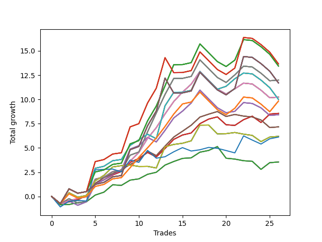

# Short Wallace 009 
- Symbol: SPY_Unlimited
- Date Range: 03/23/2022 - 07/08/2022
- Trading Period: 7:20-12:30
- Number of Trades: 26



| Name | Win Percent | Profit | Avg Profit / Trade | Avg Time / Trade |      | Name | Win Percent | Profit | Avg Profit / Trade | Avg Time / Trade |
| ---- | ----------- | ------ | ------------------ | ---------------- | ---- | ---- | ----------- | ------ | ------------------ | ---------------- |
| Sorted By <br> Profit | | | | | | Sorted By <br> Win Percentage ||||
| One Hundred Twenty-Eight | 61.54 | 6830.00 | 262.69 | 27:23 |     | Sixty-Five | 80.77 | 4280.00 | 164.62 | 11:00 |
| One Hundred Twenty-Three | 61.54 | 6830.00 | 262.69 | 27:23 |     | Fifty-Seven | 80.77 | 4280.00 | 164.62 | 11:00 |
| One Hundred Eighteen | 61.54 | 6830.00 | 262.69 | 27:23 |     | Forty-Nine | 80.77 | 4280.00 | 164.62 | 11:00 |
| One Hundred Thirteen | 61.54 | 6830.00 | 262.69 | 27:23 |     | Forty-One | 80.77 | 4280.00 | 164.62 | 11:00 |
| Eighty-Three | 61.54 | 6830.00 | 262.69 | 27:23 |     | One | 80.77 | 4280.00 | 164.62 | 11:00 |
| One Hundred Twenty-Seven | 65.38 | 6720.00 | 258.46 | 25:04 |     | Sixty-Eight | 73.08 | 5120.00 | 196.92 | 18:53 |
| One Hundred Twenty-Two | 65.38 | 6720.00 | 258.46 | 25:04 |     | Sixty | 73.08 | 5120.00 | 196.92 | 18:53 |
| One Hundred Seventeen | 65.38 | 6720.00 | 258.46 | 25:04 |     | Fifty-Two | 73.08 | 5120.00 | 196.92 | 18:53 |
| One Hundred Twelve | 65.38 | 6720.00 | 258.46 | 25:04 |     | Forty-Four | 73.08 | 5120.00 | 196.92 | 18:53 |
| Eighty-Two | 65.38 | 6720.00 | 258.46 | 25:04 |     | Four | 73.08 | 5120.00 | 196.92 | 18:53 |
| Sixty-Nine | 69.23 | 5995.00 | 230.58 | 22:31 |     | Sixty-Seven | 73.08 | 3585.00 | 137.88 | 13:50 |
| Sixty-One | 69.23 | 5995.00 | 230.58 | 22:31 |     | Fifty-Nine | 73.08 | 3585.00 | 137.88 | 13:50 |
| Fifty-Three | 69.23 | 5995.00 | 230.58 | 22:31 |     | Fifty-One | 73.08 | 3585.00 | 137.88 | 13:50 |
| Forty-Five | 69.23 | 5995.00 | 230.58 | 22:31 |     | Forty-Three | 73.08 | 3585.00 | 137.88 | 13:50 |
| Five | 69.23 | 5995.00 | 230.58 | 22:31 |     | Three | 73.08 | 3585.00 | 137.88 | 13:50 |
| One Hundred Thirty | 61.54 | 5850.00 | 225.00 | 29:25 |     | Sixty-Four | 73.08 | 1775.00 | 68.27 | 06:45 |
| One Hundred Twenty-Nine | 61.54 | 5850.00 | 225.00 | 29:25 |     | Fifty-Six | 73.08 | 1775.00 | 68.27 | 06:45 |
| One Hundred Twenty-Five | 61.54 | 5850.00 | 225.00 | 29:25 |     | Forty-Eight | 73.08 | 1775.00 | 68.27 | 06:45 |
| One Hundred Twenty-Four | 61.54 | 5850.00 | 225.00 | 29:25 |     | Forty | 73.08 | 1775.00 | 68.27 | 06:45 |
| One Hundred Twenty | 61.54 | 5850.00 | 225.00 | 29:25 |     | Zero | 73.08 | 1775.00 | 68.27 | 06:45 |
| One Hundred Ninteen | 61.54 | 5850.00 | 225.00 | 29:25 |     | Sixty-Nine | 69.23 | 5995.00 | 230.58 | 22:31 |
| One Hundred Fifteen | 61.54 | 5850.00 | 225.00 | 29:25 |     | Sixty-One | 69.23 | 5995.00 | 230.58 | 22:31 |
| One Hundred Fourteen | 61.54 | 5850.00 | 225.00 | 29:25 |     | Fifty-Three | 69.23 | 5995.00 | 230.58 | 22:31 |
| Eighty-Five | 61.54 | 5850.00 | 225.00 | 29:25 |     | Forty-Five | 69.23 | 5995.00 | 230.58 | 22:31 |
| Eighty-Four | 61.54 | 5850.00 | 225.00 | 29:25 |     | Five | 69.23 | 5995.00 | 230.58 | 22:31 |
| Sixty-Eight | 73.08 | 5120.00 | 196.92 | 18:53 |     | One Hundred Twenty-Six | 69.23 | 4915.00 | 189.04 | 20:14 |
| Sixty | 73.08 | 5120.00 | 196.92 | 18:53 |     | One Hundred Twenty-One | 69.23 | 4915.00 | 189.04 | 20:14 |
| Fifty-Two | 73.08 | 5120.00 | 196.92 | 18:53 |     | One Hundred Sixteen | 69.23 | 4915.00 | 189.04 | 20:14 |
| Forty-Four | 73.08 | 5120.00 | 196.92 | 18:53 |     | One Hundred Eleven | 69.23 | 4915.00 | 189.04 | 20:14 |
| Four | 73.08 | 5120.00 | 196.92 | 18:53 |     | Eighty-One | 69.23 | 4915.00 | 189.04 | 20:14 |
| Seventy-One | 65.38 | 5000.00 | 192.31 | 22:23 |     | Seventy | 69.23 | 3095.00 | 119.04 | 10:12 |
| Sixty-Three | 65.38 | 5000.00 | 192.31 | 22:23 |     | Sixty-Two | 69.23 | 3095.00 | 119.04 | 10:12 |
| Fifty-Five | 65.38 | 5000.00 | 192.31 | 22:23 |     | Fifty-Four | 69.23 | 3095.00 | 119.04 | 10:12 |
| Forty-Seven | 65.38 | 5000.00 | 192.31 | 22:23 |     | Forty-Six | 69.23 | 3095.00 | 119.04 | 10:12 |
| Seven | 65.38 | 5000.00 | 192.31 | 22:23 |     | Six | 69.23 | 3095.00 | 119.04 | 10:12 |
| One Hundred Twenty-Six | 69.23 | 4915.00 | 189.04 | 20:14 |     | One Hundred Twenty-Seven | 65.38 | 6720.00 | 258.46 | 25:04 |
| One Hundred Twenty-One | 69.23 | 4915.00 | 189.04 | 20:14 |     | One Hundred Twenty-Two | 65.38 | 6720.00 | 258.46 | 25:04 |
| One Hundred Sixteen | 69.23 | 4915.00 | 189.04 | 20:14 |     | One Hundred Seventeen | 65.38 | 6720.00 | 258.46 | 25:04 |
| One Hundred Eleven | 69.23 | 4915.00 | 189.04 | 20:14 |     | One Hundred Twelve | 65.38 | 6720.00 | 258.46 | 25:04 |
| Eighty-One | 69.23 | 4915.00 | 189.04 | 20:14 |     | Eighty-Two | 65.38 | 6720.00 | 258.46 | 25:04 |
| Sixty-Five | 80.77 | 4280.00 | 164.62 | 11:00 |     | Seventy-One | 65.38 | 5000.00 | 192.31 | 22:23 |
| Fifty-Seven | 80.77 | 4280.00 | 164.62 | 11:00 |     | Sixty-Three | 65.38 | 5000.00 | 192.31 | 22:23 |
| Forty-Nine | 80.77 | 4280.00 | 164.62 | 11:00 |     | Fifty-Five | 65.38 | 5000.00 | 192.31 | 22:23 |
| Forty-One | 80.77 | 4280.00 | 164.62 | 11:00 |     | Forty-Seven | 65.38 | 5000.00 | 192.31 | 22:23 |
| One | 80.77 | 4280.00 | 164.62 | 11:00 |     | Seven | 65.38 | 5000.00 | 192.31 | 22:23 |
| Sixty-Six | 65.38 | 4210.00 | 161.92 | 17:08 |     | Sixty-Six | 65.38 | 4210.00 | 161.92 | 17:08 |
| Fifty-Eight | 65.38 | 4210.00 | 161.92 | 17:08 |     | Fifty-Eight | 65.38 | 4210.00 | 161.92 | 17:08 |
| Fifty | 65.38 | 4210.00 | 161.92 | 17:08 |     | Fifty | 65.38 | 4210.00 | 161.92 | 17:08 |
| Forty-Two | 65.38 | 4210.00 | 161.92 | 17:08 |     | Forty-Two | 65.38 | 4210.00 | 161.92 | 17:08 |
| Two | 65.38 | 4210.00 | 161.92 | 17:08 |     | Two | 65.38 | 4210.00 | 161.92 | 17:08 |
| Sixty-Seven | 73.08 | 3585.00 | 137.88 | 13:50 |     | One Hundred Twenty-Eight | 61.54 | 6830.00 | 262.69 | 27:23 |
| Fifty-Nine | 73.08 | 3585.00 | 137.88 | 13:50 |     | One Hundred Twenty-Three | 61.54 | 6830.00 | 262.69 | 27:23 |
| Fifty-One | 73.08 | 3585.00 | 137.88 | 13:50 |     | One Hundred Eighteen | 61.54 | 6830.00 | 262.69 | 27:23 |
| Forty-Three | 73.08 | 3585.00 | 137.88 | 13:50 |     | One Hundred Thirteen | 61.54 | 6830.00 | 262.69 | 27:23 |
| Three | 73.08 | 3585.00 | 137.88 | 13:50 |     | Eighty-Three | 61.54 | 6830.00 | 262.69 | 27:23 |
| Seventy | 69.23 | 3095.00 | 119.04 | 10:12 |     | One Hundred Thirty | 61.54 | 5850.00 | 225.00 | 29:25 |
| Sixty-Two | 69.23 | 3095.00 | 119.04 | 10:12 |     | One Hundred Twenty-Nine | 61.54 | 5850.00 | 225.00 | 29:25 |
| Fifty-Four | 69.23 | 3095.00 | 119.04 | 10:12 |     | One Hundred Twenty-Five | 61.54 | 5850.00 | 225.00 | 29:25 |
| Forty-Six | 69.23 | 3095.00 | 119.04 | 10:12 |     | One Hundred Twenty-Four | 61.54 | 5850.00 | 225.00 | 29:25 |
| Six | 69.23 | 3095.00 | 119.04 | 10:12 |     | One Hundred Twenty | 61.54 | 5850.00 | 225.00 | 29:25 |
| Seventy-Three | 57.69 | 3060.00 | 117.69 | 10:18 |     | One Hundred Ninteen | 61.54 | 5850.00 | 225.00 | 29:25 |
| Sixty-Four | 73.08 | 1775.00 | 68.27 | 06:45 |     | One Hundred Fifteen | 61.54 | 5850.00 | 225.00 | 29:25 |
| Fifty-Six | 73.08 | 1775.00 | 68.27 | 06:45 |     | One Hundred Fourteen | 61.54 | 5850.00 | 225.00 | 29:25 |
| Forty-Eight | 73.08 | 1775.00 | 68.27 | 06:45 |     | Eighty-Five | 61.54 | 5850.00 | 225.00 | 29:25 |
| Forty | 73.08 | 1775.00 | 68.27 | 06:45 |     | Eighty-Four | 61.54 | 5850.00 | 225.00 | 29:25 |
| Zero | 73.08 | 1775.00 | 68.27 | 06:45 |     | Seventy-Three | 57.69 | 3060.00 | 117.69 | 10:18 |

## NO STOPLOSS

### Test Zero
* Sell when price hits the middle line of the 20p bollinger
* No Stoploss
* Results:
```
Total Trades: 26
Percent Up: 26.92
Percent Down: 73.08
Total Points Moved Down: 3.55
Potential Profit: 1775.00
Total Points Ups: 3.27 Count Ups: 7
Total Points Downs: 6.82 Count Downs: 19
```

<details><summary>Trades</summary>

<code>In: 2022-03-25 10:52:00		Out: 2022-03-25 11:18:10		Total Position Time: 26:10		Total Move Down: -0.86		Total to Date: -0.86</code> <br />
<code>In: 2022-03-25 11:57:00		Out: 2022-03-25 11:57:15		Total Position Time: 00:15		Total Move Down: 0.03		Total to Date: -0.83</code> <br />
<code>In: 2022-03-28 11:12:00		Out: 2022-03-28 11:12:10		Total Position Time: 00:10		Total Move Down: 0.19		Total to Date: -0.64</code> <br />
<code>In: 2022-04-01 11:34:00		Out: 2022-04-01 11:47:05		Total Position Time: 13:05		Total Move Down: 0.10		Total to Date: -0.54</code> <br />
<code>In: 2022-04-06 11:05:00		Out: 2022-04-06 11:05:35		Total Position Time: 00:35		Total Move Down: 0.68		Total to Date: 0.14</code> <br />
<code>In: 2022-04-20 09:54:00		Out: 2022-04-20 09:59:05		Total Position Time: 05:05		Total Move Down: 0.30		Total to Date: 0.44</code> <br />
<code>In: 2022-04-25 09:27:00		Out: 2022-04-25 09:31:05		Total Position Time: 04:05		Total Move Down: 0.76		Total to Date: 1.20</code> <br />
<code>In: 2022-04-25 10:14:00		Out: 2022-04-25 10:26:25		Total Position Time: 12:25		Total Move Down: -0.06		Total to Date: 1.14</code> <br />
<code>In: 2022-04-26 10:01:00		Out: 2022-04-26 10:02:20		Total Position Time: 01:20		Total Move Down: 0.54		Total to Date: 1.68</code> <br />
<code>In: 2022-04-26 11:23:00		Out: 2022-04-26 11:31:35		Total Position Time: 08:35		Total Move Down: 0.13		Total to Date: 1.81</code> <br />
<code>In: 2022-04-29 10:39:00		Out: 2022-04-29 10:40:30		Total Position Time: 01:30		Total Move Down: 0.47		Total to Date: 2.28</code> <br />
<code>In: 2022-05-09 11:59:00		Out: 2022-05-09 12:04:10		Total Position Time: 05:10		Total Move Down: 0.21		Total to Date: 2.49</code> <br />
<code>In: 2022-05-10 12:08:00		Out: 2022-05-10 12:09:45		Total Position Time: 01:45		Total Move Down: 0.74		Total to Date: 3.23</code> <br />
<code>In: 2022-05-25 11:04:00		Out: 2022-05-25 11:06:20		Total Position Time: 02:20		Total Move Down: 0.37		Total to Date: 3.60</code> <br />
<code>In: 2022-06-03 11:31:00		Out: 2022-06-03 11:33:25		Total Position Time: 02:25		Total Move Down: 0.32		Total to Date: 3.92</code> <br />
<code>In: 2022-06-10 10:48:00		Out: 2022-06-10 10:54:55		Total Position Time: 06:55		Total Move Down: 0.06		Total to Date: 3.98</code> <br />
<code>In: 2022-06-10 12:29:00		Out: 2022-06-10 12:30:30		Total Position Time: 01:30		Total Move Down: 0.58		Total to Date: 4.56</code> <br />
<code>In: 2022-06-13 08:42:00		Out: 2022-06-13 08:47:55		Total Position Time: 05:55		Total Move Down: 0.18		Total to Date: 4.74</code> <br />
<code>In: 2022-06-13 09:14:00		Out: 2022-06-13 09:17:10		Total Position Time: 03:10		Total Move Down: 0.40		Total to Date: 5.14</code> <br />
<code>In: 2022-06-14 10:02:00		Out: 2022-06-14 10:26:40		Total Position Time: 24:40		Total Move Down: -1.20		Total to Date: 3.94</code> <br />
<code>In: 2022-06-15 09:19:00		Out: 2022-06-15 09:30:55		Total Position Time: 11:55		Total Move Down: -0.09		Total to Date: 3.85</code> <br />
<code>In: 2022-06-15 11:02:00		Out: 2022-06-15 11:02:10		Total Position Time: 00:10		Total Move Down: -0.17		Total to Date: 3.68</code> <br />
<code>In: 2022-06-17 08:09:00		Out: 2022-06-17 08:23:05		Total Position Time: 14:05		Total Move Down: -0.06		Total to Date: 3.62</code> <br />
<code>In: 2022-06-27 07:46:00		Out: 2022-06-27 08:02:15		Total Position Time: 16:15		Total Move Down: -0.83		Total to Date: 2.79</code> <br />
<code>In: 2022-06-30 07:36:00		Out: 2022-06-30 07:42:05		Total Position Time: 06:05		Total Move Down: 0.69		Total to Date: 3.48</code> <br />
<code>In: 2022-07-06 11:00:00		Out: 2022-07-06 11:00:10		Total Position Time: 00:10		Total Move Down: 0.07		Total to Date: 3.55</code> <br />


</details>

### Test One
* Sell when the price hits the upper line of the 20p 1std bollinger
* No Stoploss
* Results:
```
Total Trades: 26
Percent Up: 19.23
Percent Down: 80.77
Total Points Moved Down: 8.56
Potential Profit: 4280.00
Total Points Ups: 2.71 Count Ups: 5
Total Points Downs: 11.27 Count Downs: 21
```

<details><summary>Trades</summary>

<code>In: 2022-03-25 10:52:00		Out: 2022-03-25 11:19:30		Total Position Time: 27:30		Total Move Down: -0.72		Total to Date: -0.72</code> <br />
<code>In: 2022-03-25 11:57:00		Out: 2022-03-25 12:00:50		Total Position Time: 03:50		Total Move Down: 0.28		Total to Date: -0.44</code> <br />
<code>In: 2022-03-28 11:12:00		Out: 2022-03-28 11:19:20		Total Position Time: 07:20		Total Move Down: 0.18		Total to Date: -0.26</code> <br />
<code>In: 2022-04-01 11:34:00		Out: 2022-04-01 11:50:15		Total Position Time: 16:15		Total Move Down: 0.33		Total to Date: 0.07</code> <br />
<code>In: 2022-04-06 11:05:00		Out: 2022-04-06 11:07:20		Total Position Time: 02:20		Total Move Down: 1.22		Total to Date: 1.29</code> <br />
<code>In: 2022-04-20 09:54:00		Out: 2022-04-20 10:08:15		Total Position Time: 14:15		Total Move Down: 0.42		Total to Date: 1.71</code> <br />
<code>In: 2022-04-25 09:27:00		Out: 2022-04-25 09:42:35		Total Position Time: 15:35		Total Move Down: 0.50		Total to Date: 2.21</code> <br />
<code>In: 2022-04-25 10:14:00		Out: 2022-04-25 10:27:10		Total Position Time: 13:10		Total Move Down: 0.36		Total to Date: 2.57</code> <br />
<code>In: 2022-04-26 10:01:00		Out: 2022-04-26 10:02:50		Total Position Time: 01:50		Total Move Down: 0.94		Total to Date: 3.51</code> <br />
<code>In: 2022-04-26 11:23:00		Out: 2022-04-26 11:33:45		Total Position Time: 10:45		Total Move Down: 0.41		Total to Date: 3.92</code> <br />
<code>In: 2022-04-29 10:39:00		Out: 2022-04-29 10:41:05		Total Position Time: 02:05		Total Move Down: 0.61		Total to Date: 4.53</code> <br />
<code>In: 2022-05-09 11:59:00		Out: 2022-05-09 12:17:15		Total Position Time: 18:15		Total Move Down: -0.46		Total to Date: 4.07</code> <br />
<code>In: 2022-05-10 12:08:00		Out: 2022-05-10 12:17:05		Total Position Time: 09:05		Total Move Down: 0.87		Total to Date: 4.94</code> <br />
<code>In: 2022-05-25 11:04:00		Out: 2022-05-25 11:06:35		Total Position Time: 02:35		Total Move Down: 0.94		Total to Date: 5.88</code> <br />
<code>In: 2022-06-03 11:31:00		Out: 2022-06-03 11:36:10		Total Position Time: 05:10		Total Move Down: 0.45		Total to Date: 6.33</code> <br />
<code>In: 2022-06-10 10:48:00		Out: 2022-06-10 10:56:05		Total Position Time: 08:05		Total Move Down: 0.21		Total to Date: 6.54</code> <br />
<code>In: 2022-06-10 12:29:00		Out: 2022-06-10 12:35:45		Total Position Time: 06:45		Total Move Down: 0.96		Total to Date: 7.50</code> <br />
<code>In: 2022-06-13 08:42:00		Out: 2022-06-13 08:52:15		Total Position Time: 10:15		Total Move Down: 0.47		Total to Date: 7.97</code> <br />
<code>In: 2022-06-13 09:14:00		Out: 2022-06-13 09:29:20		Total Position Time: 15:20		Total Move Down: 0.23		Total to Date: 8.20</code> <br />
<code>In: 2022-06-14 10:02:00		Out: 2022-06-14 10:29:50		Total Position Time: 27:50		Total Move Down: -0.81		Total to Date: 7.39</code> <br />
<code>In: 2022-06-15 09:19:00		Out: 2022-06-15 09:35:10		Total Position Time: 16:10		Total Move Down: -0.07		Total to Date: 7.32</code> <br />
<code>In: 2022-06-15 11:02:00		Out: 2022-06-15 11:03:05		Total Position Time: 01:05		Total Move Down: 0.59		Total to Date: 7.91</code> <br />
<code>In: 2022-06-17 08:09:00		Out: 2022-06-17 08:25:20		Total Position Time: 16:20		Total Move Down: 0.36		Total to Date: 8.27</code> <br />
<code>In: 2022-06-27 07:46:00		Out: 2022-06-27 08:07:15		Total Position Time: 21:15		Total Move Down: -0.65		Total to Date: 7.62</code> <br />
<code>In: 2022-06-30 07:36:00		Out: 2022-06-30 07:49:05		Total Position Time: 13:05		Total Move Down: 0.87		Total to Date: 8.49</code> <br />
<code>In: 2022-07-06 11:00:00		Out: 2022-07-06 11:00:10		Total Position Time: 00:10		Total Move Down: 0.07		Total to Date: 8.56</code> <br />


</details>

### Test Two
* Sell when the price hits the upper line of the 20p 2std bollinger
* No Stoploss
* Results:
```
Total Trades: 26
Percent Up: 34.62
Percent Down: 65.38
Total Points Moved Down: 8.42
Potential Profit: 4210.00
Total Points Ups: 5.31 Count Ups: 9
Total Points Downs: 13.73 Count Downs: 17
```

<details><summary>Trades</summary>

<code>In: 2022-03-25 10:52:00		Out: 2022-03-25 11:21:55		Total Position Time: 29:55		Total Move Down: -0.75		Total to Date: -0.75</code> <br />
<code>In: 2022-03-25 11:57:00		Out: 2022-03-25 12:00:55		Total Position Time: 03:55		Total Move Down: 0.29		Total to Date: -0.46</code> <br />
<code>In: 2022-03-28 11:12:00		Out: 2022-03-28 11:41:55		Total Position Time: 29:55		Total Move Down: -0.45		Total to Date: -0.91</code> <br />
<code>In: 2022-04-01 11:34:00		Out: 2022-04-01 11:50:20		Total Position Time: 16:20		Total Move Down: 0.36		Total to Date: -0.55</code> <br />
<code>In: 2022-04-06 11:05:00		Out: 2022-04-06 11:08:10		Total Position Time: 03:10		Total Move Down: 1.83		Total to Date: 1.28</code> <br />
<code>In: 2022-04-20 09:54:00		Out: 2022-04-20 10:08:15		Total Position Time: 14:15		Total Move Down: 0.42		Total to Date: 1.70</code> <br />
<code>In: 2022-04-25 09:27:00		Out: 2022-04-25 09:56:55		Total Position Time: 29:55		Total Move Down: 0.57		Total to Date: 2.27</code> <br />
<code>In: 2022-04-25 10:14:00		Out: 2022-04-25 10:33:35		Total Position Time: 19:35		Total Move Down: 0.43		Total to Date: 2.70</code> <br />
<code>In: 2022-04-26 10:01:00		Out: 2022-04-26 10:21:25		Total Position Time: 20:25		Total Move Down: 2.18		Total to Date: 4.88</code> <br />
<code>In: 2022-04-26 11:23:00		Out: 2022-04-26 11:41:25		Total Position Time: 18:25		Total Move Down: 0.35		Total to Date: 5.23</code> <br />
<code>In: 2022-04-29 10:39:00		Out: 2022-04-29 10:43:20		Total Position Time: 04:20		Total Move Down: 0.85		Total to Date: 6.08</code> <br />
<code>In: 2022-05-09 11:59:00		Out: 2022-05-09 12:17:15		Total Position Time: 18:15		Total Move Down: -0.46		Total to Date: 5.62</code> <br />
<code>In: 2022-05-10 12:08:00		Out: 2022-05-10 12:17:20		Total Position Time: 09:20		Total Move Down: 1.19		Total to Date: 6.81</code> <br />
<code>In: 2022-05-25 11:04:00		Out: 2022-05-25 11:06:40		Total Position Time: 02:40		Total Move Down: 1.28		Total to Date: 8.09</code> <br />
<code>In: 2022-06-03 11:31:00		Out: 2022-06-03 11:37:20		Total Position Time: 06:20		Total Move Down: 0.70		Total to Date: 8.79</code> <br />
<code>In: 2022-06-10 10:48:00		Out: 2022-06-10 11:01:15		Total Position Time: 13:15		Total Move Down: 0.84		Total to Date: 9.63</code> <br />
<code>In: 2022-06-10 12:29:00		Out: 2022-06-10 12:42:45		Total Position Time: 13:45		Total Move Down: 1.33		Total to Date: 10.96</code> <br />
<code>In: 2022-06-13 08:42:00		Out: 2022-06-13 09:11:55		Total Position Time: 29:55		Total Move Down: -0.91		Total to Date: 10.05</code> <br />
<code>In: 2022-06-13 09:14:00		Out: 2022-06-13 09:43:55		Total Position Time: 29:55		Total Move Down: -0.91		Total to Date: 9.14</code> <br />
<code>In: 2022-06-14 10:02:00		Out: 2022-06-14 10:31:55		Total Position Time: 29:55		Total Move Down: -0.51		Total to Date: 8.63</code> <br />
<code>In: 2022-06-15 09:19:00		Out: 2022-06-15 09:36:10		Total Position Time: 17:10		Total Move Down: 0.14		Total to Date: 8.77</code> <br />
<code>In: 2022-06-15 11:02:00		Out: 2022-06-15 11:03:15		Total Position Time: 01:15		Total Move Down: 0.90		Total to Date: 9.67</code> <br />
<code>In: 2022-06-17 08:09:00		Out: 2022-06-17 08:38:55		Total Position Time: 29:55		Total Move Down: -0.09		Total to Date: 9.58</code> <br />
<code>In: 2022-06-27 07:46:00		Out: 2022-06-27 08:09:45		Total Position Time: 23:45		Total Move Down: -0.45		Total to Date: 9.13</code> <br />
<code>In: 2022-06-30 07:36:00		Out: 2022-06-30 08:05:55		Total Position Time: 29:55		Total Move Down: -0.78		Total to Date: 8.35</code> <br />
<code>In: 2022-07-06 11:00:00		Out: 2022-07-06 11:00:10		Total Position Time: 00:10		Total Move Down: 0.07		Total to Date: 8.42</code> <br />


</details>

### Test Three
* Sell when price hits the middle line of the 50p bollinger
* No Stoploss
* Results:
```
Total Trades: 26
Percent Up: 26.92
Percent Down: 73.08
Total Points Moved Down: 7.17
Potential Profit: 3585.00
Total Points Ups: 3.07 Count Ups: 7
Total Points Downs: 10.24 Count Downs: 19
```

<details><summary>Trades</summary>

<code>In: 2022-03-25 10:52:00		Out: 2022-03-25 11:21:55		Total Position Time: 29:55		Total Move Down: -0.75		Total to Date: -0.75</code> <br />
<code>In: 2022-03-25 11:57:00		Out: 2022-03-25 12:00:45		Total Position Time: 03:45		Total Move Down: 0.19		Total to Date: -0.56</code> <br />
<code>In: 2022-03-28 11:12:00		Out: 2022-03-28 11:12:10		Total Position Time: 00:10		Total Move Down: 0.19		Total to Date: -0.37</code> <br />
<code>In: 2022-04-01 11:34:00		Out: 2022-04-01 11:54:05		Total Position Time: 20:05		Total Move Down: 0.50		Total to Date: 0.13</code> <br />
<code>In: 2022-04-06 11:05:00		Out: 2022-04-06 11:07:20		Total Position Time: 02:20		Total Move Down: 1.22		Total to Date: 1.35</code> <br />
<code>In: 2022-04-20 09:54:00		Out: 2022-04-20 10:08:35		Total Position Time: 14:35		Total Move Down: 0.58		Total to Date: 1.93</code> <br />
<code>In: 2022-04-25 09:27:00		Out: 2022-04-25 09:55:05		Total Position Time: 28:05		Total Move Down: 0.41		Total to Date: 2.34</code> <br />
<code>In: 2022-04-25 10:14:00		Out: 2022-04-25 10:28:15		Total Position Time: 14:15		Total Move Down: 0.42		Total to Date: 2.76</code> <br />
<code>In: 2022-04-26 10:01:00		Out: 2022-04-26 10:02:15		Total Position Time: 01:15		Total Move Down: 0.54		Total to Date: 3.30</code> <br />
<code>In: 2022-04-26 11:23:00		Out: 2022-04-26 11:41:30		Total Position Time: 18:30		Total Move Down: 0.43		Total to Date: 3.73</code> <br />
<code>In: 2022-04-29 10:39:00		Out: 2022-04-29 10:43:40		Total Position Time: 04:40		Total Move Down: 0.94		Total to Date: 4.67</code> <br />
<code>In: 2022-05-09 11:59:00		Out: 2022-05-09 12:17:15		Total Position Time: 18:15		Total Move Down: -0.46		Total to Date: 4.21</code> <br />
<code>In: 2022-05-10 12:08:00		Out: 2022-05-10 12:10:05		Total Position Time: 02:05		Total Move Down: 0.97		Total to Date: 5.18</code> <br />
<code>In: 2022-05-25 11:04:00		Out: 2022-05-25 11:06:35		Total Position Time: 02:35		Total Move Down: 0.94		Total to Date: 6.12</code> <br />
<code>In: 2022-06-03 11:31:00		Out: 2022-06-03 11:37:10		Total Position Time: 06:10		Total Move Down: 0.60		Total to Date: 6.72</code> <br />
<code>In: 2022-06-10 10:48:00		Out: 2022-06-10 11:00:50		Total Position Time: 12:50		Total Move Down: 0.62		Total to Date: 7.34</code> <br />
<code>In: 2022-06-10 12:29:00		Out: 2022-06-10 12:33:15		Total Position Time: 04:15		Total Move Down: 0.84		Total to Date: 8.18</code> <br />
<code>In: 2022-06-13 08:42:00		Out: 2022-06-13 09:07:20		Total Position Time: 25:20		Total Move Down: 0.30		Total to Date: 8.48</code> <br />
<code>In: 2022-06-13 09:14:00		Out: 2022-06-13 09:30:50		Total Position Time: 16:50		Total Move Down: 0.27		Total to Date: 8.75</code> <br />
<code>In: 2022-06-14 10:02:00		Out: 2022-06-14 10:31:55		Total Position Time: 29:55		Total Move Down: -0.51		Total to Date: 8.24</code> <br />
<code>In: 2022-06-15 09:19:00		Out: 2022-06-15 09:38:40		Total Position Time: 19:40		Total Move Down: 0.21		Total to Date: 8.45</code> <br />
<code>In: 2022-06-15 11:02:00		Out: 2022-06-15 11:02:10		Total Position Time: 00:10		Total Move Down: -0.17		Total to Date: 8.28</code> <br />
<code>In: 2022-06-17 08:09:00		Out: 2022-06-17 08:38:55		Total Position Time: 29:55		Total Move Down: -0.09		Total to Date: 8.19</code> <br />
<code>In: 2022-06-27 07:46:00		Out: 2022-06-27 08:10:05		Total Position Time: 24:05		Total Move Down: -0.31		Total to Date: 7.88</code> <br />
<code>In: 2022-06-30 07:36:00		Out: 2022-06-30 08:05:55		Total Position Time: 29:55		Total Move Down: -0.78		Total to Date: 7.10</code> <br />
<code>In: 2022-07-06 11:00:00		Out: 2022-07-06 11:00:10		Total Position Time: 00:10		Total Move Down: 0.07		Total to Date: 7.17</code> <br />


</details>

### Test Four
* Sell when the price hits the upper line of the 50p 1std bollinger
* No Stoploss
* Results:
```
Total Trades: 26
Percent Up: 26.92
Percent Down: 73.08
Total Points Moved Down: 10.24
Potential Profit: 5120.00
Total Points Ups: 4.59 Count Ups: 7
Total Points Downs: 14.83 Count Downs: 19
```

<details><summary>Trades</summary>

<code>In: 2022-03-25 10:52:00		Out: 2022-03-25 11:21:55		Total Position Time: 29:55		Total Move Down: -0.75		Total to Date: -0.75</code> <br />
<code>In: 2022-03-25 11:57:00		Out: 2022-03-25 12:00:55		Total Position Time: 03:55		Total Move Down: 0.29		Total to Date: -0.46</code> <br />
<code>In: 2022-03-28 11:12:00		Out: 2022-03-28 11:20:40		Total Position Time: 08:40		Total Move Down: 0.25		Total to Date: -0.21</code> <br />
<code>In: 2022-04-01 11:34:00		Out: 2022-04-01 12:03:55		Total Position Time: 29:55		Total Move Down: 0.17		Total to Date: -0.04</code> <br />
<code>In: 2022-04-06 11:05:00		Out: 2022-04-06 11:08:10		Total Position Time: 03:10		Total Move Down: 1.83		Total to Date: 1.79</code> <br />
<code>In: 2022-04-20 09:54:00		Out: 2022-04-20 10:23:55		Total Position Time: 29:55		Total Move Down: 0.21		Total to Date: 2.00</code> <br />
<code>In: 2022-04-25 09:27:00		Out: 2022-04-25 09:56:55		Total Position Time: 29:55		Total Move Down: 0.57		Total to Date: 2.57</code> <br />
<code>In: 2022-04-25 10:14:00		Out: 2022-04-25 10:43:55		Total Position Time: 29:55		Total Move Down: 0.13		Total to Date: 2.70</code> <br />
<code>In: 2022-04-26 10:01:00		Out: 2022-04-26 10:02:50		Total Position Time: 01:50		Total Move Down: 0.94		Total to Date: 3.64</code> <br />
<code>In: 2022-04-26 11:23:00		Out: 2022-04-26 11:45:00		Total Position Time: 22:00		Total Move Down: 0.90		Total to Date: 4.54</code> <br />
<code>In: 2022-04-29 10:39:00		Out: 2022-04-29 10:47:20		Total Position Time: 08:20		Total Move Down: 1.44		Total to Date: 5.98</code> <br />
<code>In: 2022-05-09 11:59:00		Out: 2022-05-09 12:23:25		Total Position Time: 24:25		Total Move Down: 1.11		Total to Date: 7.09</code> <br />
<code>In: 2022-05-10 12:08:00		Out: 2022-05-10 12:22:05		Total Position Time: 14:05		Total Move Down: 1.41		Total to Date: 8.50</code> <br />
<code>In: 2022-05-25 11:04:00		Out: 2022-05-25 11:06:40		Total Position Time: 02:40		Total Move Down: 1.28		Total to Date: 9.78</code> <br />
<code>In: 2022-06-03 11:31:00		Out: 2022-06-03 11:38:55		Total Position Time: 07:55		Total Move Down: 0.97		Total to Date: 10.75</code> <br />
<code>In: 2022-06-10 10:48:00		Out: 2022-06-10 11:15:25		Total Position Time: 27:25		Total Move Down: 0.82		Total to Date: 11.57</code> <br />
<code>In: 2022-06-10 12:29:00		Out: 2022-06-10 12:42:40		Total Position Time: 13:40		Total Move Down: 1.32		Total to Date: 12.89</code> <br />
<code>In: 2022-06-13 08:42:00		Out: 2022-06-13 09:11:55		Total Position Time: 29:55		Total Move Down: -0.91		Total to Date: 11.98</code> <br />
<code>In: 2022-06-13 09:14:00		Out: 2022-06-13 09:43:55		Total Position Time: 29:55		Total Move Down: -0.91		Total to Date: 11.07</code> <br />
<code>In: 2022-06-14 10:02:00		Out: 2022-06-14 10:31:55		Total Position Time: 29:55		Total Move Down: -0.51		Total to Date: 10.56</code> <br />
<code>In: 2022-06-15 09:19:00		Out: 2022-06-15 09:41:45		Total Position Time: 22:45		Total Move Down: 0.53		Total to Date: 11.09</code> <br />
<code>In: 2022-06-15 11:02:00		Out: 2022-06-15 11:03:05		Total Position Time: 01:05		Total Move Down: 0.59		Total to Date: 11.68</code> <br />
<code>In: 2022-06-17 08:09:00		Out: 2022-06-17 08:38:55		Total Position Time: 29:55		Total Move Down: -0.09		Total to Date: 11.59</code> <br />
<code>In: 2022-06-27 07:46:00		Out: 2022-06-27 08:15:55		Total Position Time: 29:55		Total Move Down: -0.64		Total to Date: 10.95</code> <br />
<code>In: 2022-06-30 07:36:00		Out: 2022-06-30 08:05:55		Total Position Time: 29:55		Total Move Down: -0.78		Total to Date: 10.17</code> <br />
<code>In: 2022-07-06 11:00:00		Out: 2022-07-06 11:00:10		Total Position Time: 00:10		Total Move Down: 0.07		Total to Date: 10.24</code> <br />


</details>

### Test Five
* Sell when the price hits the upper line of the 50p 2std bollinger
* No Stoploss
* Results:
```
Total Trades: 26
Percent Up: 30.77
Percent Down: 69.23
Total Points Moved Down: 11.99
Potential Profit: 5995.00
Total Points Ups: 5.04 Count Ups: 8
Total Points Downs: 17.03 Count Downs: 18
```

<details><summary>Trades</summary>

<code>In: 2022-03-25 10:52:00		Out: 2022-03-25 11:21:55		Total Position Time: 29:55		Total Move Down: -0.75		Total to Date: -0.75</code> <br />
<code>In: 2022-03-25 11:57:00		Out: 2022-03-25 12:01:55		Total Position Time: 04:55		Total Move Down: 0.52		Total to Date: -0.23</code> <br />
<code>In: 2022-03-28 11:12:00		Out: 2022-03-28 11:41:55		Total Position Time: 29:55		Total Move Down: -0.45		Total to Date: -0.68</code> <br />
<code>In: 2022-04-01 11:34:00		Out: 2022-04-01 12:03:55		Total Position Time: 29:55		Total Move Down: 0.17		Total to Date: -0.51</code> <br />
<code>In: 2022-04-06 11:05:00		Out: 2022-04-06 11:09:35		Total Position Time: 04:35		Total Move Down: 2.27		Total to Date: 1.76</code> <br />
<code>In: 2022-04-20 09:54:00		Out: 2022-04-20 10:23:55		Total Position Time: 29:55		Total Move Down: 0.21		Total to Date: 1.97</code> <br />
<code>In: 2022-04-25 09:27:00		Out: 2022-04-25 09:56:55		Total Position Time: 29:55		Total Move Down: 0.57		Total to Date: 2.54</code> <br />
<code>In: 2022-04-25 10:14:00		Out: 2022-04-25 10:43:55		Total Position Time: 29:55		Total Move Down: 0.13		Total to Date: 2.67</code> <br />
<code>In: 2022-04-26 10:01:00		Out: 2022-04-26 10:14:35		Total Position Time: 13:35		Total Move Down: 1.58		Total to Date: 4.25</code> <br />
<code>In: 2022-04-26 11:23:00		Out: 2022-04-26 11:52:55		Total Position Time: 29:55		Total Move Down: 0.33		Total to Date: 4.58</code> <br />
<code>In: 2022-04-29 10:39:00		Out: 2022-04-29 11:01:10		Total Position Time: 22:10		Total Move Down: 2.08		Total to Date: 6.66</code> <br />
<code>In: 2022-05-09 11:59:00		Out: 2022-05-09 12:28:05		Total Position Time: 29:05		Total Move Down: 1.94		Total to Date: 8.60</code> <br />
<code>In: 2022-05-10 12:08:00		Out: 2022-05-10 12:24:30		Total Position Time: 16:30		Total Move Down: 1.91		Total to Date: 10.51</code> <br />
<code>In: 2022-05-25 11:04:00		Out: 2022-05-25 11:06:50		Total Position Time: 02:50		Total Move Down: 1.65		Total to Date: 12.16</code> <br />
<code>In: 2022-06-03 11:31:00		Out: 2022-06-03 12:00:55		Total Position Time: 29:55		Total Move Down: 0.01		Total to Date: 12.17</code> <br />
<code>In: 2022-06-10 10:48:00		Out: 2022-06-10 11:17:55		Total Position Time: 29:55		Total Move Down: 0.20		Total to Date: 12.37</code> <br />
<code>In: 2022-06-10 12:29:00		Out: 2022-06-10 12:45:35		Total Position Time: 16:35		Total Move Down: 1.71		Total to Date: 14.08</code> <br />
<code>In: 2022-06-13 08:42:00		Out: 2022-06-13 09:11:55		Total Position Time: 29:55		Total Move Down: -0.91		Total to Date: 13.17</code> <br />
<code>In: 2022-06-13 09:14:00		Out: 2022-06-13 09:43:55		Total Position Time: 29:55		Total Move Down: -0.91		Total to Date: 12.26</code> <br />
<code>In: 2022-06-14 10:02:00		Out: 2022-06-14 10:31:55		Total Position Time: 29:55		Total Move Down: -0.51		Total to Date: 11.75</code> <br />
<code>In: 2022-06-15 09:19:00		Out: 2022-06-15 09:44:05		Total Position Time: 25:05		Total Move Down: 0.78		Total to Date: 12.53</code> <br />
<code>In: 2022-06-15 11:02:00		Out: 2022-06-15 11:03:15		Total Position Time: 01:15		Total Move Down: 0.90		Total to Date: 13.43</code> <br />
<code>In: 2022-06-17 08:09:00		Out: 2022-06-17 08:38:55		Total Position Time: 29:55		Total Move Down: -0.09		Total to Date: 13.34</code> <br />
<code>In: 2022-06-27 07:46:00		Out: 2022-06-27 08:15:55		Total Position Time: 29:55		Total Move Down: -0.64		Total to Date: 12.70</code> <br />
<code>In: 2022-06-30 07:36:00		Out: 2022-06-30 08:05:55		Total Position Time: 29:55		Total Move Down: -0.78		Total to Date: 11.92</code> <br />
<code>In: 2022-07-06 11:00:00		Out: 2022-07-06 11:00:10		Total Position Time: 00:10		Total Move Down: 0.07		Total to Date: 11.99</code> <br />


</details>

### Test Six
* Sell when the price hits the middle line of the 1std VWAP
* No Stoploss
* Results:
```
Total Trades: 26
Percent Up: 30.77
Percent Down: 69.23
Total Points Moved Down: 6.19
Potential Profit: 3095.00
Total Points Ups: 3.36 Count Ups: 8
Total Points Downs: 9.55 Count Downs: 18
```

<details><summary>Trades</summary>

<code>In: 2022-03-25 10:52:00		Out: 2022-03-25 11:21:55		Total Position Time: 29:55		Total Move Down: -0.75		Total to Date: -0.75</code> <br />
<code>In: 2022-03-25 11:57:00		Out: 2022-03-25 12:07:35		Total Position Time: 10:35		Total Move Down: 1.13		Total to Date: 0.38</code> <br />
<code>In: 2022-03-28 11:12:00		Out: 2022-03-28 11:41:55		Total Position Time: 29:55		Total Move Down: -0.45		Total to Date: -0.07</code> <br />
<code>In: 2022-04-01 11:34:00		Out: 2022-04-01 12:03:55		Total Position Time: 29:55		Total Move Down: 0.17		Total to Date: 0.10</code> <br />
<code>In: 2022-04-06 11:05:00		Out: 2022-04-06 11:07:35		Total Position Time: 02:35		Total Move Down: 1.50		Total to Date: 1.60</code> <br />
<code>In: 2022-04-20 09:54:00		Out: 2022-04-20 10:08:35		Total Position Time: 14:35		Total Move Down: 0.58		Total to Date: 2.18</code> <br />
<code>In: 2022-04-25 09:27:00		Out: 2022-04-25 09:31:10		Total Position Time: 04:10		Total Move Down: 0.86		Total to Date: 3.04</code> <br />
<code>In: 2022-04-25 10:14:00		Out: 2022-04-25 10:43:55		Total Position Time: 29:55		Total Move Down: 0.13		Total to Date: 3.17</code> <br />
<code>In: 2022-04-26 10:01:00		Out: 2022-04-26 10:01:10		Total Position Time: 00:10		Total Move Down: 0.06		Total to Date: 3.23</code> <br />
<code>In: 2022-04-26 11:23:00		Out: 2022-04-26 11:23:10		Total Position Time: 00:10		Total Move Down: -0.14		Total to Date: 3.09</code> <br />
<code>In: 2022-04-29 10:39:00		Out: 2022-04-29 10:39:10		Total Position Time: 00:10		Total Move Down: 0.01		Total to Date: 3.10</code> <br />
<code>In: 2022-05-09 11:59:00		Out: 2022-05-09 11:59:10		Total Position Time: 00:10		Total Move Down: -0.17		Total to Date: 2.93</code> <br />
<code>In: 2022-05-10 12:08:00		Out: 2022-05-10 12:25:45		Total Position Time: 17:45		Total Move Down: 2.19		Total to Date: 5.12</code> <br />
<code>In: 2022-05-25 11:04:00		Out: 2022-05-25 11:05:45		Total Position Time: 01:45		Total Move Down: 0.24		Total to Date: 5.36</code> <br />
<code>In: 2022-06-03 11:31:00		Out: 2022-06-03 11:32:35		Total Position Time: 01:35		Total Move Down: 0.12		Total to Date: 5.48</code> <br />
<code>In: 2022-06-10 10:48:00		Out: 2022-06-10 10:55:15		Total Position Time: 07:15		Total Move Down: 0.25		Total to Date: 5.73</code> <br />
<code>In: 2022-06-10 12:29:00		Out: 2022-06-10 12:43:55		Total Position Time: 14:55		Total Move Down: 1.62		Total to Date: 7.35</code> <br />
<code>In: 2022-06-13 08:42:00		Out: 2022-06-13 08:47:15		Total Position Time: 05:15		Total Move Down: 0.01		Total to Date: 7.36</code> <br />
<code>In: 2022-06-13 09:14:00		Out: 2022-06-13 09:43:55		Total Position Time: 29:55		Total Move Down: -0.91		Total to Date: 6.45</code> <br />
<code>In: 2022-06-14 10:02:00		Out: 2022-06-14 10:02:10		Total Position Time: 00:10		Total Move Down: 0.02		Total to Date: 6.47</code> <br />
<code>In: 2022-06-15 09:19:00		Out: 2022-06-15 09:19:10		Total Position Time: 00:10		Total Move Down: 0.12		Total to Date: 6.59</code> <br />
<code>In: 2022-06-15 11:02:00		Out: 2022-06-15 11:02:10		Total Position Time: 00:10		Total Move Down: -0.17		Total to Date: 6.42</code> <br />
<code>In: 2022-06-17 08:09:00		Out: 2022-06-17 08:09:10		Total Position Time: 00:10		Total Move Down: -0.13		Total to Date: 6.29</code> <br />
<code>In: 2022-06-27 07:46:00		Out: 2022-06-27 08:15:55		Total Position Time: 29:55		Total Move Down: -0.64		Total to Date: 5.65</code> <br />
<code>In: 2022-06-30 07:36:00		Out: 2022-06-30 07:39:55		Total Position Time: 03:55		Total Move Down: 0.47		Total to Date: 6.12</code> <br />
<code>In: 2022-07-06 11:00:00		Out: 2022-07-06 11:00:10		Total Position Time: 00:10		Total Move Down: 0.07		Total to Date: 6.19</code> <br />


</details>

### Test Seven
* Sell when the price hits the upper line of the 1std VWAP
* No Stoploss
* Results:
```
Total Trades: 26
Percent Up: 34.62
Percent Down: 65.38
Total Points Moved Down: 10.00
Potential Profit: 5000.00
Total Points Ups: 6.20 Count Ups: 9
Total Points Downs: 16.20 Count Downs: 17
```

<details><summary>Trades</summary>

<code>In: 2022-03-25 10:52:00		Out: 2022-03-25 11:21:55		Total Position Time: 29:55		Total Move Down: -0.75		Total to Date: -0.75</code> <br />
<code>In: 2022-03-25 11:57:00		Out: 2022-03-25 12:26:55		Total Position Time: 29:55		Total Move Down: 1.53		Total to Date: 0.78</code> <br />
<code>In: 2022-03-28 11:12:00		Out: 2022-03-28 11:41:55		Total Position Time: 29:55		Total Move Down: -0.45		Total to Date: 0.33</code> <br />
<code>In: 2022-04-01 11:34:00		Out: 2022-04-01 12:03:55		Total Position Time: 29:55		Total Move Down: 0.17		Total to Date: 0.50</code> <br />
<code>In: 2022-04-06 11:05:00		Out: 2022-04-06 11:09:40		Total Position Time: 04:40		Total Move Down: 2.40		Total to Date: 2.90</code> <br />
<code>In: 2022-04-20 09:54:00		Out: 2022-04-20 10:23:55		Total Position Time: 29:55		Total Move Down: 0.21		Total to Date: 3.11</code> <br />
<code>In: 2022-04-25 09:27:00		Out: 2022-04-25 09:56:55		Total Position Time: 29:55		Total Move Down: 0.57		Total to Date: 3.68</code> <br />
<code>In: 2022-04-25 10:14:00		Out: 2022-04-25 10:43:55		Total Position Time: 29:55		Total Move Down: 0.13		Total to Date: 3.81</code> <br />
<code>In: 2022-04-26 10:01:00		Out: 2022-04-26 10:14:15		Total Position Time: 13:15		Total Move Down: 1.45		Total to Date: 5.26</code> <br />
<code>In: 2022-04-26 11:23:00		Out: 2022-04-26 11:42:15		Total Position Time: 19:15		Total Move Down: 0.58		Total to Date: 5.84</code> <br />
<code>In: 2022-04-29 10:39:00		Out: 2022-04-29 10:40:40		Total Position Time: 01:40		Total Move Down: 0.57		Total to Date: 6.41</code> <br />
<code>In: 2022-05-09 11:59:00		Out: 2022-05-09 12:17:15		Total Position Time: 18:15		Total Move Down: -0.46		Total to Date: 5.95</code> <br />
<code>In: 2022-05-10 12:08:00		Out: 2022-05-10 12:37:55		Total Position Time: 29:55		Total Move Down: 3.39		Total to Date: 9.34</code> <br />
<code>In: 2022-05-25 11:04:00		Out: 2022-05-25 11:06:45		Total Position Time: 02:45		Total Move Down: 1.39		Total to Date: 10.73</code> <br />
<code>In: 2022-06-03 11:31:00		Out: 2022-06-03 12:00:55		Total Position Time: 29:55		Total Move Down: 0.01		Total to Date: 10.74</code> <br />
<code>In: 2022-06-10 10:48:00		Out: 2022-06-10 11:17:55		Total Position Time: 29:55		Total Move Down: 0.20		Total to Date: 10.94</code> <br />
<code>In: 2022-06-10 12:29:00		Out: 2022-06-10 12:46:00		Total Position Time: 17:00		Total Move Down: 1.93		Total to Date: 12.87</code> <br />
<code>In: 2022-06-13 08:42:00		Out: 2022-06-13 09:11:55		Total Position Time: 29:55		Total Move Down: -0.91		Total to Date: 11.96</code> <br />
<code>In: 2022-06-13 09:14:00		Out: 2022-06-13 09:43:55		Total Position Time: 29:55		Total Move Down: -0.91		Total to Date: 11.05</code> <br />
<code>In: 2022-06-14 10:02:00		Out: 2022-06-14 10:02:40		Total Position Time: 00:40		Total Move Down: 0.30		Total to Date: 11.35</code> <br />
<code>In: 2022-06-15 09:19:00		Out: 2022-06-15 09:44:05		Total Position Time: 25:05		Total Move Down: 0.78		Total to Date: 12.13</code> <br />
<code>In: 2022-06-15 11:02:00		Out: 2022-06-15 11:03:05		Total Position Time: 01:05		Total Move Down: 0.59		Total to Date: 12.72</code> <br />
<code>In: 2022-06-17 08:09:00		Out: 2022-06-17 08:38:55		Total Position Time: 29:55		Total Move Down: -0.09		Total to Date: 12.63</code> <br />
<code>In: 2022-06-27 07:46:00		Out: 2022-06-27 08:15:55		Total Position Time: 29:55		Total Move Down: -0.64		Total to Date: 11.99</code> <br />
<code>In: 2022-06-30 07:36:00		Out: 2022-06-30 08:05:55		Total Position Time: 29:55		Total Move Down: -0.78		Total to Date: 11.21</code> <br />
<code>In: 2022-07-06 11:00:00		Out: 2022-07-06 11:29:55		Total Position Time: 29:55		Total Move Down: -1.21		Total to Date: 10.00</code> <br />


</details>

## STOPLOSS OF 5

### Test Forty
* Sell when price hits the middle line of the 20p bollinger
* Stoploss is -5 points
* Results:
```
Total Trades: 26
Percent Up: 26.92
Percent Down: 73.08
Total Points Moved Down: 3.55
Potential Profit: 1775.00
Total Points Ups: 3.27 Count Ups: 7
Total Points Downs: 6.82 Count Downs: 19
```

<details><summary>Trades</summary>

<code>In: 2022-03-25 10:52:00		Out: 2022-03-25 11:18:10		Total Position Time: 26:10		Total Move Down: -0.86		Total to Date: -0.86</code> <br />
<code>In: 2022-03-25 11:57:00		Out: 2022-03-25 11:57:15		Total Position Time: 00:15		Total Move Down: 0.03		Total to Date: -0.83</code> <br />
<code>In: 2022-03-28 11:12:00		Out: 2022-03-28 11:12:10		Total Position Time: 00:10		Total Move Down: 0.19		Total to Date: -0.64</code> <br />
<code>In: 2022-04-01 11:34:00		Out: 2022-04-01 11:47:05		Total Position Time: 13:05		Total Move Down: 0.10		Total to Date: -0.54</code> <br />
<code>In: 2022-04-06 11:05:00		Out: 2022-04-06 11:05:35		Total Position Time: 00:35		Total Move Down: 0.68		Total to Date: 0.14</code> <br />
<code>In: 2022-04-20 09:54:00		Out: 2022-04-20 09:59:05		Total Position Time: 05:05		Total Move Down: 0.30		Total to Date: 0.44</code> <br />
<code>In: 2022-04-25 09:27:00		Out: 2022-04-25 09:31:05		Total Position Time: 04:05		Total Move Down: 0.76		Total to Date: 1.20</code> <br />
<code>In: 2022-04-25 10:14:00		Out: 2022-04-25 10:26:25		Total Position Time: 12:25		Total Move Down: -0.06		Total to Date: 1.14</code> <br />
<code>In: 2022-04-26 10:01:00		Out: 2022-04-26 10:02:20		Total Position Time: 01:20		Total Move Down: 0.54		Total to Date: 1.68</code> <br />
<code>In: 2022-04-26 11:23:00		Out: 2022-04-26 11:31:35		Total Position Time: 08:35		Total Move Down: 0.13		Total to Date: 1.81</code> <br />
<code>In: 2022-04-29 10:39:00		Out: 2022-04-29 10:40:30		Total Position Time: 01:30		Total Move Down: 0.47		Total to Date: 2.28</code> <br />
<code>In: 2022-05-09 11:59:00		Out: 2022-05-09 12:04:10		Total Position Time: 05:10		Total Move Down: 0.21		Total to Date: 2.49</code> <br />
<code>In: 2022-05-10 12:08:00		Out: 2022-05-10 12:09:45		Total Position Time: 01:45		Total Move Down: 0.74		Total to Date: 3.23</code> <br />
<code>In: 2022-05-25 11:04:00		Out: 2022-05-25 11:06:20		Total Position Time: 02:20		Total Move Down: 0.37		Total to Date: 3.60</code> <br />
<code>In: 2022-06-03 11:31:00		Out: 2022-06-03 11:33:25		Total Position Time: 02:25		Total Move Down: 0.32		Total to Date: 3.92</code> <br />
<code>In: 2022-06-10 10:48:00		Out: 2022-06-10 10:54:55		Total Position Time: 06:55		Total Move Down: 0.06		Total to Date: 3.98</code> <br />
<code>In: 2022-06-10 12:29:00		Out: 2022-06-10 12:30:30		Total Position Time: 01:30		Total Move Down: 0.58		Total to Date: 4.56</code> <br />
<code>In: 2022-06-13 08:42:00		Out: 2022-06-13 08:47:55		Total Position Time: 05:55		Total Move Down: 0.18		Total to Date: 4.74</code> <br />
<code>In: 2022-06-13 09:14:00		Out: 2022-06-13 09:17:10		Total Position Time: 03:10		Total Move Down: 0.40		Total to Date: 5.14</code> <br />
<code>In: 2022-06-14 10:02:00		Out: 2022-06-14 10:26:40		Total Position Time: 24:40		Total Move Down: -1.20		Total to Date: 3.94</code> <br />
<code>In: 2022-06-15 09:19:00		Out: 2022-06-15 09:30:55		Total Position Time: 11:55		Total Move Down: -0.09		Total to Date: 3.85</code> <br />
<code>In: 2022-06-15 11:02:00		Out: 2022-06-15 11:02:10		Total Position Time: 00:10		Total Move Down: -0.17		Total to Date: 3.68</code> <br />
<code>In: 2022-06-17 08:09:00		Out: 2022-06-17 08:23:05		Total Position Time: 14:05		Total Move Down: -0.06		Total to Date: 3.62</code> <br />
<code>In: 2022-06-27 07:46:00		Out: 2022-06-27 08:02:15		Total Position Time: 16:15		Total Move Down: -0.83		Total to Date: 2.79</code> <br />
<code>In: 2022-06-30 07:36:00		Out: 2022-06-30 07:42:05		Total Position Time: 06:05		Total Move Down: 0.69		Total to Date: 3.48</code> <br />
<code>In: 2022-07-06 11:00:00		Out: 2022-07-06 11:00:10		Total Position Time: 00:10		Total Move Down: 0.07		Total to Date: 3.55</code> <br />


</details>

### Test Forty-One
* Sell when the price hits the upper line of the 20p 1std bollinger
* Stoploss is -5 points
* Results:
```
Total Trades: 26
Percent Up: 19.23
Percent Down: 80.77
Total Points Moved Down: 8.56
Potential Profit: 4280.00
Total Points Ups: 2.71 Count Ups: 5
Total Points Downs: 11.27 Count Downs: 21
```

<details><summary>Trades</summary>

<code>In: 2022-03-25 10:52:00		Out: 2022-03-25 11:19:30		Total Position Time: 27:30		Total Move Down: -0.72		Total to Date: -0.72</code> <br />
<code>In: 2022-03-25 11:57:00		Out: 2022-03-25 12:00:50		Total Position Time: 03:50		Total Move Down: 0.28		Total to Date: -0.44</code> <br />
<code>In: 2022-03-28 11:12:00		Out: 2022-03-28 11:19:20		Total Position Time: 07:20		Total Move Down: 0.18		Total to Date: -0.26</code> <br />
<code>In: 2022-04-01 11:34:00		Out: 2022-04-01 11:50:15		Total Position Time: 16:15		Total Move Down: 0.33		Total to Date: 0.07</code> <br />
<code>In: 2022-04-06 11:05:00		Out: 2022-04-06 11:07:20		Total Position Time: 02:20		Total Move Down: 1.22		Total to Date: 1.29</code> <br />
<code>In: 2022-04-20 09:54:00		Out: 2022-04-20 10:08:15		Total Position Time: 14:15		Total Move Down: 0.42		Total to Date: 1.71</code> <br />
<code>In: 2022-04-25 09:27:00		Out: 2022-04-25 09:42:35		Total Position Time: 15:35		Total Move Down: 0.50		Total to Date: 2.21</code> <br />
<code>In: 2022-04-25 10:14:00		Out: 2022-04-25 10:27:10		Total Position Time: 13:10		Total Move Down: 0.36		Total to Date: 2.57</code> <br />
<code>In: 2022-04-26 10:01:00		Out: 2022-04-26 10:02:50		Total Position Time: 01:50		Total Move Down: 0.94		Total to Date: 3.51</code> <br />
<code>In: 2022-04-26 11:23:00		Out: 2022-04-26 11:33:45		Total Position Time: 10:45		Total Move Down: 0.41		Total to Date: 3.92</code> <br />
<code>In: 2022-04-29 10:39:00		Out: 2022-04-29 10:41:05		Total Position Time: 02:05		Total Move Down: 0.61		Total to Date: 4.53</code> <br />
<code>In: 2022-05-09 11:59:00		Out: 2022-05-09 12:17:15		Total Position Time: 18:15		Total Move Down: -0.46		Total to Date: 4.07</code> <br />
<code>In: 2022-05-10 12:08:00		Out: 2022-05-10 12:17:05		Total Position Time: 09:05		Total Move Down: 0.87		Total to Date: 4.94</code> <br />
<code>In: 2022-05-25 11:04:00		Out: 2022-05-25 11:06:35		Total Position Time: 02:35		Total Move Down: 0.94		Total to Date: 5.88</code> <br />
<code>In: 2022-06-03 11:31:00		Out: 2022-06-03 11:36:10		Total Position Time: 05:10		Total Move Down: 0.45		Total to Date: 6.33</code> <br />
<code>In: 2022-06-10 10:48:00		Out: 2022-06-10 10:56:05		Total Position Time: 08:05		Total Move Down: 0.21		Total to Date: 6.54</code> <br />
<code>In: 2022-06-10 12:29:00		Out: 2022-06-10 12:35:45		Total Position Time: 06:45		Total Move Down: 0.96		Total to Date: 7.50</code> <br />
<code>In: 2022-06-13 08:42:00		Out: 2022-06-13 08:52:15		Total Position Time: 10:15		Total Move Down: 0.47		Total to Date: 7.97</code> <br />
<code>In: 2022-06-13 09:14:00		Out: 2022-06-13 09:29:20		Total Position Time: 15:20		Total Move Down: 0.23		Total to Date: 8.20</code> <br />
<code>In: 2022-06-14 10:02:00		Out: 2022-06-14 10:29:50		Total Position Time: 27:50		Total Move Down: -0.81		Total to Date: 7.39</code> <br />
<code>In: 2022-06-15 09:19:00		Out: 2022-06-15 09:35:10		Total Position Time: 16:10		Total Move Down: -0.07		Total to Date: 7.32</code> <br />
<code>In: 2022-06-15 11:02:00		Out: 2022-06-15 11:03:05		Total Position Time: 01:05		Total Move Down: 0.59		Total to Date: 7.91</code> <br />
<code>In: 2022-06-17 08:09:00		Out: 2022-06-17 08:25:20		Total Position Time: 16:20		Total Move Down: 0.36		Total to Date: 8.27</code> <br />
<code>In: 2022-06-27 07:46:00		Out: 2022-06-27 08:07:15		Total Position Time: 21:15		Total Move Down: -0.65		Total to Date: 7.62</code> <br />
<code>In: 2022-06-30 07:36:00		Out: 2022-06-30 07:49:05		Total Position Time: 13:05		Total Move Down: 0.87		Total to Date: 8.49</code> <br />
<code>In: 2022-07-06 11:00:00		Out: 2022-07-06 11:00:10		Total Position Time: 00:10		Total Move Down: 0.07		Total to Date: 8.56</code> <br />


</details>

### Test Forty-Two
* Sell when the price hits the upper line of the 20p 2std bollinger
* Stoploss is -5 points
* Results:
```
Total Trades: 26
Percent Up: 34.62
Percent Down: 65.38
Total Points Moved Down: 8.42
Potential Profit: 4210.00
Total Points Ups: 5.31 Count Ups: 9
Total Points Downs: 13.73 Count Downs: 17
```

<details><summary>Trades</summary>

<code>In: 2022-03-25 10:52:00		Out: 2022-03-25 11:21:55		Total Position Time: 29:55		Total Move Down: -0.75		Total to Date: -0.75</code> <br />
<code>In: 2022-03-25 11:57:00		Out: 2022-03-25 12:00:55		Total Position Time: 03:55		Total Move Down: 0.29		Total to Date: -0.46</code> <br />
<code>In: 2022-03-28 11:12:00		Out: 2022-03-28 11:41:55		Total Position Time: 29:55		Total Move Down: -0.45		Total to Date: -0.91</code> <br />
<code>In: 2022-04-01 11:34:00		Out: 2022-04-01 11:50:20		Total Position Time: 16:20		Total Move Down: 0.36		Total to Date: -0.55</code> <br />
<code>In: 2022-04-06 11:05:00		Out: 2022-04-06 11:08:10		Total Position Time: 03:10		Total Move Down: 1.83		Total to Date: 1.28</code> <br />
<code>In: 2022-04-20 09:54:00		Out: 2022-04-20 10:08:15		Total Position Time: 14:15		Total Move Down: 0.42		Total to Date: 1.70</code> <br />
<code>In: 2022-04-25 09:27:00		Out: 2022-04-25 09:56:55		Total Position Time: 29:55		Total Move Down: 0.57		Total to Date: 2.27</code> <br />
<code>In: 2022-04-25 10:14:00		Out: 2022-04-25 10:33:35		Total Position Time: 19:35		Total Move Down: 0.43		Total to Date: 2.70</code> <br />
<code>In: 2022-04-26 10:01:00		Out: 2022-04-26 10:21:25		Total Position Time: 20:25		Total Move Down: 2.18		Total to Date: 4.88</code> <br />
<code>In: 2022-04-26 11:23:00		Out: 2022-04-26 11:41:25		Total Position Time: 18:25		Total Move Down: 0.35		Total to Date: 5.23</code> <br />
<code>In: 2022-04-29 10:39:00		Out: 2022-04-29 10:43:20		Total Position Time: 04:20		Total Move Down: 0.85		Total to Date: 6.08</code> <br />
<code>In: 2022-05-09 11:59:00		Out: 2022-05-09 12:17:15		Total Position Time: 18:15		Total Move Down: -0.46		Total to Date: 5.62</code> <br />
<code>In: 2022-05-10 12:08:00		Out: 2022-05-10 12:17:20		Total Position Time: 09:20		Total Move Down: 1.19		Total to Date: 6.81</code> <br />
<code>In: 2022-05-25 11:04:00		Out: 2022-05-25 11:06:40		Total Position Time: 02:40		Total Move Down: 1.28		Total to Date: 8.09</code> <br />
<code>In: 2022-06-03 11:31:00		Out: 2022-06-03 11:37:20		Total Position Time: 06:20		Total Move Down: 0.70		Total to Date: 8.79</code> <br />
<code>In: 2022-06-10 10:48:00		Out: 2022-06-10 11:01:15		Total Position Time: 13:15		Total Move Down: 0.84		Total to Date: 9.63</code> <br />
<code>In: 2022-06-10 12:29:00		Out: 2022-06-10 12:42:45		Total Position Time: 13:45		Total Move Down: 1.33		Total to Date: 10.96</code> <br />
<code>In: 2022-06-13 08:42:00		Out: 2022-06-13 09:11:55		Total Position Time: 29:55		Total Move Down: -0.91		Total to Date: 10.05</code> <br />
<code>In: 2022-06-13 09:14:00		Out: 2022-06-13 09:43:55		Total Position Time: 29:55		Total Move Down: -0.91		Total to Date: 9.14</code> <br />
<code>In: 2022-06-14 10:02:00		Out: 2022-06-14 10:31:55		Total Position Time: 29:55		Total Move Down: -0.51		Total to Date: 8.63</code> <br />
<code>In: 2022-06-15 09:19:00		Out: 2022-06-15 09:36:10		Total Position Time: 17:10		Total Move Down: 0.14		Total to Date: 8.77</code> <br />
<code>In: 2022-06-15 11:02:00		Out: 2022-06-15 11:03:15		Total Position Time: 01:15		Total Move Down: 0.90		Total to Date: 9.67</code> <br />
<code>In: 2022-06-17 08:09:00		Out: 2022-06-17 08:38:55		Total Position Time: 29:55		Total Move Down: -0.09		Total to Date: 9.58</code> <br />
<code>In: 2022-06-27 07:46:00		Out: 2022-06-27 08:09:45		Total Position Time: 23:45		Total Move Down: -0.45		Total to Date: 9.13</code> <br />
<code>In: 2022-06-30 07:36:00		Out: 2022-06-30 08:05:55		Total Position Time: 29:55		Total Move Down: -0.78		Total to Date: 8.35</code> <br />
<code>In: 2022-07-06 11:00:00		Out: 2022-07-06 11:00:10		Total Position Time: 00:10		Total Move Down: 0.07		Total to Date: 8.42</code> <br />


</details>

### Test Forty-Three
* Sell when price hits the middle line of the 50p bollinger
* Stoploss is -5 points
* Results:
```
Total Trades: 26
Percent Up: 26.92
Percent Down: 73.08
Total Points Moved Down: 7.17
Potential Profit: 3585.00
Total Points Ups: 3.07 Count Ups: 7
Total Points Downs: 10.24 Count Downs: 19
```

<details><summary>Trades</summary>

<code>In: 2022-03-25 10:52:00		Out: 2022-03-25 11:21:55		Total Position Time: 29:55		Total Move Down: -0.75		Total to Date: -0.75</code> <br />
<code>In: 2022-03-25 11:57:00		Out: 2022-03-25 12:00:45		Total Position Time: 03:45		Total Move Down: 0.19		Total to Date: -0.56</code> <br />
<code>In: 2022-03-28 11:12:00		Out: 2022-03-28 11:12:10		Total Position Time: 00:10		Total Move Down: 0.19		Total to Date: -0.37</code> <br />
<code>In: 2022-04-01 11:34:00		Out: 2022-04-01 11:54:05		Total Position Time: 20:05		Total Move Down: 0.50		Total to Date: 0.13</code> <br />
<code>In: 2022-04-06 11:05:00		Out: 2022-04-06 11:07:20		Total Position Time: 02:20		Total Move Down: 1.22		Total to Date: 1.35</code> <br />
<code>In: 2022-04-20 09:54:00		Out: 2022-04-20 10:08:35		Total Position Time: 14:35		Total Move Down: 0.58		Total to Date: 1.93</code> <br />
<code>In: 2022-04-25 09:27:00		Out: 2022-04-25 09:55:05		Total Position Time: 28:05		Total Move Down: 0.41		Total to Date: 2.34</code> <br />
<code>In: 2022-04-25 10:14:00		Out: 2022-04-25 10:28:15		Total Position Time: 14:15		Total Move Down: 0.42		Total to Date: 2.76</code> <br />
<code>In: 2022-04-26 10:01:00		Out: 2022-04-26 10:02:15		Total Position Time: 01:15		Total Move Down: 0.54		Total to Date: 3.30</code> <br />
<code>In: 2022-04-26 11:23:00		Out: 2022-04-26 11:41:30		Total Position Time: 18:30		Total Move Down: 0.43		Total to Date: 3.73</code> <br />
<code>In: 2022-04-29 10:39:00		Out: 2022-04-29 10:43:40		Total Position Time: 04:40		Total Move Down: 0.94		Total to Date: 4.67</code> <br />
<code>In: 2022-05-09 11:59:00		Out: 2022-05-09 12:17:15		Total Position Time: 18:15		Total Move Down: -0.46		Total to Date: 4.21</code> <br />
<code>In: 2022-05-10 12:08:00		Out: 2022-05-10 12:10:05		Total Position Time: 02:05		Total Move Down: 0.97		Total to Date: 5.18</code> <br />
<code>In: 2022-05-25 11:04:00		Out: 2022-05-25 11:06:35		Total Position Time: 02:35		Total Move Down: 0.94		Total to Date: 6.12</code> <br />
<code>In: 2022-06-03 11:31:00		Out: 2022-06-03 11:37:10		Total Position Time: 06:10		Total Move Down: 0.60		Total to Date: 6.72</code> <br />
<code>In: 2022-06-10 10:48:00		Out: 2022-06-10 11:00:50		Total Position Time: 12:50		Total Move Down: 0.62		Total to Date: 7.34</code> <br />
<code>In: 2022-06-10 12:29:00		Out: 2022-06-10 12:33:15		Total Position Time: 04:15		Total Move Down: 0.84		Total to Date: 8.18</code> <br />
<code>In: 2022-06-13 08:42:00		Out: 2022-06-13 09:07:20		Total Position Time: 25:20		Total Move Down: 0.30		Total to Date: 8.48</code> <br />
<code>In: 2022-06-13 09:14:00		Out: 2022-06-13 09:30:50		Total Position Time: 16:50		Total Move Down: 0.27		Total to Date: 8.75</code> <br />
<code>In: 2022-06-14 10:02:00		Out: 2022-06-14 10:31:55		Total Position Time: 29:55		Total Move Down: -0.51		Total to Date: 8.24</code> <br />
<code>In: 2022-06-15 09:19:00		Out: 2022-06-15 09:38:40		Total Position Time: 19:40		Total Move Down: 0.21		Total to Date: 8.45</code> <br />
<code>In: 2022-06-15 11:02:00		Out: 2022-06-15 11:02:10		Total Position Time: 00:10		Total Move Down: -0.17		Total to Date: 8.28</code> <br />
<code>In: 2022-06-17 08:09:00		Out: 2022-06-17 08:38:55		Total Position Time: 29:55		Total Move Down: -0.09		Total to Date: 8.19</code> <br />
<code>In: 2022-06-27 07:46:00		Out: 2022-06-27 08:10:05		Total Position Time: 24:05		Total Move Down: -0.31		Total to Date: 7.88</code> <br />
<code>In: 2022-06-30 07:36:00		Out: 2022-06-30 08:05:55		Total Position Time: 29:55		Total Move Down: -0.78		Total to Date: 7.10</code> <br />
<code>In: 2022-07-06 11:00:00		Out: 2022-07-06 11:00:10		Total Position Time: 00:10		Total Move Down: 0.07		Total to Date: 7.17</code> <br />


</details>

### Test Forty-Four
* Sell when the price hits the upper line of the 50p 1std bollinger
* Stoploss is -5 points
* Results:
```
Total Trades: 26
Percent Up: 26.92
Percent Down: 73.08
Total Points Moved Down: 10.24
Potential Profit: 5120.00
Total Points Ups: 4.59 Count Ups: 7
Total Points Downs: 14.83 Count Downs: 19
```

<details><summary>Trades</summary>

<code>In: 2022-03-25 10:52:00		Out: 2022-03-25 11:21:55		Total Position Time: 29:55		Total Move Down: -0.75		Total to Date: -0.75</code> <br />
<code>In: 2022-03-25 11:57:00		Out: 2022-03-25 12:00:55		Total Position Time: 03:55		Total Move Down: 0.29		Total to Date: -0.46</code> <br />
<code>In: 2022-03-28 11:12:00		Out: 2022-03-28 11:20:40		Total Position Time: 08:40		Total Move Down: 0.25		Total to Date: -0.21</code> <br />
<code>In: 2022-04-01 11:34:00		Out: 2022-04-01 12:03:55		Total Position Time: 29:55		Total Move Down: 0.17		Total to Date: -0.04</code> <br />
<code>In: 2022-04-06 11:05:00		Out: 2022-04-06 11:08:10		Total Position Time: 03:10		Total Move Down: 1.83		Total to Date: 1.79</code> <br />
<code>In: 2022-04-20 09:54:00		Out: 2022-04-20 10:23:55		Total Position Time: 29:55		Total Move Down: 0.21		Total to Date: 2.00</code> <br />
<code>In: 2022-04-25 09:27:00		Out: 2022-04-25 09:56:55		Total Position Time: 29:55		Total Move Down: 0.57		Total to Date: 2.57</code> <br />
<code>In: 2022-04-25 10:14:00		Out: 2022-04-25 10:43:55		Total Position Time: 29:55		Total Move Down: 0.13		Total to Date: 2.70</code> <br />
<code>In: 2022-04-26 10:01:00		Out: 2022-04-26 10:02:50		Total Position Time: 01:50		Total Move Down: 0.94		Total to Date: 3.64</code> <br />
<code>In: 2022-04-26 11:23:00		Out: 2022-04-26 11:45:00		Total Position Time: 22:00		Total Move Down: 0.90		Total to Date: 4.54</code> <br />
<code>In: 2022-04-29 10:39:00		Out: 2022-04-29 10:47:20		Total Position Time: 08:20		Total Move Down: 1.44		Total to Date: 5.98</code> <br />
<code>In: 2022-05-09 11:59:00		Out: 2022-05-09 12:23:25		Total Position Time: 24:25		Total Move Down: 1.11		Total to Date: 7.09</code> <br />
<code>In: 2022-05-10 12:08:00		Out: 2022-05-10 12:22:05		Total Position Time: 14:05		Total Move Down: 1.41		Total to Date: 8.50</code> <br />
<code>In: 2022-05-25 11:04:00		Out: 2022-05-25 11:06:40		Total Position Time: 02:40		Total Move Down: 1.28		Total to Date: 9.78</code> <br />
<code>In: 2022-06-03 11:31:00		Out: 2022-06-03 11:38:55		Total Position Time: 07:55		Total Move Down: 0.97		Total to Date: 10.75</code> <br />
<code>In: 2022-06-10 10:48:00		Out: 2022-06-10 11:15:25		Total Position Time: 27:25		Total Move Down: 0.82		Total to Date: 11.57</code> <br />
<code>In: 2022-06-10 12:29:00		Out: 2022-06-10 12:42:40		Total Position Time: 13:40		Total Move Down: 1.32		Total to Date: 12.89</code> <br />
<code>In: 2022-06-13 08:42:00		Out: 2022-06-13 09:11:55		Total Position Time: 29:55		Total Move Down: -0.91		Total to Date: 11.98</code> <br />
<code>In: 2022-06-13 09:14:00		Out: 2022-06-13 09:43:55		Total Position Time: 29:55		Total Move Down: -0.91		Total to Date: 11.07</code> <br />
<code>In: 2022-06-14 10:02:00		Out: 2022-06-14 10:31:55		Total Position Time: 29:55		Total Move Down: -0.51		Total to Date: 10.56</code> <br />
<code>In: 2022-06-15 09:19:00		Out: 2022-06-15 09:41:45		Total Position Time: 22:45		Total Move Down: 0.53		Total to Date: 11.09</code> <br />
<code>In: 2022-06-15 11:02:00		Out: 2022-06-15 11:03:05		Total Position Time: 01:05		Total Move Down: 0.59		Total to Date: 11.68</code> <br />
<code>In: 2022-06-17 08:09:00		Out: 2022-06-17 08:38:55		Total Position Time: 29:55		Total Move Down: -0.09		Total to Date: 11.59</code> <br />
<code>In: 2022-06-27 07:46:00		Out: 2022-06-27 08:15:55		Total Position Time: 29:55		Total Move Down: -0.64		Total to Date: 10.95</code> <br />
<code>In: 2022-06-30 07:36:00		Out: 2022-06-30 08:05:55		Total Position Time: 29:55		Total Move Down: -0.78		Total to Date: 10.17</code> <br />
<code>In: 2022-07-06 11:00:00		Out: 2022-07-06 11:00:10		Total Position Time: 00:10		Total Move Down: 0.07		Total to Date: 10.24</code> <br />


</details>

### Test Forty-Five
* Sell when the price hits the upper line of the 50p 2std bollinger
* Stoploss is -5 points
* Results:
```
Total Trades: 26
Percent Up: 30.77
Percent Down: 69.23
Total Points Moved Down: 11.99
Potential Profit: 5995.00
Total Points Ups: 5.04 Count Ups: 8
Total Points Downs: 17.03 Count Downs: 18
```

<details><summary>Trades</summary>

<code>In: 2022-03-25 10:52:00		Out: 2022-03-25 11:21:55		Total Position Time: 29:55		Total Move Down: -0.75		Total to Date: -0.75</code> <br />
<code>In: 2022-03-25 11:57:00		Out: 2022-03-25 12:01:55		Total Position Time: 04:55		Total Move Down: 0.52		Total to Date: -0.23</code> <br />
<code>In: 2022-03-28 11:12:00		Out: 2022-03-28 11:41:55		Total Position Time: 29:55		Total Move Down: -0.45		Total to Date: -0.68</code> <br />
<code>In: 2022-04-01 11:34:00		Out: 2022-04-01 12:03:55		Total Position Time: 29:55		Total Move Down: 0.17		Total to Date: -0.51</code> <br />
<code>In: 2022-04-06 11:05:00		Out: 2022-04-06 11:09:35		Total Position Time: 04:35		Total Move Down: 2.27		Total to Date: 1.76</code> <br />
<code>In: 2022-04-20 09:54:00		Out: 2022-04-20 10:23:55		Total Position Time: 29:55		Total Move Down: 0.21		Total to Date: 1.97</code> <br />
<code>In: 2022-04-25 09:27:00		Out: 2022-04-25 09:56:55		Total Position Time: 29:55		Total Move Down: 0.57		Total to Date: 2.54</code> <br />
<code>In: 2022-04-25 10:14:00		Out: 2022-04-25 10:43:55		Total Position Time: 29:55		Total Move Down: 0.13		Total to Date: 2.67</code> <br />
<code>In: 2022-04-26 10:01:00		Out: 2022-04-26 10:14:35		Total Position Time: 13:35		Total Move Down: 1.58		Total to Date: 4.25</code> <br />
<code>In: 2022-04-26 11:23:00		Out: 2022-04-26 11:52:55		Total Position Time: 29:55		Total Move Down: 0.33		Total to Date: 4.58</code> <br />
<code>In: 2022-04-29 10:39:00		Out: 2022-04-29 11:01:10		Total Position Time: 22:10		Total Move Down: 2.08		Total to Date: 6.66</code> <br />
<code>In: 2022-05-09 11:59:00		Out: 2022-05-09 12:28:05		Total Position Time: 29:05		Total Move Down: 1.94		Total to Date: 8.60</code> <br />
<code>In: 2022-05-10 12:08:00		Out: 2022-05-10 12:24:30		Total Position Time: 16:30		Total Move Down: 1.91		Total to Date: 10.51</code> <br />
<code>In: 2022-05-25 11:04:00		Out: 2022-05-25 11:06:50		Total Position Time: 02:50		Total Move Down: 1.65		Total to Date: 12.16</code> <br />
<code>In: 2022-06-03 11:31:00		Out: 2022-06-03 12:00:55		Total Position Time: 29:55		Total Move Down: 0.01		Total to Date: 12.17</code> <br />
<code>In: 2022-06-10 10:48:00		Out: 2022-06-10 11:17:55		Total Position Time: 29:55		Total Move Down: 0.20		Total to Date: 12.37</code> <br />
<code>In: 2022-06-10 12:29:00		Out: 2022-06-10 12:45:35		Total Position Time: 16:35		Total Move Down: 1.71		Total to Date: 14.08</code> <br />
<code>In: 2022-06-13 08:42:00		Out: 2022-06-13 09:11:55		Total Position Time: 29:55		Total Move Down: -0.91		Total to Date: 13.17</code> <br />
<code>In: 2022-06-13 09:14:00		Out: 2022-06-13 09:43:55		Total Position Time: 29:55		Total Move Down: -0.91		Total to Date: 12.26</code> <br />
<code>In: 2022-06-14 10:02:00		Out: 2022-06-14 10:31:55		Total Position Time: 29:55		Total Move Down: -0.51		Total to Date: 11.75</code> <br />
<code>In: 2022-06-15 09:19:00		Out: 2022-06-15 09:44:05		Total Position Time: 25:05		Total Move Down: 0.78		Total to Date: 12.53</code> <br />
<code>In: 2022-06-15 11:02:00		Out: 2022-06-15 11:03:15		Total Position Time: 01:15		Total Move Down: 0.90		Total to Date: 13.43</code> <br />
<code>In: 2022-06-17 08:09:00		Out: 2022-06-17 08:38:55		Total Position Time: 29:55		Total Move Down: -0.09		Total to Date: 13.34</code> <br />
<code>In: 2022-06-27 07:46:00		Out: 2022-06-27 08:15:55		Total Position Time: 29:55		Total Move Down: -0.64		Total to Date: 12.70</code> <br />
<code>In: 2022-06-30 07:36:00		Out: 2022-06-30 08:05:55		Total Position Time: 29:55		Total Move Down: -0.78		Total to Date: 11.92</code> <br />
<code>In: 2022-07-06 11:00:00		Out: 2022-07-06 11:00:10		Total Position Time: 00:10		Total Move Down: 0.07		Total to Date: 11.99</code> <br />


</details>

### Test Forty-Six
* Sell when the price hits the middle line of the 1std VWAP
* Stoploss is -5 points
* Results:
```
Total Trades: 26
Percent Up: 30.77
Percent Down: 69.23
Total Points Moved Down: 6.19
Potential Profit: 3095.00
Total Points Ups: 3.36 Count Ups: 8
Total Points Downs: 9.55 Count Downs: 18
```

<details><summary>Trades</summary>

<code>In: 2022-03-25 10:52:00		Out: 2022-03-25 11:21:55		Total Position Time: 29:55		Total Move Down: -0.75		Total to Date: -0.75</code> <br />
<code>In: 2022-03-25 11:57:00		Out: 2022-03-25 12:07:35		Total Position Time: 10:35		Total Move Down: 1.13		Total to Date: 0.38</code> <br />
<code>In: 2022-03-28 11:12:00		Out: 2022-03-28 11:41:55		Total Position Time: 29:55		Total Move Down: -0.45		Total to Date: -0.07</code> <br />
<code>In: 2022-04-01 11:34:00		Out: 2022-04-01 12:03:55		Total Position Time: 29:55		Total Move Down: 0.17		Total to Date: 0.10</code> <br />
<code>In: 2022-04-06 11:05:00		Out: 2022-04-06 11:07:35		Total Position Time: 02:35		Total Move Down: 1.50		Total to Date: 1.60</code> <br />
<code>In: 2022-04-20 09:54:00		Out: 2022-04-20 10:08:35		Total Position Time: 14:35		Total Move Down: 0.58		Total to Date: 2.18</code> <br />
<code>In: 2022-04-25 09:27:00		Out: 2022-04-25 09:31:10		Total Position Time: 04:10		Total Move Down: 0.86		Total to Date: 3.04</code> <br />
<code>In: 2022-04-25 10:14:00		Out: 2022-04-25 10:43:55		Total Position Time: 29:55		Total Move Down: 0.13		Total to Date: 3.17</code> <br />
<code>In: 2022-04-26 10:01:00		Out: 2022-04-26 10:01:10		Total Position Time: 00:10		Total Move Down: 0.06		Total to Date: 3.23</code> <br />
<code>In: 2022-04-26 11:23:00		Out: 2022-04-26 11:23:10		Total Position Time: 00:10		Total Move Down: -0.14		Total to Date: 3.09</code> <br />
<code>In: 2022-04-29 10:39:00		Out: 2022-04-29 10:39:10		Total Position Time: 00:10		Total Move Down: 0.01		Total to Date: 3.10</code> <br />
<code>In: 2022-05-09 11:59:00		Out: 2022-05-09 11:59:10		Total Position Time: 00:10		Total Move Down: -0.17		Total to Date: 2.93</code> <br />
<code>In: 2022-05-10 12:08:00		Out: 2022-05-10 12:25:45		Total Position Time: 17:45		Total Move Down: 2.19		Total to Date: 5.12</code> <br />
<code>In: 2022-05-25 11:04:00		Out: 2022-05-25 11:05:45		Total Position Time: 01:45		Total Move Down: 0.24		Total to Date: 5.36</code> <br />
<code>In: 2022-06-03 11:31:00		Out: 2022-06-03 11:32:35		Total Position Time: 01:35		Total Move Down: 0.12		Total to Date: 5.48</code> <br />
<code>In: 2022-06-10 10:48:00		Out: 2022-06-10 10:55:15		Total Position Time: 07:15		Total Move Down: 0.25		Total to Date: 5.73</code> <br />
<code>In: 2022-06-10 12:29:00		Out: 2022-06-10 12:43:55		Total Position Time: 14:55		Total Move Down: 1.62		Total to Date: 7.35</code> <br />
<code>In: 2022-06-13 08:42:00		Out: 2022-06-13 08:47:15		Total Position Time: 05:15		Total Move Down: 0.01		Total to Date: 7.36</code> <br />
<code>In: 2022-06-13 09:14:00		Out: 2022-06-13 09:43:55		Total Position Time: 29:55		Total Move Down: -0.91		Total to Date: 6.45</code> <br />
<code>In: 2022-06-14 10:02:00		Out: 2022-06-14 10:02:10		Total Position Time: 00:10		Total Move Down: 0.02		Total to Date: 6.47</code> <br />
<code>In: 2022-06-15 09:19:00		Out: 2022-06-15 09:19:10		Total Position Time: 00:10		Total Move Down: 0.12		Total to Date: 6.59</code> <br />
<code>In: 2022-06-15 11:02:00		Out: 2022-06-15 11:02:10		Total Position Time: 00:10		Total Move Down: -0.17		Total to Date: 6.42</code> <br />
<code>In: 2022-06-17 08:09:00		Out: 2022-06-17 08:09:10		Total Position Time: 00:10		Total Move Down: -0.13		Total to Date: 6.29</code> <br />
<code>In: 2022-06-27 07:46:00		Out: 2022-06-27 08:15:55		Total Position Time: 29:55		Total Move Down: -0.64		Total to Date: 5.65</code> <br />
<code>In: 2022-06-30 07:36:00		Out: 2022-06-30 07:39:55		Total Position Time: 03:55		Total Move Down: 0.47		Total to Date: 6.12</code> <br />
<code>In: 2022-07-06 11:00:00		Out: 2022-07-06 11:00:10		Total Position Time: 00:10		Total Move Down: 0.07		Total to Date: 6.19</code> <br />


</details>

### Test Forty-Seven
* Sell when the price hits the upper line of the 1std VWAP
* Stoploss is -5 points
* Results:
```
Total Trades: 26
Percent Up: 34.62
Percent Down: 65.38
Total Points Moved Down: 10.00
Potential Profit: 5000.00
Total Points Ups: 6.20 Count Ups: 9
Total Points Downs: 16.20 Count Downs: 17
```

<details><summary>Trades</summary>

<code>In: 2022-03-25 10:52:00		Out: 2022-03-25 11:21:55		Total Position Time: 29:55		Total Move Down: -0.75		Total to Date: -0.75</code> <br />
<code>In: 2022-03-25 11:57:00		Out: 2022-03-25 12:26:55		Total Position Time: 29:55		Total Move Down: 1.53		Total to Date: 0.78</code> <br />
<code>In: 2022-03-28 11:12:00		Out: 2022-03-28 11:41:55		Total Position Time: 29:55		Total Move Down: -0.45		Total to Date: 0.33</code> <br />
<code>In: 2022-04-01 11:34:00		Out: 2022-04-01 12:03:55		Total Position Time: 29:55		Total Move Down: 0.17		Total to Date: 0.50</code> <br />
<code>In: 2022-04-06 11:05:00		Out: 2022-04-06 11:09:40		Total Position Time: 04:40		Total Move Down: 2.40		Total to Date: 2.90</code> <br />
<code>In: 2022-04-20 09:54:00		Out: 2022-04-20 10:23:55		Total Position Time: 29:55		Total Move Down: 0.21		Total to Date: 3.11</code> <br />
<code>In: 2022-04-25 09:27:00		Out: 2022-04-25 09:56:55		Total Position Time: 29:55		Total Move Down: 0.57		Total to Date: 3.68</code> <br />
<code>In: 2022-04-25 10:14:00		Out: 2022-04-25 10:43:55		Total Position Time: 29:55		Total Move Down: 0.13		Total to Date: 3.81</code> <br />
<code>In: 2022-04-26 10:01:00		Out: 2022-04-26 10:14:15		Total Position Time: 13:15		Total Move Down: 1.45		Total to Date: 5.26</code> <br />
<code>In: 2022-04-26 11:23:00		Out: 2022-04-26 11:42:15		Total Position Time: 19:15		Total Move Down: 0.58		Total to Date: 5.84</code> <br />
<code>In: 2022-04-29 10:39:00		Out: 2022-04-29 10:40:40		Total Position Time: 01:40		Total Move Down: 0.57		Total to Date: 6.41</code> <br />
<code>In: 2022-05-09 11:59:00		Out: 2022-05-09 12:17:15		Total Position Time: 18:15		Total Move Down: -0.46		Total to Date: 5.95</code> <br />
<code>In: 2022-05-10 12:08:00		Out: 2022-05-10 12:37:55		Total Position Time: 29:55		Total Move Down: 3.39		Total to Date: 9.34</code> <br />
<code>In: 2022-05-25 11:04:00		Out: 2022-05-25 11:06:45		Total Position Time: 02:45		Total Move Down: 1.39		Total to Date: 10.73</code> <br />
<code>In: 2022-06-03 11:31:00		Out: 2022-06-03 12:00:55		Total Position Time: 29:55		Total Move Down: 0.01		Total to Date: 10.74</code> <br />
<code>In: 2022-06-10 10:48:00		Out: 2022-06-10 11:17:55		Total Position Time: 29:55		Total Move Down: 0.20		Total to Date: 10.94</code> <br />
<code>In: 2022-06-10 12:29:00		Out: 2022-06-10 12:46:00		Total Position Time: 17:00		Total Move Down: 1.93		Total to Date: 12.87</code> <br />
<code>In: 2022-06-13 08:42:00		Out: 2022-06-13 09:11:55		Total Position Time: 29:55		Total Move Down: -0.91		Total to Date: 11.96</code> <br />
<code>In: 2022-06-13 09:14:00		Out: 2022-06-13 09:43:55		Total Position Time: 29:55		Total Move Down: -0.91		Total to Date: 11.05</code> <br />
<code>In: 2022-06-14 10:02:00		Out: 2022-06-14 10:02:40		Total Position Time: 00:40		Total Move Down: 0.30		Total to Date: 11.35</code> <br />
<code>In: 2022-06-15 09:19:00		Out: 2022-06-15 09:44:05		Total Position Time: 25:05		Total Move Down: 0.78		Total to Date: 12.13</code> <br />
<code>In: 2022-06-15 11:02:00		Out: 2022-06-15 11:03:05		Total Position Time: 01:05		Total Move Down: 0.59		Total to Date: 12.72</code> <br />
<code>In: 2022-06-17 08:09:00		Out: 2022-06-17 08:38:55		Total Position Time: 29:55		Total Move Down: -0.09		Total to Date: 12.63</code> <br />
<code>In: 2022-06-27 07:46:00		Out: 2022-06-27 08:15:55		Total Position Time: 29:55		Total Move Down: -0.64		Total to Date: 11.99</code> <br />
<code>In: 2022-06-30 07:36:00		Out: 2022-06-30 08:05:55		Total Position Time: 29:55		Total Move Down: -0.78		Total to Date: 11.21</code> <br />
<code>In: 2022-07-06 11:00:00		Out: 2022-07-06 11:29:55		Total Position Time: 29:55		Total Move Down: -1.21		Total to Date: 10.00</code> <br />


</details>

## TRAIL STOP OF 5

### Test Forty-Eight
* Sell when price hits the middle line of the 20p bollinger
* Trailing Stop is -5 points
* Results:
```
Total Trades: 26
Percent Up: 26.92
Percent Down: 73.08
Total Points Moved Down: 3.55
Potential Profit: 1775.00
Total Points Ups: 3.27 Count Ups: 7
Total Points Downs: 6.82 Count Downs: 19
```

<details><summary>Trades</summary>

<code>In: 2022-03-25 10:52:00		Out: 2022-03-25 11:18:10		Total Position Time: 26:10		Total Move Down: -0.86		Total to Date: -0.86</code> <br />
<code>In: 2022-03-25 11:57:00		Out: 2022-03-25 11:57:15		Total Position Time: 00:15		Total Move Down: 0.03		Total to Date: -0.83</code> <br />
<code>In: 2022-03-28 11:12:00		Out: 2022-03-28 11:12:10		Total Position Time: 00:10		Total Move Down: 0.19		Total to Date: -0.64</code> <br />
<code>In: 2022-04-01 11:34:00		Out: 2022-04-01 11:47:05		Total Position Time: 13:05		Total Move Down: 0.10		Total to Date: -0.54</code> <br />
<code>In: 2022-04-06 11:05:00		Out: 2022-04-06 11:05:35		Total Position Time: 00:35		Total Move Down: 0.68		Total to Date: 0.14</code> <br />
<code>In: 2022-04-20 09:54:00		Out: 2022-04-20 09:59:05		Total Position Time: 05:05		Total Move Down: 0.30		Total to Date: 0.44</code> <br />
<code>In: 2022-04-25 09:27:00		Out: 2022-04-25 09:31:05		Total Position Time: 04:05		Total Move Down: 0.76		Total to Date: 1.20</code> <br />
<code>In: 2022-04-25 10:14:00		Out: 2022-04-25 10:26:25		Total Position Time: 12:25		Total Move Down: -0.06		Total to Date: 1.14</code> <br />
<code>In: 2022-04-26 10:01:00		Out: 2022-04-26 10:02:20		Total Position Time: 01:20		Total Move Down: 0.54		Total to Date: 1.68</code> <br />
<code>In: 2022-04-26 11:23:00		Out: 2022-04-26 11:31:35		Total Position Time: 08:35		Total Move Down: 0.13		Total to Date: 1.81</code> <br />
<code>In: 2022-04-29 10:39:00		Out: 2022-04-29 10:40:30		Total Position Time: 01:30		Total Move Down: 0.47		Total to Date: 2.28</code> <br />
<code>In: 2022-05-09 11:59:00		Out: 2022-05-09 12:04:10		Total Position Time: 05:10		Total Move Down: 0.21		Total to Date: 2.49</code> <br />
<code>In: 2022-05-10 12:08:00		Out: 2022-05-10 12:09:45		Total Position Time: 01:45		Total Move Down: 0.74		Total to Date: 3.23</code> <br />
<code>In: 2022-05-25 11:04:00		Out: 2022-05-25 11:06:20		Total Position Time: 02:20		Total Move Down: 0.37		Total to Date: 3.60</code> <br />
<code>In: 2022-06-03 11:31:00		Out: 2022-06-03 11:33:25		Total Position Time: 02:25		Total Move Down: 0.32		Total to Date: 3.92</code> <br />
<code>In: 2022-06-10 10:48:00		Out: 2022-06-10 10:54:55		Total Position Time: 06:55		Total Move Down: 0.06		Total to Date: 3.98</code> <br />
<code>In: 2022-06-10 12:29:00		Out: 2022-06-10 12:30:30		Total Position Time: 01:30		Total Move Down: 0.58		Total to Date: 4.56</code> <br />
<code>In: 2022-06-13 08:42:00		Out: 2022-06-13 08:47:55		Total Position Time: 05:55		Total Move Down: 0.18		Total to Date: 4.74</code> <br />
<code>In: 2022-06-13 09:14:00		Out: 2022-06-13 09:17:10		Total Position Time: 03:10		Total Move Down: 0.40		Total to Date: 5.14</code> <br />
<code>In: 2022-06-14 10:02:00		Out: 2022-06-14 10:26:40		Total Position Time: 24:40		Total Move Down: -1.20		Total to Date: 3.94</code> <br />
<code>In: 2022-06-15 09:19:00		Out: 2022-06-15 09:30:55		Total Position Time: 11:55		Total Move Down: -0.09		Total to Date: 3.85</code> <br />
<code>In: 2022-06-15 11:02:00		Out: 2022-06-15 11:02:10		Total Position Time: 00:10		Total Move Down: -0.17		Total to Date: 3.68</code> <br />
<code>In: 2022-06-17 08:09:00		Out: 2022-06-17 08:23:05		Total Position Time: 14:05		Total Move Down: -0.06		Total to Date: 3.62</code> <br />
<code>In: 2022-06-27 07:46:00		Out: 2022-06-27 08:02:15		Total Position Time: 16:15		Total Move Down: -0.83		Total to Date: 2.79</code> <br />
<code>In: 2022-06-30 07:36:00		Out: 2022-06-30 07:42:05		Total Position Time: 06:05		Total Move Down: 0.69		Total to Date: 3.48</code> <br />
<code>In: 2022-07-06 11:00:00		Out: 2022-07-06 11:00:10		Total Position Time: 00:10		Total Move Down: 0.07		Total to Date: 3.55</code> <br />


</details>

### Test Forty-Nine
* Sell when the price hits the upper line of the 20p 1std bollinger
* Trailing Stop is -5 points
* Results:
```
Total Trades: 26
Percent Up: 19.23
Percent Down: 80.77
Total Points Moved Down: 8.56
Potential Profit: 4280.00
Total Points Ups: 2.71 Count Ups: 5
Total Points Downs: 11.27 Count Downs: 21
```

<details><summary>Trades</summary>

<code>In: 2022-03-25 10:52:00		Out: 2022-03-25 11:19:30		Total Position Time: 27:30		Total Move Down: -0.72		Total to Date: -0.72</code> <br />
<code>In: 2022-03-25 11:57:00		Out: 2022-03-25 12:00:50		Total Position Time: 03:50		Total Move Down: 0.28		Total to Date: -0.44</code> <br />
<code>In: 2022-03-28 11:12:00		Out: 2022-03-28 11:19:20		Total Position Time: 07:20		Total Move Down: 0.18		Total to Date: -0.26</code> <br />
<code>In: 2022-04-01 11:34:00		Out: 2022-04-01 11:50:15		Total Position Time: 16:15		Total Move Down: 0.33		Total to Date: 0.07</code> <br />
<code>In: 2022-04-06 11:05:00		Out: 2022-04-06 11:07:20		Total Position Time: 02:20		Total Move Down: 1.22		Total to Date: 1.29</code> <br />
<code>In: 2022-04-20 09:54:00		Out: 2022-04-20 10:08:15		Total Position Time: 14:15		Total Move Down: 0.42		Total to Date: 1.71</code> <br />
<code>In: 2022-04-25 09:27:00		Out: 2022-04-25 09:42:35		Total Position Time: 15:35		Total Move Down: 0.50		Total to Date: 2.21</code> <br />
<code>In: 2022-04-25 10:14:00		Out: 2022-04-25 10:27:10		Total Position Time: 13:10		Total Move Down: 0.36		Total to Date: 2.57</code> <br />
<code>In: 2022-04-26 10:01:00		Out: 2022-04-26 10:02:50		Total Position Time: 01:50		Total Move Down: 0.94		Total to Date: 3.51</code> <br />
<code>In: 2022-04-26 11:23:00		Out: 2022-04-26 11:33:45		Total Position Time: 10:45		Total Move Down: 0.41		Total to Date: 3.92</code> <br />
<code>In: 2022-04-29 10:39:00		Out: 2022-04-29 10:41:05		Total Position Time: 02:05		Total Move Down: 0.61		Total to Date: 4.53</code> <br />
<code>In: 2022-05-09 11:59:00		Out: 2022-05-09 12:17:15		Total Position Time: 18:15		Total Move Down: -0.46		Total to Date: 4.07</code> <br />
<code>In: 2022-05-10 12:08:00		Out: 2022-05-10 12:17:05		Total Position Time: 09:05		Total Move Down: 0.87		Total to Date: 4.94</code> <br />
<code>In: 2022-05-25 11:04:00		Out: 2022-05-25 11:06:35		Total Position Time: 02:35		Total Move Down: 0.94		Total to Date: 5.88</code> <br />
<code>In: 2022-06-03 11:31:00		Out: 2022-06-03 11:36:10		Total Position Time: 05:10		Total Move Down: 0.45		Total to Date: 6.33</code> <br />
<code>In: 2022-06-10 10:48:00		Out: 2022-06-10 10:56:05		Total Position Time: 08:05		Total Move Down: 0.21		Total to Date: 6.54</code> <br />
<code>In: 2022-06-10 12:29:00		Out: 2022-06-10 12:35:45		Total Position Time: 06:45		Total Move Down: 0.96		Total to Date: 7.50</code> <br />
<code>In: 2022-06-13 08:42:00		Out: 2022-06-13 08:52:15		Total Position Time: 10:15		Total Move Down: 0.47		Total to Date: 7.97</code> <br />
<code>In: 2022-06-13 09:14:00		Out: 2022-06-13 09:29:20		Total Position Time: 15:20		Total Move Down: 0.23		Total to Date: 8.20</code> <br />
<code>In: 2022-06-14 10:02:00		Out: 2022-06-14 10:29:50		Total Position Time: 27:50		Total Move Down: -0.81		Total to Date: 7.39</code> <br />
<code>In: 2022-06-15 09:19:00		Out: 2022-06-15 09:35:10		Total Position Time: 16:10		Total Move Down: -0.07		Total to Date: 7.32</code> <br />
<code>In: 2022-06-15 11:02:00		Out: 2022-06-15 11:03:05		Total Position Time: 01:05		Total Move Down: 0.59		Total to Date: 7.91</code> <br />
<code>In: 2022-06-17 08:09:00		Out: 2022-06-17 08:25:20		Total Position Time: 16:20		Total Move Down: 0.36		Total to Date: 8.27</code> <br />
<code>In: 2022-06-27 07:46:00		Out: 2022-06-27 08:07:15		Total Position Time: 21:15		Total Move Down: -0.65		Total to Date: 7.62</code> <br />
<code>In: 2022-06-30 07:36:00		Out: 2022-06-30 07:49:05		Total Position Time: 13:05		Total Move Down: 0.87		Total to Date: 8.49</code> <br />
<code>In: 2022-07-06 11:00:00		Out: 2022-07-06 11:00:10		Total Position Time: 00:10		Total Move Down: 0.07		Total to Date: 8.56</code> <br />


</details>

### Test Fifty
* Sell when the price hits the upper line of the 20p 2std bollinger
* Trailing Stop is -5 points
* Results:
```
Total Trades: 26
Percent Up: 34.62
Percent Down: 65.38
Total Points Moved Down: 8.42
Potential Profit: 4210.00
Total Points Ups: 5.31 Count Ups: 9
Total Points Downs: 13.73 Count Downs: 17
```

<details><summary>Trades</summary>

<code>In: 2022-03-25 10:52:00		Out: 2022-03-25 11:21:55		Total Position Time: 29:55		Total Move Down: -0.75		Total to Date: -0.75</code> <br />
<code>In: 2022-03-25 11:57:00		Out: 2022-03-25 12:00:55		Total Position Time: 03:55		Total Move Down: 0.29		Total to Date: -0.46</code> <br />
<code>In: 2022-03-28 11:12:00		Out: 2022-03-28 11:41:55		Total Position Time: 29:55		Total Move Down: -0.45		Total to Date: -0.91</code> <br />
<code>In: 2022-04-01 11:34:00		Out: 2022-04-01 11:50:20		Total Position Time: 16:20		Total Move Down: 0.36		Total to Date: -0.55</code> <br />
<code>In: 2022-04-06 11:05:00		Out: 2022-04-06 11:08:10		Total Position Time: 03:10		Total Move Down: 1.83		Total to Date: 1.28</code> <br />
<code>In: 2022-04-20 09:54:00		Out: 2022-04-20 10:08:15		Total Position Time: 14:15		Total Move Down: 0.42		Total to Date: 1.70</code> <br />
<code>In: 2022-04-25 09:27:00		Out: 2022-04-25 09:56:55		Total Position Time: 29:55		Total Move Down: 0.57		Total to Date: 2.27</code> <br />
<code>In: 2022-04-25 10:14:00		Out: 2022-04-25 10:33:35		Total Position Time: 19:35		Total Move Down: 0.43		Total to Date: 2.70</code> <br />
<code>In: 2022-04-26 10:01:00		Out: 2022-04-26 10:21:25		Total Position Time: 20:25		Total Move Down: 2.18		Total to Date: 4.88</code> <br />
<code>In: 2022-04-26 11:23:00		Out: 2022-04-26 11:41:25		Total Position Time: 18:25		Total Move Down: 0.35		Total to Date: 5.23</code> <br />
<code>In: 2022-04-29 10:39:00		Out: 2022-04-29 10:43:20		Total Position Time: 04:20		Total Move Down: 0.85		Total to Date: 6.08</code> <br />
<code>In: 2022-05-09 11:59:00		Out: 2022-05-09 12:17:15		Total Position Time: 18:15		Total Move Down: -0.46		Total to Date: 5.62</code> <br />
<code>In: 2022-05-10 12:08:00		Out: 2022-05-10 12:17:20		Total Position Time: 09:20		Total Move Down: 1.19		Total to Date: 6.81</code> <br />
<code>In: 2022-05-25 11:04:00		Out: 2022-05-25 11:06:40		Total Position Time: 02:40		Total Move Down: 1.28		Total to Date: 8.09</code> <br />
<code>In: 2022-06-03 11:31:00		Out: 2022-06-03 11:37:20		Total Position Time: 06:20		Total Move Down: 0.70		Total to Date: 8.79</code> <br />
<code>In: 2022-06-10 10:48:00		Out: 2022-06-10 11:01:15		Total Position Time: 13:15		Total Move Down: 0.84		Total to Date: 9.63</code> <br />
<code>In: 2022-06-10 12:29:00		Out: 2022-06-10 12:42:45		Total Position Time: 13:45		Total Move Down: 1.33		Total to Date: 10.96</code> <br />
<code>In: 2022-06-13 08:42:00		Out: 2022-06-13 09:11:55		Total Position Time: 29:55		Total Move Down: -0.91		Total to Date: 10.05</code> <br />
<code>In: 2022-06-13 09:14:00		Out: 2022-06-13 09:43:55		Total Position Time: 29:55		Total Move Down: -0.91		Total to Date: 9.14</code> <br />
<code>In: 2022-06-14 10:02:00		Out: 2022-06-14 10:31:55		Total Position Time: 29:55		Total Move Down: -0.51		Total to Date: 8.63</code> <br />
<code>In: 2022-06-15 09:19:00		Out: 2022-06-15 09:36:10		Total Position Time: 17:10		Total Move Down: 0.14		Total to Date: 8.77</code> <br />
<code>In: 2022-06-15 11:02:00		Out: 2022-06-15 11:03:15		Total Position Time: 01:15		Total Move Down: 0.90		Total to Date: 9.67</code> <br />
<code>In: 2022-06-17 08:09:00		Out: 2022-06-17 08:38:55		Total Position Time: 29:55		Total Move Down: -0.09		Total to Date: 9.58</code> <br />
<code>In: 2022-06-27 07:46:00		Out: 2022-06-27 08:09:45		Total Position Time: 23:45		Total Move Down: -0.45		Total to Date: 9.13</code> <br />
<code>In: 2022-06-30 07:36:00		Out: 2022-06-30 08:05:55		Total Position Time: 29:55		Total Move Down: -0.78		Total to Date: 8.35</code> <br />
<code>In: 2022-07-06 11:00:00		Out: 2022-07-06 11:00:10		Total Position Time: 00:10		Total Move Down: 0.07		Total to Date: 8.42</code> <br />


</details>

### Test Fifty-One
* Sell when price hits the middle line of the 50p bollinger
* Trailing Stop is -5 points
* Results:
```
Total Trades: 26
Percent Up: 26.92
Percent Down: 73.08
Total Points Moved Down: 7.17
Potential Profit: 3585.00
Total Points Ups: 3.07 Count Ups: 7
Total Points Downs: 10.24 Count Downs: 19
```

<details><summary>Trades</summary>

<code>In: 2022-03-25 10:52:00		Out: 2022-03-25 11:21:55		Total Position Time: 29:55		Total Move Down: -0.75		Total to Date: -0.75</code> <br />
<code>In: 2022-03-25 11:57:00		Out: 2022-03-25 12:00:45		Total Position Time: 03:45		Total Move Down: 0.19		Total to Date: -0.56</code> <br />
<code>In: 2022-03-28 11:12:00		Out: 2022-03-28 11:12:10		Total Position Time: 00:10		Total Move Down: 0.19		Total to Date: -0.37</code> <br />
<code>In: 2022-04-01 11:34:00		Out: 2022-04-01 11:54:05		Total Position Time: 20:05		Total Move Down: 0.50		Total to Date: 0.13</code> <br />
<code>In: 2022-04-06 11:05:00		Out: 2022-04-06 11:07:20		Total Position Time: 02:20		Total Move Down: 1.22		Total to Date: 1.35</code> <br />
<code>In: 2022-04-20 09:54:00		Out: 2022-04-20 10:08:35		Total Position Time: 14:35		Total Move Down: 0.58		Total to Date: 1.93</code> <br />
<code>In: 2022-04-25 09:27:00		Out: 2022-04-25 09:55:05		Total Position Time: 28:05		Total Move Down: 0.41		Total to Date: 2.34</code> <br />
<code>In: 2022-04-25 10:14:00		Out: 2022-04-25 10:28:15		Total Position Time: 14:15		Total Move Down: 0.42		Total to Date: 2.76</code> <br />
<code>In: 2022-04-26 10:01:00		Out: 2022-04-26 10:02:15		Total Position Time: 01:15		Total Move Down: 0.54		Total to Date: 3.30</code> <br />
<code>In: 2022-04-26 11:23:00		Out: 2022-04-26 11:41:30		Total Position Time: 18:30		Total Move Down: 0.43		Total to Date: 3.73</code> <br />
<code>In: 2022-04-29 10:39:00		Out: 2022-04-29 10:43:40		Total Position Time: 04:40		Total Move Down: 0.94		Total to Date: 4.67</code> <br />
<code>In: 2022-05-09 11:59:00		Out: 2022-05-09 12:17:15		Total Position Time: 18:15		Total Move Down: -0.46		Total to Date: 4.21</code> <br />
<code>In: 2022-05-10 12:08:00		Out: 2022-05-10 12:10:05		Total Position Time: 02:05		Total Move Down: 0.97		Total to Date: 5.18</code> <br />
<code>In: 2022-05-25 11:04:00		Out: 2022-05-25 11:06:35		Total Position Time: 02:35		Total Move Down: 0.94		Total to Date: 6.12</code> <br />
<code>In: 2022-06-03 11:31:00		Out: 2022-06-03 11:37:10		Total Position Time: 06:10		Total Move Down: 0.60		Total to Date: 6.72</code> <br />
<code>In: 2022-06-10 10:48:00		Out: 2022-06-10 11:00:50		Total Position Time: 12:50		Total Move Down: 0.62		Total to Date: 7.34</code> <br />
<code>In: 2022-06-10 12:29:00		Out: 2022-06-10 12:33:15		Total Position Time: 04:15		Total Move Down: 0.84		Total to Date: 8.18</code> <br />
<code>In: 2022-06-13 08:42:00		Out: 2022-06-13 09:07:20		Total Position Time: 25:20		Total Move Down: 0.30		Total to Date: 8.48</code> <br />
<code>In: 2022-06-13 09:14:00		Out: 2022-06-13 09:30:50		Total Position Time: 16:50		Total Move Down: 0.27		Total to Date: 8.75</code> <br />
<code>In: 2022-06-14 10:02:00		Out: 2022-06-14 10:31:55		Total Position Time: 29:55		Total Move Down: -0.51		Total to Date: 8.24</code> <br />
<code>In: 2022-06-15 09:19:00		Out: 2022-06-15 09:38:40		Total Position Time: 19:40		Total Move Down: 0.21		Total to Date: 8.45</code> <br />
<code>In: 2022-06-15 11:02:00		Out: 2022-06-15 11:02:10		Total Position Time: 00:10		Total Move Down: -0.17		Total to Date: 8.28</code> <br />
<code>In: 2022-06-17 08:09:00		Out: 2022-06-17 08:38:55		Total Position Time: 29:55		Total Move Down: -0.09		Total to Date: 8.19</code> <br />
<code>In: 2022-06-27 07:46:00		Out: 2022-06-27 08:10:05		Total Position Time: 24:05		Total Move Down: -0.31		Total to Date: 7.88</code> <br />
<code>In: 2022-06-30 07:36:00		Out: 2022-06-30 08:05:55		Total Position Time: 29:55		Total Move Down: -0.78		Total to Date: 7.10</code> <br />
<code>In: 2022-07-06 11:00:00		Out: 2022-07-06 11:00:10		Total Position Time: 00:10		Total Move Down: 0.07		Total to Date: 7.17</code> <br />


</details>

### Test Fifty-Two
* Sell when the price hits the upper line of the 50p 1std bollinger
* Trailing Stop is -5 points
* Results:
```
Total Trades: 26
Percent Up: 26.92
Percent Down: 73.08
Total Points Moved Down: 10.24
Potential Profit: 5120.00
Total Points Ups: 4.59 Count Ups: 7
Total Points Downs: 14.83 Count Downs: 19
```

<details><summary>Trades</summary>

<code>In: 2022-03-25 10:52:00		Out: 2022-03-25 11:21:55		Total Position Time: 29:55		Total Move Down: -0.75		Total to Date: -0.75</code> <br />
<code>In: 2022-03-25 11:57:00		Out: 2022-03-25 12:00:55		Total Position Time: 03:55		Total Move Down: 0.29		Total to Date: -0.46</code> <br />
<code>In: 2022-03-28 11:12:00		Out: 2022-03-28 11:20:40		Total Position Time: 08:40		Total Move Down: 0.25		Total to Date: -0.21</code> <br />
<code>In: 2022-04-01 11:34:00		Out: 2022-04-01 12:03:55		Total Position Time: 29:55		Total Move Down: 0.17		Total to Date: -0.04</code> <br />
<code>In: 2022-04-06 11:05:00		Out: 2022-04-06 11:08:10		Total Position Time: 03:10		Total Move Down: 1.83		Total to Date: 1.79</code> <br />
<code>In: 2022-04-20 09:54:00		Out: 2022-04-20 10:23:55		Total Position Time: 29:55		Total Move Down: 0.21		Total to Date: 2.00</code> <br />
<code>In: 2022-04-25 09:27:00		Out: 2022-04-25 09:56:55		Total Position Time: 29:55		Total Move Down: 0.57		Total to Date: 2.57</code> <br />
<code>In: 2022-04-25 10:14:00		Out: 2022-04-25 10:43:55		Total Position Time: 29:55		Total Move Down: 0.13		Total to Date: 2.70</code> <br />
<code>In: 2022-04-26 10:01:00		Out: 2022-04-26 10:02:50		Total Position Time: 01:50		Total Move Down: 0.94		Total to Date: 3.64</code> <br />
<code>In: 2022-04-26 11:23:00		Out: 2022-04-26 11:45:00		Total Position Time: 22:00		Total Move Down: 0.90		Total to Date: 4.54</code> <br />
<code>In: 2022-04-29 10:39:00		Out: 2022-04-29 10:47:20		Total Position Time: 08:20		Total Move Down: 1.44		Total to Date: 5.98</code> <br />
<code>In: 2022-05-09 11:59:00		Out: 2022-05-09 12:23:25		Total Position Time: 24:25		Total Move Down: 1.11		Total to Date: 7.09</code> <br />
<code>In: 2022-05-10 12:08:00		Out: 2022-05-10 12:22:05		Total Position Time: 14:05		Total Move Down: 1.41		Total to Date: 8.50</code> <br />
<code>In: 2022-05-25 11:04:00		Out: 2022-05-25 11:06:40		Total Position Time: 02:40		Total Move Down: 1.28		Total to Date: 9.78</code> <br />
<code>In: 2022-06-03 11:31:00		Out: 2022-06-03 11:38:55		Total Position Time: 07:55		Total Move Down: 0.97		Total to Date: 10.75</code> <br />
<code>In: 2022-06-10 10:48:00		Out: 2022-06-10 11:15:25		Total Position Time: 27:25		Total Move Down: 0.82		Total to Date: 11.57</code> <br />
<code>In: 2022-06-10 12:29:00		Out: 2022-06-10 12:42:40		Total Position Time: 13:40		Total Move Down: 1.32		Total to Date: 12.89</code> <br />
<code>In: 2022-06-13 08:42:00		Out: 2022-06-13 09:11:55		Total Position Time: 29:55		Total Move Down: -0.91		Total to Date: 11.98</code> <br />
<code>In: 2022-06-13 09:14:00		Out: 2022-06-13 09:43:55		Total Position Time: 29:55		Total Move Down: -0.91		Total to Date: 11.07</code> <br />
<code>In: 2022-06-14 10:02:00		Out: 2022-06-14 10:31:55		Total Position Time: 29:55		Total Move Down: -0.51		Total to Date: 10.56</code> <br />
<code>In: 2022-06-15 09:19:00		Out: 2022-06-15 09:41:45		Total Position Time: 22:45		Total Move Down: 0.53		Total to Date: 11.09</code> <br />
<code>In: 2022-06-15 11:02:00		Out: 2022-06-15 11:03:05		Total Position Time: 01:05		Total Move Down: 0.59		Total to Date: 11.68</code> <br />
<code>In: 2022-06-17 08:09:00		Out: 2022-06-17 08:38:55		Total Position Time: 29:55		Total Move Down: -0.09		Total to Date: 11.59</code> <br />
<code>In: 2022-06-27 07:46:00		Out: 2022-06-27 08:15:55		Total Position Time: 29:55		Total Move Down: -0.64		Total to Date: 10.95</code> <br />
<code>In: 2022-06-30 07:36:00		Out: 2022-06-30 08:05:55		Total Position Time: 29:55		Total Move Down: -0.78		Total to Date: 10.17</code> <br />
<code>In: 2022-07-06 11:00:00		Out: 2022-07-06 11:00:10		Total Position Time: 00:10		Total Move Down: 0.07		Total to Date: 10.24</code> <br />


</details>

### Test Fifty-Three
* Sell when the price hits the upper line of the 50p 2std bollinger
* Trailing Stop is -5 points
* Results:
```
Total Trades: 26
Percent Up: 30.77
Percent Down: 69.23
Total Points Moved Down: 11.99
Potential Profit: 5995.00
Total Points Ups: 5.04 Count Ups: 8
Total Points Downs: 17.03 Count Downs: 18
```

<details><summary>Trades</summary>

<code>In: 2022-03-25 10:52:00		Out: 2022-03-25 11:21:55		Total Position Time: 29:55		Total Move Down: -0.75		Total to Date: -0.75</code> <br />
<code>In: 2022-03-25 11:57:00		Out: 2022-03-25 12:01:55		Total Position Time: 04:55		Total Move Down: 0.52		Total to Date: -0.23</code> <br />
<code>In: 2022-03-28 11:12:00		Out: 2022-03-28 11:41:55		Total Position Time: 29:55		Total Move Down: -0.45		Total to Date: -0.68</code> <br />
<code>In: 2022-04-01 11:34:00		Out: 2022-04-01 12:03:55		Total Position Time: 29:55		Total Move Down: 0.17		Total to Date: -0.51</code> <br />
<code>In: 2022-04-06 11:05:00		Out: 2022-04-06 11:09:35		Total Position Time: 04:35		Total Move Down: 2.27		Total to Date: 1.76</code> <br />
<code>In: 2022-04-20 09:54:00		Out: 2022-04-20 10:23:55		Total Position Time: 29:55		Total Move Down: 0.21		Total to Date: 1.97</code> <br />
<code>In: 2022-04-25 09:27:00		Out: 2022-04-25 09:56:55		Total Position Time: 29:55		Total Move Down: 0.57		Total to Date: 2.54</code> <br />
<code>In: 2022-04-25 10:14:00		Out: 2022-04-25 10:43:55		Total Position Time: 29:55		Total Move Down: 0.13		Total to Date: 2.67</code> <br />
<code>In: 2022-04-26 10:01:00		Out: 2022-04-26 10:14:35		Total Position Time: 13:35		Total Move Down: 1.58		Total to Date: 4.25</code> <br />
<code>In: 2022-04-26 11:23:00		Out: 2022-04-26 11:52:55		Total Position Time: 29:55		Total Move Down: 0.33		Total to Date: 4.58</code> <br />
<code>In: 2022-04-29 10:39:00		Out: 2022-04-29 11:01:10		Total Position Time: 22:10		Total Move Down: 2.08		Total to Date: 6.66</code> <br />
<code>In: 2022-05-09 11:59:00		Out: 2022-05-09 12:28:05		Total Position Time: 29:05		Total Move Down: 1.94		Total to Date: 8.60</code> <br />
<code>In: 2022-05-10 12:08:00		Out: 2022-05-10 12:24:30		Total Position Time: 16:30		Total Move Down: 1.91		Total to Date: 10.51</code> <br />
<code>In: 2022-05-25 11:04:00		Out: 2022-05-25 11:06:50		Total Position Time: 02:50		Total Move Down: 1.65		Total to Date: 12.16</code> <br />
<code>In: 2022-06-03 11:31:00		Out: 2022-06-03 12:00:55		Total Position Time: 29:55		Total Move Down: 0.01		Total to Date: 12.17</code> <br />
<code>In: 2022-06-10 10:48:00		Out: 2022-06-10 11:17:55		Total Position Time: 29:55		Total Move Down: 0.20		Total to Date: 12.37</code> <br />
<code>In: 2022-06-10 12:29:00		Out: 2022-06-10 12:45:35		Total Position Time: 16:35		Total Move Down: 1.71		Total to Date: 14.08</code> <br />
<code>In: 2022-06-13 08:42:00		Out: 2022-06-13 09:11:55		Total Position Time: 29:55		Total Move Down: -0.91		Total to Date: 13.17</code> <br />
<code>In: 2022-06-13 09:14:00		Out: 2022-06-13 09:43:55		Total Position Time: 29:55		Total Move Down: -0.91		Total to Date: 12.26</code> <br />
<code>In: 2022-06-14 10:02:00		Out: 2022-06-14 10:31:55		Total Position Time: 29:55		Total Move Down: -0.51		Total to Date: 11.75</code> <br />
<code>In: 2022-06-15 09:19:00		Out: 2022-06-15 09:44:05		Total Position Time: 25:05		Total Move Down: 0.78		Total to Date: 12.53</code> <br />
<code>In: 2022-06-15 11:02:00		Out: 2022-06-15 11:03:15		Total Position Time: 01:15		Total Move Down: 0.90		Total to Date: 13.43</code> <br />
<code>In: 2022-06-17 08:09:00		Out: 2022-06-17 08:38:55		Total Position Time: 29:55		Total Move Down: -0.09		Total to Date: 13.34</code> <br />
<code>In: 2022-06-27 07:46:00		Out: 2022-06-27 08:15:55		Total Position Time: 29:55		Total Move Down: -0.64		Total to Date: 12.70</code> <br />
<code>In: 2022-06-30 07:36:00		Out: 2022-06-30 08:05:55		Total Position Time: 29:55		Total Move Down: -0.78		Total to Date: 11.92</code> <br />
<code>In: 2022-07-06 11:00:00		Out: 2022-07-06 11:00:10		Total Position Time: 00:10		Total Move Down: 0.07		Total to Date: 11.99</code> <br />


</details>

### Test Fifty-Four
* Sell when the price hits the middle line of the 1std VWAP
* Trailing Stop is -5 points
* Results:
```
Total Trades: 26
Percent Up: 30.77
Percent Down: 69.23
Total Points Moved Down: 6.19
Potential Profit: 3095.00
Total Points Ups: 3.36 Count Ups: 8
Total Points Downs: 9.55 Count Downs: 18
```

<details><summary>Trades</summary>

<code>In: 2022-03-25 10:52:00		Out: 2022-03-25 11:21:55		Total Position Time: 29:55		Total Move Down: -0.75		Total to Date: -0.75</code> <br />
<code>In: 2022-03-25 11:57:00		Out: 2022-03-25 12:07:35		Total Position Time: 10:35		Total Move Down: 1.13		Total to Date: 0.38</code> <br />
<code>In: 2022-03-28 11:12:00		Out: 2022-03-28 11:41:55		Total Position Time: 29:55		Total Move Down: -0.45		Total to Date: -0.07</code> <br />
<code>In: 2022-04-01 11:34:00		Out: 2022-04-01 12:03:55		Total Position Time: 29:55		Total Move Down: 0.17		Total to Date: 0.10</code> <br />
<code>In: 2022-04-06 11:05:00		Out: 2022-04-06 11:07:35		Total Position Time: 02:35		Total Move Down: 1.50		Total to Date: 1.60</code> <br />
<code>In: 2022-04-20 09:54:00		Out: 2022-04-20 10:08:35		Total Position Time: 14:35		Total Move Down: 0.58		Total to Date: 2.18</code> <br />
<code>In: 2022-04-25 09:27:00		Out: 2022-04-25 09:31:10		Total Position Time: 04:10		Total Move Down: 0.86		Total to Date: 3.04</code> <br />
<code>In: 2022-04-25 10:14:00		Out: 2022-04-25 10:43:55		Total Position Time: 29:55		Total Move Down: 0.13		Total to Date: 3.17</code> <br />
<code>In: 2022-04-26 10:01:00		Out: 2022-04-26 10:01:10		Total Position Time: 00:10		Total Move Down: 0.06		Total to Date: 3.23</code> <br />
<code>In: 2022-04-26 11:23:00		Out: 2022-04-26 11:23:10		Total Position Time: 00:10		Total Move Down: -0.14		Total to Date: 3.09</code> <br />
<code>In: 2022-04-29 10:39:00		Out: 2022-04-29 10:39:10		Total Position Time: 00:10		Total Move Down: 0.01		Total to Date: 3.10</code> <br />
<code>In: 2022-05-09 11:59:00		Out: 2022-05-09 11:59:10		Total Position Time: 00:10		Total Move Down: -0.17		Total to Date: 2.93</code> <br />
<code>In: 2022-05-10 12:08:00		Out: 2022-05-10 12:25:45		Total Position Time: 17:45		Total Move Down: 2.19		Total to Date: 5.12</code> <br />
<code>In: 2022-05-25 11:04:00		Out: 2022-05-25 11:05:45		Total Position Time: 01:45		Total Move Down: 0.24		Total to Date: 5.36</code> <br />
<code>In: 2022-06-03 11:31:00		Out: 2022-06-03 11:32:35		Total Position Time: 01:35		Total Move Down: 0.12		Total to Date: 5.48</code> <br />
<code>In: 2022-06-10 10:48:00		Out: 2022-06-10 10:55:15		Total Position Time: 07:15		Total Move Down: 0.25		Total to Date: 5.73</code> <br />
<code>In: 2022-06-10 12:29:00		Out: 2022-06-10 12:43:55		Total Position Time: 14:55		Total Move Down: 1.62		Total to Date: 7.35</code> <br />
<code>In: 2022-06-13 08:42:00		Out: 2022-06-13 08:47:15		Total Position Time: 05:15		Total Move Down: 0.01		Total to Date: 7.36</code> <br />
<code>In: 2022-06-13 09:14:00		Out: 2022-06-13 09:43:55		Total Position Time: 29:55		Total Move Down: -0.91		Total to Date: 6.45</code> <br />
<code>In: 2022-06-14 10:02:00		Out: 2022-06-14 10:02:10		Total Position Time: 00:10		Total Move Down: 0.02		Total to Date: 6.47</code> <br />
<code>In: 2022-06-15 09:19:00		Out: 2022-06-15 09:19:10		Total Position Time: 00:10		Total Move Down: 0.12		Total to Date: 6.59</code> <br />
<code>In: 2022-06-15 11:02:00		Out: 2022-06-15 11:02:10		Total Position Time: 00:10		Total Move Down: -0.17		Total to Date: 6.42</code> <br />
<code>In: 2022-06-17 08:09:00		Out: 2022-06-17 08:09:10		Total Position Time: 00:10		Total Move Down: -0.13		Total to Date: 6.29</code> <br />
<code>In: 2022-06-27 07:46:00		Out: 2022-06-27 08:15:55		Total Position Time: 29:55		Total Move Down: -0.64		Total to Date: 5.65</code> <br />
<code>In: 2022-06-30 07:36:00		Out: 2022-06-30 07:39:55		Total Position Time: 03:55		Total Move Down: 0.47		Total to Date: 6.12</code> <br />
<code>In: 2022-07-06 11:00:00		Out: 2022-07-06 11:00:10		Total Position Time: 00:10		Total Move Down: 0.07		Total to Date: 6.19</code> <br />


</details>

### Test Fifty-Five
* Sell when the price hits the upper line of the 1std VWAP
* Trailing Stop is -5 points
* Results:
```
Total Trades: 26
Percent Up: 34.62
Percent Down: 65.38
Total Points Moved Down: 10.00
Potential Profit: 5000.00
Total Points Ups: 6.20 Count Ups: 9
Total Points Downs: 16.20 Count Downs: 17
```

<details><summary>Trades</summary>

<code>In: 2022-03-25 10:52:00		Out: 2022-03-25 11:21:55		Total Position Time: 29:55		Total Move Down: -0.75		Total to Date: -0.75</code> <br />
<code>In: 2022-03-25 11:57:00		Out: 2022-03-25 12:26:55		Total Position Time: 29:55		Total Move Down: 1.53		Total to Date: 0.78</code> <br />
<code>In: 2022-03-28 11:12:00		Out: 2022-03-28 11:41:55		Total Position Time: 29:55		Total Move Down: -0.45		Total to Date: 0.33</code> <br />
<code>In: 2022-04-01 11:34:00		Out: 2022-04-01 12:03:55		Total Position Time: 29:55		Total Move Down: 0.17		Total to Date: 0.50</code> <br />
<code>In: 2022-04-06 11:05:00		Out: 2022-04-06 11:09:40		Total Position Time: 04:40		Total Move Down: 2.40		Total to Date: 2.90</code> <br />
<code>In: 2022-04-20 09:54:00		Out: 2022-04-20 10:23:55		Total Position Time: 29:55		Total Move Down: 0.21		Total to Date: 3.11</code> <br />
<code>In: 2022-04-25 09:27:00		Out: 2022-04-25 09:56:55		Total Position Time: 29:55		Total Move Down: 0.57		Total to Date: 3.68</code> <br />
<code>In: 2022-04-25 10:14:00		Out: 2022-04-25 10:43:55		Total Position Time: 29:55		Total Move Down: 0.13		Total to Date: 3.81</code> <br />
<code>In: 2022-04-26 10:01:00		Out: 2022-04-26 10:14:15		Total Position Time: 13:15		Total Move Down: 1.45		Total to Date: 5.26</code> <br />
<code>In: 2022-04-26 11:23:00		Out: 2022-04-26 11:42:15		Total Position Time: 19:15		Total Move Down: 0.58		Total to Date: 5.84</code> <br />
<code>In: 2022-04-29 10:39:00		Out: 2022-04-29 10:40:40		Total Position Time: 01:40		Total Move Down: 0.57		Total to Date: 6.41</code> <br />
<code>In: 2022-05-09 11:59:00		Out: 2022-05-09 12:17:15		Total Position Time: 18:15		Total Move Down: -0.46		Total to Date: 5.95</code> <br />
<code>In: 2022-05-10 12:08:00		Out: 2022-05-10 12:37:55		Total Position Time: 29:55		Total Move Down: 3.39		Total to Date: 9.34</code> <br />
<code>In: 2022-05-25 11:04:00		Out: 2022-05-25 11:06:45		Total Position Time: 02:45		Total Move Down: 1.39		Total to Date: 10.73</code> <br />
<code>In: 2022-06-03 11:31:00		Out: 2022-06-03 12:00:55		Total Position Time: 29:55		Total Move Down: 0.01		Total to Date: 10.74</code> <br />
<code>In: 2022-06-10 10:48:00		Out: 2022-06-10 11:17:55		Total Position Time: 29:55		Total Move Down: 0.20		Total to Date: 10.94</code> <br />
<code>In: 2022-06-10 12:29:00		Out: 2022-06-10 12:46:00		Total Position Time: 17:00		Total Move Down: 1.93		Total to Date: 12.87</code> <br />
<code>In: 2022-06-13 08:42:00		Out: 2022-06-13 09:11:55		Total Position Time: 29:55		Total Move Down: -0.91		Total to Date: 11.96</code> <br />
<code>In: 2022-06-13 09:14:00		Out: 2022-06-13 09:43:55		Total Position Time: 29:55		Total Move Down: -0.91		Total to Date: 11.05</code> <br />
<code>In: 2022-06-14 10:02:00		Out: 2022-06-14 10:02:40		Total Position Time: 00:40		Total Move Down: 0.30		Total to Date: 11.35</code> <br />
<code>In: 2022-06-15 09:19:00		Out: 2022-06-15 09:44:05		Total Position Time: 25:05		Total Move Down: 0.78		Total to Date: 12.13</code> <br />
<code>In: 2022-06-15 11:02:00		Out: 2022-06-15 11:03:05		Total Position Time: 01:05		Total Move Down: 0.59		Total to Date: 12.72</code> <br />
<code>In: 2022-06-17 08:09:00		Out: 2022-06-17 08:38:55		Total Position Time: 29:55		Total Move Down: -0.09		Total to Date: 12.63</code> <br />
<code>In: 2022-06-27 07:46:00		Out: 2022-06-27 08:15:55		Total Position Time: 29:55		Total Move Down: -0.64		Total to Date: 11.99</code> <br />
<code>In: 2022-06-30 07:36:00		Out: 2022-06-30 08:05:55		Total Position Time: 29:55		Total Move Down: -0.78		Total to Date: 11.21</code> <br />
<code>In: 2022-07-06 11:00:00		Out: 2022-07-06 11:29:55		Total Position Time: 29:55		Total Move Down: -1.21		Total to Date: 10.00</code> <br />


</details>

## STOPLOSS OF 10

### Test Fifty-Six
* Sell when price hits the middle line of the 20p bollinger
* Stoploss is -10 points
* Results:
```
Total Trades: 26
Percent Up: 26.92
Percent Down: 73.08
Total Points Moved Down: 3.55
Potential Profit: 1775.00
Total Points Ups: 3.27 Count Ups: 7
Total Points Downs: 6.82 Count Downs: 19
```

<details><summary>Trades</summary>

<code>In: 2022-03-25 10:52:00		Out: 2022-03-25 11:18:10		Total Position Time: 26:10		Total Move Down: -0.86		Total to Date: -0.86</code> <br />
<code>In: 2022-03-25 11:57:00		Out: 2022-03-25 11:57:15		Total Position Time: 00:15		Total Move Down: 0.03		Total to Date: -0.83</code> <br />
<code>In: 2022-03-28 11:12:00		Out: 2022-03-28 11:12:10		Total Position Time: 00:10		Total Move Down: 0.19		Total to Date: -0.64</code> <br />
<code>In: 2022-04-01 11:34:00		Out: 2022-04-01 11:47:05		Total Position Time: 13:05		Total Move Down: 0.10		Total to Date: -0.54</code> <br />
<code>In: 2022-04-06 11:05:00		Out: 2022-04-06 11:05:35		Total Position Time: 00:35		Total Move Down: 0.68		Total to Date: 0.14</code> <br />
<code>In: 2022-04-20 09:54:00		Out: 2022-04-20 09:59:05		Total Position Time: 05:05		Total Move Down: 0.30		Total to Date: 0.44</code> <br />
<code>In: 2022-04-25 09:27:00		Out: 2022-04-25 09:31:05		Total Position Time: 04:05		Total Move Down: 0.76		Total to Date: 1.20</code> <br />
<code>In: 2022-04-25 10:14:00		Out: 2022-04-25 10:26:25		Total Position Time: 12:25		Total Move Down: -0.06		Total to Date: 1.14</code> <br />
<code>In: 2022-04-26 10:01:00		Out: 2022-04-26 10:02:20		Total Position Time: 01:20		Total Move Down: 0.54		Total to Date: 1.68</code> <br />
<code>In: 2022-04-26 11:23:00		Out: 2022-04-26 11:31:35		Total Position Time: 08:35		Total Move Down: 0.13		Total to Date: 1.81</code> <br />
<code>In: 2022-04-29 10:39:00		Out: 2022-04-29 10:40:30		Total Position Time: 01:30		Total Move Down: 0.47		Total to Date: 2.28</code> <br />
<code>In: 2022-05-09 11:59:00		Out: 2022-05-09 12:04:10		Total Position Time: 05:10		Total Move Down: 0.21		Total to Date: 2.49</code> <br />
<code>In: 2022-05-10 12:08:00		Out: 2022-05-10 12:09:45		Total Position Time: 01:45		Total Move Down: 0.74		Total to Date: 3.23</code> <br />
<code>In: 2022-05-25 11:04:00		Out: 2022-05-25 11:06:20		Total Position Time: 02:20		Total Move Down: 0.37		Total to Date: 3.60</code> <br />
<code>In: 2022-06-03 11:31:00		Out: 2022-06-03 11:33:25		Total Position Time: 02:25		Total Move Down: 0.32		Total to Date: 3.92</code> <br />
<code>In: 2022-06-10 10:48:00		Out: 2022-06-10 10:54:55		Total Position Time: 06:55		Total Move Down: 0.06		Total to Date: 3.98</code> <br />
<code>In: 2022-06-10 12:29:00		Out: 2022-06-10 12:30:30		Total Position Time: 01:30		Total Move Down: 0.58		Total to Date: 4.56</code> <br />
<code>In: 2022-06-13 08:42:00		Out: 2022-06-13 08:47:55		Total Position Time: 05:55		Total Move Down: 0.18		Total to Date: 4.74</code> <br />
<code>In: 2022-06-13 09:14:00		Out: 2022-06-13 09:17:10		Total Position Time: 03:10		Total Move Down: 0.40		Total to Date: 5.14</code> <br />
<code>In: 2022-06-14 10:02:00		Out: 2022-06-14 10:26:40		Total Position Time: 24:40		Total Move Down: -1.20		Total to Date: 3.94</code> <br />
<code>In: 2022-06-15 09:19:00		Out: 2022-06-15 09:30:55		Total Position Time: 11:55		Total Move Down: -0.09		Total to Date: 3.85</code> <br />
<code>In: 2022-06-15 11:02:00		Out: 2022-06-15 11:02:10		Total Position Time: 00:10		Total Move Down: -0.17		Total to Date: 3.68</code> <br />
<code>In: 2022-06-17 08:09:00		Out: 2022-06-17 08:23:05		Total Position Time: 14:05		Total Move Down: -0.06		Total to Date: 3.62</code> <br />
<code>In: 2022-06-27 07:46:00		Out: 2022-06-27 08:02:15		Total Position Time: 16:15		Total Move Down: -0.83		Total to Date: 2.79</code> <br />
<code>In: 2022-06-30 07:36:00		Out: 2022-06-30 07:42:05		Total Position Time: 06:05		Total Move Down: 0.69		Total to Date: 3.48</code> <br />
<code>In: 2022-07-06 11:00:00		Out: 2022-07-06 11:00:10		Total Position Time: 00:10		Total Move Down: 0.07		Total to Date: 3.55</code> <br />


</details>

### Test Fifty-Seven
* Sell when the price hits the upper line of the 20p 1std bollinger
* Stoploss is -10 points
* Results:
```
Total Trades: 26
Percent Up: 19.23
Percent Down: 80.77
Total Points Moved Down: 8.56
Potential Profit: 4280.00
Total Points Ups: 2.71 Count Ups: 5
Total Points Downs: 11.27 Count Downs: 21
```

<details><summary>Trades</summary>

<code>In: 2022-03-25 10:52:00		Out: 2022-03-25 11:19:30		Total Position Time: 27:30		Total Move Down: -0.72		Total to Date: -0.72</code> <br />
<code>In: 2022-03-25 11:57:00		Out: 2022-03-25 12:00:50		Total Position Time: 03:50		Total Move Down: 0.28		Total to Date: -0.44</code> <br />
<code>In: 2022-03-28 11:12:00		Out: 2022-03-28 11:19:20		Total Position Time: 07:20		Total Move Down: 0.18		Total to Date: -0.26</code> <br />
<code>In: 2022-04-01 11:34:00		Out: 2022-04-01 11:50:15		Total Position Time: 16:15		Total Move Down: 0.33		Total to Date: 0.07</code> <br />
<code>In: 2022-04-06 11:05:00		Out: 2022-04-06 11:07:20		Total Position Time: 02:20		Total Move Down: 1.22		Total to Date: 1.29</code> <br />
<code>In: 2022-04-20 09:54:00		Out: 2022-04-20 10:08:15		Total Position Time: 14:15		Total Move Down: 0.42		Total to Date: 1.71</code> <br />
<code>In: 2022-04-25 09:27:00		Out: 2022-04-25 09:42:35		Total Position Time: 15:35		Total Move Down: 0.50		Total to Date: 2.21</code> <br />
<code>In: 2022-04-25 10:14:00		Out: 2022-04-25 10:27:10		Total Position Time: 13:10		Total Move Down: 0.36		Total to Date: 2.57</code> <br />
<code>In: 2022-04-26 10:01:00		Out: 2022-04-26 10:02:50		Total Position Time: 01:50		Total Move Down: 0.94		Total to Date: 3.51</code> <br />
<code>In: 2022-04-26 11:23:00		Out: 2022-04-26 11:33:45		Total Position Time: 10:45		Total Move Down: 0.41		Total to Date: 3.92</code> <br />
<code>In: 2022-04-29 10:39:00		Out: 2022-04-29 10:41:05		Total Position Time: 02:05		Total Move Down: 0.61		Total to Date: 4.53</code> <br />
<code>In: 2022-05-09 11:59:00		Out: 2022-05-09 12:17:15		Total Position Time: 18:15		Total Move Down: -0.46		Total to Date: 4.07</code> <br />
<code>In: 2022-05-10 12:08:00		Out: 2022-05-10 12:17:05		Total Position Time: 09:05		Total Move Down: 0.87		Total to Date: 4.94</code> <br />
<code>In: 2022-05-25 11:04:00		Out: 2022-05-25 11:06:35		Total Position Time: 02:35		Total Move Down: 0.94		Total to Date: 5.88</code> <br />
<code>In: 2022-06-03 11:31:00		Out: 2022-06-03 11:36:10		Total Position Time: 05:10		Total Move Down: 0.45		Total to Date: 6.33</code> <br />
<code>In: 2022-06-10 10:48:00		Out: 2022-06-10 10:56:05		Total Position Time: 08:05		Total Move Down: 0.21		Total to Date: 6.54</code> <br />
<code>In: 2022-06-10 12:29:00		Out: 2022-06-10 12:35:45		Total Position Time: 06:45		Total Move Down: 0.96		Total to Date: 7.50</code> <br />
<code>In: 2022-06-13 08:42:00		Out: 2022-06-13 08:52:15		Total Position Time: 10:15		Total Move Down: 0.47		Total to Date: 7.97</code> <br />
<code>In: 2022-06-13 09:14:00		Out: 2022-06-13 09:29:20		Total Position Time: 15:20		Total Move Down: 0.23		Total to Date: 8.20</code> <br />
<code>In: 2022-06-14 10:02:00		Out: 2022-06-14 10:29:50		Total Position Time: 27:50		Total Move Down: -0.81		Total to Date: 7.39</code> <br />
<code>In: 2022-06-15 09:19:00		Out: 2022-06-15 09:35:10		Total Position Time: 16:10		Total Move Down: -0.07		Total to Date: 7.32</code> <br />
<code>In: 2022-06-15 11:02:00		Out: 2022-06-15 11:03:05		Total Position Time: 01:05		Total Move Down: 0.59		Total to Date: 7.91</code> <br />
<code>In: 2022-06-17 08:09:00		Out: 2022-06-17 08:25:20		Total Position Time: 16:20		Total Move Down: 0.36		Total to Date: 8.27</code> <br />
<code>In: 2022-06-27 07:46:00		Out: 2022-06-27 08:07:15		Total Position Time: 21:15		Total Move Down: -0.65		Total to Date: 7.62</code> <br />
<code>In: 2022-06-30 07:36:00		Out: 2022-06-30 07:49:05		Total Position Time: 13:05		Total Move Down: 0.87		Total to Date: 8.49</code> <br />
<code>In: 2022-07-06 11:00:00		Out: 2022-07-06 11:00:10		Total Position Time: 00:10		Total Move Down: 0.07		Total to Date: 8.56</code> <br />


</details>

### Test Fifty-Eight
* Sell when the price hits the upper line of the 20p 2std bollinger
* Stoploss is -10 points
* Results:
```
Total Trades: 26
Percent Up: 34.62
Percent Down: 65.38
Total Points Moved Down: 8.42
Potential Profit: 4210.00
Total Points Ups: 5.31 Count Ups: 9
Total Points Downs: 13.73 Count Downs: 17
```

<details><summary>Trades</summary>

<code>In: 2022-03-25 10:52:00		Out: 2022-03-25 11:21:55		Total Position Time: 29:55		Total Move Down: -0.75		Total to Date: -0.75</code> <br />
<code>In: 2022-03-25 11:57:00		Out: 2022-03-25 12:00:55		Total Position Time: 03:55		Total Move Down: 0.29		Total to Date: -0.46</code> <br />
<code>In: 2022-03-28 11:12:00		Out: 2022-03-28 11:41:55		Total Position Time: 29:55		Total Move Down: -0.45		Total to Date: -0.91</code> <br />
<code>In: 2022-04-01 11:34:00		Out: 2022-04-01 11:50:20		Total Position Time: 16:20		Total Move Down: 0.36		Total to Date: -0.55</code> <br />
<code>In: 2022-04-06 11:05:00		Out: 2022-04-06 11:08:10		Total Position Time: 03:10		Total Move Down: 1.83		Total to Date: 1.28</code> <br />
<code>In: 2022-04-20 09:54:00		Out: 2022-04-20 10:08:15		Total Position Time: 14:15		Total Move Down: 0.42		Total to Date: 1.70</code> <br />
<code>In: 2022-04-25 09:27:00		Out: 2022-04-25 09:56:55		Total Position Time: 29:55		Total Move Down: 0.57		Total to Date: 2.27</code> <br />
<code>In: 2022-04-25 10:14:00		Out: 2022-04-25 10:33:35		Total Position Time: 19:35		Total Move Down: 0.43		Total to Date: 2.70</code> <br />
<code>In: 2022-04-26 10:01:00		Out: 2022-04-26 10:21:25		Total Position Time: 20:25		Total Move Down: 2.18		Total to Date: 4.88</code> <br />
<code>In: 2022-04-26 11:23:00		Out: 2022-04-26 11:41:25		Total Position Time: 18:25		Total Move Down: 0.35		Total to Date: 5.23</code> <br />
<code>In: 2022-04-29 10:39:00		Out: 2022-04-29 10:43:20		Total Position Time: 04:20		Total Move Down: 0.85		Total to Date: 6.08</code> <br />
<code>In: 2022-05-09 11:59:00		Out: 2022-05-09 12:17:15		Total Position Time: 18:15		Total Move Down: -0.46		Total to Date: 5.62</code> <br />
<code>In: 2022-05-10 12:08:00		Out: 2022-05-10 12:17:20		Total Position Time: 09:20		Total Move Down: 1.19		Total to Date: 6.81</code> <br />
<code>In: 2022-05-25 11:04:00		Out: 2022-05-25 11:06:40		Total Position Time: 02:40		Total Move Down: 1.28		Total to Date: 8.09</code> <br />
<code>In: 2022-06-03 11:31:00		Out: 2022-06-03 11:37:20		Total Position Time: 06:20		Total Move Down: 0.70		Total to Date: 8.79</code> <br />
<code>In: 2022-06-10 10:48:00		Out: 2022-06-10 11:01:15		Total Position Time: 13:15		Total Move Down: 0.84		Total to Date: 9.63</code> <br />
<code>In: 2022-06-10 12:29:00		Out: 2022-06-10 12:42:45		Total Position Time: 13:45		Total Move Down: 1.33		Total to Date: 10.96</code> <br />
<code>In: 2022-06-13 08:42:00		Out: 2022-06-13 09:11:55		Total Position Time: 29:55		Total Move Down: -0.91		Total to Date: 10.05</code> <br />
<code>In: 2022-06-13 09:14:00		Out: 2022-06-13 09:43:55		Total Position Time: 29:55		Total Move Down: -0.91		Total to Date: 9.14</code> <br />
<code>In: 2022-06-14 10:02:00		Out: 2022-06-14 10:31:55		Total Position Time: 29:55		Total Move Down: -0.51		Total to Date: 8.63</code> <br />
<code>In: 2022-06-15 09:19:00		Out: 2022-06-15 09:36:10		Total Position Time: 17:10		Total Move Down: 0.14		Total to Date: 8.77</code> <br />
<code>In: 2022-06-15 11:02:00		Out: 2022-06-15 11:03:15		Total Position Time: 01:15		Total Move Down: 0.90		Total to Date: 9.67</code> <br />
<code>In: 2022-06-17 08:09:00		Out: 2022-06-17 08:38:55		Total Position Time: 29:55		Total Move Down: -0.09		Total to Date: 9.58</code> <br />
<code>In: 2022-06-27 07:46:00		Out: 2022-06-27 08:09:45		Total Position Time: 23:45		Total Move Down: -0.45		Total to Date: 9.13</code> <br />
<code>In: 2022-06-30 07:36:00		Out: 2022-06-30 08:05:55		Total Position Time: 29:55		Total Move Down: -0.78		Total to Date: 8.35</code> <br />
<code>In: 2022-07-06 11:00:00		Out: 2022-07-06 11:00:10		Total Position Time: 00:10		Total Move Down: 0.07		Total to Date: 8.42</code> <br />


</details>

### Test Fifty-Nine
* Sell when price hits the middle line of the 50p bollinger
* Stoploss is -10 points
* Results:
```
Total Trades: 26
Percent Up: 26.92
Percent Down: 73.08
Total Points Moved Down: 7.17
Potential Profit: 3585.00
Total Points Ups: 3.07 Count Ups: 7
Total Points Downs: 10.24 Count Downs: 19
```

<details><summary>Trades</summary>

<code>In: 2022-03-25 10:52:00		Out: 2022-03-25 11:21:55		Total Position Time: 29:55		Total Move Down: -0.75		Total to Date: -0.75</code> <br />
<code>In: 2022-03-25 11:57:00		Out: 2022-03-25 12:00:45		Total Position Time: 03:45		Total Move Down: 0.19		Total to Date: -0.56</code> <br />
<code>In: 2022-03-28 11:12:00		Out: 2022-03-28 11:12:10		Total Position Time: 00:10		Total Move Down: 0.19		Total to Date: -0.37</code> <br />
<code>In: 2022-04-01 11:34:00		Out: 2022-04-01 11:54:05		Total Position Time: 20:05		Total Move Down: 0.50		Total to Date: 0.13</code> <br />
<code>In: 2022-04-06 11:05:00		Out: 2022-04-06 11:07:20		Total Position Time: 02:20		Total Move Down: 1.22		Total to Date: 1.35</code> <br />
<code>In: 2022-04-20 09:54:00		Out: 2022-04-20 10:08:35		Total Position Time: 14:35		Total Move Down: 0.58		Total to Date: 1.93</code> <br />
<code>In: 2022-04-25 09:27:00		Out: 2022-04-25 09:55:05		Total Position Time: 28:05		Total Move Down: 0.41		Total to Date: 2.34</code> <br />
<code>In: 2022-04-25 10:14:00		Out: 2022-04-25 10:28:15		Total Position Time: 14:15		Total Move Down: 0.42		Total to Date: 2.76</code> <br />
<code>In: 2022-04-26 10:01:00		Out: 2022-04-26 10:02:15		Total Position Time: 01:15		Total Move Down: 0.54		Total to Date: 3.30</code> <br />
<code>In: 2022-04-26 11:23:00		Out: 2022-04-26 11:41:30		Total Position Time: 18:30		Total Move Down: 0.43		Total to Date: 3.73</code> <br />
<code>In: 2022-04-29 10:39:00		Out: 2022-04-29 10:43:40		Total Position Time: 04:40		Total Move Down: 0.94		Total to Date: 4.67</code> <br />
<code>In: 2022-05-09 11:59:00		Out: 2022-05-09 12:17:15		Total Position Time: 18:15		Total Move Down: -0.46		Total to Date: 4.21</code> <br />
<code>In: 2022-05-10 12:08:00		Out: 2022-05-10 12:10:05		Total Position Time: 02:05		Total Move Down: 0.97		Total to Date: 5.18</code> <br />
<code>In: 2022-05-25 11:04:00		Out: 2022-05-25 11:06:35		Total Position Time: 02:35		Total Move Down: 0.94		Total to Date: 6.12</code> <br />
<code>In: 2022-06-03 11:31:00		Out: 2022-06-03 11:37:10		Total Position Time: 06:10		Total Move Down: 0.60		Total to Date: 6.72</code> <br />
<code>In: 2022-06-10 10:48:00		Out: 2022-06-10 11:00:50		Total Position Time: 12:50		Total Move Down: 0.62		Total to Date: 7.34</code> <br />
<code>In: 2022-06-10 12:29:00		Out: 2022-06-10 12:33:15		Total Position Time: 04:15		Total Move Down: 0.84		Total to Date: 8.18</code> <br />
<code>In: 2022-06-13 08:42:00		Out: 2022-06-13 09:07:20		Total Position Time: 25:20		Total Move Down: 0.30		Total to Date: 8.48</code> <br />
<code>In: 2022-06-13 09:14:00		Out: 2022-06-13 09:30:50		Total Position Time: 16:50		Total Move Down: 0.27		Total to Date: 8.75</code> <br />
<code>In: 2022-06-14 10:02:00		Out: 2022-06-14 10:31:55		Total Position Time: 29:55		Total Move Down: -0.51		Total to Date: 8.24</code> <br />
<code>In: 2022-06-15 09:19:00		Out: 2022-06-15 09:38:40		Total Position Time: 19:40		Total Move Down: 0.21		Total to Date: 8.45</code> <br />
<code>In: 2022-06-15 11:02:00		Out: 2022-06-15 11:02:10		Total Position Time: 00:10		Total Move Down: -0.17		Total to Date: 8.28</code> <br />
<code>In: 2022-06-17 08:09:00		Out: 2022-06-17 08:38:55		Total Position Time: 29:55		Total Move Down: -0.09		Total to Date: 8.19</code> <br />
<code>In: 2022-06-27 07:46:00		Out: 2022-06-27 08:10:05		Total Position Time: 24:05		Total Move Down: -0.31		Total to Date: 7.88</code> <br />
<code>In: 2022-06-30 07:36:00		Out: 2022-06-30 08:05:55		Total Position Time: 29:55		Total Move Down: -0.78		Total to Date: 7.10</code> <br />
<code>In: 2022-07-06 11:00:00		Out: 2022-07-06 11:00:10		Total Position Time: 00:10		Total Move Down: 0.07		Total to Date: 7.17</code> <br />


</details>

### Test Sixty
* Sell when the price hits the upper line of the 50p 1std bollinger
* Stoploss is -10 points
* Results:
```
Total Trades: 26
Percent Up: 26.92
Percent Down: 73.08
Total Points Moved Down: 10.24
Potential Profit: 5120.00
Total Points Ups: 4.59 Count Ups: 7
Total Points Downs: 14.83 Count Downs: 19
```

<details><summary>Trades</summary>

<code>In: 2022-03-25 10:52:00		Out: 2022-03-25 11:21:55		Total Position Time: 29:55		Total Move Down: -0.75		Total to Date: -0.75</code> <br />
<code>In: 2022-03-25 11:57:00		Out: 2022-03-25 12:00:55		Total Position Time: 03:55		Total Move Down: 0.29		Total to Date: -0.46</code> <br />
<code>In: 2022-03-28 11:12:00		Out: 2022-03-28 11:20:40		Total Position Time: 08:40		Total Move Down: 0.25		Total to Date: -0.21</code> <br />
<code>In: 2022-04-01 11:34:00		Out: 2022-04-01 12:03:55		Total Position Time: 29:55		Total Move Down: 0.17		Total to Date: -0.04</code> <br />
<code>In: 2022-04-06 11:05:00		Out: 2022-04-06 11:08:10		Total Position Time: 03:10		Total Move Down: 1.83		Total to Date: 1.79</code> <br />
<code>In: 2022-04-20 09:54:00		Out: 2022-04-20 10:23:55		Total Position Time: 29:55		Total Move Down: 0.21		Total to Date: 2.00</code> <br />
<code>In: 2022-04-25 09:27:00		Out: 2022-04-25 09:56:55		Total Position Time: 29:55		Total Move Down: 0.57		Total to Date: 2.57</code> <br />
<code>In: 2022-04-25 10:14:00		Out: 2022-04-25 10:43:55		Total Position Time: 29:55		Total Move Down: 0.13		Total to Date: 2.70</code> <br />
<code>In: 2022-04-26 10:01:00		Out: 2022-04-26 10:02:50		Total Position Time: 01:50		Total Move Down: 0.94		Total to Date: 3.64</code> <br />
<code>In: 2022-04-26 11:23:00		Out: 2022-04-26 11:45:00		Total Position Time: 22:00		Total Move Down: 0.90		Total to Date: 4.54</code> <br />
<code>In: 2022-04-29 10:39:00		Out: 2022-04-29 10:47:20		Total Position Time: 08:20		Total Move Down: 1.44		Total to Date: 5.98</code> <br />
<code>In: 2022-05-09 11:59:00		Out: 2022-05-09 12:23:25		Total Position Time: 24:25		Total Move Down: 1.11		Total to Date: 7.09</code> <br />
<code>In: 2022-05-10 12:08:00		Out: 2022-05-10 12:22:05		Total Position Time: 14:05		Total Move Down: 1.41		Total to Date: 8.50</code> <br />
<code>In: 2022-05-25 11:04:00		Out: 2022-05-25 11:06:40		Total Position Time: 02:40		Total Move Down: 1.28		Total to Date: 9.78</code> <br />
<code>In: 2022-06-03 11:31:00		Out: 2022-06-03 11:38:55		Total Position Time: 07:55		Total Move Down: 0.97		Total to Date: 10.75</code> <br />
<code>In: 2022-06-10 10:48:00		Out: 2022-06-10 11:15:25		Total Position Time: 27:25		Total Move Down: 0.82		Total to Date: 11.57</code> <br />
<code>In: 2022-06-10 12:29:00		Out: 2022-06-10 12:42:40		Total Position Time: 13:40		Total Move Down: 1.32		Total to Date: 12.89</code> <br />
<code>In: 2022-06-13 08:42:00		Out: 2022-06-13 09:11:55		Total Position Time: 29:55		Total Move Down: -0.91		Total to Date: 11.98</code> <br />
<code>In: 2022-06-13 09:14:00		Out: 2022-06-13 09:43:55		Total Position Time: 29:55		Total Move Down: -0.91		Total to Date: 11.07</code> <br />
<code>In: 2022-06-14 10:02:00		Out: 2022-06-14 10:31:55		Total Position Time: 29:55		Total Move Down: -0.51		Total to Date: 10.56</code> <br />
<code>In: 2022-06-15 09:19:00		Out: 2022-06-15 09:41:45		Total Position Time: 22:45		Total Move Down: 0.53		Total to Date: 11.09</code> <br />
<code>In: 2022-06-15 11:02:00		Out: 2022-06-15 11:03:05		Total Position Time: 01:05		Total Move Down: 0.59		Total to Date: 11.68</code> <br />
<code>In: 2022-06-17 08:09:00		Out: 2022-06-17 08:38:55		Total Position Time: 29:55		Total Move Down: -0.09		Total to Date: 11.59</code> <br />
<code>In: 2022-06-27 07:46:00		Out: 2022-06-27 08:15:55		Total Position Time: 29:55		Total Move Down: -0.64		Total to Date: 10.95</code> <br />
<code>In: 2022-06-30 07:36:00		Out: 2022-06-30 08:05:55		Total Position Time: 29:55		Total Move Down: -0.78		Total to Date: 10.17</code> <br />
<code>In: 2022-07-06 11:00:00		Out: 2022-07-06 11:00:10		Total Position Time: 00:10		Total Move Down: 0.07		Total to Date: 10.24</code> <br />


</details>

### Test Sixty-One
* Sell when the price hits the upper line of the 50p 2std bollinger
* Stoploss is -10 points
* Results:
```
Total Trades: 26
Percent Up: 30.77
Percent Down: 69.23
Total Points Moved Down: 11.99
Potential Profit: 5995.00
Total Points Ups: 5.04 Count Ups: 8
Total Points Downs: 17.03 Count Downs: 18
```

<details><summary>Trades</summary>

<code>In: 2022-03-25 10:52:00		Out: 2022-03-25 11:21:55		Total Position Time: 29:55		Total Move Down: -0.75		Total to Date: -0.75</code> <br />
<code>In: 2022-03-25 11:57:00		Out: 2022-03-25 12:01:55		Total Position Time: 04:55		Total Move Down: 0.52		Total to Date: -0.23</code> <br />
<code>In: 2022-03-28 11:12:00		Out: 2022-03-28 11:41:55		Total Position Time: 29:55		Total Move Down: -0.45		Total to Date: -0.68</code> <br />
<code>In: 2022-04-01 11:34:00		Out: 2022-04-01 12:03:55		Total Position Time: 29:55		Total Move Down: 0.17		Total to Date: -0.51</code> <br />
<code>In: 2022-04-06 11:05:00		Out: 2022-04-06 11:09:35		Total Position Time: 04:35		Total Move Down: 2.27		Total to Date: 1.76</code> <br />
<code>In: 2022-04-20 09:54:00		Out: 2022-04-20 10:23:55		Total Position Time: 29:55		Total Move Down: 0.21		Total to Date: 1.97</code> <br />
<code>In: 2022-04-25 09:27:00		Out: 2022-04-25 09:56:55		Total Position Time: 29:55		Total Move Down: 0.57		Total to Date: 2.54</code> <br />
<code>In: 2022-04-25 10:14:00		Out: 2022-04-25 10:43:55		Total Position Time: 29:55		Total Move Down: 0.13		Total to Date: 2.67</code> <br />
<code>In: 2022-04-26 10:01:00		Out: 2022-04-26 10:14:35		Total Position Time: 13:35		Total Move Down: 1.58		Total to Date: 4.25</code> <br />
<code>In: 2022-04-26 11:23:00		Out: 2022-04-26 11:52:55		Total Position Time: 29:55		Total Move Down: 0.33		Total to Date: 4.58</code> <br />
<code>In: 2022-04-29 10:39:00		Out: 2022-04-29 11:01:10		Total Position Time: 22:10		Total Move Down: 2.08		Total to Date: 6.66</code> <br />
<code>In: 2022-05-09 11:59:00		Out: 2022-05-09 12:28:05		Total Position Time: 29:05		Total Move Down: 1.94		Total to Date: 8.60</code> <br />
<code>In: 2022-05-10 12:08:00		Out: 2022-05-10 12:24:30		Total Position Time: 16:30		Total Move Down: 1.91		Total to Date: 10.51</code> <br />
<code>In: 2022-05-25 11:04:00		Out: 2022-05-25 11:06:50		Total Position Time: 02:50		Total Move Down: 1.65		Total to Date: 12.16</code> <br />
<code>In: 2022-06-03 11:31:00		Out: 2022-06-03 12:00:55		Total Position Time: 29:55		Total Move Down: 0.01		Total to Date: 12.17</code> <br />
<code>In: 2022-06-10 10:48:00		Out: 2022-06-10 11:17:55		Total Position Time: 29:55		Total Move Down: 0.20		Total to Date: 12.37</code> <br />
<code>In: 2022-06-10 12:29:00		Out: 2022-06-10 12:45:35		Total Position Time: 16:35		Total Move Down: 1.71		Total to Date: 14.08</code> <br />
<code>In: 2022-06-13 08:42:00		Out: 2022-06-13 09:11:55		Total Position Time: 29:55		Total Move Down: -0.91		Total to Date: 13.17</code> <br />
<code>In: 2022-06-13 09:14:00		Out: 2022-06-13 09:43:55		Total Position Time: 29:55		Total Move Down: -0.91		Total to Date: 12.26</code> <br />
<code>In: 2022-06-14 10:02:00		Out: 2022-06-14 10:31:55		Total Position Time: 29:55		Total Move Down: -0.51		Total to Date: 11.75</code> <br />
<code>In: 2022-06-15 09:19:00		Out: 2022-06-15 09:44:05		Total Position Time: 25:05		Total Move Down: 0.78		Total to Date: 12.53</code> <br />
<code>In: 2022-06-15 11:02:00		Out: 2022-06-15 11:03:15		Total Position Time: 01:15		Total Move Down: 0.90		Total to Date: 13.43</code> <br />
<code>In: 2022-06-17 08:09:00		Out: 2022-06-17 08:38:55		Total Position Time: 29:55		Total Move Down: -0.09		Total to Date: 13.34</code> <br />
<code>In: 2022-06-27 07:46:00		Out: 2022-06-27 08:15:55		Total Position Time: 29:55		Total Move Down: -0.64		Total to Date: 12.70</code> <br />
<code>In: 2022-06-30 07:36:00		Out: 2022-06-30 08:05:55		Total Position Time: 29:55		Total Move Down: -0.78		Total to Date: 11.92</code> <br />
<code>In: 2022-07-06 11:00:00		Out: 2022-07-06 11:00:10		Total Position Time: 00:10		Total Move Down: 0.07		Total to Date: 11.99</code> <br />


</details>

### Test Sixty-Two
* Sell when the price hits the middle line of the 1std VWAP
* Stoploss is -10 points
* Results:
```
Total Trades: 26
Percent Up: 30.77
Percent Down: 69.23
Total Points Moved Down: 6.19
Potential Profit: 3095.00
Total Points Ups: 3.36 Count Ups: 8
Total Points Downs: 9.55 Count Downs: 18
```

<details><summary>Trades</summary>

<code>In: 2022-03-25 10:52:00		Out: 2022-03-25 11:21:55		Total Position Time: 29:55		Total Move Down: -0.75		Total to Date: -0.75</code> <br />
<code>In: 2022-03-25 11:57:00		Out: 2022-03-25 12:07:35		Total Position Time: 10:35		Total Move Down: 1.13		Total to Date: 0.38</code> <br />
<code>In: 2022-03-28 11:12:00		Out: 2022-03-28 11:41:55		Total Position Time: 29:55		Total Move Down: -0.45		Total to Date: -0.07</code> <br />
<code>In: 2022-04-01 11:34:00		Out: 2022-04-01 12:03:55		Total Position Time: 29:55		Total Move Down: 0.17		Total to Date: 0.10</code> <br />
<code>In: 2022-04-06 11:05:00		Out: 2022-04-06 11:07:35		Total Position Time: 02:35		Total Move Down: 1.50		Total to Date: 1.60</code> <br />
<code>In: 2022-04-20 09:54:00		Out: 2022-04-20 10:08:35		Total Position Time: 14:35		Total Move Down: 0.58		Total to Date: 2.18</code> <br />
<code>In: 2022-04-25 09:27:00		Out: 2022-04-25 09:31:10		Total Position Time: 04:10		Total Move Down: 0.86		Total to Date: 3.04</code> <br />
<code>In: 2022-04-25 10:14:00		Out: 2022-04-25 10:43:55		Total Position Time: 29:55		Total Move Down: 0.13		Total to Date: 3.17</code> <br />
<code>In: 2022-04-26 10:01:00		Out: 2022-04-26 10:01:10		Total Position Time: 00:10		Total Move Down: 0.06		Total to Date: 3.23</code> <br />
<code>In: 2022-04-26 11:23:00		Out: 2022-04-26 11:23:10		Total Position Time: 00:10		Total Move Down: -0.14		Total to Date: 3.09</code> <br />
<code>In: 2022-04-29 10:39:00		Out: 2022-04-29 10:39:10		Total Position Time: 00:10		Total Move Down: 0.01		Total to Date: 3.10</code> <br />
<code>In: 2022-05-09 11:59:00		Out: 2022-05-09 11:59:10		Total Position Time: 00:10		Total Move Down: -0.17		Total to Date: 2.93</code> <br />
<code>In: 2022-05-10 12:08:00		Out: 2022-05-10 12:25:45		Total Position Time: 17:45		Total Move Down: 2.19		Total to Date: 5.12</code> <br />
<code>In: 2022-05-25 11:04:00		Out: 2022-05-25 11:05:45		Total Position Time: 01:45		Total Move Down: 0.24		Total to Date: 5.36</code> <br />
<code>In: 2022-06-03 11:31:00		Out: 2022-06-03 11:32:35		Total Position Time: 01:35		Total Move Down: 0.12		Total to Date: 5.48</code> <br />
<code>In: 2022-06-10 10:48:00		Out: 2022-06-10 10:55:15		Total Position Time: 07:15		Total Move Down: 0.25		Total to Date: 5.73</code> <br />
<code>In: 2022-06-10 12:29:00		Out: 2022-06-10 12:43:55		Total Position Time: 14:55		Total Move Down: 1.62		Total to Date: 7.35</code> <br />
<code>In: 2022-06-13 08:42:00		Out: 2022-06-13 08:47:15		Total Position Time: 05:15		Total Move Down: 0.01		Total to Date: 7.36</code> <br />
<code>In: 2022-06-13 09:14:00		Out: 2022-06-13 09:43:55		Total Position Time: 29:55		Total Move Down: -0.91		Total to Date: 6.45</code> <br />
<code>In: 2022-06-14 10:02:00		Out: 2022-06-14 10:02:10		Total Position Time: 00:10		Total Move Down: 0.02		Total to Date: 6.47</code> <br />
<code>In: 2022-06-15 09:19:00		Out: 2022-06-15 09:19:10		Total Position Time: 00:10		Total Move Down: 0.12		Total to Date: 6.59</code> <br />
<code>In: 2022-06-15 11:02:00		Out: 2022-06-15 11:02:10		Total Position Time: 00:10		Total Move Down: -0.17		Total to Date: 6.42</code> <br />
<code>In: 2022-06-17 08:09:00		Out: 2022-06-17 08:09:10		Total Position Time: 00:10		Total Move Down: -0.13		Total to Date: 6.29</code> <br />
<code>In: 2022-06-27 07:46:00		Out: 2022-06-27 08:15:55		Total Position Time: 29:55		Total Move Down: -0.64		Total to Date: 5.65</code> <br />
<code>In: 2022-06-30 07:36:00		Out: 2022-06-30 07:39:55		Total Position Time: 03:55		Total Move Down: 0.47		Total to Date: 6.12</code> <br />
<code>In: 2022-07-06 11:00:00		Out: 2022-07-06 11:00:10		Total Position Time: 00:10		Total Move Down: 0.07		Total to Date: 6.19</code> <br />


</details>

### Test Sixty-Three
* Sell when the price hits the upper line of the 1std VWAP
* Stoploss is -10 points
* Results:
```
Total Trades: 26
Percent Up: 34.62
Percent Down: 65.38
Total Points Moved Down: 10.00
Potential Profit: 5000.00
Total Points Ups: 6.20 Count Ups: 9
Total Points Downs: 16.20 Count Downs: 17
```

<details><summary>Trades</summary>

<code>In: 2022-03-25 10:52:00		Out: 2022-03-25 11:21:55		Total Position Time: 29:55		Total Move Down: -0.75		Total to Date: -0.75</code> <br />
<code>In: 2022-03-25 11:57:00		Out: 2022-03-25 12:26:55		Total Position Time: 29:55		Total Move Down: 1.53		Total to Date: 0.78</code> <br />
<code>In: 2022-03-28 11:12:00		Out: 2022-03-28 11:41:55		Total Position Time: 29:55		Total Move Down: -0.45		Total to Date: 0.33</code> <br />
<code>In: 2022-04-01 11:34:00		Out: 2022-04-01 12:03:55		Total Position Time: 29:55		Total Move Down: 0.17		Total to Date: 0.50</code> <br />
<code>In: 2022-04-06 11:05:00		Out: 2022-04-06 11:09:40		Total Position Time: 04:40		Total Move Down: 2.40		Total to Date: 2.90</code> <br />
<code>In: 2022-04-20 09:54:00		Out: 2022-04-20 10:23:55		Total Position Time: 29:55		Total Move Down: 0.21		Total to Date: 3.11</code> <br />
<code>In: 2022-04-25 09:27:00		Out: 2022-04-25 09:56:55		Total Position Time: 29:55		Total Move Down: 0.57		Total to Date: 3.68</code> <br />
<code>In: 2022-04-25 10:14:00		Out: 2022-04-25 10:43:55		Total Position Time: 29:55		Total Move Down: 0.13		Total to Date: 3.81</code> <br />
<code>In: 2022-04-26 10:01:00		Out: 2022-04-26 10:14:15		Total Position Time: 13:15		Total Move Down: 1.45		Total to Date: 5.26</code> <br />
<code>In: 2022-04-26 11:23:00		Out: 2022-04-26 11:42:15		Total Position Time: 19:15		Total Move Down: 0.58		Total to Date: 5.84</code> <br />
<code>In: 2022-04-29 10:39:00		Out: 2022-04-29 10:40:40		Total Position Time: 01:40		Total Move Down: 0.57		Total to Date: 6.41</code> <br />
<code>In: 2022-05-09 11:59:00		Out: 2022-05-09 12:17:15		Total Position Time: 18:15		Total Move Down: -0.46		Total to Date: 5.95</code> <br />
<code>In: 2022-05-10 12:08:00		Out: 2022-05-10 12:37:55		Total Position Time: 29:55		Total Move Down: 3.39		Total to Date: 9.34</code> <br />
<code>In: 2022-05-25 11:04:00		Out: 2022-05-25 11:06:45		Total Position Time: 02:45		Total Move Down: 1.39		Total to Date: 10.73</code> <br />
<code>In: 2022-06-03 11:31:00		Out: 2022-06-03 12:00:55		Total Position Time: 29:55		Total Move Down: 0.01		Total to Date: 10.74</code> <br />
<code>In: 2022-06-10 10:48:00		Out: 2022-06-10 11:17:55		Total Position Time: 29:55		Total Move Down: 0.20		Total to Date: 10.94</code> <br />
<code>In: 2022-06-10 12:29:00		Out: 2022-06-10 12:46:00		Total Position Time: 17:00		Total Move Down: 1.93		Total to Date: 12.87</code> <br />
<code>In: 2022-06-13 08:42:00		Out: 2022-06-13 09:11:55		Total Position Time: 29:55		Total Move Down: -0.91		Total to Date: 11.96</code> <br />
<code>In: 2022-06-13 09:14:00		Out: 2022-06-13 09:43:55		Total Position Time: 29:55		Total Move Down: -0.91		Total to Date: 11.05</code> <br />
<code>In: 2022-06-14 10:02:00		Out: 2022-06-14 10:02:40		Total Position Time: 00:40		Total Move Down: 0.30		Total to Date: 11.35</code> <br />
<code>In: 2022-06-15 09:19:00		Out: 2022-06-15 09:44:05		Total Position Time: 25:05		Total Move Down: 0.78		Total to Date: 12.13</code> <br />
<code>In: 2022-06-15 11:02:00		Out: 2022-06-15 11:03:05		Total Position Time: 01:05		Total Move Down: 0.59		Total to Date: 12.72</code> <br />
<code>In: 2022-06-17 08:09:00		Out: 2022-06-17 08:38:55		Total Position Time: 29:55		Total Move Down: -0.09		Total to Date: 12.63</code> <br />
<code>In: 2022-06-27 07:46:00		Out: 2022-06-27 08:15:55		Total Position Time: 29:55		Total Move Down: -0.64		Total to Date: 11.99</code> <br />
<code>In: 2022-06-30 07:36:00		Out: 2022-06-30 08:05:55		Total Position Time: 29:55		Total Move Down: -0.78		Total to Date: 11.21</code> <br />
<code>In: 2022-07-06 11:00:00		Out: 2022-07-06 11:29:55		Total Position Time: 29:55		Total Move Down: -1.21		Total to Date: 10.00</code> <br />


</details>

## TRAIL STOP OF 10

### Test Sixty-Four
* Sell when price hits the middle line of the 20p bollinger
* Trailing Stop is -10 points
* Results:
```
Total Trades: 26
Percent Up: 26.92
Percent Down: 73.08
Total Points Moved Down: 3.55
Potential Profit: 1775.00
Total Points Ups: 3.27 Count Ups: 7
Total Points Downs: 6.82 Count Downs: 19
```

<details><summary>Trades</summary>

<code>In: 2022-03-25 10:52:00		Out: 2022-03-25 11:18:10		Total Position Time: 26:10		Total Move Down: -0.86		Total to Date: -0.86</code> <br />
<code>In: 2022-03-25 11:57:00		Out: 2022-03-25 11:57:15		Total Position Time: 00:15		Total Move Down: 0.03		Total to Date: -0.83</code> <br />
<code>In: 2022-03-28 11:12:00		Out: 2022-03-28 11:12:10		Total Position Time: 00:10		Total Move Down: 0.19		Total to Date: -0.64</code> <br />
<code>In: 2022-04-01 11:34:00		Out: 2022-04-01 11:47:05		Total Position Time: 13:05		Total Move Down: 0.10		Total to Date: -0.54</code> <br />
<code>In: 2022-04-06 11:05:00		Out: 2022-04-06 11:05:35		Total Position Time: 00:35		Total Move Down: 0.68		Total to Date: 0.14</code> <br />
<code>In: 2022-04-20 09:54:00		Out: 2022-04-20 09:59:05		Total Position Time: 05:05		Total Move Down: 0.30		Total to Date: 0.44</code> <br />
<code>In: 2022-04-25 09:27:00		Out: 2022-04-25 09:31:05		Total Position Time: 04:05		Total Move Down: 0.76		Total to Date: 1.20</code> <br />
<code>In: 2022-04-25 10:14:00		Out: 2022-04-25 10:26:25		Total Position Time: 12:25		Total Move Down: -0.06		Total to Date: 1.14</code> <br />
<code>In: 2022-04-26 10:01:00		Out: 2022-04-26 10:02:20		Total Position Time: 01:20		Total Move Down: 0.54		Total to Date: 1.68</code> <br />
<code>In: 2022-04-26 11:23:00		Out: 2022-04-26 11:31:35		Total Position Time: 08:35		Total Move Down: 0.13		Total to Date: 1.81</code> <br />
<code>In: 2022-04-29 10:39:00		Out: 2022-04-29 10:40:30		Total Position Time: 01:30		Total Move Down: 0.47		Total to Date: 2.28</code> <br />
<code>In: 2022-05-09 11:59:00		Out: 2022-05-09 12:04:10		Total Position Time: 05:10		Total Move Down: 0.21		Total to Date: 2.49</code> <br />
<code>In: 2022-05-10 12:08:00		Out: 2022-05-10 12:09:45		Total Position Time: 01:45		Total Move Down: 0.74		Total to Date: 3.23</code> <br />
<code>In: 2022-05-25 11:04:00		Out: 2022-05-25 11:06:20		Total Position Time: 02:20		Total Move Down: 0.37		Total to Date: 3.60</code> <br />
<code>In: 2022-06-03 11:31:00		Out: 2022-06-03 11:33:25		Total Position Time: 02:25		Total Move Down: 0.32		Total to Date: 3.92</code> <br />
<code>In: 2022-06-10 10:48:00		Out: 2022-06-10 10:54:55		Total Position Time: 06:55		Total Move Down: 0.06		Total to Date: 3.98</code> <br />
<code>In: 2022-06-10 12:29:00		Out: 2022-06-10 12:30:30		Total Position Time: 01:30		Total Move Down: 0.58		Total to Date: 4.56</code> <br />
<code>In: 2022-06-13 08:42:00		Out: 2022-06-13 08:47:55		Total Position Time: 05:55		Total Move Down: 0.18		Total to Date: 4.74</code> <br />
<code>In: 2022-06-13 09:14:00		Out: 2022-06-13 09:17:10		Total Position Time: 03:10		Total Move Down: 0.40		Total to Date: 5.14</code> <br />
<code>In: 2022-06-14 10:02:00		Out: 2022-06-14 10:26:40		Total Position Time: 24:40		Total Move Down: -1.20		Total to Date: 3.94</code> <br />
<code>In: 2022-06-15 09:19:00		Out: 2022-06-15 09:30:55		Total Position Time: 11:55		Total Move Down: -0.09		Total to Date: 3.85</code> <br />
<code>In: 2022-06-15 11:02:00		Out: 2022-06-15 11:02:10		Total Position Time: 00:10		Total Move Down: -0.17		Total to Date: 3.68</code> <br />
<code>In: 2022-06-17 08:09:00		Out: 2022-06-17 08:23:05		Total Position Time: 14:05		Total Move Down: -0.06		Total to Date: 3.62</code> <br />
<code>In: 2022-06-27 07:46:00		Out: 2022-06-27 08:02:15		Total Position Time: 16:15		Total Move Down: -0.83		Total to Date: 2.79</code> <br />
<code>In: 2022-06-30 07:36:00		Out: 2022-06-30 07:42:05		Total Position Time: 06:05		Total Move Down: 0.69		Total to Date: 3.48</code> <br />
<code>In: 2022-07-06 11:00:00		Out: 2022-07-06 11:00:10		Total Position Time: 00:10		Total Move Down: 0.07		Total to Date: 3.55</code> <br />


</details>

### Test Sixty-Five
* Sell when the price hits the upper line of the 20p 1std bollinger
* Trailing Stop is -10 points
* Results:
```
Total Trades: 26
Percent Up: 19.23
Percent Down: 80.77
Total Points Moved Down: 8.56
Potential Profit: 4280.00
Total Points Ups: 2.71 Count Ups: 5
Total Points Downs: 11.27 Count Downs: 21
```

<details><summary>Trades</summary>

<code>In: 2022-03-25 10:52:00		Out: 2022-03-25 11:19:30		Total Position Time: 27:30		Total Move Down: -0.72		Total to Date: -0.72</code> <br />
<code>In: 2022-03-25 11:57:00		Out: 2022-03-25 12:00:50		Total Position Time: 03:50		Total Move Down: 0.28		Total to Date: -0.44</code> <br />
<code>In: 2022-03-28 11:12:00		Out: 2022-03-28 11:19:20		Total Position Time: 07:20		Total Move Down: 0.18		Total to Date: -0.26</code> <br />
<code>In: 2022-04-01 11:34:00		Out: 2022-04-01 11:50:15		Total Position Time: 16:15		Total Move Down: 0.33		Total to Date: 0.07</code> <br />
<code>In: 2022-04-06 11:05:00		Out: 2022-04-06 11:07:20		Total Position Time: 02:20		Total Move Down: 1.22		Total to Date: 1.29</code> <br />
<code>In: 2022-04-20 09:54:00		Out: 2022-04-20 10:08:15		Total Position Time: 14:15		Total Move Down: 0.42		Total to Date: 1.71</code> <br />
<code>In: 2022-04-25 09:27:00		Out: 2022-04-25 09:42:35		Total Position Time: 15:35		Total Move Down: 0.50		Total to Date: 2.21</code> <br />
<code>In: 2022-04-25 10:14:00		Out: 2022-04-25 10:27:10		Total Position Time: 13:10		Total Move Down: 0.36		Total to Date: 2.57</code> <br />
<code>In: 2022-04-26 10:01:00		Out: 2022-04-26 10:02:50		Total Position Time: 01:50		Total Move Down: 0.94		Total to Date: 3.51</code> <br />
<code>In: 2022-04-26 11:23:00		Out: 2022-04-26 11:33:45		Total Position Time: 10:45		Total Move Down: 0.41		Total to Date: 3.92</code> <br />
<code>In: 2022-04-29 10:39:00		Out: 2022-04-29 10:41:05		Total Position Time: 02:05		Total Move Down: 0.61		Total to Date: 4.53</code> <br />
<code>In: 2022-05-09 11:59:00		Out: 2022-05-09 12:17:15		Total Position Time: 18:15		Total Move Down: -0.46		Total to Date: 4.07</code> <br />
<code>In: 2022-05-10 12:08:00		Out: 2022-05-10 12:17:05		Total Position Time: 09:05		Total Move Down: 0.87		Total to Date: 4.94</code> <br />
<code>In: 2022-05-25 11:04:00		Out: 2022-05-25 11:06:35		Total Position Time: 02:35		Total Move Down: 0.94		Total to Date: 5.88</code> <br />
<code>In: 2022-06-03 11:31:00		Out: 2022-06-03 11:36:10		Total Position Time: 05:10		Total Move Down: 0.45		Total to Date: 6.33</code> <br />
<code>In: 2022-06-10 10:48:00		Out: 2022-06-10 10:56:05		Total Position Time: 08:05		Total Move Down: 0.21		Total to Date: 6.54</code> <br />
<code>In: 2022-06-10 12:29:00		Out: 2022-06-10 12:35:45		Total Position Time: 06:45		Total Move Down: 0.96		Total to Date: 7.50</code> <br />
<code>In: 2022-06-13 08:42:00		Out: 2022-06-13 08:52:15		Total Position Time: 10:15		Total Move Down: 0.47		Total to Date: 7.97</code> <br />
<code>In: 2022-06-13 09:14:00		Out: 2022-06-13 09:29:20		Total Position Time: 15:20		Total Move Down: 0.23		Total to Date: 8.20</code> <br />
<code>In: 2022-06-14 10:02:00		Out: 2022-06-14 10:29:50		Total Position Time: 27:50		Total Move Down: -0.81		Total to Date: 7.39</code> <br />
<code>In: 2022-06-15 09:19:00		Out: 2022-06-15 09:35:10		Total Position Time: 16:10		Total Move Down: -0.07		Total to Date: 7.32</code> <br />
<code>In: 2022-06-15 11:02:00		Out: 2022-06-15 11:03:05		Total Position Time: 01:05		Total Move Down: 0.59		Total to Date: 7.91</code> <br />
<code>In: 2022-06-17 08:09:00		Out: 2022-06-17 08:25:20		Total Position Time: 16:20		Total Move Down: 0.36		Total to Date: 8.27</code> <br />
<code>In: 2022-06-27 07:46:00		Out: 2022-06-27 08:07:15		Total Position Time: 21:15		Total Move Down: -0.65		Total to Date: 7.62</code> <br />
<code>In: 2022-06-30 07:36:00		Out: 2022-06-30 07:49:05		Total Position Time: 13:05		Total Move Down: 0.87		Total to Date: 8.49</code> <br />
<code>In: 2022-07-06 11:00:00		Out: 2022-07-06 11:00:10		Total Position Time: 00:10		Total Move Down: 0.07		Total to Date: 8.56</code> <br />


</details>

### Test Sixty-Six
* Sell when the price hits the upper line of the 20p 2std bollinger
* Trailing Stop is -10 points
* Results:
```
Total Trades: 26
Percent Up: 34.62
Percent Down: 65.38
Total Points Moved Down: 8.42
Potential Profit: 4210.00
Total Points Ups: 5.31 Count Ups: 9
Total Points Downs: 13.73 Count Downs: 17
```

<details><summary>Trades</summary>

<code>In: 2022-03-25 10:52:00		Out: 2022-03-25 11:21:55		Total Position Time: 29:55		Total Move Down: -0.75		Total to Date: -0.75</code> <br />
<code>In: 2022-03-25 11:57:00		Out: 2022-03-25 12:00:55		Total Position Time: 03:55		Total Move Down: 0.29		Total to Date: -0.46</code> <br />
<code>In: 2022-03-28 11:12:00		Out: 2022-03-28 11:41:55		Total Position Time: 29:55		Total Move Down: -0.45		Total to Date: -0.91</code> <br />
<code>In: 2022-04-01 11:34:00		Out: 2022-04-01 11:50:20		Total Position Time: 16:20		Total Move Down: 0.36		Total to Date: -0.55</code> <br />
<code>In: 2022-04-06 11:05:00		Out: 2022-04-06 11:08:10		Total Position Time: 03:10		Total Move Down: 1.83		Total to Date: 1.28</code> <br />
<code>In: 2022-04-20 09:54:00		Out: 2022-04-20 10:08:15		Total Position Time: 14:15		Total Move Down: 0.42		Total to Date: 1.70</code> <br />
<code>In: 2022-04-25 09:27:00		Out: 2022-04-25 09:56:55		Total Position Time: 29:55		Total Move Down: 0.57		Total to Date: 2.27</code> <br />
<code>In: 2022-04-25 10:14:00		Out: 2022-04-25 10:33:35		Total Position Time: 19:35		Total Move Down: 0.43		Total to Date: 2.70</code> <br />
<code>In: 2022-04-26 10:01:00		Out: 2022-04-26 10:21:25		Total Position Time: 20:25		Total Move Down: 2.18		Total to Date: 4.88</code> <br />
<code>In: 2022-04-26 11:23:00		Out: 2022-04-26 11:41:25		Total Position Time: 18:25		Total Move Down: 0.35		Total to Date: 5.23</code> <br />
<code>In: 2022-04-29 10:39:00		Out: 2022-04-29 10:43:20		Total Position Time: 04:20		Total Move Down: 0.85		Total to Date: 6.08</code> <br />
<code>In: 2022-05-09 11:59:00		Out: 2022-05-09 12:17:15		Total Position Time: 18:15		Total Move Down: -0.46		Total to Date: 5.62</code> <br />
<code>In: 2022-05-10 12:08:00		Out: 2022-05-10 12:17:20		Total Position Time: 09:20		Total Move Down: 1.19		Total to Date: 6.81</code> <br />
<code>In: 2022-05-25 11:04:00		Out: 2022-05-25 11:06:40		Total Position Time: 02:40		Total Move Down: 1.28		Total to Date: 8.09</code> <br />
<code>In: 2022-06-03 11:31:00		Out: 2022-06-03 11:37:20		Total Position Time: 06:20		Total Move Down: 0.70		Total to Date: 8.79</code> <br />
<code>In: 2022-06-10 10:48:00		Out: 2022-06-10 11:01:15		Total Position Time: 13:15		Total Move Down: 0.84		Total to Date: 9.63</code> <br />
<code>In: 2022-06-10 12:29:00		Out: 2022-06-10 12:42:45		Total Position Time: 13:45		Total Move Down: 1.33		Total to Date: 10.96</code> <br />
<code>In: 2022-06-13 08:42:00		Out: 2022-06-13 09:11:55		Total Position Time: 29:55		Total Move Down: -0.91		Total to Date: 10.05</code> <br />
<code>In: 2022-06-13 09:14:00		Out: 2022-06-13 09:43:55		Total Position Time: 29:55		Total Move Down: -0.91		Total to Date: 9.14</code> <br />
<code>In: 2022-06-14 10:02:00		Out: 2022-06-14 10:31:55		Total Position Time: 29:55		Total Move Down: -0.51		Total to Date: 8.63</code> <br />
<code>In: 2022-06-15 09:19:00		Out: 2022-06-15 09:36:10		Total Position Time: 17:10		Total Move Down: 0.14		Total to Date: 8.77</code> <br />
<code>In: 2022-06-15 11:02:00		Out: 2022-06-15 11:03:15		Total Position Time: 01:15		Total Move Down: 0.90		Total to Date: 9.67</code> <br />
<code>In: 2022-06-17 08:09:00		Out: 2022-06-17 08:38:55		Total Position Time: 29:55		Total Move Down: -0.09		Total to Date: 9.58</code> <br />
<code>In: 2022-06-27 07:46:00		Out: 2022-06-27 08:09:45		Total Position Time: 23:45		Total Move Down: -0.45		Total to Date: 9.13</code> <br />
<code>In: 2022-06-30 07:36:00		Out: 2022-06-30 08:05:55		Total Position Time: 29:55		Total Move Down: -0.78		Total to Date: 8.35</code> <br />
<code>In: 2022-07-06 11:00:00		Out: 2022-07-06 11:00:10		Total Position Time: 00:10		Total Move Down: 0.07		Total to Date: 8.42</code> <br />


</details>

### Test Sixty-Seven
* Sell when price hits the middle line of the 50p bollinger
* Trailing Stop is -10 points
* Results:
```
Total Trades: 26
Percent Up: 26.92
Percent Down: 73.08
Total Points Moved Down: 7.17
Potential Profit: 3585.00
Total Points Ups: 3.07 Count Ups: 7
Total Points Downs: 10.24 Count Downs: 19
```

<details><summary>Trades</summary>

<code>In: 2022-03-25 10:52:00		Out: 2022-03-25 11:21:55		Total Position Time: 29:55		Total Move Down: -0.75		Total to Date: -0.75</code> <br />
<code>In: 2022-03-25 11:57:00		Out: 2022-03-25 12:00:45		Total Position Time: 03:45		Total Move Down: 0.19		Total to Date: -0.56</code> <br />
<code>In: 2022-03-28 11:12:00		Out: 2022-03-28 11:12:10		Total Position Time: 00:10		Total Move Down: 0.19		Total to Date: -0.37</code> <br />
<code>In: 2022-04-01 11:34:00		Out: 2022-04-01 11:54:05		Total Position Time: 20:05		Total Move Down: 0.50		Total to Date: 0.13</code> <br />
<code>In: 2022-04-06 11:05:00		Out: 2022-04-06 11:07:20		Total Position Time: 02:20		Total Move Down: 1.22		Total to Date: 1.35</code> <br />
<code>In: 2022-04-20 09:54:00		Out: 2022-04-20 10:08:35		Total Position Time: 14:35		Total Move Down: 0.58		Total to Date: 1.93</code> <br />
<code>In: 2022-04-25 09:27:00		Out: 2022-04-25 09:55:05		Total Position Time: 28:05		Total Move Down: 0.41		Total to Date: 2.34</code> <br />
<code>In: 2022-04-25 10:14:00		Out: 2022-04-25 10:28:15		Total Position Time: 14:15		Total Move Down: 0.42		Total to Date: 2.76</code> <br />
<code>In: 2022-04-26 10:01:00		Out: 2022-04-26 10:02:15		Total Position Time: 01:15		Total Move Down: 0.54		Total to Date: 3.30</code> <br />
<code>In: 2022-04-26 11:23:00		Out: 2022-04-26 11:41:30		Total Position Time: 18:30		Total Move Down: 0.43		Total to Date: 3.73</code> <br />
<code>In: 2022-04-29 10:39:00		Out: 2022-04-29 10:43:40		Total Position Time: 04:40		Total Move Down: 0.94		Total to Date: 4.67</code> <br />
<code>In: 2022-05-09 11:59:00		Out: 2022-05-09 12:17:15		Total Position Time: 18:15		Total Move Down: -0.46		Total to Date: 4.21</code> <br />
<code>In: 2022-05-10 12:08:00		Out: 2022-05-10 12:10:05		Total Position Time: 02:05		Total Move Down: 0.97		Total to Date: 5.18</code> <br />
<code>In: 2022-05-25 11:04:00		Out: 2022-05-25 11:06:35		Total Position Time: 02:35		Total Move Down: 0.94		Total to Date: 6.12</code> <br />
<code>In: 2022-06-03 11:31:00		Out: 2022-06-03 11:37:10		Total Position Time: 06:10		Total Move Down: 0.60		Total to Date: 6.72</code> <br />
<code>In: 2022-06-10 10:48:00		Out: 2022-06-10 11:00:50		Total Position Time: 12:50		Total Move Down: 0.62		Total to Date: 7.34</code> <br />
<code>In: 2022-06-10 12:29:00		Out: 2022-06-10 12:33:15		Total Position Time: 04:15		Total Move Down: 0.84		Total to Date: 8.18</code> <br />
<code>In: 2022-06-13 08:42:00		Out: 2022-06-13 09:07:20		Total Position Time: 25:20		Total Move Down: 0.30		Total to Date: 8.48</code> <br />
<code>In: 2022-06-13 09:14:00		Out: 2022-06-13 09:30:50		Total Position Time: 16:50		Total Move Down: 0.27		Total to Date: 8.75</code> <br />
<code>In: 2022-06-14 10:02:00		Out: 2022-06-14 10:31:55		Total Position Time: 29:55		Total Move Down: -0.51		Total to Date: 8.24</code> <br />
<code>In: 2022-06-15 09:19:00		Out: 2022-06-15 09:38:40		Total Position Time: 19:40		Total Move Down: 0.21		Total to Date: 8.45</code> <br />
<code>In: 2022-06-15 11:02:00		Out: 2022-06-15 11:02:10		Total Position Time: 00:10		Total Move Down: -0.17		Total to Date: 8.28</code> <br />
<code>In: 2022-06-17 08:09:00		Out: 2022-06-17 08:38:55		Total Position Time: 29:55		Total Move Down: -0.09		Total to Date: 8.19</code> <br />
<code>In: 2022-06-27 07:46:00		Out: 2022-06-27 08:10:05		Total Position Time: 24:05		Total Move Down: -0.31		Total to Date: 7.88</code> <br />
<code>In: 2022-06-30 07:36:00		Out: 2022-06-30 08:05:55		Total Position Time: 29:55		Total Move Down: -0.78		Total to Date: 7.10</code> <br />
<code>In: 2022-07-06 11:00:00		Out: 2022-07-06 11:00:10		Total Position Time: 00:10		Total Move Down: 0.07		Total to Date: 7.17</code> <br />


</details>

### Test Sixty-Eight
* Sell when the price hits the upper line of the 50p 1std bollinger
* Trailing Stop is -10 points
* Results:
```
Total Trades: 26
Percent Up: 26.92
Percent Down: 73.08
Total Points Moved Down: 10.24
Potential Profit: 5120.00
Total Points Ups: 4.59 Count Ups: 7
Total Points Downs: 14.83 Count Downs: 19
```

<details><summary>Trades</summary>

<code>In: 2022-03-25 10:52:00		Out: 2022-03-25 11:21:55		Total Position Time: 29:55		Total Move Down: -0.75		Total to Date: -0.75</code> <br />
<code>In: 2022-03-25 11:57:00		Out: 2022-03-25 12:00:55		Total Position Time: 03:55		Total Move Down: 0.29		Total to Date: -0.46</code> <br />
<code>In: 2022-03-28 11:12:00		Out: 2022-03-28 11:20:40		Total Position Time: 08:40		Total Move Down: 0.25		Total to Date: -0.21</code> <br />
<code>In: 2022-04-01 11:34:00		Out: 2022-04-01 12:03:55		Total Position Time: 29:55		Total Move Down: 0.17		Total to Date: -0.04</code> <br />
<code>In: 2022-04-06 11:05:00		Out: 2022-04-06 11:08:10		Total Position Time: 03:10		Total Move Down: 1.83		Total to Date: 1.79</code> <br />
<code>In: 2022-04-20 09:54:00		Out: 2022-04-20 10:23:55		Total Position Time: 29:55		Total Move Down: 0.21		Total to Date: 2.00</code> <br />
<code>In: 2022-04-25 09:27:00		Out: 2022-04-25 09:56:55		Total Position Time: 29:55		Total Move Down: 0.57		Total to Date: 2.57</code> <br />
<code>In: 2022-04-25 10:14:00		Out: 2022-04-25 10:43:55		Total Position Time: 29:55		Total Move Down: 0.13		Total to Date: 2.70</code> <br />
<code>In: 2022-04-26 10:01:00		Out: 2022-04-26 10:02:50		Total Position Time: 01:50		Total Move Down: 0.94		Total to Date: 3.64</code> <br />
<code>In: 2022-04-26 11:23:00		Out: 2022-04-26 11:45:00		Total Position Time: 22:00		Total Move Down: 0.90		Total to Date: 4.54</code> <br />
<code>In: 2022-04-29 10:39:00		Out: 2022-04-29 10:47:20		Total Position Time: 08:20		Total Move Down: 1.44		Total to Date: 5.98</code> <br />
<code>In: 2022-05-09 11:59:00		Out: 2022-05-09 12:23:25		Total Position Time: 24:25		Total Move Down: 1.11		Total to Date: 7.09</code> <br />
<code>In: 2022-05-10 12:08:00		Out: 2022-05-10 12:22:05		Total Position Time: 14:05		Total Move Down: 1.41		Total to Date: 8.50</code> <br />
<code>In: 2022-05-25 11:04:00		Out: 2022-05-25 11:06:40		Total Position Time: 02:40		Total Move Down: 1.28		Total to Date: 9.78</code> <br />
<code>In: 2022-06-03 11:31:00		Out: 2022-06-03 11:38:55		Total Position Time: 07:55		Total Move Down: 0.97		Total to Date: 10.75</code> <br />
<code>In: 2022-06-10 10:48:00		Out: 2022-06-10 11:15:25		Total Position Time: 27:25		Total Move Down: 0.82		Total to Date: 11.57</code> <br />
<code>In: 2022-06-10 12:29:00		Out: 2022-06-10 12:42:40		Total Position Time: 13:40		Total Move Down: 1.32		Total to Date: 12.89</code> <br />
<code>In: 2022-06-13 08:42:00		Out: 2022-06-13 09:11:55		Total Position Time: 29:55		Total Move Down: -0.91		Total to Date: 11.98</code> <br />
<code>In: 2022-06-13 09:14:00		Out: 2022-06-13 09:43:55		Total Position Time: 29:55		Total Move Down: -0.91		Total to Date: 11.07</code> <br />
<code>In: 2022-06-14 10:02:00		Out: 2022-06-14 10:31:55		Total Position Time: 29:55		Total Move Down: -0.51		Total to Date: 10.56</code> <br />
<code>In: 2022-06-15 09:19:00		Out: 2022-06-15 09:41:45		Total Position Time: 22:45		Total Move Down: 0.53		Total to Date: 11.09</code> <br />
<code>In: 2022-06-15 11:02:00		Out: 2022-06-15 11:03:05		Total Position Time: 01:05		Total Move Down: 0.59		Total to Date: 11.68</code> <br />
<code>In: 2022-06-17 08:09:00		Out: 2022-06-17 08:38:55		Total Position Time: 29:55		Total Move Down: -0.09		Total to Date: 11.59</code> <br />
<code>In: 2022-06-27 07:46:00		Out: 2022-06-27 08:15:55		Total Position Time: 29:55		Total Move Down: -0.64		Total to Date: 10.95</code> <br />
<code>In: 2022-06-30 07:36:00		Out: 2022-06-30 08:05:55		Total Position Time: 29:55		Total Move Down: -0.78		Total to Date: 10.17</code> <br />
<code>In: 2022-07-06 11:00:00		Out: 2022-07-06 11:00:10		Total Position Time: 00:10		Total Move Down: 0.07		Total to Date: 10.24</code> <br />


</details>

### Test Sixty-Nine
* Sell when the price hits the upper line of the 50p 2std bollinger
* Trailing Stop is -10 points
* Results:
```
Total Trades: 26
Percent Up: 30.77
Percent Down: 69.23
Total Points Moved Down: 11.99
Potential Profit: 5995.00
Total Points Ups: 5.04 Count Ups: 8
Total Points Downs: 17.03 Count Downs: 18
```

<details><summary>Trades</summary>

<code>In: 2022-03-25 10:52:00		Out: 2022-03-25 11:21:55		Total Position Time: 29:55		Total Move Down: -0.75		Total to Date: -0.75</code> <br />
<code>In: 2022-03-25 11:57:00		Out: 2022-03-25 12:01:55		Total Position Time: 04:55		Total Move Down: 0.52		Total to Date: -0.23</code> <br />
<code>In: 2022-03-28 11:12:00		Out: 2022-03-28 11:41:55		Total Position Time: 29:55		Total Move Down: -0.45		Total to Date: -0.68</code> <br />
<code>In: 2022-04-01 11:34:00		Out: 2022-04-01 12:03:55		Total Position Time: 29:55		Total Move Down: 0.17		Total to Date: -0.51</code> <br />
<code>In: 2022-04-06 11:05:00		Out: 2022-04-06 11:09:35		Total Position Time: 04:35		Total Move Down: 2.27		Total to Date: 1.76</code> <br />
<code>In: 2022-04-20 09:54:00		Out: 2022-04-20 10:23:55		Total Position Time: 29:55		Total Move Down: 0.21		Total to Date: 1.97</code> <br />
<code>In: 2022-04-25 09:27:00		Out: 2022-04-25 09:56:55		Total Position Time: 29:55		Total Move Down: 0.57		Total to Date: 2.54</code> <br />
<code>In: 2022-04-25 10:14:00		Out: 2022-04-25 10:43:55		Total Position Time: 29:55		Total Move Down: 0.13		Total to Date: 2.67</code> <br />
<code>In: 2022-04-26 10:01:00		Out: 2022-04-26 10:14:35		Total Position Time: 13:35		Total Move Down: 1.58		Total to Date: 4.25</code> <br />
<code>In: 2022-04-26 11:23:00		Out: 2022-04-26 11:52:55		Total Position Time: 29:55		Total Move Down: 0.33		Total to Date: 4.58</code> <br />
<code>In: 2022-04-29 10:39:00		Out: 2022-04-29 11:01:10		Total Position Time: 22:10		Total Move Down: 2.08		Total to Date: 6.66</code> <br />
<code>In: 2022-05-09 11:59:00		Out: 2022-05-09 12:28:05		Total Position Time: 29:05		Total Move Down: 1.94		Total to Date: 8.60</code> <br />
<code>In: 2022-05-10 12:08:00		Out: 2022-05-10 12:24:30		Total Position Time: 16:30		Total Move Down: 1.91		Total to Date: 10.51</code> <br />
<code>In: 2022-05-25 11:04:00		Out: 2022-05-25 11:06:50		Total Position Time: 02:50		Total Move Down: 1.65		Total to Date: 12.16</code> <br />
<code>In: 2022-06-03 11:31:00		Out: 2022-06-03 12:00:55		Total Position Time: 29:55		Total Move Down: 0.01		Total to Date: 12.17</code> <br />
<code>In: 2022-06-10 10:48:00		Out: 2022-06-10 11:17:55		Total Position Time: 29:55		Total Move Down: 0.20		Total to Date: 12.37</code> <br />
<code>In: 2022-06-10 12:29:00		Out: 2022-06-10 12:45:35		Total Position Time: 16:35		Total Move Down: 1.71		Total to Date: 14.08</code> <br />
<code>In: 2022-06-13 08:42:00		Out: 2022-06-13 09:11:55		Total Position Time: 29:55		Total Move Down: -0.91		Total to Date: 13.17</code> <br />
<code>In: 2022-06-13 09:14:00		Out: 2022-06-13 09:43:55		Total Position Time: 29:55		Total Move Down: -0.91		Total to Date: 12.26</code> <br />
<code>In: 2022-06-14 10:02:00		Out: 2022-06-14 10:31:55		Total Position Time: 29:55		Total Move Down: -0.51		Total to Date: 11.75</code> <br />
<code>In: 2022-06-15 09:19:00		Out: 2022-06-15 09:44:05		Total Position Time: 25:05		Total Move Down: 0.78		Total to Date: 12.53</code> <br />
<code>In: 2022-06-15 11:02:00		Out: 2022-06-15 11:03:15		Total Position Time: 01:15		Total Move Down: 0.90		Total to Date: 13.43</code> <br />
<code>In: 2022-06-17 08:09:00		Out: 2022-06-17 08:38:55		Total Position Time: 29:55		Total Move Down: -0.09		Total to Date: 13.34</code> <br />
<code>In: 2022-06-27 07:46:00		Out: 2022-06-27 08:15:55		Total Position Time: 29:55		Total Move Down: -0.64		Total to Date: 12.70</code> <br />
<code>In: 2022-06-30 07:36:00		Out: 2022-06-30 08:05:55		Total Position Time: 29:55		Total Move Down: -0.78		Total to Date: 11.92</code> <br />
<code>In: 2022-07-06 11:00:00		Out: 2022-07-06 11:00:10		Total Position Time: 00:10		Total Move Down: 0.07		Total to Date: 11.99</code> <br />


</details>

### Test Seventy
* Sell when the price hits the middle line of the 1std VWAP
* Trailing Stop is -10 points
* Results:
```
Total Trades: 26
Percent Up: 30.77
Percent Down: 69.23
Total Points Moved Down: 6.19
Potential Profit: 3095.00
Total Points Ups: 3.36 Count Ups: 8
Total Points Downs: 9.55 Count Downs: 18
```

<details><summary>Trades</summary>

<code>In: 2022-03-25 10:52:00		Out: 2022-03-25 11:21:55		Total Position Time: 29:55		Total Move Down: -0.75		Total to Date: -0.75</code> <br />
<code>In: 2022-03-25 11:57:00		Out: 2022-03-25 12:07:35		Total Position Time: 10:35		Total Move Down: 1.13		Total to Date: 0.38</code> <br />
<code>In: 2022-03-28 11:12:00		Out: 2022-03-28 11:41:55		Total Position Time: 29:55		Total Move Down: -0.45		Total to Date: -0.07</code> <br />
<code>In: 2022-04-01 11:34:00		Out: 2022-04-01 12:03:55		Total Position Time: 29:55		Total Move Down: 0.17		Total to Date: 0.10</code> <br />
<code>In: 2022-04-06 11:05:00		Out: 2022-04-06 11:07:35		Total Position Time: 02:35		Total Move Down: 1.50		Total to Date: 1.60</code> <br />
<code>In: 2022-04-20 09:54:00		Out: 2022-04-20 10:08:35		Total Position Time: 14:35		Total Move Down: 0.58		Total to Date: 2.18</code> <br />
<code>In: 2022-04-25 09:27:00		Out: 2022-04-25 09:31:10		Total Position Time: 04:10		Total Move Down: 0.86		Total to Date: 3.04</code> <br />
<code>In: 2022-04-25 10:14:00		Out: 2022-04-25 10:43:55		Total Position Time: 29:55		Total Move Down: 0.13		Total to Date: 3.17</code> <br />
<code>In: 2022-04-26 10:01:00		Out: 2022-04-26 10:01:10		Total Position Time: 00:10		Total Move Down: 0.06		Total to Date: 3.23</code> <br />
<code>In: 2022-04-26 11:23:00		Out: 2022-04-26 11:23:10		Total Position Time: 00:10		Total Move Down: -0.14		Total to Date: 3.09</code> <br />
<code>In: 2022-04-29 10:39:00		Out: 2022-04-29 10:39:10		Total Position Time: 00:10		Total Move Down: 0.01		Total to Date: 3.10</code> <br />
<code>In: 2022-05-09 11:59:00		Out: 2022-05-09 11:59:10		Total Position Time: 00:10		Total Move Down: -0.17		Total to Date: 2.93</code> <br />
<code>In: 2022-05-10 12:08:00		Out: 2022-05-10 12:25:45		Total Position Time: 17:45		Total Move Down: 2.19		Total to Date: 5.12</code> <br />
<code>In: 2022-05-25 11:04:00		Out: 2022-05-25 11:05:45		Total Position Time: 01:45		Total Move Down: 0.24		Total to Date: 5.36</code> <br />
<code>In: 2022-06-03 11:31:00		Out: 2022-06-03 11:32:35		Total Position Time: 01:35		Total Move Down: 0.12		Total to Date: 5.48</code> <br />
<code>In: 2022-06-10 10:48:00		Out: 2022-06-10 10:55:15		Total Position Time: 07:15		Total Move Down: 0.25		Total to Date: 5.73</code> <br />
<code>In: 2022-06-10 12:29:00		Out: 2022-06-10 12:43:55		Total Position Time: 14:55		Total Move Down: 1.62		Total to Date: 7.35</code> <br />
<code>In: 2022-06-13 08:42:00		Out: 2022-06-13 08:47:15		Total Position Time: 05:15		Total Move Down: 0.01		Total to Date: 7.36</code> <br />
<code>In: 2022-06-13 09:14:00		Out: 2022-06-13 09:43:55		Total Position Time: 29:55		Total Move Down: -0.91		Total to Date: 6.45</code> <br />
<code>In: 2022-06-14 10:02:00		Out: 2022-06-14 10:02:10		Total Position Time: 00:10		Total Move Down: 0.02		Total to Date: 6.47</code> <br />
<code>In: 2022-06-15 09:19:00		Out: 2022-06-15 09:19:10		Total Position Time: 00:10		Total Move Down: 0.12		Total to Date: 6.59</code> <br />
<code>In: 2022-06-15 11:02:00		Out: 2022-06-15 11:02:10		Total Position Time: 00:10		Total Move Down: -0.17		Total to Date: 6.42</code> <br />
<code>In: 2022-06-17 08:09:00		Out: 2022-06-17 08:09:10		Total Position Time: 00:10		Total Move Down: -0.13		Total to Date: 6.29</code> <br />
<code>In: 2022-06-27 07:46:00		Out: 2022-06-27 08:15:55		Total Position Time: 29:55		Total Move Down: -0.64		Total to Date: 5.65</code> <br />
<code>In: 2022-06-30 07:36:00		Out: 2022-06-30 07:39:55		Total Position Time: 03:55		Total Move Down: 0.47		Total to Date: 6.12</code> <br />
<code>In: 2022-07-06 11:00:00		Out: 2022-07-06 11:00:10		Total Position Time: 00:10		Total Move Down: 0.07		Total to Date: 6.19</code> <br />


</details>

### Test Seventy-One
* Sell when the price hits the upper line of the 1std VWAP
* Trailing Stop is -10 points
* Results:
```
Total Trades: 26
Percent Up: 34.62
Percent Down: 65.38
Total Points Moved Down: 10.00
Potential Profit: 5000.00
Total Points Ups: 6.20 Count Ups: 9
Total Points Downs: 16.20 Count Downs: 17
```

<details><summary>Trades</summary>

<code>In: 2022-03-25 10:52:00		Out: 2022-03-25 11:21:55		Total Position Time: 29:55		Total Move Down: -0.75		Total to Date: -0.75</code> <br />
<code>In: 2022-03-25 11:57:00		Out: 2022-03-25 12:26:55		Total Position Time: 29:55		Total Move Down: 1.53		Total to Date: 0.78</code> <br />
<code>In: 2022-03-28 11:12:00		Out: 2022-03-28 11:41:55		Total Position Time: 29:55		Total Move Down: -0.45		Total to Date: 0.33</code> <br />
<code>In: 2022-04-01 11:34:00		Out: 2022-04-01 12:03:55		Total Position Time: 29:55		Total Move Down: 0.17		Total to Date: 0.50</code> <br />
<code>In: 2022-04-06 11:05:00		Out: 2022-04-06 11:09:40		Total Position Time: 04:40		Total Move Down: 2.40		Total to Date: 2.90</code> <br />
<code>In: 2022-04-20 09:54:00		Out: 2022-04-20 10:23:55		Total Position Time: 29:55		Total Move Down: 0.21		Total to Date: 3.11</code> <br />
<code>In: 2022-04-25 09:27:00		Out: 2022-04-25 09:56:55		Total Position Time: 29:55		Total Move Down: 0.57		Total to Date: 3.68</code> <br />
<code>In: 2022-04-25 10:14:00		Out: 2022-04-25 10:43:55		Total Position Time: 29:55		Total Move Down: 0.13		Total to Date: 3.81</code> <br />
<code>In: 2022-04-26 10:01:00		Out: 2022-04-26 10:14:15		Total Position Time: 13:15		Total Move Down: 1.45		Total to Date: 5.26</code> <br />
<code>In: 2022-04-26 11:23:00		Out: 2022-04-26 11:42:15		Total Position Time: 19:15		Total Move Down: 0.58		Total to Date: 5.84</code> <br />
<code>In: 2022-04-29 10:39:00		Out: 2022-04-29 10:40:40		Total Position Time: 01:40		Total Move Down: 0.57		Total to Date: 6.41</code> <br />
<code>In: 2022-05-09 11:59:00		Out: 2022-05-09 12:17:15		Total Position Time: 18:15		Total Move Down: -0.46		Total to Date: 5.95</code> <br />
<code>In: 2022-05-10 12:08:00		Out: 2022-05-10 12:37:55		Total Position Time: 29:55		Total Move Down: 3.39		Total to Date: 9.34</code> <br />
<code>In: 2022-05-25 11:04:00		Out: 2022-05-25 11:06:45		Total Position Time: 02:45		Total Move Down: 1.39		Total to Date: 10.73</code> <br />
<code>In: 2022-06-03 11:31:00		Out: 2022-06-03 12:00:55		Total Position Time: 29:55		Total Move Down: 0.01		Total to Date: 10.74</code> <br />
<code>In: 2022-06-10 10:48:00		Out: 2022-06-10 11:17:55		Total Position Time: 29:55		Total Move Down: 0.20		Total to Date: 10.94</code> <br />
<code>In: 2022-06-10 12:29:00		Out: 2022-06-10 12:46:00		Total Position Time: 17:00		Total Move Down: 1.93		Total to Date: 12.87</code> <br />
<code>In: 2022-06-13 08:42:00		Out: 2022-06-13 09:11:55		Total Position Time: 29:55		Total Move Down: -0.91		Total to Date: 11.96</code> <br />
<code>In: 2022-06-13 09:14:00		Out: 2022-06-13 09:43:55		Total Position Time: 29:55		Total Move Down: -0.91		Total to Date: 11.05</code> <br />
<code>In: 2022-06-14 10:02:00		Out: 2022-06-14 10:02:40		Total Position Time: 00:40		Total Move Down: 0.30		Total to Date: 11.35</code> <br />
<code>In: 2022-06-15 09:19:00		Out: 2022-06-15 09:44:05		Total Position Time: 25:05		Total Move Down: 0.78		Total to Date: 12.13</code> <br />
<code>In: 2022-06-15 11:02:00		Out: 2022-06-15 11:03:05		Total Position Time: 01:05		Total Move Down: 0.59		Total to Date: 12.72</code> <br />
<code>In: 2022-06-17 08:09:00		Out: 2022-06-17 08:38:55		Total Position Time: 29:55		Total Move Down: -0.09		Total to Date: 12.63</code> <br />
<code>In: 2022-06-27 07:46:00		Out: 2022-06-27 08:15:55		Total Position Time: 29:55		Total Move Down: -0.64		Total to Date: 11.99</code> <br />
<code>In: 2022-06-30 07:36:00		Out: 2022-06-30 08:05:55		Total Position Time: 29:55		Total Move Down: -0.78		Total to Date: 11.21</code> <br />
<code>In: 2022-07-06 11:00:00		Out: 2022-07-06 11:29:55		Total Position Time: 29:55		Total Move Down: -1.21		Total to Date: 10.00</code> <br />


</details>

## SPECIAL EXIT CONDITIONS 

### Test Seventy-Three
* Sell when the linear regression slope changes to negative
* No Stoploss
* Results:
```
Total Trades: 26
Percent Up: 42.31
Percent Down: 57.69
Total Points Moved Down: 6.12
Potential Profit: 3060.00
Total Points Ups: 4.22 Count Ups: 11
Total Points Downs: 10.34 Count Downs: 15
```

<details><summary>Trades</summary>

<code>In: 2022-03-25 10:52:00		Out: 2022-03-25 11:10:05		Total Position Time: 18:05		Total Move Down: -1.08		Total to Date: -1.08</code> <br />
<code>In: 2022-03-25 11:57:00		Out: 2022-03-25 12:12:05		Total Position Time: 15:05		Total Move Down: 0.59		Total to Date: -0.49</code> <br />
<code>In: 2022-03-28 11:12:00		Out: 2022-03-28 11:14:05		Total Position Time: 02:05		Total Move Down: 0.07		Total to Date: -0.42</code> <br />
<code>In: 2022-04-01 11:34:00		Out: 2022-04-01 11:45:05		Total Position Time: 11:05		Total Move Down: -0.05		Total to Date: -0.47</code> <br />
<code>In: 2022-04-06 11:05:00		Out: 2022-04-06 11:21:05		Total Position Time: 16:05		Total Move Down: 3.21		Total to Date: 2.74</code> <br />
<code>In: 2022-04-20 09:54:00		Out: 2022-04-20 10:01:05		Total Position Time: 07:05		Total Move Down: 0.05		Total to Date: 2.79</code> <br />
<code>In: 2022-04-25 09:27:00		Out: 2022-04-25 09:33:05		Total Position Time: 06:05		Total Move Down: 0.03		Total to Date: 2.82</code> <br />
<code>In: 2022-04-25 10:14:00		Out: 2022-04-25 10:26:05		Total Position Time: 12:05		Total Move Down: -0.29		Total to Date: 2.53</code> <br />
<code>In: 2022-04-26 10:01:00		Out: 2022-04-26 10:12:05		Total Position Time: 11:05		Total Move Down: 1.22		Total to Date: 3.75</code> <br />
<code>In: 2022-04-26 11:23:00		Out: 2022-04-26 11:29:05		Total Position Time: 06:05		Total Move Down: -0.24		Total to Date: 3.51</code> <br />
<code>In: 2022-04-29 10:39:00		Out: 2022-04-29 10:52:05		Total Position Time: 13:05		Total Move Down: 1.24		Total to Date: 4.75</code> <br />
<code>In: 2022-05-09 11:59:00		Out: 2022-05-09 12:07:05		Total Position Time: 08:05		Total Move Down: -0.81		Total to Date: 3.94</code> <br />
<code>In: 2022-05-10 12:08:00		Out: 2022-05-10 12:16:05		Total Position Time: 08:05		Total Move Down: 0.15		Total to Date: 4.09</code> <br />
<code>In: 2022-05-25 11:04:00		Out: 2022-05-25 11:11:05		Total Position Time: 07:05		Total Move Down: 0.51		Total to Date: 4.60</code> <br />
<code>In: 2022-06-03 11:31:00		Out: 2022-06-03 11:45:05		Total Position Time: 14:05		Total Move Down: 0.43		Total to Date: 5.03</code> <br />
<code>In: 2022-06-10 10:48:00		Out: 2022-06-10 10:49:05		Total Position Time: 01:05		Total Move Down: -0.35		Total to Date: 4.68</code> <br />
<code>In: 2022-06-10 12:29:00		Out: 2022-06-10 12:39:05		Total Position Time: 10:05		Total Move Down: 0.13		Total to Date: 4.81</code> <br />
<code>In: 2022-06-13 08:42:00		Out: 2022-06-13 08:57:05		Total Position Time: 15:05		Total Move Down: 0.24		Total to Date: 5.05</code> <br />
<code>In: 2022-06-13 09:14:00		Out: 2022-06-13 09:21:05		Total Position Time: 07:05		Total Move Down: -0.09		Total to Date: 4.96</code> <br />
<code>In: 2022-06-14 10:02:00		Out: 2022-06-14 10:07:05		Total Position Time: 05:05		Total Move Down: -0.23		Total to Date: 4.73</code> <br />
<code>In: 2022-06-15 09:19:00		Out: 2022-06-15 09:30:05		Total Position Time: 11:05		Total Move Down: -0.24		Total to Date: 4.49</code> <br />
<code>In: 2022-06-15 11:02:00		Out: 2022-06-15 11:13:05		Total Position Time: 11:05		Total Move Down: 1.75		Total to Date: 6.24</code> <br />
<code>In: 2022-06-17 08:09:00		Out: 2022-06-17 08:17:05		Total Position Time: 08:05		Total Move Down: -0.43		Total to Date: 5.81</code> <br />
<code>In: 2022-06-27 07:46:00		Out: 2022-06-27 08:15:05		Total Position Time: 29:05		Total Move Down: -0.41		Total to Date: 5.40</code> <br />
<code>In: 2022-06-30 07:36:00		Out: 2022-06-30 07:48:05		Total Position Time: 12:05		Total Move Down: 0.54		Total to Date: 5.94</code> <br />
<code>In: 2022-07-06 11:00:00		Out: 2022-07-06 11:03:05		Total Position Time: 03:05		Total Move Down: 0.18		Total to Date: 6.12</code> <br />


</details>

## TAKE PROFIT

### Test Eighty-One
* Take Profit of 1 Point
* No Stoploss
* Results:
```
Total Trades: 26
Percent Up: 30.77
Percent Down: 69.23
Total Points Moved Down: 9.83
Potential Profit: 4915.00
Total Points Ups: 5.04 Count Ups: 8
Total Points Downs: 14.87 Count Downs: 18
```

<details><summary>Trades</summary>

<code>In: 2022-03-25 10:52:00		Out: 2022-03-25 11:21:55		Total Position Time: 29:55		Total Move Down: -0.75		Total to Date: -0.75</code> <br />
<code>In: 2022-03-25 11:57:00		Out: 2022-03-25 12:07:30		Total Position Time: 10:30		Total Move Down: 1.02		Total to Date: 0.27</code> <br />
<code>In: 2022-03-28 11:12:00		Out: 2022-03-28 11:41:55		Total Position Time: 29:55		Total Move Down: -0.45		Total to Date: -0.18</code> <br />
<code>In: 2022-04-01 11:34:00		Out: 2022-04-01 12:03:55		Total Position Time: 29:55		Total Move Down: 0.17		Total to Date: -0.01</code> <br />
<code>In: 2022-04-06 11:05:00		Out: 2022-04-06 11:07:15		Total Position Time: 02:15		Total Move Down: 1.04		Total to Date: 1.03</code> <br />
<code>In: 2022-04-20 09:54:00		Out: 2022-04-20 10:23:55		Total Position Time: 29:55		Total Move Down: 0.21		Total to Date: 1.24</code> <br />
<code>In: 2022-04-25 09:27:00		Out: 2022-04-25 09:56:55		Total Position Time: 29:55		Total Move Down: 0.57		Total to Date: 1.81</code> <br />
<code>In: 2022-04-25 10:14:00		Out: 2022-04-25 10:43:55		Total Position Time: 29:55		Total Move Down: 0.13		Total to Date: 1.94</code> <br />
<code>In: 2022-04-26 10:01:00		Out: 2022-04-26 10:02:55		Total Position Time: 01:55		Total Move Down: 1.02		Total to Date: 2.96</code> <br />
<code>In: 2022-04-26 11:23:00		Out: 2022-04-26 11:45:15		Total Position Time: 22:15		Total Move Down: 1.07		Total to Date: 4.03</code> <br />
<code>In: 2022-04-29 10:39:00		Out: 2022-04-29 10:43:55		Total Position Time: 04:55		Total Move Down: 0.98		Total to Date: 5.01</code> <br />
<code>In: 2022-05-09 11:59:00		Out: 2022-05-09 12:23:00		Total Position Time: 24:00		Total Move Down: 1.01		Total to Date: 6.02</code> <br />
<code>In: 2022-05-10 12:08:00		Out: 2022-05-10 12:17:20		Total Position Time: 09:20		Total Move Down: 1.19		Total to Date: 7.21</code> <br />
<code>In: 2022-05-25 11:04:00		Out: 2022-05-25 11:06:40		Total Position Time: 02:40		Total Move Down: 1.28		Total to Date: 8.49</code> <br />
<code>In: 2022-06-03 11:31:00		Out: 2022-06-03 11:39:05		Total Position Time: 08:05		Total Move Down: 1.04		Total to Date: 9.53</code> <br />
<code>In: 2022-06-10 10:48:00		Out: 2022-06-10 11:17:55		Total Position Time: 29:55		Total Move Down: 0.20		Total to Date: 9.73</code> <br />
<code>In: 2022-06-10 12:29:00		Out: 2022-06-10 12:35:55		Total Position Time: 06:55		Total Move Down: 1.03		Total to Date: 10.76</code> <br />
<code>In: 2022-06-13 08:42:00		Out: 2022-06-13 09:11:55		Total Position Time: 29:55		Total Move Down: -0.91		Total to Date: 9.85</code> <br />
<code>In: 2022-06-13 09:14:00		Out: 2022-06-13 09:43:55		Total Position Time: 29:55		Total Move Down: -0.91		Total to Date: 8.94</code> <br />
<code>In: 2022-06-14 10:02:00		Out: 2022-06-14 10:31:55		Total Position Time: 29:55		Total Move Down: -0.51		Total to Date: 8.43</code> <br />
<code>In: 2022-06-15 09:19:00		Out: 2022-06-15 09:48:55		Total Position Time: 29:55		Total Move Down: 0.66		Total to Date: 9.09</code> <br />
<code>In: 2022-06-15 11:02:00		Out: 2022-06-15 11:04:20		Total Position Time: 02:20		Total Move Down: 1.15		Total to Date: 10.24</code> <br />
<code>In: 2022-06-17 08:09:00		Out: 2022-06-17 08:38:55		Total Position Time: 29:55		Total Move Down: -0.09		Total to Date: 10.15</code> <br />
<code>In: 2022-06-27 07:46:00		Out: 2022-06-27 08:15:55		Total Position Time: 29:55		Total Move Down: -0.64		Total to Date: 9.51</code> <br />
<code>In: 2022-06-30 07:36:00		Out: 2022-06-30 08:05:55		Total Position Time: 29:55		Total Move Down: -0.78		Total to Date: 8.73</code> <br />
<code>In: 2022-07-06 11:00:00		Out: 2022-07-06 11:12:15		Total Position Time: 12:15		Total Move Down: 1.10		Total to Date: 9.83</code> <br />


</details>

### Test Eighty-Two
* Take Profit of 2 Point
* No Stoploss
* Results:
```
Total Trades: 26
Percent Up: 34.62
Percent Down: 65.38
Total Points Moved Down: 13.44
Potential Profit: 6720.00
Total Points Ups: 6.25 Count Ups: 9
Total Points Downs: 19.69 Count Downs: 17
```

<details><summary>Trades</summary>

<code>In: 2022-03-25 10:52:00		Out: 2022-03-25 11:21:55		Total Position Time: 29:55		Total Move Down: -0.75		Total to Date: -0.75</code> <br />
<code>In: 2022-03-25 11:57:00		Out: 2022-03-25 12:26:55		Total Position Time: 29:55		Total Move Down: 1.53		Total to Date: 0.78</code> <br />
<code>In: 2022-03-28 11:12:00		Out: 2022-03-28 11:41:55		Total Position Time: 29:55		Total Move Down: -0.45		Total to Date: 0.33</code> <br />
<code>In: 2022-04-01 11:34:00		Out: 2022-04-01 12:03:55		Total Position Time: 29:55		Total Move Down: 0.17		Total to Date: 0.50</code> <br />
<code>In: 2022-04-06 11:05:00		Out: 2022-04-06 11:08:35		Total Position Time: 03:35		Total Move Down: 2.02		Total to Date: 2.52</code> <br />
<code>In: 2022-04-20 09:54:00		Out: 2022-04-20 10:23:55		Total Position Time: 29:55		Total Move Down: 0.21		Total to Date: 2.73</code> <br />
<code>In: 2022-04-25 09:27:00		Out: 2022-04-25 09:56:55		Total Position Time: 29:55		Total Move Down: 0.57		Total to Date: 3.30</code> <br />
<code>In: 2022-04-25 10:14:00		Out: 2022-04-25 10:43:55		Total Position Time: 29:55		Total Move Down: 0.13		Total to Date: 3.43</code> <br />
<code>In: 2022-04-26 10:01:00		Out: 2022-04-26 10:19:20		Total Position Time: 18:20		Total Move Down: 1.99		Total to Date: 5.42</code> <br />
<code>In: 2022-04-26 11:23:00		Out: 2022-04-26 11:52:55		Total Position Time: 29:55		Total Move Down: 0.33		Total to Date: 5.75</code> <br />
<code>In: 2022-04-29 10:39:00		Out: 2022-04-29 11:01:05		Total Position Time: 22:05		Total Move Down: 2.04		Total to Date: 7.79</code> <br />
<code>In: 2022-05-09 11:59:00		Out: 2022-05-09 12:28:55		Total Position Time: 29:55		Total Move Down: 1.53		Total to Date: 9.32</code> <br />
<code>In: 2022-05-10 12:08:00		Out: 2022-05-10 12:24:35		Total Position Time: 16:35		Total Move Down: 2.07		Total to Date: 11.39</code> <br />
<code>In: 2022-05-25 11:04:00		Out: 2022-05-25 11:07:10		Total Position Time: 03:10		Total Move Down: 2.19		Total to Date: 13.58</code> <br />
<code>In: 2022-06-03 11:31:00		Out: 2022-06-03 12:00:55		Total Position Time: 29:55		Total Move Down: 0.01		Total to Date: 13.59</code> <br />
<code>In: 2022-06-10 10:48:00		Out: 2022-06-10 11:17:55		Total Position Time: 29:55		Total Move Down: 0.20		Total to Date: 13.79</code> <br />
<code>In: 2022-06-10 12:29:00		Out: 2022-06-10 12:46:00		Total Position Time: 17:00		Total Move Down: 1.93		Total to Date: 15.72</code> <br />
<code>In: 2022-06-13 08:42:00		Out: 2022-06-13 09:11:55		Total Position Time: 29:55		Total Move Down: -0.91		Total to Date: 14.81</code> <br />
<code>In: 2022-06-13 09:14:00		Out: 2022-06-13 09:43:55		Total Position Time: 29:55		Total Move Down: -0.91		Total to Date: 13.90</code> <br />
<code>In: 2022-06-14 10:02:00		Out: 2022-06-14 10:31:55		Total Position Time: 29:55		Total Move Down: -0.51		Total to Date: 13.39</code> <br />
<code>In: 2022-06-15 09:19:00		Out: 2022-06-15 09:48:55		Total Position Time: 29:55		Total Move Down: 0.66		Total to Date: 14.05</code> <br />
<code>In: 2022-06-15 11:02:00		Out: 2022-06-15 11:04:40		Total Position Time: 02:40		Total Move Down: 2.11		Total to Date: 16.16</code> <br />
<code>In: 2022-06-17 08:09:00		Out: 2022-06-17 08:38:55		Total Position Time: 29:55		Total Move Down: -0.09		Total to Date: 16.07</code> <br />
<code>In: 2022-06-27 07:46:00		Out: 2022-06-27 08:15:55		Total Position Time: 29:55		Total Move Down: -0.64		Total to Date: 15.43</code> <br />
<code>In: 2022-06-30 07:36:00		Out: 2022-06-30 08:05:55		Total Position Time: 29:55		Total Move Down: -0.78		Total to Date: 14.65</code> <br />
<code>In: 2022-07-06 11:00:00		Out: 2022-07-06 11:29:55		Total Position Time: 29:55		Total Move Down: -1.21		Total to Date: 13.44</code> <br />


</details>

### Test Eighty-Three
* Take Profit of 3 Point
* No Stoploss
* Results:
```
Total Trades: 26
Percent Up: 38.46
Percent Down: 61.54
Total Points Moved Down: 13.66
Potential Profit: 6830.00
Total Points Ups: 7.79 Count Ups: 10
Total Points Downs: 21.45 Count Downs: 16
```

<details><summary>Trades</summary>

<code>In: 2022-03-25 10:52:00		Out: 2022-03-25 11:21:55		Total Position Time: 29:55		Total Move Down: -0.75		Total to Date: -0.75</code> <br />
<code>In: 2022-03-25 11:57:00		Out: 2022-03-25 12:26:55		Total Position Time: 29:55		Total Move Down: 1.53		Total to Date: 0.78</code> <br />
<code>In: 2022-03-28 11:12:00		Out: 2022-03-28 11:41:55		Total Position Time: 29:55		Total Move Down: -0.45		Total to Date: 0.33</code> <br />
<code>In: 2022-04-01 11:34:00		Out: 2022-04-01 12:03:55		Total Position Time: 29:55		Total Move Down: 0.17		Total to Date: 0.50</code> <br />
<code>In: 2022-04-06 11:05:00		Out: 2022-04-06 11:14:50		Total Position Time: 09:50		Total Move Down: 3.09		Total to Date: 3.59</code> <br />
<code>In: 2022-04-20 09:54:00		Out: 2022-04-20 10:23:55		Total Position Time: 29:55		Total Move Down: 0.21		Total to Date: 3.80</code> <br />
<code>In: 2022-04-25 09:27:00		Out: 2022-04-25 09:56:55		Total Position Time: 29:55		Total Move Down: 0.57		Total to Date: 4.37</code> <br />
<code>In: 2022-04-25 10:14:00		Out: 2022-04-25 10:43:55		Total Position Time: 29:55		Total Move Down: 0.13		Total to Date: 4.50</code> <br />
<code>In: 2022-04-26 10:01:00		Out: 2022-04-26 10:30:55		Total Position Time: 29:55		Total Move Down: 2.67		Total to Date: 7.17</code> <br />
<code>In: 2022-04-26 11:23:00		Out: 2022-04-26 11:52:55		Total Position Time: 29:55		Total Move Down: 0.33		Total to Date: 7.50</code> <br />
<code>In: 2022-04-29 10:39:00		Out: 2022-04-29 11:08:55		Total Position Time: 29:55		Total Move Down: 2.13		Total to Date: 9.63</code> <br />
<code>In: 2022-05-09 11:59:00		Out: 2022-05-09 12:28:55		Total Position Time: 29:55		Total Move Down: 1.53		Total to Date: 11.16</code> <br />
<code>In: 2022-05-10 12:08:00		Out: 2022-05-10 12:30:25		Total Position Time: 22:25		Total Move Down: 3.14		Total to Date: 14.30</code> <br />
<code>In: 2022-05-25 11:04:00		Out: 2022-05-25 11:33:55		Total Position Time: 29:55		Total Move Down: -1.54		Total to Date: 12.76</code> <br />
<code>In: 2022-06-03 11:31:00		Out: 2022-06-03 12:00:55		Total Position Time: 29:55		Total Move Down: 0.01		Total to Date: 12.77</code> <br />
<code>In: 2022-06-10 10:48:00		Out: 2022-06-10 11:17:55		Total Position Time: 29:55		Total Move Down: 0.20		Total to Date: 12.97</code> <br />
<code>In: 2022-06-10 12:29:00		Out: 2022-06-10 12:46:00		Total Position Time: 17:00		Total Move Down: 1.93		Total to Date: 14.90</code> <br />
<code>In: 2022-06-13 08:42:00		Out: 2022-06-13 09:11:55		Total Position Time: 29:55		Total Move Down: -0.91		Total to Date: 13.99</code> <br />
<code>In: 2022-06-13 09:14:00		Out: 2022-06-13 09:43:55		Total Position Time: 29:55		Total Move Down: -0.91		Total to Date: 13.08</code> <br />
<code>In: 2022-06-14 10:02:00		Out: 2022-06-14 10:31:55		Total Position Time: 29:55		Total Move Down: -0.51		Total to Date: 12.57</code> <br />
<code>In: 2022-06-15 09:19:00		Out: 2022-06-15 09:48:55		Total Position Time: 29:55		Total Move Down: 0.66		Total to Date: 13.23</code> <br />
<code>In: 2022-06-15 11:02:00		Out: 2022-06-15 11:06:55		Total Position Time: 04:55		Total Move Down: 3.15		Total to Date: 16.38</code> <br />
<code>In: 2022-06-17 08:09:00		Out: 2022-06-17 08:38:55		Total Position Time: 29:55		Total Move Down: -0.09		Total to Date: 16.29</code> <br />
<code>In: 2022-06-27 07:46:00		Out: 2022-06-27 08:15:55		Total Position Time: 29:55		Total Move Down: -0.64		Total to Date: 15.65</code> <br />
<code>In: 2022-06-30 07:36:00		Out: 2022-06-30 08:05:55		Total Position Time: 29:55		Total Move Down: -0.78		Total to Date: 14.87</code> <br />
<code>In: 2022-07-06 11:00:00		Out: 2022-07-06 11:29:55		Total Position Time: 29:55		Total Move Down: -1.21		Total to Date: 13.66</code> <br />


</details>

### Test Eighty-Four
* Take Profit of 4 Point
* No Stoploss
* Results:
```
Total Trades: 26
Percent Up: 38.46
Percent Down: 61.54
Total Points Moved Down: 11.70
Potential Profit: 5850.00
Total Points Ups: 7.79 Count Ups: 10
Total Points Downs: 19.49 Count Downs: 16
```

<details><summary>Trades</summary>

<code>In: 2022-03-25 10:52:00		Out: 2022-03-25 11:21:55		Total Position Time: 29:55		Total Move Down: -0.75		Total to Date: -0.75</code> <br />
<code>In: 2022-03-25 11:57:00		Out: 2022-03-25 12:26:55		Total Position Time: 29:55		Total Move Down: 1.53		Total to Date: 0.78</code> <br />
<code>In: 2022-03-28 11:12:00		Out: 2022-03-28 11:41:55		Total Position Time: 29:55		Total Move Down: -0.45		Total to Date: 0.33</code> <br />
<code>In: 2022-04-01 11:34:00		Out: 2022-04-01 12:03:55		Total Position Time: 29:55		Total Move Down: 0.17		Total to Date: 0.50</code> <br />
<code>In: 2022-04-06 11:05:00		Out: 2022-04-06 11:34:55		Total Position Time: 29:55		Total Move Down: 0.74		Total to Date: 1.24</code> <br />
<code>In: 2022-04-20 09:54:00		Out: 2022-04-20 10:23:55		Total Position Time: 29:55		Total Move Down: 0.21		Total to Date: 1.45</code> <br />
<code>In: 2022-04-25 09:27:00		Out: 2022-04-25 09:56:55		Total Position Time: 29:55		Total Move Down: 0.57		Total to Date: 2.02</code> <br />
<code>In: 2022-04-25 10:14:00		Out: 2022-04-25 10:43:55		Total Position Time: 29:55		Total Move Down: 0.13		Total to Date: 2.15</code> <br />
<code>In: 2022-04-26 10:01:00		Out: 2022-04-26 10:30:55		Total Position Time: 29:55		Total Move Down: 2.67		Total to Date: 4.82</code> <br />
<code>In: 2022-04-26 11:23:00		Out: 2022-04-26 11:52:55		Total Position Time: 29:55		Total Move Down: 0.33		Total to Date: 5.15</code> <br />
<code>In: 2022-04-29 10:39:00		Out: 2022-04-29 11:08:55		Total Position Time: 29:55		Total Move Down: 2.13		Total to Date: 7.28</code> <br />
<code>In: 2022-05-09 11:59:00		Out: 2022-05-09 12:28:55		Total Position Time: 29:55		Total Move Down: 1.53		Total to Date: 8.81</code> <br />
<code>In: 2022-05-10 12:08:00		Out: 2022-05-10 12:37:55		Total Position Time: 29:55		Total Move Down: 3.39		Total to Date: 12.20</code> <br />
<code>In: 2022-05-25 11:04:00		Out: 2022-05-25 11:33:55		Total Position Time: 29:55		Total Move Down: -1.54		Total to Date: 10.66</code> <br />
<code>In: 2022-06-03 11:31:00		Out: 2022-06-03 12:00:55		Total Position Time: 29:55		Total Move Down: 0.01		Total to Date: 10.67</code> <br />
<code>In: 2022-06-10 10:48:00		Out: 2022-06-10 11:17:55		Total Position Time: 29:55		Total Move Down: 0.20		Total to Date: 10.87</code> <br />
<code>In: 2022-06-10 12:29:00		Out: 2022-06-10 12:46:00		Total Position Time: 17:00		Total Move Down: 1.93		Total to Date: 12.80</code> <br />
<code>In: 2022-06-13 08:42:00		Out: 2022-06-13 09:11:55		Total Position Time: 29:55		Total Move Down: -0.91		Total to Date: 11.89</code> <br />
<code>In: 2022-06-13 09:14:00		Out: 2022-06-13 09:43:55		Total Position Time: 29:55		Total Move Down: -0.91		Total to Date: 10.98</code> <br />
<code>In: 2022-06-14 10:02:00		Out: 2022-06-14 10:31:55		Total Position Time: 29:55		Total Move Down: -0.51		Total to Date: 10.47</code> <br />
<code>In: 2022-06-15 09:19:00		Out: 2022-06-15 09:48:55		Total Position Time: 29:55		Total Move Down: 0.66		Total to Date: 11.13</code> <br />
<code>In: 2022-06-15 11:02:00		Out: 2022-06-15 11:31:55		Total Position Time: 29:55		Total Move Down: 3.29		Total to Date: 14.42</code> <br />
<code>In: 2022-06-17 08:09:00		Out: 2022-06-17 08:38:55		Total Position Time: 29:55		Total Move Down: -0.09		Total to Date: 14.33</code> <br />
<code>In: 2022-06-27 07:46:00		Out: 2022-06-27 08:15:55		Total Position Time: 29:55		Total Move Down: -0.64		Total to Date: 13.69</code> <br />
<code>In: 2022-06-30 07:36:00		Out: 2022-06-30 08:05:55		Total Position Time: 29:55		Total Move Down: -0.78		Total to Date: 12.91</code> <br />
<code>In: 2022-07-06 11:00:00		Out: 2022-07-06 11:29:55		Total Position Time: 29:55		Total Move Down: -1.21		Total to Date: 11.70</code> <br />


</details>

### Test Eighty-Five
* Take Profit of 5 Point
* No Stoploss
* Results:
```
Total Trades: 26
Percent Up: 38.46
Percent Down: 61.54
Total Points Moved Down: 11.70
Potential Profit: 5850.00
Total Points Ups: 7.79 Count Ups: 10
Total Points Downs: 19.49 Count Downs: 16
```

<details><summary>Trades</summary>

<code>In: 2022-03-25 10:52:00		Out: 2022-03-25 11:21:55		Total Position Time: 29:55		Total Move Down: -0.75		Total to Date: -0.75</code> <br />
<code>In: 2022-03-25 11:57:00		Out: 2022-03-25 12:26:55		Total Position Time: 29:55		Total Move Down: 1.53		Total to Date: 0.78</code> <br />
<code>In: 2022-03-28 11:12:00		Out: 2022-03-28 11:41:55		Total Position Time: 29:55		Total Move Down: -0.45		Total to Date: 0.33</code> <br />
<code>In: 2022-04-01 11:34:00		Out: 2022-04-01 12:03:55		Total Position Time: 29:55		Total Move Down: 0.17		Total to Date: 0.50</code> <br />
<code>In: 2022-04-06 11:05:00		Out: 2022-04-06 11:34:55		Total Position Time: 29:55		Total Move Down: 0.74		Total to Date: 1.24</code> <br />
<code>In: 2022-04-20 09:54:00		Out: 2022-04-20 10:23:55		Total Position Time: 29:55		Total Move Down: 0.21		Total to Date: 1.45</code> <br />
<code>In: 2022-04-25 09:27:00		Out: 2022-04-25 09:56:55		Total Position Time: 29:55		Total Move Down: 0.57		Total to Date: 2.02</code> <br />
<code>In: 2022-04-25 10:14:00		Out: 2022-04-25 10:43:55		Total Position Time: 29:55		Total Move Down: 0.13		Total to Date: 2.15</code> <br />
<code>In: 2022-04-26 10:01:00		Out: 2022-04-26 10:30:55		Total Position Time: 29:55		Total Move Down: 2.67		Total to Date: 4.82</code> <br />
<code>In: 2022-04-26 11:23:00		Out: 2022-04-26 11:52:55		Total Position Time: 29:55		Total Move Down: 0.33		Total to Date: 5.15</code> <br />
<code>In: 2022-04-29 10:39:00		Out: 2022-04-29 11:08:55		Total Position Time: 29:55		Total Move Down: 2.13		Total to Date: 7.28</code> <br />
<code>In: 2022-05-09 11:59:00		Out: 2022-05-09 12:28:55		Total Position Time: 29:55		Total Move Down: 1.53		Total to Date: 8.81</code> <br />
<code>In: 2022-05-10 12:08:00		Out: 2022-05-10 12:37:55		Total Position Time: 29:55		Total Move Down: 3.39		Total to Date: 12.20</code> <br />
<code>In: 2022-05-25 11:04:00		Out: 2022-05-25 11:33:55		Total Position Time: 29:55		Total Move Down: -1.54		Total to Date: 10.66</code> <br />
<code>In: 2022-06-03 11:31:00		Out: 2022-06-03 12:00:55		Total Position Time: 29:55		Total Move Down: 0.01		Total to Date: 10.67</code> <br />
<code>In: 2022-06-10 10:48:00		Out: 2022-06-10 11:17:55		Total Position Time: 29:55		Total Move Down: 0.20		Total to Date: 10.87</code> <br />
<code>In: 2022-06-10 12:29:00		Out: 2022-06-10 12:46:00		Total Position Time: 17:00		Total Move Down: 1.93		Total to Date: 12.80</code> <br />
<code>In: 2022-06-13 08:42:00		Out: 2022-06-13 09:11:55		Total Position Time: 29:55		Total Move Down: -0.91		Total to Date: 11.89</code> <br />
<code>In: 2022-06-13 09:14:00		Out: 2022-06-13 09:43:55		Total Position Time: 29:55		Total Move Down: -0.91		Total to Date: 10.98</code> <br />
<code>In: 2022-06-14 10:02:00		Out: 2022-06-14 10:31:55		Total Position Time: 29:55		Total Move Down: -0.51		Total to Date: 10.47</code> <br />
<code>In: 2022-06-15 09:19:00		Out: 2022-06-15 09:48:55		Total Position Time: 29:55		Total Move Down: 0.66		Total to Date: 11.13</code> <br />
<code>In: 2022-06-15 11:02:00		Out: 2022-06-15 11:31:55		Total Position Time: 29:55		Total Move Down: 3.29		Total to Date: 14.42</code> <br />
<code>In: 2022-06-17 08:09:00		Out: 2022-06-17 08:38:55		Total Position Time: 29:55		Total Move Down: -0.09		Total to Date: 14.33</code> <br />
<code>In: 2022-06-27 07:46:00		Out: 2022-06-27 08:15:55		Total Position Time: 29:55		Total Move Down: -0.64		Total to Date: 13.69</code> <br />
<code>In: 2022-06-30 07:36:00		Out: 2022-06-30 08:05:55		Total Position Time: 29:55		Total Move Down: -0.78		Total to Date: 12.91</code> <br />
<code>In: 2022-07-06 11:00:00		Out: 2022-07-06 11:29:55		Total Position Time: 29:55		Total Move Down: -1.21		Total to Date: 11.70</code> <br />


</details>

## TAKE PROFIT Stoploss of Five

### Test One Hundred Eleven
* Take Profit of 1 Point
* Stoploss is -5 points
* Results:
```
Total Trades: 26
Percent Up: 30.77
Percent Down: 69.23
Total Points Moved Down: 9.83
Potential Profit: 4915.00
Total Points Ups: 5.04 Count Ups: 8
Total Points Downs: 14.87 Count Downs: 18
```

<details><summary>Trades</summary>

<code>In: 2022-03-25 10:52:00		Out: 2022-03-25 11:21:55		Total Position Time: 29:55		Total Move Down: -0.75		Total to Date: -0.75</code> <br />
<code>In: 2022-03-25 11:57:00		Out: 2022-03-25 12:07:30		Total Position Time: 10:30		Total Move Down: 1.02		Total to Date: 0.27</code> <br />
<code>In: 2022-03-28 11:12:00		Out: 2022-03-28 11:41:55		Total Position Time: 29:55		Total Move Down: -0.45		Total to Date: -0.18</code> <br />
<code>In: 2022-04-01 11:34:00		Out: 2022-04-01 12:03:55		Total Position Time: 29:55		Total Move Down: 0.17		Total to Date: -0.01</code> <br />
<code>In: 2022-04-06 11:05:00		Out: 2022-04-06 11:07:15		Total Position Time: 02:15		Total Move Down: 1.04		Total to Date: 1.03</code> <br />
<code>In: 2022-04-20 09:54:00		Out: 2022-04-20 10:23:55		Total Position Time: 29:55		Total Move Down: 0.21		Total to Date: 1.24</code> <br />
<code>In: 2022-04-25 09:27:00		Out: 2022-04-25 09:56:55		Total Position Time: 29:55		Total Move Down: 0.57		Total to Date: 1.81</code> <br />
<code>In: 2022-04-25 10:14:00		Out: 2022-04-25 10:43:55		Total Position Time: 29:55		Total Move Down: 0.13		Total to Date: 1.94</code> <br />
<code>In: 2022-04-26 10:01:00		Out: 2022-04-26 10:02:55		Total Position Time: 01:55		Total Move Down: 1.02		Total to Date: 2.96</code> <br />
<code>In: 2022-04-26 11:23:00		Out: 2022-04-26 11:45:15		Total Position Time: 22:15		Total Move Down: 1.07		Total to Date: 4.03</code> <br />
<code>In: 2022-04-29 10:39:00		Out: 2022-04-29 10:43:55		Total Position Time: 04:55		Total Move Down: 0.98		Total to Date: 5.01</code> <br />
<code>In: 2022-05-09 11:59:00		Out: 2022-05-09 12:23:00		Total Position Time: 24:00		Total Move Down: 1.01		Total to Date: 6.02</code> <br />
<code>In: 2022-05-10 12:08:00		Out: 2022-05-10 12:17:20		Total Position Time: 09:20		Total Move Down: 1.19		Total to Date: 7.21</code> <br />
<code>In: 2022-05-25 11:04:00		Out: 2022-05-25 11:06:40		Total Position Time: 02:40		Total Move Down: 1.28		Total to Date: 8.49</code> <br />
<code>In: 2022-06-03 11:31:00		Out: 2022-06-03 11:39:05		Total Position Time: 08:05		Total Move Down: 1.04		Total to Date: 9.53</code> <br />
<code>In: 2022-06-10 10:48:00		Out: 2022-06-10 11:17:55		Total Position Time: 29:55		Total Move Down: 0.20		Total to Date: 9.73</code> <br />
<code>In: 2022-06-10 12:29:00		Out: 2022-06-10 12:35:55		Total Position Time: 06:55		Total Move Down: 1.03		Total to Date: 10.76</code> <br />
<code>In: 2022-06-13 08:42:00		Out: 2022-06-13 09:11:55		Total Position Time: 29:55		Total Move Down: -0.91		Total to Date: 9.85</code> <br />
<code>In: 2022-06-13 09:14:00		Out: 2022-06-13 09:43:55		Total Position Time: 29:55		Total Move Down: -0.91		Total to Date: 8.94</code> <br />
<code>In: 2022-06-14 10:02:00		Out: 2022-06-14 10:31:55		Total Position Time: 29:55		Total Move Down: -0.51		Total to Date: 8.43</code> <br />
<code>In: 2022-06-15 09:19:00		Out: 2022-06-15 09:48:55		Total Position Time: 29:55		Total Move Down: 0.66		Total to Date: 9.09</code> <br />
<code>In: 2022-06-15 11:02:00		Out: 2022-06-15 11:04:20		Total Position Time: 02:20		Total Move Down: 1.15		Total to Date: 10.24</code> <br />
<code>In: 2022-06-17 08:09:00		Out: 2022-06-17 08:38:55		Total Position Time: 29:55		Total Move Down: -0.09		Total to Date: 10.15</code> <br />
<code>In: 2022-06-27 07:46:00		Out: 2022-06-27 08:15:55		Total Position Time: 29:55		Total Move Down: -0.64		Total to Date: 9.51</code> <br />
<code>In: 2022-06-30 07:36:00		Out: 2022-06-30 08:05:55		Total Position Time: 29:55		Total Move Down: -0.78		Total to Date: 8.73</code> <br />
<code>In: 2022-07-06 11:00:00		Out: 2022-07-06 11:12:15		Total Position Time: 12:15		Total Move Down: 1.10		Total to Date: 9.83</code> <br />


</details>

### Test One Hundred Twelve
* Take Profit of 2 Point
* Stoploss is -5 points
* Results:
```
Total Trades: 26
Percent Up: 34.62
Percent Down: 65.38
Total Points Moved Down: 13.44
Potential Profit: 6720.00
Total Points Ups: 6.25 Count Ups: 9
Total Points Downs: 19.69 Count Downs: 17
```

<details><summary>Trades</summary>

<code>In: 2022-03-25 10:52:00		Out: 2022-03-25 11:21:55		Total Position Time: 29:55		Total Move Down: -0.75		Total to Date: -0.75</code> <br />
<code>In: 2022-03-25 11:57:00		Out: 2022-03-25 12:26:55		Total Position Time: 29:55		Total Move Down: 1.53		Total to Date: 0.78</code> <br />
<code>In: 2022-03-28 11:12:00		Out: 2022-03-28 11:41:55		Total Position Time: 29:55		Total Move Down: -0.45		Total to Date: 0.33</code> <br />
<code>In: 2022-04-01 11:34:00		Out: 2022-04-01 12:03:55		Total Position Time: 29:55		Total Move Down: 0.17		Total to Date: 0.50</code> <br />
<code>In: 2022-04-06 11:05:00		Out: 2022-04-06 11:08:35		Total Position Time: 03:35		Total Move Down: 2.02		Total to Date: 2.52</code> <br />
<code>In: 2022-04-20 09:54:00		Out: 2022-04-20 10:23:55		Total Position Time: 29:55		Total Move Down: 0.21		Total to Date: 2.73</code> <br />
<code>In: 2022-04-25 09:27:00		Out: 2022-04-25 09:56:55		Total Position Time: 29:55		Total Move Down: 0.57		Total to Date: 3.30</code> <br />
<code>In: 2022-04-25 10:14:00		Out: 2022-04-25 10:43:55		Total Position Time: 29:55		Total Move Down: 0.13		Total to Date: 3.43</code> <br />
<code>In: 2022-04-26 10:01:00		Out: 2022-04-26 10:19:20		Total Position Time: 18:20		Total Move Down: 1.99		Total to Date: 5.42</code> <br />
<code>In: 2022-04-26 11:23:00		Out: 2022-04-26 11:52:55		Total Position Time: 29:55		Total Move Down: 0.33		Total to Date: 5.75</code> <br />
<code>In: 2022-04-29 10:39:00		Out: 2022-04-29 11:01:05		Total Position Time: 22:05		Total Move Down: 2.04		Total to Date: 7.79</code> <br />
<code>In: 2022-05-09 11:59:00		Out: 2022-05-09 12:28:55		Total Position Time: 29:55		Total Move Down: 1.53		Total to Date: 9.32</code> <br />
<code>In: 2022-05-10 12:08:00		Out: 2022-05-10 12:24:35		Total Position Time: 16:35		Total Move Down: 2.07		Total to Date: 11.39</code> <br />
<code>In: 2022-05-25 11:04:00		Out: 2022-05-25 11:07:10		Total Position Time: 03:10		Total Move Down: 2.19		Total to Date: 13.58</code> <br />
<code>In: 2022-06-03 11:31:00		Out: 2022-06-03 12:00:55		Total Position Time: 29:55		Total Move Down: 0.01		Total to Date: 13.59</code> <br />
<code>In: 2022-06-10 10:48:00		Out: 2022-06-10 11:17:55		Total Position Time: 29:55		Total Move Down: 0.20		Total to Date: 13.79</code> <br />
<code>In: 2022-06-10 12:29:00		Out: 2022-06-10 12:46:00		Total Position Time: 17:00		Total Move Down: 1.93		Total to Date: 15.72</code> <br />
<code>In: 2022-06-13 08:42:00		Out: 2022-06-13 09:11:55		Total Position Time: 29:55		Total Move Down: -0.91		Total to Date: 14.81</code> <br />
<code>In: 2022-06-13 09:14:00		Out: 2022-06-13 09:43:55		Total Position Time: 29:55		Total Move Down: -0.91		Total to Date: 13.90</code> <br />
<code>In: 2022-06-14 10:02:00		Out: 2022-06-14 10:31:55		Total Position Time: 29:55		Total Move Down: -0.51		Total to Date: 13.39</code> <br />
<code>In: 2022-06-15 09:19:00		Out: 2022-06-15 09:48:55		Total Position Time: 29:55		Total Move Down: 0.66		Total to Date: 14.05</code> <br />
<code>In: 2022-06-15 11:02:00		Out: 2022-06-15 11:04:40		Total Position Time: 02:40		Total Move Down: 2.11		Total to Date: 16.16</code> <br />
<code>In: 2022-06-17 08:09:00		Out: 2022-06-17 08:38:55		Total Position Time: 29:55		Total Move Down: -0.09		Total to Date: 16.07</code> <br />
<code>In: 2022-06-27 07:46:00		Out: 2022-06-27 08:15:55		Total Position Time: 29:55		Total Move Down: -0.64		Total to Date: 15.43</code> <br />
<code>In: 2022-06-30 07:36:00		Out: 2022-06-30 08:05:55		Total Position Time: 29:55		Total Move Down: -0.78		Total to Date: 14.65</code> <br />
<code>In: 2022-07-06 11:00:00		Out: 2022-07-06 11:29:55		Total Position Time: 29:55		Total Move Down: -1.21		Total to Date: 13.44</code> <br />


</details>

### Test One Hundred Thirteen
* Take Profit of 3 Point
* Stoploss is -5 points
* Results:
```
Total Trades: 26
Percent Up: 38.46
Percent Down: 61.54
Total Points Moved Down: 13.66
Potential Profit: 6830.00
Total Points Ups: 7.79 Count Ups: 10
Total Points Downs: 21.45 Count Downs: 16
```

<details><summary>Trades</summary>

<code>In: 2022-03-25 10:52:00		Out: 2022-03-25 11:21:55		Total Position Time: 29:55		Total Move Down: -0.75		Total to Date: -0.75</code> <br />
<code>In: 2022-03-25 11:57:00		Out: 2022-03-25 12:26:55		Total Position Time: 29:55		Total Move Down: 1.53		Total to Date: 0.78</code> <br />
<code>In: 2022-03-28 11:12:00		Out: 2022-03-28 11:41:55		Total Position Time: 29:55		Total Move Down: -0.45		Total to Date: 0.33</code> <br />
<code>In: 2022-04-01 11:34:00		Out: 2022-04-01 12:03:55		Total Position Time: 29:55		Total Move Down: 0.17		Total to Date: 0.50</code> <br />
<code>In: 2022-04-06 11:05:00		Out: 2022-04-06 11:14:50		Total Position Time: 09:50		Total Move Down: 3.09		Total to Date: 3.59</code> <br />
<code>In: 2022-04-20 09:54:00		Out: 2022-04-20 10:23:55		Total Position Time: 29:55		Total Move Down: 0.21		Total to Date: 3.80</code> <br />
<code>In: 2022-04-25 09:27:00		Out: 2022-04-25 09:56:55		Total Position Time: 29:55		Total Move Down: 0.57		Total to Date: 4.37</code> <br />
<code>In: 2022-04-25 10:14:00		Out: 2022-04-25 10:43:55		Total Position Time: 29:55		Total Move Down: 0.13		Total to Date: 4.50</code> <br />
<code>In: 2022-04-26 10:01:00		Out: 2022-04-26 10:30:55		Total Position Time: 29:55		Total Move Down: 2.67		Total to Date: 7.17</code> <br />
<code>In: 2022-04-26 11:23:00		Out: 2022-04-26 11:52:55		Total Position Time: 29:55		Total Move Down: 0.33		Total to Date: 7.50</code> <br />
<code>In: 2022-04-29 10:39:00		Out: 2022-04-29 11:08:55		Total Position Time: 29:55		Total Move Down: 2.13		Total to Date: 9.63</code> <br />
<code>In: 2022-05-09 11:59:00		Out: 2022-05-09 12:28:55		Total Position Time: 29:55		Total Move Down: 1.53		Total to Date: 11.16</code> <br />
<code>In: 2022-05-10 12:08:00		Out: 2022-05-10 12:30:25		Total Position Time: 22:25		Total Move Down: 3.14		Total to Date: 14.30</code> <br />
<code>In: 2022-05-25 11:04:00		Out: 2022-05-25 11:33:55		Total Position Time: 29:55		Total Move Down: -1.54		Total to Date: 12.76</code> <br />
<code>In: 2022-06-03 11:31:00		Out: 2022-06-03 12:00:55		Total Position Time: 29:55		Total Move Down: 0.01		Total to Date: 12.77</code> <br />
<code>In: 2022-06-10 10:48:00		Out: 2022-06-10 11:17:55		Total Position Time: 29:55		Total Move Down: 0.20		Total to Date: 12.97</code> <br />
<code>In: 2022-06-10 12:29:00		Out: 2022-06-10 12:46:00		Total Position Time: 17:00		Total Move Down: 1.93		Total to Date: 14.90</code> <br />
<code>In: 2022-06-13 08:42:00		Out: 2022-06-13 09:11:55		Total Position Time: 29:55		Total Move Down: -0.91		Total to Date: 13.99</code> <br />
<code>In: 2022-06-13 09:14:00		Out: 2022-06-13 09:43:55		Total Position Time: 29:55		Total Move Down: -0.91		Total to Date: 13.08</code> <br />
<code>In: 2022-06-14 10:02:00		Out: 2022-06-14 10:31:55		Total Position Time: 29:55		Total Move Down: -0.51		Total to Date: 12.57</code> <br />
<code>In: 2022-06-15 09:19:00		Out: 2022-06-15 09:48:55		Total Position Time: 29:55		Total Move Down: 0.66		Total to Date: 13.23</code> <br />
<code>In: 2022-06-15 11:02:00		Out: 2022-06-15 11:06:55		Total Position Time: 04:55		Total Move Down: 3.15		Total to Date: 16.38</code> <br />
<code>In: 2022-06-17 08:09:00		Out: 2022-06-17 08:38:55		Total Position Time: 29:55		Total Move Down: -0.09		Total to Date: 16.29</code> <br />
<code>In: 2022-06-27 07:46:00		Out: 2022-06-27 08:15:55		Total Position Time: 29:55		Total Move Down: -0.64		Total to Date: 15.65</code> <br />
<code>In: 2022-06-30 07:36:00		Out: 2022-06-30 08:05:55		Total Position Time: 29:55		Total Move Down: -0.78		Total to Date: 14.87</code> <br />
<code>In: 2022-07-06 11:00:00		Out: 2022-07-06 11:29:55		Total Position Time: 29:55		Total Move Down: -1.21		Total to Date: 13.66</code> <br />


</details>

### Test One Hundred Fourteen
* Take Profit of 4 Point
* Stoploss is -5 points
* Results:
```
Total Trades: 26
Percent Up: 38.46
Percent Down: 61.54
Total Points Moved Down: 11.70
Potential Profit: 5850.00
Total Points Ups: 7.79 Count Ups: 10
Total Points Downs: 19.49 Count Downs: 16
```

<details><summary>Trades</summary>

<code>In: 2022-03-25 10:52:00		Out: 2022-03-25 11:21:55		Total Position Time: 29:55		Total Move Down: -0.75		Total to Date: -0.75</code> <br />
<code>In: 2022-03-25 11:57:00		Out: 2022-03-25 12:26:55		Total Position Time: 29:55		Total Move Down: 1.53		Total to Date: 0.78</code> <br />
<code>In: 2022-03-28 11:12:00		Out: 2022-03-28 11:41:55		Total Position Time: 29:55		Total Move Down: -0.45		Total to Date: 0.33</code> <br />
<code>In: 2022-04-01 11:34:00		Out: 2022-04-01 12:03:55		Total Position Time: 29:55		Total Move Down: 0.17		Total to Date: 0.50</code> <br />
<code>In: 2022-04-06 11:05:00		Out: 2022-04-06 11:34:55		Total Position Time: 29:55		Total Move Down: 0.74		Total to Date: 1.24</code> <br />
<code>In: 2022-04-20 09:54:00		Out: 2022-04-20 10:23:55		Total Position Time: 29:55		Total Move Down: 0.21		Total to Date: 1.45</code> <br />
<code>In: 2022-04-25 09:27:00		Out: 2022-04-25 09:56:55		Total Position Time: 29:55		Total Move Down: 0.57		Total to Date: 2.02</code> <br />
<code>In: 2022-04-25 10:14:00		Out: 2022-04-25 10:43:55		Total Position Time: 29:55		Total Move Down: 0.13		Total to Date: 2.15</code> <br />
<code>In: 2022-04-26 10:01:00		Out: 2022-04-26 10:30:55		Total Position Time: 29:55		Total Move Down: 2.67		Total to Date: 4.82</code> <br />
<code>In: 2022-04-26 11:23:00		Out: 2022-04-26 11:52:55		Total Position Time: 29:55		Total Move Down: 0.33		Total to Date: 5.15</code> <br />
<code>In: 2022-04-29 10:39:00		Out: 2022-04-29 11:08:55		Total Position Time: 29:55		Total Move Down: 2.13		Total to Date: 7.28</code> <br />
<code>In: 2022-05-09 11:59:00		Out: 2022-05-09 12:28:55		Total Position Time: 29:55		Total Move Down: 1.53		Total to Date: 8.81</code> <br />
<code>In: 2022-05-10 12:08:00		Out: 2022-05-10 12:37:55		Total Position Time: 29:55		Total Move Down: 3.39		Total to Date: 12.20</code> <br />
<code>In: 2022-05-25 11:04:00		Out: 2022-05-25 11:33:55		Total Position Time: 29:55		Total Move Down: -1.54		Total to Date: 10.66</code> <br />
<code>In: 2022-06-03 11:31:00		Out: 2022-06-03 12:00:55		Total Position Time: 29:55		Total Move Down: 0.01		Total to Date: 10.67</code> <br />
<code>In: 2022-06-10 10:48:00		Out: 2022-06-10 11:17:55		Total Position Time: 29:55		Total Move Down: 0.20		Total to Date: 10.87</code> <br />
<code>In: 2022-06-10 12:29:00		Out: 2022-06-10 12:46:00		Total Position Time: 17:00		Total Move Down: 1.93		Total to Date: 12.80</code> <br />
<code>In: 2022-06-13 08:42:00		Out: 2022-06-13 09:11:55		Total Position Time: 29:55		Total Move Down: -0.91		Total to Date: 11.89</code> <br />
<code>In: 2022-06-13 09:14:00		Out: 2022-06-13 09:43:55		Total Position Time: 29:55		Total Move Down: -0.91		Total to Date: 10.98</code> <br />
<code>In: 2022-06-14 10:02:00		Out: 2022-06-14 10:31:55		Total Position Time: 29:55		Total Move Down: -0.51		Total to Date: 10.47</code> <br />
<code>In: 2022-06-15 09:19:00		Out: 2022-06-15 09:48:55		Total Position Time: 29:55		Total Move Down: 0.66		Total to Date: 11.13</code> <br />
<code>In: 2022-06-15 11:02:00		Out: 2022-06-15 11:31:55		Total Position Time: 29:55		Total Move Down: 3.29		Total to Date: 14.42</code> <br />
<code>In: 2022-06-17 08:09:00		Out: 2022-06-17 08:38:55		Total Position Time: 29:55		Total Move Down: -0.09		Total to Date: 14.33</code> <br />
<code>In: 2022-06-27 07:46:00		Out: 2022-06-27 08:15:55		Total Position Time: 29:55		Total Move Down: -0.64		Total to Date: 13.69</code> <br />
<code>In: 2022-06-30 07:36:00		Out: 2022-06-30 08:05:55		Total Position Time: 29:55		Total Move Down: -0.78		Total to Date: 12.91</code> <br />
<code>In: 2022-07-06 11:00:00		Out: 2022-07-06 11:29:55		Total Position Time: 29:55		Total Move Down: -1.21		Total to Date: 11.70</code> <br />


</details>

### Test One Hundred Fifteen
* Take Profit of 5 Point
* Stoploss is -5 points
* Results:
```
Total Trades: 26
Percent Up: 38.46
Percent Down: 61.54
Total Points Moved Down: 11.70
Potential Profit: 5850.00
Total Points Ups: 7.79 Count Ups: 10
Total Points Downs: 19.49 Count Downs: 16
```

<details><summary>Trades</summary>

<code>In: 2022-03-25 10:52:00		Out: 2022-03-25 11:21:55		Total Position Time: 29:55		Total Move Down: -0.75		Total to Date: -0.75</code> <br />
<code>In: 2022-03-25 11:57:00		Out: 2022-03-25 12:26:55		Total Position Time: 29:55		Total Move Down: 1.53		Total to Date: 0.78</code> <br />
<code>In: 2022-03-28 11:12:00		Out: 2022-03-28 11:41:55		Total Position Time: 29:55		Total Move Down: -0.45		Total to Date: 0.33</code> <br />
<code>In: 2022-04-01 11:34:00		Out: 2022-04-01 12:03:55		Total Position Time: 29:55		Total Move Down: 0.17		Total to Date: 0.50</code> <br />
<code>In: 2022-04-06 11:05:00		Out: 2022-04-06 11:34:55		Total Position Time: 29:55		Total Move Down: 0.74		Total to Date: 1.24</code> <br />
<code>In: 2022-04-20 09:54:00		Out: 2022-04-20 10:23:55		Total Position Time: 29:55		Total Move Down: 0.21		Total to Date: 1.45</code> <br />
<code>In: 2022-04-25 09:27:00		Out: 2022-04-25 09:56:55		Total Position Time: 29:55		Total Move Down: 0.57		Total to Date: 2.02</code> <br />
<code>In: 2022-04-25 10:14:00		Out: 2022-04-25 10:43:55		Total Position Time: 29:55		Total Move Down: 0.13		Total to Date: 2.15</code> <br />
<code>In: 2022-04-26 10:01:00		Out: 2022-04-26 10:30:55		Total Position Time: 29:55		Total Move Down: 2.67		Total to Date: 4.82</code> <br />
<code>In: 2022-04-26 11:23:00		Out: 2022-04-26 11:52:55		Total Position Time: 29:55		Total Move Down: 0.33		Total to Date: 5.15</code> <br />
<code>In: 2022-04-29 10:39:00		Out: 2022-04-29 11:08:55		Total Position Time: 29:55		Total Move Down: 2.13		Total to Date: 7.28</code> <br />
<code>In: 2022-05-09 11:59:00		Out: 2022-05-09 12:28:55		Total Position Time: 29:55		Total Move Down: 1.53		Total to Date: 8.81</code> <br />
<code>In: 2022-05-10 12:08:00		Out: 2022-05-10 12:37:55		Total Position Time: 29:55		Total Move Down: 3.39		Total to Date: 12.20</code> <br />
<code>In: 2022-05-25 11:04:00		Out: 2022-05-25 11:33:55		Total Position Time: 29:55		Total Move Down: -1.54		Total to Date: 10.66</code> <br />
<code>In: 2022-06-03 11:31:00		Out: 2022-06-03 12:00:55		Total Position Time: 29:55		Total Move Down: 0.01		Total to Date: 10.67</code> <br />
<code>In: 2022-06-10 10:48:00		Out: 2022-06-10 11:17:55		Total Position Time: 29:55		Total Move Down: 0.20		Total to Date: 10.87</code> <br />
<code>In: 2022-06-10 12:29:00		Out: 2022-06-10 12:46:00		Total Position Time: 17:00		Total Move Down: 1.93		Total to Date: 12.80</code> <br />
<code>In: 2022-06-13 08:42:00		Out: 2022-06-13 09:11:55		Total Position Time: 29:55		Total Move Down: -0.91		Total to Date: 11.89</code> <br />
<code>In: 2022-06-13 09:14:00		Out: 2022-06-13 09:43:55		Total Position Time: 29:55		Total Move Down: -0.91		Total to Date: 10.98</code> <br />
<code>In: 2022-06-14 10:02:00		Out: 2022-06-14 10:31:55		Total Position Time: 29:55		Total Move Down: -0.51		Total to Date: 10.47</code> <br />
<code>In: 2022-06-15 09:19:00		Out: 2022-06-15 09:48:55		Total Position Time: 29:55		Total Move Down: 0.66		Total to Date: 11.13</code> <br />
<code>In: 2022-06-15 11:02:00		Out: 2022-06-15 11:31:55		Total Position Time: 29:55		Total Move Down: 3.29		Total to Date: 14.42</code> <br />
<code>In: 2022-06-17 08:09:00		Out: 2022-06-17 08:38:55		Total Position Time: 29:55		Total Move Down: -0.09		Total to Date: 14.33</code> <br />
<code>In: 2022-06-27 07:46:00		Out: 2022-06-27 08:15:55		Total Position Time: 29:55		Total Move Down: -0.64		Total to Date: 13.69</code> <br />
<code>In: 2022-06-30 07:36:00		Out: 2022-06-30 08:05:55		Total Position Time: 29:55		Total Move Down: -0.78		Total to Date: 12.91</code> <br />
<code>In: 2022-07-06 11:00:00		Out: 2022-07-06 11:29:55		Total Position Time: 29:55		Total Move Down: -1.21		Total to Date: 11.70</code> <br />


</details>

## TAKE PROFIT Trailstop of Five

### Test One Hundred Sixteen
* Take Profit of 1 Point
* Trailing stop is -5 points
* Results:
```
Total Trades: 26
Percent Up: 30.77
Percent Down: 69.23
Total Points Moved Down: 9.83
Potential Profit: 4915.00
Total Points Ups: 5.04 Count Ups: 8
Total Points Downs: 14.87 Count Downs: 18
```

<details><summary>Trades</summary>

<code>In: 2022-03-25 10:52:00		Out: 2022-03-25 11:21:55		Total Position Time: 29:55		Total Move Down: -0.75		Total to Date: -0.75</code> <br />
<code>In: 2022-03-25 11:57:00		Out: 2022-03-25 12:07:30		Total Position Time: 10:30		Total Move Down: 1.02		Total to Date: 0.27</code> <br />
<code>In: 2022-03-28 11:12:00		Out: 2022-03-28 11:41:55		Total Position Time: 29:55		Total Move Down: -0.45		Total to Date: -0.18</code> <br />
<code>In: 2022-04-01 11:34:00		Out: 2022-04-01 12:03:55		Total Position Time: 29:55		Total Move Down: 0.17		Total to Date: -0.01</code> <br />
<code>In: 2022-04-06 11:05:00		Out: 2022-04-06 11:07:15		Total Position Time: 02:15		Total Move Down: 1.04		Total to Date: 1.03</code> <br />
<code>In: 2022-04-20 09:54:00		Out: 2022-04-20 10:23:55		Total Position Time: 29:55		Total Move Down: 0.21		Total to Date: 1.24</code> <br />
<code>In: 2022-04-25 09:27:00		Out: 2022-04-25 09:56:55		Total Position Time: 29:55		Total Move Down: 0.57		Total to Date: 1.81</code> <br />
<code>In: 2022-04-25 10:14:00		Out: 2022-04-25 10:43:55		Total Position Time: 29:55		Total Move Down: 0.13		Total to Date: 1.94</code> <br />
<code>In: 2022-04-26 10:01:00		Out: 2022-04-26 10:02:55		Total Position Time: 01:55		Total Move Down: 1.02		Total to Date: 2.96</code> <br />
<code>In: 2022-04-26 11:23:00		Out: 2022-04-26 11:45:15		Total Position Time: 22:15		Total Move Down: 1.07		Total to Date: 4.03</code> <br />
<code>In: 2022-04-29 10:39:00		Out: 2022-04-29 10:43:55		Total Position Time: 04:55		Total Move Down: 0.98		Total to Date: 5.01</code> <br />
<code>In: 2022-05-09 11:59:00		Out: 2022-05-09 12:23:00		Total Position Time: 24:00		Total Move Down: 1.01		Total to Date: 6.02</code> <br />
<code>In: 2022-05-10 12:08:00		Out: 2022-05-10 12:17:20		Total Position Time: 09:20		Total Move Down: 1.19		Total to Date: 7.21</code> <br />
<code>In: 2022-05-25 11:04:00		Out: 2022-05-25 11:06:40		Total Position Time: 02:40		Total Move Down: 1.28		Total to Date: 8.49</code> <br />
<code>In: 2022-06-03 11:31:00		Out: 2022-06-03 11:39:05		Total Position Time: 08:05		Total Move Down: 1.04		Total to Date: 9.53</code> <br />
<code>In: 2022-06-10 10:48:00		Out: 2022-06-10 11:17:55		Total Position Time: 29:55		Total Move Down: 0.20		Total to Date: 9.73</code> <br />
<code>In: 2022-06-10 12:29:00		Out: 2022-06-10 12:35:55		Total Position Time: 06:55		Total Move Down: 1.03		Total to Date: 10.76</code> <br />
<code>In: 2022-06-13 08:42:00		Out: 2022-06-13 09:11:55		Total Position Time: 29:55		Total Move Down: -0.91		Total to Date: 9.85</code> <br />
<code>In: 2022-06-13 09:14:00		Out: 2022-06-13 09:43:55		Total Position Time: 29:55		Total Move Down: -0.91		Total to Date: 8.94</code> <br />
<code>In: 2022-06-14 10:02:00		Out: 2022-06-14 10:31:55		Total Position Time: 29:55		Total Move Down: -0.51		Total to Date: 8.43</code> <br />
<code>In: 2022-06-15 09:19:00		Out: 2022-06-15 09:48:55		Total Position Time: 29:55		Total Move Down: 0.66		Total to Date: 9.09</code> <br />
<code>In: 2022-06-15 11:02:00		Out: 2022-06-15 11:04:20		Total Position Time: 02:20		Total Move Down: 1.15		Total to Date: 10.24</code> <br />
<code>In: 2022-06-17 08:09:00		Out: 2022-06-17 08:38:55		Total Position Time: 29:55		Total Move Down: -0.09		Total to Date: 10.15</code> <br />
<code>In: 2022-06-27 07:46:00		Out: 2022-06-27 08:15:55		Total Position Time: 29:55		Total Move Down: -0.64		Total to Date: 9.51</code> <br />
<code>In: 2022-06-30 07:36:00		Out: 2022-06-30 08:05:55		Total Position Time: 29:55		Total Move Down: -0.78		Total to Date: 8.73</code> <br />
<code>In: 2022-07-06 11:00:00		Out: 2022-07-06 11:12:15		Total Position Time: 12:15		Total Move Down: 1.10		Total to Date: 9.83</code> <br />


</details>

### Test One Hundred Seventeen
* Take Profit of 2 Point
* Trailing stop is -5 points
* Results:
```
Total Trades: 26
Percent Up: 34.62
Percent Down: 65.38
Total Points Moved Down: 13.44
Potential Profit: 6720.00
Total Points Ups: 6.25 Count Ups: 9
Total Points Downs: 19.69 Count Downs: 17
```

<details><summary>Trades</summary>

<code>In: 2022-03-25 10:52:00		Out: 2022-03-25 11:21:55		Total Position Time: 29:55		Total Move Down: -0.75		Total to Date: -0.75</code> <br />
<code>In: 2022-03-25 11:57:00		Out: 2022-03-25 12:26:55		Total Position Time: 29:55		Total Move Down: 1.53		Total to Date: 0.78</code> <br />
<code>In: 2022-03-28 11:12:00		Out: 2022-03-28 11:41:55		Total Position Time: 29:55		Total Move Down: -0.45		Total to Date: 0.33</code> <br />
<code>In: 2022-04-01 11:34:00		Out: 2022-04-01 12:03:55		Total Position Time: 29:55		Total Move Down: 0.17		Total to Date: 0.50</code> <br />
<code>In: 2022-04-06 11:05:00		Out: 2022-04-06 11:08:35		Total Position Time: 03:35		Total Move Down: 2.02		Total to Date: 2.52</code> <br />
<code>In: 2022-04-20 09:54:00		Out: 2022-04-20 10:23:55		Total Position Time: 29:55		Total Move Down: 0.21		Total to Date: 2.73</code> <br />
<code>In: 2022-04-25 09:27:00		Out: 2022-04-25 09:56:55		Total Position Time: 29:55		Total Move Down: 0.57		Total to Date: 3.30</code> <br />
<code>In: 2022-04-25 10:14:00		Out: 2022-04-25 10:43:55		Total Position Time: 29:55		Total Move Down: 0.13		Total to Date: 3.43</code> <br />
<code>In: 2022-04-26 10:01:00		Out: 2022-04-26 10:19:20		Total Position Time: 18:20		Total Move Down: 1.99		Total to Date: 5.42</code> <br />
<code>In: 2022-04-26 11:23:00		Out: 2022-04-26 11:52:55		Total Position Time: 29:55		Total Move Down: 0.33		Total to Date: 5.75</code> <br />
<code>In: 2022-04-29 10:39:00		Out: 2022-04-29 11:01:05		Total Position Time: 22:05		Total Move Down: 2.04		Total to Date: 7.79</code> <br />
<code>In: 2022-05-09 11:59:00		Out: 2022-05-09 12:28:55		Total Position Time: 29:55		Total Move Down: 1.53		Total to Date: 9.32</code> <br />
<code>In: 2022-05-10 12:08:00		Out: 2022-05-10 12:24:35		Total Position Time: 16:35		Total Move Down: 2.07		Total to Date: 11.39</code> <br />
<code>In: 2022-05-25 11:04:00		Out: 2022-05-25 11:07:10		Total Position Time: 03:10		Total Move Down: 2.19		Total to Date: 13.58</code> <br />
<code>In: 2022-06-03 11:31:00		Out: 2022-06-03 12:00:55		Total Position Time: 29:55		Total Move Down: 0.01		Total to Date: 13.59</code> <br />
<code>In: 2022-06-10 10:48:00		Out: 2022-06-10 11:17:55		Total Position Time: 29:55		Total Move Down: 0.20		Total to Date: 13.79</code> <br />
<code>In: 2022-06-10 12:29:00		Out: 2022-06-10 12:46:00		Total Position Time: 17:00		Total Move Down: 1.93		Total to Date: 15.72</code> <br />
<code>In: 2022-06-13 08:42:00		Out: 2022-06-13 09:11:55		Total Position Time: 29:55		Total Move Down: -0.91		Total to Date: 14.81</code> <br />
<code>In: 2022-06-13 09:14:00		Out: 2022-06-13 09:43:55		Total Position Time: 29:55		Total Move Down: -0.91		Total to Date: 13.90</code> <br />
<code>In: 2022-06-14 10:02:00		Out: 2022-06-14 10:31:55		Total Position Time: 29:55		Total Move Down: -0.51		Total to Date: 13.39</code> <br />
<code>In: 2022-06-15 09:19:00		Out: 2022-06-15 09:48:55		Total Position Time: 29:55		Total Move Down: 0.66		Total to Date: 14.05</code> <br />
<code>In: 2022-06-15 11:02:00		Out: 2022-06-15 11:04:40		Total Position Time: 02:40		Total Move Down: 2.11		Total to Date: 16.16</code> <br />
<code>In: 2022-06-17 08:09:00		Out: 2022-06-17 08:38:55		Total Position Time: 29:55		Total Move Down: -0.09		Total to Date: 16.07</code> <br />
<code>In: 2022-06-27 07:46:00		Out: 2022-06-27 08:15:55		Total Position Time: 29:55		Total Move Down: -0.64		Total to Date: 15.43</code> <br />
<code>In: 2022-06-30 07:36:00		Out: 2022-06-30 08:05:55		Total Position Time: 29:55		Total Move Down: -0.78		Total to Date: 14.65</code> <br />
<code>In: 2022-07-06 11:00:00		Out: 2022-07-06 11:29:55		Total Position Time: 29:55		Total Move Down: -1.21		Total to Date: 13.44</code> <br />


</details>

### Test One Hundred Eighteen
* Take Profit of 3 Point
* Trailing stop is -5 points
* Results:
```
Total Trades: 26
Percent Up: 38.46
Percent Down: 61.54
Total Points Moved Down: 13.66
Potential Profit: 6830.00
Total Points Ups: 7.79 Count Ups: 10
Total Points Downs: 21.45 Count Downs: 16
```

<details><summary>Trades</summary>

<code>In: 2022-03-25 10:52:00		Out: 2022-03-25 11:21:55		Total Position Time: 29:55		Total Move Down: -0.75		Total to Date: -0.75</code> <br />
<code>In: 2022-03-25 11:57:00		Out: 2022-03-25 12:26:55		Total Position Time: 29:55		Total Move Down: 1.53		Total to Date: 0.78</code> <br />
<code>In: 2022-03-28 11:12:00		Out: 2022-03-28 11:41:55		Total Position Time: 29:55		Total Move Down: -0.45		Total to Date: 0.33</code> <br />
<code>In: 2022-04-01 11:34:00		Out: 2022-04-01 12:03:55		Total Position Time: 29:55		Total Move Down: 0.17		Total to Date: 0.50</code> <br />
<code>In: 2022-04-06 11:05:00		Out: 2022-04-06 11:14:50		Total Position Time: 09:50		Total Move Down: 3.09		Total to Date: 3.59</code> <br />
<code>In: 2022-04-20 09:54:00		Out: 2022-04-20 10:23:55		Total Position Time: 29:55		Total Move Down: 0.21		Total to Date: 3.80</code> <br />
<code>In: 2022-04-25 09:27:00		Out: 2022-04-25 09:56:55		Total Position Time: 29:55		Total Move Down: 0.57		Total to Date: 4.37</code> <br />
<code>In: 2022-04-25 10:14:00		Out: 2022-04-25 10:43:55		Total Position Time: 29:55		Total Move Down: 0.13		Total to Date: 4.50</code> <br />
<code>In: 2022-04-26 10:01:00		Out: 2022-04-26 10:30:55		Total Position Time: 29:55		Total Move Down: 2.67		Total to Date: 7.17</code> <br />
<code>In: 2022-04-26 11:23:00		Out: 2022-04-26 11:52:55		Total Position Time: 29:55		Total Move Down: 0.33		Total to Date: 7.50</code> <br />
<code>In: 2022-04-29 10:39:00		Out: 2022-04-29 11:08:55		Total Position Time: 29:55		Total Move Down: 2.13		Total to Date: 9.63</code> <br />
<code>In: 2022-05-09 11:59:00		Out: 2022-05-09 12:28:55		Total Position Time: 29:55		Total Move Down: 1.53		Total to Date: 11.16</code> <br />
<code>In: 2022-05-10 12:08:00		Out: 2022-05-10 12:30:25		Total Position Time: 22:25		Total Move Down: 3.14		Total to Date: 14.30</code> <br />
<code>In: 2022-05-25 11:04:00		Out: 2022-05-25 11:33:55		Total Position Time: 29:55		Total Move Down: -1.54		Total to Date: 12.76</code> <br />
<code>In: 2022-06-03 11:31:00		Out: 2022-06-03 12:00:55		Total Position Time: 29:55		Total Move Down: 0.01		Total to Date: 12.77</code> <br />
<code>In: 2022-06-10 10:48:00		Out: 2022-06-10 11:17:55		Total Position Time: 29:55		Total Move Down: 0.20		Total to Date: 12.97</code> <br />
<code>In: 2022-06-10 12:29:00		Out: 2022-06-10 12:46:00		Total Position Time: 17:00		Total Move Down: 1.93		Total to Date: 14.90</code> <br />
<code>In: 2022-06-13 08:42:00		Out: 2022-06-13 09:11:55		Total Position Time: 29:55		Total Move Down: -0.91		Total to Date: 13.99</code> <br />
<code>In: 2022-06-13 09:14:00		Out: 2022-06-13 09:43:55		Total Position Time: 29:55		Total Move Down: -0.91		Total to Date: 13.08</code> <br />
<code>In: 2022-06-14 10:02:00		Out: 2022-06-14 10:31:55		Total Position Time: 29:55		Total Move Down: -0.51		Total to Date: 12.57</code> <br />
<code>In: 2022-06-15 09:19:00		Out: 2022-06-15 09:48:55		Total Position Time: 29:55		Total Move Down: 0.66		Total to Date: 13.23</code> <br />
<code>In: 2022-06-15 11:02:00		Out: 2022-06-15 11:06:55		Total Position Time: 04:55		Total Move Down: 3.15		Total to Date: 16.38</code> <br />
<code>In: 2022-06-17 08:09:00		Out: 2022-06-17 08:38:55		Total Position Time: 29:55		Total Move Down: -0.09		Total to Date: 16.29</code> <br />
<code>In: 2022-06-27 07:46:00		Out: 2022-06-27 08:15:55		Total Position Time: 29:55		Total Move Down: -0.64		Total to Date: 15.65</code> <br />
<code>In: 2022-06-30 07:36:00		Out: 2022-06-30 08:05:55		Total Position Time: 29:55		Total Move Down: -0.78		Total to Date: 14.87</code> <br />
<code>In: 2022-07-06 11:00:00		Out: 2022-07-06 11:29:55		Total Position Time: 29:55		Total Move Down: -1.21		Total to Date: 13.66</code> <br />


</details>

### Test One Hundred Ninteen
* Take Profit of 4 Point
* Trailing stop is -5 points
* Results:
```
Total Trades: 26
Percent Up: 38.46
Percent Down: 61.54
Total Points Moved Down: 11.70
Potential Profit: 5850.00
Total Points Ups: 7.79 Count Ups: 10
Total Points Downs: 19.49 Count Downs: 16
```

<details><summary>Trades</summary>

<code>In: 2022-03-25 10:52:00		Out: 2022-03-25 11:21:55		Total Position Time: 29:55		Total Move Down: -0.75		Total to Date: -0.75</code> <br />
<code>In: 2022-03-25 11:57:00		Out: 2022-03-25 12:26:55		Total Position Time: 29:55		Total Move Down: 1.53		Total to Date: 0.78</code> <br />
<code>In: 2022-03-28 11:12:00		Out: 2022-03-28 11:41:55		Total Position Time: 29:55		Total Move Down: -0.45		Total to Date: 0.33</code> <br />
<code>In: 2022-04-01 11:34:00		Out: 2022-04-01 12:03:55		Total Position Time: 29:55		Total Move Down: 0.17		Total to Date: 0.50</code> <br />
<code>In: 2022-04-06 11:05:00		Out: 2022-04-06 11:34:55		Total Position Time: 29:55		Total Move Down: 0.74		Total to Date: 1.24</code> <br />
<code>In: 2022-04-20 09:54:00		Out: 2022-04-20 10:23:55		Total Position Time: 29:55		Total Move Down: 0.21		Total to Date: 1.45</code> <br />
<code>In: 2022-04-25 09:27:00		Out: 2022-04-25 09:56:55		Total Position Time: 29:55		Total Move Down: 0.57		Total to Date: 2.02</code> <br />
<code>In: 2022-04-25 10:14:00		Out: 2022-04-25 10:43:55		Total Position Time: 29:55		Total Move Down: 0.13		Total to Date: 2.15</code> <br />
<code>In: 2022-04-26 10:01:00		Out: 2022-04-26 10:30:55		Total Position Time: 29:55		Total Move Down: 2.67		Total to Date: 4.82</code> <br />
<code>In: 2022-04-26 11:23:00		Out: 2022-04-26 11:52:55		Total Position Time: 29:55		Total Move Down: 0.33		Total to Date: 5.15</code> <br />
<code>In: 2022-04-29 10:39:00		Out: 2022-04-29 11:08:55		Total Position Time: 29:55		Total Move Down: 2.13		Total to Date: 7.28</code> <br />
<code>In: 2022-05-09 11:59:00		Out: 2022-05-09 12:28:55		Total Position Time: 29:55		Total Move Down: 1.53		Total to Date: 8.81</code> <br />
<code>In: 2022-05-10 12:08:00		Out: 2022-05-10 12:37:55		Total Position Time: 29:55		Total Move Down: 3.39		Total to Date: 12.20</code> <br />
<code>In: 2022-05-25 11:04:00		Out: 2022-05-25 11:33:55		Total Position Time: 29:55		Total Move Down: -1.54		Total to Date: 10.66</code> <br />
<code>In: 2022-06-03 11:31:00		Out: 2022-06-03 12:00:55		Total Position Time: 29:55		Total Move Down: 0.01		Total to Date: 10.67</code> <br />
<code>In: 2022-06-10 10:48:00		Out: 2022-06-10 11:17:55		Total Position Time: 29:55		Total Move Down: 0.20		Total to Date: 10.87</code> <br />
<code>In: 2022-06-10 12:29:00		Out: 2022-06-10 12:46:00		Total Position Time: 17:00		Total Move Down: 1.93		Total to Date: 12.80</code> <br />
<code>In: 2022-06-13 08:42:00		Out: 2022-06-13 09:11:55		Total Position Time: 29:55		Total Move Down: -0.91		Total to Date: 11.89</code> <br />
<code>In: 2022-06-13 09:14:00		Out: 2022-06-13 09:43:55		Total Position Time: 29:55		Total Move Down: -0.91		Total to Date: 10.98</code> <br />
<code>In: 2022-06-14 10:02:00		Out: 2022-06-14 10:31:55		Total Position Time: 29:55		Total Move Down: -0.51		Total to Date: 10.47</code> <br />
<code>In: 2022-06-15 09:19:00		Out: 2022-06-15 09:48:55		Total Position Time: 29:55		Total Move Down: 0.66		Total to Date: 11.13</code> <br />
<code>In: 2022-06-15 11:02:00		Out: 2022-06-15 11:31:55		Total Position Time: 29:55		Total Move Down: 3.29		Total to Date: 14.42</code> <br />
<code>In: 2022-06-17 08:09:00		Out: 2022-06-17 08:38:55		Total Position Time: 29:55		Total Move Down: -0.09		Total to Date: 14.33</code> <br />
<code>In: 2022-06-27 07:46:00		Out: 2022-06-27 08:15:55		Total Position Time: 29:55		Total Move Down: -0.64		Total to Date: 13.69</code> <br />
<code>In: 2022-06-30 07:36:00		Out: 2022-06-30 08:05:55		Total Position Time: 29:55		Total Move Down: -0.78		Total to Date: 12.91</code> <br />
<code>In: 2022-07-06 11:00:00		Out: 2022-07-06 11:29:55		Total Position Time: 29:55		Total Move Down: -1.21		Total to Date: 11.70</code> <br />


</details>

### Test One Hundred Twenty
* Take Profit of 5 Point
* Trailing stop is -5 points
* Results:
```
Total Trades: 26
Percent Up: 38.46
Percent Down: 61.54
Total Points Moved Down: 11.70
Potential Profit: 5850.00
Total Points Ups: 7.79 Count Ups: 10
Total Points Downs: 19.49 Count Downs: 16
```

<details><summary>Trades</summary>

<code>In: 2022-03-25 10:52:00		Out: 2022-03-25 11:21:55		Total Position Time: 29:55		Total Move Down: -0.75		Total to Date: -0.75</code> <br />
<code>In: 2022-03-25 11:57:00		Out: 2022-03-25 12:26:55		Total Position Time: 29:55		Total Move Down: 1.53		Total to Date: 0.78</code> <br />
<code>In: 2022-03-28 11:12:00		Out: 2022-03-28 11:41:55		Total Position Time: 29:55		Total Move Down: -0.45		Total to Date: 0.33</code> <br />
<code>In: 2022-04-01 11:34:00		Out: 2022-04-01 12:03:55		Total Position Time: 29:55		Total Move Down: 0.17		Total to Date: 0.50</code> <br />
<code>In: 2022-04-06 11:05:00		Out: 2022-04-06 11:34:55		Total Position Time: 29:55		Total Move Down: 0.74		Total to Date: 1.24</code> <br />
<code>In: 2022-04-20 09:54:00		Out: 2022-04-20 10:23:55		Total Position Time: 29:55		Total Move Down: 0.21		Total to Date: 1.45</code> <br />
<code>In: 2022-04-25 09:27:00		Out: 2022-04-25 09:56:55		Total Position Time: 29:55		Total Move Down: 0.57		Total to Date: 2.02</code> <br />
<code>In: 2022-04-25 10:14:00		Out: 2022-04-25 10:43:55		Total Position Time: 29:55		Total Move Down: 0.13		Total to Date: 2.15</code> <br />
<code>In: 2022-04-26 10:01:00		Out: 2022-04-26 10:30:55		Total Position Time: 29:55		Total Move Down: 2.67		Total to Date: 4.82</code> <br />
<code>In: 2022-04-26 11:23:00		Out: 2022-04-26 11:52:55		Total Position Time: 29:55		Total Move Down: 0.33		Total to Date: 5.15</code> <br />
<code>In: 2022-04-29 10:39:00		Out: 2022-04-29 11:08:55		Total Position Time: 29:55		Total Move Down: 2.13		Total to Date: 7.28</code> <br />
<code>In: 2022-05-09 11:59:00		Out: 2022-05-09 12:28:55		Total Position Time: 29:55		Total Move Down: 1.53		Total to Date: 8.81</code> <br />
<code>In: 2022-05-10 12:08:00		Out: 2022-05-10 12:37:55		Total Position Time: 29:55		Total Move Down: 3.39		Total to Date: 12.20</code> <br />
<code>In: 2022-05-25 11:04:00		Out: 2022-05-25 11:33:55		Total Position Time: 29:55		Total Move Down: -1.54		Total to Date: 10.66</code> <br />
<code>In: 2022-06-03 11:31:00		Out: 2022-06-03 12:00:55		Total Position Time: 29:55		Total Move Down: 0.01		Total to Date: 10.67</code> <br />
<code>In: 2022-06-10 10:48:00		Out: 2022-06-10 11:17:55		Total Position Time: 29:55		Total Move Down: 0.20		Total to Date: 10.87</code> <br />
<code>In: 2022-06-10 12:29:00		Out: 2022-06-10 12:46:00		Total Position Time: 17:00		Total Move Down: 1.93		Total to Date: 12.80</code> <br />
<code>In: 2022-06-13 08:42:00		Out: 2022-06-13 09:11:55		Total Position Time: 29:55		Total Move Down: -0.91		Total to Date: 11.89</code> <br />
<code>In: 2022-06-13 09:14:00		Out: 2022-06-13 09:43:55		Total Position Time: 29:55		Total Move Down: -0.91		Total to Date: 10.98</code> <br />
<code>In: 2022-06-14 10:02:00		Out: 2022-06-14 10:31:55		Total Position Time: 29:55		Total Move Down: -0.51		Total to Date: 10.47</code> <br />
<code>In: 2022-06-15 09:19:00		Out: 2022-06-15 09:48:55		Total Position Time: 29:55		Total Move Down: 0.66		Total to Date: 11.13</code> <br />
<code>In: 2022-06-15 11:02:00		Out: 2022-06-15 11:31:55		Total Position Time: 29:55		Total Move Down: 3.29		Total to Date: 14.42</code> <br />
<code>In: 2022-06-17 08:09:00		Out: 2022-06-17 08:38:55		Total Position Time: 29:55		Total Move Down: -0.09		Total to Date: 14.33</code> <br />
<code>In: 2022-06-27 07:46:00		Out: 2022-06-27 08:15:55		Total Position Time: 29:55		Total Move Down: -0.64		Total to Date: 13.69</code> <br />
<code>In: 2022-06-30 07:36:00		Out: 2022-06-30 08:05:55		Total Position Time: 29:55		Total Move Down: -0.78		Total to Date: 12.91</code> <br />
<code>In: 2022-07-06 11:00:00		Out: 2022-07-06 11:29:55		Total Position Time: 29:55		Total Move Down: -1.21		Total to Date: 11.70</code> <br />


</details>

## TAKE PROFIT Stoploss of Ten

### Test One Hundred Twenty-One
* Take Profit of 1 Point
* Stoploss is -10 points
* Results:
```
Total Trades: 26
Percent Up: 30.77
Percent Down: 69.23
Total Points Moved Down: 9.83
Potential Profit: 4915.00
Total Points Ups: 5.04 Count Ups: 8
Total Points Downs: 14.87 Count Downs: 18
```

<details><summary>Trades</summary>

<code>In: 2022-03-25 10:52:00		Out: 2022-03-25 11:21:55		Total Position Time: 29:55		Total Move Down: -0.75		Total to Date: -0.75</code> <br />
<code>In: 2022-03-25 11:57:00		Out: 2022-03-25 12:07:30		Total Position Time: 10:30		Total Move Down: 1.02		Total to Date: 0.27</code> <br />
<code>In: 2022-03-28 11:12:00		Out: 2022-03-28 11:41:55		Total Position Time: 29:55		Total Move Down: -0.45		Total to Date: -0.18</code> <br />
<code>In: 2022-04-01 11:34:00		Out: 2022-04-01 12:03:55		Total Position Time: 29:55		Total Move Down: 0.17		Total to Date: -0.01</code> <br />
<code>In: 2022-04-06 11:05:00		Out: 2022-04-06 11:07:15		Total Position Time: 02:15		Total Move Down: 1.04		Total to Date: 1.03</code> <br />
<code>In: 2022-04-20 09:54:00		Out: 2022-04-20 10:23:55		Total Position Time: 29:55		Total Move Down: 0.21		Total to Date: 1.24</code> <br />
<code>In: 2022-04-25 09:27:00		Out: 2022-04-25 09:56:55		Total Position Time: 29:55		Total Move Down: 0.57		Total to Date: 1.81</code> <br />
<code>In: 2022-04-25 10:14:00		Out: 2022-04-25 10:43:55		Total Position Time: 29:55		Total Move Down: 0.13		Total to Date: 1.94</code> <br />
<code>In: 2022-04-26 10:01:00		Out: 2022-04-26 10:02:55		Total Position Time: 01:55		Total Move Down: 1.02		Total to Date: 2.96</code> <br />
<code>In: 2022-04-26 11:23:00		Out: 2022-04-26 11:45:15		Total Position Time: 22:15		Total Move Down: 1.07		Total to Date: 4.03</code> <br />
<code>In: 2022-04-29 10:39:00		Out: 2022-04-29 10:43:55		Total Position Time: 04:55		Total Move Down: 0.98		Total to Date: 5.01</code> <br />
<code>In: 2022-05-09 11:59:00		Out: 2022-05-09 12:23:00		Total Position Time: 24:00		Total Move Down: 1.01		Total to Date: 6.02</code> <br />
<code>In: 2022-05-10 12:08:00		Out: 2022-05-10 12:17:20		Total Position Time: 09:20		Total Move Down: 1.19		Total to Date: 7.21</code> <br />
<code>In: 2022-05-25 11:04:00		Out: 2022-05-25 11:06:40		Total Position Time: 02:40		Total Move Down: 1.28		Total to Date: 8.49</code> <br />
<code>In: 2022-06-03 11:31:00		Out: 2022-06-03 11:39:05		Total Position Time: 08:05		Total Move Down: 1.04		Total to Date: 9.53</code> <br />
<code>In: 2022-06-10 10:48:00		Out: 2022-06-10 11:17:55		Total Position Time: 29:55		Total Move Down: 0.20		Total to Date: 9.73</code> <br />
<code>In: 2022-06-10 12:29:00		Out: 2022-06-10 12:35:55		Total Position Time: 06:55		Total Move Down: 1.03		Total to Date: 10.76</code> <br />
<code>In: 2022-06-13 08:42:00		Out: 2022-06-13 09:11:55		Total Position Time: 29:55		Total Move Down: -0.91		Total to Date: 9.85</code> <br />
<code>In: 2022-06-13 09:14:00		Out: 2022-06-13 09:43:55		Total Position Time: 29:55		Total Move Down: -0.91		Total to Date: 8.94</code> <br />
<code>In: 2022-06-14 10:02:00		Out: 2022-06-14 10:31:55		Total Position Time: 29:55		Total Move Down: -0.51		Total to Date: 8.43</code> <br />
<code>In: 2022-06-15 09:19:00		Out: 2022-06-15 09:48:55		Total Position Time: 29:55		Total Move Down: 0.66		Total to Date: 9.09</code> <br />
<code>In: 2022-06-15 11:02:00		Out: 2022-06-15 11:04:20		Total Position Time: 02:20		Total Move Down: 1.15		Total to Date: 10.24</code> <br />
<code>In: 2022-06-17 08:09:00		Out: 2022-06-17 08:38:55		Total Position Time: 29:55		Total Move Down: -0.09		Total to Date: 10.15</code> <br />
<code>In: 2022-06-27 07:46:00		Out: 2022-06-27 08:15:55		Total Position Time: 29:55		Total Move Down: -0.64		Total to Date: 9.51</code> <br />
<code>In: 2022-06-30 07:36:00		Out: 2022-06-30 08:05:55		Total Position Time: 29:55		Total Move Down: -0.78		Total to Date: 8.73</code> <br />
<code>In: 2022-07-06 11:00:00		Out: 2022-07-06 11:12:15		Total Position Time: 12:15		Total Move Down: 1.10		Total to Date: 9.83</code> <br />


</details>

### Test One Hundred Twenty-Two
* Take Profit of 2 Point
* Stoploss is -10 points
* Results:
```
Total Trades: 26
Percent Up: 34.62
Percent Down: 65.38
Total Points Moved Down: 13.44
Potential Profit: 6720.00
Total Points Ups: 6.25 Count Ups: 9
Total Points Downs: 19.69 Count Downs: 17
```

<details><summary>Trades</summary>

<code>In: 2022-03-25 10:52:00		Out: 2022-03-25 11:21:55		Total Position Time: 29:55		Total Move Down: -0.75		Total to Date: -0.75</code> <br />
<code>In: 2022-03-25 11:57:00		Out: 2022-03-25 12:26:55		Total Position Time: 29:55		Total Move Down: 1.53		Total to Date: 0.78</code> <br />
<code>In: 2022-03-28 11:12:00		Out: 2022-03-28 11:41:55		Total Position Time: 29:55		Total Move Down: -0.45		Total to Date: 0.33</code> <br />
<code>In: 2022-04-01 11:34:00		Out: 2022-04-01 12:03:55		Total Position Time: 29:55		Total Move Down: 0.17		Total to Date: 0.50</code> <br />
<code>In: 2022-04-06 11:05:00		Out: 2022-04-06 11:08:35		Total Position Time: 03:35		Total Move Down: 2.02		Total to Date: 2.52</code> <br />
<code>In: 2022-04-20 09:54:00		Out: 2022-04-20 10:23:55		Total Position Time: 29:55		Total Move Down: 0.21		Total to Date: 2.73</code> <br />
<code>In: 2022-04-25 09:27:00		Out: 2022-04-25 09:56:55		Total Position Time: 29:55		Total Move Down: 0.57		Total to Date: 3.30</code> <br />
<code>In: 2022-04-25 10:14:00		Out: 2022-04-25 10:43:55		Total Position Time: 29:55		Total Move Down: 0.13		Total to Date: 3.43</code> <br />
<code>In: 2022-04-26 10:01:00		Out: 2022-04-26 10:19:20		Total Position Time: 18:20		Total Move Down: 1.99		Total to Date: 5.42</code> <br />
<code>In: 2022-04-26 11:23:00		Out: 2022-04-26 11:52:55		Total Position Time: 29:55		Total Move Down: 0.33		Total to Date: 5.75</code> <br />
<code>In: 2022-04-29 10:39:00		Out: 2022-04-29 11:01:05		Total Position Time: 22:05		Total Move Down: 2.04		Total to Date: 7.79</code> <br />
<code>In: 2022-05-09 11:59:00		Out: 2022-05-09 12:28:55		Total Position Time: 29:55		Total Move Down: 1.53		Total to Date: 9.32</code> <br />
<code>In: 2022-05-10 12:08:00		Out: 2022-05-10 12:24:35		Total Position Time: 16:35		Total Move Down: 2.07		Total to Date: 11.39</code> <br />
<code>In: 2022-05-25 11:04:00		Out: 2022-05-25 11:07:10		Total Position Time: 03:10		Total Move Down: 2.19		Total to Date: 13.58</code> <br />
<code>In: 2022-06-03 11:31:00		Out: 2022-06-03 12:00:55		Total Position Time: 29:55		Total Move Down: 0.01		Total to Date: 13.59</code> <br />
<code>In: 2022-06-10 10:48:00		Out: 2022-06-10 11:17:55		Total Position Time: 29:55		Total Move Down: 0.20		Total to Date: 13.79</code> <br />
<code>In: 2022-06-10 12:29:00		Out: 2022-06-10 12:46:00		Total Position Time: 17:00		Total Move Down: 1.93		Total to Date: 15.72</code> <br />
<code>In: 2022-06-13 08:42:00		Out: 2022-06-13 09:11:55		Total Position Time: 29:55		Total Move Down: -0.91		Total to Date: 14.81</code> <br />
<code>In: 2022-06-13 09:14:00		Out: 2022-06-13 09:43:55		Total Position Time: 29:55		Total Move Down: -0.91		Total to Date: 13.90</code> <br />
<code>In: 2022-06-14 10:02:00		Out: 2022-06-14 10:31:55		Total Position Time: 29:55		Total Move Down: -0.51		Total to Date: 13.39</code> <br />
<code>In: 2022-06-15 09:19:00		Out: 2022-06-15 09:48:55		Total Position Time: 29:55		Total Move Down: 0.66		Total to Date: 14.05</code> <br />
<code>In: 2022-06-15 11:02:00		Out: 2022-06-15 11:04:40		Total Position Time: 02:40		Total Move Down: 2.11		Total to Date: 16.16</code> <br />
<code>In: 2022-06-17 08:09:00		Out: 2022-06-17 08:38:55		Total Position Time: 29:55		Total Move Down: -0.09		Total to Date: 16.07</code> <br />
<code>In: 2022-06-27 07:46:00		Out: 2022-06-27 08:15:55		Total Position Time: 29:55		Total Move Down: -0.64		Total to Date: 15.43</code> <br />
<code>In: 2022-06-30 07:36:00		Out: 2022-06-30 08:05:55		Total Position Time: 29:55		Total Move Down: -0.78		Total to Date: 14.65</code> <br />
<code>In: 2022-07-06 11:00:00		Out: 2022-07-06 11:29:55		Total Position Time: 29:55		Total Move Down: -1.21		Total to Date: 13.44</code> <br />


</details>

### Test One Hundred Twenty-Three
* Take Profit of 3 Point
* Stoploss is -10 points
* Results:
```
Total Trades: 26
Percent Up: 38.46
Percent Down: 61.54
Total Points Moved Down: 13.66
Potential Profit: 6830.00
Total Points Ups: 7.79 Count Ups: 10
Total Points Downs: 21.45 Count Downs: 16
```

<details><summary>Trades</summary>

<code>In: 2022-03-25 10:52:00		Out: 2022-03-25 11:21:55		Total Position Time: 29:55		Total Move Down: -0.75		Total to Date: -0.75</code> <br />
<code>In: 2022-03-25 11:57:00		Out: 2022-03-25 12:26:55		Total Position Time: 29:55		Total Move Down: 1.53		Total to Date: 0.78</code> <br />
<code>In: 2022-03-28 11:12:00		Out: 2022-03-28 11:41:55		Total Position Time: 29:55		Total Move Down: -0.45		Total to Date: 0.33</code> <br />
<code>In: 2022-04-01 11:34:00		Out: 2022-04-01 12:03:55		Total Position Time: 29:55		Total Move Down: 0.17		Total to Date: 0.50</code> <br />
<code>In: 2022-04-06 11:05:00		Out: 2022-04-06 11:14:50		Total Position Time: 09:50		Total Move Down: 3.09		Total to Date: 3.59</code> <br />
<code>In: 2022-04-20 09:54:00		Out: 2022-04-20 10:23:55		Total Position Time: 29:55		Total Move Down: 0.21		Total to Date: 3.80</code> <br />
<code>In: 2022-04-25 09:27:00		Out: 2022-04-25 09:56:55		Total Position Time: 29:55		Total Move Down: 0.57		Total to Date: 4.37</code> <br />
<code>In: 2022-04-25 10:14:00		Out: 2022-04-25 10:43:55		Total Position Time: 29:55		Total Move Down: 0.13		Total to Date: 4.50</code> <br />
<code>In: 2022-04-26 10:01:00		Out: 2022-04-26 10:30:55		Total Position Time: 29:55		Total Move Down: 2.67		Total to Date: 7.17</code> <br />
<code>In: 2022-04-26 11:23:00		Out: 2022-04-26 11:52:55		Total Position Time: 29:55		Total Move Down: 0.33		Total to Date: 7.50</code> <br />
<code>In: 2022-04-29 10:39:00		Out: 2022-04-29 11:08:55		Total Position Time: 29:55		Total Move Down: 2.13		Total to Date: 9.63</code> <br />
<code>In: 2022-05-09 11:59:00		Out: 2022-05-09 12:28:55		Total Position Time: 29:55		Total Move Down: 1.53		Total to Date: 11.16</code> <br />
<code>In: 2022-05-10 12:08:00		Out: 2022-05-10 12:30:25		Total Position Time: 22:25		Total Move Down: 3.14		Total to Date: 14.30</code> <br />
<code>In: 2022-05-25 11:04:00		Out: 2022-05-25 11:33:55		Total Position Time: 29:55		Total Move Down: -1.54		Total to Date: 12.76</code> <br />
<code>In: 2022-06-03 11:31:00		Out: 2022-06-03 12:00:55		Total Position Time: 29:55		Total Move Down: 0.01		Total to Date: 12.77</code> <br />
<code>In: 2022-06-10 10:48:00		Out: 2022-06-10 11:17:55		Total Position Time: 29:55		Total Move Down: 0.20		Total to Date: 12.97</code> <br />
<code>In: 2022-06-10 12:29:00		Out: 2022-06-10 12:46:00		Total Position Time: 17:00		Total Move Down: 1.93		Total to Date: 14.90</code> <br />
<code>In: 2022-06-13 08:42:00		Out: 2022-06-13 09:11:55		Total Position Time: 29:55		Total Move Down: -0.91		Total to Date: 13.99</code> <br />
<code>In: 2022-06-13 09:14:00		Out: 2022-06-13 09:43:55		Total Position Time: 29:55		Total Move Down: -0.91		Total to Date: 13.08</code> <br />
<code>In: 2022-06-14 10:02:00		Out: 2022-06-14 10:31:55		Total Position Time: 29:55		Total Move Down: -0.51		Total to Date: 12.57</code> <br />
<code>In: 2022-06-15 09:19:00		Out: 2022-06-15 09:48:55		Total Position Time: 29:55		Total Move Down: 0.66		Total to Date: 13.23</code> <br />
<code>In: 2022-06-15 11:02:00		Out: 2022-06-15 11:06:55		Total Position Time: 04:55		Total Move Down: 3.15		Total to Date: 16.38</code> <br />
<code>In: 2022-06-17 08:09:00		Out: 2022-06-17 08:38:55		Total Position Time: 29:55		Total Move Down: -0.09		Total to Date: 16.29</code> <br />
<code>In: 2022-06-27 07:46:00		Out: 2022-06-27 08:15:55		Total Position Time: 29:55		Total Move Down: -0.64		Total to Date: 15.65</code> <br />
<code>In: 2022-06-30 07:36:00		Out: 2022-06-30 08:05:55		Total Position Time: 29:55		Total Move Down: -0.78		Total to Date: 14.87</code> <br />
<code>In: 2022-07-06 11:00:00		Out: 2022-07-06 11:29:55		Total Position Time: 29:55		Total Move Down: -1.21		Total to Date: 13.66</code> <br />


</details>

### Test One Hundred Twenty-Four
* Take Profit of 4 Point
* Stoploss is -10 points
* Results:
```
Total Trades: 26
Percent Up: 38.46
Percent Down: 61.54
Total Points Moved Down: 11.70
Potential Profit: 5850.00
Total Points Ups: 7.79 Count Ups: 10
Total Points Downs: 19.49 Count Downs: 16
```

<details><summary>Trades</summary>

<code>In: 2022-03-25 10:52:00		Out: 2022-03-25 11:21:55		Total Position Time: 29:55		Total Move Down: -0.75		Total to Date: -0.75</code> <br />
<code>In: 2022-03-25 11:57:00		Out: 2022-03-25 12:26:55		Total Position Time: 29:55		Total Move Down: 1.53		Total to Date: 0.78</code> <br />
<code>In: 2022-03-28 11:12:00		Out: 2022-03-28 11:41:55		Total Position Time: 29:55		Total Move Down: -0.45		Total to Date: 0.33</code> <br />
<code>In: 2022-04-01 11:34:00		Out: 2022-04-01 12:03:55		Total Position Time: 29:55		Total Move Down: 0.17		Total to Date: 0.50</code> <br />
<code>In: 2022-04-06 11:05:00		Out: 2022-04-06 11:34:55		Total Position Time: 29:55		Total Move Down: 0.74		Total to Date: 1.24</code> <br />
<code>In: 2022-04-20 09:54:00		Out: 2022-04-20 10:23:55		Total Position Time: 29:55		Total Move Down: 0.21		Total to Date: 1.45</code> <br />
<code>In: 2022-04-25 09:27:00		Out: 2022-04-25 09:56:55		Total Position Time: 29:55		Total Move Down: 0.57		Total to Date: 2.02</code> <br />
<code>In: 2022-04-25 10:14:00		Out: 2022-04-25 10:43:55		Total Position Time: 29:55		Total Move Down: 0.13		Total to Date: 2.15</code> <br />
<code>In: 2022-04-26 10:01:00		Out: 2022-04-26 10:30:55		Total Position Time: 29:55		Total Move Down: 2.67		Total to Date: 4.82</code> <br />
<code>In: 2022-04-26 11:23:00		Out: 2022-04-26 11:52:55		Total Position Time: 29:55		Total Move Down: 0.33		Total to Date: 5.15</code> <br />
<code>In: 2022-04-29 10:39:00		Out: 2022-04-29 11:08:55		Total Position Time: 29:55		Total Move Down: 2.13		Total to Date: 7.28</code> <br />
<code>In: 2022-05-09 11:59:00		Out: 2022-05-09 12:28:55		Total Position Time: 29:55		Total Move Down: 1.53		Total to Date: 8.81</code> <br />
<code>In: 2022-05-10 12:08:00		Out: 2022-05-10 12:37:55		Total Position Time: 29:55		Total Move Down: 3.39		Total to Date: 12.20</code> <br />
<code>In: 2022-05-25 11:04:00		Out: 2022-05-25 11:33:55		Total Position Time: 29:55		Total Move Down: -1.54		Total to Date: 10.66</code> <br />
<code>In: 2022-06-03 11:31:00		Out: 2022-06-03 12:00:55		Total Position Time: 29:55		Total Move Down: 0.01		Total to Date: 10.67</code> <br />
<code>In: 2022-06-10 10:48:00		Out: 2022-06-10 11:17:55		Total Position Time: 29:55		Total Move Down: 0.20		Total to Date: 10.87</code> <br />
<code>In: 2022-06-10 12:29:00		Out: 2022-06-10 12:46:00		Total Position Time: 17:00		Total Move Down: 1.93		Total to Date: 12.80</code> <br />
<code>In: 2022-06-13 08:42:00		Out: 2022-06-13 09:11:55		Total Position Time: 29:55		Total Move Down: -0.91		Total to Date: 11.89</code> <br />
<code>In: 2022-06-13 09:14:00		Out: 2022-06-13 09:43:55		Total Position Time: 29:55		Total Move Down: -0.91		Total to Date: 10.98</code> <br />
<code>In: 2022-06-14 10:02:00		Out: 2022-06-14 10:31:55		Total Position Time: 29:55		Total Move Down: -0.51		Total to Date: 10.47</code> <br />
<code>In: 2022-06-15 09:19:00		Out: 2022-06-15 09:48:55		Total Position Time: 29:55		Total Move Down: 0.66		Total to Date: 11.13</code> <br />
<code>In: 2022-06-15 11:02:00		Out: 2022-06-15 11:31:55		Total Position Time: 29:55		Total Move Down: 3.29		Total to Date: 14.42</code> <br />
<code>In: 2022-06-17 08:09:00		Out: 2022-06-17 08:38:55		Total Position Time: 29:55		Total Move Down: -0.09		Total to Date: 14.33</code> <br />
<code>In: 2022-06-27 07:46:00		Out: 2022-06-27 08:15:55		Total Position Time: 29:55		Total Move Down: -0.64		Total to Date: 13.69</code> <br />
<code>In: 2022-06-30 07:36:00		Out: 2022-06-30 08:05:55		Total Position Time: 29:55		Total Move Down: -0.78		Total to Date: 12.91</code> <br />
<code>In: 2022-07-06 11:00:00		Out: 2022-07-06 11:29:55		Total Position Time: 29:55		Total Move Down: -1.21		Total to Date: 11.70</code> <br />


</details>

### Test One Hundred Twenty-Five
* Take Profit of 5 Point
* Stoploss is -10 points
* Results:
```
Total Trades: 26
Percent Up: 38.46
Percent Down: 61.54
Total Points Moved Down: 11.70
Potential Profit: 5850.00
Total Points Ups: 7.79 Count Ups: 10
Total Points Downs: 19.49 Count Downs: 16
```

<details><summary>Trades</summary>

<code>In: 2022-03-25 10:52:00		Out: 2022-03-25 11:21:55		Total Position Time: 29:55		Total Move Down: -0.75		Total to Date: -0.75</code> <br />
<code>In: 2022-03-25 11:57:00		Out: 2022-03-25 12:26:55		Total Position Time: 29:55		Total Move Down: 1.53		Total to Date: 0.78</code> <br />
<code>In: 2022-03-28 11:12:00		Out: 2022-03-28 11:41:55		Total Position Time: 29:55		Total Move Down: -0.45		Total to Date: 0.33</code> <br />
<code>In: 2022-04-01 11:34:00		Out: 2022-04-01 12:03:55		Total Position Time: 29:55		Total Move Down: 0.17		Total to Date: 0.50</code> <br />
<code>In: 2022-04-06 11:05:00		Out: 2022-04-06 11:34:55		Total Position Time: 29:55		Total Move Down: 0.74		Total to Date: 1.24</code> <br />
<code>In: 2022-04-20 09:54:00		Out: 2022-04-20 10:23:55		Total Position Time: 29:55		Total Move Down: 0.21		Total to Date: 1.45</code> <br />
<code>In: 2022-04-25 09:27:00		Out: 2022-04-25 09:56:55		Total Position Time: 29:55		Total Move Down: 0.57		Total to Date: 2.02</code> <br />
<code>In: 2022-04-25 10:14:00		Out: 2022-04-25 10:43:55		Total Position Time: 29:55		Total Move Down: 0.13		Total to Date: 2.15</code> <br />
<code>In: 2022-04-26 10:01:00		Out: 2022-04-26 10:30:55		Total Position Time: 29:55		Total Move Down: 2.67		Total to Date: 4.82</code> <br />
<code>In: 2022-04-26 11:23:00		Out: 2022-04-26 11:52:55		Total Position Time: 29:55		Total Move Down: 0.33		Total to Date: 5.15</code> <br />
<code>In: 2022-04-29 10:39:00		Out: 2022-04-29 11:08:55		Total Position Time: 29:55		Total Move Down: 2.13		Total to Date: 7.28</code> <br />
<code>In: 2022-05-09 11:59:00		Out: 2022-05-09 12:28:55		Total Position Time: 29:55		Total Move Down: 1.53		Total to Date: 8.81</code> <br />
<code>In: 2022-05-10 12:08:00		Out: 2022-05-10 12:37:55		Total Position Time: 29:55		Total Move Down: 3.39		Total to Date: 12.20</code> <br />
<code>In: 2022-05-25 11:04:00		Out: 2022-05-25 11:33:55		Total Position Time: 29:55		Total Move Down: -1.54		Total to Date: 10.66</code> <br />
<code>In: 2022-06-03 11:31:00		Out: 2022-06-03 12:00:55		Total Position Time: 29:55		Total Move Down: 0.01		Total to Date: 10.67</code> <br />
<code>In: 2022-06-10 10:48:00		Out: 2022-06-10 11:17:55		Total Position Time: 29:55		Total Move Down: 0.20		Total to Date: 10.87</code> <br />
<code>In: 2022-06-10 12:29:00		Out: 2022-06-10 12:46:00		Total Position Time: 17:00		Total Move Down: 1.93		Total to Date: 12.80</code> <br />
<code>In: 2022-06-13 08:42:00		Out: 2022-06-13 09:11:55		Total Position Time: 29:55		Total Move Down: -0.91		Total to Date: 11.89</code> <br />
<code>In: 2022-06-13 09:14:00		Out: 2022-06-13 09:43:55		Total Position Time: 29:55		Total Move Down: -0.91		Total to Date: 10.98</code> <br />
<code>In: 2022-06-14 10:02:00		Out: 2022-06-14 10:31:55		Total Position Time: 29:55		Total Move Down: -0.51		Total to Date: 10.47</code> <br />
<code>In: 2022-06-15 09:19:00		Out: 2022-06-15 09:48:55		Total Position Time: 29:55		Total Move Down: 0.66		Total to Date: 11.13</code> <br />
<code>In: 2022-06-15 11:02:00		Out: 2022-06-15 11:31:55		Total Position Time: 29:55		Total Move Down: 3.29		Total to Date: 14.42</code> <br />
<code>In: 2022-06-17 08:09:00		Out: 2022-06-17 08:38:55		Total Position Time: 29:55		Total Move Down: -0.09		Total to Date: 14.33</code> <br />
<code>In: 2022-06-27 07:46:00		Out: 2022-06-27 08:15:55		Total Position Time: 29:55		Total Move Down: -0.64		Total to Date: 13.69</code> <br />
<code>In: 2022-06-30 07:36:00		Out: 2022-06-30 08:05:55		Total Position Time: 29:55		Total Move Down: -0.78		Total to Date: 12.91</code> <br />
<code>In: 2022-07-06 11:00:00		Out: 2022-07-06 11:29:55		Total Position Time: 29:55		Total Move Down: -1.21		Total to Date: 11.70</code> <br />


</details>

## TAKE PROFIT Trailstop of Ten

### Test One Hundred Twenty-Six
* Take Profit of 1 Point
* Trailing stop is -10 points
* Results:
```
Total Trades: 26
Percent Up: 30.77
Percent Down: 69.23
Total Points Moved Down: 9.83
Potential Profit: 4915.00
Total Points Ups: 5.04 Count Ups: 8
Total Points Downs: 14.87 Count Downs: 18
```

<details><summary>Trades</summary>

<code>In: 2022-03-25 10:52:00		Out: 2022-03-25 11:21:55		Total Position Time: 29:55		Total Move Down: -0.75		Total to Date: -0.75</code> <br />
<code>In: 2022-03-25 11:57:00		Out: 2022-03-25 12:07:30		Total Position Time: 10:30		Total Move Down: 1.02		Total to Date: 0.27</code> <br />
<code>In: 2022-03-28 11:12:00		Out: 2022-03-28 11:41:55		Total Position Time: 29:55		Total Move Down: -0.45		Total to Date: -0.18</code> <br />
<code>In: 2022-04-01 11:34:00		Out: 2022-04-01 12:03:55		Total Position Time: 29:55		Total Move Down: 0.17		Total to Date: -0.01</code> <br />
<code>In: 2022-04-06 11:05:00		Out: 2022-04-06 11:07:15		Total Position Time: 02:15		Total Move Down: 1.04		Total to Date: 1.03</code> <br />
<code>In: 2022-04-20 09:54:00		Out: 2022-04-20 10:23:55		Total Position Time: 29:55		Total Move Down: 0.21		Total to Date: 1.24</code> <br />
<code>In: 2022-04-25 09:27:00		Out: 2022-04-25 09:56:55		Total Position Time: 29:55		Total Move Down: 0.57		Total to Date: 1.81</code> <br />
<code>In: 2022-04-25 10:14:00		Out: 2022-04-25 10:43:55		Total Position Time: 29:55		Total Move Down: 0.13		Total to Date: 1.94</code> <br />
<code>In: 2022-04-26 10:01:00		Out: 2022-04-26 10:02:55		Total Position Time: 01:55		Total Move Down: 1.02		Total to Date: 2.96</code> <br />
<code>In: 2022-04-26 11:23:00		Out: 2022-04-26 11:45:15		Total Position Time: 22:15		Total Move Down: 1.07		Total to Date: 4.03</code> <br />
<code>In: 2022-04-29 10:39:00		Out: 2022-04-29 10:43:55		Total Position Time: 04:55		Total Move Down: 0.98		Total to Date: 5.01</code> <br />
<code>In: 2022-05-09 11:59:00		Out: 2022-05-09 12:23:00		Total Position Time: 24:00		Total Move Down: 1.01		Total to Date: 6.02</code> <br />
<code>In: 2022-05-10 12:08:00		Out: 2022-05-10 12:17:20		Total Position Time: 09:20		Total Move Down: 1.19		Total to Date: 7.21</code> <br />
<code>In: 2022-05-25 11:04:00		Out: 2022-05-25 11:06:40		Total Position Time: 02:40		Total Move Down: 1.28		Total to Date: 8.49</code> <br />
<code>In: 2022-06-03 11:31:00		Out: 2022-06-03 11:39:05		Total Position Time: 08:05		Total Move Down: 1.04		Total to Date: 9.53</code> <br />
<code>In: 2022-06-10 10:48:00		Out: 2022-06-10 11:17:55		Total Position Time: 29:55		Total Move Down: 0.20		Total to Date: 9.73</code> <br />
<code>In: 2022-06-10 12:29:00		Out: 2022-06-10 12:35:55		Total Position Time: 06:55		Total Move Down: 1.03		Total to Date: 10.76</code> <br />
<code>In: 2022-06-13 08:42:00		Out: 2022-06-13 09:11:55		Total Position Time: 29:55		Total Move Down: -0.91		Total to Date: 9.85</code> <br />
<code>In: 2022-06-13 09:14:00		Out: 2022-06-13 09:43:55		Total Position Time: 29:55		Total Move Down: -0.91		Total to Date: 8.94</code> <br />
<code>In: 2022-06-14 10:02:00		Out: 2022-06-14 10:31:55		Total Position Time: 29:55		Total Move Down: -0.51		Total to Date: 8.43</code> <br />
<code>In: 2022-06-15 09:19:00		Out: 2022-06-15 09:48:55		Total Position Time: 29:55		Total Move Down: 0.66		Total to Date: 9.09</code> <br />
<code>In: 2022-06-15 11:02:00		Out: 2022-06-15 11:04:20		Total Position Time: 02:20		Total Move Down: 1.15		Total to Date: 10.24</code> <br />
<code>In: 2022-06-17 08:09:00		Out: 2022-06-17 08:38:55		Total Position Time: 29:55		Total Move Down: -0.09		Total to Date: 10.15</code> <br />
<code>In: 2022-06-27 07:46:00		Out: 2022-06-27 08:15:55		Total Position Time: 29:55		Total Move Down: -0.64		Total to Date: 9.51</code> <br />
<code>In: 2022-06-30 07:36:00		Out: 2022-06-30 08:05:55		Total Position Time: 29:55		Total Move Down: -0.78		Total to Date: 8.73</code> <br />
<code>In: 2022-07-06 11:00:00		Out: 2022-07-06 11:12:15		Total Position Time: 12:15		Total Move Down: 1.10		Total to Date: 9.83</code> <br />


</details>

### Test One Hundred Twenty-Seven
* Take Profit of 2 Point
* Trailing stop is -10 points
* Results:
```
Total Trades: 26
Percent Up: 34.62
Percent Down: 65.38
Total Points Moved Down: 13.44
Potential Profit: 6720.00
Total Points Ups: 6.25 Count Ups: 9
Total Points Downs: 19.69 Count Downs: 17
```

<details><summary>Trades</summary>

<code>In: 2022-03-25 10:52:00		Out: 2022-03-25 11:21:55		Total Position Time: 29:55		Total Move Down: -0.75		Total to Date: -0.75</code> <br />
<code>In: 2022-03-25 11:57:00		Out: 2022-03-25 12:26:55		Total Position Time: 29:55		Total Move Down: 1.53		Total to Date: 0.78</code> <br />
<code>In: 2022-03-28 11:12:00		Out: 2022-03-28 11:41:55		Total Position Time: 29:55		Total Move Down: -0.45		Total to Date: 0.33</code> <br />
<code>In: 2022-04-01 11:34:00		Out: 2022-04-01 12:03:55		Total Position Time: 29:55		Total Move Down: 0.17		Total to Date: 0.50</code> <br />
<code>In: 2022-04-06 11:05:00		Out: 2022-04-06 11:08:35		Total Position Time: 03:35		Total Move Down: 2.02		Total to Date: 2.52</code> <br />
<code>In: 2022-04-20 09:54:00		Out: 2022-04-20 10:23:55		Total Position Time: 29:55		Total Move Down: 0.21		Total to Date: 2.73</code> <br />
<code>In: 2022-04-25 09:27:00		Out: 2022-04-25 09:56:55		Total Position Time: 29:55		Total Move Down: 0.57		Total to Date: 3.30</code> <br />
<code>In: 2022-04-25 10:14:00		Out: 2022-04-25 10:43:55		Total Position Time: 29:55		Total Move Down: 0.13		Total to Date: 3.43</code> <br />
<code>In: 2022-04-26 10:01:00		Out: 2022-04-26 10:19:20		Total Position Time: 18:20		Total Move Down: 1.99		Total to Date: 5.42</code> <br />
<code>In: 2022-04-26 11:23:00		Out: 2022-04-26 11:52:55		Total Position Time: 29:55		Total Move Down: 0.33		Total to Date: 5.75</code> <br />
<code>In: 2022-04-29 10:39:00		Out: 2022-04-29 11:01:05		Total Position Time: 22:05		Total Move Down: 2.04		Total to Date: 7.79</code> <br />
<code>In: 2022-05-09 11:59:00		Out: 2022-05-09 12:28:55		Total Position Time: 29:55		Total Move Down: 1.53		Total to Date: 9.32</code> <br />
<code>In: 2022-05-10 12:08:00		Out: 2022-05-10 12:24:35		Total Position Time: 16:35		Total Move Down: 2.07		Total to Date: 11.39</code> <br />
<code>In: 2022-05-25 11:04:00		Out: 2022-05-25 11:07:10		Total Position Time: 03:10		Total Move Down: 2.19		Total to Date: 13.58</code> <br />
<code>In: 2022-06-03 11:31:00		Out: 2022-06-03 12:00:55		Total Position Time: 29:55		Total Move Down: 0.01		Total to Date: 13.59</code> <br />
<code>In: 2022-06-10 10:48:00		Out: 2022-06-10 11:17:55		Total Position Time: 29:55		Total Move Down: 0.20		Total to Date: 13.79</code> <br />
<code>In: 2022-06-10 12:29:00		Out: 2022-06-10 12:46:00		Total Position Time: 17:00		Total Move Down: 1.93		Total to Date: 15.72</code> <br />
<code>In: 2022-06-13 08:42:00		Out: 2022-06-13 09:11:55		Total Position Time: 29:55		Total Move Down: -0.91		Total to Date: 14.81</code> <br />
<code>In: 2022-06-13 09:14:00		Out: 2022-06-13 09:43:55		Total Position Time: 29:55		Total Move Down: -0.91		Total to Date: 13.90</code> <br />
<code>In: 2022-06-14 10:02:00		Out: 2022-06-14 10:31:55		Total Position Time: 29:55		Total Move Down: -0.51		Total to Date: 13.39</code> <br />
<code>In: 2022-06-15 09:19:00		Out: 2022-06-15 09:48:55		Total Position Time: 29:55		Total Move Down: 0.66		Total to Date: 14.05</code> <br />
<code>In: 2022-06-15 11:02:00		Out: 2022-06-15 11:04:40		Total Position Time: 02:40		Total Move Down: 2.11		Total to Date: 16.16</code> <br />
<code>In: 2022-06-17 08:09:00		Out: 2022-06-17 08:38:55		Total Position Time: 29:55		Total Move Down: -0.09		Total to Date: 16.07</code> <br />
<code>In: 2022-06-27 07:46:00		Out: 2022-06-27 08:15:55		Total Position Time: 29:55		Total Move Down: -0.64		Total to Date: 15.43</code> <br />
<code>In: 2022-06-30 07:36:00		Out: 2022-06-30 08:05:55		Total Position Time: 29:55		Total Move Down: -0.78		Total to Date: 14.65</code> <br />
<code>In: 2022-07-06 11:00:00		Out: 2022-07-06 11:29:55		Total Position Time: 29:55		Total Move Down: -1.21		Total to Date: 13.44</code> <br />


</details>

### Test One Hundred Twenty-Eight
* Take Profit of 3 Point
* Trailing stop is -10 points
* Results:
```
Total Trades: 26
Percent Up: 38.46
Percent Down: 61.54
Total Points Moved Down: 13.66
Potential Profit: 6830.00
Total Points Ups: 7.79 Count Ups: 10
Total Points Downs: 21.45 Count Downs: 16
```

<details><summary>Trades</summary>

<code>In: 2022-03-25 10:52:00		Out: 2022-03-25 11:21:55		Total Position Time: 29:55		Total Move Down: -0.75		Total to Date: -0.75</code> <br />
<code>In: 2022-03-25 11:57:00		Out: 2022-03-25 12:26:55		Total Position Time: 29:55		Total Move Down: 1.53		Total to Date: 0.78</code> <br />
<code>In: 2022-03-28 11:12:00		Out: 2022-03-28 11:41:55		Total Position Time: 29:55		Total Move Down: -0.45		Total to Date: 0.33</code> <br />
<code>In: 2022-04-01 11:34:00		Out: 2022-04-01 12:03:55		Total Position Time: 29:55		Total Move Down: 0.17		Total to Date: 0.50</code> <br />
<code>In: 2022-04-06 11:05:00		Out: 2022-04-06 11:14:50		Total Position Time: 09:50		Total Move Down: 3.09		Total to Date: 3.59</code> <br />
<code>In: 2022-04-20 09:54:00		Out: 2022-04-20 10:23:55		Total Position Time: 29:55		Total Move Down: 0.21		Total to Date: 3.80</code> <br />
<code>In: 2022-04-25 09:27:00		Out: 2022-04-25 09:56:55		Total Position Time: 29:55		Total Move Down: 0.57		Total to Date: 4.37</code> <br />
<code>In: 2022-04-25 10:14:00		Out: 2022-04-25 10:43:55		Total Position Time: 29:55		Total Move Down: 0.13		Total to Date: 4.50</code> <br />
<code>In: 2022-04-26 10:01:00		Out: 2022-04-26 10:30:55		Total Position Time: 29:55		Total Move Down: 2.67		Total to Date: 7.17</code> <br />
<code>In: 2022-04-26 11:23:00		Out: 2022-04-26 11:52:55		Total Position Time: 29:55		Total Move Down: 0.33		Total to Date: 7.50</code> <br />
<code>In: 2022-04-29 10:39:00		Out: 2022-04-29 11:08:55		Total Position Time: 29:55		Total Move Down: 2.13		Total to Date: 9.63</code> <br />
<code>In: 2022-05-09 11:59:00		Out: 2022-05-09 12:28:55		Total Position Time: 29:55		Total Move Down: 1.53		Total to Date: 11.16</code> <br />
<code>In: 2022-05-10 12:08:00		Out: 2022-05-10 12:30:25		Total Position Time: 22:25		Total Move Down: 3.14		Total to Date: 14.30</code> <br />
<code>In: 2022-05-25 11:04:00		Out: 2022-05-25 11:33:55		Total Position Time: 29:55		Total Move Down: -1.54		Total to Date: 12.76</code> <br />
<code>In: 2022-06-03 11:31:00		Out: 2022-06-03 12:00:55		Total Position Time: 29:55		Total Move Down: 0.01		Total to Date: 12.77</code> <br />
<code>In: 2022-06-10 10:48:00		Out: 2022-06-10 11:17:55		Total Position Time: 29:55		Total Move Down: 0.20		Total to Date: 12.97</code> <br />
<code>In: 2022-06-10 12:29:00		Out: 2022-06-10 12:46:00		Total Position Time: 17:00		Total Move Down: 1.93		Total to Date: 14.90</code> <br />
<code>In: 2022-06-13 08:42:00		Out: 2022-06-13 09:11:55		Total Position Time: 29:55		Total Move Down: -0.91		Total to Date: 13.99</code> <br />
<code>In: 2022-06-13 09:14:00		Out: 2022-06-13 09:43:55		Total Position Time: 29:55		Total Move Down: -0.91		Total to Date: 13.08</code> <br />
<code>In: 2022-06-14 10:02:00		Out: 2022-06-14 10:31:55		Total Position Time: 29:55		Total Move Down: -0.51		Total to Date: 12.57</code> <br />
<code>In: 2022-06-15 09:19:00		Out: 2022-06-15 09:48:55		Total Position Time: 29:55		Total Move Down: 0.66		Total to Date: 13.23</code> <br />
<code>In: 2022-06-15 11:02:00		Out: 2022-06-15 11:06:55		Total Position Time: 04:55		Total Move Down: 3.15		Total to Date: 16.38</code> <br />
<code>In: 2022-06-17 08:09:00		Out: 2022-06-17 08:38:55		Total Position Time: 29:55		Total Move Down: -0.09		Total to Date: 16.29</code> <br />
<code>In: 2022-06-27 07:46:00		Out: 2022-06-27 08:15:55		Total Position Time: 29:55		Total Move Down: -0.64		Total to Date: 15.65</code> <br />
<code>In: 2022-06-30 07:36:00		Out: 2022-06-30 08:05:55		Total Position Time: 29:55		Total Move Down: -0.78		Total to Date: 14.87</code> <br />
<code>In: 2022-07-06 11:00:00		Out: 2022-07-06 11:29:55		Total Position Time: 29:55		Total Move Down: -1.21		Total to Date: 13.66</code> <br />


</details>

### Test One Hundred Twenty-Nine
* Take Profit of 4 Point
* Trailing stop is -10 points
* Results:
```
Total Trades: 26
Percent Up: 38.46
Percent Down: 61.54
Total Points Moved Down: 11.70
Potential Profit: 5850.00
Total Points Ups: 7.79 Count Ups: 10
Total Points Downs: 19.49 Count Downs: 16
```

<details><summary>Trades</summary>

<code>In: 2022-03-25 10:52:00		Out: 2022-03-25 11:21:55		Total Position Time: 29:55		Total Move Down: -0.75		Total to Date: -0.75</code> <br />
<code>In: 2022-03-25 11:57:00		Out: 2022-03-25 12:26:55		Total Position Time: 29:55		Total Move Down: 1.53		Total to Date: 0.78</code> <br />
<code>In: 2022-03-28 11:12:00		Out: 2022-03-28 11:41:55		Total Position Time: 29:55		Total Move Down: -0.45		Total to Date: 0.33</code> <br />
<code>In: 2022-04-01 11:34:00		Out: 2022-04-01 12:03:55		Total Position Time: 29:55		Total Move Down: 0.17		Total to Date: 0.50</code> <br />
<code>In: 2022-04-06 11:05:00		Out: 2022-04-06 11:34:55		Total Position Time: 29:55		Total Move Down: 0.74		Total to Date: 1.24</code> <br />
<code>In: 2022-04-20 09:54:00		Out: 2022-04-20 10:23:55		Total Position Time: 29:55		Total Move Down: 0.21		Total to Date: 1.45</code> <br />
<code>In: 2022-04-25 09:27:00		Out: 2022-04-25 09:56:55		Total Position Time: 29:55		Total Move Down: 0.57		Total to Date: 2.02</code> <br />
<code>In: 2022-04-25 10:14:00		Out: 2022-04-25 10:43:55		Total Position Time: 29:55		Total Move Down: 0.13		Total to Date: 2.15</code> <br />
<code>In: 2022-04-26 10:01:00		Out: 2022-04-26 10:30:55		Total Position Time: 29:55		Total Move Down: 2.67		Total to Date: 4.82</code> <br />
<code>In: 2022-04-26 11:23:00		Out: 2022-04-26 11:52:55		Total Position Time: 29:55		Total Move Down: 0.33		Total to Date: 5.15</code> <br />
<code>In: 2022-04-29 10:39:00		Out: 2022-04-29 11:08:55		Total Position Time: 29:55		Total Move Down: 2.13		Total to Date: 7.28</code> <br />
<code>In: 2022-05-09 11:59:00		Out: 2022-05-09 12:28:55		Total Position Time: 29:55		Total Move Down: 1.53		Total to Date: 8.81</code> <br />
<code>In: 2022-05-10 12:08:00		Out: 2022-05-10 12:37:55		Total Position Time: 29:55		Total Move Down: 3.39		Total to Date: 12.20</code> <br />
<code>In: 2022-05-25 11:04:00		Out: 2022-05-25 11:33:55		Total Position Time: 29:55		Total Move Down: -1.54		Total to Date: 10.66</code> <br />
<code>In: 2022-06-03 11:31:00		Out: 2022-06-03 12:00:55		Total Position Time: 29:55		Total Move Down: 0.01		Total to Date: 10.67</code> <br />
<code>In: 2022-06-10 10:48:00		Out: 2022-06-10 11:17:55		Total Position Time: 29:55		Total Move Down: 0.20		Total to Date: 10.87</code> <br />
<code>In: 2022-06-10 12:29:00		Out: 2022-06-10 12:46:00		Total Position Time: 17:00		Total Move Down: 1.93		Total to Date: 12.80</code> <br />
<code>In: 2022-06-13 08:42:00		Out: 2022-06-13 09:11:55		Total Position Time: 29:55		Total Move Down: -0.91		Total to Date: 11.89</code> <br />
<code>In: 2022-06-13 09:14:00		Out: 2022-06-13 09:43:55		Total Position Time: 29:55		Total Move Down: -0.91		Total to Date: 10.98</code> <br />
<code>In: 2022-06-14 10:02:00		Out: 2022-06-14 10:31:55		Total Position Time: 29:55		Total Move Down: -0.51		Total to Date: 10.47</code> <br />
<code>In: 2022-06-15 09:19:00		Out: 2022-06-15 09:48:55		Total Position Time: 29:55		Total Move Down: 0.66		Total to Date: 11.13</code> <br />
<code>In: 2022-06-15 11:02:00		Out: 2022-06-15 11:31:55		Total Position Time: 29:55		Total Move Down: 3.29		Total to Date: 14.42</code> <br />
<code>In: 2022-06-17 08:09:00		Out: 2022-06-17 08:38:55		Total Position Time: 29:55		Total Move Down: -0.09		Total to Date: 14.33</code> <br />
<code>In: 2022-06-27 07:46:00		Out: 2022-06-27 08:15:55		Total Position Time: 29:55		Total Move Down: -0.64		Total to Date: 13.69</code> <br />
<code>In: 2022-06-30 07:36:00		Out: 2022-06-30 08:05:55		Total Position Time: 29:55		Total Move Down: -0.78		Total to Date: 12.91</code> <br />
<code>In: 2022-07-06 11:00:00		Out: 2022-07-06 11:29:55		Total Position Time: 29:55		Total Move Down: -1.21		Total to Date: 11.70</code> <br />


</details>

### Test One Hundred Thirty
* Take Profit of 5 Point
* Trailing stop is -10 points
* Results:
```
Total Trades: 26
Percent Up: 38.46
Percent Down: 61.54
Total Points Moved Down: 11.70
Potential Profit: 5850.00
Total Points Ups: 7.79 Count Ups: 10
Total Points Downs: 19.49 Count Downs: 16
```

<details><summary>Trades</summary>

<code>In: 2022-03-25 10:52:00		Out: 2022-03-25 11:21:55		Total Position Time: 29:55		Total Move Down: -0.75		Total to Date: -0.75</code> <br />
<code>In: 2022-03-25 11:57:00		Out: 2022-03-25 12:26:55		Total Position Time: 29:55		Total Move Down: 1.53		Total to Date: 0.78</code> <br />
<code>In: 2022-03-28 11:12:00		Out: 2022-03-28 11:41:55		Total Position Time: 29:55		Total Move Down: -0.45		Total to Date: 0.33</code> <br />
<code>In: 2022-04-01 11:34:00		Out: 2022-04-01 12:03:55		Total Position Time: 29:55		Total Move Down: 0.17		Total to Date: 0.50</code> <br />
<code>In: 2022-04-06 11:05:00		Out: 2022-04-06 11:34:55		Total Position Time: 29:55		Total Move Down: 0.74		Total to Date: 1.24</code> <br />
<code>In: 2022-04-20 09:54:00		Out: 2022-04-20 10:23:55		Total Position Time: 29:55		Total Move Down: 0.21		Total to Date: 1.45</code> <br />
<code>In: 2022-04-25 09:27:00		Out: 2022-04-25 09:56:55		Total Position Time: 29:55		Total Move Down: 0.57		Total to Date: 2.02</code> <br />
<code>In: 2022-04-25 10:14:00		Out: 2022-04-25 10:43:55		Total Position Time: 29:55		Total Move Down: 0.13		Total to Date: 2.15</code> <br />
<code>In: 2022-04-26 10:01:00		Out: 2022-04-26 10:30:55		Total Position Time: 29:55		Total Move Down: 2.67		Total to Date: 4.82</code> <br />
<code>In: 2022-04-26 11:23:00		Out: 2022-04-26 11:52:55		Total Position Time: 29:55		Total Move Down: 0.33		Total to Date: 5.15</code> <br />
<code>In: 2022-04-29 10:39:00		Out: 2022-04-29 11:08:55		Total Position Time: 29:55		Total Move Down: 2.13		Total to Date: 7.28</code> <br />
<code>In: 2022-05-09 11:59:00		Out: 2022-05-09 12:28:55		Total Position Time: 29:55		Total Move Down: 1.53		Total to Date: 8.81</code> <br />
<code>In: 2022-05-10 12:08:00		Out: 2022-05-10 12:37:55		Total Position Time: 29:55		Total Move Down: 3.39		Total to Date: 12.20</code> <br />
<code>In: 2022-05-25 11:04:00		Out: 2022-05-25 11:33:55		Total Position Time: 29:55		Total Move Down: -1.54		Total to Date: 10.66</code> <br />
<code>In: 2022-06-03 11:31:00		Out: 2022-06-03 12:00:55		Total Position Time: 29:55		Total Move Down: 0.01		Total to Date: 10.67</code> <br />
<code>In: 2022-06-10 10:48:00		Out: 2022-06-10 11:17:55		Total Position Time: 29:55		Total Move Down: 0.20		Total to Date: 10.87</code> <br />
<code>In: 2022-06-10 12:29:00		Out: 2022-06-10 12:46:00		Total Position Time: 17:00		Total Move Down: 1.93		Total to Date: 12.80</code> <br />
<code>In: 2022-06-13 08:42:00		Out: 2022-06-13 09:11:55		Total Position Time: 29:55		Total Move Down: -0.91		Total to Date: 11.89</code> <br />
<code>In: 2022-06-13 09:14:00		Out: 2022-06-13 09:43:55		Total Position Time: 29:55		Total Move Down: -0.91		Total to Date: 10.98</code> <br />
<code>In: 2022-06-14 10:02:00		Out: 2022-06-14 10:31:55		Total Position Time: 29:55		Total Move Down: -0.51		Total to Date: 10.47</code> <br />
<code>In: 2022-06-15 09:19:00		Out: 2022-06-15 09:48:55		Total Position Time: 29:55		Total Move Down: 0.66		Total to Date: 11.13</code> <br />
<code>In: 2022-06-15 11:02:00		Out: 2022-06-15 11:31:55		Total Position Time: 29:55		Total Move Down: 3.29		Total to Date: 14.42</code> <br />
<code>In: 2022-06-17 08:09:00		Out: 2022-06-17 08:38:55		Total Position Time: 29:55		Total Move Down: -0.09		Total to Date: 14.33</code> <br />
<code>In: 2022-06-27 07:46:00		Out: 2022-06-27 08:15:55		Total Position Time: 29:55		Total Move Down: -0.64		Total to Date: 13.69</code> <br />
<code>In: 2022-06-30 07:36:00		Out: 2022-06-30 08:05:55		Total Position Time: 29:55		Total Move Down: -0.78		Total to Date: 12.91</code> <br />
<code>In: 2022-07-06 11:00:00		Out: 2022-07-06 11:29:55		Total Position Time: 29:55		Total Move Down: -1.21		Total to Date: 11.70</code> <br />


</details>