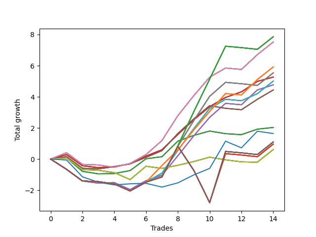

# Short Wallace 010 
- Symbol: SPY_Unlimited
- Date Range: 03/23/2022 - 07/08/2022
- Trading Period: 7:20-12:30
- Number of Trades: 14



| Name | Win Percent | Profit | Avg Profit / Trade | Avg Time / Trade |      | Name | Win Percent | Profit | Avg Profit / Trade | Avg Time / Trade |
| ---- | ----------- | ------ | ------------------ | ---------------- | ---- | ---- | ----------- | ------ | ------------------ | ---------------- |
| Sorted By <br> Profit | | | | | | Sorted By <br> Win Percentage ||||
| One Hundred Twenty-Seven | 50.00 | 3930.00 | 280.71 | 23:31 |     | Sixty-Five | 85.71 | 2635.00 | 188.21 | 10:17 |
| One Hundred Twenty-Two | 50.00 | 3930.00 | 280.71 | 23:31 |     | Fifty-Seven | 85.71 | 2635.00 | 188.21 | 10:17 |
| One Hundred Seventeen | 50.00 | 3930.00 | 280.71 | 23:31 |     | Forty-Nine | 85.71 | 2635.00 | 188.21 | 10:17 |
| One Hundred Twelve | 50.00 | 3930.00 | 280.71 | 23:31 |     | Forty-One | 85.71 | 2635.00 | 188.21 | 10:17 |
| Eighty-Two | 50.00 | 3930.00 | 280.71 | 23:31 |     | One | 85.71 | 2635.00 | 188.21 | 10:17 |
| Sixty-Eight | 71.43 | 3760.00 | 268.57 | 17:26 |     | Sixty-Eight | 71.43 | 3760.00 | 268.57 | 17:26 |
| Sixty | 71.43 | 3760.00 | 268.57 | 17:26 |     | Sixty | 71.43 | 3760.00 | 268.57 | 17:26 |
| Fifty-Two | 71.43 | 3760.00 | 268.57 | 17:26 |     | Fifty-Two | 71.43 | 3760.00 | 268.57 | 17:26 |
| Forty-Four | 71.43 | 3760.00 | 268.57 | 17:26 |     | Forty-Four | 71.43 | 3760.00 | 268.57 | 17:26 |
| Four | 71.43 | 3760.00 | 268.57 | 17:26 |     | Four | 71.43 | 3760.00 | 268.57 | 17:26 |
| One Hundred Twenty-Six | 57.14 | 2960.00 | 211.43 | 19:41 |     | Sixty-Seven | 71.43 | 2220.00 | 158.57 | 14:01 |
| One Hundred Twenty-One | 57.14 | 2960.00 | 211.43 | 19:41 |     | Fifty-Nine | 71.43 | 2220.00 | 158.57 | 14:01 |
| One Hundred Sixteen | 57.14 | 2960.00 | 211.43 | 19:41 |     | Fifty-One | 71.43 | 2220.00 | 158.57 | 14:01 |
| One Hundred Eleven | 57.14 | 2960.00 | 211.43 | 19:41 |     | Forty-Three | 71.43 | 2220.00 | 158.57 | 14:01 |
| Eighty-One | 57.14 | 2960.00 | 211.43 | 19:41 |     | Three | 71.43 | 2220.00 | 158.57 | 14:01 |
| Sixty-Nine | 50.00 | 2770.00 | 197.86 | 23:51 |     | Sixty-Four | 71.43 | 1015.00 | 72.50 | 07:12 |
| Sixty-One | 50.00 | 2770.00 | 197.86 | 23:51 |     | Fifty-Six | 71.43 | 1015.00 | 72.50 | 07:12 |
| Fifty-Three | 50.00 | 2770.00 | 197.86 | 23:51 |     | Forty-Eight | 71.43 | 1015.00 | 72.50 | 07:12 |
| Forty-Five | 50.00 | 2770.00 | 197.86 | 23:51 |     | Forty | 71.43 | 1015.00 | 72.50 | 07:12 |
| Five | 50.00 | 2770.00 | 197.86 | 23:51 |     | Zero | 71.43 | 1015.00 | 72.50 | 07:12 |
| Sixty-Five | 85.71 | 2635.00 | 188.21 | 10:17 |     | Sixty-Six | 64.29 | 2385.00 | 170.36 | 17:41 |
| Fifty-Seven | 85.71 | 2635.00 | 188.21 | 10:17 |     | Fifty-Eight | 64.29 | 2385.00 | 170.36 | 17:41 |
| Forty-Nine | 85.71 | 2635.00 | 188.21 | 10:17 |     | Fifty | 64.29 | 2385.00 | 170.36 | 17:41 |
| Forty-One | 85.71 | 2635.00 | 188.21 | 10:17 |     | Forty-Two | 64.29 | 2385.00 | 170.36 | 17:41 |
| One | 85.71 | 2635.00 | 188.21 | 10:17 |     | Two | 64.29 | 2385.00 | 170.36 | 17:41 |
| Seventy-One | 57.14 | 2505.00 | 178.93 | 20:19 |     | One Hundred Twenty-Six | 57.14 | 2960.00 | 211.43 | 19:41 |
| Sixty-Three | 57.14 | 2505.00 | 178.93 | 20:19 |     | One Hundred Twenty-One | 57.14 | 2960.00 | 211.43 | 19:41 |
| Fifty-Five | 57.14 | 2505.00 | 178.93 | 20:19 |     | One Hundred Sixteen | 57.14 | 2960.00 | 211.43 | 19:41 |
| Forty-Seven | 57.14 | 2505.00 | 178.93 | 20:19 |     | One Hundred Eleven | 57.14 | 2960.00 | 211.43 | 19:41 |
| Seven | 57.14 | 2505.00 | 178.93 | 20:19 |     | Eighty-One | 57.14 | 2960.00 | 211.43 | 19:41 |
| Sixty-Six | 64.29 | 2385.00 | 170.36 | 17:41 |     | Seventy-One | 57.14 | 2505.00 | 178.93 | 20:19 |
| Fifty-Eight | 64.29 | 2385.00 | 170.36 | 17:41 |     | Sixty-Three | 57.14 | 2505.00 | 178.93 | 20:19 |
| Fifty | 64.29 | 2385.00 | 170.36 | 17:41 |     | Fifty-Five | 57.14 | 2505.00 | 178.93 | 20:19 |
| Forty-Two | 64.29 | 2385.00 | 170.36 | 17:41 |     | Forty-Seven | 57.14 | 2505.00 | 178.93 | 20:19 |
| Two | 64.29 | 2385.00 | 170.36 | 17:41 |     | Seven | 57.14 | 2505.00 | 178.93 | 20:19 |
| Sixty-Seven | 71.43 | 2220.00 | 158.57 | 14:01 |     | One Hundred Twenty-Seven | 50.00 | 3930.00 | 280.71 | 23:31 |
| Fifty-Nine | 71.43 | 2220.00 | 158.57 | 14:01 |     | One Hundred Twenty-Two | 50.00 | 3930.00 | 280.71 | 23:31 |
| Fifty-One | 71.43 | 2220.00 | 158.57 | 14:01 |     | One Hundred Seventeen | 50.00 | 3930.00 | 280.71 | 23:31 |
| Forty-Three | 71.43 | 2220.00 | 158.57 | 14:01 |     | One Hundred Twelve | 50.00 | 3930.00 | 280.71 | 23:31 |
| Three | 71.43 | 2220.00 | 158.57 | 14:01 |     | Eighty-Two | 50.00 | 3930.00 | 280.71 | 23:31 |
| Sixty-Four | 71.43 | 1015.00 | 72.50 | 07:12 |     | Sixty-Nine | 50.00 | 2770.00 | 197.86 | 23:51 |
| Fifty-Six | 71.43 | 1015.00 | 72.50 | 07:12 |     | Sixty-One | 50.00 | 2770.00 | 197.86 | 23:51 |
| Forty-Eight | 71.43 | 1015.00 | 72.50 | 07:12 |     | Fifty-Three | 50.00 | 2770.00 | 197.86 | 23:51 |
| Forty | 71.43 | 1015.00 | 72.50 | 07:12 |     | Forty-Five | 50.00 | 2770.00 | 197.86 | 23:51 |
| Zero | 71.43 | 1015.00 | 72.50 | 07:12 |     | Five | 50.00 | 2770.00 | 197.86 | 23:51 |
| Seventy-Three | 50.00 | 820.00 | 58.57 | 08:39 |     | Seventy-Three | 50.00 | 820.00 | 58.57 | 08:39 |
| One Hundred Thirty | 35.71 | 550.00 | 39.29 | 29:55 |     | Seventy | 42.86 | 305.00 | 21.79 | 11:16 |
| One Hundred Twenty-Nine | 35.71 | 550.00 | 39.29 | 29:55 |     | Sixty-Two | 42.86 | 305.00 | 21.79 | 11:16 |
| One Hundred Twenty-Five | 35.71 | 550.00 | 39.29 | 29:55 |     | Fifty-Four | 42.86 | 305.00 | 21.79 | 11:16 |
| One Hundred Twenty-Four | 35.71 | 550.00 | 39.29 | 29:55 |     | Forty-Six | 42.86 | 305.00 | 21.79 | 11:16 |
| One Hundred Twenty | 35.71 | 550.00 | 39.29 | 29:55 |     | Six | 42.86 | 305.00 | 21.79 | 11:16 |
| One Hundred Ninteen | 35.71 | 550.00 | 39.29 | 29:55 |     | One Hundred Thirty | 35.71 | 550.00 | 39.29 | 29:55 |
| One Hundred Fifteen | 35.71 | 550.00 | 39.29 | 29:55 |     | One Hundred Twenty-Nine | 35.71 | 550.00 | 39.29 | 29:55 |
| One Hundred Fourteen | 35.71 | 550.00 | 39.29 | 29:55 |     | One Hundred Twenty-Five | 35.71 | 550.00 | 39.29 | 29:55 |
| Eighty-Five | 35.71 | 550.00 | 39.29 | 29:55 |     | One Hundred Twenty-Four | 35.71 | 550.00 | 39.29 | 29:55 |
| Eighty-Four | 35.71 | 550.00 | 39.29 | 29:55 |     | One Hundred Twenty | 35.71 | 550.00 | 39.29 | 29:55 |
| One Hundred Twenty-Eight | 35.71 | 480.00 | 34.29 | 28:07 |     | One Hundred Ninteen | 35.71 | 550.00 | 39.29 | 29:55 |
| One Hundred Twenty-Three | 35.71 | 480.00 | 34.29 | 28:07 |     | One Hundred Fifteen | 35.71 | 550.00 | 39.29 | 29:55 |
| One Hundred Eighteen | 35.71 | 480.00 | 34.29 | 28:07 |     | One Hundred Fourteen | 35.71 | 550.00 | 39.29 | 29:55 |
| One Hundred Thirteen | 35.71 | 480.00 | 34.29 | 28:07 |     | Eighty-Five | 35.71 | 550.00 | 39.29 | 29:55 |
| Eighty-Three | 35.71 | 480.00 | 34.29 | 28:07 |     | Eighty-Four | 35.71 | 550.00 | 39.29 | 29:55 |
| Seventy | 42.86 | 305.00 | 21.79 | 11:16 |     | One Hundred Twenty-Eight | 35.71 | 480.00 | 34.29 | 28:07 |
| Sixty-Two | 42.86 | 305.00 | 21.79 | 11:16 |     | One Hundred Twenty-Three | 35.71 | 480.00 | 34.29 | 28:07 |
| Fifty-Four | 42.86 | 305.00 | 21.79 | 11:16 |     | One Hundred Eighteen | 35.71 | 480.00 | 34.29 | 28:07 |
| Forty-Six | 42.86 | 305.00 | 21.79 | 11:16 |     | One Hundred Thirteen | 35.71 | 480.00 | 34.29 | 28:07 |
| Six | 42.86 | 305.00 | 21.79 | 11:16 |     | Eighty-Three | 35.71 | 480.00 | 34.29 | 28:07 |

## NO STOPLOSS

### Test Zero
* Sell when price hits the middle line of the 20p bollinger
* No Stoploss
* Results:
```
Total Trades: 14
Percent Up: 28.57
Percent Down: 71.43
Total Points Moved Down: 2.03
Potential Profit: 1015.00
Total Points Ups: 1.25 Count Ups: 4
Total Points Downs: 3.28 Count Downs: 10
```

<details><summary>Trades</summary>

<code>In: 2022-03-25 10:22:00		Out: 2022-03-25 10:22:10		Total Position Time: 00:10		Total Move Down: 0.07		Total to Date: 0.07</code> <br />
<code>In: 2022-03-25 10:52:00		Out: 2022-03-25 11:18:10		Total Position Time: 26:10		Total Move Down: -0.86		Total to Date: -0.79</code> <br />
<code>In: 2022-03-28 10:27:00		Out: 2022-03-28 10:42:15		Total Position Time: 15:15		Total Move Down: -0.16		Total to Date: -0.95</code> <br />
<code>In: 2022-03-28 10:30:00		Out: 2022-03-28 10:42:15		Total Position Time: 12:15		Total Move Down: 0.02		Total to Date: -0.93</code> <br />
<code>In: 2022-03-28 11:12:00		Out: 2022-03-28 11:12:10		Total Position Time: 00:10		Total Move Down: 0.19		Total to Date: -0.74</code> <br />
<code>In: 2022-04-25 09:27:00		Out: 2022-04-25 09:31:05		Total Position Time: 04:05		Total Move Down: 0.76		Total to Date: 0.02</code> <br />
<code>In: 2022-04-26 11:23:00		Out: 2022-04-26 11:31:35		Total Position Time: 08:35		Total Move Down: 0.13		Total to Date: 0.15</code> <br />
<code>In: 2022-05-02 09:23:00		Out: 2022-05-02 09:27:15		Total Position Time: 04:15		Total Move Down: 1.00		Total to Date: 1.15</code> <br />
<code>In: 2022-05-25 11:04:00		Out: 2022-05-25 11:06:20		Total Position Time: 02:20		Total Move Down: 0.37		Total to Date: 1.52</code> <br />
<code>In: 2022-05-25 11:06:00		Out: 2022-05-25 11:06:20		Total Position Time: 00:20		Total Move Down: 0.28		Total to Date: 1.80</code> <br />
<code>In: 2022-06-15 11:02:00		Out: 2022-06-15 11:02:10		Total Position Time: 00:10		Total Move Down: -0.17		Total to Date: 1.63</code> <br />
<code>In: 2022-06-17 08:09:00		Out: 2022-06-17 08:23:05		Total Position Time: 14:05		Total Move Down: -0.06		Total to Date: 1.57</code> <br />
<code>In: 2022-06-29 10:12:00		Out: 2022-06-29 10:13:05		Total Position Time: 01:05		Total Move Down: 0.35		Total to Date: 1.92</code> <br />
<code>In: 2022-06-29 11:06:00		Out: 2022-06-29 11:18:05		Total Position Time: 12:05		Total Move Down: 0.11		Total to Date: 2.03</code> <br />


</details>

### Test One
* Sell when the price hits the upper line of the 20p 1std bollinger
* No Stoploss
* Results:
```
Total Trades: 14
Percent Up: 14.29
Percent Down: 85.71
Total Points Moved Down: 5.27
Potential Profit: 2635.00
Total Points Ups: 0.84 Count Ups: 2
Total Points Downs: 6.11 Count Downs: 12
```

<details><summary>Trades</summary>

<code>In: 2022-03-25 10:22:00		Out: 2022-03-25 10:23:25		Total Position Time: 01:25		Total Move Down: 0.29		Total to Date: 0.29</code> <br />
<code>In: 2022-03-25 10:52:00		Out: 2022-03-25 11:19:30		Total Position Time: 27:30		Total Move Down: -0.72		Total to Date: -0.43</code> <br />
<code>In: 2022-03-28 10:27:00		Out: 2022-03-28 10:44:05		Total Position Time: 17:05		Total Move Down: -0.12		Total to Date: -0.55</code> <br />
<code>In: 2022-03-28 10:30:00		Out: 2022-03-28 10:44:05		Total Position Time: 14:05		Total Move Down: 0.06		Total to Date: -0.49</code> <br />
<code>In: 2022-03-28 11:12:00		Out: 2022-03-28 11:19:20		Total Position Time: 07:20		Total Move Down: 0.18		Total to Date: -0.31</code> <br />
<code>In: 2022-04-25 09:27:00		Out: 2022-04-25 09:42:35		Total Position Time: 15:35		Total Move Down: 0.50		Total to Date: 0.19</code> <br />
<code>In: 2022-04-26 11:23:00		Out: 2022-04-26 11:33:45		Total Position Time: 10:45		Total Move Down: 0.41		Total to Date: 0.60</code> <br />
<code>In: 2022-05-02 09:23:00		Out: 2022-05-02 09:36:10		Total Position Time: 13:10		Total Move Down: 0.98		Total to Date: 1.58</code> <br />
<code>In: 2022-05-25 11:04:00		Out: 2022-05-25 11:06:35		Total Position Time: 02:35		Total Move Down: 0.94		Total to Date: 2.52</code> <br />
<code>In: 2022-05-25 11:06:00		Out: 2022-05-25 11:06:35		Total Position Time: 00:35		Total Move Down: 0.85		Total to Date: 3.37</code> <br />
<code>In: 2022-06-15 11:02:00		Out: 2022-06-15 11:03:05		Total Position Time: 01:05		Total Move Down: 0.59		Total to Date: 3.96</code> <br />
<code>In: 2022-06-17 08:09:00		Out: 2022-06-17 08:25:20		Total Position Time: 16:20		Total Move Down: 0.36		Total to Date: 4.32</code> <br />
<code>In: 2022-06-29 10:12:00		Out: 2022-06-29 10:14:00		Total Position Time: 02:00		Total Move Down: 0.67		Total to Date: 4.99</code> <br />
<code>In: 2022-06-29 11:06:00		Out: 2022-06-29 11:20:35		Total Position Time: 14:35		Total Move Down: 0.28		Total to Date: 5.27</code> <br />


</details>

### Test Two
* Sell when the price hits the upper line of the 20p 2std bollinger
* No Stoploss
* Results:
```
Total Trades: 14
Percent Up: 35.71
Percent Down: 64.29
Total Points Moved Down: 4.77
Potential Profit: 2385.00
Total Points Ups: 2.09 Count Ups: 5
Total Points Downs: 6.86 Count Downs: 9
```

<details><summary>Trades</summary>

<code>In: 2022-03-25 10:22:00		Out: 2022-03-25 10:51:55		Total Position Time: 29:55		Total Move Down: -0.66		Total to Date: -0.66</code> <br />
<code>In: 2022-03-25 10:52:00		Out: 2022-03-25 11:21:55		Total Position Time: 29:55		Total Move Down: -0.75		Total to Date: -1.41</code> <br />
<code>In: 2022-03-28 10:27:00		Out: 2022-03-28 10:48:10		Total Position Time: 21:10		Total Move Down: -0.14		Total to Date: -1.55</code> <br />
<code>In: 2022-03-28 10:30:00		Out: 2022-03-28 10:48:10		Total Position Time: 18:10		Total Move Down: 0.04		Total to Date: -1.51</code> <br />
<code>In: 2022-03-28 11:12:00		Out: 2022-03-28 11:41:55		Total Position Time: 29:55		Total Move Down: -0.45		Total to Date: -1.96</code> <br />
<code>In: 2022-04-25 09:27:00		Out: 2022-04-25 09:56:55		Total Position Time: 29:55		Total Move Down: 0.57		Total to Date: -1.39</code> <br />
<code>In: 2022-04-26 11:23:00		Out: 2022-04-26 11:41:25		Total Position Time: 18:25		Total Move Down: 0.35		Total to Date: -1.04</code> <br />
<code>In: 2022-05-02 09:23:00		Out: 2022-05-02 09:39:35		Total Position Time: 16:35		Total Move Down: 1.25		Total to Date: 0.21</code> <br />
<code>In: 2022-05-25 11:04:00		Out: 2022-05-25 11:06:40		Total Position Time: 02:40		Total Move Down: 1.28		Total to Date: 1.49</code> <br />
<code>In: 2022-05-25 11:06:00		Out: 2022-05-25 11:06:40		Total Position Time: 00:40		Total Move Down: 1.19		Total to Date: 2.68</code> <br />
<code>In: 2022-06-15 11:02:00		Out: 2022-06-15 11:03:15		Total Position Time: 01:15		Total Move Down: 0.90		Total to Date: 3.58</code> <br />
<code>In: 2022-06-17 08:09:00		Out: 2022-06-17 08:38:55		Total Position Time: 29:55		Total Move Down: -0.09		Total to Date: 3.49</code> <br />
<code>In: 2022-06-29 10:12:00		Out: 2022-06-29 10:16:00		Total Position Time: 04:00		Total Move Down: 0.95		Total to Date: 4.44</code> <br />
<code>In: 2022-06-29 11:06:00		Out: 2022-06-29 11:21:05		Total Position Time: 15:05		Total Move Down: 0.33		Total to Date: 4.77</code> <br />


</details>

### Test Three
* Sell when price hits the middle line of the 50p bollinger
* No Stoploss
* Results:
```
Total Trades: 14
Percent Up: 28.57
Percent Down: 71.43
Total Points Moved Down: 4.44
Potential Profit: 2220.00
Total Points Ups: 1.05 Count Ups: 4
Total Points Downs: 5.49 Count Downs: 10
```

<details><summary>Trades</summary>

<code>In: 2022-03-25 10:22:00		Out: 2022-03-25 10:23:10		Total Position Time: 01:10		Total Move Down: 0.16		Total to Date: 0.16</code> <br />
<code>In: 2022-03-25 10:52:00		Out: 2022-03-25 11:21:55		Total Position Time: 29:55		Total Move Down: -0.75		Total to Date: -0.59</code> <br />
<code>In: 2022-03-28 10:27:00		Out: 2022-03-28 10:56:55		Total Position Time: 29:55		Total Move Down: -0.04		Total to Date: -0.63</code> <br />
<code>In: 2022-03-28 10:30:00		Out: 2022-03-28 10:57:20		Total Position Time: 27:20		Total Move Down: 0.14		Total to Date: -0.49</code> <br />
<code>In: 2022-03-28 11:12:00		Out: 2022-03-28 11:12:10		Total Position Time: 00:10		Total Move Down: 0.19		Total to Date: -0.30</code> <br />
<code>In: 2022-04-25 09:27:00		Out: 2022-04-25 09:55:05		Total Position Time: 28:05		Total Move Down: 0.41		Total to Date: 0.11</code> <br />
<code>In: 2022-04-26 11:23:00		Out: 2022-04-26 11:41:30		Total Position Time: 18:30		Total Move Down: 0.43		Total to Date: 0.54</code> <br />
<code>In: 2022-05-02 09:23:00		Out: 2022-05-02 09:27:25		Total Position Time: 04:25		Total Move Down: 1.10		Total to Date: 1.64</code> <br />
<code>In: 2022-05-25 11:04:00		Out: 2022-05-25 11:06:35		Total Position Time: 02:35		Total Move Down: 0.94		Total to Date: 2.58</code> <br />
<code>In: 2022-05-25 11:06:00		Out: 2022-05-25 11:06:35		Total Position Time: 00:35		Total Move Down: 0.85		Total to Date: 3.43</code> <br />
<code>In: 2022-06-15 11:02:00		Out: 2022-06-15 11:02:10		Total Position Time: 00:10		Total Move Down: -0.17		Total to Date: 3.26</code> <br />
<code>In: 2022-06-17 08:09:00		Out: 2022-06-17 08:38:55		Total Position Time: 29:55		Total Move Down: -0.09		Total to Date: 3.17</code> <br />
<code>In: 2022-06-29 10:12:00		Out: 2022-06-29 10:14:00		Total Position Time: 02:00		Total Move Down: 0.67		Total to Date: 3.84</code> <br />
<code>In: 2022-06-29 11:06:00		Out: 2022-06-29 11:27:35		Total Position Time: 21:35		Total Move Down: 0.60		Total to Date: 4.44</code> <br />


</details>

### Test Four
* Sell when the price hits the upper line of the 50p 1std bollinger
* No Stoploss
* Results:
```
Total Trades: 14
Percent Up: 28.57
Percent Down: 71.43
Total Points Moved Down: 7.52
Potential Profit: 3760.00
Total Points Ups: 1.03 Count Ups: 4
Total Points Downs: 8.55 Count Downs: 10
```

<details><summary>Trades</summary>

<code>In: 2022-03-25 10:22:00		Out: 2022-03-25 10:27:15		Total Position Time: 05:15		Total Move Down: 0.41		Total to Date: 0.41</code> <br />
<code>In: 2022-03-25 10:52:00		Out: 2022-03-25 11:21:55		Total Position Time: 29:55		Total Move Down: -0.75		Total to Date: -0.34</code> <br />
<code>In: 2022-03-28 10:27:00		Out: 2022-03-28 10:56:55		Total Position Time: 29:55		Total Move Down: -0.04		Total to Date: -0.38</code> <br />
<code>In: 2022-03-28 10:30:00		Out: 2022-03-28 10:59:55		Total Position Time: 29:55		Total Move Down: -0.15		Total to Date: -0.53</code> <br />
<code>In: 2022-03-28 11:12:00		Out: 2022-03-28 11:20:40		Total Position Time: 08:40		Total Move Down: 0.25		Total to Date: -0.28</code> <br />
<code>In: 2022-04-25 09:27:00		Out: 2022-04-25 09:56:55		Total Position Time: 29:55		Total Move Down: 0.57		Total to Date: 0.29</code> <br />
<code>In: 2022-04-26 11:23:00		Out: 2022-04-26 11:45:00		Total Position Time: 22:00		Total Move Down: 0.90		Total to Date: 1.19</code> <br />
<code>In: 2022-05-02 09:23:00		Out: 2022-05-02 09:43:15		Total Position Time: 20:15		Total Move Down: 1.60		Total to Date: 2.79</code> <br />
<code>In: 2022-05-25 11:04:00		Out: 2022-05-25 11:06:40		Total Position Time: 02:40		Total Move Down: 1.28		Total to Date: 4.07</code> <br />
<code>In: 2022-05-25 11:06:00		Out: 2022-05-25 11:06:40		Total Position Time: 00:40		Total Move Down: 1.19		Total to Date: 5.26</code> <br />
<code>In: 2022-06-15 11:02:00		Out: 2022-06-15 11:03:05		Total Position Time: 01:05		Total Move Down: 0.59		Total to Date: 5.85</code> <br />
<code>In: 2022-06-17 08:09:00		Out: 2022-06-17 08:38:55		Total Position Time: 29:55		Total Move Down: -0.09		Total to Date: 5.76</code> <br />
<code>In: 2022-06-29 10:12:00		Out: 2022-06-29 10:16:00		Total Position Time: 04:00		Total Move Down: 0.95		Total to Date: 6.71</code> <br />
<code>In: 2022-06-29 11:06:00		Out: 2022-06-29 11:35:55		Total Position Time: 29:55		Total Move Down: 0.81		Total to Date: 7.52</code> <br />


</details>

### Test Five
* Sell when the price hits the upper line of the 50p 2std bollinger
* No Stoploss
* Results:
```
Total Trades: 14
Percent Up: 50.00
Percent Down: 50.00
Total Points Moved Down: 5.54
Potential Profit: 2770.00
Total Points Ups: 2.25 Count Ups: 7
Total Points Downs: 7.79 Count Downs: 7
```

<details><summary>Trades</summary>

<code>In: 2022-03-25 10:22:00		Out: 2022-03-25 10:51:55		Total Position Time: 29:55		Total Move Down: -0.66		Total to Date: -0.66</code> <br />
<code>In: 2022-03-25 10:52:00		Out: 2022-03-25 11:21:55		Total Position Time: 29:55		Total Move Down: -0.75		Total to Date: -1.41</code> <br />
<code>In: 2022-03-28 10:27:00		Out: 2022-03-28 10:56:55		Total Position Time: 29:55		Total Move Down: -0.04		Total to Date: -1.45</code> <br />
<code>In: 2022-03-28 10:30:00		Out: 2022-03-28 10:59:55		Total Position Time: 29:55		Total Move Down: -0.15		Total to Date: -1.60</code> <br />
<code>In: 2022-03-28 11:12:00		Out: 2022-03-28 11:41:55		Total Position Time: 29:55		Total Move Down: -0.45		Total to Date: -2.05</code> <br />
<code>In: 2022-04-25 09:27:00		Out: 2022-04-25 09:56:55		Total Position Time: 29:55		Total Move Down: 0.57		Total to Date: -1.48</code> <br />
<code>In: 2022-04-26 11:23:00		Out: 2022-04-26 11:52:55		Total Position Time: 29:55		Total Move Down: 0.33		Total to Date: -1.15</code> <br />
<code>In: 2022-05-02 09:23:00		Out: 2022-05-02 09:52:55		Total Position Time: 29:55		Total Move Down: 1.97		Total to Date: 0.82</code> <br />
<code>In: 2022-05-25 11:04:00		Out: 2022-05-25 11:06:50		Total Position Time: 02:50		Total Move Down: 1.65		Total to Date: 2.47</code> <br />
<code>In: 2022-05-25 11:06:00		Out: 2022-05-25 11:06:50		Total Position Time: 00:50		Total Move Down: 1.56		Total to Date: 4.03</code> <br />
<code>In: 2022-06-15 11:02:00		Out: 2022-06-15 11:03:15		Total Position Time: 01:15		Total Move Down: 0.90		Total to Date: 4.93</code> <br />
<code>In: 2022-06-17 08:09:00		Out: 2022-06-17 08:38:55		Total Position Time: 29:55		Total Move Down: -0.09		Total to Date: 4.84</code> <br />
<code>In: 2022-06-29 10:12:00		Out: 2022-06-29 10:41:55		Total Position Time: 29:55		Total Move Down: -0.11		Total to Date: 4.73</code> <br />
<code>In: 2022-06-29 11:06:00		Out: 2022-06-29 11:35:55		Total Position Time: 29:55		Total Move Down: 0.81		Total to Date: 5.54</code> <br />


</details>

### Test Six
* Sell when the price hits the middle line of the 1std VWAP
* No Stoploss
* Results:
```
Total Trades: 14
Percent Up: 57.14
Percent Down: 42.86
Total Points Moved Down: 0.61
Potential Profit: 305.00
Total Points Ups: 1.85 Count Ups: 8
Total Points Downs: 2.46 Count Downs: 6
```

<details><summary>Trades</summary>

<code>In: 2022-03-25 10:22:00		Out: 2022-03-25 10:22:10		Total Position Time: 00:10		Total Move Down: 0.07		Total to Date: 0.07</code> <br />
<code>In: 2022-03-25 10:52:00		Out: 2022-03-25 11:21:55		Total Position Time: 29:55		Total Move Down: -0.75		Total to Date: -0.68</code> <br />
<code>In: 2022-03-28 10:27:00		Out: 2022-03-28 10:56:55		Total Position Time: 29:55		Total Move Down: -0.04		Total to Date: -0.72</code> <br />
<code>In: 2022-03-28 10:30:00		Out: 2022-03-28 10:59:55		Total Position Time: 29:55		Total Move Down: -0.15		Total to Date: -0.87</code> <br />
<code>In: 2022-03-28 11:12:00		Out: 2022-03-28 11:41:55		Total Position Time: 29:55		Total Move Down: -0.45		Total to Date: -1.32</code> <br />
<code>In: 2022-04-25 09:27:00		Out: 2022-04-25 09:31:10		Total Position Time: 04:10		Total Move Down: 0.86		Total to Date: -0.46</code> <br />
<code>In: 2022-04-26 11:23:00		Out: 2022-04-26 11:23:10		Total Position Time: 00:10		Total Move Down: -0.14		Total to Date: -0.60</code> <br />
<code>In: 2022-05-02 09:23:00		Out: 2022-05-02 09:24:15		Total Position Time: 01:15		Total Move Down: 0.20		Total to Date: -0.40</code> <br />
<code>In: 2022-05-25 11:04:00		Out: 2022-05-25 11:05:45		Total Position Time: 01:45		Total Move Down: 0.24		Total to Date: -0.16</code> <br />
<code>In: 2022-05-25 11:06:00		Out: 2022-05-25 11:06:20		Total Position Time: 00:20		Total Move Down: 0.28		Total to Date: 0.12</code> <br />
<code>In: 2022-06-15 11:02:00		Out: 2022-06-15 11:02:10		Total Position Time: 00:10		Total Move Down: -0.17		Total to Date: -0.05</code> <br />
<code>In: 2022-06-17 08:09:00		Out: 2022-06-17 08:09:10		Total Position Time: 00:10		Total Move Down: -0.13		Total to Date: -0.18</code> <br />
<code>In: 2022-06-29 10:12:00		Out: 2022-06-29 10:12:10		Total Position Time: 00:10		Total Move Down: -0.02		Total to Date: -0.20</code> <br />
<code>In: 2022-06-29 11:06:00		Out: 2022-06-29 11:35:55		Total Position Time: 29:55		Total Move Down: 0.81		Total to Date: 0.61</code> <br />


</details>

### Test Seven
* Sell when the price hits the upper line of the 1std VWAP
* No Stoploss
* Results:
```
Total Trades: 14
Percent Up: 42.86
Percent Down: 57.14
Total Points Moved Down: 5.01
Potential Profit: 2505.00
Total Points Ups: 2.14 Count Ups: 6
Total Points Downs: 7.15 Count Downs: 8
```

<details><summary>Trades</summary>

<code>In: 2022-03-25 10:22:00		Out: 2022-03-25 10:51:55		Total Position Time: 29:55		Total Move Down: -0.66		Total to Date: -0.66</code> <br />
<code>In: 2022-03-25 10:52:00		Out: 2022-03-25 11:21:55		Total Position Time: 29:55		Total Move Down: -0.75		Total to Date: -1.41</code> <br />
<code>In: 2022-03-28 10:27:00		Out: 2022-03-28 10:56:55		Total Position Time: 29:55		Total Move Down: -0.04		Total to Date: -1.45</code> <br />
<code>In: 2022-03-28 10:30:00		Out: 2022-03-28 10:59:55		Total Position Time: 29:55		Total Move Down: -0.15		Total to Date: -1.60</code> <br />
<code>In: 2022-03-28 11:12:00		Out: 2022-03-28 11:41:55		Total Position Time: 29:55		Total Move Down: -0.45		Total to Date: -2.05</code> <br />
<code>In: 2022-04-25 09:27:00		Out: 2022-04-25 09:56:55		Total Position Time: 29:55		Total Move Down: 0.57		Total to Date: -1.48</code> <br />
<code>In: 2022-04-26 11:23:00		Out: 2022-04-26 11:42:15		Total Position Time: 19:15		Total Move Down: 0.58		Total to Date: -0.90</code> <br />
<code>In: 2022-05-02 09:23:00		Out: 2022-05-02 09:42:40		Total Position Time: 19:40		Total Move Down: 1.46		Total to Date: 0.56</code> <br />
<code>In: 2022-05-25 11:04:00		Out: 2022-05-25 11:06:45		Total Position Time: 02:45		Total Move Down: 1.39		Total to Date: 1.95</code> <br />
<code>In: 2022-05-25 11:06:00		Out: 2022-05-25 11:06:45		Total Position Time: 00:45		Total Move Down: 1.30		Total to Date: 3.25</code> <br />
<code>In: 2022-06-15 11:02:00		Out: 2022-06-15 11:03:05		Total Position Time: 01:05		Total Move Down: 0.59		Total to Date: 3.84</code> <br />
<code>In: 2022-06-17 08:09:00		Out: 2022-06-17 08:38:55		Total Position Time: 29:55		Total Move Down: -0.09		Total to Date: 3.75</code> <br />
<code>In: 2022-06-29 10:12:00		Out: 2022-06-29 10:13:45		Total Position Time: 01:45		Total Move Down: 0.45		Total to Date: 4.20</code> <br />
<code>In: 2022-06-29 11:06:00		Out: 2022-06-29 11:35:55		Total Position Time: 29:55		Total Move Down: 0.81		Total to Date: 5.01</code> <br />


</details>

## STOPLOSS OF 5

### Test Forty
* Sell when price hits the middle line of the 20p bollinger
* Stoploss is -5 points
* Results:
```
Total Trades: 14
Percent Up: 28.57
Percent Down: 71.43
Total Points Moved Down: 2.03
Potential Profit: 1015.00
Total Points Ups: 1.25 Count Ups: 4
Total Points Downs: 3.28 Count Downs: 10
```

<details><summary>Trades</summary>

<code>In: 2022-03-25 10:22:00		Out: 2022-03-25 10:22:10		Total Position Time: 00:10		Total Move Down: 0.07		Total to Date: 0.07</code> <br />
<code>In: 2022-03-25 10:52:00		Out: 2022-03-25 11:18:10		Total Position Time: 26:10		Total Move Down: -0.86		Total to Date: -0.79</code> <br />
<code>In: 2022-03-28 10:27:00		Out: 2022-03-28 10:42:15		Total Position Time: 15:15		Total Move Down: -0.16		Total to Date: -0.95</code> <br />
<code>In: 2022-03-28 10:30:00		Out: 2022-03-28 10:42:15		Total Position Time: 12:15		Total Move Down: 0.02		Total to Date: -0.93</code> <br />
<code>In: 2022-03-28 11:12:00		Out: 2022-03-28 11:12:10		Total Position Time: 00:10		Total Move Down: 0.19		Total to Date: -0.74</code> <br />
<code>In: 2022-04-25 09:27:00		Out: 2022-04-25 09:31:05		Total Position Time: 04:05		Total Move Down: 0.76		Total to Date: 0.02</code> <br />
<code>In: 2022-04-26 11:23:00		Out: 2022-04-26 11:31:35		Total Position Time: 08:35		Total Move Down: 0.13		Total to Date: 0.15</code> <br />
<code>In: 2022-05-02 09:23:00		Out: 2022-05-02 09:27:15		Total Position Time: 04:15		Total Move Down: 1.00		Total to Date: 1.15</code> <br />
<code>In: 2022-05-25 11:04:00		Out: 2022-05-25 11:06:20		Total Position Time: 02:20		Total Move Down: 0.37		Total to Date: 1.52</code> <br />
<code>In: 2022-05-25 11:06:00		Out: 2022-05-25 11:06:20		Total Position Time: 00:20		Total Move Down: 0.28		Total to Date: 1.80</code> <br />
<code>In: 2022-06-15 11:02:00		Out: 2022-06-15 11:02:10		Total Position Time: 00:10		Total Move Down: -0.17		Total to Date: 1.63</code> <br />
<code>In: 2022-06-17 08:09:00		Out: 2022-06-17 08:23:05		Total Position Time: 14:05		Total Move Down: -0.06		Total to Date: 1.57</code> <br />
<code>In: 2022-06-29 10:12:00		Out: 2022-06-29 10:13:05		Total Position Time: 01:05		Total Move Down: 0.35		Total to Date: 1.92</code> <br />
<code>In: 2022-06-29 11:06:00		Out: 2022-06-29 11:18:05		Total Position Time: 12:05		Total Move Down: 0.11		Total to Date: 2.03</code> <br />


</details>

### Test Forty-One
* Sell when the price hits the upper line of the 20p 1std bollinger
* Stoploss is -5 points
* Results:
```
Total Trades: 14
Percent Up: 14.29
Percent Down: 85.71
Total Points Moved Down: 5.27
Potential Profit: 2635.00
Total Points Ups: 0.84 Count Ups: 2
Total Points Downs: 6.11 Count Downs: 12
```

<details><summary>Trades</summary>

<code>In: 2022-03-25 10:22:00		Out: 2022-03-25 10:23:25		Total Position Time: 01:25		Total Move Down: 0.29		Total to Date: 0.29</code> <br />
<code>In: 2022-03-25 10:52:00		Out: 2022-03-25 11:19:30		Total Position Time: 27:30		Total Move Down: -0.72		Total to Date: -0.43</code> <br />
<code>In: 2022-03-28 10:27:00		Out: 2022-03-28 10:44:05		Total Position Time: 17:05		Total Move Down: -0.12		Total to Date: -0.55</code> <br />
<code>In: 2022-03-28 10:30:00		Out: 2022-03-28 10:44:05		Total Position Time: 14:05		Total Move Down: 0.06		Total to Date: -0.49</code> <br />
<code>In: 2022-03-28 11:12:00		Out: 2022-03-28 11:19:20		Total Position Time: 07:20		Total Move Down: 0.18		Total to Date: -0.31</code> <br />
<code>In: 2022-04-25 09:27:00		Out: 2022-04-25 09:42:35		Total Position Time: 15:35		Total Move Down: 0.50		Total to Date: 0.19</code> <br />
<code>In: 2022-04-26 11:23:00		Out: 2022-04-26 11:33:45		Total Position Time: 10:45		Total Move Down: 0.41		Total to Date: 0.60</code> <br />
<code>In: 2022-05-02 09:23:00		Out: 2022-05-02 09:36:10		Total Position Time: 13:10		Total Move Down: 0.98		Total to Date: 1.58</code> <br />
<code>In: 2022-05-25 11:04:00		Out: 2022-05-25 11:06:35		Total Position Time: 02:35		Total Move Down: 0.94		Total to Date: 2.52</code> <br />
<code>In: 2022-05-25 11:06:00		Out: 2022-05-25 11:06:35		Total Position Time: 00:35		Total Move Down: 0.85		Total to Date: 3.37</code> <br />
<code>In: 2022-06-15 11:02:00		Out: 2022-06-15 11:03:05		Total Position Time: 01:05		Total Move Down: 0.59		Total to Date: 3.96</code> <br />
<code>In: 2022-06-17 08:09:00		Out: 2022-06-17 08:25:20		Total Position Time: 16:20		Total Move Down: 0.36		Total to Date: 4.32</code> <br />
<code>In: 2022-06-29 10:12:00		Out: 2022-06-29 10:14:00		Total Position Time: 02:00		Total Move Down: 0.67		Total to Date: 4.99</code> <br />
<code>In: 2022-06-29 11:06:00		Out: 2022-06-29 11:20:35		Total Position Time: 14:35		Total Move Down: 0.28		Total to Date: 5.27</code> <br />


</details>

### Test Forty-Two
* Sell when the price hits the upper line of the 20p 2std bollinger
* Stoploss is -5 points
* Results:
```
Total Trades: 14
Percent Up: 35.71
Percent Down: 64.29
Total Points Moved Down: 4.77
Potential Profit: 2385.00
Total Points Ups: 2.09 Count Ups: 5
Total Points Downs: 6.86 Count Downs: 9
```

<details><summary>Trades</summary>

<code>In: 2022-03-25 10:22:00		Out: 2022-03-25 10:51:55		Total Position Time: 29:55		Total Move Down: -0.66		Total to Date: -0.66</code> <br />
<code>In: 2022-03-25 10:52:00		Out: 2022-03-25 11:21:55		Total Position Time: 29:55		Total Move Down: -0.75		Total to Date: -1.41</code> <br />
<code>In: 2022-03-28 10:27:00		Out: 2022-03-28 10:48:10		Total Position Time: 21:10		Total Move Down: -0.14		Total to Date: -1.55</code> <br />
<code>In: 2022-03-28 10:30:00		Out: 2022-03-28 10:48:10		Total Position Time: 18:10		Total Move Down: 0.04		Total to Date: -1.51</code> <br />
<code>In: 2022-03-28 11:12:00		Out: 2022-03-28 11:41:55		Total Position Time: 29:55		Total Move Down: -0.45		Total to Date: -1.96</code> <br />
<code>In: 2022-04-25 09:27:00		Out: 2022-04-25 09:56:55		Total Position Time: 29:55		Total Move Down: 0.57		Total to Date: -1.39</code> <br />
<code>In: 2022-04-26 11:23:00		Out: 2022-04-26 11:41:25		Total Position Time: 18:25		Total Move Down: 0.35		Total to Date: -1.04</code> <br />
<code>In: 2022-05-02 09:23:00		Out: 2022-05-02 09:39:35		Total Position Time: 16:35		Total Move Down: 1.25		Total to Date: 0.21</code> <br />
<code>In: 2022-05-25 11:04:00		Out: 2022-05-25 11:06:40		Total Position Time: 02:40		Total Move Down: 1.28		Total to Date: 1.49</code> <br />
<code>In: 2022-05-25 11:06:00		Out: 2022-05-25 11:06:40		Total Position Time: 00:40		Total Move Down: 1.19		Total to Date: 2.68</code> <br />
<code>In: 2022-06-15 11:02:00		Out: 2022-06-15 11:03:15		Total Position Time: 01:15		Total Move Down: 0.90		Total to Date: 3.58</code> <br />
<code>In: 2022-06-17 08:09:00		Out: 2022-06-17 08:38:55		Total Position Time: 29:55		Total Move Down: -0.09		Total to Date: 3.49</code> <br />
<code>In: 2022-06-29 10:12:00		Out: 2022-06-29 10:16:00		Total Position Time: 04:00		Total Move Down: 0.95		Total to Date: 4.44</code> <br />
<code>In: 2022-06-29 11:06:00		Out: 2022-06-29 11:21:05		Total Position Time: 15:05		Total Move Down: 0.33		Total to Date: 4.77</code> <br />


</details>

### Test Forty-Three
* Sell when price hits the middle line of the 50p bollinger
* Stoploss is -5 points
* Results:
```
Total Trades: 14
Percent Up: 28.57
Percent Down: 71.43
Total Points Moved Down: 4.44
Potential Profit: 2220.00
Total Points Ups: 1.05 Count Ups: 4
Total Points Downs: 5.49 Count Downs: 10
```

<details><summary>Trades</summary>

<code>In: 2022-03-25 10:22:00		Out: 2022-03-25 10:23:10		Total Position Time: 01:10		Total Move Down: 0.16		Total to Date: 0.16</code> <br />
<code>In: 2022-03-25 10:52:00		Out: 2022-03-25 11:21:55		Total Position Time: 29:55		Total Move Down: -0.75		Total to Date: -0.59</code> <br />
<code>In: 2022-03-28 10:27:00		Out: 2022-03-28 10:56:55		Total Position Time: 29:55		Total Move Down: -0.04		Total to Date: -0.63</code> <br />
<code>In: 2022-03-28 10:30:00		Out: 2022-03-28 10:57:20		Total Position Time: 27:20		Total Move Down: 0.14		Total to Date: -0.49</code> <br />
<code>In: 2022-03-28 11:12:00		Out: 2022-03-28 11:12:10		Total Position Time: 00:10		Total Move Down: 0.19		Total to Date: -0.30</code> <br />
<code>In: 2022-04-25 09:27:00		Out: 2022-04-25 09:55:05		Total Position Time: 28:05		Total Move Down: 0.41		Total to Date: 0.11</code> <br />
<code>In: 2022-04-26 11:23:00		Out: 2022-04-26 11:41:30		Total Position Time: 18:30		Total Move Down: 0.43		Total to Date: 0.54</code> <br />
<code>In: 2022-05-02 09:23:00		Out: 2022-05-02 09:27:25		Total Position Time: 04:25		Total Move Down: 1.10		Total to Date: 1.64</code> <br />
<code>In: 2022-05-25 11:04:00		Out: 2022-05-25 11:06:35		Total Position Time: 02:35		Total Move Down: 0.94		Total to Date: 2.58</code> <br />
<code>In: 2022-05-25 11:06:00		Out: 2022-05-25 11:06:35		Total Position Time: 00:35		Total Move Down: 0.85		Total to Date: 3.43</code> <br />
<code>In: 2022-06-15 11:02:00		Out: 2022-06-15 11:02:10		Total Position Time: 00:10		Total Move Down: -0.17		Total to Date: 3.26</code> <br />
<code>In: 2022-06-17 08:09:00		Out: 2022-06-17 08:38:55		Total Position Time: 29:55		Total Move Down: -0.09		Total to Date: 3.17</code> <br />
<code>In: 2022-06-29 10:12:00		Out: 2022-06-29 10:14:00		Total Position Time: 02:00		Total Move Down: 0.67		Total to Date: 3.84</code> <br />
<code>In: 2022-06-29 11:06:00		Out: 2022-06-29 11:27:35		Total Position Time: 21:35		Total Move Down: 0.60		Total to Date: 4.44</code> <br />


</details>

### Test Forty-Four
* Sell when the price hits the upper line of the 50p 1std bollinger
* Stoploss is -5 points
* Results:
```
Total Trades: 14
Percent Up: 28.57
Percent Down: 71.43
Total Points Moved Down: 7.52
Potential Profit: 3760.00
Total Points Ups: 1.03 Count Ups: 4
Total Points Downs: 8.55 Count Downs: 10
```

<details><summary>Trades</summary>

<code>In: 2022-03-25 10:22:00		Out: 2022-03-25 10:27:15		Total Position Time: 05:15		Total Move Down: 0.41		Total to Date: 0.41</code> <br />
<code>In: 2022-03-25 10:52:00		Out: 2022-03-25 11:21:55		Total Position Time: 29:55		Total Move Down: -0.75		Total to Date: -0.34</code> <br />
<code>In: 2022-03-28 10:27:00		Out: 2022-03-28 10:56:55		Total Position Time: 29:55		Total Move Down: -0.04		Total to Date: -0.38</code> <br />
<code>In: 2022-03-28 10:30:00		Out: 2022-03-28 10:59:55		Total Position Time: 29:55		Total Move Down: -0.15		Total to Date: -0.53</code> <br />
<code>In: 2022-03-28 11:12:00		Out: 2022-03-28 11:20:40		Total Position Time: 08:40		Total Move Down: 0.25		Total to Date: -0.28</code> <br />
<code>In: 2022-04-25 09:27:00		Out: 2022-04-25 09:56:55		Total Position Time: 29:55		Total Move Down: 0.57		Total to Date: 0.29</code> <br />
<code>In: 2022-04-26 11:23:00		Out: 2022-04-26 11:45:00		Total Position Time: 22:00		Total Move Down: 0.90		Total to Date: 1.19</code> <br />
<code>In: 2022-05-02 09:23:00		Out: 2022-05-02 09:43:15		Total Position Time: 20:15		Total Move Down: 1.60		Total to Date: 2.79</code> <br />
<code>In: 2022-05-25 11:04:00		Out: 2022-05-25 11:06:40		Total Position Time: 02:40		Total Move Down: 1.28		Total to Date: 4.07</code> <br />
<code>In: 2022-05-25 11:06:00		Out: 2022-05-25 11:06:40		Total Position Time: 00:40		Total Move Down: 1.19		Total to Date: 5.26</code> <br />
<code>In: 2022-06-15 11:02:00		Out: 2022-06-15 11:03:05		Total Position Time: 01:05		Total Move Down: 0.59		Total to Date: 5.85</code> <br />
<code>In: 2022-06-17 08:09:00		Out: 2022-06-17 08:38:55		Total Position Time: 29:55		Total Move Down: -0.09		Total to Date: 5.76</code> <br />
<code>In: 2022-06-29 10:12:00		Out: 2022-06-29 10:16:00		Total Position Time: 04:00		Total Move Down: 0.95		Total to Date: 6.71</code> <br />
<code>In: 2022-06-29 11:06:00		Out: 2022-06-29 11:35:55		Total Position Time: 29:55		Total Move Down: 0.81		Total to Date: 7.52</code> <br />


</details>

### Test Forty-Five
* Sell when the price hits the upper line of the 50p 2std bollinger
* Stoploss is -5 points
* Results:
```
Total Trades: 14
Percent Up: 50.00
Percent Down: 50.00
Total Points Moved Down: 5.54
Potential Profit: 2770.00
Total Points Ups: 2.25 Count Ups: 7
Total Points Downs: 7.79 Count Downs: 7
```

<details><summary>Trades</summary>

<code>In: 2022-03-25 10:22:00		Out: 2022-03-25 10:51:55		Total Position Time: 29:55		Total Move Down: -0.66		Total to Date: -0.66</code> <br />
<code>In: 2022-03-25 10:52:00		Out: 2022-03-25 11:21:55		Total Position Time: 29:55		Total Move Down: -0.75		Total to Date: -1.41</code> <br />
<code>In: 2022-03-28 10:27:00		Out: 2022-03-28 10:56:55		Total Position Time: 29:55		Total Move Down: -0.04		Total to Date: -1.45</code> <br />
<code>In: 2022-03-28 10:30:00		Out: 2022-03-28 10:59:55		Total Position Time: 29:55		Total Move Down: -0.15		Total to Date: -1.60</code> <br />
<code>In: 2022-03-28 11:12:00		Out: 2022-03-28 11:41:55		Total Position Time: 29:55		Total Move Down: -0.45		Total to Date: -2.05</code> <br />
<code>In: 2022-04-25 09:27:00		Out: 2022-04-25 09:56:55		Total Position Time: 29:55		Total Move Down: 0.57		Total to Date: -1.48</code> <br />
<code>In: 2022-04-26 11:23:00		Out: 2022-04-26 11:52:55		Total Position Time: 29:55		Total Move Down: 0.33		Total to Date: -1.15</code> <br />
<code>In: 2022-05-02 09:23:00		Out: 2022-05-02 09:52:55		Total Position Time: 29:55		Total Move Down: 1.97		Total to Date: 0.82</code> <br />
<code>In: 2022-05-25 11:04:00		Out: 2022-05-25 11:06:50		Total Position Time: 02:50		Total Move Down: 1.65		Total to Date: 2.47</code> <br />
<code>In: 2022-05-25 11:06:00		Out: 2022-05-25 11:06:50		Total Position Time: 00:50		Total Move Down: 1.56		Total to Date: 4.03</code> <br />
<code>In: 2022-06-15 11:02:00		Out: 2022-06-15 11:03:15		Total Position Time: 01:15		Total Move Down: 0.90		Total to Date: 4.93</code> <br />
<code>In: 2022-06-17 08:09:00		Out: 2022-06-17 08:38:55		Total Position Time: 29:55		Total Move Down: -0.09		Total to Date: 4.84</code> <br />
<code>In: 2022-06-29 10:12:00		Out: 2022-06-29 10:41:55		Total Position Time: 29:55		Total Move Down: -0.11		Total to Date: 4.73</code> <br />
<code>In: 2022-06-29 11:06:00		Out: 2022-06-29 11:35:55		Total Position Time: 29:55		Total Move Down: 0.81		Total to Date: 5.54</code> <br />


</details>

### Test Forty-Six
* Sell when the price hits the middle line of the 1std VWAP
* Stoploss is -5 points
* Results:
```
Total Trades: 14
Percent Up: 57.14
Percent Down: 42.86
Total Points Moved Down: 0.61
Potential Profit: 305.00
Total Points Ups: 1.85 Count Ups: 8
Total Points Downs: 2.46 Count Downs: 6
```

<details><summary>Trades</summary>

<code>In: 2022-03-25 10:22:00		Out: 2022-03-25 10:22:10		Total Position Time: 00:10		Total Move Down: 0.07		Total to Date: 0.07</code> <br />
<code>In: 2022-03-25 10:52:00		Out: 2022-03-25 11:21:55		Total Position Time: 29:55		Total Move Down: -0.75		Total to Date: -0.68</code> <br />
<code>In: 2022-03-28 10:27:00		Out: 2022-03-28 10:56:55		Total Position Time: 29:55		Total Move Down: -0.04		Total to Date: -0.72</code> <br />
<code>In: 2022-03-28 10:30:00		Out: 2022-03-28 10:59:55		Total Position Time: 29:55		Total Move Down: -0.15		Total to Date: -0.87</code> <br />
<code>In: 2022-03-28 11:12:00		Out: 2022-03-28 11:41:55		Total Position Time: 29:55		Total Move Down: -0.45		Total to Date: -1.32</code> <br />
<code>In: 2022-04-25 09:27:00		Out: 2022-04-25 09:31:10		Total Position Time: 04:10		Total Move Down: 0.86		Total to Date: -0.46</code> <br />
<code>In: 2022-04-26 11:23:00		Out: 2022-04-26 11:23:10		Total Position Time: 00:10		Total Move Down: -0.14		Total to Date: -0.60</code> <br />
<code>In: 2022-05-02 09:23:00		Out: 2022-05-02 09:24:15		Total Position Time: 01:15		Total Move Down: 0.20		Total to Date: -0.40</code> <br />
<code>In: 2022-05-25 11:04:00		Out: 2022-05-25 11:05:45		Total Position Time: 01:45		Total Move Down: 0.24		Total to Date: -0.16</code> <br />
<code>In: 2022-05-25 11:06:00		Out: 2022-05-25 11:06:20		Total Position Time: 00:20		Total Move Down: 0.28		Total to Date: 0.12</code> <br />
<code>In: 2022-06-15 11:02:00		Out: 2022-06-15 11:02:10		Total Position Time: 00:10		Total Move Down: -0.17		Total to Date: -0.05</code> <br />
<code>In: 2022-06-17 08:09:00		Out: 2022-06-17 08:09:10		Total Position Time: 00:10		Total Move Down: -0.13		Total to Date: -0.18</code> <br />
<code>In: 2022-06-29 10:12:00		Out: 2022-06-29 10:12:10		Total Position Time: 00:10		Total Move Down: -0.02		Total to Date: -0.20</code> <br />
<code>In: 2022-06-29 11:06:00		Out: 2022-06-29 11:35:55		Total Position Time: 29:55		Total Move Down: 0.81		Total to Date: 0.61</code> <br />


</details>

### Test Forty-Seven
* Sell when the price hits the upper line of the 1std VWAP
* Stoploss is -5 points
* Results:
```
Total Trades: 14
Percent Up: 42.86
Percent Down: 57.14
Total Points Moved Down: 5.01
Potential Profit: 2505.00
Total Points Ups: 2.14 Count Ups: 6
Total Points Downs: 7.15 Count Downs: 8
```

<details><summary>Trades</summary>

<code>In: 2022-03-25 10:22:00		Out: 2022-03-25 10:51:55		Total Position Time: 29:55		Total Move Down: -0.66		Total to Date: -0.66</code> <br />
<code>In: 2022-03-25 10:52:00		Out: 2022-03-25 11:21:55		Total Position Time: 29:55		Total Move Down: -0.75		Total to Date: -1.41</code> <br />
<code>In: 2022-03-28 10:27:00		Out: 2022-03-28 10:56:55		Total Position Time: 29:55		Total Move Down: -0.04		Total to Date: -1.45</code> <br />
<code>In: 2022-03-28 10:30:00		Out: 2022-03-28 10:59:55		Total Position Time: 29:55		Total Move Down: -0.15		Total to Date: -1.60</code> <br />
<code>In: 2022-03-28 11:12:00		Out: 2022-03-28 11:41:55		Total Position Time: 29:55		Total Move Down: -0.45		Total to Date: -2.05</code> <br />
<code>In: 2022-04-25 09:27:00		Out: 2022-04-25 09:56:55		Total Position Time: 29:55		Total Move Down: 0.57		Total to Date: -1.48</code> <br />
<code>In: 2022-04-26 11:23:00		Out: 2022-04-26 11:42:15		Total Position Time: 19:15		Total Move Down: 0.58		Total to Date: -0.90</code> <br />
<code>In: 2022-05-02 09:23:00		Out: 2022-05-02 09:42:40		Total Position Time: 19:40		Total Move Down: 1.46		Total to Date: 0.56</code> <br />
<code>In: 2022-05-25 11:04:00		Out: 2022-05-25 11:06:45		Total Position Time: 02:45		Total Move Down: 1.39		Total to Date: 1.95</code> <br />
<code>In: 2022-05-25 11:06:00		Out: 2022-05-25 11:06:45		Total Position Time: 00:45		Total Move Down: 1.30		Total to Date: 3.25</code> <br />
<code>In: 2022-06-15 11:02:00		Out: 2022-06-15 11:03:05		Total Position Time: 01:05		Total Move Down: 0.59		Total to Date: 3.84</code> <br />
<code>In: 2022-06-17 08:09:00		Out: 2022-06-17 08:38:55		Total Position Time: 29:55		Total Move Down: -0.09		Total to Date: 3.75</code> <br />
<code>In: 2022-06-29 10:12:00		Out: 2022-06-29 10:13:45		Total Position Time: 01:45		Total Move Down: 0.45		Total to Date: 4.20</code> <br />
<code>In: 2022-06-29 11:06:00		Out: 2022-06-29 11:35:55		Total Position Time: 29:55		Total Move Down: 0.81		Total to Date: 5.01</code> <br />


</details>

## TRAIL STOP OF 5

### Test Forty-Eight
* Sell when price hits the middle line of the 20p bollinger
* Trailing Stop is -5 points
* Results:
```
Total Trades: 14
Percent Up: 28.57
Percent Down: 71.43
Total Points Moved Down: 2.03
Potential Profit: 1015.00
Total Points Ups: 1.25 Count Ups: 4
Total Points Downs: 3.28 Count Downs: 10
```

<details><summary>Trades</summary>

<code>In: 2022-03-25 10:22:00		Out: 2022-03-25 10:22:10		Total Position Time: 00:10		Total Move Down: 0.07		Total to Date: 0.07</code> <br />
<code>In: 2022-03-25 10:52:00		Out: 2022-03-25 11:18:10		Total Position Time: 26:10		Total Move Down: -0.86		Total to Date: -0.79</code> <br />
<code>In: 2022-03-28 10:27:00		Out: 2022-03-28 10:42:15		Total Position Time: 15:15		Total Move Down: -0.16		Total to Date: -0.95</code> <br />
<code>In: 2022-03-28 10:30:00		Out: 2022-03-28 10:42:15		Total Position Time: 12:15		Total Move Down: 0.02		Total to Date: -0.93</code> <br />
<code>In: 2022-03-28 11:12:00		Out: 2022-03-28 11:12:10		Total Position Time: 00:10		Total Move Down: 0.19		Total to Date: -0.74</code> <br />
<code>In: 2022-04-25 09:27:00		Out: 2022-04-25 09:31:05		Total Position Time: 04:05		Total Move Down: 0.76		Total to Date: 0.02</code> <br />
<code>In: 2022-04-26 11:23:00		Out: 2022-04-26 11:31:35		Total Position Time: 08:35		Total Move Down: 0.13		Total to Date: 0.15</code> <br />
<code>In: 2022-05-02 09:23:00		Out: 2022-05-02 09:27:15		Total Position Time: 04:15		Total Move Down: 1.00		Total to Date: 1.15</code> <br />
<code>In: 2022-05-25 11:04:00		Out: 2022-05-25 11:06:20		Total Position Time: 02:20		Total Move Down: 0.37		Total to Date: 1.52</code> <br />
<code>In: 2022-05-25 11:06:00		Out: 2022-05-25 11:06:20		Total Position Time: 00:20		Total Move Down: 0.28		Total to Date: 1.80</code> <br />
<code>In: 2022-06-15 11:02:00		Out: 2022-06-15 11:02:10		Total Position Time: 00:10		Total Move Down: -0.17		Total to Date: 1.63</code> <br />
<code>In: 2022-06-17 08:09:00		Out: 2022-06-17 08:23:05		Total Position Time: 14:05		Total Move Down: -0.06		Total to Date: 1.57</code> <br />
<code>In: 2022-06-29 10:12:00		Out: 2022-06-29 10:13:05		Total Position Time: 01:05		Total Move Down: 0.35		Total to Date: 1.92</code> <br />
<code>In: 2022-06-29 11:06:00		Out: 2022-06-29 11:18:05		Total Position Time: 12:05		Total Move Down: 0.11		Total to Date: 2.03</code> <br />


</details>

### Test Forty-Nine
* Sell when the price hits the upper line of the 20p 1std bollinger
* Trailing Stop is -5 points
* Results:
```
Total Trades: 14
Percent Up: 14.29
Percent Down: 85.71
Total Points Moved Down: 5.27
Potential Profit: 2635.00
Total Points Ups: 0.84 Count Ups: 2
Total Points Downs: 6.11 Count Downs: 12
```

<details><summary>Trades</summary>

<code>In: 2022-03-25 10:22:00		Out: 2022-03-25 10:23:25		Total Position Time: 01:25		Total Move Down: 0.29		Total to Date: 0.29</code> <br />
<code>In: 2022-03-25 10:52:00		Out: 2022-03-25 11:19:30		Total Position Time: 27:30		Total Move Down: -0.72		Total to Date: -0.43</code> <br />
<code>In: 2022-03-28 10:27:00		Out: 2022-03-28 10:44:05		Total Position Time: 17:05		Total Move Down: -0.12		Total to Date: -0.55</code> <br />
<code>In: 2022-03-28 10:30:00		Out: 2022-03-28 10:44:05		Total Position Time: 14:05		Total Move Down: 0.06		Total to Date: -0.49</code> <br />
<code>In: 2022-03-28 11:12:00		Out: 2022-03-28 11:19:20		Total Position Time: 07:20		Total Move Down: 0.18		Total to Date: -0.31</code> <br />
<code>In: 2022-04-25 09:27:00		Out: 2022-04-25 09:42:35		Total Position Time: 15:35		Total Move Down: 0.50		Total to Date: 0.19</code> <br />
<code>In: 2022-04-26 11:23:00		Out: 2022-04-26 11:33:45		Total Position Time: 10:45		Total Move Down: 0.41		Total to Date: 0.60</code> <br />
<code>In: 2022-05-02 09:23:00		Out: 2022-05-02 09:36:10		Total Position Time: 13:10		Total Move Down: 0.98		Total to Date: 1.58</code> <br />
<code>In: 2022-05-25 11:04:00		Out: 2022-05-25 11:06:35		Total Position Time: 02:35		Total Move Down: 0.94		Total to Date: 2.52</code> <br />
<code>In: 2022-05-25 11:06:00		Out: 2022-05-25 11:06:35		Total Position Time: 00:35		Total Move Down: 0.85		Total to Date: 3.37</code> <br />
<code>In: 2022-06-15 11:02:00		Out: 2022-06-15 11:03:05		Total Position Time: 01:05		Total Move Down: 0.59		Total to Date: 3.96</code> <br />
<code>In: 2022-06-17 08:09:00		Out: 2022-06-17 08:25:20		Total Position Time: 16:20		Total Move Down: 0.36		Total to Date: 4.32</code> <br />
<code>In: 2022-06-29 10:12:00		Out: 2022-06-29 10:14:00		Total Position Time: 02:00		Total Move Down: 0.67		Total to Date: 4.99</code> <br />
<code>In: 2022-06-29 11:06:00		Out: 2022-06-29 11:20:35		Total Position Time: 14:35		Total Move Down: 0.28		Total to Date: 5.27</code> <br />


</details>

### Test Fifty
* Sell when the price hits the upper line of the 20p 2std bollinger
* Trailing Stop is -5 points
* Results:
```
Total Trades: 14
Percent Up: 35.71
Percent Down: 64.29
Total Points Moved Down: 4.77
Potential Profit: 2385.00
Total Points Ups: 2.09 Count Ups: 5
Total Points Downs: 6.86 Count Downs: 9
```

<details><summary>Trades</summary>

<code>In: 2022-03-25 10:22:00		Out: 2022-03-25 10:51:55		Total Position Time: 29:55		Total Move Down: -0.66		Total to Date: -0.66</code> <br />
<code>In: 2022-03-25 10:52:00		Out: 2022-03-25 11:21:55		Total Position Time: 29:55		Total Move Down: -0.75		Total to Date: -1.41</code> <br />
<code>In: 2022-03-28 10:27:00		Out: 2022-03-28 10:48:10		Total Position Time: 21:10		Total Move Down: -0.14		Total to Date: -1.55</code> <br />
<code>In: 2022-03-28 10:30:00		Out: 2022-03-28 10:48:10		Total Position Time: 18:10		Total Move Down: 0.04		Total to Date: -1.51</code> <br />
<code>In: 2022-03-28 11:12:00		Out: 2022-03-28 11:41:55		Total Position Time: 29:55		Total Move Down: -0.45		Total to Date: -1.96</code> <br />
<code>In: 2022-04-25 09:27:00		Out: 2022-04-25 09:56:55		Total Position Time: 29:55		Total Move Down: 0.57		Total to Date: -1.39</code> <br />
<code>In: 2022-04-26 11:23:00		Out: 2022-04-26 11:41:25		Total Position Time: 18:25		Total Move Down: 0.35		Total to Date: -1.04</code> <br />
<code>In: 2022-05-02 09:23:00		Out: 2022-05-02 09:39:35		Total Position Time: 16:35		Total Move Down: 1.25		Total to Date: 0.21</code> <br />
<code>In: 2022-05-25 11:04:00		Out: 2022-05-25 11:06:40		Total Position Time: 02:40		Total Move Down: 1.28		Total to Date: 1.49</code> <br />
<code>In: 2022-05-25 11:06:00		Out: 2022-05-25 11:06:40		Total Position Time: 00:40		Total Move Down: 1.19		Total to Date: 2.68</code> <br />
<code>In: 2022-06-15 11:02:00		Out: 2022-06-15 11:03:15		Total Position Time: 01:15		Total Move Down: 0.90		Total to Date: 3.58</code> <br />
<code>In: 2022-06-17 08:09:00		Out: 2022-06-17 08:38:55		Total Position Time: 29:55		Total Move Down: -0.09		Total to Date: 3.49</code> <br />
<code>In: 2022-06-29 10:12:00		Out: 2022-06-29 10:16:00		Total Position Time: 04:00		Total Move Down: 0.95		Total to Date: 4.44</code> <br />
<code>In: 2022-06-29 11:06:00		Out: 2022-06-29 11:21:05		Total Position Time: 15:05		Total Move Down: 0.33		Total to Date: 4.77</code> <br />


</details>

### Test Fifty-One
* Sell when price hits the middle line of the 50p bollinger
* Trailing Stop is -5 points
* Results:
```
Total Trades: 14
Percent Up: 28.57
Percent Down: 71.43
Total Points Moved Down: 4.44
Potential Profit: 2220.00
Total Points Ups: 1.05 Count Ups: 4
Total Points Downs: 5.49 Count Downs: 10
```

<details><summary>Trades</summary>

<code>In: 2022-03-25 10:22:00		Out: 2022-03-25 10:23:10		Total Position Time: 01:10		Total Move Down: 0.16		Total to Date: 0.16</code> <br />
<code>In: 2022-03-25 10:52:00		Out: 2022-03-25 11:21:55		Total Position Time: 29:55		Total Move Down: -0.75		Total to Date: -0.59</code> <br />
<code>In: 2022-03-28 10:27:00		Out: 2022-03-28 10:56:55		Total Position Time: 29:55		Total Move Down: -0.04		Total to Date: -0.63</code> <br />
<code>In: 2022-03-28 10:30:00		Out: 2022-03-28 10:57:20		Total Position Time: 27:20		Total Move Down: 0.14		Total to Date: -0.49</code> <br />
<code>In: 2022-03-28 11:12:00		Out: 2022-03-28 11:12:10		Total Position Time: 00:10		Total Move Down: 0.19		Total to Date: -0.30</code> <br />
<code>In: 2022-04-25 09:27:00		Out: 2022-04-25 09:55:05		Total Position Time: 28:05		Total Move Down: 0.41		Total to Date: 0.11</code> <br />
<code>In: 2022-04-26 11:23:00		Out: 2022-04-26 11:41:30		Total Position Time: 18:30		Total Move Down: 0.43		Total to Date: 0.54</code> <br />
<code>In: 2022-05-02 09:23:00		Out: 2022-05-02 09:27:25		Total Position Time: 04:25		Total Move Down: 1.10		Total to Date: 1.64</code> <br />
<code>In: 2022-05-25 11:04:00		Out: 2022-05-25 11:06:35		Total Position Time: 02:35		Total Move Down: 0.94		Total to Date: 2.58</code> <br />
<code>In: 2022-05-25 11:06:00		Out: 2022-05-25 11:06:35		Total Position Time: 00:35		Total Move Down: 0.85		Total to Date: 3.43</code> <br />
<code>In: 2022-06-15 11:02:00		Out: 2022-06-15 11:02:10		Total Position Time: 00:10		Total Move Down: -0.17		Total to Date: 3.26</code> <br />
<code>In: 2022-06-17 08:09:00		Out: 2022-06-17 08:38:55		Total Position Time: 29:55		Total Move Down: -0.09		Total to Date: 3.17</code> <br />
<code>In: 2022-06-29 10:12:00		Out: 2022-06-29 10:14:00		Total Position Time: 02:00		Total Move Down: 0.67		Total to Date: 3.84</code> <br />
<code>In: 2022-06-29 11:06:00		Out: 2022-06-29 11:27:35		Total Position Time: 21:35		Total Move Down: 0.60		Total to Date: 4.44</code> <br />


</details>

### Test Fifty-Two
* Sell when the price hits the upper line of the 50p 1std bollinger
* Trailing Stop is -5 points
* Results:
```
Total Trades: 14
Percent Up: 28.57
Percent Down: 71.43
Total Points Moved Down: 7.52
Potential Profit: 3760.00
Total Points Ups: 1.03 Count Ups: 4
Total Points Downs: 8.55 Count Downs: 10
```

<details><summary>Trades</summary>

<code>In: 2022-03-25 10:22:00		Out: 2022-03-25 10:27:15		Total Position Time: 05:15		Total Move Down: 0.41		Total to Date: 0.41</code> <br />
<code>In: 2022-03-25 10:52:00		Out: 2022-03-25 11:21:55		Total Position Time: 29:55		Total Move Down: -0.75		Total to Date: -0.34</code> <br />
<code>In: 2022-03-28 10:27:00		Out: 2022-03-28 10:56:55		Total Position Time: 29:55		Total Move Down: -0.04		Total to Date: -0.38</code> <br />
<code>In: 2022-03-28 10:30:00		Out: 2022-03-28 10:59:55		Total Position Time: 29:55		Total Move Down: -0.15		Total to Date: -0.53</code> <br />
<code>In: 2022-03-28 11:12:00		Out: 2022-03-28 11:20:40		Total Position Time: 08:40		Total Move Down: 0.25		Total to Date: -0.28</code> <br />
<code>In: 2022-04-25 09:27:00		Out: 2022-04-25 09:56:55		Total Position Time: 29:55		Total Move Down: 0.57		Total to Date: 0.29</code> <br />
<code>In: 2022-04-26 11:23:00		Out: 2022-04-26 11:45:00		Total Position Time: 22:00		Total Move Down: 0.90		Total to Date: 1.19</code> <br />
<code>In: 2022-05-02 09:23:00		Out: 2022-05-02 09:43:15		Total Position Time: 20:15		Total Move Down: 1.60		Total to Date: 2.79</code> <br />
<code>In: 2022-05-25 11:04:00		Out: 2022-05-25 11:06:40		Total Position Time: 02:40		Total Move Down: 1.28		Total to Date: 4.07</code> <br />
<code>In: 2022-05-25 11:06:00		Out: 2022-05-25 11:06:40		Total Position Time: 00:40		Total Move Down: 1.19		Total to Date: 5.26</code> <br />
<code>In: 2022-06-15 11:02:00		Out: 2022-06-15 11:03:05		Total Position Time: 01:05		Total Move Down: 0.59		Total to Date: 5.85</code> <br />
<code>In: 2022-06-17 08:09:00		Out: 2022-06-17 08:38:55		Total Position Time: 29:55		Total Move Down: -0.09		Total to Date: 5.76</code> <br />
<code>In: 2022-06-29 10:12:00		Out: 2022-06-29 10:16:00		Total Position Time: 04:00		Total Move Down: 0.95		Total to Date: 6.71</code> <br />
<code>In: 2022-06-29 11:06:00		Out: 2022-06-29 11:35:55		Total Position Time: 29:55		Total Move Down: 0.81		Total to Date: 7.52</code> <br />


</details>

### Test Fifty-Three
* Sell when the price hits the upper line of the 50p 2std bollinger
* Trailing Stop is -5 points
* Results:
```
Total Trades: 14
Percent Up: 50.00
Percent Down: 50.00
Total Points Moved Down: 5.54
Potential Profit: 2770.00
Total Points Ups: 2.25 Count Ups: 7
Total Points Downs: 7.79 Count Downs: 7
```

<details><summary>Trades</summary>

<code>In: 2022-03-25 10:22:00		Out: 2022-03-25 10:51:55		Total Position Time: 29:55		Total Move Down: -0.66		Total to Date: -0.66</code> <br />
<code>In: 2022-03-25 10:52:00		Out: 2022-03-25 11:21:55		Total Position Time: 29:55		Total Move Down: -0.75		Total to Date: -1.41</code> <br />
<code>In: 2022-03-28 10:27:00		Out: 2022-03-28 10:56:55		Total Position Time: 29:55		Total Move Down: -0.04		Total to Date: -1.45</code> <br />
<code>In: 2022-03-28 10:30:00		Out: 2022-03-28 10:59:55		Total Position Time: 29:55		Total Move Down: -0.15		Total to Date: -1.60</code> <br />
<code>In: 2022-03-28 11:12:00		Out: 2022-03-28 11:41:55		Total Position Time: 29:55		Total Move Down: -0.45		Total to Date: -2.05</code> <br />
<code>In: 2022-04-25 09:27:00		Out: 2022-04-25 09:56:55		Total Position Time: 29:55		Total Move Down: 0.57		Total to Date: -1.48</code> <br />
<code>In: 2022-04-26 11:23:00		Out: 2022-04-26 11:52:55		Total Position Time: 29:55		Total Move Down: 0.33		Total to Date: -1.15</code> <br />
<code>In: 2022-05-02 09:23:00		Out: 2022-05-02 09:52:55		Total Position Time: 29:55		Total Move Down: 1.97		Total to Date: 0.82</code> <br />
<code>In: 2022-05-25 11:04:00		Out: 2022-05-25 11:06:50		Total Position Time: 02:50		Total Move Down: 1.65		Total to Date: 2.47</code> <br />
<code>In: 2022-05-25 11:06:00		Out: 2022-05-25 11:06:50		Total Position Time: 00:50		Total Move Down: 1.56		Total to Date: 4.03</code> <br />
<code>In: 2022-06-15 11:02:00		Out: 2022-06-15 11:03:15		Total Position Time: 01:15		Total Move Down: 0.90		Total to Date: 4.93</code> <br />
<code>In: 2022-06-17 08:09:00		Out: 2022-06-17 08:38:55		Total Position Time: 29:55		Total Move Down: -0.09		Total to Date: 4.84</code> <br />
<code>In: 2022-06-29 10:12:00		Out: 2022-06-29 10:41:55		Total Position Time: 29:55		Total Move Down: -0.11		Total to Date: 4.73</code> <br />
<code>In: 2022-06-29 11:06:00		Out: 2022-06-29 11:35:55		Total Position Time: 29:55		Total Move Down: 0.81		Total to Date: 5.54</code> <br />


</details>

### Test Fifty-Four
* Sell when the price hits the middle line of the 1std VWAP
* Trailing Stop is -5 points
* Results:
```
Total Trades: 14
Percent Up: 57.14
Percent Down: 42.86
Total Points Moved Down: 0.61
Potential Profit: 305.00
Total Points Ups: 1.85 Count Ups: 8
Total Points Downs: 2.46 Count Downs: 6
```

<details><summary>Trades</summary>

<code>In: 2022-03-25 10:22:00		Out: 2022-03-25 10:22:10		Total Position Time: 00:10		Total Move Down: 0.07		Total to Date: 0.07</code> <br />
<code>In: 2022-03-25 10:52:00		Out: 2022-03-25 11:21:55		Total Position Time: 29:55		Total Move Down: -0.75		Total to Date: -0.68</code> <br />
<code>In: 2022-03-28 10:27:00		Out: 2022-03-28 10:56:55		Total Position Time: 29:55		Total Move Down: -0.04		Total to Date: -0.72</code> <br />
<code>In: 2022-03-28 10:30:00		Out: 2022-03-28 10:59:55		Total Position Time: 29:55		Total Move Down: -0.15		Total to Date: -0.87</code> <br />
<code>In: 2022-03-28 11:12:00		Out: 2022-03-28 11:41:55		Total Position Time: 29:55		Total Move Down: -0.45		Total to Date: -1.32</code> <br />
<code>In: 2022-04-25 09:27:00		Out: 2022-04-25 09:31:10		Total Position Time: 04:10		Total Move Down: 0.86		Total to Date: -0.46</code> <br />
<code>In: 2022-04-26 11:23:00		Out: 2022-04-26 11:23:10		Total Position Time: 00:10		Total Move Down: -0.14		Total to Date: -0.60</code> <br />
<code>In: 2022-05-02 09:23:00		Out: 2022-05-02 09:24:15		Total Position Time: 01:15		Total Move Down: 0.20		Total to Date: -0.40</code> <br />
<code>In: 2022-05-25 11:04:00		Out: 2022-05-25 11:05:45		Total Position Time: 01:45		Total Move Down: 0.24		Total to Date: -0.16</code> <br />
<code>In: 2022-05-25 11:06:00		Out: 2022-05-25 11:06:20		Total Position Time: 00:20		Total Move Down: 0.28		Total to Date: 0.12</code> <br />
<code>In: 2022-06-15 11:02:00		Out: 2022-06-15 11:02:10		Total Position Time: 00:10		Total Move Down: -0.17		Total to Date: -0.05</code> <br />
<code>In: 2022-06-17 08:09:00		Out: 2022-06-17 08:09:10		Total Position Time: 00:10		Total Move Down: -0.13		Total to Date: -0.18</code> <br />
<code>In: 2022-06-29 10:12:00		Out: 2022-06-29 10:12:10		Total Position Time: 00:10		Total Move Down: -0.02		Total to Date: -0.20</code> <br />
<code>In: 2022-06-29 11:06:00		Out: 2022-06-29 11:35:55		Total Position Time: 29:55		Total Move Down: 0.81		Total to Date: 0.61</code> <br />


</details>

### Test Fifty-Five
* Sell when the price hits the upper line of the 1std VWAP
* Trailing Stop is -5 points
* Results:
```
Total Trades: 14
Percent Up: 42.86
Percent Down: 57.14
Total Points Moved Down: 5.01
Potential Profit: 2505.00
Total Points Ups: 2.14 Count Ups: 6
Total Points Downs: 7.15 Count Downs: 8
```

<details><summary>Trades</summary>

<code>In: 2022-03-25 10:22:00		Out: 2022-03-25 10:51:55		Total Position Time: 29:55		Total Move Down: -0.66		Total to Date: -0.66</code> <br />
<code>In: 2022-03-25 10:52:00		Out: 2022-03-25 11:21:55		Total Position Time: 29:55		Total Move Down: -0.75		Total to Date: -1.41</code> <br />
<code>In: 2022-03-28 10:27:00		Out: 2022-03-28 10:56:55		Total Position Time: 29:55		Total Move Down: -0.04		Total to Date: -1.45</code> <br />
<code>In: 2022-03-28 10:30:00		Out: 2022-03-28 10:59:55		Total Position Time: 29:55		Total Move Down: -0.15		Total to Date: -1.60</code> <br />
<code>In: 2022-03-28 11:12:00		Out: 2022-03-28 11:41:55		Total Position Time: 29:55		Total Move Down: -0.45		Total to Date: -2.05</code> <br />
<code>In: 2022-04-25 09:27:00		Out: 2022-04-25 09:56:55		Total Position Time: 29:55		Total Move Down: 0.57		Total to Date: -1.48</code> <br />
<code>In: 2022-04-26 11:23:00		Out: 2022-04-26 11:42:15		Total Position Time: 19:15		Total Move Down: 0.58		Total to Date: -0.90</code> <br />
<code>In: 2022-05-02 09:23:00		Out: 2022-05-02 09:42:40		Total Position Time: 19:40		Total Move Down: 1.46		Total to Date: 0.56</code> <br />
<code>In: 2022-05-25 11:04:00		Out: 2022-05-25 11:06:45		Total Position Time: 02:45		Total Move Down: 1.39		Total to Date: 1.95</code> <br />
<code>In: 2022-05-25 11:06:00		Out: 2022-05-25 11:06:45		Total Position Time: 00:45		Total Move Down: 1.30		Total to Date: 3.25</code> <br />
<code>In: 2022-06-15 11:02:00		Out: 2022-06-15 11:03:05		Total Position Time: 01:05		Total Move Down: 0.59		Total to Date: 3.84</code> <br />
<code>In: 2022-06-17 08:09:00		Out: 2022-06-17 08:38:55		Total Position Time: 29:55		Total Move Down: -0.09		Total to Date: 3.75</code> <br />
<code>In: 2022-06-29 10:12:00		Out: 2022-06-29 10:13:45		Total Position Time: 01:45		Total Move Down: 0.45		Total to Date: 4.20</code> <br />
<code>In: 2022-06-29 11:06:00		Out: 2022-06-29 11:35:55		Total Position Time: 29:55		Total Move Down: 0.81		Total to Date: 5.01</code> <br />


</details>

## STOPLOSS OF 10

### Test Fifty-Six
* Sell when price hits the middle line of the 20p bollinger
* Stoploss is -10 points
* Results:
```
Total Trades: 14
Percent Up: 28.57
Percent Down: 71.43
Total Points Moved Down: 2.03
Potential Profit: 1015.00
Total Points Ups: 1.25 Count Ups: 4
Total Points Downs: 3.28 Count Downs: 10
```

<details><summary>Trades</summary>

<code>In: 2022-03-25 10:22:00		Out: 2022-03-25 10:22:10		Total Position Time: 00:10		Total Move Down: 0.07		Total to Date: 0.07</code> <br />
<code>In: 2022-03-25 10:52:00		Out: 2022-03-25 11:18:10		Total Position Time: 26:10		Total Move Down: -0.86		Total to Date: -0.79</code> <br />
<code>In: 2022-03-28 10:27:00		Out: 2022-03-28 10:42:15		Total Position Time: 15:15		Total Move Down: -0.16		Total to Date: -0.95</code> <br />
<code>In: 2022-03-28 10:30:00		Out: 2022-03-28 10:42:15		Total Position Time: 12:15		Total Move Down: 0.02		Total to Date: -0.93</code> <br />
<code>In: 2022-03-28 11:12:00		Out: 2022-03-28 11:12:10		Total Position Time: 00:10		Total Move Down: 0.19		Total to Date: -0.74</code> <br />
<code>In: 2022-04-25 09:27:00		Out: 2022-04-25 09:31:05		Total Position Time: 04:05		Total Move Down: 0.76		Total to Date: 0.02</code> <br />
<code>In: 2022-04-26 11:23:00		Out: 2022-04-26 11:31:35		Total Position Time: 08:35		Total Move Down: 0.13		Total to Date: 0.15</code> <br />
<code>In: 2022-05-02 09:23:00		Out: 2022-05-02 09:27:15		Total Position Time: 04:15		Total Move Down: 1.00		Total to Date: 1.15</code> <br />
<code>In: 2022-05-25 11:04:00		Out: 2022-05-25 11:06:20		Total Position Time: 02:20		Total Move Down: 0.37		Total to Date: 1.52</code> <br />
<code>In: 2022-05-25 11:06:00		Out: 2022-05-25 11:06:20		Total Position Time: 00:20		Total Move Down: 0.28		Total to Date: 1.80</code> <br />
<code>In: 2022-06-15 11:02:00		Out: 2022-06-15 11:02:10		Total Position Time: 00:10		Total Move Down: -0.17		Total to Date: 1.63</code> <br />
<code>In: 2022-06-17 08:09:00		Out: 2022-06-17 08:23:05		Total Position Time: 14:05		Total Move Down: -0.06		Total to Date: 1.57</code> <br />
<code>In: 2022-06-29 10:12:00		Out: 2022-06-29 10:13:05		Total Position Time: 01:05		Total Move Down: 0.35		Total to Date: 1.92</code> <br />
<code>In: 2022-06-29 11:06:00		Out: 2022-06-29 11:18:05		Total Position Time: 12:05		Total Move Down: 0.11		Total to Date: 2.03</code> <br />


</details>

### Test Fifty-Seven
* Sell when the price hits the upper line of the 20p 1std bollinger
* Stoploss is -10 points
* Results:
```
Total Trades: 14
Percent Up: 14.29
Percent Down: 85.71
Total Points Moved Down: 5.27
Potential Profit: 2635.00
Total Points Ups: 0.84 Count Ups: 2
Total Points Downs: 6.11 Count Downs: 12
```

<details><summary>Trades</summary>

<code>In: 2022-03-25 10:22:00		Out: 2022-03-25 10:23:25		Total Position Time: 01:25		Total Move Down: 0.29		Total to Date: 0.29</code> <br />
<code>In: 2022-03-25 10:52:00		Out: 2022-03-25 11:19:30		Total Position Time: 27:30		Total Move Down: -0.72		Total to Date: -0.43</code> <br />
<code>In: 2022-03-28 10:27:00		Out: 2022-03-28 10:44:05		Total Position Time: 17:05		Total Move Down: -0.12		Total to Date: -0.55</code> <br />
<code>In: 2022-03-28 10:30:00		Out: 2022-03-28 10:44:05		Total Position Time: 14:05		Total Move Down: 0.06		Total to Date: -0.49</code> <br />
<code>In: 2022-03-28 11:12:00		Out: 2022-03-28 11:19:20		Total Position Time: 07:20		Total Move Down: 0.18		Total to Date: -0.31</code> <br />
<code>In: 2022-04-25 09:27:00		Out: 2022-04-25 09:42:35		Total Position Time: 15:35		Total Move Down: 0.50		Total to Date: 0.19</code> <br />
<code>In: 2022-04-26 11:23:00		Out: 2022-04-26 11:33:45		Total Position Time: 10:45		Total Move Down: 0.41		Total to Date: 0.60</code> <br />
<code>In: 2022-05-02 09:23:00		Out: 2022-05-02 09:36:10		Total Position Time: 13:10		Total Move Down: 0.98		Total to Date: 1.58</code> <br />
<code>In: 2022-05-25 11:04:00		Out: 2022-05-25 11:06:35		Total Position Time: 02:35		Total Move Down: 0.94		Total to Date: 2.52</code> <br />
<code>In: 2022-05-25 11:06:00		Out: 2022-05-25 11:06:35		Total Position Time: 00:35		Total Move Down: 0.85		Total to Date: 3.37</code> <br />
<code>In: 2022-06-15 11:02:00		Out: 2022-06-15 11:03:05		Total Position Time: 01:05		Total Move Down: 0.59		Total to Date: 3.96</code> <br />
<code>In: 2022-06-17 08:09:00		Out: 2022-06-17 08:25:20		Total Position Time: 16:20		Total Move Down: 0.36		Total to Date: 4.32</code> <br />
<code>In: 2022-06-29 10:12:00		Out: 2022-06-29 10:14:00		Total Position Time: 02:00		Total Move Down: 0.67		Total to Date: 4.99</code> <br />
<code>In: 2022-06-29 11:06:00		Out: 2022-06-29 11:20:35		Total Position Time: 14:35		Total Move Down: 0.28		Total to Date: 5.27</code> <br />


</details>

### Test Fifty-Eight
* Sell when the price hits the upper line of the 20p 2std bollinger
* Stoploss is -10 points
* Results:
```
Total Trades: 14
Percent Up: 35.71
Percent Down: 64.29
Total Points Moved Down: 4.77
Potential Profit: 2385.00
Total Points Ups: 2.09 Count Ups: 5
Total Points Downs: 6.86 Count Downs: 9
```

<details><summary>Trades</summary>

<code>In: 2022-03-25 10:22:00		Out: 2022-03-25 10:51:55		Total Position Time: 29:55		Total Move Down: -0.66		Total to Date: -0.66</code> <br />
<code>In: 2022-03-25 10:52:00		Out: 2022-03-25 11:21:55		Total Position Time: 29:55		Total Move Down: -0.75		Total to Date: -1.41</code> <br />
<code>In: 2022-03-28 10:27:00		Out: 2022-03-28 10:48:10		Total Position Time: 21:10		Total Move Down: -0.14		Total to Date: -1.55</code> <br />
<code>In: 2022-03-28 10:30:00		Out: 2022-03-28 10:48:10		Total Position Time: 18:10		Total Move Down: 0.04		Total to Date: -1.51</code> <br />
<code>In: 2022-03-28 11:12:00		Out: 2022-03-28 11:41:55		Total Position Time: 29:55		Total Move Down: -0.45		Total to Date: -1.96</code> <br />
<code>In: 2022-04-25 09:27:00		Out: 2022-04-25 09:56:55		Total Position Time: 29:55		Total Move Down: 0.57		Total to Date: -1.39</code> <br />
<code>In: 2022-04-26 11:23:00		Out: 2022-04-26 11:41:25		Total Position Time: 18:25		Total Move Down: 0.35		Total to Date: -1.04</code> <br />
<code>In: 2022-05-02 09:23:00		Out: 2022-05-02 09:39:35		Total Position Time: 16:35		Total Move Down: 1.25		Total to Date: 0.21</code> <br />
<code>In: 2022-05-25 11:04:00		Out: 2022-05-25 11:06:40		Total Position Time: 02:40		Total Move Down: 1.28		Total to Date: 1.49</code> <br />
<code>In: 2022-05-25 11:06:00		Out: 2022-05-25 11:06:40		Total Position Time: 00:40		Total Move Down: 1.19		Total to Date: 2.68</code> <br />
<code>In: 2022-06-15 11:02:00		Out: 2022-06-15 11:03:15		Total Position Time: 01:15		Total Move Down: 0.90		Total to Date: 3.58</code> <br />
<code>In: 2022-06-17 08:09:00		Out: 2022-06-17 08:38:55		Total Position Time: 29:55		Total Move Down: -0.09		Total to Date: 3.49</code> <br />
<code>In: 2022-06-29 10:12:00		Out: 2022-06-29 10:16:00		Total Position Time: 04:00		Total Move Down: 0.95		Total to Date: 4.44</code> <br />
<code>In: 2022-06-29 11:06:00		Out: 2022-06-29 11:21:05		Total Position Time: 15:05		Total Move Down: 0.33		Total to Date: 4.77</code> <br />


</details>

### Test Fifty-Nine
* Sell when price hits the middle line of the 50p bollinger
* Stoploss is -10 points
* Results:
```
Total Trades: 14
Percent Up: 28.57
Percent Down: 71.43
Total Points Moved Down: 4.44
Potential Profit: 2220.00
Total Points Ups: 1.05 Count Ups: 4
Total Points Downs: 5.49 Count Downs: 10
```

<details><summary>Trades</summary>

<code>In: 2022-03-25 10:22:00		Out: 2022-03-25 10:23:10		Total Position Time: 01:10		Total Move Down: 0.16		Total to Date: 0.16</code> <br />
<code>In: 2022-03-25 10:52:00		Out: 2022-03-25 11:21:55		Total Position Time: 29:55		Total Move Down: -0.75		Total to Date: -0.59</code> <br />
<code>In: 2022-03-28 10:27:00		Out: 2022-03-28 10:56:55		Total Position Time: 29:55		Total Move Down: -0.04		Total to Date: -0.63</code> <br />
<code>In: 2022-03-28 10:30:00		Out: 2022-03-28 10:57:20		Total Position Time: 27:20		Total Move Down: 0.14		Total to Date: -0.49</code> <br />
<code>In: 2022-03-28 11:12:00		Out: 2022-03-28 11:12:10		Total Position Time: 00:10		Total Move Down: 0.19		Total to Date: -0.30</code> <br />
<code>In: 2022-04-25 09:27:00		Out: 2022-04-25 09:55:05		Total Position Time: 28:05		Total Move Down: 0.41		Total to Date: 0.11</code> <br />
<code>In: 2022-04-26 11:23:00		Out: 2022-04-26 11:41:30		Total Position Time: 18:30		Total Move Down: 0.43		Total to Date: 0.54</code> <br />
<code>In: 2022-05-02 09:23:00		Out: 2022-05-02 09:27:25		Total Position Time: 04:25		Total Move Down: 1.10		Total to Date: 1.64</code> <br />
<code>In: 2022-05-25 11:04:00		Out: 2022-05-25 11:06:35		Total Position Time: 02:35		Total Move Down: 0.94		Total to Date: 2.58</code> <br />
<code>In: 2022-05-25 11:06:00		Out: 2022-05-25 11:06:35		Total Position Time: 00:35		Total Move Down: 0.85		Total to Date: 3.43</code> <br />
<code>In: 2022-06-15 11:02:00		Out: 2022-06-15 11:02:10		Total Position Time: 00:10		Total Move Down: -0.17		Total to Date: 3.26</code> <br />
<code>In: 2022-06-17 08:09:00		Out: 2022-06-17 08:38:55		Total Position Time: 29:55		Total Move Down: -0.09		Total to Date: 3.17</code> <br />
<code>In: 2022-06-29 10:12:00		Out: 2022-06-29 10:14:00		Total Position Time: 02:00		Total Move Down: 0.67		Total to Date: 3.84</code> <br />
<code>In: 2022-06-29 11:06:00		Out: 2022-06-29 11:27:35		Total Position Time: 21:35		Total Move Down: 0.60		Total to Date: 4.44</code> <br />


</details>

### Test Sixty
* Sell when the price hits the upper line of the 50p 1std bollinger
* Stoploss is -10 points
* Results:
```
Total Trades: 14
Percent Up: 28.57
Percent Down: 71.43
Total Points Moved Down: 7.52
Potential Profit: 3760.00
Total Points Ups: 1.03 Count Ups: 4
Total Points Downs: 8.55 Count Downs: 10
```

<details><summary>Trades</summary>

<code>In: 2022-03-25 10:22:00		Out: 2022-03-25 10:27:15		Total Position Time: 05:15		Total Move Down: 0.41		Total to Date: 0.41</code> <br />
<code>In: 2022-03-25 10:52:00		Out: 2022-03-25 11:21:55		Total Position Time: 29:55		Total Move Down: -0.75		Total to Date: -0.34</code> <br />
<code>In: 2022-03-28 10:27:00		Out: 2022-03-28 10:56:55		Total Position Time: 29:55		Total Move Down: -0.04		Total to Date: -0.38</code> <br />
<code>In: 2022-03-28 10:30:00		Out: 2022-03-28 10:59:55		Total Position Time: 29:55		Total Move Down: -0.15		Total to Date: -0.53</code> <br />
<code>In: 2022-03-28 11:12:00		Out: 2022-03-28 11:20:40		Total Position Time: 08:40		Total Move Down: 0.25		Total to Date: -0.28</code> <br />
<code>In: 2022-04-25 09:27:00		Out: 2022-04-25 09:56:55		Total Position Time: 29:55		Total Move Down: 0.57		Total to Date: 0.29</code> <br />
<code>In: 2022-04-26 11:23:00		Out: 2022-04-26 11:45:00		Total Position Time: 22:00		Total Move Down: 0.90		Total to Date: 1.19</code> <br />
<code>In: 2022-05-02 09:23:00		Out: 2022-05-02 09:43:15		Total Position Time: 20:15		Total Move Down: 1.60		Total to Date: 2.79</code> <br />
<code>In: 2022-05-25 11:04:00		Out: 2022-05-25 11:06:40		Total Position Time: 02:40		Total Move Down: 1.28		Total to Date: 4.07</code> <br />
<code>In: 2022-05-25 11:06:00		Out: 2022-05-25 11:06:40		Total Position Time: 00:40		Total Move Down: 1.19		Total to Date: 5.26</code> <br />
<code>In: 2022-06-15 11:02:00		Out: 2022-06-15 11:03:05		Total Position Time: 01:05		Total Move Down: 0.59		Total to Date: 5.85</code> <br />
<code>In: 2022-06-17 08:09:00		Out: 2022-06-17 08:38:55		Total Position Time: 29:55		Total Move Down: -0.09		Total to Date: 5.76</code> <br />
<code>In: 2022-06-29 10:12:00		Out: 2022-06-29 10:16:00		Total Position Time: 04:00		Total Move Down: 0.95		Total to Date: 6.71</code> <br />
<code>In: 2022-06-29 11:06:00		Out: 2022-06-29 11:35:55		Total Position Time: 29:55		Total Move Down: 0.81		Total to Date: 7.52</code> <br />


</details>

### Test Sixty-One
* Sell when the price hits the upper line of the 50p 2std bollinger
* Stoploss is -10 points
* Results:
```
Total Trades: 14
Percent Up: 50.00
Percent Down: 50.00
Total Points Moved Down: 5.54
Potential Profit: 2770.00
Total Points Ups: 2.25 Count Ups: 7
Total Points Downs: 7.79 Count Downs: 7
```

<details><summary>Trades</summary>

<code>In: 2022-03-25 10:22:00		Out: 2022-03-25 10:51:55		Total Position Time: 29:55		Total Move Down: -0.66		Total to Date: -0.66</code> <br />
<code>In: 2022-03-25 10:52:00		Out: 2022-03-25 11:21:55		Total Position Time: 29:55		Total Move Down: -0.75		Total to Date: -1.41</code> <br />
<code>In: 2022-03-28 10:27:00		Out: 2022-03-28 10:56:55		Total Position Time: 29:55		Total Move Down: -0.04		Total to Date: -1.45</code> <br />
<code>In: 2022-03-28 10:30:00		Out: 2022-03-28 10:59:55		Total Position Time: 29:55		Total Move Down: -0.15		Total to Date: -1.60</code> <br />
<code>In: 2022-03-28 11:12:00		Out: 2022-03-28 11:41:55		Total Position Time: 29:55		Total Move Down: -0.45		Total to Date: -2.05</code> <br />
<code>In: 2022-04-25 09:27:00		Out: 2022-04-25 09:56:55		Total Position Time: 29:55		Total Move Down: 0.57		Total to Date: -1.48</code> <br />
<code>In: 2022-04-26 11:23:00		Out: 2022-04-26 11:52:55		Total Position Time: 29:55		Total Move Down: 0.33		Total to Date: -1.15</code> <br />
<code>In: 2022-05-02 09:23:00		Out: 2022-05-02 09:52:55		Total Position Time: 29:55		Total Move Down: 1.97		Total to Date: 0.82</code> <br />
<code>In: 2022-05-25 11:04:00		Out: 2022-05-25 11:06:50		Total Position Time: 02:50		Total Move Down: 1.65		Total to Date: 2.47</code> <br />
<code>In: 2022-05-25 11:06:00		Out: 2022-05-25 11:06:50		Total Position Time: 00:50		Total Move Down: 1.56		Total to Date: 4.03</code> <br />
<code>In: 2022-06-15 11:02:00		Out: 2022-06-15 11:03:15		Total Position Time: 01:15		Total Move Down: 0.90		Total to Date: 4.93</code> <br />
<code>In: 2022-06-17 08:09:00		Out: 2022-06-17 08:38:55		Total Position Time: 29:55		Total Move Down: -0.09		Total to Date: 4.84</code> <br />
<code>In: 2022-06-29 10:12:00		Out: 2022-06-29 10:41:55		Total Position Time: 29:55		Total Move Down: -0.11		Total to Date: 4.73</code> <br />
<code>In: 2022-06-29 11:06:00		Out: 2022-06-29 11:35:55		Total Position Time: 29:55		Total Move Down: 0.81		Total to Date: 5.54</code> <br />


</details>

### Test Sixty-Two
* Sell when the price hits the middle line of the 1std VWAP
* Stoploss is -10 points
* Results:
```
Total Trades: 14
Percent Up: 57.14
Percent Down: 42.86
Total Points Moved Down: 0.61
Potential Profit: 305.00
Total Points Ups: 1.85 Count Ups: 8
Total Points Downs: 2.46 Count Downs: 6
```

<details><summary>Trades</summary>

<code>In: 2022-03-25 10:22:00		Out: 2022-03-25 10:22:10		Total Position Time: 00:10		Total Move Down: 0.07		Total to Date: 0.07</code> <br />
<code>In: 2022-03-25 10:52:00		Out: 2022-03-25 11:21:55		Total Position Time: 29:55		Total Move Down: -0.75		Total to Date: -0.68</code> <br />
<code>In: 2022-03-28 10:27:00		Out: 2022-03-28 10:56:55		Total Position Time: 29:55		Total Move Down: -0.04		Total to Date: -0.72</code> <br />
<code>In: 2022-03-28 10:30:00		Out: 2022-03-28 10:59:55		Total Position Time: 29:55		Total Move Down: -0.15		Total to Date: -0.87</code> <br />
<code>In: 2022-03-28 11:12:00		Out: 2022-03-28 11:41:55		Total Position Time: 29:55		Total Move Down: -0.45		Total to Date: -1.32</code> <br />
<code>In: 2022-04-25 09:27:00		Out: 2022-04-25 09:31:10		Total Position Time: 04:10		Total Move Down: 0.86		Total to Date: -0.46</code> <br />
<code>In: 2022-04-26 11:23:00		Out: 2022-04-26 11:23:10		Total Position Time: 00:10		Total Move Down: -0.14		Total to Date: -0.60</code> <br />
<code>In: 2022-05-02 09:23:00		Out: 2022-05-02 09:24:15		Total Position Time: 01:15		Total Move Down: 0.20		Total to Date: -0.40</code> <br />
<code>In: 2022-05-25 11:04:00		Out: 2022-05-25 11:05:45		Total Position Time: 01:45		Total Move Down: 0.24		Total to Date: -0.16</code> <br />
<code>In: 2022-05-25 11:06:00		Out: 2022-05-25 11:06:20		Total Position Time: 00:20		Total Move Down: 0.28		Total to Date: 0.12</code> <br />
<code>In: 2022-06-15 11:02:00		Out: 2022-06-15 11:02:10		Total Position Time: 00:10		Total Move Down: -0.17		Total to Date: -0.05</code> <br />
<code>In: 2022-06-17 08:09:00		Out: 2022-06-17 08:09:10		Total Position Time: 00:10		Total Move Down: -0.13		Total to Date: -0.18</code> <br />
<code>In: 2022-06-29 10:12:00		Out: 2022-06-29 10:12:10		Total Position Time: 00:10		Total Move Down: -0.02		Total to Date: -0.20</code> <br />
<code>In: 2022-06-29 11:06:00		Out: 2022-06-29 11:35:55		Total Position Time: 29:55		Total Move Down: 0.81		Total to Date: 0.61</code> <br />


</details>

### Test Sixty-Three
* Sell when the price hits the upper line of the 1std VWAP
* Stoploss is -10 points
* Results:
```
Total Trades: 14
Percent Up: 42.86
Percent Down: 57.14
Total Points Moved Down: 5.01
Potential Profit: 2505.00
Total Points Ups: 2.14 Count Ups: 6
Total Points Downs: 7.15 Count Downs: 8
```

<details><summary>Trades</summary>

<code>In: 2022-03-25 10:22:00		Out: 2022-03-25 10:51:55		Total Position Time: 29:55		Total Move Down: -0.66		Total to Date: -0.66</code> <br />
<code>In: 2022-03-25 10:52:00		Out: 2022-03-25 11:21:55		Total Position Time: 29:55		Total Move Down: -0.75		Total to Date: -1.41</code> <br />
<code>In: 2022-03-28 10:27:00		Out: 2022-03-28 10:56:55		Total Position Time: 29:55		Total Move Down: -0.04		Total to Date: -1.45</code> <br />
<code>In: 2022-03-28 10:30:00		Out: 2022-03-28 10:59:55		Total Position Time: 29:55		Total Move Down: -0.15		Total to Date: -1.60</code> <br />
<code>In: 2022-03-28 11:12:00		Out: 2022-03-28 11:41:55		Total Position Time: 29:55		Total Move Down: -0.45		Total to Date: -2.05</code> <br />
<code>In: 2022-04-25 09:27:00		Out: 2022-04-25 09:56:55		Total Position Time: 29:55		Total Move Down: 0.57		Total to Date: -1.48</code> <br />
<code>In: 2022-04-26 11:23:00		Out: 2022-04-26 11:42:15		Total Position Time: 19:15		Total Move Down: 0.58		Total to Date: -0.90</code> <br />
<code>In: 2022-05-02 09:23:00		Out: 2022-05-02 09:42:40		Total Position Time: 19:40		Total Move Down: 1.46		Total to Date: 0.56</code> <br />
<code>In: 2022-05-25 11:04:00		Out: 2022-05-25 11:06:45		Total Position Time: 02:45		Total Move Down: 1.39		Total to Date: 1.95</code> <br />
<code>In: 2022-05-25 11:06:00		Out: 2022-05-25 11:06:45		Total Position Time: 00:45		Total Move Down: 1.30		Total to Date: 3.25</code> <br />
<code>In: 2022-06-15 11:02:00		Out: 2022-06-15 11:03:05		Total Position Time: 01:05		Total Move Down: 0.59		Total to Date: 3.84</code> <br />
<code>In: 2022-06-17 08:09:00		Out: 2022-06-17 08:38:55		Total Position Time: 29:55		Total Move Down: -0.09		Total to Date: 3.75</code> <br />
<code>In: 2022-06-29 10:12:00		Out: 2022-06-29 10:13:45		Total Position Time: 01:45		Total Move Down: 0.45		Total to Date: 4.20</code> <br />
<code>In: 2022-06-29 11:06:00		Out: 2022-06-29 11:35:55		Total Position Time: 29:55		Total Move Down: 0.81		Total to Date: 5.01</code> <br />


</details>

## TRAIL STOP OF 10

### Test Sixty-Four
* Sell when price hits the middle line of the 20p bollinger
* Trailing Stop is -10 points
* Results:
```
Total Trades: 14
Percent Up: 28.57
Percent Down: 71.43
Total Points Moved Down: 2.03
Potential Profit: 1015.00
Total Points Ups: 1.25 Count Ups: 4
Total Points Downs: 3.28 Count Downs: 10
```

<details><summary>Trades</summary>

<code>In: 2022-03-25 10:22:00		Out: 2022-03-25 10:22:10		Total Position Time: 00:10		Total Move Down: 0.07		Total to Date: 0.07</code> <br />
<code>In: 2022-03-25 10:52:00		Out: 2022-03-25 11:18:10		Total Position Time: 26:10		Total Move Down: -0.86		Total to Date: -0.79</code> <br />
<code>In: 2022-03-28 10:27:00		Out: 2022-03-28 10:42:15		Total Position Time: 15:15		Total Move Down: -0.16		Total to Date: -0.95</code> <br />
<code>In: 2022-03-28 10:30:00		Out: 2022-03-28 10:42:15		Total Position Time: 12:15		Total Move Down: 0.02		Total to Date: -0.93</code> <br />
<code>In: 2022-03-28 11:12:00		Out: 2022-03-28 11:12:10		Total Position Time: 00:10		Total Move Down: 0.19		Total to Date: -0.74</code> <br />
<code>In: 2022-04-25 09:27:00		Out: 2022-04-25 09:31:05		Total Position Time: 04:05		Total Move Down: 0.76		Total to Date: 0.02</code> <br />
<code>In: 2022-04-26 11:23:00		Out: 2022-04-26 11:31:35		Total Position Time: 08:35		Total Move Down: 0.13		Total to Date: 0.15</code> <br />
<code>In: 2022-05-02 09:23:00		Out: 2022-05-02 09:27:15		Total Position Time: 04:15		Total Move Down: 1.00		Total to Date: 1.15</code> <br />
<code>In: 2022-05-25 11:04:00		Out: 2022-05-25 11:06:20		Total Position Time: 02:20		Total Move Down: 0.37		Total to Date: 1.52</code> <br />
<code>In: 2022-05-25 11:06:00		Out: 2022-05-25 11:06:20		Total Position Time: 00:20		Total Move Down: 0.28		Total to Date: 1.80</code> <br />
<code>In: 2022-06-15 11:02:00		Out: 2022-06-15 11:02:10		Total Position Time: 00:10		Total Move Down: -0.17		Total to Date: 1.63</code> <br />
<code>In: 2022-06-17 08:09:00		Out: 2022-06-17 08:23:05		Total Position Time: 14:05		Total Move Down: -0.06		Total to Date: 1.57</code> <br />
<code>In: 2022-06-29 10:12:00		Out: 2022-06-29 10:13:05		Total Position Time: 01:05		Total Move Down: 0.35		Total to Date: 1.92</code> <br />
<code>In: 2022-06-29 11:06:00		Out: 2022-06-29 11:18:05		Total Position Time: 12:05		Total Move Down: 0.11		Total to Date: 2.03</code> <br />


</details>

### Test Sixty-Five
* Sell when the price hits the upper line of the 20p 1std bollinger
* Trailing Stop is -10 points
* Results:
```
Total Trades: 14
Percent Up: 14.29
Percent Down: 85.71
Total Points Moved Down: 5.27
Potential Profit: 2635.00
Total Points Ups: 0.84 Count Ups: 2
Total Points Downs: 6.11 Count Downs: 12
```

<details><summary>Trades</summary>

<code>In: 2022-03-25 10:22:00		Out: 2022-03-25 10:23:25		Total Position Time: 01:25		Total Move Down: 0.29		Total to Date: 0.29</code> <br />
<code>In: 2022-03-25 10:52:00		Out: 2022-03-25 11:19:30		Total Position Time: 27:30		Total Move Down: -0.72		Total to Date: -0.43</code> <br />
<code>In: 2022-03-28 10:27:00		Out: 2022-03-28 10:44:05		Total Position Time: 17:05		Total Move Down: -0.12		Total to Date: -0.55</code> <br />
<code>In: 2022-03-28 10:30:00		Out: 2022-03-28 10:44:05		Total Position Time: 14:05		Total Move Down: 0.06		Total to Date: -0.49</code> <br />
<code>In: 2022-03-28 11:12:00		Out: 2022-03-28 11:19:20		Total Position Time: 07:20		Total Move Down: 0.18		Total to Date: -0.31</code> <br />
<code>In: 2022-04-25 09:27:00		Out: 2022-04-25 09:42:35		Total Position Time: 15:35		Total Move Down: 0.50		Total to Date: 0.19</code> <br />
<code>In: 2022-04-26 11:23:00		Out: 2022-04-26 11:33:45		Total Position Time: 10:45		Total Move Down: 0.41		Total to Date: 0.60</code> <br />
<code>In: 2022-05-02 09:23:00		Out: 2022-05-02 09:36:10		Total Position Time: 13:10		Total Move Down: 0.98		Total to Date: 1.58</code> <br />
<code>In: 2022-05-25 11:04:00		Out: 2022-05-25 11:06:35		Total Position Time: 02:35		Total Move Down: 0.94		Total to Date: 2.52</code> <br />
<code>In: 2022-05-25 11:06:00		Out: 2022-05-25 11:06:35		Total Position Time: 00:35		Total Move Down: 0.85		Total to Date: 3.37</code> <br />
<code>In: 2022-06-15 11:02:00		Out: 2022-06-15 11:03:05		Total Position Time: 01:05		Total Move Down: 0.59		Total to Date: 3.96</code> <br />
<code>In: 2022-06-17 08:09:00		Out: 2022-06-17 08:25:20		Total Position Time: 16:20		Total Move Down: 0.36		Total to Date: 4.32</code> <br />
<code>In: 2022-06-29 10:12:00		Out: 2022-06-29 10:14:00		Total Position Time: 02:00		Total Move Down: 0.67		Total to Date: 4.99</code> <br />
<code>In: 2022-06-29 11:06:00		Out: 2022-06-29 11:20:35		Total Position Time: 14:35		Total Move Down: 0.28		Total to Date: 5.27</code> <br />


</details>

### Test Sixty-Six
* Sell when the price hits the upper line of the 20p 2std bollinger
* Trailing Stop is -10 points
* Results:
```
Total Trades: 14
Percent Up: 35.71
Percent Down: 64.29
Total Points Moved Down: 4.77
Potential Profit: 2385.00
Total Points Ups: 2.09 Count Ups: 5
Total Points Downs: 6.86 Count Downs: 9
```

<details><summary>Trades</summary>

<code>In: 2022-03-25 10:22:00		Out: 2022-03-25 10:51:55		Total Position Time: 29:55		Total Move Down: -0.66		Total to Date: -0.66</code> <br />
<code>In: 2022-03-25 10:52:00		Out: 2022-03-25 11:21:55		Total Position Time: 29:55		Total Move Down: -0.75		Total to Date: -1.41</code> <br />
<code>In: 2022-03-28 10:27:00		Out: 2022-03-28 10:48:10		Total Position Time: 21:10		Total Move Down: -0.14		Total to Date: -1.55</code> <br />
<code>In: 2022-03-28 10:30:00		Out: 2022-03-28 10:48:10		Total Position Time: 18:10		Total Move Down: 0.04		Total to Date: -1.51</code> <br />
<code>In: 2022-03-28 11:12:00		Out: 2022-03-28 11:41:55		Total Position Time: 29:55		Total Move Down: -0.45		Total to Date: -1.96</code> <br />
<code>In: 2022-04-25 09:27:00		Out: 2022-04-25 09:56:55		Total Position Time: 29:55		Total Move Down: 0.57		Total to Date: -1.39</code> <br />
<code>In: 2022-04-26 11:23:00		Out: 2022-04-26 11:41:25		Total Position Time: 18:25		Total Move Down: 0.35		Total to Date: -1.04</code> <br />
<code>In: 2022-05-02 09:23:00		Out: 2022-05-02 09:39:35		Total Position Time: 16:35		Total Move Down: 1.25		Total to Date: 0.21</code> <br />
<code>In: 2022-05-25 11:04:00		Out: 2022-05-25 11:06:40		Total Position Time: 02:40		Total Move Down: 1.28		Total to Date: 1.49</code> <br />
<code>In: 2022-05-25 11:06:00		Out: 2022-05-25 11:06:40		Total Position Time: 00:40		Total Move Down: 1.19		Total to Date: 2.68</code> <br />
<code>In: 2022-06-15 11:02:00		Out: 2022-06-15 11:03:15		Total Position Time: 01:15		Total Move Down: 0.90		Total to Date: 3.58</code> <br />
<code>In: 2022-06-17 08:09:00		Out: 2022-06-17 08:38:55		Total Position Time: 29:55		Total Move Down: -0.09		Total to Date: 3.49</code> <br />
<code>In: 2022-06-29 10:12:00		Out: 2022-06-29 10:16:00		Total Position Time: 04:00		Total Move Down: 0.95		Total to Date: 4.44</code> <br />
<code>In: 2022-06-29 11:06:00		Out: 2022-06-29 11:21:05		Total Position Time: 15:05		Total Move Down: 0.33		Total to Date: 4.77</code> <br />


</details>

### Test Sixty-Seven
* Sell when price hits the middle line of the 50p bollinger
* Trailing Stop is -10 points
* Results:
```
Total Trades: 14
Percent Up: 28.57
Percent Down: 71.43
Total Points Moved Down: 4.44
Potential Profit: 2220.00
Total Points Ups: 1.05 Count Ups: 4
Total Points Downs: 5.49 Count Downs: 10
```

<details><summary>Trades</summary>

<code>In: 2022-03-25 10:22:00		Out: 2022-03-25 10:23:10		Total Position Time: 01:10		Total Move Down: 0.16		Total to Date: 0.16</code> <br />
<code>In: 2022-03-25 10:52:00		Out: 2022-03-25 11:21:55		Total Position Time: 29:55		Total Move Down: -0.75		Total to Date: -0.59</code> <br />
<code>In: 2022-03-28 10:27:00		Out: 2022-03-28 10:56:55		Total Position Time: 29:55		Total Move Down: -0.04		Total to Date: -0.63</code> <br />
<code>In: 2022-03-28 10:30:00		Out: 2022-03-28 10:57:20		Total Position Time: 27:20		Total Move Down: 0.14		Total to Date: -0.49</code> <br />
<code>In: 2022-03-28 11:12:00		Out: 2022-03-28 11:12:10		Total Position Time: 00:10		Total Move Down: 0.19		Total to Date: -0.30</code> <br />
<code>In: 2022-04-25 09:27:00		Out: 2022-04-25 09:55:05		Total Position Time: 28:05		Total Move Down: 0.41		Total to Date: 0.11</code> <br />
<code>In: 2022-04-26 11:23:00		Out: 2022-04-26 11:41:30		Total Position Time: 18:30		Total Move Down: 0.43		Total to Date: 0.54</code> <br />
<code>In: 2022-05-02 09:23:00		Out: 2022-05-02 09:27:25		Total Position Time: 04:25		Total Move Down: 1.10		Total to Date: 1.64</code> <br />
<code>In: 2022-05-25 11:04:00		Out: 2022-05-25 11:06:35		Total Position Time: 02:35		Total Move Down: 0.94		Total to Date: 2.58</code> <br />
<code>In: 2022-05-25 11:06:00		Out: 2022-05-25 11:06:35		Total Position Time: 00:35		Total Move Down: 0.85		Total to Date: 3.43</code> <br />
<code>In: 2022-06-15 11:02:00		Out: 2022-06-15 11:02:10		Total Position Time: 00:10		Total Move Down: -0.17		Total to Date: 3.26</code> <br />
<code>In: 2022-06-17 08:09:00		Out: 2022-06-17 08:38:55		Total Position Time: 29:55		Total Move Down: -0.09		Total to Date: 3.17</code> <br />
<code>In: 2022-06-29 10:12:00		Out: 2022-06-29 10:14:00		Total Position Time: 02:00		Total Move Down: 0.67		Total to Date: 3.84</code> <br />
<code>In: 2022-06-29 11:06:00		Out: 2022-06-29 11:27:35		Total Position Time: 21:35		Total Move Down: 0.60		Total to Date: 4.44</code> <br />


</details>

### Test Sixty-Eight
* Sell when the price hits the upper line of the 50p 1std bollinger
* Trailing Stop is -10 points
* Results:
```
Total Trades: 14
Percent Up: 28.57
Percent Down: 71.43
Total Points Moved Down: 7.52
Potential Profit: 3760.00
Total Points Ups: 1.03 Count Ups: 4
Total Points Downs: 8.55 Count Downs: 10
```

<details><summary>Trades</summary>

<code>In: 2022-03-25 10:22:00		Out: 2022-03-25 10:27:15		Total Position Time: 05:15		Total Move Down: 0.41		Total to Date: 0.41</code> <br />
<code>In: 2022-03-25 10:52:00		Out: 2022-03-25 11:21:55		Total Position Time: 29:55		Total Move Down: -0.75		Total to Date: -0.34</code> <br />
<code>In: 2022-03-28 10:27:00		Out: 2022-03-28 10:56:55		Total Position Time: 29:55		Total Move Down: -0.04		Total to Date: -0.38</code> <br />
<code>In: 2022-03-28 10:30:00		Out: 2022-03-28 10:59:55		Total Position Time: 29:55		Total Move Down: -0.15		Total to Date: -0.53</code> <br />
<code>In: 2022-03-28 11:12:00		Out: 2022-03-28 11:20:40		Total Position Time: 08:40		Total Move Down: 0.25		Total to Date: -0.28</code> <br />
<code>In: 2022-04-25 09:27:00		Out: 2022-04-25 09:56:55		Total Position Time: 29:55		Total Move Down: 0.57		Total to Date: 0.29</code> <br />
<code>In: 2022-04-26 11:23:00		Out: 2022-04-26 11:45:00		Total Position Time: 22:00		Total Move Down: 0.90		Total to Date: 1.19</code> <br />
<code>In: 2022-05-02 09:23:00		Out: 2022-05-02 09:43:15		Total Position Time: 20:15		Total Move Down: 1.60		Total to Date: 2.79</code> <br />
<code>In: 2022-05-25 11:04:00		Out: 2022-05-25 11:06:40		Total Position Time: 02:40		Total Move Down: 1.28		Total to Date: 4.07</code> <br />
<code>In: 2022-05-25 11:06:00		Out: 2022-05-25 11:06:40		Total Position Time: 00:40		Total Move Down: 1.19		Total to Date: 5.26</code> <br />
<code>In: 2022-06-15 11:02:00		Out: 2022-06-15 11:03:05		Total Position Time: 01:05		Total Move Down: 0.59		Total to Date: 5.85</code> <br />
<code>In: 2022-06-17 08:09:00		Out: 2022-06-17 08:38:55		Total Position Time: 29:55		Total Move Down: -0.09		Total to Date: 5.76</code> <br />
<code>In: 2022-06-29 10:12:00		Out: 2022-06-29 10:16:00		Total Position Time: 04:00		Total Move Down: 0.95		Total to Date: 6.71</code> <br />
<code>In: 2022-06-29 11:06:00		Out: 2022-06-29 11:35:55		Total Position Time: 29:55		Total Move Down: 0.81		Total to Date: 7.52</code> <br />


</details>

### Test Sixty-Nine
* Sell when the price hits the upper line of the 50p 2std bollinger
* Trailing Stop is -10 points
* Results:
```
Total Trades: 14
Percent Up: 50.00
Percent Down: 50.00
Total Points Moved Down: 5.54
Potential Profit: 2770.00
Total Points Ups: 2.25 Count Ups: 7
Total Points Downs: 7.79 Count Downs: 7
```

<details><summary>Trades</summary>

<code>In: 2022-03-25 10:22:00		Out: 2022-03-25 10:51:55		Total Position Time: 29:55		Total Move Down: -0.66		Total to Date: -0.66</code> <br />
<code>In: 2022-03-25 10:52:00		Out: 2022-03-25 11:21:55		Total Position Time: 29:55		Total Move Down: -0.75		Total to Date: -1.41</code> <br />
<code>In: 2022-03-28 10:27:00		Out: 2022-03-28 10:56:55		Total Position Time: 29:55		Total Move Down: -0.04		Total to Date: -1.45</code> <br />
<code>In: 2022-03-28 10:30:00		Out: 2022-03-28 10:59:55		Total Position Time: 29:55		Total Move Down: -0.15		Total to Date: -1.60</code> <br />
<code>In: 2022-03-28 11:12:00		Out: 2022-03-28 11:41:55		Total Position Time: 29:55		Total Move Down: -0.45		Total to Date: -2.05</code> <br />
<code>In: 2022-04-25 09:27:00		Out: 2022-04-25 09:56:55		Total Position Time: 29:55		Total Move Down: 0.57		Total to Date: -1.48</code> <br />
<code>In: 2022-04-26 11:23:00		Out: 2022-04-26 11:52:55		Total Position Time: 29:55		Total Move Down: 0.33		Total to Date: -1.15</code> <br />
<code>In: 2022-05-02 09:23:00		Out: 2022-05-02 09:52:55		Total Position Time: 29:55		Total Move Down: 1.97		Total to Date: 0.82</code> <br />
<code>In: 2022-05-25 11:04:00		Out: 2022-05-25 11:06:50		Total Position Time: 02:50		Total Move Down: 1.65		Total to Date: 2.47</code> <br />
<code>In: 2022-05-25 11:06:00		Out: 2022-05-25 11:06:50		Total Position Time: 00:50		Total Move Down: 1.56		Total to Date: 4.03</code> <br />
<code>In: 2022-06-15 11:02:00		Out: 2022-06-15 11:03:15		Total Position Time: 01:15		Total Move Down: 0.90		Total to Date: 4.93</code> <br />
<code>In: 2022-06-17 08:09:00		Out: 2022-06-17 08:38:55		Total Position Time: 29:55		Total Move Down: -0.09		Total to Date: 4.84</code> <br />
<code>In: 2022-06-29 10:12:00		Out: 2022-06-29 10:41:55		Total Position Time: 29:55		Total Move Down: -0.11		Total to Date: 4.73</code> <br />
<code>In: 2022-06-29 11:06:00		Out: 2022-06-29 11:35:55		Total Position Time: 29:55		Total Move Down: 0.81		Total to Date: 5.54</code> <br />


</details>

### Test Seventy
* Sell when the price hits the middle line of the 1std VWAP
* Trailing Stop is -10 points
* Results:
```
Total Trades: 14
Percent Up: 57.14
Percent Down: 42.86
Total Points Moved Down: 0.61
Potential Profit: 305.00
Total Points Ups: 1.85 Count Ups: 8
Total Points Downs: 2.46 Count Downs: 6
```

<details><summary>Trades</summary>

<code>In: 2022-03-25 10:22:00		Out: 2022-03-25 10:22:10		Total Position Time: 00:10		Total Move Down: 0.07		Total to Date: 0.07</code> <br />
<code>In: 2022-03-25 10:52:00		Out: 2022-03-25 11:21:55		Total Position Time: 29:55		Total Move Down: -0.75		Total to Date: -0.68</code> <br />
<code>In: 2022-03-28 10:27:00		Out: 2022-03-28 10:56:55		Total Position Time: 29:55		Total Move Down: -0.04		Total to Date: -0.72</code> <br />
<code>In: 2022-03-28 10:30:00		Out: 2022-03-28 10:59:55		Total Position Time: 29:55		Total Move Down: -0.15		Total to Date: -0.87</code> <br />
<code>In: 2022-03-28 11:12:00		Out: 2022-03-28 11:41:55		Total Position Time: 29:55		Total Move Down: -0.45		Total to Date: -1.32</code> <br />
<code>In: 2022-04-25 09:27:00		Out: 2022-04-25 09:31:10		Total Position Time: 04:10		Total Move Down: 0.86		Total to Date: -0.46</code> <br />
<code>In: 2022-04-26 11:23:00		Out: 2022-04-26 11:23:10		Total Position Time: 00:10		Total Move Down: -0.14		Total to Date: -0.60</code> <br />
<code>In: 2022-05-02 09:23:00		Out: 2022-05-02 09:24:15		Total Position Time: 01:15		Total Move Down: 0.20		Total to Date: -0.40</code> <br />
<code>In: 2022-05-25 11:04:00		Out: 2022-05-25 11:05:45		Total Position Time: 01:45		Total Move Down: 0.24		Total to Date: -0.16</code> <br />
<code>In: 2022-05-25 11:06:00		Out: 2022-05-25 11:06:20		Total Position Time: 00:20		Total Move Down: 0.28		Total to Date: 0.12</code> <br />
<code>In: 2022-06-15 11:02:00		Out: 2022-06-15 11:02:10		Total Position Time: 00:10		Total Move Down: -0.17		Total to Date: -0.05</code> <br />
<code>In: 2022-06-17 08:09:00		Out: 2022-06-17 08:09:10		Total Position Time: 00:10		Total Move Down: -0.13		Total to Date: -0.18</code> <br />
<code>In: 2022-06-29 10:12:00		Out: 2022-06-29 10:12:10		Total Position Time: 00:10		Total Move Down: -0.02		Total to Date: -0.20</code> <br />
<code>In: 2022-06-29 11:06:00		Out: 2022-06-29 11:35:55		Total Position Time: 29:55		Total Move Down: 0.81		Total to Date: 0.61</code> <br />


</details>

### Test Seventy-One
* Sell when the price hits the upper line of the 1std VWAP
* Trailing Stop is -10 points
* Results:
```
Total Trades: 14
Percent Up: 42.86
Percent Down: 57.14
Total Points Moved Down: 5.01
Potential Profit: 2505.00
Total Points Ups: 2.14 Count Ups: 6
Total Points Downs: 7.15 Count Downs: 8
```

<details><summary>Trades</summary>

<code>In: 2022-03-25 10:22:00		Out: 2022-03-25 10:51:55		Total Position Time: 29:55		Total Move Down: -0.66		Total to Date: -0.66</code> <br />
<code>In: 2022-03-25 10:52:00		Out: 2022-03-25 11:21:55		Total Position Time: 29:55		Total Move Down: -0.75		Total to Date: -1.41</code> <br />
<code>In: 2022-03-28 10:27:00		Out: 2022-03-28 10:56:55		Total Position Time: 29:55		Total Move Down: -0.04		Total to Date: -1.45</code> <br />
<code>In: 2022-03-28 10:30:00		Out: 2022-03-28 10:59:55		Total Position Time: 29:55		Total Move Down: -0.15		Total to Date: -1.60</code> <br />
<code>In: 2022-03-28 11:12:00		Out: 2022-03-28 11:41:55		Total Position Time: 29:55		Total Move Down: -0.45		Total to Date: -2.05</code> <br />
<code>In: 2022-04-25 09:27:00		Out: 2022-04-25 09:56:55		Total Position Time: 29:55		Total Move Down: 0.57		Total to Date: -1.48</code> <br />
<code>In: 2022-04-26 11:23:00		Out: 2022-04-26 11:42:15		Total Position Time: 19:15		Total Move Down: 0.58		Total to Date: -0.90</code> <br />
<code>In: 2022-05-02 09:23:00		Out: 2022-05-02 09:42:40		Total Position Time: 19:40		Total Move Down: 1.46		Total to Date: 0.56</code> <br />
<code>In: 2022-05-25 11:04:00		Out: 2022-05-25 11:06:45		Total Position Time: 02:45		Total Move Down: 1.39		Total to Date: 1.95</code> <br />
<code>In: 2022-05-25 11:06:00		Out: 2022-05-25 11:06:45		Total Position Time: 00:45		Total Move Down: 1.30		Total to Date: 3.25</code> <br />
<code>In: 2022-06-15 11:02:00		Out: 2022-06-15 11:03:05		Total Position Time: 01:05		Total Move Down: 0.59		Total to Date: 3.84</code> <br />
<code>In: 2022-06-17 08:09:00		Out: 2022-06-17 08:38:55		Total Position Time: 29:55		Total Move Down: -0.09		Total to Date: 3.75</code> <br />
<code>In: 2022-06-29 10:12:00		Out: 2022-06-29 10:13:45		Total Position Time: 01:45		Total Move Down: 0.45		Total to Date: 4.20</code> <br />
<code>In: 2022-06-29 11:06:00		Out: 2022-06-29 11:35:55		Total Position Time: 29:55		Total Move Down: 0.81		Total to Date: 5.01</code> <br />


</details>

## SPECIAL EXIT CONDITIONS 

### Test Seventy-Three
* Sell when the linear regression slope changes to negative
* No Stoploss
* Results:
```
Total Trades: 14
Percent Up: 50.00
Percent Down: 50.00
Total Points Moved Down: 1.64
Potential Profit: 820.00
Total Points Ups: 2.48 Count Ups: 7
Total Points Downs: 4.12 Count Downs: 7
```

<details><summary>Trades</summary>

<code>In: 2022-03-25 10:22:00		Out: 2022-03-25 10:31:05		Total Position Time: 09:05		Total Move Down: -0.06		Total to Date: -0.06</code> <br />
<code>In: 2022-03-25 10:52:00		Out: 2022-03-25 11:10:05		Total Position Time: 18:05		Total Move Down: -1.08		Total to Date: -1.14</code> <br />
<code>In: 2022-03-28 10:27:00		Out: 2022-03-28 10:36:05		Total Position Time: 09:05		Total Move Down: -0.35		Total to Date: -1.49</code> <br />
<code>In: 2022-03-28 10:30:00		Out: 2022-03-28 10:36:05		Total Position Time: 06:05		Total Move Down: -0.17		Total to Date: -1.66</code> <br />
<code>In: 2022-03-28 11:12:00		Out: 2022-03-28 11:14:05		Total Position Time: 02:05		Total Move Down: 0.07		Total to Date: -1.59</code> <br />
<code>In: 2022-04-25 09:27:00		Out: 2022-04-25 09:33:05		Total Position Time: 06:05		Total Move Down: 0.03		Total to Date: -1.56</code> <br />
<code>In: 2022-04-26 11:23:00		Out: 2022-04-26 11:29:05		Total Position Time: 06:05		Total Move Down: -0.24		Total to Date: -1.80</code> <br />
<code>In: 2022-05-02 09:23:00		Out: 2022-05-02 09:34:05		Total Position Time: 11:05		Total Move Down: 0.27		Total to Date: -1.53</code> <br />
<code>In: 2022-05-25 11:04:00		Out: 2022-05-25 11:11:05		Total Position Time: 07:05		Total Move Down: 0.51		Total to Date: -1.02</code> <br />
<code>In: 2022-05-25 11:06:00		Out: 2022-05-25 11:11:05		Total Position Time: 05:05		Total Move Down: 0.42		Total to Date: -0.60</code> <br />
<code>In: 2022-06-15 11:02:00		Out: 2022-06-15 11:13:05		Total Position Time: 11:05		Total Move Down: 1.75		Total to Date: 1.15</code> <br />
<code>In: 2022-06-17 08:09:00		Out: 2022-06-17 08:17:05		Total Position Time: 08:05		Total Move Down: -0.43		Total to Date: 0.72</code> <br />
<code>In: 2022-06-29 10:12:00		Out: 2022-06-29 10:24:05		Total Position Time: 12:05		Total Move Down: 1.07		Total to Date: 1.79</code> <br />
<code>In: 2022-06-29 11:06:00		Out: 2022-06-29 11:16:05		Total Position Time: 10:05		Total Move Down: -0.15		Total to Date: 1.64</code> <br />


</details>

## TAKE PROFIT

### Test Eighty-One
* Take Profit of 1 Point
* No Stoploss
* Results:
```
Total Trades: 14
Percent Up: 42.86
Percent Down: 57.14
Total Points Moved Down: 5.92
Potential Profit: 2960.00
Total Points Ups: 2.14 Count Ups: 6
Total Points Downs: 8.06 Count Downs: 8
```

<details><summary>Trades</summary>

<code>In: 2022-03-25 10:22:00		Out: 2022-03-25 10:51:55		Total Position Time: 29:55		Total Move Down: -0.66		Total to Date: -0.66</code> <br />
<code>In: 2022-03-25 10:52:00		Out: 2022-03-25 11:21:55		Total Position Time: 29:55		Total Move Down: -0.75		Total to Date: -1.41</code> <br />
<code>In: 2022-03-28 10:27:00		Out: 2022-03-28 10:56:55		Total Position Time: 29:55		Total Move Down: -0.04		Total to Date: -1.45</code> <br />
<code>In: 2022-03-28 10:30:00		Out: 2022-03-28 10:59:55		Total Position Time: 29:55		Total Move Down: -0.15		Total to Date: -1.60</code> <br />
<code>In: 2022-03-28 11:12:00		Out: 2022-03-28 11:41:55		Total Position Time: 29:55		Total Move Down: -0.45		Total to Date: -2.05</code> <br />
<code>In: 2022-04-25 09:27:00		Out: 2022-04-25 09:56:55		Total Position Time: 29:55		Total Move Down: 0.57		Total to Date: -1.48</code> <br />
<code>In: 2022-04-26 11:23:00		Out: 2022-04-26 11:45:15		Total Position Time: 22:15		Total Move Down: 1.07		Total to Date: -0.41</code> <br />
<code>In: 2022-05-02 09:23:00		Out: 2022-05-02 09:27:15		Total Position Time: 04:15		Total Move Down: 1.00		Total to Date: 0.59</code> <br />
<code>In: 2022-05-25 11:04:00		Out: 2022-05-25 11:06:40		Total Position Time: 02:40		Total Move Down: 1.28		Total to Date: 1.87</code> <br />
<code>In: 2022-05-25 11:06:00		Out: 2022-05-25 11:06:40		Total Position Time: 00:40		Total Move Down: 1.19		Total to Date: 3.06</code> <br />
<code>In: 2022-06-15 11:02:00		Out: 2022-06-15 11:04:20		Total Position Time: 02:20		Total Move Down: 1.15		Total to Date: 4.21</code> <br />
<code>In: 2022-06-17 08:09:00		Out: 2022-06-17 08:38:55		Total Position Time: 29:55		Total Move Down: -0.09		Total to Date: 4.12</code> <br />
<code>In: 2022-06-29 10:12:00		Out: 2022-06-29 10:16:05		Total Position Time: 04:05		Total Move Down: 0.99		Total to Date: 5.11</code> <br />
<code>In: 2022-06-29 11:06:00		Out: 2022-06-29 11:35:55		Total Position Time: 29:55		Total Move Down: 0.81		Total to Date: 5.92</code> <br />


</details>

### Test Eighty-Two
* Take Profit of 2 Point
* No Stoploss
* Results:
```
Total Trades: 14
Percent Up: 50.00
Percent Down: 50.00
Total Points Moved Down: 7.86
Potential Profit: 3930.00
Total Points Ups: 2.25 Count Ups: 7
Total Points Downs: 10.11 Count Downs: 7
```

<details><summary>Trades</summary>

<code>In: 2022-03-25 10:22:00		Out: 2022-03-25 10:51:55		Total Position Time: 29:55		Total Move Down: -0.66		Total to Date: -0.66</code> <br />
<code>In: 2022-03-25 10:52:00		Out: 2022-03-25 11:21:55		Total Position Time: 29:55		Total Move Down: -0.75		Total to Date: -1.41</code> <br />
<code>In: 2022-03-28 10:27:00		Out: 2022-03-28 10:56:55		Total Position Time: 29:55		Total Move Down: -0.04		Total to Date: -1.45</code> <br />
<code>In: 2022-03-28 10:30:00		Out: 2022-03-28 10:59:55		Total Position Time: 29:55		Total Move Down: -0.15		Total to Date: -1.60</code> <br />
<code>In: 2022-03-28 11:12:00		Out: 2022-03-28 11:41:55		Total Position Time: 29:55		Total Move Down: -0.45		Total to Date: -2.05</code> <br />
<code>In: 2022-04-25 09:27:00		Out: 2022-04-25 09:56:55		Total Position Time: 29:55		Total Move Down: 0.57		Total to Date: -1.48</code> <br />
<code>In: 2022-04-26 11:23:00		Out: 2022-04-26 11:52:55		Total Position Time: 29:55		Total Move Down: 0.33		Total to Date: -1.15</code> <br />
<code>In: 2022-05-02 09:23:00		Out: 2022-05-02 09:46:05		Total Position Time: 23:05		Total Move Down: 2.00		Total to Date: 0.85</code> <br />
<code>In: 2022-05-25 11:04:00		Out: 2022-05-25 11:07:10		Total Position Time: 03:10		Total Move Down: 2.19		Total to Date: 3.04</code> <br />
<code>In: 2022-05-25 11:06:00		Out: 2022-05-25 11:07:10		Total Position Time: 01:10		Total Move Down: 2.10		Total to Date: 5.14</code> <br />
<code>In: 2022-06-15 11:02:00		Out: 2022-06-15 11:04:40		Total Position Time: 02:40		Total Move Down: 2.11		Total to Date: 7.25</code> <br />
<code>In: 2022-06-17 08:09:00		Out: 2022-06-17 08:38:55		Total Position Time: 29:55		Total Move Down: -0.09		Total to Date: 7.16</code> <br />
<code>In: 2022-06-29 10:12:00		Out: 2022-06-29 10:41:55		Total Position Time: 29:55		Total Move Down: -0.11		Total to Date: 7.05</code> <br />
<code>In: 2022-06-29 11:06:00		Out: 2022-06-29 11:35:55		Total Position Time: 29:55		Total Move Down: 0.81		Total to Date: 7.86</code> <br />


</details>

### Test Eighty-Three
* Take Profit of 3 Point
* No Stoploss
* Results:
```
Total Trades: 14
Percent Up: 64.29
Percent Down: 35.71
Total Points Moved Down: 0.96
Potential Profit: 480.00
Total Points Ups: 5.87 Count Ups: 9
Total Points Downs: 6.83 Count Downs: 5
```

<details><summary>Trades</summary>

<code>In: 2022-03-25 10:22:00		Out: 2022-03-25 10:51:55		Total Position Time: 29:55		Total Move Down: -0.66		Total to Date: -0.66</code> <br />
<code>In: 2022-03-25 10:52:00		Out: 2022-03-25 11:21:55		Total Position Time: 29:55		Total Move Down: -0.75		Total to Date: -1.41</code> <br />
<code>In: 2022-03-28 10:27:00		Out: 2022-03-28 10:56:55		Total Position Time: 29:55		Total Move Down: -0.04		Total to Date: -1.45</code> <br />
<code>In: 2022-03-28 10:30:00		Out: 2022-03-28 10:59:55		Total Position Time: 29:55		Total Move Down: -0.15		Total to Date: -1.60</code> <br />
<code>In: 2022-03-28 11:12:00		Out: 2022-03-28 11:41:55		Total Position Time: 29:55		Total Move Down: -0.45		Total to Date: -2.05</code> <br />
<code>In: 2022-04-25 09:27:00		Out: 2022-04-25 09:56:55		Total Position Time: 29:55		Total Move Down: 0.57		Total to Date: -1.48</code> <br />
<code>In: 2022-04-26 11:23:00		Out: 2022-04-26 11:52:55		Total Position Time: 29:55		Total Move Down: 0.33		Total to Date: -1.15</code> <br />
<code>In: 2022-05-02 09:23:00		Out: 2022-05-02 09:52:55		Total Position Time: 29:55		Total Move Down: 1.97		Total to Date: 0.82</code> <br />
<code>In: 2022-05-25 11:04:00		Out: 2022-05-25 11:33:55		Total Position Time: 29:55		Total Move Down: -1.54		Total to Date: -0.72</code> <br />
<code>In: 2022-05-25 11:06:00		Out: 2022-05-25 11:35:55		Total Position Time: 29:55		Total Move Down: -2.08		Total to Date: -2.80</code> <br />
<code>In: 2022-06-15 11:02:00		Out: 2022-06-15 11:06:55		Total Position Time: 04:55		Total Move Down: 3.15		Total to Date: 0.35</code> <br />
<code>In: 2022-06-17 08:09:00		Out: 2022-06-17 08:38:55		Total Position Time: 29:55		Total Move Down: -0.09		Total to Date: 0.26</code> <br />
<code>In: 2022-06-29 10:12:00		Out: 2022-06-29 10:41:55		Total Position Time: 29:55		Total Move Down: -0.11		Total to Date: 0.15</code> <br />
<code>In: 2022-06-29 11:06:00		Out: 2022-06-29 11:35:55		Total Position Time: 29:55		Total Move Down: 0.81		Total to Date: 0.96</code> <br />


</details>

### Test Eighty-Four
* Take Profit of 4 Point
* No Stoploss
* Results:
```
Total Trades: 14
Percent Up: 64.29
Percent Down: 35.71
Total Points Moved Down: 1.10
Potential Profit: 550.00
Total Points Ups: 5.87 Count Ups: 9
Total Points Downs: 6.97 Count Downs: 5
```

<details><summary>Trades</summary>

<code>In: 2022-03-25 10:22:00		Out: 2022-03-25 10:51:55		Total Position Time: 29:55		Total Move Down: -0.66		Total to Date: -0.66</code> <br />
<code>In: 2022-03-25 10:52:00		Out: 2022-03-25 11:21:55		Total Position Time: 29:55		Total Move Down: -0.75		Total to Date: -1.41</code> <br />
<code>In: 2022-03-28 10:27:00		Out: 2022-03-28 10:56:55		Total Position Time: 29:55		Total Move Down: -0.04		Total to Date: -1.45</code> <br />
<code>In: 2022-03-28 10:30:00		Out: 2022-03-28 10:59:55		Total Position Time: 29:55		Total Move Down: -0.15		Total to Date: -1.60</code> <br />
<code>In: 2022-03-28 11:12:00		Out: 2022-03-28 11:41:55		Total Position Time: 29:55		Total Move Down: -0.45		Total to Date: -2.05</code> <br />
<code>In: 2022-04-25 09:27:00		Out: 2022-04-25 09:56:55		Total Position Time: 29:55		Total Move Down: 0.57		Total to Date: -1.48</code> <br />
<code>In: 2022-04-26 11:23:00		Out: 2022-04-26 11:52:55		Total Position Time: 29:55		Total Move Down: 0.33		Total to Date: -1.15</code> <br />
<code>In: 2022-05-02 09:23:00		Out: 2022-05-02 09:52:55		Total Position Time: 29:55		Total Move Down: 1.97		Total to Date: 0.82</code> <br />
<code>In: 2022-05-25 11:04:00		Out: 2022-05-25 11:33:55		Total Position Time: 29:55		Total Move Down: -1.54		Total to Date: -0.72</code> <br />
<code>In: 2022-05-25 11:06:00		Out: 2022-05-25 11:35:55		Total Position Time: 29:55		Total Move Down: -2.08		Total to Date: -2.80</code> <br />
<code>In: 2022-06-15 11:02:00		Out: 2022-06-15 11:31:55		Total Position Time: 29:55		Total Move Down: 3.29		Total to Date: 0.49</code> <br />
<code>In: 2022-06-17 08:09:00		Out: 2022-06-17 08:38:55		Total Position Time: 29:55		Total Move Down: -0.09		Total to Date: 0.40</code> <br />
<code>In: 2022-06-29 10:12:00		Out: 2022-06-29 10:41:55		Total Position Time: 29:55		Total Move Down: -0.11		Total to Date: 0.29</code> <br />
<code>In: 2022-06-29 11:06:00		Out: 2022-06-29 11:35:55		Total Position Time: 29:55		Total Move Down: 0.81		Total to Date: 1.10</code> <br />


</details>

### Test Eighty-Five
* Take Profit of 5 Point
* No Stoploss
* Results:
```
Total Trades: 14
Percent Up: 64.29
Percent Down: 35.71
Total Points Moved Down: 1.10
Potential Profit: 550.00
Total Points Ups: 5.87 Count Ups: 9
Total Points Downs: 6.97 Count Downs: 5
```

<details><summary>Trades</summary>

<code>In: 2022-03-25 10:22:00		Out: 2022-03-25 10:51:55		Total Position Time: 29:55		Total Move Down: -0.66		Total to Date: -0.66</code> <br />
<code>In: 2022-03-25 10:52:00		Out: 2022-03-25 11:21:55		Total Position Time: 29:55		Total Move Down: -0.75		Total to Date: -1.41</code> <br />
<code>In: 2022-03-28 10:27:00		Out: 2022-03-28 10:56:55		Total Position Time: 29:55		Total Move Down: -0.04		Total to Date: -1.45</code> <br />
<code>In: 2022-03-28 10:30:00		Out: 2022-03-28 10:59:55		Total Position Time: 29:55		Total Move Down: -0.15		Total to Date: -1.60</code> <br />
<code>In: 2022-03-28 11:12:00		Out: 2022-03-28 11:41:55		Total Position Time: 29:55		Total Move Down: -0.45		Total to Date: -2.05</code> <br />
<code>In: 2022-04-25 09:27:00		Out: 2022-04-25 09:56:55		Total Position Time: 29:55		Total Move Down: 0.57		Total to Date: -1.48</code> <br />
<code>In: 2022-04-26 11:23:00		Out: 2022-04-26 11:52:55		Total Position Time: 29:55		Total Move Down: 0.33		Total to Date: -1.15</code> <br />
<code>In: 2022-05-02 09:23:00		Out: 2022-05-02 09:52:55		Total Position Time: 29:55		Total Move Down: 1.97		Total to Date: 0.82</code> <br />
<code>In: 2022-05-25 11:04:00		Out: 2022-05-25 11:33:55		Total Position Time: 29:55		Total Move Down: -1.54		Total to Date: -0.72</code> <br />
<code>In: 2022-05-25 11:06:00		Out: 2022-05-25 11:35:55		Total Position Time: 29:55		Total Move Down: -2.08		Total to Date: -2.80</code> <br />
<code>In: 2022-06-15 11:02:00		Out: 2022-06-15 11:31:55		Total Position Time: 29:55		Total Move Down: 3.29		Total to Date: 0.49</code> <br />
<code>In: 2022-06-17 08:09:00		Out: 2022-06-17 08:38:55		Total Position Time: 29:55		Total Move Down: -0.09		Total to Date: 0.40</code> <br />
<code>In: 2022-06-29 10:12:00		Out: 2022-06-29 10:41:55		Total Position Time: 29:55		Total Move Down: -0.11		Total to Date: 0.29</code> <br />
<code>In: 2022-06-29 11:06:00		Out: 2022-06-29 11:35:55		Total Position Time: 29:55		Total Move Down: 0.81		Total to Date: 1.10</code> <br />


</details>

## TAKE PROFIT Stoploss of Five

### Test One Hundred Eleven
* Take Profit of 1 Point
* Stoploss is -5 points
* Results:
```
Total Trades: 14
Percent Up: 42.86
Percent Down: 57.14
Total Points Moved Down: 5.92
Potential Profit: 2960.00
Total Points Ups: 2.14 Count Ups: 6
Total Points Downs: 8.06 Count Downs: 8
```

<details><summary>Trades</summary>

<code>In: 2022-03-25 10:22:00		Out: 2022-03-25 10:51:55		Total Position Time: 29:55		Total Move Down: -0.66		Total to Date: -0.66</code> <br />
<code>In: 2022-03-25 10:52:00		Out: 2022-03-25 11:21:55		Total Position Time: 29:55		Total Move Down: -0.75		Total to Date: -1.41</code> <br />
<code>In: 2022-03-28 10:27:00		Out: 2022-03-28 10:56:55		Total Position Time: 29:55		Total Move Down: -0.04		Total to Date: -1.45</code> <br />
<code>In: 2022-03-28 10:30:00		Out: 2022-03-28 10:59:55		Total Position Time: 29:55		Total Move Down: -0.15		Total to Date: -1.60</code> <br />
<code>In: 2022-03-28 11:12:00		Out: 2022-03-28 11:41:55		Total Position Time: 29:55		Total Move Down: -0.45		Total to Date: -2.05</code> <br />
<code>In: 2022-04-25 09:27:00		Out: 2022-04-25 09:56:55		Total Position Time: 29:55		Total Move Down: 0.57		Total to Date: -1.48</code> <br />
<code>In: 2022-04-26 11:23:00		Out: 2022-04-26 11:45:15		Total Position Time: 22:15		Total Move Down: 1.07		Total to Date: -0.41</code> <br />
<code>In: 2022-05-02 09:23:00		Out: 2022-05-02 09:27:15		Total Position Time: 04:15		Total Move Down: 1.00		Total to Date: 0.59</code> <br />
<code>In: 2022-05-25 11:04:00		Out: 2022-05-25 11:06:40		Total Position Time: 02:40		Total Move Down: 1.28		Total to Date: 1.87</code> <br />
<code>In: 2022-05-25 11:06:00		Out: 2022-05-25 11:06:40		Total Position Time: 00:40		Total Move Down: 1.19		Total to Date: 3.06</code> <br />
<code>In: 2022-06-15 11:02:00		Out: 2022-06-15 11:04:20		Total Position Time: 02:20		Total Move Down: 1.15		Total to Date: 4.21</code> <br />
<code>In: 2022-06-17 08:09:00		Out: 2022-06-17 08:38:55		Total Position Time: 29:55		Total Move Down: -0.09		Total to Date: 4.12</code> <br />
<code>In: 2022-06-29 10:12:00		Out: 2022-06-29 10:16:05		Total Position Time: 04:05		Total Move Down: 0.99		Total to Date: 5.11</code> <br />
<code>In: 2022-06-29 11:06:00		Out: 2022-06-29 11:35:55		Total Position Time: 29:55		Total Move Down: 0.81		Total to Date: 5.92</code> <br />


</details>

### Test One Hundred Twelve
* Take Profit of 2 Point
* Stoploss is -5 points
* Results:
```
Total Trades: 14
Percent Up: 50.00
Percent Down: 50.00
Total Points Moved Down: 7.86
Potential Profit: 3930.00
Total Points Ups: 2.25 Count Ups: 7
Total Points Downs: 10.11 Count Downs: 7
```

<details><summary>Trades</summary>

<code>In: 2022-03-25 10:22:00		Out: 2022-03-25 10:51:55		Total Position Time: 29:55		Total Move Down: -0.66		Total to Date: -0.66</code> <br />
<code>In: 2022-03-25 10:52:00		Out: 2022-03-25 11:21:55		Total Position Time: 29:55		Total Move Down: -0.75		Total to Date: -1.41</code> <br />
<code>In: 2022-03-28 10:27:00		Out: 2022-03-28 10:56:55		Total Position Time: 29:55		Total Move Down: -0.04		Total to Date: -1.45</code> <br />
<code>In: 2022-03-28 10:30:00		Out: 2022-03-28 10:59:55		Total Position Time: 29:55		Total Move Down: -0.15		Total to Date: -1.60</code> <br />
<code>In: 2022-03-28 11:12:00		Out: 2022-03-28 11:41:55		Total Position Time: 29:55		Total Move Down: -0.45		Total to Date: -2.05</code> <br />
<code>In: 2022-04-25 09:27:00		Out: 2022-04-25 09:56:55		Total Position Time: 29:55		Total Move Down: 0.57		Total to Date: -1.48</code> <br />
<code>In: 2022-04-26 11:23:00		Out: 2022-04-26 11:52:55		Total Position Time: 29:55		Total Move Down: 0.33		Total to Date: -1.15</code> <br />
<code>In: 2022-05-02 09:23:00		Out: 2022-05-02 09:46:05		Total Position Time: 23:05		Total Move Down: 2.00		Total to Date: 0.85</code> <br />
<code>In: 2022-05-25 11:04:00		Out: 2022-05-25 11:07:10		Total Position Time: 03:10		Total Move Down: 2.19		Total to Date: 3.04</code> <br />
<code>In: 2022-05-25 11:06:00		Out: 2022-05-25 11:07:10		Total Position Time: 01:10		Total Move Down: 2.10		Total to Date: 5.14</code> <br />
<code>In: 2022-06-15 11:02:00		Out: 2022-06-15 11:04:40		Total Position Time: 02:40		Total Move Down: 2.11		Total to Date: 7.25</code> <br />
<code>In: 2022-06-17 08:09:00		Out: 2022-06-17 08:38:55		Total Position Time: 29:55		Total Move Down: -0.09		Total to Date: 7.16</code> <br />
<code>In: 2022-06-29 10:12:00		Out: 2022-06-29 10:41:55		Total Position Time: 29:55		Total Move Down: -0.11		Total to Date: 7.05</code> <br />
<code>In: 2022-06-29 11:06:00		Out: 2022-06-29 11:35:55		Total Position Time: 29:55		Total Move Down: 0.81		Total to Date: 7.86</code> <br />


</details>

### Test One Hundred Thirteen
* Take Profit of 3 Point
* Stoploss is -5 points
* Results:
```
Total Trades: 14
Percent Up: 64.29
Percent Down: 35.71
Total Points Moved Down: 0.96
Potential Profit: 480.00
Total Points Ups: 5.87 Count Ups: 9
Total Points Downs: 6.83 Count Downs: 5
```

<details><summary>Trades</summary>

<code>In: 2022-03-25 10:22:00		Out: 2022-03-25 10:51:55		Total Position Time: 29:55		Total Move Down: -0.66		Total to Date: -0.66</code> <br />
<code>In: 2022-03-25 10:52:00		Out: 2022-03-25 11:21:55		Total Position Time: 29:55		Total Move Down: -0.75		Total to Date: -1.41</code> <br />
<code>In: 2022-03-28 10:27:00		Out: 2022-03-28 10:56:55		Total Position Time: 29:55		Total Move Down: -0.04		Total to Date: -1.45</code> <br />
<code>In: 2022-03-28 10:30:00		Out: 2022-03-28 10:59:55		Total Position Time: 29:55		Total Move Down: -0.15		Total to Date: -1.60</code> <br />
<code>In: 2022-03-28 11:12:00		Out: 2022-03-28 11:41:55		Total Position Time: 29:55		Total Move Down: -0.45		Total to Date: -2.05</code> <br />
<code>In: 2022-04-25 09:27:00		Out: 2022-04-25 09:56:55		Total Position Time: 29:55		Total Move Down: 0.57		Total to Date: -1.48</code> <br />
<code>In: 2022-04-26 11:23:00		Out: 2022-04-26 11:52:55		Total Position Time: 29:55		Total Move Down: 0.33		Total to Date: -1.15</code> <br />
<code>In: 2022-05-02 09:23:00		Out: 2022-05-02 09:52:55		Total Position Time: 29:55		Total Move Down: 1.97		Total to Date: 0.82</code> <br />
<code>In: 2022-05-25 11:04:00		Out: 2022-05-25 11:33:55		Total Position Time: 29:55		Total Move Down: -1.54		Total to Date: -0.72</code> <br />
<code>In: 2022-05-25 11:06:00		Out: 2022-05-25 11:35:55		Total Position Time: 29:55		Total Move Down: -2.08		Total to Date: -2.80</code> <br />
<code>In: 2022-06-15 11:02:00		Out: 2022-06-15 11:06:55		Total Position Time: 04:55		Total Move Down: 3.15		Total to Date: 0.35</code> <br />
<code>In: 2022-06-17 08:09:00		Out: 2022-06-17 08:38:55		Total Position Time: 29:55		Total Move Down: -0.09		Total to Date: 0.26</code> <br />
<code>In: 2022-06-29 10:12:00		Out: 2022-06-29 10:41:55		Total Position Time: 29:55		Total Move Down: -0.11		Total to Date: 0.15</code> <br />
<code>In: 2022-06-29 11:06:00		Out: 2022-06-29 11:35:55		Total Position Time: 29:55		Total Move Down: 0.81		Total to Date: 0.96</code> <br />


</details>

### Test One Hundred Fourteen
* Take Profit of 4 Point
* Stoploss is -5 points
* Results:
```
Total Trades: 14
Percent Up: 64.29
Percent Down: 35.71
Total Points Moved Down: 1.10
Potential Profit: 550.00
Total Points Ups: 5.87 Count Ups: 9
Total Points Downs: 6.97 Count Downs: 5
```

<details><summary>Trades</summary>

<code>In: 2022-03-25 10:22:00		Out: 2022-03-25 10:51:55		Total Position Time: 29:55		Total Move Down: -0.66		Total to Date: -0.66</code> <br />
<code>In: 2022-03-25 10:52:00		Out: 2022-03-25 11:21:55		Total Position Time: 29:55		Total Move Down: -0.75		Total to Date: -1.41</code> <br />
<code>In: 2022-03-28 10:27:00		Out: 2022-03-28 10:56:55		Total Position Time: 29:55		Total Move Down: -0.04		Total to Date: -1.45</code> <br />
<code>In: 2022-03-28 10:30:00		Out: 2022-03-28 10:59:55		Total Position Time: 29:55		Total Move Down: -0.15		Total to Date: -1.60</code> <br />
<code>In: 2022-03-28 11:12:00		Out: 2022-03-28 11:41:55		Total Position Time: 29:55		Total Move Down: -0.45		Total to Date: -2.05</code> <br />
<code>In: 2022-04-25 09:27:00		Out: 2022-04-25 09:56:55		Total Position Time: 29:55		Total Move Down: 0.57		Total to Date: -1.48</code> <br />
<code>In: 2022-04-26 11:23:00		Out: 2022-04-26 11:52:55		Total Position Time: 29:55		Total Move Down: 0.33		Total to Date: -1.15</code> <br />
<code>In: 2022-05-02 09:23:00		Out: 2022-05-02 09:52:55		Total Position Time: 29:55		Total Move Down: 1.97		Total to Date: 0.82</code> <br />
<code>In: 2022-05-25 11:04:00		Out: 2022-05-25 11:33:55		Total Position Time: 29:55		Total Move Down: -1.54		Total to Date: -0.72</code> <br />
<code>In: 2022-05-25 11:06:00		Out: 2022-05-25 11:35:55		Total Position Time: 29:55		Total Move Down: -2.08		Total to Date: -2.80</code> <br />
<code>In: 2022-06-15 11:02:00		Out: 2022-06-15 11:31:55		Total Position Time: 29:55		Total Move Down: 3.29		Total to Date: 0.49</code> <br />
<code>In: 2022-06-17 08:09:00		Out: 2022-06-17 08:38:55		Total Position Time: 29:55		Total Move Down: -0.09		Total to Date: 0.40</code> <br />
<code>In: 2022-06-29 10:12:00		Out: 2022-06-29 10:41:55		Total Position Time: 29:55		Total Move Down: -0.11		Total to Date: 0.29</code> <br />
<code>In: 2022-06-29 11:06:00		Out: 2022-06-29 11:35:55		Total Position Time: 29:55		Total Move Down: 0.81		Total to Date: 1.10</code> <br />


</details>

### Test One Hundred Fifteen
* Take Profit of 5 Point
* Stoploss is -5 points
* Results:
```
Total Trades: 14
Percent Up: 64.29
Percent Down: 35.71
Total Points Moved Down: 1.10
Potential Profit: 550.00
Total Points Ups: 5.87 Count Ups: 9
Total Points Downs: 6.97 Count Downs: 5
```

<details><summary>Trades</summary>

<code>In: 2022-03-25 10:22:00		Out: 2022-03-25 10:51:55		Total Position Time: 29:55		Total Move Down: -0.66		Total to Date: -0.66</code> <br />
<code>In: 2022-03-25 10:52:00		Out: 2022-03-25 11:21:55		Total Position Time: 29:55		Total Move Down: -0.75		Total to Date: -1.41</code> <br />
<code>In: 2022-03-28 10:27:00		Out: 2022-03-28 10:56:55		Total Position Time: 29:55		Total Move Down: -0.04		Total to Date: -1.45</code> <br />
<code>In: 2022-03-28 10:30:00		Out: 2022-03-28 10:59:55		Total Position Time: 29:55		Total Move Down: -0.15		Total to Date: -1.60</code> <br />
<code>In: 2022-03-28 11:12:00		Out: 2022-03-28 11:41:55		Total Position Time: 29:55		Total Move Down: -0.45		Total to Date: -2.05</code> <br />
<code>In: 2022-04-25 09:27:00		Out: 2022-04-25 09:56:55		Total Position Time: 29:55		Total Move Down: 0.57		Total to Date: -1.48</code> <br />
<code>In: 2022-04-26 11:23:00		Out: 2022-04-26 11:52:55		Total Position Time: 29:55		Total Move Down: 0.33		Total to Date: -1.15</code> <br />
<code>In: 2022-05-02 09:23:00		Out: 2022-05-02 09:52:55		Total Position Time: 29:55		Total Move Down: 1.97		Total to Date: 0.82</code> <br />
<code>In: 2022-05-25 11:04:00		Out: 2022-05-25 11:33:55		Total Position Time: 29:55		Total Move Down: -1.54		Total to Date: -0.72</code> <br />
<code>In: 2022-05-25 11:06:00		Out: 2022-05-25 11:35:55		Total Position Time: 29:55		Total Move Down: -2.08		Total to Date: -2.80</code> <br />
<code>In: 2022-06-15 11:02:00		Out: 2022-06-15 11:31:55		Total Position Time: 29:55		Total Move Down: 3.29		Total to Date: 0.49</code> <br />
<code>In: 2022-06-17 08:09:00		Out: 2022-06-17 08:38:55		Total Position Time: 29:55		Total Move Down: -0.09		Total to Date: 0.40</code> <br />
<code>In: 2022-06-29 10:12:00		Out: 2022-06-29 10:41:55		Total Position Time: 29:55		Total Move Down: -0.11		Total to Date: 0.29</code> <br />
<code>In: 2022-06-29 11:06:00		Out: 2022-06-29 11:35:55		Total Position Time: 29:55		Total Move Down: 0.81		Total to Date: 1.10</code> <br />


</details>

## TAKE PROFIT Trailstop of Five

### Test One Hundred Sixteen
* Take Profit of 1 Point
* Trailing stop is -5 points
* Results:
```
Total Trades: 14
Percent Up: 42.86
Percent Down: 57.14
Total Points Moved Down: 5.92
Potential Profit: 2960.00
Total Points Ups: 2.14 Count Ups: 6
Total Points Downs: 8.06 Count Downs: 8
```

<details><summary>Trades</summary>

<code>In: 2022-03-25 10:22:00		Out: 2022-03-25 10:51:55		Total Position Time: 29:55		Total Move Down: -0.66		Total to Date: -0.66</code> <br />
<code>In: 2022-03-25 10:52:00		Out: 2022-03-25 11:21:55		Total Position Time: 29:55		Total Move Down: -0.75		Total to Date: -1.41</code> <br />
<code>In: 2022-03-28 10:27:00		Out: 2022-03-28 10:56:55		Total Position Time: 29:55		Total Move Down: -0.04		Total to Date: -1.45</code> <br />
<code>In: 2022-03-28 10:30:00		Out: 2022-03-28 10:59:55		Total Position Time: 29:55		Total Move Down: -0.15		Total to Date: -1.60</code> <br />
<code>In: 2022-03-28 11:12:00		Out: 2022-03-28 11:41:55		Total Position Time: 29:55		Total Move Down: -0.45		Total to Date: -2.05</code> <br />
<code>In: 2022-04-25 09:27:00		Out: 2022-04-25 09:56:55		Total Position Time: 29:55		Total Move Down: 0.57		Total to Date: -1.48</code> <br />
<code>In: 2022-04-26 11:23:00		Out: 2022-04-26 11:45:15		Total Position Time: 22:15		Total Move Down: 1.07		Total to Date: -0.41</code> <br />
<code>In: 2022-05-02 09:23:00		Out: 2022-05-02 09:27:15		Total Position Time: 04:15		Total Move Down: 1.00		Total to Date: 0.59</code> <br />
<code>In: 2022-05-25 11:04:00		Out: 2022-05-25 11:06:40		Total Position Time: 02:40		Total Move Down: 1.28		Total to Date: 1.87</code> <br />
<code>In: 2022-05-25 11:06:00		Out: 2022-05-25 11:06:40		Total Position Time: 00:40		Total Move Down: 1.19		Total to Date: 3.06</code> <br />
<code>In: 2022-06-15 11:02:00		Out: 2022-06-15 11:04:20		Total Position Time: 02:20		Total Move Down: 1.15		Total to Date: 4.21</code> <br />
<code>In: 2022-06-17 08:09:00		Out: 2022-06-17 08:38:55		Total Position Time: 29:55		Total Move Down: -0.09		Total to Date: 4.12</code> <br />
<code>In: 2022-06-29 10:12:00		Out: 2022-06-29 10:16:05		Total Position Time: 04:05		Total Move Down: 0.99		Total to Date: 5.11</code> <br />
<code>In: 2022-06-29 11:06:00		Out: 2022-06-29 11:35:55		Total Position Time: 29:55		Total Move Down: 0.81		Total to Date: 5.92</code> <br />


</details>

### Test One Hundred Seventeen
* Take Profit of 2 Point
* Trailing stop is -5 points
* Results:
```
Total Trades: 14
Percent Up: 50.00
Percent Down: 50.00
Total Points Moved Down: 7.86
Potential Profit: 3930.00
Total Points Ups: 2.25 Count Ups: 7
Total Points Downs: 10.11 Count Downs: 7
```

<details><summary>Trades</summary>

<code>In: 2022-03-25 10:22:00		Out: 2022-03-25 10:51:55		Total Position Time: 29:55		Total Move Down: -0.66		Total to Date: -0.66</code> <br />
<code>In: 2022-03-25 10:52:00		Out: 2022-03-25 11:21:55		Total Position Time: 29:55		Total Move Down: -0.75		Total to Date: -1.41</code> <br />
<code>In: 2022-03-28 10:27:00		Out: 2022-03-28 10:56:55		Total Position Time: 29:55		Total Move Down: -0.04		Total to Date: -1.45</code> <br />
<code>In: 2022-03-28 10:30:00		Out: 2022-03-28 10:59:55		Total Position Time: 29:55		Total Move Down: -0.15		Total to Date: -1.60</code> <br />
<code>In: 2022-03-28 11:12:00		Out: 2022-03-28 11:41:55		Total Position Time: 29:55		Total Move Down: -0.45		Total to Date: -2.05</code> <br />
<code>In: 2022-04-25 09:27:00		Out: 2022-04-25 09:56:55		Total Position Time: 29:55		Total Move Down: 0.57		Total to Date: -1.48</code> <br />
<code>In: 2022-04-26 11:23:00		Out: 2022-04-26 11:52:55		Total Position Time: 29:55		Total Move Down: 0.33		Total to Date: -1.15</code> <br />
<code>In: 2022-05-02 09:23:00		Out: 2022-05-02 09:46:05		Total Position Time: 23:05		Total Move Down: 2.00		Total to Date: 0.85</code> <br />
<code>In: 2022-05-25 11:04:00		Out: 2022-05-25 11:07:10		Total Position Time: 03:10		Total Move Down: 2.19		Total to Date: 3.04</code> <br />
<code>In: 2022-05-25 11:06:00		Out: 2022-05-25 11:07:10		Total Position Time: 01:10		Total Move Down: 2.10		Total to Date: 5.14</code> <br />
<code>In: 2022-06-15 11:02:00		Out: 2022-06-15 11:04:40		Total Position Time: 02:40		Total Move Down: 2.11		Total to Date: 7.25</code> <br />
<code>In: 2022-06-17 08:09:00		Out: 2022-06-17 08:38:55		Total Position Time: 29:55		Total Move Down: -0.09		Total to Date: 7.16</code> <br />
<code>In: 2022-06-29 10:12:00		Out: 2022-06-29 10:41:55		Total Position Time: 29:55		Total Move Down: -0.11		Total to Date: 7.05</code> <br />
<code>In: 2022-06-29 11:06:00		Out: 2022-06-29 11:35:55		Total Position Time: 29:55		Total Move Down: 0.81		Total to Date: 7.86</code> <br />


</details>

### Test One Hundred Eighteen
* Take Profit of 3 Point
* Trailing stop is -5 points
* Results:
```
Total Trades: 14
Percent Up: 64.29
Percent Down: 35.71
Total Points Moved Down: 0.96
Potential Profit: 480.00
Total Points Ups: 5.87 Count Ups: 9
Total Points Downs: 6.83 Count Downs: 5
```

<details><summary>Trades</summary>

<code>In: 2022-03-25 10:22:00		Out: 2022-03-25 10:51:55		Total Position Time: 29:55		Total Move Down: -0.66		Total to Date: -0.66</code> <br />
<code>In: 2022-03-25 10:52:00		Out: 2022-03-25 11:21:55		Total Position Time: 29:55		Total Move Down: -0.75		Total to Date: -1.41</code> <br />
<code>In: 2022-03-28 10:27:00		Out: 2022-03-28 10:56:55		Total Position Time: 29:55		Total Move Down: -0.04		Total to Date: -1.45</code> <br />
<code>In: 2022-03-28 10:30:00		Out: 2022-03-28 10:59:55		Total Position Time: 29:55		Total Move Down: -0.15		Total to Date: -1.60</code> <br />
<code>In: 2022-03-28 11:12:00		Out: 2022-03-28 11:41:55		Total Position Time: 29:55		Total Move Down: -0.45		Total to Date: -2.05</code> <br />
<code>In: 2022-04-25 09:27:00		Out: 2022-04-25 09:56:55		Total Position Time: 29:55		Total Move Down: 0.57		Total to Date: -1.48</code> <br />
<code>In: 2022-04-26 11:23:00		Out: 2022-04-26 11:52:55		Total Position Time: 29:55		Total Move Down: 0.33		Total to Date: -1.15</code> <br />
<code>In: 2022-05-02 09:23:00		Out: 2022-05-02 09:52:55		Total Position Time: 29:55		Total Move Down: 1.97		Total to Date: 0.82</code> <br />
<code>In: 2022-05-25 11:04:00		Out: 2022-05-25 11:33:55		Total Position Time: 29:55		Total Move Down: -1.54		Total to Date: -0.72</code> <br />
<code>In: 2022-05-25 11:06:00		Out: 2022-05-25 11:35:55		Total Position Time: 29:55		Total Move Down: -2.08		Total to Date: -2.80</code> <br />
<code>In: 2022-06-15 11:02:00		Out: 2022-06-15 11:06:55		Total Position Time: 04:55		Total Move Down: 3.15		Total to Date: 0.35</code> <br />
<code>In: 2022-06-17 08:09:00		Out: 2022-06-17 08:38:55		Total Position Time: 29:55		Total Move Down: -0.09		Total to Date: 0.26</code> <br />
<code>In: 2022-06-29 10:12:00		Out: 2022-06-29 10:41:55		Total Position Time: 29:55		Total Move Down: -0.11		Total to Date: 0.15</code> <br />
<code>In: 2022-06-29 11:06:00		Out: 2022-06-29 11:35:55		Total Position Time: 29:55		Total Move Down: 0.81		Total to Date: 0.96</code> <br />


</details>

### Test One Hundred Ninteen
* Take Profit of 4 Point
* Trailing stop is -5 points
* Results:
```
Total Trades: 14
Percent Up: 64.29
Percent Down: 35.71
Total Points Moved Down: 1.10
Potential Profit: 550.00
Total Points Ups: 5.87 Count Ups: 9
Total Points Downs: 6.97 Count Downs: 5
```

<details><summary>Trades</summary>

<code>In: 2022-03-25 10:22:00		Out: 2022-03-25 10:51:55		Total Position Time: 29:55		Total Move Down: -0.66		Total to Date: -0.66</code> <br />
<code>In: 2022-03-25 10:52:00		Out: 2022-03-25 11:21:55		Total Position Time: 29:55		Total Move Down: -0.75		Total to Date: -1.41</code> <br />
<code>In: 2022-03-28 10:27:00		Out: 2022-03-28 10:56:55		Total Position Time: 29:55		Total Move Down: -0.04		Total to Date: -1.45</code> <br />
<code>In: 2022-03-28 10:30:00		Out: 2022-03-28 10:59:55		Total Position Time: 29:55		Total Move Down: -0.15		Total to Date: -1.60</code> <br />
<code>In: 2022-03-28 11:12:00		Out: 2022-03-28 11:41:55		Total Position Time: 29:55		Total Move Down: -0.45		Total to Date: -2.05</code> <br />
<code>In: 2022-04-25 09:27:00		Out: 2022-04-25 09:56:55		Total Position Time: 29:55		Total Move Down: 0.57		Total to Date: -1.48</code> <br />
<code>In: 2022-04-26 11:23:00		Out: 2022-04-26 11:52:55		Total Position Time: 29:55		Total Move Down: 0.33		Total to Date: -1.15</code> <br />
<code>In: 2022-05-02 09:23:00		Out: 2022-05-02 09:52:55		Total Position Time: 29:55		Total Move Down: 1.97		Total to Date: 0.82</code> <br />
<code>In: 2022-05-25 11:04:00		Out: 2022-05-25 11:33:55		Total Position Time: 29:55		Total Move Down: -1.54		Total to Date: -0.72</code> <br />
<code>In: 2022-05-25 11:06:00		Out: 2022-05-25 11:35:55		Total Position Time: 29:55		Total Move Down: -2.08		Total to Date: -2.80</code> <br />
<code>In: 2022-06-15 11:02:00		Out: 2022-06-15 11:31:55		Total Position Time: 29:55		Total Move Down: 3.29		Total to Date: 0.49</code> <br />
<code>In: 2022-06-17 08:09:00		Out: 2022-06-17 08:38:55		Total Position Time: 29:55		Total Move Down: -0.09		Total to Date: 0.40</code> <br />
<code>In: 2022-06-29 10:12:00		Out: 2022-06-29 10:41:55		Total Position Time: 29:55		Total Move Down: -0.11		Total to Date: 0.29</code> <br />
<code>In: 2022-06-29 11:06:00		Out: 2022-06-29 11:35:55		Total Position Time: 29:55		Total Move Down: 0.81		Total to Date: 1.10</code> <br />


</details>

### Test One Hundred Twenty
* Take Profit of 5 Point
* Trailing stop is -5 points
* Results:
```
Total Trades: 14
Percent Up: 64.29
Percent Down: 35.71
Total Points Moved Down: 1.10
Potential Profit: 550.00
Total Points Ups: 5.87 Count Ups: 9
Total Points Downs: 6.97 Count Downs: 5
```

<details><summary>Trades</summary>

<code>In: 2022-03-25 10:22:00		Out: 2022-03-25 10:51:55		Total Position Time: 29:55		Total Move Down: -0.66		Total to Date: -0.66</code> <br />
<code>In: 2022-03-25 10:52:00		Out: 2022-03-25 11:21:55		Total Position Time: 29:55		Total Move Down: -0.75		Total to Date: -1.41</code> <br />
<code>In: 2022-03-28 10:27:00		Out: 2022-03-28 10:56:55		Total Position Time: 29:55		Total Move Down: -0.04		Total to Date: -1.45</code> <br />
<code>In: 2022-03-28 10:30:00		Out: 2022-03-28 10:59:55		Total Position Time: 29:55		Total Move Down: -0.15		Total to Date: -1.60</code> <br />
<code>In: 2022-03-28 11:12:00		Out: 2022-03-28 11:41:55		Total Position Time: 29:55		Total Move Down: -0.45		Total to Date: -2.05</code> <br />
<code>In: 2022-04-25 09:27:00		Out: 2022-04-25 09:56:55		Total Position Time: 29:55		Total Move Down: 0.57		Total to Date: -1.48</code> <br />
<code>In: 2022-04-26 11:23:00		Out: 2022-04-26 11:52:55		Total Position Time: 29:55		Total Move Down: 0.33		Total to Date: -1.15</code> <br />
<code>In: 2022-05-02 09:23:00		Out: 2022-05-02 09:52:55		Total Position Time: 29:55		Total Move Down: 1.97		Total to Date: 0.82</code> <br />
<code>In: 2022-05-25 11:04:00		Out: 2022-05-25 11:33:55		Total Position Time: 29:55		Total Move Down: -1.54		Total to Date: -0.72</code> <br />
<code>In: 2022-05-25 11:06:00		Out: 2022-05-25 11:35:55		Total Position Time: 29:55		Total Move Down: -2.08		Total to Date: -2.80</code> <br />
<code>In: 2022-06-15 11:02:00		Out: 2022-06-15 11:31:55		Total Position Time: 29:55		Total Move Down: 3.29		Total to Date: 0.49</code> <br />
<code>In: 2022-06-17 08:09:00		Out: 2022-06-17 08:38:55		Total Position Time: 29:55		Total Move Down: -0.09		Total to Date: 0.40</code> <br />
<code>In: 2022-06-29 10:12:00		Out: 2022-06-29 10:41:55		Total Position Time: 29:55		Total Move Down: -0.11		Total to Date: 0.29</code> <br />
<code>In: 2022-06-29 11:06:00		Out: 2022-06-29 11:35:55		Total Position Time: 29:55		Total Move Down: 0.81		Total to Date: 1.10</code> <br />


</details>

## TAKE PROFIT Stoploss of Ten

### Test One Hundred Twenty-One
* Take Profit of 1 Point
* Stoploss is -10 points
* Results:
```
Total Trades: 14
Percent Up: 42.86
Percent Down: 57.14
Total Points Moved Down: 5.92
Potential Profit: 2960.00
Total Points Ups: 2.14 Count Ups: 6
Total Points Downs: 8.06 Count Downs: 8
```

<details><summary>Trades</summary>

<code>In: 2022-03-25 10:22:00		Out: 2022-03-25 10:51:55		Total Position Time: 29:55		Total Move Down: -0.66		Total to Date: -0.66</code> <br />
<code>In: 2022-03-25 10:52:00		Out: 2022-03-25 11:21:55		Total Position Time: 29:55		Total Move Down: -0.75		Total to Date: -1.41</code> <br />
<code>In: 2022-03-28 10:27:00		Out: 2022-03-28 10:56:55		Total Position Time: 29:55		Total Move Down: -0.04		Total to Date: -1.45</code> <br />
<code>In: 2022-03-28 10:30:00		Out: 2022-03-28 10:59:55		Total Position Time: 29:55		Total Move Down: -0.15		Total to Date: -1.60</code> <br />
<code>In: 2022-03-28 11:12:00		Out: 2022-03-28 11:41:55		Total Position Time: 29:55		Total Move Down: -0.45		Total to Date: -2.05</code> <br />
<code>In: 2022-04-25 09:27:00		Out: 2022-04-25 09:56:55		Total Position Time: 29:55		Total Move Down: 0.57		Total to Date: -1.48</code> <br />
<code>In: 2022-04-26 11:23:00		Out: 2022-04-26 11:45:15		Total Position Time: 22:15		Total Move Down: 1.07		Total to Date: -0.41</code> <br />
<code>In: 2022-05-02 09:23:00		Out: 2022-05-02 09:27:15		Total Position Time: 04:15		Total Move Down: 1.00		Total to Date: 0.59</code> <br />
<code>In: 2022-05-25 11:04:00		Out: 2022-05-25 11:06:40		Total Position Time: 02:40		Total Move Down: 1.28		Total to Date: 1.87</code> <br />
<code>In: 2022-05-25 11:06:00		Out: 2022-05-25 11:06:40		Total Position Time: 00:40		Total Move Down: 1.19		Total to Date: 3.06</code> <br />
<code>In: 2022-06-15 11:02:00		Out: 2022-06-15 11:04:20		Total Position Time: 02:20		Total Move Down: 1.15		Total to Date: 4.21</code> <br />
<code>In: 2022-06-17 08:09:00		Out: 2022-06-17 08:38:55		Total Position Time: 29:55		Total Move Down: -0.09		Total to Date: 4.12</code> <br />
<code>In: 2022-06-29 10:12:00		Out: 2022-06-29 10:16:05		Total Position Time: 04:05		Total Move Down: 0.99		Total to Date: 5.11</code> <br />
<code>In: 2022-06-29 11:06:00		Out: 2022-06-29 11:35:55		Total Position Time: 29:55		Total Move Down: 0.81		Total to Date: 5.92</code> <br />


</details>

### Test One Hundred Twenty-Two
* Take Profit of 2 Point
* Stoploss is -10 points
* Results:
```
Total Trades: 14
Percent Up: 50.00
Percent Down: 50.00
Total Points Moved Down: 7.86
Potential Profit: 3930.00
Total Points Ups: 2.25 Count Ups: 7
Total Points Downs: 10.11 Count Downs: 7
```

<details><summary>Trades</summary>

<code>In: 2022-03-25 10:22:00		Out: 2022-03-25 10:51:55		Total Position Time: 29:55		Total Move Down: -0.66		Total to Date: -0.66</code> <br />
<code>In: 2022-03-25 10:52:00		Out: 2022-03-25 11:21:55		Total Position Time: 29:55		Total Move Down: -0.75		Total to Date: -1.41</code> <br />
<code>In: 2022-03-28 10:27:00		Out: 2022-03-28 10:56:55		Total Position Time: 29:55		Total Move Down: -0.04		Total to Date: -1.45</code> <br />
<code>In: 2022-03-28 10:30:00		Out: 2022-03-28 10:59:55		Total Position Time: 29:55		Total Move Down: -0.15		Total to Date: -1.60</code> <br />
<code>In: 2022-03-28 11:12:00		Out: 2022-03-28 11:41:55		Total Position Time: 29:55		Total Move Down: -0.45		Total to Date: -2.05</code> <br />
<code>In: 2022-04-25 09:27:00		Out: 2022-04-25 09:56:55		Total Position Time: 29:55		Total Move Down: 0.57		Total to Date: -1.48</code> <br />
<code>In: 2022-04-26 11:23:00		Out: 2022-04-26 11:52:55		Total Position Time: 29:55		Total Move Down: 0.33		Total to Date: -1.15</code> <br />
<code>In: 2022-05-02 09:23:00		Out: 2022-05-02 09:46:05		Total Position Time: 23:05		Total Move Down: 2.00		Total to Date: 0.85</code> <br />
<code>In: 2022-05-25 11:04:00		Out: 2022-05-25 11:07:10		Total Position Time: 03:10		Total Move Down: 2.19		Total to Date: 3.04</code> <br />
<code>In: 2022-05-25 11:06:00		Out: 2022-05-25 11:07:10		Total Position Time: 01:10		Total Move Down: 2.10		Total to Date: 5.14</code> <br />
<code>In: 2022-06-15 11:02:00		Out: 2022-06-15 11:04:40		Total Position Time: 02:40		Total Move Down: 2.11		Total to Date: 7.25</code> <br />
<code>In: 2022-06-17 08:09:00		Out: 2022-06-17 08:38:55		Total Position Time: 29:55		Total Move Down: -0.09		Total to Date: 7.16</code> <br />
<code>In: 2022-06-29 10:12:00		Out: 2022-06-29 10:41:55		Total Position Time: 29:55		Total Move Down: -0.11		Total to Date: 7.05</code> <br />
<code>In: 2022-06-29 11:06:00		Out: 2022-06-29 11:35:55		Total Position Time: 29:55		Total Move Down: 0.81		Total to Date: 7.86</code> <br />


</details>

### Test One Hundred Twenty-Three
* Take Profit of 3 Point
* Stoploss is -10 points
* Results:
```
Total Trades: 14
Percent Up: 64.29
Percent Down: 35.71
Total Points Moved Down: 0.96
Potential Profit: 480.00
Total Points Ups: 5.87 Count Ups: 9
Total Points Downs: 6.83 Count Downs: 5
```

<details><summary>Trades</summary>

<code>In: 2022-03-25 10:22:00		Out: 2022-03-25 10:51:55		Total Position Time: 29:55		Total Move Down: -0.66		Total to Date: -0.66</code> <br />
<code>In: 2022-03-25 10:52:00		Out: 2022-03-25 11:21:55		Total Position Time: 29:55		Total Move Down: -0.75		Total to Date: -1.41</code> <br />
<code>In: 2022-03-28 10:27:00		Out: 2022-03-28 10:56:55		Total Position Time: 29:55		Total Move Down: -0.04		Total to Date: -1.45</code> <br />
<code>In: 2022-03-28 10:30:00		Out: 2022-03-28 10:59:55		Total Position Time: 29:55		Total Move Down: -0.15		Total to Date: -1.60</code> <br />
<code>In: 2022-03-28 11:12:00		Out: 2022-03-28 11:41:55		Total Position Time: 29:55		Total Move Down: -0.45		Total to Date: -2.05</code> <br />
<code>In: 2022-04-25 09:27:00		Out: 2022-04-25 09:56:55		Total Position Time: 29:55		Total Move Down: 0.57		Total to Date: -1.48</code> <br />
<code>In: 2022-04-26 11:23:00		Out: 2022-04-26 11:52:55		Total Position Time: 29:55		Total Move Down: 0.33		Total to Date: -1.15</code> <br />
<code>In: 2022-05-02 09:23:00		Out: 2022-05-02 09:52:55		Total Position Time: 29:55		Total Move Down: 1.97		Total to Date: 0.82</code> <br />
<code>In: 2022-05-25 11:04:00		Out: 2022-05-25 11:33:55		Total Position Time: 29:55		Total Move Down: -1.54		Total to Date: -0.72</code> <br />
<code>In: 2022-05-25 11:06:00		Out: 2022-05-25 11:35:55		Total Position Time: 29:55		Total Move Down: -2.08		Total to Date: -2.80</code> <br />
<code>In: 2022-06-15 11:02:00		Out: 2022-06-15 11:06:55		Total Position Time: 04:55		Total Move Down: 3.15		Total to Date: 0.35</code> <br />
<code>In: 2022-06-17 08:09:00		Out: 2022-06-17 08:38:55		Total Position Time: 29:55		Total Move Down: -0.09		Total to Date: 0.26</code> <br />
<code>In: 2022-06-29 10:12:00		Out: 2022-06-29 10:41:55		Total Position Time: 29:55		Total Move Down: -0.11		Total to Date: 0.15</code> <br />
<code>In: 2022-06-29 11:06:00		Out: 2022-06-29 11:35:55		Total Position Time: 29:55		Total Move Down: 0.81		Total to Date: 0.96</code> <br />


</details>

### Test One Hundred Twenty-Four
* Take Profit of 4 Point
* Stoploss is -10 points
* Results:
```
Total Trades: 14
Percent Up: 64.29
Percent Down: 35.71
Total Points Moved Down: 1.10
Potential Profit: 550.00
Total Points Ups: 5.87 Count Ups: 9
Total Points Downs: 6.97 Count Downs: 5
```

<details><summary>Trades</summary>

<code>In: 2022-03-25 10:22:00		Out: 2022-03-25 10:51:55		Total Position Time: 29:55		Total Move Down: -0.66		Total to Date: -0.66</code> <br />
<code>In: 2022-03-25 10:52:00		Out: 2022-03-25 11:21:55		Total Position Time: 29:55		Total Move Down: -0.75		Total to Date: -1.41</code> <br />
<code>In: 2022-03-28 10:27:00		Out: 2022-03-28 10:56:55		Total Position Time: 29:55		Total Move Down: -0.04		Total to Date: -1.45</code> <br />
<code>In: 2022-03-28 10:30:00		Out: 2022-03-28 10:59:55		Total Position Time: 29:55		Total Move Down: -0.15		Total to Date: -1.60</code> <br />
<code>In: 2022-03-28 11:12:00		Out: 2022-03-28 11:41:55		Total Position Time: 29:55		Total Move Down: -0.45		Total to Date: -2.05</code> <br />
<code>In: 2022-04-25 09:27:00		Out: 2022-04-25 09:56:55		Total Position Time: 29:55		Total Move Down: 0.57		Total to Date: -1.48</code> <br />
<code>In: 2022-04-26 11:23:00		Out: 2022-04-26 11:52:55		Total Position Time: 29:55		Total Move Down: 0.33		Total to Date: -1.15</code> <br />
<code>In: 2022-05-02 09:23:00		Out: 2022-05-02 09:52:55		Total Position Time: 29:55		Total Move Down: 1.97		Total to Date: 0.82</code> <br />
<code>In: 2022-05-25 11:04:00		Out: 2022-05-25 11:33:55		Total Position Time: 29:55		Total Move Down: -1.54		Total to Date: -0.72</code> <br />
<code>In: 2022-05-25 11:06:00		Out: 2022-05-25 11:35:55		Total Position Time: 29:55		Total Move Down: -2.08		Total to Date: -2.80</code> <br />
<code>In: 2022-06-15 11:02:00		Out: 2022-06-15 11:31:55		Total Position Time: 29:55		Total Move Down: 3.29		Total to Date: 0.49</code> <br />
<code>In: 2022-06-17 08:09:00		Out: 2022-06-17 08:38:55		Total Position Time: 29:55		Total Move Down: -0.09		Total to Date: 0.40</code> <br />
<code>In: 2022-06-29 10:12:00		Out: 2022-06-29 10:41:55		Total Position Time: 29:55		Total Move Down: -0.11		Total to Date: 0.29</code> <br />
<code>In: 2022-06-29 11:06:00		Out: 2022-06-29 11:35:55		Total Position Time: 29:55		Total Move Down: 0.81		Total to Date: 1.10</code> <br />


</details>

### Test One Hundred Twenty-Five
* Take Profit of 5 Point
* Stoploss is -10 points
* Results:
```
Total Trades: 14
Percent Up: 64.29
Percent Down: 35.71
Total Points Moved Down: 1.10
Potential Profit: 550.00
Total Points Ups: 5.87 Count Ups: 9
Total Points Downs: 6.97 Count Downs: 5
```

<details><summary>Trades</summary>

<code>In: 2022-03-25 10:22:00		Out: 2022-03-25 10:51:55		Total Position Time: 29:55		Total Move Down: -0.66		Total to Date: -0.66</code> <br />
<code>In: 2022-03-25 10:52:00		Out: 2022-03-25 11:21:55		Total Position Time: 29:55		Total Move Down: -0.75		Total to Date: -1.41</code> <br />
<code>In: 2022-03-28 10:27:00		Out: 2022-03-28 10:56:55		Total Position Time: 29:55		Total Move Down: -0.04		Total to Date: -1.45</code> <br />
<code>In: 2022-03-28 10:30:00		Out: 2022-03-28 10:59:55		Total Position Time: 29:55		Total Move Down: -0.15		Total to Date: -1.60</code> <br />
<code>In: 2022-03-28 11:12:00		Out: 2022-03-28 11:41:55		Total Position Time: 29:55		Total Move Down: -0.45		Total to Date: -2.05</code> <br />
<code>In: 2022-04-25 09:27:00		Out: 2022-04-25 09:56:55		Total Position Time: 29:55		Total Move Down: 0.57		Total to Date: -1.48</code> <br />
<code>In: 2022-04-26 11:23:00		Out: 2022-04-26 11:52:55		Total Position Time: 29:55		Total Move Down: 0.33		Total to Date: -1.15</code> <br />
<code>In: 2022-05-02 09:23:00		Out: 2022-05-02 09:52:55		Total Position Time: 29:55		Total Move Down: 1.97		Total to Date: 0.82</code> <br />
<code>In: 2022-05-25 11:04:00		Out: 2022-05-25 11:33:55		Total Position Time: 29:55		Total Move Down: -1.54		Total to Date: -0.72</code> <br />
<code>In: 2022-05-25 11:06:00		Out: 2022-05-25 11:35:55		Total Position Time: 29:55		Total Move Down: -2.08		Total to Date: -2.80</code> <br />
<code>In: 2022-06-15 11:02:00		Out: 2022-06-15 11:31:55		Total Position Time: 29:55		Total Move Down: 3.29		Total to Date: 0.49</code> <br />
<code>In: 2022-06-17 08:09:00		Out: 2022-06-17 08:38:55		Total Position Time: 29:55		Total Move Down: -0.09		Total to Date: 0.40</code> <br />
<code>In: 2022-06-29 10:12:00		Out: 2022-06-29 10:41:55		Total Position Time: 29:55		Total Move Down: -0.11		Total to Date: 0.29</code> <br />
<code>In: 2022-06-29 11:06:00		Out: 2022-06-29 11:35:55		Total Position Time: 29:55		Total Move Down: 0.81		Total to Date: 1.10</code> <br />


</details>

## TAKE PROFIT Trailstop of Ten

### Test One Hundred Twenty-Six
* Take Profit of 1 Point
* Trailing stop is -10 points
* Results:
```
Total Trades: 14
Percent Up: 42.86
Percent Down: 57.14
Total Points Moved Down: 5.92
Potential Profit: 2960.00
Total Points Ups: 2.14 Count Ups: 6
Total Points Downs: 8.06 Count Downs: 8
```

<details><summary>Trades</summary>

<code>In: 2022-03-25 10:22:00		Out: 2022-03-25 10:51:55		Total Position Time: 29:55		Total Move Down: -0.66		Total to Date: -0.66</code> <br />
<code>In: 2022-03-25 10:52:00		Out: 2022-03-25 11:21:55		Total Position Time: 29:55		Total Move Down: -0.75		Total to Date: -1.41</code> <br />
<code>In: 2022-03-28 10:27:00		Out: 2022-03-28 10:56:55		Total Position Time: 29:55		Total Move Down: -0.04		Total to Date: -1.45</code> <br />
<code>In: 2022-03-28 10:30:00		Out: 2022-03-28 10:59:55		Total Position Time: 29:55		Total Move Down: -0.15		Total to Date: -1.60</code> <br />
<code>In: 2022-03-28 11:12:00		Out: 2022-03-28 11:41:55		Total Position Time: 29:55		Total Move Down: -0.45		Total to Date: -2.05</code> <br />
<code>In: 2022-04-25 09:27:00		Out: 2022-04-25 09:56:55		Total Position Time: 29:55		Total Move Down: 0.57		Total to Date: -1.48</code> <br />
<code>In: 2022-04-26 11:23:00		Out: 2022-04-26 11:45:15		Total Position Time: 22:15		Total Move Down: 1.07		Total to Date: -0.41</code> <br />
<code>In: 2022-05-02 09:23:00		Out: 2022-05-02 09:27:15		Total Position Time: 04:15		Total Move Down: 1.00		Total to Date: 0.59</code> <br />
<code>In: 2022-05-25 11:04:00		Out: 2022-05-25 11:06:40		Total Position Time: 02:40		Total Move Down: 1.28		Total to Date: 1.87</code> <br />
<code>In: 2022-05-25 11:06:00		Out: 2022-05-25 11:06:40		Total Position Time: 00:40		Total Move Down: 1.19		Total to Date: 3.06</code> <br />
<code>In: 2022-06-15 11:02:00		Out: 2022-06-15 11:04:20		Total Position Time: 02:20		Total Move Down: 1.15		Total to Date: 4.21</code> <br />
<code>In: 2022-06-17 08:09:00		Out: 2022-06-17 08:38:55		Total Position Time: 29:55		Total Move Down: -0.09		Total to Date: 4.12</code> <br />
<code>In: 2022-06-29 10:12:00		Out: 2022-06-29 10:16:05		Total Position Time: 04:05		Total Move Down: 0.99		Total to Date: 5.11</code> <br />
<code>In: 2022-06-29 11:06:00		Out: 2022-06-29 11:35:55		Total Position Time: 29:55		Total Move Down: 0.81		Total to Date: 5.92</code> <br />


</details>

### Test One Hundred Twenty-Seven
* Take Profit of 2 Point
* Trailing stop is -10 points
* Results:
```
Total Trades: 14
Percent Up: 50.00
Percent Down: 50.00
Total Points Moved Down: 7.86
Potential Profit: 3930.00
Total Points Ups: 2.25 Count Ups: 7
Total Points Downs: 10.11 Count Downs: 7
```

<details><summary>Trades</summary>

<code>In: 2022-03-25 10:22:00		Out: 2022-03-25 10:51:55		Total Position Time: 29:55		Total Move Down: -0.66		Total to Date: -0.66</code> <br />
<code>In: 2022-03-25 10:52:00		Out: 2022-03-25 11:21:55		Total Position Time: 29:55		Total Move Down: -0.75		Total to Date: -1.41</code> <br />
<code>In: 2022-03-28 10:27:00		Out: 2022-03-28 10:56:55		Total Position Time: 29:55		Total Move Down: -0.04		Total to Date: -1.45</code> <br />
<code>In: 2022-03-28 10:30:00		Out: 2022-03-28 10:59:55		Total Position Time: 29:55		Total Move Down: -0.15		Total to Date: -1.60</code> <br />
<code>In: 2022-03-28 11:12:00		Out: 2022-03-28 11:41:55		Total Position Time: 29:55		Total Move Down: -0.45		Total to Date: -2.05</code> <br />
<code>In: 2022-04-25 09:27:00		Out: 2022-04-25 09:56:55		Total Position Time: 29:55		Total Move Down: 0.57		Total to Date: -1.48</code> <br />
<code>In: 2022-04-26 11:23:00		Out: 2022-04-26 11:52:55		Total Position Time: 29:55		Total Move Down: 0.33		Total to Date: -1.15</code> <br />
<code>In: 2022-05-02 09:23:00		Out: 2022-05-02 09:46:05		Total Position Time: 23:05		Total Move Down: 2.00		Total to Date: 0.85</code> <br />
<code>In: 2022-05-25 11:04:00		Out: 2022-05-25 11:07:10		Total Position Time: 03:10		Total Move Down: 2.19		Total to Date: 3.04</code> <br />
<code>In: 2022-05-25 11:06:00		Out: 2022-05-25 11:07:10		Total Position Time: 01:10		Total Move Down: 2.10		Total to Date: 5.14</code> <br />
<code>In: 2022-06-15 11:02:00		Out: 2022-06-15 11:04:40		Total Position Time: 02:40		Total Move Down: 2.11		Total to Date: 7.25</code> <br />
<code>In: 2022-06-17 08:09:00		Out: 2022-06-17 08:38:55		Total Position Time: 29:55		Total Move Down: -0.09		Total to Date: 7.16</code> <br />
<code>In: 2022-06-29 10:12:00		Out: 2022-06-29 10:41:55		Total Position Time: 29:55		Total Move Down: -0.11		Total to Date: 7.05</code> <br />
<code>In: 2022-06-29 11:06:00		Out: 2022-06-29 11:35:55		Total Position Time: 29:55		Total Move Down: 0.81		Total to Date: 7.86</code> <br />


</details>

### Test One Hundred Twenty-Eight
* Take Profit of 3 Point
* Trailing stop is -10 points
* Results:
```
Total Trades: 14
Percent Up: 64.29
Percent Down: 35.71
Total Points Moved Down: 0.96
Potential Profit: 480.00
Total Points Ups: 5.87 Count Ups: 9
Total Points Downs: 6.83 Count Downs: 5
```

<details><summary>Trades</summary>

<code>In: 2022-03-25 10:22:00		Out: 2022-03-25 10:51:55		Total Position Time: 29:55		Total Move Down: -0.66		Total to Date: -0.66</code> <br />
<code>In: 2022-03-25 10:52:00		Out: 2022-03-25 11:21:55		Total Position Time: 29:55		Total Move Down: -0.75		Total to Date: -1.41</code> <br />
<code>In: 2022-03-28 10:27:00		Out: 2022-03-28 10:56:55		Total Position Time: 29:55		Total Move Down: -0.04		Total to Date: -1.45</code> <br />
<code>In: 2022-03-28 10:30:00		Out: 2022-03-28 10:59:55		Total Position Time: 29:55		Total Move Down: -0.15		Total to Date: -1.60</code> <br />
<code>In: 2022-03-28 11:12:00		Out: 2022-03-28 11:41:55		Total Position Time: 29:55		Total Move Down: -0.45		Total to Date: -2.05</code> <br />
<code>In: 2022-04-25 09:27:00		Out: 2022-04-25 09:56:55		Total Position Time: 29:55		Total Move Down: 0.57		Total to Date: -1.48</code> <br />
<code>In: 2022-04-26 11:23:00		Out: 2022-04-26 11:52:55		Total Position Time: 29:55		Total Move Down: 0.33		Total to Date: -1.15</code> <br />
<code>In: 2022-05-02 09:23:00		Out: 2022-05-02 09:52:55		Total Position Time: 29:55		Total Move Down: 1.97		Total to Date: 0.82</code> <br />
<code>In: 2022-05-25 11:04:00		Out: 2022-05-25 11:33:55		Total Position Time: 29:55		Total Move Down: -1.54		Total to Date: -0.72</code> <br />
<code>In: 2022-05-25 11:06:00		Out: 2022-05-25 11:35:55		Total Position Time: 29:55		Total Move Down: -2.08		Total to Date: -2.80</code> <br />
<code>In: 2022-06-15 11:02:00		Out: 2022-06-15 11:06:55		Total Position Time: 04:55		Total Move Down: 3.15		Total to Date: 0.35</code> <br />
<code>In: 2022-06-17 08:09:00		Out: 2022-06-17 08:38:55		Total Position Time: 29:55		Total Move Down: -0.09		Total to Date: 0.26</code> <br />
<code>In: 2022-06-29 10:12:00		Out: 2022-06-29 10:41:55		Total Position Time: 29:55		Total Move Down: -0.11		Total to Date: 0.15</code> <br />
<code>In: 2022-06-29 11:06:00		Out: 2022-06-29 11:35:55		Total Position Time: 29:55		Total Move Down: 0.81		Total to Date: 0.96</code> <br />


</details>

### Test One Hundred Twenty-Nine
* Take Profit of 4 Point
* Trailing stop is -10 points
* Results:
```
Total Trades: 14
Percent Up: 64.29
Percent Down: 35.71
Total Points Moved Down: 1.10
Potential Profit: 550.00
Total Points Ups: 5.87 Count Ups: 9
Total Points Downs: 6.97 Count Downs: 5
```

<details><summary>Trades</summary>

<code>In: 2022-03-25 10:22:00		Out: 2022-03-25 10:51:55		Total Position Time: 29:55		Total Move Down: -0.66		Total to Date: -0.66</code> <br />
<code>In: 2022-03-25 10:52:00		Out: 2022-03-25 11:21:55		Total Position Time: 29:55		Total Move Down: -0.75		Total to Date: -1.41</code> <br />
<code>In: 2022-03-28 10:27:00		Out: 2022-03-28 10:56:55		Total Position Time: 29:55		Total Move Down: -0.04		Total to Date: -1.45</code> <br />
<code>In: 2022-03-28 10:30:00		Out: 2022-03-28 10:59:55		Total Position Time: 29:55		Total Move Down: -0.15		Total to Date: -1.60</code> <br />
<code>In: 2022-03-28 11:12:00		Out: 2022-03-28 11:41:55		Total Position Time: 29:55		Total Move Down: -0.45		Total to Date: -2.05</code> <br />
<code>In: 2022-04-25 09:27:00		Out: 2022-04-25 09:56:55		Total Position Time: 29:55		Total Move Down: 0.57		Total to Date: -1.48</code> <br />
<code>In: 2022-04-26 11:23:00		Out: 2022-04-26 11:52:55		Total Position Time: 29:55		Total Move Down: 0.33		Total to Date: -1.15</code> <br />
<code>In: 2022-05-02 09:23:00		Out: 2022-05-02 09:52:55		Total Position Time: 29:55		Total Move Down: 1.97		Total to Date: 0.82</code> <br />
<code>In: 2022-05-25 11:04:00		Out: 2022-05-25 11:33:55		Total Position Time: 29:55		Total Move Down: -1.54		Total to Date: -0.72</code> <br />
<code>In: 2022-05-25 11:06:00		Out: 2022-05-25 11:35:55		Total Position Time: 29:55		Total Move Down: -2.08		Total to Date: -2.80</code> <br />
<code>In: 2022-06-15 11:02:00		Out: 2022-06-15 11:31:55		Total Position Time: 29:55		Total Move Down: 3.29		Total to Date: 0.49</code> <br />
<code>In: 2022-06-17 08:09:00		Out: 2022-06-17 08:38:55		Total Position Time: 29:55		Total Move Down: -0.09		Total to Date: 0.40</code> <br />
<code>In: 2022-06-29 10:12:00		Out: 2022-06-29 10:41:55		Total Position Time: 29:55		Total Move Down: -0.11		Total to Date: 0.29</code> <br />
<code>In: 2022-06-29 11:06:00		Out: 2022-06-29 11:35:55		Total Position Time: 29:55		Total Move Down: 0.81		Total to Date: 1.10</code> <br />


</details>

### Test One Hundred Thirty
* Take Profit of 5 Point
* Trailing stop is -10 points
* Results:
```
Total Trades: 14
Percent Up: 64.29
Percent Down: 35.71
Total Points Moved Down: 1.10
Potential Profit: 550.00
Total Points Ups: 5.87 Count Ups: 9
Total Points Downs: 6.97 Count Downs: 5
```

<details><summary>Trades</summary>

<code>In: 2022-03-25 10:22:00		Out: 2022-03-25 10:51:55		Total Position Time: 29:55		Total Move Down: -0.66		Total to Date: -0.66</code> <br />
<code>In: 2022-03-25 10:52:00		Out: 2022-03-25 11:21:55		Total Position Time: 29:55		Total Move Down: -0.75		Total to Date: -1.41</code> <br />
<code>In: 2022-03-28 10:27:00		Out: 2022-03-28 10:56:55		Total Position Time: 29:55		Total Move Down: -0.04		Total to Date: -1.45</code> <br />
<code>In: 2022-03-28 10:30:00		Out: 2022-03-28 10:59:55		Total Position Time: 29:55		Total Move Down: -0.15		Total to Date: -1.60</code> <br />
<code>In: 2022-03-28 11:12:00		Out: 2022-03-28 11:41:55		Total Position Time: 29:55		Total Move Down: -0.45		Total to Date: -2.05</code> <br />
<code>In: 2022-04-25 09:27:00		Out: 2022-04-25 09:56:55		Total Position Time: 29:55		Total Move Down: 0.57		Total to Date: -1.48</code> <br />
<code>In: 2022-04-26 11:23:00		Out: 2022-04-26 11:52:55		Total Position Time: 29:55		Total Move Down: 0.33		Total to Date: -1.15</code> <br />
<code>In: 2022-05-02 09:23:00		Out: 2022-05-02 09:52:55		Total Position Time: 29:55		Total Move Down: 1.97		Total to Date: 0.82</code> <br />
<code>In: 2022-05-25 11:04:00		Out: 2022-05-25 11:33:55		Total Position Time: 29:55		Total Move Down: -1.54		Total to Date: -0.72</code> <br />
<code>In: 2022-05-25 11:06:00		Out: 2022-05-25 11:35:55		Total Position Time: 29:55		Total Move Down: -2.08		Total to Date: -2.80</code> <br />
<code>In: 2022-06-15 11:02:00		Out: 2022-06-15 11:31:55		Total Position Time: 29:55		Total Move Down: 3.29		Total to Date: 0.49</code> <br />
<code>In: 2022-06-17 08:09:00		Out: 2022-06-17 08:38:55		Total Position Time: 29:55		Total Move Down: -0.09		Total to Date: 0.40</code> <br />
<code>In: 2022-06-29 10:12:00		Out: 2022-06-29 10:41:55		Total Position Time: 29:55		Total Move Down: -0.11		Total to Date: 0.29</code> <br />
<code>In: 2022-06-29 11:06:00		Out: 2022-06-29 11:35:55		Total Position Time: 29:55		Total Move Down: 0.81		Total to Date: 1.10</code> <br />


</details>