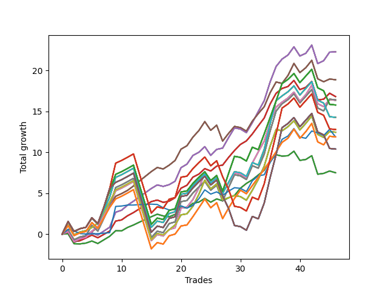

# Short Wallace 011 
- Symbol: SPY_Unlimited
- Date Range: 03/23/2022 - 07/08/2022
- Trading Period: 7:20-12:30
- Number of Trades: 46



| Name | Win Percent | Profit | Avg Profit / Trade | Avg Time / Trade |      | Name | Win Percent | Profit | Avg Profit / Trade | Avg Time / Trade |
| ---- | ----------- | ------ | ------------------ | ---------------- | ---- | ---- | ----------- | ------ | ------------------ | ---------------- |
| Sorted By <br> Profit | | | | | | Sorted By <br> Win Percentage ||||
| Sixty-Six | 82.61 | 11140.00 | 242.17 | 15:54 |     | Sixty-Five | 84.78 | 8405.00 | 182.72 | 13:11 |
| Fifty-Eight | 82.61 | 11140.00 | 242.17 | 15:54 |     | Fifty-Seven | 84.78 | 8405.00 | 182.72 | 13:11 |
| Fifty | 82.61 | 11140.00 | 242.17 | 15:54 |     | Forty-Nine | 84.78 | 8405.00 | 182.72 | 13:11 |
| Forty-Two | 82.61 | 11140.00 | 242.17 | 15:54 |     | Forty-One | 84.78 | 8405.00 | 182.72 | 13:11 |
| Two | 82.61 | 11140.00 | 242.17 | 15:54 |     | One | 84.78 | 8405.00 | 182.72 | 13:11 |
| Sixty-Seven | 76.09 | 9435.00 | 205.11 | 17:43 |     | Sixty-Six | 82.61 | 11140.00 | 242.17 | 15:54 |
| Fifty-Nine | 76.09 | 9435.00 | 205.11 | 17:43 |     | Fifty-Eight | 82.61 | 11140.00 | 242.17 | 15:54 |
| Fifty-One | 76.09 | 9435.00 | 205.11 | 17:43 |     | Fifty | 82.61 | 11140.00 | 242.17 | 15:54 |
| Forty-Three | 76.09 | 9435.00 | 205.11 | 17:43 |     | Forty-Two | 82.61 | 11140.00 | 242.17 | 15:54 |
| Three | 76.09 | 9435.00 | 205.11 | 17:43 |     | Two | 82.61 | 11140.00 | 242.17 | 15:54 |
| Sixty-Five | 84.78 | 8405.00 | 182.72 | 13:11 |     | Sixty-Seven | 76.09 | 9435.00 | 205.11 | 17:43 |
| Fifty-Seven | 84.78 | 8405.00 | 182.72 | 13:11 |     | Fifty-Nine | 76.09 | 9435.00 | 205.11 | 17:43 |
| Forty-Nine | 84.78 | 8405.00 | 182.72 | 13:11 |     | Fifty-One | 76.09 | 9435.00 | 205.11 | 17:43 |
| Forty-One | 84.78 | 8405.00 | 182.72 | 13:11 |     | Forty-Three | 76.09 | 9435.00 | 205.11 | 17:43 |
| One | 84.78 | 8405.00 | 182.72 | 13:11 |     | Three | 76.09 | 9435.00 | 205.11 | 17:43 |
| Sixty-Nine | 67.39 | 8205.00 | 178.37 | 24:41 |     | Sixty-Eight | 71.74 | 8180.00 | 177.83 | 22:24 |
| Sixty-One | 67.39 | 8205.00 | 178.37 | 24:41 |     | Sixty | 71.74 | 8180.00 | 177.83 | 22:24 |
| Fifty-Three | 67.39 | 8205.00 | 178.37 | 24:41 |     | Fifty-Two | 71.74 | 8180.00 | 177.83 | 22:24 |
| Forty-Five | 67.39 | 8205.00 | 178.37 | 24:41 |     | Forty-Four | 71.74 | 8180.00 | 177.83 | 22:24 |
| Five | 67.39 | 8205.00 | 178.37 | 24:41 |     | Four | 71.74 | 8180.00 | 177.83 | 22:24 |
| Sixty-Eight | 71.74 | 8180.00 | 177.83 | 22:24 |     | One Hundred Twenty-Six | 71.74 | 5940.00 | 129.13 | 19:55 |
| Sixty | 71.74 | 8180.00 | 177.83 | 22:24 |     | One Hundred Twenty-One | 71.74 | 5940.00 | 129.13 | 19:55 |
| Fifty-Two | 71.74 | 8180.00 | 177.83 | 22:24 |     | One Hundred Sixteen | 71.74 | 5940.00 | 129.13 | 19:55 |
| Forty-Four | 71.74 | 8180.00 | 177.83 | 22:24 |     | One Hundred Eleven | 71.74 | 5940.00 | 129.13 | 19:55 |
| Four | 71.74 | 8180.00 | 177.83 | 22:24 |     | Eighty-One | 71.74 | 5940.00 | 129.13 | 19:55 |
| One Hundred Twenty-Seven | 65.22 | 7890.00 | 171.52 | 25:43 |     | Sixty-Four | 71.74 | 3750.00 | 81.52 | 09:31 |
| One Hundred Twenty-Two | 65.22 | 7890.00 | 171.52 | 25:43 |     | Fifty-Six | 71.74 | 3750.00 | 81.52 | 09:31 |
| One Hundred Seventeen | 65.22 | 7890.00 | 171.52 | 25:43 |     | Forty-Eight | 71.74 | 3750.00 | 81.52 | 09:31 |
| One Hundred Twelve | 65.22 | 7890.00 | 171.52 | 25:43 |     | Forty | 71.74 | 3750.00 | 81.52 | 09:31 |
| Eighty-Two | 65.22 | 7890.00 | 171.52 | 25:43 |     | Zero | 71.74 | 3750.00 | 81.52 | 09:31 |
| Seventy-One | 65.22 | 7135.00 | 155.11 | 26:08 |     | Seventy | 69.57 | 6225.00 | 135.33 | 21:31 |
| Sixty-Three | 65.22 | 7135.00 | 155.11 | 26:08 |     | Sixty-Two | 69.57 | 6225.00 | 135.33 | 21:31 |
| Fifty-Five | 65.22 | 7135.00 | 155.11 | 26:08 |     | Fifty-Four | 69.57 | 6225.00 | 135.33 | 21:31 |
| Forty-Seven | 65.22 | 7135.00 | 155.11 | 26:08 |     | Forty-Six | 69.57 | 6225.00 | 135.33 | 21:31 |
| Seven | 65.22 | 7135.00 | 155.11 | 26:08 |     | Six | 69.57 | 6225.00 | 135.33 | 21:31 |
| One Hundred Twenty-Eight | 60.87 | 6390.00 | 138.91 | 27:40 |     | Sixty-Nine | 67.39 | 8205.00 | 178.37 | 24:41 |
| One Hundred Twenty-Three | 60.87 | 6390.00 | 138.91 | 27:40 |     | Sixty-One | 67.39 | 8205.00 | 178.37 | 24:41 |
| One Hundred Eighteen | 60.87 | 6390.00 | 138.91 | 27:40 |     | Fifty-Three | 67.39 | 8205.00 | 178.37 | 24:41 |
| One Hundred Thirteen | 60.87 | 6390.00 | 138.91 | 27:40 |     | Forty-Five | 67.39 | 8205.00 | 178.37 | 24:41 |
| Eighty-Three | 60.87 | 6390.00 | 138.91 | 27:40 |     | Five | 67.39 | 8205.00 | 178.37 | 24:41 |
| Seventy | 69.57 | 6225.00 | 135.33 | 21:31 |     | One Hundred Twenty-Seven | 65.22 | 7890.00 | 171.52 | 25:43 |
| Sixty-Two | 69.57 | 6225.00 | 135.33 | 21:31 |     | One Hundred Twenty-Two | 65.22 | 7890.00 | 171.52 | 25:43 |
| Fifty-Four | 69.57 | 6225.00 | 135.33 | 21:31 |     | One Hundred Seventeen | 65.22 | 7890.00 | 171.52 | 25:43 |
| Forty-Six | 69.57 | 6225.00 | 135.33 | 21:31 |     | One Hundred Twelve | 65.22 | 7890.00 | 171.52 | 25:43 |
| Six | 69.57 | 6225.00 | 135.33 | 21:31 |     | Eighty-Two | 65.22 | 7890.00 | 171.52 | 25:43 |
| Seventy-Three | 63.04 | 5945.00 | 129.24 | 11:15 |     | Seventy-One | 65.22 | 7135.00 | 155.11 | 26:08 |
| One Hundred Twenty-Six | 71.74 | 5940.00 | 129.13 | 19:55 |     | Sixty-Three | 65.22 | 7135.00 | 155.11 | 26:08 |
| One Hundred Twenty-One | 71.74 | 5940.00 | 129.13 | 19:55 |     | Fifty-Five | 65.22 | 7135.00 | 155.11 | 26:08 |
| One Hundred Sixteen | 71.74 | 5940.00 | 129.13 | 19:55 |     | Forty-Seven | 65.22 | 7135.00 | 155.11 | 26:08 |
| One Hundred Eleven | 71.74 | 5940.00 | 129.13 | 19:55 |     | Seven | 65.22 | 7135.00 | 155.11 | 26:08 |
| Eighty-One | 71.74 | 5940.00 | 129.13 | 19:55 |     | Seventy-Three | 63.04 | 5945.00 | 129.24 | 11:15 |
| One Hundred Thirty | 60.87 | 5195.00 | 112.93 | 29:00 |     | One Hundred Twenty-Eight | 60.87 | 6390.00 | 138.91 | 27:40 |
| One Hundred Twenty-Nine | 60.87 | 5195.00 | 112.93 | 29:00 |     | One Hundred Twenty-Three | 60.87 | 6390.00 | 138.91 | 27:40 |
| One Hundred Twenty-Five | 60.87 | 5195.00 | 112.93 | 29:00 |     | One Hundred Eighteen | 60.87 | 6390.00 | 138.91 | 27:40 |
| One Hundred Twenty-Four | 60.87 | 5195.00 | 112.93 | 29:00 |     | One Hundred Thirteen | 60.87 | 6390.00 | 138.91 | 27:40 |
| One Hundred Twenty | 60.87 | 5195.00 | 112.93 | 29:00 |     | Eighty-Three | 60.87 | 6390.00 | 138.91 | 27:40 |
| One Hundred Ninteen | 60.87 | 5195.00 | 112.93 | 29:00 |     | One Hundred Thirty | 60.87 | 5195.00 | 112.93 | 29:00 |
| One Hundred Fifteen | 60.87 | 5195.00 | 112.93 | 29:00 |     | One Hundred Twenty-Nine | 60.87 | 5195.00 | 112.93 | 29:00 |
| One Hundred Fourteen | 60.87 | 5195.00 | 112.93 | 29:00 |     | One Hundred Twenty-Five | 60.87 | 5195.00 | 112.93 | 29:00 |
| Eighty-Five | 60.87 | 5195.00 | 112.93 | 29:00 |     | One Hundred Twenty-Four | 60.87 | 5195.00 | 112.93 | 29:00 |
| Eighty-Four | 60.87 | 5195.00 | 112.93 | 29:00 |     | One Hundred Twenty | 60.87 | 5195.00 | 112.93 | 29:00 |
| Sixty-Four | 71.74 | 3750.00 | 81.52 | 09:31 |     | One Hundred Ninteen | 60.87 | 5195.00 | 112.93 | 29:00 |
| Fifty-Six | 71.74 | 3750.00 | 81.52 | 09:31 |     | One Hundred Fifteen | 60.87 | 5195.00 | 112.93 | 29:00 |
| Forty-Eight | 71.74 | 3750.00 | 81.52 | 09:31 |     | One Hundred Fourteen | 60.87 | 5195.00 | 112.93 | 29:00 |
| Forty | 71.74 | 3750.00 | 81.52 | 09:31 |     | Eighty-Five | 60.87 | 5195.00 | 112.93 | 29:00 |
| Zero | 71.74 | 3750.00 | 81.52 | 09:31 |     | Eighty-Four | 60.87 | 5195.00 | 112.93 | 29:00 |

## NO STOPLOSS

### Test Zero
* Sell when price hits the middle line of the 20p bollinger
* No Stoploss
* Results:
```
Total Trades: 46
Percent Up: 28.26
Percent Down: 71.74
Total Points Moved Down: 7.50
Potential Profit: 3750.00
Total Points Ups: 6.38 Count Ups: 13
Total Points Downs: 13.88 Count Downs: 33
```

<details><summary>Trades</summary>

<code>In: 2022-03-25 11:57:00		Out: 2022-03-25 11:57:15		Total Position Time: 00:15		Total Move Down: 0.03		Total to Date: 0.03</code> <br />
<code>In: 2022-03-28 11:32:00		Out: 2022-03-28 12:01:55		Total Position Time: 29:55		Total Move Down: -1.21		Total to Date: -1.18</code> <br />
<code>In: 2022-03-31 07:51:00		Out: 2022-03-31 08:03:05		Total Position Time: 12:05		Total Move Down: -0.02		Total to Date: -1.20</code> <br />
<code>In: 2022-04-01 11:34:00		Out: 2022-04-01 11:47:05		Total Position Time: 13:05		Total Move Down: 0.10		Total to Date: -1.10</code> <br />
<code>In: 2022-04-06 08:53:00		Out: 2022-04-06 09:00:40		Total Position Time: 07:40		Total Move Down: 0.25		Total to Date: -0.85</code> <br />
<code>In: 2022-04-06 10:36:00		Out: 2022-04-06 10:47:10		Total Position Time: 11:10		Total Move Down: -0.30		Total to Date: -1.15</code> <br />
<code>In: 2022-04-06 10:43:00		Out: 2022-04-06 10:47:10		Total Position Time: 04:10		Total Move Down: 0.44		Total to Date: -0.71</code> <br />
<code>In: 2022-04-06 10:45:00		Out: 2022-04-06 10:47:10		Total Position Time: 02:10		Total Move Down: 0.44		Total to Date: -0.27</code> <br />
<code>In: 2022-04-06 11:05:00		Out: 2022-04-06 11:05:35		Total Position Time: 00:35		Total Move Down: 0.68		Total to Date: 0.41</code> <br />
<code>In: 2022-04-07 10:22:00		Out: 2022-04-07 10:36:05		Total Position Time: 14:05		Total Move Down: -0.02		Total to Date: 0.39</code> <br />
<code>In: 2022-04-07 11:03:00		Out: 2022-04-07 11:15:20		Total Position Time: 12:20		Total Move Down: 0.42		Total to Date: 0.81</code> <br />
<code>In: 2022-04-07 11:04:00		Out: 2022-04-07 11:15:20		Total Position Time: 11:20		Total Move Down: 0.30		Total to Date: 1.11</code> <br />
<code>In: 2022-04-08 07:33:00		Out: 2022-04-08 07:44:35		Total Position Time: 11:35		Total Move Down: 0.35		Total to Date: 1.46</code> <br />
<code>In: 2022-04-08 07:34:00		Out: 2022-04-08 07:44:35		Total Position Time: 10:35		Total Move Down: 0.33		Total to Date: 1.79</code> <br />
<code>In: 2022-04-08 07:34:00		Out: 2022-04-08 07:44:35		Total Position Time: 10:35		Total Move Down: 0.33		Total to Date: 2.12</code> <br />
<code>In: 2022-04-18 07:27:00		Out: 2022-04-18 07:36:45		Total Position Time: 09:45		Total Move Down: 0.31		Total to Date: 2.43</code> <br />
<code>In: 2022-04-18 10:38:00		Out: 2022-04-18 10:59:30		Total Position Time: 21:30		Total Move Down: -0.21		Total to Date: 2.22</code> <br />
<code>In: 2022-04-20 07:43:00		Out: 2022-04-20 08:00:20		Total Position Time: 17:20		Total Move Down: -0.11		Total to Date: 2.11</code> <br />
<code>In: 2022-04-20 09:54:00		Out: 2022-04-20 09:59:05		Total Position Time: 05:05		Total Move Down: 0.30		Total to Date: 2.41</code> <br />
<code>In: 2022-04-25 07:34:00		Out: 2022-04-25 07:40:25		Total Position Time: 06:25		Total Move Down: 0.84		Total to Date: 3.25</code> <br />
<code>In: 2022-04-25 10:14:00		Out: 2022-04-25 10:26:25		Total Position Time: 12:25		Total Move Down: -0.06		Total to Date: 3.19</code> <br />
<code>In: 2022-04-25 10:17:00		Out: 2022-04-25 10:26:25		Total Position Time: 09:25		Total Move Down: 0.57		Total to Date: 3.76</code> <br />
<code>In: 2022-04-27 08:34:00		Out: 2022-04-27 08:45:05		Total Position Time: 11:05		Total Move Down: 0.15		Total to Date: 3.91</code> <br />
<code>In: 2022-04-27 08:36:00		Out: 2022-04-27 08:45:05		Total Position Time: 09:05		Total Move Down: 0.45		Total to Date: 4.36</code> <br />
<code>In: 2022-05-04 09:25:00		Out: 2022-05-04 09:45:30		Total Position Time: 20:30		Total Move Down: -0.46		Total to Date: 3.90</code> <br />
<code>In: 2022-05-17 08:36:00		Out: 2022-05-17 08:43:35		Total Position Time: 07:35		Total Move Down: 0.40		Total to Date: 4.30</code> <br />
<code>In: 2022-05-24 10:43:00		Out: 2022-05-24 10:58:10		Total Position Time: 15:10		Total Move Down: -0.23		Total to Date: 4.07</code> <br />
<code>In: 2022-05-25 11:04:00		Out: 2022-05-25 11:06:20		Total Position Time: 02:20		Total Move Down: 0.37		Total to Date: 4.44</code> <br />
<code>In: 2022-05-25 11:06:00		Out: 2022-05-25 11:06:20		Total Position Time: 00:20		Total Move Down: 0.28		Total to Date: 4.72</code> <br />
<code>In: 2022-05-31 07:23:00		Out: 2022-05-31 07:30:05		Total Position Time: 07:05		Total Move Down: 0.89		Total to Date: 5.61</code> <br />
<code>In: 2022-05-31 07:24:00		Out: 2022-05-31 07:30:05		Total Position Time: 06:05		Total Move Down: 0.58		Total to Date: 6.19</code> <br />
<code>In: 2022-06-03 10:06:00		Out: 2022-06-03 10:13:20		Total Position Time: 07:20		Total Move Down: 0.45		Total to Date: 6.64</code> <br />
<code>In: 2022-06-10 12:00:00		Out: 2022-06-10 12:03:25		Total Position Time: 03:25		Total Move Down: 0.58		Total to Date: 7.22</code> <br />
<code>In: 2022-06-10 12:29:00		Out: 2022-06-10 12:30:30		Total Position Time: 01:30		Total Move Down: 0.58		Total to Date: 7.80</code> <br />
<code>In: 2022-06-13 09:40:00		Out: 2022-06-13 09:44:05		Total Position Time: 04:05		Total Move Down: 1.16		Total to Date: 8.96</code> <br />
<code>In: 2022-06-13 09:41:00		Out: 2022-06-13 09:44:05		Total Position Time: 03:05		Total Move Down: 0.74		Total to Date: 9.70</code> <br />
<code>In: 2022-06-15 11:02:00		Out: 2022-06-15 11:02:10		Total Position Time: 00:10		Total Move Down: -0.17		Total to Date: 9.53</code> <br />
<code>In: 2022-06-17 10:11:00		Out: 2022-06-17 10:22:05		Total Position Time: 11:05		Total Move Down: 0.05		Total to Date: 9.58</code> <br />
<code>In: 2022-06-17 10:14:00		Out: 2022-06-17 10:22:05		Total Position Time: 08:05		Total Move Down: 0.55		Total to Date: 10.13</code> <br />
<code>In: 2022-06-23 12:30:00		Out: 2022-06-23 12:46:00		Total Position Time: 16:00		Total Move Down: -1.12		Total to Date: 9.01</code> <br />
<code>In: 2022-06-29 11:06:00		Out: 2022-06-29 11:18:05		Total Position Time: 12:05		Total Move Down: 0.11		Total to Date: 9.12</code> <br />
<code>In: 2022-06-29 12:31:00		Out: 2022-06-29 12:33:20		Total Position Time: 02:20		Total Move Down: 0.46		Total to Date: 9.58</code> <br />
<code>In: 2022-06-30 07:57:00		Out: 2022-06-30 08:26:55		Total Position Time: 29:55		Total Move Down: -2.26		Total to Date: 7.32</code> <br />
<code>In: 2022-07-05 08:49:00		Out: 2022-07-05 09:00:10		Total Position Time: 11:10		Total Move Down: 0.10		Total to Date: 7.42</code> <br />
<code>In: 2022-07-06 11:10:00		Out: 2022-07-06 11:10:10		Total Position Time: 00:10		Total Move Down: 0.29		Total to Date: 7.71</code> <br />
<code>In: 2022-07-06 11:35:00		Out: 2022-07-06 11:50:00		Total Position Time: 15:00		Total Move Down: -0.21		Total to Date: 7.50</code> <br />


</details>

### Test One
* Sell when the price hits the upper line of the 20p 1std bollinger
* No Stoploss
* Results:
```
Total Trades: 46
Percent Up: 15.22
Percent Down: 84.78
Total Points Moved Down: 16.81
Potential Profit: 8405.00
Total Points Ups: 5.90 Count Ups: 7
Total Points Downs: 22.71 Count Downs: 39
```

<details><summary>Trades</summary>

<code>In: 2022-03-25 11:57:00		Out: 2022-03-25 12:00:50		Total Position Time: 03:50		Total Move Down: 0.28		Total to Date: 0.28</code> <br />
<code>In: 2022-03-28 11:32:00		Out: 2022-03-28 12:01:55		Total Position Time: 29:55		Total Move Down: -1.21		Total to Date: -0.93</code> <br />
<code>In: 2022-03-31 07:51:00		Out: 2022-03-31 08:08:00		Total Position Time: 17:00		Total Move Down: 0.12		Total to Date: -0.81</code> <br />
<code>In: 2022-04-01 11:34:00		Out: 2022-04-01 11:50:15		Total Position Time: 16:15		Total Move Down: 0.33		Total to Date: -0.48</code> <br />
<code>In: 2022-04-06 08:53:00		Out: 2022-04-06 09:04:45		Total Position Time: 11:45		Total Move Down: 0.36		Total to Date: -0.12</code> <br />
<code>In: 2022-04-06 10:36:00		Out: 2022-04-06 10:56:55		Total Position Time: 20:55		Total Move Down: -0.33		Total to Date: -0.45</code> <br />
<code>In: 2022-04-06 10:43:00		Out: 2022-04-06 10:56:55		Total Position Time: 13:55		Total Move Down: 0.41		Total to Date: -0.04</code> <br />
<code>In: 2022-04-06 10:45:00		Out: 2022-04-06 10:56:55		Total Position Time: 11:55		Total Move Down: 0.41		Total to Date: 0.37</code> <br />
<code>In: 2022-04-06 11:05:00		Out: 2022-04-06 11:07:20		Total Position Time: 02:20		Total Move Down: 1.22		Total to Date: 1.59</code> <br />
<code>In: 2022-04-07 10:22:00		Out: 2022-04-07 10:39:55		Total Position Time: 17:55		Total Move Down: 0.14		Total to Date: 1.73</code> <br />
<code>In: 2022-04-07 11:03:00		Out: 2022-04-07 11:18:00		Total Position Time: 15:00		Total Move Down: 0.51		Total to Date: 2.24</code> <br />
<code>In: 2022-04-07 11:04:00		Out: 2022-04-07 11:18:00		Total Position Time: 14:00		Total Move Down: 0.39		Total to Date: 2.63</code> <br />
<code>In: 2022-04-08 07:33:00		Out: 2022-04-08 07:45:55		Total Position Time: 12:55		Total Move Down: 0.46		Total to Date: 3.09</code> <br />
<code>In: 2022-04-08 07:34:00		Out: 2022-04-08 07:45:55		Total Position Time: 11:55		Total Move Down: 0.44		Total to Date: 3.53</code> <br />
<code>In: 2022-04-08 07:34:00		Out: 2022-04-08 07:45:55		Total Position Time: 11:55		Total Move Down: 0.44		Total to Date: 3.97</code> <br />
<code>In: 2022-04-18 07:27:00		Out: 2022-04-18 07:51:15		Total Position Time: 24:15		Total Move Down: 0.19		Total to Date: 4.16</code> <br />
<code>In: 2022-04-18 10:38:00		Out: 2022-04-18 11:06:20		Total Position Time: 28:20		Total Move Down: -0.28		Total to Date: 3.88</code> <br />
<code>In: 2022-04-20 07:43:00		Out: 2022-04-20 08:00:40		Total Position Time: 17:40		Total Move Down: 0.14		Total to Date: 4.02</code> <br />
<code>In: 2022-04-20 09:54:00		Out: 2022-04-20 10:08:15		Total Position Time: 14:15		Total Move Down: 0.42		Total to Date: 4.44</code> <br />
<code>In: 2022-04-25 07:34:00		Out: 2022-04-25 07:43:05		Total Position Time: 09:05		Total Move Down: 1.17		Total to Date: 5.61</code> <br />
<code>In: 2022-04-25 10:14:00		Out: 2022-04-25 10:27:10		Total Position Time: 13:10		Total Move Down: 0.36		Total to Date: 5.97</code> <br />
<code>In: 2022-04-25 10:17:00		Out: 2022-04-25 10:27:10		Total Position Time: 10:10		Total Move Down: 0.99		Total to Date: 6.96</code> <br />
<code>In: 2022-04-27 08:34:00		Out: 2022-04-27 08:48:05		Total Position Time: 14:05		Total Move Down: 0.37		Total to Date: 7.33</code> <br />
<code>In: 2022-04-27 08:36:00		Out: 2022-04-27 08:48:05		Total Position Time: 12:05		Total Move Down: 0.67		Total to Date: 8.00</code> <br />
<code>In: 2022-05-04 09:25:00		Out: 2022-05-04 09:46:30		Total Position Time: 21:30		Total Move Down: -0.29		Total to Date: 7.71</code> <br />
<code>In: 2022-05-17 08:36:00		Out: 2022-05-17 08:47:15		Total Position Time: 11:15		Total Move Down: 0.60		Total to Date: 8.31</code> <br />
<code>In: 2022-05-24 10:43:00		Out: 2022-05-24 11:01:40		Total Position Time: 18:40		Total Move Down: 0.12		Total to Date: 8.43</code> <br />
<code>In: 2022-05-25 11:04:00		Out: 2022-05-25 11:06:35		Total Position Time: 02:35		Total Move Down: 0.94		Total to Date: 9.37</code> <br />
<code>In: 2022-05-25 11:06:00		Out: 2022-05-25 11:06:35		Total Position Time: 00:35		Total Move Down: 0.85		Total to Date: 10.22</code> <br />
<code>In: 2022-05-31 07:23:00		Out: 2022-05-31 07:38:05		Total Position Time: 15:05		Total Move Down: 0.74		Total to Date: 10.96</code> <br />
<code>In: 2022-05-31 07:24:00		Out: 2022-05-31 07:38:05		Total Position Time: 14:05		Total Move Down: 0.43		Total to Date: 11.39</code> <br />
<code>In: 2022-06-03 10:06:00		Out: 2022-06-03 10:15:10		Total Position Time: 09:10		Total Move Down: 0.85		Total to Date: 12.24</code> <br />
<code>In: 2022-06-10 12:00:00		Out: 2022-06-10 12:04:35		Total Position Time: 04:35		Total Move Down: 0.99		Total to Date: 13.23</code> <br />
<code>In: 2022-06-10 12:29:00		Out: 2022-06-10 12:35:45		Total Position Time: 06:45		Total Move Down: 0.96		Total to Date: 14.19</code> <br />
<code>In: 2022-06-13 09:40:00		Out: 2022-06-13 09:47:55		Total Position Time: 07:55		Total Move Down: 1.72		Total to Date: 15.91</code> <br />
<code>In: 2022-06-13 09:41:00		Out: 2022-06-13 09:47:55		Total Position Time: 06:55		Total Move Down: 1.30		Total to Date: 17.21</code> <br />
<code>In: 2022-06-15 11:02:00		Out: 2022-06-15 11:03:05		Total Position Time: 01:05		Total Move Down: 0.59		Total to Date: 17.80</code> <br />
<code>In: 2022-06-17 10:11:00		Out: 2022-06-17 10:26:10		Total Position Time: 15:10		Total Move Down: 0.24		Total to Date: 18.04</code> <br />
<code>In: 2022-06-17 10:14:00		Out: 2022-06-17 10:26:10		Total Position Time: 12:10		Total Move Down: 0.74		Total to Date: 18.78</code> <br />
<code>In: 2022-06-23 12:30:00		Out: 2022-06-23 12:46:00		Total Position Time: 16:00		Total Move Down: -1.12		Total to Date: 17.66</code> <br />
<code>In: 2022-06-29 11:06:00		Out: 2022-06-29 11:20:35		Total Position Time: 14:35		Total Move Down: 0.28		Total to Date: 17.94</code> <br />
<code>In: 2022-06-29 12:31:00		Out: 2022-06-29 12:34:10		Total Position Time: 03:10		Total Move Down: 0.71		Total to Date: 18.65</code> <br />
<code>In: 2022-06-30 07:57:00		Out: 2022-06-30 08:26:55		Total Position Time: 29:55		Total Move Down: -2.26		Total to Date: 16.39</code> <br />
<code>In: 2022-07-05 08:49:00		Out: 2022-07-05 09:03:25		Total Position Time: 14:25		Total Move Down: 0.10		Total to Date: 16.49</code> <br />
<code>In: 2022-07-06 11:10:00		Out: 2022-07-06 11:11:10		Total Position Time: 01:10		Total Move Down: 0.73		Total to Date: 17.22</code> <br />
<code>In: 2022-07-06 11:35:00		Out: 2022-07-06 12:00:30		Total Position Time: 25:30		Total Move Down: -0.41		Total to Date: 16.81</code> <br />


</details>

### Test Two
* Sell when the price hits the upper line of the 20p 2std bollinger
* No Stoploss
* Results:
```
Total Trades: 46
Percent Up: 17.39
Percent Down: 82.61
Total Points Moved Down: 22.28
Potential Profit: 11140.00
Total Points Ups: 6.68 Count Ups: 8
Total Points Downs: 28.96 Count Downs: 38
```

<details><summary>Trades</summary>

<code>In: 2022-03-25 11:57:00		Out: 2022-03-25 12:00:55		Total Position Time: 03:55		Total Move Down: 0.29		Total to Date: 0.29</code> <br />
<code>In: 2022-03-28 11:32:00		Out: 2022-03-28 12:01:55		Total Position Time: 29:55		Total Move Down: -1.21		Total to Date: -0.92</code> <br />
<code>In: 2022-03-31 07:51:00		Out: 2022-03-31 08:08:30		Total Position Time: 17:30		Total Move Down: 0.34		Total to Date: -0.58</code> <br />
<code>In: 2022-04-01 11:34:00		Out: 2022-04-01 11:50:20		Total Position Time: 16:20		Total Move Down: 0.36		Total to Date: -0.22</code> <br />
<code>In: 2022-04-06 08:53:00		Out: 2022-04-06 09:09:40		Total Position Time: 16:40		Total Move Down: 0.36		Total to Date: 0.14</code> <br />
<code>In: 2022-04-06 10:36:00		Out: 2022-04-06 10:57:20		Total Position Time: 21:20		Total Move Down: -0.26		Total to Date: -0.12</code> <br />
<code>In: 2022-04-06 10:43:00		Out: 2022-04-06 10:57:20		Total Position Time: 14:20		Total Move Down: 0.48		Total to Date: 0.36</code> <br />
<code>In: 2022-04-06 10:45:00		Out: 2022-04-06 10:57:20		Total Position Time: 12:20		Total Move Down: 0.48		Total to Date: 0.84</code> <br />
<code>In: 2022-04-06 11:05:00		Out: 2022-04-06 11:08:10		Total Position Time: 03:10		Total Move Down: 1.83		Total to Date: 2.67</code> <br />
<code>In: 2022-04-07 10:22:00		Out: 2022-04-07 10:45:15		Total Position Time: 23:15		Total Move Down: 0.25		Total to Date: 2.92</code> <br />
<code>In: 2022-04-07 11:03:00		Out: 2022-04-07 11:18:20		Total Position Time: 15:20		Total Move Down: 0.61		Total to Date: 3.53</code> <br />
<code>In: 2022-04-07 11:04:00		Out: 2022-04-07 11:18:20		Total Position Time: 14:20		Total Move Down: 0.49		Total to Date: 4.02</code> <br />
<code>In: 2022-04-08 07:33:00		Out: 2022-04-08 07:49:20		Total Position Time: 16:20		Total Move Down: 0.53		Total to Date: 4.55</code> <br />
<code>In: 2022-04-08 07:34:00		Out: 2022-04-08 07:49:20		Total Position Time: 15:20		Total Move Down: 0.51		Total to Date: 5.06</code> <br />
<code>In: 2022-04-08 07:34:00		Out: 2022-04-08 07:49:20		Total Position Time: 15:20		Total Move Down: 0.51		Total to Date: 5.57</code> <br />
<code>In: 2022-04-18 07:27:00		Out: 2022-04-18 07:51:45		Total Position Time: 24:45		Total Move Down: 0.44		Total to Date: 6.01</code> <br />
<code>In: 2022-04-18 10:38:00		Out: 2022-04-18 11:07:55		Total Position Time: 29:55		Total Move Down: -0.18		Total to Date: 5.83</code> <br />
<code>In: 2022-04-20 07:43:00		Out: 2022-04-20 08:00:45		Total Position Time: 17:45		Total Move Down: 0.21		Total to Date: 6.04</code> <br />
<code>In: 2022-04-20 09:54:00		Out: 2022-04-20 10:08:15		Total Position Time: 14:15		Total Move Down: 0.42		Total to Date: 6.46</code> <br />
<code>In: 2022-04-25 07:34:00		Out: 2022-04-25 07:52:20		Total Position Time: 18:20		Total Move Down: 1.66		Total to Date: 8.12</code> <br />
<code>In: 2022-04-25 10:14:00		Out: 2022-04-25 10:33:35		Total Position Time: 19:35		Total Move Down: 0.43		Total to Date: 8.55</code> <br />
<code>In: 2022-04-25 10:17:00		Out: 2022-04-25 10:33:35		Total Position Time: 16:35		Total Move Down: 1.06		Total to Date: 9.61</code> <br />
<code>In: 2022-04-27 08:34:00		Out: 2022-04-27 08:50:10		Total Position Time: 16:10		Total Move Down: 0.39		Total to Date: 10.00</code> <br />
<code>In: 2022-04-27 08:36:00		Out: 2022-04-27 08:50:10		Total Position Time: 14:10		Total Move Down: 0.69		Total to Date: 10.69</code> <br />
<code>In: 2022-05-04 09:25:00		Out: 2022-05-04 09:54:55		Total Position Time: 29:55		Total Move Down: -1.07		Total to Date: 9.62</code> <br />
<code>In: 2022-05-17 08:36:00		Out: 2022-05-17 08:48:20		Total Position Time: 12:20		Total Move Down: 0.73		Total to Date: 10.35</code> <br />
<code>In: 2022-05-24 10:43:00		Out: 2022-05-24 11:02:00		Total Position Time: 19:00		Total Move Down: 0.16		Total to Date: 10.51</code> <br />
<code>In: 2022-05-25 11:04:00		Out: 2022-05-25 11:06:40		Total Position Time: 02:40		Total Move Down: 1.28		Total to Date: 11.79</code> <br />
<code>In: 2022-05-25 11:06:00		Out: 2022-05-25 11:06:40		Total Position Time: 00:40		Total Move Down: 1.19		Total to Date: 12.98</code> <br />
<code>In: 2022-05-31 07:23:00		Out: 2022-05-31 07:52:55		Total Position Time: 29:55		Total Move Down: -0.14		Total to Date: 12.84</code> <br />
<code>In: 2022-05-31 07:24:00		Out: 2022-05-31 07:53:55		Total Position Time: 29:55		Total Move Down: -0.44		Total to Date: 12.40</code> <br />
<code>In: 2022-06-03 10:06:00		Out: 2022-06-03 10:17:55		Total Position Time: 11:55		Total Move Down: 1.22		Total to Date: 13.62</code> <br />
<code>In: 2022-06-10 12:00:00		Out: 2022-06-10 12:05:55		Total Position Time: 05:55		Total Move Down: 1.36		Total to Date: 14.98</code> <br />
<code>In: 2022-06-10 12:29:00		Out: 2022-06-10 12:42:45		Total Position Time: 13:45		Total Move Down: 1.33		Total to Date: 16.31</code> <br />
<code>In: 2022-06-13 09:40:00		Out: 2022-06-13 09:54:45		Total Position Time: 14:45		Total Move Down: 2.30		Total to Date: 18.61</code> <br />
<code>In: 2022-06-13 09:41:00		Out: 2022-06-13 09:54:45		Total Position Time: 13:45		Total Move Down: 1.88		Total to Date: 20.49</code> <br />
<code>In: 2022-06-15 11:02:00		Out: 2022-06-15 11:03:15		Total Position Time: 01:15		Total Move Down: 0.90		Total to Date: 21.39</code> <br />
<code>In: 2022-06-17 10:11:00		Out: 2022-06-17 10:27:10		Total Position Time: 16:10		Total Move Down: 0.50		Total to Date: 21.89</code> <br />
<code>In: 2022-06-17 10:14:00		Out: 2022-06-17 10:27:10		Total Position Time: 13:10		Total Move Down: 1.00		Total to Date: 22.89</code> <br />
<code>In: 2022-06-23 12:30:00		Out: 2022-06-23 12:46:00		Total Position Time: 16:00		Total Move Down: -1.12		Total to Date: 21.77</code> <br />
<code>In: 2022-06-29 11:06:00		Out: 2022-06-29 11:21:05		Total Position Time: 15:05		Total Move Down: 0.33		Total to Date: 22.10</code> <br />
<code>In: 2022-06-29 12:31:00		Out: 2022-06-29 12:36:35		Total Position Time: 05:35		Total Move Down: 1.00		Total to Date: 23.10</code> <br />
<code>In: 2022-06-30 07:57:00		Out: 2022-06-30 08:26:55		Total Position Time: 29:55		Total Move Down: -2.26		Total to Date: 20.84</code> <br />
<code>In: 2022-07-05 08:49:00		Out: 2022-07-05 09:03:50		Total Position Time: 14:50		Total Move Down: 0.35		Total to Date: 21.19</code> <br />
<code>In: 2022-07-06 11:10:00		Out: 2022-07-06 11:11:45		Total Position Time: 01:45		Total Move Down: 1.05		Total to Date: 22.24</code> <br />
<code>In: 2022-07-06 11:35:00		Out: 2022-07-06 12:01:25		Total Position Time: 26:25		Total Move Down: 0.04		Total to Date: 22.28</code> <br />


</details>

### Test Three
* Sell when price hits the middle line of the 50p bollinger
* No Stoploss
* Results:
```
Total Trades: 46
Percent Up: 23.91
Percent Down: 76.09
Total Points Moved Down: 18.87
Potential Profit: 9435.00
Total Points Ups: 8.97 Count Ups: 11
Total Points Downs: 27.84 Count Downs: 35
```

<details><summary>Trades</summary>

<code>In: 2022-03-25 11:57:00		Out: 2022-03-25 12:00:45		Total Position Time: 03:45		Total Move Down: 0.19		Total to Date: 0.19</code> <br />
<code>In: 2022-03-28 11:32:00		Out: 2022-03-28 12:01:55		Total Position Time: 29:55		Total Move Down: -1.21		Total to Date: -1.02</code> <br />
<code>In: 2022-03-31 07:51:00		Out: 2022-03-31 08:15:40		Total Position Time: 24:40		Total Move Down: 0.36		Total to Date: -0.66</code> <br />
<code>In: 2022-04-01 11:34:00		Out: 2022-04-01 11:54:05		Total Position Time: 20:05		Total Move Down: 0.50		Total to Date: -0.16</code> <br />
<code>In: 2022-04-06 08:53:00		Out: 2022-04-06 09:12:05		Total Position Time: 19:05		Total Move Down: 0.46		Total to Date: 0.30</code> <br />
<code>In: 2022-04-06 10:36:00		Out: 2022-04-06 11:00:10		Total Position Time: 24:10		Total Move Down: 0.54		Total to Date: 0.84</code> <br />
<code>In: 2022-04-06 10:43:00		Out: 2022-04-06 11:00:10		Total Position Time: 17:10		Total Move Down: 1.28		Total to Date: 2.12</code> <br />
<code>In: 2022-04-06 10:45:00		Out: 2022-04-06 11:00:10		Total Position Time: 15:10		Total Move Down: 1.28		Total to Date: 3.40</code> <br />
<code>In: 2022-04-06 11:05:00		Out: 2022-04-06 11:07:20		Total Position Time: 02:20		Total Move Down: 1.22		Total to Date: 4.62</code> <br />
<code>In: 2022-04-07 10:22:00		Out: 2022-04-07 10:51:55		Total Position Time: 29:55		Total Move Down: 0.33		Total to Date: 4.95</code> <br />
<code>In: 2022-04-07 11:03:00		Out: 2022-04-07 11:32:55		Total Position Time: 29:55		Total Move Down: 0.39		Total to Date: 5.34</code> <br />
<code>In: 2022-04-07 11:04:00		Out: 2022-04-07 11:33:40		Total Position Time: 29:40		Total Move Down: 0.54		Total to Date: 5.88</code> <br />
<code>In: 2022-04-08 07:33:00		Out: 2022-04-08 07:49:30		Total Position Time: 16:30		Total Move Down: 0.60		Total to Date: 6.48</code> <br />
<code>In: 2022-04-08 07:34:00		Out: 2022-04-08 07:49:30		Total Position Time: 15:30		Total Move Down: 0.58		Total to Date: 7.06</code> <br />
<code>In: 2022-04-08 07:34:00		Out: 2022-04-08 07:49:30		Total Position Time: 15:30		Total Move Down: 0.58		Total to Date: 7.64</code> <br />
<code>In: 2022-04-18 07:27:00		Out: 2022-04-18 07:51:50		Total Position Time: 24:50		Total Move Down: 0.50		Total to Date: 8.14</code> <br />
<code>In: 2022-04-18 10:38:00		Out: 2022-04-18 11:07:55		Total Position Time: 29:55		Total Move Down: -0.18		Total to Date: 7.96</code> <br />
<code>In: 2022-04-20 07:43:00		Out: 2022-04-20 08:02:45		Total Position Time: 19:45		Total Move Down: 0.46		Total to Date: 8.42</code> <br />
<code>In: 2022-04-20 09:54:00		Out: 2022-04-20 10:08:35		Total Position Time: 14:35		Total Move Down: 0.58		Total to Date: 9.00</code> <br />
<code>In: 2022-04-25 07:34:00		Out: 2022-04-25 07:52:00		Total Position Time: 18:00		Total Move Down: 1.38		Total to Date: 10.38</code> <br />
<code>In: 2022-04-25 10:14:00		Out: 2022-04-25 10:28:15		Total Position Time: 14:15		Total Move Down: 0.42		Total to Date: 10.80</code> <br />
<code>In: 2022-04-25 10:17:00		Out: 2022-04-25 10:28:15		Total Position Time: 11:15		Total Move Down: 1.05		Total to Date: 11.85</code> <br />
<code>In: 2022-04-27 08:34:00		Out: 2022-04-27 08:52:30		Total Position Time: 18:30		Total Move Down: 0.80		Total to Date: 12.65</code> <br />
<code>In: 2022-04-27 08:36:00		Out: 2022-04-27 08:52:30		Total Position Time: 16:30		Total Move Down: 1.10		Total to Date: 13.75</code> <br />
<code>In: 2022-05-04 09:25:00		Out: 2022-05-04 09:54:55		Total Position Time: 29:55		Total Move Down: -1.07		Total to Date: 12.68</code> <br />
<code>In: 2022-05-17 08:36:00		Out: 2022-05-17 09:02:20		Total Position Time: 26:20		Total Move Down: 0.63		Total to Date: 13.31</code> <br />
<code>In: 2022-05-24 10:43:00		Out: 2022-05-24 11:12:55		Total Position Time: 29:55		Total Move Down: -1.94		Total to Date: 11.37</code> <br />
<code>In: 2022-05-25 11:04:00		Out: 2022-05-25 11:06:35		Total Position Time: 02:35		Total Move Down: 0.94		Total to Date: 12.31</code> <br />
<code>In: 2022-05-25 11:06:00		Out: 2022-05-25 11:06:35		Total Position Time: 00:35		Total Move Down: 0.85		Total to Date: 13.16</code> <br />
<code>In: 2022-05-31 07:23:00		Out: 2022-05-31 07:52:55		Total Position Time: 29:55		Total Move Down: -0.14		Total to Date: 13.02</code> <br />
<code>In: 2022-05-31 07:24:00		Out: 2022-05-31 07:53:55		Total Position Time: 29:55		Total Move Down: -0.44		Total to Date: 12.58</code> <br />
<code>In: 2022-06-03 10:06:00		Out: 2022-06-03 10:17:55		Total Position Time: 11:55		Total Move Down: 1.22		Total to Date: 13.80</code> <br />
<code>In: 2022-06-10 12:00:00		Out: 2022-06-10 12:03:40		Total Position Time: 03:40		Total Move Down: 0.93		Total to Date: 14.73</code> <br />
<code>In: 2022-06-10 12:29:00		Out: 2022-06-10 12:33:15		Total Position Time: 04:15		Total Move Down: 0.84		Total to Date: 15.57</code> <br />
<code>In: 2022-06-13 09:40:00		Out: 2022-06-13 09:47:55		Total Position Time: 07:55		Total Move Down: 1.72		Total to Date: 17.29</code> <br />
<code>In: 2022-06-13 09:41:00		Out: 2022-06-13 09:47:55		Total Position Time: 06:55		Total Move Down: 1.30		Total to Date: 18.59</code> <br />
<code>In: 2022-06-15 11:02:00		Out: 2022-06-15 11:02:10		Total Position Time: 00:10		Total Move Down: -0.17		Total to Date: 18.42</code> <br />
<code>In: 2022-06-17 10:11:00		Out: 2022-06-17 10:32:15		Total Position Time: 21:15		Total Move Down: 0.97		Total to Date: 19.39</code> <br />
<code>In: 2022-06-17 10:14:00		Out: 2022-06-17 10:32:15		Total Position Time: 18:15		Total Move Down: 1.47		Total to Date: 20.86</code> <br />
<code>In: 2022-06-23 12:30:00		Out: 2022-06-23 12:46:00		Total Position Time: 16:00		Total Move Down: -1.12		Total to Date: 19.74</code> <br />
<code>In: 2022-06-29 11:06:00		Out: 2022-06-29 11:27:35		Total Position Time: 21:35		Total Move Down: 0.60		Total to Date: 20.34</code> <br />
<code>In: 2022-06-29 12:31:00		Out: 2022-06-29 12:34:15		Total Position Time: 03:15		Total Move Down: 0.90		Total to Date: 21.24</code> <br />
<code>In: 2022-06-30 07:57:00		Out: 2022-06-30 08:26:55		Total Position Time: 29:55		Total Move Down: -2.26		Total to Date: 18.98</code> <br />
<code>In: 2022-07-05 08:49:00		Out: 2022-07-05 09:18:55		Total Position Time: 29:55		Total Move Down: -0.36		Total to Date: 18.62</code> <br />
<code>In: 2022-07-06 11:10:00		Out: 2022-07-06 11:10:20		Total Position Time: 00:20		Total Move Down: 0.33		Total to Date: 18.95</code> <br />
<code>In: 2022-07-06 11:35:00		Out: 2022-07-06 12:04:55		Total Position Time: 29:55		Total Move Down: -0.08		Total to Date: 18.87</code> <br />


</details>

### Test Four
* Sell when the price hits the upper line of the 50p 1std bollinger
* No Stoploss
* Results:
```
Total Trades: 46
Percent Up: 28.26
Percent Down: 71.74
Total Points Moved Down: 16.36
Potential Profit: 8180.00
Total Points Ups: 16.03 Count Ups: 13
Total Points Downs: 32.39 Count Downs: 33
```

<details><summary>Trades</summary>

<code>In: 2022-03-25 11:57:00		Out: 2022-03-25 12:00:55		Total Position Time: 03:55		Total Move Down: 0.29		Total to Date: 0.29</code> <br />
<code>In: 2022-03-28 11:32:00		Out: 2022-03-28 12:01:55		Total Position Time: 29:55		Total Move Down: -1.21		Total to Date: -0.92</code> <br />
<code>In: 2022-03-31 07:51:00		Out: 2022-03-31 08:20:55		Total Position Time: 29:55		Total Move Down: 0.34		Total to Date: -0.58</code> <br />
<code>In: 2022-04-01 11:34:00		Out: 2022-04-01 12:03:55		Total Position Time: 29:55		Total Move Down: 0.17		Total to Date: -0.41</code> <br />
<code>In: 2022-04-06 08:53:00		Out: 2022-04-06 09:13:55		Total Position Time: 20:55		Total Move Down: 0.77		Total to Date: 0.36</code> <br />
<code>In: 2022-04-06 10:36:00		Out: 2022-04-06 11:00:10		Total Position Time: 24:10		Total Move Down: 0.54		Total to Date: 0.90</code> <br />
<code>In: 2022-04-06 10:43:00		Out: 2022-04-06 11:00:10		Total Position Time: 17:10		Total Move Down: 1.28		Total to Date: 2.18</code> <br />
<code>In: 2022-04-06 10:45:00		Out: 2022-04-06 11:00:10		Total Position Time: 15:10		Total Move Down: 1.28		Total to Date: 3.46</code> <br />
<code>In: 2022-04-06 11:05:00		Out: 2022-04-06 11:08:10		Total Position Time: 03:10		Total Move Down: 1.83		Total to Date: 5.29</code> <br />
<code>In: 2022-04-07 10:22:00		Out: 2022-04-07 10:51:55		Total Position Time: 29:55		Total Move Down: 0.33		Total to Date: 5.62</code> <br />
<code>In: 2022-04-07 11:03:00		Out: 2022-04-07 11:32:55		Total Position Time: 29:55		Total Move Down: 0.39		Total to Date: 6.01</code> <br />
<code>In: 2022-04-07 11:04:00		Out: 2022-04-07 11:33:55		Total Position Time: 29:55		Total Move Down: 0.41		Total to Date: 6.42</code> <br />
<code>In: 2022-04-08 07:33:00		Out: 2022-04-08 08:02:55		Total Position Time: 29:55		Total Move Down: -2.43		Total to Date: 3.99</code> <br />
<code>In: 2022-04-08 07:34:00		Out: 2022-04-08 08:03:55		Total Position Time: 29:55		Total Move Down: -2.40		Total to Date: 1.59</code> <br />
<code>In: 2022-04-08 07:34:00		Out: 2022-04-08 08:03:55		Total Position Time: 29:55		Total Move Down: -2.40		Total to Date: -0.81</code> <br />
<code>In: 2022-04-18 07:27:00		Out: 2022-04-18 07:56:55		Total Position Time: 29:55		Total Move Down: 0.76		Total to Date: -0.05</code> <br />
<code>In: 2022-04-18 10:38:00		Out: 2022-04-18 11:07:55		Total Position Time: 29:55		Total Move Down: -0.18		Total to Date: -0.23</code> <br />
<code>In: 2022-04-20 07:43:00		Out: 2022-04-20 08:10:20		Total Position Time: 27:20		Total Move Down: 0.79		Total to Date: 0.56</code> <br />
<code>In: 2022-04-20 09:54:00		Out: 2022-04-20 10:23:55		Total Position Time: 29:55		Total Move Down: 0.21		Total to Date: 0.77</code> <br />
<code>In: 2022-04-25 07:34:00		Out: 2022-04-25 07:58:15		Total Position Time: 24:15		Total Move Down: 2.40		Total to Date: 3.17</code> <br />
<code>In: 2022-04-25 10:14:00		Out: 2022-04-25 10:43:55		Total Position Time: 29:55		Total Move Down: 0.13		Total to Date: 3.30</code> <br />
<code>In: 2022-04-25 10:17:00		Out: 2022-04-25 10:46:55		Total Position Time: 29:55		Total Move Down: 0.92		Total to Date: 4.22</code> <br />
<code>In: 2022-04-27 08:34:00		Out: 2022-04-27 09:01:45		Total Position Time: 27:45		Total Move Down: 1.44		Total to Date: 5.66</code> <br />
<code>In: 2022-04-27 08:36:00		Out: 2022-04-27 09:01:45		Total Position Time: 25:45		Total Move Down: 1.74		Total to Date: 7.40</code> <br />
<code>In: 2022-05-04 09:25:00		Out: 2022-05-04 09:54:55		Total Position Time: 29:55		Total Move Down: -1.07		Total to Date: 6.33</code> <br />
<code>In: 2022-05-17 08:36:00		Out: 2022-05-17 09:05:55		Total Position Time: 29:55		Total Move Down: 0.61		Total to Date: 6.94</code> <br />
<code>In: 2022-05-24 10:43:00		Out: 2022-05-24 11:12:55		Total Position Time: 29:55		Total Move Down: -1.94		Total to Date: 5.00</code> <br />
<code>In: 2022-05-25 11:04:00		Out: 2022-05-25 11:06:40		Total Position Time: 02:40		Total Move Down: 1.28		Total to Date: 6.28</code> <br />
<code>In: 2022-05-25 11:06:00		Out: 2022-05-25 11:06:40		Total Position Time: 00:40		Total Move Down: 1.19		Total to Date: 7.47</code> <br />
<code>In: 2022-05-31 07:23:00		Out: 2022-05-31 07:52:55		Total Position Time: 29:55		Total Move Down: -0.14		Total to Date: 7.33</code> <br />
<code>In: 2022-05-31 07:24:00		Out: 2022-05-31 07:53:55		Total Position Time: 29:55		Total Move Down: -0.44		Total to Date: 6.89</code> <br />
<code>In: 2022-06-03 10:06:00		Out: 2022-06-03 10:19:00		Total Position Time: 13:00		Total Move Down: 1.80		Total to Date: 8.69</code> <br />
<code>In: 2022-06-10 12:00:00		Out: 2022-06-10 12:05:55		Total Position Time: 05:55		Total Move Down: 1.36		Total to Date: 10.05</code> <br />
<code>In: 2022-06-10 12:29:00		Out: 2022-06-10 12:42:40		Total Position Time: 13:40		Total Move Down: 1.32		Total to Date: 11.37</code> <br />
<code>In: 2022-06-13 09:40:00		Out: 2022-06-13 09:54:50		Total Position Time: 14:50		Total Move Down: 2.29		Total to Date: 13.66</code> <br />
<code>In: 2022-06-13 09:41:00		Out: 2022-06-13 09:54:50		Total Position Time: 13:50		Total Move Down: 1.87		Total to Date: 15.53</code> <br />
<code>In: 2022-06-15 11:02:00		Out: 2022-06-15 11:03:05		Total Position Time: 01:05		Total Move Down: 0.59		Total to Date: 16.12</code> <br />
<code>In: 2022-06-17 10:11:00		Out: 2022-06-17 10:40:55		Total Position Time: 29:55		Total Move Down: 0.51		Total to Date: 16.63</code> <br />
<code>In: 2022-06-17 10:14:00		Out: 2022-06-17 10:43:55		Total Position Time: 29:55		Total Move Down: 0.72		Total to Date: 17.35</code> <br />
<code>In: 2022-06-23 12:30:00		Out: 2022-06-23 12:46:00		Total Position Time: 16:00		Total Move Down: -1.12		Total to Date: 16.23</code> <br />
<code>In: 2022-06-29 11:06:00		Out: 2022-06-29 11:35:55		Total Position Time: 29:55		Total Move Down: 0.81		Total to Date: 17.04</code> <br />
<code>In: 2022-06-29 12:31:00		Out: 2022-06-29 12:41:00		Total Position Time: 10:00		Total Move Down: 1.16		Total to Date: 18.20</code> <br />
<code>In: 2022-06-30 07:57:00		Out: 2022-06-30 08:26:55		Total Position Time: 29:55		Total Move Down: -2.26		Total to Date: 15.94</code> <br />
<code>In: 2022-07-05 08:49:00		Out: 2022-07-05 09:18:55		Total Position Time: 29:55		Total Move Down: -0.36		Total to Date: 15.58</code> <br />
<code>In: 2022-07-06 11:10:00		Out: 2022-07-06 11:11:35		Total Position Time: 01:35		Total Move Down: 0.86		Total to Date: 16.44</code> <br />
<code>In: 2022-07-06 11:35:00		Out: 2022-07-06 12:04:55		Total Position Time: 29:55		Total Move Down: -0.08		Total to Date: 16.36</code> <br />


</details>

### Test Five
* Sell when the price hits the upper line of the 50p 2std bollinger
* No Stoploss
* Results:
```
Total Trades: 46
Percent Up: 32.61
Percent Down: 67.39
Total Points Moved Down: 16.41
Potential Profit: 8205.00
Total Points Ups: 17.04 Count Ups: 15
Total Points Downs: 33.45 Count Downs: 31
```

<details><summary>Trades</summary>

<code>In: 2022-03-25 11:57:00		Out: 2022-03-25 12:01:55		Total Position Time: 04:55		Total Move Down: 0.52		Total to Date: 0.52</code> <br />
<code>In: 2022-03-28 11:32:00		Out: 2022-03-28 12:01:55		Total Position Time: 29:55		Total Move Down: -1.21		Total to Date: -0.69</code> <br />
<code>In: 2022-03-31 07:51:00		Out: 2022-03-31 08:20:55		Total Position Time: 29:55		Total Move Down: 0.34		Total to Date: -0.35</code> <br />
<code>In: 2022-04-01 11:34:00		Out: 2022-04-01 12:03:55		Total Position Time: 29:55		Total Move Down: 0.17		Total to Date: -0.18</code> <br />
<code>In: 2022-04-06 08:53:00		Out: 2022-04-06 09:20:15		Total Position Time: 27:15		Total Move Down: 1.25		Total to Date: 1.07</code> <br />
<code>In: 2022-04-06 10:36:00		Out: 2022-04-06 11:05:55		Total Position Time: 29:55		Total Move Down: -0.71		Total to Date: 0.36</code> <br />
<code>In: 2022-04-06 10:43:00		Out: 2022-04-06 11:09:35		Total Position Time: 26:35		Total Move Down: 1.53		Total to Date: 1.89</code> <br />
<code>In: 2022-04-06 10:45:00		Out: 2022-04-06 11:09:35		Total Position Time: 24:35		Total Move Down: 1.53		Total to Date: 3.42</code> <br />
<code>In: 2022-04-06 11:05:00		Out: 2022-04-06 11:09:35		Total Position Time: 04:35		Total Move Down: 2.27		Total to Date: 5.69</code> <br />
<code>In: 2022-04-07 10:22:00		Out: 2022-04-07 10:51:55		Total Position Time: 29:55		Total Move Down: 0.33		Total to Date: 6.02</code> <br />
<code>In: 2022-04-07 11:03:00		Out: 2022-04-07 11:32:55		Total Position Time: 29:55		Total Move Down: 0.39		Total to Date: 6.41</code> <br />
<code>In: 2022-04-07 11:04:00		Out: 2022-04-07 11:33:55		Total Position Time: 29:55		Total Move Down: 0.41		Total to Date: 6.82</code> <br />
<code>In: 2022-04-08 07:33:00		Out: 2022-04-08 08:02:55		Total Position Time: 29:55		Total Move Down: -2.43		Total to Date: 4.39</code> <br />
<code>In: 2022-04-08 07:34:00		Out: 2022-04-08 08:03:55		Total Position Time: 29:55		Total Move Down: -2.40		Total to Date: 1.99</code> <br />
<code>In: 2022-04-08 07:34:00		Out: 2022-04-08 08:03:55		Total Position Time: 29:55		Total Move Down: -2.40		Total to Date: -0.41</code> <br />
<code>In: 2022-04-18 07:27:00		Out: 2022-04-18 07:56:55		Total Position Time: 29:55		Total Move Down: 0.76		Total to Date: 0.35</code> <br />
<code>In: 2022-04-18 10:38:00		Out: 2022-04-18 11:07:55		Total Position Time: 29:55		Total Move Down: -0.18		Total to Date: 0.17</code> <br />
<code>In: 2022-04-20 07:43:00		Out: 2022-04-20 08:12:55		Total Position Time: 29:55		Total Move Down: 1.11		Total to Date: 1.28</code> <br />
<code>In: 2022-04-20 09:54:00		Out: 2022-04-20 10:23:55		Total Position Time: 29:55		Total Move Down: 0.21		Total to Date: 1.49</code> <br />
<code>In: 2022-04-25 07:34:00		Out: 2022-04-25 08:03:55		Total Position Time: 29:55		Total Move Down: 2.48		Total to Date: 3.97</code> <br />
<code>In: 2022-04-25 10:14:00		Out: 2022-04-25 10:43:55		Total Position Time: 29:55		Total Move Down: 0.13		Total to Date: 4.10</code> <br />
<code>In: 2022-04-25 10:17:00		Out: 2022-04-25 10:46:55		Total Position Time: 29:55		Total Move Down: 0.92		Total to Date: 5.02</code> <br />
<code>In: 2022-04-27 08:34:00		Out: 2022-04-27 09:03:55		Total Position Time: 29:55		Total Move Down: 0.74		Total to Date: 5.76</code> <br />
<code>In: 2022-04-27 08:36:00		Out: 2022-04-27 09:05:55		Total Position Time: 29:55		Total Move Down: 0.68		Total to Date: 6.44</code> <br />
<code>In: 2022-05-04 09:25:00		Out: 2022-05-04 09:54:55		Total Position Time: 29:55		Total Move Down: -1.07		Total to Date: 5.37</code> <br />
<code>In: 2022-05-17 08:36:00		Out: 2022-05-17 09:05:55		Total Position Time: 29:55		Total Move Down: 0.61		Total to Date: 5.98</code> <br />
<code>In: 2022-05-24 10:43:00		Out: 2022-05-24 11:12:55		Total Position Time: 29:55		Total Move Down: -1.94		Total to Date: 4.04</code> <br />
<code>In: 2022-05-25 11:04:00		Out: 2022-05-25 11:06:50		Total Position Time: 02:50		Total Move Down: 1.65		Total to Date: 5.69</code> <br />
<code>In: 2022-05-25 11:06:00		Out: 2022-05-25 11:06:50		Total Position Time: 00:50		Total Move Down: 1.56		Total to Date: 7.25</code> <br />
<code>In: 2022-05-31 07:23:00		Out: 2022-05-31 07:52:55		Total Position Time: 29:55		Total Move Down: -0.14		Total to Date: 7.11</code> <br />
<code>In: 2022-05-31 07:24:00		Out: 2022-05-31 07:53:55		Total Position Time: 29:55		Total Move Down: -0.44		Total to Date: 6.67</code> <br />
<code>In: 2022-06-03 10:06:00		Out: 2022-06-03 10:35:55		Total Position Time: 29:55		Total Move Down: 1.69		Total to Date: 8.36</code> <br />
<code>In: 2022-06-10 12:00:00		Out: 2022-06-10 12:29:55		Total Position Time: 29:55		Total Move Down: -0.30		Total to Date: 8.06</code> <br />
<code>In: 2022-06-10 12:29:00		Out: 2022-06-10 12:45:35		Total Position Time: 16:35		Total Move Down: 1.71		Total to Date: 9.77</code> <br />
<code>In: 2022-06-13 09:40:00		Out: 2022-06-13 09:58:15		Total Position Time: 18:15		Total Move Down: 2.84		Total to Date: 12.61</code> <br />
<code>In: 2022-06-13 09:41:00		Out: 2022-06-13 09:58:15		Total Position Time: 17:15		Total Move Down: 2.42		Total to Date: 15.03</code> <br />
<code>In: 2022-06-15 11:02:00		Out: 2022-06-15 11:03:15		Total Position Time: 01:15		Total Move Down: 0.90		Total to Date: 15.93</code> <br />
<code>In: 2022-06-17 10:11:00		Out: 2022-06-17 10:40:55		Total Position Time: 29:55		Total Move Down: 0.51		Total to Date: 16.44</code> <br />
<code>In: 2022-06-17 10:14:00		Out: 2022-06-17 10:43:55		Total Position Time: 29:55		Total Move Down: 0.72		Total to Date: 17.16</code> <br />
<code>In: 2022-06-23 12:30:00		Out: 2022-06-23 12:46:00		Total Position Time: 16:00		Total Move Down: -1.12		Total to Date: 16.04</code> <br />
<code>In: 2022-06-29 11:06:00		Out: 2022-06-29 11:35:55		Total Position Time: 29:55		Total Move Down: 0.81		Total to Date: 16.85</code> <br />
<code>In: 2022-06-29 12:31:00		Out: 2022-06-29 12:46:00		Total Position Time: 15:00		Total Move Down: 0.82		Total to Date: 17.67</code> <br />
<code>In: 2022-06-30 07:57:00		Out: 2022-06-30 08:26:55		Total Position Time: 29:55		Total Move Down: -2.26		Total to Date: 15.41</code> <br />
<code>In: 2022-07-05 08:49:00		Out: 2022-07-05 09:18:55		Total Position Time: 29:55		Total Move Down: -0.36		Total to Date: 15.05</code> <br />
<code>In: 2022-07-06 11:10:00		Out: 2022-07-06 11:12:15		Total Position Time: 02:15		Total Move Down: 1.44		Total to Date: 16.49</code> <br />
<code>In: 2022-07-06 11:35:00		Out: 2022-07-06 12:04:55		Total Position Time: 29:55		Total Move Down: -0.08		Total to Date: 16.41</code> <br />


</details>

### Test Six
* Sell when the price hits the middle line of the 1std VWAP
* No Stoploss
* Results:
```
Total Trades: 46
Percent Up: 30.43
Percent Down: 69.57
Total Points Moved Down: 12.45
Potential Profit: 6225.00
Total Points Ups: 16.20 Count Ups: 14
Total Points Downs: 28.65 Count Downs: 32
```

<details><summary>Trades</summary>

<code>In: 2022-03-25 11:57:00		Out: 2022-03-25 12:07:35		Total Position Time: 10:35		Total Move Down: 1.13		Total to Date: 1.13</code> <br />
<code>In: 2022-03-28 11:32:00		Out: 2022-03-28 12:01:55		Total Position Time: 29:55		Total Move Down: -1.21		Total to Date: -0.08</code> <br />
<code>In: 2022-03-31 07:51:00		Out: 2022-03-31 08:20:55		Total Position Time: 29:55		Total Move Down: 0.34		Total to Date: 0.26</code> <br />
<code>In: 2022-04-01 11:34:00		Out: 2022-04-01 12:03:55		Total Position Time: 29:55		Total Move Down: 0.17		Total to Date: 0.43</code> <br />
<code>In: 2022-04-06 08:53:00		Out: 2022-04-06 09:10:20		Total Position Time: 17:20		Total Move Down: 0.37		Total to Date: 0.80</code> <br />
<code>In: 2022-04-06 10:36:00		Out: 2022-04-06 11:00:10		Total Position Time: 24:10		Total Move Down: 0.54		Total to Date: 1.34</code> <br />
<code>In: 2022-04-06 10:43:00		Out: 2022-04-06 11:00:10		Total Position Time: 17:10		Total Move Down: 1.28		Total to Date: 2.62</code> <br />
<code>In: 2022-04-06 10:45:00		Out: 2022-04-06 11:00:10		Total Position Time: 15:10		Total Move Down: 1.28		Total to Date: 3.90</code> <br />
<code>In: 2022-04-06 11:05:00		Out: 2022-04-06 11:07:35		Total Position Time: 02:35		Total Move Down: 1.50		Total to Date: 5.40</code> <br />
<code>In: 2022-04-07 10:22:00		Out: 2022-04-07 10:51:55		Total Position Time: 29:55		Total Move Down: 0.33		Total to Date: 5.73</code> <br />
<code>In: 2022-04-07 11:03:00		Out: 2022-04-07 11:32:55		Total Position Time: 29:55		Total Move Down: 0.39		Total to Date: 6.12</code> <br />
<code>In: 2022-04-07 11:04:00		Out: 2022-04-07 11:33:55		Total Position Time: 29:55		Total Move Down: 0.41		Total to Date: 6.53</code> <br />
<code>In: 2022-04-08 07:33:00		Out: 2022-04-08 08:02:55		Total Position Time: 29:55		Total Move Down: -2.43		Total to Date: 4.10</code> <br />
<code>In: 2022-04-08 07:34:00		Out: 2022-04-08 08:03:55		Total Position Time: 29:55		Total Move Down: -2.40		Total to Date: 1.70</code> <br />
<code>In: 2022-04-08 07:34:00		Out: 2022-04-08 08:03:55		Total Position Time: 29:55		Total Move Down: -2.40		Total to Date: -0.70</code> <br />
<code>In: 2022-04-18 07:27:00		Out: 2022-04-18 07:55:15		Total Position Time: 28:15		Total Move Down: 0.77		Total to Date: 0.07</code> <br />
<code>In: 2022-04-18 10:38:00		Out: 2022-04-18 11:07:55		Total Position Time: 29:55		Total Move Down: -0.18		Total to Date: -0.11</code> <br />
<code>In: 2022-04-20 07:43:00		Out: 2022-04-20 08:04:55		Total Position Time: 21:55		Total Move Down: 0.64		Total to Date: 0.53</code> <br />
<code>In: 2022-04-20 09:54:00		Out: 2022-04-20 10:08:35		Total Position Time: 14:35		Total Move Down: 0.58		Total to Date: 1.11</code> <br />
<code>In: 2022-04-25 07:34:00		Out: 2022-04-25 07:42:30		Total Position Time: 08:30		Total Move Down: 1.24		Total to Date: 2.35</code> <br />
<code>In: 2022-04-25 10:14:00		Out: 2022-04-25 10:43:55		Total Position Time: 29:55		Total Move Down: 0.13		Total to Date: 2.48</code> <br />
<code>In: 2022-04-25 10:17:00		Out: 2022-04-25 10:46:55		Total Position Time: 29:55		Total Move Down: 0.92		Total to Date: 3.40</code> <br />
<code>In: 2022-04-27 08:34:00		Out: 2022-04-27 09:01:55		Total Position Time: 27:55		Total Move Down: 1.45		Total to Date: 4.85</code> <br />
<code>In: 2022-04-27 08:36:00		Out: 2022-04-27 09:01:55		Total Position Time: 25:55		Total Move Down: 1.75		Total to Date: 6.60</code> <br />
<code>In: 2022-05-04 09:25:00		Out: 2022-05-04 09:54:55		Total Position Time: 29:55		Total Move Down: -1.07		Total to Date: 5.53</code> <br />
<code>In: 2022-05-17 08:36:00		Out: 2022-05-17 09:05:55		Total Position Time: 29:55		Total Move Down: 0.61		Total to Date: 6.14</code> <br />
<code>In: 2022-05-24 10:43:00		Out: 2022-05-24 11:12:55		Total Position Time: 29:55		Total Move Down: -1.94		Total to Date: 4.20</code> <br />
<code>In: 2022-05-25 11:04:00		Out: 2022-05-25 11:05:45		Total Position Time: 01:45		Total Move Down: 0.24		Total to Date: 4.44</code> <br />
<code>In: 2022-05-25 11:06:00		Out: 2022-05-25 11:06:20		Total Position Time: 00:20		Total Move Down: 0.28		Total to Date: 4.72</code> <br />
<code>In: 2022-05-31 07:23:00		Out: 2022-05-31 07:52:55		Total Position Time: 29:55		Total Move Down: -0.14		Total to Date: 4.58</code> <br />
<code>In: 2022-05-31 07:24:00		Out: 2022-05-31 07:53:55		Total Position Time: 29:55		Total Move Down: -0.44		Total to Date: 4.14</code> <br />
<code>In: 2022-06-03 10:06:00		Out: 2022-06-03 10:17:55		Total Position Time: 11:55		Total Move Down: 1.22		Total to Date: 5.36</code> <br />
<code>In: 2022-06-10 12:00:00		Out: 2022-06-10 12:05:35		Total Position Time: 05:35		Total Move Down: 1.33		Total to Date: 6.69</code> <br />
<code>In: 2022-06-10 12:29:00		Out: 2022-06-10 12:43:55		Total Position Time: 14:55		Total Move Down: 1.62		Total to Date: 8.31</code> <br />
<code>In: 2022-06-13 09:40:00		Out: 2022-06-13 09:57:00		Total Position Time: 17:00		Total Move Down: 2.45		Total to Date: 10.76</code> <br />
<code>In: 2022-06-13 09:41:00		Out: 2022-06-13 09:57:00		Total Position Time: 16:00		Total Move Down: 2.03		Total to Date: 12.79</code> <br />
<code>In: 2022-06-15 11:02:00		Out: 2022-06-15 11:02:10		Total Position Time: 00:10		Total Move Down: -0.17		Total to Date: 12.62</code> <br />
<code>In: 2022-06-17 10:11:00		Out: 2022-06-17 10:40:55		Total Position Time: 29:55		Total Move Down: 0.51		Total to Date: 13.13</code> <br />
<code>In: 2022-06-17 10:14:00		Out: 2022-06-17 10:43:55		Total Position Time: 29:55		Total Move Down: 0.72		Total to Date: 13.85</code> <br />
<code>In: 2022-06-23 12:30:00		Out: 2022-06-23 12:46:00		Total Position Time: 16:00		Total Move Down: -1.12		Total to Date: 12.73</code> <br />
<code>In: 2022-06-29 11:06:00		Out: 2022-06-29 11:35:55		Total Position Time: 29:55		Total Move Down: 0.81		Total to Date: 13.54</code> <br />
<code>In: 2022-06-29 12:31:00		Out: 2022-06-29 12:34:15		Total Position Time: 03:15		Total Move Down: 0.90		Total to Date: 14.44</code> <br />
<code>In: 2022-06-30 07:57:00		Out: 2022-06-30 08:26:55		Total Position Time: 29:55		Total Move Down: -2.26		Total to Date: 12.18</code> <br />
<code>In: 2022-07-05 08:49:00		Out: 2022-07-05 09:18:55		Total Position Time: 29:55		Total Move Down: -0.36		Total to Date: 11.82</code> <br />
<code>In: 2022-07-06 11:10:00		Out: 2022-07-06 11:11:15		Total Position Time: 01:15		Total Move Down: 0.71		Total to Date: 12.53</code> <br />
<code>In: 2022-07-06 11:35:00		Out: 2022-07-06 12:04:55		Total Position Time: 29:55		Total Move Down: -0.08		Total to Date: 12.45</code> <br />


</details>

### Test Seven
* Sell when the price hits the upper line of the 1std VWAP
* No Stoploss
* Results:
```
Total Trades: 46
Percent Up: 34.78
Percent Down: 65.22
Total Points Moved Down: 14.27
Potential Profit: 7135.00
Total Points Ups: 18.70 Count Ups: 16
Total Points Downs: 32.97 Count Downs: 30
```

<details><summary>Trades</summary>

<code>In: 2022-03-25 11:57:00		Out: 2022-03-25 12:26:55		Total Position Time: 29:55		Total Move Down: 1.53		Total to Date: 1.53</code> <br />
<code>In: 2022-03-28 11:32:00		Out: 2022-03-28 12:01:55		Total Position Time: 29:55		Total Move Down: -1.21		Total to Date: 0.32</code> <br />
<code>In: 2022-03-31 07:51:00		Out: 2022-03-31 08:20:55		Total Position Time: 29:55		Total Move Down: 0.34		Total to Date: 0.66</code> <br />
<code>In: 2022-04-01 11:34:00		Out: 2022-04-01 12:03:55		Total Position Time: 29:55		Total Move Down: 0.17		Total to Date: 0.83</code> <br />
<code>In: 2022-04-06 08:53:00		Out: 2022-04-06 09:16:05		Total Position Time: 23:05		Total Move Down: 1.09		Total to Date: 1.92</code> <br />
<code>In: 2022-04-06 10:36:00		Out: 2022-04-06 11:05:55		Total Position Time: 29:55		Total Move Down: -0.71		Total to Date: 1.21</code> <br />
<code>In: 2022-04-06 10:43:00		Out: 2022-04-06 11:09:40		Total Position Time: 26:40		Total Move Down: 1.66		Total to Date: 2.87</code> <br />
<code>In: 2022-04-06 10:45:00		Out: 2022-04-06 11:09:40		Total Position Time: 24:40		Total Move Down: 1.66		Total to Date: 4.53</code> <br />
<code>In: 2022-04-06 11:05:00		Out: 2022-04-06 11:09:40		Total Position Time: 04:40		Total Move Down: 2.40		Total to Date: 6.93</code> <br />
<code>In: 2022-04-07 10:22:00		Out: 2022-04-07 10:51:55		Total Position Time: 29:55		Total Move Down: 0.33		Total to Date: 7.26</code> <br />
<code>In: 2022-04-07 11:03:00		Out: 2022-04-07 11:32:55		Total Position Time: 29:55		Total Move Down: 0.39		Total to Date: 7.65</code> <br />
<code>In: 2022-04-07 11:04:00		Out: 2022-04-07 11:33:55		Total Position Time: 29:55		Total Move Down: 0.41		Total to Date: 8.06</code> <br />
<code>In: 2022-04-08 07:33:00		Out: 2022-04-08 08:02:55		Total Position Time: 29:55		Total Move Down: -2.43		Total to Date: 5.63</code> <br />
<code>In: 2022-04-08 07:34:00		Out: 2022-04-08 08:03:55		Total Position Time: 29:55		Total Move Down: -2.40		Total to Date: 3.23</code> <br />
<code>In: 2022-04-08 07:34:00		Out: 2022-04-08 08:03:55		Total Position Time: 29:55		Total Move Down: -2.40		Total to Date: 0.83</code> <br />
<code>In: 2022-04-18 07:27:00		Out: 2022-04-18 07:56:55		Total Position Time: 29:55		Total Move Down: 0.76		Total to Date: 1.59</code> <br />
<code>In: 2022-04-18 10:38:00		Out: 2022-04-18 11:07:55		Total Position Time: 29:55		Total Move Down: -0.18		Total to Date: 1.41</code> <br />
<code>In: 2022-04-20 07:43:00		Out: 2022-04-20 08:12:55		Total Position Time: 29:55		Total Move Down: 1.11		Total to Date: 2.52</code> <br />
<code>In: 2022-04-20 09:54:00		Out: 2022-04-20 10:23:55		Total Position Time: 29:55		Total Move Down: 0.21		Total to Date: 2.73</code> <br />
<code>In: 2022-04-25 07:34:00		Out: 2022-04-25 07:57:30		Total Position Time: 23:30		Total Move Down: 2.14		Total to Date: 4.87</code> <br />
<code>In: 2022-04-25 10:14:00		Out: 2022-04-25 10:43:55		Total Position Time: 29:55		Total Move Down: 0.13		Total to Date: 5.00</code> <br />
<code>In: 2022-04-25 10:17:00		Out: 2022-04-25 10:46:55		Total Position Time: 29:55		Total Move Down: 0.92		Total to Date: 5.92</code> <br />
<code>In: 2022-04-27 08:34:00		Out: 2022-04-27 09:03:55		Total Position Time: 29:55		Total Move Down: 0.74		Total to Date: 6.66</code> <br />
<code>In: 2022-04-27 08:36:00		Out: 2022-04-27 09:05:55		Total Position Time: 29:55		Total Move Down: 0.68		Total to Date: 7.34</code> <br />
<code>In: 2022-05-04 09:25:00		Out: 2022-05-04 09:54:55		Total Position Time: 29:55		Total Move Down: -1.07		Total to Date: 6.27</code> <br />
<code>In: 2022-05-17 08:36:00		Out: 2022-05-17 09:05:55		Total Position Time: 29:55		Total Move Down: 0.61		Total to Date: 6.88</code> <br />
<code>In: 2022-05-24 10:43:00		Out: 2022-05-24 11:12:55		Total Position Time: 29:55		Total Move Down: -1.94		Total to Date: 4.94</code> <br />
<code>In: 2022-05-25 11:04:00		Out: 2022-05-25 11:06:45		Total Position Time: 02:45		Total Move Down: 1.39		Total to Date: 6.33</code> <br />
<code>In: 2022-05-25 11:06:00		Out: 2022-05-25 11:06:45		Total Position Time: 00:45		Total Move Down: 1.30		Total to Date: 7.63</code> <br />
<code>In: 2022-05-31 07:23:00		Out: 2022-05-31 07:52:55		Total Position Time: 29:55		Total Move Down: -0.14		Total to Date: 7.49</code> <br />
<code>In: 2022-05-31 07:24:00		Out: 2022-05-31 07:53:55		Total Position Time: 29:55		Total Move Down: -0.44		Total to Date: 7.05</code> <br />
<code>In: 2022-06-03 10:06:00		Out: 2022-06-03 10:35:55		Total Position Time: 29:55		Total Move Down: 1.69		Total to Date: 8.74</code> <br />
<code>In: 2022-06-10 12:00:00		Out: 2022-06-10 12:29:55		Total Position Time: 29:55		Total Move Down: -0.30		Total to Date: 8.44</code> <br />
<code>In: 2022-06-10 12:29:00		Out: 2022-06-10 12:46:00		Total Position Time: 17:00		Total Move Down: 1.93		Total to Date: 10.37</code> <br />
<code>In: 2022-06-13 09:40:00		Out: 2022-06-13 10:09:55		Total Position Time: 29:55		Total Move Down: 3.13		Total to Date: 13.50</code> <br />
<code>In: 2022-06-13 09:41:00		Out: 2022-06-13 10:10:55		Total Position Time: 29:55		Total Move Down: 2.80		Total to Date: 16.30</code> <br />
<code>In: 2022-06-15 11:02:00		Out: 2022-06-15 11:03:05		Total Position Time: 01:05		Total Move Down: 0.59		Total to Date: 16.89</code> <br />
<code>In: 2022-06-17 10:11:00		Out: 2022-06-17 10:40:55		Total Position Time: 29:55		Total Move Down: 0.51		Total to Date: 17.40</code> <br />
<code>In: 2022-06-17 10:14:00		Out: 2022-06-17 10:43:55		Total Position Time: 29:55		Total Move Down: 0.72		Total to Date: 18.12</code> <br />
<code>In: 2022-06-23 12:30:00		Out: 2022-06-23 12:46:00		Total Position Time: 16:00		Total Move Down: -1.12		Total to Date: 17.00</code> <br />
<code>In: 2022-06-29 11:06:00		Out: 2022-06-29 11:35:55		Total Position Time: 29:55		Total Move Down: 0.81		Total to Date: 17.81</code> <br />
<code>In: 2022-06-29 12:31:00		Out: 2022-06-29 12:46:00		Total Position Time: 15:00		Total Move Down: 0.82		Total to Date: 18.63</code> <br />
<code>In: 2022-06-30 07:57:00		Out: 2022-06-30 08:26:55		Total Position Time: 29:55		Total Move Down: -2.26		Total to Date: 16.37</code> <br />
<code>In: 2022-07-05 08:49:00		Out: 2022-07-05 09:18:55		Total Position Time: 29:55		Total Move Down: -0.36		Total to Date: 16.01</code> <br />
<code>In: 2022-07-06 11:10:00		Out: 2022-07-06 11:39:55		Total Position Time: 29:55		Total Move Down: -1.66		Total to Date: 14.35</code> <br />
<code>In: 2022-07-06 11:35:00		Out: 2022-07-06 12:04:55		Total Position Time: 29:55		Total Move Down: -0.08		Total to Date: 14.27</code> <br />


</details>

## STOPLOSS OF 5

### Test Forty
* Sell when price hits the middle line of the 20p bollinger
* Stoploss is -5 points
* Results:
```
Total Trades: 46
Percent Up: 28.26
Percent Down: 71.74
Total Points Moved Down: 7.50
Potential Profit: 3750.00
Total Points Ups: 6.38 Count Ups: 13
Total Points Downs: 13.88 Count Downs: 33
```

<details><summary>Trades</summary>

<code>In: 2022-03-25 11:57:00		Out: 2022-03-25 11:57:15		Total Position Time: 00:15		Total Move Down: 0.03		Total to Date: 0.03</code> <br />
<code>In: 2022-03-28 11:32:00		Out: 2022-03-28 12:01:55		Total Position Time: 29:55		Total Move Down: -1.21		Total to Date: -1.18</code> <br />
<code>In: 2022-03-31 07:51:00		Out: 2022-03-31 08:03:05		Total Position Time: 12:05		Total Move Down: -0.02		Total to Date: -1.20</code> <br />
<code>In: 2022-04-01 11:34:00		Out: 2022-04-01 11:47:05		Total Position Time: 13:05		Total Move Down: 0.10		Total to Date: -1.10</code> <br />
<code>In: 2022-04-06 08:53:00		Out: 2022-04-06 09:00:40		Total Position Time: 07:40		Total Move Down: 0.25		Total to Date: -0.85</code> <br />
<code>In: 2022-04-06 10:36:00		Out: 2022-04-06 10:47:10		Total Position Time: 11:10		Total Move Down: -0.30		Total to Date: -1.15</code> <br />
<code>In: 2022-04-06 10:43:00		Out: 2022-04-06 10:47:10		Total Position Time: 04:10		Total Move Down: 0.44		Total to Date: -0.71</code> <br />
<code>In: 2022-04-06 10:45:00		Out: 2022-04-06 10:47:10		Total Position Time: 02:10		Total Move Down: 0.44		Total to Date: -0.27</code> <br />
<code>In: 2022-04-06 11:05:00		Out: 2022-04-06 11:05:35		Total Position Time: 00:35		Total Move Down: 0.68		Total to Date: 0.41</code> <br />
<code>In: 2022-04-07 10:22:00		Out: 2022-04-07 10:36:05		Total Position Time: 14:05		Total Move Down: -0.02		Total to Date: 0.39</code> <br />
<code>In: 2022-04-07 11:03:00		Out: 2022-04-07 11:15:20		Total Position Time: 12:20		Total Move Down: 0.42		Total to Date: 0.81</code> <br />
<code>In: 2022-04-07 11:04:00		Out: 2022-04-07 11:15:20		Total Position Time: 11:20		Total Move Down: 0.30		Total to Date: 1.11</code> <br />
<code>In: 2022-04-08 07:33:00		Out: 2022-04-08 07:44:35		Total Position Time: 11:35		Total Move Down: 0.35		Total to Date: 1.46</code> <br />
<code>In: 2022-04-08 07:34:00		Out: 2022-04-08 07:44:35		Total Position Time: 10:35		Total Move Down: 0.33		Total to Date: 1.79</code> <br />
<code>In: 2022-04-08 07:34:00		Out: 2022-04-08 07:44:35		Total Position Time: 10:35		Total Move Down: 0.33		Total to Date: 2.12</code> <br />
<code>In: 2022-04-18 07:27:00		Out: 2022-04-18 07:36:45		Total Position Time: 09:45		Total Move Down: 0.31		Total to Date: 2.43</code> <br />
<code>In: 2022-04-18 10:38:00		Out: 2022-04-18 10:59:30		Total Position Time: 21:30		Total Move Down: -0.21		Total to Date: 2.22</code> <br />
<code>In: 2022-04-20 07:43:00		Out: 2022-04-20 08:00:20		Total Position Time: 17:20		Total Move Down: -0.11		Total to Date: 2.11</code> <br />
<code>In: 2022-04-20 09:54:00		Out: 2022-04-20 09:59:05		Total Position Time: 05:05		Total Move Down: 0.30		Total to Date: 2.41</code> <br />
<code>In: 2022-04-25 07:34:00		Out: 2022-04-25 07:40:25		Total Position Time: 06:25		Total Move Down: 0.84		Total to Date: 3.25</code> <br />
<code>In: 2022-04-25 10:14:00		Out: 2022-04-25 10:26:25		Total Position Time: 12:25		Total Move Down: -0.06		Total to Date: 3.19</code> <br />
<code>In: 2022-04-25 10:17:00		Out: 2022-04-25 10:26:25		Total Position Time: 09:25		Total Move Down: 0.57		Total to Date: 3.76</code> <br />
<code>In: 2022-04-27 08:34:00		Out: 2022-04-27 08:45:05		Total Position Time: 11:05		Total Move Down: 0.15		Total to Date: 3.91</code> <br />
<code>In: 2022-04-27 08:36:00		Out: 2022-04-27 08:45:05		Total Position Time: 09:05		Total Move Down: 0.45		Total to Date: 4.36</code> <br />
<code>In: 2022-05-04 09:25:00		Out: 2022-05-04 09:45:30		Total Position Time: 20:30		Total Move Down: -0.46		Total to Date: 3.90</code> <br />
<code>In: 2022-05-17 08:36:00		Out: 2022-05-17 08:43:35		Total Position Time: 07:35		Total Move Down: 0.40		Total to Date: 4.30</code> <br />
<code>In: 2022-05-24 10:43:00		Out: 2022-05-24 10:58:10		Total Position Time: 15:10		Total Move Down: -0.23		Total to Date: 4.07</code> <br />
<code>In: 2022-05-25 11:04:00		Out: 2022-05-25 11:06:20		Total Position Time: 02:20		Total Move Down: 0.37		Total to Date: 4.44</code> <br />
<code>In: 2022-05-25 11:06:00		Out: 2022-05-25 11:06:20		Total Position Time: 00:20		Total Move Down: 0.28		Total to Date: 4.72</code> <br />
<code>In: 2022-05-31 07:23:00		Out: 2022-05-31 07:30:05		Total Position Time: 07:05		Total Move Down: 0.89		Total to Date: 5.61</code> <br />
<code>In: 2022-05-31 07:24:00		Out: 2022-05-31 07:30:05		Total Position Time: 06:05		Total Move Down: 0.58		Total to Date: 6.19</code> <br />
<code>In: 2022-06-03 10:06:00		Out: 2022-06-03 10:13:20		Total Position Time: 07:20		Total Move Down: 0.45		Total to Date: 6.64</code> <br />
<code>In: 2022-06-10 12:00:00		Out: 2022-06-10 12:03:25		Total Position Time: 03:25		Total Move Down: 0.58		Total to Date: 7.22</code> <br />
<code>In: 2022-06-10 12:29:00		Out: 2022-06-10 12:30:30		Total Position Time: 01:30		Total Move Down: 0.58		Total to Date: 7.80</code> <br />
<code>In: 2022-06-13 09:40:00		Out: 2022-06-13 09:44:05		Total Position Time: 04:05		Total Move Down: 1.16		Total to Date: 8.96</code> <br />
<code>In: 2022-06-13 09:41:00		Out: 2022-06-13 09:44:05		Total Position Time: 03:05		Total Move Down: 0.74		Total to Date: 9.70</code> <br />
<code>In: 2022-06-15 11:02:00		Out: 2022-06-15 11:02:10		Total Position Time: 00:10		Total Move Down: -0.17		Total to Date: 9.53</code> <br />
<code>In: 2022-06-17 10:11:00		Out: 2022-06-17 10:22:05		Total Position Time: 11:05		Total Move Down: 0.05		Total to Date: 9.58</code> <br />
<code>In: 2022-06-17 10:14:00		Out: 2022-06-17 10:22:05		Total Position Time: 08:05		Total Move Down: 0.55		Total to Date: 10.13</code> <br />
<code>In: 2022-06-23 12:30:00		Out: 2022-06-23 12:46:00		Total Position Time: 16:00		Total Move Down: -1.12		Total to Date: 9.01</code> <br />
<code>In: 2022-06-29 11:06:00		Out: 2022-06-29 11:18:05		Total Position Time: 12:05		Total Move Down: 0.11		Total to Date: 9.12</code> <br />
<code>In: 2022-06-29 12:31:00		Out: 2022-06-29 12:33:20		Total Position Time: 02:20		Total Move Down: 0.46		Total to Date: 9.58</code> <br />
<code>In: 2022-06-30 07:57:00		Out: 2022-06-30 08:26:55		Total Position Time: 29:55		Total Move Down: -2.26		Total to Date: 7.32</code> <br />
<code>In: 2022-07-05 08:49:00		Out: 2022-07-05 09:00:10		Total Position Time: 11:10		Total Move Down: 0.10		Total to Date: 7.42</code> <br />
<code>In: 2022-07-06 11:10:00		Out: 2022-07-06 11:10:10		Total Position Time: 00:10		Total Move Down: 0.29		Total to Date: 7.71</code> <br />
<code>In: 2022-07-06 11:35:00		Out: 2022-07-06 11:50:00		Total Position Time: 15:00		Total Move Down: -0.21		Total to Date: 7.50</code> <br />


</details>

### Test Forty-One
* Sell when the price hits the upper line of the 20p 1std bollinger
* Stoploss is -5 points
* Results:
```
Total Trades: 46
Percent Up: 15.22
Percent Down: 84.78
Total Points Moved Down: 16.81
Potential Profit: 8405.00
Total Points Ups: 5.90 Count Ups: 7
Total Points Downs: 22.71 Count Downs: 39
```

<details><summary>Trades</summary>

<code>In: 2022-03-25 11:57:00		Out: 2022-03-25 12:00:50		Total Position Time: 03:50		Total Move Down: 0.28		Total to Date: 0.28</code> <br />
<code>In: 2022-03-28 11:32:00		Out: 2022-03-28 12:01:55		Total Position Time: 29:55		Total Move Down: -1.21		Total to Date: -0.93</code> <br />
<code>In: 2022-03-31 07:51:00		Out: 2022-03-31 08:08:00		Total Position Time: 17:00		Total Move Down: 0.12		Total to Date: -0.81</code> <br />
<code>In: 2022-04-01 11:34:00		Out: 2022-04-01 11:50:15		Total Position Time: 16:15		Total Move Down: 0.33		Total to Date: -0.48</code> <br />
<code>In: 2022-04-06 08:53:00		Out: 2022-04-06 09:04:45		Total Position Time: 11:45		Total Move Down: 0.36		Total to Date: -0.12</code> <br />
<code>In: 2022-04-06 10:36:00		Out: 2022-04-06 10:56:55		Total Position Time: 20:55		Total Move Down: -0.33		Total to Date: -0.45</code> <br />
<code>In: 2022-04-06 10:43:00		Out: 2022-04-06 10:56:55		Total Position Time: 13:55		Total Move Down: 0.41		Total to Date: -0.04</code> <br />
<code>In: 2022-04-06 10:45:00		Out: 2022-04-06 10:56:55		Total Position Time: 11:55		Total Move Down: 0.41		Total to Date: 0.37</code> <br />
<code>In: 2022-04-06 11:05:00		Out: 2022-04-06 11:07:20		Total Position Time: 02:20		Total Move Down: 1.22		Total to Date: 1.59</code> <br />
<code>In: 2022-04-07 10:22:00		Out: 2022-04-07 10:39:55		Total Position Time: 17:55		Total Move Down: 0.14		Total to Date: 1.73</code> <br />
<code>In: 2022-04-07 11:03:00		Out: 2022-04-07 11:18:00		Total Position Time: 15:00		Total Move Down: 0.51		Total to Date: 2.24</code> <br />
<code>In: 2022-04-07 11:04:00		Out: 2022-04-07 11:18:00		Total Position Time: 14:00		Total Move Down: 0.39		Total to Date: 2.63</code> <br />
<code>In: 2022-04-08 07:33:00		Out: 2022-04-08 07:45:55		Total Position Time: 12:55		Total Move Down: 0.46		Total to Date: 3.09</code> <br />
<code>In: 2022-04-08 07:34:00		Out: 2022-04-08 07:45:55		Total Position Time: 11:55		Total Move Down: 0.44		Total to Date: 3.53</code> <br />
<code>In: 2022-04-08 07:34:00		Out: 2022-04-08 07:45:55		Total Position Time: 11:55		Total Move Down: 0.44		Total to Date: 3.97</code> <br />
<code>In: 2022-04-18 07:27:00		Out: 2022-04-18 07:51:15		Total Position Time: 24:15		Total Move Down: 0.19		Total to Date: 4.16</code> <br />
<code>In: 2022-04-18 10:38:00		Out: 2022-04-18 11:06:20		Total Position Time: 28:20		Total Move Down: -0.28		Total to Date: 3.88</code> <br />
<code>In: 2022-04-20 07:43:00		Out: 2022-04-20 08:00:40		Total Position Time: 17:40		Total Move Down: 0.14		Total to Date: 4.02</code> <br />
<code>In: 2022-04-20 09:54:00		Out: 2022-04-20 10:08:15		Total Position Time: 14:15		Total Move Down: 0.42		Total to Date: 4.44</code> <br />
<code>In: 2022-04-25 07:34:00		Out: 2022-04-25 07:43:05		Total Position Time: 09:05		Total Move Down: 1.17		Total to Date: 5.61</code> <br />
<code>In: 2022-04-25 10:14:00		Out: 2022-04-25 10:27:10		Total Position Time: 13:10		Total Move Down: 0.36		Total to Date: 5.97</code> <br />
<code>In: 2022-04-25 10:17:00		Out: 2022-04-25 10:27:10		Total Position Time: 10:10		Total Move Down: 0.99		Total to Date: 6.96</code> <br />
<code>In: 2022-04-27 08:34:00		Out: 2022-04-27 08:48:05		Total Position Time: 14:05		Total Move Down: 0.37		Total to Date: 7.33</code> <br />
<code>In: 2022-04-27 08:36:00		Out: 2022-04-27 08:48:05		Total Position Time: 12:05		Total Move Down: 0.67		Total to Date: 8.00</code> <br />
<code>In: 2022-05-04 09:25:00		Out: 2022-05-04 09:46:30		Total Position Time: 21:30		Total Move Down: -0.29		Total to Date: 7.71</code> <br />
<code>In: 2022-05-17 08:36:00		Out: 2022-05-17 08:47:15		Total Position Time: 11:15		Total Move Down: 0.60		Total to Date: 8.31</code> <br />
<code>In: 2022-05-24 10:43:00		Out: 2022-05-24 11:01:40		Total Position Time: 18:40		Total Move Down: 0.12		Total to Date: 8.43</code> <br />
<code>In: 2022-05-25 11:04:00		Out: 2022-05-25 11:06:35		Total Position Time: 02:35		Total Move Down: 0.94		Total to Date: 9.37</code> <br />
<code>In: 2022-05-25 11:06:00		Out: 2022-05-25 11:06:35		Total Position Time: 00:35		Total Move Down: 0.85		Total to Date: 10.22</code> <br />
<code>In: 2022-05-31 07:23:00		Out: 2022-05-31 07:38:05		Total Position Time: 15:05		Total Move Down: 0.74		Total to Date: 10.96</code> <br />
<code>In: 2022-05-31 07:24:00		Out: 2022-05-31 07:38:05		Total Position Time: 14:05		Total Move Down: 0.43		Total to Date: 11.39</code> <br />
<code>In: 2022-06-03 10:06:00		Out: 2022-06-03 10:15:10		Total Position Time: 09:10		Total Move Down: 0.85		Total to Date: 12.24</code> <br />
<code>In: 2022-06-10 12:00:00		Out: 2022-06-10 12:04:35		Total Position Time: 04:35		Total Move Down: 0.99		Total to Date: 13.23</code> <br />
<code>In: 2022-06-10 12:29:00		Out: 2022-06-10 12:35:45		Total Position Time: 06:45		Total Move Down: 0.96		Total to Date: 14.19</code> <br />
<code>In: 2022-06-13 09:40:00		Out: 2022-06-13 09:47:55		Total Position Time: 07:55		Total Move Down: 1.72		Total to Date: 15.91</code> <br />
<code>In: 2022-06-13 09:41:00		Out: 2022-06-13 09:47:55		Total Position Time: 06:55		Total Move Down: 1.30		Total to Date: 17.21</code> <br />
<code>In: 2022-06-15 11:02:00		Out: 2022-06-15 11:03:05		Total Position Time: 01:05		Total Move Down: 0.59		Total to Date: 17.80</code> <br />
<code>In: 2022-06-17 10:11:00		Out: 2022-06-17 10:26:10		Total Position Time: 15:10		Total Move Down: 0.24		Total to Date: 18.04</code> <br />
<code>In: 2022-06-17 10:14:00		Out: 2022-06-17 10:26:10		Total Position Time: 12:10		Total Move Down: 0.74		Total to Date: 18.78</code> <br />
<code>In: 2022-06-23 12:30:00		Out: 2022-06-23 12:46:00		Total Position Time: 16:00		Total Move Down: -1.12		Total to Date: 17.66</code> <br />
<code>In: 2022-06-29 11:06:00		Out: 2022-06-29 11:20:35		Total Position Time: 14:35		Total Move Down: 0.28		Total to Date: 17.94</code> <br />
<code>In: 2022-06-29 12:31:00		Out: 2022-06-29 12:34:10		Total Position Time: 03:10		Total Move Down: 0.71		Total to Date: 18.65</code> <br />
<code>In: 2022-06-30 07:57:00		Out: 2022-06-30 08:26:55		Total Position Time: 29:55		Total Move Down: -2.26		Total to Date: 16.39</code> <br />
<code>In: 2022-07-05 08:49:00		Out: 2022-07-05 09:03:25		Total Position Time: 14:25		Total Move Down: 0.10		Total to Date: 16.49</code> <br />
<code>In: 2022-07-06 11:10:00		Out: 2022-07-06 11:11:10		Total Position Time: 01:10		Total Move Down: 0.73		Total to Date: 17.22</code> <br />
<code>In: 2022-07-06 11:35:00		Out: 2022-07-06 12:00:30		Total Position Time: 25:30		Total Move Down: -0.41		Total to Date: 16.81</code> <br />


</details>

### Test Forty-Two
* Sell when the price hits the upper line of the 20p 2std bollinger
* Stoploss is -5 points
* Results:
```
Total Trades: 46
Percent Up: 17.39
Percent Down: 82.61
Total Points Moved Down: 22.28
Potential Profit: 11140.00
Total Points Ups: 6.68 Count Ups: 8
Total Points Downs: 28.96 Count Downs: 38
```

<details><summary>Trades</summary>

<code>In: 2022-03-25 11:57:00		Out: 2022-03-25 12:00:55		Total Position Time: 03:55		Total Move Down: 0.29		Total to Date: 0.29</code> <br />
<code>In: 2022-03-28 11:32:00		Out: 2022-03-28 12:01:55		Total Position Time: 29:55		Total Move Down: -1.21		Total to Date: -0.92</code> <br />
<code>In: 2022-03-31 07:51:00		Out: 2022-03-31 08:08:30		Total Position Time: 17:30		Total Move Down: 0.34		Total to Date: -0.58</code> <br />
<code>In: 2022-04-01 11:34:00		Out: 2022-04-01 11:50:20		Total Position Time: 16:20		Total Move Down: 0.36		Total to Date: -0.22</code> <br />
<code>In: 2022-04-06 08:53:00		Out: 2022-04-06 09:09:40		Total Position Time: 16:40		Total Move Down: 0.36		Total to Date: 0.14</code> <br />
<code>In: 2022-04-06 10:36:00		Out: 2022-04-06 10:57:20		Total Position Time: 21:20		Total Move Down: -0.26		Total to Date: -0.12</code> <br />
<code>In: 2022-04-06 10:43:00		Out: 2022-04-06 10:57:20		Total Position Time: 14:20		Total Move Down: 0.48		Total to Date: 0.36</code> <br />
<code>In: 2022-04-06 10:45:00		Out: 2022-04-06 10:57:20		Total Position Time: 12:20		Total Move Down: 0.48		Total to Date: 0.84</code> <br />
<code>In: 2022-04-06 11:05:00		Out: 2022-04-06 11:08:10		Total Position Time: 03:10		Total Move Down: 1.83		Total to Date: 2.67</code> <br />
<code>In: 2022-04-07 10:22:00		Out: 2022-04-07 10:45:15		Total Position Time: 23:15		Total Move Down: 0.25		Total to Date: 2.92</code> <br />
<code>In: 2022-04-07 11:03:00		Out: 2022-04-07 11:18:20		Total Position Time: 15:20		Total Move Down: 0.61		Total to Date: 3.53</code> <br />
<code>In: 2022-04-07 11:04:00		Out: 2022-04-07 11:18:20		Total Position Time: 14:20		Total Move Down: 0.49		Total to Date: 4.02</code> <br />
<code>In: 2022-04-08 07:33:00		Out: 2022-04-08 07:49:20		Total Position Time: 16:20		Total Move Down: 0.53		Total to Date: 4.55</code> <br />
<code>In: 2022-04-08 07:34:00		Out: 2022-04-08 07:49:20		Total Position Time: 15:20		Total Move Down: 0.51		Total to Date: 5.06</code> <br />
<code>In: 2022-04-08 07:34:00		Out: 2022-04-08 07:49:20		Total Position Time: 15:20		Total Move Down: 0.51		Total to Date: 5.57</code> <br />
<code>In: 2022-04-18 07:27:00		Out: 2022-04-18 07:51:45		Total Position Time: 24:45		Total Move Down: 0.44		Total to Date: 6.01</code> <br />
<code>In: 2022-04-18 10:38:00		Out: 2022-04-18 11:07:55		Total Position Time: 29:55		Total Move Down: -0.18		Total to Date: 5.83</code> <br />
<code>In: 2022-04-20 07:43:00		Out: 2022-04-20 08:00:45		Total Position Time: 17:45		Total Move Down: 0.21		Total to Date: 6.04</code> <br />
<code>In: 2022-04-20 09:54:00		Out: 2022-04-20 10:08:15		Total Position Time: 14:15		Total Move Down: 0.42		Total to Date: 6.46</code> <br />
<code>In: 2022-04-25 07:34:00		Out: 2022-04-25 07:52:20		Total Position Time: 18:20		Total Move Down: 1.66		Total to Date: 8.12</code> <br />
<code>In: 2022-04-25 10:14:00		Out: 2022-04-25 10:33:35		Total Position Time: 19:35		Total Move Down: 0.43		Total to Date: 8.55</code> <br />
<code>In: 2022-04-25 10:17:00		Out: 2022-04-25 10:33:35		Total Position Time: 16:35		Total Move Down: 1.06		Total to Date: 9.61</code> <br />
<code>In: 2022-04-27 08:34:00		Out: 2022-04-27 08:50:10		Total Position Time: 16:10		Total Move Down: 0.39		Total to Date: 10.00</code> <br />
<code>In: 2022-04-27 08:36:00		Out: 2022-04-27 08:50:10		Total Position Time: 14:10		Total Move Down: 0.69		Total to Date: 10.69</code> <br />
<code>In: 2022-05-04 09:25:00		Out: 2022-05-04 09:54:55		Total Position Time: 29:55		Total Move Down: -1.07		Total to Date: 9.62</code> <br />
<code>In: 2022-05-17 08:36:00		Out: 2022-05-17 08:48:20		Total Position Time: 12:20		Total Move Down: 0.73		Total to Date: 10.35</code> <br />
<code>In: 2022-05-24 10:43:00		Out: 2022-05-24 11:02:00		Total Position Time: 19:00		Total Move Down: 0.16		Total to Date: 10.51</code> <br />
<code>In: 2022-05-25 11:04:00		Out: 2022-05-25 11:06:40		Total Position Time: 02:40		Total Move Down: 1.28		Total to Date: 11.79</code> <br />
<code>In: 2022-05-25 11:06:00		Out: 2022-05-25 11:06:40		Total Position Time: 00:40		Total Move Down: 1.19		Total to Date: 12.98</code> <br />
<code>In: 2022-05-31 07:23:00		Out: 2022-05-31 07:52:55		Total Position Time: 29:55		Total Move Down: -0.14		Total to Date: 12.84</code> <br />
<code>In: 2022-05-31 07:24:00		Out: 2022-05-31 07:53:55		Total Position Time: 29:55		Total Move Down: -0.44		Total to Date: 12.40</code> <br />
<code>In: 2022-06-03 10:06:00		Out: 2022-06-03 10:17:55		Total Position Time: 11:55		Total Move Down: 1.22		Total to Date: 13.62</code> <br />
<code>In: 2022-06-10 12:00:00		Out: 2022-06-10 12:05:55		Total Position Time: 05:55		Total Move Down: 1.36		Total to Date: 14.98</code> <br />
<code>In: 2022-06-10 12:29:00		Out: 2022-06-10 12:42:45		Total Position Time: 13:45		Total Move Down: 1.33		Total to Date: 16.31</code> <br />
<code>In: 2022-06-13 09:40:00		Out: 2022-06-13 09:54:45		Total Position Time: 14:45		Total Move Down: 2.30		Total to Date: 18.61</code> <br />
<code>In: 2022-06-13 09:41:00		Out: 2022-06-13 09:54:45		Total Position Time: 13:45		Total Move Down: 1.88		Total to Date: 20.49</code> <br />
<code>In: 2022-06-15 11:02:00		Out: 2022-06-15 11:03:15		Total Position Time: 01:15		Total Move Down: 0.90		Total to Date: 21.39</code> <br />
<code>In: 2022-06-17 10:11:00		Out: 2022-06-17 10:27:10		Total Position Time: 16:10		Total Move Down: 0.50		Total to Date: 21.89</code> <br />
<code>In: 2022-06-17 10:14:00		Out: 2022-06-17 10:27:10		Total Position Time: 13:10		Total Move Down: 1.00		Total to Date: 22.89</code> <br />
<code>In: 2022-06-23 12:30:00		Out: 2022-06-23 12:46:00		Total Position Time: 16:00		Total Move Down: -1.12		Total to Date: 21.77</code> <br />
<code>In: 2022-06-29 11:06:00		Out: 2022-06-29 11:21:05		Total Position Time: 15:05		Total Move Down: 0.33		Total to Date: 22.10</code> <br />
<code>In: 2022-06-29 12:31:00		Out: 2022-06-29 12:36:35		Total Position Time: 05:35		Total Move Down: 1.00		Total to Date: 23.10</code> <br />
<code>In: 2022-06-30 07:57:00		Out: 2022-06-30 08:26:55		Total Position Time: 29:55		Total Move Down: -2.26		Total to Date: 20.84</code> <br />
<code>In: 2022-07-05 08:49:00		Out: 2022-07-05 09:03:50		Total Position Time: 14:50		Total Move Down: 0.35		Total to Date: 21.19</code> <br />
<code>In: 2022-07-06 11:10:00		Out: 2022-07-06 11:11:45		Total Position Time: 01:45		Total Move Down: 1.05		Total to Date: 22.24</code> <br />
<code>In: 2022-07-06 11:35:00		Out: 2022-07-06 12:01:25		Total Position Time: 26:25		Total Move Down: 0.04		Total to Date: 22.28</code> <br />


</details>

### Test Forty-Three
* Sell when price hits the middle line of the 50p bollinger
* Stoploss is -5 points
* Results:
```
Total Trades: 46
Percent Up: 23.91
Percent Down: 76.09
Total Points Moved Down: 18.87
Potential Profit: 9435.00
Total Points Ups: 8.97 Count Ups: 11
Total Points Downs: 27.84 Count Downs: 35
```

<details><summary>Trades</summary>

<code>In: 2022-03-25 11:57:00		Out: 2022-03-25 12:00:45		Total Position Time: 03:45		Total Move Down: 0.19		Total to Date: 0.19</code> <br />
<code>In: 2022-03-28 11:32:00		Out: 2022-03-28 12:01:55		Total Position Time: 29:55		Total Move Down: -1.21		Total to Date: -1.02</code> <br />
<code>In: 2022-03-31 07:51:00		Out: 2022-03-31 08:15:40		Total Position Time: 24:40		Total Move Down: 0.36		Total to Date: -0.66</code> <br />
<code>In: 2022-04-01 11:34:00		Out: 2022-04-01 11:54:05		Total Position Time: 20:05		Total Move Down: 0.50		Total to Date: -0.16</code> <br />
<code>In: 2022-04-06 08:53:00		Out: 2022-04-06 09:12:05		Total Position Time: 19:05		Total Move Down: 0.46		Total to Date: 0.30</code> <br />
<code>In: 2022-04-06 10:36:00		Out: 2022-04-06 11:00:10		Total Position Time: 24:10		Total Move Down: 0.54		Total to Date: 0.84</code> <br />
<code>In: 2022-04-06 10:43:00		Out: 2022-04-06 11:00:10		Total Position Time: 17:10		Total Move Down: 1.28		Total to Date: 2.12</code> <br />
<code>In: 2022-04-06 10:45:00		Out: 2022-04-06 11:00:10		Total Position Time: 15:10		Total Move Down: 1.28		Total to Date: 3.40</code> <br />
<code>In: 2022-04-06 11:05:00		Out: 2022-04-06 11:07:20		Total Position Time: 02:20		Total Move Down: 1.22		Total to Date: 4.62</code> <br />
<code>In: 2022-04-07 10:22:00		Out: 2022-04-07 10:51:55		Total Position Time: 29:55		Total Move Down: 0.33		Total to Date: 4.95</code> <br />
<code>In: 2022-04-07 11:03:00		Out: 2022-04-07 11:32:55		Total Position Time: 29:55		Total Move Down: 0.39		Total to Date: 5.34</code> <br />
<code>In: 2022-04-07 11:04:00		Out: 2022-04-07 11:33:40		Total Position Time: 29:40		Total Move Down: 0.54		Total to Date: 5.88</code> <br />
<code>In: 2022-04-08 07:33:00		Out: 2022-04-08 07:49:30		Total Position Time: 16:30		Total Move Down: 0.60		Total to Date: 6.48</code> <br />
<code>In: 2022-04-08 07:34:00		Out: 2022-04-08 07:49:30		Total Position Time: 15:30		Total Move Down: 0.58		Total to Date: 7.06</code> <br />
<code>In: 2022-04-08 07:34:00		Out: 2022-04-08 07:49:30		Total Position Time: 15:30		Total Move Down: 0.58		Total to Date: 7.64</code> <br />
<code>In: 2022-04-18 07:27:00		Out: 2022-04-18 07:51:50		Total Position Time: 24:50		Total Move Down: 0.50		Total to Date: 8.14</code> <br />
<code>In: 2022-04-18 10:38:00		Out: 2022-04-18 11:07:55		Total Position Time: 29:55		Total Move Down: -0.18		Total to Date: 7.96</code> <br />
<code>In: 2022-04-20 07:43:00		Out: 2022-04-20 08:02:45		Total Position Time: 19:45		Total Move Down: 0.46		Total to Date: 8.42</code> <br />
<code>In: 2022-04-20 09:54:00		Out: 2022-04-20 10:08:35		Total Position Time: 14:35		Total Move Down: 0.58		Total to Date: 9.00</code> <br />
<code>In: 2022-04-25 07:34:00		Out: 2022-04-25 07:52:00		Total Position Time: 18:00		Total Move Down: 1.38		Total to Date: 10.38</code> <br />
<code>In: 2022-04-25 10:14:00		Out: 2022-04-25 10:28:15		Total Position Time: 14:15		Total Move Down: 0.42		Total to Date: 10.80</code> <br />
<code>In: 2022-04-25 10:17:00		Out: 2022-04-25 10:28:15		Total Position Time: 11:15		Total Move Down: 1.05		Total to Date: 11.85</code> <br />
<code>In: 2022-04-27 08:34:00		Out: 2022-04-27 08:52:30		Total Position Time: 18:30		Total Move Down: 0.80		Total to Date: 12.65</code> <br />
<code>In: 2022-04-27 08:36:00		Out: 2022-04-27 08:52:30		Total Position Time: 16:30		Total Move Down: 1.10		Total to Date: 13.75</code> <br />
<code>In: 2022-05-04 09:25:00		Out: 2022-05-04 09:54:55		Total Position Time: 29:55		Total Move Down: -1.07		Total to Date: 12.68</code> <br />
<code>In: 2022-05-17 08:36:00		Out: 2022-05-17 09:02:20		Total Position Time: 26:20		Total Move Down: 0.63		Total to Date: 13.31</code> <br />
<code>In: 2022-05-24 10:43:00		Out: 2022-05-24 11:12:55		Total Position Time: 29:55		Total Move Down: -1.94		Total to Date: 11.37</code> <br />
<code>In: 2022-05-25 11:04:00		Out: 2022-05-25 11:06:35		Total Position Time: 02:35		Total Move Down: 0.94		Total to Date: 12.31</code> <br />
<code>In: 2022-05-25 11:06:00		Out: 2022-05-25 11:06:35		Total Position Time: 00:35		Total Move Down: 0.85		Total to Date: 13.16</code> <br />
<code>In: 2022-05-31 07:23:00		Out: 2022-05-31 07:52:55		Total Position Time: 29:55		Total Move Down: -0.14		Total to Date: 13.02</code> <br />
<code>In: 2022-05-31 07:24:00		Out: 2022-05-31 07:53:55		Total Position Time: 29:55		Total Move Down: -0.44		Total to Date: 12.58</code> <br />
<code>In: 2022-06-03 10:06:00		Out: 2022-06-03 10:17:55		Total Position Time: 11:55		Total Move Down: 1.22		Total to Date: 13.80</code> <br />
<code>In: 2022-06-10 12:00:00		Out: 2022-06-10 12:03:40		Total Position Time: 03:40		Total Move Down: 0.93		Total to Date: 14.73</code> <br />
<code>In: 2022-06-10 12:29:00		Out: 2022-06-10 12:33:15		Total Position Time: 04:15		Total Move Down: 0.84		Total to Date: 15.57</code> <br />
<code>In: 2022-06-13 09:40:00		Out: 2022-06-13 09:47:55		Total Position Time: 07:55		Total Move Down: 1.72		Total to Date: 17.29</code> <br />
<code>In: 2022-06-13 09:41:00		Out: 2022-06-13 09:47:55		Total Position Time: 06:55		Total Move Down: 1.30		Total to Date: 18.59</code> <br />
<code>In: 2022-06-15 11:02:00		Out: 2022-06-15 11:02:10		Total Position Time: 00:10		Total Move Down: -0.17		Total to Date: 18.42</code> <br />
<code>In: 2022-06-17 10:11:00		Out: 2022-06-17 10:32:15		Total Position Time: 21:15		Total Move Down: 0.97		Total to Date: 19.39</code> <br />
<code>In: 2022-06-17 10:14:00		Out: 2022-06-17 10:32:15		Total Position Time: 18:15		Total Move Down: 1.47		Total to Date: 20.86</code> <br />
<code>In: 2022-06-23 12:30:00		Out: 2022-06-23 12:46:00		Total Position Time: 16:00		Total Move Down: -1.12		Total to Date: 19.74</code> <br />
<code>In: 2022-06-29 11:06:00		Out: 2022-06-29 11:27:35		Total Position Time: 21:35		Total Move Down: 0.60		Total to Date: 20.34</code> <br />
<code>In: 2022-06-29 12:31:00		Out: 2022-06-29 12:34:15		Total Position Time: 03:15		Total Move Down: 0.90		Total to Date: 21.24</code> <br />
<code>In: 2022-06-30 07:57:00		Out: 2022-06-30 08:26:55		Total Position Time: 29:55		Total Move Down: -2.26		Total to Date: 18.98</code> <br />
<code>In: 2022-07-05 08:49:00		Out: 2022-07-05 09:18:55		Total Position Time: 29:55		Total Move Down: -0.36		Total to Date: 18.62</code> <br />
<code>In: 2022-07-06 11:10:00		Out: 2022-07-06 11:10:20		Total Position Time: 00:20		Total Move Down: 0.33		Total to Date: 18.95</code> <br />
<code>In: 2022-07-06 11:35:00		Out: 2022-07-06 12:04:55		Total Position Time: 29:55		Total Move Down: -0.08		Total to Date: 18.87</code> <br />


</details>

### Test Forty-Four
* Sell when the price hits the upper line of the 50p 1std bollinger
* Stoploss is -5 points
* Results:
```
Total Trades: 46
Percent Up: 28.26
Percent Down: 71.74
Total Points Moved Down: 16.36
Potential Profit: 8180.00
Total Points Ups: 16.03 Count Ups: 13
Total Points Downs: 32.39 Count Downs: 33
```

<details><summary>Trades</summary>

<code>In: 2022-03-25 11:57:00		Out: 2022-03-25 12:00:55		Total Position Time: 03:55		Total Move Down: 0.29		Total to Date: 0.29</code> <br />
<code>In: 2022-03-28 11:32:00		Out: 2022-03-28 12:01:55		Total Position Time: 29:55		Total Move Down: -1.21		Total to Date: -0.92</code> <br />
<code>In: 2022-03-31 07:51:00		Out: 2022-03-31 08:20:55		Total Position Time: 29:55		Total Move Down: 0.34		Total to Date: -0.58</code> <br />
<code>In: 2022-04-01 11:34:00		Out: 2022-04-01 12:03:55		Total Position Time: 29:55		Total Move Down: 0.17		Total to Date: -0.41</code> <br />
<code>In: 2022-04-06 08:53:00		Out: 2022-04-06 09:13:55		Total Position Time: 20:55		Total Move Down: 0.77		Total to Date: 0.36</code> <br />
<code>In: 2022-04-06 10:36:00		Out: 2022-04-06 11:00:10		Total Position Time: 24:10		Total Move Down: 0.54		Total to Date: 0.90</code> <br />
<code>In: 2022-04-06 10:43:00		Out: 2022-04-06 11:00:10		Total Position Time: 17:10		Total Move Down: 1.28		Total to Date: 2.18</code> <br />
<code>In: 2022-04-06 10:45:00		Out: 2022-04-06 11:00:10		Total Position Time: 15:10		Total Move Down: 1.28		Total to Date: 3.46</code> <br />
<code>In: 2022-04-06 11:05:00		Out: 2022-04-06 11:08:10		Total Position Time: 03:10		Total Move Down: 1.83		Total to Date: 5.29</code> <br />
<code>In: 2022-04-07 10:22:00		Out: 2022-04-07 10:51:55		Total Position Time: 29:55		Total Move Down: 0.33		Total to Date: 5.62</code> <br />
<code>In: 2022-04-07 11:03:00		Out: 2022-04-07 11:32:55		Total Position Time: 29:55		Total Move Down: 0.39		Total to Date: 6.01</code> <br />
<code>In: 2022-04-07 11:04:00		Out: 2022-04-07 11:33:55		Total Position Time: 29:55		Total Move Down: 0.41		Total to Date: 6.42</code> <br />
<code>In: 2022-04-08 07:33:00		Out: 2022-04-08 08:02:55		Total Position Time: 29:55		Total Move Down: -2.43		Total to Date: 3.99</code> <br />
<code>In: 2022-04-08 07:34:00		Out: 2022-04-08 08:03:55		Total Position Time: 29:55		Total Move Down: -2.40		Total to Date: 1.59</code> <br />
<code>In: 2022-04-08 07:34:00		Out: 2022-04-08 08:03:55		Total Position Time: 29:55		Total Move Down: -2.40		Total to Date: -0.81</code> <br />
<code>In: 2022-04-18 07:27:00		Out: 2022-04-18 07:56:55		Total Position Time: 29:55		Total Move Down: 0.76		Total to Date: -0.05</code> <br />
<code>In: 2022-04-18 10:38:00		Out: 2022-04-18 11:07:55		Total Position Time: 29:55		Total Move Down: -0.18		Total to Date: -0.23</code> <br />
<code>In: 2022-04-20 07:43:00		Out: 2022-04-20 08:10:20		Total Position Time: 27:20		Total Move Down: 0.79		Total to Date: 0.56</code> <br />
<code>In: 2022-04-20 09:54:00		Out: 2022-04-20 10:23:55		Total Position Time: 29:55		Total Move Down: 0.21		Total to Date: 0.77</code> <br />
<code>In: 2022-04-25 07:34:00		Out: 2022-04-25 07:58:15		Total Position Time: 24:15		Total Move Down: 2.40		Total to Date: 3.17</code> <br />
<code>In: 2022-04-25 10:14:00		Out: 2022-04-25 10:43:55		Total Position Time: 29:55		Total Move Down: 0.13		Total to Date: 3.30</code> <br />
<code>In: 2022-04-25 10:17:00		Out: 2022-04-25 10:46:55		Total Position Time: 29:55		Total Move Down: 0.92		Total to Date: 4.22</code> <br />
<code>In: 2022-04-27 08:34:00		Out: 2022-04-27 09:01:45		Total Position Time: 27:45		Total Move Down: 1.44		Total to Date: 5.66</code> <br />
<code>In: 2022-04-27 08:36:00		Out: 2022-04-27 09:01:45		Total Position Time: 25:45		Total Move Down: 1.74		Total to Date: 7.40</code> <br />
<code>In: 2022-05-04 09:25:00		Out: 2022-05-04 09:54:55		Total Position Time: 29:55		Total Move Down: -1.07		Total to Date: 6.33</code> <br />
<code>In: 2022-05-17 08:36:00		Out: 2022-05-17 09:05:55		Total Position Time: 29:55		Total Move Down: 0.61		Total to Date: 6.94</code> <br />
<code>In: 2022-05-24 10:43:00		Out: 2022-05-24 11:12:55		Total Position Time: 29:55		Total Move Down: -1.94		Total to Date: 5.00</code> <br />
<code>In: 2022-05-25 11:04:00		Out: 2022-05-25 11:06:40		Total Position Time: 02:40		Total Move Down: 1.28		Total to Date: 6.28</code> <br />
<code>In: 2022-05-25 11:06:00		Out: 2022-05-25 11:06:40		Total Position Time: 00:40		Total Move Down: 1.19		Total to Date: 7.47</code> <br />
<code>In: 2022-05-31 07:23:00		Out: 2022-05-31 07:52:55		Total Position Time: 29:55		Total Move Down: -0.14		Total to Date: 7.33</code> <br />
<code>In: 2022-05-31 07:24:00		Out: 2022-05-31 07:53:55		Total Position Time: 29:55		Total Move Down: -0.44		Total to Date: 6.89</code> <br />
<code>In: 2022-06-03 10:06:00		Out: 2022-06-03 10:19:00		Total Position Time: 13:00		Total Move Down: 1.80		Total to Date: 8.69</code> <br />
<code>In: 2022-06-10 12:00:00		Out: 2022-06-10 12:05:55		Total Position Time: 05:55		Total Move Down: 1.36		Total to Date: 10.05</code> <br />
<code>In: 2022-06-10 12:29:00		Out: 2022-06-10 12:42:40		Total Position Time: 13:40		Total Move Down: 1.32		Total to Date: 11.37</code> <br />
<code>In: 2022-06-13 09:40:00		Out: 2022-06-13 09:54:50		Total Position Time: 14:50		Total Move Down: 2.29		Total to Date: 13.66</code> <br />
<code>In: 2022-06-13 09:41:00		Out: 2022-06-13 09:54:50		Total Position Time: 13:50		Total Move Down: 1.87		Total to Date: 15.53</code> <br />
<code>In: 2022-06-15 11:02:00		Out: 2022-06-15 11:03:05		Total Position Time: 01:05		Total Move Down: 0.59		Total to Date: 16.12</code> <br />
<code>In: 2022-06-17 10:11:00		Out: 2022-06-17 10:40:55		Total Position Time: 29:55		Total Move Down: 0.51		Total to Date: 16.63</code> <br />
<code>In: 2022-06-17 10:14:00		Out: 2022-06-17 10:43:55		Total Position Time: 29:55		Total Move Down: 0.72		Total to Date: 17.35</code> <br />
<code>In: 2022-06-23 12:30:00		Out: 2022-06-23 12:46:00		Total Position Time: 16:00		Total Move Down: -1.12		Total to Date: 16.23</code> <br />
<code>In: 2022-06-29 11:06:00		Out: 2022-06-29 11:35:55		Total Position Time: 29:55		Total Move Down: 0.81		Total to Date: 17.04</code> <br />
<code>In: 2022-06-29 12:31:00		Out: 2022-06-29 12:41:00		Total Position Time: 10:00		Total Move Down: 1.16		Total to Date: 18.20</code> <br />
<code>In: 2022-06-30 07:57:00		Out: 2022-06-30 08:26:55		Total Position Time: 29:55		Total Move Down: -2.26		Total to Date: 15.94</code> <br />
<code>In: 2022-07-05 08:49:00		Out: 2022-07-05 09:18:55		Total Position Time: 29:55		Total Move Down: -0.36		Total to Date: 15.58</code> <br />
<code>In: 2022-07-06 11:10:00		Out: 2022-07-06 11:11:35		Total Position Time: 01:35		Total Move Down: 0.86		Total to Date: 16.44</code> <br />
<code>In: 2022-07-06 11:35:00		Out: 2022-07-06 12:04:55		Total Position Time: 29:55		Total Move Down: -0.08		Total to Date: 16.36</code> <br />


</details>

### Test Forty-Five
* Sell when the price hits the upper line of the 50p 2std bollinger
* Stoploss is -5 points
* Results:
```
Total Trades: 46
Percent Up: 32.61
Percent Down: 67.39
Total Points Moved Down: 16.41
Potential Profit: 8205.00
Total Points Ups: 17.04 Count Ups: 15
Total Points Downs: 33.45 Count Downs: 31
```

<details><summary>Trades</summary>

<code>In: 2022-03-25 11:57:00		Out: 2022-03-25 12:01:55		Total Position Time: 04:55		Total Move Down: 0.52		Total to Date: 0.52</code> <br />
<code>In: 2022-03-28 11:32:00		Out: 2022-03-28 12:01:55		Total Position Time: 29:55		Total Move Down: -1.21		Total to Date: -0.69</code> <br />
<code>In: 2022-03-31 07:51:00		Out: 2022-03-31 08:20:55		Total Position Time: 29:55		Total Move Down: 0.34		Total to Date: -0.35</code> <br />
<code>In: 2022-04-01 11:34:00		Out: 2022-04-01 12:03:55		Total Position Time: 29:55		Total Move Down: 0.17		Total to Date: -0.18</code> <br />
<code>In: 2022-04-06 08:53:00		Out: 2022-04-06 09:20:15		Total Position Time: 27:15		Total Move Down: 1.25		Total to Date: 1.07</code> <br />
<code>In: 2022-04-06 10:36:00		Out: 2022-04-06 11:05:55		Total Position Time: 29:55		Total Move Down: -0.71		Total to Date: 0.36</code> <br />
<code>In: 2022-04-06 10:43:00		Out: 2022-04-06 11:09:35		Total Position Time: 26:35		Total Move Down: 1.53		Total to Date: 1.89</code> <br />
<code>In: 2022-04-06 10:45:00		Out: 2022-04-06 11:09:35		Total Position Time: 24:35		Total Move Down: 1.53		Total to Date: 3.42</code> <br />
<code>In: 2022-04-06 11:05:00		Out: 2022-04-06 11:09:35		Total Position Time: 04:35		Total Move Down: 2.27		Total to Date: 5.69</code> <br />
<code>In: 2022-04-07 10:22:00		Out: 2022-04-07 10:51:55		Total Position Time: 29:55		Total Move Down: 0.33		Total to Date: 6.02</code> <br />
<code>In: 2022-04-07 11:03:00		Out: 2022-04-07 11:32:55		Total Position Time: 29:55		Total Move Down: 0.39		Total to Date: 6.41</code> <br />
<code>In: 2022-04-07 11:04:00		Out: 2022-04-07 11:33:55		Total Position Time: 29:55		Total Move Down: 0.41		Total to Date: 6.82</code> <br />
<code>In: 2022-04-08 07:33:00		Out: 2022-04-08 08:02:55		Total Position Time: 29:55		Total Move Down: -2.43		Total to Date: 4.39</code> <br />
<code>In: 2022-04-08 07:34:00		Out: 2022-04-08 08:03:55		Total Position Time: 29:55		Total Move Down: -2.40		Total to Date: 1.99</code> <br />
<code>In: 2022-04-08 07:34:00		Out: 2022-04-08 08:03:55		Total Position Time: 29:55		Total Move Down: -2.40		Total to Date: -0.41</code> <br />
<code>In: 2022-04-18 07:27:00		Out: 2022-04-18 07:56:55		Total Position Time: 29:55		Total Move Down: 0.76		Total to Date: 0.35</code> <br />
<code>In: 2022-04-18 10:38:00		Out: 2022-04-18 11:07:55		Total Position Time: 29:55		Total Move Down: -0.18		Total to Date: 0.17</code> <br />
<code>In: 2022-04-20 07:43:00		Out: 2022-04-20 08:12:55		Total Position Time: 29:55		Total Move Down: 1.11		Total to Date: 1.28</code> <br />
<code>In: 2022-04-20 09:54:00		Out: 2022-04-20 10:23:55		Total Position Time: 29:55		Total Move Down: 0.21		Total to Date: 1.49</code> <br />
<code>In: 2022-04-25 07:34:00		Out: 2022-04-25 08:03:55		Total Position Time: 29:55		Total Move Down: 2.48		Total to Date: 3.97</code> <br />
<code>In: 2022-04-25 10:14:00		Out: 2022-04-25 10:43:55		Total Position Time: 29:55		Total Move Down: 0.13		Total to Date: 4.10</code> <br />
<code>In: 2022-04-25 10:17:00		Out: 2022-04-25 10:46:55		Total Position Time: 29:55		Total Move Down: 0.92		Total to Date: 5.02</code> <br />
<code>In: 2022-04-27 08:34:00		Out: 2022-04-27 09:03:55		Total Position Time: 29:55		Total Move Down: 0.74		Total to Date: 5.76</code> <br />
<code>In: 2022-04-27 08:36:00		Out: 2022-04-27 09:05:55		Total Position Time: 29:55		Total Move Down: 0.68		Total to Date: 6.44</code> <br />
<code>In: 2022-05-04 09:25:00		Out: 2022-05-04 09:54:55		Total Position Time: 29:55		Total Move Down: -1.07		Total to Date: 5.37</code> <br />
<code>In: 2022-05-17 08:36:00		Out: 2022-05-17 09:05:55		Total Position Time: 29:55		Total Move Down: 0.61		Total to Date: 5.98</code> <br />
<code>In: 2022-05-24 10:43:00		Out: 2022-05-24 11:12:55		Total Position Time: 29:55		Total Move Down: -1.94		Total to Date: 4.04</code> <br />
<code>In: 2022-05-25 11:04:00		Out: 2022-05-25 11:06:50		Total Position Time: 02:50		Total Move Down: 1.65		Total to Date: 5.69</code> <br />
<code>In: 2022-05-25 11:06:00		Out: 2022-05-25 11:06:50		Total Position Time: 00:50		Total Move Down: 1.56		Total to Date: 7.25</code> <br />
<code>In: 2022-05-31 07:23:00		Out: 2022-05-31 07:52:55		Total Position Time: 29:55		Total Move Down: -0.14		Total to Date: 7.11</code> <br />
<code>In: 2022-05-31 07:24:00		Out: 2022-05-31 07:53:55		Total Position Time: 29:55		Total Move Down: -0.44		Total to Date: 6.67</code> <br />
<code>In: 2022-06-03 10:06:00		Out: 2022-06-03 10:35:55		Total Position Time: 29:55		Total Move Down: 1.69		Total to Date: 8.36</code> <br />
<code>In: 2022-06-10 12:00:00		Out: 2022-06-10 12:29:55		Total Position Time: 29:55		Total Move Down: -0.30		Total to Date: 8.06</code> <br />
<code>In: 2022-06-10 12:29:00		Out: 2022-06-10 12:45:35		Total Position Time: 16:35		Total Move Down: 1.71		Total to Date: 9.77</code> <br />
<code>In: 2022-06-13 09:40:00		Out: 2022-06-13 09:58:15		Total Position Time: 18:15		Total Move Down: 2.84		Total to Date: 12.61</code> <br />
<code>In: 2022-06-13 09:41:00		Out: 2022-06-13 09:58:15		Total Position Time: 17:15		Total Move Down: 2.42		Total to Date: 15.03</code> <br />
<code>In: 2022-06-15 11:02:00		Out: 2022-06-15 11:03:15		Total Position Time: 01:15		Total Move Down: 0.90		Total to Date: 15.93</code> <br />
<code>In: 2022-06-17 10:11:00		Out: 2022-06-17 10:40:55		Total Position Time: 29:55		Total Move Down: 0.51		Total to Date: 16.44</code> <br />
<code>In: 2022-06-17 10:14:00		Out: 2022-06-17 10:43:55		Total Position Time: 29:55		Total Move Down: 0.72		Total to Date: 17.16</code> <br />
<code>In: 2022-06-23 12:30:00		Out: 2022-06-23 12:46:00		Total Position Time: 16:00		Total Move Down: -1.12		Total to Date: 16.04</code> <br />
<code>In: 2022-06-29 11:06:00		Out: 2022-06-29 11:35:55		Total Position Time: 29:55		Total Move Down: 0.81		Total to Date: 16.85</code> <br />
<code>In: 2022-06-29 12:31:00		Out: 2022-06-29 12:46:00		Total Position Time: 15:00		Total Move Down: 0.82		Total to Date: 17.67</code> <br />
<code>In: 2022-06-30 07:57:00		Out: 2022-06-30 08:26:55		Total Position Time: 29:55		Total Move Down: -2.26		Total to Date: 15.41</code> <br />
<code>In: 2022-07-05 08:49:00		Out: 2022-07-05 09:18:55		Total Position Time: 29:55		Total Move Down: -0.36		Total to Date: 15.05</code> <br />
<code>In: 2022-07-06 11:10:00		Out: 2022-07-06 11:12:15		Total Position Time: 02:15		Total Move Down: 1.44		Total to Date: 16.49</code> <br />
<code>In: 2022-07-06 11:35:00		Out: 2022-07-06 12:04:55		Total Position Time: 29:55		Total Move Down: -0.08		Total to Date: 16.41</code> <br />


</details>

### Test Forty-Six
* Sell when the price hits the middle line of the 1std VWAP
* Stoploss is -5 points
* Results:
```
Total Trades: 46
Percent Up: 30.43
Percent Down: 69.57
Total Points Moved Down: 12.45
Potential Profit: 6225.00
Total Points Ups: 16.20 Count Ups: 14
Total Points Downs: 28.65 Count Downs: 32
```

<details><summary>Trades</summary>

<code>In: 2022-03-25 11:57:00		Out: 2022-03-25 12:07:35		Total Position Time: 10:35		Total Move Down: 1.13		Total to Date: 1.13</code> <br />
<code>In: 2022-03-28 11:32:00		Out: 2022-03-28 12:01:55		Total Position Time: 29:55		Total Move Down: -1.21		Total to Date: -0.08</code> <br />
<code>In: 2022-03-31 07:51:00		Out: 2022-03-31 08:20:55		Total Position Time: 29:55		Total Move Down: 0.34		Total to Date: 0.26</code> <br />
<code>In: 2022-04-01 11:34:00		Out: 2022-04-01 12:03:55		Total Position Time: 29:55		Total Move Down: 0.17		Total to Date: 0.43</code> <br />
<code>In: 2022-04-06 08:53:00		Out: 2022-04-06 09:10:20		Total Position Time: 17:20		Total Move Down: 0.37		Total to Date: 0.80</code> <br />
<code>In: 2022-04-06 10:36:00		Out: 2022-04-06 11:00:10		Total Position Time: 24:10		Total Move Down: 0.54		Total to Date: 1.34</code> <br />
<code>In: 2022-04-06 10:43:00		Out: 2022-04-06 11:00:10		Total Position Time: 17:10		Total Move Down: 1.28		Total to Date: 2.62</code> <br />
<code>In: 2022-04-06 10:45:00		Out: 2022-04-06 11:00:10		Total Position Time: 15:10		Total Move Down: 1.28		Total to Date: 3.90</code> <br />
<code>In: 2022-04-06 11:05:00		Out: 2022-04-06 11:07:35		Total Position Time: 02:35		Total Move Down: 1.50		Total to Date: 5.40</code> <br />
<code>In: 2022-04-07 10:22:00		Out: 2022-04-07 10:51:55		Total Position Time: 29:55		Total Move Down: 0.33		Total to Date: 5.73</code> <br />
<code>In: 2022-04-07 11:03:00		Out: 2022-04-07 11:32:55		Total Position Time: 29:55		Total Move Down: 0.39		Total to Date: 6.12</code> <br />
<code>In: 2022-04-07 11:04:00		Out: 2022-04-07 11:33:55		Total Position Time: 29:55		Total Move Down: 0.41		Total to Date: 6.53</code> <br />
<code>In: 2022-04-08 07:33:00		Out: 2022-04-08 08:02:55		Total Position Time: 29:55		Total Move Down: -2.43		Total to Date: 4.10</code> <br />
<code>In: 2022-04-08 07:34:00		Out: 2022-04-08 08:03:55		Total Position Time: 29:55		Total Move Down: -2.40		Total to Date: 1.70</code> <br />
<code>In: 2022-04-08 07:34:00		Out: 2022-04-08 08:03:55		Total Position Time: 29:55		Total Move Down: -2.40		Total to Date: -0.70</code> <br />
<code>In: 2022-04-18 07:27:00		Out: 2022-04-18 07:55:15		Total Position Time: 28:15		Total Move Down: 0.77		Total to Date: 0.07</code> <br />
<code>In: 2022-04-18 10:38:00		Out: 2022-04-18 11:07:55		Total Position Time: 29:55		Total Move Down: -0.18		Total to Date: -0.11</code> <br />
<code>In: 2022-04-20 07:43:00		Out: 2022-04-20 08:04:55		Total Position Time: 21:55		Total Move Down: 0.64		Total to Date: 0.53</code> <br />
<code>In: 2022-04-20 09:54:00		Out: 2022-04-20 10:08:35		Total Position Time: 14:35		Total Move Down: 0.58		Total to Date: 1.11</code> <br />
<code>In: 2022-04-25 07:34:00		Out: 2022-04-25 07:42:30		Total Position Time: 08:30		Total Move Down: 1.24		Total to Date: 2.35</code> <br />
<code>In: 2022-04-25 10:14:00		Out: 2022-04-25 10:43:55		Total Position Time: 29:55		Total Move Down: 0.13		Total to Date: 2.48</code> <br />
<code>In: 2022-04-25 10:17:00		Out: 2022-04-25 10:46:55		Total Position Time: 29:55		Total Move Down: 0.92		Total to Date: 3.40</code> <br />
<code>In: 2022-04-27 08:34:00		Out: 2022-04-27 09:01:55		Total Position Time: 27:55		Total Move Down: 1.45		Total to Date: 4.85</code> <br />
<code>In: 2022-04-27 08:36:00		Out: 2022-04-27 09:01:55		Total Position Time: 25:55		Total Move Down: 1.75		Total to Date: 6.60</code> <br />
<code>In: 2022-05-04 09:25:00		Out: 2022-05-04 09:54:55		Total Position Time: 29:55		Total Move Down: -1.07		Total to Date: 5.53</code> <br />
<code>In: 2022-05-17 08:36:00		Out: 2022-05-17 09:05:55		Total Position Time: 29:55		Total Move Down: 0.61		Total to Date: 6.14</code> <br />
<code>In: 2022-05-24 10:43:00		Out: 2022-05-24 11:12:55		Total Position Time: 29:55		Total Move Down: -1.94		Total to Date: 4.20</code> <br />
<code>In: 2022-05-25 11:04:00		Out: 2022-05-25 11:05:45		Total Position Time: 01:45		Total Move Down: 0.24		Total to Date: 4.44</code> <br />
<code>In: 2022-05-25 11:06:00		Out: 2022-05-25 11:06:20		Total Position Time: 00:20		Total Move Down: 0.28		Total to Date: 4.72</code> <br />
<code>In: 2022-05-31 07:23:00		Out: 2022-05-31 07:52:55		Total Position Time: 29:55		Total Move Down: -0.14		Total to Date: 4.58</code> <br />
<code>In: 2022-05-31 07:24:00		Out: 2022-05-31 07:53:55		Total Position Time: 29:55		Total Move Down: -0.44		Total to Date: 4.14</code> <br />
<code>In: 2022-06-03 10:06:00		Out: 2022-06-03 10:17:55		Total Position Time: 11:55		Total Move Down: 1.22		Total to Date: 5.36</code> <br />
<code>In: 2022-06-10 12:00:00		Out: 2022-06-10 12:05:35		Total Position Time: 05:35		Total Move Down: 1.33		Total to Date: 6.69</code> <br />
<code>In: 2022-06-10 12:29:00		Out: 2022-06-10 12:43:55		Total Position Time: 14:55		Total Move Down: 1.62		Total to Date: 8.31</code> <br />
<code>In: 2022-06-13 09:40:00		Out: 2022-06-13 09:57:00		Total Position Time: 17:00		Total Move Down: 2.45		Total to Date: 10.76</code> <br />
<code>In: 2022-06-13 09:41:00		Out: 2022-06-13 09:57:00		Total Position Time: 16:00		Total Move Down: 2.03		Total to Date: 12.79</code> <br />
<code>In: 2022-06-15 11:02:00		Out: 2022-06-15 11:02:10		Total Position Time: 00:10		Total Move Down: -0.17		Total to Date: 12.62</code> <br />
<code>In: 2022-06-17 10:11:00		Out: 2022-06-17 10:40:55		Total Position Time: 29:55		Total Move Down: 0.51		Total to Date: 13.13</code> <br />
<code>In: 2022-06-17 10:14:00		Out: 2022-06-17 10:43:55		Total Position Time: 29:55		Total Move Down: 0.72		Total to Date: 13.85</code> <br />
<code>In: 2022-06-23 12:30:00		Out: 2022-06-23 12:46:00		Total Position Time: 16:00		Total Move Down: -1.12		Total to Date: 12.73</code> <br />
<code>In: 2022-06-29 11:06:00		Out: 2022-06-29 11:35:55		Total Position Time: 29:55		Total Move Down: 0.81		Total to Date: 13.54</code> <br />
<code>In: 2022-06-29 12:31:00		Out: 2022-06-29 12:34:15		Total Position Time: 03:15		Total Move Down: 0.90		Total to Date: 14.44</code> <br />
<code>In: 2022-06-30 07:57:00		Out: 2022-06-30 08:26:55		Total Position Time: 29:55		Total Move Down: -2.26		Total to Date: 12.18</code> <br />
<code>In: 2022-07-05 08:49:00		Out: 2022-07-05 09:18:55		Total Position Time: 29:55		Total Move Down: -0.36		Total to Date: 11.82</code> <br />
<code>In: 2022-07-06 11:10:00		Out: 2022-07-06 11:11:15		Total Position Time: 01:15		Total Move Down: 0.71		Total to Date: 12.53</code> <br />
<code>In: 2022-07-06 11:35:00		Out: 2022-07-06 12:04:55		Total Position Time: 29:55		Total Move Down: -0.08		Total to Date: 12.45</code> <br />


</details>

### Test Forty-Seven
* Sell when the price hits the upper line of the 1std VWAP
* Stoploss is -5 points
* Results:
```
Total Trades: 46
Percent Up: 34.78
Percent Down: 65.22
Total Points Moved Down: 14.27
Potential Profit: 7135.00
Total Points Ups: 18.70 Count Ups: 16
Total Points Downs: 32.97 Count Downs: 30
```

<details><summary>Trades</summary>

<code>In: 2022-03-25 11:57:00		Out: 2022-03-25 12:26:55		Total Position Time: 29:55		Total Move Down: 1.53		Total to Date: 1.53</code> <br />
<code>In: 2022-03-28 11:32:00		Out: 2022-03-28 12:01:55		Total Position Time: 29:55		Total Move Down: -1.21		Total to Date: 0.32</code> <br />
<code>In: 2022-03-31 07:51:00		Out: 2022-03-31 08:20:55		Total Position Time: 29:55		Total Move Down: 0.34		Total to Date: 0.66</code> <br />
<code>In: 2022-04-01 11:34:00		Out: 2022-04-01 12:03:55		Total Position Time: 29:55		Total Move Down: 0.17		Total to Date: 0.83</code> <br />
<code>In: 2022-04-06 08:53:00		Out: 2022-04-06 09:16:05		Total Position Time: 23:05		Total Move Down: 1.09		Total to Date: 1.92</code> <br />
<code>In: 2022-04-06 10:36:00		Out: 2022-04-06 11:05:55		Total Position Time: 29:55		Total Move Down: -0.71		Total to Date: 1.21</code> <br />
<code>In: 2022-04-06 10:43:00		Out: 2022-04-06 11:09:40		Total Position Time: 26:40		Total Move Down: 1.66		Total to Date: 2.87</code> <br />
<code>In: 2022-04-06 10:45:00		Out: 2022-04-06 11:09:40		Total Position Time: 24:40		Total Move Down: 1.66		Total to Date: 4.53</code> <br />
<code>In: 2022-04-06 11:05:00		Out: 2022-04-06 11:09:40		Total Position Time: 04:40		Total Move Down: 2.40		Total to Date: 6.93</code> <br />
<code>In: 2022-04-07 10:22:00		Out: 2022-04-07 10:51:55		Total Position Time: 29:55		Total Move Down: 0.33		Total to Date: 7.26</code> <br />
<code>In: 2022-04-07 11:03:00		Out: 2022-04-07 11:32:55		Total Position Time: 29:55		Total Move Down: 0.39		Total to Date: 7.65</code> <br />
<code>In: 2022-04-07 11:04:00		Out: 2022-04-07 11:33:55		Total Position Time: 29:55		Total Move Down: 0.41		Total to Date: 8.06</code> <br />
<code>In: 2022-04-08 07:33:00		Out: 2022-04-08 08:02:55		Total Position Time: 29:55		Total Move Down: -2.43		Total to Date: 5.63</code> <br />
<code>In: 2022-04-08 07:34:00		Out: 2022-04-08 08:03:55		Total Position Time: 29:55		Total Move Down: -2.40		Total to Date: 3.23</code> <br />
<code>In: 2022-04-08 07:34:00		Out: 2022-04-08 08:03:55		Total Position Time: 29:55		Total Move Down: -2.40		Total to Date: 0.83</code> <br />
<code>In: 2022-04-18 07:27:00		Out: 2022-04-18 07:56:55		Total Position Time: 29:55		Total Move Down: 0.76		Total to Date: 1.59</code> <br />
<code>In: 2022-04-18 10:38:00		Out: 2022-04-18 11:07:55		Total Position Time: 29:55		Total Move Down: -0.18		Total to Date: 1.41</code> <br />
<code>In: 2022-04-20 07:43:00		Out: 2022-04-20 08:12:55		Total Position Time: 29:55		Total Move Down: 1.11		Total to Date: 2.52</code> <br />
<code>In: 2022-04-20 09:54:00		Out: 2022-04-20 10:23:55		Total Position Time: 29:55		Total Move Down: 0.21		Total to Date: 2.73</code> <br />
<code>In: 2022-04-25 07:34:00		Out: 2022-04-25 07:57:30		Total Position Time: 23:30		Total Move Down: 2.14		Total to Date: 4.87</code> <br />
<code>In: 2022-04-25 10:14:00		Out: 2022-04-25 10:43:55		Total Position Time: 29:55		Total Move Down: 0.13		Total to Date: 5.00</code> <br />
<code>In: 2022-04-25 10:17:00		Out: 2022-04-25 10:46:55		Total Position Time: 29:55		Total Move Down: 0.92		Total to Date: 5.92</code> <br />
<code>In: 2022-04-27 08:34:00		Out: 2022-04-27 09:03:55		Total Position Time: 29:55		Total Move Down: 0.74		Total to Date: 6.66</code> <br />
<code>In: 2022-04-27 08:36:00		Out: 2022-04-27 09:05:55		Total Position Time: 29:55		Total Move Down: 0.68		Total to Date: 7.34</code> <br />
<code>In: 2022-05-04 09:25:00		Out: 2022-05-04 09:54:55		Total Position Time: 29:55		Total Move Down: -1.07		Total to Date: 6.27</code> <br />
<code>In: 2022-05-17 08:36:00		Out: 2022-05-17 09:05:55		Total Position Time: 29:55		Total Move Down: 0.61		Total to Date: 6.88</code> <br />
<code>In: 2022-05-24 10:43:00		Out: 2022-05-24 11:12:55		Total Position Time: 29:55		Total Move Down: -1.94		Total to Date: 4.94</code> <br />
<code>In: 2022-05-25 11:04:00		Out: 2022-05-25 11:06:45		Total Position Time: 02:45		Total Move Down: 1.39		Total to Date: 6.33</code> <br />
<code>In: 2022-05-25 11:06:00		Out: 2022-05-25 11:06:45		Total Position Time: 00:45		Total Move Down: 1.30		Total to Date: 7.63</code> <br />
<code>In: 2022-05-31 07:23:00		Out: 2022-05-31 07:52:55		Total Position Time: 29:55		Total Move Down: -0.14		Total to Date: 7.49</code> <br />
<code>In: 2022-05-31 07:24:00		Out: 2022-05-31 07:53:55		Total Position Time: 29:55		Total Move Down: -0.44		Total to Date: 7.05</code> <br />
<code>In: 2022-06-03 10:06:00		Out: 2022-06-03 10:35:55		Total Position Time: 29:55		Total Move Down: 1.69		Total to Date: 8.74</code> <br />
<code>In: 2022-06-10 12:00:00		Out: 2022-06-10 12:29:55		Total Position Time: 29:55		Total Move Down: -0.30		Total to Date: 8.44</code> <br />
<code>In: 2022-06-10 12:29:00		Out: 2022-06-10 12:46:00		Total Position Time: 17:00		Total Move Down: 1.93		Total to Date: 10.37</code> <br />
<code>In: 2022-06-13 09:40:00		Out: 2022-06-13 10:09:55		Total Position Time: 29:55		Total Move Down: 3.13		Total to Date: 13.50</code> <br />
<code>In: 2022-06-13 09:41:00		Out: 2022-06-13 10:10:55		Total Position Time: 29:55		Total Move Down: 2.80		Total to Date: 16.30</code> <br />
<code>In: 2022-06-15 11:02:00		Out: 2022-06-15 11:03:05		Total Position Time: 01:05		Total Move Down: 0.59		Total to Date: 16.89</code> <br />
<code>In: 2022-06-17 10:11:00		Out: 2022-06-17 10:40:55		Total Position Time: 29:55		Total Move Down: 0.51		Total to Date: 17.40</code> <br />
<code>In: 2022-06-17 10:14:00		Out: 2022-06-17 10:43:55		Total Position Time: 29:55		Total Move Down: 0.72		Total to Date: 18.12</code> <br />
<code>In: 2022-06-23 12:30:00		Out: 2022-06-23 12:46:00		Total Position Time: 16:00		Total Move Down: -1.12		Total to Date: 17.00</code> <br />
<code>In: 2022-06-29 11:06:00		Out: 2022-06-29 11:35:55		Total Position Time: 29:55		Total Move Down: 0.81		Total to Date: 17.81</code> <br />
<code>In: 2022-06-29 12:31:00		Out: 2022-06-29 12:46:00		Total Position Time: 15:00		Total Move Down: 0.82		Total to Date: 18.63</code> <br />
<code>In: 2022-06-30 07:57:00		Out: 2022-06-30 08:26:55		Total Position Time: 29:55		Total Move Down: -2.26		Total to Date: 16.37</code> <br />
<code>In: 2022-07-05 08:49:00		Out: 2022-07-05 09:18:55		Total Position Time: 29:55		Total Move Down: -0.36		Total to Date: 16.01</code> <br />
<code>In: 2022-07-06 11:10:00		Out: 2022-07-06 11:39:55		Total Position Time: 29:55		Total Move Down: -1.66		Total to Date: 14.35</code> <br />
<code>In: 2022-07-06 11:35:00		Out: 2022-07-06 12:04:55		Total Position Time: 29:55		Total Move Down: -0.08		Total to Date: 14.27</code> <br />


</details>

## TRAIL STOP OF 5

### Test Forty-Eight
* Sell when price hits the middle line of the 20p bollinger
* Trailing Stop is -5 points
* Results:
```
Total Trades: 46
Percent Up: 28.26
Percent Down: 71.74
Total Points Moved Down: 7.50
Potential Profit: 3750.00
Total Points Ups: 6.38 Count Ups: 13
Total Points Downs: 13.88 Count Downs: 33
```

<details><summary>Trades</summary>

<code>In: 2022-03-25 11:57:00		Out: 2022-03-25 11:57:15		Total Position Time: 00:15		Total Move Down: 0.03		Total to Date: 0.03</code> <br />
<code>In: 2022-03-28 11:32:00		Out: 2022-03-28 12:01:55		Total Position Time: 29:55		Total Move Down: -1.21		Total to Date: -1.18</code> <br />
<code>In: 2022-03-31 07:51:00		Out: 2022-03-31 08:03:05		Total Position Time: 12:05		Total Move Down: -0.02		Total to Date: -1.20</code> <br />
<code>In: 2022-04-01 11:34:00		Out: 2022-04-01 11:47:05		Total Position Time: 13:05		Total Move Down: 0.10		Total to Date: -1.10</code> <br />
<code>In: 2022-04-06 08:53:00		Out: 2022-04-06 09:00:40		Total Position Time: 07:40		Total Move Down: 0.25		Total to Date: -0.85</code> <br />
<code>In: 2022-04-06 10:36:00		Out: 2022-04-06 10:47:10		Total Position Time: 11:10		Total Move Down: -0.30		Total to Date: -1.15</code> <br />
<code>In: 2022-04-06 10:43:00		Out: 2022-04-06 10:47:10		Total Position Time: 04:10		Total Move Down: 0.44		Total to Date: -0.71</code> <br />
<code>In: 2022-04-06 10:45:00		Out: 2022-04-06 10:47:10		Total Position Time: 02:10		Total Move Down: 0.44		Total to Date: -0.27</code> <br />
<code>In: 2022-04-06 11:05:00		Out: 2022-04-06 11:05:35		Total Position Time: 00:35		Total Move Down: 0.68		Total to Date: 0.41</code> <br />
<code>In: 2022-04-07 10:22:00		Out: 2022-04-07 10:36:05		Total Position Time: 14:05		Total Move Down: -0.02		Total to Date: 0.39</code> <br />
<code>In: 2022-04-07 11:03:00		Out: 2022-04-07 11:15:20		Total Position Time: 12:20		Total Move Down: 0.42		Total to Date: 0.81</code> <br />
<code>In: 2022-04-07 11:04:00		Out: 2022-04-07 11:15:20		Total Position Time: 11:20		Total Move Down: 0.30		Total to Date: 1.11</code> <br />
<code>In: 2022-04-08 07:33:00		Out: 2022-04-08 07:44:35		Total Position Time: 11:35		Total Move Down: 0.35		Total to Date: 1.46</code> <br />
<code>In: 2022-04-08 07:34:00		Out: 2022-04-08 07:44:35		Total Position Time: 10:35		Total Move Down: 0.33		Total to Date: 1.79</code> <br />
<code>In: 2022-04-08 07:34:00		Out: 2022-04-08 07:44:35		Total Position Time: 10:35		Total Move Down: 0.33		Total to Date: 2.12</code> <br />
<code>In: 2022-04-18 07:27:00		Out: 2022-04-18 07:36:45		Total Position Time: 09:45		Total Move Down: 0.31		Total to Date: 2.43</code> <br />
<code>In: 2022-04-18 10:38:00		Out: 2022-04-18 10:59:30		Total Position Time: 21:30		Total Move Down: -0.21		Total to Date: 2.22</code> <br />
<code>In: 2022-04-20 07:43:00		Out: 2022-04-20 08:00:20		Total Position Time: 17:20		Total Move Down: -0.11		Total to Date: 2.11</code> <br />
<code>In: 2022-04-20 09:54:00		Out: 2022-04-20 09:59:05		Total Position Time: 05:05		Total Move Down: 0.30		Total to Date: 2.41</code> <br />
<code>In: 2022-04-25 07:34:00		Out: 2022-04-25 07:40:25		Total Position Time: 06:25		Total Move Down: 0.84		Total to Date: 3.25</code> <br />
<code>In: 2022-04-25 10:14:00		Out: 2022-04-25 10:26:25		Total Position Time: 12:25		Total Move Down: -0.06		Total to Date: 3.19</code> <br />
<code>In: 2022-04-25 10:17:00		Out: 2022-04-25 10:26:25		Total Position Time: 09:25		Total Move Down: 0.57		Total to Date: 3.76</code> <br />
<code>In: 2022-04-27 08:34:00		Out: 2022-04-27 08:45:05		Total Position Time: 11:05		Total Move Down: 0.15		Total to Date: 3.91</code> <br />
<code>In: 2022-04-27 08:36:00		Out: 2022-04-27 08:45:05		Total Position Time: 09:05		Total Move Down: 0.45		Total to Date: 4.36</code> <br />
<code>In: 2022-05-04 09:25:00		Out: 2022-05-04 09:45:30		Total Position Time: 20:30		Total Move Down: -0.46		Total to Date: 3.90</code> <br />
<code>In: 2022-05-17 08:36:00		Out: 2022-05-17 08:43:35		Total Position Time: 07:35		Total Move Down: 0.40		Total to Date: 4.30</code> <br />
<code>In: 2022-05-24 10:43:00		Out: 2022-05-24 10:58:10		Total Position Time: 15:10		Total Move Down: -0.23		Total to Date: 4.07</code> <br />
<code>In: 2022-05-25 11:04:00		Out: 2022-05-25 11:06:20		Total Position Time: 02:20		Total Move Down: 0.37		Total to Date: 4.44</code> <br />
<code>In: 2022-05-25 11:06:00		Out: 2022-05-25 11:06:20		Total Position Time: 00:20		Total Move Down: 0.28		Total to Date: 4.72</code> <br />
<code>In: 2022-05-31 07:23:00		Out: 2022-05-31 07:30:05		Total Position Time: 07:05		Total Move Down: 0.89		Total to Date: 5.61</code> <br />
<code>In: 2022-05-31 07:24:00		Out: 2022-05-31 07:30:05		Total Position Time: 06:05		Total Move Down: 0.58		Total to Date: 6.19</code> <br />
<code>In: 2022-06-03 10:06:00		Out: 2022-06-03 10:13:20		Total Position Time: 07:20		Total Move Down: 0.45		Total to Date: 6.64</code> <br />
<code>In: 2022-06-10 12:00:00		Out: 2022-06-10 12:03:25		Total Position Time: 03:25		Total Move Down: 0.58		Total to Date: 7.22</code> <br />
<code>In: 2022-06-10 12:29:00		Out: 2022-06-10 12:30:30		Total Position Time: 01:30		Total Move Down: 0.58		Total to Date: 7.80</code> <br />
<code>In: 2022-06-13 09:40:00		Out: 2022-06-13 09:44:05		Total Position Time: 04:05		Total Move Down: 1.16		Total to Date: 8.96</code> <br />
<code>In: 2022-06-13 09:41:00		Out: 2022-06-13 09:44:05		Total Position Time: 03:05		Total Move Down: 0.74		Total to Date: 9.70</code> <br />
<code>In: 2022-06-15 11:02:00		Out: 2022-06-15 11:02:10		Total Position Time: 00:10		Total Move Down: -0.17		Total to Date: 9.53</code> <br />
<code>In: 2022-06-17 10:11:00		Out: 2022-06-17 10:22:05		Total Position Time: 11:05		Total Move Down: 0.05		Total to Date: 9.58</code> <br />
<code>In: 2022-06-17 10:14:00		Out: 2022-06-17 10:22:05		Total Position Time: 08:05		Total Move Down: 0.55		Total to Date: 10.13</code> <br />
<code>In: 2022-06-23 12:30:00		Out: 2022-06-23 12:46:00		Total Position Time: 16:00		Total Move Down: -1.12		Total to Date: 9.01</code> <br />
<code>In: 2022-06-29 11:06:00		Out: 2022-06-29 11:18:05		Total Position Time: 12:05		Total Move Down: 0.11		Total to Date: 9.12</code> <br />
<code>In: 2022-06-29 12:31:00		Out: 2022-06-29 12:33:20		Total Position Time: 02:20		Total Move Down: 0.46		Total to Date: 9.58</code> <br />
<code>In: 2022-06-30 07:57:00		Out: 2022-06-30 08:26:55		Total Position Time: 29:55		Total Move Down: -2.26		Total to Date: 7.32</code> <br />
<code>In: 2022-07-05 08:49:00		Out: 2022-07-05 09:00:10		Total Position Time: 11:10		Total Move Down: 0.10		Total to Date: 7.42</code> <br />
<code>In: 2022-07-06 11:10:00		Out: 2022-07-06 11:10:10		Total Position Time: 00:10		Total Move Down: 0.29		Total to Date: 7.71</code> <br />
<code>In: 2022-07-06 11:35:00		Out: 2022-07-06 11:50:00		Total Position Time: 15:00		Total Move Down: -0.21		Total to Date: 7.50</code> <br />


</details>

### Test Forty-Nine
* Sell when the price hits the upper line of the 20p 1std bollinger
* Trailing Stop is -5 points
* Results:
```
Total Trades: 46
Percent Up: 15.22
Percent Down: 84.78
Total Points Moved Down: 16.81
Potential Profit: 8405.00
Total Points Ups: 5.90 Count Ups: 7
Total Points Downs: 22.71 Count Downs: 39
```

<details><summary>Trades</summary>

<code>In: 2022-03-25 11:57:00		Out: 2022-03-25 12:00:50		Total Position Time: 03:50		Total Move Down: 0.28		Total to Date: 0.28</code> <br />
<code>In: 2022-03-28 11:32:00		Out: 2022-03-28 12:01:55		Total Position Time: 29:55		Total Move Down: -1.21		Total to Date: -0.93</code> <br />
<code>In: 2022-03-31 07:51:00		Out: 2022-03-31 08:08:00		Total Position Time: 17:00		Total Move Down: 0.12		Total to Date: -0.81</code> <br />
<code>In: 2022-04-01 11:34:00		Out: 2022-04-01 11:50:15		Total Position Time: 16:15		Total Move Down: 0.33		Total to Date: -0.48</code> <br />
<code>In: 2022-04-06 08:53:00		Out: 2022-04-06 09:04:45		Total Position Time: 11:45		Total Move Down: 0.36		Total to Date: -0.12</code> <br />
<code>In: 2022-04-06 10:36:00		Out: 2022-04-06 10:56:55		Total Position Time: 20:55		Total Move Down: -0.33		Total to Date: -0.45</code> <br />
<code>In: 2022-04-06 10:43:00		Out: 2022-04-06 10:56:55		Total Position Time: 13:55		Total Move Down: 0.41		Total to Date: -0.04</code> <br />
<code>In: 2022-04-06 10:45:00		Out: 2022-04-06 10:56:55		Total Position Time: 11:55		Total Move Down: 0.41		Total to Date: 0.37</code> <br />
<code>In: 2022-04-06 11:05:00		Out: 2022-04-06 11:07:20		Total Position Time: 02:20		Total Move Down: 1.22		Total to Date: 1.59</code> <br />
<code>In: 2022-04-07 10:22:00		Out: 2022-04-07 10:39:55		Total Position Time: 17:55		Total Move Down: 0.14		Total to Date: 1.73</code> <br />
<code>In: 2022-04-07 11:03:00		Out: 2022-04-07 11:18:00		Total Position Time: 15:00		Total Move Down: 0.51		Total to Date: 2.24</code> <br />
<code>In: 2022-04-07 11:04:00		Out: 2022-04-07 11:18:00		Total Position Time: 14:00		Total Move Down: 0.39		Total to Date: 2.63</code> <br />
<code>In: 2022-04-08 07:33:00		Out: 2022-04-08 07:45:55		Total Position Time: 12:55		Total Move Down: 0.46		Total to Date: 3.09</code> <br />
<code>In: 2022-04-08 07:34:00		Out: 2022-04-08 07:45:55		Total Position Time: 11:55		Total Move Down: 0.44		Total to Date: 3.53</code> <br />
<code>In: 2022-04-08 07:34:00		Out: 2022-04-08 07:45:55		Total Position Time: 11:55		Total Move Down: 0.44		Total to Date: 3.97</code> <br />
<code>In: 2022-04-18 07:27:00		Out: 2022-04-18 07:51:15		Total Position Time: 24:15		Total Move Down: 0.19		Total to Date: 4.16</code> <br />
<code>In: 2022-04-18 10:38:00		Out: 2022-04-18 11:06:20		Total Position Time: 28:20		Total Move Down: -0.28		Total to Date: 3.88</code> <br />
<code>In: 2022-04-20 07:43:00		Out: 2022-04-20 08:00:40		Total Position Time: 17:40		Total Move Down: 0.14		Total to Date: 4.02</code> <br />
<code>In: 2022-04-20 09:54:00		Out: 2022-04-20 10:08:15		Total Position Time: 14:15		Total Move Down: 0.42		Total to Date: 4.44</code> <br />
<code>In: 2022-04-25 07:34:00		Out: 2022-04-25 07:43:05		Total Position Time: 09:05		Total Move Down: 1.17		Total to Date: 5.61</code> <br />
<code>In: 2022-04-25 10:14:00		Out: 2022-04-25 10:27:10		Total Position Time: 13:10		Total Move Down: 0.36		Total to Date: 5.97</code> <br />
<code>In: 2022-04-25 10:17:00		Out: 2022-04-25 10:27:10		Total Position Time: 10:10		Total Move Down: 0.99		Total to Date: 6.96</code> <br />
<code>In: 2022-04-27 08:34:00		Out: 2022-04-27 08:48:05		Total Position Time: 14:05		Total Move Down: 0.37		Total to Date: 7.33</code> <br />
<code>In: 2022-04-27 08:36:00		Out: 2022-04-27 08:48:05		Total Position Time: 12:05		Total Move Down: 0.67		Total to Date: 8.00</code> <br />
<code>In: 2022-05-04 09:25:00		Out: 2022-05-04 09:46:30		Total Position Time: 21:30		Total Move Down: -0.29		Total to Date: 7.71</code> <br />
<code>In: 2022-05-17 08:36:00		Out: 2022-05-17 08:47:15		Total Position Time: 11:15		Total Move Down: 0.60		Total to Date: 8.31</code> <br />
<code>In: 2022-05-24 10:43:00		Out: 2022-05-24 11:01:40		Total Position Time: 18:40		Total Move Down: 0.12		Total to Date: 8.43</code> <br />
<code>In: 2022-05-25 11:04:00		Out: 2022-05-25 11:06:35		Total Position Time: 02:35		Total Move Down: 0.94		Total to Date: 9.37</code> <br />
<code>In: 2022-05-25 11:06:00		Out: 2022-05-25 11:06:35		Total Position Time: 00:35		Total Move Down: 0.85		Total to Date: 10.22</code> <br />
<code>In: 2022-05-31 07:23:00		Out: 2022-05-31 07:38:05		Total Position Time: 15:05		Total Move Down: 0.74		Total to Date: 10.96</code> <br />
<code>In: 2022-05-31 07:24:00		Out: 2022-05-31 07:38:05		Total Position Time: 14:05		Total Move Down: 0.43		Total to Date: 11.39</code> <br />
<code>In: 2022-06-03 10:06:00		Out: 2022-06-03 10:15:10		Total Position Time: 09:10		Total Move Down: 0.85		Total to Date: 12.24</code> <br />
<code>In: 2022-06-10 12:00:00		Out: 2022-06-10 12:04:35		Total Position Time: 04:35		Total Move Down: 0.99		Total to Date: 13.23</code> <br />
<code>In: 2022-06-10 12:29:00		Out: 2022-06-10 12:35:45		Total Position Time: 06:45		Total Move Down: 0.96		Total to Date: 14.19</code> <br />
<code>In: 2022-06-13 09:40:00		Out: 2022-06-13 09:47:55		Total Position Time: 07:55		Total Move Down: 1.72		Total to Date: 15.91</code> <br />
<code>In: 2022-06-13 09:41:00		Out: 2022-06-13 09:47:55		Total Position Time: 06:55		Total Move Down: 1.30		Total to Date: 17.21</code> <br />
<code>In: 2022-06-15 11:02:00		Out: 2022-06-15 11:03:05		Total Position Time: 01:05		Total Move Down: 0.59		Total to Date: 17.80</code> <br />
<code>In: 2022-06-17 10:11:00		Out: 2022-06-17 10:26:10		Total Position Time: 15:10		Total Move Down: 0.24		Total to Date: 18.04</code> <br />
<code>In: 2022-06-17 10:14:00		Out: 2022-06-17 10:26:10		Total Position Time: 12:10		Total Move Down: 0.74		Total to Date: 18.78</code> <br />
<code>In: 2022-06-23 12:30:00		Out: 2022-06-23 12:46:00		Total Position Time: 16:00		Total Move Down: -1.12		Total to Date: 17.66</code> <br />
<code>In: 2022-06-29 11:06:00		Out: 2022-06-29 11:20:35		Total Position Time: 14:35		Total Move Down: 0.28		Total to Date: 17.94</code> <br />
<code>In: 2022-06-29 12:31:00		Out: 2022-06-29 12:34:10		Total Position Time: 03:10		Total Move Down: 0.71		Total to Date: 18.65</code> <br />
<code>In: 2022-06-30 07:57:00		Out: 2022-06-30 08:26:55		Total Position Time: 29:55		Total Move Down: -2.26		Total to Date: 16.39</code> <br />
<code>In: 2022-07-05 08:49:00		Out: 2022-07-05 09:03:25		Total Position Time: 14:25		Total Move Down: 0.10		Total to Date: 16.49</code> <br />
<code>In: 2022-07-06 11:10:00		Out: 2022-07-06 11:11:10		Total Position Time: 01:10		Total Move Down: 0.73		Total to Date: 17.22</code> <br />
<code>In: 2022-07-06 11:35:00		Out: 2022-07-06 12:00:30		Total Position Time: 25:30		Total Move Down: -0.41		Total to Date: 16.81</code> <br />


</details>

### Test Fifty
* Sell when the price hits the upper line of the 20p 2std bollinger
* Trailing Stop is -5 points
* Results:
```
Total Trades: 46
Percent Up: 17.39
Percent Down: 82.61
Total Points Moved Down: 22.28
Potential Profit: 11140.00
Total Points Ups: 6.68 Count Ups: 8
Total Points Downs: 28.96 Count Downs: 38
```

<details><summary>Trades</summary>

<code>In: 2022-03-25 11:57:00		Out: 2022-03-25 12:00:55		Total Position Time: 03:55		Total Move Down: 0.29		Total to Date: 0.29</code> <br />
<code>In: 2022-03-28 11:32:00		Out: 2022-03-28 12:01:55		Total Position Time: 29:55		Total Move Down: -1.21		Total to Date: -0.92</code> <br />
<code>In: 2022-03-31 07:51:00		Out: 2022-03-31 08:08:30		Total Position Time: 17:30		Total Move Down: 0.34		Total to Date: -0.58</code> <br />
<code>In: 2022-04-01 11:34:00		Out: 2022-04-01 11:50:20		Total Position Time: 16:20		Total Move Down: 0.36		Total to Date: -0.22</code> <br />
<code>In: 2022-04-06 08:53:00		Out: 2022-04-06 09:09:40		Total Position Time: 16:40		Total Move Down: 0.36		Total to Date: 0.14</code> <br />
<code>In: 2022-04-06 10:36:00		Out: 2022-04-06 10:57:20		Total Position Time: 21:20		Total Move Down: -0.26		Total to Date: -0.12</code> <br />
<code>In: 2022-04-06 10:43:00		Out: 2022-04-06 10:57:20		Total Position Time: 14:20		Total Move Down: 0.48		Total to Date: 0.36</code> <br />
<code>In: 2022-04-06 10:45:00		Out: 2022-04-06 10:57:20		Total Position Time: 12:20		Total Move Down: 0.48		Total to Date: 0.84</code> <br />
<code>In: 2022-04-06 11:05:00		Out: 2022-04-06 11:08:10		Total Position Time: 03:10		Total Move Down: 1.83		Total to Date: 2.67</code> <br />
<code>In: 2022-04-07 10:22:00		Out: 2022-04-07 10:45:15		Total Position Time: 23:15		Total Move Down: 0.25		Total to Date: 2.92</code> <br />
<code>In: 2022-04-07 11:03:00		Out: 2022-04-07 11:18:20		Total Position Time: 15:20		Total Move Down: 0.61		Total to Date: 3.53</code> <br />
<code>In: 2022-04-07 11:04:00		Out: 2022-04-07 11:18:20		Total Position Time: 14:20		Total Move Down: 0.49		Total to Date: 4.02</code> <br />
<code>In: 2022-04-08 07:33:00		Out: 2022-04-08 07:49:20		Total Position Time: 16:20		Total Move Down: 0.53		Total to Date: 4.55</code> <br />
<code>In: 2022-04-08 07:34:00		Out: 2022-04-08 07:49:20		Total Position Time: 15:20		Total Move Down: 0.51		Total to Date: 5.06</code> <br />
<code>In: 2022-04-08 07:34:00		Out: 2022-04-08 07:49:20		Total Position Time: 15:20		Total Move Down: 0.51		Total to Date: 5.57</code> <br />
<code>In: 2022-04-18 07:27:00		Out: 2022-04-18 07:51:45		Total Position Time: 24:45		Total Move Down: 0.44		Total to Date: 6.01</code> <br />
<code>In: 2022-04-18 10:38:00		Out: 2022-04-18 11:07:55		Total Position Time: 29:55		Total Move Down: -0.18		Total to Date: 5.83</code> <br />
<code>In: 2022-04-20 07:43:00		Out: 2022-04-20 08:00:45		Total Position Time: 17:45		Total Move Down: 0.21		Total to Date: 6.04</code> <br />
<code>In: 2022-04-20 09:54:00		Out: 2022-04-20 10:08:15		Total Position Time: 14:15		Total Move Down: 0.42		Total to Date: 6.46</code> <br />
<code>In: 2022-04-25 07:34:00		Out: 2022-04-25 07:52:20		Total Position Time: 18:20		Total Move Down: 1.66		Total to Date: 8.12</code> <br />
<code>In: 2022-04-25 10:14:00		Out: 2022-04-25 10:33:35		Total Position Time: 19:35		Total Move Down: 0.43		Total to Date: 8.55</code> <br />
<code>In: 2022-04-25 10:17:00		Out: 2022-04-25 10:33:35		Total Position Time: 16:35		Total Move Down: 1.06		Total to Date: 9.61</code> <br />
<code>In: 2022-04-27 08:34:00		Out: 2022-04-27 08:50:10		Total Position Time: 16:10		Total Move Down: 0.39		Total to Date: 10.00</code> <br />
<code>In: 2022-04-27 08:36:00		Out: 2022-04-27 08:50:10		Total Position Time: 14:10		Total Move Down: 0.69		Total to Date: 10.69</code> <br />
<code>In: 2022-05-04 09:25:00		Out: 2022-05-04 09:54:55		Total Position Time: 29:55		Total Move Down: -1.07		Total to Date: 9.62</code> <br />
<code>In: 2022-05-17 08:36:00		Out: 2022-05-17 08:48:20		Total Position Time: 12:20		Total Move Down: 0.73		Total to Date: 10.35</code> <br />
<code>In: 2022-05-24 10:43:00		Out: 2022-05-24 11:02:00		Total Position Time: 19:00		Total Move Down: 0.16		Total to Date: 10.51</code> <br />
<code>In: 2022-05-25 11:04:00		Out: 2022-05-25 11:06:40		Total Position Time: 02:40		Total Move Down: 1.28		Total to Date: 11.79</code> <br />
<code>In: 2022-05-25 11:06:00		Out: 2022-05-25 11:06:40		Total Position Time: 00:40		Total Move Down: 1.19		Total to Date: 12.98</code> <br />
<code>In: 2022-05-31 07:23:00		Out: 2022-05-31 07:52:55		Total Position Time: 29:55		Total Move Down: -0.14		Total to Date: 12.84</code> <br />
<code>In: 2022-05-31 07:24:00		Out: 2022-05-31 07:53:55		Total Position Time: 29:55		Total Move Down: -0.44		Total to Date: 12.40</code> <br />
<code>In: 2022-06-03 10:06:00		Out: 2022-06-03 10:17:55		Total Position Time: 11:55		Total Move Down: 1.22		Total to Date: 13.62</code> <br />
<code>In: 2022-06-10 12:00:00		Out: 2022-06-10 12:05:55		Total Position Time: 05:55		Total Move Down: 1.36		Total to Date: 14.98</code> <br />
<code>In: 2022-06-10 12:29:00		Out: 2022-06-10 12:42:45		Total Position Time: 13:45		Total Move Down: 1.33		Total to Date: 16.31</code> <br />
<code>In: 2022-06-13 09:40:00		Out: 2022-06-13 09:54:45		Total Position Time: 14:45		Total Move Down: 2.30		Total to Date: 18.61</code> <br />
<code>In: 2022-06-13 09:41:00		Out: 2022-06-13 09:54:45		Total Position Time: 13:45		Total Move Down: 1.88		Total to Date: 20.49</code> <br />
<code>In: 2022-06-15 11:02:00		Out: 2022-06-15 11:03:15		Total Position Time: 01:15		Total Move Down: 0.90		Total to Date: 21.39</code> <br />
<code>In: 2022-06-17 10:11:00		Out: 2022-06-17 10:27:10		Total Position Time: 16:10		Total Move Down: 0.50		Total to Date: 21.89</code> <br />
<code>In: 2022-06-17 10:14:00		Out: 2022-06-17 10:27:10		Total Position Time: 13:10		Total Move Down: 1.00		Total to Date: 22.89</code> <br />
<code>In: 2022-06-23 12:30:00		Out: 2022-06-23 12:46:00		Total Position Time: 16:00		Total Move Down: -1.12		Total to Date: 21.77</code> <br />
<code>In: 2022-06-29 11:06:00		Out: 2022-06-29 11:21:05		Total Position Time: 15:05		Total Move Down: 0.33		Total to Date: 22.10</code> <br />
<code>In: 2022-06-29 12:31:00		Out: 2022-06-29 12:36:35		Total Position Time: 05:35		Total Move Down: 1.00		Total to Date: 23.10</code> <br />
<code>In: 2022-06-30 07:57:00		Out: 2022-06-30 08:26:55		Total Position Time: 29:55		Total Move Down: -2.26		Total to Date: 20.84</code> <br />
<code>In: 2022-07-05 08:49:00		Out: 2022-07-05 09:03:50		Total Position Time: 14:50		Total Move Down: 0.35		Total to Date: 21.19</code> <br />
<code>In: 2022-07-06 11:10:00		Out: 2022-07-06 11:11:45		Total Position Time: 01:45		Total Move Down: 1.05		Total to Date: 22.24</code> <br />
<code>In: 2022-07-06 11:35:00		Out: 2022-07-06 12:01:25		Total Position Time: 26:25		Total Move Down: 0.04		Total to Date: 22.28</code> <br />


</details>

### Test Fifty-One
* Sell when price hits the middle line of the 50p bollinger
* Trailing Stop is -5 points
* Results:
```
Total Trades: 46
Percent Up: 23.91
Percent Down: 76.09
Total Points Moved Down: 18.87
Potential Profit: 9435.00
Total Points Ups: 8.97 Count Ups: 11
Total Points Downs: 27.84 Count Downs: 35
```

<details><summary>Trades</summary>

<code>In: 2022-03-25 11:57:00		Out: 2022-03-25 12:00:45		Total Position Time: 03:45		Total Move Down: 0.19		Total to Date: 0.19</code> <br />
<code>In: 2022-03-28 11:32:00		Out: 2022-03-28 12:01:55		Total Position Time: 29:55		Total Move Down: -1.21		Total to Date: -1.02</code> <br />
<code>In: 2022-03-31 07:51:00		Out: 2022-03-31 08:15:40		Total Position Time: 24:40		Total Move Down: 0.36		Total to Date: -0.66</code> <br />
<code>In: 2022-04-01 11:34:00		Out: 2022-04-01 11:54:05		Total Position Time: 20:05		Total Move Down: 0.50		Total to Date: -0.16</code> <br />
<code>In: 2022-04-06 08:53:00		Out: 2022-04-06 09:12:05		Total Position Time: 19:05		Total Move Down: 0.46		Total to Date: 0.30</code> <br />
<code>In: 2022-04-06 10:36:00		Out: 2022-04-06 11:00:10		Total Position Time: 24:10		Total Move Down: 0.54		Total to Date: 0.84</code> <br />
<code>In: 2022-04-06 10:43:00		Out: 2022-04-06 11:00:10		Total Position Time: 17:10		Total Move Down: 1.28		Total to Date: 2.12</code> <br />
<code>In: 2022-04-06 10:45:00		Out: 2022-04-06 11:00:10		Total Position Time: 15:10		Total Move Down: 1.28		Total to Date: 3.40</code> <br />
<code>In: 2022-04-06 11:05:00		Out: 2022-04-06 11:07:20		Total Position Time: 02:20		Total Move Down: 1.22		Total to Date: 4.62</code> <br />
<code>In: 2022-04-07 10:22:00		Out: 2022-04-07 10:51:55		Total Position Time: 29:55		Total Move Down: 0.33		Total to Date: 4.95</code> <br />
<code>In: 2022-04-07 11:03:00		Out: 2022-04-07 11:32:55		Total Position Time: 29:55		Total Move Down: 0.39		Total to Date: 5.34</code> <br />
<code>In: 2022-04-07 11:04:00		Out: 2022-04-07 11:33:40		Total Position Time: 29:40		Total Move Down: 0.54		Total to Date: 5.88</code> <br />
<code>In: 2022-04-08 07:33:00		Out: 2022-04-08 07:49:30		Total Position Time: 16:30		Total Move Down: 0.60		Total to Date: 6.48</code> <br />
<code>In: 2022-04-08 07:34:00		Out: 2022-04-08 07:49:30		Total Position Time: 15:30		Total Move Down: 0.58		Total to Date: 7.06</code> <br />
<code>In: 2022-04-08 07:34:00		Out: 2022-04-08 07:49:30		Total Position Time: 15:30		Total Move Down: 0.58		Total to Date: 7.64</code> <br />
<code>In: 2022-04-18 07:27:00		Out: 2022-04-18 07:51:50		Total Position Time: 24:50		Total Move Down: 0.50		Total to Date: 8.14</code> <br />
<code>In: 2022-04-18 10:38:00		Out: 2022-04-18 11:07:55		Total Position Time: 29:55		Total Move Down: -0.18		Total to Date: 7.96</code> <br />
<code>In: 2022-04-20 07:43:00		Out: 2022-04-20 08:02:45		Total Position Time: 19:45		Total Move Down: 0.46		Total to Date: 8.42</code> <br />
<code>In: 2022-04-20 09:54:00		Out: 2022-04-20 10:08:35		Total Position Time: 14:35		Total Move Down: 0.58		Total to Date: 9.00</code> <br />
<code>In: 2022-04-25 07:34:00		Out: 2022-04-25 07:52:00		Total Position Time: 18:00		Total Move Down: 1.38		Total to Date: 10.38</code> <br />
<code>In: 2022-04-25 10:14:00		Out: 2022-04-25 10:28:15		Total Position Time: 14:15		Total Move Down: 0.42		Total to Date: 10.80</code> <br />
<code>In: 2022-04-25 10:17:00		Out: 2022-04-25 10:28:15		Total Position Time: 11:15		Total Move Down: 1.05		Total to Date: 11.85</code> <br />
<code>In: 2022-04-27 08:34:00		Out: 2022-04-27 08:52:30		Total Position Time: 18:30		Total Move Down: 0.80		Total to Date: 12.65</code> <br />
<code>In: 2022-04-27 08:36:00		Out: 2022-04-27 08:52:30		Total Position Time: 16:30		Total Move Down: 1.10		Total to Date: 13.75</code> <br />
<code>In: 2022-05-04 09:25:00		Out: 2022-05-04 09:54:55		Total Position Time: 29:55		Total Move Down: -1.07		Total to Date: 12.68</code> <br />
<code>In: 2022-05-17 08:36:00		Out: 2022-05-17 09:02:20		Total Position Time: 26:20		Total Move Down: 0.63		Total to Date: 13.31</code> <br />
<code>In: 2022-05-24 10:43:00		Out: 2022-05-24 11:12:55		Total Position Time: 29:55		Total Move Down: -1.94		Total to Date: 11.37</code> <br />
<code>In: 2022-05-25 11:04:00		Out: 2022-05-25 11:06:35		Total Position Time: 02:35		Total Move Down: 0.94		Total to Date: 12.31</code> <br />
<code>In: 2022-05-25 11:06:00		Out: 2022-05-25 11:06:35		Total Position Time: 00:35		Total Move Down: 0.85		Total to Date: 13.16</code> <br />
<code>In: 2022-05-31 07:23:00		Out: 2022-05-31 07:52:55		Total Position Time: 29:55		Total Move Down: -0.14		Total to Date: 13.02</code> <br />
<code>In: 2022-05-31 07:24:00		Out: 2022-05-31 07:53:55		Total Position Time: 29:55		Total Move Down: -0.44		Total to Date: 12.58</code> <br />
<code>In: 2022-06-03 10:06:00		Out: 2022-06-03 10:17:55		Total Position Time: 11:55		Total Move Down: 1.22		Total to Date: 13.80</code> <br />
<code>In: 2022-06-10 12:00:00		Out: 2022-06-10 12:03:40		Total Position Time: 03:40		Total Move Down: 0.93		Total to Date: 14.73</code> <br />
<code>In: 2022-06-10 12:29:00		Out: 2022-06-10 12:33:15		Total Position Time: 04:15		Total Move Down: 0.84		Total to Date: 15.57</code> <br />
<code>In: 2022-06-13 09:40:00		Out: 2022-06-13 09:47:55		Total Position Time: 07:55		Total Move Down: 1.72		Total to Date: 17.29</code> <br />
<code>In: 2022-06-13 09:41:00		Out: 2022-06-13 09:47:55		Total Position Time: 06:55		Total Move Down: 1.30		Total to Date: 18.59</code> <br />
<code>In: 2022-06-15 11:02:00		Out: 2022-06-15 11:02:10		Total Position Time: 00:10		Total Move Down: -0.17		Total to Date: 18.42</code> <br />
<code>In: 2022-06-17 10:11:00		Out: 2022-06-17 10:32:15		Total Position Time: 21:15		Total Move Down: 0.97		Total to Date: 19.39</code> <br />
<code>In: 2022-06-17 10:14:00		Out: 2022-06-17 10:32:15		Total Position Time: 18:15		Total Move Down: 1.47		Total to Date: 20.86</code> <br />
<code>In: 2022-06-23 12:30:00		Out: 2022-06-23 12:46:00		Total Position Time: 16:00		Total Move Down: -1.12		Total to Date: 19.74</code> <br />
<code>In: 2022-06-29 11:06:00		Out: 2022-06-29 11:27:35		Total Position Time: 21:35		Total Move Down: 0.60		Total to Date: 20.34</code> <br />
<code>In: 2022-06-29 12:31:00		Out: 2022-06-29 12:34:15		Total Position Time: 03:15		Total Move Down: 0.90		Total to Date: 21.24</code> <br />
<code>In: 2022-06-30 07:57:00		Out: 2022-06-30 08:26:55		Total Position Time: 29:55		Total Move Down: -2.26		Total to Date: 18.98</code> <br />
<code>In: 2022-07-05 08:49:00		Out: 2022-07-05 09:18:55		Total Position Time: 29:55		Total Move Down: -0.36		Total to Date: 18.62</code> <br />
<code>In: 2022-07-06 11:10:00		Out: 2022-07-06 11:10:20		Total Position Time: 00:20		Total Move Down: 0.33		Total to Date: 18.95</code> <br />
<code>In: 2022-07-06 11:35:00		Out: 2022-07-06 12:04:55		Total Position Time: 29:55		Total Move Down: -0.08		Total to Date: 18.87</code> <br />


</details>

### Test Fifty-Two
* Sell when the price hits the upper line of the 50p 1std bollinger
* Trailing Stop is -5 points
* Results:
```
Total Trades: 46
Percent Up: 28.26
Percent Down: 71.74
Total Points Moved Down: 16.36
Potential Profit: 8180.00
Total Points Ups: 16.03 Count Ups: 13
Total Points Downs: 32.39 Count Downs: 33
```

<details><summary>Trades</summary>

<code>In: 2022-03-25 11:57:00		Out: 2022-03-25 12:00:55		Total Position Time: 03:55		Total Move Down: 0.29		Total to Date: 0.29</code> <br />
<code>In: 2022-03-28 11:32:00		Out: 2022-03-28 12:01:55		Total Position Time: 29:55		Total Move Down: -1.21		Total to Date: -0.92</code> <br />
<code>In: 2022-03-31 07:51:00		Out: 2022-03-31 08:20:55		Total Position Time: 29:55		Total Move Down: 0.34		Total to Date: -0.58</code> <br />
<code>In: 2022-04-01 11:34:00		Out: 2022-04-01 12:03:55		Total Position Time: 29:55		Total Move Down: 0.17		Total to Date: -0.41</code> <br />
<code>In: 2022-04-06 08:53:00		Out: 2022-04-06 09:13:55		Total Position Time: 20:55		Total Move Down: 0.77		Total to Date: 0.36</code> <br />
<code>In: 2022-04-06 10:36:00		Out: 2022-04-06 11:00:10		Total Position Time: 24:10		Total Move Down: 0.54		Total to Date: 0.90</code> <br />
<code>In: 2022-04-06 10:43:00		Out: 2022-04-06 11:00:10		Total Position Time: 17:10		Total Move Down: 1.28		Total to Date: 2.18</code> <br />
<code>In: 2022-04-06 10:45:00		Out: 2022-04-06 11:00:10		Total Position Time: 15:10		Total Move Down: 1.28		Total to Date: 3.46</code> <br />
<code>In: 2022-04-06 11:05:00		Out: 2022-04-06 11:08:10		Total Position Time: 03:10		Total Move Down: 1.83		Total to Date: 5.29</code> <br />
<code>In: 2022-04-07 10:22:00		Out: 2022-04-07 10:51:55		Total Position Time: 29:55		Total Move Down: 0.33		Total to Date: 5.62</code> <br />
<code>In: 2022-04-07 11:03:00		Out: 2022-04-07 11:32:55		Total Position Time: 29:55		Total Move Down: 0.39		Total to Date: 6.01</code> <br />
<code>In: 2022-04-07 11:04:00		Out: 2022-04-07 11:33:55		Total Position Time: 29:55		Total Move Down: 0.41		Total to Date: 6.42</code> <br />
<code>In: 2022-04-08 07:33:00		Out: 2022-04-08 08:02:55		Total Position Time: 29:55		Total Move Down: -2.43		Total to Date: 3.99</code> <br />
<code>In: 2022-04-08 07:34:00		Out: 2022-04-08 08:03:55		Total Position Time: 29:55		Total Move Down: -2.40		Total to Date: 1.59</code> <br />
<code>In: 2022-04-08 07:34:00		Out: 2022-04-08 08:03:55		Total Position Time: 29:55		Total Move Down: -2.40		Total to Date: -0.81</code> <br />
<code>In: 2022-04-18 07:27:00		Out: 2022-04-18 07:56:55		Total Position Time: 29:55		Total Move Down: 0.76		Total to Date: -0.05</code> <br />
<code>In: 2022-04-18 10:38:00		Out: 2022-04-18 11:07:55		Total Position Time: 29:55		Total Move Down: -0.18		Total to Date: -0.23</code> <br />
<code>In: 2022-04-20 07:43:00		Out: 2022-04-20 08:10:20		Total Position Time: 27:20		Total Move Down: 0.79		Total to Date: 0.56</code> <br />
<code>In: 2022-04-20 09:54:00		Out: 2022-04-20 10:23:55		Total Position Time: 29:55		Total Move Down: 0.21		Total to Date: 0.77</code> <br />
<code>In: 2022-04-25 07:34:00		Out: 2022-04-25 07:58:15		Total Position Time: 24:15		Total Move Down: 2.40		Total to Date: 3.17</code> <br />
<code>In: 2022-04-25 10:14:00		Out: 2022-04-25 10:43:55		Total Position Time: 29:55		Total Move Down: 0.13		Total to Date: 3.30</code> <br />
<code>In: 2022-04-25 10:17:00		Out: 2022-04-25 10:46:55		Total Position Time: 29:55		Total Move Down: 0.92		Total to Date: 4.22</code> <br />
<code>In: 2022-04-27 08:34:00		Out: 2022-04-27 09:01:45		Total Position Time: 27:45		Total Move Down: 1.44		Total to Date: 5.66</code> <br />
<code>In: 2022-04-27 08:36:00		Out: 2022-04-27 09:01:45		Total Position Time: 25:45		Total Move Down: 1.74		Total to Date: 7.40</code> <br />
<code>In: 2022-05-04 09:25:00		Out: 2022-05-04 09:54:55		Total Position Time: 29:55		Total Move Down: -1.07		Total to Date: 6.33</code> <br />
<code>In: 2022-05-17 08:36:00		Out: 2022-05-17 09:05:55		Total Position Time: 29:55		Total Move Down: 0.61		Total to Date: 6.94</code> <br />
<code>In: 2022-05-24 10:43:00		Out: 2022-05-24 11:12:55		Total Position Time: 29:55		Total Move Down: -1.94		Total to Date: 5.00</code> <br />
<code>In: 2022-05-25 11:04:00		Out: 2022-05-25 11:06:40		Total Position Time: 02:40		Total Move Down: 1.28		Total to Date: 6.28</code> <br />
<code>In: 2022-05-25 11:06:00		Out: 2022-05-25 11:06:40		Total Position Time: 00:40		Total Move Down: 1.19		Total to Date: 7.47</code> <br />
<code>In: 2022-05-31 07:23:00		Out: 2022-05-31 07:52:55		Total Position Time: 29:55		Total Move Down: -0.14		Total to Date: 7.33</code> <br />
<code>In: 2022-05-31 07:24:00		Out: 2022-05-31 07:53:55		Total Position Time: 29:55		Total Move Down: -0.44		Total to Date: 6.89</code> <br />
<code>In: 2022-06-03 10:06:00		Out: 2022-06-03 10:19:00		Total Position Time: 13:00		Total Move Down: 1.80		Total to Date: 8.69</code> <br />
<code>In: 2022-06-10 12:00:00		Out: 2022-06-10 12:05:55		Total Position Time: 05:55		Total Move Down: 1.36		Total to Date: 10.05</code> <br />
<code>In: 2022-06-10 12:29:00		Out: 2022-06-10 12:42:40		Total Position Time: 13:40		Total Move Down: 1.32		Total to Date: 11.37</code> <br />
<code>In: 2022-06-13 09:40:00		Out: 2022-06-13 09:54:50		Total Position Time: 14:50		Total Move Down: 2.29		Total to Date: 13.66</code> <br />
<code>In: 2022-06-13 09:41:00		Out: 2022-06-13 09:54:50		Total Position Time: 13:50		Total Move Down: 1.87		Total to Date: 15.53</code> <br />
<code>In: 2022-06-15 11:02:00		Out: 2022-06-15 11:03:05		Total Position Time: 01:05		Total Move Down: 0.59		Total to Date: 16.12</code> <br />
<code>In: 2022-06-17 10:11:00		Out: 2022-06-17 10:40:55		Total Position Time: 29:55		Total Move Down: 0.51		Total to Date: 16.63</code> <br />
<code>In: 2022-06-17 10:14:00		Out: 2022-06-17 10:43:55		Total Position Time: 29:55		Total Move Down: 0.72		Total to Date: 17.35</code> <br />
<code>In: 2022-06-23 12:30:00		Out: 2022-06-23 12:46:00		Total Position Time: 16:00		Total Move Down: -1.12		Total to Date: 16.23</code> <br />
<code>In: 2022-06-29 11:06:00		Out: 2022-06-29 11:35:55		Total Position Time: 29:55		Total Move Down: 0.81		Total to Date: 17.04</code> <br />
<code>In: 2022-06-29 12:31:00		Out: 2022-06-29 12:41:00		Total Position Time: 10:00		Total Move Down: 1.16		Total to Date: 18.20</code> <br />
<code>In: 2022-06-30 07:57:00		Out: 2022-06-30 08:26:55		Total Position Time: 29:55		Total Move Down: -2.26		Total to Date: 15.94</code> <br />
<code>In: 2022-07-05 08:49:00		Out: 2022-07-05 09:18:55		Total Position Time: 29:55		Total Move Down: -0.36		Total to Date: 15.58</code> <br />
<code>In: 2022-07-06 11:10:00		Out: 2022-07-06 11:11:35		Total Position Time: 01:35		Total Move Down: 0.86		Total to Date: 16.44</code> <br />
<code>In: 2022-07-06 11:35:00		Out: 2022-07-06 12:04:55		Total Position Time: 29:55		Total Move Down: -0.08		Total to Date: 16.36</code> <br />


</details>

### Test Fifty-Three
* Sell when the price hits the upper line of the 50p 2std bollinger
* Trailing Stop is -5 points
* Results:
```
Total Trades: 46
Percent Up: 32.61
Percent Down: 67.39
Total Points Moved Down: 16.41
Potential Profit: 8205.00
Total Points Ups: 17.04 Count Ups: 15
Total Points Downs: 33.45 Count Downs: 31
```

<details><summary>Trades</summary>

<code>In: 2022-03-25 11:57:00		Out: 2022-03-25 12:01:55		Total Position Time: 04:55		Total Move Down: 0.52		Total to Date: 0.52</code> <br />
<code>In: 2022-03-28 11:32:00		Out: 2022-03-28 12:01:55		Total Position Time: 29:55		Total Move Down: -1.21		Total to Date: -0.69</code> <br />
<code>In: 2022-03-31 07:51:00		Out: 2022-03-31 08:20:55		Total Position Time: 29:55		Total Move Down: 0.34		Total to Date: -0.35</code> <br />
<code>In: 2022-04-01 11:34:00		Out: 2022-04-01 12:03:55		Total Position Time: 29:55		Total Move Down: 0.17		Total to Date: -0.18</code> <br />
<code>In: 2022-04-06 08:53:00		Out: 2022-04-06 09:20:15		Total Position Time: 27:15		Total Move Down: 1.25		Total to Date: 1.07</code> <br />
<code>In: 2022-04-06 10:36:00		Out: 2022-04-06 11:05:55		Total Position Time: 29:55		Total Move Down: -0.71		Total to Date: 0.36</code> <br />
<code>In: 2022-04-06 10:43:00		Out: 2022-04-06 11:09:35		Total Position Time: 26:35		Total Move Down: 1.53		Total to Date: 1.89</code> <br />
<code>In: 2022-04-06 10:45:00		Out: 2022-04-06 11:09:35		Total Position Time: 24:35		Total Move Down: 1.53		Total to Date: 3.42</code> <br />
<code>In: 2022-04-06 11:05:00		Out: 2022-04-06 11:09:35		Total Position Time: 04:35		Total Move Down: 2.27		Total to Date: 5.69</code> <br />
<code>In: 2022-04-07 10:22:00		Out: 2022-04-07 10:51:55		Total Position Time: 29:55		Total Move Down: 0.33		Total to Date: 6.02</code> <br />
<code>In: 2022-04-07 11:03:00		Out: 2022-04-07 11:32:55		Total Position Time: 29:55		Total Move Down: 0.39		Total to Date: 6.41</code> <br />
<code>In: 2022-04-07 11:04:00		Out: 2022-04-07 11:33:55		Total Position Time: 29:55		Total Move Down: 0.41		Total to Date: 6.82</code> <br />
<code>In: 2022-04-08 07:33:00		Out: 2022-04-08 08:02:55		Total Position Time: 29:55		Total Move Down: -2.43		Total to Date: 4.39</code> <br />
<code>In: 2022-04-08 07:34:00		Out: 2022-04-08 08:03:55		Total Position Time: 29:55		Total Move Down: -2.40		Total to Date: 1.99</code> <br />
<code>In: 2022-04-08 07:34:00		Out: 2022-04-08 08:03:55		Total Position Time: 29:55		Total Move Down: -2.40		Total to Date: -0.41</code> <br />
<code>In: 2022-04-18 07:27:00		Out: 2022-04-18 07:56:55		Total Position Time: 29:55		Total Move Down: 0.76		Total to Date: 0.35</code> <br />
<code>In: 2022-04-18 10:38:00		Out: 2022-04-18 11:07:55		Total Position Time: 29:55		Total Move Down: -0.18		Total to Date: 0.17</code> <br />
<code>In: 2022-04-20 07:43:00		Out: 2022-04-20 08:12:55		Total Position Time: 29:55		Total Move Down: 1.11		Total to Date: 1.28</code> <br />
<code>In: 2022-04-20 09:54:00		Out: 2022-04-20 10:23:55		Total Position Time: 29:55		Total Move Down: 0.21		Total to Date: 1.49</code> <br />
<code>In: 2022-04-25 07:34:00		Out: 2022-04-25 08:03:55		Total Position Time: 29:55		Total Move Down: 2.48		Total to Date: 3.97</code> <br />
<code>In: 2022-04-25 10:14:00		Out: 2022-04-25 10:43:55		Total Position Time: 29:55		Total Move Down: 0.13		Total to Date: 4.10</code> <br />
<code>In: 2022-04-25 10:17:00		Out: 2022-04-25 10:46:55		Total Position Time: 29:55		Total Move Down: 0.92		Total to Date: 5.02</code> <br />
<code>In: 2022-04-27 08:34:00		Out: 2022-04-27 09:03:55		Total Position Time: 29:55		Total Move Down: 0.74		Total to Date: 5.76</code> <br />
<code>In: 2022-04-27 08:36:00		Out: 2022-04-27 09:05:55		Total Position Time: 29:55		Total Move Down: 0.68		Total to Date: 6.44</code> <br />
<code>In: 2022-05-04 09:25:00		Out: 2022-05-04 09:54:55		Total Position Time: 29:55		Total Move Down: -1.07		Total to Date: 5.37</code> <br />
<code>In: 2022-05-17 08:36:00		Out: 2022-05-17 09:05:55		Total Position Time: 29:55		Total Move Down: 0.61		Total to Date: 5.98</code> <br />
<code>In: 2022-05-24 10:43:00		Out: 2022-05-24 11:12:55		Total Position Time: 29:55		Total Move Down: -1.94		Total to Date: 4.04</code> <br />
<code>In: 2022-05-25 11:04:00		Out: 2022-05-25 11:06:50		Total Position Time: 02:50		Total Move Down: 1.65		Total to Date: 5.69</code> <br />
<code>In: 2022-05-25 11:06:00		Out: 2022-05-25 11:06:50		Total Position Time: 00:50		Total Move Down: 1.56		Total to Date: 7.25</code> <br />
<code>In: 2022-05-31 07:23:00		Out: 2022-05-31 07:52:55		Total Position Time: 29:55		Total Move Down: -0.14		Total to Date: 7.11</code> <br />
<code>In: 2022-05-31 07:24:00		Out: 2022-05-31 07:53:55		Total Position Time: 29:55		Total Move Down: -0.44		Total to Date: 6.67</code> <br />
<code>In: 2022-06-03 10:06:00		Out: 2022-06-03 10:35:55		Total Position Time: 29:55		Total Move Down: 1.69		Total to Date: 8.36</code> <br />
<code>In: 2022-06-10 12:00:00		Out: 2022-06-10 12:29:55		Total Position Time: 29:55		Total Move Down: -0.30		Total to Date: 8.06</code> <br />
<code>In: 2022-06-10 12:29:00		Out: 2022-06-10 12:45:35		Total Position Time: 16:35		Total Move Down: 1.71		Total to Date: 9.77</code> <br />
<code>In: 2022-06-13 09:40:00		Out: 2022-06-13 09:58:15		Total Position Time: 18:15		Total Move Down: 2.84		Total to Date: 12.61</code> <br />
<code>In: 2022-06-13 09:41:00		Out: 2022-06-13 09:58:15		Total Position Time: 17:15		Total Move Down: 2.42		Total to Date: 15.03</code> <br />
<code>In: 2022-06-15 11:02:00		Out: 2022-06-15 11:03:15		Total Position Time: 01:15		Total Move Down: 0.90		Total to Date: 15.93</code> <br />
<code>In: 2022-06-17 10:11:00		Out: 2022-06-17 10:40:55		Total Position Time: 29:55		Total Move Down: 0.51		Total to Date: 16.44</code> <br />
<code>In: 2022-06-17 10:14:00		Out: 2022-06-17 10:43:55		Total Position Time: 29:55		Total Move Down: 0.72		Total to Date: 17.16</code> <br />
<code>In: 2022-06-23 12:30:00		Out: 2022-06-23 12:46:00		Total Position Time: 16:00		Total Move Down: -1.12		Total to Date: 16.04</code> <br />
<code>In: 2022-06-29 11:06:00		Out: 2022-06-29 11:35:55		Total Position Time: 29:55		Total Move Down: 0.81		Total to Date: 16.85</code> <br />
<code>In: 2022-06-29 12:31:00		Out: 2022-06-29 12:46:00		Total Position Time: 15:00		Total Move Down: 0.82		Total to Date: 17.67</code> <br />
<code>In: 2022-06-30 07:57:00		Out: 2022-06-30 08:26:55		Total Position Time: 29:55		Total Move Down: -2.26		Total to Date: 15.41</code> <br />
<code>In: 2022-07-05 08:49:00		Out: 2022-07-05 09:18:55		Total Position Time: 29:55		Total Move Down: -0.36		Total to Date: 15.05</code> <br />
<code>In: 2022-07-06 11:10:00		Out: 2022-07-06 11:12:15		Total Position Time: 02:15		Total Move Down: 1.44		Total to Date: 16.49</code> <br />
<code>In: 2022-07-06 11:35:00		Out: 2022-07-06 12:04:55		Total Position Time: 29:55		Total Move Down: -0.08		Total to Date: 16.41</code> <br />


</details>

### Test Fifty-Four
* Sell when the price hits the middle line of the 1std VWAP
* Trailing Stop is -5 points
* Results:
```
Total Trades: 46
Percent Up: 30.43
Percent Down: 69.57
Total Points Moved Down: 12.45
Potential Profit: 6225.00
Total Points Ups: 16.20 Count Ups: 14
Total Points Downs: 28.65 Count Downs: 32
```

<details><summary>Trades</summary>

<code>In: 2022-03-25 11:57:00		Out: 2022-03-25 12:07:35		Total Position Time: 10:35		Total Move Down: 1.13		Total to Date: 1.13</code> <br />
<code>In: 2022-03-28 11:32:00		Out: 2022-03-28 12:01:55		Total Position Time: 29:55		Total Move Down: -1.21		Total to Date: -0.08</code> <br />
<code>In: 2022-03-31 07:51:00		Out: 2022-03-31 08:20:55		Total Position Time: 29:55		Total Move Down: 0.34		Total to Date: 0.26</code> <br />
<code>In: 2022-04-01 11:34:00		Out: 2022-04-01 12:03:55		Total Position Time: 29:55		Total Move Down: 0.17		Total to Date: 0.43</code> <br />
<code>In: 2022-04-06 08:53:00		Out: 2022-04-06 09:10:20		Total Position Time: 17:20		Total Move Down: 0.37		Total to Date: 0.80</code> <br />
<code>In: 2022-04-06 10:36:00		Out: 2022-04-06 11:00:10		Total Position Time: 24:10		Total Move Down: 0.54		Total to Date: 1.34</code> <br />
<code>In: 2022-04-06 10:43:00		Out: 2022-04-06 11:00:10		Total Position Time: 17:10		Total Move Down: 1.28		Total to Date: 2.62</code> <br />
<code>In: 2022-04-06 10:45:00		Out: 2022-04-06 11:00:10		Total Position Time: 15:10		Total Move Down: 1.28		Total to Date: 3.90</code> <br />
<code>In: 2022-04-06 11:05:00		Out: 2022-04-06 11:07:35		Total Position Time: 02:35		Total Move Down: 1.50		Total to Date: 5.40</code> <br />
<code>In: 2022-04-07 10:22:00		Out: 2022-04-07 10:51:55		Total Position Time: 29:55		Total Move Down: 0.33		Total to Date: 5.73</code> <br />
<code>In: 2022-04-07 11:03:00		Out: 2022-04-07 11:32:55		Total Position Time: 29:55		Total Move Down: 0.39		Total to Date: 6.12</code> <br />
<code>In: 2022-04-07 11:04:00		Out: 2022-04-07 11:33:55		Total Position Time: 29:55		Total Move Down: 0.41		Total to Date: 6.53</code> <br />
<code>In: 2022-04-08 07:33:00		Out: 2022-04-08 08:02:55		Total Position Time: 29:55		Total Move Down: -2.43		Total to Date: 4.10</code> <br />
<code>In: 2022-04-08 07:34:00		Out: 2022-04-08 08:03:55		Total Position Time: 29:55		Total Move Down: -2.40		Total to Date: 1.70</code> <br />
<code>In: 2022-04-08 07:34:00		Out: 2022-04-08 08:03:55		Total Position Time: 29:55		Total Move Down: -2.40		Total to Date: -0.70</code> <br />
<code>In: 2022-04-18 07:27:00		Out: 2022-04-18 07:55:15		Total Position Time: 28:15		Total Move Down: 0.77		Total to Date: 0.07</code> <br />
<code>In: 2022-04-18 10:38:00		Out: 2022-04-18 11:07:55		Total Position Time: 29:55		Total Move Down: -0.18		Total to Date: -0.11</code> <br />
<code>In: 2022-04-20 07:43:00		Out: 2022-04-20 08:04:55		Total Position Time: 21:55		Total Move Down: 0.64		Total to Date: 0.53</code> <br />
<code>In: 2022-04-20 09:54:00		Out: 2022-04-20 10:08:35		Total Position Time: 14:35		Total Move Down: 0.58		Total to Date: 1.11</code> <br />
<code>In: 2022-04-25 07:34:00		Out: 2022-04-25 07:42:30		Total Position Time: 08:30		Total Move Down: 1.24		Total to Date: 2.35</code> <br />
<code>In: 2022-04-25 10:14:00		Out: 2022-04-25 10:43:55		Total Position Time: 29:55		Total Move Down: 0.13		Total to Date: 2.48</code> <br />
<code>In: 2022-04-25 10:17:00		Out: 2022-04-25 10:46:55		Total Position Time: 29:55		Total Move Down: 0.92		Total to Date: 3.40</code> <br />
<code>In: 2022-04-27 08:34:00		Out: 2022-04-27 09:01:55		Total Position Time: 27:55		Total Move Down: 1.45		Total to Date: 4.85</code> <br />
<code>In: 2022-04-27 08:36:00		Out: 2022-04-27 09:01:55		Total Position Time: 25:55		Total Move Down: 1.75		Total to Date: 6.60</code> <br />
<code>In: 2022-05-04 09:25:00		Out: 2022-05-04 09:54:55		Total Position Time: 29:55		Total Move Down: -1.07		Total to Date: 5.53</code> <br />
<code>In: 2022-05-17 08:36:00		Out: 2022-05-17 09:05:55		Total Position Time: 29:55		Total Move Down: 0.61		Total to Date: 6.14</code> <br />
<code>In: 2022-05-24 10:43:00		Out: 2022-05-24 11:12:55		Total Position Time: 29:55		Total Move Down: -1.94		Total to Date: 4.20</code> <br />
<code>In: 2022-05-25 11:04:00		Out: 2022-05-25 11:05:45		Total Position Time: 01:45		Total Move Down: 0.24		Total to Date: 4.44</code> <br />
<code>In: 2022-05-25 11:06:00		Out: 2022-05-25 11:06:20		Total Position Time: 00:20		Total Move Down: 0.28		Total to Date: 4.72</code> <br />
<code>In: 2022-05-31 07:23:00		Out: 2022-05-31 07:52:55		Total Position Time: 29:55		Total Move Down: -0.14		Total to Date: 4.58</code> <br />
<code>In: 2022-05-31 07:24:00		Out: 2022-05-31 07:53:55		Total Position Time: 29:55		Total Move Down: -0.44		Total to Date: 4.14</code> <br />
<code>In: 2022-06-03 10:06:00		Out: 2022-06-03 10:17:55		Total Position Time: 11:55		Total Move Down: 1.22		Total to Date: 5.36</code> <br />
<code>In: 2022-06-10 12:00:00		Out: 2022-06-10 12:05:35		Total Position Time: 05:35		Total Move Down: 1.33		Total to Date: 6.69</code> <br />
<code>In: 2022-06-10 12:29:00		Out: 2022-06-10 12:43:55		Total Position Time: 14:55		Total Move Down: 1.62		Total to Date: 8.31</code> <br />
<code>In: 2022-06-13 09:40:00		Out: 2022-06-13 09:57:00		Total Position Time: 17:00		Total Move Down: 2.45		Total to Date: 10.76</code> <br />
<code>In: 2022-06-13 09:41:00		Out: 2022-06-13 09:57:00		Total Position Time: 16:00		Total Move Down: 2.03		Total to Date: 12.79</code> <br />
<code>In: 2022-06-15 11:02:00		Out: 2022-06-15 11:02:10		Total Position Time: 00:10		Total Move Down: -0.17		Total to Date: 12.62</code> <br />
<code>In: 2022-06-17 10:11:00		Out: 2022-06-17 10:40:55		Total Position Time: 29:55		Total Move Down: 0.51		Total to Date: 13.13</code> <br />
<code>In: 2022-06-17 10:14:00		Out: 2022-06-17 10:43:55		Total Position Time: 29:55		Total Move Down: 0.72		Total to Date: 13.85</code> <br />
<code>In: 2022-06-23 12:30:00		Out: 2022-06-23 12:46:00		Total Position Time: 16:00		Total Move Down: -1.12		Total to Date: 12.73</code> <br />
<code>In: 2022-06-29 11:06:00		Out: 2022-06-29 11:35:55		Total Position Time: 29:55		Total Move Down: 0.81		Total to Date: 13.54</code> <br />
<code>In: 2022-06-29 12:31:00		Out: 2022-06-29 12:34:15		Total Position Time: 03:15		Total Move Down: 0.90		Total to Date: 14.44</code> <br />
<code>In: 2022-06-30 07:57:00		Out: 2022-06-30 08:26:55		Total Position Time: 29:55		Total Move Down: -2.26		Total to Date: 12.18</code> <br />
<code>In: 2022-07-05 08:49:00		Out: 2022-07-05 09:18:55		Total Position Time: 29:55		Total Move Down: -0.36		Total to Date: 11.82</code> <br />
<code>In: 2022-07-06 11:10:00		Out: 2022-07-06 11:11:15		Total Position Time: 01:15		Total Move Down: 0.71		Total to Date: 12.53</code> <br />
<code>In: 2022-07-06 11:35:00		Out: 2022-07-06 12:04:55		Total Position Time: 29:55		Total Move Down: -0.08		Total to Date: 12.45</code> <br />


</details>

### Test Fifty-Five
* Sell when the price hits the upper line of the 1std VWAP
* Trailing Stop is -5 points
* Results:
```
Total Trades: 46
Percent Up: 34.78
Percent Down: 65.22
Total Points Moved Down: 14.27
Potential Profit: 7135.00
Total Points Ups: 18.70 Count Ups: 16
Total Points Downs: 32.97 Count Downs: 30
```

<details><summary>Trades</summary>

<code>In: 2022-03-25 11:57:00		Out: 2022-03-25 12:26:55		Total Position Time: 29:55		Total Move Down: 1.53		Total to Date: 1.53</code> <br />
<code>In: 2022-03-28 11:32:00		Out: 2022-03-28 12:01:55		Total Position Time: 29:55		Total Move Down: -1.21		Total to Date: 0.32</code> <br />
<code>In: 2022-03-31 07:51:00		Out: 2022-03-31 08:20:55		Total Position Time: 29:55		Total Move Down: 0.34		Total to Date: 0.66</code> <br />
<code>In: 2022-04-01 11:34:00		Out: 2022-04-01 12:03:55		Total Position Time: 29:55		Total Move Down: 0.17		Total to Date: 0.83</code> <br />
<code>In: 2022-04-06 08:53:00		Out: 2022-04-06 09:16:05		Total Position Time: 23:05		Total Move Down: 1.09		Total to Date: 1.92</code> <br />
<code>In: 2022-04-06 10:36:00		Out: 2022-04-06 11:05:55		Total Position Time: 29:55		Total Move Down: -0.71		Total to Date: 1.21</code> <br />
<code>In: 2022-04-06 10:43:00		Out: 2022-04-06 11:09:40		Total Position Time: 26:40		Total Move Down: 1.66		Total to Date: 2.87</code> <br />
<code>In: 2022-04-06 10:45:00		Out: 2022-04-06 11:09:40		Total Position Time: 24:40		Total Move Down: 1.66		Total to Date: 4.53</code> <br />
<code>In: 2022-04-06 11:05:00		Out: 2022-04-06 11:09:40		Total Position Time: 04:40		Total Move Down: 2.40		Total to Date: 6.93</code> <br />
<code>In: 2022-04-07 10:22:00		Out: 2022-04-07 10:51:55		Total Position Time: 29:55		Total Move Down: 0.33		Total to Date: 7.26</code> <br />
<code>In: 2022-04-07 11:03:00		Out: 2022-04-07 11:32:55		Total Position Time: 29:55		Total Move Down: 0.39		Total to Date: 7.65</code> <br />
<code>In: 2022-04-07 11:04:00		Out: 2022-04-07 11:33:55		Total Position Time: 29:55		Total Move Down: 0.41		Total to Date: 8.06</code> <br />
<code>In: 2022-04-08 07:33:00		Out: 2022-04-08 08:02:55		Total Position Time: 29:55		Total Move Down: -2.43		Total to Date: 5.63</code> <br />
<code>In: 2022-04-08 07:34:00		Out: 2022-04-08 08:03:55		Total Position Time: 29:55		Total Move Down: -2.40		Total to Date: 3.23</code> <br />
<code>In: 2022-04-08 07:34:00		Out: 2022-04-08 08:03:55		Total Position Time: 29:55		Total Move Down: -2.40		Total to Date: 0.83</code> <br />
<code>In: 2022-04-18 07:27:00		Out: 2022-04-18 07:56:55		Total Position Time: 29:55		Total Move Down: 0.76		Total to Date: 1.59</code> <br />
<code>In: 2022-04-18 10:38:00		Out: 2022-04-18 11:07:55		Total Position Time: 29:55		Total Move Down: -0.18		Total to Date: 1.41</code> <br />
<code>In: 2022-04-20 07:43:00		Out: 2022-04-20 08:12:55		Total Position Time: 29:55		Total Move Down: 1.11		Total to Date: 2.52</code> <br />
<code>In: 2022-04-20 09:54:00		Out: 2022-04-20 10:23:55		Total Position Time: 29:55		Total Move Down: 0.21		Total to Date: 2.73</code> <br />
<code>In: 2022-04-25 07:34:00		Out: 2022-04-25 07:57:30		Total Position Time: 23:30		Total Move Down: 2.14		Total to Date: 4.87</code> <br />
<code>In: 2022-04-25 10:14:00		Out: 2022-04-25 10:43:55		Total Position Time: 29:55		Total Move Down: 0.13		Total to Date: 5.00</code> <br />
<code>In: 2022-04-25 10:17:00		Out: 2022-04-25 10:46:55		Total Position Time: 29:55		Total Move Down: 0.92		Total to Date: 5.92</code> <br />
<code>In: 2022-04-27 08:34:00		Out: 2022-04-27 09:03:55		Total Position Time: 29:55		Total Move Down: 0.74		Total to Date: 6.66</code> <br />
<code>In: 2022-04-27 08:36:00		Out: 2022-04-27 09:05:55		Total Position Time: 29:55		Total Move Down: 0.68		Total to Date: 7.34</code> <br />
<code>In: 2022-05-04 09:25:00		Out: 2022-05-04 09:54:55		Total Position Time: 29:55		Total Move Down: -1.07		Total to Date: 6.27</code> <br />
<code>In: 2022-05-17 08:36:00		Out: 2022-05-17 09:05:55		Total Position Time: 29:55		Total Move Down: 0.61		Total to Date: 6.88</code> <br />
<code>In: 2022-05-24 10:43:00		Out: 2022-05-24 11:12:55		Total Position Time: 29:55		Total Move Down: -1.94		Total to Date: 4.94</code> <br />
<code>In: 2022-05-25 11:04:00		Out: 2022-05-25 11:06:45		Total Position Time: 02:45		Total Move Down: 1.39		Total to Date: 6.33</code> <br />
<code>In: 2022-05-25 11:06:00		Out: 2022-05-25 11:06:45		Total Position Time: 00:45		Total Move Down: 1.30		Total to Date: 7.63</code> <br />
<code>In: 2022-05-31 07:23:00		Out: 2022-05-31 07:52:55		Total Position Time: 29:55		Total Move Down: -0.14		Total to Date: 7.49</code> <br />
<code>In: 2022-05-31 07:24:00		Out: 2022-05-31 07:53:55		Total Position Time: 29:55		Total Move Down: -0.44		Total to Date: 7.05</code> <br />
<code>In: 2022-06-03 10:06:00		Out: 2022-06-03 10:35:55		Total Position Time: 29:55		Total Move Down: 1.69		Total to Date: 8.74</code> <br />
<code>In: 2022-06-10 12:00:00		Out: 2022-06-10 12:29:55		Total Position Time: 29:55		Total Move Down: -0.30		Total to Date: 8.44</code> <br />
<code>In: 2022-06-10 12:29:00		Out: 2022-06-10 12:46:00		Total Position Time: 17:00		Total Move Down: 1.93		Total to Date: 10.37</code> <br />
<code>In: 2022-06-13 09:40:00		Out: 2022-06-13 10:09:55		Total Position Time: 29:55		Total Move Down: 3.13		Total to Date: 13.50</code> <br />
<code>In: 2022-06-13 09:41:00		Out: 2022-06-13 10:10:55		Total Position Time: 29:55		Total Move Down: 2.80		Total to Date: 16.30</code> <br />
<code>In: 2022-06-15 11:02:00		Out: 2022-06-15 11:03:05		Total Position Time: 01:05		Total Move Down: 0.59		Total to Date: 16.89</code> <br />
<code>In: 2022-06-17 10:11:00		Out: 2022-06-17 10:40:55		Total Position Time: 29:55		Total Move Down: 0.51		Total to Date: 17.40</code> <br />
<code>In: 2022-06-17 10:14:00		Out: 2022-06-17 10:43:55		Total Position Time: 29:55		Total Move Down: 0.72		Total to Date: 18.12</code> <br />
<code>In: 2022-06-23 12:30:00		Out: 2022-06-23 12:46:00		Total Position Time: 16:00		Total Move Down: -1.12		Total to Date: 17.00</code> <br />
<code>In: 2022-06-29 11:06:00		Out: 2022-06-29 11:35:55		Total Position Time: 29:55		Total Move Down: 0.81		Total to Date: 17.81</code> <br />
<code>In: 2022-06-29 12:31:00		Out: 2022-06-29 12:46:00		Total Position Time: 15:00		Total Move Down: 0.82		Total to Date: 18.63</code> <br />
<code>In: 2022-06-30 07:57:00		Out: 2022-06-30 08:26:55		Total Position Time: 29:55		Total Move Down: -2.26		Total to Date: 16.37</code> <br />
<code>In: 2022-07-05 08:49:00		Out: 2022-07-05 09:18:55		Total Position Time: 29:55		Total Move Down: -0.36		Total to Date: 16.01</code> <br />
<code>In: 2022-07-06 11:10:00		Out: 2022-07-06 11:39:55		Total Position Time: 29:55		Total Move Down: -1.66		Total to Date: 14.35</code> <br />
<code>In: 2022-07-06 11:35:00		Out: 2022-07-06 12:04:55		Total Position Time: 29:55		Total Move Down: -0.08		Total to Date: 14.27</code> <br />


</details>

## STOPLOSS OF 10

### Test Fifty-Six
* Sell when price hits the middle line of the 20p bollinger
* Stoploss is -10 points
* Results:
```
Total Trades: 46
Percent Up: 28.26
Percent Down: 71.74
Total Points Moved Down: 7.50
Potential Profit: 3750.00
Total Points Ups: 6.38 Count Ups: 13
Total Points Downs: 13.88 Count Downs: 33
```

<details><summary>Trades</summary>

<code>In: 2022-03-25 11:57:00		Out: 2022-03-25 11:57:15		Total Position Time: 00:15		Total Move Down: 0.03		Total to Date: 0.03</code> <br />
<code>In: 2022-03-28 11:32:00		Out: 2022-03-28 12:01:55		Total Position Time: 29:55		Total Move Down: -1.21		Total to Date: -1.18</code> <br />
<code>In: 2022-03-31 07:51:00		Out: 2022-03-31 08:03:05		Total Position Time: 12:05		Total Move Down: -0.02		Total to Date: -1.20</code> <br />
<code>In: 2022-04-01 11:34:00		Out: 2022-04-01 11:47:05		Total Position Time: 13:05		Total Move Down: 0.10		Total to Date: -1.10</code> <br />
<code>In: 2022-04-06 08:53:00		Out: 2022-04-06 09:00:40		Total Position Time: 07:40		Total Move Down: 0.25		Total to Date: -0.85</code> <br />
<code>In: 2022-04-06 10:36:00		Out: 2022-04-06 10:47:10		Total Position Time: 11:10		Total Move Down: -0.30		Total to Date: -1.15</code> <br />
<code>In: 2022-04-06 10:43:00		Out: 2022-04-06 10:47:10		Total Position Time: 04:10		Total Move Down: 0.44		Total to Date: -0.71</code> <br />
<code>In: 2022-04-06 10:45:00		Out: 2022-04-06 10:47:10		Total Position Time: 02:10		Total Move Down: 0.44		Total to Date: -0.27</code> <br />
<code>In: 2022-04-06 11:05:00		Out: 2022-04-06 11:05:35		Total Position Time: 00:35		Total Move Down: 0.68		Total to Date: 0.41</code> <br />
<code>In: 2022-04-07 10:22:00		Out: 2022-04-07 10:36:05		Total Position Time: 14:05		Total Move Down: -0.02		Total to Date: 0.39</code> <br />
<code>In: 2022-04-07 11:03:00		Out: 2022-04-07 11:15:20		Total Position Time: 12:20		Total Move Down: 0.42		Total to Date: 0.81</code> <br />
<code>In: 2022-04-07 11:04:00		Out: 2022-04-07 11:15:20		Total Position Time: 11:20		Total Move Down: 0.30		Total to Date: 1.11</code> <br />
<code>In: 2022-04-08 07:33:00		Out: 2022-04-08 07:44:35		Total Position Time: 11:35		Total Move Down: 0.35		Total to Date: 1.46</code> <br />
<code>In: 2022-04-08 07:34:00		Out: 2022-04-08 07:44:35		Total Position Time: 10:35		Total Move Down: 0.33		Total to Date: 1.79</code> <br />
<code>In: 2022-04-08 07:34:00		Out: 2022-04-08 07:44:35		Total Position Time: 10:35		Total Move Down: 0.33		Total to Date: 2.12</code> <br />
<code>In: 2022-04-18 07:27:00		Out: 2022-04-18 07:36:45		Total Position Time: 09:45		Total Move Down: 0.31		Total to Date: 2.43</code> <br />
<code>In: 2022-04-18 10:38:00		Out: 2022-04-18 10:59:30		Total Position Time: 21:30		Total Move Down: -0.21		Total to Date: 2.22</code> <br />
<code>In: 2022-04-20 07:43:00		Out: 2022-04-20 08:00:20		Total Position Time: 17:20		Total Move Down: -0.11		Total to Date: 2.11</code> <br />
<code>In: 2022-04-20 09:54:00		Out: 2022-04-20 09:59:05		Total Position Time: 05:05		Total Move Down: 0.30		Total to Date: 2.41</code> <br />
<code>In: 2022-04-25 07:34:00		Out: 2022-04-25 07:40:25		Total Position Time: 06:25		Total Move Down: 0.84		Total to Date: 3.25</code> <br />
<code>In: 2022-04-25 10:14:00		Out: 2022-04-25 10:26:25		Total Position Time: 12:25		Total Move Down: -0.06		Total to Date: 3.19</code> <br />
<code>In: 2022-04-25 10:17:00		Out: 2022-04-25 10:26:25		Total Position Time: 09:25		Total Move Down: 0.57		Total to Date: 3.76</code> <br />
<code>In: 2022-04-27 08:34:00		Out: 2022-04-27 08:45:05		Total Position Time: 11:05		Total Move Down: 0.15		Total to Date: 3.91</code> <br />
<code>In: 2022-04-27 08:36:00		Out: 2022-04-27 08:45:05		Total Position Time: 09:05		Total Move Down: 0.45		Total to Date: 4.36</code> <br />
<code>In: 2022-05-04 09:25:00		Out: 2022-05-04 09:45:30		Total Position Time: 20:30		Total Move Down: -0.46		Total to Date: 3.90</code> <br />
<code>In: 2022-05-17 08:36:00		Out: 2022-05-17 08:43:35		Total Position Time: 07:35		Total Move Down: 0.40		Total to Date: 4.30</code> <br />
<code>In: 2022-05-24 10:43:00		Out: 2022-05-24 10:58:10		Total Position Time: 15:10		Total Move Down: -0.23		Total to Date: 4.07</code> <br />
<code>In: 2022-05-25 11:04:00		Out: 2022-05-25 11:06:20		Total Position Time: 02:20		Total Move Down: 0.37		Total to Date: 4.44</code> <br />
<code>In: 2022-05-25 11:06:00		Out: 2022-05-25 11:06:20		Total Position Time: 00:20		Total Move Down: 0.28		Total to Date: 4.72</code> <br />
<code>In: 2022-05-31 07:23:00		Out: 2022-05-31 07:30:05		Total Position Time: 07:05		Total Move Down: 0.89		Total to Date: 5.61</code> <br />
<code>In: 2022-05-31 07:24:00		Out: 2022-05-31 07:30:05		Total Position Time: 06:05		Total Move Down: 0.58		Total to Date: 6.19</code> <br />
<code>In: 2022-06-03 10:06:00		Out: 2022-06-03 10:13:20		Total Position Time: 07:20		Total Move Down: 0.45		Total to Date: 6.64</code> <br />
<code>In: 2022-06-10 12:00:00		Out: 2022-06-10 12:03:25		Total Position Time: 03:25		Total Move Down: 0.58		Total to Date: 7.22</code> <br />
<code>In: 2022-06-10 12:29:00		Out: 2022-06-10 12:30:30		Total Position Time: 01:30		Total Move Down: 0.58		Total to Date: 7.80</code> <br />
<code>In: 2022-06-13 09:40:00		Out: 2022-06-13 09:44:05		Total Position Time: 04:05		Total Move Down: 1.16		Total to Date: 8.96</code> <br />
<code>In: 2022-06-13 09:41:00		Out: 2022-06-13 09:44:05		Total Position Time: 03:05		Total Move Down: 0.74		Total to Date: 9.70</code> <br />
<code>In: 2022-06-15 11:02:00		Out: 2022-06-15 11:02:10		Total Position Time: 00:10		Total Move Down: -0.17		Total to Date: 9.53</code> <br />
<code>In: 2022-06-17 10:11:00		Out: 2022-06-17 10:22:05		Total Position Time: 11:05		Total Move Down: 0.05		Total to Date: 9.58</code> <br />
<code>In: 2022-06-17 10:14:00		Out: 2022-06-17 10:22:05		Total Position Time: 08:05		Total Move Down: 0.55		Total to Date: 10.13</code> <br />
<code>In: 2022-06-23 12:30:00		Out: 2022-06-23 12:46:00		Total Position Time: 16:00		Total Move Down: -1.12		Total to Date: 9.01</code> <br />
<code>In: 2022-06-29 11:06:00		Out: 2022-06-29 11:18:05		Total Position Time: 12:05		Total Move Down: 0.11		Total to Date: 9.12</code> <br />
<code>In: 2022-06-29 12:31:00		Out: 2022-06-29 12:33:20		Total Position Time: 02:20		Total Move Down: 0.46		Total to Date: 9.58</code> <br />
<code>In: 2022-06-30 07:57:00		Out: 2022-06-30 08:26:55		Total Position Time: 29:55		Total Move Down: -2.26		Total to Date: 7.32</code> <br />
<code>In: 2022-07-05 08:49:00		Out: 2022-07-05 09:00:10		Total Position Time: 11:10		Total Move Down: 0.10		Total to Date: 7.42</code> <br />
<code>In: 2022-07-06 11:10:00		Out: 2022-07-06 11:10:10		Total Position Time: 00:10		Total Move Down: 0.29		Total to Date: 7.71</code> <br />
<code>In: 2022-07-06 11:35:00		Out: 2022-07-06 11:50:00		Total Position Time: 15:00		Total Move Down: -0.21		Total to Date: 7.50</code> <br />


</details>

### Test Fifty-Seven
* Sell when the price hits the upper line of the 20p 1std bollinger
* Stoploss is -10 points
* Results:
```
Total Trades: 46
Percent Up: 15.22
Percent Down: 84.78
Total Points Moved Down: 16.81
Potential Profit: 8405.00
Total Points Ups: 5.90 Count Ups: 7
Total Points Downs: 22.71 Count Downs: 39
```

<details><summary>Trades</summary>

<code>In: 2022-03-25 11:57:00		Out: 2022-03-25 12:00:50		Total Position Time: 03:50		Total Move Down: 0.28		Total to Date: 0.28</code> <br />
<code>In: 2022-03-28 11:32:00		Out: 2022-03-28 12:01:55		Total Position Time: 29:55		Total Move Down: -1.21		Total to Date: -0.93</code> <br />
<code>In: 2022-03-31 07:51:00		Out: 2022-03-31 08:08:00		Total Position Time: 17:00		Total Move Down: 0.12		Total to Date: -0.81</code> <br />
<code>In: 2022-04-01 11:34:00		Out: 2022-04-01 11:50:15		Total Position Time: 16:15		Total Move Down: 0.33		Total to Date: -0.48</code> <br />
<code>In: 2022-04-06 08:53:00		Out: 2022-04-06 09:04:45		Total Position Time: 11:45		Total Move Down: 0.36		Total to Date: -0.12</code> <br />
<code>In: 2022-04-06 10:36:00		Out: 2022-04-06 10:56:55		Total Position Time: 20:55		Total Move Down: -0.33		Total to Date: -0.45</code> <br />
<code>In: 2022-04-06 10:43:00		Out: 2022-04-06 10:56:55		Total Position Time: 13:55		Total Move Down: 0.41		Total to Date: -0.04</code> <br />
<code>In: 2022-04-06 10:45:00		Out: 2022-04-06 10:56:55		Total Position Time: 11:55		Total Move Down: 0.41		Total to Date: 0.37</code> <br />
<code>In: 2022-04-06 11:05:00		Out: 2022-04-06 11:07:20		Total Position Time: 02:20		Total Move Down: 1.22		Total to Date: 1.59</code> <br />
<code>In: 2022-04-07 10:22:00		Out: 2022-04-07 10:39:55		Total Position Time: 17:55		Total Move Down: 0.14		Total to Date: 1.73</code> <br />
<code>In: 2022-04-07 11:03:00		Out: 2022-04-07 11:18:00		Total Position Time: 15:00		Total Move Down: 0.51		Total to Date: 2.24</code> <br />
<code>In: 2022-04-07 11:04:00		Out: 2022-04-07 11:18:00		Total Position Time: 14:00		Total Move Down: 0.39		Total to Date: 2.63</code> <br />
<code>In: 2022-04-08 07:33:00		Out: 2022-04-08 07:45:55		Total Position Time: 12:55		Total Move Down: 0.46		Total to Date: 3.09</code> <br />
<code>In: 2022-04-08 07:34:00		Out: 2022-04-08 07:45:55		Total Position Time: 11:55		Total Move Down: 0.44		Total to Date: 3.53</code> <br />
<code>In: 2022-04-08 07:34:00		Out: 2022-04-08 07:45:55		Total Position Time: 11:55		Total Move Down: 0.44		Total to Date: 3.97</code> <br />
<code>In: 2022-04-18 07:27:00		Out: 2022-04-18 07:51:15		Total Position Time: 24:15		Total Move Down: 0.19		Total to Date: 4.16</code> <br />
<code>In: 2022-04-18 10:38:00		Out: 2022-04-18 11:06:20		Total Position Time: 28:20		Total Move Down: -0.28		Total to Date: 3.88</code> <br />
<code>In: 2022-04-20 07:43:00		Out: 2022-04-20 08:00:40		Total Position Time: 17:40		Total Move Down: 0.14		Total to Date: 4.02</code> <br />
<code>In: 2022-04-20 09:54:00		Out: 2022-04-20 10:08:15		Total Position Time: 14:15		Total Move Down: 0.42		Total to Date: 4.44</code> <br />
<code>In: 2022-04-25 07:34:00		Out: 2022-04-25 07:43:05		Total Position Time: 09:05		Total Move Down: 1.17		Total to Date: 5.61</code> <br />
<code>In: 2022-04-25 10:14:00		Out: 2022-04-25 10:27:10		Total Position Time: 13:10		Total Move Down: 0.36		Total to Date: 5.97</code> <br />
<code>In: 2022-04-25 10:17:00		Out: 2022-04-25 10:27:10		Total Position Time: 10:10		Total Move Down: 0.99		Total to Date: 6.96</code> <br />
<code>In: 2022-04-27 08:34:00		Out: 2022-04-27 08:48:05		Total Position Time: 14:05		Total Move Down: 0.37		Total to Date: 7.33</code> <br />
<code>In: 2022-04-27 08:36:00		Out: 2022-04-27 08:48:05		Total Position Time: 12:05		Total Move Down: 0.67		Total to Date: 8.00</code> <br />
<code>In: 2022-05-04 09:25:00		Out: 2022-05-04 09:46:30		Total Position Time: 21:30		Total Move Down: -0.29		Total to Date: 7.71</code> <br />
<code>In: 2022-05-17 08:36:00		Out: 2022-05-17 08:47:15		Total Position Time: 11:15		Total Move Down: 0.60		Total to Date: 8.31</code> <br />
<code>In: 2022-05-24 10:43:00		Out: 2022-05-24 11:01:40		Total Position Time: 18:40		Total Move Down: 0.12		Total to Date: 8.43</code> <br />
<code>In: 2022-05-25 11:04:00		Out: 2022-05-25 11:06:35		Total Position Time: 02:35		Total Move Down: 0.94		Total to Date: 9.37</code> <br />
<code>In: 2022-05-25 11:06:00		Out: 2022-05-25 11:06:35		Total Position Time: 00:35		Total Move Down: 0.85		Total to Date: 10.22</code> <br />
<code>In: 2022-05-31 07:23:00		Out: 2022-05-31 07:38:05		Total Position Time: 15:05		Total Move Down: 0.74		Total to Date: 10.96</code> <br />
<code>In: 2022-05-31 07:24:00		Out: 2022-05-31 07:38:05		Total Position Time: 14:05		Total Move Down: 0.43		Total to Date: 11.39</code> <br />
<code>In: 2022-06-03 10:06:00		Out: 2022-06-03 10:15:10		Total Position Time: 09:10		Total Move Down: 0.85		Total to Date: 12.24</code> <br />
<code>In: 2022-06-10 12:00:00		Out: 2022-06-10 12:04:35		Total Position Time: 04:35		Total Move Down: 0.99		Total to Date: 13.23</code> <br />
<code>In: 2022-06-10 12:29:00		Out: 2022-06-10 12:35:45		Total Position Time: 06:45		Total Move Down: 0.96		Total to Date: 14.19</code> <br />
<code>In: 2022-06-13 09:40:00		Out: 2022-06-13 09:47:55		Total Position Time: 07:55		Total Move Down: 1.72		Total to Date: 15.91</code> <br />
<code>In: 2022-06-13 09:41:00		Out: 2022-06-13 09:47:55		Total Position Time: 06:55		Total Move Down: 1.30		Total to Date: 17.21</code> <br />
<code>In: 2022-06-15 11:02:00		Out: 2022-06-15 11:03:05		Total Position Time: 01:05		Total Move Down: 0.59		Total to Date: 17.80</code> <br />
<code>In: 2022-06-17 10:11:00		Out: 2022-06-17 10:26:10		Total Position Time: 15:10		Total Move Down: 0.24		Total to Date: 18.04</code> <br />
<code>In: 2022-06-17 10:14:00		Out: 2022-06-17 10:26:10		Total Position Time: 12:10		Total Move Down: 0.74		Total to Date: 18.78</code> <br />
<code>In: 2022-06-23 12:30:00		Out: 2022-06-23 12:46:00		Total Position Time: 16:00		Total Move Down: -1.12		Total to Date: 17.66</code> <br />
<code>In: 2022-06-29 11:06:00		Out: 2022-06-29 11:20:35		Total Position Time: 14:35		Total Move Down: 0.28		Total to Date: 17.94</code> <br />
<code>In: 2022-06-29 12:31:00		Out: 2022-06-29 12:34:10		Total Position Time: 03:10		Total Move Down: 0.71		Total to Date: 18.65</code> <br />
<code>In: 2022-06-30 07:57:00		Out: 2022-06-30 08:26:55		Total Position Time: 29:55		Total Move Down: -2.26		Total to Date: 16.39</code> <br />
<code>In: 2022-07-05 08:49:00		Out: 2022-07-05 09:03:25		Total Position Time: 14:25		Total Move Down: 0.10		Total to Date: 16.49</code> <br />
<code>In: 2022-07-06 11:10:00		Out: 2022-07-06 11:11:10		Total Position Time: 01:10		Total Move Down: 0.73		Total to Date: 17.22</code> <br />
<code>In: 2022-07-06 11:35:00		Out: 2022-07-06 12:00:30		Total Position Time: 25:30		Total Move Down: -0.41		Total to Date: 16.81</code> <br />


</details>

### Test Fifty-Eight
* Sell when the price hits the upper line of the 20p 2std bollinger
* Stoploss is -10 points
* Results:
```
Total Trades: 46
Percent Up: 17.39
Percent Down: 82.61
Total Points Moved Down: 22.28
Potential Profit: 11140.00
Total Points Ups: 6.68 Count Ups: 8
Total Points Downs: 28.96 Count Downs: 38
```

<details><summary>Trades</summary>

<code>In: 2022-03-25 11:57:00		Out: 2022-03-25 12:00:55		Total Position Time: 03:55		Total Move Down: 0.29		Total to Date: 0.29</code> <br />
<code>In: 2022-03-28 11:32:00		Out: 2022-03-28 12:01:55		Total Position Time: 29:55		Total Move Down: -1.21		Total to Date: -0.92</code> <br />
<code>In: 2022-03-31 07:51:00		Out: 2022-03-31 08:08:30		Total Position Time: 17:30		Total Move Down: 0.34		Total to Date: -0.58</code> <br />
<code>In: 2022-04-01 11:34:00		Out: 2022-04-01 11:50:20		Total Position Time: 16:20		Total Move Down: 0.36		Total to Date: -0.22</code> <br />
<code>In: 2022-04-06 08:53:00		Out: 2022-04-06 09:09:40		Total Position Time: 16:40		Total Move Down: 0.36		Total to Date: 0.14</code> <br />
<code>In: 2022-04-06 10:36:00		Out: 2022-04-06 10:57:20		Total Position Time: 21:20		Total Move Down: -0.26		Total to Date: -0.12</code> <br />
<code>In: 2022-04-06 10:43:00		Out: 2022-04-06 10:57:20		Total Position Time: 14:20		Total Move Down: 0.48		Total to Date: 0.36</code> <br />
<code>In: 2022-04-06 10:45:00		Out: 2022-04-06 10:57:20		Total Position Time: 12:20		Total Move Down: 0.48		Total to Date: 0.84</code> <br />
<code>In: 2022-04-06 11:05:00		Out: 2022-04-06 11:08:10		Total Position Time: 03:10		Total Move Down: 1.83		Total to Date: 2.67</code> <br />
<code>In: 2022-04-07 10:22:00		Out: 2022-04-07 10:45:15		Total Position Time: 23:15		Total Move Down: 0.25		Total to Date: 2.92</code> <br />
<code>In: 2022-04-07 11:03:00		Out: 2022-04-07 11:18:20		Total Position Time: 15:20		Total Move Down: 0.61		Total to Date: 3.53</code> <br />
<code>In: 2022-04-07 11:04:00		Out: 2022-04-07 11:18:20		Total Position Time: 14:20		Total Move Down: 0.49		Total to Date: 4.02</code> <br />
<code>In: 2022-04-08 07:33:00		Out: 2022-04-08 07:49:20		Total Position Time: 16:20		Total Move Down: 0.53		Total to Date: 4.55</code> <br />
<code>In: 2022-04-08 07:34:00		Out: 2022-04-08 07:49:20		Total Position Time: 15:20		Total Move Down: 0.51		Total to Date: 5.06</code> <br />
<code>In: 2022-04-08 07:34:00		Out: 2022-04-08 07:49:20		Total Position Time: 15:20		Total Move Down: 0.51		Total to Date: 5.57</code> <br />
<code>In: 2022-04-18 07:27:00		Out: 2022-04-18 07:51:45		Total Position Time: 24:45		Total Move Down: 0.44		Total to Date: 6.01</code> <br />
<code>In: 2022-04-18 10:38:00		Out: 2022-04-18 11:07:55		Total Position Time: 29:55		Total Move Down: -0.18		Total to Date: 5.83</code> <br />
<code>In: 2022-04-20 07:43:00		Out: 2022-04-20 08:00:45		Total Position Time: 17:45		Total Move Down: 0.21		Total to Date: 6.04</code> <br />
<code>In: 2022-04-20 09:54:00		Out: 2022-04-20 10:08:15		Total Position Time: 14:15		Total Move Down: 0.42		Total to Date: 6.46</code> <br />
<code>In: 2022-04-25 07:34:00		Out: 2022-04-25 07:52:20		Total Position Time: 18:20		Total Move Down: 1.66		Total to Date: 8.12</code> <br />
<code>In: 2022-04-25 10:14:00		Out: 2022-04-25 10:33:35		Total Position Time: 19:35		Total Move Down: 0.43		Total to Date: 8.55</code> <br />
<code>In: 2022-04-25 10:17:00		Out: 2022-04-25 10:33:35		Total Position Time: 16:35		Total Move Down: 1.06		Total to Date: 9.61</code> <br />
<code>In: 2022-04-27 08:34:00		Out: 2022-04-27 08:50:10		Total Position Time: 16:10		Total Move Down: 0.39		Total to Date: 10.00</code> <br />
<code>In: 2022-04-27 08:36:00		Out: 2022-04-27 08:50:10		Total Position Time: 14:10		Total Move Down: 0.69		Total to Date: 10.69</code> <br />
<code>In: 2022-05-04 09:25:00		Out: 2022-05-04 09:54:55		Total Position Time: 29:55		Total Move Down: -1.07		Total to Date: 9.62</code> <br />
<code>In: 2022-05-17 08:36:00		Out: 2022-05-17 08:48:20		Total Position Time: 12:20		Total Move Down: 0.73		Total to Date: 10.35</code> <br />
<code>In: 2022-05-24 10:43:00		Out: 2022-05-24 11:02:00		Total Position Time: 19:00		Total Move Down: 0.16		Total to Date: 10.51</code> <br />
<code>In: 2022-05-25 11:04:00		Out: 2022-05-25 11:06:40		Total Position Time: 02:40		Total Move Down: 1.28		Total to Date: 11.79</code> <br />
<code>In: 2022-05-25 11:06:00		Out: 2022-05-25 11:06:40		Total Position Time: 00:40		Total Move Down: 1.19		Total to Date: 12.98</code> <br />
<code>In: 2022-05-31 07:23:00		Out: 2022-05-31 07:52:55		Total Position Time: 29:55		Total Move Down: -0.14		Total to Date: 12.84</code> <br />
<code>In: 2022-05-31 07:24:00		Out: 2022-05-31 07:53:55		Total Position Time: 29:55		Total Move Down: -0.44		Total to Date: 12.40</code> <br />
<code>In: 2022-06-03 10:06:00		Out: 2022-06-03 10:17:55		Total Position Time: 11:55		Total Move Down: 1.22		Total to Date: 13.62</code> <br />
<code>In: 2022-06-10 12:00:00		Out: 2022-06-10 12:05:55		Total Position Time: 05:55		Total Move Down: 1.36		Total to Date: 14.98</code> <br />
<code>In: 2022-06-10 12:29:00		Out: 2022-06-10 12:42:45		Total Position Time: 13:45		Total Move Down: 1.33		Total to Date: 16.31</code> <br />
<code>In: 2022-06-13 09:40:00		Out: 2022-06-13 09:54:45		Total Position Time: 14:45		Total Move Down: 2.30		Total to Date: 18.61</code> <br />
<code>In: 2022-06-13 09:41:00		Out: 2022-06-13 09:54:45		Total Position Time: 13:45		Total Move Down: 1.88		Total to Date: 20.49</code> <br />
<code>In: 2022-06-15 11:02:00		Out: 2022-06-15 11:03:15		Total Position Time: 01:15		Total Move Down: 0.90		Total to Date: 21.39</code> <br />
<code>In: 2022-06-17 10:11:00		Out: 2022-06-17 10:27:10		Total Position Time: 16:10		Total Move Down: 0.50		Total to Date: 21.89</code> <br />
<code>In: 2022-06-17 10:14:00		Out: 2022-06-17 10:27:10		Total Position Time: 13:10		Total Move Down: 1.00		Total to Date: 22.89</code> <br />
<code>In: 2022-06-23 12:30:00		Out: 2022-06-23 12:46:00		Total Position Time: 16:00		Total Move Down: -1.12		Total to Date: 21.77</code> <br />
<code>In: 2022-06-29 11:06:00		Out: 2022-06-29 11:21:05		Total Position Time: 15:05		Total Move Down: 0.33		Total to Date: 22.10</code> <br />
<code>In: 2022-06-29 12:31:00		Out: 2022-06-29 12:36:35		Total Position Time: 05:35		Total Move Down: 1.00		Total to Date: 23.10</code> <br />
<code>In: 2022-06-30 07:57:00		Out: 2022-06-30 08:26:55		Total Position Time: 29:55		Total Move Down: -2.26		Total to Date: 20.84</code> <br />
<code>In: 2022-07-05 08:49:00		Out: 2022-07-05 09:03:50		Total Position Time: 14:50		Total Move Down: 0.35		Total to Date: 21.19</code> <br />
<code>In: 2022-07-06 11:10:00		Out: 2022-07-06 11:11:45		Total Position Time: 01:45		Total Move Down: 1.05		Total to Date: 22.24</code> <br />
<code>In: 2022-07-06 11:35:00		Out: 2022-07-06 12:01:25		Total Position Time: 26:25		Total Move Down: 0.04		Total to Date: 22.28</code> <br />


</details>

### Test Fifty-Nine
* Sell when price hits the middle line of the 50p bollinger
* Stoploss is -10 points
* Results:
```
Total Trades: 46
Percent Up: 23.91
Percent Down: 76.09
Total Points Moved Down: 18.87
Potential Profit: 9435.00
Total Points Ups: 8.97 Count Ups: 11
Total Points Downs: 27.84 Count Downs: 35
```

<details><summary>Trades</summary>

<code>In: 2022-03-25 11:57:00		Out: 2022-03-25 12:00:45		Total Position Time: 03:45		Total Move Down: 0.19		Total to Date: 0.19</code> <br />
<code>In: 2022-03-28 11:32:00		Out: 2022-03-28 12:01:55		Total Position Time: 29:55		Total Move Down: -1.21		Total to Date: -1.02</code> <br />
<code>In: 2022-03-31 07:51:00		Out: 2022-03-31 08:15:40		Total Position Time: 24:40		Total Move Down: 0.36		Total to Date: -0.66</code> <br />
<code>In: 2022-04-01 11:34:00		Out: 2022-04-01 11:54:05		Total Position Time: 20:05		Total Move Down: 0.50		Total to Date: -0.16</code> <br />
<code>In: 2022-04-06 08:53:00		Out: 2022-04-06 09:12:05		Total Position Time: 19:05		Total Move Down: 0.46		Total to Date: 0.30</code> <br />
<code>In: 2022-04-06 10:36:00		Out: 2022-04-06 11:00:10		Total Position Time: 24:10		Total Move Down: 0.54		Total to Date: 0.84</code> <br />
<code>In: 2022-04-06 10:43:00		Out: 2022-04-06 11:00:10		Total Position Time: 17:10		Total Move Down: 1.28		Total to Date: 2.12</code> <br />
<code>In: 2022-04-06 10:45:00		Out: 2022-04-06 11:00:10		Total Position Time: 15:10		Total Move Down: 1.28		Total to Date: 3.40</code> <br />
<code>In: 2022-04-06 11:05:00		Out: 2022-04-06 11:07:20		Total Position Time: 02:20		Total Move Down: 1.22		Total to Date: 4.62</code> <br />
<code>In: 2022-04-07 10:22:00		Out: 2022-04-07 10:51:55		Total Position Time: 29:55		Total Move Down: 0.33		Total to Date: 4.95</code> <br />
<code>In: 2022-04-07 11:03:00		Out: 2022-04-07 11:32:55		Total Position Time: 29:55		Total Move Down: 0.39		Total to Date: 5.34</code> <br />
<code>In: 2022-04-07 11:04:00		Out: 2022-04-07 11:33:40		Total Position Time: 29:40		Total Move Down: 0.54		Total to Date: 5.88</code> <br />
<code>In: 2022-04-08 07:33:00		Out: 2022-04-08 07:49:30		Total Position Time: 16:30		Total Move Down: 0.60		Total to Date: 6.48</code> <br />
<code>In: 2022-04-08 07:34:00		Out: 2022-04-08 07:49:30		Total Position Time: 15:30		Total Move Down: 0.58		Total to Date: 7.06</code> <br />
<code>In: 2022-04-08 07:34:00		Out: 2022-04-08 07:49:30		Total Position Time: 15:30		Total Move Down: 0.58		Total to Date: 7.64</code> <br />
<code>In: 2022-04-18 07:27:00		Out: 2022-04-18 07:51:50		Total Position Time: 24:50		Total Move Down: 0.50		Total to Date: 8.14</code> <br />
<code>In: 2022-04-18 10:38:00		Out: 2022-04-18 11:07:55		Total Position Time: 29:55		Total Move Down: -0.18		Total to Date: 7.96</code> <br />
<code>In: 2022-04-20 07:43:00		Out: 2022-04-20 08:02:45		Total Position Time: 19:45		Total Move Down: 0.46		Total to Date: 8.42</code> <br />
<code>In: 2022-04-20 09:54:00		Out: 2022-04-20 10:08:35		Total Position Time: 14:35		Total Move Down: 0.58		Total to Date: 9.00</code> <br />
<code>In: 2022-04-25 07:34:00		Out: 2022-04-25 07:52:00		Total Position Time: 18:00		Total Move Down: 1.38		Total to Date: 10.38</code> <br />
<code>In: 2022-04-25 10:14:00		Out: 2022-04-25 10:28:15		Total Position Time: 14:15		Total Move Down: 0.42		Total to Date: 10.80</code> <br />
<code>In: 2022-04-25 10:17:00		Out: 2022-04-25 10:28:15		Total Position Time: 11:15		Total Move Down: 1.05		Total to Date: 11.85</code> <br />
<code>In: 2022-04-27 08:34:00		Out: 2022-04-27 08:52:30		Total Position Time: 18:30		Total Move Down: 0.80		Total to Date: 12.65</code> <br />
<code>In: 2022-04-27 08:36:00		Out: 2022-04-27 08:52:30		Total Position Time: 16:30		Total Move Down: 1.10		Total to Date: 13.75</code> <br />
<code>In: 2022-05-04 09:25:00		Out: 2022-05-04 09:54:55		Total Position Time: 29:55		Total Move Down: -1.07		Total to Date: 12.68</code> <br />
<code>In: 2022-05-17 08:36:00		Out: 2022-05-17 09:02:20		Total Position Time: 26:20		Total Move Down: 0.63		Total to Date: 13.31</code> <br />
<code>In: 2022-05-24 10:43:00		Out: 2022-05-24 11:12:55		Total Position Time: 29:55		Total Move Down: -1.94		Total to Date: 11.37</code> <br />
<code>In: 2022-05-25 11:04:00		Out: 2022-05-25 11:06:35		Total Position Time: 02:35		Total Move Down: 0.94		Total to Date: 12.31</code> <br />
<code>In: 2022-05-25 11:06:00		Out: 2022-05-25 11:06:35		Total Position Time: 00:35		Total Move Down: 0.85		Total to Date: 13.16</code> <br />
<code>In: 2022-05-31 07:23:00		Out: 2022-05-31 07:52:55		Total Position Time: 29:55		Total Move Down: -0.14		Total to Date: 13.02</code> <br />
<code>In: 2022-05-31 07:24:00		Out: 2022-05-31 07:53:55		Total Position Time: 29:55		Total Move Down: -0.44		Total to Date: 12.58</code> <br />
<code>In: 2022-06-03 10:06:00		Out: 2022-06-03 10:17:55		Total Position Time: 11:55		Total Move Down: 1.22		Total to Date: 13.80</code> <br />
<code>In: 2022-06-10 12:00:00		Out: 2022-06-10 12:03:40		Total Position Time: 03:40		Total Move Down: 0.93		Total to Date: 14.73</code> <br />
<code>In: 2022-06-10 12:29:00		Out: 2022-06-10 12:33:15		Total Position Time: 04:15		Total Move Down: 0.84		Total to Date: 15.57</code> <br />
<code>In: 2022-06-13 09:40:00		Out: 2022-06-13 09:47:55		Total Position Time: 07:55		Total Move Down: 1.72		Total to Date: 17.29</code> <br />
<code>In: 2022-06-13 09:41:00		Out: 2022-06-13 09:47:55		Total Position Time: 06:55		Total Move Down: 1.30		Total to Date: 18.59</code> <br />
<code>In: 2022-06-15 11:02:00		Out: 2022-06-15 11:02:10		Total Position Time: 00:10		Total Move Down: -0.17		Total to Date: 18.42</code> <br />
<code>In: 2022-06-17 10:11:00		Out: 2022-06-17 10:32:15		Total Position Time: 21:15		Total Move Down: 0.97		Total to Date: 19.39</code> <br />
<code>In: 2022-06-17 10:14:00		Out: 2022-06-17 10:32:15		Total Position Time: 18:15		Total Move Down: 1.47		Total to Date: 20.86</code> <br />
<code>In: 2022-06-23 12:30:00		Out: 2022-06-23 12:46:00		Total Position Time: 16:00		Total Move Down: -1.12		Total to Date: 19.74</code> <br />
<code>In: 2022-06-29 11:06:00		Out: 2022-06-29 11:27:35		Total Position Time: 21:35		Total Move Down: 0.60		Total to Date: 20.34</code> <br />
<code>In: 2022-06-29 12:31:00		Out: 2022-06-29 12:34:15		Total Position Time: 03:15		Total Move Down: 0.90		Total to Date: 21.24</code> <br />
<code>In: 2022-06-30 07:57:00		Out: 2022-06-30 08:26:55		Total Position Time: 29:55		Total Move Down: -2.26		Total to Date: 18.98</code> <br />
<code>In: 2022-07-05 08:49:00		Out: 2022-07-05 09:18:55		Total Position Time: 29:55		Total Move Down: -0.36		Total to Date: 18.62</code> <br />
<code>In: 2022-07-06 11:10:00		Out: 2022-07-06 11:10:20		Total Position Time: 00:20		Total Move Down: 0.33		Total to Date: 18.95</code> <br />
<code>In: 2022-07-06 11:35:00		Out: 2022-07-06 12:04:55		Total Position Time: 29:55		Total Move Down: -0.08		Total to Date: 18.87</code> <br />


</details>

### Test Sixty
* Sell when the price hits the upper line of the 50p 1std bollinger
* Stoploss is -10 points
* Results:
```
Total Trades: 46
Percent Up: 28.26
Percent Down: 71.74
Total Points Moved Down: 16.36
Potential Profit: 8180.00
Total Points Ups: 16.03 Count Ups: 13
Total Points Downs: 32.39 Count Downs: 33
```

<details><summary>Trades</summary>

<code>In: 2022-03-25 11:57:00		Out: 2022-03-25 12:00:55		Total Position Time: 03:55		Total Move Down: 0.29		Total to Date: 0.29</code> <br />
<code>In: 2022-03-28 11:32:00		Out: 2022-03-28 12:01:55		Total Position Time: 29:55		Total Move Down: -1.21		Total to Date: -0.92</code> <br />
<code>In: 2022-03-31 07:51:00		Out: 2022-03-31 08:20:55		Total Position Time: 29:55		Total Move Down: 0.34		Total to Date: -0.58</code> <br />
<code>In: 2022-04-01 11:34:00		Out: 2022-04-01 12:03:55		Total Position Time: 29:55		Total Move Down: 0.17		Total to Date: -0.41</code> <br />
<code>In: 2022-04-06 08:53:00		Out: 2022-04-06 09:13:55		Total Position Time: 20:55		Total Move Down: 0.77		Total to Date: 0.36</code> <br />
<code>In: 2022-04-06 10:36:00		Out: 2022-04-06 11:00:10		Total Position Time: 24:10		Total Move Down: 0.54		Total to Date: 0.90</code> <br />
<code>In: 2022-04-06 10:43:00		Out: 2022-04-06 11:00:10		Total Position Time: 17:10		Total Move Down: 1.28		Total to Date: 2.18</code> <br />
<code>In: 2022-04-06 10:45:00		Out: 2022-04-06 11:00:10		Total Position Time: 15:10		Total Move Down: 1.28		Total to Date: 3.46</code> <br />
<code>In: 2022-04-06 11:05:00		Out: 2022-04-06 11:08:10		Total Position Time: 03:10		Total Move Down: 1.83		Total to Date: 5.29</code> <br />
<code>In: 2022-04-07 10:22:00		Out: 2022-04-07 10:51:55		Total Position Time: 29:55		Total Move Down: 0.33		Total to Date: 5.62</code> <br />
<code>In: 2022-04-07 11:03:00		Out: 2022-04-07 11:32:55		Total Position Time: 29:55		Total Move Down: 0.39		Total to Date: 6.01</code> <br />
<code>In: 2022-04-07 11:04:00		Out: 2022-04-07 11:33:55		Total Position Time: 29:55		Total Move Down: 0.41		Total to Date: 6.42</code> <br />
<code>In: 2022-04-08 07:33:00		Out: 2022-04-08 08:02:55		Total Position Time: 29:55		Total Move Down: -2.43		Total to Date: 3.99</code> <br />
<code>In: 2022-04-08 07:34:00		Out: 2022-04-08 08:03:55		Total Position Time: 29:55		Total Move Down: -2.40		Total to Date: 1.59</code> <br />
<code>In: 2022-04-08 07:34:00		Out: 2022-04-08 08:03:55		Total Position Time: 29:55		Total Move Down: -2.40		Total to Date: -0.81</code> <br />
<code>In: 2022-04-18 07:27:00		Out: 2022-04-18 07:56:55		Total Position Time: 29:55		Total Move Down: 0.76		Total to Date: -0.05</code> <br />
<code>In: 2022-04-18 10:38:00		Out: 2022-04-18 11:07:55		Total Position Time: 29:55		Total Move Down: -0.18		Total to Date: -0.23</code> <br />
<code>In: 2022-04-20 07:43:00		Out: 2022-04-20 08:10:20		Total Position Time: 27:20		Total Move Down: 0.79		Total to Date: 0.56</code> <br />
<code>In: 2022-04-20 09:54:00		Out: 2022-04-20 10:23:55		Total Position Time: 29:55		Total Move Down: 0.21		Total to Date: 0.77</code> <br />
<code>In: 2022-04-25 07:34:00		Out: 2022-04-25 07:58:15		Total Position Time: 24:15		Total Move Down: 2.40		Total to Date: 3.17</code> <br />
<code>In: 2022-04-25 10:14:00		Out: 2022-04-25 10:43:55		Total Position Time: 29:55		Total Move Down: 0.13		Total to Date: 3.30</code> <br />
<code>In: 2022-04-25 10:17:00		Out: 2022-04-25 10:46:55		Total Position Time: 29:55		Total Move Down: 0.92		Total to Date: 4.22</code> <br />
<code>In: 2022-04-27 08:34:00		Out: 2022-04-27 09:01:45		Total Position Time: 27:45		Total Move Down: 1.44		Total to Date: 5.66</code> <br />
<code>In: 2022-04-27 08:36:00		Out: 2022-04-27 09:01:45		Total Position Time: 25:45		Total Move Down: 1.74		Total to Date: 7.40</code> <br />
<code>In: 2022-05-04 09:25:00		Out: 2022-05-04 09:54:55		Total Position Time: 29:55		Total Move Down: -1.07		Total to Date: 6.33</code> <br />
<code>In: 2022-05-17 08:36:00		Out: 2022-05-17 09:05:55		Total Position Time: 29:55		Total Move Down: 0.61		Total to Date: 6.94</code> <br />
<code>In: 2022-05-24 10:43:00		Out: 2022-05-24 11:12:55		Total Position Time: 29:55		Total Move Down: -1.94		Total to Date: 5.00</code> <br />
<code>In: 2022-05-25 11:04:00		Out: 2022-05-25 11:06:40		Total Position Time: 02:40		Total Move Down: 1.28		Total to Date: 6.28</code> <br />
<code>In: 2022-05-25 11:06:00		Out: 2022-05-25 11:06:40		Total Position Time: 00:40		Total Move Down: 1.19		Total to Date: 7.47</code> <br />
<code>In: 2022-05-31 07:23:00		Out: 2022-05-31 07:52:55		Total Position Time: 29:55		Total Move Down: -0.14		Total to Date: 7.33</code> <br />
<code>In: 2022-05-31 07:24:00		Out: 2022-05-31 07:53:55		Total Position Time: 29:55		Total Move Down: -0.44		Total to Date: 6.89</code> <br />
<code>In: 2022-06-03 10:06:00		Out: 2022-06-03 10:19:00		Total Position Time: 13:00		Total Move Down: 1.80		Total to Date: 8.69</code> <br />
<code>In: 2022-06-10 12:00:00		Out: 2022-06-10 12:05:55		Total Position Time: 05:55		Total Move Down: 1.36		Total to Date: 10.05</code> <br />
<code>In: 2022-06-10 12:29:00		Out: 2022-06-10 12:42:40		Total Position Time: 13:40		Total Move Down: 1.32		Total to Date: 11.37</code> <br />
<code>In: 2022-06-13 09:40:00		Out: 2022-06-13 09:54:50		Total Position Time: 14:50		Total Move Down: 2.29		Total to Date: 13.66</code> <br />
<code>In: 2022-06-13 09:41:00		Out: 2022-06-13 09:54:50		Total Position Time: 13:50		Total Move Down: 1.87		Total to Date: 15.53</code> <br />
<code>In: 2022-06-15 11:02:00		Out: 2022-06-15 11:03:05		Total Position Time: 01:05		Total Move Down: 0.59		Total to Date: 16.12</code> <br />
<code>In: 2022-06-17 10:11:00		Out: 2022-06-17 10:40:55		Total Position Time: 29:55		Total Move Down: 0.51		Total to Date: 16.63</code> <br />
<code>In: 2022-06-17 10:14:00		Out: 2022-06-17 10:43:55		Total Position Time: 29:55		Total Move Down: 0.72		Total to Date: 17.35</code> <br />
<code>In: 2022-06-23 12:30:00		Out: 2022-06-23 12:46:00		Total Position Time: 16:00		Total Move Down: -1.12		Total to Date: 16.23</code> <br />
<code>In: 2022-06-29 11:06:00		Out: 2022-06-29 11:35:55		Total Position Time: 29:55		Total Move Down: 0.81		Total to Date: 17.04</code> <br />
<code>In: 2022-06-29 12:31:00		Out: 2022-06-29 12:41:00		Total Position Time: 10:00		Total Move Down: 1.16		Total to Date: 18.20</code> <br />
<code>In: 2022-06-30 07:57:00		Out: 2022-06-30 08:26:55		Total Position Time: 29:55		Total Move Down: -2.26		Total to Date: 15.94</code> <br />
<code>In: 2022-07-05 08:49:00		Out: 2022-07-05 09:18:55		Total Position Time: 29:55		Total Move Down: -0.36		Total to Date: 15.58</code> <br />
<code>In: 2022-07-06 11:10:00		Out: 2022-07-06 11:11:35		Total Position Time: 01:35		Total Move Down: 0.86		Total to Date: 16.44</code> <br />
<code>In: 2022-07-06 11:35:00		Out: 2022-07-06 12:04:55		Total Position Time: 29:55		Total Move Down: -0.08		Total to Date: 16.36</code> <br />


</details>

### Test Sixty-One
* Sell when the price hits the upper line of the 50p 2std bollinger
* Stoploss is -10 points
* Results:
```
Total Trades: 46
Percent Up: 32.61
Percent Down: 67.39
Total Points Moved Down: 16.41
Potential Profit: 8205.00
Total Points Ups: 17.04 Count Ups: 15
Total Points Downs: 33.45 Count Downs: 31
```

<details><summary>Trades</summary>

<code>In: 2022-03-25 11:57:00		Out: 2022-03-25 12:01:55		Total Position Time: 04:55		Total Move Down: 0.52		Total to Date: 0.52</code> <br />
<code>In: 2022-03-28 11:32:00		Out: 2022-03-28 12:01:55		Total Position Time: 29:55		Total Move Down: -1.21		Total to Date: -0.69</code> <br />
<code>In: 2022-03-31 07:51:00		Out: 2022-03-31 08:20:55		Total Position Time: 29:55		Total Move Down: 0.34		Total to Date: -0.35</code> <br />
<code>In: 2022-04-01 11:34:00		Out: 2022-04-01 12:03:55		Total Position Time: 29:55		Total Move Down: 0.17		Total to Date: -0.18</code> <br />
<code>In: 2022-04-06 08:53:00		Out: 2022-04-06 09:20:15		Total Position Time: 27:15		Total Move Down: 1.25		Total to Date: 1.07</code> <br />
<code>In: 2022-04-06 10:36:00		Out: 2022-04-06 11:05:55		Total Position Time: 29:55		Total Move Down: -0.71		Total to Date: 0.36</code> <br />
<code>In: 2022-04-06 10:43:00		Out: 2022-04-06 11:09:35		Total Position Time: 26:35		Total Move Down: 1.53		Total to Date: 1.89</code> <br />
<code>In: 2022-04-06 10:45:00		Out: 2022-04-06 11:09:35		Total Position Time: 24:35		Total Move Down: 1.53		Total to Date: 3.42</code> <br />
<code>In: 2022-04-06 11:05:00		Out: 2022-04-06 11:09:35		Total Position Time: 04:35		Total Move Down: 2.27		Total to Date: 5.69</code> <br />
<code>In: 2022-04-07 10:22:00		Out: 2022-04-07 10:51:55		Total Position Time: 29:55		Total Move Down: 0.33		Total to Date: 6.02</code> <br />
<code>In: 2022-04-07 11:03:00		Out: 2022-04-07 11:32:55		Total Position Time: 29:55		Total Move Down: 0.39		Total to Date: 6.41</code> <br />
<code>In: 2022-04-07 11:04:00		Out: 2022-04-07 11:33:55		Total Position Time: 29:55		Total Move Down: 0.41		Total to Date: 6.82</code> <br />
<code>In: 2022-04-08 07:33:00		Out: 2022-04-08 08:02:55		Total Position Time: 29:55		Total Move Down: -2.43		Total to Date: 4.39</code> <br />
<code>In: 2022-04-08 07:34:00		Out: 2022-04-08 08:03:55		Total Position Time: 29:55		Total Move Down: -2.40		Total to Date: 1.99</code> <br />
<code>In: 2022-04-08 07:34:00		Out: 2022-04-08 08:03:55		Total Position Time: 29:55		Total Move Down: -2.40		Total to Date: -0.41</code> <br />
<code>In: 2022-04-18 07:27:00		Out: 2022-04-18 07:56:55		Total Position Time: 29:55		Total Move Down: 0.76		Total to Date: 0.35</code> <br />
<code>In: 2022-04-18 10:38:00		Out: 2022-04-18 11:07:55		Total Position Time: 29:55		Total Move Down: -0.18		Total to Date: 0.17</code> <br />
<code>In: 2022-04-20 07:43:00		Out: 2022-04-20 08:12:55		Total Position Time: 29:55		Total Move Down: 1.11		Total to Date: 1.28</code> <br />
<code>In: 2022-04-20 09:54:00		Out: 2022-04-20 10:23:55		Total Position Time: 29:55		Total Move Down: 0.21		Total to Date: 1.49</code> <br />
<code>In: 2022-04-25 07:34:00		Out: 2022-04-25 08:03:55		Total Position Time: 29:55		Total Move Down: 2.48		Total to Date: 3.97</code> <br />
<code>In: 2022-04-25 10:14:00		Out: 2022-04-25 10:43:55		Total Position Time: 29:55		Total Move Down: 0.13		Total to Date: 4.10</code> <br />
<code>In: 2022-04-25 10:17:00		Out: 2022-04-25 10:46:55		Total Position Time: 29:55		Total Move Down: 0.92		Total to Date: 5.02</code> <br />
<code>In: 2022-04-27 08:34:00		Out: 2022-04-27 09:03:55		Total Position Time: 29:55		Total Move Down: 0.74		Total to Date: 5.76</code> <br />
<code>In: 2022-04-27 08:36:00		Out: 2022-04-27 09:05:55		Total Position Time: 29:55		Total Move Down: 0.68		Total to Date: 6.44</code> <br />
<code>In: 2022-05-04 09:25:00		Out: 2022-05-04 09:54:55		Total Position Time: 29:55		Total Move Down: -1.07		Total to Date: 5.37</code> <br />
<code>In: 2022-05-17 08:36:00		Out: 2022-05-17 09:05:55		Total Position Time: 29:55		Total Move Down: 0.61		Total to Date: 5.98</code> <br />
<code>In: 2022-05-24 10:43:00		Out: 2022-05-24 11:12:55		Total Position Time: 29:55		Total Move Down: -1.94		Total to Date: 4.04</code> <br />
<code>In: 2022-05-25 11:04:00		Out: 2022-05-25 11:06:50		Total Position Time: 02:50		Total Move Down: 1.65		Total to Date: 5.69</code> <br />
<code>In: 2022-05-25 11:06:00		Out: 2022-05-25 11:06:50		Total Position Time: 00:50		Total Move Down: 1.56		Total to Date: 7.25</code> <br />
<code>In: 2022-05-31 07:23:00		Out: 2022-05-31 07:52:55		Total Position Time: 29:55		Total Move Down: -0.14		Total to Date: 7.11</code> <br />
<code>In: 2022-05-31 07:24:00		Out: 2022-05-31 07:53:55		Total Position Time: 29:55		Total Move Down: -0.44		Total to Date: 6.67</code> <br />
<code>In: 2022-06-03 10:06:00		Out: 2022-06-03 10:35:55		Total Position Time: 29:55		Total Move Down: 1.69		Total to Date: 8.36</code> <br />
<code>In: 2022-06-10 12:00:00		Out: 2022-06-10 12:29:55		Total Position Time: 29:55		Total Move Down: -0.30		Total to Date: 8.06</code> <br />
<code>In: 2022-06-10 12:29:00		Out: 2022-06-10 12:45:35		Total Position Time: 16:35		Total Move Down: 1.71		Total to Date: 9.77</code> <br />
<code>In: 2022-06-13 09:40:00		Out: 2022-06-13 09:58:15		Total Position Time: 18:15		Total Move Down: 2.84		Total to Date: 12.61</code> <br />
<code>In: 2022-06-13 09:41:00		Out: 2022-06-13 09:58:15		Total Position Time: 17:15		Total Move Down: 2.42		Total to Date: 15.03</code> <br />
<code>In: 2022-06-15 11:02:00		Out: 2022-06-15 11:03:15		Total Position Time: 01:15		Total Move Down: 0.90		Total to Date: 15.93</code> <br />
<code>In: 2022-06-17 10:11:00		Out: 2022-06-17 10:40:55		Total Position Time: 29:55		Total Move Down: 0.51		Total to Date: 16.44</code> <br />
<code>In: 2022-06-17 10:14:00		Out: 2022-06-17 10:43:55		Total Position Time: 29:55		Total Move Down: 0.72		Total to Date: 17.16</code> <br />
<code>In: 2022-06-23 12:30:00		Out: 2022-06-23 12:46:00		Total Position Time: 16:00		Total Move Down: -1.12		Total to Date: 16.04</code> <br />
<code>In: 2022-06-29 11:06:00		Out: 2022-06-29 11:35:55		Total Position Time: 29:55		Total Move Down: 0.81		Total to Date: 16.85</code> <br />
<code>In: 2022-06-29 12:31:00		Out: 2022-06-29 12:46:00		Total Position Time: 15:00		Total Move Down: 0.82		Total to Date: 17.67</code> <br />
<code>In: 2022-06-30 07:57:00		Out: 2022-06-30 08:26:55		Total Position Time: 29:55		Total Move Down: -2.26		Total to Date: 15.41</code> <br />
<code>In: 2022-07-05 08:49:00		Out: 2022-07-05 09:18:55		Total Position Time: 29:55		Total Move Down: -0.36		Total to Date: 15.05</code> <br />
<code>In: 2022-07-06 11:10:00		Out: 2022-07-06 11:12:15		Total Position Time: 02:15		Total Move Down: 1.44		Total to Date: 16.49</code> <br />
<code>In: 2022-07-06 11:35:00		Out: 2022-07-06 12:04:55		Total Position Time: 29:55		Total Move Down: -0.08		Total to Date: 16.41</code> <br />


</details>

### Test Sixty-Two
* Sell when the price hits the middle line of the 1std VWAP
* Stoploss is -10 points
* Results:
```
Total Trades: 46
Percent Up: 30.43
Percent Down: 69.57
Total Points Moved Down: 12.45
Potential Profit: 6225.00
Total Points Ups: 16.20 Count Ups: 14
Total Points Downs: 28.65 Count Downs: 32
```

<details><summary>Trades</summary>

<code>In: 2022-03-25 11:57:00		Out: 2022-03-25 12:07:35		Total Position Time: 10:35		Total Move Down: 1.13		Total to Date: 1.13</code> <br />
<code>In: 2022-03-28 11:32:00		Out: 2022-03-28 12:01:55		Total Position Time: 29:55		Total Move Down: -1.21		Total to Date: -0.08</code> <br />
<code>In: 2022-03-31 07:51:00		Out: 2022-03-31 08:20:55		Total Position Time: 29:55		Total Move Down: 0.34		Total to Date: 0.26</code> <br />
<code>In: 2022-04-01 11:34:00		Out: 2022-04-01 12:03:55		Total Position Time: 29:55		Total Move Down: 0.17		Total to Date: 0.43</code> <br />
<code>In: 2022-04-06 08:53:00		Out: 2022-04-06 09:10:20		Total Position Time: 17:20		Total Move Down: 0.37		Total to Date: 0.80</code> <br />
<code>In: 2022-04-06 10:36:00		Out: 2022-04-06 11:00:10		Total Position Time: 24:10		Total Move Down: 0.54		Total to Date: 1.34</code> <br />
<code>In: 2022-04-06 10:43:00		Out: 2022-04-06 11:00:10		Total Position Time: 17:10		Total Move Down: 1.28		Total to Date: 2.62</code> <br />
<code>In: 2022-04-06 10:45:00		Out: 2022-04-06 11:00:10		Total Position Time: 15:10		Total Move Down: 1.28		Total to Date: 3.90</code> <br />
<code>In: 2022-04-06 11:05:00		Out: 2022-04-06 11:07:35		Total Position Time: 02:35		Total Move Down: 1.50		Total to Date: 5.40</code> <br />
<code>In: 2022-04-07 10:22:00		Out: 2022-04-07 10:51:55		Total Position Time: 29:55		Total Move Down: 0.33		Total to Date: 5.73</code> <br />
<code>In: 2022-04-07 11:03:00		Out: 2022-04-07 11:32:55		Total Position Time: 29:55		Total Move Down: 0.39		Total to Date: 6.12</code> <br />
<code>In: 2022-04-07 11:04:00		Out: 2022-04-07 11:33:55		Total Position Time: 29:55		Total Move Down: 0.41		Total to Date: 6.53</code> <br />
<code>In: 2022-04-08 07:33:00		Out: 2022-04-08 08:02:55		Total Position Time: 29:55		Total Move Down: -2.43		Total to Date: 4.10</code> <br />
<code>In: 2022-04-08 07:34:00		Out: 2022-04-08 08:03:55		Total Position Time: 29:55		Total Move Down: -2.40		Total to Date: 1.70</code> <br />
<code>In: 2022-04-08 07:34:00		Out: 2022-04-08 08:03:55		Total Position Time: 29:55		Total Move Down: -2.40		Total to Date: -0.70</code> <br />
<code>In: 2022-04-18 07:27:00		Out: 2022-04-18 07:55:15		Total Position Time: 28:15		Total Move Down: 0.77		Total to Date: 0.07</code> <br />
<code>In: 2022-04-18 10:38:00		Out: 2022-04-18 11:07:55		Total Position Time: 29:55		Total Move Down: -0.18		Total to Date: -0.11</code> <br />
<code>In: 2022-04-20 07:43:00		Out: 2022-04-20 08:04:55		Total Position Time: 21:55		Total Move Down: 0.64		Total to Date: 0.53</code> <br />
<code>In: 2022-04-20 09:54:00		Out: 2022-04-20 10:08:35		Total Position Time: 14:35		Total Move Down: 0.58		Total to Date: 1.11</code> <br />
<code>In: 2022-04-25 07:34:00		Out: 2022-04-25 07:42:30		Total Position Time: 08:30		Total Move Down: 1.24		Total to Date: 2.35</code> <br />
<code>In: 2022-04-25 10:14:00		Out: 2022-04-25 10:43:55		Total Position Time: 29:55		Total Move Down: 0.13		Total to Date: 2.48</code> <br />
<code>In: 2022-04-25 10:17:00		Out: 2022-04-25 10:46:55		Total Position Time: 29:55		Total Move Down: 0.92		Total to Date: 3.40</code> <br />
<code>In: 2022-04-27 08:34:00		Out: 2022-04-27 09:01:55		Total Position Time: 27:55		Total Move Down: 1.45		Total to Date: 4.85</code> <br />
<code>In: 2022-04-27 08:36:00		Out: 2022-04-27 09:01:55		Total Position Time: 25:55		Total Move Down: 1.75		Total to Date: 6.60</code> <br />
<code>In: 2022-05-04 09:25:00		Out: 2022-05-04 09:54:55		Total Position Time: 29:55		Total Move Down: -1.07		Total to Date: 5.53</code> <br />
<code>In: 2022-05-17 08:36:00		Out: 2022-05-17 09:05:55		Total Position Time: 29:55		Total Move Down: 0.61		Total to Date: 6.14</code> <br />
<code>In: 2022-05-24 10:43:00		Out: 2022-05-24 11:12:55		Total Position Time: 29:55		Total Move Down: -1.94		Total to Date: 4.20</code> <br />
<code>In: 2022-05-25 11:04:00		Out: 2022-05-25 11:05:45		Total Position Time: 01:45		Total Move Down: 0.24		Total to Date: 4.44</code> <br />
<code>In: 2022-05-25 11:06:00		Out: 2022-05-25 11:06:20		Total Position Time: 00:20		Total Move Down: 0.28		Total to Date: 4.72</code> <br />
<code>In: 2022-05-31 07:23:00		Out: 2022-05-31 07:52:55		Total Position Time: 29:55		Total Move Down: -0.14		Total to Date: 4.58</code> <br />
<code>In: 2022-05-31 07:24:00		Out: 2022-05-31 07:53:55		Total Position Time: 29:55		Total Move Down: -0.44		Total to Date: 4.14</code> <br />
<code>In: 2022-06-03 10:06:00		Out: 2022-06-03 10:17:55		Total Position Time: 11:55		Total Move Down: 1.22		Total to Date: 5.36</code> <br />
<code>In: 2022-06-10 12:00:00		Out: 2022-06-10 12:05:35		Total Position Time: 05:35		Total Move Down: 1.33		Total to Date: 6.69</code> <br />
<code>In: 2022-06-10 12:29:00		Out: 2022-06-10 12:43:55		Total Position Time: 14:55		Total Move Down: 1.62		Total to Date: 8.31</code> <br />
<code>In: 2022-06-13 09:40:00		Out: 2022-06-13 09:57:00		Total Position Time: 17:00		Total Move Down: 2.45		Total to Date: 10.76</code> <br />
<code>In: 2022-06-13 09:41:00		Out: 2022-06-13 09:57:00		Total Position Time: 16:00		Total Move Down: 2.03		Total to Date: 12.79</code> <br />
<code>In: 2022-06-15 11:02:00		Out: 2022-06-15 11:02:10		Total Position Time: 00:10		Total Move Down: -0.17		Total to Date: 12.62</code> <br />
<code>In: 2022-06-17 10:11:00		Out: 2022-06-17 10:40:55		Total Position Time: 29:55		Total Move Down: 0.51		Total to Date: 13.13</code> <br />
<code>In: 2022-06-17 10:14:00		Out: 2022-06-17 10:43:55		Total Position Time: 29:55		Total Move Down: 0.72		Total to Date: 13.85</code> <br />
<code>In: 2022-06-23 12:30:00		Out: 2022-06-23 12:46:00		Total Position Time: 16:00		Total Move Down: -1.12		Total to Date: 12.73</code> <br />
<code>In: 2022-06-29 11:06:00		Out: 2022-06-29 11:35:55		Total Position Time: 29:55		Total Move Down: 0.81		Total to Date: 13.54</code> <br />
<code>In: 2022-06-29 12:31:00		Out: 2022-06-29 12:34:15		Total Position Time: 03:15		Total Move Down: 0.90		Total to Date: 14.44</code> <br />
<code>In: 2022-06-30 07:57:00		Out: 2022-06-30 08:26:55		Total Position Time: 29:55		Total Move Down: -2.26		Total to Date: 12.18</code> <br />
<code>In: 2022-07-05 08:49:00		Out: 2022-07-05 09:18:55		Total Position Time: 29:55		Total Move Down: -0.36		Total to Date: 11.82</code> <br />
<code>In: 2022-07-06 11:10:00		Out: 2022-07-06 11:11:15		Total Position Time: 01:15		Total Move Down: 0.71		Total to Date: 12.53</code> <br />
<code>In: 2022-07-06 11:35:00		Out: 2022-07-06 12:04:55		Total Position Time: 29:55		Total Move Down: -0.08		Total to Date: 12.45</code> <br />


</details>

### Test Sixty-Three
* Sell when the price hits the upper line of the 1std VWAP
* Stoploss is -10 points
* Results:
```
Total Trades: 46
Percent Up: 34.78
Percent Down: 65.22
Total Points Moved Down: 14.27
Potential Profit: 7135.00
Total Points Ups: 18.70 Count Ups: 16
Total Points Downs: 32.97 Count Downs: 30
```

<details><summary>Trades</summary>

<code>In: 2022-03-25 11:57:00		Out: 2022-03-25 12:26:55		Total Position Time: 29:55		Total Move Down: 1.53		Total to Date: 1.53</code> <br />
<code>In: 2022-03-28 11:32:00		Out: 2022-03-28 12:01:55		Total Position Time: 29:55		Total Move Down: -1.21		Total to Date: 0.32</code> <br />
<code>In: 2022-03-31 07:51:00		Out: 2022-03-31 08:20:55		Total Position Time: 29:55		Total Move Down: 0.34		Total to Date: 0.66</code> <br />
<code>In: 2022-04-01 11:34:00		Out: 2022-04-01 12:03:55		Total Position Time: 29:55		Total Move Down: 0.17		Total to Date: 0.83</code> <br />
<code>In: 2022-04-06 08:53:00		Out: 2022-04-06 09:16:05		Total Position Time: 23:05		Total Move Down: 1.09		Total to Date: 1.92</code> <br />
<code>In: 2022-04-06 10:36:00		Out: 2022-04-06 11:05:55		Total Position Time: 29:55		Total Move Down: -0.71		Total to Date: 1.21</code> <br />
<code>In: 2022-04-06 10:43:00		Out: 2022-04-06 11:09:40		Total Position Time: 26:40		Total Move Down: 1.66		Total to Date: 2.87</code> <br />
<code>In: 2022-04-06 10:45:00		Out: 2022-04-06 11:09:40		Total Position Time: 24:40		Total Move Down: 1.66		Total to Date: 4.53</code> <br />
<code>In: 2022-04-06 11:05:00		Out: 2022-04-06 11:09:40		Total Position Time: 04:40		Total Move Down: 2.40		Total to Date: 6.93</code> <br />
<code>In: 2022-04-07 10:22:00		Out: 2022-04-07 10:51:55		Total Position Time: 29:55		Total Move Down: 0.33		Total to Date: 7.26</code> <br />
<code>In: 2022-04-07 11:03:00		Out: 2022-04-07 11:32:55		Total Position Time: 29:55		Total Move Down: 0.39		Total to Date: 7.65</code> <br />
<code>In: 2022-04-07 11:04:00		Out: 2022-04-07 11:33:55		Total Position Time: 29:55		Total Move Down: 0.41		Total to Date: 8.06</code> <br />
<code>In: 2022-04-08 07:33:00		Out: 2022-04-08 08:02:55		Total Position Time: 29:55		Total Move Down: -2.43		Total to Date: 5.63</code> <br />
<code>In: 2022-04-08 07:34:00		Out: 2022-04-08 08:03:55		Total Position Time: 29:55		Total Move Down: -2.40		Total to Date: 3.23</code> <br />
<code>In: 2022-04-08 07:34:00		Out: 2022-04-08 08:03:55		Total Position Time: 29:55		Total Move Down: -2.40		Total to Date: 0.83</code> <br />
<code>In: 2022-04-18 07:27:00		Out: 2022-04-18 07:56:55		Total Position Time: 29:55		Total Move Down: 0.76		Total to Date: 1.59</code> <br />
<code>In: 2022-04-18 10:38:00		Out: 2022-04-18 11:07:55		Total Position Time: 29:55		Total Move Down: -0.18		Total to Date: 1.41</code> <br />
<code>In: 2022-04-20 07:43:00		Out: 2022-04-20 08:12:55		Total Position Time: 29:55		Total Move Down: 1.11		Total to Date: 2.52</code> <br />
<code>In: 2022-04-20 09:54:00		Out: 2022-04-20 10:23:55		Total Position Time: 29:55		Total Move Down: 0.21		Total to Date: 2.73</code> <br />
<code>In: 2022-04-25 07:34:00		Out: 2022-04-25 07:57:30		Total Position Time: 23:30		Total Move Down: 2.14		Total to Date: 4.87</code> <br />
<code>In: 2022-04-25 10:14:00		Out: 2022-04-25 10:43:55		Total Position Time: 29:55		Total Move Down: 0.13		Total to Date: 5.00</code> <br />
<code>In: 2022-04-25 10:17:00		Out: 2022-04-25 10:46:55		Total Position Time: 29:55		Total Move Down: 0.92		Total to Date: 5.92</code> <br />
<code>In: 2022-04-27 08:34:00		Out: 2022-04-27 09:03:55		Total Position Time: 29:55		Total Move Down: 0.74		Total to Date: 6.66</code> <br />
<code>In: 2022-04-27 08:36:00		Out: 2022-04-27 09:05:55		Total Position Time: 29:55		Total Move Down: 0.68		Total to Date: 7.34</code> <br />
<code>In: 2022-05-04 09:25:00		Out: 2022-05-04 09:54:55		Total Position Time: 29:55		Total Move Down: -1.07		Total to Date: 6.27</code> <br />
<code>In: 2022-05-17 08:36:00		Out: 2022-05-17 09:05:55		Total Position Time: 29:55		Total Move Down: 0.61		Total to Date: 6.88</code> <br />
<code>In: 2022-05-24 10:43:00		Out: 2022-05-24 11:12:55		Total Position Time: 29:55		Total Move Down: -1.94		Total to Date: 4.94</code> <br />
<code>In: 2022-05-25 11:04:00		Out: 2022-05-25 11:06:45		Total Position Time: 02:45		Total Move Down: 1.39		Total to Date: 6.33</code> <br />
<code>In: 2022-05-25 11:06:00		Out: 2022-05-25 11:06:45		Total Position Time: 00:45		Total Move Down: 1.30		Total to Date: 7.63</code> <br />
<code>In: 2022-05-31 07:23:00		Out: 2022-05-31 07:52:55		Total Position Time: 29:55		Total Move Down: -0.14		Total to Date: 7.49</code> <br />
<code>In: 2022-05-31 07:24:00		Out: 2022-05-31 07:53:55		Total Position Time: 29:55		Total Move Down: -0.44		Total to Date: 7.05</code> <br />
<code>In: 2022-06-03 10:06:00		Out: 2022-06-03 10:35:55		Total Position Time: 29:55		Total Move Down: 1.69		Total to Date: 8.74</code> <br />
<code>In: 2022-06-10 12:00:00		Out: 2022-06-10 12:29:55		Total Position Time: 29:55		Total Move Down: -0.30		Total to Date: 8.44</code> <br />
<code>In: 2022-06-10 12:29:00		Out: 2022-06-10 12:46:00		Total Position Time: 17:00		Total Move Down: 1.93		Total to Date: 10.37</code> <br />
<code>In: 2022-06-13 09:40:00		Out: 2022-06-13 10:09:55		Total Position Time: 29:55		Total Move Down: 3.13		Total to Date: 13.50</code> <br />
<code>In: 2022-06-13 09:41:00		Out: 2022-06-13 10:10:55		Total Position Time: 29:55		Total Move Down: 2.80		Total to Date: 16.30</code> <br />
<code>In: 2022-06-15 11:02:00		Out: 2022-06-15 11:03:05		Total Position Time: 01:05		Total Move Down: 0.59		Total to Date: 16.89</code> <br />
<code>In: 2022-06-17 10:11:00		Out: 2022-06-17 10:40:55		Total Position Time: 29:55		Total Move Down: 0.51		Total to Date: 17.40</code> <br />
<code>In: 2022-06-17 10:14:00		Out: 2022-06-17 10:43:55		Total Position Time: 29:55		Total Move Down: 0.72		Total to Date: 18.12</code> <br />
<code>In: 2022-06-23 12:30:00		Out: 2022-06-23 12:46:00		Total Position Time: 16:00		Total Move Down: -1.12		Total to Date: 17.00</code> <br />
<code>In: 2022-06-29 11:06:00		Out: 2022-06-29 11:35:55		Total Position Time: 29:55		Total Move Down: 0.81		Total to Date: 17.81</code> <br />
<code>In: 2022-06-29 12:31:00		Out: 2022-06-29 12:46:00		Total Position Time: 15:00		Total Move Down: 0.82		Total to Date: 18.63</code> <br />
<code>In: 2022-06-30 07:57:00		Out: 2022-06-30 08:26:55		Total Position Time: 29:55		Total Move Down: -2.26		Total to Date: 16.37</code> <br />
<code>In: 2022-07-05 08:49:00		Out: 2022-07-05 09:18:55		Total Position Time: 29:55		Total Move Down: -0.36		Total to Date: 16.01</code> <br />
<code>In: 2022-07-06 11:10:00		Out: 2022-07-06 11:39:55		Total Position Time: 29:55		Total Move Down: -1.66		Total to Date: 14.35</code> <br />
<code>In: 2022-07-06 11:35:00		Out: 2022-07-06 12:04:55		Total Position Time: 29:55		Total Move Down: -0.08		Total to Date: 14.27</code> <br />


</details>

## TRAIL STOP OF 10

### Test Sixty-Four
* Sell when price hits the middle line of the 20p bollinger
* Trailing Stop is -10 points
* Results:
```
Total Trades: 46
Percent Up: 28.26
Percent Down: 71.74
Total Points Moved Down: 7.50
Potential Profit: 3750.00
Total Points Ups: 6.38 Count Ups: 13
Total Points Downs: 13.88 Count Downs: 33
```

<details><summary>Trades</summary>

<code>In: 2022-03-25 11:57:00		Out: 2022-03-25 11:57:15		Total Position Time: 00:15		Total Move Down: 0.03		Total to Date: 0.03</code> <br />
<code>In: 2022-03-28 11:32:00		Out: 2022-03-28 12:01:55		Total Position Time: 29:55		Total Move Down: -1.21		Total to Date: -1.18</code> <br />
<code>In: 2022-03-31 07:51:00		Out: 2022-03-31 08:03:05		Total Position Time: 12:05		Total Move Down: -0.02		Total to Date: -1.20</code> <br />
<code>In: 2022-04-01 11:34:00		Out: 2022-04-01 11:47:05		Total Position Time: 13:05		Total Move Down: 0.10		Total to Date: -1.10</code> <br />
<code>In: 2022-04-06 08:53:00		Out: 2022-04-06 09:00:40		Total Position Time: 07:40		Total Move Down: 0.25		Total to Date: -0.85</code> <br />
<code>In: 2022-04-06 10:36:00		Out: 2022-04-06 10:47:10		Total Position Time: 11:10		Total Move Down: -0.30		Total to Date: -1.15</code> <br />
<code>In: 2022-04-06 10:43:00		Out: 2022-04-06 10:47:10		Total Position Time: 04:10		Total Move Down: 0.44		Total to Date: -0.71</code> <br />
<code>In: 2022-04-06 10:45:00		Out: 2022-04-06 10:47:10		Total Position Time: 02:10		Total Move Down: 0.44		Total to Date: -0.27</code> <br />
<code>In: 2022-04-06 11:05:00		Out: 2022-04-06 11:05:35		Total Position Time: 00:35		Total Move Down: 0.68		Total to Date: 0.41</code> <br />
<code>In: 2022-04-07 10:22:00		Out: 2022-04-07 10:36:05		Total Position Time: 14:05		Total Move Down: -0.02		Total to Date: 0.39</code> <br />
<code>In: 2022-04-07 11:03:00		Out: 2022-04-07 11:15:20		Total Position Time: 12:20		Total Move Down: 0.42		Total to Date: 0.81</code> <br />
<code>In: 2022-04-07 11:04:00		Out: 2022-04-07 11:15:20		Total Position Time: 11:20		Total Move Down: 0.30		Total to Date: 1.11</code> <br />
<code>In: 2022-04-08 07:33:00		Out: 2022-04-08 07:44:35		Total Position Time: 11:35		Total Move Down: 0.35		Total to Date: 1.46</code> <br />
<code>In: 2022-04-08 07:34:00		Out: 2022-04-08 07:44:35		Total Position Time: 10:35		Total Move Down: 0.33		Total to Date: 1.79</code> <br />
<code>In: 2022-04-08 07:34:00		Out: 2022-04-08 07:44:35		Total Position Time: 10:35		Total Move Down: 0.33		Total to Date: 2.12</code> <br />
<code>In: 2022-04-18 07:27:00		Out: 2022-04-18 07:36:45		Total Position Time: 09:45		Total Move Down: 0.31		Total to Date: 2.43</code> <br />
<code>In: 2022-04-18 10:38:00		Out: 2022-04-18 10:59:30		Total Position Time: 21:30		Total Move Down: -0.21		Total to Date: 2.22</code> <br />
<code>In: 2022-04-20 07:43:00		Out: 2022-04-20 08:00:20		Total Position Time: 17:20		Total Move Down: -0.11		Total to Date: 2.11</code> <br />
<code>In: 2022-04-20 09:54:00		Out: 2022-04-20 09:59:05		Total Position Time: 05:05		Total Move Down: 0.30		Total to Date: 2.41</code> <br />
<code>In: 2022-04-25 07:34:00		Out: 2022-04-25 07:40:25		Total Position Time: 06:25		Total Move Down: 0.84		Total to Date: 3.25</code> <br />
<code>In: 2022-04-25 10:14:00		Out: 2022-04-25 10:26:25		Total Position Time: 12:25		Total Move Down: -0.06		Total to Date: 3.19</code> <br />
<code>In: 2022-04-25 10:17:00		Out: 2022-04-25 10:26:25		Total Position Time: 09:25		Total Move Down: 0.57		Total to Date: 3.76</code> <br />
<code>In: 2022-04-27 08:34:00		Out: 2022-04-27 08:45:05		Total Position Time: 11:05		Total Move Down: 0.15		Total to Date: 3.91</code> <br />
<code>In: 2022-04-27 08:36:00		Out: 2022-04-27 08:45:05		Total Position Time: 09:05		Total Move Down: 0.45		Total to Date: 4.36</code> <br />
<code>In: 2022-05-04 09:25:00		Out: 2022-05-04 09:45:30		Total Position Time: 20:30		Total Move Down: -0.46		Total to Date: 3.90</code> <br />
<code>In: 2022-05-17 08:36:00		Out: 2022-05-17 08:43:35		Total Position Time: 07:35		Total Move Down: 0.40		Total to Date: 4.30</code> <br />
<code>In: 2022-05-24 10:43:00		Out: 2022-05-24 10:58:10		Total Position Time: 15:10		Total Move Down: -0.23		Total to Date: 4.07</code> <br />
<code>In: 2022-05-25 11:04:00		Out: 2022-05-25 11:06:20		Total Position Time: 02:20		Total Move Down: 0.37		Total to Date: 4.44</code> <br />
<code>In: 2022-05-25 11:06:00		Out: 2022-05-25 11:06:20		Total Position Time: 00:20		Total Move Down: 0.28		Total to Date: 4.72</code> <br />
<code>In: 2022-05-31 07:23:00		Out: 2022-05-31 07:30:05		Total Position Time: 07:05		Total Move Down: 0.89		Total to Date: 5.61</code> <br />
<code>In: 2022-05-31 07:24:00		Out: 2022-05-31 07:30:05		Total Position Time: 06:05		Total Move Down: 0.58		Total to Date: 6.19</code> <br />
<code>In: 2022-06-03 10:06:00		Out: 2022-06-03 10:13:20		Total Position Time: 07:20		Total Move Down: 0.45		Total to Date: 6.64</code> <br />
<code>In: 2022-06-10 12:00:00		Out: 2022-06-10 12:03:25		Total Position Time: 03:25		Total Move Down: 0.58		Total to Date: 7.22</code> <br />
<code>In: 2022-06-10 12:29:00		Out: 2022-06-10 12:30:30		Total Position Time: 01:30		Total Move Down: 0.58		Total to Date: 7.80</code> <br />
<code>In: 2022-06-13 09:40:00		Out: 2022-06-13 09:44:05		Total Position Time: 04:05		Total Move Down: 1.16		Total to Date: 8.96</code> <br />
<code>In: 2022-06-13 09:41:00		Out: 2022-06-13 09:44:05		Total Position Time: 03:05		Total Move Down: 0.74		Total to Date: 9.70</code> <br />
<code>In: 2022-06-15 11:02:00		Out: 2022-06-15 11:02:10		Total Position Time: 00:10		Total Move Down: -0.17		Total to Date: 9.53</code> <br />
<code>In: 2022-06-17 10:11:00		Out: 2022-06-17 10:22:05		Total Position Time: 11:05		Total Move Down: 0.05		Total to Date: 9.58</code> <br />
<code>In: 2022-06-17 10:14:00		Out: 2022-06-17 10:22:05		Total Position Time: 08:05		Total Move Down: 0.55		Total to Date: 10.13</code> <br />
<code>In: 2022-06-23 12:30:00		Out: 2022-06-23 12:46:00		Total Position Time: 16:00		Total Move Down: -1.12		Total to Date: 9.01</code> <br />
<code>In: 2022-06-29 11:06:00		Out: 2022-06-29 11:18:05		Total Position Time: 12:05		Total Move Down: 0.11		Total to Date: 9.12</code> <br />
<code>In: 2022-06-29 12:31:00		Out: 2022-06-29 12:33:20		Total Position Time: 02:20		Total Move Down: 0.46		Total to Date: 9.58</code> <br />
<code>In: 2022-06-30 07:57:00		Out: 2022-06-30 08:26:55		Total Position Time: 29:55		Total Move Down: -2.26		Total to Date: 7.32</code> <br />
<code>In: 2022-07-05 08:49:00		Out: 2022-07-05 09:00:10		Total Position Time: 11:10		Total Move Down: 0.10		Total to Date: 7.42</code> <br />
<code>In: 2022-07-06 11:10:00		Out: 2022-07-06 11:10:10		Total Position Time: 00:10		Total Move Down: 0.29		Total to Date: 7.71</code> <br />
<code>In: 2022-07-06 11:35:00		Out: 2022-07-06 11:50:00		Total Position Time: 15:00		Total Move Down: -0.21		Total to Date: 7.50</code> <br />


</details>

### Test Sixty-Five
* Sell when the price hits the upper line of the 20p 1std bollinger
* Trailing Stop is -10 points
* Results:
```
Total Trades: 46
Percent Up: 15.22
Percent Down: 84.78
Total Points Moved Down: 16.81
Potential Profit: 8405.00
Total Points Ups: 5.90 Count Ups: 7
Total Points Downs: 22.71 Count Downs: 39
```

<details><summary>Trades</summary>

<code>In: 2022-03-25 11:57:00		Out: 2022-03-25 12:00:50		Total Position Time: 03:50		Total Move Down: 0.28		Total to Date: 0.28</code> <br />
<code>In: 2022-03-28 11:32:00		Out: 2022-03-28 12:01:55		Total Position Time: 29:55		Total Move Down: -1.21		Total to Date: -0.93</code> <br />
<code>In: 2022-03-31 07:51:00		Out: 2022-03-31 08:08:00		Total Position Time: 17:00		Total Move Down: 0.12		Total to Date: -0.81</code> <br />
<code>In: 2022-04-01 11:34:00		Out: 2022-04-01 11:50:15		Total Position Time: 16:15		Total Move Down: 0.33		Total to Date: -0.48</code> <br />
<code>In: 2022-04-06 08:53:00		Out: 2022-04-06 09:04:45		Total Position Time: 11:45		Total Move Down: 0.36		Total to Date: -0.12</code> <br />
<code>In: 2022-04-06 10:36:00		Out: 2022-04-06 10:56:55		Total Position Time: 20:55		Total Move Down: -0.33		Total to Date: -0.45</code> <br />
<code>In: 2022-04-06 10:43:00		Out: 2022-04-06 10:56:55		Total Position Time: 13:55		Total Move Down: 0.41		Total to Date: -0.04</code> <br />
<code>In: 2022-04-06 10:45:00		Out: 2022-04-06 10:56:55		Total Position Time: 11:55		Total Move Down: 0.41		Total to Date: 0.37</code> <br />
<code>In: 2022-04-06 11:05:00		Out: 2022-04-06 11:07:20		Total Position Time: 02:20		Total Move Down: 1.22		Total to Date: 1.59</code> <br />
<code>In: 2022-04-07 10:22:00		Out: 2022-04-07 10:39:55		Total Position Time: 17:55		Total Move Down: 0.14		Total to Date: 1.73</code> <br />
<code>In: 2022-04-07 11:03:00		Out: 2022-04-07 11:18:00		Total Position Time: 15:00		Total Move Down: 0.51		Total to Date: 2.24</code> <br />
<code>In: 2022-04-07 11:04:00		Out: 2022-04-07 11:18:00		Total Position Time: 14:00		Total Move Down: 0.39		Total to Date: 2.63</code> <br />
<code>In: 2022-04-08 07:33:00		Out: 2022-04-08 07:45:55		Total Position Time: 12:55		Total Move Down: 0.46		Total to Date: 3.09</code> <br />
<code>In: 2022-04-08 07:34:00		Out: 2022-04-08 07:45:55		Total Position Time: 11:55		Total Move Down: 0.44		Total to Date: 3.53</code> <br />
<code>In: 2022-04-08 07:34:00		Out: 2022-04-08 07:45:55		Total Position Time: 11:55		Total Move Down: 0.44		Total to Date: 3.97</code> <br />
<code>In: 2022-04-18 07:27:00		Out: 2022-04-18 07:51:15		Total Position Time: 24:15		Total Move Down: 0.19		Total to Date: 4.16</code> <br />
<code>In: 2022-04-18 10:38:00		Out: 2022-04-18 11:06:20		Total Position Time: 28:20		Total Move Down: -0.28		Total to Date: 3.88</code> <br />
<code>In: 2022-04-20 07:43:00		Out: 2022-04-20 08:00:40		Total Position Time: 17:40		Total Move Down: 0.14		Total to Date: 4.02</code> <br />
<code>In: 2022-04-20 09:54:00		Out: 2022-04-20 10:08:15		Total Position Time: 14:15		Total Move Down: 0.42		Total to Date: 4.44</code> <br />
<code>In: 2022-04-25 07:34:00		Out: 2022-04-25 07:43:05		Total Position Time: 09:05		Total Move Down: 1.17		Total to Date: 5.61</code> <br />
<code>In: 2022-04-25 10:14:00		Out: 2022-04-25 10:27:10		Total Position Time: 13:10		Total Move Down: 0.36		Total to Date: 5.97</code> <br />
<code>In: 2022-04-25 10:17:00		Out: 2022-04-25 10:27:10		Total Position Time: 10:10		Total Move Down: 0.99		Total to Date: 6.96</code> <br />
<code>In: 2022-04-27 08:34:00		Out: 2022-04-27 08:48:05		Total Position Time: 14:05		Total Move Down: 0.37		Total to Date: 7.33</code> <br />
<code>In: 2022-04-27 08:36:00		Out: 2022-04-27 08:48:05		Total Position Time: 12:05		Total Move Down: 0.67		Total to Date: 8.00</code> <br />
<code>In: 2022-05-04 09:25:00		Out: 2022-05-04 09:46:30		Total Position Time: 21:30		Total Move Down: -0.29		Total to Date: 7.71</code> <br />
<code>In: 2022-05-17 08:36:00		Out: 2022-05-17 08:47:15		Total Position Time: 11:15		Total Move Down: 0.60		Total to Date: 8.31</code> <br />
<code>In: 2022-05-24 10:43:00		Out: 2022-05-24 11:01:40		Total Position Time: 18:40		Total Move Down: 0.12		Total to Date: 8.43</code> <br />
<code>In: 2022-05-25 11:04:00		Out: 2022-05-25 11:06:35		Total Position Time: 02:35		Total Move Down: 0.94		Total to Date: 9.37</code> <br />
<code>In: 2022-05-25 11:06:00		Out: 2022-05-25 11:06:35		Total Position Time: 00:35		Total Move Down: 0.85		Total to Date: 10.22</code> <br />
<code>In: 2022-05-31 07:23:00		Out: 2022-05-31 07:38:05		Total Position Time: 15:05		Total Move Down: 0.74		Total to Date: 10.96</code> <br />
<code>In: 2022-05-31 07:24:00		Out: 2022-05-31 07:38:05		Total Position Time: 14:05		Total Move Down: 0.43		Total to Date: 11.39</code> <br />
<code>In: 2022-06-03 10:06:00		Out: 2022-06-03 10:15:10		Total Position Time: 09:10		Total Move Down: 0.85		Total to Date: 12.24</code> <br />
<code>In: 2022-06-10 12:00:00		Out: 2022-06-10 12:04:35		Total Position Time: 04:35		Total Move Down: 0.99		Total to Date: 13.23</code> <br />
<code>In: 2022-06-10 12:29:00		Out: 2022-06-10 12:35:45		Total Position Time: 06:45		Total Move Down: 0.96		Total to Date: 14.19</code> <br />
<code>In: 2022-06-13 09:40:00		Out: 2022-06-13 09:47:55		Total Position Time: 07:55		Total Move Down: 1.72		Total to Date: 15.91</code> <br />
<code>In: 2022-06-13 09:41:00		Out: 2022-06-13 09:47:55		Total Position Time: 06:55		Total Move Down: 1.30		Total to Date: 17.21</code> <br />
<code>In: 2022-06-15 11:02:00		Out: 2022-06-15 11:03:05		Total Position Time: 01:05		Total Move Down: 0.59		Total to Date: 17.80</code> <br />
<code>In: 2022-06-17 10:11:00		Out: 2022-06-17 10:26:10		Total Position Time: 15:10		Total Move Down: 0.24		Total to Date: 18.04</code> <br />
<code>In: 2022-06-17 10:14:00		Out: 2022-06-17 10:26:10		Total Position Time: 12:10		Total Move Down: 0.74		Total to Date: 18.78</code> <br />
<code>In: 2022-06-23 12:30:00		Out: 2022-06-23 12:46:00		Total Position Time: 16:00		Total Move Down: -1.12		Total to Date: 17.66</code> <br />
<code>In: 2022-06-29 11:06:00		Out: 2022-06-29 11:20:35		Total Position Time: 14:35		Total Move Down: 0.28		Total to Date: 17.94</code> <br />
<code>In: 2022-06-29 12:31:00		Out: 2022-06-29 12:34:10		Total Position Time: 03:10		Total Move Down: 0.71		Total to Date: 18.65</code> <br />
<code>In: 2022-06-30 07:57:00		Out: 2022-06-30 08:26:55		Total Position Time: 29:55		Total Move Down: -2.26		Total to Date: 16.39</code> <br />
<code>In: 2022-07-05 08:49:00		Out: 2022-07-05 09:03:25		Total Position Time: 14:25		Total Move Down: 0.10		Total to Date: 16.49</code> <br />
<code>In: 2022-07-06 11:10:00		Out: 2022-07-06 11:11:10		Total Position Time: 01:10		Total Move Down: 0.73		Total to Date: 17.22</code> <br />
<code>In: 2022-07-06 11:35:00		Out: 2022-07-06 12:00:30		Total Position Time: 25:30		Total Move Down: -0.41		Total to Date: 16.81</code> <br />


</details>

### Test Sixty-Six
* Sell when the price hits the upper line of the 20p 2std bollinger
* Trailing Stop is -10 points
* Results:
```
Total Trades: 46
Percent Up: 17.39
Percent Down: 82.61
Total Points Moved Down: 22.28
Potential Profit: 11140.00
Total Points Ups: 6.68 Count Ups: 8
Total Points Downs: 28.96 Count Downs: 38
```

<details><summary>Trades</summary>

<code>In: 2022-03-25 11:57:00		Out: 2022-03-25 12:00:55		Total Position Time: 03:55		Total Move Down: 0.29		Total to Date: 0.29</code> <br />
<code>In: 2022-03-28 11:32:00		Out: 2022-03-28 12:01:55		Total Position Time: 29:55		Total Move Down: -1.21		Total to Date: -0.92</code> <br />
<code>In: 2022-03-31 07:51:00		Out: 2022-03-31 08:08:30		Total Position Time: 17:30		Total Move Down: 0.34		Total to Date: -0.58</code> <br />
<code>In: 2022-04-01 11:34:00		Out: 2022-04-01 11:50:20		Total Position Time: 16:20		Total Move Down: 0.36		Total to Date: -0.22</code> <br />
<code>In: 2022-04-06 08:53:00		Out: 2022-04-06 09:09:40		Total Position Time: 16:40		Total Move Down: 0.36		Total to Date: 0.14</code> <br />
<code>In: 2022-04-06 10:36:00		Out: 2022-04-06 10:57:20		Total Position Time: 21:20		Total Move Down: -0.26		Total to Date: -0.12</code> <br />
<code>In: 2022-04-06 10:43:00		Out: 2022-04-06 10:57:20		Total Position Time: 14:20		Total Move Down: 0.48		Total to Date: 0.36</code> <br />
<code>In: 2022-04-06 10:45:00		Out: 2022-04-06 10:57:20		Total Position Time: 12:20		Total Move Down: 0.48		Total to Date: 0.84</code> <br />
<code>In: 2022-04-06 11:05:00		Out: 2022-04-06 11:08:10		Total Position Time: 03:10		Total Move Down: 1.83		Total to Date: 2.67</code> <br />
<code>In: 2022-04-07 10:22:00		Out: 2022-04-07 10:45:15		Total Position Time: 23:15		Total Move Down: 0.25		Total to Date: 2.92</code> <br />
<code>In: 2022-04-07 11:03:00		Out: 2022-04-07 11:18:20		Total Position Time: 15:20		Total Move Down: 0.61		Total to Date: 3.53</code> <br />
<code>In: 2022-04-07 11:04:00		Out: 2022-04-07 11:18:20		Total Position Time: 14:20		Total Move Down: 0.49		Total to Date: 4.02</code> <br />
<code>In: 2022-04-08 07:33:00		Out: 2022-04-08 07:49:20		Total Position Time: 16:20		Total Move Down: 0.53		Total to Date: 4.55</code> <br />
<code>In: 2022-04-08 07:34:00		Out: 2022-04-08 07:49:20		Total Position Time: 15:20		Total Move Down: 0.51		Total to Date: 5.06</code> <br />
<code>In: 2022-04-08 07:34:00		Out: 2022-04-08 07:49:20		Total Position Time: 15:20		Total Move Down: 0.51		Total to Date: 5.57</code> <br />
<code>In: 2022-04-18 07:27:00		Out: 2022-04-18 07:51:45		Total Position Time: 24:45		Total Move Down: 0.44		Total to Date: 6.01</code> <br />
<code>In: 2022-04-18 10:38:00		Out: 2022-04-18 11:07:55		Total Position Time: 29:55		Total Move Down: -0.18		Total to Date: 5.83</code> <br />
<code>In: 2022-04-20 07:43:00		Out: 2022-04-20 08:00:45		Total Position Time: 17:45		Total Move Down: 0.21		Total to Date: 6.04</code> <br />
<code>In: 2022-04-20 09:54:00		Out: 2022-04-20 10:08:15		Total Position Time: 14:15		Total Move Down: 0.42		Total to Date: 6.46</code> <br />
<code>In: 2022-04-25 07:34:00		Out: 2022-04-25 07:52:20		Total Position Time: 18:20		Total Move Down: 1.66		Total to Date: 8.12</code> <br />
<code>In: 2022-04-25 10:14:00		Out: 2022-04-25 10:33:35		Total Position Time: 19:35		Total Move Down: 0.43		Total to Date: 8.55</code> <br />
<code>In: 2022-04-25 10:17:00		Out: 2022-04-25 10:33:35		Total Position Time: 16:35		Total Move Down: 1.06		Total to Date: 9.61</code> <br />
<code>In: 2022-04-27 08:34:00		Out: 2022-04-27 08:50:10		Total Position Time: 16:10		Total Move Down: 0.39		Total to Date: 10.00</code> <br />
<code>In: 2022-04-27 08:36:00		Out: 2022-04-27 08:50:10		Total Position Time: 14:10		Total Move Down: 0.69		Total to Date: 10.69</code> <br />
<code>In: 2022-05-04 09:25:00		Out: 2022-05-04 09:54:55		Total Position Time: 29:55		Total Move Down: -1.07		Total to Date: 9.62</code> <br />
<code>In: 2022-05-17 08:36:00		Out: 2022-05-17 08:48:20		Total Position Time: 12:20		Total Move Down: 0.73		Total to Date: 10.35</code> <br />
<code>In: 2022-05-24 10:43:00		Out: 2022-05-24 11:02:00		Total Position Time: 19:00		Total Move Down: 0.16		Total to Date: 10.51</code> <br />
<code>In: 2022-05-25 11:04:00		Out: 2022-05-25 11:06:40		Total Position Time: 02:40		Total Move Down: 1.28		Total to Date: 11.79</code> <br />
<code>In: 2022-05-25 11:06:00		Out: 2022-05-25 11:06:40		Total Position Time: 00:40		Total Move Down: 1.19		Total to Date: 12.98</code> <br />
<code>In: 2022-05-31 07:23:00		Out: 2022-05-31 07:52:55		Total Position Time: 29:55		Total Move Down: -0.14		Total to Date: 12.84</code> <br />
<code>In: 2022-05-31 07:24:00		Out: 2022-05-31 07:53:55		Total Position Time: 29:55		Total Move Down: -0.44		Total to Date: 12.40</code> <br />
<code>In: 2022-06-03 10:06:00		Out: 2022-06-03 10:17:55		Total Position Time: 11:55		Total Move Down: 1.22		Total to Date: 13.62</code> <br />
<code>In: 2022-06-10 12:00:00		Out: 2022-06-10 12:05:55		Total Position Time: 05:55		Total Move Down: 1.36		Total to Date: 14.98</code> <br />
<code>In: 2022-06-10 12:29:00		Out: 2022-06-10 12:42:45		Total Position Time: 13:45		Total Move Down: 1.33		Total to Date: 16.31</code> <br />
<code>In: 2022-06-13 09:40:00		Out: 2022-06-13 09:54:45		Total Position Time: 14:45		Total Move Down: 2.30		Total to Date: 18.61</code> <br />
<code>In: 2022-06-13 09:41:00		Out: 2022-06-13 09:54:45		Total Position Time: 13:45		Total Move Down: 1.88		Total to Date: 20.49</code> <br />
<code>In: 2022-06-15 11:02:00		Out: 2022-06-15 11:03:15		Total Position Time: 01:15		Total Move Down: 0.90		Total to Date: 21.39</code> <br />
<code>In: 2022-06-17 10:11:00		Out: 2022-06-17 10:27:10		Total Position Time: 16:10		Total Move Down: 0.50		Total to Date: 21.89</code> <br />
<code>In: 2022-06-17 10:14:00		Out: 2022-06-17 10:27:10		Total Position Time: 13:10		Total Move Down: 1.00		Total to Date: 22.89</code> <br />
<code>In: 2022-06-23 12:30:00		Out: 2022-06-23 12:46:00		Total Position Time: 16:00		Total Move Down: -1.12		Total to Date: 21.77</code> <br />
<code>In: 2022-06-29 11:06:00		Out: 2022-06-29 11:21:05		Total Position Time: 15:05		Total Move Down: 0.33		Total to Date: 22.10</code> <br />
<code>In: 2022-06-29 12:31:00		Out: 2022-06-29 12:36:35		Total Position Time: 05:35		Total Move Down: 1.00		Total to Date: 23.10</code> <br />
<code>In: 2022-06-30 07:57:00		Out: 2022-06-30 08:26:55		Total Position Time: 29:55		Total Move Down: -2.26		Total to Date: 20.84</code> <br />
<code>In: 2022-07-05 08:49:00		Out: 2022-07-05 09:03:50		Total Position Time: 14:50		Total Move Down: 0.35		Total to Date: 21.19</code> <br />
<code>In: 2022-07-06 11:10:00		Out: 2022-07-06 11:11:45		Total Position Time: 01:45		Total Move Down: 1.05		Total to Date: 22.24</code> <br />
<code>In: 2022-07-06 11:35:00		Out: 2022-07-06 12:01:25		Total Position Time: 26:25		Total Move Down: 0.04		Total to Date: 22.28</code> <br />


</details>

### Test Sixty-Seven
* Sell when price hits the middle line of the 50p bollinger
* Trailing Stop is -10 points
* Results:
```
Total Trades: 46
Percent Up: 23.91
Percent Down: 76.09
Total Points Moved Down: 18.87
Potential Profit: 9435.00
Total Points Ups: 8.97 Count Ups: 11
Total Points Downs: 27.84 Count Downs: 35
```

<details><summary>Trades</summary>

<code>In: 2022-03-25 11:57:00		Out: 2022-03-25 12:00:45		Total Position Time: 03:45		Total Move Down: 0.19		Total to Date: 0.19</code> <br />
<code>In: 2022-03-28 11:32:00		Out: 2022-03-28 12:01:55		Total Position Time: 29:55		Total Move Down: -1.21		Total to Date: -1.02</code> <br />
<code>In: 2022-03-31 07:51:00		Out: 2022-03-31 08:15:40		Total Position Time: 24:40		Total Move Down: 0.36		Total to Date: -0.66</code> <br />
<code>In: 2022-04-01 11:34:00		Out: 2022-04-01 11:54:05		Total Position Time: 20:05		Total Move Down: 0.50		Total to Date: -0.16</code> <br />
<code>In: 2022-04-06 08:53:00		Out: 2022-04-06 09:12:05		Total Position Time: 19:05		Total Move Down: 0.46		Total to Date: 0.30</code> <br />
<code>In: 2022-04-06 10:36:00		Out: 2022-04-06 11:00:10		Total Position Time: 24:10		Total Move Down: 0.54		Total to Date: 0.84</code> <br />
<code>In: 2022-04-06 10:43:00		Out: 2022-04-06 11:00:10		Total Position Time: 17:10		Total Move Down: 1.28		Total to Date: 2.12</code> <br />
<code>In: 2022-04-06 10:45:00		Out: 2022-04-06 11:00:10		Total Position Time: 15:10		Total Move Down: 1.28		Total to Date: 3.40</code> <br />
<code>In: 2022-04-06 11:05:00		Out: 2022-04-06 11:07:20		Total Position Time: 02:20		Total Move Down: 1.22		Total to Date: 4.62</code> <br />
<code>In: 2022-04-07 10:22:00		Out: 2022-04-07 10:51:55		Total Position Time: 29:55		Total Move Down: 0.33		Total to Date: 4.95</code> <br />
<code>In: 2022-04-07 11:03:00		Out: 2022-04-07 11:32:55		Total Position Time: 29:55		Total Move Down: 0.39		Total to Date: 5.34</code> <br />
<code>In: 2022-04-07 11:04:00		Out: 2022-04-07 11:33:40		Total Position Time: 29:40		Total Move Down: 0.54		Total to Date: 5.88</code> <br />
<code>In: 2022-04-08 07:33:00		Out: 2022-04-08 07:49:30		Total Position Time: 16:30		Total Move Down: 0.60		Total to Date: 6.48</code> <br />
<code>In: 2022-04-08 07:34:00		Out: 2022-04-08 07:49:30		Total Position Time: 15:30		Total Move Down: 0.58		Total to Date: 7.06</code> <br />
<code>In: 2022-04-08 07:34:00		Out: 2022-04-08 07:49:30		Total Position Time: 15:30		Total Move Down: 0.58		Total to Date: 7.64</code> <br />
<code>In: 2022-04-18 07:27:00		Out: 2022-04-18 07:51:50		Total Position Time: 24:50		Total Move Down: 0.50		Total to Date: 8.14</code> <br />
<code>In: 2022-04-18 10:38:00		Out: 2022-04-18 11:07:55		Total Position Time: 29:55		Total Move Down: -0.18		Total to Date: 7.96</code> <br />
<code>In: 2022-04-20 07:43:00		Out: 2022-04-20 08:02:45		Total Position Time: 19:45		Total Move Down: 0.46		Total to Date: 8.42</code> <br />
<code>In: 2022-04-20 09:54:00		Out: 2022-04-20 10:08:35		Total Position Time: 14:35		Total Move Down: 0.58		Total to Date: 9.00</code> <br />
<code>In: 2022-04-25 07:34:00		Out: 2022-04-25 07:52:00		Total Position Time: 18:00		Total Move Down: 1.38		Total to Date: 10.38</code> <br />
<code>In: 2022-04-25 10:14:00		Out: 2022-04-25 10:28:15		Total Position Time: 14:15		Total Move Down: 0.42		Total to Date: 10.80</code> <br />
<code>In: 2022-04-25 10:17:00		Out: 2022-04-25 10:28:15		Total Position Time: 11:15		Total Move Down: 1.05		Total to Date: 11.85</code> <br />
<code>In: 2022-04-27 08:34:00		Out: 2022-04-27 08:52:30		Total Position Time: 18:30		Total Move Down: 0.80		Total to Date: 12.65</code> <br />
<code>In: 2022-04-27 08:36:00		Out: 2022-04-27 08:52:30		Total Position Time: 16:30		Total Move Down: 1.10		Total to Date: 13.75</code> <br />
<code>In: 2022-05-04 09:25:00		Out: 2022-05-04 09:54:55		Total Position Time: 29:55		Total Move Down: -1.07		Total to Date: 12.68</code> <br />
<code>In: 2022-05-17 08:36:00		Out: 2022-05-17 09:02:20		Total Position Time: 26:20		Total Move Down: 0.63		Total to Date: 13.31</code> <br />
<code>In: 2022-05-24 10:43:00		Out: 2022-05-24 11:12:55		Total Position Time: 29:55		Total Move Down: -1.94		Total to Date: 11.37</code> <br />
<code>In: 2022-05-25 11:04:00		Out: 2022-05-25 11:06:35		Total Position Time: 02:35		Total Move Down: 0.94		Total to Date: 12.31</code> <br />
<code>In: 2022-05-25 11:06:00		Out: 2022-05-25 11:06:35		Total Position Time: 00:35		Total Move Down: 0.85		Total to Date: 13.16</code> <br />
<code>In: 2022-05-31 07:23:00		Out: 2022-05-31 07:52:55		Total Position Time: 29:55		Total Move Down: -0.14		Total to Date: 13.02</code> <br />
<code>In: 2022-05-31 07:24:00		Out: 2022-05-31 07:53:55		Total Position Time: 29:55		Total Move Down: -0.44		Total to Date: 12.58</code> <br />
<code>In: 2022-06-03 10:06:00		Out: 2022-06-03 10:17:55		Total Position Time: 11:55		Total Move Down: 1.22		Total to Date: 13.80</code> <br />
<code>In: 2022-06-10 12:00:00		Out: 2022-06-10 12:03:40		Total Position Time: 03:40		Total Move Down: 0.93		Total to Date: 14.73</code> <br />
<code>In: 2022-06-10 12:29:00		Out: 2022-06-10 12:33:15		Total Position Time: 04:15		Total Move Down: 0.84		Total to Date: 15.57</code> <br />
<code>In: 2022-06-13 09:40:00		Out: 2022-06-13 09:47:55		Total Position Time: 07:55		Total Move Down: 1.72		Total to Date: 17.29</code> <br />
<code>In: 2022-06-13 09:41:00		Out: 2022-06-13 09:47:55		Total Position Time: 06:55		Total Move Down: 1.30		Total to Date: 18.59</code> <br />
<code>In: 2022-06-15 11:02:00		Out: 2022-06-15 11:02:10		Total Position Time: 00:10		Total Move Down: -0.17		Total to Date: 18.42</code> <br />
<code>In: 2022-06-17 10:11:00		Out: 2022-06-17 10:32:15		Total Position Time: 21:15		Total Move Down: 0.97		Total to Date: 19.39</code> <br />
<code>In: 2022-06-17 10:14:00		Out: 2022-06-17 10:32:15		Total Position Time: 18:15		Total Move Down: 1.47		Total to Date: 20.86</code> <br />
<code>In: 2022-06-23 12:30:00		Out: 2022-06-23 12:46:00		Total Position Time: 16:00		Total Move Down: -1.12		Total to Date: 19.74</code> <br />
<code>In: 2022-06-29 11:06:00		Out: 2022-06-29 11:27:35		Total Position Time: 21:35		Total Move Down: 0.60		Total to Date: 20.34</code> <br />
<code>In: 2022-06-29 12:31:00		Out: 2022-06-29 12:34:15		Total Position Time: 03:15		Total Move Down: 0.90		Total to Date: 21.24</code> <br />
<code>In: 2022-06-30 07:57:00		Out: 2022-06-30 08:26:55		Total Position Time: 29:55		Total Move Down: -2.26		Total to Date: 18.98</code> <br />
<code>In: 2022-07-05 08:49:00		Out: 2022-07-05 09:18:55		Total Position Time: 29:55		Total Move Down: -0.36		Total to Date: 18.62</code> <br />
<code>In: 2022-07-06 11:10:00		Out: 2022-07-06 11:10:20		Total Position Time: 00:20		Total Move Down: 0.33		Total to Date: 18.95</code> <br />
<code>In: 2022-07-06 11:35:00		Out: 2022-07-06 12:04:55		Total Position Time: 29:55		Total Move Down: -0.08		Total to Date: 18.87</code> <br />


</details>

### Test Sixty-Eight
* Sell when the price hits the upper line of the 50p 1std bollinger
* Trailing Stop is -10 points
* Results:
```
Total Trades: 46
Percent Up: 28.26
Percent Down: 71.74
Total Points Moved Down: 16.36
Potential Profit: 8180.00
Total Points Ups: 16.03 Count Ups: 13
Total Points Downs: 32.39 Count Downs: 33
```

<details><summary>Trades</summary>

<code>In: 2022-03-25 11:57:00		Out: 2022-03-25 12:00:55		Total Position Time: 03:55		Total Move Down: 0.29		Total to Date: 0.29</code> <br />
<code>In: 2022-03-28 11:32:00		Out: 2022-03-28 12:01:55		Total Position Time: 29:55		Total Move Down: -1.21		Total to Date: -0.92</code> <br />
<code>In: 2022-03-31 07:51:00		Out: 2022-03-31 08:20:55		Total Position Time: 29:55		Total Move Down: 0.34		Total to Date: -0.58</code> <br />
<code>In: 2022-04-01 11:34:00		Out: 2022-04-01 12:03:55		Total Position Time: 29:55		Total Move Down: 0.17		Total to Date: -0.41</code> <br />
<code>In: 2022-04-06 08:53:00		Out: 2022-04-06 09:13:55		Total Position Time: 20:55		Total Move Down: 0.77		Total to Date: 0.36</code> <br />
<code>In: 2022-04-06 10:36:00		Out: 2022-04-06 11:00:10		Total Position Time: 24:10		Total Move Down: 0.54		Total to Date: 0.90</code> <br />
<code>In: 2022-04-06 10:43:00		Out: 2022-04-06 11:00:10		Total Position Time: 17:10		Total Move Down: 1.28		Total to Date: 2.18</code> <br />
<code>In: 2022-04-06 10:45:00		Out: 2022-04-06 11:00:10		Total Position Time: 15:10		Total Move Down: 1.28		Total to Date: 3.46</code> <br />
<code>In: 2022-04-06 11:05:00		Out: 2022-04-06 11:08:10		Total Position Time: 03:10		Total Move Down: 1.83		Total to Date: 5.29</code> <br />
<code>In: 2022-04-07 10:22:00		Out: 2022-04-07 10:51:55		Total Position Time: 29:55		Total Move Down: 0.33		Total to Date: 5.62</code> <br />
<code>In: 2022-04-07 11:03:00		Out: 2022-04-07 11:32:55		Total Position Time: 29:55		Total Move Down: 0.39		Total to Date: 6.01</code> <br />
<code>In: 2022-04-07 11:04:00		Out: 2022-04-07 11:33:55		Total Position Time: 29:55		Total Move Down: 0.41		Total to Date: 6.42</code> <br />
<code>In: 2022-04-08 07:33:00		Out: 2022-04-08 08:02:55		Total Position Time: 29:55		Total Move Down: -2.43		Total to Date: 3.99</code> <br />
<code>In: 2022-04-08 07:34:00		Out: 2022-04-08 08:03:55		Total Position Time: 29:55		Total Move Down: -2.40		Total to Date: 1.59</code> <br />
<code>In: 2022-04-08 07:34:00		Out: 2022-04-08 08:03:55		Total Position Time: 29:55		Total Move Down: -2.40		Total to Date: -0.81</code> <br />
<code>In: 2022-04-18 07:27:00		Out: 2022-04-18 07:56:55		Total Position Time: 29:55		Total Move Down: 0.76		Total to Date: -0.05</code> <br />
<code>In: 2022-04-18 10:38:00		Out: 2022-04-18 11:07:55		Total Position Time: 29:55		Total Move Down: -0.18		Total to Date: -0.23</code> <br />
<code>In: 2022-04-20 07:43:00		Out: 2022-04-20 08:10:20		Total Position Time: 27:20		Total Move Down: 0.79		Total to Date: 0.56</code> <br />
<code>In: 2022-04-20 09:54:00		Out: 2022-04-20 10:23:55		Total Position Time: 29:55		Total Move Down: 0.21		Total to Date: 0.77</code> <br />
<code>In: 2022-04-25 07:34:00		Out: 2022-04-25 07:58:15		Total Position Time: 24:15		Total Move Down: 2.40		Total to Date: 3.17</code> <br />
<code>In: 2022-04-25 10:14:00		Out: 2022-04-25 10:43:55		Total Position Time: 29:55		Total Move Down: 0.13		Total to Date: 3.30</code> <br />
<code>In: 2022-04-25 10:17:00		Out: 2022-04-25 10:46:55		Total Position Time: 29:55		Total Move Down: 0.92		Total to Date: 4.22</code> <br />
<code>In: 2022-04-27 08:34:00		Out: 2022-04-27 09:01:45		Total Position Time: 27:45		Total Move Down: 1.44		Total to Date: 5.66</code> <br />
<code>In: 2022-04-27 08:36:00		Out: 2022-04-27 09:01:45		Total Position Time: 25:45		Total Move Down: 1.74		Total to Date: 7.40</code> <br />
<code>In: 2022-05-04 09:25:00		Out: 2022-05-04 09:54:55		Total Position Time: 29:55		Total Move Down: -1.07		Total to Date: 6.33</code> <br />
<code>In: 2022-05-17 08:36:00		Out: 2022-05-17 09:05:55		Total Position Time: 29:55		Total Move Down: 0.61		Total to Date: 6.94</code> <br />
<code>In: 2022-05-24 10:43:00		Out: 2022-05-24 11:12:55		Total Position Time: 29:55		Total Move Down: -1.94		Total to Date: 5.00</code> <br />
<code>In: 2022-05-25 11:04:00		Out: 2022-05-25 11:06:40		Total Position Time: 02:40		Total Move Down: 1.28		Total to Date: 6.28</code> <br />
<code>In: 2022-05-25 11:06:00		Out: 2022-05-25 11:06:40		Total Position Time: 00:40		Total Move Down: 1.19		Total to Date: 7.47</code> <br />
<code>In: 2022-05-31 07:23:00		Out: 2022-05-31 07:52:55		Total Position Time: 29:55		Total Move Down: -0.14		Total to Date: 7.33</code> <br />
<code>In: 2022-05-31 07:24:00		Out: 2022-05-31 07:53:55		Total Position Time: 29:55		Total Move Down: -0.44		Total to Date: 6.89</code> <br />
<code>In: 2022-06-03 10:06:00		Out: 2022-06-03 10:19:00		Total Position Time: 13:00		Total Move Down: 1.80		Total to Date: 8.69</code> <br />
<code>In: 2022-06-10 12:00:00		Out: 2022-06-10 12:05:55		Total Position Time: 05:55		Total Move Down: 1.36		Total to Date: 10.05</code> <br />
<code>In: 2022-06-10 12:29:00		Out: 2022-06-10 12:42:40		Total Position Time: 13:40		Total Move Down: 1.32		Total to Date: 11.37</code> <br />
<code>In: 2022-06-13 09:40:00		Out: 2022-06-13 09:54:50		Total Position Time: 14:50		Total Move Down: 2.29		Total to Date: 13.66</code> <br />
<code>In: 2022-06-13 09:41:00		Out: 2022-06-13 09:54:50		Total Position Time: 13:50		Total Move Down: 1.87		Total to Date: 15.53</code> <br />
<code>In: 2022-06-15 11:02:00		Out: 2022-06-15 11:03:05		Total Position Time: 01:05		Total Move Down: 0.59		Total to Date: 16.12</code> <br />
<code>In: 2022-06-17 10:11:00		Out: 2022-06-17 10:40:55		Total Position Time: 29:55		Total Move Down: 0.51		Total to Date: 16.63</code> <br />
<code>In: 2022-06-17 10:14:00		Out: 2022-06-17 10:43:55		Total Position Time: 29:55		Total Move Down: 0.72		Total to Date: 17.35</code> <br />
<code>In: 2022-06-23 12:30:00		Out: 2022-06-23 12:46:00		Total Position Time: 16:00		Total Move Down: -1.12		Total to Date: 16.23</code> <br />
<code>In: 2022-06-29 11:06:00		Out: 2022-06-29 11:35:55		Total Position Time: 29:55		Total Move Down: 0.81		Total to Date: 17.04</code> <br />
<code>In: 2022-06-29 12:31:00		Out: 2022-06-29 12:41:00		Total Position Time: 10:00		Total Move Down: 1.16		Total to Date: 18.20</code> <br />
<code>In: 2022-06-30 07:57:00		Out: 2022-06-30 08:26:55		Total Position Time: 29:55		Total Move Down: -2.26		Total to Date: 15.94</code> <br />
<code>In: 2022-07-05 08:49:00		Out: 2022-07-05 09:18:55		Total Position Time: 29:55		Total Move Down: -0.36		Total to Date: 15.58</code> <br />
<code>In: 2022-07-06 11:10:00		Out: 2022-07-06 11:11:35		Total Position Time: 01:35		Total Move Down: 0.86		Total to Date: 16.44</code> <br />
<code>In: 2022-07-06 11:35:00		Out: 2022-07-06 12:04:55		Total Position Time: 29:55		Total Move Down: -0.08		Total to Date: 16.36</code> <br />


</details>

### Test Sixty-Nine
* Sell when the price hits the upper line of the 50p 2std bollinger
* Trailing Stop is -10 points
* Results:
```
Total Trades: 46
Percent Up: 32.61
Percent Down: 67.39
Total Points Moved Down: 16.41
Potential Profit: 8205.00
Total Points Ups: 17.04 Count Ups: 15
Total Points Downs: 33.45 Count Downs: 31
```

<details><summary>Trades</summary>

<code>In: 2022-03-25 11:57:00		Out: 2022-03-25 12:01:55		Total Position Time: 04:55		Total Move Down: 0.52		Total to Date: 0.52</code> <br />
<code>In: 2022-03-28 11:32:00		Out: 2022-03-28 12:01:55		Total Position Time: 29:55		Total Move Down: -1.21		Total to Date: -0.69</code> <br />
<code>In: 2022-03-31 07:51:00		Out: 2022-03-31 08:20:55		Total Position Time: 29:55		Total Move Down: 0.34		Total to Date: -0.35</code> <br />
<code>In: 2022-04-01 11:34:00		Out: 2022-04-01 12:03:55		Total Position Time: 29:55		Total Move Down: 0.17		Total to Date: -0.18</code> <br />
<code>In: 2022-04-06 08:53:00		Out: 2022-04-06 09:20:15		Total Position Time: 27:15		Total Move Down: 1.25		Total to Date: 1.07</code> <br />
<code>In: 2022-04-06 10:36:00		Out: 2022-04-06 11:05:55		Total Position Time: 29:55		Total Move Down: -0.71		Total to Date: 0.36</code> <br />
<code>In: 2022-04-06 10:43:00		Out: 2022-04-06 11:09:35		Total Position Time: 26:35		Total Move Down: 1.53		Total to Date: 1.89</code> <br />
<code>In: 2022-04-06 10:45:00		Out: 2022-04-06 11:09:35		Total Position Time: 24:35		Total Move Down: 1.53		Total to Date: 3.42</code> <br />
<code>In: 2022-04-06 11:05:00		Out: 2022-04-06 11:09:35		Total Position Time: 04:35		Total Move Down: 2.27		Total to Date: 5.69</code> <br />
<code>In: 2022-04-07 10:22:00		Out: 2022-04-07 10:51:55		Total Position Time: 29:55		Total Move Down: 0.33		Total to Date: 6.02</code> <br />
<code>In: 2022-04-07 11:03:00		Out: 2022-04-07 11:32:55		Total Position Time: 29:55		Total Move Down: 0.39		Total to Date: 6.41</code> <br />
<code>In: 2022-04-07 11:04:00		Out: 2022-04-07 11:33:55		Total Position Time: 29:55		Total Move Down: 0.41		Total to Date: 6.82</code> <br />
<code>In: 2022-04-08 07:33:00		Out: 2022-04-08 08:02:55		Total Position Time: 29:55		Total Move Down: -2.43		Total to Date: 4.39</code> <br />
<code>In: 2022-04-08 07:34:00		Out: 2022-04-08 08:03:55		Total Position Time: 29:55		Total Move Down: -2.40		Total to Date: 1.99</code> <br />
<code>In: 2022-04-08 07:34:00		Out: 2022-04-08 08:03:55		Total Position Time: 29:55		Total Move Down: -2.40		Total to Date: -0.41</code> <br />
<code>In: 2022-04-18 07:27:00		Out: 2022-04-18 07:56:55		Total Position Time: 29:55		Total Move Down: 0.76		Total to Date: 0.35</code> <br />
<code>In: 2022-04-18 10:38:00		Out: 2022-04-18 11:07:55		Total Position Time: 29:55		Total Move Down: -0.18		Total to Date: 0.17</code> <br />
<code>In: 2022-04-20 07:43:00		Out: 2022-04-20 08:12:55		Total Position Time: 29:55		Total Move Down: 1.11		Total to Date: 1.28</code> <br />
<code>In: 2022-04-20 09:54:00		Out: 2022-04-20 10:23:55		Total Position Time: 29:55		Total Move Down: 0.21		Total to Date: 1.49</code> <br />
<code>In: 2022-04-25 07:34:00		Out: 2022-04-25 08:03:55		Total Position Time: 29:55		Total Move Down: 2.48		Total to Date: 3.97</code> <br />
<code>In: 2022-04-25 10:14:00		Out: 2022-04-25 10:43:55		Total Position Time: 29:55		Total Move Down: 0.13		Total to Date: 4.10</code> <br />
<code>In: 2022-04-25 10:17:00		Out: 2022-04-25 10:46:55		Total Position Time: 29:55		Total Move Down: 0.92		Total to Date: 5.02</code> <br />
<code>In: 2022-04-27 08:34:00		Out: 2022-04-27 09:03:55		Total Position Time: 29:55		Total Move Down: 0.74		Total to Date: 5.76</code> <br />
<code>In: 2022-04-27 08:36:00		Out: 2022-04-27 09:05:55		Total Position Time: 29:55		Total Move Down: 0.68		Total to Date: 6.44</code> <br />
<code>In: 2022-05-04 09:25:00		Out: 2022-05-04 09:54:55		Total Position Time: 29:55		Total Move Down: -1.07		Total to Date: 5.37</code> <br />
<code>In: 2022-05-17 08:36:00		Out: 2022-05-17 09:05:55		Total Position Time: 29:55		Total Move Down: 0.61		Total to Date: 5.98</code> <br />
<code>In: 2022-05-24 10:43:00		Out: 2022-05-24 11:12:55		Total Position Time: 29:55		Total Move Down: -1.94		Total to Date: 4.04</code> <br />
<code>In: 2022-05-25 11:04:00		Out: 2022-05-25 11:06:50		Total Position Time: 02:50		Total Move Down: 1.65		Total to Date: 5.69</code> <br />
<code>In: 2022-05-25 11:06:00		Out: 2022-05-25 11:06:50		Total Position Time: 00:50		Total Move Down: 1.56		Total to Date: 7.25</code> <br />
<code>In: 2022-05-31 07:23:00		Out: 2022-05-31 07:52:55		Total Position Time: 29:55		Total Move Down: -0.14		Total to Date: 7.11</code> <br />
<code>In: 2022-05-31 07:24:00		Out: 2022-05-31 07:53:55		Total Position Time: 29:55		Total Move Down: -0.44		Total to Date: 6.67</code> <br />
<code>In: 2022-06-03 10:06:00		Out: 2022-06-03 10:35:55		Total Position Time: 29:55		Total Move Down: 1.69		Total to Date: 8.36</code> <br />
<code>In: 2022-06-10 12:00:00		Out: 2022-06-10 12:29:55		Total Position Time: 29:55		Total Move Down: -0.30		Total to Date: 8.06</code> <br />
<code>In: 2022-06-10 12:29:00		Out: 2022-06-10 12:45:35		Total Position Time: 16:35		Total Move Down: 1.71		Total to Date: 9.77</code> <br />
<code>In: 2022-06-13 09:40:00		Out: 2022-06-13 09:58:15		Total Position Time: 18:15		Total Move Down: 2.84		Total to Date: 12.61</code> <br />
<code>In: 2022-06-13 09:41:00		Out: 2022-06-13 09:58:15		Total Position Time: 17:15		Total Move Down: 2.42		Total to Date: 15.03</code> <br />
<code>In: 2022-06-15 11:02:00		Out: 2022-06-15 11:03:15		Total Position Time: 01:15		Total Move Down: 0.90		Total to Date: 15.93</code> <br />
<code>In: 2022-06-17 10:11:00		Out: 2022-06-17 10:40:55		Total Position Time: 29:55		Total Move Down: 0.51		Total to Date: 16.44</code> <br />
<code>In: 2022-06-17 10:14:00		Out: 2022-06-17 10:43:55		Total Position Time: 29:55		Total Move Down: 0.72		Total to Date: 17.16</code> <br />
<code>In: 2022-06-23 12:30:00		Out: 2022-06-23 12:46:00		Total Position Time: 16:00		Total Move Down: -1.12		Total to Date: 16.04</code> <br />
<code>In: 2022-06-29 11:06:00		Out: 2022-06-29 11:35:55		Total Position Time: 29:55		Total Move Down: 0.81		Total to Date: 16.85</code> <br />
<code>In: 2022-06-29 12:31:00		Out: 2022-06-29 12:46:00		Total Position Time: 15:00		Total Move Down: 0.82		Total to Date: 17.67</code> <br />
<code>In: 2022-06-30 07:57:00		Out: 2022-06-30 08:26:55		Total Position Time: 29:55		Total Move Down: -2.26		Total to Date: 15.41</code> <br />
<code>In: 2022-07-05 08:49:00		Out: 2022-07-05 09:18:55		Total Position Time: 29:55		Total Move Down: -0.36		Total to Date: 15.05</code> <br />
<code>In: 2022-07-06 11:10:00		Out: 2022-07-06 11:12:15		Total Position Time: 02:15		Total Move Down: 1.44		Total to Date: 16.49</code> <br />
<code>In: 2022-07-06 11:35:00		Out: 2022-07-06 12:04:55		Total Position Time: 29:55		Total Move Down: -0.08		Total to Date: 16.41</code> <br />


</details>

### Test Seventy
* Sell when the price hits the middle line of the 1std VWAP
* Trailing Stop is -10 points
* Results:
```
Total Trades: 46
Percent Up: 30.43
Percent Down: 69.57
Total Points Moved Down: 12.45
Potential Profit: 6225.00
Total Points Ups: 16.20 Count Ups: 14
Total Points Downs: 28.65 Count Downs: 32
```

<details><summary>Trades</summary>

<code>In: 2022-03-25 11:57:00		Out: 2022-03-25 12:07:35		Total Position Time: 10:35		Total Move Down: 1.13		Total to Date: 1.13</code> <br />
<code>In: 2022-03-28 11:32:00		Out: 2022-03-28 12:01:55		Total Position Time: 29:55		Total Move Down: -1.21		Total to Date: -0.08</code> <br />
<code>In: 2022-03-31 07:51:00		Out: 2022-03-31 08:20:55		Total Position Time: 29:55		Total Move Down: 0.34		Total to Date: 0.26</code> <br />
<code>In: 2022-04-01 11:34:00		Out: 2022-04-01 12:03:55		Total Position Time: 29:55		Total Move Down: 0.17		Total to Date: 0.43</code> <br />
<code>In: 2022-04-06 08:53:00		Out: 2022-04-06 09:10:20		Total Position Time: 17:20		Total Move Down: 0.37		Total to Date: 0.80</code> <br />
<code>In: 2022-04-06 10:36:00		Out: 2022-04-06 11:00:10		Total Position Time: 24:10		Total Move Down: 0.54		Total to Date: 1.34</code> <br />
<code>In: 2022-04-06 10:43:00		Out: 2022-04-06 11:00:10		Total Position Time: 17:10		Total Move Down: 1.28		Total to Date: 2.62</code> <br />
<code>In: 2022-04-06 10:45:00		Out: 2022-04-06 11:00:10		Total Position Time: 15:10		Total Move Down: 1.28		Total to Date: 3.90</code> <br />
<code>In: 2022-04-06 11:05:00		Out: 2022-04-06 11:07:35		Total Position Time: 02:35		Total Move Down: 1.50		Total to Date: 5.40</code> <br />
<code>In: 2022-04-07 10:22:00		Out: 2022-04-07 10:51:55		Total Position Time: 29:55		Total Move Down: 0.33		Total to Date: 5.73</code> <br />
<code>In: 2022-04-07 11:03:00		Out: 2022-04-07 11:32:55		Total Position Time: 29:55		Total Move Down: 0.39		Total to Date: 6.12</code> <br />
<code>In: 2022-04-07 11:04:00		Out: 2022-04-07 11:33:55		Total Position Time: 29:55		Total Move Down: 0.41		Total to Date: 6.53</code> <br />
<code>In: 2022-04-08 07:33:00		Out: 2022-04-08 08:02:55		Total Position Time: 29:55		Total Move Down: -2.43		Total to Date: 4.10</code> <br />
<code>In: 2022-04-08 07:34:00		Out: 2022-04-08 08:03:55		Total Position Time: 29:55		Total Move Down: -2.40		Total to Date: 1.70</code> <br />
<code>In: 2022-04-08 07:34:00		Out: 2022-04-08 08:03:55		Total Position Time: 29:55		Total Move Down: -2.40		Total to Date: -0.70</code> <br />
<code>In: 2022-04-18 07:27:00		Out: 2022-04-18 07:55:15		Total Position Time: 28:15		Total Move Down: 0.77		Total to Date: 0.07</code> <br />
<code>In: 2022-04-18 10:38:00		Out: 2022-04-18 11:07:55		Total Position Time: 29:55		Total Move Down: -0.18		Total to Date: -0.11</code> <br />
<code>In: 2022-04-20 07:43:00		Out: 2022-04-20 08:04:55		Total Position Time: 21:55		Total Move Down: 0.64		Total to Date: 0.53</code> <br />
<code>In: 2022-04-20 09:54:00		Out: 2022-04-20 10:08:35		Total Position Time: 14:35		Total Move Down: 0.58		Total to Date: 1.11</code> <br />
<code>In: 2022-04-25 07:34:00		Out: 2022-04-25 07:42:30		Total Position Time: 08:30		Total Move Down: 1.24		Total to Date: 2.35</code> <br />
<code>In: 2022-04-25 10:14:00		Out: 2022-04-25 10:43:55		Total Position Time: 29:55		Total Move Down: 0.13		Total to Date: 2.48</code> <br />
<code>In: 2022-04-25 10:17:00		Out: 2022-04-25 10:46:55		Total Position Time: 29:55		Total Move Down: 0.92		Total to Date: 3.40</code> <br />
<code>In: 2022-04-27 08:34:00		Out: 2022-04-27 09:01:55		Total Position Time: 27:55		Total Move Down: 1.45		Total to Date: 4.85</code> <br />
<code>In: 2022-04-27 08:36:00		Out: 2022-04-27 09:01:55		Total Position Time: 25:55		Total Move Down: 1.75		Total to Date: 6.60</code> <br />
<code>In: 2022-05-04 09:25:00		Out: 2022-05-04 09:54:55		Total Position Time: 29:55		Total Move Down: -1.07		Total to Date: 5.53</code> <br />
<code>In: 2022-05-17 08:36:00		Out: 2022-05-17 09:05:55		Total Position Time: 29:55		Total Move Down: 0.61		Total to Date: 6.14</code> <br />
<code>In: 2022-05-24 10:43:00		Out: 2022-05-24 11:12:55		Total Position Time: 29:55		Total Move Down: -1.94		Total to Date: 4.20</code> <br />
<code>In: 2022-05-25 11:04:00		Out: 2022-05-25 11:05:45		Total Position Time: 01:45		Total Move Down: 0.24		Total to Date: 4.44</code> <br />
<code>In: 2022-05-25 11:06:00		Out: 2022-05-25 11:06:20		Total Position Time: 00:20		Total Move Down: 0.28		Total to Date: 4.72</code> <br />
<code>In: 2022-05-31 07:23:00		Out: 2022-05-31 07:52:55		Total Position Time: 29:55		Total Move Down: -0.14		Total to Date: 4.58</code> <br />
<code>In: 2022-05-31 07:24:00		Out: 2022-05-31 07:53:55		Total Position Time: 29:55		Total Move Down: -0.44		Total to Date: 4.14</code> <br />
<code>In: 2022-06-03 10:06:00		Out: 2022-06-03 10:17:55		Total Position Time: 11:55		Total Move Down: 1.22		Total to Date: 5.36</code> <br />
<code>In: 2022-06-10 12:00:00		Out: 2022-06-10 12:05:35		Total Position Time: 05:35		Total Move Down: 1.33		Total to Date: 6.69</code> <br />
<code>In: 2022-06-10 12:29:00		Out: 2022-06-10 12:43:55		Total Position Time: 14:55		Total Move Down: 1.62		Total to Date: 8.31</code> <br />
<code>In: 2022-06-13 09:40:00		Out: 2022-06-13 09:57:00		Total Position Time: 17:00		Total Move Down: 2.45		Total to Date: 10.76</code> <br />
<code>In: 2022-06-13 09:41:00		Out: 2022-06-13 09:57:00		Total Position Time: 16:00		Total Move Down: 2.03		Total to Date: 12.79</code> <br />
<code>In: 2022-06-15 11:02:00		Out: 2022-06-15 11:02:10		Total Position Time: 00:10		Total Move Down: -0.17		Total to Date: 12.62</code> <br />
<code>In: 2022-06-17 10:11:00		Out: 2022-06-17 10:40:55		Total Position Time: 29:55		Total Move Down: 0.51		Total to Date: 13.13</code> <br />
<code>In: 2022-06-17 10:14:00		Out: 2022-06-17 10:43:55		Total Position Time: 29:55		Total Move Down: 0.72		Total to Date: 13.85</code> <br />
<code>In: 2022-06-23 12:30:00		Out: 2022-06-23 12:46:00		Total Position Time: 16:00		Total Move Down: -1.12		Total to Date: 12.73</code> <br />
<code>In: 2022-06-29 11:06:00		Out: 2022-06-29 11:35:55		Total Position Time: 29:55		Total Move Down: 0.81		Total to Date: 13.54</code> <br />
<code>In: 2022-06-29 12:31:00		Out: 2022-06-29 12:34:15		Total Position Time: 03:15		Total Move Down: 0.90		Total to Date: 14.44</code> <br />
<code>In: 2022-06-30 07:57:00		Out: 2022-06-30 08:26:55		Total Position Time: 29:55		Total Move Down: -2.26		Total to Date: 12.18</code> <br />
<code>In: 2022-07-05 08:49:00		Out: 2022-07-05 09:18:55		Total Position Time: 29:55		Total Move Down: -0.36		Total to Date: 11.82</code> <br />
<code>In: 2022-07-06 11:10:00		Out: 2022-07-06 11:11:15		Total Position Time: 01:15		Total Move Down: 0.71		Total to Date: 12.53</code> <br />
<code>In: 2022-07-06 11:35:00		Out: 2022-07-06 12:04:55		Total Position Time: 29:55		Total Move Down: -0.08		Total to Date: 12.45</code> <br />


</details>

### Test Seventy-One
* Sell when the price hits the upper line of the 1std VWAP
* Trailing Stop is -10 points
* Results:
```
Total Trades: 46
Percent Up: 34.78
Percent Down: 65.22
Total Points Moved Down: 14.27
Potential Profit: 7135.00
Total Points Ups: 18.70 Count Ups: 16
Total Points Downs: 32.97 Count Downs: 30
```

<details><summary>Trades</summary>

<code>In: 2022-03-25 11:57:00		Out: 2022-03-25 12:26:55		Total Position Time: 29:55		Total Move Down: 1.53		Total to Date: 1.53</code> <br />
<code>In: 2022-03-28 11:32:00		Out: 2022-03-28 12:01:55		Total Position Time: 29:55		Total Move Down: -1.21		Total to Date: 0.32</code> <br />
<code>In: 2022-03-31 07:51:00		Out: 2022-03-31 08:20:55		Total Position Time: 29:55		Total Move Down: 0.34		Total to Date: 0.66</code> <br />
<code>In: 2022-04-01 11:34:00		Out: 2022-04-01 12:03:55		Total Position Time: 29:55		Total Move Down: 0.17		Total to Date: 0.83</code> <br />
<code>In: 2022-04-06 08:53:00		Out: 2022-04-06 09:16:05		Total Position Time: 23:05		Total Move Down: 1.09		Total to Date: 1.92</code> <br />
<code>In: 2022-04-06 10:36:00		Out: 2022-04-06 11:05:55		Total Position Time: 29:55		Total Move Down: -0.71		Total to Date: 1.21</code> <br />
<code>In: 2022-04-06 10:43:00		Out: 2022-04-06 11:09:40		Total Position Time: 26:40		Total Move Down: 1.66		Total to Date: 2.87</code> <br />
<code>In: 2022-04-06 10:45:00		Out: 2022-04-06 11:09:40		Total Position Time: 24:40		Total Move Down: 1.66		Total to Date: 4.53</code> <br />
<code>In: 2022-04-06 11:05:00		Out: 2022-04-06 11:09:40		Total Position Time: 04:40		Total Move Down: 2.40		Total to Date: 6.93</code> <br />
<code>In: 2022-04-07 10:22:00		Out: 2022-04-07 10:51:55		Total Position Time: 29:55		Total Move Down: 0.33		Total to Date: 7.26</code> <br />
<code>In: 2022-04-07 11:03:00		Out: 2022-04-07 11:32:55		Total Position Time: 29:55		Total Move Down: 0.39		Total to Date: 7.65</code> <br />
<code>In: 2022-04-07 11:04:00		Out: 2022-04-07 11:33:55		Total Position Time: 29:55		Total Move Down: 0.41		Total to Date: 8.06</code> <br />
<code>In: 2022-04-08 07:33:00		Out: 2022-04-08 08:02:55		Total Position Time: 29:55		Total Move Down: -2.43		Total to Date: 5.63</code> <br />
<code>In: 2022-04-08 07:34:00		Out: 2022-04-08 08:03:55		Total Position Time: 29:55		Total Move Down: -2.40		Total to Date: 3.23</code> <br />
<code>In: 2022-04-08 07:34:00		Out: 2022-04-08 08:03:55		Total Position Time: 29:55		Total Move Down: -2.40		Total to Date: 0.83</code> <br />
<code>In: 2022-04-18 07:27:00		Out: 2022-04-18 07:56:55		Total Position Time: 29:55		Total Move Down: 0.76		Total to Date: 1.59</code> <br />
<code>In: 2022-04-18 10:38:00		Out: 2022-04-18 11:07:55		Total Position Time: 29:55		Total Move Down: -0.18		Total to Date: 1.41</code> <br />
<code>In: 2022-04-20 07:43:00		Out: 2022-04-20 08:12:55		Total Position Time: 29:55		Total Move Down: 1.11		Total to Date: 2.52</code> <br />
<code>In: 2022-04-20 09:54:00		Out: 2022-04-20 10:23:55		Total Position Time: 29:55		Total Move Down: 0.21		Total to Date: 2.73</code> <br />
<code>In: 2022-04-25 07:34:00		Out: 2022-04-25 07:57:30		Total Position Time: 23:30		Total Move Down: 2.14		Total to Date: 4.87</code> <br />
<code>In: 2022-04-25 10:14:00		Out: 2022-04-25 10:43:55		Total Position Time: 29:55		Total Move Down: 0.13		Total to Date: 5.00</code> <br />
<code>In: 2022-04-25 10:17:00		Out: 2022-04-25 10:46:55		Total Position Time: 29:55		Total Move Down: 0.92		Total to Date: 5.92</code> <br />
<code>In: 2022-04-27 08:34:00		Out: 2022-04-27 09:03:55		Total Position Time: 29:55		Total Move Down: 0.74		Total to Date: 6.66</code> <br />
<code>In: 2022-04-27 08:36:00		Out: 2022-04-27 09:05:55		Total Position Time: 29:55		Total Move Down: 0.68		Total to Date: 7.34</code> <br />
<code>In: 2022-05-04 09:25:00		Out: 2022-05-04 09:54:55		Total Position Time: 29:55		Total Move Down: -1.07		Total to Date: 6.27</code> <br />
<code>In: 2022-05-17 08:36:00		Out: 2022-05-17 09:05:55		Total Position Time: 29:55		Total Move Down: 0.61		Total to Date: 6.88</code> <br />
<code>In: 2022-05-24 10:43:00		Out: 2022-05-24 11:12:55		Total Position Time: 29:55		Total Move Down: -1.94		Total to Date: 4.94</code> <br />
<code>In: 2022-05-25 11:04:00		Out: 2022-05-25 11:06:45		Total Position Time: 02:45		Total Move Down: 1.39		Total to Date: 6.33</code> <br />
<code>In: 2022-05-25 11:06:00		Out: 2022-05-25 11:06:45		Total Position Time: 00:45		Total Move Down: 1.30		Total to Date: 7.63</code> <br />
<code>In: 2022-05-31 07:23:00		Out: 2022-05-31 07:52:55		Total Position Time: 29:55		Total Move Down: -0.14		Total to Date: 7.49</code> <br />
<code>In: 2022-05-31 07:24:00		Out: 2022-05-31 07:53:55		Total Position Time: 29:55		Total Move Down: -0.44		Total to Date: 7.05</code> <br />
<code>In: 2022-06-03 10:06:00		Out: 2022-06-03 10:35:55		Total Position Time: 29:55		Total Move Down: 1.69		Total to Date: 8.74</code> <br />
<code>In: 2022-06-10 12:00:00		Out: 2022-06-10 12:29:55		Total Position Time: 29:55		Total Move Down: -0.30		Total to Date: 8.44</code> <br />
<code>In: 2022-06-10 12:29:00		Out: 2022-06-10 12:46:00		Total Position Time: 17:00		Total Move Down: 1.93		Total to Date: 10.37</code> <br />
<code>In: 2022-06-13 09:40:00		Out: 2022-06-13 10:09:55		Total Position Time: 29:55		Total Move Down: 3.13		Total to Date: 13.50</code> <br />
<code>In: 2022-06-13 09:41:00		Out: 2022-06-13 10:10:55		Total Position Time: 29:55		Total Move Down: 2.80		Total to Date: 16.30</code> <br />
<code>In: 2022-06-15 11:02:00		Out: 2022-06-15 11:03:05		Total Position Time: 01:05		Total Move Down: 0.59		Total to Date: 16.89</code> <br />
<code>In: 2022-06-17 10:11:00		Out: 2022-06-17 10:40:55		Total Position Time: 29:55		Total Move Down: 0.51		Total to Date: 17.40</code> <br />
<code>In: 2022-06-17 10:14:00		Out: 2022-06-17 10:43:55		Total Position Time: 29:55		Total Move Down: 0.72		Total to Date: 18.12</code> <br />
<code>In: 2022-06-23 12:30:00		Out: 2022-06-23 12:46:00		Total Position Time: 16:00		Total Move Down: -1.12		Total to Date: 17.00</code> <br />
<code>In: 2022-06-29 11:06:00		Out: 2022-06-29 11:35:55		Total Position Time: 29:55		Total Move Down: 0.81		Total to Date: 17.81</code> <br />
<code>In: 2022-06-29 12:31:00		Out: 2022-06-29 12:46:00		Total Position Time: 15:00		Total Move Down: 0.82		Total to Date: 18.63</code> <br />
<code>In: 2022-06-30 07:57:00		Out: 2022-06-30 08:26:55		Total Position Time: 29:55		Total Move Down: -2.26		Total to Date: 16.37</code> <br />
<code>In: 2022-07-05 08:49:00		Out: 2022-07-05 09:18:55		Total Position Time: 29:55		Total Move Down: -0.36		Total to Date: 16.01</code> <br />
<code>In: 2022-07-06 11:10:00		Out: 2022-07-06 11:39:55		Total Position Time: 29:55		Total Move Down: -1.66		Total to Date: 14.35</code> <br />
<code>In: 2022-07-06 11:35:00		Out: 2022-07-06 12:04:55		Total Position Time: 29:55		Total Move Down: -0.08		Total to Date: 14.27</code> <br />


</details>

## SPECIAL EXIT CONDITIONS 

### Test Seventy-Three
* Sell when the linear regression slope changes to negative
* No Stoploss
* Results:
```
Total Trades: 46
Percent Up: 36.96
Percent Down: 63.04
Total Points Moved Down: 11.89
Potential Profit: 5945.00
Total Points Ups: 5.64 Count Ups: 17
Total Points Downs: 17.53 Count Downs: 29
```

<details><summary>Trades</summary>

<code>In: 2022-03-25 11:57:00		Out: 2022-03-25 12:12:05		Total Position Time: 15:05		Total Move Down: 0.59		Total to Date: 0.59</code> <br />
<code>In: 2022-03-28 11:32:00		Out: 2022-03-28 11:41:05		Total Position Time: 09:05		Total Move Down: -0.20		Total to Date: 0.39</code> <br />
<code>In: 2022-03-31 07:51:00		Out: 2022-03-31 07:57:05		Total Position Time: 06:05		Total Move Down: -0.33		Total to Date: 0.06</code> <br />
<code>In: 2022-04-01 11:34:00		Out: 2022-04-01 11:45:05		Total Position Time: 11:05		Total Move Down: -0.05		Total to Date: 0.01</code> <br />
<code>In: 2022-04-06 08:53:00		Out: 2022-04-06 09:06:05		Total Position Time: 13:05		Total Move Down: 0.02		Total to Date: 0.03</code> <br />
<code>In: 2022-04-06 10:36:00		Out: 2022-04-06 10:37:05		Total Position Time: 01:05		Total Move Down: 0.02		Total to Date: 0.05</code> <br />
<code>In: 2022-04-06 10:43:00		Out: 2022-04-06 10:50:05		Total Position Time: 07:05		Total Move Down: 0.06		Total to Date: 0.11</code> <br />
<code>In: 2022-04-06 10:45:00		Out: 2022-04-06 10:50:05		Total Position Time: 05:05		Total Move Down: 0.06		Total to Date: 0.17</code> <br />
<code>In: 2022-04-06 11:05:00		Out: 2022-04-06 11:21:05		Total Position Time: 16:05		Total Move Down: 3.21		Total to Date: 3.38</code> <br />
<code>In: 2022-04-07 10:22:00		Out: 2022-04-07 10:27:05		Total Position Time: 05:05		Total Move Down: 0.05		Total to Date: 3.43</code> <br />
<code>In: 2022-04-07 11:03:00		Out: 2022-04-07 11:10:05		Total Position Time: 07:05		Total Move Down: 0.12		Total to Date: 3.55</code> <br />
<code>In: 2022-04-07 11:04:00		Out: 2022-04-07 11:10:05		Total Position Time: 06:05		Total Move Down: -0.00		Total to Date: 3.55</code> <br />
<code>In: 2022-04-08 07:33:00		Out: 2022-04-08 07:47:05		Total Position Time: 14:05		Total Move Down: 0.05		Total to Date: 3.60</code> <br />
<code>In: 2022-04-08 07:34:00		Out: 2022-04-08 07:47:05		Total Position Time: 13:05		Total Move Down: 0.03		Total to Date: 3.63</code> <br />
<code>In: 2022-04-08 07:34:00		Out: 2022-04-08 07:47:05		Total Position Time: 13:05		Total Move Down: 0.03		Total to Date: 3.66</code> <br />
<code>In: 2022-04-18 07:27:00		Out: 2022-04-18 07:35:05		Total Position Time: 08:05		Total Move Down: -0.04		Total to Date: 3.62</code> <br />
<code>In: 2022-04-18 10:38:00		Out: 2022-04-18 10:50:05		Total Position Time: 12:05		Total Move Down: -0.40		Total to Date: 3.22</code> <br />
<code>In: 2022-04-20 07:43:00		Out: 2022-04-20 07:52:05		Total Position Time: 09:05		Total Move Down: -0.27		Total to Date: 2.95</code> <br />
<code>In: 2022-04-20 09:54:00		Out: 2022-04-20 10:01:05		Total Position Time: 07:05		Total Move Down: 0.05		Total to Date: 3.00</code> <br />
<code>In: 2022-04-25 07:34:00		Out: 2022-04-25 07:48:05		Total Position Time: 14:05		Total Move Down: 0.46		Total to Date: 3.46</code> <br />
<code>In: 2022-04-25 10:14:00		Out: 2022-04-25 10:26:05		Total Position Time: 12:05		Total Move Down: -0.29		Total to Date: 3.17</code> <br />
<code>In: 2022-04-25 10:17:00		Out: 2022-04-25 10:26:05		Total Position Time: 09:05		Total Move Down: 0.34		Total to Date: 3.51</code> <br />
<code>In: 2022-04-27 08:34:00		Out: 2022-04-27 09:00:05		Total Position Time: 26:05		Total Move Down: 0.80		Total to Date: 4.31</code> <br />
<code>In: 2022-04-27 08:36:00		Out: 2022-04-27 09:00:05		Total Position Time: 24:05		Total Move Down: 1.10		Total to Date: 5.41</code> <br />
<code>In: 2022-05-04 09:25:00		Out: 2022-05-04 09:36:05		Total Position Time: 11:05		Total Move Down: -0.52		Total to Date: 4.89</code> <br />
<code>In: 2022-05-17 08:36:00		Out: 2022-05-17 08:52:05		Total Position Time: 16:05		Total Move Down: 0.27		Total to Date: 5.16</code> <br />
<code>In: 2022-05-24 10:43:00		Out: 2022-05-24 10:52:05		Total Position Time: 09:05		Total Move Down: -0.42		Total to Date: 4.74</code> <br />
<code>In: 2022-05-25 11:04:00		Out: 2022-05-25 11:11:05		Total Position Time: 07:05		Total Move Down: 0.51		Total to Date: 5.25</code> <br />
<code>In: 2022-05-25 11:06:00		Out: 2022-05-25 11:11:05		Total Position Time: 05:05		Total Move Down: 0.42		Total to Date: 5.67</code> <br />
<code>In: 2022-05-31 07:23:00		Out: 2022-05-31 07:32:05		Total Position Time: 09:05		Total Move Down: -0.08		Total to Date: 5.59</code> <br />
<code>In: 2022-05-31 07:24:00		Out: 2022-05-31 07:32:05		Total Position Time: 08:05		Total Move Down: -0.39		Total to Date: 5.20</code> <br />
<code>In: 2022-06-03 10:06:00		Out: 2022-06-03 10:25:05		Total Position Time: 19:05		Total Move Down: 1.31		Total to Date: 6.51</code> <br />
<code>In: 2022-06-10 12:00:00		Out: 2022-06-10 12:12:05		Total Position Time: 12:05		Total Move Down: 0.61		Total to Date: 7.12</code> <br />
<code>In: 2022-06-10 12:29:00		Out: 2022-06-10 12:39:05		Total Position Time: 10:05		Total Move Down: 0.13		Total to Date: 7.25</code> <br />
<code>In: 2022-06-13 09:40:00		Out: 2022-06-13 09:53:05		Total Position Time: 13:05		Total Move Down: 1.50		Total to Date: 8.75</code> <br />
<code>In: 2022-06-13 09:41:00		Out: 2022-06-13 09:53:05		Total Position Time: 12:05		Total Move Down: 1.08		Total to Date: 9.83</code> <br />
<code>In: 2022-06-15 11:02:00		Out: 2022-06-15 11:13:05		Total Position Time: 11:05		Total Move Down: 1.75		Total to Date: 11.58</code> <br />
<code>In: 2022-06-17 10:11:00		Out: 2022-06-17 10:34:05		Total Position Time: 23:05		Total Move Down: 0.41		Total to Date: 11.99</code> <br />
<code>In: 2022-06-17 10:14:00		Out: 2022-06-17 10:34:05		Total Position Time: 20:05		Total Move Down: 0.91		Total to Date: 12.90</code> <br />
<code>In: 2022-06-23 12:30:00		Out: 2022-06-23 12:41:05		Total Position Time: 11:05		Total Move Down: -1.04		Total to Date: 11.86</code> <br />
<code>In: 2022-06-29 11:06:00		Out: 2022-06-29 11:16:05		Total Position Time: 10:05		Total Move Down: -0.15		Total to Date: 11.71</code> <br />
<code>In: 2022-06-29 12:31:00		Out: 2022-06-29 12:43:05		Total Position Time: 12:05		Total Move Down: 0.89		Total to Date: 12.60</code> <br />
<code>In: 2022-06-30 07:57:00		Out: 2022-06-30 08:08:05		Total Position Time: 11:05		Total Move Down: -0.23		Total to Date: 12.37</code> <br />
<code>In: 2022-07-05 08:49:00		Out: 2022-07-05 08:55:05		Total Position Time: 06:05		Total Move Down: -0.32		Total to Date: 12.05</code> <br />
<code>In: 2022-07-06 11:10:00		Out: 2022-07-06 11:21:05		Total Position Time: 11:05		Total Move Down: 0.75		Total to Date: 12.80</code> <br />
<code>In: 2022-07-06 11:35:00		Out: 2022-07-06 11:41:05		Total Position Time: 06:05		Total Move Down: -0.91		Total to Date: 11.89</code> <br />


</details>

## TAKE PROFIT

### Test Eighty-One
* Take Profit of 1 Point
* No Stoploss
* Results:
```
Total Trades: 46
Percent Up: 28.26
Percent Down: 71.74
Total Points Moved Down: 11.88
Potential Profit: 5940.00
Total Points Ups: 16.60 Count Ups: 13
Total Points Downs: 28.48 Count Downs: 33
```

<details><summary>Trades</summary>

<code>In: 2022-03-25 11:57:00		Out: 2022-03-25 12:07:30		Total Position Time: 10:30		Total Move Down: 1.02		Total to Date: 1.02</code> <br />
<code>In: 2022-03-28 11:32:00		Out: 2022-03-28 12:01:55		Total Position Time: 29:55		Total Move Down: -1.21		Total to Date: -0.19</code> <br />
<code>In: 2022-03-31 07:51:00		Out: 2022-03-31 08:20:55		Total Position Time: 29:55		Total Move Down: 0.34		Total to Date: 0.15</code> <br />
<code>In: 2022-04-01 11:34:00		Out: 2022-04-01 12:03:55		Total Position Time: 29:55		Total Move Down: 0.17		Total to Date: 0.32</code> <br />
<code>In: 2022-04-06 08:53:00		Out: 2022-04-06 09:16:05		Total Position Time: 23:05		Total Move Down: 1.09		Total to Date: 1.41</code> <br />
<code>In: 2022-04-06 10:36:00		Out: 2022-04-06 11:05:55		Total Position Time: 29:55		Total Move Down: -0.71		Total to Date: 0.70</code> <br />
<code>In: 2022-04-06 10:43:00		Out: 2022-04-06 11:00:10		Total Position Time: 17:10		Total Move Down: 1.28		Total to Date: 1.98</code> <br />
<code>In: 2022-04-06 10:45:00		Out: 2022-04-06 11:00:10		Total Position Time: 15:10		Total Move Down: 1.28		Total to Date: 3.26</code> <br />
<code>In: 2022-04-06 11:05:00		Out: 2022-04-06 11:07:15		Total Position Time: 02:15		Total Move Down: 1.04		Total to Date: 4.30</code> <br />
<code>In: 2022-04-07 10:22:00		Out: 2022-04-07 10:51:55		Total Position Time: 29:55		Total Move Down: 0.33		Total to Date: 4.63</code> <br />
<code>In: 2022-04-07 11:03:00		Out: 2022-04-07 11:32:55		Total Position Time: 29:55		Total Move Down: 0.39		Total to Date: 5.02</code> <br />
<code>In: 2022-04-07 11:04:00		Out: 2022-04-07 11:33:55		Total Position Time: 29:55		Total Move Down: 0.41		Total to Date: 5.43</code> <br />
<code>In: 2022-04-08 07:33:00		Out: 2022-04-08 08:02:55		Total Position Time: 29:55		Total Move Down: -2.43		Total to Date: 3.00</code> <br />
<code>In: 2022-04-08 07:34:00		Out: 2022-04-08 08:03:55		Total Position Time: 29:55		Total Move Down: -2.40		Total to Date: 0.60</code> <br />
<code>In: 2022-04-08 07:34:00		Out: 2022-04-08 08:03:55		Total Position Time: 29:55		Total Move Down: -2.40		Total to Date: -1.80</code> <br />
<code>In: 2022-04-18 07:27:00		Out: 2022-04-18 07:56:55		Total Position Time: 29:55		Total Move Down: 0.76		Total to Date: -1.04</code> <br />
<code>In: 2022-04-18 10:38:00		Out: 2022-04-18 11:07:55		Total Position Time: 29:55		Total Move Down: -0.18		Total to Date: -1.22</code> <br />
<code>In: 2022-04-20 07:43:00		Out: 2022-04-20 08:12:20		Total Position Time: 29:20		Total Move Down: 1.01		Total to Date: -0.21</code> <br />
<code>In: 2022-04-20 09:54:00		Out: 2022-04-20 10:23:55		Total Position Time: 29:55		Total Move Down: 0.21		Total to Date: 0.00</code> <br />
<code>In: 2022-04-25 07:34:00		Out: 2022-04-25 07:40:35		Total Position Time: 06:35		Total Move Down: 0.99		Total to Date: 0.99</code> <br />
<code>In: 2022-04-25 10:14:00		Out: 2022-04-25 10:43:55		Total Position Time: 29:55		Total Move Down: 0.13		Total to Date: 1.12</code> <br />
<code>In: 2022-04-25 10:17:00		Out: 2022-04-25 10:27:25		Total Position Time: 10:25		Total Move Down: 1.01		Total to Date: 2.13</code> <br />
<code>In: 2022-04-27 08:34:00		Out: 2022-04-27 08:54:00		Total Position Time: 20:00		Total Move Down: 1.08		Total to Date: 3.21</code> <br />
<code>In: 2022-04-27 08:36:00		Out: 2022-04-27 08:52:25		Total Position Time: 16:25		Total Move Down: 1.08		Total to Date: 4.29</code> <br />
<code>In: 2022-05-04 09:25:00		Out: 2022-05-04 09:54:55		Total Position Time: 29:55		Total Move Down: -1.07		Total to Date: 3.22</code> <br />
<code>In: 2022-05-17 08:36:00		Out: 2022-05-17 09:05:55		Total Position Time: 29:55		Total Move Down: 0.61		Total to Date: 3.83</code> <br />
<code>In: 2022-05-24 10:43:00		Out: 2022-05-24 11:12:55		Total Position Time: 29:55		Total Move Down: -1.94		Total to Date: 1.89</code> <br />
<code>In: 2022-05-25 11:04:00		Out: 2022-05-25 11:06:40		Total Position Time: 02:40		Total Move Down: 1.28		Total to Date: 3.17</code> <br />
<code>In: 2022-05-25 11:06:00		Out: 2022-05-25 11:06:40		Total Position Time: 00:40		Total Move Down: 1.19		Total to Date: 4.36</code> <br />
<code>In: 2022-05-31 07:23:00		Out: 2022-05-31 07:29:50		Total Position Time: 06:50		Total Move Down: 1.01		Total to Date: 5.37</code> <br />
<code>In: 2022-05-31 07:24:00		Out: 2022-05-31 07:53:55		Total Position Time: 29:55		Total Move Down: -0.44		Total to Date: 4.93</code> <br />
<code>In: 2022-06-03 10:06:00		Out: 2022-06-03 10:15:55		Total Position Time: 09:55		Total Move Down: 1.00		Total to Date: 5.93</code> <br />
<code>In: 2022-06-10 12:00:00		Out: 2022-06-10 12:04:35		Total Position Time: 04:35		Total Move Down: 0.99		Total to Date: 6.92</code> <br />
<code>In: 2022-06-10 12:29:00		Out: 2022-06-10 12:35:55		Total Position Time: 06:55		Total Move Down: 1.03		Total to Date: 7.95</code> <br />
<code>In: 2022-06-13 09:40:00		Out: 2022-06-13 09:42:50		Total Position Time: 02:50		Total Move Down: 1.01		Total to Date: 8.96</code> <br />
<code>In: 2022-06-13 09:41:00		Out: 2022-06-13 09:45:00		Total Position Time: 04:00		Total Move Down: 1.10		Total to Date: 10.06</code> <br />
<code>In: 2022-06-15 11:02:00		Out: 2022-06-15 11:04:20		Total Position Time: 02:20		Total Move Down: 1.15		Total to Date: 11.21</code> <br />
<code>In: 2022-06-17 10:11:00		Out: 2022-06-17 10:40:55		Total Position Time: 29:55		Total Move Down: 0.51		Total to Date: 11.72</code> <br />
<code>In: 2022-06-17 10:14:00		Out: 2022-06-17 10:27:15		Total Position Time: 13:15		Total Move Down: 1.11		Total to Date: 12.83</code> <br />
<code>In: 2022-06-23 12:30:00		Out: 2022-06-23 12:46:00		Total Position Time: 16:00		Total Move Down: -1.12		Total to Date: 11.71</code> <br />
<code>In: 2022-06-29 11:06:00		Out: 2022-06-29 11:35:55		Total Position Time: 29:55		Total Move Down: 0.81		Total to Date: 12.52</code> <br />
<code>In: 2022-06-29 12:31:00		Out: 2022-06-29 12:36:55		Total Position Time: 05:55		Total Move Down: 1.01		Total to Date: 13.53</code> <br />
<code>In: 2022-06-30 07:57:00		Out: 2022-06-30 08:26:55		Total Position Time: 29:55		Total Move Down: -2.26		Total to Date: 11.27</code> <br />
<code>In: 2022-07-05 08:49:00		Out: 2022-07-05 09:18:55		Total Position Time: 29:55		Total Move Down: -0.36		Total to Date: 10.91</code> <br />
<code>In: 2022-07-06 11:10:00		Out: 2022-07-06 11:11:45		Total Position Time: 01:45		Total Move Down: 1.05		Total to Date: 11.96</code> <br />
<code>In: 2022-07-06 11:35:00		Out: 2022-07-06 12:04:55		Total Position Time: 29:55		Total Move Down: -0.08		Total to Date: 11.88</code> <br />


</details>

### Test Eighty-Two
* Take Profit of 2 Point
* No Stoploss
* Results:
```
Total Trades: 46
Percent Up: 34.78
Percent Down: 65.22
Total Points Moved Down: 15.78
Potential Profit: 7890.00
Total Points Ups: 18.70 Count Ups: 16
Total Points Downs: 34.48 Count Downs: 30
```

<details><summary>Trades</summary>

<code>In: 2022-03-25 11:57:00		Out: 2022-03-25 12:26:55		Total Position Time: 29:55		Total Move Down: 1.53		Total to Date: 1.53</code> <br />
<code>In: 2022-03-28 11:32:00		Out: 2022-03-28 12:01:55		Total Position Time: 29:55		Total Move Down: -1.21		Total to Date: 0.32</code> <br />
<code>In: 2022-03-31 07:51:00		Out: 2022-03-31 08:20:55		Total Position Time: 29:55		Total Move Down: 0.34		Total to Date: 0.66</code> <br />
<code>In: 2022-04-01 11:34:00		Out: 2022-04-01 12:03:55		Total Position Time: 29:55		Total Move Down: 0.17		Total to Date: 0.83</code> <br />
<code>In: 2022-04-06 08:53:00		Out: 2022-04-06 09:22:55		Total Position Time: 29:55		Total Move Down: 1.17		Total to Date: 2.00</code> <br />
<code>In: 2022-04-06 10:36:00		Out: 2022-04-06 11:05:55		Total Position Time: 29:55		Total Move Down: -0.71		Total to Date: 1.29</code> <br />
<code>In: 2022-04-06 10:43:00		Out: 2022-04-06 11:12:55		Total Position Time: 29:55		Total Move Down: 1.96		Total to Date: 3.25</code> <br />
<code>In: 2022-04-06 10:45:00		Out: 2022-04-06 11:13:00		Total Position Time: 28:00		Total Move Down: 2.03		Total to Date: 5.28</code> <br />
<code>In: 2022-04-06 11:05:00		Out: 2022-04-06 11:08:35		Total Position Time: 03:35		Total Move Down: 2.02		Total to Date: 7.30</code> <br />
<code>In: 2022-04-07 10:22:00		Out: 2022-04-07 10:51:55		Total Position Time: 29:55		Total Move Down: 0.33		Total to Date: 7.63</code> <br />
<code>In: 2022-04-07 11:03:00		Out: 2022-04-07 11:32:55		Total Position Time: 29:55		Total Move Down: 0.39		Total to Date: 8.02</code> <br />
<code>In: 2022-04-07 11:04:00		Out: 2022-04-07 11:33:55		Total Position Time: 29:55		Total Move Down: 0.41		Total to Date: 8.43</code> <br />
<code>In: 2022-04-08 07:33:00		Out: 2022-04-08 08:02:55		Total Position Time: 29:55		Total Move Down: -2.43		Total to Date: 6.00</code> <br />
<code>In: 2022-04-08 07:34:00		Out: 2022-04-08 08:03:55		Total Position Time: 29:55		Total Move Down: -2.40		Total to Date: 3.60</code> <br />
<code>In: 2022-04-08 07:34:00		Out: 2022-04-08 08:03:55		Total Position Time: 29:55		Total Move Down: -2.40		Total to Date: 1.20</code> <br />
<code>In: 2022-04-18 07:27:00		Out: 2022-04-18 07:56:55		Total Position Time: 29:55		Total Move Down: 0.76		Total to Date: 1.96</code> <br />
<code>In: 2022-04-18 10:38:00		Out: 2022-04-18 11:07:55		Total Position Time: 29:55		Total Move Down: -0.18		Total to Date: 1.78</code> <br />
<code>In: 2022-04-20 07:43:00		Out: 2022-04-20 08:12:55		Total Position Time: 29:55		Total Move Down: 1.11		Total to Date: 2.89</code> <br />
<code>In: 2022-04-20 09:54:00		Out: 2022-04-20 10:23:55		Total Position Time: 29:55		Total Move Down: 0.21		Total to Date: 3.10</code> <br />
<code>In: 2022-04-25 07:34:00		Out: 2022-04-25 07:53:05		Total Position Time: 19:05		Total Move Down: 2.05		Total to Date: 5.15</code> <br />
<code>In: 2022-04-25 10:14:00		Out: 2022-04-25 10:43:55		Total Position Time: 29:55		Total Move Down: 0.13		Total to Date: 5.28</code> <br />
<code>In: 2022-04-25 10:17:00		Out: 2022-04-25 10:46:55		Total Position Time: 29:55		Total Move Down: 0.92		Total to Date: 6.20</code> <br />
<code>In: 2022-04-27 08:34:00		Out: 2022-04-27 09:03:55		Total Position Time: 29:55		Total Move Down: 0.74		Total to Date: 6.94</code> <br />
<code>In: 2022-04-27 08:36:00		Out: 2022-04-27 09:05:55		Total Position Time: 29:55		Total Move Down: 0.68		Total to Date: 7.62</code> <br />
<code>In: 2022-05-04 09:25:00		Out: 2022-05-04 09:54:55		Total Position Time: 29:55		Total Move Down: -1.07		Total to Date: 6.55</code> <br />
<code>In: 2022-05-17 08:36:00		Out: 2022-05-17 09:05:55		Total Position Time: 29:55		Total Move Down: 0.61		Total to Date: 7.16</code> <br />
<code>In: 2022-05-24 10:43:00		Out: 2022-05-24 11:12:55		Total Position Time: 29:55		Total Move Down: -1.94		Total to Date: 5.22</code> <br />
<code>In: 2022-05-25 11:04:00		Out: 2022-05-25 11:07:10		Total Position Time: 03:10		Total Move Down: 2.19		Total to Date: 7.41</code> <br />
<code>In: 2022-05-25 11:06:00		Out: 2022-05-25 11:07:10		Total Position Time: 01:10		Total Move Down: 2.10		Total to Date: 9.51</code> <br />
<code>In: 2022-05-31 07:23:00		Out: 2022-05-31 07:52:55		Total Position Time: 29:55		Total Move Down: -0.14		Total to Date: 9.37</code> <br />
<code>In: 2022-05-31 07:24:00		Out: 2022-05-31 07:53:55		Total Position Time: 29:55		Total Move Down: -0.44		Total to Date: 8.93</code> <br />
<code>In: 2022-06-03 10:06:00		Out: 2022-06-03 10:35:55		Total Position Time: 29:55		Total Move Down: 1.69		Total to Date: 10.62</code> <br />
<code>In: 2022-06-10 12:00:00		Out: 2022-06-10 12:29:55		Total Position Time: 29:55		Total Move Down: -0.30		Total to Date: 10.32</code> <br />
<code>In: 2022-06-10 12:29:00		Out: 2022-06-10 12:46:00		Total Position Time: 17:00		Total Move Down: 1.93		Total to Date: 12.25</code> <br />
<code>In: 2022-06-13 09:40:00		Out: 2022-06-13 09:54:15		Total Position Time: 14:15		Total Move Down: 2.01		Total to Date: 14.26</code> <br />
<code>In: 2022-06-13 09:41:00		Out: 2022-06-13 09:57:00		Total Position Time: 16:00		Total Move Down: 2.03		Total to Date: 16.29</code> <br />
<code>In: 2022-06-15 11:02:00		Out: 2022-06-15 11:04:40		Total Position Time: 02:40		Total Move Down: 2.11		Total to Date: 18.40</code> <br />
<code>In: 2022-06-17 10:11:00		Out: 2022-06-17 10:40:55		Total Position Time: 29:55		Total Move Down: 0.51		Total to Date: 18.91</code> <br />
<code>In: 2022-06-17 10:14:00		Out: 2022-06-17 10:43:55		Total Position Time: 29:55		Total Move Down: 0.72		Total to Date: 19.63</code> <br />
<code>In: 2022-06-23 12:30:00		Out: 2022-06-23 12:46:00		Total Position Time: 16:00		Total Move Down: -1.12		Total to Date: 18.51</code> <br />
<code>In: 2022-06-29 11:06:00		Out: 2022-06-29 11:35:55		Total Position Time: 29:55		Total Move Down: 0.81		Total to Date: 19.32</code> <br />
<code>In: 2022-06-29 12:31:00		Out: 2022-06-29 12:46:00		Total Position Time: 15:00		Total Move Down: 0.82		Total to Date: 20.14</code> <br />
<code>In: 2022-06-30 07:57:00		Out: 2022-06-30 08:26:55		Total Position Time: 29:55		Total Move Down: -2.26		Total to Date: 17.88</code> <br />
<code>In: 2022-07-05 08:49:00		Out: 2022-07-05 09:18:55		Total Position Time: 29:55		Total Move Down: -0.36		Total to Date: 17.52</code> <br />
<code>In: 2022-07-06 11:10:00		Out: 2022-07-06 11:39:55		Total Position Time: 29:55		Total Move Down: -1.66		Total to Date: 15.86</code> <br />
<code>In: 2022-07-06 11:35:00		Out: 2022-07-06 12:04:55		Total Position Time: 29:55		Total Move Down: -0.08		Total to Date: 15.78</code> <br />


</details>

### Test Eighty-Three
* Take Profit of 3 Point
* No Stoploss
* Results:
```
Total Trades: 46
Percent Up: 39.13
Percent Down: 60.87
Total Points Moved Down: 12.78
Potential Profit: 6390.00
Total Points Ups: 22.32 Count Ups: 18
Total Points Downs: 35.10 Count Downs: 28
```

<details><summary>Trades</summary>

<code>In: 2022-03-25 11:57:00		Out: 2022-03-25 12:26:55		Total Position Time: 29:55		Total Move Down: 1.53		Total to Date: 1.53</code> <br />
<code>In: 2022-03-28 11:32:00		Out: 2022-03-28 12:01:55		Total Position Time: 29:55		Total Move Down: -1.21		Total to Date: 0.32</code> <br />
<code>In: 2022-03-31 07:51:00		Out: 2022-03-31 08:20:55		Total Position Time: 29:55		Total Move Down: 0.34		Total to Date: 0.66</code> <br />
<code>In: 2022-04-01 11:34:00		Out: 2022-04-01 12:03:55		Total Position Time: 29:55		Total Move Down: 0.17		Total to Date: 0.83</code> <br />
<code>In: 2022-04-06 08:53:00		Out: 2022-04-06 09:22:55		Total Position Time: 29:55		Total Move Down: 1.17		Total to Date: 2.00</code> <br />
<code>In: 2022-04-06 10:36:00		Out: 2022-04-06 11:05:55		Total Position Time: 29:55		Total Move Down: -0.71		Total to Date: 1.29</code> <br />
<code>In: 2022-04-06 10:43:00		Out: 2022-04-06 11:12:55		Total Position Time: 29:55		Total Move Down: 1.96		Total to Date: 3.25</code> <br />
<code>In: 2022-04-06 10:45:00		Out: 2022-04-06 11:14:55		Total Position Time: 29:55		Total Move Down: 2.33		Total to Date: 5.58</code> <br />
<code>In: 2022-04-06 11:05:00		Out: 2022-04-06 11:14:50		Total Position Time: 09:50		Total Move Down: 3.09		Total to Date: 8.67</code> <br />
<code>In: 2022-04-07 10:22:00		Out: 2022-04-07 10:51:55		Total Position Time: 29:55		Total Move Down: 0.33		Total to Date: 9.00</code> <br />
<code>In: 2022-04-07 11:03:00		Out: 2022-04-07 11:32:55		Total Position Time: 29:55		Total Move Down: 0.39		Total to Date: 9.39</code> <br />
<code>In: 2022-04-07 11:04:00		Out: 2022-04-07 11:33:55		Total Position Time: 29:55		Total Move Down: 0.41		Total to Date: 9.80</code> <br />
<code>In: 2022-04-08 07:33:00		Out: 2022-04-08 08:02:55		Total Position Time: 29:55		Total Move Down: -2.43		Total to Date: 7.37</code> <br />
<code>In: 2022-04-08 07:34:00		Out: 2022-04-08 08:03:55		Total Position Time: 29:55		Total Move Down: -2.40		Total to Date: 4.97</code> <br />
<code>In: 2022-04-08 07:34:00		Out: 2022-04-08 08:03:55		Total Position Time: 29:55		Total Move Down: -2.40		Total to Date: 2.57</code> <br />
<code>In: 2022-04-18 07:27:00		Out: 2022-04-18 07:56:55		Total Position Time: 29:55		Total Move Down: 0.76		Total to Date: 3.33</code> <br />
<code>In: 2022-04-18 10:38:00		Out: 2022-04-18 11:07:55		Total Position Time: 29:55		Total Move Down: -0.18		Total to Date: 3.15</code> <br />
<code>In: 2022-04-20 07:43:00		Out: 2022-04-20 08:12:55		Total Position Time: 29:55		Total Move Down: 1.11		Total to Date: 4.26</code> <br />
<code>In: 2022-04-20 09:54:00		Out: 2022-04-20 10:23:55		Total Position Time: 29:55		Total Move Down: 0.21		Total to Date: 4.47</code> <br />
<code>In: 2022-04-25 07:34:00		Out: 2022-04-25 08:03:55		Total Position Time: 29:55		Total Move Down: 2.48		Total to Date: 6.95</code> <br />
<code>In: 2022-04-25 10:14:00		Out: 2022-04-25 10:43:55		Total Position Time: 29:55		Total Move Down: 0.13		Total to Date: 7.08</code> <br />
<code>In: 2022-04-25 10:17:00		Out: 2022-04-25 10:46:55		Total Position Time: 29:55		Total Move Down: 0.92		Total to Date: 8.00</code> <br />
<code>In: 2022-04-27 08:34:00		Out: 2022-04-27 09:03:55		Total Position Time: 29:55		Total Move Down: 0.74		Total to Date: 8.74</code> <br />
<code>In: 2022-04-27 08:36:00		Out: 2022-04-27 09:05:55		Total Position Time: 29:55		Total Move Down: 0.68		Total to Date: 9.42</code> <br />
<code>In: 2022-05-04 09:25:00		Out: 2022-05-04 09:54:55		Total Position Time: 29:55		Total Move Down: -1.07		Total to Date: 8.35</code> <br />
<code>In: 2022-05-17 08:36:00		Out: 2022-05-17 09:05:55		Total Position Time: 29:55		Total Move Down: 0.61		Total to Date: 8.96</code> <br />
<code>In: 2022-05-24 10:43:00		Out: 2022-05-24 11:12:55		Total Position Time: 29:55		Total Move Down: -1.94		Total to Date: 7.02</code> <br />
<code>In: 2022-05-25 11:04:00		Out: 2022-05-25 11:33:55		Total Position Time: 29:55		Total Move Down: -1.54		Total to Date: 5.48</code> <br />
<code>In: 2022-05-25 11:06:00		Out: 2022-05-25 11:35:55		Total Position Time: 29:55		Total Move Down: -2.08		Total to Date: 3.40</code> <br />
<code>In: 2022-05-31 07:23:00		Out: 2022-05-31 07:52:55		Total Position Time: 29:55		Total Move Down: -0.14		Total to Date: 3.26</code> <br />
<code>In: 2022-05-31 07:24:00		Out: 2022-05-31 07:53:55		Total Position Time: 29:55		Total Move Down: -0.44		Total to Date: 2.82</code> <br />
<code>In: 2022-06-03 10:06:00		Out: 2022-06-03 10:35:55		Total Position Time: 29:55		Total Move Down: 1.69		Total to Date: 4.51</code> <br />
<code>In: 2022-06-10 12:00:00		Out: 2022-06-10 12:29:55		Total Position Time: 29:55		Total Move Down: -0.30		Total to Date: 4.21</code> <br />
<code>In: 2022-06-10 12:29:00		Out: 2022-06-10 12:46:00		Total Position Time: 17:00		Total Move Down: 1.93		Total to Date: 6.14</code> <br />
<code>In: 2022-06-13 09:40:00		Out: 2022-06-13 10:01:05		Total Position Time: 21:05		Total Move Down: 3.09		Total to Date: 9.23</code> <br />
<code>In: 2022-06-13 09:41:00		Out: 2022-06-13 10:03:15		Total Position Time: 22:15		Total Move Down: 3.02		Total to Date: 12.25</code> <br />
<code>In: 2022-06-15 11:02:00		Out: 2022-06-15 11:06:55		Total Position Time: 04:55		Total Move Down: 3.15		Total to Date: 15.40</code> <br />
<code>In: 2022-06-17 10:11:00		Out: 2022-06-17 10:40:55		Total Position Time: 29:55		Total Move Down: 0.51		Total to Date: 15.91</code> <br />
<code>In: 2022-06-17 10:14:00		Out: 2022-06-17 10:43:55		Total Position Time: 29:55		Total Move Down: 0.72		Total to Date: 16.63</code> <br />
<code>In: 2022-06-23 12:30:00		Out: 2022-06-23 12:46:00		Total Position Time: 16:00		Total Move Down: -1.12		Total to Date: 15.51</code> <br />
<code>In: 2022-06-29 11:06:00		Out: 2022-06-29 11:35:55		Total Position Time: 29:55		Total Move Down: 0.81		Total to Date: 16.32</code> <br />
<code>In: 2022-06-29 12:31:00		Out: 2022-06-29 12:46:00		Total Position Time: 15:00		Total Move Down: 0.82		Total to Date: 17.14</code> <br />
<code>In: 2022-06-30 07:57:00		Out: 2022-06-30 08:26:55		Total Position Time: 29:55		Total Move Down: -2.26		Total to Date: 14.88</code> <br />
<code>In: 2022-07-05 08:49:00		Out: 2022-07-05 09:18:55		Total Position Time: 29:55		Total Move Down: -0.36		Total to Date: 14.52</code> <br />
<code>In: 2022-07-06 11:10:00		Out: 2022-07-06 11:39:55		Total Position Time: 29:55		Total Move Down: -1.66		Total to Date: 12.86</code> <br />
<code>In: 2022-07-06 11:35:00		Out: 2022-07-06 12:04:55		Total Position Time: 29:55		Total Move Down: -0.08		Total to Date: 12.78</code> <br />


</details>

### Test Eighty-Four
* Take Profit of 4 Point
* No Stoploss
* Results:
```
Total Trades: 46
Percent Up: 39.13
Percent Down: 60.87
Total Points Moved Down: 10.39
Potential Profit: 5195.00
Total Points Ups: 22.32 Count Ups: 18
Total Points Downs: 32.71 Count Downs: 28
```

<details><summary>Trades</summary>

<code>In: 2022-03-25 11:57:00		Out: 2022-03-25 12:26:55		Total Position Time: 29:55		Total Move Down: 1.53		Total to Date: 1.53</code> <br />
<code>In: 2022-03-28 11:32:00		Out: 2022-03-28 12:01:55		Total Position Time: 29:55		Total Move Down: -1.21		Total to Date: 0.32</code> <br />
<code>In: 2022-03-31 07:51:00		Out: 2022-03-31 08:20:55		Total Position Time: 29:55		Total Move Down: 0.34		Total to Date: 0.66</code> <br />
<code>In: 2022-04-01 11:34:00		Out: 2022-04-01 12:03:55		Total Position Time: 29:55		Total Move Down: 0.17		Total to Date: 0.83</code> <br />
<code>In: 2022-04-06 08:53:00		Out: 2022-04-06 09:22:55		Total Position Time: 29:55		Total Move Down: 1.17		Total to Date: 2.00</code> <br />
<code>In: 2022-04-06 10:36:00		Out: 2022-04-06 11:05:55		Total Position Time: 29:55		Total Move Down: -0.71		Total to Date: 1.29</code> <br />
<code>In: 2022-04-06 10:43:00		Out: 2022-04-06 11:12:55		Total Position Time: 29:55		Total Move Down: 1.96		Total to Date: 3.25</code> <br />
<code>In: 2022-04-06 10:45:00		Out: 2022-04-06 11:14:55		Total Position Time: 29:55		Total Move Down: 2.33		Total to Date: 5.58</code> <br />
<code>In: 2022-04-06 11:05:00		Out: 2022-04-06 11:34:55		Total Position Time: 29:55		Total Move Down: 0.74		Total to Date: 6.32</code> <br />
<code>In: 2022-04-07 10:22:00		Out: 2022-04-07 10:51:55		Total Position Time: 29:55		Total Move Down: 0.33		Total to Date: 6.65</code> <br />
<code>In: 2022-04-07 11:03:00		Out: 2022-04-07 11:32:55		Total Position Time: 29:55		Total Move Down: 0.39		Total to Date: 7.04</code> <br />
<code>In: 2022-04-07 11:04:00		Out: 2022-04-07 11:33:55		Total Position Time: 29:55		Total Move Down: 0.41		Total to Date: 7.45</code> <br />
<code>In: 2022-04-08 07:33:00		Out: 2022-04-08 08:02:55		Total Position Time: 29:55		Total Move Down: -2.43		Total to Date: 5.02</code> <br />
<code>In: 2022-04-08 07:34:00		Out: 2022-04-08 08:03:55		Total Position Time: 29:55		Total Move Down: -2.40		Total to Date: 2.62</code> <br />
<code>In: 2022-04-08 07:34:00		Out: 2022-04-08 08:03:55		Total Position Time: 29:55		Total Move Down: -2.40		Total to Date: 0.22</code> <br />
<code>In: 2022-04-18 07:27:00		Out: 2022-04-18 07:56:55		Total Position Time: 29:55		Total Move Down: 0.76		Total to Date: 0.98</code> <br />
<code>In: 2022-04-18 10:38:00		Out: 2022-04-18 11:07:55		Total Position Time: 29:55		Total Move Down: -0.18		Total to Date: 0.80</code> <br />
<code>In: 2022-04-20 07:43:00		Out: 2022-04-20 08:12:55		Total Position Time: 29:55		Total Move Down: 1.11		Total to Date: 1.91</code> <br />
<code>In: 2022-04-20 09:54:00		Out: 2022-04-20 10:23:55		Total Position Time: 29:55		Total Move Down: 0.21		Total to Date: 2.12</code> <br />
<code>In: 2022-04-25 07:34:00		Out: 2022-04-25 08:03:55		Total Position Time: 29:55		Total Move Down: 2.48		Total to Date: 4.60</code> <br />
<code>In: 2022-04-25 10:14:00		Out: 2022-04-25 10:43:55		Total Position Time: 29:55		Total Move Down: 0.13		Total to Date: 4.73</code> <br />
<code>In: 2022-04-25 10:17:00		Out: 2022-04-25 10:46:55		Total Position Time: 29:55		Total Move Down: 0.92		Total to Date: 5.65</code> <br />
<code>In: 2022-04-27 08:34:00		Out: 2022-04-27 09:03:55		Total Position Time: 29:55		Total Move Down: 0.74		Total to Date: 6.39</code> <br />
<code>In: 2022-04-27 08:36:00		Out: 2022-04-27 09:05:55		Total Position Time: 29:55		Total Move Down: 0.68		Total to Date: 7.07</code> <br />
<code>In: 2022-05-04 09:25:00		Out: 2022-05-04 09:54:55		Total Position Time: 29:55		Total Move Down: -1.07		Total to Date: 6.00</code> <br />
<code>In: 2022-05-17 08:36:00		Out: 2022-05-17 09:05:55		Total Position Time: 29:55		Total Move Down: 0.61		Total to Date: 6.61</code> <br />
<code>In: 2022-05-24 10:43:00		Out: 2022-05-24 11:12:55		Total Position Time: 29:55		Total Move Down: -1.94		Total to Date: 4.67</code> <br />
<code>In: 2022-05-25 11:04:00		Out: 2022-05-25 11:33:55		Total Position Time: 29:55		Total Move Down: -1.54		Total to Date: 3.13</code> <br />
<code>In: 2022-05-25 11:06:00		Out: 2022-05-25 11:35:55		Total Position Time: 29:55		Total Move Down: -2.08		Total to Date: 1.05</code> <br />
<code>In: 2022-05-31 07:23:00		Out: 2022-05-31 07:52:55		Total Position Time: 29:55		Total Move Down: -0.14		Total to Date: 0.91</code> <br />
<code>In: 2022-05-31 07:24:00		Out: 2022-05-31 07:53:55		Total Position Time: 29:55		Total Move Down: -0.44		Total to Date: 0.47</code> <br />
<code>In: 2022-06-03 10:06:00		Out: 2022-06-03 10:35:55		Total Position Time: 29:55		Total Move Down: 1.69		Total to Date: 2.16</code> <br />
<code>In: 2022-06-10 12:00:00		Out: 2022-06-10 12:29:55		Total Position Time: 29:55		Total Move Down: -0.30		Total to Date: 1.86</code> <br />
<code>In: 2022-06-10 12:29:00		Out: 2022-06-10 12:46:00		Total Position Time: 17:00		Total Move Down: 1.93		Total to Date: 3.79</code> <br />
<code>In: 2022-06-13 09:40:00		Out: 2022-06-13 10:09:55		Total Position Time: 29:55		Total Move Down: 3.13		Total to Date: 6.92</code> <br />
<code>In: 2022-06-13 09:41:00		Out: 2022-06-13 10:10:55		Total Position Time: 29:55		Total Move Down: 2.80		Total to Date: 9.72</code> <br />
<code>In: 2022-06-15 11:02:00		Out: 2022-06-15 11:31:55		Total Position Time: 29:55		Total Move Down: 3.29		Total to Date: 13.01</code> <br />
<code>In: 2022-06-17 10:11:00		Out: 2022-06-17 10:40:55		Total Position Time: 29:55		Total Move Down: 0.51		Total to Date: 13.52</code> <br />
<code>In: 2022-06-17 10:14:00		Out: 2022-06-17 10:43:55		Total Position Time: 29:55		Total Move Down: 0.72		Total to Date: 14.24</code> <br />
<code>In: 2022-06-23 12:30:00		Out: 2022-06-23 12:46:00		Total Position Time: 16:00		Total Move Down: -1.12		Total to Date: 13.12</code> <br />
<code>In: 2022-06-29 11:06:00		Out: 2022-06-29 11:35:55		Total Position Time: 29:55		Total Move Down: 0.81		Total to Date: 13.93</code> <br />
<code>In: 2022-06-29 12:31:00		Out: 2022-06-29 12:46:00		Total Position Time: 15:00		Total Move Down: 0.82		Total to Date: 14.75</code> <br />
<code>In: 2022-06-30 07:57:00		Out: 2022-06-30 08:26:55		Total Position Time: 29:55		Total Move Down: -2.26		Total to Date: 12.49</code> <br />
<code>In: 2022-07-05 08:49:00		Out: 2022-07-05 09:18:55		Total Position Time: 29:55		Total Move Down: -0.36		Total to Date: 12.13</code> <br />
<code>In: 2022-07-06 11:10:00		Out: 2022-07-06 11:39:55		Total Position Time: 29:55		Total Move Down: -1.66		Total to Date: 10.47</code> <br />
<code>In: 2022-07-06 11:35:00		Out: 2022-07-06 12:04:55		Total Position Time: 29:55		Total Move Down: -0.08		Total to Date: 10.39</code> <br />


</details>

### Test Eighty-Five
* Take Profit of 5 Point
* No Stoploss
* Results:
```
Total Trades: 46
Percent Up: 39.13
Percent Down: 60.87
Total Points Moved Down: 10.39
Potential Profit: 5195.00
Total Points Ups: 22.32 Count Ups: 18
Total Points Downs: 32.71 Count Downs: 28
```

<details><summary>Trades</summary>

<code>In: 2022-03-25 11:57:00		Out: 2022-03-25 12:26:55		Total Position Time: 29:55		Total Move Down: 1.53		Total to Date: 1.53</code> <br />
<code>In: 2022-03-28 11:32:00		Out: 2022-03-28 12:01:55		Total Position Time: 29:55		Total Move Down: -1.21		Total to Date: 0.32</code> <br />
<code>In: 2022-03-31 07:51:00		Out: 2022-03-31 08:20:55		Total Position Time: 29:55		Total Move Down: 0.34		Total to Date: 0.66</code> <br />
<code>In: 2022-04-01 11:34:00		Out: 2022-04-01 12:03:55		Total Position Time: 29:55		Total Move Down: 0.17		Total to Date: 0.83</code> <br />
<code>In: 2022-04-06 08:53:00		Out: 2022-04-06 09:22:55		Total Position Time: 29:55		Total Move Down: 1.17		Total to Date: 2.00</code> <br />
<code>In: 2022-04-06 10:36:00		Out: 2022-04-06 11:05:55		Total Position Time: 29:55		Total Move Down: -0.71		Total to Date: 1.29</code> <br />
<code>In: 2022-04-06 10:43:00		Out: 2022-04-06 11:12:55		Total Position Time: 29:55		Total Move Down: 1.96		Total to Date: 3.25</code> <br />
<code>In: 2022-04-06 10:45:00		Out: 2022-04-06 11:14:55		Total Position Time: 29:55		Total Move Down: 2.33		Total to Date: 5.58</code> <br />
<code>In: 2022-04-06 11:05:00		Out: 2022-04-06 11:34:55		Total Position Time: 29:55		Total Move Down: 0.74		Total to Date: 6.32</code> <br />
<code>In: 2022-04-07 10:22:00		Out: 2022-04-07 10:51:55		Total Position Time: 29:55		Total Move Down: 0.33		Total to Date: 6.65</code> <br />
<code>In: 2022-04-07 11:03:00		Out: 2022-04-07 11:32:55		Total Position Time: 29:55		Total Move Down: 0.39		Total to Date: 7.04</code> <br />
<code>In: 2022-04-07 11:04:00		Out: 2022-04-07 11:33:55		Total Position Time: 29:55		Total Move Down: 0.41		Total to Date: 7.45</code> <br />
<code>In: 2022-04-08 07:33:00		Out: 2022-04-08 08:02:55		Total Position Time: 29:55		Total Move Down: -2.43		Total to Date: 5.02</code> <br />
<code>In: 2022-04-08 07:34:00		Out: 2022-04-08 08:03:55		Total Position Time: 29:55		Total Move Down: -2.40		Total to Date: 2.62</code> <br />
<code>In: 2022-04-08 07:34:00		Out: 2022-04-08 08:03:55		Total Position Time: 29:55		Total Move Down: -2.40		Total to Date: 0.22</code> <br />
<code>In: 2022-04-18 07:27:00		Out: 2022-04-18 07:56:55		Total Position Time: 29:55		Total Move Down: 0.76		Total to Date: 0.98</code> <br />
<code>In: 2022-04-18 10:38:00		Out: 2022-04-18 11:07:55		Total Position Time: 29:55		Total Move Down: -0.18		Total to Date: 0.80</code> <br />
<code>In: 2022-04-20 07:43:00		Out: 2022-04-20 08:12:55		Total Position Time: 29:55		Total Move Down: 1.11		Total to Date: 1.91</code> <br />
<code>In: 2022-04-20 09:54:00		Out: 2022-04-20 10:23:55		Total Position Time: 29:55		Total Move Down: 0.21		Total to Date: 2.12</code> <br />
<code>In: 2022-04-25 07:34:00		Out: 2022-04-25 08:03:55		Total Position Time: 29:55		Total Move Down: 2.48		Total to Date: 4.60</code> <br />
<code>In: 2022-04-25 10:14:00		Out: 2022-04-25 10:43:55		Total Position Time: 29:55		Total Move Down: 0.13		Total to Date: 4.73</code> <br />
<code>In: 2022-04-25 10:17:00		Out: 2022-04-25 10:46:55		Total Position Time: 29:55		Total Move Down: 0.92		Total to Date: 5.65</code> <br />
<code>In: 2022-04-27 08:34:00		Out: 2022-04-27 09:03:55		Total Position Time: 29:55		Total Move Down: 0.74		Total to Date: 6.39</code> <br />
<code>In: 2022-04-27 08:36:00		Out: 2022-04-27 09:05:55		Total Position Time: 29:55		Total Move Down: 0.68		Total to Date: 7.07</code> <br />
<code>In: 2022-05-04 09:25:00		Out: 2022-05-04 09:54:55		Total Position Time: 29:55		Total Move Down: -1.07		Total to Date: 6.00</code> <br />
<code>In: 2022-05-17 08:36:00		Out: 2022-05-17 09:05:55		Total Position Time: 29:55		Total Move Down: 0.61		Total to Date: 6.61</code> <br />
<code>In: 2022-05-24 10:43:00		Out: 2022-05-24 11:12:55		Total Position Time: 29:55		Total Move Down: -1.94		Total to Date: 4.67</code> <br />
<code>In: 2022-05-25 11:04:00		Out: 2022-05-25 11:33:55		Total Position Time: 29:55		Total Move Down: -1.54		Total to Date: 3.13</code> <br />
<code>In: 2022-05-25 11:06:00		Out: 2022-05-25 11:35:55		Total Position Time: 29:55		Total Move Down: -2.08		Total to Date: 1.05</code> <br />
<code>In: 2022-05-31 07:23:00		Out: 2022-05-31 07:52:55		Total Position Time: 29:55		Total Move Down: -0.14		Total to Date: 0.91</code> <br />
<code>In: 2022-05-31 07:24:00		Out: 2022-05-31 07:53:55		Total Position Time: 29:55		Total Move Down: -0.44		Total to Date: 0.47</code> <br />
<code>In: 2022-06-03 10:06:00		Out: 2022-06-03 10:35:55		Total Position Time: 29:55		Total Move Down: 1.69		Total to Date: 2.16</code> <br />
<code>In: 2022-06-10 12:00:00		Out: 2022-06-10 12:29:55		Total Position Time: 29:55		Total Move Down: -0.30		Total to Date: 1.86</code> <br />
<code>In: 2022-06-10 12:29:00		Out: 2022-06-10 12:46:00		Total Position Time: 17:00		Total Move Down: 1.93		Total to Date: 3.79</code> <br />
<code>In: 2022-06-13 09:40:00		Out: 2022-06-13 10:09:55		Total Position Time: 29:55		Total Move Down: 3.13		Total to Date: 6.92</code> <br />
<code>In: 2022-06-13 09:41:00		Out: 2022-06-13 10:10:55		Total Position Time: 29:55		Total Move Down: 2.80		Total to Date: 9.72</code> <br />
<code>In: 2022-06-15 11:02:00		Out: 2022-06-15 11:31:55		Total Position Time: 29:55		Total Move Down: 3.29		Total to Date: 13.01</code> <br />
<code>In: 2022-06-17 10:11:00		Out: 2022-06-17 10:40:55		Total Position Time: 29:55		Total Move Down: 0.51		Total to Date: 13.52</code> <br />
<code>In: 2022-06-17 10:14:00		Out: 2022-06-17 10:43:55		Total Position Time: 29:55		Total Move Down: 0.72		Total to Date: 14.24</code> <br />
<code>In: 2022-06-23 12:30:00		Out: 2022-06-23 12:46:00		Total Position Time: 16:00		Total Move Down: -1.12		Total to Date: 13.12</code> <br />
<code>In: 2022-06-29 11:06:00		Out: 2022-06-29 11:35:55		Total Position Time: 29:55		Total Move Down: 0.81		Total to Date: 13.93</code> <br />
<code>In: 2022-06-29 12:31:00		Out: 2022-06-29 12:46:00		Total Position Time: 15:00		Total Move Down: 0.82		Total to Date: 14.75</code> <br />
<code>In: 2022-06-30 07:57:00		Out: 2022-06-30 08:26:55		Total Position Time: 29:55		Total Move Down: -2.26		Total to Date: 12.49</code> <br />
<code>In: 2022-07-05 08:49:00		Out: 2022-07-05 09:18:55		Total Position Time: 29:55		Total Move Down: -0.36		Total to Date: 12.13</code> <br />
<code>In: 2022-07-06 11:10:00		Out: 2022-07-06 11:39:55		Total Position Time: 29:55		Total Move Down: -1.66		Total to Date: 10.47</code> <br />
<code>In: 2022-07-06 11:35:00		Out: 2022-07-06 12:04:55		Total Position Time: 29:55		Total Move Down: -0.08		Total to Date: 10.39</code> <br />


</details>

## TAKE PROFIT Stoploss of Five

### Test One Hundred Eleven
* Take Profit of 1 Point
* Stoploss is -5 points
* Results:
```
Total Trades: 46
Percent Up: 28.26
Percent Down: 71.74
Total Points Moved Down: 11.88
Potential Profit: 5940.00
Total Points Ups: 16.60 Count Ups: 13
Total Points Downs: 28.48 Count Downs: 33
```

<details><summary>Trades</summary>

<code>In: 2022-03-25 11:57:00		Out: 2022-03-25 12:07:30		Total Position Time: 10:30		Total Move Down: 1.02		Total to Date: 1.02</code> <br />
<code>In: 2022-03-28 11:32:00		Out: 2022-03-28 12:01:55		Total Position Time: 29:55		Total Move Down: -1.21		Total to Date: -0.19</code> <br />
<code>In: 2022-03-31 07:51:00		Out: 2022-03-31 08:20:55		Total Position Time: 29:55		Total Move Down: 0.34		Total to Date: 0.15</code> <br />
<code>In: 2022-04-01 11:34:00		Out: 2022-04-01 12:03:55		Total Position Time: 29:55		Total Move Down: 0.17		Total to Date: 0.32</code> <br />
<code>In: 2022-04-06 08:53:00		Out: 2022-04-06 09:16:05		Total Position Time: 23:05		Total Move Down: 1.09		Total to Date: 1.41</code> <br />
<code>In: 2022-04-06 10:36:00		Out: 2022-04-06 11:05:55		Total Position Time: 29:55		Total Move Down: -0.71		Total to Date: 0.70</code> <br />
<code>In: 2022-04-06 10:43:00		Out: 2022-04-06 11:00:10		Total Position Time: 17:10		Total Move Down: 1.28		Total to Date: 1.98</code> <br />
<code>In: 2022-04-06 10:45:00		Out: 2022-04-06 11:00:10		Total Position Time: 15:10		Total Move Down: 1.28		Total to Date: 3.26</code> <br />
<code>In: 2022-04-06 11:05:00		Out: 2022-04-06 11:07:15		Total Position Time: 02:15		Total Move Down: 1.04		Total to Date: 4.30</code> <br />
<code>In: 2022-04-07 10:22:00		Out: 2022-04-07 10:51:55		Total Position Time: 29:55		Total Move Down: 0.33		Total to Date: 4.63</code> <br />
<code>In: 2022-04-07 11:03:00		Out: 2022-04-07 11:32:55		Total Position Time: 29:55		Total Move Down: 0.39		Total to Date: 5.02</code> <br />
<code>In: 2022-04-07 11:04:00		Out: 2022-04-07 11:33:55		Total Position Time: 29:55		Total Move Down: 0.41		Total to Date: 5.43</code> <br />
<code>In: 2022-04-08 07:33:00		Out: 2022-04-08 08:02:55		Total Position Time: 29:55		Total Move Down: -2.43		Total to Date: 3.00</code> <br />
<code>In: 2022-04-08 07:34:00		Out: 2022-04-08 08:03:55		Total Position Time: 29:55		Total Move Down: -2.40		Total to Date: 0.60</code> <br />
<code>In: 2022-04-08 07:34:00		Out: 2022-04-08 08:03:55		Total Position Time: 29:55		Total Move Down: -2.40		Total to Date: -1.80</code> <br />
<code>In: 2022-04-18 07:27:00		Out: 2022-04-18 07:56:55		Total Position Time: 29:55		Total Move Down: 0.76		Total to Date: -1.04</code> <br />
<code>In: 2022-04-18 10:38:00		Out: 2022-04-18 11:07:55		Total Position Time: 29:55		Total Move Down: -0.18		Total to Date: -1.22</code> <br />
<code>In: 2022-04-20 07:43:00		Out: 2022-04-20 08:12:20		Total Position Time: 29:20		Total Move Down: 1.01		Total to Date: -0.21</code> <br />
<code>In: 2022-04-20 09:54:00		Out: 2022-04-20 10:23:55		Total Position Time: 29:55		Total Move Down: 0.21		Total to Date: 0.00</code> <br />
<code>In: 2022-04-25 07:34:00		Out: 2022-04-25 07:40:35		Total Position Time: 06:35		Total Move Down: 0.99		Total to Date: 0.99</code> <br />
<code>In: 2022-04-25 10:14:00		Out: 2022-04-25 10:43:55		Total Position Time: 29:55		Total Move Down: 0.13		Total to Date: 1.12</code> <br />
<code>In: 2022-04-25 10:17:00		Out: 2022-04-25 10:27:25		Total Position Time: 10:25		Total Move Down: 1.01		Total to Date: 2.13</code> <br />
<code>In: 2022-04-27 08:34:00		Out: 2022-04-27 08:54:00		Total Position Time: 20:00		Total Move Down: 1.08		Total to Date: 3.21</code> <br />
<code>In: 2022-04-27 08:36:00		Out: 2022-04-27 08:52:25		Total Position Time: 16:25		Total Move Down: 1.08		Total to Date: 4.29</code> <br />
<code>In: 2022-05-04 09:25:00		Out: 2022-05-04 09:54:55		Total Position Time: 29:55		Total Move Down: -1.07		Total to Date: 3.22</code> <br />
<code>In: 2022-05-17 08:36:00		Out: 2022-05-17 09:05:55		Total Position Time: 29:55		Total Move Down: 0.61		Total to Date: 3.83</code> <br />
<code>In: 2022-05-24 10:43:00		Out: 2022-05-24 11:12:55		Total Position Time: 29:55		Total Move Down: -1.94		Total to Date: 1.89</code> <br />
<code>In: 2022-05-25 11:04:00		Out: 2022-05-25 11:06:40		Total Position Time: 02:40		Total Move Down: 1.28		Total to Date: 3.17</code> <br />
<code>In: 2022-05-25 11:06:00		Out: 2022-05-25 11:06:40		Total Position Time: 00:40		Total Move Down: 1.19		Total to Date: 4.36</code> <br />
<code>In: 2022-05-31 07:23:00		Out: 2022-05-31 07:29:50		Total Position Time: 06:50		Total Move Down: 1.01		Total to Date: 5.37</code> <br />
<code>In: 2022-05-31 07:24:00		Out: 2022-05-31 07:53:55		Total Position Time: 29:55		Total Move Down: -0.44		Total to Date: 4.93</code> <br />
<code>In: 2022-06-03 10:06:00		Out: 2022-06-03 10:15:55		Total Position Time: 09:55		Total Move Down: 1.00		Total to Date: 5.93</code> <br />
<code>In: 2022-06-10 12:00:00		Out: 2022-06-10 12:04:35		Total Position Time: 04:35		Total Move Down: 0.99		Total to Date: 6.92</code> <br />
<code>In: 2022-06-10 12:29:00		Out: 2022-06-10 12:35:55		Total Position Time: 06:55		Total Move Down: 1.03		Total to Date: 7.95</code> <br />
<code>In: 2022-06-13 09:40:00		Out: 2022-06-13 09:42:50		Total Position Time: 02:50		Total Move Down: 1.01		Total to Date: 8.96</code> <br />
<code>In: 2022-06-13 09:41:00		Out: 2022-06-13 09:45:00		Total Position Time: 04:00		Total Move Down: 1.10		Total to Date: 10.06</code> <br />
<code>In: 2022-06-15 11:02:00		Out: 2022-06-15 11:04:20		Total Position Time: 02:20		Total Move Down: 1.15		Total to Date: 11.21</code> <br />
<code>In: 2022-06-17 10:11:00		Out: 2022-06-17 10:40:55		Total Position Time: 29:55		Total Move Down: 0.51		Total to Date: 11.72</code> <br />
<code>In: 2022-06-17 10:14:00		Out: 2022-06-17 10:27:15		Total Position Time: 13:15		Total Move Down: 1.11		Total to Date: 12.83</code> <br />
<code>In: 2022-06-23 12:30:00		Out: 2022-06-23 12:46:00		Total Position Time: 16:00		Total Move Down: -1.12		Total to Date: 11.71</code> <br />
<code>In: 2022-06-29 11:06:00		Out: 2022-06-29 11:35:55		Total Position Time: 29:55		Total Move Down: 0.81		Total to Date: 12.52</code> <br />
<code>In: 2022-06-29 12:31:00		Out: 2022-06-29 12:36:55		Total Position Time: 05:55		Total Move Down: 1.01		Total to Date: 13.53</code> <br />
<code>In: 2022-06-30 07:57:00		Out: 2022-06-30 08:26:55		Total Position Time: 29:55		Total Move Down: -2.26		Total to Date: 11.27</code> <br />
<code>In: 2022-07-05 08:49:00		Out: 2022-07-05 09:18:55		Total Position Time: 29:55		Total Move Down: -0.36		Total to Date: 10.91</code> <br />
<code>In: 2022-07-06 11:10:00		Out: 2022-07-06 11:11:45		Total Position Time: 01:45		Total Move Down: 1.05		Total to Date: 11.96</code> <br />
<code>In: 2022-07-06 11:35:00		Out: 2022-07-06 12:04:55		Total Position Time: 29:55		Total Move Down: -0.08		Total to Date: 11.88</code> <br />


</details>

### Test One Hundred Twelve
* Take Profit of 2 Point
* Stoploss is -5 points
* Results:
```
Total Trades: 46
Percent Up: 34.78
Percent Down: 65.22
Total Points Moved Down: 15.78
Potential Profit: 7890.00
Total Points Ups: 18.70 Count Ups: 16
Total Points Downs: 34.48 Count Downs: 30
```

<details><summary>Trades</summary>

<code>In: 2022-03-25 11:57:00		Out: 2022-03-25 12:26:55		Total Position Time: 29:55		Total Move Down: 1.53		Total to Date: 1.53</code> <br />
<code>In: 2022-03-28 11:32:00		Out: 2022-03-28 12:01:55		Total Position Time: 29:55		Total Move Down: -1.21		Total to Date: 0.32</code> <br />
<code>In: 2022-03-31 07:51:00		Out: 2022-03-31 08:20:55		Total Position Time: 29:55		Total Move Down: 0.34		Total to Date: 0.66</code> <br />
<code>In: 2022-04-01 11:34:00		Out: 2022-04-01 12:03:55		Total Position Time: 29:55		Total Move Down: 0.17		Total to Date: 0.83</code> <br />
<code>In: 2022-04-06 08:53:00		Out: 2022-04-06 09:22:55		Total Position Time: 29:55		Total Move Down: 1.17		Total to Date: 2.00</code> <br />
<code>In: 2022-04-06 10:36:00		Out: 2022-04-06 11:05:55		Total Position Time: 29:55		Total Move Down: -0.71		Total to Date: 1.29</code> <br />
<code>In: 2022-04-06 10:43:00		Out: 2022-04-06 11:12:55		Total Position Time: 29:55		Total Move Down: 1.96		Total to Date: 3.25</code> <br />
<code>In: 2022-04-06 10:45:00		Out: 2022-04-06 11:13:00		Total Position Time: 28:00		Total Move Down: 2.03		Total to Date: 5.28</code> <br />
<code>In: 2022-04-06 11:05:00		Out: 2022-04-06 11:08:35		Total Position Time: 03:35		Total Move Down: 2.02		Total to Date: 7.30</code> <br />
<code>In: 2022-04-07 10:22:00		Out: 2022-04-07 10:51:55		Total Position Time: 29:55		Total Move Down: 0.33		Total to Date: 7.63</code> <br />
<code>In: 2022-04-07 11:03:00		Out: 2022-04-07 11:32:55		Total Position Time: 29:55		Total Move Down: 0.39		Total to Date: 8.02</code> <br />
<code>In: 2022-04-07 11:04:00		Out: 2022-04-07 11:33:55		Total Position Time: 29:55		Total Move Down: 0.41		Total to Date: 8.43</code> <br />
<code>In: 2022-04-08 07:33:00		Out: 2022-04-08 08:02:55		Total Position Time: 29:55		Total Move Down: -2.43		Total to Date: 6.00</code> <br />
<code>In: 2022-04-08 07:34:00		Out: 2022-04-08 08:03:55		Total Position Time: 29:55		Total Move Down: -2.40		Total to Date: 3.60</code> <br />
<code>In: 2022-04-08 07:34:00		Out: 2022-04-08 08:03:55		Total Position Time: 29:55		Total Move Down: -2.40		Total to Date: 1.20</code> <br />
<code>In: 2022-04-18 07:27:00		Out: 2022-04-18 07:56:55		Total Position Time: 29:55		Total Move Down: 0.76		Total to Date: 1.96</code> <br />
<code>In: 2022-04-18 10:38:00		Out: 2022-04-18 11:07:55		Total Position Time: 29:55		Total Move Down: -0.18		Total to Date: 1.78</code> <br />
<code>In: 2022-04-20 07:43:00		Out: 2022-04-20 08:12:55		Total Position Time: 29:55		Total Move Down: 1.11		Total to Date: 2.89</code> <br />
<code>In: 2022-04-20 09:54:00		Out: 2022-04-20 10:23:55		Total Position Time: 29:55		Total Move Down: 0.21		Total to Date: 3.10</code> <br />
<code>In: 2022-04-25 07:34:00		Out: 2022-04-25 07:53:05		Total Position Time: 19:05		Total Move Down: 2.05		Total to Date: 5.15</code> <br />
<code>In: 2022-04-25 10:14:00		Out: 2022-04-25 10:43:55		Total Position Time: 29:55		Total Move Down: 0.13		Total to Date: 5.28</code> <br />
<code>In: 2022-04-25 10:17:00		Out: 2022-04-25 10:46:55		Total Position Time: 29:55		Total Move Down: 0.92		Total to Date: 6.20</code> <br />
<code>In: 2022-04-27 08:34:00		Out: 2022-04-27 09:03:55		Total Position Time: 29:55		Total Move Down: 0.74		Total to Date: 6.94</code> <br />
<code>In: 2022-04-27 08:36:00		Out: 2022-04-27 09:05:55		Total Position Time: 29:55		Total Move Down: 0.68		Total to Date: 7.62</code> <br />
<code>In: 2022-05-04 09:25:00		Out: 2022-05-04 09:54:55		Total Position Time: 29:55		Total Move Down: -1.07		Total to Date: 6.55</code> <br />
<code>In: 2022-05-17 08:36:00		Out: 2022-05-17 09:05:55		Total Position Time: 29:55		Total Move Down: 0.61		Total to Date: 7.16</code> <br />
<code>In: 2022-05-24 10:43:00		Out: 2022-05-24 11:12:55		Total Position Time: 29:55		Total Move Down: -1.94		Total to Date: 5.22</code> <br />
<code>In: 2022-05-25 11:04:00		Out: 2022-05-25 11:07:10		Total Position Time: 03:10		Total Move Down: 2.19		Total to Date: 7.41</code> <br />
<code>In: 2022-05-25 11:06:00		Out: 2022-05-25 11:07:10		Total Position Time: 01:10		Total Move Down: 2.10		Total to Date: 9.51</code> <br />
<code>In: 2022-05-31 07:23:00		Out: 2022-05-31 07:52:55		Total Position Time: 29:55		Total Move Down: -0.14		Total to Date: 9.37</code> <br />
<code>In: 2022-05-31 07:24:00		Out: 2022-05-31 07:53:55		Total Position Time: 29:55		Total Move Down: -0.44		Total to Date: 8.93</code> <br />
<code>In: 2022-06-03 10:06:00		Out: 2022-06-03 10:35:55		Total Position Time: 29:55		Total Move Down: 1.69		Total to Date: 10.62</code> <br />
<code>In: 2022-06-10 12:00:00		Out: 2022-06-10 12:29:55		Total Position Time: 29:55		Total Move Down: -0.30		Total to Date: 10.32</code> <br />
<code>In: 2022-06-10 12:29:00		Out: 2022-06-10 12:46:00		Total Position Time: 17:00		Total Move Down: 1.93		Total to Date: 12.25</code> <br />
<code>In: 2022-06-13 09:40:00		Out: 2022-06-13 09:54:15		Total Position Time: 14:15		Total Move Down: 2.01		Total to Date: 14.26</code> <br />
<code>In: 2022-06-13 09:41:00		Out: 2022-06-13 09:57:00		Total Position Time: 16:00		Total Move Down: 2.03		Total to Date: 16.29</code> <br />
<code>In: 2022-06-15 11:02:00		Out: 2022-06-15 11:04:40		Total Position Time: 02:40		Total Move Down: 2.11		Total to Date: 18.40</code> <br />
<code>In: 2022-06-17 10:11:00		Out: 2022-06-17 10:40:55		Total Position Time: 29:55		Total Move Down: 0.51		Total to Date: 18.91</code> <br />
<code>In: 2022-06-17 10:14:00		Out: 2022-06-17 10:43:55		Total Position Time: 29:55		Total Move Down: 0.72		Total to Date: 19.63</code> <br />
<code>In: 2022-06-23 12:30:00		Out: 2022-06-23 12:46:00		Total Position Time: 16:00		Total Move Down: -1.12		Total to Date: 18.51</code> <br />
<code>In: 2022-06-29 11:06:00		Out: 2022-06-29 11:35:55		Total Position Time: 29:55		Total Move Down: 0.81		Total to Date: 19.32</code> <br />
<code>In: 2022-06-29 12:31:00		Out: 2022-06-29 12:46:00		Total Position Time: 15:00		Total Move Down: 0.82		Total to Date: 20.14</code> <br />
<code>In: 2022-06-30 07:57:00		Out: 2022-06-30 08:26:55		Total Position Time: 29:55		Total Move Down: -2.26		Total to Date: 17.88</code> <br />
<code>In: 2022-07-05 08:49:00		Out: 2022-07-05 09:18:55		Total Position Time: 29:55		Total Move Down: -0.36		Total to Date: 17.52</code> <br />
<code>In: 2022-07-06 11:10:00		Out: 2022-07-06 11:39:55		Total Position Time: 29:55		Total Move Down: -1.66		Total to Date: 15.86</code> <br />
<code>In: 2022-07-06 11:35:00		Out: 2022-07-06 12:04:55		Total Position Time: 29:55		Total Move Down: -0.08		Total to Date: 15.78</code> <br />


</details>

### Test One Hundred Thirteen
* Take Profit of 3 Point
* Stoploss is -5 points
* Results:
```
Total Trades: 46
Percent Up: 39.13
Percent Down: 60.87
Total Points Moved Down: 12.78
Potential Profit: 6390.00
Total Points Ups: 22.32 Count Ups: 18
Total Points Downs: 35.10 Count Downs: 28
```

<details><summary>Trades</summary>

<code>In: 2022-03-25 11:57:00		Out: 2022-03-25 12:26:55		Total Position Time: 29:55		Total Move Down: 1.53		Total to Date: 1.53</code> <br />
<code>In: 2022-03-28 11:32:00		Out: 2022-03-28 12:01:55		Total Position Time: 29:55		Total Move Down: -1.21		Total to Date: 0.32</code> <br />
<code>In: 2022-03-31 07:51:00		Out: 2022-03-31 08:20:55		Total Position Time: 29:55		Total Move Down: 0.34		Total to Date: 0.66</code> <br />
<code>In: 2022-04-01 11:34:00		Out: 2022-04-01 12:03:55		Total Position Time: 29:55		Total Move Down: 0.17		Total to Date: 0.83</code> <br />
<code>In: 2022-04-06 08:53:00		Out: 2022-04-06 09:22:55		Total Position Time: 29:55		Total Move Down: 1.17		Total to Date: 2.00</code> <br />
<code>In: 2022-04-06 10:36:00		Out: 2022-04-06 11:05:55		Total Position Time: 29:55		Total Move Down: -0.71		Total to Date: 1.29</code> <br />
<code>In: 2022-04-06 10:43:00		Out: 2022-04-06 11:12:55		Total Position Time: 29:55		Total Move Down: 1.96		Total to Date: 3.25</code> <br />
<code>In: 2022-04-06 10:45:00		Out: 2022-04-06 11:14:55		Total Position Time: 29:55		Total Move Down: 2.33		Total to Date: 5.58</code> <br />
<code>In: 2022-04-06 11:05:00		Out: 2022-04-06 11:14:50		Total Position Time: 09:50		Total Move Down: 3.09		Total to Date: 8.67</code> <br />
<code>In: 2022-04-07 10:22:00		Out: 2022-04-07 10:51:55		Total Position Time: 29:55		Total Move Down: 0.33		Total to Date: 9.00</code> <br />
<code>In: 2022-04-07 11:03:00		Out: 2022-04-07 11:32:55		Total Position Time: 29:55		Total Move Down: 0.39		Total to Date: 9.39</code> <br />
<code>In: 2022-04-07 11:04:00		Out: 2022-04-07 11:33:55		Total Position Time: 29:55		Total Move Down: 0.41		Total to Date: 9.80</code> <br />
<code>In: 2022-04-08 07:33:00		Out: 2022-04-08 08:02:55		Total Position Time: 29:55		Total Move Down: -2.43		Total to Date: 7.37</code> <br />
<code>In: 2022-04-08 07:34:00		Out: 2022-04-08 08:03:55		Total Position Time: 29:55		Total Move Down: -2.40		Total to Date: 4.97</code> <br />
<code>In: 2022-04-08 07:34:00		Out: 2022-04-08 08:03:55		Total Position Time: 29:55		Total Move Down: -2.40		Total to Date: 2.57</code> <br />
<code>In: 2022-04-18 07:27:00		Out: 2022-04-18 07:56:55		Total Position Time: 29:55		Total Move Down: 0.76		Total to Date: 3.33</code> <br />
<code>In: 2022-04-18 10:38:00		Out: 2022-04-18 11:07:55		Total Position Time: 29:55		Total Move Down: -0.18		Total to Date: 3.15</code> <br />
<code>In: 2022-04-20 07:43:00		Out: 2022-04-20 08:12:55		Total Position Time: 29:55		Total Move Down: 1.11		Total to Date: 4.26</code> <br />
<code>In: 2022-04-20 09:54:00		Out: 2022-04-20 10:23:55		Total Position Time: 29:55		Total Move Down: 0.21		Total to Date: 4.47</code> <br />
<code>In: 2022-04-25 07:34:00		Out: 2022-04-25 08:03:55		Total Position Time: 29:55		Total Move Down: 2.48		Total to Date: 6.95</code> <br />
<code>In: 2022-04-25 10:14:00		Out: 2022-04-25 10:43:55		Total Position Time: 29:55		Total Move Down: 0.13		Total to Date: 7.08</code> <br />
<code>In: 2022-04-25 10:17:00		Out: 2022-04-25 10:46:55		Total Position Time: 29:55		Total Move Down: 0.92		Total to Date: 8.00</code> <br />
<code>In: 2022-04-27 08:34:00		Out: 2022-04-27 09:03:55		Total Position Time: 29:55		Total Move Down: 0.74		Total to Date: 8.74</code> <br />
<code>In: 2022-04-27 08:36:00		Out: 2022-04-27 09:05:55		Total Position Time: 29:55		Total Move Down: 0.68		Total to Date: 9.42</code> <br />
<code>In: 2022-05-04 09:25:00		Out: 2022-05-04 09:54:55		Total Position Time: 29:55		Total Move Down: -1.07		Total to Date: 8.35</code> <br />
<code>In: 2022-05-17 08:36:00		Out: 2022-05-17 09:05:55		Total Position Time: 29:55		Total Move Down: 0.61		Total to Date: 8.96</code> <br />
<code>In: 2022-05-24 10:43:00		Out: 2022-05-24 11:12:55		Total Position Time: 29:55		Total Move Down: -1.94		Total to Date: 7.02</code> <br />
<code>In: 2022-05-25 11:04:00		Out: 2022-05-25 11:33:55		Total Position Time: 29:55		Total Move Down: -1.54		Total to Date: 5.48</code> <br />
<code>In: 2022-05-25 11:06:00		Out: 2022-05-25 11:35:55		Total Position Time: 29:55		Total Move Down: -2.08		Total to Date: 3.40</code> <br />
<code>In: 2022-05-31 07:23:00		Out: 2022-05-31 07:52:55		Total Position Time: 29:55		Total Move Down: -0.14		Total to Date: 3.26</code> <br />
<code>In: 2022-05-31 07:24:00		Out: 2022-05-31 07:53:55		Total Position Time: 29:55		Total Move Down: -0.44		Total to Date: 2.82</code> <br />
<code>In: 2022-06-03 10:06:00		Out: 2022-06-03 10:35:55		Total Position Time: 29:55		Total Move Down: 1.69		Total to Date: 4.51</code> <br />
<code>In: 2022-06-10 12:00:00		Out: 2022-06-10 12:29:55		Total Position Time: 29:55		Total Move Down: -0.30		Total to Date: 4.21</code> <br />
<code>In: 2022-06-10 12:29:00		Out: 2022-06-10 12:46:00		Total Position Time: 17:00		Total Move Down: 1.93		Total to Date: 6.14</code> <br />
<code>In: 2022-06-13 09:40:00		Out: 2022-06-13 10:01:05		Total Position Time: 21:05		Total Move Down: 3.09		Total to Date: 9.23</code> <br />
<code>In: 2022-06-13 09:41:00		Out: 2022-06-13 10:03:15		Total Position Time: 22:15		Total Move Down: 3.02		Total to Date: 12.25</code> <br />
<code>In: 2022-06-15 11:02:00		Out: 2022-06-15 11:06:55		Total Position Time: 04:55		Total Move Down: 3.15		Total to Date: 15.40</code> <br />
<code>In: 2022-06-17 10:11:00		Out: 2022-06-17 10:40:55		Total Position Time: 29:55		Total Move Down: 0.51		Total to Date: 15.91</code> <br />
<code>In: 2022-06-17 10:14:00		Out: 2022-06-17 10:43:55		Total Position Time: 29:55		Total Move Down: 0.72		Total to Date: 16.63</code> <br />
<code>In: 2022-06-23 12:30:00		Out: 2022-06-23 12:46:00		Total Position Time: 16:00		Total Move Down: -1.12		Total to Date: 15.51</code> <br />
<code>In: 2022-06-29 11:06:00		Out: 2022-06-29 11:35:55		Total Position Time: 29:55		Total Move Down: 0.81		Total to Date: 16.32</code> <br />
<code>In: 2022-06-29 12:31:00		Out: 2022-06-29 12:46:00		Total Position Time: 15:00		Total Move Down: 0.82		Total to Date: 17.14</code> <br />
<code>In: 2022-06-30 07:57:00		Out: 2022-06-30 08:26:55		Total Position Time: 29:55		Total Move Down: -2.26		Total to Date: 14.88</code> <br />
<code>In: 2022-07-05 08:49:00		Out: 2022-07-05 09:18:55		Total Position Time: 29:55		Total Move Down: -0.36		Total to Date: 14.52</code> <br />
<code>In: 2022-07-06 11:10:00		Out: 2022-07-06 11:39:55		Total Position Time: 29:55		Total Move Down: -1.66		Total to Date: 12.86</code> <br />
<code>In: 2022-07-06 11:35:00		Out: 2022-07-06 12:04:55		Total Position Time: 29:55		Total Move Down: -0.08		Total to Date: 12.78</code> <br />


</details>

### Test One Hundred Fourteen
* Take Profit of 4 Point
* Stoploss is -5 points
* Results:
```
Total Trades: 46
Percent Up: 39.13
Percent Down: 60.87
Total Points Moved Down: 10.39
Potential Profit: 5195.00
Total Points Ups: 22.32 Count Ups: 18
Total Points Downs: 32.71 Count Downs: 28
```

<details><summary>Trades</summary>

<code>In: 2022-03-25 11:57:00		Out: 2022-03-25 12:26:55		Total Position Time: 29:55		Total Move Down: 1.53		Total to Date: 1.53</code> <br />
<code>In: 2022-03-28 11:32:00		Out: 2022-03-28 12:01:55		Total Position Time: 29:55		Total Move Down: -1.21		Total to Date: 0.32</code> <br />
<code>In: 2022-03-31 07:51:00		Out: 2022-03-31 08:20:55		Total Position Time: 29:55		Total Move Down: 0.34		Total to Date: 0.66</code> <br />
<code>In: 2022-04-01 11:34:00		Out: 2022-04-01 12:03:55		Total Position Time: 29:55		Total Move Down: 0.17		Total to Date: 0.83</code> <br />
<code>In: 2022-04-06 08:53:00		Out: 2022-04-06 09:22:55		Total Position Time: 29:55		Total Move Down: 1.17		Total to Date: 2.00</code> <br />
<code>In: 2022-04-06 10:36:00		Out: 2022-04-06 11:05:55		Total Position Time: 29:55		Total Move Down: -0.71		Total to Date: 1.29</code> <br />
<code>In: 2022-04-06 10:43:00		Out: 2022-04-06 11:12:55		Total Position Time: 29:55		Total Move Down: 1.96		Total to Date: 3.25</code> <br />
<code>In: 2022-04-06 10:45:00		Out: 2022-04-06 11:14:55		Total Position Time: 29:55		Total Move Down: 2.33		Total to Date: 5.58</code> <br />
<code>In: 2022-04-06 11:05:00		Out: 2022-04-06 11:34:55		Total Position Time: 29:55		Total Move Down: 0.74		Total to Date: 6.32</code> <br />
<code>In: 2022-04-07 10:22:00		Out: 2022-04-07 10:51:55		Total Position Time: 29:55		Total Move Down: 0.33		Total to Date: 6.65</code> <br />
<code>In: 2022-04-07 11:03:00		Out: 2022-04-07 11:32:55		Total Position Time: 29:55		Total Move Down: 0.39		Total to Date: 7.04</code> <br />
<code>In: 2022-04-07 11:04:00		Out: 2022-04-07 11:33:55		Total Position Time: 29:55		Total Move Down: 0.41		Total to Date: 7.45</code> <br />
<code>In: 2022-04-08 07:33:00		Out: 2022-04-08 08:02:55		Total Position Time: 29:55		Total Move Down: -2.43		Total to Date: 5.02</code> <br />
<code>In: 2022-04-08 07:34:00		Out: 2022-04-08 08:03:55		Total Position Time: 29:55		Total Move Down: -2.40		Total to Date: 2.62</code> <br />
<code>In: 2022-04-08 07:34:00		Out: 2022-04-08 08:03:55		Total Position Time: 29:55		Total Move Down: -2.40		Total to Date: 0.22</code> <br />
<code>In: 2022-04-18 07:27:00		Out: 2022-04-18 07:56:55		Total Position Time: 29:55		Total Move Down: 0.76		Total to Date: 0.98</code> <br />
<code>In: 2022-04-18 10:38:00		Out: 2022-04-18 11:07:55		Total Position Time: 29:55		Total Move Down: -0.18		Total to Date: 0.80</code> <br />
<code>In: 2022-04-20 07:43:00		Out: 2022-04-20 08:12:55		Total Position Time: 29:55		Total Move Down: 1.11		Total to Date: 1.91</code> <br />
<code>In: 2022-04-20 09:54:00		Out: 2022-04-20 10:23:55		Total Position Time: 29:55		Total Move Down: 0.21		Total to Date: 2.12</code> <br />
<code>In: 2022-04-25 07:34:00		Out: 2022-04-25 08:03:55		Total Position Time: 29:55		Total Move Down: 2.48		Total to Date: 4.60</code> <br />
<code>In: 2022-04-25 10:14:00		Out: 2022-04-25 10:43:55		Total Position Time: 29:55		Total Move Down: 0.13		Total to Date: 4.73</code> <br />
<code>In: 2022-04-25 10:17:00		Out: 2022-04-25 10:46:55		Total Position Time: 29:55		Total Move Down: 0.92		Total to Date: 5.65</code> <br />
<code>In: 2022-04-27 08:34:00		Out: 2022-04-27 09:03:55		Total Position Time: 29:55		Total Move Down: 0.74		Total to Date: 6.39</code> <br />
<code>In: 2022-04-27 08:36:00		Out: 2022-04-27 09:05:55		Total Position Time: 29:55		Total Move Down: 0.68		Total to Date: 7.07</code> <br />
<code>In: 2022-05-04 09:25:00		Out: 2022-05-04 09:54:55		Total Position Time: 29:55		Total Move Down: -1.07		Total to Date: 6.00</code> <br />
<code>In: 2022-05-17 08:36:00		Out: 2022-05-17 09:05:55		Total Position Time: 29:55		Total Move Down: 0.61		Total to Date: 6.61</code> <br />
<code>In: 2022-05-24 10:43:00		Out: 2022-05-24 11:12:55		Total Position Time: 29:55		Total Move Down: -1.94		Total to Date: 4.67</code> <br />
<code>In: 2022-05-25 11:04:00		Out: 2022-05-25 11:33:55		Total Position Time: 29:55		Total Move Down: -1.54		Total to Date: 3.13</code> <br />
<code>In: 2022-05-25 11:06:00		Out: 2022-05-25 11:35:55		Total Position Time: 29:55		Total Move Down: -2.08		Total to Date: 1.05</code> <br />
<code>In: 2022-05-31 07:23:00		Out: 2022-05-31 07:52:55		Total Position Time: 29:55		Total Move Down: -0.14		Total to Date: 0.91</code> <br />
<code>In: 2022-05-31 07:24:00		Out: 2022-05-31 07:53:55		Total Position Time: 29:55		Total Move Down: -0.44		Total to Date: 0.47</code> <br />
<code>In: 2022-06-03 10:06:00		Out: 2022-06-03 10:35:55		Total Position Time: 29:55		Total Move Down: 1.69		Total to Date: 2.16</code> <br />
<code>In: 2022-06-10 12:00:00		Out: 2022-06-10 12:29:55		Total Position Time: 29:55		Total Move Down: -0.30		Total to Date: 1.86</code> <br />
<code>In: 2022-06-10 12:29:00		Out: 2022-06-10 12:46:00		Total Position Time: 17:00		Total Move Down: 1.93		Total to Date: 3.79</code> <br />
<code>In: 2022-06-13 09:40:00		Out: 2022-06-13 10:09:55		Total Position Time: 29:55		Total Move Down: 3.13		Total to Date: 6.92</code> <br />
<code>In: 2022-06-13 09:41:00		Out: 2022-06-13 10:10:55		Total Position Time: 29:55		Total Move Down: 2.80		Total to Date: 9.72</code> <br />
<code>In: 2022-06-15 11:02:00		Out: 2022-06-15 11:31:55		Total Position Time: 29:55		Total Move Down: 3.29		Total to Date: 13.01</code> <br />
<code>In: 2022-06-17 10:11:00		Out: 2022-06-17 10:40:55		Total Position Time: 29:55		Total Move Down: 0.51		Total to Date: 13.52</code> <br />
<code>In: 2022-06-17 10:14:00		Out: 2022-06-17 10:43:55		Total Position Time: 29:55		Total Move Down: 0.72		Total to Date: 14.24</code> <br />
<code>In: 2022-06-23 12:30:00		Out: 2022-06-23 12:46:00		Total Position Time: 16:00		Total Move Down: -1.12		Total to Date: 13.12</code> <br />
<code>In: 2022-06-29 11:06:00		Out: 2022-06-29 11:35:55		Total Position Time: 29:55		Total Move Down: 0.81		Total to Date: 13.93</code> <br />
<code>In: 2022-06-29 12:31:00		Out: 2022-06-29 12:46:00		Total Position Time: 15:00		Total Move Down: 0.82		Total to Date: 14.75</code> <br />
<code>In: 2022-06-30 07:57:00		Out: 2022-06-30 08:26:55		Total Position Time: 29:55		Total Move Down: -2.26		Total to Date: 12.49</code> <br />
<code>In: 2022-07-05 08:49:00		Out: 2022-07-05 09:18:55		Total Position Time: 29:55		Total Move Down: -0.36		Total to Date: 12.13</code> <br />
<code>In: 2022-07-06 11:10:00		Out: 2022-07-06 11:39:55		Total Position Time: 29:55		Total Move Down: -1.66		Total to Date: 10.47</code> <br />
<code>In: 2022-07-06 11:35:00		Out: 2022-07-06 12:04:55		Total Position Time: 29:55		Total Move Down: -0.08		Total to Date: 10.39</code> <br />


</details>

### Test One Hundred Fifteen
* Take Profit of 5 Point
* Stoploss is -5 points
* Results:
```
Total Trades: 46
Percent Up: 39.13
Percent Down: 60.87
Total Points Moved Down: 10.39
Potential Profit: 5195.00
Total Points Ups: 22.32 Count Ups: 18
Total Points Downs: 32.71 Count Downs: 28
```

<details><summary>Trades</summary>

<code>In: 2022-03-25 11:57:00		Out: 2022-03-25 12:26:55		Total Position Time: 29:55		Total Move Down: 1.53		Total to Date: 1.53</code> <br />
<code>In: 2022-03-28 11:32:00		Out: 2022-03-28 12:01:55		Total Position Time: 29:55		Total Move Down: -1.21		Total to Date: 0.32</code> <br />
<code>In: 2022-03-31 07:51:00		Out: 2022-03-31 08:20:55		Total Position Time: 29:55		Total Move Down: 0.34		Total to Date: 0.66</code> <br />
<code>In: 2022-04-01 11:34:00		Out: 2022-04-01 12:03:55		Total Position Time: 29:55		Total Move Down: 0.17		Total to Date: 0.83</code> <br />
<code>In: 2022-04-06 08:53:00		Out: 2022-04-06 09:22:55		Total Position Time: 29:55		Total Move Down: 1.17		Total to Date: 2.00</code> <br />
<code>In: 2022-04-06 10:36:00		Out: 2022-04-06 11:05:55		Total Position Time: 29:55		Total Move Down: -0.71		Total to Date: 1.29</code> <br />
<code>In: 2022-04-06 10:43:00		Out: 2022-04-06 11:12:55		Total Position Time: 29:55		Total Move Down: 1.96		Total to Date: 3.25</code> <br />
<code>In: 2022-04-06 10:45:00		Out: 2022-04-06 11:14:55		Total Position Time: 29:55		Total Move Down: 2.33		Total to Date: 5.58</code> <br />
<code>In: 2022-04-06 11:05:00		Out: 2022-04-06 11:34:55		Total Position Time: 29:55		Total Move Down: 0.74		Total to Date: 6.32</code> <br />
<code>In: 2022-04-07 10:22:00		Out: 2022-04-07 10:51:55		Total Position Time: 29:55		Total Move Down: 0.33		Total to Date: 6.65</code> <br />
<code>In: 2022-04-07 11:03:00		Out: 2022-04-07 11:32:55		Total Position Time: 29:55		Total Move Down: 0.39		Total to Date: 7.04</code> <br />
<code>In: 2022-04-07 11:04:00		Out: 2022-04-07 11:33:55		Total Position Time: 29:55		Total Move Down: 0.41		Total to Date: 7.45</code> <br />
<code>In: 2022-04-08 07:33:00		Out: 2022-04-08 08:02:55		Total Position Time: 29:55		Total Move Down: -2.43		Total to Date: 5.02</code> <br />
<code>In: 2022-04-08 07:34:00		Out: 2022-04-08 08:03:55		Total Position Time: 29:55		Total Move Down: -2.40		Total to Date: 2.62</code> <br />
<code>In: 2022-04-08 07:34:00		Out: 2022-04-08 08:03:55		Total Position Time: 29:55		Total Move Down: -2.40		Total to Date: 0.22</code> <br />
<code>In: 2022-04-18 07:27:00		Out: 2022-04-18 07:56:55		Total Position Time: 29:55		Total Move Down: 0.76		Total to Date: 0.98</code> <br />
<code>In: 2022-04-18 10:38:00		Out: 2022-04-18 11:07:55		Total Position Time: 29:55		Total Move Down: -0.18		Total to Date: 0.80</code> <br />
<code>In: 2022-04-20 07:43:00		Out: 2022-04-20 08:12:55		Total Position Time: 29:55		Total Move Down: 1.11		Total to Date: 1.91</code> <br />
<code>In: 2022-04-20 09:54:00		Out: 2022-04-20 10:23:55		Total Position Time: 29:55		Total Move Down: 0.21		Total to Date: 2.12</code> <br />
<code>In: 2022-04-25 07:34:00		Out: 2022-04-25 08:03:55		Total Position Time: 29:55		Total Move Down: 2.48		Total to Date: 4.60</code> <br />
<code>In: 2022-04-25 10:14:00		Out: 2022-04-25 10:43:55		Total Position Time: 29:55		Total Move Down: 0.13		Total to Date: 4.73</code> <br />
<code>In: 2022-04-25 10:17:00		Out: 2022-04-25 10:46:55		Total Position Time: 29:55		Total Move Down: 0.92		Total to Date: 5.65</code> <br />
<code>In: 2022-04-27 08:34:00		Out: 2022-04-27 09:03:55		Total Position Time: 29:55		Total Move Down: 0.74		Total to Date: 6.39</code> <br />
<code>In: 2022-04-27 08:36:00		Out: 2022-04-27 09:05:55		Total Position Time: 29:55		Total Move Down: 0.68		Total to Date: 7.07</code> <br />
<code>In: 2022-05-04 09:25:00		Out: 2022-05-04 09:54:55		Total Position Time: 29:55		Total Move Down: -1.07		Total to Date: 6.00</code> <br />
<code>In: 2022-05-17 08:36:00		Out: 2022-05-17 09:05:55		Total Position Time: 29:55		Total Move Down: 0.61		Total to Date: 6.61</code> <br />
<code>In: 2022-05-24 10:43:00		Out: 2022-05-24 11:12:55		Total Position Time: 29:55		Total Move Down: -1.94		Total to Date: 4.67</code> <br />
<code>In: 2022-05-25 11:04:00		Out: 2022-05-25 11:33:55		Total Position Time: 29:55		Total Move Down: -1.54		Total to Date: 3.13</code> <br />
<code>In: 2022-05-25 11:06:00		Out: 2022-05-25 11:35:55		Total Position Time: 29:55		Total Move Down: -2.08		Total to Date: 1.05</code> <br />
<code>In: 2022-05-31 07:23:00		Out: 2022-05-31 07:52:55		Total Position Time: 29:55		Total Move Down: -0.14		Total to Date: 0.91</code> <br />
<code>In: 2022-05-31 07:24:00		Out: 2022-05-31 07:53:55		Total Position Time: 29:55		Total Move Down: -0.44		Total to Date: 0.47</code> <br />
<code>In: 2022-06-03 10:06:00		Out: 2022-06-03 10:35:55		Total Position Time: 29:55		Total Move Down: 1.69		Total to Date: 2.16</code> <br />
<code>In: 2022-06-10 12:00:00		Out: 2022-06-10 12:29:55		Total Position Time: 29:55		Total Move Down: -0.30		Total to Date: 1.86</code> <br />
<code>In: 2022-06-10 12:29:00		Out: 2022-06-10 12:46:00		Total Position Time: 17:00		Total Move Down: 1.93		Total to Date: 3.79</code> <br />
<code>In: 2022-06-13 09:40:00		Out: 2022-06-13 10:09:55		Total Position Time: 29:55		Total Move Down: 3.13		Total to Date: 6.92</code> <br />
<code>In: 2022-06-13 09:41:00		Out: 2022-06-13 10:10:55		Total Position Time: 29:55		Total Move Down: 2.80		Total to Date: 9.72</code> <br />
<code>In: 2022-06-15 11:02:00		Out: 2022-06-15 11:31:55		Total Position Time: 29:55		Total Move Down: 3.29		Total to Date: 13.01</code> <br />
<code>In: 2022-06-17 10:11:00		Out: 2022-06-17 10:40:55		Total Position Time: 29:55		Total Move Down: 0.51		Total to Date: 13.52</code> <br />
<code>In: 2022-06-17 10:14:00		Out: 2022-06-17 10:43:55		Total Position Time: 29:55		Total Move Down: 0.72		Total to Date: 14.24</code> <br />
<code>In: 2022-06-23 12:30:00		Out: 2022-06-23 12:46:00		Total Position Time: 16:00		Total Move Down: -1.12		Total to Date: 13.12</code> <br />
<code>In: 2022-06-29 11:06:00		Out: 2022-06-29 11:35:55		Total Position Time: 29:55		Total Move Down: 0.81		Total to Date: 13.93</code> <br />
<code>In: 2022-06-29 12:31:00		Out: 2022-06-29 12:46:00		Total Position Time: 15:00		Total Move Down: 0.82		Total to Date: 14.75</code> <br />
<code>In: 2022-06-30 07:57:00		Out: 2022-06-30 08:26:55		Total Position Time: 29:55		Total Move Down: -2.26		Total to Date: 12.49</code> <br />
<code>In: 2022-07-05 08:49:00		Out: 2022-07-05 09:18:55		Total Position Time: 29:55		Total Move Down: -0.36		Total to Date: 12.13</code> <br />
<code>In: 2022-07-06 11:10:00		Out: 2022-07-06 11:39:55		Total Position Time: 29:55		Total Move Down: -1.66		Total to Date: 10.47</code> <br />
<code>In: 2022-07-06 11:35:00		Out: 2022-07-06 12:04:55		Total Position Time: 29:55		Total Move Down: -0.08		Total to Date: 10.39</code> <br />


</details>

## TAKE PROFIT Trailstop of Five

### Test One Hundred Sixteen
* Take Profit of 1 Point
* Trailing stop is -5 points
* Results:
```
Total Trades: 46
Percent Up: 28.26
Percent Down: 71.74
Total Points Moved Down: 11.88
Potential Profit: 5940.00
Total Points Ups: 16.60 Count Ups: 13
Total Points Downs: 28.48 Count Downs: 33
```

<details><summary>Trades</summary>

<code>In: 2022-03-25 11:57:00		Out: 2022-03-25 12:07:30		Total Position Time: 10:30		Total Move Down: 1.02		Total to Date: 1.02</code> <br />
<code>In: 2022-03-28 11:32:00		Out: 2022-03-28 12:01:55		Total Position Time: 29:55		Total Move Down: -1.21		Total to Date: -0.19</code> <br />
<code>In: 2022-03-31 07:51:00		Out: 2022-03-31 08:20:55		Total Position Time: 29:55		Total Move Down: 0.34		Total to Date: 0.15</code> <br />
<code>In: 2022-04-01 11:34:00		Out: 2022-04-01 12:03:55		Total Position Time: 29:55		Total Move Down: 0.17		Total to Date: 0.32</code> <br />
<code>In: 2022-04-06 08:53:00		Out: 2022-04-06 09:16:05		Total Position Time: 23:05		Total Move Down: 1.09		Total to Date: 1.41</code> <br />
<code>In: 2022-04-06 10:36:00		Out: 2022-04-06 11:05:55		Total Position Time: 29:55		Total Move Down: -0.71		Total to Date: 0.70</code> <br />
<code>In: 2022-04-06 10:43:00		Out: 2022-04-06 11:00:10		Total Position Time: 17:10		Total Move Down: 1.28		Total to Date: 1.98</code> <br />
<code>In: 2022-04-06 10:45:00		Out: 2022-04-06 11:00:10		Total Position Time: 15:10		Total Move Down: 1.28		Total to Date: 3.26</code> <br />
<code>In: 2022-04-06 11:05:00		Out: 2022-04-06 11:07:15		Total Position Time: 02:15		Total Move Down: 1.04		Total to Date: 4.30</code> <br />
<code>In: 2022-04-07 10:22:00		Out: 2022-04-07 10:51:55		Total Position Time: 29:55		Total Move Down: 0.33		Total to Date: 4.63</code> <br />
<code>In: 2022-04-07 11:03:00		Out: 2022-04-07 11:32:55		Total Position Time: 29:55		Total Move Down: 0.39		Total to Date: 5.02</code> <br />
<code>In: 2022-04-07 11:04:00		Out: 2022-04-07 11:33:55		Total Position Time: 29:55		Total Move Down: 0.41		Total to Date: 5.43</code> <br />
<code>In: 2022-04-08 07:33:00		Out: 2022-04-08 08:02:55		Total Position Time: 29:55		Total Move Down: -2.43		Total to Date: 3.00</code> <br />
<code>In: 2022-04-08 07:34:00		Out: 2022-04-08 08:03:55		Total Position Time: 29:55		Total Move Down: -2.40		Total to Date: 0.60</code> <br />
<code>In: 2022-04-08 07:34:00		Out: 2022-04-08 08:03:55		Total Position Time: 29:55		Total Move Down: -2.40		Total to Date: -1.80</code> <br />
<code>In: 2022-04-18 07:27:00		Out: 2022-04-18 07:56:55		Total Position Time: 29:55		Total Move Down: 0.76		Total to Date: -1.04</code> <br />
<code>In: 2022-04-18 10:38:00		Out: 2022-04-18 11:07:55		Total Position Time: 29:55		Total Move Down: -0.18		Total to Date: -1.22</code> <br />
<code>In: 2022-04-20 07:43:00		Out: 2022-04-20 08:12:20		Total Position Time: 29:20		Total Move Down: 1.01		Total to Date: -0.21</code> <br />
<code>In: 2022-04-20 09:54:00		Out: 2022-04-20 10:23:55		Total Position Time: 29:55		Total Move Down: 0.21		Total to Date: 0.00</code> <br />
<code>In: 2022-04-25 07:34:00		Out: 2022-04-25 07:40:35		Total Position Time: 06:35		Total Move Down: 0.99		Total to Date: 0.99</code> <br />
<code>In: 2022-04-25 10:14:00		Out: 2022-04-25 10:43:55		Total Position Time: 29:55		Total Move Down: 0.13		Total to Date: 1.12</code> <br />
<code>In: 2022-04-25 10:17:00		Out: 2022-04-25 10:27:25		Total Position Time: 10:25		Total Move Down: 1.01		Total to Date: 2.13</code> <br />
<code>In: 2022-04-27 08:34:00		Out: 2022-04-27 08:54:00		Total Position Time: 20:00		Total Move Down: 1.08		Total to Date: 3.21</code> <br />
<code>In: 2022-04-27 08:36:00		Out: 2022-04-27 08:52:25		Total Position Time: 16:25		Total Move Down: 1.08		Total to Date: 4.29</code> <br />
<code>In: 2022-05-04 09:25:00		Out: 2022-05-04 09:54:55		Total Position Time: 29:55		Total Move Down: -1.07		Total to Date: 3.22</code> <br />
<code>In: 2022-05-17 08:36:00		Out: 2022-05-17 09:05:55		Total Position Time: 29:55		Total Move Down: 0.61		Total to Date: 3.83</code> <br />
<code>In: 2022-05-24 10:43:00		Out: 2022-05-24 11:12:55		Total Position Time: 29:55		Total Move Down: -1.94		Total to Date: 1.89</code> <br />
<code>In: 2022-05-25 11:04:00		Out: 2022-05-25 11:06:40		Total Position Time: 02:40		Total Move Down: 1.28		Total to Date: 3.17</code> <br />
<code>In: 2022-05-25 11:06:00		Out: 2022-05-25 11:06:40		Total Position Time: 00:40		Total Move Down: 1.19		Total to Date: 4.36</code> <br />
<code>In: 2022-05-31 07:23:00		Out: 2022-05-31 07:29:50		Total Position Time: 06:50		Total Move Down: 1.01		Total to Date: 5.37</code> <br />
<code>In: 2022-05-31 07:24:00		Out: 2022-05-31 07:53:55		Total Position Time: 29:55		Total Move Down: -0.44		Total to Date: 4.93</code> <br />
<code>In: 2022-06-03 10:06:00		Out: 2022-06-03 10:15:55		Total Position Time: 09:55		Total Move Down: 1.00		Total to Date: 5.93</code> <br />
<code>In: 2022-06-10 12:00:00		Out: 2022-06-10 12:04:35		Total Position Time: 04:35		Total Move Down: 0.99		Total to Date: 6.92</code> <br />
<code>In: 2022-06-10 12:29:00		Out: 2022-06-10 12:35:55		Total Position Time: 06:55		Total Move Down: 1.03		Total to Date: 7.95</code> <br />
<code>In: 2022-06-13 09:40:00		Out: 2022-06-13 09:42:50		Total Position Time: 02:50		Total Move Down: 1.01		Total to Date: 8.96</code> <br />
<code>In: 2022-06-13 09:41:00		Out: 2022-06-13 09:45:00		Total Position Time: 04:00		Total Move Down: 1.10		Total to Date: 10.06</code> <br />
<code>In: 2022-06-15 11:02:00		Out: 2022-06-15 11:04:20		Total Position Time: 02:20		Total Move Down: 1.15		Total to Date: 11.21</code> <br />
<code>In: 2022-06-17 10:11:00		Out: 2022-06-17 10:40:55		Total Position Time: 29:55		Total Move Down: 0.51		Total to Date: 11.72</code> <br />
<code>In: 2022-06-17 10:14:00		Out: 2022-06-17 10:27:15		Total Position Time: 13:15		Total Move Down: 1.11		Total to Date: 12.83</code> <br />
<code>In: 2022-06-23 12:30:00		Out: 2022-06-23 12:46:00		Total Position Time: 16:00		Total Move Down: -1.12		Total to Date: 11.71</code> <br />
<code>In: 2022-06-29 11:06:00		Out: 2022-06-29 11:35:55		Total Position Time: 29:55		Total Move Down: 0.81		Total to Date: 12.52</code> <br />
<code>In: 2022-06-29 12:31:00		Out: 2022-06-29 12:36:55		Total Position Time: 05:55		Total Move Down: 1.01		Total to Date: 13.53</code> <br />
<code>In: 2022-06-30 07:57:00		Out: 2022-06-30 08:26:55		Total Position Time: 29:55		Total Move Down: -2.26		Total to Date: 11.27</code> <br />
<code>In: 2022-07-05 08:49:00		Out: 2022-07-05 09:18:55		Total Position Time: 29:55		Total Move Down: -0.36		Total to Date: 10.91</code> <br />
<code>In: 2022-07-06 11:10:00		Out: 2022-07-06 11:11:45		Total Position Time: 01:45		Total Move Down: 1.05		Total to Date: 11.96</code> <br />
<code>In: 2022-07-06 11:35:00		Out: 2022-07-06 12:04:55		Total Position Time: 29:55		Total Move Down: -0.08		Total to Date: 11.88</code> <br />


</details>

### Test One Hundred Seventeen
* Take Profit of 2 Point
* Trailing stop is -5 points
* Results:
```
Total Trades: 46
Percent Up: 34.78
Percent Down: 65.22
Total Points Moved Down: 15.78
Potential Profit: 7890.00
Total Points Ups: 18.70 Count Ups: 16
Total Points Downs: 34.48 Count Downs: 30
```

<details><summary>Trades</summary>

<code>In: 2022-03-25 11:57:00		Out: 2022-03-25 12:26:55		Total Position Time: 29:55		Total Move Down: 1.53		Total to Date: 1.53</code> <br />
<code>In: 2022-03-28 11:32:00		Out: 2022-03-28 12:01:55		Total Position Time: 29:55		Total Move Down: -1.21		Total to Date: 0.32</code> <br />
<code>In: 2022-03-31 07:51:00		Out: 2022-03-31 08:20:55		Total Position Time: 29:55		Total Move Down: 0.34		Total to Date: 0.66</code> <br />
<code>In: 2022-04-01 11:34:00		Out: 2022-04-01 12:03:55		Total Position Time: 29:55		Total Move Down: 0.17		Total to Date: 0.83</code> <br />
<code>In: 2022-04-06 08:53:00		Out: 2022-04-06 09:22:55		Total Position Time: 29:55		Total Move Down: 1.17		Total to Date: 2.00</code> <br />
<code>In: 2022-04-06 10:36:00		Out: 2022-04-06 11:05:55		Total Position Time: 29:55		Total Move Down: -0.71		Total to Date: 1.29</code> <br />
<code>In: 2022-04-06 10:43:00		Out: 2022-04-06 11:12:55		Total Position Time: 29:55		Total Move Down: 1.96		Total to Date: 3.25</code> <br />
<code>In: 2022-04-06 10:45:00		Out: 2022-04-06 11:13:00		Total Position Time: 28:00		Total Move Down: 2.03		Total to Date: 5.28</code> <br />
<code>In: 2022-04-06 11:05:00		Out: 2022-04-06 11:08:35		Total Position Time: 03:35		Total Move Down: 2.02		Total to Date: 7.30</code> <br />
<code>In: 2022-04-07 10:22:00		Out: 2022-04-07 10:51:55		Total Position Time: 29:55		Total Move Down: 0.33		Total to Date: 7.63</code> <br />
<code>In: 2022-04-07 11:03:00		Out: 2022-04-07 11:32:55		Total Position Time: 29:55		Total Move Down: 0.39		Total to Date: 8.02</code> <br />
<code>In: 2022-04-07 11:04:00		Out: 2022-04-07 11:33:55		Total Position Time: 29:55		Total Move Down: 0.41		Total to Date: 8.43</code> <br />
<code>In: 2022-04-08 07:33:00		Out: 2022-04-08 08:02:55		Total Position Time: 29:55		Total Move Down: -2.43		Total to Date: 6.00</code> <br />
<code>In: 2022-04-08 07:34:00		Out: 2022-04-08 08:03:55		Total Position Time: 29:55		Total Move Down: -2.40		Total to Date: 3.60</code> <br />
<code>In: 2022-04-08 07:34:00		Out: 2022-04-08 08:03:55		Total Position Time: 29:55		Total Move Down: -2.40		Total to Date: 1.20</code> <br />
<code>In: 2022-04-18 07:27:00		Out: 2022-04-18 07:56:55		Total Position Time: 29:55		Total Move Down: 0.76		Total to Date: 1.96</code> <br />
<code>In: 2022-04-18 10:38:00		Out: 2022-04-18 11:07:55		Total Position Time: 29:55		Total Move Down: -0.18		Total to Date: 1.78</code> <br />
<code>In: 2022-04-20 07:43:00		Out: 2022-04-20 08:12:55		Total Position Time: 29:55		Total Move Down: 1.11		Total to Date: 2.89</code> <br />
<code>In: 2022-04-20 09:54:00		Out: 2022-04-20 10:23:55		Total Position Time: 29:55		Total Move Down: 0.21		Total to Date: 3.10</code> <br />
<code>In: 2022-04-25 07:34:00		Out: 2022-04-25 07:53:05		Total Position Time: 19:05		Total Move Down: 2.05		Total to Date: 5.15</code> <br />
<code>In: 2022-04-25 10:14:00		Out: 2022-04-25 10:43:55		Total Position Time: 29:55		Total Move Down: 0.13		Total to Date: 5.28</code> <br />
<code>In: 2022-04-25 10:17:00		Out: 2022-04-25 10:46:55		Total Position Time: 29:55		Total Move Down: 0.92		Total to Date: 6.20</code> <br />
<code>In: 2022-04-27 08:34:00		Out: 2022-04-27 09:03:55		Total Position Time: 29:55		Total Move Down: 0.74		Total to Date: 6.94</code> <br />
<code>In: 2022-04-27 08:36:00		Out: 2022-04-27 09:05:55		Total Position Time: 29:55		Total Move Down: 0.68		Total to Date: 7.62</code> <br />
<code>In: 2022-05-04 09:25:00		Out: 2022-05-04 09:54:55		Total Position Time: 29:55		Total Move Down: -1.07		Total to Date: 6.55</code> <br />
<code>In: 2022-05-17 08:36:00		Out: 2022-05-17 09:05:55		Total Position Time: 29:55		Total Move Down: 0.61		Total to Date: 7.16</code> <br />
<code>In: 2022-05-24 10:43:00		Out: 2022-05-24 11:12:55		Total Position Time: 29:55		Total Move Down: -1.94		Total to Date: 5.22</code> <br />
<code>In: 2022-05-25 11:04:00		Out: 2022-05-25 11:07:10		Total Position Time: 03:10		Total Move Down: 2.19		Total to Date: 7.41</code> <br />
<code>In: 2022-05-25 11:06:00		Out: 2022-05-25 11:07:10		Total Position Time: 01:10		Total Move Down: 2.10		Total to Date: 9.51</code> <br />
<code>In: 2022-05-31 07:23:00		Out: 2022-05-31 07:52:55		Total Position Time: 29:55		Total Move Down: -0.14		Total to Date: 9.37</code> <br />
<code>In: 2022-05-31 07:24:00		Out: 2022-05-31 07:53:55		Total Position Time: 29:55		Total Move Down: -0.44		Total to Date: 8.93</code> <br />
<code>In: 2022-06-03 10:06:00		Out: 2022-06-03 10:35:55		Total Position Time: 29:55		Total Move Down: 1.69		Total to Date: 10.62</code> <br />
<code>In: 2022-06-10 12:00:00		Out: 2022-06-10 12:29:55		Total Position Time: 29:55		Total Move Down: -0.30		Total to Date: 10.32</code> <br />
<code>In: 2022-06-10 12:29:00		Out: 2022-06-10 12:46:00		Total Position Time: 17:00		Total Move Down: 1.93		Total to Date: 12.25</code> <br />
<code>In: 2022-06-13 09:40:00		Out: 2022-06-13 09:54:15		Total Position Time: 14:15		Total Move Down: 2.01		Total to Date: 14.26</code> <br />
<code>In: 2022-06-13 09:41:00		Out: 2022-06-13 09:57:00		Total Position Time: 16:00		Total Move Down: 2.03		Total to Date: 16.29</code> <br />
<code>In: 2022-06-15 11:02:00		Out: 2022-06-15 11:04:40		Total Position Time: 02:40		Total Move Down: 2.11		Total to Date: 18.40</code> <br />
<code>In: 2022-06-17 10:11:00		Out: 2022-06-17 10:40:55		Total Position Time: 29:55		Total Move Down: 0.51		Total to Date: 18.91</code> <br />
<code>In: 2022-06-17 10:14:00		Out: 2022-06-17 10:43:55		Total Position Time: 29:55		Total Move Down: 0.72		Total to Date: 19.63</code> <br />
<code>In: 2022-06-23 12:30:00		Out: 2022-06-23 12:46:00		Total Position Time: 16:00		Total Move Down: -1.12		Total to Date: 18.51</code> <br />
<code>In: 2022-06-29 11:06:00		Out: 2022-06-29 11:35:55		Total Position Time: 29:55		Total Move Down: 0.81		Total to Date: 19.32</code> <br />
<code>In: 2022-06-29 12:31:00		Out: 2022-06-29 12:46:00		Total Position Time: 15:00		Total Move Down: 0.82		Total to Date: 20.14</code> <br />
<code>In: 2022-06-30 07:57:00		Out: 2022-06-30 08:26:55		Total Position Time: 29:55		Total Move Down: -2.26		Total to Date: 17.88</code> <br />
<code>In: 2022-07-05 08:49:00		Out: 2022-07-05 09:18:55		Total Position Time: 29:55		Total Move Down: -0.36		Total to Date: 17.52</code> <br />
<code>In: 2022-07-06 11:10:00		Out: 2022-07-06 11:39:55		Total Position Time: 29:55		Total Move Down: -1.66		Total to Date: 15.86</code> <br />
<code>In: 2022-07-06 11:35:00		Out: 2022-07-06 12:04:55		Total Position Time: 29:55		Total Move Down: -0.08		Total to Date: 15.78</code> <br />


</details>

### Test One Hundred Eighteen
* Take Profit of 3 Point
* Trailing stop is -5 points
* Results:
```
Total Trades: 46
Percent Up: 39.13
Percent Down: 60.87
Total Points Moved Down: 12.78
Potential Profit: 6390.00
Total Points Ups: 22.32 Count Ups: 18
Total Points Downs: 35.10 Count Downs: 28
```

<details><summary>Trades</summary>

<code>In: 2022-03-25 11:57:00		Out: 2022-03-25 12:26:55		Total Position Time: 29:55		Total Move Down: 1.53		Total to Date: 1.53</code> <br />
<code>In: 2022-03-28 11:32:00		Out: 2022-03-28 12:01:55		Total Position Time: 29:55		Total Move Down: -1.21		Total to Date: 0.32</code> <br />
<code>In: 2022-03-31 07:51:00		Out: 2022-03-31 08:20:55		Total Position Time: 29:55		Total Move Down: 0.34		Total to Date: 0.66</code> <br />
<code>In: 2022-04-01 11:34:00		Out: 2022-04-01 12:03:55		Total Position Time: 29:55		Total Move Down: 0.17		Total to Date: 0.83</code> <br />
<code>In: 2022-04-06 08:53:00		Out: 2022-04-06 09:22:55		Total Position Time: 29:55		Total Move Down: 1.17		Total to Date: 2.00</code> <br />
<code>In: 2022-04-06 10:36:00		Out: 2022-04-06 11:05:55		Total Position Time: 29:55		Total Move Down: -0.71		Total to Date: 1.29</code> <br />
<code>In: 2022-04-06 10:43:00		Out: 2022-04-06 11:12:55		Total Position Time: 29:55		Total Move Down: 1.96		Total to Date: 3.25</code> <br />
<code>In: 2022-04-06 10:45:00		Out: 2022-04-06 11:14:55		Total Position Time: 29:55		Total Move Down: 2.33		Total to Date: 5.58</code> <br />
<code>In: 2022-04-06 11:05:00		Out: 2022-04-06 11:14:50		Total Position Time: 09:50		Total Move Down: 3.09		Total to Date: 8.67</code> <br />
<code>In: 2022-04-07 10:22:00		Out: 2022-04-07 10:51:55		Total Position Time: 29:55		Total Move Down: 0.33		Total to Date: 9.00</code> <br />
<code>In: 2022-04-07 11:03:00		Out: 2022-04-07 11:32:55		Total Position Time: 29:55		Total Move Down: 0.39		Total to Date: 9.39</code> <br />
<code>In: 2022-04-07 11:04:00		Out: 2022-04-07 11:33:55		Total Position Time: 29:55		Total Move Down: 0.41		Total to Date: 9.80</code> <br />
<code>In: 2022-04-08 07:33:00		Out: 2022-04-08 08:02:55		Total Position Time: 29:55		Total Move Down: -2.43		Total to Date: 7.37</code> <br />
<code>In: 2022-04-08 07:34:00		Out: 2022-04-08 08:03:55		Total Position Time: 29:55		Total Move Down: -2.40		Total to Date: 4.97</code> <br />
<code>In: 2022-04-08 07:34:00		Out: 2022-04-08 08:03:55		Total Position Time: 29:55		Total Move Down: -2.40		Total to Date: 2.57</code> <br />
<code>In: 2022-04-18 07:27:00		Out: 2022-04-18 07:56:55		Total Position Time: 29:55		Total Move Down: 0.76		Total to Date: 3.33</code> <br />
<code>In: 2022-04-18 10:38:00		Out: 2022-04-18 11:07:55		Total Position Time: 29:55		Total Move Down: -0.18		Total to Date: 3.15</code> <br />
<code>In: 2022-04-20 07:43:00		Out: 2022-04-20 08:12:55		Total Position Time: 29:55		Total Move Down: 1.11		Total to Date: 4.26</code> <br />
<code>In: 2022-04-20 09:54:00		Out: 2022-04-20 10:23:55		Total Position Time: 29:55		Total Move Down: 0.21		Total to Date: 4.47</code> <br />
<code>In: 2022-04-25 07:34:00		Out: 2022-04-25 08:03:55		Total Position Time: 29:55		Total Move Down: 2.48		Total to Date: 6.95</code> <br />
<code>In: 2022-04-25 10:14:00		Out: 2022-04-25 10:43:55		Total Position Time: 29:55		Total Move Down: 0.13		Total to Date: 7.08</code> <br />
<code>In: 2022-04-25 10:17:00		Out: 2022-04-25 10:46:55		Total Position Time: 29:55		Total Move Down: 0.92		Total to Date: 8.00</code> <br />
<code>In: 2022-04-27 08:34:00		Out: 2022-04-27 09:03:55		Total Position Time: 29:55		Total Move Down: 0.74		Total to Date: 8.74</code> <br />
<code>In: 2022-04-27 08:36:00		Out: 2022-04-27 09:05:55		Total Position Time: 29:55		Total Move Down: 0.68		Total to Date: 9.42</code> <br />
<code>In: 2022-05-04 09:25:00		Out: 2022-05-04 09:54:55		Total Position Time: 29:55		Total Move Down: -1.07		Total to Date: 8.35</code> <br />
<code>In: 2022-05-17 08:36:00		Out: 2022-05-17 09:05:55		Total Position Time: 29:55		Total Move Down: 0.61		Total to Date: 8.96</code> <br />
<code>In: 2022-05-24 10:43:00		Out: 2022-05-24 11:12:55		Total Position Time: 29:55		Total Move Down: -1.94		Total to Date: 7.02</code> <br />
<code>In: 2022-05-25 11:04:00		Out: 2022-05-25 11:33:55		Total Position Time: 29:55		Total Move Down: -1.54		Total to Date: 5.48</code> <br />
<code>In: 2022-05-25 11:06:00		Out: 2022-05-25 11:35:55		Total Position Time: 29:55		Total Move Down: -2.08		Total to Date: 3.40</code> <br />
<code>In: 2022-05-31 07:23:00		Out: 2022-05-31 07:52:55		Total Position Time: 29:55		Total Move Down: -0.14		Total to Date: 3.26</code> <br />
<code>In: 2022-05-31 07:24:00		Out: 2022-05-31 07:53:55		Total Position Time: 29:55		Total Move Down: -0.44		Total to Date: 2.82</code> <br />
<code>In: 2022-06-03 10:06:00		Out: 2022-06-03 10:35:55		Total Position Time: 29:55		Total Move Down: 1.69		Total to Date: 4.51</code> <br />
<code>In: 2022-06-10 12:00:00		Out: 2022-06-10 12:29:55		Total Position Time: 29:55		Total Move Down: -0.30		Total to Date: 4.21</code> <br />
<code>In: 2022-06-10 12:29:00		Out: 2022-06-10 12:46:00		Total Position Time: 17:00		Total Move Down: 1.93		Total to Date: 6.14</code> <br />
<code>In: 2022-06-13 09:40:00		Out: 2022-06-13 10:01:05		Total Position Time: 21:05		Total Move Down: 3.09		Total to Date: 9.23</code> <br />
<code>In: 2022-06-13 09:41:00		Out: 2022-06-13 10:03:15		Total Position Time: 22:15		Total Move Down: 3.02		Total to Date: 12.25</code> <br />
<code>In: 2022-06-15 11:02:00		Out: 2022-06-15 11:06:55		Total Position Time: 04:55		Total Move Down: 3.15		Total to Date: 15.40</code> <br />
<code>In: 2022-06-17 10:11:00		Out: 2022-06-17 10:40:55		Total Position Time: 29:55		Total Move Down: 0.51		Total to Date: 15.91</code> <br />
<code>In: 2022-06-17 10:14:00		Out: 2022-06-17 10:43:55		Total Position Time: 29:55		Total Move Down: 0.72		Total to Date: 16.63</code> <br />
<code>In: 2022-06-23 12:30:00		Out: 2022-06-23 12:46:00		Total Position Time: 16:00		Total Move Down: -1.12		Total to Date: 15.51</code> <br />
<code>In: 2022-06-29 11:06:00		Out: 2022-06-29 11:35:55		Total Position Time: 29:55		Total Move Down: 0.81		Total to Date: 16.32</code> <br />
<code>In: 2022-06-29 12:31:00		Out: 2022-06-29 12:46:00		Total Position Time: 15:00		Total Move Down: 0.82		Total to Date: 17.14</code> <br />
<code>In: 2022-06-30 07:57:00		Out: 2022-06-30 08:26:55		Total Position Time: 29:55		Total Move Down: -2.26		Total to Date: 14.88</code> <br />
<code>In: 2022-07-05 08:49:00		Out: 2022-07-05 09:18:55		Total Position Time: 29:55		Total Move Down: -0.36		Total to Date: 14.52</code> <br />
<code>In: 2022-07-06 11:10:00		Out: 2022-07-06 11:39:55		Total Position Time: 29:55		Total Move Down: -1.66		Total to Date: 12.86</code> <br />
<code>In: 2022-07-06 11:35:00		Out: 2022-07-06 12:04:55		Total Position Time: 29:55		Total Move Down: -0.08		Total to Date: 12.78</code> <br />


</details>

### Test One Hundred Ninteen
* Take Profit of 4 Point
* Trailing stop is -5 points
* Results:
```
Total Trades: 46
Percent Up: 39.13
Percent Down: 60.87
Total Points Moved Down: 10.39
Potential Profit: 5195.00
Total Points Ups: 22.32 Count Ups: 18
Total Points Downs: 32.71 Count Downs: 28
```

<details><summary>Trades</summary>

<code>In: 2022-03-25 11:57:00		Out: 2022-03-25 12:26:55		Total Position Time: 29:55		Total Move Down: 1.53		Total to Date: 1.53</code> <br />
<code>In: 2022-03-28 11:32:00		Out: 2022-03-28 12:01:55		Total Position Time: 29:55		Total Move Down: -1.21		Total to Date: 0.32</code> <br />
<code>In: 2022-03-31 07:51:00		Out: 2022-03-31 08:20:55		Total Position Time: 29:55		Total Move Down: 0.34		Total to Date: 0.66</code> <br />
<code>In: 2022-04-01 11:34:00		Out: 2022-04-01 12:03:55		Total Position Time: 29:55		Total Move Down: 0.17		Total to Date: 0.83</code> <br />
<code>In: 2022-04-06 08:53:00		Out: 2022-04-06 09:22:55		Total Position Time: 29:55		Total Move Down: 1.17		Total to Date: 2.00</code> <br />
<code>In: 2022-04-06 10:36:00		Out: 2022-04-06 11:05:55		Total Position Time: 29:55		Total Move Down: -0.71		Total to Date: 1.29</code> <br />
<code>In: 2022-04-06 10:43:00		Out: 2022-04-06 11:12:55		Total Position Time: 29:55		Total Move Down: 1.96		Total to Date: 3.25</code> <br />
<code>In: 2022-04-06 10:45:00		Out: 2022-04-06 11:14:55		Total Position Time: 29:55		Total Move Down: 2.33		Total to Date: 5.58</code> <br />
<code>In: 2022-04-06 11:05:00		Out: 2022-04-06 11:34:55		Total Position Time: 29:55		Total Move Down: 0.74		Total to Date: 6.32</code> <br />
<code>In: 2022-04-07 10:22:00		Out: 2022-04-07 10:51:55		Total Position Time: 29:55		Total Move Down: 0.33		Total to Date: 6.65</code> <br />
<code>In: 2022-04-07 11:03:00		Out: 2022-04-07 11:32:55		Total Position Time: 29:55		Total Move Down: 0.39		Total to Date: 7.04</code> <br />
<code>In: 2022-04-07 11:04:00		Out: 2022-04-07 11:33:55		Total Position Time: 29:55		Total Move Down: 0.41		Total to Date: 7.45</code> <br />
<code>In: 2022-04-08 07:33:00		Out: 2022-04-08 08:02:55		Total Position Time: 29:55		Total Move Down: -2.43		Total to Date: 5.02</code> <br />
<code>In: 2022-04-08 07:34:00		Out: 2022-04-08 08:03:55		Total Position Time: 29:55		Total Move Down: -2.40		Total to Date: 2.62</code> <br />
<code>In: 2022-04-08 07:34:00		Out: 2022-04-08 08:03:55		Total Position Time: 29:55		Total Move Down: -2.40		Total to Date: 0.22</code> <br />
<code>In: 2022-04-18 07:27:00		Out: 2022-04-18 07:56:55		Total Position Time: 29:55		Total Move Down: 0.76		Total to Date: 0.98</code> <br />
<code>In: 2022-04-18 10:38:00		Out: 2022-04-18 11:07:55		Total Position Time: 29:55		Total Move Down: -0.18		Total to Date: 0.80</code> <br />
<code>In: 2022-04-20 07:43:00		Out: 2022-04-20 08:12:55		Total Position Time: 29:55		Total Move Down: 1.11		Total to Date: 1.91</code> <br />
<code>In: 2022-04-20 09:54:00		Out: 2022-04-20 10:23:55		Total Position Time: 29:55		Total Move Down: 0.21		Total to Date: 2.12</code> <br />
<code>In: 2022-04-25 07:34:00		Out: 2022-04-25 08:03:55		Total Position Time: 29:55		Total Move Down: 2.48		Total to Date: 4.60</code> <br />
<code>In: 2022-04-25 10:14:00		Out: 2022-04-25 10:43:55		Total Position Time: 29:55		Total Move Down: 0.13		Total to Date: 4.73</code> <br />
<code>In: 2022-04-25 10:17:00		Out: 2022-04-25 10:46:55		Total Position Time: 29:55		Total Move Down: 0.92		Total to Date: 5.65</code> <br />
<code>In: 2022-04-27 08:34:00		Out: 2022-04-27 09:03:55		Total Position Time: 29:55		Total Move Down: 0.74		Total to Date: 6.39</code> <br />
<code>In: 2022-04-27 08:36:00		Out: 2022-04-27 09:05:55		Total Position Time: 29:55		Total Move Down: 0.68		Total to Date: 7.07</code> <br />
<code>In: 2022-05-04 09:25:00		Out: 2022-05-04 09:54:55		Total Position Time: 29:55		Total Move Down: -1.07		Total to Date: 6.00</code> <br />
<code>In: 2022-05-17 08:36:00		Out: 2022-05-17 09:05:55		Total Position Time: 29:55		Total Move Down: 0.61		Total to Date: 6.61</code> <br />
<code>In: 2022-05-24 10:43:00		Out: 2022-05-24 11:12:55		Total Position Time: 29:55		Total Move Down: -1.94		Total to Date: 4.67</code> <br />
<code>In: 2022-05-25 11:04:00		Out: 2022-05-25 11:33:55		Total Position Time: 29:55		Total Move Down: -1.54		Total to Date: 3.13</code> <br />
<code>In: 2022-05-25 11:06:00		Out: 2022-05-25 11:35:55		Total Position Time: 29:55		Total Move Down: -2.08		Total to Date: 1.05</code> <br />
<code>In: 2022-05-31 07:23:00		Out: 2022-05-31 07:52:55		Total Position Time: 29:55		Total Move Down: -0.14		Total to Date: 0.91</code> <br />
<code>In: 2022-05-31 07:24:00		Out: 2022-05-31 07:53:55		Total Position Time: 29:55		Total Move Down: -0.44		Total to Date: 0.47</code> <br />
<code>In: 2022-06-03 10:06:00		Out: 2022-06-03 10:35:55		Total Position Time: 29:55		Total Move Down: 1.69		Total to Date: 2.16</code> <br />
<code>In: 2022-06-10 12:00:00		Out: 2022-06-10 12:29:55		Total Position Time: 29:55		Total Move Down: -0.30		Total to Date: 1.86</code> <br />
<code>In: 2022-06-10 12:29:00		Out: 2022-06-10 12:46:00		Total Position Time: 17:00		Total Move Down: 1.93		Total to Date: 3.79</code> <br />
<code>In: 2022-06-13 09:40:00		Out: 2022-06-13 10:09:55		Total Position Time: 29:55		Total Move Down: 3.13		Total to Date: 6.92</code> <br />
<code>In: 2022-06-13 09:41:00		Out: 2022-06-13 10:10:55		Total Position Time: 29:55		Total Move Down: 2.80		Total to Date: 9.72</code> <br />
<code>In: 2022-06-15 11:02:00		Out: 2022-06-15 11:31:55		Total Position Time: 29:55		Total Move Down: 3.29		Total to Date: 13.01</code> <br />
<code>In: 2022-06-17 10:11:00		Out: 2022-06-17 10:40:55		Total Position Time: 29:55		Total Move Down: 0.51		Total to Date: 13.52</code> <br />
<code>In: 2022-06-17 10:14:00		Out: 2022-06-17 10:43:55		Total Position Time: 29:55		Total Move Down: 0.72		Total to Date: 14.24</code> <br />
<code>In: 2022-06-23 12:30:00		Out: 2022-06-23 12:46:00		Total Position Time: 16:00		Total Move Down: -1.12		Total to Date: 13.12</code> <br />
<code>In: 2022-06-29 11:06:00		Out: 2022-06-29 11:35:55		Total Position Time: 29:55		Total Move Down: 0.81		Total to Date: 13.93</code> <br />
<code>In: 2022-06-29 12:31:00		Out: 2022-06-29 12:46:00		Total Position Time: 15:00		Total Move Down: 0.82		Total to Date: 14.75</code> <br />
<code>In: 2022-06-30 07:57:00		Out: 2022-06-30 08:26:55		Total Position Time: 29:55		Total Move Down: -2.26		Total to Date: 12.49</code> <br />
<code>In: 2022-07-05 08:49:00		Out: 2022-07-05 09:18:55		Total Position Time: 29:55		Total Move Down: -0.36		Total to Date: 12.13</code> <br />
<code>In: 2022-07-06 11:10:00		Out: 2022-07-06 11:39:55		Total Position Time: 29:55		Total Move Down: -1.66		Total to Date: 10.47</code> <br />
<code>In: 2022-07-06 11:35:00		Out: 2022-07-06 12:04:55		Total Position Time: 29:55		Total Move Down: -0.08		Total to Date: 10.39</code> <br />


</details>

### Test One Hundred Twenty
* Take Profit of 5 Point
* Trailing stop is -5 points
* Results:
```
Total Trades: 46
Percent Up: 39.13
Percent Down: 60.87
Total Points Moved Down: 10.39
Potential Profit: 5195.00
Total Points Ups: 22.32 Count Ups: 18
Total Points Downs: 32.71 Count Downs: 28
```

<details><summary>Trades</summary>

<code>In: 2022-03-25 11:57:00		Out: 2022-03-25 12:26:55		Total Position Time: 29:55		Total Move Down: 1.53		Total to Date: 1.53</code> <br />
<code>In: 2022-03-28 11:32:00		Out: 2022-03-28 12:01:55		Total Position Time: 29:55		Total Move Down: -1.21		Total to Date: 0.32</code> <br />
<code>In: 2022-03-31 07:51:00		Out: 2022-03-31 08:20:55		Total Position Time: 29:55		Total Move Down: 0.34		Total to Date: 0.66</code> <br />
<code>In: 2022-04-01 11:34:00		Out: 2022-04-01 12:03:55		Total Position Time: 29:55		Total Move Down: 0.17		Total to Date: 0.83</code> <br />
<code>In: 2022-04-06 08:53:00		Out: 2022-04-06 09:22:55		Total Position Time: 29:55		Total Move Down: 1.17		Total to Date: 2.00</code> <br />
<code>In: 2022-04-06 10:36:00		Out: 2022-04-06 11:05:55		Total Position Time: 29:55		Total Move Down: -0.71		Total to Date: 1.29</code> <br />
<code>In: 2022-04-06 10:43:00		Out: 2022-04-06 11:12:55		Total Position Time: 29:55		Total Move Down: 1.96		Total to Date: 3.25</code> <br />
<code>In: 2022-04-06 10:45:00		Out: 2022-04-06 11:14:55		Total Position Time: 29:55		Total Move Down: 2.33		Total to Date: 5.58</code> <br />
<code>In: 2022-04-06 11:05:00		Out: 2022-04-06 11:34:55		Total Position Time: 29:55		Total Move Down: 0.74		Total to Date: 6.32</code> <br />
<code>In: 2022-04-07 10:22:00		Out: 2022-04-07 10:51:55		Total Position Time: 29:55		Total Move Down: 0.33		Total to Date: 6.65</code> <br />
<code>In: 2022-04-07 11:03:00		Out: 2022-04-07 11:32:55		Total Position Time: 29:55		Total Move Down: 0.39		Total to Date: 7.04</code> <br />
<code>In: 2022-04-07 11:04:00		Out: 2022-04-07 11:33:55		Total Position Time: 29:55		Total Move Down: 0.41		Total to Date: 7.45</code> <br />
<code>In: 2022-04-08 07:33:00		Out: 2022-04-08 08:02:55		Total Position Time: 29:55		Total Move Down: -2.43		Total to Date: 5.02</code> <br />
<code>In: 2022-04-08 07:34:00		Out: 2022-04-08 08:03:55		Total Position Time: 29:55		Total Move Down: -2.40		Total to Date: 2.62</code> <br />
<code>In: 2022-04-08 07:34:00		Out: 2022-04-08 08:03:55		Total Position Time: 29:55		Total Move Down: -2.40		Total to Date: 0.22</code> <br />
<code>In: 2022-04-18 07:27:00		Out: 2022-04-18 07:56:55		Total Position Time: 29:55		Total Move Down: 0.76		Total to Date: 0.98</code> <br />
<code>In: 2022-04-18 10:38:00		Out: 2022-04-18 11:07:55		Total Position Time: 29:55		Total Move Down: -0.18		Total to Date: 0.80</code> <br />
<code>In: 2022-04-20 07:43:00		Out: 2022-04-20 08:12:55		Total Position Time: 29:55		Total Move Down: 1.11		Total to Date: 1.91</code> <br />
<code>In: 2022-04-20 09:54:00		Out: 2022-04-20 10:23:55		Total Position Time: 29:55		Total Move Down: 0.21		Total to Date: 2.12</code> <br />
<code>In: 2022-04-25 07:34:00		Out: 2022-04-25 08:03:55		Total Position Time: 29:55		Total Move Down: 2.48		Total to Date: 4.60</code> <br />
<code>In: 2022-04-25 10:14:00		Out: 2022-04-25 10:43:55		Total Position Time: 29:55		Total Move Down: 0.13		Total to Date: 4.73</code> <br />
<code>In: 2022-04-25 10:17:00		Out: 2022-04-25 10:46:55		Total Position Time: 29:55		Total Move Down: 0.92		Total to Date: 5.65</code> <br />
<code>In: 2022-04-27 08:34:00		Out: 2022-04-27 09:03:55		Total Position Time: 29:55		Total Move Down: 0.74		Total to Date: 6.39</code> <br />
<code>In: 2022-04-27 08:36:00		Out: 2022-04-27 09:05:55		Total Position Time: 29:55		Total Move Down: 0.68		Total to Date: 7.07</code> <br />
<code>In: 2022-05-04 09:25:00		Out: 2022-05-04 09:54:55		Total Position Time: 29:55		Total Move Down: -1.07		Total to Date: 6.00</code> <br />
<code>In: 2022-05-17 08:36:00		Out: 2022-05-17 09:05:55		Total Position Time: 29:55		Total Move Down: 0.61		Total to Date: 6.61</code> <br />
<code>In: 2022-05-24 10:43:00		Out: 2022-05-24 11:12:55		Total Position Time: 29:55		Total Move Down: -1.94		Total to Date: 4.67</code> <br />
<code>In: 2022-05-25 11:04:00		Out: 2022-05-25 11:33:55		Total Position Time: 29:55		Total Move Down: -1.54		Total to Date: 3.13</code> <br />
<code>In: 2022-05-25 11:06:00		Out: 2022-05-25 11:35:55		Total Position Time: 29:55		Total Move Down: -2.08		Total to Date: 1.05</code> <br />
<code>In: 2022-05-31 07:23:00		Out: 2022-05-31 07:52:55		Total Position Time: 29:55		Total Move Down: -0.14		Total to Date: 0.91</code> <br />
<code>In: 2022-05-31 07:24:00		Out: 2022-05-31 07:53:55		Total Position Time: 29:55		Total Move Down: -0.44		Total to Date: 0.47</code> <br />
<code>In: 2022-06-03 10:06:00		Out: 2022-06-03 10:35:55		Total Position Time: 29:55		Total Move Down: 1.69		Total to Date: 2.16</code> <br />
<code>In: 2022-06-10 12:00:00		Out: 2022-06-10 12:29:55		Total Position Time: 29:55		Total Move Down: -0.30		Total to Date: 1.86</code> <br />
<code>In: 2022-06-10 12:29:00		Out: 2022-06-10 12:46:00		Total Position Time: 17:00		Total Move Down: 1.93		Total to Date: 3.79</code> <br />
<code>In: 2022-06-13 09:40:00		Out: 2022-06-13 10:09:55		Total Position Time: 29:55		Total Move Down: 3.13		Total to Date: 6.92</code> <br />
<code>In: 2022-06-13 09:41:00		Out: 2022-06-13 10:10:55		Total Position Time: 29:55		Total Move Down: 2.80		Total to Date: 9.72</code> <br />
<code>In: 2022-06-15 11:02:00		Out: 2022-06-15 11:31:55		Total Position Time: 29:55		Total Move Down: 3.29		Total to Date: 13.01</code> <br />
<code>In: 2022-06-17 10:11:00		Out: 2022-06-17 10:40:55		Total Position Time: 29:55		Total Move Down: 0.51		Total to Date: 13.52</code> <br />
<code>In: 2022-06-17 10:14:00		Out: 2022-06-17 10:43:55		Total Position Time: 29:55		Total Move Down: 0.72		Total to Date: 14.24</code> <br />
<code>In: 2022-06-23 12:30:00		Out: 2022-06-23 12:46:00		Total Position Time: 16:00		Total Move Down: -1.12		Total to Date: 13.12</code> <br />
<code>In: 2022-06-29 11:06:00		Out: 2022-06-29 11:35:55		Total Position Time: 29:55		Total Move Down: 0.81		Total to Date: 13.93</code> <br />
<code>In: 2022-06-29 12:31:00		Out: 2022-06-29 12:46:00		Total Position Time: 15:00		Total Move Down: 0.82		Total to Date: 14.75</code> <br />
<code>In: 2022-06-30 07:57:00		Out: 2022-06-30 08:26:55		Total Position Time: 29:55		Total Move Down: -2.26		Total to Date: 12.49</code> <br />
<code>In: 2022-07-05 08:49:00		Out: 2022-07-05 09:18:55		Total Position Time: 29:55		Total Move Down: -0.36		Total to Date: 12.13</code> <br />
<code>In: 2022-07-06 11:10:00		Out: 2022-07-06 11:39:55		Total Position Time: 29:55		Total Move Down: -1.66		Total to Date: 10.47</code> <br />
<code>In: 2022-07-06 11:35:00		Out: 2022-07-06 12:04:55		Total Position Time: 29:55		Total Move Down: -0.08		Total to Date: 10.39</code> <br />


</details>

## TAKE PROFIT Stoploss of Ten

### Test One Hundred Twenty-One
* Take Profit of 1 Point
* Stoploss is -10 points
* Results:
```
Total Trades: 46
Percent Up: 28.26
Percent Down: 71.74
Total Points Moved Down: 11.88
Potential Profit: 5940.00
Total Points Ups: 16.60 Count Ups: 13
Total Points Downs: 28.48 Count Downs: 33
```

<details><summary>Trades</summary>

<code>In: 2022-03-25 11:57:00		Out: 2022-03-25 12:07:30		Total Position Time: 10:30		Total Move Down: 1.02		Total to Date: 1.02</code> <br />
<code>In: 2022-03-28 11:32:00		Out: 2022-03-28 12:01:55		Total Position Time: 29:55		Total Move Down: -1.21		Total to Date: -0.19</code> <br />
<code>In: 2022-03-31 07:51:00		Out: 2022-03-31 08:20:55		Total Position Time: 29:55		Total Move Down: 0.34		Total to Date: 0.15</code> <br />
<code>In: 2022-04-01 11:34:00		Out: 2022-04-01 12:03:55		Total Position Time: 29:55		Total Move Down: 0.17		Total to Date: 0.32</code> <br />
<code>In: 2022-04-06 08:53:00		Out: 2022-04-06 09:16:05		Total Position Time: 23:05		Total Move Down: 1.09		Total to Date: 1.41</code> <br />
<code>In: 2022-04-06 10:36:00		Out: 2022-04-06 11:05:55		Total Position Time: 29:55		Total Move Down: -0.71		Total to Date: 0.70</code> <br />
<code>In: 2022-04-06 10:43:00		Out: 2022-04-06 11:00:10		Total Position Time: 17:10		Total Move Down: 1.28		Total to Date: 1.98</code> <br />
<code>In: 2022-04-06 10:45:00		Out: 2022-04-06 11:00:10		Total Position Time: 15:10		Total Move Down: 1.28		Total to Date: 3.26</code> <br />
<code>In: 2022-04-06 11:05:00		Out: 2022-04-06 11:07:15		Total Position Time: 02:15		Total Move Down: 1.04		Total to Date: 4.30</code> <br />
<code>In: 2022-04-07 10:22:00		Out: 2022-04-07 10:51:55		Total Position Time: 29:55		Total Move Down: 0.33		Total to Date: 4.63</code> <br />
<code>In: 2022-04-07 11:03:00		Out: 2022-04-07 11:32:55		Total Position Time: 29:55		Total Move Down: 0.39		Total to Date: 5.02</code> <br />
<code>In: 2022-04-07 11:04:00		Out: 2022-04-07 11:33:55		Total Position Time: 29:55		Total Move Down: 0.41		Total to Date: 5.43</code> <br />
<code>In: 2022-04-08 07:33:00		Out: 2022-04-08 08:02:55		Total Position Time: 29:55		Total Move Down: -2.43		Total to Date: 3.00</code> <br />
<code>In: 2022-04-08 07:34:00		Out: 2022-04-08 08:03:55		Total Position Time: 29:55		Total Move Down: -2.40		Total to Date: 0.60</code> <br />
<code>In: 2022-04-08 07:34:00		Out: 2022-04-08 08:03:55		Total Position Time: 29:55		Total Move Down: -2.40		Total to Date: -1.80</code> <br />
<code>In: 2022-04-18 07:27:00		Out: 2022-04-18 07:56:55		Total Position Time: 29:55		Total Move Down: 0.76		Total to Date: -1.04</code> <br />
<code>In: 2022-04-18 10:38:00		Out: 2022-04-18 11:07:55		Total Position Time: 29:55		Total Move Down: -0.18		Total to Date: -1.22</code> <br />
<code>In: 2022-04-20 07:43:00		Out: 2022-04-20 08:12:20		Total Position Time: 29:20		Total Move Down: 1.01		Total to Date: -0.21</code> <br />
<code>In: 2022-04-20 09:54:00		Out: 2022-04-20 10:23:55		Total Position Time: 29:55		Total Move Down: 0.21		Total to Date: 0.00</code> <br />
<code>In: 2022-04-25 07:34:00		Out: 2022-04-25 07:40:35		Total Position Time: 06:35		Total Move Down: 0.99		Total to Date: 0.99</code> <br />
<code>In: 2022-04-25 10:14:00		Out: 2022-04-25 10:43:55		Total Position Time: 29:55		Total Move Down: 0.13		Total to Date: 1.12</code> <br />
<code>In: 2022-04-25 10:17:00		Out: 2022-04-25 10:27:25		Total Position Time: 10:25		Total Move Down: 1.01		Total to Date: 2.13</code> <br />
<code>In: 2022-04-27 08:34:00		Out: 2022-04-27 08:54:00		Total Position Time: 20:00		Total Move Down: 1.08		Total to Date: 3.21</code> <br />
<code>In: 2022-04-27 08:36:00		Out: 2022-04-27 08:52:25		Total Position Time: 16:25		Total Move Down: 1.08		Total to Date: 4.29</code> <br />
<code>In: 2022-05-04 09:25:00		Out: 2022-05-04 09:54:55		Total Position Time: 29:55		Total Move Down: -1.07		Total to Date: 3.22</code> <br />
<code>In: 2022-05-17 08:36:00		Out: 2022-05-17 09:05:55		Total Position Time: 29:55		Total Move Down: 0.61		Total to Date: 3.83</code> <br />
<code>In: 2022-05-24 10:43:00		Out: 2022-05-24 11:12:55		Total Position Time: 29:55		Total Move Down: -1.94		Total to Date: 1.89</code> <br />
<code>In: 2022-05-25 11:04:00		Out: 2022-05-25 11:06:40		Total Position Time: 02:40		Total Move Down: 1.28		Total to Date: 3.17</code> <br />
<code>In: 2022-05-25 11:06:00		Out: 2022-05-25 11:06:40		Total Position Time: 00:40		Total Move Down: 1.19		Total to Date: 4.36</code> <br />
<code>In: 2022-05-31 07:23:00		Out: 2022-05-31 07:29:50		Total Position Time: 06:50		Total Move Down: 1.01		Total to Date: 5.37</code> <br />
<code>In: 2022-05-31 07:24:00		Out: 2022-05-31 07:53:55		Total Position Time: 29:55		Total Move Down: -0.44		Total to Date: 4.93</code> <br />
<code>In: 2022-06-03 10:06:00		Out: 2022-06-03 10:15:55		Total Position Time: 09:55		Total Move Down: 1.00		Total to Date: 5.93</code> <br />
<code>In: 2022-06-10 12:00:00		Out: 2022-06-10 12:04:35		Total Position Time: 04:35		Total Move Down: 0.99		Total to Date: 6.92</code> <br />
<code>In: 2022-06-10 12:29:00		Out: 2022-06-10 12:35:55		Total Position Time: 06:55		Total Move Down: 1.03		Total to Date: 7.95</code> <br />
<code>In: 2022-06-13 09:40:00		Out: 2022-06-13 09:42:50		Total Position Time: 02:50		Total Move Down: 1.01		Total to Date: 8.96</code> <br />
<code>In: 2022-06-13 09:41:00		Out: 2022-06-13 09:45:00		Total Position Time: 04:00		Total Move Down: 1.10		Total to Date: 10.06</code> <br />
<code>In: 2022-06-15 11:02:00		Out: 2022-06-15 11:04:20		Total Position Time: 02:20		Total Move Down: 1.15		Total to Date: 11.21</code> <br />
<code>In: 2022-06-17 10:11:00		Out: 2022-06-17 10:40:55		Total Position Time: 29:55		Total Move Down: 0.51		Total to Date: 11.72</code> <br />
<code>In: 2022-06-17 10:14:00		Out: 2022-06-17 10:27:15		Total Position Time: 13:15		Total Move Down: 1.11		Total to Date: 12.83</code> <br />
<code>In: 2022-06-23 12:30:00		Out: 2022-06-23 12:46:00		Total Position Time: 16:00		Total Move Down: -1.12		Total to Date: 11.71</code> <br />
<code>In: 2022-06-29 11:06:00		Out: 2022-06-29 11:35:55		Total Position Time: 29:55		Total Move Down: 0.81		Total to Date: 12.52</code> <br />
<code>In: 2022-06-29 12:31:00		Out: 2022-06-29 12:36:55		Total Position Time: 05:55		Total Move Down: 1.01		Total to Date: 13.53</code> <br />
<code>In: 2022-06-30 07:57:00		Out: 2022-06-30 08:26:55		Total Position Time: 29:55		Total Move Down: -2.26		Total to Date: 11.27</code> <br />
<code>In: 2022-07-05 08:49:00		Out: 2022-07-05 09:18:55		Total Position Time: 29:55		Total Move Down: -0.36		Total to Date: 10.91</code> <br />
<code>In: 2022-07-06 11:10:00		Out: 2022-07-06 11:11:45		Total Position Time: 01:45		Total Move Down: 1.05		Total to Date: 11.96</code> <br />
<code>In: 2022-07-06 11:35:00		Out: 2022-07-06 12:04:55		Total Position Time: 29:55		Total Move Down: -0.08		Total to Date: 11.88</code> <br />


</details>

### Test One Hundred Twenty-Two
* Take Profit of 2 Point
* Stoploss is -10 points
* Results:
```
Total Trades: 46
Percent Up: 34.78
Percent Down: 65.22
Total Points Moved Down: 15.78
Potential Profit: 7890.00
Total Points Ups: 18.70 Count Ups: 16
Total Points Downs: 34.48 Count Downs: 30
```

<details><summary>Trades</summary>

<code>In: 2022-03-25 11:57:00		Out: 2022-03-25 12:26:55		Total Position Time: 29:55		Total Move Down: 1.53		Total to Date: 1.53</code> <br />
<code>In: 2022-03-28 11:32:00		Out: 2022-03-28 12:01:55		Total Position Time: 29:55		Total Move Down: -1.21		Total to Date: 0.32</code> <br />
<code>In: 2022-03-31 07:51:00		Out: 2022-03-31 08:20:55		Total Position Time: 29:55		Total Move Down: 0.34		Total to Date: 0.66</code> <br />
<code>In: 2022-04-01 11:34:00		Out: 2022-04-01 12:03:55		Total Position Time: 29:55		Total Move Down: 0.17		Total to Date: 0.83</code> <br />
<code>In: 2022-04-06 08:53:00		Out: 2022-04-06 09:22:55		Total Position Time: 29:55		Total Move Down: 1.17		Total to Date: 2.00</code> <br />
<code>In: 2022-04-06 10:36:00		Out: 2022-04-06 11:05:55		Total Position Time: 29:55		Total Move Down: -0.71		Total to Date: 1.29</code> <br />
<code>In: 2022-04-06 10:43:00		Out: 2022-04-06 11:12:55		Total Position Time: 29:55		Total Move Down: 1.96		Total to Date: 3.25</code> <br />
<code>In: 2022-04-06 10:45:00		Out: 2022-04-06 11:13:00		Total Position Time: 28:00		Total Move Down: 2.03		Total to Date: 5.28</code> <br />
<code>In: 2022-04-06 11:05:00		Out: 2022-04-06 11:08:35		Total Position Time: 03:35		Total Move Down: 2.02		Total to Date: 7.30</code> <br />
<code>In: 2022-04-07 10:22:00		Out: 2022-04-07 10:51:55		Total Position Time: 29:55		Total Move Down: 0.33		Total to Date: 7.63</code> <br />
<code>In: 2022-04-07 11:03:00		Out: 2022-04-07 11:32:55		Total Position Time: 29:55		Total Move Down: 0.39		Total to Date: 8.02</code> <br />
<code>In: 2022-04-07 11:04:00		Out: 2022-04-07 11:33:55		Total Position Time: 29:55		Total Move Down: 0.41		Total to Date: 8.43</code> <br />
<code>In: 2022-04-08 07:33:00		Out: 2022-04-08 08:02:55		Total Position Time: 29:55		Total Move Down: -2.43		Total to Date: 6.00</code> <br />
<code>In: 2022-04-08 07:34:00		Out: 2022-04-08 08:03:55		Total Position Time: 29:55		Total Move Down: -2.40		Total to Date: 3.60</code> <br />
<code>In: 2022-04-08 07:34:00		Out: 2022-04-08 08:03:55		Total Position Time: 29:55		Total Move Down: -2.40		Total to Date: 1.20</code> <br />
<code>In: 2022-04-18 07:27:00		Out: 2022-04-18 07:56:55		Total Position Time: 29:55		Total Move Down: 0.76		Total to Date: 1.96</code> <br />
<code>In: 2022-04-18 10:38:00		Out: 2022-04-18 11:07:55		Total Position Time: 29:55		Total Move Down: -0.18		Total to Date: 1.78</code> <br />
<code>In: 2022-04-20 07:43:00		Out: 2022-04-20 08:12:55		Total Position Time: 29:55		Total Move Down: 1.11		Total to Date: 2.89</code> <br />
<code>In: 2022-04-20 09:54:00		Out: 2022-04-20 10:23:55		Total Position Time: 29:55		Total Move Down: 0.21		Total to Date: 3.10</code> <br />
<code>In: 2022-04-25 07:34:00		Out: 2022-04-25 07:53:05		Total Position Time: 19:05		Total Move Down: 2.05		Total to Date: 5.15</code> <br />
<code>In: 2022-04-25 10:14:00		Out: 2022-04-25 10:43:55		Total Position Time: 29:55		Total Move Down: 0.13		Total to Date: 5.28</code> <br />
<code>In: 2022-04-25 10:17:00		Out: 2022-04-25 10:46:55		Total Position Time: 29:55		Total Move Down: 0.92		Total to Date: 6.20</code> <br />
<code>In: 2022-04-27 08:34:00		Out: 2022-04-27 09:03:55		Total Position Time: 29:55		Total Move Down: 0.74		Total to Date: 6.94</code> <br />
<code>In: 2022-04-27 08:36:00		Out: 2022-04-27 09:05:55		Total Position Time: 29:55		Total Move Down: 0.68		Total to Date: 7.62</code> <br />
<code>In: 2022-05-04 09:25:00		Out: 2022-05-04 09:54:55		Total Position Time: 29:55		Total Move Down: -1.07		Total to Date: 6.55</code> <br />
<code>In: 2022-05-17 08:36:00		Out: 2022-05-17 09:05:55		Total Position Time: 29:55		Total Move Down: 0.61		Total to Date: 7.16</code> <br />
<code>In: 2022-05-24 10:43:00		Out: 2022-05-24 11:12:55		Total Position Time: 29:55		Total Move Down: -1.94		Total to Date: 5.22</code> <br />
<code>In: 2022-05-25 11:04:00		Out: 2022-05-25 11:07:10		Total Position Time: 03:10		Total Move Down: 2.19		Total to Date: 7.41</code> <br />
<code>In: 2022-05-25 11:06:00		Out: 2022-05-25 11:07:10		Total Position Time: 01:10		Total Move Down: 2.10		Total to Date: 9.51</code> <br />
<code>In: 2022-05-31 07:23:00		Out: 2022-05-31 07:52:55		Total Position Time: 29:55		Total Move Down: -0.14		Total to Date: 9.37</code> <br />
<code>In: 2022-05-31 07:24:00		Out: 2022-05-31 07:53:55		Total Position Time: 29:55		Total Move Down: -0.44		Total to Date: 8.93</code> <br />
<code>In: 2022-06-03 10:06:00		Out: 2022-06-03 10:35:55		Total Position Time: 29:55		Total Move Down: 1.69		Total to Date: 10.62</code> <br />
<code>In: 2022-06-10 12:00:00		Out: 2022-06-10 12:29:55		Total Position Time: 29:55		Total Move Down: -0.30		Total to Date: 10.32</code> <br />
<code>In: 2022-06-10 12:29:00		Out: 2022-06-10 12:46:00		Total Position Time: 17:00		Total Move Down: 1.93		Total to Date: 12.25</code> <br />
<code>In: 2022-06-13 09:40:00		Out: 2022-06-13 09:54:15		Total Position Time: 14:15		Total Move Down: 2.01		Total to Date: 14.26</code> <br />
<code>In: 2022-06-13 09:41:00		Out: 2022-06-13 09:57:00		Total Position Time: 16:00		Total Move Down: 2.03		Total to Date: 16.29</code> <br />
<code>In: 2022-06-15 11:02:00		Out: 2022-06-15 11:04:40		Total Position Time: 02:40		Total Move Down: 2.11		Total to Date: 18.40</code> <br />
<code>In: 2022-06-17 10:11:00		Out: 2022-06-17 10:40:55		Total Position Time: 29:55		Total Move Down: 0.51		Total to Date: 18.91</code> <br />
<code>In: 2022-06-17 10:14:00		Out: 2022-06-17 10:43:55		Total Position Time: 29:55		Total Move Down: 0.72		Total to Date: 19.63</code> <br />
<code>In: 2022-06-23 12:30:00		Out: 2022-06-23 12:46:00		Total Position Time: 16:00		Total Move Down: -1.12		Total to Date: 18.51</code> <br />
<code>In: 2022-06-29 11:06:00		Out: 2022-06-29 11:35:55		Total Position Time: 29:55		Total Move Down: 0.81		Total to Date: 19.32</code> <br />
<code>In: 2022-06-29 12:31:00		Out: 2022-06-29 12:46:00		Total Position Time: 15:00		Total Move Down: 0.82		Total to Date: 20.14</code> <br />
<code>In: 2022-06-30 07:57:00		Out: 2022-06-30 08:26:55		Total Position Time: 29:55		Total Move Down: -2.26		Total to Date: 17.88</code> <br />
<code>In: 2022-07-05 08:49:00		Out: 2022-07-05 09:18:55		Total Position Time: 29:55		Total Move Down: -0.36		Total to Date: 17.52</code> <br />
<code>In: 2022-07-06 11:10:00		Out: 2022-07-06 11:39:55		Total Position Time: 29:55		Total Move Down: -1.66		Total to Date: 15.86</code> <br />
<code>In: 2022-07-06 11:35:00		Out: 2022-07-06 12:04:55		Total Position Time: 29:55		Total Move Down: -0.08		Total to Date: 15.78</code> <br />


</details>

### Test One Hundred Twenty-Three
* Take Profit of 3 Point
* Stoploss is -10 points
* Results:
```
Total Trades: 46
Percent Up: 39.13
Percent Down: 60.87
Total Points Moved Down: 12.78
Potential Profit: 6390.00
Total Points Ups: 22.32 Count Ups: 18
Total Points Downs: 35.10 Count Downs: 28
```

<details><summary>Trades</summary>

<code>In: 2022-03-25 11:57:00		Out: 2022-03-25 12:26:55		Total Position Time: 29:55		Total Move Down: 1.53		Total to Date: 1.53</code> <br />
<code>In: 2022-03-28 11:32:00		Out: 2022-03-28 12:01:55		Total Position Time: 29:55		Total Move Down: -1.21		Total to Date: 0.32</code> <br />
<code>In: 2022-03-31 07:51:00		Out: 2022-03-31 08:20:55		Total Position Time: 29:55		Total Move Down: 0.34		Total to Date: 0.66</code> <br />
<code>In: 2022-04-01 11:34:00		Out: 2022-04-01 12:03:55		Total Position Time: 29:55		Total Move Down: 0.17		Total to Date: 0.83</code> <br />
<code>In: 2022-04-06 08:53:00		Out: 2022-04-06 09:22:55		Total Position Time: 29:55		Total Move Down: 1.17		Total to Date: 2.00</code> <br />
<code>In: 2022-04-06 10:36:00		Out: 2022-04-06 11:05:55		Total Position Time: 29:55		Total Move Down: -0.71		Total to Date: 1.29</code> <br />
<code>In: 2022-04-06 10:43:00		Out: 2022-04-06 11:12:55		Total Position Time: 29:55		Total Move Down: 1.96		Total to Date: 3.25</code> <br />
<code>In: 2022-04-06 10:45:00		Out: 2022-04-06 11:14:55		Total Position Time: 29:55		Total Move Down: 2.33		Total to Date: 5.58</code> <br />
<code>In: 2022-04-06 11:05:00		Out: 2022-04-06 11:14:50		Total Position Time: 09:50		Total Move Down: 3.09		Total to Date: 8.67</code> <br />
<code>In: 2022-04-07 10:22:00		Out: 2022-04-07 10:51:55		Total Position Time: 29:55		Total Move Down: 0.33		Total to Date: 9.00</code> <br />
<code>In: 2022-04-07 11:03:00		Out: 2022-04-07 11:32:55		Total Position Time: 29:55		Total Move Down: 0.39		Total to Date: 9.39</code> <br />
<code>In: 2022-04-07 11:04:00		Out: 2022-04-07 11:33:55		Total Position Time: 29:55		Total Move Down: 0.41		Total to Date: 9.80</code> <br />
<code>In: 2022-04-08 07:33:00		Out: 2022-04-08 08:02:55		Total Position Time: 29:55		Total Move Down: -2.43		Total to Date: 7.37</code> <br />
<code>In: 2022-04-08 07:34:00		Out: 2022-04-08 08:03:55		Total Position Time: 29:55		Total Move Down: -2.40		Total to Date: 4.97</code> <br />
<code>In: 2022-04-08 07:34:00		Out: 2022-04-08 08:03:55		Total Position Time: 29:55		Total Move Down: -2.40		Total to Date: 2.57</code> <br />
<code>In: 2022-04-18 07:27:00		Out: 2022-04-18 07:56:55		Total Position Time: 29:55		Total Move Down: 0.76		Total to Date: 3.33</code> <br />
<code>In: 2022-04-18 10:38:00		Out: 2022-04-18 11:07:55		Total Position Time: 29:55		Total Move Down: -0.18		Total to Date: 3.15</code> <br />
<code>In: 2022-04-20 07:43:00		Out: 2022-04-20 08:12:55		Total Position Time: 29:55		Total Move Down: 1.11		Total to Date: 4.26</code> <br />
<code>In: 2022-04-20 09:54:00		Out: 2022-04-20 10:23:55		Total Position Time: 29:55		Total Move Down: 0.21		Total to Date: 4.47</code> <br />
<code>In: 2022-04-25 07:34:00		Out: 2022-04-25 08:03:55		Total Position Time: 29:55		Total Move Down: 2.48		Total to Date: 6.95</code> <br />
<code>In: 2022-04-25 10:14:00		Out: 2022-04-25 10:43:55		Total Position Time: 29:55		Total Move Down: 0.13		Total to Date: 7.08</code> <br />
<code>In: 2022-04-25 10:17:00		Out: 2022-04-25 10:46:55		Total Position Time: 29:55		Total Move Down: 0.92		Total to Date: 8.00</code> <br />
<code>In: 2022-04-27 08:34:00		Out: 2022-04-27 09:03:55		Total Position Time: 29:55		Total Move Down: 0.74		Total to Date: 8.74</code> <br />
<code>In: 2022-04-27 08:36:00		Out: 2022-04-27 09:05:55		Total Position Time: 29:55		Total Move Down: 0.68		Total to Date: 9.42</code> <br />
<code>In: 2022-05-04 09:25:00		Out: 2022-05-04 09:54:55		Total Position Time: 29:55		Total Move Down: -1.07		Total to Date: 8.35</code> <br />
<code>In: 2022-05-17 08:36:00		Out: 2022-05-17 09:05:55		Total Position Time: 29:55		Total Move Down: 0.61		Total to Date: 8.96</code> <br />
<code>In: 2022-05-24 10:43:00		Out: 2022-05-24 11:12:55		Total Position Time: 29:55		Total Move Down: -1.94		Total to Date: 7.02</code> <br />
<code>In: 2022-05-25 11:04:00		Out: 2022-05-25 11:33:55		Total Position Time: 29:55		Total Move Down: -1.54		Total to Date: 5.48</code> <br />
<code>In: 2022-05-25 11:06:00		Out: 2022-05-25 11:35:55		Total Position Time: 29:55		Total Move Down: -2.08		Total to Date: 3.40</code> <br />
<code>In: 2022-05-31 07:23:00		Out: 2022-05-31 07:52:55		Total Position Time: 29:55		Total Move Down: -0.14		Total to Date: 3.26</code> <br />
<code>In: 2022-05-31 07:24:00		Out: 2022-05-31 07:53:55		Total Position Time: 29:55		Total Move Down: -0.44		Total to Date: 2.82</code> <br />
<code>In: 2022-06-03 10:06:00		Out: 2022-06-03 10:35:55		Total Position Time: 29:55		Total Move Down: 1.69		Total to Date: 4.51</code> <br />
<code>In: 2022-06-10 12:00:00		Out: 2022-06-10 12:29:55		Total Position Time: 29:55		Total Move Down: -0.30		Total to Date: 4.21</code> <br />
<code>In: 2022-06-10 12:29:00		Out: 2022-06-10 12:46:00		Total Position Time: 17:00		Total Move Down: 1.93		Total to Date: 6.14</code> <br />
<code>In: 2022-06-13 09:40:00		Out: 2022-06-13 10:01:05		Total Position Time: 21:05		Total Move Down: 3.09		Total to Date: 9.23</code> <br />
<code>In: 2022-06-13 09:41:00		Out: 2022-06-13 10:03:15		Total Position Time: 22:15		Total Move Down: 3.02		Total to Date: 12.25</code> <br />
<code>In: 2022-06-15 11:02:00		Out: 2022-06-15 11:06:55		Total Position Time: 04:55		Total Move Down: 3.15		Total to Date: 15.40</code> <br />
<code>In: 2022-06-17 10:11:00		Out: 2022-06-17 10:40:55		Total Position Time: 29:55		Total Move Down: 0.51		Total to Date: 15.91</code> <br />
<code>In: 2022-06-17 10:14:00		Out: 2022-06-17 10:43:55		Total Position Time: 29:55		Total Move Down: 0.72		Total to Date: 16.63</code> <br />
<code>In: 2022-06-23 12:30:00		Out: 2022-06-23 12:46:00		Total Position Time: 16:00		Total Move Down: -1.12		Total to Date: 15.51</code> <br />
<code>In: 2022-06-29 11:06:00		Out: 2022-06-29 11:35:55		Total Position Time: 29:55		Total Move Down: 0.81		Total to Date: 16.32</code> <br />
<code>In: 2022-06-29 12:31:00		Out: 2022-06-29 12:46:00		Total Position Time: 15:00		Total Move Down: 0.82		Total to Date: 17.14</code> <br />
<code>In: 2022-06-30 07:57:00		Out: 2022-06-30 08:26:55		Total Position Time: 29:55		Total Move Down: -2.26		Total to Date: 14.88</code> <br />
<code>In: 2022-07-05 08:49:00		Out: 2022-07-05 09:18:55		Total Position Time: 29:55		Total Move Down: -0.36		Total to Date: 14.52</code> <br />
<code>In: 2022-07-06 11:10:00		Out: 2022-07-06 11:39:55		Total Position Time: 29:55		Total Move Down: -1.66		Total to Date: 12.86</code> <br />
<code>In: 2022-07-06 11:35:00		Out: 2022-07-06 12:04:55		Total Position Time: 29:55		Total Move Down: -0.08		Total to Date: 12.78</code> <br />


</details>

### Test One Hundred Twenty-Four
* Take Profit of 4 Point
* Stoploss is -10 points
* Results:
```
Total Trades: 46
Percent Up: 39.13
Percent Down: 60.87
Total Points Moved Down: 10.39
Potential Profit: 5195.00
Total Points Ups: 22.32 Count Ups: 18
Total Points Downs: 32.71 Count Downs: 28
```

<details><summary>Trades</summary>

<code>In: 2022-03-25 11:57:00		Out: 2022-03-25 12:26:55		Total Position Time: 29:55		Total Move Down: 1.53		Total to Date: 1.53</code> <br />
<code>In: 2022-03-28 11:32:00		Out: 2022-03-28 12:01:55		Total Position Time: 29:55		Total Move Down: -1.21		Total to Date: 0.32</code> <br />
<code>In: 2022-03-31 07:51:00		Out: 2022-03-31 08:20:55		Total Position Time: 29:55		Total Move Down: 0.34		Total to Date: 0.66</code> <br />
<code>In: 2022-04-01 11:34:00		Out: 2022-04-01 12:03:55		Total Position Time: 29:55		Total Move Down: 0.17		Total to Date: 0.83</code> <br />
<code>In: 2022-04-06 08:53:00		Out: 2022-04-06 09:22:55		Total Position Time: 29:55		Total Move Down: 1.17		Total to Date: 2.00</code> <br />
<code>In: 2022-04-06 10:36:00		Out: 2022-04-06 11:05:55		Total Position Time: 29:55		Total Move Down: -0.71		Total to Date: 1.29</code> <br />
<code>In: 2022-04-06 10:43:00		Out: 2022-04-06 11:12:55		Total Position Time: 29:55		Total Move Down: 1.96		Total to Date: 3.25</code> <br />
<code>In: 2022-04-06 10:45:00		Out: 2022-04-06 11:14:55		Total Position Time: 29:55		Total Move Down: 2.33		Total to Date: 5.58</code> <br />
<code>In: 2022-04-06 11:05:00		Out: 2022-04-06 11:34:55		Total Position Time: 29:55		Total Move Down: 0.74		Total to Date: 6.32</code> <br />
<code>In: 2022-04-07 10:22:00		Out: 2022-04-07 10:51:55		Total Position Time: 29:55		Total Move Down: 0.33		Total to Date: 6.65</code> <br />
<code>In: 2022-04-07 11:03:00		Out: 2022-04-07 11:32:55		Total Position Time: 29:55		Total Move Down: 0.39		Total to Date: 7.04</code> <br />
<code>In: 2022-04-07 11:04:00		Out: 2022-04-07 11:33:55		Total Position Time: 29:55		Total Move Down: 0.41		Total to Date: 7.45</code> <br />
<code>In: 2022-04-08 07:33:00		Out: 2022-04-08 08:02:55		Total Position Time: 29:55		Total Move Down: -2.43		Total to Date: 5.02</code> <br />
<code>In: 2022-04-08 07:34:00		Out: 2022-04-08 08:03:55		Total Position Time: 29:55		Total Move Down: -2.40		Total to Date: 2.62</code> <br />
<code>In: 2022-04-08 07:34:00		Out: 2022-04-08 08:03:55		Total Position Time: 29:55		Total Move Down: -2.40		Total to Date: 0.22</code> <br />
<code>In: 2022-04-18 07:27:00		Out: 2022-04-18 07:56:55		Total Position Time: 29:55		Total Move Down: 0.76		Total to Date: 0.98</code> <br />
<code>In: 2022-04-18 10:38:00		Out: 2022-04-18 11:07:55		Total Position Time: 29:55		Total Move Down: -0.18		Total to Date: 0.80</code> <br />
<code>In: 2022-04-20 07:43:00		Out: 2022-04-20 08:12:55		Total Position Time: 29:55		Total Move Down: 1.11		Total to Date: 1.91</code> <br />
<code>In: 2022-04-20 09:54:00		Out: 2022-04-20 10:23:55		Total Position Time: 29:55		Total Move Down: 0.21		Total to Date: 2.12</code> <br />
<code>In: 2022-04-25 07:34:00		Out: 2022-04-25 08:03:55		Total Position Time: 29:55		Total Move Down: 2.48		Total to Date: 4.60</code> <br />
<code>In: 2022-04-25 10:14:00		Out: 2022-04-25 10:43:55		Total Position Time: 29:55		Total Move Down: 0.13		Total to Date: 4.73</code> <br />
<code>In: 2022-04-25 10:17:00		Out: 2022-04-25 10:46:55		Total Position Time: 29:55		Total Move Down: 0.92		Total to Date: 5.65</code> <br />
<code>In: 2022-04-27 08:34:00		Out: 2022-04-27 09:03:55		Total Position Time: 29:55		Total Move Down: 0.74		Total to Date: 6.39</code> <br />
<code>In: 2022-04-27 08:36:00		Out: 2022-04-27 09:05:55		Total Position Time: 29:55		Total Move Down: 0.68		Total to Date: 7.07</code> <br />
<code>In: 2022-05-04 09:25:00		Out: 2022-05-04 09:54:55		Total Position Time: 29:55		Total Move Down: -1.07		Total to Date: 6.00</code> <br />
<code>In: 2022-05-17 08:36:00		Out: 2022-05-17 09:05:55		Total Position Time: 29:55		Total Move Down: 0.61		Total to Date: 6.61</code> <br />
<code>In: 2022-05-24 10:43:00		Out: 2022-05-24 11:12:55		Total Position Time: 29:55		Total Move Down: -1.94		Total to Date: 4.67</code> <br />
<code>In: 2022-05-25 11:04:00		Out: 2022-05-25 11:33:55		Total Position Time: 29:55		Total Move Down: -1.54		Total to Date: 3.13</code> <br />
<code>In: 2022-05-25 11:06:00		Out: 2022-05-25 11:35:55		Total Position Time: 29:55		Total Move Down: -2.08		Total to Date: 1.05</code> <br />
<code>In: 2022-05-31 07:23:00		Out: 2022-05-31 07:52:55		Total Position Time: 29:55		Total Move Down: -0.14		Total to Date: 0.91</code> <br />
<code>In: 2022-05-31 07:24:00		Out: 2022-05-31 07:53:55		Total Position Time: 29:55		Total Move Down: -0.44		Total to Date: 0.47</code> <br />
<code>In: 2022-06-03 10:06:00		Out: 2022-06-03 10:35:55		Total Position Time: 29:55		Total Move Down: 1.69		Total to Date: 2.16</code> <br />
<code>In: 2022-06-10 12:00:00		Out: 2022-06-10 12:29:55		Total Position Time: 29:55		Total Move Down: -0.30		Total to Date: 1.86</code> <br />
<code>In: 2022-06-10 12:29:00		Out: 2022-06-10 12:46:00		Total Position Time: 17:00		Total Move Down: 1.93		Total to Date: 3.79</code> <br />
<code>In: 2022-06-13 09:40:00		Out: 2022-06-13 10:09:55		Total Position Time: 29:55		Total Move Down: 3.13		Total to Date: 6.92</code> <br />
<code>In: 2022-06-13 09:41:00		Out: 2022-06-13 10:10:55		Total Position Time: 29:55		Total Move Down: 2.80		Total to Date: 9.72</code> <br />
<code>In: 2022-06-15 11:02:00		Out: 2022-06-15 11:31:55		Total Position Time: 29:55		Total Move Down: 3.29		Total to Date: 13.01</code> <br />
<code>In: 2022-06-17 10:11:00		Out: 2022-06-17 10:40:55		Total Position Time: 29:55		Total Move Down: 0.51		Total to Date: 13.52</code> <br />
<code>In: 2022-06-17 10:14:00		Out: 2022-06-17 10:43:55		Total Position Time: 29:55		Total Move Down: 0.72		Total to Date: 14.24</code> <br />
<code>In: 2022-06-23 12:30:00		Out: 2022-06-23 12:46:00		Total Position Time: 16:00		Total Move Down: -1.12		Total to Date: 13.12</code> <br />
<code>In: 2022-06-29 11:06:00		Out: 2022-06-29 11:35:55		Total Position Time: 29:55		Total Move Down: 0.81		Total to Date: 13.93</code> <br />
<code>In: 2022-06-29 12:31:00		Out: 2022-06-29 12:46:00		Total Position Time: 15:00		Total Move Down: 0.82		Total to Date: 14.75</code> <br />
<code>In: 2022-06-30 07:57:00		Out: 2022-06-30 08:26:55		Total Position Time: 29:55		Total Move Down: -2.26		Total to Date: 12.49</code> <br />
<code>In: 2022-07-05 08:49:00		Out: 2022-07-05 09:18:55		Total Position Time: 29:55		Total Move Down: -0.36		Total to Date: 12.13</code> <br />
<code>In: 2022-07-06 11:10:00		Out: 2022-07-06 11:39:55		Total Position Time: 29:55		Total Move Down: -1.66		Total to Date: 10.47</code> <br />
<code>In: 2022-07-06 11:35:00		Out: 2022-07-06 12:04:55		Total Position Time: 29:55		Total Move Down: -0.08		Total to Date: 10.39</code> <br />


</details>

### Test One Hundred Twenty-Five
* Take Profit of 5 Point
* Stoploss is -10 points
* Results:
```
Total Trades: 46
Percent Up: 39.13
Percent Down: 60.87
Total Points Moved Down: 10.39
Potential Profit: 5195.00
Total Points Ups: 22.32 Count Ups: 18
Total Points Downs: 32.71 Count Downs: 28
```

<details><summary>Trades</summary>

<code>In: 2022-03-25 11:57:00		Out: 2022-03-25 12:26:55		Total Position Time: 29:55		Total Move Down: 1.53		Total to Date: 1.53</code> <br />
<code>In: 2022-03-28 11:32:00		Out: 2022-03-28 12:01:55		Total Position Time: 29:55		Total Move Down: -1.21		Total to Date: 0.32</code> <br />
<code>In: 2022-03-31 07:51:00		Out: 2022-03-31 08:20:55		Total Position Time: 29:55		Total Move Down: 0.34		Total to Date: 0.66</code> <br />
<code>In: 2022-04-01 11:34:00		Out: 2022-04-01 12:03:55		Total Position Time: 29:55		Total Move Down: 0.17		Total to Date: 0.83</code> <br />
<code>In: 2022-04-06 08:53:00		Out: 2022-04-06 09:22:55		Total Position Time: 29:55		Total Move Down: 1.17		Total to Date: 2.00</code> <br />
<code>In: 2022-04-06 10:36:00		Out: 2022-04-06 11:05:55		Total Position Time: 29:55		Total Move Down: -0.71		Total to Date: 1.29</code> <br />
<code>In: 2022-04-06 10:43:00		Out: 2022-04-06 11:12:55		Total Position Time: 29:55		Total Move Down: 1.96		Total to Date: 3.25</code> <br />
<code>In: 2022-04-06 10:45:00		Out: 2022-04-06 11:14:55		Total Position Time: 29:55		Total Move Down: 2.33		Total to Date: 5.58</code> <br />
<code>In: 2022-04-06 11:05:00		Out: 2022-04-06 11:34:55		Total Position Time: 29:55		Total Move Down: 0.74		Total to Date: 6.32</code> <br />
<code>In: 2022-04-07 10:22:00		Out: 2022-04-07 10:51:55		Total Position Time: 29:55		Total Move Down: 0.33		Total to Date: 6.65</code> <br />
<code>In: 2022-04-07 11:03:00		Out: 2022-04-07 11:32:55		Total Position Time: 29:55		Total Move Down: 0.39		Total to Date: 7.04</code> <br />
<code>In: 2022-04-07 11:04:00		Out: 2022-04-07 11:33:55		Total Position Time: 29:55		Total Move Down: 0.41		Total to Date: 7.45</code> <br />
<code>In: 2022-04-08 07:33:00		Out: 2022-04-08 08:02:55		Total Position Time: 29:55		Total Move Down: -2.43		Total to Date: 5.02</code> <br />
<code>In: 2022-04-08 07:34:00		Out: 2022-04-08 08:03:55		Total Position Time: 29:55		Total Move Down: -2.40		Total to Date: 2.62</code> <br />
<code>In: 2022-04-08 07:34:00		Out: 2022-04-08 08:03:55		Total Position Time: 29:55		Total Move Down: -2.40		Total to Date: 0.22</code> <br />
<code>In: 2022-04-18 07:27:00		Out: 2022-04-18 07:56:55		Total Position Time: 29:55		Total Move Down: 0.76		Total to Date: 0.98</code> <br />
<code>In: 2022-04-18 10:38:00		Out: 2022-04-18 11:07:55		Total Position Time: 29:55		Total Move Down: -0.18		Total to Date: 0.80</code> <br />
<code>In: 2022-04-20 07:43:00		Out: 2022-04-20 08:12:55		Total Position Time: 29:55		Total Move Down: 1.11		Total to Date: 1.91</code> <br />
<code>In: 2022-04-20 09:54:00		Out: 2022-04-20 10:23:55		Total Position Time: 29:55		Total Move Down: 0.21		Total to Date: 2.12</code> <br />
<code>In: 2022-04-25 07:34:00		Out: 2022-04-25 08:03:55		Total Position Time: 29:55		Total Move Down: 2.48		Total to Date: 4.60</code> <br />
<code>In: 2022-04-25 10:14:00		Out: 2022-04-25 10:43:55		Total Position Time: 29:55		Total Move Down: 0.13		Total to Date: 4.73</code> <br />
<code>In: 2022-04-25 10:17:00		Out: 2022-04-25 10:46:55		Total Position Time: 29:55		Total Move Down: 0.92		Total to Date: 5.65</code> <br />
<code>In: 2022-04-27 08:34:00		Out: 2022-04-27 09:03:55		Total Position Time: 29:55		Total Move Down: 0.74		Total to Date: 6.39</code> <br />
<code>In: 2022-04-27 08:36:00		Out: 2022-04-27 09:05:55		Total Position Time: 29:55		Total Move Down: 0.68		Total to Date: 7.07</code> <br />
<code>In: 2022-05-04 09:25:00		Out: 2022-05-04 09:54:55		Total Position Time: 29:55		Total Move Down: -1.07		Total to Date: 6.00</code> <br />
<code>In: 2022-05-17 08:36:00		Out: 2022-05-17 09:05:55		Total Position Time: 29:55		Total Move Down: 0.61		Total to Date: 6.61</code> <br />
<code>In: 2022-05-24 10:43:00		Out: 2022-05-24 11:12:55		Total Position Time: 29:55		Total Move Down: -1.94		Total to Date: 4.67</code> <br />
<code>In: 2022-05-25 11:04:00		Out: 2022-05-25 11:33:55		Total Position Time: 29:55		Total Move Down: -1.54		Total to Date: 3.13</code> <br />
<code>In: 2022-05-25 11:06:00		Out: 2022-05-25 11:35:55		Total Position Time: 29:55		Total Move Down: -2.08		Total to Date: 1.05</code> <br />
<code>In: 2022-05-31 07:23:00		Out: 2022-05-31 07:52:55		Total Position Time: 29:55		Total Move Down: -0.14		Total to Date: 0.91</code> <br />
<code>In: 2022-05-31 07:24:00		Out: 2022-05-31 07:53:55		Total Position Time: 29:55		Total Move Down: -0.44		Total to Date: 0.47</code> <br />
<code>In: 2022-06-03 10:06:00		Out: 2022-06-03 10:35:55		Total Position Time: 29:55		Total Move Down: 1.69		Total to Date: 2.16</code> <br />
<code>In: 2022-06-10 12:00:00		Out: 2022-06-10 12:29:55		Total Position Time: 29:55		Total Move Down: -0.30		Total to Date: 1.86</code> <br />
<code>In: 2022-06-10 12:29:00		Out: 2022-06-10 12:46:00		Total Position Time: 17:00		Total Move Down: 1.93		Total to Date: 3.79</code> <br />
<code>In: 2022-06-13 09:40:00		Out: 2022-06-13 10:09:55		Total Position Time: 29:55		Total Move Down: 3.13		Total to Date: 6.92</code> <br />
<code>In: 2022-06-13 09:41:00		Out: 2022-06-13 10:10:55		Total Position Time: 29:55		Total Move Down: 2.80		Total to Date: 9.72</code> <br />
<code>In: 2022-06-15 11:02:00		Out: 2022-06-15 11:31:55		Total Position Time: 29:55		Total Move Down: 3.29		Total to Date: 13.01</code> <br />
<code>In: 2022-06-17 10:11:00		Out: 2022-06-17 10:40:55		Total Position Time: 29:55		Total Move Down: 0.51		Total to Date: 13.52</code> <br />
<code>In: 2022-06-17 10:14:00		Out: 2022-06-17 10:43:55		Total Position Time: 29:55		Total Move Down: 0.72		Total to Date: 14.24</code> <br />
<code>In: 2022-06-23 12:30:00		Out: 2022-06-23 12:46:00		Total Position Time: 16:00		Total Move Down: -1.12		Total to Date: 13.12</code> <br />
<code>In: 2022-06-29 11:06:00		Out: 2022-06-29 11:35:55		Total Position Time: 29:55		Total Move Down: 0.81		Total to Date: 13.93</code> <br />
<code>In: 2022-06-29 12:31:00		Out: 2022-06-29 12:46:00		Total Position Time: 15:00		Total Move Down: 0.82		Total to Date: 14.75</code> <br />
<code>In: 2022-06-30 07:57:00		Out: 2022-06-30 08:26:55		Total Position Time: 29:55		Total Move Down: -2.26		Total to Date: 12.49</code> <br />
<code>In: 2022-07-05 08:49:00		Out: 2022-07-05 09:18:55		Total Position Time: 29:55		Total Move Down: -0.36		Total to Date: 12.13</code> <br />
<code>In: 2022-07-06 11:10:00		Out: 2022-07-06 11:39:55		Total Position Time: 29:55		Total Move Down: -1.66		Total to Date: 10.47</code> <br />
<code>In: 2022-07-06 11:35:00		Out: 2022-07-06 12:04:55		Total Position Time: 29:55		Total Move Down: -0.08		Total to Date: 10.39</code> <br />


</details>

## TAKE PROFIT Trailstop of Ten

### Test One Hundred Twenty-Six
* Take Profit of 1 Point
* Trailing stop is -10 points
* Results:
```
Total Trades: 46
Percent Up: 28.26
Percent Down: 71.74
Total Points Moved Down: 11.88
Potential Profit: 5940.00
Total Points Ups: 16.60 Count Ups: 13
Total Points Downs: 28.48 Count Downs: 33
```

<details><summary>Trades</summary>

<code>In: 2022-03-25 11:57:00		Out: 2022-03-25 12:07:30		Total Position Time: 10:30		Total Move Down: 1.02		Total to Date: 1.02</code> <br />
<code>In: 2022-03-28 11:32:00		Out: 2022-03-28 12:01:55		Total Position Time: 29:55		Total Move Down: -1.21		Total to Date: -0.19</code> <br />
<code>In: 2022-03-31 07:51:00		Out: 2022-03-31 08:20:55		Total Position Time: 29:55		Total Move Down: 0.34		Total to Date: 0.15</code> <br />
<code>In: 2022-04-01 11:34:00		Out: 2022-04-01 12:03:55		Total Position Time: 29:55		Total Move Down: 0.17		Total to Date: 0.32</code> <br />
<code>In: 2022-04-06 08:53:00		Out: 2022-04-06 09:16:05		Total Position Time: 23:05		Total Move Down: 1.09		Total to Date: 1.41</code> <br />
<code>In: 2022-04-06 10:36:00		Out: 2022-04-06 11:05:55		Total Position Time: 29:55		Total Move Down: -0.71		Total to Date: 0.70</code> <br />
<code>In: 2022-04-06 10:43:00		Out: 2022-04-06 11:00:10		Total Position Time: 17:10		Total Move Down: 1.28		Total to Date: 1.98</code> <br />
<code>In: 2022-04-06 10:45:00		Out: 2022-04-06 11:00:10		Total Position Time: 15:10		Total Move Down: 1.28		Total to Date: 3.26</code> <br />
<code>In: 2022-04-06 11:05:00		Out: 2022-04-06 11:07:15		Total Position Time: 02:15		Total Move Down: 1.04		Total to Date: 4.30</code> <br />
<code>In: 2022-04-07 10:22:00		Out: 2022-04-07 10:51:55		Total Position Time: 29:55		Total Move Down: 0.33		Total to Date: 4.63</code> <br />
<code>In: 2022-04-07 11:03:00		Out: 2022-04-07 11:32:55		Total Position Time: 29:55		Total Move Down: 0.39		Total to Date: 5.02</code> <br />
<code>In: 2022-04-07 11:04:00		Out: 2022-04-07 11:33:55		Total Position Time: 29:55		Total Move Down: 0.41		Total to Date: 5.43</code> <br />
<code>In: 2022-04-08 07:33:00		Out: 2022-04-08 08:02:55		Total Position Time: 29:55		Total Move Down: -2.43		Total to Date: 3.00</code> <br />
<code>In: 2022-04-08 07:34:00		Out: 2022-04-08 08:03:55		Total Position Time: 29:55		Total Move Down: -2.40		Total to Date: 0.60</code> <br />
<code>In: 2022-04-08 07:34:00		Out: 2022-04-08 08:03:55		Total Position Time: 29:55		Total Move Down: -2.40		Total to Date: -1.80</code> <br />
<code>In: 2022-04-18 07:27:00		Out: 2022-04-18 07:56:55		Total Position Time: 29:55		Total Move Down: 0.76		Total to Date: -1.04</code> <br />
<code>In: 2022-04-18 10:38:00		Out: 2022-04-18 11:07:55		Total Position Time: 29:55		Total Move Down: -0.18		Total to Date: -1.22</code> <br />
<code>In: 2022-04-20 07:43:00		Out: 2022-04-20 08:12:20		Total Position Time: 29:20		Total Move Down: 1.01		Total to Date: -0.21</code> <br />
<code>In: 2022-04-20 09:54:00		Out: 2022-04-20 10:23:55		Total Position Time: 29:55		Total Move Down: 0.21		Total to Date: 0.00</code> <br />
<code>In: 2022-04-25 07:34:00		Out: 2022-04-25 07:40:35		Total Position Time: 06:35		Total Move Down: 0.99		Total to Date: 0.99</code> <br />
<code>In: 2022-04-25 10:14:00		Out: 2022-04-25 10:43:55		Total Position Time: 29:55		Total Move Down: 0.13		Total to Date: 1.12</code> <br />
<code>In: 2022-04-25 10:17:00		Out: 2022-04-25 10:27:25		Total Position Time: 10:25		Total Move Down: 1.01		Total to Date: 2.13</code> <br />
<code>In: 2022-04-27 08:34:00		Out: 2022-04-27 08:54:00		Total Position Time: 20:00		Total Move Down: 1.08		Total to Date: 3.21</code> <br />
<code>In: 2022-04-27 08:36:00		Out: 2022-04-27 08:52:25		Total Position Time: 16:25		Total Move Down: 1.08		Total to Date: 4.29</code> <br />
<code>In: 2022-05-04 09:25:00		Out: 2022-05-04 09:54:55		Total Position Time: 29:55		Total Move Down: -1.07		Total to Date: 3.22</code> <br />
<code>In: 2022-05-17 08:36:00		Out: 2022-05-17 09:05:55		Total Position Time: 29:55		Total Move Down: 0.61		Total to Date: 3.83</code> <br />
<code>In: 2022-05-24 10:43:00		Out: 2022-05-24 11:12:55		Total Position Time: 29:55		Total Move Down: -1.94		Total to Date: 1.89</code> <br />
<code>In: 2022-05-25 11:04:00		Out: 2022-05-25 11:06:40		Total Position Time: 02:40		Total Move Down: 1.28		Total to Date: 3.17</code> <br />
<code>In: 2022-05-25 11:06:00		Out: 2022-05-25 11:06:40		Total Position Time: 00:40		Total Move Down: 1.19		Total to Date: 4.36</code> <br />
<code>In: 2022-05-31 07:23:00		Out: 2022-05-31 07:29:50		Total Position Time: 06:50		Total Move Down: 1.01		Total to Date: 5.37</code> <br />
<code>In: 2022-05-31 07:24:00		Out: 2022-05-31 07:53:55		Total Position Time: 29:55		Total Move Down: -0.44		Total to Date: 4.93</code> <br />
<code>In: 2022-06-03 10:06:00		Out: 2022-06-03 10:15:55		Total Position Time: 09:55		Total Move Down: 1.00		Total to Date: 5.93</code> <br />
<code>In: 2022-06-10 12:00:00		Out: 2022-06-10 12:04:35		Total Position Time: 04:35		Total Move Down: 0.99		Total to Date: 6.92</code> <br />
<code>In: 2022-06-10 12:29:00		Out: 2022-06-10 12:35:55		Total Position Time: 06:55		Total Move Down: 1.03		Total to Date: 7.95</code> <br />
<code>In: 2022-06-13 09:40:00		Out: 2022-06-13 09:42:50		Total Position Time: 02:50		Total Move Down: 1.01		Total to Date: 8.96</code> <br />
<code>In: 2022-06-13 09:41:00		Out: 2022-06-13 09:45:00		Total Position Time: 04:00		Total Move Down: 1.10		Total to Date: 10.06</code> <br />
<code>In: 2022-06-15 11:02:00		Out: 2022-06-15 11:04:20		Total Position Time: 02:20		Total Move Down: 1.15		Total to Date: 11.21</code> <br />
<code>In: 2022-06-17 10:11:00		Out: 2022-06-17 10:40:55		Total Position Time: 29:55		Total Move Down: 0.51		Total to Date: 11.72</code> <br />
<code>In: 2022-06-17 10:14:00		Out: 2022-06-17 10:27:15		Total Position Time: 13:15		Total Move Down: 1.11		Total to Date: 12.83</code> <br />
<code>In: 2022-06-23 12:30:00		Out: 2022-06-23 12:46:00		Total Position Time: 16:00		Total Move Down: -1.12		Total to Date: 11.71</code> <br />
<code>In: 2022-06-29 11:06:00		Out: 2022-06-29 11:35:55		Total Position Time: 29:55		Total Move Down: 0.81		Total to Date: 12.52</code> <br />
<code>In: 2022-06-29 12:31:00		Out: 2022-06-29 12:36:55		Total Position Time: 05:55		Total Move Down: 1.01		Total to Date: 13.53</code> <br />
<code>In: 2022-06-30 07:57:00		Out: 2022-06-30 08:26:55		Total Position Time: 29:55		Total Move Down: -2.26		Total to Date: 11.27</code> <br />
<code>In: 2022-07-05 08:49:00		Out: 2022-07-05 09:18:55		Total Position Time: 29:55		Total Move Down: -0.36		Total to Date: 10.91</code> <br />
<code>In: 2022-07-06 11:10:00		Out: 2022-07-06 11:11:45		Total Position Time: 01:45		Total Move Down: 1.05		Total to Date: 11.96</code> <br />
<code>In: 2022-07-06 11:35:00		Out: 2022-07-06 12:04:55		Total Position Time: 29:55		Total Move Down: -0.08		Total to Date: 11.88</code> <br />


</details>

### Test One Hundred Twenty-Seven
* Take Profit of 2 Point
* Trailing stop is -10 points
* Results:
```
Total Trades: 46
Percent Up: 34.78
Percent Down: 65.22
Total Points Moved Down: 15.78
Potential Profit: 7890.00
Total Points Ups: 18.70 Count Ups: 16
Total Points Downs: 34.48 Count Downs: 30
```

<details><summary>Trades</summary>

<code>In: 2022-03-25 11:57:00		Out: 2022-03-25 12:26:55		Total Position Time: 29:55		Total Move Down: 1.53		Total to Date: 1.53</code> <br />
<code>In: 2022-03-28 11:32:00		Out: 2022-03-28 12:01:55		Total Position Time: 29:55		Total Move Down: -1.21		Total to Date: 0.32</code> <br />
<code>In: 2022-03-31 07:51:00		Out: 2022-03-31 08:20:55		Total Position Time: 29:55		Total Move Down: 0.34		Total to Date: 0.66</code> <br />
<code>In: 2022-04-01 11:34:00		Out: 2022-04-01 12:03:55		Total Position Time: 29:55		Total Move Down: 0.17		Total to Date: 0.83</code> <br />
<code>In: 2022-04-06 08:53:00		Out: 2022-04-06 09:22:55		Total Position Time: 29:55		Total Move Down: 1.17		Total to Date: 2.00</code> <br />
<code>In: 2022-04-06 10:36:00		Out: 2022-04-06 11:05:55		Total Position Time: 29:55		Total Move Down: -0.71		Total to Date: 1.29</code> <br />
<code>In: 2022-04-06 10:43:00		Out: 2022-04-06 11:12:55		Total Position Time: 29:55		Total Move Down: 1.96		Total to Date: 3.25</code> <br />
<code>In: 2022-04-06 10:45:00		Out: 2022-04-06 11:13:00		Total Position Time: 28:00		Total Move Down: 2.03		Total to Date: 5.28</code> <br />
<code>In: 2022-04-06 11:05:00		Out: 2022-04-06 11:08:35		Total Position Time: 03:35		Total Move Down: 2.02		Total to Date: 7.30</code> <br />
<code>In: 2022-04-07 10:22:00		Out: 2022-04-07 10:51:55		Total Position Time: 29:55		Total Move Down: 0.33		Total to Date: 7.63</code> <br />
<code>In: 2022-04-07 11:03:00		Out: 2022-04-07 11:32:55		Total Position Time: 29:55		Total Move Down: 0.39		Total to Date: 8.02</code> <br />
<code>In: 2022-04-07 11:04:00		Out: 2022-04-07 11:33:55		Total Position Time: 29:55		Total Move Down: 0.41		Total to Date: 8.43</code> <br />
<code>In: 2022-04-08 07:33:00		Out: 2022-04-08 08:02:55		Total Position Time: 29:55		Total Move Down: -2.43		Total to Date: 6.00</code> <br />
<code>In: 2022-04-08 07:34:00		Out: 2022-04-08 08:03:55		Total Position Time: 29:55		Total Move Down: -2.40		Total to Date: 3.60</code> <br />
<code>In: 2022-04-08 07:34:00		Out: 2022-04-08 08:03:55		Total Position Time: 29:55		Total Move Down: -2.40		Total to Date: 1.20</code> <br />
<code>In: 2022-04-18 07:27:00		Out: 2022-04-18 07:56:55		Total Position Time: 29:55		Total Move Down: 0.76		Total to Date: 1.96</code> <br />
<code>In: 2022-04-18 10:38:00		Out: 2022-04-18 11:07:55		Total Position Time: 29:55		Total Move Down: -0.18		Total to Date: 1.78</code> <br />
<code>In: 2022-04-20 07:43:00		Out: 2022-04-20 08:12:55		Total Position Time: 29:55		Total Move Down: 1.11		Total to Date: 2.89</code> <br />
<code>In: 2022-04-20 09:54:00		Out: 2022-04-20 10:23:55		Total Position Time: 29:55		Total Move Down: 0.21		Total to Date: 3.10</code> <br />
<code>In: 2022-04-25 07:34:00		Out: 2022-04-25 07:53:05		Total Position Time: 19:05		Total Move Down: 2.05		Total to Date: 5.15</code> <br />
<code>In: 2022-04-25 10:14:00		Out: 2022-04-25 10:43:55		Total Position Time: 29:55		Total Move Down: 0.13		Total to Date: 5.28</code> <br />
<code>In: 2022-04-25 10:17:00		Out: 2022-04-25 10:46:55		Total Position Time: 29:55		Total Move Down: 0.92		Total to Date: 6.20</code> <br />
<code>In: 2022-04-27 08:34:00		Out: 2022-04-27 09:03:55		Total Position Time: 29:55		Total Move Down: 0.74		Total to Date: 6.94</code> <br />
<code>In: 2022-04-27 08:36:00		Out: 2022-04-27 09:05:55		Total Position Time: 29:55		Total Move Down: 0.68		Total to Date: 7.62</code> <br />
<code>In: 2022-05-04 09:25:00		Out: 2022-05-04 09:54:55		Total Position Time: 29:55		Total Move Down: -1.07		Total to Date: 6.55</code> <br />
<code>In: 2022-05-17 08:36:00		Out: 2022-05-17 09:05:55		Total Position Time: 29:55		Total Move Down: 0.61		Total to Date: 7.16</code> <br />
<code>In: 2022-05-24 10:43:00		Out: 2022-05-24 11:12:55		Total Position Time: 29:55		Total Move Down: -1.94		Total to Date: 5.22</code> <br />
<code>In: 2022-05-25 11:04:00		Out: 2022-05-25 11:07:10		Total Position Time: 03:10		Total Move Down: 2.19		Total to Date: 7.41</code> <br />
<code>In: 2022-05-25 11:06:00		Out: 2022-05-25 11:07:10		Total Position Time: 01:10		Total Move Down: 2.10		Total to Date: 9.51</code> <br />
<code>In: 2022-05-31 07:23:00		Out: 2022-05-31 07:52:55		Total Position Time: 29:55		Total Move Down: -0.14		Total to Date: 9.37</code> <br />
<code>In: 2022-05-31 07:24:00		Out: 2022-05-31 07:53:55		Total Position Time: 29:55		Total Move Down: -0.44		Total to Date: 8.93</code> <br />
<code>In: 2022-06-03 10:06:00		Out: 2022-06-03 10:35:55		Total Position Time: 29:55		Total Move Down: 1.69		Total to Date: 10.62</code> <br />
<code>In: 2022-06-10 12:00:00		Out: 2022-06-10 12:29:55		Total Position Time: 29:55		Total Move Down: -0.30		Total to Date: 10.32</code> <br />
<code>In: 2022-06-10 12:29:00		Out: 2022-06-10 12:46:00		Total Position Time: 17:00		Total Move Down: 1.93		Total to Date: 12.25</code> <br />
<code>In: 2022-06-13 09:40:00		Out: 2022-06-13 09:54:15		Total Position Time: 14:15		Total Move Down: 2.01		Total to Date: 14.26</code> <br />
<code>In: 2022-06-13 09:41:00		Out: 2022-06-13 09:57:00		Total Position Time: 16:00		Total Move Down: 2.03		Total to Date: 16.29</code> <br />
<code>In: 2022-06-15 11:02:00		Out: 2022-06-15 11:04:40		Total Position Time: 02:40		Total Move Down: 2.11		Total to Date: 18.40</code> <br />
<code>In: 2022-06-17 10:11:00		Out: 2022-06-17 10:40:55		Total Position Time: 29:55		Total Move Down: 0.51		Total to Date: 18.91</code> <br />
<code>In: 2022-06-17 10:14:00		Out: 2022-06-17 10:43:55		Total Position Time: 29:55		Total Move Down: 0.72		Total to Date: 19.63</code> <br />
<code>In: 2022-06-23 12:30:00		Out: 2022-06-23 12:46:00		Total Position Time: 16:00		Total Move Down: -1.12		Total to Date: 18.51</code> <br />
<code>In: 2022-06-29 11:06:00		Out: 2022-06-29 11:35:55		Total Position Time: 29:55		Total Move Down: 0.81		Total to Date: 19.32</code> <br />
<code>In: 2022-06-29 12:31:00		Out: 2022-06-29 12:46:00		Total Position Time: 15:00		Total Move Down: 0.82		Total to Date: 20.14</code> <br />
<code>In: 2022-06-30 07:57:00		Out: 2022-06-30 08:26:55		Total Position Time: 29:55		Total Move Down: -2.26		Total to Date: 17.88</code> <br />
<code>In: 2022-07-05 08:49:00		Out: 2022-07-05 09:18:55		Total Position Time: 29:55		Total Move Down: -0.36		Total to Date: 17.52</code> <br />
<code>In: 2022-07-06 11:10:00		Out: 2022-07-06 11:39:55		Total Position Time: 29:55		Total Move Down: -1.66		Total to Date: 15.86</code> <br />
<code>In: 2022-07-06 11:35:00		Out: 2022-07-06 12:04:55		Total Position Time: 29:55		Total Move Down: -0.08		Total to Date: 15.78</code> <br />


</details>

### Test One Hundred Twenty-Eight
* Take Profit of 3 Point
* Trailing stop is -10 points
* Results:
```
Total Trades: 46
Percent Up: 39.13
Percent Down: 60.87
Total Points Moved Down: 12.78
Potential Profit: 6390.00
Total Points Ups: 22.32 Count Ups: 18
Total Points Downs: 35.10 Count Downs: 28
```

<details><summary>Trades</summary>

<code>In: 2022-03-25 11:57:00		Out: 2022-03-25 12:26:55		Total Position Time: 29:55		Total Move Down: 1.53		Total to Date: 1.53</code> <br />
<code>In: 2022-03-28 11:32:00		Out: 2022-03-28 12:01:55		Total Position Time: 29:55		Total Move Down: -1.21		Total to Date: 0.32</code> <br />
<code>In: 2022-03-31 07:51:00		Out: 2022-03-31 08:20:55		Total Position Time: 29:55		Total Move Down: 0.34		Total to Date: 0.66</code> <br />
<code>In: 2022-04-01 11:34:00		Out: 2022-04-01 12:03:55		Total Position Time: 29:55		Total Move Down: 0.17		Total to Date: 0.83</code> <br />
<code>In: 2022-04-06 08:53:00		Out: 2022-04-06 09:22:55		Total Position Time: 29:55		Total Move Down: 1.17		Total to Date: 2.00</code> <br />
<code>In: 2022-04-06 10:36:00		Out: 2022-04-06 11:05:55		Total Position Time: 29:55		Total Move Down: -0.71		Total to Date: 1.29</code> <br />
<code>In: 2022-04-06 10:43:00		Out: 2022-04-06 11:12:55		Total Position Time: 29:55		Total Move Down: 1.96		Total to Date: 3.25</code> <br />
<code>In: 2022-04-06 10:45:00		Out: 2022-04-06 11:14:55		Total Position Time: 29:55		Total Move Down: 2.33		Total to Date: 5.58</code> <br />
<code>In: 2022-04-06 11:05:00		Out: 2022-04-06 11:14:50		Total Position Time: 09:50		Total Move Down: 3.09		Total to Date: 8.67</code> <br />
<code>In: 2022-04-07 10:22:00		Out: 2022-04-07 10:51:55		Total Position Time: 29:55		Total Move Down: 0.33		Total to Date: 9.00</code> <br />
<code>In: 2022-04-07 11:03:00		Out: 2022-04-07 11:32:55		Total Position Time: 29:55		Total Move Down: 0.39		Total to Date: 9.39</code> <br />
<code>In: 2022-04-07 11:04:00		Out: 2022-04-07 11:33:55		Total Position Time: 29:55		Total Move Down: 0.41		Total to Date: 9.80</code> <br />
<code>In: 2022-04-08 07:33:00		Out: 2022-04-08 08:02:55		Total Position Time: 29:55		Total Move Down: -2.43		Total to Date: 7.37</code> <br />
<code>In: 2022-04-08 07:34:00		Out: 2022-04-08 08:03:55		Total Position Time: 29:55		Total Move Down: -2.40		Total to Date: 4.97</code> <br />
<code>In: 2022-04-08 07:34:00		Out: 2022-04-08 08:03:55		Total Position Time: 29:55		Total Move Down: -2.40		Total to Date: 2.57</code> <br />
<code>In: 2022-04-18 07:27:00		Out: 2022-04-18 07:56:55		Total Position Time: 29:55		Total Move Down: 0.76		Total to Date: 3.33</code> <br />
<code>In: 2022-04-18 10:38:00		Out: 2022-04-18 11:07:55		Total Position Time: 29:55		Total Move Down: -0.18		Total to Date: 3.15</code> <br />
<code>In: 2022-04-20 07:43:00		Out: 2022-04-20 08:12:55		Total Position Time: 29:55		Total Move Down: 1.11		Total to Date: 4.26</code> <br />
<code>In: 2022-04-20 09:54:00		Out: 2022-04-20 10:23:55		Total Position Time: 29:55		Total Move Down: 0.21		Total to Date: 4.47</code> <br />
<code>In: 2022-04-25 07:34:00		Out: 2022-04-25 08:03:55		Total Position Time: 29:55		Total Move Down: 2.48		Total to Date: 6.95</code> <br />
<code>In: 2022-04-25 10:14:00		Out: 2022-04-25 10:43:55		Total Position Time: 29:55		Total Move Down: 0.13		Total to Date: 7.08</code> <br />
<code>In: 2022-04-25 10:17:00		Out: 2022-04-25 10:46:55		Total Position Time: 29:55		Total Move Down: 0.92		Total to Date: 8.00</code> <br />
<code>In: 2022-04-27 08:34:00		Out: 2022-04-27 09:03:55		Total Position Time: 29:55		Total Move Down: 0.74		Total to Date: 8.74</code> <br />
<code>In: 2022-04-27 08:36:00		Out: 2022-04-27 09:05:55		Total Position Time: 29:55		Total Move Down: 0.68		Total to Date: 9.42</code> <br />
<code>In: 2022-05-04 09:25:00		Out: 2022-05-04 09:54:55		Total Position Time: 29:55		Total Move Down: -1.07		Total to Date: 8.35</code> <br />
<code>In: 2022-05-17 08:36:00		Out: 2022-05-17 09:05:55		Total Position Time: 29:55		Total Move Down: 0.61		Total to Date: 8.96</code> <br />
<code>In: 2022-05-24 10:43:00		Out: 2022-05-24 11:12:55		Total Position Time: 29:55		Total Move Down: -1.94		Total to Date: 7.02</code> <br />
<code>In: 2022-05-25 11:04:00		Out: 2022-05-25 11:33:55		Total Position Time: 29:55		Total Move Down: -1.54		Total to Date: 5.48</code> <br />
<code>In: 2022-05-25 11:06:00		Out: 2022-05-25 11:35:55		Total Position Time: 29:55		Total Move Down: -2.08		Total to Date: 3.40</code> <br />
<code>In: 2022-05-31 07:23:00		Out: 2022-05-31 07:52:55		Total Position Time: 29:55		Total Move Down: -0.14		Total to Date: 3.26</code> <br />
<code>In: 2022-05-31 07:24:00		Out: 2022-05-31 07:53:55		Total Position Time: 29:55		Total Move Down: -0.44		Total to Date: 2.82</code> <br />
<code>In: 2022-06-03 10:06:00		Out: 2022-06-03 10:35:55		Total Position Time: 29:55		Total Move Down: 1.69		Total to Date: 4.51</code> <br />
<code>In: 2022-06-10 12:00:00		Out: 2022-06-10 12:29:55		Total Position Time: 29:55		Total Move Down: -0.30		Total to Date: 4.21</code> <br />
<code>In: 2022-06-10 12:29:00		Out: 2022-06-10 12:46:00		Total Position Time: 17:00		Total Move Down: 1.93		Total to Date: 6.14</code> <br />
<code>In: 2022-06-13 09:40:00		Out: 2022-06-13 10:01:05		Total Position Time: 21:05		Total Move Down: 3.09		Total to Date: 9.23</code> <br />
<code>In: 2022-06-13 09:41:00		Out: 2022-06-13 10:03:15		Total Position Time: 22:15		Total Move Down: 3.02		Total to Date: 12.25</code> <br />
<code>In: 2022-06-15 11:02:00		Out: 2022-06-15 11:06:55		Total Position Time: 04:55		Total Move Down: 3.15		Total to Date: 15.40</code> <br />
<code>In: 2022-06-17 10:11:00		Out: 2022-06-17 10:40:55		Total Position Time: 29:55		Total Move Down: 0.51		Total to Date: 15.91</code> <br />
<code>In: 2022-06-17 10:14:00		Out: 2022-06-17 10:43:55		Total Position Time: 29:55		Total Move Down: 0.72		Total to Date: 16.63</code> <br />
<code>In: 2022-06-23 12:30:00		Out: 2022-06-23 12:46:00		Total Position Time: 16:00		Total Move Down: -1.12		Total to Date: 15.51</code> <br />
<code>In: 2022-06-29 11:06:00		Out: 2022-06-29 11:35:55		Total Position Time: 29:55		Total Move Down: 0.81		Total to Date: 16.32</code> <br />
<code>In: 2022-06-29 12:31:00		Out: 2022-06-29 12:46:00		Total Position Time: 15:00		Total Move Down: 0.82		Total to Date: 17.14</code> <br />
<code>In: 2022-06-30 07:57:00		Out: 2022-06-30 08:26:55		Total Position Time: 29:55		Total Move Down: -2.26		Total to Date: 14.88</code> <br />
<code>In: 2022-07-05 08:49:00		Out: 2022-07-05 09:18:55		Total Position Time: 29:55		Total Move Down: -0.36		Total to Date: 14.52</code> <br />
<code>In: 2022-07-06 11:10:00		Out: 2022-07-06 11:39:55		Total Position Time: 29:55		Total Move Down: -1.66		Total to Date: 12.86</code> <br />
<code>In: 2022-07-06 11:35:00		Out: 2022-07-06 12:04:55		Total Position Time: 29:55		Total Move Down: -0.08		Total to Date: 12.78</code> <br />


</details>

### Test One Hundred Twenty-Nine
* Take Profit of 4 Point
* Trailing stop is -10 points
* Results:
```
Total Trades: 46
Percent Up: 39.13
Percent Down: 60.87
Total Points Moved Down: 10.39
Potential Profit: 5195.00
Total Points Ups: 22.32 Count Ups: 18
Total Points Downs: 32.71 Count Downs: 28
```

<details><summary>Trades</summary>

<code>In: 2022-03-25 11:57:00		Out: 2022-03-25 12:26:55		Total Position Time: 29:55		Total Move Down: 1.53		Total to Date: 1.53</code> <br />
<code>In: 2022-03-28 11:32:00		Out: 2022-03-28 12:01:55		Total Position Time: 29:55		Total Move Down: -1.21		Total to Date: 0.32</code> <br />
<code>In: 2022-03-31 07:51:00		Out: 2022-03-31 08:20:55		Total Position Time: 29:55		Total Move Down: 0.34		Total to Date: 0.66</code> <br />
<code>In: 2022-04-01 11:34:00		Out: 2022-04-01 12:03:55		Total Position Time: 29:55		Total Move Down: 0.17		Total to Date: 0.83</code> <br />
<code>In: 2022-04-06 08:53:00		Out: 2022-04-06 09:22:55		Total Position Time: 29:55		Total Move Down: 1.17		Total to Date: 2.00</code> <br />
<code>In: 2022-04-06 10:36:00		Out: 2022-04-06 11:05:55		Total Position Time: 29:55		Total Move Down: -0.71		Total to Date: 1.29</code> <br />
<code>In: 2022-04-06 10:43:00		Out: 2022-04-06 11:12:55		Total Position Time: 29:55		Total Move Down: 1.96		Total to Date: 3.25</code> <br />
<code>In: 2022-04-06 10:45:00		Out: 2022-04-06 11:14:55		Total Position Time: 29:55		Total Move Down: 2.33		Total to Date: 5.58</code> <br />
<code>In: 2022-04-06 11:05:00		Out: 2022-04-06 11:34:55		Total Position Time: 29:55		Total Move Down: 0.74		Total to Date: 6.32</code> <br />
<code>In: 2022-04-07 10:22:00		Out: 2022-04-07 10:51:55		Total Position Time: 29:55		Total Move Down: 0.33		Total to Date: 6.65</code> <br />
<code>In: 2022-04-07 11:03:00		Out: 2022-04-07 11:32:55		Total Position Time: 29:55		Total Move Down: 0.39		Total to Date: 7.04</code> <br />
<code>In: 2022-04-07 11:04:00		Out: 2022-04-07 11:33:55		Total Position Time: 29:55		Total Move Down: 0.41		Total to Date: 7.45</code> <br />
<code>In: 2022-04-08 07:33:00		Out: 2022-04-08 08:02:55		Total Position Time: 29:55		Total Move Down: -2.43		Total to Date: 5.02</code> <br />
<code>In: 2022-04-08 07:34:00		Out: 2022-04-08 08:03:55		Total Position Time: 29:55		Total Move Down: -2.40		Total to Date: 2.62</code> <br />
<code>In: 2022-04-08 07:34:00		Out: 2022-04-08 08:03:55		Total Position Time: 29:55		Total Move Down: -2.40		Total to Date: 0.22</code> <br />
<code>In: 2022-04-18 07:27:00		Out: 2022-04-18 07:56:55		Total Position Time: 29:55		Total Move Down: 0.76		Total to Date: 0.98</code> <br />
<code>In: 2022-04-18 10:38:00		Out: 2022-04-18 11:07:55		Total Position Time: 29:55		Total Move Down: -0.18		Total to Date: 0.80</code> <br />
<code>In: 2022-04-20 07:43:00		Out: 2022-04-20 08:12:55		Total Position Time: 29:55		Total Move Down: 1.11		Total to Date: 1.91</code> <br />
<code>In: 2022-04-20 09:54:00		Out: 2022-04-20 10:23:55		Total Position Time: 29:55		Total Move Down: 0.21		Total to Date: 2.12</code> <br />
<code>In: 2022-04-25 07:34:00		Out: 2022-04-25 08:03:55		Total Position Time: 29:55		Total Move Down: 2.48		Total to Date: 4.60</code> <br />
<code>In: 2022-04-25 10:14:00		Out: 2022-04-25 10:43:55		Total Position Time: 29:55		Total Move Down: 0.13		Total to Date: 4.73</code> <br />
<code>In: 2022-04-25 10:17:00		Out: 2022-04-25 10:46:55		Total Position Time: 29:55		Total Move Down: 0.92		Total to Date: 5.65</code> <br />
<code>In: 2022-04-27 08:34:00		Out: 2022-04-27 09:03:55		Total Position Time: 29:55		Total Move Down: 0.74		Total to Date: 6.39</code> <br />
<code>In: 2022-04-27 08:36:00		Out: 2022-04-27 09:05:55		Total Position Time: 29:55		Total Move Down: 0.68		Total to Date: 7.07</code> <br />
<code>In: 2022-05-04 09:25:00		Out: 2022-05-04 09:54:55		Total Position Time: 29:55		Total Move Down: -1.07		Total to Date: 6.00</code> <br />
<code>In: 2022-05-17 08:36:00		Out: 2022-05-17 09:05:55		Total Position Time: 29:55		Total Move Down: 0.61		Total to Date: 6.61</code> <br />
<code>In: 2022-05-24 10:43:00		Out: 2022-05-24 11:12:55		Total Position Time: 29:55		Total Move Down: -1.94		Total to Date: 4.67</code> <br />
<code>In: 2022-05-25 11:04:00		Out: 2022-05-25 11:33:55		Total Position Time: 29:55		Total Move Down: -1.54		Total to Date: 3.13</code> <br />
<code>In: 2022-05-25 11:06:00		Out: 2022-05-25 11:35:55		Total Position Time: 29:55		Total Move Down: -2.08		Total to Date: 1.05</code> <br />
<code>In: 2022-05-31 07:23:00		Out: 2022-05-31 07:52:55		Total Position Time: 29:55		Total Move Down: -0.14		Total to Date: 0.91</code> <br />
<code>In: 2022-05-31 07:24:00		Out: 2022-05-31 07:53:55		Total Position Time: 29:55		Total Move Down: -0.44		Total to Date: 0.47</code> <br />
<code>In: 2022-06-03 10:06:00		Out: 2022-06-03 10:35:55		Total Position Time: 29:55		Total Move Down: 1.69		Total to Date: 2.16</code> <br />
<code>In: 2022-06-10 12:00:00		Out: 2022-06-10 12:29:55		Total Position Time: 29:55		Total Move Down: -0.30		Total to Date: 1.86</code> <br />
<code>In: 2022-06-10 12:29:00		Out: 2022-06-10 12:46:00		Total Position Time: 17:00		Total Move Down: 1.93		Total to Date: 3.79</code> <br />
<code>In: 2022-06-13 09:40:00		Out: 2022-06-13 10:09:55		Total Position Time: 29:55		Total Move Down: 3.13		Total to Date: 6.92</code> <br />
<code>In: 2022-06-13 09:41:00		Out: 2022-06-13 10:10:55		Total Position Time: 29:55		Total Move Down: 2.80		Total to Date: 9.72</code> <br />
<code>In: 2022-06-15 11:02:00		Out: 2022-06-15 11:31:55		Total Position Time: 29:55		Total Move Down: 3.29		Total to Date: 13.01</code> <br />
<code>In: 2022-06-17 10:11:00		Out: 2022-06-17 10:40:55		Total Position Time: 29:55		Total Move Down: 0.51		Total to Date: 13.52</code> <br />
<code>In: 2022-06-17 10:14:00		Out: 2022-06-17 10:43:55		Total Position Time: 29:55		Total Move Down: 0.72		Total to Date: 14.24</code> <br />
<code>In: 2022-06-23 12:30:00		Out: 2022-06-23 12:46:00		Total Position Time: 16:00		Total Move Down: -1.12		Total to Date: 13.12</code> <br />
<code>In: 2022-06-29 11:06:00		Out: 2022-06-29 11:35:55		Total Position Time: 29:55		Total Move Down: 0.81		Total to Date: 13.93</code> <br />
<code>In: 2022-06-29 12:31:00		Out: 2022-06-29 12:46:00		Total Position Time: 15:00		Total Move Down: 0.82		Total to Date: 14.75</code> <br />
<code>In: 2022-06-30 07:57:00		Out: 2022-06-30 08:26:55		Total Position Time: 29:55		Total Move Down: -2.26		Total to Date: 12.49</code> <br />
<code>In: 2022-07-05 08:49:00		Out: 2022-07-05 09:18:55		Total Position Time: 29:55		Total Move Down: -0.36		Total to Date: 12.13</code> <br />
<code>In: 2022-07-06 11:10:00		Out: 2022-07-06 11:39:55		Total Position Time: 29:55		Total Move Down: -1.66		Total to Date: 10.47</code> <br />
<code>In: 2022-07-06 11:35:00		Out: 2022-07-06 12:04:55		Total Position Time: 29:55		Total Move Down: -0.08		Total to Date: 10.39</code> <br />


</details>

### Test One Hundred Thirty
* Take Profit of 5 Point
* Trailing stop is -10 points
* Results:
```
Total Trades: 46
Percent Up: 39.13
Percent Down: 60.87
Total Points Moved Down: 10.39
Potential Profit: 5195.00
Total Points Ups: 22.32 Count Ups: 18
Total Points Downs: 32.71 Count Downs: 28
```

<details><summary>Trades</summary>

<code>In: 2022-03-25 11:57:00		Out: 2022-03-25 12:26:55		Total Position Time: 29:55		Total Move Down: 1.53		Total to Date: 1.53</code> <br />
<code>In: 2022-03-28 11:32:00		Out: 2022-03-28 12:01:55		Total Position Time: 29:55		Total Move Down: -1.21		Total to Date: 0.32</code> <br />
<code>In: 2022-03-31 07:51:00		Out: 2022-03-31 08:20:55		Total Position Time: 29:55		Total Move Down: 0.34		Total to Date: 0.66</code> <br />
<code>In: 2022-04-01 11:34:00		Out: 2022-04-01 12:03:55		Total Position Time: 29:55		Total Move Down: 0.17		Total to Date: 0.83</code> <br />
<code>In: 2022-04-06 08:53:00		Out: 2022-04-06 09:22:55		Total Position Time: 29:55		Total Move Down: 1.17		Total to Date: 2.00</code> <br />
<code>In: 2022-04-06 10:36:00		Out: 2022-04-06 11:05:55		Total Position Time: 29:55		Total Move Down: -0.71		Total to Date: 1.29</code> <br />
<code>In: 2022-04-06 10:43:00		Out: 2022-04-06 11:12:55		Total Position Time: 29:55		Total Move Down: 1.96		Total to Date: 3.25</code> <br />
<code>In: 2022-04-06 10:45:00		Out: 2022-04-06 11:14:55		Total Position Time: 29:55		Total Move Down: 2.33		Total to Date: 5.58</code> <br />
<code>In: 2022-04-06 11:05:00		Out: 2022-04-06 11:34:55		Total Position Time: 29:55		Total Move Down: 0.74		Total to Date: 6.32</code> <br />
<code>In: 2022-04-07 10:22:00		Out: 2022-04-07 10:51:55		Total Position Time: 29:55		Total Move Down: 0.33		Total to Date: 6.65</code> <br />
<code>In: 2022-04-07 11:03:00		Out: 2022-04-07 11:32:55		Total Position Time: 29:55		Total Move Down: 0.39		Total to Date: 7.04</code> <br />
<code>In: 2022-04-07 11:04:00		Out: 2022-04-07 11:33:55		Total Position Time: 29:55		Total Move Down: 0.41		Total to Date: 7.45</code> <br />
<code>In: 2022-04-08 07:33:00		Out: 2022-04-08 08:02:55		Total Position Time: 29:55		Total Move Down: -2.43		Total to Date: 5.02</code> <br />
<code>In: 2022-04-08 07:34:00		Out: 2022-04-08 08:03:55		Total Position Time: 29:55		Total Move Down: -2.40		Total to Date: 2.62</code> <br />
<code>In: 2022-04-08 07:34:00		Out: 2022-04-08 08:03:55		Total Position Time: 29:55		Total Move Down: -2.40		Total to Date: 0.22</code> <br />
<code>In: 2022-04-18 07:27:00		Out: 2022-04-18 07:56:55		Total Position Time: 29:55		Total Move Down: 0.76		Total to Date: 0.98</code> <br />
<code>In: 2022-04-18 10:38:00		Out: 2022-04-18 11:07:55		Total Position Time: 29:55		Total Move Down: -0.18		Total to Date: 0.80</code> <br />
<code>In: 2022-04-20 07:43:00		Out: 2022-04-20 08:12:55		Total Position Time: 29:55		Total Move Down: 1.11		Total to Date: 1.91</code> <br />
<code>In: 2022-04-20 09:54:00		Out: 2022-04-20 10:23:55		Total Position Time: 29:55		Total Move Down: 0.21		Total to Date: 2.12</code> <br />
<code>In: 2022-04-25 07:34:00		Out: 2022-04-25 08:03:55		Total Position Time: 29:55		Total Move Down: 2.48		Total to Date: 4.60</code> <br />
<code>In: 2022-04-25 10:14:00		Out: 2022-04-25 10:43:55		Total Position Time: 29:55		Total Move Down: 0.13		Total to Date: 4.73</code> <br />
<code>In: 2022-04-25 10:17:00		Out: 2022-04-25 10:46:55		Total Position Time: 29:55		Total Move Down: 0.92		Total to Date: 5.65</code> <br />
<code>In: 2022-04-27 08:34:00		Out: 2022-04-27 09:03:55		Total Position Time: 29:55		Total Move Down: 0.74		Total to Date: 6.39</code> <br />
<code>In: 2022-04-27 08:36:00		Out: 2022-04-27 09:05:55		Total Position Time: 29:55		Total Move Down: 0.68		Total to Date: 7.07</code> <br />
<code>In: 2022-05-04 09:25:00		Out: 2022-05-04 09:54:55		Total Position Time: 29:55		Total Move Down: -1.07		Total to Date: 6.00</code> <br />
<code>In: 2022-05-17 08:36:00		Out: 2022-05-17 09:05:55		Total Position Time: 29:55		Total Move Down: 0.61		Total to Date: 6.61</code> <br />
<code>In: 2022-05-24 10:43:00		Out: 2022-05-24 11:12:55		Total Position Time: 29:55		Total Move Down: -1.94		Total to Date: 4.67</code> <br />
<code>In: 2022-05-25 11:04:00		Out: 2022-05-25 11:33:55		Total Position Time: 29:55		Total Move Down: -1.54		Total to Date: 3.13</code> <br />
<code>In: 2022-05-25 11:06:00		Out: 2022-05-25 11:35:55		Total Position Time: 29:55		Total Move Down: -2.08		Total to Date: 1.05</code> <br />
<code>In: 2022-05-31 07:23:00		Out: 2022-05-31 07:52:55		Total Position Time: 29:55		Total Move Down: -0.14		Total to Date: 0.91</code> <br />
<code>In: 2022-05-31 07:24:00		Out: 2022-05-31 07:53:55		Total Position Time: 29:55		Total Move Down: -0.44		Total to Date: 0.47</code> <br />
<code>In: 2022-06-03 10:06:00		Out: 2022-06-03 10:35:55		Total Position Time: 29:55		Total Move Down: 1.69		Total to Date: 2.16</code> <br />
<code>In: 2022-06-10 12:00:00		Out: 2022-06-10 12:29:55		Total Position Time: 29:55		Total Move Down: -0.30		Total to Date: 1.86</code> <br />
<code>In: 2022-06-10 12:29:00		Out: 2022-06-10 12:46:00		Total Position Time: 17:00		Total Move Down: 1.93		Total to Date: 3.79</code> <br />
<code>In: 2022-06-13 09:40:00		Out: 2022-06-13 10:09:55		Total Position Time: 29:55		Total Move Down: 3.13		Total to Date: 6.92</code> <br />
<code>In: 2022-06-13 09:41:00		Out: 2022-06-13 10:10:55		Total Position Time: 29:55		Total Move Down: 2.80		Total to Date: 9.72</code> <br />
<code>In: 2022-06-15 11:02:00		Out: 2022-06-15 11:31:55		Total Position Time: 29:55		Total Move Down: 3.29		Total to Date: 13.01</code> <br />
<code>In: 2022-06-17 10:11:00		Out: 2022-06-17 10:40:55		Total Position Time: 29:55		Total Move Down: 0.51		Total to Date: 13.52</code> <br />
<code>In: 2022-06-17 10:14:00		Out: 2022-06-17 10:43:55		Total Position Time: 29:55		Total Move Down: 0.72		Total to Date: 14.24</code> <br />
<code>In: 2022-06-23 12:30:00		Out: 2022-06-23 12:46:00		Total Position Time: 16:00		Total Move Down: -1.12		Total to Date: 13.12</code> <br />
<code>In: 2022-06-29 11:06:00		Out: 2022-06-29 11:35:55		Total Position Time: 29:55		Total Move Down: 0.81		Total to Date: 13.93</code> <br />
<code>In: 2022-06-29 12:31:00		Out: 2022-06-29 12:46:00		Total Position Time: 15:00		Total Move Down: 0.82		Total to Date: 14.75</code> <br />
<code>In: 2022-06-30 07:57:00		Out: 2022-06-30 08:26:55		Total Position Time: 29:55		Total Move Down: -2.26		Total to Date: 12.49</code> <br />
<code>In: 2022-07-05 08:49:00		Out: 2022-07-05 09:18:55		Total Position Time: 29:55		Total Move Down: -0.36		Total to Date: 12.13</code> <br />
<code>In: 2022-07-06 11:10:00		Out: 2022-07-06 11:39:55		Total Position Time: 29:55		Total Move Down: -1.66		Total to Date: 10.47</code> <br />
<code>In: 2022-07-06 11:35:00		Out: 2022-07-06 12:04:55		Total Position Time: 29:55		Total Move Down: -0.08		Total to Date: 10.39</code> <br />


</details>