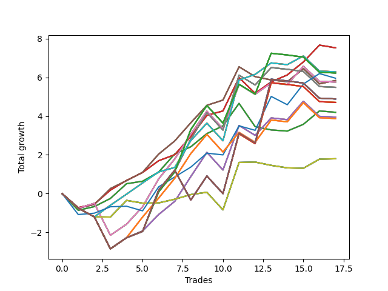

# Short Wallace 012 
- Symbol: SPY_Unlimited
- Date Range: 03/23/2022 - 07/08/2022
- Trading Period: 7:20-12:30
- Number of Trades: 17



| Name | Win Percent | Profit | Avg Profit / Trade | Avg Time / Trade |      | Name | Win Percent | Profit | Avg Profit / Trade | Avg Time / Trade |
| ---- | ----------- | ------ | ------------------ | ---------------- | ---- | ---- | ----------- | ------ | ------------------ | ---------------- |
| Sorted By <br> Profit | | | | | | Sorted By <br> Win Percentage ||||
| Sixty-Five | 82.35 | 3765.00 | 221.47 | 12:00 |     | Sixty-Five | 82.35 | 3765.00 | 221.47 | 12:00 |
| Fifty-Seven | 82.35 | 3765.00 | 221.47 | 12:00 |     | Fifty-Seven | 82.35 | 3765.00 | 221.47 | 12:00 |
| Forty-Nine | 82.35 | 3765.00 | 221.47 | 12:00 |     | Forty-Nine | 82.35 | 3765.00 | 221.47 | 12:00 |
| Forty-One | 82.35 | 3765.00 | 221.47 | 12:00 |     | Forty-One | 82.35 | 3765.00 | 221.47 | 12:00 |
| One | 82.35 | 3765.00 | 221.47 | 12:00 |     | One | 82.35 | 3765.00 | 221.47 | 12:00 |
| Seventy-One | 64.71 | 3145.00 | 185.00 | 16:13 |     | Sixty-Seven | 70.59 | 2920.00 | 171.76 | 15:15 |
| Sixty-Three | 64.71 | 3145.00 | 185.00 | 16:13 |     | Fifty-Nine | 70.59 | 2920.00 | 171.76 | 15:15 |
| Fifty-Five | 64.71 | 3145.00 | 185.00 | 16:13 |     | Fifty-One | 70.59 | 2920.00 | 171.76 | 15:15 |
| Forty-Seven | 64.71 | 3145.00 | 185.00 | 16:13 |     | Forty-Three | 70.59 | 2920.00 | 171.76 | 15:15 |
| Seven | 64.71 | 3145.00 | 185.00 | 16:13 |     | Three | 70.59 | 2920.00 | 171.76 | 15:15 |
| One Hundred Twenty-Seven | 47.06 | 3115.00 | 183.24 | 25:21 |     | Sixty-Four | 70.59 | 2100.00 | 123.53 | 07:04 |
| One Hundred Twenty-Two | 47.06 | 3115.00 | 183.24 | 25:21 |     | Fifty-Six | 70.59 | 2100.00 | 123.53 | 07:04 |
| One Hundred Seventeen | 47.06 | 3115.00 | 183.24 | 25:21 |     | Forty-Eight | 70.59 | 2100.00 | 123.53 | 07:04 |
| One Hundred Twelve | 47.06 | 3115.00 | 183.24 | 25:21 |     | Forty | 70.59 | 2100.00 | 123.53 | 07:04 |
| Eighty-Two | 47.06 | 3115.00 | 183.24 | 25:21 |     | Zero | 70.59 | 2100.00 | 123.53 | 07:04 |
| Seventy-Three | 64.71 | 2980.00 | 175.29 | 09:40 |     | Seventy-One | 64.71 | 3145.00 | 185.00 | 16:13 |
| Sixty-Seven | 70.59 | 2920.00 | 171.76 | 15:15 |     | Sixty-Three | 64.71 | 3145.00 | 185.00 | 16:13 |
| Fifty-Nine | 70.59 | 2920.00 | 171.76 | 15:15 |     | Fifty-Five | 64.71 | 3145.00 | 185.00 | 16:13 |
| Fifty-One | 70.59 | 2920.00 | 171.76 | 15:15 |     | Forty-Seven | 64.71 | 3145.00 | 185.00 | 16:13 |
| Forty-Three | 70.59 | 2920.00 | 171.76 | 15:15 |     | Seven | 64.71 | 3145.00 | 185.00 | 16:13 |
| Three | 70.59 | 2920.00 | 171.76 | 15:15 |     | Seventy-Three | 64.71 | 2980.00 | 175.29 | 09:40 |
| Sixty-Eight | 58.82 | 2880.00 | 169.41 | 19:46 |     | Sixty-Eight | 58.82 | 2880.00 | 169.41 | 19:46 |
| Sixty | 58.82 | 2880.00 | 169.41 | 19:46 |     | Sixty | 58.82 | 2880.00 | 169.41 | 19:46 |
| Fifty-Two | 58.82 | 2880.00 | 169.41 | 19:46 |     | Fifty-Two | 58.82 | 2880.00 | 169.41 | 19:46 |
| Forty-Four | 58.82 | 2880.00 | 169.41 | 19:46 |     | Forty-Four | 58.82 | 2880.00 | 169.41 | 19:46 |
| Four | 58.82 | 2880.00 | 169.41 | 19:46 |     | Four | 58.82 | 2880.00 | 169.41 | 19:46 |
| Sixty-Nine | 47.06 | 2745.00 | 161.47 | 25:16 |     | Sixty-Six | 52.94 | 1975.00 | 116.18 | 21:01 |
| Sixty-One | 47.06 | 2745.00 | 161.47 | 25:16 |     | Fifty-Eight | 52.94 | 1975.00 | 116.18 | 21:01 |
| Fifty-Three | 47.06 | 2745.00 | 161.47 | 25:16 |     | Fifty | 52.94 | 1975.00 | 116.18 | 21:01 |
| Forty-Five | 47.06 | 2745.00 | 161.47 | 25:16 |     | Forty-Two | 52.94 | 1975.00 | 116.18 | 21:01 |
| Five | 47.06 | 2745.00 | 161.47 | 25:16 |     | Two | 52.94 | 1975.00 | 116.18 | 21:01 |
| One Hundred Thirty | 41.18 | 2445.00 | 143.82 | 29:55 |     | One Hundred Twenty-Six | 52.94 | 1940.00 | 114.12 | 20:07 |
| One Hundred Twenty-Nine | 41.18 | 2445.00 | 143.82 | 29:55 |     | One Hundred Twenty-One | 52.94 | 1940.00 | 114.12 | 20:07 |
| One Hundred Twenty-Five | 41.18 | 2445.00 | 143.82 | 29:55 |     | One Hundred Sixteen | 52.94 | 1940.00 | 114.12 | 20:07 |
| One Hundred Twenty-Four | 41.18 | 2445.00 | 143.82 | 29:55 |     | One Hundred Eleven | 52.94 | 1940.00 | 114.12 | 20:07 |
| One Hundred Twenty | 41.18 | 2445.00 | 143.82 | 29:55 |     | Eighty-One | 52.94 | 1940.00 | 114.12 | 20:07 |
| One Hundred Ninteen | 41.18 | 2445.00 | 143.82 | 29:55 |     | Seventy | 52.94 | 900.00 | 52.94 | 08:15 |
| One Hundred Fifteen | 41.18 | 2445.00 | 143.82 | 29:55 |     | Sixty-Two | 52.94 | 900.00 | 52.94 | 08:15 |
| One Hundred Fourteen | 41.18 | 2445.00 | 143.82 | 29:55 |     | Fifty-Four | 52.94 | 900.00 | 52.94 | 08:15 |
| Eighty-Five | 41.18 | 2445.00 | 143.82 | 29:55 |     | Forty-Six | 52.94 | 900.00 | 52.94 | 08:15 |
| Eighty-Four | 41.18 | 2445.00 | 143.82 | 29:55 |     | Six | 52.94 | 900.00 | 52.94 | 08:15 |
| One Hundred Twenty-Eight | 41.18 | 2355.00 | 138.53 | 27:55 |     | One Hundred Twenty-Seven | 47.06 | 3115.00 | 183.24 | 25:21 |
| One Hundred Twenty-Three | 41.18 | 2355.00 | 138.53 | 27:55 |     | One Hundred Twenty-Two | 47.06 | 3115.00 | 183.24 | 25:21 |
| One Hundred Eighteen | 41.18 | 2355.00 | 138.53 | 27:55 |     | One Hundred Seventeen | 47.06 | 3115.00 | 183.24 | 25:21 |
| One Hundred Thirteen | 41.18 | 2355.00 | 138.53 | 27:55 |     | One Hundred Twelve | 47.06 | 3115.00 | 183.24 | 25:21 |
| Eighty-Three | 41.18 | 2355.00 | 138.53 | 27:55 |     | Eighty-Two | 47.06 | 3115.00 | 183.24 | 25:21 |
| Sixty-Four | 70.59 | 2100.00 | 123.53 | 07:04 |     | Sixty-Nine | 47.06 | 2745.00 | 161.47 | 25:16 |
| Fifty-Six | 70.59 | 2100.00 | 123.53 | 07:04 |     | Sixty-One | 47.06 | 2745.00 | 161.47 | 25:16 |
| Forty-Eight | 70.59 | 2100.00 | 123.53 | 07:04 |     | Fifty-Three | 47.06 | 2745.00 | 161.47 | 25:16 |
| Forty | 70.59 | 2100.00 | 123.53 | 07:04 |     | Forty-Five | 47.06 | 2745.00 | 161.47 | 25:16 |
| Zero | 70.59 | 2100.00 | 123.53 | 07:04 |     | Five | 47.06 | 2745.00 | 161.47 | 25:16 |
| Sixty-Six | 52.94 | 1975.00 | 116.18 | 21:01 |     | One Hundred Thirty | 41.18 | 2445.00 | 143.82 | 29:55 |
| Fifty-Eight | 52.94 | 1975.00 | 116.18 | 21:01 |     | One Hundred Twenty-Nine | 41.18 | 2445.00 | 143.82 | 29:55 |
| Fifty | 52.94 | 1975.00 | 116.18 | 21:01 |     | One Hundred Twenty-Five | 41.18 | 2445.00 | 143.82 | 29:55 |
| Forty-Two | 52.94 | 1975.00 | 116.18 | 21:01 |     | One Hundred Twenty-Four | 41.18 | 2445.00 | 143.82 | 29:55 |
| Two | 52.94 | 1975.00 | 116.18 | 21:01 |     | One Hundred Twenty | 41.18 | 2445.00 | 143.82 | 29:55 |
| One Hundred Twenty-Six | 52.94 | 1940.00 | 114.12 | 20:07 |     | One Hundred Ninteen | 41.18 | 2445.00 | 143.82 | 29:55 |
| One Hundred Twenty-One | 52.94 | 1940.00 | 114.12 | 20:07 |     | One Hundred Fifteen | 41.18 | 2445.00 | 143.82 | 29:55 |
| One Hundred Sixteen | 52.94 | 1940.00 | 114.12 | 20:07 |     | One Hundred Fourteen | 41.18 | 2445.00 | 143.82 | 29:55 |
| One Hundred Eleven | 52.94 | 1940.00 | 114.12 | 20:07 |     | Eighty-Five | 41.18 | 2445.00 | 143.82 | 29:55 |
| Eighty-One | 52.94 | 1940.00 | 114.12 | 20:07 |     | Eighty-Four | 41.18 | 2445.00 | 143.82 | 29:55 |
| Seventy | 52.94 | 900.00 | 52.94 | 08:15 |     | One Hundred Twenty-Eight | 41.18 | 2355.00 | 138.53 | 27:55 |
| Sixty-Two | 52.94 | 900.00 | 52.94 | 08:15 |     | One Hundred Twenty-Three | 41.18 | 2355.00 | 138.53 | 27:55 |
| Fifty-Four | 52.94 | 900.00 | 52.94 | 08:15 |     | One Hundred Eighteen | 41.18 | 2355.00 | 138.53 | 27:55 |
| Forty-Six | 52.94 | 900.00 | 52.94 | 08:15 |     | One Hundred Thirteen | 41.18 | 2355.00 | 138.53 | 27:55 |
| Six | 52.94 | 900.00 | 52.94 | 08:15 |     | Eighty-Three | 41.18 | 2355.00 | 138.53 | 27:55 |

## NO STOPLOSS

### Test Zero
* Sell when price hits the middle line of the 20p bollinger
* No Stoploss
* Results:
```
Total Trades: 17
Percent Up: 29.41
Percent Down: 70.59
Total Points Moved Down: 4.20
Potential Profit: 2100.00
Total Points Ups: 2.36 Count Ups: 5
Total Points Downs: 6.56 Count Downs: 12
```

<details><summary>Trades</summary>

<code>In: 2022-03-25 10:52:00		Out: 2022-03-25 11:18:10		Total Position Time: 26:10		Total Move Down: -0.86		Total to Date: -0.86</code> <br />
<code>In: 2022-03-28 11:12:00		Out: 2022-03-28 11:12:10		Total Position Time: 00:10		Total Move Down: 0.19		Total to Date: -0.67</code> <br />
<code>In: 2022-04-18 10:13:00		Out: 2022-04-18 10:17:50		Total Position Time: 04:50		Total Move Down: 0.42		Total to Date: -0.25</code> <br />
<code>In: 2022-04-25 09:27:00		Out: 2022-04-25 09:31:05		Total Position Time: 04:05		Total Move Down: 0.76		Total to Date: 0.51</code> <br />
<code>In: 2022-04-26 11:23:00		Out: 2022-04-26 11:31:35		Total Position Time: 08:35		Total Move Down: 0.13		Total to Date: 0.64</code> <br />
<code>In: 2022-04-29 10:39:00		Out: 2022-04-29 10:40:30		Total Position Time: 01:30		Total Move Down: 0.47		Total to Date: 1.11</code> <br />
<code>In: 2022-05-11 11:27:00		Out: 2022-05-11 11:30:55		Total Position Time: 03:55		Total Move Down: 0.94		Total to Date: 2.05</code> <br />
<code>In: 2022-05-25 11:04:00		Out: 2022-05-25 11:06:20		Total Position Time: 02:20		Total Move Down: 0.37		Total to Date: 2.42</code> <br />
<code>In: 2022-06-09 08:45:00		Out: 2022-06-09 08:48:20		Total Position Time: 03:20		Total Move Down: 0.68		Total to Date: 3.10</code> <br />
<code>In: 2022-06-13 09:14:00		Out: 2022-06-13 09:17:10		Total Position Time: 03:10		Total Move Down: 0.40		Total to Date: 3.50</code> <br />
<code>In: 2022-06-13 09:40:00		Out: 2022-06-13 09:44:05		Total Position Time: 04:05		Total Move Down: 1.16		Total to Date: 4.66</code> <br />
<code>In: 2022-06-14 10:02:00		Out: 2022-06-14 10:26:40		Total Position Time: 24:40		Total Move Down: -1.20		Total to Date: 3.46</code> <br />
<code>In: 2022-06-15 11:02:00		Out: 2022-06-15 11:02:10		Total Position Time: 00:10		Total Move Down: -0.17		Total to Date: 3.29</code> <br />
<code>In: 2022-06-17 08:09:00		Out: 2022-06-17 08:23:05		Total Position Time: 14:05		Total Move Down: -0.06		Total to Date: 3.23</code> <br />
<code>In: 2022-06-29 10:12:00		Out: 2022-06-29 10:13:05		Total Position Time: 01:05		Total Move Down: 0.35		Total to Date: 3.58</code> <br />
<code>In: 2022-06-30 07:36:00		Out: 2022-06-30 07:42:05		Total Position Time: 06:05		Total Move Down: 0.69		Total to Date: 4.27</code> <br />
<code>In: 2022-07-06 10:05:00		Out: 2022-07-06 10:17:05		Total Position Time: 12:05		Total Move Down: -0.07		Total to Date: 4.20</code> <br />


</details>

### Test One
* Sell when the price hits the upper line of the 20p 1std bollinger
* No Stoploss
* Results:
```
Total Trades: 17
Percent Up: 17.65
Percent Down: 82.35
Total Points Moved Down: 7.53
Potential Profit: 3765.00
Total Points Ups: 1.67 Count Ups: 3
Total Points Downs: 9.20 Count Downs: 14
```

<details><summary>Trades</summary>

<code>In: 2022-03-25 10:52:00		Out: 2022-03-25 11:19:30		Total Position Time: 27:30		Total Move Down: -0.72		Total to Date: -0.72</code> <br />
<code>In: 2022-03-28 11:12:00		Out: 2022-03-28 11:19:20		Total Position Time: 07:20		Total Move Down: 0.18		Total to Date: -0.54</code> <br />
<code>In: 2022-04-18 10:13:00		Out: 2022-04-18 10:18:45		Total Position Time: 05:45		Total Move Down: 0.72		Total to Date: 0.18</code> <br />
<code>In: 2022-04-25 09:27:00		Out: 2022-04-25 09:42:35		Total Position Time: 15:35		Total Move Down: 0.50		Total to Date: 0.68</code> <br />
<code>In: 2022-04-26 11:23:00		Out: 2022-04-26 11:33:45		Total Position Time: 10:45		Total Move Down: 0.41		Total to Date: 1.09</code> <br />
<code>In: 2022-04-29 10:39:00		Out: 2022-04-29 10:41:05		Total Position Time: 02:05		Total Move Down: 0.61		Total to Date: 1.70</code> <br />
<code>In: 2022-05-11 11:27:00		Out: 2022-05-11 11:50:35		Total Position Time: 23:35		Total Move Down: 0.31		Total to Date: 2.01</code> <br />
<code>In: 2022-05-25 11:04:00		Out: 2022-05-25 11:06:35		Total Position Time: 02:35		Total Move Down: 0.94		Total to Date: 2.95</code> <br />
<code>In: 2022-06-09 08:45:00		Out: 2022-06-09 08:49:35		Total Position Time: 04:35		Total Move Down: 1.09		Total to Date: 4.04</code> <br />
<code>In: 2022-06-13 09:14:00		Out: 2022-06-13 09:29:20		Total Position Time: 15:20		Total Move Down: 0.23		Total to Date: 4.27</code> <br />
<code>In: 2022-06-13 09:40:00		Out: 2022-06-13 09:47:55		Total Position Time: 07:55		Total Move Down: 1.72		Total to Date: 5.99</code> <br />
<code>In: 2022-06-14 10:02:00		Out: 2022-06-14 10:29:50		Total Position Time: 27:50		Total Move Down: -0.81		Total to Date: 5.18</code> <br />
<code>In: 2022-06-15 11:02:00		Out: 2022-06-15 11:03:05		Total Position Time: 01:05		Total Move Down: 0.59		Total to Date: 5.77</code> <br />
<code>In: 2022-06-17 08:09:00		Out: 2022-06-17 08:25:20		Total Position Time: 16:20		Total Move Down: 0.36		Total to Date: 6.13</code> <br />
<code>In: 2022-06-29 10:12:00		Out: 2022-06-29 10:14:00		Total Position Time: 02:00		Total Move Down: 0.67		Total to Date: 6.80</code> <br />
<code>In: 2022-06-30 07:36:00		Out: 2022-06-30 07:49:05		Total Position Time: 13:05		Total Move Down: 0.87		Total to Date: 7.67</code> <br />
<code>In: 2022-07-06 10:05:00		Out: 2022-07-06 10:25:55		Total Position Time: 20:55		Total Move Down: -0.14		Total to Date: 7.53</code> <br />


</details>

### Test Two
* Sell when the price hits the upper line of the 20p 2std bollinger
* No Stoploss
* Results:
```
Total Trades: 17
Percent Up: 47.06
Percent Down: 52.94
Total Points Moved Down: 3.95
Potential Profit: 1975.00
Total Points Ups: 5.18 Count Ups: 8
Total Points Downs: 9.13 Count Downs: 9
```

<details><summary>Trades</summary>

<code>In: 2022-03-25 10:52:00		Out: 2022-03-25 11:21:55		Total Position Time: 29:55		Total Move Down: -0.75		Total to Date: -0.75</code> <br />
<code>In: 2022-03-28 11:12:00		Out: 2022-03-28 11:41:55		Total Position Time: 29:55		Total Move Down: -0.45		Total to Date: -1.20</code> <br />
<code>In: 2022-04-18 10:13:00		Out: 2022-04-18 10:42:55		Total Position Time: 29:55		Total Move Down: -1.65		Total to Date: -2.85</code> <br />
<code>In: 2022-04-25 09:27:00		Out: 2022-04-25 09:56:55		Total Position Time: 29:55		Total Move Down: 0.57		Total to Date: -2.28</code> <br />
<code>In: 2022-04-26 11:23:00		Out: 2022-04-26 11:41:25		Total Position Time: 18:25		Total Move Down: 0.35		Total to Date: -1.93</code> <br />
<code>In: 2022-04-29 10:39:00		Out: 2022-04-29 10:43:20		Total Position Time: 04:20		Total Move Down: 0.85		Total to Date: -1.08</code> <br />
<code>In: 2022-05-11 11:27:00		Out: 2022-05-11 11:51:20		Total Position Time: 24:20		Total Move Down: 0.68		Total to Date: -0.40</code> <br />
<code>In: 2022-05-25 11:04:00		Out: 2022-05-25 11:06:40		Total Position Time: 02:40		Total Move Down: 1.28		Total to Date: 0.88</code> <br />
<code>In: 2022-06-09 08:45:00		Out: 2022-06-09 09:11:00		Total Position Time: 26:00		Total Move Down: 1.25		Total to Date: 2.13</code> <br />
<code>In: 2022-06-13 09:14:00		Out: 2022-06-13 09:43:55		Total Position Time: 29:55		Total Move Down: -0.91		Total to Date: 1.22</code> <br />
<code>In: 2022-06-13 09:40:00		Out: 2022-06-13 09:54:45		Total Position Time: 14:45		Total Move Down: 2.30		Total to Date: 3.52</code> <br />
<code>In: 2022-06-14 10:02:00		Out: 2022-06-14 10:31:55		Total Position Time: 29:55		Total Move Down: -0.51		Total to Date: 3.01</code> <br />
<code>In: 2022-06-15 11:02:00		Out: 2022-06-15 11:03:15		Total Position Time: 01:15		Total Move Down: 0.90		Total to Date: 3.91</code> <br />
<code>In: 2022-06-17 08:09:00		Out: 2022-06-17 08:38:55		Total Position Time: 29:55		Total Move Down: -0.09		Total to Date: 3.82</code> <br />
<code>In: 2022-06-29 10:12:00		Out: 2022-06-29 10:16:00		Total Position Time: 04:00		Total Move Down: 0.95		Total to Date: 4.77</code> <br />
<code>In: 2022-06-30 07:36:00		Out: 2022-06-30 08:05:55		Total Position Time: 29:55		Total Move Down: -0.78		Total to Date: 3.99</code> <br />
<code>In: 2022-07-06 10:05:00		Out: 2022-07-06 10:27:15		Total Position Time: 22:15		Total Move Down: -0.04		Total to Date: 3.95</code> <br />


</details>

### Test Three
* Sell when price hits the middle line of the 50p bollinger
* No Stoploss
* Results:
```
Total Trades: 17
Percent Up: 29.41
Percent Down: 70.59
Total Points Moved Down: 5.84
Potential Profit: 2920.00
Total Points Ups: 2.30 Count Ups: 5
Total Points Downs: 8.14 Count Downs: 12
```

<details><summary>Trades</summary>

<code>In: 2022-03-25 10:52:00		Out: 2022-03-25 11:21:55		Total Position Time: 29:55		Total Move Down: -0.75		Total to Date: -0.75</code> <br />
<code>In: 2022-03-28 11:12:00		Out: 2022-03-28 11:12:10		Total Position Time: 00:10		Total Move Down: 0.19		Total to Date: -0.56</code> <br />
<code>In: 2022-04-18 10:13:00		Out: 2022-04-18 10:20:35		Total Position Time: 07:35		Total Move Down: 0.82		Total to Date: 0.26</code> <br />
<code>In: 2022-04-25 09:27:00		Out: 2022-04-25 09:55:05		Total Position Time: 28:05		Total Move Down: 0.41		Total to Date: 0.67</code> <br />
<code>In: 2022-04-26 11:23:00		Out: 2022-04-26 11:41:30		Total Position Time: 18:30		Total Move Down: 0.43		Total to Date: 1.10</code> <br />
<code>In: 2022-04-29 10:39:00		Out: 2022-04-29 10:43:40		Total Position Time: 04:40		Total Move Down: 0.94		Total to Date: 2.04</code> <br />
<code>In: 2022-05-11 11:27:00		Out: 2022-05-11 11:51:20		Total Position Time: 24:20		Total Move Down: 0.68		Total to Date: 2.72</code> <br />
<code>In: 2022-05-25 11:04:00		Out: 2022-05-25 11:06:35		Total Position Time: 02:35		Total Move Down: 0.94		Total to Date: 3.66</code> <br />
<code>In: 2022-06-09 08:45:00		Out: 2022-06-09 08:48:50		Total Position Time: 03:50		Total Move Down: 0.90		Total to Date: 4.56</code> <br />
<code>In: 2022-06-13 09:14:00		Out: 2022-06-13 09:30:50		Total Position Time: 16:50		Total Move Down: 0.27		Total to Date: 4.83</code> <br />
<code>In: 2022-06-13 09:40:00		Out: 2022-06-13 09:47:55		Total Position Time: 07:55		Total Move Down: 1.72		Total to Date: 6.55</code> <br />
<code>In: 2022-06-14 10:02:00		Out: 2022-06-14 10:31:55		Total Position Time: 29:55		Total Move Down: -0.51		Total to Date: 6.04</code> <br />
<code>In: 2022-06-15 11:02:00		Out: 2022-06-15 11:02:10		Total Position Time: 00:10		Total Move Down: -0.17		Total to Date: 5.87</code> <br />
<code>In: 2022-06-17 08:09:00		Out: 2022-06-17 08:38:55		Total Position Time: 29:55		Total Move Down: -0.09		Total to Date: 5.78</code> <br />
<code>In: 2022-06-29 10:12:00		Out: 2022-06-29 10:14:00		Total Position Time: 02:00		Total Move Down: 0.67		Total to Date: 6.45</code> <br />
<code>In: 2022-06-30 07:36:00		Out: 2022-06-30 08:05:55		Total Position Time: 29:55		Total Move Down: -0.78		Total to Date: 5.67</code> <br />
<code>In: 2022-07-06 10:05:00		Out: 2022-07-06 10:28:05		Total Position Time: 23:05		Total Move Down: 0.17		Total to Date: 5.84</code> <br />


</details>

### Test Four
* Sell when the price hits the upper line of the 50p 1std bollinger
* No Stoploss
* Results:
```
Total Trades: 17
Percent Up: 41.18
Percent Down: 58.82
Total Points Moved Down: 5.76
Potential Profit: 2880.00
Total Points Ups: 4.73 Count Ups: 7
Total Points Downs: 10.49 Count Downs: 10
```

<details><summary>Trades</summary>

<code>In: 2022-03-25 10:52:00		Out: 2022-03-25 11:21:55		Total Position Time: 29:55		Total Move Down: -0.75		Total to Date: -0.75</code> <br />
<code>In: 2022-03-28 11:12:00		Out: 2022-03-28 11:20:40		Total Position Time: 08:40		Total Move Down: 0.25		Total to Date: -0.50</code> <br />
<code>In: 2022-04-18 10:13:00		Out: 2022-04-18 10:42:55		Total Position Time: 29:55		Total Move Down: -1.65		Total to Date: -2.15</code> <br />
<code>In: 2022-04-25 09:27:00		Out: 2022-04-25 09:56:55		Total Position Time: 29:55		Total Move Down: 0.57		Total to Date: -1.58</code> <br />
<code>In: 2022-04-26 11:23:00		Out: 2022-04-26 11:45:00		Total Position Time: 22:00		Total Move Down: 0.90		Total to Date: -0.68</code> <br />
<code>In: 2022-04-29 10:39:00		Out: 2022-04-29 10:47:20		Total Position Time: 08:20		Total Move Down: 1.44		Total to Date: 0.76</code> <br />
<code>In: 2022-05-11 11:27:00		Out: 2022-05-11 11:56:55		Total Position Time: 29:55		Total Move Down: 1.03		Total to Date: 1.79</code> <br />
<code>In: 2022-05-25 11:04:00		Out: 2022-05-25 11:06:40		Total Position Time: 02:40		Total Move Down: 1.28		Total to Date: 3.07</code> <br />
<code>In: 2022-06-09 08:45:00		Out: 2022-06-09 08:50:25		Total Position Time: 05:25		Total Move Down: 1.19		Total to Date: 4.26</code> <br />
<code>In: 2022-06-13 09:14:00		Out: 2022-06-13 09:43:55		Total Position Time: 29:55		Total Move Down: -0.91		Total to Date: 3.35</code> <br />
<code>In: 2022-06-13 09:40:00		Out: 2022-06-13 09:54:50		Total Position Time: 14:50		Total Move Down: 2.29		Total to Date: 5.64</code> <br />
<code>In: 2022-06-14 10:02:00		Out: 2022-06-14 10:31:55		Total Position Time: 29:55		Total Move Down: -0.51		Total to Date: 5.13</code> <br />
<code>In: 2022-06-15 11:02:00		Out: 2022-06-15 11:03:05		Total Position Time: 01:05		Total Move Down: 0.59		Total to Date: 5.72</code> <br />
<code>In: 2022-06-17 08:09:00		Out: 2022-06-17 08:38:55		Total Position Time: 29:55		Total Move Down: -0.09		Total to Date: 5.63</code> <br />
<code>In: 2022-06-29 10:12:00		Out: 2022-06-29 10:16:00		Total Position Time: 04:00		Total Move Down: 0.95		Total to Date: 6.58</code> <br />
<code>In: 2022-06-30 07:36:00		Out: 2022-06-30 08:05:55		Total Position Time: 29:55		Total Move Down: -0.78		Total to Date: 5.80</code> <br />
<code>In: 2022-07-06 10:05:00		Out: 2022-07-06 10:34:55		Total Position Time: 29:55		Total Move Down: -0.04		Total to Date: 5.76</code> <br />


</details>

### Test Five
* Sell when the price hits the upper line of the 50p 2std bollinger
* No Stoploss
* Results:
```
Total Trades: 17
Percent Up: 52.94
Percent Down: 47.06
Total Points Moved Down: 5.49
Potential Profit: 2745.00
Total Points Ups: 5.29 Count Ups: 9
Total Points Downs: 10.78 Count Downs: 8
```

<details><summary>Trades</summary>

<code>In: 2022-03-25 10:52:00		Out: 2022-03-25 11:21:55		Total Position Time: 29:55		Total Move Down: -0.75		Total to Date: -0.75</code> <br />
<code>In: 2022-03-28 11:12:00		Out: 2022-03-28 11:41:55		Total Position Time: 29:55		Total Move Down: -0.45		Total to Date: -1.20</code> <br />
<code>In: 2022-04-18 10:13:00		Out: 2022-04-18 10:42:55		Total Position Time: 29:55		Total Move Down: -1.65		Total to Date: -2.85</code> <br />
<code>In: 2022-04-25 09:27:00		Out: 2022-04-25 09:56:55		Total Position Time: 29:55		Total Move Down: 0.57		Total to Date: -2.28</code> <br />
<code>In: 2022-04-26 11:23:00		Out: 2022-04-26 11:52:55		Total Position Time: 29:55		Total Move Down: 0.33		Total to Date: -1.95</code> <br />
<code>In: 2022-04-29 10:39:00		Out: 2022-04-29 11:01:10		Total Position Time: 22:10		Total Move Down: 2.08		Total to Date: 0.13</code> <br />
<code>In: 2022-05-11 11:27:00		Out: 2022-05-11 11:56:55		Total Position Time: 29:55		Total Move Down: 1.03		Total to Date: 1.16</code> <br />
<code>In: 2022-05-25 11:04:00		Out: 2022-05-25 11:06:50		Total Position Time: 02:50		Total Move Down: 1.65		Total to Date: 2.81</code> <br />
<code>In: 2022-06-09 08:45:00		Out: 2022-06-09 09:11:10		Total Position Time: 26:10		Total Move Down: 1.38		Total to Date: 4.19</code> <br />
<code>In: 2022-06-13 09:14:00		Out: 2022-06-13 09:43:55		Total Position Time: 29:55		Total Move Down: -0.91		Total to Date: 3.28</code> <br />
<code>In: 2022-06-13 09:40:00		Out: 2022-06-13 09:58:15		Total Position Time: 18:15		Total Move Down: 2.84		Total to Date: 6.12</code> <br />
<code>In: 2022-06-14 10:02:00		Out: 2022-06-14 10:31:55		Total Position Time: 29:55		Total Move Down: -0.51		Total to Date: 5.61</code> <br />
<code>In: 2022-06-15 11:02:00		Out: 2022-06-15 11:03:15		Total Position Time: 01:15		Total Move Down: 0.90		Total to Date: 6.51</code> <br />
<code>In: 2022-06-17 08:09:00		Out: 2022-06-17 08:38:55		Total Position Time: 29:55		Total Move Down: -0.09		Total to Date: 6.42</code> <br />
<code>In: 2022-06-29 10:12:00		Out: 2022-06-29 10:41:55		Total Position Time: 29:55		Total Move Down: -0.11		Total to Date: 6.31</code> <br />
<code>In: 2022-06-30 07:36:00		Out: 2022-06-30 08:05:55		Total Position Time: 29:55		Total Move Down: -0.78		Total to Date: 5.53</code> <br />
<code>In: 2022-07-06 10:05:00		Out: 2022-07-06 10:34:55		Total Position Time: 29:55		Total Move Down: -0.04		Total to Date: 5.49</code> <br />


</details>

### Test Six
* Sell when the price hits the middle line of the 1std VWAP
* No Stoploss
* Results:
```
Total Trades: 17
Percent Up: 47.06
Percent Down: 52.94
Total Points Moved Down: 1.80
Potential Profit: 900.00
Total Points Ups: 2.58 Count Ups: 8
Total Points Downs: 4.38 Count Downs: 9
```

<details><summary>Trades</summary>

<code>In: 2022-03-25 10:52:00		Out: 2022-03-25 11:21:55		Total Position Time: 29:55		Total Move Down: -0.75		Total to Date: -0.75</code> <br />
<code>In: 2022-03-28 11:12:00		Out: 2022-03-28 11:41:55		Total Position Time: 29:55		Total Move Down: -0.45		Total to Date: -1.20</code> <br />
<code>In: 2022-04-18 10:13:00		Out: 2022-04-18 10:13:10		Total Position Time: 00:10		Total Move Down: -0.01		Total to Date: -1.21</code> <br />
<code>In: 2022-04-25 09:27:00		Out: 2022-04-25 09:31:10		Total Position Time: 04:10		Total Move Down: 0.86		Total to Date: -0.35</code> <br />
<code>In: 2022-04-26 11:23:00		Out: 2022-04-26 11:23:10		Total Position Time: 00:10		Total Move Down: -0.14		Total to Date: -0.49</code> <br />
<code>In: 2022-04-29 10:39:00		Out: 2022-04-29 10:39:10		Total Position Time: 00:10		Total Move Down: 0.01		Total to Date: -0.48</code> <br />
<code>In: 2022-05-11 11:27:00		Out: 2022-05-11 11:27:10		Total Position Time: 00:10		Total Move Down: 0.19		Total to Date: -0.29</code> <br />
<code>In: 2022-05-25 11:04:00		Out: 2022-05-25 11:05:45		Total Position Time: 01:45		Total Move Down: 0.24		Total to Date: -0.05</code> <br />
<code>In: 2022-06-09 08:45:00		Out: 2022-06-09 08:45:10		Total Position Time: 00:10		Total Move Down: 0.12		Total to Date: 0.07</code> <br />
<code>In: 2022-06-13 09:14:00		Out: 2022-06-13 09:43:55		Total Position Time: 29:55		Total Move Down: -0.91		Total to Date: -0.84</code> <br />
<code>In: 2022-06-13 09:40:00		Out: 2022-06-13 09:57:00		Total Position Time: 17:00		Total Move Down: 2.45		Total to Date: 1.61</code> <br />
<code>In: 2022-06-14 10:02:00		Out: 2022-06-14 10:02:10		Total Position Time: 00:10		Total Move Down: 0.02		Total to Date: 1.63</code> <br />
<code>In: 2022-06-15 11:02:00		Out: 2022-06-15 11:02:10		Total Position Time: 00:10		Total Move Down: -0.17		Total to Date: 1.46</code> <br />
<code>In: 2022-06-17 08:09:00		Out: 2022-06-17 08:09:10		Total Position Time: 00:10		Total Move Down: -0.13		Total to Date: 1.33</code> <br />
<code>In: 2022-06-29 10:12:00		Out: 2022-06-29 10:12:10		Total Position Time: 00:10		Total Move Down: -0.02		Total to Date: 1.31</code> <br />
<code>In: 2022-06-30 07:36:00		Out: 2022-06-30 07:39:55		Total Position Time: 03:55		Total Move Down: 0.47		Total to Date: 1.78</code> <br />
<code>In: 2022-07-06 10:05:00		Out: 2022-07-06 10:27:25		Total Position Time: 22:25		Total Move Down: 0.02		Total to Date: 1.80</code> <br />


</details>

### Test Seven
* Sell when the price hits the upper line of the 1std VWAP
* No Stoploss
* Results:
```
Total Trades: 17
Percent Up: 35.29
Percent Down: 64.71
Total Points Moved Down: 6.29
Potential Profit: 3145.00
Total Points Ups: 3.02 Count Ups: 6
Total Points Downs: 9.31 Count Downs: 11
```

<details><summary>Trades</summary>

<code>In: 2022-03-25 10:52:00		Out: 2022-03-25 11:21:55		Total Position Time: 29:55		Total Move Down: -0.75		Total to Date: -0.75</code> <br />
<code>In: 2022-03-28 11:12:00		Out: 2022-03-28 11:41:55		Total Position Time: 29:55		Total Move Down: -0.45		Total to Date: -1.20</code> <br />
<code>In: 2022-04-18 10:13:00		Out: 2022-04-18 10:18:15		Total Position Time: 05:15		Total Move Down: 0.60		Total to Date: -0.60</code> <br />
<code>In: 2022-04-25 09:27:00		Out: 2022-04-25 09:56:55		Total Position Time: 29:55		Total Move Down: 0.57		Total to Date: -0.03</code> <br />
<code>In: 2022-04-26 11:23:00		Out: 2022-04-26 11:42:15		Total Position Time: 19:15		Total Move Down: 0.58		Total to Date: 0.55</code> <br />
<code>In: 2022-04-29 10:39:00		Out: 2022-04-29 10:40:40		Total Position Time: 01:40		Total Move Down: 0.57		Total to Date: 1.12</code> <br />
<code>In: 2022-05-11 11:27:00		Out: 2022-05-11 11:27:15		Total Position Time: 00:15		Total Move Down: 0.23		Total to Date: 1.35</code> <br />
<code>In: 2022-05-25 11:04:00		Out: 2022-05-25 11:06:45		Total Position Time: 02:45		Total Move Down: 1.39		Total to Date: 2.74</code> <br />
<code>In: 2022-06-09 08:45:00		Out: 2022-06-09 08:48:50		Total Position Time: 03:50		Total Move Down: 0.90		Total to Date: 3.64</code> <br />
<code>In: 2022-06-13 09:14:00		Out: 2022-06-13 09:43:55		Total Position Time: 29:55		Total Move Down: -0.91		Total to Date: 2.73</code> <br />
<code>In: 2022-06-13 09:40:00		Out: 2022-06-13 10:09:55		Total Position Time: 29:55		Total Move Down: 3.13		Total to Date: 5.86</code> <br />
<code>In: 2022-06-14 10:02:00		Out: 2022-06-14 10:02:40		Total Position Time: 00:40		Total Move Down: 0.30		Total to Date: 6.16</code> <br />
<code>In: 2022-06-15 11:02:00		Out: 2022-06-15 11:03:05		Total Position Time: 01:05		Total Move Down: 0.59		Total to Date: 6.75</code> <br />
<code>In: 2022-06-17 08:09:00		Out: 2022-06-17 08:38:55		Total Position Time: 29:55		Total Move Down: -0.09		Total to Date: 6.66</code> <br />
<code>In: 2022-06-29 10:12:00		Out: 2022-06-29 10:13:45		Total Position Time: 01:45		Total Move Down: 0.45		Total to Date: 7.11</code> <br />
<code>In: 2022-06-30 07:36:00		Out: 2022-06-30 08:05:55		Total Position Time: 29:55		Total Move Down: -0.78		Total to Date: 6.33</code> <br />
<code>In: 2022-07-06 10:05:00		Out: 2022-07-06 10:34:55		Total Position Time: 29:55		Total Move Down: -0.04		Total to Date: 6.29</code> <br />


</details>

## STOPLOSS OF 5

### Test Forty
* Sell when price hits the middle line of the 20p bollinger
* Stoploss is -5 points
* Results:
```
Total Trades: 17
Percent Up: 29.41
Percent Down: 70.59
Total Points Moved Down: 4.20
Potential Profit: 2100.00
Total Points Ups: 2.36 Count Ups: 5
Total Points Downs: 6.56 Count Downs: 12
```

<details><summary>Trades</summary>

<code>In: 2022-03-25 10:52:00		Out: 2022-03-25 11:18:10		Total Position Time: 26:10		Total Move Down: -0.86		Total to Date: -0.86</code> <br />
<code>In: 2022-03-28 11:12:00		Out: 2022-03-28 11:12:10		Total Position Time: 00:10		Total Move Down: 0.19		Total to Date: -0.67</code> <br />
<code>In: 2022-04-18 10:13:00		Out: 2022-04-18 10:17:50		Total Position Time: 04:50		Total Move Down: 0.42		Total to Date: -0.25</code> <br />
<code>In: 2022-04-25 09:27:00		Out: 2022-04-25 09:31:05		Total Position Time: 04:05		Total Move Down: 0.76		Total to Date: 0.51</code> <br />
<code>In: 2022-04-26 11:23:00		Out: 2022-04-26 11:31:35		Total Position Time: 08:35		Total Move Down: 0.13		Total to Date: 0.64</code> <br />
<code>In: 2022-04-29 10:39:00		Out: 2022-04-29 10:40:30		Total Position Time: 01:30		Total Move Down: 0.47		Total to Date: 1.11</code> <br />
<code>In: 2022-05-11 11:27:00		Out: 2022-05-11 11:30:55		Total Position Time: 03:55		Total Move Down: 0.94		Total to Date: 2.05</code> <br />
<code>In: 2022-05-25 11:04:00		Out: 2022-05-25 11:06:20		Total Position Time: 02:20		Total Move Down: 0.37		Total to Date: 2.42</code> <br />
<code>In: 2022-06-09 08:45:00		Out: 2022-06-09 08:48:20		Total Position Time: 03:20		Total Move Down: 0.68		Total to Date: 3.10</code> <br />
<code>In: 2022-06-13 09:14:00		Out: 2022-06-13 09:17:10		Total Position Time: 03:10		Total Move Down: 0.40		Total to Date: 3.50</code> <br />
<code>In: 2022-06-13 09:40:00		Out: 2022-06-13 09:44:05		Total Position Time: 04:05		Total Move Down: 1.16		Total to Date: 4.66</code> <br />
<code>In: 2022-06-14 10:02:00		Out: 2022-06-14 10:26:40		Total Position Time: 24:40		Total Move Down: -1.20		Total to Date: 3.46</code> <br />
<code>In: 2022-06-15 11:02:00		Out: 2022-06-15 11:02:10		Total Position Time: 00:10		Total Move Down: -0.17		Total to Date: 3.29</code> <br />
<code>In: 2022-06-17 08:09:00		Out: 2022-06-17 08:23:05		Total Position Time: 14:05		Total Move Down: -0.06		Total to Date: 3.23</code> <br />
<code>In: 2022-06-29 10:12:00		Out: 2022-06-29 10:13:05		Total Position Time: 01:05		Total Move Down: 0.35		Total to Date: 3.58</code> <br />
<code>In: 2022-06-30 07:36:00		Out: 2022-06-30 07:42:05		Total Position Time: 06:05		Total Move Down: 0.69		Total to Date: 4.27</code> <br />
<code>In: 2022-07-06 10:05:00		Out: 2022-07-06 10:17:05		Total Position Time: 12:05		Total Move Down: -0.07		Total to Date: 4.20</code> <br />


</details>

### Test Forty-One
* Sell when the price hits the upper line of the 20p 1std bollinger
* Stoploss is -5 points
* Results:
```
Total Trades: 17
Percent Up: 17.65
Percent Down: 82.35
Total Points Moved Down: 7.53
Potential Profit: 3765.00
Total Points Ups: 1.67 Count Ups: 3
Total Points Downs: 9.20 Count Downs: 14
```

<details><summary>Trades</summary>

<code>In: 2022-03-25 10:52:00		Out: 2022-03-25 11:19:30		Total Position Time: 27:30		Total Move Down: -0.72		Total to Date: -0.72</code> <br />
<code>In: 2022-03-28 11:12:00		Out: 2022-03-28 11:19:20		Total Position Time: 07:20		Total Move Down: 0.18		Total to Date: -0.54</code> <br />
<code>In: 2022-04-18 10:13:00		Out: 2022-04-18 10:18:45		Total Position Time: 05:45		Total Move Down: 0.72		Total to Date: 0.18</code> <br />
<code>In: 2022-04-25 09:27:00		Out: 2022-04-25 09:42:35		Total Position Time: 15:35		Total Move Down: 0.50		Total to Date: 0.68</code> <br />
<code>In: 2022-04-26 11:23:00		Out: 2022-04-26 11:33:45		Total Position Time: 10:45		Total Move Down: 0.41		Total to Date: 1.09</code> <br />
<code>In: 2022-04-29 10:39:00		Out: 2022-04-29 10:41:05		Total Position Time: 02:05		Total Move Down: 0.61		Total to Date: 1.70</code> <br />
<code>In: 2022-05-11 11:27:00		Out: 2022-05-11 11:50:35		Total Position Time: 23:35		Total Move Down: 0.31		Total to Date: 2.01</code> <br />
<code>In: 2022-05-25 11:04:00		Out: 2022-05-25 11:06:35		Total Position Time: 02:35		Total Move Down: 0.94		Total to Date: 2.95</code> <br />
<code>In: 2022-06-09 08:45:00		Out: 2022-06-09 08:49:35		Total Position Time: 04:35		Total Move Down: 1.09		Total to Date: 4.04</code> <br />
<code>In: 2022-06-13 09:14:00		Out: 2022-06-13 09:29:20		Total Position Time: 15:20		Total Move Down: 0.23		Total to Date: 4.27</code> <br />
<code>In: 2022-06-13 09:40:00		Out: 2022-06-13 09:47:55		Total Position Time: 07:55		Total Move Down: 1.72		Total to Date: 5.99</code> <br />
<code>In: 2022-06-14 10:02:00		Out: 2022-06-14 10:29:50		Total Position Time: 27:50		Total Move Down: -0.81		Total to Date: 5.18</code> <br />
<code>In: 2022-06-15 11:02:00		Out: 2022-06-15 11:03:05		Total Position Time: 01:05		Total Move Down: 0.59		Total to Date: 5.77</code> <br />
<code>In: 2022-06-17 08:09:00		Out: 2022-06-17 08:25:20		Total Position Time: 16:20		Total Move Down: 0.36		Total to Date: 6.13</code> <br />
<code>In: 2022-06-29 10:12:00		Out: 2022-06-29 10:14:00		Total Position Time: 02:00		Total Move Down: 0.67		Total to Date: 6.80</code> <br />
<code>In: 2022-06-30 07:36:00		Out: 2022-06-30 07:49:05		Total Position Time: 13:05		Total Move Down: 0.87		Total to Date: 7.67</code> <br />
<code>In: 2022-07-06 10:05:00		Out: 2022-07-06 10:25:55		Total Position Time: 20:55		Total Move Down: -0.14		Total to Date: 7.53</code> <br />


</details>

### Test Forty-Two
* Sell when the price hits the upper line of the 20p 2std bollinger
* Stoploss is -5 points
* Results:
```
Total Trades: 17
Percent Up: 47.06
Percent Down: 52.94
Total Points Moved Down: 3.95
Potential Profit: 1975.00
Total Points Ups: 5.18 Count Ups: 8
Total Points Downs: 9.13 Count Downs: 9
```

<details><summary>Trades</summary>

<code>In: 2022-03-25 10:52:00		Out: 2022-03-25 11:21:55		Total Position Time: 29:55		Total Move Down: -0.75		Total to Date: -0.75</code> <br />
<code>In: 2022-03-28 11:12:00		Out: 2022-03-28 11:41:55		Total Position Time: 29:55		Total Move Down: -0.45		Total to Date: -1.20</code> <br />
<code>In: 2022-04-18 10:13:00		Out: 2022-04-18 10:42:55		Total Position Time: 29:55		Total Move Down: -1.65		Total to Date: -2.85</code> <br />
<code>In: 2022-04-25 09:27:00		Out: 2022-04-25 09:56:55		Total Position Time: 29:55		Total Move Down: 0.57		Total to Date: -2.28</code> <br />
<code>In: 2022-04-26 11:23:00		Out: 2022-04-26 11:41:25		Total Position Time: 18:25		Total Move Down: 0.35		Total to Date: -1.93</code> <br />
<code>In: 2022-04-29 10:39:00		Out: 2022-04-29 10:43:20		Total Position Time: 04:20		Total Move Down: 0.85		Total to Date: -1.08</code> <br />
<code>In: 2022-05-11 11:27:00		Out: 2022-05-11 11:51:20		Total Position Time: 24:20		Total Move Down: 0.68		Total to Date: -0.40</code> <br />
<code>In: 2022-05-25 11:04:00		Out: 2022-05-25 11:06:40		Total Position Time: 02:40		Total Move Down: 1.28		Total to Date: 0.88</code> <br />
<code>In: 2022-06-09 08:45:00		Out: 2022-06-09 09:11:00		Total Position Time: 26:00		Total Move Down: 1.25		Total to Date: 2.13</code> <br />
<code>In: 2022-06-13 09:14:00		Out: 2022-06-13 09:43:55		Total Position Time: 29:55		Total Move Down: -0.91		Total to Date: 1.22</code> <br />
<code>In: 2022-06-13 09:40:00		Out: 2022-06-13 09:54:45		Total Position Time: 14:45		Total Move Down: 2.30		Total to Date: 3.52</code> <br />
<code>In: 2022-06-14 10:02:00		Out: 2022-06-14 10:31:55		Total Position Time: 29:55		Total Move Down: -0.51		Total to Date: 3.01</code> <br />
<code>In: 2022-06-15 11:02:00		Out: 2022-06-15 11:03:15		Total Position Time: 01:15		Total Move Down: 0.90		Total to Date: 3.91</code> <br />
<code>In: 2022-06-17 08:09:00		Out: 2022-06-17 08:38:55		Total Position Time: 29:55		Total Move Down: -0.09		Total to Date: 3.82</code> <br />
<code>In: 2022-06-29 10:12:00		Out: 2022-06-29 10:16:00		Total Position Time: 04:00		Total Move Down: 0.95		Total to Date: 4.77</code> <br />
<code>In: 2022-06-30 07:36:00		Out: 2022-06-30 08:05:55		Total Position Time: 29:55		Total Move Down: -0.78		Total to Date: 3.99</code> <br />
<code>In: 2022-07-06 10:05:00		Out: 2022-07-06 10:27:15		Total Position Time: 22:15		Total Move Down: -0.04		Total to Date: 3.95</code> <br />


</details>

### Test Forty-Three
* Sell when price hits the middle line of the 50p bollinger
* Stoploss is -5 points
* Results:
```
Total Trades: 17
Percent Up: 29.41
Percent Down: 70.59
Total Points Moved Down: 5.84
Potential Profit: 2920.00
Total Points Ups: 2.30 Count Ups: 5
Total Points Downs: 8.14 Count Downs: 12
```

<details><summary>Trades</summary>

<code>In: 2022-03-25 10:52:00		Out: 2022-03-25 11:21:55		Total Position Time: 29:55		Total Move Down: -0.75		Total to Date: -0.75</code> <br />
<code>In: 2022-03-28 11:12:00		Out: 2022-03-28 11:12:10		Total Position Time: 00:10		Total Move Down: 0.19		Total to Date: -0.56</code> <br />
<code>In: 2022-04-18 10:13:00		Out: 2022-04-18 10:20:35		Total Position Time: 07:35		Total Move Down: 0.82		Total to Date: 0.26</code> <br />
<code>In: 2022-04-25 09:27:00		Out: 2022-04-25 09:55:05		Total Position Time: 28:05		Total Move Down: 0.41		Total to Date: 0.67</code> <br />
<code>In: 2022-04-26 11:23:00		Out: 2022-04-26 11:41:30		Total Position Time: 18:30		Total Move Down: 0.43		Total to Date: 1.10</code> <br />
<code>In: 2022-04-29 10:39:00		Out: 2022-04-29 10:43:40		Total Position Time: 04:40		Total Move Down: 0.94		Total to Date: 2.04</code> <br />
<code>In: 2022-05-11 11:27:00		Out: 2022-05-11 11:51:20		Total Position Time: 24:20		Total Move Down: 0.68		Total to Date: 2.72</code> <br />
<code>In: 2022-05-25 11:04:00		Out: 2022-05-25 11:06:35		Total Position Time: 02:35		Total Move Down: 0.94		Total to Date: 3.66</code> <br />
<code>In: 2022-06-09 08:45:00		Out: 2022-06-09 08:48:50		Total Position Time: 03:50		Total Move Down: 0.90		Total to Date: 4.56</code> <br />
<code>In: 2022-06-13 09:14:00		Out: 2022-06-13 09:30:50		Total Position Time: 16:50		Total Move Down: 0.27		Total to Date: 4.83</code> <br />
<code>In: 2022-06-13 09:40:00		Out: 2022-06-13 09:47:55		Total Position Time: 07:55		Total Move Down: 1.72		Total to Date: 6.55</code> <br />
<code>In: 2022-06-14 10:02:00		Out: 2022-06-14 10:31:55		Total Position Time: 29:55		Total Move Down: -0.51		Total to Date: 6.04</code> <br />
<code>In: 2022-06-15 11:02:00		Out: 2022-06-15 11:02:10		Total Position Time: 00:10		Total Move Down: -0.17		Total to Date: 5.87</code> <br />
<code>In: 2022-06-17 08:09:00		Out: 2022-06-17 08:38:55		Total Position Time: 29:55		Total Move Down: -0.09		Total to Date: 5.78</code> <br />
<code>In: 2022-06-29 10:12:00		Out: 2022-06-29 10:14:00		Total Position Time: 02:00		Total Move Down: 0.67		Total to Date: 6.45</code> <br />
<code>In: 2022-06-30 07:36:00		Out: 2022-06-30 08:05:55		Total Position Time: 29:55		Total Move Down: -0.78		Total to Date: 5.67</code> <br />
<code>In: 2022-07-06 10:05:00		Out: 2022-07-06 10:28:05		Total Position Time: 23:05		Total Move Down: 0.17		Total to Date: 5.84</code> <br />


</details>

### Test Forty-Four
* Sell when the price hits the upper line of the 50p 1std bollinger
* Stoploss is -5 points
* Results:
```
Total Trades: 17
Percent Up: 41.18
Percent Down: 58.82
Total Points Moved Down: 5.76
Potential Profit: 2880.00
Total Points Ups: 4.73 Count Ups: 7
Total Points Downs: 10.49 Count Downs: 10
```

<details><summary>Trades</summary>

<code>In: 2022-03-25 10:52:00		Out: 2022-03-25 11:21:55		Total Position Time: 29:55		Total Move Down: -0.75		Total to Date: -0.75</code> <br />
<code>In: 2022-03-28 11:12:00		Out: 2022-03-28 11:20:40		Total Position Time: 08:40		Total Move Down: 0.25		Total to Date: -0.50</code> <br />
<code>In: 2022-04-18 10:13:00		Out: 2022-04-18 10:42:55		Total Position Time: 29:55		Total Move Down: -1.65		Total to Date: -2.15</code> <br />
<code>In: 2022-04-25 09:27:00		Out: 2022-04-25 09:56:55		Total Position Time: 29:55		Total Move Down: 0.57		Total to Date: -1.58</code> <br />
<code>In: 2022-04-26 11:23:00		Out: 2022-04-26 11:45:00		Total Position Time: 22:00		Total Move Down: 0.90		Total to Date: -0.68</code> <br />
<code>In: 2022-04-29 10:39:00		Out: 2022-04-29 10:47:20		Total Position Time: 08:20		Total Move Down: 1.44		Total to Date: 0.76</code> <br />
<code>In: 2022-05-11 11:27:00		Out: 2022-05-11 11:56:55		Total Position Time: 29:55		Total Move Down: 1.03		Total to Date: 1.79</code> <br />
<code>In: 2022-05-25 11:04:00		Out: 2022-05-25 11:06:40		Total Position Time: 02:40		Total Move Down: 1.28		Total to Date: 3.07</code> <br />
<code>In: 2022-06-09 08:45:00		Out: 2022-06-09 08:50:25		Total Position Time: 05:25		Total Move Down: 1.19		Total to Date: 4.26</code> <br />
<code>In: 2022-06-13 09:14:00		Out: 2022-06-13 09:43:55		Total Position Time: 29:55		Total Move Down: -0.91		Total to Date: 3.35</code> <br />
<code>In: 2022-06-13 09:40:00		Out: 2022-06-13 09:54:50		Total Position Time: 14:50		Total Move Down: 2.29		Total to Date: 5.64</code> <br />
<code>In: 2022-06-14 10:02:00		Out: 2022-06-14 10:31:55		Total Position Time: 29:55		Total Move Down: -0.51		Total to Date: 5.13</code> <br />
<code>In: 2022-06-15 11:02:00		Out: 2022-06-15 11:03:05		Total Position Time: 01:05		Total Move Down: 0.59		Total to Date: 5.72</code> <br />
<code>In: 2022-06-17 08:09:00		Out: 2022-06-17 08:38:55		Total Position Time: 29:55		Total Move Down: -0.09		Total to Date: 5.63</code> <br />
<code>In: 2022-06-29 10:12:00		Out: 2022-06-29 10:16:00		Total Position Time: 04:00		Total Move Down: 0.95		Total to Date: 6.58</code> <br />
<code>In: 2022-06-30 07:36:00		Out: 2022-06-30 08:05:55		Total Position Time: 29:55		Total Move Down: -0.78		Total to Date: 5.80</code> <br />
<code>In: 2022-07-06 10:05:00		Out: 2022-07-06 10:34:55		Total Position Time: 29:55		Total Move Down: -0.04		Total to Date: 5.76</code> <br />


</details>

### Test Forty-Five
* Sell when the price hits the upper line of the 50p 2std bollinger
* Stoploss is -5 points
* Results:
```
Total Trades: 17
Percent Up: 52.94
Percent Down: 47.06
Total Points Moved Down: 5.49
Potential Profit: 2745.00
Total Points Ups: 5.29 Count Ups: 9
Total Points Downs: 10.78 Count Downs: 8
```

<details><summary>Trades</summary>

<code>In: 2022-03-25 10:52:00		Out: 2022-03-25 11:21:55		Total Position Time: 29:55		Total Move Down: -0.75		Total to Date: -0.75</code> <br />
<code>In: 2022-03-28 11:12:00		Out: 2022-03-28 11:41:55		Total Position Time: 29:55		Total Move Down: -0.45		Total to Date: -1.20</code> <br />
<code>In: 2022-04-18 10:13:00		Out: 2022-04-18 10:42:55		Total Position Time: 29:55		Total Move Down: -1.65		Total to Date: -2.85</code> <br />
<code>In: 2022-04-25 09:27:00		Out: 2022-04-25 09:56:55		Total Position Time: 29:55		Total Move Down: 0.57		Total to Date: -2.28</code> <br />
<code>In: 2022-04-26 11:23:00		Out: 2022-04-26 11:52:55		Total Position Time: 29:55		Total Move Down: 0.33		Total to Date: -1.95</code> <br />
<code>In: 2022-04-29 10:39:00		Out: 2022-04-29 11:01:10		Total Position Time: 22:10		Total Move Down: 2.08		Total to Date: 0.13</code> <br />
<code>In: 2022-05-11 11:27:00		Out: 2022-05-11 11:56:55		Total Position Time: 29:55		Total Move Down: 1.03		Total to Date: 1.16</code> <br />
<code>In: 2022-05-25 11:04:00		Out: 2022-05-25 11:06:50		Total Position Time: 02:50		Total Move Down: 1.65		Total to Date: 2.81</code> <br />
<code>In: 2022-06-09 08:45:00		Out: 2022-06-09 09:11:10		Total Position Time: 26:10		Total Move Down: 1.38		Total to Date: 4.19</code> <br />
<code>In: 2022-06-13 09:14:00		Out: 2022-06-13 09:43:55		Total Position Time: 29:55		Total Move Down: -0.91		Total to Date: 3.28</code> <br />
<code>In: 2022-06-13 09:40:00		Out: 2022-06-13 09:58:15		Total Position Time: 18:15		Total Move Down: 2.84		Total to Date: 6.12</code> <br />
<code>In: 2022-06-14 10:02:00		Out: 2022-06-14 10:31:55		Total Position Time: 29:55		Total Move Down: -0.51		Total to Date: 5.61</code> <br />
<code>In: 2022-06-15 11:02:00		Out: 2022-06-15 11:03:15		Total Position Time: 01:15		Total Move Down: 0.90		Total to Date: 6.51</code> <br />
<code>In: 2022-06-17 08:09:00		Out: 2022-06-17 08:38:55		Total Position Time: 29:55		Total Move Down: -0.09		Total to Date: 6.42</code> <br />
<code>In: 2022-06-29 10:12:00		Out: 2022-06-29 10:41:55		Total Position Time: 29:55		Total Move Down: -0.11		Total to Date: 6.31</code> <br />
<code>In: 2022-06-30 07:36:00		Out: 2022-06-30 08:05:55		Total Position Time: 29:55		Total Move Down: -0.78		Total to Date: 5.53</code> <br />
<code>In: 2022-07-06 10:05:00		Out: 2022-07-06 10:34:55		Total Position Time: 29:55		Total Move Down: -0.04		Total to Date: 5.49</code> <br />


</details>

### Test Forty-Six
* Sell when the price hits the middle line of the 1std VWAP
* Stoploss is -5 points
* Results:
```
Total Trades: 17
Percent Up: 47.06
Percent Down: 52.94
Total Points Moved Down: 1.80
Potential Profit: 900.00
Total Points Ups: 2.58 Count Ups: 8
Total Points Downs: 4.38 Count Downs: 9
```

<details><summary>Trades</summary>

<code>In: 2022-03-25 10:52:00		Out: 2022-03-25 11:21:55		Total Position Time: 29:55		Total Move Down: -0.75		Total to Date: -0.75</code> <br />
<code>In: 2022-03-28 11:12:00		Out: 2022-03-28 11:41:55		Total Position Time: 29:55		Total Move Down: -0.45		Total to Date: -1.20</code> <br />
<code>In: 2022-04-18 10:13:00		Out: 2022-04-18 10:13:10		Total Position Time: 00:10		Total Move Down: -0.01		Total to Date: -1.21</code> <br />
<code>In: 2022-04-25 09:27:00		Out: 2022-04-25 09:31:10		Total Position Time: 04:10		Total Move Down: 0.86		Total to Date: -0.35</code> <br />
<code>In: 2022-04-26 11:23:00		Out: 2022-04-26 11:23:10		Total Position Time: 00:10		Total Move Down: -0.14		Total to Date: -0.49</code> <br />
<code>In: 2022-04-29 10:39:00		Out: 2022-04-29 10:39:10		Total Position Time: 00:10		Total Move Down: 0.01		Total to Date: -0.48</code> <br />
<code>In: 2022-05-11 11:27:00		Out: 2022-05-11 11:27:10		Total Position Time: 00:10		Total Move Down: 0.19		Total to Date: -0.29</code> <br />
<code>In: 2022-05-25 11:04:00		Out: 2022-05-25 11:05:45		Total Position Time: 01:45		Total Move Down: 0.24		Total to Date: -0.05</code> <br />
<code>In: 2022-06-09 08:45:00		Out: 2022-06-09 08:45:10		Total Position Time: 00:10		Total Move Down: 0.12		Total to Date: 0.07</code> <br />
<code>In: 2022-06-13 09:14:00		Out: 2022-06-13 09:43:55		Total Position Time: 29:55		Total Move Down: -0.91		Total to Date: -0.84</code> <br />
<code>In: 2022-06-13 09:40:00		Out: 2022-06-13 09:57:00		Total Position Time: 17:00		Total Move Down: 2.45		Total to Date: 1.61</code> <br />
<code>In: 2022-06-14 10:02:00		Out: 2022-06-14 10:02:10		Total Position Time: 00:10		Total Move Down: 0.02		Total to Date: 1.63</code> <br />
<code>In: 2022-06-15 11:02:00		Out: 2022-06-15 11:02:10		Total Position Time: 00:10		Total Move Down: -0.17		Total to Date: 1.46</code> <br />
<code>In: 2022-06-17 08:09:00		Out: 2022-06-17 08:09:10		Total Position Time: 00:10		Total Move Down: -0.13		Total to Date: 1.33</code> <br />
<code>In: 2022-06-29 10:12:00		Out: 2022-06-29 10:12:10		Total Position Time: 00:10		Total Move Down: -0.02		Total to Date: 1.31</code> <br />
<code>In: 2022-06-30 07:36:00		Out: 2022-06-30 07:39:55		Total Position Time: 03:55		Total Move Down: 0.47		Total to Date: 1.78</code> <br />
<code>In: 2022-07-06 10:05:00		Out: 2022-07-06 10:27:25		Total Position Time: 22:25		Total Move Down: 0.02		Total to Date: 1.80</code> <br />


</details>

### Test Forty-Seven
* Sell when the price hits the upper line of the 1std VWAP
* Stoploss is -5 points
* Results:
```
Total Trades: 17
Percent Up: 35.29
Percent Down: 64.71
Total Points Moved Down: 6.29
Potential Profit: 3145.00
Total Points Ups: 3.02 Count Ups: 6
Total Points Downs: 9.31 Count Downs: 11
```

<details><summary>Trades</summary>

<code>In: 2022-03-25 10:52:00		Out: 2022-03-25 11:21:55		Total Position Time: 29:55		Total Move Down: -0.75		Total to Date: -0.75</code> <br />
<code>In: 2022-03-28 11:12:00		Out: 2022-03-28 11:41:55		Total Position Time: 29:55		Total Move Down: -0.45		Total to Date: -1.20</code> <br />
<code>In: 2022-04-18 10:13:00		Out: 2022-04-18 10:18:15		Total Position Time: 05:15		Total Move Down: 0.60		Total to Date: -0.60</code> <br />
<code>In: 2022-04-25 09:27:00		Out: 2022-04-25 09:56:55		Total Position Time: 29:55		Total Move Down: 0.57		Total to Date: -0.03</code> <br />
<code>In: 2022-04-26 11:23:00		Out: 2022-04-26 11:42:15		Total Position Time: 19:15		Total Move Down: 0.58		Total to Date: 0.55</code> <br />
<code>In: 2022-04-29 10:39:00		Out: 2022-04-29 10:40:40		Total Position Time: 01:40		Total Move Down: 0.57		Total to Date: 1.12</code> <br />
<code>In: 2022-05-11 11:27:00		Out: 2022-05-11 11:27:15		Total Position Time: 00:15		Total Move Down: 0.23		Total to Date: 1.35</code> <br />
<code>In: 2022-05-25 11:04:00		Out: 2022-05-25 11:06:45		Total Position Time: 02:45		Total Move Down: 1.39		Total to Date: 2.74</code> <br />
<code>In: 2022-06-09 08:45:00		Out: 2022-06-09 08:48:50		Total Position Time: 03:50		Total Move Down: 0.90		Total to Date: 3.64</code> <br />
<code>In: 2022-06-13 09:14:00		Out: 2022-06-13 09:43:55		Total Position Time: 29:55		Total Move Down: -0.91		Total to Date: 2.73</code> <br />
<code>In: 2022-06-13 09:40:00		Out: 2022-06-13 10:09:55		Total Position Time: 29:55		Total Move Down: 3.13		Total to Date: 5.86</code> <br />
<code>In: 2022-06-14 10:02:00		Out: 2022-06-14 10:02:40		Total Position Time: 00:40		Total Move Down: 0.30		Total to Date: 6.16</code> <br />
<code>In: 2022-06-15 11:02:00		Out: 2022-06-15 11:03:05		Total Position Time: 01:05		Total Move Down: 0.59		Total to Date: 6.75</code> <br />
<code>In: 2022-06-17 08:09:00		Out: 2022-06-17 08:38:55		Total Position Time: 29:55		Total Move Down: -0.09		Total to Date: 6.66</code> <br />
<code>In: 2022-06-29 10:12:00		Out: 2022-06-29 10:13:45		Total Position Time: 01:45		Total Move Down: 0.45		Total to Date: 7.11</code> <br />
<code>In: 2022-06-30 07:36:00		Out: 2022-06-30 08:05:55		Total Position Time: 29:55		Total Move Down: -0.78		Total to Date: 6.33</code> <br />
<code>In: 2022-07-06 10:05:00		Out: 2022-07-06 10:34:55		Total Position Time: 29:55		Total Move Down: -0.04		Total to Date: 6.29</code> <br />


</details>

## TRAIL STOP OF 5

### Test Forty-Eight
* Sell when price hits the middle line of the 20p bollinger
* Trailing Stop is -5 points
* Results:
```
Total Trades: 17
Percent Up: 29.41
Percent Down: 70.59
Total Points Moved Down: 4.20
Potential Profit: 2100.00
Total Points Ups: 2.36 Count Ups: 5
Total Points Downs: 6.56 Count Downs: 12
```

<details><summary>Trades</summary>

<code>In: 2022-03-25 10:52:00		Out: 2022-03-25 11:18:10		Total Position Time: 26:10		Total Move Down: -0.86		Total to Date: -0.86</code> <br />
<code>In: 2022-03-28 11:12:00		Out: 2022-03-28 11:12:10		Total Position Time: 00:10		Total Move Down: 0.19		Total to Date: -0.67</code> <br />
<code>In: 2022-04-18 10:13:00		Out: 2022-04-18 10:17:50		Total Position Time: 04:50		Total Move Down: 0.42		Total to Date: -0.25</code> <br />
<code>In: 2022-04-25 09:27:00		Out: 2022-04-25 09:31:05		Total Position Time: 04:05		Total Move Down: 0.76		Total to Date: 0.51</code> <br />
<code>In: 2022-04-26 11:23:00		Out: 2022-04-26 11:31:35		Total Position Time: 08:35		Total Move Down: 0.13		Total to Date: 0.64</code> <br />
<code>In: 2022-04-29 10:39:00		Out: 2022-04-29 10:40:30		Total Position Time: 01:30		Total Move Down: 0.47		Total to Date: 1.11</code> <br />
<code>In: 2022-05-11 11:27:00		Out: 2022-05-11 11:30:55		Total Position Time: 03:55		Total Move Down: 0.94		Total to Date: 2.05</code> <br />
<code>In: 2022-05-25 11:04:00		Out: 2022-05-25 11:06:20		Total Position Time: 02:20		Total Move Down: 0.37		Total to Date: 2.42</code> <br />
<code>In: 2022-06-09 08:45:00		Out: 2022-06-09 08:48:20		Total Position Time: 03:20		Total Move Down: 0.68		Total to Date: 3.10</code> <br />
<code>In: 2022-06-13 09:14:00		Out: 2022-06-13 09:17:10		Total Position Time: 03:10		Total Move Down: 0.40		Total to Date: 3.50</code> <br />
<code>In: 2022-06-13 09:40:00		Out: 2022-06-13 09:44:05		Total Position Time: 04:05		Total Move Down: 1.16		Total to Date: 4.66</code> <br />
<code>In: 2022-06-14 10:02:00		Out: 2022-06-14 10:26:40		Total Position Time: 24:40		Total Move Down: -1.20		Total to Date: 3.46</code> <br />
<code>In: 2022-06-15 11:02:00		Out: 2022-06-15 11:02:10		Total Position Time: 00:10		Total Move Down: -0.17		Total to Date: 3.29</code> <br />
<code>In: 2022-06-17 08:09:00		Out: 2022-06-17 08:23:05		Total Position Time: 14:05		Total Move Down: -0.06		Total to Date: 3.23</code> <br />
<code>In: 2022-06-29 10:12:00		Out: 2022-06-29 10:13:05		Total Position Time: 01:05		Total Move Down: 0.35		Total to Date: 3.58</code> <br />
<code>In: 2022-06-30 07:36:00		Out: 2022-06-30 07:42:05		Total Position Time: 06:05		Total Move Down: 0.69		Total to Date: 4.27</code> <br />
<code>In: 2022-07-06 10:05:00		Out: 2022-07-06 10:17:05		Total Position Time: 12:05		Total Move Down: -0.07		Total to Date: 4.20</code> <br />


</details>

### Test Forty-Nine
* Sell when the price hits the upper line of the 20p 1std bollinger
* Trailing Stop is -5 points
* Results:
```
Total Trades: 17
Percent Up: 17.65
Percent Down: 82.35
Total Points Moved Down: 7.53
Potential Profit: 3765.00
Total Points Ups: 1.67 Count Ups: 3
Total Points Downs: 9.20 Count Downs: 14
```

<details><summary>Trades</summary>

<code>In: 2022-03-25 10:52:00		Out: 2022-03-25 11:19:30		Total Position Time: 27:30		Total Move Down: -0.72		Total to Date: -0.72</code> <br />
<code>In: 2022-03-28 11:12:00		Out: 2022-03-28 11:19:20		Total Position Time: 07:20		Total Move Down: 0.18		Total to Date: -0.54</code> <br />
<code>In: 2022-04-18 10:13:00		Out: 2022-04-18 10:18:45		Total Position Time: 05:45		Total Move Down: 0.72		Total to Date: 0.18</code> <br />
<code>In: 2022-04-25 09:27:00		Out: 2022-04-25 09:42:35		Total Position Time: 15:35		Total Move Down: 0.50		Total to Date: 0.68</code> <br />
<code>In: 2022-04-26 11:23:00		Out: 2022-04-26 11:33:45		Total Position Time: 10:45		Total Move Down: 0.41		Total to Date: 1.09</code> <br />
<code>In: 2022-04-29 10:39:00		Out: 2022-04-29 10:41:05		Total Position Time: 02:05		Total Move Down: 0.61		Total to Date: 1.70</code> <br />
<code>In: 2022-05-11 11:27:00		Out: 2022-05-11 11:50:35		Total Position Time: 23:35		Total Move Down: 0.31		Total to Date: 2.01</code> <br />
<code>In: 2022-05-25 11:04:00		Out: 2022-05-25 11:06:35		Total Position Time: 02:35		Total Move Down: 0.94		Total to Date: 2.95</code> <br />
<code>In: 2022-06-09 08:45:00		Out: 2022-06-09 08:49:35		Total Position Time: 04:35		Total Move Down: 1.09		Total to Date: 4.04</code> <br />
<code>In: 2022-06-13 09:14:00		Out: 2022-06-13 09:29:20		Total Position Time: 15:20		Total Move Down: 0.23		Total to Date: 4.27</code> <br />
<code>In: 2022-06-13 09:40:00		Out: 2022-06-13 09:47:55		Total Position Time: 07:55		Total Move Down: 1.72		Total to Date: 5.99</code> <br />
<code>In: 2022-06-14 10:02:00		Out: 2022-06-14 10:29:50		Total Position Time: 27:50		Total Move Down: -0.81		Total to Date: 5.18</code> <br />
<code>In: 2022-06-15 11:02:00		Out: 2022-06-15 11:03:05		Total Position Time: 01:05		Total Move Down: 0.59		Total to Date: 5.77</code> <br />
<code>In: 2022-06-17 08:09:00		Out: 2022-06-17 08:25:20		Total Position Time: 16:20		Total Move Down: 0.36		Total to Date: 6.13</code> <br />
<code>In: 2022-06-29 10:12:00		Out: 2022-06-29 10:14:00		Total Position Time: 02:00		Total Move Down: 0.67		Total to Date: 6.80</code> <br />
<code>In: 2022-06-30 07:36:00		Out: 2022-06-30 07:49:05		Total Position Time: 13:05		Total Move Down: 0.87		Total to Date: 7.67</code> <br />
<code>In: 2022-07-06 10:05:00		Out: 2022-07-06 10:25:55		Total Position Time: 20:55		Total Move Down: -0.14		Total to Date: 7.53</code> <br />


</details>

### Test Fifty
* Sell when the price hits the upper line of the 20p 2std bollinger
* Trailing Stop is -5 points
* Results:
```
Total Trades: 17
Percent Up: 47.06
Percent Down: 52.94
Total Points Moved Down: 3.95
Potential Profit: 1975.00
Total Points Ups: 5.18 Count Ups: 8
Total Points Downs: 9.13 Count Downs: 9
```

<details><summary>Trades</summary>

<code>In: 2022-03-25 10:52:00		Out: 2022-03-25 11:21:55		Total Position Time: 29:55		Total Move Down: -0.75		Total to Date: -0.75</code> <br />
<code>In: 2022-03-28 11:12:00		Out: 2022-03-28 11:41:55		Total Position Time: 29:55		Total Move Down: -0.45		Total to Date: -1.20</code> <br />
<code>In: 2022-04-18 10:13:00		Out: 2022-04-18 10:42:55		Total Position Time: 29:55		Total Move Down: -1.65		Total to Date: -2.85</code> <br />
<code>In: 2022-04-25 09:27:00		Out: 2022-04-25 09:56:55		Total Position Time: 29:55		Total Move Down: 0.57		Total to Date: -2.28</code> <br />
<code>In: 2022-04-26 11:23:00		Out: 2022-04-26 11:41:25		Total Position Time: 18:25		Total Move Down: 0.35		Total to Date: -1.93</code> <br />
<code>In: 2022-04-29 10:39:00		Out: 2022-04-29 10:43:20		Total Position Time: 04:20		Total Move Down: 0.85		Total to Date: -1.08</code> <br />
<code>In: 2022-05-11 11:27:00		Out: 2022-05-11 11:51:20		Total Position Time: 24:20		Total Move Down: 0.68		Total to Date: -0.40</code> <br />
<code>In: 2022-05-25 11:04:00		Out: 2022-05-25 11:06:40		Total Position Time: 02:40		Total Move Down: 1.28		Total to Date: 0.88</code> <br />
<code>In: 2022-06-09 08:45:00		Out: 2022-06-09 09:11:00		Total Position Time: 26:00		Total Move Down: 1.25		Total to Date: 2.13</code> <br />
<code>In: 2022-06-13 09:14:00		Out: 2022-06-13 09:43:55		Total Position Time: 29:55		Total Move Down: -0.91		Total to Date: 1.22</code> <br />
<code>In: 2022-06-13 09:40:00		Out: 2022-06-13 09:54:45		Total Position Time: 14:45		Total Move Down: 2.30		Total to Date: 3.52</code> <br />
<code>In: 2022-06-14 10:02:00		Out: 2022-06-14 10:31:55		Total Position Time: 29:55		Total Move Down: -0.51		Total to Date: 3.01</code> <br />
<code>In: 2022-06-15 11:02:00		Out: 2022-06-15 11:03:15		Total Position Time: 01:15		Total Move Down: 0.90		Total to Date: 3.91</code> <br />
<code>In: 2022-06-17 08:09:00		Out: 2022-06-17 08:38:55		Total Position Time: 29:55		Total Move Down: -0.09		Total to Date: 3.82</code> <br />
<code>In: 2022-06-29 10:12:00		Out: 2022-06-29 10:16:00		Total Position Time: 04:00		Total Move Down: 0.95		Total to Date: 4.77</code> <br />
<code>In: 2022-06-30 07:36:00		Out: 2022-06-30 08:05:55		Total Position Time: 29:55		Total Move Down: -0.78		Total to Date: 3.99</code> <br />
<code>In: 2022-07-06 10:05:00		Out: 2022-07-06 10:27:15		Total Position Time: 22:15		Total Move Down: -0.04		Total to Date: 3.95</code> <br />


</details>

### Test Fifty-One
* Sell when price hits the middle line of the 50p bollinger
* Trailing Stop is -5 points
* Results:
```
Total Trades: 17
Percent Up: 29.41
Percent Down: 70.59
Total Points Moved Down: 5.84
Potential Profit: 2920.00
Total Points Ups: 2.30 Count Ups: 5
Total Points Downs: 8.14 Count Downs: 12
```

<details><summary>Trades</summary>

<code>In: 2022-03-25 10:52:00		Out: 2022-03-25 11:21:55		Total Position Time: 29:55		Total Move Down: -0.75		Total to Date: -0.75</code> <br />
<code>In: 2022-03-28 11:12:00		Out: 2022-03-28 11:12:10		Total Position Time: 00:10		Total Move Down: 0.19		Total to Date: -0.56</code> <br />
<code>In: 2022-04-18 10:13:00		Out: 2022-04-18 10:20:35		Total Position Time: 07:35		Total Move Down: 0.82		Total to Date: 0.26</code> <br />
<code>In: 2022-04-25 09:27:00		Out: 2022-04-25 09:55:05		Total Position Time: 28:05		Total Move Down: 0.41		Total to Date: 0.67</code> <br />
<code>In: 2022-04-26 11:23:00		Out: 2022-04-26 11:41:30		Total Position Time: 18:30		Total Move Down: 0.43		Total to Date: 1.10</code> <br />
<code>In: 2022-04-29 10:39:00		Out: 2022-04-29 10:43:40		Total Position Time: 04:40		Total Move Down: 0.94		Total to Date: 2.04</code> <br />
<code>In: 2022-05-11 11:27:00		Out: 2022-05-11 11:51:20		Total Position Time: 24:20		Total Move Down: 0.68		Total to Date: 2.72</code> <br />
<code>In: 2022-05-25 11:04:00		Out: 2022-05-25 11:06:35		Total Position Time: 02:35		Total Move Down: 0.94		Total to Date: 3.66</code> <br />
<code>In: 2022-06-09 08:45:00		Out: 2022-06-09 08:48:50		Total Position Time: 03:50		Total Move Down: 0.90		Total to Date: 4.56</code> <br />
<code>In: 2022-06-13 09:14:00		Out: 2022-06-13 09:30:50		Total Position Time: 16:50		Total Move Down: 0.27		Total to Date: 4.83</code> <br />
<code>In: 2022-06-13 09:40:00		Out: 2022-06-13 09:47:55		Total Position Time: 07:55		Total Move Down: 1.72		Total to Date: 6.55</code> <br />
<code>In: 2022-06-14 10:02:00		Out: 2022-06-14 10:31:55		Total Position Time: 29:55		Total Move Down: -0.51		Total to Date: 6.04</code> <br />
<code>In: 2022-06-15 11:02:00		Out: 2022-06-15 11:02:10		Total Position Time: 00:10		Total Move Down: -0.17		Total to Date: 5.87</code> <br />
<code>In: 2022-06-17 08:09:00		Out: 2022-06-17 08:38:55		Total Position Time: 29:55		Total Move Down: -0.09		Total to Date: 5.78</code> <br />
<code>In: 2022-06-29 10:12:00		Out: 2022-06-29 10:14:00		Total Position Time: 02:00		Total Move Down: 0.67		Total to Date: 6.45</code> <br />
<code>In: 2022-06-30 07:36:00		Out: 2022-06-30 08:05:55		Total Position Time: 29:55		Total Move Down: -0.78		Total to Date: 5.67</code> <br />
<code>In: 2022-07-06 10:05:00		Out: 2022-07-06 10:28:05		Total Position Time: 23:05		Total Move Down: 0.17		Total to Date: 5.84</code> <br />


</details>

### Test Fifty-Two
* Sell when the price hits the upper line of the 50p 1std bollinger
* Trailing Stop is -5 points
* Results:
```
Total Trades: 17
Percent Up: 41.18
Percent Down: 58.82
Total Points Moved Down: 5.76
Potential Profit: 2880.00
Total Points Ups: 4.73 Count Ups: 7
Total Points Downs: 10.49 Count Downs: 10
```

<details><summary>Trades</summary>

<code>In: 2022-03-25 10:52:00		Out: 2022-03-25 11:21:55		Total Position Time: 29:55		Total Move Down: -0.75		Total to Date: -0.75</code> <br />
<code>In: 2022-03-28 11:12:00		Out: 2022-03-28 11:20:40		Total Position Time: 08:40		Total Move Down: 0.25		Total to Date: -0.50</code> <br />
<code>In: 2022-04-18 10:13:00		Out: 2022-04-18 10:42:55		Total Position Time: 29:55		Total Move Down: -1.65		Total to Date: -2.15</code> <br />
<code>In: 2022-04-25 09:27:00		Out: 2022-04-25 09:56:55		Total Position Time: 29:55		Total Move Down: 0.57		Total to Date: -1.58</code> <br />
<code>In: 2022-04-26 11:23:00		Out: 2022-04-26 11:45:00		Total Position Time: 22:00		Total Move Down: 0.90		Total to Date: -0.68</code> <br />
<code>In: 2022-04-29 10:39:00		Out: 2022-04-29 10:47:20		Total Position Time: 08:20		Total Move Down: 1.44		Total to Date: 0.76</code> <br />
<code>In: 2022-05-11 11:27:00		Out: 2022-05-11 11:56:55		Total Position Time: 29:55		Total Move Down: 1.03		Total to Date: 1.79</code> <br />
<code>In: 2022-05-25 11:04:00		Out: 2022-05-25 11:06:40		Total Position Time: 02:40		Total Move Down: 1.28		Total to Date: 3.07</code> <br />
<code>In: 2022-06-09 08:45:00		Out: 2022-06-09 08:50:25		Total Position Time: 05:25		Total Move Down: 1.19		Total to Date: 4.26</code> <br />
<code>In: 2022-06-13 09:14:00		Out: 2022-06-13 09:43:55		Total Position Time: 29:55		Total Move Down: -0.91		Total to Date: 3.35</code> <br />
<code>In: 2022-06-13 09:40:00		Out: 2022-06-13 09:54:50		Total Position Time: 14:50		Total Move Down: 2.29		Total to Date: 5.64</code> <br />
<code>In: 2022-06-14 10:02:00		Out: 2022-06-14 10:31:55		Total Position Time: 29:55		Total Move Down: -0.51		Total to Date: 5.13</code> <br />
<code>In: 2022-06-15 11:02:00		Out: 2022-06-15 11:03:05		Total Position Time: 01:05		Total Move Down: 0.59		Total to Date: 5.72</code> <br />
<code>In: 2022-06-17 08:09:00		Out: 2022-06-17 08:38:55		Total Position Time: 29:55		Total Move Down: -0.09		Total to Date: 5.63</code> <br />
<code>In: 2022-06-29 10:12:00		Out: 2022-06-29 10:16:00		Total Position Time: 04:00		Total Move Down: 0.95		Total to Date: 6.58</code> <br />
<code>In: 2022-06-30 07:36:00		Out: 2022-06-30 08:05:55		Total Position Time: 29:55		Total Move Down: -0.78		Total to Date: 5.80</code> <br />
<code>In: 2022-07-06 10:05:00		Out: 2022-07-06 10:34:55		Total Position Time: 29:55		Total Move Down: -0.04		Total to Date: 5.76</code> <br />


</details>

### Test Fifty-Three
* Sell when the price hits the upper line of the 50p 2std bollinger
* Trailing Stop is -5 points
* Results:
```
Total Trades: 17
Percent Up: 52.94
Percent Down: 47.06
Total Points Moved Down: 5.49
Potential Profit: 2745.00
Total Points Ups: 5.29 Count Ups: 9
Total Points Downs: 10.78 Count Downs: 8
```

<details><summary>Trades</summary>

<code>In: 2022-03-25 10:52:00		Out: 2022-03-25 11:21:55		Total Position Time: 29:55		Total Move Down: -0.75		Total to Date: -0.75</code> <br />
<code>In: 2022-03-28 11:12:00		Out: 2022-03-28 11:41:55		Total Position Time: 29:55		Total Move Down: -0.45		Total to Date: -1.20</code> <br />
<code>In: 2022-04-18 10:13:00		Out: 2022-04-18 10:42:55		Total Position Time: 29:55		Total Move Down: -1.65		Total to Date: -2.85</code> <br />
<code>In: 2022-04-25 09:27:00		Out: 2022-04-25 09:56:55		Total Position Time: 29:55		Total Move Down: 0.57		Total to Date: -2.28</code> <br />
<code>In: 2022-04-26 11:23:00		Out: 2022-04-26 11:52:55		Total Position Time: 29:55		Total Move Down: 0.33		Total to Date: -1.95</code> <br />
<code>In: 2022-04-29 10:39:00		Out: 2022-04-29 11:01:10		Total Position Time: 22:10		Total Move Down: 2.08		Total to Date: 0.13</code> <br />
<code>In: 2022-05-11 11:27:00		Out: 2022-05-11 11:56:55		Total Position Time: 29:55		Total Move Down: 1.03		Total to Date: 1.16</code> <br />
<code>In: 2022-05-25 11:04:00		Out: 2022-05-25 11:06:50		Total Position Time: 02:50		Total Move Down: 1.65		Total to Date: 2.81</code> <br />
<code>In: 2022-06-09 08:45:00		Out: 2022-06-09 09:11:10		Total Position Time: 26:10		Total Move Down: 1.38		Total to Date: 4.19</code> <br />
<code>In: 2022-06-13 09:14:00		Out: 2022-06-13 09:43:55		Total Position Time: 29:55		Total Move Down: -0.91		Total to Date: 3.28</code> <br />
<code>In: 2022-06-13 09:40:00		Out: 2022-06-13 09:58:15		Total Position Time: 18:15		Total Move Down: 2.84		Total to Date: 6.12</code> <br />
<code>In: 2022-06-14 10:02:00		Out: 2022-06-14 10:31:55		Total Position Time: 29:55		Total Move Down: -0.51		Total to Date: 5.61</code> <br />
<code>In: 2022-06-15 11:02:00		Out: 2022-06-15 11:03:15		Total Position Time: 01:15		Total Move Down: 0.90		Total to Date: 6.51</code> <br />
<code>In: 2022-06-17 08:09:00		Out: 2022-06-17 08:38:55		Total Position Time: 29:55		Total Move Down: -0.09		Total to Date: 6.42</code> <br />
<code>In: 2022-06-29 10:12:00		Out: 2022-06-29 10:41:55		Total Position Time: 29:55		Total Move Down: -0.11		Total to Date: 6.31</code> <br />
<code>In: 2022-06-30 07:36:00		Out: 2022-06-30 08:05:55		Total Position Time: 29:55		Total Move Down: -0.78		Total to Date: 5.53</code> <br />
<code>In: 2022-07-06 10:05:00		Out: 2022-07-06 10:34:55		Total Position Time: 29:55		Total Move Down: -0.04		Total to Date: 5.49</code> <br />


</details>

### Test Fifty-Four
* Sell when the price hits the middle line of the 1std VWAP
* Trailing Stop is -5 points
* Results:
```
Total Trades: 17
Percent Up: 47.06
Percent Down: 52.94
Total Points Moved Down: 1.80
Potential Profit: 900.00
Total Points Ups: 2.58 Count Ups: 8
Total Points Downs: 4.38 Count Downs: 9
```

<details><summary>Trades</summary>

<code>In: 2022-03-25 10:52:00		Out: 2022-03-25 11:21:55		Total Position Time: 29:55		Total Move Down: -0.75		Total to Date: -0.75</code> <br />
<code>In: 2022-03-28 11:12:00		Out: 2022-03-28 11:41:55		Total Position Time: 29:55		Total Move Down: -0.45		Total to Date: -1.20</code> <br />
<code>In: 2022-04-18 10:13:00		Out: 2022-04-18 10:13:10		Total Position Time: 00:10		Total Move Down: -0.01		Total to Date: -1.21</code> <br />
<code>In: 2022-04-25 09:27:00		Out: 2022-04-25 09:31:10		Total Position Time: 04:10		Total Move Down: 0.86		Total to Date: -0.35</code> <br />
<code>In: 2022-04-26 11:23:00		Out: 2022-04-26 11:23:10		Total Position Time: 00:10		Total Move Down: -0.14		Total to Date: -0.49</code> <br />
<code>In: 2022-04-29 10:39:00		Out: 2022-04-29 10:39:10		Total Position Time: 00:10		Total Move Down: 0.01		Total to Date: -0.48</code> <br />
<code>In: 2022-05-11 11:27:00		Out: 2022-05-11 11:27:10		Total Position Time: 00:10		Total Move Down: 0.19		Total to Date: -0.29</code> <br />
<code>In: 2022-05-25 11:04:00		Out: 2022-05-25 11:05:45		Total Position Time: 01:45		Total Move Down: 0.24		Total to Date: -0.05</code> <br />
<code>In: 2022-06-09 08:45:00		Out: 2022-06-09 08:45:10		Total Position Time: 00:10		Total Move Down: 0.12		Total to Date: 0.07</code> <br />
<code>In: 2022-06-13 09:14:00		Out: 2022-06-13 09:43:55		Total Position Time: 29:55		Total Move Down: -0.91		Total to Date: -0.84</code> <br />
<code>In: 2022-06-13 09:40:00		Out: 2022-06-13 09:57:00		Total Position Time: 17:00		Total Move Down: 2.45		Total to Date: 1.61</code> <br />
<code>In: 2022-06-14 10:02:00		Out: 2022-06-14 10:02:10		Total Position Time: 00:10		Total Move Down: 0.02		Total to Date: 1.63</code> <br />
<code>In: 2022-06-15 11:02:00		Out: 2022-06-15 11:02:10		Total Position Time: 00:10		Total Move Down: -0.17		Total to Date: 1.46</code> <br />
<code>In: 2022-06-17 08:09:00		Out: 2022-06-17 08:09:10		Total Position Time: 00:10		Total Move Down: -0.13		Total to Date: 1.33</code> <br />
<code>In: 2022-06-29 10:12:00		Out: 2022-06-29 10:12:10		Total Position Time: 00:10		Total Move Down: -0.02		Total to Date: 1.31</code> <br />
<code>In: 2022-06-30 07:36:00		Out: 2022-06-30 07:39:55		Total Position Time: 03:55		Total Move Down: 0.47		Total to Date: 1.78</code> <br />
<code>In: 2022-07-06 10:05:00		Out: 2022-07-06 10:27:25		Total Position Time: 22:25		Total Move Down: 0.02		Total to Date: 1.80</code> <br />


</details>

### Test Fifty-Five
* Sell when the price hits the upper line of the 1std VWAP
* Trailing Stop is -5 points
* Results:
```
Total Trades: 17
Percent Up: 35.29
Percent Down: 64.71
Total Points Moved Down: 6.29
Potential Profit: 3145.00
Total Points Ups: 3.02 Count Ups: 6
Total Points Downs: 9.31 Count Downs: 11
```

<details><summary>Trades</summary>

<code>In: 2022-03-25 10:52:00		Out: 2022-03-25 11:21:55		Total Position Time: 29:55		Total Move Down: -0.75		Total to Date: -0.75</code> <br />
<code>In: 2022-03-28 11:12:00		Out: 2022-03-28 11:41:55		Total Position Time: 29:55		Total Move Down: -0.45		Total to Date: -1.20</code> <br />
<code>In: 2022-04-18 10:13:00		Out: 2022-04-18 10:18:15		Total Position Time: 05:15		Total Move Down: 0.60		Total to Date: -0.60</code> <br />
<code>In: 2022-04-25 09:27:00		Out: 2022-04-25 09:56:55		Total Position Time: 29:55		Total Move Down: 0.57		Total to Date: -0.03</code> <br />
<code>In: 2022-04-26 11:23:00		Out: 2022-04-26 11:42:15		Total Position Time: 19:15		Total Move Down: 0.58		Total to Date: 0.55</code> <br />
<code>In: 2022-04-29 10:39:00		Out: 2022-04-29 10:40:40		Total Position Time: 01:40		Total Move Down: 0.57		Total to Date: 1.12</code> <br />
<code>In: 2022-05-11 11:27:00		Out: 2022-05-11 11:27:15		Total Position Time: 00:15		Total Move Down: 0.23		Total to Date: 1.35</code> <br />
<code>In: 2022-05-25 11:04:00		Out: 2022-05-25 11:06:45		Total Position Time: 02:45		Total Move Down: 1.39		Total to Date: 2.74</code> <br />
<code>In: 2022-06-09 08:45:00		Out: 2022-06-09 08:48:50		Total Position Time: 03:50		Total Move Down: 0.90		Total to Date: 3.64</code> <br />
<code>In: 2022-06-13 09:14:00		Out: 2022-06-13 09:43:55		Total Position Time: 29:55		Total Move Down: -0.91		Total to Date: 2.73</code> <br />
<code>In: 2022-06-13 09:40:00		Out: 2022-06-13 10:09:55		Total Position Time: 29:55		Total Move Down: 3.13		Total to Date: 5.86</code> <br />
<code>In: 2022-06-14 10:02:00		Out: 2022-06-14 10:02:40		Total Position Time: 00:40		Total Move Down: 0.30		Total to Date: 6.16</code> <br />
<code>In: 2022-06-15 11:02:00		Out: 2022-06-15 11:03:05		Total Position Time: 01:05		Total Move Down: 0.59		Total to Date: 6.75</code> <br />
<code>In: 2022-06-17 08:09:00		Out: 2022-06-17 08:38:55		Total Position Time: 29:55		Total Move Down: -0.09		Total to Date: 6.66</code> <br />
<code>In: 2022-06-29 10:12:00		Out: 2022-06-29 10:13:45		Total Position Time: 01:45		Total Move Down: 0.45		Total to Date: 7.11</code> <br />
<code>In: 2022-06-30 07:36:00		Out: 2022-06-30 08:05:55		Total Position Time: 29:55		Total Move Down: -0.78		Total to Date: 6.33</code> <br />
<code>In: 2022-07-06 10:05:00		Out: 2022-07-06 10:34:55		Total Position Time: 29:55		Total Move Down: -0.04		Total to Date: 6.29</code> <br />


</details>

## STOPLOSS OF 10

### Test Fifty-Six
* Sell when price hits the middle line of the 20p bollinger
* Stoploss is -10 points
* Results:
```
Total Trades: 17
Percent Up: 29.41
Percent Down: 70.59
Total Points Moved Down: 4.20
Potential Profit: 2100.00
Total Points Ups: 2.36 Count Ups: 5
Total Points Downs: 6.56 Count Downs: 12
```

<details><summary>Trades</summary>

<code>In: 2022-03-25 10:52:00		Out: 2022-03-25 11:18:10		Total Position Time: 26:10		Total Move Down: -0.86		Total to Date: -0.86</code> <br />
<code>In: 2022-03-28 11:12:00		Out: 2022-03-28 11:12:10		Total Position Time: 00:10		Total Move Down: 0.19		Total to Date: -0.67</code> <br />
<code>In: 2022-04-18 10:13:00		Out: 2022-04-18 10:17:50		Total Position Time: 04:50		Total Move Down: 0.42		Total to Date: -0.25</code> <br />
<code>In: 2022-04-25 09:27:00		Out: 2022-04-25 09:31:05		Total Position Time: 04:05		Total Move Down: 0.76		Total to Date: 0.51</code> <br />
<code>In: 2022-04-26 11:23:00		Out: 2022-04-26 11:31:35		Total Position Time: 08:35		Total Move Down: 0.13		Total to Date: 0.64</code> <br />
<code>In: 2022-04-29 10:39:00		Out: 2022-04-29 10:40:30		Total Position Time: 01:30		Total Move Down: 0.47		Total to Date: 1.11</code> <br />
<code>In: 2022-05-11 11:27:00		Out: 2022-05-11 11:30:55		Total Position Time: 03:55		Total Move Down: 0.94		Total to Date: 2.05</code> <br />
<code>In: 2022-05-25 11:04:00		Out: 2022-05-25 11:06:20		Total Position Time: 02:20		Total Move Down: 0.37		Total to Date: 2.42</code> <br />
<code>In: 2022-06-09 08:45:00		Out: 2022-06-09 08:48:20		Total Position Time: 03:20		Total Move Down: 0.68		Total to Date: 3.10</code> <br />
<code>In: 2022-06-13 09:14:00		Out: 2022-06-13 09:17:10		Total Position Time: 03:10		Total Move Down: 0.40		Total to Date: 3.50</code> <br />
<code>In: 2022-06-13 09:40:00		Out: 2022-06-13 09:44:05		Total Position Time: 04:05		Total Move Down: 1.16		Total to Date: 4.66</code> <br />
<code>In: 2022-06-14 10:02:00		Out: 2022-06-14 10:26:40		Total Position Time: 24:40		Total Move Down: -1.20		Total to Date: 3.46</code> <br />
<code>In: 2022-06-15 11:02:00		Out: 2022-06-15 11:02:10		Total Position Time: 00:10		Total Move Down: -0.17		Total to Date: 3.29</code> <br />
<code>In: 2022-06-17 08:09:00		Out: 2022-06-17 08:23:05		Total Position Time: 14:05		Total Move Down: -0.06		Total to Date: 3.23</code> <br />
<code>In: 2022-06-29 10:12:00		Out: 2022-06-29 10:13:05		Total Position Time: 01:05		Total Move Down: 0.35		Total to Date: 3.58</code> <br />
<code>In: 2022-06-30 07:36:00		Out: 2022-06-30 07:42:05		Total Position Time: 06:05		Total Move Down: 0.69		Total to Date: 4.27</code> <br />
<code>In: 2022-07-06 10:05:00		Out: 2022-07-06 10:17:05		Total Position Time: 12:05		Total Move Down: -0.07		Total to Date: 4.20</code> <br />


</details>

### Test Fifty-Seven
* Sell when the price hits the upper line of the 20p 1std bollinger
* Stoploss is -10 points
* Results:
```
Total Trades: 17
Percent Up: 17.65
Percent Down: 82.35
Total Points Moved Down: 7.53
Potential Profit: 3765.00
Total Points Ups: 1.67 Count Ups: 3
Total Points Downs: 9.20 Count Downs: 14
```

<details><summary>Trades</summary>

<code>In: 2022-03-25 10:52:00		Out: 2022-03-25 11:19:30		Total Position Time: 27:30		Total Move Down: -0.72		Total to Date: -0.72</code> <br />
<code>In: 2022-03-28 11:12:00		Out: 2022-03-28 11:19:20		Total Position Time: 07:20		Total Move Down: 0.18		Total to Date: -0.54</code> <br />
<code>In: 2022-04-18 10:13:00		Out: 2022-04-18 10:18:45		Total Position Time: 05:45		Total Move Down: 0.72		Total to Date: 0.18</code> <br />
<code>In: 2022-04-25 09:27:00		Out: 2022-04-25 09:42:35		Total Position Time: 15:35		Total Move Down: 0.50		Total to Date: 0.68</code> <br />
<code>In: 2022-04-26 11:23:00		Out: 2022-04-26 11:33:45		Total Position Time: 10:45		Total Move Down: 0.41		Total to Date: 1.09</code> <br />
<code>In: 2022-04-29 10:39:00		Out: 2022-04-29 10:41:05		Total Position Time: 02:05		Total Move Down: 0.61		Total to Date: 1.70</code> <br />
<code>In: 2022-05-11 11:27:00		Out: 2022-05-11 11:50:35		Total Position Time: 23:35		Total Move Down: 0.31		Total to Date: 2.01</code> <br />
<code>In: 2022-05-25 11:04:00		Out: 2022-05-25 11:06:35		Total Position Time: 02:35		Total Move Down: 0.94		Total to Date: 2.95</code> <br />
<code>In: 2022-06-09 08:45:00		Out: 2022-06-09 08:49:35		Total Position Time: 04:35		Total Move Down: 1.09		Total to Date: 4.04</code> <br />
<code>In: 2022-06-13 09:14:00		Out: 2022-06-13 09:29:20		Total Position Time: 15:20		Total Move Down: 0.23		Total to Date: 4.27</code> <br />
<code>In: 2022-06-13 09:40:00		Out: 2022-06-13 09:47:55		Total Position Time: 07:55		Total Move Down: 1.72		Total to Date: 5.99</code> <br />
<code>In: 2022-06-14 10:02:00		Out: 2022-06-14 10:29:50		Total Position Time: 27:50		Total Move Down: -0.81		Total to Date: 5.18</code> <br />
<code>In: 2022-06-15 11:02:00		Out: 2022-06-15 11:03:05		Total Position Time: 01:05		Total Move Down: 0.59		Total to Date: 5.77</code> <br />
<code>In: 2022-06-17 08:09:00		Out: 2022-06-17 08:25:20		Total Position Time: 16:20		Total Move Down: 0.36		Total to Date: 6.13</code> <br />
<code>In: 2022-06-29 10:12:00		Out: 2022-06-29 10:14:00		Total Position Time: 02:00		Total Move Down: 0.67		Total to Date: 6.80</code> <br />
<code>In: 2022-06-30 07:36:00		Out: 2022-06-30 07:49:05		Total Position Time: 13:05		Total Move Down: 0.87		Total to Date: 7.67</code> <br />
<code>In: 2022-07-06 10:05:00		Out: 2022-07-06 10:25:55		Total Position Time: 20:55		Total Move Down: -0.14		Total to Date: 7.53</code> <br />


</details>

### Test Fifty-Eight
* Sell when the price hits the upper line of the 20p 2std bollinger
* Stoploss is -10 points
* Results:
```
Total Trades: 17
Percent Up: 47.06
Percent Down: 52.94
Total Points Moved Down: 3.95
Potential Profit: 1975.00
Total Points Ups: 5.18 Count Ups: 8
Total Points Downs: 9.13 Count Downs: 9
```

<details><summary>Trades</summary>

<code>In: 2022-03-25 10:52:00		Out: 2022-03-25 11:21:55		Total Position Time: 29:55		Total Move Down: -0.75		Total to Date: -0.75</code> <br />
<code>In: 2022-03-28 11:12:00		Out: 2022-03-28 11:41:55		Total Position Time: 29:55		Total Move Down: -0.45		Total to Date: -1.20</code> <br />
<code>In: 2022-04-18 10:13:00		Out: 2022-04-18 10:42:55		Total Position Time: 29:55		Total Move Down: -1.65		Total to Date: -2.85</code> <br />
<code>In: 2022-04-25 09:27:00		Out: 2022-04-25 09:56:55		Total Position Time: 29:55		Total Move Down: 0.57		Total to Date: -2.28</code> <br />
<code>In: 2022-04-26 11:23:00		Out: 2022-04-26 11:41:25		Total Position Time: 18:25		Total Move Down: 0.35		Total to Date: -1.93</code> <br />
<code>In: 2022-04-29 10:39:00		Out: 2022-04-29 10:43:20		Total Position Time: 04:20		Total Move Down: 0.85		Total to Date: -1.08</code> <br />
<code>In: 2022-05-11 11:27:00		Out: 2022-05-11 11:51:20		Total Position Time: 24:20		Total Move Down: 0.68		Total to Date: -0.40</code> <br />
<code>In: 2022-05-25 11:04:00		Out: 2022-05-25 11:06:40		Total Position Time: 02:40		Total Move Down: 1.28		Total to Date: 0.88</code> <br />
<code>In: 2022-06-09 08:45:00		Out: 2022-06-09 09:11:00		Total Position Time: 26:00		Total Move Down: 1.25		Total to Date: 2.13</code> <br />
<code>In: 2022-06-13 09:14:00		Out: 2022-06-13 09:43:55		Total Position Time: 29:55		Total Move Down: -0.91		Total to Date: 1.22</code> <br />
<code>In: 2022-06-13 09:40:00		Out: 2022-06-13 09:54:45		Total Position Time: 14:45		Total Move Down: 2.30		Total to Date: 3.52</code> <br />
<code>In: 2022-06-14 10:02:00		Out: 2022-06-14 10:31:55		Total Position Time: 29:55		Total Move Down: -0.51		Total to Date: 3.01</code> <br />
<code>In: 2022-06-15 11:02:00		Out: 2022-06-15 11:03:15		Total Position Time: 01:15		Total Move Down: 0.90		Total to Date: 3.91</code> <br />
<code>In: 2022-06-17 08:09:00		Out: 2022-06-17 08:38:55		Total Position Time: 29:55		Total Move Down: -0.09		Total to Date: 3.82</code> <br />
<code>In: 2022-06-29 10:12:00		Out: 2022-06-29 10:16:00		Total Position Time: 04:00		Total Move Down: 0.95		Total to Date: 4.77</code> <br />
<code>In: 2022-06-30 07:36:00		Out: 2022-06-30 08:05:55		Total Position Time: 29:55		Total Move Down: -0.78		Total to Date: 3.99</code> <br />
<code>In: 2022-07-06 10:05:00		Out: 2022-07-06 10:27:15		Total Position Time: 22:15		Total Move Down: -0.04		Total to Date: 3.95</code> <br />


</details>

### Test Fifty-Nine
* Sell when price hits the middle line of the 50p bollinger
* Stoploss is -10 points
* Results:
```
Total Trades: 17
Percent Up: 29.41
Percent Down: 70.59
Total Points Moved Down: 5.84
Potential Profit: 2920.00
Total Points Ups: 2.30 Count Ups: 5
Total Points Downs: 8.14 Count Downs: 12
```

<details><summary>Trades</summary>

<code>In: 2022-03-25 10:52:00		Out: 2022-03-25 11:21:55		Total Position Time: 29:55		Total Move Down: -0.75		Total to Date: -0.75</code> <br />
<code>In: 2022-03-28 11:12:00		Out: 2022-03-28 11:12:10		Total Position Time: 00:10		Total Move Down: 0.19		Total to Date: -0.56</code> <br />
<code>In: 2022-04-18 10:13:00		Out: 2022-04-18 10:20:35		Total Position Time: 07:35		Total Move Down: 0.82		Total to Date: 0.26</code> <br />
<code>In: 2022-04-25 09:27:00		Out: 2022-04-25 09:55:05		Total Position Time: 28:05		Total Move Down: 0.41		Total to Date: 0.67</code> <br />
<code>In: 2022-04-26 11:23:00		Out: 2022-04-26 11:41:30		Total Position Time: 18:30		Total Move Down: 0.43		Total to Date: 1.10</code> <br />
<code>In: 2022-04-29 10:39:00		Out: 2022-04-29 10:43:40		Total Position Time: 04:40		Total Move Down: 0.94		Total to Date: 2.04</code> <br />
<code>In: 2022-05-11 11:27:00		Out: 2022-05-11 11:51:20		Total Position Time: 24:20		Total Move Down: 0.68		Total to Date: 2.72</code> <br />
<code>In: 2022-05-25 11:04:00		Out: 2022-05-25 11:06:35		Total Position Time: 02:35		Total Move Down: 0.94		Total to Date: 3.66</code> <br />
<code>In: 2022-06-09 08:45:00		Out: 2022-06-09 08:48:50		Total Position Time: 03:50		Total Move Down: 0.90		Total to Date: 4.56</code> <br />
<code>In: 2022-06-13 09:14:00		Out: 2022-06-13 09:30:50		Total Position Time: 16:50		Total Move Down: 0.27		Total to Date: 4.83</code> <br />
<code>In: 2022-06-13 09:40:00		Out: 2022-06-13 09:47:55		Total Position Time: 07:55		Total Move Down: 1.72		Total to Date: 6.55</code> <br />
<code>In: 2022-06-14 10:02:00		Out: 2022-06-14 10:31:55		Total Position Time: 29:55		Total Move Down: -0.51		Total to Date: 6.04</code> <br />
<code>In: 2022-06-15 11:02:00		Out: 2022-06-15 11:02:10		Total Position Time: 00:10		Total Move Down: -0.17		Total to Date: 5.87</code> <br />
<code>In: 2022-06-17 08:09:00		Out: 2022-06-17 08:38:55		Total Position Time: 29:55		Total Move Down: -0.09		Total to Date: 5.78</code> <br />
<code>In: 2022-06-29 10:12:00		Out: 2022-06-29 10:14:00		Total Position Time: 02:00		Total Move Down: 0.67		Total to Date: 6.45</code> <br />
<code>In: 2022-06-30 07:36:00		Out: 2022-06-30 08:05:55		Total Position Time: 29:55		Total Move Down: -0.78		Total to Date: 5.67</code> <br />
<code>In: 2022-07-06 10:05:00		Out: 2022-07-06 10:28:05		Total Position Time: 23:05		Total Move Down: 0.17		Total to Date: 5.84</code> <br />


</details>

### Test Sixty
* Sell when the price hits the upper line of the 50p 1std bollinger
* Stoploss is -10 points
* Results:
```
Total Trades: 17
Percent Up: 41.18
Percent Down: 58.82
Total Points Moved Down: 5.76
Potential Profit: 2880.00
Total Points Ups: 4.73 Count Ups: 7
Total Points Downs: 10.49 Count Downs: 10
```

<details><summary>Trades</summary>

<code>In: 2022-03-25 10:52:00		Out: 2022-03-25 11:21:55		Total Position Time: 29:55		Total Move Down: -0.75		Total to Date: -0.75</code> <br />
<code>In: 2022-03-28 11:12:00		Out: 2022-03-28 11:20:40		Total Position Time: 08:40		Total Move Down: 0.25		Total to Date: -0.50</code> <br />
<code>In: 2022-04-18 10:13:00		Out: 2022-04-18 10:42:55		Total Position Time: 29:55		Total Move Down: -1.65		Total to Date: -2.15</code> <br />
<code>In: 2022-04-25 09:27:00		Out: 2022-04-25 09:56:55		Total Position Time: 29:55		Total Move Down: 0.57		Total to Date: -1.58</code> <br />
<code>In: 2022-04-26 11:23:00		Out: 2022-04-26 11:45:00		Total Position Time: 22:00		Total Move Down: 0.90		Total to Date: -0.68</code> <br />
<code>In: 2022-04-29 10:39:00		Out: 2022-04-29 10:47:20		Total Position Time: 08:20		Total Move Down: 1.44		Total to Date: 0.76</code> <br />
<code>In: 2022-05-11 11:27:00		Out: 2022-05-11 11:56:55		Total Position Time: 29:55		Total Move Down: 1.03		Total to Date: 1.79</code> <br />
<code>In: 2022-05-25 11:04:00		Out: 2022-05-25 11:06:40		Total Position Time: 02:40		Total Move Down: 1.28		Total to Date: 3.07</code> <br />
<code>In: 2022-06-09 08:45:00		Out: 2022-06-09 08:50:25		Total Position Time: 05:25		Total Move Down: 1.19		Total to Date: 4.26</code> <br />
<code>In: 2022-06-13 09:14:00		Out: 2022-06-13 09:43:55		Total Position Time: 29:55		Total Move Down: -0.91		Total to Date: 3.35</code> <br />
<code>In: 2022-06-13 09:40:00		Out: 2022-06-13 09:54:50		Total Position Time: 14:50		Total Move Down: 2.29		Total to Date: 5.64</code> <br />
<code>In: 2022-06-14 10:02:00		Out: 2022-06-14 10:31:55		Total Position Time: 29:55		Total Move Down: -0.51		Total to Date: 5.13</code> <br />
<code>In: 2022-06-15 11:02:00		Out: 2022-06-15 11:03:05		Total Position Time: 01:05		Total Move Down: 0.59		Total to Date: 5.72</code> <br />
<code>In: 2022-06-17 08:09:00		Out: 2022-06-17 08:38:55		Total Position Time: 29:55		Total Move Down: -0.09		Total to Date: 5.63</code> <br />
<code>In: 2022-06-29 10:12:00		Out: 2022-06-29 10:16:00		Total Position Time: 04:00		Total Move Down: 0.95		Total to Date: 6.58</code> <br />
<code>In: 2022-06-30 07:36:00		Out: 2022-06-30 08:05:55		Total Position Time: 29:55		Total Move Down: -0.78		Total to Date: 5.80</code> <br />
<code>In: 2022-07-06 10:05:00		Out: 2022-07-06 10:34:55		Total Position Time: 29:55		Total Move Down: -0.04		Total to Date: 5.76</code> <br />


</details>

### Test Sixty-One
* Sell when the price hits the upper line of the 50p 2std bollinger
* Stoploss is -10 points
* Results:
```
Total Trades: 17
Percent Up: 52.94
Percent Down: 47.06
Total Points Moved Down: 5.49
Potential Profit: 2745.00
Total Points Ups: 5.29 Count Ups: 9
Total Points Downs: 10.78 Count Downs: 8
```

<details><summary>Trades</summary>

<code>In: 2022-03-25 10:52:00		Out: 2022-03-25 11:21:55		Total Position Time: 29:55		Total Move Down: -0.75		Total to Date: -0.75</code> <br />
<code>In: 2022-03-28 11:12:00		Out: 2022-03-28 11:41:55		Total Position Time: 29:55		Total Move Down: -0.45		Total to Date: -1.20</code> <br />
<code>In: 2022-04-18 10:13:00		Out: 2022-04-18 10:42:55		Total Position Time: 29:55		Total Move Down: -1.65		Total to Date: -2.85</code> <br />
<code>In: 2022-04-25 09:27:00		Out: 2022-04-25 09:56:55		Total Position Time: 29:55		Total Move Down: 0.57		Total to Date: -2.28</code> <br />
<code>In: 2022-04-26 11:23:00		Out: 2022-04-26 11:52:55		Total Position Time: 29:55		Total Move Down: 0.33		Total to Date: -1.95</code> <br />
<code>In: 2022-04-29 10:39:00		Out: 2022-04-29 11:01:10		Total Position Time: 22:10		Total Move Down: 2.08		Total to Date: 0.13</code> <br />
<code>In: 2022-05-11 11:27:00		Out: 2022-05-11 11:56:55		Total Position Time: 29:55		Total Move Down: 1.03		Total to Date: 1.16</code> <br />
<code>In: 2022-05-25 11:04:00		Out: 2022-05-25 11:06:50		Total Position Time: 02:50		Total Move Down: 1.65		Total to Date: 2.81</code> <br />
<code>In: 2022-06-09 08:45:00		Out: 2022-06-09 09:11:10		Total Position Time: 26:10		Total Move Down: 1.38		Total to Date: 4.19</code> <br />
<code>In: 2022-06-13 09:14:00		Out: 2022-06-13 09:43:55		Total Position Time: 29:55		Total Move Down: -0.91		Total to Date: 3.28</code> <br />
<code>In: 2022-06-13 09:40:00		Out: 2022-06-13 09:58:15		Total Position Time: 18:15		Total Move Down: 2.84		Total to Date: 6.12</code> <br />
<code>In: 2022-06-14 10:02:00		Out: 2022-06-14 10:31:55		Total Position Time: 29:55		Total Move Down: -0.51		Total to Date: 5.61</code> <br />
<code>In: 2022-06-15 11:02:00		Out: 2022-06-15 11:03:15		Total Position Time: 01:15		Total Move Down: 0.90		Total to Date: 6.51</code> <br />
<code>In: 2022-06-17 08:09:00		Out: 2022-06-17 08:38:55		Total Position Time: 29:55		Total Move Down: -0.09		Total to Date: 6.42</code> <br />
<code>In: 2022-06-29 10:12:00		Out: 2022-06-29 10:41:55		Total Position Time: 29:55		Total Move Down: -0.11		Total to Date: 6.31</code> <br />
<code>In: 2022-06-30 07:36:00		Out: 2022-06-30 08:05:55		Total Position Time: 29:55		Total Move Down: -0.78		Total to Date: 5.53</code> <br />
<code>In: 2022-07-06 10:05:00		Out: 2022-07-06 10:34:55		Total Position Time: 29:55		Total Move Down: -0.04		Total to Date: 5.49</code> <br />


</details>

### Test Sixty-Two
* Sell when the price hits the middle line of the 1std VWAP
* Stoploss is -10 points
* Results:
```
Total Trades: 17
Percent Up: 47.06
Percent Down: 52.94
Total Points Moved Down: 1.80
Potential Profit: 900.00
Total Points Ups: 2.58 Count Ups: 8
Total Points Downs: 4.38 Count Downs: 9
```

<details><summary>Trades</summary>

<code>In: 2022-03-25 10:52:00		Out: 2022-03-25 11:21:55		Total Position Time: 29:55		Total Move Down: -0.75		Total to Date: -0.75</code> <br />
<code>In: 2022-03-28 11:12:00		Out: 2022-03-28 11:41:55		Total Position Time: 29:55		Total Move Down: -0.45		Total to Date: -1.20</code> <br />
<code>In: 2022-04-18 10:13:00		Out: 2022-04-18 10:13:10		Total Position Time: 00:10		Total Move Down: -0.01		Total to Date: -1.21</code> <br />
<code>In: 2022-04-25 09:27:00		Out: 2022-04-25 09:31:10		Total Position Time: 04:10		Total Move Down: 0.86		Total to Date: -0.35</code> <br />
<code>In: 2022-04-26 11:23:00		Out: 2022-04-26 11:23:10		Total Position Time: 00:10		Total Move Down: -0.14		Total to Date: -0.49</code> <br />
<code>In: 2022-04-29 10:39:00		Out: 2022-04-29 10:39:10		Total Position Time: 00:10		Total Move Down: 0.01		Total to Date: -0.48</code> <br />
<code>In: 2022-05-11 11:27:00		Out: 2022-05-11 11:27:10		Total Position Time: 00:10		Total Move Down: 0.19		Total to Date: -0.29</code> <br />
<code>In: 2022-05-25 11:04:00		Out: 2022-05-25 11:05:45		Total Position Time: 01:45		Total Move Down: 0.24		Total to Date: -0.05</code> <br />
<code>In: 2022-06-09 08:45:00		Out: 2022-06-09 08:45:10		Total Position Time: 00:10		Total Move Down: 0.12		Total to Date: 0.07</code> <br />
<code>In: 2022-06-13 09:14:00		Out: 2022-06-13 09:43:55		Total Position Time: 29:55		Total Move Down: -0.91		Total to Date: -0.84</code> <br />
<code>In: 2022-06-13 09:40:00		Out: 2022-06-13 09:57:00		Total Position Time: 17:00		Total Move Down: 2.45		Total to Date: 1.61</code> <br />
<code>In: 2022-06-14 10:02:00		Out: 2022-06-14 10:02:10		Total Position Time: 00:10		Total Move Down: 0.02		Total to Date: 1.63</code> <br />
<code>In: 2022-06-15 11:02:00		Out: 2022-06-15 11:02:10		Total Position Time: 00:10		Total Move Down: -0.17		Total to Date: 1.46</code> <br />
<code>In: 2022-06-17 08:09:00		Out: 2022-06-17 08:09:10		Total Position Time: 00:10		Total Move Down: -0.13		Total to Date: 1.33</code> <br />
<code>In: 2022-06-29 10:12:00		Out: 2022-06-29 10:12:10		Total Position Time: 00:10		Total Move Down: -0.02		Total to Date: 1.31</code> <br />
<code>In: 2022-06-30 07:36:00		Out: 2022-06-30 07:39:55		Total Position Time: 03:55		Total Move Down: 0.47		Total to Date: 1.78</code> <br />
<code>In: 2022-07-06 10:05:00		Out: 2022-07-06 10:27:25		Total Position Time: 22:25		Total Move Down: 0.02		Total to Date: 1.80</code> <br />


</details>

### Test Sixty-Three
* Sell when the price hits the upper line of the 1std VWAP
* Stoploss is -10 points
* Results:
```
Total Trades: 17
Percent Up: 35.29
Percent Down: 64.71
Total Points Moved Down: 6.29
Potential Profit: 3145.00
Total Points Ups: 3.02 Count Ups: 6
Total Points Downs: 9.31 Count Downs: 11
```

<details><summary>Trades</summary>

<code>In: 2022-03-25 10:52:00		Out: 2022-03-25 11:21:55		Total Position Time: 29:55		Total Move Down: -0.75		Total to Date: -0.75</code> <br />
<code>In: 2022-03-28 11:12:00		Out: 2022-03-28 11:41:55		Total Position Time: 29:55		Total Move Down: -0.45		Total to Date: -1.20</code> <br />
<code>In: 2022-04-18 10:13:00		Out: 2022-04-18 10:18:15		Total Position Time: 05:15		Total Move Down: 0.60		Total to Date: -0.60</code> <br />
<code>In: 2022-04-25 09:27:00		Out: 2022-04-25 09:56:55		Total Position Time: 29:55		Total Move Down: 0.57		Total to Date: -0.03</code> <br />
<code>In: 2022-04-26 11:23:00		Out: 2022-04-26 11:42:15		Total Position Time: 19:15		Total Move Down: 0.58		Total to Date: 0.55</code> <br />
<code>In: 2022-04-29 10:39:00		Out: 2022-04-29 10:40:40		Total Position Time: 01:40		Total Move Down: 0.57		Total to Date: 1.12</code> <br />
<code>In: 2022-05-11 11:27:00		Out: 2022-05-11 11:27:15		Total Position Time: 00:15		Total Move Down: 0.23		Total to Date: 1.35</code> <br />
<code>In: 2022-05-25 11:04:00		Out: 2022-05-25 11:06:45		Total Position Time: 02:45		Total Move Down: 1.39		Total to Date: 2.74</code> <br />
<code>In: 2022-06-09 08:45:00		Out: 2022-06-09 08:48:50		Total Position Time: 03:50		Total Move Down: 0.90		Total to Date: 3.64</code> <br />
<code>In: 2022-06-13 09:14:00		Out: 2022-06-13 09:43:55		Total Position Time: 29:55		Total Move Down: -0.91		Total to Date: 2.73</code> <br />
<code>In: 2022-06-13 09:40:00		Out: 2022-06-13 10:09:55		Total Position Time: 29:55		Total Move Down: 3.13		Total to Date: 5.86</code> <br />
<code>In: 2022-06-14 10:02:00		Out: 2022-06-14 10:02:40		Total Position Time: 00:40		Total Move Down: 0.30		Total to Date: 6.16</code> <br />
<code>In: 2022-06-15 11:02:00		Out: 2022-06-15 11:03:05		Total Position Time: 01:05		Total Move Down: 0.59		Total to Date: 6.75</code> <br />
<code>In: 2022-06-17 08:09:00		Out: 2022-06-17 08:38:55		Total Position Time: 29:55		Total Move Down: -0.09		Total to Date: 6.66</code> <br />
<code>In: 2022-06-29 10:12:00		Out: 2022-06-29 10:13:45		Total Position Time: 01:45		Total Move Down: 0.45		Total to Date: 7.11</code> <br />
<code>In: 2022-06-30 07:36:00		Out: 2022-06-30 08:05:55		Total Position Time: 29:55		Total Move Down: -0.78		Total to Date: 6.33</code> <br />
<code>In: 2022-07-06 10:05:00		Out: 2022-07-06 10:34:55		Total Position Time: 29:55		Total Move Down: -0.04		Total to Date: 6.29</code> <br />


</details>

## TRAIL STOP OF 10

### Test Sixty-Four
* Sell when price hits the middle line of the 20p bollinger
* Trailing Stop is -10 points
* Results:
```
Total Trades: 17
Percent Up: 29.41
Percent Down: 70.59
Total Points Moved Down: 4.20
Potential Profit: 2100.00
Total Points Ups: 2.36 Count Ups: 5
Total Points Downs: 6.56 Count Downs: 12
```

<details><summary>Trades</summary>

<code>In: 2022-03-25 10:52:00		Out: 2022-03-25 11:18:10		Total Position Time: 26:10		Total Move Down: -0.86		Total to Date: -0.86</code> <br />
<code>In: 2022-03-28 11:12:00		Out: 2022-03-28 11:12:10		Total Position Time: 00:10		Total Move Down: 0.19		Total to Date: -0.67</code> <br />
<code>In: 2022-04-18 10:13:00		Out: 2022-04-18 10:17:50		Total Position Time: 04:50		Total Move Down: 0.42		Total to Date: -0.25</code> <br />
<code>In: 2022-04-25 09:27:00		Out: 2022-04-25 09:31:05		Total Position Time: 04:05		Total Move Down: 0.76		Total to Date: 0.51</code> <br />
<code>In: 2022-04-26 11:23:00		Out: 2022-04-26 11:31:35		Total Position Time: 08:35		Total Move Down: 0.13		Total to Date: 0.64</code> <br />
<code>In: 2022-04-29 10:39:00		Out: 2022-04-29 10:40:30		Total Position Time: 01:30		Total Move Down: 0.47		Total to Date: 1.11</code> <br />
<code>In: 2022-05-11 11:27:00		Out: 2022-05-11 11:30:55		Total Position Time: 03:55		Total Move Down: 0.94		Total to Date: 2.05</code> <br />
<code>In: 2022-05-25 11:04:00		Out: 2022-05-25 11:06:20		Total Position Time: 02:20		Total Move Down: 0.37		Total to Date: 2.42</code> <br />
<code>In: 2022-06-09 08:45:00		Out: 2022-06-09 08:48:20		Total Position Time: 03:20		Total Move Down: 0.68		Total to Date: 3.10</code> <br />
<code>In: 2022-06-13 09:14:00		Out: 2022-06-13 09:17:10		Total Position Time: 03:10		Total Move Down: 0.40		Total to Date: 3.50</code> <br />
<code>In: 2022-06-13 09:40:00		Out: 2022-06-13 09:44:05		Total Position Time: 04:05		Total Move Down: 1.16		Total to Date: 4.66</code> <br />
<code>In: 2022-06-14 10:02:00		Out: 2022-06-14 10:26:40		Total Position Time: 24:40		Total Move Down: -1.20		Total to Date: 3.46</code> <br />
<code>In: 2022-06-15 11:02:00		Out: 2022-06-15 11:02:10		Total Position Time: 00:10		Total Move Down: -0.17		Total to Date: 3.29</code> <br />
<code>In: 2022-06-17 08:09:00		Out: 2022-06-17 08:23:05		Total Position Time: 14:05		Total Move Down: -0.06		Total to Date: 3.23</code> <br />
<code>In: 2022-06-29 10:12:00		Out: 2022-06-29 10:13:05		Total Position Time: 01:05		Total Move Down: 0.35		Total to Date: 3.58</code> <br />
<code>In: 2022-06-30 07:36:00		Out: 2022-06-30 07:42:05		Total Position Time: 06:05		Total Move Down: 0.69		Total to Date: 4.27</code> <br />
<code>In: 2022-07-06 10:05:00		Out: 2022-07-06 10:17:05		Total Position Time: 12:05		Total Move Down: -0.07		Total to Date: 4.20</code> <br />


</details>

### Test Sixty-Five
* Sell when the price hits the upper line of the 20p 1std bollinger
* Trailing Stop is -10 points
* Results:
```
Total Trades: 17
Percent Up: 17.65
Percent Down: 82.35
Total Points Moved Down: 7.53
Potential Profit: 3765.00
Total Points Ups: 1.67 Count Ups: 3
Total Points Downs: 9.20 Count Downs: 14
```

<details><summary>Trades</summary>

<code>In: 2022-03-25 10:52:00		Out: 2022-03-25 11:19:30		Total Position Time: 27:30		Total Move Down: -0.72		Total to Date: -0.72</code> <br />
<code>In: 2022-03-28 11:12:00		Out: 2022-03-28 11:19:20		Total Position Time: 07:20		Total Move Down: 0.18		Total to Date: -0.54</code> <br />
<code>In: 2022-04-18 10:13:00		Out: 2022-04-18 10:18:45		Total Position Time: 05:45		Total Move Down: 0.72		Total to Date: 0.18</code> <br />
<code>In: 2022-04-25 09:27:00		Out: 2022-04-25 09:42:35		Total Position Time: 15:35		Total Move Down: 0.50		Total to Date: 0.68</code> <br />
<code>In: 2022-04-26 11:23:00		Out: 2022-04-26 11:33:45		Total Position Time: 10:45		Total Move Down: 0.41		Total to Date: 1.09</code> <br />
<code>In: 2022-04-29 10:39:00		Out: 2022-04-29 10:41:05		Total Position Time: 02:05		Total Move Down: 0.61		Total to Date: 1.70</code> <br />
<code>In: 2022-05-11 11:27:00		Out: 2022-05-11 11:50:35		Total Position Time: 23:35		Total Move Down: 0.31		Total to Date: 2.01</code> <br />
<code>In: 2022-05-25 11:04:00		Out: 2022-05-25 11:06:35		Total Position Time: 02:35		Total Move Down: 0.94		Total to Date: 2.95</code> <br />
<code>In: 2022-06-09 08:45:00		Out: 2022-06-09 08:49:35		Total Position Time: 04:35		Total Move Down: 1.09		Total to Date: 4.04</code> <br />
<code>In: 2022-06-13 09:14:00		Out: 2022-06-13 09:29:20		Total Position Time: 15:20		Total Move Down: 0.23		Total to Date: 4.27</code> <br />
<code>In: 2022-06-13 09:40:00		Out: 2022-06-13 09:47:55		Total Position Time: 07:55		Total Move Down: 1.72		Total to Date: 5.99</code> <br />
<code>In: 2022-06-14 10:02:00		Out: 2022-06-14 10:29:50		Total Position Time: 27:50		Total Move Down: -0.81		Total to Date: 5.18</code> <br />
<code>In: 2022-06-15 11:02:00		Out: 2022-06-15 11:03:05		Total Position Time: 01:05		Total Move Down: 0.59		Total to Date: 5.77</code> <br />
<code>In: 2022-06-17 08:09:00		Out: 2022-06-17 08:25:20		Total Position Time: 16:20		Total Move Down: 0.36		Total to Date: 6.13</code> <br />
<code>In: 2022-06-29 10:12:00		Out: 2022-06-29 10:14:00		Total Position Time: 02:00		Total Move Down: 0.67		Total to Date: 6.80</code> <br />
<code>In: 2022-06-30 07:36:00		Out: 2022-06-30 07:49:05		Total Position Time: 13:05		Total Move Down: 0.87		Total to Date: 7.67</code> <br />
<code>In: 2022-07-06 10:05:00		Out: 2022-07-06 10:25:55		Total Position Time: 20:55		Total Move Down: -0.14		Total to Date: 7.53</code> <br />


</details>

### Test Sixty-Six
* Sell when the price hits the upper line of the 20p 2std bollinger
* Trailing Stop is -10 points
* Results:
```
Total Trades: 17
Percent Up: 47.06
Percent Down: 52.94
Total Points Moved Down: 3.95
Potential Profit: 1975.00
Total Points Ups: 5.18 Count Ups: 8
Total Points Downs: 9.13 Count Downs: 9
```

<details><summary>Trades</summary>

<code>In: 2022-03-25 10:52:00		Out: 2022-03-25 11:21:55		Total Position Time: 29:55		Total Move Down: -0.75		Total to Date: -0.75</code> <br />
<code>In: 2022-03-28 11:12:00		Out: 2022-03-28 11:41:55		Total Position Time: 29:55		Total Move Down: -0.45		Total to Date: -1.20</code> <br />
<code>In: 2022-04-18 10:13:00		Out: 2022-04-18 10:42:55		Total Position Time: 29:55		Total Move Down: -1.65		Total to Date: -2.85</code> <br />
<code>In: 2022-04-25 09:27:00		Out: 2022-04-25 09:56:55		Total Position Time: 29:55		Total Move Down: 0.57		Total to Date: -2.28</code> <br />
<code>In: 2022-04-26 11:23:00		Out: 2022-04-26 11:41:25		Total Position Time: 18:25		Total Move Down: 0.35		Total to Date: -1.93</code> <br />
<code>In: 2022-04-29 10:39:00		Out: 2022-04-29 10:43:20		Total Position Time: 04:20		Total Move Down: 0.85		Total to Date: -1.08</code> <br />
<code>In: 2022-05-11 11:27:00		Out: 2022-05-11 11:51:20		Total Position Time: 24:20		Total Move Down: 0.68		Total to Date: -0.40</code> <br />
<code>In: 2022-05-25 11:04:00		Out: 2022-05-25 11:06:40		Total Position Time: 02:40		Total Move Down: 1.28		Total to Date: 0.88</code> <br />
<code>In: 2022-06-09 08:45:00		Out: 2022-06-09 09:11:00		Total Position Time: 26:00		Total Move Down: 1.25		Total to Date: 2.13</code> <br />
<code>In: 2022-06-13 09:14:00		Out: 2022-06-13 09:43:55		Total Position Time: 29:55		Total Move Down: -0.91		Total to Date: 1.22</code> <br />
<code>In: 2022-06-13 09:40:00		Out: 2022-06-13 09:54:45		Total Position Time: 14:45		Total Move Down: 2.30		Total to Date: 3.52</code> <br />
<code>In: 2022-06-14 10:02:00		Out: 2022-06-14 10:31:55		Total Position Time: 29:55		Total Move Down: -0.51		Total to Date: 3.01</code> <br />
<code>In: 2022-06-15 11:02:00		Out: 2022-06-15 11:03:15		Total Position Time: 01:15		Total Move Down: 0.90		Total to Date: 3.91</code> <br />
<code>In: 2022-06-17 08:09:00		Out: 2022-06-17 08:38:55		Total Position Time: 29:55		Total Move Down: -0.09		Total to Date: 3.82</code> <br />
<code>In: 2022-06-29 10:12:00		Out: 2022-06-29 10:16:00		Total Position Time: 04:00		Total Move Down: 0.95		Total to Date: 4.77</code> <br />
<code>In: 2022-06-30 07:36:00		Out: 2022-06-30 08:05:55		Total Position Time: 29:55		Total Move Down: -0.78		Total to Date: 3.99</code> <br />
<code>In: 2022-07-06 10:05:00		Out: 2022-07-06 10:27:15		Total Position Time: 22:15		Total Move Down: -0.04		Total to Date: 3.95</code> <br />


</details>

### Test Sixty-Seven
* Sell when price hits the middle line of the 50p bollinger
* Trailing Stop is -10 points
* Results:
```
Total Trades: 17
Percent Up: 29.41
Percent Down: 70.59
Total Points Moved Down: 5.84
Potential Profit: 2920.00
Total Points Ups: 2.30 Count Ups: 5
Total Points Downs: 8.14 Count Downs: 12
```

<details><summary>Trades</summary>

<code>In: 2022-03-25 10:52:00		Out: 2022-03-25 11:21:55		Total Position Time: 29:55		Total Move Down: -0.75		Total to Date: -0.75</code> <br />
<code>In: 2022-03-28 11:12:00		Out: 2022-03-28 11:12:10		Total Position Time: 00:10		Total Move Down: 0.19		Total to Date: -0.56</code> <br />
<code>In: 2022-04-18 10:13:00		Out: 2022-04-18 10:20:35		Total Position Time: 07:35		Total Move Down: 0.82		Total to Date: 0.26</code> <br />
<code>In: 2022-04-25 09:27:00		Out: 2022-04-25 09:55:05		Total Position Time: 28:05		Total Move Down: 0.41		Total to Date: 0.67</code> <br />
<code>In: 2022-04-26 11:23:00		Out: 2022-04-26 11:41:30		Total Position Time: 18:30		Total Move Down: 0.43		Total to Date: 1.10</code> <br />
<code>In: 2022-04-29 10:39:00		Out: 2022-04-29 10:43:40		Total Position Time: 04:40		Total Move Down: 0.94		Total to Date: 2.04</code> <br />
<code>In: 2022-05-11 11:27:00		Out: 2022-05-11 11:51:20		Total Position Time: 24:20		Total Move Down: 0.68		Total to Date: 2.72</code> <br />
<code>In: 2022-05-25 11:04:00		Out: 2022-05-25 11:06:35		Total Position Time: 02:35		Total Move Down: 0.94		Total to Date: 3.66</code> <br />
<code>In: 2022-06-09 08:45:00		Out: 2022-06-09 08:48:50		Total Position Time: 03:50		Total Move Down: 0.90		Total to Date: 4.56</code> <br />
<code>In: 2022-06-13 09:14:00		Out: 2022-06-13 09:30:50		Total Position Time: 16:50		Total Move Down: 0.27		Total to Date: 4.83</code> <br />
<code>In: 2022-06-13 09:40:00		Out: 2022-06-13 09:47:55		Total Position Time: 07:55		Total Move Down: 1.72		Total to Date: 6.55</code> <br />
<code>In: 2022-06-14 10:02:00		Out: 2022-06-14 10:31:55		Total Position Time: 29:55		Total Move Down: -0.51		Total to Date: 6.04</code> <br />
<code>In: 2022-06-15 11:02:00		Out: 2022-06-15 11:02:10		Total Position Time: 00:10		Total Move Down: -0.17		Total to Date: 5.87</code> <br />
<code>In: 2022-06-17 08:09:00		Out: 2022-06-17 08:38:55		Total Position Time: 29:55		Total Move Down: -0.09		Total to Date: 5.78</code> <br />
<code>In: 2022-06-29 10:12:00		Out: 2022-06-29 10:14:00		Total Position Time: 02:00		Total Move Down: 0.67		Total to Date: 6.45</code> <br />
<code>In: 2022-06-30 07:36:00		Out: 2022-06-30 08:05:55		Total Position Time: 29:55		Total Move Down: -0.78		Total to Date: 5.67</code> <br />
<code>In: 2022-07-06 10:05:00		Out: 2022-07-06 10:28:05		Total Position Time: 23:05		Total Move Down: 0.17		Total to Date: 5.84</code> <br />


</details>

### Test Sixty-Eight
* Sell when the price hits the upper line of the 50p 1std bollinger
* Trailing Stop is -10 points
* Results:
```
Total Trades: 17
Percent Up: 41.18
Percent Down: 58.82
Total Points Moved Down: 5.76
Potential Profit: 2880.00
Total Points Ups: 4.73 Count Ups: 7
Total Points Downs: 10.49 Count Downs: 10
```

<details><summary>Trades</summary>

<code>In: 2022-03-25 10:52:00		Out: 2022-03-25 11:21:55		Total Position Time: 29:55		Total Move Down: -0.75		Total to Date: -0.75</code> <br />
<code>In: 2022-03-28 11:12:00		Out: 2022-03-28 11:20:40		Total Position Time: 08:40		Total Move Down: 0.25		Total to Date: -0.50</code> <br />
<code>In: 2022-04-18 10:13:00		Out: 2022-04-18 10:42:55		Total Position Time: 29:55		Total Move Down: -1.65		Total to Date: -2.15</code> <br />
<code>In: 2022-04-25 09:27:00		Out: 2022-04-25 09:56:55		Total Position Time: 29:55		Total Move Down: 0.57		Total to Date: -1.58</code> <br />
<code>In: 2022-04-26 11:23:00		Out: 2022-04-26 11:45:00		Total Position Time: 22:00		Total Move Down: 0.90		Total to Date: -0.68</code> <br />
<code>In: 2022-04-29 10:39:00		Out: 2022-04-29 10:47:20		Total Position Time: 08:20		Total Move Down: 1.44		Total to Date: 0.76</code> <br />
<code>In: 2022-05-11 11:27:00		Out: 2022-05-11 11:56:55		Total Position Time: 29:55		Total Move Down: 1.03		Total to Date: 1.79</code> <br />
<code>In: 2022-05-25 11:04:00		Out: 2022-05-25 11:06:40		Total Position Time: 02:40		Total Move Down: 1.28		Total to Date: 3.07</code> <br />
<code>In: 2022-06-09 08:45:00		Out: 2022-06-09 08:50:25		Total Position Time: 05:25		Total Move Down: 1.19		Total to Date: 4.26</code> <br />
<code>In: 2022-06-13 09:14:00		Out: 2022-06-13 09:43:55		Total Position Time: 29:55		Total Move Down: -0.91		Total to Date: 3.35</code> <br />
<code>In: 2022-06-13 09:40:00		Out: 2022-06-13 09:54:50		Total Position Time: 14:50		Total Move Down: 2.29		Total to Date: 5.64</code> <br />
<code>In: 2022-06-14 10:02:00		Out: 2022-06-14 10:31:55		Total Position Time: 29:55		Total Move Down: -0.51		Total to Date: 5.13</code> <br />
<code>In: 2022-06-15 11:02:00		Out: 2022-06-15 11:03:05		Total Position Time: 01:05		Total Move Down: 0.59		Total to Date: 5.72</code> <br />
<code>In: 2022-06-17 08:09:00		Out: 2022-06-17 08:38:55		Total Position Time: 29:55		Total Move Down: -0.09		Total to Date: 5.63</code> <br />
<code>In: 2022-06-29 10:12:00		Out: 2022-06-29 10:16:00		Total Position Time: 04:00		Total Move Down: 0.95		Total to Date: 6.58</code> <br />
<code>In: 2022-06-30 07:36:00		Out: 2022-06-30 08:05:55		Total Position Time: 29:55		Total Move Down: -0.78		Total to Date: 5.80</code> <br />
<code>In: 2022-07-06 10:05:00		Out: 2022-07-06 10:34:55		Total Position Time: 29:55		Total Move Down: -0.04		Total to Date: 5.76</code> <br />


</details>

### Test Sixty-Nine
* Sell when the price hits the upper line of the 50p 2std bollinger
* Trailing Stop is -10 points
* Results:
```
Total Trades: 17
Percent Up: 52.94
Percent Down: 47.06
Total Points Moved Down: 5.49
Potential Profit: 2745.00
Total Points Ups: 5.29 Count Ups: 9
Total Points Downs: 10.78 Count Downs: 8
```

<details><summary>Trades</summary>

<code>In: 2022-03-25 10:52:00		Out: 2022-03-25 11:21:55		Total Position Time: 29:55		Total Move Down: -0.75		Total to Date: -0.75</code> <br />
<code>In: 2022-03-28 11:12:00		Out: 2022-03-28 11:41:55		Total Position Time: 29:55		Total Move Down: -0.45		Total to Date: -1.20</code> <br />
<code>In: 2022-04-18 10:13:00		Out: 2022-04-18 10:42:55		Total Position Time: 29:55		Total Move Down: -1.65		Total to Date: -2.85</code> <br />
<code>In: 2022-04-25 09:27:00		Out: 2022-04-25 09:56:55		Total Position Time: 29:55		Total Move Down: 0.57		Total to Date: -2.28</code> <br />
<code>In: 2022-04-26 11:23:00		Out: 2022-04-26 11:52:55		Total Position Time: 29:55		Total Move Down: 0.33		Total to Date: -1.95</code> <br />
<code>In: 2022-04-29 10:39:00		Out: 2022-04-29 11:01:10		Total Position Time: 22:10		Total Move Down: 2.08		Total to Date: 0.13</code> <br />
<code>In: 2022-05-11 11:27:00		Out: 2022-05-11 11:56:55		Total Position Time: 29:55		Total Move Down: 1.03		Total to Date: 1.16</code> <br />
<code>In: 2022-05-25 11:04:00		Out: 2022-05-25 11:06:50		Total Position Time: 02:50		Total Move Down: 1.65		Total to Date: 2.81</code> <br />
<code>In: 2022-06-09 08:45:00		Out: 2022-06-09 09:11:10		Total Position Time: 26:10		Total Move Down: 1.38		Total to Date: 4.19</code> <br />
<code>In: 2022-06-13 09:14:00		Out: 2022-06-13 09:43:55		Total Position Time: 29:55		Total Move Down: -0.91		Total to Date: 3.28</code> <br />
<code>In: 2022-06-13 09:40:00		Out: 2022-06-13 09:58:15		Total Position Time: 18:15		Total Move Down: 2.84		Total to Date: 6.12</code> <br />
<code>In: 2022-06-14 10:02:00		Out: 2022-06-14 10:31:55		Total Position Time: 29:55		Total Move Down: -0.51		Total to Date: 5.61</code> <br />
<code>In: 2022-06-15 11:02:00		Out: 2022-06-15 11:03:15		Total Position Time: 01:15		Total Move Down: 0.90		Total to Date: 6.51</code> <br />
<code>In: 2022-06-17 08:09:00		Out: 2022-06-17 08:38:55		Total Position Time: 29:55		Total Move Down: -0.09		Total to Date: 6.42</code> <br />
<code>In: 2022-06-29 10:12:00		Out: 2022-06-29 10:41:55		Total Position Time: 29:55		Total Move Down: -0.11		Total to Date: 6.31</code> <br />
<code>In: 2022-06-30 07:36:00		Out: 2022-06-30 08:05:55		Total Position Time: 29:55		Total Move Down: -0.78		Total to Date: 5.53</code> <br />
<code>In: 2022-07-06 10:05:00		Out: 2022-07-06 10:34:55		Total Position Time: 29:55		Total Move Down: -0.04		Total to Date: 5.49</code> <br />


</details>

### Test Seventy
* Sell when the price hits the middle line of the 1std VWAP
* Trailing Stop is -10 points
* Results:
```
Total Trades: 17
Percent Up: 47.06
Percent Down: 52.94
Total Points Moved Down: 1.80
Potential Profit: 900.00
Total Points Ups: 2.58 Count Ups: 8
Total Points Downs: 4.38 Count Downs: 9
```

<details><summary>Trades</summary>

<code>In: 2022-03-25 10:52:00		Out: 2022-03-25 11:21:55		Total Position Time: 29:55		Total Move Down: -0.75		Total to Date: -0.75</code> <br />
<code>In: 2022-03-28 11:12:00		Out: 2022-03-28 11:41:55		Total Position Time: 29:55		Total Move Down: -0.45		Total to Date: -1.20</code> <br />
<code>In: 2022-04-18 10:13:00		Out: 2022-04-18 10:13:10		Total Position Time: 00:10		Total Move Down: -0.01		Total to Date: -1.21</code> <br />
<code>In: 2022-04-25 09:27:00		Out: 2022-04-25 09:31:10		Total Position Time: 04:10		Total Move Down: 0.86		Total to Date: -0.35</code> <br />
<code>In: 2022-04-26 11:23:00		Out: 2022-04-26 11:23:10		Total Position Time: 00:10		Total Move Down: -0.14		Total to Date: -0.49</code> <br />
<code>In: 2022-04-29 10:39:00		Out: 2022-04-29 10:39:10		Total Position Time: 00:10		Total Move Down: 0.01		Total to Date: -0.48</code> <br />
<code>In: 2022-05-11 11:27:00		Out: 2022-05-11 11:27:10		Total Position Time: 00:10		Total Move Down: 0.19		Total to Date: -0.29</code> <br />
<code>In: 2022-05-25 11:04:00		Out: 2022-05-25 11:05:45		Total Position Time: 01:45		Total Move Down: 0.24		Total to Date: -0.05</code> <br />
<code>In: 2022-06-09 08:45:00		Out: 2022-06-09 08:45:10		Total Position Time: 00:10		Total Move Down: 0.12		Total to Date: 0.07</code> <br />
<code>In: 2022-06-13 09:14:00		Out: 2022-06-13 09:43:55		Total Position Time: 29:55		Total Move Down: -0.91		Total to Date: -0.84</code> <br />
<code>In: 2022-06-13 09:40:00		Out: 2022-06-13 09:57:00		Total Position Time: 17:00		Total Move Down: 2.45		Total to Date: 1.61</code> <br />
<code>In: 2022-06-14 10:02:00		Out: 2022-06-14 10:02:10		Total Position Time: 00:10		Total Move Down: 0.02		Total to Date: 1.63</code> <br />
<code>In: 2022-06-15 11:02:00		Out: 2022-06-15 11:02:10		Total Position Time: 00:10		Total Move Down: -0.17		Total to Date: 1.46</code> <br />
<code>In: 2022-06-17 08:09:00		Out: 2022-06-17 08:09:10		Total Position Time: 00:10		Total Move Down: -0.13		Total to Date: 1.33</code> <br />
<code>In: 2022-06-29 10:12:00		Out: 2022-06-29 10:12:10		Total Position Time: 00:10		Total Move Down: -0.02		Total to Date: 1.31</code> <br />
<code>In: 2022-06-30 07:36:00		Out: 2022-06-30 07:39:55		Total Position Time: 03:55		Total Move Down: 0.47		Total to Date: 1.78</code> <br />
<code>In: 2022-07-06 10:05:00		Out: 2022-07-06 10:27:25		Total Position Time: 22:25		Total Move Down: 0.02		Total to Date: 1.80</code> <br />


</details>

### Test Seventy-One
* Sell when the price hits the upper line of the 1std VWAP
* Trailing Stop is -10 points
* Results:
```
Total Trades: 17
Percent Up: 35.29
Percent Down: 64.71
Total Points Moved Down: 6.29
Potential Profit: 3145.00
Total Points Ups: 3.02 Count Ups: 6
Total Points Downs: 9.31 Count Downs: 11
```

<details><summary>Trades</summary>

<code>In: 2022-03-25 10:52:00		Out: 2022-03-25 11:21:55		Total Position Time: 29:55		Total Move Down: -0.75		Total to Date: -0.75</code> <br />
<code>In: 2022-03-28 11:12:00		Out: 2022-03-28 11:41:55		Total Position Time: 29:55		Total Move Down: -0.45		Total to Date: -1.20</code> <br />
<code>In: 2022-04-18 10:13:00		Out: 2022-04-18 10:18:15		Total Position Time: 05:15		Total Move Down: 0.60		Total to Date: -0.60</code> <br />
<code>In: 2022-04-25 09:27:00		Out: 2022-04-25 09:56:55		Total Position Time: 29:55		Total Move Down: 0.57		Total to Date: -0.03</code> <br />
<code>In: 2022-04-26 11:23:00		Out: 2022-04-26 11:42:15		Total Position Time: 19:15		Total Move Down: 0.58		Total to Date: 0.55</code> <br />
<code>In: 2022-04-29 10:39:00		Out: 2022-04-29 10:40:40		Total Position Time: 01:40		Total Move Down: 0.57		Total to Date: 1.12</code> <br />
<code>In: 2022-05-11 11:27:00		Out: 2022-05-11 11:27:15		Total Position Time: 00:15		Total Move Down: 0.23		Total to Date: 1.35</code> <br />
<code>In: 2022-05-25 11:04:00		Out: 2022-05-25 11:06:45		Total Position Time: 02:45		Total Move Down: 1.39		Total to Date: 2.74</code> <br />
<code>In: 2022-06-09 08:45:00		Out: 2022-06-09 08:48:50		Total Position Time: 03:50		Total Move Down: 0.90		Total to Date: 3.64</code> <br />
<code>In: 2022-06-13 09:14:00		Out: 2022-06-13 09:43:55		Total Position Time: 29:55		Total Move Down: -0.91		Total to Date: 2.73</code> <br />
<code>In: 2022-06-13 09:40:00		Out: 2022-06-13 10:09:55		Total Position Time: 29:55		Total Move Down: 3.13		Total to Date: 5.86</code> <br />
<code>In: 2022-06-14 10:02:00		Out: 2022-06-14 10:02:40		Total Position Time: 00:40		Total Move Down: 0.30		Total to Date: 6.16</code> <br />
<code>In: 2022-06-15 11:02:00		Out: 2022-06-15 11:03:05		Total Position Time: 01:05		Total Move Down: 0.59		Total to Date: 6.75</code> <br />
<code>In: 2022-06-17 08:09:00		Out: 2022-06-17 08:38:55		Total Position Time: 29:55		Total Move Down: -0.09		Total to Date: 6.66</code> <br />
<code>In: 2022-06-29 10:12:00		Out: 2022-06-29 10:13:45		Total Position Time: 01:45		Total Move Down: 0.45		Total to Date: 7.11</code> <br />
<code>In: 2022-06-30 07:36:00		Out: 2022-06-30 08:05:55		Total Position Time: 29:55		Total Move Down: -0.78		Total to Date: 6.33</code> <br />
<code>In: 2022-07-06 10:05:00		Out: 2022-07-06 10:34:55		Total Position Time: 29:55		Total Move Down: -0.04		Total to Date: 6.29</code> <br />


</details>

## SPECIAL EXIT CONDITIONS 

### Test Seventy-Three
* Sell when the linear regression slope changes to negative
* No Stoploss
* Results:
```
Total Trades: 17
Percent Up: 35.29
Percent Down: 64.71
Total Points Moved Down: 5.96
Potential Profit: 2980.00
Total Points Ups: 2.31 Count Ups: 6
Total Points Downs: 8.27 Count Downs: 11
```

<details><summary>Trades</summary>

<code>In: 2022-03-25 10:52:00		Out: 2022-03-25 11:10:05		Total Position Time: 18:05		Total Move Down: -1.08		Total to Date: -1.08</code> <br />
<code>In: 2022-03-28 11:12:00		Out: 2022-03-28 11:14:05		Total Position Time: 02:05		Total Move Down: 0.07		Total to Date: -1.01</code> <br />
<code>In: 2022-04-18 10:13:00		Out: 2022-04-18 10:24:05		Total Position Time: 11:05		Total Move Down: 0.33		Total to Date: -0.68</code> <br />
<code>In: 2022-04-25 09:27:00		Out: 2022-04-25 09:33:05		Total Position Time: 06:05		Total Move Down: 0.03		Total to Date: -0.65</code> <br />
<code>In: 2022-04-26 11:23:00		Out: 2022-04-26 11:29:05		Total Position Time: 06:05		Total Move Down: -0.24		Total to Date: -0.89</code> <br />
<code>In: 2022-04-29 10:39:00		Out: 2022-04-29 10:52:05		Total Position Time: 13:05		Total Move Down: 1.24		Total to Date: 0.35</code> <br />
<code>In: 2022-05-11 11:27:00		Out: 2022-05-11 11:29:05		Total Position Time: 02:05		Total Move Down: 0.51		Total to Date: 0.86</code> <br />
<code>In: 2022-05-25 11:04:00		Out: 2022-05-25 11:11:05		Total Position Time: 07:05		Total Move Down: 0.51		Total to Date: 1.37</code> <br />
<code>In: 2022-06-09 08:45:00		Out: 2022-06-09 08:57:05		Total Position Time: 12:05		Total Move Down: 0.72		Total to Date: 2.09</code> <br />
<code>In: 2022-06-13 09:14:00		Out: 2022-06-13 09:21:05		Total Position Time: 07:05		Total Move Down: -0.09		Total to Date: 2.00</code> <br />
<code>In: 2022-06-13 09:40:00		Out: 2022-06-13 09:53:05		Total Position Time: 13:05		Total Move Down: 1.50		Total to Date: 3.50</code> <br />
<code>In: 2022-06-14 10:02:00		Out: 2022-06-14 10:07:05		Total Position Time: 05:05		Total Move Down: -0.23		Total to Date: 3.27</code> <br />
<code>In: 2022-06-15 11:02:00		Out: 2022-06-15 11:13:05		Total Position Time: 11:05		Total Move Down: 1.75		Total to Date: 5.02</code> <br />
<code>In: 2022-06-17 08:09:00		Out: 2022-06-17 08:17:05		Total Position Time: 08:05		Total Move Down: -0.43		Total to Date: 4.59</code> <br />
<code>In: 2022-06-29 10:12:00		Out: 2022-06-29 10:24:05		Total Position Time: 12:05		Total Move Down: 1.07		Total to Date: 5.66</code> <br />
<code>In: 2022-06-30 07:36:00		Out: 2022-06-30 07:48:05		Total Position Time: 12:05		Total Move Down: 0.54		Total to Date: 6.20</code> <br />
<code>In: 2022-07-06 10:05:00		Out: 2022-07-06 10:23:05		Total Position Time: 18:05		Total Move Down: -0.24		Total to Date: 5.96</code> <br />


</details>

## TAKE PROFIT

### Test Eighty-One
* Take Profit of 1 Point
* No Stoploss
* Results:
```
Total Trades: 17
Percent Up: 47.06
Percent Down: 52.94
Total Points Moved Down: 3.88
Potential Profit: 1940.00
Total Points Ups: 5.18 Count Ups: 8
Total Points Downs: 9.06 Count Downs: 9
```

<details><summary>Trades</summary>

<code>In: 2022-03-25 10:52:00		Out: 2022-03-25 11:21:55		Total Position Time: 29:55		Total Move Down: -0.75		Total to Date: -0.75</code> <br />
<code>In: 2022-03-28 11:12:00		Out: 2022-03-28 11:41:55		Total Position Time: 29:55		Total Move Down: -0.45		Total to Date: -1.20</code> <br />
<code>In: 2022-04-18 10:13:00		Out: 2022-04-18 10:42:55		Total Position Time: 29:55		Total Move Down: -1.65		Total to Date: -2.85</code> <br />
<code>In: 2022-04-25 09:27:00		Out: 2022-04-25 09:56:55		Total Position Time: 29:55		Total Move Down: 0.57		Total to Date: -2.28</code> <br />
<code>In: 2022-04-26 11:23:00		Out: 2022-04-26 11:45:15		Total Position Time: 22:15		Total Move Down: 1.07		Total to Date: -1.21</code> <br />
<code>In: 2022-04-29 10:39:00		Out: 2022-04-29 10:43:55		Total Position Time: 04:55		Total Move Down: 0.98		Total to Date: -0.23</code> <br />
<code>In: 2022-05-11 11:27:00		Out: 2022-05-11 11:56:45		Total Position Time: 29:45		Total Move Down: 1.02		Total to Date: 0.79</code> <br />
<code>In: 2022-05-25 11:04:00		Out: 2022-05-25 11:06:40		Total Position Time: 02:40		Total Move Down: 1.28		Total to Date: 2.07</code> <br />
<code>In: 2022-06-09 08:45:00		Out: 2022-06-09 08:49:10		Total Position Time: 04:10		Total Move Down: 0.99		Total to Date: 3.06</code> <br />
<code>In: 2022-06-13 09:14:00		Out: 2022-06-13 09:43:55		Total Position Time: 29:55		Total Move Down: -0.91		Total to Date: 2.15</code> <br />
<code>In: 2022-06-13 09:40:00		Out: 2022-06-13 09:42:50		Total Position Time: 02:50		Total Move Down: 1.01		Total to Date: 3.16</code> <br />
<code>In: 2022-06-14 10:02:00		Out: 2022-06-14 10:31:55		Total Position Time: 29:55		Total Move Down: -0.51		Total to Date: 2.65</code> <br />
<code>In: 2022-06-15 11:02:00		Out: 2022-06-15 11:04:20		Total Position Time: 02:20		Total Move Down: 1.15		Total to Date: 3.80</code> <br />
<code>In: 2022-06-17 08:09:00		Out: 2022-06-17 08:38:55		Total Position Time: 29:55		Total Move Down: -0.09		Total to Date: 3.71</code> <br />
<code>In: 2022-06-29 10:12:00		Out: 2022-06-29 10:16:05		Total Position Time: 04:05		Total Move Down: 0.99		Total to Date: 4.70</code> <br />
<code>In: 2022-06-30 07:36:00		Out: 2022-06-30 08:05:55		Total Position Time: 29:55		Total Move Down: -0.78		Total to Date: 3.92</code> <br />
<code>In: 2022-07-06 10:05:00		Out: 2022-07-06 10:34:55		Total Position Time: 29:55		Total Move Down: -0.04		Total to Date: 3.88</code> <br />


</details>

### Test Eighty-Two
* Take Profit of 2 Point
* No Stoploss
* Results:
```
Total Trades: 17
Percent Up: 52.94
Percent Down: 47.06
Total Points Moved Down: 6.23
Potential Profit: 3115.00
Total Points Ups: 5.29 Count Ups: 9
Total Points Downs: 11.52 Count Downs: 8
```

<details><summary>Trades</summary>

<code>In: 2022-03-25 10:52:00		Out: 2022-03-25 11:21:55		Total Position Time: 29:55		Total Move Down: -0.75		Total to Date: -0.75</code> <br />
<code>In: 2022-03-28 11:12:00		Out: 2022-03-28 11:41:55		Total Position Time: 29:55		Total Move Down: -0.45		Total to Date: -1.20</code> <br />
<code>In: 2022-04-18 10:13:00		Out: 2022-04-18 10:42:55		Total Position Time: 29:55		Total Move Down: -1.65		Total to Date: -2.85</code> <br />
<code>In: 2022-04-25 09:27:00		Out: 2022-04-25 09:56:55		Total Position Time: 29:55		Total Move Down: 0.57		Total to Date: -2.28</code> <br />
<code>In: 2022-04-26 11:23:00		Out: 2022-04-26 11:52:55		Total Position Time: 29:55		Total Move Down: 0.33		Total to Date: -1.95</code> <br />
<code>In: 2022-04-29 10:39:00		Out: 2022-04-29 11:01:05		Total Position Time: 22:05		Total Move Down: 2.04		Total to Date: 0.09</code> <br />
<code>In: 2022-05-11 11:27:00		Out: 2022-05-11 11:56:55		Total Position Time: 29:55		Total Move Down: 1.03		Total to Date: 1.12</code> <br />
<code>In: 2022-05-25 11:04:00		Out: 2022-05-25 11:07:10		Total Position Time: 03:10		Total Move Down: 2.19		Total to Date: 3.31</code> <br />
<code>In: 2022-06-09 08:45:00		Out: 2022-06-09 09:14:55		Total Position Time: 29:55		Total Move Down: 1.24		Total to Date: 4.55</code> <br />
<code>In: 2022-06-13 09:14:00		Out: 2022-06-13 09:43:55		Total Position Time: 29:55		Total Move Down: -0.91		Total to Date: 3.64</code> <br />
<code>In: 2022-06-13 09:40:00		Out: 2022-06-13 09:54:15		Total Position Time: 14:15		Total Move Down: 2.01		Total to Date: 5.65</code> <br />
<code>In: 2022-06-14 10:02:00		Out: 2022-06-14 10:31:55		Total Position Time: 29:55		Total Move Down: -0.51		Total to Date: 5.14</code> <br />
<code>In: 2022-06-15 11:02:00		Out: 2022-06-15 11:04:40		Total Position Time: 02:40		Total Move Down: 2.11		Total to Date: 7.25</code> <br />
<code>In: 2022-06-17 08:09:00		Out: 2022-06-17 08:38:55		Total Position Time: 29:55		Total Move Down: -0.09		Total to Date: 7.16</code> <br />
<code>In: 2022-06-29 10:12:00		Out: 2022-06-29 10:41:55		Total Position Time: 29:55		Total Move Down: -0.11		Total to Date: 7.05</code> <br />
<code>In: 2022-06-30 07:36:00		Out: 2022-06-30 08:05:55		Total Position Time: 29:55		Total Move Down: -0.78		Total to Date: 6.27</code> <br />
<code>In: 2022-07-06 10:05:00		Out: 2022-07-06 10:34:55		Total Position Time: 29:55		Total Move Down: -0.04		Total to Date: 6.23</code> <br />


</details>

### Test Eighty-Three
* Take Profit of 3 Point
* No Stoploss
* Results:
```
Total Trades: 17
Percent Up: 58.82
Percent Down: 41.18
Total Points Moved Down: 4.71
Potential Profit: 2355.00
Total Points Ups: 6.83 Count Ups: 10
Total Points Downs: 11.54 Count Downs: 7
```

<details><summary>Trades</summary>

<code>In: 2022-03-25 10:52:00		Out: 2022-03-25 11:21:55		Total Position Time: 29:55		Total Move Down: -0.75		Total to Date: -0.75</code> <br />
<code>In: 2022-03-28 11:12:00		Out: 2022-03-28 11:41:55		Total Position Time: 29:55		Total Move Down: -0.45		Total to Date: -1.20</code> <br />
<code>In: 2022-04-18 10:13:00		Out: 2022-04-18 10:42:55		Total Position Time: 29:55		Total Move Down: -1.65		Total to Date: -2.85</code> <br />
<code>In: 2022-04-25 09:27:00		Out: 2022-04-25 09:56:55		Total Position Time: 29:55		Total Move Down: 0.57		Total to Date: -2.28</code> <br />
<code>In: 2022-04-26 11:23:00		Out: 2022-04-26 11:52:55		Total Position Time: 29:55		Total Move Down: 0.33		Total to Date: -1.95</code> <br />
<code>In: 2022-04-29 10:39:00		Out: 2022-04-29 11:08:55		Total Position Time: 29:55		Total Move Down: 2.13		Total to Date: 0.18</code> <br />
<code>In: 2022-05-11 11:27:00		Out: 2022-05-11 11:56:55		Total Position Time: 29:55		Total Move Down: 1.03		Total to Date: 1.21</code> <br />
<code>In: 2022-05-25 11:04:00		Out: 2022-05-25 11:33:55		Total Position Time: 29:55		Total Move Down: -1.54		Total to Date: -0.33</code> <br />
<code>In: 2022-06-09 08:45:00		Out: 2022-06-09 09:14:55		Total Position Time: 29:55		Total Move Down: 1.24		Total to Date: 0.91</code> <br />
<code>In: 2022-06-13 09:14:00		Out: 2022-06-13 09:43:55		Total Position Time: 29:55		Total Move Down: -0.91		Total to Date: 0.00</code> <br />
<code>In: 2022-06-13 09:40:00		Out: 2022-06-13 10:01:05		Total Position Time: 21:05		Total Move Down: 3.09		Total to Date: 3.09</code> <br />
<code>In: 2022-06-14 10:02:00		Out: 2022-06-14 10:31:55		Total Position Time: 29:55		Total Move Down: -0.51		Total to Date: 2.58</code> <br />
<code>In: 2022-06-15 11:02:00		Out: 2022-06-15 11:06:55		Total Position Time: 04:55		Total Move Down: 3.15		Total to Date: 5.73</code> <br />
<code>In: 2022-06-17 08:09:00		Out: 2022-06-17 08:38:55		Total Position Time: 29:55		Total Move Down: -0.09		Total to Date: 5.64</code> <br />
<code>In: 2022-06-29 10:12:00		Out: 2022-06-29 10:41:55		Total Position Time: 29:55		Total Move Down: -0.11		Total to Date: 5.53</code> <br />
<code>In: 2022-06-30 07:36:00		Out: 2022-06-30 08:05:55		Total Position Time: 29:55		Total Move Down: -0.78		Total to Date: 4.75</code> <br />
<code>In: 2022-07-06 10:05:00		Out: 2022-07-06 10:34:55		Total Position Time: 29:55		Total Move Down: -0.04		Total to Date: 4.71</code> <br />


</details>

### Test Eighty-Four
* Take Profit of 4 Point
* No Stoploss
* Results:
```
Total Trades: 17
Percent Up: 58.82
Percent Down: 41.18
Total Points Moved Down: 4.89
Potential Profit: 2445.00
Total Points Ups: 6.83 Count Ups: 10
Total Points Downs: 11.72 Count Downs: 7
```

<details><summary>Trades</summary>

<code>In: 2022-03-25 10:52:00		Out: 2022-03-25 11:21:55		Total Position Time: 29:55		Total Move Down: -0.75		Total to Date: -0.75</code> <br />
<code>In: 2022-03-28 11:12:00		Out: 2022-03-28 11:41:55		Total Position Time: 29:55		Total Move Down: -0.45		Total to Date: -1.20</code> <br />
<code>In: 2022-04-18 10:13:00		Out: 2022-04-18 10:42:55		Total Position Time: 29:55		Total Move Down: -1.65		Total to Date: -2.85</code> <br />
<code>In: 2022-04-25 09:27:00		Out: 2022-04-25 09:56:55		Total Position Time: 29:55		Total Move Down: 0.57		Total to Date: -2.28</code> <br />
<code>In: 2022-04-26 11:23:00		Out: 2022-04-26 11:52:55		Total Position Time: 29:55		Total Move Down: 0.33		Total to Date: -1.95</code> <br />
<code>In: 2022-04-29 10:39:00		Out: 2022-04-29 11:08:55		Total Position Time: 29:55		Total Move Down: 2.13		Total to Date: 0.18</code> <br />
<code>In: 2022-05-11 11:27:00		Out: 2022-05-11 11:56:55		Total Position Time: 29:55		Total Move Down: 1.03		Total to Date: 1.21</code> <br />
<code>In: 2022-05-25 11:04:00		Out: 2022-05-25 11:33:55		Total Position Time: 29:55		Total Move Down: -1.54		Total to Date: -0.33</code> <br />
<code>In: 2022-06-09 08:45:00		Out: 2022-06-09 09:14:55		Total Position Time: 29:55		Total Move Down: 1.24		Total to Date: 0.91</code> <br />
<code>In: 2022-06-13 09:14:00		Out: 2022-06-13 09:43:55		Total Position Time: 29:55		Total Move Down: -0.91		Total to Date: 0.00</code> <br />
<code>In: 2022-06-13 09:40:00		Out: 2022-06-13 10:09:55		Total Position Time: 29:55		Total Move Down: 3.13		Total to Date: 3.13</code> <br />
<code>In: 2022-06-14 10:02:00		Out: 2022-06-14 10:31:55		Total Position Time: 29:55		Total Move Down: -0.51		Total to Date: 2.62</code> <br />
<code>In: 2022-06-15 11:02:00		Out: 2022-06-15 11:31:55		Total Position Time: 29:55		Total Move Down: 3.29		Total to Date: 5.91</code> <br />
<code>In: 2022-06-17 08:09:00		Out: 2022-06-17 08:38:55		Total Position Time: 29:55		Total Move Down: -0.09		Total to Date: 5.82</code> <br />
<code>In: 2022-06-29 10:12:00		Out: 2022-06-29 10:41:55		Total Position Time: 29:55		Total Move Down: -0.11		Total to Date: 5.71</code> <br />
<code>In: 2022-06-30 07:36:00		Out: 2022-06-30 08:05:55		Total Position Time: 29:55		Total Move Down: -0.78		Total to Date: 4.93</code> <br />
<code>In: 2022-07-06 10:05:00		Out: 2022-07-06 10:34:55		Total Position Time: 29:55		Total Move Down: -0.04		Total to Date: 4.89</code> <br />


</details>

### Test Eighty-Five
* Take Profit of 5 Point
* No Stoploss
* Results:
```
Total Trades: 17
Percent Up: 58.82
Percent Down: 41.18
Total Points Moved Down: 4.89
Potential Profit: 2445.00
Total Points Ups: 6.83 Count Ups: 10
Total Points Downs: 11.72 Count Downs: 7
```

<details><summary>Trades</summary>

<code>In: 2022-03-25 10:52:00		Out: 2022-03-25 11:21:55		Total Position Time: 29:55		Total Move Down: -0.75		Total to Date: -0.75</code> <br />
<code>In: 2022-03-28 11:12:00		Out: 2022-03-28 11:41:55		Total Position Time: 29:55		Total Move Down: -0.45		Total to Date: -1.20</code> <br />
<code>In: 2022-04-18 10:13:00		Out: 2022-04-18 10:42:55		Total Position Time: 29:55		Total Move Down: -1.65		Total to Date: -2.85</code> <br />
<code>In: 2022-04-25 09:27:00		Out: 2022-04-25 09:56:55		Total Position Time: 29:55		Total Move Down: 0.57		Total to Date: -2.28</code> <br />
<code>In: 2022-04-26 11:23:00		Out: 2022-04-26 11:52:55		Total Position Time: 29:55		Total Move Down: 0.33		Total to Date: -1.95</code> <br />
<code>In: 2022-04-29 10:39:00		Out: 2022-04-29 11:08:55		Total Position Time: 29:55		Total Move Down: 2.13		Total to Date: 0.18</code> <br />
<code>In: 2022-05-11 11:27:00		Out: 2022-05-11 11:56:55		Total Position Time: 29:55		Total Move Down: 1.03		Total to Date: 1.21</code> <br />
<code>In: 2022-05-25 11:04:00		Out: 2022-05-25 11:33:55		Total Position Time: 29:55		Total Move Down: -1.54		Total to Date: -0.33</code> <br />
<code>In: 2022-06-09 08:45:00		Out: 2022-06-09 09:14:55		Total Position Time: 29:55		Total Move Down: 1.24		Total to Date: 0.91</code> <br />
<code>In: 2022-06-13 09:14:00		Out: 2022-06-13 09:43:55		Total Position Time: 29:55		Total Move Down: -0.91		Total to Date: 0.00</code> <br />
<code>In: 2022-06-13 09:40:00		Out: 2022-06-13 10:09:55		Total Position Time: 29:55		Total Move Down: 3.13		Total to Date: 3.13</code> <br />
<code>In: 2022-06-14 10:02:00		Out: 2022-06-14 10:31:55		Total Position Time: 29:55		Total Move Down: -0.51		Total to Date: 2.62</code> <br />
<code>In: 2022-06-15 11:02:00		Out: 2022-06-15 11:31:55		Total Position Time: 29:55		Total Move Down: 3.29		Total to Date: 5.91</code> <br />
<code>In: 2022-06-17 08:09:00		Out: 2022-06-17 08:38:55		Total Position Time: 29:55		Total Move Down: -0.09		Total to Date: 5.82</code> <br />
<code>In: 2022-06-29 10:12:00		Out: 2022-06-29 10:41:55		Total Position Time: 29:55		Total Move Down: -0.11		Total to Date: 5.71</code> <br />
<code>In: 2022-06-30 07:36:00		Out: 2022-06-30 08:05:55		Total Position Time: 29:55		Total Move Down: -0.78		Total to Date: 4.93</code> <br />
<code>In: 2022-07-06 10:05:00		Out: 2022-07-06 10:34:55		Total Position Time: 29:55		Total Move Down: -0.04		Total to Date: 4.89</code> <br />


</details>

## TAKE PROFIT Stoploss of Five

### Test One Hundred Eleven
* Take Profit of 1 Point
* Stoploss is -5 points
* Results:
```
Total Trades: 17
Percent Up: 47.06
Percent Down: 52.94
Total Points Moved Down: 3.88
Potential Profit: 1940.00
Total Points Ups: 5.18 Count Ups: 8
Total Points Downs: 9.06 Count Downs: 9
```

<details><summary>Trades</summary>

<code>In: 2022-03-25 10:52:00		Out: 2022-03-25 11:21:55		Total Position Time: 29:55		Total Move Down: -0.75		Total to Date: -0.75</code> <br />
<code>In: 2022-03-28 11:12:00		Out: 2022-03-28 11:41:55		Total Position Time: 29:55		Total Move Down: -0.45		Total to Date: -1.20</code> <br />
<code>In: 2022-04-18 10:13:00		Out: 2022-04-18 10:42:55		Total Position Time: 29:55		Total Move Down: -1.65		Total to Date: -2.85</code> <br />
<code>In: 2022-04-25 09:27:00		Out: 2022-04-25 09:56:55		Total Position Time: 29:55		Total Move Down: 0.57		Total to Date: -2.28</code> <br />
<code>In: 2022-04-26 11:23:00		Out: 2022-04-26 11:45:15		Total Position Time: 22:15		Total Move Down: 1.07		Total to Date: -1.21</code> <br />
<code>In: 2022-04-29 10:39:00		Out: 2022-04-29 10:43:55		Total Position Time: 04:55		Total Move Down: 0.98		Total to Date: -0.23</code> <br />
<code>In: 2022-05-11 11:27:00		Out: 2022-05-11 11:56:45		Total Position Time: 29:45		Total Move Down: 1.02		Total to Date: 0.79</code> <br />
<code>In: 2022-05-25 11:04:00		Out: 2022-05-25 11:06:40		Total Position Time: 02:40		Total Move Down: 1.28		Total to Date: 2.07</code> <br />
<code>In: 2022-06-09 08:45:00		Out: 2022-06-09 08:49:10		Total Position Time: 04:10		Total Move Down: 0.99		Total to Date: 3.06</code> <br />
<code>In: 2022-06-13 09:14:00		Out: 2022-06-13 09:43:55		Total Position Time: 29:55		Total Move Down: -0.91		Total to Date: 2.15</code> <br />
<code>In: 2022-06-13 09:40:00		Out: 2022-06-13 09:42:50		Total Position Time: 02:50		Total Move Down: 1.01		Total to Date: 3.16</code> <br />
<code>In: 2022-06-14 10:02:00		Out: 2022-06-14 10:31:55		Total Position Time: 29:55		Total Move Down: -0.51		Total to Date: 2.65</code> <br />
<code>In: 2022-06-15 11:02:00		Out: 2022-06-15 11:04:20		Total Position Time: 02:20		Total Move Down: 1.15		Total to Date: 3.80</code> <br />
<code>In: 2022-06-17 08:09:00		Out: 2022-06-17 08:38:55		Total Position Time: 29:55		Total Move Down: -0.09		Total to Date: 3.71</code> <br />
<code>In: 2022-06-29 10:12:00		Out: 2022-06-29 10:16:05		Total Position Time: 04:05		Total Move Down: 0.99		Total to Date: 4.70</code> <br />
<code>In: 2022-06-30 07:36:00		Out: 2022-06-30 08:05:55		Total Position Time: 29:55		Total Move Down: -0.78		Total to Date: 3.92</code> <br />
<code>In: 2022-07-06 10:05:00		Out: 2022-07-06 10:34:55		Total Position Time: 29:55		Total Move Down: -0.04		Total to Date: 3.88</code> <br />


</details>

### Test One Hundred Twelve
* Take Profit of 2 Point
* Stoploss is -5 points
* Results:
```
Total Trades: 17
Percent Up: 52.94
Percent Down: 47.06
Total Points Moved Down: 6.23
Potential Profit: 3115.00
Total Points Ups: 5.29 Count Ups: 9
Total Points Downs: 11.52 Count Downs: 8
```

<details><summary>Trades</summary>

<code>In: 2022-03-25 10:52:00		Out: 2022-03-25 11:21:55		Total Position Time: 29:55		Total Move Down: -0.75		Total to Date: -0.75</code> <br />
<code>In: 2022-03-28 11:12:00		Out: 2022-03-28 11:41:55		Total Position Time: 29:55		Total Move Down: -0.45		Total to Date: -1.20</code> <br />
<code>In: 2022-04-18 10:13:00		Out: 2022-04-18 10:42:55		Total Position Time: 29:55		Total Move Down: -1.65		Total to Date: -2.85</code> <br />
<code>In: 2022-04-25 09:27:00		Out: 2022-04-25 09:56:55		Total Position Time: 29:55		Total Move Down: 0.57		Total to Date: -2.28</code> <br />
<code>In: 2022-04-26 11:23:00		Out: 2022-04-26 11:52:55		Total Position Time: 29:55		Total Move Down: 0.33		Total to Date: -1.95</code> <br />
<code>In: 2022-04-29 10:39:00		Out: 2022-04-29 11:01:05		Total Position Time: 22:05		Total Move Down: 2.04		Total to Date: 0.09</code> <br />
<code>In: 2022-05-11 11:27:00		Out: 2022-05-11 11:56:55		Total Position Time: 29:55		Total Move Down: 1.03		Total to Date: 1.12</code> <br />
<code>In: 2022-05-25 11:04:00		Out: 2022-05-25 11:07:10		Total Position Time: 03:10		Total Move Down: 2.19		Total to Date: 3.31</code> <br />
<code>In: 2022-06-09 08:45:00		Out: 2022-06-09 09:14:55		Total Position Time: 29:55		Total Move Down: 1.24		Total to Date: 4.55</code> <br />
<code>In: 2022-06-13 09:14:00		Out: 2022-06-13 09:43:55		Total Position Time: 29:55		Total Move Down: -0.91		Total to Date: 3.64</code> <br />
<code>In: 2022-06-13 09:40:00		Out: 2022-06-13 09:54:15		Total Position Time: 14:15		Total Move Down: 2.01		Total to Date: 5.65</code> <br />
<code>In: 2022-06-14 10:02:00		Out: 2022-06-14 10:31:55		Total Position Time: 29:55		Total Move Down: -0.51		Total to Date: 5.14</code> <br />
<code>In: 2022-06-15 11:02:00		Out: 2022-06-15 11:04:40		Total Position Time: 02:40		Total Move Down: 2.11		Total to Date: 7.25</code> <br />
<code>In: 2022-06-17 08:09:00		Out: 2022-06-17 08:38:55		Total Position Time: 29:55		Total Move Down: -0.09		Total to Date: 7.16</code> <br />
<code>In: 2022-06-29 10:12:00		Out: 2022-06-29 10:41:55		Total Position Time: 29:55		Total Move Down: -0.11		Total to Date: 7.05</code> <br />
<code>In: 2022-06-30 07:36:00		Out: 2022-06-30 08:05:55		Total Position Time: 29:55		Total Move Down: -0.78		Total to Date: 6.27</code> <br />
<code>In: 2022-07-06 10:05:00		Out: 2022-07-06 10:34:55		Total Position Time: 29:55		Total Move Down: -0.04		Total to Date: 6.23</code> <br />


</details>

### Test One Hundred Thirteen
* Take Profit of 3 Point
* Stoploss is -5 points
* Results:
```
Total Trades: 17
Percent Up: 58.82
Percent Down: 41.18
Total Points Moved Down: 4.71
Potential Profit: 2355.00
Total Points Ups: 6.83 Count Ups: 10
Total Points Downs: 11.54 Count Downs: 7
```

<details><summary>Trades</summary>

<code>In: 2022-03-25 10:52:00		Out: 2022-03-25 11:21:55		Total Position Time: 29:55		Total Move Down: -0.75		Total to Date: -0.75</code> <br />
<code>In: 2022-03-28 11:12:00		Out: 2022-03-28 11:41:55		Total Position Time: 29:55		Total Move Down: -0.45		Total to Date: -1.20</code> <br />
<code>In: 2022-04-18 10:13:00		Out: 2022-04-18 10:42:55		Total Position Time: 29:55		Total Move Down: -1.65		Total to Date: -2.85</code> <br />
<code>In: 2022-04-25 09:27:00		Out: 2022-04-25 09:56:55		Total Position Time: 29:55		Total Move Down: 0.57		Total to Date: -2.28</code> <br />
<code>In: 2022-04-26 11:23:00		Out: 2022-04-26 11:52:55		Total Position Time: 29:55		Total Move Down: 0.33		Total to Date: -1.95</code> <br />
<code>In: 2022-04-29 10:39:00		Out: 2022-04-29 11:08:55		Total Position Time: 29:55		Total Move Down: 2.13		Total to Date: 0.18</code> <br />
<code>In: 2022-05-11 11:27:00		Out: 2022-05-11 11:56:55		Total Position Time: 29:55		Total Move Down: 1.03		Total to Date: 1.21</code> <br />
<code>In: 2022-05-25 11:04:00		Out: 2022-05-25 11:33:55		Total Position Time: 29:55		Total Move Down: -1.54		Total to Date: -0.33</code> <br />
<code>In: 2022-06-09 08:45:00		Out: 2022-06-09 09:14:55		Total Position Time: 29:55		Total Move Down: 1.24		Total to Date: 0.91</code> <br />
<code>In: 2022-06-13 09:14:00		Out: 2022-06-13 09:43:55		Total Position Time: 29:55		Total Move Down: -0.91		Total to Date: 0.00</code> <br />
<code>In: 2022-06-13 09:40:00		Out: 2022-06-13 10:01:05		Total Position Time: 21:05		Total Move Down: 3.09		Total to Date: 3.09</code> <br />
<code>In: 2022-06-14 10:02:00		Out: 2022-06-14 10:31:55		Total Position Time: 29:55		Total Move Down: -0.51		Total to Date: 2.58</code> <br />
<code>In: 2022-06-15 11:02:00		Out: 2022-06-15 11:06:55		Total Position Time: 04:55		Total Move Down: 3.15		Total to Date: 5.73</code> <br />
<code>In: 2022-06-17 08:09:00		Out: 2022-06-17 08:38:55		Total Position Time: 29:55		Total Move Down: -0.09		Total to Date: 5.64</code> <br />
<code>In: 2022-06-29 10:12:00		Out: 2022-06-29 10:41:55		Total Position Time: 29:55		Total Move Down: -0.11		Total to Date: 5.53</code> <br />
<code>In: 2022-06-30 07:36:00		Out: 2022-06-30 08:05:55		Total Position Time: 29:55		Total Move Down: -0.78		Total to Date: 4.75</code> <br />
<code>In: 2022-07-06 10:05:00		Out: 2022-07-06 10:34:55		Total Position Time: 29:55		Total Move Down: -0.04		Total to Date: 4.71</code> <br />


</details>

### Test One Hundred Fourteen
* Take Profit of 4 Point
* Stoploss is -5 points
* Results:
```
Total Trades: 17
Percent Up: 58.82
Percent Down: 41.18
Total Points Moved Down: 4.89
Potential Profit: 2445.00
Total Points Ups: 6.83 Count Ups: 10
Total Points Downs: 11.72 Count Downs: 7
```

<details><summary>Trades</summary>

<code>In: 2022-03-25 10:52:00		Out: 2022-03-25 11:21:55		Total Position Time: 29:55		Total Move Down: -0.75		Total to Date: -0.75</code> <br />
<code>In: 2022-03-28 11:12:00		Out: 2022-03-28 11:41:55		Total Position Time: 29:55		Total Move Down: -0.45		Total to Date: -1.20</code> <br />
<code>In: 2022-04-18 10:13:00		Out: 2022-04-18 10:42:55		Total Position Time: 29:55		Total Move Down: -1.65		Total to Date: -2.85</code> <br />
<code>In: 2022-04-25 09:27:00		Out: 2022-04-25 09:56:55		Total Position Time: 29:55		Total Move Down: 0.57		Total to Date: -2.28</code> <br />
<code>In: 2022-04-26 11:23:00		Out: 2022-04-26 11:52:55		Total Position Time: 29:55		Total Move Down: 0.33		Total to Date: -1.95</code> <br />
<code>In: 2022-04-29 10:39:00		Out: 2022-04-29 11:08:55		Total Position Time: 29:55		Total Move Down: 2.13		Total to Date: 0.18</code> <br />
<code>In: 2022-05-11 11:27:00		Out: 2022-05-11 11:56:55		Total Position Time: 29:55		Total Move Down: 1.03		Total to Date: 1.21</code> <br />
<code>In: 2022-05-25 11:04:00		Out: 2022-05-25 11:33:55		Total Position Time: 29:55		Total Move Down: -1.54		Total to Date: -0.33</code> <br />
<code>In: 2022-06-09 08:45:00		Out: 2022-06-09 09:14:55		Total Position Time: 29:55		Total Move Down: 1.24		Total to Date: 0.91</code> <br />
<code>In: 2022-06-13 09:14:00		Out: 2022-06-13 09:43:55		Total Position Time: 29:55		Total Move Down: -0.91		Total to Date: 0.00</code> <br />
<code>In: 2022-06-13 09:40:00		Out: 2022-06-13 10:09:55		Total Position Time: 29:55		Total Move Down: 3.13		Total to Date: 3.13</code> <br />
<code>In: 2022-06-14 10:02:00		Out: 2022-06-14 10:31:55		Total Position Time: 29:55		Total Move Down: -0.51		Total to Date: 2.62</code> <br />
<code>In: 2022-06-15 11:02:00		Out: 2022-06-15 11:31:55		Total Position Time: 29:55		Total Move Down: 3.29		Total to Date: 5.91</code> <br />
<code>In: 2022-06-17 08:09:00		Out: 2022-06-17 08:38:55		Total Position Time: 29:55		Total Move Down: -0.09		Total to Date: 5.82</code> <br />
<code>In: 2022-06-29 10:12:00		Out: 2022-06-29 10:41:55		Total Position Time: 29:55		Total Move Down: -0.11		Total to Date: 5.71</code> <br />
<code>In: 2022-06-30 07:36:00		Out: 2022-06-30 08:05:55		Total Position Time: 29:55		Total Move Down: -0.78		Total to Date: 4.93</code> <br />
<code>In: 2022-07-06 10:05:00		Out: 2022-07-06 10:34:55		Total Position Time: 29:55		Total Move Down: -0.04		Total to Date: 4.89</code> <br />


</details>

### Test One Hundred Fifteen
* Take Profit of 5 Point
* Stoploss is -5 points
* Results:
```
Total Trades: 17
Percent Up: 58.82
Percent Down: 41.18
Total Points Moved Down: 4.89
Potential Profit: 2445.00
Total Points Ups: 6.83 Count Ups: 10
Total Points Downs: 11.72 Count Downs: 7
```

<details><summary>Trades</summary>

<code>In: 2022-03-25 10:52:00		Out: 2022-03-25 11:21:55		Total Position Time: 29:55		Total Move Down: -0.75		Total to Date: -0.75</code> <br />
<code>In: 2022-03-28 11:12:00		Out: 2022-03-28 11:41:55		Total Position Time: 29:55		Total Move Down: -0.45		Total to Date: -1.20</code> <br />
<code>In: 2022-04-18 10:13:00		Out: 2022-04-18 10:42:55		Total Position Time: 29:55		Total Move Down: -1.65		Total to Date: -2.85</code> <br />
<code>In: 2022-04-25 09:27:00		Out: 2022-04-25 09:56:55		Total Position Time: 29:55		Total Move Down: 0.57		Total to Date: -2.28</code> <br />
<code>In: 2022-04-26 11:23:00		Out: 2022-04-26 11:52:55		Total Position Time: 29:55		Total Move Down: 0.33		Total to Date: -1.95</code> <br />
<code>In: 2022-04-29 10:39:00		Out: 2022-04-29 11:08:55		Total Position Time: 29:55		Total Move Down: 2.13		Total to Date: 0.18</code> <br />
<code>In: 2022-05-11 11:27:00		Out: 2022-05-11 11:56:55		Total Position Time: 29:55		Total Move Down: 1.03		Total to Date: 1.21</code> <br />
<code>In: 2022-05-25 11:04:00		Out: 2022-05-25 11:33:55		Total Position Time: 29:55		Total Move Down: -1.54		Total to Date: -0.33</code> <br />
<code>In: 2022-06-09 08:45:00		Out: 2022-06-09 09:14:55		Total Position Time: 29:55		Total Move Down: 1.24		Total to Date: 0.91</code> <br />
<code>In: 2022-06-13 09:14:00		Out: 2022-06-13 09:43:55		Total Position Time: 29:55		Total Move Down: -0.91		Total to Date: 0.00</code> <br />
<code>In: 2022-06-13 09:40:00		Out: 2022-06-13 10:09:55		Total Position Time: 29:55		Total Move Down: 3.13		Total to Date: 3.13</code> <br />
<code>In: 2022-06-14 10:02:00		Out: 2022-06-14 10:31:55		Total Position Time: 29:55		Total Move Down: -0.51		Total to Date: 2.62</code> <br />
<code>In: 2022-06-15 11:02:00		Out: 2022-06-15 11:31:55		Total Position Time: 29:55		Total Move Down: 3.29		Total to Date: 5.91</code> <br />
<code>In: 2022-06-17 08:09:00		Out: 2022-06-17 08:38:55		Total Position Time: 29:55		Total Move Down: -0.09		Total to Date: 5.82</code> <br />
<code>In: 2022-06-29 10:12:00		Out: 2022-06-29 10:41:55		Total Position Time: 29:55		Total Move Down: -0.11		Total to Date: 5.71</code> <br />
<code>In: 2022-06-30 07:36:00		Out: 2022-06-30 08:05:55		Total Position Time: 29:55		Total Move Down: -0.78		Total to Date: 4.93</code> <br />
<code>In: 2022-07-06 10:05:00		Out: 2022-07-06 10:34:55		Total Position Time: 29:55		Total Move Down: -0.04		Total to Date: 4.89</code> <br />


</details>

## TAKE PROFIT Trailstop of Five

### Test One Hundred Sixteen
* Take Profit of 1 Point
* Trailing stop is -5 points
* Results:
```
Total Trades: 17
Percent Up: 47.06
Percent Down: 52.94
Total Points Moved Down: 3.88
Potential Profit: 1940.00
Total Points Ups: 5.18 Count Ups: 8
Total Points Downs: 9.06 Count Downs: 9
```

<details><summary>Trades</summary>

<code>In: 2022-03-25 10:52:00		Out: 2022-03-25 11:21:55		Total Position Time: 29:55		Total Move Down: -0.75		Total to Date: -0.75</code> <br />
<code>In: 2022-03-28 11:12:00		Out: 2022-03-28 11:41:55		Total Position Time: 29:55		Total Move Down: -0.45		Total to Date: -1.20</code> <br />
<code>In: 2022-04-18 10:13:00		Out: 2022-04-18 10:42:55		Total Position Time: 29:55		Total Move Down: -1.65		Total to Date: -2.85</code> <br />
<code>In: 2022-04-25 09:27:00		Out: 2022-04-25 09:56:55		Total Position Time: 29:55		Total Move Down: 0.57		Total to Date: -2.28</code> <br />
<code>In: 2022-04-26 11:23:00		Out: 2022-04-26 11:45:15		Total Position Time: 22:15		Total Move Down: 1.07		Total to Date: -1.21</code> <br />
<code>In: 2022-04-29 10:39:00		Out: 2022-04-29 10:43:55		Total Position Time: 04:55		Total Move Down: 0.98		Total to Date: -0.23</code> <br />
<code>In: 2022-05-11 11:27:00		Out: 2022-05-11 11:56:45		Total Position Time: 29:45		Total Move Down: 1.02		Total to Date: 0.79</code> <br />
<code>In: 2022-05-25 11:04:00		Out: 2022-05-25 11:06:40		Total Position Time: 02:40		Total Move Down: 1.28		Total to Date: 2.07</code> <br />
<code>In: 2022-06-09 08:45:00		Out: 2022-06-09 08:49:10		Total Position Time: 04:10		Total Move Down: 0.99		Total to Date: 3.06</code> <br />
<code>In: 2022-06-13 09:14:00		Out: 2022-06-13 09:43:55		Total Position Time: 29:55		Total Move Down: -0.91		Total to Date: 2.15</code> <br />
<code>In: 2022-06-13 09:40:00		Out: 2022-06-13 09:42:50		Total Position Time: 02:50		Total Move Down: 1.01		Total to Date: 3.16</code> <br />
<code>In: 2022-06-14 10:02:00		Out: 2022-06-14 10:31:55		Total Position Time: 29:55		Total Move Down: -0.51		Total to Date: 2.65</code> <br />
<code>In: 2022-06-15 11:02:00		Out: 2022-06-15 11:04:20		Total Position Time: 02:20		Total Move Down: 1.15		Total to Date: 3.80</code> <br />
<code>In: 2022-06-17 08:09:00		Out: 2022-06-17 08:38:55		Total Position Time: 29:55		Total Move Down: -0.09		Total to Date: 3.71</code> <br />
<code>In: 2022-06-29 10:12:00		Out: 2022-06-29 10:16:05		Total Position Time: 04:05		Total Move Down: 0.99		Total to Date: 4.70</code> <br />
<code>In: 2022-06-30 07:36:00		Out: 2022-06-30 08:05:55		Total Position Time: 29:55		Total Move Down: -0.78		Total to Date: 3.92</code> <br />
<code>In: 2022-07-06 10:05:00		Out: 2022-07-06 10:34:55		Total Position Time: 29:55		Total Move Down: -0.04		Total to Date: 3.88</code> <br />


</details>

### Test One Hundred Seventeen
* Take Profit of 2 Point
* Trailing stop is -5 points
* Results:
```
Total Trades: 17
Percent Up: 52.94
Percent Down: 47.06
Total Points Moved Down: 6.23
Potential Profit: 3115.00
Total Points Ups: 5.29 Count Ups: 9
Total Points Downs: 11.52 Count Downs: 8
```

<details><summary>Trades</summary>

<code>In: 2022-03-25 10:52:00		Out: 2022-03-25 11:21:55		Total Position Time: 29:55		Total Move Down: -0.75		Total to Date: -0.75</code> <br />
<code>In: 2022-03-28 11:12:00		Out: 2022-03-28 11:41:55		Total Position Time: 29:55		Total Move Down: -0.45		Total to Date: -1.20</code> <br />
<code>In: 2022-04-18 10:13:00		Out: 2022-04-18 10:42:55		Total Position Time: 29:55		Total Move Down: -1.65		Total to Date: -2.85</code> <br />
<code>In: 2022-04-25 09:27:00		Out: 2022-04-25 09:56:55		Total Position Time: 29:55		Total Move Down: 0.57		Total to Date: -2.28</code> <br />
<code>In: 2022-04-26 11:23:00		Out: 2022-04-26 11:52:55		Total Position Time: 29:55		Total Move Down: 0.33		Total to Date: -1.95</code> <br />
<code>In: 2022-04-29 10:39:00		Out: 2022-04-29 11:01:05		Total Position Time: 22:05		Total Move Down: 2.04		Total to Date: 0.09</code> <br />
<code>In: 2022-05-11 11:27:00		Out: 2022-05-11 11:56:55		Total Position Time: 29:55		Total Move Down: 1.03		Total to Date: 1.12</code> <br />
<code>In: 2022-05-25 11:04:00		Out: 2022-05-25 11:07:10		Total Position Time: 03:10		Total Move Down: 2.19		Total to Date: 3.31</code> <br />
<code>In: 2022-06-09 08:45:00		Out: 2022-06-09 09:14:55		Total Position Time: 29:55		Total Move Down: 1.24		Total to Date: 4.55</code> <br />
<code>In: 2022-06-13 09:14:00		Out: 2022-06-13 09:43:55		Total Position Time: 29:55		Total Move Down: -0.91		Total to Date: 3.64</code> <br />
<code>In: 2022-06-13 09:40:00		Out: 2022-06-13 09:54:15		Total Position Time: 14:15		Total Move Down: 2.01		Total to Date: 5.65</code> <br />
<code>In: 2022-06-14 10:02:00		Out: 2022-06-14 10:31:55		Total Position Time: 29:55		Total Move Down: -0.51		Total to Date: 5.14</code> <br />
<code>In: 2022-06-15 11:02:00		Out: 2022-06-15 11:04:40		Total Position Time: 02:40		Total Move Down: 2.11		Total to Date: 7.25</code> <br />
<code>In: 2022-06-17 08:09:00		Out: 2022-06-17 08:38:55		Total Position Time: 29:55		Total Move Down: -0.09		Total to Date: 7.16</code> <br />
<code>In: 2022-06-29 10:12:00		Out: 2022-06-29 10:41:55		Total Position Time: 29:55		Total Move Down: -0.11		Total to Date: 7.05</code> <br />
<code>In: 2022-06-30 07:36:00		Out: 2022-06-30 08:05:55		Total Position Time: 29:55		Total Move Down: -0.78		Total to Date: 6.27</code> <br />
<code>In: 2022-07-06 10:05:00		Out: 2022-07-06 10:34:55		Total Position Time: 29:55		Total Move Down: -0.04		Total to Date: 6.23</code> <br />


</details>

### Test One Hundred Eighteen
* Take Profit of 3 Point
* Trailing stop is -5 points
* Results:
```
Total Trades: 17
Percent Up: 58.82
Percent Down: 41.18
Total Points Moved Down: 4.71
Potential Profit: 2355.00
Total Points Ups: 6.83 Count Ups: 10
Total Points Downs: 11.54 Count Downs: 7
```

<details><summary>Trades</summary>

<code>In: 2022-03-25 10:52:00		Out: 2022-03-25 11:21:55		Total Position Time: 29:55		Total Move Down: -0.75		Total to Date: -0.75</code> <br />
<code>In: 2022-03-28 11:12:00		Out: 2022-03-28 11:41:55		Total Position Time: 29:55		Total Move Down: -0.45		Total to Date: -1.20</code> <br />
<code>In: 2022-04-18 10:13:00		Out: 2022-04-18 10:42:55		Total Position Time: 29:55		Total Move Down: -1.65		Total to Date: -2.85</code> <br />
<code>In: 2022-04-25 09:27:00		Out: 2022-04-25 09:56:55		Total Position Time: 29:55		Total Move Down: 0.57		Total to Date: -2.28</code> <br />
<code>In: 2022-04-26 11:23:00		Out: 2022-04-26 11:52:55		Total Position Time: 29:55		Total Move Down: 0.33		Total to Date: -1.95</code> <br />
<code>In: 2022-04-29 10:39:00		Out: 2022-04-29 11:08:55		Total Position Time: 29:55		Total Move Down: 2.13		Total to Date: 0.18</code> <br />
<code>In: 2022-05-11 11:27:00		Out: 2022-05-11 11:56:55		Total Position Time: 29:55		Total Move Down: 1.03		Total to Date: 1.21</code> <br />
<code>In: 2022-05-25 11:04:00		Out: 2022-05-25 11:33:55		Total Position Time: 29:55		Total Move Down: -1.54		Total to Date: -0.33</code> <br />
<code>In: 2022-06-09 08:45:00		Out: 2022-06-09 09:14:55		Total Position Time: 29:55		Total Move Down: 1.24		Total to Date: 0.91</code> <br />
<code>In: 2022-06-13 09:14:00		Out: 2022-06-13 09:43:55		Total Position Time: 29:55		Total Move Down: -0.91		Total to Date: 0.00</code> <br />
<code>In: 2022-06-13 09:40:00		Out: 2022-06-13 10:01:05		Total Position Time: 21:05		Total Move Down: 3.09		Total to Date: 3.09</code> <br />
<code>In: 2022-06-14 10:02:00		Out: 2022-06-14 10:31:55		Total Position Time: 29:55		Total Move Down: -0.51		Total to Date: 2.58</code> <br />
<code>In: 2022-06-15 11:02:00		Out: 2022-06-15 11:06:55		Total Position Time: 04:55		Total Move Down: 3.15		Total to Date: 5.73</code> <br />
<code>In: 2022-06-17 08:09:00		Out: 2022-06-17 08:38:55		Total Position Time: 29:55		Total Move Down: -0.09		Total to Date: 5.64</code> <br />
<code>In: 2022-06-29 10:12:00		Out: 2022-06-29 10:41:55		Total Position Time: 29:55		Total Move Down: -0.11		Total to Date: 5.53</code> <br />
<code>In: 2022-06-30 07:36:00		Out: 2022-06-30 08:05:55		Total Position Time: 29:55		Total Move Down: -0.78		Total to Date: 4.75</code> <br />
<code>In: 2022-07-06 10:05:00		Out: 2022-07-06 10:34:55		Total Position Time: 29:55		Total Move Down: -0.04		Total to Date: 4.71</code> <br />


</details>

### Test One Hundred Ninteen
* Take Profit of 4 Point
* Trailing stop is -5 points
* Results:
```
Total Trades: 17
Percent Up: 58.82
Percent Down: 41.18
Total Points Moved Down: 4.89
Potential Profit: 2445.00
Total Points Ups: 6.83 Count Ups: 10
Total Points Downs: 11.72 Count Downs: 7
```

<details><summary>Trades</summary>

<code>In: 2022-03-25 10:52:00		Out: 2022-03-25 11:21:55		Total Position Time: 29:55		Total Move Down: -0.75		Total to Date: -0.75</code> <br />
<code>In: 2022-03-28 11:12:00		Out: 2022-03-28 11:41:55		Total Position Time: 29:55		Total Move Down: -0.45		Total to Date: -1.20</code> <br />
<code>In: 2022-04-18 10:13:00		Out: 2022-04-18 10:42:55		Total Position Time: 29:55		Total Move Down: -1.65		Total to Date: -2.85</code> <br />
<code>In: 2022-04-25 09:27:00		Out: 2022-04-25 09:56:55		Total Position Time: 29:55		Total Move Down: 0.57		Total to Date: -2.28</code> <br />
<code>In: 2022-04-26 11:23:00		Out: 2022-04-26 11:52:55		Total Position Time: 29:55		Total Move Down: 0.33		Total to Date: -1.95</code> <br />
<code>In: 2022-04-29 10:39:00		Out: 2022-04-29 11:08:55		Total Position Time: 29:55		Total Move Down: 2.13		Total to Date: 0.18</code> <br />
<code>In: 2022-05-11 11:27:00		Out: 2022-05-11 11:56:55		Total Position Time: 29:55		Total Move Down: 1.03		Total to Date: 1.21</code> <br />
<code>In: 2022-05-25 11:04:00		Out: 2022-05-25 11:33:55		Total Position Time: 29:55		Total Move Down: -1.54		Total to Date: -0.33</code> <br />
<code>In: 2022-06-09 08:45:00		Out: 2022-06-09 09:14:55		Total Position Time: 29:55		Total Move Down: 1.24		Total to Date: 0.91</code> <br />
<code>In: 2022-06-13 09:14:00		Out: 2022-06-13 09:43:55		Total Position Time: 29:55		Total Move Down: -0.91		Total to Date: 0.00</code> <br />
<code>In: 2022-06-13 09:40:00		Out: 2022-06-13 10:09:55		Total Position Time: 29:55		Total Move Down: 3.13		Total to Date: 3.13</code> <br />
<code>In: 2022-06-14 10:02:00		Out: 2022-06-14 10:31:55		Total Position Time: 29:55		Total Move Down: -0.51		Total to Date: 2.62</code> <br />
<code>In: 2022-06-15 11:02:00		Out: 2022-06-15 11:31:55		Total Position Time: 29:55		Total Move Down: 3.29		Total to Date: 5.91</code> <br />
<code>In: 2022-06-17 08:09:00		Out: 2022-06-17 08:38:55		Total Position Time: 29:55		Total Move Down: -0.09		Total to Date: 5.82</code> <br />
<code>In: 2022-06-29 10:12:00		Out: 2022-06-29 10:41:55		Total Position Time: 29:55		Total Move Down: -0.11		Total to Date: 5.71</code> <br />
<code>In: 2022-06-30 07:36:00		Out: 2022-06-30 08:05:55		Total Position Time: 29:55		Total Move Down: -0.78		Total to Date: 4.93</code> <br />
<code>In: 2022-07-06 10:05:00		Out: 2022-07-06 10:34:55		Total Position Time: 29:55		Total Move Down: -0.04		Total to Date: 4.89</code> <br />


</details>

### Test One Hundred Twenty
* Take Profit of 5 Point
* Trailing stop is -5 points
* Results:
```
Total Trades: 17
Percent Up: 58.82
Percent Down: 41.18
Total Points Moved Down: 4.89
Potential Profit: 2445.00
Total Points Ups: 6.83 Count Ups: 10
Total Points Downs: 11.72 Count Downs: 7
```

<details><summary>Trades</summary>

<code>In: 2022-03-25 10:52:00		Out: 2022-03-25 11:21:55		Total Position Time: 29:55		Total Move Down: -0.75		Total to Date: -0.75</code> <br />
<code>In: 2022-03-28 11:12:00		Out: 2022-03-28 11:41:55		Total Position Time: 29:55		Total Move Down: -0.45		Total to Date: -1.20</code> <br />
<code>In: 2022-04-18 10:13:00		Out: 2022-04-18 10:42:55		Total Position Time: 29:55		Total Move Down: -1.65		Total to Date: -2.85</code> <br />
<code>In: 2022-04-25 09:27:00		Out: 2022-04-25 09:56:55		Total Position Time: 29:55		Total Move Down: 0.57		Total to Date: -2.28</code> <br />
<code>In: 2022-04-26 11:23:00		Out: 2022-04-26 11:52:55		Total Position Time: 29:55		Total Move Down: 0.33		Total to Date: -1.95</code> <br />
<code>In: 2022-04-29 10:39:00		Out: 2022-04-29 11:08:55		Total Position Time: 29:55		Total Move Down: 2.13		Total to Date: 0.18</code> <br />
<code>In: 2022-05-11 11:27:00		Out: 2022-05-11 11:56:55		Total Position Time: 29:55		Total Move Down: 1.03		Total to Date: 1.21</code> <br />
<code>In: 2022-05-25 11:04:00		Out: 2022-05-25 11:33:55		Total Position Time: 29:55		Total Move Down: -1.54		Total to Date: -0.33</code> <br />
<code>In: 2022-06-09 08:45:00		Out: 2022-06-09 09:14:55		Total Position Time: 29:55		Total Move Down: 1.24		Total to Date: 0.91</code> <br />
<code>In: 2022-06-13 09:14:00		Out: 2022-06-13 09:43:55		Total Position Time: 29:55		Total Move Down: -0.91		Total to Date: 0.00</code> <br />
<code>In: 2022-06-13 09:40:00		Out: 2022-06-13 10:09:55		Total Position Time: 29:55		Total Move Down: 3.13		Total to Date: 3.13</code> <br />
<code>In: 2022-06-14 10:02:00		Out: 2022-06-14 10:31:55		Total Position Time: 29:55		Total Move Down: -0.51		Total to Date: 2.62</code> <br />
<code>In: 2022-06-15 11:02:00		Out: 2022-06-15 11:31:55		Total Position Time: 29:55		Total Move Down: 3.29		Total to Date: 5.91</code> <br />
<code>In: 2022-06-17 08:09:00		Out: 2022-06-17 08:38:55		Total Position Time: 29:55		Total Move Down: -0.09		Total to Date: 5.82</code> <br />
<code>In: 2022-06-29 10:12:00		Out: 2022-06-29 10:41:55		Total Position Time: 29:55		Total Move Down: -0.11		Total to Date: 5.71</code> <br />
<code>In: 2022-06-30 07:36:00		Out: 2022-06-30 08:05:55		Total Position Time: 29:55		Total Move Down: -0.78		Total to Date: 4.93</code> <br />
<code>In: 2022-07-06 10:05:00		Out: 2022-07-06 10:34:55		Total Position Time: 29:55		Total Move Down: -0.04		Total to Date: 4.89</code> <br />


</details>

## TAKE PROFIT Stoploss of Ten

### Test One Hundred Twenty-One
* Take Profit of 1 Point
* Stoploss is -10 points
* Results:
```
Total Trades: 17
Percent Up: 47.06
Percent Down: 52.94
Total Points Moved Down: 3.88
Potential Profit: 1940.00
Total Points Ups: 5.18 Count Ups: 8
Total Points Downs: 9.06 Count Downs: 9
```

<details><summary>Trades</summary>

<code>In: 2022-03-25 10:52:00		Out: 2022-03-25 11:21:55		Total Position Time: 29:55		Total Move Down: -0.75		Total to Date: -0.75</code> <br />
<code>In: 2022-03-28 11:12:00		Out: 2022-03-28 11:41:55		Total Position Time: 29:55		Total Move Down: -0.45		Total to Date: -1.20</code> <br />
<code>In: 2022-04-18 10:13:00		Out: 2022-04-18 10:42:55		Total Position Time: 29:55		Total Move Down: -1.65		Total to Date: -2.85</code> <br />
<code>In: 2022-04-25 09:27:00		Out: 2022-04-25 09:56:55		Total Position Time: 29:55		Total Move Down: 0.57		Total to Date: -2.28</code> <br />
<code>In: 2022-04-26 11:23:00		Out: 2022-04-26 11:45:15		Total Position Time: 22:15		Total Move Down: 1.07		Total to Date: -1.21</code> <br />
<code>In: 2022-04-29 10:39:00		Out: 2022-04-29 10:43:55		Total Position Time: 04:55		Total Move Down: 0.98		Total to Date: -0.23</code> <br />
<code>In: 2022-05-11 11:27:00		Out: 2022-05-11 11:56:45		Total Position Time: 29:45		Total Move Down: 1.02		Total to Date: 0.79</code> <br />
<code>In: 2022-05-25 11:04:00		Out: 2022-05-25 11:06:40		Total Position Time: 02:40		Total Move Down: 1.28		Total to Date: 2.07</code> <br />
<code>In: 2022-06-09 08:45:00		Out: 2022-06-09 08:49:10		Total Position Time: 04:10		Total Move Down: 0.99		Total to Date: 3.06</code> <br />
<code>In: 2022-06-13 09:14:00		Out: 2022-06-13 09:43:55		Total Position Time: 29:55		Total Move Down: -0.91		Total to Date: 2.15</code> <br />
<code>In: 2022-06-13 09:40:00		Out: 2022-06-13 09:42:50		Total Position Time: 02:50		Total Move Down: 1.01		Total to Date: 3.16</code> <br />
<code>In: 2022-06-14 10:02:00		Out: 2022-06-14 10:31:55		Total Position Time: 29:55		Total Move Down: -0.51		Total to Date: 2.65</code> <br />
<code>In: 2022-06-15 11:02:00		Out: 2022-06-15 11:04:20		Total Position Time: 02:20		Total Move Down: 1.15		Total to Date: 3.80</code> <br />
<code>In: 2022-06-17 08:09:00		Out: 2022-06-17 08:38:55		Total Position Time: 29:55		Total Move Down: -0.09		Total to Date: 3.71</code> <br />
<code>In: 2022-06-29 10:12:00		Out: 2022-06-29 10:16:05		Total Position Time: 04:05		Total Move Down: 0.99		Total to Date: 4.70</code> <br />
<code>In: 2022-06-30 07:36:00		Out: 2022-06-30 08:05:55		Total Position Time: 29:55		Total Move Down: -0.78		Total to Date: 3.92</code> <br />
<code>In: 2022-07-06 10:05:00		Out: 2022-07-06 10:34:55		Total Position Time: 29:55		Total Move Down: -0.04		Total to Date: 3.88</code> <br />


</details>

### Test One Hundred Twenty-Two
* Take Profit of 2 Point
* Stoploss is -10 points
* Results:
```
Total Trades: 17
Percent Up: 52.94
Percent Down: 47.06
Total Points Moved Down: 6.23
Potential Profit: 3115.00
Total Points Ups: 5.29 Count Ups: 9
Total Points Downs: 11.52 Count Downs: 8
```

<details><summary>Trades</summary>

<code>In: 2022-03-25 10:52:00		Out: 2022-03-25 11:21:55		Total Position Time: 29:55		Total Move Down: -0.75		Total to Date: -0.75</code> <br />
<code>In: 2022-03-28 11:12:00		Out: 2022-03-28 11:41:55		Total Position Time: 29:55		Total Move Down: -0.45		Total to Date: -1.20</code> <br />
<code>In: 2022-04-18 10:13:00		Out: 2022-04-18 10:42:55		Total Position Time: 29:55		Total Move Down: -1.65		Total to Date: -2.85</code> <br />
<code>In: 2022-04-25 09:27:00		Out: 2022-04-25 09:56:55		Total Position Time: 29:55		Total Move Down: 0.57		Total to Date: -2.28</code> <br />
<code>In: 2022-04-26 11:23:00		Out: 2022-04-26 11:52:55		Total Position Time: 29:55		Total Move Down: 0.33		Total to Date: -1.95</code> <br />
<code>In: 2022-04-29 10:39:00		Out: 2022-04-29 11:01:05		Total Position Time: 22:05		Total Move Down: 2.04		Total to Date: 0.09</code> <br />
<code>In: 2022-05-11 11:27:00		Out: 2022-05-11 11:56:55		Total Position Time: 29:55		Total Move Down: 1.03		Total to Date: 1.12</code> <br />
<code>In: 2022-05-25 11:04:00		Out: 2022-05-25 11:07:10		Total Position Time: 03:10		Total Move Down: 2.19		Total to Date: 3.31</code> <br />
<code>In: 2022-06-09 08:45:00		Out: 2022-06-09 09:14:55		Total Position Time: 29:55		Total Move Down: 1.24		Total to Date: 4.55</code> <br />
<code>In: 2022-06-13 09:14:00		Out: 2022-06-13 09:43:55		Total Position Time: 29:55		Total Move Down: -0.91		Total to Date: 3.64</code> <br />
<code>In: 2022-06-13 09:40:00		Out: 2022-06-13 09:54:15		Total Position Time: 14:15		Total Move Down: 2.01		Total to Date: 5.65</code> <br />
<code>In: 2022-06-14 10:02:00		Out: 2022-06-14 10:31:55		Total Position Time: 29:55		Total Move Down: -0.51		Total to Date: 5.14</code> <br />
<code>In: 2022-06-15 11:02:00		Out: 2022-06-15 11:04:40		Total Position Time: 02:40		Total Move Down: 2.11		Total to Date: 7.25</code> <br />
<code>In: 2022-06-17 08:09:00		Out: 2022-06-17 08:38:55		Total Position Time: 29:55		Total Move Down: -0.09		Total to Date: 7.16</code> <br />
<code>In: 2022-06-29 10:12:00		Out: 2022-06-29 10:41:55		Total Position Time: 29:55		Total Move Down: -0.11		Total to Date: 7.05</code> <br />
<code>In: 2022-06-30 07:36:00		Out: 2022-06-30 08:05:55		Total Position Time: 29:55		Total Move Down: -0.78		Total to Date: 6.27</code> <br />
<code>In: 2022-07-06 10:05:00		Out: 2022-07-06 10:34:55		Total Position Time: 29:55		Total Move Down: -0.04		Total to Date: 6.23</code> <br />


</details>

### Test One Hundred Twenty-Three
* Take Profit of 3 Point
* Stoploss is -10 points
* Results:
```
Total Trades: 17
Percent Up: 58.82
Percent Down: 41.18
Total Points Moved Down: 4.71
Potential Profit: 2355.00
Total Points Ups: 6.83 Count Ups: 10
Total Points Downs: 11.54 Count Downs: 7
```

<details><summary>Trades</summary>

<code>In: 2022-03-25 10:52:00		Out: 2022-03-25 11:21:55		Total Position Time: 29:55		Total Move Down: -0.75		Total to Date: -0.75</code> <br />
<code>In: 2022-03-28 11:12:00		Out: 2022-03-28 11:41:55		Total Position Time: 29:55		Total Move Down: -0.45		Total to Date: -1.20</code> <br />
<code>In: 2022-04-18 10:13:00		Out: 2022-04-18 10:42:55		Total Position Time: 29:55		Total Move Down: -1.65		Total to Date: -2.85</code> <br />
<code>In: 2022-04-25 09:27:00		Out: 2022-04-25 09:56:55		Total Position Time: 29:55		Total Move Down: 0.57		Total to Date: -2.28</code> <br />
<code>In: 2022-04-26 11:23:00		Out: 2022-04-26 11:52:55		Total Position Time: 29:55		Total Move Down: 0.33		Total to Date: -1.95</code> <br />
<code>In: 2022-04-29 10:39:00		Out: 2022-04-29 11:08:55		Total Position Time: 29:55		Total Move Down: 2.13		Total to Date: 0.18</code> <br />
<code>In: 2022-05-11 11:27:00		Out: 2022-05-11 11:56:55		Total Position Time: 29:55		Total Move Down: 1.03		Total to Date: 1.21</code> <br />
<code>In: 2022-05-25 11:04:00		Out: 2022-05-25 11:33:55		Total Position Time: 29:55		Total Move Down: -1.54		Total to Date: -0.33</code> <br />
<code>In: 2022-06-09 08:45:00		Out: 2022-06-09 09:14:55		Total Position Time: 29:55		Total Move Down: 1.24		Total to Date: 0.91</code> <br />
<code>In: 2022-06-13 09:14:00		Out: 2022-06-13 09:43:55		Total Position Time: 29:55		Total Move Down: -0.91		Total to Date: 0.00</code> <br />
<code>In: 2022-06-13 09:40:00		Out: 2022-06-13 10:01:05		Total Position Time: 21:05		Total Move Down: 3.09		Total to Date: 3.09</code> <br />
<code>In: 2022-06-14 10:02:00		Out: 2022-06-14 10:31:55		Total Position Time: 29:55		Total Move Down: -0.51		Total to Date: 2.58</code> <br />
<code>In: 2022-06-15 11:02:00		Out: 2022-06-15 11:06:55		Total Position Time: 04:55		Total Move Down: 3.15		Total to Date: 5.73</code> <br />
<code>In: 2022-06-17 08:09:00		Out: 2022-06-17 08:38:55		Total Position Time: 29:55		Total Move Down: -0.09		Total to Date: 5.64</code> <br />
<code>In: 2022-06-29 10:12:00		Out: 2022-06-29 10:41:55		Total Position Time: 29:55		Total Move Down: -0.11		Total to Date: 5.53</code> <br />
<code>In: 2022-06-30 07:36:00		Out: 2022-06-30 08:05:55		Total Position Time: 29:55		Total Move Down: -0.78		Total to Date: 4.75</code> <br />
<code>In: 2022-07-06 10:05:00		Out: 2022-07-06 10:34:55		Total Position Time: 29:55		Total Move Down: -0.04		Total to Date: 4.71</code> <br />


</details>

### Test One Hundred Twenty-Four
* Take Profit of 4 Point
* Stoploss is -10 points
* Results:
```
Total Trades: 17
Percent Up: 58.82
Percent Down: 41.18
Total Points Moved Down: 4.89
Potential Profit: 2445.00
Total Points Ups: 6.83 Count Ups: 10
Total Points Downs: 11.72 Count Downs: 7
```

<details><summary>Trades</summary>

<code>In: 2022-03-25 10:52:00		Out: 2022-03-25 11:21:55		Total Position Time: 29:55		Total Move Down: -0.75		Total to Date: -0.75</code> <br />
<code>In: 2022-03-28 11:12:00		Out: 2022-03-28 11:41:55		Total Position Time: 29:55		Total Move Down: -0.45		Total to Date: -1.20</code> <br />
<code>In: 2022-04-18 10:13:00		Out: 2022-04-18 10:42:55		Total Position Time: 29:55		Total Move Down: -1.65		Total to Date: -2.85</code> <br />
<code>In: 2022-04-25 09:27:00		Out: 2022-04-25 09:56:55		Total Position Time: 29:55		Total Move Down: 0.57		Total to Date: -2.28</code> <br />
<code>In: 2022-04-26 11:23:00		Out: 2022-04-26 11:52:55		Total Position Time: 29:55		Total Move Down: 0.33		Total to Date: -1.95</code> <br />
<code>In: 2022-04-29 10:39:00		Out: 2022-04-29 11:08:55		Total Position Time: 29:55		Total Move Down: 2.13		Total to Date: 0.18</code> <br />
<code>In: 2022-05-11 11:27:00		Out: 2022-05-11 11:56:55		Total Position Time: 29:55		Total Move Down: 1.03		Total to Date: 1.21</code> <br />
<code>In: 2022-05-25 11:04:00		Out: 2022-05-25 11:33:55		Total Position Time: 29:55		Total Move Down: -1.54		Total to Date: -0.33</code> <br />
<code>In: 2022-06-09 08:45:00		Out: 2022-06-09 09:14:55		Total Position Time: 29:55		Total Move Down: 1.24		Total to Date: 0.91</code> <br />
<code>In: 2022-06-13 09:14:00		Out: 2022-06-13 09:43:55		Total Position Time: 29:55		Total Move Down: -0.91		Total to Date: 0.00</code> <br />
<code>In: 2022-06-13 09:40:00		Out: 2022-06-13 10:09:55		Total Position Time: 29:55		Total Move Down: 3.13		Total to Date: 3.13</code> <br />
<code>In: 2022-06-14 10:02:00		Out: 2022-06-14 10:31:55		Total Position Time: 29:55		Total Move Down: -0.51		Total to Date: 2.62</code> <br />
<code>In: 2022-06-15 11:02:00		Out: 2022-06-15 11:31:55		Total Position Time: 29:55		Total Move Down: 3.29		Total to Date: 5.91</code> <br />
<code>In: 2022-06-17 08:09:00		Out: 2022-06-17 08:38:55		Total Position Time: 29:55		Total Move Down: -0.09		Total to Date: 5.82</code> <br />
<code>In: 2022-06-29 10:12:00		Out: 2022-06-29 10:41:55		Total Position Time: 29:55		Total Move Down: -0.11		Total to Date: 5.71</code> <br />
<code>In: 2022-06-30 07:36:00		Out: 2022-06-30 08:05:55		Total Position Time: 29:55		Total Move Down: -0.78		Total to Date: 4.93</code> <br />
<code>In: 2022-07-06 10:05:00		Out: 2022-07-06 10:34:55		Total Position Time: 29:55		Total Move Down: -0.04		Total to Date: 4.89</code> <br />


</details>

### Test One Hundred Twenty-Five
* Take Profit of 5 Point
* Stoploss is -10 points
* Results:
```
Total Trades: 17
Percent Up: 58.82
Percent Down: 41.18
Total Points Moved Down: 4.89
Potential Profit: 2445.00
Total Points Ups: 6.83 Count Ups: 10
Total Points Downs: 11.72 Count Downs: 7
```

<details><summary>Trades</summary>

<code>In: 2022-03-25 10:52:00		Out: 2022-03-25 11:21:55		Total Position Time: 29:55		Total Move Down: -0.75		Total to Date: -0.75</code> <br />
<code>In: 2022-03-28 11:12:00		Out: 2022-03-28 11:41:55		Total Position Time: 29:55		Total Move Down: -0.45		Total to Date: -1.20</code> <br />
<code>In: 2022-04-18 10:13:00		Out: 2022-04-18 10:42:55		Total Position Time: 29:55		Total Move Down: -1.65		Total to Date: -2.85</code> <br />
<code>In: 2022-04-25 09:27:00		Out: 2022-04-25 09:56:55		Total Position Time: 29:55		Total Move Down: 0.57		Total to Date: -2.28</code> <br />
<code>In: 2022-04-26 11:23:00		Out: 2022-04-26 11:52:55		Total Position Time: 29:55		Total Move Down: 0.33		Total to Date: -1.95</code> <br />
<code>In: 2022-04-29 10:39:00		Out: 2022-04-29 11:08:55		Total Position Time: 29:55		Total Move Down: 2.13		Total to Date: 0.18</code> <br />
<code>In: 2022-05-11 11:27:00		Out: 2022-05-11 11:56:55		Total Position Time: 29:55		Total Move Down: 1.03		Total to Date: 1.21</code> <br />
<code>In: 2022-05-25 11:04:00		Out: 2022-05-25 11:33:55		Total Position Time: 29:55		Total Move Down: -1.54		Total to Date: -0.33</code> <br />
<code>In: 2022-06-09 08:45:00		Out: 2022-06-09 09:14:55		Total Position Time: 29:55		Total Move Down: 1.24		Total to Date: 0.91</code> <br />
<code>In: 2022-06-13 09:14:00		Out: 2022-06-13 09:43:55		Total Position Time: 29:55		Total Move Down: -0.91		Total to Date: 0.00</code> <br />
<code>In: 2022-06-13 09:40:00		Out: 2022-06-13 10:09:55		Total Position Time: 29:55		Total Move Down: 3.13		Total to Date: 3.13</code> <br />
<code>In: 2022-06-14 10:02:00		Out: 2022-06-14 10:31:55		Total Position Time: 29:55		Total Move Down: -0.51		Total to Date: 2.62</code> <br />
<code>In: 2022-06-15 11:02:00		Out: 2022-06-15 11:31:55		Total Position Time: 29:55		Total Move Down: 3.29		Total to Date: 5.91</code> <br />
<code>In: 2022-06-17 08:09:00		Out: 2022-06-17 08:38:55		Total Position Time: 29:55		Total Move Down: -0.09		Total to Date: 5.82</code> <br />
<code>In: 2022-06-29 10:12:00		Out: 2022-06-29 10:41:55		Total Position Time: 29:55		Total Move Down: -0.11		Total to Date: 5.71</code> <br />
<code>In: 2022-06-30 07:36:00		Out: 2022-06-30 08:05:55		Total Position Time: 29:55		Total Move Down: -0.78		Total to Date: 4.93</code> <br />
<code>In: 2022-07-06 10:05:00		Out: 2022-07-06 10:34:55		Total Position Time: 29:55		Total Move Down: -0.04		Total to Date: 4.89</code> <br />


</details>

## TAKE PROFIT Trailstop of Ten

### Test One Hundred Twenty-Six
* Take Profit of 1 Point
* Trailing stop is -10 points
* Results:
```
Total Trades: 17
Percent Up: 47.06
Percent Down: 52.94
Total Points Moved Down: 3.88
Potential Profit: 1940.00
Total Points Ups: 5.18 Count Ups: 8
Total Points Downs: 9.06 Count Downs: 9
```

<details><summary>Trades</summary>

<code>In: 2022-03-25 10:52:00		Out: 2022-03-25 11:21:55		Total Position Time: 29:55		Total Move Down: -0.75		Total to Date: -0.75</code> <br />
<code>In: 2022-03-28 11:12:00		Out: 2022-03-28 11:41:55		Total Position Time: 29:55		Total Move Down: -0.45		Total to Date: -1.20</code> <br />
<code>In: 2022-04-18 10:13:00		Out: 2022-04-18 10:42:55		Total Position Time: 29:55		Total Move Down: -1.65		Total to Date: -2.85</code> <br />
<code>In: 2022-04-25 09:27:00		Out: 2022-04-25 09:56:55		Total Position Time: 29:55		Total Move Down: 0.57		Total to Date: -2.28</code> <br />
<code>In: 2022-04-26 11:23:00		Out: 2022-04-26 11:45:15		Total Position Time: 22:15		Total Move Down: 1.07		Total to Date: -1.21</code> <br />
<code>In: 2022-04-29 10:39:00		Out: 2022-04-29 10:43:55		Total Position Time: 04:55		Total Move Down: 0.98		Total to Date: -0.23</code> <br />
<code>In: 2022-05-11 11:27:00		Out: 2022-05-11 11:56:45		Total Position Time: 29:45		Total Move Down: 1.02		Total to Date: 0.79</code> <br />
<code>In: 2022-05-25 11:04:00		Out: 2022-05-25 11:06:40		Total Position Time: 02:40		Total Move Down: 1.28		Total to Date: 2.07</code> <br />
<code>In: 2022-06-09 08:45:00		Out: 2022-06-09 08:49:10		Total Position Time: 04:10		Total Move Down: 0.99		Total to Date: 3.06</code> <br />
<code>In: 2022-06-13 09:14:00		Out: 2022-06-13 09:43:55		Total Position Time: 29:55		Total Move Down: -0.91		Total to Date: 2.15</code> <br />
<code>In: 2022-06-13 09:40:00		Out: 2022-06-13 09:42:50		Total Position Time: 02:50		Total Move Down: 1.01		Total to Date: 3.16</code> <br />
<code>In: 2022-06-14 10:02:00		Out: 2022-06-14 10:31:55		Total Position Time: 29:55		Total Move Down: -0.51		Total to Date: 2.65</code> <br />
<code>In: 2022-06-15 11:02:00		Out: 2022-06-15 11:04:20		Total Position Time: 02:20		Total Move Down: 1.15		Total to Date: 3.80</code> <br />
<code>In: 2022-06-17 08:09:00		Out: 2022-06-17 08:38:55		Total Position Time: 29:55		Total Move Down: -0.09		Total to Date: 3.71</code> <br />
<code>In: 2022-06-29 10:12:00		Out: 2022-06-29 10:16:05		Total Position Time: 04:05		Total Move Down: 0.99		Total to Date: 4.70</code> <br />
<code>In: 2022-06-30 07:36:00		Out: 2022-06-30 08:05:55		Total Position Time: 29:55		Total Move Down: -0.78		Total to Date: 3.92</code> <br />
<code>In: 2022-07-06 10:05:00		Out: 2022-07-06 10:34:55		Total Position Time: 29:55		Total Move Down: -0.04		Total to Date: 3.88</code> <br />


</details>

### Test One Hundred Twenty-Seven
* Take Profit of 2 Point
* Trailing stop is -10 points
* Results:
```
Total Trades: 17
Percent Up: 52.94
Percent Down: 47.06
Total Points Moved Down: 6.23
Potential Profit: 3115.00
Total Points Ups: 5.29 Count Ups: 9
Total Points Downs: 11.52 Count Downs: 8
```

<details><summary>Trades</summary>

<code>In: 2022-03-25 10:52:00		Out: 2022-03-25 11:21:55		Total Position Time: 29:55		Total Move Down: -0.75		Total to Date: -0.75</code> <br />
<code>In: 2022-03-28 11:12:00		Out: 2022-03-28 11:41:55		Total Position Time: 29:55		Total Move Down: -0.45		Total to Date: -1.20</code> <br />
<code>In: 2022-04-18 10:13:00		Out: 2022-04-18 10:42:55		Total Position Time: 29:55		Total Move Down: -1.65		Total to Date: -2.85</code> <br />
<code>In: 2022-04-25 09:27:00		Out: 2022-04-25 09:56:55		Total Position Time: 29:55		Total Move Down: 0.57		Total to Date: -2.28</code> <br />
<code>In: 2022-04-26 11:23:00		Out: 2022-04-26 11:52:55		Total Position Time: 29:55		Total Move Down: 0.33		Total to Date: -1.95</code> <br />
<code>In: 2022-04-29 10:39:00		Out: 2022-04-29 11:01:05		Total Position Time: 22:05		Total Move Down: 2.04		Total to Date: 0.09</code> <br />
<code>In: 2022-05-11 11:27:00		Out: 2022-05-11 11:56:55		Total Position Time: 29:55		Total Move Down: 1.03		Total to Date: 1.12</code> <br />
<code>In: 2022-05-25 11:04:00		Out: 2022-05-25 11:07:10		Total Position Time: 03:10		Total Move Down: 2.19		Total to Date: 3.31</code> <br />
<code>In: 2022-06-09 08:45:00		Out: 2022-06-09 09:14:55		Total Position Time: 29:55		Total Move Down: 1.24		Total to Date: 4.55</code> <br />
<code>In: 2022-06-13 09:14:00		Out: 2022-06-13 09:43:55		Total Position Time: 29:55		Total Move Down: -0.91		Total to Date: 3.64</code> <br />
<code>In: 2022-06-13 09:40:00		Out: 2022-06-13 09:54:15		Total Position Time: 14:15		Total Move Down: 2.01		Total to Date: 5.65</code> <br />
<code>In: 2022-06-14 10:02:00		Out: 2022-06-14 10:31:55		Total Position Time: 29:55		Total Move Down: -0.51		Total to Date: 5.14</code> <br />
<code>In: 2022-06-15 11:02:00		Out: 2022-06-15 11:04:40		Total Position Time: 02:40		Total Move Down: 2.11		Total to Date: 7.25</code> <br />
<code>In: 2022-06-17 08:09:00		Out: 2022-06-17 08:38:55		Total Position Time: 29:55		Total Move Down: -0.09		Total to Date: 7.16</code> <br />
<code>In: 2022-06-29 10:12:00		Out: 2022-06-29 10:41:55		Total Position Time: 29:55		Total Move Down: -0.11		Total to Date: 7.05</code> <br />
<code>In: 2022-06-30 07:36:00		Out: 2022-06-30 08:05:55		Total Position Time: 29:55		Total Move Down: -0.78		Total to Date: 6.27</code> <br />
<code>In: 2022-07-06 10:05:00		Out: 2022-07-06 10:34:55		Total Position Time: 29:55		Total Move Down: -0.04		Total to Date: 6.23</code> <br />


</details>

### Test One Hundred Twenty-Eight
* Take Profit of 3 Point
* Trailing stop is -10 points
* Results:
```
Total Trades: 17
Percent Up: 58.82
Percent Down: 41.18
Total Points Moved Down: 4.71
Potential Profit: 2355.00
Total Points Ups: 6.83 Count Ups: 10
Total Points Downs: 11.54 Count Downs: 7
```

<details><summary>Trades</summary>

<code>In: 2022-03-25 10:52:00		Out: 2022-03-25 11:21:55		Total Position Time: 29:55		Total Move Down: -0.75		Total to Date: -0.75</code> <br />
<code>In: 2022-03-28 11:12:00		Out: 2022-03-28 11:41:55		Total Position Time: 29:55		Total Move Down: -0.45		Total to Date: -1.20</code> <br />
<code>In: 2022-04-18 10:13:00		Out: 2022-04-18 10:42:55		Total Position Time: 29:55		Total Move Down: -1.65		Total to Date: -2.85</code> <br />
<code>In: 2022-04-25 09:27:00		Out: 2022-04-25 09:56:55		Total Position Time: 29:55		Total Move Down: 0.57		Total to Date: -2.28</code> <br />
<code>In: 2022-04-26 11:23:00		Out: 2022-04-26 11:52:55		Total Position Time: 29:55		Total Move Down: 0.33		Total to Date: -1.95</code> <br />
<code>In: 2022-04-29 10:39:00		Out: 2022-04-29 11:08:55		Total Position Time: 29:55		Total Move Down: 2.13		Total to Date: 0.18</code> <br />
<code>In: 2022-05-11 11:27:00		Out: 2022-05-11 11:56:55		Total Position Time: 29:55		Total Move Down: 1.03		Total to Date: 1.21</code> <br />
<code>In: 2022-05-25 11:04:00		Out: 2022-05-25 11:33:55		Total Position Time: 29:55		Total Move Down: -1.54		Total to Date: -0.33</code> <br />
<code>In: 2022-06-09 08:45:00		Out: 2022-06-09 09:14:55		Total Position Time: 29:55		Total Move Down: 1.24		Total to Date: 0.91</code> <br />
<code>In: 2022-06-13 09:14:00		Out: 2022-06-13 09:43:55		Total Position Time: 29:55		Total Move Down: -0.91		Total to Date: 0.00</code> <br />
<code>In: 2022-06-13 09:40:00		Out: 2022-06-13 10:01:05		Total Position Time: 21:05		Total Move Down: 3.09		Total to Date: 3.09</code> <br />
<code>In: 2022-06-14 10:02:00		Out: 2022-06-14 10:31:55		Total Position Time: 29:55		Total Move Down: -0.51		Total to Date: 2.58</code> <br />
<code>In: 2022-06-15 11:02:00		Out: 2022-06-15 11:06:55		Total Position Time: 04:55		Total Move Down: 3.15		Total to Date: 5.73</code> <br />
<code>In: 2022-06-17 08:09:00		Out: 2022-06-17 08:38:55		Total Position Time: 29:55		Total Move Down: -0.09		Total to Date: 5.64</code> <br />
<code>In: 2022-06-29 10:12:00		Out: 2022-06-29 10:41:55		Total Position Time: 29:55		Total Move Down: -0.11		Total to Date: 5.53</code> <br />
<code>In: 2022-06-30 07:36:00		Out: 2022-06-30 08:05:55		Total Position Time: 29:55		Total Move Down: -0.78		Total to Date: 4.75</code> <br />
<code>In: 2022-07-06 10:05:00		Out: 2022-07-06 10:34:55		Total Position Time: 29:55		Total Move Down: -0.04		Total to Date: 4.71</code> <br />


</details>

### Test One Hundred Twenty-Nine
* Take Profit of 4 Point
* Trailing stop is -10 points
* Results:
```
Total Trades: 17
Percent Up: 58.82
Percent Down: 41.18
Total Points Moved Down: 4.89
Potential Profit: 2445.00
Total Points Ups: 6.83 Count Ups: 10
Total Points Downs: 11.72 Count Downs: 7
```

<details><summary>Trades</summary>

<code>In: 2022-03-25 10:52:00		Out: 2022-03-25 11:21:55		Total Position Time: 29:55		Total Move Down: -0.75		Total to Date: -0.75</code> <br />
<code>In: 2022-03-28 11:12:00		Out: 2022-03-28 11:41:55		Total Position Time: 29:55		Total Move Down: -0.45		Total to Date: -1.20</code> <br />
<code>In: 2022-04-18 10:13:00		Out: 2022-04-18 10:42:55		Total Position Time: 29:55		Total Move Down: -1.65		Total to Date: -2.85</code> <br />
<code>In: 2022-04-25 09:27:00		Out: 2022-04-25 09:56:55		Total Position Time: 29:55		Total Move Down: 0.57		Total to Date: -2.28</code> <br />
<code>In: 2022-04-26 11:23:00		Out: 2022-04-26 11:52:55		Total Position Time: 29:55		Total Move Down: 0.33		Total to Date: -1.95</code> <br />
<code>In: 2022-04-29 10:39:00		Out: 2022-04-29 11:08:55		Total Position Time: 29:55		Total Move Down: 2.13		Total to Date: 0.18</code> <br />
<code>In: 2022-05-11 11:27:00		Out: 2022-05-11 11:56:55		Total Position Time: 29:55		Total Move Down: 1.03		Total to Date: 1.21</code> <br />
<code>In: 2022-05-25 11:04:00		Out: 2022-05-25 11:33:55		Total Position Time: 29:55		Total Move Down: -1.54		Total to Date: -0.33</code> <br />
<code>In: 2022-06-09 08:45:00		Out: 2022-06-09 09:14:55		Total Position Time: 29:55		Total Move Down: 1.24		Total to Date: 0.91</code> <br />
<code>In: 2022-06-13 09:14:00		Out: 2022-06-13 09:43:55		Total Position Time: 29:55		Total Move Down: -0.91		Total to Date: 0.00</code> <br />
<code>In: 2022-06-13 09:40:00		Out: 2022-06-13 10:09:55		Total Position Time: 29:55		Total Move Down: 3.13		Total to Date: 3.13</code> <br />
<code>In: 2022-06-14 10:02:00		Out: 2022-06-14 10:31:55		Total Position Time: 29:55		Total Move Down: -0.51		Total to Date: 2.62</code> <br />
<code>In: 2022-06-15 11:02:00		Out: 2022-06-15 11:31:55		Total Position Time: 29:55		Total Move Down: 3.29		Total to Date: 5.91</code> <br />
<code>In: 2022-06-17 08:09:00		Out: 2022-06-17 08:38:55		Total Position Time: 29:55		Total Move Down: -0.09		Total to Date: 5.82</code> <br />
<code>In: 2022-06-29 10:12:00		Out: 2022-06-29 10:41:55		Total Position Time: 29:55		Total Move Down: -0.11		Total to Date: 5.71</code> <br />
<code>In: 2022-06-30 07:36:00		Out: 2022-06-30 08:05:55		Total Position Time: 29:55		Total Move Down: -0.78		Total to Date: 4.93</code> <br />
<code>In: 2022-07-06 10:05:00		Out: 2022-07-06 10:34:55		Total Position Time: 29:55		Total Move Down: -0.04		Total to Date: 4.89</code> <br />


</details>

### Test One Hundred Thirty
* Take Profit of 5 Point
* Trailing stop is -10 points
* Results:
```
Total Trades: 17
Percent Up: 58.82
Percent Down: 41.18
Total Points Moved Down: 4.89
Potential Profit: 2445.00
Total Points Ups: 6.83 Count Ups: 10
Total Points Downs: 11.72 Count Downs: 7
```

<details><summary>Trades</summary>

<code>In: 2022-03-25 10:52:00		Out: 2022-03-25 11:21:55		Total Position Time: 29:55		Total Move Down: -0.75		Total to Date: -0.75</code> <br />
<code>In: 2022-03-28 11:12:00		Out: 2022-03-28 11:41:55		Total Position Time: 29:55		Total Move Down: -0.45		Total to Date: -1.20</code> <br />
<code>In: 2022-04-18 10:13:00		Out: 2022-04-18 10:42:55		Total Position Time: 29:55		Total Move Down: -1.65		Total to Date: -2.85</code> <br />
<code>In: 2022-04-25 09:27:00		Out: 2022-04-25 09:56:55		Total Position Time: 29:55		Total Move Down: 0.57		Total to Date: -2.28</code> <br />
<code>In: 2022-04-26 11:23:00		Out: 2022-04-26 11:52:55		Total Position Time: 29:55		Total Move Down: 0.33		Total to Date: -1.95</code> <br />
<code>In: 2022-04-29 10:39:00		Out: 2022-04-29 11:08:55		Total Position Time: 29:55		Total Move Down: 2.13		Total to Date: 0.18</code> <br />
<code>In: 2022-05-11 11:27:00		Out: 2022-05-11 11:56:55		Total Position Time: 29:55		Total Move Down: 1.03		Total to Date: 1.21</code> <br />
<code>In: 2022-05-25 11:04:00		Out: 2022-05-25 11:33:55		Total Position Time: 29:55		Total Move Down: -1.54		Total to Date: -0.33</code> <br />
<code>In: 2022-06-09 08:45:00		Out: 2022-06-09 09:14:55		Total Position Time: 29:55		Total Move Down: 1.24		Total to Date: 0.91</code> <br />
<code>In: 2022-06-13 09:14:00		Out: 2022-06-13 09:43:55		Total Position Time: 29:55		Total Move Down: -0.91		Total to Date: 0.00</code> <br />
<code>In: 2022-06-13 09:40:00		Out: 2022-06-13 10:09:55		Total Position Time: 29:55		Total Move Down: 3.13		Total to Date: 3.13</code> <br />
<code>In: 2022-06-14 10:02:00		Out: 2022-06-14 10:31:55		Total Position Time: 29:55		Total Move Down: -0.51		Total to Date: 2.62</code> <br />
<code>In: 2022-06-15 11:02:00		Out: 2022-06-15 11:31:55		Total Position Time: 29:55		Total Move Down: 3.29		Total to Date: 5.91</code> <br />
<code>In: 2022-06-17 08:09:00		Out: 2022-06-17 08:38:55		Total Position Time: 29:55		Total Move Down: -0.09		Total to Date: 5.82</code> <br />
<code>In: 2022-06-29 10:12:00		Out: 2022-06-29 10:41:55		Total Position Time: 29:55		Total Move Down: -0.11		Total to Date: 5.71</code> <br />
<code>In: 2022-06-30 07:36:00		Out: 2022-06-30 08:05:55		Total Position Time: 29:55		Total Move Down: -0.78		Total to Date: 4.93</code> <br />
<code>In: 2022-07-06 10:05:00		Out: 2022-07-06 10:34:55		Total Position Time: 29:55		Total Move Down: -0.04		Total to Date: 4.89</code> <br />


</details>