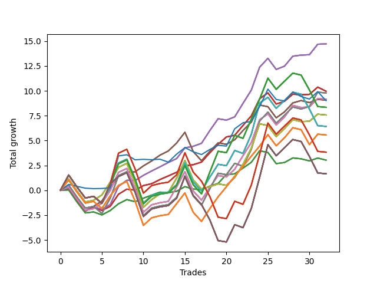

# Short Wallace 014 
- Symbol: SPY_Unlimited
- Date Range: 03/23/2022 - 07/08/2022
- Trading Period: 7:20-12:30
- Number of Trades: 32



| Name | Win Percent | Profit | Avg Profit / Trade | Avg Time / Trade |      | Name | Win Percent | Profit | Avg Profit / Trade | Avg Time / Trade |
| ---- | ----------- | ------ | ------------------ | ---------------- | ---- | ---- | ----------- | ------ | ------------------ | ---------------- |
| Sorted By <br> Profit | | | | | | Sorted By <br> Win Percentage ||||
| Sixty-Six | 81.25 | 7360.00 | 230.00 | 14:22 |     | Sixty-Six | 81.25 | 7360.00 | 230.00 | 14:22 |
| Fifty-Eight | 81.25 | 7360.00 | 230.00 | 14:22 |     | Fifty-Eight | 81.25 | 7360.00 | 230.00 | 14:22 |
| Fifty | 81.25 | 7360.00 | 230.00 | 14:22 |     | Fifty | 81.25 | 7360.00 | 230.00 | 14:22 |
| Forty-Two | 81.25 | 7360.00 | 230.00 | 14:22 |     | Forty-Two | 81.25 | 7360.00 | 230.00 | 14:22 |
| Two | 81.25 | 7360.00 | 230.00 | 14:22 |     | Two | 81.25 | 7360.00 | 230.00 | 14:22 |
| Sixty-Five | 78.12 | 4980.00 | 155.63 | 12:27 |     | Sixty-Five | 78.12 | 4980.00 | 155.63 | 12:27 |
| Fifty-Seven | 78.12 | 4980.00 | 155.63 | 12:27 |     | Fifty-Seven | 78.12 | 4980.00 | 155.63 | 12:27 |
| Forty-Nine | 78.12 | 4980.00 | 155.63 | 12:27 |     | Forty-Nine | 78.12 | 4980.00 | 155.63 | 12:27 |
| Forty-One | 78.12 | 4980.00 | 155.63 | 12:27 |     | Forty-One | 78.12 | 4980.00 | 155.63 | 12:27 |
| One | 78.12 | 4980.00 | 155.63 | 12:27 |     | One | 78.12 | 4980.00 | 155.63 | 12:27 |
| Sixty-Nine | 62.50 | 4890.00 | 152.81 | 21:28 |     | Sixty-Seven | 71.88 | 4530.00 | 141.56 | 15:30 |
| Sixty-One | 62.50 | 4890.00 | 152.81 | 21:28 |     | Fifty-Nine | 71.88 | 4530.00 | 141.56 | 15:30 |
| Fifty-Three | 62.50 | 4890.00 | 152.81 | 21:28 |     | Fifty-One | 71.88 | 4530.00 | 141.56 | 15:30 |
| Forty-Five | 62.50 | 4890.00 | 152.81 | 21:28 |     | Forty-Three | 71.88 | 4530.00 | 141.56 | 15:30 |
| Five | 62.50 | 4890.00 | 152.81 | 21:28 |     | Three | 71.88 | 4530.00 | 141.56 | 15:30 |
| Sixty-Eight | 68.75 | 4575.00 | 142.97 | 19:27 |     | Sixty-Eight | 68.75 | 4575.00 | 142.97 | 19:27 |
| Sixty | 68.75 | 4575.00 | 142.97 | 19:27 |     | Sixty | 68.75 | 4575.00 | 142.97 | 19:27 |
| Fifty-Two | 68.75 | 4575.00 | 142.97 | 19:27 |     | Fifty-Two | 68.75 | 4575.00 | 142.97 | 19:27 |
| Forty-Four | 68.75 | 4575.00 | 142.97 | 19:27 |     | Forty-Four | 68.75 | 4575.00 | 142.97 | 19:27 |
| Four | 68.75 | 4575.00 | 142.97 | 19:27 |     | Four | 68.75 | 4575.00 | 142.97 | 19:27 |
| Sixty-Seven | 71.88 | 4530.00 | 141.56 | 15:30 |     | Seventy | 65.62 | 3785.00 | 118.28 | 19:03 |
| Fifty-Nine | 71.88 | 4530.00 | 141.56 | 15:30 |     | Sixty-Two | 65.62 | 3785.00 | 118.28 | 19:03 |
| Fifty-One | 71.88 | 4530.00 | 141.56 | 15:30 |     | Fifty-Four | 65.62 | 3785.00 | 118.28 | 19:03 |
| Forty-Three | 71.88 | 4530.00 | 141.56 | 15:30 |     | Forty-Six | 65.62 | 3785.00 | 118.28 | 19:03 |
| Three | 71.88 | 4530.00 | 141.56 | 15:30 |     | Six | 65.62 | 3785.00 | 118.28 | 19:03 |
| Seventy-Three | 56.25 | 4505.00 | 140.78 | 10:42 |     | One Hundred Twenty-Six | 65.62 | 2780.00 | 86.88 | 19:05 |
| One Hundred Twenty-Seven | 56.25 | 4170.00 | 130.31 | 24:21 |     | One Hundred Twenty-One | 65.62 | 2780.00 | 86.88 | 19:05 |
| One Hundred Twenty-Two | 56.25 | 4170.00 | 130.31 | 24:21 |     | One Hundred Sixteen | 65.62 | 2780.00 | 86.88 | 19:05 |
| One Hundred Seventeen | 56.25 | 4170.00 | 130.31 | 24:21 |     | One Hundred Eleven | 65.62 | 2780.00 | 86.88 | 19:05 |
| One Hundred Twelve | 56.25 | 4170.00 | 130.31 | 24:21 |     | Eighty-One | 65.62 | 2780.00 | 86.88 | 19:05 |
| Eighty-Two | 56.25 | 4170.00 | 130.31 | 24:21 |     | Sixty-Nine | 62.50 | 4890.00 | 152.81 | 21:28 |
| Seventy | 65.62 | 3785.00 | 118.28 | 19:03 |     | Sixty-One | 62.50 | 4890.00 | 152.81 | 21:28 |
| Sixty-Two | 65.62 | 3785.00 | 118.28 | 19:03 |     | Fifty-Three | 62.50 | 4890.00 | 152.81 | 21:28 |
| Fifty-Four | 65.62 | 3785.00 | 118.28 | 19:03 |     | Forty-Five | 62.50 | 4890.00 | 152.81 | 21:28 |
| Forty-Six | 65.62 | 3785.00 | 118.28 | 19:03 |     | Five | 62.50 | 4890.00 | 152.81 | 21:28 |
| Six | 65.62 | 3785.00 | 118.28 | 19:03 |     | Sixty-Four | 62.50 | 1515.00 | 47.34 | 08:47 |
| Seventy-One | 56.25 | 3210.00 | 100.31 | 24:49 |     | Fifty-Six | 62.50 | 1515.00 | 47.34 | 08:47 |
| Sixty-Three | 56.25 | 3210.00 | 100.31 | 24:49 |     | Forty-Eight | 62.50 | 1515.00 | 47.34 | 08:47 |
| Fifty-Five | 56.25 | 3210.00 | 100.31 | 24:49 |     | Forty | 62.50 | 1515.00 | 47.34 | 08:47 |
| Forty-Seven | 56.25 | 3210.00 | 100.31 | 24:49 |     | Zero | 62.50 | 1515.00 | 47.34 | 08:47 |
| Seven | 56.25 | 3210.00 | 100.31 | 24:49 |     | Seventy-Three | 56.25 | 4505.00 | 140.78 | 10:42 |
| One Hundred Twenty-Six | 65.62 | 2780.00 | 86.88 | 19:05 |     | One Hundred Twenty-Seven | 56.25 | 4170.00 | 130.31 | 24:21 |
| One Hundred Twenty-One | 65.62 | 2780.00 | 86.88 | 19:05 |     | One Hundred Twenty-Two | 56.25 | 4170.00 | 130.31 | 24:21 |
| One Hundred Sixteen | 65.62 | 2780.00 | 86.88 | 19:05 |     | One Hundred Seventeen | 56.25 | 4170.00 | 130.31 | 24:21 |
| One Hundred Eleven | 65.62 | 2780.00 | 86.88 | 19:05 |     | One Hundred Twelve | 56.25 | 4170.00 | 130.31 | 24:21 |
| Eighty-One | 65.62 | 2780.00 | 86.88 | 19:05 |     | Eighty-Two | 56.25 | 4170.00 | 130.31 | 24:21 |
| One Hundred Twenty-Eight | 50.00 | 1915.00 | 59.84 | 26:55 |     | Seventy-One | 56.25 | 3210.00 | 100.31 | 24:49 |
| One Hundred Twenty-Three | 50.00 | 1915.00 | 59.84 | 26:55 |     | Sixty-Three | 56.25 | 3210.00 | 100.31 | 24:49 |
| One Hundred Eighteen | 50.00 | 1915.00 | 59.84 | 26:55 |     | Fifty-Five | 56.25 | 3210.00 | 100.31 | 24:49 |
| One Hundred Thirteen | 50.00 | 1915.00 | 59.84 | 26:55 |     | Forty-Seven | 56.25 | 3210.00 | 100.31 | 24:49 |
| Eighty-Three | 50.00 | 1915.00 | 59.84 | 26:55 |     | Seven | 56.25 | 3210.00 | 100.31 | 24:49 |
| Sixty-Four | 62.50 | 1515.00 | 47.34 | 08:47 |     | One Hundred Twenty-Eight | 50.00 | 1915.00 | 59.84 | 26:55 |
| Fifty-Six | 62.50 | 1515.00 | 47.34 | 08:47 |     | One Hundred Twenty-Three | 50.00 | 1915.00 | 59.84 | 26:55 |
| Forty-Eight | 62.50 | 1515.00 | 47.34 | 08:47 |     | One Hundred Eighteen | 50.00 | 1915.00 | 59.84 | 26:55 |
| Forty | 62.50 | 1515.00 | 47.34 | 08:47 |     | One Hundred Thirteen | 50.00 | 1915.00 | 59.84 | 26:55 |
| Zero | 62.50 | 1515.00 | 47.34 | 08:47 |     | Eighty-Three | 50.00 | 1915.00 | 59.84 | 26:55 |
| One Hundred Thirty | 50.00 | 830.00 | 25.94 | 28:36 |     | One Hundred Thirty | 50.00 | 830.00 | 25.94 | 28:36 |
| One Hundred Twenty-Nine | 50.00 | 830.00 | 25.94 | 28:36 |     | One Hundred Twenty-Nine | 50.00 | 830.00 | 25.94 | 28:36 |
| One Hundred Twenty-Five | 50.00 | 830.00 | 25.94 | 28:36 |     | One Hundred Twenty-Five | 50.00 | 830.00 | 25.94 | 28:36 |
| One Hundred Twenty-Four | 50.00 | 830.00 | 25.94 | 28:36 |     | One Hundred Twenty-Four | 50.00 | 830.00 | 25.94 | 28:36 |
| One Hundred Twenty | 50.00 | 830.00 | 25.94 | 28:36 |     | One Hundred Twenty | 50.00 | 830.00 | 25.94 | 28:36 |
| One Hundred Ninteen | 50.00 | 830.00 | 25.94 | 28:36 |     | One Hundred Ninteen | 50.00 | 830.00 | 25.94 | 28:36 |
| One Hundred Fifteen | 50.00 | 830.00 | 25.94 | 28:36 |     | One Hundred Fifteen | 50.00 | 830.00 | 25.94 | 28:36 |
| One Hundred Fourteen | 50.00 | 830.00 | 25.94 | 28:36 |     | One Hundred Fourteen | 50.00 | 830.00 | 25.94 | 28:36 |
| Eighty-Five | 50.00 | 830.00 | 25.94 | 28:36 |     | Eighty-Five | 50.00 | 830.00 | 25.94 | 28:36 |
| Eighty-Four | 50.00 | 830.00 | 25.94 | 28:36 |     | Eighty-Four | 50.00 | 830.00 | 25.94 | 28:36 |

## NO STOPLOSS

### Test Zero
* Sell when price hits the middle line of the 20p bollinger
* No Stoploss
* Results:
```
Total Trades: 32
Percent Up: 37.50
Percent Down: 62.50
Total Points Moved Down: 3.03
Potential Profit: 1515.00
Total Points Ups: 5.00 Count Ups: 12
Total Points Downs: 8.03 Count Downs: 20
```

<details><summary>Trades</summary>

<code>In: 2022-03-25 11:57:00		Out: 2022-03-25 11:57:15		Total Position Time: 00:15		Total Move Down: 0.03		Total to Date: 0.03</code> <br />
<code>In: 2022-03-28 11:32:00		Out: 2022-03-28 12:01:55		Total Position Time: 29:55		Total Move Down: -1.21		Total to Date: -1.18</code> <br />
<code>In: 2022-03-28 11:34:00		Out: 2022-03-28 12:03:55		Total Position Time: 29:55		Total Move Down: -1.10		Total to Date: -2.28</code> <br />
<code>In: 2022-04-01 11:34:00		Out: 2022-04-01 11:47:05		Total Position Time: 13:05		Total Move Down: 0.10		Total to Date: -2.18</code> <br />
<code>In: 2022-04-06 10:36:00		Out: 2022-04-06 10:47:10		Total Position Time: 11:10		Total Move Down: -0.30		Total to Date: -2.48</code> <br />
<code>In: 2022-04-06 10:43:00		Out: 2022-04-06 10:47:10		Total Position Time: 04:10		Total Move Down: 0.44		Total to Date: -2.04</code> <br />
<code>In: 2022-04-06 11:05:00		Out: 2022-04-06 11:05:35		Total Position Time: 00:35		Total Move Down: 0.68		Total to Date: -1.36</code> <br />
<code>In: 2022-04-07 11:03:00		Out: 2022-04-07 11:15:20		Total Position Time: 12:20		Total Move Down: 0.42		Total to Date: -0.94</code> <br />
<code>In: 2022-04-08 07:29:00		Out: 2022-04-08 07:44:35		Total Position Time: 15:35		Total Move Down: -0.21		Total to Date: -1.15</code> <br />
<code>In: 2022-04-08 07:33:00		Out: 2022-04-08 07:44:35		Total Position Time: 11:35		Total Move Down: 0.35		Total to Date: -0.80</code> <br />
<code>In: 2022-04-18 07:27:00		Out: 2022-04-18 07:36:45		Total Position Time: 09:45		Total Move Down: 0.31		Total to Date: -0.49</code> <br />
<code>In: 2022-04-20 09:54:00		Out: 2022-04-20 09:59:05		Total Position Time: 05:05		Total Move Down: 0.30		Total to Date: -0.19</code> <br />
<code>In: 2022-04-25 10:14:00		Out: 2022-04-25 10:26:25		Total Position Time: 12:25		Total Move Down: -0.06		Total to Date: -0.25</code> <br />
<code>In: 2022-04-27 08:34:00		Out: 2022-04-27 08:45:05		Total Position Time: 11:05		Total Move Down: 0.15		Total to Date: -0.10</code> <br />
<code>In: 2022-05-24 09:18:00		Out: 2022-05-24 09:21:35		Total Position Time: 03:35		Total Move Down: 0.46		Total to Date: 0.36</code> <br />
<code>In: 2022-05-24 10:43:00		Out: 2022-05-24 10:58:10		Total Position Time: 15:10		Total Move Down: -0.23		Total to Date: 0.13</code> <br />
<code>In: 2022-05-24 10:47:00		Out: 2022-05-24 10:58:10		Total Position Time: 11:10		Total Move Down: -0.09		Total to Date: 0.04</code> <br />
<code>In: 2022-05-25 11:04:00		Out: 2022-05-25 11:06:20		Total Position Time: 02:20		Total Move Down: 0.37		Total to Date: 0.41</code> <br />
<code>In: 2022-05-25 11:06:00		Out: 2022-05-25 11:06:20		Total Position Time: 00:20		Total Move Down: 0.28		Total to Date: 0.69</code> <br />
<code>In: 2022-05-31 07:23:00		Out: 2022-05-31 07:30:05		Total Position Time: 07:05		Total Move Down: 0.89		Total to Date: 1.58</code> <br />
<code>In: 2022-06-09 10:08:00		Out: 2022-06-09 10:16:15		Total Position Time: 08:15		Total Move Down: 0.07		Total to Date: 1.65</code> <br />
<code>In: 2022-06-10 12:00:00		Out: 2022-06-10 12:03:25		Total Position Time: 03:25		Total Move Down: 0.58		Total to Date: 2.23</code> <br />
<code>In: 2022-06-10 12:29:00		Out: 2022-06-10 12:30:30		Total Position Time: 01:30		Total Move Down: 0.58		Total to Date: 2.81</code> <br />
<code>In: 2022-06-13 09:40:00		Out: 2022-06-13 09:44:05		Total Position Time: 04:05		Total Move Down: 1.16		Total to Date: 3.97</code> <br />
<code>In: 2022-06-15 11:02:00		Out: 2022-06-15 11:02:10		Total Position Time: 00:10		Total Move Down: -0.17		Total to Date: 3.80</code> <br />
<code>In: 2022-06-23 12:30:00		Out: 2022-06-23 12:46:00		Total Position Time: 16:00		Total Move Down: -1.12		Total to Date: 2.68</code> <br />
<code>In: 2022-06-29 11:06:00		Out: 2022-06-29 11:18:05		Total Position Time: 12:05		Total Move Down: 0.11		Total to Date: 2.79</code> <br />
<code>In: 2022-06-29 12:31:00		Out: 2022-06-29 12:33:20		Total Position Time: 02:20		Total Move Down: 0.46		Total to Date: 3.25</code> <br />
<code>In: 2022-07-01 10:47:00		Out: 2022-07-01 10:58:40		Total Position Time: 11:40		Total Move Down: -0.09		Total to Date: 3.16</code> <br />
<code>In: 2022-07-06 11:01:00		Out: 2022-07-06 11:01:10		Total Position Time: 00:10		Total Move Down: -0.21		Total to Date: 2.95</code> <br />
<code>In: 2022-07-06 11:10:00		Out: 2022-07-06 11:10:10		Total Position Time: 00:10		Total Move Down: 0.29		Total to Date: 3.24</code> <br />
<code>In: 2022-07-06 11:35:00		Out: 2022-07-06 11:50:00		Total Position Time: 15:00		Total Move Down: -0.21		Total to Date: 3.03</code> <br />


</details>

### Test One
* Sell when the price hits the upper line of the 20p 1std bollinger
* No Stoploss
* Results:
```
Total Trades: 32
Percent Up: 21.88
Percent Down: 78.12
Total Points Moved Down: 9.96
Potential Profit: 4980.00
Total Points Ups: 4.33 Count Ups: 7
Total Points Downs: 14.29 Count Downs: 25
```

<details><summary>Trades</summary>

<code>In: 2022-03-25 11:57:00		Out: 2022-03-25 12:00:50		Total Position Time: 03:50		Total Move Down: 0.28		Total to Date: 0.28</code> <br />
<code>In: 2022-03-28 11:32:00		Out: 2022-03-28 12:01:55		Total Position Time: 29:55		Total Move Down: -1.21		Total to Date: -0.93</code> <br />
<code>In: 2022-03-28 11:34:00		Out: 2022-03-28 12:03:55		Total Position Time: 29:55		Total Move Down: -1.10		Total to Date: -2.03</code> <br />
<code>In: 2022-04-01 11:34:00		Out: 2022-04-01 11:50:15		Total Position Time: 16:15		Total Move Down: 0.33		Total to Date: -1.70</code> <br />
<code>In: 2022-04-06 10:36:00		Out: 2022-04-06 10:56:55		Total Position Time: 20:55		Total Move Down: -0.33		Total to Date: -2.03</code> <br />
<code>In: 2022-04-06 10:43:00		Out: 2022-04-06 10:56:55		Total Position Time: 13:55		Total Move Down: 0.41		Total to Date: -1.62</code> <br />
<code>In: 2022-04-06 11:05:00		Out: 2022-04-06 11:07:20		Total Position Time: 02:20		Total Move Down: 1.22		Total to Date: -0.40</code> <br />
<code>In: 2022-04-07 11:03:00		Out: 2022-04-07 11:18:00		Total Position Time: 15:00		Total Move Down: 0.51		Total to Date: 0.11</code> <br />
<code>In: 2022-04-08 07:29:00		Out: 2022-04-08 07:45:55		Total Position Time: 16:55		Total Move Down: -0.10		Total to Date: 0.01</code> <br />
<code>In: 2022-04-08 07:33:00		Out: 2022-04-08 07:45:55		Total Position Time: 12:55		Total Move Down: 0.46		Total to Date: 0.47</code> <br />
<code>In: 2022-04-18 07:27:00		Out: 2022-04-18 07:51:15		Total Position Time: 24:15		Total Move Down: 0.19		Total to Date: 0.66</code> <br />
<code>In: 2022-04-20 09:54:00		Out: 2022-04-20 10:08:15		Total Position Time: 14:15		Total Move Down: 0.42		Total to Date: 1.08</code> <br />
<code>In: 2022-04-25 10:14:00		Out: 2022-04-25 10:27:10		Total Position Time: 13:10		Total Move Down: 0.36		Total to Date: 1.44</code> <br />
<code>In: 2022-04-27 08:34:00		Out: 2022-04-27 08:48:05		Total Position Time: 14:05		Total Move Down: 0.37		Total to Date: 1.81</code> <br />
<code>In: 2022-05-24 09:18:00		Out: 2022-05-24 09:28:55		Total Position Time: 10:55		Total Move Down: 0.64		Total to Date: 2.45</code> <br />
<code>In: 2022-05-24 10:43:00		Out: 2022-05-24 11:01:40		Total Position Time: 18:40		Total Move Down: 0.12		Total to Date: 2.57</code> <br />
<code>In: 2022-05-24 10:47:00		Out: 2022-05-24 11:01:40		Total Position Time: 14:40		Total Move Down: 0.26		Total to Date: 2.83</code> <br />
<code>In: 2022-05-25 11:04:00		Out: 2022-05-25 11:06:35		Total Position Time: 02:35		Total Move Down: 0.94		Total to Date: 3.77</code> <br />
<code>In: 2022-05-25 11:06:00		Out: 2022-05-25 11:06:35		Total Position Time: 00:35		Total Move Down: 0.85		Total to Date: 4.62</code> <br />
<code>In: 2022-05-31 07:23:00		Out: 2022-05-31 07:38:05		Total Position Time: 15:05		Total Move Down: 0.74		Total to Date: 5.36</code> <br />
<code>In: 2022-06-09 10:08:00		Out: 2022-06-09 10:18:10		Total Position Time: 10:10		Total Move Down: 0.17		Total to Date: 5.53</code> <br />
<code>In: 2022-06-10 12:00:00		Out: 2022-06-10 12:04:35		Total Position Time: 04:35		Total Move Down: 0.99		Total to Date: 6.52</code> <br />
<code>In: 2022-06-10 12:29:00		Out: 2022-06-10 12:35:45		Total Position Time: 06:45		Total Move Down: 0.96		Total to Date: 7.48</code> <br />
<code>In: 2022-06-13 09:40:00		Out: 2022-06-13 09:47:55		Total Position Time: 07:55		Total Move Down: 1.72		Total to Date: 9.20</code> <br />
<code>In: 2022-06-15 11:02:00		Out: 2022-06-15 11:03:05		Total Position Time: 01:05		Total Move Down: 0.59		Total to Date: 9.79</code> <br />
<code>In: 2022-06-23 12:30:00		Out: 2022-06-23 12:46:00		Total Position Time: 16:00		Total Move Down: -1.12		Total to Date: 8.67</code> <br />
<code>In: 2022-06-29 11:06:00		Out: 2022-06-29 11:20:35		Total Position Time: 14:35		Total Move Down: 0.28		Total to Date: 8.95</code> <br />
<code>In: 2022-06-29 12:31:00		Out: 2022-06-29 12:34:10		Total Position Time: 03:10		Total Move Down: 0.71		Total to Date: 9.66</code> <br />
<code>In: 2022-07-01 10:47:00		Out: 2022-07-01 11:04:25		Total Position Time: 17:25		Total Move Down: -0.06		Total to Date: 9.60</code> <br />
<code>In: 2022-07-06 11:01:00		Out: 2022-07-06 11:01:15		Total Position Time: 00:15		Total Move Down: 0.04		Total to Date: 9.64</code> <br />
<code>In: 2022-07-06 11:10:00		Out: 2022-07-06 11:11:10		Total Position Time: 01:10		Total Move Down: 0.73		Total to Date: 10.37</code> <br />
<code>In: 2022-07-06 11:35:00		Out: 2022-07-06 12:00:30		Total Position Time: 25:30		Total Move Down: -0.41		Total to Date: 9.96</code> <br />


</details>

### Test Two
* Sell when the price hits the upper line of the 20p 2std bollinger
* No Stoploss
* Results:
```
Total Trades: 32
Percent Up: 18.75
Percent Down: 81.25
Total Points Moved Down: 14.72
Potential Profit: 7360.00
Total Points Ups: 3.86 Count Ups: 6
Total Points Downs: 18.58 Count Downs: 26
```

<details><summary>Trades</summary>

<code>In: 2022-03-25 11:57:00		Out: 2022-03-25 12:00:55		Total Position Time: 03:55		Total Move Down: 0.29		Total to Date: 0.29</code> <br />
<code>In: 2022-03-28 11:32:00		Out: 2022-03-28 12:01:55		Total Position Time: 29:55		Total Move Down: -1.21		Total to Date: -0.92</code> <br />
<code>In: 2022-03-28 11:34:00		Out: 2022-03-28 12:03:55		Total Position Time: 29:55		Total Move Down: -1.10		Total to Date: -2.02</code> <br />
<code>In: 2022-04-01 11:34:00		Out: 2022-04-01 11:50:20		Total Position Time: 16:20		Total Move Down: 0.36		Total to Date: -1.66</code> <br />
<code>In: 2022-04-06 10:36:00		Out: 2022-04-06 10:57:20		Total Position Time: 21:20		Total Move Down: -0.26		Total to Date: -1.92</code> <br />
<code>In: 2022-04-06 10:43:00		Out: 2022-04-06 10:57:20		Total Position Time: 14:20		Total Move Down: 0.48		Total to Date: -1.44</code> <br />
<code>In: 2022-04-06 11:05:00		Out: 2022-04-06 11:08:10		Total Position Time: 03:10		Total Move Down: 1.83		Total to Date: 0.39</code> <br />
<code>In: 2022-04-07 11:03:00		Out: 2022-04-07 11:18:20		Total Position Time: 15:20		Total Move Down: 0.61		Total to Date: 1.00</code> <br />
<code>In: 2022-04-08 07:29:00		Out: 2022-04-08 07:49:20		Total Position Time: 20:20		Total Move Down: -0.03		Total to Date: 0.97</code> <br />
<code>In: 2022-04-08 07:33:00		Out: 2022-04-08 07:49:20		Total Position Time: 16:20		Total Move Down: 0.53		Total to Date: 1.50</code> <br />
<code>In: 2022-04-18 07:27:00		Out: 2022-04-18 07:51:45		Total Position Time: 24:45		Total Move Down: 0.44		Total to Date: 1.94</code> <br />
<code>In: 2022-04-20 09:54:00		Out: 2022-04-20 10:08:15		Total Position Time: 14:15		Total Move Down: 0.42		Total to Date: 2.36</code> <br />
<code>In: 2022-04-25 10:14:00		Out: 2022-04-25 10:33:35		Total Position Time: 19:35		Total Move Down: 0.43		Total to Date: 2.79</code> <br />
<code>In: 2022-04-27 08:34:00		Out: 2022-04-27 08:50:10		Total Position Time: 16:10		Total Move Down: 0.39		Total to Date: 3.18</code> <br />
<code>In: 2022-05-24 09:18:00		Out: 2022-05-24 09:31:20		Total Position Time: 13:20		Total Move Down: 1.08		Total to Date: 4.26</code> <br />
<code>In: 2022-05-24 10:43:00		Out: 2022-05-24 11:02:00		Total Position Time: 19:00		Total Move Down: 0.16		Total to Date: 4.42</code> <br />
<code>In: 2022-05-24 10:47:00		Out: 2022-05-24 11:02:00		Total Position Time: 15:00		Total Move Down: 0.30		Total to Date: 4.72</code> <br />
<code>In: 2022-05-25 11:04:00		Out: 2022-05-25 11:06:40		Total Position Time: 02:40		Total Move Down: 1.28		Total to Date: 6.00</code> <br />
<code>In: 2022-05-25 11:06:00		Out: 2022-05-25 11:06:40		Total Position Time: 00:40		Total Move Down: 1.19		Total to Date: 7.19</code> <br />
<code>In: 2022-05-31 07:23:00		Out: 2022-05-31 07:52:55		Total Position Time: 29:55		Total Move Down: -0.14		Total to Date: 7.05</code> <br />
<code>In: 2022-06-09 10:08:00		Out: 2022-06-09 10:18:55		Total Position Time: 10:55		Total Move Down: 0.33		Total to Date: 7.38</code> <br />
<code>In: 2022-06-10 12:00:00		Out: 2022-06-10 12:05:55		Total Position Time: 05:55		Total Move Down: 1.36		Total to Date: 8.74</code> <br />
<code>In: 2022-06-10 12:29:00		Out: 2022-06-10 12:42:45		Total Position Time: 13:45		Total Move Down: 1.33		Total to Date: 10.07</code> <br />
<code>In: 2022-06-13 09:40:00		Out: 2022-06-13 09:54:45		Total Position Time: 14:45		Total Move Down: 2.30		Total to Date: 12.37</code> <br />
<code>In: 2022-06-15 11:02:00		Out: 2022-06-15 11:03:15		Total Position Time: 01:15		Total Move Down: 0.90		Total to Date: 13.27</code> <br />
<code>In: 2022-06-23 12:30:00		Out: 2022-06-23 12:46:00		Total Position Time: 16:00		Total Move Down: -1.12		Total to Date: 12.15</code> <br />
<code>In: 2022-06-29 11:06:00		Out: 2022-06-29 11:21:05		Total Position Time: 15:05		Total Move Down: 0.33		Total to Date: 12.48</code> <br />
<code>In: 2022-06-29 12:31:00		Out: 2022-06-29 12:36:35		Total Position Time: 05:35		Total Move Down: 1.00		Total to Date: 13.48</code> <br />
<code>In: 2022-07-01 10:47:00		Out: 2022-07-01 11:07:55		Total Position Time: 20:55		Total Move Down: 0.11		Total to Date: 13.59</code> <br />
<code>In: 2022-07-06 11:01:00		Out: 2022-07-06 11:02:20		Total Position Time: 01:20		Total Move Down: 0.04		Total to Date: 13.63</code> <br />
<code>In: 2022-07-06 11:10:00		Out: 2022-07-06 11:11:45		Total Position Time: 01:45		Total Move Down: 1.05		Total to Date: 14.68</code> <br />
<code>In: 2022-07-06 11:35:00		Out: 2022-07-06 12:01:25		Total Position Time: 26:25		Total Move Down: 0.04		Total to Date: 14.72</code> <br />


</details>

### Test Three
* Sell when price hits the middle line of the 50p bollinger
* No Stoploss
* Results:
```
Total Trades: 32
Percent Up: 28.12
Percent Down: 71.88
Total Points Moved Down: 9.06
Potential Profit: 4530.00
Total Points Ups: 6.89 Count Ups: 9
Total Points Downs: 15.95 Count Downs: 23
```

<details><summary>Trades</summary>

<code>In: 2022-03-25 11:57:00		Out: 2022-03-25 12:00:45		Total Position Time: 03:45		Total Move Down: 0.19		Total to Date: 0.19</code> <br />
<code>In: 2022-03-28 11:32:00		Out: 2022-03-28 12:01:55		Total Position Time: 29:55		Total Move Down: -1.21		Total to Date: -1.02</code> <br />
<code>In: 2022-03-28 11:34:00		Out: 2022-03-28 12:03:55		Total Position Time: 29:55		Total Move Down: -1.10		Total to Date: -2.12</code> <br />
<code>In: 2022-04-01 11:34:00		Out: 2022-04-01 11:54:05		Total Position Time: 20:05		Total Move Down: 0.50		Total to Date: -1.62</code> <br />
<code>In: 2022-04-06 10:36:00		Out: 2022-04-06 11:00:10		Total Position Time: 24:10		Total Move Down: 0.54		Total to Date: -1.08</code> <br />
<code>In: 2022-04-06 10:43:00		Out: 2022-04-06 11:00:10		Total Position Time: 17:10		Total Move Down: 1.28		Total to Date: 0.20</code> <br />
<code>In: 2022-04-06 11:05:00		Out: 2022-04-06 11:07:20		Total Position Time: 02:20		Total Move Down: 1.22		Total to Date: 1.42</code> <br />
<code>In: 2022-04-07 11:03:00		Out: 2022-04-07 11:32:55		Total Position Time: 29:55		Total Move Down: 0.39		Total to Date: 1.81</code> <br />
<code>In: 2022-04-08 07:29:00		Out: 2022-04-08 07:49:30		Total Position Time: 20:30		Total Move Down: 0.04		Total to Date: 1.85</code> <br />
<code>In: 2022-04-08 07:33:00		Out: 2022-04-08 07:49:30		Total Position Time: 16:30		Total Move Down: 0.60		Total to Date: 2.45</code> <br />
<code>In: 2022-04-18 07:27:00		Out: 2022-04-18 07:51:50		Total Position Time: 24:50		Total Move Down: 0.50		Total to Date: 2.95</code> <br />
<code>In: 2022-04-20 09:54:00		Out: 2022-04-20 10:08:35		Total Position Time: 14:35		Total Move Down: 0.58		Total to Date: 3.53</code> <br />
<code>In: 2022-04-25 10:14:00		Out: 2022-04-25 10:28:15		Total Position Time: 14:15		Total Move Down: 0.42		Total to Date: 3.95</code> <br />
<code>In: 2022-04-27 08:34:00		Out: 2022-04-27 08:52:30		Total Position Time: 18:30		Total Move Down: 0.80		Total to Date: 4.75</code> <br />
<code>In: 2022-05-24 09:18:00		Out: 2022-05-24 09:31:20		Total Position Time: 13:20		Total Move Down: 1.08		Total to Date: 5.83</code> <br />
<code>In: 2022-05-24 10:43:00		Out: 2022-05-24 11:12:55		Total Position Time: 29:55		Total Move Down: -1.94		Total to Date: 3.89</code> <br />
<code>In: 2022-05-24 10:47:00		Out: 2022-05-24 11:16:55		Total Position Time: 29:55		Total Move Down: -0.92		Total to Date: 2.97</code> <br />
<code>In: 2022-05-25 11:04:00		Out: 2022-05-25 11:06:35		Total Position Time: 02:35		Total Move Down: 0.94		Total to Date: 3.91</code> <br />
<code>In: 2022-05-25 11:06:00		Out: 2022-05-25 11:06:35		Total Position Time: 00:35		Total Move Down: 0.85		Total to Date: 4.76</code> <br />
<code>In: 2022-05-31 07:23:00		Out: 2022-05-31 07:52:55		Total Position Time: 29:55		Total Move Down: -0.14		Total to Date: 4.62</code> <br />
<code>In: 2022-06-09 10:08:00		Out: 2022-06-09 10:22:05		Total Position Time: 14:05		Total Move Down: 0.46		Total to Date: 5.08</code> <br />
<code>In: 2022-06-10 12:00:00		Out: 2022-06-10 12:03:40		Total Position Time: 03:40		Total Move Down: 0.93		Total to Date: 6.01</code> <br />
<code>In: 2022-06-10 12:29:00		Out: 2022-06-10 12:33:15		Total Position Time: 04:15		Total Move Down: 0.84		Total to Date: 6.85</code> <br />
<code>In: 2022-06-13 09:40:00		Out: 2022-06-13 09:47:55		Total Position Time: 07:55		Total Move Down: 1.72		Total to Date: 8.57</code> <br />
<code>In: 2022-06-15 11:02:00		Out: 2022-06-15 11:02:10		Total Position Time: 00:10		Total Move Down: -0.17		Total to Date: 8.40</code> <br />
<code>In: 2022-06-23 12:30:00		Out: 2022-06-23 12:46:00		Total Position Time: 16:00		Total Move Down: -1.12		Total to Date: 7.28</code> <br />
<code>In: 2022-06-29 11:06:00		Out: 2022-06-29 11:27:35		Total Position Time: 21:35		Total Move Down: 0.60		Total to Date: 7.88</code> <br />
<code>In: 2022-06-29 12:31:00		Out: 2022-06-29 12:34:15		Total Position Time: 03:15		Total Move Down: 0.90		Total to Date: 8.78</code> <br />
<code>In: 2022-07-01 10:47:00		Out: 2022-07-01 11:09:05		Total Position Time: 22:05		Total Move Down: 0.24		Total to Date: 9.02</code> <br />
<code>In: 2022-07-06 11:01:00		Out: 2022-07-06 11:01:10		Total Position Time: 00:10		Total Move Down: -0.21		Total to Date: 8.81</code> <br />
<code>In: 2022-07-06 11:10:00		Out: 2022-07-06 11:10:20		Total Position Time: 00:20		Total Move Down: 0.33		Total to Date: 9.14</code> <br />
<code>In: 2022-07-06 11:35:00		Out: 2022-07-06 12:04:55		Total Position Time: 29:55		Total Move Down: -0.08		Total to Date: 9.06</code> <br />


</details>

### Test Four
* Sell when the price hits the upper line of the 50p 1std bollinger
* No Stoploss
* Results:
```
Total Trades: 32
Percent Up: 31.25
Percent Down: 68.75
Total Points Moved Down: 9.15
Potential Profit: 4575.00
Total Points Ups: 11.12 Count Ups: 10
Total Points Downs: 20.27 Count Downs: 22
```

<details><summary>Trades</summary>

<code>In: 2022-03-25 11:57:00		Out: 2022-03-25 12:00:55		Total Position Time: 03:55		Total Move Down: 0.29		Total to Date: 0.29</code> <br />
<code>In: 2022-03-28 11:32:00		Out: 2022-03-28 12:01:55		Total Position Time: 29:55		Total Move Down: -1.21		Total to Date: -0.92</code> <br />
<code>In: 2022-03-28 11:34:00		Out: 2022-03-28 12:03:55		Total Position Time: 29:55		Total Move Down: -1.10		Total to Date: -2.02</code> <br />
<code>In: 2022-04-01 11:34:00		Out: 2022-04-01 12:03:55		Total Position Time: 29:55		Total Move Down: 0.17		Total to Date: -1.85</code> <br />
<code>In: 2022-04-06 10:36:00		Out: 2022-04-06 11:00:10		Total Position Time: 24:10		Total Move Down: 0.54		Total to Date: -1.31</code> <br />
<code>In: 2022-04-06 10:43:00		Out: 2022-04-06 11:00:10		Total Position Time: 17:10		Total Move Down: 1.28		Total to Date: -0.03</code> <br />
<code>In: 2022-04-06 11:05:00		Out: 2022-04-06 11:08:10		Total Position Time: 03:10		Total Move Down: 1.83		Total to Date: 1.80</code> <br />
<code>In: 2022-04-07 11:03:00		Out: 2022-04-07 11:32:55		Total Position Time: 29:55		Total Move Down: 0.39		Total to Date: 2.19</code> <br />
<code>In: 2022-04-08 07:29:00		Out: 2022-04-08 07:58:55		Total Position Time: 29:55		Total Move Down: -1.98		Total to Date: 0.21</code> <br />
<code>In: 2022-04-08 07:33:00		Out: 2022-04-08 08:02:55		Total Position Time: 29:55		Total Move Down: -2.43		Total to Date: -2.22</code> <br />
<code>In: 2022-04-18 07:27:00		Out: 2022-04-18 07:56:55		Total Position Time: 29:55		Total Move Down: 0.76		Total to Date: -1.46</code> <br />
<code>In: 2022-04-20 09:54:00		Out: 2022-04-20 10:23:55		Total Position Time: 29:55		Total Move Down: 0.21		Total to Date: -1.25</code> <br />
<code>In: 2022-04-25 10:14:00		Out: 2022-04-25 10:43:55		Total Position Time: 29:55		Total Move Down: 0.13		Total to Date: -1.12</code> <br />
<code>In: 2022-04-27 08:34:00		Out: 2022-04-27 09:01:45		Total Position Time: 27:45		Total Move Down: 1.44		Total to Date: 0.32</code> <br />
<code>In: 2022-05-24 09:18:00		Out: 2022-05-24 09:33:15		Total Position Time: 15:15		Total Move Down: 1.55		Total to Date: 1.87</code> <br />
<code>In: 2022-05-24 10:43:00		Out: 2022-05-24 11:12:55		Total Position Time: 29:55		Total Move Down: -1.94		Total to Date: -0.07</code> <br />
<code>In: 2022-05-24 10:47:00		Out: 2022-05-24 11:16:55		Total Position Time: 29:55		Total Move Down: -0.92		Total to Date: -0.99</code> <br />
<code>In: 2022-05-25 11:04:00		Out: 2022-05-25 11:06:40		Total Position Time: 02:40		Total Move Down: 1.28		Total to Date: 0.29</code> <br />
<code>In: 2022-05-25 11:06:00		Out: 2022-05-25 11:06:40		Total Position Time: 00:40		Total Move Down: 1.19		Total to Date: 1.48</code> <br />
<code>In: 2022-05-31 07:23:00		Out: 2022-05-31 07:52:55		Total Position Time: 29:55		Total Move Down: -0.14		Total to Date: 1.34</code> <br />
<code>In: 2022-06-09 10:08:00		Out: 2022-06-09 10:23:50		Total Position Time: 15:50		Total Move Down: 0.78		Total to Date: 2.12</code> <br />
<code>In: 2022-06-10 12:00:00		Out: 2022-06-10 12:05:55		Total Position Time: 05:55		Total Move Down: 1.36		Total to Date: 3.48</code> <br />
<code>In: 2022-06-10 12:29:00		Out: 2022-06-10 12:42:40		Total Position Time: 13:40		Total Move Down: 1.32		Total to Date: 4.80</code> <br />
<code>In: 2022-06-13 09:40:00		Out: 2022-06-13 09:54:50		Total Position Time: 14:50		Total Move Down: 2.29		Total to Date: 7.09</code> <br />
<code>In: 2022-06-15 11:02:00		Out: 2022-06-15 11:03:05		Total Position Time: 01:05		Total Move Down: 0.59		Total to Date: 7.68</code> <br />
<code>In: 2022-06-23 12:30:00		Out: 2022-06-23 12:46:00		Total Position Time: 16:00		Total Move Down: -1.12		Total to Date: 6.56</code> <br />
<code>In: 2022-06-29 11:06:00		Out: 2022-06-29 11:35:55		Total Position Time: 29:55		Total Move Down: 0.81		Total to Date: 7.37</code> <br />
<code>In: 2022-06-29 12:31:00		Out: 2022-06-29 12:41:00		Total Position Time: 10:00		Total Move Down: 1.16		Total to Date: 8.53</code> <br />
<code>In: 2022-07-01 10:47:00		Out: 2022-07-01 11:16:55		Total Position Time: 29:55		Total Move Down: -0.20		Total to Date: 8.33</code> <br />
<code>In: 2022-07-06 11:01:00		Out: 2022-07-06 11:01:15		Total Position Time: 00:15		Total Move Down: 0.04		Total to Date: 8.37</code> <br />
<code>In: 2022-07-06 11:10:00		Out: 2022-07-06 11:11:35		Total Position Time: 01:35		Total Move Down: 0.86		Total to Date: 9.23</code> <br />
<code>In: 2022-07-06 11:35:00		Out: 2022-07-06 12:04:55		Total Position Time: 29:55		Total Move Down: -0.08		Total to Date: 9.15</code> <br />


</details>

### Test Five
* Sell when the price hits the upper line of the 50p 2std bollinger
* No Stoploss
* Results:
```
Total Trades: 32
Percent Up: 37.50
Percent Down: 62.50
Total Points Moved Down: 9.78
Potential Profit: 4890.00
Total Points Ups: 12.13 Count Ups: 12
Total Points Downs: 21.91 Count Downs: 20
```

<details><summary>Trades</summary>

<code>In: 2022-03-25 11:57:00		Out: 2022-03-25 12:01:55		Total Position Time: 04:55		Total Move Down: 0.52		Total to Date: 0.52</code> <br />
<code>In: 2022-03-28 11:32:00		Out: 2022-03-28 12:01:55		Total Position Time: 29:55		Total Move Down: -1.21		Total to Date: -0.69</code> <br />
<code>In: 2022-03-28 11:34:00		Out: 2022-03-28 12:03:55		Total Position Time: 29:55		Total Move Down: -1.10		Total to Date: -1.79</code> <br />
<code>In: 2022-04-01 11:34:00		Out: 2022-04-01 12:03:55		Total Position Time: 29:55		Total Move Down: 0.17		Total to Date: -1.62</code> <br />
<code>In: 2022-04-06 10:36:00		Out: 2022-04-06 11:05:55		Total Position Time: 29:55		Total Move Down: -0.71		Total to Date: -2.33</code> <br />
<code>In: 2022-04-06 10:43:00		Out: 2022-04-06 11:09:35		Total Position Time: 26:35		Total Move Down: 1.53		Total to Date: -0.80</code> <br />
<code>In: 2022-04-06 11:05:00		Out: 2022-04-06 11:09:35		Total Position Time: 04:35		Total Move Down: 2.27		Total to Date: 1.47</code> <br />
<code>In: 2022-04-07 11:03:00		Out: 2022-04-07 11:32:55		Total Position Time: 29:55		Total Move Down: 0.39		Total to Date: 1.86</code> <br />
<code>In: 2022-04-08 07:29:00		Out: 2022-04-08 07:58:55		Total Position Time: 29:55		Total Move Down: -1.98		Total to Date: -0.12</code> <br />
<code>In: 2022-04-08 07:33:00		Out: 2022-04-08 08:02:55		Total Position Time: 29:55		Total Move Down: -2.43		Total to Date: -2.55</code> <br />
<code>In: 2022-04-18 07:27:00		Out: 2022-04-18 07:56:55		Total Position Time: 29:55		Total Move Down: 0.76		Total to Date: -1.79</code> <br />
<code>In: 2022-04-20 09:54:00		Out: 2022-04-20 10:23:55		Total Position Time: 29:55		Total Move Down: 0.21		Total to Date: -1.58</code> <br />
<code>In: 2022-04-25 10:14:00		Out: 2022-04-25 10:43:55		Total Position Time: 29:55		Total Move Down: 0.13		Total to Date: -1.45</code> <br />
<code>In: 2022-04-27 08:34:00		Out: 2022-04-27 09:03:55		Total Position Time: 29:55		Total Move Down: 0.74		Total to Date: -0.71</code> <br />
<code>In: 2022-05-24 09:18:00		Out: 2022-05-24 09:36:50		Total Position Time: 18:50		Total Move Down: 2.07		Total to Date: 1.36</code> <br />
<code>In: 2022-05-24 10:43:00		Out: 2022-05-24 11:12:55		Total Position Time: 29:55		Total Move Down: -1.94		Total to Date: -0.58</code> <br />
<code>In: 2022-05-24 10:47:00		Out: 2022-05-24 11:16:55		Total Position Time: 29:55		Total Move Down: -0.92		Total to Date: -1.50</code> <br />
<code>In: 2022-05-25 11:04:00		Out: 2022-05-25 11:06:50		Total Position Time: 02:50		Total Move Down: 1.65		Total to Date: 0.15</code> <br />
<code>In: 2022-05-25 11:06:00		Out: 2022-05-25 11:06:50		Total Position Time: 00:50		Total Move Down: 1.56		Total to Date: 1.71</code> <br />
<code>In: 2022-05-31 07:23:00		Out: 2022-05-31 07:52:55		Total Position Time: 29:55		Total Move Down: -0.14		Total to Date: 1.57</code> <br />
<code>In: 2022-06-09 10:08:00		Out: 2022-06-09 10:27:20		Total Position Time: 19:20		Total Move Down: 1.14		Total to Date: 2.71</code> <br />
<code>In: 2022-06-10 12:00:00		Out: 2022-06-10 12:29:55		Total Position Time: 29:55		Total Move Down: -0.30		Total to Date: 2.41</code> <br />
<code>In: 2022-06-10 12:29:00		Out: 2022-06-10 12:45:35		Total Position Time: 16:35		Total Move Down: 1.71		Total to Date: 4.12</code> <br />
<code>In: 2022-06-13 09:40:00		Out: 2022-06-13 09:58:15		Total Position Time: 18:15		Total Move Down: 2.84		Total to Date: 6.96</code> <br />
<code>In: 2022-06-15 11:02:00		Out: 2022-06-15 11:03:15		Total Position Time: 01:15		Total Move Down: 0.90		Total to Date: 7.86</code> <br />
<code>In: 2022-06-23 12:30:00		Out: 2022-06-23 12:46:00		Total Position Time: 16:00		Total Move Down: -1.12		Total to Date: 6.74</code> <br />
<code>In: 2022-06-29 11:06:00		Out: 2022-06-29 11:35:55		Total Position Time: 29:55		Total Move Down: 0.81		Total to Date: 7.55</code> <br />
<code>In: 2022-06-29 12:31:00		Out: 2022-06-29 12:46:00		Total Position Time: 15:00		Total Move Down: 0.82		Total to Date: 8.37</code> <br />
<code>In: 2022-07-01 10:47:00		Out: 2022-07-01 11:16:55		Total Position Time: 29:55		Total Move Down: -0.20		Total to Date: 8.17</code> <br />
<code>In: 2022-07-06 11:01:00		Out: 2022-07-06 11:02:25		Total Position Time: 01:25		Total Move Down: 0.25		Total to Date: 8.42</code> <br />
<code>In: 2022-07-06 11:10:00		Out: 2022-07-06 11:12:15		Total Position Time: 02:15		Total Move Down: 1.44		Total to Date: 9.86</code> <br />
<code>In: 2022-07-06 11:35:00		Out: 2022-07-06 12:04:55		Total Position Time: 29:55		Total Move Down: -0.08		Total to Date: 9.78</code> <br />


</details>

### Test Six
* Sell when the price hits the middle line of the 1std VWAP
* No Stoploss
* Results:
```
Total Trades: 32
Percent Up: 34.38
Percent Down: 65.62
Total Points Moved Down: 7.57
Potential Profit: 3785.00
Total Points Ups: 11.29 Count Ups: 11
Total Points Downs: 18.86 Count Downs: 21
```

<details><summary>Trades</summary>

<code>In: 2022-03-25 11:57:00		Out: 2022-03-25 12:07:35		Total Position Time: 10:35		Total Move Down: 1.13		Total to Date: 1.13</code> <br />
<code>In: 2022-03-28 11:32:00		Out: 2022-03-28 12:01:55		Total Position Time: 29:55		Total Move Down: -1.21		Total to Date: -0.08</code> <br />
<code>In: 2022-03-28 11:34:00		Out: 2022-03-28 12:03:55		Total Position Time: 29:55		Total Move Down: -1.10		Total to Date: -1.18</code> <br />
<code>In: 2022-04-01 11:34:00		Out: 2022-04-01 12:03:55		Total Position Time: 29:55		Total Move Down: 0.17		Total to Date: -1.01</code> <br />
<code>In: 2022-04-06 10:36:00		Out: 2022-04-06 11:00:10		Total Position Time: 24:10		Total Move Down: 0.54		Total to Date: -0.47</code> <br />
<code>In: 2022-04-06 10:43:00		Out: 2022-04-06 11:00:10		Total Position Time: 17:10		Total Move Down: 1.28		Total to Date: 0.81</code> <br />
<code>In: 2022-04-06 11:05:00		Out: 2022-04-06 11:07:35		Total Position Time: 02:35		Total Move Down: 1.50		Total to Date: 2.31</code> <br />
<code>In: 2022-04-07 11:03:00		Out: 2022-04-07 11:32:55		Total Position Time: 29:55		Total Move Down: 0.39		Total to Date: 2.70</code> <br />
<code>In: 2022-04-08 07:29:00		Out: 2022-04-08 07:58:55		Total Position Time: 29:55		Total Move Down: -1.98		Total to Date: 0.72</code> <br />
<code>In: 2022-04-08 07:33:00		Out: 2022-04-08 08:02:55		Total Position Time: 29:55		Total Move Down: -2.43		Total to Date: -1.71</code> <br />
<code>In: 2022-04-18 07:27:00		Out: 2022-04-18 07:55:15		Total Position Time: 28:15		Total Move Down: 0.77		Total to Date: -0.94</code> <br />
<code>In: 2022-04-20 09:54:00		Out: 2022-04-20 10:08:35		Total Position Time: 14:35		Total Move Down: 0.58		Total to Date: -0.36</code> <br />
<code>In: 2022-04-25 10:14:00		Out: 2022-04-25 10:43:55		Total Position Time: 29:55		Total Move Down: 0.13		Total to Date: -0.23</code> <br />
<code>In: 2022-04-27 08:34:00		Out: 2022-04-27 09:01:55		Total Position Time: 27:55		Total Move Down: 1.45		Total to Date: 1.22</code> <br />
<code>In: 2022-05-24 09:18:00		Out: 2022-05-24 09:36:10		Total Position Time: 18:10		Total Move Down: 1.76		Total to Date: 2.98</code> <br />
<code>In: 2022-05-24 10:43:00		Out: 2022-05-24 11:12:55		Total Position Time: 29:55		Total Move Down: -1.94		Total to Date: 1.04</code> <br />
<code>In: 2022-05-24 10:47:00		Out: 2022-05-24 11:16:55		Total Position Time: 29:55		Total Move Down: -0.92		Total to Date: 0.12</code> <br />
<code>In: 2022-05-25 11:04:00		Out: 2022-05-25 11:05:45		Total Position Time: 01:45		Total Move Down: 0.24		Total to Date: 0.36</code> <br />
<code>In: 2022-05-25 11:06:00		Out: 2022-05-25 11:06:20		Total Position Time: 00:20		Total Move Down: 0.28		Total to Date: 0.64</code> <br />
<code>In: 2022-05-31 07:23:00		Out: 2022-05-31 07:52:55		Total Position Time: 29:55		Total Move Down: -0.14		Total to Date: 0.50</code> <br />
<code>In: 2022-06-09 10:08:00		Out: 2022-06-09 10:23:50		Total Position Time: 15:50		Total Move Down: 0.78		Total to Date: 1.28</code> <br />
<code>In: 2022-06-10 12:00:00		Out: 2022-06-10 12:05:35		Total Position Time: 05:35		Total Move Down: 1.33		Total to Date: 2.61</code> <br />
<code>In: 2022-06-10 12:29:00		Out: 2022-06-10 12:43:55		Total Position Time: 14:55		Total Move Down: 1.62		Total to Date: 4.23</code> <br />
<code>In: 2022-06-13 09:40:00		Out: 2022-06-13 09:57:00		Total Position Time: 17:00		Total Move Down: 2.45		Total to Date: 6.68</code> <br />
<code>In: 2022-06-15 11:02:00		Out: 2022-06-15 11:02:10		Total Position Time: 00:10		Total Move Down: -0.17		Total to Date: 6.51</code> <br />
<code>In: 2022-06-23 12:30:00		Out: 2022-06-23 12:46:00		Total Position Time: 16:00		Total Move Down: -1.12		Total to Date: 5.39</code> <br />
<code>In: 2022-06-29 11:06:00		Out: 2022-06-29 11:35:55		Total Position Time: 29:55		Total Move Down: 0.81		Total to Date: 6.20</code> <br />
<code>In: 2022-06-29 12:31:00		Out: 2022-06-29 12:34:15		Total Position Time: 03:15		Total Move Down: 0.90		Total to Date: 7.10</code> <br />
<code>In: 2022-07-01 10:47:00		Out: 2022-07-01 11:16:55		Total Position Time: 29:55		Total Move Down: -0.20		Total to Date: 6.90</code> <br />
<code>In: 2022-07-06 11:01:00		Out: 2022-07-06 11:02:20		Total Position Time: 01:20		Total Move Down: 0.04		Total to Date: 6.94</code> <br />
<code>In: 2022-07-06 11:10:00		Out: 2022-07-06 11:11:15		Total Position Time: 01:15		Total Move Down: 0.71		Total to Date: 7.65</code> <br />
<code>In: 2022-07-06 11:35:00		Out: 2022-07-06 12:04:55		Total Position Time: 29:55		Total Move Down: -0.08		Total to Date: 7.57</code> <br />


</details>

### Test Seven
* Sell when the price hits the upper line of the 1std VWAP
* No Stoploss
* Results:
```
Total Trades: 32
Percent Up: 43.75
Percent Down: 56.25
Total Points Moved Down: 6.42
Potential Profit: 3210.00
Total Points Ups: 15.29 Count Ups: 14
Total Points Downs: 21.71 Count Downs: 18
```

<details><summary>Trades</summary>

<code>In: 2022-03-25 11:57:00		Out: 2022-03-25 12:26:55		Total Position Time: 29:55		Total Move Down: 1.53		Total to Date: 1.53</code> <br />
<code>In: 2022-03-28 11:32:00		Out: 2022-03-28 12:01:55		Total Position Time: 29:55		Total Move Down: -1.21		Total to Date: 0.32</code> <br />
<code>In: 2022-03-28 11:34:00		Out: 2022-03-28 12:03:55		Total Position Time: 29:55		Total Move Down: -1.10		Total to Date: -0.78</code> <br />
<code>In: 2022-04-01 11:34:00		Out: 2022-04-01 12:03:55		Total Position Time: 29:55		Total Move Down: 0.17		Total to Date: -0.61</code> <br />
<code>In: 2022-04-06 10:36:00		Out: 2022-04-06 11:05:55		Total Position Time: 29:55		Total Move Down: -0.71		Total to Date: -1.32</code> <br />
<code>In: 2022-04-06 10:43:00		Out: 2022-04-06 11:09:40		Total Position Time: 26:40		Total Move Down: 1.66		Total to Date: 0.34</code> <br />
<code>In: 2022-04-06 11:05:00		Out: 2022-04-06 11:09:40		Total Position Time: 04:40		Total Move Down: 2.40		Total to Date: 2.74</code> <br />
<code>In: 2022-04-07 11:03:00		Out: 2022-04-07 11:32:55		Total Position Time: 29:55		Total Move Down: 0.39		Total to Date: 3.13</code> <br />
<code>In: 2022-04-08 07:29:00		Out: 2022-04-08 07:58:55		Total Position Time: 29:55		Total Move Down: -1.98		Total to Date: 1.15</code> <br />
<code>In: 2022-04-08 07:33:00		Out: 2022-04-08 08:02:55		Total Position Time: 29:55		Total Move Down: -2.43		Total to Date: -1.28</code> <br />
<code>In: 2022-04-18 07:27:00		Out: 2022-04-18 07:56:55		Total Position Time: 29:55		Total Move Down: 0.76		Total to Date: -0.52</code> <br />
<code>In: 2022-04-20 09:54:00		Out: 2022-04-20 10:23:55		Total Position Time: 29:55		Total Move Down: 0.21		Total to Date: -0.31</code> <br />
<code>In: 2022-04-25 10:14:00		Out: 2022-04-25 10:43:55		Total Position Time: 29:55		Total Move Down: 0.13		Total to Date: -0.18</code> <br />
<code>In: 2022-04-27 08:34:00		Out: 2022-04-27 09:03:55		Total Position Time: 29:55		Total Move Down: 0.74		Total to Date: 0.56</code> <br />
<code>In: 2022-05-24 09:18:00		Out: 2022-05-24 09:47:55		Total Position Time: 29:55		Total Move Down: 2.22		Total to Date: 2.78</code> <br />
<code>In: 2022-05-24 10:43:00		Out: 2022-05-24 11:12:55		Total Position Time: 29:55		Total Move Down: -1.94		Total to Date: 0.84</code> <br />
<code>In: 2022-05-24 10:47:00		Out: 2022-05-24 11:16:55		Total Position Time: 29:55		Total Move Down: -0.92		Total to Date: -0.08</code> <br />
<code>In: 2022-05-25 11:04:00		Out: 2022-05-25 11:06:45		Total Position Time: 02:45		Total Move Down: 1.39		Total to Date: 1.31</code> <br />
<code>In: 2022-05-25 11:06:00		Out: 2022-05-25 11:06:45		Total Position Time: 00:45		Total Move Down: 1.30		Total to Date: 2.61</code> <br />
<code>In: 2022-05-31 07:23:00		Out: 2022-05-31 07:52:55		Total Position Time: 29:55		Total Move Down: -0.14		Total to Date: 2.47</code> <br />
<code>In: 2022-06-09 10:08:00		Out: 2022-06-09 10:30:30		Total Position Time: 22:30		Total Move Down: 1.53		Total to Date: 4.00</code> <br />
<code>In: 2022-06-10 12:00:00		Out: 2022-06-10 12:29:55		Total Position Time: 29:55		Total Move Down: -0.30		Total to Date: 3.70</code> <br />
<code>In: 2022-06-10 12:29:00		Out: 2022-06-10 12:46:00		Total Position Time: 17:00		Total Move Down: 1.93		Total to Date: 5.63</code> <br />
<code>In: 2022-06-13 09:40:00		Out: 2022-06-13 10:09:55		Total Position Time: 29:55		Total Move Down: 3.13		Total to Date: 8.76</code> <br />
<code>In: 2022-06-15 11:02:00		Out: 2022-06-15 11:03:05		Total Position Time: 01:05		Total Move Down: 0.59		Total to Date: 9.35</code> <br />
<code>In: 2022-06-23 12:30:00		Out: 2022-06-23 12:46:00		Total Position Time: 16:00		Total Move Down: -1.12		Total to Date: 8.23</code> <br />
<code>In: 2022-06-29 11:06:00		Out: 2022-06-29 11:35:55		Total Position Time: 29:55		Total Move Down: 0.81		Total to Date: 9.04</code> <br />
<code>In: 2022-06-29 12:31:00		Out: 2022-06-29 12:46:00		Total Position Time: 15:00		Total Move Down: 0.82		Total to Date: 9.86</code> <br />
<code>In: 2022-07-01 10:47:00		Out: 2022-07-01 11:16:55		Total Position Time: 29:55		Total Move Down: -0.20		Total to Date: 9.66</code> <br />
<code>In: 2022-07-06 11:01:00		Out: 2022-07-06 11:30:55		Total Position Time: 29:55		Total Move Down: -1.50		Total to Date: 8.16</code> <br />
<code>In: 2022-07-06 11:10:00		Out: 2022-07-06 11:39:55		Total Position Time: 29:55		Total Move Down: -1.66		Total to Date: 6.50</code> <br />
<code>In: 2022-07-06 11:35:00		Out: 2022-07-06 12:04:55		Total Position Time: 29:55		Total Move Down: -0.08		Total to Date: 6.42</code> <br />


</details>

## STOPLOSS OF 5

### Test Forty
* Sell when price hits the middle line of the 20p bollinger
* Stoploss is -5 points
* Results:
```
Total Trades: 32
Percent Up: 37.50
Percent Down: 62.50
Total Points Moved Down: 3.03
Potential Profit: 1515.00
Total Points Ups: 5.00 Count Ups: 12
Total Points Downs: 8.03 Count Downs: 20
```

<details><summary>Trades</summary>

<code>In: 2022-03-25 11:57:00		Out: 2022-03-25 11:57:15		Total Position Time: 00:15		Total Move Down: 0.03		Total to Date: 0.03</code> <br />
<code>In: 2022-03-28 11:32:00		Out: 2022-03-28 12:01:55		Total Position Time: 29:55		Total Move Down: -1.21		Total to Date: -1.18</code> <br />
<code>In: 2022-03-28 11:34:00		Out: 2022-03-28 12:03:55		Total Position Time: 29:55		Total Move Down: -1.10		Total to Date: -2.28</code> <br />
<code>In: 2022-04-01 11:34:00		Out: 2022-04-01 11:47:05		Total Position Time: 13:05		Total Move Down: 0.10		Total to Date: -2.18</code> <br />
<code>In: 2022-04-06 10:36:00		Out: 2022-04-06 10:47:10		Total Position Time: 11:10		Total Move Down: -0.30		Total to Date: -2.48</code> <br />
<code>In: 2022-04-06 10:43:00		Out: 2022-04-06 10:47:10		Total Position Time: 04:10		Total Move Down: 0.44		Total to Date: -2.04</code> <br />
<code>In: 2022-04-06 11:05:00		Out: 2022-04-06 11:05:35		Total Position Time: 00:35		Total Move Down: 0.68		Total to Date: -1.36</code> <br />
<code>In: 2022-04-07 11:03:00		Out: 2022-04-07 11:15:20		Total Position Time: 12:20		Total Move Down: 0.42		Total to Date: -0.94</code> <br />
<code>In: 2022-04-08 07:29:00		Out: 2022-04-08 07:44:35		Total Position Time: 15:35		Total Move Down: -0.21		Total to Date: -1.15</code> <br />
<code>In: 2022-04-08 07:33:00		Out: 2022-04-08 07:44:35		Total Position Time: 11:35		Total Move Down: 0.35		Total to Date: -0.80</code> <br />
<code>In: 2022-04-18 07:27:00		Out: 2022-04-18 07:36:45		Total Position Time: 09:45		Total Move Down: 0.31		Total to Date: -0.49</code> <br />
<code>In: 2022-04-20 09:54:00		Out: 2022-04-20 09:59:05		Total Position Time: 05:05		Total Move Down: 0.30		Total to Date: -0.19</code> <br />
<code>In: 2022-04-25 10:14:00		Out: 2022-04-25 10:26:25		Total Position Time: 12:25		Total Move Down: -0.06		Total to Date: -0.25</code> <br />
<code>In: 2022-04-27 08:34:00		Out: 2022-04-27 08:45:05		Total Position Time: 11:05		Total Move Down: 0.15		Total to Date: -0.10</code> <br />
<code>In: 2022-05-24 09:18:00		Out: 2022-05-24 09:21:35		Total Position Time: 03:35		Total Move Down: 0.46		Total to Date: 0.36</code> <br />
<code>In: 2022-05-24 10:43:00		Out: 2022-05-24 10:58:10		Total Position Time: 15:10		Total Move Down: -0.23		Total to Date: 0.13</code> <br />
<code>In: 2022-05-24 10:47:00		Out: 2022-05-24 10:58:10		Total Position Time: 11:10		Total Move Down: -0.09		Total to Date: 0.04</code> <br />
<code>In: 2022-05-25 11:04:00		Out: 2022-05-25 11:06:20		Total Position Time: 02:20		Total Move Down: 0.37		Total to Date: 0.41</code> <br />
<code>In: 2022-05-25 11:06:00		Out: 2022-05-25 11:06:20		Total Position Time: 00:20		Total Move Down: 0.28		Total to Date: 0.69</code> <br />
<code>In: 2022-05-31 07:23:00		Out: 2022-05-31 07:30:05		Total Position Time: 07:05		Total Move Down: 0.89		Total to Date: 1.58</code> <br />
<code>In: 2022-06-09 10:08:00		Out: 2022-06-09 10:16:15		Total Position Time: 08:15		Total Move Down: 0.07		Total to Date: 1.65</code> <br />
<code>In: 2022-06-10 12:00:00		Out: 2022-06-10 12:03:25		Total Position Time: 03:25		Total Move Down: 0.58		Total to Date: 2.23</code> <br />
<code>In: 2022-06-10 12:29:00		Out: 2022-06-10 12:30:30		Total Position Time: 01:30		Total Move Down: 0.58		Total to Date: 2.81</code> <br />
<code>In: 2022-06-13 09:40:00		Out: 2022-06-13 09:44:05		Total Position Time: 04:05		Total Move Down: 1.16		Total to Date: 3.97</code> <br />
<code>In: 2022-06-15 11:02:00		Out: 2022-06-15 11:02:10		Total Position Time: 00:10		Total Move Down: -0.17		Total to Date: 3.80</code> <br />
<code>In: 2022-06-23 12:30:00		Out: 2022-06-23 12:46:00		Total Position Time: 16:00		Total Move Down: -1.12		Total to Date: 2.68</code> <br />
<code>In: 2022-06-29 11:06:00		Out: 2022-06-29 11:18:05		Total Position Time: 12:05		Total Move Down: 0.11		Total to Date: 2.79</code> <br />
<code>In: 2022-06-29 12:31:00		Out: 2022-06-29 12:33:20		Total Position Time: 02:20		Total Move Down: 0.46		Total to Date: 3.25</code> <br />
<code>In: 2022-07-01 10:47:00		Out: 2022-07-01 10:58:40		Total Position Time: 11:40		Total Move Down: -0.09		Total to Date: 3.16</code> <br />
<code>In: 2022-07-06 11:01:00		Out: 2022-07-06 11:01:10		Total Position Time: 00:10		Total Move Down: -0.21		Total to Date: 2.95</code> <br />
<code>In: 2022-07-06 11:10:00		Out: 2022-07-06 11:10:10		Total Position Time: 00:10		Total Move Down: 0.29		Total to Date: 3.24</code> <br />
<code>In: 2022-07-06 11:35:00		Out: 2022-07-06 11:50:00		Total Position Time: 15:00		Total Move Down: -0.21		Total to Date: 3.03</code> <br />


</details>

### Test Forty-One
* Sell when the price hits the upper line of the 20p 1std bollinger
* Stoploss is -5 points
* Results:
```
Total Trades: 32
Percent Up: 21.88
Percent Down: 78.12
Total Points Moved Down: 9.96
Potential Profit: 4980.00
Total Points Ups: 4.33 Count Ups: 7
Total Points Downs: 14.29 Count Downs: 25
```

<details><summary>Trades</summary>

<code>In: 2022-03-25 11:57:00		Out: 2022-03-25 12:00:50		Total Position Time: 03:50		Total Move Down: 0.28		Total to Date: 0.28</code> <br />
<code>In: 2022-03-28 11:32:00		Out: 2022-03-28 12:01:55		Total Position Time: 29:55		Total Move Down: -1.21		Total to Date: -0.93</code> <br />
<code>In: 2022-03-28 11:34:00		Out: 2022-03-28 12:03:55		Total Position Time: 29:55		Total Move Down: -1.10		Total to Date: -2.03</code> <br />
<code>In: 2022-04-01 11:34:00		Out: 2022-04-01 11:50:15		Total Position Time: 16:15		Total Move Down: 0.33		Total to Date: -1.70</code> <br />
<code>In: 2022-04-06 10:36:00		Out: 2022-04-06 10:56:55		Total Position Time: 20:55		Total Move Down: -0.33		Total to Date: -2.03</code> <br />
<code>In: 2022-04-06 10:43:00		Out: 2022-04-06 10:56:55		Total Position Time: 13:55		Total Move Down: 0.41		Total to Date: -1.62</code> <br />
<code>In: 2022-04-06 11:05:00		Out: 2022-04-06 11:07:20		Total Position Time: 02:20		Total Move Down: 1.22		Total to Date: -0.40</code> <br />
<code>In: 2022-04-07 11:03:00		Out: 2022-04-07 11:18:00		Total Position Time: 15:00		Total Move Down: 0.51		Total to Date: 0.11</code> <br />
<code>In: 2022-04-08 07:29:00		Out: 2022-04-08 07:45:55		Total Position Time: 16:55		Total Move Down: -0.10		Total to Date: 0.01</code> <br />
<code>In: 2022-04-08 07:33:00		Out: 2022-04-08 07:45:55		Total Position Time: 12:55		Total Move Down: 0.46		Total to Date: 0.47</code> <br />
<code>In: 2022-04-18 07:27:00		Out: 2022-04-18 07:51:15		Total Position Time: 24:15		Total Move Down: 0.19		Total to Date: 0.66</code> <br />
<code>In: 2022-04-20 09:54:00		Out: 2022-04-20 10:08:15		Total Position Time: 14:15		Total Move Down: 0.42		Total to Date: 1.08</code> <br />
<code>In: 2022-04-25 10:14:00		Out: 2022-04-25 10:27:10		Total Position Time: 13:10		Total Move Down: 0.36		Total to Date: 1.44</code> <br />
<code>In: 2022-04-27 08:34:00		Out: 2022-04-27 08:48:05		Total Position Time: 14:05		Total Move Down: 0.37		Total to Date: 1.81</code> <br />
<code>In: 2022-05-24 09:18:00		Out: 2022-05-24 09:28:55		Total Position Time: 10:55		Total Move Down: 0.64		Total to Date: 2.45</code> <br />
<code>In: 2022-05-24 10:43:00		Out: 2022-05-24 11:01:40		Total Position Time: 18:40		Total Move Down: 0.12		Total to Date: 2.57</code> <br />
<code>In: 2022-05-24 10:47:00		Out: 2022-05-24 11:01:40		Total Position Time: 14:40		Total Move Down: 0.26		Total to Date: 2.83</code> <br />
<code>In: 2022-05-25 11:04:00		Out: 2022-05-25 11:06:35		Total Position Time: 02:35		Total Move Down: 0.94		Total to Date: 3.77</code> <br />
<code>In: 2022-05-25 11:06:00		Out: 2022-05-25 11:06:35		Total Position Time: 00:35		Total Move Down: 0.85		Total to Date: 4.62</code> <br />
<code>In: 2022-05-31 07:23:00		Out: 2022-05-31 07:38:05		Total Position Time: 15:05		Total Move Down: 0.74		Total to Date: 5.36</code> <br />
<code>In: 2022-06-09 10:08:00		Out: 2022-06-09 10:18:10		Total Position Time: 10:10		Total Move Down: 0.17		Total to Date: 5.53</code> <br />
<code>In: 2022-06-10 12:00:00		Out: 2022-06-10 12:04:35		Total Position Time: 04:35		Total Move Down: 0.99		Total to Date: 6.52</code> <br />
<code>In: 2022-06-10 12:29:00		Out: 2022-06-10 12:35:45		Total Position Time: 06:45		Total Move Down: 0.96		Total to Date: 7.48</code> <br />
<code>In: 2022-06-13 09:40:00		Out: 2022-06-13 09:47:55		Total Position Time: 07:55		Total Move Down: 1.72		Total to Date: 9.20</code> <br />
<code>In: 2022-06-15 11:02:00		Out: 2022-06-15 11:03:05		Total Position Time: 01:05		Total Move Down: 0.59		Total to Date: 9.79</code> <br />
<code>In: 2022-06-23 12:30:00		Out: 2022-06-23 12:46:00		Total Position Time: 16:00		Total Move Down: -1.12		Total to Date: 8.67</code> <br />
<code>In: 2022-06-29 11:06:00		Out: 2022-06-29 11:20:35		Total Position Time: 14:35		Total Move Down: 0.28		Total to Date: 8.95</code> <br />
<code>In: 2022-06-29 12:31:00		Out: 2022-06-29 12:34:10		Total Position Time: 03:10		Total Move Down: 0.71		Total to Date: 9.66</code> <br />
<code>In: 2022-07-01 10:47:00		Out: 2022-07-01 11:04:25		Total Position Time: 17:25		Total Move Down: -0.06		Total to Date: 9.60</code> <br />
<code>In: 2022-07-06 11:01:00		Out: 2022-07-06 11:01:15		Total Position Time: 00:15		Total Move Down: 0.04		Total to Date: 9.64</code> <br />
<code>In: 2022-07-06 11:10:00		Out: 2022-07-06 11:11:10		Total Position Time: 01:10		Total Move Down: 0.73		Total to Date: 10.37</code> <br />
<code>In: 2022-07-06 11:35:00		Out: 2022-07-06 12:00:30		Total Position Time: 25:30		Total Move Down: -0.41		Total to Date: 9.96</code> <br />


</details>

### Test Forty-Two
* Sell when the price hits the upper line of the 20p 2std bollinger
* Stoploss is -5 points
* Results:
```
Total Trades: 32
Percent Up: 18.75
Percent Down: 81.25
Total Points Moved Down: 14.72
Potential Profit: 7360.00
Total Points Ups: 3.86 Count Ups: 6
Total Points Downs: 18.58 Count Downs: 26
```

<details><summary>Trades</summary>

<code>In: 2022-03-25 11:57:00		Out: 2022-03-25 12:00:55		Total Position Time: 03:55		Total Move Down: 0.29		Total to Date: 0.29</code> <br />
<code>In: 2022-03-28 11:32:00		Out: 2022-03-28 12:01:55		Total Position Time: 29:55		Total Move Down: -1.21		Total to Date: -0.92</code> <br />
<code>In: 2022-03-28 11:34:00		Out: 2022-03-28 12:03:55		Total Position Time: 29:55		Total Move Down: -1.10		Total to Date: -2.02</code> <br />
<code>In: 2022-04-01 11:34:00		Out: 2022-04-01 11:50:20		Total Position Time: 16:20		Total Move Down: 0.36		Total to Date: -1.66</code> <br />
<code>In: 2022-04-06 10:36:00		Out: 2022-04-06 10:57:20		Total Position Time: 21:20		Total Move Down: -0.26		Total to Date: -1.92</code> <br />
<code>In: 2022-04-06 10:43:00		Out: 2022-04-06 10:57:20		Total Position Time: 14:20		Total Move Down: 0.48		Total to Date: -1.44</code> <br />
<code>In: 2022-04-06 11:05:00		Out: 2022-04-06 11:08:10		Total Position Time: 03:10		Total Move Down: 1.83		Total to Date: 0.39</code> <br />
<code>In: 2022-04-07 11:03:00		Out: 2022-04-07 11:18:20		Total Position Time: 15:20		Total Move Down: 0.61		Total to Date: 1.00</code> <br />
<code>In: 2022-04-08 07:29:00		Out: 2022-04-08 07:49:20		Total Position Time: 20:20		Total Move Down: -0.03		Total to Date: 0.97</code> <br />
<code>In: 2022-04-08 07:33:00		Out: 2022-04-08 07:49:20		Total Position Time: 16:20		Total Move Down: 0.53		Total to Date: 1.50</code> <br />
<code>In: 2022-04-18 07:27:00		Out: 2022-04-18 07:51:45		Total Position Time: 24:45		Total Move Down: 0.44		Total to Date: 1.94</code> <br />
<code>In: 2022-04-20 09:54:00		Out: 2022-04-20 10:08:15		Total Position Time: 14:15		Total Move Down: 0.42		Total to Date: 2.36</code> <br />
<code>In: 2022-04-25 10:14:00		Out: 2022-04-25 10:33:35		Total Position Time: 19:35		Total Move Down: 0.43		Total to Date: 2.79</code> <br />
<code>In: 2022-04-27 08:34:00		Out: 2022-04-27 08:50:10		Total Position Time: 16:10		Total Move Down: 0.39		Total to Date: 3.18</code> <br />
<code>In: 2022-05-24 09:18:00		Out: 2022-05-24 09:31:20		Total Position Time: 13:20		Total Move Down: 1.08		Total to Date: 4.26</code> <br />
<code>In: 2022-05-24 10:43:00		Out: 2022-05-24 11:02:00		Total Position Time: 19:00		Total Move Down: 0.16		Total to Date: 4.42</code> <br />
<code>In: 2022-05-24 10:47:00		Out: 2022-05-24 11:02:00		Total Position Time: 15:00		Total Move Down: 0.30		Total to Date: 4.72</code> <br />
<code>In: 2022-05-25 11:04:00		Out: 2022-05-25 11:06:40		Total Position Time: 02:40		Total Move Down: 1.28		Total to Date: 6.00</code> <br />
<code>In: 2022-05-25 11:06:00		Out: 2022-05-25 11:06:40		Total Position Time: 00:40		Total Move Down: 1.19		Total to Date: 7.19</code> <br />
<code>In: 2022-05-31 07:23:00		Out: 2022-05-31 07:52:55		Total Position Time: 29:55		Total Move Down: -0.14		Total to Date: 7.05</code> <br />
<code>In: 2022-06-09 10:08:00		Out: 2022-06-09 10:18:55		Total Position Time: 10:55		Total Move Down: 0.33		Total to Date: 7.38</code> <br />
<code>In: 2022-06-10 12:00:00		Out: 2022-06-10 12:05:55		Total Position Time: 05:55		Total Move Down: 1.36		Total to Date: 8.74</code> <br />
<code>In: 2022-06-10 12:29:00		Out: 2022-06-10 12:42:45		Total Position Time: 13:45		Total Move Down: 1.33		Total to Date: 10.07</code> <br />
<code>In: 2022-06-13 09:40:00		Out: 2022-06-13 09:54:45		Total Position Time: 14:45		Total Move Down: 2.30		Total to Date: 12.37</code> <br />
<code>In: 2022-06-15 11:02:00		Out: 2022-06-15 11:03:15		Total Position Time: 01:15		Total Move Down: 0.90		Total to Date: 13.27</code> <br />
<code>In: 2022-06-23 12:30:00		Out: 2022-06-23 12:46:00		Total Position Time: 16:00		Total Move Down: -1.12		Total to Date: 12.15</code> <br />
<code>In: 2022-06-29 11:06:00		Out: 2022-06-29 11:21:05		Total Position Time: 15:05		Total Move Down: 0.33		Total to Date: 12.48</code> <br />
<code>In: 2022-06-29 12:31:00		Out: 2022-06-29 12:36:35		Total Position Time: 05:35		Total Move Down: 1.00		Total to Date: 13.48</code> <br />
<code>In: 2022-07-01 10:47:00		Out: 2022-07-01 11:07:55		Total Position Time: 20:55		Total Move Down: 0.11		Total to Date: 13.59</code> <br />
<code>In: 2022-07-06 11:01:00		Out: 2022-07-06 11:02:20		Total Position Time: 01:20		Total Move Down: 0.04		Total to Date: 13.63</code> <br />
<code>In: 2022-07-06 11:10:00		Out: 2022-07-06 11:11:45		Total Position Time: 01:45		Total Move Down: 1.05		Total to Date: 14.68</code> <br />
<code>In: 2022-07-06 11:35:00		Out: 2022-07-06 12:01:25		Total Position Time: 26:25		Total Move Down: 0.04		Total to Date: 14.72</code> <br />


</details>

### Test Forty-Three
* Sell when price hits the middle line of the 50p bollinger
* Stoploss is -5 points
* Results:
```
Total Trades: 32
Percent Up: 28.12
Percent Down: 71.88
Total Points Moved Down: 9.06
Potential Profit: 4530.00
Total Points Ups: 6.89 Count Ups: 9
Total Points Downs: 15.95 Count Downs: 23
```

<details><summary>Trades</summary>

<code>In: 2022-03-25 11:57:00		Out: 2022-03-25 12:00:45		Total Position Time: 03:45		Total Move Down: 0.19		Total to Date: 0.19</code> <br />
<code>In: 2022-03-28 11:32:00		Out: 2022-03-28 12:01:55		Total Position Time: 29:55		Total Move Down: -1.21		Total to Date: -1.02</code> <br />
<code>In: 2022-03-28 11:34:00		Out: 2022-03-28 12:03:55		Total Position Time: 29:55		Total Move Down: -1.10		Total to Date: -2.12</code> <br />
<code>In: 2022-04-01 11:34:00		Out: 2022-04-01 11:54:05		Total Position Time: 20:05		Total Move Down: 0.50		Total to Date: -1.62</code> <br />
<code>In: 2022-04-06 10:36:00		Out: 2022-04-06 11:00:10		Total Position Time: 24:10		Total Move Down: 0.54		Total to Date: -1.08</code> <br />
<code>In: 2022-04-06 10:43:00		Out: 2022-04-06 11:00:10		Total Position Time: 17:10		Total Move Down: 1.28		Total to Date: 0.20</code> <br />
<code>In: 2022-04-06 11:05:00		Out: 2022-04-06 11:07:20		Total Position Time: 02:20		Total Move Down: 1.22		Total to Date: 1.42</code> <br />
<code>In: 2022-04-07 11:03:00		Out: 2022-04-07 11:32:55		Total Position Time: 29:55		Total Move Down: 0.39		Total to Date: 1.81</code> <br />
<code>In: 2022-04-08 07:29:00		Out: 2022-04-08 07:49:30		Total Position Time: 20:30		Total Move Down: 0.04		Total to Date: 1.85</code> <br />
<code>In: 2022-04-08 07:33:00		Out: 2022-04-08 07:49:30		Total Position Time: 16:30		Total Move Down: 0.60		Total to Date: 2.45</code> <br />
<code>In: 2022-04-18 07:27:00		Out: 2022-04-18 07:51:50		Total Position Time: 24:50		Total Move Down: 0.50		Total to Date: 2.95</code> <br />
<code>In: 2022-04-20 09:54:00		Out: 2022-04-20 10:08:35		Total Position Time: 14:35		Total Move Down: 0.58		Total to Date: 3.53</code> <br />
<code>In: 2022-04-25 10:14:00		Out: 2022-04-25 10:28:15		Total Position Time: 14:15		Total Move Down: 0.42		Total to Date: 3.95</code> <br />
<code>In: 2022-04-27 08:34:00		Out: 2022-04-27 08:52:30		Total Position Time: 18:30		Total Move Down: 0.80		Total to Date: 4.75</code> <br />
<code>In: 2022-05-24 09:18:00		Out: 2022-05-24 09:31:20		Total Position Time: 13:20		Total Move Down: 1.08		Total to Date: 5.83</code> <br />
<code>In: 2022-05-24 10:43:00		Out: 2022-05-24 11:12:55		Total Position Time: 29:55		Total Move Down: -1.94		Total to Date: 3.89</code> <br />
<code>In: 2022-05-24 10:47:00		Out: 2022-05-24 11:16:55		Total Position Time: 29:55		Total Move Down: -0.92		Total to Date: 2.97</code> <br />
<code>In: 2022-05-25 11:04:00		Out: 2022-05-25 11:06:35		Total Position Time: 02:35		Total Move Down: 0.94		Total to Date: 3.91</code> <br />
<code>In: 2022-05-25 11:06:00		Out: 2022-05-25 11:06:35		Total Position Time: 00:35		Total Move Down: 0.85		Total to Date: 4.76</code> <br />
<code>In: 2022-05-31 07:23:00		Out: 2022-05-31 07:52:55		Total Position Time: 29:55		Total Move Down: -0.14		Total to Date: 4.62</code> <br />
<code>In: 2022-06-09 10:08:00		Out: 2022-06-09 10:22:05		Total Position Time: 14:05		Total Move Down: 0.46		Total to Date: 5.08</code> <br />
<code>In: 2022-06-10 12:00:00		Out: 2022-06-10 12:03:40		Total Position Time: 03:40		Total Move Down: 0.93		Total to Date: 6.01</code> <br />
<code>In: 2022-06-10 12:29:00		Out: 2022-06-10 12:33:15		Total Position Time: 04:15		Total Move Down: 0.84		Total to Date: 6.85</code> <br />
<code>In: 2022-06-13 09:40:00		Out: 2022-06-13 09:47:55		Total Position Time: 07:55		Total Move Down: 1.72		Total to Date: 8.57</code> <br />
<code>In: 2022-06-15 11:02:00		Out: 2022-06-15 11:02:10		Total Position Time: 00:10		Total Move Down: -0.17		Total to Date: 8.40</code> <br />
<code>In: 2022-06-23 12:30:00		Out: 2022-06-23 12:46:00		Total Position Time: 16:00		Total Move Down: -1.12		Total to Date: 7.28</code> <br />
<code>In: 2022-06-29 11:06:00		Out: 2022-06-29 11:27:35		Total Position Time: 21:35		Total Move Down: 0.60		Total to Date: 7.88</code> <br />
<code>In: 2022-06-29 12:31:00		Out: 2022-06-29 12:34:15		Total Position Time: 03:15		Total Move Down: 0.90		Total to Date: 8.78</code> <br />
<code>In: 2022-07-01 10:47:00		Out: 2022-07-01 11:09:05		Total Position Time: 22:05		Total Move Down: 0.24		Total to Date: 9.02</code> <br />
<code>In: 2022-07-06 11:01:00		Out: 2022-07-06 11:01:10		Total Position Time: 00:10		Total Move Down: -0.21		Total to Date: 8.81</code> <br />
<code>In: 2022-07-06 11:10:00		Out: 2022-07-06 11:10:20		Total Position Time: 00:20		Total Move Down: 0.33		Total to Date: 9.14</code> <br />
<code>In: 2022-07-06 11:35:00		Out: 2022-07-06 12:04:55		Total Position Time: 29:55		Total Move Down: -0.08		Total to Date: 9.06</code> <br />


</details>

### Test Forty-Four
* Sell when the price hits the upper line of the 50p 1std bollinger
* Stoploss is -5 points
* Results:
```
Total Trades: 32
Percent Up: 31.25
Percent Down: 68.75
Total Points Moved Down: 9.15
Potential Profit: 4575.00
Total Points Ups: 11.12 Count Ups: 10
Total Points Downs: 20.27 Count Downs: 22
```

<details><summary>Trades</summary>

<code>In: 2022-03-25 11:57:00		Out: 2022-03-25 12:00:55		Total Position Time: 03:55		Total Move Down: 0.29		Total to Date: 0.29</code> <br />
<code>In: 2022-03-28 11:32:00		Out: 2022-03-28 12:01:55		Total Position Time: 29:55		Total Move Down: -1.21		Total to Date: -0.92</code> <br />
<code>In: 2022-03-28 11:34:00		Out: 2022-03-28 12:03:55		Total Position Time: 29:55		Total Move Down: -1.10		Total to Date: -2.02</code> <br />
<code>In: 2022-04-01 11:34:00		Out: 2022-04-01 12:03:55		Total Position Time: 29:55		Total Move Down: 0.17		Total to Date: -1.85</code> <br />
<code>In: 2022-04-06 10:36:00		Out: 2022-04-06 11:00:10		Total Position Time: 24:10		Total Move Down: 0.54		Total to Date: -1.31</code> <br />
<code>In: 2022-04-06 10:43:00		Out: 2022-04-06 11:00:10		Total Position Time: 17:10		Total Move Down: 1.28		Total to Date: -0.03</code> <br />
<code>In: 2022-04-06 11:05:00		Out: 2022-04-06 11:08:10		Total Position Time: 03:10		Total Move Down: 1.83		Total to Date: 1.80</code> <br />
<code>In: 2022-04-07 11:03:00		Out: 2022-04-07 11:32:55		Total Position Time: 29:55		Total Move Down: 0.39		Total to Date: 2.19</code> <br />
<code>In: 2022-04-08 07:29:00		Out: 2022-04-08 07:58:55		Total Position Time: 29:55		Total Move Down: -1.98		Total to Date: 0.21</code> <br />
<code>In: 2022-04-08 07:33:00		Out: 2022-04-08 08:02:55		Total Position Time: 29:55		Total Move Down: -2.43		Total to Date: -2.22</code> <br />
<code>In: 2022-04-18 07:27:00		Out: 2022-04-18 07:56:55		Total Position Time: 29:55		Total Move Down: 0.76		Total to Date: -1.46</code> <br />
<code>In: 2022-04-20 09:54:00		Out: 2022-04-20 10:23:55		Total Position Time: 29:55		Total Move Down: 0.21		Total to Date: -1.25</code> <br />
<code>In: 2022-04-25 10:14:00		Out: 2022-04-25 10:43:55		Total Position Time: 29:55		Total Move Down: 0.13		Total to Date: -1.12</code> <br />
<code>In: 2022-04-27 08:34:00		Out: 2022-04-27 09:01:45		Total Position Time: 27:45		Total Move Down: 1.44		Total to Date: 0.32</code> <br />
<code>In: 2022-05-24 09:18:00		Out: 2022-05-24 09:33:15		Total Position Time: 15:15		Total Move Down: 1.55		Total to Date: 1.87</code> <br />
<code>In: 2022-05-24 10:43:00		Out: 2022-05-24 11:12:55		Total Position Time: 29:55		Total Move Down: -1.94		Total to Date: -0.07</code> <br />
<code>In: 2022-05-24 10:47:00		Out: 2022-05-24 11:16:55		Total Position Time: 29:55		Total Move Down: -0.92		Total to Date: -0.99</code> <br />
<code>In: 2022-05-25 11:04:00		Out: 2022-05-25 11:06:40		Total Position Time: 02:40		Total Move Down: 1.28		Total to Date: 0.29</code> <br />
<code>In: 2022-05-25 11:06:00		Out: 2022-05-25 11:06:40		Total Position Time: 00:40		Total Move Down: 1.19		Total to Date: 1.48</code> <br />
<code>In: 2022-05-31 07:23:00		Out: 2022-05-31 07:52:55		Total Position Time: 29:55		Total Move Down: -0.14		Total to Date: 1.34</code> <br />
<code>In: 2022-06-09 10:08:00		Out: 2022-06-09 10:23:50		Total Position Time: 15:50		Total Move Down: 0.78		Total to Date: 2.12</code> <br />
<code>In: 2022-06-10 12:00:00		Out: 2022-06-10 12:05:55		Total Position Time: 05:55		Total Move Down: 1.36		Total to Date: 3.48</code> <br />
<code>In: 2022-06-10 12:29:00		Out: 2022-06-10 12:42:40		Total Position Time: 13:40		Total Move Down: 1.32		Total to Date: 4.80</code> <br />
<code>In: 2022-06-13 09:40:00		Out: 2022-06-13 09:54:50		Total Position Time: 14:50		Total Move Down: 2.29		Total to Date: 7.09</code> <br />
<code>In: 2022-06-15 11:02:00		Out: 2022-06-15 11:03:05		Total Position Time: 01:05		Total Move Down: 0.59		Total to Date: 7.68</code> <br />
<code>In: 2022-06-23 12:30:00		Out: 2022-06-23 12:46:00		Total Position Time: 16:00		Total Move Down: -1.12		Total to Date: 6.56</code> <br />
<code>In: 2022-06-29 11:06:00		Out: 2022-06-29 11:35:55		Total Position Time: 29:55		Total Move Down: 0.81		Total to Date: 7.37</code> <br />
<code>In: 2022-06-29 12:31:00		Out: 2022-06-29 12:41:00		Total Position Time: 10:00		Total Move Down: 1.16		Total to Date: 8.53</code> <br />
<code>In: 2022-07-01 10:47:00		Out: 2022-07-01 11:16:55		Total Position Time: 29:55		Total Move Down: -0.20		Total to Date: 8.33</code> <br />
<code>In: 2022-07-06 11:01:00		Out: 2022-07-06 11:01:15		Total Position Time: 00:15		Total Move Down: 0.04		Total to Date: 8.37</code> <br />
<code>In: 2022-07-06 11:10:00		Out: 2022-07-06 11:11:35		Total Position Time: 01:35		Total Move Down: 0.86		Total to Date: 9.23</code> <br />
<code>In: 2022-07-06 11:35:00		Out: 2022-07-06 12:04:55		Total Position Time: 29:55		Total Move Down: -0.08		Total to Date: 9.15</code> <br />


</details>

### Test Forty-Five
* Sell when the price hits the upper line of the 50p 2std bollinger
* Stoploss is -5 points
* Results:
```
Total Trades: 32
Percent Up: 37.50
Percent Down: 62.50
Total Points Moved Down: 9.78
Potential Profit: 4890.00
Total Points Ups: 12.13 Count Ups: 12
Total Points Downs: 21.91 Count Downs: 20
```

<details><summary>Trades</summary>

<code>In: 2022-03-25 11:57:00		Out: 2022-03-25 12:01:55		Total Position Time: 04:55		Total Move Down: 0.52		Total to Date: 0.52</code> <br />
<code>In: 2022-03-28 11:32:00		Out: 2022-03-28 12:01:55		Total Position Time: 29:55		Total Move Down: -1.21		Total to Date: -0.69</code> <br />
<code>In: 2022-03-28 11:34:00		Out: 2022-03-28 12:03:55		Total Position Time: 29:55		Total Move Down: -1.10		Total to Date: -1.79</code> <br />
<code>In: 2022-04-01 11:34:00		Out: 2022-04-01 12:03:55		Total Position Time: 29:55		Total Move Down: 0.17		Total to Date: -1.62</code> <br />
<code>In: 2022-04-06 10:36:00		Out: 2022-04-06 11:05:55		Total Position Time: 29:55		Total Move Down: -0.71		Total to Date: -2.33</code> <br />
<code>In: 2022-04-06 10:43:00		Out: 2022-04-06 11:09:35		Total Position Time: 26:35		Total Move Down: 1.53		Total to Date: -0.80</code> <br />
<code>In: 2022-04-06 11:05:00		Out: 2022-04-06 11:09:35		Total Position Time: 04:35		Total Move Down: 2.27		Total to Date: 1.47</code> <br />
<code>In: 2022-04-07 11:03:00		Out: 2022-04-07 11:32:55		Total Position Time: 29:55		Total Move Down: 0.39		Total to Date: 1.86</code> <br />
<code>In: 2022-04-08 07:29:00		Out: 2022-04-08 07:58:55		Total Position Time: 29:55		Total Move Down: -1.98		Total to Date: -0.12</code> <br />
<code>In: 2022-04-08 07:33:00		Out: 2022-04-08 08:02:55		Total Position Time: 29:55		Total Move Down: -2.43		Total to Date: -2.55</code> <br />
<code>In: 2022-04-18 07:27:00		Out: 2022-04-18 07:56:55		Total Position Time: 29:55		Total Move Down: 0.76		Total to Date: -1.79</code> <br />
<code>In: 2022-04-20 09:54:00		Out: 2022-04-20 10:23:55		Total Position Time: 29:55		Total Move Down: 0.21		Total to Date: -1.58</code> <br />
<code>In: 2022-04-25 10:14:00		Out: 2022-04-25 10:43:55		Total Position Time: 29:55		Total Move Down: 0.13		Total to Date: -1.45</code> <br />
<code>In: 2022-04-27 08:34:00		Out: 2022-04-27 09:03:55		Total Position Time: 29:55		Total Move Down: 0.74		Total to Date: -0.71</code> <br />
<code>In: 2022-05-24 09:18:00		Out: 2022-05-24 09:36:50		Total Position Time: 18:50		Total Move Down: 2.07		Total to Date: 1.36</code> <br />
<code>In: 2022-05-24 10:43:00		Out: 2022-05-24 11:12:55		Total Position Time: 29:55		Total Move Down: -1.94		Total to Date: -0.58</code> <br />
<code>In: 2022-05-24 10:47:00		Out: 2022-05-24 11:16:55		Total Position Time: 29:55		Total Move Down: -0.92		Total to Date: -1.50</code> <br />
<code>In: 2022-05-25 11:04:00		Out: 2022-05-25 11:06:50		Total Position Time: 02:50		Total Move Down: 1.65		Total to Date: 0.15</code> <br />
<code>In: 2022-05-25 11:06:00		Out: 2022-05-25 11:06:50		Total Position Time: 00:50		Total Move Down: 1.56		Total to Date: 1.71</code> <br />
<code>In: 2022-05-31 07:23:00		Out: 2022-05-31 07:52:55		Total Position Time: 29:55		Total Move Down: -0.14		Total to Date: 1.57</code> <br />
<code>In: 2022-06-09 10:08:00		Out: 2022-06-09 10:27:20		Total Position Time: 19:20		Total Move Down: 1.14		Total to Date: 2.71</code> <br />
<code>In: 2022-06-10 12:00:00		Out: 2022-06-10 12:29:55		Total Position Time: 29:55		Total Move Down: -0.30		Total to Date: 2.41</code> <br />
<code>In: 2022-06-10 12:29:00		Out: 2022-06-10 12:45:35		Total Position Time: 16:35		Total Move Down: 1.71		Total to Date: 4.12</code> <br />
<code>In: 2022-06-13 09:40:00		Out: 2022-06-13 09:58:15		Total Position Time: 18:15		Total Move Down: 2.84		Total to Date: 6.96</code> <br />
<code>In: 2022-06-15 11:02:00		Out: 2022-06-15 11:03:15		Total Position Time: 01:15		Total Move Down: 0.90		Total to Date: 7.86</code> <br />
<code>In: 2022-06-23 12:30:00		Out: 2022-06-23 12:46:00		Total Position Time: 16:00		Total Move Down: -1.12		Total to Date: 6.74</code> <br />
<code>In: 2022-06-29 11:06:00		Out: 2022-06-29 11:35:55		Total Position Time: 29:55		Total Move Down: 0.81		Total to Date: 7.55</code> <br />
<code>In: 2022-06-29 12:31:00		Out: 2022-06-29 12:46:00		Total Position Time: 15:00		Total Move Down: 0.82		Total to Date: 8.37</code> <br />
<code>In: 2022-07-01 10:47:00		Out: 2022-07-01 11:16:55		Total Position Time: 29:55		Total Move Down: -0.20		Total to Date: 8.17</code> <br />
<code>In: 2022-07-06 11:01:00		Out: 2022-07-06 11:02:25		Total Position Time: 01:25		Total Move Down: 0.25		Total to Date: 8.42</code> <br />
<code>In: 2022-07-06 11:10:00		Out: 2022-07-06 11:12:15		Total Position Time: 02:15		Total Move Down: 1.44		Total to Date: 9.86</code> <br />
<code>In: 2022-07-06 11:35:00		Out: 2022-07-06 12:04:55		Total Position Time: 29:55		Total Move Down: -0.08		Total to Date: 9.78</code> <br />


</details>

### Test Forty-Six
* Sell when the price hits the middle line of the 1std VWAP
* Stoploss is -5 points
* Results:
```
Total Trades: 32
Percent Up: 34.38
Percent Down: 65.62
Total Points Moved Down: 7.57
Potential Profit: 3785.00
Total Points Ups: 11.29 Count Ups: 11
Total Points Downs: 18.86 Count Downs: 21
```

<details><summary>Trades</summary>

<code>In: 2022-03-25 11:57:00		Out: 2022-03-25 12:07:35		Total Position Time: 10:35		Total Move Down: 1.13		Total to Date: 1.13</code> <br />
<code>In: 2022-03-28 11:32:00		Out: 2022-03-28 12:01:55		Total Position Time: 29:55		Total Move Down: -1.21		Total to Date: -0.08</code> <br />
<code>In: 2022-03-28 11:34:00		Out: 2022-03-28 12:03:55		Total Position Time: 29:55		Total Move Down: -1.10		Total to Date: -1.18</code> <br />
<code>In: 2022-04-01 11:34:00		Out: 2022-04-01 12:03:55		Total Position Time: 29:55		Total Move Down: 0.17		Total to Date: -1.01</code> <br />
<code>In: 2022-04-06 10:36:00		Out: 2022-04-06 11:00:10		Total Position Time: 24:10		Total Move Down: 0.54		Total to Date: -0.47</code> <br />
<code>In: 2022-04-06 10:43:00		Out: 2022-04-06 11:00:10		Total Position Time: 17:10		Total Move Down: 1.28		Total to Date: 0.81</code> <br />
<code>In: 2022-04-06 11:05:00		Out: 2022-04-06 11:07:35		Total Position Time: 02:35		Total Move Down: 1.50		Total to Date: 2.31</code> <br />
<code>In: 2022-04-07 11:03:00		Out: 2022-04-07 11:32:55		Total Position Time: 29:55		Total Move Down: 0.39		Total to Date: 2.70</code> <br />
<code>In: 2022-04-08 07:29:00		Out: 2022-04-08 07:58:55		Total Position Time: 29:55		Total Move Down: -1.98		Total to Date: 0.72</code> <br />
<code>In: 2022-04-08 07:33:00		Out: 2022-04-08 08:02:55		Total Position Time: 29:55		Total Move Down: -2.43		Total to Date: -1.71</code> <br />
<code>In: 2022-04-18 07:27:00		Out: 2022-04-18 07:55:15		Total Position Time: 28:15		Total Move Down: 0.77		Total to Date: -0.94</code> <br />
<code>In: 2022-04-20 09:54:00		Out: 2022-04-20 10:08:35		Total Position Time: 14:35		Total Move Down: 0.58		Total to Date: -0.36</code> <br />
<code>In: 2022-04-25 10:14:00		Out: 2022-04-25 10:43:55		Total Position Time: 29:55		Total Move Down: 0.13		Total to Date: -0.23</code> <br />
<code>In: 2022-04-27 08:34:00		Out: 2022-04-27 09:01:55		Total Position Time: 27:55		Total Move Down: 1.45		Total to Date: 1.22</code> <br />
<code>In: 2022-05-24 09:18:00		Out: 2022-05-24 09:36:10		Total Position Time: 18:10		Total Move Down: 1.76		Total to Date: 2.98</code> <br />
<code>In: 2022-05-24 10:43:00		Out: 2022-05-24 11:12:55		Total Position Time: 29:55		Total Move Down: -1.94		Total to Date: 1.04</code> <br />
<code>In: 2022-05-24 10:47:00		Out: 2022-05-24 11:16:55		Total Position Time: 29:55		Total Move Down: -0.92		Total to Date: 0.12</code> <br />
<code>In: 2022-05-25 11:04:00		Out: 2022-05-25 11:05:45		Total Position Time: 01:45		Total Move Down: 0.24		Total to Date: 0.36</code> <br />
<code>In: 2022-05-25 11:06:00		Out: 2022-05-25 11:06:20		Total Position Time: 00:20		Total Move Down: 0.28		Total to Date: 0.64</code> <br />
<code>In: 2022-05-31 07:23:00		Out: 2022-05-31 07:52:55		Total Position Time: 29:55		Total Move Down: -0.14		Total to Date: 0.50</code> <br />
<code>In: 2022-06-09 10:08:00		Out: 2022-06-09 10:23:50		Total Position Time: 15:50		Total Move Down: 0.78		Total to Date: 1.28</code> <br />
<code>In: 2022-06-10 12:00:00		Out: 2022-06-10 12:05:35		Total Position Time: 05:35		Total Move Down: 1.33		Total to Date: 2.61</code> <br />
<code>In: 2022-06-10 12:29:00		Out: 2022-06-10 12:43:55		Total Position Time: 14:55		Total Move Down: 1.62		Total to Date: 4.23</code> <br />
<code>In: 2022-06-13 09:40:00		Out: 2022-06-13 09:57:00		Total Position Time: 17:00		Total Move Down: 2.45		Total to Date: 6.68</code> <br />
<code>In: 2022-06-15 11:02:00		Out: 2022-06-15 11:02:10		Total Position Time: 00:10		Total Move Down: -0.17		Total to Date: 6.51</code> <br />
<code>In: 2022-06-23 12:30:00		Out: 2022-06-23 12:46:00		Total Position Time: 16:00		Total Move Down: -1.12		Total to Date: 5.39</code> <br />
<code>In: 2022-06-29 11:06:00		Out: 2022-06-29 11:35:55		Total Position Time: 29:55		Total Move Down: 0.81		Total to Date: 6.20</code> <br />
<code>In: 2022-06-29 12:31:00		Out: 2022-06-29 12:34:15		Total Position Time: 03:15		Total Move Down: 0.90		Total to Date: 7.10</code> <br />
<code>In: 2022-07-01 10:47:00		Out: 2022-07-01 11:16:55		Total Position Time: 29:55		Total Move Down: -0.20		Total to Date: 6.90</code> <br />
<code>In: 2022-07-06 11:01:00		Out: 2022-07-06 11:02:20		Total Position Time: 01:20		Total Move Down: 0.04		Total to Date: 6.94</code> <br />
<code>In: 2022-07-06 11:10:00		Out: 2022-07-06 11:11:15		Total Position Time: 01:15		Total Move Down: 0.71		Total to Date: 7.65</code> <br />
<code>In: 2022-07-06 11:35:00		Out: 2022-07-06 12:04:55		Total Position Time: 29:55		Total Move Down: -0.08		Total to Date: 7.57</code> <br />


</details>

### Test Forty-Seven
* Sell when the price hits the upper line of the 1std VWAP
* Stoploss is -5 points
* Results:
```
Total Trades: 32
Percent Up: 43.75
Percent Down: 56.25
Total Points Moved Down: 6.42
Potential Profit: 3210.00
Total Points Ups: 15.29 Count Ups: 14
Total Points Downs: 21.71 Count Downs: 18
```

<details><summary>Trades</summary>

<code>In: 2022-03-25 11:57:00		Out: 2022-03-25 12:26:55		Total Position Time: 29:55		Total Move Down: 1.53		Total to Date: 1.53</code> <br />
<code>In: 2022-03-28 11:32:00		Out: 2022-03-28 12:01:55		Total Position Time: 29:55		Total Move Down: -1.21		Total to Date: 0.32</code> <br />
<code>In: 2022-03-28 11:34:00		Out: 2022-03-28 12:03:55		Total Position Time: 29:55		Total Move Down: -1.10		Total to Date: -0.78</code> <br />
<code>In: 2022-04-01 11:34:00		Out: 2022-04-01 12:03:55		Total Position Time: 29:55		Total Move Down: 0.17		Total to Date: -0.61</code> <br />
<code>In: 2022-04-06 10:36:00		Out: 2022-04-06 11:05:55		Total Position Time: 29:55		Total Move Down: -0.71		Total to Date: -1.32</code> <br />
<code>In: 2022-04-06 10:43:00		Out: 2022-04-06 11:09:40		Total Position Time: 26:40		Total Move Down: 1.66		Total to Date: 0.34</code> <br />
<code>In: 2022-04-06 11:05:00		Out: 2022-04-06 11:09:40		Total Position Time: 04:40		Total Move Down: 2.40		Total to Date: 2.74</code> <br />
<code>In: 2022-04-07 11:03:00		Out: 2022-04-07 11:32:55		Total Position Time: 29:55		Total Move Down: 0.39		Total to Date: 3.13</code> <br />
<code>In: 2022-04-08 07:29:00		Out: 2022-04-08 07:58:55		Total Position Time: 29:55		Total Move Down: -1.98		Total to Date: 1.15</code> <br />
<code>In: 2022-04-08 07:33:00		Out: 2022-04-08 08:02:55		Total Position Time: 29:55		Total Move Down: -2.43		Total to Date: -1.28</code> <br />
<code>In: 2022-04-18 07:27:00		Out: 2022-04-18 07:56:55		Total Position Time: 29:55		Total Move Down: 0.76		Total to Date: -0.52</code> <br />
<code>In: 2022-04-20 09:54:00		Out: 2022-04-20 10:23:55		Total Position Time: 29:55		Total Move Down: 0.21		Total to Date: -0.31</code> <br />
<code>In: 2022-04-25 10:14:00		Out: 2022-04-25 10:43:55		Total Position Time: 29:55		Total Move Down: 0.13		Total to Date: -0.18</code> <br />
<code>In: 2022-04-27 08:34:00		Out: 2022-04-27 09:03:55		Total Position Time: 29:55		Total Move Down: 0.74		Total to Date: 0.56</code> <br />
<code>In: 2022-05-24 09:18:00		Out: 2022-05-24 09:47:55		Total Position Time: 29:55		Total Move Down: 2.22		Total to Date: 2.78</code> <br />
<code>In: 2022-05-24 10:43:00		Out: 2022-05-24 11:12:55		Total Position Time: 29:55		Total Move Down: -1.94		Total to Date: 0.84</code> <br />
<code>In: 2022-05-24 10:47:00		Out: 2022-05-24 11:16:55		Total Position Time: 29:55		Total Move Down: -0.92		Total to Date: -0.08</code> <br />
<code>In: 2022-05-25 11:04:00		Out: 2022-05-25 11:06:45		Total Position Time: 02:45		Total Move Down: 1.39		Total to Date: 1.31</code> <br />
<code>In: 2022-05-25 11:06:00		Out: 2022-05-25 11:06:45		Total Position Time: 00:45		Total Move Down: 1.30		Total to Date: 2.61</code> <br />
<code>In: 2022-05-31 07:23:00		Out: 2022-05-31 07:52:55		Total Position Time: 29:55		Total Move Down: -0.14		Total to Date: 2.47</code> <br />
<code>In: 2022-06-09 10:08:00		Out: 2022-06-09 10:30:30		Total Position Time: 22:30		Total Move Down: 1.53		Total to Date: 4.00</code> <br />
<code>In: 2022-06-10 12:00:00		Out: 2022-06-10 12:29:55		Total Position Time: 29:55		Total Move Down: -0.30		Total to Date: 3.70</code> <br />
<code>In: 2022-06-10 12:29:00		Out: 2022-06-10 12:46:00		Total Position Time: 17:00		Total Move Down: 1.93		Total to Date: 5.63</code> <br />
<code>In: 2022-06-13 09:40:00		Out: 2022-06-13 10:09:55		Total Position Time: 29:55		Total Move Down: 3.13		Total to Date: 8.76</code> <br />
<code>In: 2022-06-15 11:02:00		Out: 2022-06-15 11:03:05		Total Position Time: 01:05		Total Move Down: 0.59		Total to Date: 9.35</code> <br />
<code>In: 2022-06-23 12:30:00		Out: 2022-06-23 12:46:00		Total Position Time: 16:00		Total Move Down: -1.12		Total to Date: 8.23</code> <br />
<code>In: 2022-06-29 11:06:00		Out: 2022-06-29 11:35:55		Total Position Time: 29:55		Total Move Down: 0.81		Total to Date: 9.04</code> <br />
<code>In: 2022-06-29 12:31:00		Out: 2022-06-29 12:46:00		Total Position Time: 15:00		Total Move Down: 0.82		Total to Date: 9.86</code> <br />
<code>In: 2022-07-01 10:47:00		Out: 2022-07-01 11:16:55		Total Position Time: 29:55		Total Move Down: -0.20		Total to Date: 9.66</code> <br />
<code>In: 2022-07-06 11:01:00		Out: 2022-07-06 11:30:55		Total Position Time: 29:55		Total Move Down: -1.50		Total to Date: 8.16</code> <br />
<code>In: 2022-07-06 11:10:00		Out: 2022-07-06 11:39:55		Total Position Time: 29:55		Total Move Down: -1.66		Total to Date: 6.50</code> <br />
<code>In: 2022-07-06 11:35:00		Out: 2022-07-06 12:04:55		Total Position Time: 29:55		Total Move Down: -0.08		Total to Date: 6.42</code> <br />


</details>

## TRAIL STOP OF 5

### Test Forty-Eight
* Sell when price hits the middle line of the 20p bollinger
* Trailing Stop is -5 points
* Results:
```
Total Trades: 32
Percent Up: 37.50
Percent Down: 62.50
Total Points Moved Down: 3.03
Potential Profit: 1515.00
Total Points Ups: 5.00 Count Ups: 12
Total Points Downs: 8.03 Count Downs: 20
```

<details><summary>Trades</summary>

<code>In: 2022-03-25 11:57:00		Out: 2022-03-25 11:57:15		Total Position Time: 00:15		Total Move Down: 0.03		Total to Date: 0.03</code> <br />
<code>In: 2022-03-28 11:32:00		Out: 2022-03-28 12:01:55		Total Position Time: 29:55		Total Move Down: -1.21		Total to Date: -1.18</code> <br />
<code>In: 2022-03-28 11:34:00		Out: 2022-03-28 12:03:55		Total Position Time: 29:55		Total Move Down: -1.10		Total to Date: -2.28</code> <br />
<code>In: 2022-04-01 11:34:00		Out: 2022-04-01 11:47:05		Total Position Time: 13:05		Total Move Down: 0.10		Total to Date: -2.18</code> <br />
<code>In: 2022-04-06 10:36:00		Out: 2022-04-06 10:47:10		Total Position Time: 11:10		Total Move Down: -0.30		Total to Date: -2.48</code> <br />
<code>In: 2022-04-06 10:43:00		Out: 2022-04-06 10:47:10		Total Position Time: 04:10		Total Move Down: 0.44		Total to Date: -2.04</code> <br />
<code>In: 2022-04-06 11:05:00		Out: 2022-04-06 11:05:35		Total Position Time: 00:35		Total Move Down: 0.68		Total to Date: -1.36</code> <br />
<code>In: 2022-04-07 11:03:00		Out: 2022-04-07 11:15:20		Total Position Time: 12:20		Total Move Down: 0.42		Total to Date: -0.94</code> <br />
<code>In: 2022-04-08 07:29:00		Out: 2022-04-08 07:44:35		Total Position Time: 15:35		Total Move Down: -0.21		Total to Date: -1.15</code> <br />
<code>In: 2022-04-08 07:33:00		Out: 2022-04-08 07:44:35		Total Position Time: 11:35		Total Move Down: 0.35		Total to Date: -0.80</code> <br />
<code>In: 2022-04-18 07:27:00		Out: 2022-04-18 07:36:45		Total Position Time: 09:45		Total Move Down: 0.31		Total to Date: -0.49</code> <br />
<code>In: 2022-04-20 09:54:00		Out: 2022-04-20 09:59:05		Total Position Time: 05:05		Total Move Down: 0.30		Total to Date: -0.19</code> <br />
<code>In: 2022-04-25 10:14:00		Out: 2022-04-25 10:26:25		Total Position Time: 12:25		Total Move Down: -0.06		Total to Date: -0.25</code> <br />
<code>In: 2022-04-27 08:34:00		Out: 2022-04-27 08:45:05		Total Position Time: 11:05		Total Move Down: 0.15		Total to Date: -0.10</code> <br />
<code>In: 2022-05-24 09:18:00		Out: 2022-05-24 09:21:35		Total Position Time: 03:35		Total Move Down: 0.46		Total to Date: 0.36</code> <br />
<code>In: 2022-05-24 10:43:00		Out: 2022-05-24 10:58:10		Total Position Time: 15:10		Total Move Down: -0.23		Total to Date: 0.13</code> <br />
<code>In: 2022-05-24 10:47:00		Out: 2022-05-24 10:58:10		Total Position Time: 11:10		Total Move Down: -0.09		Total to Date: 0.04</code> <br />
<code>In: 2022-05-25 11:04:00		Out: 2022-05-25 11:06:20		Total Position Time: 02:20		Total Move Down: 0.37		Total to Date: 0.41</code> <br />
<code>In: 2022-05-25 11:06:00		Out: 2022-05-25 11:06:20		Total Position Time: 00:20		Total Move Down: 0.28		Total to Date: 0.69</code> <br />
<code>In: 2022-05-31 07:23:00		Out: 2022-05-31 07:30:05		Total Position Time: 07:05		Total Move Down: 0.89		Total to Date: 1.58</code> <br />
<code>In: 2022-06-09 10:08:00		Out: 2022-06-09 10:16:15		Total Position Time: 08:15		Total Move Down: 0.07		Total to Date: 1.65</code> <br />
<code>In: 2022-06-10 12:00:00		Out: 2022-06-10 12:03:25		Total Position Time: 03:25		Total Move Down: 0.58		Total to Date: 2.23</code> <br />
<code>In: 2022-06-10 12:29:00		Out: 2022-06-10 12:30:30		Total Position Time: 01:30		Total Move Down: 0.58		Total to Date: 2.81</code> <br />
<code>In: 2022-06-13 09:40:00		Out: 2022-06-13 09:44:05		Total Position Time: 04:05		Total Move Down: 1.16		Total to Date: 3.97</code> <br />
<code>In: 2022-06-15 11:02:00		Out: 2022-06-15 11:02:10		Total Position Time: 00:10		Total Move Down: -0.17		Total to Date: 3.80</code> <br />
<code>In: 2022-06-23 12:30:00		Out: 2022-06-23 12:46:00		Total Position Time: 16:00		Total Move Down: -1.12		Total to Date: 2.68</code> <br />
<code>In: 2022-06-29 11:06:00		Out: 2022-06-29 11:18:05		Total Position Time: 12:05		Total Move Down: 0.11		Total to Date: 2.79</code> <br />
<code>In: 2022-06-29 12:31:00		Out: 2022-06-29 12:33:20		Total Position Time: 02:20		Total Move Down: 0.46		Total to Date: 3.25</code> <br />
<code>In: 2022-07-01 10:47:00		Out: 2022-07-01 10:58:40		Total Position Time: 11:40		Total Move Down: -0.09		Total to Date: 3.16</code> <br />
<code>In: 2022-07-06 11:01:00		Out: 2022-07-06 11:01:10		Total Position Time: 00:10		Total Move Down: -0.21		Total to Date: 2.95</code> <br />
<code>In: 2022-07-06 11:10:00		Out: 2022-07-06 11:10:10		Total Position Time: 00:10		Total Move Down: 0.29		Total to Date: 3.24</code> <br />
<code>In: 2022-07-06 11:35:00		Out: 2022-07-06 11:50:00		Total Position Time: 15:00		Total Move Down: -0.21		Total to Date: 3.03</code> <br />


</details>

### Test Forty-Nine
* Sell when the price hits the upper line of the 20p 1std bollinger
* Trailing Stop is -5 points
* Results:
```
Total Trades: 32
Percent Up: 21.88
Percent Down: 78.12
Total Points Moved Down: 9.96
Potential Profit: 4980.00
Total Points Ups: 4.33 Count Ups: 7
Total Points Downs: 14.29 Count Downs: 25
```

<details><summary>Trades</summary>

<code>In: 2022-03-25 11:57:00		Out: 2022-03-25 12:00:50		Total Position Time: 03:50		Total Move Down: 0.28		Total to Date: 0.28</code> <br />
<code>In: 2022-03-28 11:32:00		Out: 2022-03-28 12:01:55		Total Position Time: 29:55		Total Move Down: -1.21		Total to Date: -0.93</code> <br />
<code>In: 2022-03-28 11:34:00		Out: 2022-03-28 12:03:55		Total Position Time: 29:55		Total Move Down: -1.10		Total to Date: -2.03</code> <br />
<code>In: 2022-04-01 11:34:00		Out: 2022-04-01 11:50:15		Total Position Time: 16:15		Total Move Down: 0.33		Total to Date: -1.70</code> <br />
<code>In: 2022-04-06 10:36:00		Out: 2022-04-06 10:56:55		Total Position Time: 20:55		Total Move Down: -0.33		Total to Date: -2.03</code> <br />
<code>In: 2022-04-06 10:43:00		Out: 2022-04-06 10:56:55		Total Position Time: 13:55		Total Move Down: 0.41		Total to Date: -1.62</code> <br />
<code>In: 2022-04-06 11:05:00		Out: 2022-04-06 11:07:20		Total Position Time: 02:20		Total Move Down: 1.22		Total to Date: -0.40</code> <br />
<code>In: 2022-04-07 11:03:00		Out: 2022-04-07 11:18:00		Total Position Time: 15:00		Total Move Down: 0.51		Total to Date: 0.11</code> <br />
<code>In: 2022-04-08 07:29:00		Out: 2022-04-08 07:45:55		Total Position Time: 16:55		Total Move Down: -0.10		Total to Date: 0.01</code> <br />
<code>In: 2022-04-08 07:33:00		Out: 2022-04-08 07:45:55		Total Position Time: 12:55		Total Move Down: 0.46		Total to Date: 0.47</code> <br />
<code>In: 2022-04-18 07:27:00		Out: 2022-04-18 07:51:15		Total Position Time: 24:15		Total Move Down: 0.19		Total to Date: 0.66</code> <br />
<code>In: 2022-04-20 09:54:00		Out: 2022-04-20 10:08:15		Total Position Time: 14:15		Total Move Down: 0.42		Total to Date: 1.08</code> <br />
<code>In: 2022-04-25 10:14:00		Out: 2022-04-25 10:27:10		Total Position Time: 13:10		Total Move Down: 0.36		Total to Date: 1.44</code> <br />
<code>In: 2022-04-27 08:34:00		Out: 2022-04-27 08:48:05		Total Position Time: 14:05		Total Move Down: 0.37		Total to Date: 1.81</code> <br />
<code>In: 2022-05-24 09:18:00		Out: 2022-05-24 09:28:55		Total Position Time: 10:55		Total Move Down: 0.64		Total to Date: 2.45</code> <br />
<code>In: 2022-05-24 10:43:00		Out: 2022-05-24 11:01:40		Total Position Time: 18:40		Total Move Down: 0.12		Total to Date: 2.57</code> <br />
<code>In: 2022-05-24 10:47:00		Out: 2022-05-24 11:01:40		Total Position Time: 14:40		Total Move Down: 0.26		Total to Date: 2.83</code> <br />
<code>In: 2022-05-25 11:04:00		Out: 2022-05-25 11:06:35		Total Position Time: 02:35		Total Move Down: 0.94		Total to Date: 3.77</code> <br />
<code>In: 2022-05-25 11:06:00		Out: 2022-05-25 11:06:35		Total Position Time: 00:35		Total Move Down: 0.85		Total to Date: 4.62</code> <br />
<code>In: 2022-05-31 07:23:00		Out: 2022-05-31 07:38:05		Total Position Time: 15:05		Total Move Down: 0.74		Total to Date: 5.36</code> <br />
<code>In: 2022-06-09 10:08:00		Out: 2022-06-09 10:18:10		Total Position Time: 10:10		Total Move Down: 0.17		Total to Date: 5.53</code> <br />
<code>In: 2022-06-10 12:00:00		Out: 2022-06-10 12:04:35		Total Position Time: 04:35		Total Move Down: 0.99		Total to Date: 6.52</code> <br />
<code>In: 2022-06-10 12:29:00		Out: 2022-06-10 12:35:45		Total Position Time: 06:45		Total Move Down: 0.96		Total to Date: 7.48</code> <br />
<code>In: 2022-06-13 09:40:00		Out: 2022-06-13 09:47:55		Total Position Time: 07:55		Total Move Down: 1.72		Total to Date: 9.20</code> <br />
<code>In: 2022-06-15 11:02:00		Out: 2022-06-15 11:03:05		Total Position Time: 01:05		Total Move Down: 0.59		Total to Date: 9.79</code> <br />
<code>In: 2022-06-23 12:30:00		Out: 2022-06-23 12:46:00		Total Position Time: 16:00		Total Move Down: -1.12		Total to Date: 8.67</code> <br />
<code>In: 2022-06-29 11:06:00		Out: 2022-06-29 11:20:35		Total Position Time: 14:35		Total Move Down: 0.28		Total to Date: 8.95</code> <br />
<code>In: 2022-06-29 12:31:00		Out: 2022-06-29 12:34:10		Total Position Time: 03:10		Total Move Down: 0.71		Total to Date: 9.66</code> <br />
<code>In: 2022-07-01 10:47:00		Out: 2022-07-01 11:04:25		Total Position Time: 17:25		Total Move Down: -0.06		Total to Date: 9.60</code> <br />
<code>In: 2022-07-06 11:01:00		Out: 2022-07-06 11:01:15		Total Position Time: 00:15		Total Move Down: 0.04		Total to Date: 9.64</code> <br />
<code>In: 2022-07-06 11:10:00		Out: 2022-07-06 11:11:10		Total Position Time: 01:10		Total Move Down: 0.73		Total to Date: 10.37</code> <br />
<code>In: 2022-07-06 11:35:00		Out: 2022-07-06 12:00:30		Total Position Time: 25:30		Total Move Down: -0.41		Total to Date: 9.96</code> <br />


</details>

### Test Fifty
* Sell when the price hits the upper line of the 20p 2std bollinger
* Trailing Stop is -5 points
* Results:
```
Total Trades: 32
Percent Up: 18.75
Percent Down: 81.25
Total Points Moved Down: 14.72
Potential Profit: 7360.00
Total Points Ups: 3.86 Count Ups: 6
Total Points Downs: 18.58 Count Downs: 26
```

<details><summary>Trades</summary>

<code>In: 2022-03-25 11:57:00		Out: 2022-03-25 12:00:55		Total Position Time: 03:55		Total Move Down: 0.29		Total to Date: 0.29</code> <br />
<code>In: 2022-03-28 11:32:00		Out: 2022-03-28 12:01:55		Total Position Time: 29:55		Total Move Down: -1.21		Total to Date: -0.92</code> <br />
<code>In: 2022-03-28 11:34:00		Out: 2022-03-28 12:03:55		Total Position Time: 29:55		Total Move Down: -1.10		Total to Date: -2.02</code> <br />
<code>In: 2022-04-01 11:34:00		Out: 2022-04-01 11:50:20		Total Position Time: 16:20		Total Move Down: 0.36		Total to Date: -1.66</code> <br />
<code>In: 2022-04-06 10:36:00		Out: 2022-04-06 10:57:20		Total Position Time: 21:20		Total Move Down: -0.26		Total to Date: -1.92</code> <br />
<code>In: 2022-04-06 10:43:00		Out: 2022-04-06 10:57:20		Total Position Time: 14:20		Total Move Down: 0.48		Total to Date: -1.44</code> <br />
<code>In: 2022-04-06 11:05:00		Out: 2022-04-06 11:08:10		Total Position Time: 03:10		Total Move Down: 1.83		Total to Date: 0.39</code> <br />
<code>In: 2022-04-07 11:03:00		Out: 2022-04-07 11:18:20		Total Position Time: 15:20		Total Move Down: 0.61		Total to Date: 1.00</code> <br />
<code>In: 2022-04-08 07:29:00		Out: 2022-04-08 07:49:20		Total Position Time: 20:20		Total Move Down: -0.03		Total to Date: 0.97</code> <br />
<code>In: 2022-04-08 07:33:00		Out: 2022-04-08 07:49:20		Total Position Time: 16:20		Total Move Down: 0.53		Total to Date: 1.50</code> <br />
<code>In: 2022-04-18 07:27:00		Out: 2022-04-18 07:51:45		Total Position Time: 24:45		Total Move Down: 0.44		Total to Date: 1.94</code> <br />
<code>In: 2022-04-20 09:54:00		Out: 2022-04-20 10:08:15		Total Position Time: 14:15		Total Move Down: 0.42		Total to Date: 2.36</code> <br />
<code>In: 2022-04-25 10:14:00		Out: 2022-04-25 10:33:35		Total Position Time: 19:35		Total Move Down: 0.43		Total to Date: 2.79</code> <br />
<code>In: 2022-04-27 08:34:00		Out: 2022-04-27 08:50:10		Total Position Time: 16:10		Total Move Down: 0.39		Total to Date: 3.18</code> <br />
<code>In: 2022-05-24 09:18:00		Out: 2022-05-24 09:31:20		Total Position Time: 13:20		Total Move Down: 1.08		Total to Date: 4.26</code> <br />
<code>In: 2022-05-24 10:43:00		Out: 2022-05-24 11:02:00		Total Position Time: 19:00		Total Move Down: 0.16		Total to Date: 4.42</code> <br />
<code>In: 2022-05-24 10:47:00		Out: 2022-05-24 11:02:00		Total Position Time: 15:00		Total Move Down: 0.30		Total to Date: 4.72</code> <br />
<code>In: 2022-05-25 11:04:00		Out: 2022-05-25 11:06:40		Total Position Time: 02:40		Total Move Down: 1.28		Total to Date: 6.00</code> <br />
<code>In: 2022-05-25 11:06:00		Out: 2022-05-25 11:06:40		Total Position Time: 00:40		Total Move Down: 1.19		Total to Date: 7.19</code> <br />
<code>In: 2022-05-31 07:23:00		Out: 2022-05-31 07:52:55		Total Position Time: 29:55		Total Move Down: -0.14		Total to Date: 7.05</code> <br />
<code>In: 2022-06-09 10:08:00		Out: 2022-06-09 10:18:55		Total Position Time: 10:55		Total Move Down: 0.33		Total to Date: 7.38</code> <br />
<code>In: 2022-06-10 12:00:00		Out: 2022-06-10 12:05:55		Total Position Time: 05:55		Total Move Down: 1.36		Total to Date: 8.74</code> <br />
<code>In: 2022-06-10 12:29:00		Out: 2022-06-10 12:42:45		Total Position Time: 13:45		Total Move Down: 1.33		Total to Date: 10.07</code> <br />
<code>In: 2022-06-13 09:40:00		Out: 2022-06-13 09:54:45		Total Position Time: 14:45		Total Move Down: 2.30		Total to Date: 12.37</code> <br />
<code>In: 2022-06-15 11:02:00		Out: 2022-06-15 11:03:15		Total Position Time: 01:15		Total Move Down: 0.90		Total to Date: 13.27</code> <br />
<code>In: 2022-06-23 12:30:00		Out: 2022-06-23 12:46:00		Total Position Time: 16:00		Total Move Down: -1.12		Total to Date: 12.15</code> <br />
<code>In: 2022-06-29 11:06:00		Out: 2022-06-29 11:21:05		Total Position Time: 15:05		Total Move Down: 0.33		Total to Date: 12.48</code> <br />
<code>In: 2022-06-29 12:31:00		Out: 2022-06-29 12:36:35		Total Position Time: 05:35		Total Move Down: 1.00		Total to Date: 13.48</code> <br />
<code>In: 2022-07-01 10:47:00		Out: 2022-07-01 11:07:55		Total Position Time: 20:55		Total Move Down: 0.11		Total to Date: 13.59</code> <br />
<code>In: 2022-07-06 11:01:00		Out: 2022-07-06 11:02:20		Total Position Time: 01:20		Total Move Down: 0.04		Total to Date: 13.63</code> <br />
<code>In: 2022-07-06 11:10:00		Out: 2022-07-06 11:11:45		Total Position Time: 01:45		Total Move Down: 1.05		Total to Date: 14.68</code> <br />
<code>In: 2022-07-06 11:35:00		Out: 2022-07-06 12:01:25		Total Position Time: 26:25		Total Move Down: 0.04		Total to Date: 14.72</code> <br />


</details>

### Test Fifty-One
* Sell when price hits the middle line of the 50p bollinger
* Trailing Stop is -5 points
* Results:
```
Total Trades: 32
Percent Up: 28.12
Percent Down: 71.88
Total Points Moved Down: 9.06
Potential Profit: 4530.00
Total Points Ups: 6.89 Count Ups: 9
Total Points Downs: 15.95 Count Downs: 23
```

<details><summary>Trades</summary>

<code>In: 2022-03-25 11:57:00		Out: 2022-03-25 12:00:45		Total Position Time: 03:45		Total Move Down: 0.19		Total to Date: 0.19</code> <br />
<code>In: 2022-03-28 11:32:00		Out: 2022-03-28 12:01:55		Total Position Time: 29:55		Total Move Down: -1.21		Total to Date: -1.02</code> <br />
<code>In: 2022-03-28 11:34:00		Out: 2022-03-28 12:03:55		Total Position Time: 29:55		Total Move Down: -1.10		Total to Date: -2.12</code> <br />
<code>In: 2022-04-01 11:34:00		Out: 2022-04-01 11:54:05		Total Position Time: 20:05		Total Move Down: 0.50		Total to Date: -1.62</code> <br />
<code>In: 2022-04-06 10:36:00		Out: 2022-04-06 11:00:10		Total Position Time: 24:10		Total Move Down: 0.54		Total to Date: -1.08</code> <br />
<code>In: 2022-04-06 10:43:00		Out: 2022-04-06 11:00:10		Total Position Time: 17:10		Total Move Down: 1.28		Total to Date: 0.20</code> <br />
<code>In: 2022-04-06 11:05:00		Out: 2022-04-06 11:07:20		Total Position Time: 02:20		Total Move Down: 1.22		Total to Date: 1.42</code> <br />
<code>In: 2022-04-07 11:03:00		Out: 2022-04-07 11:32:55		Total Position Time: 29:55		Total Move Down: 0.39		Total to Date: 1.81</code> <br />
<code>In: 2022-04-08 07:29:00		Out: 2022-04-08 07:49:30		Total Position Time: 20:30		Total Move Down: 0.04		Total to Date: 1.85</code> <br />
<code>In: 2022-04-08 07:33:00		Out: 2022-04-08 07:49:30		Total Position Time: 16:30		Total Move Down: 0.60		Total to Date: 2.45</code> <br />
<code>In: 2022-04-18 07:27:00		Out: 2022-04-18 07:51:50		Total Position Time: 24:50		Total Move Down: 0.50		Total to Date: 2.95</code> <br />
<code>In: 2022-04-20 09:54:00		Out: 2022-04-20 10:08:35		Total Position Time: 14:35		Total Move Down: 0.58		Total to Date: 3.53</code> <br />
<code>In: 2022-04-25 10:14:00		Out: 2022-04-25 10:28:15		Total Position Time: 14:15		Total Move Down: 0.42		Total to Date: 3.95</code> <br />
<code>In: 2022-04-27 08:34:00		Out: 2022-04-27 08:52:30		Total Position Time: 18:30		Total Move Down: 0.80		Total to Date: 4.75</code> <br />
<code>In: 2022-05-24 09:18:00		Out: 2022-05-24 09:31:20		Total Position Time: 13:20		Total Move Down: 1.08		Total to Date: 5.83</code> <br />
<code>In: 2022-05-24 10:43:00		Out: 2022-05-24 11:12:55		Total Position Time: 29:55		Total Move Down: -1.94		Total to Date: 3.89</code> <br />
<code>In: 2022-05-24 10:47:00		Out: 2022-05-24 11:16:55		Total Position Time: 29:55		Total Move Down: -0.92		Total to Date: 2.97</code> <br />
<code>In: 2022-05-25 11:04:00		Out: 2022-05-25 11:06:35		Total Position Time: 02:35		Total Move Down: 0.94		Total to Date: 3.91</code> <br />
<code>In: 2022-05-25 11:06:00		Out: 2022-05-25 11:06:35		Total Position Time: 00:35		Total Move Down: 0.85		Total to Date: 4.76</code> <br />
<code>In: 2022-05-31 07:23:00		Out: 2022-05-31 07:52:55		Total Position Time: 29:55		Total Move Down: -0.14		Total to Date: 4.62</code> <br />
<code>In: 2022-06-09 10:08:00		Out: 2022-06-09 10:22:05		Total Position Time: 14:05		Total Move Down: 0.46		Total to Date: 5.08</code> <br />
<code>In: 2022-06-10 12:00:00		Out: 2022-06-10 12:03:40		Total Position Time: 03:40		Total Move Down: 0.93		Total to Date: 6.01</code> <br />
<code>In: 2022-06-10 12:29:00		Out: 2022-06-10 12:33:15		Total Position Time: 04:15		Total Move Down: 0.84		Total to Date: 6.85</code> <br />
<code>In: 2022-06-13 09:40:00		Out: 2022-06-13 09:47:55		Total Position Time: 07:55		Total Move Down: 1.72		Total to Date: 8.57</code> <br />
<code>In: 2022-06-15 11:02:00		Out: 2022-06-15 11:02:10		Total Position Time: 00:10		Total Move Down: -0.17		Total to Date: 8.40</code> <br />
<code>In: 2022-06-23 12:30:00		Out: 2022-06-23 12:46:00		Total Position Time: 16:00		Total Move Down: -1.12		Total to Date: 7.28</code> <br />
<code>In: 2022-06-29 11:06:00		Out: 2022-06-29 11:27:35		Total Position Time: 21:35		Total Move Down: 0.60		Total to Date: 7.88</code> <br />
<code>In: 2022-06-29 12:31:00		Out: 2022-06-29 12:34:15		Total Position Time: 03:15		Total Move Down: 0.90		Total to Date: 8.78</code> <br />
<code>In: 2022-07-01 10:47:00		Out: 2022-07-01 11:09:05		Total Position Time: 22:05		Total Move Down: 0.24		Total to Date: 9.02</code> <br />
<code>In: 2022-07-06 11:01:00		Out: 2022-07-06 11:01:10		Total Position Time: 00:10		Total Move Down: -0.21		Total to Date: 8.81</code> <br />
<code>In: 2022-07-06 11:10:00		Out: 2022-07-06 11:10:20		Total Position Time: 00:20		Total Move Down: 0.33		Total to Date: 9.14</code> <br />
<code>In: 2022-07-06 11:35:00		Out: 2022-07-06 12:04:55		Total Position Time: 29:55		Total Move Down: -0.08		Total to Date: 9.06</code> <br />


</details>

### Test Fifty-Two
* Sell when the price hits the upper line of the 50p 1std bollinger
* Trailing Stop is -5 points
* Results:
```
Total Trades: 32
Percent Up: 31.25
Percent Down: 68.75
Total Points Moved Down: 9.15
Potential Profit: 4575.00
Total Points Ups: 11.12 Count Ups: 10
Total Points Downs: 20.27 Count Downs: 22
```

<details><summary>Trades</summary>

<code>In: 2022-03-25 11:57:00		Out: 2022-03-25 12:00:55		Total Position Time: 03:55		Total Move Down: 0.29		Total to Date: 0.29</code> <br />
<code>In: 2022-03-28 11:32:00		Out: 2022-03-28 12:01:55		Total Position Time: 29:55		Total Move Down: -1.21		Total to Date: -0.92</code> <br />
<code>In: 2022-03-28 11:34:00		Out: 2022-03-28 12:03:55		Total Position Time: 29:55		Total Move Down: -1.10		Total to Date: -2.02</code> <br />
<code>In: 2022-04-01 11:34:00		Out: 2022-04-01 12:03:55		Total Position Time: 29:55		Total Move Down: 0.17		Total to Date: -1.85</code> <br />
<code>In: 2022-04-06 10:36:00		Out: 2022-04-06 11:00:10		Total Position Time: 24:10		Total Move Down: 0.54		Total to Date: -1.31</code> <br />
<code>In: 2022-04-06 10:43:00		Out: 2022-04-06 11:00:10		Total Position Time: 17:10		Total Move Down: 1.28		Total to Date: -0.03</code> <br />
<code>In: 2022-04-06 11:05:00		Out: 2022-04-06 11:08:10		Total Position Time: 03:10		Total Move Down: 1.83		Total to Date: 1.80</code> <br />
<code>In: 2022-04-07 11:03:00		Out: 2022-04-07 11:32:55		Total Position Time: 29:55		Total Move Down: 0.39		Total to Date: 2.19</code> <br />
<code>In: 2022-04-08 07:29:00		Out: 2022-04-08 07:58:55		Total Position Time: 29:55		Total Move Down: -1.98		Total to Date: 0.21</code> <br />
<code>In: 2022-04-08 07:33:00		Out: 2022-04-08 08:02:55		Total Position Time: 29:55		Total Move Down: -2.43		Total to Date: -2.22</code> <br />
<code>In: 2022-04-18 07:27:00		Out: 2022-04-18 07:56:55		Total Position Time: 29:55		Total Move Down: 0.76		Total to Date: -1.46</code> <br />
<code>In: 2022-04-20 09:54:00		Out: 2022-04-20 10:23:55		Total Position Time: 29:55		Total Move Down: 0.21		Total to Date: -1.25</code> <br />
<code>In: 2022-04-25 10:14:00		Out: 2022-04-25 10:43:55		Total Position Time: 29:55		Total Move Down: 0.13		Total to Date: -1.12</code> <br />
<code>In: 2022-04-27 08:34:00		Out: 2022-04-27 09:01:45		Total Position Time: 27:45		Total Move Down: 1.44		Total to Date: 0.32</code> <br />
<code>In: 2022-05-24 09:18:00		Out: 2022-05-24 09:33:15		Total Position Time: 15:15		Total Move Down: 1.55		Total to Date: 1.87</code> <br />
<code>In: 2022-05-24 10:43:00		Out: 2022-05-24 11:12:55		Total Position Time: 29:55		Total Move Down: -1.94		Total to Date: -0.07</code> <br />
<code>In: 2022-05-24 10:47:00		Out: 2022-05-24 11:16:55		Total Position Time: 29:55		Total Move Down: -0.92		Total to Date: -0.99</code> <br />
<code>In: 2022-05-25 11:04:00		Out: 2022-05-25 11:06:40		Total Position Time: 02:40		Total Move Down: 1.28		Total to Date: 0.29</code> <br />
<code>In: 2022-05-25 11:06:00		Out: 2022-05-25 11:06:40		Total Position Time: 00:40		Total Move Down: 1.19		Total to Date: 1.48</code> <br />
<code>In: 2022-05-31 07:23:00		Out: 2022-05-31 07:52:55		Total Position Time: 29:55		Total Move Down: -0.14		Total to Date: 1.34</code> <br />
<code>In: 2022-06-09 10:08:00		Out: 2022-06-09 10:23:50		Total Position Time: 15:50		Total Move Down: 0.78		Total to Date: 2.12</code> <br />
<code>In: 2022-06-10 12:00:00		Out: 2022-06-10 12:05:55		Total Position Time: 05:55		Total Move Down: 1.36		Total to Date: 3.48</code> <br />
<code>In: 2022-06-10 12:29:00		Out: 2022-06-10 12:42:40		Total Position Time: 13:40		Total Move Down: 1.32		Total to Date: 4.80</code> <br />
<code>In: 2022-06-13 09:40:00		Out: 2022-06-13 09:54:50		Total Position Time: 14:50		Total Move Down: 2.29		Total to Date: 7.09</code> <br />
<code>In: 2022-06-15 11:02:00		Out: 2022-06-15 11:03:05		Total Position Time: 01:05		Total Move Down: 0.59		Total to Date: 7.68</code> <br />
<code>In: 2022-06-23 12:30:00		Out: 2022-06-23 12:46:00		Total Position Time: 16:00		Total Move Down: -1.12		Total to Date: 6.56</code> <br />
<code>In: 2022-06-29 11:06:00		Out: 2022-06-29 11:35:55		Total Position Time: 29:55		Total Move Down: 0.81		Total to Date: 7.37</code> <br />
<code>In: 2022-06-29 12:31:00		Out: 2022-06-29 12:41:00		Total Position Time: 10:00		Total Move Down: 1.16		Total to Date: 8.53</code> <br />
<code>In: 2022-07-01 10:47:00		Out: 2022-07-01 11:16:55		Total Position Time: 29:55		Total Move Down: -0.20		Total to Date: 8.33</code> <br />
<code>In: 2022-07-06 11:01:00		Out: 2022-07-06 11:01:15		Total Position Time: 00:15		Total Move Down: 0.04		Total to Date: 8.37</code> <br />
<code>In: 2022-07-06 11:10:00		Out: 2022-07-06 11:11:35		Total Position Time: 01:35		Total Move Down: 0.86		Total to Date: 9.23</code> <br />
<code>In: 2022-07-06 11:35:00		Out: 2022-07-06 12:04:55		Total Position Time: 29:55		Total Move Down: -0.08		Total to Date: 9.15</code> <br />


</details>

### Test Fifty-Three
* Sell when the price hits the upper line of the 50p 2std bollinger
* Trailing Stop is -5 points
* Results:
```
Total Trades: 32
Percent Up: 37.50
Percent Down: 62.50
Total Points Moved Down: 9.78
Potential Profit: 4890.00
Total Points Ups: 12.13 Count Ups: 12
Total Points Downs: 21.91 Count Downs: 20
```

<details><summary>Trades</summary>

<code>In: 2022-03-25 11:57:00		Out: 2022-03-25 12:01:55		Total Position Time: 04:55		Total Move Down: 0.52		Total to Date: 0.52</code> <br />
<code>In: 2022-03-28 11:32:00		Out: 2022-03-28 12:01:55		Total Position Time: 29:55		Total Move Down: -1.21		Total to Date: -0.69</code> <br />
<code>In: 2022-03-28 11:34:00		Out: 2022-03-28 12:03:55		Total Position Time: 29:55		Total Move Down: -1.10		Total to Date: -1.79</code> <br />
<code>In: 2022-04-01 11:34:00		Out: 2022-04-01 12:03:55		Total Position Time: 29:55		Total Move Down: 0.17		Total to Date: -1.62</code> <br />
<code>In: 2022-04-06 10:36:00		Out: 2022-04-06 11:05:55		Total Position Time: 29:55		Total Move Down: -0.71		Total to Date: -2.33</code> <br />
<code>In: 2022-04-06 10:43:00		Out: 2022-04-06 11:09:35		Total Position Time: 26:35		Total Move Down: 1.53		Total to Date: -0.80</code> <br />
<code>In: 2022-04-06 11:05:00		Out: 2022-04-06 11:09:35		Total Position Time: 04:35		Total Move Down: 2.27		Total to Date: 1.47</code> <br />
<code>In: 2022-04-07 11:03:00		Out: 2022-04-07 11:32:55		Total Position Time: 29:55		Total Move Down: 0.39		Total to Date: 1.86</code> <br />
<code>In: 2022-04-08 07:29:00		Out: 2022-04-08 07:58:55		Total Position Time: 29:55		Total Move Down: -1.98		Total to Date: -0.12</code> <br />
<code>In: 2022-04-08 07:33:00		Out: 2022-04-08 08:02:55		Total Position Time: 29:55		Total Move Down: -2.43		Total to Date: -2.55</code> <br />
<code>In: 2022-04-18 07:27:00		Out: 2022-04-18 07:56:55		Total Position Time: 29:55		Total Move Down: 0.76		Total to Date: -1.79</code> <br />
<code>In: 2022-04-20 09:54:00		Out: 2022-04-20 10:23:55		Total Position Time: 29:55		Total Move Down: 0.21		Total to Date: -1.58</code> <br />
<code>In: 2022-04-25 10:14:00		Out: 2022-04-25 10:43:55		Total Position Time: 29:55		Total Move Down: 0.13		Total to Date: -1.45</code> <br />
<code>In: 2022-04-27 08:34:00		Out: 2022-04-27 09:03:55		Total Position Time: 29:55		Total Move Down: 0.74		Total to Date: -0.71</code> <br />
<code>In: 2022-05-24 09:18:00		Out: 2022-05-24 09:36:50		Total Position Time: 18:50		Total Move Down: 2.07		Total to Date: 1.36</code> <br />
<code>In: 2022-05-24 10:43:00		Out: 2022-05-24 11:12:55		Total Position Time: 29:55		Total Move Down: -1.94		Total to Date: -0.58</code> <br />
<code>In: 2022-05-24 10:47:00		Out: 2022-05-24 11:16:55		Total Position Time: 29:55		Total Move Down: -0.92		Total to Date: -1.50</code> <br />
<code>In: 2022-05-25 11:04:00		Out: 2022-05-25 11:06:50		Total Position Time: 02:50		Total Move Down: 1.65		Total to Date: 0.15</code> <br />
<code>In: 2022-05-25 11:06:00		Out: 2022-05-25 11:06:50		Total Position Time: 00:50		Total Move Down: 1.56		Total to Date: 1.71</code> <br />
<code>In: 2022-05-31 07:23:00		Out: 2022-05-31 07:52:55		Total Position Time: 29:55		Total Move Down: -0.14		Total to Date: 1.57</code> <br />
<code>In: 2022-06-09 10:08:00		Out: 2022-06-09 10:27:20		Total Position Time: 19:20		Total Move Down: 1.14		Total to Date: 2.71</code> <br />
<code>In: 2022-06-10 12:00:00		Out: 2022-06-10 12:29:55		Total Position Time: 29:55		Total Move Down: -0.30		Total to Date: 2.41</code> <br />
<code>In: 2022-06-10 12:29:00		Out: 2022-06-10 12:45:35		Total Position Time: 16:35		Total Move Down: 1.71		Total to Date: 4.12</code> <br />
<code>In: 2022-06-13 09:40:00		Out: 2022-06-13 09:58:15		Total Position Time: 18:15		Total Move Down: 2.84		Total to Date: 6.96</code> <br />
<code>In: 2022-06-15 11:02:00		Out: 2022-06-15 11:03:15		Total Position Time: 01:15		Total Move Down: 0.90		Total to Date: 7.86</code> <br />
<code>In: 2022-06-23 12:30:00		Out: 2022-06-23 12:46:00		Total Position Time: 16:00		Total Move Down: -1.12		Total to Date: 6.74</code> <br />
<code>In: 2022-06-29 11:06:00		Out: 2022-06-29 11:35:55		Total Position Time: 29:55		Total Move Down: 0.81		Total to Date: 7.55</code> <br />
<code>In: 2022-06-29 12:31:00		Out: 2022-06-29 12:46:00		Total Position Time: 15:00		Total Move Down: 0.82		Total to Date: 8.37</code> <br />
<code>In: 2022-07-01 10:47:00		Out: 2022-07-01 11:16:55		Total Position Time: 29:55		Total Move Down: -0.20		Total to Date: 8.17</code> <br />
<code>In: 2022-07-06 11:01:00		Out: 2022-07-06 11:02:25		Total Position Time: 01:25		Total Move Down: 0.25		Total to Date: 8.42</code> <br />
<code>In: 2022-07-06 11:10:00		Out: 2022-07-06 11:12:15		Total Position Time: 02:15		Total Move Down: 1.44		Total to Date: 9.86</code> <br />
<code>In: 2022-07-06 11:35:00		Out: 2022-07-06 12:04:55		Total Position Time: 29:55		Total Move Down: -0.08		Total to Date: 9.78</code> <br />


</details>

### Test Fifty-Four
* Sell when the price hits the middle line of the 1std VWAP
* Trailing Stop is -5 points
* Results:
```
Total Trades: 32
Percent Up: 34.38
Percent Down: 65.62
Total Points Moved Down: 7.57
Potential Profit: 3785.00
Total Points Ups: 11.29 Count Ups: 11
Total Points Downs: 18.86 Count Downs: 21
```

<details><summary>Trades</summary>

<code>In: 2022-03-25 11:57:00		Out: 2022-03-25 12:07:35		Total Position Time: 10:35		Total Move Down: 1.13		Total to Date: 1.13</code> <br />
<code>In: 2022-03-28 11:32:00		Out: 2022-03-28 12:01:55		Total Position Time: 29:55		Total Move Down: -1.21		Total to Date: -0.08</code> <br />
<code>In: 2022-03-28 11:34:00		Out: 2022-03-28 12:03:55		Total Position Time: 29:55		Total Move Down: -1.10		Total to Date: -1.18</code> <br />
<code>In: 2022-04-01 11:34:00		Out: 2022-04-01 12:03:55		Total Position Time: 29:55		Total Move Down: 0.17		Total to Date: -1.01</code> <br />
<code>In: 2022-04-06 10:36:00		Out: 2022-04-06 11:00:10		Total Position Time: 24:10		Total Move Down: 0.54		Total to Date: -0.47</code> <br />
<code>In: 2022-04-06 10:43:00		Out: 2022-04-06 11:00:10		Total Position Time: 17:10		Total Move Down: 1.28		Total to Date: 0.81</code> <br />
<code>In: 2022-04-06 11:05:00		Out: 2022-04-06 11:07:35		Total Position Time: 02:35		Total Move Down: 1.50		Total to Date: 2.31</code> <br />
<code>In: 2022-04-07 11:03:00		Out: 2022-04-07 11:32:55		Total Position Time: 29:55		Total Move Down: 0.39		Total to Date: 2.70</code> <br />
<code>In: 2022-04-08 07:29:00		Out: 2022-04-08 07:58:55		Total Position Time: 29:55		Total Move Down: -1.98		Total to Date: 0.72</code> <br />
<code>In: 2022-04-08 07:33:00		Out: 2022-04-08 08:02:55		Total Position Time: 29:55		Total Move Down: -2.43		Total to Date: -1.71</code> <br />
<code>In: 2022-04-18 07:27:00		Out: 2022-04-18 07:55:15		Total Position Time: 28:15		Total Move Down: 0.77		Total to Date: -0.94</code> <br />
<code>In: 2022-04-20 09:54:00		Out: 2022-04-20 10:08:35		Total Position Time: 14:35		Total Move Down: 0.58		Total to Date: -0.36</code> <br />
<code>In: 2022-04-25 10:14:00		Out: 2022-04-25 10:43:55		Total Position Time: 29:55		Total Move Down: 0.13		Total to Date: -0.23</code> <br />
<code>In: 2022-04-27 08:34:00		Out: 2022-04-27 09:01:55		Total Position Time: 27:55		Total Move Down: 1.45		Total to Date: 1.22</code> <br />
<code>In: 2022-05-24 09:18:00		Out: 2022-05-24 09:36:10		Total Position Time: 18:10		Total Move Down: 1.76		Total to Date: 2.98</code> <br />
<code>In: 2022-05-24 10:43:00		Out: 2022-05-24 11:12:55		Total Position Time: 29:55		Total Move Down: -1.94		Total to Date: 1.04</code> <br />
<code>In: 2022-05-24 10:47:00		Out: 2022-05-24 11:16:55		Total Position Time: 29:55		Total Move Down: -0.92		Total to Date: 0.12</code> <br />
<code>In: 2022-05-25 11:04:00		Out: 2022-05-25 11:05:45		Total Position Time: 01:45		Total Move Down: 0.24		Total to Date: 0.36</code> <br />
<code>In: 2022-05-25 11:06:00		Out: 2022-05-25 11:06:20		Total Position Time: 00:20		Total Move Down: 0.28		Total to Date: 0.64</code> <br />
<code>In: 2022-05-31 07:23:00		Out: 2022-05-31 07:52:55		Total Position Time: 29:55		Total Move Down: -0.14		Total to Date: 0.50</code> <br />
<code>In: 2022-06-09 10:08:00		Out: 2022-06-09 10:23:50		Total Position Time: 15:50		Total Move Down: 0.78		Total to Date: 1.28</code> <br />
<code>In: 2022-06-10 12:00:00		Out: 2022-06-10 12:05:35		Total Position Time: 05:35		Total Move Down: 1.33		Total to Date: 2.61</code> <br />
<code>In: 2022-06-10 12:29:00		Out: 2022-06-10 12:43:55		Total Position Time: 14:55		Total Move Down: 1.62		Total to Date: 4.23</code> <br />
<code>In: 2022-06-13 09:40:00		Out: 2022-06-13 09:57:00		Total Position Time: 17:00		Total Move Down: 2.45		Total to Date: 6.68</code> <br />
<code>In: 2022-06-15 11:02:00		Out: 2022-06-15 11:02:10		Total Position Time: 00:10		Total Move Down: -0.17		Total to Date: 6.51</code> <br />
<code>In: 2022-06-23 12:30:00		Out: 2022-06-23 12:46:00		Total Position Time: 16:00		Total Move Down: -1.12		Total to Date: 5.39</code> <br />
<code>In: 2022-06-29 11:06:00		Out: 2022-06-29 11:35:55		Total Position Time: 29:55		Total Move Down: 0.81		Total to Date: 6.20</code> <br />
<code>In: 2022-06-29 12:31:00		Out: 2022-06-29 12:34:15		Total Position Time: 03:15		Total Move Down: 0.90		Total to Date: 7.10</code> <br />
<code>In: 2022-07-01 10:47:00		Out: 2022-07-01 11:16:55		Total Position Time: 29:55		Total Move Down: -0.20		Total to Date: 6.90</code> <br />
<code>In: 2022-07-06 11:01:00		Out: 2022-07-06 11:02:20		Total Position Time: 01:20		Total Move Down: 0.04		Total to Date: 6.94</code> <br />
<code>In: 2022-07-06 11:10:00		Out: 2022-07-06 11:11:15		Total Position Time: 01:15		Total Move Down: 0.71		Total to Date: 7.65</code> <br />
<code>In: 2022-07-06 11:35:00		Out: 2022-07-06 12:04:55		Total Position Time: 29:55		Total Move Down: -0.08		Total to Date: 7.57</code> <br />


</details>

### Test Fifty-Five
* Sell when the price hits the upper line of the 1std VWAP
* Trailing Stop is -5 points
* Results:
```
Total Trades: 32
Percent Up: 43.75
Percent Down: 56.25
Total Points Moved Down: 6.42
Potential Profit: 3210.00
Total Points Ups: 15.29 Count Ups: 14
Total Points Downs: 21.71 Count Downs: 18
```

<details><summary>Trades</summary>

<code>In: 2022-03-25 11:57:00		Out: 2022-03-25 12:26:55		Total Position Time: 29:55		Total Move Down: 1.53		Total to Date: 1.53</code> <br />
<code>In: 2022-03-28 11:32:00		Out: 2022-03-28 12:01:55		Total Position Time: 29:55		Total Move Down: -1.21		Total to Date: 0.32</code> <br />
<code>In: 2022-03-28 11:34:00		Out: 2022-03-28 12:03:55		Total Position Time: 29:55		Total Move Down: -1.10		Total to Date: -0.78</code> <br />
<code>In: 2022-04-01 11:34:00		Out: 2022-04-01 12:03:55		Total Position Time: 29:55		Total Move Down: 0.17		Total to Date: -0.61</code> <br />
<code>In: 2022-04-06 10:36:00		Out: 2022-04-06 11:05:55		Total Position Time: 29:55		Total Move Down: -0.71		Total to Date: -1.32</code> <br />
<code>In: 2022-04-06 10:43:00		Out: 2022-04-06 11:09:40		Total Position Time: 26:40		Total Move Down: 1.66		Total to Date: 0.34</code> <br />
<code>In: 2022-04-06 11:05:00		Out: 2022-04-06 11:09:40		Total Position Time: 04:40		Total Move Down: 2.40		Total to Date: 2.74</code> <br />
<code>In: 2022-04-07 11:03:00		Out: 2022-04-07 11:32:55		Total Position Time: 29:55		Total Move Down: 0.39		Total to Date: 3.13</code> <br />
<code>In: 2022-04-08 07:29:00		Out: 2022-04-08 07:58:55		Total Position Time: 29:55		Total Move Down: -1.98		Total to Date: 1.15</code> <br />
<code>In: 2022-04-08 07:33:00		Out: 2022-04-08 08:02:55		Total Position Time: 29:55		Total Move Down: -2.43		Total to Date: -1.28</code> <br />
<code>In: 2022-04-18 07:27:00		Out: 2022-04-18 07:56:55		Total Position Time: 29:55		Total Move Down: 0.76		Total to Date: -0.52</code> <br />
<code>In: 2022-04-20 09:54:00		Out: 2022-04-20 10:23:55		Total Position Time: 29:55		Total Move Down: 0.21		Total to Date: -0.31</code> <br />
<code>In: 2022-04-25 10:14:00		Out: 2022-04-25 10:43:55		Total Position Time: 29:55		Total Move Down: 0.13		Total to Date: -0.18</code> <br />
<code>In: 2022-04-27 08:34:00		Out: 2022-04-27 09:03:55		Total Position Time: 29:55		Total Move Down: 0.74		Total to Date: 0.56</code> <br />
<code>In: 2022-05-24 09:18:00		Out: 2022-05-24 09:47:55		Total Position Time: 29:55		Total Move Down: 2.22		Total to Date: 2.78</code> <br />
<code>In: 2022-05-24 10:43:00		Out: 2022-05-24 11:12:55		Total Position Time: 29:55		Total Move Down: -1.94		Total to Date: 0.84</code> <br />
<code>In: 2022-05-24 10:47:00		Out: 2022-05-24 11:16:55		Total Position Time: 29:55		Total Move Down: -0.92		Total to Date: -0.08</code> <br />
<code>In: 2022-05-25 11:04:00		Out: 2022-05-25 11:06:45		Total Position Time: 02:45		Total Move Down: 1.39		Total to Date: 1.31</code> <br />
<code>In: 2022-05-25 11:06:00		Out: 2022-05-25 11:06:45		Total Position Time: 00:45		Total Move Down: 1.30		Total to Date: 2.61</code> <br />
<code>In: 2022-05-31 07:23:00		Out: 2022-05-31 07:52:55		Total Position Time: 29:55		Total Move Down: -0.14		Total to Date: 2.47</code> <br />
<code>In: 2022-06-09 10:08:00		Out: 2022-06-09 10:30:30		Total Position Time: 22:30		Total Move Down: 1.53		Total to Date: 4.00</code> <br />
<code>In: 2022-06-10 12:00:00		Out: 2022-06-10 12:29:55		Total Position Time: 29:55		Total Move Down: -0.30		Total to Date: 3.70</code> <br />
<code>In: 2022-06-10 12:29:00		Out: 2022-06-10 12:46:00		Total Position Time: 17:00		Total Move Down: 1.93		Total to Date: 5.63</code> <br />
<code>In: 2022-06-13 09:40:00		Out: 2022-06-13 10:09:55		Total Position Time: 29:55		Total Move Down: 3.13		Total to Date: 8.76</code> <br />
<code>In: 2022-06-15 11:02:00		Out: 2022-06-15 11:03:05		Total Position Time: 01:05		Total Move Down: 0.59		Total to Date: 9.35</code> <br />
<code>In: 2022-06-23 12:30:00		Out: 2022-06-23 12:46:00		Total Position Time: 16:00		Total Move Down: -1.12		Total to Date: 8.23</code> <br />
<code>In: 2022-06-29 11:06:00		Out: 2022-06-29 11:35:55		Total Position Time: 29:55		Total Move Down: 0.81		Total to Date: 9.04</code> <br />
<code>In: 2022-06-29 12:31:00		Out: 2022-06-29 12:46:00		Total Position Time: 15:00		Total Move Down: 0.82		Total to Date: 9.86</code> <br />
<code>In: 2022-07-01 10:47:00		Out: 2022-07-01 11:16:55		Total Position Time: 29:55		Total Move Down: -0.20		Total to Date: 9.66</code> <br />
<code>In: 2022-07-06 11:01:00		Out: 2022-07-06 11:30:55		Total Position Time: 29:55		Total Move Down: -1.50		Total to Date: 8.16</code> <br />
<code>In: 2022-07-06 11:10:00		Out: 2022-07-06 11:39:55		Total Position Time: 29:55		Total Move Down: -1.66		Total to Date: 6.50</code> <br />
<code>In: 2022-07-06 11:35:00		Out: 2022-07-06 12:04:55		Total Position Time: 29:55		Total Move Down: -0.08		Total to Date: 6.42</code> <br />


</details>

## STOPLOSS OF 10

### Test Fifty-Six
* Sell when price hits the middle line of the 20p bollinger
* Stoploss is -10 points
* Results:
```
Total Trades: 32
Percent Up: 37.50
Percent Down: 62.50
Total Points Moved Down: 3.03
Potential Profit: 1515.00
Total Points Ups: 5.00 Count Ups: 12
Total Points Downs: 8.03 Count Downs: 20
```

<details><summary>Trades</summary>

<code>In: 2022-03-25 11:57:00		Out: 2022-03-25 11:57:15		Total Position Time: 00:15		Total Move Down: 0.03		Total to Date: 0.03</code> <br />
<code>In: 2022-03-28 11:32:00		Out: 2022-03-28 12:01:55		Total Position Time: 29:55		Total Move Down: -1.21		Total to Date: -1.18</code> <br />
<code>In: 2022-03-28 11:34:00		Out: 2022-03-28 12:03:55		Total Position Time: 29:55		Total Move Down: -1.10		Total to Date: -2.28</code> <br />
<code>In: 2022-04-01 11:34:00		Out: 2022-04-01 11:47:05		Total Position Time: 13:05		Total Move Down: 0.10		Total to Date: -2.18</code> <br />
<code>In: 2022-04-06 10:36:00		Out: 2022-04-06 10:47:10		Total Position Time: 11:10		Total Move Down: -0.30		Total to Date: -2.48</code> <br />
<code>In: 2022-04-06 10:43:00		Out: 2022-04-06 10:47:10		Total Position Time: 04:10		Total Move Down: 0.44		Total to Date: -2.04</code> <br />
<code>In: 2022-04-06 11:05:00		Out: 2022-04-06 11:05:35		Total Position Time: 00:35		Total Move Down: 0.68		Total to Date: -1.36</code> <br />
<code>In: 2022-04-07 11:03:00		Out: 2022-04-07 11:15:20		Total Position Time: 12:20		Total Move Down: 0.42		Total to Date: -0.94</code> <br />
<code>In: 2022-04-08 07:29:00		Out: 2022-04-08 07:44:35		Total Position Time: 15:35		Total Move Down: -0.21		Total to Date: -1.15</code> <br />
<code>In: 2022-04-08 07:33:00		Out: 2022-04-08 07:44:35		Total Position Time: 11:35		Total Move Down: 0.35		Total to Date: -0.80</code> <br />
<code>In: 2022-04-18 07:27:00		Out: 2022-04-18 07:36:45		Total Position Time: 09:45		Total Move Down: 0.31		Total to Date: -0.49</code> <br />
<code>In: 2022-04-20 09:54:00		Out: 2022-04-20 09:59:05		Total Position Time: 05:05		Total Move Down: 0.30		Total to Date: -0.19</code> <br />
<code>In: 2022-04-25 10:14:00		Out: 2022-04-25 10:26:25		Total Position Time: 12:25		Total Move Down: -0.06		Total to Date: -0.25</code> <br />
<code>In: 2022-04-27 08:34:00		Out: 2022-04-27 08:45:05		Total Position Time: 11:05		Total Move Down: 0.15		Total to Date: -0.10</code> <br />
<code>In: 2022-05-24 09:18:00		Out: 2022-05-24 09:21:35		Total Position Time: 03:35		Total Move Down: 0.46		Total to Date: 0.36</code> <br />
<code>In: 2022-05-24 10:43:00		Out: 2022-05-24 10:58:10		Total Position Time: 15:10		Total Move Down: -0.23		Total to Date: 0.13</code> <br />
<code>In: 2022-05-24 10:47:00		Out: 2022-05-24 10:58:10		Total Position Time: 11:10		Total Move Down: -0.09		Total to Date: 0.04</code> <br />
<code>In: 2022-05-25 11:04:00		Out: 2022-05-25 11:06:20		Total Position Time: 02:20		Total Move Down: 0.37		Total to Date: 0.41</code> <br />
<code>In: 2022-05-25 11:06:00		Out: 2022-05-25 11:06:20		Total Position Time: 00:20		Total Move Down: 0.28		Total to Date: 0.69</code> <br />
<code>In: 2022-05-31 07:23:00		Out: 2022-05-31 07:30:05		Total Position Time: 07:05		Total Move Down: 0.89		Total to Date: 1.58</code> <br />
<code>In: 2022-06-09 10:08:00		Out: 2022-06-09 10:16:15		Total Position Time: 08:15		Total Move Down: 0.07		Total to Date: 1.65</code> <br />
<code>In: 2022-06-10 12:00:00		Out: 2022-06-10 12:03:25		Total Position Time: 03:25		Total Move Down: 0.58		Total to Date: 2.23</code> <br />
<code>In: 2022-06-10 12:29:00		Out: 2022-06-10 12:30:30		Total Position Time: 01:30		Total Move Down: 0.58		Total to Date: 2.81</code> <br />
<code>In: 2022-06-13 09:40:00		Out: 2022-06-13 09:44:05		Total Position Time: 04:05		Total Move Down: 1.16		Total to Date: 3.97</code> <br />
<code>In: 2022-06-15 11:02:00		Out: 2022-06-15 11:02:10		Total Position Time: 00:10		Total Move Down: -0.17		Total to Date: 3.80</code> <br />
<code>In: 2022-06-23 12:30:00		Out: 2022-06-23 12:46:00		Total Position Time: 16:00		Total Move Down: -1.12		Total to Date: 2.68</code> <br />
<code>In: 2022-06-29 11:06:00		Out: 2022-06-29 11:18:05		Total Position Time: 12:05		Total Move Down: 0.11		Total to Date: 2.79</code> <br />
<code>In: 2022-06-29 12:31:00		Out: 2022-06-29 12:33:20		Total Position Time: 02:20		Total Move Down: 0.46		Total to Date: 3.25</code> <br />
<code>In: 2022-07-01 10:47:00		Out: 2022-07-01 10:58:40		Total Position Time: 11:40		Total Move Down: -0.09		Total to Date: 3.16</code> <br />
<code>In: 2022-07-06 11:01:00		Out: 2022-07-06 11:01:10		Total Position Time: 00:10		Total Move Down: -0.21		Total to Date: 2.95</code> <br />
<code>In: 2022-07-06 11:10:00		Out: 2022-07-06 11:10:10		Total Position Time: 00:10		Total Move Down: 0.29		Total to Date: 3.24</code> <br />
<code>In: 2022-07-06 11:35:00		Out: 2022-07-06 11:50:00		Total Position Time: 15:00		Total Move Down: -0.21		Total to Date: 3.03</code> <br />


</details>

### Test Fifty-Seven
* Sell when the price hits the upper line of the 20p 1std bollinger
* Stoploss is -10 points
* Results:
```
Total Trades: 32
Percent Up: 21.88
Percent Down: 78.12
Total Points Moved Down: 9.96
Potential Profit: 4980.00
Total Points Ups: 4.33 Count Ups: 7
Total Points Downs: 14.29 Count Downs: 25
```

<details><summary>Trades</summary>

<code>In: 2022-03-25 11:57:00		Out: 2022-03-25 12:00:50		Total Position Time: 03:50		Total Move Down: 0.28		Total to Date: 0.28</code> <br />
<code>In: 2022-03-28 11:32:00		Out: 2022-03-28 12:01:55		Total Position Time: 29:55		Total Move Down: -1.21		Total to Date: -0.93</code> <br />
<code>In: 2022-03-28 11:34:00		Out: 2022-03-28 12:03:55		Total Position Time: 29:55		Total Move Down: -1.10		Total to Date: -2.03</code> <br />
<code>In: 2022-04-01 11:34:00		Out: 2022-04-01 11:50:15		Total Position Time: 16:15		Total Move Down: 0.33		Total to Date: -1.70</code> <br />
<code>In: 2022-04-06 10:36:00		Out: 2022-04-06 10:56:55		Total Position Time: 20:55		Total Move Down: -0.33		Total to Date: -2.03</code> <br />
<code>In: 2022-04-06 10:43:00		Out: 2022-04-06 10:56:55		Total Position Time: 13:55		Total Move Down: 0.41		Total to Date: -1.62</code> <br />
<code>In: 2022-04-06 11:05:00		Out: 2022-04-06 11:07:20		Total Position Time: 02:20		Total Move Down: 1.22		Total to Date: -0.40</code> <br />
<code>In: 2022-04-07 11:03:00		Out: 2022-04-07 11:18:00		Total Position Time: 15:00		Total Move Down: 0.51		Total to Date: 0.11</code> <br />
<code>In: 2022-04-08 07:29:00		Out: 2022-04-08 07:45:55		Total Position Time: 16:55		Total Move Down: -0.10		Total to Date: 0.01</code> <br />
<code>In: 2022-04-08 07:33:00		Out: 2022-04-08 07:45:55		Total Position Time: 12:55		Total Move Down: 0.46		Total to Date: 0.47</code> <br />
<code>In: 2022-04-18 07:27:00		Out: 2022-04-18 07:51:15		Total Position Time: 24:15		Total Move Down: 0.19		Total to Date: 0.66</code> <br />
<code>In: 2022-04-20 09:54:00		Out: 2022-04-20 10:08:15		Total Position Time: 14:15		Total Move Down: 0.42		Total to Date: 1.08</code> <br />
<code>In: 2022-04-25 10:14:00		Out: 2022-04-25 10:27:10		Total Position Time: 13:10		Total Move Down: 0.36		Total to Date: 1.44</code> <br />
<code>In: 2022-04-27 08:34:00		Out: 2022-04-27 08:48:05		Total Position Time: 14:05		Total Move Down: 0.37		Total to Date: 1.81</code> <br />
<code>In: 2022-05-24 09:18:00		Out: 2022-05-24 09:28:55		Total Position Time: 10:55		Total Move Down: 0.64		Total to Date: 2.45</code> <br />
<code>In: 2022-05-24 10:43:00		Out: 2022-05-24 11:01:40		Total Position Time: 18:40		Total Move Down: 0.12		Total to Date: 2.57</code> <br />
<code>In: 2022-05-24 10:47:00		Out: 2022-05-24 11:01:40		Total Position Time: 14:40		Total Move Down: 0.26		Total to Date: 2.83</code> <br />
<code>In: 2022-05-25 11:04:00		Out: 2022-05-25 11:06:35		Total Position Time: 02:35		Total Move Down: 0.94		Total to Date: 3.77</code> <br />
<code>In: 2022-05-25 11:06:00		Out: 2022-05-25 11:06:35		Total Position Time: 00:35		Total Move Down: 0.85		Total to Date: 4.62</code> <br />
<code>In: 2022-05-31 07:23:00		Out: 2022-05-31 07:38:05		Total Position Time: 15:05		Total Move Down: 0.74		Total to Date: 5.36</code> <br />
<code>In: 2022-06-09 10:08:00		Out: 2022-06-09 10:18:10		Total Position Time: 10:10		Total Move Down: 0.17		Total to Date: 5.53</code> <br />
<code>In: 2022-06-10 12:00:00		Out: 2022-06-10 12:04:35		Total Position Time: 04:35		Total Move Down: 0.99		Total to Date: 6.52</code> <br />
<code>In: 2022-06-10 12:29:00		Out: 2022-06-10 12:35:45		Total Position Time: 06:45		Total Move Down: 0.96		Total to Date: 7.48</code> <br />
<code>In: 2022-06-13 09:40:00		Out: 2022-06-13 09:47:55		Total Position Time: 07:55		Total Move Down: 1.72		Total to Date: 9.20</code> <br />
<code>In: 2022-06-15 11:02:00		Out: 2022-06-15 11:03:05		Total Position Time: 01:05		Total Move Down: 0.59		Total to Date: 9.79</code> <br />
<code>In: 2022-06-23 12:30:00		Out: 2022-06-23 12:46:00		Total Position Time: 16:00		Total Move Down: -1.12		Total to Date: 8.67</code> <br />
<code>In: 2022-06-29 11:06:00		Out: 2022-06-29 11:20:35		Total Position Time: 14:35		Total Move Down: 0.28		Total to Date: 8.95</code> <br />
<code>In: 2022-06-29 12:31:00		Out: 2022-06-29 12:34:10		Total Position Time: 03:10		Total Move Down: 0.71		Total to Date: 9.66</code> <br />
<code>In: 2022-07-01 10:47:00		Out: 2022-07-01 11:04:25		Total Position Time: 17:25		Total Move Down: -0.06		Total to Date: 9.60</code> <br />
<code>In: 2022-07-06 11:01:00		Out: 2022-07-06 11:01:15		Total Position Time: 00:15		Total Move Down: 0.04		Total to Date: 9.64</code> <br />
<code>In: 2022-07-06 11:10:00		Out: 2022-07-06 11:11:10		Total Position Time: 01:10		Total Move Down: 0.73		Total to Date: 10.37</code> <br />
<code>In: 2022-07-06 11:35:00		Out: 2022-07-06 12:00:30		Total Position Time: 25:30		Total Move Down: -0.41		Total to Date: 9.96</code> <br />


</details>

### Test Fifty-Eight
* Sell when the price hits the upper line of the 20p 2std bollinger
* Stoploss is -10 points
* Results:
```
Total Trades: 32
Percent Up: 18.75
Percent Down: 81.25
Total Points Moved Down: 14.72
Potential Profit: 7360.00
Total Points Ups: 3.86 Count Ups: 6
Total Points Downs: 18.58 Count Downs: 26
```

<details><summary>Trades</summary>

<code>In: 2022-03-25 11:57:00		Out: 2022-03-25 12:00:55		Total Position Time: 03:55		Total Move Down: 0.29		Total to Date: 0.29</code> <br />
<code>In: 2022-03-28 11:32:00		Out: 2022-03-28 12:01:55		Total Position Time: 29:55		Total Move Down: -1.21		Total to Date: -0.92</code> <br />
<code>In: 2022-03-28 11:34:00		Out: 2022-03-28 12:03:55		Total Position Time: 29:55		Total Move Down: -1.10		Total to Date: -2.02</code> <br />
<code>In: 2022-04-01 11:34:00		Out: 2022-04-01 11:50:20		Total Position Time: 16:20		Total Move Down: 0.36		Total to Date: -1.66</code> <br />
<code>In: 2022-04-06 10:36:00		Out: 2022-04-06 10:57:20		Total Position Time: 21:20		Total Move Down: -0.26		Total to Date: -1.92</code> <br />
<code>In: 2022-04-06 10:43:00		Out: 2022-04-06 10:57:20		Total Position Time: 14:20		Total Move Down: 0.48		Total to Date: -1.44</code> <br />
<code>In: 2022-04-06 11:05:00		Out: 2022-04-06 11:08:10		Total Position Time: 03:10		Total Move Down: 1.83		Total to Date: 0.39</code> <br />
<code>In: 2022-04-07 11:03:00		Out: 2022-04-07 11:18:20		Total Position Time: 15:20		Total Move Down: 0.61		Total to Date: 1.00</code> <br />
<code>In: 2022-04-08 07:29:00		Out: 2022-04-08 07:49:20		Total Position Time: 20:20		Total Move Down: -0.03		Total to Date: 0.97</code> <br />
<code>In: 2022-04-08 07:33:00		Out: 2022-04-08 07:49:20		Total Position Time: 16:20		Total Move Down: 0.53		Total to Date: 1.50</code> <br />
<code>In: 2022-04-18 07:27:00		Out: 2022-04-18 07:51:45		Total Position Time: 24:45		Total Move Down: 0.44		Total to Date: 1.94</code> <br />
<code>In: 2022-04-20 09:54:00		Out: 2022-04-20 10:08:15		Total Position Time: 14:15		Total Move Down: 0.42		Total to Date: 2.36</code> <br />
<code>In: 2022-04-25 10:14:00		Out: 2022-04-25 10:33:35		Total Position Time: 19:35		Total Move Down: 0.43		Total to Date: 2.79</code> <br />
<code>In: 2022-04-27 08:34:00		Out: 2022-04-27 08:50:10		Total Position Time: 16:10		Total Move Down: 0.39		Total to Date: 3.18</code> <br />
<code>In: 2022-05-24 09:18:00		Out: 2022-05-24 09:31:20		Total Position Time: 13:20		Total Move Down: 1.08		Total to Date: 4.26</code> <br />
<code>In: 2022-05-24 10:43:00		Out: 2022-05-24 11:02:00		Total Position Time: 19:00		Total Move Down: 0.16		Total to Date: 4.42</code> <br />
<code>In: 2022-05-24 10:47:00		Out: 2022-05-24 11:02:00		Total Position Time: 15:00		Total Move Down: 0.30		Total to Date: 4.72</code> <br />
<code>In: 2022-05-25 11:04:00		Out: 2022-05-25 11:06:40		Total Position Time: 02:40		Total Move Down: 1.28		Total to Date: 6.00</code> <br />
<code>In: 2022-05-25 11:06:00		Out: 2022-05-25 11:06:40		Total Position Time: 00:40		Total Move Down: 1.19		Total to Date: 7.19</code> <br />
<code>In: 2022-05-31 07:23:00		Out: 2022-05-31 07:52:55		Total Position Time: 29:55		Total Move Down: -0.14		Total to Date: 7.05</code> <br />
<code>In: 2022-06-09 10:08:00		Out: 2022-06-09 10:18:55		Total Position Time: 10:55		Total Move Down: 0.33		Total to Date: 7.38</code> <br />
<code>In: 2022-06-10 12:00:00		Out: 2022-06-10 12:05:55		Total Position Time: 05:55		Total Move Down: 1.36		Total to Date: 8.74</code> <br />
<code>In: 2022-06-10 12:29:00		Out: 2022-06-10 12:42:45		Total Position Time: 13:45		Total Move Down: 1.33		Total to Date: 10.07</code> <br />
<code>In: 2022-06-13 09:40:00		Out: 2022-06-13 09:54:45		Total Position Time: 14:45		Total Move Down: 2.30		Total to Date: 12.37</code> <br />
<code>In: 2022-06-15 11:02:00		Out: 2022-06-15 11:03:15		Total Position Time: 01:15		Total Move Down: 0.90		Total to Date: 13.27</code> <br />
<code>In: 2022-06-23 12:30:00		Out: 2022-06-23 12:46:00		Total Position Time: 16:00		Total Move Down: -1.12		Total to Date: 12.15</code> <br />
<code>In: 2022-06-29 11:06:00		Out: 2022-06-29 11:21:05		Total Position Time: 15:05		Total Move Down: 0.33		Total to Date: 12.48</code> <br />
<code>In: 2022-06-29 12:31:00		Out: 2022-06-29 12:36:35		Total Position Time: 05:35		Total Move Down: 1.00		Total to Date: 13.48</code> <br />
<code>In: 2022-07-01 10:47:00		Out: 2022-07-01 11:07:55		Total Position Time: 20:55		Total Move Down: 0.11		Total to Date: 13.59</code> <br />
<code>In: 2022-07-06 11:01:00		Out: 2022-07-06 11:02:20		Total Position Time: 01:20		Total Move Down: 0.04		Total to Date: 13.63</code> <br />
<code>In: 2022-07-06 11:10:00		Out: 2022-07-06 11:11:45		Total Position Time: 01:45		Total Move Down: 1.05		Total to Date: 14.68</code> <br />
<code>In: 2022-07-06 11:35:00		Out: 2022-07-06 12:01:25		Total Position Time: 26:25		Total Move Down: 0.04		Total to Date: 14.72</code> <br />


</details>

### Test Fifty-Nine
* Sell when price hits the middle line of the 50p bollinger
* Stoploss is -10 points
* Results:
```
Total Trades: 32
Percent Up: 28.12
Percent Down: 71.88
Total Points Moved Down: 9.06
Potential Profit: 4530.00
Total Points Ups: 6.89 Count Ups: 9
Total Points Downs: 15.95 Count Downs: 23
```

<details><summary>Trades</summary>

<code>In: 2022-03-25 11:57:00		Out: 2022-03-25 12:00:45		Total Position Time: 03:45		Total Move Down: 0.19		Total to Date: 0.19</code> <br />
<code>In: 2022-03-28 11:32:00		Out: 2022-03-28 12:01:55		Total Position Time: 29:55		Total Move Down: -1.21		Total to Date: -1.02</code> <br />
<code>In: 2022-03-28 11:34:00		Out: 2022-03-28 12:03:55		Total Position Time: 29:55		Total Move Down: -1.10		Total to Date: -2.12</code> <br />
<code>In: 2022-04-01 11:34:00		Out: 2022-04-01 11:54:05		Total Position Time: 20:05		Total Move Down: 0.50		Total to Date: -1.62</code> <br />
<code>In: 2022-04-06 10:36:00		Out: 2022-04-06 11:00:10		Total Position Time: 24:10		Total Move Down: 0.54		Total to Date: -1.08</code> <br />
<code>In: 2022-04-06 10:43:00		Out: 2022-04-06 11:00:10		Total Position Time: 17:10		Total Move Down: 1.28		Total to Date: 0.20</code> <br />
<code>In: 2022-04-06 11:05:00		Out: 2022-04-06 11:07:20		Total Position Time: 02:20		Total Move Down: 1.22		Total to Date: 1.42</code> <br />
<code>In: 2022-04-07 11:03:00		Out: 2022-04-07 11:32:55		Total Position Time: 29:55		Total Move Down: 0.39		Total to Date: 1.81</code> <br />
<code>In: 2022-04-08 07:29:00		Out: 2022-04-08 07:49:30		Total Position Time: 20:30		Total Move Down: 0.04		Total to Date: 1.85</code> <br />
<code>In: 2022-04-08 07:33:00		Out: 2022-04-08 07:49:30		Total Position Time: 16:30		Total Move Down: 0.60		Total to Date: 2.45</code> <br />
<code>In: 2022-04-18 07:27:00		Out: 2022-04-18 07:51:50		Total Position Time: 24:50		Total Move Down: 0.50		Total to Date: 2.95</code> <br />
<code>In: 2022-04-20 09:54:00		Out: 2022-04-20 10:08:35		Total Position Time: 14:35		Total Move Down: 0.58		Total to Date: 3.53</code> <br />
<code>In: 2022-04-25 10:14:00		Out: 2022-04-25 10:28:15		Total Position Time: 14:15		Total Move Down: 0.42		Total to Date: 3.95</code> <br />
<code>In: 2022-04-27 08:34:00		Out: 2022-04-27 08:52:30		Total Position Time: 18:30		Total Move Down: 0.80		Total to Date: 4.75</code> <br />
<code>In: 2022-05-24 09:18:00		Out: 2022-05-24 09:31:20		Total Position Time: 13:20		Total Move Down: 1.08		Total to Date: 5.83</code> <br />
<code>In: 2022-05-24 10:43:00		Out: 2022-05-24 11:12:55		Total Position Time: 29:55		Total Move Down: -1.94		Total to Date: 3.89</code> <br />
<code>In: 2022-05-24 10:47:00		Out: 2022-05-24 11:16:55		Total Position Time: 29:55		Total Move Down: -0.92		Total to Date: 2.97</code> <br />
<code>In: 2022-05-25 11:04:00		Out: 2022-05-25 11:06:35		Total Position Time: 02:35		Total Move Down: 0.94		Total to Date: 3.91</code> <br />
<code>In: 2022-05-25 11:06:00		Out: 2022-05-25 11:06:35		Total Position Time: 00:35		Total Move Down: 0.85		Total to Date: 4.76</code> <br />
<code>In: 2022-05-31 07:23:00		Out: 2022-05-31 07:52:55		Total Position Time: 29:55		Total Move Down: -0.14		Total to Date: 4.62</code> <br />
<code>In: 2022-06-09 10:08:00		Out: 2022-06-09 10:22:05		Total Position Time: 14:05		Total Move Down: 0.46		Total to Date: 5.08</code> <br />
<code>In: 2022-06-10 12:00:00		Out: 2022-06-10 12:03:40		Total Position Time: 03:40		Total Move Down: 0.93		Total to Date: 6.01</code> <br />
<code>In: 2022-06-10 12:29:00		Out: 2022-06-10 12:33:15		Total Position Time: 04:15		Total Move Down: 0.84		Total to Date: 6.85</code> <br />
<code>In: 2022-06-13 09:40:00		Out: 2022-06-13 09:47:55		Total Position Time: 07:55		Total Move Down: 1.72		Total to Date: 8.57</code> <br />
<code>In: 2022-06-15 11:02:00		Out: 2022-06-15 11:02:10		Total Position Time: 00:10		Total Move Down: -0.17		Total to Date: 8.40</code> <br />
<code>In: 2022-06-23 12:30:00		Out: 2022-06-23 12:46:00		Total Position Time: 16:00		Total Move Down: -1.12		Total to Date: 7.28</code> <br />
<code>In: 2022-06-29 11:06:00		Out: 2022-06-29 11:27:35		Total Position Time: 21:35		Total Move Down: 0.60		Total to Date: 7.88</code> <br />
<code>In: 2022-06-29 12:31:00		Out: 2022-06-29 12:34:15		Total Position Time: 03:15		Total Move Down: 0.90		Total to Date: 8.78</code> <br />
<code>In: 2022-07-01 10:47:00		Out: 2022-07-01 11:09:05		Total Position Time: 22:05		Total Move Down: 0.24		Total to Date: 9.02</code> <br />
<code>In: 2022-07-06 11:01:00		Out: 2022-07-06 11:01:10		Total Position Time: 00:10		Total Move Down: -0.21		Total to Date: 8.81</code> <br />
<code>In: 2022-07-06 11:10:00		Out: 2022-07-06 11:10:20		Total Position Time: 00:20		Total Move Down: 0.33		Total to Date: 9.14</code> <br />
<code>In: 2022-07-06 11:35:00		Out: 2022-07-06 12:04:55		Total Position Time: 29:55		Total Move Down: -0.08		Total to Date: 9.06</code> <br />


</details>

### Test Sixty
* Sell when the price hits the upper line of the 50p 1std bollinger
* Stoploss is -10 points
* Results:
```
Total Trades: 32
Percent Up: 31.25
Percent Down: 68.75
Total Points Moved Down: 9.15
Potential Profit: 4575.00
Total Points Ups: 11.12 Count Ups: 10
Total Points Downs: 20.27 Count Downs: 22
```

<details><summary>Trades</summary>

<code>In: 2022-03-25 11:57:00		Out: 2022-03-25 12:00:55		Total Position Time: 03:55		Total Move Down: 0.29		Total to Date: 0.29</code> <br />
<code>In: 2022-03-28 11:32:00		Out: 2022-03-28 12:01:55		Total Position Time: 29:55		Total Move Down: -1.21		Total to Date: -0.92</code> <br />
<code>In: 2022-03-28 11:34:00		Out: 2022-03-28 12:03:55		Total Position Time: 29:55		Total Move Down: -1.10		Total to Date: -2.02</code> <br />
<code>In: 2022-04-01 11:34:00		Out: 2022-04-01 12:03:55		Total Position Time: 29:55		Total Move Down: 0.17		Total to Date: -1.85</code> <br />
<code>In: 2022-04-06 10:36:00		Out: 2022-04-06 11:00:10		Total Position Time: 24:10		Total Move Down: 0.54		Total to Date: -1.31</code> <br />
<code>In: 2022-04-06 10:43:00		Out: 2022-04-06 11:00:10		Total Position Time: 17:10		Total Move Down: 1.28		Total to Date: -0.03</code> <br />
<code>In: 2022-04-06 11:05:00		Out: 2022-04-06 11:08:10		Total Position Time: 03:10		Total Move Down: 1.83		Total to Date: 1.80</code> <br />
<code>In: 2022-04-07 11:03:00		Out: 2022-04-07 11:32:55		Total Position Time: 29:55		Total Move Down: 0.39		Total to Date: 2.19</code> <br />
<code>In: 2022-04-08 07:29:00		Out: 2022-04-08 07:58:55		Total Position Time: 29:55		Total Move Down: -1.98		Total to Date: 0.21</code> <br />
<code>In: 2022-04-08 07:33:00		Out: 2022-04-08 08:02:55		Total Position Time: 29:55		Total Move Down: -2.43		Total to Date: -2.22</code> <br />
<code>In: 2022-04-18 07:27:00		Out: 2022-04-18 07:56:55		Total Position Time: 29:55		Total Move Down: 0.76		Total to Date: -1.46</code> <br />
<code>In: 2022-04-20 09:54:00		Out: 2022-04-20 10:23:55		Total Position Time: 29:55		Total Move Down: 0.21		Total to Date: -1.25</code> <br />
<code>In: 2022-04-25 10:14:00		Out: 2022-04-25 10:43:55		Total Position Time: 29:55		Total Move Down: 0.13		Total to Date: -1.12</code> <br />
<code>In: 2022-04-27 08:34:00		Out: 2022-04-27 09:01:45		Total Position Time: 27:45		Total Move Down: 1.44		Total to Date: 0.32</code> <br />
<code>In: 2022-05-24 09:18:00		Out: 2022-05-24 09:33:15		Total Position Time: 15:15		Total Move Down: 1.55		Total to Date: 1.87</code> <br />
<code>In: 2022-05-24 10:43:00		Out: 2022-05-24 11:12:55		Total Position Time: 29:55		Total Move Down: -1.94		Total to Date: -0.07</code> <br />
<code>In: 2022-05-24 10:47:00		Out: 2022-05-24 11:16:55		Total Position Time: 29:55		Total Move Down: -0.92		Total to Date: -0.99</code> <br />
<code>In: 2022-05-25 11:04:00		Out: 2022-05-25 11:06:40		Total Position Time: 02:40		Total Move Down: 1.28		Total to Date: 0.29</code> <br />
<code>In: 2022-05-25 11:06:00		Out: 2022-05-25 11:06:40		Total Position Time: 00:40		Total Move Down: 1.19		Total to Date: 1.48</code> <br />
<code>In: 2022-05-31 07:23:00		Out: 2022-05-31 07:52:55		Total Position Time: 29:55		Total Move Down: -0.14		Total to Date: 1.34</code> <br />
<code>In: 2022-06-09 10:08:00		Out: 2022-06-09 10:23:50		Total Position Time: 15:50		Total Move Down: 0.78		Total to Date: 2.12</code> <br />
<code>In: 2022-06-10 12:00:00		Out: 2022-06-10 12:05:55		Total Position Time: 05:55		Total Move Down: 1.36		Total to Date: 3.48</code> <br />
<code>In: 2022-06-10 12:29:00		Out: 2022-06-10 12:42:40		Total Position Time: 13:40		Total Move Down: 1.32		Total to Date: 4.80</code> <br />
<code>In: 2022-06-13 09:40:00		Out: 2022-06-13 09:54:50		Total Position Time: 14:50		Total Move Down: 2.29		Total to Date: 7.09</code> <br />
<code>In: 2022-06-15 11:02:00		Out: 2022-06-15 11:03:05		Total Position Time: 01:05		Total Move Down: 0.59		Total to Date: 7.68</code> <br />
<code>In: 2022-06-23 12:30:00		Out: 2022-06-23 12:46:00		Total Position Time: 16:00		Total Move Down: -1.12		Total to Date: 6.56</code> <br />
<code>In: 2022-06-29 11:06:00		Out: 2022-06-29 11:35:55		Total Position Time: 29:55		Total Move Down: 0.81		Total to Date: 7.37</code> <br />
<code>In: 2022-06-29 12:31:00		Out: 2022-06-29 12:41:00		Total Position Time: 10:00		Total Move Down: 1.16		Total to Date: 8.53</code> <br />
<code>In: 2022-07-01 10:47:00		Out: 2022-07-01 11:16:55		Total Position Time: 29:55		Total Move Down: -0.20		Total to Date: 8.33</code> <br />
<code>In: 2022-07-06 11:01:00		Out: 2022-07-06 11:01:15		Total Position Time: 00:15		Total Move Down: 0.04		Total to Date: 8.37</code> <br />
<code>In: 2022-07-06 11:10:00		Out: 2022-07-06 11:11:35		Total Position Time: 01:35		Total Move Down: 0.86		Total to Date: 9.23</code> <br />
<code>In: 2022-07-06 11:35:00		Out: 2022-07-06 12:04:55		Total Position Time: 29:55		Total Move Down: -0.08		Total to Date: 9.15</code> <br />


</details>

### Test Sixty-One
* Sell when the price hits the upper line of the 50p 2std bollinger
* Stoploss is -10 points
* Results:
```
Total Trades: 32
Percent Up: 37.50
Percent Down: 62.50
Total Points Moved Down: 9.78
Potential Profit: 4890.00
Total Points Ups: 12.13 Count Ups: 12
Total Points Downs: 21.91 Count Downs: 20
```

<details><summary>Trades</summary>

<code>In: 2022-03-25 11:57:00		Out: 2022-03-25 12:01:55		Total Position Time: 04:55		Total Move Down: 0.52		Total to Date: 0.52</code> <br />
<code>In: 2022-03-28 11:32:00		Out: 2022-03-28 12:01:55		Total Position Time: 29:55		Total Move Down: -1.21		Total to Date: -0.69</code> <br />
<code>In: 2022-03-28 11:34:00		Out: 2022-03-28 12:03:55		Total Position Time: 29:55		Total Move Down: -1.10		Total to Date: -1.79</code> <br />
<code>In: 2022-04-01 11:34:00		Out: 2022-04-01 12:03:55		Total Position Time: 29:55		Total Move Down: 0.17		Total to Date: -1.62</code> <br />
<code>In: 2022-04-06 10:36:00		Out: 2022-04-06 11:05:55		Total Position Time: 29:55		Total Move Down: -0.71		Total to Date: -2.33</code> <br />
<code>In: 2022-04-06 10:43:00		Out: 2022-04-06 11:09:35		Total Position Time: 26:35		Total Move Down: 1.53		Total to Date: -0.80</code> <br />
<code>In: 2022-04-06 11:05:00		Out: 2022-04-06 11:09:35		Total Position Time: 04:35		Total Move Down: 2.27		Total to Date: 1.47</code> <br />
<code>In: 2022-04-07 11:03:00		Out: 2022-04-07 11:32:55		Total Position Time: 29:55		Total Move Down: 0.39		Total to Date: 1.86</code> <br />
<code>In: 2022-04-08 07:29:00		Out: 2022-04-08 07:58:55		Total Position Time: 29:55		Total Move Down: -1.98		Total to Date: -0.12</code> <br />
<code>In: 2022-04-08 07:33:00		Out: 2022-04-08 08:02:55		Total Position Time: 29:55		Total Move Down: -2.43		Total to Date: -2.55</code> <br />
<code>In: 2022-04-18 07:27:00		Out: 2022-04-18 07:56:55		Total Position Time: 29:55		Total Move Down: 0.76		Total to Date: -1.79</code> <br />
<code>In: 2022-04-20 09:54:00		Out: 2022-04-20 10:23:55		Total Position Time: 29:55		Total Move Down: 0.21		Total to Date: -1.58</code> <br />
<code>In: 2022-04-25 10:14:00		Out: 2022-04-25 10:43:55		Total Position Time: 29:55		Total Move Down: 0.13		Total to Date: -1.45</code> <br />
<code>In: 2022-04-27 08:34:00		Out: 2022-04-27 09:03:55		Total Position Time: 29:55		Total Move Down: 0.74		Total to Date: -0.71</code> <br />
<code>In: 2022-05-24 09:18:00		Out: 2022-05-24 09:36:50		Total Position Time: 18:50		Total Move Down: 2.07		Total to Date: 1.36</code> <br />
<code>In: 2022-05-24 10:43:00		Out: 2022-05-24 11:12:55		Total Position Time: 29:55		Total Move Down: -1.94		Total to Date: -0.58</code> <br />
<code>In: 2022-05-24 10:47:00		Out: 2022-05-24 11:16:55		Total Position Time: 29:55		Total Move Down: -0.92		Total to Date: -1.50</code> <br />
<code>In: 2022-05-25 11:04:00		Out: 2022-05-25 11:06:50		Total Position Time: 02:50		Total Move Down: 1.65		Total to Date: 0.15</code> <br />
<code>In: 2022-05-25 11:06:00		Out: 2022-05-25 11:06:50		Total Position Time: 00:50		Total Move Down: 1.56		Total to Date: 1.71</code> <br />
<code>In: 2022-05-31 07:23:00		Out: 2022-05-31 07:52:55		Total Position Time: 29:55		Total Move Down: -0.14		Total to Date: 1.57</code> <br />
<code>In: 2022-06-09 10:08:00		Out: 2022-06-09 10:27:20		Total Position Time: 19:20		Total Move Down: 1.14		Total to Date: 2.71</code> <br />
<code>In: 2022-06-10 12:00:00		Out: 2022-06-10 12:29:55		Total Position Time: 29:55		Total Move Down: -0.30		Total to Date: 2.41</code> <br />
<code>In: 2022-06-10 12:29:00		Out: 2022-06-10 12:45:35		Total Position Time: 16:35		Total Move Down: 1.71		Total to Date: 4.12</code> <br />
<code>In: 2022-06-13 09:40:00		Out: 2022-06-13 09:58:15		Total Position Time: 18:15		Total Move Down: 2.84		Total to Date: 6.96</code> <br />
<code>In: 2022-06-15 11:02:00		Out: 2022-06-15 11:03:15		Total Position Time: 01:15		Total Move Down: 0.90		Total to Date: 7.86</code> <br />
<code>In: 2022-06-23 12:30:00		Out: 2022-06-23 12:46:00		Total Position Time: 16:00		Total Move Down: -1.12		Total to Date: 6.74</code> <br />
<code>In: 2022-06-29 11:06:00		Out: 2022-06-29 11:35:55		Total Position Time: 29:55		Total Move Down: 0.81		Total to Date: 7.55</code> <br />
<code>In: 2022-06-29 12:31:00		Out: 2022-06-29 12:46:00		Total Position Time: 15:00		Total Move Down: 0.82		Total to Date: 8.37</code> <br />
<code>In: 2022-07-01 10:47:00		Out: 2022-07-01 11:16:55		Total Position Time: 29:55		Total Move Down: -0.20		Total to Date: 8.17</code> <br />
<code>In: 2022-07-06 11:01:00		Out: 2022-07-06 11:02:25		Total Position Time: 01:25		Total Move Down: 0.25		Total to Date: 8.42</code> <br />
<code>In: 2022-07-06 11:10:00		Out: 2022-07-06 11:12:15		Total Position Time: 02:15		Total Move Down: 1.44		Total to Date: 9.86</code> <br />
<code>In: 2022-07-06 11:35:00		Out: 2022-07-06 12:04:55		Total Position Time: 29:55		Total Move Down: -0.08		Total to Date: 9.78</code> <br />


</details>

### Test Sixty-Two
* Sell when the price hits the middle line of the 1std VWAP
* Stoploss is -10 points
* Results:
```
Total Trades: 32
Percent Up: 34.38
Percent Down: 65.62
Total Points Moved Down: 7.57
Potential Profit: 3785.00
Total Points Ups: 11.29 Count Ups: 11
Total Points Downs: 18.86 Count Downs: 21
```

<details><summary>Trades</summary>

<code>In: 2022-03-25 11:57:00		Out: 2022-03-25 12:07:35		Total Position Time: 10:35		Total Move Down: 1.13		Total to Date: 1.13</code> <br />
<code>In: 2022-03-28 11:32:00		Out: 2022-03-28 12:01:55		Total Position Time: 29:55		Total Move Down: -1.21		Total to Date: -0.08</code> <br />
<code>In: 2022-03-28 11:34:00		Out: 2022-03-28 12:03:55		Total Position Time: 29:55		Total Move Down: -1.10		Total to Date: -1.18</code> <br />
<code>In: 2022-04-01 11:34:00		Out: 2022-04-01 12:03:55		Total Position Time: 29:55		Total Move Down: 0.17		Total to Date: -1.01</code> <br />
<code>In: 2022-04-06 10:36:00		Out: 2022-04-06 11:00:10		Total Position Time: 24:10		Total Move Down: 0.54		Total to Date: -0.47</code> <br />
<code>In: 2022-04-06 10:43:00		Out: 2022-04-06 11:00:10		Total Position Time: 17:10		Total Move Down: 1.28		Total to Date: 0.81</code> <br />
<code>In: 2022-04-06 11:05:00		Out: 2022-04-06 11:07:35		Total Position Time: 02:35		Total Move Down: 1.50		Total to Date: 2.31</code> <br />
<code>In: 2022-04-07 11:03:00		Out: 2022-04-07 11:32:55		Total Position Time: 29:55		Total Move Down: 0.39		Total to Date: 2.70</code> <br />
<code>In: 2022-04-08 07:29:00		Out: 2022-04-08 07:58:55		Total Position Time: 29:55		Total Move Down: -1.98		Total to Date: 0.72</code> <br />
<code>In: 2022-04-08 07:33:00		Out: 2022-04-08 08:02:55		Total Position Time: 29:55		Total Move Down: -2.43		Total to Date: -1.71</code> <br />
<code>In: 2022-04-18 07:27:00		Out: 2022-04-18 07:55:15		Total Position Time: 28:15		Total Move Down: 0.77		Total to Date: -0.94</code> <br />
<code>In: 2022-04-20 09:54:00		Out: 2022-04-20 10:08:35		Total Position Time: 14:35		Total Move Down: 0.58		Total to Date: -0.36</code> <br />
<code>In: 2022-04-25 10:14:00		Out: 2022-04-25 10:43:55		Total Position Time: 29:55		Total Move Down: 0.13		Total to Date: -0.23</code> <br />
<code>In: 2022-04-27 08:34:00		Out: 2022-04-27 09:01:55		Total Position Time: 27:55		Total Move Down: 1.45		Total to Date: 1.22</code> <br />
<code>In: 2022-05-24 09:18:00		Out: 2022-05-24 09:36:10		Total Position Time: 18:10		Total Move Down: 1.76		Total to Date: 2.98</code> <br />
<code>In: 2022-05-24 10:43:00		Out: 2022-05-24 11:12:55		Total Position Time: 29:55		Total Move Down: -1.94		Total to Date: 1.04</code> <br />
<code>In: 2022-05-24 10:47:00		Out: 2022-05-24 11:16:55		Total Position Time: 29:55		Total Move Down: -0.92		Total to Date: 0.12</code> <br />
<code>In: 2022-05-25 11:04:00		Out: 2022-05-25 11:05:45		Total Position Time: 01:45		Total Move Down: 0.24		Total to Date: 0.36</code> <br />
<code>In: 2022-05-25 11:06:00		Out: 2022-05-25 11:06:20		Total Position Time: 00:20		Total Move Down: 0.28		Total to Date: 0.64</code> <br />
<code>In: 2022-05-31 07:23:00		Out: 2022-05-31 07:52:55		Total Position Time: 29:55		Total Move Down: -0.14		Total to Date: 0.50</code> <br />
<code>In: 2022-06-09 10:08:00		Out: 2022-06-09 10:23:50		Total Position Time: 15:50		Total Move Down: 0.78		Total to Date: 1.28</code> <br />
<code>In: 2022-06-10 12:00:00		Out: 2022-06-10 12:05:35		Total Position Time: 05:35		Total Move Down: 1.33		Total to Date: 2.61</code> <br />
<code>In: 2022-06-10 12:29:00		Out: 2022-06-10 12:43:55		Total Position Time: 14:55		Total Move Down: 1.62		Total to Date: 4.23</code> <br />
<code>In: 2022-06-13 09:40:00		Out: 2022-06-13 09:57:00		Total Position Time: 17:00		Total Move Down: 2.45		Total to Date: 6.68</code> <br />
<code>In: 2022-06-15 11:02:00		Out: 2022-06-15 11:02:10		Total Position Time: 00:10		Total Move Down: -0.17		Total to Date: 6.51</code> <br />
<code>In: 2022-06-23 12:30:00		Out: 2022-06-23 12:46:00		Total Position Time: 16:00		Total Move Down: -1.12		Total to Date: 5.39</code> <br />
<code>In: 2022-06-29 11:06:00		Out: 2022-06-29 11:35:55		Total Position Time: 29:55		Total Move Down: 0.81		Total to Date: 6.20</code> <br />
<code>In: 2022-06-29 12:31:00		Out: 2022-06-29 12:34:15		Total Position Time: 03:15		Total Move Down: 0.90		Total to Date: 7.10</code> <br />
<code>In: 2022-07-01 10:47:00		Out: 2022-07-01 11:16:55		Total Position Time: 29:55		Total Move Down: -0.20		Total to Date: 6.90</code> <br />
<code>In: 2022-07-06 11:01:00		Out: 2022-07-06 11:02:20		Total Position Time: 01:20		Total Move Down: 0.04		Total to Date: 6.94</code> <br />
<code>In: 2022-07-06 11:10:00		Out: 2022-07-06 11:11:15		Total Position Time: 01:15		Total Move Down: 0.71		Total to Date: 7.65</code> <br />
<code>In: 2022-07-06 11:35:00		Out: 2022-07-06 12:04:55		Total Position Time: 29:55		Total Move Down: -0.08		Total to Date: 7.57</code> <br />


</details>

### Test Sixty-Three
* Sell when the price hits the upper line of the 1std VWAP
* Stoploss is -10 points
* Results:
```
Total Trades: 32
Percent Up: 43.75
Percent Down: 56.25
Total Points Moved Down: 6.42
Potential Profit: 3210.00
Total Points Ups: 15.29 Count Ups: 14
Total Points Downs: 21.71 Count Downs: 18
```

<details><summary>Trades</summary>

<code>In: 2022-03-25 11:57:00		Out: 2022-03-25 12:26:55		Total Position Time: 29:55		Total Move Down: 1.53		Total to Date: 1.53</code> <br />
<code>In: 2022-03-28 11:32:00		Out: 2022-03-28 12:01:55		Total Position Time: 29:55		Total Move Down: -1.21		Total to Date: 0.32</code> <br />
<code>In: 2022-03-28 11:34:00		Out: 2022-03-28 12:03:55		Total Position Time: 29:55		Total Move Down: -1.10		Total to Date: -0.78</code> <br />
<code>In: 2022-04-01 11:34:00		Out: 2022-04-01 12:03:55		Total Position Time: 29:55		Total Move Down: 0.17		Total to Date: -0.61</code> <br />
<code>In: 2022-04-06 10:36:00		Out: 2022-04-06 11:05:55		Total Position Time: 29:55		Total Move Down: -0.71		Total to Date: -1.32</code> <br />
<code>In: 2022-04-06 10:43:00		Out: 2022-04-06 11:09:40		Total Position Time: 26:40		Total Move Down: 1.66		Total to Date: 0.34</code> <br />
<code>In: 2022-04-06 11:05:00		Out: 2022-04-06 11:09:40		Total Position Time: 04:40		Total Move Down: 2.40		Total to Date: 2.74</code> <br />
<code>In: 2022-04-07 11:03:00		Out: 2022-04-07 11:32:55		Total Position Time: 29:55		Total Move Down: 0.39		Total to Date: 3.13</code> <br />
<code>In: 2022-04-08 07:29:00		Out: 2022-04-08 07:58:55		Total Position Time: 29:55		Total Move Down: -1.98		Total to Date: 1.15</code> <br />
<code>In: 2022-04-08 07:33:00		Out: 2022-04-08 08:02:55		Total Position Time: 29:55		Total Move Down: -2.43		Total to Date: -1.28</code> <br />
<code>In: 2022-04-18 07:27:00		Out: 2022-04-18 07:56:55		Total Position Time: 29:55		Total Move Down: 0.76		Total to Date: -0.52</code> <br />
<code>In: 2022-04-20 09:54:00		Out: 2022-04-20 10:23:55		Total Position Time: 29:55		Total Move Down: 0.21		Total to Date: -0.31</code> <br />
<code>In: 2022-04-25 10:14:00		Out: 2022-04-25 10:43:55		Total Position Time: 29:55		Total Move Down: 0.13		Total to Date: -0.18</code> <br />
<code>In: 2022-04-27 08:34:00		Out: 2022-04-27 09:03:55		Total Position Time: 29:55		Total Move Down: 0.74		Total to Date: 0.56</code> <br />
<code>In: 2022-05-24 09:18:00		Out: 2022-05-24 09:47:55		Total Position Time: 29:55		Total Move Down: 2.22		Total to Date: 2.78</code> <br />
<code>In: 2022-05-24 10:43:00		Out: 2022-05-24 11:12:55		Total Position Time: 29:55		Total Move Down: -1.94		Total to Date: 0.84</code> <br />
<code>In: 2022-05-24 10:47:00		Out: 2022-05-24 11:16:55		Total Position Time: 29:55		Total Move Down: -0.92		Total to Date: -0.08</code> <br />
<code>In: 2022-05-25 11:04:00		Out: 2022-05-25 11:06:45		Total Position Time: 02:45		Total Move Down: 1.39		Total to Date: 1.31</code> <br />
<code>In: 2022-05-25 11:06:00		Out: 2022-05-25 11:06:45		Total Position Time: 00:45		Total Move Down: 1.30		Total to Date: 2.61</code> <br />
<code>In: 2022-05-31 07:23:00		Out: 2022-05-31 07:52:55		Total Position Time: 29:55		Total Move Down: -0.14		Total to Date: 2.47</code> <br />
<code>In: 2022-06-09 10:08:00		Out: 2022-06-09 10:30:30		Total Position Time: 22:30		Total Move Down: 1.53		Total to Date: 4.00</code> <br />
<code>In: 2022-06-10 12:00:00		Out: 2022-06-10 12:29:55		Total Position Time: 29:55		Total Move Down: -0.30		Total to Date: 3.70</code> <br />
<code>In: 2022-06-10 12:29:00		Out: 2022-06-10 12:46:00		Total Position Time: 17:00		Total Move Down: 1.93		Total to Date: 5.63</code> <br />
<code>In: 2022-06-13 09:40:00		Out: 2022-06-13 10:09:55		Total Position Time: 29:55		Total Move Down: 3.13		Total to Date: 8.76</code> <br />
<code>In: 2022-06-15 11:02:00		Out: 2022-06-15 11:03:05		Total Position Time: 01:05		Total Move Down: 0.59		Total to Date: 9.35</code> <br />
<code>In: 2022-06-23 12:30:00		Out: 2022-06-23 12:46:00		Total Position Time: 16:00		Total Move Down: -1.12		Total to Date: 8.23</code> <br />
<code>In: 2022-06-29 11:06:00		Out: 2022-06-29 11:35:55		Total Position Time: 29:55		Total Move Down: 0.81		Total to Date: 9.04</code> <br />
<code>In: 2022-06-29 12:31:00		Out: 2022-06-29 12:46:00		Total Position Time: 15:00		Total Move Down: 0.82		Total to Date: 9.86</code> <br />
<code>In: 2022-07-01 10:47:00		Out: 2022-07-01 11:16:55		Total Position Time: 29:55		Total Move Down: -0.20		Total to Date: 9.66</code> <br />
<code>In: 2022-07-06 11:01:00		Out: 2022-07-06 11:30:55		Total Position Time: 29:55		Total Move Down: -1.50		Total to Date: 8.16</code> <br />
<code>In: 2022-07-06 11:10:00		Out: 2022-07-06 11:39:55		Total Position Time: 29:55		Total Move Down: -1.66		Total to Date: 6.50</code> <br />
<code>In: 2022-07-06 11:35:00		Out: 2022-07-06 12:04:55		Total Position Time: 29:55		Total Move Down: -0.08		Total to Date: 6.42</code> <br />


</details>

## TRAIL STOP OF 10

### Test Sixty-Four
* Sell when price hits the middle line of the 20p bollinger
* Trailing Stop is -10 points
* Results:
```
Total Trades: 32
Percent Up: 37.50
Percent Down: 62.50
Total Points Moved Down: 3.03
Potential Profit: 1515.00
Total Points Ups: 5.00 Count Ups: 12
Total Points Downs: 8.03 Count Downs: 20
```

<details><summary>Trades</summary>

<code>In: 2022-03-25 11:57:00		Out: 2022-03-25 11:57:15		Total Position Time: 00:15		Total Move Down: 0.03		Total to Date: 0.03</code> <br />
<code>In: 2022-03-28 11:32:00		Out: 2022-03-28 12:01:55		Total Position Time: 29:55		Total Move Down: -1.21		Total to Date: -1.18</code> <br />
<code>In: 2022-03-28 11:34:00		Out: 2022-03-28 12:03:55		Total Position Time: 29:55		Total Move Down: -1.10		Total to Date: -2.28</code> <br />
<code>In: 2022-04-01 11:34:00		Out: 2022-04-01 11:47:05		Total Position Time: 13:05		Total Move Down: 0.10		Total to Date: -2.18</code> <br />
<code>In: 2022-04-06 10:36:00		Out: 2022-04-06 10:47:10		Total Position Time: 11:10		Total Move Down: -0.30		Total to Date: -2.48</code> <br />
<code>In: 2022-04-06 10:43:00		Out: 2022-04-06 10:47:10		Total Position Time: 04:10		Total Move Down: 0.44		Total to Date: -2.04</code> <br />
<code>In: 2022-04-06 11:05:00		Out: 2022-04-06 11:05:35		Total Position Time: 00:35		Total Move Down: 0.68		Total to Date: -1.36</code> <br />
<code>In: 2022-04-07 11:03:00		Out: 2022-04-07 11:15:20		Total Position Time: 12:20		Total Move Down: 0.42		Total to Date: -0.94</code> <br />
<code>In: 2022-04-08 07:29:00		Out: 2022-04-08 07:44:35		Total Position Time: 15:35		Total Move Down: -0.21		Total to Date: -1.15</code> <br />
<code>In: 2022-04-08 07:33:00		Out: 2022-04-08 07:44:35		Total Position Time: 11:35		Total Move Down: 0.35		Total to Date: -0.80</code> <br />
<code>In: 2022-04-18 07:27:00		Out: 2022-04-18 07:36:45		Total Position Time: 09:45		Total Move Down: 0.31		Total to Date: -0.49</code> <br />
<code>In: 2022-04-20 09:54:00		Out: 2022-04-20 09:59:05		Total Position Time: 05:05		Total Move Down: 0.30		Total to Date: -0.19</code> <br />
<code>In: 2022-04-25 10:14:00		Out: 2022-04-25 10:26:25		Total Position Time: 12:25		Total Move Down: -0.06		Total to Date: -0.25</code> <br />
<code>In: 2022-04-27 08:34:00		Out: 2022-04-27 08:45:05		Total Position Time: 11:05		Total Move Down: 0.15		Total to Date: -0.10</code> <br />
<code>In: 2022-05-24 09:18:00		Out: 2022-05-24 09:21:35		Total Position Time: 03:35		Total Move Down: 0.46		Total to Date: 0.36</code> <br />
<code>In: 2022-05-24 10:43:00		Out: 2022-05-24 10:58:10		Total Position Time: 15:10		Total Move Down: -0.23		Total to Date: 0.13</code> <br />
<code>In: 2022-05-24 10:47:00		Out: 2022-05-24 10:58:10		Total Position Time: 11:10		Total Move Down: -0.09		Total to Date: 0.04</code> <br />
<code>In: 2022-05-25 11:04:00		Out: 2022-05-25 11:06:20		Total Position Time: 02:20		Total Move Down: 0.37		Total to Date: 0.41</code> <br />
<code>In: 2022-05-25 11:06:00		Out: 2022-05-25 11:06:20		Total Position Time: 00:20		Total Move Down: 0.28		Total to Date: 0.69</code> <br />
<code>In: 2022-05-31 07:23:00		Out: 2022-05-31 07:30:05		Total Position Time: 07:05		Total Move Down: 0.89		Total to Date: 1.58</code> <br />
<code>In: 2022-06-09 10:08:00		Out: 2022-06-09 10:16:15		Total Position Time: 08:15		Total Move Down: 0.07		Total to Date: 1.65</code> <br />
<code>In: 2022-06-10 12:00:00		Out: 2022-06-10 12:03:25		Total Position Time: 03:25		Total Move Down: 0.58		Total to Date: 2.23</code> <br />
<code>In: 2022-06-10 12:29:00		Out: 2022-06-10 12:30:30		Total Position Time: 01:30		Total Move Down: 0.58		Total to Date: 2.81</code> <br />
<code>In: 2022-06-13 09:40:00		Out: 2022-06-13 09:44:05		Total Position Time: 04:05		Total Move Down: 1.16		Total to Date: 3.97</code> <br />
<code>In: 2022-06-15 11:02:00		Out: 2022-06-15 11:02:10		Total Position Time: 00:10		Total Move Down: -0.17		Total to Date: 3.80</code> <br />
<code>In: 2022-06-23 12:30:00		Out: 2022-06-23 12:46:00		Total Position Time: 16:00		Total Move Down: -1.12		Total to Date: 2.68</code> <br />
<code>In: 2022-06-29 11:06:00		Out: 2022-06-29 11:18:05		Total Position Time: 12:05		Total Move Down: 0.11		Total to Date: 2.79</code> <br />
<code>In: 2022-06-29 12:31:00		Out: 2022-06-29 12:33:20		Total Position Time: 02:20		Total Move Down: 0.46		Total to Date: 3.25</code> <br />
<code>In: 2022-07-01 10:47:00		Out: 2022-07-01 10:58:40		Total Position Time: 11:40		Total Move Down: -0.09		Total to Date: 3.16</code> <br />
<code>In: 2022-07-06 11:01:00		Out: 2022-07-06 11:01:10		Total Position Time: 00:10		Total Move Down: -0.21		Total to Date: 2.95</code> <br />
<code>In: 2022-07-06 11:10:00		Out: 2022-07-06 11:10:10		Total Position Time: 00:10		Total Move Down: 0.29		Total to Date: 3.24</code> <br />
<code>In: 2022-07-06 11:35:00		Out: 2022-07-06 11:50:00		Total Position Time: 15:00		Total Move Down: -0.21		Total to Date: 3.03</code> <br />


</details>

### Test Sixty-Five
* Sell when the price hits the upper line of the 20p 1std bollinger
* Trailing Stop is -10 points
* Results:
```
Total Trades: 32
Percent Up: 21.88
Percent Down: 78.12
Total Points Moved Down: 9.96
Potential Profit: 4980.00
Total Points Ups: 4.33 Count Ups: 7
Total Points Downs: 14.29 Count Downs: 25
```

<details><summary>Trades</summary>

<code>In: 2022-03-25 11:57:00		Out: 2022-03-25 12:00:50		Total Position Time: 03:50		Total Move Down: 0.28		Total to Date: 0.28</code> <br />
<code>In: 2022-03-28 11:32:00		Out: 2022-03-28 12:01:55		Total Position Time: 29:55		Total Move Down: -1.21		Total to Date: -0.93</code> <br />
<code>In: 2022-03-28 11:34:00		Out: 2022-03-28 12:03:55		Total Position Time: 29:55		Total Move Down: -1.10		Total to Date: -2.03</code> <br />
<code>In: 2022-04-01 11:34:00		Out: 2022-04-01 11:50:15		Total Position Time: 16:15		Total Move Down: 0.33		Total to Date: -1.70</code> <br />
<code>In: 2022-04-06 10:36:00		Out: 2022-04-06 10:56:55		Total Position Time: 20:55		Total Move Down: -0.33		Total to Date: -2.03</code> <br />
<code>In: 2022-04-06 10:43:00		Out: 2022-04-06 10:56:55		Total Position Time: 13:55		Total Move Down: 0.41		Total to Date: -1.62</code> <br />
<code>In: 2022-04-06 11:05:00		Out: 2022-04-06 11:07:20		Total Position Time: 02:20		Total Move Down: 1.22		Total to Date: -0.40</code> <br />
<code>In: 2022-04-07 11:03:00		Out: 2022-04-07 11:18:00		Total Position Time: 15:00		Total Move Down: 0.51		Total to Date: 0.11</code> <br />
<code>In: 2022-04-08 07:29:00		Out: 2022-04-08 07:45:55		Total Position Time: 16:55		Total Move Down: -0.10		Total to Date: 0.01</code> <br />
<code>In: 2022-04-08 07:33:00		Out: 2022-04-08 07:45:55		Total Position Time: 12:55		Total Move Down: 0.46		Total to Date: 0.47</code> <br />
<code>In: 2022-04-18 07:27:00		Out: 2022-04-18 07:51:15		Total Position Time: 24:15		Total Move Down: 0.19		Total to Date: 0.66</code> <br />
<code>In: 2022-04-20 09:54:00		Out: 2022-04-20 10:08:15		Total Position Time: 14:15		Total Move Down: 0.42		Total to Date: 1.08</code> <br />
<code>In: 2022-04-25 10:14:00		Out: 2022-04-25 10:27:10		Total Position Time: 13:10		Total Move Down: 0.36		Total to Date: 1.44</code> <br />
<code>In: 2022-04-27 08:34:00		Out: 2022-04-27 08:48:05		Total Position Time: 14:05		Total Move Down: 0.37		Total to Date: 1.81</code> <br />
<code>In: 2022-05-24 09:18:00		Out: 2022-05-24 09:28:55		Total Position Time: 10:55		Total Move Down: 0.64		Total to Date: 2.45</code> <br />
<code>In: 2022-05-24 10:43:00		Out: 2022-05-24 11:01:40		Total Position Time: 18:40		Total Move Down: 0.12		Total to Date: 2.57</code> <br />
<code>In: 2022-05-24 10:47:00		Out: 2022-05-24 11:01:40		Total Position Time: 14:40		Total Move Down: 0.26		Total to Date: 2.83</code> <br />
<code>In: 2022-05-25 11:04:00		Out: 2022-05-25 11:06:35		Total Position Time: 02:35		Total Move Down: 0.94		Total to Date: 3.77</code> <br />
<code>In: 2022-05-25 11:06:00		Out: 2022-05-25 11:06:35		Total Position Time: 00:35		Total Move Down: 0.85		Total to Date: 4.62</code> <br />
<code>In: 2022-05-31 07:23:00		Out: 2022-05-31 07:38:05		Total Position Time: 15:05		Total Move Down: 0.74		Total to Date: 5.36</code> <br />
<code>In: 2022-06-09 10:08:00		Out: 2022-06-09 10:18:10		Total Position Time: 10:10		Total Move Down: 0.17		Total to Date: 5.53</code> <br />
<code>In: 2022-06-10 12:00:00		Out: 2022-06-10 12:04:35		Total Position Time: 04:35		Total Move Down: 0.99		Total to Date: 6.52</code> <br />
<code>In: 2022-06-10 12:29:00		Out: 2022-06-10 12:35:45		Total Position Time: 06:45		Total Move Down: 0.96		Total to Date: 7.48</code> <br />
<code>In: 2022-06-13 09:40:00		Out: 2022-06-13 09:47:55		Total Position Time: 07:55		Total Move Down: 1.72		Total to Date: 9.20</code> <br />
<code>In: 2022-06-15 11:02:00		Out: 2022-06-15 11:03:05		Total Position Time: 01:05		Total Move Down: 0.59		Total to Date: 9.79</code> <br />
<code>In: 2022-06-23 12:30:00		Out: 2022-06-23 12:46:00		Total Position Time: 16:00		Total Move Down: -1.12		Total to Date: 8.67</code> <br />
<code>In: 2022-06-29 11:06:00		Out: 2022-06-29 11:20:35		Total Position Time: 14:35		Total Move Down: 0.28		Total to Date: 8.95</code> <br />
<code>In: 2022-06-29 12:31:00		Out: 2022-06-29 12:34:10		Total Position Time: 03:10		Total Move Down: 0.71		Total to Date: 9.66</code> <br />
<code>In: 2022-07-01 10:47:00		Out: 2022-07-01 11:04:25		Total Position Time: 17:25		Total Move Down: -0.06		Total to Date: 9.60</code> <br />
<code>In: 2022-07-06 11:01:00		Out: 2022-07-06 11:01:15		Total Position Time: 00:15		Total Move Down: 0.04		Total to Date: 9.64</code> <br />
<code>In: 2022-07-06 11:10:00		Out: 2022-07-06 11:11:10		Total Position Time: 01:10		Total Move Down: 0.73		Total to Date: 10.37</code> <br />
<code>In: 2022-07-06 11:35:00		Out: 2022-07-06 12:00:30		Total Position Time: 25:30		Total Move Down: -0.41		Total to Date: 9.96</code> <br />


</details>

### Test Sixty-Six
* Sell when the price hits the upper line of the 20p 2std bollinger
* Trailing Stop is -10 points
* Results:
```
Total Trades: 32
Percent Up: 18.75
Percent Down: 81.25
Total Points Moved Down: 14.72
Potential Profit: 7360.00
Total Points Ups: 3.86 Count Ups: 6
Total Points Downs: 18.58 Count Downs: 26
```

<details><summary>Trades</summary>

<code>In: 2022-03-25 11:57:00		Out: 2022-03-25 12:00:55		Total Position Time: 03:55		Total Move Down: 0.29		Total to Date: 0.29</code> <br />
<code>In: 2022-03-28 11:32:00		Out: 2022-03-28 12:01:55		Total Position Time: 29:55		Total Move Down: -1.21		Total to Date: -0.92</code> <br />
<code>In: 2022-03-28 11:34:00		Out: 2022-03-28 12:03:55		Total Position Time: 29:55		Total Move Down: -1.10		Total to Date: -2.02</code> <br />
<code>In: 2022-04-01 11:34:00		Out: 2022-04-01 11:50:20		Total Position Time: 16:20		Total Move Down: 0.36		Total to Date: -1.66</code> <br />
<code>In: 2022-04-06 10:36:00		Out: 2022-04-06 10:57:20		Total Position Time: 21:20		Total Move Down: -0.26		Total to Date: -1.92</code> <br />
<code>In: 2022-04-06 10:43:00		Out: 2022-04-06 10:57:20		Total Position Time: 14:20		Total Move Down: 0.48		Total to Date: -1.44</code> <br />
<code>In: 2022-04-06 11:05:00		Out: 2022-04-06 11:08:10		Total Position Time: 03:10		Total Move Down: 1.83		Total to Date: 0.39</code> <br />
<code>In: 2022-04-07 11:03:00		Out: 2022-04-07 11:18:20		Total Position Time: 15:20		Total Move Down: 0.61		Total to Date: 1.00</code> <br />
<code>In: 2022-04-08 07:29:00		Out: 2022-04-08 07:49:20		Total Position Time: 20:20		Total Move Down: -0.03		Total to Date: 0.97</code> <br />
<code>In: 2022-04-08 07:33:00		Out: 2022-04-08 07:49:20		Total Position Time: 16:20		Total Move Down: 0.53		Total to Date: 1.50</code> <br />
<code>In: 2022-04-18 07:27:00		Out: 2022-04-18 07:51:45		Total Position Time: 24:45		Total Move Down: 0.44		Total to Date: 1.94</code> <br />
<code>In: 2022-04-20 09:54:00		Out: 2022-04-20 10:08:15		Total Position Time: 14:15		Total Move Down: 0.42		Total to Date: 2.36</code> <br />
<code>In: 2022-04-25 10:14:00		Out: 2022-04-25 10:33:35		Total Position Time: 19:35		Total Move Down: 0.43		Total to Date: 2.79</code> <br />
<code>In: 2022-04-27 08:34:00		Out: 2022-04-27 08:50:10		Total Position Time: 16:10		Total Move Down: 0.39		Total to Date: 3.18</code> <br />
<code>In: 2022-05-24 09:18:00		Out: 2022-05-24 09:31:20		Total Position Time: 13:20		Total Move Down: 1.08		Total to Date: 4.26</code> <br />
<code>In: 2022-05-24 10:43:00		Out: 2022-05-24 11:02:00		Total Position Time: 19:00		Total Move Down: 0.16		Total to Date: 4.42</code> <br />
<code>In: 2022-05-24 10:47:00		Out: 2022-05-24 11:02:00		Total Position Time: 15:00		Total Move Down: 0.30		Total to Date: 4.72</code> <br />
<code>In: 2022-05-25 11:04:00		Out: 2022-05-25 11:06:40		Total Position Time: 02:40		Total Move Down: 1.28		Total to Date: 6.00</code> <br />
<code>In: 2022-05-25 11:06:00		Out: 2022-05-25 11:06:40		Total Position Time: 00:40		Total Move Down: 1.19		Total to Date: 7.19</code> <br />
<code>In: 2022-05-31 07:23:00		Out: 2022-05-31 07:52:55		Total Position Time: 29:55		Total Move Down: -0.14		Total to Date: 7.05</code> <br />
<code>In: 2022-06-09 10:08:00		Out: 2022-06-09 10:18:55		Total Position Time: 10:55		Total Move Down: 0.33		Total to Date: 7.38</code> <br />
<code>In: 2022-06-10 12:00:00		Out: 2022-06-10 12:05:55		Total Position Time: 05:55		Total Move Down: 1.36		Total to Date: 8.74</code> <br />
<code>In: 2022-06-10 12:29:00		Out: 2022-06-10 12:42:45		Total Position Time: 13:45		Total Move Down: 1.33		Total to Date: 10.07</code> <br />
<code>In: 2022-06-13 09:40:00		Out: 2022-06-13 09:54:45		Total Position Time: 14:45		Total Move Down: 2.30		Total to Date: 12.37</code> <br />
<code>In: 2022-06-15 11:02:00		Out: 2022-06-15 11:03:15		Total Position Time: 01:15		Total Move Down: 0.90		Total to Date: 13.27</code> <br />
<code>In: 2022-06-23 12:30:00		Out: 2022-06-23 12:46:00		Total Position Time: 16:00		Total Move Down: -1.12		Total to Date: 12.15</code> <br />
<code>In: 2022-06-29 11:06:00		Out: 2022-06-29 11:21:05		Total Position Time: 15:05		Total Move Down: 0.33		Total to Date: 12.48</code> <br />
<code>In: 2022-06-29 12:31:00		Out: 2022-06-29 12:36:35		Total Position Time: 05:35		Total Move Down: 1.00		Total to Date: 13.48</code> <br />
<code>In: 2022-07-01 10:47:00		Out: 2022-07-01 11:07:55		Total Position Time: 20:55		Total Move Down: 0.11		Total to Date: 13.59</code> <br />
<code>In: 2022-07-06 11:01:00		Out: 2022-07-06 11:02:20		Total Position Time: 01:20		Total Move Down: 0.04		Total to Date: 13.63</code> <br />
<code>In: 2022-07-06 11:10:00		Out: 2022-07-06 11:11:45		Total Position Time: 01:45		Total Move Down: 1.05		Total to Date: 14.68</code> <br />
<code>In: 2022-07-06 11:35:00		Out: 2022-07-06 12:01:25		Total Position Time: 26:25		Total Move Down: 0.04		Total to Date: 14.72</code> <br />


</details>

### Test Sixty-Seven
* Sell when price hits the middle line of the 50p bollinger
* Trailing Stop is -10 points
* Results:
```
Total Trades: 32
Percent Up: 28.12
Percent Down: 71.88
Total Points Moved Down: 9.06
Potential Profit: 4530.00
Total Points Ups: 6.89 Count Ups: 9
Total Points Downs: 15.95 Count Downs: 23
```

<details><summary>Trades</summary>

<code>In: 2022-03-25 11:57:00		Out: 2022-03-25 12:00:45		Total Position Time: 03:45		Total Move Down: 0.19		Total to Date: 0.19</code> <br />
<code>In: 2022-03-28 11:32:00		Out: 2022-03-28 12:01:55		Total Position Time: 29:55		Total Move Down: -1.21		Total to Date: -1.02</code> <br />
<code>In: 2022-03-28 11:34:00		Out: 2022-03-28 12:03:55		Total Position Time: 29:55		Total Move Down: -1.10		Total to Date: -2.12</code> <br />
<code>In: 2022-04-01 11:34:00		Out: 2022-04-01 11:54:05		Total Position Time: 20:05		Total Move Down: 0.50		Total to Date: -1.62</code> <br />
<code>In: 2022-04-06 10:36:00		Out: 2022-04-06 11:00:10		Total Position Time: 24:10		Total Move Down: 0.54		Total to Date: -1.08</code> <br />
<code>In: 2022-04-06 10:43:00		Out: 2022-04-06 11:00:10		Total Position Time: 17:10		Total Move Down: 1.28		Total to Date: 0.20</code> <br />
<code>In: 2022-04-06 11:05:00		Out: 2022-04-06 11:07:20		Total Position Time: 02:20		Total Move Down: 1.22		Total to Date: 1.42</code> <br />
<code>In: 2022-04-07 11:03:00		Out: 2022-04-07 11:32:55		Total Position Time: 29:55		Total Move Down: 0.39		Total to Date: 1.81</code> <br />
<code>In: 2022-04-08 07:29:00		Out: 2022-04-08 07:49:30		Total Position Time: 20:30		Total Move Down: 0.04		Total to Date: 1.85</code> <br />
<code>In: 2022-04-08 07:33:00		Out: 2022-04-08 07:49:30		Total Position Time: 16:30		Total Move Down: 0.60		Total to Date: 2.45</code> <br />
<code>In: 2022-04-18 07:27:00		Out: 2022-04-18 07:51:50		Total Position Time: 24:50		Total Move Down: 0.50		Total to Date: 2.95</code> <br />
<code>In: 2022-04-20 09:54:00		Out: 2022-04-20 10:08:35		Total Position Time: 14:35		Total Move Down: 0.58		Total to Date: 3.53</code> <br />
<code>In: 2022-04-25 10:14:00		Out: 2022-04-25 10:28:15		Total Position Time: 14:15		Total Move Down: 0.42		Total to Date: 3.95</code> <br />
<code>In: 2022-04-27 08:34:00		Out: 2022-04-27 08:52:30		Total Position Time: 18:30		Total Move Down: 0.80		Total to Date: 4.75</code> <br />
<code>In: 2022-05-24 09:18:00		Out: 2022-05-24 09:31:20		Total Position Time: 13:20		Total Move Down: 1.08		Total to Date: 5.83</code> <br />
<code>In: 2022-05-24 10:43:00		Out: 2022-05-24 11:12:55		Total Position Time: 29:55		Total Move Down: -1.94		Total to Date: 3.89</code> <br />
<code>In: 2022-05-24 10:47:00		Out: 2022-05-24 11:16:55		Total Position Time: 29:55		Total Move Down: -0.92		Total to Date: 2.97</code> <br />
<code>In: 2022-05-25 11:04:00		Out: 2022-05-25 11:06:35		Total Position Time: 02:35		Total Move Down: 0.94		Total to Date: 3.91</code> <br />
<code>In: 2022-05-25 11:06:00		Out: 2022-05-25 11:06:35		Total Position Time: 00:35		Total Move Down: 0.85		Total to Date: 4.76</code> <br />
<code>In: 2022-05-31 07:23:00		Out: 2022-05-31 07:52:55		Total Position Time: 29:55		Total Move Down: -0.14		Total to Date: 4.62</code> <br />
<code>In: 2022-06-09 10:08:00		Out: 2022-06-09 10:22:05		Total Position Time: 14:05		Total Move Down: 0.46		Total to Date: 5.08</code> <br />
<code>In: 2022-06-10 12:00:00		Out: 2022-06-10 12:03:40		Total Position Time: 03:40		Total Move Down: 0.93		Total to Date: 6.01</code> <br />
<code>In: 2022-06-10 12:29:00		Out: 2022-06-10 12:33:15		Total Position Time: 04:15		Total Move Down: 0.84		Total to Date: 6.85</code> <br />
<code>In: 2022-06-13 09:40:00		Out: 2022-06-13 09:47:55		Total Position Time: 07:55		Total Move Down: 1.72		Total to Date: 8.57</code> <br />
<code>In: 2022-06-15 11:02:00		Out: 2022-06-15 11:02:10		Total Position Time: 00:10		Total Move Down: -0.17		Total to Date: 8.40</code> <br />
<code>In: 2022-06-23 12:30:00		Out: 2022-06-23 12:46:00		Total Position Time: 16:00		Total Move Down: -1.12		Total to Date: 7.28</code> <br />
<code>In: 2022-06-29 11:06:00		Out: 2022-06-29 11:27:35		Total Position Time: 21:35		Total Move Down: 0.60		Total to Date: 7.88</code> <br />
<code>In: 2022-06-29 12:31:00		Out: 2022-06-29 12:34:15		Total Position Time: 03:15		Total Move Down: 0.90		Total to Date: 8.78</code> <br />
<code>In: 2022-07-01 10:47:00		Out: 2022-07-01 11:09:05		Total Position Time: 22:05		Total Move Down: 0.24		Total to Date: 9.02</code> <br />
<code>In: 2022-07-06 11:01:00		Out: 2022-07-06 11:01:10		Total Position Time: 00:10		Total Move Down: -0.21		Total to Date: 8.81</code> <br />
<code>In: 2022-07-06 11:10:00		Out: 2022-07-06 11:10:20		Total Position Time: 00:20		Total Move Down: 0.33		Total to Date: 9.14</code> <br />
<code>In: 2022-07-06 11:35:00		Out: 2022-07-06 12:04:55		Total Position Time: 29:55		Total Move Down: -0.08		Total to Date: 9.06</code> <br />


</details>

### Test Sixty-Eight
* Sell when the price hits the upper line of the 50p 1std bollinger
* Trailing Stop is -10 points
* Results:
```
Total Trades: 32
Percent Up: 31.25
Percent Down: 68.75
Total Points Moved Down: 9.15
Potential Profit: 4575.00
Total Points Ups: 11.12 Count Ups: 10
Total Points Downs: 20.27 Count Downs: 22
```

<details><summary>Trades</summary>

<code>In: 2022-03-25 11:57:00		Out: 2022-03-25 12:00:55		Total Position Time: 03:55		Total Move Down: 0.29		Total to Date: 0.29</code> <br />
<code>In: 2022-03-28 11:32:00		Out: 2022-03-28 12:01:55		Total Position Time: 29:55		Total Move Down: -1.21		Total to Date: -0.92</code> <br />
<code>In: 2022-03-28 11:34:00		Out: 2022-03-28 12:03:55		Total Position Time: 29:55		Total Move Down: -1.10		Total to Date: -2.02</code> <br />
<code>In: 2022-04-01 11:34:00		Out: 2022-04-01 12:03:55		Total Position Time: 29:55		Total Move Down: 0.17		Total to Date: -1.85</code> <br />
<code>In: 2022-04-06 10:36:00		Out: 2022-04-06 11:00:10		Total Position Time: 24:10		Total Move Down: 0.54		Total to Date: -1.31</code> <br />
<code>In: 2022-04-06 10:43:00		Out: 2022-04-06 11:00:10		Total Position Time: 17:10		Total Move Down: 1.28		Total to Date: -0.03</code> <br />
<code>In: 2022-04-06 11:05:00		Out: 2022-04-06 11:08:10		Total Position Time: 03:10		Total Move Down: 1.83		Total to Date: 1.80</code> <br />
<code>In: 2022-04-07 11:03:00		Out: 2022-04-07 11:32:55		Total Position Time: 29:55		Total Move Down: 0.39		Total to Date: 2.19</code> <br />
<code>In: 2022-04-08 07:29:00		Out: 2022-04-08 07:58:55		Total Position Time: 29:55		Total Move Down: -1.98		Total to Date: 0.21</code> <br />
<code>In: 2022-04-08 07:33:00		Out: 2022-04-08 08:02:55		Total Position Time: 29:55		Total Move Down: -2.43		Total to Date: -2.22</code> <br />
<code>In: 2022-04-18 07:27:00		Out: 2022-04-18 07:56:55		Total Position Time: 29:55		Total Move Down: 0.76		Total to Date: -1.46</code> <br />
<code>In: 2022-04-20 09:54:00		Out: 2022-04-20 10:23:55		Total Position Time: 29:55		Total Move Down: 0.21		Total to Date: -1.25</code> <br />
<code>In: 2022-04-25 10:14:00		Out: 2022-04-25 10:43:55		Total Position Time: 29:55		Total Move Down: 0.13		Total to Date: -1.12</code> <br />
<code>In: 2022-04-27 08:34:00		Out: 2022-04-27 09:01:45		Total Position Time: 27:45		Total Move Down: 1.44		Total to Date: 0.32</code> <br />
<code>In: 2022-05-24 09:18:00		Out: 2022-05-24 09:33:15		Total Position Time: 15:15		Total Move Down: 1.55		Total to Date: 1.87</code> <br />
<code>In: 2022-05-24 10:43:00		Out: 2022-05-24 11:12:55		Total Position Time: 29:55		Total Move Down: -1.94		Total to Date: -0.07</code> <br />
<code>In: 2022-05-24 10:47:00		Out: 2022-05-24 11:16:55		Total Position Time: 29:55		Total Move Down: -0.92		Total to Date: -0.99</code> <br />
<code>In: 2022-05-25 11:04:00		Out: 2022-05-25 11:06:40		Total Position Time: 02:40		Total Move Down: 1.28		Total to Date: 0.29</code> <br />
<code>In: 2022-05-25 11:06:00		Out: 2022-05-25 11:06:40		Total Position Time: 00:40		Total Move Down: 1.19		Total to Date: 1.48</code> <br />
<code>In: 2022-05-31 07:23:00		Out: 2022-05-31 07:52:55		Total Position Time: 29:55		Total Move Down: -0.14		Total to Date: 1.34</code> <br />
<code>In: 2022-06-09 10:08:00		Out: 2022-06-09 10:23:50		Total Position Time: 15:50		Total Move Down: 0.78		Total to Date: 2.12</code> <br />
<code>In: 2022-06-10 12:00:00		Out: 2022-06-10 12:05:55		Total Position Time: 05:55		Total Move Down: 1.36		Total to Date: 3.48</code> <br />
<code>In: 2022-06-10 12:29:00		Out: 2022-06-10 12:42:40		Total Position Time: 13:40		Total Move Down: 1.32		Total to Date: 4.80</code> <br />
<code>In: 2022-06-13 09:40:00		Out: 2022-06-13 09:54:50		Total Position Time: 14:50		Total Move Down: 2.29		Total to Date: 7.09</code> <br />
<code>In: 2022-06-15 11:02:00		Out: 2022-06-15 11:03:05		Total Position Time: 01:05		Total Move Down: 0.59		Total to Date: 7.68</code> <br />
<code>In: 2022-06-23 12:30:00		Out: 2022-06-23 12:46:00		Total Position Time: 16:00		Total Move Down: -1.12		Total to Date: 6.56</code> <br />
<code>In: 2022-06-29 11:06:00		Out: 2022-06-29 11:35:55		Total Position Time: 29:55		Total Move Down: 0.81		Total to Date: 7.37</code> <br />
<code>In: 2022-06-29 12:31:00		Out: 2022-06-29 12:41:00		Total Position Time: 10:00		Total Move Down: 1.16		Total to Date: 8.53</code> <br />
<code>In: 2022-07-01 10:47:00		Out: 2022-07-01 11:16:55		Total Position Time: 29:55		Total Move Down: -0.20		Total to Date: 8.33</code> <br />
<code>In: 2022-07-06 11:01:00		Out: 2022-07-06 11:01:15		Total Position Time: 00:15		Total Move Down: 0.04		Total to Date: 8.37</code> <br />
<code>In: 2022-07-06 11:10:00		Out: 2022-07-06 11:11:35		Total Position Time: 01:35		Total Move Down: 0.86		Total to Date: 9.23</code> <br />
<code>In: 2022-07-06 11:35:00		Out: 2022-07-06 12:04:55		Total Position Time: 29:55		Total Move Down: -0.08		Total to Date: 9.15</code> <br />


</details>

### Test Sixty-Nine
* Sell when the price hits the upper line of the 50p 2std bollinger
* Trailing Stop is -10 points
* Results:
```
Total Trades: 32
Percent Up: 37.50
Percent Down: 62.50
Total Points Moved Down: 9.78
Potential Profit: 4890.00
Total Points Ups: 12.13 Count Ups: 12
Total Points Downs: 21.91 Count Downs: 20
```

<details><summary>Trades</summary>

<code>In: 2022-03-25 11:57:00		Out: 2022-03-25 12:01:55		Total Position Time: 04:55		Total Move Down: 0.52		Total to Date: 0.52</code> <br />
<code>In: 2022-03-28 11:32:00		Out: 2022-03-28 12:01:55		Total Position Time: 29:55		Total Move Down: -1.21		Total to Date: -0.69</code> <br />
<code>In: 2022-03-28 11:34:00		Out: 2022-03-28 12:03:55		Total Position Time: 29:55		Total Move Down: -1.10		Total to Date: -1.79</code> <br />
<code>In: 2022-04-01 11:34:00		Out: 2022-04-01 12:03:55		Total Position Time: 29:55		Total Move Down: 0.17		Total to Date: -1.62</code> <br />
<code>In: 2022-04-06 10:36:00		Out: 2022-04-06 11:05:55		Total Position Time: 29:55		Total Move Down: -0.71		Total to Date: -2.33</code> <br />
<code>In: 2022-04-06 10:43:00		Out: 2022-04-06 11:09:35		Total Position Time: 26:35		Total Move Down: 1.53		Total to Date: -0.80</code> <br />
<code>In: 2022-04-06 11:05:00		Out: 2022-04-06 11:09:35		Total Position Time: 04:35		Total Move Down: 2.27		Total to Date: 1.47</code> <br />
<code>In: 2022-04-07 11:03:00		Out: 2022-04-07 11:32:55		Total Position Time: 29:55		Total Move Down: 0.39		Total to Date: 1.86</code> <br />
<code>In: 2022-04-08 07:29:00		Out: 2022-04-08 07:58:55		Total Position Time: 29:55		Total Move Down: -1.98		Total to Date: -0.12</code> <br />
<code>In: 2022-04-08 07:33:00		Out: 2022-04-08 08:02:55		Total Position Time: 29:55		Total Move Down: -2.43		Total to Date: -2.55</code> <br />
<code>In: 2022-04-18 07:27:00		Out: 2022-04-18 07:56:55		Total Position Time: 29:55		Total Move Down: 0.76		Total to Date: -1.79</code> <br />
<code>In: 2022-04-20 09:54:00		Out: 2022-04-20 10:23:55		Total Position Time: 29:55		Total Move Down: 0.21		Total to Date: -1.58</code> <br />
<code>In: 2022-04-25 10:14:00		Out: 2022-04-25 10:43:55		Total Position Time: 29:55		Total Move Down: 0.13		Total to Date: -1.45</code> <br />
<code>In: 2022-04-27 08:34:00		Out: 2022-04-27 09:03:55		Total Position Time: 29:55		Total Move Down: 0.74		Total to Date: -0.71</code> <br />
<code>In: 2022-05-24 09:18:00		Out: 2022-05-24 09:36:50		Total Position Time: 18:50		Total Move Down: 2.07		Total to Date: 1.36</code> <br />
<code>In: 2022-05-24 10:43:00		Out: 2022-05-24 11:12:55		Total Position Time: 29:55		Total Move Down: -1.94		Total to Date: -0.58</code> <br />
<code>In: 2022-05-24 10:47:00		Out: 2022-05-24 11:16:55		Total Position Time: 29:55		Total Move Down: -0.92		Total to Date: -1.50</code> <br />
<code>In: 2022-05-25 11:04:00		Out: 2022-05-25 11:06:50		Total Position Time: 02:50		Total Move Down: 1.65		Total to Date: 0.15</code> <br />
<code>In: 2022-05-25 11:06:00		Out: 2022-05-25 11:06:50		Total Position Time: 00:50		Total Move Down: 1.56		Total to Date: 1.71</code> <br />
<code>In: 2022-05-31 07:23:00		Out: 2022-05-31 07:52:55		Total Position Time: 29:55		Total Move Down: -0.14		Total to Date: 1.57</code> <br />
<code>In: 2022-06-09 10:08:00		Out: 2022-06-09 10:27:20		Total Position Time: 19:20		Total Move Down: 1.14		Total to Date: 2.71</code> <br />
<code>In: 2022-06-10 12:00:00		Out: 2022-06-10 12:29:55		Total Position Time: 29:55		Total Move Down: -0.30		Total to Date: 2.41</code> <br />
<code>In: 2022-06-10 12:29:00		Out: 2022-06-10 12:45:35		Total Position Time: 16:35		Total Move Down: 1.71		Total to Date: 4.12</code> <br />
<code>In: 2022-06-13 09:40:00		Out: 2022-06-13 09:58:15		Total Position Time: 18:15		Total Move Down: 2.84		Total to Date: 6.96</code> <br />
<code>In: 2022-06-15 11:02:00		Out: 2022-06-15 11:03:15		Total Position Time: 01:15		Total Move Down: 0.90		Total to Date: 7.86</code> <br />
<code>In: 2022-06-23 12:30:00		Out: 2022-06-23 12:46:00		Total Position Time: 16:00		Total Move Down: -1.12		Total to Date: 6.74</code> <br />
<code>In: 2022-06-29 11:06:00		Out: 2022-06-29 11:35:55		Total Position Time: 29:55		Total Move Down: 0.81		Total to Date: 7.55</code> <br />
<code>In: 2022-06-29 12:31:00		Out: 2022-06-29 12:46:00		Total Position Time: 15:00		Total Move Down: 0.82		Total to Date: 8.37</code> <br />
<code>In: 2022-07-01 10:47:00		Out: 2022-07-01 11:16:55		Total Position Time: 29:55		Total Move Down: -0.20		Total to Date: 8.17</code> <br />
<code>In: 2022-07-06 11:01:00		Out: 2022-07-06 11:02:25		Total Position Time: 01:25		Total Move Down: 0.25		Total to Date: 8.42</code> <br />
<code>In: 2022-07-06 11:10:00		Out: 2022-07-06 11:12:15		Total Position Time: 02:15		Total Move Down: 1.44		Total to Date: 9.86</code> <br />
<code>In: 2022-07-06 11:35:00		Out: 2022-07-06 12:04:55		Total Position Time: 29:55		Total Move Down: -0.08		Total to Date: 9.78</code> <br />


</details>

### Test Seventy
* Sell when the price hits the middle line of the 1std VWAP
* Trailing Stop is -10 points
* Results:
```
Total Trades: 32
Percent Up: 34.38
Percent Down: 65.62
Total Points Moved Down: 7.57
Potential Profit: 3785.00
Total Points Ups: 11.29 Count Ups: 11
Total Points Downs: 18.86 Count Downs: 21
```

<details><summary>Trades</summary>

<code>In: 2022-03-25 11:57:00		Out: 2022-03-25 12:07:35		Total Position Time: 10:35		Total Move Down: 1.13		Total to Date: 1.13</code> <br />
<code>In: 2022-03-28 11:32:00		Out: 2022-03-28 12:01:55		Total Position Time: 29:55		Total Move Down: -1.21		Total to Date: -0.08</code> <br />
<code>In: 2022-03-28 11:34:00		Out: 2022-03-28 12:03:55		Total Position Time: 29:55		Total Move Down: -1.10		Total to Date: -1.18</code> <br />
<code>In: 2022-04-01 11:34:00		Out: 2022-04-01 12:03:55		Total Position Time: 29:55		Total Move Down: 0.17		Total to Date: -1.01</code> <br />
<code>In: 2022-04-06 10:36:00		Out: 2022-04-06 11:00:10		Total Position Time: 24:10		Total Move Down: 0.54		Total to Date: -0.47</code> <br />
<code>In: 2022-04-06 10:43:00		Out: 2022-04-06 11:00:10		Total Position Time: 17:10		Total Move Down: 1.28		Total to Date: 0.81</code> <br />
<code>In: 2022-04-06 11:05:00		Out: 2022-04-06 11:07:35		Total Position Time: 02:35		Total Move Down: 1.50		Total to Date: 2.31</code> <br />
<code>In: 2022-04-07 11:03:00		Out: 2022-04-07 11:32:55		Total Position Time: 29:55		Total Move Down: 0.39		Total to Date: 2.70</code> <br />
<code>In: 2022-04-08 07:29:00		Out: 2022-04-08 07:58:55		Total Position Time: 29:55		Total Move Down: -1.98		Total to Date: 0.72</code> <br />
<code>In: 2022-04-08 07:33:00		Out: 2022-04-08 08:02:55		Total Position Time: 29:55		Total Move Down: -2.43		Total to Date: -1.71</code> <br />
<code>In: 2022-04-18 07:27:00		Out: 2022-04-18 07:55:15		Total Position Time: 28:15		Total Move Down: 0.77		Total to Date: -0.94</code> <br />
<code>In: 2022-04-20 09:54:00		Out: 2022-04-20 10:08:35		Total Position Time: 14:35		Total Move Down: 0.58		Total to Date: -0.36</code> <br />
<code>In: 2022-04-25 10:14:00		Out: 2022-04-25 10:43:55		Total Position Time: 29:55		Total Move Down: 0.13		Total to Date: -0.23</code> <br />
<code>In: 2022-04-27 08:34:00		Out: 2022-04-27 09:01:55		Total Position Time: 27:55		Total Move Down: 1.45		Total to Date: 1.22</code> <br />
<code>In: 2022-05-24 09:18:00		Out: 2022-05-24 09:36:10		Total Position Time: 18:10		Total Move Down: 1.76		Total to Date: 2.98</code> <br />
<code>In: 2022-05-24 10:43:00		Out: 2022-05-24 11:12:55		Total Position Time: 29:55		Total Move Down: -1.94		Total to Date: 1.04</code> <br />
<code>In: 2022-05-24 10:47:00		Out: 2022-05-24 11:16:55		Total Position Time: 29:55		Total Move Down: -0.92		Total to Date: 0.12</code> <br />
<code>In: 2022-05-25 11:04:00		Out: 2022-05-25 11:05:45		Total Position Time: 01:45		Total Move Down: 0.24		Total to Date: 0.36</code> <br />
<code>In: 2022-05-25 11:06:00		Out: 2022-05-25 11:06:20		Total Position Time: 00:20		Total Move Down: 0.28		Total to Date: 0.64</code> <br />
<code>In: 2022-05-31 07:23:00		Out: 2022-05-31 07:52:55		Total Position Time: 29:55		Total Move Down: -0.14		Total to Date: 0.50</code> <br />
<code>In: 2022-06-09 10:08:00		Out: 2022-06-09 10:23:50		Total Position Time: 15:50		Total Move Down: 0.78		Total to Date: 1.28</code> <br />
<code>In: 2022-06-10 12:00:00		Out: 2022-06-10 12:05:35		Total Position Time: 05:35		Total Move Down: 1.33		Total to Date: 2.61</code> <br />
<code>In: 2022-06-10 12:29:00		Out: 2022-06-10 12:43:55		Total Position Time: 14:55		Total Move Down: 1.62		Total to Date: 4.23</code> <br />
<code>In: 2022-06-13 09:40:00		Out: 2022-06-13 09:57:00		Total Position Time: 17:00		Total Move Down: 2.45		Total to Date: 6.68</code> <br />
<code>In: 2022-06-15 11:02:00		Out: 2022-06-15 11:02:10		Total Position Time: 00:10		Total Move Down: -0.17		Total to Date: 6.51</code> <br />
<code>In: 2022-06-23 12:30:00		Out: 2022-06-23 12:46:00		Total Position Time: 16:00		Total Move Down: -1.12		Total to Date: 5.39</code> <br />
<code>In: 2022-06-29 11:06:00		Out: 2022-06-29 11:35:55		Total Position Time: 29:55		Total Move Down: 0.81		Total to Date: 6.20</code> <br />
<code>In: 2022-06-29 12:31:00		Out: 2022-06-29 12:34:15		Total Position Time: 03:15		Total Move Down: 0.90		Total to Date: 7.10</code> <br />
<code>In: 2022-07-01 10:47:00		Out: 2022-07-01 11:16:55		Total Position Time: 29:55		Total Move Down: -0.20		Total to Date: 6.90</code> <br />
<code>In: 2022-07-06 11:01:00		Out: 2022-07-06 11:02:20		Total Position Time: 01:20		Total Move Down: 0.04		Total to Date: 6.94</code> <br />
<code>In: 2022-07-06 11:10:00		Out: 2022-07-06 11:11:15		Total Position Time: 01:15		Total Move Down: 0.71		Total to Date: 7.65</code> <br />
<code>In: 2022-07-06 11:35:00		Out: 2022-07-06 12:04:55		Total Position Time: 29:55		Total Move Down: -0.08		Total to Date: 7.57</code> <br />


</details>

### Test Seventy-One
* Sell when the price hits the upper line of the 1std VWAP
* Trailing Stop is -10 points
* Results:
```
Total Trades: 32
Percent Up: 43.75
Percent Down: 56.25
Total Points Moved Down: 6.42
Potential Profit: 3210.00
Total Points Ups: 15.29 Count Ups: 14
Total Points Downs: 21.71 Count Downs: 18
```

<details><summary>Trades</summary>

<code>In: 2022-03-25 11:57:00		Out: 2022-03-25 12:26:55		Total Position Time: 29:55		Total Move Down: 1.53		Total to Date: 1.53</code> <br />
<code>In: 2022-03-28 11:32:00		Out: 2022-03-28 12:01:55		Total Position Time: 29:55		Total Move Down: -1.21		Total to Date: 0.32</code> <br />
<code>In: 2022-03-28 11:34:00		Out: 2022-03-28 12:03:55		Total Position Time: 29:55		Total Move Down: -1.10		Total to Date: -0.78</code> <br />
<code>In: 2022-04-01 11:34:00		Out: 2022-04-01 12:03:55		Total Position Time: 29:55		Total Move Down: 0.17		Total to Date: -0.61</code> <br />
<code>In: 2022-04-06 10:36:00		Out: 2022-04-06 11:05:55		Total Position Time: 29:55		Total Move Down: -0.71		Total to Date: -1.32</code> <br />
<code>In: 2022-04-06 10:43:00		Out: 2022-04-06 11:09:40		Total Position Time: 26:40		Total Move Down: 1.66		Total to Date: 0.34</code> <br />
<code>In: 2022-04-06 11:05:00		Out: 2022-04-06 11:09:40		Total Position Time: 04:40		Total Move Down: 2.40		Total to Date: 2.74</code> <br />
<code>In: 2022-04-07 11:03:00		Out: 2022-04-07 11:32:55		Total Position Time: 29:55		Total Move Down: 0.39		Total to Date: 3.13</code> <br />
<code>In: 2022-04-08 07:29:00		Out: 2022-04-08 07:58:55		Total Position Time: 29:55		Total Move Down: -1.98		Total to Date: 1.15</code> <br />
<code>In: 2022-04-08 07:33:00		Out: 2022-04-08 08:02:55		Total Position Time: 29:55		Total Move Down: -2.43		Total to Date: -1.28</code> <br />
<code>In: 2022-04-18 07:27:00		Out: 2022-04-18 07:56:55		Total Position Time: 29:55		Total Move Down: 0.76		Total to Date: -0.52</code> <br />
<code>In: 2022-04-20 09:54:00		Out: 2022-04-20 10:23:55		Total Position Time: 29:55		Total Move Down: 0.21		Total to Date: -0.31</code> <br />
<code>In: 2022-04-25 10:14:00		Out: 2022-04-25 10:43:55		Total Position Time: 29:55		Total Move Down: 0.13		Total to Date: -0.18</code> <br />
<code>In: 2022-04-27 08:34:00		Out: 2022-04-27 09:03:55		Total Position Time: 29:55		Total Move Down: 0.74		Total to Date: 0.56</code> <br />
<code>In: 2022-05-24 09:18:00		Out: 2022-05-24 09:47:55		Total Position Time: 29:55		Total Move Down: 2.22		Total to Date: 2.78</code> <br />
<code>In: 2022-05-24 10:43:00		Out: 2022-05-24 11:12:55		Total Position Time: 29:55		Total Move Down: -1.94		Total to Date: 0.84</code> <br />
<code>In: 2022-05-24 10:47:00		Out: 2022-05-24 11:16:55		Total Position Time: 29:55		Total Move Down: -0.92		Total to Date: -0.08</code> <br />
<code>In: 2022-05-25 11:04:00		Out: 2022-05-25 11:06:45		Total Position Time: 02:45		Total Move Down: 1.39		Total to Date: 1.31</code> <br />
<code>In: 2022-05-25 11:06:00		Out: 2022-05-25 11:06:45		Total Position Time: 00:45		Total Move Down: 1.30		Total to Date: 2.61</code> <br />
<code>In: 2022-05-31 07:23:00		Out: 2022-05-31 07:52:55		Total Position Time: 29:55		Total Move Down: -0.14		Total to Date: 2.47</code> <br />
<code>In: 2022-06-09 10:08:00		Out: 2022-06-09 10:30:30		Total Position Time: 22:30		Total Move Down: 1.53		Total to Date: 4.00</code> <br />
<code>In: 2022-06-10 12:00:00		Out: 2022-06-10 12:29:55		Total Position Time: 29:55		Total Move Down: -0.30		Total to Date: 3.70</code> <br />
<code>In: 2022-06-10 12:29:00		Out: 2022-06-10 12:46:00		Total Position Time: 17:00		Total Move Down: 1.93		Total to Date: 5.63</code> <br />
<code>In: 2022-06-13 09:40:00		Out: 2022-06-13 10:09:55		Total Position Time: 29:55		Total Move Down: 3.13		Total to Date: 8.76</code> <br />
<code>In: 2022-06-15 11:02:00		Out: 2022-06-15 11:03:05		Total Position Time: 01:05		Total Move Down: 0.59		Total to Date: 9.35</code> <br />
<code>In: 2022-06-23 12:30:00		Out: 2022-06-23 12:46:00		Total Position Time: 16:00		Total Move Down: -1.12		Total to Date: 8.23</code> <br />
<code>In: 2022-06-29 11:06:00		Out: 2022-06-29 11:35:55		Total Position Time: 29:55		Total Move Down: 0.81		Total to Date: 9.04</code> <br />
<code>In: 2022-06-29 12:31:00		Out: 2022-06-29 12:46:00		Total Position Time: 15:00		Total Move Down: 0.82		Total to Date: 9.86</code> <br />
<code>In: 2022-07-01 10:47:00		Out: 2022-07-01 11:16:55		Total Position Time: 29:55		Total Move Down: -0.20		Total to Date: 9.66</code> <br />
<code>In: 2022-07-06 11:01:00		Out: 2022-07-06 11:30:55		Total Position Time: 29:55		Total Move Down: -1.50		Total to Date: 8.16</code> <br />
<code>In: 2022-07-06 11:10:00		Out: 2022-07-06 11:39:55		Total Position Time: 29:55		Total Move Down: -1.66		Total to Date: 6.50</code> <br />
<code>In: 2022-07-06 11:35:00		Out: 2022-07-06 12:04:55		Total Position Time: 29:55		Total Move Down: -0.08		Total to Date: 6.42</code> <br />


</details>

## SPECIAL EXIT CONDITIONS 

### Test Seventy-Three
* Sell when the linear regression slope changes to negative
* No Stoploss
* Results:
```
Total Trades: 32
Percent Up: 43.75
Percent Down: 56.25
Total Points Moved Down: 9.01
Potential Profit: 4505.00
Total Points Ups: 4.85 Count Ups: 14
Total Points Downs: 13.86 Count Downs: 18
```

<details><summary>Trades</summary>

<code>In: 2022-03-25 11:57:00		Out: 2022-03-25 12:12:05		Total Position Time: 15:05		Total Move Down: 0.59		Total to Date: 0.59</code> <br />
<code>In: 2022-03-28 11:32:00		Out: 2022-03-28 11:41:05		Total Position Time: 09:05		Total Move Down: -0.20		Total to Date: 0.39</code> <br />
<code>In: 2022-03-28 11:34:00		Out: 2022-03-28 11:41:05		Total Position Time: 07:05		Total Move Down: -0.18		Total to Date: 0.21</code> <br />
<code>In: 2022-04-01 11:34:00		Out: 2022-04-01 11:45:05		Total Position Time: 11:05		Total Move Down: -0.05		Total to Date: 0.16</code> <br />
<code>In: 2022-04-06 10:36:00		Out: 2022-04-06 10:37:05		Total Position Time: 01:05		Total Move Down: 0.02		Total to Date: 0.18</code> <br />
<code>In: 2022-04-06 10:43:00		Out: 2022-04-06 10:50:05		Total Position Time: 07:05		Total Move Down: 0.06		Total to Date: 0.24</code> <br />
<code>In: 2022-04-06 11:05:00		Out: 2022-04-06 11:21:05		Total Position Time: 16:05		Total Move Down: 3.21		Total to Date: 3.45</code> <br />
<code>In: 2022-04-07 11:03:00		Out: 2022-04-07 11:10:05		Total Position Time: 07:05		Total Move Down: 0.12		Total to Date: 3.57</code> <br />
<code>In: 2022-04-08 07:29:00		Out: 2022-04-08 07:47:05		Total Position Time: 18:05		Total Move Down: -0.51		Total to Date: 3.06</code> <br />
<code>In: 2022-04-08 07:33:00		Out: 2022-04-08 07:47:05		Total Position Time: 14:05		Total Move Down: 0.05		Total to Date: 3.11</code> <br />
<code>In: 2022-04-18 07:27:00		Out: 2022-04-18 07:35:05		Total Position Time: 08:05		Total Move Down: -0.04		Total to Date: 3.07</code> <br />
<code>In: 2022-04-20 09:54:00		Out: 2022-04-20 10:01:05		Total Position Time: 07:05		Total Move Down: 0.05		Total to Date: 3.12</code> <br />
<code>In: 2022-04-25 10:14:00		Out: 2022-04-25 10:26:05		Total Position Time: 12:05		Total Move Down: -0.29		Total to Date: 2.83</code> <br />
<code>In: 2022-04-27 08:34:00		Out: 2022-04-27 09:00:05		Total Position Time: 26:05		Total Move Down: 0.80		Total to Date: 3.63</code> <br />
<code>In: 2022-05-24 09:18:00		Out: 2022-05-24 09:31:05		Total Position Time: 13:05		Total Move Down: 0.66		Total to Date: 4.29</code> <br />
<code>In: 2022-05-24 10:43:00		Out: 2022-05-24 10:52:05		Total Position Time: 09:05		Total Move Down: -0.42		Total to Date: 3.87</code> <br />
<code>In: 2022-05-24 10:47:00		Out: 2022-05-24 10:52:05		Total Position Time: 05:05		Total Move Down: -0.28		Total to Date: 3.59</code> <br />
<code>In: 2022-05-25 11:04:00		Out: 2022-05-25 11:11:05		Total Position Time: 07:05		Total Move Down: 0.51		Total to Date: 4.10</code> <br />
<code>In: 2022-05-25 11:06:00		Out: 2022-05-25 11:11:05		Total Position Time: 05:05		Total Move Down: 0.42		Total to Date: 4.52</code> <br />
<code>In: 2022-05-31 07:23:00		Out: 2022-05-31 07:32:05		Total Position Time: 09:05		Total Move Down: -0.08		Total to Date: 4.44</code> <br />
<code>In: 2022-06-09 10:08:00		Out: 2022-06-09 10:37:55		Total Position Time: 29:55		Total Move Down: 1.74		Total to Date: 6.18</code> <br />
<code>In: 2022-06-10 12:00:00		Out: 2022-06-10 12:12:05		Total Position Time: 12:05		Total Move Down: 0.61		Total to Date: 6.79</code> <br />
<code>In: 2022-06-10 12:29:00		Out: 2022-06-10 12:39:05		Total Position Time: 10:05		Total Move Down: 0.13		Total to Date: 6.92</code> <br />
<code>In: 2022-06-13 09:40:00		Out: 2022-06-13 09:53:05		Total Position Time: 13:05		Total Move Down: 1.50		Total to Date: 8.42</code> <br />
<code>In: 2022-06-15 11:02:00		Out: 2022-06-15 11:13:05		Total Position Time: 11:05		Total Move Down: 1.75		Total to Date: 10.17</code> <br />
<code>In: 2022-06-23 12:30:00		Out: 2022-06-23 12:41:05		Total Position Time: 11:05		Total Move Down: -1.04		Total to Date: 9.13</code> <br />
<code>In: 2022-06-29 11:06:00		Out: 2022-06-29 11:16:05		Total Position Time: 10:05		Total Move Down: -0.15		Total to Date: 8.98</code> <br />
<code>In: 2022-06-29 12:31:00		Out: 2022-06-29 12:43:05		Total Position Time: 12:05		Total Move Down: 0.89		Total to Date: 9.87</code> <br />
<code>In: 2022-07-01 10:47:00		Out: 2022-07-01 10:53:05		Total Position Time: 06:05		Total Move Down: -0.45		Total to Date: 9.42</code> <br />
<code>In: 2022-07-06 11:01:00		Out: 2022-07-06 11:03:05		Total Position Time: 02:05		Total Move Down: -0.25		Total to Date: 9.17</code> <br />
<code>In: 2022-07-06 11:10:00		Out: 2022-07-06 11:21:05		Total Position Time: 11:05		Total Move Down: 0.75		Total to Date: 9.92</code> <br />
<code>In: 2022-07-06 11:35:00		Out: 2022-07-06 11:41:05		Total Position Time: 06:05		Total Move Down: -0.91		Total to Date: 9.01</code> <br />


</details>

## TAKE PROFIT

### Test Eighty-One
* Take Profit of 1 Point
* No Stoploss
* Results:
```
Total Trades: 32
Percent Up: 34.38
Percent Down: 65.62
Total Points Moved Down: 5.56
Potential Profit: 2780.00
Total Points Ups: 13.19 Count Ups: 11
Total Points Downs: 18.75 Count Downs: 21
```

<details><summary>Trades</summary>

<code>In: 2022-03-25 11:57:00		Out: 2022-03-25 12:07:30		Total Position Time: 10:30		Total Move Down: 1.02		Total to Date: 1.02</code> <br />
<code>In: 2022-03-28 11:32:00		Out: 2022-03-28 12:01:55		Total Position Time: 29:55		Total Move Down: -1.21		Total to Date: -0.19</code> <br />
<code>In: 2022-03-28 11:34:00		Out: 2022-03-28 12:03:55		Total Position Time: 29:55		Total Move Down: -1.10		Total to Date: -1.29</code> <br />
<code>In: 2022-04-01 11:34:00		Out: 2022-04-01 12:03:55		Total Position Time: 29:55		Total Move Down: 0.17		Total to Date: -1.12</code> <br />
<code>In: 2022-04-06 10:36:00		Out: 2022-04-06 11:05:55		Total Position Time: 29:55		Total Move Down: -0.71		Total to Date: -1.83</code> <br />
<code>In: 2022-04-06 10:43:00		Out: 2022-04-06 11:00:10		Total Position Time: 17:10		Total Move Down: 1.28		Total to Date: -0.55</code> <br />
<code>In: 2022-04-06 11:05:00		Out: 2022-04-06 11:07:15		Total Position Time: 02:15		Total Move Down: 1.04		Total to Date: 0.49</code> <br />
<code>In: 2022-04-07 11:03:00		Out: 2022-04-07 11:32:55		Total Position Time: 29:55		Total Move Down: 0.39		Total to Date: 0.88</code> <br />
<code>In: 2022-04-08 07:29:00		Out: 2022-04-08 07:58:55		Total Position Time: 29:55		Total Move Down: -1.98		Total to Date: -1.10</code> <br />
<code>In: 2022-04-08 07:33:00		Out: 2022-04-08 08:02:55		Total Position Time: 29:55		Total Move Down: -2.43		Total to Date: -3.53</code> <br />
<code>In: 2022-04-18 07:27:00		Out: 2022-04-18 07:56:55		Total Position Time: 29:55		Total Move Down: 0.76		Total to Date: -2.77</code> <br />
<code>In: 2022-04-20 09:54:00		Out: 2022-04-20 10:23:55		Total Position Time: 29:55		Total Move Down: 0.21		Total to Date: -2.56</code> <br />
<code>In: 2022-04-25 10:14:00		Out: 2022-04-25 10:43:55		Total Position Time: 29:55		Total Move Down: 0.13		Total to Date: -2.43</code> <br />
<code>In: 2022-04-27 08:34:00		Out: 2022-04-27 08:54:00		Total Position Time: 20:00		Total Move Down: 1.08		Total to Date: -1.35</code> <br />
<code>In: 2022-05-24 09:18:00		Out: 2022-05-24 09:31:20		Total Position Time: 13:20		Total Move Down: 1.08		Total to Date: -0.27</code> <br />
<code>In: 2022-05-24 10:43:00		Out: 2022-05-24 11:12:55		Total Position Time: 29:55		Total Move Down: -1.94		Total to Date: -2.21</code> <br />
<code>In: 2022-05-24 10:47:00		Out: 2022-05-24 11:16:55		Total Position Time: 29:55		Total Move Down: -0.92		Total to Date: -3.13</code> <br />
<code>In: 2022-05-25 11:04:00		Out: 2022-05-25 11:06:40		Total Position Time: 02:40		Total Move Down: 1.28		Total to Date: -1.85</code> <br />
<code>In: 2022-05-25 11:06:00		Out: 2022-05-25 11:06:40		Total Position Time: 00:40		Total Move Down: 1.19		Total to Date: -0.66</code> <br />
<code>In: 2022-05-31 07:23:00		Out: 2022-05-31 07:29:50		Total Position Time: 06:50		Total Move Down: 1.01		Total to Date: 0.35</code> <br />
<code>In: 2022-06-09 10:08:00		Out: 2022-06-09 10:26:40		Total Position Time: 18:40		Total Move Down: 1.06		Total to Date: 1.41</code> <br />
<code>In: 2022-06-10 12:00:00		Out: 2022-06-10 12:04:35		Total Position Time: 04:35		Total Move Down: 0.99		Total to Date: 2.40</code> <br />
<code>In: 2022-06-10 12:29:00		Out: 2022-06-10 12:35:55		Total Position Time: 06:55		Total Move Down: 1.03		Total to Date: 3.43</code> <br />
<code>In: 2022-06-13 09:40:00		Out: 2022-06-13 09:42:50		Total Position Time: 02:50		Total Move Down: 1.01		Total to Date: 4.44</code> <br />
<code>In: 2022-06-15 11:02:00		Out: 2022-06-15 11:04:20		Total Position Time: 02:20		Total Move Down: 1.15		Total to Date: 5.59</code> <br />
<code>In: 2022-06-23 12:30:00		Out: 2022-06-23 12:46:00		Total Position Time: 16:00		Total Move Down: -1.12		Total to Date: 4.47</code> <br />
<code>In: 2022-06-29 11:06:00		Out: 2022-06-29 11:35:55		Total Position Time: 29:55		Total Move Down: 0.81		Total to Date: 5.28</code> <br />
<code>In: 2022-06-29 12:31:00		Out: 2022-06-29 12:36:55		Total Position Time: 05:55		Total Move Down: 1.01		Total to Date: 6.29</code> <br />
<code>In: 2022-07-01 10:47:00		Out: 2022-07-01 11:16:55		Total Position Time: 29:55		Total Move Down: -0.20		Total to Date: 6.09</code> <br />
<code>In: 2022-07-06 11:01:00		Out: 2022-07-06 11:30:55		Total Position Time: 29:55		Total Move Down: -1.50		Total to Date: 4.59</code> <br />
<code>In: 2022-07-06 11:10:00		Out: 2022-07-06 11:11:45		Total Position Time: 01:45		Total Move Down: 1.05		Total to Date: 5.64</code> <br />
<code>In: 2022-07-06 11:35:00		Out: 2022-07-06 12:04:55		Total Position Time: 29:55		Total Move Down: -0.08		Total to Date: 5.56</code> <br />


</details>

### Test Eighty-Two
* Take Profit of 2 Point
* No Stoploss
* Results:
```
Total Trades: 32
Percent Up: 43.75
Percent Down: 56.25
Total Points Moved Down: 8.34
Potential Profit: 4170.00
Total Points Ups: 15.29 Count Ups: 14
Total Points Downs: 23.63 Count Downs: 18
```

<details><summary>Trades</summary>

<code>In: 2022-03-25 11:57:00		Out: 2022-03-25 12:26:55		Total Position Time: 29:55		Total Move Down: 1.53		Total to Date: 1.53</code> <br />
<code>In: 2022-03-28 11:32:00		Out: 2022-03-28 12:01:55		Total Position Time: 29:55		Total Move Down: -1.21		Total to Date: 0.32</code> <br />
<code>In: 2022-03-28 11:34:00		Out: 2022-03-28 12:03:55		Total Position Time: 29:55		Total Move Down: -1.10		Total to Date: -0.78</code> <br />
<code>In: 2022-04-01 11:34:00		Out: 2022-04-01 12:03:55		Total Position Time: 29:55		Total Move Down: 0.17		Total to Date: -0.61</code> <br />
<code>In: 2022-04-06 10:36:00		Out: 2022-04-06 11:05:55		Total Position Time: 29:55		Total Move Down: -0.71		Total to Date: -1.32</code> <br />
<code>In: 2022-04-06 10:43:00		Out: 2022-04-06 11:12:55		Total Position Time: 29:55		Total Move Down: 1.96		Total to Date: 0.64</code> <br />
<code>In: 2022-04-06 11:05:00		Out: 2022-04-06 11:08:35		Total Position Time: 03:35		Total Move Down: 2.02		Total to Date: 2.66</code> <br />
<code>In: 2022-04-07 11:03:00		Out: 2022-04-07 11:32:55		Total Position Time: 29:55		Total Move Down: 0.39		Total to Date: 3.05</code> <br />
<code>In: 2022-04-08 07:29:00		Out: 2022-04-08 07:58:55		Total Position Time: 29:55		Total Move Down: -1.98		Total to Date: 1.07</code> <br />
<code>In: 2022-04-08 07:33:00		Out: 2022-04-08 08:02:55		Total Position Time: 29:55		Total Move Down: -2.43		Total to Date: -1.36</code> <br />
<code>In: 2022-04-18 07:27:00		Out: 2022-04-18 07:56:55		Total Position Time: 29:55		Total Move Down: 0.76		Total to Date: -0.60</code> <br />
<code>In: 2022-04-20 09:54:00		Out: 2022-04-20 10:23:55		Total Position Time: 29:55		Total Move Down: 0.21		Total to Date: -0.39</code> <br />
<code>In: 2022-04-25 10:14:00		Out: 2022-04-25 10:43:55		Total Position Time: 29:55		Total Move Down: 0.13		Total to Date: -0.26</code> <br />
<code>In: 2022-04-27 08:34:00		Out: 2022-04-27 09:03:55		Total Position Time: 29:55		Total Move Down: 0.74		Total to Date: 0.48</code> <br />
<code>In: 2022-05-24 09:18:00		Out: 2022-05-24 09:36:45		Total Position Time: 18:45		Total Move Down: 2.01		Total to Date: 2.49</code> <br />
<code>In: 2022-05-24 10:43:00		Out: 2022-05-24 11:12:55		Total Position Time: 29:55		Total Move Down: -1.94		Total to Date: 0.55</code> <br />
<code>In: 2022-05-24 10:47:00		Out: 2022-05-24 11:16:55		Total Position Time: 29:55		Total Move Down: -0.92		Total to Date: -0.37</code> <br />
<code>In: 2022-05-25 11:04:00		Out: 2022-05-25 11:07:10		Total Position Time: 03:10		Total Move Down: 2.19		Total to Date: 1.82</code> <br />
<code>In: 2022-05-25 11:06:00		Out: 2022-05-25 11:07:10		Total Position Time: 01:10		Total Move Down: 2.10		Total to Date: 3.92</code> <br />
<code>In: 2022-05-31 07:23:00		Out: 2022-05-31 07:52:55		Total Position Time: 29:55		Total Move Down: -0.14		Total to Date: 3.78</code> <br />
<code>In: 2022-06-09 10:08:00		Out: 2022-06-09 10:37:55		Total Position Time: 29:55		Total Move Down: 1.74		Total to Date: 5.52</code> <br />
<code>In: 2022-06-10 12:00:00		Out: 2022-06-10 12:29:55		Total Position Time: 29:55		Total Move Down: -0.30		Total to Date: 5.22</code> <br />
<code>In: 2022-06-10 12:29:00		Out: 2022-06-10 12:46:00		Total Position Time: 17:00		Total Move Down: 1.93		Total to Date: 7.15</code> <br />
<code>In: 2022-06-13 09:40:00		Out: 2022-06-13 09:54:15		Total Position Time: 14:15		Total Move Down: 2.01		Total to Date: 9.16</code> <br />
<code>In: 2022-06-15 11:02:00		Out: 2022-06-15 11:04:40		Total Position Time: 02:40		Total Move Down: 2.11		Total to Date: 11.27</code> <br />
<code>In: 2022-06-23 12:30:00		Out: 2022-06-23 12:46:00		Total Position Time: 16:00		Total Move Down: -1.12		Total to Date: 10.15</code> <br />
<code>In: 2022-06-29 11:06:00		Out: 2022-06-29 11:35:55		Total Position Time: 29:55		Total Move Down: 0.81		Total to Date: 10.96</code> <br />
<code>In: 2022-06-29 12:31:00		Out: 2022-06-29 12:46:00		Total Position Time: 15:00		Total Move Down: 0.82		Total to Date: 11.78</code> <br />
<code>In: 2022-07-01 10:47:00		Out: 2022-07-01 11:16:55		Total Position Time: 29:55		Total Move Down: -0.20		Total to Date: 11.58</code> <br />
<code>In: 2022-07-06 11:01:00		Out: 2022-07-06 11:30:55		Total Position Time: 29:55		Total Move Down: -1.50		Total to Date: 10.08</code> <br />
<code>In: 2022-07-06 11:10:00		Out: 2022-07-06 11:39:55		Total Position Time: 29:55		Total Move Down: -1.66		Total to Date: 8.42</code> <br />
<code>In: 2022-07-06 11:35:00		Out: 2022-07-06 12:04:55		Total Position Time: 29:55		Total Move Down: -0.08		Total to Date: 8.34</code> <br />


</details>

### Test Eighty-Three
* Take Profit of 3 Point
* No Stoploss
* Results:
```
Total Trades: 32
Percent Up: 50.00
Percent Down: 50.00
Total Points Moved Down: 3.83
Potential Profit: 1915.00
Total Points Ups: 18.91 Count Ups: 16
Total Points Downs: 22.74 Count Downs: 16
```

<details><summary>Trades</summary>

<code>In: 2022-03-25 11:57:00		Out: 2022-03-25 12:26:55		Total Position Time: 29:55		Total Move Down: 1.53		Total to Date: 1.53</code> <br />
<code>In: 2022-03-28 11:32:00		Out: 2022-03-28 12:01:55		Total Position Time: 29:55		Total Move Down: -1.21		Total to Date: 0.32</code> <br />
<code>In: 2022-03-28 11:34:00		Out: 2022-03-28 12:03:55		Total Position Time: 29:55		Total Move Down: -1.10		Total to Date: -0.78</code> <br />
<code>In: 2022-04-01 11:34:00		Out: 2022-04-01 12:03:55		Total Position Time: 29:55		Total Move Down: 0.17		Total to Date: -0.61</code> <br />
<code>In: 2022-04-06 10:36:00		Out: 2022-04-06 11:05:55		Total Position Time: 29:55		Total Move Down: -0.71		Total to Date: -1.32</code> <br />
<code>In: 2022-04-06 10:43:00		Out: 2022-04-06 11:12:55		Total Position Time: 29:55		Total Move Down: 1.96		Total to Date: 0.64</code> <br />
<code>In: 2022-04-06 11:05:00		Out: 2022-04-06 11:14:50		Total Position Time: 09:50		Total Move Down: 3.09		Total to Date: 3.73</code> <br />
<code>In: 2022-04-07 11:03:00		Out: 2022-04-07 11:32:55		Total Position Time: 29:55		Total Move Down: 0.39		Total to Date: 4.12</code> <br />
<code>In: 2022-04-08 07:29:00		Out: 2022-04-08 07:58:55		Total Position Time: 29:55		Total Move Down: -1.98		Total to Date: 2.14</code> <br />
<code>In: 2022-04-08 07:33:00		Out: 2022-04-08 08:02:55		Total Position Time: 29:55		Total Move Down: -2.43		Total to Date: -0.29</code> <br />
<code>In: 2022-04-18 07:27:00		Out: 2022-04-18 07:56:55		Total Position Time: 29:55		Total Move Down: 0.76		Total to Date: 0.47</code> <br />
<code>In: 2022-04-20 09:54:00		Out: 2022-04-20 10:23:55		Total Position Time: 29:55		Total Move Down: 0.21		Total to Date: 0.68</code> <br />
<code>In: 2022-04-25 10:14:00		Out: 2022-04-25 10:43:55		Total Position Time: 29:55		Total Move Down: 0.13		Total to Date: 0.81</code> <br />
<code>In: 2022-04-27 08:34:00		Out: 2022-04-27 09:03:55		Total Position Time: 29:55		Total Move Down: 0.74		Total to Date: 1.55</code> <br />
<code>In: 2022-05-24 09:18:00		Out: 2022-05-24 09:47:55		Total Position Time: 29:55		Total Move Down: 2.22		Total to Date: 3.77</code> <br />
<code>In: 2022-05-24 10:43:00		Out: 2022-05-24 11:12:55		Total Position Time: 29:55		Total Move Down: -1.94		Total to Date: 1.83</code> <br />
<code>In: 2022-05-24 10:47:00		Out: 2022-05-24 11:16:55		Total Position Time: 29:55		Total Move Down: -0.92		Total to Date: 0.91</code> <br />
<code>In: 2022-05-25 11:04:00		Out: 2022-05-25 11:33:55		Total Position Time: 29:55		Total Move Down: -1.54		Total to Date: -0.63</code> <br />
<code>In: 2022-05-25 11:06:00		Out: 2022-05-25 11:35:55		Total Position Time: 29:55		Total Move Down: -2.08		Total to Date: -2.71</code> <br />
<code>In: 2022-05-31 07:23:00		Out: 2022-05-31 07:52:55		Total Position Time: 29:55		Total Move Down: -0.14		Total to Date: -2.85</code> <br />
<code>In: 2022-06-09 10:08:00		Out: 2022-06-09 10:37:55		Total Position Time: 29:55		Total Move Down: 1.74		Total to Date: -1.11</code> <br />
<code>In: 2022-06-10 12:00:00		Out: 2022-06-10 12:29:55		Total Position Time: 29:55		Total Move Down: -0.30		Total to Date: -1.41</code> <br />
<code>In: 2022-06-10 12:29:00		Out: 2022-06-10 12:46:00		Total Position Time: 17:00		Total Move Down: 1.93		Total to Date: 0.52</code> <br />
<code>In: 2022-06-13 09:40:00		Out: 2022-06-13 10:01:05		Total Position Time: 21:05		Total Move Down: 3.09		Total to Date: 3.61</code> <br />
<code>In: 2022-06-15 11:02:00		Out: 2022-06-15 11:06:55		Total Position Time: 04:55		Total Move Down: 3.15		Total to Date: 6.76</code> <br />
<code>In: 2022-06-23 12:30:00		Out: 2022-06-23 12:46:00		Total Position Time: 16:00		Total Move Down: -1.12		Total to Date: 5.64</code> <br />
<code>In: 2022-06-29 11:06:00		Out: 2022-06-29 11:35:55		Total Position Time: 29:55		Total Move Down: 0.81		Total to Date: 6.45</code> <br />
<code>In: 2022-06-29 12:31:00		Out: 2022-06-29 12:46:00		Total Position Time: 15:00		Total Move Down: 0.82		Total to Date: 7.27</code> <br />
<code>In: 2022-07-01 10:47:00		Out: 2022-07-01 11:16:55		Total Position Time: 29:55		Total Move Down: -0.20		Total to Date: 7.07</code> <br />
<code>In: 2022-07-06 11:01:00		Out: 2022-07-06 11:30:55		Total Position Time: 29:55		Total Move Down: -1.50		Total to Date: 5.57</code> <br />
<code>In: 2022-07-06 11:10:00		Out: 2022-07-06 11:39:55		Total Position Time: 29:55		Total Move Down: -1.66		Total to Date: 3.91</code> <br />
<code>In: 2022-07-06 11:35:00		Out: 2022-07-06 12:04:55		Total Position Time: 29:55		Total Move Down: -0.08		Total to Date: 3.83</code> <br />


</details>

### Test Eighty-Four
* Take Profit of 4 Point
* No Stoploss
* Results:
```
Total Trades: 32
Percent Up: 50.00
Percent Down: 50.00
Total Points Moved Down: 1.66
Potential Profit: 830.00
Total Points Ups: 18.91 Count Ups: 16
Total Points Downs: 20.57 Count Downs: 16
```

<details><summary>Trades</summary>

<code>In: 2022-03-25 11:57:00		Out: 2022-03-25 12:26:55		Total Position Time: 29:55		Total Move Down: 1.53		Total to Date: 1.53</code> <br />
<code>In: 2022-03-28 11:32:00		Out: 2022-03-28 12:01:55		Total Position Time: 29:55		Total Move Down: -1.21		Total to Date: 0.32</code> <br />
<code>In: 2022-03-28 11:34:00		Out: 2022-03-28 12:03:55		Total Position Time: 29:55		Total Move Down: -1.10		Total to Date: -0.78</code> <br />
<code>In: 2022-04-01 11:34:00		Out: 2022-04-01 12:03:55		Total Position Time: 29:55		Total Move Down: 0.17		Total to Date: -0.61</code> <br />
<code>In: 2022-04-06 10:36:00		Out: 2022-04-06 11:05:55		Total Position Time: 29:55		Total Move Down: -0.71		Total to Date: -1.32</code> <br />
<code>In: 2022-04-06 10:43:00		Out: 2022-04-06 11:12:55		Total Position Time: 29:55		Total Move Down: 1.96		Total to Date: 0.64</code> <br />
<code>In: 2022-04-06 11:05:00		Out: 2022-04-06 11:34:55		Total Position Time: 29:55		Total Move Down: 0.74		Total to Date: 1.38</code> <br />
<code>In: 2022-04-07 11:03:00		Out: 2022-04-07 11:32:55		Total Position Time: 29:55		Total Move Down: 0.39		Total to Date: 1.77</code> <br />
<code>In: 2022-04-08 07:29:00		Out: 2022-04-08 07:58:55		Total Position Time: 29:55		Total Move Down: -1.98		Total to Date: -0.21</code> <br />
<code>In: 2022-04-08 07:33:00		Out: 2022-04-08 08:02:55		Total Position Time: 29:55		Total Move Down: -2.43		Total to Date: -2.64</code> <br />
<code>In: 2022-04-18 07:27:00		Out: 2022-04-18 07:56:55		Total Position Time: 29:55		Total Move Down: 0.76		Total to Date: -1.88</code> <br />
<code>In: 2022-04-20 09:54:00		Out: 2022-04-20 10:23:55		Total Position Time: 29:55		Total Move Down: 0.21		Total to Date: -1.67</code> <br />
<code>In: 2022-04-25 10:14:00		Out: 2022-04-25 10:43:55		Total Position Time: 29:55		Total Move Down: 0.13		Total to Date: -1.54</code> <br />
<code>In: 2022-04-27 08:34:00		Out: 2022-04-27 09:03:55		Total Position Time: 29:55		Total Move Down: 0.74		Total to Date: -0.80</code> <br />
<code>In: 2022-05-24 09:18:00		Out: 2022-05-24 09:47:55		Total Position Time: 29:55		Total Move Down: 2.22		Total to Date: 1.42</code> <br />
<code>In: 2022-05-24 10:43:00		Out: 2022-05-24 11:12:55		Total Position Time: 29:55		Total Move Down: -1.94		Total to Date: -0.52</code> <br />
<code>In: 2022-05-24 10:47:00		Out: 2022-05-24 11:16:55		Total Position Time: 29:55		Total Move Down: -0.92		Total to Date: -1.44</code> <br />
<code>In: 2022-05-25 11:04:00		Out: 2022-05-25 11:33:55		Total Position Time: 29:55		Total Move Down: -1.54		Total to Date: -2.98</code> <br />
<code>In: 2022-05-25 11:06:00		Out: 2022-05-25 11:35:55		Total Position Time: 29:55		Total Move Down: -2.08		Total to Date: -5.06</code> <br />
<code>In: 2022-05-31 07:23:00		Out: 2022-05-31 07:52:55		Total Position Time: 29:55		Total Move Down: -0.14		Total to Date: -5.20</code> <br />
<code>In: 2022-06-09 10:08:00		Out: 2022-06-09 10:37:55		Total Position Time: 29:55		Total Move Down: 1.74		Total to Date: -3.46</code> <br />
<code>In: 2022-06-10 12:00:00		Out: 2022-06-10 12:29:55		Total Position Time: 29:55		Total Move Down: -0.30		Total to Date: -3.76</code> <br />
<code>In: 2022-06-10 12:29:00		Out: 2022-06-10 12:46:00		Total Position Time: 17:00		Total Move Down: 1.93		Total to Date: -1.83</code> <br />
<code>In: 2022-06-13 09:40:00		Out: 2022-06-13 10:09:55		Total Position Time: 29:55		Total Move Down: 3.13		Total to Date: 1.30</code> <br />
<code>In: 2022-06-15 11:02:00		Out: 2022-06-15 11:31:55		Total Position Time: 29:55		Total Move Down: 3.29		Total to Date: 4.59</code> <br />
<code>In: 2022-06-23 12:30:00		Out: 2022-06-23 12:46:00		Total Position Time: 16:00		Total Move Down: -1.12		Total to Date: 3.47</code> <br />
<code>In: 2022-06-29 11:06:00		Out: 2022-06-29 11:35:55		Total Position Time: 29:55		Total Move Down: 0.81		Total to Date: 4.28</code> <br />
<code>In: 2022-06-29 12:31:00		Out: 2022-06-29 12:46:00		Total Position Time: 15:00		Total Move Down: 0.82		Total to Date: 5.10</code> <br />
<code>In: 2022-07-01 10:47:00		Out: 2022-07-01 11:16:55		Total Position Time: 29:55		Total Move Down: -0.20		Total to Date: 4.90</code> <br />
<code>In: 2022-07-06 11:01:00		Out: 2022-07-06 11:30:55		Total Position Time: 29:55		Total Move Down: -1.50		Total to Date: 3.40</code> <br />
<code>In: 2022-07-06 11:10:00		Out: 2022-07-06 11:39:55		Total Position Time: 29:55		Total Move Down: -1.66		Total to Date: 1.74</code> <br />
<code>In: 2022-07-06 11:35:00		Out: 2022-07-06 12:04:55		Total Position Time: 29:55		Total Move Down: -0.08		Total to Date: 1.66</code> <br />


</details>

### Test Eighty-Five
* Take Profit of 5 Point
* No Stoploss
* Results:
```
Total Trades: 32
Percent Up: 50.00
Percent Down: 50.00
Total Points Moved Down: 1.66
Potential Profit: 830.00
Total Points Ups: 18.91 Count Ups: 16
Total Points Downs: 20.57 Count Downs: 16
```

<details><summary>Trades</summary>

<code>In: 2022-03-25 11:57:00		Out: 2022-03-25 12:26:55		Total Position Time: 29:55		Total Move Down: 1.53		Total to Date: 1.53</code> <br />
<code>In: 2022-03-28 11:32:00		Out: 2022-03-28 12:01:55		Total Position Time: 29:55		Total Move Down: -1.21		Total to Date: 0.32</code> <br />
<code>In: 2022-03-28 11:34:00		Out: 2022-03-28 12:03:55		Total Position Time: 29:55		Total Move Down: -1.10		Total to Date: -0.78</code> <br />
<code>In: 2022-04-01 11:34:00		Out: 2022-04-01 12:03:55		Total Position Time: 29:55		Total Move Down: 0.17		Total to Date: -0.61</code> <br />
<code>In: 2022-04-06 10:36:00		Out: 2022-04-06 11:05:55		Total Position Time: 29:55		Total Move Down: -0.71		Total to Date: -1.32</code> <br />
<code>In: 2022-04-06 10:43:00		Out: 2022-04-06 11:12:55		Total Position Time: 29:55		Total Move Down: 1.96		Total to Date: 0.64</code> <br />
<code>In: 2022-04-06 11:05:00		Out: 2022-04-06 11:34:55		Total Position Time: 29:55		Total Move Down: 0.74		Total to Date: 1.38</code> <br />
<code>In: 2022-04-07 11:03:00		Out: 2022-04-07 11:32:55		Total Position Time: 29:55		Total Move Down: 0.39		Total to Date: 1.77</code> <br />
<code>In: 2022-04-08 07:29:00		Out: 2022-04-08 07:58:55		Total Position Time: 29:55		Total Move Down: -1.98		Total to Date: -0.21</code> <br />
<code>In: 2022-04-08 07:33:00		Out: 2022-04-08 08:02:55		Total Position Time: 29:55		Total Move Down: -2.43		Total to Date: -2.64</code> <br />
<code>In: 2022-04-18 07:27:00		Out: 2022-04-18 07:56:55		Total Position Time: 29:55		Total Move Down: 0.76		Total to Date: -1.88</code> <br />
<code>In: 2022-04-20 09:54:00		Out: 2022-04-20 10:23:55		Total Position Time: 29:55		Total Move Down: 0.21		Total to Date: -1.67</code> <br />
<code>In: 2022-04-25 10:14:00		Out: 2022-04-25 10:43:55		Total Position Time: 29:55		Total Move Down: 0.13		Total to Date: -1.54</code> <br />
<code>In: 2022-04-27 08:34:00		Out: 2022-04-27 09:03:55		Total Position Time: 29:55		Total Move Down: 0.74		Total to Date: -0.80</code> <br />
<code>In: 2022-05-24 09:18:00		Out: 2022-05-24 09:47:55		Total Position Time: 29:55		Total Move Down: 2.22		Total to Date: 1.42</code> <br />
<code>In: 2022-05-24 10:43:00		Out: 2022-05-24 11:12:55		Total Position Time: 29:55		Total Move Down: -1.94		Total to Date: -0.52</code> <br />
<code>In: 2022-05-24 10:47:00		Out: 2022-05-24 11:16:55		Total Position Time: 29:55		Total Move Down: -0.92		Total to Date: -1.44</code> <br />
<code>In: 2022-05-25 11:04:00		Out: 2022-05-25 11:33:55		Total Position Time: 29:55		Total Move Down: -1.54		Total to Date: -2.98</code> <br />
<code>In: 2022-05-25 11:06:00		Out: 2022-05-25 11:35:55		Total Position Time: 29:55		Total Move Down: -2.08		Total to Date: -5.06</code> <br />
<code>In: 2022-05-31 07:23:00		Out: 2022-05-31 07:52:55		Total Position Time: 29:55		Total Move Down: -0.14		Total to Date: -5.20</code> <br />
<code>In: 2022-06-09 10:08:00		Out: 2022-06-09 10:37:55		Total Position Time: 29:55		Total Move Down: 1.74		Total to Date: -3.46</code> <br />
<code>In: 2022-06-10 12:00:00		Out: 2022-06-10 12:29:55		Total Position Time: 29:55		Total Move Down: -0.30		Total to Date: -3.76</code> <br />
<code>In: 2022-06-10 12:29:00		Out: 2022-06-10 12:46:00		Total Position Time: 17:00		Total Move Down: 1.93		Total to Date: -1.83</code> <br />
<code>In: 2022-06-13 09:40:00		Out: 2022-06-13 10:09:55		Total Position Time: 29:55		Total Move Down: 3.13		Total to Date: 1.30</code> <br />
<code>In: 2022-06-15 11:02:00		Out: 2022-06-15 11:31:55		Total Position Time: 29:55		Total Move Down: 3.29		Total to Date: 4.59</code> <br />
<code>In: 2022-06-23 12:30:00		Out: 2022-06-23 12:46:00		Total Position Time: 16:00		Total Move Down: -1.12		Total to Date: 3.47</code> <br />
<code>In: 2022-06-29 11:06:00		Out: 2022-06-29 11:35:55		Total Position Time: 29:55		Total Move Down: 0.81		Total to Date: 4.28</code> <br />
<code>In: 2022-06-29 12:31:00		Out: 2022-06-29 12:46:00		Total Position Time: 15:00		Total Move Down: 0.82		Total to Date: 5.10</code> <br />
<code>In: 2022-07-01 10:47:00		Out: 2022-07-01 11:16:55		Total Position Time: 29:55		Total Move Down: -0.20		Total to Date: 4.90</code> <br />
<code>In: 2022-07-06 11:01:00		Out: 2022-07-06 11:30:55		Total Position Time: 29:55		Total Move Down: -1.50		Total to Date: 3.40</code> <br />
<code>In: 2022-07-06 11:10:00		Out: 2022-07-06 11:39:55		Total Position Time: 29:55		Total Move Down: -1.66		Total to Date: 1.74</code> <br />
<code>In: 2022-07-06 11:35:00		Out: 2022-07-06 12:04:55		Total Position Time: 29:55		Total Move Down: -0.08		Total to Date: 1.66</code> <br />


</details>

## TAKE PROFIT Stoploss of Five

### Test One Hundred Eleven
* Take Profit of 1 Point
* Stoploss is -5 points
* Results:
```
Total Trades: 32
Percent Up: 34.38
Percent Down: 65.62
Total Points Moved Down: 5.56
Potential Profit: 2780.00
Total Points Ups: 13.19 Count Ups: 11
Total Points Downs: 18.75 Count Downs: 21
```

<details><summary>Trades</summary>

<code>In: 2022-03-25 11:57:00		Out: 2022-03-25 12:07:30		Total Position Time: 10:30		Total Move Down: 1.02		Total to Date: 1.02</code> <br />
<code>In: 2022-03-28 11:32:00		Out: 2022-03-28 12:01:55		Total Position Time: 29:55		Total Move Down: -1.21		Total to Date: -0.19</code> <br />
<code>In: 2022-03-28 11:34:00		Out: 2022-03-28 12:03:55		Total Position Time: 29:55		Total Move Down: -1.10		Total to Date: -1.29</code> <br />
<code>In: 2022-04-01 11:34:00		Out: 2022-04-01 12:03:55		Total Position Time: 29:55		Total Move Down: 0.17		Total to Date: -1.12</code> <br />
<code>In: 2022-04-06 10:36:00		Out: 2022-04-06 11:05:55		Total Position Time: 29:55		Total Move Down: -0.71		Total to Date: -1.83</code> <br />
<code>In: 2022-04-06 10:43:00		Out: 2022-04-06 11:00:10		Total Position Time: 17:10		Total Move Down: 1.28		Total to Date: -0.55</code> <br />
<code>In: 2022-04-06 11:05:00		Out: 2022-04-06 11:07:15		Total Position Time: 02:15		Total Move Down: 1.04		Total to Date: 0.49</code> <br />
<code>In: 2022-04-07 11:03:00		Out: 2022-04-07 11:32:55		Total Position Time: 29:55		Total Move Down: 0.39		Total to Date: 0.88</code> <br />
<code>In: 2022-04-08 07:29:00		Out: 2022-04-08 07:58:55		Total Position Time: 29:55		Total Move Down: -1.98		Total to Date: -1.10</code> <br />
<code>In: 2022-04-08 07:33:00		Out: 2022-04-08 08:02:55		Total Position Time: 29:55		Total Move Down: -2.43		Total to Date: -3.53</code> <br />
<code>In: 2022-04-18 07:27:00		Out: 2022-04-18 07:56:55		Total Position Time: 29:55		Total Move Down: 0.76		Total to Date: -2.77</code> <br />
<code>In: 2022-04-20 09:54:00		Out: 2022-04-20 10:23:55		Total Position Time: 29:55		Total Move Down: 0.21		Total to Date: -2.56</code> <br />
<code>In: 2022-04-25 10:14:00		Out: 2022-04-25 10:43:55		Total Position Time: 29:55		Total Move Down: 0.13		Total to Date: -2.43</code> <br />
<code>In: 2022-04-27 08:34:00		Out: 2022-04-27 08:54:00		Total Position Time: 20:00		Total Move Down: 1.08		Total to Date: -1.35</code> <br />
<code>In: 2022-05-24 09:18:00		Out: 2022-05-24 09:31:20		Total Position Time: 13:20		Total Move Down: 1.08		Total to Date: -0.27</code> <br />
<code>In: 2022-05-24 10:43:00		Out: 2022-05-24 11:12:55		Total Position Time: 29:55		Total Move Down: -1.94		Total to Date: -2.21</code> <br />
<code>In: 2022-05-24 10:47:00		Out: 2022-05-24 11:16:55		Total Position Time: 29:55		Total Move Down: -0.92		Total to Date: -3.13</code> <br />
<code>In: 2022-05-25 11:04:00		Out: 2022-05-25 11:06:40		Total Position Time: 02:40		Total Move Down: 1.28		Total to Date: -1.85</code> <br />
<code>In: 2022-05-25 11:06:00		Out: 2022-05-25 11:06:40		Total Position Time: 00:40		Total Move Down: 1.19		Total to Date: -0.66</code> <br />
<code>In: 2022-05-31 07:23:00		Out: 2022-05-31 07:29:50		Total Position Time: 06:50		Total Move Down: 1.01		Total to Date: 0.35</code> <br />
<code>In: 2022-06-09 10:08:00		Out: 2022-06-09 10:26:40		Total Position Time: 18:40		Total Move Down: 1.06		Total to Date: 1.41</code> <br />
<code>In: 2022-06-10 12:00:00		Out: 2022-06-10 12:04:35		Total Position Time: 04:35		Total Move Down: 0.99		Total to Date: 2.40</code> <br />
<code>In: 2022-06-10 12:29:00		Out: 2022-06-10 12:35:55		Total Position Time: 06:55		Total Move Down: 1.03		Total to Date: 3.43</code> <br />
<code>In: 2022-06-13 09:40:00		Out: 2022-06-13 09:42:50		Total Position Time: 02:50		Total Move Down: 1.01		Total to Date: 4.44</code> <br />
<code>In: 2022-06-15 11:02:00		Out: 2022-06-15 11:04:20		Total Position Time: 02:20		Total Move Down: 1.15		Total to Date: 5.59</code> <br />
<code>In: 2022-06-23 12:30:00		Out: 2022-06-23 12:46:00		Total Position Time: 16:00		Total Move Down: -1.12		Total to Date: 4.47</code> <br />
<code>In: 2022-06-29 11:06:00		Out: 2022-06-29 11:35:55		Total Position Time: 29:55		Total Move Down: 0.81		Total to Date: 5.28</code> <br />
<code>In: 2022-06-29 12:31:00		Out: 2022-06-29 12:36:55		Total Position Time: 05:55		Total Move Down: 1.01		Total to Date: 6.29</code> <br />
<code>In: 2022-07-01 10:47:00		Out: 2022-07-01 11:16:55		Total Position Time: 29:55		Total Move Down: -0.20		Total to Date: 6.09</code> <br />
<code>In: 2022-07-06 11:01:00		Out: 2022-07-06 11:30:55		Total Position Time: 29:55		Total Move Down: -1.50		Total to Date: 4.59</code> <br />
<code>In: 2022-07-06 11:10:00		Out: 2022-07-06 11:11:45		Total Position Time: 01:45		Total Move Down: 1.05		Total to Date: 5.64</code> <br />
<code>In: 2022-07-06 11:35:00		Out: 2022-07-06 12:04:55		Total Position Time: 29:55		Total Move Down: -0.08		Total to Date: 5.56</code> <br />


</details>

### Test One Hundred Twelve
* Take Profit of 2 Point
* Stoploss is -5 points
* Results:
```
Total Trades: 32
Percent Up: 43.75
Percent Down: 56.25
Total Points Moved Down: 8.34
Potential Profit: 4170.00
Total Points Ups: 15.29 Count Ups: 14
Total Points Downs: 23.63 Count Downs: 18
```

<details><summary>Trades</summary>

<code>In: 2022-03-25 11:57:00		Out: 2022-03-25 12:26:55		Total Position Time: 29:55		Total Move Down: 1.53		Total to Date: 1.53</code> <br />
<code>In: 2022-03-28 11:32:00		Out: 2022-03-28 12:01:55		Total Position Time: 29:55		Total Move Down: -1.21		Total to Date: 0.32</code> <br />
<code>In: 2022-03-28 11:34:00		Out: 2022-03-28 12:03:55		Total Position Time: 29:55		Total Move Down: -1.10		Total to Date: -0.78</code> <br />
<code>In: 2022-04-01 11:34:00		Out: 2022-04-01 12:03:55		Total Position Time: 29:55		Total Move Down: 0.17		Total to Date: -0.61</code> <br />
<code>In: 2022-04-06 10:36:00		Out: 2022-04-06 11:05:55		Total Position Time: 29:55		Total Move Down: -0.71		Total to Date: -1.32</code> <br />
<code>In: 2022-04-06 10:43:00		Out: 2022-04-06 11:12:55		Total Position Time: 29:55		Total Move Down: 1.96		Total to Date: 0.64</code> <br />
<code>In: 2022-04-06 11:05:00		Out: 2022-04-06 11:08:35		Total Position Time: 03:35		Total Move Down: 2.02		Total to Date: 2.66</code> <br />
<code>In: 2022-04-07 11:03:00		Out: 2022-04-07 11:32:55		Total Position Time: 29:55		Total Move Down: 0.39		Total to Date: 3.05</code> <br />
<code>In: 2022-04-08 07:29:00		Out: 2022-04-08 07:58:55		Total Position Time: 29:55		Total Move Down: -1.98		Total to Date: 1.07</code> <br />
<code>In: 2022-04-08 07:33:00		Out: 2022-04-08 08:02:55		Total Position Time: 29:55		Total Move Down: -2.43		Total to Date: -1.36</code> <br />
<code>In: 2022-04-18 07:27:00		Out: 2022-04-18 07:56:55		Total Position Time: 29:55		Total Move Down: 0.76		Total to Date: -0.60</code> <br />
<code>In: 2022-04-20 09:54:00		Out: 2022-04-20 10:23:55		Total Position Time: 29:55		Total Move Down: 0.21		Total to Date: -0.39</code> <br />
<code>In: 2022-04-25 10:14:00		Out: 2022-04-25 10:43:55		Total Position Time: 29:55		Total Move Down: 0.13		Total to Date: -0.26</code> <br />
<code>In: 2022-04-27 08:34:00		Out: 2022-04-27 09:03:55		Total Position Time: 29:55		Total Move Down: 0.74		Total to Date: 0.48</code> <br />
<code>In: 2022-05-24 09:18:00		Out: 2022-05-24 09:36:45		Total Position Time: 18:45		Total Move Down: 2.01		Total to Date: 2.49</code> <br />
<code>In: 2022-05-24 10:43:00		Out: 2022-05-24 11:12:55		Total Position Time: 29:55		Total Move Down: -1.94		Total to Date: 0.55</code> <br />
<code>In: 2022-05-24 10:47:00		Out: 2022-05-24 11:16:55		Total Position Time: 29:55		Total Move Down: -0.92		Total to Date: -0.37</code> <br />
<code>In: 2022-05-25 11:04:00		Out: 2022-05-25 11:07:10		Total Position Time: 03:10		Total Move Down: 2.19		Total to Date: 1.82</code> <br />
<code>In: 2022-05-25 11:06:00		Out: 2022-05-25 11:07:10		Total Position Time: 01:10		Total Move Down: 2.10		Total to Date: 3.92</code> <br />
<code>In: 2022-05-31 07:23:00		Out: 2022-05-31 07:52:55		Total Position Time: 29:55		Total Move Down: -0.14		Total to Date: 3.78</code> <br />
<code>In: 2022-06-09 10:08:00		Out: 2022-06-09 10:37:55		Total Position Time: 29:55		Total Move Down: 1.74		Total to Date: 5.52</code> <br />
<code>In: 2022-06-10 12:00:00		Out: 2022-06-10 12:29:55		Total Position Time: 29:55		Total Move Down: -0.30		Total to Date: 5.22</code> <br />
<code>In: 2022-06-10 12:29:00		Out: 2022-06-10 12:46:00		Total Position Time: 17:00		Total Move Down: 1.93		Total to Date: 7.15</code> <br />
<code>In: 2022-06-13 09:40:00		Out: 2022-06-13 09:54:15		Total Position Time: 14:15		Total Move Down: 2.01		Total to Date: 9.16</code> <br />
<code>In: 2022-06-15 11:02:00		Out: 2022-06-15 11:04:40		Total Position Time: 02:40		Total Move Down: 2.11		Total to Date: 11.27</code> <br />
<code>In: 2022-06-23 12:30:00		Out: 2022-06-23 12:46:00		Total Position Time: 16:00		Total Move Down: -1.12		Total to Date: 10.15</code> <br />
<code>In: 2022-06-29 11:06:00		Out: 2022-06-29 11:35:55		Total Position Time: 29:55		Total Move Down: 0.81		Total to Date: 10.96</code> <br />
<code>In: 2022-06-29 12:31:00		Out: 2022-06-29 12:46:00		Total Position Time: 15:00		Total Move Down: 0.82		Total to Date: 11.78</code> <br />
<code>In: 2022-07-01 10:47:00		Out: 2022-07-01 11:16:55		Total Position Time: 29:55		Total Move Down: -0.20		Total to Date: 11.58</code> <br />
<code>In: 2022-07-06 11:01:00		Out: 2022-07-06 11:30:55		Total Position Time: 29:55		Total Move Down: -1.50		Total to Date: 10.08</code> <br />
<code>In: 2022-07-06 11:10:00		Out: 2022-07-06 11:39:55		Total Position Time: 29:55		Total Move Down: -1.66		Total to Date: 8.42</code> <br />
<code>In: 2022-07-06 11:35:00		Out: 2022-07-06 12:04:55		Total Position Time: 29:55		Total Move Down: -0.08		Total to Date: 8.34</code> <br />


</details>

### Test One Hundred Thirteen
* Take Profit of 3 Point
* Stoploss is -5 points
* Results:
```
Total Trades: 32
Percent Up: 50.00
Percent Down: 50.00
Total Points Moved Down: 3.83
Potential Profit: 1915.00
Total Points Ups: 18.91 Count Ups: 16
Total Points Downs: 22.74 Count Downs: 16
```

<details><summary>Trades</summary>

<code>In: 2022-03-25 11:57:00		Out: 2022-03-25 12:26:55		Total Position Time: 29:55		Total Move Down: 1.53		Total to Date: 1.53</code> <br />
<code>In: 2022-03-28 11:32:00		Out: 2022-03-28 12:01:55		Total Position Time: 29:55		Total Move Down: -1.21		Total to Date: 0.32</code> <br />
<code>In: 2022-03-28 11:34:00		Out: 2022-03-28 12:03:55		Total Position Time: 29:55		Total Move Down: -1.10		Total to Date: -0.78</code> <br />
<code>In: 2022-04-01 11:34:00		Out: 2022-04-01 12:03:55		Total Position Time: 29:55		Total Move Down: 0.17		Total to Date: -0.61</code> <br />
<code>In: 2022-04-06 10:36:00		Out: 2022-04-06 11:05:55		Total Position Time: 29:55		Total Move Down: -0.71		Total to Date: -1.32</code> <br />
<code>In: 2022-04-06 10:43:00		Out: 2022-04-06 11:12:55		Total Position Time: 29:55		Total Move Down: 1.96		Total to Date: 0.64</code> <br />
<code>In: 2022-04-06 11:05:00		Out: 2022-04-06 11:14:50		Total Position Time: 09:50		Total Move Down: 3.09		Total to Date: 3.73</code> <br />
<code>In: 2022-04-07 11:03:00		Out: 2022-04-07 11:32:55		Total Position Time: 29:55		Total Move Down: 0.39		Total to Date: 4.12</code> <br />
<code>In: 2022-04-08 07:29:00		Out: 2022-04-08 07:58:55		Total Position Time: 29:55		Total Move Down: -1.98		Total to Date: 2.14</code> <br />
<code>In: 2022-04-08 07:33:00		Out: 2022-04-08 08:02:55		Total Position Time: 29:55		Total Move Down: -2.43		Total to Date: -0.29</code> <br />
<code>In: 2022-04-18 07:27:00		Out: 2022-04-18 07:56:55		Total Position Time: 29:55		Total Move Down: 0.76		Total to Date: 0.47</code> <br />
<code>In: 2022-04-20 09:54:00		Out: 2022-04-20 10:23:55		Total Position Time: 29:55		Total Move Down: 0.21		Total to Date: 0.68</code> <br />
<code>In: 2022-04-25 10:14:00		Out: 2022-04-25 10:43:55		Total Position Time: 29:55		Total Move Down: 0.13		Total to Date: 0.81</code> <br />
<code>In: 2022-04-27 08:34:00		Out: 2022-04-27 09:03:55		Total Position Time: 29:55		Total Move Down: 0.74		Total to Date: 1.55</code> <br />
<code>In: 2022-05-24 09:18:00		Out: 2022-05-24 09:47:55		Total Position Time: 29:55		Total Move Down: 2.22		Total to Date: 3.77</code> <br />
<code>In: 2022-05-24 10:43:00		Out: 2022-05-24 11:12:55		Total Position Time: 29:55		Total Move Down: -1.94		Total to Date: 1.83</code> <br />
<code>In: 2022-05-24 10:47:00		Out: 2022-05-24 11:16:55		Total Position Time: 29:55		Total Move Down: -0.92		Total to Date: 0.91</code> <br />
<code>In: 2022-05-25 11:04:00		Out: 2022-05-25 11:33:55		Total Position Time: 29:55		Total Move Down: -1.54		Total to Date: -0.63</code> <br />
<code>In: 2022-05-25 11:06:00		Out: 2022-05-25 11:35:55		Total Position Time: 29:55		Total Move Down: -2.08		Total to Date: -2.71</code> <br />
<code>In: 2022-05-31 07:23:00		Out: 2022-05-31 07:52:55		Total Position Time: 29:55		Total Move Down: -0.14		Total to Date: -2.85</code> <br />
<code>In: 2022-06-09 10:08:00		Out: 2022-06-09 10:37:55		Total Position Time: 29:55		Total Move Down: 1.74		Total to Date: -1.11</code> <br />
<code>In: 2022-06-10 12:00:00		Out: 2022-06-10 12:29:55		Total Position Time: 29:55		Total Move Down: -0.30		Total to Date: -1.41</code> <br />
<code>In: 2022-06-10 12:29:00		Out: 2022-06-10 12:46:00		Total Position Time: 17:00		Total Move Down: 1.93		Total to Date: 0.52</code> <br />
<code>In: 2022-06-13 09:40:00		Out: 2022-06-13 10:01:05		Total Position Time: 21:05		Total Move Down: 3.09		Total to Date: 3.61</code> <br />
<code>In: 2022-06-15 11:02:00		Out: 2022-06-15 11:06:55		Total Position Time: 04:55		Total Move Down: 3.15		Total to Date: 6.76</code> <br />
<code>In: 2022-06-23 12:30:00		Out: 2022-06-23 12:46:00		Total Position Time: 16:00		Total Move Down: -1.12		Total to Date: 5.64</code> <br />
<code>In: 2022-06-29 11:06:00		Out: 2022-06-29 11:35:55		Total Position Time: 29:55		Total Move Down: 0.81		Total to Date: 6.45</code> <br />
<code>In: 2022-06-29 12:31:00		Out: 2022-06-29 12:46:00		Total Position Time: 15:00		Total Move Down: 0.82		Total to Date: 7.27</code> <br />
<code>In: 2022-07-01 10:47:00		Out: 2022-07-01 11:16:55		Total Position Time: 29:55		Total Move Down: -0.20		Total to Date: 7.07</code> <br />
<code>In: 2022-07-06 11:01:00		Out: 2022-07-06 11:30:55		Total Position Time: 29:55		Total Move Down: -1.50		Total to Date: 5.57</code> <br />
<code>In: 2022-07-06 11:10:00		Out: 2022-07-06 11:39:55		Total Position Time: 29:55		Total Move Down: -1.66		Total to Date: 3.91</code> <br />
<code>In: 2022-07-06 11:35:00		Out: 2022-07-06 12:04:55		Total Position Time: 29:55		Total Move Down: -0.08		Total to Date: 3.83</code> <br />


</details>

### Test One Hundred Fourteen
* Take Profit of 4 Point
* Stoploss is -5 points
* Results:
```
Total Trades: 32
Percent Up: 50.00
Percent Down: 50.00
Total Points Moved Down: 1.66
Potential Profit: 830.00
Total Points Ups: 18.91 Count Ups: 16
Total Points Downs: 20.57 Count Downs: 16
```

<details><summary>Trades</summary>

<code>In: 2022-03-25 11:57:00		Out: 2022-03-25 12:26:55		Total Position Time: 29:55		Total Move Down: 1.53		Total to Date: 1.53</code> <br />
<code>In: 2022-03-28 11:32:00		Out: 2022-03-28 12:01:55		Total Position Time: 29:55		Total Move Down: -1.21		Total to Date: 0.32</code> <br />
<code>In: 2022-03-28 11:34:00		Out: 2022-03-28 12:03:55		Total Position Time: 29:55		Total Move Down: -1.10		Total to Date: -0.78</code> <br />
<code>In: 2022-04-01 11:34:00		Out: 2022-04-01 12:03:55		Total Position Time: 29:55		Total Move Down: 0.17		Total to Date: -0.61</code> <br />
<code>In: 2022-04-06 10:36:00		Out: 2022-04-06 11:05:55		Total Position Time: 29:55		Total Move Down: -0.71		Total to Date: -1.32</code> <br />
<code>In: 2022-04-06 10:43:00		Out: 2022-04-06 11:12:55		Total Position Time: 29:55		Total Move Down: 1.96		Total to Date: 0.64</code> <br />
<code>In: 2022-04-06 11:05:00		Out: 2022-04-06 11:34:55		Total Position Time: 29:55		Total Move Down: 0.74		Total to Date: 1.38</code> <br />
<code>In: 2022-04-07 11:03:00		Out: 2022-04-07 11:32:55		Total Position Time: 29:55		Total Move Down: 0.39		Total to Date: 1.77</code> <br />
<code>In: 2022-04-08 07:29:00		Out: 2022-04-08 07:58:55		Total Position Time: 29:55		Total Move Down: -1.98		Total to Date: -0.21</code> <br />
<code>In: 2022-04-08 07:33:00		Out: 2022-04-08 08:02:55		Total Position Time: 29:55		Total Move Down: -2.43		Total to Date: -2.64</code> <br />
<code>In: 2022-04-18 07:27:00		Out: 2022-04-18 07:56:55		Total Position Time: 29:55		Total Move Down: 0.76		Total to Date: -1.88</code> <br />
<code>In: 2022-04-20 09:54:00		Out: 2022-04-20 10:23:55		Total Position Time: 29:55		Total Move Down: 0.21		Total to Date: -1.67</code> <br />
<code>In: 2022-04-25 10:14:00		Out: 2022-04-25 10:43:55		Total Position Time: 29:55		Total Move Down: 0.13		Total to Date: -1.54</code> <br />
<code>In: 2022-04-27 08:34:00		Out: 2022-04-27 09:03:55		Total Position Time: 29:55		Total Move Down: 0.74		Total to Date: -0.80</code> <br />
<code>In: 2022-05-24 09:18:00		Out: 2022-05-24 09:47:55		Total Position Time: 29:55		Total Move Down: 2.22		Total to Date: 1.42</code> <br />
<code>In: 2022-05-24 10:43:00		Out: 2022-05-24 11:12:55		Total Position Time: 29:55		Total Move Down: -1.94		Total to Date: -0.52</code> <br />
<code>In: 2022-05-24 10:47:00		Out: 2022-05-24 11:16:55		Total Position Time: 29:55		Total Move Down: -0.92		Total to Date: -1.44</code> <br />
<code>In: 2022-05-25 11:04:00		Out: 2022-05-25 11:33:55		Total Position Time: 29:55		Total Move Down: -1.54		Total to Date: -2.98</code> <br />
<code>In: 2022-05-25 11:06:00		Out: 2022-05-25 11:35:55		Total Position Time: 29:55		Total Move Down: -2.08		Total to Date: -5.06</code> <br />
<code>In: 2022-05-31 07:23:00		Out: 2022-05-31 07:52:55		Total Position Time: 29:55		Total Move Down: -0.14		Total to Date: -5.20</code> <br />
<code>In: 2022-06-09 10:08:00		Out: 2022-06-09 10:37:55		Total Position Time: 29:55		Total Move Down: 1.74		Total to Date: -3.46</code> <br />
<code>In: 2022-06-10 12:00:00		Out: 2022-06-10 12:29:55		Total Position Time: 29:55		Total Move Down: -0.30		Total to Date: -3.76</code> <br />
<code>In: 2022-06-10 12:29:00		Out: 2022-06-10 12:46:00		Total Position Time: 17:00		Total Move Down: 1.93		Total to Date: -1.83</code> <br />
<code>In: 2022-06-13 09:40:00		Out: 2022-06-13 10:09:55		Total Position Time: 29:55		Total Move Down: 3.13		Total to Date: 1.30</code> <br />
<code>In: 2022-06-15 11:02:00		Out: 2022-06-15 11:31:55		Total Position Time: 29:55		Total Move Down: 3.29		Total to Date: 4.59</code> <br />
<code>In: 2022-06-23 12:30:00		Out: 2022-06-23 12:46:00		Total Position Time: 16:00		Total Move Down: -1.12		Total to Date: 3.47</code> <br />
<code>In: 2022-06-29 11:06:00		Out: 2022-06-29 11:35:55		Total Position Time: 29:55		Total Move Down: 0.81		Total to Date: 4.28</code> <br />
<code>In: 2022-06-29 12:31:00		Out: 2022-06-29 12:46:00		Total Position Time: 15:00		Total Move Down: 0.82		Total to Date: 5.10</code> <br />
<code>In: 2022-07-01 10:47:00		Out: 2022-07-01 11:16:55		Total Position Time: 29:55		Total Move Down: -0.20		Total to Date: 4.90</code> <br />
<code>In: 2022-07-06 11:01:00		Out: 2022-07-06 11:30:55		Total Position Time: 29:55		Total Move Down: -1.50		Total to Date: 3.40</code> <br />
<code>In: 2022-07-06 11:10:00		Out: 2022-07-06 11:39:55		Total Position Time: 29:55		Total Move Down: -1.66		Total to Date: 1.74</code> <br />
<code>In: 2022-07-06 11:35:00		Out: 2022-07-06 12:04:55		Total Position Time: 29:55		Total Move Down: -0.08		Total to Date: 1.66</code> <br />


</details>

### Test One Hundred Fifteen
* Take Profit of 5 Point
* Stoploss is -5 points
* Results:
```
Total Trades: 32
Percent Up: 50.00
Percent Down: 50.00
Total Points Moved Down: 1.66
Potential Profit: 830.00
Total Points Ups: 18.91 Count Ups: 16
Total Points Downs: 20.57 Count Downs: 16
```

<details><summary>Trades</summary>

<code>In: 2022-03-25 11:57:00		Out: 2022-03-25 12:26:55		Total Position Time: 29:55		Total Move Down: 1.53		Total to Date: 1.53</code> <br />
<code>In: 2022-03-28 11:32:00		Out: 2022-03-28 12:01:55		Total Position Time: 29:55		Total Move Down: -1.21		Total to Date: 0.32</code> <br />
<code>In: 2022-03-28 11:34:00		Out: 2022-03-28 12:03:55		Total Position Time: 29:55		Total Move Down: -1.10		Total to Date: -0.78</code> <br />
<code>In: 2022-04-01 11:34:00		Out: 2022-04-01 12:03:55		Total Position Time: 29:55		Total Move Down: 0.17		Total to Date: -0.61</code> <br />
<code>In: 2022-04-06 10:36:00		Out: 2022-04-06 11:05:55		Total Position Time: 29:55		Total Move Down: -0.71		Total to Date: -1.32</code> <br />
<code>In: 2022-04-06 10:43:00		Out: 2022-04-06 11:12:55		Total Position Time: 29:55		Total Move Down: 1.96		Total to Date: 0.64</code> <br />
<code>In: 2022-04-06 11:05:00		Out: 2022-04-06 11:34:55		Total Position Time: 29:55		Total Move Down: 0.74		Total to Date: 1.38</code> <br />
<code>In: 2022-04-07 11:03:00		Out: 2022-04-07 11:32:55		Total Position Time: 29:55		Total Move Down: 0.39		Total to Date: 1.77</code> <br />
<code>In: 2022-04-08 07:29:00		Out: 2022-04-08 07:58:55		Total Position Time: 29:55		Total Move Down: -1.98		Total to Date: -0.21</code> <br />
<code>In: 2022-04-08 07:33:00		Out: 2022-04-08 08:02:55		Total Position Time: 29:55		Total Move Down: -2.43		Total to Date: -2.64</code> <br />
<code>In: 2022-04-18 07:27:00		Out: 2022-04-18 07:56:55		Total Position Time: 29:55		Total Move Down: 0.76		Total to Date: -1.88</code> <br />
<code>In: 2022-04-20 09:54:00		Out: 2022-04-20 10:23:55		Total Position Time: 29:55		Total Move Down: 0.21		Total to Date: -1.67</code> <br />
<code>In: 2022-04-25 10:14:00		Out: 2022-04-25 10:43:55		Total Position Time: 29:55		Total Move Down: 0.13		Total to Date: -1.54</code> <br />
<code>In: 2022-04-27 08:34:00		Out: 2022-04-27 09:03:55		Total Position Time: 29:55		Total Move Down: 0.74		Total to Date: -0.80</code> <br />
<code>In: 2022-05-24 09:18:00		Out: 2022-05-24 09:47:55		Total Position Time: 29:55		Total Move Down: 2.22		Total to Date: 1.42</code> <br />
<code>In: 2022-05-24 10:43:00		Out: 2022-05-24 11:12:55		Total Position Time: 29:55		Total Move Down: -1.94		Total to Date: -0.52</code> <br />
<code>In: 2022-05-24 10:47:00		Out: 2022-05-24 11:16:55		Total Position Time: 29:55		Total Move Down: -0.92		Total to Date: -1.44</code> <br />
<code>In: 2022-05-25 11:04:00		Out: 2022-05-25 11:33:55		Total Position Time: 29:55		Total Move Down: -1.54		Total to Date: -2.98</code> <br />
<code>In: 2022-05-25 11:06:00		Out: 2022-05-25 11:35:55		Total Position Time: 29:55		Total Move Down: -2.08		Total to Date: -5.06</code> <br />
<code>In: 2022-05-31 07:23:00		Out: 2022-05-31 07:52:55		Total Position Time: 29:55		Total Move Down: -0.14		Total to Date: -5.20</code> <br />
<code>In: 2022-06-09 10:08:00		Out: 2022-06-09 10:37:55		Total Position Time: 29:55		Total Move Down: 1.74		Total to Date: -3.46</code> <br />
<code>In: 2022-06-10 12:00:00		Out: 2022-06-10 12:29:55		Total Position Time: 29:55		Total Move Down: -0.30		Total to Date: -3.76</code> <br />
<code>In: 2022-06-10 12:29:00		Out: 2022-06-10 12:46:00		Total Position Time: 17:00		Total Move Down: 1.93		Total to Date: -1.83</code> <br />
<code>In: 2022-06-13 09:40:00		Out: 2022-06-13 10:09:55		Total Position Time: 29:55		Total Move Down: 3.13		Total to Date: 1.30</code> <br />
<code>In: 2022-06-15 11:02:00		Out: 2022-06-15 11:31:55		Total Position Time: 29:55		Total Move Down: 3.29		Total to Date: 4.59</code> <br />
<code>In: 2022-06-23 12:30:00		Out: 2022-06-23 12:46:00		Total Position Time: 16:00		Total Move Down: -1.12		Total to Date: 3.47</code> <br />
<code>In: 2022-06-29 11:06:00		Out: 2022-06-29 11:35:55		Total Position Time: 29:55		Total Move Down: 0.81		Total to Date: 4.28</code> <br />
<code>In: 2022-06-29 12:31:00		Out: 2022-06-29 12:46:00		Total Position Time: 15:00		Total Move Down: 0.82		Total to Date: 5.10</code> <br />
<code>In: 2022-07-01 10:47:00		Out: 2022-07-01 11:16:55		Total Position Time: 29:55		Total Move Down: -0.20		Total to Date: 4.90</code> <br />
<code>In: 2022-07-06 11:01:00		Out: 2022-07-06 11:30:55		Total Position Time: 29:55		Total Move Down: -1.50		Total to Date: 3.40</code> <br />
<code>In: 2022-07-06 11:10:00		Out: 2022-07-06 11:39:55		Total Position Time: 29:55		Total Move Down: -1.66		Total to Date: 1.74</code> <br />
<code>In: 2022-07-06 11:35:00		Out: 2022-07-06 12:04:55		Total Position Time: 29:55		Total Move Down: -0.08		Total to Date: 1.66</code> <br />


</details>

## TAKE PROFIT Trailstop of Five

### Test One Hundred Sixteen
* Take Profit of 1 Point
* Trailing stop is -5 points
* Results:
```
Total Trades: 32
Percent Up: 34.38
Percent Down: 65.62
Total Points Moved Down: 5.56
Potential Profit: 2780.00
Total Points Ups: 13.19 Count Ups: 11
Total Points Downs: 18.75 Count Downs: 21
```

<details><summary>Trades</summary>

<code>In: 2022-03-25 11:57:00		Out: 2022-03-25 12:07:30		Total Position Time: 10:30		Total Move Down: 1.02		Total to Date: 1.02</code> <br />
<code>In: 2022-03-28 11:32:00		Out: 2022-03-28 12:01:55		Total Position Time: 29:55		Total Move Down: -1.21		Total to Date: -0.19</code> <br />
<code>In: 2022-03-28 11:34:00		Out: 2022-03-28 12:03:55		Total Position Time: 29:55		Total Move Down: -1.10		Total to Date: -1.29</code> <br />
<code>In: 2022-04-01 11:34:00		Out: 2022-04-01 12:03:55		Total Position Time: 29:55		Total Move Down: 0.17		Total to Date: -1.12</code> <br />
<code>In: 2022-04-06 10:36:00		Out: 2022-04-06 11:05:55		Total Position Time: 29:55		Total Move Down: -0.71		Total to Date: -1.83</code> <br />
<code>In: 2022-04-06 10:43:00		Out: 2022-04-06 11:00:10		Total Position Time: 17:10		Total Move Down: 1.28		Total to Date: -0.55</code> <br />
<code>In: 2022-04-06 11:05:00		Out: 2022-04-06 11:07:15		Total Position Time: 02:15		Total Move Down: 1.04		Total to Date: 0.49</code> <br />
<code>In: 2022-04-07 11:03:00		Out: 2022-04-07 11:32:55		Total Position Time: 29:55		Total Move Down: 0.39		Total to Date: 0.88</code> <br />
<code>In: 2022-04-08 07:29:00		Out: 2022-04-08 07:58:55		Total Position Time: 29:55		Total Move Down: -1.98		Total to Date: -1.10</code> <br />
<code>In: 2022-04-08 07:33:00		Out: 2022-04-08 08:02:55		Total Position Time: 29:55		Total Move Down: -2.43		Total to Date: -3.53</code> <br />
<code>In: 2022-04-18 07:27:00		Out: 2022-04-18 07:56:55		Total Position Time: 29:55		Total Move Down: 0.76		Total to Date: -2.77</code> <br />
<code>In: 2022-04-20 09:54:00		Out: 2022-04-20 10:23:55		Total Position Time: 29:55		Total Move Down: 0.21		Total to Date: -2.56</code> <br />
<code>In: 2022-04-25 10:14:00		Out: 2022-04-25 10:43:55		Total Position Time: 29:55		Total Move Down: 0.13		Total to Date: -2.43</code> <br />
<code>In: 2022-04-27 08:34:00		Out: 2022-04-27 08:54:00		Total Position Time: 20:00		Total Move Down: 1.08		Total to Date: -1.35</code> <br />
<code>In: 2022-05-24 09:18:00		Out: 2022-05-24 09:31:20		Total Position Time: 13:20		Total Move Down: 1.08		Total to Date: -0.27</code> <br />
<code>In: 2022-05-24 10:43:00		Out: 2022-05-24 11:12:55		Total Position Time: 29:55		Total Move Down: -1.94		Total to Date: -2.21</code> <br />
<code>In: 2022-05-24 10:47:00		Out: 2022-05-24 11:16:55		Total Position Time: 29:55		Total Move Down: -0.92		Total to Date: -3.13</code> <br />
<code>In: 2022-05-25 11:04:00		Out: 2022-05-25 11:06:40		Total Position Time: 02:40		Total Move Down: 1.28		Total to Date: -1.85</code> <br />
<code>In: 2022-05-25 11:06:00		Out: 2022-05-25 11:06:40		Total Position Time: 00:40		Total Move Down: 1.19		Total to Date: -0.66</code> <br />
<code>In: 2022-05-31 07:23:00		Out: 2022-05-31 07:29:50		Total Position Time: 06:50		Total Move Down: 1.01		Total to Date: 0.35</code> <br />
<code>In: 2022-06-09 10:08:00		Out: 2022-06-09 10:26:40		Total Position Time: 18:40		Total Move Down: 1.06		Total to Date: 1.41</code> <br />
<code>In: 2022-06-10 12:00:00		Out: 2022-06-10 12:04:35		Total Position Time: 04:35		Total Move Down: 0.99		Total to Date: 2.40</code> <br />
<code>In: 2022-06-10 12:29:00		Out: 2022-06-10 12:35:55		Total Position Time: 06:55		Total Move Down: 1.03		Total to Date: 3.43</code> <br />
<code>In: 2022-06-13 09:40:00		Out: 2022-06-13 09:42:50		Total Position Time: 02:50		Total Move Down: 1.01		Total to Date: 4.44</code> <br />
<code>In: 2022-06-15 11:02:00		Out: 2022-06-15 11:04:20		Total Position Time: 02:20		Total Move Down: 1.15		Total to Date: 5.59</code> <br />
<code>In: 2022-06-23 12:30:00		Out: 2022-06-23 12:46:00		Total Position Time: 16:00		Total Move Down: -1.12		Total to Date: 4.47</code> <br />
<code>In: 2022-06-29 11:06:00		Out: 2022-06-29 11:35:55		Total Position Time: 29:55		Total Move Down: 0.81		Total to Date: 5.28</code> <br />
<code>In: 2022-06-29 12:31:00		Out: 2022-06-29 12:36:55		Total Position Time: 05:55		Total Move Down: 1.01		Total to Date: 6.29</code> <br />
<code>In: 2022-07-01 10:47:00		Out: 2022-07-01 11:16:55		Total Position Time: 29:55		Total Move Down: -0.20		Total to Date: 6.09</code> <br />
<code>In: 2022-07-06 11:01:00		Out: 2022-07-06 11:30:55		Total Position Time: 29:55		Total Move Down: -1.50		Total to Date: 4.59</code> <br />
<code>In: 2022-07-06 11:10:00		Out: 2022-07-06 11:11:45		Total Position Time: 01:45		Total Move Down: 1.05		Total to Date: 5.64</code> <br />
<code>In: 2022-07-06 11:35:00		Out: 2022-07-06 12:04:55		Total Position Time: 29:55		Total Move Down: -0.08		Total to Date: 5.56</code> <br />


</details>

### Test One Hundred Seventeen
* Take Profit of 2 Point
* Trailing stop is -5 points
* Results:
```
Total Trades: 32
Percent Up: 43.75
Percent Down: 56.25
Total Points Moved Down: 8.34
Potential Profit: 4170.00
Total Points Ups: 15.29 Count Ups: 14
Total Points Downs: 23.63 Count Downs: 18
```

<details><summary>Trades</summary>

<code>In: 2022-03-25 11:57:00		Out: 2022-03-25 12:26:55		Total Position Time: 29:55		Total Move Down: 1.53		Total to Date: 1.53</code> <br />
<code>In: 2022-03-28 11:32:00		Out: 2022-03-28 12:01:55		Total Position Time: 29:55		Total Move Down: -1.21		Total to Date: 0.32</code> <br />
<code>In: 2022-03-28 11:34:00		Out: 2022-03-28 12:03:55		Total Position Time: 29:55		Total Move Down: -1.10		Total to Date: -0.78</code> <br />
<code>In: 2022-04-01 11:34:00		Out: 2022-04-01 12:03:55		Total Position Time: 29:55		Total Move Down: 0.17		Total to Date: -0.61</code> <br />
<code>In: 2022-04-06 10:36:00		Out: 2022-04-06 11:05:55		Total Position Time: 29:55		Total Move Down: -0.71		Total to Date: -1.32</code> <br />
<code>In: 2022-04-06 10:43:00		Out: 2022-04-06 11:12:55		Total Position Time: 29:55		Total Move Down: 1.96		Total to Date: 0.64</code> <br />
<code>In: 2022-04-06 11:05:00		Out: 2022-04-06 11:08:35		Total Position Time: 03:35		Total Move Down: 2.02		Total to Date: 2.66</code> <br />
<code>In: 2022-04-07 11:03:00		Out: 2022-04-07 11:32:55		Total Position Time: 29:55		Total Move Down: 0.39		Total to Date: 3.05</code> <br />
<code>In: 2022-04-08 07:29:00		Out: 2022-04-08 07:58:55		Total Position Time: 29:55		Total Move Down: -1.98		Total to Date: 1.07</code> <br />
<code>In: 2022-04-08 07:33:00		Out: 2022-04-08 08:02:55		Total Position Time: 29:55		Total Move Down: -2.43		Total to Date: -1.36</code> <br />
<code>In: 2022-04-18 07:27:00		Out: 2022-04-18 07:56:55		Total Position Time: 29:55		Total Move Down: 0.76		Total to Date: -0.60</code> <br />
<code>In: 2022-04-20 09:54:00		Out: 2022-04-20 10:23:55		Total Position Time: 29:55		Total Move Down: 0.21		Total to Date: -0.39</code> <br />
<code>In: 2022-04-25 10:14:00		Out: 2022-04-25 10:43:55		Total Position Time: 29:55		Total Move Down: 0.13		Total to Date: -0.26</code> <br />
<code>In: 2022-04-27 08:34:00		Out: 2022-04-27 09:03:55		Total Position Time: 29:55		Total Move Down: 0.74		Total to Date: 0.48</code> <br />
<code>In: 2022-05-24 09:18:00		Out: 2022-05-24 09:36:45		Total Position Time: 18:45		Total Move Down: 2.01		Total to Date: 2.49</code> <br />
<code>In: 2022-05-24 10:43:00		Out: 2022-05-24 11:12:55		Total Position Time: 29:55		Total Move Down: -1.94		Total to Date: 0.55</code> <br />
<code>In: 2022-05-24 10:47:00		Out: 2022-05-24 11:16:55		Total Position Time: 29:55		Total Move Down: -0.92		Total to Date: -0.37</code> <br />
<code>In: 2022-05-25 11:04:00		Out: 2022-05-25 11:07:10		Total Position Time: 03:10		Total Move Down: 2.19		Total to Date: 1.82</code> <br />
<code>In: 2022-05-25 11:06:00		Out: 2022-05-25 11:07:10		Total Position Time: 01:10		Total Move Down: 2.10		Total to Date: 3.92</code> <br />
<code>In: 2022-05-31 07:23:00		Out: 2022-05-31 07:52:55		Total Position Time: 29:55		Total Move Down: -0.14		Total to Date: 3.78</code> <br />
<code>In: 2022-06-09 10:08:00		Out: 2022-06-09 10:37:55		Total Position Time: 29:55		Total Move Down: 1.74		Total to Date: 5.52</code> <br />
<code>In: 2022-06-10 12:00:00		Out: 2022-06-10 12:29:55		Total Position Time: 29:55		Total Move Down: -0.30		Total to Date: 5.22</code> <br />
<code>In: 2022-06-10 12:29:00		Out: 2022-06-10 12:46:00		Total Position Time: 17:00		Total Move Down: 1.93		Total to Date: 7.15</code> <br />
<code>In: 2022-06-13 09:40:00		Out: 2022-06-13 09:54:15		Total Position Time: 14:15		Total Move Down: 2.01		Total to Date: 9.16</code> <br />
<code>In: 2022-06-15 11:02:00		Out: 2022-06-15 11:04:40		Total Position Time: 02:40		Total Move Down: 2.11		Total to Date: 11.27</code> <br />
<code>In: 2022-06-23 12:30:00		Out: 2022-06-23 12:46:00		Total Position Time: 16:00		Total Move Down: -1.12		Total to Date: 10.15</code> <br />
<code>In: 2022-06-29 11:06:00		Out: 2022-06-29 11:35:55		Total Position Time: 29:55		Total Move Down: 0.81		Total to Date: 10.96</code> <br />
<code>In: 2022-06-29 12:31:00		Out: 2022-06-29 12:46:00		Total Position Time: 15:00		Total Move Down: 0.82		Total to Date: 11.78</code> <br />
<code>In: 2022-07-01 10:47:00		Out: 2022-07-01 11:16:55		Total Position Time: 29:55		Total Move Down: -0.20		Total to Date: 11.58</code> <br />
<code>In: 2022-07-06 11:01:00		Out: 2022-07-06 11:30:55		Total Position Time: 29:55		Total Move Down: -1.50		Total to Date: 10.08</code> <br />
<code>In: 2022-07-06 11:10:00		Out: 2022-07-06 11:39:55		Total Position Time: 29:55		Total Move Down: -1.66		Total to Date: 8.42</code> <br />
<code>In: 2022-07-06 11:35:00		Out: 2022-07-06 12:04:55		Total Position Time: 29:55		Total Move Down: -0.08		Total to Date: 8.34</code> <br />


</details>

### Test One Hundred Eighteen
* Take Profit of 3 Point
* Trailing stop is -5 points
* Results:
```
Total Trades: 32
Percent Up: 50.00
Percent Down: 50.00
Total Points Moved Down: 3.83
Potential Profit: 1915.00
Total Points Ups: 18.91 Count Ups: 16
Total Points Downs: 22.74 Count Downs: 16
```

<details><summary>Trades</summary>

<code>In: 2022-03-25 11:57:00		Out: 2022-03-25 12:26:55		Total Position Time: 29:55		Total Move Down: 1.53		Total to Date: 1.53</code> <br />
<code>In: 2022-03-28 11:32:00		Out: 2022-03-28 12:01:55		Total Position Time: 29:55		Total Move Down: -1.21		Total to Date: 0.32</code> <br />
<code>In: 2022-03-28 11:34:00		Out: 2022-03-28 12:03:55		Total Position Time: 29:55		Total Move Down: -1.10		Total to Date: -0.78</code> <br />
<code>In: 2022-04-01 11:34:00		Out: 2022-04-01 12:03:55		Total Position Time: 29:55		Total Move Down: 0.17		Total to Date: -0.61</code> <br />
<code>In: 2022-04-06 10:36:00		Out: 2022-04-06 11:05:55		Total Position Time: 29:55		Total Move Down: -0.71		Total to Date: -1.32</code> <br />
<code>In: 2022-04-06 10:43:00		Out: 2022-04-06 11:12:55		Total Position Time: 29:55		Total Move Down: 1.96		Total to Date: 0.64</code> <br />
<code>In: 2022-04-06 11:05:00		Out: 2022-04-06 11:14:50		Total Position Time: 09:50		Total Move Down: 3.09		Total to Date: 3.73</code> <br />
<code>In: 2022-04-07 11:03:00		Out: 2022-04-07 11:32:55		Total Position Time: 29:55		Total Move Down: 0.39		Total to Date: 4.12</code> <br />
<code>In: 2022-04-08 07:29:00		Out: 2022-04-08 07:58:55		Total Position Time: 29:55		Total Move Down: -1.98		Total to Date: 2.14</code> <br />
<code>In: 2022-04-08 07:33:00		Out: 2022-04-08 08:02:55		Total Position Time: 29:55		Total Move Down: -2.43		Total to Date: -0.29</code> <br />
<code>In: 2022-04-18 07:27:00		Out: 2022-04-18 07:56:55		Total Position Time: 29:55		Total Move Down: 0.76		Total to Date: 0.47</code> <br />
<code>In: 2022-04-20 09:54:00		Out: 2022-04-20 10:23:55		Total Position Time: 29:55		Total Move Down: 0.21		Total to Date: 0.68</code> <br />
<code>In: 2022-04-25 10:14:00		Out: 2022-04-25 10:43:55		Total Position Time: 29:55		Total Move Down: 0.13		Total to Date: 0.81</code> <br />
<code>In: 2022-04-27 08:34:00		Out: 2022-04-27 09:03:55		Total Position Time: 29:55		Total Move Down: 0.74		Total to Date: 1.55</code> <br />
<code>In: 2022-05-24 09:18:00		Out: 2022-05-24 09:47:55		Total Position Time: 29:55		Total Move Down: 2.22		Total to Date: 3.77</code> <br />
<code>In: 2022-05-24 10:43:00		Out: 2022-05-24 11:12:55		Total Position Time: 29:55		Total Move Down: -1.94		Total to Date: 1.83</code> <br />
<code>In: 2022-05-24 10:47:00		Out: 2022-05-24 11:16:55		Total Position Time: 29:55		Total Move Down: -0.92		Total to Date: 0.91</code> <br />
<code>In: 2022-05-25 11:04:00		Out: 2022-05-25 11:33:55		Total Position Time: 29:55		Total Move Down: -1.54		Total to Date: -0.63</code> <br />
<code>In: 2022-05-25 11:06:00		Out: 2022-05-25 11:35:55		Total Position Time: 29:55		Total Move Down: -2.08		Total to Date: -2.71</code> <br />
<code>In: 2022-05-31 07:23:00		Out: 2022-05-31 07:52:55		Total Position Time: 29:55		Total Move Down: -0.14		Total to Date: -2.85</code> <br />
<code>In: 2022-06-09 10:08:00		Out: 2022-06-09 10:37:55		Total Position Time: 29:55		Total Move Down: 1.74		Total to Date: -1.11</code> <br />
<code>In: 2022-06-10 12:00:00		Out: 2022-06-10 12:29:55		Total Position Time: 29:55		Total Move Down: -0.30		Total to Date: -1.41</code> <br />
<code>In: 2022-06-10 12:29:00		Out: 2022-06-10 12:46:00		Total Position Time: 17:00		Total Move Down: 1.93		Total to Date: 0.52</code> <br />
<code>In: 2022-06-13 09:40:00		Out: 2022-06-13 10:01:05		Total Position Time: 21:05		Total Move Down: 3.09		Total to Date: 3.61</code> <br />
<code>In: 2022-06-15 11:02:00		Out: 2022-06-15 11:06:55		Total Position Time: 04:55		Total Move Down: 3.15		Total to Date: 6.76</code> <br />
<code>In: 2022-06-23 12:30:00		Out: 2022-06-23 12:46:00		Total Position Time: 16:00		Total Move Down: -1.12		Total to Date: 5.64</code> <br />
<code>In: 2022-06-29 11:06:00		Out: 2022-06-29 11:35:55		Total Position Time: 29:55		Total Move Down: 0.81		Total to Date: 6.45</code> <br />
<code>In: 2022-06-29 12:31:00		Out: 2022-06-29 12:46:00		Total Position Time: 15:00		Total Move Down: 0.82		Total to Date: 7.27</code> <br />
<code>In: 2022-07-01 10:47:00		Out: 2022-07-01 11:16:55		Total Position Time: 29:55		Total Move Down: -0.20		Total to Date: 7.07</code> <br />
<code>In: 2022-07-06 11:01:00		Out: 2022-07-06 11:30:55		Total Position Time: 29:55		Total Move Down: -1.50		Total to Date: 5.57</code> <br />
<code>In: 2022-07-06 11:10:00		Out: 2022-07-06 11:39:55		Total Position Time: 29:55		Total Move Down: -1.66		Total to Date: 3.91</code> <br />
<code>In: 2022-07-06 11:35:00		Out: 2022-07-06 12:04:55		Total Position Time: 29:55		Total Move Down: -0.08		Total to Date: 3.83</code> <br />


</details>

### Test One Hundred Ninteen
* Take Profit of 4 Point
* Trailing stop is -5 points
* Results:
```
Total Trades: 32
Percent Up: 50.00
Percent Down: 50.00
Total Points Moved Down: 1.66
Potential Profit: 830.00
Total Points Ups: 18.91 Count Ups: 16
Total Points Downs: 20.57 Count Downs: 16
```

<details><summary>Trades</summary>

<code>In: 2022-03-25 11:57:00		Out: 2022-03-25 12:26:55		Total Position Time: 29:55		Total Move Down: 1.53		Total to Date: 1.53</code> <br />
<code>In: 2022-03-28 11:32:00		Out: 2022-03-28 12:01:55		Total Position Time: 29:55		Total Move Down: -1.21		Total to Date: 0.32</code> <br />
<code>In: 2022-03-28 11:34:00		Out: 2022-03-28 12:03:55		Total Position Time: 29:55		Total Move Down: -1.10		Total to Date: -0.78</code> <br />
<code>In: 2022-04-01 11:34:00		Out: 2022-04-01 12:03:55		Total Position Time: 29:55		Total Move Down: 0.17		Total to Date: -0.61</code> <br />
<code>In: 2022-04-06 10:36:00		Out: 2022-04-06 11:05:55		Total Position Time: 29:55		Total Move Down: -0.71		Total to Date: -1.32</code> <br />
<code>In: 2022-04-06 10:43:00		Out: 2022-04-06 11:12:55		Total Position Time: 29:55		Total Move Down: 1.96		Total to Date: 0.64</code> <br />
<code>In: 2022-04-06 11:05:00		Out: 2022-04-06 11:34:55		Total Position Time: 29:55		Total Move Down: 0.74		Total to Date: 1.38</code> <br />
<code>In: 2022-04-07 11:03:00		Out: 2022-04-07 11:32:55		Total Position Time: 29:55		Total Move Down: 0.39		Total to Date: 1.77</code> <br />
<code>In: 2022-04-08 07:29:00		Out: 2022-04-08 07:58:55		Total Position Time: 29:55		Total Move Down: -1.98		Total to Date: -0.21</code> <br />
<code>In: 2022-04-08 07:33:00		Out: 2022-04-08 08:02:55		Total Position Time: 29:55		Total Move Down: -2.43		Total to Date: -2.64</code> <br />
<code>In: 2022-04-18 07:27:00		Out: 2022-04-18 07:56:55		Total Position Time: 29:55		Total Move Down: 0.76		Total to Date: -1.88</code> <br />
<code>In: 2022-04-20 09:54:00		Out: 2022-04-20 10:23:55		Total Position Time: 29:55		Total Move Down: 0.21		Total to Date: -1.67</code> <br />
<code>In: 2022-04-25 10:14:00		Out: 2022-04-25 10:43:55		Total Position Time: 29:55		Total Move Down: 0.13		Total to Date: -1.54</code> <br />
<code>In: 2022-04-27 08:34:00		Out: 2022-04-27 09:03:55		Total Position Time: 29:55		Total Move Down: 0.74		Total to Date: -0.80</code> <br />
<code>In: 2022-05-24 09:18:00		Out: 2022-05-24 09:47:55		Total Position Time: 29:55		Total Move Down: 2.22		Total to Date: 1.42</code> <br />
<code>In: 2022-05-24 10:43:00		Out: 2022-05-24 11:12:55		Total Position Time: 29:55		Total Move Down: -1.94		Total to Date: -0.52</code> <br />
<code>In: 2022-05-24 10:47:00		Out: 2022-05-24 11:16:55		Total Position Time: 29:55		Total Move Down: -0.92		Total to Date: -1.44</code> <br />
<code>In: 2022-05-25 11:04:00		Out: 2022-05-25 11:33:55		Total Position Time: 29:55		Total Move Down: -1.54		Total to Date: -2.98</code> <br />
<code>In: 2022-05-25 11:06:00		Out: 2022-05-25 11:35:55		Total Position Time: 29:55		Total Move Down: -2.08		Total to Date: -5.06</code> <br />
<code>In: 2022-05-31 07:23:00		Out: 2022-05-31 07:52:55		Total Position Time: 29:55		Total Move Down: -0.14		Total to Date: -5.20</code> <br />
<code>In: 2022-06-09 10:08:00		Out: 2022-06-09 10:37:55		Total Position Time: 29:55		Total Move Down: 1.74		Total to Date: -3.46</code> <br />
<code>In: 2022-06-10 12:00:00		Out: 2022-06-10 12:29:55		Total Position Time: 29:55		Total Move Down: -0.30		Total to Date: -3.76</code> <br />
<code>In: 2022-06-10 12:29:00		Out: 2022-06-10 12:46:00		Total Position Time: 17:00		Total Move Down: 1.93		Total to Date: -1.83</code> <br />
<code>In: 2022-06-13 09:40:00		Out: 2022-06-13 10:09:55		Total Position Time: 29:55		Total Move Down: 3.13		Total to Date: 1.30</code> <br />
<code>In: 2022-06-15 11:02:00		Out: 2022-06-15 11:31:55		Total Position Time: 29:55		Total Move Down: 3.29		Total to Date: 4.59</code> <br />
<code>In: 2022-06-23 12:30:00		Out: 2022-06-23 12:46:00		Total Position Time: 16:00		Total Move Down: -1.12		Total to Date: 3.47</code> <br />
<code>In: 2022-06-29 11:06:00		Out: 2022-06-29 11:35:55		Total Position Time: 29:55		Total Move Down: 0.81		Total to Date: 4.28</code> <br />
<code>In: 2022-06-29 12:31:00		Out: 2022-06-29 12:46:00		Total Position Time: 15:00		Total Move Down: 0.82		Total to Date: 5.10</code> <br />
<code>In: 2022-07-01 10:47:00		Out: 2022-07-01 11:16:55		Total Position Time: 29:55		Total Move Down: -0.20		Total to Date: 4.90</code> <br />
<code>In: 2022-07-06 11:01:00		Out: 2022-07-06 11:30:55		Total Position Time: 29:55		Total Move Down: -1.50		Total to Date: 3.40</code> <br />
<code>In: 2022-07-06 11:10:00		Out: 2022-07-06 11:39:55		Total Position Time: 29:55		Total Move Down: -1.66		Total to Date: 1.74</code> <br />
<code>In: 2022-07-06 11:35:00		Out: 2022-07-06 12:04:55		Total Position Time: 29:55		Total Move Down: -0.08		Total to Date: 1.66</code> <br />


</details>

### Test One Hundred Twenty
* Take Profit of 5 Point
* Trailing stop is -5 points
* Results:
```
Total Trades: 32
Percent Up: 50.00
Percent Down: 50.00
Total Points Moved Down: 1.66
Potential Profit: 830.00
Total Points Ups: 18.91 Count Ups: 16
Total Points Downs: 20.57 Count Downs: 16
```

<details><summary>Trades</summary>

<code>In: 2022-03-25 11:57:00		Out: 2022-03-25 12:26:55		Total Position Time: 29:55		Total Move Down: 1.53		Total to Date: 1.53</code> <br />
<code>In: 2022-03-28 11:32:00		Out: 2022-03-28 12:01:55		Total Position Time: 29:55		Total Move Down: -1.21		Total to Date: 0.32</code> <br />
<code>In: 2022-03-28 11:34:00		Out: 2022-03-28 12:03:55		Total Position Time: 29:55		Total Move Down: -1.10		Total to Date: -0.78</code> <br />
<code>In: 2022-04-01 11:34:00		Out: 2022-04-01 12:03:55		Total Position Time: 29:55		Total Move Down: 0.17		Total to Date: -0.61</code> <br />
<code>In: 2022-04-06 10:36:00		Out: 2022-04-06 11:05:55		Total Position Time: 29:55		Total Move Down: -0.71		Total to Date: -1.32</code> <br />
<code>In: 2022-04-06 10:43:00		Out: 2022-04-06 11:12:55		Total Position Time: 29:55		Total Move Down: 1.96		Total to Date: 0.64</code> <br />
<code>In: 2022-04-06 11:05:00		Out: 2022-04-06 11:34:55		Total Position Time: 29:55		Total Move Down: 0.74		Total to Date: 1.38</code> <br />
<code>In: 2022-04-07 11:03:00		Out: 2022-04-07 11:32:55		Total Position Time: 29:55		Total Move Down: 0.39		Total to Date: 1.77</code> <br />
<code>In: 2022-04-08 07:29:00		Out: 2022-04-08 07:58:55		Total Position Time: 29:55		Total Move Down: -1.98		Total to Date: -0.21</code> <br />
<code>In: 2022-04-08 07:33:00		Out: 2022-04-08 08:02:55		Total Position Time: 29:55		Total Move Down: -2.43		Total to Date: -2.64</code> <br />
<code>In: 2022-04-18 07:27:00		Out: 2022-04-18 07:56:55		Total Position Time: 29:55		Total Move Down: 0.76		Total to Date: -1.88</code> <br />
<code>In: 2022-04-20 09:54:00		Out: 2022-04-20 10:23:55		Total Position Time: 29:55		Total Move Down: 0.21		Total to Date: -1.67</code> <br />
<code>In: 2022-04-25 10:14:00		Out: 2022-04-25 10:43:55		Total Position Time: 29:55		Total Move Down: 0.13		Total to Date: -1.54</code> <br />
<code>In: 2022-04-27 08:34:00		Out: 2022-04-27 09:03:55		Total Position Time: 29:55		Total Move Down: 0.74		Total to Date: -0.80</code> <br />
<code>In: 2022-05-24 09:18:00		Out: 2022-05-24 09:47:55		Total Position Time: 29:55		Total Move Down: 2.22		Total to Date: 1.42</code> <br />
<code>In: 2022-05-24 10:43:00		Out: 2022-05-24 11:12:55		Total Position Time: 29:55		Total Move Down: -1.94		Total to Date: -0.52</code> <br />
<code>In: 2022-05-24 10:47:00		Out: 2022-05-24 11:16:55		Total Position Time: 29:55		Total Move Down: -0.92		Total to Date: -1.44</code> <br />
<code>In: 2022-05-25 11:04:00		Out: 2022-05-25 11:33:55		Total Position Time: 29:55		Total Move Down: -1.54		Total to Date: -2.98</code> <br />
<code>In: 2022-05-25 11:06:00		Out: 2022-05-25 11:35:55		Total Position Time: 29:55		Total Move Down: -2.08		Total to Date: -5.06</code> <br />
<code>In: 2022-05-31 07:23:00		Out: 2022-05-31 07:52:55		Total Position Time: 29:55		Total Move Down: -0.14		Total to Date: -5.20</code> <br />
<code>In: 2022-06-09 10:08:00		Out: 2022-06-09 10:37:55		Total Position Time: 29:55		Total Move Down: 1.74		Total to Date: -3.46</code> <br />
<code>In: 2022-06-10 12:00:00		Out: 2022-06-10 12:29:55		Total Position Time: 29:55		Total Move Down: -0.30		Total to Date: -3.76</code> <br />
<code>In: 2022-06-10 12:29:00		Out: 2022-06-10 12:46:00		Total Position Time: 17:00		Total Move Down: 1.93		Total to Date: -1.83</code> <br />
<code>In: 2022-06-13 09:40:00		Out: 2022-06-13 10:09:55		Total Position Time: 29:55		Total Move Down: 3.13		Total to Date: 1.30</code> <br />
<code>In: 2022-06-15 11:02:00		Out: 2022-06-15 11:31:55		Total Position Time: 29:55		Total Move Down: 3.29		Total to Date: 4.59</code> <br />
<code>In: 2022-06-23 12:30:00		Out: 2022-06-23 12:46:00		Total Position Time: 16:00		Total Move Down: -1.12		Total to Date: 3.47</code> <br />
<code>In: 2022-06-29 11:06:00		Out: 2022-06-29 11:35:55		Total Position Time: 29:55		Total Move Down: 0.81		Total to Date: 4.28</code> <br />
<code>In: 2022-06-29 12:31:00		Out: 2022-06-29 12:46:00		Total Position Time: 15:00		Total Move Down: 0.82		Total to Date: 5.10</code> <br />
<code>In: 2022-07-01 10:47:00		Out: 2022-07-01 11:16:55		Total Position Time: 29:55		Total Move Down: -0.20		Total to Date: 4.90</code> <br />
<code>In: 2022-07-06 11:01:00		Out: 2022-07-06 11:30:55		Total Position Time: 29:55		Total Move Down: -1.50		Total to Date: 3.40</code> <br />
<code>In: 2022-07-06 11:10:00		Out: 2022-07-06 11:39:55		Total Position Time: 29:55		Total Move Down: -1.66		Total to Date: 1.74</code> <br />
<code>In: 2022-07-06 11:35:00		Out: 2022-07-06 12:04:55		Total Position Time: 29:55		Total Move Down: -0.08		Total to Date: 1.66</code> <br />


</details>

## TAKE PROFIT Stoploss of Ten

### Test One Hundred Twenty-One
* Take Profit of 1 Point
* Stoploss is -10 points
* Results:
```
Total Trades: 32
Percent Up: 34.38
Percent Down: 65.62
Total Points Moved Down: 5.56
Potential Profit: 2780.00
Total Points Ups: 13.19 Count Ups: 11
Total Points Downs: 18.75 Count Downs: 21
```

<details><summary>Trades</summary>

<code>In: 2022-03-25 11:57:00		Out: 2022-03-25 12:07:30		Total Position Time: 10:30		Total Move Down: 1.02		Total to Date: 1.02</code> <br />
<code>In: 2022-03-28 11:32:00		Out: 2022-03-28 12:01:55		Total Position Time: 29:55		Total Move Down: -1.21		Total to Date: -0.19</code> <br />
<code>In: 2022-03-28 11:34:00		Out: 2022-03-28 12:03:55		Total Position Time: 29:55		Total Move Down: -1.10		Total to Date: -1.29</code> <br />
<code>In: 2022-04-01 11:34:00		Out: 2022-04-01 12:03:55		Total Position Time: 29:55		Total Move Down: 0.17		Total to Date: -1.12</code> <br />
<code>In: 2022-04-06 10:36:00		Out: 2022-04-06 11:05:55		Total Position Time: 29:55		Total Move Down: -0.71		Total to Date: -1.83</code> <br />
<code>In: 2022-04-06 10:43:00		Out: 2022-04-06 11:00:10		Total Position Time: 17:10		Total Move Down: 1.28		Total to Date: -0.55</code> <br />
<code>In: 2022-04-06 11:05:00		Out: 2022-04-06 11:07:15		Total Position Time: 02:15		Total Move Down: 1.04		Total to Date: 0.49</code> <br />
<code>In: 2022-04-07 11:03:00		Out: 2022-04-07 11:32:55		Total Position Time: 29:55		Total Move Down: 0.39		Total to Date: 0.88</code> <br />
<code>In: 2022-04-08 07:29:00		Out: 2022-04-08 07:58:55		Total Position Time: 29:55		Total Move Down: -1.98		Total to Date: -1.10</code> <br />
<code>In: 2022-04-08 07:33:00		Out: 2022-04-08 08:02:55		Total Position Time: 29:55		Total Move Down: -2.43		Total to Date: -3.53</code> <br />
<code>In: 2022-04-18 07:27:00		Out: 2022-04-18 07:56:55		Total Position Time: 29:55		Total Move Down: 0.76		Total to Date: -2.77</code> <br />
<code>In: 2022-04-20 09:54:00		Out: 2022-04-20 10:23:55		Total Position Time: 29:55		Total Move Down: 0.21		Total to Date: -2.56</code> <br />
<code>In: 2022-04-25 10:14:00		Out: 2022-04-25 10:43:55		Total Position Time: 29:55		Total Move Down: 0.13		Total to Date: -2.43</code> <br />
<code>In: 2022-04-27 08:34:00		Out: 2022-04-27 08:54:00		Total Position Time: 20:00		Total Move Down: 1.08		Total to Date: -1.35</code> <br />
<code>In: 2022-05-24 09:18:00		Out: 2022-05-24 09:31:20		Total Position Time: 13:20		Total Move Down: 1.08		Total to Date: -0.27</code> <br />
<code>In: 2022-05-24 10:43:00		Out: 2022-05-24 11:12:55		Total Position Time: 29:55		Total Move Down: -1.94		Total to Date: -2.21</code> <br />
<code>In: 2022-05-24 10:47:00		Out: 2022-05-24 11:16:55		Total Position Time: 29:55		Total Move Down: -0.92		Total to Date: -3.13</code> <br />
<code>In: 2022-05-25 11:04:00		Out: 2022-05-25 11:06:40		Total Position Time: 02:40		Total Move Down: 1.28		Total to Date: -1.85</code> <br />
<code>In: 2022-05-25 11:06:00		Out: 2022-05-25 11:06:40		Total Position Time: 00:40		Total Move Down: 1.19		Total to Date: -0.66</code> <br />
<code>In: 2022-05-31 07:23:00		Out: 2022-05-31 07:29:50		Total Position Time: 06:50		Total Move Down: 1.01		Total to Date: 0.35</code> <br />
<code>In: 2022-06-09 10:08:00		Out: 2022-06-09 10:26:40		Total Position Time: 18:40		Total Move Down: 1.06		Total to Date: 1.41</code> <br />
<code>In: 2022-06-10 12:00:00		Out: 2022-06-10 12:04:35		Total Position Time: 04:35		Total Move Down: 0.99		Total to Date: 2.40</code> <br />
<code>In: 2022-06-10 12:29:00		Out: 2022-06-10 12:35:55		Total Position Time: 06:55		Total Move Down: 1.03		Total to Date: 3.43</code> <br />
<code>In: 2022-06-13 09:40:00		Out: 2022-06-13 09:42:50		Total Position Time: 02:50		Total Move Down: 1.01		Total to Date: 4.44</code> <br />
<code>In: 2022-06-15 11:02:00		Out: 2022-06-15 11:04:20		Total Position Time: 02:20		Total Move Down: 1.15		Total to Date: 5.59</code> <br />
<code>In: 2022-06-23 12:30:00		Out: 2022-06-23 12:46:00		Total Position Time: 16:00		Total Move Down: -1.12		Total to Date: 4.47</code> <br />
<code>In: 2022-06-29 11:06:00		Out: 2022-06-29 11:35:55		Total Position Time: 29:55		Total Move Down: 0.81		Total to Date: 5.28</code> <br />
<code>In: 2022-06-29 12:31:00		Out: 2022-06-29 12:36:55		Total Position Time: 05:55		Total Move Down: 1.01		Total to Date: 6.29</code> <br />
<code>In: 2022-07-01 10:47:00		Out: 2022-07-01 11:16:55		Total Position Time: 29:55		Total Move Down: -0.20		Total to Date: 6.09</code> <br />
<code>In: 2022-07-06 11:01:00		Out: 2022-07-06 11:30:55		Total Position Time: 29:55		Total Move Down: -1.50		Total to Date: 4.59</code> <br />
<code>In: 2022-07-06 11:10:00		Out: 2022-07-06 11:11:45		Total Position Time: 01:45		Total Move Down: 1.05		Total to Date: 5.64</code> <br />
<code>In: 2022-07-06 11:35:00		Out: 2022-07-06 12:04:55		Total Position Time: 29:55		Total Move Down: -0.08		Total to Date: 5.56</code> <br />


</details>

### Test One Hundred Twenty-Two
* Take Profit of 2 Point
* Stoploss is -10 points
* Results:
```
Total Trades: 32
Percent Up: 43.75
Percent Down: 56.25
Total Points Moved Down: 8.34
Potential Profit: 4170.00
Total Points Ups: 15.29 Count Ups: 14
Total Points Downs: 23.63 Count Downs: 18
```

<details><summary>Trades</summary>

<code>In: 2022-03-25 11:57:00		Out: 2022-03-25 12:26:55		Total Position Time: 29:55		Total Move Down: 1.53		Total to Date: 1.53</code> <br />
<code>In: 2022-03-28 11:32:00		Out: 2022-03-28 12:01:55		Total Position Time: 29:55		Total Move Down: -1.21		Total to Date: 0.32</code> <br />
<code>In: 2022-03-28 11:34:00		Out: 2022-03-28 12:03:55		Total Position Time: 29:55		Total Move Down: -1.10		Total to Date: -0.78</code> <br />
<code>In: 2022-04-01 11:34:00		Out: 2022-04-01 12:03:55		Total Position Time: 29:55		Total Move Down: 0.17		Total to Date: -0.61</code> <br />
<code>In: 2022-04-06 10:36:00		Out: 2022-04-06 11:05:55		Total Position Time: 29:55		Total Move Down: -0.71		Total to Date: -1.32</code> <br />
<code>In: 2022-04-06 10:43:00		Out: 2022-04-06 11:12:55		Total Position Time: 29:55		Total Move Down: 1.96		Total to Date: 0.64</code> <br />
<code>In: 2022-04-06 11:05:00		Out: 2022-04-06 11:08:35		Total Position Time: 03:35		Total Move Down: 2.02		Total to Date: 2.66</code> <br />
<code>In: 2022-04-07 11:03:00		Out: 2022-04-07 11:32:55		Total Position Time: 29:55		Total Move Down: 0.39		Total to Date: 3.05</code> <br />
<code>In: 2022-04-08 07:29:00		Out: 2022-04-08 07:58:55		Total Position Time: 29:55		Total Move Down: -1.98		Total to Date: 1.07</code> <br />
<code>In: 2022-04-08 07:33:00		Out: 2022-04-08 08:02:55		Total Position Time: 29:55		Total Move Down: -2.43		Total to Date: -1.36</code> <br />
<code>In: 2022-04-18 07:27:00		Out: 2022-04-18 07:56:55		Total Position Time: 29:55		Total Move Down: 0.76		Total to Date: -0.60</code> <br />
<code>In: 2022-04-20 09:54:00		Out: 2022-04-20 10:23:55		Total Position Time: 29:55		Total Move Down: 0.21		Total to Date: -0.39</code> <br />
<code>In: 2022-04-25 10:14:00		Out: 2022-04-25 10:43:55		Total Position Time: 29:55		Total Move Down: 0.13		Total to Date: -0.26</code> <br />
<code>In: 2022-04-27 08:34:00		Out: 2022-04-27 09:03:55		Total Position Time: 29:55		Total Move Down: 0.74		Total to Date: 0.48</code> <br />
<code>In: 2022-05-24 09:18:00		Out: 2022-05-24 09:36:45		Total Position Time: 18:45		Total Move Down: 2.01		Total to Date: 2.49</code> <br />
<code>In: 2022-05-24 10:43:00		Out: 2022-05-24 11:12:55		Total Position Time: 29:55		Total Move Down: -1.94		Total to Date: 0.55</code> <br />
<code>In: 2022-05-24 10:47:00		Out: 2022-05-24 11:16:55		Total Position Time: 29:55		Total Move Down: -0.92		Total to Date: -0.37</code> <br />
<code>In: 2022-05-25 11:04:00		Out: 2022-05-25 11:07:10		Total Position Time: 03:10		Total Move Down: 2.19		Total to Date: 1.82</code> <br />
<code>In: 2022-05-25 11:06:00		Out: 2022-05-25 11:07:10		Total Position Time: 01:10		Total Move Down: 2.10		Total to Date: 3.92</code> <br />
<code>In: 2022-05-31 07:23:00		Out: 2022-05-31 07:52:55		Total Position Time: 29:55		Total Move Down: -0.14		Total to Date: 3.78</code> <br />
<code>In: 2022-06-09 10:08:00		Out: 2022-06-09 10:37:55		Total Position Time: 29:55		Total Move Down: 1.74		Total to Date: 5.52</code> <br />
<code>In: 2022-06-10 12:00:00		Out: 2022-06-10 12:29:55		Total Position Time: 29:55		Total Move Down: -0.30		Total to Date: 5.22</code> <br />
<code>In: 2022-06-10 12:29:00		Out: 2022-06-10 12:46:00		Total Position Time: 17:00		Total Move Down: 1.93		Total to Date: 7.15</code> <br />
<code>In: 2022-06-13 09:40:00		Out: 2022-06-13 09:54:15		Total Position Time: 14:15		Total Move Down: 2.01		Total to Date: 9.16</code> <br />
<code>In: 2022-06-15 11:02:00		Out: 2022-06-15 11:04:40		Total Position Time: 02:40		Total Move Down: 2.11		Total to Date: 11.27</code> <br />
<code>In: 2022-06-23 12:30:00		Out: 2022-06-23 12:46:00		Total Position Time: 16:00		Total Move Down: -1.12		Total to Date: 10.15</code> <br />
<code>In: 2022-06-29 11:06:00		Out: 2022-06-29 11:35:55		Total Position Time: 29:55		Total Move Down: 0.81		Total to Date: 10.96</code> <br />
<code>In: 2022-06-29 12:31:00		Out: 2022-06-29 12:46:00		Total Position Time: 15:00		Total Move Down: 0.82		Total to Date: 11.78</code> <br />
<code>In: 2022-07-01 10:47:00		Out: 2022-07-01 11:16:55		Total Position Time: 29:55		Total Move Down: -0.20		Total to Date: 11.58</code> <br />
<code>In: 2022-07-06 11:01:00		Out: 2022-07-06 11:30:55		Total Position Time: 29:55		Total Move Down: -1.50		Total to Date: 10.08</code> <br />
<code>In: 2022-07-06 11:10:00		Out: 2022-07-06 11:39:55		Total Position Time: 29:55		Total Move Down: -1.66		Total to Date: 8.42</code> <br />
<code>In: 2022-07-06 11:35:00		Out: 2022-07-06 12:04:55		Total Position Time: 29:55		Total Move Down: -0.08		Total to Date: 8.34</code> <br />


</details>

### Test One Hundred Twenty-Three
* Take Profit of 3 Point
* Stoploss is -10 points
* Results:
```
Total Trades: 32
Percent Up: 50.00
Percent Down: 50.00
Total Points Moved Down: 3.83
Potential Profit: 1915.00
Total Points Ups: 18.91 Count Ups: 16
Total Points Downs: 22.74 Count Downs: 16
```

<details><summary>Trades</summary>

<code>In: 2022-03-25 11:57:00		Out: 2022-03-25 12:26:55		Total Position Time: 29:55		Total Move Down: 1.53		Total to Date: 1.53</code> <br />
<code>In: 2022-03-28 11:32:00		Out: 2022-03-28 12:01:55		Total Position Time: 29:55		Total Move Down: -1.21		Total to Date: 0.32</code> <br />
<code>In: 2022-03-28 11:34:00		Out: 2022-03-28 12:03:55		Total Position Time: 29:55		Total Move Down: -1.10		Total to Date: -0.78</code> <br />
<code>In: 2022-04-01 11:34:00		Out: 2022-04-01 12:03:55		Total Position Time: 29:55		Total Move Down: 0.17		Total to Date: -0.61</code> <br />
<code>In: 2022-04-06 10:36:00		Out: 2022-04-06 11:05:55		Total Position Time: 29:55		Total Move Down: -0.71		Total to Date: -1.32</code> <br />
<code>In: 2022-04-06 10:43:00		Out: 2022-04-06 11:12:55		Total Position Time: 29:55		Total Move Down: 1.96		Total to Date: 0.64</code> <br />
<code>In: 2022-04-06 11:05:00		Out: 2022-04-06 11:14:50		Total Position Time: 09:50		Total Move Down: 3.09		Total to Date: 3.73</code> <br />
<code>In: 2022-04-07 11:03:00		Out: 2022-04-07 11:32:55		Total Position Time: 29:55		Total Move Down: 0.39		Total to Date: 4.12</code> <br />
<code>In: 2022-04-08 07:29:00		Out: 2022-04-08 07:58:55		Total Position Time: 29:55		Total Move Down: -1.98		Total to Date: 2.14</code> <br />
<code>In: 2022-04-08 07:33:00		Out: 2022-04-08 08:02:55		Total Position Time: 29:55		Total Move Down: -2.43		Total to Date: -0.29</code> <br />
<code>In: 2022-04-18 07:27:00		Out: 2022-04-18 07:56:55		Total Position Time: 29:55		Total Move Down: 0.76		Total to Date: 0.47</code> <br />
<code>In: 2022-04-20 09:54:00		Out: 2022-04-20 10:23:55		Total Position Time: 29:55		Total Move Down: 0.21		Total to Date: 0.68</code> <br />
<code>In: 2022-04-25 10:14:00		Out: 2022-04-25 10:43:55		Total Position Time: 29:55		Total Move Down: 0.13		Total to Date: 0.81</code> <br />
<code>In: 2022-04-27 08:34:00		Out: 2022-04-27 09:03:55		Total Position Time: 29:55		Total Move Down: 0.74		Total to Date: 1.55</code> <br />
<code>In: 2022-05-24 09:18:00		Out: 2022-05-24 09:47:55		Total Position Time: 29:55		Total Move Down: 2.22		Total to Date: 3.77</code> <br />
<code>In: 2022-05-24 10:43:00		Out: 2022-05-24 11:12:55		Total Position Time: 29:55		Total Move Down: -1.94		Total to Date: 1.83</code> <br />
<code>In: 2022-05-24 10:47:00		Out: 2022-05-24 11:16:55		Total Position Time: 29:55		Total Move Down: -0.92		Total to Date: 0.91</code> <br />
<code>In: 2022-05-25 11:04:00		Out: 2022-05-25 11:33:55		Total Position Time: 29:55		Total Move Down: -1.54		Total to Date: -0.63</code> <br />
<code>In: 2022-05-25 11:06:00		Out: 2022-05-25 11:35:55		Total Position Time: 29:55		Total Move Down: -2.08		Total to Date: -2.71</code> <br />
<code>In: 2022-05-31 07:23:00		Out: 2022-05-31 07:52:55		Total Position Time: 29:55		Total Move Down: -0.14		Total to Date: -2.85</code> <br />
<code>In: 2022-06-09 10:08:00		Out: 2022-06-09 10:37:55		Total Position Time: 29:55		Total Move Down: 1.74		Total to Date: -1.11</code> <br />
<code>In: 2022-06-10 12:00:00		Out: 2022-06-10 12:29:55		Total Position Time: 29:55		Total Move Down: -0.30		Total to Date: -1.41</code> <br />
<code>In: 2022-06-10 12:29:00		Out: 2022-06-10 12:46:00		Total Position Time: 17:00		Total Move Down: 1.93		Total to Date: 0.52</code> <br />
<code>In: 2022-06-13 09:40:00		Out: 2022-06-13 10:01:05		Total Position Time: 21:05		Total Move Down: 3.09		Total to Date: 3.61</code> <br />
<code>In: 2022-06-15 11:02:00		Out: 2022-06-15 11:06:55		Total Position Time: 04:55		Total Move Down: 3.15		Total to Date: 6.76</code> <br />
<code>In: 2022-06-23 12:30:00		Out: 2022-06-23 12:46:00		Total Position Time: 16:00		Total Move Down: -1.12		Total to Date: 5.64</code> <br />
<code>In: 2022-06-29 11:06:00		Out: 2022-06-29 11:35:55		Total Position Time: 29:55		Total Move Down: 0.81		Total to Date: 6.45</code> <br />
<code>In: 2022-06-29 12:31:00		Out: 2022-06-29 12:46:00		Total Position Time: 15:00		Total Move Down: 0.82		Total to Date: 7.27</code> <br />
<code>In: 2022-07-01 10:47:00		Out: 2022-07-01 11:16:55		Total Position Time: 29:55		Total Move Down: -0.20		Total to Date: 7.07</code> <br />
<code>In: 2022-07-06 11:01:00		Out: 2022-07-06 11:30:55		Total Position Time: 29:55		Total Move Down: -1.50		Total to Date: 5.57</code> <br />
<code>In: 2022-07-06 11:10:00		Out: 2022-07-06 11:39:55		Total Position Time: 29:55		Total Move Down: -1.66		Total to Date: 3.91</code> <br />
<code>In: 2022-07-06 11:35:00		Out: 2022-07-06 12:04:55		Total Position Time: 29:55		Total Move Down: -0.08		Total to Date: 3.83</code> <br />


</details>

### Test One Hundred Twenty-Four
* Take Profit of 4 Point
* Stoploss is -10 points
* Results:
```
Total Trades: 32
Percent Up: 50.00
Percent Down: 50.00
Total Points Moved Down: 1.66
Potential Profit: 830.00
Total Points Ups: 18.91 Count Ups: 16
Total Points Downs: 20.57 Count Downs: 16
```

<details><summary>Trades</summary>

<code>In: 2022-03-25 11:57:00		Out: 2022-03-25 12:26:55		Total Position Time: 29:55		Total Move Down: 1.53		Total to Date: 1.53</code> <br />
<code>In: 2022-03-28 11:32:00		Out: 2022-03-28 12:01:55		Total Position Time: 29:55		Total Move Down: -1.21		Total to Date: 0.32</code> <br />
<code>In: 2022-03-28 11:34:00		Out: 2022-03-28 12:03:55		Total Position Time: 29:55		Total Move Down: -1.10		Total to Date: -0.78</code> <br />
<code>In: 2022-04-01 11:34:00		Out: 2022-04-01 12:03:55		Total Position Time: 29:55		Total Move Down: 0.17		Total to Date: -0.61</code> <br />
<code>In: 2022-04-06 10:36:00		Out: 2022-04-06 11:05:55		Total Position Time: 29:55		Total Move Down: -0.71		Total to Date: -1.32</code> <br />
<code>In: 2022-04-06 10:43:00		Out: 2022-04-06 11:12:55		Total Position Time: 29:55		Total Move Down: 1.96		Total to Date: 0.64</code> <br />
<code>In: 2022-04-06 11:05:00		Out: 2022-04-06 11:34:55		Total Position Time: 29:55		Total Move Down: 0.74		Total to Date: 1.38</code> <br />
<code>In: 2022-04-07 11:03:00		Out: 2022-04-07 11:32:55		Total Position Time: 29:55		Total Move Down: 0.39		Total to Date: 1.77</code> <br />
<code>In: 2022-04-08 07:29:00		Out: 2022-04-08 07:58:55		Total Position Time: 29:55		Total Move Down: -1.98		Total to Date: -0.21</code> <br />
<code>In: 2022-04-08 07:33:00		Out: 2022-04-08 08:02:55		Total Position Time: 29:55		Total Move Down: -2.43		Total to Date: -2.64</code> <br />
<code>In: 2022-04-18 07:27:00		Out: 2022-04-18 07:56:55		Total Position Time: 29:55		Total Move Down: 0.76		Total to Date: -1.88</code> <br />
<code>In: 2022-04-20 09:54:00		Out: 2022-04-20 10:23:55		Total Position Time: 29:55		Total Move Down: 0.21		Total to Date: -1.67</code> <br />
<code>In: 2022-04-25 10:14:00		Out: 2022-04-25 10:43:55		Total Position Time: 29:55		Total Move Down: 0.13		Total to Date: -1.54</code> <br />
<code>In: 2022-04-27 08:34:00		Out: 2022-04-27 09:03:55		Total Position Time: 29:55		Total Move Down: 0.74		Total to Date: -0.80</code> <br />
<code>In: 2022-05-24 09:18:00		Out: 2022-05-24 09:47:55		Total Position Time: 29:55		Total Move Down: 2.22		Total to Date: 1.42</code> <br />
<code>In: 2022-05-24 10:43:00		Out: 2022-05-24 11:12:55		Total Position Time: 29:55		Total Move Down: -1.94		Total to Date: -0.52</code> <br />
<code>In: 2022-05-24 10:47:00		Out: 2022-05-24 11:16:55		Total Position Time: 29:55		Total Move Down: -0.92		Total to Date: -1.44</code> <br />
<code>In: 2022-05-25 11:04:00		Out: 2022-05-25 11:33:55		Total Position Time: 29:55		Total Move Down: -1.54		Total to Date: -2.98</code> <br />
<code>In: 2022-05-25 11:06:00		Out: 2022-05-25 11:35:55		Total Position Time: 29:55		Total Move Down: -2.08		Total to Date: -5.06</code> <br />
<code>In: 2022-05-31 07:23:00		Out: 2022-05-31 07:52:55		Total Position Time: 29:55		Total Move Down: -0.14		Total to Date: -5.20</code> <br />
<code>In: 2022-06-09 10:08:00		Out: 2022-06-09 10:37:55		Total Position Time: 29:55		Total Move Down: 1.74		Total to Date: -3.46</code> <br />
<code>In: 2022-06-10 12:00:00		Out: 2022-06-10 12:29:55		Total Position Time: 29:55		Total Move Down: -0.30		Total to Date: -3.76</code> <br />
<code>In: 2022-06-10 12:29:00		Out: 2022-06-10 12:46:00		Total Position Time: 17:00		Total Move Down: 1.93		Total to Date: -1.83</code> <br />
<code>In: 2022-06-13 09:40:00		Out: 2022-06-13 10:09:55		Total Position Time: 29:55		Total Move Down: 3.13		Total to Date: 1.30</code> <br />
<code>In: 2022-06-15 11:02:00		Out: 2022-06-15 11:31:55		Total Position Time: 29:55		Total Move Down: 3.29		Total to Date: 4.59</code> <br />
<code>In: 2022-06-23 12:30:00		Out: 2022-06-23 12:46:00		Total Position Time: 16:00		Total Move Down: -1.12		Total to Date: 3.47</code> <br />
<code>In: 2022-06-29 11:06:00		Out: 2022-06-29 11:35:55		Total Position Time: 29:55		Total Move Down: 0.81		Total to Date: 4.28</code> <br />
<code>In: 2022-06-29 12:31:00		Out: 2022-06-29 12:46:00		Total Position Time: 15:00		Total Move Down: 0.82		Total to Date: 5.10</code> <br />
<code>In: 2022-07-01 10:47:00		Out: 2022-07-01 11:16:55		Total Position Time: 29:55		Total Move Down: -0.20		Total to Date: 4.90</code> <br />
<code>In: 2022-07-06 11:01:00		Out: 2022-07-06 11:30:55		Total Position Time: 29:55		Total Move Down: -1.50		Total to Date: 3.40</code> <br />
<code>In: 2022-07-06 11:10:00		Out: 2022-07-06 11:39:55		Total Position Time: 29:55		Total Move Down: -1.66		Total to Date: 1.74</code> <br />
<code>In: 2022-07-06 11:35:00		Out: 2022-07-06 12:04:55		Total Position Time: 29:55		Total Move Down: -0.08		Total to Date: 1.66</code> <br />


</details>

### Test One Hundred Twenty-Five
* Take Profit of 5 Point
* Stoploss is -10 points
* Results:
```
Total Trades: 32
Percent Up: 50.00
Percent Down: 50.00
Total Points Moved Down: 1.66
Potential Profit: 830.00
Total Points Ups: 18.91 Count Ups: 16
Total Points Downs: 20.57 Count Downs: 16
```

<details><summary>Trades</summary>

<code>In: 2022-03-25 11:57:00		Out: 2022-03-25 12:26:55		Total Position Time: 29:55		Total Move Down: 1.53		Total to Date: 1.53</code> <br />
<code>In: 2022-03-28 11:32:00		Out: 2022-03-28 12:01:55		Total Position Time: 29:55		Total Move Down: -1.21		Total to Date: 0.32</code> <br />
<code>In: 2022-03-28 11:34:00		Out: 2022-03-28 12:03:55		Total Position Time: 29:55		Total Move Down: -1.10		Total to Date: -0.78</code> <br />
<code>In: 2022-04-01 11:34:00		Out: 2022-04-01 12:03:55		Total Position Time: 29:55		Total Move Down: 0.17		Total to Date: -0.61</code> <br />
<code>In: 2022-04-06 10:36:00		Out: 2022-04-06 11:05:55		Total Position Time: 29:55		Total Move Down: -0.71		Total to Date: -1.32</code> <br />
<code>In: 2022-04-06 10:43:00		Out: 2022-04-06 11:12:55		Total Position Time: 29:55		Total Move Down: 1.96		Total to Date: 0.64</code> <br />
<code>In: 2022-04-06 11:05:00		Out: 2022-04-06 11:34:55		Total Position Time: 29:55		Total Move Down: 0.74		Total to Date: 1.38</code> <br />
<code>In: 2022-04-07 11:03:00		Out: 2022-04-07 11:32:55		Total Position Time: 29:55		Total Move Down: 0.39		Total to Date: 1.77</code> <br />
<code>In: 2022-04-08 07:29:00		Out: 2022-04-08 07:58:55		Total Position Time: 29:55		Total Move Down: -1.98		Total to Date: -0.21</code> <br />
<code>In: 2022-04-08 07:33:00		Out: 2022-04-08 08:02:55		Total Position Time: 29:55		Total Move Down: -2.43		Total to Date: -2.64</code> <br />
<code>In: 2022-04-18 07:27:00		Out: 2022-04-18 07:56:55		Total Position Time: 29:55		Total Move Down: 0.76		Total to Date: -1.88</code> <br />
<code>In: 2022-04-20 09:54:00		Out: 2022-04-20 10:23:55		Total Position Time: 29:55		Total Move Down: 0.21		Total to Date: -1.67</code> <br />
<code>In: 2022-04-25 10:14:00		Out: 2022-04-25 10:43:55		Total Position Time: 29:55		Total Move Down: 0.13		Total to Date: -1.54</code> <br />
<code>In: 2022-04-27 08:34:00		Out: 2022-04-27 09:03:55		Total Position Time: 29:55		Total Move Down: 0.74		Total to Date: -0.80</code> <br />
<code>In: 2022-05-24 09:18:00		Out: 2022-05-24 09:47:55		Total Position Time: 29:55		Total Move Down: 2.22		Total to Date: 1.42</code> <br />
<code>In: 2022-05-24 10:43:00		Out: 2022-05-24 11:12:55		Total Position Time: 29:55		Total Move Down: -1.94		Total to Date: -0.52</code> <br />
<code>In: 2022-05-24 10:47:00		Out: 2022-05-24 11:16:55		Total Position Time: 29:55		Total Move Down: -0.92		Total to Date: -1.44</code> <br />
<code>In: 2022-05-25 11:04:00		Out: 2022-05-25 11:33:55		Total Position Time: 29:55		Total Move Down: -1.54		Total to Date: -2.98</code> <br />
<code>In: 2022-05-25 11:06:00		Out: 2022-05-25 11:35:55		Total Position Time: 29:55		Total Move Down: -2.08		Total to Date: -5.06</code> <br />
<code>In: 2022-05-31 07:23:00		Out: 2022-05-31 07:52:55		Total Position Time: 29:55		Total Move Down: -0.14		Total to Date: -5.20</code> <br />
<code>In: 2022-06-09 10:08:00		Out: 2022-06-09 10:37:55		Total Position Time: 29:55		Total Move Down: 1.74		Total to Date: -3.46</code> <br />
<code>In: 2022-06-10 12:00:00		Out: 2022-06-10 12:29:55		Total Position Time: 29:55		Total Move Down: -0.30		Total to Date: -3.76</code> <br />
<code>In: 2022-06-10 12:29:00		Out: 2022-06-10 12:46:00		Total Position Time: 17:00		Total Move Down: 1.93		Total to Date: -1.83</code> <br />
<code>In: 2022-06-13 09:40:00		Out: 2022-06-13 10:09:55		Total Position Time: 29:55		Total Move Down: 3.13		Total to Date: 1.30</code> <br />
<code>In: 2022-06-15 11:02:00		Out: 2022-06-15 11:31:55		Total Position Time: 29:55		Total Move Down: 3.29		Total to Date: 4.59</code> <br />
<code>In: 2022-06-23 12:30:00		Out: 2022-06-23 12:46:00		Total Position Time: 16:00		Total Move Down: -1.12		Total to Date: 3.47</code> <br />
<code>In: 2022-06-29 11:06:00		Out: 2022-06-29 11:35:55		Total Position Time: 29:55		Total Move Down: 0.81		Total to Date: 4.28</code> <br />
<code>In: 2022-06-29 12:31:00		Out: 2022-06-29 12:46:00		Total Position Time: 15:00		Total Move Down: 0.82		Total to Date: 5.10</code> <br />
<code>In: 2022-07-01 10:47:00		Out: 2022-07-01 11:16:55		Total Position Time: 29:55		Total Move Down: -0.20		Total to Date: 4.90</code> <br />
<code>In: 2022-07-06 11:01:00		Out: 2022-07-06 11:30:55		Total Position Time: 29:55		Total Move Down: -1.50		Total to Date: 3.40</code> <br />
<code>In: 2022-07-06 11:10:00		Out: 2022-07-06 11:39:55		Total Position Time: 29:55		Total Move Down: -1.66		Total to Date: 1.74</code> <br />
<code>In: 2022-07-06 11:35:00		Out: 2022-07-06 12:04:55		Total Position Time: 29:55		Total Move Down: -0.08		Total to Date: 1.66</code> <br />


</details>

## TAKE PROFIT Trailstop of Ten

### Test One Hundred Twenty-Six
* Take Profit of 1 Point
* Trailing stop is -10 points
* Results:
```
Total Trades: 32
Percent Up: 34.38
Percent Down: 65.62
Total Points Moved Down: 5.56
Potential Profit: 2780.00
Total Points Ups: 13.19 Count Ups: 11
Total Points Downs: 18.75 Count Downs: 21
```

<details><summary>Trades</summary>

<code>In: 2022-03-25 11:57:00		Out: 2022-03-25 12:07:30		Total Position Time: 10:30		Total Move Down: 1.02		Total to Date: 1.02</code> <br />
<code>In: 2022-03-28 11:32:00		Out: 2022-03-28 12:01:55		Total Position Time: 29:55		Total Move Down: -1.21		Total to Date: -0.19</code> <br />
<code>In: 2022-03-28 11:34:00		Out: 2022-03-28 12:03:55		Total Position Time: 29:55		Total Move Down: -1.10		Total to Date: -1.29</code> <br />
<code>In: 2022-04-01 11:34:00		Out: 2022-04-01 12:03:55		Total Position Time: 29:55		Total Move Down: 0.17		Total to Date: -1.12</code> <br />
<code>In: 2022-04-06 10:36:00		Out: 2022-04-06 11:05:55		Total Position Time: 29:55		Total Move Down: -0.71		Total to Date: -1.83</code> <br />
<code>In: 2022-04-06 10:43:00		Out: 2022-04-06 11:00:10		Total Position Time: 17:10		Total Move Down: 1.28		Total to Date: -0.55</code> <br />
<code>In: 2022-04-06 11:05:00		Out: 2022-04-06 11:07:15		Total Position Time: 02:15		Total Move Down: 1.04		Total to Date: 0.49</code> <br />
<code>In: 2022-04-07 11:03:00		Out: 2022-04-07 11:32:55		Total Position Time: 29:55		Total Move Down: 0.39		Total to Date: 0.88</code> <br />
<code>In: 2022-04-08 07:29:00		Out: 2022-04-08 07:58:55		Total Position Time: 29:55		Total Move Down: -1.98		Total to Date: -1.10</code> <br />
<code>In: 2022-04-08 07:33:00		Out: 2022-04-08 08:02:55		Total Position Time: 29:55		Total Move Down: -2.43		Total to Date: -3.53</code> <br />
<code>In: 2022-04-18 07:27:00		Out: 2022-04-18 07:56:55		Total Position Time: 29:55		Total Move Down: 0.76		Total to Date: -2.77</code> <br />
<code>In: 2022-04-20 09:54:00		Out: 2022-04-20 10:23:55		Total Position Time: 29:55		Total Move Down: 0.21		Total to Date: -2.56</code> <br />
<code>In: 2022-04-25 10:14:00		Out: 2022-04-25 10:43:55		Total Position Time: 29:55		Total Move Down: 0.13		Total to Date: -2.43</code> <br />
<code>In: 2022-04-27 08:34:00		Out: 2022-04-27 08:54:00		Total Position Time: 20:00		Total Move Down: 1.08		Total to Date: -1.35</code> <br />
<code>In: 2022-05-24 09:18:00		Out: 2022-05-24 09:31:20		Total Position Time: 13:20		Total Move Down: 1.08		Total to Date: -0.27</code> <br />
<code>In: 2022-05-24 10:43:00		Out: 2022-05-24 11:12:55		Total Position Time: 29:55		Total Move Down: -1.94		Total to Date: -2.21</code> <br />
<code>In: 2022-05-24 10:47:00		Out: 2022-05-24 11:16:55		Total Position Time: 29:55		Total Move Down: -0.92		Total to Date: -3.13</code> <br />
<code>In: 2022-05-25 11:04:00		Out: 2022-05-25 11:06:40		Total Position Time: 02:40		Total Move Down: 1.28		Total to Date: -1.85</code> <br />
<code>In: 2022-05-25 11:06:00		Out: 2022-05-25 11:06:40		Total Position Time: 00:40		Total Move Down: 1.19		Total to Date: -0.66</code> <br />
<code>In: 2022-05-31 07:23:00		Out: 2022-05-31 07:29:50		Total Position Time: 06:50		Total Move Down: 1.01		Total to Date: 0.35</code> <br />
<code>In: 2022-06-09 10:08:00		Out: 2022-06-09 10:26:40		Total Position Time: 18:40		Total Move Down: 1.06		Total to Date: 1.41</code> <br />
<code>In: 2022-06-10 12:00:00		Out: 2022-06-10 12:04:35		Total Position Time: 04:35		Total Move Down: 0.99		Total to Date: 2.40</code> <br />
<code>In: 2022-06-10 12:29:00		Out: 2022-06-10 12:35:55		Total Position Time: 06:55		Total Move Down: 1.03		Total to Date: 3.43</code> <br />
<code>In: 2022-06-13 09:40:00		Out: 2022-06-13 09:42:50		Total Position Time: 02:50		Total Move Down: 1.01		Total to Date: 4.44</code> <br />
<code>In: 2022-06-15 11:02:00		Out: 2022-06-15 11:04:20		Total Position Time: 02:20		Total Move Down: 1.15		Total to Date: 5.59</code> <br />
<code>In: 2022-06-23 12:30:00		Out: 2022-06-23 12:46:00		Total Position Time: 16:00		Total Move Down: -1.12		Total to Date: 4.47</code> <br />
<code>In: 2022-06-29 11:06:00		Out: 2022-06-29 11:35:55		Total Position Time: 29:55		Total Move Down: 0.81		Total to Date: 5.28</code> <br />
<code>In: 2022-06-29 12:31:00		Out: 2022-06-29 12:36:55		Total Position Time: 05:55		Total Move Down: 1.01		Total to Date: 6.29</code> <br />
<code>In: 2022-07-01 10:47:00		Out: 2022-07-01 11:16:55		Total Position Time: 29:55		Total Move Down: -0.20		Total to Date: 6.09</code> <br />
<code>In: 2022-07-06 11:01:00		Out: 2022-07-06 11:30:55		Total Position Time: 29:55		Total Move Down: -1.50		Total to Date: 4.59</code> <br />
<code>In: 2022-07-06 11:10:00		Out: 2022-07-06 11:11:45		Total Position Time: 01:45		Total Move Down: 1.05		Total to Date: 5.64</code> <br />
<code>In: 2022-07-06 11:35:00		Out: 2022-07-06 12:04:55		Total Position Time: 29:55		Total Move Down: -0.08		Total to Date: 5.56</code> <br />


</details>

### Test One Hundred Twenty-Seven
* Take Profit of 2 Point
* Trailing stop is -10 points
* Results:
```
Total Trades: 32
Percent Up: 43.75
Percent Down: 56.25
Total Points Moved Down: 8.34
Potential Profit: 4170.00
Total Points Ups: 15.29 Count Ups: 14
Total Points Downs: 23.63 Count Downs: 18
```

<details><summary>Trades</summary>

<code>In: 2022-03-25 11:57:00		Out: 2022-03-25 12:26:55		Total Position Time: 29:55		Total Move Down: 1.53		Total to Date: 1.53</code> <br />
<code>In: 2022-03-28 11:32:00		Out: 2022-03-28 12:01:55		Total Position Time: 29:55		Total Move Down: -1.21		Total to Date: 0.32</code> <br />
<code>In: 2022-03-28 11:34:00		Out: 2022-03-28 12:03:55		Total Position Time: 29:55		Total Move Down: -1.10		Total to Date: -0.78</code> <br />
<code>In: 2022-04-01 11:34:00		Out: 2022-04-01 12:03:55		Total Position Time: 29:55		Total Move Down: 0.17		Total to Date: -0.61</code> <br />
<code>In: 2022-04-06 10:36:00		Out: 2022-04-06 11:05:55		Total Position Time: 29:55		Total Move Down: -0.71		Total to Date: -1.32</code> <br />
<code>In: 2022-04-06 10:43:00		Out: 2022-04-06 11:12:55		Total Position Time: 29:55		Total Move Down: 1.96		Total to Date: 0.64</code> <br />
<code>In: 2022-04-06 11:05:00		Out: 2022-04-06 11:08:35		Total Position Time: 03:35		Total Move Down: 2.02		Total to Date: 2.66</code> <br />
<code>In: 2022-04-07 11:03:00		Out: 2022-04-07 11:32:55		Total Position Time: 29:55		Total Move Down: 0.39		Total to Date: 3.05</code> <br />
<code>In: 2022-04-08 07:29:00		Out: 2022-04-08 07:58:55		Total Position Time: 29:55		Total Move Down: -1.98		Total to Date: 1.07</code> <br />
<code>In: 2022-04-08 07:33:00		Out: 2022-04-08 08:02:55		Total Position Time: 29:55		Total Move Down: -2.43		Total to Date: -1.36</code> <br />
<code>In: 2022-04-18 07:27:00		Out: 2022-04-18 07:56:55		Total Position Time: 29:55		Total Move Down: 0.76		Total to Date: -0.60</code> <br />
<code>In: 2022-04-20 09:54:00		Out: 2022-04-20 10:23:55		Total Position Time: 29:55		Total Move Down: 0.21		Total to Date: -0.39</code> <br />
<code>In: 2022-04-25 10:14:00		Out: 2022-04-25 10:43:55		Total Position Time: 29:55		Total Move Down: 0.13		Total to Date: -0.26</code> <br />
<code>In: 2022-04-27 08:34:00		Out: 2022-04-27 09:03:55		Total Position Time: 29:55		Total Move Down: 0.74		Total to Date: 0.48</code> <br />
<code>In: 2022-05-24 09:18:00		Out: 2022-05-24 09:36:45		Total Position Time: 18:45		Total Move Down: 2.01		Total to Date: 2.49</code> <br />
<code>In: 2022-05-24 10:43:00		Out: 2022-05-24 11:12:55		Total Position Time: 29:55		Total Move Down: -1.94		Total to Date: 0.55</code> <br />
<code>In: 2022-05-24 10:47:00		Out: 2022-05-24 11:16:55		Total Position Time: 29:55		Total Move Down: -0.92		Total to Date: -0.37</code> <br />
<code>In: 2022-05-25 11:04:00		Out: 2022-05-25 11:07:10		Total Position Time: 03:10		Total Move Down: 2.19		Total to Date: 1.82</code> <br />
<code>In: 2022-05-25 11:06:00		Out: 2022-05-25 11:07:10		Total Position Time: 01:10		Total Move Down: 2.10		Total to Date: 3.92</code> <br />
<code>In: 2022-05-31 07:23:00		Out: 2022-05-31 07:52:55		Total Position Time: 29:55		Total Move Down: -0.14		Total to Date: 3.78</code> <br />
<code>In: 2022-06-09 10:08:00		Out: 2022-06-09 10:37:55		Total Position Time: 29:55		Total Move Down: 1.74		Total to Date: 5.52</code> <br />
<code>In: 2022-06-10 12:00:00		Out: 2022-06-10 12:29:55		Total Position Time: 29:55		Total Move Down: -0.30		Total to Date: 5.22</code> <br />
<code>In: 2022-06-10 12:29:00		Out: 2022-06-10 12:46:00		Total Position Time: 17:00		Total Move Down: 1.93		Total to Date: 7.15</code> <br />
<code>In: 2022-06-13 09:40:00		Out: 2022-06-13 09:54:15		Total Position Time: 14:15		Total Move Down: 2.01		Total to Date: 9.16</code> <br />
<code>In: 2022-06-15 11:02:00		Out: 2022-06-15 11:04:40		Total Position Time: 02:40		Total Move Down: 2.11		Total to Date: 11.27</code> <br />
<code>In: 2022-06-23 12:30:00		Out: 2022-06-23 12:46:00		Total Position Time: 16:00		Total Move Down: -1.12		Total to Date: 10.15</code> <br />
<code>In: 2022-06-29 11:06:00		Out: 2022-06-29 11:35:55		Total Position Time: 29:55		Total Move Down: 0.81		Total to Date: 10.96</code> <br />
<code>In: 2022-06-29 12:31:00		Out: 2022-06-29 12:46:00		Total Position Time: 15:00		Total Move Down: 0.82		Total to Date: 11.78</code> <br />
<code>In: 2022-07-01 10:47:00		Out: 2022-07-01 11:16:55		Total Position Time: 29:55		Total Move Down: -0.20		Total to Date: 11.58</code> <br />
<code>In: 2022-07-06 11:01:00		Out: 2022-07-06 11:30:55		Total Position Time: 29:55		Total Move Down: -1.50		Total to Date: 10.08</code> <br />
<code>In: 2022-07-06 11:10:00		Out: 2022-07-06 11:39:55		Total Position Time: 29:55		Total Move Down: -1.66		Total to Date: 8.42</code> <br />
<code>In: 2022-07-06 11:35:00		Out: 2022-07-06 12:04:55		Total Position Time: 29:55		Total Move Down: -0.08		Total to Date: 8.34</code> <br />


</details>

### Test One Hundred Twenty-Eight
* Take Profit of 3 Point
* Trailing stop is -10 points
* Results:
```
Total Trades: 32
Percent Up: 50.00
Percent Down: 50.00
Total Points Moved Down: 3.83
Potential Profit: 1915.00
Total Points Ups: 18.91 Count Ups: 16
Total Points Downs: 22.74 Count Downs: 16
```

<details><summary>Trades</summary>

<code>In: 2022-03-25 11:57:00		Out: 2022-03-25 12:26:55		Total Position Time: 29:55		Total Move Down: 1.53		Total to Date: 1.53</code> <br />
<code>In: 2022-03-28 11:32:00		Out: 2022-03-28 12:01:55		Total Position Time: 29:55		Total Move Down: -1.21		Total to Date: 0.32</code> <br />
<code>In: 2022-03-28 11:34:00		Out: 2022-03-28 12:03:55		Total Position Time: 29:55		Total Move Down: -1.10		Total to Date: -0.78</code> <br />
<code>In: 2022-04-01 11:34:00		Out: 2022-04-01 12:03:55		Total Position Time: 29:55		Total Move Down: 0.17		Total to Date: -0.61</code> <br />
<code>In: 2022-04-06 10:36:00		Out: 2022-04-06 11:05:55		Total Position Time: 29:55		Total Move Down: -0.71		Total to Date: -1.32</code> <br />
<code>In: 2022-04-06 10:43:00		Out: 2022-04-06 11:12:55		Total Position Time: 29:55		Total Move Down: 1.96		Total to Date: 0.64</code> <br />
<code>In: 2022-04-06 11:05:00		Out: 2022-04-06 11:14:50		Total Position Time: 09:50		Total Move Down: 3.09		Total to Date: 3.73</code> <br />
<code>In: 2022-04-07 11:03:00		Out: 2022-04-07 11:32:55		Total Position Time: 29:55		Total Move Down: 0.39		Total to Date: 4.12</code> <br />
<code>In: 2022-04-08 07:29:00		Out: 2022-04-08 07:58:55		Total Position Time: 29:55		Total Move Down: -1.98		Total to Date: 2.14</code> <br />
<code>In: 2022-04-08 07:33:00		Out: 2022-04-08 08:02:55		Total Position Time: 29:55		Total Move Down: -2.43		Total to Date: -0.29</code> <br />
<code>In: 2022-04-18 07:27:00		Out: 2022-04-18 07:56:55		Total Position Time: 29:55		Total Move Down: 0.76		Total to Date: 0.47</code> <br />
<code>In: 2022-04-20 09:54:00		Out: 2022-04-20 10:23:55		Total Position Time: 29:55		Total Move Down: 0.21		Total to Date: 0.68</code> <br />
<code>In: 2022-04-25 10:14:00		Out: 2022-04-25 10:43:55		Total Position Time: 29:55		Total Move Down: 0.13		Total to Date: 0.81</code> <br />
<code>In: 2022-04-27 08:34:00		Out: 2022-04-27 09:03:55		Total Position Time: 29:55		Total Move Down: 0.74		Total to Date: 1.55</code> <br />
<code>In: 2022-05-24 09:18:00		Out: 2022-05-24 09:47:55		Total Position Time: 29:55		Total Move Down: 2.22		Total to Date: 3.77</code> <br />
<code>In: 2022-05-24 10:43:00		Out: 2022-05-24 11:12:55		Total Position Time: 29:55		Total Move Down: -1.94		Total to Date: 1.83</code> <br />
<code>In: 2022-05-24 10:47:00		Out: 2022-05-24 11:16:55		Total Position Time: 29:55		Total Move Down: -0.92		Total to Date: 0.91</code> <br />
<code>In: 2022-05-25 11:04:00		Out: 2022-05-25 11:33:55		Total Position Time: 29:55		Total Move Down: -1.54		Total to Date: -0.63</code> <br />
<code>In: 2022-05-25 11:06:00		Out: 2022-05-25 11:35:55		Total Position Time: 29:55		Total Move Down: -2.08		Total to Date: -2.71</code> <br />
<code>In: 2022-05-31 07:23:00		Out: 2022-05-31 07:52:55		Total Position Time: 29:55		Total Move Down: -0.14		Total to Date: -2.85</code> <br />
<code>In: 2022-06-09 10:08:00		Out: 2022-06-09 10:37:55		Total Position Time: 29:55		Total Move Down: 1.74		Total to Date: -1.11</code> <br />
<code>In: 2022-06-10 12:00:00		Out: 2022-06-10 12:29:55		Total Position Time: 29:55		Total Move Down: -0.30		Total to Date: -1.41</code> <br />
<code>In: 2022-06-10 12:29:00		Out: 2022-06-10 12:46:00		Total Position Time: 17:00		Total Move Down: 1.93		Total to Date: 0.52</code> <br />
<code>In: 2022-06-13 09:40:00		Out: 2022-06-13 10:01:05		Total Position Time: 21:05		Total Move Down: 3.09		Total to Date: 3.61</code> <br />
<code>In: 2022-06-15 11:02:00		Out: 2022-06-15 11:06:55		Total Position Time: 04:55		Total Move Down: 3.15		Total to Date: 6.76</code> <br />
<code>In: 2022-06-23 12:30:00		Out: 2022-06-23 12:46:00		Total Position Time: 16:00		Total Move Down: -1.12		Total to Date: 5.64</code> <br />
<code>In: 2022-06-29 11:06:00		Out: 2022-06-29 11:35:55		Total Position Time: 29:55		Total Move Down: 0.81		Total to Date: 6.45</code> <br />
<code>In: 2022-06-29 12:31:00		Out: 2022-06-29 12:46:00		Total Position Time: 15:00		Total Move Down: 0.82		Total to Date: 7.27</code> <br />
<code>In: 2022-07-01 10:47:00		Out: 2022-07-01 11:16:55		Total Position Time: 29:55		Total Move Down: -0.20		Total to Date: 7.07</code> <br />
<code>In: 2022-07-06 11:01:00		Out: 2022-07-06 11:30:55		Total Position Time: 29:55		Total Move Down: -1.50		Total to Date: 5.57</code> <br />
<code>In: 2022-07-06 11:10:00		Out: 2022-07-06 11:39:55		Total Position Time: 29:55		Total Move Down: -1.66		Total to Date: 3.91</code> <br />
<code>In: 2022-07-06 11:35:00		Out: 2022-07-06 12:04:55		Total Position Time: 29:55		Total Move Down: -0.08		Total to Date: 3.83</code> <br />


</details>

### Test One Hundred Twenty-Nine
* Take Profit of 4 Point
* Trailing stop is -10 points
* Results:
```
Total Trades: 32
Percent Up: 50.00
Percent Down: 50.00
Total Points Moved Down: 1.66
Potential Profit: 830.00
Total Points Ups: 18.91 Count Ups: 16
Total Points Downs: 20.57 Count Downs: 16
```

<details><summary>Trades</summary>

<code>In: 2022-03-25 11:57:00		Out: 2022-03-25 12:26:55		Total Position Time: 29:55		Total Move Down: 1.53		Total to Date: 1.53</code> <br />
<code>In: 2022-03-28 11:32:00		Out: 2022-03-28 12:01:55		Total Position Time: 29:55		Total Move Down: -1.21		Total to Date: 0.32</code> <br />
<code>In: 2022-03-28 11:34:00		Out: 2022-03-28 12:03:55		Total Position Time: 29:55		Total Move Down: -1.10		Total to Date: -0.78</code> <br />
<code>In: 2022-04-01 11:34:00		Out: 2022-04-01 12:03:55		Total Position Time: 29:55		Total Move Down: 0.17		Total to Date: -0.61</code> <br />
<code>In: 2022-04-06 10:36:00		Out: 2022-04-06 11:05:55		Total Position Time: 29:55		Total Move Down: -0.71		Total to Date: -1.32</code> <br />
<code>In: 2022-04-06 10:43:00		Out: 2022-04-06 11:12:55		Total Position Time: 29:55		Total Move Down: 1.96		Total to Date: 0.64</code> <br />
<code>In: 2022-04-06 11:05:00		Out: 2022-04-06 11:34:55		Total Position Time: 29:55		Total Move Down: 0.74		Total to Date: 1.38</code> <br />
<code>In: 2022-04-07 11:03:00		Out: 2022-04-07 11:32:55		Total Position Time: 29:55		Total Move Down: 0.39		Total to Date: 1.77</code> <br />
<code>In: 2022-04-08 07:29:00		Out: 2022-04-08 07:58:55		Total Position Time: 29:55		Total Move Down: -1.98		Total to Date: -0.21</code> <br />
<code>In: 2022-04-08 07:33:00		Out: 2022-04-08 08:02:55		Total Position Time: 29:55		Total Move Down: -2.43		Total to Date: -2.64</code> <br />
<code>In: 2022-04-18 07:27:00		Out: 2022-04-18 07:56:55		Total Position Time: 29:55		Total Move Down: 0.76		Total to Date: -1.88</code> <br />
<code>In: 2022-04-20 09:54:00		Out: 2022-04-20 10:23:55		Total Position Time: 29:55		Total Move Down: 0.21		Total to Date: -1.67</code> <br />
<code>In: 2022-04-25 10:14:00		Out: 2022-04-25 10:43:55		Total Position Time: 29:55		Total Move Down: 0.13		Total to Date: -1.54</code> <br />
<code>In: 2022-04-27 08:34:00		Out: 2022-04-27 09:03:55		Total Position Time: 29:55		Total Move Down: 0.74		Total to Date: -0.80</code> <br />
<code>In: 2022-05-24 09:18:00		Out: 2022-05-24 09:47:55		Total Position Time: 29:55		Total Move Down: 2.22		Total to Date: 1.42</code> <br />
<code>In: 2022-05-24 10:43:00		Out: 2022-05-24 11:12:55		Total Position Time: 29:55		Total Move Down: -1.94		Total to Date: -0.52</code> <br />
<code>In: 2022-05-24 10:47:00		Out: 2022-05-24 11:16:55		Total Position Time: 29:55		Total Move Down: -0.92		Total to Date: -1.44</code> <br />
<code>In: 2022-05-25 11:04:00		Out: 2022-05-25 11:33:55		Total Position Time: 29:55		Total Move Down: -1.54		Total to Date: -2.98</code> <br />
<code>In: 2022-05-25 11:06:00		Out: 2022-05-25 11:35:55		Total Position Time: 29:55		Total Move Down: -2.08		Total to Date: -5.06</code> <br />
<code>In: 2022-05-31 07:23:00		Out: 2022-05-31 07:52:55		Total Position Time: 29:55		Total Move Down: -0.14		Total to Date: -5.20</code> <br />
<code>In: 2022-06-09 10:08:00		Out: 2022-06-09 10:37:55		Total Position Time: 29:55		Total Move Down: 1.74		Total to Date: -3.46</code> <br />
<code>In: 2022-06-10 12:00:00		Out: 2022-06-10 12:29:55		Total Position Time: 29:55		Total Move Down: -0.30		Total to Date: -3.76</code> <br />
<code>In: 2022-06-10 12:29:00		Out: 2022-06-10 12:46:00		Total Position Time: 17:00		Total Move Down: 1.93		Total to Date: -1.83</code> <br />
<code>In: 2022-06-13 09:40:00		Out: 2022-06-13 10:09:55		Total Position Time: 29:55		Total Move Down: 3.13		Total to Date: 1.30</code> <br />
<code>In: 2022-06-15 11:02:00		Out: 2022-06-15 11:31:55		Total Position Time: 29:55		Total Move Down: 3.29		Total to Date: 4.59</code> <br />
<code>In: 2022-06-23 12:30:00		Out: 2022-06-23 12:46:00		Total Position Time: 16:00		Total Move Down: -1.12		Total to Date: 3.47</code> <br />
<code>In: 2022-06-29 11:06:00		Out: 2022-06-29 11:35:55		Total Position Time: 29:55		Total Move Down: 0.81		Total to Date: 4.28</code> <br />
<code>In: 2022-06-29 12:31:00		Out: 2022-06-29 12:46:00		Total Position Time: 15:00		Total Move Down: 0.82		Total to Date: 5.10</code> <br />
<code>In: 2022-07-01 10:47:00		Out: 2022-07-01 11:16:55		Total Position Time: 29:55		Total Move Down: -0.20		Total to Date: 4.90</code> <br />
<code>In: 2022-07-06 11:01:00		Out: 2022-07-06 11:30:55		Total Position Time: 29:55		Total Move Down: -1.50		Total to Date: 3.40</code> <br />
<code>In: 2022-07-06 11:10:00		Out: 2022-07-06 11:39:55		Total Position Time: 29:55		Total Move Down: -1.66		Total to Date: 1.74</code> <br />
<code>In: 2022-07-06 11:35:00		Out: 2022-07-06 12:04:55		Total Position Time: 29:55		Total Move Down: -0.08		Total to Date: 1.66</code> <br />


</details>

### Test One Hundred Thirty
* Take Profit of 5 Point
* Trailing stop is -10 points
* Results:
```
Total Trades: 32
Percent Up: 50.00
Percent Down: 50.00
Total Points Moved Down: 1.66
Potential Profit: 830.00
Total Points Ups: 18.91 Count Ups: 16
Total Points Downs: 20.57 Count Downs: 16
```

<details><summary>Trades</summary>

<code>In: 2022-03-25 11:57:00		Out: 2022-03-25 12:26:55		Total Position Time: 29:55		Total Move Down: 1.53		Total to Date: 1.53</code> <br />
<code>In: 2022-03-28 11:32:00		Out: 2022-03-28 12:01:55		Total Position Time: 29:55		Total Move Down: -1.21		Total to Date: 0.32</code> <br />
<code>In: 2022-03-28 11:34:00		Out: 2022-03-28 12:03:55		Total Position Time: 29:55		Total Move Down: -1.10		Total to Date: -0.78</code> <br />
<code>In: 2022-04-01 11:34:00		Out: 2022-04-01 12:03:55		Total Position Time: 29:55		Total Move Down: 0.17		Total to Date: -0.61</code> <br />
<code>In: 2022-04-06 10:36:00		Out: 2022-04-06 11:05:55		Total Position Time: 29:55		Total Move Down: -0.71		Total to Date: -1.32</code> <br />
<code>In: 2022-04-06 10:43:00		Out: 2022-04-06 11:12:55		Total Position Time: 29:55		Total Move Down: 1.96		Total to Date: 0.64</code> <br />
<code>In: 2022-04-06 11:05:00		Out: 2022-04-06 11:34:55		Total Position Time: 29:55		Total Move Down: 0.74		Total to Date: 1.38</code> <br />
<code>In: 2022-04-07 11:03:00		Out: 2022-04-07 11:32:55		Total Position Time: 29:55		Total Move Down: 0.39		Total to Date: 1.77</code> <br />
<code>In: 2022-04-08 07:29:00		Out: 2022-04-08 07:58:55		Total Position Time: 29:55		Total Move Down: -1.98		Total to Date: -0.21</code> <br />
<code>In: 2022-04-08 07:33:00		Out: 2022-04-08 08:02:55		Total Position Time: 29:55		Total Move Down: -2.43		Total to Date: -2.64</code> <br />
<code>In: 2022-04-18 07:27:00		Out: 2022-04-18 07:56:55		Total Position Time: 29:55		Total Move Down: 0.76		Total to Date: -1.88</code> <br />
<code>In: 2022-04-20 09:54:00		Out: 2022-04-20 10:23:55		Total Position Time: 29:55		Total Move Down: 0.21		Total to Date: -1.67</code> <br />
<code>In: 2022-04-25 10:14:00		Out: 2022-04-25 10:43:55		Total Position Time: 29:55		Total Move Down: 0.13		Total to Date: -1.54</code> <br />
<code>In: 2022-04-27 08:34:00		Out: 2022-04-27 09:03:55		Total Position Time: 29:55		Total Move Down: 0.74		Total to Date: -0.80</code> <br />
<code>In: 2022-05-24 09:18:00		Out: 2022-05-24 09:47:55		Total Position Time: 29:55		Total Move Down: 2.22		Total to Date: 1.42</code> <br />
<code>In: 2022-05-24 10:43:00		Out: 2022-05-24 11:12:55		Total Position Time: 29:55		Total Move Down: -1.94		Total to Date: -0.52</code> <br />
<code>In: 2022-05-24 10:47:00		Out: 2022-05-24 11:16:55		Total Position Time: 29:55		Total Move Down: -0.92		Total to Date: -1.44</code> <br />
<code>In: 2022-05-25 11:04:00		Out: 2022-05-25 11:33:55		Total Position Time: 29:55		Total Move Down: -1.54		Total to Date: -2.98</code> <br />
<code>In: 2022-05-25 11:06:00		Out: 2022-05-25 11:35:55		Total Position Time: 29:55		Total Move Down: -2.08		Total to Date: -5.06</code> <br />
<code>In: 2022-05-31 07:23:00		Out: 2022-05-31 07:52:55		Total Position Time: 29:55		Total Move Down: -0.14		Total to Date: -5.20</code> <br />
<code>In: 2022-06-09 10:08:00		Out: 2022-06-09 10:37:55		Total Position Time: 29:55		Total Move Down: 1.74		Total to Date: -3.46</code> <br />
<code>In: 2022-06-10 12:00:00		Out: 2022-06-10 12:29:55		Total Position Time: 29:55		Total Move Down: -0.30		Total to Date: -3.76</code> <br />
<code>In: 2022-06-10 12:29:00		Out: 2022-06-10 12:46:00		Total Position Time: 17:00		Total Move Down: 1.93		Total to Date: -1.83</code> <br />
<code>In: 2022-06-13 09:40:00		Out: 2022-06-13 10:09:55		Total Position Time: 29:55		Total Move Down: 3.13		Total to Date: 1.30</code> <br />
<code>In: 2022-06-15 11:02:00		Out: 2022-06-15 11:31:55		Total Position Time: 29:55		Total Move Down: 3.29		Total to Date: 4.59</code> <br />
<code>In: 2022-06-23 12:30:00		Out: 2022-06-23 12:46:00		Total Position Time: 16:00		Total Move Down: -1.12		Total to Date: 3.47</code> <br />
<code>In: 2022-06-29 11:06:00		Out: 2022-06-29 11:35:55		Total Position Time: 29:55		Total Move Down: 0.81		Total to Date: 4.28</code> <br />
<code>In: 2022-06-29 12:31:00		Out: 2022-06-29 12:46:00		Total Position Time: 15:00		Total Move Down: 0.82		Total to Date: 5.10</code> <br />
<code>In: 2022-07-01 10:47:00		Out: 2022-07-01 11:16:55		Total Position Time: 29:55		Total Move Down: -0.20		Total to Date: 4.90</code> <br />
<code>In: 2022-07-06 11:01:00		Out: 2022-07-06 11:30:55		Total Position Time: 29:55		Total Move Down: -1.50		Total to Date: 3.40</code> <br />
<code>In: 2022-07-06 11:10:00		Out: 2022-07-06 11:39:55		Total Position Time: 29:55		Total Move Down: -1.66		Total to Date: 1.74</code> <br />
<code>In: 2022-07-06 11:35:00		Out: 2022-07-06 12:04:55		Total Position Time: 29:55		Total Move Down: -0.08		Total to Date: 1.66</code> <br />


</details>